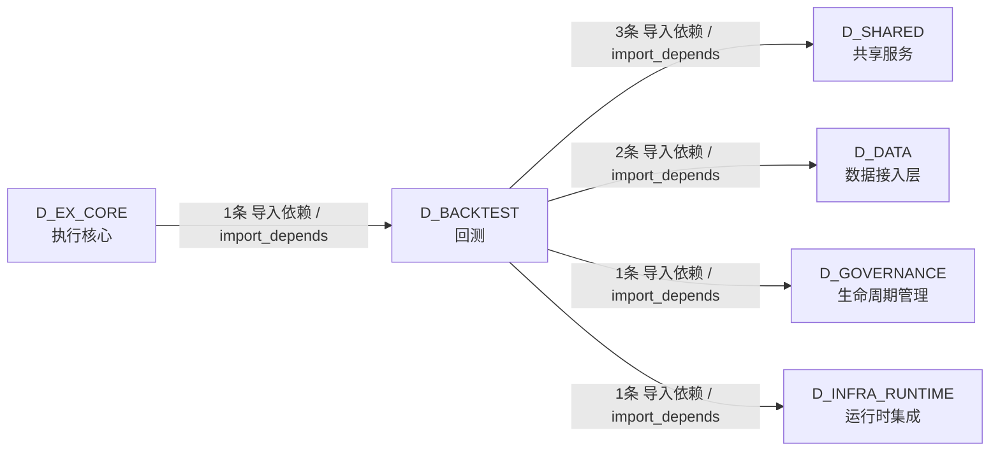

# 30_d_backtest / 回测 / Backtest

> **功能简介 / Overview**: 回测，负责历史数据回测、回测引擎和回测报告

> **文档作用 / Purpose**: 展示 回测（D_BACKTEST）功能域的模块清单、域内依赖关系、跨域依赖关系、架构分层视图，供架构审查和域治理参考。

> 本文档由 generate_domain_doc.py 从 depgraph (PostgreSQL) 自动生成
> 数据源: depgraph (PostgreSQL) nodes表 + edges表

## 域基本信息 / Domain Overview

| 字段 | 值 | Field | Value |
|------|------|-------|-------|
| 编号 | 30 | Number | 30 |
| 域ID | D_BACKTEST | Domain ID | D_BACKTEST |
| 域名称 | 回测 | Domain Name | Backtest |
| 层级 | L2 业务域层 | Layer | L2 Domain |
| 模块数 | 17 | Module Count | 17 |
| 域内依赖 | 27 | Internal Dependencies | 27 |
| 跨域入边 | 1 | Cross-domain Incoming | 1 |
| 跨域出边 | 7 | Cross-domain Outgoing | 7 |
| 设计态模块 | 0 | Design Modules | 0 |
| 生产态模块 | 17 | Production Modules | 17 |
| 容量 | 17/150 (正常) | Capacity | 17/150 (正常) |
| 描述 | 回测，负责历史数据回测、回测引擎和回测报告 | Description | 回测，负责历史数据回测、回测引擎和回测报告 |

## 模块分层清单 / Module Layered List

> 按 architecture_layer 分组的模块清单（共 17 个模块 / 17 modules）。

### L2 领域层 / Domain Layer (17 modules)

| # | 模块路径 / Module Path | 模块名称 / Module Name (功能简介 / Description) | 成熟度 / Maturity | 蓝图 / Blueprint |
|:--:|---------|---------|:---:|:---:|
| 1 | src/zephyr/backtest/core/data_handler.py | 回测数据处理器模块（v1.1.0 扩展：多源化 + Click... | 生产态 / production |  |
| 2 | src/zephyr/backtest/core/decision_gate.py | 3阶段决策门控模块(IS->WFA->OOS) | 生产态 / production |  |
| 3 | src/zephyr/backtest/core/engine_base.py | L_BACKTEST — Backtest Engine Layer | 生产态 / production |  |
| 4 | src/zephyr/backtest/core/matching_engine.py | 回测撮合引擎模块（v1.1.0 重构：委托 MatchingLog... | 生产态 / production |  |
| 5 | src/zephyr/backtest/core/matching_logic.py | 共享撮合逻辑模块（回测=实盘一致性核心） | 生产态 / production |  |
| 6 | src/zephyr/backtest/core/metrics.py | 回测绩效指标计算模块 | 生产态 / production |  |
| 7 | src/zephyr/backtest/core/overfitting_detector.py | 过拟合检测模块(三维度 + 三层) | 生产态 / production |  |
| 8 | src/zephyr/backtest/core/pit_manager.py | PIT(Point-In-Time)铁律管理器模块 | 生产态 / production |  |
| 9 | src/zephyr/backtest/core/portfolio.py | 回测持仓管理模块 | 生产态 / production |  |
| 10 | src/zephyr/backtest/core/tick_replay.py | Tick 回放引擎模块（v1.1.0 新增，秒级做T专用） | 生产态 / production |  |
| 11 | src/zephyr/backtest/core/walk_forward.py | Walk-Forward分析与多重比较偏差校正模块 | 生产态 / production |  |
| 12 | src/zephyr/backtest/implementations/event_driven_engine.py | 事件驱动回测引擎（v1.1.0 新增，Tick 级回测核心） | 生产态 / production |  |
| 13 | src/zephyr/backtest/implementations/vectorized_engine.py | L_BACKTEST — Vectorized Backtest Engine | 生产态 / production |  |
| 14 | src/zephyr/backtest/io/__init__.py | io · D_BACKTEST 可视化产物 io 子包（v1.3.0 新... | 生产态 / production |  |
| 15 | src/zephyr/backtest/io/backtest_result_sink.py | backtest_result_sink · 回测结果数据落地模块（v... | 生产态 / production |  |
| 16 | src/zephyr/backtest/io/decisiongraph_adapter.py | BacktestResult -> decisiongraph 适配器（TRAE-06... | 生产态 / production |  |
| 17 | src/zephyr/backtest/io/result_repository.py | result_repository · 回测产物持久化/检索模块（v... | 生产态 / production |  |

## 域内依赖图 / Internal Dependency Diagram

> 依赖图内嵌在本文档中，IDE 可直接渲染显示。参考 decision_index.md 设计，分三个视图：合并全景图、运营态子图、设计态子图（按 design_maturity 实际值拆分）。
>
> **图例说明 / Legend**：
> - **实线边框 = 运营态模块**（production，已上线运行）
> - **虚线边框 = 设计态模块**（design，蓝图阶段，代码未写）
> - **实线箭头 = 运营态依赖**（已生效的依赖关系）
> - **虚线箭头 = 非运营态依赖**（计划中/验证中的依赖关系）

### 合并全景图（全部模块，标签标注成熟度）

> 展示全部 17 个模块（生产态 17 + 设计态 0），标签标注成熟度。

### 运营态子图（仅 design_maturity=production 的模块和依赖）

> 仅展示已上线运行的模块（共 17 个，27 条域内依赖）。

```mermaid
graph TD
    subgraph D_BACKTEST["D_BACKTEST 回测"]
        src_zephyr_backtest_core_data_handler_py["(生产态 / production) 回测数据处理器模块（v1.1.0 扩展：多源化 + Click...<br/>文件: data_handler.py"]
        src_zephyr_backtest_core_decision_gate_py["(生产态 / production) 3阶段决策门控模块(IS->WFA->OOS)<br/>文件: decision_gate.py"]
        src_zephyr_backtest_core_engine_base_py["(生产态 / production) L_BACKTEST — Backtest Engine Layer<br/>文件: engine_base.py"]
        src_zephyr_backtest_core_matching_engine_py["(生产态 / production) 回测撮合引擎模块（v1.1.0 重构：委托 MatchingLog...<br/>文件: matching_engine.py"]
        src_zephyr_backtest_core_matching_logic_py["(生产态 / production) 共享撮合逻辑模块（回测=实盘一致性核心）<br/>文件: matching_logic.py"]
        src_zephyr_backtest_core_metrics_py["(生产态 / production) 回测绩效指标计算模块<br/>文件: metrics.py"]
        src_zephyr_backtest_core_overfitting_detector_py["(生产态 / production) 过拟合检测模块(三维度 + 三层)<br/>文件: overfitting_detector.py"]
        src_zephyr_backtest_core_pit_manager_py["(生产态 / production) PIT(Point-In-Time)铁律管理器模块<br/>文件: pit_manager.py"]
        src_zephyr_backtest_core_portfolio_py["(生产态 / production) 回测持仓管理模块<br/>文件: portfolio.py"]
        src_zephyr_backtest_core_tick_replay_py["(生产态 / production) Tick 回放引擎模块（v1.1.0 新增，秒级做T专用）<br/>文件: tick_replay.py"]
        src_zephyr_backtest_core_walk_forward_py["(生产态 / production) Walk-Forward分析与多重比较偏差校正模块<br/>文件: walk_forward.py"]
        src_zephyr_backtest_implementations_event_driven_engine_py["(生产态 / production) 事件驱动回测引擎（v1.1.0 新增，Tick 级回测核心）<br/>文件: event_driven_engine.py"]
        src_zephyr_backtest_implementations_vectorized_engine_py["(生产态 / production) L_BACKTEST — Vectorized Backtest Engine<br/>文件: vectorized_engine.py"]
        src_zephyr_backtest_io_init_py["(生产态 / production) io · D_BACKTEST 可视化产物 io 子包（v1.3.0 新...<br/>文件: __init__.py"]
        src_zephyr_backtest_io_backtest_result_sink_py["(生产态 / production) backtest_result_sink · 回测结果数据落地模块（v...<br/>文件: backtest_result_sink.py"]
        src_zephyr_backtest_io_decisiongraph_adapter_py["(生产态 / production) BacktestResult -> decisiongraph 适配器（TRAE-06...<br/>文件: decisiongraph_adapter.py"]
        src_zephyr_backtest_io_result_repository_py["(生产态 / production) result_repository · 回测产物持久化/检索模块（v...<br/>文件: result_repository.py"]
    end
    src_zephyr_backtest_core_decision_gate_py -->|导入依赖 / import_depends| src_zephyr_backtest_core_overfitting_detector_py
    src_zephyr_backtest_core_data_handler_py -->|导入依赖 / import_depends| src_zephyr_backtest_core_pit_manager_py
    src_zephyr_backtest_core_matching_engine_py -->|导入依赖 / import_depends| src_zephyr_backtest_core_matching_logic_py
    src_zephyr_backtest_core_matching_engine_py -->|导入依赖 / import_depends| src_zephyr_backtest_core_portfolio_py
    src_zephyr_backtest_core_tick_replay_py -->|导入依赖 / import_depends| src_zephyr_backtest_core_matching_logic_py
    src_zephyr_backtest_implementations_event_driven_engine_py -->|导入依赖 / import_depends| src_zephyr_backtest_core_engine_base_py
    src_zephyr_backtest_implementations_event_driven_engine_py -->|导入依赖 / import_depends| src_zephyr_backtest_core_decision_gate_py
    src_zephyr_backtest_implementations_event_driven_engine_py -->|导入依赖 / import_depends| src_zephyr_backtest_core_matching_engine_py
    src_zephyr_backtest_implementations_event_driven_engine_py -->|导入依赖 / import_depends| src_zephyr_backtest_core_overfitting_detector_py
    src_zephyr_backtest_implementations_event_driven_engine_py -->|导入依赖 / import_depends| src_zephyr_backtest_core_portfolio_py
    src_zephyr_backtest_implementations_event_driven_engine_py -->|导入依赖 / import_depends| src_zephyr_backtest_core_tick_replay_py
    src_zephyr_backtest_implementations_event_driven_engine_py -->|导入依赖 / import_depends| src_zephyr_backtest_core_metrics_py
    src_zephyr_backtest_implementations_event_driven_engine_py -->|导入依赖 / import_depends| src_zephyr_backtest_implementations_vectorized_engine_py
    src_zephyr_backtest_implementations_event_driven_engine_py -->|导入依赖 / import_depends| src_zephyr_backtest_core_walk_forward_py
    src_zephyr_backtest_implementations_vectorized_engine_py -->|导入依赖 / import_depends| src_zephyr_backtest_core_engine_base_py
    src_zephyr_backtest_implementations_vectorized_engine_py -->|导入依赖 / import_depends| src_zephyr_backtest_core_decision_gate_py
    src_zephyr_backtest_implementations_vectorized_engine_py -->|导入依赖 / import_depends| src_zephyr_backtest_core_matching_engine_py
    src_zephyr_backtest_implementations_vectorized_engine_py -->|导入依赖 / import_depends| src_zephyr_backtest_core_overfitting_detector_py
    src_zephyr_backtest_implementations_vectorized_engine_py -->|导入依赖 / import_depends| src_zephyr_backtest_core_portfolio_py
    src_zephyr_backtest_implementations_vectorized_engine_py -->|导入依赖 / import_depends| src_zephyr_backtest_core_metrics_py
    src_zephyr_backtest_implementations_vectorized_engine_py -->|导入依赖 / import_depends| src_zephyr_backtest_core_walk_forward_py
    src_zephyr_backtest_io_result_repository_py -->|导入依赖 / import_depends| src_zephyr_backtest_io_backtest_result_sink_py
    src_zephyr_backtest_io_init_py -->|导入依赖 / import_depends| src_zephyr_backtest_io_result_repository_py
    src_zephyr_backtest_io_init_py -->|导入依赖 / import_depends| src_zephyr_backtest_io_backtest_result_sink_py
    src_zephyr_backtest_io_init_py -->|导入依赖 / import_depends| src_zephyr_backtest_io_decisiongraph_adapter_py
    src_zephyr_backtest_io_backtest_result_sink_py -->|导入依赖 / import_depends| src_zephyr_backtest_core_engine_base_py
    src_zephyr_backtest_io_decisiongraph_adapter_py -->|导入依赖 / import_depends| src_zephyr_backtest_core_engine_base_py
    D_SHARED["(生产态 / production) D_SHARED"]
    src_zephyr_backtest_io_result_repository_py -->|导入依赖 / import_depends| D_SHARED
    D_DATA["(生产态 / production) D_DATA"]
    src_zephyr_backtest_core_data_handler_py -->|导入依赖 / import_depends| D_DATA
    D_INFRA_RUNTIME["(生产态 / production) D_INFRA_RUNTIME"]
    src_zephyr_backtest_core_data_handler_py -->|导入依赖 / import_depends| D_INFRA_RUNTIME
    src_zephyr_backtest_core_data_handler_py -->|导入依赖 / import_depends| D_DATA
    src_zephyr_backtest_core_engine_base_py -->|导入依赖 / import_depends| D_SHARED
    src_zephyr_backtest_io_result_repository_py -->|导入依赖 / import_depends| D_SHARED
    D_GOVERNANCE["(生产态 / production) D_GOVERNANCE"]
    src_zephyr_backtest_io_decisiongraph_adapter_py -->|导入依赖 / import_depends| D_GOVERNANCE
    D_EX_CORE["(生产态 / production) D_EX_CORE"]
    D_EX_CORE -->|导入依赖 / import_depends| src_zephyr_backtest_core_matching_logic_py
    classDef production fill:#e1f5fe,stroke:#01579b,stroke-width:2px,color:#000
    classDef design fill:#fff3e0,stroke:#e65100,stroke-width:2px,color:#000,stroke-dasharray: 5 5
    classDef external_prod fill:#e8f5e9,stroke:#1b5e20,stroke-width:1px,color:#000
    classDef external_design fill:#fce4ec,stroke:#880e4f,stroke-width:1px,color:#000,stroke-dasharray: 5 5
    class src_zephyr_backtest_core_data_handler_py,src_zephyr_backtest_core_decision_gate_py,src_zephyr_backtest_core_engine_base_py,src_zephyr_backtest_core_matching_engine_py,src_zephyr_backtest_core_matching_logic_py,src_zephyr_backtest_core_metrics_py,src_zephyr_backtest_core_overfitting_detector_py,src_zephyr_backtest_core_pit_manager_py,src_zephyr_backtest_core_portfolio_py,src_zephyr_backtest_core_tick_replay_py,src_zephyr_backtest_core_walk_forward_py,src_zephyr_backtest_implementations_event_driven_engine_py,src_zephyr_backtest_implementations_vectorized_engine_py,src_zephyr_backtest_io_init_py,src_zephyr_backtest_io_backtest_result_sink_py,src_zephyr_backtest_io_decisiongraph_adapter_py,src_zephyr_backtest_io_result_repository_py production
    class D_SHARED,D_DATA,D_INFRA_RUNTIME,D_GOVERNANCE,D_EX_CORE external_prod
```

### 设计态子图（仅 design_maturity=design 的模块和依赖）

> 仅展示蓝图阶段、代码未写的设计态模块（共 0 个，0 条域内依赖）。

> （无设计态模块 / No design modules）

## 跨域依赖 / Cross-domain Dependencies

### 本域依赖的其他域（出边）/ Depends On

| # | 本域模块 / Source Module | → | 外部域-目标模块 / Target Module | 依赖类型 / Type |
|:--:|---------|:--:|---------|---------|
| 1 | 回测数据处理器模块（v1.1.0 扩展：多源化 + Click... | → | D_DATA 数据接入层: zephyr.data — 数据源集成器（MOD-L00-004）。 (_... | 导入依赖 / import_depends |
| 2 | 回测数据处理器模块（v1.1.0 扩展：多源化 + Click... | → | D_DATA 数据接入层: ClickHouse 统一读取层（裁定 #ARCH-CH-007）。 (c... | 导入依赖 / import_depends |
| 3 | BacktestResult -> decisiongraph 适配器（TRAE-06... | → | D_GOVERNANCE 生命周期管理: decisiongraph Schema DDL + 不变量声明 (decision... | 导入依赖 / import_depends |
| 4 | 回测数据处理器模块（v1.1.0 扩展：多源化 + Click... | → | D_INFRA_RUNTIME 运行时集成: DatabaseService: 统一管理数据库的连接池、生命周... | 导入依赖 / import_depends |
| 5 | L_BACKTEST — Backtest Engine Layer (engine_bas... | → | D_SHARED 共享服务: trace_context.py | 导入依赖 / import_depends |
| 6 | result_repository · 回测产物持久化/检索模块（v... | → | D_SHARED 共享服务: paths.py — 项目路径常量 SSoT（Single Source of... | 导入依赖 / import_depends |
| 7 | result_repository · 回测产物持久化/检索模块（v... | → | D_SHARED 共享服务: time_utils.py —— 时间/日期工具（Phase 9 新增 ... | 导入依赖 / import_depends |

### 依赖本域的其他域（入边）/ Depended By

| # | 外部域-源模块 / Source Module | → | 本域模块 / Target Module | 依赖类型 / Type |
|:--:|---------|:--:|---------|---------|
| 1 | D_EX_CORE 执行核心: MiniQMT 实盘券商适配器（对接 xttrader，A股实盘.... | → | 共享撮合逻辑模块（回测=实盘一致性核心） (matchi... | 导入依赖 / import_depends |

### 跨域依赖图 / Cross-domain Dependency Diagram

> 本域与 5 个外部域直接连接（出边 7 条 + 入边 1 条 = 8 条）。只显示直接连接的域，不展开具体节点。

## 说明 / Notes

- **数据源 / Data Source**: `depgraph (PostgreSQL)` 的 `nodes`、`edges`、`domains` 表
- **生成器 / Generator**: `generate_domain_doc.py`（G2+G10 合并）
- **维护方式 / Maintenance**: 自动生成，全景图更新时刷新
- **文件名规则 / File Naming**: `{编号:02d}_{域ID小写}.md`，如 `16_d_trading.md`
- **图例说明 / Legend**: `[production]`=已上线 / `[design]`=设计中 / `[unknown]`=未知
