# 30_d_factor / 因子

> **文档作用 / Purpose**: 展示 因子（D-FACTOR）功能域的模块清单、域内依赖关系和跨域依赖关系，供架构审查和域治理参考。

> 本文档由 generate_domain_doc.py 从 depgraph.db 自动生成
> 最后更新: 2026-06-25 20:00:20
> 数据源: depgraph.db nodes表 + edges表

## 域基本信息 / Domain Overview

| 字段 | 值 | Field | Value |
|------|------|-------|-------|
| 编号 | 30 | Number | 30 |
| 域ID | D-FACTOR | Domain ID | D-FACTOR |
| 域名称 | 因子 | Domain Name | 因子 |
| 层级 | L2_domain | Layer | L2_domain |
| 模块数 | 17 | Module Count | 17 |
| 域内依赖 | 2 | Internal Dependencies | 2 |
| 跨域入边 | 4 | Cross-domain Incoming | 4 |
| 跨域出边 | 8 | Cross-domain Outgoing | 8 |
| 设计态模块 | 0 | Design Modules | 0 |
| 原型态模块 | 15 | Prototype Modules | 15 |
| 生产态模块 | 2 | Production Modules | 2 |
| 容量 | 2/150 (正常) | Capacity | 2/150 (正常) |
| 描述 | 因子计算、因子库、因子评价、因子正交化。Alpha挖掘引擎。 | Description | 因子计算、因子库、因子评价、因子正交化。Alpha挖掘引擎。 |

## 模块清单 / Module List

共 17 个模块（按路径排序，全部显示）

| 模块路径 / Module Path | 模块名称 / Module Name | 设计成熟度 / Maturity | 构建状态 / Build Status |
|---------|---------|-----------|---------|
| src/zephyr/factor/__init__.py |  | prototype | generated |
| src/zephyr/factor/_extensions/__init__.py |  | prototype | deprecated |
| src/zephyr/factor/alpha_signal_pipeline.py |  | prototype | generated |
| src/zephyr/factor/api/__init__.py |  | prototype | deprecated |
| src/zephyr/factor/base.py |  | production | generated |
| src/zephyr/factor/bus_factor_defense.py |  | prototype | generated |
| src/zephyr/factor/core/__init__.py |  | prototype | deprecated |
| src/zephyr/factor/ctr_001_consumer/__init__.py |  | prototype | deprecated |
| src/zephyr/factor/engine/__init__.py |  | prototype | deprecated |
| src/zephyr/factor/factor_base.py |  | production | generated |
| src/zephyr/factor/factors/__init__.py |  | prototype | generated |
| src/zephyr/factor/factors/momentum_factor.py |  | prototype | generated |
| src/zephyr/factor/factors/value_factor.py |  | prototype | generated |
| src/zephyr/factor/infrastructure/__init__.py |  | prototype | deprecated |
| src/zephyr/factor/momentum_factor.py |  | prototype | generated |
| src/zephyr/factor/services/__init__.py |  | prototype | deprecated |
| src/zephyr/factor/value_factor.py |  | prototype | generated |

## 域内依赖图 / Internal Dependency Diagram

> 依赖图内嵌在本文档中，IDE 可直接渲染显示。每30个节点一组分页显示。
>
> **图例说明 / Legend**：
> - **实线边框 = 运营态模块**（production，已上线运行）
> - **虚线边框 = 设计态模块**（design，还在设计中）
> - **实线箭头 = 运营态依赖**（已生效的依赖关系）
> - **虚线箭头 = 设计态依赖**（计划中的依赖关系）

```mermaid
graph TD
    subgraph D_FACTOR["D-FACTOR 因子"]
        src_zephyr_factor_init_py["src/zephyr/factor/__init__.py prototype"]
        src_zephyr_factor_extensions_init_py["src/zephyr/factor/_extensions/__init__.py prototype"]
        src_zephyr_factor_alpha_signal_pipeline_py["src/zephyr/factor/alpha_signal_pipeline.py prototype"]
        src_zephyr_factor_api_init_py["src/zephyr/factor/api/__init__.py prototype"]
        src_zephyr_factor_base_py["src/zephyr/factor/base.py production"]
        src_zephyr_factor_bus_factor_defense_py["src/zephyr/factor/bus_factor_defense.py prototype"]
        src_zephyr_factor_core_init_py["src/zephyr/factor/core/__init__.py prototype"]
        src_zephyr_factor_ctr_001_consumer_init_py["src/zephyr/factor/ctr_001_consumer/__init__.py prototype"]
        src_zephyr_factor_engine_init_py["src/zephyr/factor/engine/__init__.py prototype"]
        src_zephyr_factor_factor_base_py["src/zephyr/factor/factor_base.py production"]
        src_zephyr_factor_factors_init_py["src/zephyr/factor/factors/__init__.py prototype"]
        src_zephyr_factor_factors_momentum_factor_py["src/zephyr/factor/factors/momentum_factor.py prototype"]
        src_zephyr_factor_factors_value_factor_py["src/zephyr/factor/factors/value_factor.py prototype"]
        src_zephyr_factor_infrastructure_init_py["src/zephyr/factor/infrastructure/__init__.py prototype"]
        src_zephyr_factor_momentum_factor_py["src/zephyr/factor/momentum_factor.py prototype"]
        src_zephyr_factor_services_init_py["src/zephyr/factor/services/__init__.py prototype"]
        src_zephyr_factor_value_factor_py["src/zephyr/factor/value_factor.py prototype"]
    end
    src_zephyr_factor_init_py -.->|config_depends| src_zephyr_factor_alpha_signal_pipeline_py
    src_zephyr_factor_factors_init_py -.->|config_depends| src_zephyr_factor_factors_value_factor_py
    D_FUNDAMENTAL_SIGNAL["D-FUNDAMENTAL_SIGNAL production"]
    src_zephyr_factor_alpha_signal_pipeline_py -.->|import_depends| D_FUNDAMENTAL_SIGNAL
    D_SIGLEGACY["D-SIGLEGACY design"]
    src_zephyr_factor_alpha_signal_pipeline_py -.->|contract| D_SIGLEGACY
    D_SHARED["D-SHARED prototype"]
    src_zephyr_factor_factor_base_py -.->|import_depends| D_SHARED
    D_GOVERNANCE["D-GOVERNANCE production"]
    src_zephyr_factor_value_factor_py -.->|import_depends| D_GOVERNANCE
    src_zephyr_factor_momentum_factor_py -.->|import_depends| D_GOVERNANCE
    src_zephyr_factor_factors_value_factor_py -.->|import_depends| D_GOVERNANCE
    src_zephyr_factor_factors_momentum_factor_py -.->|import_depends| D_GOVERNANCE
    src_zephyr_factor_bus_factor_defense_py -.->|config_depends| D_GOVERNANCE
    D_GOVERNANCE -.->|test_depends| src_zephyr_factor_factor_base_py
    D_GOVERNANCE -.->|test_depends| src_zephyr_factor_factor_base_py
    D_GOVERNANCE -.->|test_depends| src_zephyr_factor_factor_base_py
    D_GOVERNANCE -.->|test_depends| src_zephyr_factor_base_py
    classDef production fill:#e1f5fe,stroke:#01579b,stroke-width:2px,color:#000
    classDef design fill:#fff3e0,stroke:#e65100,stroke-width:2px,color:#000,stroke-dasharray: 5 5
    classDef external_prod fill:#e8f5e9,stroke:#1b5e20,stroke-width:1px,color:#000
    classDef external_design fill:#fce4ec,stroke:#880e4f,stroke-width:1px,color:#000,stroke-dasharray: 5 5
    class src_zephyr_factor_base_py,src_zephyr_factor_factor_base_py production
    class src_zephyr_factor_init_py,src_zephyr_factor_extensions_init_py,src_zephyr_factor_alpha_signal_pipeline_py,src_zephyr_factor_api_init_py,src_zephyr_factor_bus_factor_defense_py,src_zephyr_factor_core_init_py,src_zephyr_factor_ctr_001_consumer_init_py,src_zephyr_factor_engine_init_py,src_zephyr_factor_factors_init_py,src_zephyr_factor_factors_momentum_factor_py,src_zephyr_factor_factors_value_factor_py,src_zephyr_factor_infrastructure_init_py,src_zephyr_factor_momentum_factor_py,src_zephyr_factor_services_init_py,src_zephyr_factor_value_factor_py design
    class D_FUNDAMENTAL_SIGNAL,D_GOVERNANCE external_prod
    class D_SIGLEGACY,D_SHARED external_design
```

## 跨域依赖 / Cross-domain Dependencies

### 本域依赖的其他域（出边）/ Depends On

| 目标域 / Target Domain | 依赖数 / Count | 依赖类型 / Type |
|--------|:---:|---------|
| D-GOVERNANCE | 5 | import_depends,config_depends |
| D-SIGLEGACY | 1 | contract |
| D-SHARED | 1 | import_depends |
| D-FUNDAMENTAL_SIGNAL | 1 | import_depends |

### 依赖本域的其他域（入边）/ Depended By

| 源域 / Source Domain | 依赖数 / Count | 依赖类型 / Type |
|------|:---:|---------|
| D-GOVERNANCE | 4 | test_depends |

## 说明 / Notes

- **数据源 / Data Source**: `depgraph.db` 的 `nodes`、`edges`、`domains` 表
- **生成器 / Generator**: `generate_domain_doc.py`
- **维护方式 / Maintenance**: 自动生成，全景图更新时刷新
- **文件名规则 / File Naming**: `{编号:02d}_{域ID小写}.md`，如 `16_d_trading.md`
