# 30_d_fundamental_signal / fundamental_signal / Fundamental Signal

> **文档作用 / Purpose**: 展示 fundamental_signal（D_FUNDAMENTAL_SIGNAL）功能域的模块清单、域内依赖关系、跨域依赖关系、架构分层视图，供架构审查和域治理参考。

> 本文档由 generate_domain_doc.py 从 depgraph (PostgreSQL) 自动生成
> 最后更新: 2026-07-06 18:06:28
> 数据源: depgraph (PostgreSQL) nodes表 + edges表

## 域基本信息 / Domain Overview

| 字段 | 值 | Field | Value |
|------|------|-------|-------|
| 编号 | 30 | Number | 30 |
| 域ID | D_FUNDAMENTAL_SIGNAL | Domain ID | D_FUNDAMENTAL_SIGNAL |
| 域名称 | fundamental_signal | Domain Name | Fundamental Signal |
| 层级 | L2 业务域层 | Layer | L2 Domain |
| 模块数 | 25 | Module Count | 25 |
| 域内依赖 | 20 | Internal Dependencies | 20 |
| 跨域入边 | 4 | Cross-domain Incoming | 4 |
| 跨域出边 | 18 | Cross-domain Outgoing | 18 |
| 设计态模块 | 0 | Design Modules | 0 |
| 原型态模块 | 21 | Prototype Modules | 21 |
| 生产态模块 | 4 | Production Modules | 4 |
| 容量 | 4/150 (正常) | Capacity | 4/150 (正常) |
| 描述 | 财务指标信号 | Description | 财务指标信号 |

## 域内依赖图 / Internal Dependency Diagram

> 依赖图内嵌在本文档中，IDE 可直接渲染显示。每30个节点一组分页显示。
>
> **图例说明 / Legend**：
> - **实线边框 = 运营态模块**（production，已上线运行）
> - **虚线边框 = 设计态模块**（design，还在设计中）
> - **实线箭头 = 运营态依赖**（已生效的依赖关系）
> - **虚线箭头 = 设计态依赖**（计划中的依赖关系）

```mermaid
graph TD
    subgraph D_FUNDAMENTAL_SIGNAL["D_FUNDAMENTAL_SIGNAL fundamental_signal"]
        src_zephyr_signal_fundamental_init_py["src/zephyr/signal_fundamental/__init__.py prototype"]
        src_zephyr_signal_fundamental_extensions_init_py["src/zephyr/signal_fundamental/_extensions/__ini... prototype"]
        src_zephyr_signal_fundamental_api_init_py["src/zephyr/signal_fundamental/api/__init__.py prototype"]
        src_zephyr_signal_fundamental_capital_init_py["src/zephyr/signal_fundamental/capital/__init__.py prototype"]
        src_zephyr_signal_fundamental_capital_capital_allocation_result_py["src/zephyr/signal_fundamental/capital/capital_a... prototype"]
        src_zephyr_signal_fundamental_capital_capital_allocator_py["src/zephyr/signal_fundamental/capital/capital_a... prototype"]
        src_zephyr_signal_fundamental_capital_default_capital_allocator_py["src/zephyr/signal_fundamental/capital/default_c... prototype"]
        src_zephyr_signal_fundamental_combiner_init_py["src/zephyr/signal_fundamental/combiner/__init__.py prototype"]
        src_zephyr_signal_fundamental_combiner_impl_init_py["src/zephyr/signal_fundamental/combiner/impl/__i... prototype"]
        src_zephyr_signal_fundamental_combiner_synthesized_signal_py["src/zephyr/signal_fundamental/combiner/synthesi... prototype"]
        src_zephyr_signal_fundamental_core_init_py["src/zephyr/signal_fundamental/core/__init__.py prototype"]
        src_zephyr_signal_fundamental_gen_init_py["src/zephyr/signal_fundamental/gen/__init__.py prototype"]
        src_zephyr_signal_fundamental_gen_aggregator_base_py["src/zephyr/signal_fundamental/gen/aggregator_ba... prototype"]
        src_zephyr_signal_fundamental_gen_implementations_init_py["src/zephyr/signal_fundamental/gen/implementatio... prototype"]
        src_zephyr_signal_fundamental_gen_implementations_default_signal_aggregator_py["src/zephyr/signal_fundamental/gen/implementatio... production"]
        src_zephyr_signal_fundamental_infrastructure_init_py["src/zephyr/signal_fundamental/infrastructure/__... prototype"]
        src_zephyr_signal_fundamental_models_init_py["src/zephyr/signal_fundamental/models/__init__.py prototype"]
        src_zephyr_signal_fundamental_pipeline_py["src/zephyr/signal_fundamental/pipeline.py production"]
        src_zephyr_signal_fundamental_services_init_py["src/zephyr/signal_fundamental/services/__init__.py prototype"]
        src_zephyr_signal_fundamental_strategy_init_py["src/zephyr/signal_fundamental/strategy/__init__.py prototype"]
        src_zephyr_signal_fundamental_strategy_capital_allocator_py["src/zephyr/signal_fundamental/strategy/capital_... prototype"]
        src_zephyr_signal_fundamental_strategy_implementations_init_py["src/zephyr/signal_fundamental/strategy/implemen... prototype"]
        src_zephyr_signal_fundamental_strategy_implementations_default_capital_allocator_py["src/zephyr/signal_fundamental/strategy/implemen... production"]
        src_zephyr_signal_fundamental_synth_init_py["src/zephyr/signal_fundamental/synth/__init__.py prototype"]
        src_zephyr_signal_fundamental_synth_signal_synthesizer_py["src/zephyr/signal_fundamental/synth/signal_synt... production"]
    end
    src_zephyr_signal_fundamental_pipeline_py -->|import_depends| src_zephyr_signal_fundamental_synth_signal_synthesizer_py
    src_zephyr_signal_fundamental_capital_default_capital_allocator_py -.->|import_depends| src_zephyr_signal_fundamental_strategy_implementations_default_capital_allocator_py
    src_zephyr_signal_fundamental_capital_capital_allocator_py -.->|import_depends| src_zephyr_signal_fundamental_strategy_capital_allocator_py
    src_zephyr_signal_fundamental_capital_init_py -.->|import_depends| src_zephyr_signal_fundamental_capital_default_capital_allocator_py
    src_zephyr_signal_fundamental_capital_init_py -.->|import_depends| src_zephyr_signal_fundamental_capital_capital_allocator_py
    src_zephyr_signal_fundamental_capital_init_py -.->|import_depends| src_zephyr_signal_fundamental_capital_capital_allocation_result_py
    src_zephyr_signal_fundamental_combiner_init_py -.->|import_depends| src_zephyr_signal_fundamental_gen_aggregator_base_py
    src_zephyr_signal_fundamental_combiner_init_py -.->|import_depends| src_zephyr_signal_fundamental_strategy_capital_allocator_py
    src_zephyr_signal_fundamental_combiner_init_py -.->|import_depends| src_zephyr_signal_fundamental_synth_signal_synthesizer_py
    src_zephyr_signal_fundamental_combiner_synthesized_signal_py -.->|config_depends| src_zephyr_signal_fundamental_combiner_init_py
    src_zephyr_signal_fundamental_combiner_impl_init_py -.->|import_depends| src_zephyr_signal_fundamental_gen_implementations_default_signal_aggregator_py
    src_zephyr_signal_fundamental_combiner_impl_init_py -.->|import_depends| src_zephyr_signal_fundamental_strategy_implementations_default_capital_allocator_py
    src_zephyr_signal_fundamental_gen_init_py -.->|config_depends| src_zephyr_signal_fundamental_gen_aggregator_base_py
    src_zephyr_signal_fundamental_gen_implementations_default_signal_aggregator_py -.->|import_depends| src_zephyr_signal_fundamental_gen_aggregator_base_py
    src_zephyr_signal_fundamental_gen_implementations_init_py -.->|import_depends| src_zephyr_signal_fundamental_gen_implementations_default_signal_aggregator_py
    src_zephyr_signal_fundamental_strategy_capital_allocator_py -.->|import_depends| src_zephyr_signal_fundamental_gen_aggregator_base_py
    src_zephyr_signal_fundamental_strategy_init_py -.->|import_depends| src_zephyr_signal_fundamental_strategy_capital_allocator_py
    src_zephyr_signal_fundamental_strategy_implementations_init_py -.->|import_depends| src_zephyr_signal_fundamental_strategy_implementations_default_capital_allocator_py
    src_zephyr_signal_fundamental_strategy_implementations_default_capital_allocator_py -.->|import_depends| src_zephyr_signal_fundamental_gen_aggregator_base_py
    src_zephyr_signal_fundamental_synth_init_py -.->|import_depends| src_zephyr_signal_fundamental_synth_signal_synthesizer_py
    D_SHARED["D_SHARED production"]
    src_zephyr_signal_fundamental_pipeline_py -->|import_depends| D_SHARED
    src_zephyr_signal_fundamental_pipeline_py -->|import_depends| D_SHARED
    D_FACTOR["D_FACTOR production"]
    src_zephyr_signal_fundamental_pipeline_py -->|import_depends| D_FACTOR
    D_TRADING["D_TRADING production"]
    src_zephyr_signal_fundamental_pipeline_py -->|import_depends| D_TRADING
    src_zephyr_signal_fundamental_pipeline_py -->|import_depends| D_TRADING
    src_zephyr_signal_fundamental_init_py -.->|contract| D_FACTOR
    src_zephyr_signal_fundamental_combiner_init_py -.->|import_depends| D_TRADING
    src_zephyr_signal_fundamental_gen_aggregator_base_py -.->|import_depends| D_TRADING
    src_zephyr_signal_fundamental_gen_aggregator_base_py -.->|import_depends| D_TRADING
    src_zephyr_signal_fundamental_gen_aggregator_base_py -.->|import_depends| D_TRADING
    src_zephyr_signal_fundamental_gen_aggregator_base_py -.->|import_depends| D_TRADING
    src_zephyr_signal_fundamental_gen_implementations_default_signal_aggregator_py -->|import_depends| D_TRADING
    src_zephyr_signal_fundamental_gen_implementations_default_signal_aggregator_py -->|import_depends| D_TRADING
    src_zephyr_signal_fundamental_strategy_capital_allocator_py -.->|import_depends| D_TRADING
    src_zephyr_signal_fundamental_strategy_implementations_default_capital_allocator_py -->|import_depends| D_TRADING
    D_FACTOR -.->|import_depends| src_zephyr_signal_fundamental_pipeline_py
    D_GOVERNANCE["D_GOVERNANCE prototype"]
    D_GOVERNANCE -.->|import_depends| src_zephyr_signal_fundamental_init_py
    D_AUDITTEST["D_AUDITTEST prototype"]
    D_AUDITTEST -.->|test_depends| src_zephyr_signal_fundamental_synth_signal_synthesizer_py
    D_AUDITTEST -.->|test_depends| src_zephyr_signal_fundamental_pipeline_py
    classDef production fill:#e1f5fe,stroke:#01579b,stroke-width:2px,color:#000
    classDef design fill:#fff3e0,stroke:#e65100,stroke-width:2px,color:#000,stroke-dasharray: 5 5
    classDef external_prod fill:#e8f5e9,stroke:#1b5e20,stroke-width:1px,color:#000
    classDef external_design fill:#fce4ec,stroke:#880e4f,stroke-width:1px,color:#000,stroke-dasharray: 5 5
    class src_zephyr_signal_fundamental_gen_implementations_default_signal_aggregator_py,src_zephyr_signal_fundamental_pipeline_py,src_zephyr_signal_fundamental_strategy_implementations_default_capital_allocator_py,src_zephyr_signal_fundamental_synth_signal_synthesizer_py production
    class src_zephyr_signal_fundamental_init_py,src_zephyr_signal_fundamental_extensions_init_py,src_zephyr_signal_fundamental_api_init_py,src_zephyr_signal_fundamental_capital_init_py,src_zephyr_signal_fundamental_capital_capital_allocation_result_py,src_zephyr_signal_fundamental_capital_capital_allocator_py,src_zephyr_signal_fundamental_capital_default_capital_allocator_py,src_zephyr_signal_fundamental_combiner_init_py,src_zephyr_signal_fundamental_combiner_impl_init_py,src_zephyr_signal_fundamental_combiner_synthesized_signal_py,src_zephyr_signal_fundamental_core_init_py,src_zephyr_signal_fundamental_gen_init_py,src_zephyr_signal_fundamental_gen_aggregator_base_py,src_zephyr_signal_fundamental_gen_implementations_init_py,src_zephyr_signal_fundamental_infrastructure_init_py,src_zephyr_signal_fundamental_models_init_py,src_zephyr_signal_fundamental_services_init_py,src_zephyr_signal_fundamental_strategy_init_py,src_zephyr_signal_fundamental_strategy_capital_allocator_py,src_zephyr_signal_fundamental_strategy_implementations_init_py,src_zephyr_signal_fundamental_synth_init_py design
    class D_SHARED,D_FACTOR,D_TRADING external_prod
    class D_GOVERNANCE,D_AUDITTEST external_design
```



## 跨域依赖 / Cross-domain Dependencies

### 本域依赖的其他域（出边）/ Depends On

| 目标域 / Target Domain | 依赖数 / Count | 依赖类型 / Type |
|--------|:---:|---------|
| D_TRADING | 14 | import_depends |
| D_FACTOR | 2 | contract,import_depends |
| D_SHARED | 2 | import_depends |

### 依赖本域的其他域（入边）/ Depended By

| 源域 / Source Domain | 依赖数 / Count | 依赖类型 / Type |
|------|:---:|---------|
| D_AUDITTEST | 2 | test_depends |
| D_FACTOR | 1 | import_depends |
| D_GOVERNANCE | 1 | import_depends |

## 架构分层视图 / Architecture Overview

> 按 architecture_layer 分层显示 fundamental_signal（D_FUNDAMENTAL_SIGNAL）的模块分布。共 25 个模块 / 25 modules。

```

┌──────────────────────────────────────────────────────────────────┐
│              L2 领域层 / Domain Layer (25 modules)               │
├──────────────────────────────────────────────────────────────────┤
│   src/zephyr/signal_fundamental/__init__.py  [prototype]         │
│   src/zephyr/signal_fundamental/_extensions/__init__.py  [pro... │
│   src/zephyr/signal_fundamental/api/__init__.py  [prototype]     │
│   src/zephyr/signal_fundamental/capital/__init__.py  [prototype] │
│   src/zephyr/signal_fundamental/capital/capital_allocation_re... │
│   src/zephyr/signal_fundamental/capital/capital_allocator.py ... │
│   src/zephyr/signal_fundamental/capital/default_capital_alloc... │
│   src/zephyr/signal_fundamental/combiner/__init__.py  [protot... │
│   src/zephyr/signal_fundamental/combiner/impl/__init__.py  [p... │
│   src/zephyr/signal_fundamental/combiner/synthesized_signal.p... │
│   src/zephyr/signal_fundamental/core/__init__.py  [prototype]    │
│   src/zephyr/signal_fundamental/gen/__init__.py  [prototype]     │
│   src/zephyr/signal_fundamental/gen/aggregator_base.py  [prot... │
│   src/zephyr/signal_fundamental/gen/implementations/__init__.... │
│   src/zephyr/signal_fundamental/gen/implementations/default_s... │
│   src/zephyr/signal_fundamental/infrastructure/__init__.py  [... │
│   src/zephyr/signal_fundamental/models/__init__.py  [prototype]  │
│   src/zephyr/signal_fundamental/pipeline.py  [production]        │
│   ...还有 7 个模块 / 7 more modules                              │
└──────────────────────────────────────────────────────────────────┘

```

## 模块分层清单 / Module Layered List

> 按 architecture_layer 分组的模块清单（共 25 个模块 / 25 modules）。

### L2 领域层 / Domain Layer (25 modules)

| # | 模块路径 / Module Path | 模块名称 / Module Name | 功能简介 / Description | 成熟度 / Maturity | 构建状态 / Build Status |
|:--:|---------|---------|---------|:---:|:---:|
| 1 | src/zephyr/signal_fundamental/__init__.py | src/zephyr/signal_fundamental/__init_... | D_SIGNAL Signal Domain | prototype | generated |
| 2 | src/zephyr/signal_fundamental/_extensions/__init__.py | src/zephyr/signal_fundamental/_extens... |  | prototype | generated |
| 3 | src/zephyr/signal_fundamental/api/__init__.py | src/zephyr/signal_fundamental/api/__i... |  | prototype | generated |
| 4 | src/zephyr/signal_fundamental/capital/__init__.py | src/zephyr/signal_fundamental/capital... | Signal Capital Allocation sub-package | prototype | generated |
| 5 | src/zephyr/signal_fundamental/capital/capital_allocation_... | src/zephyr/signal_fundamental/capital... |  | prototype | generated |
| 6 | src/zephyr/signal_fundamental/capital/capital_allocator.py | src/zephyr/signal_fundamental/capital... | D_SIGNAL — Capital Allocator（兼容 re-export shim） | prototype | generated |
| 7 | src/zephyr/signal_fundamental/capital/default_capital_all... | src/zephyr/signal_fundamental/capital... | D_SIGNAL — Default Capital Allocator（兼容 re-export shim） | prototype | generated |
| 8 | src/zephyr/signal_fundamental/combiner/__init__.py | src/zephyr/signal_fundamental/combine... | D_SIGNAL Signal Combiner | prototype | generated |
| 9 | src/zephyr/signal_fundamental/combiner/impl/__init__.py | src/zephyr/signal_fundamental/combine... | D_SIGNAL — Signal Combiner Concrete Implementations | prototype | generated |
| 10 | src/zephyr/signal_fundamental/combiner/synthesized_signal.py | src/zephyr/signal_fundamental/combine... |  | prototype | generated |
| 11 | src/zephyr/signal_fundamental/core/__init__.py | src/zephyr/signal_fundamental/core/__... |  | prototype | generated |
| 12 | src/zephyr/signal_fundamental/gen/__init__.py | src/zephyr/signal_fundamental/gen/__i... | Signal Generation sub-package | prototype | generated |
| 13 | src/zephyr/signal_fundamental/gen/aggregator_base.py | src/zephyr/signal_fundamental/gen/agg... | D_SIGNAL — Signal Generation Layer | prototype | generated |
| 14 | src/zephyr/signal_fundamental/gen/implementations/__init_... | src/zephyr/signal_fundamental/gen/imp... | D_SIGNAL — Signal Generation Concrete Implementations | prototype | generated |
| 15 | src/zephyr/signal_fundamental/gen/implementations/default... | src/zephyr/signal_fundamental/gen/imp... | D_SIGNAL — Default Signal Aggregator | production | generated |
| 16 | src/zephyr/signal_fundamental/infrastructure/__init__.py | src/zephyr/signal_fundamental/infrast... |  | prototype | generated |
| 17 | src/zephyr/signal_fundamental/models/__init__.py | src/zephyr/signal_fundamental/models/... |  | prototype | generated |
| 18 | src/zephyr/signal_fundamental/pipeline.py | src/zephyr/signal_fundamental/pipelin... | AlphaSignalPipeline D_FACTOR→D_SIGNAL跨层集成管道 | production | generated |
| 19 | src/zephyr/signal_fundamental/services/__init__.py | src/zephyr/signal_fundamental/service... |  | prototype | generated |
| 20 | src/zephyr/signal_fundamental/strategy/__init__.py | src/zephyr/signal_fundamental/strateg... | Signal Strategy sub-package | prototype | generated |
| 21 | src/zephyr/signal_fundamental/strategy/capital_allocator.py | src/zephyr/signal_fundamental/strateg... | D_SIGNAL — Capital Allocator（兼容导出） | prototype | generated |
| 22 | src/zephyr/signal_fundamental/strategy/implementations/__... | src/zephyr/signal_fundamental/strateg... | Signal Strategy Concrete Implementations | prototype | generated |
| 23 | src/zephyr/signal_fundamental/strategy/implementations/de... | src/zephyr/signal_fundamental/strateg... | D_SIGNAL — Default Capital Allocator | production | generated |
| 24 | src/zephyr/signal_fundamental/synth/__init__.py | src/zephyr/signal_fundamental/synth/_... | Signal Synthesis sub-package | prototype | generated |
| 25 | src/zephyr/signal_fundamental/synth/signal_synthesizer.py | src/zephyr/signal_fundamental/synth/s... | D_SIGNAL — Signal Synthesizer | production | generated |

## 依赖关系图 / Dependency Graph

> 域内模块依赖关系（共 20 条 / 20 edges）。按依赖类型分组，使用 → 表示方向。

```

┌──────────────────────────────────────────────────────────────────┐
│       依赖关系图 / Dependency Graph (共 20 条 / 20 edges)        │
├──────────────────────────────────────────────────────────────────┤
│   依赖类型数 / Dependency Types: 2                               │
│   [import_depends]: 18 条 / edges                                │
│   [config_depends]: 2 条 / edges                                 │
└──────────────────────────────────────────────────────────────────┘

┌──────────────────────────────────────────────────────────────────┐
│                 [import_depends] (18 条 / edges)                 │
├──────────────────────────────────────────────────────────────────┤
│   pipeline.py → signal_synthesizer.py                            │
│   default_capital_allocator.py → default_capital_allocator.py    │
│   capital_allocator.py → capital_allocator.py                    │
│   __init__.py → default_capital_allocator.py                     │
│   __init__.py → capital_allocator.py                             │
│   __init__.py → capital_allocation_result.py                     │
│   __init__.py → aggregator_base.py                               │
│   __init__.py → capital_allocator.py                             │
│   __init__.py → signal_synthesizer.py                            │
│   __init__.py → default_signal_aggregator.py                     │
│   __init__.py → default_capital_allocator.py                     │
│   default_signal_aggregator.py → aggregator_base.py              │
│   __init__.py → default_signal_aggregator.py                     │
│   capital_allocator.py → aggregator_base.py                      │
│   __init__.py → capital_allocator.py                             │
│   __init__.py → default_capital_allocator.py                     │
│   default_capital_allocator.py → aggregator_base.py              │
│   __init__.py → signal_synthesizer.py                            │
└──────────────────────────────────────────────────────────────────┘

┌──────────────────────────────────────────────────────────────────┐
│                 [config_depends] (2 条 / edges)                  │
├──────────────────────────────────────────────────────────────────┤
│   synthesized_signal.py → __init__.py                            │
│   __init__.py → aggregator_base.py                               │
└──────────────────────────────────────────────────────────────────┘

```

## 说明 / Notes

- **数据源 / Data Source**: `depgraph (PostgreSQL)` 的 `nodes`、`edges`、`domains` 表
- **生成器 / Generator**: `generate_domain_doc.py`（G2+G10 合并）
- **维护方式 / Maintenance**: 自动生成，全景图更新时刷新
- **文件名规则 / File Naming**: `{编号:02d}_{域ID小写}.md`，如 `16_d_trading.md`
- **图例说明 / Legend**: `[production]`=已上线 / `[design]`=设计中 / `[prototype]`=原型 / `[unknown]`=未知
