# 30_d_knowledge 域文档

> 本文档由 generate_domain_doc.py 从 depgraph.db 自动生成
> 最后更新: 2026-06-24 02:24:12
> 数据源: depgraph.db nodes表 + edges表

## 域基本信息 / Domain Overview

| 字段 | 值 | Field | Value |
|------|------|-------|-------|
| 编号 | 30 | Number | 30 |
| 域ID | D-KNOWLEDGE | Domain ID | D-KNOWLEDGE |
| 域名称 | knowledge_management | Domain Name | knowledge_management |
| 层级 | L2_domain | Layer | L2_domain |
| 模块数 | 194 | Module Count | 194 |
| 域内依赖 | 150 | Internal Dependencies | 150 |
| 跨域入边 | 162 | Cross-domain Incoming | 162 |
| 跨域出边 | 147 | Cross-domain Outgoing | 147 |
| 设计态模块 | 155 | Design Modules | 155 |
| 原型态模块 | 32 | Prototype Modules | 32 |
| 生产态模块 | 1 | Production Modules | 1 |
| 容量 | 194/150 (超容) | Capacity | 194/150 (超容) |
| 描述 | 知识管线(ingest/triage/extract/activate/analyze) | Description | 知识管线(ingest/triage/extract/activate/analyze) |

## 模块清单 / Module List

共 194 个模块（按路径排序，最多显示前 200 个）

| 模块路径 | 模块名称 | 设计成熟度 | 构建状态 | Module Path | Module Name | Maturity | Build Status |
|---------|---------|-----------|---------|-------------|-------------|----------|--------------|
| D-KNOWLEDGE/5层记忆架构 5-Layer Memory Architecture | 5层记忆架构 5-Layer Memory Architecture | design | design_only | D-KNOWLEDGE/5层记忆架构 5-Layer Memory Architecture | 5层记忆架构 5-Layer Memory Architecture | design | design_only |
| D-KNOWLEDGE/AI Auto Knowledge Extractor AI自动知识提取 | AI Auto Knowledge Extractor AI自动知识提取 | design | design_only | D-KNOWLEDGE/AI Auto Knowledge Extractor AI自动知识提取 | AI Auto Knowledge Extractor AI自动知识提取 | design | design_only |
| D-KNOWLEDGE/AgentDock AgentDock记忆系统 | AgentDock AgentDock记忆系统 | design | design_only | D-KNOWLEDGE/AgentDock AgentDock记忆系统 | AgentDock AgentDock记忆系统 | design | design_only |
| D-KNOWLEDGE/C-016 产业链图谱适配层 Industry Chain Graph Adapter | C-016 产业链图谱适配层 Industry Chain Graph A... | design | design_only | D-KNOWLEDGE/C-016 产业链图谱适配层 Industry Chain Graph Adapter | C-016 产业链图谱适配层 Industry Chain Graph A... | design | design_only |
| D-KNOWLEDGE/C-016 公司图谱 Company Graph | C-016 公司图谱 Company Graph | design | design_only | D-KNOWLEDGE/C-016 公司图谱 Company Graph | C-016 公司图谱 Company Graph | design | design_only |
| D-KNOWLEDGE/Call Graph Incremental Updater 调用图增量更新器 | Call Graph Incremental Updater 调用图增量更新器 | design | design_only | D-KNOWLEDGE/Call Graph Incremental Updater 调用图增量更新器 | Call Graph Incremental Updater 调用图增量更新器 | design | design_only |
| D-KNOWLEDGE/Cascade Failure Simulator 级联失效仿真器 | Cascade Failure Simulator 级联失效仿真器 | design | design_only | D-KNOWLEDGE/Cascade Failure Simulator 级联失效仿真器 | Cascade Failure Simulator 级联失效仿真器 | design | design_only |
| D-KNOWLEDGE/Case Library Tag System 案例库标签体系 | Case Library Tag System 案例库标签体系 | design | design_only | D-KNOWLEDGE/Case Library Tag System 案例库标签体系 | Case Library Tag System 案例库标签体系 | design | design_only |
| D-KNOWLEDGE/Causal Edges 因果边列表 | Causal Edges 因果边列表 | design | design_only | D-KNOWLEDGE/Causal Edges 因果边列表 | Causal Edges 因果边列表 | design | design_only |
| D-KNOWLEDGE/Causal ML因果推断 Causal ML | Causal ML因果推断 Causal ML | design | design_only | D-KNOWLEDGE/Causal ML因果推断 Causal ML | Causal ML因果推断 Causal ML | design | design_only |
| D-KNOWLEDGE/Causal Reasoner 因果推理器 | Causal Reasoner 因果推理器 | design | design_only | D-KNOWLEDGE/Causal Reasoner 因果推理器 | Causal Reasoner 因果推理器 | design | design_only |
| D-KNOWLEDGE/ChromaDB 向量索引 | ChromaDB 向量索引 | design | design_only | D-KNOWLEDGE/ChromaDB 向量索引 | ChromaDB 向量索引 | design | design_only |
| D-KNOWLEDGE/CoALA CoALA记忆框架 | CoALA CoALA记忆框架 | design | design_only | D-KNOWLEDGE/CoALA CoALA记忆框架 | CoALA CoALA记忆框架 | design | design_only |
| D-KNOWLEDGE/Colocation Dependency Topology Optimizer 托管依赖拓扑优化器 | Colocation Dependency Topology Optimi... | design | design_only | D-KNOWLEDGE/Colocation Dependency Topology Optimizer 托管依赖拓扑优化器 | Colocation Dependency Topology Optimi... | design | design_only |
| D-KNOWLEDGE/Conflict Report 矛盾报告 | Conflict Report 矛盾报告 | design | design_only | D-KNOWLEDGE/Conflict Report 矛盾报告 | Conflict Report 矛盾报告 | design | design_only |
| D-KNOWLEDGE/Cross-Layer Dependency Analyzer 跨层依赖分析器 | Cross-Layer Dependency Analyzer 跨层依赖分析器 | design | design_only | D-KNOWLEDGE/Cross-Layer Dependency Analyzer 跨层依赖分析器 | Cross-Layer Dependency Analyzer 跨层依赖分析器 | design | design_only |
| D-KNOWLEDGE/D-KNOWLEDGE 知识 | D-KNOWLEDGE 知识 | design | design_only | D-KNOWLEDGE/D-KNOWLEDGE 知识 | D-KNOWLEDGE 知识 | design | design_only |
| D-KNOWLEDGE/D-KNOWLEDGE-12 知识 | D-KNOWLEDGE-12 知识 | design | design_only | D-KNOWLEDGE/D-KNOWLEDGE-12 知识 | D-KNOWLEDGE-12 知识 | design | design_only |
| D-KNOWLEDGE/D-KNOWLEDGE-18 知识 | D-KNOWLEDGE-18 知识 | design | design_only | D-KNOWLEDGE/D-KNOWLEDGE-18 知识 | D-KNOWLEDGE-18 知识 | design | design_only |
| D-KNOWLEDGE/Data Layer Dependency Modeler 数据层依赖建模器 | Data Layer Dependency Modeler 数据层依赖建模器 | design | design_only | D-KNOWLEDGE/Data Layer Dependency Modeler 数据层依赖建模器 | Data Layer Dependency Modeler 数据层依赖建模器 | design | design_only |
| D-KNOWLEDGE/Databricks Memory Research Databricks记忆研究 | Databricks Memory Research Databricks... | design | design_only | D-KNOWLEDGE/Databricks Memory Research Databricks记忆研究 | Databricks Memory Research Databricks... | design | design_only |
| D-KNOWLEDGE/Decision Layer Dependency Modeler 决策层依赖建模器 | Decision Layer Dependency Modeler 决策层... | design | design_only | D-KNOWLEDGE/Decision Layer Dependency Modeler 决策层依赖建模器 | Decision Layer Dependency Modeler 决策层... | design | design_only |
| D-KNOWLEDGE/Document-Code Dependency Graph Builder 文档-代码依赖图构建器 | Document-Code Dependency Graph Builde... | design | design_only | D-KNOWLEDGE/Document-Code Dependency Graph Builder 文档-代码依赖图构建器 | Document-Code Dependency Graph Builde... | design | design_only |
| D-KNOWLEDGE/Dynamic KG动态知识图谱 Dynamic Knowledge Graph | Dynamic KG动态知识图谱 Dynamic Knowledge Graph | design | design_only | D-KNOWLEDGE/Dynamic KG动态知识图谱 Dynamic Knowledge Graph | Dynamic KG动态知识图谱 Dynamic Knowledge Graph | design | design_only |
| D-KNOWLEDGE/Embedding Model 嵌入模型契约 | Embedding Model 嵌入模型契约 | design | design_only | D-KNOWLEDGE/Embedding Model 嵌入模型契约 | Embedding Model 嵌入模型契约 | design | design_only |
| D-KNOWLEDGE/Event Impact Knowledge 事件影响知识 | Event Impact Knowledge 事件影响知识 | design | design_only | D-KNOWLEDGE/Event Impact Knowledge 事件影响知识 | Event Impact Knowledge 事件影响知识 | design | design_only |
| D-KNOWLEDGE/Execution Layer Dependency Modeler 执行层依赖建模器 | Execution Layer Dependency Modeler 执行... | design | design_only | D-KNOWLEDGE/Execution Layer Dependency Modeler 执行层依赖建模器 | Execution Layer Dependency Modeler 执行... | design | design_only |
| D-KNOWLEDGE/FIX Protocol Dependency Graph Builder FIX协议依赖图构建器 | FIX Protocol Dependency Graph Builder... | design | design_only | D-KNOWLEDGE/FIX Protocol Dependency Graph Builder FIX协议依赖图构建器 | FIX Protocol Dependency Graph Builder... | design | design_only |
| D-KNOWLEDGE/Factor Knowledge Base因子知识库 | Factor Knowledge Base因子知识库 | design | design_only | D-KNOWLEDGE/Factor Knowledge Base因子知识库 | Factor Knowledge Base因子知识库 | design | design_only |
| D-KNOWLEDGE/Factor Knowledge 因子知识 | Factor Knowledge 因子知识 | design | design_only | D-KNOWLEDGE/Factor Knowledge 因子知识 | Factor Knowledge 因子知识 | design | design_only |
| D-KNOWLEDGE/Factor Reuse Recommender 因子复用推荐器 | Factor Reuse Recommender 因子复用推荐器 | design | design_only | D-KNOWLEDGE/Factor Reuse Recommender 因子复用推荐器 | Factor Reuse Recommender 因子复用推荐器 | design | design_only |
| D-KNOWLEDGE/Faiss GPU 向量检索 | Faiss GPU 向量检索 | design | design_only | D-KNOWLEDGE/Faiss GPU 向量检索 | Faiss GPU 向量检索 | design | design_only |
| D-KNOWLEDGE/GNN/Causal ML远期实现 GNN/Causal ML Deferred | GNN/Causal ML远期实现 GNN/Causal ML Deferred | design | design_only | D-KNOWLEDGE/GNN/Causal ML远期实现 GNN/Causal ML Deferred | GNN/Causal ML远期实现 GNN/Causal ML Deferred | design | design_only |
| D-KNOWLEDGE/GNN股票关系建模 GNN Stock Relation Modeling | GNN股票关系建模 GNN Stock Relation Modeling | design | design_only | D-KNOWLEDGE/GNN股票关系建模 GNN Stock Relation Modeling | GNN股票关系建模 GNN Stock Relation Modeling | design | design_only |
| D-KNOWLEDGE/Graph+Vector混合RAG Graph+Vector Hybrid RAG | Graph+Vector混合RAG Graph+Vector Hybrid... | design | design_only | D-KNOWLEDGE/Graph+Vector混合RAG Graph+Vector Hybrid RAG | Graph+Vector混合RAG Graph+Vector Hybrid... | design | design_only |
| D-KNOWLEDGE/Graph+Vector混合RAG Hybrid RAG | Graph+Vector混合RAG Hybrid RAG | design | design_only | D-KNOWLEDGE/Graph+Vector混合RAG Hybrid RAG | Graph+Vector混合RAG Hybrid RAG | design | design_only |
| D-KNOWLEDGE/HypothesisAccepted 假设被验证接受 | HypothesisAccepted 假设被验证接受 | design | design_only | D-KNOWLEDGE/HypothesisAccepted 假设被验证接受 | HypothesisAccepted 假设被验证接受 | design | design_only |
| D-KNOWLEDGE/Industry Chain Knowledge Graph Engine 产业链知识图谱引擎 | Industry Chain Knowledge Graph Engine... | design | design_only | D-KNOWLEDGE/Industry Chain Knowledge Graph Engine 产业链知识图谱引擎 | Industry Chain Knowledge Graph Engine... | design | design_only |
| D-KNOWLEDGE/KB Engine知识库引擎 | KB Engine知识库引擎 | design | design_only | D-KNOWLEDGE/KB Engine知识库引擎 | KB Engine知识库引擎 | design | design_only |
| D-KNOWLEDGE/Knowledge Base Search Engine 知识库搜索引擎 | Knowledge Base Search Engine 知识库搜索引擎 | design | design_only | D-KNOWLEDGE/Knowledge Base Search Engine 知识库搜索引擎 | Knowledge Base Search Engine 知识库搜索引擎 | design | design_only |
| D-KNOWLEDGE/Knowledge Base 知识库 | Knowledge Base 知识库 | design | design_only | D-KNOWLEDGE/Knowledge Base 知识库 | Knowledge Base 知识库 | design | design_only |
| D-KNOWLEDGE/Knowledge Classification and Strategy Extraction Layer 知识分类与策略提取层 | Knowledge Classification and Strategy... | design | design_only | D-KNOWLEDGE/Knowledge Classification and Strategy Extraction Layer 知识分类与策略提取层 | Knowledge Classification and Strategy... | design | design_only |
| D-KNOWLEDGE/Knowledge Cleaning and Structuring Layer 知识清洗与结构化层 | Knowledge Cleaning and Structuring La... | design | design_only | D-KNOWLEDGE/Knowledge Cleaning and Structuring Layer 知识清洗与结构化层 | Knowledge Cleaning and Structuring La... | design | design_only |
| D-KNOWLEDGE/Knowledge Collector 知识采集器 | Knowledge Collector 知识采集器 | design | design_only | D-KNOWLEDGE/Knowledge Collector 知识采集器 | Knowledge Collector 知识采集器 | design | design_only |
| D-KNOWLEDGE/Knowledge Deduplication and Merge Detector 知识去重与合并检测器 | Knowledge Deduplication and Merge Det... | design | design_only | D-KNOWLEDGE/Knowledge Deduplication and Merge Detector 知识去重与合并检测器 | Knowledge Deduplication and Merge Det... | design | design_only |
| D-KNOWLEDGE/Knowledge Engine 知识引擎 | Knowledge Engine 知识引擎 | design | design_only | D-KNOWLEDGE/Knowledge Engine 知识引擎 | Knowledge Engine 知识引擎 | design | design_only |
| D-KNOWLEDGE/Knowledge Feedback Loop 知识反馈循环 | Knowledge Feedback Loop 知识反馈循环 | design | design_only | D-KNOWLEDGE/Knowledge Feedback Loop 知识反馈循环 | Knowledge Feedback Loop 知识反馈循环 | design | design_only |
| D-KNOWLEDGE/Knowledge Graph Build 知识图谱构建 | Knowledge Graph Build 知识图谱构建 | design | design_only | D-KNOWLEDGE/Knowledge Graph Build 知识图谱构建 | Knowledge Graph Build 知识图谱构建 | design | design_only |
| D-KNOWLEDGE/Knowledge Graph Engine 知识图谱引擎 | Knowledge Graph Engine 知识图谱引擎 | design | design_only | D-KNOWLEDGE/Knowledge Graph Engine 知识图谱引擎 | Knowledge Graph Engine 知识图谱引擎 | design | design_only |
| D-KNOWLEDGE/Knowledge Graph Explorer 知识图谱浏览器 | Knowledge Graph Explorer 知识图谱浏览器 | design | design_only | D-KNOWLEDGE/Knowledge Graph Explorer 知识图谱浏览器 | Knowledge Graph Explorer 知识图谱浏览器 | design | design_only |
| D-KNOWLEDGE/Knowledge Graph Visualizer 知识图谱可视化 | Knowledge Graph Visualizer 知识图谱可视化 | design | design_only | D-KNOWLEDGE/Knowledge Graph Visualizer 知识图谱可视化 | Knowledge Graph Visualizer 知识图谱可视化 | design | design_only |
| D-KNOWLEDGE/Knowledge Graph 知识图谱引擎 | Knowledge Graph 知识图谱引擎 | design | design_only | D-KNOWLEDGE/Knowledge Graph 知识图谱引擎 | Knowledge Graph 知识图谱引擎 | design | design_only |
| D-KNOWLEDGE/Knowledge Graph知识图谱 | Knowledge Graph知识图谱 | design | design_only | D-KNOWLEDGE/Knowledge Graph知识图谱 | Knowledge Graph知识图谱 | design | design_only |
| D-KNOWLEDGE/Knowledge Input Interface AC 知识输入接口(自治域) | Knowledge Input Interface AC 知识输入接口(自治域) | design | design_only | D-KNOWLEDGE/Knowledge Input Interface AC 知识输入接口(自治域) | Knowledge Input Interface AC 知识输入接口(自治域) | design | design_only |
| D-KNOWLEDGE/Knowledge Input Interface Factor 知识输入接口(因子域) | Knowledge Input Interface Factor 知识输入... | design | design_only | D-KNOWLEDGE/Knowledge Input Interface Factor 知识输入接口(因子域) | Knowledge Input Interface Factor 知识输入... | design | design_only |
| D-KNOWLEDGE/Knowledge Input Interface Infra 知识输入接口(基础设施域) | Knowledge Input Interface Infra 知识输入接... | design | design_only | D-KNOWLEDGE/Knowledge Input Interface Infra 知识输入接口(基础设施域) | Knowledge Input Interface Infra 知识输入接... | design | design_only |
| D-KNOWLEDGE/Knowledge Input Interface ML 知识输入接口(机器学习域) | Knowledge Input Interface ML 知识输入接口(机... | design | design_only | D-KNOWLEDGE/Knowledge Input Interface ML 知识输入接口(机器学习域) | Knowledge Input Interface ML 知识输入接口(机... | design | design_only |
| D-KNOWLEDGE/Knowledge Input Interface Research 知识输入接口(研究域) | Knowledge Input Interface Research 知识... | design | design_only | D-KNOWLEDGE/Knowledge Input Interface Research 知识输入接口(研究域) | Knowledge Input Interface Research 知识... | design | design_only |
| D-KNOWLEDGE/Knowledge Input Interface Signal 知识输入接口(信号域) | Knowledge Input Interface Signal 知识输入... | design | design_only | D-KNOWLEDGE/Knowledge Input Interface Signal 知识输入接口(信号域) | Knowledge Input Interface Signal 知识输入... | design | design_only |
| D-KNOWLEDGE/Knowledge Output Interface AC 知识输出接口(自治域) | Knowledge Output Interface AC 知识输出接口(... | design | design_only | D-KNOWLEDGE/Knowledge Output Interface AC 知识输出接口(自治域) | Knowledge Output Interface AC 知识输出接口(... | design | design_only |
| D-KNOWLEDGE/Knowledge Output Interface All 知识输出接口(全域) | Knowledge Output Interface All 知识输出接口... | design | design_only | D-KNOWLEDGE/Knowledge Output Interface All 知识输出接口(全域) | Knowledge Output Interface All 知识输出接口... | design | design_only |
| D-KNOWLEDGE/Knowledge Output Interface Frontend 知识输出接口(前端域) | Knowledge Output Interface Frontend 知... | design | design_only | D-KNOWLEDGE/Knowledge Output Interface Frontend 知识输出接口(前端域) | Knowledge Output Interface Frontend 知... | design | design_only |
| D-KNOWLEDGE/Knowledge Output Interface Research 知识输出接口(研究域) | Knowledge Output Interface Research 知... | design | design_only | D-KNOWLEDGE/Knowledge Output Interface Research 知识输出接口(研究域) | Knowledge Output Interface Research 知... | design | design_only |
| D-KNOWLEDGE/Knowledge Output Interface Signal 知识输出接口(信号域) | Knowledge Output Interface Signal 知识输... | design | design_only | D-KNOWLEDGE/Knowledge Output Interface Signal 知识输出接口(信号域) | Knowledge Output Interface Signal 知识输... | design | design_only |
| D-KNOWLEDGE/Knowledge Output Interface Simulation 知识输出接口(仿真域) | Knowledge Output Interface Simulation... | design | design_only | D-KNOWLEDGE/Knowledge Output Interface Simulation 知识输出接口(仿真域) | Knowledge Output Interface Simulation... | design | design_only |
| D-KNOWLEDGE/Knowledge Quality Assessor知识质量评估 | Knowledge Quality Assessor知识质量评估 | design | design_only | D-KNOWLEDGE/Knowledge Quality Assessor知识质量评估 | Knowledge Quality Assessor知识质量评估 | design | design_only |
| D-KNOWLEDGE/Knowledge Reasoner知识推理 | Knowledge Reasoner知识推理 | design | design_only | D-KNOWLEDGE/Knowledge Reasoner知识推理 | Knowledge Reasoner知识推理 | design | design_only |
| D-KNOWLEDGE/Knowledge Retriever 知识检索器 | Knowledge Retriever 知识检索器 | design | design_only | D-KNOWLEDGE/Knowledge Retriever 知识检索器 | Knowledge Retriever 知识检索器 | design | design_only |
| D-KNOWLEDGE/Knowledge Source Quality Scorer 知识来源质量评分器 | Knowledge Source Quality Scorer 知识来源质... | design | design_only | D-KNOWLEDGE/Knowledge Source Quality Scorer 知识来源质量评分器 | Knowledge Source Quality Scorer 知识来源质... | design | design_only |
| D-KNOWLEDGE/Knowledge Version Manager 知识版本管理器 | Knowledge Version Manager 知识版本管理器 | design | design_only | D-KNOWLEDGE/Knowledge Version Manager 知识版本管理器 | Knowledge Version Manager 知识版本管理器 | design | design_only |
| D-KNOWLEDGE/Knowledge Version Manager知识版本管理 | Knowledge Version Manager知识版本管理 | design | design_only | D-KNOWLEDGE/Knowledge Version Manager知识版本管理 | Knowledge Version Manager知识版本管理 | design | design_only |
| D-KNOWLEDGE/KnowledgeConflict 知识冲突事件 | KnowledgeConflict 知识冲突事件 | design | design_only | D-KNOWLEDGE/KnowledgeConflict 知识冲突事件 | KnowledgeConflict 知识冲突事件 | design | design_only |
| D-KNOWLEDGE/KnowledgeCreated 知识创建事件 | KnowledgeCreated 知识创建事件 | design | design_only | D-KNOWLEDGE/KnowledgeCreated 知识创建事件 | KnowledgeCreated 知识创建事件 | design | design_only |
| D-KNOWLEDGE/KnowledgeEntity 知识实体 | KnowledgeEntity 知识实体 | design | design_only | D-KNOWLEDGE/KnowledgeEntity 知识实体 | KnowledgeEntity 知识实体 | design | design_only |
| D-KNOWLEDGE/KnowledgeFeedbackLoop 知识反馈闭环 | KnowledgeFeedbackLoop 知识反馈闭环 | design | design_only | D-KNOWLEDGE/KnowledgeFeedbackLoop 知识反馈闭环 | KnowledgeFeedbackLoop 知识反馈闭环 | design | design_only |
| D-KNOWLEDGE/KnowledgeGraph Causal Chain Feed 知识图谱因果链供给 | KnowledgeGraph Causal Chain Feed 知识图谱... | design | design_only | D-KNOWLEDGE/KnowledgeGraph Causal Chain Feed 知识图谱因果链供给 | KnowledgeGraph Causal Chain Feed 知识图谱... | design | design_only |
| D-KNOWLEDGE/KnowledgePackageReady 知识包就绪 | KnowledgePackageReady 知识包就绪 | design | design_only | D-KNOWLEDGE/KnowledgePackageReady 知识包就绪 | KnowledgePackageReady 知识包就绪 | design | design_only |
| D-KNOWLEDGE/KnowledgeQuery Interface 知识查询接口 | KnowledgeQuery Interface 知识查询接口 | design | design_only | D-KNOWLEDGE/KnowledgeQuery Interface 知识查询接口 | KnowledgeQuery Interface 知识查询接口 | design | design_only |
| D-KNOWLEDGE/KnowledgeRetrieved 知识检索事件 | KnowledgeRetrieved 知识检索事件 | design | design_only | D-KNOWLEDGE/KnowledgeRetrieved 知识检索事件 | KnowledgeRetrieved 知识检索事件 | design | design_only |
| D-KNOWLEDGE/KnowledgeStale 知识过时事件 | KnowledgeStale 知识过时事件 | design | design_only | D-KNOWLEDGE/KnowledgeStale 知识过时事件 | KnowledgeStale 知识过时事件 | design | design_only |
| D-KNOWLEDGE/KnowledgeUpdated 知识更新事件 | KnowledgeUpdated 知识更新事件 | design | design_only | D-KNOWLEDGE/KnowledgeUpdated 知识更新事件 | KnowledgeUpdated 知识更新事件 | design | design_only |
| D-KNOWLEDGE/L1 to L2-D Knowledge Graph L1→L2-D知识图谱 | L1 to L2-D Knowledge Graph L1→L2-D知识图谱 | design | design_only | D-KNOWLEDGE/L1 to L2-D Knowledge Graph L1→L2-D知识图谱 | L1 to L2-D Knowledge Graph L1→L2-D知识图谱 | design | design_only |
| D-KNOWLEDGE/L2-D 知识图谱与因果推演数据 Knowledge Graph & Causal | L2-D 知识图谱与因果推演数据 Knowledge Graph & Ca... | design | design_only | D-KNOWLEDGE/L2-D 知识图谱与因果推演数据 Knowledge Graph & Causal | L2-D 知识图谱与因果推演数据 Knowledge Graph & Ca... | design | design_only |
| D-KNOWLEDGE/LangMem LangMem记忆系统 | LangMem LangMem记忆系统 | design | design_only | D-KNOWLEDGE/LangMem LangMem记忆系统 | LangMem LangMem记忆系统 | design | design_only |
| D-KNOWLEDGE/Lesson Learned Base教训知识库 | Lesson Learned Base教训知识库 | design | design_only | D-KNOWLEDGE/Lesson Learned Base教训知识库 | Lesson Learned Base教训知识库 | design | design_only |
| D-KNOWLEDGE/Letta Letta记忆系统 | Letta Letta记忆系统 | design | design_only | D-KNOWLEDGE/Letta Letta记忆系统 | Letta Letta记忆系统 | design | design_only |
| D-KNOWLEDGE/Liquidity Knowledge 流动性知识 | Liquidity Knowledge 流动性知识 | design | design_only | D-KNOWLEDGE/Liquidity Knowledge 流动性知识 | Liquidity Knowledge 流动性知识 | design | design_only |
| D-KNOWLEDGE/Low-Latency Dependency Critical Path Analyzer 低延迟依赖关键路径分析器 | Low-Latency Dependency Critical Path ... | design | design_only | D-KNOWLEDGE/Low-Latency Dependency Critical Path Analyzer 低延迟依赖关键路径分析器 | Low-Latency Dependency Critical Path ... | design | design_only |
| D-KNOWLEDGE/MAGMA MAGMA记忆系统 | MAGMA MAGMA记忆系统 | design | design_only | D-KNOWLEDGE/MAGMA MAGMA记忆系统 | MAGMA MAGMA记忆系统 | design | design_only |
| D-KNOWLEDGE/Market Data Feed Dependency Failover Model 行情数据源依赖故障转移模型 | Market Data Feed Dependency Failover ... | design | design_only | D-KNOWLEDGE/Market Data Feed Dependency Failover Model 行情数据源依赖故障转移模型 | Market Data Feed Dependency Failover ... | design | design_only |
| D-KNOWLEDGE/Market Knowledge Base市场知识库 | Market Knowledge Base市场知识库 | design | design_only | D-KNOWLEDGE/Market Knowledge Base市场知识库 | Market Knowledge Base市场知识库 | design | design_only |
| D-KNOWLEDGE/Mem0 Mem0记忆系统 | Mem0 Mem0记忆系统 | design | design_only | D-KNOWLEDGE/Mem0 Mem0记忆系统 | Mem0 Mem0记忆系统 | design | design_only |
| D-KNOWLEDGE/Memory Consolidation & Forgetting 记忆巩固与遗忘 | Memory Consolidation & Forgetting 记忆巩... | design | design_only | D-KNOWLEDGE/Memory Consolidation & Forgetting 记忆巩固与遗忘 | Memory Consolidation & Forgetting 记忆巩... | design | design_only |
| D-KNOWLEDGE/Memory Graph Database 记忆图数据库 | Memory Graph Database 记忆图数据库 | design | design_only | D-KNOWLEDGE/Memory Graph Database 记忆图数据库 | Memory Graph Database 记忆图数据库 | design | design_only |
| D-KNOWLEDGE/Meta-Learning and Self-Evolution Layer 元学习与自我进化层 | Meta-Learning and Self-Evolution Laye... | design | design_only | D-KNOWLEDGE/Meta-Learning and Self-Evolution Layer 元学习与自我进化层 | Meta-Learning and Self-Evolution Laye... | design | design_only |
| D-KNOWLEDGE/Methodology Knowledge 方法论知识 | Methodology Knowledge 方法论知识 | design | design_only | D-KNOWLEDGE/Methodology Knowledge 方法论知识 | Methodology Knowledge 方法论知识 | design | design_only |
| D-KNOWLEDGE/Module Creation and Integration Layer 模块创建与接入层 | Module Creation and Integration Layer... | design | design_only | D-KNOWLEDGE/Module Creation and Integration Layer 模块创建与接入层 | Module Creation and Integration Layer... | design | design_only |
| D-KNOWLEDGE/Module Mapping Result 模块映射结果 | Module Mapping Result 模块映射结果 | design | design_only | D-KNOWLEDGE/Module Mapping Result 模块映射结果 | Module Mapping Result 模块映射结果 | design | design_only |
| D-KNOWLEDGE/Module Mapping and Factory Matching Layer 模块映射与工厂匹配层 | Module Mapping and Factory Matching L... | design | design_only | D-KNOWLEDGE/Module Mapping and Factory Matching Layer 模块映射与工厂匹配层 | Module Mapping and Factory Matching L... | design | design_only |
| D-KNOWLEDGE/Monte Carlo Cascade Simulator 蒙特卡洛级联失效模拟器 | Monte Carlo Cascade Simulator 蒙特卡洛级联失... | design | design_only | D-KNOWLEDGE/Monte Carlo Cascade Simulator 蒙特卡洛级联失效模拟器 | Monte Carlo Cascade Simulator 蒙特卡洛级联失... | design | design_only |
| D-KNOWLEDGE/Multimodal Knowledge Collection Layer 多模态知识采集层 | Multimodal Knowledge Collection Layer... | design | design_only | D-KNOWLEDGE/Multimodal Knowledge Collection Layer 多模态知识采集层 | Multimodal Knowledge Collection Layer... | design | design_only |
| D-KNOWLEDGE/Obsidian Knowledge Base Integrator Obsidian知识库集成器 | Obsidian Knowledge Base Integrator Ob... | design | design_only | D-KNOWLEDGE/Obsidian Knowledge Base Integrator Obsidian知识库集成器 | Obsidian Knowledge Base Integrator Ob... | design | design_only |
| D-KNOWLEDGE/Order Lifecycle Dependency State Machine 委托生命周期依赖状态机 | Order Lifecycle Dependency State Mach... | design | design_only | D-KNOWLEDGE/Order Lifecycle Dependency State Machine 委托生命周期依赖状态机 | Order Lifecycle Dependency State Mach... | design | design_only |
| D-KNOWLEDGE/Package Init 包初始化 | Package Init 包初始化 | design | design_only | D-KNOWLEDGE/Package Init 包初始化 | Package Init 包初始化 | design | design_only |
| D-KNOWLEDGE/Python AST Parser Python AST解析器 | Python AST Parser Python AST解析器 | design | design_only | D-KNOWLEDGE/Python AST Parser Python AST解析器 | Python AST Parser Python AST解析器 | design | design_only |
| D-KNOWLEDGE/Python Dynamic Call Graph Enhancer Python动态调用图增强器 | Python Dynamic Call Graph Enhancer Py... | design | design_only | D-KNOWLEDGE/Python Dynamic Call Graph Enhancer Python动态调用图增强器 | Python Dynamic Call Graph Enhancer Py... | design | design_only |
| D-KNOWLEDGE/RAG Retriever知识检索 | RAG Retriever知识检索 | design | design_only | D-KNOWLEDGE/RAG Retriever知识检索 | RAG Retriever知识检索 | design | design_only |
| D-KNOWLEDGE/RAGPipeline RAG管线 | RAGPipeline RAG管线 | design | design_only | D-KNOWLEDGE/RAGPipeline RAG管线 | RAGPipeline RAG管线 | design | design_only |
| D-KNOWLEDGE/Research Project Registry & Note Manager 研究项目登记与笔记管理器 | Research Project Registry & Note Mana... | design | design_only | D-KNOWLEDGE/Research Project Registry & Note Manager 研究项目登记与笔记管理器 | Research Project Registry & Note Mana... | design | design_only |
| D-KNOWLEDGE/ResearchDiscovery 研究发现 | ResearchDiscovery 研究发现 | design | design_only | D-KNOWLEDGE/ResearchDiscovery 研究发现 | ResearchDiscovery 研究发现 | design | design_only |
| D-KNOWLEDGE/Risk Check Dependency Short-Circuit Evaluator 风控检查依赖短路评估器 | Risk Check Dependency Short-Circuit E... | design | design_only | D-KNOWLEDGE/Risk Check Dependency Short-Circuit Evaluator 风控检查依赖短路评估器 | Risk Check Dependency Short-Circuit E... | design | design_only |
| D-KNOWLEDGE/Risk Layer Dependency Modeler 风控层依赖建模器 | Risk Layer Dependency Modeler 风控层依赖建模器 | design | design_only | D-KNOWLEDGE/Risk Layer Dependency Modeler 风控层依赖建模器 | Risk Layer Dependency Modeler 风控层依赖建模器 | design | design_only |
| D-KNOWLEDGE/Risk Management Knowledge 风控知识 | Risk Management Knowledge 风控知识 | design | design_only | D-KNOWLEDGE/Risk Management Knowledge 风控知识 | Risk Management Knowledge 风控知识 | design | design_only |
| D-KNOWLEDGE/Risk Mitigation Strategy Recommender 风险缓解策略推荐器 | Risk Mitigation Strategy Recommender ... | design | design_only | D-KNOWLEDGE/Risk Mitigation Strategy Recommender 风险缓解策略推荐器 | Risk Mitigation Strategy Recommender ... | design | design_only |
| D-KNOWLEDGE/Risk Propagation Modeler 风险传播建模器 | Risk Propagation Modeler 风险传播建模器 | design | design_only | D-KNOWLEDGE/Risk Propagation Modeler 风险传播建模器 | Risk Propagation Modeler 风险传播建模器 | design | design_only |
| D-KNOWLEDGE/SQLite FTS5 SQLite FTS5全文检索 | SQLite FTS5 SQLite FTS5全文检索 | design | design_only | D-KNOWLEDGE/SQLite FTS5 SQLite FTS5全文检索 | SQLite FTS5 SQLite FTS5全文检索 | design | design_only |
| D-KNOWLEDGE/Semantic Interpretation 语义理解结果 | Semantic Interpretation 语义理解结果 | design | design_only | D-KNOWLEDGE/Semantic Interpretation 语义理解结果 | Semantic Interpretation 语义理解结果 | design | design_only |
| D-KNOWLEDGE/Semantic Memory 语义记忆 | Semantic Memory 语义记忆 | design | design_only | D-KNOWLEDGE/Semantic Memory 语义记忆 | Semantic Memory 语义记忆 | design | design_only |
| D-KNOWLEDGE/Statistical Analyzer 统计分析器 | Statistical Analyzer 统计分析器 | design | design_only | D-KNOWLEDGE/Statistical Analyzer 统计分析器 | Statistical Analyzer 统计分析器 | design | design_only |
| D-KNOWLEDGE/Strategy Knowledge Base策略知识库 | Strategy Knowledge Base策略知识库 | design | design_only | D-KNOWLEDGE/Strategy Knowledge Base策略知识库 | Strategy Knowledge Base策略知识库 | design | design_only |
| D-KNOWLEDGE/Stress Test Integrator 压力测试集成器 | Stress Test Integrator 压力测试集成器 | design | design_only | D-KNOWLEDGE/Stress Test Integrator 压力测试集成器 | Stress Test Integrator 压力测试集成器 | design | design_only |
| D-KNOWLEDGE/Structured Trading Logic 结构化交易逻辑 | Structured Trading Logic 结构化交易逻辑 | design | design_only | D-KNOWLEDGE/Structured Trading Logic 结构化交易逻辑 | Structured Trading Logic 结构化交易逻辑 | design | design_only |
| D-KNOWLEDGE/Systemic Risk Assessor 系统性风险评估器 | Systemic Risk Assessor 系统性风险评估器 | design | design_only | D-KNOWLEDGE/Systemic Risk Assessor 系统性风险评估器 | Systemic Risk Assessor 系统性风险评估器 | design | design_only |
| D-KNOWLEDGE/Systemic Risk Early Warning System 系统性风险早期预警系统 | Systemic Risk Early Warning System 系统... | design | design_only | D-KNOWLEDGE/Systemic Risk Early Warning System 系统性风险早期预警系统 | Systemic Risk Early Warning System 系统... | design | design_only |
| D-KNOWLEDGE/Trial Operation and Validation Layer 试运行与验证层 | Trial Operation and Validation Layer ... | design | design_only | D-KNOWLEDGE/Trial Operation and Validation Layer 试运行与验证层 | Trial Operation and Validation Layer ... | design | design_only |
| D-KNOWLEDGE/Trial Result 试运行结果 | Trial Result 试运行结果 | design | design_only | D-KNOWLEDGE/Trial Result 试运行结果 | Trial Result 试运行结果 | design | design_only |
| D-KNOWLEDGE/Type Inference Enhanced Call Graph 类型推断增强调用图 | Type Inference Enhanced Call Graph 类型... | design | design_only | D-KNOWLEDGE/Type Inference Enhanced Call Graph 类型推断增强调用图 | Type Inference Enhanced Call Graph 类型... | design | design_only |
| D-KNOWLEDGE/Vector Memory向量记忆 | Vector Memory向量记忆 | design | design_only | D-KNOWLEDGE/Vector Memory向量记忆 | Vector Memory向量记忆 | design | design_only |
| D-KNOWLEDGE/Zep Zep记忆系统 | Zep Zep记忆系统 | design | design_only | D-KNOWLEDGE/Zep Zep记忆系统 | Zep Zep记忆系统 | design | design_only |
| D-KNOWLEDGE/产业图谱 Industry Chain Graph | 产业图谱 Industry Chain Graph | design | design_only | D-KNOWLEDGE/产业图谱 Industry Chain Graph | 产业图谱 Industry Chain Graph | design | design_only |
| D-KNOWLEDGE/产业图谱优先于宏观因果链 Industry Graph Priority | 产业图谱优先于宏观因果链 Industry Graph Priority | design | design_only | D-KNOWLEDGE/产业图谱优先于宏观因果链 Industry Graph Priority | 产业图谱优先于宏观因果链 Industry Graph Priority | design | design_only |
| D-KNOWLEDGE/供应链图谱 Supply Chain Graph | 供应链图谱 Supply Chain Graph | design | design_only | D-KNOWLEDGE/供应链图谱 Supply Chain Graph | 供应链图谱 Supply Chain Graph | design | design_only |
| D-KNOWLEDGE/公司图谱 Company Graph | 公司图谱 Company Graph | design | design_only | D-KNOWLEDGE/公司图谱 Company Graph | 公司图谱 Company Graph | design | design_only |
| D-KNOWLEDGE/动态图谱 Dynamic Knowledge Graph | 动态图谱 Dynamic Knowledge Graph | design | design_only | D-KNOWLEDGE/动态图谱 Dynamic Knowledge Graph | 动态图谱 Dynamic Knowledge Graph | design | design_only |
| D-KNOWLEDGE/向量数据库+RAG架构 Vector DB+RAG | 向量数据库+RAG架构 Vector DB+RAG | design | design_only | D-KNOWLEDGE/向量数据库+RAG架构 Vector DB+RAG | 向量数据库+RAG架构 Vector DB+RAG | design | design_only |
| D-KNOWLEDGE/向量数据库选型ChromaDB+Faiss GPU Vector DB Selection | 向量数据库选型ChromaDB+Faiss GPU Vector DB S... | design | design_only | D-KNOWLEDGE/向量数据库选型ChromaDB+Faiss GPU Vector DB Selection | 向量数据库选型ChromaDB+Faiss GPU Vector DB S... | design | design_only |
| D-KNOWLEDGE/图谱存储用NetworkX而非Neo4j NetworkX over Neo4j | 图谱存储用NetworkX而非Neo4j NetworkX over Neo4j | design | design_only | D-KNOWLEDGE/图谱存储用NetworkX而非Neo4j NetworkX over Neo4j | 图谱存储用NetworkX而非Neo4j NetworkX over Neo4j | design | design_only |
| D-KNOWLEDGE/图谱类型体系 Knowledge Graph Types | 图谱类型体系 Knowledge Graph Types | design | design_only | D-KNOWLEDGE/图谱类型体系 Knowledge Graph Types | 图谱类型体系 Knowledge Graph Types | design | design_only |
| D-KNOWLEDGE/地缘政治图谱 Geopolitical Graph | 地缘政治图谱 Geopolitical Graph | design | design_only | D-KNOWLEDGE/地缘政治图谱 Geopolitical Graph | 地缘政治图谱 Geopolitical Graph | design | design_only |
| D-KNOWLEDGE/宏观因果链 Macro Causal Chain | 宏观因果链 Macro Causal Chain | design | design_only | D-KNOWLEDGE/宏观因果链 Macro Causal Chain | 宏观因果链 Macro Causal Chain | design | design_only |
| D-KNOWLEDGE/时序KG预测 Temporal KG Forecasting | 时序KG预测 Temporal KG Forecasting | design | design_only | D-KNOWLEDGE/时序KG预测 Temporal KG Forecasting | 时序KG预测 Temporal KG Forecasting | design | design_only |
| D-KNOWLEDGE/知识图谱 知识图谱 Knowledge Graph | 知识图谱 知识图谱 Knowledge Graph | design | design_only | D-KNOWLEDGE/知识图谱 知识图谱 Knowledge Graph | 知识图谱 知识图谱 Knowledge Graph | design | design_only |
| D-KNOWLEDGE/知识库 Knowledge Base | 知识库 Knowledge Base | design | design_only | D-KNOWLEDGE/知识库 Knowledge Base | 知识库 Knowledge Base | design | design_only |
| D-KNOWLEDGE/金融知识图谱 Financial Knowledge Graph | 金融知识图谱 Financial Knowledge Graph | design | design_only | D-KNOWLEDGE/金融知识图谱 Financial Knowledge Graph | 金融知识图谱 Financial Knowledge Graph | design | design_only |
| architecture_model/layers/b_vector_memory.yaml |  | production | orphan | architecture_model/layers/b_vector_memory.yaml |  | production | orphan |
| docs/03_modules/_domain_knowledge/knowledge_base/blueprint.md | docs__03_modules___domain_knowledge__... | design | design_only | docs/03_modules/_domain_knowledge/knowledge_base/blueprint.md | docs__03_modules___domain_knowledge__... | design | design_only |
| docs/03_modules/_domain_knowledge/vector_memory/blueprint.md | docs__03_modules___domain_knowledge__... | design | design_only | docs/03_modules/_domain_knowledge/vector_memory/blueprint.md | docs__03_modules___domain_knowledge__... | design | design_only |
| src/zephyr/governance/vector_memory/__init__.py |  | prototype | draft | src/zephyr/governance/vector_memory/__init__.py |  | prototype | draft |
| src/zephyr/governance/vector_memory/bm25_index.py |  | prototype | draft | src/zephyr/governance/vector_memory/bm25_index.py |  | prototype | draft |
| src/zephyr/governance/vector_memory/bridge_layer.py |  | prototype | draft | src/zephyr/governance/vector_memory/bridge_layer.py |  | prototype | draft |
| src/zephyr/governance/vector_memory/cache_layer.py |  | prototype | draft | src/zephyr/governance/vector_memory/cache_layer.py |  | prototype | draft |
| src/zephyr/governance/vector_memory/chunk_strategy_router.py |  | prototype | draft | src/zephyr/governance/vector_memory/chunk_strategy_router.py |  | prototype | draft |
| src/zephyr/governance/vector_memory/collection_manager.py |  | prototype | draft | src/zephyr/governance/vector_memory/collection_manager.py |  | prototype | draft |
| src/zephyr/governance/vector_memory/collection_schemas.py |  | prototype | draft | src/zephyr/governance/vector_memory/collection_schemas.py |  | prototype | draft |
| src/zephyr/governance/vector_memory/context_ingest.py |  | prototype | draft | src/zephyr/governance/vector_memory/context_ingest.py |  | prototype | draft |
| src/zephyr/governance/vector_memory/cross_collection_retriever.py |  | prototype | draft | src/zephyr/governance/vector_memory/cross_collection_retriever.py |  | prototype | draft |
| src/zephyr/governance/vector_memory/delegated_vector_memory.py |  | prototype | draft | src/zephyr/governance/vector_memory/delegated_vector_memory.py |  | prototype | draft |
| src/zephyr/governance/vector_memory/design_principles.py |  | prototype | draft | src/zephyr/governance/vector_memory/design_principles.py |  | prototype | draft |
| src/zephyr/governance/vector_memory/faiss_collection_manager.py |  | prototype | draft | src/zephyr/governance/vector_memory/faiss_collection_manager.py |  | prototype | draft |
| src/zephyr/governance/vector_memory/hybrid_retriever.py |  | prototype | draft | src/zephyr/governance/vector_memory/hybrid_retriever.py |  | prototype | draft |
| src/zephyr/governance/vector_memory/in_memory_fake_vms.py |  | prototype | draft | src/zephyr/governance/vector_memory/in_memory_fake_vms.py |  | prototype | draft |
| src/zephyr/governance/vector_memory/in_memory_memory_backend.py |  | prototype | draft | src/zephyr/governance/vector_memory/in_memory_memory_backend.py |  | prototype | draft |
| src/zephyr/governance/vector_memory/in_process_vector_memory.py |  | prototype | draft | src/zephyr/governance/vector_memory/in_process_vector_memory.py |  | prototype | draft |
| src/zephyr/governance/vector_memory/index_health_monitor.py |  | prototype | draft | src/zephyr/governance/vector_memory/index_health_monitor.py |  | prototype | draft |
| src/zephyr/governance/vector_memory/interface.py |  | prototype | draft | src/zephyr/governance/vector_memory/interface.py |  | prototype | draft |
| src/zephyr/governance/vector_memory/local_model_scheduler.py |  | prototype | draft | src/zephyr/governance/vector_memory/local_model_scheduler.py |  | prototype | draft |
| src/zephyr/governance/vector_memory/migrate_chroma_to_faiss.py |  | prototype | draft | src/zephyr/governance/vector_memory/migrate_chroma_to_faiss.py |  | prototype | draft |
| src/zephyr/governance/vector_memory/ollama_chat.py |  | prototype | draft | src/zephyr/governance/vector_memory/ollama_chat.py |  | prototype | draft |
| src/zephyr/governance/vector_memory/ollama_embedding.py |  | prototype | draft | src/zephyr/governance/vector_memory/ollama_embedding.py |  | prototype | draft |
| src/zephyr/governance/vector_memory/provenance_enforcer.py |  | prototype | draft | src/zephyr/governance/vector_memory/provenance_enforcer.py |  | prototype | draft |
| src/zephyr/governance/vector_memory/retrieval_feedback.py |  | prototype | draft | src/zephyr/governance/vector_memory/retrieval_feedback.py |  | prototype | draft |
| src/zephyr/governance/vector_memory/sqlite_metadata_store.py |  | prototype | draft | src/zephyr/governance/vector_memory/sqlite_metadata_store.py |  | prototype | draft |
| src/zephyr/governance/vector_memory/vms_errors.py |  | prototype | draft | src/zephyr/governance/vector_memory/vms_errors.py |  | prototype | draft |
| src/zephyr/governance/vector_memory/vms_schemas.py |  | prototype | draft | src/zephyr/governance/vector_memory/vms_schemas.py |  | prototype | draft |
| src/zephyr/knowledge/__init__.py |  | prototype | orphan | src/zephyr/knowledge/__init__.py |  | prototype | orphan |
| src/zephyr/knowledge/_extensions/__init__.py |  | scaffold_placeholder | orphan | src/zephyr/knowledge/_extensions/__init__.py |  | scaffold_placeholder | orphan |
| src/zephyr/knowledge/api/__init__.py |  | scaffold_placeholder | orphan | src/zephyr/knowledge/api/__init__.py |  | scaffold_placeholder | orphan |
| src/zephyr/knowledge/core/__init__.py |  | scaffold_placeholder | orphan | src/zephyr/knowledge/core/__init__.py |  | scaffold_placeholder | orphan |
| src/zephyr/knowledge/infrastructure/__init__.py |  | scaffold_placeholder | orphan | src/zephyr/knowledge/infrastructure/__init__.py |  | scaffold_placeholder | orphan |
| src/zephyr/knowledge/models/__init__.py |  | scaffold_placeholder | orphan | src/zephyr/knowledge/models/__init__.py |  | scaffold_placeholder | orphan |
| src/zephyr/knowledge/services/__init__.py |  | scaffold_placeholder | orphan | src/zephyr/knowledge/services/__init__.py |  | scaffold_placeholder | orphan |
| tests/test_skill_knowledge_base.py |  | prototype | draft | tests/test_skill_knowledge_base.py |  | prototype | draft |
| tests/test_vector_memory_root.py |  | prototype | orphan | tests/test_vector_memory_root.py |  | prototype | orphan |
| tests/unit/vector_memory/__init__.py |  | prototype | orphan | tests/unit/vector_memory/__init__.py |  | prototype | orphan |
| tests/unit/vector_memory/test_vector_memory.py |  | prototype | draft | tests/unit/vector_memory/test_vector_memory.py |  | prototype | draft |
| 知识域-AI提取/D-KNOWLEDGE-17 | AI Auto Knowledge Extractor | design | design_only | 知识域-AI提取/D-KNOWLEDGE-17 | AI Auto Knowledge Extractor | design | design_only |
| 知识域-图谱浏览/D-KNOWLEDGE-15 | Knowledge Graph Explorer | design | design_only | 知识域-图谱浏览/D-KNOWLEDGE-15 | Knowledge Graph Explorer | design | design_only |
| 知识域-推理/D-KNOWLEDGE-09 | Knowledge Reasoner | design | design_only | 知识域-推理/D-KNOWLEDGE-09 | Knowledge Reasoner | design | design_only |
| 知识域-搜索/D-KNOWLEDGE-21 | Knowledge Base Search Engine | design | design_only | 知识域-搜索/D-KNOWLEDGE-21 | Knowledge Base Search Engine | design | design_only |
| 知识域-案例管理/D-KNOWLEDGE-23 | Case Library Tag System | design | design_only | 知识域-案例管理/D-KNOWLEDGE-23 | Case Library Tag System | design | design_only |
| 知识域-沉淀/D-KNOWLEDGE-25 | Research Knowledge Precipitator | design | design_only | 知识域-沉淀/D-KNOWLEDGE-25 | Research Knowledge Precipitator | design | design_only |
| 知识域-质量评估/D-KNOWLEDGE-11 | Knowledge Quality Assessor | design | design_only | 知识域-质量评估/D-KNOWLEDGE-11 | Knowledge Quality Assessor | design | design_only |
| 知识域-金融图谱/D-KNOWLEDGE-13 | Financial Knowledge Graph | design | design_only | 知识域-金融图谱/D-KNOWLEDGE-13 | Financial Knowledge Graph | design | design_only |
| 知识域-集成/D-KNOWLEDGE-19 | Obsidian Knowledge Base Integrator | design | design_only | 知识域-集成/D-KNOWLEDGE-19 | Obsidian Knowledge Base Integrator | design | design_only |

## 域内依赖图 / Internal Dependency Diagram

> 依赖图内嵌在本文档中，IDE 可直接渲染显示。
>
> **图例说明 / Legend**：
> - **实线边框 = 运营态模块**（production，已上线运行）
> - **虚线边框 = 设计态模块**（design，还在设计中）
> - **实线箭头 = 运营态依赖**（已生效的依赖关系）
> - **虚线箭头 = 设计态依赖**（计划中的依赖关系）

```mermaid
graph TD
    subgraph D_KNOWLEDGE["D-KNOWLEDGE knowledge_management"]
        D_KNOWLEDGE_5_5_Layer_Memory_Architecture["5层记忆架构 5-Layer Memory Architecture design"]
        D_KNOWLEDGE_AI_Auto_Knowledge_Extractor_AI["AI Auto Knowledge Extractor AI自动知识提取 design"]
        D_KNOWLEDGE_AgentDock_AgentDock["AgentDock AgentDock记忆系统 design"]
        D_KNOWLEDGE_C_016_Industry_Chain_Graph_Adapter["C-016 产业链图谱适配层 Industry Chain Graph Adapter design"]
        D_KNOWLEDGE_C_016_Company_Graph["C-016 公司图谱 Company Graph design"]
        D_KNOWLEDGE_Call_Graph_Incremental_Updater["Call Graph Incremental Updater 调用图增量更新器 design"]
        D_KNOWLEDGE_Cascade_Failure_Simulator["Cascade Failure Simulator 级联失效仿真器 design"]
        D_KNOWLEDGE_Case_Library_Tag_System["Case Library Tag System 案例库标签体系 design"]
        D_KNOWLEDGE_Causal_Edges["Causal Edges 因果边列表 design"]
        D_KNOWLEDGE_Causal_ML_Causal_ML["Causal ML因果推断 Causal ML design"]
        D_KNOWLEDGE_Causal_Reasoner["Causal Reasoner 因果推理器 design"]
        D_KNOWLEDGE_ChromaDB["ChromaDB 向量索引 design"]
        D_KNOWLEDGE_CoALA_CoALA["CoALA CoALA记忆框架 design"]
        D_KNOWLEDGE_Colocation_Dependency_Topology_Optimizer["Colocation Dependency Topology Optimizer 托管依赖拓扑优化器 design"]
        D_KNOWLEDGE_Conflict_Report["Conflict Report 矛盾报告 design"]
        D_KNOWLEDGE_Cross_Layer_Dependency_Analyzer["Cross-Layer Dependency Analyzer 跨层依赖分析器 design"]
        D_KNOWLEDGE_D_KNOWLEDGE["D-KNOWLEDGE 知识 design"]
        D_KNOWLEDGE_D_KNOWLEDGE_12["D-KNOWLEDGE-12 知识 design"]
        D_KNOWLEDGE_D_KNOWLEDGE_18["D-KNOWLEDGE-18 知识 design"]
        D_KNOWLEDGE_Data_Layer_Dependency_Modeler["Data Layer Dependency Modeler 数据层依赖建模器 design"]
        D_KNOWLEDGE_Databricks_Memory_Research_Databricks["Databricks Memory Research Databricks记忆研究 design"]
        D_KNOWLEDGE_Decision_Layer_Dependency_Modeler["Decision Layer Dependency Modeler 决策层依赖建模器 design"]
        D_KNOWLEDGE_Document_Code_Dependency_Graph_Builder["Document-Code Dependency Graph Builder 文档-代码依赖图构建器 design"]
        D_KNOWLEDGE_Dynamic_KG_Dynamic_Knowledge_Graph["Dynamic KG动态知识图谱 Dynamic Knowledge Graph design"]
        D_KNOWLEDGE_Embedding_Model["Embedding Model 嵌入模型契约 design"]
        D_KNOWLEDGE_Event_Impact_Knowledge["Event Impact Knowledge 事件影响知识 design"]
        D_KNOWLEDGE_Execution_Layer_Dependency_Modeler["Execution Layer Dependency Modeler 执行层依赖建模器 design"]
        D_KNOWLEDGE_FIX_Protocol_Dependency_Graph_Builder_FIX["FIX Protocol Dependency Graph Builder FIX协议依赖图构建器 design"]
        D_KNOWLEDGE_Factor_Knowledge_Base["Factor Knowledge Base因子知识库 design"]
        D_KNOWLEDGE_Factor_Knowledge["Factor Knowledge 因子知识 design"]
    end
    D_KNOWLEDGE_AI_Auto_Knowledge_Extractor_AI -.->|import_depends| D_KNOWLEDGE_D_KNOWLEDGE_12
    D_KNOWLEDGE_D_KNOWLEDGE_12 -.->|import_depends| D_KNOWLEDGE_D_KNOWLEDGE_18
    D_KNOWLEDGE_D_KNOWLEDGE_18 -.->|import_depends| D_KNOWLEDGE_ChromaDB
    D_KNOWLEDGE_C_016_Industry_Chain_Graph_Adapter -.->|import_depends| D_KNOWLEDGE_C_016_Company_Graph
    D_KNOWLEDGE_Data_Layer_Dependency_Modeler -.->|import_depends| D_KNOWLEDGE_Decision_Layer_Dependency_Modeler
    D_KNOWLEDGE_Execution_Layer_Dependency_Modeler -.->|import_depends| D_KNOWLEDGE_Cross_Layer_Dependency_Analyzer
    D_KNOWLEDGE_Colocation_Dependency_Topology_Optimizer -.->|import_depends| D_KNOWLEDGE_FIX_Protocol_Dependency_Graph_Builder_FIX
    D_KNOWLEDGE_Call_Graph_Incremental_Updater -.->|import_depends| D_KNOWLEDGE_Document_Code_Dependency_Graph_Builder
    D_KNOWLEDGE_Dynamic_KG_Dynamic_Knowledge_Graph -.->|import_depends| D_KNOWLEDGE_5_5_Layer_Memory_Architecture
    D_SIGNAL["D-SIGNAL design"]
    D_KNOWLEDGE_D_KNOWLEDGE -.->|contract| D_SIGNAL
    D_DATA_ENG["D-DATA_ENG design"]
    D_KNOWLEDGE_D_KNOWLEDGE -.->|domain_dependency| D_DATA_ENG
    D_MKT_DATA["D-MKT_DATA design"]
    D_KNOWLEDGE_AI_Auto_Knowledge_Extractor_AI -.->|event| D_MKT_DATA
    D_ML_TRAIN["D-ML_TRAIN design"]
    D_KNOWLEDGE_C_016_Industry_Chain_Graph_Adapter -.->|contract| D_ML_TRAIN
    D_RISK["D-RISK design"]
    D_KNOWLEDGE_C_016_Company_Graph -.->|event| D_RISK
    D_KNOWLEDGE_Cascade_Failure_Simulator -.->|event| D_MKT_DATA
    D_KNOWLEDGE_Decision_Layer_Dependency_Modeler -.->|contract| D_SIGNAL
    D_SECURITY["D-SECURITY design"]
    D_KNOWLEDGE_Decision_Layer_Dependency_Modeler -.->|event| D_SECURITY
    D_KNOWLEDGE_Colocation_Dependency_Topology_Optimizer -.->|event| D_SECURITY
    D_KNOWLEDGE_Colocation_Dependency_Topology_Optimizer -.->|event| D_RISK
    D_KNOWLEDGE_Call_Graph_Incremental_Updater -.->|contract| D_RISK
    D_FACTOR["D-FACTOR design"]
    D_KNOWLEDGE_Document_Code_Dependency_Graph_Builder -.->|contract| D_FACTOR
    D_ML_SERVE["D-ML_SERVE design"]
    D_KNOWLEDGE_Dynamic_KG_Dynamic_Knowledge_Graph -.->|data| D_ML_SERVE
    D_KNOWLEDGE_Conflict_Report -.->|contract| D_RISK
    D_KNOWLEDGE_AgentDock_AgentDock -.->|event| D_RISK
    D_INTELLIGENCE["D-INTELLIGENCE design"]
    D_INTELLIGENCE -.->|event| D_KNOWLEDGE_D_KNOWLEDGE
    D_INTELLIGENCE -.->|config_depends| D_KNOWLEDGE_D_KNOWLEDGE
    D_INTELLIGENCE -.->|domain_dependency| D_KNOWLEDGE_D_KNOWLEDGE
    D_AUTONOMY_CORE["D-AUTONOMY_CORE design"]
    D_AUTONOMY_CORE -.->|contract| D_KNOWLEDGE_Factor_Knowledge_Base
    D_AUTONOMY_CORE -.->|event| D_KNOWLEDGE_AI_Auto_Knowledge_Extractor_AI
    D_INTEGRATION["D-INTEGRATION design"]
    D_INTEGRATION -.->|contract| D_KNOWLEDGE_AI_Auto_Knowledge_Extractor_AI
    D_AUTONOMY_CORE -.->|contract| D_KNOWLEDGE_D_KNOWLEDGE_12
    D_OPS["D-OPS design"]
    D_OPS -.->|event| D_KNOWLEDGE_C_016_Industry_Chain_Graph_Adapter
    D_COMPLIANCE["D-COMPLIANCE design"]
    D_COMPLIANCE -.->|contract| D_KNOWLEDGE_Case_Library_Tag_System
    D_INTEGRATION -.->|contract| D_KNOWLEDGE_Case_Library_Tag_System
    D_INFRA_OPS["D-INFRA_OPS design"]
    D_INFRA_OPS -.->|data| D_KNOWLEDGE_Case_Library_Tag_System
    D_REPORTING["D-REPORTING design"]
    D_REPORTING -.->|contract| D_KNOWLEDGE_Cascade_Failure_Simulator
    D_AUTONOMY_PERM["D-AUTONOMY_PERM design"]
    D_AUTONOMY_PERM -.->|event| D_KNOWLEDGE_Execution_Layer_Dependency_Modeler
    D_COMPLIANCE -.->|config_depends| D_KNOWLEDGE_Execution_Layer_Dependency_Modeler
    D_SELL_DECISION["D-SELL_DECISION design"]
    D_SELL_DECISION -.->|data| D_KNOWLEDGE_Colocation_Dependency_Topology_Optimizer
    classDef production fill:#e1f5fe,stroke:#01579b,stroke-width:2px,color:#000
    classDef design fill:#fff3e0,stroke:#e65100,stroke-width:2px,color:#000,stroke-dasharray: 5 5
    classDef external_prod fill:#e8f5e9,stroke:#1b5e20,stroke-width:1px,color:#000
    classDef external_design fill:#fce4ec,stroke:#880e4f,stroke-width:1px,color:#000,stroke-dasharray: 5 5
    class D_KNOWLEDGE_5_5_Layer_Memory_Architecture,D_KNOWLEDGE_AI_Auto_Knowledge_Extractor_AI,D_KNOWLEDGE_AgentDock_AgentDock,D_KNOWLEDGE_C_016_Industry_Chain_Graph_Adapter,D_KNOWLEDGE_C_016_Company_Graph,D_KNOWLEDGE_Call_Graph_Incremental_Updater,D_KNOWLEDGE_Cascade_Failure_Simulator,D_KNOWLEDGE_Case_Library_Tag_System,D_KNOWLEDGE_Causal_Edges,D_KNOWLEDGE_Causal_ML_Causal_ML,D_KNOWLEDGE_Causal_Reasoner,D_KNOWLEDGE_ChromaDB,D_KNOWLEDGE_CoALA_CoALA,D_KNOWLEDGE_Colocation_Dependency_Topology_Optimizer,D_KNOWLEDGE_Conflict_Report,D_KNOWLEDGE_Cross_Layer_Dependency_Analyzer,D_KNOWLEDGE_D_KNOWLEDGE,D_KNOWLEDGE_D_KNOWLEDGE_12,D_KNOWLEDGE_D_KNOWLEDGE_18,D_KNOWLEDGE_Data_Layer_Dependency_Modeler,D_KNOWLEDGE_Databricks_Memory_Research_Databricks,D_KNOWLEDGE_Decision_Layer_Dependency_Modeler,D_KNOWLEDGE_Document_Code_Dependency_Graph_Builder,D_KNOWLEDGE_Dynamic_KG_Dynamic_Knowledge_Graph,D_KNOWLEDGE_Embedding_Model,D_KNOWLEDGE_Event_Impact_Knowledge,D_KNOWLEDGE_Execution_Layer_Dependency_Modeler,D_KNOWLEDGE_FIX_Protocol_Dependency_Graph_Builder_FIX,D_KNOWLEDGE_Factor_Knowledge_Base,D_KNOWLEDGE_Factor_Knowledge design
    class D_SIGNAL,D_DATA_ENG,D_MKT_DATA,D_ML_TRAIN,D_RISK,D_SECURITY,D_FACTOR,D_ML_SERVE,D_INTELLIGENCE,D_AUTONOMY_CORE,D_INTEGRATION,D_OPS,D_COMPLIANCE,D_INFRA_OPS,D_REPORTING,D_AUTONOMY_PERM,D_SELL_DECISION external_design
```

> (依赖图最多显示前 30 个节点，共 194 个)

## 跨域依赖 / Cross-domain Dependencies

### 本域依赖的其他域（出边）/ Depends On

| 目标域 | 依赖数 | 依赖类型 | Target Domain | Count | Type |
|--------|:---:|---------|---------------|:---:|------|
| D-RISK | 29 | contract,data,event,config_depends | D-RISK | 29 | contract,data,event,config_depends |
| D-SECURITY | 17 | contract,event,data,config_depends | D-SECURITY | 17 | contract,event,data,config_depends |
| D-INTEGRATION | 16 | import_depends,test_depends | D-INTEGRATION | 16 | import_depends,test_depends |
| D-GOVERNANCE | 13 | runtime,import_depends,test_depends | D-GOVERNANCE | 13 | runtime,import_depends,test_depends |
| D-MKT_DATA | 11 | contract,data,event | D-MKT_DATA | 11 | contract,data,event |
| D-FACTOR | 11 | contract,event,data,config_depends | D-FACTOR | 11 | contract,event,data,config_depends |
| D-SIGNAL | 10 | contract,config_depends,event,data | D-SIGNAL | 10 | contract,config_depends,event,data |
| D-INFRA_RUNTIME | 10 | contract,event,data | D-INFRA_RUNTIME | 10 | contract,event,data |
| D-DATA_ENG | 8 | domain_dependency,contract,event,data | D-DATA_ENG | 8 | domain_dependency,contract,event,data |
| D-ML_TRAIN | 5 | contract,data | D-ML_TRAIN | 5 | contract,data |
| D-SHARED | 4 | contract,event,data | D-SHARED | 4 | contract,event,data |
| D-POSITION | 4 | data,contract,config_depends | D-POSITION | 4 | data,contract,config_depends |
| D-ML_SERVE | 3 | config_depends,data,event | D-ML_SERVE | 3 | config_depends,data,event |
| D-EX_CORE | 3 | event,data,contract | D-EX_CORE | 3 | event,data,contract |
| D-TRADING | 2 | contract,data | D-TRADING | 2 | contract,data |
| D-AUTONOMY_CORE | 1 | test_depends | D-AUTONOMY_CORE | 1 | test_depends |

### 依赖本域的其他域（入边）/ Depended By

| 源域 | 依赖数 | 依赖类型 | Source Domain | Count | Type |
|------|:---:|---------|---------------|:---:|------|
| D-COMPLIANCE | 32 | event,data,contract,config_depends | D-COMPLIANCE | 32 | event,data,contract,config_depends |
| D-GOVERNANCE | 20 | contract,data,event | D-GOVERNANCE | 20 | contract,data,event |
| D-INTELLIGENCE | 18 | event,config_depends,domain_dependency,contract,data | D-INTELLIGENCE | 18 | event,config_depends,domain_dependency,contract,data |
| D-INFRA_OPS | 18 | contract,data,event,config_depends | D-INFRA_OPS | 18 | contract,data,event,config_depends |
| D-AUTONOMY_CORE | 17 | contract,event,config_depends,data | D-AUTONOMY_CORE | 17 | contract,event,config_depends,data |
| D-INTEGRATION | 15 | contract,data,event,config_depends | D-INTEGRATION | 15 | contract,data,event,config_depends |
| D-OPS | 8 | contract,event,data | D-OPS | 8 | contract,event,data |
| D-AUTONOMY_PERM | 7 | contract,data,event,config_depends | D-AUTONOMY_PERM | 7 | contract,data,event,config_depends |
| D-FRONTEND | 6 | event,data,contract | D-FRONTEND | 6 | event,data,contract |
| D-PF_CORE | 4 | event,config_depends,contract | D-PF_CORE | 4 | event,config_depends,contract |
| D-SELL_DECISION | 3 | event,config_depends,data | D-SELL_DECISION | 3 | event,config_depends,data |
| D-PF_ALLOC | 3 | event,contract,config_depends | D-PF_ALLOC | 3 | event,contract,config_depends |
| D-DATA_GOV | 3 | data,contract | D-DATA_GOV | 3 | data,contract |
| D-SIMULATION | 2 | event,contract | D-SIMULATION | 2 | event,contract |
| D-CROSS_ASSET | 2 | event,config_depends | D-CROSS_ASSET | 2 | event,config_depends |
| D-ALT_DATA | 2 | contract,event | D-ALT_DATA | 2 | contract,event |
| D-REPORTING | 1 | contract | D-REPORTING | 1 | contract |
| D-DATA_SEC | 1 | data | D-DATA_SEC | 1 | data |

## 说明 / Notes

- **数据源 / Data Source**: `depgraph.db` 的 `nodes`、`edges`、`domains` 表
- **生成器 / Generator**: `generate_domain_doc.py`
- **维护方式 / Maintenance**: 自动生成，全景图更新时刷新
- **文件名规则 / File Naming**: `{编号:02d}_{域ID小写}.md`，如 `16_d_trading.md`
