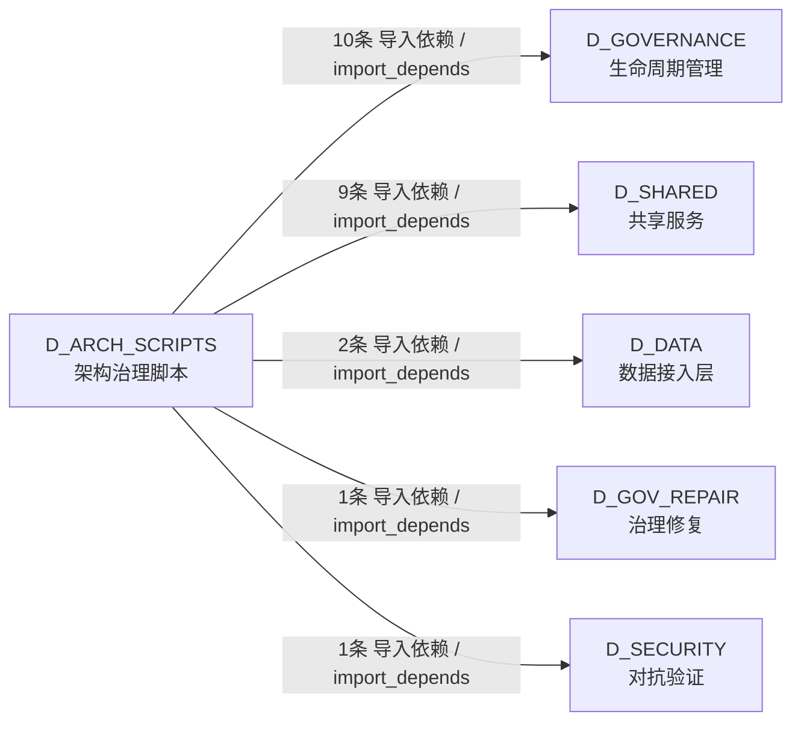

# 31_d_arch_scripts / 架构治理脚本 / D_ARCH_SCRIPTS

> **文档作用 / Purpose**: 展示 架构治理脚本（D_ARCH_SCRIPTS）功能域的模块清单、域内依赖关系、跨域依赖关系、架构分层视图，供架构审查和域治理参考。

> 本文档由 generate_domain_doc.py 从 depgraph (PostgreSQL) 自动生成
> 数据源: depgraph (PostgreSQL) nodes表 + edges表

## 域基本信息 / Domain Overview

| 字段 | 值 | Field | Value |
|------|------|-------|-------|
| 编号 | 31 | Number | 31 |
| 域ID | D_ARCH_SCRIPTS | Domain ID | D_ARCH_SCRIPTS |
| 域名称 | 架构治理脚本 | Domain Name | D_ARCH_SCRIPTS |
| 层级 | L2 业务域层 | Layer | L2 Domain |
| 模块数 | 87 | Module Count | 87 |
| 域内依赖 | 0 | Internal Dependencies | 0 |
| 跨域入边 | 0 | Cross-domain Incoming | 0 |
| 跨域出边 | 23 | Cross-domain Outgoing | 23 |
| 设计态模块 | 0 | Design Modules | 0 |
| 生产态模块 | 87 | Production Modules | 87 |
| 容量 | 0/150 (正常) | Capacity | 0/150 (正常) |
| 描述 | 架构治理脚本（d5_architecture） | Description | 架构治理脚本（d5_architecture） |

## 模块分层清单 / Module Layered List

> 按 architecture_layer 分组的模块清单（共 87 个模块 / 87 modules）。

### L0 基础设施层 / Infrastructure Layer (2 modules)

| # | 模块路径 / Module Path | 模块名称 / Module Name (功能简介 / Description) | 成熟度 / Maturity | 蓝图 / Blueprint |
|:--:|---------|---------|:---:|:---:|
| 1 | scripts/governance/d5_architecture/generators/generate_da... | G-acqflow: 从 tasks.yaml 生成业务数据采集流图 M... | 生产态 / production |  |
| 2 | scripts/governance/d5_architecture/generators/generate_da... | G-inventory: 扫描 ClickHouse 生成业务数据清单 MD | 生产态 / production |  |

### L2 领域层 / Domain Layer (85 modules)

| # | 模块路径 / Module Path | 模块名称 / Module Name (功能简介 / Description) | 成熟度 / Maturity | 蓝图 / Blueprint |
|:--:|---------|---------|:---:|:---:|
| 1 | scripts/governance/d5_architecture/analyze_change_impact.py | Module docstring — see module-level docstring ... | 生产态 / production |  |
| 2 | scripts/governance/d5_architecture/analyzers/analyze_cont... | analyze_contract_impact.py — 契约变更影响分析器 | 生产态 / production |  |
| 3 | scripts/governance/d5_architecture/analyzers/audit_depend... | audit_depends_on_chain_depth.py — depends_on ... | 生产态 / production |  |
| 4 | scripts/governance/d5_architecture/analyzers/measure_depr... | measure_deprecation_cascade.py — 废弃级联影响度量 | 生产态 / production |  |
| 5 | scripts/governance/d5_architecture/audit_agent_spec.py | [INVARIANTS] agent-spec 审计完整性 | 生产态 / production |  |
| 6 | scripts/governance/d5_architecture/check_budget_health.py | [INVARIANTS] 预算健康检查不可跳过;检查结果必须... | 生产态 / production |  |
| 7 | scripts/governance/d5_architecture/check_drift_e2e.py | CI Entry: Drift Detector E2E Pipeline Check | 生产态 / production |  |
| 8 | scripts/governance/d5_architecture/checkers/check_archite... | v2.4.0 — 2026-05-03 | 生产态 / production |  |
| 9 | scripts/governance/d5_architecture/checkers/check_bluepri... | [INVARIANTS] 蓝图§5.5自动化触发机制状态列必须... | 生产态 / production |  |
| 10 | scripts/governance/d5_architecture/checkers/check_bluepri... | [INVARIANTS] 代码[BLUEPRINT]头部module_id必须与... | 生产态 / production |  |
| 11 | scripts/governance/d5_architecture/checkers/check_bluepri... | [INVARIANTS] 蓝图模板合规检查不可绕过;52项检查... | 生产态 / production |  |
| 12 | scripts/governance/d5_architecture/checkers/check_canonic... | check_canonical_yaml_drift.py — GATE-CANONICAL... | 生产态 / production |  |
| 13 | scripts/governance/d5_architecture/checkers/check_code_du... | [INVARIANTS] 扫描 src/zephyr/ 下所有包; 检测跨... | 生产态 / production |  |
| 14 | scripts/governance/d5_architecture/checkers/check_contrac... | check_contract_code_drift.py —— 契约-代码双写... | 生产态 / production |  |
| 15 | scripts/governance/d5_architecture/checkers/check_contrac... | check_contract_physical_path.py — GATE-CONTRAC... | 生产态 / production |  |
| 16 | scripts/governance/d5_architecture/checkers/check_depende... | check_dependency_direction.py — 依赖方向校验（... | 生产态 / production |  |
| 17 | scripts/governance/d5_architecture/checkers/check_g6_ctr_... | check_g6_ctr_compliance.py - G6 CTR Contract Co... | 生产态 / production |  |
| 18 | scripts/governance/d5_architecture/checkers/check_orphan_... | [INVARIANTS] 扫描蓝图 §11 产出物 consumer_min;... | 生产态 / production |  |
| 19 | scripts/governance/d5_architecture/checkers/check_precomm... | check_precommit_id_uniqueness.py — GATE-ID-UNIQ | 生产态 / production |  |
| 20 | scripts/governance/d5_architecture/checkers/check_rule_fo... | check_rule_four_way_alignment.py —— 规则四方... | 生产态 / production |  |
| 21 | scripts/governance/d5_architecture/checkers/check_ssot_un... | [INVARIANTS] 扫描所有蓝图 ssot_claims 字段; 检... | 生产态 / production |  |
| 22 | scripts/governance/d5_architecture/checkers/check_trace_c... | check_trace_context_propagation.py — TraceCont... | 生产态 / production |  |
| 23 | scripts/governance/d5_architecture/checkers/check_vms_sso... | GATE-VMS-SSOT: VMS 单一真源门禁——三重检测。 | 生产态 / production |  |
| 24 | scripts/governance/d5_architecture/dependency_graph.py | 治理域有向依赖图 — 扫描 governance/ 下所有 imp... | 生产态 / production |  |
| 25 | scripts/governance/d5_architecture/detect_causal_conflict... | Module docstring — see module-level docstring ... | 生产态 / production |  |
| 26 | scripts/governance/d5_architecture/detect_constraint_viol... | G9-Detect: 架构约束违规检测器（对照 depgraph 实... | 生产态 / production |  |
| 27 | scripts/governance/d5_architecture/detectors/analyze_same... | analyze_same_name_module_relations.py --- 同名... | 生产态 / production |  |
| 28 | scripts/governance/d5_architecture/detectors/detect_depen... | detect_depends_on_cycles.py - depends_on 环检测. | 生产态 / production |  |
| 29 | scripts/governance/d5_architecture/detectors/detect_depre... | detect_deprecated_adr_references.py — 废弃 ADR... | 生产态 / production |  |
| 30 | scripts/governance/d5_architecture/detectors/detect_dupli... | detect_duplicate_module_names.py --- 同名模块语... | 生产态 / production |  |
| 31 | scripts/governance/d5_architecture/diagnose_depgraph.py | # [BLUEPRINT] MOD-INF-005 | scripts/governance/... | 生产态 / production |  |
| 32 | scripts/governance/d5_architecture/generators/_common.py | 生成器公共工具（向内收：消除重复）。 | 生产态 / production |  |
| 33 | scripts/governance/d5_architecture/generators/align_panor... | G-panorama-align: 四图对齐检测器（ARCH-053 + AR... | 生产态 / production |  |
| 34 | scripts/governance/d5_architecture/generators/generate_as... | G13: 从 depgraph (PostgreSQL) 生成资产清单全景图 | 生产态 / production |  |
| 35 | scripts/governance/d5_architecture/generators/generate_bl... | G-panorama-gen: 蓝图 §0.6 四图对齐视图生成器（... | 生产态 / production |  |
| 36 | scripts/governance/d5_architecture/generators/generate_co... | Code Wiki 统计数据生成器（半自动维护机制）。 | 生产态 / production |  |
| 37 | scripts/governance/d5_architecture/generators/generate_co... | G12: 从 depgraph (PostgreSQL) 生成契约目录全景图 | 生产态 / production |  |
| 38 | scripts/governance/d5_architecture/generators/generate_co... | generate_contracts.py -- SSoT to Codegen pipeline | 生产态 / production |  |
| 39 | scripts/governance/d5_architecture/generators/generate_da... | G-dataflow: 从 dataflowgraph (PostgreSQL) 生成... | 生产态 / production |  |
| 40 | scripts/governance/d5_architecture/generators/generate_de... | G-decision: 从 decisiongraph (PostgreSQL) 生成... | 生产态 / production |  |
| 41 | scripts/governance/d5_architecture/generators/generate_pa... | G-panorama-registry: 自动生成全景图清单总表 | 生产态 / production |  |
| 42 | scripts/governance/d5_architecture/generators/generate_po... | #183: 从 data_sources_registry.yaml 派生 polici... | 生产态 / production |  |
| 43 | scripts/governance/d5_architecture/panorama_common.py | panorama_common.py — 四图投票共享工具（ARCH-05... | 生产态 / production |  |
| 44 | scripts/governance/d5_architecture/pre_delete_safety_chec... | 安全删除门禁脚本——RULE-THREE 强制执行器。 | 生产态 / production |  |
| 45 | scripts/governance/d5_architecture/pre_write_gate.py | AI写入前强制门禁钩子: lock协议检查+GateEngine P... | 生产态 / production |  |
| 46 | scripts/governance/d5_architecture/syncers/archive_ration... | 对标 HDEBT-01：rationale-log.md 体积 >150KB / ... | 生产态 / production |  |
| 47 | scripts/governance/d5_architecture/syncers/blueprint_fron... | blueprint_frontmatter_reconciler.py — 蓝图 fro... | 生产态 / production |  |
| 48 | scripts/governance/d5_architecture/syncers/merge_readme_t... | Strategy: | 生产态 / production |  |
| 49 | scripts/governance/d5_architecture/syncers/sync_blueprint... | 对标：AGENTS.md §6.1 蓝图-代码同步强制约定 | 生产态 / production |  |
| 50 | scripts/governance/d5_architecture/syncers/sync_registry_... | sync_registry_from_blueprints.py -- 从 blueprin... | 生产态 / production |  |
| 51 | scripts/governance/d5_architecture/validators/blueprint/v... | AGENTS.md §6.1 蓝图-代码同步强制约定的 CI 门禁... | 生产态 / production |  |
| 52 | scripts/governance/d5_architecture/validators/blueprint/v... | AGENTS.md 6.4 铁律五 + 铁律六：蓝图中声称的文件... | 生产态 / production |  |
| 53 | scripts/governance/d5_architecture/validators/blueprint/v... | Module docstring — see module-level docstring ... | 生产态 / production |  |
| 54 | scripts/governance/d5_architecture/validators/blueprint/v... | 蓝图物理位置与归属链完整性校验器 (Blueprint Pla... | 生产态 / production |  |
| 55 | scripts/governance/d5_architecture/validators/blueprint/v... | GATE-TAG-UNIQUE - Blueprint tag uniqueness vali... | 生产态 / production |  |
| 56 | scripts/governance/d5_architecture/validators/lifecycle/v... | validate_lifecycle_refs.py — 生命周期引用约束... | 生产态 / production |  |
| 57 | scripts/governance/d5_architecture/validators/lifecycle/v... | validate_module_lifecycle.py — 模块生命周期校验 | 生产态 / production |  |
| 58 | scripts/governance/d5_architecture/validators/session/val... | Module docstring — see module-level docstring ... | 生产态 / production |  |
| 59 | scripts/governance/d5_architecture/validators/session/val... | validate_session_log_updated.py — Session Log ... | 生产态 / production |  |
| 60 | scripts/governance/d5_architecture/validators/validate_ad... | validate_adr_frontmatter_consistency.py — ADR ... | 生产态 / production |  |
| 61 | scripts/governance/d5_architecture/validators/validate_ar... | validate_arch_review_gate.py — 架构评审门控校验 | 生产态 / production |  |
| 62 | scripts/governance/d5_architecture/validators/validate_ar... | GATE-CONTRACT: CI gate for architecture_contrac... | 生产态 / production |  |
| 63 | scripts/governance/d5_architecture/validators/validate_au... | validate_autonomy_gate.py — 变更级别 vs AI 自... | 生产态 / production |  |
| 64 | scripts/governance/d5_architecture/validators/validate_b_... | validate_b_track_packages.py — B 轨包完整性校验 | 生产态 / production |  |
| 65 | scripts/governance/d5_architecture/validators/validate_bl... | GATE-BS: Blind Spot Reality Check | 生产态 / production |  |
| 66 | scripts/governance/d5_architecture/validators/validate_co... | validate_code_yaml_alignment.py — GATE-A: 实际... | 生产态 / production |  |
| 67 | scripts/governance/d5_architecture/validators/validate_cr... | validate_cross_references.py — 架构模型 YAML +... | 生产态 / production |  |
| 68 | scripts/governance/d5_architecture/validators/validate_de... | [INVARIANTS] 治理脚本执行正确 | 生产态 / production |  |
| 69 | scripts/governance/d5_architecture/validators/validate_de... | validate_depends_on_format.py — depends_on 条... | 生产态 / production |  |
| 70 | scripts/governance/d5_architecture/validators/validate_de... | validate_deprecated_dependents.py — 废弃文件活... | 生产态 / production |  |
| 71 | scripts/governance/d5_architecture/validators/validate_di... | Module docstring — see module-level docstring ... | 生产态 / production |  |
| 72 | scripts/governance/d5_architecture/validators/validate_fi... | validate_field_ownership.py — frontmatter 字段... | 生产态 / production |  |
| 73 | scripts/governance/d5_architecture/validators/validate_ga... | Module docstring — see module-level docstring ... | 生产态 / production |  |
| 74 | scripts/governance/d5_architecture/validators/validate_ha... | validate_handoff_package.py — HandoffPackage ... | 生产态 / production |  |
| 75 | scripts/governance/d5_architecture/validators/validate_in... | validate_interface_contracts.py — 接口契约校验 | 生产态 / production |  |
| 76 | scripts/governance/d5_architecture/validators/validate_lo... | Module docstring — see module-level docstring ... | 生产态 / production |  |
| 77 | scripts/governance/d5_architecture/validators/validate_mo... | validate_module_schema.py — 模块 Schema 校验（... | 生产态 / production |  |
| 78 | scripts/governance/d5_architecture/validators/validate_ne... | Module docstring — see module-level docstring ... | 生产态 / production |  |
| 79 | scripts/governance/d5_architecture/validators/validate_p0... | validate_p0_module_contracts.py — P0 模块契约校验 | 生产态 / production |  |
| 80 | scripts/governance/d5_architecture/validators/validate_st... | validate_static_manifest_drift.py — GATE-21 静... | 生产态 / production |  |
| 81 | scripts/governance/d5_architecture/validators/validate_ta... | 对标：target_layer_vocabulary.yaml v1.0.0——ta... | 生产态 / production |  |
| 82 | scripts/governance/d5_architecture/validators/validate_th... | validate_three_way_consistency.py — 三方一致性检查 | 生产态 / production |  |
| 83 | scripts/governance/d5_architecture/validators/yaml_md/val... | validate_md_yaml_number_drift.py — MD 视图与 Y... | 生产态 / production |  |
| 84 | scripts/governance/d5_architecture/validators/yaml_md/val... | validate_yaml_interface_uniqueness.py — YAML ... | 生产态 / production |  |
| 85 | scripts/governance/d5_architecture/validators/yaml_md/val... | v1.0.0 -- 2026-05-03 | 生产态 / production |  |

## 域内依赖图 / Internal Dependency Diagram

> 依赖图内嵌在本文档中，IDE 可直接渲染显示。参考 decision_index.md 设计，分三个视图：合并全景图、运营态子图、设计态子图（按 design_maturity 实际值拆分）。
>
> **图例说明 / Legend**：
> - **实线边框 = 运营态模块**（production，已上线运行）
> - **虚线边框 = 设计态模块**（design，蓝图阶段，代码未写）
> - **实线箭头 = 运营态依赖**（已生效的依赖关系）
> - **虚线箭头 = 非运营态依赖**（计划中/验证中的依赖关系）

### 合并全景图（全部模块，标签标注成熟度）

> 展示全部 87 个模块（生产态 87 + 设计态 0），标签标注成熟度。

#### 第 1 页 / 共 3 页

```mermaid
graph TD
    subgraph D_ARCH_SCRIPTS["D_ARCH_SCRIPTS 架构治理脚本"]
        scripts_governance_d5_architecture_analyze_change_impact_py["(生产态 / production) Module docstring — see module-level docstring ...<br/>文件: analyze_change_impact.py"]
        scripts_governance_d5_architecture_analyzers_analyze_contract_impact_py["(生产态 / production) analyze_contract_impact.py — 契约变更影响分析器<br/>文件: analyze_contract_impact.py"]
        scripts_governance_d5_architecture_analyzers_audit_depends_on_chain_depth_py["(生产态 / production) audit_depends_on_chain_depth.py — depends_on ...<br/>文件: audit_depends_on_chain_depth.py"]
        scripts_governance_d5_architecture_analyzers_measure_deprecation_cascade_py["(生产态 / production) measure_deprecation_cascade.py — 废弃级联影响度量<br/>文件: measure_deprecation_cascade.py"]
        scripts_governance_d5_architecture_audit_agent_spec_py["(生产态 / production) (INVARIANTS) agent-spec 审计完整性<br/>文件: audit_agent_spec.py"]
        scripts_governance_d5_architecture_check_budget_health_py["(生产态 / production) (INVARIANTS) 预算健康检查不可跳过;检查结果必须...<br/>文件: check_budget_health.py"]
        scripts_governance_d5_architecture_check_drift_e2e_py["(生产态 / production) CI Entry: Drift Detector E2E Pipeline Check<br/>文件: check_drift_e2e.py"]
        scripts_governance_d5_architecture_checkers_check_architecture_gates_py["(生产态 / production) v2.4.0 — 2026-05-03<br/>文件: check_architecture_gates.py"]
        scripts_governance_d5_architecture_checkers_check_blueprint_automation_sync_py["(生产态 / production) (INVARIANTS) 蓝图§5.5自动化触发机制状态列必须...<br/>文件: check_blueprint_automation_sync.py"]
        scripts_governance_d5_architecture_checkers_check_blueprint_code_alignment_py["(生产态 / production) (INVARIANTS) 代码(BLUEPRINT)头部module_id必须与...<br/>文件: check_blueprint_code_alignment.py"]
        scripts_governance_d5_architecture_checkers_check_blueprint_template_compliance_py["(生产态 / production) (INVARIANTS) 蓝图模板合规检查不可绕过;52项检查...<br/>文件: check_blueprint_template_compliance.py"]
        scripts_governance_d5_architecture_checkers_check_canonical_yaml_drift_py["(生产态 / production) check_canonical_yaml_drift.py — GATE-CANONICAL...<br/>文件: check_canonical_yaml_drift.py"]
        scripts_governance_d5_architecture_checkers_check_code_duplication_py["(生产态 / production) (INVARIANTS) 扫描 src/zephyr/ 下所有包; 检测跨...<br/>文件: check_code_duplication.py"]
        scripts_governance_d5_architecture_checkers_check_contract_code_drift_py["(生产态 / production) check_contract_code_drift.py —— 契约-代码双写...<br/>文件: check_contract_code_drift.py"]
        scripts_governance_d5_architecture_checkers_check_contract_physical_path_py["(生产态 / production) check_contract_physical_path.py — GATE-CONTRAC...<br/>文件: check_contract_physical_path.py"]
        scripts_governance_d5_architecture_checkers_check_dependency_direction_py["(生产态 / production) check_dependency_direction.py — 依赖方向校验（...<br/>文件: check_dependency_direction.py"]
        scripts_governance_d5_architecture_checkers_check_g6_ctr_compliance_py["(生产态 / production) check_g6_ctr_compliance.py - G6 CTR Contract Co...<br/>文件: check_g6_ctr_compliance.py"]
        scripts_governance_d5_architecture_checkers_check_orphan_outputs_py["(生产态 / production) (INVARIANTS) 扫描蓝图 §11 产出物 consumer_min;...<br/>文件: check_orphan_outputs.py"]
        scripts_governance_d5_architecture_checkers_check_precommit_id_uniqueness_py["(生产态 / production) check_precommit_id_uniqueness.py — GATE-ID-UNIQ<br/>文件: check_precommit_id_uniqueness.py"]
        scripts_governance_d5_architecture_checkers_check_rule_four_way_alignment_py["(生产态 / production) check_rule_four_way_alignment.py —— 规则四方...<br/>文件: check_rule_four_way_alignment.py"]
        scripts_governance_d5_architecture_checkers_check_ssot_uniqueness_py["(生产态 / production) (INVARIANTS) 扫描所有蓝图 ssot_claims 字段; 检...<br/>文件: check_ssot_uniqueness.py"]
        scripts_governance_d5_architecture_checkers_check_trace_context_propagation_py["(生产态 / production) check_trace_context_propagation.py — TraceCont...<br/>文件: check_trace_context_propagation.py"]
        scripts_governance_d5_architecture_checkers_check_vms_ssot_py["(生产态 / production) GATE-VMS-SSOT: VMS 单一真源门禁——三重检测。<br/>文件: check_vms_ssot.py"]
        scripts_governance_d5_architecture_dependency_graph_py["(生产态 / production) 治理域有向依赖图 — 扫描 governance/ 下所有 imp...<br/>文件: dependency_graph.py"]
        scripts_governance_d5_architecture_detect_causal_conflicts_py["(生产态 / production) Module docstring — see module-level docstring ...<br/>文件: detect_causal_conflicts.py"]
        scripts_governance_d5_architecture_detect_constraint_violations_py["(生产态 / production) G9-Detect: 架构约束违规检测器（对照 depgraph 实...<br/>文件: detect_constraint_violations.py"]
        scripts_governance_d5_architecture_detectors_analyze_same_name_module_relations_py["(生产态 / production) analyze_same_name_module_relations.py --- 同名...<br/>文件: analyze_same_name_module_relations.py"]
        scripts_governance_d5_architecture_detectors_detect_depends_on_cycles_py["(生产态 / production) detect_depends_on_cycles.py - depends_on 环检测.<br/>文件: detect_depends_on_cycles.py"]
        scripts_governance_d5_architecture_detectors_detect_deprecated_adr_references_py["(生产态 / production) detect_deprecated_adr_references.py — 废弃 ADR...<br/>文件: detect_deprecated_adr_references.py"]
        scripts_governance_d5_architecture_detectors_detect_duplicate_module_names_py["(生产态 / production) detect_duplicate_module_names.py --- 同名模块语...<br/>文件: detect_duplicate_module_names.py"]
    end
    D_GOVERNANCE["(生产态 / production) D_GOVERNANCE"]
    scripts_governance_d5_architecture_analyze_change_impact_py -->|导入依赖 / import_depends| D_GOVERNANCE
    D_GOV_REPAIR["(生产态 / production) D_GOV_REPAIR"]
    scripts_governance_d5_architecture_check_budget_health_py -->|导入依赖 / import_depends| D_GOV_REPAIR
    classDef production fill:#e1f5fe,stroke:#01579b,stroke-width:2px,color:#000
    classDef design fill:#fff3e0,stroke:#e65100,stroke-width:2px,color:#000,stroke-dasharray: 5 5
    classDef external_prod fill:#e8f5e9,stroke:#1b5e20,stroke-width:1px,color:#000
    classDef external_design fill:#fce4ec,stroke:#880e4f,stroke-width:1px,color:#000,stroke-dasharray: 5 5
    class scripts_governance_d5_architecture_analyze_change_impact_py,scripts_governance_d5_architecture_analyzers_analyze_contract_impact_py,scripts_governance_d5_architecture_analyzers_audit_depends_on_chain_depth_py,scripts_governance_d5_architecture_analyzers_measure_deprecation_cascade_py,scripts_governance_d5_architecture_audit_agent_spec_py,scripts_governance_d5_architecture_check_budget_health_py,scripts_governance_d5_architecture_check_drift_e2e_py,scripts_governance_d5_architecture_checkers_check_architecture_gates_py,scripts_governance_d5_architecture_checkers_check_blueprint_automation_sync_py,scripts_governance_d5_architecture_checkers_check_blueprint_code_alignment_py,scripts_governance_d5_architecture_checkers_check_blueprint_template_compliance_py,scripts_governance_d5_architecture_checkers_check_canonical_yaml_drift_py,scripts_governance_d5_architecture_checkers_check_code_duplication_py,scripts_governance_d5_architecture_checkers_check_contract_code_drift_py,scripts_governance_d5_architecture_checkers_check_contract_physical_path_py,scripts_governance_d5_architecture_checkers_check_dependency_direction_py,scripts_governance_d5_architecture_checkers_check_g6_ctr_compliance_py,scripts_governance_d5_architecture_checkers_check_orphan_outputs_py,scripts_governance_d5_architecture_checkers_check_precommit_id_uniqueness_py,scripts_governance_d5_architecture_checkers_check_rule_four_way_alignment_py,scripts_governance_d5_architecture_checkers_check_ssot_uniqueness_py,scripts_governance_d5_architecture_checkers_check_trace_context_propagation_py,scripts_governance_d5_architecture_checkers_check_vms_ssot_py,scripts_governance_d5_architecture_dependency_graph_py,scripts_governance_d5_architecture_detect_causal_conflicts_py,scripts_governance_d5_architecture_detect_constraint_violations_py,scripts_governance_d5_architecture_detectors_analyze_same_name_module_relations_py,scripts_governance_d5_architecture_detectors_detect_depends_on_cycles_py,scripts_governance_d5_architecture_detectors_detect_deprecated_adr_references_py,scripts_governance_d5_architecture_detectors_detect_duplicate_module_names_py production
    class D_GOVERNANCE,D_GOV_REPAIR external_prod
```



#### 第 2 页 / 共 3 页

```mermaid
graph TD
    subgraph D_ARCH_SCRIPTS["D_ARCH_SCRIPTS 架构治理脚本"]
        scripts_governance_d5_architecture_diagnose_depgraph_py["(生产态 / production) # (BLUEPRINT) MOD-INF-005 / scripts/governance/...<br/>文件: diagnose_depgraph.py"]
        scripts_governance_d5_architecture_generators_common_py["(生产态 / production) 生成器公共工具（向内收：消除重复）。<br/>文件: _common.py"]
        scripts_governance_d5_architecture_generators_align_panoramas_py["(生产态 / production) G-panorama-align: 四图对齐检测器（ARCH-053 + AR...<br/>文件: align_panoramas.py"]
        scripts_governance_d5_architecture_generators_generate_asset_catalog_py["(生产态 / production) G13: 从 depgraph (PostgreSQL) 生成资产清单全景图<br/>文件: generate_asset_catalog.py"]
        scripts_governance_d5_architecture_generators_generate_blueprint_panorama_py["(生产态 / production) G-panorama-gen: 蓝图 §0.6 四图对齐视图生成器（...<br/>文件: generate_blueprint_panorama.py"]
        scripts_governance_d5_architecture_generators_generate_code_wiki_stats_py["(生产态 / production) Code Wiki 统计数据生成器（半自动维护机制）。<br/>文件: generate_code_wiki_stats.py"]
        scripts_governance_d5_architecture_generators_generate_contract_catalog_py["(生产态 / production) G12: 从 depgraph (PostgreSQL) 生成契约目录全景图<br/>文件: generate_contract_catalog.py"]
        scripts_governance_d5_architecture_generators_generate_contracts_py["(生产态 / production) generate_contracts.py -- SSoT to Codegen pipeline<br/>文件: generate_contracts.py"]
        scripts_governance_d5_architecture_generators_generate_data_acquisition_flow_py["(生产态 / production) G-acqflow: 从 tasks.yaml 生成业务数据采集流图 M...<br/>文件: generate_data_acquisition_flow.py"]
        scripts_governance_d5_architecture_generators_generate_data_inventory_py["(生产态 / production) G-inventory: 扫描 ClickHouse 生成业务数据清单 MD<br/>文件: generate_data_inventory.py"]
        scripts_governance_d5_architecture_generators_generate_dataflow_diagram_py["(生产态 / production) G-dataflow: 从 dataflowgraph (PostgreSQL) 生成...<br/>文件: generate_dataflow_diagram.py"]
        scripts_governance_d5_architecture_generators_generate_decision_diagram_py["(生产态 / production) G-decision: 从 decisiongraph (PostgreSQL) 生成...<br/>文件: generate_decision_diagram.py"]
        scripts_governance_d5_architecture_generators_generate_panorama_registry_py["(生产态 / production) G-panorama-registry: 自动生成全景图清单总表<br/>文件: generate_panorama_registry.py"]
        scripts_governance_d5_architecture_generators_generate_policies_py["(生产态 / production) #183: 从 data_sources_registry.yaml 派生 polici...<br/>文件: generate_policies.py"]
        scripts_governance_d5_architecture_panorama_common_py["(生产态 / production) panorama_common.py — 四图投票共享工具（ARCH-05...<br/>文件: panorama_common.py"]
        scripts_governance_d5_architecture_pre_delete_safety_check_py["(生产态 / production) 安全删除门禁脚本——RULE-THREE 强制执行器。<br/>文件: pre_delete_safety_check.py"]
        scripts_governance_d5_architecture_pre_write_gate_py["(生产态 / production) AI写入前强制门禁钩子: lock协议检查+GateEngine P...<br/>文件: pre_write_gate.py"]
        scripts_governance_d5_architecture_syncers_archive_rationale_log_py["(生产态 / production) 对标 HDEBT-01：rationale-log.md 体积 >150KB / ...<br/>文件: archive_rationale_log.py"]
        scripts_governance_d5_architecture_syncers_blueprint_frontmatter_reconciler_py["(生产态 / production) blueprint_frontmatter_reconciler.py — 蓝图 fro...<br/>文件: blueprint_frontmatter_reconciler.py"]
        scripts_governance_d5_architecture_syncers_merge_readme_to_index_py["(生产态 / production) Strategy:<br/>文件: merge_readme_to_index.py"]
        scripts_governance_d5_architecture_syncers_sync_blueprint_code_index_py["(生产态 / production) 对标：AGENTS.md §6.1 蓝图-代码同步强制约定<br/>文件: sync_blueprint_code_index.py"]
        scripts_governance_d5_architecture_syncers_sync_registry_from_blueprints_py["(生产态 / production) sync_registry_from_blueprints.py -- 从 blueprin...<br/>文件: sync_registry_from_blueprints.py"]
        scripts_governance_d5_architecture_validators_blueprint_validate_blueprint_code_sync_py["(生产态 / production) AGENTS.md §6.1 蓝图-代码同步强制约定的 CI 门禁...<br/>文件: validate_blueprint_code_sync.py"]
        scripts_governance_d5_architecture_validators_blueprint_validate_blueprint_implementation_docs_py["(生产态 / production) AGENTS.md 6.4 铁律五 + 铁律六：蓝图中声称的文件...<br/>文件: validate_blueprint_implementation_docs.py"]
        scripts_governance_d5_architecture_validators_blueprint_validate_blueprint_path_consistency_py["(生产态 / production) Module docstring — see module-level docstring ...<br/>文件: validate_blueprint_path_consistency.py"]
        scripts_governance_d5_architecture_validators_blueprint_validate_blueprint_placement_py["(生产态 / production) 蓝图物理位置与归属链完整性校验器 (Blueprint Pla...<br/>文件: validate_blueprint_placement.py"]
        scripts_governance_d5_architecture_validators_blueprint_validate_blueprint_tag_uniqueness_py["(生产态 / production) GATE-TAG-UNIQUE - Blueprint tag uniqueness vali...<br/>文件: validate_blueprint_tag_uniqueness.py"]
        scripts_governance_d5_architecture_validators_lifecycle_validate_lifecycle_refs_py["(生产态 / production) validate_lifecycle_refs.py — 生命周期引用约束...<br/>文件: validate_lifecycle_refs.py"]
        scripts_governance_d5_architecture_validators_lifecycle_validate_module_lifecycle_py["(生产态 / production) validate_module_lifecycle.py — 模块生命周期校验<br/>文件: validate_module_lifecycle.py"]
        scripts_governance_d5_architecture_validators_session_validate_session_log_index_integrity_py["(生产态 / production) Module docstring — see module-level docstring ...<br/>文件: validate_session_log_index_integrity.py"]
    end
    D_SHARED["(生产态 / production) D_SHARED"]
    scripts_governance_d5_architecture_diagnose_depgraph_py -->|导入依赖 / import_depends| D_SHARED
    D_SECURITY["(生产态 / production) D_SECURITY"]
    scripts_governance_d5_architecture_pre_write_gate_py -->|导入依赖 / import_depends| D_SECURITY
    D_GOVERNANCE["(生产态 / production) D_GOVERNANCE"]
    scripts_governance_d5_architecture_generators_generate_blueprint_panorama_py -->|导入依赖 / import_depends| D_GOVERNANCE
    scripts_governance_d5_architecture_generators_generate_blueprint_panorama_py -->|导入依赖 / import_depends| D_GOVERNANCE
    scripts_governance_d5_architecture_generators_generate_blueprint_panorama_py -->|导入依赖 / import_depends| D_GOVERNANCE
    scripts_governance_d5_architecture_generators_generate_asset_catalog_py -->|导入依赖 / import_depends| D_SHARED
    scripts_governance_d5_architecture_generators_align_panoramas_py -->|导入依赖 / import_depends| D_GOVERNANCE
    scripts_governance_d5_architecture_generators_align_panoramas_py -->|导入依赖 / import_depends| D_GOVERNANCE
    scripts_governance_d5_architecture_generators_align_panoramas_py -->|导入依赖 / import_depends| D_GOVERNANCE
    scripts_governance_d5_architecture_generators_align_panoramas_py -->|导入依赖 / import_depends| D_SHARED
    scripts_governance_d5_architecture_generators_generate_code_wiki_stats_py -->|导入依赖 / import_depends| D_SHARED
    scripts_governance_d5_architecture_generators_generate_contracts_py -->|导入依赖 / import_depends| D_SHARED
    scripts_governance_d5_architecture_generators_generate_contract_catalog_py -->|导入依赖 / import_depends| D_SHARED
    scripts_governance_d5_architecture_generators_generate_decision_diagram_py -->|导入依赖 / import_depends| D_GOVERNANCE
    scripts_governance_d5_architecture_generators_generate_dataflow_diagram_py -->|导入依赖 / import_depends| D_GOVERNANCE
    classDef production fill:#e1f5fe,stroke:#01579b,stroke-width:2px,color:#000
    classDef design fill:#fff3e0,stroke:#e65100,stroke-width:2px,color:#000,stroke-dasharray: 5 5
    classDef external_prod fill:#e8f5e9,stroke:#1b5e20,stroke-width:1px,color:#000
    classDef external_design fill:#fce4ec,stroke:#880e4f,stroke-width:1px,color:#000,stroke-dasharray: 5 5
    class scripts_governance_d5_architecture_diagnose_depgraph_py,scripts_governance_d5_architecture_generators_common_py,scripts_governance_d5_architecture_generators_align_panoramas_py,scripts_governance_d5_architecture_generators_generate_asset_catalog_py,scripts_governance_d5_architecture_generators_generate_blueprint_panorama_py,scripts_governance_d5_architecture_generators_generate_code_wiki_stats_py,scripts_governance_d5_architecture_generators_generate_contract_catalog_py,scripts_governance_d5_architecture_generators_generate_contracts_py,scripts_governance_d5_architecture_generators_generate_data_acquisition_flow_py,scripts_governance_d5_architecture_generators_generate_data_inventory_py,scripts_governance_d5_architecture_generators_generate_dataflow_diagram_py,scripts_governance_d5_architecture_generators_generate_decision_diagram_py,scripts_governance_d5_architecture_generators_generate_panorama_registry_py,scripts_governance_d5_architecture_generators_generate_policies_py,scripts_governance_d5_architecture_panorama_common_py,scripts_governance_d5_architecture_pre_delete_safety_check_py,scripts_governance_d5_architecture_pre_write_gate_py,scripts_governance_d5_architecture_syncers_archive_rationale_log_py,scripts_governance_d5_architecture_syncers_blueprint_frontmatter_reconciler_py,scripts_governance_d5_architecture_syncers_merge_readme_to_index_py,scripts_governance_d5_architecture_syncers_sync_blueprint_code_index_py,scripts_governance_d5_architecture_syncers_sync_registry_from_blueprints_py,scripts_governance_d5_architecture_validators_blueprint_validate_blueprint_code_sync_py,scripts_governance_d5_architecture_validators_blueprint_validate_blueprint_implementation_docs_py,scripts_governance_d5_architecture_validators_blueprint_validate_blueprint_path_consistency_py,scripts_governance_d5_architecture_validators_blueprint_validate_blueprint_placement_py,scripts_governance_d5_architecture_validators_blueprint_validate_blueprint_tag_uniqueness_py,scripts_governance_d5_architecture_validators_lifecycle_validate_lifecycle_refs_py,scripts_governance_d5_architecture_validators_lifecycle_validate_module_lifecycle_py,scripts_governance_d5_architecture_validators_session_validate_session_log_index_integrity_py production
    class D_SHARED,D_SECURITY,D_GOVERNANCE external_prod
```



#### 第 3 页 / 共 3 页

```mermaid
graph TD
    subgraph D_ARCH_SCRIPTS["D_ARCH_SCRIPTS 架构治理脚本"]
        scripts_governance_d5_architecture_validators_session_validate_session_log_updated_py["(生产态 / production) validate_session_log_updated.py — Session Log ...<br/>文件: validate_session_log_updated.py"]
        scripts_governance_d5_architecture_validators_validate_adr_frontmatter_consistency_py["(生产态 / production) validate_adr_frontmatter_consistency.py — ADR ...<br/>文件: validate_adr_frontmatter_consistency.py"]
        scripts_governance_d5_architecture_validators_validate_arch_review_gate_py["(生产态 / production) validate_arch_review_gate.py — 架构评审门控校验<br/>文件: validate_arch_review_gate.py"]
        scripts_governance_d5_architecture_validators_validate_architecture_contract_internal_py["(生产态 / production) GATE-CONTRACT: CI gate for architecture_contrac...<br/>文件: validate_architecture_contract_internal.py"]
        scripts_governance_d5_architecture_validators_validate_autonomy_gate_py["(生产态 / production) validate_autonomy_gate.py — 变更级别 vs AI 自...<br/>文件: validate_autonomy_gate.py"]
        scripts_governance_d5_architecture_validators_validate_b_track_packages_py["(生产态 / production) validate_b_track_packages.py — B 轨包完整性校验<br/>文件: validate_b_track_packages.py"]
        scripts_governance_d5_architecture_validators_validate_blind_spot_status_py["(生产态 / production) GATE-BS: Blind Spot Reality Check<br/>文件: validate_blind_spot_status.py"]
        scripts_governance_d5_architecture_validators_validate_code_yaml_alignment_py["(生产态 / production) validate_code_yaml_alignment.py — GATE-A: 实际...<br/>文件: validate_code_yaml_alignment.py"]
        scripts_governance_d5_architecture_validators_validate_cross_references_py["(生产态 / production) validate_cross_references.py — 架构模型 YAML +...<br/>文件: validate_cross_references.py"]
        scripts_governance_d5_architecture_validators_validate_dependency_graph_template_py["(生产态 / production) (INVARIANTS) 治理脚本执行正确<br/>文件: validate_dependency_graph_template.py"]
        scripts_governance_d5_architecture_validators_validate_depends_on_format_py["(生产态 / production) validate_depends_on_format.py — depends_on 条...<br/>文件: validate_depends_on_format.py"]
        scripts_governance_d5_architecture_validators_validate_deprecated_dependents_py["(生产态 / production) validate_deprecated_dependents.py — 废弃文件活...<br/>文件: validate_deprecated_dependents.py"]
        scripts_governance_d5_architecture_validators_validate_directory_structure_py["(生产态 / production) Module docstring — see module-level docstring ...<br/>文件: validate_directory_structure.py"]
        scripts_governance_d5_architecture_validators_validate_field_ownership_py["(生产态 / production) validate_field_ownership.py — frontmatter 字段...<br/>文件: validate_field_ownership.py"]
        scripts_governance_d5_architecture_validators_validate_gate_yaml_py["(生产态 / production) Module docstring — see module-level docstring ...<br/>文件: validate_gate_yaml.py"]
        scripts_governance_d5_architecture_validators_validate_handoff_package_py["(生产态 / production) validate_handoff_package.py — HandoffPackage ...<br/>文件: validate_handoff_package.py"]
        scripts_governance_d5_architecture_validators_validate_interface_contracts_py["(生产态 / production) validate_interface_contracts.py — 接口契约校验<br/>文件: validate_interface_contracts.py"]
        scripts_governance_d5_architecture_validators_validate_load_path_integrity_py["(生产态 / production) Module docstring — see module-level docstring ...<br/>文件: validate_load_path_integrity.py"]
        scripts_governance_d5_architecture_validators_validate_module_schema_py["(生产态 / production) validate_module_schema.py — 模块 Schema 校验（...<br/>文件: validate_module_schema.py"]
        scripts_governance_d5_architecture_validators_validate_nested_flat_dirs_py["(生产态 / production) Module docstring — see module-level docstring ...<br/>文件: validate_nested_flat_dirs.py"]
        scripts_governance_d5_architecture_validators_validate_p0_module_contracts_py["(生产态 / production) validate_p0_module_contracts.py — P0 模块契约校验<br/>文件: validate_p0_module_contracts.py"]
        scripts_governance_d5_architecture_validators_validate_static_manifest_drift_py["(生产态 / production) validate_static_manifest_drift.py — GATE-21 静...<br/>文件: validate_static_manifest_drift.py"]
        scripts_governance_d5_architecture_validators_validate_target_layer_py["(生产态 / production) 对标：target_layer_vocabulary.yaml v1.0.0——ta...<br/>文件: validate_target_layer.py"]
        scripts_governance_d5_architecture_validators_validate_three_way_consistency_py["(生产态 / production) validate_three_way_consistency.py — 三方一致性检查<br/>文件: validate_three_way_consistency.py"]
        scripts_governance_d5_architecture_validators_yaml_md_validate_md_yaml_number_drift_py["(生产态 / production) validate_md_yaml_number_drift.py — MD 视图与 Y...<br/>文件: validate_md_yaml_number_drift.py"]
        scripts_governance_d5_architecture_validators_yaml_md_validate_yaml_interface_uniqueness_py["(生产态 / production) validate_yaml_interface_uniqueness.py — YAML ...<br/>文件: validate_yaml_interface_uniqueness.py"]
        scripts_governance_d5_architecture_validators_yaml_md_validate_yaml_summaries_py["(生产态 / production) v1.0.0 -- 2026-05-03<br/>文件: validate_yaml_summaries.py"]
    end
    D_SHARED["(生产态 / production) D_SHARED"]
    scripts_governance_d5_architecture_validators_validate_interface_contracts_py -->|导入依赖 / import_depends| D_SHARED
    classDef production fill:#e1f5fe,stroke:#01579b,stroke-width:2px,color:#000
    classDef design fill:#fff3e0,stroke:#e65100,stroke-width:2px,color:#000,stroke-dasharray: 5 5
    classDef external_prod fill:#e8f5e9,stroke:#1b5e20,stroke-width:1px,color:#000
    classDef external_design fill:#fce4ec,stroke:#880e4f,stroke-width:1px,color:#000,stroke-dasharray: 5 5
    class scripts_governance_d5_architecture_validators_session_validate_session_log_updated_py,scripts_governance_d5_architecture_validators_validate_adr_frontmatter_consistency_py,scripts_governance_d5_architecture_validators_validate_arch_review_gate_py,scripts_governance_d5_architecture_validators_validate_architecture_contract_internal_py,scripts_governance_d5_architecture_validators_validate_autonomy_gate_py,scripts_governance_d5_architecture_validators_validate_b_track_packages_py,scripts_governance_d5_architecture_validators_validate_blind_spot_status_py,scripts_governance_d5_architecture_validators_validate_code_yaml_alignment_py,scripts_governance_d5_architecture_validators_validate_cross_references_py,scripts_governance_d5_architecture_validators_validate_dependency_graph_template_py,scripts_governance_d5_architecture_validators_validate_depends_on_format_py,scripts_governance_d5_architecture_validators_validate_deprecated_dependents_py,scripts_governance_d5_architecture_validators_validate_directory_structure_py,scripts_governance_d5_architecture_validators_validate_field_ownership_py,scripts_governance_d5_architecture_validators_validate_gate_yaml_py,scripts_governance_d5_architecture_validators_validate_handoff_package_py,scripts_governance_d5_architecture_validators_validate_interface_contracts_py,scripts_governance_d5_architecture_validators_validate_load_path_integrity_py,scripts_governance_d5_architecture_validators_validate_module_schema_py,scripts_governance_d5_architecture_validators_validate_nested_flat_dirs_py,scripts_governance_d5_architecture_validators_validate_p0_module_contracts_py,scripts_governance_d5_architecture_validators_validate_static_manifest_drift_py,scripts_governance_d5_architecture_validators_validate_target_layer_py,scripts_governance_d5_architecture_validators_validate_three_way_consistency_py,scripts_governance_d5_architecture_validators_yaml_md_validate_md_yaml_number_drift_py,scripts_governance_d5_architecture_validators_yaml_md_validate_yaml_interface_uniqueness_py,scripts_governance_d5_architecture_validators_yaml_md_validate_yaml_summaries_py production
    class D_SHARED external_prod
```



### 运营态子图（仅 design_maturity=production 的模块和依赖）

> 仅展示已上线运行的模块（共 87 个，0 条域内依赖）。

```mermaid
graph TD
    subgraph D_ARCH_SCRIPTS["D_ARCH_SCRIPTS 架构治理脚本"]
        scripts_governance_d5_architecture_analyze_change_impact_py["(生产态 / production) Module docstring — see module-level docstring ...<br/>文件: analyze_change_impact.py"]
        scripts_governance_d5_architecture_analyzers_analyze_contract_impact_py["(生产态 / production) analyze_contract_impact.py — 契约变更影响分析器<br/>文件: analyze_contract_impact.py"]
        scripts_governance_d5_architecture_analyzers_audit_depends_on_chain_depth_py["(生产态 / production) audit_depends_on_chain_depth.py — depends_on ...<br/>文件: audit_depends_on_chain_depth.py"]
        scripts_governance_d5_architecture_analyzers_measure_deprecation_cascade_py["(生产态 / production) measure_deprecation_cascade.py — 废弃级联影响度量<br/>文件: measure_deprecation_cascade.py"]
        scripts_governance_d5_architecture_audit_agent_spec_py["(生产态 / production) (INVARIANTS) agent-spec 审计完整性<br/>文件: audit_agent_spec.py"]
        scripts_governance_d5_architecture_check_budget_health_py["(生产态 / production) (INVARIANTS) 预算健康检查不可跳过;检查结果必须...<br/>文件: check_budget_health.py"]
        scripts_governance_d5_architecture_check_drift_e2e_py["(生产态 / production) CI Entry: Drift Detector E2E Pipeline Check<br/>文件: check_drift_e2e.py"]
        scripts_governance_d5_architecture_checkers_check_architecture_gates_py["(生产态 / production) v2.4.0 — 2026-05-03<br/>文件: check_architecture_gates.py"]
        scripts_governance_d5_architecture_checkers_check_blueprint_automation_sync_py["(生产态 / production) (INVARIANTS) 蓝图§5.5自动化触发机制状态列必须...<br/>文件: check_blueprint_automation_sync.py"]
        scripts_governance_d5_architecture_checkers_check_blueprint_code_alignment_py["(生产态 / production) (INVARIANTS) 代码(BLUEPRINT)头部module_id必须与...<br/>文件: check_blueprint_code_alignment.py"]
        scripts_governance_d5_architecture_checkers_check_blueprint_template_compliance_py["(生产态 / production) (INVARIANTS) 蓝图模板合规检查不可绕过;52项检查...<br/>文件: check_blueprint_template_compliance.py"]
        scripts_governance_d5_architecture_checkers_check_canonical_yaml_drift_py["(生产态 / production) check_canonical_yaml_drift.py — GATE-CANONICAL...<br/>文件: check_canonical_yaml_drift.py"]
        scripts_governance_d5_architecture_checkers_check_code_duplication_py["(生产态 / production) (INVARIANTS) 扫描 src/zephyr/ 下所有包; 检测跨...<br/>文件: check_code_duplication.py"]
        scripts_governance_d5_architecture_checkers_check_contract_code_drift_py["(生产态 / production) check_contract_code_drift.py —— 契约-代码双写...<br/>文件: check_contract_code_drift.py"]
        scripts_governance_d5_architecture_checkers_check_contract_physical_path_py["(生产态 / production) check_contract_physical_path.py — GATE-CONTRAC...<br/>文件: check_contract_physical_path.py"]
        scripts_governance_d5_architecture_checkers_check_dependency_direction_py["(生产态 / production) check_dependency_direction.py — 依赖方向校验（...<br/>文件: check_dependency_direction.py"]
        scripts_governance_d5_architecture_checkers_check_g6_ctr_compliance_py["(生产态 / production) check_g6_ctr_compliance.py - G6 CTR Contract Co...<br/>文件: check_g6_ctr_compliance.py"]
        scripts_governance_d5_architecture_checkers_check_orphan_outputs_py["(生产态 / production) (INVARIANTS) 扫描蓝图 §11 产出物 consumer_min;...<br/>文件: check_orphan_outputs.py"]
        scripts_governance_d5_architecture_checkers_check_precommit_id_uniqueness_py["(生产态 / production) check_precommit_id_uniqueness.py — GATE-ID-UNIQ<br/>文件: check_precommit_id_uniqueness.py"]
        scripts_governance_d5_architecture_checkers_check_rule_four_way_alignment_py["(生产态 / production) check_rule_four_way_alignment.py —— 规则四方...<br/>文件: check_rule_four_way_alignment.py"]
        scripts_governance_d5_architecture_checkers_check_ssot_uniqueness_py["(生产态 / production) (INVARIANTS) 扫描所有蓝图 ssot_claims 字段; 检...<br/>文件: check_ssot_uniqueness.py"]
        scripts_governance_d5_architecture_checkers_check_trace_context_propagation_py["(生产态 / production) check_trace_context_propagation.py — TraceCont...<br/>文件: check_trace_context_propagation.py"]
        scripts_governance_d5_architecture_checkers_check_vms_ssot_py["(生产态 / production) GATE-VMS-SSOT: VMS 单一真源门禁——三重检测。<br/>文件: check_vms_ssot.py"]
        scripts_governance_d5_architecture_dependency_graph_py["(生产态 / production) 治理域有向依赖图 — 扫描 governance/ 下所有 imp...<br/>文件: dependency_graph.py"]
        scripts_governance_d5_architecture_detect_causal_conflicts_py["(生产态 / production) Module docstring — see module-level docstring ...<br/>文件: detect_causal_conflicts.py"]
        scripts_governance_d5_architecture_detect_constraint_violations_py["(生产态 / production) G9-Detect: 架构约束违规检测器（对照 depgraph 实...<br/>文件: detect_constraint_violations.py"]
        scripts_governance_d5_architecture_detectors_analyze_same_name_module_relations_py["(生产态 / production) analyze_same_name_module_relations.py --- 同名...<br/>文件: analyze_same_name_module_relations.py"]
        scripts_governance_d5_architecture_detectors_detect_depends_on_cycles_py["(生产态 / production) detect_depends_on_cycles.py - depends_on 环检测.<br/>文件: detect_depends_on_cycles.py"]
        scripts_governance_d5_architecture_detectors_detect_deprecated_adr_references_py["(生产态 / production) detect_deprecated_adr_references.py — 废弃 ADR...<br/>文件: detect_deprecated_adr_references.py"]
        scripts_governance_d5_architecture_detectors_detect_duplicate_module_names_py["(生产态 / production) detect_duplicate_module_names.py --- 同名模块语...<br/>文件: detect_duplicate_module_names.py"]
        scripts_governance_d5_architecture_diagnose_depgraph_py["(生产态 / production) # (BLUEPRINT) MOD-INF-005 / scripts/governance/...<br/>文件: diagnose_depgraph.py"]
        scripts_governance_d5_architecture_generators_common_py["(生产态 / production) 生成器公共工具（向内收：消除重复）。<br/>文件: _common.py"]
        scripts_governance_d5_architecture_generators_align_panoramas_py["(生产态 / production) G-panorama-align: 四图对齐检测器（ARCH-053 + AR...<br/>文件: align_panoramas.py"]
        scripts_governance_d5_architecture_generators_generate_asset_catalog_py["(生产态 / production) G13: 从 depgraph (PostgreSQL) 生成资产清单全景图<br/>文件: generate_asset_catalog.py"]
        scripts_governance_d5_architecture_generators_generate_blueprint_panorama_py["(生产态 / production) G-panorama-gen: 蓝图 §0.6 四图对齐视图生成器（...<br/>文件: generate_blueprint_panorama.py"]
        scripts_governance_d5_architecture_generators_generate_code_wiki_stats_py["(生产态 / production) Code Wiki 统计数据生成器（半自动维护机制）。<br/>文件: generate_code_wiki_stats.py"]
        scripts_governance_d5_architecture_generators_generate_contract_catalog_py["(生产态 / production) G12: 从 depgraph (PostgreSQL) 生成契约目录全景图<br/>文件: generate_contract_catalog.py"]
        scripts_governance_d5_architecture_generators_generate_contracts_py["(生产态 / production) generate_contracts.py -- SSoT to Codegen pipeline<br/>文件: generate_contracts.py"]
        scripts_governance_d5_architecture_generators_generate_data_acquisition_flow_py["(生产态 / production) G-acqflow: 从 tasks.yaml 生成业务数据采集流图 M...<br/>文件: generate_data_acquisition_flow.py"]
        scripts_governance_d5_architecture_generators_generate_data_inventory_py["(生产态 / production) G-inventory: 扫描 ClickHouse 生成业务数据清单 MD<br/>文件: generate_data_inventory.py"]
        scripts_governance_d5_architecture_generators_generate_dataflow_diagram_py["(生产态 / production) G-dataflow: 从 dataflowgraph (PostgreSQL) 生成...<br/>文件: generate_dataflow_diagram.py"]
        scripts_governance_d5_architecture_generators_generate_decision_diagram_py["(生产态 / production) G-decision: 从 decisiongraph (PostgreSQL) 生成...<br/>文件: generate_decision_diagram.py"]
        scripts_governance_d5_architecture_generators_generate_panorama_registry_py["(生产态 / production) G-panorama-registry: 自动生成全景图清单总表<br/>文件: generate_panorama_registry.py"]
        scripts_governance_d5_architecture_generators_generate_policies_py["(生产态 / production) #183: 从 data_sources_registry.yaml 派生 polici...<br/>文件: generate_policies.py"]
        scripts_governance_d5_architecture_panorama_common_py["(生产态 / production) panorama_common.py — 四图投票共享工具（ARCH-05...<br/>文件: panorama_common.py"]
        scripts_governance_d5_architecture_pre_delete_safety_check_py["(生产态 / production) 安全删除门禁脚本——RULE-THREE 强制执行器。<br/>文件: pre_delete_safety_check.py"]
        scripts_governance_d5_architecture_pre_write_gate_py["(生产态 / production) AI写入前强制门禁钩子: lock协议检查+GateEngine P...<br/>文件: pre_write_gate.py"]
        scripts_governance_d5_architecture_syncers_archive_rationale_log_py["(生产态 / production) 对标 HDEBT-01：rationale-log.md 体积 >150KB / ...<br/>文件: archive_rationale_log.py"]
        scripts_governance_d5_architecture_syncers_blueprint_frontmatter_reconciler_py["(生产态 / production) blueprint_frontmatter_reconciler.py — 蓝图 fro...<br/>文件: blueprint_frontmatter_reconciler.py"]
        scripts_governance_d5_architecture_syncers_merge_readme_to_index_py["(生产态 / production) Strategy:<br/>文件: merge_readme_to_index.py"]
        scripts_governance_d5_architecture_syncers_sync_blueprint_code_index_py["(生产态 / production) 对标：AGENTS.md §6.1 蓝图-代码同步强制约定<br/>文件: sync_blueprint_code_index.py"]
        scripts_governance_d5_architecture_syncers_sync_registry_from_blueprints_py["(生产态 / production) sync_registry_from_blueprints.py -- 从 blueprin...<br/>文件: sync_registry_from_blueprints.py"]
        scripts_governance_d5_architecture_validators_blueprint_validate_blueprint_code_sync_py["(生产态 / production) AGENTS.md §6.1 蓝图-代码同步强制约定的 CI 门禁...<br/>文件: validate_blueprint_code_sync.py"]
        scripts_governance_d5_architecture_validators_blueprint_validate_blueprint_implementation_docs_py["(生产态 / production) AGENTS.md 6.4 铁律五 + 铁律六：蓝图中声称的文件...<br/>文件: validate_blueprint_implementation_docs.py"]
        scripts_governance_d5_architecture_validators_blueprint_validate_blueprint_path_consistency_py["(生产态 / production) Module docstring — see module-level docstring ...<br/>文件: validate_blueprint_path_consistency.py"]
        scripts_governance_d5_architecture_validators_blueprint_validate_blueprint_placement_py["(生产态 / production) 蓝图物理位置与归属链完整性校验器 (Blueprint Pla...<br/>文件: validate_blueprint_placement.py"]
        scripts_governance_d5_architecture_validators_blueprint_validate_blueprint_tag_uniqueness_py["(生产态 / production) GATE-TAG-UNIQUE - Blueprint tag uniqueness vali...<br/>文件: validate_blueprint_tag_uniqueness.py"]
        scripts_governance_d5_architecture_validators_lifecycle_validate_lifecycle_refs_py["(生产态 / production) validate_lifecycle_refs.py — 生命周期引用约束...<br/>文件: validate_lifecycle_refs.py"]
        scripts_governance_d5_architecture_validators_lifecycle_validate_module_lifecycle_py["(生产态 / production) validate_module_lifecycle.py — 模块生命周期校验<br/>文件: validate_module_lifecycle.py"]
        scripts_governance_d5_architecture_validators_session_validate_session_log_index_integrity_py["(生产态 / production) Module docstring — see module-level docstring ...<br/>文件: validate_session_log_index_integrity.py"]
        scripts_governance_d5_architecture_validators_session_validate_session_log_updated_py["(生产态 / production) validate_session_log_updated.py — Session Log ...<br/>文件: validate_session_log_updated.py"]
        scripts_governance_d5_architecture_validators_validate_adr_frontmatter_consistency_py["(生产态 / production) validate_adr_frontmatter_consistency.py — ADR ...<br/>文件: validate_adr_frontmatter_consistency.py"]
        scripts_governance_d5_architecture_validators_validate_arch_review_gate_py["(生产态 / production) validate_arch_review_gate.py — 架构评审门控校验<br/>文件: validate_arch_review_gate.py"]
        scripts_governance_d5_architecture_validators_validate_architecture_contract_internal_py["(生产态 / production) GATE-CONTRACT: CI gate for architecture_contrac...<br/>文件: validate_architecture_contract_internal.py"]
        scripts_governance_d5_architecture_validators_validate_autonomy_gate_py["(生产态 / production) validate_autonomy_gate.py — 变更级别 vs AI 自...<br/>文件: validate_autonomy_gate.py"]
        scripts_governance_d5_architecture_validators_validate_b_track_packages_py["(生产态 / production) validate_b_track_packages.py — B 轨包完整性校验<br/>文件: validate_b_track_packages.py"]
        scripts_governance_d5_architecture_validators_validate_blind_spot_status_py["(生产态 / production) GATE-BS: Blind Spot Reality Check<br/>文件: validate_blind_spot_status.py"]
        scripts_governance_d5_architecture_validators_validate_code_yaml_alignment_py["(生产态 / production) validate_code_yaml_alignment.py — GATE-A: 实际...<br/>文件: validate_code_yaml_alignment.py"]
        scripts_governance_d5_architecture_validators_validate_cross_references_py["(生产态 / production) validate_cross_references.py — 架构模型 YAML +...<br/>文件: validate_cross_references.py"]
        scripts_governance_d5_architecture_validators_validate_dependency_graph_template_py["(生产态 / production) (INVARIANTS) 治理脚本执行正确<br/>文件: validate_dependency_graph_template.py"]
        scripts_governance_d5_architecture_validators_validate_depends_on_format_py["(生产态 / production) validate_depends_on_format.py — depends_on 条...<br/>文件: validate_depends_on_format.py"]
        scripts_governance_d5_architecture_validators_validate_deprecated_dependents_py["(生产态 / production) validate_deprecated_dependents.py — 废弃文件活...<br/>文件: validate_deprecated_dependents.py"]
        scripts_governance_d5_architecture_validators_validate_directory_structure_py["(生产态 / production) Module docstring — see module-level docstring ...<br/>文件: validate_directory_structure.py"]
        scripts_governance_d5_architecture_validators_validate_field_ownership_py["(生产态 / production) validate_field_ownership.py — frontmatter 字段...<br/>文件: validate_field_ownership.py"]
        scripts_governance_d5_architecture_validators_validate_gate_yaml_py["(生产态 / production) Module docstring — see module-level docstring ...<br/>文件: validate_gate_yaml.py"]
        scripts_governance_d5_architecture_validators_validate_handoff_package_py["(生产态 / production) validate_handoff_package.py — HandoffPackage ...<br/>文件: validate_handoff_package.py"]
        scripts_governance_d5_architecture_validators_validate_interface_contracts_py["(生产态 / production) validate_interface_contracts.py — 接口契约校验<br/>文件: validate_interface_contracts.py"]
        scripts_governance_d5_architecture_validators_validate_load_path_integrity_py["(生产态 / production) Module docstring — see module-level docstring ...<br/>文件: validate_load_path_integrity.py"]
        scripts_governance_d5_architecture_validators_validate_module_schema_py["(生产态 / production) validate_module_schema.py — 模块 Schema 校验（...<br/>文件: validate_module_schema.py"]
        scripts_governance_d5_architecture_validators_validate_nested_flat_dirs_py["(生产态 / production) Module docstring — see module-level docstring ...<br/>文件: validate_nested_flat_dirs.py"]
        scripts_governance_d5_architecture_validators_validate_p0_module_contracts_py["(生产态 / production) validate_p0_module_contracts.py — P0 模块契约校验<br/>文件: validate_p0_module_contracts.py"]
        scripts_governance_d5_architecture_validators_validate_static_manifest_drift_py["(生产态 / production) validate_static_manifest_drift.py — GATE-21 静...<br/>文件: validate_static_manifest_drift.py"]
        scripts_governance_d5_architecture_validators_validate_target_layer_py["(生产态 / production) 对标：target_layer_vocabulary.yaml v1.0.0——ta...<br/>文件: validate_target_layer.py"]
        scripts_governance_d5_architecture_validators_validate_three_way_consistency_py["(生产态 / production) validate_three_way_consistency.py — 三方一致性检查<br/>文件: validate_three_way_consistency.py"]
        scripts_governance_d5_architecture_validators_yaml_md_validate_md_yaml_number_drift_py["(生产态 / production) validate_md_yaml_number_drift.py — MD 视图与 Y...<br/>文件: validate_md_yaml_number_drift.py"]
        scripts_governance_d5_architecture_validators_yaml_md_validate_yaml_interface_uniqueness_py["(生产态 / production) validate_yaml_interface_uniqueness.py — YAML ...<br/>文件: validate_yaml_interface_uniqueness.py"]
        scripts_governance_d5_architecture_validators_yaml_md_validate_yaml_summaries_py["(生产态 / production) v1.0.0 -- 2026-05-03<br/>文件: validate_yaml_summaries.py"]
    end
    D_GOVERNANCE["(生产态 / production) D_GOVERNANCE"]
    scripts_governance_d5_architecture_generators_generate_dataflow_diagram_py -->|导入依赖 / import_depends| D_GOVERNANCE
    D_SHARED["(生产态 / production) D_SHARED"]
    scripts_governance_d5_architecture_generators_generate_code_wiki_stats_py -->|导入依赖 / import_depends| D_SHARED
    scripts_governance_d5_architecture_generators_generate_contracts_py -->|导入依赖 / import_depends| D_SHARED
    scripts_governance_d5_architecture_validators_lifecycle_validate_module_lifecycle_py -->|导入依赖 / import_depends| D_SHARED
    scripts_governance_d5_architecture_generators_generate_blueprint_panorama_py -->|导入依赖 / import_depends| D_GOVERNANCE
    scripts_governance_d5_architecture_analyze_change_impact_py -->|导入依赖 / import_depends| D_GOVERNANCE
    D_SECURITY["(生产态 / production) D_SECURITY"]
    scripts_governance_d5_architecture_pre_write_gate_py -->|导入依赖 / import_depends| D_SECURITY
    scripts_governance_d5_architecture_generators_align_panoramas_py -->|导入依赖 / import_depends| D_SHARED
    D_GOV_REPAIR["(生产态 / production) D_GOV_REPAIR"]
    scripts_governance_d5_architecture_check_budget_health_py -->|导入依赖 / import_depends| D_GOV_REPAIR
    scripts_governance_d5_architecture_generators_generate_contract_catalog_py -->|导入依赖 / import_depends| D_SHARED
    scripts_governance_d5_architecture_generators_align_panoramas_py -->|导入依赖 / import_depends| D_GOVERNANCE
    scripts_governance_d5_architecture_generators_generate_decision_diagram_py -->|导入依赖 / import_depends| D_GOVERNANCE
    scripts_governance_d5_architecture_generators_generate_asset_catalog_py -->|导入依赖 / import_depends| D_SHARED
    scripts_governance_d5_architecture_generators_align_panoramas_py -->|导入依赖 / import_depends| D_GOVERNANCE
    scripts_governance_d5_architecture_diagnose_depgraph_py -->|导入依赖 / import_depends| D_SHARED
    classDef production fill:#e1f5fe,stroke:#01579b,stroke-width:2px,color:#000
    classDef design fill:#fff3e0,stroke:#e65100,stroke-width:2px,color:#000,stroke-dasharray: 5 5
    classDef external_prod fill:#e8f5e9,stroke:#1b5e20,stroke-width:1px,color:#000
    classDef external_design fill:#fce4ec,stroke:#880e4f,stroke-width:1px,color:#000,stroke-dasharray: 5 5
    class scripts_governance_d5_architecture_analyze_change_impact_py,scripts_governance_d5_architecture_analyzers_analyze_contract_impact_py,scripts_governance_d5_architecture_analyzers_audit_depends_on_chain_depth_py,scripts_governance_d5_architecture_analyzers_measure_deprecation_cascade_py,scripts_governance_d5_architecture_audit_agent_spec_py,scripts_governance_d5_architecture_check_budget_health_py,scripts_governance_d5_architecture_check_drift_e2e_py,scripts_governance_d5_architecture_checkers_check_architecture_gates_py,scripts_governance_d5_architecture_checkers_check_blueprint_automation_sync_py,scripts_governance_d5_architecture_checkers_check_blueprint_code_alignment_py,scripts_governance_d5_architecture_checkers_check_blueprint_template_compliance_py,scripts_governance_d5_architecture_checkers_check_canonical_yaml_drift_py,scripts_governance_d5_architecture_checkers_check_code_duplication_py,scripts_governance_d5_architecture_checkers_check_contract_code_drift_py,scripts_governance_d5_architecture_checkers_check_contract_physical_path_py,scripts_governance_d5_architecture_checkers_check_dependency_direction_py,scripts_governance_d5_architecture_checkers_check_g6_ctr_compliance_py,scripts_governance_d5_architecture_checkers_check_orphan_outputs_py,scripts_governance_d5_architecture_checkers_check_precommit_id_uniqueness_py,scripts_governance_d5_architecture_checkers_check_rule_four_way_alignment_py,scripts_governance_d5_architecture_checkers_check_ssot_uniqueness_py,scripts_governance_d5_architecture_checkers_check_trace_context_propagation_py,scripts_governance_d5_architecture_checkers_check_vms_ssot_py,scripts_governance_d5_architecture_dependency_graph_py,scripts_governance_d5_architecture_detect_causal_conflicts_py,scripts_governance_d5_architecture_detect_constraint_violations_py,scripts_governance_d5_architecture_detectors_analyze_same_name_module_relations_py,scripts_governance_d5_architecture_detectors_detect_depends_on_cycles_py,scripts_governance_d5_architecture_detectors_detect_deprecated_adr_references_py,scripts_governance_d5_architecture_detectors_detect_duplicate_module_names_py,scripts_governance_d5_architecture_diagnose_depgraph_py,scripts_governance_d5_architecture_generators_common_py,scripts_governance_d5_architecture_generators_align_panoramas_py,scripts_governance_d5_architecture_generators_generate_asset_catalog_py,scripts_governance_d5_architecture_generators_generate_blueprint_panorama_py,scripts_governance_d5_architecture_generators_generate_code_wiki_stats_py,scripts_governance_d5_architecture_generators_generate_contract_catalog_py,scripts_governance_d5_architecture_generators_generate_contracts_py,scripts_governance_d5_architecture_generators_generate_data_acquisition_flow_py,scripts_governance_d5_architecture_generators_generate_data_inventory_py,scripts_governance_d5_architecture_generators_generate_dataflow_diagram_py,scripts_governance_d5_architecture_generators_generate_decision_diagram_py,scripts_governance_d5_architecture_generators_generate_panorama_registry_py,scripts_governance_d5_architecture_generators_generate_policies_py,scripts_governance_d5_architecture_panorama_common_py,scripts_governance_d5_architecture_pre_delete_safety_check_py,scripts_governance_d5_architecture_pre_write_gate_py,scripts_governance_d5_architecture_syncers_archive_rationale_log_py,scripts_governance_d5_architecture_syncers_blueprint_frontmatter_reconciler_py,scripts_governance_d5_architecture_syncers_merge_readme_to_index_py,scripts_governance_d5_architecture_syncers_sync_blueprint_code_index_py,scripts_governance_d5_architecture_syncers_sync_registry_from_blueprints_py,scripts_governance_d5_architecture_validators_blueprint_validate_blueprint_code_sync_py,scripts_governance_d5_architecture_validators_blueprint_validate_blueprint_implementation_docs_py,scripts_governance_d5_architecture_validators_blueprint_validate_blueprint_path_consistency_py,scripts_governance_d5_architecture_validators_blueprint_validate_blueprint_placement_py,scripts_governance_d5_architecture_validators_blueprint_validate_blueprint_tag_uniqueness_py,scripts_governance_d5_architecture_validators_lifecycle_validate_lifecycle_refs_py,scripts_governance_d5_architecture_validators_lifecycle_validate_module_lifecycle_py,scripts_governance_d5_architecture_validators_session_validate_session_log_index_integrity_py,scripts_governance_d5_architecture_validators_session_validate_session_log_updated_py,scripts_governance_d5_architecture_validators_validate_adr_frontmatter_consistency_py,scripts_governance_d5_architecture_validators_validate_arch_review_gate_py,scripts_governance_d5_architecture_validators_validate_architecture_contract_internal_py,scripts_governance_d5_architecture_validators_validate_autonomy_gate_py,scripts_governance_d5_architecture_validators_validate_b_track_packages_py,scripts_governance_d5_architecture_validators_validate_blind_spot_status_py,scripts_governance_d5_architecture_validators_validate_code_yaml_alignment_py,scripts_governance_d5_architecture_validators_validate_cross_references_py,scripts_governance_d5_architecture_validators_validate_dependency_graph_template_py,scripts_governance_d5_architecture_validators_validate_depends_on_format_py,scripts_governance_d5_architecture_validators_validate_deprecated_dependents_py,scripts_governance_d5_architecture_validators_validate_directory_structure_py,scripts_governance_d5_architecture_validators_validate_field_ownership_py,scripts_governance_d5_architecture_validators_validate_gate_yaml_py,scripts_governance_d5_architecture_validators_validate_handoff_package_py,scripts_governance_d5_architecture_validators_validate_interface_contracts_py,scripts_governance_d5_architecture_validators_validate_load_path_integrity_py,scripts_governance_d5_architecture_validators_validate_module_schema_py,scripts_governance_d5_architecture_validators_validate_nested_flat_dirs_py,scripts_governance_d5_architecture_validators_validate_p0_module_contracts_py,scripts_governance_d5_architecture_validators_validate_static_manifest_drift_py,scripts_governance_d5_architecture_validators_validate_target_layer_py,scripts_governance_d5_architecture_validators_validate_three_way_consistency_py,scripts_governance_d5_architecture_validators_yaml_md_validate_md_yaml_number_drift_py,scripts_governance_d5_architecture_validators_yaml_md_validate_yaml_interface_uniqueness_py,scripts_governance_d5_architecture_validators_yaml_md_validate_yaml_summaries_py production
    class D_GOVERNANCE,D_SHARED,D_SECURITY,D_GOV_REPAIR external_prod
```

### 设计态子图（仅 design_maturity=design 的模块和依赖）

> 仅展示蓝图阶段、代码未写的设计态模块（共 0 个，0 条域内依赖）。

> （无设计态模块 / No design modules）

## 跨域依赖 / Cross-domain Dependencies

### 本域依赖的其他域（出边）/ Depends On

| # | 本域模块 / Source Module | → | 外部域-目标模块 / Target Module | 依赖类型 / Type |
|:--:|---------|:--:|---------|---------|
| 1 | G-inventory: 扫描 ClickHouse 生成业务数据清单 M... | → | D_DATA 数据接入层: zephyr.data — 数据源集成器（MOD-L00-004）。 (_... | 导入依赖 / import_depends |
| 2 | G-inventory: 扫描 ClickHouse 生成业务数据清单 M... | → | D_DATA 数据接入层: ClickHouse 统一读取层（裁定 #ARCH-CH-007）。 (c... | 导入依赖 / import_depends |
| 3 | Module docstring — see module-level docstring ... | → | D_GOVERNANCE 生命周期管理: LLMImpactAnalyzer — LLM-based commit 语义影响.... | 导入依赖 / import_depends |
| 4 | G-panorama-align: 四图对齐检测器（ARCH-053 + AR... | → | D_GOVERNANCE 生命周期管理: depgraph Schema DDL + 版本化迁移框架 (depgraph_... | 导入依赖 / import_depends |
| 5 | G-panorama-align: 四图对齐检测器（ARCH-053 + AR... | → | D_GOVERNANCE 生命周期管理: dataflowgraph Schema DDL + 连接入口 (dataflowgr... | 导入依赖 / import_depends |
| 6 | G-panorama-align: 四图对齐检测器（ARCH-053 + AR... | → | D_GOVERNANCE 生命周期管理: decisiongraph Schema DDL + 不变量声明 (decision... | 导入依赖 / import_depends |
| 7 | G-panorama-gen: 蓝图 §0.6 四图对齐视图生成器（... | → | D_GOVERNANCE 生命周期管理: depgraph Schema DDL + 版本化迁移框架 (depgraph_... | 导入依赖 / import_depends |
| 8 | G-panorama-gen: 蓝图 §0.6 四图对齐视图生成器（... | → | D_GOVERNANCE 生命周期管理: dataflowgraph Schema DDL + 连接入口 (dataflowgr... | 导入依赖 / import_depends |
| 9 | G-panorama-gen: 蓝图 §0.6 四图对齐视图生成器（... | → | D_GOVERNANCE 生命周期管理: decisiongraph Schema DDL + 不变量声明 (decision... | 导入依赖 / import_depends |
| 10 | G-dataflow: 从 dataflowgraph (PostgreSQL) 生成.... | → | D_GOVERNANCE 生命周期管理: dataflowgraph Schema DDL + 连接入口 (dataflowgr... | 导入依赖 / import_depends |
| 11 | G-decision: 从 decisiongraph (PostgreSQL) 生成.... | → | D_GOVERNANCE 生命周期管理: decisiongraph Schema DDL + 不变量声明 (decision... | 导入依赖 / import_depends |
| 12 | blueprint_frontmatter_reconciler.py — 蓝图 fro... | → | D_GOVERNANCE 生命周期管理: depgraph Schema DDL + 版本化迁移框架 (depgraph_... | 导入依赖 / import_depends |
| 13 | [INVARIANTS] 预算健康检查不可跳过;检查结果必须.... | → | D_GOV_REPAIR 治理修复: budget_enforcement.py | 导入依赖 / import_depends |
| 14 | AI写入前强制门禁钩子: lock协议检查+GateEngine P... | → | D_SECURITY 对抗验证: Session 级并发协调模块（P2-SES 落地）。 (sessio... | 导入依赖 / import_depends |
| 15 | # [BLUEPRINT] MOD-INF-005 | scripts/governance/... | → | D_SHARED 共享服务: yaml_utils.py — vocabulary YAML 加载公共工具（... | 导入依赖 / import_depends |
| 16 | G-panorama-align: 四图对齐检测器（ARCH-053 + AR... | → | D_SHARED 共享服务: converters.py — 类型转换工具（消除 '' vs None ... | 导入依赖 / import_depends |
| 17 | G13: 从 depgraph (PostgreSQL) 生成资产清单全景... | → | D_SHARED 共享服务: paths.py — 项目路径常量 SSoT（Single Source of... | 导入依赖 / import_depends |
| 18 | Code Wiki 统计数据生成器（半自动维护机制）。 (g... | → | D_SHARED 共享服务: paths.py — 项目路径常量 SSoT（Single Source of... | 导入依赖 / import_depends |
| 19 | G12: 从 depgraph (PostgreSQL) 生成契约目录全景... | → | D_SHARED 共享服务: paths.py — 项目路径常量 SSoT（Single Source of... | 导入依赖 / import_depends |
| 20 | generate_contracts.py -- SSoT to Codegen pipeli... | → | D_SHARED 共享服务: paths.py — 项目路径常量 SSoT（Single Source of... | 导入依赖 / import_depends |
| 21 | G-panorama-registry: 自动生成全景图清单总表 (ge... | → | D_SHARED 共享服务: paths.py — 项目路径常量 SSoT（Single Source of... | 导入依赖 / import_depends |
| 22 | validate_module_lifecycle.py — 模块生命周期校... | → | D_SHARED 共享服务: yaml_utils.py — vocabulary YAML 加载公共工具（... | 导入依赖 / import_depends |
| 23 | validate_interface_contracts.py — 接口契约校验... | → | D_SHARED 共享服务: yaml_utils.py — vocabulary YAML 加载公共工具（... | 导入依赖 / import_depends |

### 依赖本域的其他域（入边）/ Depended By

无跨域入边依赖 / No cross-domain incoming dependencies

### 跨域依赖图 / Cross-domain Dependency Diagram

> 本域与 5 个外部域直接连接（出边 23 条 + 入边 0 条 = 23 条）。只显示直接连接的域，不展开具体节点。



## 说明 / Notes

- **数据源 / Data Source**: `depgraph (PostgreSQL)` 的 `nodes`、`edges`、`domains` 表
- **生成器 / Generator**: `generate_domain_doc.py`（G2+G10 合并）
- **维护方式 / Maintenance**: 自动生成，全景图更新时刷新
- **文件名规则 / File Naming**: `{编号:02d}_{域ID小写}.md`，如 `16_d_trading.md`
- **图例说明 / Legend**: `[production]`=已上线 / `[design]`=设计中 / `[unknown]`=未知
