# 31_d_governance / registry_management / 生命周期管理 / Lifecycle Management

> **功能简介 / Overview**: 生命周期管理，负责蓝图/模块/任务的声明周期管理和元数据治理

> **文档作用 / Purpose**: 展示 生命周期管理（D_GOVERNANCE）功能域的模块清单、域内依赖关系、跨域依赖关系、架构分层视图，供架构审查和域治理参考。

> 本文档由 generate_domain_doc.py 从 depgraph (PostgreSQL) 自动生成
> 最后更新: 2026-07-12 02:28:36
> 数据源: depgraph (PostgreSQL) nodes表 + edges表

## 域基本信息 / Domain Overview

| 字段 | 值 | Field | Value |
|------|------|-------|-------|
| 编号 | 31 | Number | 31 |
| 域ID | D_GOVERNANCE | Domain ID | D_GOVERNANCE |
| 域名称 | 生命周期管理 | Domain Name | Lifecycle Management |
| 层级 | L2 业务域层 | Layer | L2 Domain |
| 模块数 | 828 | Module Count | 828 |
| 域内依赖 | 694 | Internal Dependencies | 694 |
| 跨域入边 | 741 | Cross-domain Incoming | 741 |
| 跨域出边 | 321 | Cross-domain Outgoing | 321 |
| 设计态模块 | 29 | Design Modules | 29 |
| 原型态模块 | 315 | Prototype Modules | 315 |
| 生产态模块 | 484 | Production Modules | 484 |
| 容量 | 484/150 (超容) | Capacity | 484/150 (超容) |
| 描述 | 注册表总索引(registry_of_registries) | Description | 注册表总索引(registry_of_registries) |

## 模块分层清单 / Module Layered List

> 按 architecture_layer 分组的模块清单（共 828 个模块 / 828 modules）。

### L1 基础层 / Foundation Layer (23 modules)

| # | 模块路径 / Module Path | 模块名称 / Module Name (功能简介 / Description) | 成熟度 / Maturity | 蓝图 / Blueprint |
|:--:|---------|---------|:---:|:---:|
| 1 | docs/01_policies_and_standards/_registry/catalogs/rule_re... | [聚合节点 / Aggregated] 规则注册表集 / Rule Registry Collection (245 items) | 生产态 / production |  |
| ↳1 |   ↳ config/ai_capability_matrix.yaml |  | - | - |
| ↳2 |   ↳ config/auto_fix_cron.yaml |  | - | - |
| ↳3 |   ↳ config/blueprint_routing.yaml |  | - | - |
| ↳4 |   ↳ config/budget_policy.yaml |  | - | - |
| ↳5 |   ↳ config/capabilities.yaml |  | - | - |
| ↳6 |   ↳ config/capacity_params.yaml |  | - | - |
| ↳7 |   ↳ config/context_rules.yaml |  | - | - |
| ↳8 |   ↳ config/flags.yaml |  | - | - |
| ↳9 |   ↳ config/infra/grafana/dashboards/provider.yml |  | - | - |
| ↳10 |   ↳ config/infra/grafana/datasources/prometheus.yml |  | - | - |
| ↳11 |   ↳ config/infra/prometheus/prometheus.yml |  | - | - |
| ↳12 |   ↳ config/kb_parameters.yaml |  | - | - |
| ↳13 |   ↳ config/model_pricing.yaml |  | - | - |
| ↳14 |   ↳ config/nav_table_mapping.yaml |  | - | - |
| ↳15 |   ↳ config/rbac_roles.yaml |  | - | - |
| ↳16 |   ↳ config/resource_optimization.yaml |  | - | - |
| ↳17 |   ↳ config/risk_params.yaml |  | - | - |
| ↳18 |   ↳ config/runtime/burn_rate_acceleration.yaml |  | - | - |
| ↳19 |   ↳ config/runtime/error_budget_state.yaml |  | - | - |
| ↳20 |   ↳ config/runtime/kill_switch_state.yaml |  | - | - |
| ↳21 |   ↳ config/runtime/script_retirement_state.yaml |  | - | - |
| ↳22 |   ↳ config/runtime/shadow_mode_state.yaml |  | - | - |
| ↳23 |   ↳ config/session_state_machine.yaml |  | - | - |
| ↳24 |   ↳ config/trigger_router.yaml |  | - | - |
| ↳25 |   ↳ docs/01_policies_and_standards/_registry/schemas/ses... |  | - | - |
| ↳26 |   ↳ docs/01_policies_and_standards/rules/trae_001_file_o... |  | - | - |
| ↳27 |   ↳ docs/01_policies_and_standards/rules/trae_002_anti_o... |  | - | - |
| ↳28 |   ↳ docs/01_policies_and_standards/rules/trae_003_task_g... |  | - | - |
| ↳29 |   ↳ docs/01_policies_and_standards/rules/trae_004_parall... |  | - | - |
| ↳30 |   ↳ docs/01_policies_and_standards/rules/trae_005_modifi... |  | - | - |
| ↳31 |   ↳ docs/01_policies_and_standards/rules/trae_006_anti_h... |  | - | - |
| ↳32 |   ↳ docs/01_policies_and_standards/rules/trae_007_anti_h... |  | - | - |
| ↳33 |   ↳ docs/01_policies_and_standards/rules/trae_008_anti_h... |  | - | - |
| ↳34 |   ↳ docs/01_policies_and_standards/rules/trae_009_anti_h... |  | - | - |
| ↳35 |   ↳ docs/01_policies_and_standards/rules/trae_010_code_n... |  | - | - |
| ↳36 |   ↳ docs/01_policies_and_standards/rules/trae_011_code_t... |  | - | - |
| ↳37 |   ↳ docs/01_policies_and_standards/rules/trae_012_code_t... |  | - | - |
| ↳38 |   ↳ docs/01_policies_and_standards/rules/trae_013_arch_c... |  | - | - |
| ↳39 |   ↳ docs/01_policies_and_standards/rules/trae_014_arch_b... |  | - | - |
| ↳40 |   ↳ docs/01_policies_and_standards/rules/trae_015_arch_p... |  | - | - |
| ↳41 |   ↳ docs/01_policies_and_standards/rules/trae_016_arch_d... |  | - | - |
| ↳42 |   ↳ docs/01_policies_and_standards/rules/trae_017_arch_g... |  | - | - |
| ↳43 |   ↳ docs/01_policies_and_standards/rules/trae_018_behavi... |  | - | - |
| ↳44 |   ↳ docs/01_policies_and_standards/rules/trae_019_behavi... |  | - | - |
| ↳45 |   ↳ docs/01_policies_and_standards/rules/trae_020_behavi... |  | - | - |
| ↳46 |   ↳ docs/01_policies_and_standards/rules/trae_021_behavi... |  | - | - |
| ↳47 |   ↳ docs/01_policies_and_standards/rules/trae_022_behavi... |  | - | - |
| ↳48 |   ↳ docs/01_policies_and_standards/rules/trae_023_behavi... |  | - | - |
| ↳49 |   ↳ docs/01_policies_and_standards/rules/trae_024_method... |  | - | - |
| ↳50 |   ↳ docs/01_policies_and_standards/rules/trae_025_method... |  | - | - |
| ↳51 |   ↳ docs/01_policies_and_standards/rules/trae_026_method... |  | - | - |
| ↳52 |   ↳ docs/01_policies_and_standards/rules/trae_027_method... |  | - | - |
| ↳53 |   ↳ docs/01_policies_and_standards/rules/trae_028_doc_st... |  | - | - |
| ↳54 |   ↳ docs/01_policies_and_standards/rules/trae_029_doc_op... |  | - | - |
| ↳55 |   ↳ docs/01_policies_and_standards/rules/trae_030_doc_nu... |  | - | - |
| ↳56 |   ↳ docs/01_policies_and_standards/rules/trae_031_securi... |  | - | - |
| ↳57 |   ↳ docs/01_policies_and_standards/rules/trae_032_module... |  | - | - |
| ↳58 |   ↳ docs/01_policies_and_standards/rules/trae_033_module... |  | - | - |
| ↳59 |   ↳ docs/01_policies_and_standards/rules/trae_034_task_c... |  | - | - |
| ↳60 |   ↳ docs/01_policies_and_standards/rules/trae_035_task_c... |  | - | - |
| ↳61 |   ↳ docs/01_policies_and_standards/rules/trae_036_arch_g... |  | - | - |
| ↳62 |   ↳ docs/01_policies_and_standards/rules/trae_037_arch_q... |  | - | - |
| ↳63 |   ↳ docs/01_policies_and_standards/rules/trae_038_arch_c... |  | - | - |
| ↳64 |   ↳ docs/01_policies_and_standards/rules/trae_039_ai_hal... |  | - | - |
| ↳65 |   ↳ docs/01_policies_and_standards/rules/trae_040_ai_mod... |  | - | - |
| ↳66 |   ↳ docs/01_policies_and_standards/rules/trae_041_meta_r... |  | - | - |
| ↳67 |   ↳ docs/01_policies_and_standards/rules/trae_042_meta_r... |  | - | - |
| ↳68 |   ↳ docs/01_policies_and_standards/rules/trae_043_meta_r... |  | - | - |
| ↳69 |   ↳ docs/01_policies_and_standards/rules/trae_044_compli... |  | - | - |
| ↳70 |   ↳ docs/01_policies_and_standards/rules/trae_045_data_q... |  | - | - |
| ↳71 |   ↳ docs/01_policies_and_standards/rules/trae_046_engine... |  | - | - |
| ↳72 |   ↳ docs/01_policies_and_standards/rules/trae_047_engine... |  | - | - |
| ↳73 |   ↳ docs/01_policies_and_standards/rules/trae_048_ops_vi... |  | - | - |
| ↳74 |   ↳ docs/01_policies_and_standards/rules/trae_049_ops_do... |  | - | - |
| ↳75 |   ↳ docs/01_policies_and_standards/rules/trae_050_domain... |  | - | - |
| ↳76 |   ↳ docs/01_policies_and_standards/rules/trae_051_domain... |  | - | - |
| ↳77 |   ↳ docs/01_policies_and_standards/rules/trae_052_cross_... |  | - | - |
| ↳78 |   ↳ docs/01_policies_and_standards/rules/trae_053_automa... |  | - | - |
| ↳79 |   ↳ docs/01_policies_and_standards/rules/trae_054_depgra... |  | - | - |
| ↳80 |   ↳ docs/01_policies_and_standards/rules/trae_055_arch_d... |  | - | - |
| ↳81 |   ↳ docs/01_policies_and_standards/rules/trae_056_module... |  | - | - |
| ↳82 |   ↳ docs/01_policies_and_standards/rules/trae_057_ai_con... |  | - | - |
| ↳83 |   ↳ docs/01_policies_and_standards/rules/trae_058_depgra... |  | - | - |
| ↳84 |   ↳ docs/01_policies_and_standards/rules/trae_059_schema... |  | - | - |
| ↳85 |   ↳ docs/01_policies_and_standards/rules/trae_060_inward... |  | - | - |
| ↳86 |   ↳ docs/01_policies_and_standards/rules/trae_061_decisi... |  | - | - |
| ↳87 |   ↳ docs/01_policies_and_standards/rules/trae_062_ssot_c... |  | - | - |
| ↳88 |   ↳ docs/03_modules/_domain_infrastructure_operations/ag... |  | - | - |
| ↳89 |   ↳ docs/03_modules/_domain_infrastructure_operations/ag... |  | - | - |
| ↳90 |   ↳ docs/03_modules/path_ownership_map.yaml |  | - | - |
| ↳91 |   ↳ scripts/__init__.py |  | - | - |
| ↳92 |   ↳ scripts/_archive/construction/create_db_alignment_ta... |  | - | - |
| ↳93 |   ↳ scripts/_archive/construction/create_dm_phase9_tasks.py |  | - | - |
| ↳94 |   ↳ scripts/_archive/construction/dm014_orphan_edge_repa... |  | - | - |
| ↳95 |   ↳ scripts/_archive/governance/compare_ba_copies.py |  | - | - |
| ↳96 |   ↳ scripts/_archive/governance/create_depgraph_task_car... |  | - | - |
| ↳97 |   ↳ scripts/_archive/governance/d11_compliance/batch_rem... |  | - | - |
| ↳98 |   ↳ scripts/_archive/governance/d3_metadata/assign_modul... |  | - | - |
| ↳99 |   ↳ scripts/_archive/governance/d3_metadata/check_frontm... |  | - | - |
| ↳100 |   ↳ scripts/_archive/governance/d3_metadata/check_templa... |  | - | - |
| | | > (仅显示前 100 个 items，共 245 个) | | |
| 2 | docs/03_modules/_cross_layer/auto_fix_engine/blueprint.md | docs__03_modules___cross_layer__auto_fix_engine__blueprint_md | 设计态 / design | [MOD-INF-031](../../03_modules/_cross_layer/auto_fix_engine/blueprint.md) |
| 3 | docs/03_modules/_cross_layer/auto_runtime_core/blueprint.md | docs__03_modules___cross_layer__auto_runtime_core__blueprint_md | 设计态 / design | [MOD-INF-030](../../03_modules/_cross_layer/red_blue_validator/blueprint.md) |
| 4 | docs/03_modules/_cross_layer/behavioral_auditor/blueprint.md | docs__03_modules___cross_layer__behavioral_auditor__blueprint_md | 设计态 / design | [MOD-INF-033](../../03_modules/_cross_layer/behavioral_auditor/blueprint.md) |
| 5 | docs/03_modules/_cross_layer/context_engine/blueprint.md | docs__03_modules___cross_layer__context_engine__blueprint_md | 设计态 / design | [MOD-CONTEXT_ENGINE](../../03_modules/_cross_layer/context_engine/blueprint.md) |
| 6 | docs/03_modules/_cross_layer/database/blueprint.md | docs__03_modules___cross_layer__database__blueprint_md | 设计态 / design | [SH-DB-001](../../03_modules/_cross_layer/database/blueprint.md) |
| 7 | docs/03_modules/_cross_layer/feedback_loop/blueprint.md | docs__03_modules___cross_layer__feedback_loop__blueprint_md | 设计态 / design | [MOD-FEEDBACK_LOOP](../../03_modules/_cross_layer/feedback_loop/blueprint.md) |
| 8 | docs/03_modules/_cross_layer/gate_engine/blueprint.md | docs__03_modules___cross_layer__gate_engine__blueprint_md | 设计态 / design | [MOD-GATE_ENGINE](../../03_modules/_cross_layer/gate_engine/blueprint.md) |
| 9 | docs/03_modules/_cross_layer/model_capability_exam/bluepr... | docs__03_modules___cross_layer__model_capability_exam__blueprint_md | 设计态 / design | [MOD-INF-036](../../03_modules/_cross_layer/model_capability_exam/blueprint.md) |
| 10 | docs/03_modules/_cross_layer/orphan_judge/blueprint.md | docs__03_modules___cross_layer__orphan_judge__blueprint_md | 设计态 / design | [MOD-INF-029](../../03_modules/_cross_layer/orphan_judge/blueprint.md) |
| 11 | docs/03_modules/_cross_layer/pipeline/blueprint.md | docs__03_modules___cross_layer__pipeline__blueprint_md | 设计态 / design | [MOD-INF-009](../../03_modules/_cross_layer/pipeline/blueprint.md) |
| 12 | docs/03_modules/_cross_layer/red_blue_validator/blueprint.md | docs__03_modules___cross_layer__red_blue_validator__blueprint_md | 设计态 / design | [MOD-INF-030](../../03_modules/_cross_layer/red_blue_validator/blueprint.md) |
| 13 | docs/03_modules/_cross_layer/resource_optimization_engine... | docs__03_modules___cross_layer__resource_optimization_engine__blueprint_md | 设计态 / design | [MOD-RESOURCE_OPTIMIZATION_ENGINE](../../03_modules/_cross_layer/resource_optimization_engine/blueprint.md) |
| 14 | docs/03_modules/_cross_layer/semantic_auditor/blueprint.md | docs__03_modules___cross_layer__semantic_auditor__blueprint_md | 设计态 / design | [MOD-INF-028](../../03_modules/_cross_layer/semantic_auditor/blueprint.md) |
| 15 | docs/03_modules/_cross_layer/shared_core/blueprint.md | docs__03_modules___cross_layer__shared_core__blueprint_md | 设计态 / design | [MOD-INF-016](../../03_modules/_cross_layer/shared_core/blueprint.md) |
| 16 | docs/03_modules/_domain_autonomy_core/agent_spec/blueprin... | docs__03_modules___domain_autonomy_core__agent_spec__blueprint_md | 设计态 / design | [MOD-INF-019](../../03_modules/_domain_autonomy_core/agent_spec/blueprint.md) |
| 17 | docs/03_modules/_domain_autonomy_core/rollback_system/blu... | docs__03_modules___domain_autonomy_core__rollback_system__blueprint_md | 设计态 / design | [MOD-INF-021](../../03_modules/_domain_autonomy_core/rollback_system/blueprint.md) |
| 18 | docs/03_modules/_domain_autonomy_perm/budget_enforcer/blu... | docs__03_modules___domain_autonomy_perm__budget_enforcer__blueprint_md | 设计态 / design | [MOD-INF-024](../../03_modules/_domain_autonomy_perm/budget_enforcer/blueprint.md) |
| 19 | docs/03_modules/_domain_autonomy_perm/escalation_protocol... | docs__03_modules___domain_autonomy_perm__escalation_protocol__blueprint_md | 设计态 / design | [MOD-INF-022](../../03_modules/_domain_autonomy_perm/escalation_protocol/blueprint.md) |
| 20 | docs/03_modules/_domain_governance/blueprint.md | docs__03_modules___domain_governance__blueprint_md | 设计态 / design | [MOD-GOVERNANCE](../../03_modules/_domain_governance/blueprint.md) |
| 21 | docs/03_modules/_domain_governance/code_dedup_engine/blue... | docs__03_modules___domain_governance__code_dedup_engine__blueprint_md | 设计态 / design | [MOD-INF-017](../../03_modules/_domain_governance/code_dedup_engine/blueprint.md) |
| 22 | docs/03_modules/_domain_governance/governance_automation/... | docs__03_modules___domain_governance__governance_automation__blueprint_md | 设计态 / design | [MOD-INF-005](../../03_modules/_domain_governance/governance_automation/blueprint.md) |
| 23 | docs/03_modules/_domain_governance/registry_governance/bl... | docs__03_modules___domain_governance__registry_governance__blueprint_md | 设计态 / design | [MOD-INF-037](../../03_modules/_domain_governance/registry_governance/blueprint.md) |

### L2 领域层 / Domain Layer (805 modules)

| # | 模块路径 / Module Path | 模块名称 / Module Name (功能简介 / Description) | 成熟度 / Maturity | 蓝图 / Blueprint |
|:--:|---------|---------|:---:|:---:|
| 1 | config/ai_capability_matrix.yaml | ai_capability_matrix.yaml | 生产态 / production | [MOD-INF-002](../../03_modules/_domain_infrastructure_runtime/runtime_integration/blueprint.md) |
| 2 | config/auto_fix_cron.yaml | auto_fix_cron.yaml | 生产态 / production |  |
| 3 | config/blueprint_routing.yaml | blueprint_routing.yaml | 生产态 / production | [MOD-INF-002](../../03_modules/_domain_infrastructure_runtime/runtime_integration/blueprint.md) |
| 4 | config/budget_policy.yaml | budget_policy.yaml | 生产态 / production | [MOD-INF-024](../../03_modules/_domain_autonomy_perm/budget_enforcer/blueprint.md) |
| 5 | config/capabilities.yaml | capabilities.yaml | 生产态 / production | [MOD-INF-002](../../03_modules/_domain_infrastructure_runtime/runtime_integration/blueprint.md) |
| 6 | config/capacity_params.yaml | capacity_params.yaml | 生产态 / production | [MOD-INF-002](../../03_modules/_domain_infrastructure_runtime/runtime_integration/blueprint.md) |
| 7 | config/capacity_slo.yaml | capacity_slo.yaml | 生产态 / production | [MOD-INF-001](../../03_modules/_domain_infrastructure_operations/capacity_assurance/blueprint.md) |
| 8 | config/context_rules.yaml | 15 context management rules for AI agent sessio... | 生产态 / production | [MOD-INF-002](../../03_modules/_domain_infrastructure_runtime/runtime_integration/blueprint.md) |
| 9 | config/flags.yaml | flags.yaml | 生产态 / production | [MOD-INF-002](../../03_modules/_domain_infrastructure_runtime/runtime_integration/blueprint.md) |
| 10 | config/infra/grafana/dashboards/provider.yml | provider.yml | 生产态 / production |  |
| 11 | config/infra/grafana/datasources/prometheus.yml | prometheus.yml | 生产态 / production |  |
| 12 | config/infra/prometheus/prometheus.yml | prometheus.yml | 生产态 / production |  |
| 13 | config/kb_parameters.yaml | kb_parameters.yaml | 生产态 / production | [MOD-INF-002](../../03_modules/_domain_infrastructure_runtime/runtime_integration/blueprint.md) |
| 14 | config/model_pricing.yaml | model_pricing.yaml | 生产态 / production | [MOD-INF-002](../../03_modules/_domain_infrastructure_runtime/runtime_integration/blueprint.md) |
| 15 | config/nav_table_mapping.yaml | nav_table_mapping.yaml | 生产态 / production | [MOD-INF-002](../../03_modules/_domain_infrastructure_runtime/runtime_integration/blueprint.md) |
| 16 | config/rbac_roles.yaml | rbac_roles.yaml | 生产态 / production | [MOD-INF-002](../../03_modules/_domain_infrastructure_runtime/runtime_integration/blueprint.md) |
| 17 | config/resource_optimization.yaml | resource_optimization.yaml | 生产态 / production | [MOD-INF-002](../../03_modules/_domain_infrastructure_runtime/runtime_integration/blueprint.md) |
| 18 | config/risk_params.yaml | risk_params.yaml | 生产态 / production | [MOD-INF-002](../../03_modules/_domain_infrastructure_runtime/runtime_integration/blueprint.md) |
| 19 | config/runtime/burn_rate_acceleration.yaml | burn_rate_acceleration.yaml | 生产态 / production | [MOD-INF-002](../../03_modules/_domain_infrastructure_runtime/runtime_integration/blueprint.md) |
| 20 | config/runtime/error_budget_state.yaml | error_budget_state.yaml | 生产态 / production | [MOD-INF-002](../../03_modules/_domain_infrastructure_runtime/runtime_integration/blueprint.md) |
| 21 | config/runtime/kill_switch_state.yaml | kill_switch_state.yaml | 生产态 / production | [MOD-INF-002](../../03_modules/_domain_infrastructure_runtime/runtime_integration/blueprint.md) |
| 22 | config/runtime/script_retirement_state.yaml | script_retirement_state.yaml | 生产态 / production | [MOD-INF-002](../../03_modules/_domain_infrastructure_runtime/runtime_integration/blueprint.md) |
| 23 | config/runtime/shadow_mode_state.yaml | shadow_mode_state.yaml | 生产态 / production | [MOD-INF-002](../../03_modules/_domain_infrastructure_runtime/runtime_integration/blueprint.md) |
| 24 | config/session_state_machine.yaml | Defines the lifecycle states and transitions fo... | 生产态 / production | [MOD-INF-002](../../03_modules/_domain_infrastructure_runtime/runtime_integration/blueprint.md) |
| 25 | config/trigger_router.yaml | trigger_router.yaml | 生产态 / production | [MOD-INF-002](../../03_modules/_domain_infrastructure_runtime/runtime_integration/blueprint.md) |
| 26 | data/asset_index/archive/migration_scripts/_migration_sha... | 搬家脚本共享模块——数据加载、批次筛选、原子写入。 | 原型态 / prototype | [MOD-INF-037](../../03_modules/_domain_governance/registry_governance/blueprint.md) |
| 27 | data/asset_index/archive/migration_scripts/_verify_manife... | _verify_manifest.py | 原型态 / prototype |  |
| 28 | data/asset_index/archive/migration_scripts/_verify_step4.py | _verify_step4.py | 原型态 / prototype |  |
| 29 | data/asset_index/archive/migration_scripts/apply_rulings.py | apply_rulings.py | 原型态 / prototype |  |
| 30 | data/asset_index/archive/migration_scripts/check_coverage.py | check_coverage.py | 原型态 / prototype |  |
| 31 | data/asset_index/archive/migration_scripts/comprehensive_... | 从 path-migration-mapping.yaml 构建全面的 old→... | 原型态 / prototype | [MOD-INF-037](../../03_modules/_domain_governance/registry_governance/blueprint.md) |
| 32 | data/asset_index/archive/migration_scripts/create_target_... | 创建30域目标目录结构。 | 原型态 / prototype | [MOD-INF-037](../../03_modules/_domain_governance/registry_governance/blueprint.md) |
| 33 | data/asset_index/archive/migration_scripts/cross_domain_i... | 修复跨域 import 引用。 | 原型态 / prototype | [MOD-INF-037](../../03_modules/_domain_governance/registry_governance/blueprint.md) |
| 34 | data/asset_index/archive/migration_scripts/domain_prefix_... | 从域目录结构推导 old→new 模块路径映射，修复 im... | 原型态 / prototype | [MOD-INF-037](../../03_modules/_domain_governance/registry_governance/blueprint.md) |
| 35 | data/asset_index/archive/migration_scripts/execute_move.py | 批量文件复制——搬家核心引擎（文件级，复制模式）。 | 原型态 / prototype | [MOD-INF-037](../../03_modules/_domain_governance/registry_governance/blueprint.md) |
| 36 | data/asset_index/archive/migration_scripts/generate_migra... | generate_migration_registry.py | 原型态 / prototype |  |
| 37 | data/asset_index/archive/migration_scripts/generate_path_... | 从 depgraph v3 domain draft 的 physical_files ... | 原型态 / prototype | [MOD-INF-037](../../03_modules/_domain_governance/registry_governance/blueprint.md) |
| 38 | data/asset_index/archive/migration_scripts/inject_domain_... | inject_domain_fields.py | 原型态 / prototype |  |
| 39 | data/asset_index/archive/migration_scripts/lock_batch.py | 锁定搬家批次——验证通过后禁止回滚。 | 原型态 / prototype | [MOD-INF-037](../../03_modules/_domain_governance/registry_governance/blueprint.md) |
| 40 | data/asset_index/archive/migration_scripts/preflight_chec... | 搬家预检查——验证搬家可行性。 | 原型态 / prototype | [MOD-INF-037](../../03_modules/_domain_governance/registry_governance/blueprint.md) |
| 41 | data/asset_index/archive/migration_scripts/rollback_batch.py | 回滚搬家批次——从 migration-log 反向搬回。 | 原型态 / prototype | [MOD-INF-037](../../03_modules/_domain_governance/registry_governance/blueprint.md) |
| 42 | data/asset_index/archive/migration_scripts/scan_import_im... | scan_import_impact.py | 原型态 / prototype |  |
| 43 | data/asset_index/archive/migration_scripts/shared_import_... | 修复 zephyr.shared.* import 引用。 | 原型态 / prototype | [MOD-INF-037](../../03_modules/_domain_governance/registry_governance/blueprint.md) |
| 44 | data/asset_index/archive/migration_scripts/test_import_fi... | 修复 tests/ 目录中的 import 引用。 | 原型态 / prototype | [MOD-INF-037](../../03_modules/_domain_governance/registry_governance/blueprint.md) |
| 45 | data/asset_index/archive/migration_scripts/unnest_from_mc... | Phase 1: 将 src/zephyr/integration/mcp_server/ ... | 原型态 / prototype | [MOD-INF-037](../../03_modules/_domain_governance/registry_governance/blueprint.md) |
| 46 | data/asset_index/archive/migration_scripts/update_imports.py | 批量更新 import 引用。 | 原型态 / prototype | [MOD-INF-037](../../03_modules/_domain_governance/registry_governance/blueprint.md) |
| 47 | data/asset_index/archive/migration_scripts/update_non_imp... | 更新非 import 引用——蓝图头部/注册表/YAML/__in... | 原型态 / prototype | [MOD-INF-037](../../03_modules/_domain_governance/registry_governance/blueprint.md) |
| 48 | data/asset_index/archive/migration_scripts/verify_batch.py | 验证搬家批次——5项检查。 | 原型态 / prototype | [MOD-INF-037](../../03_modules/_domain_governance/registry_governance/blueprint.md) |
| 49 | docs/01_policies_and_standards/_registry/schemas/session_... | session_log_schema.yaml | 生产态 / production | [MOD-GOVERNANCE](../../03_modules/_domain_governance/blueprint.md) |
| 50 | docs/01_policies_and_standards/rules/trae_001_file_operat... | trae_001_file_operation_security.yaml | 生产态 / production |  |
| 51 | docs/01_policies_and_standards/rules/trae_002_anti_orphan... | trae_002_anti_orphan_search_first.yaml | 生产态 / production |  |
| 52 | docs/01_policies_and_standards/rules/trae_003_task_granul... | trae_003_task_granularity_threshold.yaml | 生产态 / production |  |
| 53 | docs/01_policies_and_standards/rules/trae_004_parallel_at... | trae_004_parallel_atomic_transaction.yaml | 生产态 / production |  |
| 54 | docs/01_policies_and_standards/rules/trae_005_modificatio... | trae_005_modification_governance.yaml | 生产态 / production |  |
| 55 | docs/01_policies_and_standards/rules/trae_006_anti_halluc... | trae_006_anti_hallucination_structure.yaml | 生产态 / production |  |
| 56 | docs/01_policies_and_standards/rules/trae_007_anti_halluc... | trae_007_anti_hallucination_behavior.yaml | 生产态 / production |  |
| 57 | docs/01_policies_and_standards/rules/trae_008_anti_halluc... | trae_008_anti_hallucination_output.yaml | 生产态 / production |  |
| 58 | docs/01_policies_and_standards/rules/trae_009_anti_halluc... | trae_009_anti_hallucination_safety.yaml | 生产态 / production |  |
| 59 | docs/01_policies_and_standards/rules/trae_010_code_naming... | trae_010_code_naming_organization.yaml | 生产态 / production |  |
| 60 | docs/01_policies_and_standards/rules/trae_011_code_type_i... | trae_011_code_type_import.yaml | 生产态 / production |  |
| 61 | docs/01_policies_and_standards/rules/trae_012_code_test_s... | trae_012_code_test_security.yaml | 生产态 / production |  |
| 62 | docs/01_policies_and_standards/rules/trae_013_arch_cross_... | trae_013_arch_cross_package_dep.yaml | 生产态 / production |  |
| 63 | docs/01_policies_and_standards/rules/trae_014_arch_bluepr... | trae_014_arch_blueprint_alignment.yaml | 生产态 / production |  |
| 64 | docs/01_policies_and_standards/rules/trae_015_arch_path_r... | trae_015_arch_path_registration.yaml | 生产态 / production |  |
| 65 | docs/01_policies_and_standards/rules/trae_016_arch_drift_... | trae_016_arch_drift_detection.yaml | 生产态 / production |  |
| 66 | docs/01_policies_and_standards/rules/trae_017_arch_govern... | trae_017_arch_governance_order.yaml | 生产态 / production |  |
| 67 | docs/01_policies_and_standards/rules/trae_018_behavior_co... | trae_018_behavior_code_prohibition.yaml | 生产态 / production |  |
| 68 | docs/01_policies_and_standards/rules/trae_019_behavior_se... | trae_019_behavior_security_prohibition.yaml | 生产态 / production |  |
| 69 | docs/01_policies_and_standards/rules/trae_020_behavior_go... | trae_020_behavior_governance_prohibition.yaml | 生产态 / production |  |
| 70 | docs/01_policies_and_standards/rules/trae_021_behavior_ot... | trae_021_behavior_other_prohibition.yaml | 生产态 / production |  |
| 71 | docs/01_policies_and_standards/rules/trae_022_behavior_co... | trae_022_behavior_conditional_code.yaml | 生产态 / production |  |
| 72 | docs/01_policies_and_standards/rules/trae_023_behavior_co... | trae_023_behavior_conditional_governance.yaml | 生产态 / production |  |
| 73 | docs/01_policies_and_standards/rules/trae_024_methodology... | trae_024_methodology_diagnosis.yaml | 生产态 / production |  |
| 74 | docs/01_policies_and_standards/rules/trae_025_methodology... | trae_025_methodology_decision.yaml | 生产态 / production |  |
| 75 | docs/01_policies_and_standards/rules/trae_026_methodology... | trae_026_methodology_quality.yaml | 生产态 / production |  |
| 76 | docs/01_policies_and_standards/rules/trae_027_methodology... | trae_027_methodology_collaboration.yaml | 生产态 / production |  |
| 77 | docs/01_policies_and_standards/rules/trae_028_doc_structu... | trae_028_doc_structure_naming.yaml | 生产态 / production |  |
| 78 | docs/01_policies_and_standards/rules/trae_029_doc_operati... | trae_029_doc_operation_security.yaml | 生产态 / production |  |
| 79 | docs/01_policies_and_standards/rules/trae_030_doc_numberi... | trae_030_doc_numbering_metadata.yaml | 生产态 / production |  |
| 80 | docs/01_policies_and_standards/rules/trae_031_security_ke... | trae_031_security_key_access.yaml | 生产态 / production |  |
| 81 | docs/01_policies_and_standards/rules/trae_032_module_life... | trae_032_module_lifecycle.yaml | 生产态 / production |  |
| 82 | docs/01_policies_and_standards/rules/trae_033_module_regi... | trae_033_module_registration_sync.yaml | 生产态 / production |  |
| 83 | docs/01_policies_and_standards/rules/trae_034_task_card_s... | trae_034_task_card_standard.yaml | 生产态 / production |  |
| 84 | docs/01_policies_and_standards/rules/trae_035_task_constr... | trae_035_task_construction_verification.yaml | 生产态 / production |  |
| 85 | docs/01_policies_and_standards/rules/trae_036_arch_gate_t... | trae_036_arch_gate_transition.yaml | 生产态 / production |  |
| 86 | docs/01_policies_and_standards/rules/trae_037_arch_qualif... | trae_037_arch_qualification_versioning.yaml | 生产态 / production |  |
| 87 | docs/01_policies_and_standards/rules/trae_038_arch_ctr_in... | trae_038_arch_ctr_injection.yaml | 生产态 / production |  |
| 88 | docs/01_policies_and_standards/rules/trae_039_ai_hallucin... | trae_039_ai_hallucination_detection.yaml | 生产态 / production |  |
| 89 | docs/01_policies_and_standards/rules/trae_040_ai_model_ro... | trae_040_ai_model_routing.yaml | 生产态 / production |  |
| 90 | docs/01_policies_and_standards/rules/trae_041_meta_rule_c... | trae_041_meta_rule_classification.yaml | 生产态 / production |  |
| 91 | docs/01_policies_and_standards/rules/trae_042_meta_rule_s... | trae_042_meta_rule_standard.yaml | 生产态 / production |  |
| 92 | docs/01_policies_and_standards/rules/trae_043_meta_rule_m... | trae_043_meta_rule_metadata.yaml | 生产态 / production |  |
| 93 | docs/01_policies_and_standards/rules/trae_044_compliance_... | trae_044_compliance_audit.yaml | 生产态 / production |  |
| 94 | docs/01_policies_and_standards/rules/trae_045_data_qualit... | trae_045_data_quality_lineage.yaml | 生产态 / production |  |
| 95 | docs/01_policies_and_standards/rules/trae_046_engineering... | trae_046_engineering_code_restructure.yaml | 生产态 / production |  |
| 96 | docs/01_policies_and_standards/rules/trae_047_engineering... | trae_047_engineering_file_header.yaml | 生产态 / production |  |
| 97 | docs/01_policies_and_standards/rules/trae_048_ops_vibe_co... | trae_048_ops_vibe_coding_session.yaml | 生产态 / production |  |
| 98 | docs/01_policies_and_standards/rules/trae_049_ops_domain_... | trae_049_ops_domain_manual.yaml | 生产态 / production |  |
| 99 | docs/01_policies_and_standards/rules/trae_050_domain_poli... | trae_050_domain_policy_data_factor.yaml | 生产态 / production |  |
| 100 | docs/01_policies_and_standards/rules/trae_051_domain_poli... | trae_051_domain_policy_risk_backtest.yaml | 生产态 / production |  |
| 101 | docs/01_policies_and_standards/rules/trae_052_cross_bluep... | trae_052_cross_blueprint_change_cleanup.yaml | 生产态 / production |  |
| 102 | docs/01_policies_and_standards/rules/trae_053_automation_... | trae_053_automation_dual_track.yaml | 生产态 / production |  |
| 103 | docs/01_policies_and_standards/rules/trae_054_depgraph_ac... | trae_054_depgraph_access_protocol.yaml | 生产态 / production |  |
| 104 | docs/01_policies_and_standards/rules/trae_055_arch_domain... | trae_055_arch_domain_capacity.yaml | 生产态 / production |  |
| 105 | docs/01_policies_and_standards/rules/trae_056_module_crea... | trae_056_module_creation_workflow.yaml | 生产态 / production |  |
| 106 | docs/01_policies_and_standards/rules/trae_057_ai_consumer... | trae_057_ai_consumer_first.yaml | 生产态 / production |  |
| 107 | docs/01_policies_and_standards/rules/trae_058_depgraph_sc... | trae_058_depgraph_scan_exclusions.yaml | 生产态 / production |  |
| 108 | docs/01_policies_and_standards/rules/trae_059_schema_vers... | trae_059_schema_version_write_protection.yaml | 生产态 / production |  |
| 109 | docs/01_policies_and_standards/rules/trae_060_inward_cons... | trae_060_inward_consolidation.yaml | 生产态 / production |  |
| 110 | docs/01_policies_and_standards/rules/trae_061_decisiongra... | trae_061_decisiongraph_access_protocol.yaml | 生产态 / production |  |
| 111 | docs/01_policies_and_standards/rules/trae_062_ssot_classi... | trae_062_ssot_classification.yaml | 生产态 / production |  |
| 112 | docs/03_modules/_domain_infrastructure_operations/agent_t... | arbitration_rules.yaml | 生产态 / production | [MOD-INF-025](../../03_modules/_domain_infrastructure_operations/agent_to_agent_protocol/blueprint.md) |
| 113 | docs/03_modules/_domain_infrastructure_operations/agent_t... | trigger_config.yaml | 生产态 / production | [MOD-INF-025](../../03_modules/_domain_infrastructure_operations/agent_to_agent_protocol/blueprint.md) |
| 114 | docs/03_modules/_master_blueprint/blueprint_agent_spec.md/ |  | 设计态 / design |  |
| 115 | docs/03_modules/_master_blueprint/blueprint_baseline.md/ |  | 设计态 / design |  |
| 116 | docs/03_modules/_master_blueprint/blueprint_capacity.md/ |  | 设计态 / design |  |
| 117 | docs/03_modules/_system_master/blueprint.md/ |  | 设计态 / design | [SYS-MASTER-001](../../03_modules/_system_master/blueprint.md) |
| 118 | docs/03_modules/path_ownership_map.yaml | path_ownership_map.yaml | 生产态 / production |  |
| 119 | scripts/__init__.py | __init__.py | 原型态 / prototype |  |
| 120 | scripts/_archive/construction/create_db_alignment_tasks.py | 数据库大更新后全项目对齐任务卡创建脚本 | 原型态 / prototype |  |
| 121 | scripts/_archive/construction/create_dm_phase9_tasks.py | 已归档脚本——一次性任务卡生成脚本，已执行完毕... | 原型态 / prototype |  |
| 122 | scripts/_archive/construction/dm014_orphan_edge_repair.py | DM-014: 孤儿节点补边 v3 —— 增加 test 文件文件... | 原型态 / prototype |  |
| 123 | scripts/_archive/governance/compare_ba_copies.py | 全量比对 governance/behavioral_auditor/ 和 secu... | 原型态 / prototype |  |
| 124 | scripts/_archive/governance/create_depgraph_task_cards.py | depgraph_issue_registry 任务卡批量建卡脚本（直... | 原型态 / prototype |  |
| 125 | scripts/_archive/governance/d11_compliance/batch_remove_b... | DM-200817: 批量去除UTF-8 BOM | 原型态 / prototype |  |
| 126 | scripts/_archive/governance/d3_metadata/assign_module_id.py | assign_module_id.py — 模块 ID 唯一性校验（INJ-... | 原型态 / prototype | [MOD-INF-005](../../03_modules/_domain_governance/governance_automation/blueprint.md) |
| 127 | scripts/_archive/governance/d3_metadata/check_frontmatter... | GATE-15: Frontmatter metadata validation | 原型态 / prototype | [MOD-INF-005](../../03_modules/_domain_governance/governance_automation/blueprint.md) |
| 128 | scripts/_archive/governance/d3_metadata/check_template_co... | check_template_compliance.py | 原型态 / prototype | [MOD-INF-005](../../03_modules/_domain_governance/governance_automation/blueprint.md) |
| 129 | scripts/_archive/governance/d3_metadata/detect_deprecated... | detect_deprecated_overdue.py — 废弃超期检测 | 原型态 / prototype | [MOD-INF-005](../../03_modules/_domain_governance/governance_automation/blueprint.md) |
| 130 | scripts/_archive/governance/d3_metadata/detect_skip_activ... | detect_skip_active_status.py — 跨级降格检测 | 原型态 / prototype | [MOD-INF-005](../../03_modules/_domain_governance/governance_automation/blueprint.md) |
| 131 | scripts/_archive/governance/d3_metadata/detect_stale_vers... | detect_stale_version.py — 版本号未更新检测 | 原型态 / prototype | [MOD-INF-005](../../03_modules/_domain_governance/governance_automation/blueprint.md) |
| 132 | scripts/_archive/governance/d3_metadata/fix_dm411_bare_re... | DM-411: Fix bare relative imports (from module_... | 原型态 / prototype |  |
| 133 | scripts/_archive/governance/d3_metadata/fix_dm413_duplica... | DM-413: Fix duplicate test file names (N-16 vio... | 原型态 / prototype |  |
| 134 | scripts/_archive/governance/d3_metadata/fix_n06_module_id... | fix_n06_module_id_prefix.py — 修复 N-06 module... | 原型态 / prototype | [MOD-INF-005](../../03_modules/_domain_governance/governance_automation/blueprint.md) |
| 135 | scripts/_archive/governance/d3_metadata/fix_n12_ke_naming.py | 修复 N-12 KE 条目命名违规 — 将旧格式重命名为 k... | 原型态 / prototype | [MOD-INF-005](../../03_modules/_domain_governance/governance_automation/blueprint.md) |
| 136 | scripts/_archive/governance/d3_metadata/fix_n15_blueprint... | 修复 N-15 命名违规：[BLUEPRINT] 头部路径不存在。 | 原型态 / prototype | [MOD-INF-005](../../03_modules/_domain_governance/governance_automation/blueprint.md) |
| 137 | scripts/_archive/governance/d3_metadata/generate_rule_cat... | Scan docs/01_policies_and_standards and emit _r... | 原型态 / prototype | [MOD-INF-005](../../03_modules/_domain_governance/governance_automation/blueprint.md) |
| 138 | scripts/_archive/governance/d3_metadata/scan_deep_content.py | scan_deep_content.py — 深度内容扫描器 | 原型态 / prototype | [MOD-INF-005](../../03_modules/_domain_governance/governance_automation/blueprint.md) |
| 139 | scripts/_archive/governance/d3_metadata/validate_blueprin... | validate_blueprint_registry.py — Blueprint reg... | 原型态 / prototype | [MOD-INF-005](../../03_modules/_domain_governance/governance_automation/blueprint.md) |
| 140 | scripts/_archive/governance/d3_metadata/validate_cross_mo... | validate_cross_module_dependencies.py | 原型态 / prototype | [MOD-INF-005](../../03_modules/_domain_governance/governance_automation/blueprint.md) |
| 141 | scripts/_archive/governance/d3_metadata/validate_derived_... | validate_derived_from.py — derived_from 标注完... | 原型态 / prototype | [MOD-INF-005](../../03_modules/_domain_governance/governance_automation/blueprint.md) |
| 142 | scripts/_archive/governance/d3_metadata/validate_enum_con... | validate_enum_consistency.py — 枚举自动派生一... | 原型态 / prototype | [MOD-INF-005](../../03_modules/_domain_governance/governance_automation/blueprint.md) |
| 143 | scripts/_archive/governance/d3_metadata/validate_frontmat... | GATE-FRONTMATTER: Validate frontmatter enum val... | 原型态 / prototype | [MOD-INF-005](../../03_modules/_domain_governance/governance_automation/blueprint.md) |
| 144 | scripts/_archive/governance/d3_metadata/validate_no_dupli... | GATE-DUP: Detect duplicate files after migration. | 原型态 / prototype | [MOD-INF-005](../../03_modules/_domain_governance/governance_automation/blueprint.md) |
| 145 | scripts/_archive/governance/d3_metadata/validate_ssot_sta... | validate_ssot_status.py —— SSoT frontmatter s... | 原型态 / prototype | [MOD-INF-005](../../03_modules/_domain_governance/governance_automation/blueprint.md) |
| 146 | scripts/_archive/governance/d3_metadata/validate_supersed... | validate_superseded_by.py — 废弃文件 supersede... | 原型态 / prototype | [MOD-INF-005](../../03_modules/_domain_governance/governance_automation/blueprint.md) |
| 147 | scripts/_archive/governance/dm101_blueprint_domain_mappin... | DM-101: 构建 blueprint_id → domain 映射表 + CS... | 原型态 / prototype |  |
| 148 | scripts/_archive/governance/dm106_p2b_verification.py | DM-106: P2-B 迁移全量验证脚本 | 原型态 / prototype |  |
| 149 | scripts/_archive/governance/list_no_consumer_orphans.py | 从 orphan_analysis.json 中提取 NO_CONSUMER_HAS_... | 原型态 / prototype |  |
| 150 | scripts/_archive/governance/merge_domain_nodes.py | Generic merge script for domain cleanup. Usage:... | 原型态 / prototype |  |
| 151 | scripts/_archive/governance/repair/ensure_dep_cycles_view.py | 已归档脚本——P2迁移后 depgraph.db 已迁移至 Pos... | 原型态 / prototype |  |
| 152 | scripts/_archive/governance/repair/list_source_md_files.py | 扫描临时工作区源MD文件清单 | 原型态 / prototype |  |
| 153 | scripts/_archive/migration/_migration_shared.py | 搬家脚本共享模块——数据加载、批次筛选、原子写入。 | 原型态 / prototype | [MOD-INF-037](../../03_modules/_domain_governance/registry_governance/blueprint.md) |
| 154 | scripts/_archive/migration/_verify_manifest.py | _verify_manifest.py | 原型态 / prototype |  |
| 155 | scripts/_archive/migration/_verify_step4.py | 已归档脚本——P2迁移后 depgraph.db 已迁移至 Pos... | 原型态 / prototype |  |
| 156 | scripts/_archive/migration/apply_rulings.py | apply_rulings.py | 原型态 / prototype |  |
| 157 | scripts/_archive/migration/check_coverage.py | check_coverage.py | 原型态 / prototype |  |
| 158 | scripts/_archive/migration/comprehensive_import_fix.py | 从 path-migration-mapping.yaml 构建全面的 old→... | 原型态 / prototype | [MOD-INF-037](../../03_modules/_domain_governance/registry_governance/blueprint.md) |
| 159 | scripts/_archive/migration/create_target_dirs.py | 创建30域目标目录结构。 | 原型态 / prototype | [MOD-INF-037](../../03_modules/_domain_governance/registry_governance/blueprint.md) |
| 160 | scripts/_archive/migration/cross_domain_import_fix.py | 修复跨域 import 引用。 | 原型态 / prototype | [MOD-INF-037](../../03_modules/_domain_governance/registry_governance/blueprint.md) |
| 161 | scripts/_archive/migration/domain_prefix_import_fix.py | 从域目录结构推导 old→new 模块路径映射，修复 im... | 原型态 / prototype | [MOD-INF-037](../../03_modules/_domain_governance/registry_governance/blueprint.md) |
| 162 | scripts/_archive/migration/execute_move.py | 批量文件复制——搬家核心引擎（文件级，复制模式）。 | 原型态 / prototype | [MOD-INF-037](../../03_modules/_domain_governance/registry_governance/blueprint.md) |
| 163 | scripts/_archive/migration/generate_migration_registry.py | generate_migration_registry.py | 原型态 / prototype |  |
| 164 | scripts/_archive/migration/generate_path_migration_mappin... | 从 depgraph v3 domain draft 的 physical_files ... | 原型态 / prototype | [MOD-INF-037](../../03_modules/_domain_governance/registry_governance/blueprint.md) |
| 165 | scripts/_archive/migration/inject_domain_fields.py | inject_domain_fields.py | 原型态 / prototype |  |
| 166 | scripts/_archive/migration/lock_batch.py | 锁定搬家批次——验证通过后禁止回滚。 | 原型态 / prototype | [MOD-INF-037](../../03_modules/_domain_governance/registry_governance/blueprint.md) |
| 167 | scripts/_archive/migration/migrate_security_split.py | DM-315: 拆分security/目录到多设计域路径 | 原型态 / prototype |  |
| 168 | scripts/_archive/migration/preflight_check.py | 搬家预检查——验证搬家可行性。 | 原型态 / prototype | [MOD-INF-037](../../03_modules/_domain_governance/registry_governance/blueprint.md) |
| 169 | scripts/_archive/migration/rollback_batch.py | 回滚搬家批次——从 migration-log 反向搬回。 | 原型态 / prototype | [MOD-INF-037](../../03_modules/_domain_governance/registry_governance/blueprint.md) |
| 170 | scripts/_archive/migration/safe_delete_operational.py | 安全删除旧运营态脚本：验证通过后才删除旧文件，... | 原型态 / prototype | [MOD-INF-037](../../03_modules/_domain_governance/registry_governance/blueprint.md) |
| 171 | scripts/_archive/migration/scan_import_impact.py | scan_import_impact.py | 原型态 / prototype |  |
| 172 | scripts/_archive/migration/shared_import_fix.py | 修复 zephyr.shared.* import 引用。 | 原型态 / prototype | [MOD-INF-037](../../03_modules/_domain_governance/registry_governance/blueprint.md) |
| 173 | scripts/_archive/migration/test_import_fix.py | 修复 tests/ 目录中的 import 引用。 | 原型态 / prototype | [MOD-INF-037](../../03_modules/_domain_governance/registry_governance/blueprint.md) |
| 174 | scripts/_archive/migration/unnest_from_mcp_server.py | Phase 1: 将 src/zephyr/integration/mcp_server/ ... | 原型态 / prototype | [MOD-INF-037](../../03_modules/_domain_governance/registry_governance/blueprint.md) |
| 175 | scripts/_archive/migration/update_imports.py | 批量更新 import 引用。 | 原型态 / prototype | [MOD-INF-037](../../03_modules/_domain_governance/registry_governance/blueprint.md) |
| 176 | scripts/_archive/migration/update_non_import_refs.py | 更新非 import 引用——蓝图头部/注册表/YAML/__in... | 原型态 / prototype | [MOD-INF-037](../../03_modules/_domain_governance/registry_governance/blueprint.md) |
| 177 | scripts/_archive/migration/verify_batch.py | 验证搬家批次——5项检查。 | 原型态 / prototype | [MOD-INF-037](../../03_modules/_domain_governance/registry_governance/blueprint.md) |
| 178 | scripts/_archive/migration/verify_migration_alignment.py | 迁移对齐验证脚本：验证旧位置内容在新位置完整存在。 | 原型态 / prototype | [MOD-INF-037](../../03_modules/_domain_governance/registry_governance/blueprint.md) |
| 179 | scripts/_archive/ops/fill_blueprint_ids.py | fill_blueprint_ids.py | 原型态 / prototype | [MOD-INF-005](../../03_modules/_domain_governance/governance_automation/blueprint.md) |
| 180 | scripts/a2a_full_verification.py | A2A Protocol 全链路满分验证脚本 | 原型态 / prototype | [MOD-INF-005](../../03_modules/_domain_governance/governance_automation/blueprint.md) |
| 181 | scripts/arch_guard/__init__.py | Architecture Guard — 不变量自动强制执行基础设施 | 原型态 / prototype | [MOD-INF-005](../../03_modules/_domain_governance/governance_automation/blueprint.md) |
| 182 | scripts/arch_guard/_arch_ssot.py | arch_guard 共享：仓库根路径、capacity_slo / inv... | 原型态 / prototype | [MOD-INF-005](../../03_modules/_domain_governance/governance_automation/blueprint.md) |
| 183 | scripts/arch_guard/_tools/build_ocp_manifest.py | 从 cross_layer_contracts.yaml 生成 OCP 冻结契约... | 原型态 / prototype | [MOD-INF-005](../../03_modules/_domain_governance/governance_automation/blueprint.md) |
| 184 | scripts/arch_guard/_tools/inject_idempotency.py | 为所有 P0/P1 契约添加 idempotency_key 字段——... | 原型态 / prototype | [MOD-INF-005](../../03_modules/_domain_governance/governance_automation/blueprint.md) |
| 185 | scripts/arch_guard/_tools/patch_p1_paths.py | 一次性工具——为 9 个 P1 契约补齐 physical_path... | 原型态 / prototype | [MOD-INF-005](../../03_modules/_domain_governance/governance_automation/blueprint.md) |
| 186 | scripts/arch_guard/check_acl_boundary.py | check_acl_boundary.py — Broker ACL 边界强制执... | 原型态 / prototype | [MOD-INF-005](../../03_modules/_domain_governance/governance_automation/blueprint.md) |
| 187 | scripts/arch_guard/check_cross_plane_communication.py | check_cross_plane_communication.py — INV-011 ... | 原型态 / prototype | [MOD-INF-005](../../03_modules/_domain_governance/governance_automation/blueprint.md) |
| 188 | scripts/arch_guard/check_fe_acl_boundary.py | check_fe_acl_boundary.py — INV-006 前端 ACL（... | 原型态 / prototype | [MOD-INF-005](../../03_modules/_domain_governance/governance_automation/blueprint.md) |
| 189 | scripts/arch_guard/check_hot_path_purity.py | check_hot_path_purity.py — INV-012 Hot 路径 Py... | 原型态 / prototype | [MOD-INF-005](../../03_modules/_domain_governance/governance_automation/blueprint.md) |
| 190 | scripts/arch_guard/check_scaffold_exit_gates.py | check_scaffold_exit_gates.py — scaffold→exper... | 原型态 / prototype | [MOD-INF-005](../../03_modules/_domain_governance/governance_automation/blueprint.md) |
| 191 | scripts/arch_guard/check_schema_consistency.py | check_schema_consistency.py — INV-010 契约物理... | 原型态 / prototype | [MOD-INF-005](../../03_modules/_domain_governance/governance_automation/blueprint.md) |
| 192 | scripts/arch_guard/fitness_functions/__init__.py | Architecture Guard — 不变量适应度函数集 | 原型态 / prototype | [MOD-INF-005](../../03_modules/_domain_governance/governance_automation/blueprint.md) |
| 193 | scripts/arch_guard/fitness_functions/check_aisg_gateway.py | check_aisg_gateway.py — AISG 拦截门禁 (INV-015... | 原型态 / prototype | [MOD-INF-005](../../03_modules/_domain_governance/governance_automation/blueprint.md) |
| 194 | scripts/arch_guard/fitness_functions/check_audit_log_immu... | check_audit_log_immutability.py — 审计日志不可... | 原型态 / prototype | [MOD-INF-005](../../03_modules/_domain_governance/governance_automation/blueprint.md) |
| 195 | scripts/arch_guard/fitness_functions/check_capacity_slo_s... | check_capacity_slo_ssot.py — capacity_slo.yaml... | 原型态 / prototype | [MOD-INF-005](../../03_modules/_domain_governance/governance_automation/blueprint.md) |
| 196 | scripts/arch_guard/fitness_functions/check_daily_loss_lim... | check_daily_loss_limit.py — 日损失限额自动暂停... | 原型态 / prototype | [MOD-INF-005](../../03_modules/_domain_governance/governance_automation/blueprint.md) |
| 197 | scripts/arch_guard/fitness_functions/check_hot_warm_ipc.py | check_hot_warm_ipc.py — INV-018 Hot↔Warm IPC ... | 原型态 / prototype | [MOD-INF-005](../../03_modules/_domain_governance/governance_automation/blueprint.md) |
| 198 | scripts/arch_guard/fitness_functions/check_idempotency_ke... | check_idempotency_key.py — 幂等 Key 字段存在性... | 原型态 / prototype | [MOD-INF-005](../../03_modules/_domain_governance/governance_automation/blueprint.md) |
| 199 | scripts/arch_guard/fitness_functions/check_kill_switch_la... | check_kill_switch_latency.py — Kill Switch 延... | 原型态 / prototype | [MOD-INF-005](../../03_modules/_domain_governance/governance_automation/blueprint.md) |
| 200 | scripts/arch_guard/fitness_functions/check_log_secret_lea... | check_log_secret_leak.py — R2 日志不写 secret ... | 原型态 / prototype | [MOD-INF-005](../../03_modules/_domain_governance/governance_automation/blueprint.md) |

> (仅显示前 200 个模块，共 805 个)

## 域内依赖图 / Internal Dependency Diagram

> 依赖图内嵌在本文档中，IDE 可直接渲染显示。参考 decision_index.md 设计，分四个视图：合并全景图、运营态子图、设计态子图、原型态子图（按 design_maturity 实际值拆分）。
>
> **图例说明 / Legend**：
> - **实线边框 = 运营态模块**（production，已上线运行）
> - **虚线边框 = 设计态模块**（design，蓝图阶段，代码未写）
> - **虚线边框 = 原型态模块**（prototype，代码已写，验证中未稳定上线）
> - **实线箭头 = 运营态依赖**（已生效的依赖关系）
> - **虚线箭头 = 非运营态依赖**（计划中/验证中的依赖关系）

### 合并全景图（全部模块，标签标注成熟度）

> 展示全部 828 个模块（生产态 484 + 设计态 29 + 原型态 315），标签标注成熟度。

#### 第 1 页 / 共 28 页

```mermaid
graph TD
    subgraph D_GOVERNANCE["D_GOVERNANCE 生命周期管理"]
        config_ai_capability_matrix_yaml["(生产态 / production) ai_capability_matrix.yaml"]
        config_auto_fix_cron_yaml["(生产态 / production) auto_fix_cron.yaml"]
        config_blueprint_routing_yaml["(生产态 / production) blueprint_routing.yaml"]
        config_budget_policy_yaml["(生产态 / production) budget_policy.yaml"]
        config_capabilities_yaml["(生产态 / production) capabilities.yaml"]
        config_capacity_params_yaml["(生产态 / production) capacity_params.yaml"]
        config_capacity_slo_yaml["(生产态 / production) capacity_slo.yaml"]
        config_context_rules_yaml["(生产态 / production) 15 context management rules for AI agent sessio...<br/>文件: context_rules.yaml"]
        config_flags_yaml["(生产态 / production) flags.yaml"]
        config_infra_grafana_dashboards_provider_yml["(生产态 / production) provider.yml"]
        config_infra_grafana_datasources_prometheus_yml["(生产态 / production) prometheus.yml"]
        config_infra_prometheus_prometheus_yml["(生产态 / production) prometheus.yml"]
        config_kb_parameters_yaml["(生产态 / production) kb_parameters.yaml"]
        config_model_pricing_yaml["(生产态 / production) model_pricing.yaml"]
        config_nav_table_mapping_yaml["(生产态 / production) nav_table_mapping.yaml"]
        config_rbac_roles_yaml["(生产态 / production) rbac_roles.yaml"]
        config_resource_optimization_yaml["(生产态 / production) resource_optimization.yaml"]
        config_risk_params_yaml["(生产态 / production) risk_params.yaml"]
        config_runtime_burn_rate_acceleration_yaml["(生产态 / production) burn_rate_acceleration.yaml"]
        config_runtime_error_budget_state_yaml["(生产态 / production) error_budget_state.yaml"]
        config_runtime_kill_switch_state_yaml["(生产态 / production) kill_switch_state.yaml"]
        config_runtime_script_retirement_state_yaml["(生产态 / production) script_retirement_state.yaml"]
        config_runtime_shadow_mode_state_yaml["(生产态 / production) shadow_mode_state.yaml"]
        config_session_state_machine_yaml["(生产态 / production) Defines the lifecycle states and transitions fo...<br/>文件: session_state_machine.yaml"]
        config_trigger_router_yaml["(生产态 / production) trigger_router.yaml"]
        data_asset_index_archive_migration_scripts_migration_shared_py["(原型态 / prototype) 搬家脚本共享模块——数据加载、批次筛选、原子写入。<br/>文件: _migration_shared.py"]
        data_asset_index_archive_migration_scripts_verify_manifest_py["(原型态 / prototype) _verify_manifest.py"]
        data_asset_index_archive_migration_scripts_verify_step4_py["(原型态 / prototype) _verify_step4.py"]
        data_asset_index_archive_migration_scripts_apply_rulings_py["(原型态 / prototype) apply_rulings.py"]
        data_asset_index_archive_migration_scripts_check_coverage_py["(原型态 / prototype) check_coverage.py"]
    end
    classDef production fill:#e1f5fe,stroke:#01579b,stroke-width:2px,color:#000
    classDef design fill:#fff3e0,stroke:#e65100,stroke-width:2px,color:#000,stroke-dasharray: 5 5
    classDef external_prod fill:#e8f5e9,stroke:#1b5e20,stroke-width:1px,color:#000
    classDef external_design fill:#fce4ec,stroke:#880e4f,stroke-width:1px,color:#000,stroke-dasharray: 5 5
    class config_ai_capability_matrix_yaml,config_auto_fix_cron_yaml,config_blueprint_routing_yaml,config_budget_policy_yaml,config_capabilities_yaml,config_capacity_params_yaml,config_capacity_slo_yaml,config_context_rules_yaml,config_flags_yaml,config_infra_grafana_dashboards_provider_yml,config_infra_grafana_datasources_prometheus_yml,config_infra_prometheus_prometheus_yml,config_kb_parameters_yaml,config_model_pricing_yaml,config_nav_table_mapping_yaml,config_rbac_roles_yaml,config_resource_optimization_yaml,config_risk_params_yaml,config_runtime_burn_rate_acceleration_yaml,config_runtime_error_budget_state_yaml,config_runtime_kill_switch_state_yaml,config_runtime_script_retirement_state_yaml,config_runtime_shadow_mode_state_yaml,config_session_state_machine_yaml,config_trigger_router_yaml production
    class data_asset_index_archive_migration_scripts_migration_shared_py,data_asset_index_archive_migration_scripts_verify_manifest_py,data_asset_index_archive_migration_scripts_verify_step4_py,data_asset_index_archive_migration_scripts_apply_rulings_py,data_asset_index_archive_migration_scripts_check_coverage_py design
```

#### 第 2 页 / 共 28 页

```mermaid
graph TD
    subgraph D_GOVERNANCE["D_GOVERNANCE 生命周期管理"]
        data_asset_index_archive_migration_scripts_comprehensive_import_fix_py["(原型态 / prototype) 从 path-migration-mapping.yaml 构建全面的 old→...<br/>文件: comprehensive_import_fix.py"]
        data_asset_index_archive_migration_scripts_create_target_dirs_py["(原型态 / prototype) 创建30域目标目录结构。<br/>文件: create_target_dirs.py"]
        data_asset_index_archive_migration_scripts_cross_domain_import_fix_py["(原型态 / prototype) 修复跨域 import 引用。<br/>文件: cross_domain_import_fix.py"]
        data_asset_index_archive_migration_scripts_domain_prefix_import_fix_py["(原型态 / prototype) 从域目录结构推导 old→new 模块路径映射，修复 im...<br/>文件: domain_prefix_import_fix.py"]
        data_asset_index_archive_migration_scripts_execute_move_py["(原型态 / prototype) 批量文件复制——搬家核心引擎（文件级，复制模式）。<br/>文件: execute_move.py"]
        data_asset_index_archive_migration_scripts_generate_migration_registry_py["(原型态 / prototype) generate_migration_registry.py"]
        data_asset_index_archive_migration_scripts_generate_path_migration_mapping_py["(原型态 / prototype) 从 depgraph v3 domain draft 的 physical_files ...<br/>文件: generate_path_migration_mapping.py"]
        data_asset_index_archive_migration_scripts_inject_domain_fields_py["(原型态 / prototype) inject_domain_fields.py"]
        data_asset_index_archive_migration_scripts_lock_batch_py["(原型态 / prototype) 锁定搬家批次——验证通过后禁止回滚。<br/>文件: lock_batch.py"]
        data_asset_index_archive_migration_scripts_preflight_check_py["(原型态 / prototype) 搬家预检查——验证搬家可行性。<br/>文件: preflight_check.py"]
        data_asset_index_archive_migration_scripts_rollback_batch_py["(原型态 / prototype) 回滚搬家批次——从 migration-log 反向搬回。<br/>文件: rollback_batch.py"]
        data_asset_index_archive_migration_scripts_scan_import_impact_py["(原型态 / prototype) scan_import_impact.py"]
        data_asset_index_archive_migration_scripts_shared_import_fix_py["(原型态 / prototype) 修复 zephyr.shared.* import 引用。<br/>文件: shared_import_fix.py"]
        data_asset_index_archive_migration_scripts_test_import_fix_py["(原型态 / prototype) 修复 tests/ 目录中的 import 引用。<br/>文件: test_import_fix.py"]
        data_asset_index_archive_migration_scripts_unnest_from_mcp_server_py["(原型态 / prototype) Phase 1: 将 src/zephyr/integration/mcp_server/ ...<br/>文件: unnest_from_mcp_server.py"]
        data_asset_index_archive_migration_scripts_update_imports_py["(原型态 / prototype) 批量更新 import 引用。<br/>文件: update_imports.py"]
        data_asset_index_archive_migration_scripts_update_non_import_refs_py["(原型态 / prototype) 更新非 import 引用——蓝图头部/注册表/YAML/__in...<br/>文件: update_non_import_refs.py"]
        data_asset_index_archive_migration_scripts_verify_batch_py["(原型态 / prototype) 验证搬家批次——5项检查。<br/>文件: verify_batch.py"]
        docs_01_policies_and_standards_registry_catalogs_rule_registry_collection_yaml["(生产态 / production)  Rule Registry Collection — ARCH-052 聚合节点 production"]
        docs_01_policies_and_standards_registry_schemas_session_log_schema_yaml["(生产态 / production) session_log_schema.yaml"]
        docs_01_policies_and_standards_rules_trae_001_file_operation_security_yaml["(生产态 / production) trae_001_file_operation_security.yaml"]
        docs_01_policies_and_standards_rules_trae_002_anti_orphan_search_first_yaml["(生产态 / production) trae_002_anti_orphan_search_first.yaml"]
        docs_01_policies_and_standards_rules_trae_003_task_granularity_threshold_yaml["(生产态 / production) trae_003_task_granularity_threshold.yaml"]
        docs_01_policies_and_standards_rules_trae_004_parallel_atomic_transaction_yaml["(生产态 / production) trae_004_parallel_atomic_transaction.yaml"]
        docs_01_policies_and_standards_rules_trae_005_modification_governance_yaml["(生产态 / production) trae_005_modification_governance.yaml"]
        docs_01_policies_and_standards_rules_trae_006_anti_hallucination_structure_yaml["(生产态 / production) trae_006_anti_hallucination_structure.yaml"]
        docs_01_policies_and_standards_rules_trae_007_anti_hallucination_behavior_yaml["(生产态 / production) trae_007_anti_hallucination_behavior.yaml"]
        docs_01_policies_and_standards_rules_trae_008_anti_hallucination_output_yaml["(生产态 / production) trae_008_anti_hallucination_output.yaml"]
        docs_01_policies_and_standards_rules_trae_009_anti_hallucination_safety_yaml["(生产态 / production) trae_009_anti_hallucination_safety.yaml"]
        docs_01_policies_and_standards_rules_trae_010_code_naming_organization_yaml["(生产态 / production) trae_010_code_naming_organization.yaml"]
    end
    data_asset_index_archive_migration_scripts_cross_domain_import_fix_py -.->|config_depends / config_depends| data_asset_index_archive_migration_scripts_comprehensive_import_fix_py
    data_asset_index_archive_migration_scripts_create_target_dirs_py -.->|config_depends / config_depends| data_asset_index_archive_migration_scripts_comprehensive_import_fix_py
    data_asset_index_archive_migration_scripts_domain_prefix_import_fix_py -.->|config_depends / config_depends| data_asset_index_archive_migration_scripts_comprehensive_import_fix_py
    data_asset_index_archive_migration_scripts_inject_domain_fields_py -.->|config_depends / config_depends| data_asset_index_archive_migration_scripts_comprehensive_import_fix_py
    data_asset_index_archive_migration_scripts_execute_move_py -.->|config_depends / config_depends| data_asset_index_archive_migration_scripts_comprehensive_import_fix_py
    data_asset_index_archive_migration_scripts_generate_migration_registry_py -.->|config_depends / config_depends| data_asset_index_archive_migration_scripts_comprehensive_import_fix_py
    data_asset_index_archive_migration_scripts_generate_path_migration_mapping_py -.->|config_depends / config_depends| data_asset_index_archive_migration_scripts_comprehensive_import_fix_py
    data_asset_index_archive_migration_scripts_rollback_batch_py -.->|config_depends / config_depends| data_asset_index_archive_migration_scripts_comprehensive_import_fix_py
    data_asset_index_archive_migration_scripts_test_import_fix_py -.->|config_depends / config_depends| data_asset_index_archive_migration_scripts_comprehensive_import_fix_py
    data_asset_index_archive_migration_scripts_lock_batch_py -.->|config_depends / config_depends| data_asset_index_archive_migration_scripts_comprehensive_import_fix_py
    data_asset_index_archive_migration_scripts_preflight_check_py -.->|config_depends / config_depends| data_asset_index_archive_migration_scripts_comprehensive_import_fix_py
    data_asset_index_archive_migration_scripts_scan_import_impact_py -.->|config_depends / config_depends| data_asset_index_archive_migration_scripts_comprehensive_import_fix_py
    data_asset_index_archive_migration_scripts_unnest_from_mcp_server_py -.->|config_depends / config_depends| data_asset_index_archive_migration_scripts_comprehensive_import_fix_py
    data_asset_index_archive_migration_scripts_shared_import_fix_py -.->|config_depends / config_depends| data_asset_index_archive_migration_scripts_comprehensive_import_fix_py
    data_asset_index_archive_migration_scripts_verify_batch_py -.->|config_depends / config_depends| data_asset_index_archive_migration_scripts_comprehensive_import_fix_py
    data_asset_index_archive_migration_scripts_update_imports_py -.->|config_depends / config_depends| data_asset_index_archive_migration_scripts_comprehensive_import_fix_py
    data_asset_index_archive_migration_scripts_update_non_import_refs_py -.->|config_depends / config_depends| data_asset_index_archive_migration_scripts_comprehensive_import_fix_py
    classDef production fill:#e1f5fe,stroke:#01579b,stroke-width:2px,color:#000
    classDef design fill:#fff3e0,stroke:#e65100,stroke-width:2px,color:#000,stroke-dasharray: 5 5
    classDef external_prod fill:#e8f5e9,stroke:#1b5e20,stroke-width:1px,color:#000
    classDef external_design fill:#fce4ec,stroke:#880e4f,stroke-width:1px,color:#000,stroke-dasharray: 5 5
    class docs_01_policies_and_standards_registry_catalogs_rule_registry_collection_yaml,docs_01_policies_and_standards_registry_schemas_session_log_schema_yaml,docs_01_policies_and_standards_rules_trae_001_file_operation_security_yaml,docs_01_policies_and_standards_rules_trae_002_anti_orphan_search_first_yaml,docs_01_policies_and_standards_rules_trae_003_task_granularity_threshold_yaml,docs_01_policies_and_standards_rules_trae_004_parallel_atomic_transaction_yaml,docs_01_policies_and_standards_rules_trae_005_modification_governance_yaml,docs_01_policies_and_standards_rules_trae_006_anti_hallucination_structure_yaml,docs_01_policies_and_standards_rules_trae_007_anti_hallucination_behavior_yaml,docs_01_policies_and_standards_rules_trae_008_anti_hallucination_output_yaml,docs_01_policies_and_standards_rules_trae_009_anti_hallucination_safety_yaml,docs_01_policies_and_standards_rules_trae_010_code_naming_organization_yaml production
    class data_asset_index_archive_migration_scripts_comprehensive_import_fix_py,data_asset_index_archive_migration_scripts_create_target_dirs_py,data_asset_index_archive_migration_scripts_cross_domain_import_fix_py,data_asset_index_archive_migration_scripts_domain_prefix_import_fix_py,data_asset_index_archive_migration_scripts_execute_move_py,data_asset_index_archive_migration_scripts_generate_migration_registry_py,data_asset_index_archive_migration_scripts_generate_path_migration_mapping_py,data_asset_index_archive_migration_scripts_inject_domain_fields_py,data_asset_index_archive_migration_scripts_lock_batch_py,data_asset_index_archive_migration_scripts_preflight_check_py,data_asset_index_archive_migration_scripts_rollback_batch_py,data_asset_index_archive_migration_scripts_scan_import_impact_py,data_asset_index_archive_migration_scripts_shared_import_fix_py,data_asset_index_archive_migration_scripts_test_import_fix_py,data_asset_index_archive_migration_scripts_unnest_from_mcp_server_py,data_asset_index_archive_migration_scripts_update_imports_py,data_asset_index_archive_migration_scripts_update_non_import_refs_py,data_asset_index_archive_migration_scripts_verify_batch_py design
```

#### 第 3 页 / 共 28 页

```mermaid
graph TD
    subgraph D_GOVERNANCE["D_GOVERNANCE 生命周期管理"]
        docs_01_policies_and_standards_rules_trae_011_code_type_import_yaml["(生产态 / production) trae_011_code_type_import.yaml"]
        docs_01_policies_and_standards_rules_trae_012_code_test_security_yaml["(生产态 / production) trae_012_code_test_security.yaml"]
        docs_01_policies_and_standards_rules_trae_013_arch_cross_package_dep_yaml["(生产态 / production) trae_013_arch_cross_package_dep.yaml"]
        docs_01_policies_and_standards_rules_trae_014_arch_blueprint_alignment_yaml["(生产态 / production) trae_014_arch_blueprint_alignment.yaml"]
        docs_01_policies_and_standards_rules_trae_015_arch_path_registration_yaml["(生产态 / production) trae_015_arch_path_registration.yaml"]
        docs_01_policies_and_standards_rules_trae_016_arch_drift_detection_yaml["(生产态 / production) trae_016_arch_drift_detection.yaml"]
        docs_01_policies_and_standards_rules_trae_017_arch_governance_order_yaml["(生产态 / production) trae_017_arch_governance_order.yaml"]
        docs_01_policies_and_standards_rules_trae_018_behavior_code_prohibition_yaml["(生产态 / production) trae_018_behavior_code_prohibition.yaml"]
        docs_01_policies_and_standards_rules_trae_019_behavior_security_prohibition_yaml["(生产态 / production) trae_019_behavior_security_prohibition.yaml"]
        docs_01_policies_and_standards_rules_trae_020_behavior_governance_prohibition_yaml["(生产态 / production) trae_020_behavior_governance_prohibition.yaml"]
        docs_01_policies_and_standards_rules_trae_021_behavior_other_prohibition_yaml["(生产态 / production) trae_021_behavior_other_prohibition.yaml"]
        docs_01_policies_and_standards_rules_trae_022_behavior_conditional_code_yaml["(生产态 / production) trae_022_behavior_conditional_code.yaml"]
        docs_01_policies_and_standards_rules_trae_023_behavior_conditional_governance_yaml["(生产态 / production) trae_023_behavior_conditional_governance.yaml"]
        docs_01_policies_and_standards_rules_trae_024_methodology_diagnosis_yaml["(生产态 / production) trae_024_methodology_diagnosis.yaml"]
        docs_01_policies_and_standards_rules_trae_025_methodology_decision_yaml["(生产态 / production) trae_025_methodology_decision.yaml"]
        docs_01_policies_and_standards_rules_trae_026_methodology_quality_yaml["(生产态 / production) trae_026_methodology_quality.yaml"]
        docs_01_policies_and_standards_rules_trae_027_methodology_collaboration_yaml["(生产态 / production) trae_027_methodology_collaboration.yaml"]
        docs_01_policies_and_standards_rules_trae_028_doc_structure_naming_yaml["(生产态 / production) trae_028_doc_structure_naming.yaml"]
        docs_01_policies_and_standards_rules_trae_029_doc_operation_security_yaml["(生产态 / production) trae_029_doc_operation_security.yaml"]
        docs_01_policies_and_standards_rules_trae_030_doc_numbering_metadata_yaml["(生产态 / production) trae_030_doc_numbering_metadata.yaml"]
        docs_01_policies_and_standards_rules_trae_031_security_key_access_yaml["(生产态 / production) trae_031_security_key_access.yaml"]
        docs_01_policies_and_standards_rules_trae_032_module_lifecycle_yaml["(生产态 / production) trae_032_module_lifecycle.yaml"]
        docs_01_policies_and_standards_rules_trae_033_module_registration_sync_yaml["(生产态 / production) trae_033_module_registration_sync.yaml"]
        docs_01_policies_and_standards_rules_trae_034_task_card_standard_yaml["(生产态 / production) trae_034_task_card_standard.yaml"]
        docs_01_policies_and_standards_rules_trae_035_task_construction_verification_yaml["(生产态 / production) trae_035_task_construction_verification.yaml"]
        docs_01_policies_and_standards_rules_trae_036_arch_gate_transition_yaml["(生产态 / production) trae_036_arch_gate_transition.yaml"]
        docs_01_policies_and_standards_rules_trae_037_arch_qualification_versioning_yaml["(生产态 / production) trae_037_arch_qualification_versioning.yaml"]
        docs_01_policies_and_standards_rules_trae_038_arch_ctr_injection_yaml["(生产态 / production) trae_038_arch_ctr_injection.yaml"]
        docs_01_policies_and_standards_rules_trae_039_ai_hallucination_detection_yaml["(生产态 / production) trae_039_ai_hallucination_detection.yaml"]
        docs_01_policies_and_standards_rules_trae_040_ai_model_routing_yaml["(生产态 / production) trae_040_ai_model_routing.yaml"]
    end
    classDef production fill:#e1f5fe,stroke:#01579b,stroke-width:2px,color:#000
    classDef design fill:#fff3e0,stroke:#e65100,stroke-width:2px,color:#000,stroke-dasharray: 5 5
    classDef external_prod fill:#e8f5e9,stroke:#1b5e20,stroke-width:1px,color:#000
    classDef external_design fill:#fce4ec,stroke:#880e4f,stroke-width:1px,color:#000,stroke-dasharray: 5 5
    class docs_01_policies_and_standards_rules_trae_011_code_type_import_yaml,docs_01_policies_and_standards_rules_trae_012_code_test_security_yaml,docs_01_policies_and_standards_rules_trae_013_arch_cross_package_dep_yaml,docs_01_policies_and_standards_rules_trae_014_arch_blueprint_alignment_yaml,docs_01_policies_and_standards_rules_trae_015_arch_path_registration_yaml,docs_01_policies_and_standards_rules_trae_016_arch_drift_detection_yaml,docs_01_policies_and_standards_rules_trae_017_arch_governance_order_yaml,docs_01_policies_and_standards_rules_trae_018_behavior_code_prohibition_yaml,docs_01_policies_and_standards_rules_trae_019_behavior_security_prohibition_yaml,docs_01_policies_and_standards_rules_trae_020_behavior_governance_prohibition_yaml,docs_01_policies_and_standards_rules_trae_021_behavior_other_prohibition_yaml,docs_01_policies_and_standards_rules_trae_022_behavior_conditional_code_yaml,docs_01_policies_and_standards_rules_trae_023_behavior_conditional_governance_yaml,docs_01_policies_and_standards_rules_trae_024_methodology_diagnosis_yaml,docs_01_policies_and_standards_rules_trae_025_methodology_decision_yaml,docs_01_policies_and_standards_rules_trae_026_methodology_quality_yaml,docs_01_policies_and_standards_rules_trae_027_methodology_collaboration_yaml,docs_01_policies_and_standards_rules_trae_028_doc_structure_naming_yaml,docs_01_policies_and_standards_rules_trae_029_doc_operation_security_yaml,docs_01_policies_and_standards_rules_trae_030_doc_numbering_metadata_yaml,docs_01_policies_and_standards_rules_trae_031_security_key_access_yaml,docs_01_policies_and_standards_rules_trae_032_module_lifecycle_yaml,docs_01_policies_and_standards_rules_trae_033_module_registration_sync_yaml,docs_01_policies_and_standards_rules_trae_034_task_card_standard_yaml,docs_01_policies_and_standards_rules_trae_035_task_construction_verification_yaml,docs_01_policies_and_standards_rules_trae_036_arch_gate_transition_yaml,docs_01_policies_and_standards_rules_trae_037_arch_qualification_versioning_yaml,docs_01_policies_and_standards_rules_trae_038_arch_ctr_injection_yaml,docs_01_policies_and_standards_rules_trae_039_ai_hallucination_detection_yaml,docs_01_policies_and_standards_rules_trae_040_ai_model_routing_yaml production
```

#### 第 4 页 / 共 28 页

```mermaid
graph TD
    subgraph D_GOVERNANCE["D_GOVERNANCE 生命周期管理"]
        docs_01_policies_and_standards_rules_trae_041_meta_rule_classification_yaml["(生产态 / production) trae_041_meta_rule_classification.yaml"]
        docs_01_policies_and_standards_rules_trae_042_meta_rule_standard_yaml["(生产态 / production) trae_042_meta_rule_standard.yaml"]
        docs_01_policies_and_standards_rules_trae_043_meta_rule_metadata_yaml["(生产态 / production) trae_043_meta_rule_metadata.yaml"]
        docs_01_policies_and_standards_rules_trae_044_compliance_audit_yaml["(生产态 / production) trae_044_compliance_audit.yaml"]
        docs_01_policies_and_standards_rules_trae_045_data_quality_lineage_yaml["(生产态 / production) trae_045_data_quality_lineage.yaml"]
        docs_01_policies_and_standards_rules_trae_046_engineering_code_restructure_yaml["(生产态 / production) trae_046_engineering_code_restructure.yaml"]
        docs_01_policies_and_standards_rules_trae_047_engineering_file_header_yaml["(生产态 / production) trae_047_engineering_file_header.yaml"]
        docs_01_policies_and_standards_rules_trae_048_ops_vibe_coding_session_yaml["(生产态 / production) trae_048_ops_vibe_coding_session.yaml"]
        docs_01_policies_and_standards_rules_trae_049_ops_domain_manual_yaml["(生产态 / production) trae_049_ops_domain_manual.yaml"]
        docs_01_policies_and_standards_rules_trae_050_domain_policy_data_factor_yaml["(生产态 / production) trae_050_domain_policy_data_factor.yaml"]
        docs_01_policies_and_standards_rules_trae_051_domain_policy_risk_backtest_yaml["(生产态 / production) trae_051_domain_policy_risk_backtest.yaml"]
        docs_01_policies_and_standards_rules_trae_052_cross_blueprint_change_cleanup_yaml["(生产态 / production) trae_052_cross_blueprint_change_cleanup.yaml"]
        docs_01_policies_and_standards_rules_trae_053_automation_dual_track_yaml["(生产态 / production) trae_053_automation_dual_track.yaml"]
        docs_01_policies_and_standards_rules_trae_054_depgraph_access_protocol_yaml["(生产态 / production) trae_054_depgraph_access_protocol.yaml"]
        docs_01_policies_and_standards_rules_trae_055_arch_domain_capacity_yaml["(生产态 / production) trae_055_arch_domain_capacity.yaml"]
        docs_01_policies_and_standards_rules_trae_056_module_creation_workflow_yaml["(生产态 / production) trae_056_module_creation_workflow.yaml"]
        docs_01_policies_and_standards_rules_trae_057_ai_consumer_first_yaml["(生产态 / production) trae_057_ai_consumer_first.yaml"]
        docs_01_policies_and_standards_rules_trae_058_depgraph_scan_exclusions_yaml["(生产态 / production) trae_058_depgraph_scan_exclusions.yaml"]
        docs_01_policies_and_standards_rules_trae_059_schema_version_write_protection_yaml["(生产态 / production) trae_059_schema_version_write_protection.yaml"]
        docs_01_policies_and_standards_rules_trae_060_inward_consolidation_yaml["(生产态 / production) trae_060_inward_consolidation.yaml"]
        docs_01_policies_and_standards_rules_trae_061_decisiongraph_access_protocol_yaml["(生产态 / production) trae_061_decisiongraph_access_protocol.yaml"]
        docs_01_policies_and_standards_rules_trae_062_ssot_classification_yaml["(生产态 / production) trae_062_ssot_classification.yaml"]
        docs_03_modules_cross_layer_auto_fix_engine_blueprint_md["(设计态 / design) docs__03_modules___cross_layer__auto_fix_engine__blueprint_md"]
        docs_03_modules_cross_layer_auto_runtime_core_blueprint_md["(设计态 / design) docs__03_modules___cross_layer__auto_runtime_core__blueprint_md"]
        docs_03_modules_cross_layer_behavioral_auditor_blueprint_md["(设计态 / design) docs__03_modules___cross_layer__behavioral_auditor__blueprint_md"]
        docs_03_modules_cross_layer_context_engine_blueprint_md["(设计态 / design) docs__03_modules___cross_layer__context_engine__blueprint_md"]
        docs_03_modules_cross_layer_database_blueprint_md["(设计态 / design) docs__03_modules___cross_layer__database__blueprint_md"]
        docs_03_modules_cross_layer_feedback_loop_blueprint_md["(设计态 / design) docs__03_modules___cross_layer__feedback_loop__blueprint_md"]
        docs_03_modules_cross_layer_gate_engine_blueprint_md["(设计态 / design) docs__03_modules___cross_layer__gate_engine__blueprint_md"]
        docs_03_modules_cross_layer_model_capability_exam_blueprint_md["(设计态 / design) docs__03_modules___cross_layer__model_capability_exam__blueprint_md"]
    end
    D_TRADING["(原型态 / prototype) D_TRADING"]
    docs_03_modules_cross_layer_feedback_loop_blueprint_md -.->|runtime / runtime| D_TRADING
    docs_03_modules_cross_layer_feedback_loop_blueprint_md -.->|runtime / runtime| D_TRADING
    docs_03_modules_cross_layer_feedback_loop_blueprint_md -.->|runtime / runtime| D_TRADING
    D_SECURITY["(原型态 / prototype) D_SECURITY"]
    docs_03_modules_cross_layer_feedback_loop_blueprint_md -.->|runtime / runtime| D_SECURITY
    D_AUTONOMY_CORE["(生产态 / production) D_AUTONOMY_CORE"]
    docs_03_modules_cross_layer_feedback_loop_blueprint_md -.->|runtime / runtime| D_AUTONOMY_CORE
    docs_03_modules_cross_layer_feedback_loop_blueprint_md -.->|runtime / runtime| D_TRADING
    D_GOV_ENFORCEMENT["(原型态 / prototype) D_GOV_ENFORCEMENT"]
    docs_03_modules_cross_layer_feedback_loop_blueprint_md -.->|runtime / runtime| D_GOV_ENFORCEMENT
    D_SHARED["(原型态 / prototype) D_SHARED"]
    docs_03_modules_cross_layer_feedback_loop_blueprint_md -.->|runtime / runtime| D_SHARED
    D_AUDITTEST["(原型态 / prototype) D_AUDITTEST"]
    docs_03_modules_cross_layer_feedback_loop_blueprint_md -.->|runtime / runtime| D_AUDITTEST
    docs_03_modules_cross_layer_feedback_loop_blueprint_md -.->|runtime / runtime| D_AUDITTEST
    docs_03_modules_cross_layer_feedback_loop_blueprint_md -.->|runtime / runtime| D_AUDITTEST
    docs_03_modules_cross_layer_feedback_loop_blueprint_md -.->|runtime / runtime| D_AUDITTEST
    D_GOV_DRIFT["(设计态 / design) D_GOV_DRIFT"]
    D_GOV_DRIFT -.->|runtime / runtime| docs_03_modules_cross_layer_gate_engine_blueprint_md
    D_GOV_DRIFT -.->|runtime / runtime| docs_03_modules_cross_layer_database_blueprint_md
    D_GOV_AUDIT["(设计态 / design) D_GOV_AUDIT"]
    D_GOV_AUDIT -.->|runtime / runtime| docs_03_modules_cross_layer_database_blueprint_md
    D_GOV_AUDIT -.->|runtime / runtime| docs_03_modules_cross_layer_gate_engine_blueprint_md
    D_INFRA_TELEMETRY["(生产态 / production) D_INFRA_TELEMETRY"]
    D_INFRA_TELEMETRY -.->|data / data| docs_03_modules_cross_layer_database_blueprint_md
    D_AUTONOMY_CORE -.->|runtime / runtime| docs_03_modules_cross_layer_gate_engine_blueprint_md
    D_AUTONOMY_CORE -.->|runtime / runtime| docs_03_modules_cross_layer_feedback_loop_blueprint_md
    D_AUTONOMY_CORE -.->|data / data| docs_03_modules_cross_layer_database_blueprint_md
    D_INFRA_TELEMETRY -.->|runtime / runtime| docs_03_modules_cross_layer_feedback_loop_blueprint_md
    classDef production fill:#e1f5fe,stroke:#01579b,stroke-width:2px,color:#000
    classDef design fill:#fff3e0,stroke:#e65100,stroke-width:2px,color:#000,stroke-dasharray: 5 5
    classDef external_prod fill:#e8f5e9,stroke:#1b5e20,stroke-width:1px,color:#000
    classDef external_design fill:#fce4ec,stroke:#880e4f,stroke-width:1px,color:#000,stroke-dasharray: 5 5
    class docs_01_policies_and_standards_rules_trae_041_meta_rule_classification_yaml,docs_01_policies_and_standards_rules_trae_042_meta_rule_standard_yaml,docs_01_policies_and_standards_rules_trae_043_meta_rule_metadata_yaml,docs_01_policies_and_standards_rules_trae_044_compliance_audit_yaml,docs_01_policies_and_standards_rules_trae_045_data_quality_lineage_yaml,docs_01_policies_and_standards_rules_trae_046_engineering_code_restructure_yaml,docs_01_policies_and_standards_rules_trae_047_engineering_file_header_yaml,docs_01_policies_and_standards_rules_trae_048_ops_vibe_coding_session_yaml,docs_01_policies_and_standards_rules_trae_049_ops_domain_manual_yaml,docs_01_policies_and_standards_rules_trae_050_domain_policy_data_factor_yaml,docs_01_policies_and_standards_rules_trae_051_domain_policy_risk_backtest_yaml,docs_01_policies_and_standards_rules_trae_052_cross_blueprint_change_cleanup_yaml,docs_01_policies_and_standards_rules_trae_053_automation_dual_track_yaml,docs_01_policies_and_standards_rules_trae_054_depgraph_access_protocol_yaml,docs_01_policies_and_standards_rules_trae_055_arch_domain_capacity_yaml,docs_01_policies_and_standards_rules_trae_056_module_creation_workflow_yaml,docs_01_policies_and_standards_rules_trae_057_ai_consumer_first_yaml,docs_01_policies_and_standards_rules_trae_058_depgraph_scan_exclusions_yaml,docs_01_policies_and_standards_rules_trae_059_schema_version_write_protection_yaml,docs_01_policies_and_standards_rules_trae_060_inward_consolidation_yaml,docs_01_policies_and_standards_rules_trae_061_decisiongraph_access_protocol_yaml,docs_01_policies_and_standards_rules_trae_062_ssot_classification_yaml production
    class docs_03_modules_cross_layer_auto_fix_engine_blueprint_md,docs_03_modules_cross_layer_auto_runtime_core_blueprint_md,docs_03_modules_cross_layer_behavioral_auditor_blueprint_md,docs_03_modules_cross_layer_context_engine_blueprint_md,docs_03_modules_cross_layer_database_blueprint_md,docs_03_modules_cross_layer_feedback_loop_blueprint_md,docs_03_modules_cross_layer_gate_engine_blueprint_md,docs_03_modules_cross_layer_model_capability_exam_blueprint_md design
    class D_AUTONOMY_CORE,D_INFRA_TELEMETRY external_prod
    class D_TRADING,D_SECURITY,D_GOV_ENFORCEMENT,D_SHARED,D_AUDITTEST,D_GOV_DRIFT,D_GOV_AUDIT external_design
```

#### 第 5 页 / 共 28 页

```mermaid
graph TD
    subgraph D_GOVERNANCE["D_GOVERNANCE 生命周期管理"]
        docs_03_modules_cross_layer_orphan_judge_blueprint_md["(设计态 / design) docs__03_modules___cross_layer__orphan_judge__blueprint_md"]
        docs_03_modules_cross_layer_pipeline_blueprint_md["(设计态 / design) docs__03_modules___cross_layer__pipeline__blueprint_md"]
        docs_03_modules_cross_layer_red_blue_validator_blueprint_md["(设计态 / design) docs__03_modules___cross_layer__red_blue_validator__blueprint_md"]
        docs_03_modules_cross_layer_resource_optimization_engine_blueprint_md["(设计态 / design) docs__03_modules___cross_layer__resource_optimization_engine__blueprint_md"]
        docs_03_modules_cross_layer_semantic_auditor_blueprint_md["(设计态 / design) docs__03_modules___cross_layer__semantic_auditor__blueprint_md"]
        docs_03_modules_cross_layer_shared_core_blueprint_md["(设计态 / design) docs__03_modules___cross_layer__shared_core__blueprint_md"]
        docs_03_modules_domain_autonomy_core_agent_spec_blueprint_md["(设计态 / design) docs__03_modules___domain_autonomy_core__agent_spec__blueprint_md"]
        docs_03_modules_domain_autonomy_core_rollback_system_blueprint_md["(设计态 / design) docs__03_modules___domain_autonomy_core__rollback_system__blueprint_md"]
        docs_03_modules_domain_autonomy_perm_budget_enforcer_blueprint_md["(设计态 / design) docs__03_modules___domain_autonomy_perm__budget_enforcer__blueprint_md"]
        docs_03_modules_domain_autonomy_perm_escalation_protocol_blueprint_md["(设计态 / design) docs__03_modules___domain_autonomy_perm__escalation_protocol__blueprint_md"]
        docs_03_modules_domain_governance_blueprint_md["(设计态 / design) docs__03_modules___domain_governance__blueprint_md"]
        docs_03_modules_domain_governance_code_dedup_engine_blueprint_md["(设计态 / design) docs__03_modules___domain_governance__code_dedup_engine__blueprint_md"]
        docs_03_modules_domain_governance_governance_automation_blueprint_md["(设计态 / design) docs__03_modules___domain_governance__governance_automation__blueprint_md"]
        docs_03_modules_domain_governance_registry_governance_blueprint_md["(设计态 / design) docs__03_modules___domain_governance__registry_governance__blueprint_md"]
        docs_03_modules_domain_infrastructure_operations_agent_to_agent_protocol_arbitration_rules_yaml["(生产态 / production) arbitration_rules.yaml"]
        docs_03_modules_domain_infrastructure_operations_agent_to_agent_protocol_trigger_config_yaml["(生产态 / production) trigger_config.yaml"]
        docs_03_modules_master_blueprint_blueprint_agent_spec_md["(设计态 / design) "]
        docs_03_modules_master_blueprint_blueprint_baseline_md["(设计态 / design) "]
        docs_03_modules_master_blueprint_blueprint_capacity_md["(设计态 / design) "]
        docs_03_modules_system_master_blueprint_md["(设计态 / design) "]
        docs_03_modules_path_ownership_map_yaml["(生产态 / production) path_ownership_map.yaml"]
        scripts_init_py["(原型态 / prototype) __init__.py"]
        scripts_archive_construction_create_db_alignment_tasks_py["(原型态 / prototype) 数据库大更新后全项目对齐任务卡创建脚本<br/>文件: create_db_alignment_tasks.py"]
        scripts_archive_construction_create_dm_phase9_tasks_py["(原型态 / prototype) 已归档脚本——一次性任务卡生成脚本，已执行完毕...<br/>文件: create_dm_phase9_tasks.py"]
        scripts_archive_construction_dm014_orphan_edge_repair_py["(原型态 / prototype) DM-014: 孤儿节点补边 v3 —— 增加 test 文件文件...<br/>文件: dm014_orphan_edge_repair.py"]
        scripts_archive_governance_compare_ba_copies_py["(原型态 / prototype) 全量比对 governance/behavioral_auditor/ 和 secu...<br/>文件: compare_ba_copies.py"]
        scripts_archive_governance_create_depgraph_task_cards_py["(原型态 / prototype) depgraph_issue_registry 任务卡批量建卡脚本（直...<br/>文件: create_depgraph_task_cards.py"]
        scripts_archive_governance_d11_compliance_batch_remove_bom_py["(原型态 / prototype) DM-200817: 批量去除UTF-8 BOM<br/>文件: batch_remove_bom.py"]
        scripts_archive_governance_d3_metadata_assign_module_id_py["(原型态 / prototype) assign_module_id.py — 模块 ID 唯一性校验（INJ-...<br/>文件: assign_module_id.py"]
        scripts_archive_governance_d3_metadata_check_frontmatter_metadata_py["(原型态 / prototype) GATE-15: Frontmatter metadata validation<br/>文件: check_frontmatter_metadata.py"]
    end
    docs_03_modules_cross_layer_red_blue_validator_blueprint_md -.->|runtime / runtime| docs_03_modules_cross_layer_orphan_judge_blueprint_md
    docs_03_modules_cross_layer_red_blue_validator_blueprint_md -.->|runtime / runtime| docs_03_modules_cross_layer_semantic_auditor_blueprint_md
    docs_03_modules_cross_layer_red_blue_validator_blueprint_md -.->|data / data| docs_03_modules_domain_autonomy_perm_budget_enforcer_blueprint_md
    docs_03_modules_cross_layer_red_blue_validator_blueprint_md -.->|runtime / runtime| docs_03_modules_domain_autonomy_perm_escalation_protocol_blueprint_md
    docs_03_modules_cross_layer_red_blue_validator_blueprint_md -.->|runtime / runtime| docs_03_modules_domain_governance_code_dedup_engine_blueprint_md
    docs_03_modules_cross_layer_resource_optimization_engine_blueprint_md -.->|runtime / runtime| docs_03_modules_cross_layer_pipeline_blueprint_md
    docs_03_modules_cross_layer_resource_optimization_engine_blueprint_md -.->|runtime / runtime| docs_03_modules_cross_layer_shared_core_blueprint_md
    docs_03_modules_cross_layer_resource_optimization_engine_blueprint_md -.->|runtime / runtime| docs_03_modules_domain_autonomy_perm_budget_enforcer_blueprint_md
    docs_03_modules_domain_autonomy_perm_budget_enforcer_blueprint_md -.->|data / data| docs_03_modules_cross_layer_shared_core_blueprint_md
    docs_03_modules_domain_autonomy_perm_budget_enforcer_blueprint_md -.->|contract / contract| docs_03_modules_domain_autonomy_perm_escalation_protocol_blueprint_md
    docs_03_modules_domain_autonomy_perm_escalation_protocol_blueprint_md -.->|contract / contract| docs_03_modules_domain_autonomy_core_rollback_system_blueprint_md
    docs_03_modules_domain_governance_code_dedup_engine_blueprint_md -.->|contract / contract| docs_03_modules_cross_layer_shared_core_blueprint_md
    docs_03_modules_domain_governance_code_dedup_engine_blueprint_md -.->|contract / contract| docs_03_modules_domain_governance_governance_automation_blueprint_md
    scripts_archive_construction_create_db_alignment_tasks_py -.->|config_depends / config_depends| scripts_archive_construction_create_dm_phase9_tasks_py
    scripts_archive_governance_compare_ba_copies_py -.->|config_depends / config_depends| scripts_archive_governance_create_depgraph_task_cards_py
    scripts_archive_construction_dm014_orphan_edge_repair_py -.->|config_depends / config_depends| scripts_archive_construction_create_db_alignment_tasks_py
    scripts_archive_governance_d3_metadata_check_frontmatter_metadata_py -.->|config_depends / config_depends| scripts_archive_governance_d3_metadata_assign_module_id_py
    D_INFRA_RUNTIME["(设计态 / design) D_INFRA_RUNTIME"]
    docs_03_modules_cross_layer_pipeline_blueprint_md -.->|runtime / runtime| D_INFRA_RUNTIME
    D_GOV_AUDIT["(设计态 / design) D_GOV_AUDIT"]
    docs_03_modules_cross_layer_red_blue_validator_blueprint_md -.->|contract / contract| D_GOV_AUDIT
    D_AUDITTEST["(原型态 / prototype) D_AUDITTEST"]
    docs_03_modules_cross_layer_red_blue_validator_blueprint_md -.->|contract / contract| D_AUDITTEST
    D_GOV_DRIFT["(设计态 / design) D_GOV_DRIFT"]
    docs_03_modules_cross_layer_red_blue_validator_blueprint_md -.->|runtime / runtime| D_GOV_DRIFT
    D_SECURITY_LLM["(生产态 / production) D_SECURITY_LLM"]
    docs_03_modules_cross_layer_red_blue_validator_blueprint_md -.->|contract / contract| D_SECURITY_LLM
    D_INTEGRATION_GATEWAY["(原型态 / prototype) D_INTEGRATION_GATEWAY"]
    docs_03_modules_cross_layer_red_blue_validator_blueprint_md -.->|runtime / runtime| D_INTEGRATION_GATEWAY
    D_INFRA_TELEMETRY["(生产态 / production) D_INFRA_TELEMETRY"]
    docs_03_modules_cross_layer_resource_optimization_engine_blueprint_md -.->|runtime / runtime| D_INFRA_TELEMETRY
    docs_03_modules_cross_layer_resource_optimization_engine_blueprint_md -.->|contract / contract| D_GOV_AUDIT
    docs_03_modules_cross_layer_resource_optimization_engine_blueprint_md -.->|runtime / runtime| D_GOV_DRIFT
    D_AUTONOMY_CORE["(生产态 / production) D_AUTONOMY_CORE"]
    docs_03_modules_cross_layer_resource_optimization_engine_blueprint_md -.->|contract / contract| D_AUTONOMY_CORE
    docs_03_modules_cross_layer_resource_optimization_engine_blueprint_md -.->|contract / contract| D_INTEGRATION_GATEWAY
    docs_03_modules_domain_autonomy_core_rollback_system_blueprint_md -.->|contract / contract| D_GOV_AUDIT
    docs_03_modules_domain_autonomy_core_rollback_system_blueprint_md -.->|runtime / runtime| D_AUDITTEST
    docs_03_modules_domain_autonomy_perm_budget_enforcer_blueprint_md -.->|runtime / runtime| D_INFRA_RUNTIME
    docs_03_modules_domain_autonomy_perm_budget_enforcer_blueprint_md -.->|runtime / runtime| D_GOV_AUDIT
    D_GOV_DRIFT -.->|runtime / runtime| docs_03_modules_domain_autonomy_core_rollback_system_blueprint_md
    D_GOV_DRIFT -.->|runtime / runtime| docs_03_modules_domain_autonomy_perm_escalation_protocol_blueprint_md
    D_GOV_DRIFT -.->|runtime / runtime| docs_03_modules_cross_layer_shared_core_blueprint_md
    D_GOV_AUDIT -.->|contract / contract| docs_03_modules_cross_layer_shared_core_blueprint_md
    D_INFRA_TELEMETRY -.->|runtime / runtime| docs_03_modules_domain_autonomy_perm_budget_enforcer_blueprint_md
    D_INFRA_TELEMETRY -.->|runtime / runtime| docs_03_modules_domain_autonomy_perm_escalation_protocol_blueprint_md
    D_GOV_AUDIT -.->|runtime / runtime| docs_03_modules_cross_layer_red_blue_validator_blueprint_md
    D_AUTONOMY_CORE -.->|runtime / runtime| docs_03_modules_cross_layer_pipeline_blueprint_md
    D_AUTONOMY_CORE -.->|contract / contract| docs_03_modules_domain_governance_governance_automation_blueprint_md
    D_AUTONOMY_CORE -.->|runtime / runtime| docs_03_modules_domain_autonomy_core_rollback_system_blueprint_md
    D_AUTONOMY_CORE -.->|runtime / runtime| docs_03_modules_domain_autonomy_perm_escalation_protocol_blueprint_md
    D_AUTONOMY_CORE -.->|runtime / runtime| docs_03_modules_domain_autonomy_perm_budget_enforcer_blueprint_md
    D_INFRA_TELEMETRY -.->|contract / contract| docs_03_modules_cross_layer_shared_core_blueprint_md
    D_INFRA_TELEMETRY -.->|runtime / runtime| docs_03_modules_domain_autonomy_core_rollback_system_blueprint_md
    D_FRONTEND["(设计态 / design) D_FRONTEND"]
    D_FRONTEND -.->|runtime / runtime| docs_03_modules_domain_governance_blueprint_md
    classDef production fill:#e1f5fe,stroke:#01579b,stroke-width:2px,color:#000
    classDef design fill:#fff3e0,stroke:#e65100,stroke-width:2px,color:#000,stroke-dasharray: 5 5
    classDef external_prod fill:#e8f5e9,stroke:#1b5e20,stroke-width:1px,color:#000
    classDef external_design fill:#fce4ec,stroke:#880e4f,stroke-width:1px,color:#000,stroke-dasharray: 5 5
    class docs_03_modules_domain_infrastructure_operations_agent_to_agent_protocol_arbitration_rules_yaml,docs_03_modules_domain_infrastructure_operations_agent_to_agent_protocol_trigger_config_yaml,docs_03_modules_path_ownership_map_yaml production
    class docs_03_modules_cross_layer_orphan_judge_blueprint_md,docs_03_modules_cross_layer_pipeline_blueprint_md,docs_03_modules_cross_layer_red_blue_validator_blueprint_md,docs_03_modules_cross_layer_resource_optimization_engine_blueprint_md,docs_03_modules_cross_layer_semantic_auditor_blueprint_md,docs_03_modules_cross_layer_shared_core_blueprint_md,docs_03_modules_domain_autonomy_core_agent_spec_blueprint_md,docs_03_modules_domain_autonomy_core_rollback_system_blueprint_md,docs_03_modules_domain_autonomy_perm_budget_enforcer_blueprint_md,docs_03_modules_domain_autonomy_perm_escalation_protocol_blueprint_md,docs_03_modules_domain_governance_blueprint_md,docs_03_modules_domain_governance_code_dedup_engine_blueprint_md,docs_03_modules_domain_governance_governance_automation_blueprint_md,docs_03_modules_domain_governance_registry_governance_blueprint_md,docs_03_modules_master_blueprint_blueprint_agent_spec_md,docs_03_modules_master_blueprint_blueprint_baseline_md,docs_03_modules_master_blueprint_blueprint_capacity_md,docs_03_modules_system_master_blueprint_md,scripts_init_py,scripts_archive_construction_create_db_alignment_tasks_py,scripts_archive_construction_create_dm_phase9_tasks_py,scripts_archive_construction_dm014_orphan_edge_repair_py,scripts_archive_governance_compare_ba_copies_py,scripts_archive_governance_create_depgraph_task_cards_py,scripts_archive_governance_d11_compliance_batch_remove_bom_py,scripts_archive_governance_d3_metadata_assign_module_id_py,scripts_archive_governance_d3_metadata_check_frontmatter_metadata_py design
    class D_SECURITY_LLM,D_INFRA_TELEMETRY,D_AUTONOMY_CORE external_prod
    class D_INFRA_RUNTIME,D_GOV_AUDIT,D_AUDITTEST,D_GOV_DRIFT,D_INTEGRATION_GATEWAY,D_FRONTEND external_design
```

#### 第 6 页 / 共 28 页

```mermaid
graph TD
    subgraph D_GOVERNANCE["D_GOVERNANCE 生命周期管理"]
        scripts_archive_governance_d3_metadata_check_template_compliance_py["(原型态 / prototype) check_template_compliance.py"]
        scripts_archive_governance_d3_metadata_detect_deprecated_overdue_py["(原型态 / prototype) detect_deprecated_overdue.py — 废弃超期检测<br/>文件: detect_deprecated_overdue.py"]
        scripts_archive_governance_d3_metadata_detect_skip_active_status_py["(原型态 / prototype) detect_skip_active_status.py — 跨级降格检测<br/>文件: detect_skip_active_status.py"]
        scripts_archive_governance_d3_metadata_detect_stale_version_py["(原型态 / prototype) detect_stale_version.py — 版本号未更新检测<br/>文件: detect_stale_version.py"]
        scripts_archive_governance_d3_metadata_fix_dm411_bare_relative_imports_py["(原型态 / prototype) DM-411: Fix bare relative imports (from module_...<br/>文件: fix_dm411_bare_relative_imports.py"]
        scripts_archive_governance_d3_metadata_fix_dm413_duplicate_test_names_py["(原型态 / prototype) DM-413: Fix duplicate test file names (N-16 vio...<br/>文件: fix_dm413_duplicate_test_names.py"]
        scripts_archive_governance_d3_metadata_fix_n06_module_id_prefix_py["(原型态 / prototype) fix_n06_module_id_prefix.py — 修复 N-06 module...<br/>文件: fix_n06_module_id_prefix.py"]
        scripts_archive_governance_d3_metadata_fix_n12_ke_naming_py["(原型态 / prototype) 修复 N-12 KE 条目命名违规 — 将旧格式重命名为 k...<br/>文件: fix_n12_ke_naming.py"]
        scripts_archive_governance_d3_metadata_fix_n15_blueprint_path_py["(原型态 / prototype) 修复 N-15 命名违规：(BLUEPRINT) 头部路径不存在。<br/>文件: fix_n15_blueprint_path.py"]
        scripts_archive_governance_d3_metadata_generate_rule_catalog_py["(原型态 / prototype) Scan docs/01_policies_and_standards and emit _r...<br/>文件: generate_rule_catalog.py"]
        scripts_archive_governance_d3_metadata_scan_deep_content_py["(原型态 / prototype) scan_deep_content.py — 深度内容扫描器<br/>文件: scan_deep_content.py"]
        scripts_archive_governance_d3_metadata_validate_blueprint_registry_py["(原型态 / prototype) validate_blueprint_registry.py — Blueprint reg...<br/>文件: validate_blueprint_registry.py"]
        scripts_archive_governance_d3_metadata_validate_cross_module_dependencies_py["(原型态 / prototype) validate_cross_module_dependencies.py<br/>文件: validate_cross_module_dependencies.py"]
        scripts_archive_governance_d3_metadata_validate_derived_from_py["(原型态 / prototype) validate_derived_from.py — derived_from 标注完...<br/>文件: validate_derived_from.py"]
        scripts_archive_governance_d3_metadata_validate_enum_consistency_py["(原型态 / prototype) validate_enum_consistency.py — 枚举自动派生一...<br/>文件: validate_enum_consistency.py"]
        scripts_archive_governance_d3_metadata_validate_frontmatter_values_py["(原型态 / prototype) GATE-FRONTMATTER: Validate frontmatter enum val...<br/>文件: validate_frontmatter_values.py"]
        scripts_archive_governance_d3_metadata_validate_no_duplicate_files_py["(原型态 / prototype) GATE-DUP: Detect duplicate files after migration.<br/>文件: validate_no_duplicate_files.py"]
        scripts_archive_governance_d3_metadata_validate_ssot_status_py["(原型态 / prototype) validate_ssot_status.py —— SSoT frontmatter s...<br/>文件: validate_ssot_status.py"]
        scripts_archive_governance_d3_metadata_validate_superseded_by_py["(原型态 / prototype) validate_superseded_by.py — 废弃文件 supersede...<br/>文件: validate_superseded_by.py"]
        scripts_archive_governance_dm101_blueprint_domain_mapping_py["(原型态 / prototype) DM-101: 构建 blueprint_id → domain 映射表 + CS...<br/>文件: dm101_blueprint_domain_mapping.py"]
        scripts_archive_governance_dm106_p2b_verification_py["(原型态 / prototype) DM-106: P2-B 迁移全量验证脚本<br/>文件: dm106_p2b_verification.py"]
        scripts_archive_governance_list_no_consumer_orphans_py["(原型态 / prototype) 从 orphan_analysis.json 中提取 NO_CONSUMER_HAS_...<br/>文件: list_no_consumer_orphans.py"]
        scripts_archive_governance_merge_domain_nodes_py["(原型态 / prototype) Generic merge script for domain cleanup. Usage:...<br/>文件: merge_domain_nodes.py"]
        scripts_archive_governance_repair_ensure_dep_cycles_view_py["(原型态 / prototype) 已归档脚本——P2迁移后 depgraph.db 已迁移至 Pos...<br/>文件: ensure_dep_cycles_view.py"]
        scripts_archive_governance_repair_list_source_md_files_py["(原型态 / prototype) 扫描临时工作区源MD文件清单<br/>文件: list_source_md_files.py"]
        scripts_archive_migration_migration_shared_py["(原型态 / prototype) 搬家脚本共享模块——数据加载、批次筛选、原子写入。<br/>文件: _migration_shared.py"]
        scripts_archive_migration_verify_manifest_py["(原型态 / prototype) _verify_manifest.py"]
        scripts_archive_migration_verify_step4_py["(原型态 / prototype) 已归档脚本——P2迁移后 depgraph.db 已迁移至 Pos...<br/>文件: _verify_step4.py"]
        scripts_archive_migration_apply_rulings_py["(原型态 / prototype) apply_rulings.py"]
        scripts_archive_migration_check_coverage_py["(原型态 / prototype) check_coverage.py"]
    end
    scripts_archive_governance_repair_ensure_dep_cycles_view_py -.->|config_depends / config_depends| scripts_archive_governance_repair_list_source_md_files_py
    scripts_archive_migration_apply_rulings_py -.->|config_depends / config_depends| scripts_archive_migration_check_coverage_py
    scripts_archive_migration_verify_manifest_py -.->|config_depends / config_depends| scripts_archive_migration_apply_rulings_py
    scripts_archive_migration_migration_shared_py -.->|config_depends / config_depends| scripts_archive_migration_apply_rulings_py
    scripts_archive_migration_verify_step4_py -.->|config_depends / config_depends| scripts_archive_migration_apply_rulings_py
    D_SHARED["(生产态 / production) D_SHARED"]
    scripts_archive_governance_dm106_p2b_verification_py -.->|导入依赖 / import_depends| D_SHARED
    classDef production fill:#e1f5fe,stroke:#01579b,stroke-width:2px,color:#000
    classDef design fill:#fff3e0,stroke:#e65100,stroke-width:2px,color:#000,stroke-dasharray: 5 5
    classDef external_prod fill:#e8f5e9,stroke:#1b5e20,stroke-width:1px,color:#000
    classDef external_design fill:#fce4ec,stroke:#880e4f,stroke-width:1px,color:#000,stroke-dasharray: 5 5
    class scripts_archive_governance_d3_metadata_check_template_compliance_py,scripts_archive_governance_d3_metadata_detect_deprecated_overdue_py,scripts_archive_governance_d3_metadata_detect_skip_active_status_py,scripts_archive_governance_d3_metadata_detect_stale_version_py,scripts_archive_governance_d3_metadata_fix_dm411_bare_relative_imports_py,scripts_archive_governance_d3_metadata_fix_dm413_duplicate_test_names_py,scripts_archive_governance_d3_metadata_fix_n06_module_id_prefix_py,scripts_archive_governance_d3_metadata_fix_n12_ke_naming_py,scripts_archive_governance_d3_metadata_fix_n15_blueprint_path_py,scripts_archive_governance_d3_metadata_generate_rule_catalog_py,scripts_archive_governance_d3_metadata_scan_deep_content_py,scripts_archive_governance_d3_metadata_validate_blueprint_registry_py,scripts_archive_governance_d3_metadata_validate_cross_module_dependencies_py,scripts_archive_governance_d3_metadata_validate_derived_from_py,scripts_archive_governance_d3_metadata_validate_enum_consistency_py,scripts_archive_governance_d3_metadata_validate_frontmatter_values_py,scripts_archive_governance_d3_metadata_validate_no_duplicate_files_py,scripts_archive_governance_d3_metadata_validate_ssot_status_py,scripts_archive_governance_d3_metadata_validate_superseded_by_py,scripts_archive_governance_dm101_blueprint_domain_mapping_py,scripts_archive_governance_dm106_p2b_verification_py,scripts_archive_governance_list_no_consumer_orphans_py,scripts_archive_governance_merge_domain_nodes_py,scripts_archive_governance_repair_ensure_dep_cycles_view_py,scripts_archive_governance_repair_list_source_md_files_py,scripts_archive_migration_migration_shared_py,scripts_archive_migration_verify_manifest_py,scripts_archive_migration_verify_step4_py,scripts_archive_migration_apply_rulings_py,scripts_archive_migration_check_coverage_py design
    class D_SHARED external_prod
```

#### 第 7 页 / 共 28 页

```mermaid
graph TD
    subgraph D_GOVERNANCE["D_GOVERNANCE 生命周期管理"]
        scripts_archive_migration_comprehensive_import_fix_py["(原型态 / prototype) 从 path-migration-mapping.yaml 构建全面的 old→...<br/>文件: comprehensive_import_fix.py"]
        scripts_archive_migration_create_target_dirs_py["(原型态 / prototype) 创建30域目标目录结构。<br/>文件: create_target_dirs.py"]
        scripts_archive_migration_cross_domain_import_fix_py["(原型态 / prototype) 修复跨域 import 引用。<br/>文件: cross_domain_import_fix.py"]
        scripts_archive_migration_domain_prefix_import_fix_py["(原型态 / prototype) 从域目录结构推导 old→new 模块路径映射，修复 im...<br/>文件: domain_prefix_import_fix.py"]
        scripts_archive_migration_execute_move_py["(原型态 / prototype) 批量文件复制——搬家核心引擎（文件级，复制模式）。<br/>文件: execute_move.py"]
        scripts_archive_migration_generate_migration_registry_py["(原型态 / prototype) generate_migration_registry.py"]
        scripts_archive_migration_generate_path_migration_mapping_py["(原型态 / prototype) 从 depgraph v3 domain draft 的 physical_files ...<br/>文件: generate_path_migration_mapping.py"]
        scripts_archive_migration_inject_domain_fields_py["(原型态 / prototype) inject_domain_fields.py"]
        scripts_archive_migration_lock_batch_py["(原型态 / prototype) 锁定搬家批次——验证通过后禁止回滚。<br/>文件: lock_batch.py"]
        scripts_archive_migration_migrate_security_split_py["(原型态 / prototype) DM-315: 拆分security/目录到多设计域路径<br/>文件: migrate_security_split.py"]
        scripts_archive_migration_preflight_check_py["(原型态 / prototype) 搬家预检查——验证搬家可行性。<br/>文件: preflight_check.py"]
        scripts_archive_migration_rollback_batch_py["(原型态 / prototype) 回滚搬家批次——从 migration-log 反向搬回。<br/>文件: rollback_batch.py"]
        scripts_archive_migration_safe_delete_operational_py["(原型态 / prototype) 安全删除旧运营态脚本：验证通过后才删除旧文件，...<br/>文件: safe_delete_operational.py"]
        scripts_archive_migration_scan_import_impact_py["(原型态 / prototype) scan_import_impact.py"]
        scripts_archive_migration_shared_import_fix_py["(原型态 / prototype) 修复 zephyr.shared.* import 引用。<br/>文件: shared_import_fix.py"]
        scripts_archive_migration_test_import_fix_py["(原型态 / prototype) 修复 tests/ 目录中的 import 引用。<br/>文件: test_import_fix.py"]
        scripts_archive_migration_unnest_from_mcp_server_py["(原型态 / prototype) Phase 1: 将 src/zephyr/integration/mcp_server/ ...<br/>文件: unnest_from_mcp_server.py"]
        scripts_archive_migration_update_imports_py["(原型态 / prototype) 批量更新 import 引用。<br/>文件: update_imports.py"]
        scripts_archive_migration_update_non_import_refs_py["(原型态 / prototype) 更新非 import 引用——蓝图头部/注册表/YAML/__in...<br/>文件: update_non_import_refs.py"]
        scripts_archive_migration_verify_batch_py["(原型态 / prototype) 验证搬家批次——5项检查。<br/>文件: verify_batch.py"]
        scripts_archive_migration_verify_migration_alignment_py["(原型态 / prototype) 迁移对齐验证脚本：验证旧位置内容在新位置完整存在。<br/>文件: verify_migration_alignment.py"]
        scripts_archive_ops_fill_blueprint_ids_py["(原型态 / prototype) fill_blueprint_ids.py"]
        scripts_a2a_full_verification_py["(原型态 / prototype) A2A Protocol 全链路满分验证脚本<br/>文件: a2a_full_verification.py"]
        scripts_arch_guard_init_py["(原型态 / prototype) Architecture Guard — 不变量自动强制执行基础设施<br/>文件: __init__.py"]
        scripts_arch_guard_arch_ssot_py["(原型态 / prototype) arch_guard 共享：仓库根路径、capacity_slo / inv...<br/>文件: _arch_ssot.py"]
        scripts_arch_guard_tools_build_ocp_manifest_py["(原型态 / prototype) 从 cross_layer_contracts.yaml 生成 OCP 冻结契约...<br/>文件: build_ocp_manifest.py"]
        scripts_arch_guard_tools_inject_idempotency_py["(原型态 / prototype) 为所有 P0/P1 契约添加 idempotency_key 字段——...<br/>文件: inject_idempotency.py"]
        scripts_arch_guard_tools_patch_p1_paths_py["(原型态 / prototype) 一次性工具——为 9 个 P1 契约补齐 physical_path...<br/>文件: patch_p1_paths.py"]
        scripts_arch_guard_check_acl_boundary_py["(原型态 / prototype) check_acl_boundary.py — Broker ACL 边界强制执...<br/>文件: check_acl_boundary.py"]
        scripts_arch_guard_check_cross_plane_communication_py["(原型态 / prototype) check_cross_plane_communication.py — INV-011 ...<br/>文件: check_cross_plane_communication.py"]
    end
    scripts_arch_guard_check_cross_plane_communication_py -.->|config_depends / config_depends| scripts_arch_guard_init_py
    scripts_arch_guard_check_acl_boundary_py -.->|config_depends / config_depends| scripts_arch_guard_init_py
    scripts_arch_guard_arch_ssot_py -.->|config_depends / config_depends| scripts_arch_guard_init_py
    scripts_arch_guard_tools_inject_idempotency_py -.->|config_depends / config_depends| scripts_arch_guard_tools_build_ocp_manifest_py
    scripts_arch_guard_tools_patch_p1_paths_py -.->|config_depends / config_depends| scripts_arch_guard_tools_inject_idempotency_py
    D_INFRA_RUNTIME["(生产态 / production) D_INFRA_RUNTIME"]
    scripts_a2a_full_verification_py -.->|导入依赖 / import_depends| D_INFRA_RUNTIME
    scripts_a2a_full_verification_py -.->|导入依赖 / import_depends| D_INFRA_RUNTIME
    D_INTEGRATION["(原型态 / prototype) D_INTEGRATION"]
    scripts_a2a_full_verification_py -.->|导入依赖 / import_depends| D_INTEGRATION
    classDef production fill:#e1f5fe,stroke:#01579b,stroke-width:2px,color:#000
    classDef design fill:#fff3e0,stroke:#e65100,stroke-width:2px,color:#000,stroke-dasharray: 5 5
    classDef external_prod fill:#e8f5e9,stroke:#1b5e20,stroke-width:1px,color:#000
    classDef external_design fill:#fce4ec,stroke:#880e4f,stroke-width:1px,color:#000,stroke-dasharray: 5 5
    class scripts_archive_migration_comprehensive_import_fix_py,scripts_archive_migration_create_target_dirs_py,scripts_archive_migration_cross_domain_import_fix_py,scripts_archive_migration_domain_prefix_import_fix_py,scripts_archive_migration_execute_move_py,scripts_archive_migration_generate_migration_registry_py,scripts_archive_migration_generate_path_migration_mapping_py,scripts_archive_migration_inject_domain_fields_py,scripts_archive_migration_lock_batch_py,scripts_archive_migration_migrate_security_split_py,scripts_archive_migration_preflight_check_py,scripts_archive_migration_rollback_batch_py,scripts_archive_migration_safe_delete_operational_py,scripts_archive_migration_scan_import_impact_py,scripts_archive_migration_shared_import_fix_py,scripts_archive_migration_test_import_fix_py,scripts_archive_migration_unnest_from_mcp_server_py,scripts_archive_migration_update_imports_py,scripts_archive_migration_update_non_import_refs_py,scripts_archive_migration_verify_batch_py,scripts_archive_migration_verify_migration_alignment_py,scripts_archive_ops_fill_blueprint_ids_py,scripts_a2a_full_verification_py,scripts_arch_guard_init_py,scripts_arch_guard_arch_ssot_py,scripts_arch_guard_tools_build_ocp_manifest_py,scripts_arch_guard_tools_inject_idempotency_py,scripts_arch_guard_tools_patch_p1_paths_py,scripts_arch_guard_check_acl_boundary_py,scripts_arch_guard_check_cross_plane_communication_py design
    class D_INFRA_RUNTIME external_prod
    class D_INTEGRATION external_design
```

#### 第 8 页 / 共 28 页

```mermaid
graph TD
    subgraph D_GOVERNANCE["D_GOVERNANCE 生命周期管理"]
        scripts_arch_guard_check_fe_acl_boundary_py["(原型态 / prototype) check_fe_acl_boundary.py — INV-006 前端 ACL（...<br/>文件: check_fe_acl_boundary.py"]
        scripts_arch_guard_check_hot_path_purity_py["(原型态 / prototype) check_hot_path_purity.py — INV-012 Hot 路径 Py...<br/>文件: check_hot_path_purity.py"]
        scripts_arch_guard_check_scaffold_exit_gates_py["(原型态 / prototype) check_scaffold_exit_gates.py — scaffold→exper...<br/>文件: check_scaffold_exit_gates.py"]
        scripts_arch_guard_check_schema_consistency_py["(原型态 / prototype) check_schema_consistency.py — INV-010 契约物理...<br/>文件: check_schema_consistency.py"]
        scripts_arch_guard_fitness_functions_init_py["(原型态 / prototype) Architecture Guard — 不变量适应度函数集<br/>文件: __init__.py"]
        scripts_arch_guard_fitness_functions_check_aisg_gateway_py["(原型态 / prototype) check_aisg_gateway.py — AISG 拦截门禁 (INV-015...<br/>文件: check_aisg_gateway.py"]
        scripts_arch_guard_fitness_functions_check_audit_log_immutability_py["(原型态 / prototype) check_audit_log_immutability.py — 审计日志不可...<br/>文件: check_audit_log_immutability.py"]
        scripts_arch_guard_fitness_functions_check_capacity_slo_ssot_py["(原型态 / prototype) check_capacity_slo_ssot.py — capacity_slo.yaml...<br/>文件: check_capacity_slo_ssot.py"]
        scripts_arch_guard_fitness_functions_check_daily_loss_limit_py["(原型态 / prototype) check_daily_loss_limit.py — 日损失限额自动暂停...<br/>文件: check_daily_loss_limit.py"]
        scripts_arch_guard_fitness_functions_check_hot_warm_ipc_py["(原型态 / prototype) check_hot_warm_ipc.py — INV-018 Hot↔Warm IPC ...<br/>文件: check_hot_warm_ipc.py"]
        scripts_arch_guard_fitness_functions_check_idempotency_key_py["(原型态 / prototype) check_idempotency_key.py — 幂等 Key 字段存在性...<br/>文件: check_idempotency_key.py"]
        scripts_arch_guard_fitness_functions_check_kill_switch_latency_py["(原型态 / prototype) check_kill_switch_latency.py — Kill Switch 延...<br/>文件: check_kill_switch_latency.py"]
        scripts_arch_guard_fitness_functions_check_log_secret_leak_py["(原型态 / prototype) check_log_secret_leak.py — R2 日志不写 secret ...<br/>文件: check_log_secret_leak.py"]
        scripts_arch_guard_fitness_functions_check_no_cross_plane_mutable_state_py["(原型态 / prototype) check_no_cross_plane_mutable_state.py — INV-02...<br/>文件: check_no_cross_plane_mutable_state.py"]
        scripts_arch_guard_fitness_functions_check_ocp_signatures_py["(原型态 / prototype) check_ocp_signatures.py — OCP 冻结契约指纹校验...<br/>文件: check_ocp_signatures.py"]
        scripts_arch_guard_fitness_functions_check_pit_compliance_py["(原型态 / prototype) check_pit_compliance.py — PIT（Point-in-Time）...<br/>文件: check_pit_compliance.py"]
        scripts_arch_guard_fitness_functions_check_position_limit_py["(原型态 / prototype) check_position_limit.py — 单一持仓限制 ≤ 5% N...<br/>文件: check_position_limit.py"]
        scripts_arch_guard_fitness_functions_check_risk_params_consistency_py["(原型态 / prototype) check_risk_params_consistency.py — 风控参数真...<br/>文件: check_risk_params_consistency.py"]
        scripts_arch_guard_fitness_functions_check_survivorship_bias_py["(原型态 / prototype) check_survivorship_bias.py — Survivorship 策略...<br/>文件: check_survivorship_bias.py"]
        scripts_arch_guard_fitness_functions_check_warm_cold_async_py["(原型态 / prototype) check_warm_cold_async.py — INV-019 Warm→Cold ...<br/>文件: check_warm_cold_async.py"]
        scripts_arch_guard_import_linter_init_py["(原型态 / prototype) Architecture Import Linter — 层依赖方向强制执行<br/>文件: __init__.py"]
        scripts_arch_guard_run_all_py["(原型态 / prototype) Architecture Guard 编排器<br/>文件: run_all.py"]
        scripts_calibrate_model_diff_py["(生产态 / production) 模型能力差异校准脚本（P1-3 治本）。<br/>文件: calibrate_model_diff.py"]
        scripts_check_naming_convention_py["(原型态 / prototype) check_naming_convention.py"]
        scripts_construction_e2e_check_py["(原型态 / prototype) _e2e_check.py"]
        scripts_construction_e2e_deep_py["(原型态 / prototype) _e2e_deep.py"]
        scripts_construction_check_statuses_py["(原型态 / prototype) check_statuses.py"]
        scripts_construction_check_transition_code_py["(原型态 / prototype) check_transition_code.py"]
        scripts_construction_d_init_task_system_py["(原型态 / prototype) 初始化任务系统数据库 + 创建任务系统自身的施工任...<br/>文件: d_init_task_system.py"]
        scripts_construction_demo_a2a_chat_py["(原型态 / prototype) A2A 多 Agent 聊天演示 - Alpha 和 Beta 讨论项目评估<br/>文件: demo_a2a_chat.py"]
    end
    scripts_arch_guard_fitness_functions_check_aisg_gateway_py -.->|config_depends / config_depends| scripts_arch_guard_fitness_functions_init_py
    scripts_arch_guard_fitness_functions_check_daily_loss_limit_py -.->|config_depends / config_depends| scripts_arch_guard_fitness_functions_init_py
    scripts_arch_guard_fitness_functions_check_capacity_slo_ssot_py -.->|config_depends / config_depends| scripts_arch_guard_fitness_functions_init_py
    scripts_arch_guard_fitness_functions_check_hot_warm_ipc_py -.->|config_depends / config_depends| scripts_arch_guard_fitness_functions_init_py
    scripts_arch_guard_fitness_functions_check_audit_log_immutability_py -.->|config_depends / config_depends| scripts_arch_guard_fitness_functions_init_py
    scripts_arch_guard_fitness_functions_check_log_secret_leak_py -.->|config_depends / config_depends| scripts_arch_guard_fitness_functions_init_py
    scripts_arch_guard_fitness_functions_check_idempotency_key_py -.->|config_depends / config_depends| scripts_arch_guard_fitness_functions_init_py
    scripts_arch_guard_fitness_functions_check_ocp_signatures_py -.->|config_depends / config_depends| scripts_arch_guard_fitness_functions_init_py
    scripts_arch_guard_fitness_functions_check_kill_switch_latency_py -.->|config_depends / config_depends| scripts_arch_guard_fitness_functions_init_py
    scripts_arch_guard_fitness_functions_check_pit_compliance_py -.->|config_depends / config_depends| scripts_arch_guard_fitness_functions_init_py
    scripts_arch_guard_fitness_functions_check_no_cross_plane_mutable_state_py -.->|config_depends / config_depends| scripts_arch_guard_fitness_functions_init_py
    scripts_arch_guard_fitness_functions_check_risk_params_consistency_py -.->|config_depends / config_depends| scripts_arch_guard_fitness_functions_init_py
    scripts_arch_guard_fitness_functions_check_position_limit_py -.->|config_depends / config_depends| scripts_arch_guard_fitness_functions_init_py
    scripts_arch_guard_fitness_functions_check_warm_cold_async_py -.->|config_depends / config_depends| scripts_arch_guard_fitness_functions_init_py
    scripts_arch_guard_fitness_functions_check_survivorship_bias_py -.->|config_depends / config_depends| scripts_arch_guard_fitness_functions_init_py
    scripts_construction_demo_a2a_chat_py -.->|config_depends / config_depends| scripts_construction_check_statuses_py
    D_INTELLIGENCE["(生产态 / production) D_INTELLIGENCE"]
    scripts_calibrate_model_diff_py -->|导入依赖 / import_depends| D_INTELLIGENCE
    D_INTEGRATION["(原型态 / prototype) D_INTEGRATION"]
    scripts_construction_d_init_task_system_py -.->|导入依赖 / import_depends| D_INTEGRATION
    D_SHARED["(生产态 / production) D_SHARED"]
    scripts_construction_e2e_check_py -.->|导入依赖 / import_depends| D_SHARED
    scripts_construction_e2e_deep_py -.->|导入依赖 / import_depends| D_SHARED
    D_AUDITTEST["(原型态 / prototype) D_AUDITTEST"]
    D_AUDITTEST -.->|测试依赖 / test_depends| scripts_calibrate_model_diff_py
    classDef production fill:#e1f5fe,stroke:#01579b,stroke-width:2px,color:#000
    classDef design fill:#fff3e0,stroke:#e65100,stroke-width:2px,color:#000,stroke-dasharray: 5 5
    classDef external_prod fill:#e8f5e9,stroke:#1b5e20,stroke-width:1px,color:#000
    classDef external_design fill:#fce4ec,stroke:#880e4f,stroke-width:1px,color:#000,stroke-dasharray: 5 5
    class scripts_calibrate_model_diff_py production
    class scripts_arch_guard_check_fe_acl_boundary_py,scripts_arch_guard_check_hot_path_purity_py,scripts_arch_guard_check_scaffold_exit_gates_py,scripts_arch_guard_check_schema_consistency_py,scripts_arch_guard_fitness_functions_init_py,scripts_arch_guard_fitness_functions_check_aisg_gateway_py,scripts_arch_guard_fitness_functions_check_audit_log_immutability_py,scripts_arch_guard_fitness_functions_check_capacity_slo_ssot_py,scripts_arch_guard_fitness_functions_check_daily_loss_limit_py,scripts_arch_guard_fitness_functions_check_hot_warm_ipc_py,scripts_arch_guard_fitness_functions_check_idempotency_key_py,scripts_arch_guard_fitness_functions_check_kill_switch_latency_py,scripts_arch_guard_fitness_functions_check_log_secret_leak_py,scripts_arch_guard_fitness_functions_check_no_cross_plane_mutable_state_py,scripts_arch_guard_fitness_functions_check_ocp_signatures_py,scripts_arch_guard_fitness_functions_check_pit_compliance_py,scripts_arch_guard_fitness_functions_check_position_limit_py,scripts_arch_guard_fitness_functions_check_risk_params_consistency_py,scripts_arch_guard_fitness_functions_check_survivorship_bias_py,scripts_arch_guard_fitness_functions_check_warm_cold_async_py,scripts_arch_guard_import_linter_init_py,scripts_arch_guard_run_all_py,scripts_check_naming_convention_py,scripts_construction_e2e_check_py,scripts_construction_e2e_deep_py,scripts_construction_check_statuses_py,scripts_construction_check_transition_code_py,scripts_construction_d_init_task_system_py,scripts_construction_demo_a2a_chat_py design
    class D_INTELLIGENCE,D_SHARED external_prod
    class D_INTEGRATION,D_AUDITTEST external_design
```

#### 第 9 页 / 共 28 页

```mermaid
graph TD
    subgraph D_GOVERNANCE["D_GOVERNANCE 生命周期管理"]
        scripts_construction_demo_a2a_coordination_py["(原型态 / prototype) A2A 协议协调任务演示<br/>文件: demo_a2a_coordination.py"]
        scripts_construction_demo_e2e_pipeline_py["(原型态 / prototype) C-track 端到端演示 —— 全流水线一次性运行<br/>文件: demo_e2e_pipeline.py"]
        scripts_construction_finalize_tasks_py["(原型态 / prototype) finalize_tasks.py"]
        scripts_construction_local_layer_daemon_py["(原型态 / prototype) local_layer_daemon.py — L2 本地模型层守护进程...<br/>文件: local_layer_daemon.py"]
        scripts_construction_reset_test_task_py["(原型态 / prototype) reset_test_task.py"]
        scripts_construction_start_brain_py["(原型态 / prototype) start_brain.py — ZephyrAlpha 系统大脑一键启动<br/>文件: start_brain.py"]
        scripts_construction_test_deepseek_api_py["(原型态 / prototype) 测试 DeepSeek API 连通性 — 验证 deepseek-v4-fl...<br/>文件: test_deepseek_api.py"]
        scripts_construction_test_event_hook_py["(原型态 / prototype) test_event_hook.py"]
        scripts_context_generate_architecture_context_py["(原型态 / prototype) generate_architecture_context.py — 预编译架构...<br/>文件: generate_architecture_context.py"]
        scripts_demos_demo_e2e_pipeline_py["(原型态 / prototype) C-track 端到端演示 —— 全流水线一次性运行<br/>文件: demo_e2e_pipeline.py"]
        scripts_diagnose_breadth_failed_py["(原型态 / prototype) 诊断 breadth_failed 能力的根因。<br/>文件: diagnose_breadth_failed.py"]
        scripts_dm90971_add_test_headers_py["(原型态 / prototype) DM-90971: Batch add module_id scope prefix + go...<br/>文件: dm90971_add_test_headers.py"]
        scripts_fix_freeze_manifest_py["(原型态 / prototype) Fix freezemanifest.yaml - comprehensive repair ...<br/>文件: fix_freeze_manifest.py"]
        scripts_fix_orphan_all_py["(原型态 / prototype) fix_orphan_all.py — 自动修复 __init__.py __all...<br/>文件: fix_orphan_all.py"]
        scripts_generate_manifest_py["(原型态 / prototype) Generate complete script_manifest.yaml from scr...<br/>文件: generate_manifest.py"]
        scripts_generate_pathway_registry_py["(原型态 / prototype) 从所有 MOD 蓝图的 §路径索引 章节自动生成 syste...<br/>文件: generate_pathway_registry.py"]
        scripts_git_commit_py["(原型态 / prototype) git_commit.py — GitCommitGateway CLI 封装（OPS...<br/>文件: git_commit.py"]
        scripts_git_guard_py["(生产态 / production) Git Guard — 拦截危险 git 命令，防止破坏其他 se...<br/>文件: git_guard.py"]
        scripts_governance["(设计态 / design) "]
        scripts_governance_d5_architecture_generators["(设计态 / design) "]
        scripts_hooks_auto_handoff_log_py["(原型态 / prototype) auto_handoff_log.py"]
        scripts_hooks_contract_fingerprint_hook_sh["(原型态 / prototype) contract_fingerprint_hook.sh"]
        scripts_hooks_git_secrets_setup_sh["(原型态 / prototype) git_secrets_setup.sh"]
        scripts_ide_health_service_py["(原型态 / prototype) IDE健康守护进程CLI包装器<br/>文件: ide_health_service.py"]
        scripts_kb_self_test_py["(原型态 / prototype) KB 13项一键体检 — CLI入口薄包装<br/>文件: self_test.py"]
        scripts_lock_files_py["(原型态 / prototype) lock_files.py —— AI 对话文件锁协议（硬规则执...<br/>文件: lock_files.py"]
        scripts_mcp_generate_ide_config_py["(原型态 / prototype) 从 config/mcp.json 生成各 IDE MCP 配置文件（MOD...<br/>文件: generate_ide_config.py"]
        scripts_mcp_launcher_py["(原型态 / prototype) MCP DAG 编排启动器（MOD-INF-013 §14 拓扑排序 +...<br/>文件: launcher.py"]
        scripts_mcp_start_all_py["(原型态 / prototype) MCP 全 Server 启动脚本 — DEPRECATED.<br/>文件: start_all.py"]
        scripts_mcp_status_all_py["(原型态 / prototype) MCP 全 Server 状态检查脚本（MOD-INF-013 §14）。<br/>文件: status_all.py"]
    end
    scripts_hooks_auto_handoff_log_py -.->|config_depends / config_depends| scripts_hooks_contract_fingerprint_hook_sh
    scripts_mcp_generate_ide_config_py -.->|config_depends / config_depends| scripts_mcp_launcher_py
    scripts_mcp_start_all_py -.->|config_depends / config_depends| scripts_mcp_generate_ide_config_py
    scripts_mcp_status_all_py -.->|config_depends / config_depends| scripts_mcp_generate_ide_config_py
    scripts_hooks_git_secrets_setup_sh -.->|config_depends / config_depends| scripts_hooks_auto_handoff_log_py
    D_INTELLIGENCE["(生产态 / production) D_INTELLIGENCE"]
    scripts_diagnose_breadth_failed_py -.->|导入依赖 / import_depends| D_INTELLIGENCE
    scripts_diagnose_breadth_failed_py -.->|导入依赖 / import_depends| D_INTELLIGENCE
    scripts_diagnose_breadth_failed_py -.->|导入依赖 / import_depends| D_INTELLIGENCE
    D_SHARED["(生产态 / production) D_SHARED"]
    scripts_diagnose_breadth_failed_py -.->|导入依赖 / import_depends| D_SHARED
    D_SECURITY["(生产态 / production) D_SECURITY"]
    scripts_git_commit_py -.->|导入依赖 / import_depends| D_SECURITY
    scripts_ide_health_service_py -.->|导入依赖 / import_depends| D_SHARED
    scripts_ide_health_service_py -.->|导入依赖 / import_depends| D_SHARED
    D_TRADING["(生产态 / production) D_TRADING"]
    scripts_ide_health_service_py -.->|导入依赖 / import_depends| D_TRADING
    D_INFRA_RUNTIME["(生产态 / production) D_INFRA_RUNTIME"]
    scripts_ide_health_service_py -.->|导入依赖 / import_depends| D_INFRA_RUNTIME
    scripts_lock_files_py -.->|导入依赖 / import_depends| D_SHARED
    scripts_lock_files_py -.->|导入依赖 / import_depends| D_SHARED
    D_INTEGRATION["(原型态 / prototype) D_INTEGRATION"]
    scripts_construction_demo_a2a_coordination_py -.->|导入依赖 / import_depends| D_INTEGRATION
    scripts_construction_demo_e2e_pipeline_py -.->|导入依赖 / import_depends| D_INTEGRATION
    D_FUNDAMENTAL_SIGNAL["(原型态 / prototype) D_FUNDAMENTAL_SIGNAL"]
    scripts_construction_demo_e2e_pipeline_py -.->|导入依赖 / import_depends| D_FUNDAMENTAL_SIGNAL
    D_RISK["(原型态 / prototype) D_RISK"]
    scripts_construction_demo_e2e_pipeline_py -.->|导入依赖 / import_depends| D_RISK
    D_AUDITTEST["(原型态 / prototype) D_AUDITTEST"]
    D_AUDITTEST -.->|测试依赖 / test_depends| scripts_git_guard_py
    D_AUDITTEST -.->|测试依赖 / test_depends| scripts_git_guard_py
    classDef production fill:#e1f5fe,stroke:#01579b,stroke-width:2px,color:#000
    classDef design fill:#fff3e0,stroke:#e65100,stroke-width:2px,color:#000,stroke-dasharray: 5 5
    classDef external_prod fill:#e8f5e9,stroke:#1b5e20,stroke-width:1px,color:#000
    classDef external_design fill:#fce4ec,stroke:#880e4f,stroke-width:1px,color:#000,stroke-dasharray: 5 5
    class scripts_git_guard_py production
    class scripts_construction_demo_a2a_coordination_py,scripts_construction_demo_e2e_pipeline_py,scripts_construction_finalize_tasks_py,scripts_construction_local_layer_daemon_py,scripts_construction_reset_test_task_py,scripts_construction_start_brain_py,scripts_construction_test_deepseek_api_py,scripts_construction_test_event_hook_py,scripts_context_generate_architecture_context_py,scripts_demos_demo_e2e_pipeline_py,scripts_diagnose_breadth_failed_py,scripts_dm90971_add_test_headers_py,scripts_fix_freeze_manifest_py,scripts_fix_orphan_all_py,scripts_generate_manifest_py,scripts_generate_pathway_registry_py,scripts_git_commit_py,scripts_governance,scripts_governance_d5_architecture_generators,scripts_hooks_auto_handoff_log_py,scripts_hooks_contract_fingerprint_hook_sh,scripts_hooks_git_secrets_setup_sh,scripts_ide_health_service_py,scripts_kb_self_test_py,scripts_lock_files_py,scripts_mcp_generate_ide_config_py,scripts_mcp_launcher_py,scripts_mcp_start_all_py,scripts_mcp_status_all_py design
    class D_INTELLIGENCE,D_SHARED,D_SECURITY,D_TRADING,D_INFRA_RUNTIME external_prod
    class D_INTEGRATION,D_FUNDAMENTAL_SIGNAL,D_RISK,D_AUDITTEST external_design
```

#### 第 10 页 / 共 28 页

```mermaid
graph TD
    subgraph D_GOVERNANCE["D_GOVERNANCE 生命周期管理"]
        scripts_mcp_stop_all_py["(原型态 / prototype) MCP 全 Server 停止脚本（MOD-INF-013 §14）。<br/>文件: stop_all.py"]
        scripts_migration_dm311_autonomy_core_split_py["(原型态 / prototype) DM-311: autonomy_core/ 拆分迁移执行脚本。<br/>文件: dm311_autonomy_core_split.py"]
        scripts_migration_dm314_infra_ops_split_py["(原型态 / prototype) DM-314: infra_ops/ 拆分迁移执行脚本。<br/>文件: dm314_infra_ops_split.py"]
        scripts_migration_governance_root_split_py["(原型态 / prototype) ARCH-031: governance/ root flat-files split mig...<br/>文件: governance_root_split.py"]
        scripts_ops_verify_header_completeness_py["(原型态 / prototype) 文件头部完整性校验（6 格式统一入口）<br/>文件: verify_header_completeness.py"]
        scripts_post_checkout_guard_py["(原型态 / prototype) Post-checkout Guard — 事后检测 checkout 是否覆...<br/>文件: post_checkout_guard.py"]
        scripts_pre_commit_verify_dedup_py["(原型态 / prototype) pre_commit 验证脚本 — 委托给 code-dedup-engine...<br/>文件: verify_dedup.py"]
        scripts_print_exam_summary_py["(原型态 / prototype) 输出所有模型考试成绩清单（中文版）<br/>文件: print_exam_summary.py"]
        scripts_quick_profile_py["(原型态 / prototype) 模型快速能力画像脚本 (P2 三级模式 Quick 入口)。<br/>文件: quick_profile.py"]
        scripts_record_session_start_commit_py["(原型态 / prototype) 记录 session 起点 commit hash——R1 防御数据流起点。<br/>文件: record_session_start_commit.py"]
        scripts_registry_scope_yaml["(生产态 / production) registry_scope.yaml"]
        scripts_rollback_py["(原型态 / prototype) Rollback System CLI — MOD-INF-021 v0.10.0 Git-...<br/>文件: rollback.py"]
        scripts_run_deepseek_v4_exam_py["(原型态 / prototype) DeepSeek V4 入职考试运行脚本<br/>文件: run_deepseek_v4_exam.py"]
        scripts_run_ollama_exam_py["(原型态 / prototype) Ollama 入职考试运行脚本<br/>文件: run_ollama_exam.py"]
        scripts_scaffold_py["(生产态 / production) scaffold.py — ZephyrAlpha 唯一创建入口（RULE-T...<br/>文件: scaffold.py"]
        scripts_setup_git_guard_aliases_py["(原型态 / prototype) Setup/Remove Git Aliases for Git Guard — 自动...<br/>文件: setup_git_guard_aliases.py"]
        scripts_test_exam_scoring_unit_py["(原型态 / prototype) 考试系统评分逻辑单元测试（合成数据，零成本，不...<br/>文件: test_exam_scoring_unit.py"]
        scripts_tests_test_frontend_components_py["(原型态 / prototype) 5个前端组件综合验证脚本（TTL=task_bound，施工完...<br/>文件: test_frontend_components.py"]
        src_zephyr_data_init_py["(生产态 / production) zephyr.data — 数据源集成器（MOD-L00-004）。<br/>文件: __init__.py"]
        src_zephyr_data_main_py["(原型态 / prototype) python -m zephyr.data — 数据源集成器 CLI 入口。<br/>文件: __main__.py"]
        src_zephyr_data_alerter_py["(原型态 / prototype) 告警管理（MOD-L00-004 §6.5 失败重试与告警 + §...<br/>文件: alerter.py"]
        src_zephyr_data_buffered_writer_py["(原型态 / prototype) 批量聚合写入器（MOD-L00-004 §18.3 裁定 #ARCH-C...<br/>文件: buffered_writer.py"]
        src_zephyr_data_ch_writer_py["(原型态 / prototype) ClickHouse 写入器（MOD-L00-004 §3.2 数据流第6...<br/>文件: ch_writer.py"]
        src_zephyr_data_cli_py["(生产态 / production) 数据源集成器 CLI（MOD-L00-004 §8.4）。<br/>文件: cli.py"]
        src_zephyr_data_config_policies_yaml["(生产态 / production) policies.yaml"]
        src_zephyr_data_config_schedule_yaml["(生产态 / production) schedule.yaml"]
        src_zephyr_data_config_tasks_yaml["(生产态 / production) tasks.yaml"]
        src_zephyr_data_implementations_init_py["(原型态 / prototype) 数据源 Provider 实现集合（MOD-L00-004 §4.3）。<br/>文件: __init__.py"]
        src_zephyr_data_implementations_akshare_provider_py["(原型态 / prototype) AKShare 数据源 Provider 实现（MOD-L00-004 §4.3）。<br/>文件: akshare_provider.py"]
        src_zephyr_data_implementations_baostock_provider_py["(原型态 / prototype) Baostock 数据源 Provider 实现（MOD-L00-004 §4....<br/>文件: baostock_provider.py"]
    end
    src_zephyr_data_buffered_writer_py -.->|导入依赖 / import_depends| src_zephyr_data_ch_writer_py
    src_zephyr_data_cli_py -->|导入依赖 / import_depends| src_zephyr_data_init_py
    src_zephyr_data_main_py -.->|导入依赖 / import_depends| src_zephyr_data_cli_py
    src_zephyr_data_implementations_init_py -.->|导入依赖 / import_depends| src_zephyr_data_implementations_akshare_provider_py
    scripts_migration_governance_root_split_py -.->|config_depends / config_depends| scripts_migration_dm311_autonomy_core_split_py
    scripts_migration_dm314_infra_ops_split_py -.->|config_depends / config_depends| scripts_migration_governance_root_split_py
    D_MKT_DATA["(设计态 / design) D_MKT_DATA"]
    src_zephyr_data_alerter_py -.->|data / data| D_MKT_DATA
    src_zephyr_data_alerter_py -.->|data / data| D_MKT_DATA
    D_SHARED["(生产态 / production) D_SHARED"]
    src_zephyr_data_alerter_py -.->|导入依赖 / import_depends| D_SHARED
    src_zephyr_data_alerter_py -.->|导入依赖 / import_depends| D_SHARED
    D_INFRA_RECOVERY["(生产态 / production) D_INFRA_RECOVERY"]
    scripts_rollback_py -.->|导入依赖 / import_depends| D_INFRA_RECOVERY
    scripts_rollback_py -.->|导入依赖 / import_depends| D_INFRA_RECOVERY
    scripts_run_deepseek_v4_exam_py -.->|导入依赖 / import_depends| D_SHARED
    D_INTELLIGENCE["(生产态 / production) D_INTELLIGENCE"]
    scripts_run_deepseek_v4_exam_py -.->|导入依赖 / import_depends| D_INTELLIGENCE
    scripts_run_deepseek_v4_exam_py -.->|导入依赖 / import_depends| D_INTELLIGENCE
    scripts_quick_profile_py -.->|导入依赖 / import_depends| D_INTELLIGENCE
    scripts_quick_profile_py -.->|导入依赖 / import_depends| D_INTELLIGENCE
    scripts_quick_profile_py -.->|导入依赖 / import_depends| D_INTELLIGENCE
    D_INTEGRATION["(生产态 / production) D_INTEGRATION"]
    scripts_quick_profile_py -.->|导入依赖 / import_depends| D_INTEGRATION
    scripts_run_ollama_exam_py -.->|导入依赖 / import_depends| D_INTEGRATION
    scripts_run_ollama_exam_py -.->|导入依赖 / import_depends| D_INTELLIGENCE
    D_AUDITTEST["(原型态 / prototype) D_AUDITTEST"]
    D_AUDITTEST -.->|测试依赖 / test_depends| scripts_scaffold_py
    D_AUDITTEST -.->|测试依赖 / test_depends| src_zephyr_data_cli_py
    classDef production fill:#e1f5fe,stroke:#01579b,stroke-width:2px,color:#000
    classDef design fill:#fff3e0,stroke:#e65100,stroke-width:2px,color:#000,stroke-dasharray: 5 5
    classDef external_prod fill:#e8f5e9,stroke:#1b5e20,stroke-width:1px,color:#000
    classDef external_design fill:#fce4ec,stroke:#880e4f,stroke-width:1px,color:#000,stroke-dasharray: 5 5
    class scripts_registry_scope_yaml,scripts_scaffold_py,src_zephyr_data_init_py,src_zephyr_data_cli_py,src_zephyr_data_config_policies_yaml,src_zephyr_data_config_schedule_yaml,src_zephyr_data_config_tasks_yaml production
    class scripts_mcp_stop_all_py,scripts_migration_dm311_autonomy_core_split_py,scripts_migration_dm314_infra_ops_split_py,scripts_migration_governance_root_split_py,scripts_ops_verify_header_completeness_py,scripts_post_checkout_guard_py,scripts_pre_commit_verify_dedup_py,scripts_print_exam_summary_py,scripts_quick_profile_py,scripts_record_session_start_commit_py,scripts_rollback_py,scripts_run_deepseek_v4_exam_py,scripts_run_ollama_exam_py,scripts_setup_git_guard_aliases_py,scripts_test_exam_scoring_unit_py,scripts_tests_test_frontend_components_py,src_zephyr_data_main_py,src_zephyr_data_alerter_py,src_zephyr_data_buffered_writer_py,src_zephyr_data_ch_writer_py,src_zephyr_data_implementations_init_py,src_zephyr_data_implementations_akshare_provider_py,src_zephyr_data_implementations_baostock_provider_py design
    class D_SHARED,D_INFRA_RECOVERY,D_INTELLIGENCE,D_INTEGRATION external_prod
    class D_MKT_DATA,D_AUDITTEST external_design
```

#### 第 11 页 / 共 28 页

```mermaid
graph TD
    subgraph D_GOVERNANCE["D_GOVERNANCE 生命周期管理"]
        src_zephyr_data_implementations_cls_provider_py["(原型态 / prototype) 财联社电报数据源 Provider 实现（MOD-L00-004 §4...<br/>文件: cls_provider.py"]
        src_zephyr_data_implementations_eastmoney_news_provider_py["(原型态 / prototype) 东方财富新闻数据源 Provider 实现（MOD-L00-004 ...<br/>文件: eastmoney_news_provider.py"]
        src_zephyr_data_implementations_ifind_provider_py["(原型态 / prototype) IFindProvider 实现（MOD-L00-004 §4.3 数据源集...<br/>文件: ifind_provider.py"]
        src_zephyr_data_implementations_miniqmt_provider_py["(原型态 / prototype) MOD-L00-004 数据源集成器 · MiniQMTProvider 实现。<br/>文件: miniqmt_provider.py"]
        src_zephyr_data_implementations_rss_provider_py["(原型态 / prototype) RSS 财经新闻数据源 Provider 实现（MOD-L00-004 ...<br/>文件: rss_provider.py"]
        src_zephyr_data_implementations_tdx_provider_py["(原型态 / prototype) 通达信数据源 Provider 实现（MOD-L00-004 §4.3）。<br/>文件: tdx_provider.py"]
        src_zephyr_data_implementations_tickflow_provider_py["(原型态 / prototype) TickFlow 数据源 Provider 实现（MOD-L00-004 §4....<br/>文件: tickflow_provider.py"]
        src_zephyr_data_implementations_tushare_provider_py["(原型态 / prototype) Tushare 数据源 Provider 实现（MOD-L00-004 §4.3）。<br/>文件: tushare_provider.py"]
        src_zephyr_data_metrics_py["(原型态 / prototype) 可观测性指标采集（MOD-L00-004 §11）。<br/>文件: metrics.py"]
        src_zephyr_data_news_dedup_py["(原型态 / prototype) 新闻数据去重模块（MOD-L00-004 §4.3）。<br/>文件: news_dedup.py"]
        src_zephyr_data_policy_registry_py["(生产态 / production) per-source 调用策略注册表（MOD-L00-004 §5）。<br/>文件: policy_registry.py"]
        src_zephyr_data_progress_store_py["(原型态 / prototype) 统一进度存储（MOD-L00-004 §7）。<br/>文件: progress_store.py"]
        src_zephyr_data_provider_base_py["(原型态 / prototype) 数据源 Provider 抽象基类（MOD-L00-004 §4）。<br/>文件: provider_base.py"]
        src_zephyr_data_scheduler_py["(原型态 / prototype) 数据源调度编排层（MOD-L00-004 §6）。<br/>文件: scheduler.py"]
        src_zephyr_data_speed_tester_py["(原型态 / prototype) 数据源测速器（MOD-L00-004 §8.5）。<br/>文件: speed_tester.py"]
        src_zephyr_data_task_queue_py["(原型态 / prototype) 任务依赖图 + 优先级队列（MOD-L00-004 §6.3 任务...<br/>文件: task_queue.py"]
        src_zephyr_governance_adapters_init_py["(原型态 / prototype) __init__.py"]
        src_zephyr_governance_adapters_risk_validation_bridge_py["(原型态 / prototype) D_EXECUTION_CORE — Risk Validation Bridge (DW-239)<br/>文件: risk_validation_bridge.py"]
        src_zephyr_governance_adapters_simulation_broker_py["(原型态 / prototype) D_EXECUTION_CORE — Simulation Broker Adapter<br/>文件: simulation_broker.py"]
        src_zephyr_governance_agent_spec_init_py["(原型态 / prototype) Agent Spec — MOD-INF-019<br/>文件: __init__.py"]
        src_zephyr_governance_agent_spec_a2a_failure_py["(生产态 / production) G-CT-008 消费端 — Escalation.on_a2a_failure() ...<br/>文件: a2a_failure.py"]
        src_zephyr_governance_agent_spec_rbac_bridge_py["(生产态 / production) G-CT-007 契约：Budget -> RBAC 配额限制.<br/>文件: rbac_bridge.py"]
        src_zephyr_governance_agent_spec_registry_py["(原型态 / prototype) G-CT-003 契约：Agent Spec -> RBAC 能力检查.<br/>文件: registry.py"]
        src_zephyr_governance_architecture_governance_init_py["(原型态 / prototype) __init__.py"]
        src_zephyr_governance_architecture_governance_blueprint_bloat_monitor_py["(生产态 / production) Blueprint Bloat Monitor — v0.11.0 蓝图膨胀监控器。<br/>文件: blueprint_bloat_monitor.py"]
        src_zephyr_governance_architecture_governance_blueprint_code_consistency_py["(生产态 / production) Blueprint-Code Consistency Gate — MOD-INF-022.<br/>文件: blueprint_code_consistency.py"]
        src_zephyr_governance_architecture_governance_blueprint_reconciler_py["(生产态 / production) Blueprint Reconciler — v0.10.0 蓝图实现一致性...<br/>文件: blueprint_reconciler.py"]
        src_zephyr_governance_architecture_governance_construction_verifier_py["(原型态 / prototype) Construction Verifier — 施工验证器: 任务卡完成...<br/>文件: construction_verifier.py"]
        src_zephyr_governance_architecture_governance_formal_verifier_py["(生产态 / production) Formal Verifier — v0.6.0 形式验证器: 升级规则...<br/>文件: formal_verifier.py"]
        src_zephyr_governance_architecture_governance_gap_analyzer_py["(生产态 / production) Gap Analyzer — v0.8.0 间隙分析器: escalation覆...<br/>文件: gap_analyzer.py"]
    end
    src_zephyr_data_news_dedup_py -.->|导入依赖 / import_depends| src_zephyr_data_provider_base_py
    src_zephyr_data_provider_base_py -.->|导入依赖 / import_depends| src_zephyr_data_policy_registry_py
    src_zephyr_data_speed_tester_py -.->|导入依赖 / import_depends| src_zephyr_data_policy_registry_py
    src_zephyr_data_speed_tester_py -.->|导入依赖 / import_depends| src_zephyr_data_provider_base_py
    src_zephyr_data_speed_tester_py -.->|导入依赖 / import_depends| src_zephyr_data_implementations_cls_provider_py
    src_zephyr_data_speed_tester_py -.->|导入依赖 / import_depends| src_zephyr_data_implementations_ifind_provider_py
    src_zephyr_data_speed_tester_py -.->|导入依赖 / import_depends| src_zephyr_data_implementations_miniqmt_provider_py
    src_zephyr_data_speed_tester_py -.->|导入依赖 / import_depends| src_zephyr_data_implementations_eastmoney_news_provider_py
    src_zephyr_data_speed_tester_py -.->|导入依赖 / import_depends| src_zephyr_data_implementations_tickflow_provider_py
    src_zephyr_data_speed_tester_py -.->|导入依赖 / import_depends| src_zephyr_data_implementations_rss_provider_py
    src_zephyr_data_speed_tester_py -.->|导入依赖 / import_depends| src_zephyr_data_implementations_tdx_provider_py
    src_zephyr_data_speed_tester_py -.->|导入依赖 / import_depends| src_zephyr_data_implementations_tushare_provider_py
    src_zephyr_data_implementations_cls_provider_py -.->|导入依赖 / import_depends| src_zephyr_data_policy_registry_py
    src_zephyr_data_implementations_cls_provider_py -.->|导入依赖 / import_depends| src_zephyr_data_news_dedup_py
    src_zephyr_data_implementations_cls_provider_py -.->|导入依赖 / import_depends| src_zephyr_data_provider_base_py
    src_zephyr_data_implementations_ifind_provider_py -.->|导入依赖 / import_depends| src_zephyr_data_policy_registry_py
    src_zephyr_data_implementations_ifind_provider_py -.->|导入依赖 / import_depends| src_zephyr_data_provider_base_py
    src_zephyr_data_implementations_miniqmt_provider_py -.->|导入依赖 / import_depends| src_zephyr_data_policy_registry_py
    src_zephyr_data_implementations_miniqmt_provider_py -.->|导入依赖 / import_depends| src_zephyr_data_provider_base_py
    src_zephyr_data_scheduler_py -.->|导入依赖 / import_depends| src_zephyr_data_metrics_py
    src_zephyr_data_scheduler_py -.->|导入依赖 / import_depends| src_zephyr_data_policy_registry_py
    src_zephyr_data_scheduler_py -.->|导入依赖 / import_depends| src_zephyr_data_news_dedup_py
    src_zephyr_data_scheduler_py -.->|导入依赖 / import_depends| src_zephyr_data_progress_store_py
    src_zephyr_data_scheduler_py -.->|导入依赖 / import_depends| src_zephyr_data_provider_base_py
    src_zephyr_data_scheduler_py -.->|导入依赖 / import_depends| src_zephyr_data_task_queue_py
    src_zephyr_data_scheduler_py -.->|导入依赖 / import_depends| src_zephyr_data_implementations_cls_provider_py
    src_zephyr_data_scheduler_py -.->|导入依赖 / import_depends| src_zephyr_data_implementations_ifind_provider_py
    src_zephyr_data_scheduler_py -.->|导入依赖 / import_depends| src_zephyr_data_implementations_miniqmt_provider_py
    src_zephyr_data_scheduler_py -.->|导入依赖 / import_depends| src_zephyr_data_implementations_eastmoney_news_provider_py
    src_zephyr_data_scheduler_py -.->|导入依赖 / import_depends| src_zephyr_data_implementations_tickflow_provider_py
    src_zephyr_data_scheduler_py -.->|导入依赖 / import_depends| src_zephyr_data_implementations_rss_provider_py
    src_zephyr_data_scheduler_py -.->|导入依赖 / import_depends| src_zephyr_data_implementations_tdx_provider_py
    src_zephyr_data_scheduler_py -.->|导入依赖 / import_depends| src_zephyr_data_implementations_tushare_provider_py
    src_zephyr_data_implementations_eastmoney_news_provider_py -.->|导入依赖 / import_depends| src_zephyr_data_policy_registry_py
    src_zephyr_data_implementations_eastmoney_news_provider_py -.->|导入依赖 / import_depends| src_zephyr_data_news_dedup_py
    src_zephyr_data_implementations_eastmoney_news_provider_py -.->|导入依赖 / import_depends| src_zephyr_data_provider_base_py
    src_zephyr_data_implementations_tickflow_provider_py -.->|导入依赖 / import_depends| src_zephyr_data_policy_registry_py
    src_zephyr_data_implementations_tickflow_provider_py -.->|导入依赖 / import_depends| src_zephyr_data_provider_base_py
    src_zephyr_data_implementations_rss_provider_py -.->|导入依赖 / import_depends| src_zephyr_data_policy_registry_py
    src_zephyr_data_implementations_rss_provider_py -.->|导入依赖 / import_depends| src_zephyr_data_news_dedup_py
    src_zephyr_data_implementations_rss_provider_py -.->|导入依赖 / import_depends| src_zephyr_data_provider_base_py
    src_zephyr_data_implementations_tdx_provider_py -.->|导入依赖 / import_depends| src_zephyr_data_policy_registry_py
    src_zephyr_data_implementations_tdx_provider_py -.->|导入依赖 / import_depends| src_zephyr_data_provider_base_py
    src_zephyr_data_implementations_tushare_provider_py -.->|导入依赖 / import_depends| src_zephyr_data_policy_registry_py
    src_zephyr_data_implementations_tushare_provider_py -.->|导入依赖 / import_depends| src_zephyr_data_news_dedup_py
    src_zephyr_data_implementations_tushare_provider_py -.->|导入依赖 / import_depends| src_zephyr_data_provider_base_py
    src_zephyr_governance_adapters_init_py -.->|导入依赖 / import_depends| src_zephyr_governance_adapters_simulation_broker_py
    src_zephyr_governance_adapters_init_py -.->|导入依赖 / import_depends| src_zephyr_governance_adapters_risk_validation_bridge_py
    src_zephyr_governance_agent_spec_init_py -.->|导入依赖 / import_depends| src_zephyr_governance_agent_spec_registry_py
    D_SHARED["(生产态 / production) D_SHARED"]
    src_zephyr_data_metrics_py -.->|导入依赖 / import_depends| D_SHARED
    src_zephyr_data_progress_store_py -.->|导入依赖 / import_depends| D_SHARED
    src_zephyr_data_progress_store_py -.->|导入依赖 / import_depends| D_SHARED
    src_zephyr_data_speed_tester_py -.->|导入依赖 / import_depends| D_SHARED
    src_zephyr_data_implementations_cls_provider_py -.->|导入依赖 / import_depends| D_SHARED
    src_zephyr_data_scheduler_py -.->|导入依赖 / import_depends| D_SHARED
    src_zephyr_data_implementations_rss_provider_py -.->|导入依赖 / import_depends| D_SHARED
    src_zephyr_data_implementations_tushare_provider_py -.->|导入依赖 / import_depends| D_SHARED
    src_zephyr_governance_adapters_simulation_broker_py -.->|导入依赖 / import_depends| D_SHARED
    src_zephyr_governance_adapters_simulation_broker_py -.->|导入依赖 / import_depends| D_SHARED
    src_zephyr_governance_adapters_simulation_broker_py -.->|导入依赖 / import_depends| D_SHARED
    src_zephyr_governance_adapters_risk_validation_bridge_py -.->|导入依赖 / import_depends| D_SHARED
    src_zephyr_governance_agent_spec_rbac_bridge_py -->|导入依赖 / import_depends| D_SHARED
    src_zephyr_governance_agent_spec_rbac_bridge_py -->|导入依赖 / import_depends| D_SHARED
    D_SECURITY["(生产态 / production) D_SECURITY"]
    src_zephyr_governance_agent_spec_rbac_bridge_py -->|导入依赖 / import_depends| D_SECURITY
    D_EX_CORE["(生产态 / production) D_EX_CORE"]
    D_EX_CORE -.->|导入依赖 / import_depends| src_zephyr_governance_adapters_simulation_broker_py
    D_EX_CORE -.->|导入依赖 / import_depends| src_zephyr_governance_adapters_risk_validation_bridge_py
    D_EX_CORE -.->|导入依赖 / import_depends| src_zephyr_governance_adapters_risk_validation_bridge_py
    D_EX_CORE -.->|导入依赖 / import_depends| src_zephyr_governance_adapters_risk_validation_bridge_py
    D_EX_CORE -.->|导入依赖 / import_depends| src_zephyr_governance_adapters_simulation_broker_py
    D_INTEGRATION["(生产态 / production) D_INTEGRATION"]
    D_INTEGRATION -->|导入依赖 / import_depends| src_zephyr_governance_agent_spec_rbac_bridge_py
    D_INTEGRATION_GATEWAY["(生产态 / production) D_INTEGRATION_GATEWAY"]
    D_INTEGRATION_GATEWAY -->|导入依赖 / import_depends| src_zephyr_governance_agent_spec_rbac_bridge_py
    D_AUDITTEST["(原型态 / prototype) D_AUDITTEST"]
    D_AUDITTEST -.->|测试依赖 / test_depends| src_zephyr_governance_agent_spec_a2a_failure_py
    D_AUDITTEST -.->|测试依赖 / test_depends| src_zephyr_governance_architecture_governance_blueprint_bloat_monitor_py
    D_AUDITTEST -.->|测试依赖 / test_depends| src_zephyr_governance_architecture_governance_blueprint_code_consistency_py
    D_AUDITTEST -.->|测试依赖 / test_depends| src_zephyr_governance_architecture_governance_blueprint_reconciler_py
    D_AUDITTEST -.->|测试依赖 / test_depends| src_zephyr_governance_agent_spec_rbac_bridge_py
    D_AUDITTEST -.->|测试依赖 / test_depends| src_zephyr_governance_architecture_governance_gap_analyzer_py
    D_AUDITTEST -.->|测试依赖 / test_depends| src_zephyr_governance_agent_spec_rbac_bridge_py
    D_AUDITTEST -.->|测试依赖 / test_depends| src_zephyr_governance_agent_spec_a2a_failure_py
    classDef production fill:#e1f5fe,stroke:#01579b,stroke-width:2px,color:#000
    classDef design fill:#fff3e0,stroke:#e65100,stroke-width:2px,color:#000,stroke-dasharray: 5 5
    classDef external_prod fill:#e8f5e9,stroke:#1b5e20,stroke-width:1px,color:#000
    classDef external_design fill:#fce4ec,stroke:#880e4f,stroke-width:1px,color:#000,stroke-dasharray: 5 5
    class src_zephyr_data_policy_registry_py,src_zephyr_governance_agent_spec_a2a_failure_py,src_zephyr_governance_agent_spec_rbac_bridge_py,src_zephyr_governance_architecture_governance_blueprint_bloat_monitor_py,src_zephyr_governance_architecture_governance_blueprint_code_consistency_py,src_zephyr_governance_architecture_governance_blueprint_reconciler_py,src_zephyr_governance_architecture_governance_formal_verifier_py,src_zephyr_governance_architecture_governance_gap_analyzer_py production
    class src_zephyr_data_implementations_cls_provider_py,src_zephyr_data_implementations_eastmoney_news_provider_py,src_zephyr_data_implementations_ifind_provider_py,src_zephyr_data_implementations_miniqmt_provider_py,src_zephyr_data_implementations_rss_provider_py,src_zephyr_data_implementations_tdx_provider_py,src_zephyr_data_implementations_tickflow_provider_py,src_zephyr_data_implementations_tushare_provider_py,src_zephyr_data_metrics_py,src_zephyr_data_news_dedup_py,src_zephyr_data_progress_store_py,src_zephyr_data_provider_base_py,src_zephyr_data_scheduler_py,src_zephyr_data_speed_tester_py,src_zephyr_data_task_queue_py,src_zephyr_governance_adapters_init_py,src_zephyr_governance_adapters_risk_validation_bridge_py,src_zephyr_governance_adapters_simulation_broker_py,src_zephyr_governance_agent_spec_init_py,src_zephyr_governance_agent_spec_registry_py,src_zephyr_governance_architecture_governance_init_py,src_zephyr_governance_architecture_governance_construction_verifier_py design
    class D_SHARED,D_SECURITY,D_EX_CORE,D_INTEGRATION,D_INTEGRATION_GATEWAY external_prod
    class D_AUDITTEST external_design
```

#### 第 12 页 / 共 28 页

```mermaid
graph TD
    subgraph D_GOVERNANCE["D_GOVERNANCE 生命周期管理"]
        src_zephyr_governance_architecture_governance_post_sync_validator_py["(原型态 / prototype) post_sync_validator — post_sync_standard 命令...<br/>文件: post_sync_validator.py"]
        src_zephyr_governance_audit_init_py["(原型态 / prototype) governance.audit — auto-generated package init.<br/>文件: __init__.py"]
        src_zephyr_governance_audit_default_attribution_engine_py["(原型态 / prototype) Re-export wrapper: default_attribution_engine c...<br/>文件: default_attribution_engine.py"]
        src_zephyr_governance_audit_default_tca_engine_py["(生产态 / production) Re-export wrapper: default_tca_engine canonical...<br/>文件: default_tca_engine.py"]
        src_zephyr_governance_audit_reconciliation_registry_py["(生产态 / production) reconciliation_registry.py — GitCommitGateway ...<br/>文件: reconciliation_registry.py"]
        src_zephyr_governance_audit_snapshot_manager_py["(生产态 / production) SnapshotManager — Event Sourcing 快照管理（DW-...<br/>文件: snapshot_manager.py"]
        src_zephyr_governance_audit_trail_init_py["(生产态 / production) __init__.py"]
        src_zephyr_governance_audit_trail_orchestrator_compat_py["(生产态 / production) audit-orchestrator 兼容重导出层（ARCH-042 阶段4...<br/>文件: _orchestrator_compat.py"]
        src_zephyr_governance_audit_trail_action_history_py["(生产态 / production) ActionHistory — 操作历史持久化审计 + 去重 + 循...<br/>文件: action_history.py"]
        src_zephyr_governance_audit_trail_agent_signer_py["(生产态 / production) audit-trail.agent_signer — MOD-INF-020 · Agen...<br/>文件: agent_signer.py"]
        src_zephyr_governance_audit_trail_anomaly_py["(生产态 / production) anomaly.py"]
        src_zephyr_governance_audit_trail_api_lifecycle_py["(生产态 / production) api_lifecycle.py"]
        src_zephyr_governance_audit_trail_audit_admission_controller_py["(原型态 / prototype) audit_admission_controller.py"]
        src_zephyr_governance_audit_trail_audit_schema_py["(生产态 / production) audit_schema — 审计视图与查询入口（SH-DB-001 v...<br/>文件: audit_schema.py"]
        src_zephyr_governance_audit_trail_audit_write_failure_protector_py["(生产态 / production) Audit Write Failure Protector — v0.13.0 审计写...<br/>文件: audit_write_failure_protector.py"]
        src_zephyr_governance_audit_trail_bridge_py["(生产态 / production) bridge.py"]
        src_zephyr_governance_audit_trail_bridges_init_py["(原型态 / prototype) Audit Trail — MOD-INF-020<br/>文件: __init__.py"]
        src_zephyr_governance_audit_trail_bridges_audit_anomaly_py["(原型态 / prototype) G-CT-002 Audit 异常检测器 — AnomalyEvent Pydan...<br/>文件: audit_anomaly.py"]
        src_zephyr_governance_audit_trail_bridges_audit_contracts_py["(原型态 / prototype) G-CT-001 契约消费端 — Audit.write() 公共接口.<br/>文件: audit_contracts.py"]
        src_zephyr_governance_audit_trail_bridges_audit_delegation_bridge_py["(生产态 / production) Audit ↔ DelegationManager 委托链审计桥接.<br/>文件: audit_delegation_bridge.py"]
        src_zephyr_governance_audit_trail_bridges_audit_drift_bridge_py["(原型态 / prototype) G-CT-007 Audit ↔ Drift 双向桥接 — MOD-INF-020...<br/>文件: audit_drift_bridge.py"]
        src_zephyr_governance_audit_trail_bridges_audit_feedback_bridge_py["(生产态 / production) Audit ↔ Feedback Loop 三角闭环桥接.<br/>文件: audit_feedback_bridge.py"]
        src_zephyr_governance_audit_trail_bridges_audit_tiered_storage_bridge_py["(生产态 / production) Audit ↔ WarmHotGate 三层存储桥接.<br/>文件: audit_tiered_storage_bridge.py"]
        src_zephyr_governance_audit_trail_bridges_audit_trust_bridge_py["(生产态 / production) Audit ↔ ContinuousTrust 信任分数桥接.<br/>文件: audit_trust_bridge.py"]
        src_zephyr_governance_audit_trail_changelog_manager_py["(生产态 / production) changelog_manager.py"]
        src_zephyr_governance_audit_trail_cli_py["(生产态 / production) cli.py"]
        src_zephyr_governance_audit_trail_code_archaeology_py["(生产态 / production) code_archaeology.py"]
        src_zephyr_governance_audit_trail_cold_start_py["(生产态 / production) cold_start.py"]
        src_zephyr_governance_audit_trail_compliance_map_py["(生产态 / production) audit-trail.compliance_map — MOD-INF-020 · 合...<br/>文件: compliance_map.py"]
        src_zephyr_governance_audit_trail_contracts_py["(生产态 / production) contracts.py"]
    end
    src_zephyr_governance_audit_trail_cli_py -.->|导入依赖 / import_depends| src_zephyr_governance_audit_trail_audit_admission_controller_py
    src_zephyr_governance_audit_reconciliation_registry_py -.->|导入依赖 / import_depends| src_zephyr_governance_audit_init_py
    src_zephyr_governance_audit_trail_orchestrator_compat_py -->|导入依赖 / import_depends| src_zephyr_governance_audit_trail_anomaly_py
    src_zephyr_governance_audit_trail_orchestrator_compat_py -->|导入依赖 / import_depends| src_zephyr_governance_audit_trail_bridge_py
    src_zephyr_governance_audit_trail_orchestrator_compat_py -->|导入依赖 / import_depends| src_zephyr_governance_audit_trail_contracts_py
    src_zephyr_governance_audit_trail_bridges_audit_drift_bridge_py -.->|导入依赖 / import_depends| src_zephyr_governance_audit_trail_anomaly_py
    src_zephyr_governance_audit_trail_bridges_audit_feedback_bridge_py -->|导入依赖 / import_depends| src_zephyr_governance_audit_trail_anomaly_py
    src_zephyr_governance_audit_trail_bridges_init_py -.->|导入依赖 / import_depends| src_zephyr_governance_audit_trail_bridges_audit_drift_bridge_py
    src_zephyr_governance_audit_trail_bridges_init_py -.->|导入依赖 / import_depends| src_zephyr_governance_audit_trail_bridges_audit_anomaly_py
    src_zephyr_governance_audit_trail_bridges_init_py -.->|导入依赖 / import_depends| src_zephyr_governance_audit_trail_bridges_audit_contracts_py
    src_zephyr_governance_audit_trail_bridges_init_py -.->|导入依赖 / import_depends| src_zephyr_governance_audit_trail_bridges_audit_delegation_bridge_py
    src_zephyr_governance_audit_trail_bridges_init_py -.->|导入依赖 / import_depends| src_zephyr_governance_audit_trail_bridges_audit_feedback_bridge_py
    src_zephyr_governance_audit_trail_bridges_init_py -.->|导入依赖 / import_depends| src_zephyr_governance_audit_trail_bridges_audit_tiered_storage_bridge_py
    src_zephyr_governance_audit_trail_bridges_init_py -.->|导入依赖 / import_depends| src_zephyr_governance_audit_trail_bridges_audit_trust_bridge_py
    D_INFRA_RUNTIME["(生产态 / production) D_INFRA_RUNTIME"]
    src_zephyr_governance_architecture_governance_post_sync_validator_py -.->|runtime / runtime| D_INFRA_RUNTIME
    src_zephyr_governance_architecture_governance_post_sync_validator_py -.->|runtime / runtime| D_INFRA_RUNTIME
    src_zephyr_governance_architecture_governance_post_sync_validator_py -.->|runtime / runtime| D_INFRA_RUNTIME
    src_zephyr_governance_architecture_governance_post_sync_validator_py -.->|runtime / runtime| D_INFRA_RUNTIME
    D_SHARED["(生产态 / production) D_SHARED"]
    src_zephyr_governance_audit_trail_agent_signer_py -->|导入依赖 / import_depends| D_SHARED
    D_REPORTING["(原型态 / prototype) D_REPORTING"]
    src_zephyr_governance_audit_default_tca_engine_py -.->|导入依赖 / import_depends| D_REPORTING
    src_zephyr_governance_audit_default_attribution_engine_py -.->|导入依赖 / import_depends| D_REPORTING
    src_zephyr_governance_audit_trail_cli_py -->|导入依赖 / import_depends| D_SHARED
    D_SECURITY["(生产态 / production) D_SECURITY"]
    src_zephyr_governance_audit_trail_cli_py -->|导入依赖 / import_depends| D_SECURITY
    src_zephyr_governance_audit_trail_cli_py -.->|导入依赖 / import_depends| D_SECURITY
    src_zephyr_governance_audit_snapshot_manager_py -->|导入依赖 / import_depends| D_SHARED
    src_zephyr_governance_audit_snapshot_manager_py -->|导入依赖 / import_depends| D_SHARED
    src_zephyr_governance_audit_trail_audit_schema_py -.->|导入依赖 / import_depends| D_SHARED
    src_zephyr_governance_audit_trail_audit_schema_py -->|导入依赖 / import_depends| D_SHARED
    src_zephyr_governance_audit_reconciliation_registry_py -->|导入依赖 / import_depends| D_SHARED
    D_AUTONOMY_CORE["(生产态 / production) D_AUTONOMY_CORE"]
    D_AUTONOMY_CORE -->|导入依赖 / import_depends| src_zephyr_governance_audit_trail_bridge_py
    D_GOV_ENFORCEMENT["(原型态 / prototype) D_GOV_ENFORCEMENT"]
    D_GOV_ENFORCEMENT -.->|导入依赖 / import_depends| src_zephyr_governance_audit_trail_init_py
    D_GOV_ENFORCEMENT -.->|导入依赖 / import_depends| src_zephyr_governance_audit_trail_bridges_audit_anomaly_py
    D_GOV_ENFORCEMENT -.->|导入依赖 / import_depends| src_zephyr_governance_audit_trail_bridges_audit_contracts_py
    D_GOV_ENFORCEMENT -.->|导入依赖 / import_depends| src_zephyr_governance_audit_trail_bridges_audit_delegation_bridge_py
    D_GOV_ENFORCEMENT -.->|导入依赖 / import_depends| src_zephyr_governance_audit_trail_bridges_audit_drift_bridge_py
    D_GOV_ENFORCEMENT -.->|导入依赖 / import_depends| src_zephyr_governance_audit_trail_bridges_audit_feedback_bridge_py
    D_GOV_ENFORCEMENT -.->|导入依赖 / import_depends| src_zephyr_governance_audit_trail_bridges_audit_tiered_storage_bridge_py
    D_GOV_ENFORCEMENT -.->|导入依赖 / import_depends| src_zephyr_governance_audit_trail_bridges_audit_trust_bridge_py
    D_GOV_ENFORCEMENT -.->|导入依赖 / import_depends| src_zephyr_governance_audit_trail_init_py
    D_GOV_ENFORCEMENT -->|导入依赖 / import_depends| src_zephyr_governance_audit_trail_bridge_py
    D_GOV_ENFORCEMENT -->|导入依赖 / import_depends| src_zephyr_governance_audit_trail_bridge_py
    D_GOV_ENFORCEMENT -->|导入依赖 / import_depends| src_zephyr_governance_audit_trail_bridge_py
    D_INFRA_RECOVERY["(生产态 / production) D_INFRA_RECOVERY"]
    D_INFRA_RECOVERY -->|导入依赖 / import_depends| src_zephyr_governance_audit_trail_contracts_py
    D_INFRA_RECOVERY -.->|导入依赖 / import_depends| src_zephyr_governance_audit_trail_anomaly_py
    classDef production fill:#e1f5fe,stroke:#01579b,stroke-width:2px,color:#000
    classDef design fill:#fff3e0,stroke:#e65100,stroke-width:2px,color:#000,stroke-dasharray: 5 5
    classDef external_prod fill:#e8f5e9,stroke:#1b5e20,stroke-width:1px,color:#000
    classDef external_design fill:#fce4ec,stroke:#880e4f,stroke-width:1px,color:#000,stroke-dasharray: 5 5
    class src_zephyr_governance_audit_default_tca_engine_py,src_zephyr_governance_audit_reconciliation_registry_py,src_zephyr_governance_audit_snapshot_manager_py,src_zephyr_governance_audit_trail_init_py,src_zephyr_governance_audit_trail_orchestrator_compat_py,src_zephyr_governance_audit_trail_action_history_py,src_zephyr_governance_audit_trail_agent_signer_py,src_zephyr_governance_audit_trail_anomaly_py,src_zephyr_governance_audit_trail_api_lifecycle_py,src_zephyr_governance_audit_trail_audit_schema_py,src_zephyr_governance_audit_trail_audit_write_failure_protector_py,src_zephyr_governance_audit_trail_bridge_py,src_zephyr_governance_audit_trail_bridges_audit_delegation_bridge_py,src_zephyr_governance_audit_trail_bridges_audit_feedback_bridge_py,src_zephyr_governance_audit_trail_bridges_audit_tiered_storage_bridge_py,src_zephyr_governance_audit_trail_bridges_audit_trust_bridge_py,src_zephyr_governance_audit_trail_changelog_manager_py,src_zephyr_governance_audit_trail_cli_py,src_zephyr_governance_audit_trail_code_archaeology_py,src_zephyr_governance_audit_trail_cold_start_py,src_zephyr_governance_audit_trail_compliance_map_py,src_zephyr_governance_audit_trail_contracts_py production
    class src_zephyr_governance_architecture_governance_post_sync_validator_py,src_zephyr_governance_audit_init_py,src_zephyr_governance_audit_default_attribution_engine_py,src_zephyr_governance_audit_trail_audit_admission_controller_py,src_zephyr_governance_audit_trail_bridges_init_py,src_zephyr_governance_audit_trail_bridges_audit_anomaly_py,src_zephyr_governance_audit_trail_bridges_audit_contracts_py,src_zephyr_governance_audit_trail_bridges_audit_drift_bridge_py design
    class D_INFRA_RUNTIME,D_SHARED,D_SECURITY,D_AUTONOMY_CORE,D_INFRA_RECOVERY external_prod
    class D_REPORTING,D_GOV_ENFORCEMENT external_design
```

#### 第 13 页 / 共 28 页

```mermaid
graph TD
    subgraph D_GOVERNANCE["D_GOVERNANCE 生命周期管理"]
        src_zephyr_governance_audit_trail_corporate_actions_py["(生产态 / production) corporate_actions.py"]
        src_zephyr_governance_audit_trail_delegation_auditor_py["(生产态 / production) delegation_auditor.py"]
        src_zephyr_governance_audit_trail_delegation_bridge_py["(原型态 / prototype) delegation_bridge.py"]
        src_zephyr_governance_audit_trail_dora_metrics_py["(生产态 / production) dora_metrics.py"]
        src_zephyr_governance_audit_trail_drift_bridge_py["(生产态 / production) drift_bridge.py"]
        src_zephyr_governance_audit_trail_event_store_py["(生产态 / production) EventStore — Event Sourcing 事件追加与回放（DW...<br/>文件: event_store.py"]
        src_zephyr_governance_audit_trail_evidence_pack_py["(生产态 / production) audit-trail.evidence_pack — MOD-INF-020 · 证...<br/>文件: evidence_pack.py"]
        src_zephyr_governance_audit_trail_external_tool_audit_py["(生产态 / production) external_tool_audit.py"]
        src_zephyr_governance_audit_trail_feedback_bridge_py["(生产态 / production) feedback_bridge.py"]
        src_zephyr_governance_audit_trail_feedback_policy_py["(生产态 / production) feedback_policy.py"]
        src_zephyr_governance_audit_trail_feedback_self_audit_py["(生产态 / production) audit-trail.feedback_self_audit — MOD-INF-020 ...<br/>文件: feedback_self_audit.py"]
        src_zephyr_governance_audit_trail_finding_ingest_py["(原型态 / prototype) finding_ingest.py"]
        src_zephyr_governance_audit_trail_finding_model_py["(原型态 / prototype) finding_model.py"]
        src_zephyr_governance_audit_trail_forensic_package_py["(生产态 / production) Forensic Package — v0.8.0 取证就绪: escalation...<br/>文件: forensic_package.py"]
        src_zephyr_governance_audit_trail_genesis_py["(生产态 / production) genesis.py"]
        src_zephyr_governance_audit_trail_glossary_matrix_py["(生产态 / production) glossary_matrix.py"]
        src_zephyr_governance_audit_trail_incremental_review_py["(生产态 / production) incremental_review.py"]
        src_zephyr_governance_audit_trail_indexer_py["(生产态 / production) indexer.py"]
        src_zephyr_governance_audit_trail_integrity_py["(原型态 / prototype) audit-trail.integrity — MOD-INF-020 · 密码学...<br/>文件: integrity.py"]
        src_zephyr_governance_audit_trail_integrity_verifier_py["(生产态 / production) Integrity Verifier — v0.8.0 代码完整性验证器: ...<br/>文件: integrity_verifier.py"]
        src_zephyr_governance_audit_trail_kb_gate_py["(生产态 / production) audit-trail.kb_gate — MOD-INF-020 · KB 审计门控<br/>文件: kb_gate.py"]
        src_zephyr_governance_audit_trail_log_rotation_py["(生产态 / production) log_rotation.py"]
        src_zephyr_governance_audit_trail_merkle_audit_py["(生产态 / production) Merkle Audit — 兼容别名，SSoT已迁移至 zephyr.g...<br/>文件: merkle_audit.py"]
        src_zephyr_governance_audit_trail_merkle_hourly_py["(原型态 / prototype) audit-trail.merkle_hourly — MOD-INF-020 · 每...<br/>文件: merkle_hourly.py"]
        src_zephyr_governance_audit_trail_models_py["(生产态 / production) models.py"]
        src_zephyr_governance_audit_trail_observability_dashboard_py["(生产态 / production) observability_dashboard.py"]
        src_zephyr_governance_audit_trail_pipeline_runner_py["(生产态 / production) pipeline_runner.py"]
        src_zephyr_governance_audit_trail_privacy_py["(生产态 / production) audit-trail.privacy — MOD-INF-020 · PII 检测与脱敏<br/>文件: privacy.py"]
        src_zephyr_governance_audit_trail_provenance_tracker_py["(生产态 / production) provenance_tracker.py"]
        src_zephyr_governance_audit_trail_query_py["(生产态 / production) query.py"]
    end
    src_zephyr_governance_audit_trail_delegation_auditor_py -.->|导入依赖 / import_depends| src_zephyr_governance_audit_trail_delegation_bridge_py
    src_zephyr_governance_audit_trail_feedback_policy_py -->|导入依赖 / import_depends| src_zephyr_governance_audit_trail_feedback_bridge_py
    src_zephyr_governance_audit_trail_merkle_hourly_py -.->|导入依赖 / import_depends| src_zephyr_governance_audit_trail_integrity_py
    src_zephyr_governance_audit_trail_pipeline_runner_py -.->|导入依赖 / import_depends| src_zephyr_governance_audit_trail_finding_model_py
    src_zephyr_governance_audit_trail_query_py -->|导入依赖 / import_depends| src_zephyr_governance_audit_trail_models_py
    src_zephyr_governance_audit_trail_finding_ingest_py -.->|导入依赖 / import_depends| src_zephyr_governance_audit_trail_finding_model_py
    D_SHARED["(生产态 / production) D_SHARED"]
    src_zephyr_governance_audit_trail_evidence_pack_py -->|导入依赖 / import_depends| D_SHARED
    src_zephyr_governance_audit_trail_feedback_bridge_py -->|导入依赖 / import_depends| D_SHARED
    D_TRADING["(生产态 / production) D_TRADING"]
    src_zephyr_governance_audit_trail_feedback_bridge_py -->|导入依赖 / import_depends| D_TRADING
    D_INTEGRATION["(生产态 / production) D_INTEGRATION"]
    src_zephyr_governance_audit_trail_finding_model_py -.->|导入依赖 / import_depends| D_INTEGRATION
    src_zephyr_governance_audit_trail_genesis_py -->|导入依赖 / import_depends| D_SHARED
    src_zephyr_governance_audit_trail_indexer_py -->|导入依赖 / import_depends| D_SHARED
    src_zephyr_governance_audit_trail_indexer_py -->|导入依赖 / import_depends| D_SHARED
    src_zephyr_governance_audit_trail_integrity_py -.->|导入依赖 / import_depends| D_SHARED
    src_zephyr_governance_audit_trail_log_rotation_py -->|导入依赖 / import_depends| D_SHARED
    src_zephyr_governance_audit_trail_merkle_hourly_py -.->|导入依赖 / import_depends| D_SHARED
    src_zephyr_governance_audit_trail_pipeline_runner_py -->|导入依赖 / import_depends| D_INTEGRATION
    src_zephyr_governance_audit_trail_query_py -->|导入依赖 / import_depends| D_SHARED
    src_zephyr_governance_audit_trail_finding_ingest_py -.->|导入依赖 / import_depends| D_SHARED
    src_zephyr_governance_audit_trail_event_store_py -->|导入依赖 / import_depends| D_SHARED
    src_zephyr_governance_audit_trail_forensic_package_py -->|导入依赖 / import_depends| D_SHARED
    D_INFRA_RUNTIME["(生产态 / production) D_INFRA_RUNTIME"]
    D_INFRA_RUNTIME -.->|导入依赖 / import_depends| src_zephyr_governance_audit_trail_finding_model_py
    D_INFRA_RECOVERY["(生产态 / production) D_INFRA_RECOVERY"]
    D_INFRA_RECOVERY -->|导入依赖 / import_depends| src_zephyr_governance_audit_trail_query_py
    D_SECURITY["(生产态 / production) D_SECURITY"]
    D_SECURITY -.->|导入依赖 / import_depends| src_zephyr_governance_audit_trail_finding_model_py
    D_SECURITY -.->|导入依赖 / import_depends| src_zephyr_governance_audit_trail_finding_model_py
    D_TRADING -->|导入依赖 / import_depends| src_zephyr_governance_audit_trail_models_py
    D_GOV_SCRIPTS["(原型态 / prototype) D_GOV_SCRIPTS"]
    D_GOV_SCRIPTS -.->|导入依赖 / import_depends| src_zephyr_governance_audit_trail_indexer_py
    D_AUDITTEST["(原型态 / prototype) D_AUDITTEST"]
    D_AUDITTEST -.->|测试依赖 / test_depends| src_zephyr_governance_audit_trail_pipeline_runner_py
    D_AUDITTEST -.->|测试依赖 / test_depends| src_zephyr_governance_audit_trail_pipeline_runner_py
    D_AUDITTEST -.->|测试依赖 / test_depends| src_zephyr_governance_audit_trail_pipeline_runner_py
    D_AUDITTEST -.->|测试依赖 / test_depends| src_zephyr_governance_audit_trail_incremental_review_py
    D_AUDITTEST -.->|测试依赖 / test_depends| src_zephyr_governance_audit_trail_indexer_py
    D_AUDITTEST -.->|测试依赖 / test_depends| src_zephyr_governance_audit_trail_observability_dashboard_py
    D_AUDITTEST -.->|测试依赖 / test_depends| src_zephyr_governance_audit_trail_models_py
    D_AUDITTEST -.->|测试依赖 / test_depends| src_zephyr_governance_audit_trail_provenance_tracker_py
    D_AUDITTEST -.->|测试依赖 / test_depends| src_zephyr_governance_audit_trail_drift_bridge_py
    classDef production fill:#e1f5fe,stroke:#01579b,stroke-width:2px,color:#000
    classDef design fill:#fff3e0,stroke:#e65100,stroke-width:2px,color:#000,stroke-dasharray: 5 5
    classDef external_prod fill:#e8f5e9,stroke:#1b5e20,stroke-width:1px,color:#000
    classDef external_design fill:#fce4ec,stroke:#880e4f,stroke-width:1px,color:#000,stroke-dasharray: 5 5
    class src_zephyr_governance_audit_trail_corporate_actions_py,src_zephyr_governance_audit_trail_delegation_auditor_py,src_zephyr_governance_audit_trail_dora_metrics_py,src_zephyr_governance_audit_trail_drift_bridge_py,src_zephyr_governance_audit_trail_event_store_py,src_zephyr_governance_audit_trail_evidence_pack_py,src_zephyr_governance_audit_trail_external_tool_audit_py,src_zephyr_governance_audit_trail_feedback_bridge_py,src_zephyr_governance_audit_trail_feedback_policy_py,src_zephyr_governance_audit_trail_feedback_self_audit_py,src_zephyr_governance_audit_trail_forensic_package_py,src_zephyr_governance_audit_trail_genesis_py,src_zephyr_governance_audit_trail_glossary_matrix_py,src_zephyr_governance_audit_trail_incremental_review_py,src_zephyr_governance_audit_trail_indexer_py,src_zephyr_governance_audit_trail_integrity_verifier_py,src_zephyr_governance_audit_trail_kb_gate_py,src_zephyr_governance_audit_trail_log_rotation_py,src_zephyr_governance_audit_trail_merkle_audit_py,src_zephyr_governance_audit_trail_models_py,src_zephyr_governance_audit_trail_observability_dashboard_py,src_zephyr_governance_audit_trail_pipeline_runner_py,src_zephyr_governance_audit_trail_privacy_py,src_zephyr_governance_audit_trail_provenance_tracker_py,src_zephyr_governance_audit_trail_query_py production
    class src_zephyr_governance_audit_trail_delegation_bridge_py,src_zephyr_governance_audit_trail_finding_ingest_py,src_zephyr_governance_audit_trail_finding_model_py,src_zephyr_governance_audit_trail_integrity_py,src_zephyr_governance_audit_trail_merkle_hourly_py design
    class D_SHARED,D_TRADING,D_INTEGRATION,D_INFRA_RUNTIME,D_INFRA_RECOVERY,D_SECURITY external_prod
    class D_GOV_SCRIPTS,D_AUDITTEST external_design
```

#### 第 14 页 / 共 28 页

```mermaid
graph TD
    subgraph D_GOVERNANCE["D_GOVERNANCE 生命周期管理"]
        src_zephyr_governance_audit_trail_replay_engine_py["(生产态 / production) replay_engine.py"]
        src_zephyr_governance_audit_trail_resource_aware_pool_py["(原型态 / prototype) resource_aware_pool.py"]
        src_zephyr_governance_audit_trail_retention_py["(生产态 / production) retention.py"]
        src_zephyr_governance_audit_trail_sbom_generator_py["(生产态 / production) LicenseType 枚举——许可证类型定义（P3 价值审判...<br/>文件: sbom_generator.py"]
        src_zephyr_governance_audit_trail_self_monitor_py["(生产态 / production) self_monitor.py"]
        src_zephyr_governance_audit_trail_spec_auditor_py["(生产态 / production) spec_auditor.py"]
        src_zephyr_governance_audit_trail_supply_chain_py["(生产态 / production) audit-trail.supply_chain — MOD-INF-020 · 供应...<br/>文件: supply_chain.py"]
        src_zephyr_governance_audit_trail_supply_chain_security_py["(生产态 / production) supply_chain_security.py"]
        src_zephyr_governance_audit_trail_text_to_finding_adapter_py["(原型态 / prototype) text_to_finding_adapter.py"]
        src_zephyr_governance_audit_trail_tiered_storage_py["(生产态 / production) tiered_storage.py"]
        src_zephyr_governance_audit_trail_tiered_storage_bridge_py["(原型态 / prototype) tiered_storage_bridge.py"]
        src_zephyr_governance_audit_trail_trust_bridge_py["(原型态 / prototype) trust_bridge.py"]
        src_zephyr_governance_audit_trail_trust_engine_py["(生产态 / production) trust_engine.py"]
        src_zephyr_governance_audit_trail_trust_ring_manager_py["(生产态 / production) trust_ring_manager.py"]
        src_zephyr_governance_audit_trail_wqa_scorer_py["(生产态 / production) wqa_scorer.py"]
        src_zephyr_governance_audit_trail_writer_py["(生产态 / production) writer.py"]
        src_zephyr_governance_base_py["(原型态 / prototype) ZephyrAlpha — governance.base re-export shim.<br/>文件: base.py"]
        src_zephyr_governance_behavioral_admission_init_py["(原型态 / prototype) __init__.py"]
        src_zephyr_governance_behavioral_admission_admission_controller_py["(原型态 / prototype) admission_controller.py"]
        src_zephyr_governance_behavioral_admission_gate_event_adapter_py["(原型态 / prototype) GateEventAdapter — GateRepo 事件适配器（DW-0006）<br/>文件: gate_event_adapter.py"]
        src_zephyr_governance_behavioral_admission_gpu_consensus_scheduler_py["(原型态 / prototype) gpu_consensus_scheduler.py"]
        src_zephyr_governance_behavioral_admission_protection_index_py["(原型态 / prototype) protection_index.py"]
        src_zephyr_governance_behavioral_admission_session_lifecycle_py["(生产态 / production) session_lifecycle.py"]
        src_zephyr_governance_behavioral_admission_verdict_engine_py["(原型态 / prototype) verdict_engine.py"]
        src_zephyr_governance_behavioral_auditor_init_py["(原型态 / prototype) __init__.py"]
        src_zephyr_governance_bridges_init_py["(原型态 / prototype) __init__.py"]
        src_zephyr_governance_bridges_alerts_py["(生产态 / production) G-CT-006 — BudgetAlert re-exported from shared...<br/>文件: alerts.py"]
        src_zephyr_governance_bridges_spec_auditor_py["(原型态 / prototype) G-CT-007 — Audit.record_agent_spec() 记录 Agen...<br/>文件: spec_auditor.py"]
        src_zephyr_governance_capability_lookup_py["(生产态 / production) CapabilityLookup — 能力->真源文件反查注册表的...<br/>文件: capability_lookup.py"]
        src_zephyr_governance_code_dedup_init_py["(原型态 / prototype) code-dedup-engine 子包 — 重复代码检测与治理引擎.<br/>文件: __init__.py"]
    end
    src_zephyr_governance_audit_trail_tiered_storage_bridge_py -.->|导入依赖 / import_depends| src_zephyr_governance_audit_trail_tiered_storage_py
    src_zephyr_governance_audit_trail_trust_bridge_py -.->|导入依赖 / import_depends| src_zephyr_governance_audit_trail_trust_engine_py
    src_zephyr_governance_behavioral_admission_init_py -.->|导入依赖 / import_depends| src_zephyr_governance_behavioral_admission_admission_controller_py
    src_zephyr_governance_behavioral_admission_init_py -.->|导入依赖 / import_depends| src_zephyr_governance_behavioral_admission_gpu_consensus_scheduler_py
    src_zephyr_governance_behavioral_admission_init_py -.->|导入依赖 / import_depends| src_zephyr_governance_behavioral_admission_session_lifecycle_py
    src_zephyr_governance_behavioral_admission_init_py -.->|导入依赖 / import_depends| src_zephyr_governance_behavioral_admission_protection_index_py
    src_zephyr_governance_behavioral_admission_init_py -.->|导入依赖 / import_depends| src_zephyr_governance_behavioral_admission_gate_event_adapter_py
    src_zephyr_governance_behavioral_admission_init_py -.->|导入依赖 / import_depends| src_zephyr_governance_behavioral_admission_verdict_engine_py
    src_zephyr_governance_behavioral_admission_gpu_consensus_scheduler_py -.->|导入依赖 / import_depends| src_zephyr_governance_behavioral_admission_verdict_engine_py
    src_zephyr_governance_bridges_init_py -.->|config_depends / config_depends| src_zephyr_governance_bridges_alerts_py
    src_zephyr_governance_behavioral_admission_protection_index_py -.->|导入依赖 / import_depends| src_zephyr_governance_behavioral_admission_verdict_engine_py
    D_FACTOR["(生产态 / production) D_FACTOR"]
    src_zephyr_governance_base_py -.->|导入依赖 / import_depends| D_FACTOR
    D_SHARED["(生产态 / production) D_SHARED"]
    src_zephyr_governance_capability_lookup_py -->|导入依赖 / import_depends| D_SHARED
    src_zephyr_governance_audit_trail_replay_engine_py -->|导入依赖 / import_depends| D_SHARED
    src_zephyr_governance_audit_trail_replay_engine_py -->|导入依赖 / import_depends| D_SHARED
    src_zephyr_governance_audit_trail_replay_engine_py -->|导入依赖 / import_depends| D_SHARED
    src_zephyr_governance_audit_trail_retention_py -->|导入依赖 / import_depends| D_SHARED
    src_zephyr_governance_audit_trail_self_monitor_py -->|导入依赖 / import_depends| D_SHARED
    D_INTEGRATION["(生产态 / production) D_INTEGRATION"]
    src_zephyr_governance_audit_trail_text_to_finding_adapter_py -.->|导入依赖 / import_depends| D_INTEGRATION
    src_zephyr_governance_audit_trail_writer_py -->|导入依赖 / import_depends| D_SHARED
    src_zephyr_governance_audit_trail_writer_py -->|导入依赖 / import_depends| D_SHARED
    src_zephyr_governance_behavioral_admission_gpu_consensus_scheduler_py -.->|导入依赖 / import_depends| D_SHARED
    src_zephyr_governance_bridges_alerts_py -->|导入依赖 / import_depends| D_SHARED
    D_INFRA_RUNTIME["(生产态 / production) D_INFRA_RUNTIME"]
    src_zephyr_governance_behavioral_auditor_init_py -.->|导入依赖 / import_depends| D_INFRA_RUNTIME
    src_zephyr_governance_behavioral_admission_session_lifecycle_py -->|导入依赖 / import_depends| D_SHARED
    src_zephyr_governance_behavioral_admission_session_lifecycle_py -.->|导入依赖 / import_depends| D_SHARED
    D_AUTONOMY_CORE["(生产态 / production) D_AUTONOMY_CORE"]
    D_AUTONOMY_CORE -->|导入依赖 / import_depends| src_zephyr_governance_audit_trail_writer_py
    D_AUTONOMY_CORE -->|导入依赖 / import_depends| src_zephyr_governance_audit_trail_writer_py
    D_GOV_ENFORCEMENT["(原型态 / prototype) D_GOV_ENFORCEMENT"]
    D_GOV_ENFORCEMENT -.->|导入依赖 / import_depends| src_zephyr_governance_behavioral_auditor_init_py
    D_GOV_ENFORCEMENT -.->|导入依赖 / import_depends| src_zephyr_governance_behavioral_admission_init_py
    D_GOV_ENFORCEMENT -->|导入依赖 / import_depends| src_zephyr_governance_audit_trail_writer_py
    D_INFRA_RUNTIME -->|导入依赖 / import_depends| src_zephyr_governance_audit_trail_writer_py
    D_INFRA_RECOVERY["(生产态 / production) D_INFRA_RECOVERY"]
    D_INFRA_RECOVERY -->|导入依赖 / import_depends| src_zephyr_governance_audit_trail_writer_py
    D_INFRA_RECOVERY -->|导入依赖 / import_depends| src_zephyr_governance_audit_trail_writer_py
    D_INTEGRATION -->|导入依赖 / import_depends| src_zephyr_governance_audit_trail_writer_py
    D_INTEGRATION_GATEWAY["(生产态 / production) D_INTEGRATION_GATEWAY"]
    D_INTEGRATION_GATEWAY -->|导入依赖 / import_depends| src_zephyr_governance_audit_trail_writer_py
    D_INTEGRATION_GATEWAY -->|导入依赖 / import_depends| src_zephyr_governance_audit_trail_writer_py
    D_SHARED -->|导入依赖 / import_depends| src_zephyr_governance_audit_trail_writer_py
    D_TRADING["(生产态 / production) D_TRADING"]
    D_TRADING -->|导入依赖 / import_depends| src_zephyr_governance_audit_trail_self_monitor_py
    D_GOV_SCRIPTS["(原型态 / prototype) D_GOV_SCRIPTS"]
    D_GOV_SCRIPTS -.->|导入依赖 / import_depends| src_zephyr_governance_capability_lookup_py
    D_AUDITTEST["(原型态 / prototype) D_AUDITTEST"]
    D_AUDITTEST -.->|测试依赖 / test_depends| src_zephyr_governance_audit_trail_spec_auditor_py
    classDef production fill:#e1f5fe,stroke:#01579b,stroke-width:2px,color:#000
    classDef design fill:#fff3e0,stroke:#e65100,stroke-width:2px,color:#000,stroke-dasharray: 5 5
    classDef external_prod fill:#e8f5e9,stroke:#1b5e20,stroke-width:1px,color:#000
    classDef external_design fill:#fce4ec,stroke:#880e4f,stroke-width:1px,color:#000,stroke-dasharray: 5 5
    class src_zephyr_governance_audit_trail_replay_engine_py,src_zephyr_governance_audit_trail_retention_py,src_zephyr_governance_audit_trail_sbom_generator_py,src_zephyr_governance_audit_trail_self_monitor_py,src_zephyr_governance_audit_trail_spec_auditor_py,src_zephyr_governance_audit_trail_supply_chain_py,src_zephyr_governance_audit_trail_supply_chain_security_py,src_zephyr_governance_audit_trail_tiered_storage_py,src_zephyr_governance_audit_trail_trust_engine_py,src_zephyr_governance_audit_trail_trust_ring_manager_py,src_zephyr_governance_audit_trail_wqa_scorer_py,src_zephyr_governance_audit_trail_writer_py,src_zephyr_governance_behavioral_admission_session_lifecycle_py,src_zephyr_governance_bridges_alerts_py,src_zephyr_governance_capability_lookup_py production
    class src_zephyr_governance_audit_trail_resource_aware_pool_py,src_zephyr_governance_audit_trail_text_to_finding_adapter_py,src_zephyr_governance_audit_trail_tiered_storage_bridge_py,src_zephyr_governance_audit_trail_trust_bridge_py,src_zephyr_governance_base_py,src_zephyr_governance_behavioral_admission_init_py,src_zephyr_governance_behavioral_admission_admission_controller_py,src_zephyr_governance_behavioral_admission_gate_event_adapter_py,src_zephyr_governance_behavioral_admission_gpu_consensus_scheduler_py,src_zephyr_governance_behavioral_admission_protection_index_py,src_zephyr_governance_behavioral_admission_verdict_engine_py,src_zephyr_governance_behavioral_auditor_init_py,src_zephyr_governance_bridges_init_py,src_zephyr_governance_bridges_spec_auditor_py,src_zephyr_governance_code_dedup_init_py design
    class D_FACTOR,D_SHARED,D_INTEGRATION,D_INFRA_RUNTIME,D_AUTONOMY_CORE,D_INFRA_RECOVERY,D_INTEGRATION_GATEWAY,D_TRADING external_prod
    class D_GOV_ENFORCEMENT,D_GOV_SCRIPTS,D_AUDITTEST external_design
```

#### 第 15 页 / 共 28 页

```mermaid
graph TD
    subgraph D_GOVERNANCE["D_GOVERNANCE 生命周期管理"]
        src_zephyr_governance_code_dedup_annotations_py["(生产态 / production) 共享函数注解引擎 — @shared / @known_dup / @int...<br/>文件: annotations.py"]
        src_zephyr_governance_code_dedup_ast_comparator_py["(生产态 / production) Stage 2: AST 级精确比对器.<br/>文件: ast_comparator.py"]
        src_zephyr_governance_code_dedup_atomic_fixer_py["(生产态 / production) 原子性修复引擎 — WAL 式 PREFLIGHT -> CHECKPOIN...<br/>文件: atomic_fixer.py"]
        src_zephyr_governance_code_dedup_auto_fixer_py["(生产态 / production) 安全自动修复引擎——五直接开关+五间接约束.<br/>文件: auto_fixer.py"]
        src_zephyr_governance_code_dedup_behavioral_sampler_py["(生产态 / production) 行为采样验证器 — Stage 0.25 低成本快速验证.<br/>文件: behavioral_sampler.py"]
        src_zephyr_governance_code_dedup_behavioral_trust_checker_py["(生产态 / production) 行为信任检查器 — 行为漂移DIVERGED检测.<br/>文件: behavioral_trust_checker.py"]
        src_zephyr_governance_code_dedup_cache_manager_py["(生产态 / production) Stage 0: 函数缓存管理器 — 增量扫描的加速核心.<br/>文件: cache_manager.py"]
        src_zephyr_governance_code_dedup_canary_manager_py["(原型态 / prototype) 金丝雀工厂——生成已知oracle 文件 用于引擎检出+...<br/>文件: canary_manager.py"]
        src_zephyr_governance_code_dedup_canary_register_py["(生产态 / production) 金丝雀注册表维护器 — 注册/过期/腐败检测.<br/>文件: canary_register.py"]
        src_zephyr_governance_code_dedup_cli_py["(原型态 / prototype) code-dedup-engine CLI——子命令映射+退出码+扫描入口.<br/>文件: cli.py"]
        src_zephyr_governance_code_dedup_code_analyzer_runner_py["(生产态 / production) 检查运行器——按照敏感基线运行三阶段+导出 yaml 报告.<br/>文件: code_analyzer_runner.py"]
        src_zephyr_governance_code_dedup_code_simulator_py["(生产态 / production) 代码模拟器——播放录制的克隆演化序列，stress-te...<br/>文件: code_simulator.py"]
        src_zephyr_governance_code_dedup_config_py["(生产态 / production) 配置管理 — 策略树 YAML 加载 + 项目规模感知四 T...<br/>文件: config.py"]
        src_zephyr_governance_code_dedup_contract_consistency_checker_py["(生产态 / production) API契约一致性检查器 — 存在性·行为·契约三维.<br/>文件: contract_consistency_checker.py"]
        src_zephyr_governance_code_dedup_cross_boundary_detector_py["(生产态 / production) 跨边界克隆感知——四大边界差异化检测+独立策略+...<br/>文件: cross_boundary_detector.py"]
        src_zephyr_governance_code_dedup_dead_module_detector_py["(生产态 / production) 死共享模块检测器 — shared/子模块无人使用 -> DEAD.<br/>文件: dead_module_detector.py"]
        src_zephyr_governance_code_dedup_debt_projector_py["(生产态 / production) 去重债务预测器 — weeks_to_payoff + intake_rate...<br/>文件: debt_projector.py"]
        src_zephyr_governance_code_dedup_decision_auditor_py["(生产态 / production) 决策审计链 — DecisionFingerprint 不可变追加日志.<br/>文件: decision_auditor.py"]
        src_zephyr_governance_code_dedup_degradation_py["(生产态 / production) 降级运行管理器 — 各 Stage 独立 try/except + de...<br/>文件: degradation.py"]
        src_zephyr_governance_code_dedup_diff_detector_py["(生产态 / production) Stage 0: Git diff 变更检测器 — 函数粒度增量.<br/>文件: diff_detector.py"]
        src_zephyr_governance_code_dedup_doom_loop_guard_py["(生产态 / production) Doom Loop 防护 — 修复升级阶梯 L0-L4 状态机.<br/>文件: doom_loop_guard.py"]
        src_zephyr_governance_code_dedup_exit_codes_py["(生产态 / production) 退出码定义模块——五档exit code 0-4枚举+描述+判...<br/>文件: exit_codes.py"]
        src_zephyr_governance_code_dedup_extraction_safety_py["(生产态 / production) 安全提取适配性评估器 — Suitability Score 0-100...<br/>文件: extraction_safety.py"]
        src_zephyr_governance_code_dedup_false_negative_auditor_py["(生产态 / production) 三层漏报盲审器 — L1 Sweep + L2 Canary + L3 Sam...<br/>文件: false_negative_auditor.py"]
        src_zephyr_governance_code_dedup_fifteen_dimension_auditor_py["(生产态 / production) 15维超综合审计首页 — 逐项证明'做过且做对'.<br/>文件: fifteen_dimension_auditor.py"]
        src_zephyr_governance_code_dedup_file_creator_py["(生产态 / production) 文件创建清单执行器 — 验证所有源/测试/数据文件...<br/>文件: file_creator.py"]
        src_zephyr_governance_code_dedup_function_discovery_py["(生产态 / production) 共享函数主动发现 — 签名+语义双通道从被动到主动.<br/>文件: function_discovery.py"]
        src_zephyr_governance_code_dedup_grandfather_manager_py["(生产态 / production) Grandfather 三定律 — 古老重复管理.<br/>文件: grandfather_manager.py"]
        src_zephyr_governance_code_dedup_health_monitor_py["(生产态 / production) 健康仪表盘 — Dedup Health Score 0-100 + 趋势 +...<br/>文件: health_monitor.py"]
        src_zephyr_governance_code_dedup_integration_hub_py["(生产态 / production) 集成协调器 — 24集成+19更新+16GitHub整合.<br/>文件: integration_hub.py"]
    end
    src_zephyr_governance_code_dedup_cli_py -.->|导入依赖 / import_depends| src_zephyr_governance_code_dedup_auto_fixer_py
    src_zephyr_governance_code_dedup_cli_py -.->|导入依赖 / import_depends| src_zephyr_governance_code_dedup_exit_codes_py
    D_SHARED["(生产态 / production) D_SHARED"]
    src_zephyr_governance_code_dedup_cache_manager_py -->|导入依赖 / import_depends| D_SHARED
    D_INFRA_RUNTIME["(生产态 / production) D_INFRA_RUNTIME"]
    src_zephyr_governance_code_dedup_cli_py -.->|导入依赖 / import_depends| D_INFRA_RUNTIME
    D_AUTONOMY_CORE["(生产态 / production) D_AUTONOMY_CORE"]
    src_zephyr_governance_code_dedup_integration_hub_py -->|导入依赖 / import_depends| D_AUTONOMY_CORE
    D_AUDITTEST["(原型态 / prototype) D_AUDITTEST"]
    D_AUDITTEST -.->|测试依赖 / test_depends| src_zephyr_governance_code_dedup_auto_fixer_py
    D_AUDITTEST -.->|测试依赖 / test_depends| src_zephyr_governance_code_dedup_canary_register_py
    D_AUDITTEST -.->|测试依赖 / test_depends| src_zephyr_governance_code_dedup_config_py
    D_AUDITTEST -.->|测试依赖 / test_depends| src_zephyr_governance_code_dedup_contract_consistency_checker_py
    D_AUDITTEST -.->|测试依赖 / test_depends| src_zephyr_governance_code_dedup_cross_boundary_detector_py
    D_AUDITTEST -.->|测试依赖 / test_depends| src_zephyr_governance_code_dedup_decision_auditor_py
    D_AUDITTEST -.->|测试依赖 / test_depends| src_zephyr_governance_code_dedup_file_creator_py
    D_AUDITTEST -.->|测试依赖 / test_depends| src_zephyr_governance_code_dedup_false_negative_auditor_py
    D_AUDITTEST -.->|测试依赖 / test_depends| src_zephyr_governance_code_dedup_fifteen_dimension_auditor_py
    D_AUDITTEST -.->|测试依赖 / test_depends| src_zephyr_governance_code_dedup_degradation_py
    D_AUDITTEST -.->|测试依赖 / test_depends| src_zephyr_governance_code_dedup_debt_projector_py
    D_AUDITTEST -.->|测试依赖 / test_depends| src_zephyr_governance_code_dedup_atomic_fixer_py
    D_AUDITTEST -.->|测试依赖 / test_depends| src_zephyr_governance_code_dedup_grandfather_manager_py
    D_AUDITTEST -.->|测试依赖 / test_depends| src_zephyr_governance_code_dedup_ast_comparator_py
    D_AUDITTEST -.->|测试依赖 / test_depends| src_zephyr_governance_code_dedup_code_analyzer_runner_py
    classDef production fill:#e1f5fe,stroke:#01579b,stroke-width:2px,color:#000
    classDef design fill:#fff3e0,stroke:#e65100,stroke-width:2px,color:#000,stroke-dasharray: 5 5
    classDef external_prod fill:#e8f5e9,stroke:#1b5e20,stroke-width:1px,color:#000
    classDef external_design fill:#fce4ec,stroke:#880e4f,stroke-width:1px,color:#000,stroke-dasharray: 5 5
    class src_zephyr_governance_code_dedup_annotations_py,src_zephyr_governance_code_dedup_ast_comparator_py,src_zephyr_governance_code_dedup_atomic_fixer_py,src_zephyr_governance_code_dedup_auto_fixer_py,src_zephyr_governance_code_dedup_behavioral_sampler_py,src_zephyr_governance_code_dedup_behavioral_trust_checker_py,src_zephyr_governance_code_dedup_cache_manager_py,src_zephyr_governance_code_dedup_canary_register_py,src_zephyr_governance_code_dedup_code_analyzer_runner_py,src_zephyr_governance_code_dedup_code_simulator_py,src_zephyr_governance_code_dedup_config_py,src_zephyr_governance_code_dedup_contract_consistency_checker_py,src_zephyr_governance_code_dedup_cross_boundary_detector_py,src_zephyr_governance_code_dedup_dead_module_detector_py,src_zephyr_governance_code_dedup_debt_projector_py,src_zephyr_governance_code_dedup_decision_auditor_py,src_zephyr_governance_code_dedup_degradation_py,src_zephyr_governance_code_dedup_diff_detector_py,src_zephyr_governance_code_dedup_doom_loop_guard_py,src_zephyr_governance_code_dedup_exit_codes_py,src_zephyr_governance_code_dedup_extraction_safety_py,src_zephyr_governance_code_dedup_false_negative_auditor_py,src_zephyr_governance_code_dedup_fifteen_dimension_auditor_py,src_zephyr_governance_code_dedup_file_creator_py,src_zephyr_governance_code_dedup_function_discovery_py,src_zephyr_governance_code_dedup_grandfather_manager_py,src_zephyr_governance_code_dedup_health_monitor_py,src_zephyr_governance_code_dedup_integration_hub_py production
    class src_zephyr_governance_code_dedup_canary_manager_py,src_zephyr_governance_code_dedup_cli_py design
    class D_SHARED,D_INFRA_RUNTIME,D_AUTONOMY_CORE external_prod
    class D_AUDITTEST external_design
```

#### 第 16 页 / 共 28 页

```mermaid
graph TD
    subgraph D_GOVERNANCE["D_GOVERNANCE 生命周期管理"]
        src_zephyr_governance_code_dedup_integrations_py["(生产态 / production) 集成管理——预提交钩子+CI-only 扫描+超时边界.<br/>文件: integrations.py"]
        src_zephyr_governance_code_dedup_micro_clone_detector_py["(生产态 / production) 微型克隆检测器 — n-gram频率计数, 1-2行高频模式...<br/>文件: micro_clone_detector.py"]
        src_zephyr_governance_code_dedup_mock_duplicate_generator_py["(生产态 / production) 可控克隆生产器——零假阳性可期待引擎分子离散<br/>文件: mock_duplicate_generator.py"]
        src_zephyr_governance_code_dedup_monoculture_guard_py["(生产态 / production) Monoculture 免疫 — BRS 0-100 + 去重悖论检测.<br/>文件: monoculture_guard.py"]
        src_zephyr_governance_code_dedup_observation_window_guard_py["(生产态 / production) 提取后稳定观察期守护 — 对标SDP 14天观察.<br/>文件: observation_window_guard.py"]
        src_zephyr_governance_code_dedup_path_index_validator_py["(生产态 / production) 路径索引验证——验证 config 数据集相对路径表与...<br/>文件: path_index_validator.py"]
        src_zephyr_governance_code_dedup_phase_executor_py["(原型态 / prototype) 6Phase施工执行器 — Phase 0~5 执行状态追踪.<br/>文件: phase_executor.py"]
        src_zephyr_governance_code_dedup_policy_tree_validator_py["(生产态 / production) 策略树自动一致性校验器 — 虚线箭头影响分析.<br/>文件: policy_tree_validator.py"]
        src_zephyr_governance_code_dedup_pre_apply_integrity_gate_py["(生产态 / production) Pre-Apply 完整性门 — SHA256重新验证.<br/>文件: pre_apply_integrity_gate.py"]
        src_zephyr_governance_code_dedup_prioritizer_py["(生产态 / production) 修复优先级排序器 — 置信度×Impact×适配性 三因...<br/>文件: prioritizer.py"]
        src_zephyr_governance_code_dedup_recovery_manifest_writer_py["(生产态 / production) Recovery Manifest Writer — R2纯文本base64 Mani...<br/>文件: recovery_manifest_writer.py"]
        src_zephyr_governance_code_dedup_report_py["(生产态 / production) 报告生成器 — YAML/JSON 输出 + 退出码判定 + Hea...<br/>文件: report.py"]
        src_zephyr_governance_code_dedup_risk_mitigator_py["(生产态 / production) R1-R45全量风险缓解执行器 — 逐条检查缓解措施 + ...<br/>文件: risk_mitigator.py"]
        src_zephyr_governance_code_dedup_self_scanner_py["(生产态 / production) 引擎自扫描器 — Dogfooding 检测引擎自身源码重复.<br/>文件: self_scanner.py"]
        src_zephyr_governance_code_dedup_sensitivity_sweeper_py["(生产态 / production) 敏感性扫荡——threshold扫描->固化成new baseline...<br/>文件: sensitivity_sweeper.py"]
        src_zephyr_governance_code_dedup_shadow_trust_validator_py["(生产态 / production) 影子信任验证器 — ImportError 防护回路.<br/>文件: shadow_trust_validator.py"]
        src_zephyr_governance_code_dedup_shadow_verifier_py["(生产态 / production) 影子清单验证器 — size sanity check + semantic...<br/>文件: shadow_verifier.py"]
        src_zephyr_governance_code_dedup_shared_evolver_py["(生产态 / production) 共享函数自我进化引擎 — 自动升降级 + 行为漂移锁定.<br/>文件: shared_evolver.py"]
        src_zephyr_governance_code_dedup_shared_lifecycle_manager_py["(生产态 / production) 共享函数生命周期管理 — Active->Deprecated->Gra...<br/>文件: shared_lifecycle_manager.py"]
        src_zephyr_governance_code_dedup_signature_matcher_py["(生产态 / production) Stage 0.5: 签名指纹 SHA256(:12) O(1) 精确匹配.<br/>文件: signature_matcher.py"]
        src_zephyr_governance_code_dedup_simplicity_auditor_py["(生产态 / production) 引擎成本效益自审计器 — SAS 0-100 月度审计 + Ta...<br/>文件: simplicity_auditor.py"]
        src_zephyr_governance_code_dedup_ssot_registrar_py["(生产态 / production) SSoT注册器 — 提取函数自动注册到 shared API清单.<br/>文件: ssot_registrar.py"]
        src_zephyr_governance_code_dedup_stale_shared_detector_py["(生产态 / production) 过时共享函数检测器 — 无caller × 30天 -> STALE标记.<br/>文件: stale_shared_detector.py"]
        src_zephyr_governance_code_dedup_success_validator_py["(生产态 / production) 成功验证——判断一次去重操作是否真正消灭了克隆.<br/>文件: success_validator.py"]
        src_zephyr_governance_code_dedup_symbol_index_py["(生产态 / production) 符号索引 — 全局函数/类/import映射表.<br/>文件: symbol_index.py"]
        src_zephyr_governance_code_dedup_thematic_clusterer_py["(生产态 / production) 主题聚类器 — 噪声信号比·告警疲劳缓解.<br/>文件: thematic_clusterer.py"]
        src_zephyr_governance_code_dedup_trackers_init_py["(原型态 / prototype) tracker 族子包 — 风险/盲点/热点跟踪器集合.<br/>文件: __init__.py"]
        src_zephyr_governance_code_dedup_trackers_blind_spot_tracker_py["(原型态 / prototype) 盲点关闭追踪器 — 自动验证各轮盲点是否已覆盖.<br/>文件: blind_spot_tracker.py"]
        src_zephyr_governance_code_dedup_trackers_consequence_tracker_py["(生产态 / production) 后果追踪——记录每次修复操作对依赖方的影响.<br/>文件: consequence_tracker.py"]
        src_zephyr_governance_code_dedup_trackers_hotspot_tracker_py["(生产态 / production) 热点追踪器 — 90天滑动窗口 + 高频变动检测 + 新...<br/>文件: hotspot_tracker.py"]
    end
    D_AUDITTEST["(原型态 / prototype) D_AUDITTEST"]
    D_AUDITTEST -.->|测试依赖 / test_depends| src_zephyr_governance_code_dedup_shadow_verifier_py
    D_AUDITTEST -.->|测试依赖 / test_depends| src_zephyr_governance_code_dedup_pre_apply_integrity_gate_py
    D_AUDITTEST -.->|测试依赖 / test_depends| src_zephyr_governance_code_dedup_ssot_registrar_py
    D_AUDITTEST -.->|测试依赖 / test_depends| src_zephyr_governance_code_dedup_policy_tree_validator_py
    D_AUDITTEST -.->|测试依赖 / test_depends| src_zephyr_governance_code_dedup_simplicity_auditor_py
    D_AUDITTEST -.->|测试依赖 / test_depends| src_zephyr_governance_code_dedup_thematic_clusterer_py
    D_AUDITTEST -.->|测试依赖 / test_depends| src_zephyr_governance_code_dedup_symbol_index_py
    D_AUDITTEST -.->|测试依赖 / test_depends| src_zephyr_governance_code_dedup_trackers_consequence_tracker_py
    D_AUDITTEST -.->|测试依赖 / test_depends| src_zephyr_governance_code_dedup_shadow_trust_validator_py
    D_AUDITTEST -.->|测试依赖 / test_depends| src_zephyr_governance_code_dedup_micro_clone_detector_py
    D_AUDITTEST -.->|测试依赖 / test_depends| src_zephyr_governance_code_dedup_stale_shared_detector_py
    D_AUDITTEST -.->|测试依赖 / test_depends| src_zephyr_governance_code_dedup_mock_duplicate_generator_py
    D_AUDITTEST -.->|测试依赖 / test_depends| src_zephyr_governance_code_dedup_integrations_py
    D_AUDITTEST -.->|测试依赖 / test_depends| src_zephyr_governance_code_dedup_trackers_hotspot_tracker_py
    D_AUDITTEST -.->|测试依赖 / test_depends| src_zephyr_governance_code_dedup_report_py
    classDef production fill:#e1f5fe,stroke:#01579b,stroke-width:2px,color:#000
    classDef design fill:#fff3e0,stroke:#e65100,stroke-width:2px,color:#000,stroke-dasharray: 5 5
    classDef external_prod fill:#e8f5e9,stroke:#1b5e20,stroke-width:1px,color:#000
    classDef external_design fill:#fce4ec,stroke:#880e4f,stroke-width:1px,color:#000,stroke-dasharray: 5 5
    class src_zephyr_governance_code_dedup_integrations_py,src_zephyr_governance_code_dedup_micro_clone_detector_py,src_zephyr_governance_code_dedup_mock_duplicate_generator_py,src_zephyr_governance_code_dedup_monoculture_guard_py,src_zephyr_governance_code_dedup_observation_window_guard_py,src_zephyr_governance_code_dedup_path_index_validator_py,src_zephyr_governance_code_dedup_policy_tree_validator_py,src_zephyr_governance_code_dedup_pre_apply_integrity_gate_py,src_zephyr_governance_code_dedup_prioritizer_py,src_zephyr_governance_code_dedup_recovery_manifest_writer_py,src_zephyr_governance_code_dedup_report_py,src_zephyr_governance_code_dedup_risk_mitigator_py,src_zephyr_governance_code_dedup_self_scanner_py,src_zephyr_governance_code_dedup_sensitivity_sweeper_py,src_zephyr_governance_code_dedup_shadow_trust_validator_py,src_zephyr_governance_code_dedup_shadow_verifier_py,src_zephyr_governance_code_dedup_shared_evolver_py,src_zephyr_governance_code_dedup_shared_lifecycle_manager_py,src_zephyr_governance_code_dedup_signature_matcher_py,src_zephyr_governance_code_dedup_simplicity_auditor_py,src_zephyr_governance_code_dedup_ssot_registrar_py,src_zephyr_governance_code_dedup_stale_shared_detector_py,src_zephyr_governance_code_dedup_success_validator_py,src_zephyr_governance_code_dedup_symbol_index_py,src_zephyr_governance_code_dedup_thematic_clusterer_py,src_zephyr_governance_code_dedup_trackers_consequence_tracker_py,src_zephyr_governance_code_dedup_trackers_hotspot_tracker_py production
    class src_zephyr_governance_code_dedup_phase_executor_py,src_zephyr_governance_code_dedup_trackers_init_py,src_zephyr_governance_code_dedup_trackers_blind_spot_tracker_py design
    class D_AUDITTEST external_design
```

#### 第 17 页 / 共 28 页

```mermaid
graph TD
    subgraph D_GOVERNANCE["D_GOVERNANCE 生命周期管理"]
        src_zephyr_governance_code_dedup_trackers_import_surface_tracker_py["(生产态 / production) Import表面积负债追踪 — SBS 0-100 + shared burd...<br/>文件: import_surface_tracker.py"]
        src_zephyr_governance_code_dedup_trackers_question_tracker_py["(生产态 / production) 问题追踪——扫描中发现需要人工处理的问题.<br/>文件: question_tracker.py"]
        src_zephyr_governance_code_dedup_trackers_risk_mitigation_tracker_py["(生产态 / production) 风险缓解追踪——捕获哪些克隆报告了但在N次扫描后...<br/>文件: risk_mitigation_tracker.py"]
        src_zephyr_governance_code_dedup_verifier_py["(生产态 / production) 修复验证器 — import + 类型 + 行为采样验证.<br/>文件: verifier.py"]
        src_zephyr_governance_commit_gates_init_py["(原型态 / prototype) commit_gates — GitCommitGateway pre-commit 门...<br/>文件: __init__.py"]
        src_zephyr_governance_commit_gates_diff_helpers_py["(生产态 / production) _diff_helpers.py — gate 共享 diff 解析工具模块<br/>文件: _diff_helpers.py"]
        src_zephyr_governance_commit_gates_arch_reference_gate_py["(生产态 / production) arch_reference_gate.py — #ARCH-NNN 悬空引用自...<br/>文件: arch_reference_gate.py"]
        src_zephyr_governance_commit_gates_bare_getenv_gate_py["(生产态 / production) bare_getenv_gate.py — 裸 os.getenv 读密钥阻断...<br/>文件: bare_getenv_gate.py"]
        src_zephyr_governance_commit_gates_bare_sql_gate_py["(生产态 / production) bare_sql_gate.py — 裸SQL字面量阻断门禁（NO-BAR...<br/>文件: bare_sql_gate.py"]
        src_zephyr_governance_commit_gates_capability_overlap_gate_py["(生产态 / production) capability_overlap_gate.py — 新建 .py 文件 Cap...<br/>文件: capability_overlap_gate.py"]
        src_zephyr_governance_commit_gates_ch_batch_size_gate_py["(生产态 / production) ch_batch_size_gate.py — CH 批量写入防回退门禁...<br/>文件: ch_batch_size_gate.py"]
        src_zephyr_governance_commit_gates_claim_required_gate_py["(生产态 / production) claim_required_gate.py — claim_files 前置检查...<br/>文件: claim_required_gate.py"]
        src_zephyr_governance_commit_gates_create_guard_py["(生产态 / production) create_guard.py — 新建 .py / 非 rules/ .yaml ...<br/>文件: create_guard.py"]
        src_zephyr_governance_commit_gates_dangling_reference_gate_py["(生产态 / production) dangling_reference_gate.py — AGENTS.md §X.Y ...<br/>文件: dangling_reference_gate.py"]
        src_zephyr_governance_commit_gates_datetime_now_forbidden_gate_py["(生产态 / production) datetime_now_forbidden_gate.py — 生成器代码 da...<br/>文件: datetime_now_forbidden_gate.py"]
        src_zephyr_governance_commit_gates_directory_contract_gate_py["(生产态 / production) directory_contract_gate.py — DCR-001~007 等效...<br/>文件: directory_contract_gate.py"]
        src_zephyr_governance_commit_gates_doc_ref_broken_gate_py["(生产态 / production) doc_ref_broken_gate.py — 文档相对路径断裂引用...<br/>文件: doc_ref_broken_gate.py"]
        src_zephyr_governance_commit_gates_empty_handler_gate_py["(生产态 / production) empty_handler_gate.py — 空事件 handler 函数阻...<br/>文件: empty_handler_gate.py"]
        src_zephyr_governance_commit_gates_exempt_zone_frontmatter_gate_py["(生产态 / production) exempt_zone_frontmatter_gate.py — 豁免区 front...<br/>文件: exempt_zone_frontmatter_gate.py"]
        src_zephyr_governance_commit_gates_file_copy_gate_py["(生产态 / production) file_copy_gate.py — 新增 .py 文件复制检测阻断...<br/>文件: file_copy_gate.py"]
        src_zephyr_governance_commit_gates_file_placement_ttl_gate_py["(生产态 / production) file_placement_ttl_gate.py — 文件放置与 TTL 一...<br/>文件: file_placement_ttl_gate.py"]
        src_zephyr_governance_commit_gates_foreign_change_gate_py["(生产态 / production) foreign_change_gate.py — 外来变更检测门禁（FOR...<br/>文件: foreign_change_gate.py"]
        src_zephyr_governance_commit_gates_function_dup_gate_py["(生产态 / production) function_dup_gate.py — 重复函数实现阻断门禁（F...<br/>文件: function_dup_gate.py"]
        src_zephyr_governance_commit_gates_gate_repo_py["(生产态 / production) gate_repo.py — gates 表持久化仓库（AUDIT-07 P1...<br/>文件: gate_repo.py"]
        src_zephyr_governance_commit_gates_god_class_gate_py["(生产态 / production) god_class_gate.py — God Class 阻断门禁（NO-GOD...<br/>文件: god_class_gate.py"]
        src_zephyr_governance_commit_gates_hardcoded_url_gate_py["(生产态 / production) hardcoded_url_gate.py — 硬编码 localhost URL ...<br/>文件: hardcoded_url_gate.py"]
        src_zephyr_governance_commit_gates_held_overlap_gate_py["(生产态 / production) held_overlap_gate.py — 搭便车防护门禁（HELD-OV...<br/>文件: held_overlap_gate.py"]
        src_zephyr_governance_commit_gates_high_complexity_gate_py["(生产态 / production) high_complexity_gate.py — 高循环复杂度阻断门禁...<br/>文件: high_complexity_gate.py"]
        src_zephyr_governance_commit_gates_id_uniqueness_gate_py["(生产态 / production) id_uniqueness_gate.py — pre-commit hook ID 唯...<br/>文件: id_uniqueness_gate.py"]
        src_zephyr_governance_commit_gates_import_direction_gate_py["(生产态 / production) import_direction_gate.py — shared 层向上依赖阻...<br/>文件: import_direction_gate.py"]
    end
    src_zephyr_governance_commit_gates_bare_sql_gate_py -->|导入依赖 / import_depends| src_zephyr_governance_commit_gates_diff_helpers_py
    src_zephyr_governance_commit_gates_ch_batch_size_gate_py -->|导入依赖 / import_depends| src_zephyr_governance_commit_gates_diff_helpers_py
    src_zephyr_governance_commit_gates_datetime_now_forbidden_gate_py -->|导入依赖 / import_depends| src_zephyr_governance_commit_gates_diff_helpers_py
    src_zephyr_governance_commit_gates_hardcoded_url_gate_py -->|导入依赖 / import_depends| src_zephyr_governance_commit_gates_diff_helpers_py
    src_zephyr_governance_commit_gates_god_class_gate_py -->|导入依赖 / import_depends| src_zephyr_governance_commit_gates_diff_helpers_py
    src_zephyr_governance_commit_gates_high_complexity_gate_py -->|导入依赖 / import_depends| src_zephyr_governance_commit_gates_diff_helpers_py
    src_zephyr_governance_commit_gates_init_py -.->|config_depends / config_depends| src_zephyr_governance_commit_gates_arch_reference_gate_py
    D_SHARED["(生产态 / production) D_SHARED"]
    src_zephyr_governance_commit_gates_bare_getenv_gate_py -->|导入依赖 / import_depends| D_SHARED
    src_zephyr_governance_commit_gates_create_guard_py -->|导入依赖 / import_depends| D_SHARED
    src_zephyr_governance_commit_gates_gate_repo_py -->|导入依赖 / import_depends| D_SHARED
    src_zephyr_governance_commit_gates_gate_repo_py -->|导入依赖 / import_depends| D_SHARED
    D_AUDITTEST["(原型态 / prototype) D_AUDITTEST"]
    D_AUDITTEST -.->|测试依赖 / test_depends| src_zephyr_governance_commit_gates_capability_overlap_gate_py
    D_AUDITTEST -.->|测试依赖 / test_depends| src_zephyr_governance_commit_gates_bare_sql_gate_py
    D_AUDITTEST -.->|测试依赖 / test_depends| src_zephyr_governance_commit_gates_bare_getenv_gate_py
    D_AUDITTEST -.->|测试依赖 / test_depends| src_zephyr_governance_commit_gates_arch_reference_gate_py
    D_AUDITTEST -.->|测试依赖 / test_depends| src_zephyr_governance_commit_gates_capability_overlap_gate_py
    D_AUDITTEST -.->|测试依赖 / test_depends| src_zephyr_governance_commit_gates_datetime_now_forbidden_gate_py
    D_AUDITTEST -.->|测试依赖 / test_depends| src_zephyr_governance_commit_gates_dangling_reference_gate_py
    D_AUDITTEST -.->|测试依赖 / test_depends| src_zephyr_governance_commit_gates_claim_required_gate_py
    D_AUDITTEST -.->|测试依赖 / test_depends| src_zephyr_governance_commit_gates_exempt_zone_frontmatter_gate_py
    D_AUDITTEST -.->|测试依赖 / test_depends| src_zephyr_governance_commit_gates_directory_contract_gate_py
    D_AUDITTEST -.->|测试依赖 / test_depends| src_zephyr_governance_commit_gates_empty_handler_gate_py
    D_AUDITTEST -.->|测试依赖 / test_depends| src_zephyr_governance_commit_gates_file_copy_gate_py
    D_AUDITTEST -.->|测试依赖 / test_depends| src_zephyr_governance_commit_gates_doc_ref_broken_gate_py
    D_AUDITTEST -.->|测试依赖 / test_depends| src_zephyr_governance_commit_gates_file_placement_ttl_gate_py
    D_AUDITTEST -.->|测试依赖 / test_depends| src_zephyr_governance_commit_gates_diff_helpers_py
    classDef production fill:#e1f5fe,stroke:#01579b,stroke-width:2px,color:#000
    classDef design fill:#fff3e0,stroke:#e65100,stroke-width:2px,color:#000,stroke-dasharray: 5 5
    classDef external_prod fill:#e8f5e9,stroke:#1b5e20,stroke-width:1px,color:#000
    classDef external_design fill:#fce4ec,stroke:#880e4f,stroke-width:1px,color:#000,stroke-dasharray: 5 5
    class src_zephyr_governance_code_dedup_trackers_import_surface_tracker_py,src_zephyr_governance_code_dedup_trackers_question_tracker_py,src_zephyr_governance_code_dedup_trackers_risk_mitigation_tracker_py,src_zephyr_governance_code_dedup_verifier_py,src_zephyr_governance_commit_gates_diff_helpers_py,src_zephyr_governance_commit_gates_arch_reference_gate_py,src_zephyr_governance_commit_gates_bare_getenv_gate_py,src_zephyr_governance_commit_gates_bare_sql_gate_py,src_zephyr_governance_commit_gates_capability_overlap_gate_py,src_zephyr_governance_commit_gates_ch_batch_size_gate_py,src_zephyr_governance_commit_gates_claim_required_gate_py,src_zephyr_governance_commit_gates_create_guard_py,src_zephyr_governance_commit_gates_dangling_reference_gate_py,src_zephyr_governance_commit_gates_datetime_now_forbidden_gate_py,src_zephyr_governance_commit_gates_directory_contract_gate_py,src_zephyr_governance_commit_gates_doc_ref_broken_gate_py,src_zephyr_governance_commit_gates_empty_handler_gate_py,src_zephyr_governance_commit_gates_exempt_zone_frontmatter_gate_py,src_zephyr_governance_commit_gates_file_copy_gate_py,src_zephyr_governance_commit_gates_file_placement_ttl_gate_py,src_zephyr_governance_commit_gates_foreign_change_gate_py,src_zephyr_governance_commit_gates_function_dup_gate_py,src_zephyr_governance_commit_gates_gate_repo_py,src_zephyr_governance_commit_gates_god_class_gate_py,src_zephyr_governance_commit_gates_hardcoded_url_gate_py,src_zephyr_governance_commit_gates_held_overlap_gate_py,src_zephyr_governance_commit_gates_high_complexity_gate_py,src_zephyr_governance_commit_gates_id_uniqueness_gate_py,src_zephyr_governance_commit_gates_import_direction_gate_py production
    class src_zephyr_governance_commit_gates_init_py design
    class D_SHARED external_prod
    class D_AUDITTEST external_design
```

#### 第 18 页 / 共 28 页

```mermaid
graph TD
    subgraph D_GOVERNANCE["D_GOVERNANCE 生命周期管理"]
        src_zephyr_governance_commit_gates_long_param_list_gate_py["(生产态 / production) long_param_list_gate.py — 长参数列表阻断门禁（...<br/>文件: long_param_list_gate.py"]
        src_zephyr_governance_commit_gates_module_id_consistency_gate_py["(生产态 / production) module_id_consistency_gate.py — module_id 三声...<br/>文件: module_id_consistency_gate.py"]
        src_zephyr_governance_commit_gates_msg_exposure_gate_py["(生产态 / production) msg_exposure_gate.py — 错误消息暴露敏感信息阻...<br/>文件: msg_exposure_gate.py"]
        src_zephyr_governance_commit_gates_msg_style_gate_py["(生产态 / production) msg_style_gate.py — 错误消息标点/箭头风格阻断...<br/>文件: msg_style_gate.py"]
        src_zephyr_governance_commit_gates_orphan_module_gate_py["(生产态 / production) orphan_module_gate.py — 孤儿模块（无 import 引...<br/>文件: orphan_module_gate.py"]
        src_zephyr_governance_commit_gates_panorama_alignment_gate_py["(生产态 / production) panorama_alignment_gate.py — 三图模块对齐门禁...<br/>文件: panorama_alignment_gate.py"]
        src_zephyr_governance_commit_gates_perm_trigger_gate_py["(生产态 / production) perm_trigger_gate.py — 永久系统脚本时间触发模...<br/>文件: perm_trigger_gate.py"]
        src_zephyr_governance_commit_gates_r5_digit_suffix_gate_py["(生产态 / production) r5_digit_suffix_gate.py — R5 数字后缀目录禁止...<br/>文件: r5_digit_suffix_gate.py"]
        src_zephyr_governance_commit_gates_rule_four_way_alignment_gate_py["(生产态 / production) rule_four_way_alignment_gate.py — 规则四方对齐...<br/>文件: rule_four_way_alignment_gate.py"]
        src_zephyr_governance_commit_gates_session_required_gate_py["(生产态 / production) session_required_gate.py — session 注册强制门...<br/>文件: session_required_gate.py"]
        src_zephyr_governance_commit_gates_ssot_redefinition_gate_py["(生产态 / production) ssot_redefinition_gate.py — SSoT 符号重复定义...<br/>文件: ssot_redefinition_gate.py"]
        src_zephyr_governance_commit_gates_tests_coverage_gate_py["(生产态 / production) tests_coverage_gate.py — Gate 测试覆盖率校验 m...<br/>文件: tests_coverage_gate.py"]
        src_zephyr_governance_commit_gates_ttl_gate_py["(生产态 / production) ttl_gate.py — ttl 字段校验门禁（治本：弥补 --n...<br/>文件: ttl_gate.py"]
        src_zephyr_governance_commit_gates_unsafe_dict_spread_gate_py["(生产态 / production) unsafe_dict_spread_gate.py — ``**data`` 直接展...<br/>文件: unsafe_dict_spread_gate.py"]
        src_zephyr_governance_commit_gates_vocab_hardcode_gate_py["(生产态 / production) vocab_hardcode_gate.py — 新增 .py 文件词表硬编...<br/>文件: vocab_hardcode_gate.py"]
        src_zephyr_governance_constitutional_update_init_py["(原型态 / prototype) __init__.py"]
        src_zephyr_governance_context_governance_init_py["(原型态 / prototype) __init__.py"]
        src_zephyr_governance_context_governance_command_chain_length_gate_py["(生产态 / production) Command Chain Length Gate — v0.13.0 命令体积De...<br/>文件: command_chain_length_gate.py"]
        src_zephyr_governance_context_governance_context_budget_py["(生产态 / production) context_budget.py —— 上下文预算管理与超预算截...<br/>文件: context_budget.py"]
        src_zephyr_governance_context_governance_context_manager_py["(生产态 / production) context_manager.py"]
        src_zephyr_governance_context_governance_context_package_py["(生产态 / production) Context Package — D-022-08 委托上下文包: 升级...<br/>文件: context_package.py"]
        src_zephyr_governance_context_governance_context_recycling_py["(生产态 / production) context_recycling.py"]
        src_zephyr_governance_context_governance_context_switch_governor_py["(生产态 / production) Context Switch Governor — v0.11.0 Owner上下文...<br/>文件: context_switch_governor.py"]
        src_zephyr_governance_context_governance_context_waste_detector_py["(生产态 / production) context_waste_detector.py"]
        src_zephyr_governance_context_governance_conversation_tax_detector_py["(生产态 / production) conversation_tax_detector.py"]
        src_zephyr_governance_context_governance_instruction_bloat_detector_py["(生产态 / production) InstructionBloatDetector — 指令膨胀检测<br/>文件: instruction_bloat_detector.py"]
        src_zephyr_governance_context_governance_multi_turn_intent_analyzer_py["(生产态 / production) Multi-Turn Intent Analyzer — v0.13.0 多轮分布...<br/>文件: multi_turn_intent_analyzer.py"]
        src_zephyr_governance_context_governance_protocol_self_context_py["(生产态 / production) Protocol Self Context — v0.10.0 协议自维护上下...<br/>文件: protocol_self_context.py"]
        src_zephyr_governance_context_governance_think_time_model_py["(生产态 / production) think_time_model.py"]
        src_zephyr_governance_data_governance_init_py["(原型态 / prototype) __init__.py"]
    end
    src_zephyr_governance_context_governance_init_py -.->|config_depends / config_depends| src_zephyr_governance_context_governance_command_chain_length_gate_py
    D_INFRA_RUNTIME["(生产态 / production) D_INFRA_RUNTIME"]
    src_zephyr_governance_context_governance_context_budget_py -->|导入依赖 / import_depends| D_INFRA_RUNTIME
    D_AUDITTEST["(原型态 / prototype) D_AUDITTEST"]
    D_AUDITTEST -.->|测试依赖 / test_depends| src_zephyr_governance_context_governance_context_budget_py
    D_AUDITTEST -.->|测试依赖 / test_depends| src_zephyr_governance_context_governance_context_manager_py
    D_AUDITTEST -.->|测试依赖 / test_depends| src_zephyr_governance_context_governance_context_package_py
    D_AUDITTEST -.->|测试依赖 / test_depends| src_zephyr_governance_context_governance_context_waste_detector_py
    D_AUDITTEST -.->|测试依赖 / test_depends| src_zephyr_governance_context_governance_context_switch_governor_py
    D_AUDITTEST -.->|测试依赖 / test_depends| src_zephyr_governance_context_governance_context_package_py
    D_AUDITTEST -.->|测试依赖 / test_depends| src_zephyr_governance_context_governance_conversation_tax_detector_py
    D_AUDITTEST -.->|测试依赖 / test_depends| src_zephyr_governance_commit_gates_long_param_list_gate_py
    D_AUDITTEST -.->|测试依赖 / test_depends| src_zephyr_governance_commit_gates_module_id_consistency_gate_py
    D_AUDITTEST -.->|测试依赖 / test_depends| src_zephyr_governance_commit_gates_msg_style_gate_py
    D_AUDITTEST -.->|测试依赖 / test_depends| src_zephyr_governance_commit_gates_panorama_alignment_gate_py
    D_AUDITTEST -.->|测试依赖 / test_depends| src_zephyr_governance_commit_gates_perm_trigger_gate_py
    D_AUDITTEST -.->|测试依赖 / test_depends| src_zephyr_governance_commit_gates_msg_exposure_gate_py
    D_AUDITTEST -.->|测试依赖 / test_depends| src_zephyr_governance_commit_gates_orphan_module_gate_py
    D_AUDITTEST -.->|测试依赖 / test_depends| src_zephyr_governance_commit_gates_session_required_gate_py
    classDef production fill:#e1f5fe,stroke:#01579b,stroke-width:2px,color:#000
    classDef design fill:#fff3e0,stroke:#e65100,stroke-width:2px,color:#000,stroke-dasharray: 5 5
    classDef external_prod fill:#e8f5e9,stroke:#1b5e20,stroke-width:1px,color:#000
    classDef external_design fill:#fce4ec,stroke:#880e4f,stroke-width:1px,color:#000,stroke-dasharray: 5 5
    class src_zephyr_governance_commit_gates_long_param_list_gate_py,src_zephyr_governance_commit_gates_module_id_consistency_gate_py,src_zephyr_governance_commit_gates_msg_exposure_gate_py,src_zephyr_governance_commit_gates_msg_style_gate_py,src_zephyr_governance_commit_gates_orphan_module_gate_py,src_zephyr_governance_commit_gates_panorama_alignment_gate_py,src_zephyr_governance_commit_gates_perm_trigger_gate_py,src_zephyr_governance_commit_gates_r5_digit_suffix_gate_py,src_zephyr_governance_commit_gates_rule_four_way_alignment_gate_py,src_zephyr_governance_commit_gates_session_required_gate_py,src_zephyr_governance_commit_gates_ssot_redefinition_gate_py,src_zephyr_governance_commit_gates_tests_coverage_gate_py,src_zephyr_governance_commit_gates_ttl_gate_py,src_zephyr_governance_commit_gates_unsafe_dict_spread_gate_py,src_zephyr_governance_commit_gates_vocab_hardcode_gate_py,src_zephyr_governance_context_governance_command_chain_length_gate_py,src_zephyr_governance_context_governance_context_budget_py,src_zephyr_governance_context_governance_context_manager_py,src_zephyr_governance_context_governance_context_package_py,src_zephyr_governance_context_governance_context_recycling_py,src_zephyr_governance_context_governance_context_switch_governor_py,src_zephyr_governance_context_governance_context_waste_detector_py,src_zephyr_governance_context_governance_conversation_tax_detector_py,src_zephyr_governance_context_governance_instruction_bloat_detector_py,src_zephyr_governance_context_governance_multi_turn_intent_analyzer_py,src_zephyr_governance_context_governance_protocol_self_context_py,src_zephyr_governance_context_governance_think_time_model_py production
    class src_zephyr_governance_constitutional_update_init_py,src_zephyr_governance_context_governance_init_py,src_zephyr_governance_data_governance_init_py design
    class D_INFRA_RUNTIME external_prod
    class D_AUDITTEST external_design
```

#### 第 19 页 / 共 28 页

```mermaid
graph TD
    subgraph D_GOVERNANCE["D_GOVERNANCE 生命周期管理"]
        src_zephyr_governance_data_governance_akshare_provider_py["(原型态 / prototype) D_DATA — Akshare Data Provider<br/>文件: akshare_provider.py"]
        src_zephyr_governance_data_governance_data_pipeline_guard_py["(生产态 / production) Data Pipeline Guard — v0.10.0 数据管道完整性防...<br/>文件: data_pipeline_guard.py"]
        src_zephyr_governance_data_governance_exchange_partition_detector_py["(生产态 / production) Exchange Partition Detector — v0.12.0 交易所网...<br/>文件: exchange_partition_detector.py"]
        src_zephyr_governance_data_governance_exchange_reg_monitor_py["(生产态 / production) Exchange Reg Monitor — v0.11.0 交易所规则变更...<br/>文件: exchange_reg_monitor.py"]
        src_zephyr_governance_data_governance_miniqmt_provider_py["(原型态 / prototype) MiniQMT 实盘行情 Provider（Tick + 5档盘口）<br/>文件: miniqmt_provider.py"]
        src_zephyr_governance_data_governance_miniqmt_provider_py_1["(设计态 / design) "]
        src_zephyr_governance_data_governance_pricing_sync_py["(生产态 / production) pricing_sync.py"]
        src_zephyr_governance_depgraph_schema_py["(生产态 / production) depgraph Schema DDL + 版本化迁移框架<br/>文件: depgraph_schema.py"]
        src_zephyr_governance_drift_detection_init_py["(生产态 / production) __init__.py"]
        src_zephyr_governance_drift_detection_main_py["(原型态 / prototype) Drift Detector MOD-INF-023 CLI — 漂移扫描入口。<br/>文件: __main__.py"]
        src_zephyr_governance_drift_detection_analysis_py["(原型态 / prototype) _analysis.py"]
        src_zephyr_governance_drift_detection_core_py["(原型态 / prototype) _core.py"]
        src_zephyr_governance_drift_detection_drift_py["(原型态 / prototype) _drift.py"]
        src_zephyr_governance_drift_detection_infrastructure_py["(原型态 / prototype) _infrastructure.py"]
        src_zephyr_governance_drift_detection_scanners_py["(原型态 / prototype) _scanners.py"]
        src_zephyr_governance_drift_detection_absence_manager_py["(生产态 / production) Owner Absence Manager — Owner缺席模式 §6.32。<br/>文件: absence_manager.py"]
        src_zephyr_governance_drift_detection_ai_construction_detectors_py["(生产态 / production) Drift Detector AI 施工检测器 — ai_construction...<br/>文件: ai_construction_detectors.py"]
        src_zephyr_governance_drift_detection_ai_context_injector_py["(生产态 / production) AI Context Injector — 施工前预检D-023-16 · §6.8。<br/>文件: ai_context_injector.py"]
        src_zephyr_governance_drift_detection_alert_router_py["(原型态 / prototype) Alert Router — alert_router.py<br/>文件: alert_router.py"]
        src_zephyr_governance_drift_detection_artifact_scanner_py["(生产态 / production) ArtifactScanner — SSRF / Path Traversal / Cred...<br/>文件: artifact_scanner.py"]
        src_zephyr_governance_drift_detection_autonomy_regressor_py["(生产态 / production) Autonomy Regressor — v0.10.0 渐进自治可逆性管...<br/>文件: autonomy_regressor.py"]
        src_zephyr_governance_drift_detection_backcompat_checker_py["(生产态 / production) Backward Compatibility Checker — 向后兼容策略...<br/>文件: backcompat_checker.py"]
        src_zephyr_governance_drift_detection_baseline_manager_py["(生产态 / production) Baseline Manager — baseline_manager.py<br/>文件: baseline_manager.py"]
        src_zephyr_governance_drift_detection_baseline_poisoning_guard_py["(生产态 / production) Baseline Poisoning Guard — 基线投毒防护 D-023-...<br/>文件: baseline_poisoning_guard.py"]
        src_zephyr_governance_drift_detection_bootstrapping_calibrator_py["(生产态 / production) bootstrapping_calibrator.py"]
        src_zephyr_governance_drift_detection_brain_integration_py["(生产态 / production) ProbeHierarchy - K8s 3-Probe + Terraform Reconc...<br/>文件: brain_integration.py"]
        src_zephyr_governance_drift_detection_canary_controller_py["(生产态 / production) Detector Canary Controller — 检测器金丝雀部署 ...<br/>文件: canary_controller.py"]
        src_zephyr_governance_drift_detection_cascade_detector_py["(生产态 / production) Cascade Failure Detector — 级联故障检测 D-023-...<br/>文件: cascade_detector.py"]
        src_zephyr_governance_drift_detection_chaos_injector_py["(生产态 / production) Drift Chaos Injector — 混沌工程主动漂移注入 §...<br/>文件: chaos_injector.py"]
        src_zephyr_governance_drift_detection_cold_start_py["(原型态 / prototype) Cold Start Bootstrapper — 冷启动引导 §6.31。<br/>文件: cold_start.py"]
    end
    src_zephyr_governance_drift_detection_brain_integration_py -.->|导入依赖 / import_depends| src_zephyr_governance_drift_detection_cold_start_py
    src_zephyr_governance_drift_detection_infrastructure_py -.->|导入依赖 / import_depends| src_zephyr_governance_drift_detection_alert_router_py
    src_zephyr_governance_drift_detection_infrastructure_py -.->|导入依赖 / import_depends| src_zephyr_governance_drift_detection_ai_context_injector_py
    src_zephyr_governance_drift_detection_infrastructure_py -.->|导入依赖 / import_depends| src_zephyr_governance_drift_detection_absence_manager_py
    src_zephyr_governance_drift_detection_infrastructure_py -.->|导入依赖 / import_depends| src_zephyr_governance_drift_detection_baseline_manager_py
    src_zephyr_governance_drift_detection_infrastructure_py -.->|导入依赖 / import_depends| src_zephyr_governance_drift_detection_canary_controller_py
    src_zephyr_governance_drift_detection_infrastructure_py -.->|导入依赖 / import_depends| src_zephyr_governance_drift_detection_cold_start_py
    D_SHARED["(生产态 / production) D_SHARED"]
    src_zephyr_governance_depgraph_schema_py -->|导入依赖 / import_depends| D_SHARED
    src_zephyr_governance_depgraph_schema_py -->|导入依赖 / import_depends| D_SHARED
    src_zephyr_governance_data_governance_miniqmt_provider_py -.->|导入依赖 / import_depends| D_SHARED
    D_INFRA_RUNTIME["(原型态 / prototype) D_INFRA_RUNTIME"]
    src_zephyr_governance_data_governance_miniqmt_provider_py -.->|导入依赖 / import_depends| D_INFRA_RUNTIME
    src_zephyr_governance_data_governance_pricing_sync_py -->|导入依赖 / import_depends| D_SHARED
    src_zephyr_governance_drift_detection_absence_manager_py -->|导入依赖 / import_depends| D_SHARED
    src_zephyr_governance_drift_detection_canary_controller_py -->|导入依赖 / import_depends| D_SHARED
    src_zephyr_governance_drift_detection_cascade_detector_py -->|导入依赖 / import_depends| D_SHARED
    src_zephyr_governance_drift_detection_chaos_injector_py -->|导入依赖 / import_depends| D_SHARED
    src_zephyr_governance_drift_detection_chaos_injector_py -.->|导入依赖 / import_depends| D_SHARED
    src_zephyr_governance_drift_detection_brain_integration_py -.->|导入依赖 / import_depends| D_SHARED
    src_zephyr_governance_drift_detection_brain_integration_py -->|导入依赖 / import_depends| D_SHARED
    src_zephyr_governance_drift_detection_cold_start_py -.->|导入依赖 / import_depends| D_SHARED
    D_BACKTEST["(设计态 / design) D_BACKTEST"]
    D_BACKTEST -.->|导入依赖 / import_depends| src_zephyr_governance_data_governance_miniqmt_provider_py_1
    D_BACKTEST -.->|导入依赖 / import_depends| src_zephyr_governance_data_governance_miniqmt_provider_py_1
    D_EX_CORE["(设计态 / design) D_EX_CORE"]
    D_EX_CORE -.->|导入依赖 / import_depends| src_zephyr_governance_data_governance_miniqmt_provider_py_1
    D_FRONTEND["(设计态 / design) D_FRONTEND"]
    D_FRONTEND -.->|导入依赖 / import_depends| src_zephyr_governance_data_governance_miniqmt_provider_py_1
    D_FRONTEND -.->|导入依赖 / import_depends| src_zephyr_governance_data_governance_miniqmt_provider_py_1
    D_GOV_ENFORCEMENT["(原型态 / prototype) D_GOV_ENFORCEMENT"]
    D_GOV_ENFORCEMENT -.->|导入依赖 / import_depends| src_zephyr_governance_drift_detection_artifact_scanner_py
    D_GOV_ENFORCEMENT -.->|导入依赖 / import_depends| src_zephyr_governance_drift_detection_cascade_detector_py
    D_GOV_ENFORCEMENT -->|导入依赖 / import_depends| src_zephyr_governance_depgraph_schema_py
    D_GOV_ENFORCEMENT -->|导入依赖 / import_depends| src_zephyr_governance_depgraph_schema_py
    D_INFRA_RUNTIME -.->|导入依赖 / import_depends| src_zephyr_governance_depgraph_schema_py
    D_INFRA_RUNTIME -->|导入依赖 / import_depends| src_zephyr_governance_depgraph_schema_py
    D_INTEGRATION_GATEWAY["(生产态 / production) D_INTEGRATION_GATEWAY"]
    D_INTEGRATION_GATEWAY -.->|导入依赖 / import_depends| src_zephyr_governance_drift_detection_cold_start_py
    D_GOV_SCRIPTS["(原型态 / prototype) D_GOV_SCRIPTS"]
    D_GOV_SCRIPTS -.->|导入依赖 / import_depends| src_zephyr_governance_depgraph_schema_py
    D_GOV_SCRIPTS -.->|导入依赖 / import_depends| src_zephyr_governance_depgraph_schema_py
    D_GOV_SCRIPTS -->|导入依赖 / import_depends| src_zephyr_governance_depgraph_schema_py
    classDef production fill:#e1f5fe,stroke:#01579b,stroke-width:2px,color:#000
    classDef design fill:#fff3e0,stroke:#e65100,stroke-width:2px,color:#000,stroke-dasharray: 5 5
    classDef external_prod fill:#e8f5e9,stroke:#1b5e20,stroke-width:1px,color:#000
    classDef external_design fill:#fce4ec,stroke:#880e4f,stroke-width:1px,color:#000,stroke-dasharray: 5 5
    class src_zephyr_governance_data_governance_data_pipeline_guard_py,src_zephyr_governance_data_governance_exchange_partition_detector_py,src_zephyr_governance_data_governance_exchange_reg_monitor_py,src_zephyr_governance_data_governance_pricing_sync_py,src_zephyr_governance_depgraph_schema_py,src_zephyr_governance_drift_detection_init_py,src_zephyr_governance_drift_detection_absence_manager_py,src_zephyr_governance_drift_detection_ai_construction_detectors_py,src_zephyr_governance_drift_detection_ai_context_injector_py,src_zephyr_governance_drift_detection_artifact_scanner_py,src_zephyr_governance_drift_detection_autonomy_regressor_py,src_zephyr_governance_drift_detection_backcompat_checker_py,src_zephyr_governance_drift_detection_baseline_manager_py,src_zephyr_governance_drift_detection_baseline_poisoning_guard_py,src_zephyr_governance_drift_detection_bootstrapping_calibrator_py,src_zephyr_governance_drift_detection_brain_integration_py,src_zephyr_governance_drift_detection_canary_controller_py,src_zephyr_governance_drift_detection_cascade_detector_py,src_zephyr_governance_drift_detection_chaos_injector_py production
    class src_zephyr_governance_data_governance_akshare_provider_py,src_zephyr_governance_data_governance_miniqmt_provider_py,src_zephyr_governance_data_governance_miniqmt_provider_py_1,src_zephyr_governance_drift_detection_main_py,src_zephyr_governance_drift_detection_analysis_py,src_zephyr_governance_drift_detection_core_py,src_zephyr_governance_drift_detection_drift_py,src_zephyr_governance_drift_detection_infrastructure_py,src_zephyr_governance_drift_detection_scanners_py,src_zephyr_governance_drift_detection_alert_router_py,src_zephyr_governance_drift_detection_cold_start_py design
    class D_SHARED,D_INTEGRATION_GATEWAY external_prod
    class D_INFRA_RUNTIME,D_BACKTEST,D_EX_CORE,D_FRONTEND,D_GOV_ENFORCEMENT,D_GOV_SCRIPTS external_design
```

#### 第 20 页 / 共 28 页

```mermaid
graph TD
    subgraph D_GOVERNANCE["D_GOVERNANCE 生命周期管理"]
        src_zephyr_governance_drift_detection_config_consistency_py["(生产态 / production) Config Consistency Checker — 配置多源一致性 D-...<br/>文件: config_consistency.py"]
        src_zephyr_governance_drift_detection_contract_drift_detector_py["(生产态 / production) contract_drift_detector — 契约漂移检测器。<br/>文件: contract_drift_detector.py"]
        src_zephyr_governance_drift_detection_correlation_engine_py["(生产态 / production) Correlation Engine — correlation_engine.py<br/>文件: correlation_engine.py"]
        src_zephyr_governance_drift_detection_credibility_engine_py["(生产态 / production) Credibility Engine — credibility_engine.py<br/>文件: credibility_engine.py"]
        src_zephyr_governance_drift_detection_cross_module_score_py["(生产态 / production) Cross Module Score — cross_module_score.py<br/>文件: cross_module_score.py"]
        src_zephyr_governance_drift_detection_dashboard_py["(生产态 / production) Coverage Dashboard — dashboard.py<br/>文件: dashboard.py"]
        src_zephyr_governance_drift_detection_detector_dispatcher_py["(生产态 / production) Detector Dispatcher — detector_dispatcher.py<br/>文件: detector_dispatcher.py"]
        src_zephyr_governance_drift_detection_drift_detector_py["(生产态 / production) Drift Detector — 兼容别名，SSoT已迁移至 zephyr...<br/>文件: drift_detector.py"]
        src_zephyr_governance_drift_detection_drift_engine_py["(生产态 / production) Drift Engine — 编排器核心 (SRC-0030 精简后)<br/>文件: drift_engine.py"]
        src_zephyr_governance_drift_detection_drift_hotfix_bypass_py["(生产态 / production) Drift Hotfix Bypass — drift_hotfix_bypass.py<br/>文件: drift_hotfix_bypass.py"]
        src_zephyr_governance_drift_detection_drift_infrastructure_py["(生产态 / production) Drift Detector 基础设施 — drift_infrastructure.py<br/>文件: drift_infrastructure.py"]
        src_zephyr_governance_drift_detection_drift_models_py["(生产态 / production) Drift Detector 数据模型 — drift_models.py<br/>文件: drift_models.py"]
        src_zephyr_governance_drift_detection_drift_result_types_py["(生产态 / production) Drift Detector 结果类型 + 专项检测函数 — drift...<br/>文件: drift_result_types.py"]
        src_zephyr_governance_drift_detection_drift_training_py["(生产态 / production) Drift Detector AI 训练闭环 + 跨语言检测 — drif...<br/>文件: drift_training.py"]
        src_zephyr_governance_drift_detection_events_py["(生产态 / production) G-CT-005 — ManagedDriftEvent Pydantic V2 BaseM...<br/>文件: events.py"]
        src_zephyr_governance_drift_detection_file_attr_checker_py["(生产态 / production) File Attribute Integrity — 文件底层属性完整性 ...<br/>文件: file_attr_checker.py"]
        src_zephyr_governance_drift_detection_forensics_engine_py["(生产态 / production) Drift Forensics Engine — 漂移取证引擎 §6.17。<br/>文件: forensics_engine.py"]
        src_zephyr_governance_drift_detection_gate_persistence_py["(生产态 / production) Gate Persistence — gate_persistence.py<br/>文件: gate_persistence.py"]
        src_zephyr_governance_drift_detection_git_bisector_py["(生产态 / production) Git Bisector — git_bisector.py<br/>文件: git_bisector.py"]
        src_zephyr_governance_drift_detection_gitignore_auditor_py["(生产态 / production) .gitignore Integrity Auditor — gitignore完整性...<br/>文件: gitignore_auditor.py"]
        src_zephyr_governance_drift_detection_handoff_manager_py["(生产态 / production) Cross-Session Handoff Manager — 跨Session修复...<br/>文件: handoff_manager.py"]
        src_zephyr_governance_drift_detection_headless_scanner_py["(生产态 / production) Headless Scanner — headless_scanner.py<br/>文件: headless_scanner.py"]
        src_zephyr_governance_drift_detection_incremental_scanner_py["(生产态 / production) Incremental Scanner — incremental_scanner.py<br/>文件: incremental_scanner.py"]
        src_zephyr_governance_drift_detection_migration_plan_yaml["(生产态 / production) migration_plan.yaml"]
        src_zephyr_governance_drift_detection_naming_magic_checker_py["(生产态 / production) Naming Magic Checker — 命名魔数与隐式约定检测 ...<br/>文件: naming_magic_checker.py"]
        src_zephyr_governance_drift_detection_orphan_scanner_py["(生产态 / production) Orphan Resource Scanner — 孤儿资源检测 §6.28。<br/>文件: orphan_scanner.py"]
        src_zephyr_governance_drift_detection_python_compat_py["(生产态 / production) Python Compatibility Checker — Python版本兼容...<br/>文件: python_compat.py"]
        src_zephyr_governance_drift_detection_reconciler_py["(原型态 / prototype) Auto Reconciler — reconciler.py<br/>文件: reconciler.py"]
        src_zephyr_governance_drift_detection_resource_guard_py["(生产态 / production) Resource Guard — 资源上限与优雅降级 D-023-23 ...<br/>文件: resource_guard.py"]
        src_zephyr_governance_drift_detection_reward_hacking_rebound_detector_py["(生产态 / production) Reward Hacking Rebound Detector — v0.14.0 §2.37-D.<br/>文件: reward_hacking_rebound_detector.py"]
    end
    src_zephyr_governance_drift_detection_detector_dispatcher_py -->|导入依赖 / import_depends| src_zephyr_governance_drift_detection_drift_models_py
    src_zephyr_governance_drift_detection_drift_engine_py -->|导入依赖 / import_depends| src_zephyr_governance_drift_detection_drift_infrastructure_py
    src_zephyr_governance_drift_detection_drift_engine_py -->|导入依赖 / import_depends| src_zephyr_governance_drift_detection_drift_models_py
    src_zephyr_governance_drift_detection_drift_infrastructure_py -->|导入依赖 / import_depends| src_zephyr_governance_drift_detection_drift_models_py
    src_zephyr_governance_drift_detection_drift_result_types_py -->|导入依赖 / import_depends| src_zephyr_governance_drift_detection_drift_engine_py
    src_zephyr_governance_drift_detection_drift_result_types_py -->|导入依赖 / import_depends| src_zephyr_governance_drift_detection_drift_models_py
    src_zephyr_governance_drift_detection_drift_training_py -->|导入依赖 / import_depends| src_zephyr_governance_drift_detection_drift_models_py
    src_zephyr_governance_drift_detection_headless_scanner_py -->|导入依赖 / import_depends| src_zephyr_governance_drift_detection_drift_models_py
    src_zephyr_governance_drift_detection_reconciler_py -.->|导入依赖 / import_depends| src_zephyr_governance_drift_detection_drift_models_py
    D_SHARED["(生产态 / production) D_SHARED"]
    src_zephyr_governance_drift_detection_drift_engine_py -->|导入依赖 / import_depends| D_SHARED
    src_zephyr_governance_drift_detection_drift_infrastructure_py -->|导入依赖 / import_depends| D_SHARED
    src_zephyr_governance_drift_detection_drift_detector_py -->|导入依赖 / import_depends| D_SHARED
    src_zephyr_governance_drift_detection_drift_models_py -->|导入依赖 / import_depends| D_SHARED
    src_zephyr_governance_drift_detection_handoff_manager_py -->|导入依赖 / import_depends| D_SHARED
    src_zephyr_governance_drift_detection_gate_persistence_py -->|导入依赖 / import_depends| D_SHARED
    src_zephyr_governance_drift_detection_gate_persistence_py -->|导入依赖 / import_depends| D_SHARED
    src_zephyr_governance_drift_detection_forensics_engine_py -->|导入依赖 / import_depends| D_SHARED
    D_GOV_ENFORCEMENT["(原型态 / prototype) D_GOV_ENFORCEMENT"]
    D_GOV_ENFORCEMENT -.->|导入依赖 / import_depends| src_zephyr_governance_drift_detection_drift_hotfix_bypass_py
    D_GOV_ENFORCEMENT -.->|导入依赖 / import_depends| src_zephyr_governance_drift_detection_drift_engine_py
    D_GOV_ENFORCEMENT -.->|导入依赖 / import_depends| src_zephyr_governance_drift_detection_reconciler_py
    D_GOV_ENFORCEMENT -.->|导入依赖 / import_depends| src_zephyr_governance_drift_detection_events_py
    D_GOV_ENFORCEMENT -->|导入依赖 / import_depends| src_zephyr_governance_drift_detection_drift_infrastructure_py
    D_INFRA_RECOVERY["(生产态 / production) D_INFRA_RECOVERY"]
    D_INFRA_RECOVERY -->|导入依赖 / import_depends| src_zephyr_governance_drift_detection_events_py
    D_INFRA_TELEMETRY["(生产态 / production) D_INFRA_TELEMETRY"]
    D_INFRA_TELEMETRY -->|导入依赖 / import_depends| src_zephyr_governance_drift_detection_contract_drift_detector_py
    D_INTEGRATION_GATEWAY["(生产态 / production) D_INTEGRATION_GATEWAY"]
    D_INTEGRATION_GATEWAY -->|导入依赖 / import_depends| src_zephyr_governance_drift_detection_drift_engine_py
    D_INTEGRATION_GATEWAY -->|导入依赖 / import_depends| src_zephyr_governance_drift_detection_drift_models_py
    D_INTEGRATION_GATEWAY -->|导入依赖 / import_depends| src_zephyr_governance_drift_detection_drift_infrastructure_py
    D_TRADING["(生产态 / production) D_TRADING"]
    D_TRADING -->|导入依赖 / import_depends| src_zephyr_governance_drift_detection_drift_engine_py
    D_AUDITTEST["(原型态 / prototype) D_AUDITTEST"]
    D_AUDITTEST -.->|测试依赖 / test_depends| src_zephyr_governance_drift_detection_drift_models_py
    D_AUDITTEST -.->|测试依赖 / test_depends| src_zephyr_governance_drift_detection_correlation_engine_py
    D_AUDITTEST -.->|测试依赖 / test_depends| src_zephyr_governance_drift_detection_detector_dispatcher_py
    D_AUDITTEST -.->|测试依赖 / test_depends| src_zephyr_governance_drift_detection_drift_models_py
    classDef production fill:#e1f5fe,stroke:#01579b,stroke-width:2px,color:#000
    classDef design fill:#fff3e0,stroke:#e65100,stroke-width:2px,color:#000,stroke-dasharray: 5 5
    classDef external_prod fill:#e8f5e9,stroke:#1b5e20,stroke-width:1px,color:#000
    classDef external_design fill:#fce4ec,stroke:#880e4f,stroke-width:1px,color:#000,stroke-dasharray: 5 5
    class src_zephyr_governance_drift_detection_config_consistency_py,src_zephyr_governance_drift_detection_contract_drift_detector_py,src_zephyr_governance_drift_detection_correlation_engine_py,src_zephyr_governance_drift_detection_credibility_engine_py,src_zephyr_governance_drift_detection_cross_module_score_py,src_zephyr_governance_drift_detection_dashboard_py,src_zephyr_governance_drift_detection_detector_dispatcher_py,src_zephyr_governance_drift_detection_drift_detector_py,src_zephyr_governance_drift_detection_drift_engine_py,src_zephyr_governance_drift_detection_drift_hotfix_bypass_py,src_zephyr_governance_drift_detection_drift_infrastructure_py,src_zephyr_governance_drift_detection_drift_models_py,src_zephyr_governance_drift_detection_drift_result_types_py,src_zephyr_governance_drift_detection_drift_training_py,src_zephyr_governance_drift_detection_events_py,src_zephyr_governance_drift_detection_file_attr_checker_py,src_zephyr_governance_drift_detection_forensics_engine_py,src_zephyr_governance_drift_detection_gate_persistence_py,src_zephyr_governance_drift_detection_git_bisector_py,src_zephyr_governance_drift_detection_gitignore_auditor_py,src_zephyr_governance_drift_detection_handoff_manager_py,src_zephyr_governance_drift_detection_headless_scanner_py,src_zephyr_governance_drift_detection_incremental_scanner_py,src_zephyr_governance_drift_detection_migration_plan_yaml,src_zephyr_governance_drift_detection_naming_magic_checker_py,src_zephyr_governance_drift_detection_orphan_scanner_py,src_zephyr_governance_drift_detection_python_compat_py,src_zephyr_governance_drift_detection_resource_guard_py,src_zephyr_governance_drift_detection_reward_hacking_rebound_detector_py production
    class src_zephyr_governance_drift_detection_reconciler_py design
    class D_SHARED,D_INFRA_RECOVERY,D_INFRA_TELEMETRY,D_INTEGRATION_GATEWAY,D_TRADING external_prod
    class D_GOV_ENFORCEMENT,D_AUDITTEST external_design
```

#### 第 21 页 / 共 28 页

```mermaid
graph TD
    subgraph D_GOVERNANCE["D_GOVERNANCE 生命周期管理"]
        src_zephyr_governance_drift_detection_roi_engine_py["(生产态 / production) ROI Engine — roi_engine.py<br/>文件: roi_engine.py"]
        src_zephyr_governance_drift_detection_rollback_bridge_py["(生产态 / production) G-CT-006 契约：Drift -> Rollback 漂移触发回滚.<br/>文件: rollback_bridge.py"]
        src_zephyr_governance_drift_detection_runbook_generator_py["(原型态 / prototype) Drift Runbook Generator — 漂移演练手册自动生成。<br/>文件: runbook_generator.py"]
        src_zephyr_governance_drift_detection_scan_mutex_py["(生产态 / production) Scan Mutex — scan_mutex.py<br/>文件: scan_mutex.py"]
        src_zephyr_governance_drift_detection_self_check_py["(生产态 / production) Self-Drift Check — self_check.py<br/>文件: self_check.py"]
        src_zephyr_governance_drift_detection_self_test_verifier_py["(生产态 / production) Self Test Verifier — self_test_verifier.py<br/>文件: self_test_verifier.py"]
        src_zephyr_governance_drift_detection_silence_detector_py["(生产态 / production) Silence Detector — v0.8.0 静默窗口检测器: agen...<br/>文件: silence_detector.py"]
        src_zephyr_governance_drift_detection_spiral_ews_py["(生产态 / production) spiral_ews.py"]
        src_zephyr_governance_drift_detection_state_machine_py["(原型态 / prototype) Drift State Machine — state_machine.py<br/>文件: state_machine.py"]
        src_zephyr_governance_drift_detection_suppression_learner_py["(生产态 / production) Suppression Learner — suppression_learner.py<br/>文件: suppression_learner.py"]
        src_zephyr_governance_drift_detection_symlink_checker_py["(生产态 / production) Symlink Integrity Checker — 软链接完整性检测 ...<br/>文件: symlink_checker.py"]
        src_zephyr_governance_drift_detection_tamper_proof_audit_py["(生产态 / production) Tamper-Proof Audit — 防篡改审计 D-023-37 · §6.26。<br/>文件: tamper_proof_audit.py"]
        src_zephyr_governance_drift_detection_test_fixture_checker_py["(生产态 / production) Test Fixture Checker — 测试夹具漂移检测 D-023-...<br/>文件: test_fixture_checker.py"]
        src_zephyr_governance_drift_detection_trend_analyzer_py["(生产态 / production) Trend Analyzer — trend_analyzer.py<br/>文件: trend_analyzer.py"]
        src_zephyr_governance_drift_detection_vigil_runtime_py["(生产态 / production) Vigil Runtime — v0.6.0 VIGIL维护运行时: 运维to...<br/>文件: vigil_runtime.py"]
        src_zephyr_governance_drift_detector_core_init_py["(原型态 / prototype) MOD-INF-023 drift_detector core module.<br/>文件: __init__.py"]
        src_zephyr_governance_drift_detector_core_benchmark_integrity_py["(生产态 / production) benchmark_integrity.py"]
        src_zephyr_governance_drift_detector_core_bridges_init_py["(原型态 / prototype) Drift Detector — MOD-INF-023<br/>文件: __init__.py"]
        src_zephyr_governance_drift_detector_core_bridges_drift_bridge_py["(原型态 / prototype) DriftBridge — 漂移检测器事件桥接 (MOD-INF-023).<br/>文件: drift_bridge.py"]
        src_zephyr_governance_drift_detector_core_ml_engineering_py["(生产态 / production) ml_engineering.py"]
        src_zephyr_governance_drift_detector_core_model_drift_monitor_py["(生产态 / production) model_drift_monitor.py"]
        src_zephyr_governance_drift_detector_core_performance_baseline_py["(生产态 / production) performance_baseline.py"]
        src_zephyr_governance_drift_detector_core_regime_detector_py["(生产态 / production) regime_detector.py"]
        src_zephyr_governance_engine_init_py["(原型态 / prototype) D_FACTOR — Factors Package<br/>文件: __init__.py"]
        src_zephyr_governance_engine_pipeline_base_py["(原型态 / prototype) 实验 — Experimentation Pipeline Layer<br/>文件: pipeline_base.py"]
        src_zephyr_governance_escalation_init_py["(生产态 / production) __init__.py"]
        src_zephyr_governance_escalation_alternative_path_blocker_py["(生产态 / production) Alternative Path Blocker — v0.13.0 替代工具路...<br/>文件: alternative_path_blocker.py"]
        src_zephyr_governance_escalation_consequence_manager_py["(生产态 / production) consequence_manager.py"]
        src_zephyr_governance_escalation_contracts_py["(生产态 / production) G-CT-003 消费端 — Escalation.on_rollback_failu...<br/>文件: contracts.py"]
        src_zephyr_governance_escalation_escalation_api_py["(生产态 / production) Escalation API — v0.7.0 Service Account API: ...<br/>文件: escalation_api.py"]
    end
    src_zephyr_governance_drift_detector_core_init_py -.->|config_depends / config_depends| src_zephyr_governance_drift_detector_core_benchmark_integrity_py
    src_zephyr_governance_engine_init_py -.->|config_depends / config_depends| src_zephyr_governance_engine_pipeline_base_py
    src_zephyr_governance_drift_detector_core_bridges_init_py -.->|导入依赖 / import_depends| src_zephyr_governance_drift_detection_state_machine_py
    D_SHARED["(生产态 / production) D_SHARED"]
    src_zephyr_governance_drift_detection_tamper_proof_audit_py -->|导入依赖 / import_depends| D_SHARED
    src_zephyr_governance_drift_detection_trend_analyzer_py -->|导入依赖 / import_depends| D_SHARED
    src_zephyr_governance_drift_detection_trend_analyzer_py -->|导入依赖 / import_depends| D_SHARED
    src_zephyr_governance_engine_pipeline_base_py -.->|导入依赖 / import_depends| D_SHARED
    src_zephyr_governance_escalation_contracts_py -->|导入依赖 / import_depends| D_SHARED
    src_zephyr_governance_drift_detector_core_bridges_drift_bridge_py -.->|导入依赖 / import_depends| D_SHARED
    D_SECURITY["(原型态 / prototype) D_SECURITY"]
    D_SECURITY -.->|导入依赖 / import_depends| src_zephyr_governance_engine_pipeline_base_py
    D_GOV_SCRIPTS["(原型态 / prototype) D_GOV_SCRIPTS"]
    D_GOV_SCRIPTS -.->|导入依赖 / import_depends| src_zephyr_governance_escalation_init_py
    D_AUDITTEST["(原型态 / prototype) D_AUDITTEST"]
    D_AUDITTEST -.->|测试依赖 / test_depends| src_zephyr_governance_drift_detector_core_benchmark_integrity_py
    D_AUDITTEST -.->|测试依赖 / test_depends| src_zephyr_governance_drift_detector_core_ml_engineering_py
    D_AUDITTEST -.->|测试依赖 / test_depends| src_zephyr_governance_drift_detector_core_performance_baseline_py
    D_AUDITTEST -.->|测试依赖 / test_depends| src_zephyr_governance_drift_detector_core_regime_detector_py
    D_AUDITTEST -.->|测试依赖 / test_depends| src_zephyr_governance_drift_detection_roi_engine_py
    D_AUDITTEST -.->|测试依赖 / test_depends| src_zephyr_governance_drift_detection_scan_mutex_py
    D_AUDITTEST -.->|测试依赖 / test_depends| src_zephyr_governance_drift_detection_tamper_proof_audit_py
    D_AUDITTEST -.->|测试依赖 / test_depends| src_zephyr_governance_drift_detection_test_fixture_checker_py
    D_AUDITTEST -.->|测试依赖 / test_depends| src_zephyr_governance_drift_detection_symlink_checker_py
    D_AUDITTEST -.->|测试依赖 / test_depends| src_zephyr_governance_drift_detection_suppression_learner_py
    D_AUDITTEST -.->|测试依赖 / test_depends| src_zephyr_governance_drift_detection_trend_analyzer_py
    D_AUDITTEST -.->|测试依赖 / test_depends| src_zephyr_governance_drift_detection_spiral_ews_py
    D_AUDITTEST -.->|测试依赖 / test_depends| src_zephyr_governance_escalation_escalation_api_py
    classDef production fill:#e1f5fe,stroke:#01579b,stroke-width:2px,color:#000
    classDef design fill:#fff3e0,stroke:#e65100,stroke-width:2px,color:#000,stroke-dasharray: 5 5
    classDef external_prod fill:#e8f5e9,stroke:#1b5e20,stroke-width:1px,color:#000
    classDef external_design fill:#fce4ec,stroke:#880e4f,stroke-width:1px,color:#000,stroke-dasharray: 5 5
    class src_zephyr_governance_drift_detection_roi_engine_py,src_zephyr_governance_drift_detection_rollback_bridge_py,src_zephyr_governance_drift_detection_scan_mutex_py,src_zephyr_governance_drift_detection_self_check_py,src_zephyr_governance_drift_detection_self_test_verifier_py,src_zephyr_governance_drift_detection_silence_detector_py,src_zephyr_governance_drift_detection_spiral_ews_py,src_zephyr_governance_drift_detection_suppression_learner_py,src_zephyr_governance_drift_detection_symlink_checker_py,src_zephyr_governance_drift_detection_tamper_proof_audit_py,src_zephyr_governance_drift_detection_test_fixture_checker_py,src_zephyr_governance_drift_detection_trend_analyzer_py,src_zephyr_governance_drift_detection_vigil_runtime_py,src_zephyr_governance_drift_detector_core_benchmark_integrity_py,src_zephyr_governance_drift_detector_core_ml_engineering_py,src_zephyr_governance_drift_detector_core_model_drift_monitor_py,src_zephyr_governance_drift_detector_core_performance_baseline_py,src_zephyr_governance_drift_detector_core_regime_detector_py,src_zephyr_governance_escalation_init_py,src_zephyr_governance_escalation_alternative_path_blocker_py,src_zephyr_governance_escalation_consequence_manager_py,src_zephyr_governance_escalation_contracts_py,src_zephyr_governance_escalation_escalation_api_py production
    class src_zephyr_governance_drift_detection_runbook_generator_py,src_zephyr_governance_drift_detection_state_machine_py,src_zephyr_governance_drift_detector_core_init_py,src_zephyr_governance_drift_detector_core_bridges_init_py,src_zephyr_governance_drift_detector_core_bridges_drift_bridge_py,src_zephyr_governance_engine_init_py,src_zephyr_governance_engine_pipeline_base_py design
    class D_SHARED external_prod
    class D_SECURITY,D_GOV_SCRIPTS,D_AUDITTEST external_design
```

#### 第 22 页 / 共 28 页

```mermaid
graph TD
    subgraph D_GOVERNANCE["D_GOVERNANCE 生命周期管理"]
        src_zephyr_governance_escalation_escalation_engine_py["(生产态 / production) Escalation Engine — MOD-INF-022<br/>文件: escalation_engine.py"]
        src_zephyr_governance_escalation_escalation_fatigue_manager_py["(生产态 / production) Escalation Fatigue Manager — v0.11.0 升级疲劳...<br/>文件: escalation_fatigue_manager.py"]
        src_zephyr_governance_escalation_escalation_loop_detector_py["(生产态 / production) Escalation Loop Detector — v0.10.0 跨模块升级...<br/>文件: escalation_loop_detector.py"]
        src_zephyr_governance_escalation_escalation_metrics_py["(生产态 / production) Escalation Metrics — D-022-07 指标收集器: 升级...<br/>文件: escalation_metrics.py"]
        src_zephyr_governance_escalation_escalation_models_py["(生产态 / production) Escalation Protocol data models — MOD-INF-022<br/>文件: escalation_models.py"]
        src_zephyr_governance_escalation_escalation_smoke_tests_py["(生产态 / production) Escalation Smoke Tests — v0.11.0 升级协议烟雾...<br/>文件: escalation_smoke_tests.py"]
        src_zephyr_governance_escalation_git_hook_pre_scanner_py["(生产态 / production) Git Hook Pre-Scanner — v0.14.0 Git操作Hook预扫...<br/>文件: git_hook_pre_scanner.py"]
        src_zephyr_governance_escalation_human_factors_py["(生产态 / production) Human Factors — v0.7.0 人因工程: 通知疲劳管理+...<br/>文件: human_factors.py"]
        src_zephyr_governance_escalation_identity_verifier_py["(生产态 / production) Identity Verifier — D-022-12 Agent身份验证器: ...<br/>文件: identity_verifier.py"]
        src_zephyr_governance_escalation_incident_response_py["(生产态 / production) incident_response.py"]
        src_zephyr_governance_escalation_order_state_escalator_py["(生产态 / production) Order State Escalator — v0.10.0 订单状态机升级器。<br/>文件: order_state_escalator.py"]
        src_zephyr_governance_escalation_result_types_py["(生产态 / production) G-CT-003 — RollbackResult backward-compat re-e...<br/>文件: result_types.py"]
        src_zephyr_governance_escalation_spof_checker_py["(生产态 / production) spof_checker.py"]
        src_zephyr_governance_escalation_triage_py["(生产态 / production) G2 Triage 门禁 — 知识分类评分（T-2-13-B）<br/>文件: triage.py"]
        src_zephyr_governance_evidence_pack_py["(原型态 / prototype) evidence_pack.py"]
        src_zephyr_governance_financial_governance_init_py["(原型态 / prototype) __init__.py"]
        src_zephyr_governance_financial_governance_arbitrage_asymmetry_detector_py["(生产态 / production) Arbitrage Asymmetry Detector — v0.11.0 跨交易...<br/>文件: arbitrage_asymmetry_detector.py"]
        src_zephyr_governance_financial_governance_atomic_transaction_manager_py["(生产态 / production) AtomicTransactionManager — SQLite + 文件系统的...<br/>文件: atomic_transaction_manager.py"]
        src_zephyr_governance_financial_governance_budget_enforcement_py["(生产态 / production) budget_enforcement.py"]
        src_zephyr_governance_financial_governance_flash_crash_guard_py["(生产态 / production) Flash Crash Guard — v0.12.0 闪崩双轨熔断器。<br/>文件: flash_crash_guard.py"]
        src_zephyr_governance_financial_governance_instrument_py["(生产态 / production) instrument.py"]
        src_zephyr_governance_financial_governance_risk_matrix_py["(生产态 / production) risk_matrix.py"]
        src_zephyr_governance_financial_governance_strategy_scoper_py["(生产态 / production) Strategy Scoper — v0.6.0 策略范围隔离器: SIG/S...<br/>文件: strategy_scoper.py"]
        src_zephyr_governance_integrity_py["(生产态 / production) integrity.py"]
        src_zephyr_governance_intelligence_governance_init_py["(原型态 / prototype) __init__.py"]
        src_zephyr_governance_intelligence_governance_aisg_sandbox_py["(生产态 / production) AISG Sandbox Testing — AI Security Gateway 沙...<br/>文件: aisg_sandbox.py"]
        src_zephyr_governance_intelligence_governance_confidence_estimator_py["(生产态 / production) Confidence Estimator — D-022-05 置信度评估器: ...<br/>文件: confidence_estimator.py"]
        src_zephyr_governance_intelligence_governance_cross_assistant_adapter_py["(生产态 / production) Cross-Assistant Adapter — v0.6.0 Trae/Cursor/W...<br/>文件: cross_assistant_adapter.py"]
        src_zephyr_governance_intelligence_governance_delegation_engine_py["(生产态 / production) Delegation Engine — MOD-INF-022<br/>文件: delegation_engine.py"]
        src_zephyr_governance_intelligence_governance_delegation_manager_py["(生产态 / production) Delegation Manager — D-022-02 自动委托协议。<br/>文件: delegation_manager.py"]
    end
    src_zephyr_governance_escalation_escalation_engine_py -->|导入依赖 / import_depends| src_zephyr_governance_escalation_escalation_metrics_py
    src_zephyr_governance_escalation_escalation_engine_py -->|导入依赖 / import_depends| src_zephyr_governance_escalation_escalation_models_py
    src_zephyr_governance_financial_governance_init_py -.->|config_depends / config_depends| src_zephyr_governance_financial_governance_arbitrage_asymmetry_detector_py
    src_zephyr_governance_intelligence_governance_delegation_engine_py -->|导入依赖 / import_depends| src_zephyr_governance_escalation_escalation_models_py
    src_zephyr_governance_intelligence_governance_init_py -.->|config_depends / config_depends| src_zephyr_governance_intelligence_governance_aisg_sandbox_py
    D_SHARED["(生产态 / production) D_SHARED"]
    src_zephyr_governance_evidence_pack_py -.->|导入依赖 / import_depends| D_SHARED
    src_zephyr_governance_escalation_escalation_engine_py -.->|导入依赖 / import_depends| D_SHARED
    D_SECURITY_LLM["(生产态 / production) D_SECURITY_LLM"]
    src_zephyr_governance_escalation_escalation_engine_py -->|导入依赖 / import_depends| D_SECURITY_LLM
    D_GOV_KB["(生产态 / production) D_GOV_KB"]
    src_zephyr_governance_escalation_triage_py -->|导入依赖 / import_depends| D_GOV_KB
    src_zephyr_governance_escalation_triage_py -->|导入依赖 / import_depends| D_GOV_KB
    D_GOV_ENFORCEMENT["(生产态 / production) D_GOV_ENFORCEMENT"]
    src_zephyr_governance_escalation_triage_py -->|导入依赖 / import_depends| D_GOV_ENFORCEMENT
    src_zephyr_governance_escalation_triage_py -->|导入依赖 / import_depends| D_GOV_ENFORCEMENT
    src_zephyr_governance_escalation_triage_py -.->|导入依赖 / import_depends| D_SHARED
    D_AUTONOMY_CORE["(生产态 / production) D_AUTONOMY_CORE"]
    src_zephyr_governance_financial_governance_budget_enforcement_py -->|导入依赖 / import_depends| D_AUTONOMY_CORE
    src_zephyr_governance_financial_governance_atomic_transaction_manager_py -->|导入依赖 / import_depends| D_SHARED
    src_zephyr_governance_intelligence_governance_aisg_sandbox_py -->|导入依赖 / import_depends| D_SHARED
    src_zephyr_governance_intelligence_governance_delegation_engine_py -.->|导入依赖 / import_depends| D_SHARED
    src_zephyr_governance_intelligence_governance_delegation_engine_py -->|导入依赖 / import_depends| D_SECURITY_LLM
    D_GOV_ENFORCEMENT -.->|导入依赖 / import_depends| src_zephyr_governance_intelligence_governance_aisg_sandbox_py
    D_GOV_ENFORCEMENT -.->|导入依赖 / import_depends| src_zephyr_governance_evidence_pack_py
    D_GOV_ENFORCEMENT -.->|导入依赖 / import_depends| src_zephyr_governance_integrity_py
    D_INFRA_A2A["(生产态 / production) D_INFRA_A2A"]
    D_INFRA_A2A -->|导入依赖 / import_depends| src_zephyr_governance_escalation_escalation_models_py
    D_INTEGRATION_GATEWAY["(生产态 / production) D_INTEGRATION_GATEWAY"]
    D_INTEGRATION_GATEWAY -->|导入依赖 / import_depends| src_zephyr_governance_escalation_escalation_engine_py
    D_INTEGRATION_GATEWAY -->|导入依赖 / import_depends| src_zephyr_governance_escalation_escalation_models_py
    D_SECURITY["(原型态 / prototype) D_SECURITY"]
    D_SECURITY -.->|导入依赖 / import_depends| src_zephyr_governance_escalation_escalation_engine_py
    D_TRADING["(生产态 / production) D_TRADING"]
    D_TRADING -->|导入依赖 / import_depends| src_zephyr_governance_integrity_py
    D_TRADING -->|导入依赖 / import_depends| src_zephyr_governance_escalation_escalation_engine_py
    D_TRADING -->|导入依赖 / import_depends| src_zephyr_governance_escalation_escalation_models_py
    D_GOV_SCRIPTS["(原型态 / prototype) D_GOV_SCRIPTS"]
    D_GOV_SCRIPTS -.->|导入依赖 / import_depends| src_zephyr_governance_financial_governance_budget_enforcement_py
    D_AUDITTEST["(原型态 / prototype) D_AUDITTEST"]
    D_AUDITTEST -.->|测试依赖 / test_depends| src_zephyr_governance_integrity_py
    D_AUDITTEST -.->|测试依赖 / test_depends| src_zephyr_governance_intelligence_governance_cross_assistant_adapter_py
    D_AUDITTEST -.->|测试依赖 / test_depends| src_zephyr_governance_intelligence_governance_confidence_estimator_py
    D_AUDITTEST -.->|测试依赖 / test_depends| src_zephyr_governance_escalation_escalation_models_py
    classDef production fill:#e1f5fe,stroke:#01579b,stroke-width:2px,color:#000
    classDef design fill:#fff3e0,stroke:#e65100,stroke-width:2px,color:#000,stroke-dasharray: 5 5
    classDef external_prod fill:#e8f5e9,stroke:#1b5e20,stroke-width:1px,color:#000
    classDef external_design fill:#fce4ec,stroke:#880e4f,stroke-width:1px,color:#000,stroke-dasharray: 5 5
    class src_zephyr_governance_escalation_escalation_engine_py,src_zephyr_governance_escalation_escalation_fatigue_manager_py,src_zephyr_governance_escalation_escalation_loop_detector_py,src_zephyr_governance_escalation_escalation_metrics_py,src_zephyr_governance_escalation_escalation_models_py,src_zephyr_governance_escalation_escalation_smoke_tests_py,src_zephyr_governance_escalation_git_hook_pre_scanner_py,src_zephyr_governance_escalation_human_factors_py,src_zephyr_governance_escalation_identity_verifier_py,src_zephyr_governance_escalation_incident_response_py,src_zephyr_governance_escalation_order_state_escalator_py,src_zephyr_governance_escalation_result_types_py,src_zephyr_governance_escalation_spof_checker_py,src_zephyr_governance_escalation_triage_py,src_zephyr_governance_financial_governance_arbitrage_asymmetry_detector_py,src_zephyr_governance_financial_governance_atomic_transaction_manager_py,src_zephyr_governance_financial_governance_budget_enforcement_py,src_zephyr_governance_financial_governance_flash_crash_guard_py,src_zephyr_governance_financial_governance_instrument_py,src_zephyr_governance_financial_governance_risk_matrix_py,src_zephyr_governance_financial_governance_strategy_scoper_py,src_zephyr_governance_integrity_py,src_zephyr_governance_intelligence_governance_aisg_sandbox_py,src_zephyr_governance_intelligence_governance_confidence_estimator_py,src_zephyr_governance_intelligence_governance_cross_assistant_adapter_py,src_zephyr_governance_intelligence_governance_delegation_engine_py,src_zephyr_governance_intelligence_governance_delegation_manager_py production
    class src_zephyr_governance_evidence_pack_py,src_zephyr_governance_financial_governance_init_py,src_zephyr_governance_intelligence_governance_init_py design
    class D_SHARED,D_SECURITY_LLM,D_GOV_KB,D_GOV_ENFORCEMENT,D_AUTONOMY_CORE,D_INFRA_A2A,D_INTEGRATION_GATEWAY,D_TRADING external_prod
    class D_SECURITY,D_GOV_SCRIPTS,D_AUDITTEST external_design
```

#### 第 23 页 / 共 28 页

```mermaid
graph TD
    subgraph D_GOVERNANCE["D_GOVERNANCE 生命周期管理"]
        src_zephyr_governance_intelligence_governance_memory_provider_py["(生产态 / production) D_DATA — Memory Provider<br/>文件: memory_provider.py"]
        src_zephyr_governance_intelligence_governance_meta_confidence_py["(生产态 / production) Meta-Confidence — D-022-10 Agent对自身判定置信...<br/>文件: meta_confidence.py"]
        src_zephyr_governance_intelligence_governance_model_provider_data_py["(原型态 / prototype) model_provider_data.py"]
        src_zephyr_governance_intelligence_governance_model_router_py["(生产态 / production) model_router.py"]
        src_zephyr_governance_intelligence_governance_model_version_detector_py["(生产态 / production) Model Version Detector — v0.10.0 模型版本突变...<br/>文件: model_version_detector.py"]
        src_zephyr_governance_intelligence_governance_mvep_orchestrator_py["(生产态 / production) MVEP Orchestrator — v0.11.0 Minimum Viable Esc...<br/>文件: mvep_orchestrator.py"]
        src_zephyr_governance_intelligence_governance_provider_base_py["(生产态 / production) D_DATA — Data Source Layer<br/>文件: provider_base.py"]
        src_zephyr_governance_intelligence_governance_provider_failover_py["(生产态 / production) Provider Failover — v0.7.0 多LLM Provider容灾:...<br/>文件: provider_failover.py"]
        src_zephyr_governance_intelligence_governance_self_benchmark_py["(原型态 / prototype) Self-Benchmark (W3-7) — 5 组已知对自验证 + 引...<br/>文件: self_benchmark.py"]
        src_zephyr_governance_intelligence_governance_self_test_py["(生产态 / production) Escalation Protocol Self-Test — MOD-INF-022.<br/>文件: self_test.py"]
        src_zephyr_governance_intelligence_governance_self_validator_py["(生产态 / production) Self Validator — v0.10.0 升级协议自验证器: pro...<br/>文件: self_validator.py"]
        src_zephyr_governance_intelligence_governance_subagent_hook_propagator_py["(生产态 / production) Subagent Hook Propagator — v0.13.0 子Agent Hoo...<br/>文件: subagent_hook_propagator.py"]
        src_zephyr_governance_lifecycle_governance_init_py["(原型态 / prototype) __init__.py"]
        src_zephyr_governance_lifecycle_governance_transition_py["(生产态 / production) transition — 状态机转换 Mixin（从 task_repo.py...<br/>文件: transition.py"]
        src_zephyr_governance_merkle_hourly_py["(生产态 / production) merkle_hourly.py"]
        src_zephyr_governance_observability_governance_init_py["(生产态 / production) __init__.py"]
        src_zephyr_governance_observability_governance_analytics_base_py["(原型态 / prototype) Re-export wrapper: analytics_base canonical at ...<br/>文件: analytics_base.py"]
        src_zephyr_governance_observability_governance_objective_tracker_py["(生产态 / production) Objective Tracker — v0.9.0 目标漂移检测器: age...<br/>文件: objective_tracker.py"]
        src_zephyr_governance_observability_governance_projection_engine_py["(生产态 / production) ProjectionEngine — 事件折叠为当前状态（DW-0003）<br/>文件: projection_engine.py"]
        src_zephyr_governance_observability_governance_query_metrics_py["(生产态 / production) QueryMetrics — SQL 查询性能监控装饰器（SH-DB-0...<br/>文件: query_metrics.py"]
        src_zephyr_governance_ops_governance_init_py["(原型态 / prototype) __init__.py"]
        src_zephyr_governance_ops_governance_auto_runner_py["(生产态 / production) GovernanceAutoRunner — 治理脚本自动运行/自动关...<br/>文件: auto_runner.py"]
        src_zephyr_governance_ops_governance_bandwidth_optimizer_py["(生产态 / production) bandwidth_optimizer.py"]
        src_zephyr_governance_ops_governance_budget_engine_py["(生产态 / production) Budget Enforcer core engine — MOD-INF-024<br/>文件: budget_engine.py"]
        src_zephyr_governance_ops_governance_budget_handler_py["(生产态 / production) G-CT-006 消费端 — Escalation.on_budget_alert()...<br/>文件: budget_handler.py"]
        src_zephyr_governance_ops_governance_budget_models_py["(生产态 / production) Budget Enforcer data models — MOD-INF-024<br/>文件: budget_models.py"]
        src_zephyr_governance_ops_governance_budget_profile_manager_py["(生产态 / production) budget_profile_manager.py"]
        src_zephyr_governance_ops_governance_budget_tracker_py["(生产态 / production) budget_tracker.py"]
        src_zephyr_governance_ops_governance_burn_rate_monitor_py["(生产态 / production) Burn Rate Monitor — MOD-INF-024<br/>文件: burn_rate_monitor.py"]
        src_zephyr_governance_ops_governance_clock_guard_py["(生产态 / production) Clock Guard — v0.8.0 时钟完整性防御: NTP漂移检...<br/>文件: clock_guard.py"]
    end
    src_zephyr_governance_intelligence_governance_model_provider_data_py -.->|导入依赖 / import_depends| src_zephyr_governance_ops_governance_budget_models_py
    src_zephyr_governance_intelligence_governance_model_router_py -->|导入依赖 / import_depends| src_zephyr_governance_ops_governance_budget_models_py
    src_zephyr_governance_ops_governance_budget_engine_py -->|导入依赖 / import_depends| src_zephyr_governance_ops_governance_budget_models_py
    src_zephyr_governance_ops_governance_budget_tracker_py -->|导入依赖 / import_depends| src_zephyr_governance_ops_governance_budget_models_py
    src_zephyr_governance_ops_governance_burn_rate_monitor_py -->|导入依赖 / import_depends| src_zephyr_governance_ops_governance_budget_models_py
    D_INTELLIGENCE["(生产态 / production) D_INTELLIGENCE"]
    src_zephyr_governance_intelligence_governance_model_router_py -->|导入依赖 / import_depends| D_INTELLIGENCE
    src_zephyr_governance_intelligence_governance_model_router_py -->|导入依赖 / import_depends| D_INTELLIGENCE
    D_INFRA_RUNTIME["(生产态 / production) D_INFRA_RUNTIME"]
    src_zephyr_governance_intelligence_governance_self_benchmark_py -.->|导入依赖 / import_depends| D_INFRA_RUNTIME
    D_SHARED["(生产态 / production) D_SHARED"]
    src_zephyr_governance_intelligence_governance_self_benchmark_py -.->|导入依赖 / import_depends| D_SHARED
    D_GOV_ENFORCEMENT["(生产态 / production) D_GOV_ENFORCEMENT"]
    src_zephyr_governance_lifecycle_governance_transition_py -->|导入依赖 / import_depends| D_GOV_ENFORCEMENT
    src_zephyr_governance_lifecycle_governance_transition_py -->|导入依赖 / import_depends| D_GOV_ENFORCEMENT
    D_REPORTING["(生产态 / production) D_REPORTING"]
    src_zephyr_governance_observability_governance_analytics_base_py -.->|导入依赖 / import_depends| D_REPORTING
    src_zephyr_governance_observability_governance_projection_engine_py -->|导入依赖 / import_depends| D_SHARED
    src_zephyr_governance_observability_governance_query_metrics_py -->|导入依赖 / import_depends| D_SHARED
    src_zephyr_governance_observability_governance_query_metrics_py -->|导入依赖 / import_depends| D_SHARED
    src_zephyr_governance_ops_governance_budget_handler_py -->|导入依赖 / import_depends| D_SHARED
    src_zephyr_governance_ops_governance_budget_engine_py -->|导入依赖 / import_depends| D_SHARED
    D_INFRA_RECOVERY["(原型态 / prototype) D_INFRA_RECOVERY"]
    src_zephyr_governance_ops_governance_budget_tracker_py -.->|导入依赖 / import_depends| D_INFRA_RECOVERY
    D_GOV_ENFORCEMENT -.->|导入依赖 / import_depends| src_zephyr_governance_merkle_hourly_py
    D_GOV_ENFORCEMENT -->|导入依赖 / import_depends| src_zephyr_governance_ops_governance_budget_engine_py
    D_GOV_ENFORCEMENT -->|导入依赖 / import_depends| src_zephyr_governance_ops_governance_budget_models_py
    D_INTEGRATION["(生产态 / production) D_INTEGRATION"]
    D_INTEGRATION -->|导入依赖 / import_depends| src_zephyr_governance_ops_governance_budget_engine_py
    D_INTEGRATION -->|导入依赖 / import_depends| src_zephyr_governance_ops_governance_budget_models_py
    D_INTEGRATION -->|导入依赖 / import_depends| src_zephyr_governance_ops_governance_budget_engine_py
    D_INTEGRATION -->|导入依赖 / import_depends| src_zephyr_governance_ops_governance_budget_engine_py
    D_INTEGRATION_GATEWAY["(生产态 / production) D_INTEGRATION_GATEWAY"]
    D_INTEGRATION_GATEWAY -->|导入依赖 / import_depends| src_zephyr_governance_ops_governance_budget_engine_py
    D_INTEGRATION_GATEWAY -->|导入依赖 / import_depends| src_zephyr_governance_ops_governance_budget_models_py
    D_TRADING["(生产态 / production) D_TRADING"]
    D_TRADING -->|导入依赖 / import_depends| src_zephyr_governance_intelligence_governance_model_router_py
    D_TRADING -->|导入依赖 / import_depends| src_zephyr_governance_ops_governance_budget_engine_py
    D_AUDITTEST["(原型态 / prototype) D_AUDITTEST"]
    D_AUDITTEST -.->|测试依赖 / test_depends| src_zephyr_governance_ops_governance_budget_engine_py
    D_AUDITTEST -.->|测试依赖 / test_depends| src_zephyr_governance_ops_governance_budget_models_py
    D_AUDITTEST -.->|测试依赖 / test_depends| src_zephyr_governance_ops_governance_budget_engine_py
    D_AUDITTEST -.->|测试依赖 / test_depends| src_zephyr_governance_ops_governance_budget_models_py
    classDef production fill:#e1f5fe,stroke:#01579b,stroke-width:2px,color:#000
    classDef design fill:#fff3e0,stroke:#e65100,stroke-width:2px,color:#000,stroke-dasharray: 5 5
    classDef external_prod fill:#e8f5e9,stroke:#1b5e20,stroke-width:1px,color:#000
    classDef external_design fill:#fce4ec,stroke:#880e4f,stroke-width:1px,color:#000,stroke-dasharray: 5 5
    class src_zephyr_governance_intelligence_governance_memory_provider_py,src_zephyr_governance_intelligence_governance_meta_confidence_py,src_zephyr_governance_intelligence_governance_model_router_py,src_zephyr_governance_intelligence_governance_model_version_detector_py,src_zephyr_governance_intelligence_governance_mvep_orchestrator_py,src_zephyr_governance_intelligence_governance_provider_base_py,src_zephyr_governance_intelligence_governance_provider_failover_py,src_zephyr_governance_intelligence_governance_self_test_py,src_zephyr_governance_intelligence_governance_self_validator_py,src_zephyr_governance_intelligence_governance_subagent_hook_propagator_py,src_zephyr_governance_lifecycle_governance_transition_py,src_zephyr_governance_merkle_hourly_py,src_zephyr_governance_observability_governance_init_py,src_zephyr_governance_observability_governance_objective_tracker_py,src_zephyr_governance_observability_governance_projection_engine_py,src_zephyr_governance_observability_governance_query_metrics_py,src_zephyr_governance_ops_governance_auto_runner_py,src_zephyr_governance_ops_governance_bandwidth_optimizer_py,src_zephyr_governance_ops_governance_budget_engine_py,src_zephyr_governance_ops_governance_budget_handler_py,src_zephyr_governance_ops_governance_budget_models_py,src_zephyr_governance_ops_governance_budget_profile_manager_py,src_zephyr_governance_ops_governance_budget_tracker_py,src_zephyr_governance_ops_governance_burn_rate_monitor_py,src_zephyr_governance_ops_governance_clock_guard_py production
    class src_zephyr_governance_intelligence_governance_model_provider_data_py,src_zephyr_governance_intelligence_governance_self_benchmark_py,src_zephyr_governance_lifecycle_governance_init_py,src_zephyr_governance_observability_governance_analytics_base_py,src_zephyr_governance_ops_governance_init_py design
    class D_INTELLIGENCE,D_INFRA_RUNTIME,D_SHARED,D_GOV_ENFORCEMENT,D_REPORTING,D_INTEGRATION,D_INTEGRATION_GATEWAY,D_TRADING external_prod
    class D_INFRA_RECOVERY,D_AUDITTEST external_design
```

#### 第 24 页 / 共 28 页

```mermaid
graph TD
    subgraph D_GOVERNANCE["D_GOVERNANCE 生命周期管理"]
        src_zephyr_governance_ops_governance_coldstart_manager_py["(生产态 / production) Coldstart Manager — v0.7.0 冷启动管理器: escal...<br/>文件: coldstart_manager.py"]
        src_zephyr_governance_ops_governance_cost_attributor_py["(生产态 / production) cost_attributor.py"]
        src_zephyr_governance_ops_governance_cost_budget_py["(生产态 / production) cost_budget.py —— AI 成本预算与强制熔断（Phas...<br/>文件: cost_budget.py"]
        src_zephyr_governance_ops_governance_cost_router_py["(生产态 / production) cost_router.py"]
        src_zephyr_governance_ops_governance_daily_ops_py["(生产态 / production) daily_ops.py"]
        src_zephyr_governance_ops_governance_degradation_manager_py["(生产态 / production) degradation_manager.py"]
        src_zephyr_governance_ops_governance_error_budget_burst_limiter_py["(生产态 / production) Error Budget Burst Limiter — v0.11.0 错误预算B...<br/>文件: error_budget_burst_limiter.py"]
        src_zephyr_governance_ops_governance_event_hook_py["(生产态 / production) EventHook — 声明式任务系统事件订阅<br/>文件: event_hook.py"]
        src_zephyr_governance_ops_governance_interrupt_handler_py["(生产态 / production) Interrupt Handler — D-022-06 硬中断处理器: Own...<br/>文件: interrupt_handler.py"]
        src_zephyr_governance_ops_governance_maintenance_window_adapter_py["(生产态 / production) Maintenance Window Adapter — v0.10.0 计划维护...<br/>文件: maintenance_window_adapter.py"]
        src_zephyr_governance_ops_governance_meta_observability_py["(生产态 / production) Meta Observability — v0.10.0 协议自身可观测性:...<br/>文件: meta_observability.py"]
        src_zephyr_governance_ops_governance_ops_foundation_py["(生产态 / production) ops_foundation.py"]
        src_zephyr_governance_ops_governance_parent_child_attributor_py["(生产态 / production) parent_child_attributor.py"]
        src_zephyr_governance_ops_governance_roi_calculator_py["(生产态 / production) roi_calculator.py"]
        src_zephyr_governance_ops_governance_self_budget_tracker_py["(生产态 / production) self_budget_tracker.py"]
        src_zephyr_governance_ops_governance_stream_abort_guard_py["(生产态 / production) StreamAbortGuard — 流式中断守卫<br/>文件: stream_abort_guard.py"]
        src_zephyr_governance_ops_governance_tco_model_py["(生产态 / production) tco_model.py"]
        src_zephyr_governance_ops_governance_time_sync_py["(生产态 / production) time_sync.py"]
        src_zephyr_governance_ops_governance_timeout_guard_py["(生产态 / production) timeout_guard.py"]
        src_zephyr_governance_ops_governance_token_budget_py["(原型态 / prototype) token_budget.py"]
        src_zephyr_governance_persistence_init_py["(生产态 / production) __init__.py"]
        src_zephyr_governance_persistence_base_repo_py["(原型态 / prototype) base_repo — 异常类、状态机常量、工具函数（从 t...<br/>文件: base_repo.py"]
        src_zephyr_governance_persistence_database_manager_py["(生产态 / production) DatabaseManager — 连接池 + 健康检查 + 自动备份...<br/>文件: database_manager.py"]
        src_zephyr_governance_persistence_database_service_py["(生产态 / production) DatabaseService: 统一管理两个数据库的连接池、生...<br/>文件: database_service.py"]
        src_zephyr_governance_persistence_dataflowgraph_schema_py["(原型态 / prototype) dataflowgraph Schema DDL + 连接入口<br/>文件: dataflowgraph_schema.py"]
        src_zephyr_governance_persistence_decision_graph_reader_py["(生产态 / production) decision_graph_reader.py — 决策流图数据库只读...<br/>文件: decision_graph_reader.py"]
        src_zephyr_governance_persistence_decisiongraph_schema_py["(生产态 / production) decisiongraph Schema DDL + 不变量声明<br/>文件: decisiongraph_schema.py"]
        src_zephyr_governance_persistence_depgraph_reader_py["(原型态 / prototype) depgraph_reader.py — 依赖图数据库查询工具模块<br/>文件: depgraph_reader.py"]
        src_zephyr_governance_persistence_intent_keyword_mapper_py["(生产态 / production) IntentKeywordMapper - Stage 1 of three-stage in...<br/>文件: intent_keyword_mapper.py"]
        src_zephyr_governance_persistence_intent_parser_py["(生产态 / production) IntentParser · 意图三阶段级联解析器（V-09）<br/>文件: intent_parser.py"]
    end
    src_zephyr_governance_persistence_decision_graph_reader_py -->|导入依赖 / import_depends| src_zephyr_governance_persistence_decisiongraph_schema_py
    src_zephyr_governance_persistence_intent_parser_py -->|导入依赖 / import_depends| src_zephyr_governance_persistence_intent_keyword_mapper_py
    src_zephyr_governance_persistence_init_py -.->|导入依赖 / import_depends| src_zephyr_governance_persistence_dataflowgraph_schema_py
    D_SHARED["(生产态 / production) D_SHARED"]
    src_zephyr_governance_ops_governance_cost_budget_py -->|导入依赖 / import_depends| D_SHARED
    D_OPS["(生产态 / production) D_OPS"]
    src_zephyr_governance_ops_governance_cost_budget_py -->|导入依赖 / import_depends| D_OPS
    src_zephyr_governance_persistence_base_repo_py -.->|导入依赖 / import_depends| D_SHARED
    src_zephyr_governance_persistence_database_manager_py -->|导入依赖 / import_depends| D_SHARED
    src_zephyr_governance_persistence_database_service_py -.->|导入依赖 / import_depends| D_SHARED
    src_zephyr_governance_persistence_database_service_py -->|导入依赖 / import_depends| D_SHARED
    src_zephyr_governance_persistence_decisiongraph_schema_py -->|导入依赖 / import_depends| D_SHARED
    D_INTEGRATION["(生产态 / production) D_INTEGRATION"]
    src_zephyr_governance_persistence_intent_parser_py -->|导入依赖 / import_depends| D_INTEGRATION
    src_zephyr_governance_persistence_intent_keyword_mapper_py -->|导入依赖 / import_depends| D_INTEGRATION
    D_BACKTEST["(生产态 / production) D_BACKTEST"]
    D_BACKTEST -->|导入依赖 / import_depends| src_zephyr_governance_persistence_decisiongraph_schema_py
    D_INFRA_RECOVERY["(原型态 / prototype) D_INFRA_RECOVERY"]
    D_INFRA_RECOVERY -.->|导入依赖 / import_depends| src_zephyr_governance_ops_governance_event_hook_py
    D_INTEGRATION_GATEWAY["(生产态 / production) D_INTEGRATION_GATEWAY"]
    D_INTEGRATION_GATEWAY -->|导入依赖 / import_depends| src_zephyr_governance_persistence_intent_keyword_mapper_py
    D_TRADING["(生产态 / production) D_TRADING"]
    D_TRADING -->|导入依赖 / import_depends| src_zephyr_governance_ops_governance_coldstart_manager_py
    D_TRADING -->|导入依赖 / import_depends| src_zephyr_governance_ops_governance_event_hook_py
    D_TRADING -->|导入依赖 / import_depends| src_zephyr_governance_ops_governance_event_hook_py
    D_TRADING -->|导入依赖 / import_depends| src_zephyr_governance_ops_governance_event_hook_py
    D_GOV_SCRIPTS["(原型态 / prototype) D_GOV_SCRIPTS"]
    D_GOV_SCRIPTS -.->|导入依赖 / import_depends| src_zephyr_governance_persistence_dataflowgraph_schema_py
    D_GOV_SCRIPTS -.->|导入依赖 / import_depends| src_zephyr_governance_persistence_decisiongraph_schema_py
    D_GOV_SCRIPTS -.->|导入依赖 / import_depends| src_zephyr_governance_persistence_decision_graph_reader_py
    D_GOV_SCRIPTS -.->|导入依赖 / import_depends| src_zephyr_governance_persistence_decisiongraph_schema_py
    D_GOV_SCRIPTS -.->|导入依赖 / import_depends| src_zephyr_governance_persistence_dataflowgraph_schema_py
    D_GOV_SCRIPTS -.->|导入依赖 / import_depends| src_zephyr_governance_persistence_decisiongraph_schema_py
    D_GOV_SCRIPTS -.->|导入依赖 / import_depends| src_zephyr_governance_persistence_decisiongraph_schema_py
    D_GOV_SCRIPTS -.->|导入依赖 / import_depends| src_zephyr_governance_persistence_dataflowgraph_schema_py
    classDef production fill:#e1f5fe,stroke:#01579b,stroke-width:2px,color:#000
    classDef design fill:#fff3e0,stroke:#e65100,stroke-width:2px,color:#000,stroke-dasharray: 5 5
    classDef external_prod fill:#e8f5e9,stroke:#1b5e20,stroke-width:1px,color:#000
    classDef external_design fill:#fce4ec,stroke:#880e4f,stroke-width:1px,color:#000,stroke-dasharray: 5 5
    class src_zephyr_governance_ops_governance_coldstart_manager_py,src_zephyr_governance_ops_governance_cost_attributor_py,src_zephyr_governance_ops_governance_cost_budget_py,src_zephyr_governance_ops_governance_cost_router_py,src_zephyr_governance_ops_governance_daily_ops_py,src_zephyr_governance_ops_governance_degradation_manager_py,src_zephyr_governance_ops_governance_error_budget_burst_limiter_py,src_zephyr_governance_ops_governance_event_hook_py,src_zephyr_governance_ops_governance_interrupt_handler_py,src_zephyr_governance_ops_governance_maintenance_window_adapter_py,src_zephyr_governance_ops_governance_meta_observability_py,src_zephyr_governance_ops_governance_ops_foundation_py,src_zephyr_governance_ops_governance_parent_child_attributor_py,src_zephyr_governance_ops_governance_roi_calculator_py,src_zephyr_governance_ops_governance_self_budget_tracker_py,src_zephyr_governance_ops_governance_stream_abort_guard_py,src_zephyr_governance_ops_governance_tco_model_py,src_zephyr_governance_ops_governance_time_sync_py,src_zephyr_governance_ops_governance_timeout_guard_py,src_zephyr_governance_persistence_init_py,src_zephyr_governance_persistence_database_manager_py,src_zephyr_governance_persistence_database_service_py,src_zephyr_governance_persistence_decision_graph_reader_py,src_zephyr_governance_persistence_decisiongraph_schema_py,src_zephyr_governance_persistence_intent_keyword_mapper_py,src_zephyr_governance_persistence_intent_parser_py production
    class src_zephyr_governance_ops_governance_token_budget_py,src_zephyr_governance_persistence_base_repo_py,src_zephyr_governance_persistence_dataflowgraph_schema_py,src_zephyr_governance_persistence_depgraph_reader_py design
    class D_SHARED,D_OPS,D_INTEGRATION,D_BACKTEST,D_INTEGRATION_GATEWAY,D_TRADING external_prod
    class D_INFRA_RECOVERY,D_GOV_SCRIPTS external_design
```

#### 第 25 页 / 共 28 页

```mermaid
graph TD
    subgraph D_GOVERNANCE["D_GOVERNANCE 生命周期管理"]
        src_zephyr_governance_persistence_olap_engine_py["(生产态 / production) OLAPEngine — DuckDB OLAP 分析引擎<br/>文件: olap_engine.py"]
        src_zephyr_governance_persistence_protocol_state_store_py["(生产态 / production) Protocol State Store — v0.10.0 协议运行时状态...<br/>文件: protocol_state_store.py"]
        src_zephyr_governance_persistence_sqlite_schema_py["(生产态 / production) SQLite 元数据层 Schema DDL + 版本化迁移框架（T-...<br/>文件: sqlite_schema.py"]
        src_zephyr_governance_persistence_task_repo_py["(生产态 / production) TaskRepository — 任务登记表 CRUD + 状态机（T-1...<br/>文件: task_repo.py"]
        src_zephyr_governance_resilience_governance_init_py["(原型态 / prototype) __init__.py"]
        src_zephyr_governance_resilience_governance_account_isolator_py["(生产态 / production) Account Isolator — v0.10.0 多账户升级隔离器。<br/>文件: account_isolator.py"]
        src_zephyr_governance_resilience_governance_blast_radius_py["(生产态 / production) blast_radius — MOD-INF-028 §3.1 Stage 9<br/>文件: blast_radius.py"]
        src_zephyr_governance_resilience_governance_broker_resilience_py["(生产态 / production) broker_resilience.py"]
        src_zephyr_governance_resilience_governance_circuit_breaker_py["(生产态 / production) Circuit Breaker — MOD-INF-022<br/>文件: circuit_breaker.py"]
        src_zephyr_governance_resilience_governance_deadlock_detector_py["(生产态 / production) Deadlock Detector — D-022-04 多Agent死锁+循环...<br/>文件: deadlock_detector.py"]
        src_zephyr_governance_resilience_governance_decision_fatigue_py["(生产态 / production) decision_fatigue.py"]
        src_zephyr_governance_resilience_governance_decision_fatigue_cli_py["(生产态 / production) decision_fatigue_cli.py"]
        src_zephyr_governance_resilience_governance_engine_sandbox_py["(生产态 / production) EngineSandbox — D-022-08 OS-level sandboxing f...<br/>文件: engine_sandbox.py"]
        src_zephyr_governance_resilience_governance_f5_boot_integration_py["(生产态 / production) F5BootIntegration — F5 自动启动/关闭集成 (MOD-...<br/>文件: f5_boot_integration.py"]
        src_zephyr_governance_resilience_governance_f5_event_subscriber_py["(生产态 / production) F5EventSubscriber — F5 事件启动机制 (MOD-INF-0...<br/>文件: f5_event_subscriber.py"]
        src_zephyr_governance_resilience_governance_f5_shutdown_manager_py["(生产态 / production) F5ShutdownManager — F5 自动关闭/状态持久化/信...<br/>文件: f5_shutdown_manager.py"]
        src_zephyr_governance_resilience_governance_fail_mode_manager_py["(生产态 / production) fail_mode_manager.py"]
        src_zephyr_governance_resilience_governance_last_resort_watchdog_py["(生产态 / production) Last Resort Watchdog — v0.8.0 终极逃生舱: 所有...<br/>文件: last_resort_watchdog.py"]
        src_zephyr_governance_resilience_governance_policy_sandbox_py["(生产态 / production) policy_sandbox.py"]
        src_zephyr_governance_resilience_governance_process_isolator_py["(生产态 / production) Process Isolator — v0.6.0 进程隔离器: engine运...<br/>文件: process_isolator.py"]
        src_zephyr_governance_resilience_governance_witness_isolation_py["(生产态 / production) Witness Isolation — v0.8.0 Witness隔离: N版本d...<br/>文件: witness_isolation.py"]
        src_zephyr_governance_rule_bridge_init_py["(原型态 / prototype) governance.rule_bridge — auto-generated packag...<br/>文件: __init__.py"]
        src_zephyr_governance_rule_bridge_commit_gate_registry_py["(生产态 / production) commit_gate_registry.py — GitCommitGateway pre...<br/>文件: commit_gate_registry.py"]
        src_zephyr_governance_rule_bridge_git_commit_gateway_py["(生产态 / production) GitCommitGateway — 全项目唯一合法 git commit ...<br/>文件: git_commit_gateway.py"]
        src_zephyr_governance_rule_bridge_session_claim_py["(原型态 / prototype) session_claim.py — AI 对话并发声明 helper（FP-...<br/>文件: session_claim.py"]
        src_zephyr_governance_rule_bridge_session_worktree_py["(生产态 / production) session_worktree.py — AI 对话 worktree 物理隔...<br/>文件: session_worktree.py"]
        src_zephyr_governance_rule_bridge_worktree_manager_py["(生产态 / production) worktree_manager.py — session worktree 物理隔...<br/>文件: worktree_manager.py"]
        src_zephyr_governance_rule_patterns_py["(生产态 / production) rule_patterns.py — 治理规则正则 + 安全审计模式...<br/>文件: rule_patterns.py"]
        src_zephyr_governance_satellite_geospatial_engine_init_py["(原型态 / prototype) D_DATA Data Source<br/>文件: __init__.py"]
        src_zephyr_governance_security_governance_init_py["(原型态 / prototype) __init__.py"]
    end
    src_zephyr_governance_persistence_olap_engine_py -->|导入依赖 / import_depends| src_zephyr_governance_persistence_sqlite_schema_py
    src_zephyr_governance_persistence_task_repo_py -->|导入依赖 / import_depends| src_zephyr_governance_persistence_sqlite_schema_py
    src_zephyr_governance_persistence_task_repo_py -->|导入依赖 / import_depends| src_zephyr_governance_rule_bridge_git_commit_gateway_py
    src_zephyr_governance_resilience_governance_f5_shutdown_manager_py -->|导入依赖 / import_depends| src_zephyr_governance_persistence_sqlite_schema_py
    src_zephyr_governance_resilience_governance_f5_boot_integration_py -->|导入依赖 / import_depends| src_zephyr_governance_resilience_governance_deadlock_detector_py
    src_zephyr_governance_resilience_governance_decision_fatigue_cli_py -->|导入依赖 / import_depends| src_zephyr_governance_resilience_governance_decision_fatigue_py
    src_zephyr_governance_resilience_governance_init_py -.->|config_depends / config_depends| src_zephyr_governance_resilience_governance_blast_radius_py
    src_zephyr_governance_rule_bridge_init_py -.->|config_depends / config_depends| src_zephyr_governance_rule_bridge_session_claim_py
    src_zephyr_governance_rule_bridge_git_commit_gateway_py -->|导入依赖 / import_depends| src_zephyr_governance_rule_bridge_worktree_manager_py
    src_zephyr_governance_rule_bridge_git_commit_gateway_py -->|导入依赖 / import_depends| src_zephyr_governance_rule_bridge_commit_gate_registry_py
    src_zephyr_governance_rule_bridge_session_worktree_py -.->|导入依赖 / import_depends| src_zephyr_governance_rule_bridge_session_claim_py
    src_zephyr_governance_rule_bridge_session_worktree_py -->|导入依赖 / import_depends| src_zephyr_governance_rule_bridge_worktree_manager_py
    src_zephyr_governance_rule_bridge_session_worktree_py -->|导入依赖 / import_depends| src_zephyr_governance_rule_bridge_git_commit_gateway_py
    D_SHARED["(生产态 / production) D_SHARED"]
    src_zephyr_governance_persistence_sqlite_schema_py -->|导入依赖 / import_depends| D_SHARED
    src_zephyr_governance_persistence_sqlite_schema_py -.->|导入依赖 / import_depends| D_SHARED
    src_zephyr_governance_persistence_olap_engine_py -->|导入依赖 / import_depends| D_SHARED
    src_zephyr_governance_resilience_governance_blast_radius_py -->|导入依赖 / import_depends| D_SHARED
    D_GOV_ENFORCEMENT["(生产态 / production) D_GOV_ENFORCEMENT"]
    src_zephyr_governance_persistence_task_repo_py -->|导入依赖 / import_depends| D_GOV_ENFORCEMENT
    src_zephyr_governance_persistence_task_repo_py -->|导入依赖 / import_depends| D_SHARED
    D_INTEGRATION["(生产态 / production) D_INTEGRATION"]
    src_zephyr_governance_persistence_task_repo_py -->|导入依赖 / import_depends| D_INTEGRATION
    src_zephyr_governance_persistence_task_repo_py -->|导入依赖 / import_depends| D_GOV_ENFORCEMENT
    src_zephyr_governance_persistence_task_repo_py -->|导入依赖 / import_depends| D_SHARED
    src_zephyr_governance_resilience_governance_f5_shutdown_manager_py -->|导入依赖 / import_depends| D_SHARED
    src_zephyr_governance_resilience_governance_f5_event_subscriber_py -->|导入依赖 / import_depends| D_SHARED
    D_INFRA_A2A["(生产态 / production) D_INFRA_A2A"]
    src_zephyr_governance_resilience_governance_f5_event_subscriber_py -->|导入依赖 / import_depends| D_INFRA_A2A
    src_zephyr_governance_resilience_governance_f5_boot_integration_py -->|导入依赖 / import_depends| D_INFRA_A2A
    D_SECURITY["(生产态 / production) D_SECURITY"]
    src_zephyr_governance_rule_bridge_session_claim_py -.->|导入依赖 / import_depends| D_SECURITY
    src_zephyr_governance_rule_bridge_session_claim_py -.->|导入依赖 / import_depends| D_SHARED
    D_FRONTEND["(生产态 / production) D_FRONTEND"]
    D_FRONTEND -->|导入依赖 / import_depends| src_zephyr_governance_persistence_sqlite_schema_py
    D_FRONTEND -->|导入依赖 / import_depends| src_zephyr_governance_persistence_task_repo_py
    D_FRONTEND -->|导入依赖 / import_depends| src_zephyr_governance_persistence_sqlite_schema_py
    D_FRONTEND -->|导入依赖 / import_depends| src_zephyr_governance_persistence_task_repo_py
    D_GOV_KB["(生产态 / production) D_GOV_KB"]
    D_GOV_KB -->|导入依赖 / import_depends| src_zephyr_governance_persistence_sqlite_schema_py
    D_GOV_KB -->|导入依赖 / import_depends| src_zephyr_governance_persistence_sqlite_schema_py
    D_GOV_ENFORCEMENT -.->|导入依赖 / import_depends| src_zephyr_governance_persistence_sqlite_schema_py
    D_INFRA_RUNTIME["(原型态 / prototype) D_INFRA_RUNTIME"]
    D_INFRA_RUNTIME -.->|导入依赖 / import_depends| src_zephyr_governance_persistence_sqlite_schema_py
    D_INFRA_RUNTIME -->|导入依赖 / import_depends| src_zephyr_governance_persistence_task_repo_py
    D_INFRA_RECOVERY["(生产态 / production) D_INFRA_RECOVERY"]
    D_INFRA_RECOVERY -->|导入依赖 / import_depends| src_zephyr_governance_persistence_sqlite_schema_py
    D_INTELLIGENCE["(原型态 / prototype) D_INTELLIGENCE"]
    D_INTELLIGENCE -.->|导入依赖 / import_depends| src_zephyr_governance_persistence_sqlite_schema_py
    D_SECURITY -.->|导入依赖 / import_depends| src_zephyr_governance_persistence_sqlite_schema_py
    D_TRADING["(原型态 / prototype) D_TRADING"]
    D_TRADING -.->|导入依赖 / import_depends| src_zephyr_governance_persistence_task_repo_py
    D_TRADING -->|导入依赖 / import_depends| src_zephyr_governance_persistence_task_repo_py
    D_TRADING -->|导入依赖 / import_depends| src_zephyr_governance_persistence_task_repo_py
    classDef production fill:#e1f5fe,stroke:#01579b,stroke-width:2px,color:#000
    classDef design fill:#fff3e0,stroke:#e65100,stroke-width:2px,color:#000,stroke-dasharray: 5 5
    classDef external_prod fill:#e8f5e9,stroke:#1b5e20,stroke-width:1px,color:#000
    classDef external_design fill:#fce4ec,stroke:#880e4f,stroke-width:1px,color:#000,stroke-dasharray: 5 5
    class src_zephyr_governance_persistence_olap_engine_py,src_zephyr_governance_persistence_protocol_state_store_py,src_zephyr_governance_persistence_sqlite_schema_py,src_zephyr_governance_persistence_task_repo_py,src_zephyr_governance_resilience_governance_account_isolator_py,src_zephyr_governance_resilience_governance_blast_radius_py,src_zephyr_governance_resilience_governance_broker_resilience_py,src_zephyr_governance_resilience_governance_circuit_breaker_py,src_zephyr_governance_resilience_governance_deadlock_detector_py,src_zephyr_governance_resilience_governance_decision_fatigue_py,src_zephyr_governance_resilience_governance_decision_fatigue_cli_py,src_zephyr_governance_resilience_governance_engine_sandbox_py,src_zephyr_governance_resilience_governance_f5_boot_integration_py,src_zephyr_governance_resilience_governance_f5_event_subscriber_py,src_zephyr_governance_resilience_governance_f5_shutdown_manager_py,src_zephyr_governance_resilience_governance_fail_mode_manager_py,src_zephyr_governance_resilience_governance_last_resort_watchdog_py,src_zephyr_governance_resilience_governance_policy_sandbox_py,src_zephyr_governance_resilience_governance_process_isolator_py,src_zephyr_governance_resilience_governance_witness_isolation_py,src_zephyr_governance_rule_bridge_commit_gate_registry_py,src_zephyr_governance_rule_bridge_git_commit_gateway_py,src_zephyr_governance_rule_bridge_session_worktree_py,src_zephyr_governance_rule_bridge_worktree_manager_py,src_zephyr_governance_rule_patterns_py production
    class src_zephyr_governance_resilience_governance_init_py,src_zephyr_governance_rule_bridge_init_py,src_zephyr_governance_rule_bridge_session_claim_py,src_zephyr_governance_satellite_geospatial_engine_init_py,src_zephyr_governance_security_governance_init_py design
    class D_SHARED,D_GOV_ENFORCEMENT,D_INTEGRATION,D_INFRA_A2A,D_SECURITY,D_FRONTEND,D_GOV_KB,D_INFRA_RECOVERY external_prod
    class D_INFRA_RUNTIME,D_INTELLIGENCE,D_TRADING external_design
```

#### 第 26 页 / 共 28 页

```mermaid
graph TD
    subgraph D_GOVERNANCE["D_GOVERNANCE 生命周期管理"]
        src_zephyr_governance_security_governance_adversarial_tester_py["(生产态 / production) adversarial_tester.py"]
        src_zephyr_governance_security_governance_anti_automation_bias_py["(生产态 / production) Anti-Automation Bias — D-022-09 mandatory huma...<br/>文件: anti_automation_bias.py"]
        src_zephyr_governance_security_governance_api_response_sanitizer_py["(生产态 / production) API Response Sanitizer — v0.9.0 API响应清洗器:...<br/>文件: api_response_sanitizer.py"]
        src_zephyr_governance_security_governance_bare_repo_scanner_py["(生产态 / production) Bare Repo Scanner — v0.14.0 嵌入式裸仓库检测器。<br/>文件: bare_repo_scanner.py"]
        src_zephyr_governance_security_governance_compositional_safety_tester_py["(生产态 / production) Compositional Safety Tester — v0.14.0 组合性不...<br/>文件: compositional_safety_tester.py"]
        src_zephyr_governance_security_governance_config_scanner_py["(生产态 / production) Config Scanner — v0.9.0 AI配置文件注入扫描器: ...<br/>文件: config_scanner.py"]
        src_zephyr_governance_security_governance_credential_guard_py["(生产态 / production) Credential Guard — v0.7.0 密钥泄露防护: env检...<br/>文件: credential_guard.py"]
        src_zephyr_governance_security_governance_default_security_gateway_py["(生产态 / production) DefaultSecurityGateway — SecurityGateway 三层...<br/>文件: default_security_gateway.py"]
        src_zephyr_governance_security_governance_ghost_scan_py["(生产态 / production) Ghost Scan — v0.8.0 幽灵进程检测: lingering pr...<br/>文件: ghost_scan.py"]
        src_zephyr_governance_security_governance_github_api_guard_py["(生产态 / production) GitHub API Guard — v0.9.0 Comment and Control...<br/>文件: github_api_guard.py"]
        src_zephyr_governance_security_governance_hooks_integrity_guard_py["(生产态 / production) Hooks Integrity Guard — v0.11.0 Hooks自编辑防...<br/>文件: hooks_integrity_guard.py"]
        src_zephyr_governance_security_governance_ipi_defense_py["(生产态 / production) ipi_defense.py"]
        src_zephyr_governance_security_governance_memory_poison_guard_py["(生产态 / production) Memory Poison Guard — v0.9.0 记忆投毒防护: Mem...<br/>文件: memory_poison_guard.py"]
        src_zephyr_governance_security_governance_persuasion_detector_py["(生产态 / production) Persuasion Detector — D-022-09 心理说服检测: ...<br/>文件: persuasion_detector.py"]
        src_zephyr_governance_security_governance_poison_cascade_detector_py["(生产态 / production) poison_cascade_detector.py"]
        src_zephyr_governance_security_governance_sbom_guard_py["(生产态 / production) SBOM Guard — v0.8.0 SBOM供应链防护: 依赖版本锁...<br/>文件: sbom_guard.py"]
        src_zephyr_governance_security_governance_security_config_scanner_py["(生产态 / production) Security Config Scanner — v0.13.0 缺失安全配置...<br/>文件: security_config_scanner.py"]
        src_zephyr_governance_security_governance_security_gateway_base_py["(生产态 / production) D_COMPLIANCE — Governance & Compliance Layer<br/>文件: security_gateway_base.py"]
        src_zephyr_governance_security_governance_tamper_evident_log_py["(生产态 / production) tamper_evident_log.py"]
        src_zephyr_governance_security_governance_vibe_security_verify_py["(生产态 / production) Vibe Security Verifier — v0.9.0 Vibe Coding安...<br/>文件: vibe_security_verify.py"]
        src_zephyr_governance_security_governance_vibe_verify_integration_py["(生产态 / production) VibeVerify Integration — v0.9.0 VibeVerify集成...<br/>文件: vibe_verify_integration.py"]
        src_zephyr_governance_semantic_audit_init_py["(原型态 / prototype) __init__.py"]
        src_zephyr_governance_semantic_audit_alignment_engine_py["(原型态 / prototype) 三元对齐检测：蓝图声明清单 vs 磁盘实际文件 vs i...<br/>文件: alignment_engine.py"]
        src_zephyr_governance_semantic_audit_compliance_map_py["(原型态 / prototype) audit-trail.compliance_map — MOD-INF-020 · 合...<br/>文件: compliance_map.py"]
        src_zephyr_governance_semantic_audit_feedback_self_audit_py["(原型态 / prototype) audit-trail.feedback_self_audit — MOD-INF-020 ...<br/>文件: feedback_self_audit.py"]
        src_zephyr_governance_semantic_audit_fix_prioritizer_py["(原型态 / prototype) 按 severity -> certainty -> blast_radius 三级排...<br/>文件: fix_prioritizer.py"]
        src_zephyr_governance_semantic_audit_fix_result_prioritizer_py["(原型态 / prototype) fix_prioritizer — MOD-INF-028 §3.1 Stage 8<br/>文件: fix_result_prioritizer.py"]
        src_zephyr_governance_semantic_audit_forbidden_patterns_yaml["(生产态 / production) forbidden_patterns.yaml"]
        src_zephyr_governance_semantic_audit_issue_aggregator_py["(原型态 / prototype) 收集各阶段审计结果，去重合并排序输出。<br/>文件: issue_aggregator.py"]
        src_zephyr_governance_semantic_audit_kb_gate_py["(原型态 / prototype) audit-trail.kb_gate — MOD-INF-020 · KB 审计门控<br/>文件: kb_gate.py"]
    end
    src_zephyr_governance_security_governance_adversarial_tester_py -->|导入依赖 / import_depends| src_zephyr_governance_security_governance_ipi_defense_py
    src_zephyr_governance_security_governance_default_security_gateway_py -->|导入依赖 / import_depends| src_zephyr_governance_security_governance_security_gateway_base_py
    src_zephyr_governance_semantic_audit_feedback_self_audit_py -.->|config_depends / config_depends| src_zephyr_governance_semantic_audit_init_py
    src_zephyr_governance_semantic_audit_forbidden_patterns_yaml -.->|config_depends / config_depends| src_zephyr_governance_semantic_audit_init_py
    D_SHARED["(原型态 / prototype) D_SHARED"]
    src_zephyr_governance_security_governance_default_security_gateway_py -.->|导入依赖 / import_depends| D_SHARED
    D_SECURITY_LLM["(生产态 / production) D_SECURITY_LLM"]
    src_zephyr_governance_security_governance_default_security_gateway_py -->|导入依赖 / import_depends| D_SECURITY_LLM
    src_zephyr_governance_security_governance_default_security_gateway_py -->|导入依赖 / import_depends| D_SECURITY_LLM
    src_zephyr_governance_security_governance_default_security_gateway_py -->|导入依赖 / import_depends| D_SHARED
    D_GOV_ENFORCEMENT["(原型态 / prototype) D_GOV_ENFORCEMENT"]
    src_zephyr_governance_security_governance_security_gateway_base_py -.->|导入依赖 / import_depends| D_GOV_ENFORCEMENT
    src_zephyr_governance_semantic_audit_issue_aggregator_py -.->|导入依赖 / import_depends| D_SHARED
    D_GOV_ENFORCEMENT -.->|导入依赖 / import_depends| src_zephyr_governance_security_governance_default_security_gateway_py
    D_GOV_ENFORCEMENT -.->|导入依赖 / import_depends| src_zephyr_governance_security_governance_security_gateway_base_py
    D_SECURITY["(原型态 / prototype) D_SECURITY"]
    D_SECURITY -.->|导入依赖 / import_depends| src_zephyr_governance_security_governance_default_security_gateway_py
    D_AUDITTEST["(原型态 / prototype) D_AUDITTEST"]
    D_AUDITTEST -.->|测试依赖 / test_depends| src_zephyr_governance_security_governance_ipi_defense_py
    D_AUDITTEST -.->|测试依赖 / test_depends| src_zephyr_governance_security_governance_config_scanner_py
    D_AUDITTEST -.->|测试依赖 / test_depends| src_zephyr_governance_security_governance_ghost_scan_py
    D_AUDITTEST -.->|测试依赖 / test_depends| src_zephyr_governance_security_governance_credential_guard_py
    D_AUDITTEST -.->|测试依赖 / test_depends| src_zephyr_governance_security_governance_adversarial_tester_py
    D_AUDITTEST -.->|测试依赖 / test_depends| src_zephyr_governance_security_governance_anti_automation_bias_py
    D_AUDITTEST -.->|测试依赖 / test_depends| src_zephyr_governance_security_governance_compositional_safety_tester_py
    D_AUDITTEST -.->|测试依赖 / test_depends| src_zephyr_governance_security_governance_persuasion_detector_py
    D_AUDITTEST -.->|测试依赖 / test_depends| src_zephyr_governance_security_governance_poison_cascade_detector_py
    D_AUDITTEST -.->|测试依赖 / test_depends| src_zephyr_governance_security_governance_vibe_verify_integration_py
    D_AUDITTEST -.->|测试依赖 / test_depends| src_zephyr_governance_security_governance_vibe_security_verify_py
    D_AUDITTEST -.->|测试依赖 / test_depends| src_zephyr_governance_security_governance_tamper_evident_log_py
    classDef production fill:#e1f5fe,stroke:#01579b,stroke-width:2px,color:#000
    classDef design fill:#fff3e0,stroke:#e65100,stroke-width:2px,color:#000,stroke-dasharray: 5 5
    classDef external_prod fill:#e8f5e9,stroke:#1b5e20,stroke-width:1px,color:#000
    classDef external_design fill:#fce4ec,stroke:#880e4f,stroke-width:1px,color:#000,stroke-dasharray: 5 5
    class src_zephyr_governance_security_governance_adversarial_tester_py,src_zephyr_governance_security_governance_anti_automation_bias_py,src_zephyr_governance_security_governance_api_response_sanitizer_py,src_zephyr_governance_security_governance_bare_repo_scanner_py,src_zephyr_governance_security_governance_compositional_safety_tester_py,src_zephyr_governance_security_governance_config_scanner_py,src_zephyr_governance_security_governance_credential_guard_py,src_zephyr_governance_security_governance_default_security_gateway_py,src_zephyr_governance_security_governance_ghost_scan_py,src_zephyr_governance_security_governance_github_api_guard_py,src_zephyr_governance_security_governance_hooks_integrity_guard_py,src_zephyr_governance_security_governance_ipi_defense_py,src_zephyr_governance_security_governance_memory_poison_guard_py,src_zephyr_governance_security_governance_persuasion_detector_py,src_zephyr_governance_security_governance_poison_cascade_detector_py,src_zephyr_governance_security_governance_sbom_guard_py,src_zephyr_governance_security_governance_security_config_scanner_py,src_zephyr_governance_security_governance_security_gateway_base_py,src_zephyr_governance_security_governance_tamper_evident_log_py,src_zephyr_governance_security_governance_vibe_security_verify_py,src_zephyr_governance_security_governance_vibe_verify_integration_py,src_zephyr_governance_semantic_audit_forbidden_patterns_yaml production
    class src_zephyr_governance_semantic_audit_init_py,src_zephyr_governance_semantic_audit_alignment_engine_py,src_zephyr_governance_semantic_audit_compliance_map_py,src_zephyr_governance_semantic_audit_feedback_self_audit_py,src_zephyr_governance_semantic_audit_fix_prioritizer_py,src_zephyr_governance_semantic_audit_fix_result_prioritizer_py,src_zephyr_governance_semantic_audit_issue_aggregator_py,src_zephyr_governance_semantic_audit_kb_gate_py design
    class D_SECURITY_LLM external_prod
    class D_SHARED,D_GOV_ENFORCEMENT,D_SECURITY,D_AUDITTEST external_design
```

#### 第 27 页 / 共 28 页

```mermaid
graph TD
    subgraph D_GOVERNANCE["D_GOVERNANCE 生命周期管理"]
        src_zephyr_governance_semantic_audit_llm_bridge_py["(原型态 / prototype) 接收 RED 问题,生成修复文本。LLM 只润色不做判断...<br/>文件: llm_bridge.py"]
        src_zephyr_governance_semantic_audit_models_py["(生产态 / production) 语义审计管线数据模型 — MOD-INF-028 §4.2<br/>文件: models.py"]
        src_zephyr_governance_semantic_audit_orchestrator_py["(原型态 / prototype) SemanticAuditor 编排器——9阶段管道统一调度.<br/>文件: orchestrator.py"]
        src_zephyr_governance_semantic_audit_privacy_py["(原型态 / prototype) audit-trail.privacy — MOD-INF-020 · PII 检测与脱敏<br/>文件: privacy.py"]
        src_zephyr_governance_semantic_audit_reference_extractor_py["(原型态 / prototype) AST 解析文件，提取 9 个维度的引用信息。<br/>文件: reference_extractor.py"]
        src_zephyr_governance_semantic_audit_safety_boundary_py["(原型态 / prototype) 禁碰规则过滤 + 置信度阈值。输入 TriggerResult ...<br/>文件: safety_boundary.py"]
        src_zephyr_governance_semantic_audit_self_healer_py["(原型态 / prototype) Stage 7 自愈闭环 — 修复->自测->回滚.<br/>文件: self_healer.py"]
        src_zephyr_governance_semantic_audit_self_health_py["(原型态 / prototype) 7 SLI + 5 容量 SLI + 退化检测。定时自检,输出 HE...<br/>文件: self_health.py"]
        src_zephyr_governance_semantic_audit_semantic_cache_py["(生产态 / production) semantic_cache.py"]
        src_zephyr_governance_semantic_audit_spec_auditor_py["(原型态 / prototype) G-CT-007 — Audit.record_agent_spec() 记录 Agen...<br/>文件: spec_auditor.py"]
        src_zephyr_governance_semantic_audit_trigger_engine_py["(原型态 / prototype) 监听文件变更，判定是否触发语义审计。<br/>文件: trigger_engine.py"]
        src_zephyr_governance_services_init_py["(原型态 / prototype) __init__.py"]
        src_zephyr_governance_services_adapter_py["(生产态 / production) Escalation Adapter — MOD-INF-022 统一集成入口.<br/>文件: adapter.py"]
        src_zephyr_governance_services_cross_session_correlator_py["(生产态 / production) Cross-Session Correlator — v0.9.0 跨会话Corese...<br/>文件: cross_session_correlator.py"]
        src_zephyr_governance_services_memory_provenance_py["(生产态 / production) Memory Provenance — v0.9.0 记忆溯源追踪: 每条m...<br/>文件: memory_provenance.py"]
        src_zephyr_governance_strategies_init_py["(原型态 / prototype) Re-export wrapper: true source is zephyr.pf_cor...<br/>文件: __init__.py"]
        src_zephyr_governance_strategies_strategy_base_py["(原型态 / prototype) D_PORTFOLIO_CORE — StrategyBase + StrategyMeta...<br/>文件: strategy_base.py"]
        src_zephyr_governance_strategies_strategy_registry_py["(原型态 / prototype) StrategyRegistry 卫星模块（OCP-002）<br/>文件: strategy_registry.py"]
        src_zephyr_governance_strategy_engine_init_py["(原型态 / prototype) D_PORTFOLIO_CORE — Portfolio Construction Stra...<br/>文件: __init__.py"]
        src_zephyr_governance_trading_contracts_init_py["(原型态 / prototype) zephyr.trading.trading_contracts — trading-dom...<br/>文件: __init__.py"]
        src_zephyr_governance_trading_contracts_broker_interface_py["(原型态 / prototype) D_EXECUTION_CORE — BrokerInterface<br/>文件: broker_interface.py"]
        src_zephyr_governance_trading_contracts_execution_init_py["(原型态 / prototype) __init__.py"]
        src_zephyr_governance_trading_contracts_execution_capital_allocation_result_py["(原型态 / prototype) Re-export shim — 真源已合并至 zephyr.trading.t...<br/>文件: capital_allocation_result.py"]
        src_zephyr_governance_trading_contracts_execution_execution_rejection_error_py["(原型态 / prototype) Re-export shim — 真源已合并至 zephyr.trading.t...<br/>文件: execution_rejection_error.py"]
        src_zephyr_governance_trading_contracts_execution_execution_report_py["(原型态 / prototype) Re-export shim — 真源已合并至 zephyr.trading.t...<br/>文件: execution_report.py"]
        src_zephyr_governance_trading_contracts_execution_fill_py["(原型态 / prototype) Re-export shim — 真源已合并至 zephyr.trading.t...<br/>文件: fill.py"]
        src_zephyr_governance_trading_contracts_execution_model_serving_request_py["(原型态 / prototype) Re-export shim — 真源已合并至 zephyr.trading.t...<br/>文件: model_serving_request.py"]
        src_zephyr_governance_trading_contracts_execution_order_py["(原型态 / prototype) Re-export shim — 真源已合并至 zephyr.trading.t...<br/>文件: order.py"]
        src_zephyr_governance_trading_contracts_execution_position_py["(原型态 / prototype) Re-export shim — 真源已合并至 zephyr.trading.t...<br/>文件: position.py"]
        src_zephyr_governance_trading_contracts_factories_py["(原型态 / prototype) Re-export shim — 真源已合并至 zephyr.trading.t...<br/>文件: factories.py"]
    end
    src_zephyr_governance_semantic_audit_orchestrator_py -.->|导入依赖 / import_depends| src_zephyr_governance_semantic_audit_llm_bridge_py
    src_zephyr_governance_semantic_audit_orchestrator_py -.->|导入依赖 / import_depends| src_zephyr_governance_semantic_audit_self_health_py
    src_zephyr_governance_semantic_audit_orchestrator_py -.->|导入依赖 / import_depends| src_zephyr_governance_semantic_audit_self_healer_py
    src_zephyr_governance_semantic_audit_orchestrator_py -.->|导入依赖 / import_depends| src_zephyr_governance_semantic_audit_safety_boundary_py
    src_zephyr_governance_semantic_audit_orchestrator_py -.->|导入依赖 / import_depends| src_zephyr_governance_semantic_audit_models_py
    src_zephyr_governance_semantic_audit_orchestrator_py -.->|导入依赖 / import_depends| src_zephyr_governance_semantic_audit_reference_extractor_py
    src_zephyr_governance_semantic_audit_orchestrator_py -.->|导入依赖 / import_depends| src_zephyr_governance_semantic_audit_trigger_engine_py
    src_zephyr_governance_semantic_audit_llm_bridge_py -.->|导入依赖 / import_depends| src_zephyr_governance_semantic_audit_models_py
    src_zephyr_governance_semantic_audit_safety_boundary_py -.->|导入依赖 / import_depends| src_zephyr_governance_semantic_audit_models_py
    src_zephyr_governance_services_init_py -.->|config_depends / config_depends| src_zephyr_governance_services_adapter_py
    src_zephyr_governance_strategies_init_py -.->|config_depends / config_depends| src_zephyr_governance_strategies_strategy_base_py
    src_zephyr_governance_strategies_strategy_registry_py -.->|导入依赖 / import_depends| src_zephyr_governance_strategies_strategy_base_py
    src_zephyr_governance_semantic_audit_reference_extractor_py -.->|导入依赖 / import_depends| src_zephyr_governance_semantic_audit_models_py
    src_zephyr_governance_semantic_audit_trigger_engine_py -.->|导入依赖 / import_depends| src_zephyr_governance_semantic_audit_models_py
    src_zephyr_governance_semantic_audit_trigger_engine_py -.->|导入依赖 / import_depends| src_zephyr_governance_semantic_audit_reference_extractor_py
    src_zephyr_governance_trading_contracts_execution_init_py -.->|导入依赖 / import_depends| src_zephyr_governance_trading_contracts_execution_capital_allocation_result_py
    src_zephyr_governance_trading_contracts_execution_init_py -.->|导入依赖 / import_depends| src_zephyr_governance_trading_contracts_execution_model_serving_request_py
    src_zephyr_governance_trading_contracts_execution_init_py -.->|导入依赖 / import_depends| src_zephyr_governance_trading_contracts_execution_execution_report_py
    src_zephyr_governance_trading_contracts_execution_init_py -.->|导入依赖 / import_depends| src_zephyr_governance_trading_contracts_execution_fill_py
    src_zephyr_governance_trading_contracts_execution_init_py -.->|导入依赖 / import_depends| src_zephyr_governance_trading_contracts_execution_execution_rejection_error_py
    src_zephyr_governance_trading_contracts_execution_init_py -.->|导入依赖 / import_depends| src_zephyr_governance_trading_contracts_execution_order_py
    src_zephyr_governance_trading_contracts_execution_init_py -.->|导入依赖 / import_depends| src_zephyr_governance_trading_contracts_execution_position_py
    D_SHARED["(生产态 / production) D_SHARED"]
    src_zephyr_governance_services_adapter_py -->|导入依赖 / import_depends| D_SHARED
    D_PF_CORE["(生产态 / production) D_PF_CORE"]
    src_zephyr_governance_strategy_engine_init_py -.->|导入依赖 / import_depends| D_PF_CORE
    src_zephyr_governance_trading_contracts_broker_interface_py -.->|导入依赖 / import_depends| D_SHARED
    src_zephyr_governance_trading_contracts_broker_interface_py -.->|导入依赖 / import_depends| D_SHARED
    src_zephyr_governance_trading_contracts_broker_interface_py -.->|导入依赖 / import_depends| D_SHARED
    D_TRADING["(原型态 / prototype) D_TRADING"]
    src_zephyr_governance_trading_contracts_factories_py -.->|导入依赖 / import_depends| D_TRADING
    src_zephyr_governance_trading_contracts_execution_capital_allocation_result_py -.->|导入依赖 / import_depends| D_TRADING
    src_zephyr_governance_trading_contracts_execution_model_serving_request_py -.->|导入依赖 / import_depends| D_TRADING
    src_zephyr_governance_trading_contracts_execution_execution_report_py -.->|导入依赖 / import_depends| D_TRADING
    src_zephyr_governance_trading_contracts_execution_fill_py -.->|导入依赖 / import_depends| D_TRADING
    src_zephyr_governance_trading_contracts_execution_execution_rejection_error_py -.->|导入依赖 / import_depends| D_TRADING
    D_GOV_ENFORCEMENT["(原型态 / prototype) D_GOV_ENFORCEMENT"]
    src_zephyr_governance_trading_contracts_init_py -.->|导入依赖 / import_depends| D_GOV_ENFORCEMENT
    src_zephyr_governance_trading_contracts_init_py -.->|导入依赖 / import_depends| D_TRADING
    src_zephyr_governance_trading_contracts_init_py -.->|导入依赖 / import_depends| D_SHARED
    src_zephyr_governance_trading_contracts_init_py -.->|导入依赖 / import_depends| D_SHARED
    D_EX_CORE["(原型态 / prototype) D_EX_CORE"]
    D_EX_CORE -.->|导入依赖 / import_depends| src_zephyr_governance_trading_contracts_broker_interface_py
    D_EX_CORE -.->|导入依赖 / import_depends| src_zephyr_governance_trading_contracts_broker_interface_py
    D_EX_CORE -.->|导入依赖 / import_depends| src_zephyr_governance_trading_contracts_broker_interface_py
    D_EX_CORE -.->|导入依赖 / import_depends| src_zephyr_governance_trading_contracts_broker_interface_py
    D_EX_CORE -.->|导入依赖 / import_depends| src_zephyr_governance_trading_contracts_broker_interface_py
    D_INFRA_RUNTIME["(生产态 / production) D_INFRA_RUNTIME"]
    D_INFRA_RUNTIME -->|导入依赖 / import_depends| src_zephyr_governance_services_adapter_py
    D_INTEGRATION["(原型态 / prototype) D_INTEGRATION"]
    D_INTEGRATION -.->|导入依赖 / import_depends| src_zephyr_governance_semantic_audit_models_py
    D_PF_CORE -.->|导入依赖 / import_depends| src_zephyr_governance_strategies_strategy_base_py
    D_PF_CORE -.->|导入依赖 / import_depends| src_zephyr_governance_strategies_strategy_base_py
    D_PF_CORE -.->|导入依赖 / import_depends| src_zephyr_governance_strategies_strategy_registry_py
    D_PF_CORE -.->|导入依赖 / import_depends| src_zephyr_governance_strategy_engine_init_py
    D_TRADING -->|导入依赖 / import_depends| src_zephyr_governance_services_adapter_py
    D_AUDITTEST["(原型态 / prototype) D_AUDITTEST"]
    D_AUDITTEST -.->|测试依赖 / test_depends| src_zephyr_governance_services_cross_session_correlator_py
    D_AUDITTEST -.->|测试依赖 / test_depends| src_zephyr_governance_services_adapter_py
    D_AUDITTEST -.->|测试依赖 / test_depends| src_zephyr_governance_services_memory_provenance_py
    classDef production fill:#e1f5fe,stroke:#01579b,stroke-width:2px,color:#000
    classDef design fill:#fff3e0,stroke:#e65100,stroke-width:2px,color:#000,stroke-dasharray: 5 5
    classDef external_prod fill:#e8f5e9,stroke:#1b5e20,stroke-width:1px,color:#000
    classDef external_design fill:#fce4ec,stroke:#880e4f,stroke-width:1px,color:#000,stroke-dasharray: 5 5
    class src_zephyr_governance_semantic_audit_models_py,src_zephyr_governance_semantic_audit_semantic_cache_py,src_zephyr_governance_services_adapter_py,src_zephyr_governance_services_cross_session_correlator_py,src_zephyr_governance_services_memory_provenance_py production
    class src_zephyr_governance_semantic_audit_llm_bridge_py,src_zephyr_governance_semantic_audit_orchestrator_py,src_zephyr_governance_semantic_audit_privacy_py,src_zephyr_governance_semantic_audit_reference_extractor_py,src_zephyr_governance_semantic_audit_safety_boundary_py,src_zephyr_governance_semantic_audit_self_healer_py,src_zephyr_governance_semantic_audit_self_health_py,src_zephyr_governance_semantic_audit_spec_auditor_py,src_zephyr_governance_semantic_audit_trigger_engine_py,src_zephyr_governance_services_init_py,src_zephyr_governance_strategies_init_py,src_zephyr_governance_strategies_strategy_base_py,src_zephyr_governance_strategies_strategy_registry_py,src_zephyr_governance_strategy_engine_init_py,src_zephyr_governance_trading_contracts_init_py,src_zephyr_governance_trading_contracts_broker_interface_py,src_zephyr_governance_trading_contracts_execution_init_py,src_zephyr_governance_trading_contracts_execution_capital_allocation_result_py,src_zephyr_governance_trading_contracts_execution_execution_rejection_error_py,src_zephyr_governance_trading_contracts_execution_execution_report_py,src_zephyr_governance_trading_contracts_execution_fill_py,src_zephyr_governance_trading_contracts_execution_model_serving_request_py,src_zephyr_governance_trading_contracts_execution_order_py,src_zephyr_governance_trading_contracts_execution_position_py,src_zephyr_governance_trading_contracts_factories_py design
    class D_SHARED,D_PF_CORE,D_INFRA_RUNTIME external_prod
    class D_TRADING,D_GOV_ENFORCEMENT,D_EX_CORE,D_INTEGRATION,D_AUDITTEST external_design
```

#### 第 28 页 / 共 28 页

```mermaid
graph TD
    subgraph D_GOVERNANCE["D_GOVERNANCE 生命周期管理"]
        src_zephyr_governance_trading_contracts_market_init_py["(原型态 / prototype) __init__.py"]
        src_zephyr_governance_trading_contracts_market_factor_monitor_report_py["(原型态 / prototype) Re-export shim — 真源已合并至 zephyr.trading.t...<br/>文件: factor_monitor_report.py"]
        src_zephyr_governance_trading_contracts_market_factor_signal_py["(原型态 / prototype) Re-export shim — 真源已合并至 zephyr.trading.t...<br/>文件: factor_signal.py"]
        src_zephyr_governance_trading_contracts_market_instrument_py["(原型态 / prototype) Re-export shim — 真源已合并至 zephyr.trading.t...<br/>文件: instrument.py"]
        src_zephyr_governance_trading_contracts_market_macro_factor_signal_py["(原型态 / prototype) Re-export shim — 真源已合并至 zephyr.trading.t...<br/>文件: macro_factor_signal.py"]
        src_zephyr_governance_trading_contracts_market_market_data_py["(原型态 / prototype) Re-export shim — 真源已合并至 zephyr.trading.t...<br/>文件: market_data.py"]
        src_zephyr_governance_trading_contracts_market_signal_degradation_warning_py["(原型态 / prototype) Re-export shim — 真源已合并至 zephyr.trading.t...<br/>文件: signal_degradation_warning.py"]
        src_zephyr_governance_trading_contracts_market_synthesized_signal_py["(原型态 / prototype) Re-export shim — 真源已合并至 zephyr.trading.t...<br/>文件: synthesized_signal.py"]
        src_zephyr_governance_trading_contracts_portfolio_contracts_init_py["(原型态 / prototype) __init__.py"]
        src_zephyr_governance_trading_contracts_risk_init_py["(原型态 / prototype) __init__.py"]
        src_zephyr_governance_trading_contracts_risk_compliance_rule_py["(原型态 / prototype) Re-export shim — 真源已合并至 zephyr.trading.t...<br/>文件: compliance_rule.py"]
        src_zephyr_governance_trading_contracts_risk_risk_dashboard_snapshot_py["(原型态 / prototype) Re-export shim — 真源已合并至 zephyr.trading.t...<br/>文件: risk_dashboard_snapshot.py"]
        src_zephyr_governance_trading_contracts_risk_risk_limit_violation_error_py["(原型态 / prototype) Re-export shim — 真源已合并至 zephyr.trading.t...<br/>文件: risk_limit_violation_error.py"]
        src_zephyr_governance_trading_contracts_risk_risk_limits_py["(原型态 / prototype) Re-export shim — 真源已合并至 zephyr.trading.t...<br/>文件: risk_limits.py"]
        src_zephyr_governance_trading_contracts_risk_risk_metrics_py["(原型态 / prototype) Re-export shim — 真源已合并至 zephyr.trading.t...<br/>文件: risk_metrics.py"]
        src_zephyr_governance_trading_contracts_risk_risk_validator_protocol_py["(原型态 / prototype) Re-export shim — 真源已合并至 zephyr.trading.t...<br/>文件: risk_validator_protocol.py"]
        src_zephyr_governance_zero_knowledge_audit_stub_init_py["(原型态 / prototype) D_COMPLIANCE Compliance<br/>文件: __init__.py"]
        src_zephyr_service_layer_owners_yaml["(生产态 / production) service_layer_owners.yaml"]
    end
    src_zephyr_governance_trading_contracts_market_init_py -.->|导入依赖 / import_depends| src_zephyr_governance_trading_contracts_market_factor_signal_py
    src_zephyr_governance_trading_contracts_market_init_py -.->|导入依赖 / import_depends| src_zephyr_governance_trading_contracts_market_instrument_py
    src_zephyr_governance_trading_contracts_market_init_py -.->|导入依赖 / import_depends| src_zephyr_governance_trading_contracts_market_factor_monitor_report_py
    src_zephyr_governance_trading_contracts_market_init_py -.->|导入依赖 / import_depends| src_zephyr_governance_trading_contracts_market_macro_factor_signal_py
    src_zephyr_governance_trading_contracts_market_init_py -.->|导入依赖 / import_depends| src_zephyr_governance_trading_contracts_market_signal_degradation_warning_py
    src_zephyr_governance_trading_contracts_market_init_py -.->|导入依赖 / import_depends| src_zephyr_governance_trading_contracts_market_synthesized_signal_py
    src_zephyr_governance_trading_contracts_market_init_py -.->|导入依赖 / import_depends| src_zephyr_governance_trading_contracts_market_market_data_py
    src_zephyr_governance_trading_contracts_risk_init_py -.->|导入依赖 / import_depends| src_zephyr_governance_trading_contracts_risk_risk_validator_protocol_py
    src_zephyr_governance_trading_contracts_risk_init_py -.->|导入依赖 / import_depends| src_zephyr_governance_trading_contracts_risk_risk_limits_py
    src_zephyr_governance_trading_contracts_risk_init_py -.->|导入依赖 / import_depends| src_zephyr_governance_trading_contracts_risk_risk_dashboard_snapshot_py
    src_zephyr_governance_trading_contracts_risk_init_py -.->|导入依赖 / import_depends| src_zephyr_governance_trading_contracts_risk_risk_limit_violation_error_py
    src_zephyr_governance_trading_contracts_risk_init_py -.->|导入依赖 / import_depends| src_zephyr_governance_trading_contracts_risk_compliance_rule_py
    src_zephyr_governance_trading_contracts_risk_init_py -.->|导入依赖 / import_depends| src_zephyr_governance_trading_contracts_risk_risk_metrics_py
    D_TRADING["(生产态 / production) D_TRADING"]
    src_zephyr_governance_trading_contracts_market_factor_signal_py -.->|导入依赖 / import_depends| D_TRADING
    src_zephyr_governance_trading_contracts_market_instrument_py -.->|导入依赖 / import_depends| D_TRADING
    src_zephyr_governance_trading_contracts_market_factor_monitor_report_py -.->|导入依赖 / import_depends| D_TRADING
    src_zephyr_governance_trading_contracts_market_macro_factor_signal_py -.->|导入依赖 / import_depends| D_TRADING
    src_zephyr_governance_trading_contracts_market_signal_degradation_warning_py -.->|导入依赖 / import_depends| D_TRADING
    src_zephyr_governance_trading_contracts_market_synthesized_signal_py -.->|导入依赖 / import_depends| D_TRADING
    src_zephyr_governance_trading_contracts_market_market_data_py -.->|导入依赖 / import_depends| D_TRADING
    src_zephyr_governance_trading_contracts_risk_risk_validator_protocol_py -.->|导入依赖 / import_depends| D_TRADING
    src_zephyr_governance_trading_contracts_risk_risk_limits_py -.->|导入依赖 / import_depends| D_TRADING
    src_zephyr_governance_trading_contracts_risk_risk_dashboard_snapshot_py -.->|导入依赖 / import_depends| D_TRADING
    src_zephyr_governance_trading_contracts_risk_risk_limit_violation_error_py -.->|导入依赖 / import_depends| D_TRADING
    src_zephyr_governance_trading_contracts_risk_compliance_rule_py -.->|导入依赖 / import_depends| D_TRADING
    src_zephyr_governance_trading_contracts_risk_risk_metrics_py -.->|导入依赖 / import_depends| D_TRADING
    D_INFRA_RUNTIME["(原型态 / prototype) D_INFRA_RUNTIME"]
    src_zephyr_service_layer_owners_yaml -.->|config_depends / config_depends| D_INFRA_RUNTIME
    D_GOV_ENFORCEMENT["(原型态 / prototype) D_GOV_ENFORCEMENT"]
    D_GOV_ENFORCEMENT -.->|导入依赖 / import_depends| src_zephyr_governance_zero_knowledge_audit_stub_init_py
    D_PF_CORE["(原型态 / prototype) D_PF_CORE"]
    D_PF_CORE -.->|导入依赖 / import_depends| src_zephyr_governance_trading_contracts_risk_risk_limits_py
    classDef production fill:#e1f5fe,stroke:#01579b,stroke-width:2px,color:#000
    classDef design fill:#fff3e0,stroke:#e65100,stroke-width:2px,color:#000,stroke-dasharray: 5 5
    classDef external_prod fill:#e8f5e9,stroke:#1b5e20,stroke-width:1px,color:#000
    classDef external_design fill:#fce4ec,stroke:#880e4f,stroke-width:1px,color:#000,stroke-dasharray: 5 5
    class src_zephyr_service_layer_owners_yaml production
    class src_zephyr_governance_trading_contracts_market_init_py,src_zephyr_governance_trading_contracts_market_factor_monitor_report_py,src_zephyr_governance_trading_contracts_market_factor_signal_py,src_zephyr_governance_trading_contracts_market_instrument_py,src_zephyr_governance_trading_contracts_market_macro_factor_signal_py,src_zephyr_governance_trading_contracts_market_market_data_py,src_zephyr_governance_trading_contracts_market_signal_degradation_warning_py,src_zephyr_governance_trading_contracts_market_synthesized_signal_py,src_zephyr_governance_trading_contracts_portfolio_contracts_init_py,src_zephyr_governance_trading_contracts_risk_init_py,src_zephyr_governance_trading_contracts_risk_compliance_rule_py,src_zephyr_governance_trading_contracts_risk_risk_dashboard_snapshot_py,src_zephyr_governance_trading_contracts_risk_risk_limit_violation_error_py,src_zephyr_governance_trading_contracts_risk_risk_limits_py,src_zephyr_governance_trading_contracts_risk_risk_metrics_py,src_zephyr_governance_trading_contracts_risk_risk_validator_protocol_py,src_zephyr_governance_zero_knowledge_audit_stub_init_py design
    class D_TRADING external_prod
    class D_INFRA_RUNTIME,D_GOV_ENFORCEMENT,D_PF_CORE external_design
```

### 运营态子图（仅 design_maturity=production 的模块和依赖）

> 仅展示已上线运行的模块（共 484 个，226 条域内依赖）。

```mermaid
graph TD
    subgraph D_GOVERNANCE["D_GOVERNANCE 生命周期管理"]
        config_ai_capability_matrix_yaml["(生产态 / production) ai_capability_matrix.yaml"]
        config_auto_fix_cron_yaml["(生产态 / production) auto_fix_cron.yaml"]
        config_blueprint_routing_yaml["(生产态 / production) blueprint_routing.yaml"]
        config_budget_policy_yaml["(生产态 / production) budget_policy.yaml"]
        config_capabilities_yaml["(生产态 / production) capabilities.yaml"]
        config_capacity_params_yaml["(生产态 / production) capacity_params.yaml"]
        config_capacity_slo_yaml["(生产态 / production) capacity_slo.yaml"]
        config_context_rules_yaml["(生产态 / production) 15 context management rules for AI agent sessio...<br/>文件: context_rules.yaml"]
        config_flags_yaml["(生产态 / production) flags.yaml"]
        config_infra_grafana_dashboards_provider_yml["(生产态 / production) provider.yml"]
        config_infra_grafana_datasources_prometheus_yml["(生产态 / production) prometheus.yml"]
        config_infra_prometheus_prometheus_yml["(生产态 / production) prometheus.yml"]
        config_kb_parameters_yaml["(生产态 / production) kb_parameters.yaml"]
        config_model_pricing_yaml["(生产态 / production) model_pricing.yaml"]
        config_nav_table_mapping_yaml["(生产态 / production) nav_table_mapping.yaml"]
        config_rbac_roles_yaml["(生产态 / production) rbac_roles.yaml"]
        config_resource_optimization_yaml["(生产态 / production) resource_optimization.yaml"]
        config_risk_params_yaml["(生产态 / production) risk_params.yaml"]
        config_runtime_burn_rate_acceleration_yaml["(生产态 / production) burn_rate_acceleration.yaml"]
        config_runtime_error_budget_state_yaml["(生产态 / production) error_budget_state.yaml"]
        config_runtime_kill_switch_state_yaml["(生产态 / production) kill_switch_state.yaml"]
        config_runtime_script_retirement_state_yaml["(生产态 / production) script_retirement_state.yaml"]
        config_runtime_shadow_mode_state_yaml["(生产态 / production) shadow_mode_state.yaml"]
        config_session_state_machine_yaml["(生产态 / production) Defines the lifecycle states and transitions fo...<br/>文件: session_state_machine.yaml"]
        config_trigger_router_yaml["(生产态 / production) trigger_router.yaml"]
        docs_01_policies_and_standards_registry_catalogs_rule_registry_collection_yaml["(生产态 / production)  Rule Registry Collection — ARCH-052 聚合节点 production"]
        docs_01_policies_and_standards_registry_schemas_session_log_schema_yaml["(生产态 / production) session_log_schema.yaml"]
        docs_01_policies_and_standards_rules_trae_001_file_operation_security_yaml["(生产态 / production) trae_001_file_operation_security.yaml"]
        docs_01_policies_and_standards_rules_trae_002_anti_orphan_search_first_yaml["(生产态 / production) trae_002_anti_orphan_search_first.yaml"]
        docs_01_policies_and_standards_rules_trae_003_task_granularity_threshold_yaml["(生产态 / production) trae_003_task_granularity_threshold.yaml"]
        docs_01_policies_and_standards_rules_trae_004_parallel_atomic_transaction_yaml["(生产态 / production) trae_004_parallel_atomic_transaction.yaml"]
        docs_01_policies_and_standards_rules_trae_005_modification_governance_yaml["(生产态 / production) trae_005_modification_governance.yaml"]
        docs_01_policies_and_standards_rules_trae_006_anti_hallucination_structure_yaml["(生产态 / production) trae_006_anti_hallucination_structure.yaml"]
        docs_01_policies_and_standards_rules_trae_007_anti_hallucination_behavior_yaml["(生产态 / production) trae_007_anti_hallucination_behavior.yaml"]
        docs_01_policies_and_standards_rules_trae_008_anti_hallucination_output_yaml["(生产态 / production) trae_008_anti_hallucination_output.yaml"]
        docs_01_policies_and_standards_rules_trae_009_anti_hallucination_safety_yaml["(生产态 / production) trae_009_anti_hallucination_safety.yaml"]
        docs_01_policies_and_standards_rules_trae_010_code_naming_organization_yaml["(生产态 / production) trae_010_code_naming_organization.yaml"]
        docs_01_policies_and_standards_rules_trae_011_code_type_import_yaml["(生产态 / production) trae_011_code_type_import.yaml"]
        docs_01_policies_and_standards_rules_trae_012_code_test_security_yaml["(生产态 / production) trae_012_code_test_security.yaml"]
        docs_01_policies_and_standards_rules_trae_013_arch_cross_package_dep_yaml["(生产态 / production) trae_013_arch_cross_package_dep.yaml"]
        docs_01_policies_and_standards_rules_trae_014_arch_blueprint_alignment_yaml["(生产态 / production) trae_014_arch_blueprint_alignment.yaml"]
        docs_01_policies_and_standards_rules_trae_015_arch_path_registration_yaml["(生产态 / production) trae_015_arch_path_registration.yaml"]
        docs_01_policies_and_standards_rules_trae_016_arch_drift_detection_yaml["(生产态 / production) trae_016_arch_drift_detection.yaml"]
        docs_01_policies_and_standards_rules_trae_017_arch_governance_order_yaml["(生产态 / production) trae_017_arch_governance_order.yaml"]
        docs_01_policies_and_standards_rules_trae_018_behavior_code_prohibition_yaml["(生产态 / production) trae_018_behavior_code_prohibition.yaml"]
        docs_01_policies_and_standards_rules_trae_019_behavior_security_prohibition_yaml["(生产态 / production) trae_019_behavior_security_prohibition.yaml"]
        docs_01_policies_and_standards_rules_trae_020_behavior_governance_prohibition_yaml["(生产态 / production) trae_020_behavior_governance_prohibition.yaml"]
        docs_01_policies_and_standards_rules_trae_021_behavior_other_prohibition_yaml["(生产态 / production) trae_021_behavior_other_prohibition.yaml"]
        docs_01_policies_and_standards_rules_trae_022_behavior_conditional_code_yaml["(生产态 / production) trae_022_behavior_conditional_code.yaml"]
        docs_01_policies_and_standards_rules_trae_023_behavior_conditional_governance_yaml["(生产态 / production) trae_023_behavior_conditional_governance.yaml"]
        docs_01_policies_and_standards_rules_trae_024_methodology_diagnosis_yaml["(生产态 / production) trae_024_methodology_diagnosis.yaml"]
        docs_01_policies_and_standards_rules_trae_025_methodology_decision_yaml["(生产态 / production) trae_025_methodology_decision.yaml"]
        docs_01_policies_and_standards_rules_trae_026_methodology_quality_yaml["(生产态 / production) trae_026_methodology_quality.yaml"]
        docs_01_policies_and_standards_rules_trae_027_methodology_collaboration_yaml["(生产态 / production) trae_027_methodology_collaboration.yaml"]
        docs_01_policies_and_standards_rules_trae_028_doc_structure_naming_yaml["(生产态 / production) trae_028_doc_structure_naming.yaml"]
        docs_01_policies_and_standards_rules_trae_029_doc_operation_security_yaml["(生产态 / production) trae_029_doc_operation_security.yaml"]
        docs_01_policies_and_standards_rules_trae_030_doc_numbering_metadata_yaml["(生产态 / production) trae_030_doc_numbering_metadata.yaml"]
        docs_01_policies_and_standards_rules_trae_031_security_key_access_yaml["(生产态 / production) trae_031_security_key_access.yaml"]
        docs_01_policies_and_standards_rules_trae_032_module_lifecycle_yaml["(生产态 / production) trae_032_module_lifecycle.yaml"]
        docs_01_policies_and_standards_rules_trae_033_module_registration_sync_yaml["(生产态 / production) trae_033_module_registration_sync.yaml"]
        docs_01_policies_and_standards_rules_trae_034_task_card_standard_yaml["(生产态 / production) trae_034_task_card_standard.yaml"]
        docs_01_policies_and_standards_rules_trae_035_task_construction_verification_yaml["(生产态 / production) trae_035_task_construction_verification.yaml"]
        docs_01_policies_and_standards_rules_trae_036_arch_gate_transition_yaml["(生产态 / production) trae_036_arch_gate_transition.yaml"]
        docs_01_policies_and_standards_rules_trae_037_arch_qualification_versioning_yaml["(生产态 / production) trae_037_arch_qualification_versioning.yaml"]
        docs_01_policies_and_standards_rules_trae_038_arch_ctr_injection_yaml["(生产态 / production) trae_038_arch_ctr_injection.yaml"]
        docs_01_policies_and_standards_rules_trae_039_ai_hallucination_detection_yaml["(生产态 / production) trae_039_ai_hallucination_detection.yaml"]
        docs_01_policies_and_standards_rules_trae_040_ai_model_routing_yaml["(生产态 / production) trae_040_ai_model_routing.yaml"]
        docs_01_policies_and_standards_rules_trae_041_meta_rule_classification_yaml["(生产态 / production) trae_041_meta_rule_classification.yaml"]
        docs_01_policies_and_standards_rules_trae_042_meta_rule_standard_yaml["(生产态 / production) trae_042_meta_rule_standard.yaml"]
        docs_01_policies_and_standards_rules_trae_043_meta_rule_metadata_yaml["(生产态 / production) trae_043_meta_rule_metadata.yaml"]
        docs_01_policies_and_standards_rules_trae_044_compliance_audit_yaml["(生产态 / production) trae_044_compliance_audit.yaml"]
        docs_01_policies_and_standards_rules_trae_045_data_quality_lineage_yaml["(生产态 / production) trae_045_data_quality_lineage.yaml"]
        docs_01_policies_and_standards_rules_trae_046_engineering_code_restructure_yaml["(生产态 / production) trae_046_engineering_code_restructure.yaml"]
        docs_01_policies_and_standards_rules_trae_047_engineering_file_header_yaml["(生产态 / production) trae_047_engineering_file_header.yaml"]
        docs_01_policies_and_standards_rules_trae_048_ops_vibe_coding_session_yaml["(生产态 / production) trae_048_ops_vibe_coding_session.yaml"]
        docs_01_policies_and_standards_rules_trae_049_ops_domain_manual_yaml["(生产态 / production) trae_049_ops_domain_manual.yaml"]
        docs_01_policies_and_standards_rules_trae_050_domain_policy_data_factor_yaml["(生产态 / production) trae_050_domain_policy_data_factor.yaml"]
        docs_01_policies_and_standards_rules_trae_051_domain_policy_risk_backtest_yaml["(生产态 / production) trae_051_domain_policy_risk_backtest.yaml"]
        docs_01_policies_and_standards_rules_trae_052_cross_blueprint_change_cleanup_yaml["(生产态 / production) trae_052_cross_blueprint_change_cleanup.yaml"]
        docs_01_policies_and_standards_rules_trae_053_automation_dual_track_yaml["(生产态 / production) trae_053_automation_dual_track.yaml"]
        docs_01_policies_and_standards_rules_trae_054_depgraph_access_protocol_yaml["(生产态 / production) trae_054_depgraph_access_protocol.yaml"]
        docs_01_policies_and_standards_rules_trae_055_arch_domain_capacity_yaml["(生产态 / production) trae_055_arch_domain_capacity.yaml"]
        docs_01_policies_and_standards_rules_trae_056_module_creation_workflow_yaml["(生产态 / production) trae_056_module_creation_workflow.yaml"]
        docs_01_policies_and_standards_rules_trae_057_ai_consumer_first_yaml["(生产态 / production) trae_057_ai_consumer_first.yaml"]
        docs_01_policies_and_standards_rules_trae_058_depgraph_scan_exclusions_yaml["(生产态 / production) trae_058_depgraph_scan_exclusions.yaml"]
        docs_01_policies_and_standards_rules_trae_059_schema_version_write_protection_yaml["(生产态 / production) trae_059_schema_version_write_protection.yaml"]
        docs_01_policies_and_standards_rules_trae_060_inward_consolidation_yaml["(生产态 / production) trae_060_inward_consolidation.yaml"]
        docs_01_policies_and_standards_rules_trae_061_decisiongraph_access_protocol_yaml["(生产态 / production) trae_061_decisiongraph_access_protocol.yaml"]
        docs_01_policies_and_standards_rules_trae_062_ssot_classification_yaml["(生产态 / production) trae_062_ssot_classification.yaml"]
        docs_03_modules_domain_infrastructure_operations_agent_to_agent_protocol_arbitration_rules_yaml["(生产态 / production) arbitration_rules.yaml"]
        docs_03_modules_domain_infrastructure_operations_agent_to_agent_protocol_trigger_config_yaml["(生产态 / production) trigger_config.yaml"]
        docs_03_modules_path_ownership_map_yaml["(生产态 / production) path_ownership_map.yaml"]
        scripts_calibrate_model_diff_py["(生产态 / production) 模型能力差异校准脚本（P1-3 治本）。<br/>文件: calibrate_model_diff.py"]
        scripts_git_guard_py["(生产态 / production) Git Guard — 拦截危险 git 命令，防止破坏其他 se...<br/>文件: git_guard.py"]
        scripts_registry_scope_yaml["(生产态 / production) registry_scope.yaml"]
        scripts_scaffold_py["(生产态 / production) scaffold.py — ZephyrAlpha 唯一创建入口（RULE-T...<br/>文件: scaffold.py"]
        src_zephyr_data_init_py["(生产态 / production) zephyr.data — 数据源集成器（MOD-L00-004）。<br/>文件: __init__.py"]
        src_zephyr_data_cli_py["(生产态 / production) 数据源集成器 CLI（MOD-L00-004 §8.4）。<br/>文件: cli.py"]
        src_zephyr_data_config_policies_yaml["(生产态 / production) policies.yaml"]
        src_zephyr_data_config_schedule_yaml["(生产态 / production) schedule.yaml"]
        src_zephyr_data_config_tasks_yaml["(生产态 / production) tasks.yaml"]
        src_zephyr_data_policy_registry_py["(生产态 / production) per-source 调用策略注册表（MOD-L00-004 §5）。<br/>文件: policy_registry.py"]
        src_zephyr_governance_agent_spec_a2a_failure_py["(生产态 / production) G-CT-008 消费端 — Escalation.on_a2a_failure() ...<br/>文件: a2a_failure.py"]
        src_zephyr_governance_agent_spec_rbac_bridge_py["(生产态 / production) G-CT-007 契约：Budget -> RBAC 配额限制.<br/>文件: rbac_bridge.py"]
        src_zephyr_governance_architecture_governance_blueprint_bloat_monitor_py["(生产态 / production) Blueprint Bloat Monitor — v0.11.0 蓝图膨胀监控器。<br/>文件: blueprint_bloat_monitor.py"]
        src_zephyr_governance_architecture_governance_blueprint_code_consistency_py["(生产态 / production) Blueprint-Code Consistency Gate — MOD-INF-022.<br/>文件: blueprint_code_consistency.py"]
        src_zephyr_governance_architecture_governance_blueprint_reconciler_py["(生产态 / production) Blueprint Reconciler — v0.10.0 蓝图实现一致性...<br/>文件: blueprint_reconciler.py"]
        src_zephyr_governance_architecture_governance_formal_verifier_py["(生产态 / production) Formal Verifier — v0.6.0 形式验证器: 升级规则...<br/>文件: formal_verifier.py"]
        src_zephyr_governance_architecture_governance_gap_analyzer_py["(生产态 / production) Gap Analyzer — v0.8.0 间隙分析器: escalation覆...<br/>文件: gap_analyzer.py"]
        src_zephyr_governance_audit_default_tca_engine_py["(生产态 / production) Re-export wrapper: default_tca_engine canonical...<br/>文件: default_tca_engine.py"]
        src_zephyr_governance_audit_reconciliation_registry_py["(生产态 / production) reconciliation_registry.py — GitCommitGateway ...<br/>文件: reconciliation_registry.py"]
        src_zephyr_governance_audit_snapshot_manager_py["(生产态 / production) SnapshotManager — Event Sourcing 快照管理（DW-...<br/>文件: snapshot_manager.py"]
        src_zephyr_governance_audit_trail_init_py["(生产态 / production) __init__.py"]
        src_zephyr_governance_audit_trail_orchestrator_compat_py["(生产态 / production) audit-orchestrator 兼容重导出层（ARCH-042 阶段4...<br/>文件: _orchestrator_compat.py"]
        src_zephyr_governance_audit_trail_action_history_py["(生产态 / production) ActionHistory — 操作历史持久化审计 + 去重 + 循...<br/>文件: action_history.py"]
        src_zephyr_governance_audit_trail_agent_signer_py["(生产态 / production) audit-trail.agent_signer — MOD-INF-020 · Agen...<br/>文件: agent_signer.py"]
        src_zephyr_governance_audit_trail_anomaly_py["(生产态 / production) anomaly.py"]
        src_zephyr_governance_audit_trail_api_lifecycle_py["(生产态 / production) api_lifecycle.py"]
        src_zephyr_governance_audit_trail_audit_schema_py["(生产态 / production) audit_schema — 审计视图与查询入口（SH-DB-001 v...<br/>文件: audit_schema.py"]
        src_zephyr_governance_audit_trail_audit_write_failure_protector_py["(生产态 / production) Audit Write Failure Protector — v0.13.0 审计写...<br/>文件: audit_write_failure_protector.py"]
        src_zephyr_governance_audit_trail_bridge_py["(生产态 / production) bridge.py"]
        src_zephyr_governance_audit_trail_bridges_audit_delegation_bridge_py["(生产态 / production) Audit ↔ DelegationManager 委托链审计桥接.<br/>文件: audit_delegation_bridge.py"]
        src_zephyr_governance_audit_trail_bridges_audit_feedback_bridge_py["(生产态 / production) Audit ↔ Feedback Loop 三角闭环桥接.<br/>文件: audit_feedback_bridge.py"]
        src_zephyr_governance_audit_trail_bridges_audit_tiered_storage_bridge_py["(生产态 / production) Audit ↔ WarmHotGate 三层存储桥接.<br/>文件: audit_tiered_storage_bridge.py"]
        src_zephyr_governance_audit_trail_bridges_audit_trust_bridge_py["(生产态 / production) Audit ↔ ContinuousTrust 信任分数桥接.<br/>文件: audit_trust_bridge.py"]
        src_zephyr_governance_audit_trail_changelog_manager_py["(生产态 / production) changelog_manager.py"]
        src_zephyr_governance_audit_trail_cli_py["(生产态 / production) cli.py"]
        src_zephyr_governance_audit_trail_code_archaeology_py["(生产态 / production) code_archaeology.py"]
        src_zephyr_governance_audit_trail_cold_start_py["(生产态 / production) cold_start.py"]
        src_zephyr_governance_audit_trail_compliance_map_py["(生产态 / production) audit-trail.compliance_map — MOD-INF-020 · 合...<br/>文件: compliance_map.py"]
        src_zephyr_governance_audit_trail_contracts_py["(生产态 / production) contracts.py"]
        src_zephyr_governance_audit_trail_corporate_actions_py["(生产态 / production) corporate_actions.py"]
        src_zephyr_governance_audit_trail_delegation_auditor_py["(生产态 / production) delegation_auditor.py"]
        src_zephyr_governance_audit_trail_dora_metrics_py["(生产态 / production) dora_metrics.py"]
        src_zephyr_governance_audit_trail_drift_bridge_py["(生产态 / production) drift_bridge.py"]
        src_zephyr_governance_audit_trail_event_store_py["(生产态 / production) EventStore — Event Sourcing 事件追加与回放（DW...<br/>文件: event_store.py"]
        src_zephyr_governance_audit_trail_evidence_pack_py["(生产态 / production) audit-trail.evidence_pack — MOD-INF-020 · 证...<br/>文件: evidence_pack.py"]
        src_zephyr_governance_audit_trail_external_tool_audit_py["(生产态 / production) external_tool_audit.py"]
        src_zephyr_governance_audit_trail_feedback_bridge_py["(生产态 / production) feedback_bridge.py"]
        src_zephyr_governance_audit_trail_feedback_policy_py["(生产态 / production) feedback_policy.py"]
        src_zephyr_governance_audit_trail_feedback_self_audit_py["(生产态 / production) audit-trail.feedback_self_audit — MOD-INF-020 ...<br/>文件: feedback_self_audit.py"]
        src_zephyr_governance_audit_trail_forensic_package_py["(生产态 / production) Forensic Package — v0.8.0 取证就绪: escalation...<br/>文件: forensic_package.py"]
        src_zephyr_governance_audit_trail_genesis_py["(生产态 / production) genesis.py"]
        src_zephyr_governance_audit_trail_glossary_matrix_py["(生产态 / production) glossary_matrix.py"]
        src_zephyr_governance_audit_trail_incremental_review_py["(生产态 / production) incremental_review.py"]
        src_zephyr_governance_audit_trail_indexer_py["(生产态 / production) indexer.py"]
        src_zephyr_governance_audit_trail_integrity_verifier_py["(生产态 / production) Integrity Verifier — v0.8.0 代码完整性验证器: ...<br/>文件: integrity_verifier.py"]
        src_zephyr_governance_audit_trail_kb_gate_py["(生产态 / production) audit-trail.kb_gate — MOD-INF-020 · KB 审计门控<br/>文件: kb_gate.py"]
        src_zephyr_governance_audit_trail_log_rotation_py["(生产态 / production) log_rotation.py"]
        src_zephyr_governance_audit_trail_merkle_audit_py["(生产态 / production) Merkle Audit — 兼容别名，SSoT已迁移至 zephyr.g...<br/>文件: merkle_audit.py"]
        src_zephyr_governance_audit_trail_models_py["(生产态 / production) models.py"]
        src_zephyr_governance_audit_trail_observability_dashboard_py["(生产态 / production) observability_dashboard.py"]
        src_zephyr_governance_audit_trail_pipeline_runner_py["(生产态 / production) pipeline_runner.py"]
        src_zephyr_governance_audit_trail_privacy_py["(生产态 / production) audit-trail.privacy — MOD-INF-020 · PII 检测与脱敏<br/>文件: privacy.py"]
        src_zephyr_governance_audit_trail_provenance_tracker_py["(生产态 / production) provenance_tracker.py"]
        src_zephyr_governance_audit_trail_query_py["(生产态 / production) query.py"]
        src_zephyr_governance_audit_trail_replay_engine_py["(生产态 / production) replay_engine.py"]
        src_zephyr_governance_audit_trail_retention_py["(生产态 / production) retention.py"]
        src_zephyr_governance_audit_trail_sbom_generator_py["(生产态 / production) LicenseType 枚举——许可证类型定义（P3 价值审判...<br/>文件: sbom_generator.py"]
        src_zephyr_governance_audit_trail_self_monitor_py["(生产态 / production) self_monitor.py"]
        src_zephyr_governance_audit_trail_spec_auditor_py["(生产态 / production) spec_auditor.py"]
        src_zephyr_governance_audit_trail_supply_chain_py["(生产态 / production) audit-trail.supply_chain — MOD-INF-020 · 供应...<br/>文件: supply_chain.py"]
        src_zephyr_governance_audit_trail_supply_chain_security_py["(生产态 / production) supply_chain_security.py"]
        src_zephyr_governance_audit_trail_tiered_storage_py["(生产态 / production) tiered_storage.py"]
        src_zephyr_governance_audit_trail_trust_engine_py["(生产态 / production) trust_engine.py"]
        src_zephyr_governance_audit_trail_trust_ring_manager_py["(生产态 / production) trust_ring_manager.py"]
        src_zephyr_governance_audit_trail_wqa_scorer_py["(生产态 / production) wqa_scorer.py"]
        src_zephyr_governance_audit_trail_writer_py["(生产态 / production) writer.py"]
        src_zephyr_governance_behavioral_admission_session_lifecycle_py["(生产态 / production) session_lifecycle.py"]
        src_zephyr_governance_bridges_alerts_py["(生产态 / production) G-CT-006 — BudgetAlert re-exported from shared...<br/>文件: alerts.py"]
        src_zephyr_governance_capability_lookup_py["(生产态 / production) CapabilityLookup — 能力->真源文件反查注册表的...<br/>文件: capability_lookup.py"]
        src_zephyr_governance_code_dedup_annotations_py["(生产态 / production) 共享函数注解引擎 — @shared / @known_dup / @int...<br/>文件: annotations.py"]
        src_zephyr_governance_code_dedup_ast_comparator_py["(生产态 / production) Stage 2: AST 级精确比对器.<br/>文件: ast_comparator.py"]
        src_zephyr_governance_code_dedup_atomic_fixer_py["(生产态 / production) 原子性修复引擎 — WAL 式 PREFLIGHT -> CHECKPOIN...<br/>文件: atomic_fixer.py"]
        src_zephyr_governance_code_dedup_auto_fixer_py["(生产态 / production) 安全自动修复引擎——五直接开关+五间接约束.<br/>文件: auto_fixer.py"]
        src_zephyr_governance_code_dedup_behavioral_sampler_py["(生产态 / production) 行为采样验证器 — Stage 0.25 低成本快速验证.<br/>文件: behavioral_sampler.py"]
        src_zephyr_governance_code_dedup_behavioral_trust_checker_py["(生产态 / production) 行为信任检查器 — 行为漂移DIVERGED检测.<br/>文件: behavioral_trust_checker.py"]
        src_zephyr_governance_code_dedup_cache_manager_py["(生产态 / production) Stage 0: 函数缓存管理器 — 增量扫描的加速核心.<br/>文件: cache_manager.py"]
        src_zephyr_governance_code_dedup_canary_register_py["(生产态 / production) 金丝雀注册表维护器 — 注册/过期/腐败检测.<br/>文件: canary_register.py"]
        src_zephyr_governance_code_dedup_code_analyzer_runner_py["(生产态 / production) 检查运行器——按照敏感基线运行三阶段+导出 yaml 报告.<br/>文件: code_analyzer_runner.py"]
        src_zephyr_governance_code_dedup_code_simulator_py["(生产态 / production) 代码模拟器——播放录制的克隆演化序列，stress-te...<br/>文件: code_simulator.py"]
        src_zephyr_governance_code_dedup_config_py["(生产态 / production) 配置管理 — 策略树 YAML 加载 + 项目规模感知四 T...<br/>文件: config.py"]
        src_zephyr_governance_code_dedup_contract_consistency_checker_py["(生产态 / production) API契约一致性检查器 — 存在性·行为·契约三维.<br/>文件: contract_consistency_checker.py"]
        src_zephyr_governance_code_dedup_cross_boundary_detector_py["(生产态 / production) 跨边界克隆感知——四大边界差异化检测+独立策略+...<br/>文件: cross_boundary_detector.py"]
        src_zephyr_governance_code_dedup_dead_module_detector_py["(生产态 / production) 死共享模块检测器 — shared/子模块无人使用 -> DEAD.<br/>文件: dead_module_detector.py"]
        src_zephyr_governance_code_dedup_debt_projector_py["(生产态 / production) 去重债务预测器 — weeks_to_payoff + intake_rate...<br/>文件: debt_projector.py"]
        src_zephyr_governance_code_dedup_decision_auditor_py["(生产态 / production) 决策审计链 — DecisionFingerprint 不可变追加日志.<br/>文件: decision_auditor.py"]
        src_zephyr_governance_code_dedup_degradation_py["(生产态 / production) 降级运行管理器 — 各 Stage 独立 try/except + de...<br/>文件: degradation.py"]
        src_zephyr_governance_code_dedup_diff_detector_py["(生产态 / production) Stage 0: Git diff 变更检测器 — 函数粒度增量.<br/>文件: diff_detector.py"]
        src_zephyr_governance_code_dedup_doom_loop_guard_py["(生产态 / production) Doom Loop 防护 — 修复升级阶梯 L0-L4 状态机.<br/>文件: doom_loop_guard.py"]
        src_zephyr_governance_code_dedup_exit_codes_py["(生产态 / production) 退出码定义模块——五档exit code 0-4枚举+描述+判...<br/>文件: exit_codes.py"]
        src_zephyr_governance_code_dedup_extraction_safety_py["(生产态 / production) 安全提取适配性评估器 — Suitability Score 0-100...<br/>文件: extraction_safety.py"]
        src_zephyr_governance_code_dedup_false_negative_auditor_py["(生产态 / production) 三层漏报盲审器 — L1 Sweep + L2 Canary + L3 Sam...<br/>文件: false_negative_auditor.py"]
        src_zephyr_governance_code_dedup_fifteen_dimension_auditor_py["(生产态 / production) 15维超综合审计首页 — 逐项证明'做过且做对'.<br/>文件: fifteen_dimension_auditor.py"]
        src_zephyr_governance_code_dedup_file_creator_py["(生产态 / production) 文件创建清单执行器 — 验证所有源/测试/数据文件...<br/>文件: file_creator.py"]
        src_zephyr_governance_code_dedup_function_discovery_py["(生产态 / production) 共享函数主动发现 — 签名+语义双通道从被动到主动.<br/>文件: function_discovery.py"]
        src_zephyr_governance_code_dedup_grandfather_manager_py["(生产态 / production) Grandfather 三定律 — 古老重复管理.<br/>文件: grandfather_manager.py"]
        src_zephyr_governance_code_dedup_health_monitor_py["(生产态 / production) 健康仪表盘 — Dedup Health Score 0-100 + 趋势 +...<br/>文件: health_monitor.py"]
        src_zephyr_governance_code_dedup_integration_hub_py["(生产态 / production) 集成协调器 — 24集成+19更新+16GitHub整合.<br/>文件: integration_hub.py"]
        src_zephyr_governance_code_dedup_integrations_py["(生产态 / production) 集成管理——预提交钩子+CI-only 扫描+超时边界.<br/>文件: integrations.py"]
        src_zephyr_governance_code_dedup_micro_clone_detector_py["(生产态 / production) 微型克隆检测器 — n-gram频率计数, 1-2行高频模式...<br/>文件: micro_clone_detector.py"]
        src_zephyr_governance_code_dedup_mock_duplicate_generator_py["(生产态 / production) 可控克隆生产器——零假阳性可期待引擎分子离散<br/>文件: mock_duplicate_generator.py"]
        src_zephyr_governance_code_dedup_monoculture_guard_py["(生产态 / production) Monoculture 免疫 — BRS 0-100 + 去重悖论检测.<br/>文件: monoculture_guard.py"]
        src_zephyr_governance_code_dedup_observation_window_guard_py["(生产态 / production) 提取后稳定观察期守护 — 对标SDP 14天观察.<br/>文件: observation_window_guard.py"]
        src_zephyr_governance_code_dedup_path_index_validator_py["(生产态 / production) 路径索引验证——验证 config 数据集相对路径表与...<br/>文件: path_index_validator.py"]
        src_zephyr_governance_code_dedup_policy_tree_validator_py["(生产态 / production) 策略树自动一致性校验器 — 虚线箭头影响分析.<br/>文件: policy_tree_validator.py"]
        src_zephyr_governance_code_dedup_pre_apply_integrity_gate_py["(生产态 / production) Pre-Apply 完整性门 — SHA256重新验证.<br/>文件: pre_apply_integrity_gate.py"]
        src_zephyr_governance_code_dedup_prioritizer_py["(生产态 / production) 修复优先级排序器 — 置信度×Impact×适配性 三因...<br/>文件: prioritizer.py"]
        src_zephyr_governance_code_dedup_recovery_manifest_writer_py["(生产态 / production) Recovery Manifest Writer — R2纯文本base64 Mani...<br/>文件: recovery_manifest_writer.py"]
        src_zephyr_governance_code_dedup_report_py["(生产态 / production) 报告生成器 — YAML/JSON 输出 + 退出码判定 + Hea...<br/>文件: report.py"]
        src_zephyr_governance_code_dedup_risk_mitigator_py["(生产态 / production) R1-R45全量风险缓解执行器 — 逐条检查缓解措施 + ...<br/>文件: risk_mitigator.py"]
        src_zephyr_governance_code_dedup_self_scanner_py["(生产态 / production) 引擎自扫描器 — Dogfooding 检测引擎自身源码重复.<br/>文件: self_scanner.py"]
        src_zephyr_governance_code_dedup_sensitivity_sweeper_py["(生产态 / production) 敏感性扫荡——threshold扫描->固化成new baseline...<br/>文件: sensitivity_sweeper.py"]
        src_zephyr_governance_code_dedup_shadow_trust_validator_py["(生产态 / production) 影子信任验证器 — ImportError 防护回路.<br/>文件: shadow_trust_validator.py"]
        src_zephyr_governance_code_dedup_shadow_verifier_py["(生产态 / production) 影子清单验证器 — size sanity check + semantic...<br/>文件: shadow_verifier.py"]
        src_zephyr_governance_code_dedup_shared_evolver_py["(生产态 / production) 共享函数自我进化引擎 — 自动升降级 + 行为漂移锁定.<br/>文件: shared_evolver.py"]
        src_zephyr_governance_code_dedup_shared_lifecycle_manager_py["(生产态 / production) 共享函数生命周期管理 — Active->Deprecated->Gra...<br/>文件: shared_lifecycle_manager.py"]
        src_zephyr_governance_code_dedup_signature_matcher_py["(生产态 / production) Stage 0.5: 签名指纹 SHA256(:12) O(1) 精确匹配.<br/>文件: signature_matcher.py"]
        src_zephyr_governance_code_dedup_simplicity_auditor_py["(生产态 / production) 引擎成本效益自审计器 — SAS 0-100 月度审计 + Ta...<br/>文件: simplicity_auditor.py"]
        src_zephyr_governance_code_dedup_ssot_registrar_py["(生产态 / production) SSoT注册器 — 提取函数自动注册到 shared API清单.<br/>文件: ssot_registrar.py"]
        src_zephyr_governance_code_dedup_stale_shared_detector_py["(生产态 / production) 过时共享函数检测器 — 无caller × 30天 -> STALE标记.<br/>文件: stale_shared_detector.py"]
        src_zephyr_governance_code_dedup_success_validator_py["(生产态 / production) 成功验证——判断一次去重操作是否真正消灭了克隆.<br/>文件: success_validator.py"]
        src_zephyr_governance_code_dedup_symbol_index_py["(生产态 / production) 符号索引 — 全局函数/类/import映射表.<br/>文件: symbol_index.py"]
        src_zephyr_governance_code_dedup_thematic_clusterer_py["(生产态 / production) 主题聚类器 — 噪声信号比·告警疲劳缓解.<br/>文件: thematic_clusterer.py"]
        src_zephyr_governance_code_dedup_trackers_consequence_tracker_py["(生产态 / production) 后果追踪——记录每次修复操作对依赖方的影响.<br/>文件: consequence_tracker.py"]
        src_zephyr_governance_code_dedup_trackers_hotspot_tracker_py["(生产态 / production) 热点追踪器 — 90天滑动窗口 + 高频变动检测 + 新...<br/>文件: hotspot_tracker.py"]
        src_zephyr_governance_code_dedup_trackers_import_surface_tracker_py["(生产态 / production) Import表面积负债追踪 — SBS 0-100 + shared burd...<br/>文件: import_surface_tracker.py"]
        src_zephyr_governance_code_dedup_trackers_question_tracker_py["(生产态 / production) 问题追踪——扫描中发现需要人工处理的问题.<br/>文件: question_tracker.py"]
        src_zephyr_governance_code_dedup_trackers_risk_mitigation_tracker_py["(生产态 / production) 风险缓解追踪——捕获哪些克隆报告了但在N次扫描后...<br/>文件: risk_mitigation_tracker.py"]
        src_zephyr_governance_code_dedup_verifier_py["(生产态 / production) 修复验证器 — import + 类型 + 行为采样验证.<br/>文件: verifier.py"]
        src_zephyr_governance_commit_gates_diff_helpers_py["(生产态 / production) _diff_helpers.py — gate 共享 diff 解析工具模块<br/>文件: _diff_helpers.py"]
        src_zephyr_governance_commit_gates_arch_reference_gate_py["(生产态 / production) arch_reference_gate.py — #ARCH-NNN 悬空引用自...<br/>文件: arch_reference_gate.py"]
        src_zephyr_governance_commit_gates_bare_getenv_gate_py["(生产态 / production) bare_getenv_gate.py — 裸 os.getenv 读密钥阻断...<br/>文件: bare_getenv_gate.py"]
        src_zephyr_governance_commit_gates_bare_sql_gate_py["(生产态 / production) bare_sql_gate.py — 裸SQL字面量阻断门禁（NO-BAR...<br/>文件: bare_sql_gate.py"]
        src_zephyr_governance_commit_gates_capability_overlap_gate_py["(生产态 / production) capability_overlap_gate.py — 新建 .py 文件 Cap...<br/>文件: capability_overlap_gate.py"]
        src_zephyr_governance_commit_gates_ch_batch_size_gate_py["(生产态 / production) ch_batch_size_gate.py — CH 批量写入防回退门禁...<br/>文件: ch_batch_size_gate.py"]
        src_zephyr_governance_commit_gates_claim_required_gate_py["(生产态 / production) claim_required_gate.py — claim_files 前置检查...<br/>文件: claim_required_gate.py"]
        src_zephyr_governance_commit_gates_create_guard_py["(生产态 / production) create_guard.py — 新建 .py / 非 rules/ .yaml ...<br/>文件: create_guard.py"]
        src_zephyr_governance_commit_gates_dangling_reference_gate_py["(生产态 / production) dangling_reference_gate.py — AGENTS.md §X.Y ...<br/>文件: dangling_reference_gate.py"]
        src_zephyr_governance_commit_gates_datetime_now_forbidden_gate_py["(生产态 / production) datetime_now_forbidden_gate.py — 生成器代码 da...<br/>文件: datetime_now_forbidden_gate.py"]
        src_zephyr_governance_commit_gates_directory_contract_gate_py["(生产态 / production) directory_contract_gate.py — DCR-001~007 等效...<br/>文件: directory_contract_gate.py"]
        src_zephyr_governance_commit_gates_doc_ref_broken_gate_py["(生产态 / production) doc_ref_broken_gate.py — 文档相对路径断裂引用...<br/>文件: doc_ref_broken_gate.py"]
        src_zephyr_governance_commit_gates_empty_handler_gate_py["(生产态 / production) empty_handler_gate.py — 空事件 handler 函数阻...<br/>文件: empty_handler_gate.py"]
        src_zephyr_governance_commit_gates_exempt_zone_frontmatter_gate_py["(生产态 / production) exempt_zone_frontmatter_gate.py — 豁免区 front...<br/>文件: exempt_zone_frontmatter_gate.py"]
        src_zephyr_governance_commit_gates_file_copy_gate_py["(生产态 / production) file_copy_gate.py — 新增 .py 文件复制检测阻断...<br/>文件: file_copy_gate.py"]
        src_zephyr_governance_commit_gates_file_placement_ttl_gate_py["(生产态 / production) file_placement_ttl_gate.py — 文件放置与 TTL 一...<br/>文件: file_placement_ttl_gate.py"]
        src_zephyr_governance_commit_gates_foreign_change_gate_py["(生产态 / production) foreign_change_gate.py — 外来变更检测门禁（FOR...<br/>文件: foreign_change_gate.py"]
        src_zephyr_governance_commit_gates_function_dup_gate_py["(生产态 / production) function_dup_gate.py — 重复函数实现阻断门禁（F...<br/>文件: function_dup_gate.py"]
        src_zephyr_governance_commit_gates_gate_repo_py["(生产态 / production) gate_repo.py — gates 表持久化仓库（AUDIT-07 P1...<br/>文件: gate_repo.py"]
        src_zephyr_governance_commit_gates_god_class_gate_py["(生产态 / production) god_class_gate.py — God Class 阻断门禁（NO-GOD...<br/>文件: god_class_gate.py"]
        src_zephyr_governance_commit_gates_hardcoded_url_gate_py["(生产态 / production) hardcoded_url_gate.py — 硬编码 localhost URL ...<br/>文件: hardcoded_url_gate.py"]
        src_zephyr_governance_commit_gates_held_overlap_gate_py["(生产态 / production) held_overlap_gate.py — 搭便车防护门禁（HELD-OV...<br/>文件: held_overlap_gate.py"]
        src_zephyr_governance_commit_gates_high_complexity_gate_py["(生产态 / production) high_complexity_gate.py — 高循环复杂度阻断门禁...<br/>文件: high_complexity_gate.py"]
        src_zephyr_governance_commit_gates_id_uniqueness_gate_py["(生产态 / production) id_uniqueness_gate.py — pre-commit hook ID 唯...<br/>文件: id_uniqueness_gate.py"]
        src_zephyr_governance_commit_gates_import_direction_gate_py["(生产态 / production) import_direction_gate.py — shared 层向上依赖阻...<br/>文件: import_direction_gate.py"]
        src_zephyr_governance_commit_gates_long_param_list_gate_py["(生产态 / production) long_param_list_gate.py — 长参数列表阻断门禁（...<br/>文件: long_param_list_gate.py"]
        src_zephyr_governance_commit_gates_module_id_consistency_gate_py["(生产态 / production) module_id_consistency_gate.py — module_id 三声...<br/>文件: module_id_consistency_gate.py"]
        src_zephyr_governance_commit_gates_msg_exposure_gate_py["(生产态 / production) msg_exposure_gate.py — 错误消息暴露敏感信息阻...<br/>文件: msg_exposure_gate.py"]
        src_zephyr_governance_commit_gates_msg_style_gate_py["(生产态 / production) msg_style_gate.py — 错误消息标点/箭头风格阻断...<br/>文件: msg_style_gate.py"]
        src_zephyr_governance_commit_gates_orphan_module_gate_py["(生产态 / production) orphan_module_gate.py — 孤儿模块（无 import 引...<br/>文件: orphan_module_gate.py"]
        src_zephyr_governance_commit_gates_panorama_alignment_gate_py["(生产态 / production) panorama_alignment_gate.py — 三图模块对齐门禁...<br/>文件: panorama_alignment_gate.py"]
        src_zephyr_governance_commit_gates_perm_trigger_gate_py["(生产态 / production) perm_trigger_gate.py — 永久系统脚本时间触发模...<br/>文件: perm_trigger_gate.py"]
        src_zephyr_governance_commit_gates_r5_digit_suffix_gate_py["(生产态 / production) r5_digit_suffix_gate.py — R5 数字后缀目录禁止...<br/>文件: r5_digit_suffix_gate.py"]
        src_zephyr_governance_commit_gates_rule_four_way_alignment_gate_py["(生产态 / production) rule_four_way_alignment_gate.py — 规则四方对齐...<br/>文件: rule_four_way_alignment_gate.py"]
        src_zephyr_governance_commit_gates_session_required_gate_py["(生产态 / production) session_required_gate.py — session 注册强制门...<br/>文件: session_required_gate.py"]
        src_zephyr_governance_commit_gates_ssot_redefinition_gate_py["(生产态 / production) ssot_redefinition_gate.py — SSoT 符号重复定义...<br/>文件: ssot_redefinition_gate.py"]
        src_zephyr_governance_commit_gates_tests_coverage_gate_py["(生产态 / production) tests_coverage_gate.py — Gate 测试覆盖率校验 m...<br/>文件: tests_coverage_gate.py"]
        src_zephyr_governance_commit_gates_ttl_gate_py["(生产态 / production) ttl_gate.py — ttl 字段校验门禁（治本：弥补 --n...<br/>文件: ttl_gate.py"]
        src_zephyr_governance_commit_gates_unsafe_dict_spread_gate_py["(生产态 / production) unsafe_dict_spread_gate.py — ``**data`` 直接展...<br/>文件: unsafe_dict_spread_gate.py"]
        src_zephyr_governance_commit_gates_vocab_hardcode_gate_py["(生产态 / production) vocab_hardcode_gate.py — 新增 .py 文件词表硬编...<br/>文件: vocab_hardcode_gate.py"]
        src_zephyr_governance_context_governance_command_chain_length_gate_py["(生产态 / production) Command Chain Length Gate — v0.13.0 命令体积De...<br/>文件: command_chain_length_gate.py"]
        src_zephyr_governance_context_governance_context_budget_py["(生产态 / production) context_budget.py —— 上下文预算管理与超预算截...<br/>文件: context_budget.py"]
        src_zephyr_governance_context_governance_context_manager_py["(生产态 / production) context_manager.py"]
        src_zephyr_governance_context_governance_context_package_py["(生产态 / production) Context Package — D-022-08 委托上下文包: 升级...<br/>文件: context_package.py"]
        src_zephyr_governance_context_governance_context_recycling_py["(生产态 / production) context_recycling.py"]
        src_zephyr_governance_context_governance_context_switch_governor_py["(生产态 / production) Context Switch Governor — v0.11.0 Owner上下文...<br/>文件: context_switch_governor.py"]
        src_zephyr_governance_context_governance_context_waste_detector_py["(生产态 / production) context_waste_detector.py"]
        src_zephyr_governance_context_governance_conversation_tax_detector_py["(生产态 / production) conversation_tax_detector.py"]
        src_zephyr_governance_context_governance_instruction_bloat_detector_py["(生产态 / production) InstructionBloatDetector — 指令膨胀检测<br/>文件: instruction_bloat_detector.py"]
        src_zephyr_governance_context_governance_multi_turn_intent_analyzer_py["(生产态 / production) Multi-Turn Intent Analyzer — v0.13.0 多轮分布...<br/>文件: multi_turn_intent_analyzer.py"]
        src_zephyr_governance_context_governance_protocol_self_context_py["(生产态 / production) Protocol Self Context — v0.10.0 协议自维护上下...<br/>文件: protocol_self_context.py"]
        src_zephyr_governance_context_governance_think_time_model_py["(生产态 / production) think_time_model.py"]
        src_zephyr_governance_data_governance_data_pipeline_guard_py["(生产态 / production) Data Pipeline Guard — v0.10.0 数据管道完整性防...<br/>文件: data_pipeline_guard.py"]
        src_zephyr_governance_data_governance_exchange_partition_detector_py["(生产态 / production) Exchange Partition Detector — v0.12.0 交易所网...<br/>文件: exchange_partition_detector.py"]
        src_zephyr_governance_data_governance_exchange_reg_monitor_py["(生产态 / production) Exchange Reg Monitor — v0.11.0 交易所规则变更...<br/>文件: exchange_reg_monitor.py"]
        src_zephyr_governance_data_governance_pricing_sync_py["(生产态 / production) pricing_sync.py"]
        src_zephyr_governance_depgraph_schema_py["(生产态 / production) depgraph Schema DDL + 版本化迁移框架<br/>文件: depgraph_schema.py"]
        src_zephyr_governance_drift_detection_init_py["(生产态 / production) __init__.py"]
        src_zephyr_governance_drift_detection_absence_manager_py["(生产态 / production) Owner Absence Manager — Owner缺席模式 §6.32。<br/>文件: absence_manager.py"]
        src_zephyr_governance_drift_detection_ai_construction_detectors_py["(生产态 / production) Drift Detector AI 施工检测器 — ai_construction...<br/>文件: ai_construction_detectors.py"]
        src_zephyr_governance_drift_detection_ai_context_injector_py["(生产态 / production) AI Context Injector — 施工前预检D-023-16 · §6.8。<br/>文件: ai_context_injector.py"]
        src_zephyr_governance_drift_detection_artifact_scanner_py["(生产态 / production) ArtifactScanner — SSRF / Path Traversal / Cred...<br/>文件: artifact_scanner.py"]
        src_zephyr_governance_drift_detection_autonomy_regressor_py["(生产态 / production) Autonomy Regressor — v0.10.0 渐进自治可逆性管...<br/>文件: autonomy_regressor.py"]
        src_zephyr_governance_drift_detection_backcompat_checker_py["(生产态 / production) Backward Compatibility Checker — 向后兼容策略...<br/>文件: backcompat_checker.py"]
        src_zephyr_governance_drift_detection_baseline_manager_py["(生产态 / production) Baseline Manager — baseline_manager.py<br/>文件: baseline_manager.py"]
        src_zephyr_governance_drift_detection_baseline_poisoning_guard_py["(生产态 / production) Baseline Poisoning Guard — 基线投毒防护 D-023-...<br/>文件: baseline_poisoning_guard.py"]
        src_zephyr_governance_drift_detection_bootstrapping_calibrator_py["(生产态 / production) bootstrapping_calibrator.py"]
        src_zephyr_governance_drift_detection_brain_integration_py["(生产态 / production) ProbeHierarchy - K8s 3-Probe + Terraform Reconc...<br/>文件: brain_integration.py"]
        src_zephyr_governance_drift_detection_canary_controller_py["(生产态 / production) Detector Canary Controller — 检测器金丝雀部署 ...<br/>文件: canary_controller.py"]
        src_zephyr_governance_drift_detection_cascade_detector_py["(生产态 / production) Cascade Failure Detector — 级联故障检测 D-023-...<br/>文件: cascade_detector.py"]
        src_zephyr_governance_drift_detection_chaos_injector_py["(生产态 / production) Drift Chaos Injector — 混沌工程主动漂移注入 §...<br/>文件: chaos_injector.py"]
        src_zephyr_governance_drift_detection_config_consistency_py["(生产态 / production) Config Consistency Checker — 配置多源一致性 D-...<br/>文件: config_consistency.py"]
        src_zephyr_governance_drift_detection_contract_drift_detector_py["(生产态 / production) contract_drift_detector — 契约漂移检测器。<br/>文件: contract_drift_detector.py"]
        src_zephyr_governance_drift_detection_correlation_engine_py["(生产态 / production) Correlation Engine — correlation_engine.py<br/>文件: correlation_engine.py"]
        src_zephyr_governance_drift_detection_credibility_engine_py["(生产态 / production) Credibility Engine — credibility_engine.py<br/>文件: credibility_engine.py"]
        src_zephyr_governance_drift_detection_cross_module_score_py["(生产态 / production) Cross Module Score — cross_module_score.py<br/>文件: cross_module_score.py"]
        src_zephyr_governance_drift_detection_dashboard_py["(生产态 / production) Coverage Dashboard — dashboard.py<br/>文件: dashboard.py"]
        src_zephyr_governance_drift_detection_detector_dispatcher_py["(生产态 / production) Detector Dispatcher — detector_dispatcher.py<br/>文件: detector_dispatcher.py"]
        src_zephyr_governance_drift_detection_drift_detector_py["(生产态 / production) Drift Detector — 兼容别名，SSoT已迁移至 zephyr...<br/>文件: drift_detector.py"]
        src_zephyr_governance_drift_detection_drift_engine_py["(生产态 / production) Drift Engine — 编排器核心 (SRC-0030 精简后)<br/>文件: drift_engine.py"]
        src_zephyr_governance_drift_detection_drift_hotfix_bypass_py["(生产态 / production) Drift Hotfix Bypass — drift_hotfix_bypass.py<br/>文件: drift_hotfix_bypass.py"]
        src_zephyr_governance_drift_detection_drift_infrastructure_py["(生产态 / production) Drift Detector 基础设施 — drift_infrastructure.py<br/>文件: drift_infrastructure.py"]
        src_zephyr_governance_drift_detection_drift_models_py["(生产态 / production) Drift Detector 数据模型 — drift_models.py<br/>文件: drift_models.py"]
        src_zephyr_governance_drift_detection_drift_result_types_py["(生产态 / production) Drift Detector 结果类型 + 专项检测函数 — drift...<br/>文件: drift_result_types.py"]
        src_zephyr_governance_drift_detection_drift_training_py["(生产态 / production) Drift Detector AI 训练闭环 + 跨语言检测 — drif...<br/>文件: drift_training.py"]
        src_zephyr_governance_drift_detection_events_py["(生产态 / production) G-CT-005 — ManagedDriftEvent Pydantic V2 BaseM...<br/>文件: events.py"]
        src_zephyr_governance_drift_detection_file_attr_checker_py["(生产态 / production) File Attribute Integrity — 文件底层属性完整性 ...<br/>文件: file_attr_checker.py"]
        src_zephyr_governance_drift_detection_forensics_engine_py["(生产态 / production) Drift Forensics Engine — 漂移取证引擎 §6.17。<br/>文件: forensics_engine.py"]
        src_zephyr_governance_drift_detection_gate_persistence_py["(生产态 / production) Gate Persistence — gate_persistence.py<br/>文件: gate_persistence.py"]
        src_zephyr_governance_drift_detection_git_bisector_py["(生产态 / production) Git Bisector — git_bisector.py<br/>文件: git_bisector.py"]
        src_zephyr_governance_drift_detection_gitignore_auditor_py["(生产态 / production) .gitignore Integrity Auditor — gitignore完整性...<br/>文件: gitignore_auditor.py"]
        src_zephyr_governance_drift_detection_handoff_manager_py["(生产态 / production) Cross-Session Handoff Manager — 跨Session修复...<br/>文件: handoff_manager.py"]
        src_zephyr_governance_drift_detection_headless_scanner_py["(生产态 / production) Headless Scanner — headless_scanner.py<br/>文件: headless_scanner.py"]
        src_zephyr_governance_drift_detection_incremental_scanner_py["(生产态 / production) Incremental Scanner — incremental_scanner.py<br/>文件: incremental_scanner.py"]
        src_zephyr_governance_drift_detection_migration_plan_yaml["(生产态 / production) migration_plan.yaml"]
        src_zephyr_governance_drift_detection_naming_magic_checker_py["(生产态 / production) Naming Magic Checker — 命名魔数与隐式约定检测 ...<br/>文件: naming_magic_checker.py"]
        src_zephyr_governance_drift_detection_orphan_scanner_py["(生产态 / production) Orphan Resource Scanner — 孤儿资源检测 §6.28。<br/>文件: orphan_scanner.py"]
        src_zephyr_governance_drift_detection_python_compat_py["(生产态 / production) Python Compatibility Checker — Python版本兼容...<br/>文件: python_compat.py"]
        src_zephyr_governance_drift_detection_resource_guard_py["(生产态 / production) Resource Guard — 资源上限与优雅降级 D-023-23 ...<br/>文件: resource_guard.py"]
        src_zephyr_governance_drift_detection_reward_hacking_rebound_detector_py["(生产态 / production) Reward Hacking Rebound Detector — v0.14.0 §2.37-D.<br/>文件: reward_hacking_rebound_detector.py"]
        src_zephyr_governance_drift_detection_roi_engine_py["(生产态 / production) ROI Engine — roi_engine.py<br/>文件: roi_engine.py"]
        src_zephyr_governance_drift_detection_rollback_bridge_py["(生产态 / production) G-CT-006 契约：Drift -> Rollback 漂移触发回滚.<br/>文件: rollback_bridge.py"]
        src_zephyr_governance_drift_detection_scan_mutex_py["(生产态 / production) Scan Mutex — scan_mutex.py<br/>文件: scan_mutex.py"]
        src_zephyr_governance_drift_detection_self_check_py["(生产态 / production) Self-Drift Check — self_check.py<br/>文件: self_check.py"]
        src_zephyr_governance_drift_detection_self_test_verifier_py["(生产态 / production) Self Test Verifier — self_test_verifier.py<br/>文件: self_test_verifier.py"]
        src_zephyr_governance_drift_detection_silence_detector_py["(生产态 / production) Silence Detector — v0.8.0 静默窗口检测器: agen...<br/>文件: silence_detector.py"]
        src_zephyr_governance_drift_detection_spiral_ews_py["(生产态 / production) spiral_ews.py"]
        src_zephyr_governance_drift_detection_suppression_learner_py["(生产态 / production) Suppression Learner — suppression_learner.py<br/>文件: suppression_learner.py"]
        src_zephyr_governance_drift_detection_symlink_checker_py["(生产态 / production) Symlink Integrity Checker — 软链接完整性检测 ...<br/>文件: symlink_checker.py"]
        src_zephyr_governance_drift_detection_tamper_proof_audit_py["(生产态 / production) Tamper-Proof Audit — 防篡改审计 D-023-37 · §6.26。<br/>文件: tamper_proof_audit.py"]
        src_zephyr_governance_drift_detection_test_fixture_checker_py["(生产态 / production) Test Fixture Checker — 测试夹具漂移检测 D-023-...<br/>文件: test_fixture_checker.py"]
        src_zephyr_governance_drift_detection_trend_analyzer_py["(生产态 / production) Trend Analyzer — trend_analyzer.py<br/>文件: trend_analyzer.py"]
        src_zephyr_governance_drift_detection_vigil_runtime_py["(生产态 / production) Vigil Runtime — v0.6.0 VIGIL维护运行时: 运维to...<br/>文件: vigil_runtime.py"]
        src_zephyr_governance_drift_detector_core_benchmark_integrity_py["(生产态 / production) benchmark_integrity.py"]
        src_zephyr_governance_drift_detector_core_ml_engineering_py["(生产态 / production) ml_engineering.py"]
        src_zephyr_governance_drift_detector_core_model_drift_monitor_py["(生产态 / production) model_drift_monitor.py"]
        src_zephyr_governance_drift_detector_core_performance_baseline_py["(生产态 / production) performance_baseline.py"]
        src_zephyr_governance_drift_detector_core_regime_detector_py["(生产态 / production) regime_detector.py"]
        src_zephyr_governance_escalation_init_py["(生产态 / production) __init__.py"]
        src_zephyr_governance_escalation_alternative_path_blocker_py["(生产态 / production) Alternative Path Blocker — v0.13.0 替代工具路...<br/>文件: alternative_path_blocker.py"]
        src_zephyr_governance_escalation_consequence_manager_py["(生产态 / production) consequence_manager.py"]
        src_zephyr_governance_escalation_contracts_py["(生产态 / production) G-CT-003 消费端 — Escalation.on_rollback_failu...<br/>文件: contracts.py"]
        src_zephyr_governance_escalation_escalation_api_py["(生产态 / production) Escalation API — v0.7.0 Service Account API: ...<br/>文件: escalation_api.py"]
        src_zephyr_governance_escalation_escalation_engine_py["(生产态 / production) Escalation Engine — MOD-INF-022<br/>文件: escalation_engine.py"]
        src_zephyr_governance_escalation_escalation_fatigue_manager_py["(生产态 / production) Escalation Fatigue Manager — v0.11.0 升级疲劳...<br/>文件: escalation_fatigue_manager.py"]
        src_zephyr_governance_escalation_escalation_loop_detector_py["(生产态 / production) Escalation Loop Detector — v0.10.0 跨模块升级...<br/>文件: escalation_loop_detector.py"]
        src_zephyr_governance_escalation_escalation_metrics_py["(生产态 / production) Escalation Metrics — D-022-07 指标收集器: 升级...<br/>文件: escalation_metrics.py"]
        src_zephyr_governance_escalation_escalation_models_py["(生产态 / production) Escalation Protocol data models — MOD-INF-022<br/>文件: escalation_models.py"]
        src_zephyr_governance_escalation_escalation_smoke_tests_py["(生产态 / production) Escalation Smoke Tests — v0.11.0 升级协议烟雾...<br/>文件: escalation_smoke_tests.py"]
        src_zephyr_governance_escalation_git_hook_pre_scanner_py["(生产态 / production) Git Hook Pre-Scanner — v0.14.0 Git操作Hook预扫...<br/>文件: git_hook_pre_scanner.py"]
        src_zephyr_governance_escalation_human_factors_py["(生产态 / production) Human Factors — v0.7.0 人因工程: 通知疲劳管理+...<br/>文件: human_factors.py"]
        src_zephyr_governance_escalation_identity_verifier_py["(生产态 / production) Identity Verifier — D-022-12 Agent身份验证器: ...<br/>文件: identity_verifier.py"]
        src_zephyr_governance_escalation_incident_response_py["(生产态 / production) incident_response.py"]
        src_zephyr_governance_escalation_order_state_escalator_py["(生产态 / production) Order State Escalator — v0.10.0 订单状态机升级器。<br/>文件: order_state_escalator.py"]
        src_zephyr_governance_escalation_result_types_py["(生产态 / production) G-CT-003 — RollbackResult backward-compat re-e...<br/>文件: result_types.py"]
        src_zephyr_governance_escalation_spof_checker_py["(生产态 / production) spof_checker.py"]
        src_zephyr_governance_escalation_triage_py["(生产态 / production) G2 Triage 门禁 — 知识分类评分（T-2-13-B）<br/>文件: triage.py"]
        src_zephyr_governance_financial_governance_arbitrage_asymmetry_detector_py["(生产态 / production) Arbitrage Asymmetry Detector — v0.11.0 跨交易...<br/>文件: arbitrage_asymmetry_detector.py"]
        src_zephyr_governance_financial_governance_atomic_transaction_manager_py["(生产态 / production) AtomicTransactionManager — SQLite + 文件系统的...<br/>文件: atomic_transaction_manager.py"]
        src_zephyr_governance_financial_governance_budget_enforcement_py["(生产态 / production) budget_enforcement.py"]
        src_zephyr_governance_financial_governance_flash_crash_guard_py["(生产态 / production) Flash Crash Guard — v0.12.0 闪崩双轨熔断器。<br/>文件: flash_crash_guard.py"]
        src_zephyr_governance_financial_governance_instrument_py["(生产态 / production) instrument.py"]
        src_zephyr_governance_financial_governance_risk_matrix_py["(生产态 / production) risk_matrix.py"]
        src_zephyr_governance_financial_governance_strategy_scoper_py["(生产态 / production) Strategy Scoper — v0.6.0 策略范围隔离器: SIG/S...<br/>文件: strategy_scoper.py"]
        src_zephyr_governance_integrity_py["(生产态 / production) integrity.py"]
        src_zephyr_governance_intelligence_governance_aisg_sandbox_py["(生产态 / production) AISG Sandbox Testing — AI Security Gateway 沙...<br/>文件: aisg_sandbox.py"]
        src_zephyr_governance_intelligence_governance_confidence_estimator_py["(生产态 / production) Confidence Estimator — D-022-05 置信度评估器: ...<br/>文件: confidence_estimator.py"]
        src_zephyr_governance_intelligence_governance_cross_assistant_adapter_py["(生产态 / production) Cross-Assistant Adapter — v0.6.0 Trae/Cursor/W...<br/>文件: cross_assistant_adapter.py"]
        src_zephyr_governance_intelligence_governance_delegation_engine_py["(生产态 / production) Delegation Engine — MOD-INF-022<br/>文件: delegation_engine.py"]
        src_zephyr_governance_intelligence_governance_delegation_manager_py["(生产态 / production) Delegation Manager — D-022-02 自动委托协议。<br/>文件: delegation_manager.py"]
        src_zephyr_governance_intelligence_governance_memory_provider_py["(生产态 / production) D_DATA — Memory Provider<br/>文件: memory_provider.py"]
        src_zephyr_governance_intelligence_governance_meta_confidence_py["(生产态 / production) Meta-Confidence — D-022-10 Agent对自身判定置信...<br/>文件: meta_confidence.py"]
        src_zephyr_governance_intelligence_governance_model_router_py["(生产态 / production) model_router.py"]
        src_zephyr_governance_intelligence_governance_model_version_detector_py["(生产态 / production) Model Version Detector — v0.10.0 模型版本突变...<br/>文件: model_version_detector.py"]
        src_zephyr_governance_intelligence_governance_mvep_orchestrator_py["(生产态 / production) MVEP Orchestrator — v0.11.0 Minimum Viable Esc...<br/>文件: mvep_orchestrator.py"]
        src_zephyr_governance_intelligence_governance_provider_base_py["(生产态 / production) D_DATA — Data Source Layer<br/>文件: provider_base.py"]
        src_zephyr_governance_intelligence_governance_provider_failover_py["(生产态 / production) Provider Failover — v0.7.0 多LLM Provider容灾:...<br/>文件: provider_failover.py"]
        src_zephyr_governance_intelligence_governance_self_test_py["(生产态 / production) Escalation Protocol Self-Test — MOD-INF-022.<br/>文件: self_test.py"]
        src_zephyr_governance_intelligence_governance_self_validator_py["(生产态 / production) Self Validator — v0.10.0 升级协议自验证器: pro...<br/>文件: self_validator.py"]
        src_zephyr_governance_intelligence_governance_subagent_hook_propagator_py["(生产态 / production) Subagent Hook Propagator — v0.13.0 子Agent Hoo...<br/>文件: subagent_hook_propagator.py"]
        src_zephyr_governance_lifecycle_governance_transition_py["(生产态 / production) transition — 状态机转换 Mixin（从 task_repo.py...<br/>文件: transition.py"]
        src_zephyr_governance_merkle_hourly_py["(生产态 / production) merkle_hourly.py"]
        src_zephyr_governance_observability_governance_init_py["(生产态 / production) __init__.py"]
        src_zephyr_governance_observability_governance_objective_tracker_py["(生产态 / production) Objective Tracker — v0.9.0 目标漂移检测器: age...<br/>文件: objective_tracker.py"]
        src_zephyr_governance_observability_governance_projection_engine_py["(生产态 / production) ProjectionEngine — 事件折叠为当前状态（DW-0003）<br/>文件: projection_engine.py"]
        src_zephyr_governance_observability_governance_query_metrics_py["(生产态 / production) QueryMetrics — SQL 查询性能监控装饰器（SH-DB-0...<br/>文件: query_metrics.py"]
        src_zephyr_governance_ops_governance_auto_runner_py["(生产态 / production) GovernanceAutoRunner — 治理脚本自动运行/自动关...<br/>文件: auto_runner.py"]
        src_zephyr_governance_ops_governance_bandwidth_optimizer_py["(生产态 / production) bandwidth_optimizer.py"]
        src_zephyr_governance_ops_governance_budget_engine_py["(生产态 / production) Budget Enforcer core engine — MOD-INF-024<br/>文件: budget_engine.py"]
        src_zephyr_governance_ops_governance_budget_handler_py["(生产态 / production) G-CT-006 消费端 — Escalation.on_budget_alert()...<br/>文件: budget_handler.py"]
        src_zephyr_governance_ops_governance_budget_models_py["(生产态 / production) Budget Enforcer data models — MOD-INF-024<br/>文件: budget_models.py"]
        src_zephyr_governance_ops_governance_budget_profile_manager_py["(生产态 / production) budget_profile_manager.py"]
        src_zephyr_governance_ops_governance_budget_tracker_py["(生产态 / production) budget_tracker.py"]
        src_zephyr_governance_ops_governance_burn_rate_monitor_py["(生产态 / production) Burn Rate Monitor — MOD-INF-024<br/>文件: burn_rate_monitor.py"]
        src_zephyr_governance_ops_governance_clock_guard_py["(生产态 / production) Clock Guard — v0.8.0 时钟完整性防御: NTP漂移检...<br/>文件: clock_guard.py"]
        src_zephyr_governance_ops_governance_coldstart_manager_py["(生产态 / production) Coldstart Manager — v0.7.0 冷启动管理器: escal...<br/>文件: coldstart_manager.py"]
        src_zephyr_governance_ops_governance_cost_attributor_py["(生产态 / production) cost_attributor.py"]
        src_zephyr_governance_ops_governance_cost_budget_py["(生产态 / production) cost_budget.py —— AI 成本预算与强制熔断（Phas...<br/>文件: cost_budget.py"]
        src_zephyr_governance_ops_governance_cost_router_py["(生产态 / production) cost_router.py"]
        src_zephyr_governance_ops_governance_daily_ops_py["(生产态 / production) daily_ops.py"]
        src_zephyr_governance_ops_governance_degradation_manager_py["(生产态 / production) degradation_manager.py"]
        src_zephyr_governance_ops_governance_error_budget_burst_limiter_py["(生产态 / production) Error Budget Burst Limiter — v0.11.0 错误预算B...<br/>文件: error_budget_burst_limiter.py"]
        src_zephyr_governance_ops_governance_event_hook_py["(生产态 / production) EventHook — 声明式任务系统事件订阅<br/>文件: event_hook.py"]
        src_zephyr_governance_ops_governance_interrupt_handler_py["(生产态 / production) Interrupt Handler — D-022-06 硬中断处理器: Own...<br/>文件: interrupt_handler.py"]
        src_zephyr_governance_ops_governance_maintenance_window_adapter_py["(生产态 / production) Maintenance Window Adapter — v0.10.0 计划维护...<br/>文件: maintenance_window_adapter.py"]
        src_zephyr_governance_ops_governance_meta_observability_py["(生产态 / production) Meta Observability — v0.10.0 协议自身可观测性:...<br/>文件: meta_observability.py"]
        src_zephyr_governance_ops_governance_ops_foundation_py["(生产态 / production) ops_foundation.py"]
        src_zephyr_governance_ops_governance_parent_child_attributor_py["(生产态 / production) parent_child_attributor.py"]
        src_zephyr_governance_ops_governance_roi_calculator_py["(生产态 / production) roi_calculator.py"]
        src_zephyr_governance_ops_governance_self_budget_tracker_py["(生产态 / production) self_budget_tracker.py"]
        src_zephyr_governance_ops_governance_stream_abort_guard_py["(生产态 / production) StreamAbortGuard — 流式中断守卫<br/>文件: stream_abort_guard.py"]
        src_zephyr_governance_ops_governance_tco_model_py["(生产态 / production) tco_model.py"]
        src_zephyr_governance_ops_governance_time_sync_py["(生产态 / production) time_sync.py"]
        src_zephyr_governance_ops_governance_timeout_guard_py["(生产态 / production) timeout_guard.py"]
        src_zephyr_governance_persistence_init_py["(生产态 / production) __init__.py"]
        src_zephyr_governance_persistence_database_manager_py["(生产态 / production) DatabaseManager — 连接池 + 健康检查 + 自动备份...<br/>文件: database_manager.py"]
        src_zephyr_governance_persistence_database_service_py["(生产态 / production) DatabaseService: 统一管理两个数据库的连接池、生...<br/>文件: database_service.py"]
        src_zephyr_governance_persistence_decision_graph_reader_py["(生产态 / production) decision_graph_reader.py — 决策流图数据库只读...<br/>文件: decision_graph_reader.py"]
        src_zephyr_governance_persistence_decisiongraph_schema_py["(生产态 / production) decisiongraph Schema DDL + 不变量声明<br/>文件: decisiongraph_schema.py"]
        src_zephyr_governance_persistence_intent_keyword_mapper_py["(生产态 / production) IntentKeywordMapper - Stage 1 of three-stage in...<br/>文件: intent_keyword_mapper.py"]
        src_zephyr_governance_persistence_intent_parser_py["(生产态 / production) IntentParser · 意图三阶段级联解析器（V-09）<br/>文件: intent_parser.py"]
        src_zephyr_governance_persistence_olap_engine_py["(生产态 / production) OLAPEngine — DuckDB OLAP 分析引擎<br/>文件: olap_engine.py"]
        src_zephyr_governance_persistence_protocol_state_store_py["(生产态 / production) Protocol State Store — v0.10.0 协议运行时状态...<br/>文件: protocol_state_store.py"]
        src_zephyr_governance_persistence_sqlite_schema_py["(生产态 / production) SQLite 元数据层 Schema DDL + 版本化迁移框架（T-...<br/>文件: sqlite_schema.py"]
        src_zephyr_governance_persistence_task_repo_py["(生产态 / production) TaskRepository — 任务登记表 CRUD + 状态机（T-1...<br/>文件: task_repo.py"]
        src_zephyr_governance_resilience_governance_account_isolator_py["(生产态 / production) Account Isolator — v0.10.0 多账户升级隔离器。<br/>文件: account_isolator.py"]
        src_zephyr_governance_resilience_governance_blast_radius_py["(生产态 / production) blast_radius — MOD-INF-028 §3.1 Stage 9<br/>文件: blast_radius.py"]
        src_zephyr_governance_resilience_governance_broker_resilience_py["(生产态 / production) broker_resilience.py"]
        src_zephyr_governance_resilience_governance_circuit_breaker_py["(生产态 / production) Circuit Breaker — MOD-INF-022<br/>文件: circuit_breaker.py"]
        src_zephyr_governance_resilience_governance_deadlock_detector_py["(生产态 / production) Deadlock Detector — D-022-04 多Agent死锁+循环...<br/>文件: deadlock_detector.py"]
        src_zephyr_governance_resilience_governance_decision_fatigue_py["(生产态 / production) decision_fatigue.py"]
        src_zephyr_governance_resilience_governance_decision_fatigue_cli_py["(生产态 / production) decision_fatigue_cli.py"]
        src_zephyr_governance_resilience_governance_engine_sandbox_py["(生产态 / production) EngineSandbox — D-022-08 OS-level sandboxing f...<br/>文件: engine_sandbox.py"]
        src_zephyr_governance_resilience_governance_f5_boot_integration_py["(生产态 / production) F5BootIntegration — F5 自动启动/关闭集成 (MOD-...<br/>文件: f5_boot_integration.py"]
        src_zephyr_governance_resilience_governance_f5_event_subscriber_py["(生产态 / production) F5EventSubscriber — F5 事件启动机制 (MOD-INF-0...<br/>文件: f5_event_subscriber.py"]
        src_zephyr_governance_resilience_governance_f5_shutdown_manager_py["(生产态 / production) F5ShutdownManager — F5 自动关闭/状态持久化/信...<br/>文件: f5_shutdown_manager.py"]
        src_zephyr_governance_resilience_governance_fail_mode_manager_py["(生产态 / production) fail_mode_manager.py"]
        src_zephyr_governance_resilience_governance_last_resort_watchdog_py["(生产态 / production) Last Resort Watchdog — v0.8.0 终极逃生舱: 所有...<br/>文件: last_resort_watchdog.py"]
        src_zephyr_governance_resilience_governance_policy_sandbox_py["(生产态 / production) policy_sandbox.py"]
        src_zephyr_governance_resilience_governance_process_isolator_py["(生产态 / production) Process Isolator — v0.6.0 进程隔离器: engine运...<br/>文件: process_isolator.py"]
        src_zephyr_governance_resilience_governance_witness_isolation_py["(生产态 / production) Witness Isolation — v0.8.0 Witness隔离: N版本d...<br/>文件: witness_isolation.py"]
        src_zephyr_governance_rule_bridge_commit_gate_registry_py["(生产态 / production) commit_gate_registry.py — GitCommitGateway pre...<br/>文件: commit_gate_registry.py"]
        src_zephyr_governance_rule_bridge_git_commit_gateway_py["(生产态 / production) GitCommitGateway — 全项目唯一合法 git commit ...<br/>文件: git_commit_gateway.py"]
        src_zephyr_governance_rule_bridge_session_worktree_py["(生产态 / production) session_worktree.py — AI 对话 worktree 物理隔...<br/>文件: session_worktree.py"]
        src_zephyr_governance_rule_bridge_worktree_manager_py["(生产态 / production) worktree_manager.py — session worktree 物理隔...<br/>文件: worktree_manager.py"]
        src_zephyr_governance_rule_patterns_py["(生产态 / production) rule_patterns.py — 治理规则正则 + 安全审计模式...<br/>文件: rule_patterns.py"]
        src_zephyr_governance_security_governance_adversarial_tester_py["(生产态 / production) adversarial_tester.py"]
        src_zephyr_governance_security_governance_anti_automation_bias_py["(生产态 / production) Anti-Automation Bias — D-022-09 mandatory huma...<br/>文件: anti_automation_bias.py"]
        src_zephyr_governance_security_governance_api_response_sanitizer_py["(生产态 / production) API Response Sanitizer — v0.9.0 API响应清洗器:...<br/>文件: api_response_sanitizer.py"]
        src_zephyr_governance_security_governance_bare_repo_scanner_py["(生产态 / production) Bare Repo Scanner — v0.14.0 嵌入式裸仓库检测器。<br/>文件: bare_repo_scanner.py"]
        src_zephyr_governance_security_governance_compositional_safety_tester_py["(生产态 / production) Compositional Safety Tester — v0.14.0 组合性不...<br/>文件: compositional_safety_tester.py"]
        src_zephyr_governance_security_governance_config_scanner_py["(生产态 / production) Config Scanner — v0.9.0 AI配置文件注入扫描器: ...<br/>文件: config_scanner.py"]
        src_zephyr_governance_security_governance_credential_guard_py["(生产态 / production) Credential Guard — v0.7.0 密钥泄露防护: env检...<br/>文件: credential_guard.py"]
        src_zephyr_governance_security_governance_default_security_gateway_py["(生产态 / production) DefaultSecurityGateway — SecurityGateway 三层...<br/>文件: default_security_gateway.py"]
        src_zephyr_governance_security_governance_ghost_scan_py["(生产态 / production) Ghost Scan — v0.8.0 幽灵进程检测: lingering pr...<br/>文件: ghost_scan.py"]
        src_zephyr_governance_security_governance_github_api_guard_py["(生产态 / production) GitHub API Guard — v0.9.0 Comment and Control...<br/>文件: github_api_guard.py"]
        src_zephyr_governance_security_governance_hooks_integrity_guard_py["(生产态 / production) Hooks Integrity Guard — v0.11.0 Hooks自编辑防...<br/>文件: hooks_integrity_guard.py"]
        src_zephyr_governance_security_governance_ipi_defense_py["(生产态 / production) ipi_defense.py"]
        src_zephyr_governance_security_governance_memory_poison_guard_py["(生产态 / production) Memory Poison Guard — v0.9.0 记忆投毒防护: Mem...<br/>文件: memory_poison_guard.py"]
        src_zephyr_governance_security_governance_persuasion_detector_py["(生产态 / production) Persuasion Detector — D-022-09 心理说服检测: ...<br/>文件: persuasion_detector.py"]
        src_zephyr_governance_security_governance_poison_cascade_detector_py["(生产态 / production) poison_cascade_detector.py"]
        src_zephyr_governance_security_governance_sbom_guard_py["(生产态 / production) SBOM Guard — v0.8.0 SBOM供应链防护: 依赖版本锁...<br/>文件: sbom_guard.py"]
        src_zephyr_governance_security_governance_security_config_scanner_py["(生产态 / production) Security Config Scanner — v0.13.0 缺失安全配置...<br/>文件: security_config_scanner.py"]
        src_zephyr_governance_security_governance_security_gateway_base_py["(生产态 / production) D_COMPLIANCE — Governance & Compliance Layer<br/>文件: security_gateway_base.py"]
        src_zephyr_governance_security_governance_tamper_evident_log_py["(生产态 / production) tamper_evident_log.py"]
        src_zephyr_governance_security_governance_vibe_security_verify_py["(生产态 / production) Vibe Security Verifier — v0.9.0 Vibe Coding安...<br/>文件: vibe_security_verify.py"]
        src_zephyr_governance_security_governance_vibe_verify_integration_py["(生产态 / production) VibeVerify Integration — v0.9.0 VibeVerify集成...<br/>文件: vibe_verify_integration.py"]
        src_zephyr_governance_semantic_audit_forbidden_patterns_yaml["(生产态 / production) forbidden_patterns.yaml"]
        src_zephyr_governance_semantic_audit_models_py["(生产态 / production) 语义审计管线数据模型 — MOD-INF-028 §4.2<br/>文件: models.py"]
        src_zephyr_governance_semantic_audit_semantic_cache_py["(生产态 / production) semantic_cache.py"]
        src_zephyr_governance_services_adapter_py["(生产态 / production) Escalation Adapter — MOD-INF-022 统一集成入口.<br/>文件: adapter.py"]
        src_zephyr_governance_services_cross_session_correlator_py["(生产态 / production) Cross-Session Correlator — v0.9.0 跨会话Corese...<br/>文件: cross_session_correlator.py"]
        src_zephyr_governance_services_memory_provenance_py["(生产态 / production) Memory Provenance — v0.9.0 记忆溯源追踪: 每条m...<br/>文件: memory_provenance.py"]
        src_zephyr_service_layer_owners_yaml["(生产态 / production) service_layer_owners.yaml"]
    end
    src_zephyr_data_cli_py -->|导入依赖 / import_depends| src_zephyr_data_policy_registry_py
    src_zephyr_data_cli_py -->|导入依赖 / import_depends| src_zephyr_data_init_py
    src_zephyr_data_init_py -->|导入依赖 / import_depends| src_zephyr_data_policy_registry_py
    src_zephyr_governance_integrity_py -->|导入依赖 / import_depends| src_zephyr_governance_merkle_hourly_py
    src_zephyr_governance_integrity_py -->|导入依赖 / import_depends| src_zephyr_governance_audit_trail_models_py
    src_zephyr_governance_agent_spec_a2a_failure_py -->|导入依赖 / import_depends| src_zephyr_governance_escalation_contracts_py
    src_zephyr_governance_audit_trail_bridge_py -->|导入依赖 / import_depends| src_zephyr_governance_merkle_hourly_py
    src_zephyr_governance_audit_trail_bridge_py -->|导入依赖 / import_depends| src_zephyr_governance_audit_trail_drift_bridge_py
    src_zephyr_governance_audit_trail_bridge_py -->|导入依赖 / import_depends| src_zephyr_governance_audit_trail_feedback_bridge_py
    src_zephyr_governance_audit_trail_cli_py -->|导入依赖 / import_depends| src_zephyr_governance_integrity_py
    src_zephyr_governance_audit_trail_cli_py -->|导入依赖 / import_depends| src_zephyr_governance_drift_detection_drift_engine_py
    src_zephyr_governance_audit_snapshot_manager_py -->|导入依赖 / import_depends| src_zephyr_governance_audit_trail_event_store_py
    src_zephyr_governance_audit_snapshot_manager_py -->|导入依赖 / import_depends| src_zephyr_governance_persistence_sqlite_schema_py
    src_zephyr_governance_audit_trail_audit_write_failure_protector_py -->|导入依赖 / import_depends| src_zephyr_governance_audit_trail_writer_py
    src_zephyr_governance_audit_trail_audit_schema_py -->|导入依赖 / import_depends| src_zephyr_governance_persistence_sqlite_schema_py
    src_zephyr_governance_audit_reconciliation_registry_py -->|导入依赖 / import_depends| src_zephyr_governance_depgraph_schema_py
    src_zephyr_governance_audit_trail_contracts_py -->|导入依赖 / import_depends| src_zephyr_governance_audit_trail_models_py
    src_zephyr_governance_audit_trail_compliance_map_py -->|导入依赖 / import_depends| src_zephyr_governance_audit_trail_models_py
    src_zephyr_governance_audit_trail_drift_bridge_py -->|导入依赖 / import_depends| src_zephyr_governance_drift_detection_drift_detector_py
    src_zephyr_governance_audit_trail_feedback_policy_py -->|导入依赖 / import_depends| src_zephyr_governance_audit_trail_feedback_bridge_py
    src_zephyr_governance_audit_trail_indexer_py -->|导入依赖 / import_depends| src_zephyr_governance_audit_trail_contracts_py
    src_zephyr_governance_audit_trail_kb_gate_py -->|导入依赖 / import_depends| src_zephyr_governance_rule_patterns_py
    src_zephyr_governance_audit_trail_privacy_py -->|导入依赖 / import_depends| src_zephyr_governance_rule_patterns_py
    src_zephyr_governance_audit_trail_query_py -->|导入依赖 / import_depends| src_zephyr_governance_audit_trail_contracts_py
    src_zephyr_governance_audit_trail_query_py -->|导入依赖 / import_depends| src_zephyr_governance_audit_trail_models_py
    src_zephyr_governance_audit_trail_event_store_py -->|导入依赖 / import_depends| src_zephyr_governance_persistence_sqlite_schema_py
    src_zephyr_governance_audit_trail_self_monitor_py -->|导入依赖 / import_depends| src_zephyr_governance_audit_trail_drift_bridge_py
    src_zephyr_governance_audit_trail_merkle_audit_py -->|导入依赖 / import_depends| src_zephyr_governance_integrity_py
    src_zephyr_governance_audit_trail_orchestrator_compat_py -->|导入依赖 / import_depends| src_zephyr_governance_audit_trail_anomaly_py
    src_zephyr_governance_audit_trail_orchestrator_compat_py -->|导入依赖 / import_depends| src_zephyr_governance_audit_trail_bridge_py
    src_zephyr_governance_audit_trail_orchestrator_compat_py -->|导入依赖 / import_depends| src_zephyr_governance_audit_trail_contracts_py
    src_zephyr_governance_audit_trail_orchestrator_compat_py -->|导入依赖 / import_depends| src_zephyr_governance_audit_trail_indexer_py
    src_zephyr_governance_audit_trail_orchestrator_compat_py -->|导入依赖 / import_depends| src_zephyr_governance_audit_trail_models_py
    src_zephyr_governance_audit_trail_orchestrator_compat_py -->|导入依赖 / import_depends| src_zephyr_governance_audit_trail_query_py
    src_zephyr_governance_audit_trail_orchestrator_compat_py -->|导入依赖 / import_depends| src_zephyr_governance_audit_trail_self_monitor_py
    src_zephyr_governance_audit_trail_orchestrator_compat_py -->|导入依赖 / import_depends| src_zephyr_governance_audit_trail_writer_py
    src_zephyr_governance_audit_trail_writer_py -->|导入依赖 / import_depends| src_zephyr_governance_audit_trail_contracts_py
    src_zephyr_governance_audit_trail_writer_py -->|导入依赖 / import_depends| src_zephyr_governance_audit_trail_models_py
    src_zephyr_governance_audit_trail_bridges_audit_delegation_bridge_py -->|导入依赖 / import_depends| src_zephyr_governance_audit_trail_writer_py
    src_zephyr_governance_audit_trail_bridges_audit_feedback_bridge_py -->|导入依赖 / import_depends| src_zephyr_governance_audit_trail_anomaly_py
    src_zephyr_governance_audit_trail_bridges_audit_feedback_bridge_py -->|导入依赖 / import_depends| src_zephyr_governance_audit_trail_query_py
    src_zephyr_governance_code_dedup_policy_tree_validator_py -->|导入依赖 / import_depends| src_zephyr_governance_code_dedup_config_py
    src_zephyr_governance_commit_gates_arch_reference_gate_py -->|导入依赖 / import_depends| src_zephyr_governance_rule_bridge_commit_gate_registry_py
    src_zephyr_governance_commit_gates_capability_overlap_gate_py -->|导入依赖 / import_depends| src_zephyr_governance_capability_lookup_py
    src_zephyr_governance_commit_gates_capability_overlap_gate_py -->|导入依赖 / import_depends| src_zephyr_governance_rule_bridge_commit_gate_registry_py
    src_zephyr_governance_commit_gates_bare_sql_gate_py -->|导入依赖 / import_depends| src_zephyr_governance_commit_gates_diff_helpers_py
    src_zephyr_governance_commit_gates_bare_sql_gate_py -->|导入依赖 / import_depends| src_zephyr_governance_rule_bridge_commit_gate_registry_py
    src_zephyr_governance_commit_gates_bare_getenv_gate_py -->|导入依赖 / import_depends| src_zephyr_governance_rule_bridge_commit_gate_registry_py
    src_zephyr_governance_commit_gates_ch_batch_size_gate_py -->|导入依赖 / import_depends| src_zephyr_governance_commit_gates_diff_helpers_py
    src_zephyr_governance_commit_gates_ch_batch_size_gate_py -->|导入依赖 / import_depends| src_zephyr_governance_rule_bridge_commit_gate_registry_py
    src_zephyr_governance_commit_gates_dangling_reference_gate_py -->|导入依赖 / import_depends| src_zephyr_governance_rule_bridge_commit_gate_registry_py
    src_zephyr_governance_commit_gates_create_guard_py -->|导入依赖 / import_depends| src_zephyr_governance_capability_lookup_py
    src_zephyr_governance_commit_gates_create_guard_py -->|导入依赖 / import_depends| src_zephyr_governance_rule_patterns_py
    src_zephyr_governance_commit_gates_create_guard_py -->|导入依赖 / import_depends| src_zephyr_governance_rule_bridge_commit_gate_registry_py
    src_zephyr_governance_commit_gates_claim_required_gate_py -->|导入依赖 / import_depends| src_zephyr_governance_rule_bridge_commit_gate_registry_py
    src_zephyr_governance_commit_gates_datetime_now_forbidden_gate_py -->|导入依赖 / import_depends| src_zephyr_governance_commit_gates_diff_helpers_py
    src_zephyr_governance_commit_gates_datetime_now_forbidden_gate_py -->|导入依赖 / import_depends| src_zephyr_governance_rule_bridge_commit_gate_registry_py
    src_zephyr_governance_commit_gates_directory_contract_gate_py -->|导入依赖 / import_depends| src_zephyr_governance_rule_bridge_commit_gate_registry_py
    src_zephyr_governance_commit_gates_exempt_zone_frontmatter_gate_py -->|导入依赖 / import_depends| src_zephyr_governance_rule_bridge_commit_gate_registry_py
    src_zephyr_governance_commit_gates_doc_ref_broken_gate_py -->|导入依赖 / import_depends| src_zephyr_governance_rule_bridge_commit_gate_registry_py
    src_zephyr_governance_commit_gates_empty_handler_gate_py -->|导入依赖 / import_depends| src_zephyr_governance_rule_bridge_commit_gate_registry_py
    src_zephyr_governance_commit_gates_function_dup_gate_py -->|导入依赖 / import_depends| src_zephyr_governance_rule_bridge_commit_gate_registry_py
    src_zephyr_governance_commit_gates_foreign_change_gate_py -->|导入依赖 / import_depends| src_zephyr_governance_rule_bridge_commit_gate_registry_py
    src_zephyr_governance_commit_gates_file_placement_ttl_gate_py -->|导入依赖 / import_depends| src_zephyr_governance_rule_bridge_commit_gate_registry_py
    src_zephyr_governance_commit_gates_file_copy_gate_py -->|导入依赖 / import_depends| src_zephyr_governance_rule_bridge_commit_gate_registry_py
    src_zephyr_governance_commit_gates_hardcoded_url_gate_py -->|导入依赖 / import_depends| src_zephyr_governance_commit_gates_diff_helpers_py
    src_zephyr_governance_commit_gates_hardcoded_url_gate_py -->|导入依赖 / import_depends| src_zephyr_governance_rule_bridge_commit_gate_registry_py
    src_zephyr_governance_commit_gates_held_overlap_gate_py -->|导入依赖 / import_depends| src_zephyr_governance_rule_bridge_commit_gate_registry_py
    src_zephyr_governance_commit_gates_god_class_gate_py -->|导入依赖 / import_depends| src_zephyr_governance_commit_gates_diff_helpers_py
    src_zephyr_governance_commit_gates_god_class_gate_py -->|导入依赖 / import_depends| src_zephyr_governance_rule_bridge_commit_gate_registry_py
    src_zephyr_governance_commit_gates_high_complexity_gate_py -->|导入依赖 / import_depends| src_zephyr_governance_commit_gates_diff_helpers_py
    src_zephyr_governance_commit_gates_high_complexity_gate_py -->|导入依赖 / import_depends| src_zephyr_governance_rule_bridge_commit_gate_registry_py
    src_zephyr_governance_commit_gates_long_param_list_gate_py -->|导入依赖 / import_depends| src_zephyr_governance_commit_gates_diff_helpers_py
    src_zephyr_governance_commit_gates_long_param_list_gate_py -->|导入依赖 / import_depends| src_zephyr_governance_rule_bridge_commit_gate_registry_py
    src_zephyr_governance_commit_gates_id_uniqueness_gate_py -->|导入依赖 / import_depends| src_zephyr_governance_rule_bridge_commit_gate_registry_py
    src_zephyr_governance_commit_gates_import_direction_gate_py -->|导入依赖 / import_depends| src_zephyr_governance_rule_bridge_commit_gate_registry_py
    src_zephyr_governance_commit_gates_module_id_consistency_gate_py -->|导入依赖 / import_depends| src_zephyr_governance_rule_bridge_commit_gate_registry_py
    src_zephyr_governance_commit_gates_msg_style_gate_py -->|导入依赖 / import_depends| src_zephyr_governance_rule_bridge_commit_gate_registry_py
    src_zephyr_governance_commit_gates_panorama_alignment_gate_py -->|导入依赖 / import_depends| src_zephyr_governance_rule_bridge_commit_gate_registry_py
    src_zephyr_governance_commit_gates_orphan_module_gate_py -->|导入依赖 / import_depends| src_zephyr_governance_rule_bridge_commit_gate_registry_py
    src_zephyr_governance_commit_gates_msg_exposure_gate_py -->|导入依赖 / import_depends| src_zephyr_governance_rule_bridge_commit_gate_registry_py
    src_zephyr_governance_commit_gates_r5_digit_suffix_gate_py -->|导入依赖 / import_depends| src_zephyr_governance_rule_bridge_commit_gate_registry_py
    src_zephyr_governance_commit_gates_rule_four_way_alignment_gate_py -->|导入依赖 / import_depends| src_zephyr_governance_rule_bridge_commit_gate_registry_py
    src_zephyr_governance_commit_gates_perm_trigger_gate_py -->|导入依赖 / import_depends| src_zephyr_governance_rule_bridge_commit_gate_registry_py
    src_zephyr_governance_commit_gates_ssot_redefinition_gate_py -->|导入依赖 / import_depends| src_zephyr_governance_capability_lookup_py
    src_zephyr_governance_commit_gates_ssot_redefinition_gate_py -->|导入依赖 / import_depends| src_zephyr_governance_rule_bridge_commit_gate_registry_py
    src_zephyr_governance_commit_gates_ttl_gate_py -->|导入依赖 / import_depends| src_zephyr_governance_rule_bridge_commit_gate_registry_py
    src_zephyr_governance_commit_gates_session_required_gate_py -->|导入依赖 / import_depends| src_zephyr_governance_rule_bridge_commit_gate_registry_py
    src_zephyr_governance_commit_gates_tests_coverage_gate_py -->|导入依赖 / import_depends| src_zephyr_governance_rule_bridge_commit_gate_registry_py
    src_zephyr_governance_commit_gates_unsafe_dict_spread_gate_py -->|导入依赖 / import_depends| src_zephyr_governance_commit_gates_diff_helpers_py
    src_zephyr_governance_commit_gates_unsafe_dict_spread_gate_py -->|导入依赖 / import_depends| src_zephyr_governance_rule_bridge_commit_gate_registry_py
    src_zephyr_governance_commit_gates_vocab_hardcode_gate_py -->|导入依赖 / import_depends| src_zephyr_governance_rule_bridge_commit_gate_registry_py
    src_zephyr_governance_drift_detection_ai_construction_detectors_py -->|导入依赖 / import_depends| src_zephyr_governance_drift_detection_drift_models_py
    src_zephyr_governance_drift_detection_chaos_injector_py -->|导入依赖 / import_depends| src_zephyr_governance_drift_detection_drift_engine_py
    src_zephyr_governance_drift_detection_brain_integration_py -->|导入依赖 / import_depends| src_zephyr_governance_drift_detection_correlation_engine_py
    src_zephyr_governance_drift_detection_brain_integration_py -->|导入依赖 / import_depends| src_zephyr_governance_drift_detection_credibility_engine_py
    src_zephyr_governance_drift_detection_brain_integration_py -->|导入依赖 / import_depends| src_zephyr_governance_drift_detection_drift_engine_py
    src_zephyr_governance_drift_detection_brain_integration_py -->|导入依赖 / import_depends| src_zephyr_governance_drift_detection_forensics_engine_py
    src_zephyr_governance_drift_detection_brain_integration_py -->|导入依赖 / import_depends| src_zephyr_governance_drift_detection_orphan_scanner_py
    src_zephyr_governance_drift_detection_brain_integration_py -->|导入依赖 / import_depends| src_zephyr_governance_drift_detection_self_check_py
    src_zephyr_governance_drift_detection_correlation_engine_py -->|导入依赖 / import_depends| src_zephyr_governance_persistence_sqlite_schema_py
    src_zephyr_governance_drift_detection_dashboard_py -->|导入依赖 / import_depends| src_zephyr_governance_persistence_sqlite_schema_py
    src_zephyr_governance_drift_detection_detector_dispatcher_py -->|导入依赖 / import_depends| src_zephyr_governance_drift_detection_drift_models_py
    src_zephyr_governance_drift_detection_drift_engine_py -->|导入依赖 / import_depends| src_zephyr_governance_drift_detection_drift_infrastructure_py
    src_zephyr_governance_drift_detection_drift_engine_py -->|导入依赖 / import_depends| src_zephyr_governance_drift_detection_drift_models_py
    src_zephyr_governance_drift_detection_drift_engine_py -->|导入依赖 / import_depends| src_zephyr_governance_persistence_sqlite_schema_py
    src_zephyr_governance_drift_detection_drift_infrastructure_py -->|导入依赖 / import_depends| src_zephyr_governance_drift_detection_drift_models_py
    src_zephyr_governance_drift_detection_drift_result_types_py -->|导入依赖 / import_depends| src_zephyr_governance_drift_detection_drift_engine_py
    src_zephyr_governance_drift_detection_drift_result_types_py -->|导入依赖 / import_depends| src_zephyr_governance_drift_detection_drift_models_py
    src_zephyr_governance_drift_detection_drift_result_types_py -->|导入依赖 / import_depends| src_zephyr_governance_persistence_sqlite_schema_py
    src_zephyr_governance_drift_detection_drift_training_py -->|导入依赖 / import_depends| src_zephyr_governance_drift_detection_drift_models_py
    src_zephyr_governance_drift_detection_gate_persistence_py -->|导入依赖 / import_depends| src_zephyr_governance_persistence_sqlite_schema_py
    src_zephyr_governance_drift_detection_headless_scanner_py -->|导入依赖 / import_depends| src_zephyr_governance_drift_detection_drift_models_py
    src_zephyr_governance_drift_detection_scan_mutex_py -->|导入依赖 / import_depends| src_zephyr_governance_drift_detection_drift_models_py
    src_zephyr_governance_drift_detection_tamper_proof_audit_py -->|导入依赖 / import_depends| src_zephyr_governance_persistence_sqlite_schema_py
    src_zephyr_governance_drift_detection_trend_analyzer_py -->|导入依赖 / import_depends| src_zephyr_governance_persistence_sqlite_schema_py
    src_zephyr_governance_escalation_escalation_api_py -->|导入依赖 / import_depends| src_zephyr_governance_escalation_escalation_models_py
    src_zephyr_governance_escalation_escalation_engine_py -->|导入依赖 / import_depends| src_zephyr_governance_escalation_escalation_metrics_py
    src_zephyr_governance_escalation_escalation_engine_py -->|导入依赖 / import_depends| src_zephyr_governance_escalation_escalation_models_py
    src_zephyr_governance_escalation_escalation_engine_py -->|导入依赖 / import_depends| src_zephyr_governance_resilience_governance_circuit_breaker_py
    src_zephyr_governance_financial_governance_budget_enforcement_py -->|导入依赖 / import_depends| src_zephyr_governance_intelligence_governance_model_router_py
    src_zephyr_governance_financial_governance_budget_enforcement_py -->|导入依赖 / import_depends| src_zephyr_governance_ops_governance_budget_engine_py
    src_zephyr_governance_financial_governance_budget_enforcement_py -->|导入依赖 / import_depends| src_zephyr_governance_ops_governance_budget_models_py
    src_zephyr_governance_financial_governance_budget_enforcement_py -->|导入依赖 / import_depends| src_zephyr_governance_ops_governance_budget_tracker_py
    src_zephyr_governance_financial_governance_budget_enforcement_py -->|导入依赖 / import_depends| src_zephyr_governance_ops_governance_burn_rate_monitor_py
    src_zephyr_governance_financial_governance_budget_enforcement_py -->|导入依赖 / import_depends| src_zephyr_governance_ops_governance_degradation_manager_py
    src_zephyr_governance_financial_governance_budget_enforcement_py -->|导入依赖 / import_depends| src_zephyr_governance_ops_governance_timeout_guard_py
    src_zephyr_governance_escalation_init_py -->|导入依赖 / import_depends| src_zephyr_governance_escalation_escalation_engine_py
    src_zephyr_governance_escalation_init_py -->|导入依赖 / import_depends| src_zephyr_governance_escalation_escalation_models_py
    src_zephyr_governance_escalation_init_py -->|导入依赖 / import_depends| src_zephyr_governance_intelligence_governance_delegation_engine_py
    src_zephyr_governance_escalation_init_py -->|导入依赖 / import_depends| src_zephyr_governance_resilience_governance_circuit_breaker_py
    src_zephyr_governance_intelligence_governance_delegation_engine_py -->|导入依赖 / import_depends| src_zephyr_governance_escalation_escalation_models_py
    src_zephyr_governance_intelligence_governance_model_router_py -->|导入依赖 / import_depends| src_zephyr_governance_ops_governance_budget_models_py
    src_zephyr_governance_intelligence_governance_self_test_py -->|导入依赖 / import_depends| src_zephyr_governance_escalation_escalation_engine_py
    src_zephyr_governance_intelligence_governance_self_test_py -->|导入依赖 / import_depends| src_zephyr_governance_escalation_escalation_models_py
    src_zephyr_governance_intelligence_governance_self_test_py -->|导入依赖 / import_depends| src_zephyr_governance_intelligence_governance_delegation_engine_py
    src_zephyr_governance_intelligence_governance_self_test_py -->|导入依赖 / import_depends| src_zephyr_governance_resilience_governance_circuit_breaker_py
    src_zephyr_governance_lifecycle_governance_transition_py -->|导入依赖 / import_depends| src_zephyr_governance_ops_governance_event_hook_py
    src_zephyr_governance_observability_governance_projection_engine_py -->|导入依赖 / import_depends| src_zephyr_governance_audit_trail_event_store_py
    src_zephyr_governance_ops_governance_auto_runner_py -->|导入依赖 / import_depends| src_zephyr_governance_depgraph_schema_py
    src_zephyr_governance_ops_governance_budget_handler_py -->|导入依赖 / import_depends| src_zephyr_governance_escalation_contracts_py
    src_zephyr_governance_ops_governance_budget_handler_py -->|导入依赖 / import_depends| src_zephyr_governance_services_adapter_py
    src_zephyr_governance_ops_governance_budget_engine_py -->|导入依赖 / import_depends| src_zephyr_governance_drift_detection_drift_infrastructure_py
    src_zephyr_governance_ops_governance_budget_engine_py -->|导入依赖 / import_depends| src_zephyr_governance_drift_detection_spiral_ews_py
    src_zephyr_governance_ops_governance_budget_engine_py -->|导入依赖 / import_depends| src_zephyr_governance_ops_governance_budget_models_py
    src_zephyr_governance_ops_governance_budget_engine_py -->|导入依赖 / import_depends| src_zephyr_governance_security_governance_ipi_defense_py
    src_zephyr_governance_ops_governance_budget_tracker_py -->|导入依赖 / import_depends| src_zephyr_governance_ops_governance_budget_models_py
    src_zephyr_governance_ops_governance_cost_attributor_py -->|导入依赖 / import_depends| src_zephyr_governance_ops_governance_budget_models_py
    src_zephyr_governance_ops_governance_burn_rate_monitor_py -->|导入依赖 / import_depends| src_zephyr_governance_ops_governance_budget_models_py
    src_zephyr_governance_ops_governance_degradation_manager_py -->|导入依赖 / import_depends| src_zephyr_governance_ops_governance_budget_models_py
    src_zephyr_governance_persistence_database_manager_py -->|导入依赖 / import_depends| src_zephyr_governance_audit_trail_audit_schema_py
    src_zephyr_governance_persistence_database_manager_py -->|导入依赖 / import_depends| src_zephyr_governance_observability_governance_query_metrics_py
    src_zephyr_governance_persistence_database_manager_py -->|导入依赖 / import_depends| src_zephyr_governance_persistence_sqlite_schema_py
    src_zephyr_governance_persistence_decision_graph_reader_py -->|导入依赖 / import_depends| src_zephyr_governance_persistence_decisiongraph_schema_py
    src_zephyr_governance_persistence_database_service_py -->|导入依赖 / import_depends| src_zephyr_governance_depgraph_schema_py
    src_zephyr_governance_persistence_database_service_py -->|导入依赖 / import_depends| src_zephyr_governance_persistence_sqlite_schema_py
    src_zephyr_governance_persistence_decisiongraph_schema_py -->|导入依赖 / import_depends| src_zephyr_governance_depgraph_schema_py
    src_zephyr_governance_persistence_intent_parser_py -->|导入依赖 / import_depends| src_zephyr_governance_persistence_intent_keyword_mapper_py
    src_zephyr_governance_persistence_olap_engine_py -->|导入依赖 / import_depends| src_zephyr_governance_persistence_sqlite_schema_py
    src_zephyr_governance_resilience_governance_blast_radius_py -->|导入依赖 / import_depends| src_zephyr_governance_semantic_audit_models_py
    src_zephyr_governance_persistence_task_repo_py -->|导入依赖 / import_depends| src_zephyr_governance_observability_governance_projection_engine_py
    src_zephyr_governance_persistence_task_repo_py -->|导入依赖 / import_depends| src_zephyr_governance_ops_governance_event_hook_py
    src_zephyr_governance_persistence_task_repo_py -->|导入依赖 / import_depends| src_zephyr_governance_persistence_sqlite_schema_py
    src_zephyr_governance_persistence_task_repo_py -->|导入依赖 / import_depends| src_zephyr_governance_rule_bridge_git_commit_gateway_py
    src_zephyr_governance_resilience_governance_f5_shutdown_manager_py -->|导入依赖 / import_depends| src_zephyr_governance_persistence_sqlite_schema_py
    src_zephyr_governance_resilience_governance_f5_event_subscriber_py -->|导入依赖 / import_depends| src_zephyr_governance_escalation_escalation_models_py
    src_zephyr_governance_resilience_governance_f5_event_subscriber_py -->|导入依赖 / import_depends| src_zephyr_governance_services_adapter_py
    src_zephyr_governance_resilience_governance_f5_boot_integration_py -->|导入依赖 / import_depends| src_zephyr_governance_escalation_escalation_engine_py
    src_zephyr_governance_resilience_governance_f5_boot_integration_py -->|导入依赖 / import_depends| src_zephyr_governance_intelligence_governance_delegation_engine_py
    src_zephyr_governance_resilience_governance_f5_boot_integration_py -->|导入依赖 / import_depends| src_zephyr_governance_ops_governance_event_hook_py
    src_zephyr_governance_resilience_governance_f5_boot_integration_py -->|导入依赖 / import_depends| src_zephyr_governance_resilience_governance_deadlock_detector_py
    src_zephyr_governance_resilience_governance_decision_fatigue_cli_py -->|导入依赖 / import_depends| src_zephyr_governance_resilience_governance_decision_fatigue_py
    src_zephyr_governance_rule_bridge_git_commit_gateway_py -->|导入依赖 / import_depends| src_zephyr_governance_audit_reconciliation_registry_py
    src_zephyr_governance_rule_bridge_git_commit_gateway_py -->|导入依赖 / import_depends| src_zephyr_governance_commit_gates_arch_reference_gate_py
    src_zephyr_governance_rule_bridge_git_commit_gateway_py -->|导入依赖 / import_depends| src_zephyr_governance_commit_gates_capability_overlap_gate_py
    src_zephyr_governance_rule_bridge_git_commit_gateway_py -->|导入依赖 / import_depends| src_zephyr_governance_commit_gates_bare_sql_gate_py
    src_zephyr_governance_rule_bridge_git_commit_gateway_py -->|导入依赖 / import_depends| src_zephyr_governance_commit_gates_bare_getenv_gate_py
    src_zephyr_governance_rule_bridge_git_commit_gateway_py -->|导入依赖 / import_depends| src_zephyr_governance_commit_gates_ch_batch_size_gate_py
    src_zephyr_governance_rule_bridge_git_commit_gateway_py -->|导入依赖 / import_depends| src_zephyr_governance_commit_gates_dangling_reference_gate_py
    src_zephyr_governance_rule_bridge_git_commit_gateway_py -->|导入依赖 / import_depends| src_zephyr_governance_commit_gates_create_guard_py
    src_zephyr_governance_rule_bridge_git_commit_gateway_py -->|导入依赖 / import_depends| src_zephyr_governance_commit_gates_claim_required_gate_py
    src_zephyr_governance_rule_bridge_git_commit_gateway_py -->|导入依赖 / import_depends| src_zephyr_governance_commit_gates_datetime_now_forbidden_gate_py
    src_zephyr_governance_rule_bridge_git_commit_gateway_py -->|导入依赖 / import_depends| src_zephyr_governance_commit_gates_directory_contract_gate_py
    src_zephyr_governance_rule_bridge_git_commit_gateway_py -->|导入依赖 / import_depends| src_zephyr_governance_commit_gates_exempt_zone_frontmatter_gate_py
    src_zephyr_governance_rule_bridge_git_commit_gateway_py -->|导入依赖 / import_depends| src_zephyr_governance_commit_gates_doc_ref_broken_gate_py
    src_zephyr_governance_rule_bridge_git_commit_gateway_py -->|导入依赖 / import_depends| src_zephyr_governance_commit_gates_empty_handler_gate_py
    src_zephyr_governance_rule_bridge_git_commit_gateway_py -->|导入依赖 / import_depends| src_zephyr_governance_commit_gates_function_dup_gate_py
    src_zephyr_governance_rule_bridge_git_commit_gateway_py -->|导入依赖 / import_depends| src_zephyr_governance_commit_gates_foreign_change_gate_py
    src_zephyr_governance_rule_bridge_git_commit_gateway_py -->|导入依赖 / import_depends| src_zephyr_governance_commit_gates_file_placement_ttl_gate_py
    src_zephyr_governance_rule_bridge_git_commit_gateway_py -->|导入依赖 / import_depends| src_zephyr_governance_commit_gates_file_copy_gate_py
    src_zephyr_governance_rule_bridge_git_commit_gateway_py -->|导入依赖 / import_depends| src_zephyr_governance_commit_gates_hardcoded_url_gate_py
    src_zephyr_governance_rule_bridge_git_commit_gateway_py -->|导入依赖 / import_depends| src_zephyr_governance_commit_gates_held_overlap_gate_py
    src_zephyr_governance_rule_bridge_git_commit_gateway_py -->|导入依赖 / import_depends| src_zephyr_governance_commit_gates_god_class_gate_py
    src_zephyr_governance_rule_bridge_git_commit_gateway_py -->|导入依赖 / import_depends| src_zephyr_governance_commit_gates_high_complexity_gate_py
    src_zephyr_governance_rule_bridge_git_commit_gateway_py -->|导入依赖 / import_depends| src_zephyr_governance_commit_gates_long_param_list_gate_py
    src_zephyr_governance_rule_bridge_git_commit_gateway_py -->|导入依赖 / import_depends| src_zephyr_governance_commit_gates_id_uniqueness_gate_py
    src_zephyr_governance_rule_bridge_git_commit_gateway_py -->|导入依赖 / import_depends| src_zephyr_governance_commit_gates_import_direction_gate_py
    src_zephyr_governance_rule_bridge_git_commit_gateway_py -->|导入依赖 / import_depends| src_zephyr_governance_commit_gates_module_id_consistency_gate_py
    src_zephyr_governance_rule_bridge_git_commit_gateway_py -->|导入依赖 / import_depends| src_zephyr_governance_commit_gates_msg_style_gate_py
    src_zephyr_governance_rule_bridge_git_commit_gateway_py -->|导入依赖 / import_depends| src_zephyr_governance_commit_gates_panorama_alignment_gate_py
    src_zephyr_governance_rule_bridge_git_commit_gateway_py -->|导入依赖 / import_depends| src_zephyr_governance_commit_gates_orphan_module_gate_py
    src_zephyr_governance_rule_bridge_git_commit_gateway_py -->|导入依赖 / import_depends| src_zephyr_governance_commit_gates_msg_exposure_gate_py
    src_zephyr_governance_rule_bridge_git_commit_gateway_py -->|导入依赖 / import_depends| src_zephyr_governance_commit_gates_r5_digit_suffix_gate_py
    src_zephyr_governance_rule_bridge_git_commit_gateway_py -->|导入依赖 / import_depends| src_zephyr_governance_commit_gates_rule_four_way_alignment_gate_py
    src_zephyr_governance_rule_bridge_git_commit_gateway_py -->|导入依赖 / import_depends| src_zephyr_governance_commit_gates_perm_trigger_gate_py
    src_zephyr_governance_rule_bridge_git_commit_gateway_py -->|导入依赖 / import_depends| src_zephyr_governance_commit_gates_ssot_redefinition_gate_py
    src_zephyr_governance_rule_bridge_git_commit_gateway_py -->|导入依赖 / import_depends| src_zephyr_governance_commit_gates_ttl_gate_py
    src_zephyr_governance_rule_bridge_git_commit_gateway_py -->|导入依赖 / import_depends| src_zephyr_governance_commit_gates_session_required_gate_py
    src_zephyr_governance_rule_bridge_git_commit_gateway_py -->|导入依赖 / import_depends| src_zephyr_governance_commit_gates_tests_coverage_gate_py
    src_zephyr_governance_rule_bridge_git_commit_gateway_py -->|导入依赖 / import_depends| src_zephyr_governance_commit_gates_unsafe_dict_spread_gate_py
    src_zephyr_governance_rule_bridge_git_commit_gateway_py -->|导入依赖 / import_depends| src_zephyr_governance_commit_gates_vocab_hardcode_gate_py
    src_zephyr_governance_rule_bridge_git_commit_gateway_py -->|导入依赖 / import_depends| src_zephyr_governance_rule_bridge_worktree_manager_py
    src_zephyr_governance_rule_bridge_git_commit_gateway_py -->|导入依赖 / import_depends| src_zephyr_governance_rule_bridge_commit_gate_registry_py
    src_zephyr_governance_rule_bridge_session_worktree_py -->|导入依赖 / import_depends| src_zephyr_governance_rule_bridge_worktree_manager_py
    src_zephyr_governance_rule_bridge_session_worktree_py -->|导入依赖 / import_depends| src_zephyr_governance_rule_bridge_git_commit_gateway_py
    src_zephyr_governance_security_governance_adversarial_tester_py -->|导入依赖 / import_depends| src_zephyr_governance_ops_governance_budget_engine_py
    src_zephyr_governance_security_governance_adversarial_tester_py -->|导入依赖 / import_depends| src_zephyr_governance_ops_governance_budget_models_py
    src_zephyr_governance_security_governance_adversarial_tester_py -->|导入依赖 / import_depends| src_zephyr_governance_ops_governance_stream_abort_guard_py
    src_zephyr_governance_security_governance_adversarial_tester_py -->|导入依赖 / import_depends| src_zephyr_governance_security_governance_ipi_defense_py
    src_zephyr_governance_security_governance_default_security_gateway_py -->|导入依赖 / import_depends| src_zephyr_governance_intelligence_governance_aisg_sandbox_py
    src_zephyr_governance_security_governance_default_security_gateway_py -->|导入依赖 / import_depends| src_zephyr_governance_security_governance_security_gateway_base_py
    src_zephyr_governance_security_governance_tamper_evident_log_py -->|导入依赖 / import_depends| src_zephyr_governance_audit_trail_writer_py
    src_zephyr_governance_services_adapter_py -->|导入依赖 / import_depends| src_zephyr_governance_escalation_escalation_engine_py
    src_zephyr_governance_services_adapter_py -->|导入依赖 / import_depends| src_zephyr_governance_escalation_escalation_models_py
    scripts_scaffold_py -->|导入依赖 / import_depends| src_zephyr_governance_capability_lookup_py
    src_zephyr_governance_drift_detection_migration_plan_yaml -->|config_depends / config_depends| src_zephyr_governance_drift_detection_init_py
    D_SHARED["(生产态 / production) D_SHARED"]
    src_zephyr_governance_depgraph_schema_py -->|导入依赖 / import_depends| D_SHARED
    src_zephyr_governance_depgraph_schema_py -->|导入依赖 / import_depends| D_SHARED
    src_zephyr_governance_capability_lookup_py -->|导入依赖 / import_depends| D_SHARED
    src_zephyr_governance_agent_spec_rbac_bridge_py -->|导入依赖 / import_depends| D_SHARED
    src_zephyr_governance_agent_spec_rbac_bridge_py -->|导入依赖 / import_depends| D_SHARED
    D_SECURITY["(生产态 / production) D_SECURITY"]
    src_zephyr_governance_agent_spec_rbac_bridge_py -->|导入依赖 / import_depends| D_SECURITY
    src_zephyr_governance_audit_trail_agent_signer_py -->|导入依赖 / import_depends| D_SHARED
    D_REPORTING["(原型态 / prototype) D_REPORTING"]
    src_zephyr_governance_audit_default_tca_engine_py -.->|导入依赖 / import_depends| D_REPORTING
    src_zephyr_governance_audit_trail_cli_py -->|导入依赖 / import_depends| D_SHARED
    src_zephyr_governance_audit_trail_cli_py -->|导入依赖 / import_depends| D_SECURITY
    src_zephyr_governance_audit_trail_cli_py -.->|导入依赖 / import_depends| D_SECURITY
    src_zephyr_governance_audit_snapshot_manager_py -->|导入依赖 / import_depends| D_SHARED
    src_zephyr_governance_audit_snapshot_manager_py -->|导入依赖 / import_depends| D_SHARED
    src_zephyr_governance_audit_trail_audit_schema_py -.->|导入依赖 / import_depends| D_SHARED
    src_zephyr_governance_audit_trail_audit_schema_py -->|导入依赖 / import_depends| D_SHARED
    D_AUTONOMY_CORE["(生产态 / production) D_AUTONOMY_CORE"]
    D_AUTONOMY_CORE -->|导入依赖 / import_depends| src_zephyr_governance_audit_trail_writer_py
    D_AUTONOMY_CORE -->|导入依赖 / import_depends| src_zephyr_governance_audit_trail_writer_py
    D_AUTONOMY_CORE -->|导入依赖 / import_depends| src_zephyr_governance_audit_trail_bridge_py
    D_BACKTEST["(生产态 / production) D_BACKTEST"]
    D_BACKTEST -->|导入依赖 / import_depends| src_zephyr_governance_persistence_decisiongraph_schema_py
    D_GOV_ENFORCEMENT["(原型态 / prototype) D_GOV_ENFORCEMENT"]
    D_GOV_ENFORCEMENT -.->|导入依赖 / import_depends| src_zephyr_governance_drift_detection_artifact_scanner_py
    D_GOV_ENFORCEMENT -.->|导入依赖 / import_depends| src_zephyr_governance_intelligence_governance_aisg_sandbox_py
    D_GOV_ENFORCEMENT -.->|导入依赖 / import_depends| src_zephyr_governance_integrity_py
    D_GOV_ENFORCEMENT -.->|导入依赖 / import_depends| src_zephyr_governance_merkle_hourly_py
    D_GOV_ENFORCEMENT -.->|导入依赖 / import_depends| src_zephyr_governance_security_governance_default_security_gateway_py
    D_GOV_ENFORCEMENT -.->|导入依赖 / import_depends| src_zephyr_governance_security_governance_security_gateway_base_py
    D_GOV_ENFORCEMENT -.->|导入依赖 / import_depends| src_zephyr_governance_audit_trail_init_py
    D_GOV_ENFORCEMENT -.->|导入依赖 / import_depends| src_zephyr_governance_audit_trail_bridges_audit_delegation_bridge_py
    D_GOV_ENFORCEMENT -.->|导入依赖 / import_depends| src_zephyr_governance_audit_trail_bridges_audit_feedback_bridge_py
    D_GOV_ENFORCEMENT -.->|导入依赖 / import_depends| src_zephyr_governance_audit_trail_bridges_audit_tiered_storage_bridge_py
    D_GOV_ENFORCEMENT -.->|导入依赖 / import_depends| src_zephyr_governance_audit_trail_bridges_audit_trust_bridge_py
    classDef production fill:#e1f5fe,stroke:#01579b,stroke-width:2px,color:#000
    classDef design fill:#fff3e0,stroke:#e65100,stroke-width:2px,color:#000,stroke-dasharray: 5 5
    classDef external_prod fill:#e8f5e9,stroke:#1b5e20,stroke-width:1px,color:#000
    classDef external_design fill:#fce4ec,stroke:#880e4f,stroke-width:1px,color:#000,stroke-dasharray: 5 5
    class config_ai_capability_matrix_yaml,config_auto_fix_cron_yaml,config_blueprint_routing_yaml,config_budget_policy_yaml,config_capabilities_yaml,config_capacity_params_yaml,config_capacity_slo_yaml,config_context_rules_yaml,config_flags_yaml,config_infra_grafana_dashboards_provider_yml,config_infra_grafana_datasources_prometheus_yml,config_infra_prometheus_prometheus_yml,config_kb_parameters_yaml,config_model_pricing_yaml,config_nav_table_mapping_yaml,config_rbac_roles_yaml,config_resource_optimization_yaml,config_risk_params_yaml,config_runtime_burn_rate_acceleration_yaml,config_runtime_error_budget_state_yaml,config_runtime_kill_switch_state_yaml,config_runtime_script_retirement_state_yaml,config_runtime_shadow_mode_state_yaml,config_session_state_machine_yaml,config_trigger_router_yaml,docs_01_policies_and_standards_registry_catalogs_rule_registry_collection_yaml,docs_01_policies_and_standards_registry_schemas_session_log_schema_yaml,docs_01_policies_and_standards_rules_trae_001_file_operation_security_yaml,docs_01_policies_and_standards_rules_trae_002_anti_orphan_search_first_yaml,docs_01_policies_and_standards_rules_trae_003_task_granularity_threshold_yaml,docs_01_policies_and_standards_rules_trae_004_parallel_atomic_transaction_yaml,docs_01_policies_and_standards_rules_trae_005_modification_governance_yaml,docs_01_policies_and_standards_rules_trae_006_anti_hallucination_structure_yaml,docs_01_policies_and_standards_rules_trae_007_anti_hallucination_behavior_yaml,docs_01_policies_and_standards_rules_trae_008_anti_hallucination_output_yaml,docs_01_policies_and_standards_rules_trae_009_anti_hallucination_safety_yaml,docs_01_policies_and_standards_rules_trae_010_code_naming_organization_yaml,docs_01_policies_and_standards_rules_trae_011_code_type_import_yaml,docs_01_policies_and_standards_rules_trae_012_code_test_security_yaml,docs_01_policies_and_standards_rules_trae_013_arch_cross_package_dep_yaml,docs_01_policies_and_standards_rules_trae_014_arch_blueprint_alignment_yaml,docs_01_policies_and_standards_rules_trae_015_arch_path_registration_yaml,docs_01_policies_and_standards_rules_trae_016_arch_drift_detection_yaml,docs_01_policies_and_standards_rules_trae_017_arch_governance_order_yaml,docs_01_policies_and_standards_rules_trae_018_behavior_code_prohibition_yaml,docs_01_policies_and_standards_rules_trae_019_behavior_security_prohibition_yaml,docs_01_policies_and_standards_rules_trae_020_behavior_governance_prohibition_yaml,docs_01_policies_and_standards_rules_trae_021_behavior_other_prohibition_yaml,docs_01_policies_and_standards_rules_trae_022_behavior_conditional_code_yaml,docs_01_policies_and_standards_rules_trae_023_behavior_conditional_governance_yaml,docs_01_policies_and_standards_rules_trae_024_methodology_diagnosis_yaml,docs_01_policies_and_standards_rules_trae_025_methodology_decision_yaml,docs_01_policies_and_standards_rules_trae_026_methodology_quality_yaml,docs_01_policies_and_standards_rules_trae_027_methodology_collaboration_yaml,docs_01_policies_and_standards_rules_trae_028_doc_structure_naming_yaml,docs_01_policies_and_standards_rules_trae_029_doc_operation_security_yaml,docs_01_policies_and_standards_rules_trae_030_doc_numbering_metadata_yaml,docs_01_policies_and_standards_rules_trae_031_security_key_access_yaml,docs_01_policies_and_standards_rules_trae_032_module_lifecycle_yaml,docs_01_policies_and_standards_rules_trae_033_module_registration_sync_yaml,docs_01_policies_and_standards_rules_trae_034_task_card_standard_yaml,docs_01_policies_and_standards_rules_trae_035_task_construction_verification_yaml,docs_01_policies_and_standards_rules_trae_036_arch_gate_transition_yaml,docs_01_policies_and_standards_rules_trae_037_arch_qualification_versioning_yaml,docs_01_policies_and_standards_rules_trae_038_arch_ctr_injection_yaml,docs_01_policies_and_standards_rules_trae_039_ai_hallucination_detection_yaml,docs_01_policies_and_standards_rules_trae_040_ai_model_routing_yaml,docs_01_policies_and_standards_rules_trae_041_meta_rule_classification_yaml,docs_01_policies_and_standards_rules_trae_042_meta_rule_standard_yaml,docs_01_policies_and_standards_rules_trae_043_meta_rule_metadata_yaml,docs_01_policies_and_standards_rules_trae_044_compliance_audit_yaml,docs_01_policies_and_standards_rules_trae_045_data_quality_lineage_yaml,docs_01_policies_and_standards_rules_trae_046_engineering_code_restructure_yaml,docs_01_policies_and_standards_rules_trae_047_engineering_file_header_yaml,docs_01_policies_and_standards_rules_trae_048_ops_vibe_coding_session_yaml,docs_01_policies_and_standards_rules_trae_049_ops_domain_manual_yaml,docs_01_policies_and_standards_rules_trae_050_domain_policy_data_factor_yaml,docs_01_policies_and_standards_rules_trae_051_domain_policy_risk_backtest_yaml,docs_01_policies_and_standards_rules_trae_052_cross_blueprint_change_cleanup_yaml,docs_01_policies_and_standards_rules_trae_053_automation_dual_track_yaml,docs_01_policies_and_standards_rules_trae_054_depgraph_access_protocol_yaml,docs_01_policies_and_standards_rules_trae_055_arch_domain_capacity_yaml,docs_01_policies_and_standards_rules_trae_056_module_creation_workflow_yaml,docs_01_policies_and_standards_rules_trae_057_ai_consumer_first_yaml,docs_01_policies_and_standards_rules_trae_058_depgraph_scan_exclusions_yaml,docs_01_policies_and_standards_rules_trae_059_schema_version_write_protection_yaml,docs_01_policies_and_standards_rules_trae_060_inward_consolidation_yaml,docs_01_policies_and_standards_rules_trae_061_decisiongraph_access_protocol_yaml,docs_01_policies_and_standards_rules_trae_062_ssot_classification_yaml,docs_03_modules_domain_infrastructure_operations_agent_to_agent_protocol_arbitration_rules_yaml,docs_03_modules_domain_infrastructure_operations_agent_to_agent_protocol_trigger_config_yaml,docs_03_modules_path_ownership_map_yaml,scripts_calibrate_model_diff_py,scripts_git_guard_py,scripts_registry_scope_yaml,scripts_scaffold_py,src_zephyr_data_init_py,src_zephyr_data_cli_py,src_zephyr_data_config_policies_yaml,src_zephyr_data_config_schedule_yaml,src_zephyr_data_config_tasks_yaml,src_zephyr_data_policy_registry_py,src_zephyr_governance_agent_spec_a2a_failure_py,src_zephyr_governance_agent_spec_rbac_bridge_py,src_zephyr_governance_architecture_governance_blueprint_bloat_monitor_py,src_zephyr_governance_architecture_governance_blueprint_code_consistency_py,src_zephyr_governance_architecture_governance_blueprint_reconciler_py,src_zephyr_governance_architecture_governance_formal_verifier_py,src_zephyr_governance_architecture_governance_gap_analyzer_py,src_zephyr_governance_audit_default_tca_engine_py,src_zephyr_governance_audit_reconciliation_registry_py,src_zephyr_governance_audit_snapshot_manager_py,src_zephyr_governance_audit_trail_init_py,src_zephyr_governance_audit_trail_orchestrator_compat_py,src_zephyr_governance_audit_trail_action_history_py,src_zephyr_governance_audit_trail_agent_signer_py,src_zephyr_governance_audit_trail_anomaly_py,src_zephyr_governance_audit_trail_api_lifecycle_py,src_zephyr_governance_audit_trail_audit_schema_py,src_zephyr_governance_audit_trail_audit_write_failure_protector_py,src_zephyr_governance_audit_trail_bridge_py,src_zephyr_governance_audit_trail_bridges_audit_delegation_bridge_py,src_zephyr_governance_audit_trail_bridges_audit_feedback_bridge_py,src_zephyr_governance_audit_trail_bridges_audit_tiered_storage_bridge_py,src_zephyr_governance_audit_trail_bridges_audit_trust_bridge_py,src_zephyr_governance_audit_trail_changelog_manager_py,src_zephyr_governance_audit_trail_cli_py,src_zephyr_governance_audit_trail_code_archaeology_py,src_zephyr_governance_audit_trail_cold_start_py,src_zephyr_governance_audit_trail_compliance_map_py,src_zephyr_governance_audit_trail_contracts_py,src_zephyr_governance_audit_trail_corporate_actions_py,src_zephyr_governance_audit_trail_delegation_auditor_py,src_zephyr_governance_audit_trail_dora_metrics_py,src_zephyr_governance_audit_trail_drift_bridge_py,src_zephyr_governance_audit_trail_event_store_py,src_zephyr_governance_audit_trail_evidence_pack_py,src_zephyr_governance_audit_trail_external_tool_audit_py,src_zephyr_governance_audit_trail_feedback_bridge_py,src_zephyr_governance_audit_trail_feedback_policy_py,src_zephyr_governance_audit_trail_feedback_self_audit_py,src_zephyr_governance_audit_trail_forensic_package_py,src_zephyr_governance_audit_trail_genesis_py,src_zephyr_governance_audit_trail_glossary_matrix_py,src_zephyr_governance_audit_trail_incremental_review_py,src_zephyr_governance_audit_trail_indexer_py,src_zephyr_governance_audit_trail_integrity_verifier_py,src_zephyr_governance_audit_trail_kb_gate_py,src_zephyr_governance_audit_trail_log_rotation_py,src_zephyr_governance_audit_trail_merkle_audit_py,src_zephyr_governance_audit_trail_models_py,src_zephyr_governance_audit_trail_observability_dashboard_py,src_zephyr_governance_audit_trail_pipeline_runner_py,src_zephyr_governance_audit_trail_privacy_py,src_zephyr_governance_audit_trail_provenance_tracker_py,src_zephyr_governance_audit_trail_query_py,src_zephyr_governance_audit_trail_replay_engine_py,src_zephyr_governance_audit_trail_retention_py,src_zephyr_governance_audit_trail_sbom_generator_py,src_zephyr_governance_audit_trail_self_monitor_py,src_zephyr_governance_audit_trail_spec_auditor_py,src_zephyr_governance_audit_trail_supply_chain_py,src_zephyr_governance_audit_trail_supply_chain_security_py,src_zephyr_governance_audit_trail_tiered_storage_py,src_zephyr_governance_audit_trail_trust_engine_py,src_zephyr_governance_audit_trail_trust_ring_manager_py,src_zephyr_governance_audit_trail_wqa_scorer_py,src_zephyr_governance_audit_trail_writer_py,src_zephyr_governance_behavioral_admission_session_lifecycle_py,src_zephyr_governance_bridges_alerts_py,src_zephyr_governance_capability_lookup_py,src_zephyr_governance_code_dedup_annotations_py,src_zephyr_governance_code_dedup_ast_comparator_py,src_zephyr_governance_code_dedup_atomic_fixer_py,src_zephyr_governance_code_dedup_auto_fixer_py,src_zephyr_governance_code_dedup_behavioral_sampler_py,src_zephyr_governance_code_dedup_behavioral_trust_checker_py,src_zephyr_governance_code_dedup_cache_manager_py,src_zephyr_governance_code_dedup_canary_register_py,src_zephyr_governance_code_dedup_code_analyzer_runner_py,src_zephyr_governance_code_dedup_code_simulator_py,src_zephyr_governance_code_dedup_config_py,src_zephyr_governance_code_dedup_contract_consistency_checker_py,src_zephyr_governance_code_dedup_cross_boundary_detector_py,src_zephyr_governance_code_dedup_dead_module_detector_py,src_zephyr_governance_code_dedup_debt_projector_py,src_zephyr_governance_code_dedup_decision_auditor_py,src_zephyr_governance_code_dedup_degradation_py,src_zephyr_governance_code_dedup_diff_detector_py,src_zephyr_governance_code_dedup_doom_loop_guard_py,src_zephyr_governance_code_dedup_exit_codes_py,src_zephyr_governance_code_dedup_extraction_safety_py,src_zephyr_governance_code_dedup_false_negative_auditor_py,src_zephyr_governance_code_dedup_fifteen_dimension_auditor_py,src_zephyr_governance_code_dedup_file_creator_py,src_zephyr_governance_code_dedup_function_discovery_py,src_zephyr_governance_code_dedup_grandfather_manager_py,src_zephyr_governance_code_dedup_health_monitor_py,src_zephyr_governance_code_dedup_integration_hub_py,src_zephyr_governance_code_dedup_integrations_py,src_zephyr_governance_code_dedup_micro_clone_detector_py,src_zephyr_governance_code_dedup_mock_duplicate_generator_py,src_zephyr_governance_code_dedup_monoculture_guard_py,src_zephyr_governance_code_dedup_observation_window_guard_py,src_zephyr_governance_code_dedup_path_index_validator_py,src_zephyr_governance_code_dedup_policy_tree_validator_py,src_zephyr_governance_code_dedup_pre_apply_integrity_gate_py,src_zephyr_governance_code_dedup_prioritizer_py,src_zephyr_governance_code_dedup_recovery_manifest_writer_py,src_zephyr_governance_code_dedup_report_py,src_zephyr_governance_code_dedup_risk_mitigator_py,src_zephyr_governance_code_dedup_self_scanner_py,src_zephyr_governance_code_dedup_sensitivity_sweeper_py,src_zephyr_governance_code_dedup_shadow_trust_validator_py,src_zephyr_governance_code_dedup_shadow_verifier_py,src_zephyr_governance_code_dedup_shared_evolver_py,src_zephyr_governance_code_dedup_shared_lifecycle_manager_py,src_zephyr_governance_code_dedup_signature_matcher_py,src_zephyr_governance_code_dedup_simplicity_auditor_py,src_zephyr_governance_code_dedup_ssot_registrar_py,src_zephyr_governance_code_dedup_stale_shared_detector_py,src_zephyr_governance_code_dedup_success_validator_py,src_zephyr_governance_code_dedup_symbol_index_py,src_zephyr_governance_code_dedup_thematic_clusterer_py,src_zephyr_governance_code_dedup_trackers_consequence_tracker_py,src_zephyr_governance_code_dedup_trackers_hotspot_tracker_py,src_zephyr_governance_code_dedup_trackers_import_surface_tracker_py,src_zephyr_governance_code_dedup_trackers_question_tracker_py,src_zephyr_governance_code_dedup_trackers_risk_mitigation_tracker_py,src_zephyr_governance_code_dedup_verifier_py,src_zephyr_governance_commit_gates_diff_helpers_py,src_zephyr_governance_commit_gates_arch_reference_gate_py,src_zephyr_governance_commit_gates_bare_getenv_gate_py,src_zephyr_governance_commit_gates_bare_sql_gate_py,src_zephyr_governance_commit_gates_capability_overlap_gate_py,src_zephyr_governance_commit_gates_ch_batch_size_gate_py,src_zephyr_governance_commit_gates_claim_required_gate_py,src_zephyr_governance_commit_gates_create_guard_py,src_zephyr_governance_commit_gates_dangling_reference_gate_py,src_zephyr_governance_commit_gates_datetime_now_forbidden_gate_py,src_zephyr_governance_commit_gates_directory_contract_gate_py,src_zephyr_governance_commit_gates_doc_ref_broken_gate_py,src_zephyr_governance_commit_gates_empty_handler_gate_py,src_zephyr_governance_commit_gates_exempt_zone_frontmatter_gate_py,src_zephyr_governance_commit_gates_file_copy_gate_py,src_zephyr_governance_commit_gates_file_placement_ttl_gate_py,src_zephyr_governance_commit_gates_foreign_change_gate_py,src_zephyr_governance_commit_gates_function_dup_gate_py,src_zephyr_governance_commit_gates_gate_repo_py,src_zephyr_governance_commit_gates_god_class_gate_py,src_zephyr_governance_commit_gates_hardcoded_url_gate_py,src_zephyr_governance_commit_gates_held_overlap_gate_py,src_zephyr_governance_commit_gates_high_complexity_gate_py,src_zephyr_governance_commit_gates_id_uniqueness_gate_py,src_zephyr_governance_commit_gates_import_direction_gate_py,src_zephyr_governance_commit_gates_long_param_list_gate_py,src_zephyr_governance_commit_gates_module_id_consistency_gate_py,src_zephyr_governance_commit_gates_msg_exposure_gate_py,src_zephyr_governance_commit_gates_msg_style_gate_py,src_zephyr_governance_commit_gates_orphan_module_gate_py,src_zephyr_governance_commit_gates_panorama_alignment_gate_py,src_zephyr_governance_commit_gates_perm_trigger_gate_py,src_zephyr_governance_commit_gates_r5_digit_suffix_gate_py,src_zephyr_governance_commit_gates_rule_four_way_alignment_gate_py,src_zephyr_governance_commit_gates_session_required_gate_py,src_zephyr_governance_commit_gates_ssot_redefinition_gate_py,src_zephyr_governance_commit_gates_tests_coverage_gate_py,src_zephyr_governance_commit_gates_ttl_gate_py,src_zephyr_governance_commit_gates_unsafe_dict_spread_gate_py,src_zephyr_governance_commit_gates_vocab_hardcode_gate_py,src_zephyr_governance_context_governance_command_chain_length_gate_py,src_zephyr_governance_context_governance_context_budget_py,src_zephyr_governance_context_governance_context_manager_py,src_zephyr_governance_context_governance_context_package_py,src_zephyr_governance_context_governance_context_recycling_py,src_zephyr_governance_context_governance_context_switch_governor_py,src_zephyr_governance_context_governance_context_waste_detector_py,src_zephyr_governance_context_governance_conversation_tax_detector_py,src_zephyr_governance_context_governance_instruction_bloat_detector_py,src_zephyr_governance_context_governance_multi_turn_intent_analyzer_py,src_zephyr_governance_context_governance_protocol_self_context_py,src_zephyr_governance_context_governance_think_time_model_py,src_zephyr_governance_data_governance_data_pipeline_guard_py,src_zephyr_governance_data_governance_exchange_partition_detector_py,src_zephyr_governance_data_governance_exchange_reg_monitor_py,src_zephyr_governance_data_governance_pricing_sync_py,src_zephyr_governance_depgraph_schema_py,src_zephyr_governance_drift_detection_init_py,src_zephyr_governance_drift_detection_absence_manager_py,src_zephyr_governance_drift_detection_ai_construction_detectors_py,src_zephyr_governance_drift_detection_ai_context_injector_py,src_zephyr_governance_drift_detection_artifact_scanner_py,src_zephyr_governance_drift_detection_autonomy_regressor_py,src_zephyr_governance_drift_detection_backcompat_checker_py,src_zephyr_governance_drift_detection_baseline_manager_py,src_zephyr_governance_drift_detection_baseline_poisoning_guard_py,src_zephyr_governance_drift_detection_bootstrapping_calibrator_py,src_zephyr_governance_drift_detection_brain_integration_py,src_zephyr_governance_drift_detection_canary_controller_py,src_zephyr_governance_drift_detection_cascade_detector_py,src_zephyr_governance_drift_detection_chaos_injector_py,src_zephyr_governance_drift_detection_config_consistency_py,src_zephyr_governance_drift_detection_contract_drift_detector_py,src_zephyr_governance_drift_detection_correlation_engine_py,src_zephyr_governance_drift_detection_credibility_engine_py,src_zephyr_governance_drift_detection_cross_module_score_py,src_zephyr_governance_drift_detection_dashboard_py,src_zephyr_governance_drift_detection_detector_dispatcher_py,src_zephyr_governance_drift_detection_drift_detector_py,src_zephyr_governance_drift_detection_drift_engine_py,src_zephyr_governance_drift_detection_drift_hotfix_bypass_py,src_zephyr_governance_drift_detection_drift_infrastructure_py,src_zephyr_governance_drift_detection_drift_models_py,src_zephyr_governance_drift_detection_drift_result_types_py,src_zephyr_governance_drift_detection_drift_training_py,src_zephyr_governance_drift_detection_events_py,src_zephyr_governance_drift_detection_file_attr_checker_py,src_zephyr_governance_drift_detection_forensics_engine_py,src_zephyr_governance_drift_detection_gate_persistence_py,src_zephyr_governance_drift_detection_git_bisector_py,src_zephyr_governance_drift_detection_gitignore_auditor_py,src_zephyr_governance_drift_detection_handoff_manager_py,src_zephyr_governance_drift_detection_headless_scanner_py,src_zephyr_governance_drift_detection_incremental_scanner_py,src_zephyr_governance_drift_detection_migration_plan_yaml,src_zephyr_governance_drift_detection_naming_magic_checker_py,src_zephyr_governance_drift_detection_orphan_scanner_py,src_zephyr_governance_drift_detection_python_compat_py,src_zephyr_governance_drift_detection_resource_guard_py,src_zephyr_governance_drift_detection_reward_hacking_rebound_detector_py,src_zephyr_governance_drift_detection_roi_engine_py,src_zephyr_governance_drift_detection_rollback_bridge_py,src_zephyr_governance_drift_detection_scan_mutex_py,src_zephyr_governance_drift_detection_self_check_py,src_zephyr_governance_drift_detection_self_test_verifier_py,src_zephyr_governance_drift_detection_silence_detector_py,src_zephyr_governance_drift_detection_spiral_ews_py,src_zephyr_governance_drift_detection_suppression_learner_py,src_zephyr_governance_drift_detection_symlink_checker_py,src_zephyr_governance_drift_detection_tamper_proof_audit_py,src_zephyr_governance_drift_detection_test_fixture_checker_py,src_zephyr_governance_drift_detection_trend_analyzer_py,src_zephyr_governance_drift_detection_vigil_runtime_py,src_zephyr_governance_drift_detector_core_benchmark_integrity_py,src_zephyr_governance_drift_detector_core_ml_engineering_py,src_zephyr_governance_drift_detector_core_model_drift_monitor_py,src_zephyr_governance_drift_detector_core_performance_baseline_py,src_zephyr_governance_drift_detector_core_regime_detector_py,src_zephyr_governance_escalation_init_py,src_zephyr_governance_escalation_alternative_path_blocker_py,src_zephyr_governance_escalation_consequence_manager_py,src_zephyr_governance_escalation_contracts_py,src_zephyr_governance_escalation_escalation_api_py,src_zephyr_governance_escalation_escalation_engine_py,src_zephyr_governance_escalation_escalation_fatigue_manager_py,src_zephyr_governance_escalation_escalation_loop_detector_py,src_zephyr_governance_escalation_escalation_metrics_py,src_zephyr_governance_escalation_escalation_models_py,src_zephyr_governance_escalation_escalation_smoke_tests_py,src_zephyr_governance_escalation_git_hook_pre_scanner_py,src_zephyr_governance_escalation_human_factors_py,src_zephyr_governance_escalation_identity_verifier_py,src_zephyr_governance_escalation_incident_response_py,src_zephyr_governance_escalation_order_state_escalator_py,src_zephyr_governance_escalation_result_types_py,src_zephyr_governance_escalation_spof_checker_py,src_zephyr_governance_escalation_triage_py,src_zephyr_governance_financial_governance_arbitrage_asymmetry_detector_py,src_zephyr_governance_financial_governance_atomic_transaction_manager_py,src_zephyr_governance_financial_governance_budget_enforcement_py,src_zephyr_governance_financial_governance_flash_crash_guard_py,src_zephyr_governance_financial_governance_instrument_py,src_zephyr_governance_financial_governance_risk_matrix_py,src_zephyr_governance_financial_governance_strategy_scoper_py,src_zephyr_governance_integrity_py,src_zephyr_governance_intelligence_governance_aisg_sandbox_py,src_zephyr_governance_intelligence_governance_confidence_estimator_py,src_zephyr_governance_intelligence_governance_cross_assistant_adapter_py,src_zephyr_governance_intelligence_governance_delegation_engine_py,src_zephyr_governance_intelligence_governance_delegation_manager_py,src_zephyr_governance_intelligence_governance_memory_provider_py,src_zephyr_governance_intelligence_governance_meta_confidence_py,src_zephyr_governance_intelligence_governance_model_router_py,src_zephyr_governance_intelligence_governance_model_version_detector_py,src_zephyr_governance_intelligence_governance_mvep_orchestrator_py,src_zephyr_governance_intelligence_governance_provider_base_py,src_zephyr_governance_intelligence_governance_provider_failover_py,src_zephyr_governance_intelligence_governance_self_test_py,src_zephyr_governance_intelligence_governance_self_validator_py,src_zephyr_governance_intelligence_governance_subagent_hook_propagator_py,src_zephyr_governance_lifecycle_governance_transition_py,src_zephyr_governance_merkle_hourly_py,src_zephyr_governance_observability_governance_init_py,src_zephyr_governance_observability_governance_objective_tracker_py,src_zephyr_governance_observability_governance_projection_engine_py,src_zephyr_governance_observability_governance_query_metrics_py,src_zephyr_governance_ops_governance_auto_runner_py,src_zephyr_governance_ops_governance_bandwidth_optimizer_py,src_zephyr_governance_ops_governance_budget_engine_py,src_zephyr_governance_ops_governance_budget_handler_py,src_zephyr_governance_ops_governance_budget_models_py,src_zephyr_governance_ops_governance_budget_profile_manager_py,src_zephyr_governance_ops_governance_budget_tracker_py,src_zephyr_governance_ops_governance_burn_rate_monitor_py,src_zephyr_governance_ops_governance_clock_guard_py,src_zephyr_governance_ops_governance_coldstart_manager_py,src_zephyr_governance_ops_governance_cost_attributor_py,src_zephyr_governance_ops_governance_cost_budget_py,src_zephyr_governance_ops_governance_cost_router_py,src_zephyr_governance_ops_governance_daily_ops_py,src_zephyr_governance_ops_governance_degradation_manager_py,src_zephyr_governance_ops_governance_error_budget_burst_limiter_py,src_zephyr_governance_ops_governance_event_hook_py,src_zephyr_governance_ops_governance_interrupt_handler_py,src_zephyr_governance_ops_governance_maintenance_window_adapter_py,src_zephyr_governance_ops_governance_meta_observability_py,src_zephyr_governance_ops_governance_ops_foundation_py,src_zephyr_governance_ops_governance_parent_child_attributor_py,src_zephyr_governance_ops_governance_roi_calculator_py,src_zephyr_governance_ops_governance_self_budget_tracker_py,src_zephyr_governance_ops_governance_stream_abort_guard_py,src_zephyr_governance_ops_governance_tco_model_py,src_zephyr_governance_ops_governance_time_sync_py,src_zephyr_governance_ops_governance_timeout_guard_py,src_zephyr_governance_persistence_init_py,src_zephyr_governance_persistence_database_manager_py,src_zephyr_governance_persistence_database_service_py,src_zephyr_governance_persistence_decision_graph_reader_py,src_zephyr_governance_persistence_decisiongraph_schema_py,src_zephyr_governance_persistence_intent_keyword_mapper_py,src_zephyr_governance_persistence_intent_parser_py,src_zephyr_governance_persistence_olap_engine_py,src_zephyr_governance_persistence_protocol_state_store_py,src_zephyr_governance_persistence_sqlite_schema_py,src_zephyr_governance_persistence_task_repo_py,src_zephyr_governance_resilience_governance_account_isolator_py,src_zephyr_governance_resilience_governance_blast_radius_py,src_zephyr_governance_resilience_governance_broker_resilience_py,src_zephyr_governance_resilience_governance_circuit_breaker_py,src_zephyr_governance_resilience_governance_deadlock_detector_py,src_zephyr_governance_resilience_governance_decision_fatigue_py,src_zephyr_governance_resilience_governance_decision_fatigue_cli_py,src_zephyr_governance_resilience_governance_engine_sandbox_py,src_zephyr_governance_resilience_governance_f5_boot_integration_py,src_zephyr_governance_resilience_governance_f5_event_subscriber_py,src_zephyr_governance_resilience_governance_f5_shutdown_manager_py,src_zephyr_governance_resilience_governance_fail_mode_manager_py,src_zephyr_governance_resilience_governance_last_resort_watchdog_py,src_zephyr_governance_resilience_governance_policy_sandbox_py,src_zephyr_governance_resilience_governance_process_isolator_py,src_zephyr_governance_resilience_governance_witness_isolation_py,src_zephyr_governance_rule_bridge_commit_gate_registry_py,src_zephyr_governance_rule_bridge_git_commit_gateway_py,src_zephyr_governance_rule_bridge_session_worktree_py,src_zephyr_governance_rule_bridge_worktree_manager_py,src_zephyr_governance_rule_patterns_py,src_zephyr_governance_security_governance_adversarial_tester_py,src_zephyr_governance_security_governance_anti_automation_bias_py,src_zephyr_governance_security_governance_api_response_sanitizer_py,src_zephyr_governance_security_governance_bare_repo_scanner_py,src_zephyr_governance_security_governance_compositional_safety_tester_py,src_zephyr_governance_security_governance_config_scanner_py,src_zephyr_governance_security_governance_credential_guard_py,src_zephyr_governance_security_governance_default_security_gateway_py,src_zephyr_governance_security_governance_ghost_scan_py,src_zephyr_governance_security_governance_github_api_guard_py,src_zephyr_governance_security_governance_hooks_integrity_guard_py,src_zephyr_governance_security_governance_ipi_defense_py,src_zephyr_governance_security_governance_memory_poison_guard_py,src_zephyr_governance_security_governance_persuasion_detector_py,src_zephyr_governance_security_governance_poison_cascade_detector_py,src_zephyr_governance_security_governance_sbom_guard_py,src_zephyr_governance_security_governance_security_config_scanner_py,src_zephyr_governance_security_governance_security_gateway_base_py,src_zephyr_governance_security_governance_tamper_evident_log_py,src_zephyr_governance_security_governance_vibe_security_verify_py,src_zephyr_governance_security_governance_vibe_verify_integration_py,src_zephyr_governance_semantic_audit_forbidden_patterns_yaml,src_zephyr_governance_semantic_audit_models_py,src_zephyr_governance_semantic_audit_semantic_cache_py,src_zephyr_governance_services_adapter_py,src_zephyr_governance_services_cross_session_correlator_py,src_zephyr_governance_services_memory_provenance_py,src_zephyr_service_layer_owners_yaml production
    class D_SHARED,D_SECURITY,D_AUTONOMY_CORE,D_BACKTEST external_prod
    class D_REPORTING,D_GOV_ENFORCEMENT external_design
```

### 设计态子图（仅 design_maturity=design 的模块和依赖）

> 仅展示蓝图阶段、代码未写的设计态模块（共 29 个，22 条域内依赖）。

```mermaid
graph TD
    subgraph D_GOVERNANCE["D_GOVERNANCE 生命周期管理"]
        docs_03_modules_cross_layer_auto_fix_engine_blueprint_md["(设计态 / design) docs__03_modules___cross_layer__auto_fix_engine__blueprint_md"]
        docs_03_modules_cross_layer_auto_runtime_core_blueprint_md["(设计态 / design) docs__03_modules___cross_layer__auto_runtime_core__blueprint_md"]
        docs_03_modules_cross_layer_behavioral_auditor_blueprint_md["(设计态 / design) docs__03_modules___cross_layer__behavioral_auditor__blueprint_md"]
        docs_03_modules_cross_layer_context_engine_blueprint_md["(设计态 / design) docs__03_modules___cross_layer__context_engine__blueprint_md"]
        docs_03_modules_cross_layer_database_blueprint_md["(设计态 / design) docs__03_modules___cross_layer__database__blueprint_md"]
        docs_03_modules_cross_layer_feedback_loop_blueprint_md["(设计态 / design) docs__03_modules___cross_layer__feedback_loop__blueprint_md"]
        docs_03_modules_cross_layer_gate_engine_blueprint_md["(设计态 / design) docs__03_modules___cross_layer__gate_engine__blueprint_md"]
        docs_03_modules_cross_layer_model_capability_exam_blueprint_md["(设计态 / design) docs__03_modules___cross_layer__model_capability_exam__blueprint_md"]
        docs_03_modules_cross_layer_orphan_judge_blueprint_md["(设计态 / design) docs__03_modules___cross_layer__orphan_judge__blueprint_md"]
        docs_03_modules_cross_layer_pipeline_blueprint_md["(设计态 / design) docs__03_modules___cross_layer__pipeline__blueprint_md"]
        docs_03_modules_cross_layer_red_blue_validator_blueprint_md["(设计态 / design) docs__03_modules___cross_layer__red_blue_validator__blueprint_md"]
        docs_03_modules_cross_layer_resource_optimization_engine_blueprint_md["(设计态 / design) docs__03_modules___cross_layer__resource_optimization_engine__blueprint_md"]
        docs_03_modules_cross_layer_semantic_auditor_blueprint_md["(设计态 / design) docs__03_modules___cross_layer__semantic_auditor__blueprint_md"]
        docs_03_modules_cross_layer_shared_core_blueprint_md["(设计态 / design) docs__03_modules___cross_layer__shared_core__blueprint_md"]
        docs_03_modules_domain_autonomy_core_agent_spec_blueprint_md["(设计态 / design) docs__03_modules___domain_autonomy_core__agent_spec__blueprint_md"]
        docs_03_modules_domain_autonomy_core_rollback_system_blueprint_md["(设计态 / design) docs__03_modules___domain_autonomy_core__rollback_system__blueprint_md"]
        docs_03_modules_domain_autonomy_perm_budget_enforcer_blueprint_md["(设计态 / design) docs__03_modules___domain_autonomy_perm__budget_enforcer__blueprint_md"]
        docs_03_modules_domain_autonomy_perm_escalation_protocol_blueprint_md["(设计态 / design) docs__03_modules___domain_autonomy_perm__escalation_protocol__blueprint_md"]
        docs_03_modules_domain_governance_blueprint_md["(设计态 / design) docs__03_modules___domain_governance__blueprint_md"]
        docs_03_modules_domain_governance_code_dedup_engine_blueprint_md["(设计态 / design) docs__03_modules___domain_governance__code_dedup_engine__blueprint_md"]
        docs_03_modules_domain_governance_governance_automation_blueprint_md["(设计态 / design) docs__03_modules___domain_governance__governance_automation__blueprint_md"]
        docs_03_modules_domain_governance_registry_governance_blueprint_md["(设计态 / design) docs__03_modules___domain_governance__registry_governance__blueprint_md"]
        docs_03_modules_master_blueprint_blueprint_agent_spec_md["(设计态 / design) "]
        docs_03_modules_master_blueprint_blueprint_baseline_md["(设计态 / design) "]
        docs_03_modules_master_blueprint_blueprint_capacity_md["(设计态 / design) "]
        docs_03_modules_system_master_blueprint_md["(设计态 / design) "]
        scripts_governance["(设计态 / design) "]
        scripts_governance_d5_architecture_generators["(设计态 / design) "]
        src_zephyr_governance_data_governance_miniqmt_provider_py["(设计态 / design) "]
    end
    docs_03_modules_cross_layer_red_blue_validator_blueprint_md -.->|runtime / runtime| docs_03_modules_cross_layer_auto_fix_engine_blueprint_md
    docs_03_modules_cross_layer_red_blue_validator_blueprint_md -.->|runtime / runtime| docs_03_modules_cross_layer_gate_engine_blueprint_md
    docs_03_modules_cross_layer_red_blue_validator_blueprint_md -.->|runtime / runtime| docs_03_modules_cross_layer_orphan_judge_blueprint_md
    docs_03_modules_cross_layer_red_blue_validator_blueprint_md -.->|runtime / runtime| docs_03_modules_cross_layer_semantic_auditor_blueprint_md
    docs_03_modules_cross_layer_red_blue_validator_blueprint_md -.->|data / data| docs_03_modules_domain_autonomy_perm_budget_enforcer_blueprint_md
    docs_03_modules_cross_layer_red_blue_validator_blueprint_md -.->|runtime / runtime| docs_03_modules_domain_autonomy_perm_escalation_protocol_blueprint_md
    docs_03_modules_cross_layer_red_blue_validator_blueprint_md -.->|runtime / runtime| docs_03_modules_domain_governance_code_dedup_engine_blueprint_md
    docs_03_modules_cross_layer_resource_optimization_engine_blueprint_md -.->|runtime / runtime| docs_03_modules_cross_layer_feedback_loop_blueprint_md
    docs_03_modules_cross_layer_resource_optimization_engine_blueprint_md -.->|contract / contract| docs_03_modules_cross_layer_gate_engine_blueprint_md
    docs_03_modules_cross_layer_resource_optimization_engine_blueprint_md -.->|runtime / runtime| docs_03_modules_cross_layer_pipeline_blueprint_md
    docs_03_modules_cross_layer_resource_optimization_engine_blueprint_md -.->|runtime / runtime| docs_03_modules_cross_layer_shared_core_blueprint_md
    docs_03_modules_cross_layer_resource_optimization_engine_blueprint_md -.->|runtime / runtime| docs_03_modules_domain_autonomy_perm_budget_enforcer_blueprint_md
    docs_03_modules_domain_autonomy_core_rollback_system_blueprint_md -.->|runtime / runtime| docs_03_modules_cross_layer_gate_engine_blueprint_md
    docs_03_modules_domain_autonomy_perm_budget_enforcer_blueprint_md -.->|data / data| docs_03_modules_cross_layer_database_blueprint_md
    docs_03_modules_domain_autonomy_perm_budget_enforcer_blueprint_md -.->|data / data| docs_03_modules_cross_layer_shared_core_blueprint_md
    docs_03_modules_domain_autonomy_perm_budget_enforcer_blueprint_md -.->|contract / contract| docs_03_modules_domain_autonomy_perm_escalation_protocol_blueprint_md
    docs_03_modules_domain_autonomy_perm_escalation_protocol_blueprint_md -.->|contract / contract| docs_03_modules_domain_autonomy_core_rollback_system_blueprint_md
    docs_03_modules_domain_governance_code_dedup_engine_blueprint_md -.->|data / data| docs_03_modules_cross_layer_database_blueprint_md
    docs_03_modules_domain_governance_code_dedup_engine_blueprint_md -.->|runtime / runtime| docs_03_modules_cross_layer_feedback_loop_blueprint_md
    docs_03_modules_domain_governance_code_dedup_engine_blueprint_md -.->|runtime / runtime| docs_03_modules_cross_layer_gate_engine_blueprint_md
    docs_03_modules_domain_governance_code_dedup_engine_blueprint_md -.->|contract / contract| docs_03_modules_cross_layer_shared_core_blueprint_md
    docs_03_modules_domain_governance_code_dedup_engine_blueprint_md -.->|contract / contract| docs_03_modules_domain_governance_governance_automation_blueprint_md
    D_TRADING["(原型态 / prototype) D_TRADING"]
    docs_03_modules_cross_layer_feedback_loop_blueprint_md -.->|runtime / runtime| D_TRADING
    docs_03_modules_cross_layer_feedback_loop_blueprint_md -.->|runtime / runtime| D_TRADING
    docs_03_modules_cross_layer_feedback_loop_blueprint_md -.->|runtime / runtime| D_TRADING
    D_SECURITY["(原型态 / prototype) D_SECURITY"]
    docs_03_modules_cross_layer_feedback_loop_blueprint_md -.->|runtime / runtime| D_SECURITY
    D_AUTONOMY_CORE["(生产态 / production) D_AUTONOMY_CORE"]
    docs_03_modules_cross_layer_feedback_loop_blueprint_md -.->|runtime / runtime| D_AUTONOMY_CORE
    docs_03_modules_cross_layer_feedback_loop_blueprint_md -.->|runtime / runtime| D_TRADING
    D_GOV_ENFORCEMENT["(原型态 / prototype) D_GOV_ENFORCEMENT"]
    docs_03_modules_cross_layer_feedback_loop_blueprint_md -.->|runtime / runtime| D_GOV_ENFORCEMENT
    D_SHARED["(原型态 / prototype) D_SHARED"]
    docs_03_modules_cross_layer_feedback_loop_blueprint_md -.->|runtime / runtime| D_SHARED
    D_AUDITTEST["(原型态 / prototype) D_AUDITTEST"]
    docs_03_modules_cross_layer_feedback_loop_blueprint_md -.->|runtime / runtime| D_AUDITTEST
    docs_03_modules_cross_layer_feedback_loop_blueprint_md -.->|runtime / runtime| D_AUDITTEST
    docs_03_modules_cross_layer_feedback_loop_blueprint_md -.->|runtime / runtime| D_AUDITTEST
    docs_03_modules_cross_layer_feedback_loop_blueprint_md -.->|runtime / runtime| D_AUDITTEST
    D_INFRA_RUNTIME["(设计态 / design) D_INFRA_RUNTIME"]
    docs_03_modules_cross_layer_pipeline_blueprint_md -.->|runtime / runtime| D_INFRA_RUNTIME
    D_GOV_AUDIT["(设计态 / design) D_GOV_AUDIT"]
    docs_03_modules_cross_layer_red_blue_validator_blueprint_md -.->|contract / contract| D_GOV_AUDIT
    docs_03_modules_cross_layer_red_blue_validator_blueprint_md -.->|contract / contract| D_AUDITTEST
    D_GOV_DRIFT["(设计态 / design) D_GOV_DRIFT"]
    D_GOV_DRIFT -.->|runtime / runtime| docs_03_modules_domain_autonomy_core_rollback_system_blueprint_md
    D_GOV_DRIFT -.->|runtime / runtime| docs_03_modules_domain_autonomy_perm_escalation_protocol_blueprint_md
    D_GOV_DRIFT -.->|runtime / runtime| docs_03_modules_cross_layer_gate_engine_blueprint_md
    D_GOV_DRIFT -.->|runtime / runtime| docs_03_modules_cross_layer_shared_core_blueprint_md
    D_GOV_DRIFT -.->|runtime / runtime| docs_03_modules_cross_layer_database_blueprint_md
    D_GOV_AUDIT -.->|runtime / runtime| docs_03_modules_cross_layer_database_blueprint_md
    D_GOV_AUDIT -.->|runtime / runtime| docs_03_modules_cross_layer_gate_engine_blueprint_md
    D_GOV_AUDIT -.->|contract / contract| docs_03_modules_cross_layer_shared_core_blueprint_md
    D_INFRA_TELEMETRY["(生产态 / production) D_INFRA_TELEMETRY"]
    D_INFRA_TELEMETRY -.->|data / data| docs_03_modules_cross_layer_database_blueprint_md
    D_INFRA_TELEMETRY -.->|runtime / runtime| docs_03_modules_domain_autonomy_perm_budget_enforcer_blueprint_md
    D_INFRA_TELEMETRY -.->|runtime / runtime| docs_03_modules_domain_autonomy_perm_escalation_protocol_blueprint_md
    D_GOV_AUDIT -.->|runtime / runtime| docs_03_modules_cross_layer_red_blue_validator_blueprint_md
    D_AUTONOMY_CORE -.->|runtime / runtime| docs_03_modules_cross_layer_gate_engine_blueprint_md
    D_AUTONOMY_CORE -.->|runtime / runtime| docs_03_modules_cross_layer_pipeline_blueprint_md
    D_AUTONOMY_CORE -.->|contract / contract| docs_03_modules_domain_governance_governance_automation_blueprint_md
    classDef production fill:#e1f5fe,stroke:#01579b,stroke-width:2px,color:#000
    classDef design fill:#fff3e0,stroke:#e65100,stroke-width:2px,color:#000,stroke-dasharray: 5 5
    classDef external_prod fill:#e8f5e9,stroke:#1b5e20,stroke-width:1px,color:#000
    classDef external_design fill:#fce4ec,stroke:#880e4f,stroke-width:1px,color:#000,stroke-dasharray: 5 5
    class docs_03_modules_cross_layer_auto_fix_engine_blueprint_md,docs_03_modules_cross_layer_auto_runtime_core_blueprint_md,docs_03_modules_cross_layer_behavioral_auditor_blueprint_md,docs_03_modules_cross_layer_context_engine_blueprint_md,docs_03_modules_cross_layer_database_blueprint_md,docs_03_modules_cross_layer_feedback_loop_blueprint_md,docs_03_modules_cross_layer_gate_engine_blueprint_md,docs_03_modules_cross_layer_model_capability_exam_blueprint_md,docs_03_modules_cross_layer_orphan_judge_blueprint_md,docs_03_modules_cross_layer_pipeline_blueprint_md,docs_03_modules_cross_layer_red_blue_validator_blueprint_md,docs_03_modules_cross_layer_resource_optimization_engine_blueprint_md,docs_03_modules_cross_layer_semantic_auditor_blueprint_md,docs_03_modules_cross_layer_shared_core_blueprint_md,docs_03_modules_domain_autonomy_core_agent_spec_blueprint_md,docs_03_modules_domain_autonomy_core_rollback_system_blueprint_md,docs_03_modules_domain_autonomy_perm_budget_enforcer_blueprint_md,docs_03_modules_domain_autonomy_perm_escalation_protocol_blueprint_md,docs_03_modules_domain_governance_blueprint_md,docs_03_modules_domain_governance_code_dedup_engine_blueprint_md,docs_03_modules_domain_governance_governance_automation_blueprint_md,docs_03_modules_domain_governance_registry_governance_blueprint_md,docs_03_modules_master_blueprint_blueprint_agent_spec_md,docs_03_modules_master_blueprint_blueprint_baseline_md,docs_03_modules_master_blueprint_blueprint_capacity_md,docs_03_modules_system_master_blueprint_md,scripts_governance,scripts_governance_d5_architecture_generators,src_zephyr_governance_data_governance_miniqmt_provider_py design
    class D_AUTONOMY_CORE,D_INFRA_TELEMETRY external_prod
    class D_TRADING,D_SECURITY,D_GOV_ENFORCEMENT,D_SHARED,D_AUDITTEST,D_INFRA_RUNTIME,D_GOV_AUDIT,D_GOV_DRIFT external_design
```

### 原型态子图（仅 design_maturity=prototype 的模块和依赖）

> 仅展示代码已写、验证中未稳定上线的原型态模块（共 315 个，238 条域内依赖）。

```mermaid
graph TD
    subgraph D_GOVERNANCE["D_GOVERNANCE 生命周期管理"]
        data_asset_index_archive_migration_scripts_migration_shared_py["(原型态 / prototype) 搬家脚本共享模块——数据加载、批次筛选、原子写入。<br/>文件: _migration_shared.py"]
        data_asset_index_archive_migration_scripts_verify_manifest_py["(原型态 / prototype) _verify_manifest.py"]
        data_asset_index_archive_migration_scripts_verify_step4_py["(原型态 / prototype) _verify_step4.py"]
        data_asset_index_archive_migration_scripts_apply_rulings_py["(原型态 / prototype) apply_rulings.py"]
        data_asset_index_archive_migration_scripts_check_coverage_py["(原型态 / prototype) check_coverage.py"]
        data_asset_index_archive_migration_scripts_comprehensive_import_fix_py["(原型态 / prototype) 从 path-migration-mapping.yaml 构建全面的 old→...<br/>文件: comprehensive_import_fix.py"]
        data_asset_index_archive_migration_scripts_create_target_dirs_py["(原型态 / prototype) 创建30域目标目录结构。<br/>文件: create_target_dirs.py"]
        data_asset_index_archive_migration_scripts_cross_domain_import_fix_py["(原型态 / prototype) 修复跨域 import 引用。<br/>文件: cross_domain_import_fix.py"]
        data_asset_index_archive_migration_scripts_domain_prefix_import_fix_py["(原型态 / prototype) 从域目录结构推导 old→new 模块路径映射，修复 im...<br/>文件: domain_prefix_import_fix.py"]
        data_asset_index_archive_migration_scripts_execute_move_py["(原型态 / prototype) 批量文件复制——搬家核心引擎（文件级，复制模式）。<br/>文件: execute_move.py"]
        data_asset_index_archive_migration_scripts_generate_migration_registry_py["(原型态 / prototype) generate_migration_registry.py"]
        data_asset_index_archive_migration_scripts_generate_path_migration_mapping_py["(原型态 / prototype) 从 depgraph v3 domain draft 的 physical_files ...<br/>文件: generate_path_migration_mapping.py"]
        data_asset_index_archive_migration_scripts_inject_domain_fields_py["(原型态 / prototype) inject_domain_fields.py"]
        data_asset_index_archive_migration_scripts_lock_batch_py["(原型态 / prototype) 锁定搬家批次——验证通过后禁止回滚。<br/>文件: lock_batch.py"]
        data_asset_index_archive_migration_scripts_preflight_check_py["(原型态 / prototype) 搬家预检查——验证搬家可行性。<br/>文件: preflight_check.py"]
        data_asset_index_archive_migration_scripts_rollback_batch_py["(原型态 / prototype) 回滚搬家批次——从 migration-log 反向搬回。<br/>文件: rollback_batch.py"]
        data_asset_index_archive_migration_scripts_scan_import_impact_py["(原型态 / prototype) scan_import_impact.py"]
        data_asset_index_archive_migration_scripts_shared_import_fix_py["(原型态 / prototype) 修复 zephyr.shared.* import 引用。<br/>文件: shared_import_fix.py"]
        data_asset_index_archive_migration_scripts_test_import_fix_py["(原型态 / prototype) 修复 tests/ 目录中的 import 引用。<br/>文件: test_import_fix.py"]
        data_asset_index_archive_migration_scripts_unnest_from_mcp_server_py["(原型态 / prototype) Phase 1: 将 src/zephyr/integration/mcp_server/ ...<br/>文件: unnest_from_mcp_server.py"]
        data_asset_index_archive_migration_scripts_update_imports_py["(原型态 / prototype) 批量更新 import 引用。<br/>文件: update_imports.py"]
        data_asset_index_archive_migration_scripts_update_non_import_refs_py["(原型态 / prototype) 更新非 import 引用——蓝图头部/注册表/YAML/__in...<br/>文件: update_non_import_refs.py"]
        data_asset_index_archive_migration_scripts_verify_batch_py["(原型态 / prototype) 验证搬家批次——5项检查。<br/>文件: verify_batch.py"]
        scripts_init_py["(原型态 / prototype) __init__.py"]
        scripts_archive_construction_create_db_alignment_tasks_py["(原型态 / prototype) 数据库大更新后全项目对齐任务卡创建脚本<br/>文件: create_db_alignment_tasks.py"]
        scripts_archive_construction_create_dm_phase9_tasks_py["(原型态 / prototype) 已归档脚本——一次性任务卡生成脚本，已执行完毕...<br/>文件: create_dm_phase9_tasks.py"]
        scripts_archive_construction_dm014_orphan_edge_repair_py["(原型态 / prototype) DM-014: 孤儿节点补边 v3 —— 增加 test 文件文件...<br/>文件: dm014_orphan_edge_repair.py"]
        scripts_archive_governance_compare_ba_copies_py["(原型态 / prototype) 全量比对 governance/behavioral_auditor/ 和 secu...<br/>文件: compare_ba_copies.py"]
        scripts_archive_governance_create_depgraph_task_cards_py["(原型态 / prototype) depgraph_issue_registry 任务卡批量建卡脚本（直...<br/>文件: create_depgraph_task_cards.py"]
        scripts_archive_governance_d11_compliance_batch_remove_bom_py["(原型态 / prototype) DM-200817: 批量去除UTF-8 BOM<br/>文件: batch_remove_bom.py"]
        scripts_archive_governance_d3_metadata_assign_module_id_py["(原型态 / prototype) assign_module_id.py — 模块 ID 唯一性校验（INJ-...<br/>文件: assign_module_id.py"]
        scripts_archive_governance_d3_metadata_check_frontmatter_metadata_py["(原型态 / prototype) GATE-15: Frontmatter metadata validation<br/>文件: check_frontmatter_metadata.py"]
        scripts_archive_governance_d3_metadata_check_template_compliance_py["(原型态 / prototype) check_template_compliance.py"]
        scripts_archive_governance_d3_metadata_detect_deprecated_overdue_py["(原型态 / prototype) detect_deprecated_overdue.py — 废弃超期检测<br/>文件: detect_deprecated_overdue.py"]
        scripts_archive_governance_d3_metadata_detect_skip_active_status_py["(原型态 / prototype) detect_skip_active_status.py — 跨级降格检测<br/>文件: detect_skip_active_status.py"]
        scripts_archive_governance_d3_metadata_detect_stale_version_py["(原型态 / prototype) detect_stale_version.py — 版本号未更新检测<br/>文件: detect_stale_version.py"]
        scripts_archive_governance_d3_metadata_fix_dm411_bare_relative_imports_py["(原型态 / prototype) DM-411: Fix bare relative imports (from module_...<br/>文件: fix_dm411_bare_relative_imports.py"]
        scripts_archive_governance_d3_metadata_fix_dm413_duplicate_test_names_py["(原型态 / prototype) DM-413: Fix duplicate test file names (N-16 vio...<br/>文件: fix_dm413_duplicate_test_names.py"]
        scripts_archive_governance_d3_metadata_fix_n06_module_id_prefix_py["(原型态 / prototype) fix_n06_module_id_prefix.py — 修复 N-06 module...<br/>文件: fix_n06_module_id_prefix.py"]
        scripts_archive_governance_d3_metadata_fix_n12_ke_naming_py["(原型态 / prototype) 修复 N-12 KE 条目命名违规 — 将旧格式重命名为 k...<br/>文件: fix_n12_ke_naming.py"]
        scripts_archive_governance_d3_metadata_fix_n15_blueprint_path_py["(原型态 / prototype) 修复 N-15 命名违规：(BLUEPRINT) 头部路径不存在。<br/>文件: fix_n15_blueprint_path.py"]
        scripts_archive_governance_d3_metadata_generate_rule_catalog_py["(原型态 / prototype) Scan docs/01_policies_and_standards and emit _r...<br/>文件: generate_rule_catalog.py"]
        scripts_archive_governance_d3_metadata_scan_deep_content_py["(原型态 / prototype) scan_deep_content.py — 深度内容扫描器<br/>文件: scan_deep_content.py"]
        scripts_archive_governance_d3_metadata_validate_blueprint_registry_py["(原型态 / prototype) validate_blueprint_registry.py — Blueprint reg...<br/>文件: validate_blueprint_registry.py"]
        scripts_archive_governance_d3_metadata_validate_cross_module_dependencies_py["(原型态 / prototype) validate_cross_module_dependencies.py<br/>文件: validate_cross_module_dependencies.py"]
        scripts_archive_governance_d3_metadata_validate_derived_from_py["(原型态 / prototype) validate_derived_from.py — derived_from 标注完...<br/>文件: validate_derived_from.py"]
        scripts_archive_governance_d3_metadata_validate_enum_consistency_py["(原型态 / prototype) validate_enum_consistency.py — 枚举自动派生一...<br/>文件: validate_enum_consistency.py"]
        scripts_archive_governance_d3_metadata_validate_frontmatter_values_py["(原型态 / prototype) GATE-FRONTMATTER: Validate frontmatter enum val...<br/>文件: validate_frontmatter_values.py"]
        scripts_archive_governance_d3_metadata_validate_no_duplicate_files_py["(原型态 / prototype) GATE-DUP: Detect duplicate files after migration.<br/>文件: validate_no_duplicate_files.py"]
        scripts_archive_governance_d3_metadata_validate_ssot_status_py["(原型态 / prototype) validate_ssot_status.py —— SSoT frontmatter s...<br/>文件: validate_ssot_status.py"]
        scripts_archive_governance_d3_metadata_validate_superseded_by_py["(原型态 / prototype) validate_superseded_by.py — 废弃文件 supersede...<br/>文件: validate_superseded_by.py"]
        scripts_archive_governance_dm101_blueprint_domain_mapping_py["(原型态 / prototype) DM-101: 构建 blueprint_id → domain 映射表 + CS...<br/>文件: dm101_blueprint_domain_mapping.py"]
        scripts_archive_governance_dm106_p2b_verification_py["(原型态 / prototype) DM-106: P2-B 迁移全量验证脚本<br/>文件: dm106_p2b_verification.py"]
        scripts_archive_governance_list_no_consumer_orphans_py["(原型态 / prototype) 从 orphan_analysis.json 中提取 NO_CONSUMER_HAS_...<br/>文件: list_no_consumer_orphans.py"]
        scripts_archive_governance_merge_domain_nodes_py["(原型态 / prototype) Generic merge script for domain cleanup. Usage:...<br/>文件: merge_domain_nodes.py"]
        scripts_archive_governance_repair_ensure_dep_cycles_view_py["(原型态 / prototype) 已归档脚本——P2迁移后 depgraph.db 已迁移至 Pos...<br/>文件: ensure_dep_cycles_view.py"]
        scripts_archive_governance_repair_list_source_md_files_py["(原型态 / prototype) 扫描临时工作区源MD文件清单<br/>文件: list_source_md_files.py"]
        scripts_archive_migration_migration_shared_py["(原型态 / prototype) 搬家脚本共享模块——数据加载、批次筛选、原子写入。<br/>文件: _migration_shared.py"]
        scripts_archive_migration_verify_manifest_py["(原型态 / prototype) _verify_manifest.py"]
        scripts_archive_migration_verify_step4_py["(原型态 / prototype) 已归档脚本——P2迁移后 depgraph.db 已迁移至 Pos...<br/>文件: _verify_step4.py"]
        scripts_archive_migration_apply_rulings_py["(原型态 / prototype) apply_rulings.py"]
        scripts_archive_migration_check_coverage_py["(原型态 / prototype) check_coverage.py"]
        scripts_archive_migration_comprehensive_import_fix_py["(原型态 / prototype) 从 path-migration-mapping.yaml 构建全面的 old→...<br/>文件: comprehensive_import_fix.py"]
        scripts_archive_migration_create_target_dirs_py["(原型态 / prototype) 创建30域目标目录结构。<br/>文件: create_target_dirs.py"]
        scripts_archive_migration_cross_domain_import_fix_py["(原型态 / prototype) 修复跨域 import 引用。<br/>文件: cross_domain_import_fix.py"]
        scripts_archive_migration_domain_prefix_import_fix_py["(原型态 / prototype) 从域目录结构推导 old→new 模块路径映射，修复 im...<br/>文件: domain_prefix_import_fix.py"]
        scripts_archive_migration_execute_move_py["(原型态 / prototype) 批量文件复制——搬家核心引擎（文件级，复制模式）。<br/>文件: execute_move.py"]
        scripts_archive_migration_generate_migration_registry_py["(原型态 / prototype) generate_migration_registry.py"]
        scripts_archive_migration_generate_path_migration_mapping_py["(原型态 / prototype) 从 depgraph v3 domain draft 的 physical_files ...<br/>文件: generate_path_migration_mapping.py"]
        scripts_archive_migration_inject_domain_fields_py["(原型态 / prototype) inject_domain_fields.py"]
        scripts_archive_migration_lock_batch_py["(原型态 / prototype) 锁定搬家批次——验证通过后禁止回滚。<br/>文件: lock_batch.py"]
        scripts_archive_migration_migrate_security_split_py["(原型态 / prototype) DM-315: 拆分security/目录到多设计域路径<br/>文件: migrate_security_split.py"]
        scripts_archive_migration_preflight_check_py["(原型态 / prototype) 搬家预检查——验证搬家可行性。<br/>文件: preflight_check.py"]
        scripts_archive_migration_rollback_batch_py["(原型态 / prototype) 回滚搬家批次——从 migration-log 反向搬回。<br/>文件: rollback_batch.py"]
        scripts_archive_migration_safe_delete_operational_py["(原型态 / prototype) 安全删除旧运营态脚本：验证通过后才删除旧文件，...<br/>文件: safe_delete_operational.py"]
        scripts_archive_migration_scan_import_impact_py["(原型态 / prototype) scan_import_impact.py"]
        scripts_archive_migration_shared_import_fix_py["(原型态 / prototype) 修复 zephyr.shared.* import 引用。<br/>文件: shared_import_fix.py"]
        scripts_archive_migration_test_import_fix_py["(原型态 / prototype) 修复 tests/ 目录中的 import 引用。<br/>文件: test_import_fix.py"]
        scripts_archive_migration_unnest_from_mcp_server_py["(原型态 / prototype) Phase 1: 将 src/zephyr/integration/mcp_server/ ...<br/>文件: unnest_from_mcp_server.py"]
        scripts_archive_migration_update_imports_py["(原型态 / prototype) 批量更新 import 引用。<br/>文件: update_imports.py"]
        scripts_archive_migration_update_non_import_refs_py["(原型态 / prototype) 更新非 import 引用——蓝图头部/注册表/YAML/__in...<br/>文件: update_non_import_refs.py"]
        scripts_archive_migration_verify_batch_py["(原型态 / prototype) 验证搬家批次——5项检查。<br/>文件: verify_batch.py"]
        scripts_archive_migration_verify_migration_alignment_py["(原型态 / prototype) 迁移对齐验证脚本：验证旧位置内容在新位置完整存在。<br/>文件: verify_migration_alignment.py"]
        scripts_archive_ops_fill_blueprint_ids_py["(原型态 / prototype) fill_blueprint_ids.py"]
        scripts_a2a_full_verification_py["(原型态 / prototype) A2A Protocol 全链路满分验证脚本<br/>文件: a2a_full_verification.py"]
        scripts_arch_guard_init_py["(原型态 / prototype) Architecture Guard — 不变量自动强制执行基础设施<br/>文件: __init__.py"]
        scripts_arch_guard_arch_ssot_py["(原型态 / prototype) arch_guard 共享：仓库根路径、capacity_slo / inv...<br/>文件: _arch_ssot.py"]
        scripts_arch_guard_tools_build_ocp_manifest_py["(原型态 / prototype) 从 cross_layer_contracts.yaml 生成 OCP 冻结契约...<br/>文件: build_ocp_manifest.py"]
        scripts_arch_guard_tools_inject_idempotency_py["(原型态 / prototype) 为所有 P0/P1 契约添加 idempotency_key 字段——...<br/>文件: inject_idempotency.py"]
        scripts_arch_guard_tools_patch_p1_paths_py["(原型态 / prototype) 一次性工具——为 9 个 P1 契约补齐 physical_path...<br/>文件: patch_p1_paths.py"]
        scripts_arch_guard_check_acl_boundary_py["(原型态 / prototype) check_acl_boundary.py — Broker ACL 边界强制执...<br/>文件: check_acl_boundary.py"]
        scripts_arch_guard_check_cross_plane_communication_py["(原型态 / prototype) check_cross_plane_communication.py — INV-011 ...<br/>文件: check_cross_plane_communication.py"]
        scripts_arch_guard_check_fe_acl_boundary_py["(原型态 / prototype) check_fe_acl_boundary.py — INV-006 前端 ACL（...<br/>文件: check_fe_acl_boundary.py"]
        scripts_arch_guard_check_hot_path_purity_py["(原型态 / prototype) check_hot_path_purity.py — INV-012 Hot 路径 Py...<br/>文件: check_hot_path_purity.py"]
        scripts_arch_guard_check_scaffold_exit_gates_py["(原型态 / prototype) check_scaffold_exit_gates.py — scaffold→exper...<br/>文件: check_scaffold_exit_gates.py"]
        scripts_arch_guard_check_schema_consistency_py["(原型态 / prototype) check_schema_consistency.py — INV-010 契约物理...<br/>文件: check_schema_consistency.py"]
        scripts_arch_guard_fitness_functions_init_py["(原型态 / prototype) Architecture Guard — 不变量适应度函数集<br/>文件: __init__.py"]
        scripts_arch_guard_fitness_functions_check_aisg_gateway_py["(原型态 / prototype) check_aisg_gateway.py — AISG 拦截门禁 (INV-015...<br/>文件: check_aisg_gateway.py"]
        scripts_arch_guard_fitness_functions_check_audit_log_immutability_py["(原型态 / prototype) check_audit_log_immutability.py — 审计日志不可...<br/>文件: check_audit_log_immutability.py"]
        scripts_arch_guard_fitness_functions_check_capacity_slo_ssot_py["(原型态 / prototype) check_capacity_slo_ssot.py — capacity_slo.yaml...<br/>文件: check_capacity_slo_ssot.py"]
        scripts_arch_guard_fitness_functions_check_daily_loss_limit_py["(原型态 / prototype) check_daily_loss_limit.py — 日损失限额自动暂停...<br/>文件: check_daily_loss_limit.py"]
        scripts_arch_guard_fitness_functions_check_hot_warm_ipc_py["(原型态 / prototype) check_hot_warm_ipc.py — INV-018 Hot↔Warm IPC ...<br/>文件: check_hot_warm_ipc.py"]
        scripts_arch_guard_fitness_functions_check_idempotency_key_py["(原型态 / prototype) check_idempotency_key.py — 幂等 Key 字段存在性...<br/>文件: check_idempotency_key.py"]
        scripts_arch_guard_fitness_functions_check_kill_switch_latency_py["(原型态 / prototype) check_kill_switch_latency.py — Kill Switch 延...<br/>文件: check_kill_switch_latency.py"]
        scripts_arch_guard_fitness_functions_check_log_secret_leak_py["(原型态 / prototype) check_log_secret_leak.py — R2 日志不写 secret ...<br/>文件: check_log_secret_leak.py"]
        scripts_arch_guard_fitness_functions_check_no_cross_plane_mutable_state_py["(原型态 / prototype) check_no_cross_plane_mutable_state.py — INV-02...<br/>文件: check_no_cross_plane_mutable_state.py"]
        scripts_arch_guard_fitness_functions_check_ocp_signatures_py["(原型态 / prototype) check_ocp_signatures.py — OCP 冻结契约指纹校验...<br/>文件: check_ocp_signatures.py"]
        scripts_arch_guard_fitness_functions_check_pit_compliance_py["(原型态 / prototype) check_pit_compliance.py — PIT（Point-in-Time）...<br/>文件: check_pit_compliance.py"]
        scripts_arch_guard_fitness_functions_check_position_limit_py["(原型态 / prototype) check_position_limit.py — 单一持仓限制 ≤ 5% N...<br/>文件: check_position_limit.py"]
        scripts_arch_guard_fitness_functions_check_risk_params_consistency_py["(原型态 / prototype) check_risk_params_consistency.py — 风控参数真...<br/>文件: check_risk_params_consistency.py"]
        scripts_arch_guard_fitness_functions_check_survivorship_bias_py["(原型态 / prototype) check_survivorship_bias.py — Survivorship 策略...<br/>文件: check_survivorship_bias.py"]
        scripts_arch_guard_fitness_functions_check_warm_cold_async_py["(原型态 / prototype) check_warm_cold_async.py — INV-019 Warm→Cold ...<br/>文件: check_warm_cold_async.py"]
        scripts_arch_guard_import_linter_init_py["(原型态 / prototype) Architecture Import Linter — 层依赖方向强制执行<br/>文件: __init__.py"]
        scripts_arch_guard_run_all_py["(原型态 / prototype) Architecture Guard 编排器<br/>文件: run_all.py"]
        scripts_check_naming_convention_py["(原型态 / prototype) check_naming_convention.py"]
        scripts_construction_e2e_check_py["(原型态 / prototype) _e2e_check.py"]
        scripts_construction_e2e_deep_py["(原型态 / prototype) _e2e_deep.py"]
        scripts_construction_check_statuses_py["(原型态 / prototype) check_statuses.py"]
        scripts_construction_check_transition_code_py["(原型态 / prototype) check_transition_code.py"]
        scripts_construction_d_init_task_system_py["(原型态 / prototype) 初始化任务系统数据库 + 创建任务系统自身的施工任...<br/>文件: d_init_task_system.py"]
        scripts_construction_demo_a2a_chat_py["(原型态 / prototype) A2A 多 Agent 聊天演示 - Alpha 和 Beta 讨论项目评估<br/>文件: demo_a2a_chat.py"]
        scripts_construction_demo_a2a_coordination_py["(原型态 / prototype) A2A 协议协调任务演示<br/>文件: demo_a2a_coordination.py"]
        scripts_construction_demo_e2e_pipeline_py["(原型态 / prototype) C-track 端到端演示 —— 全流水线一次性运行<br/>文件: demo_e2e_pipeline.py"]
        scripts_construction_finalize_tasks_py["(原型态 / prototype) finalize_tasks.py"]
        scripts_construction_local_layer_daemon_py["(原型态 / prototype) local_layer_daemon.py — L2 本地模型层守护进程...<br/>文件: local_layer_daemon.py"]
        scripts_construction_reset_test_task_py["(原型态 / prototype) reset_test_task.py"]
        scripts_construction_start_brain_py["(原型态 / prototype) start_brain.py — ZephyrAlpha 系统大脑一键启动<br/>文件: start_brain.py"]
        scripts_construction_test_deepseek_api_py["(原型态 / prototype) 测试 DeepSeek API 连通性 — 验证 deepseek-v4-fl...<br/>文件: test_deepseek_api.py"]
        scripts_construction_test_event_hook_py["(原型态 / prototype) test_event_hook.py"]
        scripts_context_generate_architecture_context_py["(原型态 / prototype) generate_architecture_context.py — 预编译架构...<br/>文件: generate_architecture_context.py"]
        scripts_demos_demo_e2e_pipeline_py["(原型态 / prototype) C-track 端到端演示 —— 全流水线一次性运行<br/>文件: demo_e2e_pipeline.py"]
        scripts_diagnose_breadth_failed_py["(原型态 / prototype) 诊断 breadth_failed 能力的根因。<br/>文件: diagnose_breadth_failed.py"]
        scripts_dm90971_add_test_headers_py["(原型态 / prototype) DM-90971: Batch add module_id scope prefix + go...<br/>文件: dm90971_add_test_headers.py"]
        scripts_fix_freeze_manifest_py["(原型态 / prototype) Fix freezemanifest.yaml - comprehensive repair ...<br/>文件: fix_freeze_manifest.py"]
        scripts_fix_orphan_all_py["(原型态 / prototype) fix_orphan_all.py — 自动修复 __init__.py __all...<br/>文件: fix_orphan_all.py"]
        scripts_generate_manifest_py["(原型态 / prototype) Generate complete script_manifest.yaml from scr...<br/>文件: generate_manifest.py"]
        scripts_generate_pathway_registry_py["(原型态 / prototype) 从所有 MOD 蓝图的 §路径索引 章节自动生成 syste...<br/>文件: generate_pathway_registry.py"]
        scripts_git_commit_py["(原型态 / prototype) git_commit.py — GitCommitGateway CLI 封装（OPS...<br/>文件: git_commit.py"]
        scripts_hooks_auto_handoff_log_py["(原型态 / prototype) auto_handoff_log.py"]
        scripts_hooks_contract_fingerprint_hook_sh["(原型态 / prototype) contract_fingerprint_hook.sh"]
        scripts_hooks_git_secrets_setup_sh["(原型态 / prototype) git_secrets_setup.sh"]
        scripts_ide_health_service_py["(原型态 / prototype) IDE健康守护进程CLI包装器<br/>文件: ide_health_service.py"]
        scripts_kb_self_test_py["(原型态 / prototype) KB 13项一键体检 — CLI入口薄包装<br/>文件: self_test.py"]
        scripts_lock_files_py["(原型态 / prototype) lock_files.py —— AI 对话文件锁协议（硬规则执...<br/>文件: lock_files.py"]
        scripts_mcp_generate_ide_config_py["(原型态 / prototype) 从 config/mcp.json 生成各 IDE MCP 配置文件（MOD...<br/>文件: generate_ide_config.py"]
        scripts_mcp_launcher_py["(原型态 / prototype) MCP DAG 编排启动器（MOD-INF-013 §14 拓扑排序 +...<br/>文件: launcher.py"]
        scripts_mcp_start_all_py["(原型态 / prototype) MCP 全 Server 启动脚本 — DEPRECATED.<br/>文件: start_all.py"]
        scripts_mcp_status_all_py["(原型态 / prototype) MCP 全 Server 状态检查脚本（MOD-INF-013 §14）。<br/>文件: status_all.py"]
        scripts_mcp_stop_all_py["(原型态 / prototype) MCP 全 Server 停止脚本（MOD-INF-013 §14）。<br/>文件: stop_all.py"]
        scripts_migration_dm311_autonomy_core_split_py["(原型态 / prototype) DM-311: autonomy_core/ 拆分迁移执行脚本。<br/>文件: dm311_autonomy_core_split.py"]
        scripts_migration_dm314_infra_ops_split_py["(原型态 / prototype) DM-314: infra_ops/ 拆分迁移执行脚本。<br/>文件: dm314_infra_ops_split.py"]
        scripts_migration_governance_root_split_py["(原型态 / prototype) ARCH-031: governance/ root flat-files split mig...<br/>文件: governance_root_split.py"]
        scripts_ops_verify_header_completeness_py["(原型态 / prototype) 文件头部完整性校验（6 格式统一入口）<br/>文件: verify_header_completeness.py"]
        scripts_post_checkout_guard_py["(原型态 / prototype) Post-checkout Guard — 事后检测 checkout 是否覆...<br/>文件: post_checkout_guard.py"]
        scripts_pre_commit_verify_dedup_py["(原型态 / prototype) pre_commit 验证脚本 — 委托给 code-dedup-engine...<br/>文件: verify_dedup.py"]
        scripts_print_exam_summary_py["(原型态 / prototype) 输出所有模型考试成绩清单（中文版）<br/>文件: print_exam_summary.py"]
        scripts_quick_profile_py["(原型态 / prototype) 模型快速能力画像脚本 (P2 三级模式 Quick 入口)。<br/>文件: quick_profile.py"]
        scripts_record_session_start_commit_py["(原型态 / prototype) 记录 session 起点 commit hash——R1 防御数据流起点。<br/>文件: record_session_start_commit.py"]
        scripts_rollback_py["(原型态 / prototype) Rollback System CLI — MOD-INF-021 v0.10.0 Git-...<br/>文件: rollback.py"]
        scripts_run_deepseek_v4_exam_py["(原型态 / prototype) DeepSeek V4 入职考试运行脚本<br/>文件: run_deepseek_v4_exam.py"]
        scripts_run_ollama_exam_py["(原型态 / prototype) Ollama 入职考试运行脚本<br/>文件: run_ollama_exam.py"]
        scripts_setup_git_guard_aliases_py["(原型态 / prototype) Setup/Remove Git Aliases for Git Guard — 自动...<br/>文件: setup_git_guard_aliases.py"]
        scripts_test_exam_scoring_unit_py["(原型态 / prototype) 考试系统评分逻辑单元测试（合成数据，零成本，不...<br/>文件: test_exam_scoring_unit.py"]
        scripts_tests_test_frontend_components_py["(原型态 / prototype) 5个前端组件综合验证脚本（TTL=task_bound，施工完...<br/>文件: test_frontend_components.py"]
        src_zephyr_data_main_py["(原型态 / prototype) python -m zephyr.data — 数据源集成器 CLI 入口。<br/>文件: __main__.py"]
        src_zephyr_data_alerter_py["(原型态 / prototype) 告警管理（MOD-L00-004 §6.5 失败重试与告警 + §...<br/>文件: alerter.py"]
        src_zephyr_data_buffered_writer_py["(原型态 / prototype) 批量聚合写入器（MOD-L00-004 §18.3 裁定 #ARCH-C...<br/>文件: buffered_writer.py"]
        src_zephyr_data_ch_writer_py["(原型态 / prototype) ClickHouse 写入器（MOD-L00-004 §3.2 数据流第6...<br/>文件: ch_writer.py"]
        src_zephyr_data_implementations_init_py["(原型态 / prototype) 数据源 Provider 实现集合（MOD-L00-004 §4.3）。<br/>文件: __init__.py"]
        src_zephyr_data_implementations_akshare_provider_py["(原型态 / prototype) AKShare 数据源 Provider 实现（MOD-L00-004 §4.3）。<br/>文件: akshare_provider.py"]
        src_zephyr_data_implementations_baostock_provider_py["(原型态 / prototype) Baostock 数据源 Provider 实现（MOD-L00-004 §4....<br/>文件: baostock_provider.py"]
        src_zephyr_data_implementations_cls_provider_py["(原型态 / prototype) 财联社电报数据源 Provider 实现（MOD-L00-004 §4...<br/>文件: cls_provider.py"]
        src_zephyr_data_implementations_eastmoney_news_provider_py["(原型态 / prototype) 东方财富新闻数据源 Provider 实现（MOD-L00-004 ...<br/>文件: eastmoney_news_provider.py"]
        src_zephyr_data_implementations_ifind_provider_py["(原型态 / prototype) IFindProvider 实现（MOD-L00-004 §4.3 数据源集...<br/>文件: ifind_provider.py"]
        src_zephyr_data_implementations_miniqmt_provider_py["(原型态 / prototype) MOD-L00-004 数据源集成器 · MiniQMTProvider 实现。<br/>文件: miniqmt_provider.py"]
        src_zephyr_data_implementations_rss_provider_py["(原型态 / prototype) RSS 财经新闻数据源 Provider 实现（MOD-L00-004 ...<br/>文件: rss_provider.py"]
        src_zephyr_data_implementations_tdx_provider_py["(原型态 / prototype) 通达信数据源 Provider 实现（MOD-L00-004 §4.3）。<br/>文件: tdx_provider.py"]
        src_zephyr_data_implementations_tickflow_provider_py["(原型态 / prototype) TickFlow 数据源 Provider 实现（MOD-L00-004 §4....<br/>文件: tickflow_provider.py"]
        src_zephyr_data_implementations_tushare_provider_py["(原型态 / prototype) Tushare 数据源 Provider 实现（MOD-L00-004 §4.3）。<br/>文件: tushare_provider.py"]
        src_zephyr_data_metrics_py["(原型态 / prototype) 可观测性指标采集（MOD-L00-004 §11）。<br/>文件: metrics.py"]
        src_zephyr_data_news_dedup_py["(原型态 / prototype) 新闻数据去重模块（MOD-L00-004 §4.3）。<br/>文件: news_dedup.py"]
        src_zephyr_data_progress_store_py["(原型态 / prototype) 统一进度存储（MOD-L00-004 §7）。<br/>文件: progress_store.py"]
        src_zephyr_data_provider_base_py["(原型态 / prototype) 数据源 Provider 抽象基类（MOD-L00-004 §4）。<br/>文件: provider_base.py"]
        src_zephyr_data_scheduler_py["(原型态 / prototype) 数据源调度编排层（MOD-L00-004 §6）。<br/>文件: scheduler.py"]
        src_zephyr_data_speed_tester_py["(原型态 / prototype) 数据源测速器（MOD-L00-004 §8.5）。<br/>文件: speed_tester.py"]
        src_zephyr_data_task_queue_py["(原型态 / prototype) 任务依赖图 + 优先级队列（MOD-L00-004 §6.3 任务...<br/>文件: task_queue.py"]
        src_zephyr_governance_adapters_init_py["(原型态 / prototype) __init__.py"]
        src_zephyr_governance_adapters_risk_validation_bridge_py["(原型态 / prototype) D_EXECUTION_CORE — Risk Validation Bridge (DW-239)<br/>文件: risk_validation_bridge.py"]
        src_zephyr_governance_adapters_simulation_broker_py["(原型态 / prototype) D_EXECUTION_CORE — Simulation Broker Adapter<br/>文件: simulation_broker.py"]
        src_zephyr_governance_agent_spec_init_py["(原型态 / prototype) Agent Spec — MOD-INF-019<br/>文件: __init__.py"]
        src_zephyr_governance_agent_spec_registry_py["(原型态 / prototype) G-CT-003 契约：Agent Spec -> RBAC 能力检查.<br/>文件: registry.py"]
        src_zephyr_governance_architecture_governance_init_py["(原型态 / prototype) __init__.py"]
        src_zephyr_governance_architecture_governance_construction_verifier_py["(原型态 / prototype) Construction Verifier — 施工验证器: 任务卡完成...<br/>文件: construction_verifier.py"]
        src_zephyr_governance_architecture_governance_post_sync_validator_py["(原型态 / prototype) post_sync_validator — post_sync_standard 命令...<br/>文件: post_sync_validator.py"]
        src_zephyr_governance_audit_init_py["(原型态 / prototype) governance.audit — auto-generated package init.<br/>文件: __init__.py"]
        src_zephyr_governance_audit_default_attribution_engine_py["(原型态 / prototype) Re-export wrapper: default_attribution_engine c...<br/>文件: default_attribution_engine.py"]
        src_zephyr_governance_audit_trail_audit_admission_controller_py["(原型态 / prototype) audit_admission_controller.py"]
        src_zephyr_governance_audit_trail_bridges_init_py["(原型态 / prototype) Audit Trail — MOD-INF-020<br/>文件: __init__.py"]
        src_zephyr_governance_audit_trail_bridges_audit_anomaly_py["(原型态 / prototype) G-CT-002 Audit 异常检测器 — AnomalyEvent Pydan...<br/>文件: audit_anomaly.py"]
        src_zephyr_governance_audit_trail_bridges_audit_contracts_py["(原型态 / prototype) G-CT-001 契约消费端 — Audit.write() 公共接口.<br/>文件: audit_contracts.py"]
        src_zephyr_governance_audit_trail_bridges_audit_drift_bridge_py["(原型态 / prototype) G-CT-007 Audit ↔ Drift 双向桥接 — MOD-INF-020...<br/>文件: audit_drift_bridge.py"]
        src_zephyr_governance_audit_trail_delegation_bridge_py["(原型态 / prototype) delegation_bridge.py"]
        src_zephyr_governance_audit_trail_finding_ingest_py["(原型态 / prototype) finding_ingest.py"]
        src_zephyr_governance_audit_trail_finding_model_py["(原型态 / prototype) finding_model.py"]
        src_zephyr_governance_audit_trail_integrity_py["(原型态 / prototype) audit-trail.integrity — MOD-INF-020 · 密码学...<br/>文件: integrity.py"]
        src_zephyr_governance_audit_trail_merkle_hourly_py["(原型态 / prototype) audit-trail.merkle_hourly — MOD-INF-020 · 每...<br/>文件: merkle_hourly.py"]
        src_zephyr_governance_audit_trail_resource_aware_pool_py["(原型态 / prototype) resource_aware_pool.py"]
        src_zephyr_governance_audit_trail_text_to_finding_adapter_py["(原型态 / prototype) text_to_finding_adapter.py"]
        src_zephyr_governance_audit_trail_tiered_storage_bridge_py["(原型态 / prototype) tiered_storage_bridge.py"]
        src_zephyr_governance_audit_trail_trust_bridge_py["(原型态 / prototype) trust_bridge.py"]
        src_zephyr_governance_base_py["(原型态 / prototype) ZephyrAlpha — governance.base re-export shim.<br/>文件: base.py"]
        src_zephyr_governance_behavioral_admission_init_py["(原型态 / prototype) __init__.py"]
        src_zephyr_governance_behavioral_admission_admission_controller_py["(原型态 / prototype) admission_controller.py"]
        src_zephyr_governance_behavioral_admission_gate_event_adapter_py["(原型态 / prototype) GateEventAdapter — GateRepo 事件适配器（DW-0006）<br/>文件: gate_event_adapter.py"]
        src_zephyr_governance_behavioral_admission_gpu_consensus_scheduler_py["(原型态 / prototype) gpu_consensus_scheduler.py"]
        src_zephyr_governance_behavioral_admission_protection_index_py["(原型态 / prototype) protection_index.py"]
        src_zephyr_governance_behavioral_admission_verdict_engine_py["(原型态 / prototype) verdict_engine.py"]
        src_zephyr_governance_behavioral_auditor_init_py["(原型态 / prototype) __init__.py"]
        src_zephyr_governance_bridges_init_py["(原型态 / prototype) __init__.py"]
        src_zephyr_governance_bridges_spec_auditor_py["(原型态 / prototype) G-CT-007 — Audit.record_agent_spec() 记录 Agen...<br/>文件: spec_auditor.py"]
        src_zephyr_governance_code_dedup_init_py["(原型态 / prototype) code-dedup-engine 子包 — 重复代码检测与治理引擎.<br/>文件: __init__.py"]
        src_zephyr_governance_code_dedup_canary_manager_py["(原型态 / prototype) 金丝雀工厂——生成已知oracle 文件 用于引擎检出+...<br/>文件: canary_manager.py"]
        src_zephyr_governance_code_dedup_cli_py["(原型态 / prototype) code-dedup-engine CLI——子命令映射+退出码+扫描入口.<br/>文件: cli.py"]
        src_zephyr_governance_code_dedup_phase_executor_py["(原型态 / prototype) 6Phase施工执行器 — Phase 0~5 执行状态追踪.<br/>文件: phase_executor.py"]
        src_zephyr_governance_code_dedup_trackers_init_py["(原型态 / prototype) tracker 族子包 — 风险/盲点/热点跟踪器集合.<br/>文件: __init__.py"]
        src_zephyr_governance_code_dedup_trackers_blind_spot_tracker_py["(原型态 / prototype) 盲点关闭追踪器 — 自动验证各轮盲点是否已覆盖.<br/>文件: blind_spot_tracker.py"]
        src_zephyr_governance_commit_gates_init_py["(原型态 / prototype) commit_gates — GitCommitGateway pre-commit 门...<br/>文件: __init__.py"]
        src_zephyr_governance_constitutional_update_init_py["(原型态 / prototype) __init__.py"]
        src_zephyr_governance_context_governance_init_py["(原型态 / prototype) __init__.py"]
        src_zephyr_governance_data_governance_init_py["(原型态 / prototype) __init__.py"]
        src_zephyr_governance_data_governance_akshare_provider_py["(原型态 / prototype) D_DATA — Akshare Data Provider<br/>文件: akshare_provider.py"]
        src_zephyr_governance_data_governance_miniqmt_provider_py["(原型态 / prototype) MiniQMT 实盘行情 Provider（Tick + 5档盘口）<br/>文件: miniqmt_provider.py"]
        src_zephyr_governance_drift_detection_main_py["(原型态 / prototype) Drift Detector MOD-INF-023 CLI — 漂移扫描入口。<br/>文件: __main__.py"]
        src_zephyr_governance_drift_detection_analysis_py["(原型态 / prototype) _analysis.py"]
        src_zephyr_governance_drift_detection_core_py["(原型态 / prototype) _core.py"]
        src_zephyr_governance_drift_detection_drift_py["(原型态 / prototype) _drift.py"]
        src_zephyr_governance_drift_detection_infrastructure_py["(原型态 / prototype) _infrastructure.py"]
        src_zephyr_governance_drift_detection_scanners_py["(原型态 / prototype) _scanners.py"]
        src_zephyr_governance_drift_detection_alert_router_py["(原型态 / prototype) Alert Router — alert_router.py<br/>文件: alert_router.py"]
        src_zephyr_governance_drift_detection_cold_start_py["(原型态 / prototype) Cold Start Bootstrapper — 冷启动引导 §6.31。<br/>文件: cold_start.py"]
        src_zephyr_governance_drift_detection_reconciler_py["(原型态 / prototype) Auto Reconciler — reconciler.py<br/>文件: reconciler.py"]
        src_zephyr_governance_drift_detection_runbook_generator_py["(原型态 / prototype) Drift Runbook Generator — 漂移演练手册自动生成。<br/>文件: runbook_generator.py"]
        src_zephyr_governance_drift_detection_state_machine_py["(原型态 / prototype) Drift State Machine — state_machine.py<br/>文件: state_machine.py"]
        src_zephyr_governance_drift_detector_core_init_py["(原型态 / prototype) MOD-INF-023 drift_detector core module.<br/>文件: __init__.py"]
        src_zephyr_governance_drift_detector_core_bridges_init_py["(原型态 / prototype) Drift Detector — MOD-INF-023<br/>文件: __init__.py"]
        src_zephyr_governance_drift_detector_core_bridges_drift_bridge_py["(原型态 / prototype) DriftBridge — 漂移检测器事件桥接 (MOD-INF-023).<br/>文件: drift_bridge.py"]
        src_zephyr_governance_engine_init_py["(原型态 / prototype) D_FACTOR — Factors Package<br/>文件: __init__.py"]
        src_zephyr_governance_engine_pipeline_base_py["(原型态 / prototype) 实验 — Experimentation Pipeline Layer<br/>文件: pipeline_base.py"]
        src_zephyr_governance_evidence_pack_py["(原型态 / prototype) evidence_pack.py"]
        src_zephyr_governance_financial_governance_init_py["(原型态 / prototype) __init__.py"]
        src_zephyr_governance_intelligence_governance_init_py["(原型态 / prototype) __init__.py"]
        src_zephyr_governance_intelligence_governance_model_provider_data_py["(原型态 / prototype) model_provider_data.py"]
        src_zephyr_governance_intelligence_governance_self_benchmark_py["(原型态 / prototype) Self-Benchmark (W3-7) — 5 组已知对自验证 + 引...<br/>文件: self_benchmark.py"]
        src_zephyr_governance_lifecycle_governance_init_py["(原型态 / prototype) __init__.py"]
        src_zephyr_governance_observability_governance_analytics_base_py["(原型态 / prototype) Re-export wrapper: analytics_base canonical at ...<br/>文件: analytics_base.py"]
        src_zephyr_governance_ops_governance_init_py["(原型态 / prototype) __init__.py"]
        src_zephyr_governance_ops_governance_token_budget_py["(原型态 / prototype) token_budget.py"]
        src_zephyr_governance_persistence_base_repo_py["(原型态 / prototype) base_repo — 异常类、状态机常量、工具函数（从 t...<br/>文件: base_repo.py"]
        src_zephyr_governance_persistence_dataflowgraph_schema_py["(原型态 / prototype) dataflowgraph Schema DDL + 连接入口<br/>文件: dataflowgraph_schema.py"]
        src_zephyr_governance_persistence_depgraph_reader_py["(原型态 / prototype) depgraph_reader.py — 依赖图数据库查询工具模块<br/>文件: depgraph_reader.py"]
        src_zephyr_governance_resilience_governance_init_py["(原型态 / prototype) __init__.py"]
        src_zephyr_governance_rule_bridge_init_py["(原型态 / prototype) governance.rule_bridge — auto-generated packag...<br/>文件: __init__.py"]
        src_zephyr_governance_rule_bridge_session_claim_py["(原型态 / prototype) session_claim.py — AI 对话并发声明 helper（FP-...<br/>文件: session_claim.py"]
        src_zephyr_governance_satellite_geospatial_engine_init_py["(原型态 / prototype) D_DATA Data Source<br/>文件: __init__.py"]
        src_zephyr_governance_security_governance_init_py["(原型态 / prototype) __init__.py"]
        src_zephyr_governance_semantic_audit_init_py["(原型态 / prototype) __init__.py"]
        src_zephyr_governance_semantic_audit_alignment_engine_py["(原型态 / prototype) 三元对齐检测：蓝图声明清单 vs 磁盘实际文件 vs i...<br/>文件: alignment_engine.py"]
        src_zephyr_governance_semantic_audit_compliance_map_py["(原型态 / prototype) audit-trail.compliance_map — MOD-INF-020 · 合...<br/>文件: compliance_map.py"]
        src_zephyr_governance_semantic_audit_feedback_self_audit_py["(原型态 / prototype) audit-trail.feedback_self_audit — MOD-INF-020 ...<br/>文件: feedback_self_audit.py"]
        src_zephyr_governance_semantic_audit_fix_prioritizer_py["(原型态 / prototype) 按 severity -> certainty -> blast_radius 三级排...<br/>文件: fix_prioritizer.py"]
        src_zephyr_governance_semantic_audit_fix_result_prioritizer_py["(原型态 / prototype) fix_prioritizer — MOD-INF-028 §3.1 Stage 8<br/>文件: fix_result_prioritizer.py"]
        src_zephyr_governance_semantic_audit_issue_aggregator_py["(原型态 / prototype) 收集各阶段审计结果，去重合并排序输出。<br/>文件: issue_aggregator.py"]
        src_zephyr_governance_semantic_audit_kb_gate_py["(原型态 / prototype) audit-trail.kb_gate — MOD-INF-020 · KB 审计门控<br/>文件: kb_gate.py"]
        src_zephyr_governance_semantic_audit_llm_bridge_py["(原型态 / prototype) 接收 RED 问题,生成修复文本。LLM 只润色不做判断...<br/>文件: llm_bridge.py"]
        src_zephyr_governance_semantic_audit_orchestrator_py["(原型态 / prototype) SemanticAuditor 编排器——9阶段管道统一调度.<br/>文件: orchestrator.py"]
        src_zephyr_governance_semantic_audit_privacy_py["(原型态 / prototype) audit-trail.privacy — MOD-INF-020 · PII 检测与脱敏<br/>文件: privacy.py"]
        src_zephyr_governance_semantic_audit_reference_extractor_py["(原型态 / prototype) AST 解析文件，提取 9 个维度的引用信息。<br/>文件: reference_extractor.py"]
        src_zephyr_governance_semantic_audit_safety_boundary_py["(原型态 / prototype) 禁碰规则过滤 + 置信度阈值。输入 TriggerResult ...<br/>文件: safety_boundary.py"]
        src_zephyr_governance_semantic_audit_self_healer_py["(原型态 / prototype) Stage 7 自愈闭环 — 修复->自测->回滚.<br/>文件: self_healer.py"]
        src_zephyr_governance_semantic_audit_self_health_py["(原型态 / prototype) 7 SLI + 5 容量 SLI + 退化检测。定时自检,输出 HE...<br/>文件: self_health.py"]
        src_zephyr_governance_semantic_audit_spec_auditor_py["(原型态 / prototype) G-CT-007 — Audit.record_agent_spec() 记录 Agen...<br/>文件: spec_auditor.py"]
        src_zephyr_governance_semantic_audit_trigger_engine_py["(原型态 / prototype) 监听文件变更，判定是否触发语义审计。<br/>文件: trigger_engine.py"]
        src_zephyr_governance_services_init_py["(原型态 / prototype) __init__.py"]
        src_zephyr_governance_strategies_init_py["(原型态 / prototype) Re-export wrapper: true source is zephyr.pf_cor...<br/>文件: __init__.py"]
        src_zephyr_governance_strategies_strategy_base_py["(原型态 / prototype) D_PORTFOLIO_CORE — StrategyBase + StrategyMeta...<br/>文件: strategy_base.py"]
        src_zephyr_governance_strategies_strategy_registry_py["(原型态 / prototype) StrategyRegistry 卫星模块（OCP-002）<br/>文件: strategy_registry.py"]
        src_zephyr_governance_strategy_engine_init_py["(原型态 / prototype) D_PORTFOLIO_CORE — Portfolio Construction Stra...<br/>文件: __init__.py"]
        src_zephyr_governance_trading_contracts_init_py["(原型态 / prototype) zephyr.trading.trading_contracts — trading-dom...<br/>文件: __init__.py"]
        src_zephyr_governance_trading_contracts_broker_interface_py["(原型态 / prototype) D_EXECUTION_CORE — BrokerInterface<br/>文件: broker_interface.py"]
        src_zephyr_governance_trading_contracts_execution_init_py["(原型态 / prototype) __init__.py"]
        src_zephyr_governance_trading_contracts_execution_capital_allocation_result_py["(原型态 / prototype) Re-export shim — 真源已合并至 zephyr.trading.t...<br/>文件: capital_allocation_result.py"]
        src_zephyr_governance_trading_contracts_execution_execution_rejection_error_py["(原型态 / prototype) Re-export shim — 真源已合并至 zephyr.trading.t...<br/>文件: execution_rejection_error.py"]
        src_zephyr_governance_trading_contracts_execution_execution_report_py["(原型态 / prototype) Re-export shim — 真源已合并至 zephyr.trading.t...<br/>文件: execution_report.py"]
        src_zephyr_governance_trading_contracts_execution_fill_py["(原型态 / prototype) Re-export shim — 真源已合并至 zephyr.trading.t...<br/>文件: fill.py"]
        src_zephyr_governance_trading_contracts_execution_model_serving_request_py["(原型态 / prototype) Re-export shim — 真源已合并至 zephyr.trading.t...<br/>文件: model_serving_request.py"]
        src_zephyr_governance_trading_contracts_execution_order_py["(原型态 / prototype) Re-export shim — 真源已合并至 zephyr.trading.t...<br/>文件: order.py"]
        src_zephyr_governance_trading_contracts_execution_position_py["(原型态 / prototype) Re-export shim — 真源已合并至 zephyr.trading.t...<br/>文件: position.py"]
        src_zephyr_governance_trading_contracts_factories_py["(原型态 / prototype) Re-export shim — 真源已合并至 zephyr.trading.t...<br/>文件: factories.py"]
        src_zephyr_governance_trading_contracts_market_init_py["(原型态 / prototype) __init__.py"]
        src_zephyr_governance_trading_contracts_market_factor_monitor_report_py["(原型态 / prototype) Re-export shim — 真源已合并至 zephyr.trading.t...<br/>文件: factor_monitor_report.py"]
        src_zephyr_governance_trading_contracts_market_factor_signal_py["(原型态 / prototype) Re-export shim — 真源已合并至 zephyr.trading.t...<br/>文件: factor_signal.py"]
        src_zephyr_governance_trading_contracts_market_instrument_py["(原型态 / prototype) Re-export shim — 真源已合并至 zephyr.trading.t...<br/>文件: instrument.py"]
        src_zephyr_governance_trading_contracts_market_macro_factor_signal_py["(原型态 / prototype) Re-export shim — 真源已合并至 zephyr.trading.t...<br/>文件: macro_factor_signal.py"]
        src_zephyr_governance_trading_contracts_market_market_data_py["(原型态 / prototype) Re-export shim — 真源已合并至 zephyr.trading.t...<br/>文件: market_data.py"]
        src_zephyr_governance_trading_contracts_market_signal_degradation_warning_py["(原型态 / prototype) Re-export shim — 真源已合并至 zephyr.trading.t...<br/>文件: signal_degradation_warning.py"]
        src_zephyr_governance_trading_contracts_market_synthesized_signal_py["(原型态 / prototype) Re-export shim — 真源已合并至 zephyr.trading.t...<br/>文件: synthesized_signal.py"]
        src_zephyr_governance_trading_contracts_portfolio_contracts_init_py["(原型态 / prototype) __init__.py"]
        src_zephyr_governance_trading_contracts_risk_init_py["(原型态 / prototype) __init__.py"]
        src_zephyr_governance_trading_contracts_risk_compliance_rule_py["(原型态 / prototype) Re-export shim — 真源已合并至 zephyr.trading.t...<br/>文件: compliance_rule.py"]
        src_zephyr_governance_trading_contracts_risk_risk_dashboard_snapshot_py["(原型态 / prototype) Re-export shim — 真源已合并至 zephyr.trading.t...<br/>文件: risk_dashboard_snapshot.py"]
        src_zephyr_governance_trading_contracts_risk_risk_limit_violation_error_py["(原型态 / prototype) Re-export shim — 真源已合并至 zephyr.trading.t...<br/>文件: risk_limit_violation_error.py"]
        src_zephyr_governance_trading_contracts_risk_risk_limits_py["(原型态 / prototype) Re-export shim — 真源已合并至 zephyr.trading.t...<br/>文件: risk_limits.py"]
        src_zephyr_governance_trading_contracts_risk_risk_metrics_py["(原型态 / prototype) Re-export shim — 真源已合并至 zephyr.trading.t...<br/>文件: risk_metrics.py"]
        src_zephyr_governance_trading_contracts_risk_risk_validator_protocol_py["(原型态 / prototype) Re-export shim — 真源已合并至 zephyr.trading.t...<br/>文件: risk_validator_protocol.py"]
        src_zephyr_governance_zero_knowledge_audit_stub_init_py["(原型态 / prototype) D_COMPLIANCE Compliance<br/>文件: __init__.py"]
    end
    src_zephyr_data_buffered_writer_py -.->|导入依赖 / import_depends| src_zephyr_data_provider_base_py
    src_zephyr_data_buffered_writer_py -.->|导入依赖 / import_depends| src_zephyr_data_ch_writer_py
    src_zephyr_data_news_dedup_py -.->|导入依赖 / import_depends| src_zephyr_data_provider_base_py
    src_zephyr_data_news_dedup_py -.->|导入依赖 / import_depends| src_zephyr_data_ch_writer_py
    src_zephyr_data_speed_tester_py -.->|导入依赖 / import_depends| src_zephyr_data_provider_base_py
    src_zephyr_data_speed_tester_py -.->|导入依赖 / import_depends| src_zephyr_data_implementations_cls_provider_py
    src_zephyr_data_speed_tester_py -.->|导入依赖 / import_depends| src_zephyr_data_implementations_baostock_provider_py
    src_zephyr_data_speed_tester_py -.->|导入依赖 / import_depends| src_zephyr_data_implementations_akshare_provider_py
    src_zephyr_data_speed_tester_py -.->|导入依赖 / import_depends| src_zephyr_data_implementations_ifind_provider_py
    src_zephyr_data_speed_tester_py -.->|导入依赖 / import_depends| src_zephyr_data_implementations_miniqmt_provider_py
    src_zephyr_data_speed_tester_py -.->|导入依赖 / import_depends| src_zephyr_data_implementations_eastmoney_news_provider_py
    src_zephyr_data_speed_tester_py -.->|导入依赖 / import_depends| src_zephyr_data_implementations_tickflow_provider_py
    src_zephyr_data_speed_tester_py -.->|导入依赖 / import_depends| src_zephyr_data_implementations_rss_provider_py
    src_zephyr_data_speed_tester_py -.->|导入依赖 / import_depends| src_zephyr_data_implementations_tdx_provider_py
    src_zephyr_data_speed_tester_py -.->|导入依赖 / import_depends| src_zephyr_data_implementations_tushare_provider_py
    src_zephyr_data_implementations_cls_provider_py -.->|导入依赖 / import_depends| src_zephyr_data_news_dedup_py
    src_zephyr_data_implementations_cls_provider_py -.->|导入依赖 / import_depends| src_zephyr_data_provider_base_py
    src_zephyr_data_implementations_baostock_provider_py -.->|导入依赖 / import_depends| src_zephyr_data_provider_base_py
    src_zephyr_data_implementations_akshare_provider_py -.->|导入依赖 / import_depends| src_zephyr_data_news_dedup_py
    src_zephyr_data_implementations_akshare_provider_py -.->|导入依赖 / import_depends| src_zephyr_data_provider_base_py
    src_zephyr_data_implementations_ifind_provider_py -.->|导入依赖 / import_depends| src_zephyr_data_provider_base_py
    src_zephyr_data_implementations_miniqmt_provider_py -.->|导入依赖 / import_depends| src_zephyr_data_provider_base_py
    src_zephyr_data_scheduler_py -.->|导入依赖 / import_depends| src_zephyr_data_alerter_py
    src_zephyr_data_scheduler_py -.->|导入依赖 / import_depends| src_zephyr_data_metrics_py
    src_zephyr_data_scheduler_py -.->|导入依赖 / import_depends| src_zephyr_data_buffered_writer_py
    src_zephyr_data_scheduler_py -.->|导入依赖 / import_depends| src_zephyr_data_news_dedup_py
    src_zephyr_data_scheduler_py -.->|导入依赖 / import_depends| src_zephyr_data_progress_store_py
    src_zephyr_data_scheduler_py -.->|导入依赖 / import_depends| src_zephyr_data_provider_base_py
    src_zephyr_data_scheduler_py -.->|导入依赖 / import_depends| src_zephyr_data_task_queue_py
    src_zephyr_data_scheduler_py -.->|导入依赖 / import_depends| src_zephyr_data_implementations_cls_provider_py
    src_zephyr_data_scheduler_py -.->|导入依赖 / import_depends| src_zephyr_data_implementations_baostock_provider_py
    src_zephyr_data_scheduler_py -.->|导入依赖 / import_depends| src_zephyr_data_implementations_akshare_provider_py
    src_zephyr_data_scheduler_py -.->|导入依赖 / import_depends| src_zephyr_data_implementations_ifind_provider_py
    src_zephyr_data_scheduler_py -.->|导入依赖 / import_depends| src_zephyr_data_implementations_miniqmt_provider_py
    src_zephyr_data_scheduler_py -.->|导入依赖 / import_depends| src_zephyr_data_implementations_eastmoney_news_provider_py
    src_zephyr_data_scheduler_py -.->|导入依赖 / import_depends| src_zephyr_data_implementations_tickflow_provider_py
    src_zephyr_data_scheduler_py -.->|导入依赖 / import_depends| src_zephyr_data_implementations_rss_provider_py
    src_zephyr_data_scheduler_py -.->|导入依赖 / import_depends| src_zephyr_data_implementations_tdx_provider_py
    src_zephyr_data_scheduler_py -.->|导入依赖 / import_depends| src_zephyr_data_implementations_tushare_provider_py
    src_zephyr_data_implementations_eastmoney_news_provider_py -.->|导入依赖 / import_depends| src_zephyr_data_news_dedup_py
    src_zephyr_data_implementations_eastmoney_news_provider_py -.->|导入依赖 / import_depends| src_zephyr_data_provider_base_py
    src_zephyr_data_implementations_tickflow_provider_py -.->|导入依赖 / import_depends| src_zephyr_data_provider_base_py
    src_zephyr_data_implementations_rss_provider_py -.->|导入依赖 / import_depends| src_zephyr_data_news_dedup_py
    src_zephyr_data_implementations_rss_provider_py -.->|导入依赖 / import_depends| src_zephyr_data_provider_base_py
    src_zephyr_data_implementations_init_py -.->|导入依赖 / import_depends| src_zephyr_data_implementations_akshare_provider_py
    src_zephyr_data_implementations_init_py -.->|导入依赖 / import_depends| src_zephyr_data_implementations_ifind_provider_py
    src_zephyr_data_implementations_init_py -.->|导入依赖 / import_depends| src_zephyr_data_implementations_miniqmt_provider_py
    src_zephyr_data_implementations_tdx_provider_py -.->|导入依赖 / import_depends| src_zephyr_data_provider_base_py
    src_zephyr_data_implementations_tushare_provider_py -.->|导入依赖 / import_depends| src_zephyr_data_news_dedup_py
    src_zephyr_data_implementations_tushare_provider_py -.->|导入依赖 / import_depends| src_zephyr_data_provider_base_py
    src_zephyr_data_ch_writer_py -.->|导入依赖 / import_depends| src_zephyr_data_provider_base_py
    src_zephyr_governance_adapters_simulation_broker_py -.->|导入依赖 / import_depends| src_zephyr_governance_trading_contracts_broker_interface_py
    src_zephyr_governance_adapters_init_py -.->|导入依赖 / import_depends| src_zephyr_governance_adapters_simulation_broker_py
    src_zephyr_governance_adapters_init_py -.->|导入依赖 / import_depends| src_zephyr_governance_adapters_risk_validation_bridge_py
    src_zephyr_governance_adapters_init_py -.->|导入依赖 / import_depends| src_zephyr_governance_trading_contracts_broker_interface_py
    src_zephyr_governance_agent_spec_init_py -.->|导入依赖 / import_depends| src_zephyr_governance_agent_spec_registry_py
    src_zephyr_governance_audit_trail_audit_admission_controller_py -.->|导入依赖 / import_depends| src_zephyr_governance_audit_trail_finding_model_py
    src_zephyr_governance_audit_trail_audit_admission_controller_py -.->|导入依赖 / import_depends| src_zephyr_governance_audit_trail_finding_ingest_py
    src_zephyr_governance_audit_trail_merkle_hourly_py -.->|导入依赖 / import_depends| src_zephyr_governance_audit_trail_integrity_py
    src_zephyr_governance_audit_trail_finding_ingest_py -.->|导入依赖 / import_depends| src_zephyr_governance_audit_trail_finding_model_py
    src_zephyr_governance_audit_trail_text_to_finding_adapter_py -.->|导入依赖 / import_depends| src_zephyr_governance_audit_trail_finding_model_py
    src_zephyr_governance_audit_trail_bridges_init_py -.->|导入依赖 / import_depends| src_zephyr_governance_audit_trail_bridges_audit_drift_bridge_py
    src_zephyr_governance_audit_trail_bridges_init_py -.->|导入依赖 / import_depends| src_zephyr_governance_audit_trail_bridges_audit_anomaly_py
    src_zephyr_governance_audit_trail_bridges_init_py -.->|导入依赖 / import_depends| src_zephyr_governance_audit_trail_bridges_audit_contracts_py
    src_zephyr_governance_behavioral_admission_init_py -.->|导入依赖 / import_depends| src_zephyr_governance_behavioral_admission_admission_controller_py
    src_zephyr_governance_behavioral_admission_init_py -.->|导入依赖 / import_depends| src_zephyr_governance_behavioral_admission_gpu_consensus_scheduler_py
    src_zephyr_governance_behavioral_admission_init_py -.->|导入依赖 / import_depends| src_zephyr_governance_behavioral_admission_protection_index_py
    src_zephyr_governance_behavioral_admission_init_py -.->|导入依赖 / import_depends| src_zephyr_governance_behavioral_admission_gate_event_adapter_py
    src_zephyr_governance_behavioral_admission_init_py -.->|导入依赖 / import_depends| src_zephyr_governance_behavioral_admission_verdict_engine_py
    src_zephyr_governance_behavioral_admission_gpu_consensus_scheduler_py -.->|导入依赖 / import_depends| src_zephyr_governance_behavioral_admission_verdict_engine_py
    src_zephyr_governance_behavioral_auditor_init_py -.->|导入依赖 / import_depends| src_zephyr_governance_drift_detection_alert_router_py
    src_zephyr_governance_behavioral_auditor_init_py -.->|导入依赖 / import_depends| src_zephyr_governance_drift_detection_cold_start_py
    src_zephyr_governance_behavioral_auditor_init_py -.->|导入依赖 / import_depends| src_zephyr_governance_drift_detection_reconciler_py
    src_zephyr_governance_behavioral_auditor_init_py -.->|导入依赖 / import_depends| src_zephyr_governance_drift_detection_runbook_generator_py
    src_zephyr_governance_behavioral_admission_protection_index_py -.->|导入依赖 / import_depends| src_zephyr_governance_behavioral_admission_verdict_engine_py
    src_zephyr_governance_code_dedup_cli_py -.->|导入依赖 / import_depends| src_zephyr_governance_intelligence_governance_self_benchmark_py
    src_zephyr_governance_drift_detection_analysis_py -.->|导入依赖 / import_depends| src_zephyr_governance_drift_detection_reconciler_py
    src_zephyr_governance_drift_detection_analysis_py -.->|导入依赖 / import_depends| src_zephyr_governance_drift_detection_runbook_generator_py
    src_zephyr_governance_drift_detection_core_py -.->|导入依赖 / import_depends| src_zephyr_governance_drift_detection_state_machine_py
    src_zephyr_governance_drift_detection_infrastructure_py -.->|导入依赖 / import_depends| src_zephyr_governance_drift_detection_alert_router_py
    src_zephyr_governance_drift_detection_infrastructure_py -.->|导入依赖 / import_depends| src_zephyr_governance_drift_detection_cold_start_py
    src_zephyr_governance_engine_init_py -.->|config_depends / config_depends| src_zephyr_governance_engine_pipeline_base_py
    src_zephyr_governance_drift_detector_core_bridges_init_py -.->|导入依赖 / import_depends| src_zephyr_governance_drift_detection_reconciler_py
    src_zephyr_governance_drift_detector_core_bridges_init_py -.->|导入依赖 / import_depends| src_zephyr_governance_drift_detection_state_machine_py
    src_zephyr_governance_rule_bridge_init_py -.->|config_depends / config_depends| src_zephyr_governance_rule_bridge_session_claim_py
    src_zephyr_governance_satellite_geospatial_engine_init_py -.->|导入依赖 / import_depends| src_zephyr_data_provider_base_py
    src_zephyr_governance_semantic_audit_feedback_self_audit_py -.->|config_depends / config_depends| src_zephyr_governance_semantic_audit_init_py
    src_zephyr_governance_semantic_audit_orchestrator_py -.->|导入依赖 / import_depends| src_zephyr_governance_semantic_audit_fix_prioritizer_py
    src_zephyr_governance_semantic_audit_orchestrator_py -.->|导入依赖 / import_depends| src_zephyr_governance_semantic_audit_issue_aggregator_py
    src_zephyr_governance_semantic_audit_orchestrator_py -.->|导入依赖 / import_depends| src_zephyr_governance_semantic_audit_alignment_engine_py
    src_zephyr_governance_semantic_audit_orchestrator_py -.->|导入依赖 / import_depends| src_zephyr_governance_semantic_audit_llm_bridge_py
    src_zephyr_governance_semantic_audit_orchestrator_py -.->|导入依赖 / import_depends| src_zephyr_governance_semantic_audit_self_health_py
    src_zephyr_governance_semantic_audit_orchestrator_py -.->|导入依赖 / import_depends| src_zephyr_governance_semantic_audit_self_healer_py
    src_zephyr_governance_semantic_audit_orchestrator_py -.->|导入依赖 / import_depends| src_zephyr_governance_semantic_audit_safety_boundary_py
    src_zephyr_governance_semantic_audit_orchestrator_py -.->|导入依赖 / import_depends| src_zephyr_governance_semantic_audit_reference_extractor_py
    src_zephyr_governance_semantic_audit_orchestrator_py -.->|导入依赖 / import_depends| src_zephyr_governance_semantic_audit_trigger_engine_py
    src_zephyr_governance_semantic_audit_alignment_engine_py -.->|导入依赖 / import_depends| src_zephyr_governance_semantic_audit_reference_extractor_py
    src_zephyr_governance_strategies_init_py -.->|config_depends / config_depends| src_zephyr_governance_strategies_strategy_base_py
    src_zephyr_governance_strategies_strategy_registry_py -.->|导入依赖 / import_depends| src_zephyr_governance_strategies_strategy_base_py
    src_zephyr_governance_semantic_audit_spec_auditor_py -.->|config_depends / config_depends| src_zephyr_governance_semantic_audit_init_py
    src_zephyr_governance_semantic_audit_trigger_engine_py -.->|导入依赖 / import_depends| src_zephyr_governance_semantic_audit_reference_extractor_py
    src_zephyr_governance_trading_contracts_execution_init_py -.->|导入依赖 / import_depends| src_zephyr_governance_trading_contracts_execution_capital_allocation_result_py
    src_zephyr_governance_trading_contracts_execution_init_py -.->|导入依赖 / import_depends| src_zephyr_governance_trading_contracts_execution_model_serving_request_py
    src_zephyr_governance_trading_contracts_execution_init_py -.->|导入依赖 / import_depends| src_zephyr_governance_trading_contracts_execution_execution_report_py
    src_zephyr_governance_trading_contracts_execution_init_py -.->|导入依赖 / import_depends| src_zephyr_governance_trading_contracts_execution_fill_py
    src_zephyr_governance_trading_contracts_execution_init_py -.->|导入依赖 / import_depends| src_zephyr_governance_trading_contracts_execution_execution_rejection_error_py
    src_zephyr_governance_trading_contracts_execution_init_py -.->|导入依赖 / import_depends| src_zephyr_governance_trading_contracts_execution_order_py
    src_zephyr_governance_trading_contracts_execution_init_py -.->|导入依赖 / import_depends| src_zephyr_governance_trading_contracts_execution_position_py
    src_zephyr_governance_trading_contracts_market_init_py -.->|导入依赖 / import_depends| src_zephyr_governance_trading_contracts_market_factor_signal_py
    src_zephyr_governance_trading_contracts_market_init_py -.->|导入依赖 / import_depends| src_zephyr_governance_trading_contracts_market_instrument_py
    src_zephyr_governance_trading_contracts_market_init_py -.->|导入依赖 / import_depends| src_zephyr_governance_trading_contracts_market_factor_monitor_report_py
    src_zephyr_governance_trading_contracts_market_init_py -.->|导入依赖 / import_depends| src_zephyr_governance_trading_contracts_market_macro_factor_signal_py
    src_zephyr_governance_trading_contracts_market_init_py -.->|导入依赖 / import_depends| src_zephyr_governance_trading_contracts_market_signal_degradation_warning_py
    src_zephyr_governance_trading_contracts_market_init_py -.->|导入依赖 / import_depends| src_zephyr_governance_trading_contracts_market_synthesized_signal_py
    src_zephyr_governance_trading_contracts_market_init_py -.->|导入依赖 / import_depends| src_zephyr_governance_trading_contracts_market_market_data_py
    src_zephyr_governance_trading_contracts_risk_init_py -.->|导入依赖 / import_depends| src_zephyr_governance_trading_contracts_risk_risk_validator_protocol_py
    src_zephyr_governance_trading_contracts_risk_init_py -.->|导入依赖 / import_depends| src_zephyr_governance_trading_contracts_risk_risk_limits_py
    src_zephyr_governance_trading_contracts_risk_init_py -.->|导入依赖 / import_depends| src_zephyr_governance_trading_contracts_risk_risk_dashboard_snapshot_py
    src_zephyr_governance_trading_contracts_risk_init_py -.->|导入依赖 / import_depends| src_zephyr_governance_trading_contracts_risk_risk_limit_violation_error_py
    src_zephyr_governance_trading_contracts_risk_init_py -.->|导入依赖 / import_depends| src_zephyr_governance_trading_contracts_risk_compliance_rule_py
    src_zephyr_governance_trading_contracts_risk_init_py -.->|导入依赖 / import_depends| src_zephyr_governance_trading_contracts_risk_risk_metrics_py
    scripts_check_naming_convention_py -.->|config_depends / config_depends| scripts_init_py
    scripts_fix_freeze_manifest_py -.->|config_depends / config_depends| scripts_init_py
    scripts_generate_manifest_py -.->|config_depends / config_depends| scripts_init_py
    scripts_fix_orphan_all_py -.->|config_depends / config_depends| scripts_init_py
    scripts_dm90971_add_test_headers_py -.->|config_depends / config_depends| scripts_init_py
    scripts_print_exam_summary_py -.->|config_depends / config_depends| scripts_init_py
    scripts_record_session_start_commit_py -.->|config_depends / config_depends| scripts_init_py
    scripts_arch_guard_check_fe_acl_boundary_py -.->|config_depends / config_depends| scripts_arch_guard_init_py
    scripts_arch_guard_check_schema_consistency_py -.->|config_depends / config_depends| scripts_arch_guard_init_py
    scripts_setup_git_guard_aliases_py -.->|config_depends / config_depends| scripts_init_py
    scripts_arch_guard_check_cross_plane_communication_py -.->|config_depends / config_depends| scripts_arch_guard_init_py
    scripts_arch_guard_check_scaffold_exit_gates_py -.->|config_depends / config_depends| scripts_arch_guard_init_py
    scripts_arch_guard_check_hot_path_purity_py -.->|config_depends / config_depends| scripts_arch_guard_init_py
    scripts_arch_guard_check_acl_boundary_py -.->|config_depends / config_depends| scripts_arch_guard_init_py
    scripts_arch_guard_arch_ssot_py -.->|config_depends / config_depends| scripts_arch_guard_init_py
    scripts_arch_guard_run_all_py -.->|config_depends / config_depends| scripts_arch_guard_init_py
    scripts_arch_guard_fitness_functions_check_aisg_gateway_py -.->|config_depends / config_depends| scripts_arch_guard_fitness_functions_init_py
    scripts_arch_guard_fitness_functions_check_daily_loss_limit_py -.->|config_depends / config_depends| scripts_arch_guard_fitness_functions_init_py
    scripts_arch_guard_fitness_functions_check_capacity_slo_ssot_py -.->|config_depends / config_depends| scripts_arch_guard_fitness_functions_init_py
    scripts_arch_guard_fitness_functions_check_hot_warm_ipc_py -.->|config_depends / config_depends| scripts_arch_guard_fitness_functions_init_py
    scripts_arch_guard_fitness_functions_check_audit_log_immutability_py -.->|config_depends / config_depends| scripts_arch_guard_fitness_functions_init_py
    scripts_arch_guard_fitness_functions_check_log_secret_leak_py -.->|config_depends / config_depends| scripts_arch_guard_fitness_functions_init_py
    scripts_arch_guard_fitness_functions_check_idempotency_key_py -.->|config_depends / config_depends| scripts_arch_guard_fitness_functions_init_py
    scripts_arch_guard_fitness_functions_check_ocp_signatures_py -.->|config_depends / config_depends| scripts_arch_guard_fitness_functions_init_py
    scripts_arch_guard_fitness_functions_check_kill_switch_latency_py -.->|config_depends / config_depends| scripts_arch_guard_fitness_functions_init_py
    scripts_arch_guard_fitness_functions_check_pit_compliance_py -.->|config_depends / config_depends| scripts_arch_guard_fitness_functions_init_py
    scripts_arch_guard_fitness_functions_check_no_cross_plane_mutable_state_py -.->|config_depends / config_depends| scripts_arch_guard_fitness_functions_init_py
    scripts_arch_guard_fitness_functions_check_risk_params_consistency_py -.->|config_depends / config_depends| scripts_arch_guard_fitness_functions_init_py
    scripts_arch_guard_fitness_functions_check_position_limit_py -.->|config_depends / config_depends| scripts_arch_guard_fitness_functions_init_py
    scripts_arch_guard_fitness_functions_check_warm_cold_async_py -.->|config_depends / config_depends| scripts_arch_guard_fitness_functions_init_py
    scripts_arch_guard_fitness_functions_check_survivorship_bias_py -.->|config_depends / config_depends| scripts_arch_guard_fitness_functions_init_py
    scripts_arch_guard_tools_inject_idempotency_py -.->|config_depends / config_depends| scripts_arch_guard_tools_build_ocp_manifest_py
    scripts_arch_guard_tools_patch_p1_paths_py -.->|config_depends / config_depends| scripts_arch_guard_tools_inject_idempotency_py
    scripts_construction_demo_a2a_chat_py -.->|config_depends / config_depends| scripts_construction_check_statuses_py
    scripts_construction_test_deepseek_api_py -.->|config_depends / config_depends| scripts_construction_check_statuses_py
    scripts_hooks_auto_handoff_log_py -.->|config_depends / config_depends| scripts_hooks_contract_fingerprint_hook_sh
    scripts_mcp_generate_ide_config_py -.->|config_depends / config_depends| scripts_mcp_launcher_py
    scripts_mcp_start_all_py -.->|config_depends / config_depends| scripts_mcp_generate_ide_config_py
    scripts_mcp_status_all_py -.->|config_depends / config_depends| scripts_mcp_generate_ide_config_py
    scripts_mcp_stop_all_py -.->|config_depends / config_depends| scripts_mcp_generate_ide_config_py
    scripts_migration_governance_root_split_py -.->|config_depends / config_depends| scripts_migration_dm311_autonomy_core_split_py
    scripts_archive_construction_create_db_alignment_tasks_py -.->|config_depends / config_depends| scripts_archive_construction_create_dm_phase9_tasks_py
    scripts_migration_dm314_infra_ops_split_py -.->|config_depends / config_depends| scripts_migration_governance_root_split_py
    scripts_archive_governance_compare_ba_copies_py -.->|config_depends / config_depends| scripts_archive_governance_create_depgraph_task_cards_py
    scripts_archive_governance_dm101_blueprint_domain_mapping_py -.->|config_depends / config_depends| scripts_archive_governance_compare_ba_copies_py
    scripts_archive_governance_list_no_consumer_orphans_py -.->|config_depends / config_depends| scripts_archive_governance_compare_ba_copies_py
    scripts_archive_construction_dm014_orphan_edge_repair_py -.->|config_depends / config_depends| scripts_archive_construction_create_db_alignment_tasks_py
    scripts_archive_governance_merge_domain_nodes_py -.->|config_depends / config_depends| scripts_archive_governance_compare_ba_copies_py
    scripts_archive_governance_d3_metadata_assign_module_id_py -.->|config_depends / config_depends| scripts_archive_governance_d3_metadata_detect_deprecated_overdue_py
    scripts_archive_governance_d3_metadata_check_template_compliance_py -.->|config_depends / config_depends| scripts_archive_governance_d3_metadata_assign_module_id_py
    scripts_archive_governance_d3_metadata_check_frontmatter_metadata_py -.->|config_depends / config_depends| scripts_archive_governance_d3_metadata_assign_module_id_py
    scripts_archive_governance_d3_metadata_fix_dm413_duplicate_test_names_py -.->|config_depends / config_depends| scripts_archive_governance_d3_metadata_assign_module_id_py
    scripts_archive_governance_d3_metadata_detect_skip_active_status_py -.->|config_depends / config_depends| scripts_archive_governance_d3_metadata_assign_module_id_py
    scripts_archive_governance_d3_metadata_fix_dm411_bare_relative_imports_py -.->|config_depends / config_depends| scripts_archive_governance_d3_metadata_assign_module_id_py
    scripts_archive_governance_d3_metadata_detect_stale_version_py -.->|config_depends / config_depends| scripts_archive_governance_d3_metadata_assign_module_id_py
    scripts_archive_governance_d3_metadata_fix_n06_module_id_prefix_py -.->|config_depends / config_depends| scripts_archive_governance_d3_metadata_assign_module_id_py
    scripts_archive_governance_d3_metadata_scan_deep_content_py -.->|config_depends / config_depends| scripts_archive_governance_d3_metadata_assign_module_id_py
    scripts_archive_governance_d3_metadata_fix_n12_ke_naming_py -.->|config_depends / config_depends| scripts_archive_governance_d3_metadata_assign_module_id_py
    scripts_archive_governance_d3_metadata_validate_cross_module_dependencies_py -.->|config_depends / config_depends| scripts_archive_governance_d3_metadata_assign_module_id_py
    scripts_archive_governance_d3_metadata_generate_rule_catalog_py -.->|config_depends / config_depends| scripts_archive_governance_d3_metadata_assign_module_id_py
    scripts_archive_governance_d3_metadata_validate_blueprint_registry_py -.->|config_depends / config_depends| scripts_archive_governance_d3_metadata_assign_module_id_py
    scripts_archive_governance_d3_metadata_fix_n15_blueprint_path_py -.->|config_depends / config_depends| scripts_archive_governance_d3_metadata_assign_module_id_py
    scripts_archive_governance_d3_metadata_validate_derived_from_py -.->|config_depends / config_depends| scripts_archive_governance_d3_metadata_assign_module_id_py
    scripts_archive_governance_d3_metadata_validate_enum_consistency_py -.->|config_depends / config_depends| scripts_archive_governance_d3_metadata_assign_module_id_py
    scripts_archive_governance_d3_metadata_validate_frontmatter_values_py -.->|config_depends / config_depends| scripts_archive_governance_d3_metadata_assign_module_id_py
    scripts_archive_governance_repair_ensure_dep_cycles_view_py -.->|config_depends / config_depends| scripts_archive_governance_repair_list_source_md_files_py
    scripts_archive_governance_d3_metadata_validate_ssot_status_py -.->|config_depends / config_depends| scripts_archive_governance_d3_metadata_assign_module_id_py
    scripts_archive_governance_d3_metadata_validate_no_duplicate_files_py -.->|config_depends / config_depends| scripts_archive_governance_d3_metadata_assign_module_id_py
    scripts_archive_governance_d3_metadata_validate_superseded_by_py -.->|config_depends / config_depends| scripts_archive_governance_d3_metadata_assign_module_id_py
    scripts_archive_migration_apply_rulings_py -.->|config_depends / config_depends| scripts_archive_migration_check_coverage_py
    scripts_archive_migration_create_target_dirs_py -.->|config_depends / config_depends| scripts_archive_migration_apply_rulings_py
    scripts_archive_migration_comprehensive_import_fix_py -.->|config_depends / config_depends| scripts_archive_migration_apply_rulings_py
    scripts_archive_migration_execute_move_py -.->|config_depends / config_depends| scripts_archive_migration_apply_rulings_py
    scripts_archive_migration_domain_prefix_import_fix_py -.->|config_depends / config_depends| scripts_archive_migration_apply_rulings_py
    scripts_archive_migration_generate_path_migration_mapping_py -.->|config_depends / config_depends| scripts_archive_migration_apply_rulings_py
    scripts_archive_migration_generate_migration_registry_py -.->|config_depends / config_depends| scripts_archive_migration_apply_rulings_py
    scripts_archive_migration_cross_domain_import_fix_py -.->|config_depends / config_depends| scripts_archive_migration_apply_rulings_py
    scripts_archive_migration_lock_batch_py -.->|config_depends / config_depends| scripts_archive_migration_apply_rulings_py
    scripts_archive_migration_preflight_check_py -.->|config_depends / config_depends| scripts_archive_migration_apply_rulings_py
    scripts_archive_migration_scan_import_impact_py -.->|config_depends / config_depends| scripts_archive_migration_apply_rulings_py
    scripts_archive_migration_inject_domain_fields_py -.->|config_depends / config_depends| scripts_archive_migration_apply_rulings_py
    scripts_archive_migration_migrate_security_split_py -.->|config_depends / config_depends| scripts_archive_migration_apply_rulings_py
    scripts_archive_migration_shared_import_fix_py -.->|config_depends / config_depends| scripts_archive_migration_apply_rulings_py
    scripts_archive_migration_safe_delete_operational_py -.->|config_depends / config_depends| scripts_archive_migration_apply_rulings_py
    scripts_archive_migration_unnest_from_mcp_server_py -.->|config_depends / config_depends| scripts_archive_migration_apply_rulings_py
    scripts_archive_migration_rollback_batch_py -.->|config_depends / config_depends| scripts_archive_migration_apply_rulings_py
    scripts_archive_migration_update_imports_py -.->|config_depends / config_depends| scripts_archive_migration_apply_rulings_py
    scripts_archive_migration_test_import_fix_py -.->|config_depends / config_depends| scripts_archive_migration_apply_rulings_py
    scripts_archive_migration_verify_manifest_py -.->|config_depends / config_depends| scripts_archive_migration_apply_rulings_py
    scripts_archive_migration_verify_batch_py -.->|config_depends / config_depends| scripts_archive_migration_apply_rulings_py
    scripts_archive_migration_verify_migration_alignment_py -.->|config_depends / config_depends| scripts_archive_migration_apply_rulings_py
    scripts_archive_migration_update_non_import_refs_py -.->|config_depends / config_depends| scripts_archive_migration_apply_rulings_py
    scripts_archive_migration_migration_shared_py -.->|config_depends / config_depends| scripts_archive_migration_apply_rulings_py
    scripts_archive_migration_verify_step4_py -.->|config_depends / config_depends| scripts_archive_migration_apply_rulings_py
    data_asset_index_archive_migration_scripts_comprehensive_import_fix_py -.->|config_depends / config_depends| data_asset_index_archive_migration_scripts_check_coverage_py
    data_asset_index_archive_migration_scripts_apply_rulings_py -.->|config_depends / config_depends| data_asset_index_archive_migration_scripts_comprehensive_import_fix_py
    data_asset_index_archive_migration_scripts_cross_domain_import_fix_py -.->|config_depends / config_depends| data_asset_index_archive_migration_scripts_comprehensive_import_fix_py
    data_asset_index_archive_migration_scripts_create_target_dirs_py -.->|config_depends / config_depends| data_asset_index_archive_migration_scripts_comprehensive_import_fix_py
    data_asset_index_archive_migration_scripts_domain_prefix_import_fix_py -.->|config_depends / config_depends| data_asset_index_archive_migration_scripts_comprehensive_import_fix_py
    data_asset_index_archive_migration_scripts_inject_domain_fields_py -.->|config_depends / config_depends| data_asset_index_archive_migration_scripts_comprehensive_import_fix_py
    data_asset_index_archive_migration_scripts_execute_move_py -.->|config_depends / config_depends| data_asset_index_archive_migration_scripts_comprehensive_import_fix_py
    data_asset_index_archive_migration_scripts_generate_migration_registry_py -.->|config_depends / config_depends| data_asset_index_archive_migration_scripts_comprehensive_import_fix_py
    data_asset_index_archive_migration_scripts_generate_path_migration_mapping_py -.->|config_depends / config_depends| data_asset_index_archive_migration_scripts_comprehensive_import_fix_py
    data_asset_index_archive_migration_scripts_rollback_batch_py -.->|config_depends / config_depends| data_asset_index_archive_migration_scripts_comprehensive_import_fix_py
    data_asset_index_archive_migration_scripts_test_import_fix_py -.->|config_depends / config_depends| data_asset_index_archive_migration_scripts_comprehensive_import_fix_py
    data_asset_index_archive_migration_scripts_lock_batch_py -.->|config_depends / config_depends| data_asset_index_archive_migration_scripts_comprehensive_import_fix_py
    data_asset_index_archive_migration_scripts_preflight_check_py -.->|config_depends / config_depends| data_asset_index_archive_migration_scripts_comprehensive_import_fix_py
    data_asset_index_archive_migration_scripts_scan_import_impact_py -.->|config_depends / config_depends| data_asset_index_archive_migration_scripts_comprehensive_import_fix_py
    data_asset_index_archive_migration_scripts_unnest_from_mcp_server_py -.->|config_depends / config_depends| data_asset_index_archive_migration_scripts_comprehensive_import_fix_py
    data_asset_index_archive_migration_scripts_shared_import_fix_py -.->|config_depends / config_depends| data_asset_index_archive_migration_scripts_comprehensive_import_fix_py
    data_asset_index_archive_migration_scripts_verify_batch_py -.->|config_depends / config_depends| data_asset_index_archive_migration_scripts_comprehensive_import_fix_py
    data_asset_index_archive_migration_scripts_update_imports_py -.->|config_depends / config_depends| data_asset_index_archive_migration_scripts_comprehensive_import_fix_py
    data_asset_index_archive_migration_scripts_migration_shared_py -.->|config_depends / config_depends| data_asset_index_archive_migration_scripts_comprehensive_import_fix_py
    data_asset_index_archive_migration_scripts_verify_manifest_py -.->|config_depends / config_depends| data_asset_index_archive_migration_scripts_comprehensive_import_fix_py
    data_asset_index_archive_migration_scripts_update_non_import_refs_py -.->|config_depends / config_depends| data_asset_index_archive_migration_scripts_comprehensive_import_fix_py
    data_asset_index_archive_migration_scripts_verify_step4_py -.->|config_depends / config_depends| data_asset_index_archive_migration_scripts_comprehensive_import_fix_py
    scripts_hooks_git_secrets_setup_sh -.->|config_depends / config_depends| scripts_hooks_auto_handoff_log_py
    D_INFRA_RUNTIME["(生产态 / production) D_INFRA_RUNTIME"]
    src_zephyr_governance_architecture_governance_post_sync_validator_py -.->|runtime / runtime| D_INFRA_RUNTIME
    src_zephyr_governance_architecture_governance_post_sync_validator_py -.->|runtime / runtime| D_INFRA_RUNTIME
    src_zephyr_governance_architecture_governance_post_sync_validator_py -.->|runtime / runtime| D_INFRA_RUNTIME
    src_zephyr_governance_architecture_governance_post_sync_validator_py -.->|runtime / runtime| D_INFRA_RUNTIME
    D_MKT_DATA["(设计态 / design) D_MKT_DATA"]
    src_zephyr_data_alerter_py -.->|data / data| D_MKT_DATA
    src_zephyr_data_alerter_py -.->|data / data| D_MKT_DATA
    D_SHARED["(生产态 / production) D_SHARED"]
    src_zephyr_data_alerter_py -.->|导入依赖 / import_depends| D_SHARED
    src_zephyr_data_alerter_py -.->|导入依赖 / import_depends| D_SHARED
    src_zephyr_data_metrics_py -.->|导入依赖 / import_depends| D_SHARED
    src_zephyr_data_progress_store_py -.->|导入依赖 / import_depends| D_SHARED
    src_zephyr_data_progress_store_py -.->|导入依赖 / import_depends| D_SHARED
    src_zephyr_data_speed_tester_py -.->|导入依赖 / import_depends| D_SHARED
    src_zephyr_data_implementations_cls_provider_py -.->|导入依赖 / import_depends| D_SHARED
    src_zephyr_data_scheduler_py -.->|导入依赖 / import_depends| D_SHARED
    src_zephyr_data_implementations_rss_provider_py -.->|导入依赖 / import_depends| D_SHARED
    D_GOV_ENFORCEMENT["(原型态 / prototype) D_GOV_ENFORCEMENT"]
    D_GOV_ENFORCEMENT -.->|导入依赖 / import_depends| src_zephyr_governance_evidence_pack_py
    D_GOV_ENFORCEMENT -.->|导入依赖 / import_depends| src_zephyr_governance_behavioral_auditor_init_py
    D_GOV_ENFORCEMENT -.->|导入依赖 / import_depends| src_zephyr_governance_audit_trail_bridges_audit_anomaly_py
    D_GOV_ENFORCEMENT -.->|导入依赖 / import_depends| src_zephyr_governance_audit_trail_bridges_audit_contracts_py
    D_GOV_ENFORCEMENT -.->|导入依赖 / import_depends| src_zephyr_governance_audit_trail_bridges_audit_drift_bridge_py
    D_GOV_ENFORCEMENT -.->|导入依赖 / import_depends| src_zephyr_governance_behavioral_admission_init_py
    D_GOV_ENFORCEMENT -.->|导入依赖 / import_depends| src_zephyr_governance_zero_knowledge_audit_stub_init_py
    D_EX_CORE["(原型态 / prototype) D_EX_CORE"]
    D_EX_CORE -.->|导入依赖 / import_depends| src_zephyr_governance_trading_contracts_broker_interface_py
    D_EX_CORE -.->|导入依赖 / import_depends| src_zephyr_governance_trading_contracts_broker_interface_py
    D_EX_CORE -.->|导入依赖 / import_depends| src_zephyr_governance_adapters_simulation_broker_py
    D_EX_CORE -.->|导入依赖 / import_depends| src_zephyr_governance_adapters_risk_validation_bridge_py
    D_EX_CORE -.->|导入依赖 / import_depends| src_zephyr_governance_trading_contracts_broker_interface_py
    D_EX_CORE -.->|导入依赖 / import_depends| src_zephyr_governance_trading_contracts_broker_interface_py
    D_EX_CORE -.->|导入依赖 / import_depends| src_zephyr_governance_adapters_risk_validation_bridge_py
    D_EX_CORE -.->|导入依赖 / import_depends| src_zephyr_governance_trading_contracts_broker_interface_py
    classDef production fill:#e1f5fe,stroke:#01579b,stroke-width:2px,color:#000
    classDef design fill:#fff3e0,stroke:#e65100,stroke-width:2px,color:#000,stroke-dasharray: 5 5
    classDef external_prod fill:#e8f5e9,stroke:#1b5e20,stroke-width:1px,color:#000
    classDef external_design fill:#fce4ec,stroke:#880e4f,stroke-width:1px,color:#000,stroke-dasharray: 5 5
    class data_asset_index_archive_migration_scripts_migration_shared_py,data_asset_index_archive_migration_scripts_verify_manifest_py,data_asset_index_archive_migration_scripts_verify_step4_py,data_asset_index_archive_migration_scripts_apply_rulings_py,data_asset_index_archive_migration_scripts_check_coverage_py,data_asset_index_archive_migration_scripts_comprehensive_import_fix_py,data_asset_index_archive_migration_scripts_create_target_dirs_py,data_asset_index_archive_migration_scripts_cross_domain_import_fix_py,data_asset_index_archive_migration_scripts_domain_prefix_import_fix_py,data_asset_index_archive_migration_scripts_execute_move_py,data_asset_index_archive_migration_scripts_generate_migration_registry_py,data_asset_index_archive_migration_scripts_generate_path_migration_mapping_py,data_asset_index_archive_migration_scripts_inject_domain_fields_py,data_asset_index_archive_migration_scripts_lock_batch_py,data_asset_index_archive_migration_scripts_preflight_check_py,data_asset_index_archive_migration_scripts_rollback_batch_py,data_asset_index_archive_migration_scripts_scan_import_impact_py,data_asset_index_archive_migration_scripts_shared_import_fix_py,data_asset_index_archive_migration_scripts_test_import_fix_py,data_asset_index_archive_migration_scripts_unnest_from_mcp_server_py,data_asset_index_archive_migration_scripts_update_imports_py,data_asset_index_archive_migration_scripts_update_non_import_refs_py,data_asset_index_archive_migration_scripts_verify_batch_py,scripts_init_py,scripts_archive_construction_create_db_alignment_tasks_py,scripts_archive_construction_create_dm_phase9_tasks_py,scripts_archive_construction_dm014_orphan_edge_repair_py,scripts_archive_governance_compare_ba_copies_py,scripts_archive_governance_create_depgraph_task_cards_py,scripts_archive_governance_d11_compliance_batch_remove_bom_py,scripts_archive_governance_d3_metadata_assign_module_id_py,scripts_archive_governance_d3_metadata_check_frontmatter_metadata_py,scripts_archive_governance_d3_metadata_check_template_compliance_py,scripts_archive_governance_d3_metadata_detect_deprecated_overdue_py,scripts_archive_governance_d3_metadata_detect_skip_active_status_py,scripts_archive_governance_d3_metadata_detect_stale_version_py,scripts_archive_governance_d3_metadata_fix_dm411_bare_relative_imports_py,scripts_archive_governance_d3_metadata_fix_dm413_duplicate_test_names_py,scripts_archive_governance_d3_metadata_fix_n06_module_id_prefix_py,scripts_archive_governance_d3_metadata_fix_n12_ke_naming_py,scripts_archive_governance_d3_metadata_fix_n15_blueprint_path_py,scripts_archive_governance_d3_metadata_generate_rule_catalog_py,scripts_archive_governance_d3_metadata_scan_deep_content_py,scripts_archive_governance_d3_metadata_validate_blueprint_registry_py,scripts_archive_governance_d3_metadata_validate_cross_module_dependencies_py,scripts_archive_governance_d3_metadata_validate_derived_from_py,scripts_archive_governance_d3_metadata_validate_enum_consistency_py,scripts_archive_governance_d3_metadata_validate_frontmatter_values_py,scripts_archive_governance_d3_metadata_validate_no_duplicate_files_py,scripts_archive_governance_d3_metadata_validate_ssot_status_py,scripts_archive_governance_d3_metadata_validate_superseded_by_py,scripts_archive_governance_dm101_blueprint_domain_mapping_py,scripts_archive_governance_dm106_p2b_verification_py,scripts_archive_governance_list_no_consumer_orphans_py,scripts_archive_governance_merge_domain_nodes_py,scripts_archive_governance_repair_ensure_dep_cycles_view_py,scripts_archive_governance_repair_list_source_md_files_py,scripts_archive_migration_migration_shared_py,scripts_archive_migration_verify_manifest_py,scripts_archive_migration_verify_step4_py,scripts_archive_migration_apply_rulings_py,scripts_archive_migration_check_coverage_py,scripts_archive_migration_comprehensive_import_fix_py,scripts_archive_migration_create_target_dirs_py,scripts_archive_migration_cross_domain_import_fix_py,scripts_archive_migration_domain_prefix_import_fix_py,scripts_archive_migration_execute_move_py,scripts_archive_migration_generate_migration_registry_py,scripts_archive_migration_generate_path_migration_mapping_py,scripts_archive_migration_inject_domain_fields_py,scripts_archive_migration_lock_batch_py,scripts_archive_migration_migrate_security_split_py,scripts_archive_migration_preflight_check_py,scripts_archive_migration_rollback_batch_py,scripts_archive_migration_safe_delete_operational_py,scripts_archive_migration_scan_import_impact_py,scripts_archive_migration_shared_import_fix_py,scripts_archive_migration_test_import_fix_py,scripts_archive_migration_unnest_from_mcp_server_py,scripts_archive_migration_update_imports_py,scripts_archive_migration_update_non_import_refs_py,scripts_archive_migration_verify_batch_py,scripts_archive_migration_verify_migration_alignment_py,scripts_archive_ops_fill_blueprint_ids_py,scripts_a2a_full_verification_py,scripts_arch_guard_init_py,scripts_arch_guard_arch_ssot_py,scripts_arch_guard_tools_build_ocp_manifest_py,scripts_arch_guard_tools_inject_idempotency_py,scripts_arch_guard_tools_patch_p1_paths_py,scripts_arch_guard_check_acl_boundary_py,scripts_arch_guard_check_cross_plane_communication_py,scripts_arch_guard_check_fe_acl_boundary_py,scripts_arch_guard_check_hot_path_purity_py,scripts_arch_guard_check_scaffold_exit_gates_py,scripts_arch_guard_check_schema_consistency_py,scripts_arch_guard_fitness_functions_init_py,scripts_arch_guard_fitness_functions_check_aisg_gateway_py,scripts_arch_guard_fitness_functions_check_audit_log_immutability_py,scripts_arch_guard_fitness_functions_check_capacity_slo_ssot_py,scripts_arch_guard_fitness_functions_check_daily_loss_limit_py,scripts_arch_guard_fitness_functions_check_hot_warm_ipc_py,scripts_arch_guard_fitness_functions_check_idempotency_key_py,scripts_arch_guard_fitness_functions_check_kill_switch_latency_py,scripts_arch_guard_fitness_functions_check_log_secret_leak_py,scripts_arch_guard_fitness_functions_check_no_cross_plane_mutable_state_py,scripts_arch_guard_fitness_functions_check_ocp_signatures_py,scripts_arch_guard_fitness_functions_check_pit_compliance_py,scripts_arch_guard_fitness_functions_check_position_limit_py,scripts_arch_guard_fitness_functions_check_risk_params_consistency_py,scripts_arch_guard_fitness_functions_check_survivorship_bias_py,scripts_arch_guard_fitness_functions_check_warm_cold_async_py,scripts_arch_guard_import_linter_init_py,scripts_arch_guard_run_all_py,scripts_check_naming_convention_py,scripts_construction_e2e_check_py,scripts_construction_e2e_deep_py,scripts_construction_check_statuses_py,scripts_construction_check_transition_code_py,scripts_construction_d_init_task_system_py,scripts_construction_demo_a2a_chat_py,scripts_construction_demo_a2a_coordination_py,scripts_construction_demo_e2e_pipeline_py,scripts_construction_finalize_tasks_py,scripts_construction_local_layer_daemon_py,scripts_construction_reset_test_task_py,scripts_construction_start_brain_py,scripts_construction_test_deepseek_api_py,scripts_construction_test_event_hook_py,scripts_context_generate_architecture_context_py,scripts_demos_demo_e2e_pipeline_py,scripts_diagnose_breadth_failed_py,scripts_dm90971_add_test_headers_py,scripts_fix_freeze_manifest_py,scripts_fix_orphan_all_py,scripts_generate_manifest_py,scripts_generate_pathway_registry_py,scripts_git_commit_py,scripts_hooks_auto_handoff_log_py,scripts_hooks_contract_fingerprint_hook_sh,scripts_hooks_git_secrets_setup_sh,scripts_ide_health_service_py,scripts_kb_self_test_py,scripts_lock_files_py,scripts_mcp_generate_ide_config_py,scripts_mcp_launcher_py,scripts_mcp_start_all_py,scripts_mcp_status_all_py,scripts_mcp_stop_all_py,scripts_migration_dm311_autonomy_core_split_py,scripts_migration_dm314_infra_ops_split_py,scripts_migration_governance_root_split_py,scripts_ops_verify_header_completeness_py,scripts_post_checkout_guard_py,scripts_pre_commit_verify_dedup_py,scripts_print_exam_summary_py,scripts_quick_profile_py,scripts_record_session_start_commit_py,scripts_rollback_py,scripts_run_deepseek_v4_exam_py,scripts_run_ollama_exam_py,scripts_setup_git_guard_aliases_py,scripts_test_exam_scoring_unit_py,scripts_tests_test_frontend_components_py,src_zephyr_data_main_py,src_zephyr_data_alerter_py,src_zephyr_data_buffered_writer_py,src_zephyr_data_ch_writer_py,src_zephyr_data_implementations_init_py,src_zephyr_data_implementations_akshare_provider_py,src_zephyr_data_implementations_baostock_provider_py,src_zephyr_data_implementations_cls_provider_py,src_zephyr_data_implementations_eastmoney_news_provider_py,src_zephyr_data_implementations_ifind_provider_py,src_zephyr_data_implementations_miniqmt_provider_py,src_zephyr_data_implementations_rss_provider_py,src_zephyr_data_implementations_tdx_provider_py,src_zephyr_data_implementations_tickflow_provider_py,src_zephyr_data_implementations_tushare_provider_py,src_zephyr_data_metrics_py,src_zephyr_data_news_dedup_py,src_zephyr_data_progress_store_py,src_zephyr_data_provider_base_py,src_zephyr_data_scheduler_py,src_zephyr_data_speed_tester_py,src_zephyr_data_task_queue_py,src_zephyr_governance_adapters_init_py,src_zephyr_governance_adapters_risk_validation_bridge_py,src_zephyr_governance_adapters_simulation_broker_py,src_zephyr_governance_agent_spec_init_py,src_zephyr_governance_agent_spec_registry_py,src_zephyr_governance_architecture_governance_init_py,src_zephyr_governance_architecture_governance_construction_verifier_py,src_zephyr_governance_architecture_governance_post_sync_validator_py,src_zephyr_governance_audit_init_py,src_zephyr_governance_audit_default_attribution_engine_py,src_zephyr_governance_audit_trail_audit_admission_controller_py,src_zephyr_governance_audit_trail_bridges_init_py,src_zephyr_governance_audit_trail_bridges_audit_anomaly_py,src_zephyr_governance_audit_trail_bridges_audit_contracts_py,src_zephyr_governance_audit_trail_bridges_audit_drift_bridge_py,src_zephyr_governance_audit_trail_delegation_bridge_py,src_zephyr_governance_audit_trail_finding_ingest_py,src_zephyr_governance_audit_trail_finding_model_py,src_zephyr_governance_audit_trail_integrity_py,src_zephyr_governance_audit_trail_merkle_hourly_py,src_zephyr_governance_audit_trail_resource_aware_pool_py,src_zephyr_governance_audit_trail_text_to_finding_adapter_py,src_zephyr_governance_audit_trail_tiered_storage_bridge_py,src_zephyr_governance_audit_trail_trust_bridge_py,src_zephyr_governance_base_py,src_zephyr_governance_behavioral_admission_init_py,src_zephyr_governance_behavioral_admission_admission_controller_py,src_zephyr_governance_behavioral_admission_gate_event_adapter_py,src_zephyr_governance_behavioral_admission_gpu_consensus_scheduler_py,src_zephyr_governance_behavioral_admission_protection_index_py,src_zephyr_governance_behavioral_admission_verdict_engine_py,src_zephyr_governance_behavioral_auditor_init_py,src_zephyr_governance_bridges_init_py,src_zephyr_governance_bridges_spec_auditor_py,src_zephyr_governance_code_dedup_init_py,src_zephyr_governance_code_dedup_canary_manager_py,src_zephyr_governance_code_dedup_cli_py,src_zephyr_governance_code_dedup_phase_executor_py,src_zephyr_governance_code_dedup_trackers_init_py,src_zephyr_governance_code_dedup_trackers_blind_spot_tracker_py,src_zephyr_governance_commit_gates_init_py,src_zephyr_governance_constitutional_update_init_py,src_zephyr_governance_context_governance_init_py,src_zephyr_governance_data_governance_init_py,src_zephyr_governance_data_governance_akshare_provider_py,src_zephyr_governance_data_governance_miniqmt_provider_py,src_zephyr_governance_drift_detection_main_py,src_zephyr_governance_drift_detection_analysis_py,src_zephyr_governance_drift_detection_core_py,src_zephyr_governance_drift_detection_drift_py,src_zephyr_governance_drift_detection_infrastructure_py,src_zephyr_governance_drift_detection_scanners_py,src_zephyr_governance_drift_detection_alert_router_py,src_zephyr_governance_drift_detection_cold_start_py,src_zephyr_governance_drift_detection_reconciler_py,src_zephyr_governance_drift_detection_runbook_generator_py,src_zephyr_governance_drift_detection_state_machine_py,src_zephyr_governance_drift_detector_core_init_py,src_zephyr_governance_drift_detector_core_bridges_init_py,src_zephyr_governance_drift_detector_core_bridges_drift_bridge_py,src_zephyr_governance_engine_init_py,src_zephyr_governance_engine_pipeline_base_py,src_zephyr_governance_evidence_pack_py,src_zephyr_governance_financial_governance_init_py,src_zephyr_governance_intelligence_governance_init_py,src_zephyr_governance_intelligence_governance_model_provider_data_py,src_zephyr_governance_intelligence_governance_self_benchmark_py,src_zephyr_governance_lifecycle_governance_init_py,src_zephyr_governance_observability_governance_analytics_base_py,src_zephyr_governance_ops_governance_init_py,src_zephyr_governance_ops_governance_token_budget_py,src_zephyr_governance_persistence_base_repo_py,src_zephyr_governance_persistence_dataflowgraph_schema_py,src_zephyr_governance_persistence_depgraph_reader_py,src_zephyr_governance_resilience_governance_init_py,src_zephyr_governance_rule_bridge_init_py,src_zephyr_governance_rule_bridge_session_claim_py,src_zephyr_governance_satellite_geospatial_engine_init_py,src_zephyr_governance_security_governance_init_py,src_zephyr_governance_semantic_audit_init_py,src_zephyr_governance_semantic_audit_alignment_engine_py,src_zephyr_governance_semantic_audit_compliance_map_py,src_zephyr_governance_semantic_audit_feedback_self_audit_py,src_zephyr_governance_semantic_audit_fix_prioritizer_py,src_zephyr_governance_semantic_audit_fix_result_prioritizer_py,src_zephyr_governance_semantic_audit_issue_aggregator_py,src_zephyr_governance_semantic_audit_kb_gate_py,src_zephyr_governance_semantic_audit_llm_bridge_py,src_zephyr_governance_semantic_audit_orchestrator_py,src_zephyr_governance_semantic_audit_privacy_py,src_zephyr_governance_semantic_audit_reference_extractor_py,src_zephyr_governance_semantic_audit_safety_boundary_py,src_zephyr_governance_semantic_audit_self_healer_py,src_zephyr_governance_semantic_audit_self_health_py,src_zephyr_governance_semantic_audit_spec_auditor_py,src_zephyr_governance_semantic_audit_trigger_engine_py,src_zephyr_governance_services_init_py,src_zephyr_governance_strategies_init_py,src_zephyr_governance_strategies_strategy_base_py,src_zephyr_governance_strategies_strategy_registry_py,src_zephyr_governance_strategy_engine_init_py,src_zephyr_governance_trading_contracts_init_py,src_zephyr_governance_trading_contracts_broker_interface_py,src_zephyr_governance_trading_contracts_execution_init_py,src_zephyr_governance_trading_contracts_execution_capital_allocation_result_py,src_zephyr_governance_trading_contracts_execution_execution_rejection_error_py,src_zephyr_governance_trading_contracts_execution_execution_report_py,src_zephyr_governance_trading_contracts_execution_fill_py,src_zephyr_governance_trading_contracts_execution_model_serving_request_py,src_zephyr_governance_trading_contracts_execution_order_py,src_zephyr_governance_trading_contracts_execution_position_py,src_zephyr_governance_trading_contracts_factories_py,src_zephyr_governance_trading_contracts_market_init_py,src_zephyr_governance_trading_contracts_market_factor_monitor_report_py,src_zephyr_governance_trading_contracts_market_factor_signal_py,src_zephyr_governance_trading_contracts_market_instrument_py,src_zephyr_governance_trading_contracts_market_macro_factor_signal_py,src_zephyr_governance_trading_contracts_market_market_data_py,src_zephyr_governance_trading_contracts_market_signal_degradation_warning_py,src_zephyr_governance_trading_contracts_market_synthesized_signal_py,src_zephyr_governance_trading_contracts_portfolio_contracts_init_py,src_zephyr_governance_trading_contracts_risk_init_py,src_zephyr_governance_trading_contracts_risk_compliance_rule_py,src_zephyr_governance_trading_contracts_risk_risk_dashboard_snapshot_py,src_zephyr_governance_trading_contracts_risk_risk_limit_violation_error_py,src_zephyr_governance_trading_contracts_risk_risk_limits_py,src_zephyr_governance_trading_contracts_risk_risk_metrics_py,src_zephyr_governance_trading_contracts_risk_risk_validator_protocol_py,src_zephyr_governance_zero_knowledge_audit_stub_init_py design
    class D_INFRA_RUNTIME,D_SHARED external_prod
    class D_MKT_DATA,D_GOV_ENFORCEMENT,D_EX_CORE external_design
```

## 跨域依赖 / Cross-domain Dependencies

### 本域依赖的其他域（出边）/ Depends On

| # | 本域模块 / Source Module | → | 外部域-目标模块 / Target Module | 依赖类型 / Type |
|:--:|---------|:--:|---------|---------|
| 1 | blueprint.md | → | D_AUDITTEST 审计测试套件: test_fl_scheduler_act.py | runtime / runtime |
| 2 | blueprint.md | → | D_AUDITTEST 审计测试套件: test_fl_scheduler_collect_detect.py | runtime / runtime |
| 3 | blueprint.md | → | D_AUDITTEST 审计测试套件: test_fl_scheduler_health.py | runtime / runtime |
| 4 | blueprint.md | → | D_AUDITTEST 审计测试套件: test_fl_scheduler_safety.py | runtime / runtime |
| 5 | blueprint.md | → | D_AUDITTEST 审计测试套件: test_a2a_check.py | contract / contract |
| 6 | blueprint.md | → | D_AUDITTEST 审计测试套件: test_a2a_check.py | runtime / runtime |
| 7 | blueprint.md | → | D_AUTONOMY_CORE 自治核心: MOD-INF-019: Agent Spec — Self Evolution Fidel... | runtime / runtime |
| 8 | blueprint.md | → | D_AUTONOMY_CORE 自治核心: MOD-INF-019: Agent Spec — Agent Observability ... | contract / contract |
| 9 | blueprint.md | → | D_AUTONOMY_CORE 自治核心: list_ce_files.py — CE 文件清单生成器 (ce_file_... | runtime / runtime |
| 10 | blueprint.md | → | D_AUTONOMY_CORE 自治核心: list_ce_files.py — CE 文件清单生成器 (ce_file_... | contract / contract |
| 11 | 集成协调器 — 24集成+19更新+16GitHub整合. (inte... | → | D_AUTONOMY_CORE 自治核心: context_rule_registry.py | 导入依赖 / import_depends |
| 12 | budget_enforcement.py | → | D_AUTONOMY_CORE 自治核心: skill_executor.py | 导入依赖 / import_depends |
| 13 | C-track 端到端演示 —— 全流水线一次性运行 (dem... | → | D_EX_CORE 执行核心: D_EXECUTION_CORE Trade Execution — Re-export w... | 导入依赖 / import_depends |
| 14 | ZephyrAlpha — governance.base re-export shim. ... | → | D_FACTOR 因子: ZephyrAlpha — D_FACTOR Alpha Factor Layer (fac... | 导入依赖 / import_depends |
| 15 | 5个前端组件综合验证脚本（TTL=task_bound，施工完... | → | D_FRONTEND 前端: backtest_results · 回测结果可视化组件（v3.0.0 ... | 导入依赖 / import_depends |
| 16 | 5个前端组件综合验证脚本（TTL=task_bound，施工完... | → | D_FRONTEND 前端: order_book · 5档盘口实时展示组件（v3.0.0 Panel... | 导入依赖 / import_depends |
| 17 | 5个前端组件综合验证脚本（TTL=task_bound，施工完... | → | D_FRONTEND 前端: position_monitor · 实盘持仓监控组件（v3.0.0 Pa... | 导入依赖 / import_depends |
| 18 | 5个前端组件综合验证脚本（TTL=task_bound，施工完... | → | D_FRONTEND 前端: tick_replay · Tick 回放可视化组件（v3.0.0 Pane... | 导入依赖 / import_depends |
| 19 | 5个前端组件综合验证脚本（TTL=task_bound，施工完... | → | D_FRONTEND 前端: trade_panel · 实盘交易面板组件（v3.0.0 Panel+H... | 导入依赖 / import_depends |
| 20 | C-track 端到端演示 —— 全流水线一次性运行 (dem... | → | D_FUNDAMENTAL_SIGNAL 基本面信号: D_SIGNAL Signal Domain (__init__.py) | 导入依赖 / import_depends |
| 21 | blueprint.md | → | D_GOV_AUDIT 审计追踪: blueprint.md | contract / contract |
| 22 | blueprint.md | → | D_GOV_AUDIT 审计追踪: blueprint.md | contract / contract |
| 23 | blueprint.md | → | D_GOV_AUDIT 审计追踪: blueprint.md | contract / contract |
| 24 | blueprint.md | → | D_GOV_AUDIT 审计追踪: blueprint.md | runtime / runtime |
| 25 | blueprint.md | → | D_GOV_DRIFT 漂移检测: blueprint.md | runtime / runtime |
| 26 | blueprint.md | → | D_GOV_DRIFT 漂移检测: blueprint.md | runtime / runtime |
| 27 | blueprint.md | → | D_GOV_DRIFT 漂移检测: blueprint.md | contract / contract |
| 28 | blueprint.md | → | D_GOV_ENFORCEMENT 规则执行: default_security_gateway.py | runtime / runtime |
| 29 | G2 Triage 门禁 — 知识分类评分（T-2-13-B） (tri... | → | D_GOV_ENFORCEMENT 规则执行: GateEngine — KMS G1-G6 + Orc G0/G7 + 交易 G10-... | 导入依赖 / import_depends |
| 30 | G2 Triage 门禁 — 知识分类评分（T-2-13-B） (tri... | → | D_GOV_ENFORCEMENT 规则执行: gate_types.py | 导入依赖 / import_depends |
| 31 | transition — 状态机转换 Mixin（从 task_repo.py... | → | D_GOV_ENFORCEMENT 规则执行: gate_types.py | 导入依赖 / import_depends |
| 32 | transition — 状态机转换 Mixin（从 task_repo.py... | → | D_GOV_ENFORCEMENT 规则执行: task_types.py | 导入依赖 / import_depends |
| 33 | TaskRepository — 任务登记表 CRUD + 状态机（T-1... | → | D_GOV_ENFORCEMENT 规则执行: GateEngine — KMS G1-G6 + Orc G0/G7 + 交易 G10-... | 导入依赖 / import_depends |
| 34 | TaskRepository — 任务登记表 CRUD + 状态机（T-1... | → | D_GOV_ENFORCEMENT 规则执行: gate_types.py | 导入依赖 / import_depends |
| 35 | D_DATA Data Source (__init__.py) | → | D_GOV_ENFORCEMENT 规则执行: D_DATA — Data Quality Gate (quality_gate.py) | 导入依赖 / import_depends |
| 36 | D_COMPLIANCE — Governance & Compliance Layer (... | → | D_GOV_ENFORCEMENT 规则执行: Re-export shim — ComplianceRule 真源已合并至 z... | 导入依赖 / import_depends |
| 37 | zephyr.trading.trading_contracts — trading-dom... | → | D_GOV_ENFORCEMENT 规则执行: Re-export shim — ComplianceRule 真源已合并至 z... | 导入依赖 / import_depends |
| 38 | KB 13项一键体检 — CLI入口薄包装 (self_test.py) | → | D_GOV_KB 知识库治理: KB 13项一键体检 + --self-test入口 (self_test.py) | 导入依赖 / import_depends |
| 39 | G2 Triage 门禁 — 知识分类评分（T-2-13-B） (tri... | → | D_GOV_KB 知识库治理: G1 Ingest 门禁 — 知识流水线入口校验（T-2-13-A... | 导入依赖 / import_depends |
| 40 | G2 Triage 门禁 — 知识分类评分（T-2-13-B） (tri... | → | D_GOV_KB 知识库治理: KB 五阶段门禁 evaluate 用的最小合法 Task（对齐 ... | 导入依赖 / import_depends |
| 41 | scaffold.py — ZephyrAlpha 唯一创建入口（RULE-T... | → | D_GOV_SCRIPTS 脚本治理: GATE-11 命名规范门禁 — 全类型命名检测。 (check... | 导入依赖 / import_depends |
| 42 | F5BootIntegration — F5 自动启动/关闭集成 (MOD-... | → | D_INFRA_A2A A2A通信: A2A 三级仲裁引擎 — priority -> rule -> escalat... | 导入依赖 / import_depends |
| 43 | F5EventSubscriber — F5 事件启动机制 (MOD-INF-0... | → | D_INFRA_A2A A2A通信: A2A 三级仲裁引擎 — priority -> rule -> escalat... | 导入依赖 / import_depends |
| 44 | Rollback System CLI — MOD-INF-021 v0.10.0 Git-... | → | D_INFRA_RECOVERY 回滚恢复: RollbackExecutor — 回滚执行器核心封装。 (rollb... | 导入依赖 / import_depends |
| 45 | Rollback System CLI — MOD-INF-021 v0.10.0 Git-... | → | D_INFRA_RECOVERY 回滚恢复: RollbackVerifier — 回滚后验证器。 (rollback_ve... | 导入依赖 / import_depends |
| 46 | budget_tracker.py | → | D_INFRA_RECOVERY 回滚恢复: G-CT-009 契约：Rollback -> Budget 回滚成本计入.... | 导入依赖 / import_depends |
| 47 | blueprint.md | → | D_INFRA_RUNTIME 运行时集成: blueprint.md | runtime / runtime |
| 48 | blueprint.md | → | D_INFRA_RUNTIME 运行时集成: budget_forecaster.py — Token 预算预测 (DD120-e... | runtime / runtime |
| 49 | blueprint.md | → | D_INFRA_RUNTIME 运行时集成: budget_forecaster.py — Token 预算预测 (DD120-e... | runtime / runtime |
| 50 | A2A Protocol 全链路满分验证脚本 (a2a_full_verif... | → | D_INFRA_RUNTIME 运行时集成: ZephyrAlpha — 基础设施 Infrastructure Layer —... | 导入依赖 / import_depends |
| 51 | A2A Protocol 全链路满分验证脚本 (a2a_full_verif... | → | D_INFRA_RUNTIME 运行时集成: __init__.py | 导入依赖 / import_depends |
| 52 | local_layer_daemon.py — L2 本地模型层守护进程.... | → | D_INFRA_RUNTIME 运行时集成: ZephyrAlpha — 基础设施 Infrastructure Layer —... | 导入依赖 / import_depends |
| 53 | local_layer_daemon.py — L2 本地模型层守护进程.... | → | D_INFRA_RUNTIME 运行时集成: __init__.py | 导入依赖 / import_depends |
| 54 | IDE健康守护进程CLI包装器 (ide_health_service.py) | → | D_INFRA_RUNTIME 运行时集成: daemon_registry.py - unified daemon thread regi... | 导入依赖 / import_depends |
| 55 | scaffold.py — ZephyrAlpha 唯一创建入口（RULE-T... | → | D_INFRA_RUNTIME 运行时集成: Registry Governance — MOD-INF-037 (registry_go... | 导入依赖 / import_depends |
| 56 | post_sync_validator — post_sync_standard 命令.... | → | D_INFRA_RUNTIME 运行时集成: ZephyrAlpha 核心包索引 + 模块懒加载器 (M-04) (_... | runtime / runtime |
| 57 | post_sync_validator — post_sync_standard 命令.... | → | D_INFRA_RUNTIME 运行时集成: budget_forecaster.py — Token 预算预测 (DD120-e... | runtime / runtime |
| 58 | post_sync_validator — post_sync_standard 命令.... | → | D_INFRA_RUNTIME 运行时集成: budget_forecaster.py — Token 预算预测 (DD120-e... | runtime / runtime |
| 59 | post_sync_validator — post_sync_standard 命令.... | → | D_INFRA_RUNTIME 运行时集成: StateMachine[S] — 通用状态机泛型基类 (MOD-INF-... | runtime / runtime |
| 60 | __init__.py | → | D_INFRA_RUNTIME 运行时集成: state_machine.py | 导入依赖 / import_depends |
| 61 | code-dedup-engine CLI——子命令映射+退出码+扫描... | → | D_INFRA_RUNTIME 运行时集成: AssetDiscoveryScanner — MOD-INF-026 L1 全量文.... | 导入依赖 / import_depends |
| 62 | context_budget.py —— 上下文预算管理与超预算截... | → | D_INFRA_RUNTIME 运行时集成: token_budget.py — Token 估算工具 SSoT (token_b... | 导入依赖 / import_depends |
| 63 | MiniQMT 实盘行情 Provider（Tick + 5档盘口） (mi... | → | D_INFRA_RUNTIME 运行时集成: DatabaseService: 统一管理数据库的连接池、生命周... | 导入依赖 / import_depends |
| 64 | Self-Benchmark (W3-7) — 5 组已知对自验证 + 引.... | → | D_INFRA_RUNTIME 运行时集成: AssetDiscoveryScanner — MOD-INF-026 L1 全量文.... | 导入依赖 / import_depends |
| 65 | service_layer_owners.yaml | → | D_INFRA_RUNTIME 运行时集成: ZephyrAlpha 核心包索引 + 模块懒加载器 (M-04) (_... | config_depends / config_depends |
| 66 | blueprint.md | → | D_INFRA_TELEMETRY 可观测性: otel_instrumentation.py — 全链路 OTel (B12, DD... | runtime / runtime |
| 67 | blueprint.md | → | D_INFRA_TELEMETRY 可观测性: otel_instrumentation.py — 全链路 OTel (B12, DD... | runtime / runtime |
| 68 | A2A Protocol 全链路满分验证脚本 (a2a_full_verif... | → | D_INTEGRATION 管线路由: __init__.py | 导入依赖 / import_depends |
| 69 | 初始化任务系统数据库 + 创建任务系统自身的施工任... | → | D_INTEGRATION 管线路由: __init__.py | 导入依赖 / import_depends |
| 70 | A2A 协议协调任务演示 (demo_a2a_coordination.py) | → | D_INTEGRATION 管线路由: __init__.py | 导入依赖 / import_depends |
| 71 | C-track 端到端演示 —— 全流水线一次性运行 (dem... | → | D_INTEGRATION 管线路由: __init__.py | 导入依赖 / import_depends |
| 72 | finalize_tasks.py | → | D_INTEGRATION 管线路由: __init__.py | 导入依赖 / import_depends |
| 73 | local_layer_daemon.py — L2 本地模型层守护进程.... | → | D_INTEGRATION 管线路由: LocalModelScheduler — L2 本地模型 24/7 调度循... | 导入依赖 / import_depends |
| 74 | test_event_hook.py | → | D_INTEGRATION 管线路由: __init__.py | 导入依赖 / import_depends |
| 75 | 模型快速能力画像脚本 (P2 三级模式 Quick 入口)。... | → | D_INTEGRATION 管线路由: OllamaChat — 通过 Ollama HTTP API 进行本地 LLM... | 导入依赖 / import_depends |
| 76 | Ollama 入职考试运行脚本 (run_ollama_exam.py) | → | D_INTEGRATION 管线路由: OllamaChat — 通过 Ollama HTTP API 进行本地 LLM... | 导入依赖 / import_depends |
| 77 | finding_model.py | → | D_INTEGRATION 管线路由: base_config.py | 导入依赖 / import_depends |
| 78 | pipeline_runner.py | → | D_INTEGRATION 管线路由: base_config.py | 导入依赖 / import_depends |
| 79 | text_to_finding_adapter.py | → | D_INTEGRATION 管线路由: base_config.py | 导入依赖 / import_depends |
| 80 | IntentKeywordMapper - Stage 1 of three-stage in... | → | D_INTEGRATION 管线路由: schemas.py | 导入依赖 / import_depends |
| 81 | IntentParser · 意图三阶段级联解析器（V-09） (i... | → | D_INTEGRATION 管线路由: schemas.py | 导入依赖 / import_depends |
| 82 | TaskRepository — 任务登记表 CRUD + 状态机（T-1... | → | D_INTEGRATION 管线路由: severity_types.py | 导入依赖 / import_depends |
| 83 | blueprint.md | → | D_INTEGRATION_GATEWAY 集成网关: MCP Prompt 模板提供者（MOD-INF-013 Phase 6 — .... | runtime / runtime |
| 84 | blueprint.md | → | D_INTEGRATION_GATEWAY 集成网关: MCP Prompt 模板提供者（MOD-INF-013 Phase 6 — .... | contract / contract |
| 85 | scaffold.py — ZephyrAlpha 唯一创建入口（RULE-T... | → | D_INTEGRATION_GATEWAY 集成网关: ZephyrAlpha MCP (Model Context Protocol) 子包。... | 导入依赖 / import_depends |
| 86 | 模型能力差异校准脚本（P1-3 治本）。 (calibrate_... | → | D_INTELLIGENCE 上下文管理: CapabilityPassport --- AI 模型能力护照 (capabil... | 导入依赖 / import_depends |
| 87 | C-track 端到端演示 —— 全流水线一次性运行 (dem... | → | D_INTELLIGENCE 上下文管理: D_ML_TRAIN — Default Inference Engine (default... | 导入依赖 / import_depends |
| 88 | 诊断 breadth_failed 能力的根因。 (diagnose_brea... | → | D_INTELLIGENCE 上下文管理: DeepSeekV4Chat --- DeepSeek V4 系列模型 API 客... | 导入依赖 / import_depends |
| 89 | 诊断 breadth_failed 能力的根因。 (diagnose_brea... | → | D_INTELLIGENCE 上下文管理: ExamOrchestrator --- 五轴入职考试主控 (exam_orc... | 导入依赖 / import_depends |
| 90 | 诊断 breadth_failed 能力的根因。 (diagnose_brea... | → | D_INTELLIGENCE 上下文管理: ExamTestCases --- v3.0.5 扩展考试题库（96 题 / ... | 导入依赖 / import_depends |
| 91 | 模型快速能力画像脚本 (P2 三级模式 Quick 入口)。... | → | D_INTELLIGENCE 上下文管理: CapabilityPassport --- AI 模型能力护照 (capabil... | 导入依赖 / import_depends |
| 92 | 模型快速能力画像脚本 (P2 三级模式 Quick 入口)。... | → | D_INTELLIGENCE 上下文管理: ExamOrchestrator --- 五轴入职考试主控 (exam_orc... | 导入依赖 / import_depends |
| 93 | 模型快速能力画像脚本 (P2 三级模式 Quick 入口)。... | → | D_INTELLIGENCE 上下文管理: JobMatcher --- 模型岗位匹配器 (job_matcher.py) | 导入依赖 / import_depends |
| 94 | DeepSeek V4 入职考试运行脚本 (run_deepseek_v4_e... | → | D_INTELLIGENCE 上下文管理: DeepSeekV4Chat --- DeepSeek V4 系列模型 API 客... | 导入依赖 / import_depends |
| 95 | DeepSeek V4 入职考试运行脚本 (run_deepseek_v4_e... | → | D_INTELLIGENCE 上下文管理: ExamOrchestrator --- 五轴入职考试主控 (exam_orc... | 导入依赖 / import_depends |
| 96 | Ollama 入职考试运行脚本 (run_ollama_exam.py) | → | D_INTELLIGENCE 上下文管理: ExamOrchestrator --- 五轴入职考试主控 (exam_orc... | 导入依赖 / import_depends |
| 97 | 考试系统评分逻辑单元测试（合成数据，零成本，不.... | → | D_INTELLIGENCE 上下文管理: CapabilityPassport --- AI 模型能力护照 (capabil... | 导入依赖 / import_depends |
| 98 | 考试系统评分逻辑单元测试（合成数据，零成本，不.... | → | D_INTELLIGENCE 上下文管理: ExamOrchestrator --- 五轴入职考试主控 (exam_orc... | 导入依赖 / import_depends |
| 99 | 考试系统评分逻辑单元测试（合成数据，零成本，不.... | → | D_INTELLIGENCE 上下文管理: ExamRubric --- 奥赛题结构化多维清单评分（v3.0.5... | 导入依赖 / import_depends |
| 100 | 考试系统评分逻辑单元测试（合成数据，零成本，不.... | → | D_INTELLIGENCE 上下文管理: ExamTestCases --- v3.0.5 扩展考试题库（96 题 / ... | 导入依赖 / import_depends |
| 101 | model_router.py | → | D_INTELLIGENCE 上下文管理: provider_data.py | 导入依赖 / import_depends |
| 102 | model_router.py | → | D_INTELLIGENCE 上下文管理: Results Writer — 持久化 benchmark 结果，支持历... | 导入依赖 / import_depends |
| 103 | 告警管理（MOD-L00-004 §6.5 失败重试与告警 + §... | → | D_MKT_DATA 行情数据:  | data / data |
| 104 | 告警管理（MOD-L00-004 §6.5 失败重试与告警 + §... | → | D_MKT_DATA 行情数据:  | data / data |
| 105 | blueprint.md | → | D_ML_TRAIN 训练: blueprint.md | data / data |
| 106 | cost_budget.py —— AI 成本预算与强制熔断（Phas... | → | D_OPS 反馈循环: metrics.py —— 轻量级 Metrics 收集基础设施（Ph... | 导入依赖 / import_depends |
| 107 | D_PORTFOLIO_CORE — Portfolio Construction Stra... | → | D_PF_CORE 组合核心: D_PORTFOLIO_CORE — Default Equity Long-Only St... | 导入依赖 / import_depends |
| 108 | Re-export wrapper: default_attribution_engine c... | → | D_REPORTING 报告: D_REPORTING — Default Attribution Engine (defa... | 导入依赖 / import_depends |
| 109 | Re-export wrapper: default_tca_engine canonical... | → | D_REPORTING 报告: D_REPORTING — Default TCA Engine (default_tca_... | 导入依赖 / import_depends |
| 110 | Re-export wrapper: analytics_base canonical at ... | → | D_REPORTING 报告: D_REPORTING — Post-Trade Analytics Layer (anal... | 导入依赖 / import_depends |
| 111 | C-track 端到端演示 —— 全流水线一次性运行 (dem... | → | D_RISK 风控: D_RISK Risk Management (__init__.py) | 导入依赖 / import_depends |
| 112 | C-track 端到端演示 —— 全流水线一次性运行 (dem... | → | D_RISK 风控: ZephyrAlpha — D_RISK Risk Management Layer — ... | 导入依赖 / import_depends |
| 113 | C-track 端到端演示 —— 全流水线一次性运行 (dem... | → | D_RISK 风控: D_RISK — Stop-Loss & Kill Switch 兼容层 (stop_... | 导入依赖 / import_depends |
| 114 | blueprint.md | → | D_SECURITY 对抗验证: __init__.py | runtime / runtime |
| 115 | git_commit.py — GitCommitGateway CLI 封装（OPS... | → | D_SECURITY 对抗验证: Session 级并发协调模块（P2-SES 落地）。 (sessio... | 导入依赖 / import_depends |
| 116 | G-CT-007 契约：Budget -> RBAC 配额限制. (rbac_b... | → | D_SECURITY 对抗验证: PermissionGuard — 七层权限编排器. (permission_... | 导入依赖 / import_depends |
| 117 | cli.py | → | D_SECURITY 对抗验证: judge.py | 导入依赖 / import_depends |
| 118 | cli.py | → | D_SECURITY 对抗验证: validator.py | 导入依赖 / import_depends |
| 119 | GitCommitGateway — 全项目唯一合法 git commit .... | → | D_SECURITY 对抗验证: Session 级并发协调模块（P2-SES 落地）。 (sessio... | 导入依赖 / import_depends |
| 120 | GitCommitGateway — 全项目唯一合法 git commit .... | → | D_SECURITY 对抗验证: CommitTrigger — 事件驱动红蓝对抗触发器 (MOD-IN... | 导入依赖 / import_depends |
| 121 | session_claim.py — AI 对话并发声明 helper（FP-... | → | D_SECURITY 对抗验证: Session 级并发协调模块（P2-SES 落地）。 (sessio... | 导入依赖 / import_depends |
| 122 | session_worktree.py — AI 对话 worktree 物理隔.... | → | D_SECURITY 对抗验证: Session 级并发协调模块（P2-SES 落地）。 (sessio... | 导入依赖 / import_depends |
| 123 | blueprint.md | → | D_SECURITY_LLM LLM防御: poisoning_monitor.py — Embed 污染检测 (DD97, T... | contract / contract |
| 124 | blueprint.md | → | D_SECURITY_LLM LLM防御: poisoning_monitor.py — Embed 污染检测 (DD97, T... | contract / contract |
| 125 | C-track 端到端演示 —— 全流水线一次性运行 (dem... | → | D_SECURITY_LLM LLM防御: __init__.py | 导入依赖 / import_depends |
| 126 | Escalation Engine — MOD-INF-022 (escalation_en... | → | D_SECURITY_LLM LLM防御: gateway.py | 导入依赖 / import_depends |
| 127 | Delegation Engine — MOD-INF-022 (delegation_en... | → | D_SECURITY_LLM LLM防御: gateway.py | 导入依赖 / import_depends |
| 128 | DefaultSecurityGateway — SecurityGateway 三层.... | → | D_SECURITY_LLM LLM防御: gateway.py | 导入依赖 / import_depends |
| 129 | DefaultSecurityGateway — SecurityGateway 三层.... | → | D_SECURITY_LLM LLM防御: InputSanitizer: path whitelist + command whitel... | 导入依赖 / import_depends |
| 130 | blueprint.md | → | D_SHARED 共享服务: capability.py —— Re-export wrapper -> canonic... | runtime / runtime |
| 131 | DM-106: P2-B 迁移全量验证脚本 (dm106_p2b_verifi... | → | D_SHARED 共享服务: paths.py — 项目路径常量 SSoT（Single Source of... | 导入依赖 / import_depends |
| 132 | _e2e_check.py | → | D_SHARED 共享服务: paths.py — 项目路径常量 SSoT（Single Source of... | 导入依赖 / import_depends |
| 133 | _e2e_deep.py | → | D_SHARED 共享服务: paths.py — 项目路径常量 SSoT（Single Source of... | 导入依赖 / import_depends |
| 134 | reset_test_task.py | → | D_SHARED 共享服务: paths.py — 项目路径常量 SSoT（Single Source of... | 导入依赖 / import_depends |
| 135 | start_brain.py — ZephyrAlpha 系统大脑一键启动 ... | → | D_SHARED 共享服务: runtime_types.py | 导入依赖 / import_depends |
| 136 | generate_architecture_context.py — 预编译架构.... | → | D_SHARED 共享服务: paths.py — 项目路径常量 SSoT（Single Source of... | 导入依赖 / import_depends |
| 137 | C-track 端到端演示 —— 全流水线一次性运行 (dem... | → | D_SHARED 共享服务: factor_signal.py | 导入依赖 / import_depends |
| 138 | C-track 端到端演示 —— 全流水线一次性运行 (dem... | → | D_SHARED 共享服务: fill.py | 导入依赖 / import_depends |
| 139 | C-track 端到端演示 —— 全流水线一次性运行 (dem... | → | D_SHARED 共享服务: model_serving_request.py | 导入依赖 / import_depends |
| 140 | C-track 端到端演示 —— 全流水线一次性运行 (dem... | → | D_SHARED 共享服务: order.py | 导入依赖 / import_depends |
| 141 | 诊断 breadth_failed 能力的根因。 (diagnose_brea... | → | D_SHARED 共享服务: secrets.py —— Secrets 管理抽象（Phase 7 新增 ... | 导入依赖 / import_depends |
| 142 | IDE健康守护进程CLI包装器 (ide_health_service.py) | → | D_SHARED 共享服务: process_pool.py - Shared process pool for MCP s... | 导入依赖 / import_depends |
| 143 | IDE健康守护进程CLI包装器 (ide_health_service.py) | → | D_SHARED 共享服务: paths.py — 项目路径常量 SSoT（Single Source of... | 导入依赖 / import_depends |
| 144 | lock_files.py —— AI 对话文件锁协议（硬规则执.... | → | D_SHARED 共享服务: process_pool.py - Shared process pool for MCP s... | 导入依赖 / import_depends |
| 145 | lock_files.py —— AI 对话文件锁协议（硬规则执.... | → | D_SHARED 共享服务: paths.py — 项目路径常量 SSoT（Single Source of... | 导入依赖 / import_depends |
| 146 | MCP DAG 编排启动器（MOD-INF-013 §14 拓扑排序 +... | → | D_SHARED 共享服务: ProcessLifecycleGateway — 进程生命周期统一入口... | 导入依赖 / import_depends |
| 147 | 文件头部完整性校验（6 格式统一入口） (verify_he... | → | D_SHARED 共享服务: paths.py — 项目路径常量 SSoT（Single Source of... | 导入依赖 / import_depends |
| 148 | DeepSeek V4 入职考试运行脚本 (run_deepseek_v4_e... | → | D_SHARED 共享服务: secrets.py —— Secrets 管理抽象（Phase 7 新增 ... | 导入依赖 / import_depends |
| 149 | 告警管理（MOD-L00-004 §6.5 失败重试与告警 + §... | → | D_SHARED 共享服务: paths.py — 项目路径常量 SSoT（Single Source of... | 导入依赖 / import_depends |
| 150 | 告警管理（MOD-L00-004 §6.5 失败重试与告警 + §... | → | D_SHARED 共享服务: time_utils.py —— 时间/日期工具（Phase 9 新增 ... | 导入依赖 / import_depends |
| 151 | 财联社电报数据源 Provider 实现（MOD-L00-004 §4... | → | D_SHARED 共享服务: constants.py —— 共享枚举 & 常量集中 re-export... | 导入依赖 / import_depends |
| 152 | RSS 财经新闻数据源 Provider 实现（MOD-L00-004 .... | → | D_SHARED 共享服务: constants.py —— 共享枚举 & 常量集中 re-export... | 导入依赖 / import_depends |
| 153 | Tushare 数据源 Provider 实现（MOD-L00-004 §4.3... | → | D_SHARED 共享服务: secrets.py —— Secrets 管理抽象（Phase 7 新增 ... | 导入依赖 / import_depends |
| 154 | 可观测性指标采集（MOD-L00-004 §11）。 (metrics.py) | → | D_SHARED 共享服务: paths.py — 项目路径常量 SSoT（Single Source of... | 导入依赖 / import_depends |
| 155 | 统一进度存储（MOD-L00-004 §7）。 (progress_sto... | → | D_SHARED 共享服务: paths.py — 项目路径常量 SSoT（Single Source of... | 导入依赖 / import_depends |
| 156 | 统一进度存储（MOD-L00-004 §7）。 (progress_sto... | → | D_SHARED 共享服务: time_utils.py —— 时间/日期工具（Phase 9 新增 ... | 导入依赖 / import_depends |
| 157 | 数据源调度编排层（MOD-L00-004 §6）。 (schedule... | → | D_SHARED 共享服务: paths.py — 项目路径常量 SSoT（Single Source of... | 导入依赖 / import_depends |
| 158 | 数据源测速器（MOD-L00-004 §8.5）。 (speed_test... | → | D_SHARED 共享服务: constants.py —— 共享枚举 & 常量集中 re-export... | 导入依赖 / import_depends |
| 159 | D_EXECUTION_CORE — Risk Validation Bridge (DW-... | → | D_SHARED 共享服务: risk_limits.py | 导入依赖 / import_depends |
| 160 | D_EXECUTION_CORE — Simulation Broker Adapter (... | → | D_SHARED 共享服务: fill.py | 导入依赖 / import_depends |
| 161 | D_EXECUTION_CORE — Simulation Broker Adapter (... | → | D_SHARED 共享服务: order.py | 导入依赖 / import_depends |
| 162 | D_EXECUTION_CORE — Simulation Broker Adapter (... | → | D_SHARED 共享服务: position.py | 导入依赖 / import_depends |
| 163 | G-CT-007 契约：Budget -> RBAC 配额限制. (rbac_b... | → | D_SHARED 共享服务: agent_identity.py | 导入依赖 / import_depends |
| 164 | G-CT-007 契约：Budget -> RBAC 配额限制. (rbac_b... | → | D_SHARED 共享服务: permission.py | 导入依赖 / import_depends |
| 165 | G-CT-003 契约：Agent Spec -> RBAC 能力检查. (re... | → | D_SHARED 共享服务: skill_protocol.py | 导入依赖 / import_depends |
| 166 | reconciliation_registry.py — GitCommitGateway ... | → | D_SHARED 共享服务: time_utils.py —— 时间/日期工具（Phase 9 新增 ... | 导入依赖 / import_depends |
| 167 | SnapshotManager — Event Sourcing 快照管理（DW-... | → | D_SHARED 共享服务: paths.py — 项目路径常量 SSoT（Single Source of... | 导入依赖 / import_depends |
| 168 | SnapshotManager — Event Sourcing 快照管理（DW-... | → | D_SHARED 共享服务: serialization.py —— 统一序列化/反序列化基础设... | 导入依赖 / import_depends |
| 169 | audit-trail.agent_signer — MOD-INF-020 · Agen... | → | D_SHARED 共享服务: serialization.py —— 统一序列化/反序列化基础设... | 导入依赖 / import_depends |
| 170 | audit_schema — 审计视图与查询入口（SH-DB-001 v... | → | D_SHARED 共享服务: paths.py — 项目路径常量 SSoT（Single Source of... | 导入依赖 / import_depends |
| 171 | audit_schema — 审计视图与查询入口（SH-DB-001 v... | → | D_SHARED 共享服务: SQLite 连接工厂真源（SSoT） (sqlite_factory.py) | 导入依赖 / import_depends |
| 172 | G-CT-007 Audit ↔ Drift 双向桥接 — MOD-INF-020... | → | D_SHARED 共享服务: schemas.py | 导入依赖 / import_depends |
| 173 | cli.py | → | D_SHARED 共享服务: serialization.py —— 统一序列化/反序列化基础设... | 导入依赖 / import_depends |
| 174 | cold_start.py | → | D_SHARED 共享服务: serialization.py —— 统一序列化/反序列化基础设... | 导入依赖 / import_depends |
| 175 | cold_start.py | → | D_SHARED 共享服务: time_utils.py —— 时间/日期工具（Phase 9 新增 ... | 导入依赖 / import_depends |
| 176 | EventStore — Event Sourcing 事件追加与回放（DW... | → | D_SHARED 共享服务: paths.py — 项目路径常量 SSoT（Single Source of... | 导入依赖 / import_depends |
| 177 | audit-trail.evidence_pack — MOD-INF-020 · 证.... | → | D_SHARED 共享服务: serialization.py —— 统一序列化/反序列化基础设... | 导入依赖 / import_depends |
| 178 | feedback_bridge.py | → | D_SHARED 共享服务: paths.py — 项目路径常量 SSoT（Single Source of... | 导入依赖 / import_depends |
| 179 | finding_ingest.py | → | D_SHARED 共享服务: EventBus — 事件总线（带背压控制）(M-07) (event... | 导入依赖 / import_depends |
| 180 | Forensic Package — v0.8.0 取证就绪: escalation... | → | D_SHARED 共享服务: serialization.py —— 统一序列化/反序列化基础设... | 导入依赖 / import_depends |
| 181 | genesis.py | → | D_SHARED 共享服务: serialization.py —— 统一序列化/反序列化基础设... | 导入依赖 / import_depends |
| 182 | indexer.py | → | D_SHARED 共享服务: serialization.py —— 统一序列化/反序列化基础设... | 导入依赖 / import_depends |
| 183 | indexer.py | → | D_SHARED 共享服务: time_utils.py —— 时间/日期工具（Phase 9 新增 ... | 导入依赖 / import_depends |
| 184 | audit-trail.integrity — MOD-INF-020 · 密码学.... | → | D_SHARED 共享服务: serialization.py —— 统一序列化/反序列化基础设... | 导入依赖 / import_depends |
| 185 | log_rotation.py | → | D_SHARED 共享服务: time_utils.py —— 时间/日期工具（Phase 9 新增 ... | 导入依赖 / import_depends |
| 186 | audit-trail.merkle_hourly — MOD-INF-020 · 每.... | → | D_SHARED 共享服务: serialization.py —— 统一序列化/反序列化基础设... | 导入依赖 / import_depends |
| 187 | query.py | → | D_SHARED 共享服务: time_utils.py —— 时间/日期工具（Phase 9 新增 ... | 导入依赖 / import_depends |
| 188 | replay_engine.py | → | D_SHARED 共享服务: serialization.py —— 统一序列化/反序列化基础设... | 导入依赖 / import_depends |
| 189 | replay_engine.py | → | D_SHARED 共享服务: streaming_reader.py - Memory-efficient streamin... | 导入依赖 / import_depends |
| 190 | replay_engine.py | → | D_SHARED 共享服务: time_utils.py —— 时间/日期工具（Phase 9 新增 ... | 导入依赖 / import_depends |
| 191 | retention.py | → | D_SHARED 共享服务: time_utils.py —— 时间/日期工具（Phase 9 新增 ... | 导入依赖 / import_depends |
| 192 | self_monitor.py | → | D_SHARED 共享服务: time_utils.py —— 时间/日期工具（Phase 9 新增 ... | 导入依赖 / import_depends |
| 193 | writer.py | → | D_SHARED 共享服务: serialization.py —— 统一序列化/反序列化基础设... | 导入依赖 / import_depends |
| 194 | writer.py | → | D_SHARED 共享服务: time_utils.py —— 时间/日期工具（Phase 9 新增 ... | 导入依赖 / import_depends |
| 195 | GateEventAdapter — GateRepo 事件适配器（DW-000... | → | D_SHARED 共享服务: paths.py — 项目路径常量 SSoT（Single Source of... | 导入依赖 / import_depends |
| 196 | gpu_consensus_scheduler.py | → | D_SHARED 共享服务: constants.py —— 共享枚举 & 常量集中 re-export... | 导入依赖 / import_depends |
| 197 | session_lifecycle.py | → | D_SHARED 共享服务: errors.py —— ZephyrAlpha 统一错误层次（Tradit... | 导入依赖 / import_depends |
| 198 | session_lifecycle.py | → | D_SHARED 共享服务: paths.py — 项目路径常量 SSoT（Single Source of... | 导入依赖 / import_depends |
| 199 | session_lifecycle.py | → | D_SHARED 共享服务: SQLite 连接工厂真源（SSoT） (sqlite_factory.py) | 导入依赖 / import_depends |
| 200 | G-CT-006 — BudgetAlert re-exported from shared... | → | D_SHARED 共享服务: budget_alert.py | 导入依赖 / import_depends |
| 201 | CapabilityLookup — 能力->真源文件反查注册表的.... | → | D_SHARED 共享服务: paths.py — 项目路径常量 SSoT（Single Source of... | 导入依赖 / import_depends |
| 202 | Stage 0: 函数缓存管理器 — 增量扫描的加速核心. ... | → | D_SHARED 共享服务: serialization.py —— 统一序列化/反序列化基础设... | 导入依赖 / import_depends |
| 203 | bare_getenv_gate.py — 裸 os.getenv 读密钥阻断.... | → | D_SHARED 共享服务: secrets.py —— Secrets 管理抽象（Phase 7 新增 ... | 导入依赖 / import_depends |
| 204 | create_guard.py — 新建 .py / 非 rules/ .yaml .... | → | D_SHARED 共享服务: paths.py — 项目路径常量 SSoT（Single Source of... | 导入依赖 / import_depends |
| 205 | gate_repo.py — gates 表持久化仓库（AUDIT-07 P1... | → | D_SHARED 共享服务: paths.py — 项目路径常量 SSoT（Single Source of... | 导入依赖 / import_depends |
| 206 | gate_repo.py — gates 表持久化仓库（AUDIT-07 P1... | → | D_SHARED 共享服务: db_utils.py — SQLite 连接公共 API（SSoT: zephy... | 导入依赖 / import_depends |
| 207 | MiniQMT 实盘行情 Provider（Tick + 5档盘口） (mi... | → | D_SHARED 共享服务: time_utils.py —— 时间/日期工具（Phase 9 新增 ... | 导入依赖 / import_depends |
| 208 | pricing_sync.py | → | D_SHARED 共享服务: paths.py — 项目路径常量 SSoT（Single Source of... | 导入依赖 / import_depends |
| 209 | depgraph Schema DDL + 版本化迁移框架 (depgraph_... | → | D_SHARED 共享服务: paths.py — 项目路径常量 SSoT（Single Source of... | 导入依赖 / import_depends |
| 210 | depgraph Schema DDL + 版本化迁移框架 (depgraph_... | → | D_SHARED 共享服务: secrets.py —— Secrets 管理抽象（Phase 7 新增 ... | 导入依赖 / import_depends |
| 211 | Owner Absence Manager — Owner缺席模式 §6.32。... | → | D_SHARED 共享服务: serialization.py —— 统一序列化/反序列化基础设... | 导入依赖 / import_depends |
| 212 | ProbeHierarchy - K8s 3-Probe + Terraform Reconc... | → | D_SHARED 共享服务: paths.py — 项目路径常量 SSoT（Single Source of... | 导入依赖 / import_depends |
| 213 | ProbeHierarchy - K8s 3-Probe + Terraform Reconc... | → | D_SHARED 共享服务: async_utils.py — async/sync 边界桥接（5.12.8 .... | 导入依赖 / import_depends |
| 214 | Detector Canary Controller — 检测器金丝雀部署 ... | → | D_SHARED 共享服务: serialization.py —— 统一序列化/反序列化基础设... | 导入依赖 / import_depends |
| 215 | Cascade Failure Detector — 级联故障检测 D-023-... | → | D_SHARED 共享服务: serialization.py —— 统一序列化/反序列化基础设... | 导入依赖 / import_depends |
| 216 | Drift Chaos Injector — 混沌工程主动漂移注入 §... | → | D_SHARED 共享服务: serialization.py —— 统一序列化/反序列化基础设... | 导入依赖 / import_depends |
| 217 | Drift Chaos Injector — 混沌工程主动漂移注入 §... | → | D_SHARED 共享服务: async_utils.py — async/sync 边界桥接（5.12.8 .... | 导入依赖 / import_depends |
| 218 | Cold Start Bootstrapper — 冷启动引导 §6.31。 ... | → | D_SHARED 共享服务: paths.py — 项目路径常量 SSoT（Single Source of... | 导入依赖 / import_depends |
| 219 | Drift Detector — 兼容别名，SSoT已迁移至 zephyr... | → | D_SHARED 共享服务: EventBus — 事件总线（带背压控制）(M-07) (event... | 导入依赖 / import_depends |
| 220 | Drift Engine — 编排器核心 (SRC-0030 精简后) (d... | → | D_SHARED 共享服务: paths.py — 项目路径常量 SSoT（Single Source of... | 导入依赖 / import_depends |
| 221 | Drift Detector 基础设施 — drift_infrastructure... | → | D_SHARED 共享服务: paths.py — 项目路径常量 SSoT（Single Source of... | 导入依赖 / import_depends |
| 222 | Drift Detector 数据模型 — drift_models.py (dri... | → | D_SHARED 共享服务: time_utils.py —— 时间/日期工具（Phase 9 新增 ... | 导入依赖 / import_depends |
| 223 | Drift Forensics Engine — 漂移取证引擎 §6.17。... | → | D_SHARED 共享服务: serialization.py —— 统一序列化/反序列化基础设... | 导入依赖 / import_depends |
| 224 | Gate Persistence — gate_persistence.py (gate_p... | → | D_SHARED 共享服务: paths.py — 项目路径常量 SSoT（Single Source of... | 导入依赖 / import_depends |
| 225 | Gate Persistence — gate_persistence.py (gate_p... | → | D_SHARED 共享服务: serialization.py —— 统一序列化/反序列化基础设... | 导入依赖 / import_depends |
| 226 | Cross-Session Handoff Manager — 跨Session修复.... | → | D_SHARED 共享服务: serialization.py —— 统一序列化/反序列化基础设... | 导入依赖 / import_depends |
| 227 | Tamper-Proof Audit — 防篡改审计 D-023-37 · §... | → | D_SHARED 共享服务: serialization.py —— 统一序列化/反序列化基础设... | 导入依赖 / import_depends |
| 228 | Trend Analyzer — trend_analyzer.py (trend_anal... | → | D_SHARED 共享服务: paths.py — 项目路径常量 SSoT（Single Source of... | 导入依赖 / import_depends |
| 229 | Trend Analyzer — trend_analyzer.py (trend_anal... | → | D_SHARED 共享服务: serialization.py —— 统一序列化/反序列化基础设... | 导入依赖 / import_depends |
| 230 | DriftBridge — 漂移检测器事件桥接 (MOD-INF-023)... | → | D_SHARED 共享服务: EventBus — 事件总线（带背压控制）(M-07) (event... | 导入依赖 / import_depends |
| 231 | 实验 — Experimentation Pipeline Layer (pipelin... | → | D_SHARED 共享服务: experiment_result.py | 导入依赖 / import_depends |
| 232 | G-CT-003 消费端 — Escalation.on_rollback_failu... | → | D_SHARED 共享服务: budget_alert.py | 导入依赖 / import_depends |
| 233 | Escalation Engine — MOD-INF-022 (escalation_en... | → | D_SHARED 共享服务: async_utils.py — async/sync 边界桥接（5.12.8 .... | 导入依赖 / import_depends |
| 234 | G2 Triage 门禁 — 知识分类评分（T-2-13-B） (tri... | → | D_SHARED 共享服务: yaml_utils.py — vocabulary YAML 加载公共工具（... | 导入依赖 / import_depends |
| 235 | evidence_pack.py | → | D_SHARED 共享服务: serialization.py —— 统一序列化/反序列化基础设... | 导入依赖 / import_depends |
| 236 | AtomicTransactionManager — SQLite + 文件系统的... | → | D_SHARED 共享服务: paths.py — 项目路径常量 SSoT（Single Source of... | 导入依赖 / import_depends |
| 237 | AISG Sandbox Testing — AI Security Gateway 沙.... | → | D_SHARED 共享服务: paths.py — 项目路径常量 SSoT（Single Source of... | 导入依赖 / import_depends |
| 238 | Delegation Engine — MOD-INF-022 (delegation_en... | → | D_SHARED 共享服务: async_utils.py — async/sync 边界桥接（5.12.8 .... | 导入依赖 / import_depends |
| 239 | Self-Benchmark (W3-7) — 5 组已知对自验证 + 引.... | → | D_SHARED 共享服务: errors.py —— ZephyrAlpha 统一错误层次（Tradit... | 导入依赖 / import_depends |
| 240 | ProjectionEngine — 事件折叠为当前状态（DW-0003... | → | D_SHARED 共享服务: paths.py — 项目路径常量 SSoT（Single Source of... | 导入依赖 / import_depends |
| 241 | QueryMetrics — SQL 查询性能监控装饰器（SH-DB-0... | → | D_SHARED 共享服务: paths.py — 项目路径常量 SSoT（Single Source of... | 导入依赖 / import_depends |
| 242 | QueryMetrics — SQL 查询性能监控装饰器（SH-DB-0... | → | D_SHARED 共享服务: serialization.py —— 统一序列化/反序列化基础设... | 导入依赖 / import_depends |
| 243 | Budget Enforcer core engine — MOD-INF-024 (bud... | → | D_SHARED 共享服务: EventBus — 事件总线（带背压控制）(M-07) (event... | 导入依赖 / import_depends |
| 244 | G-CT-006 消费端 — Escalation.on_budget_alert()... | → | D_SHARED 共享服务: budget_alert.py | 导入依赖 / import_depends |
| 245 | cost_budget.py —— AI 成本预算与强制熔断（Phas... | → | D_SHARED 共享服务: errors.py —— ZephyrAlpha 统一错误层次（Tradit... | 导入依赖 / import_depends |
| 246 | base_repo — 异常类、状态机常量、工具函数（从 t... | → | D_SHARED 共享服务: time_utils.py —— 时间/日期工具（Phase 9 新增 ... | 导入依赖 / import_depends |
| 247 | DatabaseManager — 连接池 + 健康检查 + 自动备份... | → | D_SHARED 共享服务: paths.py — 项目路径常量 SSoT（Single Source of... | 导入依赖 / import_depends |
| 248 | DatabaseService: 统一管理两个数据库的连接池、生... | → | D_SHARED 共享服务: DatabaseCRUDMixin: 共享的 governance.db + depgr... | 导入依赖 / import_depends |
| 249 | DatabaseService: 统一管理两个数据库的连接池、生... | → | D_SHARED 共享服务: paths.py — 项目路径常量 SSoT（Single Source of... | 导入依赖 / import_depends |
| 250 | decisiongraph Schema DDL + 不变量声明 (decision... | → | D_SHARED 共享服务: paths.py — 项目路径常量 SSoT（Single Source of... | 导入依赖 / import_depends |
| 251 | OLAPEngine — DuckDB OLAP 分析引擎 (olap_engine.py) | → | D_SHARED 共享服务: paths.py — 项目路径常量 SSoT（Single Source of... | 导入依赖 / import_depends |
| 252 | SQLite 元数据层 Schema DDL + 版本化迁移框架（T-... | → | D_SHARED 共享服务: paths.py — 项目路径常量 SSoT（Single Source of... | 导入依赖 / import_depends |
| 253 | SQLite 元数据层 Schema DDL + 版本化迁移框架（T-... | → | D_SHARED 共享服务: SQLite 连接工厂真源（SSoT） (sqlite_factory.py) | 导入依赖 / import_depends |
| 254 | TaskRepository — 任务登记表 CRUD + 状态机（T-1... | → | D_SHARED 共享服务: paths.py — 项目路径常量 SSoT（Single Source of... | 导入依赖 / import_depends |
| 255 | TaskRepository — 任务登记表 CRUD + 状态机（T-1... | → | D_SHARED 共享服务: time_utils.py —— 时间/日期工具（Phase 9 新增 ... | 导入依赖 / import_depends |
| 256 | blast_radius — MOD-INF-028 §3.1 Stage 9 (blas... | → | D_SHARED 共享服务: paths.py — 项目路径常量 SSoT（Single Source of... | 导入依赖 / import_depends |
| 257 | F5EventSubscriber — F5 事件启动机制 (MOD-INF-0... | → | D_SHARED 共享服务: EventBus — 事件总线（带背压控制）(M-07) (event... | 导入依赖 / import_depends |
| 258 | F5ShutdownManager — F5 自动关闭/状态持久化/信.... | → | D_SHARED 共享服务: serialization.py —— 统一序列化/反序列化基础设... | 导入依赖 / import_depends |
| 259 | GitCommitGateway — 全项目唯一合法 git commit .... | → | D_SHARED 共享服务: process_pool.py - Shared process pool for MCP s... | 导入依赖 / import_depends |
| 260 | GitCommitGateway — 全项目唯一合法 git commit .... | → | D_SHARED 共享服务: paths.py — 项目路径常量 SSoT（Single Source of... | 导入依赖 / import_depends |
| 261 | session_claim.py — AI 对话并发声明 helper（FP-... | → | D_SHARED 共享服务: paths.py — 项目路径常量 SSoT（Single Source of... | 导入依赖 / import_depends |
| 262 | session_worktree.py — AI 对话 worktree 物理隔.... | → | D_SHARED 共享服务: paths.py — 项目路径常量 SSoT（Single Source of... | 导入依赖 / import_depends |
| 263 | worktree_manager.py — session worktree 物理隔.... | → | D_SHARED 共享服务: paths.py — 项目路径常量 SSoT（Single Source of... | 导入依赖 / import_depends |
| 264 | DefaultSecurityGateway — SecurityGateway 三层.... | → | D_SHARED 共享服务: security_decision.py | 导入依赖 / import_depends |
| 265 | DefaultSecurityGateway — SecurityGateway 三层.... | → | D_SHARED 共享服务: async_utils.py — async/sync 边界桥接（5.12.8 .... | 导入依赖 / import_depends |
| 266 | 收集各阶段审计结果，去重合并排序输出。 (issue_a... | → | D_SHARED 共享服务: time_utils.py —— 时间/日期工具（Phase 9 新增 ... | 导入依赖 / import_depends |
| 267 | Escalation Adapter — MOD-INF-022 统一集成入口.... | → | D_SHARED 共享服务: EventBus — 事件总线（带背压控制）(M-07) (event... | 导入依赖 / import_depends |
| 268 | zephyr.trading.trading_contracts — trading-dom... | → | D_SHARED 共享服务: capital_allocation_result.py | 导入依赖 / import_depends |
| 269 | zephyr.trading.trading_contracts — trading-dom... | → | D_SHARED 共享服务: OrderSide/OrderStatus/OrderType — 交易枚举真源... | 导入依赖 / import_depends |
| 270 | zephyr.trading.trading_contracts — trading-dom... | → | D_SHARED 共享服务: execution_rejection_error.py | 导入依赖 / import_depends |
| 271 | zephyr.trading.trading_contracts — trading-dom... | → | D_SHARED 共享服务: execution_report.py | 导入依赖 / import_depends |
| 272 | zephyr.trading.trading_contracts — trading-dom... | → | D_SHARED 共享服务: fill.py | 导入依赖 / import_depends |
| 273 | zephyr.trading.trading_contracts — trading-dom... | → | D_SHARED 共享服务: model_serving_request.py | 导入依赖 / import_depends |
| 274 | zephyr.trading.trading_contracts — trading-dom... | → | D_SHARED 共享服务: order.py | 导入依赖 / import_depends |
| 275 | zephyr.trading.trading_contracts — trading-dom... | → | D_SHARED 共享服务: position.py | 导入依赖 / import_depends |
| 276 | D_EXECUTION_CORE — BrokerInterface (broker_int... | → | D_SHARED 共享服务: fill.py | 导入依赖 / import_depends |
| 277 | D_EXECUTION_CORE — BrokerInterface (broker_int... | → | D_SHARED 共享服务: order.py | 导入依赖 / import_depends |
| 278 | D_EXECUTION_CORE — BrokerInterface (broker_int... | → | D_SHARED 共享服务: position.py | 导入依赖 / import_depends |
| 279 | C-track 端到端演示 —— 全流水线一次性运行 (dem... | → | D_SIMULATION 仿真: 实验 Experimentation (__init__.py) | 导入依赖 / import_depends |
| 280 | blueprint.md | → | D_TRADING 交易运营: Saga Compensator — v0.3.0 R19b (saga_compensat... | runtime / runtime |
| 281 | blueprint.md | → | D_TRADING 交易运营: feedback_collector.py | runtime / runtime |
| 282 | blueprint.md | → | D_TRADING 交易运营: feedback-loop.diagnosers — GOV-DOC-018: 71个叶... | runtime / runtime |
| 283 | blueprint.md | → | D_TRADING 交易运营: TOCTOU Guard — v0.15.0 R207 (toctou_guard.py) | runtime / runtime |
| 284 | start_brain.py — ZephyrAlpha 系统大脑一键启动 ... | → | D_TRADING 交易运营: AutoRuntimeCore — 三层运行时运营中心（系统大脑... | 导入依赖 / import_depends |
| 285 | start_brain.py — ZephyrAlpha 系统大脑一键启动 ... | → | D_TRADING 交易运营: AutoTaskGenerator — 自动任务生成器 (auto_task_... | 导入依赖 / import_depends |
| 286 | IDE健康守护进程CLI包装器 (ide_health_service.py) | → | D_TRADING 交易运营: ide_health_daemon.py — TRAE IDE 幽灵窗口守护线... | 导入依赖 / import_depends |
| 287 | feedback_bridge.py | → | D_TRADING 交易运营: Feedback Loop Engine — MOD-FEEDBACK_LOOP. (__i... | 导入依赖 / import_depends |
| 288 | zephyr.trading.trading_contracts — trading-dom... | → | D_TRADING 交易运营: zephyr.trading.trading_contracts — trading-dom... | 导入依赖 / import_depends |
| 289 | zephyr.trading.trading_contracts — trading-dom... | → | D_TRADING 交易运营: factor_monitor_report.py | 导入依赖 / import_depends |
| 290 | zephyr.trading.trading_contracts — trading-dom... | → | D_TRADING 交易运营: factor_signal.py | 导入依赖 / import_depends |
| 291 | zephyr.trading.trading_contracts — trading-dom... | → | D_TRADING 交易运营: instrument.py | 导入依赖 / import_depends |
| 292 | zephyr.trading.trading_contracts — trading-dom... | → | D_TRADING 交易运营: macro_factor_signal.py | 导入依赖 / import_depends |
| 293 | zephyr.trading.trading_contracts — trading-dom... | → | D_TRADING 交易运营: market_data.py | 导入依赖 / import_depends |
| 294 | zephyr.trading.trading_contracts — trading-dom... | → | D_TRADING 交易运营: signal_degradation_warning.py | 导入依赖 / import_depends |
| 295 | zephyr.trading.trading_contracts — trading-dom... | → | D_TRADING 交易运营: synthesized_signal.py | 导入依赖 / import_depends |
| 296 | zephyr.trading.trading_contracts — trading-dom... | → | D_TRADING 交易运营: risk_dashboard_snapshot.py | 导入依赖 / import_depends |
| 297 | zephyr.trading.trading_contracts — trading-dom... | → | D_TRADING 交易运营: risk_limit_violation_error.py | 导入依赖 / import_depends |
| 298 | zephyr.trading.trading_contracts — trading-dom... | → | D_TRADING 交易运营: risk_limits.py | 导入依赖 / import_depends |
| 299 | zephyr.trading.trading_contracts — trading-dom... | → | D_TRADING 交易运营: risk_metrics.py | 导入依赖 / import_depends |
| 300 | zephyr.trading.trading_contracts — trading-dom... | → | D_TRADING 交易运营: risk_validator_protocol.py | 导入依赖 / import_depends |
| 301 | Re-export shim — 真源已合并至 zephyr.trading.t... | → | D_TRADING 交易运营: capital_allocation_result.py | 导入依赖 / import_depends |
| 302 | Re-export shim — 真源已合并至 zephyr.trading.t... | → | D_TRADING 交易运营: execution_rejection_error.py | 导入依赖 / import_depends |
| 303 | Re-export shim — 真源已合并至 zephyr.trading.t... | → | D_TRADING 交易运营: execution_report.py | 导入依赖 / import_depends |
| 304 | Re-export shim — 真源已合并至 zephyr.trading.t... | → | D_TRADING 交易运营: fill.py | 导入依赖 / import_depends |
| 305 | Re-export shim — 真源已合并至 zephyr.trading.t... | → | D_TRADING 交易运营: model_serving_request.py | 导入依赖 / import_depends |
| 306 | Re-export shim — 真源已合并至 zephyr.trading.t... | → | D_TRADING 交易运营: order.py | 导入依赖 / import_depends |
| 307 | Re-export shim — 真源已合并至 zephyr.trading.t... | → | D_TRADING 交易运营: position.py | 导入依赖 / import_depends |
| 308 | Re-export shim — 真源已合并至 zephyr.trading.t... | → | D_TRADING 交易运营: trading-contracts/factories.py — 交易域数据契.... | 导入依赖 / import_depends |
| 309 | Re-export shim — 真源已合并至 zephyr.trading.t... | → | D_TRADING 交易运营: factor_monitor_report.py | 导入依赖 / import_depends |
| 310 | Re-export shim — 真源已合并至 zephyr.trading.t... | → | D_TRADING 交易运营: factor_signal.py | 导入依赖 / import_depends |
| 311 | Re-export shim — 真源已合并至 zephyr.trading.t... | → | D_TRADING 交易运营: instrument.py | 导入依赖 / import_depends |
| 312 | Re-export shim — 真源已合并至 zephyr.trading.t... | → | D_TRADING 交易运营: macro_factor_signal.py | 导入依赖 / import_depends |
| 313 | Re-export shim — 真源已合并至 zephyr.trading.t... | → | D_TRADING 交易运营: market_data.py | 导入依赖 / import_depends |
| 314 | Re-export shim — 真源已合并至 zephyr.trading.t... | → | D_TRADING 交易运营: signal_degradation_warning.py | 导入依赖 / import_depends |
| 315 | Re-export shim — 真源已合并至 zephyr.trading.t... | → | D_TRADING 交易运营: synthesized_signal.py | 导入依赖 / import_depends |
| 316 | Re-export shim — 真源已合并至 zephyr.trading.t... | → | D_TRADING 交易运营: compliance_rule.py | 导入依赖 / import_depends |
| 317 | Re-export shim — 真源已合并至 zephyr.trading.t... | → | D_TRADING 交易运营: risk_dashboard_snapshot.py | 导入依赖 / import_depends |
| 318 | Re-export shim — 真源已合并至 zephyr.trading.t... | → | D_TRADING 交易运营: risk_limit_violation_error.py | 导入依赖 / import_depends |
| 319 | Re-export shim — 真源已合并至 zephyr.trading.t... | → | D_TRADING 交易运营: risk_limits.py | 导入依赖 / import_depends |
| 320 | Re-export shim — 真源已合并至 zephyr.trading.t... | → | D_TRADING 交易运营: risk_metrics.py | 导入依赖 / import_depends |
| 321 | Re-export shim — 真源已合并至 zephyr.trading.t... | → | D_TRADING 交易运营: risk_validator_protocol.py | 导入依赖 / import_depends |

### 依赖本域的其他域（入边）/ Depended By

| # | 外部域-源模块 / Source Module | → | 本域模块 / Target Module | 依赖类型 / Type |
|:--:|---------|:--:|---------|---------|
| 1 | D_AUDITTEST 审计测试套件: test_a2a_failure.py | → | G-CT-008 消费端 — Escalation.on_a2a_failure() ... | 测试依赖 / test_depends |
| 2 | D_AUDITTEST 审计测试套件: test_action_history.py | → | ActionHistory — 操作历史持久化审计 + 去重 + 循... | 测试依赖 / test_depends |
| 3 | D_AUDITTEST 审计测试套件: test_agent_signer.py | → | audit-trail.agent_signer — MOD-INF-020 · Agen... | 测试依赖 / test_depends |
| 4 | D_AUDITTEST 审计测试套件: RBAC 自动启动/关闭生命周期集成测试. (test_rbac_... | → | EventHook — 声明式任务系统事件订阅 (event_hook.py) | 测试依赖 / test_depends |
| 5 | D_AUDITTEST 审计测试套件: session 隔离 stash 红蓝对抗极限测试。 (test_ses... | → | GitCommitGateway — 全项目唯一合法 git commit .... | 测试依赖 / test_depends |
| 6 | D_AUDITTEST 审计测试套件: test_ai_construction_detectors.py | → | Drift Detector AI 施工检测器 — ai_construction... | 测试依赖 / test_depends |
| 7 | D_AUDITTEST 审计测试套件: test_ai_construction_detectors.py | → | Drift Detector 数据模型 — drift_models.py (dri... | 测试依赖 / test_depends |
| 8 | D_AUDITTEST 审计测试套件: test_ai_context_injector.py | → | AI Context Injector — 施工前预检D-023-16 · §... | 测试依赖 / test_depends |
| 9 | D_AUDITTEST 审计测试套件: test_absence_manager.py | → | Owner Absence Manager — Owner缺席模式 §6.32。... | 测试依赖 / test_depends |
| 10 | D_AUDITTEST 审计测试套件: test_audit_anomaly.py | → | anomaly.py | 测试依赖 / test_depends |
| 11 | D_AUDITTEST 审计测试套件: test_audit_api_lifecycle.py | → | api_lifecycle.py | 测试依赖 / test_depends |
| 12 | D_AUDITTEST 审计测试套件: test_audit_bridge.py | → | bridge.py | 测试依赖 / test_depends |
| 13 | D_AUDITTEST 审计测试套件: test_audit_cli.py | → | cli.py | 测试依赖 / test_depends |
| 14 | D_AUDITTEST 审计测试套件: test_audit_contracts.py | → | contracts.py | 测试依赖 / test_depends |
| 15 | D_AUDITTEST 审计测试套件: test_audit_dim_d1_d4_e2e.py | → | pipeline_runner.py | 测试依赖 / test_depends |
| 16 | D_AUDITTEST 审计测试套件: test_audit_dim_d5_d8_e2e.py | → | pipeline_runner.py | 测试依赖 / test_depends |
| 17 | D_AUDITTEST 审计测试套件: test_audit_dim_d9_d12_e2e.py | → | pipeline_runner.py | 测试依赖 / test_depends |
| 18 | D_AUDITTEST 审计测试套件: test_audit_incremental_review.py | → | incremental_review.py | 测试依赖 / test_depends |
| 19 | D_AUDITTEST 审计测试套件: test_audit_indexer.py | → | indexer.py | 测试依赖 / test_depends |
| 20 | D_AUDITTEST 审计测试套件: test_audit_integrity.py | → | integrity.py | 测试依赖 / test_depends |
| 21 | D_AUDITTEST 审计测试套件: test_audit_models.py | → | models.py | 测试依赖 / test_depends |
| 22 | D_AUDITTEST 审计测试套件: test_audit_observability_dashboard.py | → | observability_dashboard.py | 测试依赖 / test_depends |
| 23 | D_AUDITTEST 审计测试套件: test_audit_provenance_tracker.py | → | provenance_tracker.py | 测试依赖 / test_depends |
| 24 | D_AUDITTEST 审计测试套件: test_audit_spec_auditor.py | → | spec_auditor.py | 测试依赖 / test_depends |
| 25 | D_AUDITTEST 审计测试套件: test_audit_supply_chain_security.py | → | supply_chain_security.py | 测试依赖 / test_depends |
| 26 | D_AUDITTEST 审计测试套件: test_audit_write_failure_protector.py | → | Audit Write Failure Protector — v0.13.0 审计写... | 测试依赖 / test_depends |
| 27 | D_AUDITTEST 审计测试套件: test_audit_write_failure_protector.py | → | writer.py | 测试依赖 / test_depends |
| 28 | D_AUDITTEST 审计测试套件: test_backcompat_checker.py | → | Backward Compatibility Checker — 向后兼容策略.... | 测试依赖 / test_depends |
| 29 | D_AUDITTEST 审计测试套件: test_baseline_manager.py | → | Baseline Manager — baseline_manager.py (baseli... | 测试依赖 / test_depends |
| 30 | D_AUDITTEST 审计测试套件: test_baseline_poisoning_guard.py | → | Baseline Poisoning Guard — 基线投毒防护 D-023-... | 测试依赖 / test_depends |
| 31 | D_AUDITTEST 审计测试套件: test_benchmark_integrity.py | → | benchmark_integrity.py | 测试依赖 / test_depends |
| 32 | D_AUDITTEST 审计测试套件: test_brain_integration_root.py | → | ProbeHierarchy - K8s 3-Probe + Terraform Reconc... | 测试依赖 / test_depends |
| 33 | D_AUDITTEST 审计测试套件: test_cascade_detector.py | → | Cascade Failure Detector — 级联故障检测 D-023-... | 测试依赖 / test_depends |
| 34 | D_AUDITTEST 审计测试套件: test_correlation_engine.py | → | Correlation Engine — correlation_engine.py (co... | 测试依赖 / test_depends |
| 35 | D_AUDITTEST 审计测试套件: test_credibility_engine.py | → | Credibility Engine — credibility_engine.py (cr... | 测试依赖 / test_depends |
| 36 | D_AUDITTEST 审计测试套件: test_detector_dispatcher.py | → | Detector Dispatcher — detector_dispatcher.py (... | 测试依赖 / test_depends |
| 37 | D_AUDITTEST 审计测试套件: test_detector_dispatcher.py | → | Drift Detector 数据模型 — drift_models.py (dri... | 测试依赖 / test_depends |
| 38 | D_AUDITTEST 审计测试套件: test_events_ba.py | → | G-CT-005 — ManagedDriftEvent Pydantic V2 BaseM... | 测试依赖 / test_depends |
| 39 | D_AUDITTEST 审计测试套件: test_forensics_engine.py | → | Drift Forensics Engine — 漂移取证引擎 §6.17。... | 测试依赖 / test_depends |
| 40 | D_AUDITTEST 审计测试套件: test_gitignore_auditor.py | → | .gitignore Integrity Auditor — gitignore完整性... | 测试依赖 / test_depends |
| 41 | D_AUDITTEST 审计测试套件: test_handoff_manager.py | → | Cross-Session Handoff Manager — 跨Session修复.... | 测试依赖 / test_depends |
| 42 | D_AUDITTEST 审计测试套件: test_headless_scanner.py | → | Drift Detector 数据模型 — drift_models.py (dri... | 测试依赖 / test_depends |
| 43 | D_AUDITTEST 审计测试套件: test_headless_scanner.py | → | Headless Scanner — headless_scanner.py (headle... | 测试依赖 / test_depends |
| 44 | D_AUDITTEST 审计测试套件: test_incremental_scanner.py | → | Incremental Scanner — incremental_scanner.py (... | 测试依赖 / test_depends |
| 45 | D_AUDITTEST 审计测试套件: test_ml_engineering.py | → | ml_engineering.py | 测试依赖 / test_depends |
| 46 | D_AUDITTEST 审计测试套件: test_naming_magic_checker.py | → | Naming Magic Checker — 命名魔数与隐式约定检测 ... | 测试依赖 / test_depends |
| 47 | D_AUDITTEST 审计测试套件: test_orphan_scanner.py | → | Orphan Resource Scanner — 孤儿资源检测 §6.28... | 测试依赖 / test_depends |
| 48 | D_AUDITTEST 审计测试套件: test_performance_baseline.py | → | performance_baseline.py | 测试依赖 / test_depends |
| 49 | D_AUDITTEST 审计测试套件: test_python_compat.py | → | Python Compatibility Checker — Python版本兼容.... | 测试依赖 / test_depends |
| 50 | D_AUDITTEST 审计测试套件: test_regime_detector.py | → | regime_detector.py | 测试依赖 / test_depends |
| 51 | D_AUDITTEST 审计测试套件: test_roi_engine.py | → | ROI Engine — roi_engine.py (roi_engine.py) | 测试依赖 / test_depends |
| 52 | D_AUDITTEST 审计测试套件: test_scan_mutex.py | → | Drift Detector 数据模型 — drift_models.py (dri... | 测试依赖 / test_depends |
| 53 | D_AUDITTEST 审计测试套件: test_scan_mutex.py | → | Scan Mutex — scan_mutex.py (scan_mutex.py) | 测试依赖 / test_depends |
| 54 | D_AUDITTEST 审计测试套件: test_state_machine.py | → | Drift Detector 数据模型 — drift_models.py (dri... | 测试依赖 / test_depends |
| 55 | D_AUDITTEST 审计测试套件: test_suppression_learner.py | → | Suppression Learner — suppression_learner.py (... | 测试依赖 / test_depends |
| 56 | D_AUDITTEST 审计测试套件: test_symlink_checker.py | → | Symlink Integrity Checker — 软链接完整性检测 .... | 测试依赖 / test_depends |
| 57 | D_AUDITTEST 审计测试套件: test_tamper_proof_audit.py | → | Tamper-Proof Audit — 防篡改审计 D-023-37 · §... | 测试依赖 / test_depends |
| 58 | D_AUDITTEST 审计测试套件: test_test_fixture_checker.py | → | Test Fixture Checker — 测试夹具漂移检测 D-023-... | 测试依赖 / test_depends |
| 59 | D_AUDITTEST 审计测试套件: test_trend_analyzer.py | → | Trend Analyzer — trend_analyzer.py (trend_anal... | 测试依赖 / test_depends |
| 60 | D_AUDITTEST 审计测试套件: test_auto_fixer.py | → | 安全自动修复引擎——五直接开关+五间接约束. (aut... | 测试依赖 / test_depends |
| 61 | D_AUDITTEST 审计测试套件: test_auto_split.py | → | TaskRepository — 任务登记表 CRUD + 状态机（T-1... | 测试依赖 / test_depends |
| 62 | D_AUDITTEST 审计测试套件: test_autonomy_regressor.py | → | Autonomy Regressor — v0.10.0 渐进自治可逆性管.... | 测试依赖 / test_depends |
| 63 | D_AUDITTEST 审计测试套件: test_parsing_intent_keyword_mapper.py | → | IntentKeywordMapper - Stage 1 of three-stage in... | 测试依赖 / test_depends |
| 64 | D_AUDITTEST 审计测试套件: test_parsing_intent_parser.py | → | IntentKeywordMapper - Stage 1 of three-stage in... | 测试依赖 / test_depends |
| 65 | D_AUDITTEST 审计测试套件: test_parsing_intent_parser.py | → | IntentParser · 意图三阶段级联解析器（V-09） (i... | 测试依赖 / test_depends |
| 66 | D_AUDITTEST 审计测试套件: test_ba_canary_controller.py | → | Detector Canary Controller — 检测器金丝雀部署 ... | 测试依赖 / test_depends |
| 67 | D_AUDITTEST 审计测试套件: test_ba_chaos_injector.py | → | Drift Chaos Injector — 混沌工程主动漂移注入 §... | 测试依赖 / test_depends |
| 68 | D_AUDITTEST 审计测试套件: test_ba_dashboard.py | → | Coverage Dashboard — dashboard.py (dashboard.py) | 测试依赖 / test_depends |
| 69 | D_AUDITTEST 审计测试套件: test_ba_events.py | → | G-CT-005 — ManagedDriftEvent Pydantic V2 BaseM... | 测试依赖 / test_depends |
| 70 | D_AUDITTEST 审计测试套件: test_ba_handoff_manager.py | → | Cross-Session Handoff Manager — 跨Session修复.... | 测试依赖 / test_depends |
| 71 | D_AUDITTEST 审计测试套件: test_ba_state_machine.py | → | Drift Detector 数据模型 — drift_models.py (dri... | 测试依赖 / test_depends |
| 72 | D_AUDITTEST 审计测试套件: test_blueprint_bloat_monitor.py | → | Blueprint Bloat Monitor — v0.11.0 蓝图膨胀监控... | 测试依赖 / test_depends |
| 73 | D_AUDITTEST 审计测试套件: test_blueprint_code_consistency.py | → | Blueprint-Code Consistency Gate — MOD-INF-022.... | 测试依赖 / test_depends |
| 74 | D_AUDITTEST 审计测试套件: test_blueprint_reconciler.py | → | Blueprint Reconciler — v0.10.0 蓝图实现一致性.... | 测试依赖 / test_depends |
| 75 | D_AUDITTEST 审计测试套件: test_bridges_anomaly.py | → | anomaly.py | 测试依赖 / test_depends |
| 76 | D_AUDITTEST 审计测试套件: test_bridges_contracts.py | → | contracts.py | 测试依赖 / test_depends |
| 77 | D_AUDITTEST 审计测试套件: test_bridges_delegation_bridge.py | → | Audit ↔ DelegationManager 委托链审计桥接. (aud... | 测试依赖 / test_depends |
| 78 | D_AUDITTEST 审计测试套件: test_bridges_drift_bridge.py | → | drift_bridge.py | 测试依赖 / test_depends |
| 79 | D_AUDITTEST 审计测试套件: test_bridges_feedback_bridge.py | → | Audit ↔ Feedback Loop 三角闭环桥接. (audit_fee... | 测试依赖 / test_depends |
| 80 | D_AUDITTEST 审计测试套件: test_bridges_spec_auditor.py | → | spec_auditor.py | 测试依赖 / test_depends |
| 81 | D_AUDITTEST 审计测试套件: test_bridges_tiered_storage_bridge.py | → | Audit ↔ WarmHotGate 三层存储桥接. (audit_tiere... | 测试依赖 / test_depends |
| 82 | D_AUDITTEST 审计测试套件: test_bridges_trust_bridge.py | → | Audit ↔ ContinuousTrust 信任分数桥接. (audit_t... | 测试依赖 / test_depends |
| 83 | D_AUDITTEST 审计测试套件: test_budget_enforcer_rbac_bridge.py | → | G-CT-007 契约：Budget -> RBAC 配额限制. (rbac_b... | 测试依赖 / test_depends |
| 84 | D_AUDITTEST 审计测试套件: test_budget_engine_root.py | → | Budget Enforcer core engine — MOD-INF-024 (bud... | 测试依赖 / test_depends |
| 85 | D_AUDITTEST 审计测试套件: test_budget_engine_root.py | → | Budget Enforcer data models — MOD-INF-024 (bud... | 测试依赖 / test_depends |
| 86 | D_AUDITTEST 审计测试套件: DM-201503: F4 事件驱动预算执行——超限/IPI/螺旋... | → | Budget Enforcer core engine — MOD-INF-024 (bud... | 测试依赖 / test_depends |
| 87 | D_AUDITTEST 审计测试套件: DM-201503: F4 事件驱动预算执行——超限/IPI/螺旋... | → | Budget Enforcer data models — MOD-INF-024 (bud... | 测试依赖 / test_depends |
| 88 | D_AUDITTEST 审计测试套件: test_budget_handler.py | → | G-CT-006 消费端 — Escalation.on_budget_alert()... | 测试依赖 / test_depends |
| 89 | D_AUDITTEST 审计测试套件: DM-201505: F4 自动化集成测试——完整生命周期端... | → | Budget Enforcer core engine — MOD-INF-024 (bud... | 测试依赖 / test_depends |
| 90 | D_AUDITTEST 审计测试套件: DM-201505: F4 自动化集成测试——完整生命周期端... | → | Budget Enforcer data models — MOD-INF-024 (bud... | 测试依赖 / test_depends |
| 91 | D_AUDITTEST 审计测试套件: test_budget_models.py | → | Budget Enforcer data models — MOD-INF-024 (bud... | 测试依赖 / test_depends |
| 92 | D_AUDITTEST 审计测试套件: test_budget_profile_manager.py | → | budget_profile_manager.py | 测试依赖 / test_depends |
| 93 | D_AUDITTEST 审计测试套件: DM-201504: F4 BudgetEngine自动关闭——shutdown.... | → | spiral_ews.py | 测试依赖 / test_depends |
| 94 | D_AUDITTEST 审计测试套件: DM-201504: F4 BudgetEngine自动关闭——shutdown.... | → | Budget Enforcer core engine — MOD-INF-024 (bud... | 测试依赖 / test_depends |
| 95 | D_AUDITTEST 审计测试套件: DM-201504: F4 BudgetEngine自动关闭——shutdown.... | → | Budget Enforcer data models — MOD-INF-024 (bud... | 测试依赖 / test_depends |
| 96 | D_AUDITTEST 审计测试套件: DM-201504: F4 BudgetEngine自动关闭——shutdown.... | → | ipi_defense.py | 测试依赖 / test_depends |
| 97 | D_AUDITTEST 审计测试套件: test_budget_tracker.py | → | Budget Enforcer data models — MOD-INF-024 (bud... | 测试依赖 / test_depends |
| 98 | D_AUDITTEST 审计测试套件: test_budget_tracker.py | → | budget_tracker.py | 测试依赖 / test_depends |
| 99 | D_AUDITTEST 审计测试套件: test_canary_controller.py | → | Detector Canary Controller — 检测器金丝雀部署 ... | 测试依赖 / test_depends |
| 100 | D_AUDITTEST 审计测试套件: test_canary_register.py | → | 金丝雀注册表维护器 — 注册/过期/腐败检测. (cana... | 测试依赖 / test_depends |
| 101 | D_AUDITTEST 审计测试套件: test_capability_lookup — CapabilityLookup 反查... | → | CapabilityLookup — 能力->真源文件反查注册表的.... | 测试依赖 / test_depends |
| 102 | D_AUDITTEST 审计测试套件: test_capability_overlap_gate.py — CAPABILITY-O... | → | capability_overlap_gate.py — 新建 .py 文件 Cap... | 测试依赖 / test_depends |
| 103 | D_AUDITTEST 审计测试套件: test_capability_overlap_gate.py — CAPABILITY-O... | → | commit_gate_registry.py — GitCommitGateway pre... | 测试依赖 / test_depends |
| 104 | D_AUDITTEST 审计测试套件: test_chaos_injector.py | → | Drift Chaos Injector — 混沌工程主动漂移注入 §... | 测试依赖 / test_depends |
| 105 | D_AUDITTEST 审计测试套件: test_cold_start.py | → | cold_start.py | 测试依赖 / test_depends |
| 106 | D_AUDITTEST 审计测试套件: test_config_consistency.py | → | Config Consistency Checker — 配置多源一致性 D-... | 测试依赖 / test_depends |
| 107 | D_AUDITTEST 审计测试套件: test_config_root.py | → | 配置管理 — 策略树 YAML 加载 + 项目规模感知四 T... | 测试依赖 / test_depends |
| 108 | D_AUDITTEST 审计测试套件: test_config_scanner.py | → | Config Scanner — v0.9.0 AI配置文件注入扫描器: ... | 测试依赖 / test_depends |
| 109 | D_AUDITTEST 审计测试套件: test_context_budget_root.py | → | context_budget.py —— 上下文预算管理与超预算截... | 测试依赖 / test_depends |
| 110 | D_AUDITTEST 审计测试套件: test_context_manager.py | → | context_manager.py | 测试依赖 / test_depends |
| 111 | D_AUDITTEST 审计测试套件: test_context_package.py | → | Context Package — D-022-08 委托上下文包: 升级.... | 测试依赖 / test_depends |
| 112 | D_AUDITTEST 审计测试套件: test_context_switch_governor.py | → | Context Switch Governor — v0.11.0 Owner上下文.... | 测试依赖 / test_depends |
| 113 | D_AUDITTEST 审计测试套件: test_context_waste_detector.py | → | context_waste_detector.py | 测试依赖 / test_depends |
| 114 | D_AUDITTEST 审计测试套件: test_alerts_bridge.py | → | G-CT-006 — BudgetAlert re-exported from shared... | 测试依赖 / test_depends |
| 115 | D_AUDITTEST 审计测试套件: test_contract_consistency_checker.py | → | API契约一致性检查器 — 存在性·行为·契约三维. ... | 测试依赖 / test_depends |
| 116 | D_AUDITTEST 审计测试套件: test_contract_drift_detector.py | → | contract_drift_detector — 契约漂移检测器。 (co... | 测试依赖 / test_depends |
| 117 | D_AUDITTEST 审计测试套件: test_cross_assistant_adapter.py | → | Cross-Assistant Adapter — v0.6.0 Trae/Cursor/W... | 测试依赖 / test_depends |
| 118 | D_AUDITTEST 审计测试套件: test_cross_boundary_detector.py | → | 跨边界克隆感知——四大边界差异化检测+独立策略+.... | 测试依赖 / test_depends |
| 119 | D_AUDITTEST 审计测试套件: test_cross_module_score.py | → | Cross Module Score — cross_module_score.py (cr... | 测试依赖 / test_depends |
| 120 | D_AUDITTEST 审计测试套件: test_cross_session_correlator.py | → | Cross-Session Correlator — v0.9.0 跨会话Corese... | 测试依赖 / test_depends |
| 121 | D_AUDITTEST 审计测试套件: test_data_lifecycle.py | → | __init__.py | 测试依赖 / test_depends |
| 122 | D_AUDITTEST 审计测试套件: test_data_pipeline_guard.py | → | Data Pipeline Guard — v0.10.0 数据管道完整性防... | 测试依赖 / test_depends |
| 123 | D_AUDITTEST 审计测试套件: DM-100021: 事件驱动自动启动检查+自动运行检查 (t... | → | depgraph Schema DDL + 版本化迁移框架 (depgraph_... | 测试依赖 / test_depends |
| 124 | D_AUDITTEST 审计测试套件: DM-100021: 事件驱动自动启动检查+自动运行检查 (t... | → | DatabaseService: 统一管理两个数据库的连接池、生... | 测试依赖 / test_depends |
| 125 | D_AUDITTEST 审计测试套件: DM-100019: 双库集成测试+四方对齐验证 (test_db_i... | → | depgraph Schema DDL + 版本化迁移框架 (depgraph_... | 测试依赖 / test_depends |
| 126 | D_AUDITTEST 审计测试套件: test_db_query.py | → | __init__.py | 测试依赖 / test_depends |
| 127 | D_AUDITTEST 审计测试套件: test_db_query.py | → | TaskRepository — 任务登记表 CRUD + 状态机（T-1... | 测试依赖 / test_depends |
| 128 | D_AUDITTEST 审计测试套件: test_db_transition.py | → | transition — 状态机转换 Mixin（从 task_repo.py... | 测试依赖 / test_depends |
| 129 | D_AUDITTEST 审计测试套件: test_db_transition.py | → | TaskRepository — 任务登记表 CRUD + 状态机（T-1... | 测试依赖 / test_depends |
| 130 | D_AUDITTEST 审计测试套件: DM-400/DM-401 端到端 + 红蓝对抗测试。 (test_dm4... | → | TaskRepository — 任务登记表 CRUD + 状态机（T-1... | 测试依赖 / test_depends |
| 131 | D_AUDITTEST 审计测试套件: test_decision_auditor.py | → | 决策审计链 — DecisionFingerprint 不可变追加日... | 测试依赖 / test_depends |
| 132 | D_AUDITTEST 审计测试套件: test_drift_bridge.py | → | drift_bridge.py | 测试依赖 / test_depends |
| 133 | D_AUDITTEST 审计测试套件: test_drift_detector_ee.py | → | Drift Detector — 兼容别名，SSoT已迁移至 zephyr... | 测试依赖 / test_depends |
| 134 | D_AUDITTEST 审计测试套件: test_drift_detector_gate.py | → | Drift Detector — 兼容别名，SSoT已迁移至 zephyr... | 测试依赖 / test_depends |
| 135 | D_AUDITTEST 审计测试套件: test_drift_engine.py | → | Drift Engine — 编排器核心 (SRC-0030 精简后) (d... | 测试依赖 / test_depends |
| 136 | D_AUDITTEST 审计测试套件: test_drift_engine.py | → | Drift Detector 数据模型 — drift_models.py (dri... | 测试依赖 / test_depends |
| 137 | D_AUDITTEST 审计测试套件: test_drift_fix.py | → | G-CT-005 — ManagedDriftEvent Pydantic V2 BaseM... | 测试依赖 / test_depends |
| 138 | D_AUDITTEST 审计测试套件: test_drift_hotfix_bypass.py | → | Drift Hotfix Bypass — drift_hotfix_bypass.py (... | 测试依赖 / test_depends |
| 139 | D_AUDITTEST 审计测试套件: test_drift_infrastructure.py | → | Drift Detector 基础设施 — drift_infrastructure... | 测试依赖 / test_depends |
| 140 | D_AUDITTEST 审计测试套件: test_drift_models.py | → | Drift Detector 数据模型 — drift_models.py (dri... | 测试依赖 / test_depends |
| 141 | D_AUDITTEST 审计测试套件: test_drift_result_types.py | → | Drift Detector 结果类型 + 专项检测函数 — drift... | 测试依赖 / test_depends |
| 142 | D_AUDITTEST 审计测试套件: test_drift_training.py | → | Drift Detector AI 训练闭环 + 跨语言检测 — drif... | 测试依赖 / test_depends |
| 143 | D_AUDITTEST 审计测试套件: test_e_circuit_breaker.py | → | Circuit Breaker — MOD-INF-022 (circuit_breaker.py) | 测试依赖 / test_depends |
| 144 | D_AUDITTEST 审计测试套件: test_e_clock_guard.py | → | Clock Guard — v0.8.0 时钟完整性防御: NTP漂移检... | 测试依赖 / test_depends |
| 145 | D_AUDITTEST 审计测试套件: test_e_confidence_estimator.py | → | Confidence Estimator — D-022-05 置信度评估器: ... | 测试依赖 / test_depends |
| 146 | D_AUDITTEST 审计测试套件: test_e_consequence_manager.py | → | consequence_manager.py | 测试依赖 / test_depends |
| 147 | D_AUDITTEST 审计测试套件: test_e_context_package.py | → | Context Package — D-022-08 委托上下文包: 升级.... | 测试依赖 / test_depends |
| 148 | D_AUDITTEST 审计测试套件: test_e_deadlock_detector.py | → | Deadlock Detector — D-022-04 多Agent死锁+循环.... | 测试依赖 / test_depends |
| 149 | D_AUDITTEST 审计测试套件: test_e_decision_fatigue.py | → | decision_fatigue.py | 测试依赖 / test_depends |
| 150 | D_AUDITTEST 审计测试套件: test_e_error_budget_burst_limiter.py | → | Error Budget Burst Limiter — v0.11.0 错误预算B... | 测试依赖 / test_depends |
| 151 | D_AUDITTEST 审计测试套件: test_e_escalation_api.py | → | Escalation API — v0.7.0 Service Account API: .... | 测试依赖 / test_depends |
| 152 | D_AUDITTEST 审计测试套件: test_e_escalation_metrics.py | → | Escalation Metrics — D-022-07 指标收集器: 升级... | 测试依赖 / test_depends |
| 153 | D_AUDITTEST 审计测试套件: test_e_escalation_models.py | → | Escalation Protocol data models — MOD-INF-022 ... | 测试依赖 / test_depends |
| 154 | D_AUDITTEST 审计测试套件: test_e_exchange_partition_detector.py | → | Exchange Partition Detector — v0.12.0 交易所网... | 测试依赖 / test_depends |
| 155 | D_AUDITTEST 审计测试套件: test_e_flash_crash_guard.py | → | Flash Crash Guard — v0.12.0 闪崩双轨熔断器。 (... | 测试依赖 / test_depends |
| 156 | D_AUDITTEST 审计测试套件: test_e_forensic_package.py | → | Forensic Package — v0.8.0 取证就绪: escalation... | 测试依赖 / test_depends |
| 157 | D_AUDITTEST 审计测试套件: test_e_gap_analyzer.py | → | Gap Analyzer — v0.8.0 间隙分析器: escalation覆... | 测试依赖 / test_depends |
| 158 | D_AUDITTEST 审计测试套件: test_e_ghost_scan.py | → | Ghost Scan — v0.8.0 幽灵进程检测: lingering pr... | 测试依赖 / test_depends |
| 159 | D_AUDITTEST 审计测试套件: test_e_gov_a2a_failure.py | → | G-CT-008 消费端 — Escalation.on_a2a_failure() ... | 测试依赖 / test_depends |
| 160 | D_AUDITTEST 审计测试套件: test_e_gov_budget_handler.py | → | G-CT-006 消费端 — Escalation.on_budget_alert()... | 测试依赖 / test_depends |
| 161 | D_AUDITTEST 审计测试套件: test_e_gov_contracts.py | → | G-CT-003 消费端 — Escalation.on_rollback_failu... | 测试依赖 / test_depends |
| 162 | D_AUDITTEST 审计测试套件: test_e_gov_rbac_bridge.py | → | G-CT-007 契约：Budget -> RBAC 配额限制. (rbac_b... | 测试依赖 / test_depends |
| 163 | D_AUDITTEST 审计测试套件: test_e_identity_verifier.py | → | Identity Verifier — D-022-12 Agent身份验证器: ... | 测试依赖 / test_depends |
| 164 | D_AUDITTEST 审计测试套件: test_e_integrity_verifier.py | → | Integrity Verifier — v0.8.0 代码完整性验证器: ... | 测试依赖 / test_depends |
| 165 | D_AUDITTEST 审计测试套件: test_e_interrupt_handler.py | → | Interrupt Handler — D-022-06 硬中断处理器: Own... | 测试依赖 / test_depends |
| 166 | D_AUDITTEST 审计测试套件: test_e_merkle_audit.py | → | Merkle Audit — 兼容别名，SSoT已迁移至 zephyr.g... | 测试依赖 / test_depends |
| 167 | D_AUDITTEST 审计测试套件: test_e_meta_confidence.py | → | Meta-Confidence — D-022-10 Agent对自身判定置信... | 测试依赖 / test_depends |
| 168 | D_AUDITTEST 审计测试套件: test_e_objective_tracker.py | → | Objective Tracker — v0.9.0 目标漂移检测器: age... | 测试依赖 / test_depends |
| 169 | D_AUDITTEST 审计测试套件: test_e_protocol_state_store.py | → | Protocol State Store — v0.10.0 协议运行时状态.... | 测试依赖 / test_depends |
| 170 | D_AUDITTEST 审计测试套件: test_e_reward_hacking.py | → | Reward Hacking Rebound Detector — v0.14.0 §2.... | 测试依赖 / test_depends |
| 171 | D_AUDITTEST 审计测试套件: test_e_risk_matrix.py | → | risk_matrix.py | 测试依赖 / test_depends |
| 172 | D_AUDITTEST 审计测试套件: test_e_self_test.py | → | Escalation Protocol Self-Test — MOD-INF-022. (... | 测试依赖 / test_depends |
| 173 | D_AUDITTEST 审计测试套件: test_e_self_validator.py | → | Self Validator — v0.10.0 升级协议自验证器: pro... | 测试依赖 / test_depends |
| 174 | D_AUDITTEST 审计测试套件: test_e_silence_detector.py | → | Silence Detector — v0.8.0 静默窗口检测器: agen... | 测试依赖 / test_depends |
| 175 | D_AUDITTEST 审计测试套件: test_e_strategy_scoper.py | → | Strategy Scoper — v0.6.0 策略范围隔离器: SIG/S... | 测试依赖 / test_depends |
| 176 | D_AUDITTEST 审计测试套件: test_escalation_adapter.py | → | Escalation Adapter — MOD-INF-022 统一集成入口.... | 测试依赖 / test_depends |
| 177 | D_AUDITTEST 审计测试套件: test_escalation_api.py | → | Escalation API — v0.7.0 Service Account API: .... | 测试依赖 / test_depends |
| 178 | D_AUDITTEST 审计测试套件: test_escalation_contracts.py | → | G-CT-003 消费端 — Escalation.on_rollback_failu... | 测试依赖 / test_depends |
| 179 | D_AUDITTEST 审计测试套件: test_escalation_fatigue_manager.py | → | Escalation Fatigue Manager — v0.11.0 升级疲劳.... | 测试依赖 / test_depends |
| 180 | D_AUDITTEST 审计测试套件: test_escalation_gov_a2a_failure.py | → | G-CT-008 消费端 — Escalation.on_a2a_failure() ... | 测试依赖 / test_depends |
| 181 | D_AUDITTEST 审计测试套件: test_escalation_gov_budget_handler.py | → | G-CT-006 消费端 — Escalation.on_budget_alert()... | 测试依赖 / test_depends |
| 182 | D_AUDITTEST 审计测试套件: test_escalation_gov_contracts.py | → | G-CT-003 消费端 — Escalation.on_rollback_failu... | 测试依赖 / test_depends |
| 183 | D_AUDITTEST 审计测试套件: test_escalation_gov_rbac_bridge.py | → | G-CT-007 契约：Budget -> RBAC 配额限制. (rbac_b... | 测试依赖 / test_depends |
| 184 | D_AUDITTEST 审计测试套件: test_escalation_incident_response.py | → | incident_response.py | 测试依赖 / test_depends |
| 185 | D_AUDITTEST 审计测试套件: test_escalation_loop_detector.py | → | Escalation Loop Detector — v0.10.0 跨模块升级.... | 测试依赖 / test_depends |
| 186 | D_AUDITTEST 审计测试套件: test_escalation_metrics.py | → | Escalation Metrics — D-022-07 指标收集器: 升级... | 测试依赖 / test_depends |
| 187 | D_AUDITTEST 审计测试套件: test_escalation_models.py | → | Escalation Protocol data models — MOD-INF-022 ... | 测试依赖 / test_depends |
| 188 | D_AUDITTEST 审计测试套件: test_escalation_smoke_tests.py | → | Escalation Smoke Tests — v0.11.0 升级协议烟雾.... | 测试依赖 / test_depends |
| 189 | D_AUDITTEST 审计测试套件: test_order_state_escalator.py | → | Order State Escalator — v0.10.0 订单状态机升级... | 测试依赖 / test_depends |
| 190 | D_AUDITTEST 审计测试套件: test_event_hook.py | → | EventHook — 声明式任务系统事件订阅 (event_hook.py) | 测试依赖 / test_depends |
| 191 | D_AUDITTEST 审计测试套件: test_event_store_stress.py — Event Store 压力.... | → | SnapshotManager — Event Sourcing 快照管理（DW-... | 测试依赖 / test_depends |
| 192 | D_AUDITTEST 审计测试套件: test_event_store_stress.py — Event Store 压力.... | → | EventStore — Event Sourcing 事件追加与回放（DW... | 测试依赖 / test_depends |
| 193 | D_AUDITTEST 审计测试套件: test_event_store_stress.py — Event Store 压力.... | → | ProjectionEngine — 事件折叠为当前状态（DW-0003... | 测试依赖 / test_depends |
| 194 | D_AUDITTEST 审计测试套件: test_event_store_stress.py — Event Store 压力.... | → | SQLite 元数据层 Schema DDL + 版本化迁移框架（T-... | 测试依赖 / test_depends |
| 195 | D_AUDITTEST 审计测试套件: test_external_tool_audit.py | → | external_tool_audit.py | 测试依赖 / test_depends |
| 196 | D_AUDITTEST 审计测试套件: F18 治理脚本系统自动化测试. (test_f18_automatio... | → | depgraph Schema DDL + 版本化迁移框架 (depgraph_... | 测试依赖 / test_depends |
| 197 | D_AUDITTEST 审计测试套件: F18 治理脚本系统自动化测试. (test_f18_automatio... | → | GovernanceAutoRunner — 治理脚本自动运行/自动关... | 测试依赖 / test_depends |
| 198 | D_AUDITTEST 审计测试套件: F18 红蓝极限对抗测试. (test_f18_redblue.py) | → | GovernanceAutoRunner — 治理脚本自动运行/自动关... | 测试依赖 / test_depends |
| 199 | D_AUDITTEST 审计测试套件: test_f5_auto_shutdown.py | → | Escalation Protocol data models — MOD-INF-022 ... | 测试依赖 / test_depends |
| 200 | D_AUDITTEST 审计测试套件: test_f5_auto_shutdown.py | → | F5BootIntegration — F5 自动启动/关闭集成 (MOD-... | 测试依赖 / test_depends |
| 201 | D_AUDITTEST 审计测试套件: test_f5_auto_shutdown.py | → | F5ShutdownManager — F5 自动关闭/状态持久化/信.... | 测试依赖 / test_depends |
| 202 | D_AUDITTEST 审计测试套件: test_f5_auto_startup.py | → | Escalation Protocol data models — MOD-INF-022 ... | 测试依赖 / test_depends |
| 203 | D_AUDITTEST 审计测试套件: test_f5_auto_startup.py | → | F5BootIntegration — F5 自动启动/关闭集成 (MOD-... | 测试依赖 / test_depends |
| 204 | D_AUDITTEST 审计测试套件: F5 端到端集成测试 — boot→run→shutdown→resta... | → | Escalation Engine — MOD-INF-022 (escalation_en... | 测试依赖 / test_depends |
| 205 | D_AUDITTEST 审计测试套件: F5 端到端集成测试 — boot→run→shutdown→resta... | → | Delegation Engine — MOD-INF-022 (delegation_en... | 测试依赖 / test_depends |
| 206 | D_AUDITTEST 审计测试套件: F5 端到端集成测试 — boot→run→shutdown→resta... | → | Deadlock Detector — D-022-04 多Agent死锁+循环.... | 测试依赖 / test_depends |
| 207 | D_AUDITTEST 审计测试套件: F5 端到端集成测试 — boot→run→shutdown→resta... | → | F5BootIntegration — F5 自动启动/关闭集成 (MOD-... | 测试依赖 / test_depends |
| 208 | D_AUDITTEST 审计测试套件: F5 端到端集成测试 — boot→run→shutdown→resta... | → | F5EventSubscriber — F5 事件启动机制 (MOD-INF-0... | 测试依赖 / test_depends |
| 209 | D_AUDITTEST 审计测试套件: F5 端到端集成测试 — boot→run→shutdown→resta... | → | F5ShutdownManager — F5 自动关闭/状态持久化/信.... | 测试依赖 / test_depends |
| 210 | D_AUDITTEST 审计测试套件: test_f5_event_startup.py | → | Escalation Protocol data models — MOD-INF-022 ... | 测试依赖 / test_depends |
| 211 | D_AUDITTEST 审计测试套件: test_f5_event_startup.py | → | F5BootIntegration — F5 自动启动/关闭集成 (MOD-... | 测试依赖 / test_depends |
| 212 | D_AUDITTEST 审计测试套件: test_f5_event_startup.py | → | F5EventSubscriber — F5 事件启动机制 (MOD-INF-0... | 测试依赖 / test_depends |
| 213 | D_AUDITTEST 审计测试套件: F5 红蓝对抗极端测试 — DM-201513 (test_f5_red_t... | → | Escalation API — v0.7.0 Service Account API: .... | 测试依赖 / test_depends |
| 214 | D_AUDITTEST 审计测试套件: F5 红蓝对抗极端测试 — DM-201513 (test_f5_red_t... | → | Escalation Engine — MOD-INF-022 (escalation_en... | 测试依赖 / test_depends |
| 215 | D_AUDITTEST 审计测试套件: F5 红蓝对抗极端测试 — DM-201513 (test_f5_red_t... | → | Escalation Loop Detector — v0.10.0 跨模块升级.... | 测试依赖 / test_depends |
| 216 | D_AUDITTEST 审计测试套件: F5 红蓝对抗极端测试 — DM-201513 (test_f5_red_t... | → | Escalation Protocol data models — MOD-INF-022 ... | 测试依赖 / test_depends |
| 217 | D_AUDITTEST 审计测试套件: F5 红蓝对抗极端测试 — DM-201513 (test_f5_red_t... | → | Delegation Engine — MOD-INF-022 (delegation_en... | 测试依赖 / test_depends |
| 218 | D_AUDITTEST 审计测试套件: F5 红蓝对抗极端测试 — DM-201513 (test_f5_red_t... | → | Deadlock Detector — D-022-04 多Agent死锁+循环.... | 测试依赖 / test_depends |
| 219 | D_AUDITTEST 审计测试套件: test_feedback_bridge.py | → | feedback_bridge.py | 测试依赖 / test_depends |
| 220 | D_AUDITTEST 审计测试套件: test_feedback_policy.py | → | feedback_policy.py | 测试依赖 / test_depends |
| 221 | D_AUDITTEST 审计测试套件: test_feedback_self_audit.py | → | audit-trail.feedback_self_audit — MOD-INF-020 ... | 测试依赖 / test_depends |
| 222 | D_AUDITTEST 审计测试套件: test_file_attr_checker.py | → | File Attribute Integrity — 文件底层属性完整性 ... | 测试依赖 / test_depends |
| 223 | D_AUDITTEST 审计测试套件: test_file_creator.py | → | 文件创建清单执行器 — 验证所有源/测试/数据文件.... | 测试依赖 / test_depends |
| 224 | D_AUDITTEST 审计测试套件: test_gate_persistence.py | → | Gate Persistence — gate_persistence.py (gate_p... | 测试依赖 / test_depends |
| 225 | D_AUDITTEST 审计测试套件: test_git_bisector.py | → | Git Bisector — git_bisector.py (git_bisector.py) | 测试依赖 / test_depends |
| 226 | D_AUDITTEST 审计测试套件: test_git_commit_concurrent.py — 幽灵提交红蓝对... | → | GitCommitGateway — 全项目唯一合法 git commit .... | 测试依赖 / test_depends |
| 227 | D_AUDITTEST 审计测试套件: test_git_commit_extreme.py — GitCommitGateway ... | → | GitCommitGateway — 全项目唯一合法 git commit .... | 测试依赖 / test_depends |
| 228 | D_AUDITTEST 审计测试套件: test_git_commit_gateway.py — GitCommitGateway ... | → | GitCommitGateway — 全项目唯一合法 git commit .... | 测试依赖 / test_depends |
| 229 | D_AUDITTEST 审计测试套件: test_git_hook_pre_scanner.py | → | Git Hook Pre-Scanner — v0.14.0 Git操作Hook预扫... | 测试依赖 / test_depends |
| 230 | D_AUDITTEST 审计测试套件: test_account_isolator.py | → | Account Isolator — v0.10.0 多账户升级隔离器。 ... | 测试依赖 / test_depends |
| 231 | D_AUDITTEST 审计测试套件: test_credential_guard.py | → | Credential Guard — v0.7.0 密钥泄露防护: env检.... | 测试依赖 / test_depends |
| 232 | D_AUDITTEST 审计测试套件: test_rbac_bridge.py | → | G-CT-007 契约：Budget -> RBAC 配额限制. (rbac_b... | 测试依赖 / test_depends |
| 233 | D_AUDITTEST 审计测试套件: test_rbac_bridge_bridge.py | → | G-CT-007 契约：Budget -> RBAC 配额限制. (rbac_b... | 测试依赖 / test_depends |
| 234 | D_AUDITTEST 审计测试套件: test_adversarial_tester.py | → | adversarial_tester.py | 测试依赖 / test_depends |
| 235 | D_AUDITTEST 审计测试套件: test_anti_automation_bias.py | → | Anti-Automation Bias — D-022-09 mandatory huma... | 测试依赖 / test_depends |
| 236 | D_AUDITTEST 审计测试套件: test_compositional_safety_tester.py | → | Compositional Safety Tester — v0.14.0 组合性不... | 测试依赖 / test_depends |
| 237 | D_AUDITTEST 审计测试套件: test_persuasion_detector.py | → | Persuasion Detector — D-022-09 心理说服检测: .... | 测试依赖 / test_depends |
| 238 | D_AUDITTEST 审计测试套件: test_poison_cascade_detector.py | → | poison_cascade_detector.py | 测试依赖 / test_depends |
| 239 | D_AUDITTEST 审计测试套件: test_reward_hacking_rebound_detector.py | → | Reward Hacking Rebound Detector — v0.14.0 §2.... | 测试依赖 / test_depends |
| 240 | D_AUDITTEST 审计测试套件: test_shadow_verifier.py | → | 影子清单验证器 — size sanity check + semantic.... | 测试依赖 / test_depends |
| 241 | D_AUDITTEST 审计测试套件: test_vibe_security_verify.py | → | Vibe Security Verifier — v0.9.0 Vibe Coding安.... | 测试依赖 / test_depends |
| 242 | D_AUDITTEST 审计测试套件: test_vibe_verify_integration.py | → | VibeVerify Integration — v0.9.0 VibeVerify集成... | 测试依赖 / test_depends |
| 243 | D_AUDITTEST 审计测试套件: test_vigil_runtime.py | → | Vigil Runtime — v0.6.0 VIGIL维护运行时: 运维to... | 测试依赖 / test_depends |
| 244 | D_AUDITTEST 审计测试套件: test_alerts.py | → | G-CT-006 — BudgetAlert re-exported from shared... | 测试依赖 / test_depends |
| 245 | D_AUDITTEST 审计测试套件: test_anomaly.py | → | anomaly.py | 测试依赖 / test_depends |
| 246 | D_AUDITTEST 审计测试套件: test_anomaly.py | → | models.py | 测试依赖 / test_depends |
| 247 | D_AUDITTEST 审计测试套件: test_bridge.py | → | bridge.py | 测试依赖 / test_depends |
| 248 | D_AUDITTEST 审计测试套件: test_changelog_manager.py | → | changelog_manager.py | 测试依赖 / test_depends |
| 249 | D_AUDITTEST 审计测试套件: test_code_archaeology.py | → | code_archaeology.py | 测试依赖 / test_depends |
| 250 | D_AUDITTEST 审计测试套件: test_compliance_map.py | → | audit-trail.compliance_map — MOD-INF-020 · 合... | 测试依赖 / test_depends |
| 251 | D_AUDITTEST 审计测试套件: test_compliance_map.py | → | models.py | 测试依赖 / test_depends |
| 252 | D_AUDITTEST 审计测试套件: test_corporate_actions.py | → | corporate_actions.py | 测试依赖 / test_depends |
| 253 | D_AUDITTEST 审计测试套件: test_delegation_auditor.py | → | delegation_auditor.py | 测试依赖 / test_depends |
| 254 | D_AUDITTEST 审计测试套件: test_delegation_bridge.py | → | Audit ↔ DelegationManager 委托链审计桥接. (aud... | 测试依赖 / test_depends |
| 255 | D_AUDITTEST 审计测试套件: test_dora_metrics.py | → | dora_metrics.py | 测试依赖 / test_depends |
| 256 | D_AUDITTEST 审计测试套件: test_evidence_pack.py | → | audit-trail.evidence_pack — MOD-INF-020 · 证.... | 测试依赖 / test_depends |
| 257 | D_AUDITTEST 审计测试套件: test_false_negative_auditor.py | → | 三层漏报盲审器 — L1 Sweep + L2 Canary + L3 Sam... | 测试依赖 / test_depends |
| 258 | D_AUDITTEST 审计测试套件: test_fifteen_dimension_auditor.py | → | 15维超综合审计首页 — 逐项证明"做过且做对". (fi... | 测试依赖 / test_depends |
| 259 | D_AUDITTEST 审计测试套件: test_forensic_package.py | → | Forensic Package — v0.8.0 取证就绪: escalation... | 测试依赖 / test_depends |
| 260 | D_AUDITTEST 审计测试套件: test_gap_analyzer.py | → | Gap Analyzer — v0.8.0 间隙分析器: escalation覆... | 测试依赖 / test_depends |
| 261 | D_AUDITTEST 审计测试套件: test_genesis.py | → | genesis.py | 测试依赖 / test_depends |
| 262 | D_AUDITTEST 审计测试套件: test_glossary_matrix.py | → | glossary_matrix.py | 测试依赖 / test_depends |
| 263 | D_AUDITTEST 审计测试套件: test_indexer.py | → | indexer.py | 测试依赖 / test_depends |
| 264 | D_AUDITTEST 审计测试套件: test_integrity_root.py | → | integrity.py | 测试依赖 / test_depends |
| 265 | D_AUDITTEST 审计测试套件: test_integrity_verifier.py | → | Integrity Verifier — v0.8.0 代码完整性验证器: ... | 测试依赖 / test_depends |
| 266 | D_AUDITTEST 审计测试套件: test_log_rotation.py | → | log_rotation.py | 测试依赖 / test_depends |
| 267 | D_AUDITTEST 审计测试套件: test_merkle_audit.py | → | Merkle Audit — 兼容别名，SSoT已迁移至 zephyr.g... | 测试依赖 / test_depends |
| 268 | D_AUDITTEST 审计测试套件: test_merkle_hourly.py | → | merkle_hourly.py | 测试依赖 / test_depends |
| 269 | D_AUDITTEST 审计测试套件: test_orchestrator.py | → | audit-orchestrator 兼容重导出层（ARCH-042 阶段4... | 测试依赖 / test_depends |
| 270 | D_AUDITTEST 审计测试套件: test_privacy.py | → | audit-trail.privacy — MOD-INF-020 · PII 检测... | 测试依赖 / test_depends |
| 271 | D_AUDITTEST 审计测试套件: test_query.py | → | __init__.py | 测试依赖 / test_depends |
| 272 | D_AUDITTEST 审计测试套件: test_query.py | → | models.py | 测试依赖 / test_depends |
| 273 | D_AUDITTEST 审计测试套件: test_query.py | → | query.py | 测试依赖 / test_depends |
| 274 | D_AUDITTEST 审计测试套件: test_replay_engine.py | → | replay_engine.py | 测试依赖 / test_depends |
| 275 | D_AUDITTEST 审计测试套件: test_retention.py | → | retention.py | 测试依赖 / test_depends |
| 276 | D_AUDITTEST 审计测试套件: test_sbom_generator.py | → | __init__.py | 测试依赖 / test_depends |
| 277 | D_AUDITTEST 审计测试套件: test_sbom_generator.py | → | LicenseType 枚举——许可证类型定义（P3 价值审判... | 测试依赖 / test_depends |
| 278 | D_AUDITTEST 审计测试套件: test_spec_auditor.py | → | spec_auditor.py | 测试依赖 / test_depends |
| 279 | D_AUDITTEST 审计测试套件: test_supply_chain.py | → | audit-trail.supply_chain — MOD-INF-020 · 供应... | 测试依赖 / test_depends |
| 280 | D_AUDITTEST 审计测试套件: test_tamper_evident_log.py | → | tamper_evident_log.py | 测试依赖 / test_depends |
| 281 | D_AUDITTEST 审计测试套件: test_tiered_storage.py | → | tiered_storage.py | 测试依赖 / test_depends |
| 282 | D_AUDITTEST 审计测试套件: test_tiered_storage_bridge.py | → | Audit ↔ WarmHotGate 三层存储桥接. (audit_tiere... | 测试依赖 / test_depends |
| 283 | D_AUDITTEST 审计测试套件: test_trust_bridge.py | → | Audit ↔ ContinuousTrust 信任分数桥接. (audit_t... | 测试依赖 / test_depends |
| 284 | D_AUDITTEST 审计测试套件: test_trust_engine.py | → | trust_engine.py | 测试依赖 / test_depends |
| 285 | D_AUDITTEST 审计测试套件: test_verdict_engine.py | → | models.py | 测试依赖 / test_depends |
| 286 | D_AUDITTEST 审计测试套件: test_wqa_scorer.py | → | wqa_scorer.py | 测试依赖 / test_depends |
| 287 | D_AUDITTEST 审计测试套件: test_writer.py | → | writer.py | 测试依赖 / test_depends |
| 288 | D_AUDITTEST 审计测试套件: F4 红蓝对抗极端测试——真实降级链/并发/分块/col... | → | Budget Enforcer core engine — MOD-INF-024 (bud... | 测试依赖 / test_depends |
| 289 | D_AUDITTEST 审计测试套件: F4 红蓝对抗极端测试——真实降级链/并发/分块/col... | → | Budget Enforcer data models — MOD-INF-024 (bud... | 测试依赖 / test_depends |
| 290 | D_AUDITTEST 审计测试套件: F4 红蓝对抗极端测试——真实降级链/并发/分块/col... | → | StreamAbortGuard — 流式中断守卫 (stream_abort_... | 测试依赖 / test_depends |
| 291 | D_AUDITTEST 审计测试套件: F4 红蓝对抗极端测试——真实降级链/并发/分块/col... | → | adversarial_tester.py | 测试依赖 / test_depends |
| 292 | D_AUDITTEST 审计测试套件: F4 红蓝对抗极端测试——真实降级链/并发/分块/col... | → | ipi_defense.py | 测试依赖 / test_depends |
| 293 | D_AUDITTEST 审计测试套件: test_burn_rate_monitor.py | → | Budget Enforcer data models — MOD-INF-024 (bud... | 测试依赖 / test_depends |
| 294 | D_AUDITTEST 审计测试套件: test_burn_rate_monitor.py | → | Burn Rate Monitor — MOD-INF-024 (burn_rate_mon... | 测试依赖 / test_depends |
| 295 | D_AUDITTEST 审计测试套件: test_conversation_tax_detector.py | → | conversation_tax_detector.py | 测试依赖 / test_depends |
| 296 | D_AUDITTEST 审计测试套件: test_cost_attributor.py | → | Budget Enforcer data models — MOD-INF-024 (bud... | 测试依赖 / test_depends |
| 297 | D_AUDITTEST 审计测试套件: test_cost_attributor.py | → | cost_attributor.py | 测试依赖 / test_depends |
| 298 | D_AUDITTEST 审计测试套件: test_cost_budget_root.py | → | cost_budget.py —— AI 成本预算与强制熔断（Phas... | 测试依赖 / test_depends |
| 299 | D_AUDITTEST 审计测试套件: test_cost_router.py | → | cost_router.py | 测试依赖 / test_depends |
| 300 | D_AUDITTEST 审计测试套件: test_debt_projector.py | → | 去重债务预测器 — weeks_to_payoff + intake_rate... | 测试依赖 / test_depends |
| 301 | D_AUDITTEST 审计测试套件: test_degradation.py | → | 降级运行管理器 — 各 Stage 独立 try/except + de... | 测试依赖 / test_depends |
| 302 | D_AUDITTEST 审计测试套件: test_degradation_manager.py | → | Budget Enforcer data models — MOD-INF-024 (bud... | 测试依赖 / test_depends |
| 303 | D_AUDITTEST 审计测试套件: test_degradation_manager.py | → | degradation_manager.py | 测试依赖 / test_depends |
| 304 | D_AUDITTEST 审计测试套件: test_error_budget_burst_limiter.py | → | Error Budget Burst Limiter — v0.11.0 错误预算B... | 测试依赖 / test_depends |
| 305 | D_AUDITTEST 审计测试套件: test_governance_budget_tracker.py | → | budget_tracker.py | 测试依赖 / test_depends |
| 306 | D_AUDITTEST 审计测试套件: test_pre_flight_gate.py | → | Budget Enforcer core engine — MOD-INF-024 (bud... | 测试依赖 / test_depends |
| 307 | D_AUDITTEST 审计测试套件: test_pre_flight_gate.py | → | Budget Enforcer data models — MOD-INF-024 (bud... | 测试依赖 / test_depends |
| 308 | D_AUDITTEST 审计测试套件: test_roi_calculator.py | → | roi_calculator.py | 测试依赖 / test_depends |
| 309 | D_AUDITTEST 审计测试套件: test_tco_model.py | → | tco_model.py | 测试依赖 / test_depends |
| 310 | D_AUDITTEST 审计测试套件: test_atomic_fixer.py | → | 原子性修复引擎 — WAL 式 PREFLIGHT -> CHECKPOIN... | 测试依赖 / test_depends |
| 311 | D_AUDITTEST 审计测试套件: test_grandfather_manager.py | → | Grandfather 三定律 — 古老重复管理. (grandfathe... | 测试依赖 / test_depends |
| 312 | D_AUDITTEST 审计测试套件: test_policy_tree_validator.py | → | 策略树自动一致性校验器 — 虚线箭头影响分析. (po... | 测试依赖 / test_depends |
| 313 | D_AUDITTEST 审计测试套件: test_pre_apply_integrity_gate.py | → | Pre-Apply 完整性门 — SHA256重新验证. (pre_appl... | 测试依赖 / test_depends |
| 314 | D_AUDITTEST 审计测试套件: test_ssot_registrar.py | → | SSoT注册器 — 提取函数自动注册到 shared API清单... | 测试依赖 / test_depends |
| 315 | D_AUDITTEST 审计测试套件: test_ast_comparator.py | → | Stage 2: AST 级精确比对器. (ast_comparator.py) | 测试依赖 / test_depends |
| 316 | D_AUDITTEST 审计测试套件: test_code_analyzer_runner.py | → | 检查运行器——按照敏感基线运行三阶段+导出 yaml ... | 测试依赖 / test_depends |
| 317 | D_AUDITTEST 审计测试套件: test_code_simulator.py | → | 代码模拟器——播放录制的克隆演化序列，stress-te... | 测试依赖 / test_depends |
| 318 | D_AUDITTEST 审计测试套件: test_formal_verifier.py | → | Formal Verifier — v0.6.0 形式验证器: 升级规则.... | 测试依赖 / test_depends |
| 319 | D_AUDITTEST 审计测试套件: test_function_discovery.py | → | 共享函数主动发现 — 签名+语义双通道从被动到主动... | 测试依赖 / test_depends |
| 320 | D_AUDITTEST 审计测试套件: test_simplicity_auditor.py | → | 引擎成本效益自审计器 — SAS 0-100 月度审计 + Ta... | 测试依赖 / test_depends |
| 321 | D_AUDITTEST 审计测试套件: test_arch_reference_gate.py — #ARCH-NNN 悬空引... | → | arch_reference_gate.py — #ARCH-NNN 悬空引用自.... | 测试依赖 / test_depends |
| 322 | D_AUDITTEST 审计测试套件: test_bare_getenv_gate.py — NO-BARE-GETENV 门禁... | → | bare_getenv_gate.py — 裸 os.getenv 读密钥阻断.... | 测试依赖 / test_depends |
| 323 | D_AUDITTEST 审计测试套件: test_bare_getenv_gate.py — NO-BARE-GETENV 门禁... | → | commit_gate_registry.py — GitCommitGateway pre... | 测试依赖 / test_depends |
| 324 | D_AUDITTEST 审计测试套件: test_bare_sql_gate.py — NO-BARE-SQL 门禁单测 (... | → | bare_sql_gate.py — 裸SQL字面量阻断门禁（NO-BAR... | 测试依赖 / test_depends |
| 325 | D_AUDITTEST 审计测试套件: test_bare_sql_gate.py — NO-BARE-SQL 门禁单测 (... | → | commit_gate_registry.py — GitCommitGateway pre... | 测试依赖 / test_depends |
| 326 | D_AUDITTEST 审计测试套件: test_capability_overlap_gate.py — CAPABILITY-O... | → | CapabilityLookup — 能力->真源文件反查注册表的.... | 测试依赖 / test_depends |
| 327 | D_AUDITTEST 审计测试套件: test_capability_overlap_gate.py — CAPABILITY-O... | → | capability_overlap_gate.py — 新建 .py 文件 Cap... | 测试依赖 / test_depends |
| 328 | D_AUDITTEST 审计测试套件: test_capability_overlap_gate.py — CAPABILITY-O... | → | commit_gate_registry.py — GitCommitGateway pre... | 测试依赖 / test_depends |
| 329 | D_AUDITTEST 审计测试套件: test_claim_required_gate.py — claim_files 前置... | → | claim_required_gate.py — claim_files 前置检查.... | 测试依赖 / test_depends |
| 330 | D_AUDITTEST 审计测试套件: test_claim_required_gate.py — claim_files 前置... | → | commit_gate_registry.py — GitCommitGateway pre... | 测试依赖 / test_depends |
| 331 | D_AUDITTEST 审计测试套件: test_create_guard.py — CREATE-GUARD 门禁单元测... | → | create_guard.py — 新建 .py / 非 rules/ .yaml .... | 测试依赖 / test_depends |
| 332 | D_AUDITTEST 审计测试套件: test_create_guard.py — CREATE-GUARD 门禁单元测... | → | GitCommitGateway — 全项目唯一合法 git commit .... | 测试依赖 / test_depends |
| 333 | D_AUDITTEST 审计测试套件: test_dangling_reference_gate.py — AGENTS.md §... | → | dangling_reference_gate.py — AGENTS.md §X.Y .... | 测试依赖 / test_depends |
| 334 | D_AUDITTEST 审计测试套件: test_datetime_now_forbidden_gate.py — 生成器代... | → | datetime_now_forbidden_gate.py — 生成器代码 da... | 测试依赖 / test_depends |
| 335 | D_AUDITTEST 审计测试套件: test_datetime_now_forbidden_gate.py — 生成器代... | → | commit_gate_registry.py — GitCommitGateway pre... | 测试依赖 / test_depends |
| 336 | D_AUDITTEST 审计测试套件: test_diff_helpers.py — gate 共享 diff 解析工具... | → | _diff_helpers.py — gate 共享 diff 解析工具模块... | 测试依赖 / test_depends |
| 337 | D_AUDITTEST 审计测试套件: test_directory_contract_gate.py — DCR-001~007 ... | → | directory_contract_gate.py — DCR-001~007 等效.... | 测试依赖 / test_depends |
| 338 | D_AUDITTEST 审计测试套件: test_directory_contract_gate.py — DCR-001~007 ... | → | commit_gate_registry.py — GitCommitGateway pre... | 测试依赖 / test_depends |
| 339 | D_AUDITTEST 审计测试套件: test_doc_ref_broken_gate.py — DOC-REF-BROKEN .... | → | doc_ref_broken_gate.py — 文档相对路径断裂引用.... | 测试依赖 / test_depends |
| 340 | D_AUDITTEST 审计测试套件: test_doc_ref_broken_gate.py — DOC-REF-BROKEN .... | → | commit_gate_registry.py — GitCommitGateway pre... | 测试依赖 / test_depends |
| 341 | D_AUDITTEST 审计测试套件: test_empty_handler_gate.py — EMPTY-HANDLER 门.... | → | empty_handler_gate.py — 空事件 handler 函数阻.... | 测试依赖 / test_depends |
| 342 | D_AUDITTEST 审计测试套件: test_empty_handler_gate.py — EMPTY-HANDLER 门.... | → | commit_gate_registry.py — GitCommitGateway pre... | 测试依赖 / test_depends |
| 343 | D_AUDITTEST 审计测试套件: test_exempt_zone_frontmatter_gate.py — EXEMPT-... | → | exempt_zone_frontmatter_gate.py — 豁免区 front... | 测试依赖 / test_depends |
| 344 | D_AUDITTEST 审计测试套件: test_exempt_zone_frontmatter_gate.py — EXEMPT-... | → | commit_gate_registry.py — GitCommitGateway pre... | 测试依赖 / test_depends |
| 345 | D_AUDITTEST 审计测试套件: test_file_copy_gate.py — FILE-COPY 门禁单测 (t... | → | file_copy_gate.py — 新增 .py 文件复制检测阻断.... | 测试依赖 / test_depends |
| 346 | D_AUDITTEST 审计测试套件: test_file_copy_gate.py — FILE-COPY 门禁单测 (t... | → | commit_gate_registry.py — GitCommitGateway pre... | 测试依赖 / test_depends |
| 347 | D_AUDITTEST 审计测试套件: test_file_placement_ttl_gate.py — 文件放置与 T... | → | file_placement_ttl_gate.py — 文件放置与 TTL 一... | 测试依赖 / test_depends |
| 348 | D_AUDITTEST 审计测试套件: test_foreign_change_gate.py — 外来变更检测门禁... | → | foreign_change_gate.py — 外来变更检测门禁（FOR... | 测试依赖 / test_depends |
| 349 | D_AUDITTEST 审计测试套件: test_foreign_change_gate.py — 外来变更检测门禁... | → | commit_gate_registry.py — GitCommitGateway pre... | 测试依赖 / test_depends |
| 350 | D_AUDITTEST 审计测试套件: test_function_dup_gate.py — FUNCTION-DUP 门禁... | → | function_dup_gate.py — 重复函数实现阻断门禁（F... | 测试依赖 / test_depends |
| 351 | D_AUDITTEST 审计测试套件: test_function_dup_gate.py — FUNCTION-DUP 门禁... | → | commit_gate_registry.py — GitCommitGateway pre... | 测试依赖 / test_depends |
| 352 | D_AUDITTEST 审计测试套件: test_god_class_gate.py — NO-GOD-CLASS 门禁单测... | → | god_class_gate.py — God Class 阻断门禁（NO-GOD... | 测试依赖 / test_depends |
| 353 | D_AUDITTEST 审计测试套件: test_god_class_gate.py — NO-GOD-CLASS 门禁单测... | → | commit_gate_registry.py — GitCommitGateway pre... | 测试依赖 / test_depends |
| 354 | D_AUDITTEST 审计测试套件: test_hardcoded_url_gate.py — NO-HARDCODED-URL ... | → | hardcoded_url_gate.py — 硬编码 localhost URL .... | 测试依赖 / test_depends |
| 355 | D_AUDITTEST 审计测试套件: test_hardcoded_url_gate.py — NO-HARDCODED-URL ... | → | commit_gate_registry.py — GitCommitGateway pre... | 测试依赖 / test_depends |
| 356 | D_AUDITTEST 审计测试套件: test_held_overlap_gate.py — 搭便车防护门禁单测... | → | held_overlap_gate.py — 搭便车防护门禁（HELD-OV... | 测试依赖 / test_depends |
| 357 | D_AUDITTEST 审计测试套件: test_held_overlap_gate.py — 搭便车防护门禁单测... | → | commit_gate_registry.py — GitCommitGateway pre... | 测试依赖 / test_depends |
| 358 | D_AUDITTEST 审计测试套件: test_high_complexity_gate.py — NO-HIGH-COMPLEX... | → | high_complexity_gate.py — 高循环复杂度阻断门禁... | 测试依赖 / test_depends |
| 359 | D_AUDITTEST 审计测试套件: test_high_complexity_gate.py — NO-HIGH-COMPLEX... | → | commit_gate_registry.py — GitCommitGateway pre... | 测试依赖 / test_depends |
| 360 | D_AUDITTEST 审计测试套件: test_id_uniqueness_gate.py — ID-UNIQUENESS 门.... | → | id_uniqueness_gate.py — pre-commit hook ID 唯.... | 测试依赖 / test_depends |
| 361 | D_AUDITTEST 审计测试套件: test_id_uniqueness_gate.py — ID-UNIQUENESS 门.... | → | commit_gate_registry.py — GitCommitGateway pre... | 测试依赖 / test_depends |
| 362 | D_AUDITTEST 审计测试套件: test_import_direction_gate.py — NO-UPWARD-IMPO... | → | import_direction_gate.py — shared 层向上依赖阻... | 测试依赖 / test_depends |
| 363 | D_AUDITTEST 审计测试套件: test_import_direction_gate.py — NO-UPWARD-IMPO... | → | commit_gate_registry.py — GitCommitGateway pre... | 测试依赖 / test_depends |
| 364 | D_AUDITTEST 审计测试套件: test_long_param_list_gate.py — NO-LONG-PARAM-L... | → | long_param_list_gate.py — 长参数列表阻断门禁（... | 测试依赖 / test_depends |
| 365 | D_AUDITTEST 审计测试套件: test_long_param_list_gate.py — NO-LONG-PARAM-L... | → | commit_gate_registry.py — GitCommitGateway pre... | 测试依赖 / test_depends |
| 366 | D_AUDITTEST 审计测试套件: test_module_id_consistency_gate.py — module_id... | → | module_id_consistency_gate.py — module_id 三声... | 测试依赖 / test_depends |
| 367 | D_AUDITTEST 审计测试套件: test_msg_exposure_gate.py — MSG-EXPOSURE 门禁... | → | msg_exposure_gate.py — 错误消息暴露敏感信息阻.... | 测试依赖 / test_depends |
| 368 | D_AUDITTEST 审计测试套件: test_msg_exposure_gate.py — MSG-EXPOSURE 门禁... | → | commit_gate_registry.py — GitCommitGateway pre... | 测试依赖 / test_depends |
| 369 | D_AUDITTEST 审计测试套件: test_msg_style_gate.py — MSG-STYLE 门禁单测 (t... | → | msg_style_gate.py — 错误消息标点/箭头风格阻断.... | 测试依赖 / test_depends |
| 370 | D_AUDITTEST 审计测试套件: test_msg_style_gate.py — MSG-STYLE 门禁单测 (t... | → | commit_gate_registry.py — GitCommitGateway pre... | 测试依赖 / test_depends |
| 371 | D_AUDITTEST 审计测试套件: test_orphan_module_gate.py — ORPHAN-MODULE 门.... | → | orphan_module_gate.py — 孤儿模块（无 import 引... | 测试依赖 / test_depends |
| 372 | D_AUDITTEST 审计测试套件: test_orphan_module_gate.py — ORPHAN-MODULE 门.... | → | commit_gate_registry.py — GitCommitGateway pre... | 测试依赖 / test_depends |
| 373 | D_AUDITTEST 审计测试套件: test_panorama_alignment_gate.py — 四图模块对齐... | → | panorama_alignment_gate.py — 三图模块对齐门禁.... | 测试依赖 / test_depends |
| 374 | D_AUDITTEST 审计测试套件: test_perm_trigger_gate.py — PERM-TRIGGER 门禁... | → | perm_trigger_gate.py — 永久系统脚本时间触发模.... | 测试依赖 / test_depends |
| 375 | D_AUDITTEST 审计测试套件: test_perm_trigger_gate.py — PERM-TRIGGER 门禁... | → | commit_gate_registry.py — GitCommitGateway pre... | 测试依赖 / test_depends |
| 376 | D_AUDITTEST 审计测试套件: test_r5_digit_suffix_gate.py — R5-DIGIT-SUFFIX... | → | r5_digit_suffix_gate.py — R5 数字后缀目录禁止.... | 测试依赖 / test_depends |
| 377 | D_AUDITTEST 审计测试套件: test_r5_digit_suffix_gate.py — R5-DIGIT-SUFFIX... | → | commit_gate_registry.py — GitCommitGateway pre... | 测试依赖 / test_depends |
| 378 | D_AUDITTEST 审计测试套件: test_rule_four_way_alignment_gate.py — RULE-FO... | → | rule_four_way_alignment_gate.py — 规则四方对齐... | 测试依赖 / test_depends |
| 379 | D_AUDITTEST 审计测试套件: test_rule_four_way_alignment_gate.py — RULE-FO... | → | commit_gate_registry.py — GitCommitGateway pre... | 测试依赖 / test_depends |
| 380 | D_AUDITTEST 审计测试套件: test_session_required_gate.py — SESSION-REQUIR... | → | session_required_gate.py — session 注册强制门.... | 测试依赖 / test_depends |
| 381 | D_AUDITTEST 审计测试套件: test_session_required_gate.py — SESSION-REQUIR... | → | commit_gate_registry.py — GitCommitGateway pre... | 测试依赖 / test_depends |
| 382 | D_AUDITTEST 审计测试套件: test_ssot_redefinition_gate.py — SSoT 符号重复... | → | ssot_redefinition_gate.py — SSoT 符号重复定义.... | 测试依赖 / test_depends |
| 383 | D_AUDITTEST 审计测试套件: test_ssot_redefinition_gate.py — SSoT 符号重复... | → | commit_gate_registry.py — GitCommitGateway pre... | 测试依赖 / test_depends |
| 384 | D_AUDITTEST 审计测试套件: test_tests_coverage_gate.py — META-TESTS-COVER... | → | tests_coverage_gate.py — Gate 测试覆盖率校验 m... | 测试依赖 / test_depends |
| 385 | D_AUDITTEST 审计测试套件: test_tests_coverage_gate.py — META-TESTS-COVER... | → | commit_gate_registry.py — GitCommitGateway pre... | 测试依赖 / test_depends |
| 386 | D_AUDITTEST 审计测试套件: test_ttl_gate.py — ttl 字段校验门禁单元测试。 ... | → | ttl_gate.py — ttl 字段校验门禁（治本：弥补 --n... | 测试依赖 / test_depends |
| 387 | D_AUDITTEST 审计测试套件: test_ttl_gate.py — ttl 字段校验门禁单元测试。 ... | → | commit_gate_registry.py — GitCommitGateway pre... | 测试依赖 / test_depends |
| 388 | D_AUDITTEST 审计测试套件: test_unsafe_dict_spread_gate.py — ``**data`` .... | → | unsafe_dict_spread_gate.py — ``**data`` 直接展... | 测试依赖 / test_depends |
| 389 | D_AUDITTEST 审计测试套件: test_unsafe_dict_spread_gate.py — ``**data`` .... | → | commit_gate_registry.py — GitCommitGateway pre... | 测试依赖 / test_depends |
| 390 | D_AUDITTEST 审计测试套件: test_vocab_hardcode_gate.py — VOCAB-HARDCODE .... | → | vocab_hardcode_gate.py — 新增 .py 文件词表硬编... | 测试依赖 / test_depends |
| 391 | D_AUDITTEST 审计测试套件: test_vocab_hardcode_gate.py — VOCAB-HARDCODE .... | → | commit_gate_registry.py — GitCommitGateway pre... | 测试依赖 / test_depends |
| 392 | D_AUDITTEST 审计测试套件: test_human_factors.py | → | Human Factors — v0.7.0 人因工程: 通知疲劳管理+... | 测试依赖 / test_depends |
| 393 | D_AUDITTEST 审计测试套件: test_thematic_clusterer.py | → | 主题聚类器 — 噪声信号比·告警疲劳缓解. (themat... | 测试依赖 / test_depends |
| 394 | D_AUDITTEST 审计测试套件: test_command_chain_length_gate.py | → | Command Chain Length Gate — v0.13.0 命令体积De... | 测试依赖 / test_depends |
| 395 | D_AUDITTEST 审计测试套件: test_cache_manager.py | → | Stage 0: 函数缓存管理器 — 增量扫描的加速核心. ... | 测试依赖 / test_depends |
| 396 | D_AUDITTEST 审计测试套件: test_symbol_index.py | → | 符号索引 — 全局函数/类/import映射表. (symbol_i... | 测试依赖 / test_depends |
| 397 | D_AUDITTEST 审计测试套件: test_behavioral_sampler.py | → | 行为采样验证器 — Stage 0.25 低成本快速验证. (b... | 测试依赖 / test_depends |
| 398 | D_AUDITTEST 审计测试套件: test_behavioral_trust_checker.py | → | 行为信任检查器 — 行为漂移DIVERGED检测. (behavi... | 测试依赖 / test_depends |
| 399 | D_AUDITTEST 审计测试套件: test_consequence_tracker.py | → | 后果追踪——记录每次修复操作对依赖方的影响. (co... | 测试依赖 / test_depends |
| 400 | D_AUDITTEST 审计测试套件: test_delegation_engine.py | → | Escalation Protocol data models — MOD-INF-022 ... | 测试依赖 / test_depends |
| 401 | D_AUDITTEST 审计测试套件: test_delegation_engine.py | → | Delegation Engine — MOD-INF-022 (delegation_en... | 测试依赖 / test_depends |
| 402 | D_AUDITTEST 审计测试套件: test_parent_child_attributor.py | → | parent_child_attributor.py | 测试依赖 / test_depends |
| 403 | D_AUDITTEST 审计测试套件: test_shadow_trust_validator.py | → | 影子信任验证器 — ImportError 防护回路. (shadow... | 测试依赖 / test_depends |
| 404 | D_AUDITTEST 审计测试套件: test_trust_ring_manager.py | → | trust_ring_manager.py | 测试依赖 / test_depends |
| 405 | D_AUDITTEST 审计测试套件: DM-100017: depgraph端到端功能测试（P2迁移后：Po... | → | depgraph Schema DDL + 版本化迁移框架 (depgraph_... | 测试依赖 / test_depends |
| 406 | D_AUDITTEST 审计测试套件: DM-100026: 极端红蓝测试：depgraph生成器vs设计态... | → | depgraph Schema DDL + 版本化迁移框架 (depgraph_... | 测试依赖 / test_depends |
| 407 | D_AUDITTEST 审计测试套件: test_dead_module_detector.py | → | 死共享模块检测器 — shared/子模块无人使用 -> DE... | 测试依赖 / test_depends |
| 408 | D_AUDITTEST 审计测试套件: test_diff_detector.py | → | Stage 0: Git diff 变更检测器 — 函数粒度增量. (... | 测试依赖 / test_depends |
| 409 | D_AUDITTEST 审计测试套件: test_ghost_scan.py | → | Ghost Scan — v0.8.0 幽灵进程检测: lingering pr... | 测试依赖 / test_depends |
| 410 | D_AUDITTEST 审计测试套件: test_governance_drift_fix.py | → | G-CT-005 — ManagedDriftEvent Pydantic V2 BaseM... | 测试依赖 / test_depends |
| 411 | D_AUDITTEST 审计测试套件: test_micro_clone_detector.py | → | 微型克隆检测器 — n-gram频率计数, 1-2行高频模式... | 测试依赖 / test_depends |
| 412 | D_AUDITTEST 审计测试套件: test_stale_shared_detector.py | → | 过时共享函数检测器 — 无caller × 30天 -> STALE... | 测试依赖 / test_depends |
| 413 | D_AUDITTEST 审计测试套件: test_alternative_path_blocker.py | → | Alternative Path Blocker — v0.13.0 替代工具路.... | 测试依赖 / test_depends |
| 414 | D_AUDITTEST 审计测试套件: test_result_types.py | → | G-CT-003 — RollbackResult backward-compat re-e... | 测试依赖 / test_depends |
| 415 | D_AUDITTEST 审计测试套件: test_annotations.py | → | 共享函数注解引擎 — @shared / @known_dup / @int... | 测试依赖 / test_depends |
| 416 | D_AUDITTEST 审计测试套件: test_bare_repo_scanner.py | → | Bare Repo Scanner — v0.14.0 嵌入式裸仓库检测器... | 测试依赖 / test_depends |
| 417 | D_AUDITTEST 审计测试套件: test_governance_result_types.py | → | G-CT-003 — RollbackResult backward-compat re-e... | 测试依赖 / test_depends |
| 418 | D_AUDITTEST 审计测试套件: test_mock_duplicate_generator.py | → | 可控克隆生产器——零假阳性可期待引擎分子离散 (m... | 测试依赖 / test_depends |
| 419 | D_AUDITTEST 审计测试套件: test_question_tracker.py | → | 问题追踪——扫描中发现需要人工处理的问题. (ques... | 测试依赖 / test_depends |
| 420 | D_AUDITTEST 审计测试套件: test_api_response_sanitizer.py | → | API Response Sanitizer — v0.9.0 API响应清洗器:... | 测试依赖 / test_depends |
| 421 | D_AUDITTEST 审计测试套件: test_bandwidth_optimizer.py | → | bandwidth_optimizer.py | 测试依赖 / test_depends |
| 422 | D_AUDITTEST 审计测试套件: test_integration_hub.py | → | 集成协调器 — 24集成+19更新+16GitHub整合. (inte... | 测试依赖 / test_depends |
| 423 | D_AUDITTEST 审计测试套件: test_integrations.py | → | 集成管理——预提交钩子+CI-only 扫描+超时边界. (... | 测试依赖 / test_depends |
| 424 | D_AUDITTEST 审计测试套件: test_protocol_self_context.py | → | Protocol Self Context — v0.10.0 协议自维护上下... | 测试依赖 / test_depends |
| 425 | D_AUDITTEST 审计测试套件: test_protocol_state_store.py | → | Protocol State Store — v0.10.0 协议运行时状态.... | 测试依赖 / test_depends |
| 426 | D_AUDITTEST 审计测试套件: test_subagent_hook_propagator.py | → | Subagent Hook Propagator — v0.13.0 子Agent Hoo... | 测试依赖 / test_depends |
| 427 | D_AUDITTEST 审计测试套件: test_bootstrapping_calibrator.py | → | bootstrapping_calibrator.py | 测试依赖 / test_depends |
| 428 | D_AUDITTEST 审计测试套件: test_coldstart_manager.py | → | Coldstart Manager — v0.7.0 冷启动管理器: escal... | 测试依赖 / test_depends |
| 429 | D_AUDITTEST 审计测试套件: test_maintenance_window_adapter.py | → | Maintenance Window Adapter — v0.10.0 计划维护.... | 测试依赖 / test_depends |
| 430 | D_AUDITTEST 审计测试套件: test_time_sync.py | → | time_sync.py | 测试依赖 / test_depends |
| 431 | D_AUDITTEST 审计测试套件: test_confidence_estimator.py | → | Confidence Estimator — D-022-05 置信度评估器: ... | 测试依赖 / test_depends |
| 432 | D_AUDITTEST 审计测试套件: test_hotspot_tracker.py | → | 热点追踪器 — 90天滑动窗口 + 高频变动检测 + 新.... | 测试依赖 / test_depends |
| 433 | D_AUDITTEST 审计测试套件: test_instruction_bloat_detector.py | → | InstructionBloatDetector — 指令膨胀检测 (instr... | 测试依赖 / test_depends |
| 434 | D_AUDITTEST 审计测试套件: test_meta_confidence.py | → | Meta-Confidence — D-022-10 Agent对自身判定置信... | 测试依赖 / test_depends |
| 435 | D_AUDITTEST 审计测试套件: test_meta_observability.py | → | Meta Observability — v0.10.0 协议自身可观测性:... | 测试依赖 / test_depends |
| 436 | D_AUDITTEST 审计测试套件: test_report.py | → | 报告生成器 — YAML/JSON 输出 + 退出码判定 + Hea... | 测试依赖 / test_depends |
| 437 | D_AUDITTEST 审计测试套件: test_clock_guard.py | → | Clock Guard — v0.8.0 时钟完整性防御: NTP漂移检... | 测试依赖 / test_depends |
| 438 | D_AUDITTEST 审计测试套件: test_daily_ops.py | → | daily_ops.py | 测试依赖 / test_depends |
| 439 | D_AUDITTEST 审计测试套件: test_exit_codes.py | → | 退出码定义模块——五档exit code 0-4枚举+描述+判... | 测试依赖 / test_depends |
| 440 | D_AUDITTEST 审计测试套件: test_health_monitor.py | → | 健康仪表盘 — Dedup Health Score 0-100 + 趋势 +... | 测试依赖 / test_depends |
| 441 | D_AUDITTEST 审计测试套件: test_success_validator.py | → | 成功验证——判断一次去重操作是否真正消灭了克隆.... | 测试依赖 / test_depends |
| 442 | D_AUDITTEST 审计测试套件: test_verifier.py | → | 修复验证器 — import + 类型 + 行为采样验证. (ve... | 测试依赖 / test_depends |
| 443 | D_AUDITTEST 审计测试套件: EngineSandbox — filesystem/network/boundary is... | → | EngineSandbox — D-022-08 OS-level sandboxing f... | 测试依赖 / test_depends |
| 444 | D_AUDITTEST 审计测试套件: test_mvep_orchestrator.py | → | MVEP Orchestrator — v0.11.0 Minimum Viable Esc... | 测试依赖 / test_depends |
| 445 | D_AUDITTEST 审计测试套件: test_objective_tracker.py | → | Objective Tracker — v0.9.0 目标漂移检测器: age... | 测试依赖 / test_depends |
| 446 | D_AUDITTEST 审计测试套件: test_prioritizer.py | → | 修复优先级排序器 — 置信度×Impact×适配性 三因... | 测试依赖 / test_depends |
| 447 | D_AUDITTEST 审计测试套件: test_think_time_model.py | → | think_time_model.py | 测试依赖 / test_depends |
| 448 | D_AUDITTEST 审计测试套件: test_decisiongraph_schema_domain_id.py — decis... | → | decisiongraph Schema DDL + 不变量声明 (decision... | 测试依赖 / test_depends |
| 449 | D_AUDITTEST 审计测试套件: test_deadlock_detector.py | → | Escalation Protocol data models — MOD-INF-022 ... | 测试依赖 / test_depends |
| 450 | D_AUDITTEST 审计测试套件: test_deadlock_detector.py | → | Delegation Engine — MOD-INF-022 (delegation_en... | 测试依赖 / test_depends |
| 451 | D_AUDITTEST 审计测试套件: test_deadlock_detector.py | → | Deadlock Detector — D-022-04 多Agent死锁+循环.... | 测试依赖 / test_depends |
| 452 | D_AUDITTEST 审计测试套件: test_doom_loop_guard.py | → | Doom Loop 防护 — 修复升级阶梯 L0-L4 状态机. (d... | 测试依赖 / test_depends |
| 453 | D_AUDITTEST 审计测试套件: test_fail_mode_manager.py | → | fail_mode_manager.py | 测试依赖 / test_depends |
| 454 | D_AUDITTEST 审计测试套件: test_flash_crash_guard.py | → | Flash Crash Guard — v0.12.0 闪崩双轨熔断器。 (... | 测试依赖 / test_depends |
| 455 | D_AUDITTEST 审计测试套件: test_interrupt_handler.py | → | Interrupt Handler — D-022-06 硬中断处理器: Own... | 测试依赖 / test_depends |
| 456 | D_AUDITTEST 审计测试套件: test_last_resort_watchdog.py | → | Last Resort Watchdog — v0.8.0 终极逃生舱: 所有... | 测试依赖 / test_depends |
| 457 | D_AUDITTEST 审计测试套件: test_observation_window_guard.py | → | 提取后稳定观察期守护 — 对标SDP 14天观察. (obse... | 测试依赖 / test_depends |
| 458 | D_AUDITTEST 审计测试套件: test_policy_sandbox.py | → | policy_sandbox.py | 测试依赖 / test_depends |
| 459 | D_AUDITTEST 审计测试套件: test_process_isolator.py | → | Process Isolator — v0.6.0 进程隔离器: engine运... | 测试依赖 / test_depends |
| 460 | D_AUDITTEST 审计测试套件: test_provider_failover.py | → | Provider Failover — v0.7.0 多LLM Provider容灾:... | 测试依赖 / test_depends |
| 461 | D_AUDITTEST 审计测试套件: test_recovery_manifest_writer.py | → | Recovery Manifest Writer — R2纯文本base64 Mani... | 测试依赖 / test_depends |
| 462 | D_AUDITTEST 审计测试套件: test_silence_detector.py | → | Silence Detector — v0.8.0 静默窗口检测器: agen... | 测试依赖 / test_depends |
| 463 | D_AUDITTEST 审计测试套件: test_spiral_ews.py | → | spiral_ews.py | 测试依赖 / test_depends |
| 464 | D_AUDITTEST 审计测试套件: test_stream_abort_guard.py | → | StreamAbortGuard — 流式中断守卫 (stream_abort_... | 测试依赖 / test_depends |
| 465 | D_AUDITTEST 审计测试套件: test_timeout_guard.py | → | timeout_guard.py | 测试依赖 / test_depends |
| 466 | D_AUDITTEST 审计测试套件: test_witness_isolation.py | → | Witness Isolation — v0.8.0 Witness隔离: N版本d... | 测试依赖 / test_depends |
| 467 | D_AUDITTEST 审计测试套件: test_commit_gate_registry.py — CommitGateRegis... | → | commit_gate_registry.py — GitCommitGateway pre... | 测试依赖 / test_depends |
| 468 | D_AUDITTEST 审计测试套件: test_session_worktree.py — worktree 物理隔离端... | → | session_worktree.py — AI 对话 worktree 物理隔.... | 测试依赖 / test_depends |
| 469 | D_AUDITTEST 审计测试套件: test_session_worktree.py — worktree 物理隔离端... | → | worktree_manager.py — session worktree 物理隔.... | 测试依赖 / test_depends |
| 470 | D_AUDITTEST 审计测试套件: test_ssot_gate — SSoT 创建门禁红蓝变异测试。 (... | → | scaffold.py — ZephyrAlpha 唯一创建入口（RULE-T... | 测试依赖 / test_depends |
| 471 | D_AUDITTEST 审计测试套件: test_ssot_gate — SSoT 创建门禁红蓝变异测试。 (... | → | CapabilityLookup — 能力->真源文件反查注册表的.... | 测试依赖 / test_depends |
| 472 | D_AUDITTEST 审计测试套件: test_ssot_gate — SSoT 创建门禁红蓝变异测试。 (... | → | GitCommitGateway — 全项目唯一合法 git commit .... | 测试依赖 / test_depends |
| 473 | D_AUDITTEST 审计测试套件: test_extraction_safety.py | → | 安全提取适配性评估器 — Suitability Score 0-100... | 测试依赖 / test_depends |
| 474 | D_AUDITTEST 审计测试套件: test_github_api_guard.py | → | GitHub API Guard — v0.9.0 Comment and Control.... | 测试依赖 / test_depends |
| 475 | D_AUDITTEST 审计测试套件: test_hooks_integrity_guard.py | → | Hooks Integrity Guard — v0.11.0 Hooks自编辑防.... | 测试依赖 / test_depends |
| 476 | D_AUDITTEST 审计测试套件: test_import_surface_tracker.py | → | Import表面积负债追踪 — SBS 0-100 + shared burd... | 测试依赖 / test_depends |
| 477 | D_AUDITTEST 审计测试套件: test_ipi_defense.py | → | ipi_defense.py | 测试依赖 / test_depends |
| 478 | D_AUDITTEST 审计测试套件: test_monoculture_guard.py | → | Monoculture 免疫 — BRS 0-100 + 去重悖论检测. (... | 测试依赖 / test_depends |
| 479 | D_AUDITTEST 审计测试套件: test_sbom_guard.py | → | SBOM Guard — v0.8.0 SBOM供应链防护: 依赖版本锁... | 测试依赖 / test_depends |
| 480 | D_AUDITTEST 审计测试套件: test_security_config_scanner.py | → | Security Config Scanner — v0.13.0 缺失安全配置... | 测试依赖 / test_depends |
| 481 | D_AUDITTEST 审计测试套件: test_sensitivity_sweeper.py | → | 敏感性扫荡——threshold扫描->固化成new baseline... | 测试依赖 / test_depends |
| 482 | D_AUDITTEST 审计测试套件: test_signature_matcher.py | → | Stage 0.5: 签名指纹 SHA256[:12] O(1) 精确匹配. ... | 测试依赖 / test_depends |
| 483 | D_AUDITTEST 审计测试套件: test_boot_hooks_unlock.py | → | TaskRepository — 任务登记表 CRUD + 状态机（T-1... | 测试依赖 / test_depends |
| 484 | D_AUDITTEST 审计测试套件: test_shared_evolver.py | → | 共享函数自我进化引擎 — 自动升降级 + 行为漂移锁... | 测试依赖 / test_depends |
| 485 | D_AUDITTEST 审计测试套件: test_shared_lifecycle_manager.py | → | 共享函数生命周期管理 — Active->Deprecated->Gra... | 测试依赖 / test_depends |
| 486 | D_AUDITTEST 审计测试套件: test_rule_patterns.py — 治理规则正则 + 安全审.... | → | rule_patterns.py — 治理规则正则 + 安全审计模式... | 测试依赖 / test_depends |
| 487 | D_AUDITTEST 审计测试套件: test_arbitrage_asymmetry_detector.py | → | Arbitrage Asymmetry Detector — v0.11.0 跨交易.... | 测试依赖 / test_depends |
| 488 | D_AUDITTEST 审计测试套件: test_exchange_partition_detector.py | → | Exchange Partition Detector — v0.12.0 交易所网... | 测试依赖 / test_depends |
| 489 | D_AUDITTEST 审计测试套件: test_exchange_reg_monitor.py | → | Exchange Reg Monitor — v0.11.0 交易所规则变更.... | 测试依赖 / test_depends |
| 490 | D_AUDITTEST 审计测试套件: test_pricing_sync.py | → | pricing_sync.py | 测试依赖 / test_depends |
| 491 | D_AUDITTEST 审计测试套件: test_strategy_scoper.py | → | Strategy Scoper — v0.6.0 策略范围隔离器: SIG/S... | 测试依赖 / test_depends |
| 492 | D_AUDITTEST 审计测试套件: test_intent_keyword_mapper_root.py | → | IntentKeywordMapper - Stage 1 of three-stage in... | 测试依赖 / test_depends |
| 493 | D_AUDITTEST 审计测试套件: test_intent_parser_root.py | → | IntentKeywordMapper - Stage 1 of three-stage in... | 测试依赖 / test_depends |
| 494 | D_AUDITTEST 审计测试套件: test_intent_parser_root.py | → | IntentParser · 意图三阶段级联解析器（V-09） (i... | 测试依赖 / test_depends |
| 495 | D_AUDITTEST 审计测试套件: test_mcp_task_claim.py | → | TaskRepository — 任务登记表 CRUD + 状态机（T-1... | 测试依赖 / test_depends |
| 496 | D_AUDITTEST 审计测试套件: test_kb_gate.py | → | audit-trail.kb_gate — MOD-INF-020 · KB 审计门... | 测试依赖 / test_depends |
| 497 | D_AUDITTEST 审计测试套件: test_kb_integrity.py | → | integrity.py | 测试依赖 / test_depends |
| 498 | D_AUDITTEST 审计测试套件: test_kb_triage.py | → | G2 Triage 门禁 — 知识分类评分（T-2-13-B） (tri... | 测试依赖 / test_depends |
| 499 | D_AUDITTEST 审计测试套件: test_cross_module_integration_llm_security.py | → | DefaultSecurityGateway — SecurityGateway 三层.... | 测试依赖 / test_depends |
| 500 | D_AUDITTEST 审计测试套件: test_memory_poison_guard.py | → | Memory Poison Guard — v0.9.0 记忆投毒防护: Mem... | 测试依赖 / test_depends |
| 501 | D_AUDITTEST 审计测试套件: test_memory_provenance.py | → | Memory Provenance — v0.9.0 记忆溯源追踪: 每条m... | 测试依赖 / test_depends |
| 502 | D_AUDITTEST 审计测试套件: calibrate_model_diff.py 单元测试（P1-3 配套, 零... | → | 模型能力差异校准脚本（P1-3 治本）。 (calibrate_... | 测试依赖 / test_depends |
| 503 | D_AUDITTEST 审计测试套件: test_model_drift_monitor.py | → | model_drift_monitor.py | 测试依赖 / test_depends |
| 504 | D_AUDITTEST 审计测试套件: test_model_version_detector.py | → | Model Version Detector — v0.10.0 模型版本突变.... | 测试依赖 / test_depends |
| 505 | D_AUDITTEST 审计测试套件: test_multi_turn_intent_analyzer.py | → | Multi-Turn Intent Analyzer — v0.13.0 多轮分布.... | 测试依赖 / test_depends |
| 506 | D_AUDITTEST 审计测试套件: test_path_index_validator.py | → | 路径索引验证——验证 config 数据集相对路径表与.... | 测试依赖 / test_depends |
| 507 | D_AUDITTEST 审计测试套件: DM-100027: 极端红蓝测试：路径树生成器vs设计态保... | → | depgraph Schema DDL + 版本化迁移框架 (depgraph_... | 测试依赖 / test_depends |
| 508 | D_AUDITTEST 审计测试套件: test_resource_guard.py | → | Resource Guard — 资源上限与优雅降级 D-023-23 .... | 测试依赖 / test_depends |
| 509 | D_AUDITTEST 审计测试套件: test_risk_matrix.py | → | risk_matrix.py | 测试依赖 / test_depends |
| 510 | D_AUDITTEST 审计测试套件: test_risk_mitigation_tracker.py | → | 风险缓解追踪——捕获哪些克隆报告了但在N次扫描后... | 测试依赖 / test_depends |
| 511 | D_AUDITTEST 审计测试套件: test_risk_mitigator.py | → | R1-R45全量风险缓解执行器 — 逐条检查缓解措施 + ... | 测试依赖 / test_depends |
| 512 | D_AUDITTEST 审计测试套件: 红蓝对抗极端测试 — git_guard + concurrency_gua... | → | Git Guard — 拦截危险 git 命令，防止破坏其他 se... | 测试依赖 / test_depends |
| 513 | D_AUDITTEST 审计测试套件: 并发红蓝极限对抗测试 — 多 AI 并发执行 git mv .... | → | Git Guard — 拦截危险 git 命令，防止破坏其他 se... | 测试依赖 / test_depends |
| 514 | D_AUDITTEST 审计测试套件: test_rollback_bridge.py | → | G-CT-006 契约：Drift -> Rollback 漂移触发回滚. ... | 测试依赖 / test_depends |
| 515 | D_AUDITTEST 审计测试套件: test_rule_integration.py | → | depgraph Schema DDL + 版本化迁移框架 (depgraph_... | 测试依赖 / test_depends |
| 516 | D_AUDITTEST 审计测试套件: test_rule_red_blue.py | → | TaskRepository — 任务登记表 CRUD + 状态机（T-1... | 测试依赖 / test_depends |
| 517 | D_AUDITTEST 审计测试套件: test_self_budget_tracker.py | → | self_budget_tracker.py | 测试依赖 / test_depends |
| 518 | D_AUDITTEST 审计测试套件: test_self_check.py | → | Self-Drift Check — self_check.py (self_check.py) | 测试依赖 / test_depends |
| 519 | D_AUDITTEST 审计测试套件: test_self_monitor.py | → | self_monitor.py | 测试依赖 / test_depends |
| 520 | D_AUDITTEST 审计测试套件: test_self_scanner.py | → | 引擎自扫描器 — Dogfooding 检测引擎自身源码重复... | 测试依赖 / test_depends |
| 521 | D_AUDITTEST 审计测试套件: test_self_test.py | → | Escalation Protocol Self-Test — MOD-INF-022. (... | 测试依赖 / test_depends |
| 522 | D_AUDITTEST 审计测试套件: test_self_test_verifier.py | → | Self Test Verifier — self_test_verifier.py (se... | 测试依赖 / test_depends |
| 523 | D_AUDITTEST 审计测试套件: test_self_validator.py | → | Self Validator — v0.10.0 升级协议自验证器: pro... | 测试依赖 / test_depends |
| 524 | D_AUDITTEST 审计测试套件: blast_radius 单元测试 — BlastRadiusAnalyzer 全... | → | blast_radius — MOD-INF-028 §3.1 Stage 9 (blas... | 测试依赖 / test_depends |
| 525 | D_AUDITTEST 审计测试套件: blast_radius 单元测试 — BlastRadiusAnalyzer 全... | → | 语义审计管线数据模型 — MOD-INF-028 §4.2 (mode... | 测试依赖 / test_depends |
| 526 | D_AUDITTEST 审计测试套件: blast_radius 红蓝对抗测试 — 对抗性场景覆盖. (t... | → | blast_radius — MOD-INF-028 §3.1 Stage 9 (blas... | 测试依赖 / test_depends |
| 527 | D_AUDITTEST 审计测试套件: blast_radius 红蓝对抗测试 — 对抗性场景覆盖. (t... | → | 语义审计管线数据模型 — MOD-INF-028 §4.2 (mode... | 测试依赖 / test_depends |
| 528 | D_AUDITTEST 审计测试套件: test_semantic_auditor.py | → | models.py | 测试依赖 / test_depends |
| 529 | D_AUDITTEST 审计测试套件: test_semantic_cache.py | → | semantic_cache.py | 测试依赖 / test_depends |
| 530 | D_AUDITTEST 审计测试套件: DM-202918: transition(COMPLETED)自动git commit.... | → | TaskRepository — 任务登记表 CRUD + 状态机（T-1... | 测试依赖 / test_depends |
| 531 | D_AUDITTEST 审计测试套件: test_task_repo_gateway_e2e.py — 端到端链路测试... | → | TaskRepository — 任务登记表 CRUD + 状态机（T-1... | 测试依赖 / test_depends |
| 532 | D_AUDITTEST 审计测试套件: test_task_repo_gateway_e2e.py — 端到端链路测试... | → | GitCommitGateway — 全项目唯一合法 git commit .... | 测试依赖 / test_depends |
| 533 | D_AUDITTEST 审计测试套件: test_decision_graph_reader — DecisionGraphRead... | → | decision_graph_reader.py — 决策流图数据库只读.... | 测试依赖 / test_depends |
| 534 | D_AUDITTEST 审计测试套件: test_decision_graph_reader — DecisionGraphRead... | → | decisiongraph Schema DDL + 不变量声明 (decision... | 测试依赖 / test_depends |
| 535 | D_AUDITTEST 审计测试套件: test_extract_decisiongraph — extract_decisiong... | → | decisiongraph Schema DDL + 不变量声明 (decision... | 测试依赖 / test_depends |
| 536 | D_AUDITTEST 审计测试套件: tests.test_trading_session_lifecycle — F1 Sess... | → | session_lifecycle.py | 测试依赖 / test_depends |
| 537 | D_AUDITTEST 审计测试套件: cli 单测（MOD-L00-004 阶段3）。 (test_cli.py) | → | 数据源集成器 CLI（MOD-L00-004 §8.4）。 (cli.py) | 测试依赖 / test_depends |
| 538 | D_AUDITTEST 审计测试套件: cli 单测（MOD-L00-004 阶段3）。 (test_cli.py) | → | per-source 调用策略注册表（MOD-L00-004 §5）。 ... | 测试依赖 / test_depends |
| 539 | D_AUDITTEST 审计测试套件: scheduler 单测（MOD-L00-004 阶段2）。 (test_sch... | → | per-source 调用策略注册表（MOD-L00-004 §5）。 ... | 测试依赖 / test_depends |
| 540 | D_AUTONOMY_CORE 自治核心: MOD-INF-019: Agent Spec — Agent Observability ... | → | blueprint.md | data / data |
| 541 | D_AUTONOMY_CORE 自治核心: MOD-INF-019: Agent Spec — Agent Observability ... | → | blueprint.md | runtime / runtime |
| 542 | D_AUTONOMY_CORE 自治核心: MOD-INF-019: Agent Spec — Agent Observability ... | → | blueprint.md | runtime / runtime |
| 543 | D_AUTONOMY_CORE 自治核心: MOD-INF-019: Agent Spec — Agent Observability ... | → | blueprint.md | runtime / runtime |
| 544 | D_AUTONOMY_CORE 自治核心: MOD-INF-019: Agent Spec — Agent Observability ... | → | blueprint.md | runtime / runtime |
| 545 | D_AUTONOMY_CORE 自治核心: MOD-INF-019: Agent Spec — Agent Observability ... | → | blueprint.md | runtime / runtime |
| 546 | D_AUTONOMY_CORE 自治核心: MOD-INF-019: Agent Spec — Agent Observability ... | → | blueprint.md | runtime / runtime |
| 547 | D_AUTONOMY_CORE 自治核心: MOD-INF-019: Agent Spec — Agent Observability ... | → | blueprint.md | contract / contract |
| 548 | D_AUTONOMY_CORE 自治核心: skill_executor.py | → | writer.py | 导入依赖 / import_depends |
| 549 | D_AUTONOMY_CORE 自治核心: MOD-INF-019: Agent Spec — Skill Sandbox (skill... | → | bridge.py | 导入依赖 / import_depends |
| 550 | D_AUTONOMY_CORE 自治核心: MOD-INF-019: Agent Spec — SpecEngine 蓝图->Ski... | → | writer.py | 导入依赖 / import_depends |
| 551 | D_BACKTEST 回测:  | → |  | 导入依赖 / import_depends |
| 552 | D_BACKTEST 回测:  | → |  | 导入依赖 / import_depends |
| 553 | D_BACKTEST 回测: BacktestResult -> decisiongraph 适配器（TRAE-06... | → | decisiongraph Schema DDL + 不变量声明 (decision... | 导入依赖 / import_depends |
| 554 | D_EX_CORE 执行核心: D_EX_CORE adapters — 券商/风控适配器 re-export... | → | D_EXECUTION_CORE — Risk Validation Bridge (DW-... | 导入依赖 / import_depends |
| 555 | D_EX_CORE 执行核心: D_EX_CORE adapters — 券商/风控适配器 re-export... | → | D_EXECUTION_CORE — Simulation Broker Adapter (... | 导入依赖 / import_depends |
| 556 | D_EX_CORE 执行核心: D_EX_CORE adapters — 券商/风控适配器 re-export... | → | D_EXECUTION_CORE — BrokerInterface (broker_int... | 导入依赖 / import_depends |
| 557 | D_EX_CORE 执行核心: Re-export wrapper: broker_interface has migrate... | → | D_EXECUTION_CORE — BrokerInterface (broker_int... | 导入依赖 / import_depends |
| 558 | D_EX_CORE 执行核心: MiniQMT 实盘券商适配器（对接 xttrader，A股实盘.... | → | D_EXECUTION_CORE — BrokerInterface (broker_int... | 导入依赖 / import_depends |
| 559 | D_EX_CORE 执行核心:  | → |  | 导入依赖 / import_depends |
| 560 | D_EX_CORE 执行核心: Re-export wrapper: risk_validation_bridge has m... | → | D_EXECUTION_CORE — Risk Validation Bridge (DW-... | 导入依赖 / import_depends |
| 561 | D_EX_CORE 执行核心: Re-export wrapper: simulation_broker has migrat... | → | D_EXECUTION_CORE — Simulation Broker Adapter (... | 导入依赖 / import_depends |
| 562 | D_EX_CORE 执行核心: Re-export wrapper: broker_interface has migrate... | → | D_EXECUTION_CORE — BrokerInterface (broker_int... | 导入依赖 / import_depends |
| 563 | D_EX_CORE 执行核心: D_EXECUTION_CORE — Execution Engine (execution... | → | D_EXECUTION_CORE — Risk Validation Bridge (DW-... | 导入依赖 / import_depends |
| 564 | D_EX_CORE 执行核心: D_EXECUTION_CORE — Order Manager (order_manage... | → | D_EXECUTION_CORE — BrokerInterface (broker_int... | 导入依赖 / import_depends |
| 565 | D_FRONTEND 前端: ZephyrAlpha Dashboard · Streamlit 仪表盘 (app.py) | → | SQLite 元数据层 Schema DDL + 版本化迁移框架（T-... | 导入依赖 / import_depends |
| 566 | D_FRONTEND 前端: ZephyrAlpha Dashboard · Streamlit 仪表盘 (app.py) | → | TaskRepository — 任务登记表 CRUD + 状态机（T-1... | 导入依赖 / import_depends |
| 567 | D_FRONTEND 前端: app_panel · Panel 仪表盘主应用入口（v3.1.0, #A... | → | SQLite 元数据层 Schema DDL + 版本化迁移框架（T-... | 导入依赖 / import_depends |
| 568 | D_FRONTEND 前端: app_panel · Panel 仪表盘主应用入口（v3.1.0, #A... | → | TaskRepository — 任务登记表 CRUD + 状态机（T-1... | 导入依赖 / import_depends |
| 569 | D_FRONTEND 前端:  | → | blueprint.md | runtime / runtime |
| 570 | D_FRONTEND 前端:  | → |  | 导入依赖 / import_depends |
| 571 | D_FRONTEND 前端:  | → |  | 导入依赖 / import_depends |
| 572 | D_GOV_AUDIT 审计追踪: blueprint.md | → | blueprint.md | runtime / runtime |
| 573 | D_GOV_AUDIT 审计追踪: blueprint.md | → | blueprint.md | runtime / runtime |
| 574 | D_GOV_AUDIT 审计追踪: blueprint.md | → | blueprint.md | runtime / runtime |
| 575 | D_GOV_AUDIT 审计追踪: blueprint.md | → | blueprint.md | contract / contract |
| 576 | D_GOV_DRIFT 漂移检测: blueprint.md | → | blueprint.md | runtime / runtime |
| 577 | D_GOV_DRIFT 漂移检测: blueprint.md | → | blueprint.md | runtime / runtime |
| 578 | D_GOV_DRIFT 漂移检测: blueprint.md | → | blueprint.md | runtime / runtime |
| 579 | D_GOV_DRIFT 漂移检测: blueprint.md | → | blueprint.md | runtime / runtime |
| 580 | D_GOV_DRIFT 漂移检测: blueprint.md | → | blueprint.md | runtime / runtime |
| 581 | D_GOV_ENFORCEMENT 规则执行: Re-export wrapper: aisg_sandbox has migrated to... | → | AISG Sandbox Testing — AI Security Gateway 沙.... | 导入依赖 / import_depends |
| 582 | D_GOV_ENFORCEMENT 规则执行: Re-export wrapper: artifact_scanner has migrate... | → | ArtifactScanner — SSRF / Path Traversal / Cred... | 导入依赖 / import_depends |
| 583 | D_GOV_ENFORCEMENT 规则执行: Re-export wrapper: audit-orchestrator has migra... | → | __init__.py | 导入依赖 / import_depends |
| 584 | D_GOV_ENFORCEMENT 规则执行: Re-export wrapper: audit-trail has migrated to ... | → | __init__.py | 导入依赖 / import_depends |
| 585 | D_GOV_ENFORCEMENT 规则执行: Audit Trail — MOD-INF-020 (__init__.py) | → | G-CT-002 Audit 异常检测器 — AnomalyEvent Pydan... | 导入依赖 / import_depends |
| 586 | D_GOV_ENFORCEMENT 规则执行: Audit Trail — MOD-INF-020 (__init__.py) | → | G-CT-001 契约消费端 — Audit.write() 公共接口. ... | 导入依赖 / import_depends |
| 587 | D_GOV_ENFORCEMENT 规则执行: Audit Trail — MOD-INF-020 (__init__.py) | → | Audit ↔ DelegationManager 委托链审计桥接. (aud... | 导入依赖 / import_depends |
| 588 | D_GOV_ENFORCEMENT 规则执行: Audit Trail — MOD-INF-020 (__init__.py) | → | G-CT-007 Audit ↔ Drift 双向桥接 — MOD-INF-020... | 导入依赖 / import_depends |
| 589 | D_GOV_ENFORCEMENT 规则执行: Audit Trail — MOD-INF-020 (__init__.py) | → | Audit ↔ Feedback Loop 三角闭环桥接. (audit_fee... | 导入依赖 / import_depends |
| 590 | D_GOV_ENFORCEMENT 规则执行: Audit Trail — MOD-INF-020 (__init__.py) | → | Audit ↔ WarmHotGate 三层存储桥接. (audit_tiere... | 导入依赖 / import_depends |
| 591 | D_GOV_ENFORCEMENT 规则执行: Audit Trail — MOD-INF-020 (__init__.py) | → | Audit ↔ ContinuousTrust 信任分数桥接. (audit_t... | 导入依赖 / import_depends |
| 592 | D_GOV_ENFORCEMENT 规则执行: Re-export wrapper: behavioral-admission has mig... | → | __init__.py | 导入依赖 / import_depends |
| 593 | D_GOV_ENFORCEMENT 规则执行: Re-export wrapper: behavioral-auditor has migra... | → | __init__.py | 导入依赖 / import_depends |
| 594 | D_GOV_ENFORCEMENT 规则执行: default_security_gateway.py | → | DefaultSecurityGateway — SecurityGateway 三层.... | 导入依赖 / import_depends |
| 595 | D_GOV_ENFORCEMENT 规则执行: Re-export wrapper: evidence_pack has migrated t... | → | evidence_pack.py | 导入依赖 / import_depends |
| 596 | D_GOV_ENFORCEMENT 规则执行: Re-export wrapper: integrity has migrated to ze... | → | integrity.py | 导入依赖 / import_depends |
| 597 | D_GOV_ENFORCEMENT 规则执行: Re-export wrapper: merkle_hourly has migrated t... | → | merkle_hourly.py | 导入依赖 / import_depends |
| 598 | D_GOV_ENFORCEMENT 规则执行: security_gateway_base.py | → | D_COMPLIANCE — Governance & Compliance Layer (... | 导入依赖 / import_depends |
| 599 | D_GOV_ENFORCEMENT 规则执行: Re-export wrapper: zero_knowledge_audit_stub ha... | → | D_COMPLIANCE Compliance (__init__.py) | 导入依赖 / import_depends |
| 600 | D_GOV_ENFORCEMENT 规则执行: 审计链验证工具——独立重放门禁判定+Hash链完整性... | → | writer.py | 导入依赖 / import_depends |
| 601 | D_GOV_ENFORCEMENT 规则执行: 能力检查器（Capability Checker） (capability_ch... | → | bridge.py | 导入依赖 / import_depends |
| 602 | D_GOV_ENFORCEMENT 规则执行: DLQ 重试策略 — 指数退避自动重试 (dlq_retry_pol... | → | SQLite 元数据层 Schema DDL + 版本化迁移框架（T-... | 导入依赖 / import_depends |
| 603 | D_GOV_ENFORCEMENT 规则执行: Gate-side Drift Detector Recovery — zephyr.gov... | → | Cascade Failure Detector — 级联故障检测 D-023-... | 导入依赖 / import_depends |
| 604 | D_GOV_ENFORCEMENT 规则执行: Gate-side Drift Detector Recovery — zephyr.gov... | → | Drift Engine — 编排器核心 (SRC-0030 精简后) (d... | 导入依赖 / import_depends |
| 605 | D_GOV_ENFORCEMENT 规则执行: Gate-side Drift Detector Recovery — zephyr.gov... | → | Drift Hotfix Bypass — drift_hotfix_bypass.py (... | 导入依赖 / import_depends |
| 606 | D_GOV_ENFORCEMENT 规则执行: Gate-side Drift Detector Recovery — zephyr.gov... | → | G-CT-005 — ManagedDriftEvent Pydantic V2 BaseM... | 导入依赖 / import_depends |
| 607 | D_GOV_ENFORCEMENT 规则执行: Gate-side Drift Detector Recovery — zephyr.gov... | → | Auto Reconciler — reconciler.py (reconciler.py) | 导入依赖 / import_depends |
| 608 | D_GOV_ENFORCEMENT 规则执行: GateEngine — KMS G1-G6 + Orc G0/G7 + 交易 G10-... | → | Drift Detector 基础设施 — drift_infrastructure... | 导入依赖 / import_depends |
| 609 | D_GOV_ENFORCEMENT 规则执行: Owner 紧急旁路——时间限定的门禁临时绕过 + 审计... | → | bridge.py | 导入依赖 / import_depends |
| 610 | D_GOV_ENFORCEMENT 规则执行: pre_flight_gate.py | → | Budget Enforcer core engine — MOD-INF-024 (bud... | 导入依赖 / import_depends |
| 611 | D_GOV_ENFORCEMENT 规则执行: pre_flight_gate.py | → | Budget Enforcer data models — MOD-INF-024 (bud... | 导入依赖 / import_depends |
| 612 | D_GOV_ENFORCEMENT 规则执行: RuleLoader — 规则加载核心 API (rule_engine.py) | → | depgraph Schema DDL + 版本化迁移框架 (depgraph_... | 导入依赖 / import_depends |
| 613 | D_GOV_ENFORCEMENT 规则执行: G-TRIPLE-ALIGN: 蓝图↔代码↔依赖图三方对齐门禁 ... | → | depgraph Schema DDL + 版本化迁移框架 (depgraph_... | 导入依赖 / import_depends |
| 614 | D_GOV_ENFORCEMENT 规则执行: 真源优先级裁决器（Truth Source Validator） (tru... | → | bridge.py | 导入依赖 / import_depends |
| 615 | D_GOV_KB 知识库治理: SQLite墓碑表 + G2向量去重 (ke_tombstone.py) | → | SQLite 元数据层 Schema DDL + 版本化迁移框架（T-... | 导入依赖 / import_depends |
| 616 | D_GOV_KB 知识库治理: KB 13项一键体检 + --self-test入口 (self_test.py) | → | SQLite 元数据层 Schema DDL + 版本化迁移框架（T-... | 导入依赖 / import_depends |
| 617 | D_GOV_SCRIPTS 脚本治理: audit_post_sync_commands.py — post_sync_standa... | → | post_sync_validator — post_sync_standard 命令.... | 导入依赖 / import_depends |
| 618 | D_GOV_SCRIPTS 脚本治理: # [BLUEPRINT] MOD-INF-005 | scripts/governance/... | → | TaskRepository — 任务登记表 CRUD + 状态机（T-1... | 导入依赖 / import_depends |
| 619 | D_GOV_SCRIPTS 脚本治理: fix_broken_post_sync.py — 批量修复历史 broken ... | → | TaskRepository — 任务登记表 CRUD + 状态机（T-1... | 导入依赖 / import_depends |
| 620 | D_GOV_SCRIPTS 脚本治理: scripts/governance/rebuild_audit_index.py — 重... | → | indexer.py | 导入依赖 / import_depends |
| 621 | D_GOV_SCRIPTS 脚本治理: constants.py — 审计脚本共享常量 (constants.py) | → | depgraph Schema DDL + 版本化迁移框架 (depgraph_... | 导入依赖 / import_depends |
| 622 | D_GOV_SCRIPTS 脚本治理: governance/task_show 脚本 — 任务卡详情查询 CLI... | → | SQLite 元数据层 Schema DDL + 版本化迁移框架（T-... | 导入依赖 / import_depends |
| 623 | D_GOV_SCRIPTS 脚本治理: governance/task_show 脚本 — 任务卡详情查询 CLI... | → | TaskRepository — 任务登记表 CRUD + 状态机（T-1... | 导入依赖 / import_depends |
| 624 | D_GOV_SCRIPTS 脚本治理: task_summary.py — 任务系统全局摘要 CLI (task_s... | → | SQLite 元数据层 Schema DDL + 版本化迁移框架（T-... | 导入依赖 / import_depends |
| 625 | D_GOV_SCRIPTS 脚本治理: task_summary.py — 任务系统全局摘要 CLI (task_s... | → | TaskRepository — 任务登记表 CRUD + 状态机（T-1... | 导入依赖 / import_depends |
| 626 | D_GOV_SCRIPTS 脚本治理: apply_dataflowgraph.py — dataflowgraph 变更写.... | → | dataflowgraph Schema DDL + 连接入口 (dataflowgr... | 导入依赖 / import_depends |
| 627 | D_GOV_SCRIPTS 脚本治理: [INVARIANTS] pg_advisory_lock 写锁; build_statu... | → | decisiongraph Schema DDL + 不变量声明 (decision... | 导入依赖 / import_depends |
| 628 | D_GOV_SCRIPTS 脚本治理: GATE-SSOT: SSoT 创建门禁（pre-commit hook 双保.... | → | CapabilityLookup — 能力->真源文件反查注册表的.... | 导入依赖 / import_depends |
| 629 | D_GOV_SCRIPTS 脚本治理: task_self_check.py — 任务系统自身健康检查 (tas... | → | SQLite 元数据层 Schema DDL + 版本化迁移框架（T-... | 导入依赖 / import_depends |
| 630 | D_GOV_SCRIPTS 脚本治理: task_self_check.py — 任务系统自身健康检查 (tas... | → | TaskRepository — 任务登记表 CRUD + 状态机（T-1... | 导入依赖 / import_depends |
| 631 | D_GOV_SCRIPTS 脚本治理: G_TRAE_059 验证脚本：_schema_version 写入保护 +... | → | depgraph Schema DDL + 版本化迁移框架 (depgraph_... | 导入依赖 / import_depends |
| 632 | D_GOV_SCRIPTS 脚本治理: [INVARIANTS] 预算健康检查不可跳过;检查结果必须.... | → | __init__.py | 导入依赖 / import_depends |
| 633 | D_GOV_SCRIPTS 脚本治理: [INVARIANTS] 预算健康检查不可跳过;检查结果必须.... | → | budget_enforcement.py | 导入依赖 / import_depends |
| 634 | D_GOV_SCRIPTS 脚本治理: G-panorama-align: 四图对齐检测器（ARCH-053 + AR... | → | depgraph Schema DDL + 版本化迁移框架 (depgraph_... | 导入依赖 / import_depends |
| 635 | D_GOV_SCRIPTS 脚本治理: G-panorama-align: 四图对齐检测器（ARCH-053 + AR... | → | dataflowgraph Schema DDL + 连接入口 (dataflowgr... | 导入依赖 / import_depends |
| 636 | D_GOV_SCRIPTS 脚本治理: G-panorama-align: 四图对齐检测器（ARCH-053 + AR... | → | decisiongraph Schema DDL + 不变量声明 (decision... | 导入依赖 / import_depends |
| 637 | D_GOV_SCRIPTS 脚本治理: G-decision: 从 decisiongraph (PostgreSQL) 生成.... | → | decisiongraph Schema DDL + 不变量声明 (decision... | 导入依赖 / import_depends |
| 638 | D_GOV_SCRIPTS 脚本治理: blueprint_frontmatter_reconciler.py — 蓝图 fro... | → | depgraph Schema DDL + 版本化迁移框架 (depgraph_... | 导入依赖 / import_depends |
| 639 | D_GOV_SCRIPTS 脚本治理: validate_ssot_construction_progress.py — G8 SS... | → | rule_patterns.py — 治理规则正则 + 安全审计模式... | 导入依赖 / import_depends |
| 640 | D_GOV_SCRIPTS 脚本治理: [INVARIANTS] YAML→DB单向同步; 27项同步; try/fi... | → | dataflowgraph Schema DDL + 连接入口 (dataflowgr... | 导入依赖 / import_depends |
| 641 | D_GOV_SCRIPTS 脚本治理: extract_decisiongraph - decisiongraph on-demand... | → | decision_graph_reader.py — 决策流图数据库只读.... | 导入依赖 / import_depends |
| 642 | D_GOV_SCRIPTS 脚本治理: extract_decisiongraph - decisiongraph on-demand... | → | decisiongraph Schema DDL + 不变量声明 (decision... | 导入依赖 / import_depends |
| 643 | D_GOV_SCRIPTS 脚本治理: [INVARIANTS] YAML 是唯一真源; DB 为只读缓存; 同... | → | decisiongraph Schema DDL + 不变量声明 (decision... | 导入依赖 / import_depends |
| 644 | D_GOV_SCRIPTS 脚本治理: 从蓝图§0.1聚合生成 path_ownership_map.yaml 路.... | → | depgraph Schema DDL + 版本化迁移框架 (depgraph_... | 导入依赖 / import_depends |
| 645 | D_GOV_SCRIPTS 脚本治理: 从蓝图§0.1聚合生成 path_ownership_map.yaml 路.... | → | rule_patterns.py — 治理规则正则 + 安全审计模式... | 导入依赖 / import_depends |
| 646 | D_GOV_SCRIPTS 脚本治理: backup_runtime_state.py — 运行时状态备份（蓝图... | → | depgraph Schema DDL + 版本化迁移框架 (depgraph_... | 导入依赖 / import_depends |
| 647 | D_GOV_SCRIPTS 脚本治理: create_task_from_finding.py — Finding → 任务.... | → | SQLite 元数据层 Schema DDL + 版本化迁移框架（T-... | 导入依赖 / import_depends |
| 648 | D_GOV_SCRIPTS 脚本治理: create_task_from_finding.py — Finding → 任务.... | → | TaskRepository — 任务登记表 CRUD + 状态机（T-1... | 导入依赖 / import_depends |
| 649 | D_GOV_SCRIPTS 脚本治理: migrate_to_metadata_tables.py — 裁定#209 Stage... | → | depgraph Schema DDL + 版本化迁移框架 (depgraph_... | 导入依赖 / import_depends |
| 650 | D_GOV_SCRIPTS 脚本治理: query_module_panorama.py — 模块全景查询入口（.... | → | depgraph Schema DDL + 版本化迁移框架 (depgraph_... | 导入依赖 / import_depends |
| 651 | D_GOV_SCRIPTS 脚本治理: query_module_panorama.py — 模块全景查询入口（.... | → | dataflowgraph Schema DDL + 连接入口 (dataflowgr... | 导入依赖 / import_depends |
| 652 | D_GOV_SCRIPTS 脚本治理: query_module_panorama.py — 模块全景查询入口（.... | → | decisiongraph Schema DDL + 不变量声明 (decision... | 导入依赖 / import_depends |
| 653 | D_GOV_SCRIPTS 脚本治理: 5.18.9 治本：arch_directory_tree 683 孤儿 domai... | → | depgraph Schema DDL + 版本化迁移框架 (depgraph_... | 导入依赖 / import_depends |
| 654 | D_GOV_SCRIPTS 脚本治理: concurrent_commit_test.py — 幽灵提交红蓝对抗脚... | → | GitCommitGateway — 全项目唯一合法 git commit .... | 导入依赖 / import_depends |
| 655 | D_GOV_SCRIPTS 脚本治理: P2-T6 PostgreSQL 40并发写入红蓝测试。 (p2_pg_co... | → | depgraph Schema DDL + 版本化迁移框架 (depgraph_... | 导入依赖 / import_depends |
| 656 | D_GOV_SCRIPTS 脚本治理: sync_panorama_module.py — 四图模块同步引擎（AR... | → | depgraph Schema DDL + 版本化迁移框架 (depgraph_... | 导入依赖 / import_depends |
| 657 | D_GOV_SCRIPTS 脚本治理: sync_panorama_module.py — 四图模块同步引擎（AR... | → | dataflowgraph Schema DDL + 连接入口 (dataflowgr... | 导入依赖 / import_depends |
| 658 | D_GOV_SCRIPTS 脚本治理: sync_panorama_module.py — 四图模块同步引擎（AR... | → | decisiongraph Schema DDL + 不变量声明 (decision... | 导入依赖 / import_depends |
| 659 | D_INFRA_A2A A2A通信: A2A 三级仲裁引擎 — priority -> rule -> escalat... | → | Escalation Protocol data models — MOD-INF-022 ... | 导入依赖 / import_depends |
| 660 | D_INFRA_RECOVERY 回滚恢复: G-CT-004 契约：Rollback -> Audit 记录回滚操作. ... | → | contracts.py | 导入依赖 / import_depends |
| 661 | D_INFRA_RECOVERY 回滚恢复: G-CT-002 Rollback 消费端 — on_audit_anomaly() ... | → | anomaly.py | 导入依赖 / import_depends |
| 662 | D_INFRA_RECOVERY 回滚恢复: drift_fix.py | → | G-CT-005 — ManagedDriftEvent Pydantic V2 BaseM... | 导入依赖 / import_depends |
| 663 | D_INFRA_RECOVERY 回滚恢复: RollbackAbuseDetector — 回滚滥用检测。 (rollba... | → | query.py | 导入依赖 / import_depends |
| 664 | D_INFRA_RECOVERY 回滚恢复: RollbackAuditNexus — 回滚审计记录聚合到 Nexus ... | → | writer.py | 导入依赖 / import_depends |
| 665 | D_INFRA_RECOVERY 回滚恢复: RollbackBootIntegration — 回滚系统自动启动/关.... | → | EventHook — 声明式任务系统事件订阅 (event_hook.py) | 导入依赖 / import_depends |
| 666 | D_INFRA_RECOVERY 回滚恢复: RollbackExecutor — 回滚执行器核心封装。 (rollb... | → | writer.py | 导入依赖 / import_depends |
| 667 | D_INFRA_RECOVERY 回滚恢复: SqliteDumper — SQLite 双轨 Checkpoint 的 DB 层... | → | SQLite 元数据层 Schema DDL + 版本化迁移框架（T-... | 导入依赖 / import_depends |
| 668 | D_INFRA_RUNTIME 运行时集成: AssetDashboard — MOD-INF-026 资产健康仪表盘生... | → | depgraph Schema DDL + 版本化迁移框架 (depgraph_... | 导入依赖 / import_depends |
| 669 | D_INFRA_RUNTIME 运行时集成: AssetLifecycle — MOD-INF-026 L5 ITIL生命周期自... | → | writer.py | 导入依赖 / import_depends |
| 670 | D_INFRA_RUNTIME 运行时集成: engine.py | → | finding_model.py | 导入依赖 / import_depends |
| 671 | D_INFRA_RUNTIME 运行时集成: escalation_bridge.py | → | Escalation Adapter — MOD-INF-022 统一集成入口.... | 导入依赖 / import_depends |
| 672 | D_INFRA_RUNTIME 运行时集成: DatabaseService: 统一管理数据库的连接池、生命周... | → | depgraph Schema DDL + 版本化迁移框架 (depgraph_... | 导入依赖 / import_depends |
| 673 | D_INFRA_RUNTIME 运行时集成: DatabaseService: 统一管理数据库的连接池、生命周... | → | SQLite 元数据层 Schema DDL + 版本化迁移框架（T-... | 导入依赖 / import_depends |
| 674 | D_INFRA_RUNTIME 运行时集成: PreemptionManager -- 优先级抢占管理器 (preempti... | → | TaskRepository — 任务登记表 CRUD + 状态机（T-1... | 导入依赖 / import_depends |
| 675 | D_INFRA_TELEMETRY 可观测性: ZephyrAlpha — system-telemetry/contract_metric... | → | contract_drift_detector — 契约漂移检测器。 (co... | 导入依赖 / import_depends |
| 676 | D_INFRA_TELEMETRY 可观测性: otel_instrumentation.py — 全链路 OTel (B12, DD... | → | blueprint.md | data / data |
| 677 | D_INFRA_TELEMETRY 可观测性: otel_instrumentation.py — 全链路 OTel (B12, DD... | → | blueprint.md | runtime / runtime |
| 678 | D_INFRA_TELEMETRY 可观测性: otel_instrumentation.py — 全链路 OTel (B12, DD... | → | blueprint.md | contract / contract |
| 679 | D_INFRA_TELEMETRY 可观测性: otel_instrumentation.py — 全链路 OTel (B12, DD... | → | blueprint.md | runtime / runtime |
| 680 | D_INFRA_TELEMETRY 可观测性: otel_instrumentation.py — 全链路 OTel (B12, DD... | → | blueprint.md | runtime / runtime |
| 681 | D_INFRA_TELEMETRY 可观测性: otel_instrumentation.py — 全链路 OTel (B12, DD... | → | blueprint.md | runtime / runtime |
| 682 | D_INTEGRATION 管线路由: 接收 RED 问题,生成修复文本。LLM 只润色不做判断.... | → | 语义审计管线数据模型 — MOD-INF-028 §4.2 (mode... | 导入依赖 / import_depends |
| 683 | D_INTEGRATION 管线路由: DeepSeekChat — 通过 DeepSeek API 进行 LLM 推理... | → | Budget Enforcer core engine — MOD-INF-024 (bud... | 导入依赖 / import_depends |
| 684 | D_INTEGRATION 管线路由: OllamaChat — 通过 Ollama HTTP API 进行本地 LLM... | → | Budget Enforcer core engine — MOD-INF-024 (bud... | 导入依赖 / import_depends |
| 685 | D_INTEGRATION 管线路由: PipelineOrchestrator — M1-M11 管线协调器 (pipe... | → | G-CT-007 契约：Budget -> RBAC 配额限制. (rbac_b... | 导入依赖 / import_depends |
| 686 | D_INTEGRATION 管线路由: PipelineOrchestrator — M1-M11 管线协调器 (pipe... | → | writer.py | 导入依赖 / import_depends |
| 687 | D_INTEGRATION 管线路由: PipelineOrchestrator — M1-M11 管线协调器 (pipe... | → | Budget Enforcer core engine — MOD-INF-024 (bud... | 导入依赖 / import_depends |
| 688 | D_INTEGRATION 管线路由: PipelineOrchestrator — M1-M11 管线协调器 (pipe... | → | Budget Enforcer data models — MOD-INF-024 (bud... | 导入依赖 / import_depends |
| 689 | D_INTEGRATION_GATEWAY 集成网关: BaseMCPServer: stdio 传输 + JSON-RPC 2.0 协议基... | → | G-CT-007 契约：Budget -> RBAC 配额限制. (rbac_b... | 导入依赖 / import_depends |
| 690 | D_INTEGRATION_GATEWAY 集成网关: MCP 全量工具调用审计日志（MOD-INF-013 §12 Step... | → | writer.py | 导入依赖 / import_depends |
| 691 | D_INTEGRATION_GATEWAY 集成网关: GovernanceServer: 治理域统一MCP入口 (governance... | → | writer.py | 导入依赖 / import_depends |
| 692 | D_INTEGRATION_GATEWAY 集成网关: GovernanceServer: 治理域统一MCP入口 (governance... | → | Cold Start Bootstrapper — 冷启动引导 §6.31。 ... | 导入依赖 / import_depends |
| 693 | D_INTEGRATION_GATEWAY 集成网关: GovernanceServer: 治理域统一MCP入口 (governance... | → | Drift Engine — 编排器核心 (SRC-0030 精简后) (d... | 导入依赖 / import_depends |
| 694 | D_INTEGRATION_GATEWAY 集成网关: GovernanceServer: 治理域统一MCP入口 (governance... | → | Drift Detector 基础设施 — drift_infrastructure... | 导入依赖 / import_depends |
| 695 | D_INTEGRATION_GATEWAY 集成网关: GovernanceServer: 治理域统一MCP入口 (governance... | → | Drift Detector 数据模型 — drift_models.py (dri... | 导入依赖 / import_depends |
| 696 | D_INTEGRATION_GATEWAY 集成网关: GovernanceServer: 治理域统一MCP入口 (governance... | → | Escalation Engine — MOD-INF-022 (escalation_en... | 导入依赖 / import_depends |
| 697 | D_INTEGRATION_GATEWAY 集成网关: GovernanceServer: 治理域统一MCP入口 (governance... | → | Escalation Protocol data models — MOD-INF-022 ... | 导入依赖 / import_depends |
| 698 | D_INTEGRATION_GATEWAY 集成网关: GovernanceServer: 治理域统一MCP入口 (governance... | → | Budget Enforcer core engine — MOD-INF-024 (bud... | 导入依赖 / import_depends |
| 699 | D_INTEGRATION_GATEWAY 集成网关: GovernanceServer: 治理域统一MCP入口 (governance... | → | Budget Enforcer data models — MOD-INF-024 (bud... | 导入依赖 / import_depends |
| 700 | D_INTEGRATION_GATEWAY 集成网关: SentinelServer: 意图路由哨兵 MCP Server (sentin... | → | IntentKeywordMapper - Stage 1 of three-stage in... | 导入依赖 / import_depends |
| 701 | D_INTELLIGENCE 上下文管理: KB->VMS 同步引擎 — sync_to_vms() 生产者 (sync_... | → | SQLite 元数据层 Schema DDL + 版本化迁移框架（T-... | 导入依赖 / import_depends |
| 702 | D_PF_CORE 组合核心: D_PORTFOLIO_CORE — Default Equity Long-Only St... | → | D_PORTFOLIO_CORE — StrategyBase + StrategyMeta... | 导入依赖 / import_depends |
| 703 | D_PF_CORE 组合核心: Re-export wrapper: risk_limits canonical at zep... | → | Re-export shim — 真源已合并至 zephyr.trading.t... | 导入依赖 / import_depends |
| 704 | D_PF_CORE 组合核心: Re-export wrapper: strategy_base has migrated t... | → | D_PORTFOLIO_CORE — StrategyBase + StrategyMeta... | 导入依赖 / import_depends |
| 705 | D_PF_CORE 组合核心: Re-export wrapper: strategy_engine has migrated... | → | D_PORTFOLIO_CORE — Portfolio Construction Stra... | 导入依赖 / import_depends |
| 706 | D_PF_CORE 组合核心: Re-export wrapper: strategy_registry has migrat... | → | StrategyRegistry 卫星模块（OCP-002） (strategy_... | 导入依赖 / import_depends |
| 707 | D_SECURITY 对抗验证: 实验 — Default Experiment Pipeline (default_ex... | → | 实验 — Experimentation Pipeline Layer (pipelin... | 导入依赖 / import_depends |
| 708 | D_SECURITY 对抗验证: default_security_gateway.py | → | DefaultSecurityGateway — SecurityGateway 三层.... | 导入依赖 / import_depends |
| 709 | D_SECURITY 对抗验证: db.py | → | SQLite 元数据层 Schema DDL + 版本化迁移框架（T-... | 导入依赖 / import_depends |
| 710 | D_SECURITY 对抗验证: escalation_bridge.py | → | Escalation Engine — MOD-INF-022 (escalation_en... | 导入依赖 / import_depends |
| 711 | D_SECURITY 对抗验证: judge.py | → | finding_model.py | 导入依赖 / import_depends |
| 712 | D_SECURITY 对抗验证: defense_runner.py | → | finding_model.py | 导入依赖 / import_depends |
| 713 | D_SECURITY_LLM LLM防御: behavior_audit_logger.py | → | bridge.py | 导入依赖 / import_depends |
| 714 | D_SECURITY_LLM LLM防御: isolation.py | → | bridge.py | 导入依赖 / import_depends |
| 715 | D_SHARED 共享服务: session_audit.py —— Session 审计轨迹（Phase 1... | → | writer.py | 导入依赖 / import_depends |
| 716 | D_TRADING 交易运营: AutoDispatcher — 守护进程内的轻量 PipelineDisp... | → | TaskRepository — 任务登记表 CRUD + 状态机（T-1... | 导入依赖 / import_depends |
| 717 | D_TRADING 交易运营: AutoRuntimeCore — 三层运行时运营中心（系统大脑... | → | model_router.py | 导入依赖 / import_depends |
| 718 | D_TRADING 交易运营: AutoRuntimeCore — 三层运行时运营中心（系统大脑... | → | Coldstart Manager — v0.7.0 冷启动管理器: escal... | 导入依赖 / import_depends |
| 719 | D_TRADING 交易运营: AutoRuntimeCore — 三层运行时运营中心（系统大脑... | → | TaskRepository — 任务登记表 CRUD + 状态机（T-1... | 导入依赖 / import_depends |
| 720 | D_TRADING 交易运营: AutoRuntimeCore — 三层运行时运营中心（系统大脑... | → | Escalation Adapter — MOD-INF-022 统一集成入口.... | 导入依赖 / import_depends |
| 721 | D_TRADING 交易运营: boot_hooks.py | → | Budget Enforcer core engine — MOD-INF-024 (bud... | 导入依赖 / import_depends |
| 722 | D_TRADING 交易运营: boot_hooks.py | → | EventHook — 声明式任务系统事件订阅 (event_hook.py) | 导入依赖 / import_depends |
| 723 | D_TRADING 交易运营: boot_hooks.py | → | TaskRepository — 任务登记表 CRUD + 状态机（T-1... | 导入依赖 / import_depends |
| 724 | D_TRADING 交易运营: FLE->Orc 告警分派器 — dispatch() 生产者 (alert... | → | SQLite 元数据层 Schema DDL + 版本化迁移框架（T-... | 导入依赖 / import_depends |
| 725 | D_TRADING 交易运营: FLE DB契约适配器 — 通过规范zephyr.governance.s... | → | SQLite 元数据层 Schema DDL + 版本化迁移框架（T-... | 导入依赖 / import_depends |
| 726 | D_TRADING 交易运营: FLE 持久化写入器 — 写 metrics/alerts/dispatch_... | → | SQLite 元数据层 Schema DDL + 版本化迁移框架（T-... | 导入依赖 / import_depends |
| 727 | D_TRADING 交易运营: MetricsCollector: append-only metrics recording... | → | SQLite 元数据层 Schema DDL + 版本化迁移框架（T-... | 导入依赖 / import_depends |
| 728 | D_TRADING 交易运营: FLE 全链路调度器 —— collect->detect->diagnose... | → | Drift Engine — 编排器核心 (SRC-0030 精简后) (d... | 导入依赖 / import_depends |
| 729 | D_TRADING 交易运营: FLE 全链路调度器 —— collect->detect->diagnose... | → | integrity.py | 导入依赖 / import_depends |
| 730 | D_TRADING 交易运营: scheduler_act.py | → | Escalation Engine — MOD-INF-022 (escalation_en... | 导入依赖 / import_depends |
| 731 | D_TRADING 交易运营: scheduler_act.py | → | Escalation Protocol data models — MOD-INF-022 ... | 导入依赖 / import_depends |
| 732 | D_TRADING 交易运营: ide_health_daemon.py — TRAE IDE 幽灵窗口守护线... | → | TaskRepository — 任务登记表 CRUD + 状态机（T-1... | 导入依赖 / import_depends |
| 733 | D_TRADING 交易运营: lifecycle_manager.py | → | self_monitor.py | 导入依赖 / import_depends |
| 734 | D_TRADING 交易运营: Orc 告警接收器 — handle_alert() 消费者 (alert_... | → | SQLite 元数据层 Schema DDL + 版本化迁移框架（T-... | 导入依赖 / import_depends |
| 735 | D_TRADING 交易运营: Orc 告警接收器 — handle_alert() 消费者 (alert_... | → | TaskRepository — 任务登记表 CRUD + 状态机（T-1... | 导入依赖 / import_depends |
| 736 | D_TRADING 交易运营: CT-ORC-SCRIPT-001 运行时桥接 (finding_bridge.py) | → | TaskRepository — 任务登记表 CRUD + 状态机（T-1... | 导入依赖 / import_depends |
| 737 | D_TRADING 交易运营: FailurePatternMatcher — 任务失败模式识别与纠正... | → | EventHook — 声明式任务系统事件订阅 (event_hook.py) | 导入依赖 / import_depends |
| 738 | D_TRADING 交易运营: FailurePatternMatcher — 任务失败模式识别与纠正... | → | EventHook — 声明式任务系统事件订阅 (event_hook.py) | 导入依赖 / import_depends |
| 739 | D_TRADING 交易运营: resource_optimization.py - MAPE-K autonomic res... | → | bridge.py | 导入依赖 / import_depends |
| 740 | D_TRADING 交易运营: verdict_engine.py | → | models.py | 导入依赖 / import_depends |

### 跨域依赖图 / Cross-domain Dependency Diagram

> 本域与 30 个外部域直接连接（出边 321 条 + 入边 741 条 = 1062 条）。只显示直接连接的域，不展开具体节点。

```mermaid
graph LR
    D_GOVERNANCE["D_GOVERNANCE<br/>生命周期管理"]
    D_SHARED["D_SHARED<br/>共享服务"]
    D_TRADING["D_TRADING<br/>交易运营"]
    D_INFRA_RUNTIME["D_INFRA_RUNTIME<br/>运行时集成"]
    D_INTELLIGENCE["D_INTELLIGENCE<br/>上下文管理"]
    D_INTEGRATION["D_INTEGRATION<br/>管线路由"]
    D_GOV_ENFORCEMENT["D_GOV_ENFORCEMENT<br/>规则执行"]
    D_SECURITY["D_SECURITY<br/>对抗验证"]
    D_SECURITY_LLM["D_SECURITY_LLM<br/>LLM防御"]
    D_AUDITTEST["D_AUDITTEST<br/>审计测试套件"]
    D_AUTONOMY_CORE["D_AUTONOMY_CORE<br/>自治核心"]
    D_FRONTEND["D_FRONTEND<br/>前端"]
    D_GOV_AUDIT["D_GOV_AUDIT<br/>审计追踪"]
    D_RISK["D_RISK<br/>风控"]
    D_GOV_DRIFT["D_GOV_DRIFT<br/>漂移检测"]
    D_INTEGRATION_GATEWAY["D_INTEGRATION_GATEWAY<br/>集成网关"]
    D_INFRA_RECOVERY["D_INFRA_RECOVERY<br/>回滚恢复"]
    D_REPORTING["D_REPORTING<br/>报告"]
    D_GOV_KB["D_GOV_KB<br/>知识库治理"]
    D_MKT_DATA["D_MKT_DATA<br/>行情数据"]
    D_INFRA_A2A["D_INFRA_A2A<br/>A2A通信"]
    D_INFRA_TELEMETRY["D_INFRA_TELEMETRY<br/>可观测性"]
    D_EX_CORE["D_EX_CORE<br/>执行核心"]
    D_ML_TRAIN["D_ML_TRAIN<br/>训练"]
    D_OPS["D_OPS<br/>反馈循环"]
    D_PF_CORE["D_PF_CORE<br/>组合核心"]
    D_FUNDAMENTAL_SIGNAL["D_FUNDAMENTAL_SIGNAL<br/>基本面信号"]
    D_FACTOR["D_FACTOR<br/>因子"]
    D_SIMULATION["D_SIMULATION<br/>仿真"]
    D_GOV_SCRIPTS["D_GOV_SCRIPTS<br/>脚本治理"]
    D_BACKTEST["D_BACKTEST<br/>回测"]
    D_GOVERNANCE -->|149条 导入依赖 / import_depends, runtime / runtime| D_SHARED
    D_GOVERNANCE -->|42条 导入依赖 / import_depends, runtime / runtime| D_TRADING
    D_GOVERNANCE -->|19条 config_depends / config_depends, 导入依赖 / import_depends, runtime / runtime| D_INFRA_RUNTIME
    D_GOVERNANCE -->|17条 导入依赖 / import_depends| D_INTELLIGENCE
    D_GOVERNANCE -->|15条 导入依赖 / import_depends| D_INTEGRATION
    D_GOVERNANCE -->|10条 导入依赖 / import_depends, runtime / runtime| D_GOV_ENFORCEMENT
    D_GOVERNANCE -->|9条 导入依赖 / import_depends, runtime / runtime| D_SECURITY
    D_GOVERNANCE -->|7条 contract / contract, 导入依赖 / import_depends| D_SECURITY_LLM
    D_GOVERNANCE -->|6条 contract / contract, runtime / runtime| D_AUDITTEST
    D_GOVERNANCE -->|6条 contract / contract, 导入依赖 / import_depends, runtime / runtime| D_AUTONOMY_CORE
    D_GOVERNANCE -->|5条 导入依赖 / import_depends| D_FRONTEND
    D_GOVERNANCE -->|4条 contract / contract, runtime / runtime| D_GOV_AUDIT
    D_GOVERNANCE -->|3条 导入依赖 / import_depends| D_RISK
    D_GOVERNANCE -->|3条 contract / contract, runtime / runtime| D_GOV_DRIFT
    D_GOVERNANCE -->|3条 contract / contract, 导入依赖 / import_depends, runtime / runtime| D_INTEGRATION_GATEWAY
    D_GOVERNANCE -->|3条 导入依赖 / import_depends| D_INFRA_RECOVERY
    D_GOVERNANCE -->|3条 导入依赖 / import_depends| D_REPORTING
    D_GOVERNANCE -->|3条 导入依赖 / import_depends| D_GOV_KB
    D_GOVERNANCE -->|2条 data / data| D_MKT_DATA
    D_GOVERNANCE -->|2条 导入依赖 / import_depends| D_INFRA_A2A
    D_GOVERNANCE -->|2条 runtime / runtime| D_INFRA_TELEMETRY
    D_GOVERNANCE -->|1条 导入依赖 / import_depends| D_EX_CORE
    D_GOVERNANCE -->|1条 data / data| D_ML_TRAIN
    D_GOVERNANCE -->|1条 导入依赖 / import_depends| D_OPS
    D_GOVERNANCE -->|1条 导入依赖 / import_depends| D_PF_CORE
    D_GOVERNANCE -->|1条 导入依赖 / import_depends| D_FUNDAMENTAL_SIGNAL
    D_GOVERNANCE -->|1条 导入依赖 / import_depends| D_FACTOR
    D_GOVERNANCE -->|1条 导入依赖 / import_depends| D_SIMULATION
    D_GOVERNANCE -->|1条 导入依赖 / import_depends| D_GOV_SCRIPTS
    D_AUDITTEST -->|539条 测试依赖 / test_depends| D_GOVERNANCE
    D_GOV_SCRIPTS -->|42条 导入依赖 / import_depends| D_GOVERNANCE
    D_GOV_ENFORCEMENT -->|34条 导入依赖 / import_depends| D_GOVERNANCE
    D_TRADING -->|26条 导入依赖 / import_depends| D_GOVERNANCE
    D_INTEGRATION_GATEWAY -->|12条 导入依赖 / import_depends| D_GOVERNANCE
    D_AUTONOMY_CORE -->|11条 contract / contract, data / data, 导入依赖 / import_depends, runtime / runtime| D_GOVERNANCE
    D_EX_CORE -->|11条 导入依赖 / import_depends| D_GOVERNANCE
    D_INFRA_RECOVERY -->|8条 导入依赖 / import_depends| D_GOVERNANCE
    D_INFRA_TELEMETRY -->|7条 contract / contract, data / data, 导入依赖 / import_depends, runtime / runtime| D_GOVERNANCE
    D_INFRA_RUNTIME -->|7条 导入依赖 / import_depends| D_GOVERNANCE
    D_FRONTEND -->|7条 导入依赖 / import_depends, runtime / runtime| D_GOVERNANCE
    D_INTEGRATION -->|7条 导入依赖 / import_depends| D_GOVERNANCE
    D_SECURITY -->|6条 导入依赖 / import_depends| D_GOVERNANCE
    D_PF_CORE -->|5条 导入依赖 / import_depends| D_GOVERNANCE
    D_GOV_DRIFT -->|5条 runtime / runtime| D_GOVERNANCE
    D_GOV_AUDIT -->|4条 contract / contract, runtime / runtime| D_GOVERNANCE
    D_BACKTEST -->|3条 导入依赖 / import_depends| D_GOVERNANCE
    D_GOV_KB -->|2条 导入依赖 / import_depends| D_GOVERNANCE
    D_SECURITY_LLM -->|2条 导入依赖 / import_depends| D_GOVERNANCE
    D_SHARED -->|1条 导入依赖 / import_depends| D_GOVERNANCE
    D_INFRA_A2A -->|1条 导入依赖 / import_depends| D_GOVERNANCE
    D_INTELLIGENCE -->|1条 导入依赖 / import_depends| D_GOVERNANCE
```

## 说明 / Notes

- **数据源 / Data Source**: `depgraph (PostgreSQL)` 的 `nodes`、`edges`、`domains` 表
- **生成器 / Generator**: `generate_domain_doc.py`（G2+G10 合并）
- **维护方式 / Maintenance**: 自动生成，全景图更新时刷新
- **文件名规则 / File Naming**: `{编号:02d}_{域ID小写}.md`，如 `16_d_trading.md`
- **图例说明 / Legend**: `[production]`=已上线 / `[design]`=设计中 / `[prototype]`=原型 / `[unknown]`=未知
