# 31_d_governance / registry_management

> **文档作用 / Purpose**: 展示 registry_management（D_GOVERNANCE）功能域的模块清单、域内依赖关系、跨域依赖关系、架构分层视图，供架构审查和域治理参考。

> 本文档由 generate_domain_doc.py 从 depgraph (PostgreSQL) 自动生成
> 最后更新: 2026-07-05 19:49:38
> 数据源: depgraph (PostgreSQL) nodes表 + edges表

## 域基本信息 / Domain Overview

| 字段 | 值 | Field | Value |
|------|------|-------|-------|
| 编号 | 31 | Number | 31 |
| 域ID | D_GOVERNANCE | Domain ID | D_GOVERNANCE |
| 域名称 | registry_management | Domain Name | registry_management |
| 层级 | L2_domain | Layer | L2_domain |
| 模块数 | 821 | Module Count | 821 |
| 域内依赖 | 583 | Internal Dependencies | 583 |
| 跨域入边 | 713 | Cross-domain Incoming | 713 |
| 跨域出边 | 293 | Cross-domain Outgoing | 293 |
| 设计态模块 | 26 | Design Modules | 26 |
| 原型态模块 | 328 | Prototype Modules | 328 |
| 生产态模块 | 467 | Production Modules | 467 |
| 容量 | 467/150 (超容) | Capacity | 467/150 (超容) |
| 描述 | 注册表总索引(registry_of_registries) | Description | 注册表总索引(registry_of_registries) |

## 域内依赖图 / Internal Dependency Diagram

> 依赖图内嵌在本文档中，IDE 可直接渲染显示。每30个节点一组分页显示。
>
> **图例说明 / Legend**：
> - **实线边框 = 运营态模块**（production，已上线运行）
> - **虚线边框 = 设计态模块**（design，还在设计中）
> - **实线箭头 = 运营态依赖**（已生效的依赖关系）
> - **虚线箭头 = 设计态依赖**（计划中的依赖关系）

### 第 1 页 / 共 28 页 / Page 1 of 28

```mermaid
graph TD
    subgraph D_GOVERNANCE["D_GOVERNANCE registry_management"]
        config_ai_capability_matrix_yaml["config/ai_capability_matrix.yaml production"]
        config_auto_fix_cron_yaml["config/auto_fix_cron.yaml production"]
        config_blueprint_routing_yaml["config/blueprint_routing.yaml production"]
        config_budget_policy_yaml["config/budget_policy.yaml production"]
        config_capabilities_yaml["config/capabilities.yaml production"]
        config_capacity_params_yaml["config/capacity_params.yaml production"]
        config_context_rules_yaml["config/context_rules.yaml production"]
        config_flags_yaml["config/flags.yaml production"]
        config_infra_grafana_dashboards_provider_yml["config/infra/grafana/dashboards/provider.yml production"]
        config_infra_grafana_datasources_prometheus_yml["config/infra/grafana/datasources/prometheus.yml production"]
        config_infra_prometheus_prometheus_yml["config/infra/prometheus/prometheus.yml production"]
        config_kb_parameters_yaml["config/kb_parameters.yaml production"]
        config_model_pricing_yaml["config/model_pricing.yaml production"]
        config_nav_table_mapping_yaml["config/nav_table_mapping.yaml production"]
        config_rbac_roles_yaml["config/rbac_roles.yaml production"]
        config_resource_optimization_yaml["config/resource_optimization.yaml production"]
        config_risk_params_yaml["config/risk_params.yaml production"]
        config_runtime_burn_rate_acceleration_yaml["config/runtime/burn_rate_acceleration.yaml production"]
        config_runtime_error_budget_state_yaml["config/runtime/error_budget_state.yaml production"]
        config_runtime_kill_switch_state_yaml["config/runtime/kill_switch_state.yaml production"]
        config_runtime_script_retirement_state_yaml["config/runtime/script_retirement_state.yaml production"]
        config_runtime_shadow_mode_state_yaml["config/runtime/shadow_mode_state.yaml production"]
        config_session_state_machine_yaml["config/session_state_machine.yaml production"]
        config_trigger_router_yaml["config/trigger_router.yaml production"]
        data_asset_index_archive_migration_scripts_migration_shared_py["data/asset_index/archive/migration_scripts/_mig... prototype"]
        data_asset_index_archive_migration_scripts_verify_manifest_py["data/asset_index/archive/migration_scripts/_ver... prototype"]
        data_asset_index_archive_migration_scripts_verify_step4_py["data/asset_index/archive/migration_scripts/_ver... prototype"]
        data_asset_index_archive_migration_scripts_apply_rulings_py["data/asset_index/archive/migration_scripts/appl... prototype"]
        data_asset_index_archive_migration_scripts_check_coverage_py["data/asset_index/archive/migration_scripts/chec... prototype"]
        data_asset_index_archive_migration_scripts_comprehensive_import_fix_py["data/asset_index/archive/migration_scripts/comp... prototype"]
    end
    data_asset_index_archive_migration_scripts_check_coverage_py -.->|config_depends| data_asset_index_archive_migration_scripts_apply_rulings_py
    data_asset_index_archive_migration_scripts_comprehensive_import_fix_py -.->|config_depends| data_asset_index_archive_migration_scripts_check_coverage_py
    data_asset_index_archive_migration_scripts_migration_shared_py -.->|config_depends| data_asset_index_archive_migration_scripts_check_coverage_py
    data_asset_index_archive_migration_scripts_verify_step4_py -.->|config_depends| data_asset_index_archive_migration_scripts_check_coverage_py
    data_asset_index_archive_migration_scripts_verify_manifest_py -.->|config_depends| data_asset_index_archive_migration_scripts_check_coverage_py
    classDef production fill:#e1f5fe,stroke:#01579b,stroke-width:2px,color:#000
    classDef design fill:#fff3e0,stroke:#e65100,stroke-width:2px,color:#000,stroke-dasharray: 5 5
    classDef external_prod fill:#e8f5e9,stroke:#1b5e20,stroke-width:1px,color:#000
    classDef external_design fill:#fce4ec,stroke:#880e4f,stroke-width:1px,color:#000,stroke-dasharray: 5 5
    class config_ai_capability_matrix_yaml,config_auto_fix_cron_yaml,config_blueprint_routing_yaml,config_budget_policy_yaml,config_capabilities_yaml,config_capacity_params_yaml,config_context_rules_yaml,config_flags_yaml,config_infra_grafana_dashboards_provider_yml,config_infra_grafana_datasources_prometheus_yml,config_infra_prometheus_prometheus_yml,config_kb_parameters_yaml,config_model_pricing_yaml,config_nav_table_mapping_yaml,config_rbac_roles_yaml,config_resource_optimization_yaml,config_risk_params_yaml,config_runtime_burn_rate_acceleration_yaml,config_runtime_error_budget_state_yaml,config_runtime_kill_switch_state_yaml,config_runtime_script_retirement_state_yaml,config_runtime_shadow_mode_state_yaml,config_session_state_machine_yaml,config_trigger_router_yaml production
    class data_asset_index_archive_migration_scripts_migration_shared_py,data_asset_index_archive_migration_scripts_verify_manifest_py,data_asset_index_archive_migration_scripts_verify_step4_py,data_asset_index_archive_migration_scripts_apply_rulings_py,data_asset_index_archive_migration_scripts_check_coverage_py,data_asset_index_archive_migration_scripts_comprehensive_import_fix_py design
```

### 第 2 页 / 共 28 页 / Page 2 of 28

```mermaid
graph TD
    subgraph D_GOVERNANCE["D_GOVERNANCE registry_management"]
        data_asset_index_archive_migration_scripts_create_target_dirs_py["data/asset_index/archive/migration_scripts/crea... prototype"]
        data_asset_index_archive_migration_scripts_cross_domain_import_fix_py["data/asset_index/archive/migration_scripts/cros... prototype"]
        data_asset_index_archive_migration_scripts_domain_prefix_import_fix_py["data/asset_index/archive/migration_scripts/doma... prototype"]
        data_asset_index_archive_migration_scripts_execute_move_py["data/asset_index/archive/migration_scripts/exec... prototype"]
        data_asset_index_archive_migration_scripts_generate_migration_registry_py["data/asset_index/archive/migration_scripts/gene... prototype"]
        data_asset_index_archive_migration_scripts_generate_path_migration_mapping_py["data/asset_index/archive/migration_scripts/gene... prototype"]
        data_asset_index_archive_migration_scripts_inject_domain_fields_py["data/asset_index/archive/migration_scripts/inje... prototype"]
        data_asset_index_archive_migration_scripts_lock_batch_py["data/asset_index/archive/migration_scripts/lock... prototype"]
        data_asset_index_archive_migration_scripts_preflight_check_py["data/asset_index/archive/migration_scripts/pref... prototype"]
        data_asset_index_archive_migration_scripts_rollback_batch_py["data/asset_index/archive/migration_scripts/roll... prototype"]
        data_asset_index_archive_migration_scripts_scan_import_impact_py["data/asset_index/archive/migration_scripts/scan... prototype"]
        data_asset_index_archive_migration_scripts_shared_import_fix_py["data/asset_index/archive/migration_scripts/shar... prototype"]
        data_asset_index_archive_migration_scripts_test_import_fix_py["data/asset_index/archive/migration_scripts/test... prototype"]
        data_asset_index_archive_migration_scripts_unnest_from_mcp_server_py["data/asset_index/archive/migration_scripts/unne... prototype"]
        data_asset_index_archive_migration_scripts_update_imports_py["data/asset_index/archive/migration_scripts/upda... prototype"]
        data_asset_index_archive_migration_scripts_update_non_import_refs_py["data/asset_index/archive/migration_scripts/upda... prototype"]
        data_asset_index_archive_migration_scripts_verify_batch_py["data/asset_index/archive/migration_scripts/veri... prototype"]
        docs_01_policies_and_standards_registry_schemas_session_log_schema_yaml["docs/01_policies_and_standards/_registry/schema... production"]
        docs_01_policies_and_standards_rules_trae_001_file_operation_security_yaml["docs/01_policies_and_standards/rules/trae_001_f... production"]
        docs_01_policies_and_standards_rules_trae_002_anti_orphan_search_first_yaml["docs/01_policies_and_standards/rules/trae_002_a... production"]
        docs_01_policies_and_standards_rules_trae_003_task_granularity_threshold_yaml["docs/01_policies_and_standards/rules/trae_003_t... production"]
        docs_01_policies_and_standards_rules_trae_004_parallel_atomic_transaction_yaml["docs/01_policies_and_standards/rules/trae_004_p... production"]
        docs_01_policies_and_standards_rules_trae_005_modification_governance_yaml["docs/01_policies_and_standards/rules/trae_005_m... production"]
        docs_01_policies_and_standards_rules_trae_006_anti_hallucination_structure_yaml["docs/01_policies_and_standards/rules/trae_006_a... production"]
        docs_01_policies_and_standards_rules_trae_007_anti_hallucination_behavior_yaml["docs/01_policies_and_standards/rules/trae_007_a... production"]
        docs_01_policies_and_standards_rules_trae_008_anti_hallucination_output_yaml["docs/01_policies_and_standards/rules/trae_008_a... production"]
        docs_01_policies_and_standards_rules_trae_009_anti_hallucination_safety_yaml["docs/01_policies_and_standards/rules/trae_009_a... production"]
        docs_01_policies_and_standards_rules_trae_010_code_naming_organization_yaml["docs/01_policies_and_standards/rules/trae_010_c... production"]
        docs_01_policies_and_standards_rules_trae_011_code_type_import_yaml["docs/01_policies_and_standards/rules/trae_011_c... production"]
        docs_01_policies_and_standards_rules_trae_012_code_test_security_yaml["docs/01_policies_and_standards/rules/trae_012_c... production"]
    end
    classDef production fill:#e1f5fe,stroke:#01579b,stroke-width:2px,color:#000
    classDef design fill:#fff3e0,stroke:#e65100,stroke-width:2px,color:#000,stroke-dasharray: 5 5
    classDef external_prod fill:#e8f5e9,stroke:#1b5e20,stroke-width:1px,color:#000
    classDef external_design fill:#fce4ec,stroke:#880e4f,stroke-width:1px,color:#000,stroke-dasharray: 5 5
    class docs_01_policies_and_standards_registry_schemas_session_log_schema_yaml,docs_01_policies_and_standards_rules_trae_001_file_operation_security_yaml,docs_01_policies_and_standards_rules_trae_002_anti_orphan_search_first_yaml,docs_01_policies_and_standards_rules_trae_003_task_granularity_threshold_yaml,docs_01_policies_and_standards_rules_trae_004_parallel_atomic_transaction_yaml,docs_01_policies_and_standards_rules_trae_005_modification_governance_yaml,docs_01_policies_and_standards_rules_trae_006_anti_hallucination_structure_yaml,docs_01_policies_and_standards_rules_trae_007_anti_hallucination_behavior_yaml,docs_01_policies_and_standards_rules_trae_008_anti_hallucination_output_yaml,docs_01_policies_and_standards_rules_trae_009_anti_hallucination_safety_yaml,docs_01_policies_and_standards_rules_trae_010_code_naming_organization_yaml,docs_01_policies_and_standards_rules_trae_011_code_type_import_yaml,docs_01_policies_and_standards_rules_trae_012_code_test_security_yaml production
    class data_asset_index_archive_migration_scripts_create_target_dirs_py,data_asset_index_archive_migration_scripts_cross_domain_import_fix_py,data_asset_index_archive_migration_scripts_domain_prefix_import_fix_py,data_asset_index_archive_migration_scripts_execute_move_py,data_asset_index_archive_migration_scripts_generate_migration_registry_py,data_asset_index_archive_migration_scripts_generate_path_migration_mapping_py,data_asset_index_archive_migration_scripts_inject_domain_fields_py,data_asset_index_archive_migration_scripts_lock_batch_py,data_asset_index_archive_migration_scripts_preflight_check_py,data_asset_index_archive_migration_scripts_rollback_batch_py,data_asset_index_archive_migration_scripts_scan_import_impact_py,data_asset_index_archive_migration_scripts_shared_import_fix_py,data_asset_index_archive_migration_scripts_test_import_fix_py,data_asset_index_archive_migration_scripts_unnest_from_mcp_server_py,data_asset_index_archive_migration_scripts_update_imports_py,data_asset_index_archive_migration_scripts_update_non_import_refs_py,data_asset_index_archive_migration_scripts_verify_batch_py design
```

### 第 3 页 / 共 28 页 / Page 3 of 28

```mermaid
graph TD
    subgraph D_GOVERNANCE["D_GOVERNANCE registry_management"]
        docs_01_policies_and_standards_rules_trae_013_arch_cross_package_dep_yaml["docs/01_policies_and_standards/rules/trae_013_a... production"]
        docs_01_policies_and_standards_rules_trae_014_arch_blueprint_alignment_yaml["docs/01_policies_and_standards/rules/trae_014_a... production"]
        docs_01_policies_and_standards_rules_trae_015_arch_path_registration_yaml["docs/01_policies_and_standards/rules/trae_015_a... production"]
        docs_01_policies_and_standards_rules_trae_016_arch_drift_detection_yaml["docs/01_policies_and_standards/rules/trae_016_a... production"]
        docs_01_policies_and_standards_rules_trae_017_arch_governance_order_yaml["docs/01_policies_and_standards/rules/trae_017_a... production"]
        docs_01_policies_and_standards_rules_trae_018_behavior_code_prohibition_yaml["docs/01_policies_and_standards/rules/trae_018_b... production"]
        docs_01_policies_and_standards_rules_trae_019_behavior_security_prohibition_yaml["docs/01_policies_and_standards/rules/trae_019_b... production"]
        docs_01_policies_and_standards_rules_trae_020_behavior_governance_prohibition_yaml["docs/01_policies_and_standards/rules/trae_020_b... production"]
        docs_01_policies_and_standards_rules_trae_021_behavior_other_prohibition_yaml["docs/01_policies_and_standards/rules/trae_021_b... production"]
        docs_01_policies_and_standards_rules_trae_022_behavior_conditional_code_yaml["docs/01_policies_and_standards/rules/trae_022_b... production"]
        docs_01_policies_and_standards_rules_trae_023_behavior_conditional_governance_yaml["docs/01_policies_and_standards/rules/trae_023_b... production"]
        docs_01_policies_and_standards_rules_trae_024_methodology_diagnosis_yaml["docs/01_policies_and_standards/rules/trae_024_m... production"]
        docs_01_policies_and_standards_rules_trae_025_methodology_decision_yaml["docs/01_policies_and_standards/rules/trae_025_m... production"]
        docs_01_policies_and_standards_rules_trae_026_methodology_quality_yaml["docs/01_policies_and_standards/rules/trae_026_m... production"]
        docs_01_policies_and_standards_rules_trae_027_methodology_collaboration_yaml["docs/01_policies_and_standards/rules/trae_027_m... production"]
        docs_01_policies_and_standards_rules_trae_028_doc_structure_naming_yaml["docs/01_policies_and_standards/rules/trae_028_d... production"]
        docs_01_policies_and_standards_rules_trae_029_doc_operation_security_yaml["docs/01_policies_and_standards/rules/trae_029_d... production"]
        docs_01_policies_and_standards_rules_trae_030_doc_numbering_metadata_yaml["docs/01_policies_and_standards/rules/trae_030_d... production"]
        docs_01_policies_and_standards_rules_trae_031_security_key_access_yaml["docs/01_policies_and_standards/rules/trae_031_s... production"]
        docs_01_policies_and_standards_rules_trae_032_module_lifecycle_yaml["docs/01_policies_and_standards/rules/trae_032_m... production"]
        docs_01_policies_and_standards_rules_trae_033_module_registration_sync_yaml["docs/01_policies_and_standards/rules/trae_033_m... production"]
        docs_01_policies_and_standards_rules_trae_034_task_card_standard_yaml["docs/01_policies_and_standards/rules/trae_034_t... production"]
        docs_01_policies_and_standards_rules_trae_035_task_construction_verification_yaml["docs/01_policies_and_standards/rules/trae_035_t... production"]
        docs_01_policies_and_standards_rules_trae_036_arch_gate_transition_yaml["docs/01_policies_and_standards/rules/trae_036_a... production"]
        docs_01_policies_and_standards_rules_trae_037_arch_qualification_versioning_yaml["docs/01_policies_and_standards/rules/trae_037_a... production"]
        docs_01_policies_and_standards_rules_trae_038_arch_ctr_injection_yaml["docs/01_policies_and_standards/rules/trae_038_a... production"]
        docs_01_policies_and_standards_rules_trae_039_ai_hallucination_detection_yaml["docs/01_policies_and_standards/rules/trae_039_a... production"]
        docs_01_policies_and_standards_rules_trae_040_ai_model_routing_yaml["docs/01_policies_and_standards/rules/trae_040_a... production"]
        docs_01_policies_and_standards_rules_trae_041_meta_rule_classification_yaml["docs/01_policies_and_standards/rules/trae_041_m... production"]
        docs_01_policies_and_standards_rules_trae_042_meta_rule_standard_yaml["docs/01_policies_and_standards/rules/trae_042_m... production"]
    end
    classDef production fill:#e1f5fe,stroke:#01579b,stroke-width:2px,color:#000
    classDef design fill:#fff3e0,stroke:#e65100,stroke-width:2px,color:#000,stroke-dasharray: 5 5
    classDef external_prod fill:#e8f5e9,stroke:#1b5e20,stroke-width:1px,color:#000
    classDef external_design fill:#fce4ec,stroke:#880e4f,stroke-width:1px,color:#000,stroke-dasharray: 5 5
    class docs_01_policies_and_standards_rules_trae_013_arch_cross_package_dep_yaml,docs_01_policies_and_standards_rules_trae_014_arch_blueprint_alignment_yaml,docs_01_policies_and_standards_rules_trae_015_arch_path_registration_yaml,docs_01_policies_and_standards_rules_trae_016_arch_drift_detection_yaml,docs_01_policies_and_standards_rules_trae_017_arch_governance_order_yaml,docs_01_policies_and_standards_rules_trae_018_behavior_code_prohibition_yaml,docs_01_policies_and_standards_rules_trae_019_behavior_security_prohibition_yaml,docs_01_policies_and_standards_rules_trae_020_behavior_governance_prohibition_yaml,docs_01_policies_and_standards_rules_trae_021_behavior_other_prohibition_yaml,docs_01_policies_and_standards_rules_trae_022_behavior_conditional_code_yaml,docs_01_policies_and_standards_rules_trae_023_behavior_conditional_governance_yaml,docs_01_policies_and_standards_rules_trae_024_methodology_diagnosis_yaml,docs_01_policies_and_standards_rules_trae_025_methodology_decision_yaml,docs_01_policies_and_standards_rules_trae_026_methodology_quality_yaml,docs_01_policies_and_standards_rules_trae_027_methodology_collaboration_yaml,docs_01_policies_and_standards_rules_trae_028_doc_structure_naming_yaml,docs_01_policies_and_standards_rules_trae_029_doc_operation_security_yaml,docs_01_policies_and_standards_rules_trae_030_doc_numbering_metadata_yaml,docs_01_policies_and_standards_rules_trae_031_security_key_access_yaml,docs_01_policies_and_standards_rules_trae_032_module_lifecycle_yaml,docs_01_policies_and_standards_rules_trae_033_module_registration_sync_yaml,docs_01_policies_and_standards_rules_trae_034_task_card_standard_yaml,docs_01_policies_and_standards_rules_trae_035_task_construction_verification_yaml,docs_01_policies_and_standards_rules_trae_036_arch_gate_transition_yaml,docs_01_policies_and_standards_rules_trae_037_arch_qualification_versioning_yaml,docs_01_policies_and_standards_rules_trae_038_arch_ctr_injection_yaml,docs_01_policies_and_standards_rules_trae_039_ai_hallucination_detection_yaml,docs_01_policies_and_standards_rules_trae_040_ai_model_routing_yaml,docs_01_policies_and_standards_rules_trae_041_meta_rule_classification_yaml,docs_01_policies_and_standards_rules_trae_042_meta_rule_standard_yaml production
```

### 第 4 页 / 共 28 页 / Page 4 of 28

```mermaid
graph TD
    subgraph D_GOVERNANCE["D_GOVERNANCE registry_management"]
        docs_01_policies_and_standards_rules_trae_043_meta_rule_metadata_yaml["docs/01_policies_and_standards/rules/trae_043_m... production"]
        docs_01_policies_and_standards_rules_trae_044_compliance_audit_yaml["docs/01_policies_and_standards/rules/trae_044_c... production"]
        docs_01_policies_and_standards_rules_trae_045_data_quality_lineage_yaml["docs/01_policies_and_standards/rules/trae_045_d... production"]
        docs_01_policies_and_standards_rules_trae_046_engineering_code_restructure_yaml["docs/01_policies_and_standards/rules/trae_046_e... production"]
        docs_01_policies_and_standards_rules_trae_047_engineering_file_header_yaml["docs/01_policies_and_standards/rules/trae_047_e... production"]
        docs_01_policies_and_standards_rules_trae_048_ops_vibe_coding_session_yaml["docs/01_policies_and_standards/rules/trae_048_o... production"]
        docs_01_policies_and_standards_rules_trae_049_ops_domain_manual_yaml["docs/01_policies_and_standards/rules/trae_049_o... production"]
        docs_01_policies_and_standards_rules_trae_050_domain_policy_data_factor_yaml["docs/01_policies_and_standards/rules/trae_050_d... production"]
        docs_01_policies_and_standards_rules_trae_051_domain_policy_risk_backtest_yaml["docs/01_policies_and_standards/rules/trae_051_d... production"]
        docs_01_policies_and_standards_rules_trae_052_cross_blueprint_change_cleanup_yaml["docs/01_policies_and_standards/rules/trae_052_c... production"]
        docs_01_policies_and_standards_rules_trae_053_automation_dual_track_yaml["docs/01_policies_and_standards/rules/trae_053_a... production"]
        docs_01_policies_and_standards_rules_trae_054_depgraph_access_protocol_yaml["docs/01_policies_and_standards/rules/trae_054_d... production"]
        docs_01_policies_and_standards_rules_trae_055_arch_domain_capacity_yaml["docs/01_policies_and_standards/rules/trae_055_a... production"]
        docs_01_policies_and_standards_rules_trae_056_module_creation_workflow_yaml["docs/01_policies_and_standards/rules/trae_056_m... production"]
        docs_01_policies_and_standards_rules_trae_057_ai_consumer_first_yaml["docs/01_policies_and_standards/rules/trae_057_a... production"]
        docs_01_policies_and_standards_rules_trae_058_depgraph_scan_exclusions_yaml["docs/01_policies_and_standards/rules/trae_058_d... production"]
        docs_01_policies_and_standards_rules_trae_059_schema_version_write_protection_yaml["docs/01_policies_and_standards/rules/trae_059_s... production"]
        docs_01_policies_and_standards_rules_trae_060_inward_consolidation_yaml["docs/01_policies_and_standards/rules/trae_060_i... production"]
        docs_03_modules_cross_layer_agent_orchestrator_blueprint_md["docs__03_modules___cross_layer__agent_orchestra... design"]
        docs_03_modules_cross_layer_auto_fix_engine_blueprint_md["docs__03_modules___cross_layer__auto_fix_engine... design"]
        docs_03_modules_cross_layer_auto_runtime_core_blueprint_md["docs__03_modules___cross_layer__auto_runtime_co... design"]
        docs_03_modules_cross_layer_behavioral_auditor_blueprint_md["docs__03_modules___cross_layer__behavioral_audi... design"]
        docs_03_modules_cross_layer_context_engine_blueprint_md["docs__03_modules___cross_layer__context_engine_... design"]
        docs_03_modules_cross_layer_database_blueprint_md["docs__03_modules___cross_layer__database__bluep... design"]
        docs_03_modules_cross_layer_feedback_loop_blueprint_md["docs__03_modules___cross_layer__feedback_loop__... design"]
        docs_03_modules_cross_layer_gate_engine_blueprint_md["docs__03_modules___cross_layer__gate_engine__bl... design"]
        docs_03_modules_cross_layer_model_capability_exam_blueprint_md["docs__03_modules___cross_layer__model_capabilit... design"]
        docs_03_modules_cross_layer_orphan_judge_blueprint_md["docs__03_modules___cross_layer__orphan_judge__b... design"]
        docs_03_modules_cross_layer_pipeline_blueprint_md["docs__03_modules___cross_layer__pipeline__bluep... design"]
        docs_03_modules_cross_layer_red_blue_validator_blueprint_md["docs__03_modules___cross_layer__red_blue_valida... design"]
    end
    docs_03_modules_cross_layer_pipeline_blueprint_md -.->|runtime| docs_03_modules_cross_layer_agent_orchestrator_blueprint_md
    docs_03_modules_cross_layer_red_blue_validator_blueprint_md -.->|runtime| docs_03_modules_cross_layer_auto_fix_engine_blueprint_md
    docs_03_modules_cross_layer_red_blue_validator_blueprint_md -.->|runtime| docs_03_modules_cross_layer_orphan_judge_blueprint_md
    D_TRADING["D_TRADING prototype"]
    docs_03_modules_cross_layer_feedback_loop_blueprint_md -.->|runtime| D_TRADING
    D_SECURITY["D_SECURITY prototype"]
    docs_03_modules_cross_layer_feedback_loop_blueprint_md -.->|runtime| D_SECURITY
    docs_03_modules_cross_layer_feedback_loop_blueprint_md -.->|runtime| D_TRADING
    docs_03_modules_cross_layer_feedback_loop_blueprint_md -.->|runtime| D_TRADING
    docs_03_modules_cross_layer_feedback_loop_blueprint_md -.->|runtime| D_SECURITY
    docs_03_modules_cross_layer_feedback_loop_blueprint_md -.->|runtime| D_TRADING
    docs_03_modules_cross_layer_feedback_loop_blueprint_md -.->|runtime| D_TRADING
    D_GOV_ENFORCEMENT["D_GOV_ENFORCEMENT prototype"]
    docs_03_modules_cross_layer_feedback_loop_blueprint_md -.->|runtime| D_GOV_ENFORCEMENT
    D_SHARED["D_SHARED prototype"]
    docs_03_modules_cross_layer_feedback_loop_blueprint_md -.->|runtime| D_SHARED
    docs_03_modules_cross_layer_red_blue_validator_blueprint_md -.->|contract| D_GOV_ENFORCEMENT
    D_AUDITTEST["D_AUDITTEST prototype"]
    docs_03_modules_cross_layer_red_blue_validator_blueprint_md -.->|contract| D_AUDITTEST
    D_GOV_DRIFT["D_GOV_DRIFT design"]
    docs_03_modules_cross_layer_red_blue_validator_blueprint_md -.->|runtime| D_GOV_DRIFT
    D_SECURITY_LLM["D_SECURITY_LLM production"]
    docs_03_modules_cross_layer_red_blue_validator_blueprint_md -.->|contract| D_SECURITY_LLM
    D_INTEGRATION_GATEWAY["D_INTEGRATION_GATEWAY prototype"]
    docs_03_modules_cross_layer_red_blue_validator_blueprint_md -.->|runtime| D_INTEGRATION_GATEWAY
    docs_03_modules_cross_layer_feedback_loop_blueprint_md -.->|runtime| D_AUDITTEST
    D_GOV_DRIFT -.->|runtime| docs_03_modules_cross_layer_database_blueprint_md
    D_GOV_ENFORCEMENT -.->|runtime| docs_03_modules_cross_layer_database_blueprint_md
    D_AUDITTEST -.->|data| docs_03_modules_cross_layer_database_blueprint_md
    D_GOV_AUDIT["D_GOV_AUDIT design"]
    D_GOV_AUDIT -.->|runtime| docs_03_modules_cross_layer_red_blue_validator_blueprint_md
    D_AUTONOMY_CORE["D_AUTONOMY_CORE prototype"]
    D_AUTONOMY_CORE -.->|runtime| docs_03_modules_cross_layer_context_engine_blueprint_md
    D_AUTONOMY_CORE -.->|runtime| docs_03_modules_cross_layer_pipeline_blueprint_md
    D_AUTONOMY_CORE -.->|runtime| docs_03_modules_cross_layer_feedback_loop_blueprint_md
    D_AUTONOMY_CORE -.->|data| docs_03_modules_cross_layer_database_blueprint_md
    D_AUDITTEST -.->|runtime| docs_03_modules_cross_layer_feedback_loop_blueprint_md
    D_AUDITTEST -.->|runtime| docs_03_modules_cross_layer_context_engine_blueprint_md
    D_KNOWLEDGE["D_KNOWLEDGE design"]
    D_KNOWLEDGE -.->|runtime| docs_03_modules_cross_layer_agent_orchestrator_blueprint_md
    D_AUTONOMY_CORE -.->|runtime| docs_03_modules_cross_layer_agent_orchestrator_blueprint_md
    D_FACTOR["D_FACTOR prototype"]
    D_FACTOR -.->|runtime| docs_03_modules_cross_layer_agent_orchestrator_blueprint_md
    classDef production fill:#e1f5fe,stroke:#01579b,stroke-width:2px,color:#000
    classDef design fill:#fff3e0,stroke:#e65100,stroke-width:2px,color:#000,stroke-dasharray: 5 5
    classDef external_prod fill:#e8f5e9,stroke:#1b5e20,stroke-width:1px,color:#000
    classDef external_design fill:#fce4ec,stroke:#880e4f,stroke-width:1px,color:#000,stroke-dasharray: 5 5
    class docs_01_policies_and_standards_rules_trae_043_meta_rule_metadata_yaml,docs_01_policies_and_standards_rules_trae_044_compliance_audit_yaml,docs_01_policies_and_standards_rules_trae_045_data_quality_lineage_yaml,docs_01_policies_and_standards_rules_trae_046_engineering_code_restructure_yaml,docs_01_policies_and_standards_rules_trae_047_engineering_file_header_yaml,docs_01_policies_and_standards_rules_trae_048_ops_vibe_coding_session_yaml,docs_01_policies_and_standards_rules_trae_049_ops_domain_manual_yaml,docs_01_policies_and_standards_rules_trae_050_domain_policy_data_factor_yaml,docs_01_policies_and_standards_rules_trae_051_domain_policy_risk_backtest_yaml,docs_01_policies_and_standards_rules_trae_052_cross_blueprint_change_cleanup_yaml,docs_01_policies_and_standards_rules_trae_053_automation_dual_track_yaml,docs_01_policies_and_standards_rules_trae_054_depgraph_access_protocol_yaml,docs_01_policies_and_standards_rules_trae_055_arch_domain_capacity_yaml,docs_01_policies_and_standards_rules_trae_056_module_creation_workflow_yaml,docs_01_policies_and_standards_rules_trae_057_ai_consumer_first_yaml,docs_01_policies_and_standards_rules_trae_058_depgraph_scan_exclusions_yaml,docs_01_policies_and_standards_rules_trae_059_schema_version_write_protection_yaml,docs_01_policies_and_standards_rules_trae_060_inward_consolidation_yaml production
    class docs_03_modules_cross_layer_agent_orchestrator_blueprint_md,docs_03_modules_cross_layer_auto_fix_engine_blueprint_md,docs_03_modules_cross_layer_auto_runtime_core_blueprint_md,docs_03_modules_cross_layer_behavioral_auditor_blueprint_md,docs_03_modules_cross_layer_context_engine_blueprint_md,docs_03_modules_cross_layer_database_blueprint_md,docs_03_modules_cross_layer_feedback_loop_blueprint_md,docs_03_modules_cross_layer_gate_engine_blueprint_md,docs_03_modules_cross_layer_model_capability_exam_blueprint_md,docs_03_modules_cross_layer_orphan_judge_blueprint_md,docs_03_modules_cross_layer_pipeline_blueprint_md,docs_03_modules_cross_layer_red_blue_validator_blueprint_md design
    class D_SECURITY_LLM external_prod
    class D_TRADING,D_SECURITY,D_GOV_ENFORCEMENT,D_SHARED,D_AUDITTEST,D_GOV_DRIFT,D_INTEGRATION_GATEWAY,D_GOV_AUDIT,D_AUTONOMY_CORE,D_KNOWLEDGE,D_FACTOR external_design
```

### 第 5 页 / 共 28 页 / Page 5 of 28

```mermaid
graph TD
    subgraph D_GOVERNANCE["D_GOVERNANCE registry_management"]
        docs_03_modules_cross_layer_resource_optimization_engine_blueprint_md["docs__03_modules___cross_layer__resource_optimi... design"]
        docs_03_modules_cross_layer_semantic_auditor_blueprint_md["docs__03_modules___cross_layer__semantic_audito... design"]
        docs_03_modules_cross_layer_shared_core_blueprint_md["docs__03_modules___cross_layer__shared_core__bl... design"]
        docs_03_modules_domain_autonomy_core_agent_spec_blueprint_md["docs__03_modules___domain_autonomy_core__agent_... design"]
        docs_03_modules_domain_autonomy_core_rollback_system_blueprint_md["docs__03_modules___domain_autonomy_core__rollba... design"]
        docs_03_modules_domain_autonomy_perm_budget_enforcer_blueprint_md["docs__03_modules___domain_autonomy_perm__budget... design"]
        docs_03_modules_domain_autonomy_perm_escalation_protocol_blueprint_md["docs__03_modules___domain_autonomy_perm__escala... design"]
        docs_03_modules_domain_governance_blueprint_md["docs__03_modules___domain_governance__blueprint_md design"]
        docs_03_modules_domain_governance_code_dedup_engine_blueprint_md["docs__03_modules___domain_governance__code_dedu... design"]
        docs_03_modules_domain_governance_governance_automation_blueprint_md["docs__03_modules___domain_governance__governanc... design"]
        docs_03_modules_domain_governance_registry_governance_blueprint_md["docs__03_modules___domain_governance__registry_... design"]
        docs_03_modules_domain_infrastructure_operations_agent_to_agent_protocol_arbitration_rules_yaml["docs/03_modules/_domain_infrastructure_operatio... production"]
        docs_03_modules_domain_infrastructure_operations_agent_to_agent_protocol_trigger_config_yaml["docs/03_modules/_domain_infrastructure_operatio... production"]
        docs_03_modules_master_blueprint_blueprint_md["docs__03_modules___master_blueprint__blueprint_md design"]
        docs_03_modules_master_blueprint_blueprint_agent_spec_md["agent_spec_md design"]
        docs_03_modules_path_ownership_map_yaml["docs/03_modules/path_ownership_map.yaml production"]
        scripts_init_py["scripts/__init__.py prototype"]
        scripts_archive_construction_create_db_alignment_tasks_py["scripts/_archive/construction/create_db_alignme... prototype"]
        scripts_archive_construction_create_dm_phase9_tasks_py["scripts/_archive/construction/create_dm_phase9_... prototype"]
        scripts_archive_construction_dm014_orphan_edge_repair_py["scripts/_archive/construction/dm014_orphan_edge... prototype"]
        scripts_archive_governance_compare_ba_copies_py["scripts/_archive/governance/compare_ba_copies.py prototype"]
        scripts_archive_governance_create_depgraph_task_cards_py["scripts/_archive/governance/create_depgraph_tas... prototype"]
        scripts_archive_governance_d11_compliance_batch_remove_bom_py["scripts/_archive/governance/d11_compliance/batc... prototype"]
        scripts_archive_governance_d3_metadata_assign_module_id_py["scripts/_archive/governance/d3_metadata/assign_... prototype"]
        scripts_archive_governance_d3_metadata_check_frontmatter_metadata_py["scripts/_archive/governance/d3_metadata/check_f... prototype"]
        scripts_archive_governance_d3_metadata_check_template_compliance_py["scripts/_archive/governance/d3_metadata/check_t... prototype"]
        scripts_archive_governance_d3_metadata_detect_deprecated_overdue_py["scripts/_archive/governance/d3_metadata/detect_... prototype"]
        scripts_archive_governance_d3_metadata_detect_skip_active_status_py["scripts/_archive/governance/d3_metadata/detect_... prototype"]
        scripts_archive_governance_d3_metadata_detect_stale_version_py["scripts/_archive/governance/d3_metadata/detect_... prototype"]
        scripts_archive_governance_d3_metadata_fix_dm411_bare_relative_imports_py["scripts/_archive/governance/d3_metadata/fix_dm4... prototype"]
    end
    docs_03_modules_cross_layer_resource_optimization_engine_blueprint_md -.->|runtime| docs_03_modules_cross_layer_shared_core_blueprint_md
    docs_03_modules_cross_layer_resource_optimization_engine_blueprint_md -.->|runtime| docs_03_modules_domain_autonomy_perm_budget_enforcer_blueprint_md
    docs_03_modules_domain_autonomy_core_rollback_system_blueprint_md -.->|contract| docs_03_modules_master_blueprint_blueprint_agent_spec_md
    docs_03_modules_domain_autonomy_perm_budget_enforcer_blueprint_md -.->|data| docs_03_modules_cross_layer_shared_core_blueprint_md
    scripts_archive_construction_create_db_alignment_tasks_py -.->|config_depends| scripts_archive_construction_create_dm_phase9_tasks_py
    scripts_archive_construction_dm014_orphan_edge_repair_py -.->|config_depends| scripts_archive_construction_create_db_alignment_tasks_py
    scripts_archive_governance_create_depgraph_task_cards_py -.->|config_depends| scripts_archive_governance_compare_ba_copies_py
    scripts_archive_governance_d3_metadata_assign_module_id_py -.->|config_depends| scripts_archive_governance_d3_metadata_check_frontmatter_metadata_py
    scripts_archive_governance_d3_metadata_check_template_compliance_py -.->|config_depends| scripts_archive_governance_d3_metadata_assign_module_id_py
    scripts_archive_governance_d3_metadata_detect_deprecated_overdue_py -.->|config_depends| scripts_archive_governance_d3_metadata_assign_module_id_py
    scripts_archive_governance_d3_metadata_detect_stale_version_py -.->|config_depends| scripts_archive_governance_d3_metadata_assign_module_id_py
    scripts_archive_governance_d3_metadata_detect_skip_active_status_py -.->|config_depends| scripts_archive_governance_d3_metadata_assign_module_id_py
    scripts_archive_governance_d3_metadata_fix_dm411_bare_relative_imports_py -.->|config_depends| scripts_archive_governance_d3_metadata_assign_module_id_py
    D_INFRA_RUNTIME["D_INFRA_RUNTIME prototype"]
    docs_03_modules_domain_governance_governance_automation_blueprint_md -.->|runtime| D_INFRA_RUNTIME
    D_GOV_ENFORCEMENT["D_GOV_ENFORCEMENT prototype"]
    docs_03_modules_domain_autonomy_core_rollback_system_blueprint_md -.->|contract| D_GOV_ENFORCEMENT
    D_AUDITTEST["D_AUDITTEST prototype"]
    docs_03_modules_domain_autonomy_core_rollback_system_blueprint_md -.->|runtime| D_AUDITTEST
    docs_03_modules_cross_layer_resource_optimization_engine_blueprint_md -.->|runtime| D_AUDITTEST
    docs_03_modules_cross_layer_resource_optimization_engine_blueprint_md -.->|contract| D_GOV_ENFORCEMENT
    D_GOV_DRIFT["D_GOV_DRIFT design"]
    docs_03_modules_cross_layer_resource_optimization_engine_blueprint_md -.->|runtime| D_GOV_DRIFT
    D_AUTONOMY_CORE["D_AUTONOMY_CORE prototype"]
    docs_03_modules_cross_layer_resource_optimization_engine_blueprint_md -.->|contract| D_AUTONOMY_CORE
    D_INTEGRATION_GATEWAY["D_INTEGRATION_GATEWAY prototype"]
    docs_03_modules_cross_layer_resource_optimization_engine_blueprint_md -.->|contract| D_INTEGRATION_GATEWAY
    docs_03_modules_domain_autonomy_perm_budget_enforcer_blueprint_md -.->|runtime| D_INFRA_RUNTIME
    docs_03_modules_domain_autonomy_perm_budget_enforcer_blueprint_md -.->|runtime| D_GOV_ENFORCEMENT
    D_SECURITY_LLM["D_SECURITY_LLM production"]
    docs_03_modules_domain_autonomy_perm_budget_enforcer_blueprint_md -.->|contract| D_SECURITY_LLM
    docs_03_modules_domain_autonomy_perm_budget_enforcer_blueprint_md -.->|contract| D_GOV_DRIFT
    docs_03_modules_domain_autonomy_perm_budget_enforcer_blueprint_md -.->|runtime| D_AUDITTEST
    D_ML_TRAIN["D_ML_TRAIN design"]
    docs_03_modules_domain_autonomy_perm_budget_enforcer_blueprint_md -.->|data| D_ML_TRAIN
    D_GOV_DRIFT -.->|runtime| docs_03_modules_domain_autonomy_core_rollback_system_blueprint_md
    D_GOV_DRIFT -.->|runtime| docs_03_modules_cross_layer_shared_core_blueprint_md
    D_GOV_ENFORCEMENT -.->|contract| docs_03_modules_cross_layer_shared_core_blueprint_md
    D_AUDITTEST -.->|runtime| docs_03_modules_domain_autonomy_perm_budget_enforcer_blueprint_md
    D_AUTONOMY_CORE -.->|contract| docs_03_modules_domain_governance_governance_automation_blueprint_md
    D_AUTONOMY_CORE -.->|runtime| docs_03_modules_domain_autonomy_core_rollback_system_blueprint_md
    D_AUTONOMY_CORE -.->|runtime| docs_03_modules_domain_autonomy_perm_budget_enforcer_blueprint_md
    D_AUDITTEST -.->|contract| docs_03_modules_cross_layer_shared_core_blueprint_md
    D_AUDITTEST -.->|runtime| docs_03_modules_domain_autonomy_core_rollback_system_blueprint_md
    D_FRONTEND["D_FRONTEND design"]
    D_FRONTEND -.->|runtime| docs_03_modules_domain_governance_blueprint_md
    classDef production fill:#e1f5fe,stroke:#01579b,stroke-width:2px,color:#000
    classDef design fill:#fff3e0,stroke:#e65100,stroke-width:2px,color:#000,stroke-dasharray: 5 5
    classDef external_prod fill:#e8f5e9,stroke:#1b5e20,stroke-width:1px,color:#000
    classDef external_design fill:#fce4ec,stroke:#880e4f,stroke-width:1px,color:#000,stroke-dasharray: 5 5
    class docs_03_modules_domain_infrastructure_operations_agent_to_agent_protocol_arbitration_rules_yaml,docs_03_modules_domain_infrastructure_operations_agent_to_agent_protocol_trigger_config_yaml,docs_03_modules_path_ownership_map_yaml production
    class docs_03_modules_cross_layer_resource_optimization_engine_blueprint_md,docs_03_modules_cross_layer_semantic_auditor_blueprint_md,docs_03_modules_cross_layer_shared_core_blueprint_md,docs_03_modules_domain_autonomy_core_agent_spec_blueprint_md,docs_03_modules_domain_autonomy_core_rollback_system_blueprint_md,docs_03_modules_domain_autonomy_perm_budget_enforcer_blueprint_md,docs_03_modules_domain_autonomy_perm_escalation_protocol_blueprint_md,docs_03_modules_domain_governance_blueprint_md,docs_03_modules_domain_governance_code_dedup_engine_blueprint_md,docs_03_modules_domain_governance_governance_automation_blueprint_md,docs_03_modules_domain_governance_registry_governance_blueprint_md,docs_03_modules_master_blueprint_blueprint_md,docs_03_modules_master_blueprint_blueprint_agent_spec_md,scripts_init_py,scripts_archive_construction_create_db_alignment_tasks_py,scripts_archive_construction_create_dm_phase9_tasks_py,scripts_archive_construction_dm014_orphan_edge_repair_py,scripts_archive_governance_compare_ba_copies_py,scripts_archive_governance_create_depgraph_task_cards_py,scripts_archive_governance_d11_compliance_batch_remove_bom_py,scripts_archive_governance_d3_metadata_assign_module_id_py,scripts_archive_governance_d3_metadata_check_frontmatter_metadata_py,scripts_archive_governance_d3_metadata_check_template_compliance_py,scripts_archive_governance_d3_metadata_detect_deprecated_overdue_py,scripts_archive_governance_d3_metadata_detect_skip_active_status_py,scripts_archive_governance_d3_metadata_detect_stale_version_py,scripts_archive_governance_d3_metadata_fix_dm411_bare_relative_imports_py design
    class D_SECURITY_LLM external_prod
    class D_INFRA_RUNTIME,D_GOV_ENFORCEMENT,D_AUDITTEST,D_GOV_DRIFT,D_AUTONOMY_CORE,D_INTEGRATION_GATEWAY,D_ML_TRAIN,D_FRONTEND external_design
```

### 第 6 页 / 共 28 页 / Page 6 of 28


### 第 7 页 / 共 28 页 / Page 7 of 28


### 第 8 页 / 共 28 页 / Page 8 of 28


### 第 9 页 / 共 28 页 / Page 9 of 28

```mermaid
graph TD
    subgraph D_GOVERNANCE["D_GOVERNANCE registry_management"]
        scripts_construction_local_layer_daemon_py["scripts/construction/local_layer_daemon.py prototype"]
        scripts_construction_reset_test_task_py["scripts/construction/reset_test_task.py prototype"]
        scripts_construction_start_brain_py["scripts/construction/start_brain.py prototype"]
        scripts_construction_test_deepseek_api_py["scripts/construction/test_deepseek_api.py prototype"]
        scripts_construction_test_event_hook_py["scripts/construction/test_event_hook.py prototype"]
        scripts_context_generate_architecture_context_py["scripts/context/generate_architecture_context.py prototype"]
        scripts_demos_demo_e2e_pipeline_py["scripts/demos/demo_e2e_pipeline.py prototype"]
        scripts_diagnose_breadth_failed_py["scripts/diagnose_breadth_failed.py prototype"]
        scripts_dm90971_add_test_headers_py["scripts/dm90971_add_test_headers.py prototype"]
        scripts_fix_freeze_manifest_py["scripts/fix_freeze_manifest.py prototype"]
        scripts_fix_orphan_all_py["scripts/fix_orphan_all.py prototype"]
        scripts_generate_manifest_py["scripts/generate_manifest.py prototype"]
        scripts_generate_pathway_registry_py["scripts/generate_pathway_registry.py prototype"]
        scripts_git_commit_py["scripts/git_commit.py prototype"]
        scripts_git_guard_py["scripts/git_guard.py production"]
        scripts_hooks_auto_handoff_log_py["scripts/hooks/auto_handoff_log.py prototype"]
        scripts_hooks_contract_fingerprint_hook_sh["scripts/hooks/contract_fingerprint_hook.sh prototype"]
        scripts_hooks_git_secrets_setup_sh["scripts/hooks/git_secrets_setup.sh prototype"]
        scripts_ide_health_service_py["scripts/ide_health_service.py prototype"]
        scripts_kb_self_test_py["scripts/kb/self_test.py prototype"]
        scripts_lock_files_py["scripts/lock_files.py prototype"]
        scripts_mcp_generate_ide_config_py["scripts/mcp/generate_ide_config.py prototype"]
        scripts_mcp_launcher_py["scripts/mcp/launcher.py prototype"]
        scripts_mcp_start_all_py["scripts/mcp/start_all.py prototype"]
        scripts_mcp_status_all_py["scripts/mcp/status_all.py prototype"]
        scripts_mcp_stop_all_py["scripts/mcp/stop_all.py prototype"]
        scripts_migration_dm311_autonomy_core_split_py["scripts/migration/dm311_autonomy_core_split.py prototype"]
        scripts_migration_dm314_infra_ops_split_py["scripts/migration/dm314_infra_ops_split.py prototype"]
        scripts_migration_governance_root_split_py["scripts/migration/governance_root_split.py prototype"]
        scripts_ops_verify_header_completeness_py["scripts/ops/verify_header_completeness.py prototype"]
    end
    scripts_hooks_auto_handoff_log_py -.->|config_depends| scripts_hooks_contract_fingerprint_hook_sh
    scripts_mcp_generate_ide_config_py -.->|config_depends| scripts_mcp_launcher_py
    scripts_mcp_start_all_py -.->|config_depends| scripts_mcp_generate_ide_config_py
    scripts_mcp_status_all_py -.->|config_depends| scripts_mcp_generate_ide_config_py
    scripts_migration_dm311_autonomy_core_split_py -.->|config_depends| scripts_migration_governance_root_split_py
    scripts_mcp_stop_all_py -.->|config_depends| scripts_mcp_generate_ide_config_py
    scripts_migration_dm314_infra_ops_split_py -.->|config_depends| scripts_migration_dm311_autonomy_core_split_py
    scripts_hooks_git_secrets_setup_sh -.->|config_depends| scripts_hooks_auto_handoff_log_py
    D_INFRA_RUNTIME["D_INFRA_RUNTIME prototype"]
    scripts_construction_local_layer_daemon_py -.->|import_depends| D_INFRA_RUNTIME
    D_SHARED["D_SHARED production"]
    scripts_ide_health_service_py -.->|import_depends| D_SHARED
    scripts_lock_files_py -.->|import_depends| D_SHARED
    scripts_diagnose_breadth_failed_py -.->|import_depends| D_SHARED
    D_TRADING["D_TRADING production"]
    scripts_construction_start_brain_py -.->|import_depends| D_TRADING
    scripts_mcp_launcher_py -.->|import_depends| D_SHARED
    scripts_ide_health_service_py -.->|import_depends| D_TRADING
    D_INTEGRATION["D_INTEGRATION prototype"]
    scripts_construction_test_event_hook_py -.->|import_depends| D_INTEGRATION
    scripts_construction_start_brain_py -.->|import_depends| D_SHARED
    scripts_construction_reset_test_task_py -.->|import_depends| D_SHARED
    scripts_demos_demo_e2e_pipeline_py -.->|import_depends| D_SHARED
    scripts_ide_health_service_py -.->|import_depends| D_INFRA_RUNTIME
    scripts_demos_demo_e2e_pipeline_py -.->|import_depends| D_SHARED
    scripts_context_generate_architecture_context_py -.->|import_depends| D_SHARED
    D_INTELLIGENCE["D_INTELLIGENCE production"]
    scripts_diagnose_breadth_failed_py -.->|import_depends| D_INTELLIGENCE
    D_AUDITTEST["D_AUDITTEST prototype"]
    D_AUDITTEST -.->|test_depends| scripts_git_guard_py
    D_AUDITTEST -.->|test_depends| scripts_git_guard_py
    classDef production fill:#e1f5fe,stroke:#01579b,stroke-width:2px,color:#000
    classDef design fill:#fff3e0,stroke:#e65100,stroke-width:2px,color:#000,stroke-dasharray: 5 5
    classDef external_prod fill:#e8f5e9,stroke:#1b5e20,stroke-width:1px,color:#000
    classDef external_design fill:#fce4ec,stroke:#880e4f,stroke-width:1px,color:#000,stroke-dasharray: 5 5
    class scripts_git_guard_py production
    class scripts_construction_local_layer_daemon_py,scripts_construction_reset_test_task_py,scripts_construction_start_brain_py,scripts_construction_test_deepseek_api_py,scripts_construction_test_event_hook_py,scripts_context_generate_architecture_context_py,scripts_demos_demo_e2e_pipeline_py,scripts_diagnose_breadth_failed_py,scripts_dm90971_add_test_headers_py,scripts_fix_freeze_manifest_py,scripts_fix_orphan_all_py,scripts_generate_manifest_py,scripts_generate_pathway_registry_py,scripts_git_commit_py,scripts_hooks_auto_handoff_log_py,scripts_hooks_contract_fingerprint_hook_sh,scripts_hooks_git_secrets_setup_sh,scripts_ide_health_service_py,scripts_kb_self_test_py,scripts_lock_files_py,scripts_mcp_generate_ide_config_py,scripts_mcp_launcher_py,scripts_mcp_start_all_py,scripts_mcp_status_all_py,scripts_mcp_stop_all_py,scripts_migration_dm311_autonomy_core_split_py,scripts_migration_dm314_infra_ops_split_py,scripts_migration_governance_root_split_py,scripts_ops_verify_header_completeness_py design
    class D_SHARED,D_TRADING,D_INTELLIGENCE external_prod
    class D_INFRA_RUNTIME,D_INTEGRATION,D_AUDITTEST external_design
```

### 第 10 页 / 共 28 页 / Page 10 of 28


### 第 11 页 / 共 28 页 / Page 11 of 28

```mermaid
graph TD
    subgraph D_GOVERNANCE["D_GOVERNANCE registry_management"]
        src_zephyr_governance_architecture_governance_formal_verifier_py["src/zephyr/governance/architecture_governance/f... production"]
        src_zephyr_governance_architecture_governance_gap_analyzer_py["src/zephyr/governance/architecture_governance/g... production"]
        src_zephyr_governance_architecture_governance_post_sync_validator_py["src/zephyr/governance/architecture_governance/p... prototype"]
        src_zephyr_governance_audit_init_py["src/zephyr/governance/audit/__init__.py prototype"]
        src_zephyr_governance_audit_default_attribution_engine_py["src/zephyr/governance/audit/default_attribution... prototype"]
        src_zephyr_governance_audit_default_tca_engine_py["src/zephyr/governance/audit/default_tca_engine.py production"]
        src_zephyr_governance_audit_reconciliation_registry_py["src/zephyr/governance/audit/reconciliation_regi... production"]
        src_zephyr_governance_audit_snapshot_manager_py["src/zephyr/governance/audit/snapshot_manager.py production"]
        src_zephyr_governance_audit_trail_init_py["src/zephyr/governance/audit_trail/__init__.py production"]
        src_zephyr_governance_audit_trail_orchestrator_compat_py["src/zephyr/governance/audit_trail/_orchestrator... production"]
        src_zephyr_governance_audit_trail_action_history_py["src/zephyr/governance/audit_trail/action_histor... production"]
        src_zephyr_governance_audit_trail_agent_signer_py["src/zephyr/governance/audit_trail/agent_signer.py production"]
        src_zephyr_governance_audit_trail_anomaly_py["src/zephyr/governance/audit_trail/anomaly.py production"]
        src_zephyr_governance_audit_trail_api_lifecycle_py["src/zephyr/governance/audit_trail/api_lifecycle.py production"]
        src_zephyr_governance_audit_trail_audit_admission_controller_py["src/zephyr/governance/audit_trail/audit_admissi... prototype"]
        src_zephyr_governance_audit_trail_audit_schema_py["src/zephyr/governance/audit_trail/audit_schema.py production"]
        src_zephyr_governance_audit_trail_audit_write_failure_protector_py["src/zephyr/governance/audit_trail/audit_write_f... production"]
        src_zephyr_governance_audit_trail_bridge_py["src/zephyr/governance/audit_trail/bridge.py production"]
        src_zephyr_governance_audit_trail_bridges_init_py["src/zephyr/governance/audit_trail/bridges/__ini... prototype"]
        src_zephyr_governance_audit_trail_bridges_audit_anomaly_py["src/zephyr/governance/audit_trail/bridges/audit... prototype"]
        src_zephyr_governance_audit_trail_bridges_audit_contracts_py["src/zephyr/governance/audit_trail/bridges/audit... prototype"]
        src_zephyr_governance_audit_trail_bridges_audit_delegation_bridge_py["src/zephyr/governance/audit_trail/bridges/audit... production"]
        src_zephyr_governance_audit_trail_bridges_audit_drift_bridge_py["src/zephyr/governance/audit_trail/bridges/audit... prototype"]
        src_zephyr_governance_audit_trail_bridges_audit_feedback_bridge_py["src/zephyr/governance/audit_trail/bridges/audit... production"]
        src_zephyr_governance_audit_trail_bridges_audit_tiered_storage_bridge_py["src/zephyr/governance/audit_trail/bridges/audit... production"]
        src_zephyr_governance_audit_trail_bridges_audit_trust_bridge_py["src/zephyr/governance/audit_trail/bridges/audit... production"]
        src_zephyr_governance_audit_trail_changelog_manager_py["src/zephyr/governance/audit_trail/changelog_man... production"]
        src_zephyr_governance_audit_trail_cli_py["src/zephyr/governance/audit_trail/cli.py production"]
        src_zephyr_governance_audit_trail_code_archaeology_py["src/zephyr/governance/audit_trail/code_archaeol... production"]
        src_zephyr_governance_audit_trail_cold_start_py["src/zephyr/governance/audit_trail/cold_start.py production"]
    end
    src_zephyr_governance_audit_reconciliation_registry_py -.->|import_depends| src_zephyr_governance_audit_init_py
    src_zephyr_governance_audit_trail_cli_py -.->|import_depends| src_zephyr_governance_audit_trail_audit_admission_controller_py
    src_zephyr_governance_audit_trail_orchestrator_compat_py -->|import_depends| src_zephyr_governance_audit_trail_anomaly_py
    src_zephyr_governance_audit_trail_orchestrator_compat_py -->|import_depends| src_zephyr_governance_audit_trail_bridge_py
    src_zephyr_governance_audit_trail_bridges_audit_drift_bridge_py -.->|import_depends| src_zephyr_governance_audit_trail_anomaly_py
    src_zephyr_governance_audit_trail_bridges_audit_feedback_bridge_py -->|import_depends| src_zephyr_governance_audit_trail_anomaly_py
    src_zephyr_governance_audit_trail_bridges_init_py -.->|import_depends| src_zephyr_governance_audit_trail_bridges_audit_anomaly_py
    src_zephyr_governance_audit_trail_bridges_init_py -.->|import_depends| src_zephyr_governance_audit_trail_bridges_audit_contracts_py
    src_zephyr_governance_audit_trail_bridges_init_py -.->|import_depends| src_zephyr_governance_audit_trail_bridges_audit_drift_bridge_py
    src_zephyr_governance_audit_trail_bridges_init_py -.->|import_depends| src_zephyr_governance_audit_trail_bridges_audit_delegation_bridge_py
    src_zephyr_governance_audit_trail_bridges_init_py -.->|import_depends| src_zephyr_governance_audit_trail_bridges_audit_feedback_bridge_py
    src_zephyr_governance_audit_trail_bridges_init_py -.->|import_depends| src_zephyr_governance_audit_trail_bridges_audit_tiered_storage_bridge_py
    src_zephyr_governance_audit_trail_bridges_init_py -.->|import_depends| src_zephyr_governance_audit_trail_bridges_audit_trust_bridge_py
    D_INFRA_RUNTIME["D_INFRA_RUNTIME prototype"]
    src_zephyr_governance_architecture_governance_post_sync_validator_py -.->|runtime| D_INFRA_RUNTIME
    D_FACTOR["D_FACTOR prototype"]
    src_zephyr_governance_architecture_governance_post_sync_validator_py -.->|runtime| D_FACTOR
    src_zephyr_governance_architecture_governance_post_sync_validator_py -.->|runtime| D_INFRA_RUNTIME
    src_zephyr_governance_architecture_governance_post_sync_validator_py -.->|runtime| D_INFRA_RUNTIME
    D_SHARED["D_SHARED production"]
    src_zephyr_governance_audit_trail_audit_schema_py -->|import_depends| D_SHARED
    D_SECURITY["D_SECURITY production"]
    src_zephyr_governance_audit_trail_cli_py -->|import_depends| D_SECURITY
    src_zephyr_governance_audit_trail_bridges_audit_drift_bridge_py -.->|import_depends| D_SHARED
    src_zephyr_governance_audit_trail_cli_py -.->|import_depends| D_SECURITY
    src_zephyr_governance_audit_snapshot_manager_py -->|import_depends| D_SHARED
    D_REPORTING["D_REPORTING production"]
    src_zephyr_governance_audit_default_attribution_engine_py -.->|import_depends| D_REPORTING
    src_zephyr_governance_audit_default_tca_engine_py -->|import_depends| D_REPORTING
    D_TRADING["D_TRADING production"]
    src_zephyr_governance_audit_default_tca_engine_py -->|import_depends| D_TRADING
    src_zephyr_governance_audit_default_tca_engine_py -->|import_depends| D_TRADING
    src_zephyr_governance_audit_default_tca_engine_py -->|import_depends| D_TRADING
    D_GOV_ENFORCEMENT["D_GOV_ENFORCEMENT prototype"]
    D_GOV_ENFORCEMENT -.->|import_depends| src_zephyr_governance_audit_trail_init_py
    D_GOV_ENFORCEMENT -.->|import_depends| src_zephyr_governance_audit_trail_bridges_audit_tiered_storage_bridge_py
    D_AUDITTEST["D_AUDITTEST prototype"]
    D_AUDITTEST -.->|test_depends| src_zephyr_governance_architecture_governance_gap_analyzer_py
    D_GOV_ENFORCEMENT -.->|import_depends| src_zephyr_governance_audit_trail_bridges_audit_feedback_bridge_py
    D_AUDITTEST -.->|test_depends| src_zephyr_governance_audit_trail_agent_signer_py
    D_GOV_ENFORCEMENT -->|import_depends| src_zephyr_governance_audit_trail_bridge_py
    D_GOV_ENFORCEMENT -.->|import_depends| src_zephyr_governance_audit_trail_bridges_audit_delegation_bridge_py
    D_GOV_ENFORCEMENT -.->|import_depends| src_zephyr_governance_audit_trail_bridges_audit_anomaly_py
    D_AUDITTEST -.->|test_depends| src_zephyr_governance_audit_trail_code_archaeology_py
    D_AUDITTEST -.->|test_depends| src_zephyr_governance_audit_trail_bridges_audit_trust_bridge_py
    D_GOV_ENFORCEMENT -->|import_depends| src_zephyr_governance_audit_trail_bridge_py
    D_AUDITTEST -.->|test_depends| src_zephyr_governance_audit_trail_bridges_audit_trust_bridge_py
    D_AUDITTEST -.->|test_depends| src_zephyr_governance_audit_trail_anomaly_py
    D_AUDITTEST -.->|test_depends| src_zephyr_governance_audit_trail_changelog_manager_py
    D_GOV_ENFORCEMENT -->|import_depends| src_zephyr_governance_audit_trail_bridge_py
    classDef production fill:#e1f5fe,stroke:#01579b,stroke-width:2px,color:#000
    classDef design fill:#fff3e0,stroke:#e65100,stroke-width:2px,color:#000,stroke-dasharray: 5 5
    classDef external_prod fill:#e8f5e9,stroke:#1b5e20,stroke-width:1px,color:#000
    classDef external_design fill:#fce4ec,stroke:#880e4f,stroke-width:1px,color:#000,stroke-dasharray: 5 5
    class src_zephyr_governance_architecture_governance_formal_verifier_py,src_zephyr_governance_architecture_governance_gap_analyzer_py,src_zephyr_governance_audit_default_tca_engine_py,src_zephyr_governance_audit_reconciliation_registry_py,src_zephyr_governance_audit_snapshot_manager_py,src_zephyr_governance_audit_trail_init_py,src_zephyr_governance_audit_trail_orchestrator_compat_py,src_zephyr_governance_audit_trail_action_history_py,src_zephyr_governance_audit_trail_agent_signer_py,src_zephyr_governance_audit_trail_anomaly_py,src_zephyr_governance_audit_trail_api_lifecycle_py,src_zephyr_governance_audit_trail_audit_schema_py,src_zephyr_governance_audit_trail_audit_write_failure_protector_py,src_zephyr_governance_audit_trail_bridge_py,src_zephyr_governance_audit_trail_bridges_audit_delegation_bridge_py,src_zephyr_governance_audit_trail_bridges_audit_feedback_bridge_py,src_zephyr_governance_audit_trail_bridges_audit_tiered_storage_bridge_py,src_zephyr_governance_audit_trail_bridges_audit_trust_bridge_py,src_zephyr_governance_audit_trail_changelog_manager_py,src_zephyr_governance_audit_trail_cli_py,src_zephyr_governance_audit_trail_code_archaeology_py,src_zephyr_governance_audit_trail_cold_start_py production
    class src_zephyr_governance_architecture_governance_post_sync_validator_py,src_zephyr_governance_audit_init_py,src_zephyr_governance_audit_default_attribution_engine_py,src_zephyr_governance_audit_trail_audit_admission_controller_py,src_zephyr_governance_audit_trail_bridges_init_py,src_zephyr_governance_audit_trail_bridges_audit_anomaly_py,src_zephyr_governance_audit_trail_bridges_audit_contracts_py,src_zephyr_governance_audit_trail_bridges_audit_drift_bridge_py design
    class D_SHARED,D_SECURITY,D_REPORTING,D_TRADING external_prod
    class D_INFRA_RUNTIME,D_FACTOR,D_GOV_ENFORCEMENT,D_AUDITTEST external_design
```

### 第 12 页 / 共 28 页 / Page 12 of 28

```mermaid
graph TD
    subgraph D_GOVERNANCE["D_GOVERNANCE registry_management"]
        src_zephyr_governance_audit_trail_compliance_map_py["src/zephyr/governance/audit_trail/compliance_ma... production"]
        src_zephyr_governance_audit_trail_contracts_py["src/zephyr/governance/audit_trail/contracts.py production"]
        src_zephyr_governance_audit_trail_corporate_actions_py["src/zephyr/governance/audit_trail/corporate_act... production"]
        src_zephyr_governance_audit_trail_delegation_auditor_py["src/zephyr/governance/audit_trail/delegation_au... production"]
        src_zephyr_governance_audit_trail_delegation_bridge_py["src/zephyr/governance/audit_trail/delegation_br... prototype"]
        src_zephyr_governance_audit_trail_dora_metrics_py["src/zephyr/governance/audit_trail/dora_metrics.py production"]
        src_zephyr_governance_audit_trail_drift_bridge_py["src/zephyr/governance/audit_trail/drift_bridge.py production"]
        src_zephyr_governance_audit_trail_event_store_py["src/zephyr/governance/audit_trail/event_store.py production"]
        src_zephyr_governance_audit_trail_evidence_pack_py["src/zephyr/governance/audit_trail/evidence_pack.py production"]
        src_zephyr_governance_audit_trail_external_tool_audit_py["src/zephyr/governance/audit_trail/external_tool... production"]
        src_zephyr_governance_audit_trail_feedback_bridge_py["src/zephyr/governance/audit_trail/feedback_brid... production"]
        src_zephyr_governance_audit_trail_feedback_policy_py["src/zephyr/governance/audit_trail/feedback_poli... production"]
        src_zephyr_governance_audit_trail_feedback_self_audit_py["src/zephyr/governance/audit_trail/feedback_self... production"]
        src_zephyr_governance_audit_trail_finding_ingest_py["src/zephyr/governance/audit_trail/finding_inges... prototype"]
        src_zephyr_governance_audit_trail_finding_model_py["src/zephyr/governance/audit_trail/finding_model.py prototype"]
        src_zephyr_governance_audit_trail_forensic_package_py["src/zephyr/governance/audit_trail/forensic_pack... production"]
        src_zephyr_governance_audit_trail_genesis_py["src/zephyr/governance/audit_trail/genesis.py production"]
        src_zephyr_governance_audit_trail_glossary_matrix_py["src/zephyr/governance/audit_trail/glossary_matr... production"]
        src_zephyr_governance_audit_trail_incremental_review_py["src/zephyr/governance/audit_trail/incremental_r... production"]
        src_zephyr_governance_audit_trail_indexer_py["src/zephyr/governance/audit_trail/indexer.py production"]
        src_zephyr_governance_audit_trail_integrity_py["src/zephyr/governance/audit_trail/integrity.py prototype"]
        src_zephyr_governance_audit_trail_integrity_verifier_py["src/zephyr/governance/audit_trail/integrity_ver... production"]
        src_zephyr_governance_audit_trail_kb_gate_py["src/zephyr/governance/audit_trail/kb_gate.py production"]
        src_zephyr_governance_audit_trail_log_rotation_py["src/zephyr/governance/audit_trail/log_rotation.py production"]
        src_zephyr_governance_audit_trail_merkle_audit_py["src/zephyr/governance/audit_trail/merkle_audit.py production"]
        src_zephyr_governance_audit_trail_merkle_hourly_py["src/zephyr/governance/audit_trail/merkle_hourly.py prototype"]
        src_zephyr_governance_audit_trail_models_py["src/zephyr/governance/audit_trail/models.py production"]
        src_zephyr_governance_audit_trail_observability_dashboard_py["src/zephyr/governance/audit_trail/observability... production"]
        src_zephyr_governance_audit_trail_pipeline_runner_py["src/zephyr/governance/audit_trail/pipeline_runn... production"]
        src_zephyr_governance_audit_trail_privacy_py["src/zephyr/governance/audit_trail/privacy.py production"]
    end
    src_zephyr_governance_audit_trail_compliance_map_py -->|import_depends| src_zephyr_governance_audit_trail_models_py
    src_zephyr_governance_audit_trail_delegation_auditor_py -.->|import_depends| src_zephyr_governance_audit_trail_delegation_bridge_py
    src_zephyr_governance_audit_trail_contracts_py -->|import_depends| src_zephyr_governance_audit_trail_models_py
    src_zephyr_governance_audit_trail_finding_ingest_py -.->|import_depends| src_zephyr_governance_audit_trail_finding_model_py
    src_zephyr_governance_audit_trail_feedback_policy_py -->|import_depends| src_zephyr_governance_audit_trail_feedback_bridge_py
    src_zephyr_governance_audit_trail_indexer_py -->|import_depends| src_zephyr_governance_audit_trail_contracts_py
    src_zephyr_governance_audit_trail_merkle_hourly_py -.->|import_depends| src_zephyr_governance_audit_trail_integrity_py
    src_zephyr_governance_audit_trail_pipeline_runner_py -.->|import_depends| src_zephyr_governance_audit_trail_finding_model_py
    D_SHARED["D_SHARED production"]
    src_zephyr_governance_audit_trail_event_store_py -->|import_depends| D_SHARED
    D_INTEGRATION["D_INTEGRATION production"]
    src_zephyr_governance_audit_trail_finding_model_py -.->|import_depends| D_INTEGRATION
    D_TRADING["D_TRADING production"]
    src_zephyr_governance_audit_trail_feedback_bridge_py -->|import_depends| D_TRADING
    src_zephyr_governance_audit_trail_feedback_bridge_py -->|import_depends| D_SHARED
    src_zephyr_governance_audit_trail_pipeline_runner_py -->|import_depends| D_INTEGRATION
    D_AUDITTEST["D_AUDITTEST prototype"]
    D_AUDITTEST -.->|test_depends| src_zephyr_governance_audit_trail_pipeline_runner_py
    D_AUDITTEST -.->|test_depends| src_zephyr_governance_audit_trail_merkle_audit_py
    D_AUDITTEST -.->|test_depends| src_zephyr_governance_audit_trail_event_store_py
    D_AUDITTEST -.->|test_depends| src_zephyr_governance_audit_trail_models_py
    D_SECURITY["D_SECURITY production"]
    D_SECURITY -.->|import_depends| src_zephyr_governance_audit_trail_finding_model_py
    D_SECURITY -.->|import_depends| src_zephyr_governance_audit_trail_finding_model_py
    D_AUDITTEST -.->|test_depends| src_zephyr_governance_audit_trail_observability_dashboard_py
    D_AUDITTEST -.->|test_depends| src_zephyr_governance_audit_trail_external_tool_audit_py
    D_INFRA_A2A["D_INFRA_A2A prototype"]
    D_INFRA_A2A -.->|import_depends| src_zephyr_governance_audit_trail_contracts_py
    D_AUDITTEST -.->|test_depends| src_zephyr_governance_audit_trail_integrity_verifier_py
    D_AUDITTEST -.->|test_depends| src_zephyr_governance_audit_trail_evidence_pack_py
    D_TRADING -->|import_depends| src_zephyr_governance_audit_trail_models_py
    D_AUDITTEST -.->|test_depends| src_zephyr_governance_audit_trail_glossary_matrix_py
    D_AUDITTEST -.->|test_depends| src_zephyr_governance_audit_trail_models_py
    D_AUDITTEST -.->|test_depends| src_zephyr_governance_audit_trail_feedback_self_audit_py
    classDef production fill:#e1f5fe,stroke:#01579b,stroke-width:2px,color:#000
    classDef design fill:#fff3e0,stroke:#e65100,stroke-width:2px,color:#000,stroke-dasharray: 5 5
    classDef external_prod fill:#e8f5e9,stroke:#1b5e20,stroke-width:1px,color:#000
    classDef external_design fill:#fce4ec,stroke:#880e4f,stroke-width:1px,color:#000,stroke-dasharray: 5 5
    class src_zephyr_governance_audit_trail_compliance_map_py,src_zephyr_governance_audit_trail_contracts_py,src_zephyr_governance_audit_trail_corporate_actions_py,src_zephyr_governance_audit_trail_delegation_auditor_py,src_zephyr_governance_audit_trail_dora_metrics_py,src_zephyr_governance_audit_trail_drift_bridge_py,src_zephyr_governance_audit_trail_event_store_py,src_zephyr_governance_audit_trail_evidence_pack_py,src_zephyr_governance_audit_trail_external_tool_audit_py,src_zephyr_governance_audit_trail_feedback_bridge_py,src_zephyr_governance_audit_trail_feedback_policy_py,src_zephyr_governance_audit_trail_feedback_self_audit_py,src_zephyr_governance_audit_trail_forensic_package_py,src_zephyr_governance_audit_trail_genesis_py,src_zephyr_governance_audit_trail_glossary_matrix_py,src_zephyr_governance_audit_trail_incremental_review_py,src_zephyr_governance_audit_trail_indexer_py,src_zephyr_governance_audit_trail_integrity_verifier_py,src_zephyr_governance_audit_trail_kb_gate_py,src_zephyr_governance_audit_trail_log_rotation_py,src_zephyr_governance_audit_trail_merkle_audit_py,src_zephyr_governance_audit_trail_models_py,src_zephyr_governance_audit_trail_observability_dashboard_py,src_zephyr_governance_audit_trail_pipeline_runner_py,src_zephyr_governance_audit_trail_privacy_py production
    class src_zephyr_governance_audit_trail_delegation_bridge_py,src_zephyr_governance_audit_trail_finding_ingest_py,src_zephyr_governance_audit_trail_finding_model_py,src_zephyr_governance_audit_trail_integrity_py,src_zephyr_governance_audit_trail_merkle_hourly_py design
    class D_SHARED,D_INTEGRATION,D_TRADING,D_SECURITY external_prod
    class D_AUDITTEST,D_INFRA_A2A external_design
```

### 第 13 页 / 共 28 页 / Page 13 of 28

```mermaid
graph TD
    subgraph D_GOVERNANCE["D_GOVERNANCE registry_management"]
        src_zephyr_governance_audit_trail_provenance_tracker_py["src/zephyr/governance/audit_trail/provenance_tr... production"]
        src_zephyr_governance_audit_trail_query_py["src/zephyr/governance/audit_trail/query.py production"]
        src_zephyr_governance_audit_trail_replay_engine_py["src/zephyr/governance/audit_trail/replay_engine.py production"]
        src_zephyr_governance_audit_trail_resource_aware_pool_py["src/zephyr/governance/audit_trail/resource_awar... prototype"]
        src_zephyr_governance_audit_trail_retention_py["src/zephyr/governance/audit_trail/retention.py production"]
        src_zephyr_governance_audit_trail_sbom_generator_py["src/zephyr/governance/audit_trail/sbom_generato... production"]
        src_zephyr_governance_audit_trail_self_monitor_py["src/zephyr/governance/audit_trail/self_monitor.py production"]
        src_zephyr_governance_audit_trail_spec_auditor_py["src/zephyr/governance/audit_trail/spec_auditor.py production"]
        src_zephyr_governance_audit_trail_supply_chain_py["src/zephyr/governance/audit_trail/supply_chain.py production"]
        src_zephyr_governance_audit_trail_supply_chain_security_py["src/zephyr/governance/audit_trail/supply_chain_... production"]
        src_zephyr_governance_audit_trail_text_to_finding_adapter_py["src/zephyr/governance/audit_trail/text_to_findi... prototype"]
        src_zephyr_governance_audit_trail_tiered_storage_py["src/zephyr/governance/audit_trail/tiered_storag... production"]
        src_zephyr_governance_audit_trail_tiered_storage_bridge_py["src/zephyr/governance/audit_trail/tiered_storag... prototype"]
        src_zephyr_governance_audit_trail_trust_bridge_py["src/zephyr/governance/audit_trail/trust_bridge.py prototype"]
        src_zephyr_governance_audit_trail_trust_engine_py["src/zephyr/governance/audit_trail/trust_engine.py production"]
        src_zephyr_governance_audit_trail_trust_ring_manager_py["src/zephyr/governance/audit_trail/trust_ring_ma... production"]
        src_zephyr_governance_audit_trail_wqa_scorer_py["src/zephyr/governance/audit_trail/wqa_scorer.py production"]
        src_zephyr_governance_audit_trail_writer_py["src/zephyr/governance/audit_trail/writer.py production"]
        src_zephyr_governance_base_py["src/zephyr/governance/base.py prototype"]
        src_zephyr_governance_behavioral_admission_init_py["src/zephyr/governance/behavioral_admission/__in... prototype"]
        src_zephyr_governance_behavioral_admission_admission_controller_py["src/zephyr/governance/behavioral_admission/admi... prototype"]
        src_zephyr_governance_behavioral_admission_gate_event_adapter_py["src/zephyr/governance/behavioral_admission/gate... prototype"]
        src_zephyr_governance_behavioral_admission_gpu_consensus_scheduler_py["src/zephyr/governance/behavioral_admission/gpu_... prototype"]
        src_zephyr_governance_behavioral_admission_protection_index_py["src/zephyr/governance/behavioral_admission/prot... prototype"]
        src_zephyr_governance_behavioral_admission_session_lifecycle_py["src/zephyr/governance/behavioral_admission/sess... production"]
        src_zephyr_governance_behavioral_admission_verdict_engine_py["src/zephyr/governance/behavioral_admission/verd... prototype"]
        src_zephyr_governance_behavioral_auditor_init_py["src/zephyr/governance/behavioral_auditor/__init... prototype"]
        src_zephyr_governance_bridges_init_py["src/zephyr/governance/bridges/__init__.py prototype"]
        src_zephyr_governance_bridges_alerts_py["src/zephyr/governance/bridges/alerts.py production"]
        src_zephyr_governance_bridges_spec_auditor_py["src/zephyr/governance/bridges/spec_auditor.py prototype"]
    end
    src_zephyr_governance_audit_trail_trust_bridge_py -.->|import_depends| src_zephyr_governance_audit_trail_trust_engine_py
    src_zephyr_governance_audit_trail_tiered_storage_bridge_py -.->|import_depends| src_zephyr_governance_audit_trail_tiered_storage_py
    src_zephyr_governance_behavioral_admission_gpu_consensus_scheduler_py -.->|import_depends| src_zephyr_governance_behavioral_admission_verdict_engine_py
    src_zephyr_governance_behavioral_admission_protection_index_py -.->|import_depends| src_zephyr_governance_behavioral_admission_verdict_engine_py
    src_zephyr_governance_behavioral_admission_init_py -.->|import_depends| src_zephyr_governance_behavioral_admission_admission_controller_py
    src_zephyr_governance_behavioral_admission_init_py -.->|import_depends| src_zephyr_governance_behavioral_admission_gpu_consensus_scheduler_py
    src_zephyr_governance_behavioral_admission_init_py -.->|import_depends| src_zephyr_governance_behavioral_admission_protection_index_py
    src_zephyr_governance_behavioral_admission_init_py -.->|import_depends| src_zephyr_governance_behavioral_admission_session_lifecycle_py
    src_zephyr_governance_behavioral_admission_init_py -.->|import_depends| src_zephyr_governance_behavioral_admission_verdict_engine_py
    src_zephyr_governance_bridges_init_py -.->|config_depends| src_zephyr_governance_bridges_alerts_py
    D_SHARED["D_SHARED production"]
    src_zephyr_governance_behavioral_admission_session_lifecycle_py -->|import_depends| D_SHARED
    src_zephyr_governance_audit_trail_replay_engine_py -->|import_depends| D_SHARED
    D_INFRA_RUNTIME["D_INFRA_RUNTIME production"]
    src_zephyr_governance_behavioral_auditor_init_py -.->|import_depends| D_INFRA_RUNTIME
    src_zephyr_governance_behavioral_admission_gate_event_adapter_py -.->|import_depends| D_SHARED
    src_zephyr_governance_bridges_alerts_py -->|import_depends| D_SHARED
    D_INTEGRATION["D_INTEGRATION production"]
    src_zephyr_governance_audit_trail_text_to_finding_adapter_py -.->|import_depends| D_INTEGRATION
    D_FACTOR["D_FACTOR production"]
    src_zephyr_governance_base_py -.->|import_depends| D_FACTOR
    D_GOV_DRIFT["D_GOV_DRIFT design"]
    D_GOV_DRIFT -.->|runtime| src_zephyr_governance_behavioral_admission_gate_event_adapter_py
    D_GOV_ENFORCEMENT["D_GOV_ENFORCEMENT prototype"]
    D_GOV_ENFORCEMENT -.->|runtime| src_zephyr_governance_behavioral_admission_gate_event_adapter_py
    D_AUTONOMY_CORE["D_AUTONOMY_CORE prototype"]
    D_AUTONOMY_CORE -.->|runtime| src_zephyr_governance_behavioral_admission_gate_event_adapter_py
    D_INTEGRATION -->|import_depends| src_zephyr_governance_audit_trail_writer_py
    D_AUDITTEST["D_AUDITTEST prototype"]
    D_AUDITTEST -.->|test_depends| src_zephyr_governance_audit_trail_supply_chain_security_py
    D_GOV_ENFORCEMENT -->|import_depends| src_zephyr_governance_audit_trail_writer_py
    D_AUDITTEST -.->|test_depends| src_zephyr_governance_bridges_alerts_py
    D_AUDITTEST -.->|test_depends| src_zephyr_governance_audit_trail_query_py
    D_AUDITTEST -.->|test_depends| src_zephyr_governance_audit_trail_self_monitor_py
    D_AUDITTEST -.->|test_depends| src_zephyr_governance_bridges_alerts_py
    D_INTEGRATION_GATEWAY["D_INTEGRATION_GATEWAY prototype"]
    D_INTEGRATION_GATEWAY -.->|import_depends| src_zephyr_governance_audit_trail_writer_py
    D_AUDITTEST -.->|test_depends| src_zephyr_governance_behavioral_admission_session_lifecycle_py
    D_SHARED -->|import_depends| src_zephyr_governance_audit_trail_writer_py
    D_AUTONOMY_CORE -->|import_depends| src_zephyr_governance_audit_trail_writer_py
    D_INFRA_RUNTIME -->|import_depends| src_zephyr_governance_audit_trail_writer_py
    classDef production fill:#e1f5fe,stroke:#01579b,stroke-width:2px,color:#000
    classDef design fill:#fff3e0,stroke:#e65100,stroke-width:2px,color:#000,stroke-dasharray: 5 5
    classDef external_prod fill:#e8f5e9,stroke:#1b5e20,stroke-width:1px,color:#000
    classDef external_design fill:#fce4ec,stroke:#880e4f,stroke-width:1px,color:#000,stroke-dasharray: 5 5
    class src_zephyr_governance_audit_trail_provenance_tracker_py,src_zephyr_governance_audit_trail_query_py,src_zephyr_governance_audit_trail_replay_engine_py,src_zephyr_governance_audit_trail_retention_py,src_zephyr_governance_audit_trail_sbom_generator_py,src_zephyr_governance_audit_trail_self_monitor_py,src_zephyr_governance_audit_trail_spec_auditor_py,src_zephyr_governance_audit_trail_supply_chain_py,src_zephyr_governance_audit_trail_supply_chain_security_py,src_zephyr_governance_audit_trail_tiered_storage_py,src_zephyr_governance_audit_trail_trust_engine_py,src_zephyr_governance_audit_trail_trust_ring_manager_py,src_zephyr_governance_audit_trail_wqa_scorer_py,src_zephyr_governance_audit_trail_writer_py,src_zephyr_governance_behavioral_admission_session_lifecycle_py,src_zephyr_governance_bridges_alerts_py production
    class src_zephyr_governance_audit_trail_resource_aware_pool_py,src_zephyr_governance_audit_trail_text_to_finding_adapter_py,src_zephyr_governance_audit_trail_tiered_storage_bridge_py,src_zephyr_governance_audit_trail_trust_bridge_py,src_zephyr_governance_base_py,src_zephyr_governance_behavioral_admission_init_py,src_zephyr_governance_behavioral_admission_admission_controller_py,src_zephyr_governance_behavioral_admission_gate_event_adapter_py,src_zephyr_governance_behavioral_admission_gpu_consensus_scheduler_py,src_zephyr_governance_behavioral_admission_protection_index_py,src_zephyr_governance_behavioral_admission_verdict_engine_py,src_zephyr_governance_behavioral_auditor_init_py,src_zephyr_governance_bridges_init_py,src_zephyr_governance_bridges_spec_auditor_py design
    class D_SHARED,D_INFRA_RUNTIME,D_INTEGRATION,D_FACTOR external_prod
    class D_GOV_DRIFT,D_GOV_ENFORCEMENT,D_AUTONOMY_CORE,D_AUDITTEST,D_INTEGRATION_GATEWAY external_design
```

### 第 14 页 / 共 28 页 / Page 14 of 28

```mermaid
graph TD
    subgraph D_GOVERNANCE["D_GOVERNANCE registry_management"]
        src_zephyr_governance_capability_lookup_py["src/zephyr/governance/capability_lookup.py production"]
        src_zephyr_governance_code_dedup_init_py["src/zephyr/governance/code_dedup/__init__.py prototype"]
        src_zephyr_governance_code_dedup_annotations_py["src/zephyr/governance/code_dedup/annotations.py production"]
        src_zephyr_governance_code_dedup_ast_comparator_py["src/zephyr/governance/code_dedup/ast_comparator.py production"]
        src_zephyr_governance_code_dedup_atomic_fixer_py["src/zephyr/governance/code_dedup/atomic_fixer.py production"]
        src_zephyr_governance_code_dedup_auto_fixer_py["src/zephyr/governance/code_dedup/auto_fixer.py production"]
        src_zephyr_governance_code_dedup_behavioral_sampler_py["src/zephyr/governance/code_dedup/behavioral_sam... production"]
        src_zephyr_governance_code_dedup_behavioral_trust_checker_py["src/zephyr/governance/code_dedup/behavioral_tru... production"]
        src_zephyr_governance_code_dedup_cache_manager_py["src/zephyr/governance/code_dedup/cache_manager.py production"]
        src_zephyr_governance_code_dedup_canary_manager_py["src/zephyr/governance/code_dedup/canary_manager.py prototype"]
        src_zephyr_governance_code_dedup_canary_register_py["src/zephyr/governance/code_dedup/canary_registe... production"]
        src_zephyr_governance_code_dedup_cli_py["src/zephyr/governance/code_dedup/cli.py prototype"]
        src_zephyr_governance_code_dedup_code_analyzer_runner_py["src/zephyr/governance/code_dedup/code_analyzer_... production"]
        src_zephyr_governance_code_dedup_code_simulator_py["src/zephyr/governance/code_dedup/code_simulator.py production"]
        src_zephyr_governance_code_dedup_config_py["src/zephyr/governance/code_dedup/config.py production"]
        src_zephyr_governance_code_dedup_contract_consistency_checker_py["src/zephyr/governance/code_dedup/contract_consi... production"]
        src_zephyr_governance_code_dedup_cross_boundary_detector_py["src/zephyr/governance/code_dedup/cross_boundary... production"]
        src_zephyr_governance_code_dedup_dead_module_detector_py["src/zephyr/governance/code_dedup/dead_module_de... production"]
        src_zephyr_governance_code_dedup_debt_projector_py["src/zephyr/governance/code_dedup/debt_projector.py production"]
        src_zephyr_governance_code_dedup_decision_auditor_py["src/zephyr/governance/code_dedup/decision_audit... production"]
        src_zephyr_governance_code_dedup_degradation_py["src/zephyr/governance/code_dedup/degradation.py production"]
        src_zephyr_governance_code_dedup_diff_detector_py["src/zephyr/governance/code_dedup/diff_detector.py production"]
        src_zephyr_governance_code_dedup_doom_loop_guard_py["src/zephyr/governance/code_dedup/doom_loop_guar... production"]
        src_zephyr_governance_code_dedup_exit_codes_py["src/zephyr/governance/code_dedup/exit_codes.py production"]
        src_zephyr_governance_code_dedup_extraction_safety_py["src/zephyr/governance/code_dedup/extraction_saf... production"]
        src_zephyr_governance_code_dedup_false_negative_auditor_py["src/zephyr/governance/code_dedup/false_negative... production"]
        src_zephyr_governance_code_dedup_fifteen_dimension_auditor_py["src/zephyr/governance/code_dedup/fifteen_dimens... production"]
        src_zephyr_governance_code_dedup_file_creator_py["src/zephyr/governance/code_dedup/file_creator.py production"]
        src_zephyr_governance_code_dedup_function_discovery_py["src/zephyr/governance/code_dedup/function_disco... production"]
        src_zephyr_governance_code_dedup_grandfather_manager_py["src/zephyr/governance/code_dedup/grandfather_ma... production"]
    end
    src_zephyr_governance_code_dedup_cli_py -.->|import_depends| src_zephyr_governance_code_dedup_auto_fixer_py
    src_zephyr_governance_code_dedup_cli_py -.->|import_depends| src_zephyr_governance_code_dedup_exit_codes_py
    src_zephyr_governance_code_dedup_init_py -.->|config_depends| src_zephyr_governance_code_dedup_ast_comparator_py
    D_INFRA_RUNTIME["D_INFRA_RUNTIME production"]
    src_zephyr_governance_code_dedup_cli_py -.->|import_depends| D_INFRA_RUNTIME
    D_SHARED["D_SHARED production"]
    src_zephyr_governance_capability_lookup_py -->|import_depends| D_SHARED
    D_GOV_SCRIPTS["D_GOV_SCRIPTS prototype"]
    D_GOV_SCRIPTS -.->|import_depends| src_zephyr_governance_capability_lookup_py
    D_AUDITTEST["D_AUDITTEST prototype"]
    D_AUDITTEST -.->|test_depends| src_zephyr_governance_code_dedup_grandfather_manager_py
    D_AUDITTEST -.->|test_depends| src_zephyr_governance_code_dedup_diff_detector_py
    D_AUDITTEST -.->|test_depends| src_zephyr_governance_capability_lookup_py
    D_AUDITTEST -.->|test_depends| src_zephyr_governance_code_dedup_annotations_py
    D_AUDITTEST -.->|test_depends| src_zephyr_governance_capability_lookup_py
    D_AUDITTEST -.->|test_depends| src_zephyr_governance_code_dedup_config_py
    D_AUDITTEST -.->|test_depends| src_zephyr_governance_code_dedup_behavioral_sampler_py
    D_AUDITTEST -.->|test_depends| src_zephyr_governance_code_dedup_decision_auditor_py
    D_AUDITTEST -.->|test_depends| src_zephyr_governance_code_dedup_cache_manager_py
    D_AUDITTEST -.->|test_depends| src_zephyr_governance_code_dedup_ast_comparator_py
    D_AUDITTEST -.->|test_depends| src_zephyr_governance_code_dedup_extraction_safety_py
    D_AUDITTEST -.->|test_depends| src_zephyr_governance_code_dedup_dead_module_detector_py
    D_AUDITTEST -.->|test_depends| src_zephyr_governance_code_dedup_code_simulator_py
    D_AUDITTEST -.->|test_depends| src_zephyr_governance_code_dedup_exit_codes_py
    classDef production fill:#e1f5fe,stroke:#01579b,stroke-width:2px,color:#000
    classDef design fill:#fff3e0,stroke:#e65100,stroke-width:2px,color:#000,stroke-dasharray: 5 5
    classDef external_prod fill:#e8f5e9,stroke:#1b5e20,stroke-width:1px,color:#000
    classDef external_design fill:#fce4ec,stroke:#880e4f,stroke-width:1px,color:#000,stroke-dasharray: 5 5
    class src_zephyr_governance_capability_lookup_py,src_zephyr_governance_code_dedup_annotations_py,src_zephyr_governance_code_dedup_ast_comparator_py,src_zephyr_governance_code_dedup_atomic_fixer_py,src_zephyr_governance_code_dedup_auto_fixer_py,src_zephyr_governance_code_dedup_behavioral_sampler_py,src_zephyr_governance_code_dedup_behavioral_trust_checker_py,src_zephyr_governance_code_dedup_cache_manager_py,src_zephyr_governance_code_dedup_canary_register_py,src_zephyr_governance_code_dedup_code_analyzer_runner_py,src_zephyr_governance_code_dedup_code_simulator_py,src_zephyr_governance_code_dedup_config_py,src_zephyr_governance_code_dedup_contract_consistency_checker_py,src_zephyr_governance_code_dedup_cross_boundary_detector_py,src_zephyr_governance_code_dedup_dead_module_detector_py,src_zephyr_governance_code_dedup_debt_projector_py,src_zephyr_governance_code_dedup_decision_auditor_py,src_zephyr_governance_code_dedup_degradation_py,src_zephyr_governance_code_dedup_diff_detector_py,src_zephyr_governance_code_dedup_doom_loop_guard_py,src_zephyr_governance_code_dedup_exit_codes_py,src_zephyr_governance_code_dedup_extraction_safety_py,src_zephyr_governance_code_dedup_false_negative_auditor_py,src_zephyr_governance_code_dedup_fifteen_dimension_auditor_py,src_zephyr_governance_code_dedup_file_creator_py,src_zephyr_governance_code_dedup_function_discovery_py,src_zephyr_governance_code_dedup_grandfather_manager_py production
    class src_zephyr_governance_code_dedup_init_py,src_zephyr_governance_code_dedup_canary_manager_py,src_zephyr_governance_code_dedup_cli_py design
    class D_INFRA_RUNTIME,D_SHARED external_prod
    class D_GOV_SCRIPTS,D_AUDITTEST external_design
```

### 第 15 页 / 共 28 页 / Page 15 of 28


### 第 16 页 / 共 28 页 / Page 16 of 28


### 第 17 页 / 共 28 页 / Page 17 of 28

```mermaid
graph TD
    subgraph D_GOVERNANCE["D_GOVERNANCE registry_management"]
        src_zephyr_governance_commit_gates_ttl_gate_py["src/zephyr/governance/commit_gates/ttl_gate.py production"]
        src_zephyr_governance_commit_gates_vocab_hardcode_gate_py["src/zephyr/governance/commit_gates/vocab_hardco... prototype"]
        src_zephyr_governance_constitutional_update_init_py["src/zephyr/governance/constitutional_update/__i... prototype"]
        src_zephyr_governance_context_governance_init_py["src/zephyr/governance/context_governance/__init... prototype"]
        src_zephyr_governance_context_governance_command_chain_length_gate_py["src/zephyr/governance/context_governance/comman... production"]
        src_zephyr_governance_context_governance_context_budget_py["src/zephyr/governance/context_governance/contex... production"]
        src_zephyr_governance_context_governance_context_manager_py["src/zephyr/governance/context_governance/contex... production"]
        src_zephyr_governance_context_governance_context_package_py["src/zephyr/governance/context_governance/contex... production"]
        src_zephyr_governance_context_governance_context_recycling_py["src/zephyr/governance/context_governance/contex... production"]
        src_zephyr_governance_context_governance_context_switch_governor_py["src/zephyr/governance/context_governance/contex... production"]
        src_zephyr_governance_context_governance_context_waste_detector_py["src/zephyr/governance/context_governance/contex... production"]
        src_zephyr_governance_context_governance_conversation_tax_detector_py["src/zephyr/governance/context_governance/conver... production"]
        src_zephyr_governance_context_governance_instruction_bloat_detector_py["src/zephyr/governance/context_governance/instru... production"]
        src_zephyr_governance_context_governance_multi_turn_intent_analyzer_py["src/zephyr/governance/context_governance/multi_... production"]
        src_zephyr_governance_context_governance_protocol_self_context_py["src/zephyr/governance/context_governance/protoc... production"]
        src_zephyr_governance_context_governance_think_time_model_py["src/zephyr/governance/context_governance/think_... production"]
        src_zephyr_governance_data_governance_init_py["src/zephyr/governance/data_governance/__init__.py prototype"]
        src_zephyr_governance_data_governance_akshare_provider_py["src/zephyr/governance/data_governance/akshare_p... prototype"]
        src_zephyr_governance_data_governance_data_pipeline_guard_py["src/zephyr/governance/data_governance/data_pipe... production"]
        src_zephyr_governance_data_governance_exchange_partition_detector_py["src/zephyr/governance/data_governance/exchange_... production"]
        src_zephyr_governance_data_governance_exchange_reg_monitor_py["src/zephyr/governance/data_governance/exchange_... production"]
        src_zephyr_governance_data_governance_miniqmt_provider_py["src/zephyr/governance/data_governance/miniqmt_p... prototype"]
        src_zephyr_governance_data_governance_miniqmt_provider_py_1["src/zephyr/governance/data_governance/miniqmt_p... design"]
        src_zephyr_governance_data_governance_pricing_sync_py["src/zephyr/governance/data_governance/pricing_s... production"]
        src_zephyr_governance_depgraph_schema_py["src/zephyr/governance/depgraph_schema.py production"]
        src_zephyr_governance_drift_detection_init_py["src/zephyr/governance/drift_detection/__init__.py production"]
        src_zephyr_governance_drift_detection_main_py["src/zephyr/governance/drift_detection/__main__.py prototype"]
        src_zephyr_governance_drift_detection_analysis_py["src/zephyr/governance/drift_detection/_analysis.py prototype"]
        src_zephyr_governance_drift_detection_core_py["src/zephyr/governance/drift_detection/_core.py prototype"]
        src_zephyr_governance_drift_detection_drift_py["src/zephyr/governance/drift_detection/_drift.py prototype"]
    end
    src_zephyr_governance_context_governance_init_py -.->|config_depends| src_zephyr_governance_context_governance_command_chain_length_gate_py
    D_INFRA_RUNTIME["D_INFRA_RUNTIME prototype"]
    src_zephyr_governance_data_governance_miniqmt_provider_py -.->|import_depends| D_INFRA_RUNTIME
    D_SHARED["D_SHARED production"]
    src_zephyr_governance_depgraph_schema_py -->|import_depends| D_SHARED
    src_zephyr_governance_data_governance_pricing_sync_py -->|import_depends| D_SHARED
    src_zephyr_governance_depgraph_schema_py -->|import_depends| D_SHARED
    src_zephyr_governance_context_governance_context_budget_py -->|import_depends| D_INFRA_RUNTIME
    D_BACKTEST["D_BACKTEST design"]
    D_BACKTEST -.->|import_depends| src_zephyr_governance_data_governance_miniqmt_provider_py_1
    D_BACKTEST -.->|import_depends| src_zephyr_governance_data_governance_miniqmt_provider_py_1
    D_EX_CORE["D_EX_CORE design"]
    D_EX_CORE -.->|import_depends| src_zephyr_governance_data_governance_miniqmt_provider_py_1
    D_FRONTEND["D_FRONTEND design"]
    D_FRONTEND -.->|import_depends| src_zephyr_governance_data_governance_miniqmt_provider_py_1
    D_FRONTEND -.->|import_depends| src_zephyr_governance_data_governance_miniqmt_provider_py_1
    D_GOV_SCRIPTS["D_GOV_SCRIPTS prototype"]
    D_GOV_SCRIPTS -.->|import_depends| src_zephyr_governance_depgraph_schema_py
    D_GOV_SCRIPTS -.->|import_depends| src_zephyr_governance_depgraph_schema_py
    D_AUDITTEST["D_AUDITTEST prototype"]
    D_AUDITTEST -.->|test_depends| src_zephyr_governance_context_governance_context_package_py
    D_AUDITTEST -.->|test_depends| src_zephyr_governance_depgraph_schema_py
    D_AUDITTEST -.->|test_depends| src_zephyr_governance_depgraph_schema_py
    D_AUDITTEST -.->|test_depends| src_zephyr_governance_depgraph_schema_py
    D_AUDITTEST -.->|test_depends| src_zephyr_governance_context_governance_multi_turn_intent_analyzer_py
    D_AUDITTEST -.->|test_depends| src_zephyr_governance_data_governance_exchange_reg_monitor_py
    D_GOV_SCRIPTS -->|import_depends| src_zephyr_governance_depgraph_schema_py
    D_AUDITTEST -.->|test_depends| src_zephyr_governance_depgraph_schema_py
    classDef production fill:#e1f5fe,stroke:#01579b,stroke-width:2px,color:#000
    classDef design fill:#fff3e0,stroke:#e65100,stroke-width:2px,color:#000,stroke-dasharray: 5 5
    classDef external_prod fill:#e8f5e9,stroke:#1b5e20,stroke-width:1px,color:#000
    classDef external_design fill:#fce4ec,stroke:#880e4f,stroke-width:1px,color:#000,stroke-dasharray: 5 5
    class src_zephyr_governance_commit_gates_ttl_gate_py,src_zephyr_governance_context_governance_command_chain_length_gate_py,src_zephyr_governance_context_governance_context_budget_py,src_zephyr_governance_context_governance_context_manager_py,src_zephyr_governance_context_governance_context_package_py,src_zephyr_governance_context_governance_context_recycling_py,src_zephyr_governance_context_governance_context_switch_governor_py,src_zephyr_governance_context_governance_context_waste_detector_py,src_zephyr_governance_context_governance_conversation_tax_detector_py,src_zephyr_governance_context_governance_instruction_bloat_detector_py,src_zephyr_governance_context_governance_multi_turn_intent_analyzer_py,src_zephyr_governance_context_governance_protocol_self_context_py,src_zephyr_governance_context_governance_think_time_model_py,src_zephyr_governance_data_governance_data_pipeline_guard_py,src_zephyr_governance_data_governance_exchange_partition_detector_py,src_zephyr_governance_data_governance_exchange_reg_monitor_py,src_zephyr_governance_data_governance_pricing_sync_py,src_zephyr_governance_depgraph_schema_py,src_zephyr_governance_drift_detection_init_py production
    class src_zephyr_governance_commit_gates_vocab_hardcode_gate_py,src_zephyr_governance_constitutional_update_init_py,src_zephyr_governance_context_governance_init_py,src_zephyr_governance_data_governance_init_py,src_zephyr_governance_data_governance_akshare_provider_py,src_zephyr_governance_data_governance_miniqmt_provider_py,src_zephyr_governance_data_governance_miniqmt_provider_py_1,src_zephyr_governance_drift_detection_main_py,src_zephyr_governance_drift_detection_analysis_py,src_zephyr_governance_drift_detection_core_py,src_zephyr_governance_drift_detection_drift_py design
    class D_SHARED external_prod
    class D_INFRA_RUNTIME,D_BACKTEST,D_EX_CORE,D_FRONTEND,D_GOV_SCRIPTS,D_AUDITTEST external_design
```

### 第 18 页 / 共 28 页 / Page 18 of 28

```mermaid
graph TD
    subgraph D_GOVERNANCE["D_GOVERNANCE registry_management"]
        src_zephyr_governance_drift_detection_infrastructure_py["src/zephyr/governance/drift_detection/_infrastr... prototype"]
        src_zephyr_governance_drift_detection_scanners_py["src/zephyr/governance/drift_detection/_scanners.py prototype"]
        src_zephyr_governance_drift_detection_absence_manager_py["src/zephyr/governance/drift_detection/absence_m... production"]
        src_zephyr_governance_drift_detection_ai_construction_detectors_py["src/zephyr/governance/drift_detection/ai_constr... production"]
        src_zephyr_governance_drift_detection_ai_context_injector_py["src/zephyr/governance/drift_detection/ai_contex... production"]
        src_zephyr_governance_drift_detection_alert_router_py["src/zephyr/governance/drift_detection/alert_rou... prototype"]
        src_zephyr_governance_drift_detection_artifact_scanner_py["src/zephyr/governance/drift_detection/artifact_... production"]
        src_zephyr_governance_drift_detection_autonomy_regressor_py["src/zephyr/governance/drift_detection/autonomy_... production"]
        src_zephyr_governance_drift_detection_backcompat_checker_py["src/zephyr/governance/drift_detection/backcompa... production"]
        src_zephyr_governance_drift_detection_baseline_manager_py["src/zephyr/governance/drift_detection/baseline_... production"]
        src_zephyr_governance_drift_detection_baseline_poisoning_guard_py["src/zephyr/governance/drift_detection/baseline_... production"]
        src_zephyr_governance_drift_detection_bootstrapping_calibrator_py["src/zephyr/governance/drift_detection/bootstrap... production"]
        src_zephyr_governance_drift_detection_brain_integration_py["src/zephyr/governance/drift_detection/brain_int... production"]
        src_zephyr_governance_drift_detection_canary_controller_py["src/zephyr/governance/drift_detection/canary_co... production"]
        src_zephyr_governance_drift_detection_cascade_detector_py["src/zephyr/governance/drift_detection/cascade_d... production"]
        src_zephyr_governance_drift_detection_chaos_injector_py["src/zephyr/governance/drift_detection/chaos_inj... production"]
        src_zephyr_governance_drift_detection_cold_start_py["src/zephyr/governance/drift_detection/cold_star... prototype"]
        src_zephyr_governance_drift_detection_config_consistency_py["src/zephyr/governance/drift_detection/config_co... production"]
        src_zephyr_governance_drift_detection_contract_drift_detector_py["src/zephyr/governance/drift_detection/contract_... production"]
        src_zephyr_governance_drift_detection_correlation_engine_py["src/zephyr/governance/drift_detection/correlati... production"]
        src_zephyr_governance_drift_detection_credibility_engine_py["src/zephyr/governance/drift_detection/credibili... production"]
        src_zephyr_governance_drift_detection_cross_module_score_py["src/zephyr/governance/drift_detection/cross_mod... production"]
        src_zephyr_governance_drift_detection_dashboard_py["src/zephyr/governance/drift_detection/dashboard.py production"]
        src_zephyr_governance_drift_detection_detector_dispatcher_py["src/zephyr/governance/drift_detection/detector_... production"]
        src_zephyr_governance_drift_detection_drift_detector_py["src/zephyr/governance/drift_detection/drift_det... production"]
        src_zephyr_governance_drift_detection_drift_engine_py["src/zephyr/governance/drift_detection/drift_eng... production"]
        src_zephyr_governance_drift_detection_drift_hotfix_bypass_py["src/zephyr/governance/drift_detection/drift_hot... production"]
        src_zephyr_governance_drift_detection_drift_infrastructure_py["src/zephyr/governance/drift_detection/drift_inf... production"]
        src_zephyr_governance_drift_detection_drift_models_py["src/zephyr/governance/drift_detection/drift_mod... production"]
        src_zephyr_governance_drift_detection_drift_result_types_py["src/zephyr/governance/drift_detection/drift_res... production"]
    end
    src_zephyr_governance_drift_detection_ai_construction_detectors_py -->|import_depends| src_zephyr_governance_drift_detection_drift_models_py
    src_zephyr_governance_drift_detection_brain_integration_py -.->|import_depends| src_zephyr_governance_drift_detection_cold_start_py
    src_zephyr_governance_drift_detection_brain_integration_py -->|import_depends| src_zephyr_governance_drift_detection_credibility_engine_py
    src_zephyr_governance_drift_detection_brain_integration_py -->|import_depends| src_zephyr_governance_drift_detection_correlation_engine_py
    src_zephyr_governance_drift_detection_brain_integration_py -->|import_depends| src_zephyr_governance_drift_detection_drift_engine_py
    src_zephyr_governance_drift_detection_cold_start_py -.->|import_depends| src_zephyr_governance_drift_detection_drift_engine_py
    src_zephyr_governance_drift_detection_chaos_injector_py -->|import_depends| src_zephyr_governance_drift_detection_drift_engine_py
    src_zephyr_governance_drift_detection_drift_infrastructure_py -->|import_depends| src_zephyr_governance_drift_detection_drift_models_py
    src_zephyr_governance_drift_detection_drift_engine_py -->|import_depends| src_zephyr_governance_drift_detection_drift_infrastructure_py
    src_zephyr_governance_drift_detection_drift_engine_py -->|import_depends| src_zephyr_governance_drift_detection_drift_models_py
    src_zephyr_governance_drift_detection_detector_dispatcher_py -->|import_depends| src_zephyr_governance_drift_detection_drift_models_py
    src_zephyr_governance_drift_detection_drift_result_types_py -->|import_depends| src_zephyr_governance_drift_detection_drift_engine_py
    src_zephyr_governance_drift_detection_drift_result_types_py -->|import_depends| src_zephyr_governance_drift_detection_drift_models_py
    src_zephyr_governance_drift_detection_infrastructure_py -.->|import_depends| src_zephyr_governance_drift_detection_absence_manager_py
    src_zephyr_governance_drift_detection_infrastructure_py -.->|import_depends| src_zephyr_governance_drift_detection_alert_router_py
    src_zephyr_governance_drift_detection_infrastructure_py -.->|import_depends| src_zephyr_governance_drift_detection_ai_context_injector_py
    src_zephyr_governance_drift_detection_infrastructure_py -.->|import_depends| src_zephyr_governance_drift_detection_baseline_manager_py
    src_zephyr_governance_drift_detection_infrastructure_py -.->|import_depends| src_zephyr_governance_drift_detection_canary_controller_py
    src_zephyr_governance_drift_detection_infrastructure_py -.->|import_depends| src_zephyr_governance_drift_detection_config_consistency_py
    src_zephyr_governance_drift_detection_infrastructure_py -.->|import_depends| src_zephyr_governance_drift_detection_cold_start_py
    src_zephyr_governance_drift_detection_infrastructure_py -.->|import_depends| src_zephyr_governance_drift_detection_dashboard_py
    D_SHARED["D_SHARED production"]
    src_zephyr_governance_drift_detection_cold_start_py -.->|import_depends| D_SHARED
    src_zephyr_governance_drift_detection_brain_integration_py -.->|import_depends| D_SHARED
    src_zephyr_governance_drift_detection_chaos_injector_py -.->|import_depends| D_SHARED
    D_AUDITTEST["D_AUDITTEST prototype"]
    D_AUDITTEST -.->|test_depends| src_zephyr_governance_drift_detection_canary_controller_py
    D_AUDITTEST -.->|test_depends| src_zephyr_governance_drift_detection_baseline_manager_py
    D_GOV_ENFORCEMENT["D_GOV_ENFORCEMENT prototype"]
    D_GOV_ENFORCEMENT -.->|import_depends| src_zephyr_governance_drift_detection_drift_hotfix_bypass_py
    D_AUDITTEST -.->|test_depends| src_zephyr_governance_drift_detection_drift_infrastructure_py
    D_AUDITTEST -.->|test_depends| src_zephyr_governance_drift_detection_detector_dispatcher_py
    D_AUDITTEST -.->|test_depends| src_zephyr_governance_drift_detection_dashboard_py
    D_AUDITTEST -.->|test_depends| src_zephyr_governance_drift_detection_config_consistency_py
    D_AUDITTEST -.->|test_depends| src_zephyr_governance_drift_detection_drift_models_py
    D_INFRA_RUNTIME["D_INFRA_RUNTIME production"]
    D_INFRA_RUNTIME -.->|import_depends| src_zephyr_governance_drift_detection_cold_start_py
    D_GOV_ENFORCEMENT -.->|import_depends| src_zephyr_governance_drift_detection_drift_engine_py
    D_INTEGRATION_GATEWAY["D_INTEGRATION_GATEWAY prototype"]
    D_INTEGRATION_GATEWAY -.->|import_depends| src_zephyr_governance_drift_detection_cold_start_py
    D_AUDITTEST -.->|test_depends| src_zephyr_governance_drift_detection_brain_integration_py
    D_AUDITTEST -.->|test_depends| src_zephyr_governance_drift_detection_ai_context_injector_py
    D_GOV_ENFORCEMENT -->|import_depends| src_zephyr_governance_drift_detection_drift_infrastructure_py
    D_AUDITTEST -.->|test_depends| src_zephyr_governance_drift_detection_drift_models_py
    classDef production fill:#e1f5fe,stroke:#01579b,stroke-width:2px,color:#000
    classDef design fill:#fff3e0,stroke:#e65100,stroke-width:2px,color:#000,stroke-dasharray: 5 5
    classDef external_prod fill:#e8f5e9,stroke:#1b5e20,stroke-width:1px,color:#000
    classDef external_design fill:#fce4ec,stroke:#880e4f,stroke-width:1px,color:#000,stroke-dasharray: 5 5
    class src_zephyr_governance_drift_detection_absence_manager_py,src_zephyr_governance_drift_detection_ai_construction_detectors_py,src_zephyr_governance_drift_detection_ai_context_injector_py,src_zephyr_governance_drift_detection_artifact_scanner_py,src_zephyr_governance_drift_detection_autonomy_regressor_py,src_zephyr_governance_drift_detection_backcompat_checker_py,src_zephyr_governance_drift_detection_baseline_manager_py,src_zephyr_governance_drift_detection_baseline_poisoning_guard_py,src_zephyr_governance_drift_detection_bootstrapping_calibrator_py,src_zephyr_governance_drift_detection_brain_integration_py,src_zephyr_governance_drift_detection_canary_controller_py,src_zephyr_governance_drift_detection_cascade_detector_py,src_zephyr_governance_drift_detection_chaos_injector_py,src_zephyr_governance_drift_detection_config_consistency_py,src_zephyr_governance_drift_detection_contract_drift_detector_py,src_zephyr_governance_drift_detection_correlation_engine_py,src_zephyr_governance_drift_detection_credibility_engine_py,src_zephyr_governance_drift_detection_cross_module_score_py,src_zephyr_governance_drift_detection_dashboard_py,src_zephyr_governance_drift_detection_detector_dispatcher_py,src_zephyr_governance_drift_detection_drift_detector_py,src_zephyr_governance_drift_detection_drift_engine_py,src_zephyr_governance_drift_detection_drift_hotfix_bypass_py,src_zephyr_governance_drift_detection_drift_infrastructure_py,src_zephyr_governance_drift_detection_drift_models_py,src_zephyr_governance_drift_detection_drift_result_types_py production
    class src_zephyr_governance_drift_detection_infrastructure_py,src_zephyr_governance_drift_detection_scanners_py,src_zephyr_governance_drift_detection_alert_router_py,src_zephyr_governance_drift_detection_cold_start_py design
    class D_SHARED,D_INFRA_RUNTIME external_prod
    class D_AUDITTEST,D_GOV_ENFORCEMENT,D_INTEGRATION_GATEWAY external_design
```

### 第 19 页 / 共 28 页 / Page 19 of 28


### 第 20 页 / 共 28 页 / Page 20 of 28

```mermaid
graph TD
    subgraph D_GOVERNANCE["D_GOVERNANCE registry_management"]
        src_zephyr_governance_drift_detection_trend_analyzer_py["src/zephyr/governance/drift_detection/trend_ana... production"]
        src_zephyr_governance_drift_detection_vigil_runtime_py["src/zephyr/governance/drift_detection/vigil_run... production"]
        src_zephyr_governance_drift_detector_core_init_py["src/zephyr/governance/drift_detector_core/__ini... prototype"]
        src_zephyr_governance_drift_detector_core_benchmark_integrity_py["src/zephyr/governance/drift_detector_core/bench... production"]
        src_zephyr_governance_drift_detector_core_bridges_init_py["src/zephyr/governance/drift_detector_core/bridg... prototype"]
        src_zephyr_governance_drift_detector_core_bridges_drift_bridge_py["src/zephyr/governance/drift_detector_core/bridg... prototype"]
        src_zephyr_governance_drift_detector_core_ml_engineering_py["src/zephyr/governance/drift_detector_core/ml_en... production"]
        src_zephyr_governance_drift_detector_core_model_drift_monitor_py["src/zephyr/governance/drift_detector_core/model... production"]
        src_zephyr_governance_drift_detector_core_performance_baseline_py["src/zephyr/governance/drift_detector_core/perfo... production"]
        src_zephyr_governance_drift_detector_core_regime_detector_py["src/zephyr/governance/drift_detector_core/regim... production"]
        src_zephyr_governance_engine_init_py["src/zephyr/governance/engine/__init__.py prototype"]
        src_zephyr_governance_engine_pipeline_base_py["src/zephyr/governance/engine/pipeline_base.py prototype"]
        src_zephyr_governance_escalation_init_py["src/zephyr/governance/escalation/__init__.py production"]
        src_zephyr_governance_escalation_alternative_path_blocker_py["src/zephyr/governance/escalation/alternative_pa... production"]
        src_zephyr_governance_escalation_consequence_manager_py["src/zephyr/governance/escalation/consequence_ma... production"]
        src_zephyr_governance_escalation_contracts_py["src/zephyr/governance/escalation/contracts.py production"]
        src_zephyr_governance_escalation_escalation_api_py["src/zephyr/governance/escalation/escalation_api.py production"]
        src_zephyr_governance_escalation_escalation_engine_py["src/zephyr/governance/escalation/escalation_eng... production"]
        src_zephyr_governance_escalation_escalation_fatigue_manager_py["src/zephyr/governance/escalation/escalation_fat... production"]
        src_zephyr_governance_escalation_escalation_loop_detector_py["src/zephyr/governance/escalation/escalation_loo... production"]
        src_zephyr_governance_escalation_escalation_metrics_py["src/zephyr/governance/escalation/escalation_met... production"]
        src_zephyr_governance_escalation_escalation_models_py["src/zephyr/governance/escalation/escalation_mod... production"]
        src_zephyr_governance_escalation_escalation_smoke_tests_py["src/zephyr/governance/escalation/escalation_smo... production"]
        src_zephyr_governance_escalation_git_hook_pre_scanner_py["src/zephyr/governance/escalation/git_hook_pre_s... production"]
        src_zephyr_governance_escalation_human_factors_py["src/zephyr/governance/escalation/human_factors.py production"]
        src_zephyr_governance_escalation_identity_verifier_py["src/zephyr/governance/escalation/identity_verif... production"]
        src_zephyr_governance_escalation_incident_response_py["src/zephyr/governance/escalation/incident_respo... production"]
        src_zephyr_governance_escalation_order_state_escalator_py["src/zephyr/governance/escalation/order_state_es... production"]
        src_zephyr_governance_escalation_result_types_py["src/zephyr/governance/escalation/result_types.py production"]
        src_zephyr_governance_escalation_spof_checker_py["src/zephyr/governance/escalation/spof_checker.py production"]
    end
    src_zephyr_governance_drift_detector_core_init_py -.->|config_depends| src_zephyr_governance_drift_detector_core_ml_engineering_py
    src_zephyr_governance_engine_init_py -.->|config_depends| src_zephyr_governance_engine_pipeline_base_py
    src_zephyr_governance_escalation_escalation_api_py -->|import_depends| src_zephyr_governance_escalation_escalation_models_py
    src_zephyr_governance_escalation_escalation_engine_py -->|import_depends| src_zephyr_governance_escalation_escalation_models_py
    src_zephyr_governance_escalation_escalation_engine_py -->|import_depends| src_zephyr_governance_escalation_escalation_metrics_py
    src_zephyr_governance_escalation_init_py -->|import_depends| src_zephyr_governance_escalation_escalation_engine_py
    src_zephyr_governance_escalation_init_py -->|import_depends| src_zephyr_governance_escalation_escalation_models_py
    D_SHARED["D_SHARED production"]
    src_zephyr_governance_escalation_contracts_py -->|import_depends| D_SHARED
    src_zephyr_governance_drift_detection_trend_analyzer_py -->|import_depends| D_SHARED
    src_zephyr_governance_engine_pipeline_base_py -.->|import_depends| D_SHARED
    src_zephyr_governance_escalation_escalation_engine_py -.->|import_depends| D_SHARED
    D_SECURITY_LLM["D_SECURITY_LLM production"]
    src_zephyr_governance_escalation_escalation_engine_py -->|import_depends| D_SECURITY_LLM
    D_TRADING["D_TRADING production"]
    D_TRADING -->|import_depends| src_zephyr_governance_escalation_escalation_models_py
    D_INFRA_RUNTIME["D_INFRA_RUNTIME production"]
    D_INFRA_RUNTIME -->|import_depends| src_zephyr_governance_escalation_escalation_models_py
    D_AUDITTEST["D_AUDITTEST prototype"]
    D_AUDITTEST -.->|test_depends| src_zephyr_governance_escalation_escalation_models_py
    D_AUDITTEST -.->|test_depends| src_zephyr_governance_drift_detector_core_regime_detector_py
    D_AUDITTEST -.->|test_depends| src_zephyr_governance_drift_detector_core_benchmark_integrity_py
    D_TRADING -->|import_depends| src_zephyr_governance_escalation_escalation_engine_py
    D_AUDITTEST -.->|test_depends| src_zephyr_governance_escalation_alternative_path_blocker_py
    D_INTEGRATION_GATEWAY["D_INTEGRATION_GATEWAY prototype"]
    D_INTEGRATION_GATEWAY -.->|import_depends| src_zephyr_governance_escalation_escalation_models_py
    D_INTEGRATION_GATEWAY -.->|import_depends| src_zephyr_governance_escalation_escalation_engine_py
    D_AUDITTEST -.->|test_depends| src_zephyr_governance_escalation_escalation_api_py
    D_AUDITTEST -.->|test_depends| src_zephyr_governance_escalation_escalation_models_py
    D_AUDITTEST -.->|test_depends| src_zephyr_governance_escalation_contracts_py
    D_SECURITY["D_SECURITY prototype"]
    D_SECURITY -.->|import_depends| src_zephyr_governance_escalation_escalation_engine_py
    D_AUDITTEST -.->|test_depends| src_zephyr_governance_escalation_escalation_models_py
    D_AUDITTEST -.->|test_depends| src_zephyr_governance_escalation_consequence_manager_py
    classDef production fill:#e1f5fe,stroke:#01579b,stroke-width:2px,color:#000
    classDef design fill:#fff3e0,stroke:#e65100,stroke-width:2px,color:#000,stroke-dasharray: 5 5
    classDef external_prod fill:#e8f5e9,stroke:#1b5e20,stroke-width:1px,color:#000
    classDef external_design fill:#fce4ec,stroke:#880e4f,stroke-width:1px,color:#000,stroke-dasharray: 5 5
    class src_zephyr_governance_drift_detection_trend_analyzer_py,src_zephyr_governance_drift_detection_vigil_runtime_py,src_zephyr_governance_drift_detector_core_benchmark_integrity_py,src_zephyr_governance_drift_detector_core_ml_engineering_py,src_zephyr_governance_drift_detector_core_model_drift_monitor_py,src_zephyr_governance_drift_detector_core_performance_baseline_py,src_zephyr_governance_drift_detector_core_regime_detector_py,src_zephyr_governance_escalation_init_py,src_zephyr_governance_escalation_alternative_path_blocker_py,src_zephyr_governance_escalation_consequence_manager_py,src_zephyr_governance_escalation_contracts_py,src_zephyr_governance_escalation_escalation_api_py,src_zephyr_governance_escalation_escalation_engine_py,src_zephyr_governance_escalation_escalation_fatigue_manager_py,src_zephyr_governance_escalation_escalation_loop_detector_py,src_zephyr_governance_escalation_escalation_metrics_py,src_zephyr_governance_escalation_escalation_models_py,src_zephyr_governance_escalation_escalation_smoke_tests_py,src_zephyr_governance_escalation_git_hook_pre_scanner_py,src_zephyr_governance_escalation_human_factors_py,src_zephyr_governance_escalation_identity_verifier_py,src_zephyr_governance_escalation_incident_response_py,src_zephyr_governance_escalation_order_state_escalator_py,src_zephyr_governance_escalation_result_types_py,src_zephyr_governance_escalation_spof_checker_py production
    class src_zephyr_governance_drift_detector_core_init_py,src_zephyr_governance_drift_detector_core_bridges_init_py,src_zephyr_governance_drift_detector_core_bridges_drift_bridge_py,src_zephyr_governance_engine_init_py,src_zephyr_governance_engine_pipeline_base_py design
    class D_SHARED,D_SECURITY_LLM,D_TRADING,D_INFRA_RUNTIME external_prod
    class D_AUDITTEST,D_INTEGRATION_GATEWAY,D_SECURITY external_design
```

### 第 21 页 / 共 28 页 / Page 21 of 28

```mermaid
graph TD
    subgraph D_GOVERNANCE["D_GOVERNANCE registry_management"]
        src_zephyr_governance_escalation_triage_py["src/zephyr/governance/escalation/triage.py production"]
        src_zephyr_governance_evidence_pack_py["src/zephyr/governance/evidence_pack.py prototype"]
        src_zephyr_governance_financial_governance_init_py["src/zephyr/governance/financial_governance/__in... prototype"]
        src_zephyr_governance_financial_governance_arbitrage_asymmetry_detector_py["src/zephyr/governance/financial_governance/arbi... production"]
        src_zephyr_governance_financial_governance_atomic_transaction_manager_py["src/zephyr/governance/financial_governance/atom... production"]
        src_zephyr_governance_financial_governance_budget_enforcement_py["src/zephyr/governance/financial_governance/budg... production"]
        src_zephyr_governance_financial_governance_flash_crash_guard_py["src/zephyr/governance/financial_governance/flas... production"]
        src_zephyr_governance_financial_governance_instrument_py["src/zephyr/governance/financial_governance/inst... production"]
        src_zephyr_governance_financial_governance_risk_matrix_py["src/zephyr/governance/financial_governance/risk... production"]
        src_zephyr_governance_financial_governance_strategy_scoper_py["src/zephyr/governance/financial_governance/stra... production"]
        src_zephyr_governance_integrity_py["src/zephyr/governance/integrity.py production"]
        src_zephyr_governance_intelligence_governance_init_py["src/zephyr/governance/intelligence_governance/_... prototype"]
        src_zephyr_governance_intelligence_governance_aisg_sandbox_py["src/zephyr/governance/intelligence_governance/a... production"]
        src_zephyr_governance_intelligence_governance_confidence_estimator_py["src/zephyr/governance/intelligence_governance/c... production"]
        src_zephyr_governance_intelligence_governance_cross_assistant_adapter_py["src/zephyr/governance/intelligence_governance/c... production"]
        src_zephyr_governance_intelligence_governance_delegation_engine_py["src/zephyr/governance/intelligence_governance/d... production"]
        src_zephyr_governance_intelligence_governance_delegation_manager_py["src/zephyr/governance/intelligence_governance/d... production"]
        src_zephyr_governance_intelligence_governance_memory_provider_py["src/zephyr/governance/intelligence_governance/m... production"]
        src_zephyr_governance_intelligence_governance_meta_confidence_py["src/zephyr/governance/intelligence_governance/m... production"]
        src_zephyr_governance_intelligence_governance_model_provider_data_py["src/zephyr/governance/intelligence_governance/m... prototype"]
        src_zephyr_governance_intelligence_governance_model_router_py["src/zephyr/governance/intelligence_governance/m... production"]
        src_zephyr_governance_intelligence_governance_model_version_detector_py["src/zephyr/governance/intelligence_governance/m... production"]
        src_zephyr_governance_intelligence_governance_mvep_orchestrator_py["src/zephyr/governance/intelligence_governance/m... production"]
        src_zephyr_governance_intelligence_governance_provider_base_py["src/zephyr/governance/intelligence_governance/p... production"]
        src_zephyr_governance_intelligence_governance_provider_failover_py["src/zephyr/governance/intelligence_governance/p... production"]
        src_zephyr_governance_intelligence_governance_self_benchmark_py["src/zephyr/governance/intelligence_governance/s... prototype"]
        src_zephyr_governance_intelligence_governance_self_test_py["src/zephyr/governance/intelligence_governance/s... production"]
        src_zephyr_governance_intelligence_governance_self_validator_py["src/zephyr/governance/intelligence_governance/s... production"]
        src_zephyr_governance_intelligence_governance_subagent_hook_propagator_py["src/zephyr/governance/intelligence_governance/s... production"]
        src_zephyr_governance_kb_init_py["src/zephyr/governance/kb/__init__.py prototype"]
    end
    src_zephyr_governance_financial_governance_budget_enforcement_py -->|import_depends| src_zephyr_governance_intelligence_governance_model_router_py
    src_zephyr_governance_financial_governance_init_py -.->|config_depends| src_zephyr_governance_financial_governance_arbitrage_asymmetry_detector_py
    src_zephyr_governance_intelligence_governance_self_test_py -->|import_depends| src_zephyr_governance_intelligence_governance_delegation_engine_py
    D_SHARED["D_SHARED production"]
    src_zephyr_governance_intelligence_governance_aisg_sandbox_py -->|import_depends| D_SHARED
    D_INFRA_RUNTIME["D_INFRA_RUNTIME production"]
    src_zephyr_governance_intelligence_governance_self_benchmark_py -.->|import_depends| D_INFRA_RUNTIME
    D_GOV_ENFORCEMENT["D_GOV_ENFORCEMENT production"]
    src_zephyr_governance_escalation_triage_py -->|import_depends| D_GOV_ENFORCEMENT
    D_INTELLIGENCE["D_INTELLIGENCE production"]
    src_zephyr_governance_intelligence_governance_model_router_py -->|import_depends| D_INTELLIGENCE
    src_zephyr_governance_intelligence_governance_delegation_engine_py -.->|import_depends| D_SHARED
    src_zephyr_governance_escalation_triage_py -.->|import_depends| D_SHARED
    src_zephyr_governance_financial_governance_atomic_transaction_manager_py -->|import_depends| D_SHARED
    D_SECURITY_LLM["D_SECURITY_LLM production"]
    src_zephyr_governance_intelligence_governance_delegation_engine_py -->|import_depends| D_SECURITY_LLM
    src_zephyr_governance_intelligence_governance_model_router_py -->|import_depends| D_INTELLIGENCE
    D_AUTONOMY_CORE["D_AUTONOMY_CORE production"]
    src_zephyr_governance_financial_governance_budget_enforcement_py -->|import_depends| D_AUTONOMY_CORE
    src_zephyr_governance_escalation_triage_py -->|import_depends| D_GOV_ENFORCEMENT
    D_AUDITTEST["D_AUDITTEST prototype"]
    D_AUDITTEST -.->|test_depends| src_zephyr_governance_financial_governance_risk_matrix_py
    D_AUDITTEST -.->|test_depends| src_zephyr_governance_financial_governance_flash_crash_guard_py
    D_AUDITTEST -.->|test_depends| src_zephyr_governance_intelligence_governance_meta_confidence_py
    D_AUDITTEST -.->|test_depends| src_zephyr_governance_intelligence_governance_self_validator_py
    D_AUDITTEST -.->|test_depends| src_zephyr_governance_intelligence_governance_delegation_engine_py
    D_GOV_ENFORCEMENT -.->|import_depends| src_zephyr_governance_integrity_py
    D_AUDITTEST -.->|test_depends| src_zephyr_governance_financial_governance_flash_crash_guard_py
    D_AUDITTEST -.->|test_depends| src_zephyr_governance_integrity_py
    D_GOV_ENFORCEMENT -.->|import_depends| src_zephyr_governance_evidence_pack_py
    D_AUDITTEST -.->|test_depends| src_zephyr_governance_integrity_py
    D_AUDITTEST -.->|test_depends| src_zephyr_governance_escalation_triage_py
    D_AUDITTEST -.->|test_depends| src_zephyr_governance_intelligence_governance_self_validator_py
    D_AUDITTEST -.->|test_depends| src_zephyr_governance_intelligence_governance_provider_failover_py
    D_AUDITTEST -.->|test_depends| src_zephyr_governance_intelligence_governance_delegation_engine_py
    D_AUDITTEST -.->|test_depends| src_zephyr_governance_intelligence_governance_delegation_engine_py
    classDef production fill:#e1f5fe,stroke:#01579b,stroke-width:2px,color:#000
    classDef design fill:#fff3e0,stroke:#e65100,stroke-width:2px,color:#000,stroke-dasharray: 5 5
    classDef external_prod fill:#e8f5e9,stroke:#1b5e20,stroke-width:1px,color:#000
    classDef external_design fill:#fce4ec,stroke:#880e4f,stroke-width:1px,color:#000,stroke-dasharray: 5 5
    class src_zephyr_governance_escalation_triage_py,src_zephyr_governance_financial_governance_arbitrage_asymmetry_detector_py,src_zephyr_governance_financial_governance_atomic_transaction_manager_py,src_zephyr_governance_financial_governance_budget_enforcement_py,src_zephyr_governance_financial_governance_flash_crash_guard_py,src_zephyr_governance_financial_governance_instrument_py,src_zephyr_governance_financial_governance_risk_matrix_py,src_zephyr_governance_financial_governance_strategy_scoper_py,src_zephyr_governance_integrity_py,src_zephyr_governance_intelligence_governance_aisg_sandbox_py,src_zephyr_governance_intelligence_governance_confidence_estimator_py,src_zephyr_governance_intelligence_governance_cross_assistant_adapter_py,src_zephyr_governance_intelligence_governance_delegation_engine_py,src_zephyr_governance_intelligence_governance_delegation_manager_py,src_zephyr_governance_intelligence_governance_memory_provider_py,src_zephyr_governance_intelligence_governance_meta_confidence_py,src_zephyr_governance_intelligence_governance_model_router_py,src_zephyr_governance_intelligence_governance_model_version_detector_py,src_zephyr_governance_intelligence_governance_mvep_orchestrator_py,src_zephyr_governance_intelligence_governance_provider_base_py,src_zephyr_governance_intelligence_governance_provider_failover_py,src_zephyr_governance_intelligence_governance_self_test_py,src_zephyr_governance_intelligence_governance_self_validator_py,src_zephyr_governance_intelligence_governance_subagent_hook_propagator_py production
    class src_zephyr_governance_evidence_pack_py,src_zephyr_governance_financial_governance_init_py,src_zephyr_governance_intelligence_governance_init_py,src_zephyr_governance_intelligence_governance_model_provider_data_py,src_zephyr_governance_intelligence_governance_self_benchmark_py,src_zephyr_governance_kb_init_py design
    class D_SHARED,D_INFRA_RUNTIME,D_GOV_ENFORCEMENT,D_INTELLIGENCE,D_SECURITY_LLM,D_AUTONOMY_CORE external_prod
    class D_AUDITTEST external_design
```

### 第 22 页 / 共 28 页 / Page 22 of 28

```mermaid
graph TD
    subgraph D_GOVERNANCE["D_GOVERNANCE registry_management"]
        src_zephyr_governance_kb_backend_protocol_py["src/zephyr/governance/kb/_backend_protocol.py production"]
        src_zephyr_governance_kb_batch_ingest_py["src/zephyr/governance/kb/batch_ingest.py prototype"]
        src_zephyr_governance_kb_bootstrap_py["src/zephyr/governance/kb/bootstrap.py production"]
        src_zephyr_governance_kb_citation_walker_py["src/zephyr/governance/kb/citation_walker.py production"]
        src_zephyr_governance_kb_embedding_migrate_py["src/zephyr/governance/kb/embedding_migrate.py production"]
        src_zephyr_governance_kb_embedding_version_lock_py["src/zephyr/governance/kb/embedding_version_lock.py production"]
        src_zephyr_governance_kb_filing_nlp_engine_init_py["src/zephyr/governance/kb/filing_nlp_engine/__in... prototype"]
        src_zephyr_governance_kb_fragmentation_index_py["src/zephyr/governance/kb/fragmentation_index.py production"]
        src_zephyr_governance_kb_freeze_py["src/zephyr/governance/kb/freeze.py production"]
        src_zephyr_governance_kb_graph_validator_py["src/zephyr/governance/kb/graph_validator.py production"]
        src_zephyr_governance_kb_ingest_py["src/zephyr/governance/kb/ingest.py production"]
        src_zephyr_governance_kb_integrity_py["src/zephyr/governance/kb/integrity.py prototype"]
        src_zephyr_governance_kb_kb_engine_init_py["src/zephyr/governance/kb/kb_engine/__init__.py prototype"]
        src_zephyr_governance_kb_kb_engine_kb_gate_task_py["src/zephyr/governance/kb/kb_engine/kb_gate_task.py prototype"]
        src_zephyr_governance_kb_kb_gate_task_py["src/zephyr/governance/kb/kb_gate_task.py production"]
        src_zephyr_governance_kb_ke_justification_py["src/zephyr/governance/kb/ke_justification.py production"]
        src_zephyr_governance_kb_ke_tombstone_py["src/zephyr/governance/kb/ke_tombstone.py production"]
        src_zephyr_governance_kb_knowledge_distiller_py["src/zephyr/governance/kb/knowledge_distiller.py production"]
        src_zephyr_governance_kb_load_bearing_py["src/zephyr/governance/kb/load_bearing.py production"]
        src_zephyr_governance_kb_migration_init_py["src/zephyr/governance/kb/migration/__init__.py prototype"]
        src_zephyr_governance_kb_migration_kb_gate_task_py["src/zephyr/governance/kb/migration/kb_gate_task.py prototype"]
        src_zephyr_governance_kb_pattern_library_py["src/zephyr/governance/kb/pattern_library.py production"]
        src_zephyr_governance_kb_pipeline_init_py["src/zephyr/governance/kb/pipeline/__init__.py prototype"]
        src_zephyr_governance_kb_pipeline_activate_py["src/zephyr/governance/kb/pipeline/activate.py prototype"]
        src_zephyr_governance_kb_pipeline_analyze_py["src/zephyr/governance/kb/pipeline/analyze.py production"]
        src_zephyr_governance_kb_pipeline_batch_ingest_py["src/zephyr/governance/kb/pipeline/batch_ingest.py prototype"]
        src_zephyr_governance_kb_pipeline_extract_py["src/zephyr/governance/kb/pipeline/extract.py production"]
        src_zephyr_governance_kb_quiet_period_monitor_py["src/zephyr/governance/kb/quiet_period_monitor.py production"]
        src_zephyr_governance_kb_reranker_py["src/zephyr/governance/kb/reranker.py prototype"]
        src_zephyr_governance_kb_safety_brake_py["src/zephyr/governance/kb/safety_brake.py production"]
    end
    src_zephyr_governance_kb_batch_ingest_py -.->|import_depends| src_zephyr_governance_kb_ingest_py
    src_zephyr_governance_kb_ingest_py -->|import_depends| src_zephyr_governance_kb_kb_gate_task_py
    src_zephyr_governance_kb_kb_engine_init_py -.->|config_depends| src_zephyr_governance_kb_kb_engine_kb_gate_task_py
    src_zephyr_governance_kb_migration_init_py -.->|config_depends| src_zephyr_governance_kb_migration_kb_gate_task_py
    src_zephyr_governance_kb_pipeline_activate_py -.->|import_depends| src_zephyr_governance_kb_kb_gate_task_py
    src_zephyr_governance_kb_pipeline_analyze_py -->|import_depends| src_zephyr_governance_kb_kb_gate_task_py
    src_zephyr_governance_kb_pipeline_batch_ingest_py -.->|import_depends| src_zephyr_governance_kb_ingest_py
    src_zephyr_governance_kb_pipeline_extract_py -->|import_depends| src_zephyr_governance_kb_kb_gate_task_py
    src_zephyr_governance_kb_pipeline_init_py -.->|config_depends| src_zephyr_governance_kb_pipeline_activate_py
    D_GOV_ENFORCEMENT["D_GOV_ENFORCEMENT production"]
    src_zephyr_governance_kb_pipeline_activate_py -.->|import_depends| D_GOV_ENFORCEMENT
    D_SHARED["D_SHARED production"]
    src_zephyr_governance_kb_quiet_period_monitor_py -->|import_depends| D_SHARED
    D_INTEGRATION["D_INTEGRATION production"]
    src_zephyr_governance_kb_embedding_migrate_py -->|import_depends| D_INTEGRATION
    src_zephyr_governance_kb_graph_validator_py -->|import_depends| D_SHARED
    src_zephyr_governance_kb_graph_validator_py -.->|import_depends| D_SHARED
    src_zephyr_governance_kb_pattern_library_py -->|import_depends| D_INTEGRATION
    src_zephyr_governance_kb_freeze_py -->|import_depends| D_SHARED
    src_zephyr_governance_kb_graph_validator_py -->|import_depends| D_SHARED
    src_zephyr_governance_kb_ingest_py -.->|import_depends| D_SHARED
    src_zephyr_governance_kb_ingest_py -->|import_depends| D_GOV_ENFORCEMENT
    src_zephyr_governance_kb_safety_brake_py -->|import_depends| D_SHARED
    src_zephyr_governance_kb_pipeline_analyze_py -->|import_depends| D_GOV_ENFORCEMENT
    src_zephyr_governance_kb_pipeline_batch_ingest_py -.->|import_depends| D_SHARED
    src_zephyr_governance_kb_integrity_py -.->|import_depends| D_SHARED
    src_zephyr_governance_kb_pipeline_activate_py -.->|import_depends| D_SHARED
    D_AUDITTEST["D_AUDITTEST prototype"]
    D_AUDITTEST -.->|test_depends| src_zephyr_governance_kb_load_bearing_py
    D_AUDITTEST -.->|test_depends| src_zephyr_governance_kb_freeze_py
    D_INTELLIGENCE["D_INTELLIGENCE production"]
    D_INTELLIGENCE -->|import_depends| src_zephyr_governance_kb_kb_gate_task_py
    D_AUDITTEST -.->|test_depends| src_zephyr_governance_kb_safety_brake_py
    D_AUDITTEST -.->|test_depends| src_zephyr_governance_kb_quiet_period_monitor_py
    D_AUDITTEST -.->|test_depends| src_zephyr_governance_kb_kb_gate_task_py
    D_AUDITTEST -.->|test_depends| src_zephyr_governance_kb_bootstrap_py
    D_AUDITTEST -.->|test_depends| src_zephyr_governance_kb_backend_protocol_py
    D_AUDITTEST -.->|test_depends| src_zephyr_governance_kb_embedding_version_lock_py
    D_AUDITTEST -.->|test_depends| src_zephyr_governance_kb_knowledge_distiller_py
    D_AUTONOMY_CORE["D_AUTONOMY_CORE production"]
    D_AUTONOMY_CORE -->|import_depends| src_zephyr_governance_kb_bootstrap_py
    D_AUDITTEST -.->|test_depends| src_zephyr_governance_kb_graph_validator_py
    D_INTELLIGENCE -->|import_depends| src_zephyr_governance_kb_backend_protocol_py
    D_AUDITTEST -.->|test_depends| src_zephyr_governance_kb_embedding_migrate_py
    D_AUDITTEST -.->|test_depends| src_zephyr_governance_kb_citation_walker_py
    classDef production fill:#e1f5fe,stroke:#01579b,stroke-width:2px,color:#000
    classDef design fill:#fff3e0,stroke:#e65100,stroke-width:2px,color:#000,stroke-dasharray: 5 5
    classDef external_prod fill:#e8f5e9,stroke:#1b5e20,stroke-width:1px,color:#000
    classDef external_design fill:#fce4ec,stroke:#880e4f,stroke-width:1px,color:#000,stroke-dasharray: 5 5
    class src_zephyr_governance_kb_backend_protocol_py,src_zephyr_governance_kb_bootstrap_py,src_zephyr_governance_kb_citation_walker_py,src_zephyr_governance_kb_embedding_migrate_py,src_zephyr_governance_kb_embedding_version_lock_py,src_zephyr_governance_kb_fragmentation_index_py,src_zephyr_governance_kb_freeze_py,src_zephyr_governance_kb_graph_validator_py,src_zephyr_governance_kb_ingest_py,src_zephyr_governance_kb_kb_gate_task_py,src_zephyr_governance_kb_ke_justification_py,src_zephyr_governance_kb_ke_tombstone_py,src_zephyr_governance_kb_knowledge_distiller_py,src_zephyr_governance_kb_load_bearing_py,src_zephyr_governance_kb_pattern_library_py,src_zephyr_governance_kb_pipeline_analyze_py,src_zephyr_governance_kb_pipeline_extract_py,src_zephyr_governance_kb_quiet_period_monitor_py,src_zephyr_governance_kb_safety_brake_py production
    class src_zephyr_governance_kb_batch_ingest_py,src_zephyr_governance_kb_filing_nlp_engine_init_py,src_zephyr_governance_kb_integrity_py,src_zephyr_governance_kb_kb_engine_init_py,src_zephyr_governance_kb_kb_engine_kb_gate_task_py,src_zephyr_governance_kb_migration_init_py,src_zephyr_governance_kb_migration_kb_gate_task_py,src_zephyr_governance_kb_pipeline_init_py,src_zephyr_governance_kb_pipeline_activate_py,src_zephyr_governance_kb_pipeline_batch_ingest_py,src_zephyr_governance_kb_reranker_py design
    class D_GOV_ENFORCEMENT,D_SHARED,D_INTEGRATION,D_INTELLIGENCE,D_AUTONOMY_CORE external_prod
    class D_AUDITTEST external_design
```

### 第 23 页 / 共 28 页 / Page 23 of 28

```mermaid
graph TD
    subgraph D_GOVERNANCE["D_GOVERNANCE registry_management"]
        src_zephyr_governance_kb_self_test_py["src/zephyr/governance/kb/self_test.py production"]
        src_zephyr_governance_kb_sentiment_engine_init_py["src/zephyr/governance/kb/sentiment_engine/__ini... prototype"]
        src_zephyr_governance_kb_storage_init_py["src/zephyr/governance/kb/storage/__init__.py prototype"]
        src_zephyr_governance_kb_storage_backend_protocol_py["src/zephyr/governance/kb/storage/_backend_proto... prototype"]
        src_zephyr_governance_kb_storage_unified_memory_api_py["src/zephyr/governance/kb/storage/unified_memory... prototype"]
        src_zephyr_governance_kb_supply_chain_graph_engine_init_py["src/zephyr/governance/kb/supply_chain_graph_eng... prototype"]
        src_zephyr_governance_kb_unified_memory_api_py["src/zephyr/governance/kb/unified_memory_api.py prototype"]
        src_zephyr_governance_kb_verify_py["src/zephyr/governance/kb/verify.py production"]
        src_zephyr_governance_kb_vms_memory_backend_py["src/zephyr/governance/kb/vms_memory_backend.py production"]
        src_zephyr_governance_lifecycle_governance_init_py["src/zephyr/governance/lifecycle_governance/__in... prototype"]
        src_zephyr_governance_lifecycle_governance_transition_py["src/zephyr/governance/lifecycle_governance/tran... production"]
        src_zephyr_governance_merkle_hourly_py["src/zephyr/governance/merkle_hourly.py production"]
        src_zephyr_governance_observability_governance_init_py["src/zephyr/governance/observability_governance/... production"]
        src_zephyr_governance_observability_governance_analytics_base_py["src/zephyr/governance/observability_governance/... prototype"]
        src_zephyr_governance_observability_governance_objective_tracker_py["src/zephyr/governance/observability_governance/... production"]
        src_zephyr_governance_observability_governance_projection_engine_py["src/zephyr/governance/observability_governance/... production"]
        src_zephyr_governance_observability_governance_query_metrics_py["src/zephyr/governance/observability_governance/... production"]
        src_zephyr_governance_ops_governance_init_py["src/zephyr/governance/ops_governance/__init__.py prototype"]
        src_zephyr_governance_ops_governance_auto_runner_py["src/zephyr/governance/ops_governance/auto_runne... production"]
        src_zephyr_governance_ops_governance_bandwidth_optimizer_py["src/zephyr/governance/ops_governance/bandwidth_... production"]
        src_zephyr_governance_ops_governance_budget_engine_py["src/zephyr/governance/ops_governance/budget_eng... production"]
        src_zephyr_governance_ops_governance_budget_handler_py["src/zephyr/governance/ops_governance/budget_han... production"]
        src_zephyr_governance_ops_governance_budget_models_py["src/zephyr/governance/ops_governance/budget_mod... production"]
        src_zephyr_governance_ops_governance_budget_profile_manager_py["src/zephyr/governance/ops_governance/budget_pro... production"]
        src_zephyr_governance_ops_governance_budget_tracker_py["src/zephyr/governance/ops_governance/budget_tra... production"]
        src_zephyr_governance_ops_governance_burn_rate_monitor_py["src/zephyr/governance/ops_governance/burn_rate_... production"]
        src_zephyr_governance_ops_governance_clock_guard_py["src/zephyr/governance/ops_governance/clock_guar... production"]
        src_zephyr_governance_ops_governance_coldstart_manager_py["src/zephyr/governance/ops_governance/coldstart_... production"]
        src_zephyr_governance_ops_governance_cost_attributor_py["src/zephyr/governance/ops_governance/cost_attri... production"]
        src_zephyr_governance_ops_governance_cost_budget_py["src/zephyr/governance/ops_governance/cost_budge... production"]
    end
    src_zephyr_governance_kb_unified_memory_api_py -.->|import_depends| src_zephyr_governance_kb_storage_unified_memory_api_py
    src_zephyr_governance_kb_storage_unified_memory_api_py -.->|import_depends| src_zephyr_governance_kb_vms_memory_backend_py
    src_zephyr_governance_kb_storage_unified_memory_api_py -.->|import_depends| src_zephyr_governance_kb_storage_backend_protocol_py
    src_zephyr_governance_kb_storage_init_py -.->|config_depends| src_zephyr_governance_kb_storage_unified_memory_api_py
    src_zephyr_governance_ops_governance_budget_engine_py -->|import_depends| src_zephyr_governance_ops_governance_budget_models_py
    src_zephyr_governance_ops_governance_budget_tracker_py -->|import_depends| src_zephyr_governance_ops_governance_budget_models_py
    src_zephyr_governance_ops_governance_burn_rate_monitor_py -->|import_depends| src_zephyr_governance_ops_governance_budget_models_py
    src_zephyr_governance_ops_governance_cost_attributor_py -->|import_depends| src_zephyr_governance_ops_governance_budget_models_py
    D_SHARED["D_SHARED production"]
    src_zephyr_governance_observability_governance_query_metrics_py -->|import_depends| D_SHARED
    D_INFRA_RECOVERY["D_INFRA_RECOVERY prototype"]
    src_zephyr_governance_ops_governance_budget_tracker_py -.->|import_depends| D_INFRA_RECOVERY
    src_zephyr_governance_observability_governance_projection_engine_py -->|import_depends| D_SHARED
    D_INTEGRATION["D_INTEGRATION production"]
    src_zephyr_governance_kb_vms_memory_backend_py -->|import_depends| D_INTEGRATION
    D_TRADING["D_TRADING production"]
    src_zephyr_governance_observability_governance_analytics_base_py -.->|import_depends| D_TRADING
    D_GOV_ENFORCEMENT["D_GOV_ENFORCEMENT production"]
    src_zephyr_governance_lifecycle_governance_transition_py -->|import_depends| D_GOV_ENFORCEMENT
    D_OPS["D_OPS production"]
    src_zephyr_governance_ops_governance_cost_budget_py -->|import_depends| D_OPS
    src_zephyr_governance_ops_governance_budget_handler_py -->|import_depends| D_SHARED
    src_zephyr_governance_observability_governance_analytics_base_py -.->|import_depends| D_TRADING
    src_zephyr_governance_observability_governance_analytics_base_py -.->|import_depends| D_TRADING
    src_zephyr_governance_ops_governance_cost_budget_py -->|import_depends| D_SHARED
    src_zephyr_governance_kb_verify_py -->|import_depends| D_SHARED
    src_zephyr_governance_lifecycle_governance_transition_py -->|import_depends| D_GOV_ENFORCEMENT
    src_zephyr_governance_kb_self_test_py -->|import_depends| D_SHARED
    src_zephyr_governance_kb_vms_memory_backend_py -->|import_depends| D_INTEGRATION
    D_INFRA_RUNTIME["D_INFRA_RUNTIME production"]
    D_INFRA_RUNTIME -->|import_depends| src_zephyr_governance_ops_governance_budget_engine_py
    D_INFRA_RUNTIME -->|import_depends| src_zephyr_governance_ops_governance_budget_models_py
    D_AUDITTEST["D_AUDITTEST prototype"]
    D_AUDITTEST -.->|test_depends| src_zephyr_governance_ops_governance_budget_engine_py
    D_INTEGRATION_GATEWAY["D_INTEGRATION_GATEWAY prototype"]
    D_INTEGRATION_GATEWAY -.->|import_depends| src_zephyr_governance_ops_governance_budget_models_py
    D_AUDITTEST -.->|test_depends| src_zephyr_governance_kb_verify_py
    D_AUDITTEST -.->|test_depends| src_zephyr_governance_ops_governance_budget_models_py
    D_AUDITTEST -.->|test_depends| src_zephyr_governance_ops_governance_budget_models_py
    D_AUDITTEST -.->|test_depends| src_zephyr_governance_ops_governance_budget_models_py
    D_REPORTING["D_REPORTING prototype"]
    D_REPORTING -.->|import_depends| src_zephyr_governance_observability_governance_analytics_base_py
    D_REPORTING -.->|import_depends| src_zephyr_governance_observability_governance_analytics_base_py
    D_AUDITTEST -.->|test_depends| src_zephyr_governance_ops_governance_budget_handler_py
    D_INTELLIGENCE["D_INTELLIGENCE production"]
    D_INTELLIGENCE -->|import_depends| src_zephyr_governance_kb_vms_memory_backend_py
    D_AUDITTEST -.->|test_depends| src_zephyr_governance_ops_governance_burn_rate_monitor_py
    D_INTEGRATION -.->|import_depends| src_zephyr_governance_kb_unified_memory_api_py
    D_AUDITTEST -.->|test_depends| src_zephyr_governance_ops_governance_budget_engine_py
    classDef production fill:#e1f5fe,stroke:#01579b,stroke-width:2px,color:#000
    classDef design fill:#fff3e0,stroke:#e65100,stroke-width:2px,color:#000,stroke-dasharray: 5 5
    classDef external_prod fill:#e8f5e9,stroke:#1b5e20,stroke-width:1px,color:#000
    classDef external_design fill:#fce4ec,stroke:#880e4f,stroke-width:1px,color:#000,stroke-dasharray: 5 5
    class src_zephyr_governance_kb_self_test_py,src_zephyr_governance_kb_verify_py,src_zephyr_governance_kb_vms_memory_backend_py,src_zephyr_governance_lifecycle_governance_transition_py,src_zephyr_governance_merkle_hourly_py,src_zephyr_governance_observability_governance_init_py,src_zephyr_governance_observability_governance_objective_tracker_py,src_zephyr_governance_observability_governance_projection_engine_py,src_zephyr_governance_observability_governance_query_metrics_py,src_zephyr_governance_ops_governance_auto_runner_py,src_zephyr_governance_ops_governance_bandwidth_optimizer_py,src_zephyr_governance_ops_governance_budget_engine_py,src_zephyr_governance_ops_governance_budget_handler_py,src_zephyr_governance_ops_governance_budget_models_py,src_zephyr_governance_ops_governance_budget_profile_manager_py,src_zephyr_governance_ops_governance_budget_tracker_py,src_zephyr_governance_ops_governance_burn_rate_monitor_py,src_zephyr_governance_ops_governance_clock_guard_py,src_zephyr_governance_ops_governance_coldstart_manager_py,src_zephyr_governance_ops_governance_cost_attributor_py,src_zephyr_governance_ops_governance_cost_budget_py production
    class src_zephyr_governance_kb_sentiment_engine_init_py,src_zephyr_governance_kb_storage_init_py,src_zephyr_governance_kb_storage_backend_protocol_py,src_zephyr_governance_kb_storage_unified_memory_api_py,src_zephyr_governance_kb_supply_chain_graph_engine_init_py,src_zephyr_governance_kb_unified_memory_api_py,src_zephyr_governance_lifecycle_governance_init_py,src_zephyr_governance_observability_governance_analytics_base_py,src_zephyr_governance_ops_governance_init_py design
    class D_SHARED,D_INTEGRATION,D_TRADING,D_GOV_ENFORCEMENT,D_OPS,D_INFRA_RUNTIME,D_INTELLIGENCE external_prod
    class D_INFRA_RECOVERY,D_AUDITTEST,D_INTEGRATION_GATEWAY,D_REPORTING external_design
```

### 第 24 页 / 共 28 页 / Page 24 of 28

```mermaid
graph TD
    subgraph D_GOVERNANCE["D_GOVERNANCE registry_management"]
        src_zephyr_governance_ops_governance_cost_router_py["src/zephyr/governance/ops_governance/cost_route... production"]
        src_zephyr_governance_ops_governance_daily_ops_py["src/zephyr/governance/ops_governance/daily_ops.py production"]
        src_zephyr_governance_ops_governance_degradation_manager_py["src/zephyr/governance/ops_governance/degradatio... production"]
        src_zephyr_governance_ops_governance_error_budget_burst_limiter_py["src/zephyr/governance/ops_governance/error_budg... production"]
        src_zephyr_governance_ops_governance_event_hook_py["src/zephyr/governance/ops_governance/event_hook.py production"]
        src_zephyr_governance_ops_governance_interrupt_handler_py["src/zephyr/governance/ops_governance/interrupt_... production"]
        src_zephyr_governance_ops_governance_maintenance_window_adapter_py["src/zephyr/governance/ops_governance/maintenanc... production"]
        src_zephyr_governance_ops_governance_meta_observability_py["src/zephyr/governance/ops_governance/meta_obser... production"]
        src_zephyr_governance_ops_governance_ops_foundation_py["src/zephyr/governance/ops_governance/ops_founda... production"]
        src_zephyr_governance_ops_governance_parent_child_attributor_py["src/zephyr/governance/ops_governance/parent_chi... production"]
        src_zephyr_governance_ops_governance_roi_calculator_py["src/zephyr/governance/ops_governance/roi_calcul... production"]
        src_zephyr_governance_ops_governance_self_budget_tracker_py["src/zephyr/governance/ops_governance/self_budge... production"]
        src_zephyr_governance_ops_governance_stream_abort_guard_py["src/zephyr/governance/ops_governance/stream_abo... production"]
        src_zephyr_governance_ops_governance_tco_model_py["src/zephyr/governance/ops_governance/tco_model.py production"]
        src_zephyr_governance_ops_governance_time_sync_py["src/zephyr/governance/ops_governance/time_sync.py production"]
        src_zephyr_governance_ops_governance_timeout_guard_py["src/zephyr/governance/ops_governance/timeout_gu... production"]
        src_zephyr_governance_ops_governance_token_budget_py["src/zephyr/governance/ops_governance/token_budg... prototype"]
        src_zephyr_governance_persistence_init_py["src/zephyr/governance/persistence/__init__.py production"]
        src_zephyr_governance_persistence_base_repo_py["src/zephyr/governance/persistence/base_repo.py prototype"]
        src_zephyr_governance_persistence_database_manager_py["src/zephyr/governance/persistence/database_mana... production"]
        src_zephyr_governance_persistence_database_service_py["src/zephyr/governance/persistence/database_serv... production"]
        src_zephyr_governance_persistence_depgraph_reader_py["src/zephyr/governance/persistence/depgraph_read... prototype"]
        src_zephyr_governance_persistence_intent_keyword_mapper_py["src/zephyr/governance/persistence/intent_keywor... production"]
        src_zephyr_governance_persistence_intent_parser_py["src/zephyr/governance/persistence/intent_parser.py production"]
        src_zephyr_governance_persistence_olap_engine_py["src/zephyr/governance/persistence/olap_engine.py production"]
        src_zephyr_governance_persistence_protocol_state_store_py["src/zephyr/governance/persistence/protocol_stat... production"]
        src_zephyr_governance_persistence_sqlite_schema_py["src/zephyr/governance/persistence/sqlite_schema.py production"]
        src_zephyr_governance_persistence_task_repo_py["src/zephyr/governance/persistence/task_repo.py production"]
        src_zephyr_governance_resilience_governance_init_py["src/zephyr/governance/resilience_governance/__i... prototype"]
        src_zephyr_governance_resilience_governance_account_isolator_py["src/zephyr/governance/resilience_governance/acc... production"]
    end
    src_zephyr_governance_persistence_database_manager_py -->|import_depends| src_zephyr_governance_persistence_sqlite_schema_py
    src_zephyr_governance_persistence_intent_parser_py -->|import_depends| src_zephyr_governance_persistence_intent_keyword_mapper_py
    src_zephyr_governance_persistence_olap_engine_py -->|import_depends| src_zephyr_governance_persistence_sqlite_schema_py
    src_zephyr_governance_persistence_task_repo_py -->|import_depends| src_zephyr_governance_ops_governance_event_hook_py
    src_zephyr_governance_persistence_task_repo_py -->|import_depends| src_zephyr_governance_persistence_sqlite_schema_py
    src_zephyr_governance_resilience_governance_init_py -.->|config_depends| src_zephyr_governance_resilience_governance_account_isolator_py
    D_SHARED["D_SHARED production"]
    src_zephyr_governance_persistence_database_manager_py -->|import_depends| D_SHARED
    src_zephyr_governance_persistence_sqlite_schema_py -->|import_depends| D_SHARED
    src_zephyr_governance_persistence_base_repo_py -.->|import_depends| D_SHARED
    D_INTEGRATION["D_INTEGRATION production"]
    src_zephyr_governance_persistence_intent_keyword_mapper_py -->|import_depends| D_INTEGRATION
    D_GOV_ENFORCEMENT["D_GOV_ENFORCEMENT production"]
    src_zephyr_governance_persistence_task_repo_py -->|import_depends| D_GOV_ENFORCEMENT
    src_zephyr_governance_persistence_task_repo_py -->|import_depends| D_SHARED
    src_zephyr_governance_persistence_task_repo_py -->|import_depends| D_GOV_ENFORCEMENT
    src_zephyr_governance_persistence_task_repo_py -->|import_depends| D_SHARED
    src_zephyr_governance_persistence_task_repo_py -->|import_depends| D_INTEGRATION
    src_zephyr_governance_persistence_intent_parser_py -->|import_depends| D_INTEGRATION
    src_zephyr_governance_persistence_database_service_py -->|import_depends| D_SHARED
    src_zephyr_governance_persistence_olap_engine_py -->|import_depends| D_SHARED
    D_GOV_SCRIPTS["D_GOV_SCRIPTS prototype"]
    D_GOV_SCRIPTS -.->|import_depends| src_zephyr_governance_persistence_task_repo_py
    D_TRADING["D_TRADING production"]
    D_TRADING -->|import_depends| src_zephyr_governance_persistence_sqlite_schema_py
    D_AUDITTEST["D_AUDITTEST prototype"]
    D_AUDITTEST -.->|test_depends| src_zephyr_governance_persistence_intent_keyword_mapper_py
    D_AUDITTEST -.->|test_depends| src_zephyr_governance_persistence_protocol_state_store_py
    D_AUDITTEST -.->|test_depends| src_zephyr_governance_ops_governance_cost_router_py
    D_AUDITTEST -.->|test_depends| src_zephyr_governance_persistence_protocol_state_store_py
    D_AUDITTEST -.->|test_depends| src_zephyr_governance_ops_governance_error_budget_burst_limiter_py
    D_AUDITTEST -.->|test_depends| src_zephyr_governance_persistence_task_repo_py
    D_AUDITTEST -.->|test_depends| src_zephyr_governance_ops_governance_interrupt_handler_py
    D_TRADING -->|import_depends| src_zephyr_governance_ops_governance_event_hook_py
    D_GOV_SCRIPTS -.->|import_depends| src_zephyr_governance_persistence_sqlite_schema_py
    D_GOV_SCRIPTS -.->|import_depends| src_zephyr_governance_persistence_task_repo_py
    D_AUDITTEST -.->|test_depends| src_zephyr_governance_ops_governance_event_hook_py
    D_AUDITTEST -.->|test_depends| src_zephyr_governance_persistence_task_repo_py
    D_INTELLIGENCE["D_INTELLIGENCE prototype"]
    D_INTELLIGENCE -.->|import_depends| src_zephyr_governance_persistence_sqlite_schema_py
    classDef production fill:#e1f5fe,stroke:#01579b,stroke-width:2px,color:#000
    classDef design fill:#fff3e0,stroke:#e65100,stroke-width:2px,color:#000,stroke-dasharray: 5 5
    classDef external_prod fill:#e8f5e9,stroke:#1b5e20,stroke-width:1px,color:#000
    classDef external_design fill:#fce4ec,stroke:#880e4f,stroke-width:1px,color:#000,stroke-dasharray: 5 5
    class src_zephyr_governance_ops_governance_cost_router_py,src_zephyr_governance_ops_governance_daily_ops_py,src_zephyr_governance_ops_governance_degradation_manager_py,src_zephyr_governance_ops_governance_error_budget_burst_limiter_py,src_zephyr_governance_ops_governance_event_hook_py,src_zephyr_governance_ops_governance_interrupt_handler_py,src_zephyr_governance_ops_governance_maintenance_window_adapter_py,src_zephyr_governance_ops_governance_meta_observability_py,src_zephyr_governance_ops_governance_ops_foundation_py,src_zephyr_governance_ops_governance_parent_child_attributor_py,src_zephyr_governance_ops_governance_roi_calculator_py,src_zephyr_governance_ops_governance_self_budget_tracker_py,src_zephyr_governance_ops_governance_stream_abort_guard_py,src_zephyr_governance_ops_governance_tco_model_py,src_zephyr_governance_ops_governance_time_sync_py,src_zephyr_governance_ops_governance_timeout_guard_py,src_zephyr_governance_persistence_init_py,src_zephyr_governance_persistence_database_manager_py,src_zephyr_governance_persistence_database_service_py,src_zephyr_governance_persistence_intent_keyword_mapper_py,src_zephyr_governance_persistence_intent_parser_py,src_zephyr_governance_persistence_olap_engine_py,src_zephyr_governance_persistence_protocol_state_store_py,src_zephyr_governance_persistence_sqlite_schema_py,src_zephyr_governance_persistence_task_repo_py,src_zephyr_governance_resilience_governance_account_isolator_py production
    class src_zephyr_governance_ops_governance_token_budget_py,src_zephyr_governance_persistence_base_repo_py,src_zephyr_governance_persistence_depgraph_reader_py,src_zephyr_governance_resilience_governance_init_py design
    class D_SHARED,D_INTEGRATION,D_GOV_ENFORCEMENT,D_TRADING external_prod
    class D_GOV_SCRIPTS,D_AUDITTEST,D_INTELLIGENCE external_design
```

### 第 25 页 / 共 28 页 / Page 25 of 28

```mermaid
graph TD
    subgraph D_GOVERNANCE["D_GOVERNANCE registry_management"]
        src_zephyr_governance_resilience_governance_blast_radius_py["src/zephyr/governance/resilience_governance/bla... production"]
        src_zephyr_governance_resilience_governance_broker_resilience_py["src/zephyr/governance/resilience_governance/bro... production"]
        src_zephyr_governance_resilience_governance_circuit_breaker_py["src/zephyr/governance/resilience_governance/cir... production"]
        src_zephyr_governance_resilience_governance_deadlock_detector_py["src/zephyr/governance/resilience_governance/dea... production"]
        src_zephyr_governance_resilience_governance_decision_fatigue_py["src/zephyr/governance/resilience_governance/dec... production"]
        src_zephyr_governance_resilience_governance_decision_fatigue_cli_py["src/zephyr/governance/resilience_governance/dec... production"]
        src_zephyr_governance_resilience_governance_engine_sandbox_py["src/zephyr/governance/resilience_governance/eng... production"]
        src_zephyr_governance_resilience_governance_f5_boot_integration_py["src/zephyr/governance/resilience_governance/f5_... production"]
        src_zephyr_governance_resilience_governance_f5_event_subscriber_py["src/zephyr/governance/resilience_governance/f5_... production"]
        src_zephyr_governance_resilience_governance_f5_shutdown_manager_py["src/zephyr/governance/resilience_governance/f5_... production"]
        src_zephyr_governance_resilience_governance_fail_mode_manager_py["src/zephyr/governance/resilience_governance/fai... production"]
        src_zephyr_governance_resilience_governance_last_resort_watchdog_py["src/zephyr/governance/resilience_governance/las... production"]
        src_zephyr_governance_resilience_governance_policy_sandbox_py["src/zephyr/governance/resilience_governance/pol... production"]
        src_zephyr_governance_resilience_governance_process_isolator_py["src/zephyr/governance/resilience_governance/pro... production"]
        src_zephyr_governance_resilience_governance_witness_isolation_py["src/zephyr/governance/resilience_governance/wit... production"]
        src_zephyr_governance_rule_bridge_init_py["src/zephyr/governance/rule_bridge/__init__.py prototype"]
        src_zephyr_governance_rule_bridge_commit_gate_registry_py["src/zephyr/governance/rule_bridge/commit_gate_r... production"]
        src_zephyr_governance_rule_bridge_git_commit_gateway_py["src/zephyr/governance/rule_bridge/git_commit_ga... production"]
        src_zephyr_governance_rule_bridge_session_claim_py["src/zephyr/governance/rule_bridge/session_claim.py prototype"]
        src_zephyr_governance_rule_bridge_session_worktree_py["src/zephyr/governance/rule_bridge/session_workt... production"]
        src_zephyr_governance_rule_bridge_worktree_manager_py["src/zephyr/governance/rule_bridge/worktree_mana... production"]
        src_zephyr_governance_rule_patterns_py["src/zephyr/governance/rule_patterns.py production"]
        src_zephyr_governance_satellite_geospatial_engine_init_py["src/zephyr/governance/satellite_geospatial_engi... prototype"]
        src_zephyr_governance_security_governance_init_py["src/zephyr/governance/security_governance/__ini... prototype"]
        src_zephyr_governance_security_governance_adversarial_tester_py["src/zephyr/governance/security_governance/adver... production"]
        src_zephyr_governance_security_governance_anti_automation_bias_py["src/zephyr/governance/security_governance/anti_... production"]
        src_zephyr_governance_security_governance_api_response_sanitizer_py["src/zephyr/governance/security_governance/api_r... production"]
        src_zephyr_governance_security_governance_bare_repo_scanner_py["src/zephyr/governance/security_governance/bare_... production"]
        src_zephyr_governance_security_governance_compositional_safety_tester_py["src/zephyr/governance/security_governance/compo... production"]
        src_zephyr_governance_security_governance_config_scanner_py["src/zephyr/governance/security_governance/confi... production"]
    end
    src_zephyr_governance_resilience_governance_decision_fatigue_cli_py -->|import_depends| src_zephyr_governance_resilience_governance_decision_fatigue_py
    src_zephyr_governance_resilience_governance_f5_boot_integration_py -->|import_depends| src_zephyr_governance_resilience_governance_deadlock_detector_py
    src_zephyr_governance_rule_bridge_session_worktree_py -.->|import_depends| src_zephyr_governance_rule_bridge_session_claim_py
    src_zephyr_governance_rule_bridge_session_worktree_py -->|import_depends| src_zephyr_governance_rule_bridge_git_commit_gateway_py
    src_zephyr_governance_rule_bridge_session_worktree_py -->|import_depends| src_zephyr_governance_rule_bridge_worktree_manager_py
    src_zephyr_governance_rule_bridge_git_commit_gateway_py -->|import_depends| src_zephyr_governance_rule_bridge_commit_gate_registry_py
    src_zephyr_governance_rule_bridge_git_commit_gateway_py -->|import_depends| src_zephyr_governance_rule_bridge_worktree_manager_py
    src_zephyr_governance_rule_bridge_init_py -.->|config_depends| src_zephyr_governance_rule_bridge_commit_gate_registry_py
    src_zephyr_governance_security_governance_adversarial_tester_py -.->|import_depends| src_zephyr_governance_security_governance_init_py
    D_INFRA_A2A["D_INFRA_A2A production"]
    src_zephyr_governance_resilience_governance_f5_event_subscriber_py -->|import_depends| D_INFRA_A2A
    D_GOV_ENFORCEMENT["D_GOV_ENFORCEMENT prototype"]
    src_zephyr_governance_satellite_geospatial_engine_init_py -.->|import_depends| D_GOV_ENFORCEMENT
    D_SHARED["D_SHARED production"]
    src_zephyr_governance_rule_bridge_session_worktree_py -->|import_depends| D_SHARED
    D_SECURITY["D_SECURITY production"]
    src_zephyr_governance_rule_bridge_git_commit_gateway_py -->|import_depends| D_SECURITY
    src_zephyr_governance_rule_bridge_git_commit_gateway_py -->|import_depends| D_SHARED
    src_zephyr_governance_rule_bridge_git_commit_gateway_py -->|import_depends| D_SHARED
    src_zephyr_governance_rule_bridge_git_commit_gateway_py -.->|import_depends| D_SECURITY
    src_zephyr_governance_rule_bridge_session_claim_py -.->|import_depends| D_SHARED
    src_zephyr_governance_rule_bridge_worktree_manager_py -->|import_depends| D_SHARED
    src_zephyr_governance_rule_bridge_session_worktree_py -->|import_depends| D_SECURITY
    src_zephyr_governance_resilience_governance_blast_radius_py -->|import_depends| D_SHARED
    src_zephyr_governance_resilience_governance_f5_boot_integration_py -->|import_depends| D_INFRA_A2A
    src_zephyr_governance_rule_bridge_session_claim_py -.->|import_depends| D_SECURITY
    D_AUDITTEST["D_AUDITTEST prototype"]
    D_AUDITTEST -.->|test_depends| src_zephyr_governance_resilience_governance_engine_sandbox_py
    D_AUDITTEST -.->|test_depends| src_zephyr_governance_security_governance_adversarial_tester_py
    D_AUDITTEST -.->|test_depends| src_zephyr_governance_rule_bridge_commit_gate_registry_py
    D_AUDITTEST -.->|test_depends| src_zephyr_governance_security_governance_config_scanner_py
    D_GOV_SCRIPTS["D_GOV_SCRIPTS prototype"]
    D_GOV_SCRIPTS -.->|import_depends| src_zephyr_governance_rule_patterns_py
    D_AUDITTEST -.->|test_depends| src_zephyr_governance_rule_bridge_git_commit_gateway_py
    D_AUDITTEST -.->|test_depends| src_zephyr_governance_resilience_governance_blast_radius_py
    D_AUDITTEST -.->|test_depends| src_zephyr_governance_rule_bridge_commit_gate_registry_py
    D_AUDITTEST -.->|test_depends| src_zephyr_governance_security_governance_adversarial_tester_py
    D_AUDITTEST -.->|test_depends| src_zephyr_governance_rule_bridge_git_commit_gateway_py
    D_AUDITTEST -.->|test_depends| src_zephyr_governance_resilience_governance_f5_boot_integration_py
    D_AUDITTEST -.->|test_depends| src_zephyr_governance_resilience_governance_deadlock_detector_py
    D_AUDITTEST -.->|test_depends| src_zephyr_governance_security_governance_anti_automation_bias_py
    D_AUDITTEST -.->|test_depends| src_zephyr_governance_rule_bridge_session_worktree_py
    D_AUDITTEST -.->|test_depends| src_zephyr_governance_resilience_governance_decision_fatigue_py
    classDef production fill:#e1f5fe,stroke:#01579b,stroke-width:2px,color:#000
    classDef design fill:#fff3e0,stroke:#e65100,stroke-width:2px,color:#000,stroke-dasharray: 5 5
    classDef external_prod fill:#e8f5e9,stroke:#1b5e20,stroke-width:1px,color:#000
    classDef external_design fill:#fce4ec,stroke:#880e4f,stroke-width:1px,color:#000,stroke-dasharray: 5 5
    class src_zephyr_governance_resilience_governance_blast_radius_py,src_zephyr_governance_resilience_governance_broker_resilience_py,src_zephyr_governance_resilience_governance_circuit_breaker_py,src_zephyr_governance_resilience_governance_deadlock_detector_py,src_zephyr_governance_resilience_governance_decision_fatigue_py,src_zephyr_governance_resilience_governance_decision_fatigue_cli_py,src_zephyr_governance_resilience_governance_engine_sandbox_py,src_zephyr_governance_resilience_governance_f5_boot_integration_py,src_zephyr_governance_resilience_governance_f5_event_subscriber_py,src_zephyr_governance_resilience_governance_f5_shutdown_manager_py,src_zephyr_governance_resilience_governance_fail_mode_manager_py,src_zephyr_governance_resilience_governance_last_resort_watchdog_py,src_zephyr_governance_resilience_governance_policy_sandbox_py,src_zephyr_governance_resilience_governance_process_isolator_py,src_zephyr_governance_resilience_governance_witness_isolation_py,src_zephyr_governance_rule_bridge_commit_gate_registry_py,src_zephyr_governance_rule_bridge_git_commit_gateway_py,src_zephyr_governance_rule_bridge_session_worktree_py,src_zephyr_governance_rule_bridge_worktree_manager_py,src_zephyr_governance_rule_patterns_py,src_zephyr_governance_security_governance_adversarial_tester_py,src_zephyr_governance_security_governance_anti_automation_bias_py,src_zephyr_governance_security_governance_api_response_sanitizer_py,src_zephyr_governance_security_governance_bare_repo_scanner_py,src_zephyr_governance_security_governance_compositional_safety_tester_py,src_zephyr_governance_security_governance_config_scanner_py production
    class src_zephyr_governance_rule_bridge_init_py,src_zephyr_governance_rule_bridge_session_claim_py,src_zephyr_governance_satellite_geospatial_engine_init_py,src_zephyr_governance_security_governance_init_py design
    class D_INFRA_A2A,D_SHARED,D_SECURITY external_prod
    class D_GOV_ENFORCEMENT,D_AUDITTEST,D_GOV_SCRIPTS external_design
```

### 第 26 页 / 共 28 页 / Page 26 of 28

```mermaid
graph TD
    subgraph D_GOVERNANCE["D_GOVERNANCE registry_management"]
        src_zephyr_governance_security_governance_credential_guard_py["src/zephyr/governance/security_governance/crede... production"]
        src_zephyr_governance_security_governance_default_security_gateway_py["src/zephyr/governance/security_governance/defau... production"]
        src_zephyr_governance_security_governance_ghost_scan_py["src/zephyr/governance/security_governance/ghost... production"]
        src_zephyr_governance_security_governance_github_api_guard_py["src/zephyr/governance/security_governance/githu... production"]
        src_zephyr_governance_security_governance_hooks_integrity_guard_py["src/zephyr/governance/security_governance/hooks... production"]
        src_zephyr_governance_security_governance_ipi_defense_py["src/zephyr/governance/security_governance/ipi_d... production"]
        src_zephyr_governance_security_governance_memory_poison_guard_py["src/zephyr/governance/security_governance/memor... production"]
        src_zephyr_governance_security_governance_persuasion_detector_py["src/zephyr/governance/security_governance/persu... production"]
        src_zephyr_governance_security_governance_poison_cascade_detector_py["src/zephyr/governance/security_governance/poiso... production"]
        src_zephyr_governance_security_governance_sbom_guard_py["src/zephyr/governance/security_governance/sbom_... production"]
        src_zephyr_governance_security_governance_security_config_scanner_py["src/zephyr/governance/security_governance/secur... production"]
        src_zephyr_governance_security_governance_security_gateway_base_py["src/zephyr/governance/security_governance/secur... production"]
        src_zephyr_governance_security_governance_tamper_evident_log_py["src/zephyr/governance/security_governance/tampe... production"]
        src_zephyr_governance_security_governance_vibe_security_verify_py["src/zephyr/governance/security_governance/vibe_... production"]
        src_zephyr_governance_security_governance_vibe_verify_integration_py["src/zephyr/governance/security_governance/vibe_... production"]
        src_zephyr_governance_semantic_audit_init_py["src/zephyr/governance/semantic_audit/__init__.py prototype"]
        src_zephyr_governance_semantic_audit_alignment_engine_py["src/zephyr/governance/semantic_audit/alignment_... prototype"]
        src_zephyr_governance_semantic_audit_compliance_map_py["src/zephyr/governance/semantic_audit/compliance... prototype"]
        src_zephyr_governance_semantic_audit_feedback_self_audit_py["src/zephyr/governance/semantic_audit/feedback_s... prototype"]
        src_zephyr_governance_semantic_audit_fix_prioritizer_py["src/zephyr/governance/semantic_audit/fix_priori... prototype"]
        src_zephyr_governance_semantic_audit_fix_result_prioritizer_py["src/zephyr/governance/semantic_audit/fix_result... prototype"]
        src_zephyr_governance_semantic_audit_issue_aggregator_py["src/zephyr/governance/semantic_audit/issue_aggr... prototype"]
        src_zephyr_governance_semantic_audit_kb_gate_py["src/zephyr/governance/semantic_audit/kb_gate.py prototype"]
        src_zephyr_governance_semantic_audit_llm_bridge_py["src/zephyr/governance/semantic_audit/llm_bridge.py prototype"]
        src_zephyr_governance_semantic_audit_models_py["src/zephyr/governance/semantic_audit/models.py production"]
        src_zephyr_governance_semantic_audit_orchestrator_py["src/zephyr/governance/semantic_audit/orchestrat... prototype"]
        src_zephyr_governance_semantic_audit_privacy_py["src/zephyr/governance/semantic_audit/privacy.py prototype"]
        src_zephyr_governance_semantic_audit_reference_extractor_py["src/zephyr/governance/semantic_audit/reference_... prototype"]
        src_zephyr_governance_semantic_audit_safety_boundary_py["src/zephyr/governance/semantic_audit/safety_bou... prototype"]
        src_zephyr_governance_semantic_audit_self_healer_py["src/zephyr/governance/semantic_audit/self_heale... prototype"]
    end
    src_zephyr_governance_security_governance_default_security_gateway_py -->|import_depends| src_zephyr_governance_security_governance_security_gateway_base_py
    src_zephyr_governance_semantic_audit_alignment_engine_py -.->|import_depends| src_zephyr_governance_semantic_audit_models_py
    src_zephyr_governance_semantic_audit_alignment_engine_py -.->|import_depends| src_zephyr_governance_semantic_audit_reference_extractor_py
    src_zephyr_governance_semantic_audit_feedback_self_audit_py -.->|config_depends| src_zephyr_governance_semantic_audit_init_py
    src_zephyr_governance_semantic_audit_fix_result_prioritizer_py -.->|import_depends| src_zephyr_governance_semantic_audit_models_py
    src_zephyr_governance_semantic_audit_fix_prioritizer_py -.->|import_depends| src_zephyr_governance_semantic_audit_models_py
    src_zephyr_governance_semantic_audit_llm_bridge_py -.->|import_depends| src_zephyr_governance_semantic_audit_models_py
    src_zephyr_governance_semantic_audit_issue_aggregator_py -.->|import_depends| src_zephyr_governance_semantic_audit_models_py
    src_zephyr_governance_semantic_audit_orchestrator_py -.->|import_depends| src_zephyr_governance_semantic_audit_alignment_engine_py
    src_zephyr_governance_semantic_audit_orchestrator_py -.->|import_depends| src_zephyr_governance_semantic_audit_fix_prioritizer_py
    src_zephyr_governance_semantic_audit_orchestrator_py -.->|import_depends| src_zephyr_governance_semantic_audit_llm_bridge_py
    src_zephyr_governance_semantic_audit_orchestrator_py -.->|import_depends| src_zephyr_governance_semantic_audit_issue_aggregator_py
    src_zephyr_governance_semantic_audit_orchestrator_py -.->|import_depends| src_zephyr_governance_semantic_audit_models_py
    src_zephyr_governance_semantic_audit_orchestrator_py -.->|import_depends| src_zephyr_governance_semantic_audit_safety_boundary_py
    src_zephyr_governance_semantic_audit_orchestrator_py -.->|import_depends| src_zephyr_governance_semantic_audit_self_healer_py
    src_zephyr_governance_semantic_audit_orchestrator_py -.->|import_depends| src_zephyr_governance_semantic_audit_reference_extractor_py
    src_zephyr_governance_semantic_audit_safety_boundary_py -.->|import_depends| src_zephyr_governance_semantic_audit_models_py
    src_zephyr_governance_semantic_audit_reference_extractor_py -.->|import_depends| src_zephyr_governance_semantic_audit_models_py
    D_SHARED["D_SHARED prototype"]
    src_zephyr_governance_security_governance_default_security_gateway_py -.->|import_depends| D_SHARED
    D_GOV_ENFORCEMENT["D_GOV_ENFORCEMENT prototype"]
    src_zephyr_governance_security_governance_security_gateway_base_py -.->|import_depends| D_GOV_ENFORCEMENT
    src_zephyr_governance_security_governance_default_security_gateway_py -->|import_depends| D_SHARED
    D_SECURITY_LLM["D_SECURITY_LLM production"]
    src_zephyr_governance_security_governance_default_security_gateway_py -->|import_depends| D_SECURITY_LLM
    src_zephyr_governance_security_governance_default_security_gateway_py -->|import_depends| D_SECURITY_LLM
    D_AUDITTEST["D_AUDITTEST prototype"]
    D_AUDITTEST -.->|test_depends| src_zephyr_governance_security_governance_poison_cascade_detector_py
    D_SECURITY["D_SECURITY prototype"]
    D_SECURITY -.->|import_depends| src_zephyr_governance_security_governance_security_gateway_base_py
    D_AUDITTEST -.->|test_depends| src_zephyr_governance_security_governance_ipi_defense_py
    D_AUDITTEST -.->|test_depends| src_zephyr_governance_security_governance_tamper_evident_log_py
    D_AUDITTEST -.->|test_depends| src_zephyr_governance_security_governance_default_security_gateway_py
    D_AUDITTEST -.->|test_depends| src_zephyr_governance_semantic_audit_models_py
    D_AUDITTEST -.->|test_depends| src_zephyr_governance_security_governance_memory_poison_guard_py
    D_AUDITTEST -.->|test_depends| src_zephyr_governance_security_governance_ghost_scan_py
    D_AUDITTEST -.->|test_depends| src_zephyr_governance_security_governance_vibe_verify_integration_py
    D_INTEGRATION["D_INTEGRATION prototype"]
    D_INTEGRATION -.->|import_depends| src_zephyr_governance_semantic_audit_models_py
    D_AUDITTEST -.->|test_depends| src_zephyr_governance_security_governance_vibe_security_verify_py
    D_AUDITTEST -.->|test_depends| src_zephyr_governance_security_governance_credential_guard_py
    D_AUDITTEST -.->|test_depends| src_zephyr_governance_security_governance_github_api_guard_py
    D_AUDITTEST -.->|test_depends| src_zephyr_governance_semantic_audit_models_py
    D_AUDITTEST -.->|test_depends| src_zephyr_governance_security_governance_ghost_scan_py
    classDef production fill:#e1f5fe,stroke:#01579b,stroke-width:2px,color:#000
    classDef design fill:#fff3e0,stroke:#e65100,stroke-width:2px,color:#000,stroke-dasharray: 5 5
    classDef external_prod fill:#e8f5e9,stroke:#1b5e20,stroke-width:1px,color:#000
    classDef external_design fill:#fce4ec,stroke:#880e4f,stroke-width:1px,color:#000,stroke-dasharray: 5 5
    class src_zephyr_governance_security_governance_credential_guard_py,src_zephyr_governance_security_governance_default_security_gateway_py,src_zephyr_governance_security_governance_ghost_scan_py,src_zephyr_governance_security_governance_github_api_guard_py,src_zephyr_governance_security_governance_hooks_integrity_guard_py,src_zephyr_governance_security_governance_ipi_defense_py,src_zephyr_governance_security_governance_memory_poison_guard_py,src_zephyr_governance_security_governance_persuasion_detector_py,src_zephyr_governance_security_governance_poison_cascade_detector_py,src_zephyr_governance_security_governance_sbom_guard_py,src_zephyr_governance_security_governance_security_config_scanner_py,src_zephyr_governance_security_governance_security_gateway_base_py,src_zephyr_governance_security_governance_tamper_evident_log_py,src_zephyr_governance_security_governance_vibe_security_verify_py,src_zephyr_governance_security_governance_vibe_verify_integration_py,src_zephyr_governance_semantic_audit_models_py production
    class src_zephyr_governance_semantic_audit_init_py,src_zephyr_governance_semantic_audit_alignment_engine_py,src_zephyr_governance_semantic_audit_compliance_map_py,src_zephyr_governance_semantic_audit_feedback_self_audit_py,src_zephyr_governance_semantic_audit_fix_prioritizer_py,src_zephyr_governance_semantic_audit_fix_result_prioritizer_py,src_zephyr_governance_semantic_audit_issue_aggregator_py,src_zephyr_governance_semantic_audit_kb_gate_py,src_zephyr_governance_semantic_audit_llm_bridge_py,src_zephyr_governance_semantic_audit_orchestrator_py,src_zephyr_governance_semantic_audit_privacy_py,src_zephyr_governance_semantic_audit_reference_extractor_py,src_zephyr_governance_semantic_audit_safety_boundary_py,src_zephyr_governance_semantic_audit_self_healer_py design
    class D_SECURITY_LLM external_prod
    class D_SHARED,D_GOV_ENFORCEMENT,D_AUDITTEST,D_SECURITY,D_INTEGRATION external_design
```

### 第 27 页 / 共 28 页 / Page 27 of 28

```mermaid
graph TD
    subgraph D_GOVERNANCE["D_GOVERNANCE registry_management"]
        src_zephyr_governance_semantic_audit_self_health_py["src/zephyr/governance/semantic_audit/self_healt... prototype"]
        src_zephyr_governance_semantic_audit_semantic_cache_py["src/zephyr/governance/semantic_audit/semantic_c... production"]
        src_zephyr_governance_semantic_audit_spec_auditor_py["src/zephyr/governance/semantic_audit/spec_audit... prototype"]
        src_zephyr_governance_semantic_audit_trigger_engine_py["src/zephyr/governance/semantic_audit/trigger_en... prototype"]
        src_zephyr_governance_services_init_py["src/zephyr/governance/services/__init__.py prototype"]
        src_zephyr_governance_services_adapter_py["src/zephyr/governance/services/adapter.py production"]
        src_zephyr_governance_services_cross_session_correlator_py["src/zephyr/governance/services/cross_session_co... production"]
        src_zephyr_governance_services_memory_provenance_py["src/zephyr/governance/services/memory_provenanc... production"]
        src_zephyr_governance_strategies_init_py["src/zephyr/governance/strategies/__init__.py prototype"]
        src_zephyr_governance_strategies_strategy_base_py["src/zephyr/governance/strategies/strategy_base.py prototype"]
        src_zephyr_governance_strategies_strategy_registry_py["src/zephyr/governance/strategies/strategy_regis... prototype"]
        src_zephyr_governance_strategy_engine_init_py["src/zephyr/governance/strategy_engine/__init__.py prototype"]
        src_zephyr_governance_trading_contracts_init_py["src/zephyr/governance/trading_contracts/__init_... prototype"]
        src_zephyr_governance_trading_contracts_broker_interface_py["src/zephyr/governance/trading_contracts/broker_... prototype"]
        src_zephyr_governance_trading_contracts_execution_init_py["src/zephyr/governance/trading_contracts/executi... prototype"]
        src_zephyr_governance_trading_contracts_execution_capital_allocation_result_py["src/zephyr/governance/trading_contracts/executi... prototype"]
        src_zephyr_governance_trading_contracts_execution_execution_rejection_error_py["src/zephyr/governance/trading_contracts/executi... prototype"]
        src_zephyr_governance_trading_contracts_execution_execution_report_py["src/zephyr/governance/trading_contracts/executi... prototype"]
        src_zephyr_governance_trading_contracts_execution_fill_py["src/zephyr/governance/trading_contracts/executi... prototype"]
        src_zephyr_governance_trading_contracts_execution_model_serving_request_py["src/zephyr/governance/trading_contracts/executi... prototype"]
        src_zephyr_governance_trading_contracts_execution_order_py["src/zephyr/governance/trading_contracts/executi... prototype"]
        src_zephyr_governance_trading_contracts_execution_position_py["src/zephyr/governance/trading_contracts/executi... prototype"]
        src_zephyr_governance_trading_contracts_factories_py["src/zephyr/governance/trading_contracts/factori... prototype"]
        src_zephyr_governance_trading_contracts_market_init_py["src/zephyr/governance/trading_contracts/market/... prototype"]
        src_zephyr_governance_trading_contracts_market_factor_monitor_report_py["src/zephyr/governance/trading_contracts/market/... prototype"]
        src_zephyr_governance_trading_contracts_market_factor_signal_py["src/zephyr/governance/trading_contracts/market/... prototype"]
        src_zephyr_governance_trading_contracts_market_instrument_py["src/zephyr/governance/trading_contracts/market/... prototype"]
        src_zephyr_governance_trading_contracts_market_macro_factor_signal_py["src/zephyr/governance/trading_contracts/market/... prototype"]
        src_zephyr_governance_trading_contracts_market_market_data_py["src/zephyr/governance/trading_contracts/market/... prototype"]
        src_zephyr_governance_trading_contracts_market_signal_degradation_warning_py["src/zephyr/governance/trading_contracts/market/... prototype"]
    end
    src_zephyr_governance_services_init_py -.->|config_depends| src_zephyr_governance_services_adapter_py
    src_zephyr_governance_strategies_init_py -.->|config_depends| src_zephyr_governance_strategies_strategy_base_py
    src_zephyr_governance_strategies_strategy_registry_py -.->|import_depends| src_zephyr_governance_strategies_strategy_base_py
    src_zephyr_governance_trading_contracts_execution_init_py -.->|import_depends| src_zephyr_governance_trading_contracts_execution_capital_allocation_result_py
    src_zephyr_governance_trading_contracts_execution_init_py -.->|import_depends| src_zephyr_governance_trading_contracts_execution_execution_rejection_error_py
    src_zephyr_governance_trading_contracts_execution_init_py -.->|import_depends| src_zephyr_governance_trading_contracts_execution_fill_py
    src_zephyr_governance_trading_contracts_execution_init_py -.->|import_depends| src_zephyr_governance_trading_contracts_execution_execution_report_py
    src_zephyr_governance_trading_contracts_execution_init_py -.->|import_depends| src_zephyr_governance_trading_contracts_execution_model_serving_request_py
    src_zephyr_governance_trading_contracts_execution_init_py -.->|import_depends| src_zephyr_governance_trading_contracts_execution_order_py
    src_zephyr_governance_trading_contracts_execution_init_py -.->|import_depends| src_zephyr_governance_trading_contracts_execution_position_py
    src_zephyr_governance_trading_contracts_market_init_py -.->|import_depends| src_zephyr_governance_trading_contracts_market_factor_monitor_report_py
    src_zephyr_governance_trading_contracts_market_init_py -.->|import_depends| src_zephyr_governance_trading_contracts_market_factor_signal_py
    src_zephyr_governance_trading_contracts_market_init_py -.->|import_depends| src_zephyr_governance_trading_contracts_market_instrument_py
    src_zephyr_governance_trading_contracts_market_init_py -.->|import_depends| src_zephyr_governance_trading_contracts_market_macro_factor_signal_py
    src_zephyr_governance_trading_contracts_market_init_py -.->|import_depends| src_zephyr_governance_trading_contracts_market_market_data_py
    src_zephyr_governance_trading_contracts_market_init_py -.->|import_depends| src_zephyr_governance_trading_contracts_market_signal_degradation_warning_py
    D_TRADING["D_TRADING prototype"]
    src_zephyr_governance_trading_contracts_init_py -.->|import_depends| D_TRADING
    src_zephyr_governance_trading_contracts_market_signal_degradation_warning_py -.->|import_depends| D_TRADING
    src_zephyr_governance_trading_contracts_market_factor_signal_py -.->|import_depends| D_TRADING
    src_zephyr_governance_trading_contracts_init_py -.->|import_depends| D_TRADING
    src_zephyr_governance_trading_contracts_init_py -.->|import_depends| D_TRADING
    D_GOV_ENFORCEMENT["D_GOV_ENFORCEMENT prototype"]
    src_zephyr_governance_trading_contracts_init_py -.->|import_depends| D_GOV_ENFORCEMENT
    src_zephyr_governance_trading_contracts_init_py -.->|import_depends| D_TRADING
    src_zephyr_governance_trading_contracts_init_py -.->|import_depends| D_TRADING
    src_zephyr_governance_trading_contracts_init_py -.->|import_depends| D_TRADING
    src_zephyr_governance_trading_contracts_init_py -.->|import_depends| D_TRADING
    D_PF_CORE["D_PF_CORE production"]
    src_zephyr_governance_strategy_engine_init_py -.->|import_depends| D_PF_CORE
    src_zephyr_governance_trading_contracts_market_instrument_py -.->|import_depends| D_TRADING
    src_zephyr_governance_trading_contracts_broker_interface_py -.->|import_depends| D_TRADING
    src_zephyr_governance_trading_contracts_execution_execution_report_py -.->|import_depends| D_TRADING
    src_zephyr_governance_trading_contracts_execution_model_serving_request_py -.->|import_depends| D_TRADING
    D_AUDITTEST["D_AUDITTEST prototype"]
    D_AUDITTEST -.->|test_depends| src_zephyr_governance_services_memory_provenance_py
    D_EX_CORE["D_EX_CORE prototype"]
    D_EX_CORE -.->|import_depends| src_zephyr_governance_trading_contracts_broker_interface_py
    D_EX_CORE -.->|import_depends| src_zephyr_governance_trading_contracts_broker_interface_py
    D_AUDITTEST -.->|test_depends| src_zephyr_governance_services_cross_session_correlator_py
    D_EX_CORE -.->|import_depends| src_zephyr_governance_trading_contracts_broker_interface_py
    D_AUDITTEST -.->|test_depends| src_zephyr_governance_semantic_audit_semantic_cache_py
    D_EX_CORE -.->|import_depends| src_zephyr_governance_trading_contracts_broker_interface_py
    D_INFRA_RUNTIME["D_INFRA_RUNTIME production"]
    D_INFRA_RUNTIME -->|import_depends| src_zephyr_governance_services_adapter_py
    D_PF_CORE -.->|import_depends| src_zephyr_governance_strategy_engine_init_py
    D_AUDITTEST -.->|test_depends| src_zephyr_governance_services_adapter_py
    D_PF_CORE -.->|import_depends| src_zephyr_governance_strategies_strategy_registry_py
    D_PF_CORE -.->|import_depends| src_zephyr_governance_strategies_strategy_base_py
    D_PF_CORE -.->|import_depends| src_zephyr_governance_strategies_strategy_base_py
    D_EX_CORE -.->|import_depends| src_zephyr_governance_trading_contracts_broker_interface_py
    D_TRADING -->|import_depends| src_zephyr_governance_services_adapter_py
    classDef production fill:#e1f5fe,stroke:#01579b,stroke-width:2px,color:#000
    classDef design fill:#fff3e0,stroke:#e65100,stroke-width:2px,color:#000,stroke-dasharray: 5 5
    classDef external_prod fill:#e8f5e9,stroke:#1b5e20,stroke-width:1px,color:#000
    classDef external_design fill:#fce4ec,stroke:#880e4f,stroke-width:1px,color:#000,stroke-dasharray: 5 5
    class src_zephyr_governance_semantic_audit_semantic_cache_py,src_zephyr_governance_services_adapter_py,src_zephyr_governance_services_cross_session_correlator_py,src_zephyr_governance_services_memory_provenance_py production
    class src_zephyr_governance_semantic_audit_self_health_py,src_zephyr_governance_semantic_audit_spec_auditor_py,src_zephyr_governance_semantic_audit_trigger_engine_py,src_zephyr_governance_services_init_py,src_zephyr_governance_strategies_init_py,src_zephyr_governance_strategies_strategy_base_py,src_zephyr_governance_strategies_strategy_registry_py,src_zephyr_governance_strategy_engine_init_py,src_zephyr_governance_trading_contracts_init_py,src_zephyr_governance_trading_contracts_broker_interface_py,src_zephyr_governance_trading_contracts_execution_init_py,src_zephyr_governance_trading_contracts_execution_capital_allocation_result_py,src_zephyr_governance_trading_contracts_execution_execution_rejection_error_py,src_zephyr_governance_trading_contracts_execution_execution_report_py,src_zephyr_governance_trading_contracts_execution_fill_py,src_zephyr_governance_trading_contracts_execution_model_serving_request_py,src_zephyr_governance_trading_contracts_execution_order_py,src_zephyr_governance_trading_contracts_execution_position_py,src_zephyr_governance_trading_contracts_factories_py,src_zephyr_governance_trading_contracts_market_init_py,src_zephyr_governance_trading_contracts_market_factor_monitor_report_py,src_zephyr_governance_trading_contracts_market_factor_signal_py,src_zephyr_governance_trading_contracts_market_instrument_py,src_zephyr_governance_trading_contracts_market_macro_factor_signal_py,src_zephyr_governance_trading_contracts_market_market_data_py,src_zephyr_governance_trading_contracts_market_signal_degradation_warning_py design
    class D_PF_CORE,D_INFRA_RUNTIME external_prod
    class D_TRADING,D_GOV_ENFORCEMENT,D_AUDITTEST,D_EX_CORE external_design
```

### 第 28 页 / 共 28 页 / Page 28 of 28

```mermaid
graph TD
    subgraph D_GOVERNANCE["D_GOVERNANCE registry_management"]
        src_zephyr_governance_trading_contracts_market_synthesized_signal_py["src/zephyr/governance/trading_contracts/market/... prototype"]
        src_zephyr_governance_trading_contracts_portfolio_contracts_init_py["src/zephyr/governance/trading_contracts/portfol... prototype"]
        src_zephyr_governance_trading_contracts_risk_init_py["src/zephyr/governance/trading_contracts/risk/__... prototype"]
        src_zephyr_governance_trading_contracts_risk_compliance_rule_py["src/zephyr/governance/trading_contracts/risk/co... prototype"]
        src_zephyr_governance_trading_contracts_risk_risk_dashboard_snapshot_py["src/zephyr/governance/trading_contracts/risk/ri... prototype"]
        src_zephyr_governance_trading_contracts_risk_risk_limit_violation_error_py["src/zephyr/governance/trading_contracts/risk/ri... prototype"]
        src_zephyr_governance_trading_contracts_risk_risk_limits_py["src/zephyr/governance/trading_contracts/risk/ri... prototype"]
        src_zephyr_governance_trading_contracts_risk_risk_metrics_py["src/zephyr/governance/trading_contracts/risk/ri... prototype"]
        src_zephyr_governance_trading_contracts_risk_risk_validator_protocol_py["src/zephyr/governance/trading_contracts/risk/ri... prototype"]
        src_zephyr_governance_zero_knowledge_audit_stub_init_py["src/zephyr/governance/zero_knowledge_audit_stub... prototype"]
        src_zephyr_service_layer_owners_yaml["src/zephyr/service_layer_owners.yaml production"]
    end
    src_zephyr_governance_trading_contracts_risk_init_py -.->|import_depends| src_zephyr_governance_trading_contracts_risk_compliance_rule_py
    src_zephyr_governance_trading_contracts_risk_init_py -.->|import_depends| src_zephyr_governance_trading_contracts_risk_risk_dashboard_snapshot_py
    src_zephyr_governance_trading_contracts_risk_init_py -.->|import_depends| src_zephyr_governance_trading_contracts_risk_risk_limits_py
    src_zephyr_governance_trading_contracts_risk_init_py -.->|import_depends| src_zephyr_governance_trading_contracts_risk_risk_validator_protocol_py
    src_zephyr_governance_trading_contracts_risk_init_py -.->|import_depends| src_zephyr_governance_trading_contracts_risk_risk_metrics_py
    src_zephyr_governance_trading_contracts_risk_init_py -.->|import_depends| src_zephyr_governance_trading_contracts_risk_risk_limit_violation_error_py
    D_TRADING["D_TRADING production"]
    src_zephyr_governance_trading_contracts_market_synthesized_signal_py -.->|import_depends| D_TRADING
    src_zephyr_governance_trading_contracts_risk_risk_limit_violation_error_py -.->|import_depends| D_TRADING
    D_INFRA_RUNTIME["D_INFRA_RUNTIME prototype"]
    src_zephyr_service_layer_owners_yaml -.->|config_depends| D_INFRA_RUNTIME
    src_zephyr_governance_trading_contracts_risk_compliance_rule_py -.->|import_depends| D_TRADING
    src_zephyr_governance_trading_contracts_risk_risk_validator_protocol_py -.->|import_depends| D_TRADING
    src_zephyr_governance_trading_contracts_risk_risk_metrics_py -.->|import_depends| D_TRADING
    src_zephyr_governance_trading_contracts_risk_risk_dashboard_snapshot_py -.->|import_depends| D_TRADING
    src_zephyr_governance_trading_contracts_risk_risk_limits_py -.->|import_depends| D_TRADING
    D_GOV_ENFORCEMENT["D_GOV_ENFORCEMENT prototype"]
    D_GOV_ENFORCEMENT -.->|import_depends| src_zephyr_governance_zero_knowledge_audit_stub_init_py
    D_PF_CORE["D_PF_CORE prototype"]
    D_PF_CORE -.->|import_depends| src_zephyr_governance_trading_contracts_risk_risk_limits_py
    classDef production fill:#e1f5fe,stroke:#01579b,stroke-width:2px,color:#000
    classDef design fill:#fff3e0,stroke:#e65100,stroke-width:2px,color:#000,stroke-dasharray: 5 5
    classDef external_prod fill:#e8f5e9,stroke:#1b5e20,stroke-width:1px,color:#000
    classDef external_design fill:#fce4ec,stroke:#880e4f,stroke-width:1px,color:#000,stroke-dasharray: 5 5
    class src_zephyr_service_layer_owners_yaml production
    class src_zephyr_governance_trading_contracts_market_synthesized_signal_py,src_zephyr_governance_trading_contracts_portfolio_contracts_init_py,src_zephyr_governance_trading_contracts_risk_init_py,src_zephyr_governance_trading_contracts_risk_compliance_rule_py,src_zephyr_governance_trading_contracts_risk_risk_dashboard_snapshot_py,src_zephyr_governance_trading_contracts_risk_risk_limit_violation_error_py,src_zephyr_governance_trading_contracts_risk_risk_limits_py,src_zephyr_governance_trading_contracts_risk_risk_metrics_py,src_zephyr_governance_trading_contracts_risk_risk_validator_protocol_py,src_zephyr_governance_zero_knowledge_audit_stub_init_py design
    class D_TRADING external_prod
    class D_INFRA_RUNTIME,D_GOV_ENFORCEMENT,D_PF_CORE external_design
```

## 跨域依赖 / Cross-domain Dependencies

### 本域依赖的其他域（出边）/ Depends On

| 目标域 / Target Domain | 依赖数 / Count | 依赖类型 / Type |
|--------|:---:|---------|
| D_SHARED | 85 | import_depends,runtime |
| D_TRADING | 63 | import_depends,runtime |
| D_GOV_ENFORCEMENT | 22 | contract,import_depends,runtime |
| D_INTEGRATION | 20 | import_depends |
| D_INTELLIGENCE | 17 | import_depends |
| D_INFRA_RUNTIME | 17 | config_depends,import_depends,runtime |
| D_BACKTEST | 11 | import_depends |
| D_SECURITY | 10 | import_depends,runtime |
| D_AUDITTEST | 8 | contract,runtime |
| D_SECURITY_LLM | 7 | contract,import_depends |
| D_FRONTEND | 5 | import_depends |
| D_AUTONOMY_CORE | 3 | contract,import_depends |
| D_GOV_DRIFT | 3 | contract,runtime |
| D_INFRA_RECOVERY | 3 | import_depends |
| D_INTEGRATION_GATEWAY | 3 | contract,import_depends,runtime |
| D_RISK | 3 | import_depends |
| D_REPORTING | 2 | import_depends |
| D_FACTOR | 2 | import_depends,runtime |
| D_INFRA_A2A | 2 | import_depends |
| D_ML_TRAIN | 1 | data |
| D_EX_CORE | 1 | import_depends |
| D_FUNDAMENTAL_SIGNAL | 1 | import_depends |
| D_SIMULATION | 1 | import_depends |
| D_GOV_SCRIPTS | 1 | import_depends |
| D_OPS | 1 | import_depends |
| D_PF_CORE | 1 | import_depends |

### 依赖本域的其他域（入边）/ Depended By

| 源域 / Source Domain | 依赖数 / Count | 依赖类型 / Type |
|------|:---:|---------|
| D_AUDITTEST | 511 | contract,data,runtime,test_depends |
| D_GOV_ENFORCEMENT | 38 | contract,import_depends,runtime |
| D_TRADING | 26 | import_depends |
| D_GOV_SCRIPTS | 24 | import_depends |
| D_INFRA_RUNTIME | 18 | import_depends |
| D_AUTONOMY_CORE | 14 | contract,data,import_depends,runtime |
| D_INTEGRATION_GATEWAY | 13 | import_depends |
| D_EX_CORE | 11 | import_depends |
| D_INTEGRATION | 9 | import_depends |
| D_INFRA_RECOVERY | 8 | import_depends |
| D_FRONTEND | 7 | import_depends,runtime |
| D_SECURITY | 6 | import_depends |
| D_GOV_DRIFT | 5 | runtime |
| D_PF_CORE | 5 | import_depends |
| D_INTELLIGENCE | 4 | import_depends |
| D_REPORTING | 3 | import_depends |
| D_BACKTEST | 2 | import_depends |
| D_INFRA_A2A | 2 | import_depends |
| D_SECURITY_LLM | 2 | import_depends |
| D_INFRA_TELEMETRY | 1 | import_depends |
| D_GOV_AUDIT | 1 | runtime |
| D_FACTOR | 1 | runtime |
| D_SHARED | 1 | import_depends |
| D_KNOWLEDGE | 1 | runtime |

## 架构分层视图 / Architecture Overview

> 按 architecture_layer 分层显示 registry_management（D_GOVERNANCE）的模块分布。共 821 个模块 / 821 modules。

```

┌──────────────────────────────────────────────────────────────────┐
│            L1 基础层 / Foundation Layer (25 modules)             │
├──────────────────────────────────────────────────────────────────┤
│   docs__03_modules___cross_layer__agent_orchestrator__bluepri... │
│   docs__03_modules___cross_layer__auto_fix_engine__blueprint_... │
│   docs__03_modules___cross_layer__auto_runtime_core__blueprin... │
│   docs__03_modules___cross_layer__behavioral_auditor__bluepri... │
│   docs__03_modules___cross_layer__context_engine__blueprint_m... │
│   docs__03_modules___cross_layer__database__blueprint_md  [de... │
│   docs__03_modules___cross_layer__feedback_loop__blueprint_md... │
│   docs__03_modules___cross_layer__gate_engine__blueprint_md  ... │
│   docs__03_modules___cross_layer__model_capability_exam__blue... │
│   docs__03_modules___cross_layer__orphan_judge__blueprint_md ... │
│   docs__03_modules___cross_layer__pipeline__blueprint_md  [de... │
│   docs__03_modules___cross_layer__red_blue_validator__bluepri... │
│   docs__03_modules___cross_layer__resource_optimization_engin... │
│   docs__03_modules___cross_layer__semantic_auditor__blueprint... │
│   docs__03_modules___cross_layer__shared_core__blueprint_md  ... │
│   docs__03_modules___domain_autonomy_core__agent_spec__bluepr... │
│   docs__03_modules___domain_autonomy_core__rollback_system__b... │
│   docs__03_modules___domain_autonomy_perm__budget_enforcer__b... │
│   ...还有 7 个模块 / 7 more modules                              │
└──────────────────────────────────────────────────────────────────┘
                                  │
                                  ▼
┌──────────────────────────────────────────────────────────────────┐
│              L2 领域层 / Domain Layer (796 modules)              │
├──────────────────────────────────────────────────────────────────┤
│   config/ai_capability_matrix.yaml  [production]                 │
│   config/auto_fix_cron.yaml  [production]                        │
│   config/blueprint_routing.yaml  [production]                    │
│   config/budget_policy.yaml  [production]                        │
│   config/capabilities.yaml  [production]                         │
│   config/capacity_params.yaml  [production]                      │
│   config/context_rules.yaml  [production]                        │
│   config/flags.yaml  [production]                                │
│   config/infra/grafana/dashboards/provider.yml  [production]     │
│   config/infra/grafana/datasources/prometheus.yml  [production]  │
│   config/infra/prometheus/prometheus.yml  [production]           │
│   config/kb_parameters.yaml  [production]                        │
│   config/model_pricing.yaml  [production]                        │
│   config/nav_table_mapping.yaml  [production]                    │
│   config/rbac_roles.yaml  [production]                           │
│   config/resource_optimization.yaml  [production]                │
│   config/risk_params.yaml  [production]                          │
│   config/runtime/burn_rate_acceleration.yaml  [production]       │
│   ...还有 778 个模块 / 778 more modules                          │
└──────────────────────────────────────────────────────────────────┘

```

## 模块分层清单 / Module Layered List

> 按 architecture_layer 分组的模块清单（共 821 个模块 / 821 modules）。

### L1 基础层 / Foundation Layer (25 modules)

| # | 模块路径 / Module Path | 模块名称 / Module Name | 成熟度 / Maturity | 构建状态 / Build Status |
|:--:|---------|---------|:---:|:---:|
| 1 | docs/03_modules/_cross_layer/agent_orchestrator/blueprint.md | docs__03_modules___cross_layer__agent... | design | planned |
| 2 | docs/03_modules/_cross_layer/auto_fix_engine/blueprint.md | docs__03_modules___cross_layer__auto_... | design | planned |
| 3 | docs/03_modules/_cross_layer/auto_runtime_core/blueprint.md | docs__03_modules___cross_layer__auto_... | design | planned |
| 4 | docs/03_modules/_cross_layer/behavioral_auditor/blueprint.md | docs__03_modules___cross_layer__behav... | design | planned |
| 5 | docs/03_modules/_cross_layer/context_engine/blueprint.md | docs__03_modules___cross_layer__conte... | design | planned |
| 6 | docs/03_modules/_cross_layer/database/blueprint.md | docs__03_modules___cross_layer__datab... | design | planned |
| 7 | docs/03_modules/_cross_layer/feedback_loop/blueprint.md | docs__03_modules___cross_layer__feedb... | design | planned |
| 8 | docs/03_modules/_cross_layer/gate_engine/blueprint.md | docs__03_modules___cross_layer__gate_... | design | planned |
| 9 | docs/03_modules/_cross_layer/model_capability_exam/bluepr... | docs__03_modules___cross_layer__model... | design | planned |
| 10 | docs/03_modules/_cross_layer/orphan_judge/blueprint.md | docs__03_modules___cross_layer__orpha... | design | planned |
| 11 | docs/03_modules/_cross_layer/pipeline/blueprint.md | docs__03_modules___cross_layer__pipel... | design | planned |
| 12 | docs/03_modules/_cross_layer/red_blue_validator/blueprint.md | docs__03_modules___cross_layer__red_b... | design | planned |
| 13 | docs/03_modules/_cross_layer/resource_optimization_engine... | docs__03_modules___cross_layer__resou... | design | planned |
| 14 | docs/03_modules/_cross_layer/semantic_auditor/blueprint.md | docs__03_modules___cross_layer__seman... | design | planned |
| 15 | docs/03_modules/_cross_layer/shared_core/blueprint.md | docs__03_modules___cross_layer__share... | design | planned |
| 16 | docs/03_modules/_domain_autonomy_core/agent_spec/blueprin... | docs__03_modules___domain_autonomy_co... | design | planned |
| 17 | docs/03_modules/_domain_autonomy_core/rollback_system/blu... | docs__03_modules___domain_autonomy_co... | design | planned |
| 18 | docs/03_modules/_domain_autonomy_perm/budget_enforcer/blu... | docs__03_modules___domain_autonomy_pe... | design | planned |
| 19 | docs/03_modules/_domain_autonomy_perm/escalation_protocol... | docs__03_modules___domain_autonomy_pe... | design | planned |
| 20 | docs/03_modules/_domain_governance/blueprint.md | docs__03_modules___domain_governance_... | design | planned |
| 21 | docs/03_modules/_domain_governance/code_dedup_engine/blue... | docs__03_modules___domain_governance_... | design | planned |
| 22 | docs/03_modules/_domain_governance/governance_automation/... | docs__03_modules___domain_governance_... | design | planned |
| 23 | docs/03_modules/_domain_governance/registry_governance/bl... | docs__03_modules___domain_governance_... | design | planned |
| 24 | docs/03_modules/_master_blueprint/blueprint.md | docs__03_modules___master_blueprint__... | design | planned |
| 25 | docs/03_modules/_master_blueprint/blueprint_agent_spec.md | agent_spec_md | design | planned |

### L2 领域层 / Domain Layer (796 modules)

| # | 模块路径 / Module Path | 模块名称 / Module Name | 成熟度 / Maturity | 构建状态 / Build Status |
|:--:|---------|---------|:---:|:---:|
| 1 | config/ai_capability_matrix.yaml | config/ai_capability_matrix.yaml | production | generated |
| 2 | config/auto_fix_cron.yaml | config/auto_fix_cron.yaml | production | generated |
| 3 | config/blueprint_routing.yaml | config/blueprint_routing.yaml | production | generated |
| 4 | config/budget_policy.yaml | config/budget_policy.yaml | production | generated |
| 5 | config/capabilities.yaml | config/capabilities.yaml | production | generated |
| 6 | config/capacity_params.yaml | config/capacity_params.yaml | production | generated |
| 7 | config/context_rules.yaml | config/context_rules.yaml | production | generated |
| 8 | config/flags.yaml | config/flags.yaml | production | generated |
| 9 | config/infra/grafana/dashboards/provider.yml | config/infra/grafana/dashboards/provi... | production | generated |
| 10 | config/infra/grafana/datasources/prometheus.yml | config/infra/grafana/datasources/prom... | production | generated |
| 11 | config/infra/prometheus/prometheus.yml | config/infra/prometheus/prometheus.yml | production | generated |
| 12 | config/kb_parameters.yaml | config/kb_parameters.yaml | production | generated |
| 13 | config/model_pricing.yaml | config/model_pricing.yaml | production | generated |
| 14 | config/nav_table_mapping.yaml | config/nav_table_mapping.yaml | production | generated |
| 15 | config/rbac_roles.yaml | config/rbac_roles.yaml | production | generated |
| 16 | config/resource_optimization.yaml | config/resource_optimization.yaml | production | generated |
| 17 | config/risk_params.yaml | config/risk_params.yaml | production | generated |
| 18 | config/runtime/burn_rate_acceleration.yaml | config/runtime/burn_rate_acceleration... | production | generated |
| 19 | config/runtime/error_budget_state.yaml | config/runtime/error_budget_state.yaml | production | generated |
| 20 | config/runtime/kill_switch_state.yaml | config/runtime/kill_switch_state.yaml | production | generated |
| 21 | config/runtime/script_retirement_state.yaml | config/runtime/script_retirement_stat... | production | generated |
| 22 | config/runtime/shadow_mode_state.yaml | config/runtime/shadow_mode_state.yaml | production | generated |
| 23 | config/session_state_machine.yaml | config/session_state_machine.yaml | production | generated |
| 24 | config/trigger_router.yaml | config/trigger_router.yaml | production | generated |
| 25 | data/asset_index/archive/migration_scripts/_migration_sha... | data/asset_index/archive/migration_sc... | prototype | generated |
| 26 | data/asset_index/archive/migration_scripts/_verify_manife... | data/asset_index/archive/migration_sc... | prototype | generated |
| 27 | data/asset_index/archive/migration_scripts/_verify_step4.py | data/asset_index/archive/migration_sc... | prototype | generated |
| 28 | data/asset_index/archive/migration_scripts/apply_rulings.py | data/asset_index/archive/migration_sc... | prototype | generated |
| 29 | data/asset_index/archive/migration_scripts/check_coverage.py | data/asset_index/archive/migration_sc... | prototype | generated |
| 30 | data/asset_index/archive/migration_scripts/comprehensive_... | data/asset_index/archive/migration_sc... | prototype | generated |
| 31 | data/asset_index/archive/migration_scripts/create_target_... | data/asset_index/archive/migration_sc... | prototype | generated |
| 32 | data/asset_index/archive/migration_scripts/cross_domain_i... | data/asset_index/archive/migration_sc... | prototype | generated |
| 33 | data/asset_index/archive/migration_scripts/domain_prefix_... | data/asset_index/archive/migration_sc... | prototype | generated |
| 34 | data/asset_index/archive/migration_scripts/execute_move.py | data/asset_index/archive/migration_sc... | prototype | generated |
| 35 | data/asset_index/archive/migration_scripts/generate_migra... | data/asset_index/archive/migration_sc... | prototype | generated |
| 36 | data/asset_index/archive/migration_scripts/generate_path_... | data/asset_index/archive/migration_sc... | prototype | generated |
| 37 | data/asset_index/archive/migration_scripts/inject_domain_... | data/asset_index/archive/migration_sc... | prototype | generated |
| 38 | data/asset_index/archive/migration_scripts/lock_batch.py | data/asset_index/archive/migration_sc... | prototype | generated |
| 39 | data/asset_index/archive/migration_scripts/preflight_chec... | data/asset_index/archive/migration_sc... | prototype | generated |
| 40 | data/asset_index/archive/migration_scripts/rollback_batch.py | data/asset_index/archive/migration_sc... | prototype | generated |
| 41 | data/asset_index/archive/migration_scripts/scan_import_im... | data/asset_index/archive/migration_sc... | prototype | generated |
| 42 | data/asset_index/archive/migration_scripts/shared_import_... | data/asset_index/archive/migration_sc... | prototype | generated |
| 43 | data/asset_index/archive/migration_scripts/test_import_fi... | data/asset_index/archive/migration_sc... | prototype | generated |
| 44 | data/asset_index/archive/migration_scripts/unnest_from_mc... | data/asset_index/archive/migration_sc... | prototype | generated |
| 45 | data/asset_index/archive/migration_scripts/update_imports.py | data/asset_index/archive/migration_sc... | prototype | generated |
| 46 | data/asset_index/archive/migration_scripts/update_non_imp... | data/asset_index/archive/migration_sc... | prototype | generated |
| 47 | data/asset_index/archive/migration_scripts/verify_batch.py | data/asset_index/archive/migration_sc... | prototype | generated |
| 48 | docs/01_policies_and_standards/_registry/schemas/session_... | docs/01_policies_and_standards/_regis... | production | generated |
| 49 | docs/01_policies_and_standards/rules/trae_001_file_operat... | docs/01_policies_and_standards/rules/... | production | generated |
| 50 | docs/01_policies_and_standards/rules/trae_002_anti_orphan... | docs/01_policies_and_standards/rules/... | production | generated |
| 51 | docs/01_policies_and_standards/rules/trae_003_task_granul... | docs/01_policies_and_standards/rules/... | production | generated |
| 52 | docs/01_policies_and_standards/rules/trae_004_parallel_at... | docs/01_policies_and_standards/rules/... | production | generated |
| 53 | docs/01_policies_and_standards/rules/trae_005_modificatio... | docs/01_policies_and_standards/rules/... | production | generated |
| 54 | docs/01_policies_and_standards/rules/trae_006_anti_halluc... | docs/01_policies_and_standards/rules/... | production | generated |
| 55 | docs/01_policies_and_standards/rules/trae_007_anti_halluc... | docs/01_policies_and_standards/rules/... | production | generated |
| 56 | docs/01_policies_and_standards/rules/trae_008_anti_halluc... | docs/01_policies_and_standards/rules/... | production | generated |
| 57 | docs/01_policies_and_standards/rules/trae_009_anti_halluc... | docs/01_policies_and_standards/rules/... | production | generated |
| 58 | docs/01_policies_and_standards/rules/trae_010_code_naming... | docs/01_policies_and_standards/rules/... | production | generated |
| 59 | docs/01_policies_and_standards/rules/trae_011_code_type_i... | docs/01_policies_and_standards/rules/... | production | generated |
| 60 | docs/01_policies_and_standards/rules/trae_012_code_test_s... | docs/01_policies_and_standards/rules/... | production | generated |
| 61 | docs/01_policies_and_standards/rules/trae_013_arch_cross_... | docs/01_policies_and_standards/rules/... | production | generated |
| 62 | docs/01_policies_and_standards/rules/trae_014_arch_bluepr... | docs/01_policies_and_standards/rules/... | production | generated |
| 63 | docs/01_policies_and_standards/rules/trae_015_arch_path_r... | docs/01_policies_and_standards/rules/... | production | generated |
| 64 | docs/01_policies_and_standards/rules/trae_016_arch_drift_... | docs/01_policies_and_standards/rules/... | production | generated |
| 65 | docs/01_policies_and_standards/rules/trae_017_arch_govern... | docs/01_policies_and_standards/rules/... | production | generated |
| 66 | docs/01_policies_and_standards/rules/trae_018_behavior_co... | docs/01_policies_and_standards/rules/... | production | generated |
| 67 | docs/01_policies_and_standards/rules/trae_019_behavior_se... | docs/01_policies_and_standards/rules/... | production | generated |
| 68 | docs/01_policies_and_standards/rules/trae_020_behavior_go... | docs/01_policies_and_standards/rules/... | production | generated |
| 69 | docs/01_policies_and_standards/rules/trae_021_behavior_ot... | docs/01_policies_and_standards/rules/... | production | generated |
| 70 | docs/01_policies_and_standards/rules/trae_022_behavior_co... | docs/01_policies_and_standards/rules/... | production | generated |
| 71 | docs/01_policies_and_standards/rules/trae_023_behavior_co... | docs/01_policies_and_standards/rules/... | production | generated |
| 72 | docs/01_policies_and_standards/rules/trae_024_methodology... | docs/01_policies_and_standards/rules/... | production | generated |
| 73 | docs/01_policies_and_standards/rules/trae_025_methodology... | docs/01_policies_and_standards/rules/... | production | generated |
| 74 | docs/01_policies_and_standards/rules/trae_026_methodology... | docs/01_policies_and_standards/rules/... | production | generated |
| 75 | docs/01_policies_and_standards/rules/trae_027_methodology... | docs/01_policies_and_standards/rules/... | production | generated |
| 76 | docs/01_policies_and_standards/rules/trae_028_doc_structu... | docs/01_policies_and_standards/rules/... | production | generated |
| 77 | docs/01_policies_and_standards/rules/trae_029_doc_operati... | docs/01_policies_and_standards/rules/... | production | generated |
| 78 | docs/01_policies_and_standards/rules/trae_030_doc_numberi... | docs/01_policies_and_standards/rules/... | production | generated |
| 79 | docs/01_policies_and_standards/rules/trae_031_security_ke... | docs/01_policies_and_standards/rules/... | production | generated |
| 80 | docs/01_policies_and_standards/rules/trae_032_module_life... | docs/01_policies_and_standards/rules/... | production | generated |
| 81 | docs/01_policies_and_standards/rules/trae_033_module_regi... | docs/01_policies_and_standards/rules/... | production | generated |
| 82 | docs/01_policies_and_standards/rules/trae_034_task_card_s... | docs/01_policies_and_standards/rules/... | production | generated |
| 83 | docs/01_policies_and_standards/rules/trae_035_task_constr... | docs/01_policies_and_standards/rules/... | production | generated |
| 84 | docs/01_policies_and_standards/rules/trae_036_arch_gate_t... | docs/01_policies_and_standards/rules/... | production | generated |
| 85 | docs/01_policies_and_standards/rules/trae_037_arch_qualif... | docs/01_policies_and_standards/rules/... | production | generated |
| 86 | docs/01_policies_and_standards/rules/trae_038_arch_ctr_in... | docs/01_policies_and_standards/rules/... | production | generated |
| 87 | docs/01_policies_and_standards/rules/trae_039_ai_hallucin... | docs/01_policies_and_standards/rules/... | production | generated |
| 88 | docs/01_policies_and_standards/rules/trae_040_ai_model_ro... | docs/01_policies_and_standards/rules/... | production | generated |
| 89 | docs/01_policies_and_standards/rules/trae_041_meta_rule_c... | docs/01_policies_and_standards/rules/... | production | generated |
| 90 | docs/01_policies_and_standards/rules/trae_042_meta_rule_s... | docs/01_policies_and_standards/rules/... | production | generated |
| 91 | docs/01_policies_and_standards/rules/trae_043_meta_rule_m... | docs/01_policies_and_standards/rules/... | production | generated |
| 92 | docs/01_policies_and_standards/rules/trae_044_compliance_... | docs/01_policies_and_standards/rules/... | production | generated |
| 93 | docs/01_policies_and_standards/rules/trae_045_data_qualit... | docs/01_policies_and_standards/rules/... | production | generated |
| 94 | docs/01_policies_and_standards/rules/trae_046_engineering... | docs/01_policies_and_standards/rules/... | production | generated |
| 95 | docs/01_policies_and_standards/rules/trae_047_engineering... | docs/01_policies_and_standards/rules/... | production | generated |
| 96 | docs/01_policies_and_standards/rules/trae_048_ops_vibe_co... | docs/01_policies_and_standards/rules/... | production | generated |
| 97 | docs/01_policies_and_standards/rules/trae_049_ops_domain_... | docs/01_policies_and_standards/rules/... | production | generated |
| 98 | docs/01_policies_and_standards/rules/trae_050_domain_poli... | docs/01_policies_and_standards/rules/... | production | generated |
| 99 | docs/01_policies_and_standards/rules/trae_051_domain_poli... | docs/01_policies_and_standards/rules/... | production | generated |
| 100 | docs/01_policies_and_standards/rules/trae_052_cross_bluep... | docs/01_policies_and_standards/rules/... | production | generated |
| 101 | docs/01_policies_and_standards/rules/trae_053_automation_... | docs/01_policies_and_standards/rules/... | production | generated |
| 102 | docs/01_policies_and_standards/rules/trae_054_depgraph_ac... | docs/01_policies_and_standards/rules/... | production | generated |
| 103 | docs/01_policies_and_standards/rules/trae_055_arch_domain... | docs/01_policies_and_standards/rules/... | production | generated |
| 104 | docs/01_policies_and_standards/rules/trae_056_module_crea... | docs/01_policies_and_standards/rules/... | production | generated |
| 105 | docs/01_policies_and_standards/rules/trae_057_ai_consumer... | docs/01_policies_and_standards/rules/... | production | generated |
| 106 | docs/01_policies_and_standards/rules/trae_058_depgraph_sc... | docs/01_policies_and_standards/rules/... | production | generated |
| 107 | docs/01_policies_and_standards/rules/trae_059_schema_vers... | docs/01_policies_and_standards/rules/... | production | generated |
| 108 | docs/01_policies_and_standards/rules/trae_060_inward_cons... | docs/01_policies_and_standards/rules/... | production | generated |
| 109 | docs/03_modules/_domain_infrastructure_operations/agent_t... | docs/03_modules/_domain_infrastructur... | production | generated |
| 110 | docs/03_modules/_domain_infrastructure_operations/agent_t... | docs/03_modules/_domain_infrastructur... | production | generated |
| 111 | docs/03_modules/path_ownership_map.yaml | docs/03_modules/path_ownership_map.yaml | production | generated |
| 112 | scripts/__init__.py | scripts/__init__.py | prototype | generated |
| 113 | scripts/_archive/construction/create_db_alignment_tasks.py | scripts/_archive/construction/create_... | prototype | generated |
| 114 | scripts/_archive/construction/create_dm_phase9_tasks.py | scripts/_archive/construction/create_... | prototype | generated |
| 115 | scripts/_archive/construction/dm014_orphan_edge_repair.py | scripts/_archive/construction/dm014_o... | prototype | generated |
| 116 | scripts/_archive/governance/compare_ba_copies.py | scripts/_archive/governance/compare_b... | prototype | generated |
| 117 | scripts/_archive/governance/create_depgraph_task_cards.py | scripts/_archive/governance/create_de... | prototype | generated |
| 118 | scripts/_archive/governance/d11_compliance/batch_remove_b... | scripts/_archive/governance/d11_compl... | prototype | generated |
| 119 | scripts/_archive/governance/d3_metadata/assign_module_id.py | scripts/_archive/governance/d3_metada... | prototype | generated |
| 120 | scripts/_archive/governance/d3_metadata/check_frontmatter... | scripts/_archive/governance/d3_metada... | prototype | generated |
| 121 | scripts/_archive/governance/d3_metadata/check_template_co... | scripts/_archive/governance/d3_metada... | prototype | generated |
| 122 | scripts/_archive/governance/d3_metadata/detect_deprecated... | scripts/_archive/governance/d3_metada... | prototype | generated |
| 123 | scripts/_archive/governance/d3_metadata/detect_skip_activ... | scripts/_archive/governance/d3_metada... | prototype | generated |
| 124 | scripts/_archive/governance/d3_metadata/detect_stale_vers... | scripts/_archive/governance/d3_metada... | prototype | generated |
| 125 | scripts/_archive/governance/d3_metadata/fix_dm411_bare_re... | scripts/_archive/governance/d3_metada... | prototype | generated |
| 126 | scripts/_archive/governance/d3_metadata/fix_dm413_duplica... | scripts/_archive/governance/d3_metada... | prototype | generated |
| 127 | scripts/_archive/governance/d3_metadata/fix_n06_module_id... | scripts/_archive/governance/d3_metada... | prototype | generated |
| 128 | scripts/_archive/governance/d3_metadata/fix_n12_ke_naming.py | scripts/_archive/governance/d3_metada... | prototype | generated |
| 129 | scripts/_archive/governance/d3_metadata/fix_n15_blueprint... | scripts/_archive/governance/d3_metada... | prototype | generated |
| 130 | scripts/_archive/governance/d3_metadata/generate_rule_cat... | scripts/_archive/governance/d3_metada... | prototype | generated |
| 131 | scripts/_archive/governance/d3_metadata/scan_deep_content.py | scripts/_archive/governance/d3_metada... | prototype | generated |
| 132 | scripts/_archive/governance/d3_metadata/validate_blueprin... | scripts/_archive/governance/d3_metada... | prototype | generated |
| 133 | scripts/_archive/governance/d3_metadata/validate_cross_mo... | scripts/_archive/governance/d3_metada... | prototype | generated |
| 134 | scripts/_archive/governance/d3_metadata/validate_derived_... | scripts/_archive/governance/d3_metada... | prototype | generated |
| 135 | scripts/_archive/governance/d3_metadata/validate_enum_con... | scripts/_archive/governance/d3_metada... | prototype | generated |
| 136 | scripts/_archive/governance/d3_metadata/validate_frontmat... | scripts/_archive/governance/d3_metada... | prototype | generated |
| 137 | scripts/_archive/governance/d3_metadata/validate_no_dupli... | scripts/_archive/governance/d3_metada... | prototype | generated |
| 138 | scripts/_archive/governance/d3_metadata/validate_ssot_sta... | scripts/_archive/governance/d3_metada... | prototype | generated |
| 139 | scripts/_archive/governance/d3_metadata/validate_supersed... | scripts/_archive/governance/d3_metada... | prototype | generated |
| 140 | scripts/_archive/governance/dm101_blueprint_domain_mappin... | scripts/_archive/governance/dm101_blu... | prototype | generated |
| 141 | scripts/_archive/governance/dm106_p2b_verification.py | scripts/_archive/governance/dm106_p2b... | prototype | generated |
| 142 | scripts/_archive/governance/list_no_consumer_orphans.py | scripts/_archive/governance/list_no_c... | prototype | generated |
| 143 | scripts/_archive/governance/merge_domain_nodes.py | scripts/_archive/governance/merge_dom... | prototype | generated |
| 144 | scripts/_archive/governance/repair/ensure_dep_cycles_view.py | scripts/_archive/governance/repair/en... | prototype | generated |
| 145 | scripts/_archive/governance/repair/list_source_md_files.py | scripts/_archive/governance/repair/li... | prototype | generated |
| 146 | scripts/_archive/migration/_migration_shared.py | scripts/_archive/migration/_migration... | prototype | generated |
| 147 | scripts/_archive/migration/_verify_manifest.py | scripts/_archive/migration/_verify_ma... | prototype | generated |
| 148 | scripts/_archive/migration/_verify_step4.py | scripts/_archive/migration/_verify_st... | prototype | generated |
| 149 | scripts/_archive/migration/apply_rulings.py | scripts/_archive/migration/apply_ruli... | prototype | generated |
| 150 | scripts/_archive/migration/check_coverage.py | scripts/_archive/migration/check_cove... | prototype | generated |
| 151 | scripts/_archive/migration/comprehensive_import_fix.py | scripts/_archive/migration/comprehens... | prototype | generated |
| 152 | scripts/_archive/migration/create_target_dirs.py | scripts/_archive/migration/create_tar... | prototype | generated |
| 153 | scripts/_archive/migration/cross_domain_import_fix.py | scripts/_archive/migration/cross_doma... | prototype | generated |
| 154 | scripts/_archive/migration/domain_prefix_import_fix.py | scripts/_archive/migration/domain_pre... | prototype | generated |
| 155 | scripts/_archive/migration/execute_move.py | scripts/_archive/migration/execute_mo... | prototype | generated |
| 156 | scripts/_archive/migration/generate_migration_registry.py | scripts/_archive/migration/generate_m... | prototype | generated |
| 157 | scripts/_archive/migration/generate_path_migration_mappin... | scripts/_archive/migration/generate_p... | prototype | generated |
| 158 | scripts/_archive/migration/inject_domain_fields.py | scripts/_archive/migration/inject_dom... | prototype | generated |
| 159 | scripts/_archive/migration/lock_batch.py | scripts/_archive/migration/lock_batch.py | prototype | generated |
| 160 | scripts/_archive/migration/migrate_security_split.py | scripts/_archive/migration/migrate_se... | prototype | generated |
| 161 | scripts/_archive/migration/preflight_check.py | scripts/_archive/migration/preflight_... | prototype | generated |
| 162 | scripts/_archive/migration/rollback_batch.py | scripts/_archive/migration/rollback_b... | prototype | generated |
| 163 | scripts/_archive/migration/safe_delete_operational.py | scripts/_archive/migration/safe_delet... | prototype | generated |
| 164 | scripts/_archive/migration/scan_import_impact.py | scripts/_archive/migration/scan_impor... | prototype | generated |
| 165 | scripts/_archive/migration/shared_import_fix.py | scripts/_archive/migration/shared_imp... | prototype | generated |
| 166 | scripts/_archive/migration/test_import_fix.py | scripts/_archive/migration/test_impor... | prototype | generated |
| 167 | scripts/_archive/migration/unnest_from_mcp_server.py | scripts/_archive/migration/unnest_fro... | prototype | generated |
| 168 | scripts/_archive/migration/update_imports.py | scripts/_archive/migration/update_imp... | prototype | generated |
| 169 | scripts/_archive/migration/update_non_import_refs.py | scripts/_archive/migration/update_non... | prototype | generated |
| 170 | scripts/_archive/migration/verify_batch.py | scripts/_archive/migration/verify_bat... | prototype | generated |
| 171 | scripts/_archive/migration/verify_migration_alignment.py | scripts/_archive/migration/verify_mig... | prototype | generated |
| 172 | scripts/_archive/ops/fill_blueprint_ids.py | scripts/_archive/ops/fill_blueprint_i... | prototype | generated |
| 173 | scripts/a2a_full_verification.py | scripts/a2a_full_verification.py | prototype | generated |
| 174 | scripts/arch_guard/__init__.py | scripts/arch_guard/__init__.py | prototype | generated |
| 175 | scripts/arch_guard/_arch_ssot.py | scripts/arch_guard/_arch_ssot.py | prototype | generated |
| 176 | scripts/arch_guard/_tools/build_ocp_manifest.py | scripts/arch_guard/_tools/build_ocp_m... | prototype | generated |
| 177 | scripts/arch_guard/_tools/inject_idempotency.py | scripts/arch_guard/_tools/inject_idem... | prototype | generated |
| 178 | scripts/arch_guard/_tools/patch_p1_paths.py | scripts/arch_guard/_tools/patch_p1_pa... | prototype | generated |
| 179 | scripts/arch_guard/check_acl_boundary.py | scripts/arch_guard/check_acl_boundary.py | prototype | generated |
| 180 | scripts/arch_guard/check_cross_plane_communication.py | scripts/arch_guard/check_cross_plane_... | prototype | generated |
| 181 | scripts/arch_guard/check_fe_acl_boundary.py | scripts/arch_guard/check_fe_acl_bound... | prototype | generated |
| 182 | scripts/arch_guard/check_hot_path_purity.py | scripts/arch_guard/check_hot_path_pur... | prototype | generated |
| 183 | scripts/arch_guard/check_scaffold_exit_gates.py | scripts/arch_guard/check_scaffold_exi... | prototype | generated |
| 184 | scripts/arch_guard/check_schema_consistency.py | scripts/arch_guard/check_schema_consi... | prototype | generated |
| 185 | scripts/arch_guard/fitness_functions/__init__.py | scripts/arch_guard/fitness_functions/... | prototype | generated |
| 186 | scripts/arch_guard/fitness_functions/check_aisg_gateway.py | scripts/arch_guard/fitness_functions/... | prototype | generated |
| 187 | scripts/arch_guard/fitness_functions/check_audit_log_immu... | scripts/arch_guard/fitness_functions/... | prototype | generated |
| 188 | scripts/arch_guard/fitness_functions/check_bvb_compliance.py | scripts/arch_guard/fitness_functions/... | prototype | generated |
| 189 | scripts/arch_guard/fitness_functions/check_capacity_slo_s... | scripts/arch_guard/fitness_functions/... | prototype | generated |
| 190 | scripts/arch_guard/fitness_functions/check_daily_loss_lim... | scripts/arch_guard/fitness_functions/... | prototype | generated |
| 191 | scripts/arch_guard/fitness_functions/check_hot_warm_ipc.py | scripts/arch_guard/fitness_functions/... | prototype | generated |
| 192 | scripts/arch_guard/fitness_functions/check_idempotency_ke... | scripts/arch_guard/fitness_functions/... | prototype | generated |
| 193 | scripts/arch_guard/fitness_functions/check_kill_switch_la... | scripts/arch_guard/fitness_functions/... | prototype | generated |
| 194 | scripts/arch_guard/fitness_functions/check_log_secret_lea... | scripts/arch_guard/fitness_functions/... | prototype | generated |
| 195 | scripts/arch_guard/fitness_functions/check_no_cross_plane... | scripts/arch_guard/fitness_functions/... | prototype | generated |
| 196 | scripts/arch_guard/fitness_functions/check_ocp_signatures.py | scripts/arch_guard/fitness_functions/... | prototype | generated |
| 197 | scripts/arch_guard/fitness_functions/check_pit_compliance.py | scripts/arch_guard/fitness_functions/... | prototype | generated |
| 198 | scripts/arch_guard/fitness_functions/check_position_limit.py | scripts/arch_guard/fitness_functions/... | prototype | generated |
| 199 | scripts/arch_guard/fitness_functions/check_risk_params_co... | scripts/arch_guard/fitness_functions/... | prototype | generated |
| 200 | scripts/arch_guard/fitness_functions/check_survivorship_b... | scripts/arch_guard/fitness_functions/... | prototype | generated |

> (仅显示前 200 个模块，共 796 个)

## 依赖关系图 / Dependency Graph

> 域内模块依赖关系（共 583 条 / 583 edges）。按依赖类型分组，使用 → 表示方向。

```

┌──────────────────────────────────────────────────────────────────┐
│      依赖关系图 / Dependency Graph (共 583 条 / 583 edges)       │
├──────────────────────────────────────────────────────────────────┤
│   依赖类型数 / Dependency Types: 5                               │
│   [import_depends]: 412 条 / edges                               │
│   [config_depends]: 140 条 / edges                               │
│   [runtime]: 18 条 / edges                                       │
│   [contract]: 8 条 / edges                                       │
│   [data]: 5 条 / edges                                           │
└──────────────────────────────────────────────────────────────────┘

┌──────────────────────────────────────────────────────────────────┐
│                [import_depends] (412 条 / edges)                 │
├──────────────────────────────────────────────────────────────────┤
│   merkle_hourly.py → merkle_hourly.py                            │
│   integrity.py → merkle_hourly.py                                │
│   integrity.py → models.py                                       │
│   integrity.py → trust_bridge.py                                 │
│   simulation_broker.py → broker_interface.py                     │
│   a2a_failure.py → contracts.py                                  │
│   __init__.py → registry.py                                      │
│   __init__.py → risk_validation_bridge.py                        │
│   __init__.py → simulation_broker.py                             │
│   __init__.py → broker_interface.py                              │
│   reconciliation_registry.py → depgraph_schema.py                │
│   reconciliation_registry.py → __init__.py                       │
│   snapshot_manager.py → event_store.py                           │
│   snapshot_manager.py → sqlite_schema.py                         │
│   audit_admission_controlle... → finding_ingest.py               │
│   audit_admission_controlle... → finding_model.py                │
│   audit_write_failure_prote... → writer.py                       │
│   bridge.py → merkle_hourly.py                                   │
│   bridge.py → delegation_bridge.py                               │
│   bridge.py → drift_bridge.py                                    │
│   bridge.py → feedback_bridge.py                                 │
│   bridge.py → trust_bridge.py                                    │
│   bridge.py → tiered_storage_bridge.py                           │
│   audit_schema.py → sqlite_schema.py                             │
│   compliance_map.py → models.py                                  │
│   cli.py → integrity.py                                          │
│   cli.py → audit_admission_controlle...                          │
│   cli.py → resource_aware_pool.py                                │
│   cli.py → drift_engine.py                                       │
│   cli.py → kb_gate.py                                            │
│   delegation_auditor.py → delegation_bridge.py                   │
│   contracts.py → models.py                                       │
│   delegation_bridge.py → escalation_engine.py                    │
│   drift_bridge.py → drift_detector.py                            │
│   evidence_pack.py → evidence_pack.py                            │
│   event_store.py → sqlite_schema.py                              │
│   finding_ingest.py → finding_model.py                           │
│   finding_ingest.py → writer.py                                  │
│   feedback_policy.py → feedback_bridge.py                        │
│   indexer.py → contracts.py                                      │
│   integrity.py → agent_signer.py                                 │
│   kb_gate.py → rule_patterns.py                                  │
│   merkle_hourly.py → integrity.py                                │
│   merkle_audit.py → integrity.py                                 │
│   pipeline_runner.py → finding_model.py                          │
│   pipeline_runner.py → text_to_finding_adapter.py                │
│   privacy.py → rule_patterns.py                                  │
│   query.py → contracts.py                                        │
│   query.py → models.py                                           │
│   ...还有 363 条 / 363 more edges                                │
└──────────────────────────────────────────────────────────────────┘

**[config_depends]** (140 条 / edges) — 已达显示上限，省略 / limit reached

**[runtime]** (18 条 / edges) — 已达显示上限，省略 / limit reached

**[contract]** (8 条 / edges) — 已达显示上限，省略 / limit reached

**[data]** (5 条 / edges) — 已达显示上限，省略 / limit reached

> (最多显示前 50 条依赖边，共 583 条)

```

## 说明 / Notes

- **数据源 / Data Source**: `depgraph (PostgreSQL)` 的 `nodes`、`edges`、`domains` 表
- **生成器 / Generator**: `generate_domain_doc.py`（G2+G10 合并）
- **维护方式 / Maintenance**: 自动生成，全景图更新时刷新
- **文件名规则 / File Naming**: `{编号:02d}_{域ID小写}.md`，如 `16_d_trading.md`
- **图例说明 / Legend**: `[production]`=已上线 / `[design]`=设计中 / `[prototype]`=原型 / `[unknown]`=未知
