# 31_d_governance / registry_management / 生命周期管理 / Lifecycle Management

> **功能简介 / Overview**: 系统生命周期管理与编排

> **文档作用 / Purpose**: 展示 生命周期管理（D_GOVERNANCE）功能域的模块清单、域内依赖关系、跨域依赖关系、架构分层视图，供架构审查和域治理参考。

> 本文档由 generate_domain_doc.py 从 depgraph (PostgreSQL) 自动生成
> 最后更新: 2026-07-09 01:10:28
> 数据源: depgraph (PostgreSQL) nodes表 + edges表

## 域基本信息 / Domain Overview

| 字段 | 值 | Field | Value |
|------|------|-------|-------|
| 编号 | 31 | Number | 31 |
| 域ID | D_GOVERNANCE | Domain ID | D_GOVERNANCE |
| 域名称 | 生命周期管理 | Domain Name | Lifecycle Management |
| 层级 | L2 业务域层 | Layer | L2 Domain |
| 模块数 | 849 | Module Count | 849 |
| 域内依赖 | 651 | Internal Dependencies | 651 |
| 跨域入边 | 696 | Cross-domain Incoming | 696 |
| 跨域出边 | 306 | Cross-domain Outgoing | 306 |
| 设计态模块 | 27 | Design Modules | 27 |
| 原型态模块 | 341 | Prototype Modules | 341 |
| 生产态模块 | 481 | Production Modules | 481 |
| 容量 | 481/150 (超容) | Capacity | 481/150 (超容) |
| 描述 | 注册表总索引(registry_of_registries) | Description | 注册表总索引(registry_of_registries) |

## 域内依赖图 / Internal Dependency Diagram

> 依赖图内嵌在本文档中，IDE 可直接渲染显示。每30个节点一组分页显示。
>
> **图例说明 / Legend**：
> - **实线边框 = 运营态模块**（production，已上线运行）
> - **虚线边框 = 设计态模块**（design，还在设计中）
> - **实线箭头 = 运营态依赖**（已生效的依赖关系）
> - **虚线箭头 = 设计态依赖**（计划中的依赖关系）

### 第 1 页 / 共 29 页 / Page 1 of 29

```mermaid
graph TD
    subgraph D_GOVERNANCE["D_GOVERNANCE 生命周期管理"]
        config_ai_capability_matrix_yaml["(生产态 / production) ai_capability_matrix.yaml"]
        config_auto_fix_cron_yaml["(生产态 / production) auto_fix_cron.yaml"]
        config_blueprint_routing_yaml["(生产态 / production) blueprint_routing.yaml"]
        config_budget_policy_yaml["(生产态 / production) budget_policy.yaml"]
        config_capabilities_yaml["(生产态 / production) capabilities.yaml"]
        config_capacity_params_yaml["(生产态 / production) capacity_params.yaml"]
        config_context_rules_yaml["(生产态 / production) context_rules.yaml"]
        config_flags_yaml["(生产态 / production) flags.yaml"]
        config_infra_grafana_dashboards_provider_yml["(生产态 / production) provider.yml"]
        config_infra_grafana_datasources_prometheus_yml["(生产态 / production) prometheus.yml"]
        config_infra_prometheus_prometheus_yml["(生产态 / production) prometheus.yml"]
        config_kb_parameters_yaml["(生产态 / production) kb_parameters.yaml"]
        config_model_pricing_yaml["(生产态 / production) model_pricing.yaml"]
        config_nav_table_mapping_yaml["(生产态 / production) nav_table_mapping.yaml"]
        config_rbac_roles_yaml["(生产态 / production) rbac_roles.yaml"]
        config_resource_optimization_yaml["(生产态 / production) resource_optimization.yaml"]
        config_risk_params_yaml["(生产态 / production) risk_params.yaml"]
        config_runtime_burn_rate_acceleration_yaml["(生产态 / production) burn_rate_acceleration.yaml"]
        config_runtime_error_budget_state_yaml["(生产态 / production) error_budget_state.yaml"]
        config_runtime_kill_switch_state_yaml["(生产态 / production) kill_switch_state.yaml"]
        config_runtime_script_retirement_state_yaml["(生产态 / production) script_retirement_state.yaml"]
        config_runtime_shadow_mode_state_yaml["(生产态 / production) shadow_mode_state.yaml"]
        config_session_state_machine_yaml["(生产态 / production) session_state_machine.yaml"]
        config_trigger_router_yaml["(生产态 / production) trigger_router.yaml"]
        data_asset_index_archive_migration_scripts_migration_shared_py["(原型态 / prototype) _migration_shared.py"]
        data_asset_index_archive_migration_scripts_verify_manifest_py["(原型态 / prototype) _verify_manifest.py"]
        data_asset_index_archive_migration_scripts_verify_step4_py["(原型态 / prototype) _verify_step4.py"]
        data_asset_index_archive_migration_scripts_apply_rulings_py["(原型态 / prototype) apply_rulings.py"]
        data_asset_index_archive_migration_scripts_check_coverage_py["(原型态 / prototype) check_coverage.py"]
        data_asset_index_archive_migration_scripts_comprehensive_import_fix_py["(原型态 / prototype) comprehensive_import_fix.py"]
    end
    data_asset_index_archive_migration_scripts_check_coverage_py -.->|config_depends / config_depends| data_asset_index_archive_migration_scripts_apply_rulings_py
    data_asset_index_archive_migration_scripts_comprehensive_import_fix_py -.->|config_depends / config_depends| data_asset_index_archive_migration_scripts_check_coverage_py
    data_asset_index_archive_migration_scripts_verify_step4_py -.->|config_depends / config_depends| data_asset_index_archive_migration_scripts_check_coverage_py
    data_asset_index_archive_migration_scripts_migration_shared_py -.->|config_depends / config_depends| data_asset_index_archive_migration_scripts_check_coverage_py
    data_asset_index_archive_migration_scripts_verify_manifest_py -.->|config_depends / config_depends| data_asset_index_archive_migration_scripts_check_coverage_py
    classDef production fill:#e1f5fe,stroke:#01579b,stroke-width:2px,color:#000
    classDef design fill:#fff3e0,stroke:#e65100,stroke-width:2px,color:#000,stroke-dasharray: 5 5
    classDef external_prod fill:#e8f5e9,stroke:#1b5e20,stroke-width:1px,color:#000
    classDef external_design fill:#fce4ec,stroke:#880e4f,stroke-width:1px,color:#000,stroke-dasharray: 5 5
    class config_ai_capability_matrix_yaml,config_auto_fix_cron_yaml,config_blueprint_routing_yaml,config_budget_policy_yaml,config_capabilities_yaml,config_capacity_params_yaml,config_context_rules_yaml,config_flags_yaml,config_infra_grafana_dashboards_provider_yml,config_infra_grafana_datasources_prometheus_yml,config_infra_prometheus_prometheus_yml,config_kb_parameters_yaml,config_model_pricing_yaml,config_nav_table_mapping_yaml,config_rbac_roles_yaml,config_resource_optimization_yaml,config_risk_params_yaml,config_runtime_burn_rate_acceleration_yaml,config_runtime_error_budget_state_yaml,config_runtime_kill_switch_state_yaml,config_runtime_script_retirement_state_yaml,config_runtime_shadow_mode_state_yaml,config_session_state_machine_yaml,config_trigger_router_yaml production
    class data_asset_index_archive_migration_scripts_migration_shared_py,data_asset_index_archive_migration_scripts_verify_manifest_py,data_asset_index_archive_migration_scripts_verify_step4_py,data_asset_index_archive_migration_scripts_apply_rulings_py,data_asset_index_archive_migration_scripts_check_coverage_py,data_asset_index_archive_migration_scripts_comprehensive_import_fix_py design
```

### 第 2 页 / 共 29 页 / Page 2 of 29

```mermaid
graph TD
    subgraph D_GOVERNANCE["D_GOVERNANCE 生命周期管理"]
        data_asset_index_archive_migration_scripts_create_target_dirs_py["(原型态 / prototype) create_target_dirs.py"]
        data_asset_index_archive_migration_scripts_cross_domain_import_fix_py["(原型态 / prototype) cross_domain_import_fix.py"]
        data_asset_index_archive_migration_scripts_domain_prefix_import_fix_py["(原型态 / prototype) domain_prefix_import_fix.py"]
        data_asset_index_archive_migration_scripts_execute_move_py["(原型态 / prototype) execute_move.py"]
        data_asset_index_archive_migration_scripts_generate_migration_registry_py["(原型态 / prototype) generate_migration_registry.py"]
        data_asset_index_archive_migration_scripts_generate_path_migration_mapping_py["(原型态 / prototype) generate_path_migration_mapping.py"]
        data_asset_index_archive_migration_scripts_inject_domain_fields_py["(原型态 / prototype) inject_domain_fields.py"]
        data_asset_index_archive_migration_scripts_lock_batch_py["(原型态 / prototype) lock_batch.py"]
        data_asset_index_archive_migration_scripts_preflight_check_py["(原型态 / prototype) preflight_check.py"]
        data_asset_index_archive_migration_scripts_rollback_batch_py["(原型态 / prototype) rollback_batch.py"]
        data_asset_index_archive_migration_scripts_scan_import_impact_py["(原型态 / prototype) scan_import_impact.py"]
        data_asset_index_archive_migration_scripts_shared_import_fix_py["(原型态 / prototype) shared_import_fix.py"]
        data_asset_index_archive_migration_scripts_test_import_fix_py["(原型态 / prototype) test_import_fix.py"]
        data_asset_index_archive_migration_scripts_unnest_from_mcp_server_py["(原型态 / prototype) unnest_from_mcp_server.py"]
        data_asset_index_archive_migration_scripts_update_imports_py["(原型态 / prototype) update_imports.py"]
        data_asset_index_archive_migration_scripts_update_non_import_refs_py["(原型态 / prototype) update_non_import_refs.py"]
        data_asset_index_archive_migration_scripts_verify_batch_py["(原型态 / prototype) verify_batch.py"]
        docs_01_policies_and_standards_registry_catalogs_rule_registry_collection_yaml["(生产态 / production)  Rule Registry Collection — ARCH-052 聚合节点 production"]
        docs_01_policies_and_standards_registry_schemas_session_log_schema_yaml["(生产态 / production) session_log_schema.yaml"]
        docs_01_policies_and_standards_rules_trae_001_file_operation_security_yaml["(生产态 / production) trae_001_file_operation_security.yaml"]
        docs_01_policies_and_standards_rules_trae_002_anti_orphan_search_first_yaml["(生产态 / production) trae_002_anti_orphan_search_first.yaml"]
        docs_01_policies_and_standards_rules_trae_003_task_granularity_threshold_yaml["(生产态 / production) trae_003_task_granularity_threshold.yaml"]
        docs_01_policies_and_standards_rules_trae_004_parallel_atomic_transaction_yaml["(生产态 / production) trae_004_parallel_atomic_transaction.yaml"]
        docs_01_policies_and_standards_rules_trae_005_modification_governance_yaml["(生产态 / production) trae_005_modification_governance.yaml"]
        docs_01_policies_and_standards_rules_trae_006_anti_hallucination_structure_yaml["(生产态 / production) trae_006_anti_hallucination_structure.yaml"]
        docs_01_policies_and_standards_rules_trae_007_anti_hallucination_behavior_yaml["(生产态 / production) trae_007_anti_hallucination_behavior.yaml"]
        docs_01_policies_and_standards_rules_trae_008_anti_hallucination_output_yaml["(生产态 / production) trae_008_anti_hallucination_output.yaml"]
        docs_01_policies_and_standards_rules_trae_009_anti_hallucination_safety_yaml["(生产态 / production) trae_009_anti_hallucination_safety.yaml"]
        docs_01_policies_and_standards_rules_trae_010_code_naming_organization_yaml["(生产态 / production) trae_010_code_naming_organization.yaml"]
        docs_01_policies_and_standards_rules_trae_011_code_type_import_yaml["(生产态 / production) trae_011_code_type_import.yaml"]
    end
    classDef production fill:#e1f5fe,stroke:#01579b,stroke-width:2px,color:#000
    classDef design fill:#fff3e0,stroke:#e65100,stroke-width:2px,color:#000,stroke-dasharray: 5 5
    classDef external_prod fill:#e8f5e9,stroke:#1b5e20,stroke-width:1px,color:#000
    classDef external_design fill:#fce4ec,stroke:#880e4f,stroke-width:1px,color:#000,stroke-dasharray: 5 5
    class docs_01_policies_and_standards_registry_catalogs_rule_registry_collection_yaml,docs_01_policies_and_standards_registry_schemas_session_log_schema_yaml,docs_01_policies_and_standards_rules_trae_001_file_operation_security_yaml,docs_01_policies_and_standards_rules_trae_002_anti_orphan_search_first_yaml,docs_01_policies_and_standards_rules_trae_003_task_granularity_threshold_yaml,docs_01_policies_and_standards_rules_trae_004_parallel_atomic_transaction_yaml,docs_01_policies_and_standards_rules_trae_005_modification_governance_yaml,docs_01_policies_and_standards_rules_trae_006_anti_hallucination_structure_yaml,docs_01_policies_and_standards_rules_trae_007_anti_hallucination_behavior_yaml,docs_01_policies_and_standards_rules_trae_008_anti_hallucination_output_yaml,docs_01_policies_and_standards_rules_trae_009_anti_hallucination_safety_yaml,docs_01_policies_and_standards_rules_trae_010_code_naming_organization_yaml,docs_01_policies_and_standards_rules_trae_011_code_type_import_yaml production
    class data_asset_index_archive_migration_scripts_create_target_dirs_py,data_asset_index_archive_migration_scripts_cross_domain_import_fix_py,data_asset_index_archive_migration_scripts_domain_prefix_import_fix_py,data_asset_index_archive_migration_scripts_execute_move_py,data_asset_index_archive_migration_scripts_generate_migration_registry_py,data_asset_index_archive_migration_scripts_generate_path_migration_mapping_py,data_asset_index_archive_migration_scripts_inject_domain_fields_py,data_asset_index_archive_migration_scripts_lock_batch_py,data_asset_index_archive_migration_scripts_preflight_check_py,data_asset_index_archive_migration_scripts_rollback_batch_py,data_asset_index_archive_migration_scripts_scan_import_impact_py,data_asset_index_archive_migration_scripts_shared_import_fix_py,data_asset_index_archive_migration_scripts_test_import_fix_py,data_asset_index_archive_migration_scripts_unnest_from_mcp_server_py,data_asset_index_archive_migration_scripts_update_imports_py,data_asset_index_archive_migration_scripts_update_non_import_refs_py,data_asset_index_archive_migration_scripts_verify_batch_py design
```

### 第 3 页 / 共 29 页 / Page 3 of 29

```mermaid
graph TD
    subgraph D_GOVERNANCE["D_GOVERNANCE 生命周期管理"]
        docs_01_policies_and_standards_rules_trae_012_code_test_security_yaml["(生产态 / production) trae_012_code_test_security.yaml"]
        docs_01_policies_and_standards_rules_trae_013_arch_cross_package_dep_yaml["(生产态 / production) trae_013_arch_cross_package_dep.yaml"]
        docs_01_policies_and_standards_rules_trae_014_arch_blueprint_alignment_yaml["(生产态 / production) trae_014_arch_blueprint_alignment.yaml"]
        docs_01_policies_and_standards_rules_trae_015_arch_path_registration_yaml["(生产态 / production) trae_015_arch_path_registration.yaml"]
        docs_01_policies_and_standards_rules_trae_016_arch_drift_detection_yaml["(生产态 / production) trae_016_arch_drift_detection.yaml"]
        docs_01_policies_and_standards_rules_trae_017_arch_governance_order_yaml["(生产态 / production) trae_017_arch_governance_order.yaml"]
        docs_01_policies_and_standards_rules_trae_018_behavior_code_prohibition_yaml["(生产态 / production) trae_018_behavior_code_prohibition.yaml"]
        docs_01_policies_and_standards_rules_trae_019_behavior_security_prohibition_yaml["(生产态 / production) trae_019_behavior_security_prohibition.yaml"]
        docs_01_policies_and_standards_rules_trae_020_behavior_governance_prohibition_yaml["(生产态 / production) trae_020_behavior_governance_prohibition.yaml"]
        docs_01_policies_and_standards_rules_trae_021_behavior_other_prohibition_yaml["(生产态 / production) trae_021_behavior_other_prohibition.yaml"]
        docs_01_policies_and_standards_rules_trae_022_behavior_conditional_code_yaml["(生产态 / production) trae_022_behavior_conditional_code.yaml"]
        docs_01_policies_and_standards_rules_trae_023_behavior_conditional_governance_yaml["(生产态 / production) trae_023_behavior_conditional_governance.yaml"]
        docs_01_policies_and_standards_rules_trae_024_methodology_diagnosis_yaml["(生产态 / production) trae_024_methodology_diagnosis.yaml"]
        docs_01_policies_and_standards_rules_trae_025_methodology_decision_yaml["(生产态 / production) trae_025_methodology_decision.yaml"]
        docs_01_policies_and_standards_rules_trae_026_methodology_quality_yaml["(生产态 / production) trae_026_methodology_quality.yaml"]
        docs_01_policies_and_standards_rules_trae_027_methodology_collaboration_yaml["(生产态 / production) trae_027_methodology_collaboration.yaml"]
        docs_01_policies_and_standards_rules_trae_028_doc_structure_naming_yaml["(生产态 / production) trae_028_doc_structure_naming.yaml"]
        docs_01_policies_and_standards_rules_trae_029_doc_operation_security_yaml["(生产态 / production) trae_029_doc_operation_security.yaml"]
        docs_01_policies_and_standards_rules_trae_030_doc_numbering_metadata_yaml["(生产态 / production) trae_030_doc_numbering_metadata.yaml"]
        docs_01_policies_and_standards_rules_trae_031_security_key_access_yaml["(生产态 / production) trae_031_security_key_access.yaml"]
        docs_01_policies_and_standards_rules_trae_032_module_lifecycle_yaml["(生产态 / production) trae_032_module_lifecycle.yaml"]
        docs_01_policies_and_standards_rules_trae_033_module_registration_sync_yaml["(生产态 / production) trae_033_module_registration_sync.yaml"]
        docs_01_policies_and_standards_rules_trae_034_task_card_standard_yaml["(生产态 / production) trae_034_task_card_standard.yaml"]
        docs_01_policies_and_standards_rules_trae_035_task_construction_verification_yaml["(生产态 / production) trae_035_task_construction_verification.yaml"]
        docs_01_policies_and_standards_rules_trae_036_arch_gate_transition_yaml["(生产态 / production) trae_036_arch_gate_transition.yaml"]
        docs_01_policies_and_standards_rules_trae_037_arch_qualification_versioning_yaml["(生产态 / production) trae_037_arch_qualification_versioning.yaml"]
        docs_01_policies_and_standards_rules_trae_038_arch_ctr_injection_yaml["(生产态 / production) trae_038_arch_ctr_injection.yaml"]
        docs_01_policies_and_standards_rules_trae_039_ai_hallucination_detection_yaml["(生产态 / production) trae_039_ai_hallucination_detection.yaml"]
        docs_01_policies_and_standards_rules_trae_040_ai_model_routing_yaml["(生产态 / production) trae_040_ai_model_routing.yaml"]
        docs_01_policies_and_standards_rules_trae_041_meta_rule_classification_yaml["(生产态 / production) trae_041_meta_rule_classification.yaml"]
    end
    classDef production fill:#e1f5fe,stroke:#01579b,stroke-width:2px,color:#000
    classDef design fill:#fff3e0,stroke:#e65100,stroke-width:2px,color:#000,stroke-dasharray: 5 5
    classDef external_prod fill:#e8f5e9,stroke:#1b5e20,stroke-width:1px,color:#000
    classDef external_design fill:#fce4ec,stroke:#880e4f,stroke-width:1px,color:#000,stroke-dasharray: 5 5
    class docs_01_policies_and_standards_rules_trae_012_code_test_security_yaml,docs_01_policies_and_standards_rules_trae_013_arch_cross_package_dep_yaml,docs_01_policies_and_standards_rules_trae_014_arch_blueprint_alignment_yaml,docs_01_policies_and_standards_rules_trae_015_arch_path_registration_yaml,docs_01_policies_and_standards_rules_trae_016_arch_drift_detection_yaml,docs_01_policies_and_standards_rules_trae_017_arch_governance_order_yaml,docs_01_policies_and_standards_rules_trae_018_behavior_code_prohibition_yaml,docs_01_policies_and_standards_rules_trae_019_behavior_security_prohibition_yaml,docs_01_policies_and_standards_rules_trae_020_behavior_governance_prohibition_yaml,docs_01_policies_and_standards_rules_trae_021_behavior_other_prohibition_yaml,docs_01_policies_and_standards_rules_trae_022_behavior_conditional_code_yaml,docs_01_policies_and_standards_rules_trae_023_behavior_conditional_governance_yaml,docs_01_policies_and_standards_rules_trae_024_methodology_diagnosis_yaml,docs_01_policies_and_standards_rules_trae_025_methodology_decision_yaml,docs_01_policies_and_standards_rules_trae_026_methodology_quality_yaml,docs_01_policies_and_standards_rules_trae_027_methodology_collaboration_yaml,docs_01_policies_and_standards_rules_trae_028_doc_structure_naming_yaml,docs_01_policies_and_standards_rules_trae_029_doc_operation_security_yaml,docs_01_policies_and_standards_rules_trae_030_doc_numbering_metadata_yaml,docs_01_policies_and_standards_rules_trae_031_security_key_access_yaml,docs_01_policies_and_standards_rules_trae_032_module_lifecycle_yaml,docs_01_policies_and_standards_rules_trae_033_module_registration_sync_yaml,docs_01_policies_and_standards_rules_trae_034_task_card_standard_yaml,docs_01_policies_and_standards_rules_trae_035_task_construction_verification_yaml,docs_01_policies_and_standards_rules_trae_036_arch_gate_transition_yaml,docs_01_policies_and_standards_rules_trae_037_arch_qualification_versioning_yaml,docs_01_policies_and_standards_rules_trae_038_arch_ctr_injection_yaml,docs_01_policies_and_standards_rules_trae_039_ai_hallucination_detection_yaml,docs_01_policies_and_standards_rules_trae_040_ai_model_routing_yaml,docs_01_policies_and_standards_rules_trae_041_meta_rule_classification_yaml production
```

### 第 4 页 / 共 29 页 / Page 4 of 29


### 第 5 页 / 共 29 页 / Page 5 of 29

```mermaid
graph TD
    subgraph D_GOVERNANCE["D_GOVERNANCE 生命周期管理"]
        docs_03_modules_cross_layer_orphan_judge_blueprint_md["(设计态 / design) docs__03_modules___cross_layer__orphan_judge__blueprint_md"]
        docs_03_modules_cross_layer_pipeline_blueprint_md["(设计态 / design) docs__03_modules___cross_layer__pipeline__blueprint_md"]
        docs_03_modules_cross_layer_red_blue_validator_blueprint_md["(设计态 / design) docs__03_modules___cross_layer__red_blue_validator__blueprint_md"]
        docs_03_modules_cross_layer_resource_optimization_engine_blueprint_md["(设计态 / design) docs__03_modules___cross_layer__resource_optimization_engine__blueprint_md"]
        docs_03_modules_cross_layer_semantic_auditor_blueprint_md["(设计态 / design) docs__03_modules___cross_layer__semantic_auditor__blueprint_md"]
        docs_03_modules_cross_layer_shared_core_blueprint_md["(设计态 / design) docs__03_modules___cross_layer__shared_core__blueprint_md"]
        docs_03_modules_domain_autonomy_core_agent_spec_blueprint_md["(设计态 / design) docs__03_modules___domain_autonomy_core__agent_spec__blueprint_md"]
        docs_03_modules_domain_autonomy_core_rollback_system_blueprint_md["(设计态 / design) docs__03_modules___domain_autonomy_core__rollback_system__blueprint_md"]
        docs_03_modules_domain_autonomy_perm_budget_enforcer_blueprint_md["(设计态 / design) docs__03_modules___domain_autonomy_perm__budget_enforcer__blueprint_md"]
        docs_03_modules_domain_autonomy_perm_escalation_protocol_blueprint_md["(设计态 / design) docs__03_modules___domain_autonomy_perm__escalation_protocol__blueprint_md"]
        docs_03_modules_domain_governance_blueprint_md["(设计态 / design) docs__03_modules___domain_governance__blueprint_md"]
        docs_03_modules_domain_governance_code_dedup_engine_blueprint_md["(设计态 / design) docs__03_modules___domain_governance__code_dedup_engine__blueprint_md"]
        docs_03_modules_domain_governance_governance_automation_blueprint_md["(设计态 / design) docs__03_modules___domain_governance__governance_automation__blueprint_md"]
        docs_03_modules_domain_governance_registry_governance_blueprint_md["(设计态 / design) docs__03_modules___domain_governance__registry_governance__blueprint_md"]
        docs_03_modules_domain_infrastructure_operations_agent_to_agent_protocol_arbitration_rules_yaml["(生产态 / production) arbitration_rules.yaml"]
        docs_03_modules_domain_infrastructure_operations_agent_to_agent_protocol_trigger_config_yaml["(生产态 / production) trigger_config.yaml"]
        docs_03_modules_master_blueprint_blueprint_md["(设计态 / design) docs__03_modules___master_blueprint__blueprint_md"]
        docs_03_modules_master_blueprint_blueprint_agent_spec_md["(设计态 / design) agent_spec_md"]
        docs_03_modules_path_ownership_map_yaml["(生产态 / production) path_ownership_map.yaml"]
        scripts_init_py["(原型态 / prototype) __init__.py"]
        scripts_archive_construction_create_db_alignment_tasks_py["(原型态 / prototype) create_db_alignment_tasks.py"]
        scripts_archive_construction_create_dm_phase9_tasks_py["(原型态 / prototype) create_dm_phase9_tasks.py"]
        scripts_archive_construction_dm014_orphan_edge_repair_py["(原型态 / prototype) dm014_orphan_edge_repair.py"]
        scripts_archive_governance_compare_ba_copies_py["(原型态 / prototype) compare_ba_copies.py"]
        scripts_archive_governance_create_depgraph_task_cards_py["(原型态 / prototype) create_depgraph_task_cards.py"]
        scripts_archive_governance_d11_compliance_batch_remove_bom_py["(原型态 / prototype) batch_remove_bom.py"]
        scripts_archive_governance_d3_metadata_assign_module_id_py["(原型态 / prototype) assign_module_id.py"]
        scripts_archive_governance_d3_metadata_check_frontmatter_metadata_py["(原型态 / prototype) check_frontmatter_metadata.py"]
        scripts_archive_governance_d3_metadata_check_template_compliance_py["(原型态 / prototype) check_template_compliance.py"]
        scripts_archive_governance_d3_metadata_detect_deprecated_overdue_py["(原型态 / prototype) detect_deprecated_overdue.py"]
    end
    docs_03_modules_cross_layer_red_blue_validator_blueprint_md -.->|runtime / runtime| docs_03_modules_cross_layer_orphan_judge_blueprint_md
    docs_03_modules_cross_layer_red_blue_validator_blueprint_md -.->|runtime / runtime| docs_03_modules_cross_layer_semantic_auditor_blueprint_md
    docs_03_modules_cross_layer_red_blue_validator_blueprint_md -.->|data / data| docs_03_modules_domain_autonomy_perm_budget_enforcer_blueprint_md
    docs_03_modules_cross_layer_red_blue_validator_blueprint_md -.->|runtime / runtime| docs_03_modules_domain_governance_code_dedup_engine_blueprint_md
    docs_03_modules_cross_layer_resource_optimization_engine_blueprint_md -.->|runtime / runtime| docs_03_modules_cross_layer_pipeline_blueprint_md
    docs_03_modules_cross_layer_resource_optimization_engine_blueprint_md -.->|runtime / runtime| docs_03_modules_cross_layer_shared_core_blueprint_md
    docs_03_modules_cross_layer_resource_optimization_engine_blueprint_md -.->|runtime / runtime| docs_03_modules_domain_autonomy_perm_budget_enforcer_blueprint_md
    docs_03_modules_domain_autonomy_core_rollback_system_blueprint_md -.->|contract / contract| docs_03_modules_master_blueprint_blueprint_agent_spec_md
    docs_03_modules_domain_autonomy_perm_budget_enforcer_blueprint_md -.->|data / data| docs_03_modules_cross_layer_shared_core_blueprint_md
    docs_03_modules_domain_governance_code_dedup_engine_blueprint_md -.->|contract / contract| docs_03_modules_cross_layer_shared_core_blueprint_md
    docs_03_modules_domain_governance_code_dedup_engine_blueprint_md -.->|contract / contract| docs_03_modules_domain_governance_governance_automation_blueprint_md
    scripts_archive_construction_create_db_alignment_tasks_py -.->|config_depends / config_depends| scripts_archive_construction_create_dm_phase9_tasks_py
    scripts_archive_governance_compare_ba_copies_py -.->|config_depends / config_depends| scripts_archive_governance_create_depgraph_task_cards_py
    scripts_archive_construction_dm014_orphan_edge_repair_py -.->|config_depends / config_depends| scripts_archive_construction_create_db_alignment_tasks_py
    scripts_archive_governance_d3_metadata_check_frontmatter_metadata_py -.->|config_depends / config_depends| scripts_archive_governance_d3_metadata_detect_deprecated_overdue_py
    scripts_archive_governance_d3_metadata_assign_module_id_py -.->|config_depends / config_depends| scripts_archive_governance_d3_metadata_check_frontmatter_metadata_py
    scripts_archive_governance_d3_metadata_check_template_compliance_py -.->|config_depends / config_depends| scripts_archive_governance_d3_metadata_check_frontmatter_metadata_py
    D_GOV_DRIFT["[设计态 / design] D_GOV_DRIFT"]
    docs_03_modules_cross_layer_red_blue_validator_blueprint_md -.->|runtime / runtime| D_GOV_DRIFT
    docs_03_modules_cross_layer_resource_optimization_engine_blueprint_md -.->|runtime / runtime| D_GOV_DRIFT
    docs_03_modules_domain_autonomy_perm_budget_enforcer_blueprint_md -.->|contract / contract| D_GOV_DRIFT
    D_ML_TRAIN["[设计态 / design] D_ML_TRAIN"]
    docs_03_modules_domain_autonomy_perm_budget_enforcer_blueprint_md -.->|data / data| D_ML_TRAIN
    D_GOV_DRIFT -.->|runtime / runtime| docs_03_modules_domain_autonomy_core_rollback_system_blueprint_md
    D_GOV_DRIFT -.->|runtime / runtime| docs_03_modules_cross_layer_shared_core_blueprint_md
    D_GOV_AUDIT["[设计态 / design] D_GOV_AUDIT"]
    D_GOV_AUDIT -.->|runtime / runtime| docs_03_modules_cross_layer_red_blue_validator_blueprint_md
    D_FRONTEND["[设计态 / design] D_FRONTEND"]
    D_FRONTEND -.->|runtime / runtime| docs_03_modules_domain_governance_blueprint_md
    classDef production fill:#e1f5fe,stroke:#01579b,stroke-width:2px,color:#000
    classDef design fill:#fff3e0,stroke:#e65100,stroke-width:2px,color:#000,stroke-dasharray: 5 5
    classDef external_prod fill:#e8f5e9,stroke:#1b5e20,stroke-width:1px,color:#000
    classDef external_design fill:#fce4ec,stroke:#880e4f,stroke-width:1px,color:#000,stroke-dasharray: 5 5
    class docs_03_modules_domain_infrastructure_operations_agent_to_agent_protocol_arbitration_rules_yaml,docs_03_modules_domain_infrastructure_operations_agent_to_agent_protocol_trigger_config_yaml,docs_03_modules_path_ownership_map_yaml production
    class docs_03_modules_cross_layer_orphan_judge_blueprint_md,docs_03_modules_cross_layer_pipeline_blueprint_md,docs_03_modules_cross_layer_red_blue_validator_blueprint_md,docs_03_modules_cross_layer_resource_optimization_engine_blueprint_md,docs_03_modules_cross_layer_semantic_auditor_blueprint_md,docs_03_modules_cross_layer_shared_core_blueprint_md,docs_03_modules_domain_autonomy_core_agent_spec_blueprint_md,docs_03_modules_domain_autonomy_core_rollback_system_blueprint_md,docs_03_modules_domain_autonomy_perm_budget_enforcer_blueprint_md,docs_03_modules_domain_autonomy_perm_escalation_protocol_blueprint_md,docs_03_modules_domain_governance_blueprint_md,docs_03_modules_domain_governance_code_dedup_engine_blueprint_md,docs_03_modules_domain_governance_governance_automation_blueprint_md,docs_03_modules_domain_governance_registry_governance_blueprint_md,docs_03_modules_master_blueprint_blueprint_md,docs_03_modules_master_blueprint_blueprint_agent_spec_md,scripts_init_py,scripts_archive_construction_create_db_alignment_tasks_py,scripts_archive_construction_create_dm_phase9_tasks_py,scripts_archive_construction_dm014_orphan_edge_repair_py,scripts_archive_governance_compare_ba_copies_py,scripts_archive_governance_create_depgraph_task_cards_py,scripts_archive_governance_d11_compliance_batch_remove_bom_py,scripts_archive_governance_d3_metadata_assign_module_id_py,scripts_archive_governance_d3_metadata_check_frontmatter_metadata_py,scripts_archive_governance_d3_metadata_check_template_compliance_py,scripts_archive_governance_d3_metadata_detect_deprecated_overdue_py design
    class D_GOV_DRIFT,D_ML_TRAIN,D_GOV_AUDIT,D_FRONTEND external_design
```

### 第 6 页 / 共 29 页 / Page 6 of 29

```mermaid
graph TD
    subgraph D_GOVERNANCE["D_GOVERNANCE 生命周期管理"]
        scripts_archive_governance_d3_metadata_detect_skip_active_status_py["(原型态 / prototype) detect_skip_active_status.py"]
        scripts_archive_governance_d3_metadata_detect_stale_version_py["(原型态 / prototype) detect_stale_version.py"]
        scripts_archive_governance_d3_metadata_fix_dm411_bare_relative_imports_py["(原型态 / prototype) fix_dm411_bare_relative_imports.py"]
        scripts_archive_governance_d3_metadata_fix_dm413_duplicate_test_names_py["(原型态 / prototype) fix_dm413_duplicate_test_names.py"]
        scripts_archive_governance_d3_metadata_fix_n06_module_id_prefix_py["(原型态 / prototype) fix_n06_module_id_prefix.py"]
        scripts_archive_governance_d3_metadata_fix_n12_ke_naming_py["(原型态 / prototype) fix_n12_ke_naming.py"]
        scripts_archive_governance_d3_metadata_fix_n15_blueprint_path_py["(原型态 / prototype) fix_n15_blueprint_path.py"]
        scripts_archive_governance_d3_metadata_generate_rule_catalog_py["(原型态 / prototype) generate_rule_catalog.py"]
        scripts_archive_governance_d3_metadata_scan_deep_content_py["(原型态 / prototype) scan_deep_content.py"]
        scripts_archive_governance_d3_metadata_validate_blueprint_registry_py["(原型态 / prototype) validate_blueprint_registry.py"]
        scripts_archive_governance_d3_metadata_validate_cross_module_dependencies_py["(原型态 / prototype) validate_cross_module_dependencies.py"]
        scripts_archive_governance_d3_metadata_validate_derived_from_py["(原型态 / prototype) validate_derived_from.py"]
        scripts_archive_governance_d3_metadata_validate_enum_consistency_py["(原型态 / prototype) validate_enum_consistency.py"]
        scripts_archive_governance_d3_metadata_validate_frontmatter_values_py["(原型态 / prototype) validate_frontmatter_values.py"]
        scripts_archive_governance_d3_metadata_validate_no_duplicate_files_py["(原型态 / prototype) validate_no_duplicate_files.py"]
        scripts_archive_governance_d3_metadata_validate_ssot_status_py["(原型态 / prototype) validate_ssot_status.py"]
        scripts_archive_governance_d3_metadata_validate_superseded_by_py["(原型态 / prototype) validate_superseded_by.py"]
        scripts_archive_governance_dm101_blueprint_domain_mapping_py["(原型态 / prototype) dm101_blueprint_domain_mapping.py"]
        scripts_archive_governance_dm106_p2b_verification_py["(原型态 / prototype) dm106_p2b_verification.py"]
        scripts_archive_governance_list_no_consumer_orphans_py["(原型态 / prototype) list_no_consumer_orphans.py"]
        scripts_archive_governance_merge_domain_nodes_py["(原型态 / prototype) merge_domain_nodes.py"]
        scripts_archive_governance_repair_ensure_dep_cycles_view_py["(原型态 / prototype) ensure_dep_cycles_view.py"]
        scripts_archive_governance_repair_list_source_md_files_py["(原型态 / prototype) list_source_md_files.py"]
        scripts_archive_migration_migration_shared_py["(原型态 / prototype) _migration_shared.py"]
        scripts_archive_migration_verify_manifest_py["(原型态 / prototype) _verify_manifest.py"]
        scripts_archive_migration_verify_step4_py["(原型态 / prototype) _verify_step4.py"]
        scripts_archive_migration_apply_rulings_py["(原型态 / prototype) apply_rulings.py"]
        scripts_archive_migration_check_coverage_py["(原型态 / prototype) check_coverage.py"]
        scripts_archive_migration_comprehensive_import_fix_py["(原型态 / prototype) comprehensive_import_fix.py"]
        scripts_archive_migration_create_target_dirs_py["(原型态 / prototype) create_target_dirs.py"]
    end
    scripts_archive_migration_apply_rulings_py -.->|config_depends / config_depends| scripts_archive_migration_check_coverage_py
    scripts_archive_governance_repair_list_source_md_files_py -.->|config_depends / config_depends| scripts_archive_governance_repair_ensure_dep_cycles_view_py
    scripts_archive_migration_comprehensive_import_fix_py -.->|config_depends / config_depends| scripts_archive_migration_apply_rulings_py
    scripts_archive_migration_create_target_dirs_py -.->|config_depends / config_depends| scripts_archive_migration_apply_rulings_py
    scripts_archive_migration_migration_shared_py -.->|config_depends / config_depends| scripts_archive_migration_apply_rulings_py
    scripts_archive_migration_verify_manifest_py -.->|config_depends / config_depends| scripts_archive_migration_apply_rulings_py
    scripts_archive_migration_verify_step4_py -.->|config_depends / config_depends| scripts_archive_migration_apply_rulings_py
    D_SHARED["[生产态 / production] D_SHARED"]
    scripts_archive_governance_dm106_p2b_verification_py -.->|导入依赖 / import_depends| D_SHARED
    classDef production fill:#e1f5fe,stroke:#01579b,stroke-width:2px,color:#000
    classDef design fill:#fff3e0,stroke:#e65100,stroke-width:2px,color:#000,stroke-dasharray: 5 5
    classDef external_prod fill:#e8f5e9,stroke:#1b5e20,stroke-width:1px,color:#000
    classDef external_design fill:#fce4ec,stroke:#880e4f,stroke-width:1px,color:#000,stroke-dasharray: 5 5
    class scripts_archive_governance_d3_metadata_detect_skip_active_status_py,scripts_archive_governance_d3_metadata_detect_stale_version_py,scripts_archive_governance_d3_metadata_fix_dm411_bare_relative_imports_py,scripts_archive_governance_d3_metadata_fix_dm413_duplicate_test_names_py,scripts_archive_governance_d3_metadata_fix_n06_module_id_prefix_py,scripts_archive_governance_d3_metadata_fix_n12_ke_naming_py,scripts_archive_governance_d3_metadata_fix_n15_blueprint_path_py,scripts_archive_governance_d3_metadata_generate_rule_catalog_py,scripts_archive_governance_d3_metadata_scan_deep_content_py,scripts_archive_governance_d3_metadata_validate_blueprint_registry_py,scripts_archive_governance_d3_metadata_validate_cross_module_dependencies_py,scripts_archive_governance_d3_metadata_validate_derived_from_py,scripts_archive_governance_d3_metadata_validate_enum_consistency_py,scripts_archive_governance_d3_metadata_validate_frontmatter_values_py,scripts_archive_governance_d3_metadata_validate_no_duplicate_files_py,scripts_archive_governance_d3_metadata_validate_ssot_status_py,scripts_archive_governance_d3_metadata_validate_superseded_by_py,scripts_archive_governance_dm101_blueprint_domain_mapping_py,scripts_archive_governance_dm106_p2b_verification_py,scripts_archive_governance_list_no_consumer_orphans_py,scripts_archive_governance_merge_domain_nodes_py,scripts_archive_governance_repair_ensure_dep_cycles_view_py,scripts_archive_governance_repair_list_source_md_files_py,scripts_archive_migration_migration_shared_py,scripts_archive_migration_verify_manifest_py,scripts_archive_migration_verify_step4_py,scripts_archive_migration_apply_rulings_py,scripts_archive_migration_check_coverage_py,scripts_archive_migration_comprehensive_import_fix_py,scripts_archive_migration_create_target_dirs_py design
    class D_SHARED external_prod
```

### 第 7 页 / 共 29 页 / Page 7 of 29

```mermaid
graph TD
    subgraph D_GOVERNANCE["D_GOVERNANCE 生命周期管理"]
        scripts_archive_migration_cross_domain_import_fix_py["(原型态 / prototype) cross_domain_import_fix.py"]
        scripts_archive_migration_domain_prefix_import_fix_py["(原型态 / prototype) domain_prefix_import_fix.py"]
        scripts_archive_migration_execute_move_py["(原型态 / prototype) execute_move.py"]
        scripts_archive_migration_generate_migration_registry_py["(原型态 / prototype) generate_migration_registry.py"]
        scripts_archive_migration_generate_path_migration_mapping_py["(原型态 / prototype) generate_path_migration_mapping.py"]
        scripts_archive_migration_inject_domain_fields_py["(原型态 / prototype) inject_domain_fields.py"]
        scripts_archive_migration_lock_batch_py["(原型态 / prototype) lock_batch.py"]
        scripts_archive_migration_migrate_security_split_py["(原型态 / prototype) migrate_security_split.py"]
        scripts_archive_migration_preflight_check_py["(原型态 / prototype) preflight_check.py"]
        scripts_archive_migration_rollback_batch_py["(原型态 / prototype) rollback_batch.py"]
        scripts_archive_migration_safe_delete_operational_py["(原型态 / prototype) safe_delete_operational.py"]
        scripts_archive_migration_scan_import_impact_py["(原型态 / prototype) scan_import_impact.py"]
        scripts_archive_migration_shared_import_fix_py["(原型态 / prototype) shared_import_fix.py"]
        scripts_archive_migration_test_import_fix_py["(原型态 / prototype) test_import_fix.py"]
        scripts_archive_migration_unnest_from_mcp_server_py["(原型态 / prototype) unnest_from_mcp_server.py"]
        scripts_archive_migration_update_imports_py["(原型态 / prototype) update_imports.py"]
        scripts_archive_migration_update_non_import_refs_py["(原型态 / prototype) update_non_import_refs.py"]
        scripts_archive_migration_verify_batch_py["(原型态 / prototype) verify_batch.py"]
        scripts_archive_migration_verify_migration_alignment_py["(原型态 / prototype) verify_migration_alignment.py"]
        scripts_archive_ops_fill_blueprint_ids_py["(原型态 / prototype) fill_blueprint_ids.py"]
        scripts_a2a_full_verification_py["(原型态 / prototype) a2a_full_verification.py"]
        scripts_arch_guard_init_py["(原型态 / prototype) __init__.py"]
        scripts_arch_guard_arch_ssot_py["(原型态 / prototype) _arch_ssot.py"]
        scripts_arch_guard_tools_build_ocp_manifest_py["(原型态 / prototype) build_ocp_manifest.py"]
        scripts_arch_guard_tools_inject_idempotency_py["(原型态 / prototype) inject_idempotency.py"]
        scripts_arch_guard_tools_patch_p1_paths_py["(原型态 / prototype) patch_p1_paths.py"]
        scripts_arch_guard_check_acl_boundary_py["(原型态 / prototype) check_acl_boundary.py"]
        scripts_arch_guard_check_cross_plane_communication_py["(原型态 / prototype) check_cross_plane_communication.py"]
        scripts_arch_guard_check_fe_acl_boundary_py["(原型态 / prototype) check_fe_acl_boundary.py"]
        scripts_arch_guard_check_hot_path_purity_py["(原型态 / prototype) check_hot_path_purity.py"]
    end
    scripts_arch_guard_check_acl_boundary_py -.->|config_depends / config_depends| scripts_arch_guard_init_py
    scripts_arch_guard_check_cross_plane_communication_py -.->|config_depends / config_depends| scripts_arch_guard_init_py
    scripts_arch_guard_check_hot_path_purity_py -.->|config_depends / config_depends| scripts_arch_guard_init_py
    scripts_arch_guard_check_fe_acl_boundary_py -.->|config_depends / config_depends| scripts_arch_guard_init_py
    scripts_arch_guard_arch_ssot_py -.->|config_depends / config_depends| scripts_arch_guard_init_py
    scripts_arch_guard_tools_build_ocp_manifest_py -.->|config_depends / config_depends| scripts_arch_guard_tools_inject_idempotency_py
    scripts_arch_guard_tools_patch_p1_paths_py -.->|config_depends / config_depends| scripts_arch_guard_tools_build_ocp_manifest_py
    D_INFRA_RUNTIME["[生产态 / production] D_INFRA_RUNTIME"]
    scripts_a2a_full_verification_py -.->|导入依赖 / import_depends| D_INFRA_RUNTIME
    scripts_a2a_full_verification_py -.->|导入依赖 / import_depends| D_INFRA_RUNTIME
    D_INTEGRATION["[原型态 / prototype] D_INTEGRATION"]
    scripts_a2a_full_verification_py -.->|导入依赖 / import_depends| D_INTEGRATION
    classDef production fill:#e1f5fe,stroke:#01579b,stroke-width:2px,color:#000
    classDef design fill:#fff3e0,stroke:#e65100,stroke-width:2px,color:#000,stroke-dasharray: 5 5
    classDef external_prod fill:#e8f5e9,stroke:#1b5e20,stroke-width:1px,color:#000
    classDef external_design fill:#fce4ec,stroke:#880e4f,stroke-width:1px,color:#000,stroke-dasharray: 5 5
    class scripts_archive_migration_cross_domain_import_fix_py,scripts_archive_migration_domain_prefix_import_fix_py,scripts_archive_migration_execute_move_py,scripts_archive_migration_generate_migration_registry_py,scripts_archive_migration_generate_path_migration_mapping_py,scripts_archive_migration_inject_domain_fields_py,scripts_archive_migration_lock_batch_py,scripts_archive_migration_migrate_security_split_py,scripts_archive_migration_preflight_check_py,scripts_archive_migration_rollback_batch_py,scripts_archive_migration_safe_delete_operational_py,scripts_archive_migration_scan_import_impact_py,scripts_archive_migration_shared_import_fix_py,scripts_archive_migration_test_import_fix_py,scripts_archive_migration_unnest_from_mcp_server_py,scripts_archive_migration_update_imports_py,scripts_archive_migration_update_non_import_refs_py,scripts_archive_migration_verify_batch_py,scripts_archive_migration_verify_migration_alignment_py,scripts_archive_ops_fill_blueprint_ids_py,scripts_a2a_full_verification_py,scripts_arch_guard_init_py,scripts_arch_guard_arch_ssot_py,scripts_arch_guard_tools_build_ocp_manifest_py,scripts_arch_guard_tools_inject_idempotency_py,scripts_arch_guard_tools_patch_p1_paths_py,scripts_arch_guard_check_acl_boundary_py,scripts_arch_guard_check_cross_plane_communication_py,scripts_arch_guard_check_fe_acl_boundary_py,scripts_arch_guard_check_hot_path_purity_py design
    class D_INFRA_RUNTIME external_prod
    class D_INTEGRATION external_design
```

### 第 8 页 / 共 29 页 / Page 8 of 29

```mermaid
graph TD
    subgraph D_GOVERNANCE["D_GOVERNANCE 生命周期管理"]
        scripts_arch_guard_check_scaffold_exit_gates_py["(原型态 / prototype) check_scaffold_exit_gates.py"]
        scripts_arch_guard_check_schema_consistency_py["(原型态 / prototype) check_schema_consistency.py"]
        scripts_arch_guard_fitness_functions_init_py["(原型态 / prototype) __init__.py"]
        scripts_arch_guard_fitness_functions_check_aisg_gateway_py["(原型态 / prototype) check_aisg_gateway.py"]
        scripts_arch_guard_fitness_functions_check_audit_log_immutability_py["(原型态 / prototype) check_audit_log_immutability.py"]
        scripts_arch_guard_fitness_functions_check_capacity_slo_ssot_py["(原型态 / prototype) check_capacity_slo_ssot.py"]
        scripts_arch_guard_fitness_functions_check_daily_loss_limit_py["(原型态 / prototype) check_daily_loss_limit.py"]
        scripts_arch_guard_fitness_functions_check_hot_warm_ipc_py["(原型态 / prototype) check_hot_warm_ipc.py"]
        scripts_arch_guard_fitness_functions_check_idempotency_key_py["(原型态 / prototype) check_idempotency_key.py"]
        scripts_arch_guard_fitness_functions_check_kill_switch_latency_py["(原型态 / prototype) check_kill_switch_latency.py"]
        scripts_arch_guard_fitness_functions_check_log_secret_leak_py["(原型态 / prototype) check_log_secret_leak.py"]
        scripts_arch_guard_fitness_functions_check_no_cross_plane_mutable_state_py["(原型态 / prototype) check_no_cross_plane_mutable_state.py"]
        scripts_arch_guard_fitness_functions_check_ocp_signatures_py["(原型态 / prototype) check_ocp_signatures.py"]
        scripts_arch_guard_fitness_functions_check_pit_compliance_py["(原型态 / prototype) check_pit_compliance.py"]
        scripts_arch_guard_fitness_functions_check_position_limit_py["(原型态 / prototype) check_position_limit.py"]
        scripts_arch_guard_fitness_functions_check_risk_params_consistency_py["(原型态 / prototype) check_risk_params_consistency.py"]
        scripts_arch_guard_fitness_functions_check_survivorship_bias_py["(原型态 / prototype) check_survivorship_bias.py"]
        scripts_arch_guard_fitness_functions_check_warm_cold_async_py["(原型态 / prototype) check_warm_cold_async.py"]
        scripts_arch_guard_import_linter_init_py["(原型态 / prototype) __init__.py"]
        scripts_arch_guard_import_linter_layer_boundary_check_py["(原型态 / prototype) layer_boundary_check.py"]
        scripts_arch_guard_run_all_py["(原型态 / prototype) run_all.py"]
        scripts_calibrate_model_diff_py["(生产态 / production) calibrate_model_diff.py"]
        scripts_check_naming_convention_py["(原型态 / prototype) check_naming_convention.py"]
        scripts_construction_e2e_check_py["(原型态 / prototype) _e2e_check.py"]
        scripts_construction_e2e_deep_py["(原型态 / prototype) _e2e_deep.py"]
        scripts_construction_check_statuses_py["(原型态 / prototype) check_statuses.py"]
        scripts_construction_check_transition_code_py["(原型态 / prototype) check_transition_code.py"]
        scripts_construction_d_init_task_system_py["(原型态 / prototype) d_init_task_system.py"]
        scripts_construction_demo_a2a_chat_py["(原型态 / prototype) demo_a2a_chat.py"]
        scripts_construction_demo_a2a_coordination_py["(原型态 / prototype) demo_a2a_coordination.py"]
    end
    scripts_arch_guard_fitness_functions_check_daily_loss_limit_py -.->|config_depends / config_depends| scripts_arch_guard_fitness_functions_init_py
    scripts_arch_guard_fitness_functions_check_capacity_slo_ssot_py -.->|config_depends / config_depends| scripts_arch_guard_fitness_functions_init_py
    scripts_arch_guard_fitness_functions_check_aisg_gateway_py -.->|config_depends / config_depends| scripts_arch_guard_fitness_functions_init_py
    scripts_arch_guard_fitness_functions_check_idempotency_key_py -.->|config_depends / config_depends| scripts_arch_guard_fitness_functions_init_py
    scripts_arch_guard_fitness_functions_check_audit_log_immutability_py -.->|config_depends / config_depends| scripts_arch_guard_fitness_functions_init_py
    scripts_arch_guard_fitness_functions_check_kill_switch_latency_py -.->|config_depends / config_depends| scripts_arch_guard_fitness_functions_init_py
    scripts_arch_guard_fitness_functions_check_hot_warm_ipc_py -.->|config_depends / config_depends| scripts_arch_guard_fitness_functions_init_py
    scripts_arch_guard_fitness_functions_check_position_limit_py -.->|config_depends / config_depends| scripts_arch_guard_fitness_functions_init_py
    scripts_arch_guard_fitness_functions_check_pit_compliance_py -.->|config_depends / config_depends| scripts_arch_guard_fitness_functions_init_py
    scripts_arch_guard_fitness_functions_check_no_cross_plane_mutable_state_py -.->|config_depends / config_depends| scripts_arch_guard_fitness_functions_init_py
    scripts_arch_guard_fitness_functions_check_risk_params_consistency_py -.->|config_depends / config_depends| scripts_arch_guard_fitness_functions_init_py
    scripts_arch_guard_fitness_functions_check_log_secret_leak_py -.->|config_depends / config_depends| scripts_arch_guard_fitness_functions_init_py
    scripts_arch_guard_fitness_functions_check_warm_cold_async_py -.->|config_depends / config_depends| scripts_arch_guard_fitness_functions_init_py
    scripts_arch_guard_import_linter_init_py -.->|config_depends / config_depends| scripts_arch_guard_import_linter_layer_boundary_check_py
    scripts_arch_guard_fitness_functions_check_ocp_signatures_py -.->|config_depends / config_depends| scripts_arch_guard_fitness_functions_init_py
    scripts_arch_guard_fitness_functions_check_survivorship_bias_py -.->|config_depends / config_depends| scripts_arch_guard_fitness_functions_init_py
    scripts_construction_demo_a2a_chat_py -.->|config_depends / config_depends| scripts_construction_check_statuses_py
    D_INTELLIGENCE["[生产态 / production] D_INTELLIGENCE"]
    scripts_calibrate_model_diff_py -->|导入依赖 / import_depends| D_INTELLIGENCE
    D_INTEGRATION["[原型态 / prototype] D_INTEGRATION"]
    scripts_construction_d_init_task_system_py -.->|导入依赖 / import_depends| D_INTEGRATION
    scripts_construction_demo_a2a_coordination_py -.->|导入依赖 / import_depends| D_INTEGRATION
    D_SHARED["[生产态 / production] D_SHARED"]
    scripts_construction_e2e_check_py -.->|导入依赖 / import_depends| D_SHARED
    scripts_construction_e2e_deep_py -.->|导入依赖 / import_depends| D_SHARED
    D_AUDITTEST["[原型态 / prototype] D_AUDITTEST"]
    D_AUDITTEST -.->|测试依赖 / test_depends| scripts_calibrate_model_diff_py
    classDef production fill:#e1f5fe,stroke:#01579b,stroke-width:2px,color:#000
    classDef design fill:#fff3e0,stroke:#e65100,stroke-width:2px,color:#000,stroke-dasharray: 5 5
    classDef external_prod fill:#e8f5e9,stroke:#1b5e20,stroke-width:1px,color:#000
    classDef external_design fill:#fce4ec,stroke:#880e4f,stroke-width:1px,color:#000,stroke-dasharray: 5 5
    class scripts_calibrate_model_diff_py production
    class scripts_arch_guard_check_scaffold_exit_gates_py,scripts_arch_guard_check_schema_consistency_py,scripts_arch_guard_fitness_functions_init_py,scripts_arch_guard_fitness_functions_check_aisg_gateway_py,scripts_arch_guard_fitness_functions_check_audit_log_immutability_py,scripts_arch_guard_fitness_functions_check_capacity_slo_ssot_py,scripts_arch_guard_fitness_functions_check_daily_loss_limit_py,scripts_arch_guard_fitness_functions_check_hot_warm_ipc_py,scripts_arch_guard_fitness_functions_check_idempotency_key_py,scripts_arch_guard_fitness_functions_check_kill_switch_latency_py,scripts_arch_guard_fitness_functions_check_log_secret_leak_py,scripts_arch_guard_fitness_functions_check_no_cross_plane_mutable_state_py,scripts_arch_guard_fitness_functions_check_ocp_signatures_py,scripts_arch_guard_fitness_functions_check_pit_compliance_py,scripts_arch_guard_fitness_functions_check_position_limit_py,scripts_arch_guard_fitness_functions_check_risk_params_consistency_py,scripts_arch_guard_fitness_functions_check_survivorship_bias_py,scripts_arch_guard_fitness_functions_check_warm_cold_async_py,scripts_arch_guard_import_linter_init_py,scripts_arch_guard_import_linter_layer_boundary_check_py,scripts_arch_guard_run_all_py,scripts_check_naming_convention_py,scripts_construction_e2e_check_py,scripts_construction_e2e_deep_py,scripts_construction_check_statuses_py,scripts_construction_check_transition_code_py,scripts_construction_d_init_task_system_py,scripts_construction_demo_a2a_chat_py,scripts_construction_demo_a2a_coordination_py design
    class D_INTELLIGENCE,D_SHARED external_prod
    class D_INTEGRATION,D_AUDITTEST external_design
```

### 第 9 页 / 共 29 页 / Page 9 of 29

```mermaid
graph TD
    subgraph D_GOVERNANCE["D_GOVERNANCE 生命周期管理"]
        scripts_construction_demo_e2e_pipeline_py["(原型态 / prototype) demo_e2e_pipeline.py"]
        scripts_construction_finalize_tasks_py["(原型态 / prototype) finalize_tasks.py"]
        scripts_construction_local_layer_daemon_py["(原型态 / prototype) local_layer_daemon.py"]
        scripts_construction_reset_test_task_py["(原型态 / prototype) reset_test_task.py"]
        scripts_construction_start_brain_py["(原型态 / prototype) start_brain.py"]
        scripts_construction_test_deepseek_api_py["(原型态 / prototype) test_deepseek_api.py"]
        scripts_construction_test_event_hook_py["(原型态 / prototype) test_event_hook.py"]
        scripts_context_generate_architecture_context_py["(原型态 / prototype) generate_architecture_context.py"]
        scripts_demos_demo_e2e_pipeline_py["(原型态 / prototype) demo_e2e_pipeline.py"]
        scripts_diagnose_breadth_failed_py["(原型态 / prototype) diagnose_breadth_failed.py"]
        scripts_dm90971_add_test_headers_py["(原型态 / prototype) dm90971_add_test_headers.py"]
        scripts_fix_freeze_manifest_py["(原型态 / prototype) fix_freeze_manifest.py"]
        scripts_fix_orphan_all_py["(原型态 / prototype) fix_orphan_all.py"]
        scripts_generate_manifest_py["(原型态 / prototype) generate_manifest.py"]
        scripts_generate_pathway_registry_py["(原型态 / prototype) generate_pathway_registry.py"]
        scripts_git_commit_py["(原型态 / prototype) git_commit.py"]
        scripts_git_guard_py["(生产态 / production) git_guard.py"]
        scripts_governance_d5_architecture_generators["(设计态 / design) "]
        scripts_hooks_auto_handoff_log_py["(原型态 / prototype) auto_handoff_log.py"]
        scripts_hooks_contract_fingerprint_hook_sh["(原型态 / prototype) contract_fingerprint_hook.sh"]
        scripts_hooks_git_secrets_setup_sh["(原型态 / prototype) git_secrets_setup.sh"]
        scripts_ide_health_service_py["(原型态 / prototype) ide_health_service.py"]
        scripts_kb_self_test_py["(原型态 / prototype) self_test.py"]
        scripts_lock_files_py["(原型态 / prototype) lock_files.py"]
        scripts_mcp_generate_ide_config_py["(原型态 / prototype) generate_ide_config.py"]
        scripts_mcp_launcher_py["(原型态 / prototype) launcher.py"]
        scripts_mcp_start_all_py["(原型态 / prototype) start_all.py"]
        scripts_mcp_status_all_py["(原型态 / prototype) status_all.py"]
        scripts_mcp_stop_all_py["(原型态 / prototype) stop_all.py"]
        scripts_migration_dm311_autonomy_core_split_py["(原型态 / prototype) dm311_autonomy_core_split.py"]
    end
    scripts_hooks_auto_handoff_log_py -.->|config_depends / config_depends| scripts_hooks_git_secrets_setup_sh
    scripts_mcp_status_all_py -.->|config_depends / config_depends| scripts_mcp_launcher_py
    scripts_mcp_start_all_py -.->|config_depends / config_depends| scripts_mcp_status_all_py
    scripts_mcp_generate_ide_config_py -.->|config_depends / config_depends| scripts_mcp_status_all_py
    scripts_mcp_stop_all_py -.->|config_depends / config_depends| scripts_mcp_status_all_py
    scripts_hooks_contract_fingerprint_hook_sh -.->|config_depends / config_depends| scripts_hooks_auto_handoff_log_py
    D_INTELLIGENCE["[生产态 / production] D_INTELLIGENCE"]
    scripts_diagnose_breadth_failed_py -.->|导入依赖 / import_depends| D_INTELLIGENCE
    scripts_diagnose_breadth_failed_py -.->|导入依赖 / import_depends| D_INTELLIGENCE
    scripts_diagnose_breadth_failed_py -.->|导入依赖 / import_depends| D_INTELLIGENCE
    D_SHARED["[生产态 / production] D_SHARED"]
    scripts_diagnose_breadth_failed_py -.->|导入依赖 / import_depends| D_SHARED
    scripts_lock_files_py -.->|导入依赖 / import_depends| D_SHARED
    scripts_lock_files_py -.->|导入依赖 / import_depends| D_SHARED
    D_SECURITY["[生产态 / production] D_SECURITY"]
    scripts_git_commit_py -.->|导入依赖 / import_depends| D_SECURITY
    scripts_ide_health_service_py -.->|导入依赖 / import_depends| D_SHARED
    scripts_ide_health_service_py -.->|导入依赖 / import_depends| D_SHARED
    D_TRADING["[生产态 / production] D_TRADING"]
    scripts_ide_health_service_py -.->|导入依赖 / import_depends| D_TRADING
    D_INFRA_RUNTIME["[生产态 / production] D_INFRA_RUNTIME"]
    scripts_ide_health_service_py -.->|导入依赖 / import_depends| D_INFRA_RUNTIME
    D_INTEGRATION["[原型态 / prototype] D_INTEGRATION"]
    scripts_construction_demo_e2e_pipeline_py -.->|导入依赖 / import_depends| D_INTEGRATION
    D_FUNDAMENTAL_SIGNAL["[原型态 / prototype] D_FUNDAMENTAL_SIGNAL"]
    scripts_construction_demo_e2e_pipeline_py -.->|导入依赖 / import_depends| D_FUNDAMENTAL_SIGNAL
    D_RISK["[原型态 / prototype] D_RISK"]
    scripts_construction_demo_e2e_pipeline_py -.->|导入依赖 / import_depends| D_RISK
    scripts_construction_demo_e2e_pipeline_py -.->|导入依赖 / import_depends| D_RISK
    D_AUDITTEST["[原型态 / prototype] D_AUDITTEST"]
    D_AUDITTEST -.->|测试依赖 / test_depends| scripts_git_guard_py
    D_AUDITTEST -.->|测试依赖 / test_depends| scripts_git_guard_py
    classDef production fill:#e1f5fe,stroke:#01579b,stroke-width:2px,color:#000
    classDef design fill:#fff3e0,stroke:#e65100,stroke-width:2px,color:#000,stroke-dasharray: 5 5
    classDef external_prod fill:#e8f5e9,stroke:#1b5e20,stroke-width:1px,color:#000
    classDef external_design fill:#fce4ec,stroke:#880e4f,stroke-width:1px,color:#000,stroke-dasharray: 5 5
    class scripts_git_guard_py production
    class scripts_construction_demo_e2e_pipeline_py,scripts_construction_finalize_tasks_py,scripts_construction_local_layer_daemon_py,scripts_construction_reset_test_task_py,scripts_construction_start_brain_py,scripts_construction_test_deepseek_api_py,scripts_construction_test_event_hook_py,scripts_context_generate_architecture_context_py,scripts_demos_demo_e2e_pipeline_py,scripts_diagnose_breadth_failed_py,scripts_dm90971_add_test_headers_py,scripts_fix_freeze_manifest_py,scripts_fix_orphan_all_py,scripts_generate_manifest_py,scripts_generate_pathway_registry_py,scripts_git_commit_py,scripts_governance_d5_architecture_generators,scripts_hooks_auto_handoff_log_py,scripts_hooks_contract_fingerprint_hook_sh,scripts_hooks_git_secrets_setup_sh,scripts_ide_health_service_py,scripts_kb_self_test_py,scripts_lock_files_py,scripts_mcp_generate_ide_config_py,scripts_mcp_launcher_py,scripts_mcp_start_all_py,scripts_mcp_status_all_py,scripts_mcp_stop_all_py,scripts_migration_dm311_autonomy_core_split_py design
    class D_INTELLIGENCE,D_SHARED,D_SECURITY,D_TRADING,D_INFRA_RUNTIME external_prod
    class D_INTEGRATION,D_FUNDAMENTAL_SIGNAL,D_RISK,D_AUDITTEST external_design
```

### 第 10 页 / 共 29 页 / Page 10 of 29

```mermaid
graph TD
    subgraph D_GOVERNANCE["D_GOVERNANCE 生命周期管理"]
        scripts_migration_dm314_infra_ops_split_py["(原型态 / prototype) dm314_infra_ops_split.py"]
        scripts_migration_governance_root_split_py["(原型态 / prototype) governance_root_split.py"]
        scripts_ops_verify_header_completeness_py["(原型态 / prototype) verify_header_completeness.py"]
        scripts_post_checkout_guard_py["(原型态 / prototype) post_checkout_guard.py"]
        scripts_pre_commit_verify_dedup_py["(原型态 / prototype) verify_dedup.py"]
        scripts_print_exam_summary_py["(原型态 / prototype) print_exam_summary.py"]
        scripts_quick_profile_py["(原型态 / prototype) quick_profile.py"]
        scripts_record_session_start_commit_py["(原型态 / prototype) record_session_start_commit.py"]
        scripts_registry_scope_yaml["(生产态 / production) registry_scope.yaml"]
        scripts_rollback_py["(原型态 / prototype) rollback.py"]
        scripts_run_deepseek_v4_exam_py["(原型态 / prototype) run_deepseek_v4_exam.py"]
        scripts_run_ollama_exam_py["(原型态 / prototype) run_ollama_exam.py"]
        scripts_scaffold_py["(生产态 / production) scaffold.py"]
        scripts_setup_git_guard_aliases_py["(原型态 / prototype) setup_git_guard_aliases.py"]
        scripts_test_exam_scoring_unit_py["(原型态 / prototype) test_exam_scoring_unit.py"]
        scripts_tests_test_frontend_components_py["(原型态 / prototype) test_frontend_components.py"]
        src_zephyr_data_init_py["(生产态 / production) __init__.py"]
        src_zephyr_data_main_py["(原型态 / prototype) __main__.py"]
        src_zephyr_data_alerter_py["(原型态 / prototype) alerter.py"]
        src_zephyr_data_ch_writer_py["(原型态 / prototype) ch_writer.py"]
        src_zephyr_data_cli_py["(生产态 / production) cli.py"]
        src_zephyr_data_config_policies_yaml["(生产态 / production) policies.yaml"]
        src_zephyr_data_config_schedule_yaml["(生产态 / production) schedule.yaml"]
        src_zephyr_data_config_tasks_yaml["(生产态 / production) tasks.yaml"]
        src_zephyr_data_implementations_init_py["(原型态 / prototype) __init__.py"]
        src_zephyr_data_implementations_akshare_provider_py["(原型态 / prototype) akshare_provider.py"]
        src_zephyr_data_implementations_baostock_provider_py["(原型态 / prototype) baostock_provider.py"]
        src_zephyr_data_implementations_ifind_provider_py["(原型态 / prototype) ifind_provider.py"]
        src_zephyr_data_implementations_miniqmt_provider_py["(原型态 / prototype) miniqmt_provider.py"]
        src_zephyr_data_implementations_rss_provider_py["(原型态 / prototype) rss_provider.py"]
    end
    src_zephyr_data_cli_py -->|导入依赖 / import_depends| src_zephyr_data_init_py
    src_zephyr_data_main_py -.->|导入依赖 / import_depends| src_zephyr_data_cli_py
    src_zephyr_data_implementations_init_py -.->|导入依赖 / import_depends| src_zephyr_data_implementations_ifind_provider_py
    src_zephyr_data_implementations_init_py -.->|导入依赖 / import_depends| src_zephyr_data_implementations_miniqmt_provider_py
    src_zephyr_data_implementations_init_py -.->|导入依赖 / import_depends| src_zephyr_data_implementations_akshare_provider_py
    D_SHARED["[生产态 / production] D_SHARED"]
    src_zephyr_data_alerter_py -.->|导入依赖 / import_depends| D_SHARED
    src_zephyr_data_alerter_py -.->|导入依赖 / import_depends| D_SHARED
    D_INTELLIGENCE["[生产态 / production] D_INTELLIGENCE"]
    scripts_quick_profile_py -.->|导入依赖 / import_depends| D_INTELLIGENCE
    scripts_quick_profile_py -.->|导入依赖 / import_depends| D_INTELLIGENCE
    scripts_quick_profile_py -.->|导入依赖 / import_depends| D_INTELLIGENCE
    D_INTEGRATION["[原型态 / prototype] D_INTEGRATION"]
    scripts_quick_profile_py -.->|导入依赖 / import_depends| D_INTEGRATION
    scripts_run_ollama_exam_py -.->|导入依赖 / import_depends| D_INTEGRATION
    scripts_run_ollama_exam_py -.->|导入依赖 / import_depends| D_INTELLIGENCE
    D_INFRA_RECOVERY["[生产态 / production] D_INFRA_RECOVERY"]
    scripts_rollback_py -.->|导入依赖 / import_depends| D_INFRA_RECOVERY
    scripts_rollback_py -.->|导入依赖 / import_depends| D_INFRA_RECOVERY
    scripts_run_deepseek_v4_exam_py -.->|导入依赖 / import_depends| D_SHARED
    scripts_run_deepseek_v4_exam_py -.->|导入依赖 / import_depends| D_INTELLIGENCE
    scripts_run_deepseek_v4_exam_py -.->|导入依赖 / import_depends| D_INTELLIGENCE
    D_GOV_SCRIPTS["[原型态 / prototype] D_GOV_SCRIPTS"]
    scripts_scaffold_py -.->|导入依赖 / import_depends| D_GOV_SCRIPTS
    D_INFRA_RUNTIME["[生产态 / production] D_INFRA_RUNTIME"]
    scripts_scaffold_py -->|导入依赖 / import_depends| D_INFRA_RUNTIME
    D_AUDITTEST["[原型态 / prototype] D_AUDITTEST"]
    D_AUDITTEST -.->|测试依赖 / test_depends| scripts_scaffold_py
    D_AUDITTEST -.->|测试依赖 / test_depends| src_zephyr_data_cli_py
    classDef production fill:#e1f5fe,stroke:#01579b,stroke-width:2px,color:#000
    classDef design fill:#fff3e0,stroke:#e65100,stroke-width:2px,color:#000,stroke-dasharray: 5 5
    classDef external_prod fill:#e8f5e9,stroke:#1b5e20,stroke-width:1px,color:#000
    classDef external_design fill:#fce4ec,stroke:#880e4f,stroke-width:1px,color:#000,stroke-dasharray: 5 5
    class scripts_registry_scope_yaml,scripts_scaffold_py,src_zephyr_data_init_py,src_zephyr_data_cli_py,src_zephyr_data_config_policies_yaml,src_zephyr_data_config_schedule_yaml,src_zephyr_data_config_tasks_yaml production
    class scripts_migration_dm314_infra_ops_split_py,scripts_migration_governance_root_split_py,scripts_ops_verify_header_completeness_py,scripts_post_checkout_guard_py,scripts_pre_commit_verify_dedup_py,scripts_print_exam_summary_py,scripts_quick_profile_py,scripts_record_session_start_commit_py,scripts_rollback_py,scripts_run_deepseek_v4_exam_py,scripts_run_ollama_exam_py,scripts_setup_git_guard_aliases_py,scripts_test_exam_scoring_unit_py,scripts_tests_test_frontend_components_py,src_zephyr_data_main_py,src_zephyr_data_alerter_py,src_zephyr_data_ch_writer_py,src_zephyr_data_implementations_init_py,src_zephyr_data_implementations_akshare_provider_py,src_zephyr_data_implementations_baostock_provider_py,src_zephyr_data_implementations_ifind_provider_py,src_zephyr_data_implementations_miniqmt_provider_py,src_zephyr_data_implementations_rss_provider_py design
    class D_SHARED,D_INTELLIGENCE,D_INFRA_RECOVERY,D_INFRA_RUNTIME external_prod
    class D_INTEGRATION,D_GOV_SCRIPTS,D_AUDITTEST external_design
```

### 第 11 页 / 共 29 页 / Page 11 of 29

```mermaid
graph TD
    subgraph D_GOVERNANCE["D_GOVERNANCE 生命周期管理"]
        src_zephyr_data_implementations_tdx_provider_py["(原型态 / prototype) tdx_provider.py"]
        src_zephyr_data_implementations_tickflow_provider_py["(原型态 / prototype) tickflow_provider.py"]
        src_zephyr_data_implementations_tushare_provider_py["(原型态 / prototype) tushare_provider.py"]
        src_zephyr_data_metrics_py["(原型态 / prototype) metrics.py"]
        src_zephyr_data_policy_registry_py["(生产态 / production) policy_registry.py"]
        src_zephyr_data_progress_store_py["(原型态 / prototype) progress_store.py"]
        src_zephyr_data_provider_base_py["(原型态 / prototype) provider_base.py"]
        src_zephyr_data_scheduler_py["(原型态 / prototype) scheduler.py"]
        src_zephyr_data_task_queue_py["(原型态 / prototype) task_queue.py"]
        src_zephyr_governance_adapters_init_py["(原型态 / prototype) __init__.py"]
        src_zephyr_governance_adapters_risk_validation_bridge_py["(原型态 / prototype) risk_validation_bridge.py"]
        src_zephyr_governance_adapters_simulation_broker_py["(原型态 / prototype) simulation_broker.py"]
        src_zephyr_governance_agent_spec_init_py["(原型态 / prototype) __init__.py"]
        src_zephyr_governance_agent_spec_a2a_failure_py["(生产态 / production) a2a_failure.py"]
        src_zephyr_governance_agent_spec_rbac_bridge_py["(生产态 / production) rbac_bridge.py"]
        src_zephyr_governance_agent_spec_registry_py["(原型态 / prototype) registry.py"]
        src_zephyr_governance_architecture_governance_init_py["(原型态 / prototype) __init__.py"]
        src_zephyr_governance_architecture_governance_blueprint_bloat_monitor_py["(生产态 / production) blueprint_bloat_monitor.py"]
        src_zephyr_governance_architecture_governance_blueprint_code_consistency_py["(生产态 / production) blueprint_code_consistency.py"]
        src_zephyr_governance_architecture_governance_blueprint_reconciler_py["(生产态 / production) blueprint_reconciler.py"]
        src_zephyr_governance_architecture_governance_construction_verifier_py["(原型态 / prototype) construction_verifier.py"]
        src_zephyr_governance_architecture_governance_formal_verifier_py["(生产态 / production) formal_verifier.py"]
        src_zephyr_governance_architecture_governance_gap_analyzer_py["(生产态 / production) gap_analyzer.py"]
        src_zephyr_governance_architecture_governance_post_sync_validator_py["(原型态 / prototype) post_sync_validator.py"]
        src_zephyr_governance_audit_init_py["(原型态 / prototype) __init__.py"]
        src_zephyr_governance_audit_default_attribution_engine_py["(原型态 / prototype) default_attribution_engine.py"]
        src_zephyr_governance_audit_default_tca_engine_py["(生产态 / production) default_tca_engine.py"]
        src_zephyr_governance_audit_reconciliation_registry_py["(生产态 / production) reconciliation_registry.py"]
        src_zephyr_governance_audit_snapshot_manager_py["(生产态 / production) snapshot_manager.py"]
        src_zephyr_governance_audit_trail_init_py["(生产态 / production) __init__.py"]
    end
    src_zephyr_data_scheduler_py -.->|导入依赖 / import_depends| src_zephyr_data_metrics_py
    src_zephyr_data_scheduler_py -.->|导入依赖 / import_depends| src_zephyr_data_policy_registry_py
    src_zephyr_data_scheduler_py -.->|导入依赖 / import_depends| src_zephyr_data_provider_base_py
    src_zephyr_data_scheduler_py -.->|导入依赖 / import_depends| src_zephyr_data_progress_store_py
    src_zephyr_data_scheduler_py -.->|导入依赖 / import_depends| src_zephyr_data_task_queue_py
    src_zephyr_data_scheduler_py -.->|导入依赖 / import_depends| src_zephyr_data_implementations_tdx_provider_py
    src_zephyr_data_scheduler_py -.->|导入依赖 / import_depends| src_zephyr_data_implementations_tickflow_provider_py
    src_zephyr_data_scheduler_py -.->|导入依赖 / import_depends| src_zephyr_data_implementations_tushare_provider_py
    src_zephyr_data_provider_base_py -.->|导入依赖 / import_depends| src_zephyr_data_policy_registry_py
    src_zephyr_data_implementations_tdx_provider_py -.->|导入依赖 / import_depends| src_zephyr_data_policy_registry_py
    src_zephyr_data_implementations_tdx_provider_py -.->|导入依赖 / import_depends| src_zephyr_data_provider_base_py
    src_zephyr_data_implementations_tickflow_provider_py -.->|导入依赖 / import_depends| src_zephyr_data_policy_registry_py
    src_zephyr_data_implementations_tickflow_provider_py -.->|导入依赖 / import_depends| src_zephyr_data_provider_base_py
    src_zephyr_data_implementations_tushare_provider_py -.->|导入依赖 / import_depends| src_zephyr_data_policy_registry_py
    src_zephyr_data_implementations_tushare_provider_py -.->|导入依赖 / import_depends| src_zephyr_data_provider_base_py
    src_zephyr_governance_adapters_init_py -.->|导入依赖 / import_depends| src_zephyr_governance_adapters_simulation_broker_py
    src_zephyr_governance_adapters_init_py -.->|导入依赖 / import_depends| src_zephyr_governance_adapters_risk_validation_bridge_py
    src_zephyr_governance_agent_spec_init_py -.->|导入依赖 / import_depends| src_zephyr_governance_agent_spec_registry_py
    src_zephyr_governance_audit_reconciliation_registry_py -.->|导入依赖 / import_depends| src_zephyr_governance_audit_init_py
    D_SHARED["[生产态 / production] D_SHARED"]
    src_zephyr_data_metrics_py -.->|导入依赖 / import_depends| D_SHARED
    src_zephyr_data_scheduler_py -.->|导入依赖 / import_depends| D_SHARED
    src_zephyr_data_progress_store_py -.->|导入依赖 / import_depends| D_SHARED
    src_zephyr_data_progress_store_py -.->|导入依赖 / import_depends| D_SHARED
    src_zephyr_data_implementations_tushare_provider_py -.->|导入依赖 / import_depends| D_SHARED
    D_TRADING["[生产态 / production] D_TRADING"]
    src_zephyr_governance_adapters_simulation_broker_py -.->|导入依赖 / import_depends| D_TRADING
    src_zephyr_governance_adapters_simulation_broker_py -.->|导入依赖 / import_depends| D_TRADING
    src_zephyr_governance_adapters_simulation_broker_py -.->|导入依赖 / import_depends| D_TRADING
    src_zephyr_governance_adapters_risk_validation_bridge_py -.->|导入依赖 / import_depends| D_SHARED
    src_zephyr_governance_agent_spec_rbac_bridge_py -->|导入依赖 / import_depends| D_SHARED
    src_zephyr_governance_agent_spec_rbac_bridge_py -->|导入依赖 / import_depends| D_SHARED
    D_SECURITY["[生产态 / production] D_SECURITY"]
    src_zephyr_governance_agent_spec_rbac_bridge_py -->|导入依赖 / import_depends| D_SECURITY
    src_zephyr_governance_agent_spec_registry_py -.->|导入依赖 / import_depends| D_SHARED
    D_REPORTING["[原型态 / prototype] D_REPORTING"]
    src_zephyr_governance_audit_default_tca_engine_py -.->|导入依赖 / import_depends| D_REPORTING
    src_zephyr_governance_audit_default_attribution_engine_py -.->|导入依赖 / import_depends| D_REPORTING
    D_GOV_ENFORCEMENT["[原型态 / prototype] D_GOV_ENFORCEMENT"]
    D_GOV_ENFORCEMENT -.->|导入依赖 / import_depends| src_zephyr_governance_audit_trail_init_py
    D_GOV_ENFORCEMENT -.->|导入依赖 / import_depends| src_zephyr_governance_audit_trail_init_py
    D_EX_CORE["[生产态 / production] D_EX_CORE"]
    D_EX_CORE -.->|导入依赖 / import_depends| src_zephyr_governance_adapters_risk_validation_bridge_py
    D_EX_CORE -.->|导入依赖 / import_depends| src_zephyr_governance_adapters_risk_validation_bridge_py
    D_EX_CORE -.->|导入依赖 / import_depends| src_zephyr_governance_adapters_simulation_broker_py
    D_EX_CORE -.->|导入依赖 / import_depends| src_zephyr_governance_adapters_risk_validation_bridge_py
    D_EX_CORE -.->|导入依赖 / import_depends| src_zephyr_governance_adapters_simulation_broker_py
    D_INTEGRATION["[生产态 / production] D_INTEGRATION"]
    D_INTEGRATION -->|导入依赖 / import_depends| src_zephyr_governance_agent_spec_rbac_bridge_py
    D_INTEGRATION_GATEWAY["[生产态 / production] D_INTEGRATION_GATEWAY"]
    D_INTEGRATION_GATEWAY -->|导入依赖 / import_depends| src_zephyr_governance_agent_spec_rbac_bridge_py
    D_GOV_SCRIPTS["[原型态 / prototype] D_GOV_SCRIPTS"]
    D_GOV_SCRIPTS -.->|导入依赖 / import_depends| src_zephyr_governance_architecture_governance_post_sync_validator_py
    D_AUDITTEST["[原型态 / prototype] D_AUDITTEST"]
    D_AUDITTEST -.->|测试依赖 / test_depends| src_zephyr_governance_agent_spec_a2a_failure_py
    D_AUDITTEST -.->|测试依赖 / test_depends| src_zephyr_governance_architecture_governance_blueprint_bloat_monitor_py
    D_AUDITTEST -.->|测试依赖 / test_depends| src_zephyr_governance_architecture_governance_blueprint_code_consistency_py
    D_AUDITTEST -.->|测试依赖 / test_depends| src_zephyr_governance_architecture_governance_blueprint_reconciler_py
    D_AUDITTEST -.->|测试依赖 / test_depends| src_zephyr_governance_agent_spec_rbac_bridge_py
    classDef production fill:#e1f5fe,stroke:#01579b,stroke-width:2px,color:#000
    classDef design fill:#fff3e0,stroke:#e65100,stroke-width:2px,color:#000,stroke-dasharray: 5 5
    classDef external_prod fill:#e8f5e9,stroke:#1b5e20,stroke-width:1px,color:#000
    classDef external_design fill:#fce4ec,stroke:#880e4f,stroke-width:1px,color:#000,stroke-dasharray: 5 5
    class src_zephyr_data_policy_registry_py,src_zephyr_governance_agent_spec_a2a_failure_py,src_zephyr_governance_agent_spec_rbac_bridge_py,src_zephyr_governance_architecture_governance_blueprint_bloat_monitor_py,src_zephyr_governance_architecture_governance_blueprint_code_consistency_py,src_zephyr_governance_architecture_governance_blueprint_reconciler_py,src_zephyr_governance_architecture_governance_formal_verifier_py,src_zephyr_governance_architecture_governance_gap_analyzer_py,src_zephyr_governance_audit_default_tca_engine_py,src_zephyr_governance_audit_reconciliation_registry_py,src_zephyr_governance_audit_snapshot_manager_py,src_zephyr_governance_audit_trail_init_py production
    class src_zephyr_data_implementations_tdx_provider_py,src_zephyr_data_implementations_tickflow_provider_py,src_zephyr_data_implementations_tushare_provider_py,src_zephyr_data_metrics_py,src_zephyr_data_progress_store_py,src_zephyr_data_provider_base_py,src_zephyr_data_scheduler_py,src_zephyr_data_task_queue_py,src_zephyr_governance_adapters_init_py,src_zephyr_governance_adapters_risk_validation_bridge_py,src_zephyr_governance_adapters_simulation_broker_py,src_zephyr_governance_agent_spec_init_py,src_zephyr_governance_agent_spec_registry_py,src_zephyr_governance_architecture_governance_init_py,src_zephyr_governance_architecture_governance_construction_verifier_py,src_zephyr_governance_architecture_governance_post_sync_validator_py,src_zephyr_governance_audit_init_py,src_zephyr_governance_audit_default_attribution_engine_py design
    class D_SHARED,D_TRADING,D_SECURITY,D_EX_CORE,D_INTEGRATION,D_INTEGRATION_GATEWAY external_prod
    class D_REPORTING,D_GOV_ENFORCEMENT,D_GOV_SCRIPTS,D_AUDITTEST external_design
```

### 第 12 页 / 共 29 页 / Page 12 of 29

```mermaid
graph TD
    subgraph D_GOVERNANCE["D_GOVERNANCE 生命周期管理"]
        src_zephyr_governance_audit_trail_orchestrator_compat_py["(生产态 / production) _orchestrator_compat.py"]
        src_zephyr_governance_audit_trail_action_history_py["(生产态 / production) action_history.py"]
        src_zephyr_governance_audit_trail_agent_signer_py["(生产态 / production) agent_signer.py"]
        src_zephyr_governance_audit_trail_anomaly_py["(生产态 / production) anomaly.py"]
        src_zephyr_governance_audit_trail_api_lifecycle_py["(生产态 / production) api_lifecycle.py"]
        src_zephyr_governance_audit_trail_audit_admission_controller_py["(原型态 / prototype) audit_admission_controller.py"]
        src_zephyr_governance_audit_trail_audit_schema_py["(生产态 / production) audit_schema.py"]
        src_zephyr_governance_audit_trail_audit_write_failure_protector_py["(生产态 / production) audit_write_failure_protector.py"]
        src_zephyr_governance_audit_trail_bridge_py["(生产态 / production) bridge.py"]
        src_zephyr_governance_audit_trail_bridges_init_py["(原型态 / prototype) __init__.py"]
        src_zephyr_governance_audit_trail_bridges_audit_anomaly_py["(原型态 / prototype) audit_anomaly.py"]
        src_zephyr_governance_audit_trail_bridges_audit_contracts_py["(原型态 / prototype) audit_contracts.py"]
        src_zephyr_governance_audit_trail_bridges_audit_delegation_bridge_py["(生产态 / production) audit_delegation_bridge.py"]
        src_zephyr_governance_audit_trail_bridges_audit_drift_bridge_py["(原型态 / prototype) audit_drift_bridge.py"]
        src_zephyr_governance_audit_trail_bridges_audit_feedback_bridge_py["(生产态 / production) audit_feedback_bridge.py"]
        src_zephyr_governance_audit_trail_bridges_audit_tiered_storage_bridge_py["(生产态 / production) audit_tiered_storage_bridge.py"]
        src_zephyr_governance_audit_trail_bridges_audit_trust_bridge_py["(生产态 / production) audit_trust_bridge.py"]
        src_zephyr_governance_audit_trail_changelog_manager_py["(生产态 / production) changelog_manager.py"]
        src_zephyr_governance_audit_trail_cli_py["(生产态 / production) cli.py"]
        src_zephyr_governance_audit_trail_code_archaeology_py["(生产态 / production) code_archaeology.py"]
        src_zephyr_governance_audit_trail_cold_start_py["(生产态 / production) cold_start.py"]
        src_zephyr_governance_audit_trail_compliance_map_py["(生产态 / production) compliance_map.py"]
        src_zephyr_governance_audit_trail_contracts_py["(生产态 / production) contracts.py"]
        src_zephyr_governance_audit_trail_corporate_actions_py["(生产态 / production) corporate_actions.py"]
        src_zephyr_governance_audit_trail_delegation_auditor_py["(生产态 / production) delegation_auditor.py"]
        src_zephyr_governance_audit_trail_delegation_bridge_py["(原型态 / prototype) delegation_bridge.py"]
        src_zephyr_governance_audit_trail_dora_metrics_py["(生产态 / production) dora_metrics.py"]
        src_zephyr_governance_audit_trail_drift_bridge_py["(生产态 / production) drift_bridge.py"]
        src_zephyr_governance_audit_trail_event_store_py["(生产态 / production) event_store.py"]
        src_zephyr_governance_audit_trail_evidence_pack_py["(生产态 / production) evidence_pack.py"]
    end
    src_zephyr_governance_audit_trail_bridge_py -.->|导入依赖 / import_depends| src_zephyr_governance_audit_trail_delegation_bridge_py
    src_zephyr_governance_audit_trail_bridge_py -->|导入依赖 / import_depends| src_zephyr_governance_audit_trail_drift_bridge_py
    src_zephyr_governance_audit_trail_cli_py -.->|导入依赖 / import_depends| src_zephyr_governance_audit_trail_audit_admission_controller_py
    src_zephyr_governance_audit_trail_delegation_auditor_py -.->|导入依赖 / import_depends| src_zephyr_governance_audit_trail_delegation_bridge_py
    src_zephyr_governance_audit_trail_bridges_audit_drift_bridge_py -.->|导入依赖 / import_depends| src_zephyr_governance_audit_trail_anomaly_py
    src_zephyr_governance_audit_trail_bridges_audit_feedback_bridge_py -->|导入依赖 / import_depends| src_zephyr_governance_audit_trail_anomaly_py
    src_zephyr_governance_audit_trail_orchestrator_compat_py -->|导入依赖 / import_depends| src_zephyr_governance_audit_trail_anomaly_py
    src_zephyr_governance_audit_trail_orchestrator_compat_py -->|导入依赖 / import_depends| src_zephyr_governance_audit_trail_bridge_py
    src_zephyr_governance_audit_trail_orchestrator_compat_py -->|导入依赖 / import_depends| src_zephyr_governance_audit_trail_contracts_py
    src_zephyr_governance_audit_trail_bridges_init_py -.->|导入依赖 / import_depends| src_zephyr_governance_audit_trail_bridges_audit_anomaly_py
    src_zephyr_governance_audit_trail_bridges_init_py -.->|导入依赖 / import_depends| src_zephyr_governance_audit_trail_bridges_audit_drift_bridge_py
    src_zephyr_governance_audit_trail_bridges_init_py -.->|导入依赖 / import_depends| src_zephyr_governance_audit_trail_bridges_audit_feedback_bridge_py
    src_zephyr_governance_audit_trail_bridges_init_py -.->|导入依赖 / import_depends| src_zephyr_governance_audit_trail_bridges_audit_tiered_storage_bridge_py
    src_zephyr_governance_audit_trail_bridges_init_py -.->|导入依赖 / import_depends| src_zephyr_governance_audit_trail_bridges_audit_contracts_py
    src_zephyr_governance_audit_trail_bridges_init_py -.->|导入依赖 / import_depends| src_zephyr_governance_audit_trail_bridges_audit_trust_bridge_py
    src_zephyr_governance_audit_trail_bridges_init_py -.->|导入依赖 / import_depends| src_zephyr_governance_audit_trail_bridges_audit_delegation_bridge_py
    D_SHARED["[生产态 / production] D_SHARED"]
    src_zephyr_governance_audit_trail_agent_signer_py -->|导入依赖 / import_depends| D_SHARED
    src_zephyr_governance_audit_trail_audit_schema_py -.->|导入依赖 / import_depends| D_SHARED
    src_zephyr_governance_audit_trail_audit_schema_py -->|导入依赖 / import_depends| D_SHARED
    src_zephyr_governance_audit_trail_cold_start_py -->|导入依赖 / import_depends| D_SHARED
    src_zephyr_governance_audit_trail_cold_start_py -->|导入依赖 / import_depends| D_SHARED
    src_zephyr_governance_audit_trail_cli_py -->|导入依赖 / import_depends| D_SHARED
    D_SECURITY["[生产态 / production] D_SECURITY"]
    src_zephyr_governance_audit_trail_cli_py -->|导入依赖 / import_depends| D_SECURITY
    src_zephyr_governance_audit_trail_cli_py -.->|导入依赖 / import_depends| D_SECURITY
    src_zephyr_governance_audit_trail_event_store_py -->|导入依赖 / import_depends| D_SHARED
    src_zephyr_governance_audit_trail_evidence_pack_py -->|导入依赖 / import_depends| D_SHARED
    src_zephyr_governance_audit_trail_bridges_audit_drift_bridge_py -.->|导入依赖 / import_depends| D_SHARED
    D_AUTONOMY_CORE["[生产态 / production] D_AUTONOMY_CORE"]
    D_AUTONOMY_CORE -->|导入依赖 / import_depends| src_zephyr_governance_audit_trail_bridge_py
    D_GOV_ENFORCEMENT["[原型态 / prototype] D_GOV_ENFORCEMENT"]
    D_GOV_ENFORCEMENT -.->|导入依赖 / import_depends| src_zephyr_governance_audit_trail_bridges_audit_anomaly_py
    D_GOV_ENFORCEMENT -.->|导入依赖 / import_depends| src_zephyr_governance_audit_trail_bridges_audit_contracts_py
    D_GOV_ENFORCEMENT -.->|导入依赖 / import_depends| src_zephyr_governance_audit_trail_bridges_audit_delegation_bridge_py
    D_GOV_ENFORCEMENT -.->|导入依赖 / import_depends| src_zephyr_governance_audit_trail_bridges_audit_drift_bridge_py
    D_GOV_ENFORCEMENT -.->|导入依赖 / import_depends| src_zephyr_governance_audit_trail_bridges_audit_feedback_bridge_py
    D_GOV_ENFORCEMENT -.->|导入依赖 / import_depends| src_zephyr_governance_audit_trail_bridges_audit_tiered_storage_bridge_py
    D_GOV_ENFORCEMENT -.->|导入依赖 / import_depends| src_zephyr_governance_audit_trail_bridges_audit_trust_bridge_py
    D_GOV_ENFORCEMENT -->|导入依赖 / import_depends| src_zephyr_governance_audit_trail_bridge_py
    D_GOV_ENFORCEMENT -->|导入依赖 / import_depends| src_zephyr_governance_audit_trail_bridge_py
    D_GOV_ENFORCEMENT -->|导入依赖 / import_depends| src_zephyr_governance_audit_trail_bridge_py
    D_INFRA_RECOVERY["[生产态 / production] D_INFRA_RECOVERY"]
    D_INFRA_RECOVERY -->|导入依赖 / import_depends| src_zephyr_governance_audit_trail_contracts_py
    D_INFRA_RECOVERY -.->|导入依赖 / import_depends| src_zephyr_governance_audit_trail_anomaly_py
    D_SECURITY_LLM["[生产态 / production] D_SECURITY_LLM"]
    D_SECURITY_LLM -->|导入依赖 / import_depends| src_zephyr_governance_audit_trail_bridge_py
    D_SECURITY_LLM -->|导入依赖 / import_depends| src_zephyr_governance_audit_trail_bridge_py
    classDef production fill:#e1f5fe,stroke:#01579b,stroke-width:2px,color:#000
    classDef design fill:#fff3e0,stroke:#e65100,stroke-width:2px,color:#000,stroke-dasharray: 5 5
    classDef external_prod fill:#e8f5e9,stroke:#1b5e20,stroke-width:1px,color:#000
    classDef external_design fill:#fce4ec,stroke:#880e4f,stroke-width:1px,color:#000,stroke-dasharray: 5 5
    class src_zephyr_governance_audit_trail_orchestrator_compat_py,src_zephyr_governance_audit_trail_action_history_py,src_zephyr_governance_audit_trail_agent_signer_py,src_zephyr_governance_audit_trail_anomaly_py,src_zephyr_governance_audit_trail_api_lifecycle_py,src_zephyr_governance_audit_trail_audit_schema_py,src_zephyr_governance_audit_trail_audit_write_failure_protector_py,src_zephyr_governance_audit_trail_bridge_py,src_zephyr_governance_audit_trail_bridges_audit_delegation_bridge_py,src_zephyr_governance_audit_trail_bridges_audit_feedback_bridge_py,src_zephyr_governance_audit_trail_bridges_audit_tiered_storage_bridge_py,src_zephyr_governance_audit_trail_bridges_audit_trust_bridge_py,src_zephyr_governance_audit_trail_changelog_manager_py,src_zephyr_governance_audit_trail_cli_py,src_zephyr_governance_audit_trail_code_archaeology_py,src_zephyr_governance_audit_trail_cold_start_py,src_zephyr_governance_audit_trail_compliance_map_py,src_zephyr_governance_audit_trail_contracts_py,src_zephyr_governance_audit_trail_corporate_actions_py,src_zephyr_governance_audit_trail_delegation_auditor_py,src_zephyr_governance_audit_trail_dora_metrics_py,src_zephyr_governance_audit_trail_drift_bridge_py,src_zephyr_governance_audit_trail_event_store_py,src_zephyr_governance_audit_trail_evidence_pack_py production
    class src_zephyr_governance_audit_trail_audit_admission_controller_py,src_zephyr_governance_audit_trail_bridges_init_py,src_zephyr_governance_audit_trail_bridges_audit_anomaly_py,src_zephyr_governance_audit_trail_bridges_audit_contracts_py,src_zephyr_governance_audit_trail_bridges_audit_drift_bridge_py,src_zephyr_governance_audit_trail_delegation_bridge_py design
    class D_SHARED,D_SECURITY,D_AUTONOMY_CORE,D_INFRA_RECOVERY,D_SECURITY_LLM external_prod
    class D_GOV_ENFORCEMENT external_design
```

### 第 13 页 / 共 29 页 / Page 13 of 29

```mermaid
graph TD
    subgraph D_GOVERNANCE["D_GOVERNANCE 生命周期管理"]
        src_zephyr_governance_audit_trail_external_tool_audit_py["(生产态 / production) external_tool_audit.py"]
        src_zephyr_governance_audit_trail_feedback_bridge_py["(生产态 / production) feedback_bridge.py"]
        src_zephyr_governance_audit_trail_feedback_policy_py["(生产态 / production) feedback_policy.py"]
        src_zephyr_governance_audit_trail_feedback_self_audit_py["(生产态 / production) feedback_self_audit.py"]
        src_zephyr_governance_audit_trail_finding_ingest_py["(原型态 / prototype) finding_ingest.py"]
        src_zephyr_governance_audit_trail_finding_model_py["(原型态 / prototype) finding_model.py"]
        src_zephyr_governance_audit_trail_forensic_package_py["(生产态 / production) forensic_package.py"]
        src_zephyr_governance_audit_trail_genesis_py["(生产态 / production) genesis.py"]
        src_zephyr_governance_audit_trail_glossary_matrix_py["(生产态 / production) glossary_matrix.py"]
        src_zephyr_governance_audit_trail_incremental_review_py["(生产态 / production) incremental_review.py"]
        src_zephyr_governance_audit_trail_indexer_py["(生产态 / production) indexer.py"]
        src_zephyr_governance_audit_trail_integrity_py["(原型态 / prototype) integrity.py"]
        src_zephyr_governance_audit_trail_integrity_verifier_py["(生产态 / production) integrity_verifier.py"]
        src_zephyr_governance_audit_trail_kb_gate_py["(生产态 / production) kb_gate.py"]
        src_zephyr_governance_audit_trail_log_rotation_py["(生产态 / production) log_rotation.py"]
        src_zephyr_governance_audit_trail_merkle_audit_py["(生产态 / production) merkle_audit.py"]
        src_zephyr_governance_audit_trail_merkle_hourly_py["(原型态 / prototype) merkle_hourly.py"]
        src_zephyr_governance_audit_trail_models_py["(生产态 / production) models.py"]
        src_zephyr_governance_audit_trail_observability_dashboard_py["(生产态 / production) observability_dashboard.py"]
        src_zephyr_governance_audit_trail_pipeline_runner_py["(生产态 / production) pipeline_runner.py"]
        src_zephyr_governance_audit_trail_privacy_py["(生产态 / production) privacy.py"]
        src_zephyr_governance_audit_trail_provenance_tracker_py["(生产态 / production) provenance_tracker.py"]
        src_zephyr_governance_audit_trail_query_py["(生产态 / production) query.py"]
        src_zephyr_governance_audit_trail_replay_engine_py["(生产态 / production) replay_engine.py"]
        src_zephyr_governance_audit_trail_resource_aware_pool_py["(原型态 / prototype) resource_aware_pool.py"]
        src_zephyr_governance_audit_trail_retention_py["(生产态 / production) retention.py"]
        src_zephyr_governance_audit_trail_sbom_generator_py["(生产态 / production) sbom_generator.py"]
        src_zephyr_governance_audit_trail_self_monitor_py["(生产态 / production) self_monitor.py"]
        src_zephyr_governance_audit_trail_spec_auditor_py["(生产态 / production) spec_auditor.py"]
        src_zephyr_governance_audit_trail_supply_chain_py["(生产态 / production) supply_chain.py"]
    end
    src_zephyr_governance_audit_trail_feedback_policy_py -->|导入依赖 / import_depends| src_zephyr_governance_audit_trail_feedback_bridge_py
    src_zephyr_governance_audit_trail_finding_ingest_py -.->|导入依赖 / import_depends| src_zephyr_governance_audit_trail_finding_model_py
    src_zephyr_governance_audit_trail_merkle_hourly_py -.->|导入依赖 / import_depends| src_zephyr_governance_audit_trail_integrity_py
    src_zephyr_governance_audit_trail_query_py -->|导入依赖 / import_depends| src_zephyr_governance_audit_trail_models_py
    src_zephyr_governance_audit_trail_pipeline_runner_py -.->|导入依赖 / import_depends| src_zephyr_governance_audit_trail_finding_model_py
    D_SHARED["[生产态 / production] D_SHARED"]
    src_zephyr_governance_audit_trail_feedback_bridge_py -->|导入依赖 / import_depends| D_SHARED
    D_TRADING["[生产态 / production] D_TRADING"]
    src_zephyr_governance_audit_trail_feedback_bridge_py -->|导入依赖 / import_depends| D_TRADING
    src_zephyr_governance_audit_trail_forensic_package_py -->|导入依赖 / import_depends| D_SHARED
    D_INTEGRATION["[生产态 / production] D_INTEGRATION"]
    src_zephyr_governance_audit_trail_finding_model_py -.->|导入依赖 / import_depends| D_INTEGRATION
    src_zephyr_governance_audit_trail_genesis_py -->|导入依赖 / import_depends| D_SHARED
    src_zephyr_governance_audit_trail_finding_ingest_py -.->|导入依赖 / import_depends| D_SHARED
    src_zephyr_governance_audit_trail_indexer_py -->|导入依赖 / import_depends| D_SHARED
    src_zephyr_governance_audit_trail_indexer_py -->|导入依赖 / import_depends| D_SHARED
    src_zephyr_governance_audit_trail_integrity_py -.->|导入依赖 / import_depends| D_SHARED
    src_zephyr_governance_audit_trail_log_rotation_py -->|导入依赖 / import_depends| D_SHARED
    src_zephyr_governance_audit_trail_merkle_hourly_py -.->|导入依赖 / import_depends| D_SHARED
    src_zephyr_governance_audit_trail_replay_engine_py -->|导入依赖 / import_depends| D_SHARED
    src_zephyr_governance_audit_trail_replay_engine_py -->|导入依赖 / import_depends| D_SHARED
    src_zephyr_governance_audit_trail_replay_engine_py -->|导入依赖 / import_depends| D_SHARED
    src_zephyr_governance_audit_trail_query_py -->|导入依赖 / import_depends| D_SHARED
    D_INFRA_RUNTIME["[生产态 / production] D_INFRA_RUNTIME"]
    D_INFRA_RUNTIME -.->|导入依赖 / import_depends| src_zephyr_governance_audit_trail_finding_model_py
    D_INFRA_RECOVERY["[生产态 / production] D_INFRA_RECOVERY"]
    D_INFRA_RECOVERY -->|导入依赖 / import_depends| src_zephyr_governance_audit_trail_query_py
    D_SECURITY["[生产态 / production] D_SECURITY"]
    D_SECURITY -.->|导入依赖 / import_depends| src_zephyr_governance_audit_trail_finding_model_py
    D_SECURITY -.->|导入依赖 / import_depends| src_zephyr_governance_audit_trail_finding_model_py
    D_TRADING -->|导入依赖 / import_depends| src_zephyr_governance_audit_trail_self_monitor_py
    D_TRADING -->|导入依赖 / import_depends| src_zephyr_governance_audit_trail_models_py
    D_GOV_SCRIPTS["[原型态 / prototype] D_GOV_SCRIPTS"]
    D_GOV_SCRIPTS -.->|导入依赖 / import_depends| src_zephyr_governance_audit_trail_indexer_py
    D_AUDITTEST["[原型态 / prototype] D_AUDITTEST"]
    D_AUDITTEST -.->|测试依赖 / test_depends| src_zephyr_governance_audit_trail_pipeline_runner_py
    D_AUDITTEST -.->|测试依赖 / test_depends| src_zephyr_governance_audit_trail_pipeline_runner_py
    D_AUDITTEST -.->|测试依赖 / test_depends| src_zephyr_governance_audit_trail_pipeline_runner_py
    D_AUDITTEST -.->|测试依赖 / test_depends| src_zephyr_governance_audit_trail_incremental_review_py
    D_AUDITTEST -.->|测试依赖 / test_depends| src_zephyr_governance_audit_trail_models_py
    D_AUDITTEST -.->|测试依赖 / test_depends| src_zephyr_governance_audit_trail_indexer_py
    D_AUDITTEST -.->|测试依赖 / test_depends| src_zephyr_governance_audit_trail_observability_dashboard_py
    D_AUDITTEST -.->|测试依赖 / test_depends| src_zephyr_governance_audit_trail_provenance_tracker_py
    classDef production fill:#e1f5fe,stroke:#01579b,stroke-width:2px,color:#000
    classDef design fill:#fff3e0,stroke:#e65100,stroke-width:2px,color:#000,stroke-dasharray: 5 5
    classDef external_prod fill:#e8f5e9,stroke:#1b5e20,stroke-width:1px,color:#000
    classDef external_design fill:#fce4ec,stroke:#880e4f,stroke-width:1px,color:#000,stroke-dasharray: 5 5
    class src_zephyr_governance_audit_trail_external_tool_audit_py,src_zephyr_governance_audit_trail_feedback_bridge_py,src_zephyr_governance_audit_trail_feedback_policy_py,src_zephyr_governance_audit_trail_feedback_self_audit_py,src_zephyr_governance_audit_trail_forensic_package_py,src_zephyr_governance_audit_trail_genesis_py,src_zephyr_governance_audit_trail_glossary_matrix_py,src_zephyr_governance_audit_trail_incremental_review_py,src_zephyr_governance_audit_trail_indexer_py,src_zephyr_governance_audit_trail_integrity_verifier_py,src_zephyr_governance_audit_trail_kb_gate_py,src_zephyr_governance_audit_trail_log_rotation_py,src_zephyr_governance_audit_trail_merkle_audit_py,src_zephyr_governance_audit_trail_models_py,src_zephyr_governance_audit_trail_observability_dashboard_py,src_zephyr_governance_audit_trail_pipeline_runner_py,src_zephyr_governance_audit_trail_privacy_py,src_zephyr_governance_audit_trail_provenance_tracker_py,src_zephyr_governance_audit_trail_query_py,src_zephyr_governance_audit_trail_replay_engine_py,src_zephyr_governance_audit_trail_retention_py,src_zephyr_governance_audit_trail_sbom_generator_py,src_zephyr_governance_audit_trail_self_monitor_py,src_zephyr_governance_audit_trail_spec_auditor_py,src_zephyr_governance_audit_trail_supply_chain_py production
    class src_zephyr_governance_audit_trail_finding_ingest_py,src_zephyr_governance_audit_trail_finding_model_py,src_zephyr_governance_audit_trail_integrity_py,src_zephyr_governance_audit_trail_merkle_hourly_py,src_zephyr_governance_audit_trail_resource_aware_pool_py design
    class D_SHARED,D_TRADING,D_INTEGRATION,D_INFRA_RUNTIME,D_INFRA_RECOVERY,D_SECURITY external_prod
    class D_GOV_SCRIPTS,D_AUDITTEST external_design
```

### 第 14 页 / 共 29 页 / Page 14 of 29

```mermaid
graph TD
    subgraph D_GOVERNANCE["D_GOVERNANCE 生命周期管理"]
        src_zephyr_governance_audit_trail_supply_chain_security_py["(生产态 / production) supply_chain_security.py"]
        src_zephyr_governance_audit_trail_text_to_finding_adapter_py["(原型态 / prototype) text_to_finding_adapter.py"]
        src_zephyr_governance_audit_trail_tiered_storage_py["(生产态 / production) tiered_storage.py"]
        src_zephyr_governance_audit_trail_tiered_storage_bridge_py["(原型态 / prototype) tiered_storage_bridge.py"]
        src_zephyr_governance_audit_trail_trust_bridge_py["(原型态 / prototype) trust_bridge.py"]
        src_zephyr_governance_audit_trail_trust_engine_py["(生产态 / production) trust_engine.py"]
        src_zephyr_governance_audit_trail_trust_ring_manager_py["(生产态 / production) trust_ring_manager.py"]
        src_zephyr_governance_audit_trail_wqa_scorer_py["(生产态 / production) wqa_scorer.py"]
        src_zephyr_governance_audit_trail_writer_py["(生产态 / production) writer.py"]
        src_zephyr_governance_base_py["(原型态 / prototype) base.py"]
        src_zephyr_governance_behavioral_admission_init_py["(原型态 / prototype) __init__.py"]
        src_zephyr_governance_behavioral_admission_admission_controller_py["(原型态 / prototype) admission_controller.py"]
        src_zephyr_governance_behavioral_admission_gate_event_adapter_py["(原型态 / prototype) gate_event_adapter.py"]
        src_zephyr_governance_behavioral_admission_gpu_consensus_scheduler_py["(原型态 / prototype) gpu_consensus_scheduler.py"]
        src_zephyr_governance_behavioral_admission_protection_index_py["(原型态 / prototype) protection_index.py"]
        src_zephyr_governance_behavioral_admission_session_lifecycle_py["(生产态 / production) session_lifecycle.py"]
        src_zephyr_governance_behavioral_admission_verdict_engine_py["(原型态 / prototype) verdict_engine.py"]
        src_zephyr_governance_behavioral_auditor_init_py["(原型态 / prototype) __init__.py"]
        src_zephyr_governance_bridges_init_py["(原型态 / prototype) __init__.py"]
        src_zephyr_governance_bridges_alerts_py["(生产态 / production) alerts.py"]
        src_zephyr_governance_bridges_spec_auditor_py["(原型态 / prototype) spec_auditor.py"]
        src_zephyr_governance_capability_lookup_py["(生产态 / production) capability_lookup.py"]
        src_zephyr_governance_code_dedup_init_py["(原型态 / prototype) __init__.py"]
        src_zephyr_governance_code_dedup_annotations_py["(生产态 / production) annotations.py"]
        src_zephyr_governance_code_dedup_ast_comparator_py["(生产态 / production) ast_comparator.py"]
        src_zephyr_governance_code_dedup_atomic_fixer_py["(生产态 / production) atomic_fixer.py"]
        src_zephyr_governance_code_dedup_auto_fixer_py["(生产态 / production) auto_fixer.py"]
        src_zephyr_governance_code_dedup_behavioral_sampler_py["(生产态 / production) behavioral_sampler.py"]
        src_zephyr_governance_code_dedup_behavioral_trust_checker_py["(生产态 / production) behavioral_trust_checker.py"]
        src_zephyr_governance_code_dedup_cache_manager_py["(生产态 / production) cache_manager.py"]
    end
    src_zephyr_governance_audit_trail_trust_bridge_py -.->|导入依赖 / import_depends| src_zephyr_governance_audit_trail_trust_engine_py
    src_zephyr_governance_audit_trail_tiered_storage_bridge_py -.->|导入依赖 / import_depends| src_zephyr_governance_audit_trail_tiered_storage_py
    src_zephyr_governance_behavioral_admission_gpu_consensus_scheduler_py -.->|导入依赖 / import_depends| src_zephyr_governance_behavioral_admission_verdict_engine_py
    src_zephyr_governance_behavioral_admission_init_py -.->|导入依赖 / import_depends| src_zephyr_governance_behavioral_admission_admission_controller_py
    src_zephyr_governance_behavioral_admission_init_py -.->|导入依赖 / import_depends| src_zephyr_governance_behavioral_admission_gpu_consensus_scheduler_py
    src_zephyr_governance_behavioral_admission_init_py -.->|导入依赖 / import_depends| src_zephyr_governance_behavioral_admission_gate_event_adapter_py
    src_zephyr_governance_behavioral_admission_init_py -.->|导入依赖 / import_depends| src_zephyr_governance_behavioral_admission_session_lifecycle_py
    src_zephyr_governance_behavioral_admission_init_py -.->|导入依赖 / import_depends| src_zephyr_governance_behavioral_admission_verdict_engine_py
    src_zephyr_governance_behavioral_admission_init_py -.->|导入依赖 / import_depends| src_zephyr_governance_behavioral_admission_protection_index_py
    src_zephyr_governance_behavioral_admission_protection_index_py -.->|导入依赖 / import_depends| src_zephyr_governance_behavioral_admission_verdict_engine_py
    src_zephyr_governance_bridges_init_py -.->|config_depends / config_depends| src_zephyr_governance_bridges_alerts_py
    src_zephyr_governance_code_dedup_init_py -.->|config_depends / config_depends| src_zephyr_governance_code_dedup_atomic_fixer_py
    D_FACTOR["[生产态 / production] D_FACTOR"]
    src_zephyr_governance_base_py -.->|导入依赖 / import_depends| D_FACTOR
    D_SHARED["[生产态 / production] D_SHARED"]
    src_zephyr_governance_capability_lookup_py -->|导入依赖 / import_depends| D_SHARED
    D_INTEGRATION["[生产态 / production] D_INTEGRATION"]
    src_zephyr_governance_audit_trail_text_to_finding_adapter_py -.->|导入依赖 / import_depends| D_INTEGRATION
    src_zephyr_governance_audit_trail_writer_py -->|导入依赖 / import_depends| D_SHARED
    src_zephyr_governance_audit_trail_writer_py -->|导入依赖 / import_depends| D_SHARED
    src_zephyr_governance_behavioral_admission_gate_event_adapter_py -.->|导入依赖 / import_depends| D_SHARED
    src_zephyr_governance_behavioral_admission_session_lifecycle_py -->|导入依赖 / import_depends| D_SHARED
    src_zephyr_governance_behavioral_admission_session_lifecycle_py -.->|导入依赖 / import_depends| D_SHARED
    src_zephyr_governance_behavioral_admission_session_lifecycle_py -->|导入依赖 / import_depends| D_SHARED
    src_zephyr_governance_bridges_alerts_py -->|导入依赖 / import_depends| D_SHARED
    D_INFRA_RUNTIME["[生产态 / production] D_INFRA_RUNTIME"]
    src_zephyr_governance_behavioral_auditor_init_py -.->|导入依赖 / import_depends| D_INFRA_RUNTIME
    src_zephyr_governance_code_dedup_cache_manager_py -->|导入依赖 / import_depends| D_SHARED
    D_AUTONOMY_CORE["[生产态 / production] D_AUTONOMY_CORE"]
    D_AUTONOMY_CORE -->|导入依赖 / import_depends| src_zephyr_governance_audit_trail_writer_py
    D_AUTONOMY_CORE -->|导入依赖 / import_depends| src_zephyr_governance_audit_trail_writer_py
    D_GOV_ENFORCEMENT["[原型态 / prototype] D_GOV_ENFORCEMENT"]
    D_GOV_ENFORCEMENT -.->|导入依赖 / import_depends| src_zephyr_governance_behavioral_admission_init_py
    D_GOV_ENFORCEMENT -.->|导入依赖 / import_depends| src_zephyr_governance_behavioral_auditor_init_py
    D_GOV_ENFORCEMENT -->|导入依赖 / import_depends| src_zephyr_governance_audit_trail_writer_py
    D_INFRA_RUNTIME -->|导入依赖 / import_depends| src_zephyr_governance_audit_trail_writer_py
    D_INFRA_RECOVERY["[生产态 / production] D_INFRA_RECOVERY"]
    D_INFRA_RECOVERY -->|导入依赖 / import_depends| src_zephyr_governance_audit_trail_writer_py
    D_INFRA_RECOVERY -->|导入依赖 / import_depends| src_zephyr_governance_audit_trail_writer_py
    D_INTEGRATION -->|导入依赖 / import_depends| src_zephyr_governance_audit_trail_writer_py
    D_INTEGRATION_GATEWAY["[生产态 / production] D_INTEGRATION_GATEWAY"]
    D_INTEGRATION_GATEWAY -->|导入依赖 / import_depends| src_zephyr_governance_audit_trail_writer_py
    D_INTEGRATION_GATEWAY -->|导入依赖 / import_depends| src_zephyr_governance_audit_trail_writer_py
    D_SHARED -->|导入依赖 / import_depends| src_zephyr_governance_audit_trail_writer_py
    D_GOV_SCRIPTS["[原型态 / prototype] D_GOV_SCRIPTS"]
    D_GOV_SCRIPTS -.->|导入依赖 / import_depends| src_zephyr_governance_capability_lookup_py
    D_AUDITTEST["[原型态 / prototype] D_AUDITTEST"]
    D_AUDITTEST -.->|测试依赖 / test_depends| src_zephyr_governance_audit_trail_writer_py
    D_AUDITTEST -.->|测试依赖 / test_depends| src_zephyr_governance_audit_trail_supply_chain_security_py
    classDef production fill:#e1f5fe,stroke:#01579b,stroke-width:2px,color:#000
    classDef design fill:#fff3e0,stroke:#e65100,stroke-width:2px,color:#000,stroke-dasharray: 5 5
    classDef external_prod fill:#e8f5e9,stroke:#1b5e20,stroke-width:1px,color:#000
    classDef external_design fill:#fce4ec,stroke:#880e4f,stroke-width:1px,color:#000,stroke-dasharray: 5 5
    class src_zephyr_governance_audit_trail_supply_chain_security_py,src_zephyr_governance_audit_trail_tiered_storage_py,src_zephyr_governance_audit_trail_trust_engine_py,src_zephyr_governance_audit_trail_trust_ring_manager_py,src_zephyr_governance_audit_trail_wqa_scorer_py,src_zephyr_governance_audit_trail_writer_py,src_zephyr_governance_behavioral_admission_session_lifecycle_py,src_zephyr_governance_bridges_alerts_py,src_zephyr_governance_capability_lookup_py,src_zephyr_governance_code_dedup_annotations_py,src_zephyr_governance_code_dedup_ast_comparator_py,src_zephyr_governance_code_dedup_atomic_fixer_py,src_zephyr_governance_code_dedup_auto_fixer_py,src_zephyr_governance_code_dedup_behavioral_sampler_py,src_zephyr_governance_code_dedup_behavioral_trust_checker_py,src_zephyr_governance_code_dedup_cache_manager_py production
    class src_zephyr_governance_audit_trail_text_to_finding_adapter_py,src_zephyr_governance_audit_trail_tiered_storage_bridge_py,src_zephyr_governance_audit_trail_trust_bridge_py,src_zephyr_governance_base_py,src_zephyr_governance_behavioral_admission_init_py,src_zephyr_governance_behavioral_admission_admission_controller_py,src_zephyr_governance_behavioral_admission_gate_event_adapter_py,src_zephyr_governance_behavioral_admission_gpu_consensus_scheduler_py,src_zephyr_governance_behavioral_admission_protection_index_py,src_zephyr_governance_behavioral_admission_verdict_engine_py,src_zephyr_governance_behavioral_auditor_init_py,src_zephyr_governance_bridges_init_py,src_zephyr_governance_bridges_spec_auditor_py,src_zephyr_governance_code_dedup_init_py design
    class D_FACTOR,D_SHARED,D_INTEGRATION,D_INFRA_RUNTIME,D_AUTONOMY_CORE,D_INFRA_RECOVERY,D_INTEGRATION_GATEWAY external_prod
    class D_GOV_ENFORCEMENT,D_GOV_SCRIPTS,D_AUDITTEST external_design
```

### 第 15 页 / 共 29 页 / Page 15 of 29


### 第 16 页 / 共 29 页 / Page 16 of 29

```mermaid
graph TD
    subgraph D_GOVERNANCE["D_GOVERNANCE 生命周期管理"]
        src_zephyr_governance_code_dedup_policy_tree_validator_py["(生产态 / production) policy_tree_validator.py"]
        src_zephyr_governance_code_dedup_pre_apply_integrity_gate_py["(生产态 / production) pre_apply_integrity_gate.py"]
        src_zephyr_governance_code_dedup_prioritizer_py["(生产态 / production) prioritizer.py"]
        src_zephyr_governance_code_dedup_recovery_manifest_writer_py["(生产态 / production) recovery_manifest_writer.py"]
        src_zephyr_governance_code_dedup_report_py["(生产态 / production) report.py"]
        src_zephyr_governance_code_dedup_risk_mitigator_py["(生产态 / production) risk_mitigator.py"]
        src_zephyr_governance_code_dedup_self_scanner_py["(生产态 / production) self_scanner.py"]
        src_zephyr_governance_code_dedup_sensitivity_sweeper_py["(生产态 / production) sensitivity_sweeper.py"]
        src_zephyr_governance_code_dedup_shadow_trust_validator_py["(生产态 / production) shadow_trust_validator.py"]
        src_zephyr_governance_code_dedup_shadow_verifier_py["(生产态 / production) shadow_verifier.py"]
        src_zephyr_governance_code_dedup_shared_evolver_py["(生产态 / production) shared_evolver.py"]
        src_zephyr_governance_code_dedup_shared_lifecycle_manager_py["(生产态 / production) shared_lifecycle_manager.py"]
        src_zephyr_governance_code_dedup_signature_matcher_py["(生产态 / production) signature_matcher.py"]
        src_zephyr_governance_code_dedup_simplicity_auditor_py["(生产态 / production) simplicity_auditor.py"]
        src_zephyr_governance_code_dedup_ssot_registrar_py["(生产态 / production) ssot_registrar.py"]
        src_zephyr_governance_code_dedup_stale_shared_detector_py["(生产态 / production) stale_shared_detector.py"]
        src_zephyr_governance_code_dedup_success_validator_py["(生产态 / production) success_validator.py"]
        src_zephyr_governance_code_dedup_symbol_index_py["(生产态 / production) symbol_index.py"]
        src_zephyr_governance_code_dedup_thematic_clusterer_py["(生产态 / production) thematic_clusterer.py"]
        src_zephyr_governance_code_dedup_trackers_init_py["(原型态 / prototype) __init__.py"]
        src_zephyr_governance_code_dedup_trackers_blind_spot_tracker_py["(原型态 / prototype) blind_spot_tracker.py"]
        src_zephyr_governance_code_dedup_trackers_consequence_tracker_py["(生产态 / production) consequence_tracker.py"]
        src_zephyr_governance_code_dedup_trackers_hotspot_tracker_py["(生产态 / production) hotspot_tracker.py"]
        src_zephyr_governance_code_dedup_trackers_import_surface_tracker_py["(生产态 / production) import_surface_tracker.py"]
        src_zephyr_governance_code_dedup_trackers_question_tracker_py["(生产态 / production) question_tracker.py"]
        src_zephyr_governance_code_dedup_trackers_risk_mitigation_tracker_py["(生产态 / production) risk_mitigation_tracker.py"]
        src_zephyr_governance_code_dedup_verifier_py["(生产态 / production) verifier.py"]
        src_zephyr_governance_commit_gates_init_py["(原型态 / prototype) __init__.py"]
        src_zephyr_governance_commit_gates_arch_reference_gate_py["(生产态 / production) arch_reference_gate.py"]
        src_zephyr_governance_commit_gates_bare_getenv_gate_py["(原型态 / prototype) bare_getenv_gate.py"]
    end
    src_zephyr_governance_code_dedup_trackers_init_py -.->|config_depends / config_depends| src_zephyr_governance_code_dedup_trackers_hotspot_tracker_py
    src_zephyr_governance_commit_gates_init_py -.->|config_depends / config_depends| src_zephyr_governance_commit_gates_arch_reference_gate_py
    D_SHARED["[生产态 / production] D_SHARED"]
    src_zephyr_governance_commit_gates_bare_getenv_gate_py -.->|导入依赖 / import_depends| D_SHARED
    D_AUDITTEST["[原型态 / prototype] D_AUDITTEST"]
    D_AUDITTEST -.->|测试依赖 / test_depends| src_zephyr_governance_code_dedup_shadow_verifier_py
    D_AUDITTEST -.->|测试依赖 / test_depends| src_zephyr_governance_code_dedup_policy_tree_validator_py
    D_AUDITTEST -.->|测试依赖 / test_depends| src_zephyr_governance_code_dedup_ssot_registrar_py
    D_AUDITTEST -.->|测试依赖 / test_depends| src_zephyr_governance_code_dedup_pre_apply_integrity_gate_py
    D_AUDITTEST -.->|测试依赖 / test_depends| src_zephyr_governance_code_dedup_simplicity_auditor_py
    D_AUDITTEST -.->|测试依赖 / test_depends| src_zephyr_governance_commit_gates_arch_reference_gate_py
    D_AUDITTEST -.->|测试依赖 / test_depends| src_zephyr_governance_code_dedup_thematic_clusterer_py
    D_AUDITTEST -.->|测试依赖 / test_depends| src_zephyr_governance_code_dedup_symbol_index_py
    D_AUDITTEST -.->|测试依赖 / test_depends| src_zephyr_governance_code_dedup_trackers_consequence_tracker_py
    D_AUDITTEST -.->|测试依赖 / test_depends| src_zephyr_governance_code_dedup_shadow_trust_validator_py
    D_AUDITTEST -.->|测试依赖 / test_depends| src_zephyr_governance_code_dedup_stale_shared_detector_py
    D_AUDITTEST -.->|测试依赖 / test_depends| src_zephyr_governance_code_dedup_trackers_question_tracker_py
    D_AUDITTEST -.->|测试依赖 / test_depends| src_zephyr_governance_code_dedup_trackers_hotspot_tracker_py
    D_AUDITTEST -.->|测试依赖 / test_depends| src_zephyr_governance_code_dedup_report_py
    D_AUDITTEST -.->|测试依赖 / test_depends| src_zephyr_governance_code_dedup_success_validator_py
    classDef production fill:#e1f5fe,stroke:#01579b,stroke-width:2px,color:#000
    classDef design fill:#fff3e0,stroke:#e65100,stroke-width:2px,color:#000,stroke-dasharray: 5 5
    classDef external_prod fill:#e8f5e9,stroke:#1b5e20,stroke-width:1px,color:#000
    classDef external_design fill:#fce4ec,stroke:#880e4f,stroke-width:1px,color:#000,stroke-dasharray: 5 5
    class src_zephyr_governance_code_dedup_policy_tree_validator_py,src_zephyr_governance_code_dedup_pre_apply_integrity_gate_py,src_zephyr_governance_code_dedup_prioritizer_py,src_zephyr_governance_code_dedup_recovery_manifest_writer_py,src_zephyr_governance_code_dedup_report_py,src_zephyr_governance_code_dedup_risk_mitigator_py,src_zephyr_governance_code_dedup_self_scanner_py,src_zephyr_governance_code_dedup_sensitivity_sweeper_py,src_zephyr_governance_code_dedup_shadow_trust_validator_py,src_zephyr_governance_code_dedup_shadow_verifier_py,src_zephyr_governance_code_dedup_shared_evolver_py,src_zephyr_governance_code_dedup_shared_lifecycle_manager_py,src_zephyr_governance_code_dedup_signature_matcher_py,src_zephyr_governance_code_dedup_simplicity_auditor_py,src_zephyr_governance_code_dedup_ssot_registrar_py,src_zephyr_governance_code_dedup_stale_shared_detector_py,src_zephyr_governance_code_dedup_success_validator_py,src_zephyr_governance_code_dedup_symbol_index_py,src_zephyr_governance_code_dedup_thematic_clusterer_py,src_zephyr_governance_code_dedup_trackers_consequence_tracker_py,src_zephyr_governance_code_dedup_trackers_hotspot_tracker_py,src_zephyr_governance_code_dedup_trackers_import_surface_tracker_py,src_zephyr_governance_code_dedup_trackers_question_tracker_py,src_zephyr_governance_code_dedup_trackers_risk_mitigation_tracker_py,src_zephyr_governance_code_dedup_verifier_py,src_zephyr_governance_commit_gates_arch_reference_gate_py production
    class src_zephyr_governance_code_dedup_trackers_init_py,src_zephyr_governance_code_dedup_trackers_blind_spot_tracker_py,src_zephyr_governance_commit_gates_init_py,src_zephyr_governance_commit_gates_bare_getenv_gate_py design
    class D_SHARED external_prod
    class D_AUDITTEST external_design
```

### 第 17 页 / 共 29 页 / Page 17 of 29

```mermaid
graph TD
    subgraph D_GOVERNANCE["D_GOVERNANCE 生命周期管理"]
        src_zephyr_governance_commit_gates_capability_overlap_gate_py["(生产态 / production) capability_overlap_gate.py"]
        src_zephyr_governance_commit_gates_claim_required_gate_py["(生产态 / production) claim_required_gate.py"]
        src_zephyr_governance_commit_gates_create_guard_py["(生产态 / production) create_guard.py"]
        src_zephyr_governance_commit_gates_dangling_reference_gate_py["(生产态 / production) dangling_reference_gate.py"]
        src_zephyr_governance_commit_gates_directory_contract_gate_py["(生产态 / production) directory_contract_gate.py"]
        src_zephyr_governance_commit_gates_doc_ref_broken_gate_py["(原型态 / prototype) doc_ref_broken_gate.py"]
        src_zephyr_governance_commit_gates_empty_handler_gate_py["(原型态 / prototype) empty_handler_gate.py"]
        src_zephyr_governance_commit_gates_exempt_zone_frontmatter_gate_py["(原型态 / prototype) exempt_zone_frontmatter_gate.py"]
        src_zephyr_governance_commit_gates_file_copy_gate_py["(原型态 / prototype) file_copy_gate.py"]
        src_zephyr_governance_commit_gates_file_placement_ttl_gate_py["(生产态 / production) file_placement_ttl_gate.py"]
        src_zephyr_governance_commit_gates_function_dup_gate_py["(原型态 / prototype) function_dup_gate.py"]
        src_zephyr_governance_commit_gates_gate_repo_py["(生产态 / production) gate_repo.py"]
        src_zephyr_governance_commit_gates_held_overlap_gate_py["(生产态 / production) held_overlap_gate.py"]
        src_zephyr_governance_commit_gates_id_uniqueness_gate_py["(原型态 / prototype) id_uniqueness_gate.py"]
        src_zephyr_governance_commit_gates_module_id_consistency_gate_py["(生产态 / production) module_id_consistency_gate.py"]
        src_zephyr_governance_commit_gates_msg_exposure_gate_py["(生产态 / production) msg_exposure_gate.py"]
        src_zephyr_governance_commit_gates_msg_style_gate_py["(生产态 / production) msg_style_gate.py"]
        src_zephyr_governance_commit_gates_orphan_module_gate_py["(原型态 / prototype) orphan_module_gate.py"]
        src_zephyr_governance_commit_gates_perm_trigger_gate_py["(原型态 / prototype) perm_trigger_gate.py"]
        src_zephyr_governance_commit_gates_r5_digit_suffix_gate_py["(生产态 / production) r5_digit_suffix_gate.py"]
        src_zephyr_governance_commit_gates_rule_four_way_alignment_gate_py["(原型态 / prototype) rule_four_way_alignment_gate.py"]
        src_zephyr_governance_commit_gates_session_required_gate_py["(原型态 / prototype) session_required_gate.py"]
        src_zephyr_governance_commit_gates_ssot_redefinition_gate_py["(生产态 / production) ssot_redefinition_gate.py"]
        src_zephyr_governance_commit_gates_ttl_gate_py["(生产态 / production) ttl_gate.py"]
        src_zephyr_governance_commit_gates_unsafe_dict_spread_gate_py["(生产态 / production) unsafe_dict_spread_gate.py"]
        src_zephyr_governance_commit_gates_vocab_hardcode_gate_py["(原型态 / prototype) vocab_hardcode_gate.py"]
        src_zephyr_governance_constitutional_update_init_py["(原型态 / prototype) __init__.py"]
        src_zephyr_governance_context_governance_init_py["(原型态 / prototype) __init__.py"]
        src_zephyr_governance_context_governance_command_chain_length_gate_py["(生产态 / production) command_chain_length_gate.py"]
        src_zephyr_governance_context_governance_context_budget_py["(生产态 / production) context_budget.py"]
    end
    src_zephyr_governance_context_governance_init_py -.->|config_depends / config_depends| src_zephyr_governance_context_governance_command_chain_length_gate_py
    D_SHARED["[生产态 / production] D_SHARED"]
    src_zephyr_governance_commit_gates_create_guard_py -->|导入依赖 / import_depends| D_SHARED
    src_zephyr_governance_commit_gates_gate_repo_py -->|导入依赖 / import_depends| D_SHARED
    src_zephyr_governance_commit_gates_gate_repo_py -->|导入依赖 / import_depends| D_SHARED
    D_INFRA_RUNTIME["[生产态 / production] D_INFRA_RUNTIME"]
    src_zephyr_governance_context_governance_context_budget_py -->|导入依赖 / import_depends| D_INFRA_RUNTIME
    D_AUDITTEST["[原型态 / prototype] D_AUDITTEST"]
    D_AUDITTEST -.->|测试依赖 / test_depends| src_zephyr_governance_commit_gates_capability_overlap_gate_py
    D_AUDITTEST -.->|测试依赖 / test_depends| src_zephyr_governance_context_governance_context_budget_py
    D_AUDITTEST -.->|测试依赖 / test_depends| src_zephyr_governance_commit_gates_claim_required_gate_py
    D_AUDITTEST -.->|测试依赖 / test_depends| src_zephyr_governance_commit_gates_create_guard_py
    D_AUDITTEST -.->|测试依赖 / test_depends| src_zephyr_governance_commit_gates_file_placement_ttl_gate_py
    D_AUDITTEST -.->|测试依赖 / test_depends| src_zephyr_governance_commit_gates_dangling_reference_gate_py
    D_AUDITTEST -.->|测试依赖 / test_depends| src_zephyr_governance_commit_gates_directory_contract_gate_py
    D_AUDITTEST -.->|测试依赖 / test_depends| src_zephyr_governance_commit_gates_held_overlap_gate_py
    D_AUDITTEST -.->|测试依赖 / test_depends| src_zephyr_governance_commit_gates_msg_exposure_gate_py
    D_AUDITTEST -.->|测试依赖 / test_depends| src_zephyr_governance_commit_gates_module_id_consistency_gate_py
    D_AUDITTEST -.->|测试依赖 / test_depends| src_zephyr_governance_commit_gates_r5_digit_suffix_gate_py
    D_AUDITTEST -.->|测试依赖 / test_depends| src_zephyr_governance_commit_gates_ttl_gate_py
    D_AUDITTEST -.->|测试依赖 / test_depends| src_zephyr_governance_commit_gates_msg_style_gate_py
    D_AUDITTEST -.->|测试依赖 / test_depends| src_zephyr_governance_commit_gates_ssot_redefinition_gate_py
    D_AUDITTEST -.->|测试依赖 / test_depends| src_zephyr_governance_commit_gates_unsafe_dict_spread_gate_py
    classDef production fill:#e1f5fe,stroke:#01579b,stroke-width:2px,color:#000
    classDef design fill:#fff3e0,stroke:#e65100,stroke-width:2px,color:#000,stroke-dasharray: 5 5
    classDef external_prod fill:#e8f5e9,stroke:#1b5e20,stroke-width:1px,color:#000
    classDef external_design fill:#fce4ec,stroke:#880e4f,stroke-width:1px,color:#000,stroke-dasharray: 5 5
    class src_zephyr_governance_commit_gates_capability_overlap_gate_py,src_zephyr_governance_commit_gates_claim_required_gate_py,src_zephyr_governance_commit_gates_create_guard_py,src_zephyr_governance_commit_gates_dangling_reference_gate_py,src_zephyr_governance_commit_gates_directory_contract_gate_py,src_zephyr_governance_commit_gates_file_placement_ttl_gate_py,src_zephyr_governance_commit_gates_gate_repo_py,src_zephyr_governance_commit_gates_held_overlap_gate_py,src_zephyr_governance_commit_gates_module_id_consistency_gate_py,src_zephyr_governance_commit_gates_msg_exposure_gate_py,src_zephyr_governance_commit_gates_msg_style_gate_py,src_zephyr_governance_commit_gates_r5_digit_suffix_gate_py,src_zephyr_governance_commit_gates_ssot_redefinition_gate_py,src_zephyr_governance_commit_gates_ttl_gate_py,src_zephyr_governance_commit_gates_unsafe_dict_spread_gate_py,src_zephyr_governance_context_governance_command_chain_length_gate_py,src_zephyr_governance_context_governance_context_budget_py production
    class src_zephyr_governance_commit_gates_doc_ref_broken_gate_py,src_zephyr_governance_commit_gates_empty_handler_gate_py,src_zephyr_governance_commit_gates_exempt_zone_frontmatter_gate_py,src_zephyr_governance_commit_gates_file_copy_gate_py,src_zephyr_governance_commit_gates_function_dup_gate_py,src_zephyr_governance_commit_gates_id_uniqueness_gate_py,src_zephyr_governance_commit_gates_orphan_module_gate_py,src_zephyr_governance_commit_gates_perm_trigger_gate_py,src_zephyr_governance_commit_gates_rule_four_way_alignment_gate_py,src_zephyr_governance_commit_gates_session_required_gate_py,src_zephyr_governance_commit_gates_vocab_hardcode_gate_py,src_zephyr_governance_constitutional_update_init_py,src_zephyr_governance_context_governance_init_py design
    class D_SHARED,D_INFRA_RUNTIME external_prod
    class D_AUDITTEST external_design
```

### 第 18 页 / 共 29 页 / Page 18 of 29

```mermaid
graph TD
    subgraph D_GOVERNANCE["D_GOVERNANCE 生命周期管理"]
        src_zephyr_governance_context_governance_context_manager_py["(生产态 / production) context_manager.py"]
        src_zephyr_governance_context_governance_context_package_py["(生产态 / production) context_package.py"]
        src_zephyr_governance_context_governance_context_recycling_py["(生产态 / production) context_recycling.py"]
        src_zephyr_governance_context_governance_context_switch_governor_py["(生产态 / production) context_switch_governor.py"]
        src_zephyr_governance_context_governance_context_waste_detector_py["(生产态 / production) context_waste_detector.py"]
        src_zephyr_governance_context_governance_conversation_tax_detector_py["(生产态 / production) conversation_tax_detector.py"]
        src_zephyr_governance_context_governance_instruction_bloat_detector_py["(生产态 / production) instruction_bloat_detector.py"]
        src_zephyr_governance_context_governance_multi_turn_intent_analyzer_py["(生产态 / production) multi_turn_intent_analyzer.py"]
        src_zephyr_governance_context_governance_protocol_self_context_py["(生产态 / production) protocol_self_context.py"]
        src_zephyr_governance_context_governance_think_time_model_py["(生产态 / production) think_time_model.py"]
        src_zephyr_governance_data_governance_init_py["(原型态 / prototype) __init__.py"]
        src_zephyr_governance_data_governance_akshare_provider_py["(原型态 / prototype) akshare_provider.py"]
        src_zephyr_governance_data_governance_data_pipeline_guard_py["(生产态 / production) data_pipeline_guard.py"]
        src_zephyr_governance_data_governance_exchange_partition_detector_py["(生产态 / production) exchange_partition_detector.py"]
        src_zephyr_governance_data_governance_exchange_reg_monitor_py["(生产态 / production) exchange_reg_monitor.py"]
        src_zephyr_governance_data_governance_miniqmt_provider_py["(原型态 / prototype) miniqmt_provider.py"]
        src_zephyr_governance_data_governance_miniqmt_provider_py_1["(设计态 / design) "]
        src_zephyr_governance_data_governance_pricing_sync_py["(生产态 / production) pricing_sync.py"]
        src_zephyr_governance_depgraph_schema_py["(生产态 / production) depgraph_schema.py"]
        src_zephyr_governance_drift_detection_init_py["(生产态 / production) __init__.py"]
        src_zephyr_governance_drift_detection_main_py["(原型态 / prototype) __main__.py"]
        src_zephyr_governance_drift_detection_analysis_py["(原型态 / prototype) _analysis.py"]
        src_zephyr_governance_drift_detection_core_py["(原型态 / prototype) _core.py"]
        src_zephyr_governance_drift_detection_drift_py["(原型态 / prototype) _drift.py"]
        src_zephyr_governance_drift_detection_infrastructure_py["(原型态 / prototype) _infrastructure.py"]
        src_zephyr_governance_drift_detection_scanners_py["(原型态 / prototype) _scanners.py"]
        src_zephyr_governance_drift_detection_absence_manager_py["(生产态 / production) absence_manager.py"]
        src_zephyr_governance_drift_detection_ai_construction_detectors_py["(生产态 / production) ai_construction_detectors.py"]
        src_zephyr_governance_drift_detection_ai_context_injector_py["(生产态 / production) ai_context_injector.py"]
        src_zephyr_governance_drift_detection_alert_router_py["(原型态 / prototype) alert_router.py"]
    end
    src_zephyr_governance_drift_detection_infrastructure_py -.->|导入依赖 / import_depends| src_zephyr_governance_drift_detection_ai_context_injector_py
    src_zephyr_governance_drift_detection_infrastructure_py -.->|导入依赖 / import_depends| src_zephyr_governance_drift_detection_alert_router_py
    src_zephyr_governance_drift_detection_infrastructure_py -.->|导入依赖 / import_depends| src_zephyr_governance_drift_detection_absence_manager_py
    D_SHARED["[生产态 / production] D_SHARED"]
    src_zephyr_governance_depgraph_schema_py -->|导入依赖 / import_depends| D_SHARED
    src_zephyr_governance_depgraph_schema_py -->|导入依赖 / import_depends| D_SHARED
    src_zephyr_governance_data_governance_miniqmt_provider_py -.->|导入依赖 / import_depends| D_SHARED
    D_INFRA_RUNTIME["[原型态 / prototype] D_INFRA_RUNTIME"]
    src_zephyr_governance_data_governance_miniqmt_provider_py -.->|导入依赖 / import_depends| D_INFRA_RUNTIME
    src_zephyr_governance_data_governance_pricing_sync_py -->|导入依赖 / import_depends| D_SHARED
    src_zephyr_governance_drift_detection_absence_manager_py -->|导入依赖 / import_depends| D_SHARED
    D_BACKTEST["[设计态 / design] D_BACKTEST"]
    D_BACKTEST -.->|导入依赖 / import_depends| src_zephyr_governance_data_governance_miniqmt_provider_py_1
    D_BACKTEST -.->|导入依赖 / import_depends| src_zephyr_governance_data_governance_miniqmt_provider_py_1
    D_EX_CORE["[设计态 / design] D_EX_CORE"]
    D_EX_CORE -.->|导入依赖 / import_depends| src_zephyr_governance_data_governance_miniqmt_provider_py_1
    D_FRONTEND["[设计态 / design] D_FRONTEND"]
    D_FRONTEND -.->|导入依赖 / import_depends| src_zephyr_governance_data_governance_miniqmt_provider_py_1
    D_FRONTEND -.->|导入依赖 / import_depends| src_zephyr_governance_data_governance_miniqmt_provider_py_1
    D_GOV_ENFORCEMENT["[生产态 / production] D_GOV_ENFORCEMENT"]
    D_GOV_ENFORCEMENT -->|导入依赖 / import_depends| src_zephyr_governance_depgraph_schema_py
    D_GOV_ENFORCEMENT -->|导入依赖 / import_depends| src_zephyr_governance_depgraph_schema_py
    D_INFRA_RUNTIME -.->|导入依赖 / import_depends| src_zephyr_governance_depgraph_schema_py
    D_INFRA_RUNTIME -->|导入依赖 / import_depends| src_zephyr_governance_depgraph_schema_py
    D_GOV_SCRIPTS["[原型态 / prototype] D_GOV_SCRIPTS"]
    D_GOV_SCRIPTS -.->|导入依赖 / import_depends| src_zephyr_governance_depgraph_schema_py
    D_GOV_SCRIPTS -.->|导入依赖 / import_depends| src_zephyr_governance_depgraph_schema_py
    D_GOV_SCRIPTS -.->|导入依赖 / import_depends| src_zephyr_governance_depgraph_schema_py
    D_GOV_SCRIPTS -.->|导入依赖 / import_depends| src_zephyr_governance_depgraph_schema_py
    D_GOV_SCRIPTS -.->|导入依赖 / import_depends| src_zephyr_governance_depgraph_schema_py
    D_GOV_SCRIPTS -->|导入依赖 / import_depends| src_zephyr_governance_depgraph_schema_py
    classDef production fill:#e1f5fe,stroke:#01579b,stroke-width:2px,color:#000
    classDef design fill:#fff3e0,stroke:#e65100,stroke-width:2px,color:#000,stroke-dasharray: 5 5
    classDef external_prod fill:#e8f5e9,stroke:#1b5e20,stroke-width:1px,color:#000
    classDef external_design fill:#fce4ec,stroke:#880e4f,stroke-width:1px,color:#000,stroke-dasharray: 5 5
    class src_zephyr_governance_context_governance_context_manager_py,src_zephyr_governance_context_governance_context_package_py,src_zephyr_governance_context_governance_context_recycling_py,src_zephyr_governance_context_governance_context_switch_governor_py,src_zephyr_governance_context_governance_context_waste_detector_py,src_zephyr_governance_context_governance_conversation_tax_detector_py,src_zephyr_governance_context_governance_instruction_bloat_detector_py,src_zephyr_governance_context_governance_multi_turn_intent_analyzer_py,src_zephyr_governance_context_governance_protocol_self_context_py,src_zephyr_governance_context_governance_think_time_model_py,src_zephyr_governance_data_governance_data_pipeline_guard_py,src_zephyr_governance_data_governance_exchange_partition_detector_py,src_zephyr_governance_data_governance_exchange_reg_monitor_py,src_zephyr_governance_data_governance_pricing_sync_py,src_zephyr_governance_depgraph_schema_py,src_zephyr_governance_drift_detection_init_py,src_zephyr_governance_drift_detection_absence_manager_py,src_zephyr_governance_drift_detection_ai_construction_detectors_py,src_zephyr_governance_drift_detection_ai_context_injector_py production
    class src_zephyr_governance_data_governance_init_py,src_zephyr_governance_data_governance_akshare_provider_py,src_zephyr_governance_data_governance_miniqmt_provider_py,src_zephyr_governance_data_governance_miniqmt_provider_py_1,src_zephyr_governance_drift_detection_main_py,src_zephyr_governance_drift_detection_analysis_py,src_zephyr_governance_drift_detection_core_py,src_zephyr_governance_drift_detection_drift_py,src_zephyr_governance_drift_detection_infrastructure_py,src_zephyr_governance_drift_detection_scanners_py,src_zephyr_governance_drift_detection_alert_router_py design
    class D_SHARED,D_GOV_ENFORCEMENT external_prod
    class D_INFRA_RUNTIME,D_BACKTEST,D_EX_CORE,D_FRONTEND,D_GOV_SCRIPTS external_design
```

### 第 19 页 / 共 29 页 / Page 19 of 29

```mermaid
graph TD
    subgraph D_GOVERNANCE["D_GOVERNANCE 生命周期管理"]
        src_zephyr_governance_drift_detection_artifact_scanner_py["(生产态 / production) artifact_scanner.py"]
        src_zephyr_governance_drift_detection_autonomy_regressor_py["(生产态 / production) autonomy_regressor.py"]
        src_zephyr_governance_drift_detection_backcompat_checker_py["(生产态 / production) backcompat_checker.py"]
        src_zephyr_governance_drift_detection_baseline_manager_py["(生产态 / production) baseline_manager.py"]
        src_zephyr_governance_drift_detection_baseline_poisoning_guard_py["(生产态 / production) baseline_poisoning_guard.py"]
        src_zephyr_governance_drift_detection_bootstrapping_calibrator_py["(生产态 / production) bootstrapping_calibrator.py"]
        src_zephyr_governance_drift_detection_brain_integration_py["(生产态 / production) brain_integration.py"]
        src_zephyr_governance_drift_detection_canary_controller_py["(生产态 / production) canary_controller.py"]
        src_zephyr_governance_drift_detection_cascade_detector_py["(生产态 / production) cascade_detector.py"]
        src_zephyr_governance_drift_detection_chaos_injector_py["(生产态 / production) chaos_injector.py"]
        src_zephyr_governance_drift_detection_cold_start_py["(原型态 / prototype) cold_start.py"]
        src_zephyr_governance_drift_detection_config_consistency_py["(生产态 / production) config_consistency.py"]
        src_zephyr_governance_drift_detection_contract_drift_detector_py["(生产态 / production) contract_drift_detector.py"]
        src_zephyr_governance_drift_detection_correlation_engine_py["(生产态 / production) correlation_engine.py"]
        src_zephyr_governance_drift_detection_credibility_engine_py["(生产态 / production) credibility_engine.py"]
        src_zephyr_governance_drift_detection_cross_module_score_py["(生产态 / production) cross_module_score.py"]
        src_zephyr_governance_drift_detection_dashboard_py["(生产态 / production) dashboard.py"]
        src_zephyr_governance_drift_detection_detector_dispatcher_py["(生产态 / production) detector_dispatcher.py"]
        src_zephyr_governance_drift_detection_drift_detector_py["(生产态 / production) drift_detector.py"]
        src_zephyr_governance_drift_detection_drift_engine_py["(生产态 / production) drift_engine.py"]
        src_zephyr_governance_drift_detection_drift_hotfix_bypass_py["(生产态 / production) drift_hotfix_bypass.py"]
        src_zephyr_governance_drift_detection_drift_infrastructure_py["(生产态 / production) drift_infrastructure.py"]
        src_zephyr_governance_drift_detection_drift_models_py["(生产态 / production) drift_models.py"]
        src_zephyr_governance_drift_detection_drift_result_types_py["(生产态 / production) drift_result_types.py"]
        src_zephyr_governance_drift_detection_drift_training_py["(生产态 / production) drift_training.py"]
        src_zephyr_governance_drift_detection_events_py["(生产态 / production) events.py"]
        src_zephyr_governance_drift_detection_file_attr_checker_py["(生产态 / production) file_attr_checker.py"]
        src_zephyr_governance_drift_detection_forensics_engine_py["(生产态 / production) forensics_engine.py"]
        src_zephyr_governance_drift_detection_gate_persistence_py["(生产态 / production) gate_persistence.py"]
        src_zephyr_governance_drift_detection_git_bisector_py["(生产态 / production) git_bisector.py"]
    end
    src_zephyr_governance_drift_detection_cold_start_py -.->|导入依赖 / import_depends| src_zephyr_governance_drift_detection_drift_engine_py
    src_zephyr_governance_drift_detection_brain_integration_py -.->|导入依赖 / import_depends| src_zephyr_governance_drift_detection_cold_start_py
    src_zephyr_governance_drift_detection_brain_integration_py -->|导入依赖 / import_depends| src_zephyr_governance_drift_detection_credibility_engine_py
    src_zephyr_governance_drift_detection_brain_integration_py -->|导入依赖 / import_depends| src_zephyr_governance_drift_detection_correlation_engine_py
    src_zephyr_governance_drift_detection_brain_integration_py -->|导入依赖 / import_depends| src_zephyr_governance_drift_detection_drift_engine_py
    src_zephyr_governance_drift_detection_brain_integration_py -->|导入依赖 / import_depends| src_zephyr_governance_drift_detection_forensics_engine_py
    src_zephyr_governance_drift_detection_chaos_injector_py -->|导入依赖 / import_depends| src_zephyr_governance_drift_detection_drift_engine_py
    src_zephyr_governance_drift_detection_detector_dispatcher_py -->|导入依赖 / import_depends| src_zephyr_governance_drift_detection_drift_models_py
    src_zephyr_governance_drift_detection_drift_engine_py -->|导入依赖 / import_depends| src_zephyr_governance_drift_detection_drift_models_py
    src_zephyr_governance_drift_detection_drift_engine_py -->|导入依赖 / import_depends| src_zephyr_governance_drift_detection_drift_infrastructure_py
    src_zephyr_governance_drift_detection_drift_training_py -->|导入依赖 / import_depends| src_zephyr_governance_drift_detection_drift_models_py
    src_zephyr_governance_drift_detection_drift_result_types_py -->|导入依赖 / import_depends| src_zephyr_governance_drift_detection_drift_engine_py
    src_zephyr_governance_drift_detection_drift_result_types_py -->|导入依赖 / import_depends| src_zephyr_governance_drift_detection_drift_models_py
    src_zephyr_governance_drift_detection_drift_infrastructure_py -->|导入依赖 / import_depends| src_zephyr_governance_drift_detection_drift_models_py
    D_SHARED["[生产态 / production] D_SHARED"]
    src_zephyr_governance_drift_detection_canary_controller_py -->|导入依赖 / import_depends| D_SHARED
    src_zephyr_governance_drift_detection_cold_start_py -.->|导入依赖 / import_depends| D_SHARED
    src_zephyr_governance_drift_detection_brain_integration_py -.->|导入依赖 / import_depends| D_SHARED
    src_zephyr_governance_drift_detection_cascade_detector_py -->|导入依赖 / import_depends| D_SHARED
    src_zephyr_governance_drift_detection_chaos_injector_py -->|导入依赖 / import_depends| D_SHARED
    src_zephyr_governance_drift_detection_chaos_injector_py -.->|导入依赖 / import_depends| D_SHARED
    src_zephyr_governance_drift_detection_drift_detector_py -->|导入依赖 / import_depends| D_SHARED
    src_zephyr_governance_drift_detection_drift_engine_py -->|导入依赖 / import_depends| D_SHARED
    src_zephyr_governance_drift_detection_drift_models_py -->|导入依赖 / import_depends| D_SHARED
    src_zephyr_governance_drift_detection_forensics_engine_py -->|导入依赖 / import_depends| D_SHARED
    src_zephyr_governance_drift_detection_gate_persistence_py -->|导入依赖 / import_depends| D_SHARED
    src_zephyr_governance_drift_detection_gate_persistence_py -->|导入依赖 / import_depends| D_SHARED
    D_GOV_ENFORCEMENT["[原型态 / prototype] D_GOV_ENFORCEMENT"]
    D_GOV_ENFORCEMENT -.->|导入依赖 / import_depends| src_zephyr_governance_drift_detection_artifact_scanner_py
    D_GOV_ENFORCEMENT -.->|导入依赖 / import_depends| src_zephyr_governance_drift_detection_drift_hotfix_bypass_py
    D_GOV_ENFORCEMENT -.->|导入依赖 / import_depends| src_zephyr_governance_drift_detection_drift_engine_py
    D_GOV_ENFORCEMENT -.->|导入依赖 / import_depends| src_zephyr_governance_drift_detection_cascade_detector_py
    D_GOV_ENFORCEMENT -.->|导入依赖 / import_depends| src_zephyr_governance_drift_detection_events_py
    D_GOV_ENFORCEMENT -.->|导入依赖 / import_depends| src_zephyr_governance_drift_detection_drift_infrastructure_py
    D_GOV_ENFORCEMENT -->|导入依赖 / import_depends| src_zephyr_governance_drift_detection_drift_infrastructure_py
    D_INFRA_RECOVERY["[生产态 / production] D_INFRA_RECOVERY"]
    D_INFRA_RECOVERY -->|导入依赖 / import_depends| src_zephyr_governance_drift_detection_events_py
    D_INFRA_TELEMETRY["[生产态 / production] D_INFRA_TELEMETRY"]
    D_INFRA_TELEMETRY -->|导入依赖 / import_depends| src_zephyr_governance_drift_detection_contract_drift_detector_py
    D_INTEGRATION_GATEWAY["[生产态 / production] D_INTEGRATION_GATEWAY"]
    D_INTEGRATION_GATEWAY -.->|导入依赖 / import_depends| src_zephyr_governance_drift_detection_cold_start_py
    D_INTEGRATION_GATEWAY -->|导入依赖 / import_depends| src_zephyr_governance_drift_detection_drift_engine_py
    D_INTEGRATION_GATEWAY -->|导入依赖 / import_depends| src_zephyr_governance_drift_detection_drift_models_py
    D_INTEGRATION_GATEWAY -->|导入依赖 / import_depends| src_zephyr_governance_drift_detection_drift_infrastructure_py
    D_TRADING["[生产态 / production] D_TRADING"]
    D_TRADING -->|导入依赖 / import_depends| src_zephyr_governance_drift_detection_drift_engine_py
    D_AUDITTEST["[原型态 / prototype] D_AUDITTEST"]
    D_AUDITTEST -.->|测试依赖 / test_depends| src_zephyr_governance_drift_detection_drift_models_py
    classDef production fill:#e1f5fe,stroke:#01579b,stroke-width:2px,color:#000
    classDef design fill:#fff3e0,stroke:#e65100,stroke-width:2px,color:#000,stroke-dasharray: 5 5
    classDef external_prod fill:#e8f5e9,stroke:#1b5e20,stroke-width:1px,color:#000
    classDef external_design fill:#fce4ec,stroke:#880e4f,stroke-width:1px,color:#000,stroke-dasharray: 5 5
    class src_zephyr_governance_drift_detection_artifact_scanner_py,src_zephyr_governance_drift_detection_autonomy_regressor_py,src_zephyr_governance_drift_detection_backcompat_checker_py,src_zephyr_governance_drift_detection_baseline_manager_py,src_zephyr_governance_drift_detection_baseline_poisoning_guard_py,src_zephyr_governance_drift_detection_bootstrapping_calibrator_py,src_zephyr_governance_drift_detection_brain_integration_py,src_zephyr_governance_drift_detection_canary_controller_py,src_zephyr_governance_drift_detection_cascade_detector_py,src_zephyr_governance_drift_detection_chaos_injector_py,src_zephyr_governance_drift_detection_config_consistency_py,src_zephyr_governance_drift_detection_contract_drift_detector_py,src_zephyr_governance_drift_detection_correlation_engine_py,src_zephyr_governance_drift_detection_credibility_engine_py,src_zephyr_governance_drift_detection_cross_module_score_py,src_zephyr_governance_drift_detection_dashboard_py,src_zephyr_governance_drift_detection_detector_dispatcher_py,src_zephyr_governance_drift_detection_drift_detector_py,src_zephyr_governance_drift_detection_drift_engine_py,src_zephyr_governance_drift_detection_drift_hotfix_bypass_py,src_zephyr_governance_drift_detection_drift_infrastructure_py,src_zephyr_governance_drift_detection_drift_models_py,src_zephyr_governance_drift_detection_drift_result_types_py,src_zephyr_governance_drift_detection_drift_training_py,src_zephyr_governance_drift_detection_events_py,src_zephyr_governance_drift_detection_file_attr_checker_py,src_zephyr_governance_drift_detection_forensics_engine_py,src_zephyr_governance_drift_detection_gate_persistence_py,src_zephyr_governance_drift_detection_git_bisector_py production
    class src_zephyr_governance_drift_detection_cold_start_py design
    class D_SHARED,D_INFRA_RECOVERY,D_INFRA_TELEMETRY,D_INTEGRATION_GATEWAY,D_TRADING external_prod
    class D_GOV_ENFORCEMENT,D_AUDITTEST external_design
```

### 第 20 页 / 共 29 页 / Page 20 of 29

```mermaid
graph TD
    subgraph D_GOVERNANCE["D_GOVERNANCE 生命周期管理"]
        src_zephyr_governance_drift_detection_gitignore_auditor_py["(生产态 / production) gitignore_auditor.py"]
        src_zephyr_governance_drift_detection_handoff_manager_py["(生产态 / production) handoff_manager.py"]
        src_zephyr_governance_drift_detection_headless_scanner_py["(生产态 / production) headless_scanner.py"]
        src_zephyr_governance_drift_detection_incremental_scanner_py["(生产态 / production) incremental_scanner.py"]
        src_zephyr_governance_drift_detection_migration_plan_yaml["(生产态 / production) migration_plan.yaml"]
        src_zephyr_governance_drift_detection_naming_magic_checker_py["(生产态 / production) naming_magic_checker.py"]
        src_zephyr_governance_drift_detection_orphan_scanner_py["(生产态 / production) orphan_scanner.py"]
        src_zephyr_governance_drift_detection_python_compat_py["(生产态 / production) python_compat.py"]
        src_zephyr_governance_drift_detection_reconciler_py["(原型态 / prototype) reconciler.py"]
        src_zephyr_governance_drift_detection_resource_guard_py["(生产态 / production) resource_guard.py"]
        src_zephyr_governance_drift_detection_reward_hacking_rebound_detector_py["(生产态 / production) reward_hacking_rebound_detector.py"]
        src_zephyr_governance_drift_detection_roi_engine_py["(生产态 / production) roi_engine.py"]
        src_zephyr_governance_drift_detection_rollback_bridge_py["(生产态 / production) rollback_bridge.py"]
        src_zephyr_governance_drift_detection_runbook_generator_py["(原型态 / prototype) runbook_generator.py"]
        src_zephyr_governance_drift_detection_scan_mutex_py["(生产态 / production) scan_mutex.py"]
        src_zephyr_governance_drift_detection_self_check_py["(生产态 / production) self_check.py"]
        src_zephyr_governance_drift_detection_self_test_verifier_py["(生产态 / production) self_test_verifier.py"]
        src_zephyr_governance_drift_detection_silence_detector_py["(生产态 / production) silence_detector.py"]
        src_zephyr_governance_drift_detection_spiral_ews_py["(生产态 / production) spiral_ews.py"]
        src_zephyr_governance_drift_detection_state_machine_py["(原型态 / prototype) state_machine.py"]
        src_zephyr_governance_drift_detection_suppression_learner_py["(生产态 / production) suppression_learner.py"]
        src_zephyr_governance_drift_detection_symlink_checker_py["(生产态 / production) symlink_checker.py"]
        src_zephyr_governance_drift_detection_tamper_proof_audit_py["(生产态 / production) tamper_proof_audit.py"]
        src_zephyr_governance_drift_detection_test_fixture_checker_py["(生产态 / production) test_fixture_checker.py"]
        src_zephyr_governance_drift_detection_trend_analyzer_py["(生产态 / production) trend_analyzer.py"]
        src_zephyr_governance_drift_detection_vigil_runtime_py["(生产态 / production) vigil_runtime.py"]
        src_zephyr_governance_drift_detector_core_init_py["(原型态 / prototype) __init__.py"]
        src_zephyr_governance_drift_detector_core_benchmark_integrity_py["(生产态 / production) benchmark_integrity.py"]
        src_zephyr_governance_drift_detector_core_bridges_init_py["(原型态 / prototype) __init__.py"]
        src_zephyr_governance_drift_detector_core_bridges_drift_bridge_py["(原型态 / prototype) drift_bridge.py"]
    end
    src_zephyr_governance_drift_detector_core_bridges_init_py -.->|导入依赖 / import_depends| src_zephyr_governance_drift_detection_reconciler_py
    src_zephyr_governance_drift_detector_core_bridges_init_py -.->|导入依赖 / import_depends| src_zephyr_governance_drift_detection_state_machine_py
    src_zephyr_governance_drift_detector_core_init_py -.->|config_depends / config_depends| src_zephyr_governance_drift_detector_core_benchmark_integrity_py
    D_SHARED["[生产态 / production] D_SHARED"]
    src_zephyr_governance_drift_detection_handoff_manager_py -->|导入依赖 / import_depends| D_SHARED
    src_zephyr_governance_drift_detection_tamper_proof_audit_py -->|导入依赖 / import_depends| D_SHARED
    src_zephyr_governance_drift_detection_trend_analyzer_py -->|导入依赖 / import_depends| D_SHARED
    src_zephyr_governance_drift_detection_trend_analyzer_py -->|导入依赖 / import_depends| D_SHARED
    src_zephyr_governance_drift_detector_core_bridges_drift_bridge_py -.->|导入依赖 / import_depends| D_SHARED
    D_GOV_ENFORCEMENT["[原型态 / prototype] D_GOV_ENFORCEMENT"]
    D_GOV_ENFORCEMENT -.->|导入依赖 / import_depends| src_zephyr_governance_drift_detection_reconciler_py
    D_AUDITTEST["[原型态 / prototype] D_AUDITTEST"]
    D_AUDITTEST -.->|测试依赖 / test_depends| src_zephyr_governance_drift_detector_core_benchmark_integrity_py
    D_AUDITTEST -.->|测试依赖 / test_depends| src_zephyr_governance_drift_detection_headless_scanner_py
    D_AUDITTEST -.->|测试依赖 / test_depends| src_zephyr_governance_drift_detection_gitignore_auditor_py
    D_AUDITTEST -.->|测试依赖 / test_depends| src_zephyr_governance_drift_detection_handoff_manager_py
    D_AUDITTEST -.->|测试依赖 / test_depends| src_zephyr_governance_drift_detection_orphan_scanner_py
    D_AUDITTEST -.->|测试依赖 / test_depends| src_zephyr_governance_drift_detection_naming_magic_checker_py
    D_AUDITTEST -.->|测试依赖 / test_depends| src_zephyr_governance_drift_detection_incremental_scanner_py
    D_AUDITTEST -.->|测试依赖 / test_depends| src_zephyr_governance_drift_detection_python_compat_py
    D_AUDITTEST -.->|测试依赖 / test_depends| src_zephyr_governance_drift_detection_roi_engine_py
    D_AUDITTEST -.->|测试依赖 / test_depends| src_zephyr_governance_drift_detection_scan_mutex_py
    D_AUDITTEST -.->|测试依赖 / test_depends| src_zephyr_governance_drift_detection_tamper_proof_audit_py
    D_AUDITTEST -.->|测试依赖 / test_depends| src_zephyr_governance_drift_detection_suppression_learner_py
    D_AUDITTEST -.->|测试依赖 / test_depends| src_zephyr_governance_drift_detection_symlink_checker_py
    D_AUDITTEST -.->|测试依赖 / test_depends| src_zephyr_governance_drift_detection_test_fixture_checker_py
    classDef production fill:#e1f5fe,stroke:#01579b,stroke-width:2px,color:#000
    classDef design fill:#fff3e0,stroke:#e65100,stroke-width:2px,color:#000,stroke-dasharray: 5 5
    classDef external_prod fill:#e8f5e9,stroke:#1b5e20,stroke-width:1px,color:#000
    classDef external_design fill:#fce4ec,stroke:#880e4f,stroke-width:1px,color:#000,stroke-dasharray: 5 5
    class src_zephyr_governance_drift_detection_gitignore_auditor_py,src_zephyr_governance_drift_detection_handoff_manager_py,src_zephyr_governance_drift_detection_headless_scanner_py,src_zephyr_governance_drift_detection_incremental_scanner_py,src_zephyr_governance_drift_detection_migration_plan_yaml,src_zephyr_governance_drift_detection_naming_magic_checker_py,src_zephyr_governance_drift_detection_orphan_scanner_py,src_zephyr_governance_drift_detection_python_compat_py,src_zephyr_governance_drift_detection_resource_guard_py,src_zephyr_governance_drift_detection_reward_hacking_rebound_detector_py,src_zephyr_governance_drift_detection_roi_engine_py,src_zephyr_governance_drift_detection_rollback_bridge_py,src_zephyr_governance_drift_detection_scan_mutex_py,src_zephyr_governance_drift_detection_self_check_py,src_zephyr_governance_drift_detection_self_test_verifier_py,src_zephyr_governance_drift_detection_silence_detector_py,src_zephyr_governance_drift_detection_spiral_ews_py,src_zephyr_governance_drift_detection_suppression_learner_py,src_zephyr_governance_drift_detection_symlink_checker_py,src_zephyr_governance_drift_detection_tamper_proof_audit_py,src_zephyr_governance_drift_detection_test_fixture_checker_py,src_zephyr_governance_drift_detection_trend_analyzer_py,src_zephyr_governance_drift_detection_vigil_runtime_py,src_zephyr_governance_drift_detector_core_benchmark_integrity_py production
    class src_zephyr_governance_drift_detection_reconciler_py,src_zephyr_governance_drift_detection_runbook_generator_py,src_zephyr_governance_drift_detection_state_machine_py,src_zephyr_governance_drift_detector_core_init_py,src_zephyr_governance_drift_detector_core_bridges_init_py,src_zephyr_governance_drift_detector_core_bridges_drift_bridge_py design
    class D_SHARED external_prod
    class D_GOV_ENFORCEMENT,D_AUDITTEST external_design
```

### 第 21 页 / 共 29 页 / Page 21 of 29

```mermaid
graph TD
    subgraph D_GOVERNANCE["D_GOVERNANCE 生命周期管理"]
        src_zephyr_governance_drift_detector_core_ml_engineering_py["(生产态 / production) ml_engineering.py"]
        src_zephyr_governance_drift_detector_core_model_drift_monitor_py["(生产态 / production) model_drift_monitor.py"]
        src_zephyr_governance_drift_detector_core_performance_baseline_py["(生产态 / production) performance_baseline.py"]
        src_zephyr_governance_drift_detector_core_regime_detector_py["(生产态 / production) regime_detector.py"]
        src_zephyr_governance_engine_init_py["(原型态 / prototype) __init__.py"]
        src_zephyr_governance_engine_pipeline_base_py["(原型态 / prototype) pipeline_base.py"]
        src_zephyr_governance_escalation_init_py["(生产态 / production) __init__.py"]
        src_zephyr_governance_escalation_alternative_path_blocker_py["(生产态 / production) alternative_path_blocker.py"]
        src_zephyr_governance_escalation_consequence_manager_py["(生产态 / production) consequence_manager.py"]
        src_zephyr_governance_escalation_contracts_py["(生产态 / production) contracts.py"]
        src_zephyr_governance_escalation_escalation_api_py["(生产态 / production) escalation_api.py"]
        src_zephyr_governance_escalation_escalation_engine_py["(生产态 / production) escalation_engine.py"]
        src_zephyr_governance_escalation_escalation_fatigue_manager_py["(生产态 / production) escalation_fatigue_manager.py"]
        src_zephyr_governance_escalation_escalation_loop_detector_py["(生产态 / production) escalation_loop_detector.py"]
        src_zephyr_governance_escalation_escalation_metrics_py["(生产态 / production) escalation_metrics.py"]
        src_zephyr_governance_escalation_escalation_models_py["(生产态 / production) escalation_models.py"]
        src_zephyr_governance_escalation_escalation_smoke_tests_py["(生产态 / production) escalation_smoke_tests.py"]
        src_zephyr_governance_escalation_git_hook_pre_scanner_py["(生产态 / production) git_hook_pre_scanner.py"]
        src_zephyr_governance_escalation_human_factors_py["(生产态 / production) human_factors.py"]
        src_zephyr_governance_escalation_identity_verifier_py["(生产态 / production) identity_verifier.py"]
        src_zephyr_governance_escalation_incident_response_py["(生产态 / production) incident_response.py"]
        src_zephyr_governance_escalation_order_state_escalator_py["(生产态 / production) order_state_escalator.py"]
        src_zephyr_governance_escalation_result_types_py["(生产态 / production) result_types.py"]
        src_zephyr_governance_escalation_spof_checker_py["(生产态 / production) spof_checker.py"]
        src_zephyr_governance_escalation_triage_py["(生产态 / production) triage.py"]
        src_zephyr_governance_evidence_pack_py["(原型态 / prototype) evidence_pack.py"]
        src_zephyr_governance_financial_governance_init_py["(原型态 / prototype) __init__.py"]
        src_zephyr_governance_financial_governance_arbitrage_asymmetry_detector_py["(生产态 / production) arbitrage_asymmetry_detector.py"]
        src_zephyr_governance_financial_governance_atomic_transaction_manager_py["(生产态 / production) atomic_transaction_manager.py"]
        src_zephyr_governance_financial_governance_budget_enforcement_py["(生产态 / production) budget_enforcement.py"]
    end
    src_zephyr_governance_engine_init_py -.->|config_depends / config_depends| src_zephyr_governance_engine_pipeline_base_py
    src_zephyr_governance_escalation_escalation_engine_py -->|导入依赖 / import_depends| src_zephyr_governance_escalation_escalation_metrics_py
    src_zephyr_governance_escalation_escalation_engine_py -->|导入依赖 / import_depends| src_zephyr_governance_escalation_escalation_models_py
    src_zephyr_governance_escalation_escalation_api_py -->|导入依赖 / import_depends| src_zephyr_governance_escalation_escalation_models_py
    src_zephyr_governance_escalation_init_py -->|导入依赖 / import_depends| src_zephyr_governance_escalation_escalation_engine_py
    src_zephyr_governance_escalation_init_py -->|导入依赖 / import_depends| src_zephyr_governance_escalation_escalation_models_py
    src_zephyr_governance_financial_governance_init_py -.->|config_depends / config_depends| src_zephyr_governance_financial_governance_budget_enforcement_py
    D_SHARED["[生产态 / production] D_SHARED"]
    src_zephyr_governance_evidence_pack_py -.->|导入依赖 / import_depends| D_SHARED
    src_zephyr_governance_engine_pipeline_base_py -.->|导入依赖 / import_depends| D_SHARED
    src_zephyr_governance_escalation_contracts_py -->|导入依赖 / import_depends| D_SHARED
    src_zephyr_governance_escalation_escalation_engine_py -.->|导入依赖 / import_depends| D_SHARED
    D_SECURITY_LLM["[生产态 / production] D_SECURITY_LLM"]
    src_zephyr_governance_escalation_escalation_engine_py -->|导入依赖 / import_depends| D_SECURITY_LLM
    D_GOV_ENFORCEMENT["[生产态 / production] D_GOV_ENFORCEMENT"]
    src_zephyr_governance_escalation_triage_py -->|导入依赖 / import_depends| D_GOV_ENFORCEMENT
    src_zephyr_governance_escalation_triage_py -->|导入依赖 / import_depends| D_GOV_ENFORCEMENT
    src_zephyr_governance_escalation_triage_py -.->|导入依赖 / import_depends| D_SHARED
    D_AUTONOMY_CORE["[生产态 / production] D_AUTONOMY_CORE"]
    src_zephyr_governance_financial_governance_budget_enforcement_py -->|导入依赖 / import_depends| D_AUTONOMY_CORE
    src_zephyr_governance_financial_governance_atomic_transaction_manager_py -->|导入依赖 / import_depends| D_SHARED
    D_GOV_ENFORCEMENT -.->|导入依赖 / import_depends| src_zephyr_governance_evidence_pack_py
    D_SECURITY["[原型态 / prototype] D_SECURITY"]
    D_SECURITY -.->|导入依赖 / import_depends| src_zephyr_governance_engine_pipeline_base_py
    D_INFRA_A2A["[生产态 / production] D_INFRA_A2A"]
    D_INFRA_A2A -->|导入依赖 / import_depends| src_zephyr_governance_escalation_escalation_models_py
    D_INTEGRATION_GATEWAY["[生产态 / production] D_INTEGRATION_GATEWAY"]
    D_INTEGRATION_GATEWAY -->|导入依赖 / import_depends| src_zephyr_governance_escalation_escalation_engine_py
    D_INTEGRATION_GATEWAY -->|导入依赖 / import_depends| src_zephyr_governance_escalation_escalation_models_py
    D_SECURITY -.->|导入依赖 / import_depends| src_zephyr_governance_escalation_escalation_engine_py
    D_TRADING["[生产态 / production] D_TRADING"]
    D_TRADING -->|导入依赖 / import_depends| src_zephyr_governance_escalation_escalation_engine_py
    D_TRADING -->|导入依赖 / import_depends| src_zephyr_governance_escalation_escalation_models_py
    D_GOV_SCRIPTS["[原型态 / prototype] D_GOV_SCRIPTS"]
    D_GOV_SCRIPTS -.->|导入依赖 / import_depends| src_zephyr_governance_financial_governance_budget_enforcement_py
    D_GOV_SCRIPTS -.->|导入依赖 / import_depends| src_zephyr_governance_escalation_init_py
    D_AUDITTEST["[原型态 / prototype] D_AUDITTEST"]
    D_AUDITTEST -.->|测试依赖 / test_depends| src_zephyr_governance_drift_detector_core_ml_engineering_py
    D_AUDITTEST -.->|测试依赖 / test_depends| src_zephyr_governance_drift_detector_core_performance_baseline_py
    D_AUDITTEST -.->|测试依赖 / test_depends| src_zephyr_governance_drift_detector_core_regime_detector_py
    D_AUDITTEST -.->|测试依赖 / test_depends| src_zephyr_governance_escalation_consequence_manager_py
    D_AUDITTEST -.->|测试依赖 / test_depends| src_zephyr_governance_escalation_escalation_metrics_py
    classDef production fill:#e1f5fe,stroke:#01579b,stroke-width:2px,color:#000
    classDef design fill:#fff3e0,stroke:#e65100,stroke-width:2px,color:#000,stroke-dasharray: 5 5
    classDef external_prod fill:#e8f5e9,stroke:#1b5e20,stroke-width:1px,color:#000
    classDef external_design fill:#fce4ec,stroke:#880e4f,stroke-width:1px,color:#000,stroke-dasharray: 5 5
    class src_zephyr_governance_drift_detector_core_ml_engineering_py,src_zephyr_governance_drift_detector_core_model_drift_monitor_py,src_zephyr_governance_drift_detector_core_performance_baseline_py,src_zephyr_governance_drift_detector_core_regime_detector_py,src_zephyr_governance_escalation_init_py,src_zephyr_governance_escalation_alternative_path_blocker_py,src_zephyr_governance_escalation_consequence_manager_py,src_zephyr_governance_escalation_contracts_py,src_zephyr_governance_escalation_escalation_api_py,src_zephyr_governance_escalation_escalation_engine_py,src_zephyr_governance_escalation_escalation_fatigue_manager_py,src_zephyr_governance_escalation_escalation_loop_detector_py,src_zephyr_governance_escalation_escalation_metrics_py,src_zephyr_governance_escalation_escalation_models_py,src_zephyr_governance_escalation_escalation_smoke_tests_py,src_zephyr_governance_escalation_git_hook_pre_scanner_py,src_zephyr_governance_escalation_human_factors_py,src_zephyr_governance_escalation_identity_verifier_py,src_zephyr_governance_escalation_incident_response_py,src_zephyr_governance_escalation_order_state_escalator_py,src_zephyr_governance_escalation_result_types_py,src_zephyr_governance_escalation_spof_checker_py,src_zephyr_governance_escalation_triage_py,src_zephyr_governance_financial_governance_arbitrage_asymmetry_detector_py,src_zephyr_governance_financial_governance_atomic_transaction_manager_py,src_zephyr_governance_financial_governance_budget_enforcement_py production
    class src_zephyr_governance_engine_init_py,src_zephyr_governance_engine_pipeline_base_py,src_zephyr_governance_evidence_pack_py,src_zephyr_governance_financial_governance_init_py design
    class D_SHARED,D_SECURITY_LLM,D_GOV_ENFORCEMENT,D_AUTONOMY_CORE,D_INFRA_A2A,D_INTEGRATION_GATEWAY,D_TRADING external_prod
    class D_SECURITY,D_GOV_SCRIPTS,D_AUDITTEST external_design
```

### 第 22 页 / 共 29 页 / Page 22 of 29

```mermaid
graph TD
    subgraph D_GOVERNANCE["D_GOVERNANCE 生命周期管理"]
        src_zephyr_governance_financial_governance_flash_crash_guard_py["(生产态 / production) flash_crash_guard.py"]
        src_zephyr_governance_financial_governance_instrument_py["(生产态 / production) instrument.py"]
        src_zephyr_governance_financial_governance_risk_matrix_py["(生产态 / production) risk_matrix.py"]
        src_zephyr_governance_financial_governance_strategy_scoper_py["(生产态 / production) strategy_scoper.py"]
        src_zephyr_governance_integrity_py["(生产态 / production) integrity.py"]
        src_zephyr_governance_intelligence_governance_init_py["(原型态 / prototype) __init__.py"]
        src_zephyr_governance_intelligence_governance_aisg_sandbox_py["(生产态 / production) aisg_sandbox.py"]
        src_zephyr_governance_intelligence_governance_confidence_estimator_py["(生产态 / production) confidence_estimator.py"]
        src_zephyr_governance_intelligence_governance_cross_assistant_adapter_py["(生产态 / production) cross_assistant_adapter.py"]
        src_zephyr_governance_intelligence_governance_delegation_engine_py["(生产态 / production) delegation_engine.py"]
        src_zephyr_governance_intelligence_governance_delegation_manager_py["(生产态 / production) delegation_manager.py"]
        src_zephyr_governance_intelligence_governance_memory_provider_py["(生产态 / production) memory_provider.py"]
        src_zephyr_governance_intelligence_governance_meta_confidence_py["(生产态 / production) meta_confidence.py"]
        src_zephyr_governance_intelligence_governance_model_provider_data_py["(原型态 / prototype) model_provider_data.py"]
        src_zephyr_governance_intelligence_governance_model_router_py["(生产态 / production) model_router.py"]
        src_zephyr_governance_intelligence_governance_model_version_detector_py["(生产态 / production) model_version_detector.py"]
        src_zephyr_governance_intelligence_governance_mvep_orchestrator_py["(生产态 / production) mvep_orchestrator.py"]
        src_zephyr_governance_intelligence_governance_provider_base_py["(生产态 / production) provider_base.py"]
        src_zephyr_governance_intelligence_governance_provider_failover_py["(生产态 / production) provider_failover.py"]
        src_zephyr_governance_intelligence_governance_self_benchmark_py["(原型态 / prototype) self_benchmark.py"]
        src_zephyr_governance_intelligence_governance_self_test_py["(生产态 / production) self_test.py"]
        src_zephyr_governance_intelligence_governance_self_validator_py["(生产态 / production) self_validator.py"]
        src_zephyr_governance_intelligence_governance_subagent_hook_propagator_py["(生产态 / production) subagent_hook_propagator.py"]
        src_zephyr_governance_kb_init_py["(原型态 / prototype) __init__.py"]
        src_zephyr_governance_kb_backend_protocol_py["(生产态 / production) _backend_protocol.py"]
        src_zephyr_governance_kb_batch_ingest_py["(原型态 / prototype) batch_ingest.py"]
        src_zephyr_governance_kb_bootstrap_py["(生产态 / production) bootstrap.py"]
        src_zephyr_governance_kb_citation_walker_py["(生产态 / production) citation_walker.py"]
        src_zephyr_governance_kb_embedding_migrate_py["(生产态 / production) embedding_migrate.py"]
        src_zephyr_governance_kb_embedding_version_lock_py["(生产态 / production) embedding_version_lock.py"]
    end
    src_zephyr_governance_intelligence_governance_self_test_py -->|导入依赖 / import_depends| src_zephyr_governance_intelligence_governance_delegation_engine_py
    src_zephyr_governance_kb_init_py -.->|config_depends / config_depends| src_zephyr_governance_kb_batch_ingest_py
    D_SHARED["[生产态 / production] D_SHARED"]
    src_zephyr_governance_intelligence_governance_aisg_sandbox_py -->|导入依赖 / import_depends| D_SHARED
    src_zephyr_governance_intelligence_governance_delegation_engine_py -.->|导入依赖 / import_depends| D_SHARED
    D_SECURITY_LLM["[生产态 / production] D_SECURITY_LLM"]
    src_zephyr_governance_intelligence_governance_delegation_engine_py -->|导入依赖 / import_depends| D_SECURITY_LLM
    D_INTELLIGENCE["[生产态 / production] D_INTELLIGENCE"]
    src_zephyr_governance_intelligence_governance_model_router_py -->|导入依赖 / import_depends| D_INTELLIGENCE
    src_zephyr_governance_intelligence_governance_model_router_py -->|导入依赖 / import_depends| D_INTELLIGENCE
    D_INFRA_RUNTIME["[生产态 / production] D_INFRA_RUNTIME"]
    src_zephyr_governance_intelligence_governance_self_benchmark_py -.->|导入依赖 / import_depends| D_INFRA_RUNTIME
    src_zephyr_governance_intelligence_governance_self_benchmark_py -.->|导入依赖 / import_depends| D_SHARED
    D_INTEGRATION["[生产态 / production] D_INTEGRATION"]
    src_zephyr_governance_kb_embedding_migrate_py -->|导入依赖 / import_depends| D_INTEGRATION
    D_AUTONOMY_CORE["[生产态 / production] D_AUTONOMY_CORE"]
    D_AUTONOMY_CORE -->|导入依赖 / import_depends| src_zephyr_governance_kb_bootstrap_py
    D_GOV_ENFORCEMENT["[原型态 / prototype] D_GOV_ENFORCEMENT"]
    D_GOV_ENFORCEMENT -.->|导入依赖 / import_depends| src_zephyr_governance_intelligence_governance_aisg_sandbox_py
    D_GOV_ENFORCEMENT -.->|导入依赖 / import_depends| src_zephyr_governance_integrity_py
    D_INTELLIGENCE -->|导入依赖 / import_depends| src_zephyr_governance_kb_backend_protocol_py
    D_TRADING["[生产态 / production] D_TRADING"]
    D_TRADING -->|导入依赖 / import_depends| src_zephyr_governance_intelligence_governance_model_router_py
    D_TRADING -->|导入依赖 / import_depends| src_zephyr_governance_integrity_py
    D_AUDITTEST["[原型态 / prototype] D_AUDITTEST"]
    D_AUDITTEST -.->|测试依赖 / test_depends| src_zephyr_governance_integrity_py
    D_AUDITTEST -.->|测试依赖 / test_depends| src_zephyr_governance_kb_citation_walker_py
    D_AUDITTEST -.->|测试依赖 / test_depends| src_zephyr_governance_kb_embedding_version_lock_py
    D_AUDITTEST -.->|测试依赖 / test_depends| src_zephyr_governance_intelligence_governance_cross_assistant_adapter_py
    D_AUDITTEST -.->|测试依赖 / test_depends| src_zephyr_governance_intelligence_governance_confidence_estimator_py
    D_AUDITTEST -.->|测试依赖 / test_depends| src_zephyr_governance_financial_governance_flash_crash_guard_py
    D_AUDITTEST -.->|测试依赖 / test_depends| src_zephyr_governance_intelligence_governance_meta_confidence_py
    D_AUDITTEST -.->|测试依赖 / test_depends| src_zephyr_governance_financial_governance_risk_matrix_py
    D_AUDITTEST -.->|测试依赖 / test_depends| src_zephyr_governance_intelligence_governance_self_validator_py
    classDef production fill:#e1f5fe,stroke:#01579b,stroke-width:2px,color:#000
    classDef design fill:#fff3e0,stroke:#e65100,stroke-width:2px,color:#000,stroke-dasharray: 5 5
    classDef external_prod fill:#e8f5e9,stroke:#1b5e20,stroke-width:1px,color:#000
    classDef external_design fill:#fce4ec,stroke:#880e4f,stroke-width:1px,color:#000,stroke-dasharray: 5 5
    class src_zephyr_governance_financial_governance_flash_crash_guard_py,src_zephyr_governance_financial_governance_instrument_py,src_zephyr_governance_financial_governance_risk_matrix_py,src_zephyr_governance_financial_governance_strategy_scoper_py,src_zephyr_governance_integrity_py,src_zephyr_governance_intelligence_governance_aisg_sandbox_py,src_zephyr_governance_intelligence_governance_confidence_estimator_py,src_zephyr_governance_intelligence_governance_cross_assistant_adapter_py,src_zephyr_governance_intelligence_governance_delegation_engine_py,src_zephyr_governance_intelligence_governance_delegation_manager_py,src_zephyr_governance_intelligence_governance_memory_provider_py,src_zephyr_governance_intelligence_governance_meta_confidence_py,src_zephyr_governance_intelligence_governance_model_router_py,src_zephyr_governance_intelligence_governance_model_version_detector_py,src_zephyr_governance_intelligence_governance_mvep_orchestrator_py,src_zephyr_governance_intelligence_governance_provider_base_py,src_zephyr_governance_intelligence_governance_provider_failover_py,src_zephyr_governance_intelligence_governance_self_test_py,src_zephyr_governance_intelligence_governance_self_validator_py,src_zephyr_governance_intelligence_governance_subagent_hook_propagator_py,src_zephyr_governance_kb_backend_protocol_py,src_zephyr_governance_kb_bootstrap_py,src_zephyr_governance_kb_citation_walker_py,src_zephyr_governance_kb_embedding_migrate_py,src_zephyr_governance_kb_embedding_version_lock_py production
    class src_zephyr_governance_intelligence_governance_init_py,src_zephyr_governance_intelligence_governance_model_provider_data_py,src_zephyr_governance_intelligence_governance_self_benchmark_py,src_zephyr_governance_kb_init_py,src_zephyr_governance_kb_batch_ingest_py design
    class D_SHARED,D_SECURITY_LLM,D_INTELLIGENCE,D_INFRA_RUNTIME,D_INTEGRATION,D_AUTONOMY_CORE,D_TRADING external_prod
    class D_GOV_ENFORCEMENT,D_AUDITTEST external_design
```

### 第 23 页 / 共 29 页 / Page 23 of 29

```mermaid
graph TD
    subgraph D_GOVERNANCE["D_GOVERNANCE 生命周期管理"]
        src_zephyr_governance_kb_filing_nlp_engine_init_py["(原型态 / prototype) __init__.py"]
        src_zephyr_governance_kb_fragmentation_index_py["(生产态 / production) fragmentation_index.py"]
        src_zephyr_governance_kb_freeze_py["(生产态 / production) freeze.py"]
        src_zephyr_governance_kb_graph_validator_py["(生产态 / production) graph_validator.py"]
        src_zephyr_governance_kb_ingest_py["(生产态 / production) ingest.py"]
        src_zephyr_governance_kb_integrity_py["(原型态 / prototype) integrity.py"]
        src_zephyr_governance_kb_kb_engine_init_py["(原型态 / prototype) __init__.py"]
        src_zephyr_governance_kb_kb_engine_kb_gate_task_py["(原型态 / prototype) kb_gate_task.py"]
        src_zephyr_governance_kb_kb_gate_task_py["(生产态 / production) kb_gate_task.py"]
        src_zephyr_governance_kb_ke_justification_py["(生产态 / production) ke_justification.py"]
        src_zephyr_governance_kb_ke_tombstone_py["(生产态 / production) ke_tombstone.py"]
        src_zephyr_governance_kb_knowledge_distiller_py["(生产态 / production) knowledge_distiller.py"]
        src_zephyr_governance_kb_load_bearing_py["(生产态 / production) load_bearing.py"]
        src_zephyr_governance_kb_migration_init_py["(原型态 / prototype) __init__.py"]
        src_zephyr_governance_kb_migration_kb_gate_task_py["(原型态 / prototype) kb_gate_task.py"]
        src_zephyr_governance_kb_pattern_library_py["(生产态 / production) pattern_library.py"]
        src_zephyr_governance_kb_pipeline_init_py["(原型态 / prototype) __init__.py"]
        src_zephyr_governance_kb_pipeline_activate_py["(原型态 / prototype) activate.py"]
        src_zephyr_governance_kb_pipeline_analyze_py["(生产态 / production) analyze.py"]
        src_zephyr_governance_kb_pipeline_batch_ingest_py["(原型态 / prototype) batch_ingest.py"]
        src_zephyr_governance_kb_pipeline_extract_py["(生产态 / production) extract.py"]
        src_zephyr_governance_kb_quiet_period_monitor_py["(生产态 / production) quiet_period_monitor.py"]
        src_zephyr_governance_kb_reranker_py["(原型态 / prototype) reranker.py"]
        src_zephyr_governance_kb_safety_brake_py["(生产态 / production) safety_brake.py"]
        src_zephyr_governance_kb_self_test_py["(生产态 / production) self_test.py"]
        src_zephyr_governance_kb_sentiment_engine_init_py["(原型态 / prototype) __init__.py"]
        src_zephyr_governance_kb_storage_init_py["(原型态 / prototype) __init__.py"]
        src_zephyr_governance_kb_storage_backend_protocol_py["(原型态 / prototype) _backend_protocol.py"]
        src_zephyr_governance_kb_storage_unified_memory_api_py["(原型态 / prototype) unified_memory_api.py"]
        src_zephyr_governance_kb_supply_chain_graph_engine_init_py["(原型态 / prototype) __init__.py"]
    end
    src_zephyr_governance_kb_ingest_py -->|导入依赖 / import_depends| src_zephyr_governance_kb_kb_gate_task_py
    src_zephyr_governance_kb_kb_engine_kb_gate_task_py -.->|导入依赖 / import_depends| src_zephyr_governance_kb_kb_gate_task_py
    src_zephyr_governance_kb_migration_kb_gate_task_py -.->|导入依赖 / import_depends| src_zephyr_governance_kb_kb_gate_task_py
    src_zephyr_governance_kb_migration_init_py -.->|config_depends / config_depends| src_zephyr_governance_kb_migration_kb_gate_task_py
    src_zephyr_governance_kb_kb_engine_init_py -.->|config_depends / config_depends| src_zephyr_governance_kb_kb_engine_kb_gate_task_py
    src_zephyr_governance_kb_pipeline_extract_py -->|导入依赖 / import_depends| src_zephyr_governance_kb_kb_gate_task_py
    src_zephyr_governance_kb_pipeline_analyze_py -->|导入依赖 / import_depends| src_zephyr_governance_kb_kb_gate_task_py
    src_zephyr_governance_kb_pipeline_activate_py -.->|导入依赖 / import_depends| src_zephyr_governance_kb_kb_gate_task_py
    src_zephyr_governance_kb_pipeline_batch_ingest_py -.->|导入依赖 / import_depends| src_zephyr_governance_kb_ingest_py
    src_zephyr_governance_kb_storage_unified_memory_api_py -.->|导入依赖 / import_depends| src_zephyr_governance_kb_storage_backend_protocol_py
    src_zephyr_governance_kb_pipeline_init_py -.->|config_depends / config_depends| src_zephyr_governance_kb_pipeline_extract_py
    src_zephyr_governance_kb_storage_init_py -.->|config_depends / config_depends| src_zephyr_governance_kb_storage_unified_memory_api_py
    D_SHARED["[原型态 / prototype] D_SHARED"]
    src_zephyr_governance_kb_graph_validator_py -.->|导入依赖 / import_depends| D_SHARED
    src_zephyr_governance_kb_graph_validator_py -->|导入依赖 / import_depends| D_SHARED
    src_zephyr_governance_kb_graph_validator_py -->|导入依赖 / import_depends| D_SHARED
    src_zephyr_governance_kb_ke_tombstone_py -->|导入依赖 / import_depends| D_SHARED
    D_INTEGRATION["[生产态 / production] D_INTEGRATION"]
    src_zephyr_governance_kb_kb_gate_task_py -->|导入依赖 / import_depends| D_INTEGRATION
    src_zephyr_governance_kb_freeze_py -->|导入依赖 / import_depends| D_SHARED
    src_zephyr_governance_kb_integrity_py -.->|导入依赖 / import_depends| D_SHARED
    D_GOV_ENFORCEMENT["[生产态 / production] D_GOV_ENFORCEMENT"]
    src_zephyr_governance_kb_ingest_py -->|导入依赖 / import_depends| D_GOV_ENFORCEMENT
    src_zephyr_governance_kb_ingest_py -->|导入依赖 / import_depends| D_GOV_ENFORCEMENT
    src_zephyr_governance_kb_ingest_py -.->|导入依赖 / import_depends| D_SHARED
    src_zephyr_governance_kb_safety_brake_py -->|导入依赖 / import_depends| D_SHARED
    src_zephyr_governance_kb_load_bearing_py -->|导入依赖 / import_depends| D_SHARED
    src_zephyr_governance_kb_self_test_py -->|导入依赖 / import_depends| D_SHARED
    src_zephyr_governance_kb_self_test_py -->|导入依赖 / import_depends| D_SHARED
    src_zephyr_governance_kb_quiet_period_monitor_py -->|导入依赖 / import_depends| D_SHARED
    D_INTELLIGENCE["[生产态 / production] D_INTELLIGENCE"]
    D_INTELLIGENCE -->|导入依赖 / import_depends| src_zephyr_governance_kb_kb_gate_task_py
    D_AUDITTEST["[原型态 / prototype] D_AUDITTEST"]
    D_AUDITTEST -.->|测试依赖 / test_depends| src_zephyr_governance_kb_fragmentation_index_py
    D_AUDITTEST -.->|测试依赖 / test_depends| src_zephyr_governance_kb_pattern_library_py
    D_AUDITTEST -.->|测试依赖 / test_depends| src_zephyr_governance_kb_ke_justification_py
    D_AUDITTEST -.->|测试依赖 / test_depends| src_zephyr_governance_kb_load_bearing_py
    D_AUDITTEST -.->|测试依赖 / test_depends| src_zephyr_governance_kb_quiet_period_monitor_py
    D_AUDITTEST -.->|测试依赖 / test_depends| src_zephyr_governance_kb_pipeline_analyze_py
    D_AUDITTEST -.->|测试依赖 / test_depends| src_zephyr_governance_kb_freeze_py
    D_AUDITTEST -.->|测试依赖 / test_depends| src_zephyr_governance_kb_graph_validator_py
    D_AUDITTEST -.->|测试依赖 / test_depends| src_zephyr_governance_kb_pipeline_extract_py
    D_AUDITTEST -.->|测试依赖 / test_depends| src_zephyr_governance_kb_kb_gate_task_py
    D_AUDITTEST -.->|测试依赖 / test_depends| src_zephyr_governance_kb_kb_gate_task_py
    D_AUDITTEST -.->|测试依赖 / test_depends| src_zephyr_governance_kb_self_test_py
    D_AUDITTEST -.->|测试依赖 / test_depends| src_zephyr_governance_kb_ke_tombstone_py
    D_AUDITTEST -.->|测试依赖 / test_depends| src_zephyr_governance_kb_knowledge_distiller_py
    classDef production fill:#e1f5fe,stroke:#01579b,stroke-width:2px,color:#000
    classDef design fill:#fff3e0,stroke:#e65100,stroke-width:2px,color:#000,stroke-dasharray: 5 5
    classDef external_prod fill:#e8f5e9,stroke:#1b5e20,stroke-width:1px,color:#000
    classDef external_design fill:#fce4ec,stroke:#880e4f,stroke-width:1px,color:#000,stroke-dasharray: 5 5
    class src_zephyr_governance_kb_fragmentation_index_py,src_zephyr_governance_kb_freeze_py,src_zephyr_governance_kb_graph_validator_py,src_zephyr_governance_kb_ingest_py,src_zephyr_governance_kb_kb_gate_task_py,src_zephyr_governance_kb_ke_justification_py,src_zephyr_governance_kb_ke_tombstone_py,src_zephyr_governance_kb_knowledge_distiller_py,src_zephyr_governance_kb_load_bearing_py,src_zephyr_governance_kb_pattern_library_py,src_zephyr_governance_kb_pipeline_analyze_py,src_zephyr_governance_kb_pipeline_extract_py,src_zephyr_governance_kb_quiet_period_monitor_py,src_zephyr_governance_kb_safety_brake_py,src_zephyr_governance_kb_self_test_py production
    class src_zephyr_governance_kb_filing_nlp_engine_init_py,src_zephyr_governance_kb_integrity_py,src_zephyr_governance_kb_kb_engine_init_py,src_zephyr_governance_kb_kb_engine_kb_gate_task_py,src_zephyr_governance_kb_migration_init_py,src_zephyr_governance_kb_migration_kb_gate_task_py,src_zephyr_governance_kb_pipeline_init_py,src_zephyr_governance_kb_pipeline_activate_py,src_zephyr_governance_kb_pipeline_batch_ingest_py,src_zephyr_governance_kb_reranker_py,src_zephyr_governance_kb_sentiment_engine_init_py,src_zephyr_governance_kb_storage_init_py,src_zephyr_governance_kb_storage_backend_protocol_py,src_zephyr_governance_kb_storage_unified_memory_api_py,src_zephyr_governance_kb_supply_chain_graph_engine_init_py design
    class D_INTEGRATION,D_GOV_ENFORCEMENT,D_INTELLIGENCE external_prod
    class D_SHARED,D_AUDITTEST external_design
```

### 第 24 页 / 共 29 页 / Page 24 of 29

```mermaid
graph TD
    subgraph D_GOVERNANCE["D_GOVERNANCE 生命周期管理"]
        src_zephyr_governance_kb_unified_memory_api_py["(原型态 / prototype) unified_memory_api.py"]
        src_zephyr_governance_kb_verify_py["(生产态 / production) verify.py"]
        src_zephyr_governance_kb_vms_memory_backend_py["(生产态 / production) vms_memory_backend.py"]
        src_zephyr_governance_lifecycle_governance_init_py["(原型态 / prototype) __init__.py"]
        src_zephyr_governance_lifecycle_governance_transition_py["(生产态 / production) transition.py"]
        src_zephyr_governance_merkle_hourly_py["(生产态 / production) merkle_hourly.py"]
        src_zephyr_governance_observability_governance_init_py["(生产态 / production) __init__.py"]
        src_zephyr_governance_observability_governance_analytics_base_py["(原型态 / prototype) analytics_base.py"]
        src_zephyr_governance_observability_governance_objective_tracker_py["(生产态 / production) objective_tracker.py"]
        src_zephyr_governance_observability_governance_projection_engine_py["(生产态 / production) projection_engine.py"]
        src_zephyr_governance_observability_governance_query_metrics_py["(生产态 / production) query_metrics.py"]
        src_zephyr_governance_ops_governance_init_py["(原型态 / prototype) __init__.py"]
        src_zephyr_governance_ops_governance_auto_runner_py["(生产态 / production) auto_runner.py"]
        src_zephyr_governance_ops_governance_bandwidth_optimizer_py["(生产态 / production) bandwidth_optimizer.py"]
        src_zephyr_governance_ops_governance_budget_engine_py["(生产态 / production) budget_engine.py"]
        src_zephyr_governance_ops_governance_budget_handler_py["(生产态 / production) budget_handler.py"]
        src_zephyr_governance_ops_governance_budget_models_py["(生产态 / production) budget_models.py"]
        src_zephyr_governance_ops_governance_budget_profile_manager_py["(生产态 / production) budget_profile_manager.py"]
        src_zephyr_governance_ops_governance_budget_tracker_py["(生产态 / production) budget_tracker.py"]
        src_zephyr_governance_ops_governance_burn_rate_monitor_py["(生产态 / production) burn_rate_monitor.py"]
        src_zephyr_governance_ops_governance_clock_guard_py["(生产态 / production) clock_guard.py"]
        src_zephyr_governance_ops_governance_coldstart_manager_py["(生产态 / production) coldstart_manager.py"]
        src_zephyr_governance_ops_governance_cost_attributor_py["(生产态 / production) cost_attributor.py"]
        src_zephyr_governance_ops_governance_cost_budget_py["(生产态 / production) cost_budget.py"]
        src_zephyr_governance_ops_governance_cost_router_py["(生产态 / production) cost_router.py"]
        src_zephyr_governance_ops_governance_daily_ops_py["(生产态 / production) daily_ops.py"]
        src_zephyr_governance_ops_governance_degradation_manager_py["(生产态 / production) degradation_manager.py"]
        src_zephyr_governance_ops_governance_error_budget_burst_limiter_py["(生产态 / production) error_budget_burst_limiter.py"]
        src_zephyr_governance_ops_governance_event_hook_py["(生产态 / production) event_hook.py"]
        src_zephyr_governance_ops_governance_interrupt_handler_py["(生产态 / production) interrupt_handler.py"]
    end
    src_zephyr_governance_lifecycle_governance_transition_py -->|导入依赖 / import_depends| src_zephyr_governance_ops_governance_event_hook_py
    src_zephyr_governance_ops_governance_budget_engine_py -->|导入依赖 / import_depends| src_zephyr_governance_ops_governance_budget_models_py
    src_zephyr_governance_ops_governance_budget_tracker_py -->|导入依赖 / import_depends| src_zephyr_governance_ops_governance_budget_models_py
    src_zephyr_governance_ops_governance_burn_rate_monitor_py -->|导入依赖 / import_depends| src_zephyr_governance_ops_governance_budget_models_py
    src_zephyr_governance_ops_governance_cost_attributor_py -->|导入依赖 / import_depends| src_zephyr_governance_ops_governance_budget_models_py
    src_zephyr_governance_ops_governance_degradation_manager_py -->|导入依赖 / import_depends| src_zephyr_governance_ops_governance_budget_models_py
    D_INTEGRATION["[生产态 / production] D_INTEGRATION"]
    src_zephyr_governance_kb_vms_memory_backend_py -->|导入依赖 / import_depends| D_INTEGRATION
    src_zephyr_governance_kb_vms_memory_backend_py -->|导入依赖 / import_depends| D_INTEGRATION
    D_SHARED["[生产态 / production] D_SHARED"]
    src_zephyr_governance_kb_verify_py -->|导入依赖 / import_depends| D_SHARED
    D_GOV_ENFORCEMENT["[生产态 / production] D_GOV_ENFORCEMENT"]
    src_zephyr_governance_lifecycle_governance_transition_py -->|导入依赖 / import_depends| D_GOV_ENFORCEMENT
    src_zephyr_governance_lifecycle_governance_transition_py -->|导入依赖 / import_depends| D_GOV_ENFORCEMENT
    src_zephyr_governance_observability_governance_projection_engine_py -->|导入依赖 / import_depends| D_SHARED
    D_REPORTING["[生产态 / production] D_REPORTING"]
    src_zephyr_governance_observability_governance_analytics_base_py -.->|导入依赖 / import_depends| D_REPORTING
    src_zephyr_governance_observability_governance_query_metrics_py -->|导入依赖 / import_depends| D_SHARED
    src_zephyr_governance_observability_governance_query_metrics_py -->|导入依赖 / import_depends| D_SHARED
    src_zephyr_governance_ops_governance_budget_handler_py -->|导入依赖 / import_depends| D_SHARED
    src_zephyr_governance_ops_governance_budget_engine_py -->|导入依赖 / import_depends| D_SHARED
    D_INFRA_RECOVERY["[原型态 / prototype] D_INFRA_RECOVERY"]
    src_zephyr_governance_ops_governance_budget_tracker_py -.->|导入依赖 / import_depends| D_INFRA_RECOVERY
    src_zephyr_governance_ops_governance_cost_budget_py -->|导入依赖 / import_depends| D_SHARED
    D_OPS["[生产态 / production] D_OPS"]
    src_zephyr_governance_ops_governance_cost_budget_py -->|导入依赖 / import_depends| D_OPS
    D_GOV_ENFORCEMENT -.->|导入依赖 / import_depends| src_zephyr_governance_merkle_hourly_py
    D_GOV_ENFORCEMENT -->|导入依赖 / import_depends| src_zephyr_governance_ops_governance_budget_engine_py
    D_GOV_ENFORCEMENT -->|导入依赖 / import_depends| src_zephyr_governance_ops_governance_budget_models_py
    D_INFRA_RECOVERY -.->|导入依赖 / import_depends| src_zephyr_governance_ops_governance_event_hook_py
    D_INTEGRATION -->|导入依赖 / import_depends| src_zephyr_governance_ops_governance_budget_engine_py
    D_INTEGRATION -->|导入依赖 / import_depends| src_zephyr_governance_ops_governance_budget_models_py
    D_INTEGRATION -.->|导入依赖 / import_depends| src_zephyr_governance_ops_governance_budget_engine_py
    D_INTEGRATION -.->|导入依赖 / import_depends| src_zephyr_governance_ops_governance_budget_engine_py
    D_INTEGRATION_GATEWAY["[生产态 / production] D_INTEGRATION_GATEWAY"]
    D_INTEGRATION_GATEWAY -.->|导入依赖 / import_depends| src_zephyr_governance_kb_unified_memory_api_py
    D_INTEGRATION_GATEWAY -->|导入依赖 / import_depends| src_zephyr_governance_ops_governance_budget_engine_py
    D_INTEGRATION_GATEWAY -->|导入依赖 / import_depends| src_zephyr_governance_ops_governance_budget_models_py
    D_INTEGRATION -.->|导入依赖 / import_depends| src_zephyr_governance_kb_unified_memory_api_py
    D_INTEGRATION -.->|导入依赖 / import_depends| src_zephyr_governance_kb_unified_memory_api_py
    D_INTELLIGENCE["[生产态 / production] D_INTELLIGENCE"]
    D_INTELLIGENCE -->|导入依赖 / import_depends| src_zephyr_governance_kb_vms_memory_backend_py
    D_TRADING["[生产态 / production] D_TRADING"]
    D_TRADING -->|导入依赖 / import_depends| src_zephyr_governance_ops_governance_coldstart_manager_py
    classDef production fill:#e1f5fe,stroke:#01579b,stroke-width:2px,color:#000
    classDef design fill:#fff3e0,stroke:#e65100,stroke-width:2px,color:#000,stroke-dasharray: 5 5
    classDef external_prod fill:#e8f5e9,stroke:#1b5e20,stroke-width:1px,color:#000
    classDef external_design fill:#fce4ec,stroke:#880e4f,stroke-width:1px,color:#000,stroke-dasharray: 5 5
    class src_zephyr_governance_kb_verify_py,src_zephyr_governance_kb_vms_memory_backend_py,src_zephyr_governance_lifecycle_governance_transition_py,src_zephyr_governance_merkle_hourly_py,src_zephyr_governance_observability_governance_init_py,src_zephyr_governance_observability_governance_objective_tracker_py,src_zephyr_governance_observability_governance_projection_engine_py,src_zephyr_governance_observability_governance_query_metrics_py,src_zephyr_governance_ops_governance_auto_runner_py,src_zephyr_governance_ops_governance_bandwidth_optimizer_py,src_zephyr_governance_ops_governance_budget_engine_py,src_zephyr_governance_ops_governance_budget_handler_py,src_zephyr_governance_ops_governance_budget_models_py,src_zephyr_governance_ops_governance_budget_profile_manager_py,src_zephyr_governance_ops_governance_budget_tracker_py,src_zephyr_governance_ops_governance_burn_rate_monitor_py,src_zephyr_governance_ops_governance_clock_guard_py,src_zephyr_governance_ops_governance_coldstart_manager_py,src_zephyr_governance_ops_governance_cost_attributor_py,src_zephyr_governance_ops_governance_cost_budget_py,src_zephyr_governance_ops_governance_cost_router_py,src_zephyr_governance_ops_governance_daily_ops_py,src_zephyr_governance_ops_governance_degradation_manager_py,src_zephyr_governance_ops_governance_error_budget_burst_limiter_py,src_zephyr_governance_ops_governance_event_hook_py,src_zephyr_governance_ops_governance_interrupt_handler_py production
    class src_zephyr_governance_kb_unified_memory_api_py,src_zephyr_governance_lifecycle_governance_init_py,src_zephyr_governance_observability_governance_analytics_base_py,src_zephyr_governance_ops_governance_init_py design
    class D_INTEGRATION,D_SHARED,D_GOV_ENFORCEMENT,D_REPORTING,D_OPS,D_INTEGRATION_GATEWAY,D_INTELLIGENCE,D_TRADING external_prod
    class D_INFRA_RECOVERY external_design
```

### 第 25 页 / 共 29 页 / Page 25 of 29

```mermaid
graph TD
    subgraph D_GOVERNANCE["D_GOVERNANCE 生命周期管理"]
        src_zephyr_governance_ops_governance_maintenance_window_adapter_py["(生产态 / production) maintenance_window_adapter.py"]
        src_zephyr_governance_ops_governance_meta_observability_py["(生产态 / production) meta_observability.py"]
        src_zephyr_governance_ops_governance_ops_foundation_py["(生产态 / production) ops_foundation.py"]
        src_zephyr_governance_ops_governance_parent_child_attributor_py["(生产态 / production) parent_child_attributor.py"]
        src_zephyr_governance_ops_governance_roi_calculator_py["(生产态 / production) roi_calculator.py"]
        src_zephyr_governance_ops_governance_self_budget_tracker_py["(生产态 / production) self_budget_tracker.py"]
        src_zephyr_governance_ops_governance_stream_abort_guard_py["(生产态 / production) stream_abort_guard.py"]
        src_zephyr_governance_ops_governance_tco_model_py["(生产态 / production) tco_model.py"]
        src_zephyr_governance_ops_governance_time_sync_py["(生产态 / production) time_sync.py"]
        src_zephyr_governance_ops_governance_timeout_guard_py["(生产态 / production) timeout_guard.py"]
        src_zephyr_governance_ops_governance_token_budget_py["(原型态 / prototype) token_budget.py"]
        src_zephyr_governance_persistence_init_py["(生产态 / production) __init__.py"]
        src_zephyr_governance_persistence_base_repo_py["(原型态 / prototype) base_repo.py"]
        src_zephyr_governance_persistence_database_manager_py["(生产态 / production) database_manager.py"]
        src_zephyr_governance_persistence_database_service_py["(生产态 / production) database_service.py"]
        src_zephyr_governance_persistence_dataflowgraph_schema_py["(原型态 / prototype) dataflowgraph_schema.py"]
        src_zephyr_governance_persistence_decision_graph_reader_py["(生产态 / production) decision_graph_reader.py"]
        src_zephyr_governance_persistence_decisiongraph_schema_py["(生产态 / production) decisiongraph_schema.py"]
        src_zephyr_governance_persistence_depgraph_reader_py["(原型态 / prototype) depgraph_reader.py"]
        src_zephyr_governance_persistence_intent_keyword_mapper_py["(生产态 / production) intent_keyword_mapper.py"]
        src_zephyr_governance_persistence_intent_parser_py["(生产态 / production) intent_parser.py"]
        src_zephyr_governance_persistence_olap_engine_py["(生产态 / production) olap_engine.py"]
        src_zephyr_governance_persistence_protocol_state_store_py["(生产态 / production) protocol_state_store.py"]
        src_zephyr_governance_persistence_sqlite_schema_py["(生产态 / production) sqlite_schema.py"]
        src_zephyr_governance_persistence_task_repo_py["(生产态 / production) task_repo.py"]
        src_zephyr_governance_resilience_governance_init_py["(原型态 / prototype) __init__.py"]
        src_zephyr_governance_resilience_governance_account_isolator_py["(生产态 / production) account_isolator.py"]
        src_zephyr_governance_resilience_governance_blast_radius_py["(生产态 / production) blast_radius.py"]
        src_zephyr_governance_resilience_governance_broker_resilience_py["(生产态 / production) broker_resilience.py"]
        src_zephyr_governance_resilience_governance_circuit_breaker_py["(生产态 / production) circuit_breaker.py"]
    end
    src_zephyr_governance_persistence_database_manager_py -->|导入依赖 / import_depends| src_zephyr_governance_persistence_sqlite_schema_py
    src_zephyr_governance_persistence_database_service_py -->|导入依赖 / import_depends| src_zephyr_governance_persistence_sqlite_schema_py
    src_zephyr_governance_persistence_decision_graph_reader_py -->|导入依赖 / import_depends| src_zephyr_governance_persistence_decisiongraph_schema_py
    src_zephyr_governance_persistence_intent_parser_py -->|导入依赖 / import_depends| src_zephyr_governance_persistence_intent_keyword_mapper_py
    src_zephyr_governance_persistence_olap_engine_py -->|导入依赖 / import_depends| src_zephyr_governance_persistence_sqlite_schema_py
    src_zephyr_governance_persistence_task_repo_py -->|导入依赖 / import_depends| src_zephyr_governance_persistence_sqlite_schema_py
    src_zephyr_governance_persistence_init_py -.->|导入依赖 / import_depends| src_zephyr_governance_persistence_dataflowgraph_schema_py
    src_zephyr_governance_resilience_governance_init_py -.->|config_depends / config_depends| src_zephyr_governance_resilience_governance_broker_resilience_py
    D_SHARED["[生产态 / production] D_SHARED"]
    src_zephyr_governance_persistence_database_manager_py -->|导入依赖 / import_depends| D_SHARED
    src_zephyr_governance_persistence_database_service_py -.->|导入依赖 / import_depends| D_SHARED
    src_zephyr_governance_persistence_database_service_py -->|导入依赖 / import_depends| D_SHARED
    src_zephyr_governance_persistence_base_repo_py -.->|导入依赖 / import_depends| D_SHARED
    src_zephyr_governance_persistence_decisiongraph_schema_py -->|导入依赖 / import_depends| D_SHARED
    D_INTEGRATION["[生产态 / production] D_INTEGRATION"]
    src_zephyr_governance_persistence_intent_keyword_mapper_py -->|导入依赖 / import_depends| D_INTEGRATION
    src_zephyr_governance_persistence_intent_parser_py -->|导入依赖 / import_depends| D_INTEGRATION
    src_zephyr_governance_persistence_olap_engine_py -->|导入依赖 / import_depends| D_SHARED
    D_GOV_ENFORCEMENT["[生产态 / production] D_GOV_ENFORCEMENT"]
    src_zephyr_governance_persistence_task_repo_py -->|导入依赖 / import_depends| D_GOV_ENFORCEMENT
    src_zephyr_governance_persistence_task_repo_py -->|导入依赖 / import_depends| D_SHARED
    src_zephyr_governance_persistence_task_repo_py -->|导入依赖 / import_depends| D_INTEGRATION
    src_zephyr_governance_persistence_task_repo_py -->|导入依赖 / import_depends| D_GOV_ENFORCEMENT
    src_zephyr_governance_persistence_task_repo_py -->|导入依赖 / import_depends| D_SHARED
    src_zephyr_governance_persistence_sqlite_schema_py -->|导入依赖 / import_depends| D_SHARED
    src_zephyr_governance_persistence_sqlite_schema_py -.->|导入依赖 / import_depends| D_SHARED
    D_BACKTEST["[生产态 / production] D_BACKTEST"]
    D_BACKTEST -->|导入依赖 / import_depends| src_zephyr_governance_persistence_decisiongraph_schema_py
    D_FRONTEND["[生产态 / production] D_FRONTEND"]
    D_FRONTEND -->|导入依赖 / import_depends| src_zephyr_governance_persistence_sqlite_schema_py
    D_FRONTEND -->|导入依赖 / import_depends| src_zephyr_governance_persistence_task_repo_py
    D_FRONTEND -->|导入依赖 / import_depends| src_zephyr_governance_persistence_sqlite_schema_py
    D_FRONTEND -->|导入依赖 / import_depends| src_zephyr_governance_persistence_task_repo_py
    D_GOV_ENFORCEMENT -.->|导入依赖 / import_depends| src_zephyr_governance_persistence_sqlite_schema_py
    D_INFRA_RUNTIME["[原型态 / prototype] D_INFRA_RUNTIME"]
    D_INFRA_RUNTIME -.->|导入依赖 / import_depends| src_zephyr_governance_persistence_sqlite_schema_py
    D_INFRA_RUNTIME -->|导入依赖 / import_depends| src_zephyr_governance_persistence_task_repo_py
    D_INFRA_RECOVERY["[生产态 / production] D_INFRA_RECOVERY"]
    D_INFRA_RECOVERY -->|导入依赖 / import_depends| src_zephyr_governance_persistence_sqlite_schema_py
    D_INTEGRATION_GATEWAY["[生产态 / production] D_INTEGRATION_GATEWAY"]
    D_INTEGRATION_GATEWAY -->|导入依赖 / import_depends| src_zephyr_governance_persistence_intent_keyword_mapper_py
    D_INTELLIGENCE["[原型态 / prototype] D_INTELLIGENCE"]
    D_INTELLIGENCE -.->|导入依赖 / import_depends| src_zephyr_governance_persistence_sqlite_schema_py
    D_SECURITY["[原型态 / prototype] D_SECURITY"]
    D_SECURITY -.->|导入依赖 / import_depends| src_zephyr_governance_persistence_sqlite_schema_py
    D_TRADING["[原型态 / prototype] D_TRADING"]
    D_TRADING -.->|导入依赖 / import_depends| src_zephyr_governance_persistence_task_repo_py
    D_TRADING -->|导入依赖 / import_depends| src_zephyr_governance_persistence_task_repo_py
    D_TRADING -->|导入依赖 / import_depends| src_zephyr_governance_persistence_task_repo_py
    classDef production fill:#e1f5fe,stroke:#01579b,stroke-width:2px,color:#000
    classDef design fill:#fff3e0,stroke:#e65100,stroke-width:2px,color:#000,stroke-dasharray: 5 5
    classDef external_prod fill:#e8f5e9,stroke:#1b5e20,stroke-width:1px,color:#000
    classDef external_design fill:#fce4ec,stroke:#880e4f,stroke-width:1px,color:#000,stroke-dasharray: 5 5
    class src_zephyr_governance_ops_governance_maintenance_window_adapter_py,src_zephyr_governance_ops_governance_meta_observability_py,src_zephyr_governance_ops_governance_ops_foundation_py,src_zephyr_governance_ops_governance_parent_child_attributor_py,src_zephyr_governance_ops_governance_roi_calculator_py,src_zephyr_governance_ops_governance_self_budget_tracker_py,src_zephyr_governance_ops_governance_stream_abort_guard_py,src_zephyr_governance_ops_governance_tco_model_py,src_zephyr_governance_ops_governance_time_sync_py,src_zephyr_governance_ops_governance_timeout_guard_py,src_zephyr_governance_persistence_init_py,src_zephyr_governance_persistence_database_manager_py,src_zephyr_governance_persistence_database_service_py,src_zephyr_governance_persistence_decision_graph_reader_py,src_zephyr_governance_persistence_decisiongraph_schema_py,src_zephyr_governance_persistence_intent_keyword_mapper_py,src_zephyr_governance_persistence_intent_parser_py,src_zephyr_governance_persistence_olap_engine_py,src_zephyr_governance_persistence_protocol_state_store_py,src_zephyr_governance_persistence_sqlite_schema_py,src_zephyr_governance_persistence_task_repo_py,src_zephyr_governance_resilience_governance_account_isolator_py,src_zephyr_governance_resilience_governance_blast_radius_py,src_zephyr_governance_resilience_governance_broker_resilience_py,src_zephyr_governance_resilience_governance_circuit_breaker_py production
    class src_zephyr_governance_ops_governance_token_budget_py,src_zephyr_governance_persistence_base_repo_py,src_zephyr_governance_persistence_dataflowgraph_schema_py,src_zephyr_governance_persistence_depgraph_reader_py,src_zephyr_governance_resilience_governance_init_py design
    class D_SHARED,D_INTEGRATION,D_GOV_ENFORCEMENT,D_BACKTEST,D_FRONTEND,D_INFRA_RECOVERY,D_INTEGRATION_GATEWAY external_prod
    class D_INFRA_RUNTIME,D_INTELLIGENCE,D_SECURITY,D_TRADING external_design
```

### 第 26 页 / 共 29 页 / Page 26 of 29

```mermaid
graph TD
    subgraph D_GOVERNANCE["D_GOVERNANCE 生命周期管理"]
        src_zephyr_governance_resilience_governance_deadlock_detector_py["(生产态 / production) deadlock_detector.py"]
        src_zephyr_governance_resilience_governance_decision_fatigue_py["(生产态 / production) decision_fatigue.py"]
        src_zephyr_governance_resilience_governance_decision_fatigue_cli_py["(生产态 / production) decision_fatigue_cli.py"]
        src_zephyr_governance_resilience_governance_engine_sandbox_py["(生产态 / production) engine_sandbox.py"]
        src_zephyr_governance_resilience_governance_f5_boot_integration_py["(生产态 / production) f5_boot_integration.py"]
        src_zephyr_governance_resilience_governance_f5_event_subscriber_py["(生产态 / production) f5_event_subscriber.py"]
        src_zephyr_governance_resilience_governance_f5_shutdown_manager_py["(生产态 / production) f5_shutdown_manager.py"]
        src_zephyr_governance_resilience_governance_fail_mode_manager_py["(生产态 / production) fail_mode_manager.py"]
        src_zephyr_governance_resilience_governance_last_resort_watchdog_py["(生产态 / production) last_resort_watchdog.py"]
        src_zephyr_governance_resilience_governance_policy_sandbox_py["(生产态 / production) policy_sandbox.py"]
        src_zephyr_governance_resilience_governance_process_isolator_py["(生产态 / production) process_isolator.py"]
        src_zephyr_governance_resilience_governance_witness_isolation_py["(生产态 / production) witness_isolation.py"]
        src_zephyr_governance_rule_bridge_init_py["(原型态 / prototype) __init__.py"]
        src_zephyr_governance_rule_bridge_commit_gate_registry_py["(生产态 / production) commit_gate_registry.py"]
        src_zephyr_governance_rule_bridge_git_commit_gateway_py["(生产态 / production) git_commit_gateway.py"]
        src_zephyr_governance_rule_bridge_session_claim_py["(原型态 / prototype) session_claim.py"]
        src_zephyr_governance_rule_bridge_session_worktree_py["(生产态 / production) session_worktree.py"]
        src_zephyr_governance_rule_bridge_worktree_manager_py["(生产态 / production) worktree_manager.py"]
        src_zephyr_governance_rule_patterns_py["(生产态 / production) rule_patterns.py"]
        src_zephyr_governance_satellite_geospatial_engine_init_py["(原型态 / prototype) __init__.py"]
        src_zephyr_governance_security_governance_init_py["(原型态 / prototype) __init__.py"]
        src_zephyr_governance_security_governance_adversarial_tester_py["(生产态 / production) adversarial_tester.py"]
        src_zephyr_governance_security_governance_anti_automation_bias_py["(生产态 / production) anti_automation_bias.py"]
        src_zephyr_governance_security_governance_api_response_sanitizer_py["(生产态 / production) api_response_sanitizer.py"]
        src_zephyr_governance_security_governance_bare_repo_scanner_py["(生产态 / production) bare_repo_scanner.py"]
        src_zephyr_governance_security_governance_compositional_safety_tester_py["(生产态 / production) compositional_safety_tester.py"]
        src_zephyr_governance_security_governance_config_scanner_py["(生产态 / production) config_scanner.py"]
        src_zephyr_governance_security_governance_credential_guard_py["(生产态 / production) credential_guard.py"]
        src_zephyr_governance_security_governance_default_security_gateway_py["(生产态 / production) default_security_gateway.py"]
        src_zephyr_governance_security_governance_ghost_scan_py["(生产态 / production) ghost_scan.py"]
    end
    src_zephyr_governance_resilience_governance_decision_fatigue_cli_py -->|导入依赖 / import_depends| src_zephyr_governance_resilience_governance_decision_fatigue_py
    src_zephyr_governance_resilience_governance_f5_boot_integration_py -->|导入依赖 / import_depends| src_zephyr_governance_resilience_governance_deadlock_detector_py
    src_zephyr_governance_rule_bridge_init_py -.->|config_depends / config_depends| src_zephyr_governance_rule_bridge_commit_gate_registry_py
    src_zephyr_governance_rule_bridge_git_commit_gateway_py -->|导入依赖 / import_depends| src_zephyr_governance_rule_bridge_commit_gate_registry_py
    src_zephyr_governance_rule_bridge_git_commit_gateway_py -->|导入依赖 / import_depends| src_zephyr_governance_rule_bridge_worktree_manager_py
    src_zephyr_governance_rule_bridge_session_worktree_py -->|导入依赖 / import_depends| src_zephyr_governance_rule_bridge_git_commit_gateway_py
    src_zephyr_governance_rule_bridge_session_worktree_py -.->|导入依赖 / import_depends| src_zephyr_governance_rule_bridge_session_claim_py
    src_zephyr_governance_rule_bridge_session_worktree_py -->|导入依赖 / import_depends| src_zephyr_governance_rule_bridge_worktree_manager_py
    src_zephyr_governance_security_governance_init_py -.->|config_depends / config_depends| src_zephyr_governance_security_governance_anti_automation_bias_py
    D_INFRA_A2A["[生产态 / production] D_INFRA_A2A"]
    src_zephyr_governance_resilience_governance_f5_boot_integration_py -->|导入依赖 / import_depends| D_INFRA_A2A
    D_SHARED["[生产态 / production] D_SHARED"]
    src_zephyr_governance_resilience_governance_f5_shutdown_manager_py -->|导入依赖 / import_depends| D_SHARED
    src_zephyr_governance_resilience_governance_f5_event_subscriber_py -->|导入依赖 / import_depends| D_SHARED
    src_zephyr_governance_resilience_governance_f5_event_subscriber_py -->|导入依赖 / import_depends| D_INFRA_A2A
    src_zephyr_governance_rule_bridge_git_commit_gateway_py -->|导入依赖 / import_depends| D_SHARED
    src_zephyr_governance_rule_bridge_git_commit_gateway_py -->|导入依赖 / import_depends| D_SHARED
    D_SECURITY["[原型态 / prototype] D_SECURITY"]
    src_zephyr_governance_rule_bridge_git_commit_gateway_py -.->|导入依赖 / import_depends| D_SECURITY
    src_zephyr_governance_rule_bridge_git_commit_gateway_py -->|导入依赖 / import_depends| D_SECURITY
    src_zephyr_governance_rule_bridge_session_claim_py -.->|导入依赖 / import_depends| D_SECURITY
    src_zephyr_governance_rule_bridge_session_claim_py -.->|导入依赖 / import_depends| D_SHARED
    src_zephyr_governance_rule_bridge_session_worktree_py -->|导入依赖 / import_depends| D_SECURITY
    src_zephyr_governance_rule_bridge_session_worktree_py -->|导入依赖 / import_depends| D_SHARED
    src_zephyr_governance_rule_bridge_worktree_manager_py -->|导入依赖 / import_depends| D_SHARED
    D_GOV_ENFORCEMENT["[原型态 / prototype] D_GOV_ENFORCEMENT"]
    src_zephyr_governance_satellite_geospatial_engine_init_py -.->|导入依赖 / import_depends| D_GOV_ENFORCEMENT
    src_zephyr_governance_security_governance_default_security_gateway_py -.->|导入依赖 / import_depends| D_SHARED
    D_GOV_ENFORCEMENT -.->|导入依赖 / import_depends| src_zephyr_governance_security_governance_default_security_gateway_py
    D_SECURITY -.->|导入依赖 / import_depends| src_zephyr_governance_security_governance_default_security_gateway_py
    D_GOV_SCRIPTS["[原型态 / prototype] D_GOV_SCRIPTS"]
    D_GOV_SCRIPTS -.->|导入依赖 / import_depends| src_zephyr_governance_rule_patterns_py
    D_GOV_SCRIPTS -.->|导入依赖 / import_depends| src_zephyr_governance_rule_patterns_py
    D_GOV_SCRIPTS -.->|导入依赖 / import_depends| src_zephyr_governance_rule_bridge_git_commit_gateway_py
    D_AUDITTEST["[原型态 / prototype] D_AUDITTEST"]
    D_AUDITTEST -.->|测试依赖 / test_depends| src_zephyr_governance_rule_bridge_git_commit_gateway_py
    D_AUDITTEST -.->|测试依赖 / test_depends| src_zephyr_governance_rule_bridge_commit_gate_registry_py
    D_AUDITTEST -.->|测试依赖 / test_depends| src_zephyr_governance_security_governance_config_scanner_py
    D_AUDITTEST -.->|测试依赖 / test_depends| src_zephyr_governance_resilience_governance_deadlock_detector_py
    D_AUDITTEST -.->|测试依赖 / test_depends| src_zephyr_governance_security_governance_ghost_scan_py
    D_AUDITTEST -.->|测试依赖 / test_depends| src_zephyr_governance_resilience_governance_decision_fatigue_py
    D_AUDITTEST -.->|测试依赖 / test_depends| src_zephyr_governance_resilience_governance_f5_boot_integration_py
    D_AUDITTEST -.->|测试依赖 / test_depends| src_zephyr_governance_resilience_governance_f5_event_subscriber_py
    D_AUDITTEST -.->|测试依赖 / test_depends| src_zephyr_governance_resilience_governance_f5_shutdown_manager_py
    D_AUDITTEST -.->|测试依赖 / test_depends| src_zephyr_governance_resilience_governance_deadlock_detector_py
    classDef production fill:#e1f5fe,stroke:#01579b,stroke-width:2px,color:#000
    classDef design fill:#fff3e0,stroke:#e65100,stroke-width:2px,color:#000,stroke-dasharray: 5 5
    classDef external_prod fill:#e8f5e9,stroke:#1b5e20,stroke-width:1px,color:#000
    classDef external_design fill:#fce4ec,stroke:#880e4f,stroke-width:1px,color:#000,stroke-dasharray: 5 5
    class src_zephyr_governance_resilience_governance_deadlock_detector_py,src_zephyr_governance_resilience_governance_decision_fatigue_py,src_zephyr_governance_resilience_governance_decision_fatigue_cli_py,src_zephyr_governance_resilience_governance_engine_sandbox_py,src_zephyr_governance_resilience_governance_f5_boot_integration_py,src_zephyr_governance_resilience_governance_f5_event_subscriber_py,src_zephyr_governance_resilience_governance_f5_shutdown_manager_py,src_zephyr_governance_resilience_governance_fail_mode_manager_py,src_zephyr_governance_resilience_governance_last_resort_watchdog_py,src_zephyr_governance_resilience_governance_policy_sandbox_py,src_zephyr_governance_resilience_governance_process_isolator_py,src_zephyr_governance_resilience_governance_witness_isolation_py,src_zephyr_governance_rule_bridge_commit_gate_registry_py,src_zephyr_governance_rule_bridge_git_commit_gateway_py,src_zephyr_governance_rule_bridge_session_worktree_py,src_zephyr_governance_rule_bridge_worktree_manager_py,src_zephyr_governance_rule_patterns_py,src_zephyr_governance_security_governance_adversarial_tester_py,src_zephyr_governance_security_governance_anti_automation_bias_py,src_zephyr_governance_security_governance_api_response_sanitizer_py,src_zephyr_governance_security_governance_bare_repo_scanner_py,src_zephyr_governance_security_governance_compositional_safety_tester_py,src_zephyr_governance_security_governance_config_scanner_py,src_zephyr_governance_security_governance_credential_guard_py,src_zephyr_governance_security_governance_default_security_gateway_py,src_zephyr_governance_security_governance_ghost_scan_py production
    class src_zephyr_governance_rule_bridge_init_py,src_zephyr_governance_rule_bridge_session_claim_py,src_zephyr_governance_satellite_geospatial_engine_init_py,src_zephyr_governance_security_governance_init_py design
    class D_INFRA_A2A,D_SHARED external_prod
    class D_SECURITY,D_GOV_ENFORCEMENT,D_GOV_SCRIPTS,D_AUDITTEST external_design
```

### 第 27 页 / 共 29 页 / Page 27 of 29

```mermaid
graph TD
    subgraph D_GOVERNANCE["D_GOVERNANCE 生命周期管理"]
        src_zephyr_governance_security_governance_github_api_guard_py["(生产态 / production) github_api_guard.py"]
        src_zephyr_governance_security_governance_hooks_integrity_guard_py["(生产态 / production) hooks_integrity_guard.py"]
        src_zephyr_governance_security_governance_ipi_defense_py["(生产态 / production) ipi_defense.py"]
        src_zephyr_governance_security_governance_memory_poison_guard_py["(生产态 / production) memory_poison_guard.py"]
        src_zephyr_governance_security_governance_persuasion_detector_py["(生产态 / production) persuasion_detector.py"]
        src_zephyr_governance_security_governance_poison_cascade_detector_py["(生产态 / production) poison_cascade_detector.py"]
        src_zephyr_governance_security_governance_sbom_guard_py["(生产态 / production) sbom_guard.py"]
        src_zephyr_governance_security_governance_security_config_scanner_py["(生产态 / production) security_config_scanner.py"]
        src_zephyr_governance_security_governance_security_gateway_base_py["(生产态 / production) security_gateway_base.py"]
        src_zephyr_governance_security_governance_tamper_evident_log_py["(生产态 / production) tamper_evident_log.py"]
        src_zephyr_governance_security_governance_vibe_security_verify_py["(生产态 / production) vibe_security_verify.py"]
        src_zephyr_governance_security_governance_vibe_verify_integration_py["(生产态 / production) vibe_verify_integration.py"]
        src_zephyr_governance_semantic_audit_init_py["(原型态 / prototype) __init__.py"]
        src_zephyr_governance_semantic_audit_alignment_engine_py["(原型态 / prototype) alignment_engine.py"]
        src_zephyr_governance_semantic_audit_compliance_map_py["(原型态 / prototype) compliance_map.py"]
        src_zephyr_governance_semantic_audit_feedback_self_audit_py["(原型态 / prototype) feedback_self_audit.py"]
        src_zephyr_governance_semantic_audit_fix_prioritizer_py["(原型态 / prototype) fix_prioritizer.py"]
        src_zephyr_governance_semantic_audit_fix_result_prioritizer_py["(原型态 / prototype) fix_result_prioritizer.py"]
        src_zephyr_governance_semantic_audit_forbidden_patterns_yaml["(生产态 / production) forbidden_patterns.yaml"]
        src_zephyr_governance_semantic_audit_issue_aggregator_py["(原型态 / prototype) issue_aggregator.py"]
        src_zephyr_governance_semantic_audit_kb_gate_py["(原型态 / prototype) kb_gate.py"]
        src_zephyr_governance_semantic_audit_llm_bridge_py["(原型态 / prototype) llm_bridge.py"]
        src_zephyr_governance_semantic_audit_models_py["(生产态 / production) models.py"]
        src_zephyr_governance_semantic_audit_orchestrator_py["(原型态 / prototype) orchestrator.py"]
        src_zephyr_governance_semantic_audit_privacy_py["(原型态 / prototype) privacy.py"]
        src_zephyr_governance_semantic_audit_reference_extractor_py["(原型态 / prototype) reference_extractor.py"]
        src_zephyr_governance_semantic_audit_safety_boundary_py["(原型态 / prototype) safety_boundary.py"]
        src_zephyr_governance_semantic_audit_self_healer_py["(原型态 / prototype) self_healer.py"]
        src_zephyr_governance_semantic_audit_self_health_py["(原型态 / prototype) self_health.py"]
        src_zephyr_governance_semantic_audit_semantic_cache_py["(生产态 / production) semantic_cache.py"]
    end
    src_zephyr_governance_semantic_audit_alignment_engine_py -.->|导入依赖 / import_depends| src_zephyr_governance_semantic_audit_models_py
    src_zephyr_governance_semantic_audit_alignment_engine_py -.->|导入依赖 / import_depends| src_zephyr_governance_semantic_audit_reference_extractor_py
    src_zephyr_governance_semantic_audit_fix_prioritizer_py -.->|导入依赖 / import_depends| src_zephyr_governance_semantic_audit_models_py
    src_zephyr_governance_semantic_audit_issue_aggregator_py -.->|导入依赖 / import_depends| src_zephyr_governance_semantic_audit_models_py
    src_zephyr_governance_semantic_audit_orchestrator_py -.->|导入依赖 / import_depends| src_zephyr_governance_semantic_audit_alignment_engine_py
    src_zephyr_governance_semantic_audit_orchestrator_py -.->|导入依赖 / import_depends| src_zephyr_governance_semantic_audit_fix_prioritizer_py
    src_zephyr_governance_semantic_audit_orchestrator_py -.->|导入依赖 / import_depends| src_zephyr_governance_semantic_audit_issue_aggregator_py
    src_zephyr_governance_semantic_audit_orchestrator_py -.->|导入依赖 / import_depends| src_zephyr_governance_semantic_audit_safety_boundary_py
    src_zephyr_governance_semantic_audit_orchestrator_py -.->|导入依赖 / import_depends| src_zephyr_governance_semantic_audit_models_py
    src_zephyr_governance_semantic_audit_orchestrator_py -.->|导入依赖 / import_depends| src_zephyr_governance_semantic_audit_llm_bridge_py
    src_zephyr_governance_semantic_audit_orchestrator_py -.->|导入依赖 / import_depends| src_zephyr_governance_semantic_audit_reference_extractor_py
    src_zephyr_governance_semantic_audit_orchestrator_py -.->|导入依赖 / import_depends| src_zephyr_governance_semantic_audit_self_health_py
    src_zephyr_governance_semantic_audit_orchestrator_py -.->|导入依赖 / import_depends| src_zephyr_governance_semantic_audit_self_healer_py
    src_zephyr_governance_semantic_audit_fix_result_prioritizer_py -.->|导入依赖 / import_depends| src_zephyr_governance_semantic_audit_models_py
    src_zephyr_governance_semantic_audit_safety_boundary_py -.->|导入依赖 / import_depends| src_zephyr_governance_semantic_audit_models_py
    src_zephyr_governance_semantic_audit_feedback_self_audit_py -.->|config_depends / config_depends| src_zephyr_governance_semantic_audit_init_py
    src_zephyr_governance_semantic_audit_llm_bridge_py -.->|导入依赖 / import_depends| src_zephyr_governance_semantic_audit_models_py
    src_zephyr_governance_semantic_audit_reference_extractor_py -.->|导入依赖 / import_depends| src_zephyr_governance_semantic_audit_models_py
    src_zephyr_governance_semantic_audit_forbidden_patterns_yaml -.->|config_depends / config_depends| src_zephyr_governance_semantic_audit_init_py
    D_GOV_ENFORCEMENT["[原型态 / prototype] D_GOV_ENFORCEMENT"]
    src_zephyr_governance_security_governance_security_gateway_base_py -.->|导入依赖 / import_depends| D_GOV_ENFORCEMENT
    D_SHARED["[生产态 / production] D_SHARED"]
    src_zephyr_governance_semantic_audit_issue_aggregator_py -.->|导入依赖 / import_depends| D_SHARED
    D_GOV_ENFORCEMENT -.->|导入依赖 / import_depends| src_zephyr_governance_security_governance_security_gateway_base_py
    D_INTEGRATION["[原型态 / prototype] D_INTEGRATION"]
    D_INTEGRATION -.->|导入依赖 / import_depends| src_zephyr_governance_semantic_audit_models_py
    D_AUDITTEST["[原型态 / prototype] D_AUDITTEST"]
    D_AUDITTEST -.->|测试依赖 / test_depends| src_zephyr_governance_security_governance_ipi_defense_py
    D_AUDITTEST -.->|测试依赖 / test_depends| src_zephyr_governance_security_governance_persuasion_detector_py
    D_AUDITTEST -.->|测试依赖 / test_depends| src_zephyr_governance_security_governance_poison_cascade_detector_py
    D_AUDITTEST -.->|测试依赖 / test_depends| src_zephyr_governance_security_governance_vibe_security_verify_py
    D_AUDITTEST -.->|测试依赖 / test_depends| src_zephyr_governance_security_governance_vibe_verify_integration_py
    D_AUDITTEST -.->|测试依赖 / test_depends| src_zephyr_governance_security_governance_tamper_evident_log_py
    D_AUDITTEST -.->|测试依赖 / test_depends| src_zephyr_governance_security_governance_ipi_defense_py
    D_AUDITTEST -.->|测试依赖 / test_depends| src_zephyr_governance_security_governance_github_api_guard_py
    D_AUDITTEST -.->|测试依赖 / test_depends| src_zephyr_governance_security_governance_hooks_integrity_guard_py
    D_AUDITTEST -.->|测试依赖 / test_depends| src_zephyr_governance_security_governance_ipi_defense_py
    D_AUDITTEST -.->|测试依赖 / test_depends| src_zephyr_governance_security_governance_security_config_scanner_py
    D_AUDITTEST -.->|测试依赖 / test_depends| src_zephyr_governance_security_governance_sbom_guard_py
    D_AUDITTEST -.->|测试依赖 / test_depends| src_zephyr_governance_security_governance_memory_poison_guard_py
    classDef production fill:#e1f5fe,stroke:#01579b,stroke-width:2px,color:#000
    classDef design fill:#fff3e0,stroke:#e65100,stroke-width:2px,color:#000,stroke-dasharray: 5 5
    classDef external_prod fill:#e8f5e9,stroke:#1b5e20,stroke-width:1px,color:#000
    classDef external_design fill:#fce4ec,stroke:#880e4f,stroke-width:1px,color:#000,stroke-dasharray: 5 5
    class src_zephyr_governance_security_governance_github_api_guard_py,src_zephyr_governance_security_governance_hooks_integrity_guard_py,src_zephyr_governance_security_governance_ipi_defense_py,src_zephyr_governance_security_governance_memory_poison_guard_py,src_zephyr_governance_security_governance_persuasion_detector_py,src_zephyr_governance_security_governance_poison_cascade_detector_py,src_zephyr_governance_security_governance_sbom_guard_py,src_zephyr_governance_security_governance_security_config_scanner_py,src_zephyr_governance_security_governance_security_gateway_base_py,src_zephyr_governance_security_governance_tamper_evident_log_py,src_zephyr_governance_security_governance_vibe_security_verify_py,src_zephyr_governance_security_governance_vibe_verify_integration_py,src_zephyr_governance_semantic_audit_forbidden_patterns_yaml,src_zephyr_governance_semantic_audit_models_py,src_zephyr_governance_semantic_audit_semantic_cache_py production
    class src_zephyr_governance_semantic_audit_init_py,src_zephyr_governance_semantic_audit_alignment_engine_py,src_zephyr_governance_semantic_audit_compliance_map_py,src_zephyr_governance_semantic_audit_feedback_self_audit_py,src_zephyr_governance_semantic_audit_fix_prioritizer_py,src_zephyr_governance_semantic_audit_fix_result_prioritizer_py,src_zephyr_governance_semantic_audit_issue_aggregator_py,src_zephyr_governance_semantic_audit_kb_gate_py,src_zephyr_governance_semantic_audit_llm_bridge_py,src_zephyr_governance_semantic_audit_orchestrator_py,src_zephyr_governance_semantic_audit_privacy_py,src_zephyr_governance_semantic_audit_reference_extractor_py,src_zephyr_governance_semantic_audit_safety_boundary_py,src_zephyr_governance_semantic_audit_self_healer_py,src_zephyr_governance_semantic_audit_self_health_py design
    class D_SHARED external_prod
    class D_GOV_ENFORCEMENT,D_INTEGRATION,D_AUDITTEST external_design
```

### 第 28 页 / 共 29 页 / Page 28 of 29

```mermaid
graph TD
    subgraph D_GOVERNANCE["D_GOVERNANCE 生命周期管理"]
        src_zephyr_governance_semantic_audit_spec_auditor_py["(原型态 / prototype) spec_auditor.py"]
        src_zephyr_governance_semantic_audit_trigger_engine_py["(原型态 / prototype) trigger_engine.py"]
        src_zephyr_governance_services_init_py["(原型态 / prototype) __init__.py"]
        src_zephyr_governance_services_adapter_py["(生产态 / production) adapter.py"]
        src_zephyr_governance_services_cross_session_correlator_py["(生产态 / production) cross_session_correlator.py"]
        src_zephyr_governance_services_memory_provenance_py["(生产态 / production) memory_provenance.py"]
        src_zephyr_governance_strategies_init_py["(原型态 / prototype) __init__.py"]
        src_zephyr_governance_strategies_strategy_base_py["(原型态 / prototype) strategy_base.py"]
        src_zephyr_governance_strategies_strategy_registry_py["(原型态 / prototype) strategy_registry.py"]
        src_zephyr_governance_strategy_engine_init_py["(原型态 / prototype) __init__.py"]
        src_zephyr_governance_trading_contracts_init_py["(原型态 / prototype) __init__.py"]
        src_zephyr_governance_trading_contracts_broker_interface_py["(原型态 / prototype) broker_interface.py"]
        src_zephyr_governance_trading_contracts_execution_init_py["(原型态 / prototype) __init__.py"]
        src_zephyr_governance_trading_contracts_execution_capital_allocation_result_py["(原型态 / prototype) capital_allocation_result.py"]
        src_zephyr_governance_trading_contracts_execution_execution_rejection_error_py["(原型态 / prototype) execution_rejection_error.py"]
        src_zephyr_governance_trading_contracts_execution_execution_report_py["(原型态 / prototype) execution_report.py"]
        src_zephyr_governance_trading_contracts_execution_fill_py["(原型态 / prototype) fill.py"]
        src_zephyr_governance_trading_contracts_execution_model_serving_request_py["(原型态 / prototype) model_serving_request.py"]
        src_zephyr_governance_trading_contracts_execution_order_py["(原型态 / prototype) order.py"]
        src_zephyr_governance_trading_contracts_execution_position_py["(原型态 / prototype) position.py"]
        src_zephyr_governance_trading_contracts_factories_py["(原型态 / prototype) factories.py"]
        src_zephyr_governance_trading_contracts_market_init_py["(原型态 / prototype) __init__.py"]
        src_zephyr_governance_trading_contracts_market_factor_monitor_report_py["(原型态 / prototype) factor_monitor_report.py"]
        src_zephyr_governance_trading_contracts_market_factor_signal_py["(原型态 / prototype) factor_signal.py"]
        src_zephyr_governance_trading_contracts_market_instrument_py["(原型态 / prototype) instrument.py"]
        src_zephyr_governance_trading_contracts_market_macro_factor_signal_py["(原型态 / prototype) macro_factor_signal.py"]
        src_zephyr_governance_trading_contracts_market_market_data_py["(原型态 / prototype) market_data.py"]
        src_zephyr_governance_trading_contracts_market_signal_degradation_warning_py["(原型态 / prototype) signal_degradation_warning.py"]
        src_zephyr_governance_trading_contracts_market_synthesized_signal_py["(原型态 / prototype) synthesized_signal.py"]
        src_zephyr_governance_trading_contracts_portfolio_contracts_init_py["(原型态 / prototype) __init__.py"]
    end
    src_zephyr_governance_strategies_init_py -.->|config_depends / config_depends| src_zephyr_governance_strategies_strategy_base_py
    src_zephyr_governance_services_init_py -.->|config_depends / config_depends| src_zephyr_governance_services_adapter_py
    src_zephyr_governance_strategies_strategy_registry_py -.->|导入依赖 / import_depends| src_zephyr_governance_strategies_strategy_base_py
    src_zephyr_governance_trading_contracts_execution_init_py -.->|导入依赖 / import_depends| src_zephyr_governance_trading_contracts_execution_capital_allocation_result_py
    src_zephyr_governance_trading_contracts_execution_init_py -.->|导入依赖 / import_depends| src_zephyr_governance_trading_contracts_execution_execution_rejection_error_py
    src_zephyr_governance_trading_contracts_execution_init_py -.->|导入依赖 / import_depends| src_zephyr_governance_trading_contracts_execution_execution_report_py
    src_zephyr_governance_trading_contracts_execution_init_py -.->|导入依赖 / import_depends| src_zephyr_governance_trading_contracts_execution_position_py
    src_zephyr_governance_trading_contracts_execution_init_py -.->|导入依赖 / import_depends| src_zephyr_governance_trading_contracts_execution_model_serving_request_py
    src_zephyr_governance_trading_contracts_execution_init_py -.->|导入依赖 / import_depends| src_zephyr_governance_trading_contracts_execution_fill_py
    src_zephyr_governance_trading_contracts_execution_init_py -.->|导入依赖 / import_depends| src_zephyr_governance_trading_contracts_execution_order_py
    src_zephyr_governance_trading_contracts_market_init_py -.->|导入依赖 / import_depends| src_zephyr_governance_trading_contracts_market_factor_signal_py
    src_zephyr_governance_trading_contracts_market_init_py -.->|导入依赖 / import_depends| src_zephyr_governance_trading_contracts_market_instrument_py
    src_zephyr_governance_trading_contracts_market_init_py -.->|导入依赖 / import_depends| src_zephyr_governance_trading_contracts_market_signal_degradation_warning_py
    src_zephyr_governance_trading_contracts_market_init_py -.->|导入依赖 / import_depends| src_zephyr_governance_trading_contracts_market_market_data_py
    src_zephyr_governance_trading_contracts_market_init_py -.->|导入依赖 / import_depends| src_zephyr_governance_trading_contracts_market_factor_monitor_report_py
    src_zephyr_governance_trading_contracts_market_init_py -.->|导入依赖 / import_depends| src_zephyr_governance_trading_contracts_market_macro_factor_signal_py
    src_zephyr_governance_trading_contracts_market_init_py -.->|导入依赖 / import_depends| src_zephyr_governance_trading_contracts_market_synthesized_signal_py
    D_SHARED["[生产态 / production] D_SHARED"]
    src_zephyr_governance_services_adapter_py -->|导入依赖 / import_depends| D_SHARED
    D_TRADING["[生产态 / production] D_TRADING"]
    src_zephyr_governance_trading_contracts_broker_interface_py -.->|导入依赖 / import_depends| D_TRADING
    src_zephyr_governance_trading_contracts_broker_interface_py -.->|导入依赖 / import_depends| D_TRADING
    src_zephyr_governance_trading_contracts_broker_interface_py -.->|导入依赖 / import_depends| D_TRADING
    D_PF_CORE["[生产态 / production] D_PF_CORE"]
    src_zephyr_governance_strategy_engine_init_py -.->|导入依赖 / import_depends| D_PF_CORE
    src_zephyr_governance_trading_contracts_factories_py -.->|导入依赖 / import_depends| D_TRADING
    src_zephyr_governance_trading_contracts_execution_capital_allocation_result_py -.->|导入依赖 / import_depends| D_TRADING
    src_zephyr_governance_trading_contracts_execution_execution_rejection_error_py -.->|导入依赖 / import_depends| D_TRADING
    D_GOV_ENFORCEMENT["[原型态 / prototype] D_GOV_ENFORCEMENT"]
    src_zephyr_governance_trading_contracts_init_py -.->|导入依赖 / import_depends| D_GOV_ENFORCEMENT
    src_zephyr_governance_trading_contracts_init_py -.->|导入依赖 / import_depends| D_TRADING
    src_zephyr_governance_trading_contracts_init_py -.->|导入依赖 / import_depends| D_TRADING
    src_zephyr_governance_trading_contracts_init_py -.->|导入依赖 / import_depends| D_TRADING
    src_zephyr_governance_trading_contracts_init_py -.->|导入依赖 / import_depends| D_TRADING
    src_zephyr_governance_trading_contracts_init_py -.->|导入依赖 / import_depends| D_TRADING
    src_zephyr_governance_trading_contracts_init_py -.->|导入依赖 / import_depends| D_TRADING
    D_EX_CORE["[生产态 / production] D_EX_CORE"]
    D_EX_CORE -.->|导入依赖 / import_depends| src_zephyr_governance_trading_contracts_broker_interface_py
    D_EX_CORE -.->|导入依赖 / import_depends| src_zephyr_governance_trading_contracts_broker_interface_py
    D_EX_CORE -.->|导入依赖 / import_depends| src_zephyr_governance_trading_contracts_broker_interface_py
    D_EX_CORE -.->|导入依赖 / import_depends| src_zephyr_governance_trading_contracts_broker_interface_py
    D_EX_CORE -.->|导入依赖 / import_depends| src_zephyr_governance_trading_contracts_broker_interface_py
    D_INFRA_RUNTIME["[生产态 / production] D_INFRA_RUNTIME"]
    D_INFRA_RUNTIME -->|导入依赖 / import_depends| src_zephyr_governance_services_adapter_py
    D_PF_CORE -.->|导入依赖 / import_depends| src_zephyr_governance_strategies_strategy_registry_py
    D_PF_CORE -.->|导入依赖 / import_depends| src_zephyr_governance_strategies_strategy_base_py
    D_PF_CORE -.->|导入依赖 / import_depends| src_zephyr_governance_strategies_strategy_base_py
    D_PF_CORE -.->|导入依赖 / import_depends| src_zephyr_governance_strategy_engine_init_py
    D_TRADING -->|导入依赖 / import_depends| src_zephyr_governance_services_adapter_py
    D_AUDITTEST["[原型态 / prototype] D_AUDITTEST"]
    D_AUDITTEST -.->|测试依赖 / test_depends| src_zephyr_governance_services_cross_session_correlator_py
    D_AUDITTEST -.->|测试依赖 / test_depends| src_zephyr_governance_services_adapter_py
    D_AUDITTEST -.->|测试依赖 / test_depends| src_zephyr_governance_services_memory_provenance_py
    classDef production fill:#e1f5fe,stroke:#01579b,stroke-width:2px,color:#000
    classDef design fill:#fff3e0,stroke:#e65100,stroke-width:2px,color:#000,stroke-dasharray: 5 5
    classDef external_prod fill:#e8f5e9,stroke:#1b5e20,stroke-width:1px,color:#000
    classDef external_design fill:#fce4ec,stroke:#880e4f,stroke-width:1px,color:#000,stroke-dasharray: 5 5
    class src_zephyr_governance_services_adapter_py,src_zephyr_governance_services_cross_session_correlator_py,src_zephyr_governance_services_memory_provenance_py production
    class src_zephyr_governance_semantic_audit_spec_auditor_py,src_zephyr_governance_semantic_audit_trigger_engine_py,src_zephyr_governance_services_init_py,src_zephyr_governance_strategies_init_py,src_zephyr_governance_strategies_strategy_base_py,src_zephyr_governance_strategies_strategy_registry_py,src_zephyr_governance_strategy_engine_init_py,src_zephyr_governance_trading_contracts_init_py,src_zephyr_governance_trading_contracts_broker_interface_py,src_zephyr_governance_trading_contracts_execution_init_py,src_zephyr_governance_trading_contracts_execution_capital_allocation_result_py,src_zephyr_governance_trading_contracts_execution_execution_rejection_error_py,src_zephyr_governance_trading_contracts_execution_execution_report_py,src_zephyr_governance_trading_contracts_execution_fill_py,src_zephyr_governance_trading_contracts_execution_model_serving_request_py,src_zephyr_governance_trading_contracts_execution_order_py,src_zephyr_governance_trading_contracts_execution_position_py,src_zephyr_governance_trading_contracts_factories_py,src_zephyr_governance_trading_contracts_market_init_py,src_zephyr_governance_trading_contracts_market_factor_monitor_report_py,src_zephyr_governance_trading_contracts_market_factor_signal_py,src_zephyr_governance_trading_contracts_market_instrument_py,src_zephyr_governance_trading_contracts_market_macro_factor_signal_py,src_zephyr_governance_trading_contracts_market_market_data_py,src_zephyr_governance_trading_contracts_market_signal_degradation_warning_py,src_zephyr_governance_trading_contracts_market_synthesized_signal_py,src_zephyr_governance_trading_contracts_portfolio_contracts_init_py design
    class D_SHARED,D_TRADING,D_PF_CORE,D_EX_CORE,D_INFRA_RUNTIME external_prod
    class D_GOV_ENFORCEMENT,D_AUDITTEST external_design
```

### 第 29 页 / 共 29 页 / Page 29 of 29

```mermaid
graph TD
    subgraph D_GOVERNANCE["D_GOVERNANCE 生命周期管理"]
        src_zephyr_governance_trading_contracts_risk_init_py["(原型态 / prototype) __init__.py"]
        src_zephyr_governance_trading_contracts_risk_compliance_rule_py["(原型态 / prototype) compliance_rule.py"]
        src_zephyr_governance_trading_contracts_risk_risk_dashboard_snapshot_py["(原型态 / prototype) risk_dashboard_snapshot.py"]
        src_zephyr_governance_trading_contracts_risk_risk_limit_violation_error_py["(原型态 / prototype) risk_limit_violation_error.py"]
        src_zephyr_governance_trading_contracts_risk_risk_limits_py["(原型态 / prototype) risk_limits.py"]
        src_zephyr_governance_trading_contracts_risk_risk_metrics_py["(原型态 / prototype) risk_metrics.py"]
        src_zephyr_governance_trading_contracts_risk_risk_validator_protocol_py["(原型态 / prototype) risk_validator_protocol.py"]
        src_zephyr_governance_zero_knowledge_audit_stub_init_py["(原型态 / prototype) __init__.py"]
        src_zephyr_service_layer_owners_yaml["(生产态 / production) service_layer_owners.yaml"]
    end
    src_zephyr_governance_trading_contracts_risk_init_py -.->|导入依赖 / import_depends| src_zephyr_governance_trading_contracts_risk_risk_limits_py
    src_zephyr_governance_trading_contracts_risk_init_py -.->|导入依赖 / import_depends| src_zephyr_governance_trading_contracts_risk_compliance_rule_py
    src_zephyr_governance_trading_contracts_risk_init_py -.->|导入依赖 / import_depends| src_zephyr_governance_trading_contracts_risk_risk_dashboard_snapshot_py
    src_zephyr_governance_trading_contracts_risk_init_py -.->|导入依赖 / import_depends| src_zephyr_governance_trading_contracts_risk_risk_limit_violation_error_py
    src_zephyr_governance_trading_contracts_risk_init_py -.->|导入依赖 / import_depends| src_zephyr_governance_trading_contracts_risk_risk_validator_protocol_py
    src_zephyr_governance_trading_contracts_risk_init_py -.->|导入依赖 / import_depends| src_zephyr_governance_trading_contracts_risk_risk_metrics_py
    D_TRADING["[原型态 / prototype] D_TRADING"]
    src_zephyr_governance_trading_contracts_risk_risk_limits_py -.->|导入依赖 / import_depends| D_TRADING
    src_zephyr_governance_trading_contracts_risk_compliance_rule_py -.->|导入依赖 / import_depends| D_TRADING
    src_zephyr_governance_trading_contracts_risk_risk_dashboard_snapshot_py -.->|导入依赖 / import_depends| D_TRADING
    src_zephyr_governance_trading_contracts_risk_risk_limit_violation_error_py -.->|导入依赖 / import_depends| D_TRADING
    src_zephyr_governance_trading_contracts_risk_risk_validator_protocol_py -.->|导入依赖 / import_depends| D_TRADING
    src_zephyr_governance_trading_contracts_risk_risk_metrics_py -.->|导入依赖 / import_depends| D_TRADING
    D_INFRA_RUNTIME["[原型态 / prototype] D_INFRA_RUNTIME"]
    src_zephyr_service_layer_owners_yaml -.->|config_depends / config_depends| D_INFRA_RUNTIME
    D_PF_CORE["[原型态 / prototype] D_PF_CORE"]
    D_PF_CORE -.->|导入依赖 / import_depends| src_zephyr_governance_trading_contracts_risk_risk_limits_py
    D_GOV_ENFORCEMENT["[原型态 / prototype] D_GOV_ENFORCEMENT"]
    D_GOV_ENFORCEMENT -.->|导入依赖 / import_depends| src_zephyr_governance_zero_knowledge_audit_stub_init_py
    classDef production fill:#e1f5fe,stroke:#01579b,stroke-width:2px,color:#000
    classDef design fill:#fff3e0,stroke:#e65100,stroke-width:2px,color:#000,stroke-dasharray: 5 5
    classDef external_prod fill:#e8f5e9,stroke:#1b5e20,stroke-width:1px,color:#000
    classDef external_design fill:#fce4ec,stroke:#880e4f,stroke-width:1px,color:#000,stroke-dasharray: 5 5
    class src_zephyr_service_layer_owners_yaml production
    class src_zephyr_governance_trading_contracts_risk_init_py,src_zephyr_governance_trading_contracts_risk_compliance_rule_py,src_zephyr_governance_trading_contracts_risk_risk_dashboard_snapshot_py,src_zephyr_governance_trading_contracts_risk_risk_limit_violation_error_py,src_zephyr_governance_trading_contracts_risk_risk_limits_py,src_zephyr_governance_trading_contracts_risk_risk_metrics_py,src_zephyr_governance_trading_contracts_risk_risk_validator_protocol_py,src_zephyr_governance_zero_knowledge_audit_stub_init_py design
    class D_TRADING,D_INFRA_RUNTIME,D_PF_CORE,D_GOV_ENFORCEMENT external_design
```

## 跨域依赖 / Cross-domain Dependencies

### 本域依赖的其他域（出边）/ Depends On

| 目标域 / Target Domain | 依赖数 / Count | 依赖类型 / Type |
|--------|:---:|---------|
| D_SHARED | 146 | 导入依赖 / import_depends |
| D_TRADING | 51 | 导入依赖 / import_depends |
| D_INTEGRATION | 20 | 导入依赖 / import_depends |
| D_INTELLIGENCE | 17 | 导入依赖 / import_depends |
| D_GOV_ENFORCEMENT | 17 | 导入依赖 / import_depends |
| D_INFRA_RUNTIME | 12 | config_depends,import_depends / config_depends,import_depends |
| D_SECURITY | 8 | 导入依赖 / import_depends |
| D_FRONTEND | 5 | 导入依赖 / import_depends |
| D_SECURITY_LLM | 5 | 导入依赖 / import_depends |
| D_INFRA_RECOVERY | 3 | 导入依赖 / import_depends |
| D_RISK | 3 | 导入依赖 / import_depends |
| D_GOV_DRIFT | 3 | contract,runtime / contract,runtime |
| D_REPORTING | 3 | 导入依赖 / import_depends |
| D_AUTONOMY_CORE | 2 | 导入依赖 / import_depends |
| D_INFRA_A2A | 2 | 导入依赖 / import_depends |
| D_OPS | 1 | 导入依赖 / import_depends |
| D_PF_CORE | 1 | 导入依赖 / import_depends |
| D_ML_TRAIN | 1 | data / data |
| D_INTEGRATION_GATEWAY | 1 | 导入依赖 / import_depends |
| D_GOV_SCRIPTS | 1 | 导入依赖 / import_depends |
| D_FUNDAMENTAL_SIGNAL | 1 | 导入依赖 / import_depends |
| D_FACTOR | 1 | 导入依赖 / import_depends |
| D_SIMULATION | 1 | 导入依赖 / import_depends |
| D_EX_CORE | 1 | 导入依赖 / import_depends |

### 依赖本域的其他域（入边）/ Depended By

| 源域 / Source Domain | 依赖数 / Count | 依赖类型 / Type |
|------|:---:|---------|
| D_AUDITTEST | 516 | 测试依赖 / test_depends |
| D_GOV_ENFORCEMENT | 35 | 导入依赖 / import_depends |
| D_GOV_SCRIPTS | 31 | 导入依赖 / import_depends |
| D_TRADING | 26 | 导入依赖 / import_depends |
| D_INTEGRATION_GATEWAY | 13 | 导入依赖 / import_depends |
| D_EX_CORE | 11 | 导入依赖 / import_depends |
| D_INTEGRATION | 9 | 导入依赖 / import_depends |
| D_INFRA_RECOVERY | 8 | 导入依赖 / import_depends |
| D_FRONTEND | 7 | import_depends,runtime / import_depends,runtime |
| D_INFRA_RUNTIME | 7 | 导入依赖 / import_depends |
| D_SECURITY | 6 | 导入依赖 / import_depends |
| D_PF_CORE | 5 | 导入依赖 / import_depends |
| D_AUTONOMY_CORE | 4 | 导入依赖 / import_depends |
| D_INTELLIGENCE | 4 | 导入依赖 / import_depends |
| D_GOV_DRIFT | 4 | runtime / runtime |
| D_BACKTEST | 3 | 导入依赖 / import_depends |
| D_SECURITY_LLM | 2 | 导入依赖 / import_depends |
| D_INFRA_A2A | 1 | 导入依赖 / import_depends |
| D_INFRA_TELEMETRY | 1 | 导入依赖 / import_depends |
| D_GOV_AUDIT | 1 | runtime / runtime |
| D_KNOWLEDGE | 1 | runtime / runtime |
| D_SHARED | 1 | 导入依赖 / import_depends |

## 架构分层视图 / Architecture Overview

> 按 architecture_layer 分层显示 生命周期管理（D_GOVERNANCE）的模块分布。共 849 个模块 / 849 modules。

```

┌──────────────────────────────────────────────────────────────────┐
│    L1 基础层 / Foundation Layer（共 26 个模块 / 26 modules）     │
├──────────────────────────────────────────────────────────────────┤
│    Rule Registry Collection — ARCH-052 聚合节点 production [...  │
│   docs__03_modules___cross_layer__agent_orchestrator__bluepri... │
│   docs__03_modules___cross_layer__auto_fix_engine__blueprint_... │
│   docs__03_modules___cross_layer__auto_runtime_core__blueprin... │
│   docs__03_modules___cross_layer__behavioral_auditor__bluepri... │
│   docs__03_modules___cross_layer__context_engine__blueprint_m... │
│   docs__03_modules___cross_layer__database__blueprint_md [设...  │
│   docs__03_modules___cross_layer__feedback_loop__blueprint_md... │
│   docs__03_modules___cross_layer__gate_engine__blueprint_md [... │
│   docs__03_modules___cross_layer__model_capability_exam__blue... │
│   docs__03_modules___cross_layer__orphan_judge__blueprint_md ... │
│   docs__03_modules___cross_layer__pipeline__blueprint_md [设...  │
│   docs__03_modules___cross_layer__red_blue_validator__bluepri... │
│   docs__03_modules___cross_layer__resource_optimization_engin... │
│   docs__03_modules___cross_layer__semantic_auditor__blueprint... │
│   docs__03_modules___cross_layer__shared_core__blueprint_md [... │
│   docs__03_modules___domain_autonomy_core__agent_spec__bluepr... │
│   docs__03_modules___domain_autonomy_core__rollback_system__b... │
│   ...还有 8 个模块 / 8 more modules                              │
└──────────────────────────────────────────────────────────────────┘
                                  │
                                  ▼
┌──────────────────────────────────────────────────────────────────┐
│     L2 领域层 / Domain Layer（共 823 个模块 / 823 modules）      │
├──────────────────────────────────────────────────────────────────┤
│   ai_capability_matrix.yaml [生产态 / production]                │
│   auto_fix_cron.yaml [生产态 / production]                       │
│   blueprint_routing.yaml [生产态 / production]                   │
│   budget_policy.yaml [生产态 / production]                       │
│   capabilities.yaml [生产态 / production]                        │
│   capacity_params.yaml [生产态 / production]                     │
│   context_rules.yaml [生产态 / production]                       │
│   flags.yaml [生产态 / production]                               │
│   provider.yml [生产态 / production]                             │
│   prometheus.yml [生产态 / production]                           │
│   prometheus.yml [生产态 / production]                           │
│   kb_parameters.yaml [生产态 / production]                       │
│   model_pricing.yaml [生产态 / production]                       │
│   nav_table_mapping.yaml [生产态 / production]                   │
│   rbac_roles.yaml [生产态 / production]                          │
│   resource_optimization.yaml [生产态 / production]               │
│   risk_params.yaml [生产态 / production]                         │
│   burn_rate_acceleration.yaml [生产态 / production]              │
│   ...还有 805 个模块 / 805 more modules                          │
└──────────────────────────────────────────────────────────────────┘

```

## 模块分层清单 / Module Layered List

> 按 architecture_layer 分组的模块清单（共 849 个模块 / 849 modules）。

### L1 基础层 / Foundation Layer (26 modules)

| # | 模块路径 / Module Path | 模块名称 / Module Name | 功能简介 / Description | 成熟度 / Maturity | 构建状态 / Build Status |
|:--:|---------|---------|---------|:---:|:---:|
| 1 | docs/01_policies_and_standards/_registry/catalogs/rule_re... | 规则注册表集 / Rule Registry Collecti... | [聚合节点 / Aggregated] 规则注册表集 / Rule Registry Collection (246 items) | production | stable |
| ↳1 |   ↳ config/ai_capability_matrix.yaml |  |  | - | - |
| ↳2 |   ↳ config/auto_fix_cron.yaml |  |  | - | - |
| ↳3 |   ↳ config/blueprint_routing.yaml |  |  | - | - |
| ↳4 |   ↳ config/budget_policy.yaml |  |  | - | - |
| ↳5 |   ↳ config/capabilities.yaml |  |  | - | - |
| ↳6 |   ↳ config/capacity_params.yaml |  |  | - | - |
| ↳7 |   ↳ config/context_rules.yaml |  |  | - | - |
| ↳8 |   ↳ config/flags.yaml |  |  | - | - |
| ↳9 |   ↳ config/infra/grafana/dashboards/provider.yml |  |  | - | - |
| ↳10 |   ↳ config/infra/grafana/datasources/prometheus.yml |  |  | - | - |
| ↳11 |   ↳ config/infra/prometheus/prometheus.yml |  |  | - | - |
| ↳12 |   ↳ config/kb_parameters.yaml |  |  | - | - |
| ↳13 |   ↳ config/model_pricing.yaml |  |  | - | - |
| ↳14 |   ↳ config/nav_table_mapping.yaml |  |  | - | - |
| ↳15 |   ↳ config/rbac_roles.yaml |  |  | - | - |
| ↳16 |   ↳ config/resource_optimization.yaml |  |  | - | - |
| ↳17 |   ↳ config/risk_params.yaml |  |  | - | - |
| ↳18 |   ↳ config/runtime/burn_rate_acceleration.yaml |  |  | - | - |
| ↳19 |   ↳ config/runtime/error_budget_state.yaml |  |  | - | - |
| ↳20 |   ↳ config/runtime/kill_switch_state.yaml |  |  | - | - |
| ↳21 |   ↳ config/runtime/script_retirement_state.yaml |  |  | - | - |
| ↳22 |   ↳ config/runtime/shadow_mode_state.yaml |  |  | - | - |
| ↳23 |   ↳ config/session_state_machine.yaml |  |  | - | - |
| ↳24 |   ↳ config/trigger_router.yaml |  |  | - | - |
| ↳25 |   ↳ docs/01_policies_and_standards/_registry/schemas/ses... |  |  | - | - |
| ↳26 |   ↳ docs/01_policies_and_standards/rules/trae_001_file_o... |  |  | - | - |
| ↳27 |   ↳ docs/01_policies_and_standards/rules/trae_002_anti_o... |  |  | - | - |
| ↳28 |   ↳ docs/01_policies_and_standards/rules/trae_003_task_g... |  |  | - | - |
| ↳29 |   ↳ docs/01_policies_and_standards/rules/trae_004_parall... |  |  | - | - |
| ↳30 |   ↳ docs/01_policies_and_standards/rules/trae_005_modifi... |  |  | - | - |
| ↳31 |   ↳ docs/01_policies_and_standards/rules/trae_006_anti_h... |  |  | - | - |
| ↳32 |   ↳ docs/01_policies_and_standards/rules/trae_007_anti_h... |  |  | - | - |
| ↳33 |   ↳ docs/01_policies_and_standards/rules/trae_008_anti_h... |  |  | - | - |
| ↳34 |   ↳ docs/01_policies_and_standards/rules/trae_009_anti_h... |  |  | - | - |
| ↳35 |   ↳ docs/01_policies_and_standards/rules/trae_010_code_n... |  |  | - | - |
| ↳36 |   ↳ docs/01_policies_and_standards/rules/trae_011_code_t... |  |  | - | - |
| ↳37 |   ↳ docs/01_policies_and_standards/rules/trae_012_code_t... |  |  | - | - |
| ↳38 |   ↳ docs/01_policies_and_standards/rules/trae_013_arch_c... |  |  | - | - |
| ↳39 |   ↳ docs/01_policies_and_standards/rules/trae_014_arch_b... |  |  | - | - |
| ↳40 |   ↳ docs/01_policies_and_standards/rules/trae_015_arch_p... |  |  | - | - |
| ↳41 |   ↳ docs/01_policies_and_standards/rules/trae_016_arch_d... |  |  | - | - |
| ↳42 |   ↳ docs/01_policies_and_standards/rules/trae_017_arch_g... |  |  | - | - |
| ↳43 |   ↳ docs/01_policies_and_standards/rules/trae_018_behavi... |  |  | - | - |
| ↳44 |   ↳ docs/01_policies_and_standards/rules/trae_019_behavi... |  |  | - | - |
| ↳45 |   ↳ docs/01_policies_and_standards/rules/trae_020_behavi... |  |  | - | - |
| ↳46 |   ↳ docs/01_policies_and_standards/rules/trae_021_behavi... |  |  | - | - |
| ↳47 |   ↳ docs/01_policies_and_standards/rules/trae_022_behavi... |  |  | - | - |
| ↳48 |   ↳ docs/01_policies_and_standards/rules/trae_023_behavi... |  |  | - | - |
| ↳49 |   ↳ docs/01_policies_and_standards/rules/trae_024_method... |  |  | - | - |
| ↳50 |   ↳ docs/01_policies_and_standards/rules/trae_025_method... |  |  | - | - |
| ↳51 |   ↳ docs/01_policies_and_standards/rules/trae_026_method... |  |  | - | - |
| ↳52 |   ↳ docs/01_policies_and_standards/rules/trae_027_method... |  |  | - | - |
| ↳53 |   ↳ docs/01_policies_and_standards/rules/trae_028_doc_st... |  |  | - | - |
| ↳54 |   ↳ docs/01_policies_and_standards/rules/trae_029_doc_op... |  |  | - | - |
| ↳55 |   ↳ docs/01_policies_and_standards/rules/trae_030_doc_nu... |  |  | - | - |
| ↳56 |   ↳ docs/01_policies_and_standards/rules/trae_031_securi... |  |  | - | - |
| ↳57 |   ↳ docs/01_policies_and_standards/rules/trae_032_module... |  |  | - | - |
| ↳58 |   ↳ docs/01_policies_and_standards/rules/trae_033_module... |  |  | - | - |
| ↳59 |   ↳ docs/01_policies_and_standards/rules/trae_034_task_c... |  |  | - | - |
| ↳60 |   ↳ docs/01_policies_and_standards/rules/trae_035_task_c... |  |  | - | - |
| ↳61 |   ↳ docs/01_policies_and_standards/rules/trae_036_arch_g... |  |  | - | - |
| ↳62 |   ↳ docs/01_policies_and_standards/rules/trae_037_arch_q... |  |  | - | - |
| ↳63 |   ↳ docs/01_policies_and_standards/rules/trae_038_arch_c... |  |  | - | - |
| ↳64 |   ↳ docs/01_policies_and_standards/rules/trae_039_ai_hal... |  |  | - | - |
| ↳65 |   ↳ docs/01_policies_and_standards/rules/trae_040_ai_mod... |  |  | - | - |
| ↳66 |   ↳ docs/01_policies_and_standards/rules/trae_041_meta_r... |  |  | - | - |
| ↳67 |   ↳ docs/01_policies_and_standards/rules/trae_042_meta_r... |  |  | - | - |
| ↳68 |   ↳ docs/01_policies_and_standards/rules/trae_043_meta_r... |  |  | - | - |
| ↳69 |   ↳ docs/01_policies_and_standards/rules/trae_044_compli... |  |  | - | - |
| ↳70 |   ↳ docs/01_policies_and_standards/rules/trae_045_data_q... |  |  | - | - |
| ↳71 |   ↳ docs/01_policies_and_standards/rules/trae_046_engine... |  |  | - | - |
| ↳72 |   ↳ docs/01_policies_and_standards/rules/trae_047_engine... |  |  | - | - |
| ↳73 |   ↳ docs/01_policies_and_standards/rules/trae_048_ops_vi... |  |  | - | - |
| ↳74 |   ↳ docs/01_policies_and_standards/rules/trae_049_ops_do... |  |  | - | - |
| ↳75 |   ↳ docs/01_policies_and_standards/rules/trae_050_domain... |  |  | - | - |
| ↳76 |   ↳ docs/01_policies_and_standards/rules/trae_051_domain... |  |  | - | - |
| ↳77 |   ↳ docs/01_policies_and_standards/rules/trae_052_cross_... |  |  | - | - |
| ↳78 |   ↳ docs/01_policies_and_standards/rules/trae_053_automa... |  |  | - | - |
| ↳79 |   ↳ docs/01_policies_and_standards/rules/trae_054_depgra... |  |  | - | - |
| ↳80 |   ↳ docs/01_policies_and_standards/rules/trae_055_arch_d... |  |  | - | - |
| ↳81 |   ↳ docs/01_policies_and_standards/rules/trae_056_module... |  |  | - | - |
| ↳82 |   ↳ docs/01_policies_and_standards/rules/trae_057_ai_con... |  |  | - | - |
| ↳83 |   ↳ docs/01_policies_and_standards/rules/trae_058_depgra... |  |  | - | - |
| ↳84 |   ↳ docs/01_policies_and_standards/rules/trae_059_schema... |  |  | - | - |
| ↳85 |   ↳ docs/01_policies_and_standards/rules/trae_060_inward... |  |  | - | - |
| ↳86 |   ↳ docs/01_policies_and_standards/rules/trae_061_decisi... |  |  | - | - |
| ↳87 |   ↳ docs/01_policies_and_standards/rules/trae_062_ssot_c... |  |  | - | - |
| ↳88 |   ↳ docs/03_modules/_domain_infrastructure_operations/ag... |  |  | - | - |
| ↳89 |   ↳ docs/03_modules/_domain_infrastructure_operations/ag... |  |  | - | - |
| ↳90 |   ↳ docs/03_modules/path_ownership_map.yaml |  |  | - | - |
| ↳91 |   ↳ scripts/__init__.py |  |  | - | - |
| ↳92 |   ↳ scripts/_archive/construction/create_db_alignment_ta... |  |  | - | - |
| ↳93 |   ↳ scripts/_archive/construction/create_dm_phase9_tasks.py |  |  | - | - |
| ↳94 |   ↳ scripts/_archive/construction/dm014_orphan_edge_repa... |  |  | - | - |
| ↳95 |   ↳ scripts/_archive/governance/compare_ba_copies.py |  |  | - | - |
| ↳96 |   ↳ scripts/_archive/governance/create_depgraph_task_car... |  |  | - | - |
| ↳97 |   ↳ scripts/_archive/governance/d11_compliance/batch_rem... |  |  | - | - |
| ↳98 |   ↳ scripts/_archive/governance/d3_metadata/assign_modul... |  |  | - | - |
| ↳99 |   ↳ scripts/_archive/governance/d3_metadata/check_frontm... |  |  | - | - |
| ↳100 |   ↳ scripts/_archive/governance/d3_metadata/check_templa... |  |  | - | - |
| | | | > (仅显示前 100 个 items，共 246 个) | | |
| 2 | docs/03_modules/_cross_layer/agent_orchestrator/blueprint.md | docs__03_modules___cross_layer__agent... |  | design | planned |
| 3 | docs/03_modules/_cross_layer/auto_fix_engine/blueprint.md | docs__03_modules___cross_layer__auto_... |  | design | planned |
| 4 | docs/03_modules/_cross_layer/auto_runtime_core/blueprint.md | docs__03_modules___cross_layer__auto_... |  | design | planned |
| 5 | docs/03_modules/_cross_layer/behavioral_auditor/blueprint.md | docs__03_modules___cross_layer__behav... |  | design | planned |
| 6 | docs/03_modules/_cross_layer/context_engine/blueprint.md | docs__03_modules___cross_layer__conte... |  | design | planned |
| 7 | docs/03_modules/_cross_layer/database/blueprint.md | docs__03_modules___cross_layer__datab... |  | design | planned |
| 8 | docs/03_modules/_cross_layer/feedback_loop/blueprint.md | docs__03_modules___cross_layer__feedb... |  | design | planned |
| 9 | docs/03_modules/_cross_layer/gate_engine/blueprint.md | docs__03_modules___cross_layer__gate_... |  | design | planned |
| 10 | docs/03_modules/_cross_layer/model_capability_exam/bluepr... | docs__03_modules___cross_layer__model... |  | design | planned |
| 11 | docs/03_modules/_cross_layer/orphan_judge/blueprint.md | docs__03_modules___cross_layer__orpha... |  | design | planned |
| 12 | docs/03_modules/_cross_layer/pipeline/blueprint.md | docs__03_modules___cross_layer__pipel... |  | design | planned |
| 13 | docs/03_modules/_cross_layer/red_blue_validator/blueprint.md | docs__03_modules___cross_layer__red_b... |  | design | planned |
| 14 | docs/03_modules/_cross_layer/resource_optimization_engine... | docs__03_modules___cross_layer__resou... |  | design | planned |
| 15 | docs/03_modules/_cross_layer/semantic_auditor/blueprint.md | docs__03_modules___cross_layer__seman... |  | design | planned |
| 16 | docs/03_modules/_cross_layer/shared_core/blueprint.md | docs__03_modules___cross_layer__share... |  | design | planned |
| 17 | docs/03_modules/_domain_autonomy_core/agent_spec/blueprin... | docs__03_modules___domain_autonomy_co... |  | design | planned |
| 18 | docs/03_modules/_domain_autonomy_core/rollback_system/blu... | docs__03_modules___domain_autonomy_co... |  | design | planned |
| 19 | docs/03_modules/_domain_autonomy_perm/budget_enforcer/blu... | docs__03_modules___domain_autonomy_pe... |  | design | planned |
| 20 | docs/03_modules/_domain_autonomy_perm/escalation_protocol... | docs__03_modules___domain_autonomy_pe... |  | design | planned |
| 21 | docs/03_modules/_domain_governance/blueprint.md | docs__03_modules___domain_governance_... |  | design | planned |
| 22 | docs/03_modules/_domain_governance/code_dedup_engine/blue... | docs__03_modules___domain_governance_... |  | design | planned |
| 23 | docs/03_modules/_domain_governance/governance_automation/... | docs__03_modules___domain_governance_... |  | design | planned |
| 24 | docs/03_modules/_domain_governance/registry_governance/bl... | docs__03_modules___domain_governance_... |  | design | planned |
| 25 | docs/03_modules/_master_blueprint/blueprint.md | docs__03_modules___master_blueprint__... |  | design | planned |
| 26 | docs/03_modules/_master_blueprint/blueprint_agent_spec.md | agent_spec_md |  | design | planned |

### L2 领域层 / Domain Layer (823 modules)

| # | 模块路径 / Module Path | 模块名称 / Module Name | 功能简介 / Description | 成熟度 / Maturity | 构建状态 / Build Status |
|:--:|---------|---------|---------|:---:|:---:|
| 1 | config/ai_capability_matrix.yaml | config/ai_capability_matrix.yaml |  | production | generated |
| 2 | config/auto_fix_cron.yaml | config/auto_fix_cron.yaml |  | production | generated |
| 3 | config/blueprint_routing.yaml | config/blueprint_routing.yaml |  | production | generated |
| 4 | config/budget_policy.yaml | config/budget_policy.yaml |  | production | generated |
| 5 | config/capabilities.yaml | config/capabilities.yaml |  | production | generated |
| 6 | config/capacity_params.yaml | config/capacity_params.yaml |  | production | generated |
| 7 | config/context_rules.yaml | config/context_rules.yaml | 15 context management rules for AI agent sessions covering token budget alloc... | production | generated |
| 8 | config/flags.yaml | config/flags.yaml |  | production | generated |
| 9 | config/infra/grafana/dashboards/provider.yml | config/infra/grafana/dashboards/provi... |  | production | generated |
| 10 | config/infra/grafana/datasources/prometheus.yml | config/infra/grafana/datasources/prom... |  | production | generated |
| 11 | config/infra/prometheus/prometheus.yml | config/infra/prometheus/prometheus.yml |  | production | generated |
| 12 | config/kb_parameters.yaml | config/kb_parameters.yaml |  | production | generated |
| 13 | config/model_pricing.yaml | config/model_pricing.yaml |  | production | generated |
| 14 | config/nav_table_mapping.yaml | config/nav_table_mapping.yaml |  | production | generated |
| 15 | config/rbac_roles.yaml | config/rbac_roles.yaml |  | production | generated |
| 16 | config/resource_optimization.yaml | config/resource_optimization.yaml |  | production | generated |
| 17 | config/risk_params.yaml | config/risk_params.yaml |  | production | generated |
| 18 | config/runtime/burn_rate_acceleration.yaml | config/runtime/burn_rate_acceleration... |  | production | generated |
| 19 | config/runtime/error_budget_state.yaml | config/runtime/error_budget_state.yaml |  | production | generated |
| 20 | config/runtime/kill_switch_state.yaml | config/runtime/kill_switch_state.yaml |  | production | generated |
| 21 | config/runtime/script_retirement_state.yaml | config/runtime/script_retirement_stat... |  | production | generated |
| 22 | config/runtime/shadow_mode_state.yaml | config/runtime/shadow_mode_state.yaml |  | production | generated |
| 23 | config/session_state_machine.yaml | config/session_state_machine.yaml | Defines the lifecycle states and transitions for AI agent sessions in the Zep... | production | generated |
| 24 | config/trigger_router.yaml | config/trigger_router.yaml |  | production | generated |
| 25 | data/asset_index/archive/migration_scripts/_migration_sha... | data/asset_index/archive/migration_sc... | 搬家脚本共享模块——数据加载、批次筛选、原子写入。 | prototype | generated |
| 26 | data/asset_index/archive/migration_scripts/_verify_manife... | data/asset_index/archive/migration_sc... |  | prototype | generated |
| 27 | data/asset_index/archive/migration_scripts/_verify_step4.py | data/asset_index/archive/migration_sc... |  | prototype | generated |
| 28 | data/asset_index/archive/migration_scripts/apply_rulings.py | data/asset_index/archive/migration_sc... |  | prototype | generated |
| 29 | data/asset_index/archive/migration_scripts/check_coverage.py | data/asset_index/archive/migration_sc... |  | prototype | generated |
| 30 | data/asset_index/archive/migration_scripts/comprehensive_... | data/asset_index/archive/migration_sc... | 从 path-migration-mapping.yaml 构建全面的 old→new 模块路径映射，修复所有 .py... | prototype | generated |
| 31 | data/asset_index/archive/migration_scripts/create_target_... | data/asset_index/archive/migration_sc... | 创建30域目标目录结构。 | prototype | generated |
| 32 | data/asset_index/archive/migration_scripts/cross_domain_i... | data/asset_index/archive/migration_sc... | 修复跨域 import 引用。 | prototype | generated |
| 33 | data/asset_index/archive/migration_scripts/domain_prefix_... | data/asset_index/archive/migration_sc... | 从域目录结构推导 old→new 模块路径映射，修复 import 的域前缀。 | prototype | generated |
| 34 | data/asset_index/archive/migration_scripts/execute_move.py | data/asset_index/archive/migration_sc... | 批量文件复制——搬家核心引擎（文件级，复制模式）。 | prototype | generated |
| 35 | data/asset_index/archive/migration_scripts/generate_migra... | data/asset_index/archive/migration_sc... |  | prototype | generated |
| 36 | data/asset_index/archive/migration_scripts/generate_path_... | data/asset_index/archive/migration_sc... | 从 depgraph v3 domain draft 的 physical_files 生成文件级 path-migration-mappi... | prototype | generated |
| 37 | data/asset_index/archive/migration_scripts/inject_domain_... | data/asset_index/archive/migration_sc... |  | prototype | generated |
| 38 | data/asset_index/archive/migration_scripts/lock_batch.py | data/asset_index/archive/migration_sc... | 锁定搬家批次——验证通过后禁止回滚。 | prototype | generated |
| 39 | data/asset_index/archive/migration_scripts/preflight_chec... | data/asset_index/archive/migration_sc... | 搬家预检查——验证搬家可行性。 | prototype | generated |
| 40 | data/asset_index/archive/migration_scripts/rollback_batch.py | data/asset_index/archive/migration_sc... | 回滚搬家批次——从 migration-log 反向搬回。 | prototype | generated |
| 41 | data/asset_index/archive/migration_scripts/scan_import_im... | data/asset_index/archive/migration_sc... |  | prototype | generated |
| 42 | data/asset_index/archive/migration_scripts/shared_import_... | data/asset_index/archive/migration_sc... | 修复 zephyr.shared.* import 引用。 | prototype | generated |
| 43 | data/asset_index/archive/migration_scripts/test_import_fi... | data/asset_index/archive/migration_sc... | 修复 tests/ 目录中的 import 引用。 | prototype | generated |
| 44 | data/asset_index/archive/migration_scripts/unnest_from_mc... | data/asset_index/archive/migration_sc... | Phase 1: 将 src/zephyr/integration/mcp_server/ 下的文件解嵌套回 src/zephyr/。 | prototype | generated |
| 45 | data/asset_index/archive/migration_scripts/update_imports.py | data/asset_index/archive/migration_sc... | 批量更新 import 引用。 | prototype | generated |
| 46 | data/asset_index/archive/migration_scripts/update_non_imp... | data/asset_index/archive/migration_sc... | 更新非 import 引用——蓝图头部/注册表/YAML/__init__.py。 | prototype | generated |
| 47 | data/asset_index/archive/migration_scripts/verify_batch.py | data/asset_index/archive/migration_sc... | 验证搬家批次——5项检查。 | prototype | generated |
| 48 | docs/01_policies_and_standards/_registry/schemas/session_... | docs/01_policies_and_standards/_regis... |  | production | generated |
| 49 | docs/01_policies_and_standards/rules/trae_001_file_operat... | docs/01_policies_and_standards/rules/... |  | production | generated |
| 50 | docs/01_policies_and_standards/rules/trae_002_anti_orphan... | docs/01_policies_and_standards/rules/... |  | production | generated |
| 51 | docs/01_policies_and_standards/rules/trae_003_task_granul... | docs/01_policies_and_standards/rules/... |  | production | generated |
| 52 | docs/01_policies_and_standards/rules/trae_004_parallel_at... | docs/01_policies_and_standards/rules/... |  | production | generated |
| 53 | docs/01_policies_and_standards/rules/trae_005_modificatio... | docs/01_policies_and_standards/rules/... |  | production | generated |
| 54 | docs/01_policies_and_standards/rules/trae_006_anti_halluc... | docs/01_policies_and_standards/rules/... |  | production | generated |
| 55 | docs/01_policies_and_standards/rules/trae_007_anti_halluc... | docs/01_policies_and_standards/rules/... |  | production | generated |
| 56 | docs/01_policies_and_standards/rules/trae_008_anti_halluc... | docs/01_policies_and_standards/rules/... |  | production | generated |
| 57 | docs/01_policies_and_standards/rules/trae_009_anti_halluc... | docs/01_policies_and_standards/rules/... |  | production | generated |
| 58 | docs/01_policies_and_standards/rules/trae_010_code_naming... | docs/01_policies_and_standards/rules/... |  | production | generated |
| 59 | docs/01_policies_and_standards/rules/trae_011_code_type_i... | docs/01_policies_and_standards/rules/... |  | production | generated |
| 60 | docs/01_policies_and_standards/rules/trae_012_code_test_s... | docs/01_policies_and_standards/rules/... |  | production | generated |
| 61 | docs/01_policies_and_standards/rules/trae_013_arch_cross_... | docs/01_policies_and_standards/rules/... |  | production | generated |
| 62 | docs/01_policies_and_standards/rules/trae_014_arch_bluepr... | docs/01_policies_and_standards/rules/... |  | production | generated |
| 63 | docs/01_policies_and_standards/rules/trae_015_arch_path_r... | docs/01_policies_and_standards/rules/... |  | production | generated |
| 64 | docs/01_policies_and_standards/rules/trae_016_arch_drift_... | docs/01_policies_and_standards/rules/... |  | production | generated |
| 65 | docs/01_policies_and_standards/rules/trae_017_arch_govern... | docs/01_policies_and_standards/rules/... |  | production | generated |
| 66 | docs/01_policies_and_standards/rules/trae_018_behavior_co... | docs/01_policies_and_standards/rules/... |  | production | generated |
| 67 | docs/01_policies_and_standards/rules/trae_019_behavior_se... | docs/01_policies_and_standards/rules/... |  | production | generated |
| 68 | docs/01_policies_and_standards/rules/trae_020_behavior_go... | docs/01_policies_and_standards/rules/... |  | production | generated |
| 69 | docs/01_policies_and_standards/rules/trae_021_behavior_ot... | docs/01_policies_and_standards/rules/... |  | production | generated |
| 70 | docs/01_policies_and_standards/rules/trae_022_behavior_co... | docs/01_policies_and_standards/rules/... |  | production | generated |
| 71 | docs/01_policies_and_standards/rules/trae_023_behavior_co... | docs/01_policies_and_standards/rules/... |  | production | generated |
| 72 | docs/01_policies_and_standards/rules/trae_024_methodology... | docs/01_policies_and_standards/rules/... |  | production | generated |
| 73 | docs/01_policies_and_standards/rules/trae_025_methodology... | docs/01_policies_and_standards/rules/... |  | production | generated |
| 74 | docs/01_policies_and_standards/rules/trae_026_methodology... | docs/01_policies_and_standards/rules/... |  | production | generated |
| 75 | docs/01_policies_and_standards/rules/trae_027_methodology... | docs/01_policies_and_standards/rules/... |  | production | generated |
| 76 | docs/01_policies_and_standards/rules/trae_028_doc_structu... | docs/01_policies_and_standards/rules/... |  | production | generated |
| 77 | docs/01_policies_and_standards/rules/trae_029_doc_operati... | docs/01_policies_and_standards/rules/... |  | production | generated |
| 78 | docs/01_policies_and_standards/rules/trae_030_doc_numberi... | docs/01_policies_and_standards/rules/... |  | production | generated |
| 79 | docs/01_policies_and_standards/rules/trae_031_security_ke... | docs/01_policies_and_standards/rules/... |  | production | generated |
| 80 | docs/01_policies_and_standards/rules/trae_032_module_life... | docs/01_policies_and_standards/rules/... |  | production | generated |
| 81 | docs/01_policies_and_standards/rules/trae_033_module_regi... | docs/01_policies_and_standards/rules/... |  | production | generated |
| 82 | docs/01_policies_and_standards/rules/trae_034_task_card_s... | docs/01_policies_and_standards/rules/... |  | production | generated |
| 83 | docs/01_policies_and_standards/rules/trae_035_task_constr... | docs/01_policies_and_standards/rules/... |  | production | generated |
| 84 | docs/01_policies_and_standards/rules/trae_036_arch_gate_t... | docs/01_policies_and_standards/rules/... |  | production | generated |
| 85 | docs/01_policies_and_standards/rules/trae_037_arch_qualif... | docs/01_policies_and_standards/rules/... |  | production | generated |
| 86 | docs/01_policies_and_standards/rules/trae_038_arch_ctr_in... | docs/01_policies_and_standards/rules/... |  | production | generated |
| 87 | docs/01_policies_and_standards/rules/trae_039_ai_hallucin... | docs/01_policies_and_standards/rules/... |  | production | generated |
| 88 | docs/01_policies_and_standards/rules/trae_040_ai_model_ro... | docs/01_policies_and_standards/rules/... |  | production | generated |
| 89 | docs/01_policies_and_standards/rules/trae_041_meta_rule_c... | docs/01_policies_and_standards/rules/... |  | production | generated |
| 90 | docs/01_policies_and_standards/rules/trae_042_meta_rule_s... | docs/01_policies_and_standards/rules/... |  | production | generated |
| 91 | docs/01_policies_and_standards/rules/trae_043_meta_rule_m... | docs/01_policies_and_standards/rules/... |  | production | generated |
| 92 | docs/01_policies_and_standards/rules/trae_044_compliance_... | docs/01_policies_and_standards/rules/... |  | production | generated |
| 93 | docs/01_policies_and_standards/rules/trae_045_data_qualit... | docs/01_policies_and_standards/rules/... |  | production | generated |
| 94 | docs/01_policies_and_standards/rules/trae_046_engineering... | docs/01_policies_and_standards/rules/... |  | production | generated |
| 95 | docs/01_policies_and_standards/rules/trae_047_engineering... | docs/01_policies_and_standards/rules/... |  | production | generated |
| 96 | docs/01_policies_and_standards/rules/trae_048_ops_vibe_co... | docs/01_policies_and_standards/rules/... |  | production | generated |
| 97 | docs/01_policies_and_standards/rules/trae_049_ops_domain_... | docs/01_policies_and_standards/rules/... |  | production | generated |
| 98 | docs/01_policies_and_standards/rules/trae_050_domain_poli... | docs/01_policies_and_standards/rules/... |  | production | generated |
| 99 | docs/01_policies_and_standards/rules/trae_051_domain_poli... | docs/01_policies_and_standards/rules/... |  | production | generated |
| 100 | docs/01_policies_and_standards/rules/trae_052_cross_bluep... | docs/01_policies_and_standards/rules/... |  | production | generated |
| 101 | docs/01_policies_and_standards/rules/trae_053_automation_... | docs/01_policies_and_standards/rules/... |  | production | generated |
| 102 | docs/01_policies_and_standards/rules/trae_054_depgraph_ac... | docs/01_policies_and_standards/rules/... |  | production | generated |
| 103 | docs/01_policies_and_standards/rules/trae_055_arch_domain... | docs/01_policies_and_standards/rules/... |  | production | generated |
| 104 | docs/01_policies_and_standards/rules/trae_056_module_crea... | docs/01_policies_and_standards/rules/... |  | production | generated |
| 105 | docs/01_policies_and_standards/rules/trae_057_ai_consumer... | docs/01_policies_and_standards/rules/... |  | production | generated |
| 106 | docs/01_policies_and_standards/rules/trae_058_depgraph_sc... | docs/01_policies_and_standards/rules/... |  | production | generated |
| 107 | docs/01_policies_and_standards/rules/trae_059_schema_vers... | docs/01_policies_and_standards/rules/... |  | production | generated |
| 108 | docs/01_policies_and_standards/rules/trae_060_inward_cons... | docs/01_policies_and_standards/rules/... |  | production | generated |
| 109 | docs/01_policies_and_standards/rules/trae_061_decisiongra... | docs/01_policies_and_standards/rules/... |  | production | generated |
| 110 | docs/01_policies_and_standards/rules/trae_062_ssot_classi... | docs/01_policies_and_standards/rules/... |  | production | generated |
| 111 | docs/03_modules/_domain_infrastructure_operations/agent_t... | docs/03_modules/_domain_infrastructur... |  | production | generated |
| 112 | docs/03_modules/_domain_infrastructure_operations/agent_t... | docs/03_modules/_domain_infrastructur... |  | production | generated |
| 113 | docs/03_modules/path_ownership_map.yaml | docs/03_modules/path_ownership_map.yaml |  | production | generated |
| 114 | scripts/__init__.py | scripts/__init__.py |  | prototype | generated |
| 115 | scripts/_archive/construction/create_db_alignment_tasks.py | scripts/_archive/construction/create_... | 数据库大更新后全项目对齐任务卡创建脚本 | prototype | generated |
| 116 | scripts/_archive/construction/create_dm_phase9_tasks.py | scripts/_archive/construction/create_... | 已归档脚本——一次性任务卡生成脚本，已执行完毕，不再适用。 | prototype | generated |
| 117 | scripts/_archive/construction/dm014_orphan_edge_repair.py | scripts/_archive/construction/dm014_o... | DM-014: 孤儿节点补边 v3 —— 增加 test 文件文件名匹配策略 | prototype | generated |
| 118 | scripts/_archive/governance/compare_ba_copies.py | scripts/_archive/governance/compare_b... | 全量比对 governance/behavioral_auditor/ 和 security/access_control/behavioral... | prototype | generated |
| 119 | scripts/_archive/governance/create_depgraph_task_cards.py | scripts/_archive/governance/create_de... | depgraph_issue_registry 任务卡批量建卡脚本（直接DB插入版） | prototype | generated |
| 120 | scripts/_archive/governance/d11_compliance/batch_remove_b... | scripts/_archive/governance/d11_compl... | DM-200817: 批量去除UTF-8 BOM | prototype | generated |
| 121 | scripts/_archive/governance/d3_metadata/assign_module_id.py | scripts/_archive/governance/d3_metada... | assign_module_id.py — 模块 ID 唯一性校验（INJ-001） | prototype | generated |
| 122 | scripts/_archive/governance/d3_metadata/check_frontmatter... | scripts/_archive/governance/d3_metada... | GATE-15: Frontmatter metadata validation | prototype | generated |
| 123 | scripts/_archive/governance/d3_metadata/check_template_co... | scripts/_archive/governance/d3_metada... |  | prototype | generated |
| 124 | scripts/_archive/governance/d3_metadata/detect_deprecated... | scripts/_archive/governance/d3_metada... | detect_deprecated_overdue.py — 废弃超期检测 | prototype | generated |
| 125 | scripts/_archive/governance/d3_metadata/detect_skip_activ... | scripts/_archive/governance/d3_metada... | detect_skip_active_status.py — 跨级降格检测 | prototype | generated |
| 126 | scripts/_archive/governance/d3_metadata/detect_stale_vers... | scripts/_archive/governance/d3_metada... | detect_stale_version.py — 版本号未更新检测 | prototype | generated |
| 127 | scripts/_archive/governance/d3_metadata/fix_dm411_bare_re... | scripts/_archive/governance/d3_metada... | DM-411: Fix bare relative imports (from module_name import X -> from .module_... | prototype | generated |
| 128 | scripts/_archive/governance/d3_metadata/fix_dm413_duplica... | scripts/_archive/governance/d3_metada... | DM-413: Fix duplicate test file names (N-16 violations) | prototype | generated |
| 129 | scripts/_archive/governance/d3_metadata/fix_n06_module_id... | scripts/_archive/governance/d3_metada... | fix_n06_module_id_prefix.py — 修复 N-06 module_id scope 前缀违规。 | prototype | generated |
| 130 | scripts/_archive/governance/d3_metadata/fix_n12_ke_naming.py | scripts/_archive/governance/d3_metada... | 修复 N-12 KE 条目命名违规 — 将旧格式重命名为 ke-NNN-kebab-title.md。 | prototype | generated |
| 131 | scripts/_archive/governance/d3_metadata/fix_n15_blueprint... | scripts/_archive/governance/d3_metada... | 修复 N-15 命名违规：[BLUEPRINT] 头部路径不存在。 | prototype | generated |
| 132 | scripts/_archive/governance/d3_metadata/generate_rule_cat... | scripts/_archive/governance/d3_metada... | Scan docs/01_policies_and_standards and emit _registry/catalogs/rule-catalog-... | prototype | generated |
| 133 | scripts/_archive/governance/d3_metadata/scan_deep_content.py | scripts/_archive/governance/d3_metada... | scan_deep_content.py — 深度内容扫描器 | prototype | generated |
| 134 | scripts/_archive/governance/d3_metadata/validate_blueprin... | scripts/_archive/governance/d3_metada... | validate_blueprint_registry.py — Blueprint registry self-check. | prototype | generated |
| 135 | scripts/_archive/governance/d3_metadata/validate_cross_mo... | scripts/_archive/governance/d3_metada... | validate_cross_module_dependencies.py | prototype | generated |
| 136 | scripts/_archive/governance/d3_metadata/validate_derived_... | scripts/_archive/governance/d3_metada... | validate_derived_from.py — derived_from 标注完整性闸门（GATE-DERIVED） | prototype | generated |
| 137 | scripts/_archive/governance/d3_metadata/validate_enum_con... | scripts/_archive/governance/d3_metada... | validate_enum_consistency.py — 枚举自动派生一致性闸门（GATE-ENUM） | prototype | generated |
| 138 | scripts/_archive/governance/d3_metadata/validate_frontmat... | scripts/_archive/governance/d3_metada... | GATE-FRONTMATTER: Validate frontmatter enum values against vocabulary YAMLs. | prototype | generated |
| 139 | scripts/_archive/governance/d3_metadata/validate_no_dupli... | scripts/_archive/governance/d3_metada... | GATE-DUP: Detect duplicate files after migration. | prototype | generated |
| 140 | scripts/_archive/governance/d3_metadata/validate_ssot_sta... | scripts/_archive/governance/d3_metada... | validate_ssot_status.py —— SSoT frontmatter status 字段枚举白名单（盲点 C1 ... | prototype | generated |
| 141 | scripts/_archive/governance/d3_metadata/validate_supersed... | scripts/_archive/governance/d3_metada... | validate_superseded_by.py — 废弃文件 superseded_by 检测 | prototype | generated |
| 142 | scripts/_archive/governance/dm101_blueprint_domain_mappin... | scripts/_archive/governance/dm101_blu... | DM-101: 构建 blueprint_id → domain 映射表 + CSV 模块匹配文件 | prototype | generated |
| 143 | scripts/_archive/governance/dm106_p2b_verification.py | scripts/_archive/governance/dm106_p2b... | DM-106: P2-B 迁移全量验证脚本 | prototype | generated |
| 144 | scripts/_archive/governance/list_no_consumer_orphans.py | scripts/_archive/governance/list_no_c... | 从 orphan_analysis.json 中提取 NO_CONSUMER_HAS_VALUE 模块清单。 | prototype | generated |
| 145 | scripts/_archive/governance/merge_domain_nodes.py | scripts/_archive/governance/merge_dom... | Generic merge script for domain cleanup. Usage: python script.py <DOMAIN_ID> | prototype | generated |
| 146 | scripts/_archive/governance/repair/ensure_dep_cycles_view.py | scripts/_archive/governance/repair/en... | 已归档脚本——P2迁移后 depgraph.db 已迁移至 PostgreSQL，此脚本不再适用。 | prototype | generated |
| 147 | scripts/_archive/governance/repair/list_source_md_files.py | scripts/_archive/governance/repair/li... | 扫描临时工作区源MD文件清单 | prototype | generated |
| 148 | scripts/_archive/migration/_migration_shared.py | scripts/_archive/migration/_migration... | 搬家脚本共享模块——数据加载、批次筛选、原子写入。 | prototype | generated |
| 149 | scripts/_archive/migration/_verify_manifest.py | scripts/_archive/migration/_verify_ma... |  | prototype | generated |
| 150 | scripts/_archive/migration/_verify_step4.py | scripts/_archive/migration/_verify_st... | 已归档脚本——P2迁移后 depgraph.db 已迁移至 PostgreSQL，此脚本不再适用。 | prototype | generated |
| 151 | scripts/_archive/migration/apply_rulings.py | scripts/_archive/migration/apply_ruli... |  | prototype | generated |
| 152 | scripts/_archive/migration/check_coverage.py | scripts/_archive/migration/check_cove... |  | prototype | generated |
| 153 | scripts/_archive/migration/comprehensive_import_fix.py | scripts/_archive/migration/comprehens... | 从 path-migration-mapping.yaml 构建全面的 old→new 模块路径映射，修复所有 .py... | prototype | generated |
| 154 | scripts/_archive/migration/create_target_dirs.py | scripts/_archive/migration/create_tar... | 创建30域目标目录结构。 | prototype | generated |
| 155 | scripts/_archive/migration/cross_domain_import_fix.py | scripts/_archive/migration/cross_doma... | 修复跨域 import 引用。 | prototype | generated |
| 156 | scripts/_archive/migration/domain_prefix_import_fix.py | scripts/_archive/migration/domain_pre... | 从域目录结构推导 old→new 模块路径映射，修复 import 的域前缀。 | prototype | generated |
| 157 | scripts/_archive/migration/execute_move.py | scripts/_archive/migration/execute_mo... | 批量文件复制——搬家核心引擎（文件级，复制模式）。 | prototype | generated |
| 158 | scripts/_archive/migration/generate_migration_registry.py | scripts/_archive/migration/generate_m... |  | prototype | generated |
| 159 | scripts/_archive/migration/generate_path_migration_mappin... | scripts/_archive/migration/generate_p... | 从 depgraph v3 domain draft 的 physical_files 生成文件级 path-migration-mappi... | prototype | generated |
| 160 | scripts/_archive/migration/inject_domain_fields.py | scripts/_archive/migration/inject_dom... |  | prototype | generated |
| 161 | scripts/_archive/migration/lock_batch.py | scripts/_archive/migration/lock_batch.py | 锁定搬家批次——验证通过后禁止回滚。 | prototype | generated |
| 162 | scripts/_archive/migration/migrate_security_split.py | scripts/_archive/migration/migrate_se... | DM-315: 拆分security/目录到多设计域路径 | prototype | generated |
| 163 | scripts/_archive/migration/preflight_check.py | scripts/_archive/migration/preflight_... | 搬家预检查——验证搬家可行性。 | prototype | generated |
| 164 | scripts/_archive/migration/rollback_batch.py | scripts/_archive/migration/rollback_b... | 回滚搬家批次——从 migration-log 反向搬回。 | prototype | generated |
| 165 | scripts/_archive/migration/safe_delete_operational.py | scripts/_archive/migration/safe_delet... | 安全删除旧运营态脚本：验证通过后才删除旧文件，设计态顶替旧运营态成为新运营态。 | prototype | generated |
| 166 | scripts/_archive/migration/scan_import_impact.py | scripts/_archive/migration/scan_impor... |  | prototype | generated |
| 167 | scripts/_archive/migration/shared_import_fix.py | scripts/_archive/migration/shared_imp... | 修复 zephyr.shared.* import 引用。 | prototype | generated |
| 168 | scripts/_archive/migration/test_import_fix.py | scripts/_archive/migration/test_impor... | 修复 tests/ 目录中的 import 引用。 | prototype | generated |
| 169 | scripts/_archive/migration/unnest_from_mcp_server.py | scripts/_archive/migration/unnest_fro... | Phase 1: 将 src/zephyr/integration/mcp_server/ 下的文件解嵌套回 src/zephyr/。 | prototype | generated |
| 170 | scripts/_archive/migration/update_imports.py | scripts/_archive/migration/update_imp... | 批量更新 import 引用。 | prototype | generated |
| 171 | scripts/_archive/migration/update_non_import_refs.py | scripts/_archive/migration/update_non... | 更新非 import 引用——蓝图头部/注册表/YAML/__init__.py。 | prototype | generated |
| 172 | scripts/_archive/migration/verify_batch.py | scripts/_archive/migration/verify_bat... | 验证搬家批次——5项检查。 | prototype | generated |
| 173 | scripts/_archive/migration/verify_migration_alignment.py | scripts/_archive/migration/verify_mig... | 迁移对齐验证脚本：验证旧位置内容在新位置完整存在。 | prototype | generated |
| 174 | scripts/_archive/ops/fill_blueprint_ids.py | scripts/_archive/ops/fill_blueprint_i... |  | prototype | generated |
| 175 | scripts/a2a_full_verification.py | scripts/a2a_full_verification.py | A2A Protocol 全链路满分验证脚本 | prototype | generated |
| 176 | scripts/arch_guard/__init__.py | scripts/arch_guard/__init__.py | Architecture Guard — 不变量自动强制执行基础设施 | prototype | generated |
| 177 | scripts/arch_guard/_arch_ssot.py | scripts/arch_guard/_arch_ssot.py | arch_guard 共享：仓库根路径、capacity_slo / invariants / contracts 装载。 | prototype | generated |
| 178 | scripts/arch_guard/_tools/build_ocp_manifest.py | scripts/arch_guard/_tools/build_ocp_m... | 从 cross_layer_contracts.yaml 生成 OCP 冻结契约指纹（INV-009）。 | prototype | generated |
| 179 | scripts/arch_guard/_tools/inject_idempotency.py | scripts/arch_guard/_tools/inject_idem... | 为所有 P0/P1 契约添加 idempotency_key 字段——状态感知版本。 | prototype | generated |
| 180 | scripts/arch_guard/_tools/patch_p1_paths.py | scripts/arch_guard/_tools/patch_p1_pa... | 一次性工具——为 9 个 P1 契约补齐 physical_path 并运行 codegen。 | prototype | generated |
| 181 | scripts/arch_guard/check_acl_boundary.py | scripts/arch_guard/check_acl_boundary.py | check_acl_boundary.py — Broker ACL 边界强制执行 (INV-005) | prototype | generated |
| 182 | scripts/arch_guard/check_cross_plane_communication.py | scripts/arch_guard/check_cross_plane_... | check_cross_plane_communication.py — INV-011 拓扑 + 静态越界 import 嗅探 | prototype | generated |
| 183 | scripts/arch_guard/check_fe_acl_boundary.py | scripts/arch_guard/check_fe_acl_bound... | check_fe_acl_boundary.py — INV-006 前端 ACL（仓库内有前端树则启用） | prototype | generated |
| 184 | scripts/arch_guard/check_hot_path_purity.py | scripts/arch_guard/check_hot_path_pur... | check_hot_path_purity.py — INV-012 Hot 路径 Python 禁 asyncio（配置驱动） | prototype | generated |
| 185 | scripts/arch_guard/check_scaffold_exit_gates.py | scripts/arch_guard/check_scaffold_exi... | check_scaffold_exit_gates.py — scaffold→experimental 安全门禁检查 | prototype | generated |
| 186 | scripts/arch_guard/check_schema_consistency.py | scripts/arch_guard/check_schema_consi... | check_schema_consistency.py — INV-010 契约物理路径存在性（Schema canonical ... | prototype | generated |
| 187 | scripts/arch_guard/fitness_functions/__init__.py | scripts/arch_guard/fitness_functions/... | Architecture Guard — 不变量适应度函数集 | prototype | generated |
| 188 | scripts/arch_guard/fitness_functions/check_aisg_gateway.py | scripts/arch_guard/fitness_functions/... | check_aisg_gateway.py — AISG 拦截门禁 (INV-015) Phase B 升级 | prototype | generated |
| 189 | scripts/arch_guard/fitness_functions/check_audit_log_immu... | scripts/arch_guard/fitness_functions/... | check_audit_log_immutability.py — 审计日志不可篡改检查 (INV-016) | prototype | generated |
| 190 | scripts/arch_guard/fitness_functions/check_capacity_slo_s... | scripts/arch_guard/fitness_functions/... | check_capacity_slo_ssot.py — capacity_slo.yaml 注册表 + 与 invariants 数字对... | prototype | generated |
| 191 | scripts/arch_guard/fitness_functions/check_daily_loss_lim... | scripts/arch_guard/fitness_functions/... | check_daily_loss_limit.py — 日损失限额自动暂停 (INV-003) | prototype | generated |
| 192 | scripts/arch_guard/fitness_functions/check_hot_warm_ipc.py | scripts/arch_guard/fitness_functions/... | check_hot_warm_ipc.py — INV-018 Hot↔Warm IPC 协议检查 | prototype | generated |
| 193 | scripts/arch_guard/fitness_functions/check_idempotency_ke... | scripts/arch_guard/fitness_functions/... | check_idempotency_key.py — 幂等 Key 字段存在性检查 (INV-007) | prototype | generated |
| 194 | scripts/arch_guard/fitness_functions/check_kill_switch_la... | scripts/arch_guard/fitness_functions/... | check_kill_switch_latency.py — Kill Switch 延迟门禁 (INV-001) | prototype | generated |
| 195 | scripts/arch_guard/fitness_functions/check_log_secret_lea... | scripts/arch_guard/fitness_functions/... | check_log_secret_leak.py — R2 日志不写 secret 适应度函数 | prototype | generated |
| 196 | scripts/arch_guard/fitness_functions/check_no_cross_plane... | scripts/arch_guard/fitness_functions/... | check_no_cross_plane_mutable_state.py — INV-020 跨平面共享可变状态检查 | prototype | generated |
| 197 | scripts/arch_guard/fitness_functions/check_ocp_signatures.py | scripts/arch_guard/fitness_functions/... | check_ocp_signatures.py — OCP 冻结契约指纹校验 (INV-009) | prototype | generated |
| 198 | scripts/arch_guard/fitness_functions/check_pit_compliance.py | scripts/arch_guard/fitness_functions/... | check_pit_compliance.py — PIT（Point-in-Time）铁律强制执行 (INV-004) | prototype | generated |
| 199 | scripts/arch_guard/fitness_functions/check_position_limit.py | scripts/arch_guard/fitness_functions/... | check_position_limit.py — 单一持仓限制 ≤ 5% NAV (INV-002) | prototype | generated |
| 200 | scripts/arch_guard/fitness_functions/check_risk_params_co... | scripts/arch_guard/fitness_functions/... | check_risk_params_consistency.py — 风控参数真源 (INV-013) + 与 INV-002 声明对齐 | prototype | generated |

> (仅显示前 200 个模块，共 823 个)

## 依赖关系图 / Dependency Graph

> 域内模块依赖关系（共 651 条 / 651 edges）。按依赖类型分组，使用 → 表示方向。

```

┌──────────────────────────────────────────────────────────────────┐
│      依赖关系图 / Dependency Graph (共 651 条 / 651 edges)       │
├──────────────────────────────────────────────────────────────────┤
│   依赖类型数 / Dependency Types: 5                               │
│   [import_depends]: 487 条 / edges                               │
│   [config_depends]: 141 条 / edges                               │
│   [runtime]: 14 条 / edges                                       │
│   [contract]: 5 条 / edges                                       │
│   [data]: 4 条 / edges                                           │
└──────────────────────────────────────────────────────────────────┘

┌──────────────────────────────────────────────────────────────────┐
│          [导入依赖 / import_depends]（487 条 / edges）           │
├──────────────────────────────────────────────────────────────────┤
│   ch_writer.py → provider_base.py                                │
│   cli.py → policy_registry.py                                    │
│   cli.py → scheduler.py                                          │
│   cli.py → progress_store.py                                     │
│   cli.py → __init__.py                                           │
│   scheduler.py → alerter.py                                      │
│   scheduler.py → metrics.py                                      │
│   scheduler.py → policy_registry.py                              │
│   scheduler.py → provider_base.py                                │
│   scheduler.py → progress_store.py                               │
│   scheduler.py → __init__.py                                     │
│   scheduler.py → task_queue.py                                   │
│   scheduler.py → baostock_provider.py                            │
│   scheduler.py → ifind_provider.py                               │
│   scheduler.py → tdx_provider.py                                 │
│   scheduler.py → miniqmt_provider.py                             │
│   scheduler.py → akshare_provider.py                             │
│   scheduler.py → tickflow_provider.py                            │
│   scheduler.py → tushare_provider.py                             │
│   scheduler.py → rss_provider.py                                 │
│   provider_base.py → policy_registry.py                          │
│   __init__.py → policy_registry.py                               │
│   __init__.py → scheduler.py                                     │
│   __init__.py → provider_base.py                                 │
│   __main__.py → cli.py                                           │
│   baostock_provider.py → policy_registry.py                      │
│   baostock_provider.py → provider_base.py                        │
│   ifind_provider.py → policy_registry.py                         │
│   ifind_provider.py → provider_base.py                           │
│   tdx_provider.py → policy_registry.py                           │
│   tdx_provider.py → provider_base.py                             │
│   miniqmt_provider.py → policy_registry.py                       │
│   miniqmt_provider.py → provider_base.py                         │
│   akshare_provider.py → policy_registry.py                       │
│   akshare_provider.py → provider_base.py                         │
│   tickflow_provider.py → policy_registry.py                      │
│   tickflow_provider.py → provider_base.py                        │
│   tushare_provider.py → policy_registry.py                       │
│   tushare_provider.py → provider_base.py                         │
│   rss_provider.py → policy_registry.py                           │
│   rss_provider.py → provider_base.py                             │
│   __init__.py → ifind_provider.py                                │
│   __init__.py → miniqmt_provider.py                              │
│   __init__.py → akshare_provider.py                              │
│   merkle_hourly.py → merkle_hourly.py                            │
│   integrity.py → merkle_hourly.py                                │
│   integrity.py → models.py                                       │
│   integrity.py → trust_bridge.py                                 │
│   simulation_broker.py → broker_interface.py                     │
│   ...还有 438 条 / 438 more edges                                │
└──────────────────────────────────────────────────────────────────┘

**[config_depends / config_depends]** (141 条 / edges) — 已达显示上限，省略 / limit reached

**[runtime / runtime]** (14 条 / edges) — 已达显示上限，省略 / limit reached

**[contract / contract]** (5 条 / edges) — 已达显示上限，省略 / limit reached

**[data / data]** (4 条 / edges) — 已达显示上限，省略 / limit reached

> (最多显示前 50 条依赖边，共 651 条)

```

## 说明 / Notes

- **数据源 / Data Source**: `depgraph (PostgreSQL)` 的 `nodes`、`edges`、`domains` 表
- **生成器 / Generator**: `generate_domain_doc.py`（G2+G10 合并）
- **维护方式 / Maintenance**: 自动生成，全景图更新时刷新
- **文件名规则 / File Naming**: `{编号:02d}_{域ID小写}.md`，如 `16_d_trading.md`
- **图例说明 / Legend**: `[生产态 / production]`=已上线 / `[设计态 / design]`=设计中 / `[原型态 / prototype]`=原型 / `[未知 / unknown]`=未知
