# 31_d_governance / registry_management / Lifecycle Management

> **文档作用 / Purpose**: 展示 registry_management（D_GOVERNANCE）功能域的模块清单、域内依赖关系、跨域依赖关系、架构分层视图，供架构审查和域治理参考。

> 本文档由 generate_domain_doc.py 从 depgraph (PostgreSQL) 自动生成
> 最后更新: 2026-07-06 16:12:29
> 数据源: depgraph (PostgreSQL) nodes表 + edges表

## 域基本信息 / Domain Overview

| 字段 | 值 | Field | Value |
|------|------|-------|-------|
| 编号 | 31 | Number | 31 |
| 域ID | D_GOVERNANCE | Domain ID | D_GOVERNANCE |
| 域名称 | registry_management | Domain Name | Lifecycle Management |
| 层级 | L2 业务域层 | Layer | L2 Domain |
| 模块数 | 603 | Module Count | 603 |
| 域内依赖 | 528 | Internal Dependencies | 528 |
| 跨域入边 | 160 | Cross-domain Incoming | 160 |
| 跨域出边 | 226 | Cross-domain Outgoing | 226 |
| 设计态模块 | 26 | Design Modules | 26 |
| 原型态模块 | 199 | Prototype Modules | 199 |
| 生产态模块 | 378 | Production Modules | 378 |
| 容量 | 477/150 (超容) | Capacity | 477/150 (超容) |
| 描述 | 注册表总索引(registry_of_registries) | Description | 注册表总索引(registry_of_registries) |

## 域内依赖图 / Internal Dependency Diagram

> 依赖图内嵌在本文档中，IDE 可直接渲染显示。每30个节点一组分页显示。
>
> **图例说明 / Legend**：
> - **实线边框 = 运营态模块**（production，已上线运行）
> - **虚线边框 = 设计态模块**（design，还在设计中）
> - **实线箭头 = 运营态依赖**（已生效的依赖关系）
> - **虚线箭头 = 设计态依赖**（计划中的依赖关系）

### 第 1 页 / 共 21 页 / Page 1 of 21


### 第 2 页 / 共 21 页 / Page 2 of 21

```mermaid
graph TD
    subgraph D_GOVERNANCE["D_GOVERNANCE registry_management"]
        docs_03_modules_cross_layer_feedback_loop_blueprint_md["docs__03_modules___cross_layer__feedback_loop__... design"]
        docs_03_modules_cross_layer_gate_engine_blueprint_md["docs__03_modules___cross_layer__gate_engine__bl... design"]
        docs_03_modules_cross_layer_model_capability_exam_blueprint_md["docs__03_modules___cross_layer__model_capabilit... design"]
        docs_03_modules_cross_layer_orphan_judge_blueprint_md["docs__03_modules___cross_layer__orphan_judge__b... design"]
        docs_03_modules_cross_layer_pipeline_blueprint_md["docs__03_modules___cross_layer__pipeline__bluep... design"]
        docs_03_modules_cross_layer_red_blue_validator_blueprint_md["docs__03_modules___cross_layer__red_blue_valida... design"]
        docs_03_modules_cross_layer_resource_optimization_engine_blueprint_md["docs__03_modules___cross_layer__resource_optimi... design"]
        docs_03_modules_cross_layer_semantic_auditor_blueprint_md["docs__03_modules___cross_layer__semantic_audito... design"]
        docs_03_modules_cross_layer_shared_core_blueprint_md["docs__03_modules___cross_layer__shared_core__bl... design"]
        docs_03_modules_domain_autonomy_core_agent_spec_blueprint_md["docs__03_modules___domain_autonomy_core__agent_... design"]
        docs_03_modules_domain_autonomy_core_rollback_system_blueprint_md["docs__03_modules___domain_autonomy_core__rollba... design"]
        docs_03_modules_domain_autonomy_perm_budget_enforcer_blueprint_md["docs__03_modules___domain_autonomy_perm__budget... design"]
        docs_03_modules_domain_autonomy_perm_escalation_protocol_blueprint_md["docs__03_modules___domain_autonomy_perm__escala... design"]
        docs_03_modules_domain_governance_blueprint_md["docs__03_modules___domain_governance__blueprint_md design"]
        docs_03_modules_domain_governance_code_dedup_engine_blueprint_md["docs__03_modules___domain_governance__code_dedu... design"]
        docs_03_modules_domain_governance_governance_automation_blueprint_md["docs__03_modules___domain_governance__governanc... design"]
        docs_03_modules_domain_governance_registry_governance_blueprint_md["docs__03_modules___domain_governance__registry_... design"]
        docs_03_modules_master_blueprint_blueprint_md["docs__03_modules___master_blueprint__blueprint_md design"]
        docs_03_modules_master_blueprint_blueprint_agent_spec_md["agent_spec_md design"]
        src_zephyr_data_init_py["src/zephyr/data/__init__.py production"]
        src_zephyr_data_main_py["src/zephyr/data/__main__.py prototype"]
        src_zephyr_data_alerter_py["src/zephyr/data/alerter.py prototype"]
        src_zephyr_data_ch_writer_py["src/zephyr/data/ch_writer.py prototype"]
        src_zephyr_data_cli_py["src/zephyr/data/cli.py production"]
        src_zephyr_data_implementations_init_py["src/zephyr/data/implementations/__init__.py prototype"]
        src_zephyr_data_implementations_akshare_provider_py["src/zephyr/data/implementations/akshare_provide... prototype"]
        src_zephyr_data_implementations_baostock_provider_py["src/zephyr/data/implementations/baostock_provid... prototype"]
        src_zephyr_data_implementations_ifind_provider_py["src/zephyr/data/implementations/ifind_provider.py prototype"]
        src_zephyr_data_implementations_miniqmt_provider_py["src/zephyr/data/implementations/miniqmt_provide... prototype"]
        src_zephyr_data_implementations_rss_provider_py["src/zephyr/data/implementations/rss_provider.py prototype"]
    end
    docs_03_modules_cross_layer_red_blue_validator_blueprint_md -.->|runtime| docs_03_modules_cross_layer_orphan_judge_blueprint_md
    docs_03_modules_cross_layer_red_blue_validator_blueprint_md -.->|runtime| docs_03_modules_cross_layer_semantic_auditor_blueprint_md
    docs_03_modules_cross_layer_red_blue_validator_blueprint_md -.->|data| docs_03_modules_domain_autonomy_perm_budget_enforcer_blueprint_md
    docs_03_modules_cross_layer_red_blue_validator_blueprint_md -.->|runtime| docs_03_modules_domain_governance_code_dedup_engine_blueprint_md
    docs_03_modules_cross_layer_resource_optimization_engine_blueprint_md -.->|runtime| docs_03_modules_cross_layer_feedback_loop_blueprint_md
    docs_03_modules_cross_layer_resource_optimization_engine_blueprint_md -.->|runtime| docs_03_modules_cross_layer_pipeline_blueprint_md
    docs_03_modules_cross_layer_resource_optimization_engine_blueprint_md -.->|runtime| docs_03_modules_cross_layer_shared_core_blueprint_md
    docs_03_modules_cross_layer_resource_optimization_engine_blueprint_md -.->|runtime| docs_03_modules_domain_autonomy_perm_budget_enforcer_blueprint_md
    docs_03_modules_domain_autonomy_core_rollback_system_blueprint_md -.->|contract| docs_03_modules_master_blueprint_blueprint_agent_spec_md
    docs_03_modules_domain_autonomy_perm_budget_enforcer_blueprint_md -.->|data| docs_03_modules_cross_layer_shared_core_blueprint_md
    docs_03_modules_domain_governance_code_dedup_engine_blueprint_md -.->|runtime| docs_03_modules_cross_layer_feedback_loop_blueprint_md
    docs_03_modules_domain_governance_code_dedup_engine_blueprint_md -.->|contract| docs_03_modules_cross_layer_shared_core_blueprint_md
    docs_03_modules_domain_governance_code_dedup_engine_blueprint_md -.->|contract| docs_03_modules_domain_governance_governance_automation_blueprint_md
    src_zephyr_data_cli_py -->|import_depends| src_zephyr_data_init_py
    src_zephyr_data_main_py -.->|import_depends| src_zephyr_data_cli_py
    src_zephyr_data_implementations_init_py -.->|import_depends| src_zephyr_data_implementations_akshare_provider_py
    src_zephyr_data_implementations_init_py -.->|import_depends| src_zephyr_data_implementations_ifind_provider_py
    src_zephyr_data_implementations_init_py -.->|import_depends| src_zephyr_data_implementations_miniqmt_provider_py
    D_GOV_DRIFT["D_GOV_DRIFT design"]
    docs_03_modules_cross_layer_red_blue_validator_blueprint_md -.->|runtime| D_GOV_DRIFT
    docs_03_modules_cross_layer_resource_optimization_engine_blueprint_md -.->|runtime| D_GOV_DRIFT
    docs_03_modules_domain_autonomy_perm_budget_enforcer_blueprint_md -.->|contract| D_GOV_DRIFT
    D_ML_TRAIN["D_ML_TRAIN design"]
    docs_03_modules_domain_autonomy_perm_budget_enforcer_blueprint_md -.->|data| D_ML_TRAIN
    D_SHARED["D_SHARED production"]
    src_zephyr_data_alerter_py -.->|import_depends| D_SHARED
    src_zephyr_data_alerter_py -.->|import_depends| D_SHARED
    D_GOV_DRIFT -.->|runtime| docs_03_modules_domain_autonomy_core_rollback_system_blueprint_md
    D_GOV_DRIFT -.->|runtime| docs_03_modules_cross_layer_shared_core_blueprint_md
    D_GOV_AUDIT["D_GOV_AUDIT design"]
    D_GOV_AUDIT -.->|runtime| docs_03_modules_cross_layer_red_blue_validator_blueprint_md
    D_FRONTEND["D_FRONTEND design"]
    D_FRONTEND -.->|runtime| docs_03_modules_domain_governance_blueprint_md
    classDef production fill:#e1f5fe,stroke:#01579b,stroke-width:2px,color:#000
    classDef design fill:#fff3e0,stroke:#e65100,stroke-width:2px,color:#000,stroke-dasharray: 5 5
    classDef external_prod fill:#e8f5e9,stroke:#1b5e20,stroke-width:1px,color:#000
    classDef external_design fill:#fce4ec,stroke:#880e4f,stroke-width:1px,color:#000,stroke-dasharray: 5 5
    class src_zephyr_data_init_py,src_zephyr_data_cli_py production
    class docs_03_modules_cross_layer_feedback_loop_blueprint_md,docs_03_modules_cross_layer_gate_engine_blueprint_md,docs_03_modules_cross_layer_model_capability_exam_blueprint_md,docs_03_modules_cross_layer_orphan_judge_blueprint_md,docs_03_modules_cross_layer_pipeline_blueprint_md,docs_03_modules_cross_layer_red_blue_validator_blueprint_md,docs_03_modules_cross_layer_resource_optimization_engine_blueprint_md,docs_03_modules_cross_layer_semantic_auditor_blueprint_md,docs_03_modules_cross_layer_shared_core_blueprint_md,docs_03_modules_domain_autonomy_core_agent_spec_blueprint_md,docs_03_modules_domain_autonomy_core_rollback_system_blueprint_md,docs_03_modules_domain_autonomy_perm_budget_enforcer_blueprint_md,docs_03_modules_domain_autonomy_perm_escalation_protocol_blueprint_md,docs_03_modules_domain_governance_blueprint_md,docs_03_modules_domain_governance_code_dedup_engine_blueprint_md,docs_03_modules_domain_governance_governance_automation_blueprint_md,docs_03_modules_domain_governance_registry_governance_blueprint_md,docs_03_modules_master_blueprint_blueprint_md,docs_03_modules_master_blueprint_blueprint_agent_spec_md,src_zephyr_data_main_py,src_zephyr_data_alerter_py,src_zephyr_data_ch_writer_py,src_zephyr_data_implementations_init_py,src_zephyr_data_implementations_akshare_provider_py,src_zephyr_data_implementations_baostock_provider_py,src_zephyr_data_implementations_ifind_provider_py,src_zephyr_data_implementations_miniqmt_provider_py,src_zephyr_data_implementations_rss_provider_py design
    class D_SHARED external_prod
    class D_GOV_DRIFT,D_ML_TRAIN,D_GOV_AUDIT,D_FRONTEND external_design
```

### 第 3 页 / 共 21 页 / Page 3 of 21

```mermaid
graph TD
    subgraph D_GOVERNANCE["D_GOVERNANCE registry_management"]
        src_zephyr_data_implementations_tdx_provider_py["src/zephyr/data/implementations/tdx_provider.py prototype"]
        src_zephyr_data_implementations_tickflow_provider_py["src/zephyr/data/implementations/tickflow_provid... prototype"]
        src_zephyr_data_implementations_tushare_provider_py["src/zephyr/data/implementations/tushare_provide... prototype"]
        src_zephyr_data_metrics_py["src/zephyr/data/metrics.py prototype"]
        src_zephyr_data_policy_registry_py["src/zephyr/data/policy_registry.py production"]
        src_zephyr_data_progress_store_py["src/zephyr/data/progress_store.py prototype"]
        src_zephyr_data_provider_base_py["src/zephyr/data/provider_base.py prototype"]
        src_zephyr_data_scheduler_py["src/zephyr/data/scheduler.py prototype"]
        src_zephyr_data_task_queue_py["src/zephyr/data/task_queue.py prototype"]
        src_zephyr_governance_adapters_init_py["src/zephyr/governance/adapters/__init__.py prototype"]
        src_zephyr_governance_adapters_risk_validation_bridge_py["src/zephyr/governance/adapters/risk_validation_... prototype"]
        src_zephyr_governance_adapters_simulation_broker_py["src/zephyr/governance/adapters/simulation_broke... prototype"]
        src_zephyr_governance_agent_spec_init_py["src/zephyr/governance/agent_spec/__init__.py prototype"]
        src_zephyr_governance_agent_spec_a2a_failure_py["src/zephyr/governance/agent_spec/a2a_failure.py production"]
        src_zephyr_governance_agent_spec_rbac_bridge_py["src/zephyr/governance/agent_spec/rbac_bridge.py production"]
        src_zephyr_governance_agent_spec_registry_py["src/zephyr/governance/agent_spec/registry.py prototype"]
        src_zephyr_governance_architecture_governance_init_py["src/zephyr/governance/architecture_governance/_... prototype"]
        src_zephyr_governance_architecture_governance_blueprint_bloat_monitor_py["src/zephyr/governance/architecture_governance/b... production"]
        src_zephyr_governance_architecture_governance_blueprint_code_consistency_py["src/zephyr/governance/architecture_governance/b... production"]
        src_zephyr_governance_architecture_governance_blueprint_reconciler_py["src/zephyr/governance/architecture_governance/b... production"]
        src_zephyr_governance_architecture_governance_construction_verifier_py["src/zephyr/governance/architecture_governance/c... prototype"]
        src_zephyr_governance_architecture_governance_formal_verifier_py["src/zephyr/governance/architecture_governance/f... production"]
        src_zephyr_governance_architecture_governance_gap_analyzer_py["src/zephyr/governance/architecture_governance/g... production"]
        src_zephyr_governance_architecture_governance_post_sync_validator_py["src/zephyr/governance/architecture_governance/p... prototype"]
        src_zephyr_governance_audit_init_py["src/zephyr/governance/audit/__init__.py prototype"]
        src_zephyr_governance_audit_default_attribution_engine_py["src/zephyr/governance/audit/default_attribution... prototype"]
        src_zephyr_governance_audit_default_tca_engine_py["src/zephyr/governance/audit/default_tca_engine.py production"]
        src_zephyr_governance_audit_reconciliation_registry_py["src/zephyr/governance/audit/reconciliation_regi... production"]
        src_zephyr_governance_audit_snapshot_manager_py["src/zephyr/governance/audit/snapshot_manager.py production"]
        src_zephyr_governance_audit_trail_init_py["src/zephyr/governance/audit_trail/__init__.py production"]
    end
    src_zephyr_data_provider_base_py -.->|import_depends| src_zephyr_data_policy_registry_py
    src_zephyr_data_scheduler_py -.->|import_depends| src_zephyr_data_metrics_py
    src_zephyr_data_scheduler_py -.->|import_depends| src_zephyr_data_policy_registry_py
    src_zephyr_data_scheduler_py -.->|import_depends| src_zephyr_data_progress_store_py
    src_zephyr_data_scheduler_py -.->|import_depends| src_zephyr_data_provider_base_py
    src_zephyr_data_scheduler_py -.->|import_depends| src_zephyr_data_task_queue_py
    src_zephyr_data_scheduler_py -.->|import_depends| src_zephyr_data_implementations_tdx_provider_py
    src_zephyr_data_scheduler_py -.->|import_depends| src_zephyr_data_implementations_tickflow_provider_py
    src_zephyr_data_scheduler_py -.->|import_depends| src_zephyr_data_implementations_tushare_provider_py
    src_zephyr_data_implementations_tdx_provider_py -.->|import_depends| src_zephyr_data_policy_registry_py
    src_zephyr_data_implementations_tdx_provider_py -.->|import_depends| src_zephyr_data_provider_base_py
    src_zephyr_data_implementations_tickflow_provider_py -.->|import_depends| src_zephyr_data_policy_registry_py
    src_zephyr_data_implementations_tickflow_provider_py -.->|import_depends| src_zephyr_data_provider_base_py
    src_zephyr_data_implementations_tushare_provider_py -.->|import_depends| src_zephyr_data_policy_registry_py
    src_zephyr_data_implementations_tushare_provider_py -.->|import_depends| src_zephyr_data_provider_base_py
    src_zephyr_governance_adapters_init_py -.->|import_depends| src_zephyr_governance_adapters_risk_validation_bridge_py
    src_zephyr_governance_adapters_init_py -.->|import_depends| src_zephyr_governance_adapters_simulation_broker_py
    src_zephyr_governance_agent_spec_init_py -.->|import_depends| src_zephyr_governance_agent_spec_registry_py
    src_zephyr_governance_audit_reconciliation_registry_py -.->|import_depends| src_zephyr_governance_audit_init_py
    D_SHARED["D_SHARED prototype"]
    src_zephyr_governance_audit_snapshot_manager_py -.->|import_depends| D_SHARED
    src_zephyr_governance_agent_spec_rbac_bridge_py -->|import_depends| D_SHARED
    src_zephyr_data_progress_store_py -.->|import_depends| D_SHARED
    src_zephyr_governance_audit_reconciliation_registry_py -->|import_depends| D_SHARED
    D_REPORTING["D_REPORTING prototype"]
    src_zephyr_governance_audit_default_tca_engine_py -.->|import_depends| D_REPORTING
    src_zephyr_data_progress_store_py -.->|import_depends| D_SHARED
    src_zephyr_data_scheduler_py -.->|import_depends| D_SHARED
    src_zephyr_governance_agent_spec_rbac_bridge_py -->|import_depends| D_SHARED
    src_zephyr_governance_audit_snapshot_manager_py -->|import_depends| D_SHARED
    src_zephyr_governance_audit_default_attribution_engine_py -.->|import_depends| D_REPORTING
    src_zephyr_governance_adapters_risk_validation_bridge_py -.->|import_depends| D_SHARED
    src_zephyr_data_implementations_tushare_provider_py -.->|import_depends| D_SHARED
    src_zephyr_governance_agent_spec_registry_py -.->|import_depends| D_SHARED
    D_SECURITY["D_SECURITY production"]
    src_zephyr_governance_agent_spec_rbac_bridge_py -->|import_depends| D_SECURITY
    D_TRADING["D_TRADING production"]
    src_zephyr_governance_adapters_simulation_broker_py -.->|import_depends| D_TRADING
    D_INFRA_RUNTIME["D_INFRA_RUNTIME production"]
    D_INFRA_RUNTIME -->|import_depends| src_zephyr_governance_agent_spec_rbac_bridge_py
    D_EX_CORE["D_EX_CORE production"]
    D_EX_CORE -.->|import_depends| src_zephyr_governance_adapters_simulation_broker_py
    D_EX_CORE -.->|import_depends| src_zephyr_governance_adapters_risk_validation_bridge_py
    D_INTEGRATION_GATEWAY["D_INTEGRATION_GATEWAY prototype"]
    D_INTEGRATION_GATEWAY -.->|import_depends| src_zephyr_governance_agent_spec_rbac_bridge_py
    D_EX_CORE -.->|import_depends| src_zephyr_governance_adapters_risk_validation_bridge_py
    D_INTEGRATION["D_INTEGRATION production"]
    D_INTEGRATION -->|import_depends| src_zephyr_governance_agent_spec_rbac_bridge_py
    D_GOV_ENFORCEMENT["D_GOV_ENFORCEMENT prototype"]
    D_GOV_ENFORCEMENT -.->|import_depends| src_zephyr_governance_audit_trail_init_py
    D_EX_CORE -.->|import_depends| src_zephyr_governance_adapters_risk_validation_bridge_py
    D_GOV_ENFORCEMENT -.->|import_depends| src_zephyr_governance_audit_trail_init_py
    D_EX_CORE -.->|import_depends| src_zephyr_governance_adapters_simulation_broker_py
    classDef production fill:#e1f5fe,stroke:#01579b,stroke-width:2px,color:#000
    classDef design fill:#fff3e0,stroke:#e65100,stroke-width:2px,color:#000,stroke-dasharray: 5 5
    classDef external_prod fill:#e8f5e9,stroke:#1b5e20,stroke-width:1px,color:#000
    classDef external_design fill:#fce4ec,stroke:#880e4f,stroke-width:1px,color:#000,stroke-dasharray: 5 5
    class src_zephyr_data_policy_registry_py,src_zephyr_governance_agent_spec_a2a_failure_py,src_zephyr_governance_agent_spec_rbac_bridge_py,src_zephyr_governance_architecture_governance_blueprint_bloat_monitor_py,src_zephyr_governance_architecture_governance_blueprint_code_consistency_py,src_zephyr_governance_architecture_governance_blueprint_reconciler_py,src_zephyr_governance_architecture_governance_formal_verifier_py,src_zephyr_governance_architecture_governance_gap_analyzer_py,src_zephyr_governance_audit_default_tca_engine_py,src_zephyr_governance_audit_reconciliation_registry_py,src_zephyr_governance_audit_snapshot_manager_py,src_zephyr_governance_audit_trail_init_py production
    class src_zephyr_data_implementations_tdx_provider_py,src_zephyr_data_implementations_tickflow_provider_py,src_zephyr_data_implementations_tushare_provider_py,src_zephyr_data_metrics_py,src_zephyr_data_progress_store_py,src_zephyr_data_provider_base_py,src_zephyr_data_scheduler_py,src_zephyr_data_task_queue_py,src_zephyr_governance_adapters_init_py,src_zephyr_governance_adapters_risk_validation_bridge_py,src_zephyr_governance_adapters_simulation_broker_py,src_zephyr_governance_agent_spec_init_py,src_zephyr_governance_agent_spec_registry_py,src_zephyr_governance_architecture_governance_init_py,src_zephyr_governance_architecture_governance_construction_verifier_py,src_zephyr_governance_architecture_governance_post_sync_validator_py,src_zephyr_governance_audit_init_py,src_zephyr_governance_audit_default_attribution_engine_py design
    class D_SECURITY,D_TRADING,D_INFRA_RUNTIME,D_EX_CORE,D_INTEGRATION external_prod
    class D_SHARED,D_REPORTING,D_INTEGRATION_GATEWAY,D_GOV_ENFORCEMENT external_design
```

### 第 4 页 / 共 21 页 / Page 4 of 21

```mermaid
graph TD
    subgraph D_GOVERNANCE["D_GOVERNANCE registry_management"]
        src_zephyr_governance_audit_trail_orchestrator_compat_py["src/zephyr/governance/audit_trail/_orchestrator... production"]
        src_zephyr_governance_audit_trail_action_history_py["src/zephyr/governance/audit_trail/action_histor... production"]
        src_zephyr_governance_audit_trail_agent_signer_py["src/zephyr/governance/audit_trail/agent_signer.py production"]
        src_zephyr_governance_audit_trail_anomaly_py["src/zephyr/governance/audit_trail/anomaly.py production"]
        src_zephyr_governance_audit_trail_api_lifecycle_py["src/zephyr/governance/audit_trail/api_lifecycle.py production"]
        src_zephyr_governance_audit_trail_audit_admission_controller_py["src/zephyr/governance/audit_trail/audit_admissi... prototype"]
        src_zephyr_governance_audit_trail_audit_schema_py["src/zephyr/governance/audit_trail/audit_schema.py production"]
        src_zephyr_governance_audit_trail_audit_write_failure_protector_py["src/zephyr/governance/audit_trail/audit_write_f... production"]
        src_zephyr_governance_audit_trail_bridge_py["src/zephyr/governance/audit_trail/bridge.py production"]
        src_zephyr_governance_audit_trail_bridges_init_py["src/zephyr/governance/audit_trail/bridges/__ini... prototype"]
        src_zephyr_governance_audit_trail_bridges_audit_anomaly_py["src/zephyr/governance/audit_trail/bridges/audit... prototype"]
        src_zephyr_governance_audit_trail_bridges_audit_contracts_py["src/zephyr/governance/audit_trail/bridges/audit... prototype"]
        src_zephyr_governance_audit_trail_bridges_audit_delegation_bridge_py["src/zephyr/governance/audit_trail/bridges/audit... production"]
        src_zephyr_governance_audit_trail_bridges_audit_drift_bridge_py["src/zephyr/governance/audit_trail/bridges/audit... prototype"]
        src_zephyr_governance_audit_trail_bridges_audit_feedback_bridge_py["src/zephyr/governance/audit_trail/bridges/audit... production"]
        src_zephyr_governance_audit_trail_bridges_audit_tiered_storage_bridge_py["src/zephyr/governance/audit_trail/bridges/audit... production"]
        src_zephyr_governance_audit_trail_bridges_audit_trust_bridge_py["src/zephyr/governance/audit_trail/bridges/audit... production"]
        src_zephyr_governance_audit_trail_changelog_manager_py["src/zephyr/governance/audit_trail/changelog_man... production"]
        src_zephyr_governance_audit_trail_cli_py["src/zephyr/governance/audit_trail/cli.py production"]
        src_zephyr_governance_audit_trail_code_archaeology_py["src/zephyr/governance/audit_trail/code_archaeol... production"]
        src_zephyr_governance_audit_trail_cold_start_py["src/zephyr/governance/audit_trail/cold_start.py production"]
        src_zephyr_governance_audit_trail_compliance_map_py["src/zephyr/governance/audit_trail/compliance_ma... production"]
        src_zephyr_governance_audit_trail_contracts_py["src/zephyr/governance/audit_trail/contracts.py production"]
        src_zephyr_governance_audit_trail_corporate_actions_py["src/zephyr/governance/audit_trail/corporate_act... production"]
        src_zephyr_governance_audit_trail_delegation_auditor_py["src/zephyr/governance/audit_trail/delegation_au... production"]
        src_zephyr_governance_audit_trail_delegation_bridge_py["src/zephyr/governance/audit_trail/delegation_br... prototype"]
        src_zephyr_governance_audit_trail_dora_metrics_py["src/zephyr/governance/audit_trail/dora_metrics.py production"]
        src_zephyr_governance_audit_trail_drift_bridge_py["src/zephyr/governance/audit_trail/drift_bridge.py production"]
        src_zephyr_governance_audit_trail_event_store_py["src/zephyr/governance/audit_trail/event_store.py production"]
        src_zephyr_governance_audit_trail_evidence_pack_py["src/zephyr/governance/audit_trail/evidence_pack.py production"]
    end
    src_zephyr_governance_audit_trail_bridge_py -.->|import_depends| src_zephyr_governance_audit_trail_delegation_bridge_py
    src_zephyr_governance_audit_trail_bridge_py -->|import_depends| src_zephyr_governance_audit_trail_drift_bridge_py
    src_zephyr_governance_audit_trail_cli_py -.->|import_depends| src_zephyr_governance_audit_trail_audit_admission_controller_py
    src_zephyr_governance_audit_trail_delegation_auditor_py -.->|import_depends| src_zephyr_governance_audit_trail_delegation_bridge_py
    src_zephyr_governance_audit_trail_orchestrator_compat_py -->|import_depends| src_zephyr_governance_audit_trail_anomaly_py
    src_zephyr_governance_audit_trail_orchestrator_compat_py -->|import_depends| src_zephyr_governance_audit_trail_bridge_py
    src_zephyr_governance_audit_trail_orchestrator_compat_py -->|import_depends| src_zephyr_governance_audit_trail_contracts_py
    src_zephyr_governance_audit_trail_bridges_audit_drift_bridge_py -.->|import_depends| src_zephyr_governance_audit_trail_anomaly_py
    src_zephyr_governance_audit_trail_bridges_audit_feedback_bridge_py -->|import_depends| src_zephyr_governance_audit_trail_anomaly_py
    src_zephyr_governance_audit_trail_bridges_init_py -.->|import_depends| src_zephyr_governance_audit_trail_bridges_audit_anomaly_py
    src_zephyr_governance_audit_trail_bridges_init_py -.->|import_depends| src_zephyr_governance_audit_trail_bridges_audit_contracts_py
    src_zephyr_governance_audit_trail_bridges_init_py -.->|import_depends| src_zephyr_governance_audit_trail_bridges_audit_drift_bridge_py
    src_zephyr_governance_audit_trail_bridges_init_py -.->|import_depends| src_zephyr_governance_audit_trail_bridges_audit_delegation_bridge_py
    src_zephyr_governance_audit_trail_bridges_init_py -.->|import_depends| src_zephyr_governance_audit_trail_bridges_audit_feedback_bridge_py
    src_zephyr_governance_audit_trail_bridges_init_py -.->|import_depends| src_zephyr_governance_audit_trail_bridges_audit_tiered_storage_bridge_py
    src_zephyr_governance_audit_trail_bridges_init_py -.->|import_depends| src_zephyr_governance_audit_trail_bridges_audit_trust_bridge_py
    D_SHARED["D_SHARED prototype"]
    src_zephyr_governance_audit_trail_agent_signer_py -.->|import_depends| D_SHARED
    src_zephyr_governance_audit_trail_cli_py -.->|import_depends| D_SHARED
    src_zephyr_governance_audit_trail_cold_start_py -.->|import_depends| D_SHARED
    src_zephyr_governance_audit_trail_evidence_pack_py -.->|import_depends| D_SHARED
    D_SECURITY["D_SECURITY production"]
    src_zephyr_governance_audit_trail_cli_py -->|import_depends| D_SECURITY
    src_zephyr_governance_audit_trail_cold_start_py -->|import_depends| D_SHARED
    src_zephyr_governance_audit_trail_cli_py -.->|import_depends| D_SECURITY
    src_zephyr_governance_audit_trail_bridges_audit_drift_bridge_py -.->|import_depends| D_SHARED
    src_zephyr_governance_audit_trail_event_store_py -->|import_depends| D_SHARED
    src_zephyr_governance_audit_trail_audit_schema_py -->|import_depends| D_SHARED
    src_zephyr_governance_audit_trail_audit_schema_py -.->|import_depends| D_SHARED
    D_GOV_ENFORCEMENT["D_GOV_ENFORCEMENT production"]
    D_GOV_ENFORCEMENT -->|import_depends| src_zephyr_governance_audit_trail_bridge_py
    D_INFRA_RECOVERY["D_INFRA_RECOVERY prototype"]
    D_INFRA_RECOVERY -.->|import_depends| src_zephyr_governance_audit_trail_anomaly_py
    D_TRADING["D_TRADING production"]
    D_TRADING -->|import_depends| src_zephyr_governance_audit_trail_bridge_py
    D_GOV_ENFORCEMENT -.->|import_depends| src_zephyr_governance_audit_trail_bridges_audit_feedback_bridge_py
    D_GOV_ENFORCEMENT -.->|import_depends| src_zephyr_governance_audit_trail_bridges_audit_tiered_storage_bridge_py
    D_GOV_ENFORCEMENT -.->|import_depends| src_zephyr_governance_audit_trail_bridges_audit_trust_bridge_py
    D_INFRA_A2A["D_INFRA_A2A prototype"]
    D_INFRA_A2A -.->|import_depends| src_zephyr_governance_audit_trail_contracts_py
    D_GOV_ENFORCEMENT -->|import_depends| src_zephyr_governance_audit_trail_bridge_py
    D_INFRA_RECOVERY -->|import_depends| src_zephyr_governance_audit_trail_contracts_py
    D_SECURITY_LLM["D_SECURITY_LLM production"]
    D_SECURITY_LLM -->|import_depends| src_zephyr_governance_audit_trail_bridge_py
    D_GOV_ENFORCEMENT -.->|import_depends| src_zephyr_governance_audit_trail_bridges_audit_anomaly_py
    D_SECURITY_LLM -->|import_depends| src_zephyr_governance_audit_trail_bridge_py
    D_GOV_ENFORCEMENT -->|import_depends| src_zephyr_governance_audit_trail_bridge_py
    D_AUTONOMY_CORE["D_AUTONOMY_CORE production"]
    D_AUTONOMY_CORE -->|import_depends| src_zephyr_governance_audit_trail_bridge_py
    classDef production fill:#e1f5fe,stroke:#01579b,stroke-width:2px,color:#000
    classDef design fill:#fff3e0,stroke:#e65100,stroke-width:2px,color:#000,stroke-dasharray: 5 5
    classDef external_prod fill:#e8f5e9,stroke:#1b5e20,stroke-width:1px,color:#000
    classDef external_design fill:#fce4ec,stroke:#880e4f,stroke-width:1px,color:#000,stroke-dasharray: 5 5
    class src_zephyr_governance_audit_trail_orchestrator_compat_py,src_zephyr_governance_audit_trail_action_history_py,src_zephyr_governance_audit_trail_agent_signer_py,src_zephyr_governance_audit_trail_anomaly_py,src_zephyr_governance_audit_trail_api_lifecycle_py,src_zephyr_governance_audit_trail_audit_schema_py,src_zephyr_governance_audit_trail_audit_write_failure_protector_py,src_zephyr_governance_audit_trail_bridge_py,src_zephyr_governance_audit_trail_bridges_audit_delegation_bridge_py,src_zephyr_governance_audit_trail_bridges_audit_feedback_bridge_py,src_zephyr_governance_audit_trail_bridges_audit_tiered_storage_bridge_py,src_zephyr_governance_audit_trail_bridges_audit_trust_bridge_py,src_zephyr_governance_audit_trail_changelog_manager_py,src_zephyr_governance_audit_trail_cli_py,src_zephyr_governance_audit_trail_code_archaeology_py,src_zephyr_governance_audit_trail_cold_start_py,src_zephyr_governance_audit_trail_compliance_map_py,src_zephyr_governance_audit_trail_contracts_py,src_zephyr_governance_audit_trail_corporate_actions_py,src_zephyr_governance_audit_trail_delegation_auditor_py,src_zephyr_governance_audit_trail_dora_metrics_py,src_zephyr_governance_audit_trail_drift_bridge_py,src_zephyr_governance_audit_trail_event_store_py,src_zephyr_governance_audit_trail_evidence_pack_py production
    class src_zephyr_governance_audit_trail_audit_admission_controller_py,src_zephyr_governance_audit_trail_bridges_init_py,src_zephyr_governance_audit_trail_bridges_audit_anomaly_py,src_zephyr_governance_audit_trail_bridges_audit_contracts_py,src_zephyr_governance_audit_trail_bridges_audit_drift_bridge_py,src_zephyr_governance_audit_trail_delegation_bridge_py design
    class D_SECURITY,D_GOV_ENFORCEMENT,D_TRADING,D_SECURITY_LLM,D_AUTONOMY_CORE external_prod
    class D_SHARED,D_INFRA_RECOVERY,D_INFRA_A2A external_design
```

### 第 5 页 / 共 21 页 / Page 5 of 21

```mermaid
graph TD
    subgraph D_GOVERNANCE["D_GOVERNANCE registry_management"]
        src_zephyr_governance_audit_trail_external_tool_audit_py["src/zephyr/governance/audit_trail/external_tool... production"]
        src_zephyr_governance_audit_trail_feedback_bridge_py["src/zephyr/governance/audit_trail/feedback_brid... production"]
        src_zephyr_governance_audit_trail_feedback_policy_py["src/zephyr/governance/audit_trail/feedback_poli... production"]
        src_zephyr_governance_audit_trail_feedback_self_audit_py["src/zephyr/governance/audit_trail/feedback_self... production"]
        src_zephyr_governance_audit_trail_finding_ingest_py["src/zephyr/governance/audit_trail/finding_inges... prototype"]
        src_zephyr_governance_audit_trail_finding_model_py["src/zephyr/governance/audit_trail/finding_model.py prototype"]
        src_zephyr_governance_audit_trail_forensic_package_py["src/zephyr/governance/audit_trail/forensic_pack... production"]
        src_zephyr_governance_audit_trail_genesis_py["src/zephyr/governance/audit_trail/genesis.py production"]
        src_zephyr_governance_audit_trail_glossary_matrix_py["src/zephyr/governance/audit_trail/glossary_matr... production"]
        src_zephyr_governance_audit_trail_incremental_review_py["src/zephyr/governance/audit_trail/incremental_r... production"]
        src_zephyr_governance_audit_trail_indexer_py["src/zephyr/governance/audit_trail/indexer.py production"]
        src_zephyr_governance_audit_trail_integrity_py["src/zephyr/governance/audit_trail/integrity.py prototype"]
        src_zephyr_governance_audit_trail_integrity_verifier_py["src/zephyr/governance/audit_trail/integrity_ver... production"]
        src_zephyr_governance_audit_trail_kb_gate_py["src/zephyr/governance/audit_trail/kb_gate.py production"]
        src_zephyr_governance_audit_trail_log_rotation_py["src/zephyr/governance/audit_trail/log_rotation.py production"]
        src_zephyr_governance_audit_trail_merkle_audit_py["src/zephyr/governance/audit_trail/merkle_audit.py production"]
        src_zephyr_governance_audit_trail_merkle_hourly_py["src/zephyr/governance/audit_trail/merkle_hourly.py prototype"]
        src_zephyr_governance_audit_trail_models_py["src/zephyr/governance/audit_trail/models.py production"]
        src_zephyr_governance_audit_trail_observability_dashboard_py["src/zephyr/governance/audit_trail/observability... production"]
        src_zephyr_governance_audit_trail_pipeline_runner_py["src/zephyr/governance/audit_trail/pipeline_runn... production"]
        src_zephyr_governance_audit_trail_privacy_py["src/zephyr/governance/audit_trail/privacy.py production"]
        src_zephyr_governance_audit_trail_provenance_tracker_py["src/zephyr/governance/audit_trail/provenance_tr... production"]
        src_zephyr_governance_audit_trail_query_py["src/zephyr/governance/audit_trail/query.py production"]
        src_zephyr_governance_audit_trail_replay_engine_py["src/zephyr/governance/audit_trail/replay_engine.py production"]
        src_zephyr_governance_audit_trail_resource_aware_pool_py["src/zephyr/governance/audit_trail/resource_awar... prototype"]
        src_zephyr_governance_audit_trail_retention_py["src/zephyr/governance/audit_trail/retention.py production"]
        src_zephyr_governance_audit_trail_sbom_generator_py["src/zephyr/governance/audit_trail/sbom_generato... production"]
        src_zephyr_governance_audit_trail_self_monitor_py["src/zephyr/governance/audit_trail/self_monitor.py production"]
        src_zephyr_governance_audit_trail_spec_auditor_py["src/zephyr/governance/audit_trail/spec_auditor.py production"]
        src_zephyr_governance_audit_trail_supply_chain_py["src/zephyr/governance/audit_trail/supply_chain.py production"]
    end
    src_zephyr_governance_audit_trail_finding_ingest_py -.->|import_depends| src_zephyr_governance_audit_trail_finding_model_py
    src_zephyr_governance_audit_trail_feedback_policy_py -->|import_depends| src_zephyr_governance_audit_trail_feedback_bridge_py
    src_zephyr_governance_audit_trail_merkle_hourly_py -.->|import_depends| src_zephyr_governance_audit_trail_integrity_py
    src_zephyr_governance_audit_trail_pipeline_runner_py -.->|import_depends| src_zephyr_governance_audit_trail_finding_model_py
    src_zephyr_governance_audit_trail_query_py -->|import_depends| src_zephyr_governance_audit_trail_models_py
    D_SHARED["D_SHARED prototype"]
    src_zephyr_governance_audit_trail_forensic_package_py -.->|import_depends| D_SHARED
    src_zephyr_governance_audit_trail_genesis_py -.->|import_depends| D_SHARED
    src_zephyr_governance_audit_trail_indexer_py -.->|import_depends| D_SHARED
    src_zephyr_governance_audit_trail_integrity_py -.->|import_depends| D_SHARED
    src_zephyr_governance_audit_trail_merkle_hourly_py -.->|import_depends| D_SHARED
    src_zephyr_governance_audit_trail_replay_engine_py -.->|import_depends| D_SHARED
    D_INTEGRATION["D_INTEGRATION production"]
    src_zephyr_governance_audit_trail_pipeline_runner_py -->|import_depends| D_INTEGRATION
    src_zephyr_governance_audit_trail_indexer_py -->|import_depends| D_SHARED
    src_zephyr_governance_audit_trail_log_rotation_py -->|import_depends| D_SHARED
    src_zephyr_governance_audit_trail_replay_engine_py -->|import_depends| D_SHARED
    src_zephyr_governance_audit_trail_query_py -->|import_depends| D_SHARED
    src_zephyr_governance_audit_trail_self_monitor_py -->|import_depends| D_SHARED
    src_zephyr_governance_audit_trail_retention_py -->|import_depends| D_SHARED
    src_zephyr_governance_audit_trail_replay_engine_py -->|import_depends| D_SHARED
    src_zephyr_governance_audit_trail_finding_model_py -.->|import_depends| D_INTEGRATION
    D_TRADING["D_TRADING production"]
    D_TRADING -->|import_depends| src_zephyr_governance_audit_trail_self_monitor_py
    D_SECURITY["D_SECURITY prototype"]
    D_SECURITY -.->|import_depends| src_zephyr_governance_audit_trail_finding_model_py
    D_INFRA_RUNTIME["D_INFRA_RUNTIME production"]
    D_INFRA_RUNTIME -.->|import_depends| src_zephyr_governance_audit_trail_finding_model_py
    D_INFRA_RECOVERY["D_INFRA_RECOVERY production"]
    D_INFRA_RECOVERY -->|import_depends| src_zephyr_governance_audit_trail_query_py
    D_SECURITY -.->|import_depends| src_zephyr_governance_audit_trail_finding_model_py
    D_TRADING -->|import_depends| src_zephyr_governance_audit_trail_models_py
    classDef production fill:#e1f5fe,stroke:#01579b,stroke-width:2px,color:#000
    classDef design fill:#fff3e0,stroke:#e65100,stroke-width:2px,color:#000,stroke-dasharray: 5 5
    classDef external_prod fill:#e8f5e9,stroke:#1b5e20,stroke-width:1px,color:#000
    classDef external_design fill:#fce4ec,stroke:#880e4f,stroke-width:1px,color:#000,stroke-dasharray: 5 5
    class src_zephyr_governance_audit_trail_external_tool_audit_py,src_zephyr_governance_audit_trail_feedback_bridge_py,src_zephyr_governance_audit_trail_feedback_policy_py,src_zephyr_governance_audit_trail_feedback_self_audit_py,src_zephyr_governance_audit_trail_forensic_package_py,src_zephyr_governance_audit_trail_genesis_py,src_zephyr_governance_audit_trail_glossary_matrix_py,src_zephyr_governance_audit_trail_incremental_review_py,src_zephyr_governance_audit_trail_indexer_py,src_zephyr_governance_audit_trail_integrity_verifier_py,src_zephyr_governance_audit_trail_kb_gate_py,src_zephyr_governance_audit_trail_log_rotation_py,src_zephyr_governance_audit_trail_merkle_audit_py,src_zephyr_governance_audit_trail_models_py,src_zephyr_governance_audit_trail_observability_dashboard_py,src_zephyr_governance_audit_trail_pipeline_runner_py,src_zephyr_governance_audit_trail_privacy_py,src_zephyr_governance_audit_trail_provenance_tracker_py,src_zephyr_governance_audit_trail_query_py,src_zephyr_governance_audit_trail_replay_engine_py,src_zephyr_governance_audit_trail_retention_py,src_zephyr_governance_audit_trail_sbom_generator_py,src_zephyr_governance_audit_trail_self_monitor_py,src_zephyr_governance_audit_trail_spec_auditor_py,src_zephyr_governance_audit_trail_supply_chain_py production
    class src_zephyr_governance_audit_trail_finding_ingest_py,src_zephyr_governance_audit_trail_finding_model_py,src_zephyr_governance_audit_trail_integrity_py,src_zephyr_governance_audit_trail_merkle_hourly_py,src_zephyr_governance_audit_trail_resource_aware_pool_py design
    class D_INTEGRATION,D_TRADING,D_INFRA_RUNTIME,D_INFRA_RECOVERY external_prod
    class D_SHARED,D_SECURITY external_design
```

### 第 6 页 / 共 21 页 / Page 6 of 21

```mermaid
graph TD
    subgraph D_GOVERNANCE["D_GOVERNANCE registry_management"]
        src_zephyr_governance_audit_trail_supply_chain_security_py["src/zephyr/governance/audit_trail/supply_chain_... production"]
        src_zephyr_governance_audit_trail_text_to_finding_adapter_py["src/zephyr/governance/audit_trail/text_to_findi... prototype"]
        src_zephyr_governance_audit_trail_tiered_storage_py["src/zephyr/governance/audit_trail/tiered_storag... production"]
        src_zephyr_governance_audit_trail_tiered_storage_bridge_py["src/zephyr/governance/audit_trail/tiered_storag... prototype"]
        src_zephyr_governance_audit_trail_trust_bridge_py["src/zephyr/governance/audit_trail/trust_bridge.py prototype"]
        src_zephyr_governance_audit_trail_trust_engine_py["src/zephyr/governance/audit_trail/trust_engine.py production"]
        src_zephyr_governance_audit_trail_trust_ring_manager_py["src/zephyr/governance/audit_trail/trust_ring_ma... production"]
        src_zephyr_governance_audit_trail_wqa_scorer_py["src/zephyr/governance/audit_trail/wqa_scorer.py production"]
        src_zephyr_governance_audit_trail_writer_py["src/zephyr/governance/audit_trail/writer.py production"]
        src_zephyr_governance_base_py["src/zephyr/governance/base.py prototype"]
        src_zephyr_governance_behavioral_admission_init_py["src/zephyr/governance/behavioral_admission/__in... prototype"]
        src_zephyr_governance_behavioral_admission_admission_controller_py["src/zephyr/governance/behavioral_admission/admi... prototype"]
        src_zephyr_governance_behavioral_admission_gate_event_adapter_py["src/zephyr/governance/behavioral_admission/gate... prototype"]
        src_zephyr_governance_behavioral_admission_gpu_consensus_scheduler_py["src/zephyr/governance/behavioral_admission/gpu_... prototype"]
        src_zephyr_governance_behavioral_admission_protection_index_py["src/zephyr/governance/behavioral_admission/prot... prototype"]
        src_zephyr_governance_behavioral_admission_session_lifecycle_py["src/zephyr/governance/behavioral_admission/sess... production"]
        src_zephyr_governance_behavioral_admission_verdict_engine_py["src/zephyr/governance/behavioral_admission/verd... prototype"]
        src_zephyr_governance_behavioral_auditor_init_py["src/zephyr/governance/behavioral_auditor/__init... prototype"]
        src_zephyr_governance_bridges_init_py["src/zephyr/governance/bridges/__init__.py prototype"]
        src_zephyr_governance_bridges_alerts_py["src/zephyr/governance/bridges/alerts.py production"]
        src_zephyr_governance_bridges_spec_auditor_py["src/zephyr/governance/bridges/spec_auditor.py prototype"]
        src_zephyr_governance_capability_lookup_py["src/zephyr/governance/capability_lookup.py production"]
        src_zephyr_governance_code_dedup_init_py["src/zephyr/governance/code_dedup/__init__.py prototype"]
        src_zephyr_governance_code_dedup_annotations_py["src/zephyr/governance/code_dedup/annotations.py production"]
        src_zephyr_governance_code_dedup_ast_comparator_py["src/zephyr/governance/code_dedup/ast_comparator.py production"]
        src_zephyr_governance_code_dedup_atomic_fixer_py["src/zephyr/governance/code_dedup/atomic_fixer.py production"]
        src_zephyr_governance_code_dedup_auto_fixer_py["src/zephyr/governance/code_dedup/auto_fixer.py production"]
        src_zephyr_governance_code_dedup_behavioral_sampler_py["src/zephyr/governance/code_dedup/behavioral_sam... production"]
        src_zephyr_governance_code_dedup_behavioral_trust_checker_py["src/zephyr/governance/code_dedup/behavioral_tru... production"]
        src_zephyr_governance_code_dedup_cache_manager_py["src/zephyr/governance/code_dedup/cache_manager.py production"]
    end
    src_zephyr_governance_audit_trail_tiered_storage_bridge_py -.->|import_depends| src_zephyr_governance_audit_trail_tiered_storage_py
    src_zephyr_governance_audit_trail_trust_bridge_py -.->|import_depends| src_zephyr_governance_audit_trail_trust_engine_py
    src_zephyr_governance_behavioral_admission_gpu_consensus_scheduler_py -.->|import_depends| src_zephyr_governance_behavioral_admission_verdict_engine_py
    src_zephyr_governance_behavioral_admission_protection_index_py -.->|import_depends| src_zephyr_governance_behavioral_admission_verdict_engine_py
    src_zephyr_governance_behavioral_admission_init_py -.->|import_depends| src_zephyr_governance_behavioral_admission_admission_controller_py
    src_zephyr_governance_behavioral_admission_init_py -.->|import_depends| src_zephyr_governance_behavioral_admission_gate_event_adapter_py
    src_zephyr_governance_behavioral_admission_init_py -.->|import_depends| src_zephyr_governance_behavioral_admission_gpu_consensus_scheduler_py
    src_zephyr_governance_behavioral_admission_init_py -.->|import_depends| src_zephyr_governance_behavioral_admission_protection_index_py
    src_zephyr_governance_behavioral_admission_init_py -.->|import_depends| src_zephyr_governance_behavioral_admission_session_lifecycle_py
    src_zephyr_governance_behavioral_admission_init_py -.->|import_depends| src_zephyr_governance_behavioral_admission_verdict_engine_py
    src_zephyr_governance_bridges_init_py -.->|config_depends| src_zephyr_governance_bridges_alerts_py
    src_zephyr_governance_code_dedup_init_py -.->|config_depends| src_zephyr_governance_code_dedup_annotations_py
    D_SHARED["D_SHARED prototype"]
    src_zephyr_governance_audit_trail_writer_py -.->|import_depends| D_SHARED
    src_zephyr_governance_audit_trail_writer_py -->|import_depends| D_SHARED
    src_zephyr_governance_bridges_alerts_py -->|import_depends| D_SHARED
    D_FACTOR["D_FACTOR production"]
    src_zephyr_governance_base_py -.->|import_depends| D_FACTOR
    src_zephyr_governance_behavioral_admission_gate_event_adapter_py -.->|import_depends| D_SHARED
    D_INTEGRATION["D_INTEGRATION production"]
    src_zephyr_governance_audit_trail_text_to_finding_adapter_py -.->|import_depends| D_INTEGRATION
    src_zephyr_governance_capability_lookup_py -->|import_depends| D_SHARED
    D_INFRA_RUNTIME["D_INFRA_RUNTIME production"]
    src_zephyr_governance_behavioral_auditor_init_py -.->|import_depends| D_INFRA_RUNTIME
    src_zephyr_governance_behavioral_admission_session_lifecycle_py -->|import_depends| D_SHARED
    D_INFRA_RUNTIME -->|import_depends| src_zephyr_governance_audit_trail_writer_py
    D_SHARED -->|import_depends| src_zephyr_governance_audit_trail_writer_py
    D_INTEGRATION -->|import_depends| src_zephyr_governance_audit_trail_writer_py
    D_GOV_ENFORCEMENT["D_GOV_ENFORCEMENT production"]
    D_GOV_ENFORCEMENT -->|import_depends| src_zephyr_governance_audit_trail_writer_py
    D_INTEGRATION_GATEWAY["D_INTEGRATION_GATEWAY prototype"]
    D_INTEGRATION_GATEWAY -.->|import_depends| src_zephyr_governance_audit_trail_writer_py
    D_INFRA_RECOVERY["D_INFRA_RECOVERY production"]
    D_INFRA_RECOVERY -->|import_depends| src_zephyr_governance_audit_trail_writer_py
    D_INTEGRATION_GATEWAY -.->|import_depends| src_zephyr_governance_audit_trail_writer_py
    D_INFRA_RECOVERY -->|import_depends| src_zephyr_governance_audit_trail_writer_py
    D_INFRA_RUNTIME -->|import_depends| src_zephyr_governance_audit_trail_writer_py
    D_INFRA_RUNTIME -->|import_depends| src_zephyr_governance_audit_trail_writer_py
    D_AUTONOMY_CORE["D_AUTONOMY_CORE production"]
    D_AUTONOMY_CORE -->|import_depends| src_zephyr_governance_audit_trail_writer_py
    D_GOV_ENFORCEMENT -.->|import_depends| src_zephyr_governance_behavioral_auditor_init_py
    D_AUTONOMY_CORE -->|import_depends| src_zephyr_governance_audit_trail_writer_py
    D_GOV_ENFORCEMENT -.->|import_depends| src_zephyr_governance_behavioral_admission_init_py
    classDef production fill:#e1f5fe,stroke:#01579b,stroke-width:2px,color:#000
    classDef design fill:#fff3e0,stroke:#e65100,stroke-width:2px,color:#000,stroke-dasharray: 5 5
    classDef external_prod fill:#e8f5e9,stroke:#1b5e20,stroke-width:1px,color:#000
    classDef external_design fill:#fce4ec,stroke:#880e4f,stroke-width:1px,color:#000,stroke-dasharray: 5 5
    class src_zephyr_governance_audit_trail_supply_chain_security_py,src_zephyr_governance_audit_trail_tiered_storage_py,src_zephyr_governance_audit_trail_trust_engine_py,src_zephyr_governance_audit_trail_trust_ring_manager_py,src_zephyr_governance_audit_trail_wqa_scorer_py,src_zephyr_governance_audit_trail_writer_py,src_zephyr_governance_behavioral_admission_session_lifecycle_py,src_zephyr_governance_bridges_alerts_py,src_zephyr_governance_capability_lookup_py,src_zephyr_governance_code_dedup_annotations_py,src_zephyr_governance_code_dedup_ast_comparator_py,src_zephyr_governance_code_dedup_atomic_fixer_py,src_zephyr_governance_code_dedup_auto_fixer_py,src_zephyr_governance_code_dedup_behavioral_sampler_py,src_zephyr_governance_code_dedup_behavioral_trust_checker_py,src_zephyr_governance_code_dedup_cache_manager_py production
    class src_zephyr_governance_audit_trail_text_to_finding_adapter_py,src_zephyr_governance_audit_trail_tiered_storage_bridge_py,src_zephyr_governance_audit_trail_trust_bridge_py,src_zephyr_governance_base_py,src_zephyr_governance_behavioral_admission_init_py,src_zephyr_governance_behavioral_admission_admission_controller_py,src_zephyr_governance_behavioral_admission_gate_event_adapter_py,src_zephyr_governance_behavioral_admission_gpu_consensus_scheduler_py,src_zephyr_governance_behavioral_admission_protection_index_py,src_zephyr_governance_behavioral_admission_verdict_engine_py,src_zephyr_governance_behavioral_auditor_init_py,src_zephyr_governance_bridges_init_py,src_zephyr_governance_bridges_spec_auditor_py,src_zephyr_governance_code_dedup_init_py design
    class D_FACTOR,D_INTEGRATION,D_INFRA_RUNTIME,D_GOV_ENFORCEMENT,D_INFRA_RECOVERY,D_AUTONOMY_CORE external_prod
    class D_SHARED,D_INTEGRATION_GATEWAY external_design
```

### 第 7 页 / 共 21 页 / Page 7 of 21


### 第 8 页 / 共 21 页 / Page 8 of 21


### 第 9 页 / 共 21 页 / Page 9 of 21


### 第 10 页 / 共 21 页 / Page 10 of 21


### 第 11 页 / 共 21 页 / Page 11 of 21

```mermaid
graph TD
    subgraph D_GOVERNANCE["D_GOVERNANCE registry_management"]
        src_zephyr_governance_drift_detection_baseline_manager_py["src/zephyr/governance/drift_detection/baseline_... production"]
        src_zephyr_governance_drift_detection_baseline_poisoning_guard_py["src/zephyr/governance/drift_detection/baseline_... production"]
        src_zephyr_governance_drift_detection_bootstrapping_calibrator_py["src/zephyr/governance/drift_detection/bootstrap... production"]
        src_zephyr_governance_drift_detection_brain_integration_py["src/zephyr/governance/drift_detection/brain_int... production"]
        src_zephyr_governance_drift_detection_canary_controller_py["src/zephyr/governance/drift_detection/canary_co... production"]
        src_zephyr_governance_drift_detection_cascade_detector_py["src/zephyr/governance/drift_detection/cascade_d... production"]
        src_zephyr_governance_drift_detection_chaos_injector_py["src/zephyr/governance/drift_detection/chaos_inj... production"]
        src_zephyr_governance_drift_detection_cold_start_py["src/zephyr/governance/drift_detection/cold_star... prototype"]
        src_zephyr_governance_drift_detection_config_consistency_py["src/zephyr/governance/drift_detection/config_co... production"]
        src_zephyr_governance_drift_detection_contract_drift_detector_py["src/zephyr/governance/drift_detection/contract_... production"]
        src_zephyr_governance_drift_detection_correlation_engine_py["src/zephyr/governance/drift_detection/correlati... production"]
        src_zephyr_governance_drift_detection_credibility_engine_py["src/zephyr/governance/drift_detection/credibili... production"]
        src_zephyr_governance_drift_detection_cross_module_score_py["src/zephyr/governance/drift_detection/cross_mod... production"]
        src_zephyr_governance_drift_detection_dashboard_py["src/zephyr/governance/drift_detection/dashboard.py production"]
        src_zephyr_governance_drift_detection_detector_dispatcher_py["src/zephyr/governance/drift_detection/detector_... production"]
        src_zephyr_governance_drift_detection_drift_detector_py["src/zephyr/governance/drift_detection/drift_det... production"]
        src_zephyr_governance_drift_detection_drift_engine_py["src/zephyr/governance/drift_detection/drift_eng... production"]
        src_zephyr_governance_drift_detection_drift_hotfix_bypass_py["src/zephyr/governance/drift_detection/drift_hot... production"]
        src_zephyr_governance_drift_detection_drift_infrastructure_py["src/zephyr/governance/drift_detection/drift_inf... production"]
        src_zephyr_governance_drift_detection_drift_models_py["src/zephyr/governance/drift_detection/drift_mod... production"]
        src_zephyr_governance_drift_detection_drift_result_types_py["src/zephyr/governance/drift_detection/drift_res... production"]
        src_zephyr_governance_drift_detection_drift_training_py["src/zephyr/governance/drift_detection/drift_tra... production"]
        src_zephyr_governance_drift_detection_events_py["src/zephyr/governance/drift_detection/events.py production"]
        src_zephyr_governance_drift_detection_file_attr_checker_py["src/zephyr/governance/drift_detection/file_attr... production"]
        src_zephyr_governance_drift_detection_forensics_engine_py["src/zephyr/governance/drift_detection/forensics... production"]
        src_zephyr_governance_drift_detection_gate_persistence_py["src/zephyr/governance/drift_detection/gate_pers... production"]
        src_zephyr_governance_drift_detection_git_bisector_py["src/zephyr/governance/drift_detection/git_bisec... production"]
        src_zephyr_governance_drift_detection_gitignore_auditor_py["src/zephyr/governance/drift_detection/gitignore... production"]
        src_zephyr_governance_drift_detection_handoff_manager_py["src/zephyr/governance/drift_detection/handoff_m... production"]
        src_zephyr_governance_drift_detection_headless_scanner_py["src/zephyr/governance/drift_detection/headless_... production"]
    end
    src_zephyr_governance_drift_detection_brain_integration_py -.->|import_depends| src_zephyr_governance_drift_detection_cold_start_py
    src_zephyr_governance_drift_detection_brain_integration_py -->|import_depends| src_zephyr_governance_drift_detection_credibility_engine_py
    src_zephyr_governance_drift_detection_brain_integration_py -->|import_depends| src_zephyr_governance_drift_detection_correlation_engine_py
    src_zephyr_governance_drift_detection_brain_integration_py -->|import_depends| src_zephyr_governance_drift_detection_drift_engine_py
    src_zephyr_governance_drift_detection_brain_integration_py -->|import_depends| src_zephyr_governance_drift_detection_forensics_engine_py
    src_zephyr_governance_drift_detection_chaos_injector_py -->|import_depends| src_zephyr_governance_drift_detection_drift_engine_py
    src_zephyr_governance_drift_detection_cold_start_py -.->|import_depends| src_zephyr_governance_drift_detection_drift_engine_py
    src_zephyr_governance_drift_detection_drift_engine_py -->|import_depends| src_zephyr_governance_drift_detection_drift_infrastructure_py
    src_zephyr_governance_drift_detection_drift_engine_py -->|import_depends| src_zephyr_governance_drift_detection_drift_models_py
    src_zephyr_governance_drift_detection_detector_dispatcher_py -->|import_depends| src_zephyr_governance_drift_detection_drift_models_py
    src_zephyr_governance_drift_detection_drift_infrastructure_py -->|import_depends| src_zephyr_governance_drift_detection_drift_models_py
    src_zephyr_governance_drift_detection_drift_result_types_py -->|import_depends| src_zephyr_governance_drift_detection_drift_engine_py
    src_zephyr_governance_drift_detection_drift_result_types_py -->|import_depends| src_zephyr_governance_drift_detection_drift_models_py
    src_zephyr_governance_drift_detection_drift_training_py -->|import_depends| src_zephyr_governance_drift_detection_drift_models_py
    src_zephyr_governance_drift_detection_headless_scanner_py -->|import_depends| src_zephyr_governance_drift_detection_drift_models_py
    D_SHARED["D_SHARED prototype"]
    src_zephyr_governance_drift_detection_chaos_injector_py -.->|import_depends| D_SHARED
    src_zephyr_governance_drift_detection_cascade_detector_py -.->|import_depends| D_SHARED
    src_zephyr_governance_drift_detection_canary_controller_py -.->|import_depends| D_SHARED
    src_zephyr_governance_drift_detection_forensics_engine_py -.->|import_depends| D_SHARED
    src_zephyr_governance_drift_detection_gate_persistence_py -.->|import_depends| D_SHARED
    src_zephyr_governance_drift_detection_handoff_manager_py -.->|import_depends| D_SHARED
    src_zephyr_governance_drift_detection_drift_models_py -->|import_depends| D_SHARED
    src_zephyr_governance_drift_detection_cold_start_py -.->|import_depends| D_SHARED
    src_zephyr_governance_drift_detection_drift_engine_py -->|import_depends| D_SHARED
    src_zephyr_governance_drift_detection_chaos_injector_py -.->|import_depends| D_SHARED
    src_zephyr_governance_drift_detection_gate_persistence_py -->|import_depends| D_SHARED
    src_zephyr_governance_drift_detection_brain_integration_py -.->|import_depends| D_SHARED
    D_GOV_ENFORCEMENT["D_GOV_ENFORCEMENT prototype"]
    D_GOV_ENFORCEMENT -.->|import_depends| src_zephyr_governance_drift_detection_events_py
    D_INFRA_RUNTIME["D_INFRA_RUNTIME production"]
    D_INFRA_RUNTIME -->|import_depends| src_zephyr_governance_drift_detection_drift_engine_py
    D_INFRA_RUNTIME -->|import_depends| src_zephyr_governance_drift_detection_drift_models_py
    D_INFRA_RECOVERY["D_INFRA_RECOVERY production"]
    D_INFRA_RECOVERY -->|import_depends| src_zephyr_governance_drift_detection_events_py
    D_INFRA_TELEMETRY["D_INFRA_TELEMETRY production"]
    D_INFRA_TELEMETRY -->|import_depends| src_zephyr_governance_drift_detection_contract_drift_detector_py
    D_GOV_ENFORCEMENT -.->|import_depends| src_zephyr_governance_drift_detection_drift_engine_py
    D_INTEGRATION_GATEWAY["D_INTEGRATION_GATEWAY prototype"]
    D_INTEGRATION_GATEWAY -.->|import_depends| src_zephyr_governance_drift_detection_cold_start_py
    D_INTEGRATION_GATEWAY -.->|import_depends| src_zephyr_governance_drift_detection_drift_engine_py
    D_INTEGRATION_GATEWAY -.->|import_depends| src_zephyr_governance_drift_detection_drift_models_py
    D_INTEGRATION_GATEWAY -.->|import_depends| src_zephyr_governance_drift_detection_drift_infrastructure_py
    D_TRADING["D_TRADING production"]
    D_TRADING -->|import_depends| src_zephyr_governance_drift_detection_drift_engine_py
    D_GOV_ENFORCEMENT -.->|import_depends| src_zephyr_governance_drift_detection_drift_infrastructure_py
    D_GOV_ENFORCEMENT -->|import_depends| src_zephyr_governance_drift_detection_drift_infrastructure_py
    D_INFRA_RUNTIME -->|import_depends| src_zephyr_governance_drift_detection_drift_infrastructure_py
    D_INFRA_RUNTIME -.->|import_depends| src_zephyr_governance_drift_detection_cold_start_py
    classDef production fill:#e1f5fe,stroke:#01579b,stroke-width:2px,color:#000
    classDef design fill:#fff3e0,stroke:#e65100,stroke-width:2px,color:#000,stroke-dasharray: 5 5
    classDef external_prod fill:#e8f5e9,stroke:#1b5e20,stroke-width:1px,color:#000
    classDef external_design fill:#fce4ec,stroke:#880e4f,stroke-width:1px,color:#000,stroke-dasharray: 5 5
    class src_zephyr_governance_drift_detection_baseline_manager_py,src_zephyr_governance_drift_detection_baseline_poisoning_guard_py,src_zephyr_governance_drift_detection_bootstrapping_calibrator_py,src_zephyr_governance_drift_detection_brain_integration_py,src_zephyr_governance_drift_detection_canary_controller_py,src_zephyr_governance_drift_detection_cascade_detector_py,src_zephyr_governance_drift_detection_chaos_injector_py,src_zephyr_governance_drift_detection_config_consistency_py,src_zephyr_governance_drift_detection_contract_drift_detector_py,src_zephyr_governance_drift_detection_correlation_engine_py,src_zephyr_governance_drift_detection_credibility_engine_py,src_zephyr_governance_drift_detection_cross_module_score_py,src_zephyr_governance_drift_detection_dashboard_py,src_zephyr_governance_drift_detection_detector_dispatcher_py,src_zephyr_governance_drift_detection_drift_detector_py,src_zephyr_governance_drift_detection_drift_engine_py,src_zephyr_governance_drift_detection_drift_hotfix_bypass_py,src_zephyr_governance_drift_detection_drift_infrastructure_py,src_zephyr_governance_drift_detection_drift_models_py,src_zephyr_governance_drift_detection_drift_result_types_py,src_zephyr_governance_drift_detection_drift_training_py,src_zephyr_governance_drift_detection_events_py,src_zephyr_governance_drift_detection_file_attr_checker_py,src_zephyr_governance_drift_detection_forensics_engine_py,src_zephyr_governance_drift_detection_gate_persistence_py,src_zephyr_governance_drift_detection_git_bisector_py,src_zephyr_governance_drift_detection_gitignore_auditor_py,src_zephyr_governance_drift_detection_handoff_manager_py,src_zephyr_governance_drift_detection_headless_scanner_py production
    class src_zephyr_governance_drift_detection_cold_start_py design
    class D_INFRA_RUNTIME,D_INFRA_RECOVERY,D_INFRA_TELEMETRY,D_TRADING external_prod
    class D_SHARED,D_GOV_ENFORCEMENT,D_INTEGRATION_GATEWAY external_design
```

### 第 12 页 / 共 21 页 / Page 12 of 21


### 第 13 页 / 共 21 页 / Page 13 of 21

```mermaid
graph TD
    subgraph D_GOVERNANCE["D_GOVERNANCE registry_management"]
        src_zephyr_governance_engine_init_py["src/zephyr/governance/engine/__init__.py prototype"]
        src_zephyr_governance_engine_pipeline_base_py["src/zephyr/governance/engine/pipeline_base.py prototype"]
        src_zephyr_governance_escalation_init_py["src/zephyr/governance/escalation/__init__.py production"]
        src_zephyr_governance_escalation_alternative_path_blocker_py["src/zephyr/governance/escalation/alternative_pa... production"]
        src_zephyr_governance_escalation_consequence_manager_py["src/zephyr/governance/escalation/consequence_ma... production"]
        src_zephyr_governance_escalation_contracts_py["src/zephyr/governance/escalation/contracts.py production"]
        src_zephyr_governance_escalation_escalation_api_py["src/zephyr/governance/escalation/escalation_api.py production"]
        src_zephyr_governance_escalation_escalation_engine_py["src/zephyr/governance/escalation/escalation_eng... production"]
        src_zephyr_governance_escalation_escalation_fatigue_manager_py["src/zephyr/governance/escalation/escalation_fat... production"]
        src_zephyr_governance_escalation_escalation_loop_detector_py["src/zephyr/governance/escalation/escalation_loo... production"]
        src_zephyr_governance_escalation_escalation_metrics_py["src/zephyr/governance/escalation/escalation_met... production"]
        src_zephyr_governance_escalation_escalation_models_py["src/zephyr/governance/escalation/escalation_mod... production"]
        src_zephyr_governance_escalation_escalation_smoke_tests_py["src/zephyr/governance/escalation/escalation_smo... production"]
        src_zephyr_governance_escalation_git_hook_pre_scanner_py["src/zephyr/governance/escalation/git_hook_pre_s... production"]
        src_zephyr_governance_escalation_human_factors_py["src/zephyr/governance/escalation/human_factors.py production"]
        src_zephyr_governance_escalation_identity_verifier_py["src/zephyr/governance/escalation/identity_verif... production"]
        src_zephyr_governance_escalation_incident_response_py["src/zephyr/governance/escalation/incident_respo... production"]
        src_zephyr_governance_escalation_order_state_escalator_py["src/zephyr/governance/escalation/order_state_es... production"]
        src_zephyr_governance_escalation_result_types_py["src/zephyr/governance/escalation/result_types.py production"]
        src_zephyr_governance_escalation_spof_checker_py["src/zephyr/governance/escalation/spof_checker.py production"]
        src_zephyr_governance_escalation_triage_py["src/zephyr/governance/escalation/triage.py production"]
        src_zephyr_governance_evidence_pack_py["src/zephyr/governance/evidence_pack.py prototype"]
        src_zephyr_governance_financial_governance_init_py["src/zephyr/governance/financial_governance/__in... prototype"]
        src_zephyr_governance_financial_governance_arbitrage_asymmetry_detector_py["src/zephyr/governance/financial_governance/arbi... production"]
        src_zephyr_governance_financial_governance_atomic_transaction_manager_py["src/zephyr/governance/financial_governance/atom... production"]
        src_zephyr_governance_financial_governance_budget_enforcement_py["src/zephyr/governance/financial_governance/budg... production"]
        src_zephyr_governance_financial_governance_flash_crash_guard_py["src/zephyr/governance/financial_governance/flas... production"]
        src_zephyr_governance_financial_governance_instrument_py["src/zephyr/governance/financial_governance/inst... production"]
        src_zephyr_governance_financial_governance_risk_matrix_py["src/zephyr/governance/financial_governance/risk... production"]
        src_zephyr_governance_financial_governance_strategy_scoper_py["src/zephyr/governance/financial_governance/stra... production"]
    end
    src_zephyr_governance_engine_init_py -.->|config_depends| src_zephyr_governance_engine_pipeline_base_py
    src_zephyr_governance_escalation_escalation_engine_py -->|import_depends| src_zephyr_governance_escalation_escalation_metrics_py
    src_zephyr_governance_escalation_escalation_engine_py -->|import_depends| src_zephyr_governance_escalation_escalation_models_py
    src_zephyr_governance_escalation_escalation_api_py -->|import_depends| src_zephyr_governance_escalation_escalation_models_py
    src_zephyr_governance_escalation_init_py -->|import_depends| src_zephyr_governance_escalation_escalation_engine_py
    src_zephyr_governance_escalation_init_py -->|import_depends| src_zephyr_governance_escalation_escalation_models_py
    src_zephyr_governance_financial_governance_init_py -.->|config_depends| src_zephyr_governance_financial_governance_arbitrage_asymmetry_detector_py
    D_SHARED["D_SHARED prototype"]
    src_zephyr_governance_evidence_pack_py -.->|import_depends| D_SHARED
    D_AUTONOMY_CORE["D_AUTONOMY_CORE production"]
    src_zephyr_governance_financial_governance_budget_enforcement_py -->|import_depends| D_AUTONOMY_CORE
    src_zephyr_governance_financial_governance_atomic_transaction_manager_py -->|import_depends| D_SHARED
    src_zephyr_governance_escalation_triage_py -.->|import_depends| D_SHARED
    D_GOV_ENFORCEMENT["D_GOV_ENFORCEMENT production"]
    src_zephyr_governance_escalation_triage_py -->|import_depends| D_GOV_ENFORCEMENT
    src_zephyr_governance_escalation_contracts_py -->|import_depends| D_SHARED
    src_zephyr_governance_escalation_triage_py -->|import_depends| D_GOV_ENFORCEMENT
    src_zephyr_governance_engine_pipeline_base_py -.->|import_depends| D_SHARED
    src_zephyr_governance_escalation_escalation_engine_py -.->|import_depends| D_SHARED
    D_SECURITY_LLM["D_SECURITY_LLM production"]
    src_zephyr_governance_escalation_escalation_engine_py -->|import_depends| D_SECURITY_LLM
    D_SECURITY["D_SECURITY prototype"]
    D_SECURITY -.->|import_depends| src_zephyr_governance_engine_pipeline_base_py
    D_INFRA_RUNTIME["D_INFRA_RUNTIME production"]
    D_INFRA_RUNTIME -->|import_depends| src_zephyr_governance_escalation_escalation_engine_py
    D_INFRA_RUNTIME -->|import_depends| src_zephyr_governance_escalation_escalation_models_py
    D_TRADING["D_TRADING production"]
    D_TRADING -->|import_depends| src_zephyr_governance_escalation_escalation_engine_py
    D_SECURITY -.->|import_depends| src_zephyr_governance_escalation_escalation_engine_py
    D_INFRA_A2A["D_INFRA_A2A production"]
    D_INFRA_A2A -->|import_depends| src_zephyr_governance_escalation_escalation_models_py
    D_TRADING -->|import_depends| src_zephyr_governance_escalation_escalation_models_py
    D_INTEGRATION_GATEWAY["D_INTEGRATION_GATEWAY prototype"]
    D_INTEGRATION_GATEWAY -.->|import_depends| src_zephyr_governance_escalation_escalation_engine_py
    D_INTEGRATION_GATEWAY -.->|import_depends| src_zephyr_governance_escalation_escalation_models_py
    D_GOV_ENFORCEMENT -.->|import_depends| src_zephyr_governance_evidence_pack_py
    classDef production fill:#e1f5fe,stroke:#01579b,stroke-width:2px,color:#000
    classDef design fill:#fff3e0,stroke:#e65100,stroke-width:2px,color:#000,stroke-dasharray: 5 5
    classDef external_prod fill:#e8f5e9,stroke:#1b5e20,stroke-width:1px,color:#000
    classDef external_design fill:#fce4ec,stroke:#880e4f,stroke-width:1px,color:#000,stroke-dasharray: 5 5
    class src_zephyr_governance_escalation_init_py,src_zephyr_governance_escalation_alternative_path_blocker_py,src_zephyr_governance_escalation_consequence_manager_py,src_zephyr_governance_escalation_contracts_py,src_zephyr_governance_escalation_escalation_api_py,src_zephyr_governance_escalation_escalation_engine_py,src_zephyr_governance_escalation_escalation_fatigue_manager_py,src_zephyr_governance_escalation_escalation_loop_detector_py,src_zephyr_governance_escalation_escalation_metrics_py,src_zephyr_governance_escalation_escalation_models_py,src_zephyr_governance_escalation_escalation_smoke_tests_py,src_zephyr_governance_escalation_git_hook_pre_scanner_py,src_zephyr_governance_escalation_human_factors_py,src_zephyr_governance_escalation_identity_verifier_py,src_zephyr_governance_escalation_incident_response_py,src_zephyr_governance_escalation_order_state_escalator_py,src_zephyr_governance_escalation_result_types_py,src_zephyr_governance_escalation_spof_checker_py,src_zephyr_governance_escalation_triage_py,src_zephyr_governance_financial_governance_arbitrage_asymmetry_detector_py,src_zephyr_governance_financial_governance_atomic_transaction_manager_py,src_zephyr_governance_financial_governance_budget_enforcement_py,src_zephyr_governance_financial_governance_flash_crash_guard_py,src_zephyr_governance_financial_governance_instrument_py,src_zephyr_governance_financial_governance_risk_matrix_py,src_zephyr_governance_financial_governance_strategy_scoper_py production
    class src_zephyr_governance_engine_init_py,src_zephyr_governance_engine_pipeline_base_py,src_zephyr_governance_evidence_pack_py,src_zephyr_governance_financial_governance_init_py design
    class D_AUTONOMY_CORE,D_GOV_ENFORCEMENT,D_SECURITY_LLM,D_INFRA_RUNTIME,D_TRADING,D_INFRA_A2A external_prod
    class D_SHARED,D_SECURITY,D_INTEGRATION_GATEWAY external_design
```

### 第 14 页 / 共 21 页 / Page 14 of 21

```mermaid
graph TD
    subgraph D_GOVERNANCE["D_GOVERNANCE registry_management"]
        src_zephyr_governance_integrity_py["src/zephyr/governance/integrity.py production"]
        src_zephyr_governance_intelligence_governance_init_py["src/zephyr/governance/intelligence_governance/_... prototype"]
        src_zephyr_governance_intelligence_governance_aisg_sandbox_py["src/zephyr/governance/intelligence_governance/a... production"]
        src_zephyr_governance_intelligence_governance_confidence_estimator_py["src/zephyr/governance/intelligence_governance/c... production"]
        src_zephyr_governance_intelligence_governance_cross_assistant_adapter_py["src/zephyr/governance/intelligence_governance/c... production"]
        src_zephyr_governance_intelligence_governance_delegation_engine_py["src/zephyr/governance/intelligence_governance/d... production"]
        src_zephyr_governance_intelligence_governance_delegation_manager_py["src/zephyr/governance/intelligence_governance/d... production"]
        src_zephyr_governance_intelligence_governance_memory_provider_py["src/zephyr/governance/intelligence_governance/m... production"]
        src_zephyr_governance_intelligence_governance_meta_confidence_py["src/zephyr/governance/intelligence_governance/m... production"]
        src_zephyr_governance_intelligence_governance_model_provider_data_py["src/zephyr/governance/intelligence_governance/m... prototype"]
        src_zephyr_governance_intelligence_governance_model_router_py["src/zephyr/governance/intelligence_governance/m... production"]
        src_zephyr_governance_intelligence_governance_model_version_detector_py["src/zephyr/governance/intelligence_governance/m... production"]
        src_zephyr_governance_intelligence_governance_mvep_orchestrator_py["src/zephyr/governance/intelligence_governance/m... production"]
        src_zephyr_governance_intelligence_governance_provider_base_py["src/zephyr/governance/intelligence_governance/p... production"]
        src_zephyr_governance_intelligence_governance_provider_failover_py["src/zephyr/governance/intelligence_governance/p... production"]
        src_zephyr_governance_intelligence_governance_self_benchmark_py["src/zephyr/governance/intelligence_governance/s... prototype"]
        src_zephyr_governance_intelligence_governance_self_test_py["src/zephyr/governance/intelligence_governance/s... production"]
        src_zephyr_governance_intelligence_governance_self_validator_py["src/zephyr/governance/intelligence_governance/s... production"]
        src_zephyr_governance_intelligence_governance_subagent_hook_propagator_py["src/zephyr/governance/intelligence_governance/s... production"]
        src_zephyr_governance_kb_init_py["src/zephyr/governance/kb/__init__.py prototype"]
        src_zephyr_governance_kb_backend_protocol_py["src/zephyr/governance/kb/_backend_protocol.py production"]
        src_zephyr_governance_kb_batch_ingest_py["src/zephyr/governance/kb/batch_ingest.py prototype"]
        src_zephyr_governance_kb_bootstrap_py["src/zephyr/governance/kb/bootstrap.py production"]
        src_zephyr_governance_kb_citation_walker_py["src/zephyr/governance/kb/citation_walker.py production"]
        src_zephyr_governance_kb_embedding_migrate_py["src/zephyr/governance/kb/embedding_migrate.py production"]
        src_zephyr_governance_kb_embedding_version_lock_py["src/zephyr/governance/kb/embedding_version_lock.py production"]
        src_zephyr_governance_kb_filing_nlp_engine_init_py["src/zephyr/governance/kb/filing_nlp_engine/__in... prototype"]
        src_zephyr_governance_kb_fragmentation_index_py["src/zephyr/governance/kb/fragmentation_index.py production"]
        src_zephyr_governance_kb_freeze_py["src/zephyr/governance/kb/freeze.py production"]
        src_zephyr_governance_kb_graph_validator_py["src/zephyr/governance/kb/graph_validator.py production"]
    end
    src_zephyr_governance_intelligence_governance_self_test_py -->|import_depends| src_zephyr_governance_intelligence_governance_delegation_engine_py
    src_zephyr_governance_kb_init_py -.->|config_depends| src_zephyr_governance_kb_bootstrap_py
    D_SHARED["D_SHARED production"]
    src_zephyr_governance_intelligence_governance_aisg_sandbox_py -->|import_depends| D_SHARED
    src_zephyr_governance_kb_freeze_py -->|import_depends| D_SHARED
    D_INFRA_RUNTIME["D_INFRA_RUNTIME production"]
    src_zephyr_governance_intelligence_governance_self_benchmark_py -.->|import_depends| D_INFRA_RUNTIME
    src_zephyr_governance_intelligence_governance_delegation_engine_py -.->|import_depends| D_SHARED
    D_SECURITY_LLM["D_SECURITY_LLM production"]
    src_zephyr_governance_intelligence_governance_delegation_engine_py -->|import_depends| D_SECURITY_LLM
    src_zephyr_governance_kb_graph_validator_py -.->|import_depends| D_SHARED
    D_INTELLIGENCE["D_INTELLIGENCE production"]
    src_zephyr_governance_intelligence_governance_model_router_py -->|import_depends| D_INTELLIGENCE
    src_zephyr_governance_intelligence_governance_self_benchmark_py -.->|import_depends| D_SHARED
    src_zephyr_governance_kb_graph_validator_py -->|import_depends| D_SHARED
    src_zephyr_governance_intelligence_governance_model_router_py -->|import_depends| D_INTELLIGENCE
    D_INTEGRATION["D_INTEGRATION production"]
    src_zephyr_governance_kb_embedding_migrate_py -->|import_depends| D_INTEGRATION
    src_zephyr_governance_kb_graph_validator_py -->|import_depends| D_SHARED
    D_GOV_ENFORCEMENT["D_GOV_ENFORCEMENT prototype"]
    D_GOV_ENFORCEMENT -.->|import_depends| src_zephyr_governance_integrity_py
    D_TRADING["D_TRADING production"]
    D_TRADING -->|import_depends| src_zephyr_governance_intelligence_governance_model_router_py
    D_TRADING -->|import_depends| src_zephyr_governance_integrity_py
    D_INTELLIGENCE -->|import_depends| src_zephyr_governance_kb_backend_protocol_py
    D_AUTONOMY_CORE["D_AUTONOMY_CORE production"]
    D_AUTONOMY_CORE -->|import_depends| src_zephyr_governance_kb_bootstrap_py
    D_GOV_ENFORCEMENT -.->|import_depends| src_zephyr_governance_intelligence_governance_aisg_sandbox_py
    classDef production fill:#e1f5fe,stroke:#01579b,stroke-width:2px,color:#000
    classDef design fill:#fff3e0,stroke:#e65100,stroke-width:2px,color:#000,stroke-dasharray: 5 5
    classDef external_prod fill:#e8f5e9,stroke:#1b5e20,stroke-width:1px,color:#000
    classDef external_design fill:#fce4ec,stroke:#880e4f,stroke-width:1px,color:#000,stroke-dasharray: 5 5
    class src_zephyr_governance_integrity_py,src_zephyr_governance_intelligence_governance_aisg_sandbox_py,src_zephyr_governance_intelligence_governance_confidence_estimator_py,src_zephyr_governance_intelligence_governance_cross_assistant_adapter_py,src_zephyr_governance_intelligence_governance_delegation_engine_py,src_zephyr_governance_intelligence_governance_delegation_manager_py,src_zephyr_governance_intelligence_governance_memory_provider_py,src_zephyr_governance_intelligence_governance_meta_confidence_py,src_zephyr_governance_intelligence_governance_model_router_py,src_zephyr_governance_intelligence_governance_model_version_detector_py,src_zephyr_governance_intelligence_governance_mvep_orchestrator_py,src_zephyr_governance_intelligence_governance_provider_base_py,src_zephyr_governance_intelligence_governance_provider_failover_py,src_zephyr_governance_intelligence_governance_self_test_py,src_zephyr_governance_intelligence_governance_self_validator_py,src_zephyr_governance_intelligence_governance_subagent_hook_propagator_py,src_zephyr_governance_kb_backend_protocol_py,src_zephyr_governance_kb_bootstrap_py,src_zephyr_governance_kb_citation_walker_py,src_zephyr_governance_kb_embedding_migrate_py,src_zephyr_governance_kb_embedding_version_lock_py,src_zephyr_governance_kb_fragmentation_index_py,src_zephyr_governance_kb_freeze_py,src_zephyr_governance_kb_graph_validator_py production
    class src_zephyr_governance_intelligence_governance_init_py,src_zephyr_governance_intelligence_governance_model_provider_data_py,src_zephyr_governance_intelligence_governance_self_benchmark_py,src_zephyr_governance_kb_init_py,src_zephyr_governance_kb_batch_ingest_py,src_zephyr_governance_kb_filing_nlp_engine_init_py design
    class D_SHARED,D_INFRA_RUNTIME,D_SECURITY_LLM,D_INTELLIGENCE,D_INTEGRATION,D_TRADING,D_AUTONOMY_CORE external_prod
    class D_GOV_ENFORCEMENT external_design
```

### 第 15 页 / 共 21 页 / Page 15 of 21

```mermaid
graph TD
    subgraph D_GOVERNANCE["D_GOVERNANCE registry_management"]
        src_zephyr_governance_kb_ingest_py["src/zephyr/governance/kb/ingest.py production"]
        src_zephyr_governance_kb_integrity_py["src/zephyr/governance/kb/integrity.py prototype"]
        src_zephyr_governance_kb_kb_engine_init_py["src/zephyr/governance/kb/kb_engine/__init__.py prototype"]
        src_zephyr_governance_kb_kb_engine_kb_gate_task_py["src/zephyr/governance/kb/kb_engine/kb_gate_task.py prototype"]
        src_zephyr_governance_kb_kb_gate_task_py["src/zephyr/governance/kb/kb_gate_task.py production"]
        src_zephyr_governance_kb_ke_justification_py["src/zephyr/governance/kb/ke_justification.py production"]
        src_zephyr_governance_kb_ke_tombstone_py["src/zephyr/governance/kb/ke_tombstone.py production"]
        src_zephyr_governance_kb_knowledge_distiller_py["src/zephyr/governance/kb/knowledge_distiller.py production"]
        src_zephyr_governance_kb_load_bearing_py["src/zephyr/governance/kb/load_bearing.py production"]
        src_zephyr_governance_kb_migration_init_py["src/zephyr/governance/kb/migration/__init__.py prototype"]
        src_zephyr_governance_kb_migration_kb_gate_task_py["src/zephyr/governance/kb/migration/kb_gate_task.py prototype"]
        src_zephyr_governance_kb_pattern_library_py["src/zephyr/governance/kb/pattern_library.py production"]
        src_zephyr_governance_kb_pipeline_init_py["src/zephyr/governance/kb/pipeline/__init__.py prototype"]
        src_zephyr_governance_kb_pipeline_activate_py["src/zephyr/governance/kb/pipeline/activate.py prototype"]
        src_zephyr_governance_kb_pipeline_analyze_py["src/zephyr/governance/kb/pipeline/analyze.py production"]
        src_zephyr_governance_kb_pipeline_batch_ingest_py["src/zephyr/governance/kb/pipeline/batch_ingest.py prototype"]
        src_zephyr_governance_kb_pipeline_extract_py["src/zephyr/governance/kb/pipeline/extract.py production"]
        src_zephyr_governance_kb_quiet_period_monitor_py["src/zephyr/governance/kb/quiet_period_monitor.py production"]
        src_zephyr_governance_kb_reranker_py["src/zephyr/governance/kb/reranker.py prototype"]
        src_zephyr_governance_kb_safety_brake_py["src/zephyr/governance/kb/safety_brake.py production"]
        src_zephyr_governance_kb_self_test_py["src/zephyr/governance/kb/self_test.py production"]
        src_zephyr_governance_kb_sentiment_engine_init_py["src/zephyr/governance/kb/sentiment_engine/__ini... prototype"]
        src_zephyr_governance_kb_storage_init_py["src/zephyr/governance/kb/storage/__init__.py prototype"]
        src_zephyr_governance_kb_storage_backend_protocol_py["src/zephyr/governance/kb/storage/_backend_proto... prototype"]
        src_zephyr_governance_kb_storage_unified_memory_api_py["src/zephyr/governance/kb/storage/unified_memory... prototype"]
        src_zephyr_governance_kb_supply_chain_graph_engine_init_py["src/zephyr/governance/kb/supply_chain_graph_eng... prototype"]
        src_zephyr_governance_kb_unified_memory_api_py["src/zephyr/governance/kb/unified_memory_api.py prototype"]
        src_zephyr_governance_kb_verify_py["src/zephyr/governance/kb/verify.py production"]
        src_zephyr_governance_kb_vms_memory_backend_py["src/zephyr/governance/kb/vms_memory_backend.py production"]
        src_zephyr_governance_lifecycle_governance_init_py["src/zephyr/governance/lifecycle_governance/__in... prototype"]
    end
    src_zephyr_governance_kb_ingest_py -->|import_depends| src_zephyr_governance_kb_kb_gate_task_py
    src_zephyr_governance_kb_unified_memory_api_py -.->|import_depends| src_zephyr_governance_kb_storage_unified_memory_api_py
    src_zephyr_governance_kb_kb_engine_kb_gate_task_py -.->|import_depends| src_zephyr_governance_kb_kb_gate_task_py
    src_zephyr_governance_kb_migration_kb_gate_task_py -.->|import_depends| src_zephyr_governance_kb_kb_gate_task_py
    src_zephyr_governance_kb_kb_engine_init_py -.->|config_depends| src_zephyr_governance_kb_kb_engine_kb_gate_task_py
    src_zephyr_governance_kb_migration_init_py -.->|config_depends| src_zephyr_governance_kb_migration_kb_gate_task_py
    src_zephyr_governance_kb_pipeline_activate_py -.->|import_depends| src_zephyr_governance_kb_kb_gate_task_py
    src_zephyr_governance_kb_pipeline_batch_ingest_py -.->|import_depends| src_zephyr_governance_kb_ingest_py
    src_zephyr_governance_kb_pipeline_analyze_py -->|import_depends| src_zephyr_governance_kb_kb_gate_task_py
    src_zephyr_governance_kb_pipeline_init_py -.->|config_depends| src_zephyr_governance_kb_pipeline_activate_py
    src_zephyr_governance_kb_pipeline_extract_py -->|import_depends| src_zephyr_governance_kb_kb_gate_task_py
    src_zephyr_governance_kb_storage_unified_memory_api_py -.->|import_depends| src_zephyr_governance_kb_vms_memory_backend_py
    src_zephyr_governance_kb_storage_unified_memory_api_py -.->|import_depends| src_zephyr_governance_kb_storage_backend_protocol_py
    src_zephyr_governance_kb_storage_init_py -.->|config_depends| src_zephyr_governance_kb_storage_unified_memory_api_py
    D_SHARED["D_SHARED production"]
    src_zephyr_governance_kb_quiet_period_monitor_py -->|import_depends| D_SHARED
    src_zephyr_governance_kb_ingest_py -.->|import_depends| D_SHARED
    src_zephyr_governance_kb_self_test_py -->|import_depends| D_SHARED
    D_INTEGRATION["D_INTEGRATION production"]
    src_zephyr_governance_kb_vms_memory_backend_py -->|import_depends| D_INTEGRATION
    D_GOV_ENFORCEMENT["D_GOV_ENFORCEMENT production"]
    src_zephyr_governance_kb_pipeline_activate_py -.->|import_depends| D_GOV_ENFORCEMENT
    src_zephyr_governance_kb_pattern_library_py -->|import_depends| D_SHARED
    src_zephyr_governance_kb_kb_gate_task_py -->|import_depends| D_INTEGRATION
    src_zephyr_governance_kb_integrity_py -.->|import_depends| D_SHARED
    src_zephyr_governance_kb_load_bearing_py -->|import_depends| D_SHARED
    src_zephyr_governance_kb_pattern_library_py -->|import_depends| D_INTEGRATION
    src_zephyr_governance_kb_safety_brake_py -->|import_depends| D_SHARED
    src_zephyr_governance_kb_verify_py -->|import_depends| D_SHARED
    src_zephyr_governance_kb_vms_memory_backend_py -->|import_depends| D_INTEGRATION
    src_zephyr_governance_kb_pipeline_analyze_py -->|import_depends| D_GOV_ENFORCEMENT
    src_zephyr_governance_kb_quiet_period_monitor_py -->|import_depends| D_SHARED
    D_INTELLIGENCE["D_INTELLIGENCE production"]
    D_INTELLIGENCE -->|import_depends| src_zephyr_governance_kb_kb_gate_task_py
    D_INTEGRATION -.->|import_depends| src_zephyr_governance_kb_unified_memory_api_py
    D_INTELLIGENCE -->|import_depends| src_zephyr_governance_kb_vms_memory_backend_py
    D_INTEGRATION_GATEWAY["D_INTEGRATION_GATEWAY prototype"]
    D_INTEGRATION_GATEWAY -.->|import_depends| src_zephyr_governance_kb_unified_memory_api_py
    D_INTEGRATION -.->|import_depends| src_zephyr_governance_kb_unified_memory_api_py
    classDef production fill:#e1f5fe,stroke:#01579b,stroke-width:2px,color:#000
    classDef design fill:#fff3e0,stroke:#e65100,stroke-width:2px,color:#000,stroke-dasharray: 5 5
    classDef external_prod fill:#e8f5e9,stroke:#1b5e20,stroke-width:1px,color:#000
    classDef external_design fill:#fce4ec,stroke:#880e4f,stroke-width:1px,color:#000,stroke-dasharray: 5 5
    class src_zephyr_governance_kb_ingest_py,src_zephyr_governance_kb_kb_gate_task_py,src_zephyr_governance_kb_ke_justification_py,src_zephyr_governance_kb_ke_tombstone_py,src_zephyr_governance_kb_knowledge_distiller_py,src_zephyr_governance_kb_load_bearing_py,src_zephyr_governance_kb_pattern_library_py,src_zephyr_governance_kb_pipeline_analyze_py,src_zephyr_governance_kb_pipeline_extract_py,src_zephyr_governance_kb_quiet_period_monitor_py,src_zephyr_governance_kb_safety_brake_py,src_zephyr_governance_kb_self_test_py,src_zephyr_governance_kb_verify_py,src_zephyr_governance_kb_vms_memory_backend_py production
    class src_zephyr_governance_kb_integrity_py,src_zephyr_governance_kb_kb_engine_init_py,src_zephyr_governance_kb_kb_engine_kb_gate_task_py,src_zephyr_governance_kb_migration_init_py,src_zephyr_governance_kb_migration_kb_gate_task_py,src_zephyr_governance_kb_pipeline_init_py,src_zephyr_governance_kb_pipeline_activate_py,src_zephyr_governance_kb_pipeline_batch_ingest_py,src_zephyr_governance_kb_reranker_py,src_zephyr_governance_kb_sentiment_engine_init_py,src_zephyr_governance_kb_storage_init_py,src_zephyr_governance_kb_storage_backend_protocol_py,src_zephyr_governance_kb_storage_unified_memory_api_py,src_zephyr_governance_kb_supply_chain_graph_engine_init_py,src_zephyr_governance_kb_unified_memory_api_py,src_zephyr_governance_lifecycle_governance_init_py design
    class D_SHARED,D_INTEGRATION,D_GOV_ENFORCEMENT,D_INTELLIGENCE external_prod
    class D_INTEGRATION_GATEWAY external_design
```

### 第 16 页 / 共 21 页 / Page 16 of 21

```mermaid
graph TD
    subgraph D_GOVERNANCE["D_GOVERNANCE registry_management"]
        src_zephyr_governance_lifecycle_governance_transition_py["src/zephyr/governance/lifecycle_governance/tran... production"]
        src_zephyr_governance_merkle_hourly_py["src/zephyr/governance/merkle_hourly.py production"]
        src_zephyr_governance_observability_governance_init_py["src/zephyr/governance/observability_governance/... production"]
        src_zephyr_governance_observability_governance_analytics_base_py["src/zephyr/governance/observability_governance/... prototype"]
        src_zephyr_governance_observability_governance_objective_tracker_py["src/zephyr/governance/observability_governance/... production"]
        src_zephyr_governance_observability_governance_projection_engine_py["src/zephyr/governance/observability_governance/... production"]
        src_zephyr_governance_observability_governance_query_metrics_py["src/zephyr/governance/observability_governance/... production"]
        src_zephyr_governance_ops_governance_init_py["src/zephyr/governance/ops_governance/__init__.py prototype"]
        src_zephyr_governance_ops_governance_auto_runner_py["src/zephyr/governance/ops_governance/auto_runne... production"]
        src_zephyr_governance_ops_governance_bandwidth_optimizer_py["src/zephyr/governance/ops_governance/bandwidth_... production"]
        src_zephyr_governance_ops_governance_budget_engine_py["src/zephyr/governance/ops_governance/budget_eng... production"]
        src_zephyr_governance_ops_governance_budget_handler_py["src/zephyr/governance/ops_governance/budget_han... production"]
        src_zephyr_governance_ops_governance_budget_models_py["src/zephyr/governance/ops_governance/budget_mod... production"]
        src_zephyr_governance_ops_governance_budget_profile_manager_py["src/zephyr/governance/ops_governance/budget_pro... production"]
        src_zephyr_governance_ops_governance_budget_tracker_py["src/zephyr/governance/ops_governance/budget_tra... production"]
        src_zephyr_governance_ops_governance_burn_rate_monitor_py["src/zephyr/governance/ops_governance/burn_rate_... production"]
        src_zephyr_governance_ops_governance_clock_guard_py["src/zephyr/governance/ops_governance/clock_guar... production"]
        src_zephyr_governance_ops_governance_coldstart_manager_py["src/zephyr/governance/ops_governance/coldstart_... production"]
        src_zephyr_governance_ops_governance_cost_attributor_py["src/zephyr/governance/ops_governance/cost_attri... production"]
        src_zephyr_governance_ops_governance_cost_budget_py["src/zephyr/governance/ops_governance/cost_budge... production"]
        src_zephyr_governance_ops_governance_cost_router_py["src/zephyr/governance/ops_governance/cost_route... production"]
        src_zephyr_governance_ops_governance_daily_ops_py["src/zephyr/governance/ops_governance/daily_ops.py production"]
        src_zephyr_governance_ops_governance_degradation_manager_py["src/zephyr/governance/ops_governance/degradatio... production"]
        src_zephyr_governance_ops_governance_error_budget_burst_limiter_py["src/zephyr/governance/ops_governance/error_budg... production"]
        src_zephyr_governance_ops_governance_event_hook_py["src/zephyr/governance/ops_governance/event_hook.py production"]
        src_zephyr_governance_ops_governance_interrupt_handler_py["src/zephyr/governance/ops_governance/interrupt_... production"]
        src_zephyr_governance_ops_governance_maintenance_window_adapter_py["src/zephyr/governance/ops_governance/maintenanc... production"]
        src_zephyr_governance_ops_governance_meta_observability_py["src/zephyr/governance/ops_governance/meta_obser... production"]
        src_zephyr_governance_ops_governance_ops_foundation_py["src/zephyr/governance/ops_governance/ops_founda... production"]
        src_zephyr_governance_ops_governance_parent_child_attributor_py["src/zephyr/governance/ops_governance/parent_chi... production"]
    end
    src_zephyr_governance_lifecycle_governance_transition_py -->|import_depends| src_zephyr_governance_ops_governance_event_hook_py
    src_zephyr_governance_ops_governance_budget_engine_py -->|import_depends| src_zephyr_governance_ops_governance_budget_models_py
    src_zephyr_governance_ops_governance_budget_tracker_py -->|import_depends| src_zephyr_governance_ops_governance_budget_models_py
    src_zephyr_governance_ops_governance_cost_attributor_py -->|import_depends| src_zephyr_governance_ops_governance_budget_models_py
    src_zephyr_governance_ops_governance_burn_rate_monitor_py -->|import_depends| src_zephyr_governance_ops_governance_budget_models_py
    src_zephyr_governance_ops_governance_degradation_manager_py -->|import_depends| src_zephyr_governance_ops_governance_budget_models_py
    D_SHARED["D_SHARED prototype"]
    src_zephyr_governance_observability_governance_query_metrics_py -.->|import_depends| D_SHARED
    D_OPS["D_OPS production"]
    src_zephyr_governance_ops_governance_cost_budget_py -->|import_depends| D_OPS
    src_zephyr_governance_observability_governance_projection_engine_py -->|import_depends| D_SHARED
    D_REPORTING["D_REPORTING production"]
    src_zephyr_governance_observability_governance_analytics_base_py -.->|import_depends| D_REPORTING
    D_INFRA_RECOVERY["D_INFRA_RECOVERY prototype"]
    src_zephyr_governance_ops_governance_budget_tracker_py -.->|import_depends| D_INFRA_RECOVERY
    src_zephyr_governance_ops_governance_budget_handler_py -->|import_depends| D_SHARED
    src_zephyr_governance_ops_governance_cost_budget_py -->|import_depends| D_SHARED
    src_zephyr_governance_observability_governance_query_metrics_py -->|import_depends| D_SHARED
    D_GOV_ENFORCEMENT["D_GOV_ENFORCEMENT production"]
    src_zephyr_governance_lifecycle_governance_transition_py -->|import_depends| D_GOV_ENFORCEMENT
    src_zephyr_governance_lifecycle_governance_transition_py -->|import_depends| D_GOV_ENFORCEMENT
    D_INTEGRATION["D_INTEGRATION prototype"]
    D_INTEGRATION -.->|import_depends| src_zephyr_governance_ops_governance_budget_engine_py
    D_TRADING["D_TRADING production"]
    D_TRADING -->|import_depends| src_zephyr_governance_ops_governance_event_hook_py
    D_TRADING -->|import_depends| src_zephyr_governance_ops_governance_event_hook_py
    D_INFRA_RECOVERY -.->|import_depends| src_zephyr_governance_ops_governance_event_hook_py
    D_TRADING -->|import_depends| src_zephyr_governance_ops_governance_event_hook_py
    D_INTEGRATION_GATEWAY["D_INTEGRATION_GATEWAY prototype"]
    D_INTEGRATION_GATEWAY -.->|import_depends| src_zephyr_governance_ops_governance_budget_engine_py
    D_INTEGRATION -.->|import_depends| src_zephyr_governance_ops_governance_budget_engine_py
    D_INTEGRATION -->|import_depends| src_zephyr_governance_ops_governance_budget_engine_py
    D_INTEGRATION -->|import_depends| src_zephyr_governance_ops_governance_budget_models_py
    D_GOV_ENFORCEMENT -->|import_depends| src_zephyr_governance_ops_governance_budget_engine_py
    D_INFRA_RUNTIME["D_INFRA_RUNTIME production"]
    D_INFRA_RUNTIME -->|import_depends| src_zephyr_governance_ops_governance_budget_engine_py
    D_INFRA_RUNTIME -->|import_depends| src_zephyr_governance_ops_governance_budget_models_py
    D_TRADING -->|import_depends| src_zephyr_governance_ops_governance_budget_engine_py
    D_TRADING -->|import_depends| src_zephyr_governance_ops_governance_coldstart_manager_py
    D_GOV_ENFORCEMENT -->|import_depends| src_zephyr_governance_ops_governance_budget_models_py
    classDef production fill:#e1f5fe,stroke:#01579b,stroke-width:2px,color:#000
    classDef design fill:#fff3e0,stroke:#e65100,stroke-width:2px,color:#000,stroke-dasharray: 5 5
    classDef external_prod fill:#e8f5e9,stroke:#1b5e20,stroke-width:1px,color:#000
    classDef external_design fill:#fce4ec,stroke:#880e4f,stroke-width:1px,color:#000,stroke-dasharray: 5 5
    class src_zephyr_governance_lifecycle_governance_transition_py,src_zephyr_governance_merkle_hourly_py,src_zephyr_governance_observability_governance_init_py,src_zephyr_governance_observability_governance_objective_tracker_py,src_zephyr_governance_observability_governance_projection_engine_py,src_zephyr_governance_observability_governance_query_metrics_py,src_zephyr_governance_ops_governance_auto_runner_py,src_zephyr_governance_ops_governance_bandwidth_optimizer_py,src_zephyr_governance_ops_governance_budget_engine_py,src_zephyr_governance_ops_governance_budget_handler_py,src_zephyr_governance_ops_governance_budget_models_py,src_zephyr_governance_ops_governance_budget_profile_manager_py,src_zephyr_governance_ops_governance_budget_tracker_py,src_zephyr_governance_ops_governance_burn_rate_monitor_py,src_zephyr_governance_ops_governance_clock_guard_py,src_zephyr_governance_ops_governance_coldstart_manager_py,src_zephyr_governance_ops_governance_cost_attributor_py,src_zephyr_governance_ops_governance_cost_budget_py,src_zephyr_governance_ops_governance_cost_router_py,src_zephyr_governance_ops_governance_daily_ops_py,src_zephyr_governance_ops_governance_degradation_manager_py,src_zephyr_governance_ops_governance_error_budget_burst_limiter_py,src_zephyr_governance_ops_governance_event_hook_py,src_zephyr_governance_ops_governance_interrupt_handler_py,src_zephyr_governance_ops_governance_maintenance_window_adapter_py,src_zephyr_governance_ops_governance_meta_observability_py,src_zephyr_governance_ops_governance_ops_foundation_py,src_zephyr_governance_ops_governance_parent_child_attributor_py production
    class src_zephyr_governance_observability_governance_analytics_base_py,src_zephyr_governance_ops_governance_init_py design
    class D_OPS,D_REPORTING,D_GOV_ENFORCEMENT,D_TRADING,D_INFRA_RUNTIME external_prod
    class D_SHARED,D_INFRA_RECOVERY,D_INTEGRATION,D_INTEGRATION_GATEWAY external_design
```

### 第 17 页 / 共 21 页 / Page 17 of 21

```mermaid
graph TD
    subgraph D_GOVERNANCE["D_GOVERNANCE registry_management"]
        src_zephyr_governance_ops_governance_roi_calculator_py["src/zephyr/governance/ops_governance/roi_calcul... production"]
        src_zephyr_governance_ops_governance_self_budget_tracker_py["src/zephyr/governance/ops_governance/self_budge... production"]
        src_zephyr_governance_ops_governance_stream_abort_guard_py["src/zephyr/governance/ops_governance/stream_abo... production"]
        src_zephyr_governance_ops_governance_tco_model_py["src/zephyr/governance/ops_governance/tco_model.py production"]
        src_zephyr_governance_ops_governance_time_sync_py["src/zephyr/governance/ops_governance/time_sync.py production"]
        src_zephyr_governance_ops_governance_timeout_guard_py["src/zephyr/governance/ops_governance/timeout_gu... production"]
        src_zephyr_governance_ops_governance_token_budget_py["src/zephyr/governance/ops_governance/token_budg... prototype"]
        src_zephyr_governance_persistence_init_py["src/zephyr/governance/persistence/__init__.py production"]
        src_zephyr_governance_persistence_base_repo_py["src/zephyr/governance/persistence/base_repo.py prototype"]
        src_zephyr_governance_persistence_database_manager_py["src/zephyr/governance/persistence/database_mana... production"]
        src_zephyr_governance_persistence_database_service_py["src/zephyr/governance/persistence/database_serv... production"]
        src_zephyr_governance_persistence_dataflowgraph_schema_py["src/zephyr/governance/persistence/dataflowgraph... prototype"]
        src_zephyr_governance_persistence_decision_graph_reader_py["src/zephyr/governance/persistence/decision_grap... production"]
        src_zephyr_governance_persistence_decisiongraph_schema_py["src/zephyr/governance/persistence/decisiongraph... production"]
        src_zephyr_governance_persistence_depgraph_reader_py["src/zephyr/governance/persistence/depgraph_read... prototype"]
        src_zephyr_governance_persistence_intent_keyword_mapper_py["src/zephyr/governance/persistence/intent_keywor... production"]
        src_zephyr_governance_persistence_intent_parser_py["src/zephyr/governance/persistence/intent_parser.py production"]
        src_zephyr_governance_persistence_olap_engine_py["src/zephyr/governance/persistence/olap_engine.py production"]
        src_zephyr_governance_persistence_protocol_state_store_py["src/zephyr/governance/persistence/protocol_stat... production"]
        src_zephyr_governance_persistence_sqlite_schema_py["src/zephyr/governance/persistence/sqlite_schema.py production"]
        src_zephyr_governance_persistence_task_repo_py["src/zephyr/governance/persistence/task_repo.py production"]
        src_zephyr_governance_resilience_governance_init_py["src/zephyr/governance/resilience_governance/__i... prototype"]
        src_zephyr_governance_resilience_governance_account_isolator_py["src/zephyr/governance/resilience_governance/acc... production"]
        src_zephyr_governance_resilience_governance_blast_radius_py["src/zephyr/governance/resilience_governance/bla... production"]
        src_zephyr_governance_resilience_governance_broker_resilience_py["src/zephyr/governance/resilience_governance/bro... production"]
        src_zephyr_governance_resilience_governance_circuit_breaker_py["src/zephyr/governance/resilience_governance/cir... production"]
        src_zephyr_governance_resilience_governance_deadlock_detector_py["src/zephyr/governance/resilience_governance/dea... production"]
        src_zephyr_governance_resilience_governance_decision_fatigue_py["src/zephyr/governance/resilience_governance/dec... production"]
        src_zephyr_governance_resilience_governance_decision_fatigue_cli_py["src/zephyr/governance/resilience_governance/dec... production"]
        src_zephyr_governance_resilience_governance_engine_sandbox_py["src/zephyr/governance/resilience_governance/eng... production"]
    end
    src_zephyr_governance_persistence_database_manager_py -->|import_depends| src_zephyr_governance_persistence_sqlite_schema_py
    src_zephyr_governance_persistence_database_service_py -->|import_depends| src_zephyr_governance_persistence_sqlite_schema_py
    src_zephyr_governance_persistence_decision_graph_reader_py -->|import_depends| src_zephyr_governance_persistence_decisiongraph_schema_py
    src_zephyr_governance_persistence_intent_parser_py -->|import_depends| src_zephyr_governance_persistence_intent_keyword_mapper_py
    src_zephyr_governance_persistence_olap_engine_py -->|import_depends| src_zephyr_governance_persistence_sqlite_schema_py
    src_zephyr_governance_persistence_task_repo_py -->|import_depends| src_zephyr_governance_persistence_sqlite_schema_py
    src_zephyr_governance_persistence_init_py -.->|import_depends| src_zephyr_governance_persistence_dataflowgraph_schema_py
    src_zephyr_governance_resilience_governance_decision_fatigue_cli_py -->|import_depends| src_zephyr_governance_resilience_governance_decision_fatigue_py
    src_zephyr_governance_resilience_governance_init_py -.->|config_depends| src_zephyr_governance_resilience_governance_broker_resilience_py
    D_SHARED["D_SHARED production"]
    src_zephyr_governance_persistence_database_service_py -->|import_depends| D_SHARED
    src_zephyr_governance_persistence_base_repo_py -.->|import_depends| D_SHARED
    D_INTEGRATION["D_INTEGRATION production"]
    src_zephyr_governance_persistence_task_repo_py -->|import_depends| D_INTEGRATION
    D_GOV_ENFORCEMENT["D_GOV_ENFORCEMENT production"]
    src_zephyr_governance_persistence_task_repo_py -->|import_depends| D_GOV_ENFORCEMENT
    src_zephyr_governance_persistence_task_repo_py -->|import_depends| D_GOV_ENFORCEMENT
    src_zephyr_governance_persistence_sqlite_schema_py -->|import_depends| D_SHARED
    src_zephyr_governance_persistence_decisiongraph_schema_py -->|import_depends| D_SHARED
    src_zephyr_governance_persistence_sqlite_schema_py -.->|import_depends| D_SHARED
    src_zephyr_governance_persistence_task_repo_py -->|import_depends| D_SHARED
    src_zephyr_governance_persistence_intent_keyword_mapper_py -->|import_depends| D_INTEGRATION
    src_zephyr_governance_persistence_task_repo_py -->|import_depends| D_SHARED
    src_zephyr_governance_persistence_database_manager_py -->|import_depends| D_SHARED
    src_zephyr_governance_persistence_intent_parser_py -->|import_depends| D_INTEGRATION
    src_zephyr_governance_resilience_governance_blast_radius_py -->|import_depends| D_SHARED
    src_zephyr_governance_persistence_olap_engine_py -->|import_depends| D_SHARED
    D_TRADING["D_TRADING production"]
    D_TRADING -->|import_depends| src_zephyr_governance_persistence_task_repo_py
    D_TRADING -->|import_depends| src_zephyr_governance_persistence_sqlite_schema_py
    D_TRADING -.->|import_depends| src_zephyr_governance_persistence_task_repo_py
    D_INFRA_RUNTIME["D_INFRA_RUNTIME production"]
    D_INFRA_RUNTIME -->|import_depends| src_zephyr_governance_persistence_task_repo_py
    D_FRONTEND["D_FRONTEND production"]
    D_FRONTEND -->|import_depends| src_zephyr_governance_persistence_sqlite_schema_py
    D_INTELLIGENCE["D_INTELLIGENCE prototype"]
    D_INTELLIGENCE -.->|import_depends| src_zephyr_governance_persistence_sqlite_schema_py
    D_TRADING -.->|import_depends| src_zephyr_governance_persistence_sqlite_schema_py
    D_TRADING -.->|import_depends| src_zephyr_governance_persistence_task_repo_py
    D_TRADING -->|import_depends| src_zephyr_governance_persistence_task_repo_py
    D_SECURITY["D_SECURITY prototype"]
    D_SECURITY -.->|import_depends| src_zephyr_governance_persistence_sqlite_schema_py
    D_INFRA_RECOVERY["D_INFRA_RECOVERY production"]
    D_INFRA_RECOVERY -->|import_depends| src_zephyr_governance_persistence_sqlite_schema_py
    D_TRADING -.->|import_depends| src_zephyr_governance_persistence_sqlite_schema_py
    D_TRADING -->|import_depends| src_zephyr_governance_persistence_sqlite_schema_py
    D_INFRA_RUNTIME -.->|import_depends| src_zephyr_governance_persistence_sqlite_schema_py
    D_TRADING -.->|import_depends| src_zephyr_governance_persistence_sqlite_schema_py
    classDef production fill:#e1f5fe,stroke:#01579b,stroke-width:2px,color:#000
    classDef design fill:#fff3e0,stroke:#e65100,stroke-width:2px,color:#000,stroke-dasharray: 5 5
    classDef external_prod fill:#e8f5e9,stroke:#1b5e20,stroke-width:1px,color:#000
    classDef external_design fill:#fce4ec,stroke:#880e4f,stroke-width:1px,color:#000,stroke-dasharray: 5 5
    class src_zephyr_governance_ops_governance_roi_calculator_py,src_zephyr_governance_ops_governance_self_budget_tracker_py,src_zephyr_governance_ops_governance_stream_abort_guard_py,src_zephyr_governance_ops_governance_tco_model_py,src_zephyr_governance_ops_governance_time_sync_py,src_zephyr_governance_ops_governance_timeout_guard_py,src_zephyr_governance_persistence_init_py,src_zephyr_governance_persistence_database_manager_py,src_zephyr_governance_persistence_database_service_py,src_zephyr_governance_persistence_decision_graph_reader_py,src_zephyr_governance_persistence_decisiongraph_schema_py,src_zephyr_governance_persistence_intent_keyword_mapper_py,src_zephyr_governance_persistence_intent_parser_py,src_zephyr_governance_persistence_olap_engine_py,src_zephyr_governance_persistence_protocol_state_store_py,src_zephyr_governance_persistence_sqlite_schema_py,src_zephyr_governance_persistence_task_repo_py,src_zephyr_governance_resilience_governance_account_isolator_py,src_zephyr_governance_resilience_governance_blast_radius_py,src_zephyr_governance_resilience_governance_broker_resilience_py,src_zephyr_governance_resilience_governance_circuit_breaker_py,src_zephyr_governance_resilience_governance_deadlock_detector_py,src_zephyr_governance_resilience_governance_decision_fatigue_py,src_zephyr_governance_resilience_governance_decision_fatigue_cli_py,src_zephyr_governance_resilience_governance_engine_sandbox_py production
    class src_zephyr_governance_ops_governance_token_budget_py,src_zephyr_governance_persistence_base_repo_py,src_zephyr_governance_persistence_dataflowgraph_schema_py,src_zephyr_governance_persistence_depgraph_reader_py,src_zephyr_governance_resilience_governance_init_py design
    class D_SHARED,D_INTEGRATION,D_GOV_ENFORCEMENT,D_TRADING,D_INFRA_RUNTIME,D_FRONTEND,D_INFRA_RECOVERY external_prod
    class D_INTELLIGENCE,D_SECURITY external_design
```

### 第 18 页 / 共 21 页 / Page 18 of 21

```mermaid
graph TD
    subgraph D_GOVERNANCE["D_GOVERNANCE registry_management"]
        src_zephyr_governance_resilience_governance_f5_boot_integration_py["src/zephyr/governance/resilience_governance/f5_... production"]
        src_zephyr_governance_resilience_governance_f5_event_subscriber_py["src/zephyr/governance/resilience_governance/f5_... production"]
        src_zephyr_governance_resilience_governance_f5_shutdown_manager_py["src/zephyr/governance/resilience_governance/f5_... production"]
        src_zephyr_governance_resilience_governance_fail_mode_manager_py["src/zephyr/governance/resilience_governance/fai... production"]
        src_zephyr_governance_resilience_governance_last_resort_watchdog_py["src/zephyr/governance/resilience_governance/las... production"]
        src_zephyr_governance_resilience_governance_policy_sandbox_py["src/zephyr/governance/resilience_governance/pol... production"]
        src_zephyr_governance_resilience_governance_process_isolator_py["src/zephyr/governance/resilience_governance/pro... production"]
        src_zephyr_governance_resilience_governance_witness_isolation_py["src/zephyr/governance/resilience_governance/wit... production"]
        src_zephyr_governance_rule_bridge_init_py["src/zephyr/governance/rule_bridge/__init__.py prototype"]
        src_zephyr_governance_rule_bridge_commit_gate_registry_py["src/zephyr/governance/rule_bridge/commit_gate_r... production"]
        src_zephyr_governance_rule_bridge_git_commit_gateway_py["src/zephyr/governance/rule_bridge/git_commit_ga... production"]
        src_zephyr_governance_rule_bridge_session_claim_py["src/zephyr/governance/rule_bridge/session_claim.py prototype"]
        src_zephyr_governance_rule_bridge_session_worktree_py["src/zephyr/governance/rule_bridge/session_workt... production"]
        src_zephyr_governance_rule_bridge_worktree_manager_py["src/zephyr/governance/rule_bridge/worktree_mana... production"]
        src_zephyr_governance_rule_patterns_py["src/zephyr/governance/rule_patterns.py production"]
        src_zephyr_governance_satellite_geospatial_engine_init_py["src/zephyr/governance/satellite_geospatial_engi... prototype"]
        src_zephyr_governance_security_governance_init_py["src/zephyr/governance/security_governance/__ini... prototype"]
        src_zephyr_governance_security_governance_adversarial_tester_py["src/zephyr/governance/security_governance/adver... production"]
        src_zephyr_governance_security_governance_anti_automation_bias_py["src/zephyr/governance/security_governance/anti_... production"]
        src_zephyr_governance_security_governance_api_response_sanitizer_py["src/zephyr/governance/security_governance/api_r... production"]
        src_zephyr_governance_security_governance_bare_repo_scanner_py["src/zephyr/governance/security_governance/bare_... production"]
        src_zephyr_governance_security_governance_compositional_safety_tester_py["src/zephyr/governance/security_governance/compo... production"]
        src_zephyr_governance_security_governance_config_scanner_py["src/zephyr/governance/security_governance/confi... production"]
        src_zephyr_governance_security_governance_credential_guard_py["src/zephyr/governance/security_governance/crede... production"]
        src_zephyr_governance_security_governance_default_security_gateway_py["src/zephyr/governance/security_governance/defau... production"]
        src_zephyr_governance_security_governance_ghost_scan_py["src/zephyr/governance/security_governance/ghost... production"]
        src_zephyr_governance_security_governance_github_api_guard_py["src/zephyr/governance/security_governance/githu... production"]
        src_zephyr_governance_security_governance_hooks_integrity_guard_py["src/zephyr/governance/security_governance/hooks... production"]
        src_zephyr_governance_security_governance_ipi_defense_py["src/zephyr/governance/security_governance/ipi_d... production"]
        src_zephyr_governance_security_governance_memory_poison_guard_py["src/zephyr/governance/security_governance/memor... production"]
    end
    src_zephyr_governance_rule_bridge_git_commit_gateway_py -->|import_depends| src_zephyr_governance_rule_bridge_commit_gate_registry_py
    src_zephyr_governance_rule_bridge_git_commit_gateway_py -->|import_depends| src_zephyr_governance_rule_bridge_worktree_manager_py
    src_zephyr_governance_rule_bridge_session_worktree_py -->|import_depends| src_zephyr_governance_rule_bridge_git_commit_gateway_py
    src_zephyr_governance_rule_bridge_session_worktree_py -.->|import_depends| src_zephyr_governance_rule_bridge_session_claim_py
    src_zephyr_governance_rule_bridge_session_worktree_py -->|import_depends| src_zephyr_governance_rule_bridge_worktree_manager_py
    src_zephyr_governance_rule_bridge_init_py -.->|config_depends| src_zephyr_governance_rule_bridge_git_commit_gateway_py
    src_zephyr_governance_security_governance_adversarial_tester_py -->|import_depends| src_zephyr_governance_security_governance_ipi_defense_py
    src_zephyr_governance_security_governance_init_py -.->|config_depends| src_zephyr_governance_security_governance_adversarial_tester_py
    D_SHARED["D_SHARED prototype"]
    src_zephyr_governance_resilience_governance_f5_shutdown_manager_py -.->|import_depends| D_SHARED
    D_SECURITY["D_SECURITY production"]
    src_zephyr_governance_rule_bridge_git_commit_gateway_py -->|import_depends| D_SECURITY
    D_SECURITY_LLM["D_SECURITY_LLM production"]
    src_zephyr_governance_security_governance_default_security_gateway_py -->|import_depends| D_SECURITY_LLM
    src_zephyr_governance_rule_bridge_git_commit_gateway_py -->|import_depends| D_SHARED
    src_zephyr_governance_rule_bridge_worktree_manager_py -->|import_depends| D_SHARED
    D_INFRA_A2A["D_INFRA_A2A production"]
    src_zephyr_governance_resilience_governance_f5_event_subscriber_py -->|import_depends| D_INFRA_A2A
    src_zephyr_governance_rule_bridge_git_commit_gateway_py -->|import_depends| D_SHARED
    src_zephyr_governance_rule_bridge_git_commit_gateway_py -.->|import_depends| D_SECURITY
    src_zephyr_governance_security_governance_default_security_gateway_py -->|import_depends| D_SHARED
    D_GOV_ENFORCEMENT["D_GOV_ENFORCEMENT prototype"]
    src_zephyr_governance_satellite_geospatial_engine_init_py -.->|import_depends| D_GOV_ENFORCEMENT
    src_zephyr_governance_security_governance_default_security_gateway_py -.->|import_depends| D_SHARED
    src_zephyr_governance_rule_bridge_session_claim_py -.->|import_depends| D_SHARED
    src_zephyr_governance_rule_bridge_session_worktree_py -->|import_depends| D_SECURITY
    src_zephyr_governance_resilience_governance_f5_boot_integration_py -->|import_depends| D_INFRA_A2A
    src_zephyr_governance_rule_bridge_session_claim_py -.->|import_depends| D_SECURITY
    D_SECURITY -.->|import_depends| src_zephyr_governance_security_governance_default_security_gateway_py
    D_GOV_ENFORCEMENT -.->|import_depends| src_zephyr_governance_security_governance_default_security_gateway_py
    classDef production fill:#e1f5fe,stroke:#01579b,stroke-width:2px,color:#000
    classDef design fill:#fff3e0,stroke:#e65100,stroke-width:2px,color:#000,stroke-dasharray: 5 5
    classDef external_prod fill:#e8f5e9,stroke:#1b5e20,stroke-width:1px,color:#000
    classDef external_design fill:#fce4ec,stroke:#880e4f,stroke-width:1px,color:#000,stroke-dasharray: 5 5
    class src_zephyr_governance_resilience_governance_f5_boot_integration_py,src_zephyr_governance_resilience_governance_f5_event_subscriber_py,src_zephyr_governance_resilience_governance_f5_shutdown_manager_py,src_zephyr_governance_resilience_governance_fail_mode_manager_py,src_zephyr_governance_resilience_governance_last_resort_watchdog_py,src_zephyr_governance_resilience_governance_policy_sandbox_py,src_zephyr_governance_resilience_governance_process_isolator_py,src_zephyr_governance_resilience_governance_witness_isolation_py,src_zephyr_governance_rule_bridge_commit_gate_registry_py,src_zephyr_governance_rule_bridge_git_commit_gateway_py,src_zephyr_governance_rule_bridge_session_worktree_py,src_zephyr_governance_rule_bridge_worktree_manager_py,src_zephyr_governance_rule_patterns_py,src_zephyr_governance_security_governance_adversarial_tester_py,src_zephyr_governance_security_governance_anti_automation_bias_py,src_zephyr_governance_security_governance_api_response_sanitizer_py,src_zephyr_governance_security_governance_bare_repo_scanner_py,src_zephyr_governance_security_governance_compositional_safety_tester_py,src_zephyr_governance_security_governance_config_scanner_py,src_zephyr_governance_security_governance_credential_guard_py,src_zephyr_governance_security_governance_default_security_gateway_py,src_zephyr_governance_security_governance_ghost_scan_py,src_zephyr_governance_security_governance_github_api_guard_py,src_zephyr_governance_security_governance_hooks_integrity_guard_py,src_zephyr_governance_security_governance_ipi_defense_py,src_zephyr_governance_security_governance_memory_poison_guard_py production
    class src_zephyr_governance_rule_bridge_init_py,src_zephyr_governance_rule_bridge_session_claim_py,src_zephyr_governance_satellite_geospatial_engine_init_py,src_zephyr_governance_security_governance_init_py design
    class D_SECURITY,D_SECURITY_LLM,D_INFRA_A2A external_prod
    class D_SHARED,D_GOV_ENFORCEMENT external_design
```

### 第 19 页 / 共 21 页 / Page 19 of 21

```mermaid
graph TD
    subgraph D_GOVERNANCE["D_GOVERNANCE registry_management"]
        src_zephyr_governance_security_governance_persuasion_detector_py["src/zephyr/governance/security_governance/persu... production"]
        src_zephyr_governance_security_governance_poison_cascade_detector_py["src/zephyr/governance/security_governance/poiso... production"]
        src_zephyr_governance_security_governance_sbom_guard_py["src/zephyr/governance/security_governance/sbom_... production"]
        src_zephyr_governance_security_governance_security_config_scanner_py["src/zephyr/governance/security_governance/secur... production"]
        src_zephyr_governance_security_governance_security_gateway_base_py["src/zephyr/governance/security_governance/secur... production"]
        src_zephyr_governance_security_governance_tamper_evident_log_py["src/zephyr/governance/security_governance/tampe... production"]
        src_zephyr_governance_security_governance_vibe_security_verify_py["src/zephyr/governance/security_governance/vibe_... production"]
        src_zephyr_governance_security_governance_vibe_verify_integration_py["src/zephyr/governance/security_governance/vibe_... production"]
        src_zephyr_governance_semantic_audit_init_py["src/zephyr/governance/semantic_audit/__init__.py prototype"]
        src_zephyr_governance_semantic_audit_alignment_engine_py["src/zephyr/governance/semantic_audit/alignment_... prototype"]
        src_zephyr_governance_semantic_audit_compliance_map_py["src/zephyr/governance/semantic_audit/compliance... prototype"]
        src_zephyr_governance_semantic_audit_feedback_self_audit_py["src/zephyr/governance/semantic_audit/feedback_s... prototype"]
        src_zephyr_governance_semantic_audit_fix_prioritizer_py["src/zephyr/governance/semantic_audit/fix_priori... prototype"]
        src_zephyr_governance_semantic_audit_fix_result_prioritizer_py["src/zephyr/governance/semantic_audit/fix_result... prototype"]
        src_zephyr_governance_semantic_audit_issue_aggregator_py["src/zephyr/governance/semantic_audit/issue_aggr... prototype"]
        src_zephyr_governance_semantic_audit_kb_gate_py["src/zephyr/governance/semantic_audit/kb_gate.py prototype"]
        src_zephyr_governance_semantic_audit_llm_bridge_py["src/zephyr/governance/semantic_audit/llm_bridge.py prototype"]
        src_zephyr_governance_semantic_audit_models_py["src/zephyr/governance/semantic_audit/models.py production"]
        src_zephyr_governance_semantic_audit_orchestrator_py["src/zephyr/governance/semantic_audit/orchestrat... prototype"]
        src_zephyr_governance_semantic_audit_privacy_py["src/zephyr/governance/semantic_audit/privacy.py prototype"]
        src_zephyr_governance_semantic_audit_reference_extractor_py["src/zephyr/governance/semantic_audit/reference_... prototype"]
        src_zephyr_governance_semantic_audit_safety_boundary_py["src/zephyr/governance/semantic_audit/safety_bou... prototype"]
        src_zephyr_governance_semantic_audit_self_healer_py["src/zephyr/governance/semantic_audit/self_heale... prototype"]
        src_zephyr_governance_semantic_audit_self_health_py["src/zephyr/governance/semantic_audit/self_healt... prototype"]
        src_zephyr_governance_semantic_audit_semantic_cache_py["src/zephyr/governance/semantic_audit/semantic_c... production"]
        src_zephyr_governance_semantic_audit_spec_auditor_py["src/zephyr/governance/semantic_audit/spec_audit... prototype"]
        src_zephyr_governance_semantic_audit_trigger_engine_py["src/zephyr/governance/semantic_audit/trigger_en... prototype"]
        src_zephyr_governance_services_init_py["src/zephyr/governance/services/__init__.py prototype"]
        src_zephyr_governance_services_adapter_py["src/zephyr/governance/services/adapter.py production"]
        src_zephyr_governance_services_cross_session_correlator_py["src/zephyr/governance/services/cross_session_co... production"]
    end
    src_zephyr_governance_semantic_audit_alignment_engine_py -.->|import_depends| src_zephyr_governance_semantic_audit_models_py
    src_zephyr_governance_semantic_audit_alignment_engine_py -.->|import_depends| src_zephyr_governance_semantic_audit_reference_extractor_py
    src_zephyr_governance_semantic_audit_fix_result_prioritizer_py -.->|import_depends| src_zephyr_governance_semantic_audit_models_py
    src_zephyr_governance_semantic_audit_fix_prioritizer_py -.->|import_depends| src_zephyr_governance_semantic_audit_models_py
    src_zephyr_governance_semantic_audit_feedback_self_audit_py -.->|config_depends| src_zephyr_governance_semantic_audit_init_py
    src_zephyr_governance_semantic_audit_issue_aggregator_py -.->|import_depends| src_zephyr_governance_semantic_audit_models_py
    src_zephyr_governance_semantic_audit_llm_bridge_py -.->|import_depends| src_zephyr_governance_semantic_audit_models_py
    src_zephyr_governance_semantic_audit_orchestrator_py -.->|import_depends| src_zephyr_governance_semantic_audit_alignment_engine_py
    src_zephyr_governance_semantic_audit_orchestrator_py -.->|import_depends| src_zephyr_governance_semantic_audit_fix_prioritizer_py
    src_zephyr_governance_semantic_audit_orchestrator_py -.->|import_depends| src_zephyr_governance_semantic_audit_issue_aggregator_py
    src_zephyr_governance_semantic_audit_orchestrator_py -.->|import_depends| src_zephyr_governance_semantic_audit_models_py
    src_zephyr_governance_semantic_audit_orchestrator_py -.->|import_depends| src_zephyr_governance_semantic_audit_llm_bridge_py
    src_zephyr_governance_semantic_audit_orchestrator_py -.->|import_depends| src_zephyr_governance_semantic_audit_self_health_py
    src_zephyr_governance_semantic_audit_orchestrator_py -.->|import_depends| src_zephyr_governance_semantic_audit_reference_extractor_py
    src_zephyr_governance_semantic_audit_orchestrator_py -.->|import_depends| src_zephyr_governance_semantic_audit_safety_boundary_py
    src_zephyr_governance_semantic_audit_orchestrator_py -.->|import_depends| src_zephyr_governance_semantic_audit_self_healer_py
    src_zephyr_governance_semantic_audit_orchestrator_py -.->|import_depends| src_zephyr_governance_semantic_audit_trigger_engine_py
    src_zephyr_governance_semantic_audit_reference_extractor_py -.->|import_depends| src_zephyr_governance_semantic_audit_models_py
    src_zephyr_governance_semantic_audit_safety_boundary_py -.->|import_depends| src_zephyr_governance_semantic_audit_models_py
    src_zephyr_governance_semantic_audit_trigger_engine_py -.->|import_depends| src_zephyr_governance_semantic_audit_models_py
    src_zephyr_governance_semantic_audit_trigger_engine_py -.->|import_depends| src_zephyr_governance_semantic_audit_reference_extractor_py
    src_zephyr_governance_semantic_audit_spec_auditor_py -.->|config_depends| src_zephyr_governance_semantic_audit_init_py
    src_zephyr_governance_services_init_py -.->|config_depends| src_zephyr_governance_services_cross_session_correlator_py
    D_SHARED["D_SHARED production"]
    src_zephyr_governance_semantic_audit_issue_aggregator_py -.->|import_depends| D_SHARED
    D_GOV_ENFORCEMENT["D_GOV_ENFORCEMENT prototype"]
    src_zephyr_governance_security_governance_security_gateway_base_py -.->|import_depends| D_GOV_ENFORCEMENT
    D_INTEGRATION["D_INTEGRATION prototype"]
    D_INTEGRATION -.->|import_depends| src_zephyr_governance_semantic_audit_models_py
    D_GOV_ENFORCEMENT -.->|import_depends| src_zephyr_governance_security_governance_security_gateway_base_py
    D_INFRA_RUNTIME["D_INFRA_RUNTIME production"]
    D_INFRA_RUNTIME -->|import_depends| src_zephyr_governance_services_adapter_py
    D_TRADING["D_TRADING production"]
    D_TRADING -->|import_depends| src_zephyr_governance_services_adapter_py
    classDef production fill:#e1f5fe,stroke:#01579b,stroke-width:2px,color:#000
    classDef design fill:#fff3e0,stroke:#e65100,stroke-width:2px,color:#000,stroke-dasharray: 5 5
    classDef external_prod fill:#e8f5e9,stroke:#1b5e20,stroke-width:1px,color:#000
    classDef external_design fill:#fce4ec,stroke:#880e4f,stroke-width:1px,color:#000,stroke-dasharray: 5 5
    class src_zephyr_governance_security_governance_persuasion_detector_py,src_zephyr_governance_security_governance_poison_cascade_detector_py,src_zephyr_governance_security_governance_sbom_guard_py,src_zephyr_governance_security_governance_security_config_scanner_py,src_zephyr_governance_security_governance_security_gateway_base_py,src_zephyr_governance_security_governance_tamper_evident_log_py,src_zephyr_governance_security_governance_vibe_security_verify_py,src_zephyr_governance_security_governance_vibe_verify_integration_py,src_zephyr_governance_semantic_audit_models_py,src_zephyr_governance_semantic_audit_semantic_cache_py,src_zephyr_governance_services_adapter_py,src_zephyr_governance_services_cross_session_correlator_py production
    class src_zephyr_governance_semantic_audit_init_py,src_zephyr_governance_semantic_audit_alignment_engine_py,src_zephyr_governance_semantic_audit_compliance_map_py,src_zephyr_governance_semantic_audit_feedback_self_audit_py,src_zephyr_governance_semantic_audit_fix_prioritizer_py,src_zephyr_governance_semantic_audit_fix_result_prioritizer_py,src_zephyr_governance_semantic_audit_issue_aggregator_py,src_zephyr_governance_semantic_audit_kb_gate_py,src_zephyr_governance_semantic_audit_llm_bridge_py,src_zephyr_governance_semantic_audit_orchestrator_py,src_zephyr_governance_semantic_audit_privacy_py,src_zephyr_governance_semantic_audit_reference_extractor_py,src_zephyr_governance_semantic_audit_safety_boundary_py,src_zephyr_governance_semantic_audit_self_healer_py,src_zephyr_governance_semantic_audit_self_health_py,src_zephyr_governance_semantic_audit_spec_auditor_py,src_zephyr_governance_semantic_audit_trigger_engine_py,src_zephyr_governance_services_init_py design
    class D_SHARED,D_INFRA_RUNTIME,D_TRADING external_prod
    class D_GOV_ENFORCEMENT,D_INTEGRATION external_design
```

### 第 20 页 / 共 21 页 / Page 20 of 21

```mermaid
graph TD
    subgraph D_GOVERNANCE["D_GOVERNANCE registry_management"]
        src_zephyr_governance_services_memory_provenance_py["src/zephyr/governance/services/memory_provenanc... production"]
        src_zephyr_governance_strategies_init_py["src/zephyr/governance/strategies/__init__.py prototype"]
        src_zephyr_governance_strategies_strategy_base_py["src/zephyr/governance/strategies/strategy_base.py prototype"]
        src_zephyr_governance_strategies_strategy_registry_py["src/zephyr/governance/strategies/strategy_regis... prototype"]
        src_zephyr_governance_strategy_engine_init_py["src/zephyr/governance/strategy_engine/__init__.py prototype"]
        src_zephyr_governance_trading_contracts_init_py["src/zephyr/governance/trading_contracts/__init_... prototype"]
        src_zephyr_governance_trading_contracts_broker_interface_py["src/zephyr/governance/trading_contracts/broker_... prototype"]
        src_zephyr_governance_trading_contracts_execution_init_py["src/zephyr/governance/trading_contracts/executi... prototype"]
        src_zephyr_governance_trading_contracts_execution_capital_allocation_result_py["src/zephyr/governance/trading_contracts/executi... prototype"]
        src_zephyr_governance_trading_contracts_execution_execution_rejection_error_py["src/zephyr/governance/trading_contracts/executi... prototype"]
        src_zephyr_governance_trading_contracts_execution_execution_report_py["src/zephyr/governance/trading_contracts/executi... prototype"]
        src_zephyr_governance_trading_contracts_execution_fill_py["src/zephyr/governance/trading_contracts/executi... prototype"]
        src_zephyr_governance_trading_contracts_execution_model_serving_request_py["src/zephyr/governance/trading_contracts/executi... prototype"]
        src_zephyr_governance_trading_contracts_execution_order_py["src/zephyr/governance/trading_contracts/executi... prototype"]
        src_zephyr_governance_trading_contracts_execution_position_py["src/zephyr/governance/trading_contracts/executi... prototype"]
        src_zephyr_governance_trading_contracts_factories_py["src/zephyr/governance/trading_contracts/factori... prototype"]
        src_zephyr_governance_trading_contracts_market_init_py["src/zephyr/governance/trading_contracts/market/... prototype"]
        src_zephyr_governance_trading_contracts_market_factor_monitor_report_py["src/zephyr/governance/trading_contracts/market/... prototype"]
        src_zephyr_governance_trading_contracts_market_factor_signal_py["src/zephyr/governance/trading_contracts/market/... prototype"]
        src_zephyr_governance_trading_contracts_market_instrument_py["src/zephyr/governance/trading_contracts/market/... prototype"]
        src_zephyr_governance_trading_contracts_market_macro_factor_signal_py["src/zephyr/governance/trading_contracts/market/... prototype"]
        src_zephyr_governance_trading_contracts_market_market_data_py["src/zephyr/governance/trading_contracts/market/... prototype"]
        src_zephyr_governance_trading_contracts_market_signal_degradation_warning_py["src/zephyr/governance/trading_contracts/market/... prototype"]
        src_zephyr_governance_trading_contracts_market_synthesized_signal_py["src/zephyr/governance/trading_contracts/market/... prototype"]
        src_zephyr_governance_trading_contracts_portfolio_contracts_init_py["src/zephyr/governance/trading_contracts/portfol... prototype"]
        src_zephyr_governance_trading_contracts_risk_init_py["src/zephyr/governance/trading_contracts/risk/__... prototype"]
        src_zephyr_governance_trading_contracts_risk_compliance_rule_py["src/zephyr/governance/trading_contracts/risk/co... prototype"]
        src_zephyr_governance_trading_contracts_risk_risk_dashboard_snapshot_py["src/zephyr/governance/trading_contracts/risk/ri... prototype"]
        src_zephyr_governance_trading_contracts_risk_risk_limit_violation_error_py["src/zephyr/governance/trading_contracts/risk/ri... prototype"]
        src_zephyr_governance_trading_contracts_risk_risk_limits_py["src/zephyr/governance/trading_contracts/risk/ri... prototype"]
    end
    src_zephyr_governance_strategies_strategy_registry_py -.->|import_depends| src_zephyr_governance_strategies_strategy_base_py
    src_zephyr_governance_strategies_init_py -.->|config_depends| src_zephyr_governance_strategies_strategy_registry_py
    src_zephyr_governance_trading_contracts_execution_init_py -.->|import_depends| src_zephyr_governance_trading_contracts_execution_fill_py
    src_zephyr_governance_trading_contracts_execution_init_py -.->|import_depends| src_zephyr_governance_trading_contracts_execution_execution_rejection_error_py
    src_zephyr_governance_trading_contracts_execution_init_py -.->|import_depends| src_zephyr_governance_trading_contracts_execution_execution_report_py
    src_zephyr_governance_trading_contracts_execution_init_py -.->|import_depends| src_zephyr_governance_trading_contracts_execution_capital_allocation_result_py
    src_zephyr_governance_trading_contracts_execution_init_py -.->|import_depends| src_zephyr_governance_trading_contracts_execution_model_serving_request_py
    src_zephyr_governance_trading_contracts_execution_init_py -.->|import_depends| src_zephyr_governance_trading_contracts_execution_order_py
    src_zephyr_governance_trading_contracts_execution_init_py -.->|import_depends| src_zephyr_governance_trading_contracts_execution_position_py
    src_zephyr_governance_trading_contracts_market_init_py -.->|import_depends| src_zephyr_governance_trading_contracts_market_factor_monitor_report_py
    src_zephyr_governance_trading_contracts_market_init_py -.->|import_depends| src_zephyr_governance_trading_contracts_market_macro_factor_signal_py
    src_zephyr_governance_trading_contracts_market_init_py -.->|import_depends| src_zephyr_governance_trading_contracts_market_market_data_py
    src_zephyr_governance_trading_contracts_market_init_py -.->|import_depends| src_zephyr_governance_trading_contracts_market_signal_degradation_warning_py
    src_zephyr_governance_trading_contracts_market_init_py -.->|import_depends| src_zephyr_governance_trading_contracts_market_instrument_py
    src_zephyr_governance_trading_contracts_market_init_py -.->|import_depends| src_zephyr_governance_trading_contracts_market_factor_signal_py
    src_zephyr_governance_trading_contracts_market_init_py -.->|import_depends| src_zephyr_governance_trading_contracts_market_synthesized_signal_py
    src_zephyr_governance_trading_contracts_risk_init_py -.->|import_depends| src_zephyr_governance_trading_contracts_risk_risk_dashboard_snapshot_py
    src_zephyr_governance_trading_contracts_risk_init_py -.->|import_depends| src_zephyr_governance_trading_contracts_risk_compliance_rule_py
    src_zephyr_governance_trading_contracts_risk_init_py -.->|import_depends| src_zephyr_governance_trading_contracts_risk_risk_limits_py
    src_zephyr_governance_trading_contracts_risk_init_py -.->|import_depends| src_zephyr_governance_trading_contracts_risk_risk_limit_violation_error_py
    D_TRADING["D_TRADING prototype"]
    src_zephyr_governance_trading_contracts_init_py -.->|import_depends| D_TRADING
    src_zephyr_governance_trading_contracts_execution_execution_report_py -.->|import_depends| D_TRADING
    src_zephyr_governance_trading_contracts_init_py -.->|import_depends| D_TRADING
    src_zephyr_governance_trading_contracts_risk_risk_limits_py -.->|import_depends| D_TRADING
    src_zephyr_governance_trading_contracts_risk_risk_limit_violation_error_py -.->|import_depends| D_TRADING
    src_zephyr_governance_trading_contracts_init_py -.->|import_depends| D_TRADING
    src_zephyr_governance_trading_contracts_init_py -.->|import_depends| D_TRADING
    src_zephyr_governance_trading_contracts_init_py -.->|import_depends| D_TRADING
    src_zephyr_governance_trading_contracts_execution_fill_py -.->|import_depends| D_TRADING
    src_zephyr_governance_trading_contracts_broker_interface_py -.->|import_depends| D_TRADING
    src_zephyr_governance_trading_contracts_init_py -.->|import_depends| D_TRADING
    src_zephyr_governance_trading_contracts_init_py -.->|import_depends| D_TRADING
    src_zephyr_governance_trading_contracts_init_py -.->|import_depends| D_TRADING
    src_zephyr_governance_trading_contracts_execution_model_serving_request_py -.->|import_depends| D_TRADING
    src_zephyr_governance_trading_contracts_market_instrument_py -.->|import_depends| D_TRADING
    D_EX_CORE["D_EX_CORE prototype"]
    D_EX_CORE -.->|import_depends| src_zephyr_governance_trading_contracts_broker_interface_py
    D_PF_CORE["D_PF_CORE production"]
    D_PF_CORE -.->|import_depends| src_zephyr_governance_strategies_strategy_base_py
    D_EX_CORE -.->|import_depends| src_zephyr_governance_trading_contracts_broker_interface_py
    D_EX_CORE -.->|import_depends| src_zephyr_governance_trading_contracts_broker_interface_py
    D_EX_CORE -.->|import_depends| src_zephyr_governance_trading_contracts_broker_interface_py
    D_PF_CORE -.->|import_depends| src_zephyr_governance_strategy_engine_init_py
    D_PF_CORE -.->|import_depends| src_zephyr_governance_strategies_strategy_registry_py
    D_PF_CORE -.->|import_depends| src_zephyr_governance_strategies_strategy_base_py
    D_PF_CORE -.->|import_depends| src_zephyr_governance_trading_contracts_risk_risk_limits_py
    D_EX_CORE -.->|import_depends| src_zephyr_governance_trading_contracts_broker_interface_py
    classDef production fill:#e1f5fe,stroke:#01579b,stroke-width:2px,color:#000
    classDef design fill:#fff3e0,stroke:#e65100,stroke-width:2px,color:#000,stroke-dasharray: 5 5
    classDef external_prod fill:#e8f5e9,stroke:#1b5e20,stroke-width:1px,color:#000
    classDef external_design fill:#fce4ec,stroke:#880e4f,stroke-width:1px,color:#000,stroke-dasharray: 5 5
    class src_zephyr_governance_services_memory_provenance_py production
    class src_zephyr_governance_strategies_init_py,src_zephyr_governance_strategies_strategy_base_py,src_zephyr_governance_strategies_strategy_registry_py,src_zephyr_governance_strategy_engine_init_py,src_zephyr_governance_trading_contracts_init_py,src_zephyr_governance_trading_contracts_broker_interface_py,src_zephyr_governance_trading_contracts_execution_init_py,src_zephyr_governance_trading_contracts_execution_capital_allocation_result_py,src_zephyr_governance_trading_contracts_execution_execution_rejection_error_py,src_zephyr_governance_trading_contracts_execution_execution_report_py,src_zephyr_governance_trading_contracts_execution_fill_py,src_zephyr_governance_trading_contracts_execution_model_serving_request_py,src_zephyr_governance_trading_contracts_execution_order_py,src_zephyr_governance_trading_contracts_execution_position_py,src_zephyr_governance_trading_contracts_factories_py,src_zephyr_governance_trading_contracts_market_init_py,src_zephyr_governance_trading_contracts_market_factor_monitor_report_py,src_zephyr_governance_trading_contracts_market_factor_signal_py,src_zephyr_governance_trading_contracts_market_instrument_py,src_zephyr_governance_trading_contracts_market_macro_factor_signal_py,src_zephyr_governance_trading_contracts_market_market_data_py,src_zephyr_governance_trading_contracts_market_signal_degradation_warning_py,src_zephyr_governance_trading_contracts_market_synthesized_signal_py,src_zephyr_governance_trading_contracts_portfolio_contracts_init_py,src_zephyr_governance_trading_contracts_risk_init_py,src_zephyr_governance_trading_contracts_risk_compliance_rule_py,src_zephyr_governance_trading_contracts_risk_risk_dashboard_snapshot_py,src_zephyr_governance_trading_contracts_risk_risk_limit_violation_error_py,src_zephyr_governance_trading_contracts_risk_risk_limits_py design
    class D_PF_CORE external_prod
    class D_TRADING,D_EX_CORE external_design
```

### 第 21 页 / 共 21 页 / Page 21 of 21

```mermaid
graph TD
    subgraph D_GOVERNANCE["D_GOVERNANCE registry_management"]
        src_zephyr_governance_trading_contracts_risk_risk_metrics_py["src/zephyr/governance/trading_contracts/risk/ri... prototype"]
        src_zephyr_governance_trading_contracts_risk_risk_validator_protocol_py["src/zephyr/governance/trading_contracts/risk/ri... prototype"]
        src_zephyr_governance_zero_knowledge_audit_stub_init_py["src/zephyr/governance/zero_knowledge_audit_stub... prototype"]
    end
    D_TRADING["D_TRADING production"]
    src_zephyr_governance_trading_contracts_risk_risk_validator_protocol_py -.->|import_depends| D_TRADING
    src_zephyr_governance_trading_contracts_risk_risk_metrics_py -.->|import_depends| D_TRADING
    D_GOV_ENFORCEMENT["D_GOV_ENFORCEMENT prototype"]
    D_GOV_ENFORCEMENT -.->|import_depends| src_zephyr_governance_zero_knowledge_audit_stub_init_py
    classDef production fill:#e1f5fe,stroke:#01579b,stroke-width:2px,color:#000
    classDef design fill:#fff3e0,stroke:#e65100,stroke-width:2px,color:#000,stroke-dasharray: 5 5
    classDef external_prod fill:#e8f5e9,stroke:#1b5e20,stroke-width:1px,color:#000
    classDef external_design fill:#fce4ec,stroke:#880e4f,stroke-width:1px,color:#000,stroke-dasharray: 5 5
    class src_zephyr_governance_trading_contracts_risk_risk_metrics_py,src_zephyr_governance_trading_contracts_risk_risk_validator_protocol_py,src_zephyr_governance_zero_knowledge_audit_stub_init_py design
    class D_TRADING external_prod
    class D_GOV_ENFORCEMENT external_design
```

## 跨域依赖 / Cross-domain Dependencies

### 本域依赖的其他域（出边）/ Depends On

| 目标域 / Target Domain | 依赖数 / Count | 依赖类型 / Type |
|--------|:---:|---------|
| D_SHARED | 117 | import_depends |
| D_TRADING | 48 | import_depends |
| D_GOV_ENFORCEMENT | 17 | import_depends |
| D_INTEGRATION | 11 | import_depends |
| D_SECURITY | 7 | import_depends |
| D_INFRA_RUNTIME | 5 | import_depends |
| D_SECURITY_LLM | 4 | import_depends |
| D_REPORTING | 3 | import_depends |
| D_GOV_DRIFT | 3 | contract,runtime |
| D_INTELLIGENCE | 2 | import_depends |
| D_INFRA_A2A | 2 | import_depends |
| D_AUTONOMY_CORE | 2 | import_depends |
| D_PF_CORE | 1 | import_depends |
| D_OPS | 1 | import_depends |
| D_ML_TRAIN | 1 | data |
| D_INFRA_RECOVERY | 1 | import_depends |
| D_FACTOR | 1 | import_depends |

### 依赖本域的其他域（入边）/ Depended By

| 源域 / Source Domain | 依赖数 / Count | 依赖类型 / Type |
|------|:---:|---------|
| D_GOV_ENFORCEMENT | 35 | import_depends |
| D_TRADING | 26 | import_depends |
| D_INFRA_RUNTIME | 18 | import_depends |
| D_INTEGRATION_GATEWAY | 13 | import_depends |
| D_EX_CORE | 11 | import_depends |
| D_INTEGRATION | 9 | import_depends |
| D_INFRA_RECOVERY | 8 | import_depends |
| D_FRONTEND | 7 | import_depends,runtime |
| D_SECURITY | 6 | import_depends |
| D_PF_CORE | 5 | import_depends |
| D_AUTONOMY_CORE | 4 | import_depends |
| D_INTELLIGENCE | 4 | import_depends |
| D_BACKTEST | 3 | import_depends |
| D_GOV_DRIFT | 3 | runtime |
| D_SECURITY_LLM | 2 | import_depends |
| D_INFRA_A2A | 2 | import_depends |
| D_INFRA_TELEMETRY | 1 | import_depends |
| D_KNOWLEDGE | 1 | runtime |
| D_GOV_AUDIT | 1 | runtime |
| D_SHARED | 1 | import_depends |

## 架构分层视图 / Architecture Overview

> 按 architecture_layer 分层显示 registry_management（D_GOVERNANCE）的模块分布。共 603 个模块 / 603 modules。

```

┌──────────────────────────────────────────────────────────────────┐
│            L1 基础层 / Foundation Layer (25 modules)             │
├──────────────────────────────────────────────────────────────────┤
│   docs__03_modules___cross_layer__agent_orchestrator__bluepri... │
│   docs__03_modules___cross_layer__auto_fix_engine__blueprint_... │
│   docs__03_modules___cross_layer__auto_runtime_core__blueprin... │
│   docs__03_modules___cross_layer__behavioral_auditor__bluepri... │
│   docs__03_modules___cross_layer__context_engine__blueprint_m... │
│   docs__03_modules___cross_layer__database__blueprint_md  [de... │
│   docs__03_modules___cross_layer__feedback_loop__blueprint_md... │
│   docs__03_modules___cross_layer__gate_engine__blueprint_md  ... │
│   docs__03_modules___cross_layer__model_capability_exam__blue... │
│   docs__03_modules___cross_layer__orphan_judge__blueprint_md ... │
│   docs__03_modules___cross_layer__pipeline__blueprint_md  [de... │
│   docs__03_modules___cross_layer__red_blue_validator__bluepri... │
│   docs__03_modules___cross_layer__resource_optimization_engin... │
│   docs__03_modules___cross_layer__semantic_auditor__blueprint... │
│   docs__03_modules___cross_layer__shared_core__blueprint_md  ... │
│   docs__03_modules___domain_autonomy_core__agent_spec__bluepr... │
│   docs__03_modules___domain_autonomy_core__rollback_system__b... │
│   docs__03_modules___domain_autonomy_perm__budget_enforcer__b... │
│   ...还有 7 个模块 / 7 more modules                              │
└──────────────────────────────────────────────────────────────────┘
                                  │
                                  ▼
┌──────────────────────────────────────────────────────────────────┐
│              L2 领域层 / Domain Layer (577 modules)              │
├──────────────────────────────────────────────────────────────────┤
│   data/asset_index/archive/migration_scripts/_migration_share... │
│   data/asset_index/archive/migration_scripts/_verify_manifest... │
│   data/asset_index/archive/migration_scripts/_verify_step4.py... │
│   data/asset_index/archive/migration_scripts/apply_rulings.py... │
│   data/asset_index/archive/migration_scripts/check_coverage.p... │
│   data/asset_index/archive/migration_scripts/comprehensive_im... │
│   data/asset_index/archive/migration_scripts/create_target_di... │
│   data/asset_index/archive/migration_scripts/cross_domain_imp... │
│   data/asset_index/archive/migration_scripts/domain_prefix_im... │
│   data/asset_index/archive/migration_scripts/execute_move.py ... │
│   data/asset_index/archive/migration_scripts/generate_migrati... │
│   data/asset_index/archive/migration_scripts/generate_path_mi... │
│   data/asset_index/archive/migration_scripts/inject_domain_fi... │
│   data/asset_index/archive/migration_scripts/lock_batch.py  [... │
│   data/asset_index/archive/migration_scripts/preflight_check.... │
│   data/asset_index/archive/migration_scripts/rollback_batch.p... │
│   data/asset_index/archive/migration_scripts/scan_import_impa... │
│   data/asset_index/archive/migration_scripts/shared_import_fi... │
│   ...还有 559 个模块 / 559 more modules                          │
└──────────────────────────────────────────────────────────────────┘
                                  │
                                  ▼
┌──────────────────────────────────────────────────────────────────┐
│                未分类 / Unclassified (1 modules)                 │
├──────────────────────────────────────────────────────────────────┤
│   规则注册表集 (Rule Registry Collection) — ARCH-052 聚合节...   │
└──────────────────────────────────────────────────────────────────┘

```

## 模块分层清单 / Module Layered List

> 按 architecture_layer 分组的模块清单（共 603 个模块 / 603 modules）。

### L1 基础层 / Foundation Layer (25 modules)

| # | 模块路径 / Module Path | 模块名称 / Module Name | 功能简介 / Description | 成熟度 / Maturity | 构建状态 / Build Status |
|:--:|---------|---------|---------|:---:|:---:|
| 1 | docs/03_modules/_cross_layer/agent_orchestrator/blueprint.md | docs__03_modules___cross_layer__agent... |  | design | planned |
| 2 | docs/03_modules/_cross_layer/auto_fix_engine/blueprint.md | docs__03_modules___cross_layer__auto_... |  | design | planned |
| 3 | docs/03_modules/_cross_layer/auto_runtime_core/blueprint.md | docs__03_modules___cross_layer__auto_... |  | design | planned |
| 4 | docs/03_modules/_cross_layer/behavioral_auditor/blueprint.md | docs__03_modules___cross_layer__behav... |  | design | planned |
| 5 | docs/03_modules/_cross_layer/context_engine/blueprint.md | docs__03_modules___cross_layer__conte... |  | design | planned |
| 6 | docs/03_modules/_cross_layer/database/blueprint.md | docs__03_modules___cross_layer__datab... |  | design | planned |
| 7 | docs/03_modules/_cross_layer/feedback_loop/blueprint.md | docs__03_modules___cross_layer__feedb... |  | design | planned |
| 8 | docs/03_modules/_cross_layer/gate_engine/blueprint.md | docs__03_modules___cross_layer__gate_... |  | design | planned |
| 9 | docs/03_modules/_cross_layer/model_capability_exam/bluepr... | docs__03_modules___cross_layer__model... |  | design | planned |
| 10 | docs/03_modules/_cross_layer/orphan_judge/blueprint.md | docs__03_modules___cross_layer__orpha... |  | design | planned |
| 11 | docs/03_modules/_cross_layer/pipeline/blueprint.md | docs__03_modules___cross_layer__pipel... |  | design | planned |
| 12 | docs/03_modules/_cross_layer/red_blue_validator/blueprint.md | docs__03_modules___cross_layer__red_b... |  | design | planned |
| 13 | docs/03_modules/_cross_layer/resource_optimization_engine... | docs__03_modules___cross_layer__resou... |  | design | planned |
| 14 | docs/03_modules/_cross_layer/semantic_auditor/blueprint.md | docs__03_modules___cross_layer__seman... |  | design | planned |
| 15 | docs/03_modules/_cross_layer/shared_core/blueprint.md | docs__03_modules___cross_layer__share... |  | design | planned |
| 16 | docs/03_modules/_domain_autonomy_core/agent_spec/blueprin... | docs__03_modules___domain_autonomy_co... |  | design | planned |
| 17 | docs/03_modules/_domain_autonomy_core/rollback_system/blu... | docs__03_modules___domain_autonomy_co... |  | design | planned |
| 18 | docs/03_modules/_domain_autonomy_perm/budget_enforcer/blu... | docs__03_modules___domain_autonomy_pe... |  | design | planned |
| 19 | docs/03_modules/_domain_autonomy_perm/escalation_protocol... | docs__03_modules___domain_autonomy_pe... |  | design | planned |
| 20 | docs/03_modules/_domain_governance/blueprint.md | docs__03_modules___domain_governance_... |  | design | planned |
| 21 | docs/03_modules/_domain_governance/code_dedup_engine/blue... | docs__03_modules___domain_governance_... |  | design | planned |
| 22 | docs/03_modules/_domain_governance/governance_automation/... | docs__03_modules___domain_governance_... |  | design | planned |
| 23 | docs/03_modules/_domain_governance/registry_governance/bl... | docs__03_modules___domain_governance_... |  | design | planned |
| 24 | docs/03_modules/_master_blueprint/blueprint.md | docs__03_modules___master_blueprint__... |  | design | planned |
| 25 | docs/03_modules/_master_blueprint/blueprint_agent_spec.md | agent_spec_md |  | design | planned |

### L2 领域层 / Domain Layer (577 modules)

| # | 模块路径 / Module Path | 模块名称 / Module Name | 功能简介 / Description | 成熟度 / Maturity | 构建状态 / Build Status |
|:--:|---------|---------|---------|:---:|:---:|
| 1 | data/asset_index/archive/migration_scripts/_migration_sha... | data/asset_index/archive/migration_sc... | 搬家脚本共享模块——数据加载、批次筛选、原子写入。 | prototype | generated |
| 2 | data/asset_index/archive/migration_scripts/_verify_manife... | data/asset_index/archive/migration_sc... |  | prototype | generated |
| 3 | data/asset_index/archive/migration_scripts/_verify_step4.py | data/asset_index/archive/migration_sc... |  | prototype | generated |
| 4 | data/asset_index/archive/migration_scripts/apply_rulings.py | data/asset_index/archive/migration_sc... |  | prototype | generated |
| 5 | data/asset_index/archive/migration_scripts/check_coverage.py | data/asset_index/archive/migration_sc... |  | prototype | generated |
| 6 | data/asset_index/archive/migration_scripts/comprehensive_... | data/asset_index/archive/migration_sc... | 从 path-migration-mapping.yaml 构建全面的 old→new 模块路径映射，修复所有 .py... | prototype | generated |
| 7 | data/asset_index/archive/migration_scripts/create_target_... | data/asset_index/archive/migration_sc... | 创建30域目标目录结构。 | prototype | generated |
| 8 | data/asset_index/archive/migration_scripts/cross_domain_i... | data/asset_index/archive/migration_sc... | 修复跨域 import 引用。 | prototype | generated |
| 9 | data/asset_index/archive/migration_scripts/domain_prefix_... | data/asset_index/archive/migration_sc... | 从域目录结构推导 old→new 模块路径映射，修复 import 的域前缀。 | prototype | generated |
| 10 | data/asset_index/archive/migration_scripts/execute_move.py | data/asset_index/archive/migration_sc... | 批量文件复制——搬家核心引擎（文件级，复制模式）。 | prototype | generated |
| 11 | data/asset_index/archive/migration_scripts/generate_migra... | data/asset_index/archive/migration_sc... |  | prototype | generated |
| 12 | data/asset_index/archive/migration_scripts/generate_path_... | data/asset_index/archive/migration_sc... | 从 depgraph v3 domain draft 的 physical_files 生成文件级 path-migration-mappi... | prototype | generated |
| 13 | data/asset_index/archive/migration_scripts/inject_domain_... | data/asset_index/archive/migration_sc... |  | prototype | generated |
| 14 | data/asset_index/archive/migration_scripts/lock_batch.py | data/asset_index/archive/migration_sc... | 锁定搬家批次——验证通过后禁止回滚。 | prototype | generated |
| 15 | data/asset_index/archive/migration_scripts/preflight_chec... | data/asset_index/archive/migration_sc... | 搬家预检查——验证搬家可行性。 | prototype | generated |
| 16 | data/asset_index/archive/migration_scripts/rollback_batch.py | data/asset_index/archive/migration_sc... | 回滚搬家批次——从 migration-log 反向搬回。 | prototype | generated |
| 17 | data/asset_index/archive/migration_scripts/scan_import_im... | data/asset_index/archive/migration_sc... |  | prototype | generated |
| 18 | data/asset_index/archive/migration_scripts/shared_import_... | data/asset_index/archive/migration_sc... | 修复 zephyr.shared.* import 引用。 | prototype | generated |
| 19 | data/asset_index/archive/migration_scripts/test_import_fi... | data/asset_index/archive/migration_sc... | 修复 tests/ 目录中的 import 引用。 | prototype | generated |
| 20 | data/asset_index/archive/migration_scripts/unnest_from_mc... | data/asset_index/archive/migration_sc... | Phase 1: 将 src/zephyr/integration/mcp_server/ 下的文件解嵌套回 src/zephyr/。 | prototype | generated |
| 21 | data/asset_index/archive/migration_scripts/update_imports.py | data/asset_index/archive/migration_sc... | 批量更新 import 引用。 | prototype | generated |
| 22 | data/asset_index/archive/migration_scripts/update_non_imp... | data/asset_index/archive/migration_sc... | 更新非 import 引用——蓝图头部/注册表/YAML/__init__.py。 | prototype | generated |
| 23 | data/asset_index/archive/migration_scripts/verify_batch.py | data/asset_index/archive/migration_sc... | 验证搬家批次——5项检查。 | prototype | generated |
| 24 | src/zephyr/data/__init__.py | src/zephyr/data/__init__.py | zephyr.data — 数据源集成器（MOD-L00-004）。 | production | generated |
| 25 | src/zephyr/data/__main__.py | src/zephyr/data/__main__.py | python -m zephyr.data — 数据源集成器 CLI 入口。 | prototype | generated |
| 26 | src/zephyr/data/alerter.py | src/zephyr/data/alerter.py | 告警管理（MOD-L00-004 §6.5 失败重试与告警 + §8 可观测性）。 | prototype | generated |
| 27 | src/zephyr/data/ch_writer.py | src/zephyr/data/ch_writer.py | ClickHouse 写入器（MOD-L00-004 §3.2 数据流第6步 + §7.3 幂等性）。 | prototype | generated |
| 28 | src/zephyr/data/cli.py | src/zephyr/data/cli.py | 数据源集成器 CLI（MOD-L00-004 §8.4）。 | production | generated |
| 29 | src/zephyr/data/implementations/__init__.py | src/zephyr/data/implementations/__ini... | 数据源 Provider 实现集合（MOD-L00-004 §4.3）。 | prototype | generated |
| 30 | src/zephyr/data/implementations/akshare_provider.py | src/zephyr/data/implementations/aksha... | AKShare 数据源 Provider 实现（MOD-L00-004 §4.3）。 | prototype | generated |
| 31 | src/zephyr/data/implementations/baostock_provider.py | src/zephyr/data/implementations/baost... | Baostock 数据源 Provider 实现（MOD-L00-004 §4.3）。 | prototype | generated |
| 32 | src/zephyr/data/implementations/ifind_provider.py | src/zephyr/data/implementations/ifind... | IFindProvider 实现（MOD-L00-004 §4.3 数据源集成器）。 | prototype | generated |
| 33 | src/zephyr/data/implementations/miniqmt_provider.py | src/zephyr/data/implementations/miniq... | MOD-L00-004 数据源集成器 · MiniQMTProvider 实现。 | prototype | generated |
| 34 | src/zephyr/data/implementations/rss_provider.py | src/zephyr/data/implementations/rss_p... | RSS 财经新闻数据源 Provider 实现（MOD-L00-004 §4.3）。 | prototype | generated |
| 35 | src/zephyr/data/implementations/tdx_provider.py | src/zephyr/data/implementations/tdx_p... | 通达信数据源 Provider 实现（MOD-L00-004 §4.3）。 | prototype | generated |
| 36 | src/zephyr/data/implementations/tickflow_provider.py | src/zephyr/data/implementations/tickf... | TickFlow 数据源 Provider 实现（MOD-L00-004 §4.3）。 | prototype | generated |
| 37 | src/zephyr/data/implementations/tushare_provider.py | src/zephyr/data/implementations/tusha... | Tushare 数据源 Provider 实现（MOD-L00-004 §4.3）。 | prototype | generated |
| 38 | src/zephyr/data/metrics.py | src/zephyr/data/metrics.py | 可观测性指标采集（MOD-L00-004 §11）。 | prototype | generated |
| 39 | src/zephyr/data/policy_registry.py | src/zephyr/data/policy_registry.py | per-source 调用策略注册表（MOD-L00-004 §5）。 | production | generated |
| 40 | src/zephyr/data/progress_store.py | src/zephyr/data/progress_store.py | 统一进度存储（MOD-L00-004 §7）。 | prototype | generated |
| 41 | src/zephyr/data/provider_base.py | src/zephyr/data/provider_base.py | 数据源 Provider 抽象基类（MOD-L00-004 §4）。 | prototype | generated |
| 42 | src/zephyr/data/scheduler.py | src/zephyr/data/scheduler.py | 数据源调度编排层（MOD-L00-004 §6）。 | prototype | generated |
| 43 | src/zephyr/data/task_queue.py | src/zephyr/data/task_queue.py | 任务依赖图 + 优先级队列（MOD-L00-004 §6.3 任务依赖图 + §6.4 并发控制）。 | prototype | generated |
| 44 | src/zephyr/governance/adapters/__init__.py | src/zephyr/governance/adapters/__init... |  | prototype | generated |
| 45 | src/zephyr/governance/adapters/risk_validation_bridge.py | src/zephyr/governance/adapters/risk_v... | D_EXECUTION_CORE — Risk Validation Bridge (DW-239) | prototype | generated |
| 46 | src/zephyr/governance/adapters/simulation_broker.py | src/zephyr/governance/adapters/simula... | D_EXECUTION_CORE — Simulation Broker Adapter | prototype | generated |
| 47 | src/zephyr/governance/agent_spec/__init__.py | src/zephyr/governance/agent_spec/__in... | Agent Spec — MOD-INF-019 | prototype | generated |
| 48 | src/zephyr/governance/agent_spec/a2a_failure.py | src/zephyr/governance/agent_spec/a2a_... | G-CT-008 消费端 — Escalation.on_a2a_failure() 跨 agent 通信失败升级. | production | generated |
| 49 | src/zephyr/governance/agent_spec/rbac_bridge.py | src/zephyr/governance/agent_spec/rbac... | G-CT-007 契约：Budget → RBAC 配额限制. | production | generated |
| 50 | src/zephyr/governance/agent_spec/registry.py | src/zephyr/governance/agent_spec/regi... | G-CT-003 契约：Agent Spec → RBAC 能力检查. | prototype | generated |
| 51 | src/zephyr/governance/architecture_governance/__init__.py | src/zephyr/governance/architecture_go... |  | prototype | generated |
| 52 | src/zephyr/governance/architecture_governance/blueprint_b... | src/zephyr/governance/architecture_go... | Blueprint Bloat Monitor — v0.11.0 蓝图膨胀监控器。 | production | generated |
| 53 | src/zephyr/governance/architecture_governance/blueprint_c... | src/zephyr/governance/architecture_go... | Blueprint-Code Consistency Gate — MOD-INF-022. | production | generated |
| 54 | src/zephyr/governance/architecture_governance/blueprint_r... | src/zephyr/governance/architecture_go... | Blueprint Reconciler — v0.10.0 蓝图实现一致性校验器。 | production | generated |
| 55 | src/zephyr/governance/architecture_governance/constructio... | src/zephyr/governance/architecture_go... | Construction Verifier — 施工验证器: 任务卡完成度+蓝图一致性检查。 | prototype | generated |
| 56 | src/zephyr/governance/architecture_governance/formal_veri... | src/zephyr/governance/architecture_go... | Formal Verifier — v0.6.0 形式验证器: 升级规则形式化验证→一致性+完备性检测。 | production | generated |
| 57 | src/zephyr/governance/architecture_governance/gap_analyze... | src/zephyr/governance/architecture_go... | Gap Analyzer — v0.8.0 间隙分析器: escalation覆盖缺口扫描+新操作类型识别。 | production | generated |
| 58 | src/zephyr/governance/architecture_governance/post_sync_v... | src/zephyr/governance/architecture_go... | post_sync_validator — post_sync_standard 命令校验逻辑的唯一真源（SSoT）。 | prototype | generated |
| 59 | src/zephyr/governance/audit/__init__.py | src/zephyr/governance/audit/__init__.py | governance.audit — auto-generated package init. | prototype | generated |
| 60 | src/zephyr/governance/audit/default_attribution_engine.py | src/zephyr/governance/audit/default_a... | Re-export wrapper: default_attribution_engine canonical at zephyr.reporting.d... | prototype | generated |
| 61 | src/zephyr/governance/audit/default_tca_engine.py | src/zephyr/governance/audit/default_t... | Re-export wrapper: default_tca_engine canonical at zephyr.reporting.default_t... | production | generated |
| 62 | src/zephyr/governance/audit/reconciliation_registry.py | src/zephyr/governance/audit/reconcili... | reconciliation_registry.py — GitCommitGateway post-commit 漂移对账注册表（P2... | production | generated |
| 63 | src/zephyr/governance/audit/snapshot_manager.py | src/zephyr/governance/audit/snapshot_... | SnapshotManager — Event Sourcing 快照管理（DW-0005） | production | generated |
| 64 | src/zephyr/governance/audit_trail/__init__.py | src/zephyr/governance/audit_trail/__i... |  | production | generated |
| 65 | src/zephyr/governance/audit_trail/_orchestrator_compat.py | src/zephyr/governance/audit_trail/_or... | audit-orchestrator 兼容重导出层（ARCH-042 阶段4 修复双 MODULE，ARCH-043 Risk3... | production | generated |
| 66 | src/zephyr/governance/audit_trail/action_history.py | src/zephyr/governance/audit_trail/act... | ActionHistory — 操作历史持久化审计 + 去重 + 循环检测 | production | generated |
| 67 | src/zephyr/governance/audit_trail/agent_signer.py | src/zephyr/governance/audit_trail/age... | audit-trail.agent_signer — MOD-INF-020 · Agent Ed25519 签名器 | production | generated |
| 68 | src/zephyr/governance/audit_trail/anomaly.py | src/zephyr/governance/audit_trail/ano... |  | production | generated |
| 69 | src/zephyr/governance/audit_trail/api_lifecycle.py | src/zephyr/governance/audit_trail/api... |  | production | generated |
| 70 | src/zephyr/governance/audit_trail/audit_admission_control... | src/zephyr/governance/audit_trail/aud... |  | prototype | generated |
| 71 | src/zephyr/governance/audit_trail/audit_schema.py | src/zephyr/governance/audit_trail/aud... | audit_schema — 审计视图与查询入口（SH-DB-001 v2.0） | production | generated |
| 72 | src/zephyr/governance/audit_trail/audit_write_failure_pro... | src/zephyr/governance/audit_trail/aud... | Audit Write Failure Protector — v0.13.0 审计写入失败保护器。 | production | generated |
| 73 | src/zephyr/governance/audit_trail/bridge.py | src/zephyr/governance/audit_trail/bri... |  | production | generated |
| 74 | src/zephyr/governance/audit_trail/bridges/__init__.py | src/zephyr/governance/audit_trail/bri... | Audit Trail — MOD-INF-020 | prototype | generated |
| 75 | src/zephyr/governance/audit_trail/bridges/audit_anomaly.py | src/zephyr/governance/audit_trail/bri... | G-CT-002 Audit 异常检测器 — AnomalyEvent Pydantic V2 BaseModel. | prototype | generated |
| 76 | src/zephyr/governance/audit_trail/bridges/audit_contracts.py | src/zephyr/governance/audit_trail/bri... | G-CT-001 契约消费端 — Audit.write() 公共接口. | prototype | generated |
| 77 | src/zephyr/governance/audit_trail/bridges/audit_delegatio... | src/zephyr/governance/audit_trail/bri... | Audit ↔ DelegationManager 委托链审计桥接. | production | generated |
| 78 | src/zephyr/governance/audit_trail/bridges/audit_drift_bri... | src/zephyr/governance/audit_trail/bri... | G-CT-007 Audit ↔ Drift 双向桥接 — MOD-INF-020 ↔ MOD-INF-023 | prototype | generated |
| 79 | src/zephyr/governance/audit_trail/bridges/audit_feedback_... | src/zephyr/governance/audit_trail/bri... | Audit ↔ Feedback Loop 三角闭环桥接. | production | generated |
| 80 | src/zephyr/governance/audit_trail/bridges/audit_tiered_st... | src/zephyr/governance/audit_trail/bri... | Audit ↔ WarmHotGate 三层存储桥接. | production | generated |
| 81 | src/zephyr/governance/audit_trail/bridges/audit_trust_bri... | src/zephyr/governance/audit_trail/bri... | Audit ↔ ContinuousTrust 信任分数桥接. | production | generated |
| 82 | src/zephyr/governance/audit_trail/changelog_manager.py | src/zephyr/governance/audit_trail/cha... |  | production | generated |
| 83 | src/zephyr/governance/audit_trail/cli.py | src/zephyr/governance/audit_trail/cli.py |  | production | generated |
| 84 | src/zephyr/governance/audit_trail/code_archaeology.py | src/zephyr/governance/audit_trail/cod... |  | production | generated |
| 85 | src/zephyr/governance/audit_trail/cold_start.py | src/zephyr/governance/audit_trail/col... |  | production | generated |
| 86 | src/zephyr/governance/audit_trail/compliance_map.py | src/zephyr/governance/audit_trail/com... | audit-trail.compliance_map — MOD-INF-020 · 合规框架映射 | production | generated |
| 87 | src/zephyr/governance/audit_trail/contracts.py | src/zephyr/governance/audit_trail/con... |  | production | generated |
| 88 | src/zephyr/governance/audit_trail/corporate_actions.py | src/zephyr/governance/audit_trail/cor... |  | production | generated |
| 89 | src/zephyr/governance/audit_trail/delegation_auditor.py | src/zephyr/governance/audit_trail/del... |  | production | generated |
| 90 | src/zephyr/governance/audit_trail/delegation_bridge.py | src/zephyr/governance/audit_trail/del... |  | prototype | generated |
| 91 | src/zephyr/governance/audit_trail/dora_metrics.py | src/zephyr/governance/audit_trail/dor... |  | production | generated |
| 92 | src/zephyr/governance/audit_trail/drift_bridge.py | src/zephyr/governance/audit_trail/dri... |  | production | generated |
| 93 | src/zephyr/governance/audit_trail/event_store.py | src/zephyr/governance/audit_trail/eve... | EventStore — Event Sourcing 事件追加与回放（DW-0002） | production | generated |
| 94 | src/zephyr/governance/audit_trail/evidence_pack.py | src/zephyr/governance/audit_trail/evi... | audit-trail.evidence_pack — MOD-INF-020 · 证据包导出器 | production | generated |
| 95 | src/zephyr/governance/audit_trail/external_tool_audit.py | src/zephyr/governance/audit_trail/ext... |  | production | generated |
| 96 | src/zephyr/governance/audit_trail/feedback_bridge.py | src/zephyr/governance/audit_trail/fee... |  | production | generated |
| 97 | src/zephyr/governance/audit_trail/feedback_policy.py | src/zephyr/governance/audit_trail/fee... |  | production | generated |
| 98 | src/zephyr/governance/audit_trail/feedback_self_audit.py | src/zephyr/governance/audit_trail/fee... | audit-trail.feedback_self_audit — MOD-INF-020 · 反馈自审计 | production | generated |
| 99 | src/zephyr/governance/audit_trail/finding_ingest.py | src/zephyr/governance/audit_trail/fin... |  | prototype | generated |
| 100 | src/zephyr/governance/audit_trail/finding_model.py | src/zephyr/governance/audit_trail/fin... |  | prototype | generated |
| 101 | src/zephyr/governance/audit_trail/forensic_package.py | src/zephyr/governance/audit_trail/for... | Forensic Package — v0.8.0 取证就绪: escalation event bundle+hash chain+times... | production | generated |
| 102 | src/zephyr/governance/audit_trail/genesis.py | src/zephyr/governance/audit_trail/gen... |  | production | generated |
| 103 | src/zephyr/governance/audit_trail/glossary_matrix.py | src/zephyr/governance/audit_trail/glo... |  | production | generated |
| 104 | src/zephyr/governance/audit_trail/incremental_review.py | src/zephyr/governance/audit_trail/inc... |  | production | generated |
| 105 | src/zephyr/governance/audit_trail/indexer.py | src/zephyr/governance/audit_trail/ind... |  | production | generated |
| 106 | src/zephyr/governance/audit_trail/integrity.py | src/zephyr/governance/audit_trail/int... | audit-trail.integrity — MOD-INF-020 · 密码学完整性验证器 | prototype | generated |
| 107 | src/zephyr/governance/audit_trail/integrity_verifier.py | src/zephyr/governance/audit_trail/int... | Integrity Verifier — v0.8.0 代码完整性验证器: hash校验+diff detection+rollback。 | production | generated |
| 108 | src/zephyr/governance/audit_trail/kb_gate.py | src/zephyr/governance/audit_trail/kb_... | audit-trail.kb_gate — MOD-INF-020 · KB 审计门控 | production | generated |
| 109 | src/zephyr/governance/audit_trail/log_rotation.py | src/zephyr/governance/audit_trail/log... |  | production | generated |
| 110 | src/zephyr/governance/audit_trail/merkle_audit.py | src/zephyr/governance/audit_trail/mer... | Merkle Audit — 兼容别名，SSoT已迁移至 zephyr.governance.audit_trail (MOD-INF... | production | generated |
| 111 | src/zephyr/governance/audit_trail/merkle_hourly.py | src/zephyr/governance/audit_trail/mer... | audit-trail.merkle_hourly — MOD-INF-020 · 每小时 Merkle 聚合 | prototype | generated |
| 112 | src/zephyr/governance/audit_trail/models.py | src/zephyr/governance/audit_trail/mod... |  | production | generated |
| 113 | src/zephyr/governance/audit_trail/observability_dashboard.py | src/zephyr/governance/audit_trail/obs... |  | production | generated |
| 114 | src/zephyr/governance/audit_trail/pipeline_runner.py | src/zephyr/governance/audit_trail/pip... |  | production | generated |
| 115 | src/zephyr/governance/audit_trail/privacy.py | src/zephyr/governance/audit_trail/pri... | audit-trail.privacy — MOD-INF-020 · PII 检测与脱敏 | production | generated |
| 116 | src/zephyr/governance/audit_trail/provenance_tracker.py | src/zephyr/governance/audit_trail/pro... |  | production | generated |
| 117 | src/zephyr/governance/audit_trail/query.py | src/zephyr/governance/audit_trail/que... |  | production | generated |
| 118 | src/zephyr/governance/audit_trail/replay_engine.py | src/zephyr/governance/audit_trail/rep... |  | production | generated |
| 119 | src/zephyr/governance/audit_trail/resource_aware_pool.py | src/zephyr/governance/audit_trail/res... |  | prototype | generated |
| 120 | src/zephyr/governance/audit_trail/retention.py | src/zephyr/governance/audit_trail/ret... |  | production | generated |
| 121 | src/zephyr/governance/audit_trail/sbom_generator.py | src/zephyr/governance/audit_trail/sbo... | LicenseType 枚举——许可证类型定义（P3 价值审判退役残留）。 | production | generated |
| 122 | src/zephyr/governance/audit_trail/self_monitor.py | src/zephyr/governance/audit_trail/sel... |  | production | generated |
| 123 | src/zephyr/governance/audit_trail/spec_auditor.py | src/zephyr/governance/audit_trail/spe... |  | production | generated |
| 124 | src/zephyr/governance/audit_trail/supply_chain.py | src/zephyr/governance/audit_trail/sup... | audit-trail.supply_chain — MOD-INF-020 · 供应链审计 | production | generated |
| 125 | src/zephyr/governance/audit_trail/supply_chain_security.py | src/zephyr/governance/audit_trail/sup... |  | production | generated |
| 126 | src/zephyr/governance/audit_trail/text_to_finding_adapter.py | src/zephyr/governance/audit_trail/tex... |  | prototype | generated |
| 127 | src/zephyr/governance/audit_trail/tiered_storage.py | src/zephyr/governance/audit_trail/tie... |  | production | generated |
| 128 | src/zephyr/governance/audit_trail/tiered_storage_bridge.py | src/zephyr/governance/audit_trail/tie... |  | prototype | generated |
| 129 | src/zephyr/governance/audit_trail/trust_bridge.py | src/zephyr/governance/audit_trail/tru... |  | prototype | generated |
| 130 | src/zephyr/governance/audit_trail/trust_engine.py | src/zephyr/governance/audit_trail/tru... |  | production | generated |
| 131 | src/zephyr/governance/audit_trail/trust_ring_manager.py | src/zephyr/governance/audit_trail/tru... |  | production | generated |
| 132 | src/zephyr/governance/audit_trail/wqa_scorer.py | src/zephyr/governance/audit_trail/wqa... |  | production | generated |
| 133 | src/zephyr/governance/audit_trail/writer.py | src/zephyr/governance/audit_trail/wri... |  | production | generated |
| 134 | src/zephyr/governance/base.py | src/zephyr/governance/base.py | ZephyrAlpha — governance.base re-export shim. | prototype | generated |
| 135 | src/zephyr/governance/behavioral_admission/__init__.py | src/zephyr/governance/behavioral_admi... |  | prototype | generated |
| 136 | src/zephyr/governance/behavioral_admission/admission_cont... | src/zephyr/governance/behavioral_admi... |  | prototype | generated |
| 137 | src/zephyr/governance/behavioral_admission/gate_event_ada... | src/zephyr/governance/behavioral_admi... | GateEventAdapter — GateRepo 事件适配器（DW-0006） | prototype | generated |
| 138 | src/zephyr/governance/behavioral_admission/gpu_consensus_... | src/zephyr/governance/behavioral_admi... |  | prototype | generated |
| 139 | src/zephyr/governance/behavioral_admission/protection_ind... | src/zephyr/governance/behavioral_admi... |  | prototype | generated |
| 140 | src/zephyr/governance/behavioral_admission/session_lifecy... | src/zephyr/governance/behavioral_admi... |  | production | generated |
| 141 | src/zephyr/governance/behavioral_admission/verdict_engine.py | src/zephyr/governance/behavioral_admi... |  | prototype | generated |
| 142 | src/zephyr/governance/behavioral_auditor/__init__.py | src/zephyr/governance/behavioral_audi... |  | prototype | generated |
| 143 | src/zephyr/governance/bridges/__init__.py | src/zephyr/governance/bridges/__init_... |  | prototype | generated |
| 144 | src/zephyr/governance/bridges/alerts.py | src/zephyr/governance/bridges/alerts.py | G-CT-006 — BudgetAlert re-exported from shared.contracts.escalation. | production | generated |
| 145 | src/zephyr/governance/bridges/spec_auditor.py | src/zephyr/governance/bridges/spec_au... | G-CT-007 — Audit.record_agent_spec() 记录 Agent Spec 注册与变更. | prototype | generated |
| 146 | src/zephyr/governance/capability_lookup.py | src/zephyr/governance/capability_look... | CapabilityLookup — 能力→真源文件反查注册表的查询 API + 扫描/派生逻辑（合一） | production | generated |
| 147 | src/zephyr/governance/code_dedup/__init__.py | src/zephyr/governance/code_dedup/__in... | code-dedup-engine 子包 — 重复代码检测与治理引擎. | prototype | generated |
| 148 | src/zephyr/governance/code_dedup/annotations.py | src/zephyr/governance/code_dedup/anno... | 共享函数注解引擎 — @shared / @known_dup / @intentional 三注解. | production | generated |
| 149 | src/zephyr/governance/code_dedup/ast_comparator.py | src/zephyr/governance/code_dedup/ast_... | Stage 2: AST 级精确比对器. | production | generated |
| 150 | src/zephyr/governance/code_dedup/atomic_fixer.py | src/zephyr/governance/code_dedup/atom... | 原子性修复引擎 — WAL 式 PREFLIGHT → CHECKPOINT → APPLY → RECOVER. | production | generated |
| 151 | src/zephyr/governance/code_dedup/auto_fixer.py | src/zephyr/governance/code_dedup/auto... | 安全自动修复引擎——五直接开关+五间接约束. | production | generated |
| 152 | src/zephyr/governance/code_dedup/behavioral_sampler.py | src/zephyr/governance/code_dedup/beha... | 行为采样验证器 — Stage 0.25 低成本快速验证. | production | generated |
| 153 | src/zephyr/governance/code_dedup/behavioral_trust_checker.py | src/zephyr/governance/code_dedup/beha... | 行为信任检查器 — 行为漂移DIVERGED检测. | production | generated |
| 154 | src/zephyr/governance/code_dedup/cache_manager.py | src/zephyr/governance/code_dedup/cach... | Stage 0: 函数缓存管理器 — 增量扫描的加速核心. | production | generated |
| 155 | src/zephyr/governance/code_dedup/canary_manager.py | src/zephyr/governance/code_dedup/cana... | 金丝雀工厂——生成已知oracle 文件 用于引擎检出+回归测试. | prototype | generated |
| 156 | src/zephyr/governance/code_dedup/canary_register.py | src/zephyr/governance/code_dedup/cana... | 金丝雀注册表维护器 — 注册/过期/腐败检测. | production | generated |
| 157 | src/zephyr/governance/code_dedup/cli.py | src/zephyr/governance/code_dedup/cli.py | code-dedup-engine CLI——子命令映射+退出码+扫描入口. | prototype | generated |
| 158 | src/zephyr/governance/code_dedup/code_analyzer_runner.py | src/zephyr/governance/code_dedup/code... | 检查运行器——按照敏感基线运行三阶段+导出 yaml 报告. | production | generated |
| 159 | src/zephyr/governance/code_dedup/code_simulator.py | src/zephyr/governance/code_dedup/code... | 代码模拟器——播放录制的克隆演化序列，stress-test AST/baseline归一化. | production | generated |
| 160 | src/zephyr/governance/code_dedup/config.py | src/zephyr/governance/code_dedup/conf... | 配置管理 — 策略树 YAML 加载 + 项目规模感知四 Tier 自适应阈值. | production | generated |
| 161 | src/zephyr/governance/code_dedup/contract_consistency_che... | src/zephyr/governance/code_dedup/cont... | API契约一致性检查器 — 存在性·行为·契约三维. | production | generated |
| 162 | src/zephyr/governance/code_dedup/cross_boundary_detector.py | src/zephyr/governance/code_dedup/cros... | 跨边界克隆感知——四大边界差异化检测+独立策略+跨边界保守auto_fix规则. | production | generated |
| 163 | src/zephyr/governance/code_dedup/dead_module_detector.py | src/zephyr/governance/code_dedup/dead... | 死共享模块检测器 — shared/子模块无人使用 → DEAD. | production | generated |
| 164 | src/zephyr/governance/code_dedup/debt_projector.py | src/zephyr/governance/code_dedup/debt... | 去重债务预测器 — weeks_to_payoff + intake_rate vs fix_rate 蒙特卡洛模拟. | production | generated |
| 165 | src/zephyr/governance/code_dedup/decision_auditor.py | src/zephyr/governance/code_dedup/deci... | 决策审计链 — DecisionFingerprint 不可变追加日志. | production | generated |
| 166 | src/zephyr/governance/code_dedup/degradation.py | src/zephyr/governance/code_dedup/degr... | 降级运行管理器 — 各 Stage 独立 try/except + degradation_level + exit code. | production | generated |
| 167 | src/zephyr/governance/code_dedup/diff_detector.py | src/zephyr/governance/code_dedup/diff... | Stage 0: Git diff 变更检测器 — 函数粒度增量. | production | generated |
| 168 | src/zephyr/governance/code_dedup/doom_loop_guard.py | src/zephyr/governance/code_dedup/doom... | Doom Loop 防护 — 修复升级阶梯 L0-L4 状态机. | production | generated |
| 169 | src/zephyr/governance/code_dedup/exit_codes.py | src/zephyr/governance/code_dedup/exit... | 退出码定义模块——五档exit code 0-4枚举+描述+判定逻辑. | production | generated |
| 170 | src/zephyr/governance/code_dedup/extraction_safety.py | src/zephyr/governance/code_dedup/extr... | 安全提取适配性评估器 — Suitability Score 0-100 + 不安全提取模式检测. | production | generated |
| 171 | src/zephyr/governance/code_dedup/false_negative_auditor.py | src/zephyr/governance/code_dedup/fals... | 三层漏报盲审器 — L1 Sweep + L2 Canary + L3 Sampling. | production | generated |
| 172 | src/zephyr/governance/code_dedup/fifteen_dimension_audito... | src/zephyr/governance/code_dedup/fift... | 15维超综合审计首页 — 逐项证明"做过且做对". | production | generated |
| 173 | src/zephyr/governance/code_dedup/file_creator.py | src/zephyr/governance/code_dedup/file... | 文件创建清单执行器 — 验证所有源/测试/数据文件存在性. | production | generated |
| 174 | src/zephyr/governance/code_dedup/function_discovery.py | src/zephyr/governance/code_dedup/func... | 共享函数主动发现 — 签名+语义双通道从被动到主动. | production | generated |
| 175 | src/zephyr/governance/code_dedup/grandfather_manager.py | src/zephyr/governance/code_dedup/gran... | Grandfather 三定律 — 古老重复管理. | production | generated |
| 176 | src/zephyr/governance/code_dedup/health_monitor.py | src/zephyr/governance/code_dedup/heal... | 健康仪表盘 — Dedup Health Score 0-100 + 趋势 + Session Log 写入. | production | generated |
| 177 | src/zephyr/governance/code_dedup/integration_hub.py | src/zephyr/governance/code_dedup/inte... | 集成协调器 — 24集成+19更新+16GitHub整合. | production | generated |
| 178 | src/zephyr/governance/code_dedup/integrations.py | src/zephyr/governance/code_dedup/inte... | 集成管理——预提交钩子+CI-only 扫描+超时边界. | production | generated |
| 179 | src/zephyr/governance/code_dedup/micro_clone_detector.py | src/zephyr/governance/code_dedup/micr... | 微型克隆检测器 — n-gram频率计数, 1-2行高频模式聚合. | production | generated |
| 180 | src/zephyr/governance/code_dedup/mock_duplicate_generator.py | src/zephyr/governance/code_dedup/mock... | 可控克隆生产器——零假阳性可期待引擎分子离散 | production | generated |
| 181 | src/zephyr/governance/code_dedup/monoculture_guard.py | src/zephyr/governance/code_dedup/mono... | Monoculture 免疫 — BRS 0-100 + 去重悖论检测. | production | generated |
| 182 | src/zephyr/governance/code_dedup/observation_window_guard.py | src/zephyr/governance/code_dedup/obse... | 提取后稳定观察期守护 — 对标SDP 14天观察. | production | generated |
| 183 | src/zephyr/governance/code_dedup/path_index_validator.py | src/zephyr/governance/code_dedup/path... | 路径索引验证——验证 config 数据集相对路径表与实际文件系统同步. | production | generated |
| 184 | src/zephyr/governance/code_dedup/phase_executor.py | src/zephyr/governance/code_dedup/phas... | 6Phase施工执行器 — Phase 0~5 执行状态追踪. | prototype | generated |
| 185 | src/zephyr/governance/code_dedup/policy_tree_validator.py | src/zephyr/governance/code_dedup/poli... | 策略树自动一致性校验器 — 虚线箭头影响分析. | production | generated |
| 186 | src/zephyr/governance/code_dedup/pre_apply_integrity_gate.py | src/zephyr/governance/code_dedup/pre_... | Pre-Apply 完整性门 — SHA256重新验证. | production | generated |
| 187 | src/zephyr/governance/code_dedup/prioritizer.py | src/zephyr/governance/code_dedup/prio... | 修复优先级排序器 — 置信度×Impact×适配性 三因子排序. | production | generated |
| 188 | src/zephyr/governance/code_dedup/recovery_manifest_writer.py | src/zephyr/governance/code_dedup/reco... | Recovery Manifest Writer — R2纯文本base64 Manifest. | production | generated |
| 189 | src/zephyr/governance/code_dedup/report.py | src/zephyr/governance/code_dedup/repo... | 报告生成器 — YAML/JSON 输出 + 退出码判定 + Health Score 聚合. | production | generated |
| 190 | src/zephyr/governance/code_dedup/risk_mitigator.py | src/zephyr/governance/code_dedup/risk... | R1-R45全量风险缓解执行器 — 逐条检查缓解措施 + mitigation_tracker.yaml. | production | generated |
| 191 | src/zephyr/governance/code_dedup/self_scanner.py | src/zephyr/governance/code_dedup/self... | 引擎自扫描器 — Dogfooding 检测引擎自身源码重复. | production | generated |
| 192 | src/zephyr/governance/code_dedup/sensitivity_sweeper.py | src/zephyr/governance/code_dedup/sens... | 敏感性扫荡——threshold扫描→固化成new baseline（零假阳性+触达率保险）. | production | generated |
| 193 | src/zephyr/governance/code_dedup/shadow_trust_validator.py | src/zephyr/governance/code_dedup/shad... | 影子信任验证器 — ImportError 防护回路. | production | generated |
| 194 | src/zephyr/governance/code_dedup/shadow_verifier.py | src/zephyr/governance/code_dedup/shad... | 影子清单验证器 — size sanity check + semantic验证 + 覆盖度报告. | production | generated |
| 195 | src/zephyr/governance/code_dedup/shared_evolver.py | src/zephyr/governance/code_dedup/shar... | 共享函数自我进化引擎 — 自动升降级 + 行为漂移锁定. | production | generated |
| 196 | src/zephyr/governance/code_dedup/shared_lifecycle_manager.py | src/zephyr/governance/code_dedup/shar... | 共享函数生命周期管理 — Active→Deprecated→Grace→Sunset→Retired 五阶段状态机. | production | generated |
| 197 | src/zephyr/governance/code_dedup/signature_matcher.py | src/zephyr/governance/code_dedup/sign... | Stage 0.5: 签名指纹 SHA256[:12] O(1) 精确匹配. | production | generated |
| 198 | src/zephyr/governance/code_dedup/simplicity_auditor.py | src/zephyr/governance/code_dedup/simp... | 引擎成本效益自审计器 — SAS 0-100 月度审计 + Tax 报告. | production | generated |
| 199 | src/zephyr/governance/code_dedup/ssot_registrar.py | src/zephyr/governance/code_dedup/ssot... | SSoT注册器 — 提取函数自动注册到 shared API清单. | production | generated |
| 200 | src/zephyr/governance/code_dedup/stale_shared_detector.py | src/zephyr/governance/code_dedup/stal... | 过时共享函数检测器 — 无caller × 30天 → STALE标记. | production | generated |

> (仅显示前 200 个模块，共 577 个)

### 未分类 / Unclassified (1 modules)

| # | 模块路径 / Module Path | 模块名称 / Module Name | 功能简介 / Description | 成熟度 / Maturity | 构建状态 / Build Status |
|:--:|---------|---------|---------|:---:|:---:|
| 1 | docs/01_policies_and_standards/_registry/catalogs/rule_re... | 规则注册表集 (Rule Registry Collectio... | [聚合节点 / Aggregated] 规则注册表集 / Rule Registry Collection (246 items) | production | stable |
| ↳1 |   ↳ config/ai_capability_matrix.yaml |  |  | - | - |
| ↳2 |   ↳ config/auto_fix_cron.yaml |  |  | - | - |
| ↳3 |   ↳ config/blueprint_routing.yaml |  |  | - | - |
| ↳4 |   ↳ config/budget_policy.yaml |  |  | - | - |
| ↳5 |   ↳ config/capabilities.yaml |  |  | - | - |
| ↳6 |   ↳ config/capacity_params.yaml |  |  | - | - |
| ↳7 |   ↳ config/context_rules.yaml |  |  | - | - |
| ↳8 |   ↳ config/flags.yaml |  |  | - | - |
| ↳9 |   ↳ config/infra/grafana/dashboards/provider.yml |  |  | - | - |
| ↳10 |   ↳ config/infra/grafana/datasources/prometheus.yml |  |  | - | - |
| ↳11 |   ↳ config/infra/prometheus/prometheus.yml |  |  | - | - |
| ↳12 |   ↳ config/kb_parameters.yaml |  |  | - | - |
| ↳13 |   ↳ config/model_pricing.yaml |  |  | - | - |
| ↳14 |   ↳ config/nav_table_mapping.yaml |  |  | - | - |
| ↳15 |   ↳ config/rbac_roles.yaml |  |  | - | - |
| ↳16 |   ↳ config/resource_optimization.yaml |  |  | - | - |
| ↳17 |   ↳ config/risk_params.yaml |  |  | - | - |
| ↳18 |   ↳ config/runtime/burn_rate_acceleration.yaml |  |  | - | - |
| ↳19 |   ↳ config/runtime/error_budget_state.yaml |  |  | - | - |
| ↳20 |   ↳ config/runtime/kill_switch_state.yaml |  |  | - | - |
| ↳21 |   ↳ config/runtime/script_retirement_state.yaml |  |  | - | - |
| ↳22 |   ↳ config/runtime/shadow_mode_state.yaml |  |  | - | - |
| ↳23 |   ↳ config/session_state_machine.yaml |  |  | - | - |
| ↳24 |   ↳ config/trigger_router.yaml |  |  | - | - |
| ↳25 |   ↳ docs/01_policies_and_standards/_registry/schemas/ses... |  |  | - | - |
| ↳26 |   ↳ docs/01_policies_and_standards/rules/trae_001_file_o... |  |  | - | - |
| ↳27 |   ↳ docs/01_policies_and_standards/rules/trae_002_anti_o... |  |  | - | - |
| ↳28 |   ↳ docs/01_policies_and_standards/rules/trae_003_task_g... |  |  | - | - |
| ↳29 |   ↳ docs/01_policies_and_standards/rules/trae_004_parall... |  |  | - | - |
| ↳30 |   ↳ docs/01_policies_and_standards/rules/trae_005_modifi... |  |  | - | - |
| ↳31 |   ↳ docs/01_policies_and_standards/rules/trae_006_anti_h... |  |  | - | - |
| ↳32 |   ↳ docs/01_policies_and_standards/rules/trae_007_anti_h... |  |  | - | - |
| ↳33 |   ↳ docs/01_policies_and_standards/rules/trae_008_anti_h... |  |  | - | - |
| ↳34 |   ↳ docs/01_policies_and_standards/rules/trae_009_anti_h... |  |  | - | - |
| ↳35 |   ↳ docs/01_policies_and_standards/rules/trae_010_code_n... |  |  | - | - |
| ↳36 |   ↳ docs/01_policies_and_standards/rules/trae_011_code_t... |  |  | - | - |
| ↳37 |   ↳ docs/01_policies_and_standards/rules/trae_012_code_t... |  |  | - | - |
| ↳38 |   ↳ docs/01_policies_and_standards/rules/trae_013_arch_c... |  |  | - | - |
| ↳39 |   ↳ docs/01_policies_and_standards/rules/trae_014_arch_b... |  |  | - | - |
| ↳40 |   ↳ docs/01_policies_and_standards/rules/trae_015_arch_p... |  |  | - | - |
| ↳41 |   ↳ docs/01_policies_and_standards/rules/trae_016_arch_d... |  |  | - | - |
| ↳42 |   ↳ docs/01_policies_and_standards/rules/trae_017_arch_g... |  |  | - | - |
| ↳43 |   ↳ docs/01_policies_and_standards/rules/trae_018_behavi... |  |  | - | - |
| ↳44 |   ↳ docs/01_policies_and_standards/rules/trae_019_behavi... |  |  | - | - |
| ↳45 |   ↳ docs/01_policies_and_standards/rules/trae_020_behavi... |  |  | - | - |
| ↳46 |   ↳ docs/01_policies_and_standards/rules/trae_021_behavi... |  |  | - | - |
| ↳47 |   ↳ docs/01_policies_and_standards/rules/trae_022_behavi... |  |  | - | - |
| ↳48 |   ↳ docs/01_policies_and_standards/rules/trae_023_behavi... |  |  | - | - |
| ↳49 |   ↳ docs/01_policies_and_standards/rules/trae_024_method... |  |  | - | - |
| ↳50 |   ↳ docs/01_policies_and_standards/rules/trae_025_method... |  |  | - | - |
| ↳51 |   ↳ docs/01_policies_and_standards/rules/trae_026_method... |  |  | - | - |
| ↳52 |   ↳ docs/01_policies_and_standards/rules/trae_027_method... |  |  | - | - |
| ↳53 |   ↳ docs/01_policies_and_standards/rules/trae_028_doc_st... |  |  | - | - |
| ↳54 |   ↳ docs/01_policies_and_standards/rules/trae_029_doc_op... |  |  | - | - |
| ↳55 |   ↳ docs/01_policies_and_standards/rules/trae_030_doc_nu... |  |  | - | - |
| ↳56 |   ↳ docs/01_policies_and_standards/rules/trae_031_securi... |  |  | - | - |
| ↳57 |   ↳ docs/01_policies_and_standards/rules/trae_032_module... |  |  | - | - |
| ↳58 |   ↳ docs/01_policies_and_standards/rules/trae_033_module... |  |  | - | - |
| ↳59 |   ↳ docs/01_policies_and_standards/rules/trae_034_task_c... |  |  | - | - |
| ↳60 |   ↳ docs/01_policies_and_standards/rules/trae_035_task_c... |  |  | - | - |
| ↳61 |   ↳ docs/01_policies_and_standards/rules/trae_036_arch_g... |  |  | - | - |
| ↳62 |   ↳ docs/01_policies_and_standards/rules/trae_037_arch_q... |  |  | - | - |
| ↳63 |   ↳ docs/01_policies_and_standards/rules/trae_038_arch_c... |  |  | - | - |
| ↳64 |   ↳ docs/01_policies_and_standards/rules/trae_039_ai_hal... |  |  | - | - |
| ↳65 |   ↳ docs/01_policies_and_standards/rules/trae_040_ai_mod... |  |  | - | - |
| ↳66 |   ↳ docs/01_policies_and_standards/rules/trae_041_meta_r... |  |  | - | - |
| ↳67 |   ↳ docs/01_policies_and_standards/rules/trae_042_meta_r... |  |  | - | - |
| ↳68 |   ↳ docs/01_policies_and_standards/rules/trae_043_meta_r... |  |  | - | - |
| ↳69 |   ↳ docs/01_policies_and_standards/rules/trae_044_compli... |  |  | - | - |
| ↳70 |   ↳ docs/01_policies_and_standards/rules/trae_045_data_q... |  |  | - | - |
| ↳71 |   ↳ docs/01_policies_and_standards/rules/trae_046_engine... |  |  | - | - |
| ↳72 |   ↳ docs/01_policies_and_standards/rules/trae_047_engine... |  |  | - | - |
| ↳73 |   ↳ docs/01_policies_and_standards/rules/trae_048_ops_vi... |  |  | - | - |
| ↳74 |   ↳ docs/01_policies_and_standards/rules/trae_049_ops_do... |  |  | - | - |
| ↳75 |   ↳ docs/01_policies_and_standards/rules/trae_050_domain... |  |  | - | - |
| ↳76 |   ↳ docs/01_policies_and_standards/rules/trae_051_domain... |  |  | - | - |
| ↳77 |   ↳ docs/01_policies_and_standards/rules/trae_052_cross_... |  |  | - | - |
| ↳78 |   ↳ docs/01_policies_and_standards/rules/trae_053_automa... |  |  | - | - |
| ↳79 |   ↳ docs/01_policies_and_standards/rules/trae_054_depgra... |  |  | - | - |
| ↳80 |   ↳ docs/01_policies_and_standards/rules/trae_055_arch_d... |  |  | - | - |
| ↳81 |   ↳ docs/01_policies_and_standards/rules/trae_056_module... |  |  | - | - |
| ↳82 |   ↳ docs/01_policies_and_standards/rules/trae_057_ai_con... |  |  | - | - |
| ↳83 |   ↳ docs/01_policies_and_standards/rules/trae_058_depgra... |  |  | - | - |
| ↳84 |   ↳ docs/01_policies_and_standards/rules/trae_059_schema... |  |  | - | - |
| ↳85 |   ↳ docs/01_policies_and_standards/rules/trae_060_inward... |  |  | - | - |
| ↳86 |   ↳ docs/01_policies_and_standards/rules/trae_061_decisi... |  |  | - | - |
| ↳87 |   ↳ docs/01_policies_and_standards/rules/trae_062_ssot_c... |  |  | - | - |
| ↳88 |   ↳ docs/03_modules/_domain_infrastructure_operations/ag... |  |  | - | - |
| ↳89 |   ↳ docs/03_modules/_domain_infrastructure_operations/ag... |  |  | - | - |
| ↳90 |   ↳ docs/03_modules/path_ownership_map.yaml |  |  | - | - |
| ↳91 |   ↳ scripts/__init__.py |  |  | - | - |
| ↳92 |   ↳ scripts/_archive/construction/create_db_alignment_ta... |  |  | - | - |
| ↳93 |   ↳ scripts/_archive/construction/create_dm_phase9_tasks.py |  |  | - | - |
| ↳94 |   ↳ scripts/_archive/construction/dm014_orphan_edge_repa... |  |  | - | - |
| ↳95 |   ↳ scripts/_archive/governance/compare_ba_copies.py |  |  | - | - |
| ↳96 |   ↳ scripts/_archive/governance/create_depgraph_task_car... |  |  | - | - |
| ↳97 |   ↳ scripts/_archive/governance/d11_compliance/batch_rem... |  |  | - | - |
| ↳98 |   ↳ scripts/_archive/governance/d3_metadata/assign_modul... |  |  | - | - |
| ↳99 |   ↳ scripts/_archive/governance/d3_metadata/check_frontm... |  |  | - | - |
| ↳100 |   ↳ scripts/_archive/governance/d3_metadata/check_templa... |  |  | - | - |
| | | | > (仅显示前 100 个 items，共 246 个) | | |

## 依赖关系图 / Dependency Graph

> 域内模块依赖关系（共 528 条 / 528 edges）。按依赖类型分组，使用 → 表示方向。

```

┌──────────────────────────────────────────────────────────────────┐
│      依赖关系图 / Dependency Graph (共 528 条 / 528 edges)       │
├──────────────────────────────────────────────────────────────────┤
│   依赖类型数 / Dependency Types: 5                               │
│   [import_depends]: 467 条 / edges                               │
│   [config_depends]: 42 条 / edges                                │
│   [runtime]: 11 条 / edges                                       │
│   [data]: 4 条 / edges                                           │
│   [contract]: 4 条 / edges                                       │
└──────────────────────────────────────────────────────────────────┘

┌──────────────────────────────────────────────────────────────────┐
│                [import_depends] (467 条 / edges)                 │
├──────────────────────────────────────────────────────────────────┤
│   cli.py → policy_registry.py                                    │
│   cli.py → progress_store.py                                     │
│   cli.py → scheduler.py                                          │
│   cli.py → __init__.py                                           │
│   ch_writer.py → provider_base.py                                │
│   provider_base.py → policy_registry.py                          │
│   scheduler.py → alerter.py                                      │
│   scheduler.py → metrics.py                                      │
│   scheduler.py → policy_registry.py                              │
│   scheduler.py → progress_store.py                               │
│   scheduler.py → provider_base.py                                │
│   scheduler.py → task_queue.py                                   │
│   scheduler.py → __init__.py                                     │
│   scheduler.py → baostock_provider.py                            │
│   scheduler.py → akshare_provider.py                             │
│   scheduler.py → ifind_provider.py                               │
│   scheduler.py → miniqmt_provider.py                             │
│   scheduler.py → tdx_provider.py                                 │
│   scheduler.py → rss_provider.py                                 │
│   scheduler.py → tickflow_provider.py                            │
│   scheduler.py → tushare_provider.py                             │
│   __init__.py → policy_registry.py                               │
│   __init__.py → provider_base.py                                 │
│   __init__.py → scheduler.py                                     │
│   __main__.py → cli.py                                           │
│   baostock_provider.py → policy_registry.py                      │
│   baostock_provider.py → provider_base.py                        │
│   akshare_provider.py → policy_registry.py                       │
│   akshare_provider.py → provider_base.py                         │
│   ifind_provider.py → policy_registry.py                         │
│   ifind_provider.py → provider_base.py                           │
│   miniqmt_provider.py → policy_registry.py                       │
│   miniqmt_provider.py → provider_base.py                         │
│   tdx_provider.py → policy_registry.py                           │
│   tdx_provider.py → provider_base.py                             │
│   rss_provider.py → policy_registry.py                           │
│   rss_provider.py → provider_base.py                             │
│   tickflow_provider.py → policy_registry.py                      │
│   tickflow_provider.py → provider_base.py                        │
│   tushare_provider.py → policy_registry.py                       │
│   tushare_provider.py → provider_base.py                         │
│   __init__.py → akshare_provider.py                              │
│   __init__.py → ifind_provider.py                                │
│   __init__.py → miniqmt_provider.py                              │
│   integrity.py → merkle_hourly.py                                │
│   integrity.py → models.py                                       │
│   integrity.py → trust_bridge.py                                 │
│   merkle_hourly.py → merkle_hourly.py                            │
│   a2a_failure.py → contracts.py                                  │
│   ...还有 418 条 / 418 more edges                                │
└──────────────────────────────────────────────────────────────────┘

**[config_depends]** (42 条 / edges) — 已达显示上限，省略 / limit reached

**[runtime]** (11 条 / edges) — 已达显示上限，省略 / limit reached

**[data]** (4 条 / edges) — 已达显示上限，省略 / limit reached

**[contract]** (4 条 / edges) — 已达显示上限，省略 / limit reached

> (最多显示前 50 条依赖边，共 528 条)

```

## 说明 / Notes

- **数据源 / Data Source**: `depgraph (PostgreSQL)` 的 `nodes`、`edges`、`domains` 表
- **生成器 / Generator**: `generate_domain_doc.py`（G2+G10 合并）
- **维护方式 / Maintenance**: 自动生成，全景图更新时刷新
- **文件名规则 / File Naming**: `{编号:02d}_{域ID小写}.md`，如 `16_d_trading.md`
- **图例说明 / Legend**: `[production]`=已上线 / `[design]`=设计中 / `[prototype]`=原型 / `[unknown]`=未知
