# 31_d_ml_serve / 推理

> **文档作用 / Purpose**: 展示 推理（D-ML_SERVE）功能域的模块清单、域内依赖关系和跨域依赖关系，供架构审查和域治理参考。

> 本文档由 generate_domain_doc.py 从 depgraph.db 自动生成
> 最后更新: 2026-06-24 23:01:54
> 数据源: depgraph.db nodes表 + edges表

## 域基本信息 / Domain Overview

| 字段 | 值 | Field | Value |
|------|------|-------|-------|
| 编号 | 31 | Number | 31 |
| 域ID | D-ML_SERVE | Domain ID | D-ML_SERVE |
| 域名称 | 推理 | Domain Name | 推理 |
| 层级 | L2_domain | Layer | L2_domain |
| 模块数 | 69 | Module Count | 69 |
| 域内依赖 | 61 | Internal Dependencies | 61 |
| 跨域入边 | 81 | Cross-domain Incoming | 81 |
| 跨域出边 | 49 | Cross-domain Outgoing | 49 |
| 设计态模块 | 62 | Design Modules | 62 |
| 原型态模块 | 1 | Prototype Modules | 1 |
| 生产态模块 | 0 | Production Modules | 0 |
| 容量 | 69/150 (正常) | Capacity | 69/150 (正常) |
| 描述 | 机器学习推理域。负责ML模型推理服务，包括模型部署、在线推理、批推理、模型版本管理、A/B测试。 | Description | 机器学习推理域。负责ML模型推理服务，包括模型部署、在线推理、批推理、模型版本管理、A/B测试。 |

## 模块清单 / Module List

共 69 个模块（按路径排序，全部显示）

| 模块路径 / Module Path | 模块名称 / Module Name | 设计成熟度 / Maturity | 构建状态 / Build Status |
|---------|---------|-----------|---------|
|  | §30.4.2 D-ML-SERVE 推理域（46个模块，P0=5） | design | path_invalid |
| D-ML-SERVE/A/B测试启动接口 AB Test Start | A/B测试启动接口 AB Test Start | design | design_only |
| D-ML-SERVE/A/B测试指标报告接口 AB Test Metrics Report | A/B测试指标报告接口 AB Test Metrics Report | design | design_only |
| D-ML-SERVE/A/B测试结论接口 AB Test Result | A/B测试结论接口 AB Test Result | design | design_only |
| D-ML-SERVE/AI Construction Governor AI构建治理器 | AI Construction Governor AI构建治理器 | design | design_only |
| D-ML-SERVE/AI Decision Explanation AI决策解释(旧) | AI Decision Explanation AI决策解释(旧) | design | design_only |
| D-ML-SERVE/AI Model A/B Tester AI模型A/B测试器(旧) | AI Model A/B Tester AI模型A/B测试器(旧) | design | design_only |
| D-ML-SERVE/Adversarial 对抗 | Adversarial 对抗 | design | design_only |
| D-ML-SERVE/Cold→Hot禁止直接通信不变量 | Cold→Hot禁止直接通信不变量 | design | design_only |
| D-ML-SERVE/D-ML-02 | D-ML-02 | design | design_only |
| D-ML-SERVE/D-ML-03 | D-ML-03 | design | design_only |
| D-ML-SERVE/DriftMonitor 漂移监控器 | DriftMonitor 漂移监控器 | design | design_only |
| D-ML-SERVE/E-RS-03 模型预测事件 | E-RS-03 模型预测事件 | design | design_only |
| D-ML-SERVE/Explanation 解释器 | Explanation 解释器 | design | design_only |
| D-ML-SERVE/Fairness 公平性 | Fairness 公平性 | design | design_only |
| D-ML-SERVE/GPU推理熔断器 | GPU推理熔断器 | design | design_only |
| D-ML-SERVE/Hybrid Deployment AI Manager 混合部署AI管理器(旧) | Hybrid Deployment AI Manager 混合部署AI管理... | design | design_only |
| D-ML-SERVE/Impact 影响分析 | Impact 影响分析 | design | design_only |
| D-ML-SERVE/Inference Circuit Breaker 推理熔断器 | Inference Circuit Breaker 推理熔断器 | design | design_only |
| D-ML-SERVE/InferenceDegraded 推理降级事件 | InferenceDegraded 推理降级事件 | design | design_only |
| D-ML-SERVE/KB Embedding BGE-M3-ONNX KB嵌入BGE-M3-ONNX | KB Embedding BGE-M3-ONNX KB嵌入BGE-M3-ONNX | design | design_only |
| D-ML-SERVE/KB Embedding BGE-M3-ONNX 知识库嵌入(旧) | KB Embedding BGE-M3-ONNX 知识库嵌入(旧) | design | design_only |
| D-ML-SERVE/LLM API Integration LLM API集成 | LLM API Integration LLM API集成 | design | design_only |
| D-ML-SERVE/LLMGateway LLM网关 | LLMGateway LLM网关 | design | design_only |
| D-ML-SERVE/ML Serving ML服务 | ML Serving ML服务 | design | design_only |
| D-ML-SERVE/MLflow Model Update MLflow模型更新(旧) | MLflow Model Update MLflow模型更新(旧) | design | design_only |
| D-ML-SERVE/MS-01 | MS-01 | design | design_only |
| D-ML-SERVE/MS-02 | MS-02 | design | design_only |
| D-ML-SERVE/Market Prediction & Next-Day Trend Forecast 大盘预测与次日走势预判 | Market Prediction & Next-Day Trend Fo... | design | design_only |
| D-ML-SERVE/Model Adversarial Attack Detector 模型对抗攻击检测器 | Model Adversarial Attack Detector 模型对... | design | design_only |
| D-ML-SERVE/Model Compression & Inference Acceleration 模型压缩与推理加速 | Model Compression & Inference Acceler... | design | design_only |
| D-ML-SERVE/Model Drift Monitor 模型漂移监控 | Model Drift Monitor 模型漂移监控 | design | design_only |
| D-ML-SERVE/Model Drift Monitor 模型漂移监控器 | Model Drift Monitor 模型漂移监控器 | design | design_only |
| D-ML-SERVE/Model Lifecycle Manager 模型生命周期管理器(旧) | Model Lifecycle Manager 模型生命周期管理器(旧) | design | design_only |
| D-ML-SERVE/Model Serving Manager 模型服务管理器 | Model Serving Manager 模型服务管理器 | design | design_only |
| D-ML-SERVE/Model Validator 模型验证器 | Model Validator 模型验证器 | design | design_only |
| D-ML-SERVE/Model 模型聚合根 | Model 模型聚合根 | design | design_only |
| D-ML-SERVE/ModelABTester 模型A/B测试器 | ModelABTester 模型A/B测试器 | design | design_only |
| D-ML-SERVE/ModelActivated 模型激活事件 | ModelActivated 模型激活事件 | design | design_only |
| D-ML-SERVE/ModelDeploymentPipeline 模型部署管线 | ModelDeploymentPipeline 模型部署管线 | design | design_only |
| D-ML-SERVE/ModelDeprecated 模型弃用事件 | ModelDeprecated 模型弃用事件 | design | design_only |
| D-ML-SERVE/ModelDriftDetected 模型漂移检测 | ModelDriftDetected 模型漂移检测 | design | design_only |
| D-ML-SERVE/ModelPerformanceDriftMonitor 模型性能漂移监控器 | ModelPerformanceDriftMonitor 模型性能漂移监控器 | design | design_only |
| D-ML-SERVE/ModelPerformanceMonitor 模型性能监控器 | ModelPerformanceMonitor 模型性能监控器 | design | design_only |
| D-ML-SERVE/ModelRiskGovernor 模型风险治理器 | ModelRiskGovernor 模型风险治理器 | design | design_only |
| D-ML-SERVE/ModelTrained 模型训练完成事件 | ModelTrained 模型训练完成事件 | design | design_only |
| D-ML-SERVE/Quantizer 量化器 | Quantizer 量化器 | design | design_only |
| D-ML-SERVE/SERVE→TRAIN hard import依赖 | SERVE→TRAIN hard import依赖 | design | design_only |
| D-ML-SERVE/ServingManager 服务管理器 | ServingManager 服务管理器 | design | design_only |
| D-ML-SERVE/TSFM 时间序列基础模型 | TSFM 时间序列基础模型 | design | design_only |
| D-ML-SERVE/Version 版本 | Version 版本 | design | design_only |
| D-ML-SERVE/Warm→Cold必须异步通信不变量 | Warm→Cold必须异步通信不变量 | design | design_only |
| D-ML-SERVE/§30.4.2 D-ML-SERVE 推理域（46个模块，P0=5） | §30.4.2 D-ML-SERVE 推理域（46个模块，P0=5） | design | design_only |
| D-ML-SERVE/影子验证启动接口 Shadow Validation Start | 影子验证启动接口 Shadow Validation Start | design | design_only |
| D-ML-SERVE/影子验证指标报告接口 Shadow Metrics Report | 影子验证指标报告接口 Shadow Metrics Report | design | design_only |
| D-ML-SERVE/影子验证结果接口 Shadow Validation Result | 影子验证结果接口 Shadow Validation Result | design | design_only |
| D-ML-SERVE/模型包格式契约 Model Package Format | 模型包格式契约 Model Package Format | design | design_only |
| D-ML-SERVE/模型回滚完成接口 Model Rollback Completed | 模型回滚完成接口 Model Rollback Completed | design | design_only |
| D-ML-SERVE/模型回滚请求接口 Model Rollback Request | 模型回滚请求接口 Model Rollback Request | design | design_only |
| D-ML-SERVE/模型部署完成接口 Model Deploy Completed | 模型部署完成接口 Model Deploy Completed | design | design_only |
| D-ML-SERVE/模型部署请求接口 Model Deploy Request | 模型部署请求接口 Model Deploy Request | design | design_only |
| src/zephyr/ml_serve/__init__.py |  | prototype | orphan |
| src/zephyr/ml_serve/_extensions/__init__.py |  | scaffold_placeholder | orphan |
| src/zephyr/ml_serve/api/__init__.py |  | scaffold_placeholder | orphan |
| src/zephyr/ml_serve/core/__init__.py |  | scaffold_placeholder | orphan |
| src/zephyr/ml_serve/infrastructure/__init__.py |  | scaffold_placeholder | orphan |
| src/zephyr/ml_serve/models/__init__.py |  | scaffold_placeholder | orphan |
| src/zephyr/ml_serve/services/__init__.py |  | scaffold_placeholder | orphan |
| 推理域/D-ML-136 | 推理熔断器 | design | design_only |

## 域内依赖图 / Internal Dependency Diagram

> 依赖图内嵌在本文档中，IDE 可直接渲染显示。每30个节点一组分页显示。
>
> **图例说明 / Legend**：
> - **实线边框 = 运营态模块**（production，已上线运行）
> - **虚线边框 = 设计态模块**（design，还在设计中）
> - **实线箭头 = 运营态依赖**（已生效的依赖关系）
> - **虚线箭头 = 设计态依赖**（计划中的依赖关系）

### 第 1 页 / 共 3 页 / Page 1 of 3

```mermaid
graph TD
    subgraph D_ML_SERVE["D-ML_SERVE 推理"]
        30_4_2_D_ML_SERVE_46_P0_5["§30.4.2 D-ML-SERVE 推理域（46个模块，P0=5） design"]
        D_ML_SERVE_A_B_AB_Test_Start["A/B测试启动接口 AB Test Start design"]
        D_ML_SERVE_A_B_AB_Test_Metrics_Report["A/B测试指标报告接口 AB Test Metrics Report design"]
        D_ML_SERVE_A_B_AB_Test_Result["A/B测试结论接口 AB Test Result design"]
        D_ML_SERVE_AI_Construction_Governor_AI["AI Construction Governor AI构建治理器 design"]
        D_ML_SERVE_AI_Decision_Explanation_AI["AI Decision Explanation AI决策解释(旧) design"]
        D_ML_SERVE_AI_Model_A_B_Tester_AI_A_B["AI Model A/B Tester AI模型A/B测试器(旧) design"]
        D_ML_SERVE_Adversarial["Adversarial 对抗 design"]
        D_ML_SERVE_Cold_Hot["Cold→Hot禁止直接通信不变量 design"]
        D_ML_SERVE_D_ML_02["D-ML-02 design"]
        D_ML_SERVE_D_ML_03["D-ML-03 design"]
        D_ML_SERVE_DriftMonitor["DriftMonitor 漂移监控器 design"]
        D_ML_SERVE_E_RS_03["E-RS-03 模型预测事件 design"]
        D_ML_SERVE_Explanation["Explanation 解释器 design"]
        D_ML_SERVE_Fairness["Fairness 公平性 design"]
        D_ML_SERVE_GPU["GPU推理熔断器 design"]
        D_ML_SERVE_Hybrid_Deployment_AI_Manager_AI["Hybrid Deployment AI Manager 混合部署AI管理器(旧) design"]
        D_ML_SERVE_Impact["Impact 影响分析 design"]
        D_ML_SERVE_Inference_Circuit_Breaker["Inference Circuit Breaker 推理熔断器 design"]
        D_ML_SERVE_InferenceDegraded["InferenceDegraded 推理降级事件 design"]
        D_ML_SERVE_KB_Embedding_BGE_M3_ONNX_KB_BGE_M3_ONNX["KB Embedding BGE-M3-ONNX KB嵌入BGE-M3-ONNX design"]
        D_ML_SERVE_KB_Embedding_BGE_M3_ONNX["KB Embedding BGE-M3-ONNX 知识库嵌入(旧) design"]
        D_ML_SERVE_LLM_API_Integration_LLM_API["LLM API Integration LLM API集成 design"]
        D_ML_SERVE_LLMGateway_LLM["LLMGateway LLM网关 design"]
        D_ML_SERVE_ML_Serving_ML["ML Serving ML服务 design"]
        D_ML_SERVE_MLflow_Model_Update_MLflow["MLflow Model Update MLflow模型更新(旧) design"]
        D_ML_SERVE_MS_01["MS-01 design"]
        D_ML_SERVE_MS_02["MS-02 design"]
        D_ML_SERVE_Market_Prediction_Next_Day_Trend_Forecast["Market Prediction & Next-Day Trend Forecast 大盘预... design"]
        D_ML_SERVE_Model_Adversarial_Attack_Detector["Model Adversarial Attack Detector 模型对抗攻击检测器 design"]
    end
    D_ML_SERVE_D_ML_02 -.->|import_depends| D_ML_SERVE_MS_01
    D_ML_SERVE_D_ML_02 -.->|import_depends| D_ML_SERVE_ML_Serving_ML
    D_ML_SERVE_MS_01 -.->|import_depends| D_ML_SERVE_D_ML_03
    D_ML_SERVE_D_ML_03 -.->|import_depends| D_ML_SERVE_MS_02
    D_ML_SERVE_Model_Adversarial_Attack_Detector -.->|import_depends| D_ML_SERVE_Inference_Circuit_Breaker
    D_ML_SERVE_Inference_Circuit_Breaker -.->|import_depends| D_ML_SERVE_LLM_API_Integration_LLM_API
    D_ML_SERVE_LLM_API_Integration_LLM_API -.->|import_depends| D_ML_SERVE_KB_Embedding_BGE_M3_ONNX_KB_BGE_M3_ONNX
    D_ML_SERVE_LLM_API_Integration_LLM_API -.->|contract| D_ML_SERVE_A_B_AB_Test_Result
    D_ML_SERVE_KB_Embedding_BGE_M3_ONNX_KB_BGE_M3_ONNX -.->|event| D_ML_SERVE_E_RS_03
    D_ML_SERVE_Fairness -.->|import_depends| D_ML_SERVE_Explanation
    D_ML_SERVE_Explanation -.->|import_depends| D_ML_SERVE_Impact
    D_ML_SERVE_Impact -.->|import_depends| D_ML_SERVE_Adversarial
    D_ML_SERVE_Impact -.->|config_depends| D_ML_SERVE_GPU
    D_ML_SERVE_KB_Embedding_BGE_M3_ONNX -.->|import_depends| D_ML_SERVE_MLflow_Model_Update_MLflow
    D_ML_SERVE_MLflow_Model_Update_MLflow -.->|import_depends| D_ML_SERVE_AI_Model_A_B_Tester_AI_A_B
    D_ML_SERVE_AI_Model_A_B_Tester_AI_A_B -.->|import_depends| D_ML_SERVE_AI_Decision_Explanation_AI
    D_ML_SERVE_AI_Decision_Explanation_AI -.->|import_depends| D_ML_SERVE_Hybrid_Deployment_AI_Manager_AI
    D_EX_SOR["D-EX_SOR design"]
    D_ML_SERVE_D_ML_02 -.->|data| D_EX_SOR
    D_ML_SERVE_D_ML_02 -.->|contract| D_EX_SOR
    D_TRADING["D-TRADING design"]
    D_ML_SERVE_D_ML_02 -.->|contract| D_TRADING
    D_INFRA_RUNTIME["D-INFRA_RUNTIME design"]
    D_ML_SERVE_D_ML_03 -.->|contract| D_INFRA_RUNTIME
    D_SIGNAL["D-SIGNAL design"]
    D_ML_SERVE_D_ML_03 -.->|data| D_SIGNAL
    D_ML_SERVE_DriftMonitor -.->|config_depends| D_TRADING
    D_MKT_DATA["D-MKT_DATA design"]
    D_ML_SERVE_Model_Adversarial_Attack_Detector -.->|config_depends| D_MKT_DATA
    D_FACTOR["D-FACTOR design"]
    D_ML_SERVE_LLM_API_Integration_LLM_API -.->|contract| D_FACTOR
    D_DATA_ENG["D-DATA_ENG design"]
    D_ML_SERVE_Fairness -.->|contract| D_DATA_ENG
    D_SECURITY["D-SECURITY design"]
    D_ML_SERVE_Explanation -.->|data| D_SECURITY
    D_ML_SERVE_Explanation -.->|config_depends| D_SECURITY
    D_ML_SERVE_Impact -.->|contract| D_SECURITY
    D_ML_TRAIN["D-ML_TRAIN design"]
    D_ML_SERVE_Adversarial -.->|contract| D_ML_TRAIN
    D_ML_SERVE_ML_Serving_ML -.->|data| D_INFRA_RUNTIME
    D_ML_SERVE_ML_Serving_ML -.->|contract| D_SIGNAL
    D_INTELLIGENCE["D-INTELLIGENCE design"]
    D_INTELLIGENCE -.->|contract| D_ML_SERVE_Market_Prediction_Next_Day_Trend_Forecast
    D_GOVERNANCE["D-GOVERNANCE design"]
    D_GOVERNANCE -.->|event| D_ML_SERVE_MS_01
    D_REPORTING["D-REPORTING design"]
    D_REPORTING -.->|config_depends| D_ML_SERVE_MS_01
    D_COMPLIANCE["D-COMPLIANCE design"]
    D_COMPLIANCE -.->|event| D_ML_SERVE_D_ML_03
    D_GOVERNANCE -.->|data| D_ML_SERVE_MS_02
    D_OPS["D-OPS design"]
    D_OPS -.->|contract| D_ML_SERVE_DriftMonitor
    D_REPORTING -.->|config_depends| D_ML_SERVE_DriftMonitor
    D_KNOWLEDGE["D-KNOWLEDGE design"]
    D_KNOWLEDGE -.->|data| D_ML_SERVE_LLM_API_Integration_LLM_API
    D_COMPLIANCE -.->|data| D_ML_SERVE_LLM_API_Integration_LLM_API
    D_OPS -.->|contract| D_ML_SERVE_KB_Embedding_BGE_M3_ONNX_KB_BGE_M3_ONNX
    D_INTEGRATION["D-INTEGRATION design"]
    D_INTEGRATION -.->|contract| D_ML_SERVE_KB_Embedding_BGE_M3_ONNX_KB_BGE_M3_ONNX
    D_COMPLIANCE -.->|contract| D_ML_SERVE_Fairness
    D_COMPLIANCE -.->|config_depends| D_ML_SERVE_Fairness
    D_KNOWLEDGE -.->|config_depends| D_ML_SERVE_Fairness
    D_COMPLIANCE -.->|contract| D_ML_SERVE_Explanation
    classDef production fill:#e1f5fe,stroke:#01579b,stroke-width:2px,color:#000
    classDef design fill:#fff3e0,stroke:#e65100,stroke-width:2px,color:#000,stroke-dasharray: 5 5
    classDef external_prod fill:#e8f5e9,stroke:#1b5e20,stroke-width:1px,color:#000
    classDef external_design fill:#fce4ec,stroke:#880e4f,stroke-width:1px,color:#000,stroke-dasharray: 5 5
    class 30_4_2_D_ML_SERVE_46_P0_5,D_ML_SERVE_A_B_AB_Test_Start,D_ML_SERVE_A_B_AB_Test_Metrics_Report,D_ML_SERVE_A_B_AB_Test_Result,D_ML_SERVE_AI_Construction_Governor_AI,D_ML_SERVE_AI_Decision_Explanation_AI,D_ML_SERVE_AI_Model_A_B_Tester_AI_A_B,D_ML_SERVE_Adversarial,D_ML_SERVE_Cold_Hot,D_ML_SERVE_D_ML_02,D_ML_SERVE_D_ML_03,D_ML_SERVE_DriftMonitor,D_ML_SERVE_E_RS_03,D_ML_SERVE_Explanation,D_ML_SERVE_Fairness,D_ML_SERVE_GPU,D_ML_SERVE_Hybrid_Deployment_AI_Manager_AI,D_ML_SERVE_Impact,D_ML_SERVE_Inference_Circuit_Breaker,D_ML_SERVE_InferenceDegraded,D_ML_SERVE_KB_Embedding_BGE_M3_ONNX_KB_BGE_M3_ONNX,D_ML_SERVE_KB_Embedding_BGE_M3_ONNX,D_ML_SERVE_LLM_API_Integration_LLM_API,D_ML_SERVE_LLMGateway_LLM,D_ML_SERVE_ML_Serving_ML,D_ML_SERVE_MLflow_Model_Update_MLflow,D_ML_SERVE_MS_01,D_ML_SERVE_MS_02,D_ML_SERVE_Market_Prediction_Next_Day_Trend_Forecast,D_ML_SERVE_Model_Adversarial_Attack_Detector design
    class D_EX_SOR,D_TRADING,D_INFRA_RUNTIME,D_SIGNAL,D_MKT_DATA,D_FACTOR,D_DATA_ENG,D_SECURITY,D_ML_TRAIN,D_INTELLIGENCE,D_GOVERNANCE,D_REPORTING,D_COMPLIANCE,D_OPS,D_KNOWLEDGE,D_INTEGRATION external_design
```

### 第 2 页 / 共 3 页 / Page 2 of 3

```mermaid
graph TD
    subgraph D_ML_SERVE["D-ML_SERVE 推理"]
        D_ML_SERVE_Model_Compression_Inference_Acceleration["Model Compression & Inference Acceleration 模型压缩... design"]
        D_ML_SERVE_Model_Drift_Monitor["Model Drift Monitor 模型漂移监控 design"]
        D_ML_SERVE_Model_Drift_Monitor_1["Model Drift Monitor 模型漂移监控器 design"]
        D_ML_SERVE_Model_Lifecycle_Manager["Model Lifecycle Manager 模型生命周期管理器(旧) design"]
        D_ML_SERVE_Model_Serving_Manager["Model Serving Manager 模型服务管理器 design"]
        D_ML_SERVE_Model_Validator["Model Validator 模型验证器 design"]
        D_ML_SERVE_Model["Model 模型聚合根 design"]
        D_ML_SERVE_ModelABTester_A_B["ModelABTester 模型A/B测试器 design"]
        D_ML_SERVE_ModelActivated["ModelActivated 模型激活事件 design"]
        D_ML_SERVE_ModelDeploymentPipeline["ModelDeploymentPipeline 模型部署管线 design"]
        D_ML_SERVE_ModelDeprecated["ModelDeprecated 模型弃用事件 design"]
        D_ML_SERVE_ModelDriftDetected["ModelDriftDetected 模型漂移检测 design"]
        D_ML_SERVE_ModelPerformanceDriftMonitor["ModelPerformanceDriftMonitor 模型性能漂移监控器 design"]
        D_ML_SERVE_ModelPerformanceMonitor["ModelPerformanceMonitor 模型性能监控器 design"]
        D_ML_SERVE_ModelRiskGovernor["ModelRiskGovernor 模型风险治理器 design"]
        D_ML_SERVE_ModelTrained["ModelTrained 模型训练完成事件 design"]
        D_ML_SERVE_Quantizer["Quantizer 量化器 design"]
        D_ML_SERVE_SERVE_TRAIN_hard_import["SERVE→TRAIN hard import依赖 design"]
        D_ML_SERVE_ServingManager["ServingManager 服务管理器 design"]
        D_ML_SERVE_TSFM["TSFM 时间序列基础模型 design"]
        D_ML_SERVE_Version["Version 版本 design"]
        D_ML_SERVE_Warm_Cold["Warm→Cold必须异步通信不变量 design"]
        D_ML_SERVE_30_4_2_D_ML_SERVE_46_P0_5["§30.4.2 D-ML-SERVE 推理域（46个模块，P0=5） design"]
        D_ML_SERVE_Shadow_Validation_Start["影子验证启动接口 Shadow Validation Start design"]
        D_ML_SERVE_Shadow_Metrics_Report["影子验证指标报告接口 Shadow Metrics Report design"]
        D_ML_SERVE_Shadow_Validation_Result["影子验证结果接口 Shadow Validation Result design"]
        D_ML_SERVE_Model_Package_Format["模型包格式契约 Model Package Format design"]
        D_ML_SERVE_Model_Rollback_Completed["模型回滚完成接口 Model Rollback Completed design"]
        D_ML_SERVE_Model_Rollback_Request["模型回滚请求接口 Model Rollback Request design"]
        D_ML_SERVE_Model_Deploy_Completed["模型部署完成接口 Model Deploy Completed design"]
    end
    D_ML_SERVE_Model_Validator -.->|import_depends| D_ML_SERVE_Model_Drift_Monitor_1
    D_ML_SERVE_Model_Drift_Monitor_1 -.->|import_depends| D_ML_SERVE_Model_Serving_Manager
    D_ML_SERVE_Model_Serving_Manager -.->|import_depends| D_ML_SERVE_30_4_2_D_ML_SERVE_46_P0_5
    D_ML_SERVE_30_4_2_D_ML_SERVE_46_P0_5 -.->|event| D_ML_SERVE_ModelTrained
    D_ML_SERVE_Model_Compression_Inference_Acceleration -.->|import_depends| D_ML_SERVE_ModelRiskGovernor
    D_ML_SERVE_ModelRiskGovernor -.->|event| D_ML_SERVE_ModelActivated
    D_ML_SERVE_ModelRiskGovernor -.->|contract| D_ML_SERVE_Model_Deploy_Completed
    D_ML_SERVE_ModelABTester_A_B -.->|import_depends| D_ML_SERVE_ModelPerformanceMonitor
    D_ML_SERVE_ModelABTester_A_B -.->|contract| D_ML_SERVE_Shadow_Validation_Start
    D_ML_SERVE_ModelPerformanceMonitor -.->|import_depends| D_ML_SERVE_TSFM
    D_ML_SERVE_ModelPerformanceMonitor -.->|contract| D_ML_SERVE_Shadow_Validation_Result
    D_ML_SERVE_TSFM -.->|import_depends| D_ML_SERVE_Quantizer
    D_ML_SERVE_TSFM -.->|import_depends| D_ML_SERVE_Model
    D_ML_SERVE_TSFM -.->|config_depends| D_ML_SERVE_Warm_Cold
    D_ML_SERVE_Quantizer -.->|event| D_ML_SERVE_ModelDeprecated
    D_ML_SERVE_Version -.->|import_depends| D_ML_SERVE_ModelDeploymentPipeline
    D_ML_SERVE_ModelDeploymentPipeline -.->|import_depends| D_ML_SERVE_ModelPerformanceDriftMonitor
    D_ML_SERVE_ModelPerformanceDriftMonitor -.->|import_depends| D_ML_SERVE_Model_Drift_Monitor
    D_ML_SERVE_Model_Lifecycle_Manager -.->|event| D_ML_SERVE_SERVE_TRAIN_hard_import
    D_INFRA_RUNTIME["D-INFRA_RUNTIME design"]
    D_ML_SERVE_Model_Drift_Monitor_1 -.->|event| D_INFRA_RUNTIME
    D_SECURITY["D-SECURITY design"]
    D_ML_SERVE_Model_Serving_Manager -.->|data| D_SECURITY
    D_SIGNAL["D-SIGNAL design"]
    D_ML_SERVE_Model_Serving_Manager -.->|config_depends| D_SIGNAL
    D_MKT_DATA["D-MKT_DATA design"]
    D_ML_SERVE_Model_Serving_Manager -.->|contract| D_MKT_DATA
    D_ML_SERVE_30_4_2_D_ML_SERVE_46_P0_5 -.->|event| D_INFRA_RUNTIME
    D_FACTOR["D-FACTOR design"]
    D_ML_SERVE_Model_Compression_Inference_Acceleration -.->|event| D_FACTOR
    D_ML_SERVE_ModelABTester_A_B -.->|event| D_SIGNAL
    D_ML_SERVE_ModelPerformanceMonitor -.->|data| D_SECURITY
    D_ML_TRAIN["D-ML_TRAIN design"]
    D_ML_SERVE_TSFM -.->|data| D_ML_TRAIN
    D_DATA_ENG["D-DATA_ENG design"]
    D_ML_SERVE_TSFM -.->|data| D_DATA_ENG
    D_ML_SERVE_ModelDeploymentPipeline -.->|data| D_INFRA_RUNTIME
    D_ML_SERVE_ModelPerformanceDriftMonitor -.->|contract| D_FACTOR
    D_ML_SERVE_Model_Drift_Monitor -.->|data| D_SECURITY
    D_ML_SERVE_Model_Drift_Monitor -.->|contract| D_SIGNAL
    D_ML_SERVE_Model -.->|data| D_FACTOR
    D_INTELLIGENCE["D-INTELLIGENCE design"]
    D_INTELLIGENCE -.->|contract| D_ML_SERVE_Model_Drift_Monitor_1
    D_FRONTEND["D-FRONTEND design"]
    D_FRONTEND -.->|event| D_ML_SERVE_Model_Serving_Manager
    D_FRONTEND -.->|contract| D_ML_SERVE_30_4_2_D_ML_SERVE_46_P0_5
    D_ALT_DATA["D-ALT_DATA design"]
    D_ALT_DATA -.->|event| D_ML_SERVE_30_4_2_D_ML_SERVE_46_P0_5
    D_INTELLIGENCE -.->|data| D_ML_SERVE_ServingManager
    D_GOVERNANCE["D-GOVERNANCE design"]
    D_GOVERNANCE -.->|event| D_ML_SERVE_ServingManager
    D_COMPLIANCE["D-COMPLIANCE design"]
    D_COMPLIANCE -.->|event| D_ML_SERVE_ServingManager
    D_AUTONOMY_CORE["D-AUTONOMY_CORE design"]
    D_AUTONOMY_CORE -.->|event| D_ML_SERVE_Model_Compression_Inference_Acceleration
    D_CROSS_ASSET["D-CROSS_ASSET design"]
    D_CROSS_ASSET -.->|data| D_ML_SERVE_Model_Compression_Inference_Acceleration
    D_OPS["D-OPS design"]
    D_OPS -.->|config_depends| D_ML_SERVE_ModelABTester_A_B
    D_OPS -.->|contract| D_ML_SERVE_TSFM
    D_COMPLIANCE -.->|event| D_ML_SERVE_TSFM
    D_COMPLIANCE -.->|event| D_ML_SERVE_Quantizer
    D_OPS -.->|contract| D_ML_SERVE_ModelDeploymentPipeline
    D_INFRA_OPS["D-INFRA_OPS design"]
    D_INFRA_OPS -.->|contract| D_ML_SERVE_ModelDeploymentPipeline
    classDef production fill:#e1f5fe,stroke:#01579b,stroke-width:2px,color:#000
    classDef design fill:#fff3e0,stroke:#e65100,stroke-width:2px,color:#000,stroke-dasharray: 5 5
    classDef external_prod fill:#e8f5e9,stroke:#1b5e20,stroke-width:1px,color:#000
    classDef external_design fill:#fce4ec,stroke:#880e4f,stroke-width:1px,color:#000,stroke-dasharray: 5 5
    class D_ML_SERVE_Model_Compression_Inference_Acceleration,D_ML_SERVE_Model_Drift_Monitor,D_ML_SERVE_Model_Drift_Monitor_1,D_ML_SERVE_Model_Lifecycle_Manager,D_ML_SERVE_Model_Serving_Manager,D_ML_SERVE_Model_Validator,D_ML_SERVE_Model,D_ML_SERVE_ModelABTester_A_B,D_ML_SERVE_ModelActivated,D_ML_SERVE_ModelDeploymentPipeline,D_ML_SERVE_ModelDeprecated,D_ML_SERVE_ModelDriftDetected,D_ML_SERVE_ModelPerformanceDriftMonitor,D_ML_SERVE_ModelPerformanceMonitor,D_ML_SERVE_ModelRiskGovernor,D_ML_SERVE_ModelTrained,D_ML_SERVE_Quantizer,D_ML_SERVE_SERVE_TRAIN_hard_import,D_ML_SERVE_ServingManager,D_ML_SERVE_TSFM,D_ML_SERVE_Version,D_ML_SERVE_Warm_Cold,D_ML_SERVE_30_4_2_D_ML_SERVE_46_P0_5,D_ML_SERVE_Shadow_Validation_Start,D_ML_SERVE_Shadow_Metrics_Report,D_ML_SERVE_Shadow_Validation_Result,D_ML_SERVE_Model_Package_Format,D_ML_SERVE_Model_Rollback_Completed,D_ML_SERVE_Model_Rollback_Request,D_ML_SERVE_Model_Deploy_Completed design
    class D_INFRA_RUNTIME,D_SECURITY,D_SIGNAL,D_MKT_DATA,D_FACTOR,D_ML_TRAIN,D_DATA_ENG,D_INTELLIGENCE,D_FRONTEND,D_ALT_DATA,D_GOVERNANCE,D_COMPLIANCE,D_AUTONOMY_CORE,D_CROSS_ASSET,D_OPS,D_INFRA_OPS external_design
```

### 第 3 页 / 共 3 页 / Page 3 of 3

```mermaid
graph TD
    subgraph D_ML_SERVE["D-ML_SERVE 推理"]
        D_ML_SERVE_Model_Deploy_Request["模型部署请求接口 Model Deploy Request design"]
        src_zephyr_ml_serve_init_py["src/zephyr/ml_serve/__init__.py prototype"]
        src_zephyr_ml_serve_extensions_init_py["src/zephyr/ml_serve/_extensions/__init__.py scaffold_placeholder"]
        src_zephyr_ml_serve_api_init_py["src/zephyr/ml_serve/api/__init__.py scaffold_placeholder"]
        src_zephyr_ml_serve_core_init_py["src/zephyr/ml_serve/core/__init__.py scaffold_placeholder"]
        src_zephyr_ml_serve_infrastructure_init_py["src/zephyr/ml_serve/infrastructure/__init__.py scaffold_placeholder"]
        src_zephyr_ml_serve_models_init_py["src/zephyr/ml_serve/models/__init__.py scaffold_placeholder"]
        src_zephyr_ml_serve_services_init_py["src/zephyr/ml_serve/services/__init__.py scaffold_placeholder"]
        D_ML_136["推理熔断器 design"]
    end
    D_SHARED["D-SHARED design"]
    D_ML_136 -.->|contract| D_SHARED
    D_OPS["D-OPS design"]
    D_OPS -.->|event| D_ML_SERVE_Model_Deploy_Request
    D_OPS -.->|event| D_ML_SERVE_Model_Deploy_Request
    D_GOVERNANCE["D-GOVERNANCE design"]
    D_GOVERNANCE -.->|config_depends| D_ML_SERVE_Model_Deploy_Request
    classDef production fill:#e1f5fe,stroke:#01579b,stroke-width:2px,color:#000
    classDef design fill:#fff3e0,stroke:#e65100,stroke-width:2px,color:#000,stroke-dasharray: 5 5
    classDef external_prod fill:#e8f5e9,stroke:#1b5e20,stroke-width:1px,color:#000
    classDef external_design fill:#fce4ec,stroke:#880e4f,stroke-width:1px,color:#000,stroke-dasharray: 5 5
    class D_ML_SERVE_Model_Deploy_Request,src_zephyr_ml_serve_init_py,src_zephyr_ml_serve_extensions_init_py,src_zephyr_ml_serve_api_init_py,src_zephyr_ml_serve_core_init_py,src_zephyr_ml_serve_infrastructure_init_py,src_zephyr_ml_serve_models_init_py,src_zephyr_ml_serve_services_init_py,D_ML_136 design
    class D_SHARED,D_OPS,D_GOVERNANCE external_design
```

## 跨域依赖 / Cross-domain Dependencies

### 本域依赖的其他域（出边）/ Depends On

| 目标域 / Target Domain | 依赖数 / Count | 依赖类型 / Type |
|--------|:---:|---------|
| D-SECURITY | 11 | data,config_depends,contract,event |
| D-SIGNAL | 6 | data,config_depends,event,contract |
| D-INFRA_RUNTIME | 6 | contract,event,data,domain_dependency |
| D-FACTOR | 5 | event,contract,data,config_depends |
| D-RISK | 4 | contract,event |
| D-ML_TRAIN | 4 | data,contract,domain_dependency,event |
| D-POSITION | 3 | data,contract |
| D-DATA_ENG | 3 | data,contract |
| D-TRADING | 2 | contract,config_depends |
| D-MKT_DATA | 2 | contract,config_depends |
| D-EX_SOR | 2 | data,contract |
| D-SHARED | 1 | contract |

### 依赖本域的其他域（入边）/ Depended By

| 源域 / Source Domain | 依赖数 / Count | 依赖类型 / Type |
|------|:---:|---------|
| D-COMPLIANCE | 21 | event,data,contract,config_depends |
| D-OPS | 11 | contract,config_depends,event,data |
| D-GOVERNANCE | 9 | event,data,contract,config_depends |
| D-AUTONOMY_CORE | 7 | event,contract,data,config_depends |
| D-INTELLIGENCE | 6 | contract,data,domain_dependency,event |
| D-INFRA_OPS | 6 | event,contract,data |
| D-PF_CORE | 4 | data,contract,event |
| D-FRONTEND | 4 | event,contract,data |
| D-KNOWLEDGE | 3 | data,config_depends,event |
| D-REPORTING | 2 | config_depends |
| D-INTEGRATION | 2 | contract,config_depends |
| D-ALT_DATA | 2 | event,data |
| D-SIMULATION | 1 | contract |
| D-DATA_GOV | 1 | contract |
| D-CROSS_ASSET | 1 | data |
| D-AUTONOMY_PERM | 1 | data |

## 说明 / Notes

- **数据源 / Data Source**: `depgraph.db` 的 `nodes`、`edges`、`domains` 表
- **生成器 / Generator**: `generate_domain_doc.py`
- **维护方式 / Maintenance**: 自动生成，全景图更新时刷新
- **文件名规则 / File Naming**: `{编号:02d}_{域ID小写}.md`，如 `16_d_trading.md`
