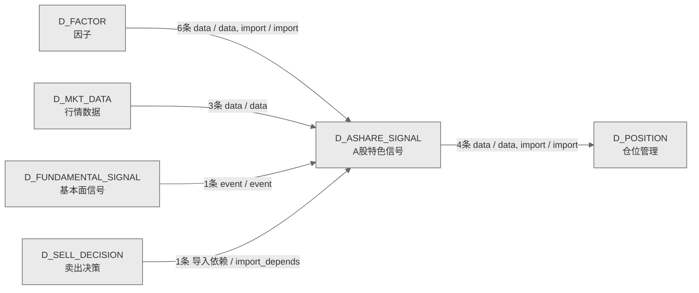

# 32_d_ashare_signal / A股特色信号域 / A-Share Signal

> **功能简介 / Overview**: A 股特色信号，负责 A 股市场特色交易信号的生成和管理

> **文档作用 / Purpose**: 展示 A股特色信号（D_ASHARE_SIGNAL）功能域的域内依赖关系、跨域依赖关系，模块信息（成熟度/中英文名/大白话/文件路径）内嵌于 Mermaid 节点，供架构审查和域治理参考。

> 本文档由 generate_domain_doc.py 从 depgraph (PostgreSQL) 自动生成
> 数据源: depgraph (PostgreSQL) nodes表 + edges表

> **[可缩放 HTML 版 / Zoomable HTML](http://localhost:8765/docs/02_enterprise_architecture/02_domain_architecture_docs/_zoomable_html/32_d_ashare_signal.html)** — Ctrl+滚轮缩放 ｜ 双击重置 ｜ Ctrl+Shift+D 切换拖动/选择模式

## 域基本信息 / Domain Overview

| 字段 | 值 | Field | Value |
|------|------|-------|-------|
| 编号 | 32 | Number | 32 |
| 域ID | D_ASHARE_SIGNAL | Domain ID | D_ASHARE_SIGNAL |
| 域名称 | A股特色信号 | Domain Name | A-Share Signal |
| 层级 | L2 业务域层 | Layer | L2 Domain |
| 模块数 | 36 | Module Count | 36 |
| 域内依赖 | 24 | Internal Dependencies | 24 |
| 跨域入边 | 11 | Cross-domain Incoming | 11 |
| 跨域出边 | 4 | Cross-domain Outgoing | 4 |
| 设计态模块 | 20 | Design Modules | 20 |
| 生产态模块 | 16 | Production Modules | 16 |
| 容量 | 16/150 (正常) | Capacity | 16/150 (正常) |
| 描述 | A股特色信号生成 | Description | A股特色信号生成 |

## 域内依赖图 / Internal Dependency Diagram

> 依赖图内嵌在本文档中，IDE 可直接渲染；网页版可 Ctrl+滚轮缩放 + 拖动平移查看细节。
>
> **图例说明 / Legend**：
> - 🟦 **蓝色 = 运营态模块**（production，已上线运行）
> - 🟧 **橙色虚线 = 设计态模块**（design，蓝图阶段，代码未写）
> - **实线箭头 = 运营态依赖**（已生效的依赖关系）
> - **虚线箭头 = 非运营态依赖**（计划中/验证中的依赖关系）

### 全景图（全部模块，颜色区分运营态/设计态）

> 展示全部 36 个模块（生产态 16 + 设计态 20），含跨域依赖外部节点。节点含成熟度+名称+大白话/简介+文件路径。

```mermaid
%%{init: {'theme': 'base', 'themeVariables': {'primaryColor': '#eaeaea', 'primaryTextColor': '#333333', 'primaryBorderColor': '#666666', 'lineColor': '#666666', 'secondaryColor': '#eaeaea', 'tertiaryColor': '#eaeaea', 'fontSize': '14px'}}}%%
flowchart TD
    src_zephyr_signal_ashare_init_py["zephyr/signal_ashare 包入口<br/>signal ashare 包入口，整合signal<br/>ashare相关子模块导出<br/>文件: signal_ashare/__init__.py<br/>(生产态 / production)"]
    src_zephyr_signal_ashare_extensions_init_py["signal_ashare/_extensions 包入口<br/>signal ashare 扩展<br/>包入口，整合扩展相关子模块导出<br/>文件: _extensions/__init__.py<br/>(生产态 / production)"]
    src_zephyr_signal_ashare_adaptive_conformal_tcp_rm_ddci_py["signal_ashare/adaptive_conformal_tcp_rm_ddci<br/>signal ashare包的adaptive_conformal_tcp_rm_ddci<br/>模块<br/>文件: signal_ashare<br/>/adaptive_conformal_tcp_rm_ddci.py<br/>(设计态 / design)"]
    src_zephyr_signal_ashare_adjustment_cycle_tracker_py["调整周期追踪<br/>追踪板块调整走到哪了——进度≥80%才允许分批低吸，初<br/>期<40%直接拦截。<br/>Adjustment Cycle Tracking<br/>文件: signal_ashare/adjustment_cycle_tracker.py<br/>(设计态 / design)"]
    src_zephyr_signal_ashare_api_init_py["signal_ashare/api 包入口<br/>signal ashare 接口<br/>包入口，整合接口相关子模块导出<br/>文件: api/__init__.py<br/>(生产态 / production)"]
    src_zephyr_signal_ashare_causal_factor_validator_py["signal_ashare/causal_factor_validator<br/>signal ashare包的causal_factor_validator模块<br/>文件: signal_ashare/causal_factor_validator.py<br/>(设计态 / design)"]
    src_zephyr_signal_ashare_causal_inference_engine_py["知识图谱与因果推演<br/>把事件、公司、行业的关联织成图谱，事件一来就推演<br/>传导路径，并区分关联因子和因果因子。<br/>Knowledge Graph & Causal Inference<br/>文件: signal_ashare/causal_inference_engine.py<br/>(设计态 / design)"]
    src_zephyr_signal_ashare_conditional_density_predictor_py["收益率条件密度预测<br/>不只预测明天涨多少，而是预测明天收益率的完整概率<br/>分布——偏多少、尾巴多厚、极端情况多罕见。<br/>Conditional Density Prediction<br/>文件: signal_ashare<br/>/conditional_density_predictor.py<br/>(设计态 / design)"]
    src_zephyr_signal_ashare_core_init_py["signal_ashare/core 包入口<br/>signal ashare 核心<br/>包入口，整合核心相关子模块导出<br/>文件: core/__init__.py<br/>(生产态 / production)"]
    src_zephyr_signal_ashare_infrastructure_init_py["signal_ashare/infrastructure 包入口<br/>signal ashare 基础设施<br/>包入口，整合基础设施相关子模块导出<br/>文件: infrastructure/__init__.py<br/>(生产态 / production)"]
    src_zephyr_signal_ashare_intraday_buy_sell_point_analyzer_py["日内买卖点分析器<br/>信号的分析器，分析数据找出问题或规律（intraday<br/>buy sell point）<br/>intraday_buy_sell_point_analyzer<br/>文件: signal_ashare<br/>/intraday_buy_sell_point_analyzer.py<br/>(生产态 / production)"]
    src_zephyr_signal_ashare_kronos_tsfm_predictor_py["signal_ashare/kronos_tsfm_predictor<br/>signal ashare包的kronos_tsfm_predictor模块<br/>文件: signal_ashare/kronos_tsfm_predictor.py<br/>(设计态 / design)"]
    src_zephyr_signal_ashare_mamba_ssm_temporal_enhancer_py["signal_ashare/mamba_ssm_temporal_enhancer<br/>signal ashare包的mamba_ssm_temporal_enhancer模块<br/>文件: signal_ashare<br/>/mamba_ssm_temporal_enhancer.py<br/>(设计态 / design)"]
    src_zephyr_signal_ashare_market_lifecycle_phase_py["行情生命周期阶段<br/>判断行情在春夏秋冬哪一季——冬季禁止抄底，秋季突破<br/>失败更倾向强制离场。<br/>Market Lifecycle Phase<br/>文件: signal_ashare/market_lifecycle_phase.py<br/>(设计态 / design)"]
    src_zephyr_signal_ashare_market_sentiment_analyzer_py["市场情绪分析器<br/>信号的分析器，分析数据找出问题或规律（market<br/>sentiment）<br/>market_sentiment_analyzer<br/>文件: signal_ashare/market_sentiment_analyzer.py<br/>(生产态 / production)"]
    src_zephyr_signal_ashare_market_state_sensor_py["市场状态Sensor<br/>signal ashare包的market_state_sensor模块<br/>Market State Sensor<br/>文件: signal_ashare/market_state_sensor.py<br/>(设计态 / design)"]
    src_zephyr_signal_ashare_models_init_py["signal_ashare/models 包入口<br/>signal ashare 模型<br/>包入口，整合模型相关子模块导出<br/>文件: models/__init__.py<br/>(生产态 / production)"]
    src_zephyr_signal_ashare_sector_analyzer_py["板块分析器<br/>信号的分析器，分析数据找出问题或规律（sector）<br/>sector_analyzer<br/>文件: signal_ashare/sector_analyzer.py<br/>(生产态 / production)"]
    src_zephyr_signal_ashare_services_init_py["signal_ashare/services 包入口<br/>signal ashare 服务<br/>包入口，整合服务相关子模块导出<br/>文件: services/__init__.py<br/>(生产态 / production)"]
    src_zephyr_signal_ashare_short_term_stock_selector_py["短期股票选择器<br/>信号的选择器，按条件选择最优项<br/>short_term_stock_selector<br/>文件: signal_ashare/short_term_stock_selector.py<br/>(生产态 / production)"]
    src_zephyr_signal_ashare_supply_chain_gnn_py["signal_ashare/supply_chain_gnn<br/>signal ashare包的supply_chain_gnn模块<br/>文件: signal_ashare/supply_chain_gnn.py<br/>(设计态 / design)"]
    src_zephyr_signal_ashare_xlstm_long_memory_py["signal_ashare/xlstm_long_memory<br/>signal ashare包的xlstm_long_memory模块<br/>文件: signal_ashare/xlstm_long_memory.py<br/>(设计态 / design)"]
    src_zephyr_signal_ashare_init_py ~~~ src_zephyr_signal_ashare_extensions_init_py
    src_zephyr_signal_ashare_extensions_init_py ~~~ src_zephyr_signal_ashare_adaptive_conformal_tcp_rm_ddci_py
    src_zephyr_signal_ashare_adaptive_conformal_tcp_rm_ddci_py ~~~ src_zephyr_signal_ashare_adjustment_cycle_tracker_py
    src_zephyr_signal_ashare_adjustment_cycle_tracker_py ~~~ src_zephyr_signal_ashare_api_init_py
    src_zephyr_signal_ashare_api_init_py ~~~ src_zephyr_signal_ashare_causal_factor_validator_py
    src_zephyr_signal_ashare_causal_factor_validator_py ~~~ src_zephyr_signal_ashare_causal_inference_engine_py
    src_zephyr_signal_ashare_causal_inference_engine_py ~~~ src_zephyr_signal_ashare_conditional_density_predictor_py
    src_zephyr_signal_ashare_conditional_density_predictor_py ~~~ src_zephyr_signal_ashare_core_init_py
    src_zephyr_signal_ashare_core_init_py ~~~ src_zephyr_signal_ashare_infrastructure_init_py
    src_zephyr_signal_ashare_infrastructure_init_py ~~~ src_zephyr_signal_ashare_intraday_buy_sell_point_analyzer_py
    src_zephyr_signal_ashare_intraday_buy_sell_point_analyzer_py ~~~ src_zephyr_signal_ashare_kronos_tsfm_predictor_py
    src_zephyr_signal_ashare_kronos_tsfm_predictor_py ~~~ src_zephyr_signal_ashare_mamba_ssm_temporal_enhancer_py
    src_zephyr_signal_ashare_mamba_ssm_temporal_enhancer_py ~~~ src_zephyr_signal_ashare_market_lifecycle_phase_py
    src_zephyr_signal_ashare_market_lifecycle_phase_py ~~~ src_zephyr_signal_ashare_market_sentiment_analyzer_py
    src_zephyr_signal_ashare_market_sentiment_analyzer_py ~~~ src_zephyr_signal_ashare_market_state_sensor_py
    src_zephyr_signal_ashare_market_state_sensor_py ~~~ src_zephyr_signal_ashare_models_init_py
    src_zephyr_signal_ashare_models_init_py ~~~ src_zephyr_signal_ashare_sector_analyzer_py
    src_zephyr_signal_ashare_sector_analyzer_py ~~~ src_zephyr_signal_ashare_services_init_py
    src_zephyr_signal_ashare_services_init_py ~~~ src_zephyr_signal_ashare_short_term_stock_selector_py
    src_zephyr_signal_ashare_short_term_stock_selector_py ~~~ src_zephyr_signal_ashare_supply_chain_gnn_py
    src_zephyr_signal_ashare_supply_chain_gnn_py ~~~ src_zephyr_signal_ashare_xlstm_long_memory_py
    src_zephyr_signal_ashare_capital_flow_pattern_analyzer_py["资本流模式分析器<br/>信号的分析器，分析数据找出问题或规律（capital<br/>flow pattern）<br/>capital_flow_pattern_analyzer<br/>文件: signal_ashare<br/>/capital_flow_pattern_analyzer.py<br/>(生产态 / production)"]
    src_zephyr_signal_ashare_conformal_predictor_py["共形预测<br/>给预测区间加数学保证——不管分布长什么样，区间覆盖<br/>率有数学证明。<br/>Conformal Prediction<br/>文件: signal_ashare/conformal_predictor.py<br/>(设计态 / design)"]
    src_zephyr_signal_ashare_cross_market_conduction_sensor_py["跨市场传导感知<br/>美股、港股、汇率、商品一异动，立刻算出对A股的传<br/>导系数和影响幅度，触发全量或板块重算。<br/>Cross-Market Conduction Sensing<br/>文件: signal_ashare<br/>/cross_market_conduction_sensor.py<br/>(设计态 / design)"]
    src_zephyr_signal_ashare_dual_engine_fusion_decision_engine_py["双引擎融合决策引擎<br/>信号的引擎，执行核心逻辑的处理引擎（dual engine<br/>fusion decision）<br/>dual_engine_fusion_decision_engine<br/>文件: signal_ashare<br/>/dual_engine_fusion_decision_engine.py<br/>(生产态 / production)"]
    src_zephyr_signal_ashare_institutional_behavior_analyzer_py["机构行为分析器<br/>信号的分析器，分析数据找出问题或规律<br/>（institutional behavior）<br/>institutional_behavior_analyzer<br/>文件: signal_ashare<br/>/institutional_behavior_analyzer.py<br/>(生产态 / production)"]
    src_zephyr_signal_ashare_next_day_8state_forecast_py["NextDay8状态Forecast<br/>signal ashare包的next_day_8state_forecast模块<br/>Next Day 8state Forecast<br/>文件: signal_ashare/next_day_8state_forecast.py<br/>(设计态 / design)"]
    src_zephyr_signal_ashare_regime_change_detector_py["体制转换检测<br/>盯着市场脾气会不会变——趋势转震荡、牛转熊的切换点<br/>提前预警。<br/>Regime Change Detection<br/>文件: signal_ashare/regime_change_detector.py<br/>(设计态 / design)"]
    src_zephyr_signal_ashare_survival_time_predictor_py["Survival止盈止损时间预测<br/>预测止盈止损还有多久发生——不是固定N天，而是时间<br/>概率分布。<br/>Survival Stop-Time Prediction<br/>文件: signal_ashare/survival_time_predictor.py<br/>(设计态 / design)"]
    src_zephyr_signal_ashare_capital_flow_pattern_analyzer_py ~~~ src_zephyr_signal_ashare_conformal_predictor_py
    src_zephyr_signal_ashare_conformal_predictor_py ~~~ src_zephyr_signal_ashare_cross_market_conduction_sensor_py
    src_zephyr_signal_ashare_cross_market_conduction_sensor_py ~~~ src_zephyr_signal_ashare_dual_engine_fusion_decision_engine_py
    src_zephyr_signal_ashare_dual_engine_fusion_decision_engine_py ~~~ src_zephyr_signal_ashare_institutional_behavior_analyzer_py
    src_zephyr_signal_ashare_institutional_behavior_analyzer_py ~~~ src_zephyr_signal_ashare_next_day_8state_forecast_py
    src_zephyr_signal_ashare_next_day_8state_forecast_py ~~~ src_zephyr_signal_ashare_regime_change_detector_py
    src_zephyr_signal_ashare_regime_change_detector_py ~~~ src_zephyr_signal_ashare_survival_time_predictor_py
    src_zephyr_signal_ashare_quant_short_term_strength_engine_py["量化短期强度引擎<br/>信号的引擎，执行核心逻辑的处理引擎（quant short<br/>term strength）<br/>quant_short_term_strength_engine<br/>文件: signal_ashare<br/>/quant_short_term_strength_engine.py<br/>(生产态 / production)"]
    src_zephyr_signal_ashare_tiered_screening_filter_py["分级指标过滤<br/>选股漏斗第一层——3秒级把全市场7000只砍到1200只，<br/>涨停跌停停牌ST次新弃庄统统按规则排除。<br/>Tiered Screening Filter<br/>文件: signal_ashare/tiered_screening_filter.py<br/>(设计态 / design)"]
    src_zephyr_signal_ashare_youzi_relay_emotion_engine_py["游资中继情绪引擎<br/>信号的引擎，执行核心逻辑的处理引擎（youzi relay<br/>emotion）<br/>youzi_relay_emotion_engine<br/>文件: signal_ashare<br/>/youzi_relay_emotion_engine.py<br/>(生产态 / production)"]
    src_zephyr_signal_ashare_quant_short_term_strength_engine_py ~~~ src_zephyr_signal_ashare_tiered_screening_filter_py
    src_zephyr_signal_ashare_tiered_screening_filter_py ~~~ src_zephyr_signal_ashare_youzi_relay_emotion_engine_py
    src_zephyr_signal_ashare_coarse_screening_funnel_py["初筛漏斗<br/>漏斗第二层——60秒级从1200只筛到300只，看技术形态<br/>、量价配合、板块强度、主力阶段、市场状态适配。<br/>Coarse Screening Funnel<br/>文件: signal_ashare/coarse_screening_funnel.py<br/>(设计态 / design)"]
    src_zephyr_signal_ashare_fine_scoring_engine_py["精筛评分<br/>漏斗第三层——60秒级从300只评到50只，多维因子打分+<br/>市场状态动态偏移+主力+8态+拥挤度+密度分布全用上<br/>。<br/>Fine Scoring<br/>文件: signal_ashare/fine_scoring_engine.py<br/>(设计态 / design)"]
    src_zephyr_signal_ashare_event_driven_screener_py["事件驱动分布筛选<br/>漏斗第四层——从50只筛到30只，看事件影响、事件修正<br/>后的概率分布、传导链风险，没事件数据源就跳过。<br/>Event-Driven Distribution Screening<br/>文件: signal_ashare/event_driven_screener.py<br/>(设计态 / design)"]
    src_zephyr_signal_ashare_market_state_sensor_py -.->|import / import| src_zephyr_signal_ashare_regime_change_detector_py
    src_zephyr_signal_ashare_market_state_sensor_py -.->|import / import| src_zephyr_signal_ashare_survival_time_predictor_py
    src_zephyr_signal_ashare_market_state_sensor_py -.->|import / import| src_zephyr_signal_ashare_coarse_screening_funnel_py
    src_zephyr_signal_ashare_market_state_sensor_py -.->|import / import| src_zephyr_signal_ashare_fine_scoring_engine_py
    src_zephyr_signal_ashare_next_day_8state_forecast_py -.->|import / import| src_zephyr_signal_ashare_fine_scoring_engine_py
    src_zephyr_signal_ashare_causal_inference_engine_py -.->|import / import| src_zephyr_signal_ashare_cross_market_conduction_sensor_py
    src_zephyr_signal_ashare_causal_inference_engine_py -.->|import / import| src_zephyr_signal_ashare_event_driven_screener_py
    src_zephyr_signal_ashare_conditional_density_predictor_py -.->|import / import| src_zephyr_signal_ashare_next_day_8state_forecast_py
    src_zephyr_signal_ashare_conditional_density_predictor_py -.->|import / import| src_zephyr_signal_ashare_conformal_predictor_py
    src_zephyr_signal_ashare_conditional_density_predictor_py -.->|import / import| src_zephyr_signal_ashare_fine_scoring_engine_py
    src_zephyr_signal_ashare_conditional_density_predictor_py -.->|import / import| src_zephyr_signal_ashare_event_driven_screener_py
    src_zephyr_signal_ashare_tiered_screening_filter_py -.->|import / import| src_zephyr_signal_ashare_coarse_screening_funnel_py
    src_zephyr_signal_ashare_coarse_screening_funnel_py -.->|import / import| src_zephyr_signal_ashare_fine_scoring_engine_py
    src_zephyr_signal_ashare_fine_scoring_engine_py -.->|import / import| src_zephyr_signal_ashare_event_driven_screener_py
    src_zephyr_signal_ashare_dual_engine_fusion_decision_engine_py -->|runtime / runtime| src_zephyr_signal_ashare_quant_short_term_strength_engine_py
    src_zephyr_signal_ashare_dual_engine_fusion_decision_engine_py -->|导入依赖 / import_depends| src_zephyr_signal_ashare_quant_short_term_strength_engine_py
    src_zephyr_signal_ashare_dual_engine_fusion_decision_engine_py -->|runtime / runtime| src_zephyr_signal_ashare_youzi_relay_emotion_engine_py
    src_zephyr_signal_ashare_dual_engine_fusion_decision_engine_py -->|导入依赖 / import_depends| src_zephyr_signal_ashare_youzi_relay_emotion_engine_py
    src_zephyr_signal_ashare_institutional_behavior_analyzer_py -.->|data / data| src_zephyr_signal_ashare_tiered_screening_filter_py
    src_zephyr_signal_ashare_institutional_behavior_analyzer_py -.->|data / data| src_zephyr_signal_ashare_coarse_screening_funnel_py
    src_zephyr_signal_ashare_institutional_behavior_analyzer_py -.->|data / data| src_zephyr_signal_ashare_fine_scoring_engine_py
    src_zephyr_signal_ashare_intraday_buy_sell_point_analyzer_py -->|import / import| src_zephyr_signal_ashare_institutional_behavior_analyzer_py
    src_zephyr_signal_ashare_intraday_buy_sell_point_analyzer_py -->|import / import| src_zephyr_signal_ashare_capital_flow_pattern_analyzer_py
    src_zephyr_signal_ashare_init_py -->|config_depends / config_depends| src_zephyr_signal_ashare_dual_engine_fusion_decision_engine_py
    D_POSITION["仓位管理<br/>仓位管理，负责持仓跟踪、仓位计算和盈亏分析<br/>Position Management<br/>跨域节点 / cross-domain<br/>(设计态 / design)"]
    src_zephyr_signal_ashare_market_state_sensor_py -.->|import / import| D_POSITION
    src_zephyr_signal_ashare_next_day_8state_forecast_py -.->|import / import| D_POSITION
    src_zephyr_signal_ashare_institutional_behavior_analyzer_py -.->|data / data| D_POSITION
    src_zephyr_signal_ashare_youzi_relay_emotion_engine_py -.->|data / data| D_POSITION
    D_SELL_DECISION["卖出决策<br/>卖出决策，负责卖出信号生成、卖出时机判断和退出策<br/>略<br/>Sell Decision<br/>跨域节点 / cross-domain<br/>(设计态 / design)"]
    D_SELL_DECISION -.->|导入依赖 / import_depends| src_zephyr_signal_ashare_institutional_behavior_analyzer_py
    D_FUNDAMENTAL_SIGNAL["基本面信号<br/>基本面信号，负责基于财务数据的基本面信号生成<br/>Fundamental Signal<br/>跨域节点 / cross-domain<br/>(设计态 / design)"]
    D_FUNDAMENTAL_SIGNAL -.->|event / event| src_zephyr_signal_ashare_institutional_behavior_analyzer_py
    D_FACTOR["因子<br/>因子，负责因子计算、因子库管理和因子评价<br/>Factor<br/>跨域节点 / cross-domain<br/>(生产态 / production)"]
    D_FACTOR -.->|data / data| src_zephyr_signal_ashare_causal_inference_engine_py
    D_FACTOR -.->|data / data| src_zephyr_signal_ashare_conditional_density_predictor_py
    D_FACTOR -.->|data / data| src_zephyr_signal_ashare_coarse_screening_funnel_py
    D_FACTOR -.->|data / data| src_zephyr_signal_ashare_fine_scoring_engine_py
    D_FACTOR -.->|data / data| src_zephyr_signal_ashare_market_state_sensor_py
    D_MKT_DATA["行情数据<br/>行情数据，负责市场行情数据的采集、分发和订阅管理<br/>Market Data<br/>跨域节点 / cross-domain<br/>(生产态 / production)"]
    D_MKT_DATA -.->|data / data| src_zephyr_signal_ashare_cross_market_conduction_sensor_py
    D_MKT_DATA -.->|data / data| src_zephyr_signal_ashare_adjustment_cycle_tracker_py
    D_MKT_DATA -.->|data / data| src_zephyr_signal_ashare_market_lifecycle_phase_py
    D_FACTOR -.->|import / import| src_zephyr_signal_ashare_conditional_density_predictor_py
    classDef production fill:#e1f5fe,stroke:#01579b,stroke-width:2px,color:#000
    classDef design fill:#fff3e0,stroke:#e65100,stroke-width:2px,color:#000,stroke-dasharray: 5 5
    classDef external_prod fill:#e8f4fd,stroke:#0277bd,stroke-width:1px,color:#000
    classDef external_design fill:#fff8e7,stroke:#ef6c00,stroke-width:1px,color:#000,stroke-dasharray: 5 5
    class src_zephyr_signal_ashare_init_py,src_zephyr_signal_ashare_extensions_init_py,src_zephyr_signal_ashare_api_init_py,src_zephyr_signal_ashare_capital_flow_pattern_analyzer_py,src_zephyr_signal_ashare_core_init_py,src_zephyr_signal_ashare_dual_engine_fusion_decision_engine_py,src_zephyr_signal_ashare_infrastructure_init_py,src_zephyr_signal_ashare_institutional_behavior_analyzer_py,src_zephyr_signal_ashare_intraday_buy_sell_point_analyzer_py,src_zephyr_signal_ashare_market_sentiment_analyzer_py,src_zephyr_signal_ashare_models_init_py,src_zephyr_signal_ashare_quant_short_term_strength_engine_py,src_zephyr_signal_ashare_sector_analyzer_py,src_zephyr_signal_ashare_services_init_py,src_zephyr_signal_ashare_short_term_stock_selector_py,src_zephyr_signal_ashare_youzi_relay_emotion_engine_py production
    class src_zephyr_signal_ashare_adaptive_conformal_tcp_rm_ddci_py,src_zephyr_signal_ashare_adjustment_cycle_tracker_py,src_zephyr_signal_ashare_causal_factor_validator_py,src_zephyr_signal_ashare_causal_inference_engine_py,src_zephyr_signal_ashare_coarse_screening_funnel_py,src_zephyr_signal_ashare_conditional_density_predictor_py,src_zephyr_signal_ashare_conformal_predictor_py,src_zephyr_signal_ashare_cross_market_conduction_sensor_py,src_zephyr_signal_ashare_event_driven_screener_py,src_zephyr_signal_ashare_fine_scoring_engine_py,src_zephyr_signal_ashare_kronos_tsfm_predictor_py,src_zephyr_signal_ashare_mamba_ssm_temporal_enhancer_py,src_zephyr_signal_ashare_market_lifecycle_phase_py,src_zephyr_signal_ashare_market_state_sensor_py,src_zephyr_signal_ashare_next_day_8state_forecast_py,src_zephyr_signal_ashare_regime_change_detector_py,src_zephyr_signal_ashare_supply_chain_gnn_py,src_zephyr_signal_ashare_survival_time_predictor_py,src_zephyr_signal_ashare_tiered_screening_filter_py,src_zephyr_signal_ashare_xlstm_long_memory_py design
    class D_FACTOR,D_MKT_DATA external_prod
    class D_POSITION,D_SELL_DECISION,D_FUNDAMENTAL_SIGNAL external_design
```

### 运营态的图（仅 design_maturity=production 的模块和域内依赖）

> 仅展示已上线运行的模块（共 16 个），不含跨域外部节点。跨域依赖见下方跨域依赖章节。

```mermaid
%%{init: {'theme': 'base', 'themeVariables': {'primaryColor': '#eaeaea', 'primaryTextColor': '#333333', 'primaryBorderColor': '#666666', 'lineColor': '#666666', 'secondaryColor': '#eaeaea', 'tertiaryColor': '#eaeaea', 'fontSize': '14px'}}}%%
flowchart TD
    src_zephyr_signal_ashare_init_py["zephyr/signal_ashare 包入口<br/>signal ashare 包入口，整合signal<br/>ashare相关子模块导出<br/>文件: signal_ashare/__init__.py<br/>(生产态 / production)"]
    src_zephyr_signal_ashare_extensions_init_py["signal_ashare/_extensions 包入口<br/>signal ashare 扩展<br/>包入口，整合扩展相关子模块导出<br/>文件: _extensions/__init__.py<br/>(生产态 / production)"]
    src_zephyr_signal_ashare_api_init_py["signal_ashare/api 包入口<br/>signal ashare 接口<br/>包入口，整合接口相关子模块导出<br/>文件: api/__init__.py<br/>(生产态 / production)"]
    src_zephyr_signal_ashare_core_init_py["signal_ashare/core 包入口<br/>signal ashare 核心<br/>包入口，整合核心相关子模块导出<br/>文件: core/__init__.py<br/>(生产态 / production)"]
    src_zephyr_signal_ashare_infrastructure_init_py["signal_ashare/infrastructure 包入口<br/>signal ashare 基础设施<br/>包入口，整合基础设施相关子模块导出<br/>文件: infrastructure/__init__.py<br/>(生产态 / production)"]
    src_zephyr_signal_ashare_intraday_buy_sell_point_analyzer_py["日内买卖点分析器<br/>信号的分析器，分析数据找出问题或规律（intraday<br/>buy sell point）<br/>intraday_buy_sell_point_analyzer<br/>文件: signal_ashare<br/>/intraday_buy_sell_point_analyzer.py<br/>(生产态 / production)"]
    src_zephyr_signal_ashare_market_sentiment_analyzer_py["市场情绪分析器<br/>信号的分析器，分析数据找出问题或规律（market<br/>sentiment）<br/>market_sentiment_analyzer<br/>文件: signal_ashare/market_sentiment_analyzer.py<br/>(生产态 / production)"]
    src_zephyr_signal_ashare_models_init_py["signal_ashare/models 包入口<br/>signal ashare 模型<br/>包入口，整合模型相关子模块导出<br/>文件: models/__init__.py<br/>(生产态 / production)"]
    src_zephyr_signal_ashare_sector_analyzer_py["板块分析器<br/>信号的分析器，分析数据找出问题或规律（sector）<br/>sector_analyzer<br/>文件: signal_ashare/sector_analyzer.py<br/>(生产态 / production)"]
    src_zephyr_signal_ashare_services_init_py["signal_ashare/services 包入口<br/>signal ashare 服务<br/>包入口，整合服务相关子模块导出<br/>文件: services/__init__.py<br/>(生产态 / production)"]
    src_zephyr_signal_ashare_short_term_stock_selector_py["短期股票选择器<br/>信号的选择器，按条件选择最优项<br/>short_term_stock_selector<br/>文件: signal_ashare/short_term_stock_selector.py<br/>(生产态 / production)"]
    src_zephyr_signal_ashare_init_py ~~~ src_zephyr_signal_ashare_extensions_init_py
    src_zephyr_signal_ashare_extensions_init_py ~~~ src_zephyr_signal_ashare_api_init_py
    src_zephyr_signal_ashare_api_init_py ~~~ src_zephyr_signal_ashare_core_init_py
    src_zephyr_signal_ashare_core_init_py ~~~ src_zephyr_signal_ashare_infrastructure_init_py
    src_zephyr_signal_ashare_infrastructure_init_py ~~~ src_zephyr_signal_ashare_intraday_buy_sell_point_analyzer_py
    src_zephyr_signal_ashare_intraday_buy_sell_point_analyzer_py ~~~ src_zephyr_signal_ashare_market_sentiment_analyzer_py
    src_zephyr_signal_ashare_market_sentiment_analyzer_py ~~~ src_zephyr_signal_ashare_models_init_py
    src_zephyr_signal_ashare_models_init_py ~~~ src_zephyr_signal_ashare_sector_analyzer_py
    src_zephyr_signal_ashare_sector_analyzer_py ~~~ src_zephyr_signal_ashare_services_init_py
    src_zephyr_signal_ashare_services_init_py ~~~ src_zephyr_signal_ashare_short_term_stock_selector_py
    src_zephyr_signal_ashare_capital_flow_pattern_analyzer_py["资本流模式分析器<br/>信号的分析器，分析数据找出问题或规律（capital<br/>flow pattern）<br/>capital_flow_pattern_analyzer<br/>文件: signal_ashare<br/>/capital_flow_pattern_analyzer.py<br/>(生产态 / production)"]
    src_zephyr_signal_ashare_dual_engine_fusion_decision_engine_py["双引擎融合决策引擎<br/>信号的引擎，执行核心逻辑的处理引擎（dual engine<br/>fusion decision）<br/>dual_engine_fusion_decision_engine<br/>文件: signal_ashare<br/>/dual_engine_fusion_decision_engine.py<br/>(生产态 / production)"]
    src_zephyr_signal_ashare_institutional_behavior_analyzer_py["机构行为分析器<br/>信号的分析器，分析数据找出问题或规律<br/>（institutional behavior）<br/>institutional_behavior_analyzer<br/>文件: signal_ashare<br/>/institutional_behavior_analyzer.py<br/>(生产态 / production)"]
    src_zephyr_signal_ashare_capital_flow_pattern_analyzer_py ~~~ src_zephyr_signal_ashare_dual_engine_fusion_decision_engine_py
    src_zephyr_signal_ashare_dual_engine_fusion_decision_engine_py ~~~ src_zephyr_signal_ashare_institutional_behavior_analyzer_py
    src_zephyr_signal_ashare_quant_short_term_strength_engine_py["量化短期强度引擎<br/>信号的引擎，执行核心逻辑的处理引擎（quant short<br/>term strength）<br/>quant_short_term_strength_engine<br/>文件: signal_ashare<br/>/quant_short_term_strength_engine.py<br/>(生产态 / production)"]
    src_zephyr_signal_ashare_youzi_relay_emotion_engine_py["游资中继情绪引擎<br/>信号的引擎，执行核心逻辑的处理引擎（youzi relay<br/>emotion）<br/>youzi_relay_emotion_engine<br/>文件: signal_ashare<br/>/youzi_relay_emotion_engine.py<br/>(生产态 / production)"]
    src_zephyr_signal_ashare_quant_short_term_strength_engine_py ~~~ src_zephyr_signal_ashare_youzi_relay_emotion_engine_py
    src_zephyr_signal_ashare_dual_engine_fusion_decision_engine_py -->|runtime / runtime| src_zephyr_signal_ashare_quant_short_term_strength_engine_py
    src_zephyr_signal_ashare_dual_engine_fusion_decision_engine_py -->|导入依赖 / import_depends| src_zephyr_signal_ashare_quant_short_term_strength_engine_py
    src_zephyr_signal_ashare_dual_engine_fusion_decision_engine_py -->|runtime / runtime| src_zephyr_signal_ashare_youzi_relay_emotion_engine_py
    src_zephyr_signal_ashare_dual_engine_fusion_decision_engine_py -->|导入依赖 / import_depends| src_zephyr_signal_ashare_youzi_relay_emotion_engine_py
    src_zephyr_signal_ashare_intraday_buy_sell_point_analyzer_py -->|import / import| src_zephyr_signal_ashare_institutional_behavior_analyzer_py
    src_zephyr_signal_ashare_intraday_buy_sell_point_analyzer_py -->|import / import| src_zephyr_signal_ashare_capital_flow_pattern_analyzer_py
    src_zephyr_signal_ashare_init_py -->|config_depends / config_depends| src_zephyr_signal_ashare_dual_engine_fusion_decision_engine_py
    classDef production fill:#e1f5fe,stroke:#01579b,stroke-width:2px,color:#000
    classDef design fill:#fff3e0,stroke:#e65100,stroke-width:2px,color:#000,stroke-dasharray: 5 5
    classDef external_prod fill:#e8f4fd,stroke:#0277bd,stroke-width:1px,color:#000
    classDef external_design fill:#fff8e7,stroke:#ef6c00,stroke-width:1px,color:#000,stroke-dasharray: 5 5
    class src_zephyr_signal_ashare_init_py,src_zephyr_signal_ashare_extensions_init_py,src_zephyr_signal_ashare_api_init_py,src_zephyr_signal_ashare_capital_flow_pattern_analyzer_py,src_zephyr_signal_ashare_core_init_py,src_zephyr_signal_ashare_dual_engine_fusion_decision_engine_py,src_zephyr_signal_ashare_infrastructure_init_py,src_zephyr_signal_ashare_institutional_behavior_analyzer_py,src_zephyr_signal_ashare_intraday_buy_sell_point_analyzer_py,src_zephyr_signal_ashare_market_sentiment_analyzer_py,src_zephyr_signal_ashare_models_init_py,src_zephyr_signal_ashare_quant_short_term_strength_engine_py,src_zephyr_signal_ashare_sector_analyzer_py,src_zephyr_signal_ashare_services_init_py,src_zephyr_signal_ashare_short_term_stock_selector_py,src_zephyr_signal_ashare_youzi_relay_emotion_engine_py production
```



### 设计态的图（仅 design_maturity=design 的模块和域内依赖）

> 仅展示蓝图阶段、代码未写的设计态模块（共 20 个），不含跨域外部节点。

```mermaid
%%{init: {'theme': 'base', 'themeVariables': {'primaryColor': '#eaeaea', 'primaryTextColor': '#333333', 'primaryBorderColor': '#666666', 'lineColor': '#666666', 'secondaryColor': '#eaeaea', 'tertiaryColor': '#eaeaea', 'fontSize': '14px'}}}%%
flowchart TD
    src_zephyr_signal_ashare_adaptive_conformal_tcp_rm_ddci_py["signal_ashare/adaptive_conformal_tcp_rm_ddci<br/>signal ashare包的adaptive_conformal_tcp_rm_ddci<br/>模块<br/>文件: signal_ashare<br/>/adaptive_conformal_tcp_rm_ddci.py<br/>(设计态 / design)"]
    src_zephyr_signal_ashare_adjustment_cycle_tracker_py["调整周期追踪<br/>追踪板块调整走到哪了——进度≥80%才允许分批低吸，初<br/>期<40%直接拦截。<br/>Adjustment Cycle Tracking<br/>文件: signal_ashare/adjustment_cycle_tracker.py<br/>(设计态 / design)"]
    src_zephyr_signal_ashare_causal_factor_validator_py["signal_ashare/causal_factor_validator<br/>signal ashare包的causal_factor_validator模块<br/>文件: signal_ashare/causal_factor_validator.py<br/>(设计态 / design)"]
    src_zephyr_signal_ashare_causal_inference_engine_py["知识图谱与因果推演<br/>把事件、公司、行业的关联织成图谱，事件一来就推演<br/>传导路径，并区分关联因子和因果因子。<br/>Knowledge Graph & Causal Inference<br/>文件: signal_ashare/causal_inference_engine.py<br/>(设计态 / design)"]
    src_zephyr_signal_ashare_conditional_density_predictor_py["收益率条件密度预测<br/>不只预测明天涨多少，而是预测明天收益率的完整概率<br/>分布——偏多少、尾巴多厚、极端情况多罕见。<br/>Conditional Density Prediction<br/>文件: signal_ashare<br/>/conditional_density_predictor.py<br/>(设计态 / design)"]
    src_zephyr_signal_ashare_kronos_tsfm_predictor_py["signal_ashare/kronos_tsfm_predictor<br/>signal ashare包的kronos_tsfm_predictor模块<br/>文件: signal_ashare/kronos_tsfm_predictor.py<br/>(设计态 / design)"]
    src_zephyr_signal_ashare_mamba_ssm_temporal_enhancer_py["signal_ashare/mamba_ssm_temporal_enhancer<br/>signal ashare包的mamba_ssm_temporal_enhancer模块<br/>文件: signal_ashare<br/>/mamba_ssm_temporal_enhancer.py<br/>(设计态 / design)"]
    src_zephyr_signal_ashare_market_lifecycle_phase_py["行情生命周期阶段<br/>判断行情在春夏秋冬哪一季——冬季禁止抄底，秋季突破<br/>失败更倾向强制离场。<br/>Market Lifecycle Phase<br/>文件: signal_ashare/market_lifecycle_phase.py<br/>(设计态 / design)"]
    src_zephyr_signal_ashare_market_state_sensor_py["市场状态Sensor<br/>signal ashare包的market_state_sensor模块<br/>Market State Sensor<br/>文件: signal_ashare/market_state_sensor.py<br/>(设计态 / design)"]
    src_zephyr_signal_ashare_supply_chain_gnn_py["signal_ashare/supply_chain_gnn<br/>signal ashare包的supply_chain_gnn模块<br/>文件: signal_ashare/supply_chain_gnn.py<br/>(设计态 / design)"]
    src_zephyr_signal_ashare_tiered_screening_filter_py["分级指标过滤<br/>选股漏斗第一层——3秒级把全市场7000只砍到1200只，<br/>涨停跌停停牌ST次新弃庄统统按规则排除。<br/>Tiered Screening Filter<br/>文件: signal_ashare/tiered_screening_filter.py<br/>(设计态 / design)"]
    src_zephyr_signal_ashare_xlstm_long_memory_py["signal_ashare/xlstm_long_memory<br/>signal ashare包的xlstm_long_memory模块<br/>文件: signal_ashare/xlstm_long_memory.py<br/>(设计态 / design)"]
    src_zephyr_signal_ashare_adaptive_conformal_tcp_rm_ddci_py ~~~ src_zephyr_signal_ashare_adjustment_cycle_tracker_py
    src_zephyr_signal_ashare_adjustment_cycle_tracker_py ~~~ src_zephyr_signal_ashare_causal_factor_validator_py
    src_zephyr_signal_ashare_causal_factor_validator_py ~~~ src_zephyr_signal_ashare_causal_inference_engine_py
    src_zephyr_signal_ashare_causal_inference_engine_py ~~~ src_zephyr_signal_ashare_conditional_density_predictor_py
    src_zephyr_signal_ashare_conditional_density_predictor_py ~~~ src_zephyr_signal_ashare_kronos_tsfm_predictor_py
    src_zephyr_signal_ashare_kronos_tsfm_predictor_py ~~~ src_zephyr_signal_ashare_mamba_ssm_temporal_enhancer_py
    src_zephyr_signal_ashare_mamba_ssm_temporal_enhancer_py ~~~ src_zephyr_signal_ashare_market_lifecycle_phase_py
    src_zephyr_signal_ashare_market_lifecycle_phase_py ~~~ src_zephyr_signal_ashare_market_state_sensor_py
    src_zephyr_signal_ashare_market_state_sensor_py ~~~ src_zephyr_signal_ashare_supply_chain_gnn_py
    src_zephyr_signal_ashare_supply_chain_gnn_py ~~~ src_zephyr_signal_ashare_tiered_screening_filter_py
    src_zephyr_signal_ashare_tiered_screening_filter_py ~~~ src_zephyr_signal_ashare_xlstm_long_memory_py
    src_zephyr_signal_ashare_coarse_screening_funnel_py["初筛漏斗<br/>漏斗第二层——60秒级从1200只筛到300只，看技术形态<br/>、量价配合、板块强度、主力阶段、市场状态适配。<br/>Coarse Screening Funnel<br/>文件: signal_ashare/coarse_screening_funnel.py<br/>(设计态 / design)"]
    src_zephyr_signal_ashare_conformal_predictor_py["共形预测<br/>给预测区间加数学保证——不管分布长什么样，区间覆盖<br/>率有数学证明。<br/>Conformal Prediction<br/>文件: signal_ashare/conformal_predictor.py<br/>(设计态 / design)"]
    src_zephyr_signal_ashare_cross_market_conduction_sensor_py["跨市场传导感知<br/>美股、港股、汇率、商品一异动，立刻算出对A股的传<br/>导系数和影响幅度，触发全量或板块重算。<br/>Cross-Market Conduction Sensing<br/>文件: signal_ashare<br/>/cross_market_conduction_sensor.py<br/>(设计态 / design)"]
    src_zephyr_signal_ashare_next_day_8state_forecast_py["NextDay8状态Forecast<br/>signal ashare包的next_day_8state_forecast模块<br/>Next Day 8state Forecast<br/>文件: signal_ashare/next_day_8state_forecast.py<br/>(设计态 / design)"]
    src_zephyr_signal_ashare_regime_change_detector_py["体制转换检测<br/>盯着市场脾气会不会变——趋势转震荡、牛转熊的切换点<br/>提前预警。<br/>Regime Change Detection<br/>文件: signal_ashare/regime_change_detector.py<br/>(设计态 / design)"]
    src_zephyr_signal_ashare_survival_time_predictor_py["Survival止盈止损时间预测<br/>预测止盈止损还有多久发生——不是固定N天，而是时间<br/>概率分布。<br/>Survival Stop-Time Prediction<br/>文件: signal_ashare/survival_time_predictor.py<br/>(设计态 / design)"]
    src_zephyr_signal_ashare_coarse_screening_funnel_py ~~~ src_zephyr_signal_ashare_conformal_predictor_py
    src_zephyr_signal_ashare_conformal_predictor_py ~~~ src_zephyr_signal_ashare_cross_market_conduction_sensor_py
    src_zephyr_signal_ashare_cross_market_conduction_sensor_py ~~~ src_zephyr_signal_ashare_next_day_8state_forecast_py
    src_zephyr_signal_ashare_next_day_8state_forecast_py ~~~ src_zephyr_signal_ashare_regime_change_detector_py
    src_zephyr_signal_ashare_regime_change_detector_py ~~~ src_zephyr_signal_ashare_survival_time_predictor_py
    src_zephyr_signal_ashare_fine_scoring_engine_py["精筛评分<br/>漏斗第三层——60秒级从300只评到50只，多维因子打分+<br/>市场状态动态偏移+主力+8态+拥挤度+密度分布全用上<br/>。<br/>Fine Scoring<br/>文件: signal_ashare/fine_scoring_engine.py<br/>(设计态 / design)"]
    src_zephyr_signal_ashare_event_driven_screener_py["事件驱动分布筛选<br/>漏斗第四层——从50只筛到30只，看事件影响、事件修正<br/>后的概率分布、传导链风险，没事件数据源就跳过。<br/>Event-Driven Distribution Screening<br/>文件: signal_ashare/event_driven_screener.py<br/>(设计态 / design)"]
    src_zephyr_signal_ashare_market_state_sensor_py -.->|import / import| src_zephyr_signal_ashare_regime_change_detector_py
    src_zephyr_signal_ashare_market_state_sensor_py -.->|import / import| src_zephyr_signal_ashare_survival_time_predictor_py
    src_zephyr_signal_ashare_market_state_sensor_py -.->|import / import| src_zephyr_signal_ashare_coarse_screening_funnel_py
    src_zephyr_signal_ashare_market_state_sensor_py -.->|import / import| src_zephyr_signal_ashare_fine_scoring_engine_py
    src_zephyr_signal_ashare_next_day_8state_forecast_py -.->|import / import| src_zephyr_signal_ashare_fine_scoring_engine_py
    src_zephyr_signal_ashare_causal_inference_engine_py -.->|import / import| src_zephyr_signal_ashare_cross_market_conduction_sensor_py
    src_zephyr_signal_ashare_causal_inference_engine_py -.->|import / import| src_zephyr_signal_ashare_event_driven_screener_py
    src_zephyr_signal_ashare_conditional_density_predictor_py -.->|import / import| src_zephyr_signal_ashare_next_day_8state_forecast_py
    src_zephyr_signal_ashare_conditional_density_predictor_py -.->|import / import| src_zephyr_signal_ashare_conformal_predictor_py
    src_zephyr_signal_ashare_conditional_density_predictor_py -.->|import / import| src_zephyr_signal_ashare_fine_scoring_engine_py
    src_zephyr_signal_ashare_conditional_density_predictor_py -.->|import / import| src_zephyr_signal_ashare_event_driven_screener_py
    src_zephyr_signal_ashare_tiered_screening_filter_py -.->|import / import| src_zephyr_signal_ashare_coarse_screening_funnel_py
    src_zephyr_signal_ashare_coarse_screening_funnel_py -.->|import / import| src_zephyr_signal_ashare_fine_scoring_engine_py
    src_zephyr_signal_ashare_fine_scoring_engine_py -.->|import / import| src_zephyr_signal_ashare_event_driven_screener_py
    classDef production fill:#e1f5fe,stroke:#01579b,stroke-width:2px,color:#000
    classDef design fill:#fff3e0,stroke:#e65100,stroke-width:2px,color:#000,stroke-dasharray: 5 5
    classDef external_prod fill:#e8f4fd,stroke:#0277bd,stroke-width:1px,color:#000
    classDef external_design fill:#fff8e7,stroke:#ef6c00,stroke-width:1px,color:#000,stroke-dasharray: 5 5
    class src_zephyr_signal_ashare_adaptive_conformal_tcp_rm_ddci_py,src_zephyr_signal_ashare_adjustment_cycle_tracker_py,src_zephyr_signal_ashare_causal_factor_validator_py,src_zephyr_signal_ashare_causal_inference_engine_py,src_zephyr_signal_ashare_coarse_screening_funnel_py,src_zephyr_signal_ashare_conditional_density_predictor_py,src_zephyr_signal_ashare_conformal_predictor_py,src_zephyr_signal_ashare_cross_market_conduction_sensor_py,src_zephyr_signal_ashare_event_driven_screener_py,src_zephyr_signal_ashare_fine_scoring_engine_py,src_zephyr_signal_ashare_kronos_tsfm_predictor_py,src_zephyr_signal_ashare_mamba_ssm_temporal_enhancer_py,src_zephyr_signal_ashare_market_lifecycle_phase_py,src_zephyr_signal_ashare_market_state_sensor_py,src_zephyr_signal_ashare_next_day_8state_forecast_py,src_zephyr_signal_ashare_regime_change_detector_py,src_zephyr_signal_ashare_supply_chain_gnn_py,src_zephyr_signal_ashare_survival_time_predictor_py,src_zephyr_signal_ashare_tiered_screening_filter_py,src_zephyr_signal_ashare_xlstm_long_memory_py design
```



## 跨域依赖 / Cross-domain Dependencies

### 本域依赖的其他域（出边）/ Depends On

| # | 本域模块 / Source Module | → | 外部域-目标模块 / Target Module | 依赖类型 / Type |
|:--:|---------|:--:|---------|---------|
| 1 | 机构行为分析器 / institutional_behavior_analyzer (signal_... | → | D_POSITION 仓位管理: plan_engine/tomorrow_boundary_planner.py | data / data |
| 2 | 市场状态Sensor / Market State Sensor (signal_ashare/marke... | → | D_POSITION 仓位管理: plan_engine/tomorrow_boundary_planner.py | import / import |
| 3 | NextDay8状态Forecast / Next Day 8state Forecast (signal_a... | → | D_POSITION 仓位管理: plan_engine/tomorrow_boundary_planner.py | import / import |
| 4 | 游资中继情绪引擎 / youzi_relay_emotion_engine (signal_ash... | → | D_POSITION 仓位管理: plan_engine/tomorrow_boundary_planner.py | data / data |

### 依赖本域的其他域（入边）/ Depended By

| # | 外部域-源模块 / Source Module | → | 本域模块 / Target Module | 依赖类型 / Type |
|:--:|---------|:--:|---------|---------|
| 1 | D_FACTOR 因子: 分布特征工程 / Distribution Feature Engineering (core/dis... | → | 收益率条件密度预测 / Conditional Density Prediction (sign... | import / import |
| 2 | D_FACTOR 因子: 因子基类 / ZephyrAlpha — D_FACTOR Alpha Factor Layer (fa... | → | 知识图谱与因果推演 / Knowledge Graph & Causal Inference (... | data / data |
| 3 | D_FACTOR 因子: 因子基类 / ZephyrAlpha — D_FACTOR Alpha Factor Layer (fa... | → | 初筛漏斗 / Coarse Screening Funnel (signal_ashare/coarse_... | data / data |
| 4 | D_FACTOR 因子: 因子基类 / ZephyrAlpha — D_FACTOR Alpha Factor Layer (fa... | → | 收益率条件密度预测 / Conditional Density Prediction (sign... | data / data |
| 5 | D_FACTOR 因子: 因子基类 / ZephyrAlpha — D_FACTOR Alpha Factor Layer (fa... | → | 精筛评分 / Fine Scoring (signal_ashare/fine_scoring_engin... | data / data |
| 6 | D_FACTOR 因子: 因子基类 / ZephyrAlpha — D_FACTOR Alpha Factor Layer (fa... | → | 市场状态Sensor / Market State Sensor (signal_ashare/marke... | data / data |
| 7 | D_FUNDAMENTAL_SIGNAL 基本面信号: 信号冲突解决器 / Signal Conflict Resolver (router/signal_... | → | 机构行为分析器 / institutional_behavior_analyzer (signal_... | event / event |
| 8 | D_MKT_DATA 行情数据: 包入口 / Init (raw_data_cache/__init__.py) | → | 调整周期追踪 / Adjustment Cycle Tracking (signal_ashare/a... | data / data |
| 9 | D_MKT_DATA 行情数据: 包入口 / Init (raw_data_cache/__init__.py) | → | 跨市场传导感知 / Cross-Market Conduction Sensing (signal_... | data / data |
| 10 | D_MKT_DATA 行情数据: 包入口 / Init (raw_data_cache/__init__.py) | → | 行情生命周期阶段 / Market Lifecycle Phase (signal_ashare/... | data / data |
| 11 | D_SELL_DECISION 卖出决策: T交易协调器 / T Trade Coordinator (core/t_trade_coordinat... | → | 机构行为分析器 / institutional_behavior_analyzer (signal_... | 导入依赖 / import_depends |

### 跨域依赖图 / Cross-domain Dependency Diagram

> 本域与 5 个外部域直接连接（出边 4 条 + 入边 11 条 = 15 条）。只显示直接连接的域，不展开具体节点。



## 说明 / Notes

- **数据源 / Data Source**: `depgraph (PostgreSQL)` 的 `nodes`、`edges`、`domains` 表
- **生成器 / Generator**: `generate_domain_doc.py`（G2+G10 合并）
- **维护方式 / Maintenance**: 自动生成，全景图更新时刷新
- **文件名规则 / File Naming**: `{编号:02d}_{域ID小写}.md`，如 `16_d_trading.md`
- **图例说明 / Legend**: `[production]`=已上线 / `[design]`=设计中 / `[unknown]`=未知
