# 32_d_fundamental_signal / 基本面信号

> **文档作用 / Purpose**: 展示 基本面信号（D-FUNDAMENTAL_SIGNAL）功能域的模块清单、域内依赖关系和跨域依赖关系，供架构审查和域治理参考。

> 本文档由 generate_domain_doc.py 从 depgraph.db 自动生成
> 最后更新: 2026-06-26 21:00:25
> 数据源: depgraph.db nodes表 + edges表

## 域基本信息 / Domain Overview

| 字段 | 值 | Field | Value |
|------|------|-------|-------|
| 编号 | 32 | Number | 32 |
| 域ID | D-FUNDAMENTAL_SIGNAL | Domain ID | D-FUNDAMENTAL_SIGNAL |
| 域名称 | 基本面信号 | Domain Name | fundamental_signal |
| 层级 | L2_domain | Layer | L2_domain |
| 模块数 | 25 | Module Count | 25 |
| 域内依赖 | 20 | Internal Dependencies | 20 |
| 跨域入边 | 10 | Cross-domain Incoming | 10 |
| 跨域出边 | 18 | Cross-domain Outgoing | 18 |
| 设计态模块 | 0 | Design Modules | 0 |
| 原型态模块 | 21 | Prototype Modules | 21 |
| 生产态模块 | 4 | Production Modules | 4 |
| 容量 | 4/150 (正常) | Capacity | 4/150 (正常) |
| 描述 | 财务指标信号 | Description | 财务指标信号 |

## 模块清单 / Module List

共 25 个模块（按路径排序，全部显示）

| 模块路径 / Module Path | 模块名称 / Module Name | 设计成熟度 / Maturity | 构建状态 / Build Status |
|---------|---------|-----------|---------|
| src/zephyr/signal_fundamental/__init__.py |  | prototype | generated |
| src/zephyr/signal_fundamental/_extensions/__init__.py |  | prototype | deprecated |
| src/zephyr/signal_fundamental/api/__init__.py |  | prototype | deprecated |
| src/zephyr/signal_fundamental/capital/__init__.py |  | prototype | generated |
| src/zephyr/signal_fundamental/capital/capital_allocation_result.py |  | prototype | generated |
| src/zephyr/signal_fundamental/capital/capital_allocator.py |  | prototype | generated |
| src/zephyr/signal_fundamental/capital/default_capital_allocator.py |  | prototype | generated |
| src/zephyr/signal_fundamental/combiner/__init__.py |  | prototype | generated |
| src/zephyr/signal_fundamental/combiner/impl/__init__.py |  | prototype | generated |
| src/zephyr/signal_fundamental/combiner/synthesized_signal.py |  | prototype | generated |
| src/zephyr/signal_fundamental/core/__init__.py |  | prototype | deprecated |
| src/zephyr/signal_fundamental/gen/__init__.py |  | prototype | generated |
| src/zephyr/signal_fundamental/gen/aggregator_base.py |  | prototype | generated |
| src/zephyr/signal_fundamental/gen/implementations/__init__.py |  | prototype | generated |
| src/zephyr/signal_fundamental/gen/implementations/default_signal_aggregator.py |  | production | generated |
| src/zephyr/signal_fundamental/infrastructure/__init__.py |  | prototype | deprecated |
| src/zephyr/signal_fundamental/models/__init__.py |  | prototype | deprecated |
| src/zephyr/signal_fundamental/pipeline.py |  | production | generated |
| src/zephyr/signal_fundamental/services/__init__.py |  | prototype | deprecated |
| src/zephyr/signal_fundamental/strategy/__init__.py |  | prototype | generated |
| src/zephyr/signal_fundamental/strategy/capital_allocator.py |  | prototype | generated |
| src/zephyr/signal_fundamental/strategy/implementations/__init__.py |  | prototype | generated |
| ...phyr/signal_fundamental/strategy/implementations/default_capital_allocator.py |  | production | generated |
| src/zephyr/signal_fundamental/synth/__init__.py |  | prototype | generated |
| src/zephyr/signal_fundamental/synth/signal_synthesizer.py |  | production | generated |

## 域内依赖图 / Internal Dependency Diagram

> 依赖图内嵌在本文档中，IDE 可直接渲染显示。每30个节点一组分页显示。
>
> **图例说明 / Legend**：
> - **实线边框 = 运营态模块**（production，已上线运行）
> - **虚线边框 = 设计态模块**（design，还在设计中）
> - **实线箭头 = 运营态依赖**（已生效的依赖关系）
> - **虚线箭头 = 设计态依赖**（计划中的依赖关系）

```mermaid
graph TD
    subgraph D_FUNDAMENTAL_SIGNAL["D-FUNDAMENTAL_SIGNAL 基本面信号"]
        src_zephyr_signal_fundamental_init_py["src/zephyr/signal_fundamental/__init__.py prototype"]
        src_zephyr_signal_fundamental_extensions_init_py["src/zephyr/signal_fundamental/_extensions/__ini... prototype"]
        src_zephyr_signal_fundamental_api_init_py["src/zephyr/signal_fundamental/api/__init__.py prototype"]
        src_zephyr_signal_fundamental_capital_init_py["src/zephyr/signal_fundamental/capital/__init__.py prototype"]
        src_zephyr_signal_fundamental_capital_capital_allocation_result_py["src/zephyr/signal_fundamental/capital/capital_a... prototype"]
        src_zephyr_signal_fundamental_capital_capital_allocator_py["src/zephyr/signal_fundamental/capital/capital_a... prototype"]
        src_zephyr_signal_fundamental_capital_default_capital_allocator_py["src/zephyr/signal_fundamental/capital/default_c... prototype"]
        src_zephyr_signal_fundamental_combiner_init_py["src/zephyr/signal_fundamental/combiner/__init__.py prototype"]
        src_zephyr_signal_fundamental_combiner_impl_init_py["src/zephyr/signal_fundamental/combiner/impl/__i... prototype"]
        src_zephyr_signal_fundamental_combiner_synthesized_signal_py["src/zephyr/signal_fundamental/combiner/synthesi... prototype"]
        src_zephyr_signal_fundamental_core_init_py["src/zephyr/signal_fundamental/core/__init__.py prototype"]
        src_zephyr_signal_fundamental_gen_init_py["src/zephyr/signal_fundamental/gen/__init__.py prototype"]
        src_zephyr_signal_fundamental_gen_aggregator_base_py["src/zephyr/signal_fundamental/gen/aggregator_ba... prototype"]
        src_zephyr_signal_fundamental_gen_implementations_init_py["src/zephyr/signal_fundamental/gen/implementatio... prototype"]
        src_zephyr_signal_fundamental_gen_implementations_default_signal_aggregator_py["src/zephyr/signal_fundamental/gen/implementatio... production"]
        src_zephyr_signal_fundamental_infrastructure_init_py["src/zephyr/signal_fundamental/infrastructure/__... prototype"]
        src_zephyr_signal_fundamental_models_init_py["src/zephyr/signal_fundamental/models/__init__.py prototype"]
        src_zephyr_signal_fundamental_pipeline_py["src/zephyr/signal_fundamental/pipeline.py production"]
        src_zephyr_signal_fundamental_services_init_py["src/zephyr/signal_fundamental/services/__init__.py prototype"]
        src_zephyr_signal_fundamental_strategy_init_py["src/zephyr/signal_fundamental/strategy/__init__.py prototype"]
        src_zephyr_signal_fundamental_strategy_capital_allocator_py["src/zephyr/signal_fundamental/strategy/capital_... prototype"]
        src_zephyr_signal_fundamental_strategy_implementations_init_py["src/zephyr/signal_fundamental/strategy/implemen... prototype"]
        src_zephyr_signal_fundamental_strategy_implementations_default_capital_allocator_py["src/zephyr/signal_fundamental/strategy/implemen... production"]
        src_zephyr_signal_fundamental_synth_init_py["src/zephyr/signal_fundamental/synth/__init__.py prototype"]
        src_zephyr_signal_fundamental_synth_signal_synthesizer_py["src/zephyr/signal_fundamental/synth/signal_synt... production"]
    end
    src_zephyr_signal_fundamental_pipeline_py -->|import_depends| src_zephyr_signal_fundamental_synth_signal_synthesizer_py
    src_zephyr_signal_fundamental_capital_capital_allocator_py -.->|import_depends| src_zephyr_signal_fundamental_gen_aggregator_base_py
    src_zephyr_signal_fundamental_capital_init_py -.->|import_depends| src_zephyr_signal_fundamental_capital_capital_allocator_py
    src_zephyr_signal_fundamental_capital_init_py -.->|import_depends| src_zephyr_signal_fundamental_capital_capital_allocation_result_py
    src_zephyr_signal_fundamental_capital_init_py -.->|import_depends| src_zephyr_signal_fundamental_capital_default_capital_allocator_py
    src_zephyr_signal_fundamental_capital_default_capital_allocator_py -.->|import_depends| src_zephyr_signal_fundamental_gen_aggregator_base_py
    src_zephyr_signal_fundamental_combiner_impl_init_py -.->|import_depends| src_zephyr_signal_fundamental_gen_implementations_default_signal_aggregator_py
    src_zephyr_signal_fundamental_combiner_impl_init_py -.->|import_depends| src_zephyr_signal_fundamental_strategy_implementations_default_capital_allocator_py
    src_zephyr_signal_fundamental_combiner_synthesized_signal_py -.->|config_depends| src_zephyr_signal_fundamental_combiner_init_py
    src_zephyr_signal_fundamental_combiner_init_py -.->|import_depends| src_zephyr_signal_fundamental_gen_aggregator_base_py
    src_zephyr_signal_fundamental_combiner_init_py -.->|import_depends| src_zephyr_signal_fundamental_strategy_capital_allocator_py
    src_zephyr_signal_fundamental_combiner_init_py -.->|import_depends| src_zephyr_signal_fundamental_synth_signal_synthesizer_py
    src_zephyr_signal_fundamental_gen_implementations_default_signal_aggregator_py -.->|import_depends| src_zephyr_signal_fundamental_gen_aggregator_base_py
    src_zephyr_signal_fundamental_gen_init_py -.->|config_depends| src_zephyr_signal_fundamental_gen_aggregator_base_py
    src_zephyr_signal_fundamental_gen_implementations_init_py -.->|import_depends| src_zephyr_signal_fundamental_gen_implementations_default_signal_aggregator_py
    src_zephyr_signal_fundamental_strategy_implementations_default_capital_allocator_py -.->|import_depends| src_zephyr_signal_fundamental_gen_aggregator_base_py
    src_zephyr_signal_fundamental_strategy_init_py -.->|import_depends| src_zephyr_signal_fundamental_strategy_capital_allocator_py
    src_zephyr_signal_fundamental_strategy_implementations_init_py -.->|import_depends| src_zephyr_signal_fundamental_strategy_implementations_default_capital_allocator_py
    src_zephyr_signal_fundamental_strategy_capital_allocator_py -.->|import_depends| src_zephyr_signal_fundamental_gen_aggregator_base_py
    src_zephyr_signal_fundamental_synth_init_py -.->|import_depends| src_zephyr_signal_fundamental_synth_signal_synthesizer_py
    D_GOVERNANCE["D-GOVERNANCE production"]
    src_zephyr_signal_fundamental_pipeline_py -->|import_depends| D_GOVERNANCE
    D_TRADING["D-TRADING production"]
    src_zephyr_signal_fundamental_pipeline_py -->|import_depends| D_TRADING
    src_zephyr_signal_fundamental_pipeline_py -->|import_depends| D_TRADING
    src_zephyr_signal_fundamental_capital_capital_allocator_py -.->|import_depends| D_TRADING
    src_zephyr_signal_fundamental_capital_default_capital_allocator_py -.->|import_depends| D_TRADING
    src_zephyr_signal_fundamental_capital_default_capital_allocator_py -.->|import_depends| D_TRADING
    src_zephyr_signal_fundamental_gen_aggregator_base_py -.->|import_depends| D_TRADING
    src_zephyr_signal_fundamental_gen_aggregator_base_py -.->|import_depends| D_TRADING
    src_zephyr_signal_fundamental_gen_aggregator_base_py -.->|import_depends| D_TRADING
    src_zephyr_signal_fundamental_gen_aggregator_base_py -.->|import_depends| D_TRADING
    src_zephyr_signal_fundamental_combiner_init_py -.->|import_depends| D_TRADING
    src_zephyr_signal_fundamental_gen_implementations_default_signal_aggregator_py -->|import_depends| D_TRADING
    src_zephyr_signal_fundamental_gen_implementations_default_signal_aggregator_py -->|import_depends| D_TRADING
    src_zephyr_signal_fundamental_strategy_implementations_default_capital_allocator_py -->|import_depends| D_TRADING
    src_zephyr_signal_fundamental_strategy_implementations_default_capital_allocator_py -->|import_depends| D_TRADING
    D_FACTOR["D-FACTOR prototype"]
    D_FACTOR -.->|import_depends| src_zephyr_signal_fundamental_pipeline_py
    D_GOVERNANCE -.->|test_depends| src_zephyr_signal_fundamental_pipeline_py
    D_GOVERNANCE -.->|test_depends| src_zephyr_signal_fundamental_pipeline_py
    D_GOV_SCRIPTS["D-GOV_SCRIPTS prototype"]
    D_GOV_SCRIPTS -.->|import_depends| src_zephyr_signal_fundamental_init_py
    D_GOVERNANCE -.->|test_depends| src_zephyr_signal_fundamental_gen_implementations_default_signal_aggregator_py
    D_GOVERNANCE -.->|test_depends| src_zephyr_signal_fundamental_gen_implementations_default_signal_aggregator_py
    D_GOVERNANCE -.->|test_depends| src_zephyr_signal_fundamental_gen_implementations_default_signal_aggregator_py
    D_GOVERNANCE -.->|test_depends| src_zephyr_signal_fundamental_strategy_implementations_default_capital_allocator_py
    D_GOVERNANCE -.->|test_depends| src_zephyr_signal_fundamental_synth_signal_synthesizer_py
    D_GOVERNANCE -.->|test_depends| src_zephyr_signal_fundamental_synth_signal_synthesizer_py
    classDef production fill:#e1f5fe,stroke:#01579b,stroke-width:2px,color:#000
    classDef design fill:#fff3e0,stroke:#e65100,stroke-width:2px,color:#000,stroke-dasharray: 5 5
    classDef external_prod fill:#e8f5e9,stroke:#1b5e20,stroke-width:1px,color:#000
    classDef external_design fill:#fce4ec,stroke:#880e4f,stroke-width:1px,color:#000,stroke-dasharray: 5 5
    class src_zephyr_signal_fundamental_gen_implementations_default_signal_aggregator_py,src_zephyr_signal_fundamental_pipeline_py,src_zephyr_signal_fundamental_strategy_implementations_default_capital_allocator_py,src_zephyr_signal_fundamental_synth_signal_synthesizer_py production
    class src_zephyr_signal_fundamental_init_py,src_zephyr_signal_fundamental_extensions_init_py,src_zephyr_signal_fundamental_api_init_py,src_zephyr_signal_fundamental_capital_init_py,src_zephyr_signal_fundamental_capital_capital_allocation_result_py,src_zephyr_signal_fundamental_capital_capital_allocator_py,src_zephyr_signal_fundamental_capital_default_capital_allocator_py,src_zephyr_signal_fundamental_combiner_init_py,src_zephyr_signal_fundamental_combiner_impl_init_py,src_zephyr_signal_fundamental_combiner_synthesized_signal_py,src_zephyr_signal_fundamental_core_init_py,src_zephyr_signal_fundamental_gen_init_py,src_zephyr_signal_fundamental_gen_aggregator_base_py,src_zephyr_signal_fundamental_gen_implementations_init_py,src_zephyr_signal_fundamental_infrastructure_init_py,src_zephyr_signal_fundamental_models_init_py,src_zephyr_signal_fundamental_services_init_py,src_zephyr_signal_fundamental_strategy_init_py,src_zephyr_signal_fundamental_strategy_capital_allocator_py,src_zephyr_signal_fundamental_strategy_implementations_init_py,src_zephyr_signal_fundamental_synth_init_py design
    class D_GOVERNANCE,D_TRADING external_prod
    class D_FACTOR,D_GOV_SCRIPTS external_design
```

## 跨域依赖 / Cross-domain Dependencies

### 本域依赖的其他域（出边）/ Depends On

| 目标域 / Target Domain | 依赖数 / Count | 依赖类型 / Type |
|--------|:---:|---------|
| D-TRADING | 17 | import_depends |
| D-GOVERNANCE | 1 | import_depends |

### 依赖本域的其他域（入边）/ Depended By

| 源域 / Source Domain | 依赖数 / Count | 依赖类型 / Type |
|------|:---:|---------|
| D-GOVERNANCE | 8 | test_depends |
| D-GOV_SCRIPTS | 1 | import_depends |
| D-FACTOR | 1 | import_depends |

## 说明 / Notes

- **数据源 / Data Source**: `depgraph.db` 的 `nodes`、`edges`、`domains` 表
- **生成器 / Generator**: `generate_domain_doc.py`
- **维护方式 / Maintenance**: 自动生成，全景图更新时刷新
- **文件名规则 / File Naming**: `{编号:02d}_{域ID小写}.md`，如 `16_d_trading.md`
