# 32_d_ml_train 域文档

> 本文档由 generate_domain_doc.py 从 depgraph.db 自动生成
> 最后更新: 2026-06-24 02:24:12
> 数据源: depgraph.db nodes表 + edges表

## 域基本信息 / Domain Overview

| 字段 | 值 | Field | Value |
|------|------|-------|-------|
| 编号 | 32 | Number | 32 |
| 域ID | D-ML_TRAIN | Domain ID | D-ML_TRAIN |
| 域名称 | 训练 | Domain Name | 训练 |
| 层级 | L2_domain | Layer | L2_domain |
| 模块数 | 119 | Module Count | 119 |
| 域内依赖 | 109 | Internal Dependencies | 109 |
| 跨域入边 | 161 | Cross-domain Incoming | 161 |
| 跨域出边 | 48 | Cross-domain Outgoing | 48 |
| 设计态模块 | 108 | Design Modules | 108 |
| 原型态模块 | 5 | Prototype Modules | 5 |
| 生产态模块 | 0 | Production Modules | 0 |
| 容量 | 119/150 (正常) | Capacity | 119/150 (正常) |
| 描述 | 机器学习训练域。负责ML模型训练管线，包括数据预处理、特征选择、超参优化、模型训练、交叉验证。 | Description | 机器学习训练域。负责ML模型训练管线，包括数据预处理、特征选择、超参优化、模型训练、交叉验证。 |

## 模块清单 / Module List

共 119 个模块（按路径排序，最多显示前 200 个）

| 模块路径 | 模块名称 | 设计成熟度 | 构建状态 | Module Path | Module Name | Maturity | Build Status |
|---------|---------|-----------|---------|-------------|-------------|----------|--------------|
| D-ML-TRAIN/AIFactorMiningEngine AI因子挖掘引擎 | AIFactorMiningEngine AI因子挖掘引擎 | design | design_only | D-ML-TRAIN/AIFactorMiningEngine AI因子挖掘引擎 | AIFactorMiningEngine AI因子挖掘引擎 | design | design_only |
| D-ML-TRAIN/AI认知流 AI Cognitive Stream | AI认知流 AI Cognitive Stream | design | design_only | D-ML-TRAIN/AI认知流 AI Cognitive Stream | AI认知流 AI Cognitive Stream | design | design_only |
| D-ML-TRAIN/AST沙箱三层安全 AST Sandbox Three-layer Security | AST沙箱三层安全 AST Sandbox Three-layer Sec... | design | design_only | D-ML-TRAIN/AST沙箱三层安全 AST Sandbox Three-layer Security | AST沙箱三层安全 AST Sandbox Three-layer Sec... | design | design_only |
| D-ML-TRAIN/ArchitectureOptimizer Agent 架构优化器代理 | ArchitectureOptimizer Agent 架构优化器代理 | design | design_only | D-ML-TRAIN/ArchitectureOptimizer Agent 架构优化器代理 | ArchitectureOptimizer Agent 架构优化器代理 | design | design_only |
| D-ML-TRAIN/AutoMLEngine 自动机器学习引擎 | AutoMLEngine 自动机器学习引擎 | design | design_only | D-ML-TRAIN/AutoMLEngine 自动机器学习引擎 | AutoMLEngine 自动机器学习引擎 | design | design_only |
| D-ML-TRAIN/AutoSkill 自动技能发现 | AutoSkill 自动技能发现 | design | design_only | D-ML-TRAIN/AutoSkill 自动技能发现 | AutoSkill 自动技能发现 | design | design_only |
| D-ML-TRAIN/Barra Risk Factor Model Barra多因子风险模型 | Barra Risk Factor Model Barra多因子风险模型 | design | design_only | D-ML-TRAIN/Barra Risk Factor Model Barra多因子风险模型 | Barra Risk Factor Model Barra多因子风险模型 | design | design_only |
| D-ML-TRAIN/Bayesian Model Averaging BMA 模型 | Bayesian Model Averaging BMA 模型 | design | design_only | D-ML-TRAIN/Bayesian Model Averaging BMA 模型 | Bayesian Model Averaging BMA 模型 | design | design_only |
| D-ML-TRAIN/C-029 模型工厂 Model Factory | C-029 模型工厂 Model Factory | design | design_only | D-ML-TRAIN/C-029 模型工厂 Model Factory | C-029 模型工厂 Model Factory | design | design_only |
| D-ML-TRAIN/CART CART决策树 | CART CART决策树 | design | design_only | D-ML-TRAIN/CART CART决策树 | CART CART决策树 | design | design_only |
| D-ML-TRAIN/CCP Cost-Complexity Pruning CCP成本复杂度剪枝 | CCP Cost-Complexity Pruning CCP成本复杂度剪枝 | design | design_only | D-ML-TRAIN/CCP Cost-Complexity Pruning CCP成本复杂度剪枝 | CCP Cost-Complexity Pruning CCP成本复杂度剪枝 | design | design_only |
| D-ML-TRAIN/CNN/GNN/Transformer系列 CNN/GNN/Transformer Series | CNN/GNN/Transformer系列 CNN/GNN/Transfo... | design | design_only | D-ML-TRAIN/CNN/GNN/Transformer系列 CNN/GNN/Transformer Series | CNN/GNN/Transformer系列 CNN/GNN/Transfo... | design | design_only |
| D-ML-TRAIN/Causal Reinforcement Learning Causal RL 因果强化学习 | Causal Reinforcement Learning Causal ... | design | design_only | D-ML-TRAIN/Causal Reinforcement Learning Causal RL 因果强化学习 | Causal Reinforcement Learning Causal ... | design | design_only |
| D-ML-TRAIN/CausalDiscoveryEngine 因果发现引擎 | CausalDiscoveryEngine 因果发现引擎 | design | design_only | D-ML-TRAIN/CausalDiscoveryEngine 因果发现引擎 | CausalDiscoveryEngine 因果发现引擎 | design | design_only |
| D-ML-TRAIN/CodeGenerator Agent 代码生成器代理 | CodeGenerator Agent 代码生成器代理 | design | design_only | D-ML-TRAIN/CodeGenerator Agent 代码生成器代理 | CodeGenerator Agent 代码生成器代理 | design | design_only |
| D-ML-TRAIN/Concept Drift Adapter 概念漂移适配器 | Concept Drift Adapter 概念漂移适配器 | design | design_only | D-ML-TRAIN/Concept Drift Adapter 概念漂移适配器 | Concept Drift Adapter 概念漂移适配器 | design | design_only |
| D-ML-TRAIN/Continual Learning Anti-Forgetting Framework 持续学习抗遗忘框架 | Continual Learning Anti-Forgetting Fr... | design | design_only | D-ML-TRAIN/Continual Learning Anti-Forgetting Framework 持续学习抗遗忘框架 | Continual Learning Anti-Forgetting Fr... | design | design_only |
| D-ML-TRAIN/DSR/CPCV v2 Deflated Sharpe Ratio/CPCV v2 DSR/CPCV v2缩减夏普比率/CPCV v2 | DSR/CPCV v2 Deflated Sharpe Ratio/CPC... | design | design_only | D-ML-TRAIN/DSR/CPCV v2 Deflated Sharpe Ratio/CPCV v2 DSR/CPCV v2缩减夏普比率/CPCV v2 | DSR/CPCV v2 Deflated Sharpe Ratio/CPC... | design | design_only |
| D-ML-TRAIN/Decision Tree Learning 决策树学习 | Decision Tree Learning 决策树学习 | design | design_only | D-ML-TRAIN/Decision Tree Learning 决策树学习 | Decision Tree Learning 决策树学习 | design | design_only |
| D-ML-TRAIN/Diffusion Model Scene Generation 扩散模型场景生成 | Diffusion Model Scene Generation 扩散模型... | design | design_only | D-ML-TRAIN/Diffusion Model Scene Generation 扩散模型场景生成 | Diffusion Model Scene Generation 扩散模型... | design | design_only |
| D-ML-TRAIN/DriftAdapter 漂移适配器 | DriftAdapter 漂移适配器 | design | design_only | D-ML-TRAIN/DriftAdapter 漂移适配器 | DriftAdapter 漂移适配器 | design | design_only |
| D-ML-TRAIN/Dynamic Conditional Correlation 动态条件相关性 | Dynamic Conditional Correlation 动态条件相关性 | design | design_only | D-ML-TRAIN/Dynamic Conditional Correlation 动态条件相关性 | Dynamic Conditional Correlation 动态条件相关性 | design | design_only |
| D-ML-TRAIN/ExperimentPipeline 实验管线 | ExperimentPipeline 实验管线 | design | design_only | D-ML-TRAIN/ExperimentPipeline 实验管线 | ExperimentPipeline 实验管线 | design | design_only |
| D-ML-TRAIN/ExperimentTracker 实验追踪器 | ExperimentTracker 实验追踪器 | design | design_only | D-ML-TRAIN/ExperimentTracker 实验追踪器 | ExperimentTracker 实验追踪器 | design | design_only |
| D-ML-TRAIN/FactorMAD 辩论式因子精炼 | FactorMAD 辩论式因子精炼 | design | design_only | D-ML-TRAIN/FactorMAD 辩论式因子精炼 | FactorMAD 辩论式因子精炼 | design | design_only |
| D-ML-TRAIN/FeatureDiscovery 特征发现 | FeatureDiscovery 特征发现 | design | design_only | D-ML-TRAIN/FeatureDiscovery 特征发现 | FeatureDiscovery 特征发现 | design | design_only |
| D-ML-TRAIN/FeatureEngineeringAutomation 特征工程自动化 | FeatureEngineeringAutomation 特征工程自动化 | design | design_only | D-ML-TRAIN/FeatureEngineeringAutomation 特征工程自动化 | FeatureEngineeringAutomation 特征工程自动化 | design | design_only |
| D-ML-TRAIN/Federated Model Trainer 联邦模型训练器 | Federated Model Trainer 联邦模型训练器 | design | design_only | D-ML-TRAIN/Federated Model Trainer 联邦模型训练器 | Federated Model Trainer 联邦模型训练器 | design | design_only |
| D-ML-TRAIN/FinRLDeepRL FinRL深度强化学习 | FinRLDeepRL FinRL深度强化学习 | design | design_only | D-ML-TRAIN/FinRLDeepRL FinRL深度强化学习 | FinRLDeepRL FinRL深度强化学习 | design | design_only |
| D-ML-TRAIN/GATE-FCFT 金融宪法微调汇总 | GATE-FCFT 金融宪法微调汇总 | design | design_only | D-ML-TRAIN/GATE-FCFT 金融宪法微调汇总 | GATE-FCFT 金融宪法微调汇总 | design | design_only |
| D-ML-TRAIN/GATE-FCFT-01 自托管LLM | GATE-FCFT-01 自托管LLM | design | design_only | D-ML-TRAIN/GATE-FCFT-01 自托管LLM | GATE-FCFT-01 自托管LLM | design | design_only |
| D-ML-TRAIN/GATE-FCFT-02 GPU算力 | GATE-FCFT-02 GPU算力 | design | design_only | D-ML-TRAIN/GATE-FCFT-02 GPU算力 | GATE-FCFT-02 GPU算力 | design | design_only |
| D-ML-TRAIN/GATE-FCFT-03 金融安全数据集 | GATE-FCFT-03 金融安全数据集 | design | design_only | D-ML-TRAIN/GATE-FCFT-03 金融安全数据集 | GATE-FCFT-03 金融安全数据集 | design | design_only |
| D-ML-TRAIN/GATE-FCFT-04 FinJailbreak基准 | GATE-FCFT-04 FinJailbreak基准 | design | design_only | D-ML-TRAIN/GATE-FCFT-04 FinJailbreak基准 | GATE-FCFT-04 FinJailbreak基准 | design | design_only |
| D-ML-TRAIN/GPU MPS Multi-Process Concurrency GPU MPS多进程并发 | GPU MPS Multi-Process Concurrency GPU... | design | design_only | D-ML-TRAIN/GPU MPS Multi-Process Concurrency GPU MPS多进程并发 | GPU MPS Multi-Process Concurrency GPU... | design | design_only |
| D-ML-TRAIN/GPU Resource Feed GPU资源供给 | GPU Resource Feed GPU资源供给 | design | design_only | D-ML-TRAIN/GPU Resource Feed GPU资源供给 | GPU Resource Feed GPU资源供给 | design | design_only |
| D-ML-TRAIN/GPU资源争抢 GPU Resource Contention | GPU资源争抢 GPU Resource Contention | design | design_only | D-ML-TRAIN/GPU资源争抢 GPU Resource Contention | GPU资源争抢 GPU Resource Contention | design | design_only |
| D-ML-TRAIN/Gradient Boosting Gradient Boosting梯度提升 | Gradient Boosting Gradient Boosting梯度提升 | design | design_only | D-ML-TRAIN/Gradient Boosting Gradient Boosting梯度提升 | Gradient Boosting Gradient Boosting梯度提升 | design | design_only |
| D-ML-TRAIN/HMM 聚类算法 | HMM 聚类算法 | design | design_only | D-ML-TRAIN/HMM 聚类算法 | HMM 聚类算法 | design | design_only |
| D-ML-TRAIN/HyperparameterOptimizer 超参数优化器 | HyperparameterOptimizer 超参数优化器 | design | design_only | D-ML-TRAIN/HyperparameterOptimizer 超参数优化器 | HyperparameterOptimizer 超参数优化器 | design | design_only |
| D-ML-TRAIN/ICL元学习 In-context Learning | ICL元学习 In-context Learning | design | design_only | D-ML-TRAIN/ICL元学习 In-context Learning | ICL元学习 In-context Learning | design | design_only |
| D-ML-TRAIN/Isotonic Regression 等渗回归 | Isotonic Regression 等渗回归 | design | design_only | D-ML-TRAIN/Isotonic Regression 等渗回归 | Isotonic Regression 等渗回归 | design | design_only |
| D-ML-TRAIN/KAN Kolmogorov-Arnold Network KAN Kolmogorov-Arnold网络 | KAN Kolmogorov-Arnold Network KAN Kol... | design | design_only | D-ML-TRAIN/KAN Kolmogorov-Arnold Network KAN Kolmogorov-Arnold网络 | KAN Kolmogorov-Arnold Network KAN Kol... | design | design_only |
| D-ML-TRAIN/Kinlay RL for Optimal Execution Kinlay RL最优执行 | Kinlay RL for Optimal Execution Kinla... | design | design_only | D-ML-TRAIN/Kinlay RL for Optimal Execution Kinlay RL最优执行 | Kinlay RL for Optimal Execution Kinla... | design | design_only |
| D-ML-TRAIN/LOBSTER LOBSTER数据集 | LOBSTER LOBSTER数据集 | design | design_only | D-ML-TRAIN/LOBSTER LOBSTER数据集 | LOBSTER LOBSTER数据集 | design | design_only |
| D-ML-TRAIN/MC Dropout MC Dropout蒙特卡洛丢弃 | MC Dropout MC Dropout蒙特卡洛丢弃 | design | design_only | D-ML-TRAIN/MC Dropout MC Dropout蒙特卡洛丢弃 | MC Dropout MC Dropout蒙特卡洛丢弃 | design | design_only |
| D-ML-TRAIN/ML Training ML训练 | ML Training ML训练 | design | design_only | D-ML-TRAIN/ML Training ML训练 | ML Training ML训练 | design | design_only |
| D-ML-TRAIN/ML Training Process ML训练进程 | ML Training Process ML训练进程 | design | design_only | D-ML-TRAIN/ML Training Process ML训练进程 | ML Training Process ML训练进程 | design | design_only |
| D-ML-TRAIN/ML训练 模型训练 | ML训练 模型训练 | design | design_only | D-ML-TRAIN/ML训练 模型训练 | ML训练 模型训练 | design | design_only |
| D-ML-TRAIN/Machine Learning 机器学习域 | Machine Learning 机器学习域 | design | design_only | D-ML-TRAIN/Machine Learning 机器学习域 | Machine Learning 机器学习域 | design | design_only |
| D-ML-TRAIN/Man Group AlphaGPT | Man Group AlphaGPT | design | design_only | D-ML-TRAIN/Man Group AlphaGPT | Man Group AlphaGPT | design | design_only |
| D-ML-TRAIN/Meta-Harness 元优化器 | Meta-Harness 元优化器 | design | design_only | D-ML-TRAIN/Meta-Harness 元优化器 | Meta-Harness 元优化器 | design | design_only |
| D-ML-TRAIN/MethodologyLearner Agent 方法论学习器代理 | MethodologyLearner Agent 方法论学习器代理 | design | design_only | D-ML-TRAIN/MethodologyLearner Agent 方法论学习器代理 | MethodologyLearner Agent 方法论学习器代理 | design | design_only |
| D-ML-TRAIN/Model Deployment Saga 模型上线Saga | Model Deployment Saga 模型上线Saga | design | design_only | D-ML-TRAIN/Model Deployment Saga 模型上线Saga | Model Deployment Saga 模型上线Saga | design | design_only |
| D-ML-TRAIN/Model Quantization Inference Acceleration 模型量化与推理加速 | Model Quantization Inference Accelera... | design | design_only | D-ML-TRAIN/Model Quantization Inference Acceleration 模型量化与推理加速 | Model Quantization Inference Accelera... | design | design_only |
| D-ML-TRAIN/ModelLineageTracker 模型血缘追踪器 | ModelLineageTracker 模型血缘追踪器 | design | design_only | D-ML-TRAIN/ModelLineageTracker 模型血缘追踪器 | ModelLineageTracker 模型血缘追踪器 | design | design_only |
| D-ML-TRAIN/ModelServingRequest 模型服务请求 | ModelServingRequest 模型服务请求 | design | design_only | D-ML-TRAIN/ModelServingRequest 模型服务请求 | ModelServingRequest 模型服务请求 | design | design_only |
| D-ML-TRAIN/ModelServingResponse 模型服务响应 | ModelServingResponse 模型服务响应 | design | design_only | D-ML-TRAIN/ModelServingResponse 模型服务响应 | ModelServingResponse 模型服务响应 | design | design_only |
| D-ML-TRAIN/ModelValidated Interface 模型验证接口 | ModelValidated Interface 模型验证接口 | design | design_only | D-ML-TRAIN/ModelValidated Interface 模型验证接口 | ModelValidated Interface 模型验证接口 | design | design_only |
| D-ML-TRAIN/ModelValidated 模型验证完成 | ModelValidated 模型验证完成 | design | design_only | D-ML-TRAIN/ModelValidated 模型验证完成 | ModelValidated 模型验证完成 | design | design_only |
| D-ML-TRAIN/ModelVersion 模型版本 | ModelVersion 模型版本 | design | design_only | D-ML-TRAIN/ModelVersion 模型版本 | ModelVersion 模型版本 | design | design_only |
| D-ML-TRAIN/NewFactorDiscovered 新因子发现 | NewFactorDiscovered 新因子发现 | design | design_only | D-ML-TRAIN/NewFactorDiscovered 新因子发现 | NewFactorDiscovered 新因子发现 | design | design_only |
| D-ML-TRAIN/PPO PPO策略梯度方法 | PPO PPO策略梯度方法 | design | design_only | D-ML-TRAIN/PPO PPO策略梯度方法 | PPO PPO策略梯度方法 | design | design_only |
| D-ML-TRAIN/Platt Scaling Platt缩放 | Platt Scaling Platt缩放 | design | design_only | D-ML-TRAIN/Platt Scaling Platt缩放 | Platt Scaling Platt缩放 | design | design_only |
| D-ML-TRAIN/PromptOptimizer Agent 提示词优化器代理 | PromptOptimizer Agent 提示词优化器代理 | design | design_only | D-ML-TRAIN/PromptOptimizer Agent 提示词优化器代理 | PromptOptimizer Agent 提示词优化器代理 | design | design_only |
| D-ML-TRAIN/Prompt自优化循环 STOP模式 | Prompt自优化循环 STOP模式 | design | design_only | D-ML-TRAIN/Prompt自优化循环 STOP模式 | Prompt自优化循环 STOP模式 | design | design_only |
| D-ML-TRAIN/QlibAIFactorMining QlibAI因子挖掘 | QlibAIFactorMining QlibAI因子挖掘 | design | design_only | D-ML-TRAIN/QlibAIFactorMining QlibAI因子挖掘 | QlibAIFactorMining QlibAI因子挖掘 | design | design_only |
| D-ML-TRAIN/Quant Beckman 2025 | Quant Beckman 2025 | design | design_only | D-ML-TRAIN/Quant Beckman 2025 | Quant Beckman 2025 | design | design_only |
| D-ML-TRAIN/RSI架构4维度 RSI Architecture 4 Dimensions | RSI架构4维度 RSI Architecture 4 Dimensions | design | design_only | D-ML-TRAIN/RSI架构4维度 RSI Architecture 4 Dimensions | RSI架构4维度 RSI Architecture 4 Dimensions | design | design_only |
| D-ML-TRAIN/Random Forest Random Forest随机森林 | Random Forest Random Forest随机森林 | design | design_only | D-ML-TRAIN/Random Forest Random Forest随机森林 | Random Forest Random Forest随机森林 | design | design_only |
| D-ML-TRAIN/Reinforcement Learning Optimization 强化学习优化 | Reinforcement Learning Optimization 强... | design | design_only | D-ML-TRAIN/Reinforcement Learning Optimization 强化学习优化 | Reinforcement Learning Optimization 强... | design | design_only |
| D-ML-TRAIN/RetrainTriggered 重训触发 | RetrainTriggered 重训触发 | design | design_only | D-ML-TRAIN/RetrainTriggered 重训触发 | RetrainTriggered 重训触发 | design | design_only |
| D-ML-TRAIN/Run ai GPU Hot Swap Run:ai式GPU热交换 | Run ai GPU Hot Swap Run:ai式GPU热交换 | design | design_only | D-ML-TRAIN/Run ai GPU Hot Swap Run:ai式GPU热交换 | Run ai GPU Hot Swap Run:ai式GPU热交换 | design | design_only |
| D-ML-TRAIN/SAC SAC策略梯度方法 | SAC SAC策略梯度方法 | design | design_only | D-ML-TRAIN/SAC SAC策略梯度方法 | SAC SAC策略梯度方法 | design | design_only |
| D-ML-TRAIN/Spearman相关系数 | Spearman相关系数 | design | design_only | D-ML-TRAIN/Spearman相关系数 | Spearman相关系数 | design | design_only |
| D-ML-TRAIN/SyntheticDataGenerator 合成数据生成器 | SyntheticDataGenerator 合成数据生成器 | design | design_only | D-ML-TRAIN/SyntheticDataGenerator 合成数据生成器 | SyntheticDataGenerator 合成数据生成器 | design | design_only |
| D-ML-TRAIN/TSFM Time Series Foundation Model TSFM时序基础模型 | TSFM Time Series Foundation Model TSF... | design | design_only | D-ML-TRAIN/TSFM Time Series Foundation Model TSFM时序基础模型 | TSFM Time Series Foundation Model TSF... | design | design_only |
| D-ML-TRAIN/TWAP TWAP基准 | TWAP TWAP基准 | design | design_only | D-ML-TRAIN/TWAP TWAP基准 | TWAP TWAP基准 | design | design_only |
| D-ML-TRAIN/Training Dataset Manager 训练数据集管理 | Training Dataset Manager 训练数据集管理 | design | design_only | D-ML-TRAIN/Training Dataset Manager 训练数据集管理 | Training Dataset Manager 训练数据集管理 | design | design_only |
| D-ML-TRAIN/TrainingDataManager 训练数据管理器 | TrainingDataManager 训练数据管理器 | design | design_only | D-ML-TRAIN/TrainingDataManager 训练数据管理器 | TrainingDataManager 训练数据管理器 | design | design_only |
| D-ML-TRAIN/TrainingPipeline 训练管线 | TrainingPipeline 训练管线 | design | design_only | D-ML-TRAIN/TrainingPipeline 训练管线 | TrainingPipeline 训练管线 | design | design_only |
| D-ML-TRAIN/World Model Market Simulation 世界模型市场推演 | World Model Market Simulation 世界模型市场推演 | design | design_only | D-ML-TRAIN/World Model Market Simulation 世界模型市场推演 | World Model Market Simulation 世界模型市场推演 | design | design_only |
| D-ML-TRAIN/bootstrap统计显著性检验 | bootstrap统计显著性检验 | design | design_only | D-ML-TRAIN/bootstrap统计显著性检验 | bootstrap统计显著性检验 | design | design_only |
| D-ML-TRAIN/ml_pipeline ML管线进程 | ml_pipeline ML管线进程 | design | design_only | D-ML-TRAIN/ml_pipeline ML管线进程 | ml_pipeline ML管线进程 | design | design_only |
| D-ML-TRAIN/wandb/实验追踪系列 wandb/Experiment Tracking Series | wandb/实验追踪系列 wandb/Experiment Trackin... | design | design_only | D-ML-TRAIN/wandb/实验追踪系列 wandb/Experiment Tracking Series | wandb/实验追踪系列 wandb/Experiment Trackin... | design | design_only |
| D-ML-TRAIN/xLSTM Extended Long Short-Term Memory xLSTM扩展长短期记忆网络 | xLSTM Extended Long Short-Term Memory... | design | design_only | D-ML-TRAIN/xLSTM Extended Long Short-Term Memory xLSTM扩展长短期记忆网络 | xLSTM Extended Long Short-Term Memory... | design | design_only |
| D-ML-TRAIN/代码自纠正循环 RISE模式 | 代码自纠正循环 RISE模式 | design | design_only | D-ML-TRAIN/代码自纠正循环 RISE模式 | 代码自纠正循环 RISE模式 | design | design_only |
| D-ML-TRAIN/信号预测力评估 Signal Predictive Power Evaluation | 信号预测力评估 Signal Predictive Power Evalu... | design | design_only | D-ML-TRAIN/信号预测力评估 Signal Predictive Power Evaluation | 信号预测力评估 Signal Predictive Power Evalu... | design | design_only |
| D-ML-TRAIN/决策树与强化学习交易决策架构 Decision Tree & RL Trading Decision Architecture | 决策树与强化学习交易决策架构 Decision Tree & RL Tra... | design | design_only | D-ML-TRAIN/决策树与强化学习交易决策架构 Decision Tree & RL Trading Decision Architecture | 决策树与强化学习交易决策架构 Decision Tree & RL Tra... | design | design_only |
| D-ML-TRAIN/分析师Agent反馈循环 Analyst Agent Feedback Loop | 分析师Agent反馈循环 Analyst Agent Feedback Loop | design | design_only | D-ML-TRAIN/分析师Agent反馈循环 Analyst Agent Feedback Loop | 分析师Agent反馈循环 Analyst Agent Feedback Loop | design | design_only |
| D-ML-TRAIN/动态信号权重模型 Dynamic Signal Weighting Model | 动态信号权重模型 Dynamic Signal Weighting Model | design | design_only | D-ML-TRAIN/动态信号权重模型 Dynamic Signal Weighting Model | 动态信号权重模型 Dynamic Signal Weighting Model | design | design_only |
| D-ML-TRAIN/动态权重分配 Dynamic Weight Allocation | 动态权重分配 Dynamic Weight Allocation | design | design_only | D-ML-TRAIN/动态权重分配 Dynamic Weight Allocation | 动态权重分配 Dynamic Weight Allocation | design | design_only |
| D-ML-TRAIN/可解释性保障 Explainability Guarantee | 可解释性保障 Explainability Guarantee | design | design_only | D-ML-TRAIN/可解释性保障 Explainability Guarantee | 可解释性保障 Explainability Guarantee | design | design_only |
| D-ML-TRAIN/因子DSL约束 Factor DSL Constraint | 因子DSL约束 Factor DSL Constraint | design | design_only | D-ML-TRAIN/因子DSL约束 Factor DSL Constraint | 因子DSL约束 Factor DSL Constraint | design | design_only |
| D-ML-TRAIN/学习系统7阶段流水线 Learning System 7-stage Pipeline | 学习系统7阶段流水线 Learning System 7-stage Pi... | design | design_only | D-ML-TRAIN/学习系统7阶段流水线 Learning System 7-stage Pipeline | 学习系统7阶段流水线 Learning System 7-stage Pi... | design | design_only |
| D-ML-TRAIN/强化学习优化 Reinforcement Learning Optimization | 强化学习优化 Reinforcement Learning Optimiz... | design | design_only | D-ML-TRAIN/强化学习优化 Reinforcement Learning Optimization | 强化学习优化 Reinforcement Learning Optimiz... | design | design_only |
| D-ML-TRAIN/技能三元组匹配 Skill Triple Matching | 技能三元组匹配 Skill Triple Matching | design | design_only | D-ML-TRAIN/技能三元组匹配 Skill Triple Matching | 技能三元组匹配 Skill Triple Matching | design | design_only |
| D-ML-TRAIN/技能依赖解析 Skill Dependency Resolution | 技能依赖解析 Skill Dependency Resolution | design | design_only | D-ML-TRAIN/技能依赖解析 Skill Dependency Resolution | 技能依赖解析 Skill Dependency Resolution | design | design_only |
| D-ML-TRAIN/技能库 Skill Library | 技能库 Skill Library | design | design_only | D-ML-TRAIN/技能库 Skill Library | 技能库 Skill Library | design | design_only |
| D-ML-TRAIN/技能库积累 Voyager模式 | 技能库积累 Voyager模式 | design | design_only | D-ML-TRAIN/技能库积累 Voyager模式 | 技能库积累 Voyager模式 | design | design_only |
| D-ML-TRAIN/技能结构化三元组格式 Skill Structured Triple Format | 技能结构化三元组格式 Skill Structured Triple Fo... | design | design_only | D-ML-TRAIN/技能结构化三元组格式 Skill Structured Triple Format | 技能结构化三元组格式 Skill Structured Triple Fo... | design | design_only |
| D-ML-TRAIN/模型一致性 Model Uniformity | 模型一致性 Model Uniformity | design | design_only | D-ML-TRAIN/模型一致性 Model Uniformity | 模型一致性 Model Uniformity | design | design_only |
| D-ML-TRAIN/矛盾信号处理 Contradictory Signal Processing | 矛盾信号处理 Contradictory Signal Processing | design | design_only | D-ML-TRAIN/矛盾信号处理 Contradictory Signal Processing | 矛盾信号处理 Contradictory Signal Processing | design | design_only |
| D-ML-TRAIN/策略退化检测 Strategy Degradation Detection | 策略退化检测 Strategy Degradation Detection | design | design_only | D-ML-TRAIN/策略退化检测 Strategy Degradation Detection | 策略退化检测 Strategy Degradation Detection | design | design_only |
| D-ML-TRAIN/经验记忆结构化索引 Experience Memory Structured Index | 经验记忆结构化索引 Experience Memory Structure... | design | design_only | D-ML-TRAIN/经验记忆结构化索引 Experience Memory Structured Index | 经验记忆结构化索引 Experience Memory Structure... | design | design_only |
| D-ML-TRAIN/进化式代码生成 Evolutionary Code Generation | 进化式代码生成 Evolutionary Code Generation | design | design_only | D-ML-TRAIN/进化式代码生成 Evolutionary Code Generation | 进化式代码生成 Evolutionary Code Generation | design | design_only |
| docs/03_modules/_cross_layer/model_profiler/blueprint.md | docs__03_modules___cross_layer__model... | design | design_only | docs/03_modules/_cross_layer/model_profiler/blueprint.md | docs__03_modules___cross_layer__model... | design | design_only |
| src/zephyr/ml_train/__init__.py |  | prototype | draft | src/zephyr/ml_train/__init__.py |  | prototype | draft |
| src/zephyr/ml_train/_extensions/__init__.py |  | scaffold_placeholder | orphan | src/zephyr/ml_train/_extensions/__init__.py |  | scaffold_placeholder | orphan |
| src/zephyr/ml_train/api/__init__.py |  | scaffold_placeholder | orphan | src/zephyr/ml_train/api/__init__.py |  | scaffold_placeholder | orphan |
| src/zephyr/ml_train/core/__init__.py |  | scaffold_placeholder | orphan | src/zephyr/ml_train/core/__init__.py |  | scaffold_placeholder | orphan |
| src/zephyr/ml_train/implementations/__init__.py |  | prototype | draft | src/zephyr/ml_train/implementations/__init__.py |  | prototype | draft |
| src/zephyr/ml_train/implementations/default_inference_engine.py |  | prototype | draft | src/zephyr/ml_train/implementations/default_inference_engine.py |  | prototype | draft |
| src/zephyr/ml_train/inference_base.py |  | prototype | draft | src/zephyr/ml_train/inference_base.py |  | prototype | draft |
| src/zephyr/ml_train/infrastructure/__init__.py |  | scaffold_placeholder | orphan | src/zephyr/ml_train/infrastructure/__init__.py |  | scaffold_placeholder | orphan |
| src/zephyr/ml_train/models/__init__.py |  | scaffold_placeholder | orphan | src/zephyr/ml_train/models/__init__.py |  | scaffold_placeholder | orphan |
| src/zephyr/ml_train/services/__init__.py |  | scaffold_placeholder | orphan | src/zephyr/ml_train/services/__init__.py |  | scaffold_placeholder | orphan |
| src/zephyr/ml_train/trainer_base.py |  | prototype | draft | src/zephyr/ml_train/trainer_base.py |  | prototype | draft |
| 训练域/D-ML-106 | Barra Risk Factor Model | design | design_only | 训练域/D-ML-106 | Barra Risk Factor Model | design | design_only |

## 域内依赖图 / Internal Dependency Diagram

> 依赖图内嵌在本文档中，IDE 可直接渲染显示。
>
> **图例说明 / Legend**：
> - **实线边框 = 运营态模块**（production，已上线运行）
> - **虚线边框 = 设计态模块**（design，还在设计中）
> - **实线箭头 = 运营态依赖**（已生效的依赖关系）
> - **虚线箭头 = 设计态依赖**（计划中的依赖关系）

```mermaid
graph TD
    subgraph D_ML_TRAIN["D-ML_TRAIN 训练"]
        D_ML_TRAIN_AIFactorMiningEngine_AI["AIFactorMiningEngine AI因子挖掘引擎 design"]
        D_ML_TRAIN_AI_AI_Cognitive_Stream["AI认知流 AI Cognitive Stream design"]
        D_ML_TRAIN_AST_AST_Sandbox_Three_layer_Security["AST沙箱三层安全 AST Sandbox Three-layer Security design"]
        D_ML_TRAIN_ArchitectureOptimizer_Agent["ArchitectureOptimizer Agent 架构优化器代理 design"]
        D_ML_TRAIN_AutoMLEngine["AutoMLEngine 自动机器学习引擎 design"]
        D_ML_TRAIN_AutoSkill["AutoSkill 自动技能发现 design"]
        D_ML_TRAIN_Barra_Risk_Factor_Model_Barra["Barra Risk Factor Model Barra多因子风险模型 design"]
        D_ML_TRAIN_Bayesian_Model_Averaging_BMA["Bayesian Model Averaging BMA 模型 design"]
        D_ML_TRAIN_C_029_Model_Factory["C-029 模型工厂 Model Factory design"]
        D_ML_TRAIN_CART_CART["CART CART决策树 design"]
        D_ML_TRAIN_CCP_Cost_Complexity_Pruning_CCP["CCP Cost-Complexity Pruning CCP成本复杂度剪枝 design"]
        D_ML_TRAIN_CNN_GNN_Transformer_CNN_GNN_Transformer_Series["CNN/GNN/Transformer系列 CNN/GNN/Transformer Series design"]
        D_ML_TRAIN_Causal_Reinforcement_Learning_Causal_RL["Causal Reinforcement Learning Causal RL 因果强化学习 design"]
        D_ML_TRAIN_CausalDiscoveryEngine["CausalDiscoveryEngine 因果发现引擎 design"]
        D_ML_TRAIN_CodeGenerator_Agent["CodeGenerator Agent 代码生成器代理 design"]
        D_ML_TRAIN_Concept_Drift_Adapter["Concept Drift Adapter 概念漂移适配器 design"]
        D_ML_TRAIN_Continual_Learning_Anti_Forgetting_Framework["Continual Learning Anti-Forgetting Framework 持续... design"]
        D_ML_TRAIN_DSR_CPCV_v2_Deflated_Sharpe_Ratio_CPCV_v2_DSR_CPCV_v2_CPCV_v2["DSR/CPCV v2 Deflated Sharpe Ratio/CPCV v2 DSR/C... design"]
        D_ML_TRAIN_Decision_Tree_Learning["Decision Tree Learning 决策树学习 design"]
        D_ML_TRAIN_Diffusion_Model_Scene_Generation["Diffusion Model Scene Generation 扩散模型场景生成 design"]
        D_ML_TRAIN_DriftAdapter["DriftAdapter 漂移适配器 design"]
        D_ML_TRAIN_Dynamic_Conditional_Correlation["Dynamic Conditional Correlation 动态条件相关性 design"]
        D_ML_TRAIN_ExperimentPipeline["ExperimentPipeline 实验管线 design"]
        D_ML_TRAIN_ExperimentTracker["ExperimentTracker 实验追踪器 design"]
        D_ML_TRAIN_FactorMAD["FactorMAD 辩论式因子精炼 design"]
        D_ML_TRAIN_FeatureDiscovery["FeatureDiscovery 特征发现 design"]
        D_ML_TRAIN_FeatureEngineeringAutomation["FeatureEngineeringAutomation 特征工程自动化 design"]
        D_ML_TRAIN_Federated_Model_Trainer["Federated Model Trainer 联邦模型训练器 design"]
        D_ML_TRAIN_FinRLDeepRL_FinRL["FinRLDeepRL FinRL深度强化学习 design"]
        D_ML_TRAIN_GATE_FCFT["GATE-FCFT 金融宪法微调汇总 design"]
    end
    D_ML_TRAIN_ExperimentTracker -.->|import_depends| D_ML_TRAIN_AutoMLEngine
    D_ML_TRAIN_AutoMLEngine -.->|import_depends| D_ML_TRAIN_FeatureDiscovery
    D_ML_TRAIN_FeatureDiscovery -.->|import_depends| D_ML_TRAIN_DriftAdapter
    D_ML_TRAIN_Continual_Learning_Anti_Forgetting_Framework -.->|import_depends| D_ML_TRAIN_Causal_Reinforcement_Learning_Causal_RL
    D_ML_TRAIN_Causal_Reinforcement_Learning_Causal_RL -.->|import_depends| D_ML_TRAIN_Concept_Drift_Adapter
    D_ML_TRAIN_Concept_Drift_Adapter -.->|import_depends| D_ML_TRAIN_Barra_Risk_Factor_Model_Barra
    D_ML_TRAIN_Barra_Risk_Factor_Model_Barra -.->|import_depends| D_ML_TRAIN_ExperimentPipeline
    D_ML_TRAIN_FinRLDeepRL_FinRL -.->|import_depends| D_ML_TRAIN_AIFactorMiningEngine_AI
    D_ML_TRAIN_AIFactorMiningEngine_AI -.->|import_depends| D_ML_TRAIN_FeatureEngineeringAutomation
    D_ML_TRAIN_GATE_FCFT -.->|config_depends| D_ML_TRAIN_CNN_GNN_Transformer_CNN_GNN_Transformer_Series
    D_ML_TRAIN_CNN_GNN_Transformer_CNN_GNN_Transformer_Series -.->|import_depends| D_ML_TRAIN_Federated_Model_Trainer
    D_ML_TRAIN_ArchitectureOptimizer_Agent -.->|import_depends| D_ML_TRAIN_CodeGenerator_Agent
    D_ML_TRAIN_FactorMAD -.->|import_depends| D_ML_TRAIN_DSR_CPCV_v2_Deflated_Sharpe_Ratio_CPCV_v2_DSR_CPCV_v2_CPCV_v2
    D_FACTOR["D-FACTOR design"]
    D_ML_TRAIN_C_029_Model_Factory -.->|event| D_FACTOR
    D_ML_TRAIN_AutoMLEngine -.->|event| D_FACTOR
    D_INFRA_RUNTIME["D-INFRA_RUNTIME design"]
    D_ML_TRAIN_Continual_Learning_Anti_Forgetting_Framework -.->|event| D_INFRA_RUNTIME
    D_ML_TRAIN_Decision_Tree_Learning -.->|event| D_FACTOR
    D_DATA_ENG["D-DATA_ENG design"]
    D_ML_TRAIN_Decision_Tree_Learning -.->|contract| D_DATA_ENG
    D_ML_TRAIN_CCP_Cost_Complexity_Pruning_CCP -.->|event| D_FACTOR
    D_EX_SOR["D-EX_SOR design"]
    D_ML_TRAIN_GATE_FCFT -.->|contract| D_EX_SOR
    D_ML_TRAIN_Dynamic_Conditional_Correlation -.->|data| D_FACTOR
    D_ML_TRAIN_CNN_GNN_Transformer_CNN_GNN_Transformer_Series -.->|event| D_DATA_ENG
    D_ML_TRAIN_ArchitectureOptimizer_Agent -.->|contract| D_FACTOR
    D_ML_TRAIN_AutoSkill -.->|event| D_INFRA_RUNTIME
    D_RISK["D-RISK design"]
    D_RISK -.->|data| D_ML_TRAIN_C_029_Model_Factory
    D_GOVERNANCE["D-GOVERNANCE design"]
    D_GOVERNANCE -.->|event| D_ML_TRAIN_C_029_Model_Factory
    D_KNOWLEDGE["D-KNOWLEDGE design"]
    D_KNOWLEDGE -.->|contract| D_ML_TRAIN_ExperimentTracker
    D_DATA_SEC["D-DATA_SEC design"]
    D_DATA_SEC -.->|config_depends| D_ML_TRAIN_ExperimentTracker
    D_AUTONOMY_CORE["D-AUTONOMY_CORE design"]
    D_AUTONOMY_CORE -.->|data| D_ML_TRAIN_ExperimentTracker
    D_INTELLIGENCE["D-INTELLIGENCE design"]
    D_INTELLIGENCE -.->|contract| D_ML_TRAIN_AutoMLEngine
    D_RISK -.->|contract| D_ML_TRAIN_AutoMLEngine
    D_RISK -.->|contract| D_ML_TRAIN_FeatureDiscovery
    D_KNOWLEDGE -.->|data| D_ML_TRAIN_DriftAdapter
    D_INFRA_OPS["D-INFRA_OPS design"]
    D_INFRA_OPS -.->|config_depends| D_ML_TRAIN_DriftAdapter
    D_INTEGRATION["D-INTEGRATION design"]
    D_INTEGRATION -.->|config_depends| D_ML_TRAIN_Continual_Learning_Anti_Forgetting_Framework
    D_INFRA_OPS -.->|contract| D_ML_TRAIN_Causal_Reinforcement_Learning_Causal_RL
    D_GOVERNANCE -.->|contract| D_ML_TRAIN_Causal_Reinforcement_Learning_Causal_RL
    D_CROSS_ASSET["D-CROSS_ASSET design"]
    D_CROSS_ASSET -.->|data| D_ML_TRAIN_Concept_Drift_Adapter
    D_SECURITY["D-SECURITY design"]
    D_SECURITY -.->|event| D_ML_TRAIN_Concept_Drift_Adapter
    classDef production fill:#e1f5fe,stroke:#01579b,stroke-width:2px,color:#000
    classDef design fill:#fff3e0,stroke:#e65100,stroke-width:2px,color:#000,stroke-dasharray: 5 5
    classDef external_prod fill:#e8f5e9,stroke:#1b5e20,stroke-width:1px,color:#000
    classDef external_design fill:#fce4ec,stroke:#880e4f,stroke-width:1px,color:#000,stroke-dasharray: 5 5
    class D_ML_TRAIN_AIFactorMiningEngine_AI,D_ML_TRAIN_AI_AI_Cognitive_Stream,D_ML_TRAIN_AST_AST_Sandbox_Three_layer_Security,D_ML_TRAIN_ArchitectureOptimizer_Agent,D_ML_TRAIN_AutoMLEngine,D_ML_TRAIN_AutoSkill,D_ML_TRAIN_Barra_Risk_Factor_Model_Barra,D_ML_TRAIN_Bayesian_Model_Averaging_BMA,D_ML_TRAIN_C_029_Model_Factory,D_ML_TRAIN_CART_CART,D_ML_TRAIN_CCP_Cost_Complexity_Pruning_CCP,D_ML_TRAIN_CNN_GNN_Transformer_CNN_GNN_Transformer_Series,D_ML_TRAIN_Causal_Reinforcement_Learning_Causal_RL,D_ML_TRAIN_CausalDiscoveryEngine,D_ML_TRAIN_CodeGenerator_Agent,D_ML_TRAIN_Concept_Drift_Adapter,D_ML_TRAIN_Continual_Learning_Anti_Forgetting_Framework,D_ML_TRAIN_DSR_CPCV_v2_Deflated_Sharpe_Ratio_CPCV_v2_DSR_CPCV_v2_CPCV_v2,D_ML_TRAIN_Decision_Tree_Learning,D_ML_TRAIN_Diffusion_Model_Scene_Generation,D_ML_TRAIN_DriftAdapter,D_ML_TRAIN_Dynamic_Conditional_Correlation,D_ML_TRAIN_ExperimentPipeline,D_ML_TRAIN_ExperimentTracker,D_ML_TRAIN_FactorMAD,D_ML_TRAIN_FeatureDiscovery,D_ML_TRAIN_FeatureEngineeringAutomation,D_ML_TRAIN_Federated_Model_Trainer,D_ML_TRAIN_FinRLDeepRL_FinRL,D_ML_TRAIN_GATE_FCFT design
    class D_FACTOR,D_INFRA_RUNTIME,D_DATA_ENG,D_EX_SOR,D_RISK,D_GOVERNANCE,D_KNOWLEDGE,D_DATA_SEC,D_AUTONOMY_CORE,D_INTELLIGENCE,D_INFRA_OPS,D_INTEGRATION,D_CROSS_ASSET,D_SECURITY external_design
```

> (依赖图最多显示前 30 个节点，共 119 个)

## 跨域依赖 / Cross-domain Dependencies

### 本域依赖的其他域（出边）/ Depends On

| 目标域 | 依赖数 | 依赖类型 | Target Domain | Count | Type |
|--------|:---:|---------|---------------|:---:|------|
| D-FACTOR | 15 | event,data,contract,config_depends,domain_dependency | D-FACTOR | 15 | event,data,contract,config_depends,domain_dependency |
| D-INFRA_RUNTIME | 11 | contract,event,data,config_depends | D-INFRA_RUNTIME | 11 | contract,event,data,config_depends |
| D-TRADING | 6 | contract,import_depends,event | D-TRADING | 6 | contract,import_depends,event |
| D-DATA_ENG | 5 | contract,event,config_depends,domain_dependency | D-DATA_ENG | 5 | contract,event,config_depends,domain_dependency |
| D-POSITION | 3 | contract,config_depends,data | D-POSITION | 3 | contract,config_depends,data |
| D-MKT_DATA | 3 | contract,event | D-MKT_DATA | 3 | contract,event |
| D-EX_SOR | 3 | contract,event | D-EX_SOR | 3 | contract,event |
| D-SHARED | 2 | import_depends | D-SHARED | 2 | import_depends |

### 依赖本域的其他域（入边）/ Depended By

| 源域 | 依赖数 | 依赖类型 | Source Domain | Count | Type |
|------|:---:|---------|---------------|:---:|------|
| D-RISK | 23 | data,contract,config_depends,event | D-RISK | 23 | data,contract,config_depends,event |
| D-COMPLIANCE | 18 | event,config_depends,data,contract | D-COMPLIANCE | 18 | event,config_depends,data,contract |
| D-AUTONOMY_CORE | 15 | data,event,contract,config_depends | D-AUTONOMY_CORE | 15 | data,event,contract,config_depends |
| D-SECURITY | 13 | contract,event,data | D-SECURITY | 13 | contract,event,data |
| D-INTELLIGENCE | 13 | import_depends,contract,config_depends,data,event | D-INTELLIGENCE | 13 | import_depends,contract,config_depends,data,event |
| D-SIGNAL | 11 | event,data,contract | D-SIGNAL | 11 | event,data,contract |
| D-INTEGRATION | 10 | contract,event,config_depends,data | D-INTEGRATION | 10 | contract,event,config_depends,data |
| D-GOVERNANCE | 9 | data,event,contract,config_depends | D-GOVERNANCE | 9 | data,event,contract,config_depends |
| D-INFRA_OPS | 8 | data,config_depends,contract,event | D-INFRA_OPS | 8 | data,config_depends,contract,event |
| D-OPS | 5 | contract,config_depends | D-OPS | 5 | contract,config_depends |
| D-KNOWLEDGE | 5 | contract,data | D-KNOWLEDGE | 5 | contract,data |
| D-REPORTING | 4 | data,config_depends,contract | D-REPORTING | 4 | data,config_depends,contract |
| D-ML_SERVE | 4 | contract,data,event,domain_dependency | D-ML_SERVE | 4 | contract,data,event,domain_dependency |
| D-FRONTEND | 4 | event,contract | D-FRONTEND | 4 | event,contract |
| D-SELL_DECISION | 3 | event,config_depends,data | D-SELL_DECISION | 3 | event,config_depends,data |
| D-AUTONOMY_PERM | 3 | event,data,config_depends | D-AUTONOMY_PERM | 3 | event,data,config_depends |
| D-SIMULATION | 2 | event,data | D-SIMULATION | 2 | event,data |
| D-SHARED | 2 | import_depends | D-SHARED | 2 | import_depends |
| D-PF_CORE | 2 | data | D-PF_CORE | 2 | data |
| D-PF_ALLOC | 2 | event,data | D-PF_ALLOC | 2 | event,data |
| D-CROSS_ASSET | 2 | data,event | D-CROSS_ASSET | 2 | data,event |
| D-DATA_SEC | 1 | config_depends | D-DATA_SEC | 1 | config_depends |
| D-DATA_GOV | 1 | contract | D-DATA_GOV | 1 | contract |
| D-ALT_DATA | 1 | data | D-ALT_DATA | 1 | data |

## 说明 / Notes

- **数据源 / Data Source**: `depgraph.db` 的 `nodes`、`edges`、`domains` 表
- **生成器 / Generator**: `generate_domain_doc.py`
- **维护方式 / Maintenance**: 自动生成，全景图更新时刷新
- **文件名规则 / File Naming**: `{编号:02d}_{域ID小写}.md`，如 `16_d_trading.md`
