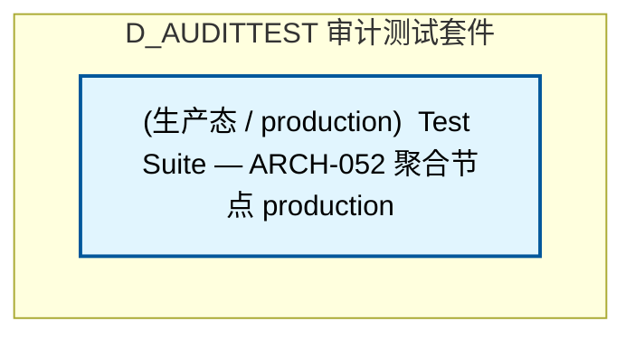

# 33_d_audittest / 审计测试套件 / Audit Test Suite

> **功能简介 / Overview**: 审计测试套件，负责审计测试用例管理和测试执行

> **文档作用 / Purpose**: 展示 审计测试套件（D_AUDITTEST）功能域的模块清单、域内依赖关系、跨域依赖关系、架构分层视图，供架构审查和域治理参考。

> 本文档由 generate_domain_doc.py 从 depgraph (PostgreSQL) 自动生成
> 数据源: depgraph (PostgreSQL) nodes表 + edges表

## 域基本信息 / Domain Overview

| 字段 | 值 | Field | Value |
|------|------|-------|-------|
| 编号 | 33 | Number | 33 |
| 域ID | D_AUDITTEST | Domain ID | D_AUDITTEST |
| 域名称 | 审计测试套件 | Domain Name | Audit Test Suite |
| 层级 | L2 业务域层 | Layer | L2 Domain |
| 模块数 | 1 | Module Count | 1 |
| 域内依赖 | 0 | Internal Dependencies | 0 |
| 跨域入边 | 0 | Cross-domain Incoming | 0 |
| 跨域出边 | 0 | Cross-domain Outgoing | 0 |
| 设计态模块 | 0 | Design Modules | 0 |
| 生产态模块 | 1 | Production Modules | 1 |
| 容量 | 1/150 (正常) | Capacity | 1/150 (正常) |
| 描述 | 审计单元测试(unit) | Description | 审计单元测试(unit) |

## 模块分层清单 / Module Layered List

> 按 architecture_layer 分组的模块清单（共 1 个模块 / 1 modules）。

### L1 基础层 / Foundation Layer (1 modules)

| # | 模块路径 / Module Path | 模块名称 / Module Name (功能简介 / Description) | 成熟度 / Maturity | 蓝图 / Blueprint |
|:--:|---------|---------|:---:|:---:|
| 1 | docs/01_policies_and_standards/_registry/catalogs/test_su... | [聚合节点 / Aggregated] 测试集 / Test Suite (1579 items) | 生产态 / production |  |
| ↳1 |   ↳ tests/a2a/test_a2a_anomaly_detector.py |  | - | - |
| ↳2 |   ↳ tests/a2a/test_a2a_behavior_fingerprint.py |  | - | - |
| ↳3 |   ↳ tests/a2a/test_a2a_blame_attribution.py |  | - | - |
| ↳4 |   ↳ tests/a2a/test_a2a_carbon.py |  | - | - |
| ↳5 |   ↳ tests/a2a/test_a2a_card_registry.py |  | - | - |
| ↳6 |   ↳ tests/a2a/test_a2a_causal_trace.py |  | - | - |
| ↳7 |   ↳ tests/a2a/test_a2a_check.py |  | - | - |
| ↳8 |   ↳ tests/a2a/test_a2a_checkpoint.py |  | - | - |
| ↳9 |   ↳ tests/a2a/test_a2a_collusion_detector.py |  | - | - |
| ↳10 |   ↳ tests/a2a/test_a2a_consent.py |  | - | - |
| ↳11 |   ↳ tests/a2a/test_a2a_constitutional.py |  | - | - |
| ↳12 |   ↳ tests/a2a/test_a2a_context_rot.py |  | - | - |
| ↳13 |   ↳ tests/a2a/test_a2a_cross_agent_semantic_flow.py |  | - | - |
| ↳14 |   ↳ tests/a2a/test_a2a_dashboard.py |  | - | - |
| ↳15 |   ↳ tests/a2a/test_a2a_debate.py |  | - | - |
| ↳16 |   ↳ tests/a2a/test_a2a_delegation_chain.py |  | - | - |
| ↳17 |   ↳ tests/a2a/test_a2a_economics.py |  | - | - |
| ↳18 |   ↳ tests/a2a/test_a2a_failure.py |  | - | - |
| ↳19 |   ↳ tests/a2a/test_a2a_forgetting.py |  | - | - |
| ↳20 |   ↳ tests/a2a/test_a2a_formal_verification.py |  | - | - |
| ↳21 |   ↳ tests/a2a/test_a2a_frame_negotiation.py |  | - | - |
| ↳22 |   ↳ tests/a2a/test_a2a_governance.py |  | - | - |
| ↳23 |   ↳ tests/a2a/test_a2a_governance_adapter.py |  | - | - |
| ↳24 |   ↳ tests/a2a/test_a2a_hardware_router.py |  | - | - |
| ↳25 |   ↳ tests/a2a/test_a2a_hibernate.py |  | - | - |
| ↳26 |   ↳ tests/a2a/test_a2a_idempotency.py |  | - | - |
| ↳27 |   ↳ tests/a2a/test_a2a_idle_guard.py |  | - | - |
| ↳28 |   ↳ tests/a2a/test_a2a_immune.py |  | - | - |
| ↳29 |   ↳ tests/a2a/test_a2a_knowledge_distill.py |  | - | - |
| ↳30 |   ↳ tests/a2a/test_a2a_latent_comm.py |  | - | - |
| ↳31 |   ↳ tests/a2a/test_a2a_layer1_discovery.py |  | - | - |
| ↳32 |   ↳ tests/a2a/test_a2a_metrics.py |  | - | - |
| ↳33 |   ↳ tests/a2a/test_a2a_negotiation.py |  | - | - |
| ↳34 |   ↳ tests/a2a/test_a2a_protocol_gateway.py |  | - | - |
| ↳35 |   ↳ tests/a2a/test_a2a_agent_blocklist.py |  | - | - |
| ↳36 |   ↳ tests/a2a/test_a2a_red_team.py |  | - | - |
| ↳37 |   ↳ tests/a2a/test_a2a_saga.py |  | - | - |
| ↳38 |   ↳ tests/a2a/test_a2a_schemas.py |  | - | - |
| ↳39 |   ↳ tests/a2a/test_a2a_security.py |  | - | - |
| ↳40 |   ↳ tests/a2a/test_a2a_state.py |  | - | - |
| ↳41 |   ↳ tests/a2a/test_a2a_temporal_admission.py |  | - | - |
| ↳42 |   ↳ tests/a2a/test_a2a_tracing.py |  | - | - |
| ↳43 |   ↳ tests/a2a/test_a2a_vector_reputation.py |  | - | - |
| ↳44 |   ↳ tests/a2a/test_a2a_voting.py |  | - | - |
| ↳45 |   ↳ tests/a2a/test_a2a_work_steal.py |  | - | - |
| ↳46 |   ↳ tests/a2a/test_construction_verifier.py |  | - | - |
| ↳47 |   ↳ tests/a2a/test_mcp.py |  | - | - |
| ↳48 |   ↳ tests/a2a/test_spec_sync.py |  | - | - |
| ↳49 |   ↳ tests/action/test_action_composition_health_monitor.py |  | - | - |
| ↳50 |   ↳ tests/action/test_action_dispatcher.py |  | - | - |
| ↳51 |   ↳ tests/action/test_action_efficacy_decay_detector.py |  | - | - |
| ↳52 |   ↳ tests/action/test_action_explainability.py |  | - | - |
| ↳53 |   ↳ tests/action/test_action_history.py |  | - | - |
| ↳54 |   ↳ tests/action/test_action_interaction_detector.py |  | - | - |
| ↳55 |   ↳ tests/action/test_action_reversibility.py |  | - | - |
| ↳56 |   ↳ tests/action/test_action_selector.py |  | - | - |
| ↳57 |   ↳ tests/action/test_action_side_effect_cumulative_dete... |  | - | - |
| ↳58 |   ↳ tests/agent/test_agent_cooldown.py |  | - | - |
| ↳59 |   ↳ tests/agent/test_agent_creation_policy.py |  | - | - |
| ↳60 |   ↳ tests/agent/test_agent_health_monitor_root.py |  | - | - |
| ↳61 |   ↳ tests/agent/test_agent_lifecycle.py |  | - | - |
| ↳62 |   ↳ tests/agent/test_agent_observability.py |  | - | - |
| ↳63 |   ↳ tests/agent/test_agent_orchestrator_root.py |  | - | - |
| ↳64 |   ↳ tests/agent/test_agent_quality.py |  | - | - |
| ↳65 |   ↳ tests/agent/test_agent_signer.py |  | - | - |
| ↳66 |   ↳ tests/agent/test_agent_skill_guard.py |  | - | - |
| ↳67 |   ↳ tests/agent/test_agent_spec_main.py |  | - | - |
| ↳68 |   ↳ tests/agent/test_agent_spec_registry.py |  | - | - |
| ↳69 |   ↳ tests/agent/test_agent_trajectory_anomaly_detector.py |  | - | - |
| ↳70 |   ↳ tests/agent_rbac/conftest.py |  | - | - |
| ↳71 |   ↳ tests/agent_rbac/test_abac_guard_agent_rbac.py |  | - | - |
| ↳72 |   ↳ tests/agent_rbac/test_adversarial_agent_rbac.py |  | - | - |
| ↳73 |   ↳ tests/agent_rbac/test_adversarial_resilience.py |  | - | - |
| ↳74 |   ↳ tests/agent_rbac/test_cross_model_consistency.py |  | - | - |
| ↳75 |   ↳ tests/agent_rbac/test_crosscut_d.py |  | - | - |
| ↳76 |   ↳ tests/agent_rbac/test_cybersec_2026.py |  | - | - |
| ↳77 |   ↳ tests/agent_rbac/test_decision_explainer_agent_rbac.py |  | - | - |
| ↳78 |   ↳ tests/agent_rbac/test_decisions.py |  | - | - |
| ↳79 |   ↳ tests/agent_rbac/test_derive_rbac.py |  | - | - |
| ↳80 |   ↳ tests/agent_rbac/test_dry_run_agent_rbac.py |  | - | - |
| ↳81 |   ↳ tests/agent_rbac/test_engine_degradation_agent_rbac.py |  | - | - |
| ↳82 |   ↳ tests/agent_rbac/test_enhanced_security.py |  | - | - |
| ↳83 |   ↳ tests/agent_rbac/test_exceptions_agent_rbac.py |  | - | - |
| ↳84 |   ↳ tests/agent_rbac/test_forensic_a.py |  | - | - |
| ↳85 |   ↳ tests/agent_rbac/test_forensic_b.py |  | - | - |
| ↳86 |   ↳ tests/agent_rbac/test_forensic_c.py |  | - | - |
| ↳87 |   ↳ tests/agent_rbac/test_guard_layers_agent_rbac.py |  | - | - |
| ↳88 |   ↳ tests/agent_rbac/test_identity.py |  | - | - |
| ↳89 |   ↳ tests/agent_rbac/test_immutable_core_agent_rbac.py |  | - | - |
| ↳90 |   ↳ tests/agent_rbac/test_input_guard_agent_rbac.py |  | - | - |
| ↳91 |   ↳ tests/agent_rbac/test_integration_agent_rbac.py |  | - | - |
| ↳92 |   ↳ tests/agent_rbac/test_integration_root.py |  | - | - |
| ↳93 |   ↳ tests/agent_rbac/test_integrity_agent_rbac.py |  | - | - |
| ↳94 |   ↳ tests/agent_rbac/test_intent_binder_agent_rbac.py |  | - | - |
| ↳95 |   ↳ tests/agent_rbac/test_kill_switch_agent_rbac.py |  | - | - |
| ↳96 |   ↳ tests/agent_rbac/test_novel_attack.py |  | - | - |
| ↳97 |   ↳ tests/agent_rbac/test_observability_agent_rbac.py |  | - | - |
| ↳98 |   ↳ tests/agent_rbac/test_output_guard_agent_rbac.py |  | - | - |
| ↳99 |   ↳ tests/agent_rbac/test_permission_guard.py |  | - | - |
| ↳100 |   ↳ tests/agent_rbac/test_permissions.py |  | - | - |
| | | > (仅显示前 100 个 items，共 1579 个) | | |

## 域内依赖图 / Internal Dependency Diagram

> 依赖图内嵌在本文档中，IDE 可直接渲染显示。参考 decision_index.md 设计，分三个视图：合并全景图、运营态子图、设计态子图（按 design_maturity 实际值拆分）。
>
> **图例说明 / Legend**：
> - **实线边框 = 运营态模块**（production，已上线运行）
> - **虚线边框 = 设计态模块**（design，蓝图阶段，代码未写）
> - **实线箭头 = 运营态依赖**（已生效的依赖关系）
> - **虚线箭头 = 非运营态依赖**（计划中/验证中的依赖关系）

### 合并全景图（全部模块，标签标注成熟度）

> 展示全部 1 个模块（生产态 1 + 设计态 0），标签标注成熟度。

### 运营态子图（仅 design_maturity=production 的模块和依赖）

> 仅展示已上线运行的模块（共 1 个，0 条域内依赖）。

### 设计态子图（仅 design_maturity=design 的模块和依赖）

> 仅展示蓝图阶段、代码未写的设计态模块（共 0 个，0 条域内依赖）。

> （无设计态模块 / No design modules）

## 跨域依赖 / Cross-domain Dependencies

### 本域依赖的其他域（出边）/ Depends On

无跨域出边依赖 / No cross-domain outgoing dependencies

### 依赖本域的其他域（入边）/ Depended By

无跨域入边依赖 / No cross-domain incoming dependencies

### 跨域依赖图 / Cross-domain Dependency Diagram

> 本域与 0 个外部域直接连接（出边 0 条 + 入边 0 条 = 0 条）。只显示直接连接的域，不展开具体节点。

> （无跨域依赖 / No cross-domain dependencies）

## 说明 / Notes

- **数据源 / Data Source**: `depgraph (PostgreSQL)` 的 `nodes`、`edges`、`domains` 表
- **生成器 / Generator**: `generate_domain_doc.py`（G2+G10 合并）
- **维护方式 / Maintenance**: 自动生成，全景图更新时刷新
- **文件名规则 / File Naming**: `{编号:02d}_{域ID小写}.md`，如 `16_d_trading.md`
- **图例说明 / Legend**: `[production]`=已上线 / `[design]`=设计中 / `[unknown]`=未知
