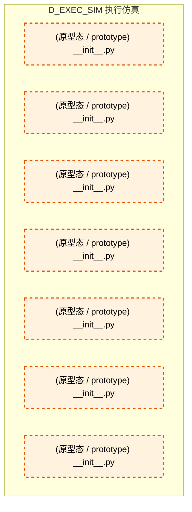

# 33_d_exec_sim / 执行仿真 / 执行仿真 / Execution Simulation

> **功能简介 / Overview**: 执行仿真，负责执行过程仿真、滑点模拟和冲击成本建模

> **文档作用 / Purpose**: 展示 执行仿真（D_EXEC_SIM）功能域的模块清单、域内依赖关系、跨域依赖关系、架构分层视图，供架构审查和域治理参考。

> 本文档由 generate_domain_doc.py 从 depgraph (PostgreSQL) 自动生成
> 最后更新: 2026-07-14 15:50:08
> 数据源: depgraph (PostgreSQL) nodes表 + edges表

## 域基本信息 / Domain Overview

| 字段 | 值 | Field | Value |
|------|------|-------|-------|
| 编号 | 33 | Number | 33 |
| 域ID | D_EXEC_SIM | Domain ID | D_EXEC_SIM |
| 域名称 | 执行仿真 | Domain Name | Execution Simulation |
| 层级 | L2 业务域层 | Layer | L2 Domain |
| 模块数 | 7 | Module Count | 7 |
| 域内依赖 | 0 | Internal Dependencies | 0 |
| 跨域入边 | 0 | Cross-domain Incoming | 0 |
| 跨域出边 | 0 | Cross-domain Outgoing | 0 |
| 设计态模块 | 0 | Design Modules | 0 |
| 原型态模块 | 7 | Prototype Modules | 7 |
| 生产态模块 | 0 | Production Modules | 0 |
| 容量 | 0/150 (正常) | Capacity | 0/150 (正常) |
| 描述 | Split from D-SIMULATION | Description | Split from D-SIMULATION |

## 模块分层清单 / Module Layered List

> 按 architecture_layer 分组的模块清单（共 7 个模块 / 7 modules）。

### L2 领域层 / Domain Layer (7 modules)

| # | 模块路径 / Module Path | 模块名称 / Module Name (功能简介 / Description) | 成熟度 / Maturity | 蓝图 / Blueprint |
|:--:|---------|---------|:---:|:---:|
| 1 | src/zephyr/execution_simulation/__init__.py | __init__.py | 原型态 / prototype |  |
| 2 | src/zephyr/execution_simulation/_extensions/__init__.py | __init__.py | 原型态 / prototype |  |
| 3 | src/zephyr/execution_simulation/api/__init__.py | __init__.py | 原型态 / prototype |  |
| 4 | src/zephyr/execution_simulation/core/__init__.py | __init__.py | 原型态 / prototype |  |
| 5 | src/zephyr/execution_simulation/infrastructure/__init__.py | __init__.py | 原型态 / prototype |  |
| 6 | src/zephyr/execution_simulation/models/__init__.py | __init__.py | 原型态 / prototype |  |
| 7 | src/zephyr/execution_simulation/services/__init__.py | __init__.py | 原型态 / prototype |  |

## 域内依赖图 / Internal Dependency Diagram

> 依赖图内嵌在本文档中，IDE 可直接渲染显示。参考 decision_index.md 设计，分四个视图：合并全景图、运营态子图、设计态子图、原型态子图（按 design_maturity 实际值拆分）。
>
> **图例说明 / Legend**：
> - **实线边框 = 运营态模块**（production，已上线运行）
> - **虚线边框 = 设计态模块**（design，蓝图阶段，代码未写）
> - **虚线边框 = 原型态模块**（prototype，代码已写，验证中未稳定上线）
> - **实线箭头 = 运营态依赖**（已生效的依赖关系）
> - **虚线箭头 = 非运营态依赖**（计划中/验证中的依赖关系）

### 合并全景图（全部模块，标签标注成熟度）

> 展示全部 7 个模块（生产态 0 + 设计态 0 + 原型态 7），标签标注成熟度。

### 运营态子图（仅 design_maturity=production 的模块和依赖）

> 仅展示已上线运行的模块（共 0 个，0 条域内依赖）。

> （无运营态模块 / No production modules）

### 设计态子图（仅 design_maturity=design 的模块和依赖）

> 仅展示蓝图阶段、代码未写的设计态模块（共 0 个，0 条域内依赖）。

> （无设计态模块 / No design modules）

### 原型态子图（仅 design_maturity=prototype 的模块和依赖）

> 仅展示代码已写、验证中未稳定上线的原型态模块（共 7 个，0 条域内依赖）。

## 跨域依赖 / Cross-domain Dependencies

### 本域依赖的其他域（出边）/ Depends On

无跨域出边依赖 / No cross-domain outgoing dependencies

### 依赖本域的其他域（入边）/ Depended By

无跨域入边依赖 / No cross-domain incoming dependencies

### 跨域依赖图 / Cross-domain Dependency Diagram

> 本域与 0 个外部域直接连接（出边 0 条 + 入边 0 条 = 0 条）。只显示直接连接的域，不展开具体节点。

> （无跨域依赖 / No cross-domain dependencies）

## 说明 / Notes

- **数据源 / Data Source**: `depgraph (PostgreSQL)` 的 `nodes`、`edges`、`domains` 表
- **生成器 / Generator**: `generate_domain_doc.py`（G2+G10 合并）
- **维护方式 / Maintenance**: 自动生成，全景图更新时刷新
- **文件名规则 / File Naming**: `{编号:02d}_{域ID小写}.md`，如 `16_d_trading.md`
- **图例说明 / Legend**: `[production]`=已上线 / `[design]`=设计中 / `[prototype]`=原型 / `[unknown]`=未知
