# 33_d_governance / 生命周期管理

> **文档作用 / Purpose**: 展示 生命周期管理（D_GOVERNANCE）功能域的模块清单、域内依赖关系、跨域依赖关系、架构分层视图，供架构审查和域治理参考。

> 本文档由 generate_domain_doc.py 从 depgraph (PostgreSQL) 自动生成
> 最后更新: 2026-07-01 11:55:17
> 数据源: depgraph (PostgreSQL) nodes表 + edges表

## 域基本信息 / Domain Overview

| 字段 | 值 | Field | Value |
|------|------|-------|-------|
| 编号 | 33 | Number | 33 |
| 域ID | D_GOVERNANCE | Domain ID | D_GOVERNANCE |
| 域名称 | 生命周期管理 | Domain Name | 生命周期管理 |
| 层级 | L2_domain | Layer | L2_domain |
| 模块数 | 750 | Module Count | 750 |
| 域内依赖 | 517 | Internal Dependencies | 517 |
| 跨域入边 | 191 | Cross-domain Incoming | 191 |
| 跨域出边 | 1853 | Cross-domain Outgoing | 1853 |
| 设计态模块 | 50 | Design Modules | 50 |
| 原型态模块 | 644 | Prototype Modules | 644 |
| 生产态模块 | 56 | Production Modules | 56 |
| 容量 | 117/150 (正常) | Capacity | 117/150 (正常) |
| 描述 | 模块生命周期钩子(hooks) | Description | 模块生命周期钩子(hooks) |

## 域内依赖图 / Internal Dependency Diagram

> 依赖图内嵌在本文档中，IDE 可直接渲染显示。每30个节点一组分页显示。
>
> **图例说明 / Legend**：
> - **实线边框 = 运营态模块**（production，已上线运行）
> - **虚线边框 = 设计态模块**（design，还在设计中）
> - **实线箭头 = 运营态依赖**（已生效的依赖关系）
> - **虚线箭头 = 设计态依赖**（计划中的依赖关系）

### 第 1 页 / 共 25 页 / Page 1 of 25

```mermaid
graph TD
    subgraph D_GOVERNANCE["D_GOVERNANCE 生命周期管理"]
        data_asset_index_archive_migration_scripts_migration_shared_py["data/asset_index/archive/migration_scripts/_mig... prototype"]
        data_asset_index_archive_migration_scripts_verify_manifest_py["data/asset_index/archive/migration_scripts/_ver... prototype"]
        data_asset_index_archive_migration_scripts_verify_step4_py["data/asset_index/archive/migration_scripts/_ver... prototype"]
        data_asset_index_archive_migration_scripts_apply_rulings_py["data/asset_index/archive/migration_scripts/appl... prototype"]
        data_asset_index_archive_migration_scripts_check_coverage_py["data/asset_index/archive/migration_scripts/chec... prototype"]
        data_asset_index_archive_migration_scripts_comprehensive_import_fix_py["data/asset_index/archive/migration_scripts/comp... prototype"]
        data_asset_index_archive_migration_scripts_create_target_dirs_py["data/asset_index/archive/migration_scripts/crea... prototype"]
        data_asset_index_archive_migration_scripts_cross_domain_import_fix_py["data/asset_index/archive/migration_scripts/cros... prototype"]
        data_asset_index_archive_migration_scripts_domain_prefix_import_fix_py["data/asset_index/archive/migration_scripts/doma... prototype"]
        data_asset_index_archive_migration_scripts_execute_move_py["data/asset_index/archive/migration_scripts/exec... prototype"]
        data_asset_index_archive_migration_scripts_generate_migration_registry_py["data/asset_index/archive/migration_scripts/gene... prototype"]
        data_asset_index_archive_migration_scripts_generate_path_migration_mapping_py["data/asset_index/archive/migration_scripts/gene... prototype"]
        data_asset_index_archive_migration_scripts_inject_domain_fields_py["data/asset_index/archive/migration_scripts/inje... prototype"]
        data_asset_index_archive_migration_scripts_lock_batch_py["data/asset_index/archive/migration_scripts/lock... prototype"]
        data_asset_index_archive_migration_scripts_preflight_check_py["data/asset_index/archive/migration_scripts/pref... prototype"]
        data_asset_index_archive_migration_scripts_rollback_batch_py["data/asset_index/archive/migration_scripts/roll... prototype"]
        data_asset_index_archive_migration_scripts_scan_import_impact_py["data/asset_index/archive/migration_scripts/scan... prototype"]
        data_asset_index_archive_migration_scripts_shared_import_fix_py["data/asset_index/archive/migration_scripts/shar... prototype"]
        data_asset_index_archive_migration_scripts_test_import_fix_py["data/asset_index/archive/migration_scripts/test... prototype"]
        data_asset_index_archive_migration_scripts_unnest_from_mcp_server_py["data/asset_index/archive/migration_scripts/unne... prototype"]
        data_asset_index_archive_migration_scripts_update_imports_py["data/asset_index/archive/migration_scripts/upda... prototype"]
        data_asset_index_archive_migration_scripts_update_non_import_refs_py["data/asset_index/archive/migration_scripts/upda... prototype"]
        data_asset_index_archive_migration_scripts_verify_batch_py["data/asset_index/archive/migration_scripts/veri... prototype"]
        docs_03_modules_alpha_signal_domain_blueprint_md["docs__03_modules___alpha_signal_domain__bluepri... design"]
        docs_03_modules_cross_layer_agent_orchestrator_blueprint_md["docs__03_modules___cross_layer__agent_orchestra... design"]
        docs_03_modules_cross_layer_auto_fix_engine_blueprint_md["docs__03_modules___cross_layer__auto_fix_engine... design"]
        docs_03_modules_cross_layer_auto_runtime_core_blueprint_md["docs__03_modules___cross_layer__auto_runtime_co... design"]
        docs_03_modules_cross_layer_behavioral_auditor_blueprint_md["docs__03_modules___cross_layer__behavioral_audi... design"]
        docs_03_modules_cross_layer_context_engine_blueprint_md["docs__03_modules___cross_layer__context_engine_... design"]
        docs_03_modules_cross_layer_database_blueprint_md["docs__03_modules___cross_layer__database__bluep... design"]
    end
    data_asset_index_archive_migration_scripts_apply_rulings_py -.->|config_depends| data_asset_index_archive_migration_scripts_check_coverage_py
    data_asset_index_archive_migration_scripts_cross_domain_import_fix_py -.->|config_depends| data_asset_index_archive_migration_scripts_apply_rulings_py
    data_asset_index_archive_migration_scripts_create_target_dirs_py -.->|config_depends| data_asset_index_archive_migration_scripts_apply_rulings_py
    data_asset_index_archive_migration_scripts_comprehensive_import_fix_py -.->|config_depends| data_asset_index_archive_migration_scripts_apply_rulings_py
    data_asset_index_archive_migration_scripts_execute_move_py -.->|config_depends| data_asset_index_archive_migration_scripts_apply_rulings_py
    data_asset_index_archive_migration_scripts_domain_prefix_import_fix_py -.->|config_depends| data_asset_index_archive_migration_scripts_apply_rulings_py
    data_asset_index_archive_migration_scripts_generate_path_migration_mapping_py -.->|config_depends| data_asset_index_archive_migration_scripts_apply_rulings_py
    data_asset_index_archive_migration_scripts_generate_migration_registry_py -.->|config_depends| data_asset_index_archive_migration_scripts_apply_rulings_py
    data_asset_index_archive_migration_scripts_preflight_check_py -.->|config_depends| data_asset_index_archive_migration_scripts_apply_rulings_py
    data_asset_index_archive_migration_scripts_rollback_batch_py -.->|config_depends| data_asset_index_archive_migration_scripts_apply_rulings_py
    data_asset_index_archive_migration_scripts_inject_domain_fields_py -.->|config_depends| data_asset_index_archive_migration_scripts_apply_rulings_py
    data_asset_index_archive_migration_scripts_lock_batch_py -.->|config_depends| data_asset_index_archive_migration_scripts_apply_rulings_py
    data_asset_index_archive_migration_scripts_scan_import_impact_py -.->|config_depends| data_asset_index_archive_migration_scripts_apply_rulings_py
    data_asset_index_archive_migration_scripts_unnest_from_mcp_server_py -.->|config_depends| data_asset_index_archive_migration_scripts_apply_rulings_py
    data_asset_index_archive_migration_scripts_update_imports_py -.->|config_depends| data_asset_index_archive_migration_scripts_apply_rulings_py
    data_asset_index_archive_migration_scripts_shared_import_fix_py -.->|config_depends| data_asset_index_archive_migration_scripts_apply_rulings_py
    data_asset_index_archive_migration_scripts_test_import_fix_py -.->|config_depends| data_asset_index_archive_migration_scripts_apply_rulings_py
    data_asset_index_archive_migration_scripts_update_non_import_refs_py -.->|config_depends| data_asset_index_archive_migration_scripts_apply_rulings_py
    data_asset_index_archive_migration_scripts_verify_manifest_py -.->|config_depends| data_asset_index_archive_migration_scripts_apply_rulings_py
    data_asset_index_archive_migration_scripts_migration_shared_py -.->|config_depends| data_asset_index_archive_migration_scripts_apply_rulings_py
    data_asset_index_archive_migration_scripts_verify_batch_py -.->|config_depends| data_asset_index_archive_migration_scripts_apply_rulings_py
    data_asset_index_archive_migration_scripts_verify_step4_py -.->|config_depends| data_asset_index_archive_migration_scripts_apply_rulings_py
    D_PF_CORE["D_PF_CORE design"]
    D_PF_CORE -.->|contract| docs_03_modules_alpha_signal_domain_blueprint_md
    D_AUTONOMY_CORE["D_AUTONOMY_CORE prototype"]
    D_AUTONOMY_CORE -.->|runtime| docs_03_modules_cross_layer_context_engine_blueprint_md
    classDef production fill:#e1f5fe,stroke:#01579b,stroke-width:2px,color:#000
    classDef design fill:#fff3e0,stroke:#e65100,stroke-width:2px,color:#000,stroke-dasharray: 5 5
    classDef external_prod fill:#e8f5e9,stroke:#1b5e20,stroke-width:1px,color:#000
    classDef external_design fill:#fce4ec,stroke:#880e4f,stroke-width:1px,color:#000,stroke-dasharray: 5 5
    class data_asset_index_archive_migration_scripts_migration_shared_py,data_asset_index_archive_migration_scripts_verify_manifest_py,data_asset_index_archive_migration_scripts_verify_step4_py,data_asset_index_archive_migration_scripts_apply_rulings_py,data_asset_index_archive_migration_scripts_check_coverage_py,data_asset_index_archive_migration_scripts_comprehensive_import_fix_py,data_asset_index_archive_migration_scripts_create_target_dirs_py,data_asset_index_archive_migration_scripts_cross_domain_import_fix_py,data_asset_index_archive_migration_scripts_domain_prefix_import_fix_py,data_asset_index_archive_migration_scripts_execute_move_py,data_asset_index_archive_migration_scripts_generate_migration_registry_py,data_asset_index_archive_migration_scripts_generate_path_migration_mapping_py,data_asset_index_archive_migration_scripts_inject_domain_fields_py,data_asset_index_archive_migration_scripts_lock_batch_py,data_asset_index_archive_migration_scripts_preflight_check_py,data_asset_index_archive_migration_scripts_rollback_batch_py,data_asset_index_archive_migration_scripts_scan_import_impact_py,data_asset_index_archive_migration_scripts_shared_import_fix_py,data_asset_index_archive_migration_scripts_test_import_fix_py,data_asset_index_archive_migration_scripts_unnest_from_mcp_server_py,data_asset_index_archive_migration_scripts_update_imports_py,data_asset_index_archive_migration_scripts_update_non_import_refs_py,data_asset_index_archive_migration_scripts_verify_batch_py,docs_03_modules_alpha_signal_domain_blueprint_md,docs_03_modules_cross_layer_agent_orchestrator_blueprint_md,docs_03_modules_cross_layer_auto_fix_engine_blueprint_md,docs_03_modules_cross_layer_auto_runtime_core_blueprint_md,docs_03_modules_cross_layer_behavioral_auditor_blueprint_md,docs_03_modules_cross_layer_context_engine_blueprint_md,docs_03_modules_cross_layer_database_blueprint_md design
    class D_PF_CORE,D_AUTONOMY_CORE external_design
```

### 第 2 页 / 共 25 页 / Page 2 of 25

```mermaid
graph TD
    subgraph D_GOVERNANCE["D_GOVERNANCE 生命周期管理"]
        docs_03_modules_cross_layer_feedback_loop_blueprint_md["docs__03_modules___cross_layer__feedback_loop__... design"]
        docs_03_modules_cross_layer_feedback_loop_capacity_upgrade_blueprint_md["docs__03_modules___cross_layer__feedback_loop__... design"]
        docs_03_modules_cross_layer_gate_engine_blueprint_md["docs__03_modules___cross_layer__gate_engine__bl... design"]
        docs_03_modules_cross_layer_llm_security_blueprint_md["docs__03_modules___cross_layer__llm_security__b... design"]
        docs_03_modules_cross_layer_mcp_servers_blueprint_md["docs__03_modules___cross_layer__mcp_servers__bl... design"]
        docs_03_modules_cross_layer_model_capability_exam_blueprint_md["docs__03_modules___cross_layer__model_capabilit... design"]
        docs_03_modules_cross_layer_orphan_judge_blueprint_md["docs__03_modules___cross_layer__orphan_judge__b... design"]
        docs_03_modules_cross_layer_pipeline_blueprint_md["docs__03_modules___cross_layer__pipeline__bluep... design"]
        docs_03_modules_cross_layer_red_blue_validator_blueprint_md["docs__03_modules___cross_layer__red_blue_valida... design"]
        docs_03_modules_cross_layer_resource_optimization_engine_blueprint_md["docs__03_modules___cross_layer__resource_optimi... design"]
        docs_03_modules_cross_layer_restructuring_blueprint_md["docs__03_modules___restructuring__blueprint_md design"]
        docs_03_modules_cross_layer_semantic_auditor_blueprint_md["docs__03_modules___cross_layer__semantic_audito... design"]
        docs_03_modules_cross_layer_shared_core_blueprint_md["docs__03_modules___cross_layer__shared_core__bl... design"]
        docs_03_modules_domain_autonomy_core_agent_spec_blueprint_md["docs__03_modules___domain_autonomy_core__agent_... design"]
        docs_03_modules_domain_autonomy_core_rollback_system_blueprint_md["docs__03_modules___domain_autonomy_core__rollba... design"]
        docs_03_modules_domain_autonomy_perm_budget_enforcer_blueprint_md["docs__03_modules___domain_autonomy_perm__budget... design"]
        docs_03_modules_domain_autonomy_perm_escalation_protocol_blueprint_md["docs__03_modules___domain_autonomy_perm__escala... design"]
        docs_03_modules_domain_compliance_compliance_core_blueprint_md["docs__03_modules___domain_compliance__complianc... design"]
        docs_03_modules_domain_data_datasource_core_blueprint_md["docs__03_modules___domain_data__datasource_core... design"]
        docs_03_modules_domain_factor_alpha_factor_core_blueprint_md["docs__03_modules___domain_factor__alpha_factor_... design"]
        docs_03_modules_domain_frontend_hmi_core_blueprint_md["docs__03_modules___domain_frontend__hmi_core__b... design"]
        docs_03_modules_domain_governance_blueprint_md["docs__03_modules___domain_governance__blueprint_md design"]
        docs_03_modules_domain_governance_capacity_upgrade_blueprint_md["docs__03_modules___domain_governance__capacity_... design"]
        docs_03_modules_domain_governance_code_dedup_engine_blueprint_md["docs__03_modules___domain_governance__code_dedu... design"]
        docs_03_modules_domain_governance_governance_automation_blueprint_md["docs__03_modules___domain_governance__governanc... design"]
        docs_03_modules_domain_governance_registry_governance_blueprint_md["docs__03_modules___domain_governance__registry_... design"]
        docs_03_modules_domain_infra_ops_a2a_protocol_blueprint_md["docs__03_modules___domain_infra_ops__a2a_protoc... design"]
        docs_03_modules_domain_infra_ops_asset_inventory_blueprint_md["docs__03_modules___domain_infra_ops__asset_inve... design"]
        docs_03_modules_domain_infra_ops_capacity_assurance_blueprint_md["docs__03_modules___domain_infra_ops__capacity_a... design"]
        docs_03_modules_domain_infra_runtime_runtime_integration_blueprint_md["docs__03_modules___domain_infra_runtime__runtim... design"]
    end
    docs_03_modules_cross_layer_mcp_servers_blueprint_md -.->|runtime| docs_03_modules_cross_layer_feedback_loop_blueprint_md
    docs_03_modules_cross_layer_mcp_servers_blueprint_md -.->|runtime| docs_03_modules_cross_layer_llm_security_blueprint_md
    docs_03_modules_cross_layer_resource_optimization_engine_blueprint_md -.->|runtime| docs_03_modules_cross_layer_feedback_loop_blueprint_md
    docs_03_modules_cross_layer_resource_optimization_engine_blueprint_md -.->|contract| docs_03_modules_cross_layer_gate_engine_blueprint_md
    docs_03_modules_cross_layer_resource_optimization_engine_blueprint_md -.->|runtime| docs_03_modules_cross_layer_mcp_servers_blueprint_md
    D_OPS["D_OPS prototype"]
    docs_03_modules_cross_layer_feedback_loop_blueprint_md -.->|runtime| D_OPS
    docs_03_modules_cross_layer_feedback_loop_blueprint_md -.->|runtime| D_OPS
    docs_03_modules_cross_layer_feedback_loop_blueprint_md -.->|runtime| D_OPS
    docs_03_modules_cross_layer_feedback_loop_blueprint_md -.->|runtime| D_OPS
    D_AUTONOMY_PERM["D_AUTONOMY_PERM prototype"]
    docs_03_modules_cross_layer_feedback_loop_blueprint_md -.->|runtime| D_AUTONOMY_PERM
    D_GOV_AUDIT["D_GOV_AUDIT prototype"]
    docs_03_modules_cross_layer_feedback_loop_blueprint_md -.->|runtime| D_GOV_AUDIT
    docs_03_modules_cross_layer_feedback_loop_blueprint_md -.->|runtime| D_GOV_AUDIT
    docs_03_modules_cross_layer_feedback_loop_blueprint_md -.->|runtime| D_OPS
    D_EX_CORE["D_EX_CORE prototype"]
    docs_03_modules_cross_layer_mcp_servers_blueprint_md -.->|runtime| D_EX_CORE
    D_AUDITTEST["D_AUDITTEST production"]
    docs_03_modules_cross_layer_mcp_servers_blueprint_md -.->|contract| D_AUDITTEST
    D_GOV_AUDIT -.->|runtime| docs_03_modules_cross_layer_gate_engine_blueprint_md
    D_AUTONOMY_CORE["D_AUTONOMY_CORE prototype"]
    D_AUTONOMY_CORE -.->|runtime| docs_03_modules_cross_layer_gate_engine_blueprint_md
    D_AUTONOMY_CORE -.->|runtime| docs_03_modules_domain_infra_ops_a2a_protocol_blueprint_md
    D_AUTONOMY_CORE -.->|runtime| docs_03_modules_cross_layer_feedback_loop_blueprint_md
    D_AUTONOMY_CORE -.->|runtime| docs_03_modules_cross_layer_llm_security_blueprint_md
    classDef production fill:#e1f5fe,stroke:#01579b,stroke-width:2px,color:#000
    classDef design fill:#fff3e0,stroke:#e65100,stroke-width:2px,color:#000,stroke-dasharray: 5 5
    classDef external_prod fill:#e8f5e9,stroke:#1b5e20,stroke-width:1px,color:#000
    classDef external_design fill:#fce4ec,stroke:#880e4f,stroke-width:1px,color:#000,stroke-dasharray: 5 5
    class docs_03_modules_cross_layer_feedback_loop_blueprint_md,docs_03_modules_cross_layer_feedback_loop_capacity_upgrade_blueprint_md,docs_03_modules_cross_layer_gate_engine_blueprint_md,docs_03_modules_cross_layer_llm_security_blueprint_md,docs_03_modules_cross_layer_mcp_servers_blueprint_md,docs_03_modules_cross_layer_model_capability_exam_blueprint_md,docs_03_modules_cross_layer_orphan_judge_blueprint_md,docs_03_modules_cross_layer_pipeline_blueprint_md,docs_03_modules_cross_layer_red_blue_validator_blueprint_md,docs_03_modules_cross_layer_resource_optimization_engine_blueprint_md,docs_03_modules_cross_layer_restructuring_blueprint_md,docs_03_modules_cross_layer_semantic_auditor_blueprint_md,docs_03_modules_cross_layer_shared_core_blueprint_md,docs_03_modules_domain_autonomy_core_agent_spec_blueprint_md,docs_03_modules_domain_autonomy_core_rollback_system_blueprint_md,docs_03_modules_domain_autonomy_perm_budget_enforcer_blueprint_md,docs_03_modules_domain_autonomy_perm_escalation_protocol_blueprint_md,docs_03_modules_domain_compliance_compliance_core_blueprint_md,docs_03_modules_domain_data_datasource_core_blueprint_md,docs_03_modules_domain_factor_alpha_factor_core_blueprint_md,docs_03_modules_domain_frontend_hmi_core_blueprint_md,docs_03_modules_domain_governance_blueprint_md,docs_03_modules_domain_governance_capacity_upgrade_blueprint_md,docs_03_modules_domain_governance_code_dedup_engine_blueprint_md,docs_03_modules_domain_governance_governance_automation_blueprint_md,docs_03_modules_domain_governance_registry_governance_blueprint_md,docs_03_modules_domain_infra_ops_a2a_protocol_blueprint_md,docs_03_modules_domain_infra_ops_asset_inventory_blueprint_md,docs_03_modules_domain_infra_ops_capacity_assurance_blueprint_md,docs_03_modules_domain_infra_runtime_runtime_integration_blueprint_md design
    class D_AUDITTEST external_prod
    class D_OPS,D_AUTONOMY_PERM,D_GOV_AUDIT,D_EX_CORE,D_AUTONOMY_CORE external_design
```

### 第 3 页 / 共 25 页 / Page 3 of 25


### 第 4 页 / 共 25 页 / Page 4 of 25

```mermaid
graph TD
    subgraph D_GOVERNANCE["D_GOVERNANCE 生命周期管理"]
        scripts_governance_d5_architecture_checkers_check_bvb_compliance_py["scripts/governance/d5_architecture/checkers/che... prototype"]
        scripts_governance_d5_architecture_checkers_check_code_duplication_py["scripts/governance/d5_architecture/checkers/che... prototype"]
        scripts_governance_d5_architecture_checkers_check_contract_code_drift_py["scripts/governance/d5_architecture/checkers/che... prototype"]
        scripts_governance_d5_architecture_checkers_check_dependency_direction_py["scripts/governance/d5_architecture/checkers/che... prototype"]
        scripts_governance_d5_architecture_checkers_check_g6_ctr_compliance_py["scripts/governance/d5_architecture/checkers/che... prototype"]
        scripts_governance_d5_architecture_checkers_check_orphan_outputs_py["scripts/governance/d5_architecture/checkers/che... prototype"]
        scripts_governance_d5_architecture_checkers_check_ssot_uniqueness_py["scripts/governance/d5_architecture/checkers/che... prototype"]
        scripts_governance_d5_architecture_checkers_check_trace_context_propagation_py["scripts/governance/d5_architecture/checkers/che... prototype"]
        scripts_governance_d5_architecture_detectors_init_py["scripts/governance/d5_architecture/detectors/__... prototype"]
        scripts_governance_d5_architecture_detectors_analyze_same_name_module_relations_py["scripts/governance/d5_architecture/detectors/an... prototype"]
        scripts_governance_d5_architecture_detectors_detect_depends_on_cycles_py["scripts/governance/d5_architecture/detectors/de... prototype"]
        scripts_governance_d5_architecture_detectors_detect_deprecated_adr_references_py["scripts/governance/d5_architecture/detectors/de... prototype"]
        scripts_governance_d5_architecture_dm200912_query_domains_py["scripts/governance/d5_architecture/dm200912_que... production"]
        scripts_governance_d5_architecture_dm200916_write_direct_py["scripts/governance/d5_architecture/dm200916_wri... production"]
        scripts_governance_d5_architecture_generators_init_py["scripts/governance/d5_architecture/generators/_... prototype"]
        scripts_governance_d5_architecture_generators_domain_name_mapping_py["scripts/governance/d5_architecture/generators/d... production"]
        scripts_governance_d5_architecture_generators_generate_capability_heatmap_py["scripts/governance/d5_architecture/generators/g... production"]
        scripts_governance_d5_architecture_generators_generate_capacity_report_py["scripts/governance/d5_architecture/generators/g... production"]
        scripts_governance_d5_architecture_generators_generate_constraint_violations_py["scripts/governance/d5_architecture/generators/g... production"]
        scripts_governance_d5_architecture_generators_generate_contracts_py["scripts/governance/d5_architecture/generators/g... prototype"]
        scripts_governance_d5_architecture_generators_generate_cross_domain_matrix_py["scripts/governance/d5_architecture/generators/g... production"]
        scripts_governance_d5_architecture_generators_generate_design_vs_production_py["scripts/governance/d5_architecture/generators/g... production"]
        scripts_governance_d5_architecture_generators_generate_domain_dependency_diagram_py["scripts/governance/d5_architecture/generators/g... production"]
        scripts_governance_d5_architecture_generators_generate_domain_doc_py["scripts/governance/d5_architecture/generators/g... production"]
        scripts_governance_d5_architecture_generators_generate_domain_index_py["scripts/governance/d5_architecture/generators/g... production"]
        scripts_governance_d5_architecture_generators_generate_integration_topology_py["scripts/governance/d5_architecture/generators/g... production"]
        scripts_governance_d5_architecture_generators_generate_navigation_index_py["scripts/governance/d5_architecture/generators/g... production"]
        scripts_governance_d5_architecture_generators_generate_path_tree_py["scripts/governance/d5_architecture/generators/g... production"]
        scripts_governance_d5_architecture_pre_commit_hook_ps1["scripts/governance/d5_architecture/pre_commit_h... prototype"]
        scripts_governance_d5_architecture_syncers_init_py["scripts/governance/d5_architecture/syncers/__in... prototype"]
    end
    scripts_governance_d5_architecture_detectors_detect_deprecated_adr_references_py -.->|config_depends| scripts_governance_d5_architecture_detectors_init_py
    scripts_governance_d5_architecture_detectors_detect_depends_on_cycles_py -.->|config_depends| scripts_governance_d5_architecture_detectors_init_py
    scripts_governance_d5_architecture_detectors_analyze_same_name_module_relations_py -.->|config_depends| scripts_governance_d5_architecture_detectors_init_py
    scripts_governance_d5_architecture_generators_generate_contracts_py -.->|config_depends| scripts_governance_d5_architecture_generators_init_py
    classDef production fill:#e1f5fe,stroke:#01579b,stroke-width:2px,color:#000
    classDef design fill:#fff3e0,stroke:#e65100,stroke-width:2px,color:#000,stroke-dasharray: 5 5
    classDef external_prod fill:#e8f5e9,stroke:#1b5e20,stroke-width:1px,color:#000
    classDef external_design fill:#fce4ec,stroke:#880e4f,stroke-width:1px,color:#000,stroke-dasharray: 5 5
    class scripts_governance_d5_architecture_dm200912_query_domains_py,scripts_governance_d5_architecture_dm200916_write_direct_py,scripts_governance_d5_architecture_generators_domain_name_mapping_py,scripts_governance_d5_architecture_generators_generate_capability_heatmap_py,scripts_governance_d5_architecture_generators_generate_capacity_report_py,scripts_governance_d5_architecture_generators_generate_constraint_violations_py,scripts_governance_d5_architecture_generators_generate_cross_domain_matrix_py,scripts_governance_d5_architecture_generators_generate_design_vs_production_py,scripts_governance_d5_architecture_generators_generate_domain_dependency_diagram_py,scripts_governance_d5_architecture_generators_generate_domain_doc_py,scripts_governance_d5_architecture_generators_generate_domain_index_py,scripts_governance_d5_architecture_generators_generate_integration_topology_py,scripts_governance_d5_architecture_generators_generate_navigation_index_py,scripts_governance_d5_architecture_generators_generate_path_tree_py production
    class scripts_governance_d5_architecture_checkers_check_bvb_compliance_py,scripts_governance_d5_architecture_checkers_check_code_duplication_py,scripts_governance_d5_architecture_checkers_check_contract_code_drift_py,scripts_governance_d5_architecture_checkers_check_dependency_direction_py,scripts_governance_d5_architecture_checkers_check_g6_ctr_compliance_py,scripts_governance_d5_architecture_checkers_check_orphan_outputs_py,scripts_governance_d5_architecture_checkers_check_ssot_uniqueness_py,scripts_governance_d5_architecture_checkers_check_trace_context_propagation_py,scripts_governance_d5_architecture_detectors_init_py,scripts_governance_d5_architecture_detectors_analyze_same_name_module_relations_py,scripts_governance_d5_architecture_detectors_detect_depends_on_cycles_py,scripts_governance_d5_architecture_detectors_detect_deprecated_adr_references_py,scripts_governance_d5_architecture_generators_init_py,scripts_governance_d5_architecture_generators_generate_contracts_py,scripts_governance_d5_architecture_pre_commit_hook_ps1,scripts_governance_d5_architecture_syncers_init_py design
```

### 第 5 页 / 共 25 页 / Page 5 of 25

```mermaid
graph TD
    subgraph D_GOVERNANCE["D_GOVERNANCE 生命周期管理"]
        scripts_governance_d5_architecture_syncers_archive_rationale_log_py["scripts/governance/d5_architecture/syncers/arch... prototype"]
        scripts_governance_d5_architecture_syncers_merge_readme_to_index_py["scripts/governance/d5_architecture/syncers/merg... prototype"]
        scripts_governance_d5_architecture_syncers_sync_blueprint_code_index_py["scripts/governance/d5_architecture/syncers/sync... prototype"]
        scripts_governance_d5_architecture_syncers_sync_registry_from_blueprints_py["scripts/governance/d5_architecture/syncers/sync... prototype"]
        scripts_governance_d5_architecture_validators_init_py["scripts/governance/d5_architecture/validators/_... prototype"]
        scripts_governance_d5_architecture_validators_blueprint_init_py["scripts/governance/d5_architecture/validators/b... prototype"]
        scripts_governance_d5_architecture_validators_blueprint_validate_blueprint_code_sync_py["scripts/governance/d5_architecture/validators/b... prototype"]
        scripts_governance_d5_architecture_validators_blueprint_validate_blueprint_implementation_docs_py["scripts/governance/d5_architecture/validators/b... prototype"]
        scripts_governance_d5_architecture_validators_blueprint_validate_blueprint_path_consistency_py["scripts/governance/d5_architecture/validators/b... prototype"]
        scripts_governance_d5_architecture_validators_blueprint_validate_blueprint_placement_py["scripts/governance/d5_architecture/validators/b... prototype"]
        scripts_governance_d5_architecture_validators_blueprint_validate_blueprint_tag_uniqueness_py["scripts/governance/d5_architecture/validators/b... prototype"]
        scripts_governance_d5_architecture_validators_lifecycle_init_py["scripts/governance/d5_architecture/validators/l... prototype"]
        scripts_governance_d5_architecture_validators_lifecycle_validate_lifecycle_refs_py["scripts/governance/d5_architecture/validators/l... prototype"]
        scripts_governance_d5_architecture_validators_lifecycle_validate_module_lifecycle_py["scripts/governance/d5_architecture/validators/l... prototype"]
        scripts_governance_d5_architecture_validators_lifecycle_validate_phase_transition_py["scripts/governance/d5_architecture/validators/l... prototype"]
        scripts_governance_d5_architecture_validators_session_init_py["scripts/governance/d5_architecture/validators/s... prototype"]
        scripts_governance_d5_architecture_validators_session_validate_session_log_index_integrity_py["scripts/governance/d5_architecture/validators/s... prototype"]
        scripts_governance_d5_architecture_validators_session_validate_session_log_updated_py["scripts/governance/d5_architecture/validators/s... prototype"]
        scripts_governance_d5_architecture_validators_validate_adr_frontmatter_consistency_py["scripts/governance/d5_architecture/validators/v... prototype"]
        scripts_governance_d5_architecture_validators_validate_arch_review_gate_py["scripts/governance/d5_architecture/validators/v... prototype"]
        scripts_governance_d5_architecture_validators_validate_architecture_contract_internal_py["scripts/governance/d5_architecture/validators/v... prototype"]
        scripts_governance_d5_architecture_validators_validate_autonomy_gate_py["scripts/governance/d5_architecture/validators/v... prototype"]
        scripts_governance_d5_architecture_validators_validate_b_track_packages_py["scripts/governance/d5_architecture/validators/v... prototype"]
        scripts_governance_d5_architecture_validators_validate_blind_spot_status_py["scripts/governance/d5_architecture/validators/v... prototype"]
        scripts_governance_d5_architecture_validators_validate_code_yaml_alignment_py["scripts/governance/d5_architecture/validators/v... prototype"]
        scripts_governance_d5_architecture_validators_validate_cross_references_py["scripts/governance/d5_architecture/validators/v... prototype"]
        scripts_governance_d5_architecture_validators_validate_dag_py["scripts/governance/d5_architecture/validators/v... prototype"]
        scripts_governance_d5_architecture_validators_validate_dependency_graph_template_py["scripts/governance/d5_architecture/validators/v... prototype"]
        scripts_governance_d5_architecture_validators_validate_depends_on_format_py["scripts/governance/d5_architecture/validators/v... prototype"]
        scripts_governance_d5_architecture_validators_validate_deprecated_dependents_py["scripts/governance/d5_architecture/validators/v... prototype"]
    end
    scripts_governance_d5_architecture_validators_validate_adr_frontmatter_consistency_py -.->|config_depends| scripts_governance_d5_architecture_validators_init_py
    scripts_governance_d5_architecture_validators_validate_blind_spot_status_py -.->|config_depends| scripts_governance_d5_architecture_validators_init_py
    scripts_governance_d5_architecture_validators_validate_architecture_contract_internal_py -.->|config_depends| scripts_governance_d5_architecture_validators_init_py
    scripts_governance_d5_architecture_validators_validate_arch_review_gate_py -.->|config_depends| scripts_governance_d5_architecture_validators_init_py
    scripts_governance_d5_architecture_validators_validate_b_track_packages_py -.->|config_depends| scripts_governance_d5_architecture_validators_init_py
    scripts_governance_d5_architecture_validators_validate_autonomy_gate_py -.->|config_depends| scripts_governance_d5_architecture_validators_init_py
    scripts_governance_d5_architecture_validators_validate_code_yaml_alignment_py -.->|config_depends| scripts_governance_d5_architecture_validators_init_py
    scripts_governance_d5_architecture_validators_validate_deprecated_dependents_py -.->|config_depends| scripts_governance_d5_architecture_validators_init_py
    scripts_governance_d5_architecture_validators_validate_dag_py -.->|config_depends| scripts_governance_d5_architecture_validators_init_py
    scripts_governance_d5_architecture_validators_validate_cross_references_py -.->|config_depends| scripts_governance_d5_architecture_validators_init_py
    scripts_governance_d5_architecture_validators_validate_dependency_graph_template_py -.->|config_depends| scripts_governance_d5_architecture_validators_init_py
    scripts_governance_d5_architecture_validators_validate_depends_on_format_py -.->|config_depends| scripts_governance_d5_architecture_validators_init_py
    scripts_governance_d5_architecture_validators_blueprint_validate_blueprint_code_sync_py -.->|config_depends| scripts_governance_d5_architecture_validators_blueprint_init_py
    scripts_governance_d5_architecture_validators_blueprint_validate_blueprint_path_consistency_py -.->|config_depends| scripts_governance_d5_architecture_validators_blueprint_init_py
    scripts_governance_d5_architecture_validators_blueprint_validate_blueprint_implementation_docs_py -.->|config_depends| scripts_governance_d5_architecture_validators_blueprint_init_py
    scripts_governance_d5_architecture_validators_blueprint_validate_blueprint_placement_py -.->|config_depends| scripts_governance_d5_architecture_validators_blueprint_init_py
    scripts_governance_d5_architecture_validators_blueprint_validate_blueprint_tag_uniqueness_py -.->|config_depends| scripts_governance_d5_architecture_validators_blueprint_init_py
    scripts_governance_d5_architecture_validators_lifecycle_init_py -.->|config_depends| scripts_governance_d5_architecture_validators_lifecycle_validate_lifecycle_refs_py
    scripts_governance_d5_architecture_validators_lifecycle_validate_phase_transition_py -.->|config_depends| scripts_governance_d5_architecture_validators_lifecycle_init_py
    scripts_governance_d5_architecture_validators_lifecycle_validate_module_lifecycle_py -.->|config_depends| scripts_governance_d5_architecture_validators_lifecycle_init_py
    scripts_governance_d5_architecture_validators_session_validate_session_log_index_integrity_py -.->|config_depends| scripts_governance_d5_architecture_validators_session_init_py
    scripts_governance_d5_architecture_validators_session_validate_session_log_updated_py -.->|config_depends| scripts_governance_d5_architecture_validators_session_init_py
    classDef production fill:#e1f5fe,stroke:#01579b,stroke-width:2px,color:#000
    classDef design fill:#fff3e0,stroke:#e65100,stroke-width:2px,color:#000,stroke-dasharray: 5 5
    classDef external_prod fill:#e8f5e9,stroke:#1b5e20,stroke-width:1px,color:#000
    classDef external_design fill:#fce4ec,stroke:#880e4f,stroke-width:1px,color:#000,stroke-dasharray: 5 5
    class scripts_governance_d5_architecture_syncers_archive_rationale_log_py,scripts_governance_d5_architecture_syncers_merge_readme_to_index_py,scripts_governance_d5_architecture_syncers_sync_blueprint_code_index_py,scripts_governance_d5_architecture_syncers_sync_registry_from_blueprints_py,scripts_governance_d5_architecture_validators_init_py,scripts_governance_d5_architecture_validators_blueprint_init_py,scripts_governance_d5_architecture_validators_blueprint_validate_blueprint_code_sync_py,scripts_governance_d5_architecture_validators_blueprint_validate_blueprint_implementation_docs_py,scripts_governance_d5_architecture_validators_blueprint_validate_blueprint_path_consistency_py,scripts_governance_d5_architecture_validators_blueprint_validate_blueprint_placement_py,scripts_governance_d5_architecture_validators_blueprint_validate_blueprint_tag_uniqueness_py,scripts_governance_d5_architecture_validators_lifecycle_init_py,scripts_governance_d5_architecture_validators_lifecycle_validate_lifecycle_refs_py,scripts_governance_d5_architecture_validators_lifecycle_validate_module_lifecycle_py,scripts_governance_d5_architecture_validators_lifecycle_validate_phase_transition_py,scripts_governance_d5_architecture_validators_session_init_py,scripts_governance_d5_architecture_validators_session_validate_session_log_index_integrity_py,scripts_governance_d5_architecture_validators_session_validate_session_log_updated_py,scripts_governance_d5_architecture_validators_validate_adr_frontmatter_consistency_py,scripts_governance_d5_architecture_validators_validate_arch_review_gate_py,scripts_governance_d5_architecture_validators_validate_architecture_contract_internal_py,scripts_governance_d5_architecture_validators_validate_autonomy_gate_py,scripts_governance_d5_architecture_validators_validate_b_track_packages_py,scripts_governance_d5_architecture_validators_validate_blind_spot_status_py,scripts_governance_d5_architecture_validators_validate_code_yaml_alignment_py,scripts_governance_d5_architecture_validators_validate_cross_references_py,scripts_governance_d5_architecture_validators_validate_dag_py,scripts_governance_d5_architecture_validators_validate_dependency_graph_template_py,scripts_governance_d5_architecture_validators_validate_depends_on_format_py,scripts_governance_d5_architecture_validators_validate_deprecated_dependents_py design
```

### 第 6 页 / 共 25 页 / Page 6 of 25

```mermaid
graph TD
    subgraph D_GOVERNANCE["D_GOVERNANCE 生命周期管理"]
        scripts_governance_d5_architecture_validators_validate_directory_structure_py["scripts/governance/d5_architecture/validators/v... prototype"]
        scripts_governance_d5_architecture_validators_validate_field_ownership_py["scripts/governance/d5_architecture/validators/v... prototype"]
        scripts_governance_d5_architecture_validators_validate_gate_yaml_py["scripts/governance/d5_architecture/validators/v... prototype"]
        scripts_governance_d5_architecture_validators_validate_handoff_package_py["scripts/governance/d5_architecture/validators/v... prototype"]
        scripts_governance_d5_architecture_validators_validate_interface_contracts_py["scripts/governance/d5_architecture/validators/v... prototype"]
        scripts_governance_d5_architecture_validators_validate_layer_consistency_py["scripts/governance/d5_architecture/validators/v... prototype"]
        scripts_governance_d5_architecture_validators_validate_layer_deps_py["scripts/governance/d5_architecture/validators/v... prototype"]
        scripts_governance_d5_architecture_validators_validate_load_path_integrity_py["scripts/governance/d5_architecture/validators/v... prototype"]
        scripts_governance_d5_architecture_validators_validate_module_schema_py["scripts/governance/d5_architecture/validators/v... prototype"]
        scripts_governance_d5_architecture_validators_validate_nested_flat_dirs_py["scripts/governance/d5_architecture/validators/v... prototype"]
        scripts_governance_d5_architecture_validators_validate_p0_module_contracts_py["scripts/governance/d5_architecture/validators/v... prototype"]
        scripts_governance_d5_architecture_validators_validate_ssot_construction_progress_py["scripts/governance/d5_architecture/validators/v... prototype"]
        scripts_governance_d5_architecture_validators_validate_static_manifest_drift_py["scripts/governance/d5_architecture/validators/v... prototype"]
        scripts_governance_d5_architecture_validators_validate_three_way_consistency_py["scripts/governance/d5_architecture/validators/v... prototype"]
        scripts_governance_d5_architecture_validators_yaml_md_init_py["scripts/governance/d5_architecture/validators/y... prototype"]
        scripts_governance_d5_architecture_validators_yaml_md_validate_md_yaml_number_drift_py["scripts/governance/d5_architecture/validators/y... prototype"]
        scripts_governance_d5_architecture_validators_yaml_md_validate_yaml_interface_uniqueness_py["scripts/governance/d5_architecture/validators/y... prototype"]
        scripts_governance_d5_architecture_validators_yaml_md_validate_yaml_summaries_py["scripts/governance/d5_architecture/validators/y... prototype"]
        scripts_governance_d7_code_fix_n06_scope_py["scripts/governance/d7_code/fix_n06_scope.py production"]
        scripts_governance_d7_code_fix_n12_ke_naming_py["scripts/governance/d7_code/fix_n12_ke_naming.py production"]
        scripts_governance_d7_code_fix_n13_snake_case_py["scripts/governance/d7_code/fix_n13_snake_case.py production"]
        scripts_governance_d7_code_fix_n14_init_all_py["scripts/governance/d7_code/fix_n14_init_all.py production"]
        scripts_governance_d7_code_fix_n15_blueprint_path_py["scripts/governance/d7_code/fix_n15_blueprint_pa... production"]
        scripts_governance_d7_code_fix_naming_manual_py["scripts/governance/d7_code/fix_naming_manual.py production"]
        scripts_governance_group_orphan_modules_py["scripts/governance/group_orphan_modules.py production"]
        scripts_governance_perf_depgraph_baseline_py["scripts/governance/perf_depgraph_baseline.py production"]
        scripts_governance_rename_whitelist_cleanup_py["scripts/governance/rename_whitelist_cleanup.py production"]
        scripts_governance_repair_concurrent_write_test_py["scripts/governance/repair/concurrent_write_test.py production"]
        scripts_governance_task_show_py["scripts/governance/task_show.py production"]
        scripts_governance_verify_key_imports_py["scripts/governance/verify_key_imports.py production"]
    end
    scripts_governance_d5_architecture_validators_yaml_md_validate_yaml_interface_uniqueness_py -.->|config_depends| scripts_governance_d5_architecture_validators_yaml_md_init_py
    scripts_governance_d5_architecture_validators_yaml_md_validate_md_yaml_number_drift_py -.->|config_depends| scripts_governance_d5_architecture_validators_yaml_md_init_py
    scripts_governance_d5_architecture_validators_yaml_md_validate_yaml_summaries_py -.->|config_depends| scripts_governance_d5_architecture_validators_yaml_md_init_py
    classDef production fill:#e1f5fe,stroke:#01579b,stroke-width:2px,color:#000
    classDef design fill:#fff3e0,stroke:#e65100,stroke-width:2px,color:#000,stroke-dasharray: 5 5
    classDef external_prod fill:#e8f5e9,stroke:#1b5e20,stroke-width:1px,color:#000
    classDef external_design fill:#fce4ec,stroke:#880e4f,stroke-width:1px,color:#000,stroke-dasharray: 5 5
    class scripts_governance_d7_code_fix_n06_scope_py,scripts_governance_d7_code_fix_n12_ke_naming_py,scripts_governance_d7_code_fix_n13_snake_case_py,scripts_governance_d7_code_fix_n14_init_all_py,scripts_governance_d7_code_fix_n15_blueprint_path_py,scripts_governance_d7_code_fix_naming_manual_py,scripts_governance_group_orphan_modules_py,scripts_governance_perf_depgraph_baseline_py,scripts_governance_rename_whitelist_cleanup_py,scripts_governance_repair_concurrent_write_test_py,scripts_governance_task_show_py,scripts_governance_verify_key_imports_py production
    class scripts_governance_d5_architecture_validators_validate_directory_structure_py,scripts_governance_d5_architecture_validators_validate_field_ownership_py,scripts_governance_d5_architecture_validators_validate_gate_yaml_py,scripts_governance_d5_architecture_validators_validate_handoff_package_py,scripts_governance_d5_architecture_validators_validate_interface_contracts_py,scripts_governance_d5_architecture_validators_validate_layer_consistency_py,scripts_governance_d5_architecture_validators_validate_layer_deps_py,scripts_governance_d5_architecture_validators_validate_load_path_integrity_py,scripts_governance_d5_architecture_validators_validate_module_schema_py,scripts_governance_d5_architecture_validators_validate_nested_flat_dirs_py,scripts_governance_d5_architecture_validators_validate_p0_module_contracts_py,scripts_governance_d5_architecture_validators_validate_ssot_construction_progress_py,scripts_governance_d5_architecture_validators_validate_static_manifest_drift_py,scripts_governance_d5_architecture_validators_validate_three_way_consistency_py,scripts_governance_d5_architecture_validators_yaml_md_init_py,scripts_governance_d5_architecture_validators_yaml_md_validate_md_yaml_number_drift_py,scripts_governance_d5_architecture_validators_yaml_md_validate_yaml_interface_uniqueness_py,scripts_governance_d5_architecture_validators_yaml_md_validate_yaml_summaries_py design
```

### 第 7 页 / 共 25 页 / Page 7 of 25

```mermaid
graph TD
    subgraph D_GOVERNANCE["D_GOVERNANCE 生命周期管理"]
        scripts_record_session_start_commit_py["scripts/record_session_start_commit.py production"]
        src_zephyr_data_governance_init_py["src/zephyr/data_governance/__init__.py prototype"]
        src_zephyr_factor_momentum_factor_py["src/zephyr/factor/momentum_factor.py prototype"]
        src_zephyr_factor_value_factor_py["src/zephyr/factor/value_factor.py prototype"]
        src_zephyr_governance_init_py["src/zephyr/governance/__init__.py production"]
        src_zephyr_governance_a2a_failure_py["src/zephyr/governance/a2a_failure.py prototype"]
        src_zephyr_governance_account_isolator_py["src/zephyr/governance/account_isolator.py prototype"]
        src_zephyr_governance_action_history_py["src/zephyr/governance/action_history.py prototype"]
        src_zephyr_governance_adapter_py["src/zephyr/governance/adapter.py prototype"]
        src_zephyr_governance_adapters_init_py["src/zephyr/governance/adapters/__init__.py prototype"]
        src_zephyr_governance_adapters_risk_validation_bridge_py["src/zephyr/governance/adapters/risk_validation_... prototype"]
        src_zephyr_governance_adapters_simulation_broker_py["src/zephyr/governance/adapters/simulation_broke... prototype"]
        src_zephyr_governance_adversarial_tester_py["src/zephyr/governance/adversarial_tester.py prototype"]
        src_zephyr_governance_agent_spec_init_py["src/zephyr/governance/agent_spec/__init__.py prototype"]
        src_zephyr_governance_agent_spec_registry_py["src/zephyr/governance/agent_spec/registry.py prototype"]
        src_zephyr_governance_aisg_sandbox_py["src/zephyr/governance/aisg_sandbox.py production"]
        src_zephyr_governance_akshare_provider_py["src/zephyr/governance/akshare_provider.py prototype"]
        src_zephyr_governance_alerts_py["src/zephyr/governance/alerts.py prototype"]
        src_zephyr_governance_alt_data_connector_init_py["src/zephyr/governance/alt_data_connector/__init... prototype"]
        src_zephyr_governance_alt_data_connector_provider_base_py["src/zephyr/governance/alt_data_connector/provid... prototype"]
        src_zephyr_governance_alternative_path_blocker_py["src/zephyr/governance/alternative_path_blocker.py prototype"]
        src_zephyr_governance_analytics_base_py["src/zephyr/governance/analytics_base.py prototype"]
        src_zephyr_governance_annotations_py["src/zephyr/governance/annotations.py prototype"]
        src_zephyr_governance_anti_automation_bias_py["src/zephyr/governance/anti_automation_bias.py prototype"]
        src_zephyr_governance_api_response_sanitizer_py["src/zephyr/governance/api_response_sanitizer.py prototype"]
        src_zephyr_governance_approval_py["src/zephyr/governance/approval.py prototype"]
        src_zephyr_governance_arbitrage_asymmetry_detector_py["src/zephyr/governance/arbitrage_asymmetry_detec... prototype"]
        src_zephyr_governance_architecture_governance_init_py["src/zephyr/governance/architecture_governance/_... prototype"]
        src_zephyr_governance_architecture_governance_architecture_contracts_py["src/zephyr/governance/architecture_governance/a... prototype"]
        src_zephyr_governance_architecture_governance_architecture_principles_py["src/zephyr/governance/architecture_governance/a... prototype"]
    end
    src_zephyr_governance_account_isolator_py -.->|config_depends| src_zephyr_governance_init_py
    src_zephyr_governance_adapter_py -.->|import_depends| src_zephyr_governance_init_py
    src_zephyr_governance_action_history_py -.->|config_depends| src_zephyr_governance_init_py
    src_zephyr_governance_a2a_failure_py -.->|import_depends| src_zephyr_governance_init_py
    src_zephyr_governance_anti_automation_bias_py -.->|config_depends| src_zephyr_governance_init_py
    src_zephyr_governance_annotations_py -.->|config_depends| src_zephyr_governance_init_py
    src_zephyr_governance_alternative_path_blocker_py -.->|config_depends| src_zephyr_governance_init_py
    src_zephyr_governance_api_response_sanitizer_py -.->|config_depends| src_zephyr_governance_init_py
    src_zephyr_governance_arbitrage_asymmetry_detector_py -.->|config_depends| src_zephyr_governance_init_py
    src_zephyr_factor_momentum_factor_py -.->|import_depends| src_zephyr_governance_init_py
    src_zephyr_factor_value_factor_py -.->|import_depends| src_zephyr_governance_init_py
    src_zephyr_governance_adapters_init_py -.->|import_depends| src_zephyr_governance_adapters_risk_validation_bridge_py
    src_zephyr_governance_adapters_init_py -.->|import_depends| src_zephyr_governance_adapters_simulation_broker_py
    src_zephyr_governance_agent_spec_init_py -.->|import_depends| src_zephyr_governance_agent_spec_registry_py
    src_zephyr_governance_alt_data_connector_init_py -.->|config_depends| src_zephyr_governance_alt_data_connector_provider_base_py
    src_zephyr_governance_architecture_governance_architecture_principles_py -.->|config_depends| src_zephyr_governance_architecture_governance_init_py
    src_zephyr_governance_architecture_governance_architecture_contracts_py -.->|config_depends| src_zephyr_governance_architecture_governance_init_py
    D_OPS["D_OPS prototype"]
    src_zephyr_governance_adversarial_tester_py -.->|import_depends| D_OPS
    src_zephyr_governance_adversarial_tester_py -.->|import_depends| D_OPS
    D_TRADING["D_TRADING production"]
    src_zephyr_governance_analytics_base_py -.->|import_depends| D_TRADING
    src_zephyr_governance_analytics_base_py -.->|import_depends| D_TRADING
    src_zephyr_governance_analytics_base_py -.->|import_depends| D_TRADING
    D_SHARED["D_SHARED production"]
    src_zephyr_governance_alerts_py -.->|import_depends| D_SHARED
    src_zephyr_governance_adapters_simulation_broker_py -.->|import_depends| D_TRADING
    src_zephyr_governance_adapters_simulation_broker_py -.->|import_depends| D_TRADING
    src_zephyr_governance_adapters_simulation_broker_py -.->|import_depends| D_TRADING
    D_GOV_RULE["D_GOV_RULE production"]
    src_zephyr_governance_init_py -->|import_depends| D_GOV_RULE
    D_GOV_AUDIT["D_GOV_AUDIT production"]
    src_zephyr_governance_init_py -->|import_depends| D_GOV_AUDIT
    src_zephyr_governance_init_py -->|import_depends| D_SHARED
    src_zephyr_governance_init_py -->|import_depends| D_SHARED
    src_zephyr_governance_init_py -->|import_depends| D_SHARED
    src_zephyr_governance_init_py -->|import_depends| D_SHARED
    D_AUTONOMY_CORE["D_AUTONOMY_CORE prototype"]
    D_AUTONOMY_CORE -.->|import_depends| src_zephyr_governance_init_py
    D_COMPLIANCE["D_COMPLIANCE prototype"]
    D_COMPLIANCE -.->|import_depends| src_zephyr_governance_aisg_sandbox_py
    D_EX_CORE["D_EX_CORE prototype"]
    D_EX_CORE -.->|import_depends| src_zephyr_governance_adapters_risk_validation_bridge_py
    D_EX_CORE -.->|import_depends| src_zephyr_governance_adapters_simulation_broker_py
    D_EX_CORE -.->|import_depends| src_zephyr_governance_adapters_risk_validation_bridge_py
    D_EX_CORE -.->|import_depends| src_zephyr_governance_adapters_simulation_broker_py
    D_FACTOR["D_FACTOR prototype"]
    D_FACTOR -.->|import_depends| src_zephyr_governance_init_py
    D_FACTOR -.->|import_depends| src_zephyr_governance_init_py
    D_OPS -.->|import_depends| src_zephyr_governance_init_py
    D_EX_CORE -.->|import_depends| src_zephyr_governance_adapters_risk_validation_bridge_py
    D_GOV_AUDIT -->|import_depends| src_zephyr_governance_init_py
    classDef production fill:#e1f5fe,stroke:#01579b,stroke-width:2px,color:#000
    classDef design fill:#fff3e0,stroke:#e65100,stroke-width:2px,color:#000,stroke-dasharray: 5 5
    classDef external_prod fill:#e8f5e9,stroke:#1b5e20,stroke-width:1px,color:#000
    classDef external_design fill:#fce4ec,stroke:#880e4f,stroke-width:1px,color:#000,stroke-dasharray: 5 5
    class scripts_record_session_start_commit_py,src_zephyr_governance_init_py,src_zephyr_governance_aisg_sandbox_py production
    class src_zephyr_data_governance_init_py,src_zephyr_factor_momentum_factor_py,src_zephyr_factor_value_factor_py,src_zephyr_governance_a2a_failure_py,src_zephyr_governance_account_isolator_py,src_zephyr_governance_action_history_py,src_zephyr_governance_adapter_py,src_zephyr_governance_adapters_init_py,src_zephyr_governance_adapters_risk_validation_bridge_py,src_zephyr_governance_adapters_simulation_broker_py,src_zephyr_governance_adversarial_tester_py,src_zephyr_governance_agent_spec_init_py,src_zephyr_governance_agent_spec_registry_py,src_zephyr_governance_akshare_provider_py,src_zephyr_governance_alerts_py,src_zephyr_governance_alt_data_connector_init_py,src_zephyr_governance_alt_data_connector_provider_base_py,src_zephyr_governance_alternative_path_blocker_py,src_zephyr_governance_analytics_base_py,src_zephyr_governance_annotations_py,src_zephyr_governance_anti_automation_bias_py,src_zephyr_governance_api_response_sanitizer_py,src_zephyr_governance_approval_py,src_zephyr_governance_arbitrage_asymmetry_detector_py,src_zephyr_governance_architecture_governance_init_py,src_zephyr_governance_architecture_governance_architecture_contracts_py,src_zephyr_governance_architecture_governance_architecture_principles_py design
    class D_TRADING,D_SHARED,D_GOV_RULE,D_GOV_AUDIT external_prod
    class D_OPS,D_AUTONOMY_CORE,D_COMPLIANCE,D_EX_CORE,D_FACTOR external_design
```

### 第 8 页 / 共 25 页 / Page 8 of 25


### 第 9 页 / 共 25 页 / Page 9 of 25

```mermaid
graph TD
    subgraph D_GOVERNANCE["D_GOVERNANCE 生命周期管理"]
        src_zephyr_governance_blast_radius_py["src/zephyr/governance/blast_radius.py prototype"]
        src_zephyr_governance_blind_spot_tracker_py["src/zephyr/governance/blind_spot_tracker.py prototype"]
        src_zephyr_governance_blueprint_bloat_monitor_py["src/zephyr/governance/blueprint_bloat_monitor.py prototype"]
        src_zephyr_governance_blueprint_code_consistency_py["src/zephyr/governance/blueprint_code_consistenc... prototype"]
        src_zephyr_governance_blueprint_reconciler_py["src/zephyr/governance/blueprint_reconciler.py prototype"]
        src_zephyr_governance_bootstrapping_calibrator_py["src/zephyr/governance/bootstrapping_calibrator.py prototype"]
        src_zephyr_governance_bridges_init_py["src/zephyr/governance/bridges/__init__.py prototype"]
        src_zephyr_governance_bridges_alerts_py["src/zephyr/governance/bridges/alerts.py prototype"]
        src_zephyr_governance_bridges_rbac_bridge_py["src/zephyr/governance/bridges/rbac_bridge.py prototype"]
        src_zephyr_governance_bridges_spec_auditor_py["src/zephyr/governance/bridges/spec_auditor.py prototype"]
        src_zephyr_governance_broker_interface_py["src/zephyr/governance/broker_interface.py prototype"]
        src_zephyr_governance_broker_resilience_py["src/zephyr/governance/broker_resilience.py prototype"]
        src_zephyr_governance_budget_enforcement_py["src/zephyr/governance/budget_enforcement.py production"]
        src_zephyr_governance_burn_rate_monitor_py["src/zephyr/governance/burn_rate_monitor.py prototype"]
        src_zephyr_governance_cache_manager_py["src/zephyr/governance/cache_manager.py prototype"]
        src_zephyr_governance_canary_manager_py["src/zephyr/governance/canary_manager.py prototype"]
        src_zephyr_governance_canary_register_py["src/zephyr/governance/canary_register.py prototype"]
        src_zephyr_governance_cli_py["src/zephyr/governance/cli.py prototype"]
        src_zephyr_governance_clock_guard_py["src/zephyr/governance/clock_guard.py prototype"]
        src_zephyr_governance_code_analyzer_runner_py["src/zephyr/governance/code_analyzer_runner.py prototype"]
        src_zephyr_governance_code_simulator_py["src/zephyr/governance/code_simulator.py prototype"]
        src_zephyr_governance_coldstart_manager_py["src/zephyr/governance/coldstart_manager.py prototype"]
        src_zephyr_governance_command_chain_length_gate_py["src/zephyr/governance/command_chain_length_gate.py prototype"]
        src_zephyr_governance_compliance_gate_a6_init_py["src/zephyr/governance/compliance_gate_a6/__init... prototype"]
        src_zephyr_governance_compliance_manager_py["src/zephyr/governance/compliance_manager.py prototype"]
        src_zephyr_governance_compliance_mapper_py["src/zephyr/governance/compliance_mapper.py prototype"]
        src_zephyr_governance_compliance_rule_py["src/zephyr/governance/compliance_rule.py prototype"]
        src_zephyr_governance_compositional_safety_tester_py["src/zephyr/governance/compositional_safety_test... prototype"]
        src_zephyr_governance_confidence_estimator_py["src/zephyr/governance/confidence_estimator.py prototype"]
        src_zephyr_governance_config_py["src/zephyr/governance/config.py prototype"]
    end
    src_zephyr_governance_compliance_manager_py -.->|import_depends| src_zephyr_governance_compliance_rule_py
    src_zephyr_governance_bridges_rbac_bridge_py -.->|config_depends| src_zephyr_governance_bridges_init_py
    D_TRADING["D_TRADING production"]
    src_zephyr_governance_broker_interface_py -.->|import_depends| D_TRADING
    src_zephyr_governance_broker_interface_py -.->|import_depends| D_TRADING
    src_zephyr_governance_broker_interface_py -.->|import_depends| D_TRADING
    D_OPS["D_OPS prototype"]
    src_zephyr_governance_burn_rate_monitor_py -.->|import_depends| D_OPS
    D_SHARED["D_SHARED production"]
    src_zephyr_governance_bridges_alerts_py -.->|import_depends| D_SHARED
    D_FUNDAMENTAL_SIGNAL["D_FUNDAMENTAL_SIGNAL prototype"]
    src_zephyr_governance_blind_spot_tracker_py -.->|contract| D_FUNDAMENTAL_SIGNAL
    D_COMPLIANCE["D_COMPLIANCE prototype"]
    D_COMPLIANCE -.->|import_depends| src_zephyr_governance_compliance_manager_py
    D_COMPLIANCE -.->|import_depends| src_zephyr_governance_compliance_gate_a6_init_py
    D_EX_CORE["D_EX_CORE prototype"]
    D_EX_CORE -.->|import_depends| src_zephyr_governance_broker_interface_py
    D_EX_CORE -.->|import_depends| src_zephyr_governance_broker_interface_py
    D_PF_CORE["D_PF_CORE production"]
    D_PF_CORE -.->|import_depends| src_zephyr_governance_compliance_rule_py
    D_TRADING -.->|import_depends| src_zephyr_governance_compliance_rule_py
    D_TRADING -.->|import_depends| src_zephyr_governance_compliance_rule_py
    classDef production fill:#e1f5fe,stroke:#01579b,stroke-width:2px,color:#000
    classDef design fill:#fff3e0,stroke:#e65100,stroke-width:2px,color:#000,stroke-dasharray: 5 5
    classDef external_prod fill:#e8f5e9,stroke:#1b5e20,stroke-width:1px,color:#000
    classDef external_design fill:#fce4ec,stroke:#880e4f,stroke-width:1px,color:#000,stroke-dasharray: 5 5
    class src_zephyr_governance_budget_enforcement_py production
    class src_zephyr_governance_blast_radius_py,src_zephyr_governance_blind_spot_tracker_py,src_zephyr_governance_blueprint_bloat_monitor_py,src_zephyr_governance_blueprint_code_consistency_py,src_zephyr_governance_blueprint_reconciler_py,src_zephyr_governance_bootstrapping_calibrator_py,src_zephyr_governance_bridges_init_py,src_zephyr_governance_bridges_alerts_py,src_zephyr_governance_bridges_rbac_bridge_py,src_zephyr_governance_bridges_spec_auditor_py,src_zephyr_governance_broker_interface_py,src_zephyr_governance_broker_resilience_py,src_zephyr_governance_burn_rate_monitor_py,src_zephyr_governance_cache_manager_py,src_zephyr_governance_canary_manager_py,src_zephyr_governance_canary_register_py,src_zephyr_governance_cli_py,src_zephyr_governance_clock_guard_py,src_zephyr_governance_code_analyzer_runner_py,src_zephyr_governance_code_simulator_py,src_zephyr_governance_coldstart_manager_py,src_zephyr_governance_command_chain_length_gate_py,src_zephyr_governance_compliance_gate_a6_init_py,src_zephyr_governance_compliance_manager_py,src_zephyr_governance_compliance_mapper_py,src_zephyr_governance_compliance_rule_py,src_zephyr_governance_compositional_safety_tester_py,src_zephyr_governance_confidence_estimator_py,src_zephyr_governance_config_py design
    class D_TRADING,D_SHARED,D_PF_CORE external_prod
    class D_OPS,D_FUNDAMENTAL_SIGNAL,D_COMPLIANCE,D_EX_CORE external_design
```

### 第 10 页 / 共 25 页 / Page 10 of 25


### 第 11 页 / 共 25 页 / Page 11 of 25


### 第 12 页 / 共 25 页 / Page 12 of 25

```mermaid
graph TD
    subgraph D_GOVERNANCE["D_GOVERNANCE 生命周期管理"]
        src_zephyr_governance_drift_detection_alert_router_py["src/zephyr/governance/drift_detection/alert_rou... prototype"]
        src_zephyr_governance_drift_detection_backcompat_checker_py["src/zephyr/governance/drift_detection/backcompa... prototype"]
        src_zephyr_governance_drift_detection_baseline_poisoning_guard_py["src/zephyr/governance/drift_detection/baseline_... prototype"]
        src_zephyr_governance_drift_detection_brain_integration_py["src/zephyr/governance/drift_detection/brain_int... prototype"]
        src_zephyr_governance_drift_detection_bridges_init_py["src/zephyr/governance/drift_detection/bridges/_... prototype"]
        src_zephyr_governance_drift_detection_canary_controller_py["src/zephyr/governance/drift_detection/canary_co... prototype"]
        src_zephyr_governance_drift_detection_cascade_detector_py["src/zephyr/governance/drift_detection/cascade_d... prototype"]
        src_zephyr_governance_drift_detection_cold_start_py["src/zephyr/governance/drift_detection/cold_star... prototype"]
        src_zephyr_governance_drift_detection_config_consistency_py["src/zephyr/governance/drift_detection/config_co... prototype"]
        src_zephyr_governance_drift_detection_correlation_engine_py["src/zephyr/governance/drift_detection/correlati... prototype"]
        src_zephyr_governance_drift_detection_credibility_engine_py["src/zephyr/governance/drift_detection/credibili... prototype"]
        src_zephyr_governance_drift_detection_cross_module_score_py["src/zephyr/governance/drift_detection/cross_mod... prototype"]
        src_zephyr_governance_drift_detection_dashboard_py["src/zephyr/governance/drift_detection/dashboard.py prototype"]
        src_zephyr_governance_drift_detection_detector_dispatcher_py["src/zephyr/governance/drift_detection/detector_... prototype"]
        src_zephyr_governance_drift_detection_drift_engine_py["src/zephyr/governance/drift_detection/drift_eng... prototype"]
        src_zephyr_governance_drift_detection_drift_hotfix_bypass_py["src/zephyr/governance/drift_detection/drift_hot... prototype"]
        src_zephyr_governance_drift_detection_drift_infrastructure_py["src/zephyr/governance/drift_detection/drift_inf... prototype"]
        src_zephyr_governance_drift_detection_drift_models_py["src/zephyr/governance/drift_detection/drift_mod... prototype"]
        src_zephyr_governance_drift_detection_drift_result_types_py["src/zephyr/governance/drift_detection/drift_res... prototype"]
        src_zephyr_governance_drift_detection_drift_training_py["src/zephyr/governance/drift_detection/drift_tra... prototype"]
        src_zephyr_governance_drift_detection_file_attr_checker_py["src/zephyr/governance/drift_detection/file_attr... prototype"]
        src_zephyr_governance_drift_detection_forensics_engine_py["src/zephyr/governance/drift_detection/forensics... prototype"]
        src_zephyr_governance_drift_detection_gate_persistence_py["src/zephyr/governance/drift_detection/gate_pers... prototype"]
        src_zephyr_governance_drift_detection_git_bisector_py["src/zephyr/governance/drift_detection/git_bisec... prototype"]
        src_zephyr_governance_drift_detection_gitignore_auditor_py["src/zephyr/governance/drift_detection/gitignore... prototype"]
        src_zephyr_governance_drift_detection_headless_scanner_py["src/zephyr/governance/drift_detection/headless_... prototype"]
        src_zephyr_governance_drift_detection_incremental_scanner_py["src/zephyr/governance/drift_detection/increment... prototype"]
        src_zephyr_governance_drift_detection_naming_magic_checker_py["src/zephyr/governance/drift_detection/naming_ma... prototype"]
        src_zephyr_governance_drift_detection_orphan_scanner_py["src/zephyr/governance/drift_detection/orphan_sc... prototype"]
        src_zephyr_governance_drift_detection_python_compat_py["src/zephyr/governance/drift_detection/python_co... prototype"]
    end
    src_zephyr_governance_drift_detection_brain_integration_py -.->|import_depends| src_zephyr_governance_drift_detection_cold_start_py
    src_zephyr_governance_drift_detection_brain_integration_py -.->|import_depends| src_zephyr_governance_drift_detection_credibility_engine_py
    src_zephyr_governance_drift_detection_brain_integration_py -.->|import_depends| src_zephyr_governance_drift_detection_correlation_engine_py
    src_zephyr_governance_drift_detection_brain_integration_py -.->|import_depends| src_zephyr_governance_drift_detection_drift_engine_py
    src_zephyr_governance_drift_detection_brain_integration_py -.->|import_depends| src_zephyr_governance_drift_detection_forensics_engine_py
    src_zephyr_governance_drift_detection_brain_integration_py -.->|import_depends| src_zephyr_governance_drift_detection_orphan_scanner_py
    src_zephyr_governance_drift_detection_cold_start_py -.->|import_depends| src_zephyr_governance_drift_detection_drift_engine_py
    src_zephyr_governance_drift_detection_detector_dispatcher_py -.->|import_depends| src_zephyr_governance_drift_detection_drift_models_py
    src_zephyr_governance_drift_detection_drift_engine_py -.->|import_depends| src_zephyr_governance_drift_detection_drift_infrastructure_py
    src_zephyr_governance_drift_detection_drift_engine_py -.->|import_depends| src_zephyr_governance_drift_detection_drift_models_py
    src_zephyr_governance_drift_detection_drift_infrastructure_py -.->|import_depends| src_zephyr_governance_drift_detection_drift_models_py
    src_zephyr_governance_drift_detection_drift_result_types_py -.->|import_depends| src_zephyr_governance_drift_detection_drift_engine_py
    src_zephyr_governance_drift_detection_drift_result_types_py -.->|import_depends| src_zephyr_governance_drift_detection_drift_models_py
    src_zephyr_governance_drift_detection_drift_training_py -.->|import_depends| src_zephyr_governance_drift_detection_drift_models_py
    src_zephyr_governance_drift_detection_headless_scanner_py -.->|import_depends| src_zephyr_governance_drift_detection_drift_models_py
    src_zephyr_governance_drift_detection_bridges_init_py -.->|import_depends| src_zephyr_governance_drift_detection_drift_engine_py
    src_zephyr_governance_drift_detection_bridges_init_py -.->|import_depends| src_zephyr_governance_drift_detection_drift_models_py
    D_GOV_ENFORCEMENT["D_GOV_ENFORCEMENT prototype"]
    src_zephyr_governance_drift_detection_brain_integration_py -.->|import_depends| D_GOV_ENFORCEMENT
    D_GOV_AUDIT["D_GOV_AUDIT production"]
    src_zephyr_governance_drift_detection_drift_hotfix_bypass_py -.->|import_depends| D_GOV_AUDIT
    D_EX_CORE["D_EX_CORE prototype"]
    src_zephyr_governance_drift_detection_drift_infrastructure_py -.->|runtime| D_EX_CORE
    src_zephyr_governance_drift_detection_drift_infrastructure_py -.->|runtime| D_GOV_AUDIT
    D_AUDITTEST["D_AUDITTEST production"]
    src_zephyr_governance_drift_detection_drift_infrastructure_py -.->|runtime| D_AUDITTEST
    D_FUNDAMENTAL_SIGNAL["D_FUNDAMENTAL_SIGNAL prototype"]
    src_zephyr_governance_drift_detection_drift_infrastructure_py -.->|runtime| D_FUNDAMENTAL_SIGNAL
    D_GOV_AUDIT -.->|import_depends| src_zephyr_governance_drift_detection_drift_engine_py
    D_GOV_AUDIT -.->|import_depends| src_zephyr_governance_drift_detection_drift_models_py
    D_GOV_DRIFT["D_GOV_DRIFT prototype"]
    D_GOV_DRIFT -.->|import_depends| src_zephyr_governance_drift_detection_drift_engine_py
    D_GOV_AUDIT -.->|runtime| src_zephyr_governance_drift_detection_drift_infrastructure_py
    D_AUTONOMY_CORE["D_AUTONOMY_CORE prototype"]
    D_AUTONOMY_CORE -.->|runtime| src_zephyr_governance_drift_detection_drift_infrastructure_py
    classDef production fill:#e1f5fe,stroke:#01579b,stroke-width:2px,color:#000
    classDef design fill:#fff3e0,stroke:#e65100,stroke-width:2px,color:#000,stroke-dasharray: 5 5
    classDef external_prod fill:#e8f5e9,stroke:#1b5e20,stroke-width:1px,color:#000
    classDef external_design fill:#fce4ec,stroke:#880e4f,stroke-width:1px,color:#000,stroke-dasharray: 5 5
    class src_zephyr_governance_drift_detection_alert_router_py,src_zephyr_governance_drift_detection_backcompat_checker_py,src_zephyr_governance_drift_detection_baseline_poisoning_guard_py,src_zephyr_governance_drift_detection_brain_integration_py,src_zephyr_governance_drift_detection_bridges_init_py,src_zephyr_governance_drift_detection_canary_controller_py,src_zephyr_governance_drift_detection_cascade_detector_py,src_zephyr_governance_drift_detection_cold_start_py,src_zephyr_governance_drift_detection_config_consistency_py,src_zephyr_governance_drift_detection_correlation_engine_py,src_zephyr_governance_drift_detection_credibility_engine_py,src_zephyr_governance_drift_detection_cross_module_score_py,src_zephyr_governance_drift_detection_dashboard_py,src_zephyr_governance_drift_detection_detector_dispatcher_py,src_zephyr_governance_drift_detection_drift_engine_py,src_zephyr_governance_drift_detection_drift_hotfix_bypass_py,src_zephyr_governance_drift_detection_drift_infrastructure_py,src_zephyr_governance_drift_detection_drift_models_py,src_zephyr_governance_drift_detection_drift_result_types_py,src_zephyr_governance_drift_detection_drift_training_py,src_zephyr_governance_drift_detection_file_attr_checker_py,src_zephyr_governance_drift_detection_forensics_engine_py,src_zephyr_governance_drift_detection_gate_persistence_py,src_zephyr_governance_drift_detection_git_bisector_py,src_zephyr_governance_drift_detection_gitignore_auditor_py,src_zephyr_governance_drift_detection_headless_scanner_py,src_zephyr_governance_drift_detection_incremental_scanner_py,src_zephyr_governance_drift_detection_naming_magic_checker_py,src_zephyr_governance_drift_detection_orphan_scanner_py,src_zephyr_governance_drift_detection_python_compat_py design
    class D_GOV_AUDIT,D_AUDITTEST external_prod
    class D_GOV_ENFORCEMENT,D_EX_CORE,D_FUNDAMENTAL_SIGNAL,D_GOV_DRIFT,D_AUTONOMY_CORE external_design
```

### 第 13 页 / 共 25 页 / Page 13 of 25

```mermaid
graph TD
    subgraph D_GOVERNANCE["D_GOVERNANCE 生命周期管理"]
        src_zephyr_governance_drift_detection_reconciler_py["src/zephyr/governance/drift_detection/reconcile... prototype"]
        src_zephyr_governance_drift_detection_resource_guard_py["src/zephyr/governance/drift_detection/resource_... prototype"]
        src_zephyr_governance_drift_detection_roi_engine_py["src/zephyr/governance/drift_detection/roi_engin... prototype"]
        src_zephyr_governance_drift_detection_runbook_generator_py["src/zephyr/governance/drift_detection/runbook_g... prototype"]
        src_zephyr_governance_drift_detection_scan_mutex_py["src/zephyr/governance/drift_detection/scan_mute... prototype"]
        src_zephyr_governance_drift_detection_self_check_py["src/zephyr/governance/drift_detection/self_chec... prototype"]
        src_zephyr_governance_drift_detection_self_test_verifier_py["src/zephyr/governance/drift_detection/self_test... prototype"]
        src_zephyr_governance_drift_detection_state_machine_py["src/zephyr/governance/drift_detection/state_mac... prototype"]
        src_zephyr_governance_drift_detection_suppression_learner_py["src/zephyr/governance/drift_detection/suppressi... prototype"]
        src_zephyr_governance_drift_detection_symlink_checker_py["src/zephyr/governance/drift_detection/symlink_c... prototype"]
        src_zephyr_governance_drift_detection_tamper_proof_audit_py["src/zephyr/governance/drift_detection/tamper_pr... prototype"]
        src_zephyr_governance_drift_detection_test_fixture_checker_py["src/zephyr/governance/drift_detection/test_fixt... prototype"]
        src_zephyr_governance_drift_detection_trend_analyzer_py["src/zephyr/governance/drift_detection/trend_ana... prototype"]
        src_zephyr_governance_engine_sandbox_py["src/zephyr/governance/engine_sandbox.py prototype"]
        src_zephyr_governance_error_budget_burst_limiter_py["src/zephyr/governance/error_budget_burst_limite... prototype"]
        src_zephyr_governance_escalation_init_py["src/zephyr/governance/escalation/__init__.py production"]
        src_zephyr_governance_escalation_api_py["src/zephyr/governance/escalation_api.py prototype"]
        src_zephyr_governance_escalation_engine_py["src/zephyr/governance/escalation_engine.py prototype"]
        src_zephyr_governance_escalation_fatigue_manager_py["src/zephyr/governance/escalation_fatigue_manage... prototype"]
        src_zephyr_governance_escalation_loop_detector_py["src/zephyr/governance/escalation_loop_detector.py prototype"]
        src_zephyr_governance_escalation_metrics_py["src/zephyr/governance/escalation_metrics.py prototype"]
        src_zephyr_governance_escalation_models_py["src/zephyr/governance/escalation_models.py prototype"]
        src_zephyr_governance_escalation_smoke_tests_py["src/zephyr/governance/escalation_smoke_tests.py prototype"]
        src_zephyr_governance_event_store_py["src/zephyr/governance/event_store.py prototype"]
        src_zephyr_governance_evidence_pack_py["src/zephyr/governance/evidence_pack.py prototype"]
        src_zephyr_governance_exchange_partition_detector_py["src/zephyr/governance/exchange_partition_detect... prototype"]
        src_zephyr_governance_exchange_reg_monitor_py["src/zephyr/governance/exchange_reg_monitor.py prototype"]
        src_zephyr_governance_exit_codes_py["src/zephyr/governance/exit_codes.py prototype"]
        src_zephyr_governance_extraction_safety_py["src/zephyr/governance/extraction_safety.py prototype"]
        src_zephyr_governance_f5_boot_integration_py["src/zephyr/governance/f5_boot_integration.py production"]
    end
    D_SECURITY["D_SECURITY production"]
    src_zephyr_governance_escalation_engine_py -.->|import_depends| D_SECURITY
    D_SHARED["D_SHARED prototype"]
    src_zephyr_governance_drift_detection_state_machine_py -.->|import_depends| D_SHARED
    D_GOV_AUDIT["D_GOV_AUDIT production"]
    src_zephyr_governance_drift_detection_tamper_proof_audit_py -.->|import_depends| D_GOV_AUDIT
    D_COMPLIANCE["D_COMPLIANCE prototype"]
    D_COMPLIANCE -.->|import_depends| src_zephyr_governance_evidence_pack_py
    D_GOV_AUDIT -.->|import_depends| src_zephyr_governance_evidence_pack_py
    classDef production fill:#e1f5fe,stroke:#01579b,stroke-width:2px,color:#000
    classDef design fill:#fff3e0,stroke:#e65100,stroke-width:2px,color:#000,stroke-dasharray: 5 5
    classDef external_prod fill:#e8f5e9,stroke:#1b5e20,stroke-width:1px,color:#000
    classDef external_design fill:#fce4ec,stroke:#880e4f,stroke-width:1px,color:#000,stroke-dasharray: 5 5
    class src_zephyr_governance_escalation_init_py,src_zephyr_governance_f5_boot_integration_py production
    class src_zephyr_governance_drift_detection_reconciler_py,src_zephyr_governance_drift_detection_resource_guard_py,src_zephyr_governance_drift_detection_roi_engine_py,src_zephyr_governance_drift_detection_runbook_generator_py,src_zephyr_governance_drift_detection_scan_mutex_py,src_zephyr_governance_drift_detection_self_check_py,src_zephyr_governance_drift_detection_self_test_verifier_py,src_zephyr_governance_drift_detection_state_machine_py,src_zephyr_governance_drift_detection_suppression_learner_py,src_zephyr_governance_drift_detection_symlink_checker_py,src_zephyr_governance_drift_detection_tamper_proof_audit_py,src_zephyr_governance_drift_detection_test_fixture_checker_py,src_zephyr_governance_drift_detection_trend_analyzer_py,src_zephyr_governance_engine_sandbox_py,src_zephyr_governance_error_budget_burst_limiter_py,src_zephyr_governance_escalation_api_py,src_zephyr_governance_escalation_engine_py,src_zephyr_governance_escalation_fatigue_manager_py,src_zephyr_governance_escalation_loop_detector_py,src_zephyr_governance_escalation_metrics_py,src_zephyr_governance_escalation_models_py,src_zephyr_governance_escalation_smoke_tests_py,src_zephyr_governance_event_store_py,src_zephyr_governance_evidence_pack_py,src_zephyr_governance_exchange_partition_detector_py,src_zephyr_governance_exchange_reg_monitor_py,src_zephyr_governance_exit_codes_py,src_zephyr_governance_extraction_safety_py design
    class D_SECURITY,D_GOV_AUDIT external_prod
    class D_SHARED,D_COMPLIANCE external_design
```

### 第 14 页 / 共 25 页 / Page 14 of 25


### 第 15 页 / 共 25 页 / Page 15 of 25

```mermaid
graph TD
    subgraph D_GOVERNANCE["D_GOVERNANCE 生命周期管理"]
        src_zephyr_governance_identity_verifier_py["src/zephyr/governance/identity_verifier.py prototype"]
        src_zephyr_governance_implementations_init_py["src/zephyr/governance/implementations/__init__.py prototype"]
        src_zephyr_governance_implementations_default_experiment_pipeline_py["src/zephyr/governance/implementations/default_e... prototype"]
        src_zephyr_governance_implementations_default_security_gateway_py["src/zephyr/governance/implementations/default_s... prototype"]
        src_zephyr_governance_import_surface_tracker_py["src/zephyr/governance/import_surface_tracker.py prototype"]
        src_zephyr_governance_incident_response_py["src/zephyr/governance/incident_response.py prototype"]
        src_zephyr_governance_instruction_bloat_detector_py["src/zephyr/governance/instruction_bloat_detecto... prototype"]
        src_zephyr_governance_instrument_py["src/zephyr/governance/instrument.py prototype"]
        src_zephyr_governance_integration_hub_py["src/zephyr/governance/integration_hub.py prototype"]
        src_zephyr_governance_integrations_py["src/zephyr/governance/integrations.py prototype"]
        src_zephyr_governance_integrity_verifier_py["src/zephyr/governance/integrity_verifier.py prototype"]
        src_zephyr_governance_intelligence_governance_init_py["src/zephyr/governance/intelligence_governance/_... prototype"]
        src_zephyr_governance_intelligence_governance_agent_debate_py["src/zephyr/governance/intelligence_governance/a... production"]
        src_zephyr_governance_intelligence_governance_ai_self_diagnosis_py["src/zephyr/governance/intelligence_governance/a... prototype"]
        src_zephyr_governance_intelligence_governance_knowledge_engine_py["src/zephyr/governance/intelligence_governance/k... prototype"]
        src_zephyr_governance_intelligence_governance_model_drift_monitor_py["src/zephyr/governance/intelligence_governance/m... prototype"]
        src_zephyr_governance_intelligence_governance_multi_model_consensus_py["src/zephyr/governance/intelligence_governance/m... prototype"]
        src_zephyr_governance_interrupt_handler_py["src/zephyr/governance/interrupt_handler.py prototype"]
        src_zephyr_governance_ipi_defense_py["src/zephyr/governance/ipi_defense.py prototype"]
        src_zephyr_governance_knowledge_engine_py["src/zephyr/governance/knowledge_engine.py prototype"]
        src_zephyr_governance_last_resort_watchdog_py["src/zephyr/governance/last_resort_watchdog.py prototype"]
        src_zephyr_governance_lifecycle_governance_init_py["src/zephyr/governance/lifecycle_governance/__in... prototype"]
        src_zephyr_governance_lifecycle_governance_api_lifecycle_py["src/zephyr/governance/lifecycle_governance/api_... production"]
        src_zephyr_governance_lifecycle_governance_migration_strategy_py["src/zephyr/governance/lifecycle_governance/migr... prototype"]
        src_zephyr_governance_lifecycle_governance_paper_live_transition_py["src/zephyr/governance/lifecycle_governance/pape... prototype"]
        src_zephyr_governance_lifecycle_governance_post_live_verification_py["src/zephyr/governance/lifecycle_governance/post... prototype"]
        src_zephyr_governance_maintenance_window_adapter_py["src/zephyr/governance/maintenance_window_adapte... prototype"]
        src_zephyr_governance_memory_poison_guard_py["src/zephyr/governance/memory_poison_guard.py prototype"]
        src_zephyr_governance_memory_provenance_py["src/zephyr/governance/memory_provenance.py prototype"]
        src_zephyr_governance_memory_provider_py["src/zephyr/governance/memory_provider.py prototype"]
    end
    src_zephyr_governance_intelligence_governance_init_py -.->|config_depends| src_zephyr_governance_intelligence_governance_knowledge_engine_py
    src_zephyr_governance_intelligence_governance_ai_self_diagnosis_py -.->|config_depends| src_zephyr_governance_intelligence_governance_init_py
    src_zephyr_governance_intelligence_governance_multi_model_consensus_py -.->|config_depends| src_zephyr_governance_intelligence_governance_init_py
    src_zephyr_governance_intelligence_governance_model_drift_monitor_py -.->|config_depends| src_zephyr_governance_intelligence_governance_init_py
    src_zephyr_governance_lifecycle_governance_migration_strategy_py -.->|config_depends| src_zephyr_governance_lifecycle_governance_init_py
    src_zephyr_governance_lifecycle_governance_paper_live_transition_py -.->|config_depends| src_zephyr_governance_lifecycle_governance_init_py
    src_zephyr_governance_lifecycle_governance_post_live_verification_py -.->|config_depends| src_zephyr_governance_lifecycle_governance_init_py
    D_AUTONOMY_CORE["D_AUTONOMY_CORE production"]
    src_zephyr_governance_integration_hub_py -.->|import_depends| D_AUTONOMY_CORE
    D_SECURITY["D_SECURITY production"]
    src_zephyr_governance_implementations_default_security_gateway_py -.->|import_depends| D_SECURITY
    D_COMPLIANCE["D_COMPLIANCE prototype"]
    D_COMPLIANCE -.->|import_depends| src_zephyr_governance_implementations_init_py
    D_TRADING["D_TRADING production"]
    D_TRADING -.->|import_depends| src_zephyr_governance_instrument_py
    classDef production fill:#e1f5fe,stroke:#01579b,stroke-width:2px,color:#000
    classDef design fill:#fff3e0,stroke:#e65100,stroke-width:2px,color:#000,stroke-dasharray: 5 5
    classDef external_prod fill:#e8f5e9,stroke:#1b5e20,stroke-width:1px,color:#000
    classDef external_design fill:#fce4ec,stroke:#880e4f,stroke-width:1px,color:#000,stroke-dasharray: 5 5
    class src_zephyr_governance_intelligence_governance_agent_debate_py,src_zephyr_governance_lifecycle_governance_api_lifecycle_py production
    class src_zephyr_governance_identity_verifier_py,src_zephyr_governance_implementations_init_py,src_zephyr_governance_implementations_default_experiment_pipeline_py,src_zephyr_governance_implementations_default_security_gateway_py,src_zephyr_governance_import_surface_tracker_py,src_zephyr_governance_incident_response_py,src_zephyr_governance_instruction_bloat_detector_py,src_zephyr_governance_instrument_py,src_zephyr_governance_integration_hub_py,src_zephyr_governance_integrations_py,src_zephyr_governance_integrity_verifier_py,src_zephyr_governance_intelligence_governance_init_py,src_zephyr_governance_intelligence_governance_ai_self_diagnosis_py,src_zephyr_governance_intelligence_governance_knowledge_engine_py,src_zephyr_governance_intelligence_governance_model_drift_monitor_py,src_zephyr_governance_intelligence_governance_multi_model_consensus_py,src_zephyr_governance_interrupt_handler_py,src_zephyr_governance_ipi_defense_py,src_zephyr_governance_knowledge_engine_py,src_zephyr_governance_last_resort_watchdog_py,src_zephyr_governance_lifecycle_governance_init_py,src_zephyr_governance_lifecycle_governance_migration_strategy_py,src_zephyr_governance_lifecycle_governance_paper_live_transition_py,src_zephyr_governance_lifecycle_governance_post_live_verification_py,src_zephyr_governance_maintenance_window_adapter_py,src_zephyr_governance_memory_poison_guard_py,src_zephyr_governance_memory_provenance_py,src_zephyr_governance_memory_provider_py design
    class D_AUTONOMY_CORE,D_SECURITY,D_TRADING external_prod
    class D_COMPLIANCE external_design
```

### 第 16 页 / 共 25 页 / Page 16 of 25

```mermaid
graph TD
    subgraph D_GOVERNANCE["D_GOVERNANCE 生命周期管理"]
        src_zephyr_governance_merkle_audit_py["src/zephyr/governance/merkle_audit.py prototype"]
        src_zephyr_governance_meta_confidence_py["src/zephyr/governance/meta_confidence.py prototype"]
        src_zephyr_governance_micro_clone_detector_py["src/zephyr/governance/micro_clone_detector.py prototype"]
        src_zephyr_governance_mock_duplicate_generator_py["src/zephyr/governance/mock_duplicate_generator.py prototype"]
        src_zephyr_governance_model_provider_data_py["src/zephyr/governance/model_provider_data.py prototype"]
        src_zephyr_governance_model_router_py["src/zephyr/governance/model_router.py prototype"]
        src_zephyr_governance_model_version_detector_py["src/zephyr/governance/model_version_detector.py prototype"]
        src_zephyr_governance_monoculture_guard_py["src/zephyr/governance/monoculture_guard.py prototype"]
        src_zephyr_governance_multi_turn_intent_analyzer_py["src/zephyr/governance/multi_turn_intent_analyze... prototype"]
        src_zephyr_governance_mvep_orchestrator_py["src/zephyr/governance/mvep_orchestrator.py prototype"]
        src_zephyr_governance_objective_tracker_py["src/zephyr/governance/objective_tracker.py prototype"]
        src_zephyr_governance_observation_window_guard_py["src/zephyr/governance/observation_window_guard.py prototype"]
        src_zephyr_governance_ops_foundation_py["src/zephyr/governance/ops_foundation.py prototype"]
        src_zephyr_governance_ops_governance_init_py["src/zephyr/governance/ops_governance/__init__.py prototype"]
        src_zephyr_governance_ops_governance_agent_dispatch_py["src/zephyr/governance/ops_governance/agent_disp... production"]
        src_zephyr_governance_ops_governance_decision_fatigue_py["src/zephyr/governance/ops_governance/decision_f... prototype"]
        src_zephyr_governance_ops_governance_decision_fatigue_cli_py["src/zephyr/governance/ops_governance/decision_f... prototype"]
        src_zephyr_governance_ops_governance_environment_manager_py["src/zephyr/governance/ops_governance/environmen... prototype"]
        src_zephyr_governance_ops_governance_event_hook_py["src/zephyr/governance/ops_governance/event_hook.py production"]
        src_zephyr_governance_ops_governance_ops_foundation_py["src/zephyr/governance/ops_governance/ops_founda... prototype"]
        src_zephyr_governance_ops_governance_phase_check_registry_py["src/zephyr/governance/ops_governance/phase_chec... prototype"]
        src_zephyr_governance_ops_governance_phase_manager_py["src/zephyr/governance/ops_governance/phase_mana... prototype"]
        src_zephyr_governance_ops_governance_realtime_streaming_py["src/zephyr/governance/ops_governance/realtime_s... prototype"]
        src_zephyr_governance_ops_governance_startup_shutdown_py["src/zephyr/governance/ops_governance/startup_sh... prototype"]
        src_zephyr_governance_ops_governance_startup_shutdown_cli_py["src/zephyr/governance/ops_governance/startup_sh... prototype"]
        src_zephyr_governance_output_quality_gate_py["src/zephyr/governance/output_quality_gate.py prototype"]
        src_zephyr_governance_parent_child_attributor_py["src/zephyr/governance/parent_child_attributor.py prototype"]
        src_zephyr_governance_path_index_validator_py["src/zephyr/governance/path_index_validator.py prototype"]
        src_zephyr_governance_performance_attribution_report_py["src/zephyr/governance/performance_attribution_r... prototype"]
        src_zephyr_governance_persistence_init_py["src/zephyr/governance/persistence/__init__.py production"]
    end
    src_zephyr_governance_ops_governance_decision_fatigue_cli_py -.->|import_depends| src_zephyr_governance_ops_governance_decision_fatigue_py
    src_zephyr_governance_ops_governance_ops_foundation_py -.->|config_depends| src_zephyr_governance_ops_governance_init_py
    src_zephyr_governance_ops_governance_phase_manager_py -.->|import_depends| src_zephyr_governance_ops_governance_phase_check_registry_py
    src_zephyr_governance_ops_governance_realtime_streaming_py -.->|config_depends| src_zephyr_governance_ops_governance_init_py
    src_zephyr_governance_ops_governance_environment_manager_py -.->|config_depends| src_zephyr_governance_ops_governance_init_py
    src_zephyr_governance_ops_governance_startup_shutdown_py -.->|config_depends| src_zephyr_governance_ops_governance_init_py
    src_zephyr_governance_ops_governance_startup_shutdown_cli_py -.->|config_depends| src_zephyr_governance_ops_governance_init_py
    D_GOV_DRIFT["D_GOV_DRIFT production"]
    src_zephyr_governance_merkle_audit_py -.->|import_depends| D_GOV_DRIFT
    D_OPS["D_OPS prototype"]
    src_zephyr_governance_model_router_py -.->|import_depends| D_OPS
    D_INTELLIGENCE["D_INTELLIGENCE production"]
    src_zephyr_governance_model_router_py -.->|import_depends| D_INTELLIGENCE
    src_zephyr_governance_model_router_py -.->|import_depends| D_INTELLIGENCE
    D_SHARED["D_SHARED prototype"]
    src_zephyr_governance_performance_attribution_report_py -.->|import_depends| D_SHARED
    D_GOV_ENFORCEMENT["D_GOV_ENFORCEMENT production"]
    src_zephyr_governance_ops_governance_phase_check_registry_py -.->|import_depends| D_GOV_ENFORCEMENT
    D_INTEGRATION["D_INTEGRATION prototype"]
    src_zephyr_governance_ops_governance_phase_check_registry_py -.->|import_depends| D_INTEGRATION
    src_zephyr_governance_ops_governance_phase_check_registry_py -.->|import_depends| D_INTEGRATION
    src_zephyr_governance_ops_governance_phase_check_registry_py -.->|import_depends| D_INTEGRATION
    src_zephyr_governance_ops_governance_phase_check_registry_py -.->|import_depends| D_INTEGRATION
    D_GOV_AUDIT["D_GOV_AUDIT prototype"]
    src_zephyr_governance_ops_governance_phase_check_registry_py -.->|import_depends| D_GOV_AUDIT
    src_zephyr_governance_ops_governance_phase_check_registry_py -.->|import_depends| D_GOV_AUDIT
    src_zephyr_governance_ops_governance_phase_check_registry_py -.->|import_depends| D_GOV_AUDIT
    D_INFRA_RUNTIME["D_INFRA_RUNTIME production"]
    src_zephyr_governance_ops_governance_phase_check_registry_py -.->|import_depends| D_INFRA_RUNTIME
    src_zephyr_governance_ops_governance_phase_check_registry_py -.->|import_depends| D_GOV_DRIFT
    D_PF_CORE["D_PF_CORE production"]
    D_PF_CORE -.->|import_depends| src_zephyr_governance_performance_attribution_report_py
    D_REPORTING["D_REPORTING prototype"]
    D_REPORTING -.->|import_depends| src_zephyr_governance_performance_attribution_report_py
    D_REPORTING -.->|import_depends| src_zephyr_governance_performance_attribution_report_py
    D_TRADING["D_TRADING prototype"]
    D_TRADING -.->|import_depends| src_zephyr_governance_ops_governance_event_hook_py
    D_TRADING -.->|import_depends| src_zephyr_governance_ops_governance_event_hook_py
    D_TRADING -.->|import_depends| src_zephyr_governance_ops_governance_event_hook_py
    D_TRADING -.->|import_depends| src_zephyr_governance_performance_attribution_report_py
    D_TRADING -.->|import_depends| src_zephyr_governance_performance_attribution_report_py
    D_GOV_SCRIPTS["D_GOV_SCRIPTS prototype"]
    D_GOV_SCRIPTS -.->|import_depends| src_zephyr_governance_ops_governance_phase_manager_py
    D_GOV_SCRIPTS -.->|import_depends| src_zephyr_governance_ops_governance_phase_check_registry_py
    classDef production fill:#e1f5fe,stroke:#01579b,stroke-width:2px,color:#000
    classDef design fill:#fff3e0,stroke:#e65100,stroke-width:2px,color:#000,stroke-dasharray: 5 5
    classDef external_prod fill:#e8f5e9,stroke:#1b5e20,stroke-width:1px,color:#000
    classDef external_design fill:#fce4ec,stroke:#880e4f,stroke-width:1px,color:#000,stroke-dasharray: 5 5
    class src_zephyr_governance_ops_governance_agent_dispatch_py,src_zephyr_governance_ops_governance_event_hook_py,src_zephyr_governance_persistence_init_py production
    class src_zephyr_governance_merkle_audit_py,src_zephyr_governance_meta_confidence_py,src_zephyr_governance_micro_clone_detector_py,src_zephyr_governance_mock_duplicate_generator_py,src_zephyr_governance_model_provider_data_py,src_zephyr_governance_model_router_py,src_zephyr_governance_model_version_detector_py,src_zephyr_governance_monoculture_guard_py,src_zephyr_governance_multi_turn_intent_analyzer_py,src_zephyr_governance_mvep_orchestrator_py,src_zephyr_governance_objective_tracker_py,src_zephyr_governance_observation_window_guard_py,src_zephyr_governance_ops_foundation_py,src_zephyr_governance_ops_governance_init_py,src_zephyr_governance_ops_governance_decision_fatigue_py,src_zephyr_governance_ops_governance_decision_fatigue_cli_py,src_zephyr_governance_ops_governance_environment_manager_py,src_zephyr_governance_ops_governance_ops_foundation_py,src_zephyr_governance_ops_governance_phase_check_registry_py,src_zephyr_governance_ops_governance_phase_manager_py,src_zephyr_governance_ops_governance_realtime_streaming_py,src_zephyr_governance_ops_governance_startup_shutdown_py,src_zephyr_governance_ops_governance_startup_shutdown_cli_py,src_zephyr_governance_output_quality_gate_py,src_zephyr_governance_parent_child_attributor_py,src_zephyr_governance_path_index_validator_py,src_zephyr_governance_performance_attribution_report_py design
    class D_GOV_DRIFT,D_INTELLIGENCE,D_GOV_ENFORCEMENT,D_INFRA_RUNTIME,D_PF_CORE external_prod
    class D_OPS,D_SHARED,D_INTEGRATION,D_GOV_AUDIT,D_REPORTING,D_TRADING,D_GOV_SCRIPTS external_design
```

### 第 17 页 / 共 25 页 / Page 17 of 25


### 第 18 页 / 共 25 页 / Page 18 of 25


### 第 19 页 / 共 25 页 / Page 19 of 25

```mermaid
graph TD
    subgraph D_GOVERNANCE["D_GOVERNANCE 生命周期管理"]
        src_zephyr_governance_semantic_audit_alignment_engine_py["src/zephyr/governance/semantic_audit/alignment_... prototype"]
        src_zephyr_governance_semantic_audit_compliance_map_py["src/zephyr/governance/semantic_audit/compliance... prototype"]
        src_zephyr_governance_semantic_audit_feedback_self_audit_py["src/zephyr/governance/semantic_audit/feedback_s... prototype"]
        src_zephyr_governance_semantic_audit_fix_prioritizer_py["src/zephyr/governance/semantic_audit/fix_priori... prototype"]
        src_zephyr_governance_semantic_audit_issue_aggregator_py["src/zephyr/governance/semantic_audit/issue_aggr... prototype"]
        src_zephyr_governance_semantic_audit_kb_gate_py["src/zephyr/governance/semantic_audit/kb_gate.py prototype"]
        src_zephyr_governance_semantic_audit_llm_bridge_py["src/zephyr/governance/semantic_audit/llm_bridge.py prototype"]
        src_zephyr_governance_semantic_audit_models_py["src/zephyr/governance/semantic_audit/models.py prototype"]
        src_zephyr_governance_semantic_audit_orchestrator_py["src/zephyr/governance/semantic_audit/orchestrat... production"]
        src_zephyr_governance_semantic_audit_privacy_py["src/zephyr/governance/semantic_audit/privacy.py prototype"]
        src_zephyr_governance_semantic_audit_reference_extractor_py["src/zephyr/governance/semantic_audit/reference_... prototype"]
        src_zephyr_governance_semantic_audit_safety_boundary_py["src/zephyr/governance/semantic_audit/safety_bou... prototype"]
        src_zephyr_governance_semantic_audit_spec_auditor_py["src/zephyr/governance/semantic_audit/spec_audit... prototype"]
        src_zephyr_governance_semantic_audit_supply_chain_py["src/zephyr/governance/semantic_audit/supply_cha... prototype"]
        src_zephyr_governance_semantic_audit_trigger_engine_py["src/zephyr/governance/semantic_audit/trigger_en... prototype"]
        src_zephyr_governance_semantic_auditor_init_py["src/zephyr/governance/semantic_auditor/__init__.py prototype"]
        src_zephyr_governance_semantic_auditor_compliance_map_py["src/zephyr/governance/semantic_auditor/complian... prototype"]
        src_zephyr_governance_semantic_auditor_feedback_self_audit_py["src/zephyr/governance/semantic_auditor/feedback... prototype"]
        src_zephyr_governance_semantic_auditor_kb_gate_py["src/zephyr/governance/semantic_auditor/kb_gate.py prototype"]
        src_zephyr_governance_semantic_auditor_privacy_py["src/zephyr/governance/semantic_auditor/privacy.py prototype"]
        src_zephyr_governance_semantic_auditor_spec_auditor_py["src/zephyr/governance/semantic_auditor/spec_aud... prototype"]
        src_zephyr_governance_semantic_auditor_supply_chain_py["src/zephyr/governance/semantic_auditor/supply_c... prototype"]
        src_zephyr_governance_semantic_cache_py["src/zephyr/governance/semantic_cache.py prototype"]
        src_zephyr_governance_sensitivity_sweeper_py["src/zephyr/governance/sensitivity_sweeper.py prototype"]
        src_zephyr_governance_shadow_trust_validator_py["src/zephyr/governance/shadow_trust_validator.py prototype"]
        src_zephyr_governance_shadow_verifier_py["src/zephyr/governance/shadow_verifier.py prototype"]
        src_zephyr_governance_shared_evolver_py["src/zephyr/governance/shared_evolver.py prototype"]
        src_zephyr_governance_shared_lifecycle_manager_py["src/zephyr/governance/shared_lifecycle_manager.py prototype"]
        src_zephyr_governance_signature_matcher_py["src/zephyr/governance/signature_matcher.py prototype"]
        src_zephyr_governance_silence_detector_py["src/zephyr/governance/silence_detector.py prototype"]
    end
    src_zephyr_governance_semantic_audit_alignment_engine_py -.->|import_depends| src_zephyr_governance_semantic_audit_models_py
    src_zephyr_governance_semantic_audit_alignment_engine_py -.->|import_depends| src_zephyr_governance_semantic_audit_reference_extractor_py
    src_zephyr_governance_semantic_audit_fix_prioritizer_py -.->|import_depends| src_zephyr_governance_semantic_audit_models_py
    src_zephyr_governance_semantic_audit_issue_aggregator_py -.->|import_depends| src_zephyr_governance_semantic_audit_models_py
    src_zephyr_governance_semantic_audit_llm_bridge_py -.->|import_depends| src_zephyr_governance_semantic_audit_models_py
    src_zephyr_governance_semantic_audit_safety_boundary_py -.->|import_depends| src_zephyr_governance_semantic_audit_models_py
    src_zephyr_governance_semantic_audit_reference_extractor_py -.->|import_depends| src_zephyr_governance_semantic_audit_models_py
    src_zephyr_governance_semantic_audit_trigger_engine_py -.->|import_depends| src_zephyr_governance_semantic_audit_models_py
    src_zephyr_governance_semantic_audit_trigger_engine_py -.->|import_depends| src_zephyr_governance_semantic_audit_reference_extractor_py
    src_zephyr_governance_semantic_auditor_init_py -.->|import_depends| src_zephyr_governance_semantic_auditor_privacy_py
    src_zephyr_governance_semantic_auditor_init_py -.->|import_depends| src_zephyr_governance_semantic_auditor_feedback_self_audit_py
    src_zephyr_governance_semantic_auditor_init_py -.->|import_depends| src_zephyr_governance_semantic_auditor_supply_chain_py
    src_zephyr_governance_semantic_auditor_init_py -.->|import_depends| src_zephyr_governance_semantic_auditor_compliance_map_py
    src_zephyr_governance_semantic_auditor_init_py -.->|import_depends| src_zephyr_governance_semantic_auditor_kb_gate_py
    src_zephyr_governance_semantic_auditor_init_py -.->|import_depends| src_zephyr_governance_semantic_auditor_spec_auditor_py
    D_GOV_AUDIT["D_GOV_AUDIT production"]
    src_zephyr_governance_semantic_audit_compliance_map_py -.->|import_depends| D_GOV_AUDIT
    src_zephyr_governance_semantic_audit_kb_gate_py -.->|import_depends| D_GOV_AUDIT
    src_zephyr_governance_semantic_audit_supply_chain_py -.->|import_depends| D_GOV_AUDIT
    src_zephyr_governance_semantic_auditor_supply_chain_py -.->|import_depends| D_GOV_AUDIT
    src_zephyr_governance_semantic_auditor_compliance_map_py -.->|import_depends| D_GOV_AUDIT
    src_zephyr_governance_semantic_auditor_kb_gate_py -.->|import_depends| D_GOV_AUDIT
    D_COMPLIANCE["D_COMPLIANCE prototype"]
    D_COMPLIANCE -.->|import_depends| src_zephyr_governance_semantic_auditor_init_py
    D_GOV_AUDIT -.->|import_depends| src_zephyr_governance_semantic_audit_kb_gate_py
    D_GOV_AUDIT -.->|import_depends| src_zephyr_governance_semantic_audit_models_py
    classDef production fill:#e1f5fe,stroke:#01579b,stroke-width:2px,color:#000
    classDef design fill:#fff3e0,stroke:#e65100,stroke-width:2px,color:#000,stroke-dasharray: 5 5
    classDef external_prod fill:#e8f5e9,stroke:#1b5e20,stroke-width:1px,color:#000
    classDef external_design fill:#fce4ec,stroke:#880e4f,stroke-width:1px,color:#000,stroke-dasharray: 5 5
    class src_zephyr_governance_semantic_audit_orchestrator_py production
    class src_zephyr_governance_semantic_audit_alignment_engine_py,src_zephyr_governance_semantic_audit_compliance_map_py,src_zephyr_governance_semantic_audit_feedback_self_audit_py,src_zephyr_governance_semantic_audit_fix_prioritizer_py,src_zephyr_governance_semantic_audit_issue_aggregator_py,src_zephyr_governance_semantic_audit_kb_gate_py,src_zephyr_governance_semantic_audit_llm_bridge_py,src_zephyr_governance_semantic_audit_models_py,src_zephyr_governance_semantic_audit_privacy_py,src_zephyr_governance_semantic_audit_reference_extractor_py,src_zephyr_governance_semantic_audit_safety_boundary_py,src_zephyr_governance_semantic_audit_spec_auditor_py,src_zephyr_governance_semantic_audit_supply_chain_py,src_zephyr_governance_semantic_audit_trigger_engine_py,src_zephyr_governance_semantic_auditor_init_py,src_zephyr_governance_semantic_auditor_compliance_map_py,src_zephyr_governance_semantic_auditor_feedback_self_audit_py,src_zephyr_governance_semantic_auditor_kb_gate_py,src_zephyr_governance_semantic_auditor_privacy_py,src_zephyr_governance_semantic_auditor_spec_auditor_py,src_zephyr_governance_semantic_auditor_supply_chain_py,src_zephyr_governance_semantic_cache_py,src_zephyr_governance_sensitivity_sweeper_py,src_zephyr_governance_shadow_trust_validator_py,src_zephyr_governance_shadow_verifier_py,src_zephyr_governance_shared_evolver_py,src_zephyr_governance_shared_lifecycle_manager_py,src_zephyr_governance_signature_matcher_py,src_zephyr_governance_silence_detector_py design
    class D_GOV_AUDIT external_prod
    class D_COMPLIANCE external_design
```

### 第 20 页 / 共 25 页 / Page 20 of 25

```mermaid
graph TD
    subgraph D_GOVERNANCE["D_GOVERNANCE 生命周期管理"]
        src_zephyr_governance_simplicity_auditor_py["src/zephyr/governance/simplicity_auditor.py prototype"]
        src_zephyr_governance_slo_contract_py["src/zephyr/governance/slo_contract.py prototype"]
        src_zephyr_governance_snapshot_manager_py["src/zephyr/governance/snapshot_manager.py prototype"]
        src_zephyr_governance_spiral_ews_py["src/zephyr/governance/spiral_ews.py prototype"]
        src_zephyr_governance_spof_checker_py["src/zephyr/governance/spof_checker.py prototype"]
        src_zephyr_governance_sqlite_schema_py["src/zephyr/governance/sqlite_schema.py prototype"]
        src_zephyr_governance_ssot_registrar_py["src/zephyr/governance/ssot_registrar.py prototype"]
        src_zephyr_governance_stale_shared_detector_py["src/zephyr/governance/stale_shared_detector.py prototype"]
        src_zephyr_governance_strategies_init_py["src/zephyr/governance/strategies/__init__.py prototype"]
        src_zephyr_governance_strategies_default_equity_strategy_py["src/zephyr/governance/strategies/default_equity... prototype"]
        src_zephyr_governance_strategy_base_py["src/zephyr/governance/strategy_base.py prototype"]
        src_zephyr_governance_strategy_engine_init_py["src/zephyr/governance/strategy_engine/__init__.py prototype"]
        src_zephyr_governance_strategy_registry_py["src/zephyr/governance/strategy_registry.py prototype"]
        src_zephyr_governance_strategy_scoper_py["src/zephyr/governance/strategy_scoper.py prototype"]
        src_zephyr_governance_stream_abort_guard_py["src/zephyr/governance/stream_abort_guard.py prototype"]
        src_zephyr_governance_subagent_hook_propagator_py["src/zephyr/governance/subagent_hook_propagator.py prototype"]
        src_zephyr_governance_success_validator_py["src/zephyr/governance/success_validator.py prototype"]
        src_zephyr_governance_symbol_index_py["src/zephyr/governance/symbol_index.py prototype"]
        src_zephyr_governance_tamper_evident_log_py["src/zephyr/governance/tamper_evident_log.py prototype"]
        src_zephyr_governance_task_repo_py["src/zephyr/governance/task_repo.py prototype"]
        src_zephyr_governance_tco_model_py["src/zephyr/governance/tco_model.py prototype"]
        src_zephyr_governance_thematic_clusterer_py["src/zephyr/governance/thematic_clusterer.py prototype"]
        src_zephyr_governance_think_time_model_py["src/zephyr/governance/think_time_model.py prototype"]
        src_zephyr_governance_time_sync_py["src/zephyr/governance/time_sync.py prototype"]
        src_zephyr_governance_timeout_guard_py["src/zephyr/governance/timeout_guard.py prototype"]
        src_zephyr_governance_trading_contracts_init_py["src/zephyr/governance/trading_contracts/__init_... prototype"]
        src_zephyr_governance_trading_contracts_execution_init_py["src/zephyr/governance/trading_contracts/executi... prototype"]
        src_zephyr_governance_trading_contracts_execution_capital_allocation_result_py["src/zephyr/governance/trading_contracts/executi... prototype"]
        src_zephyr_governance_trading_contracts_execution_execution_rejection_error_py["src/zephyr/governance/trading_contracts/executi... prototype"]
        src_zephyr_governance_trading_contracts_execution_execution_report_py["src/zephyr/governance/trading_contracts/executi... prototype"]
    end
    src_zephyr_governance_strategy_registry_py -.->|import_depends| src_zephyr_governance_strategy_base_py
    src_zephyr_governance_task_repo_py -.->|import_depends| src_zephyr_governance_sqlite_schema_py
    src_zephyr_governance_strategies_init_py -.->|import_depends| src_zephyr_governance_strategies_default_equity_strategy_py
    src_zephyr_governance_strategies_default_equity_strategy_py -.->|import_depends| src_zephyr_governance_strategy_base_py
    src_zephyr_governance_trading_contracts_execution_init_py -.->|import_depends| src_zephyr_governance_trading_contracts_execution_capital_allocation_result_py
    src_zephyr_governance_trading_contracts_execution_init_py -.->|import_depends| src_zephyr_governance_trading_contracts_execution_execution_rejection_error_py
    src_zephyr_governance_trading_contracts_execution_init_py -.->|import_depends| src_zephyr_governance_trading_contracts_execution_execution_report_py
    D_GOV_AUDIT["D_GOV_AUDIT production"]
    src_zephyr_governance_tamper_evident_log_py -.->|import_depends| D_GOV_AUDIT
    D_SHARED["D_SHARED prototype"]
    src_zephyr_governance_task_repo_py -.->|import_depends| D_SHARED
    D_GOV_ENFORCEMENT["D_GOV_ENFORCEMENT production"]
    src_zephyr_governance_task_repo_py -.->|import_depends| D_GOV_ENFORCEMENT
    D_INTEGRATION["D_INTEGRATION production"]
    src_zephyr_governance_task_repo_py -.->|import_depends| D_INTEGRATION
    D_TRADING["D_TRADING production"]
    src_zephyr_governance_strategies_default_equity_strategy_py -.->|import_depends| D_TRADING
    src_zephyr_governance_trading_contracts_init_py -.->|import_depends| D_TRADING
    src_zephyr_governance_trading_contracts_init_py -.->|import_depends| D_TRADING
    src_zephyr_governance_trading_contracts_init_py -.->|import_depends| D_TRADING
    src_zephyr_governance_trading_contracts_init_py -.->|import_depends| D_TRADING
    src_zephyr_governance_trading_contracts_init_py -.->|import_depends| D_TRADING
    src_zephyr_governance_trading_contracts_init_py -.->|import_depends| D_TRADING
    src_zephyr_governance_trading_contracts_init_py -.->|import_depends| D_TRADING
    src_zephyr_governance_trading_contracts_init_py -.->|import_depends| D_TRADING
    src_zephyr_governance_trading_contracts_init_py -.->|import_depends| D_TRADING
    src_zephyr_governance_trading_contracts_init_py -.->|import_depends| D_TRADING
    D_PF_ALLOC["D_PF_ALLOC prototype"]
    D_PF_ALLOC -.->|import_depends| src_zephyr_governance_strategy_base_py
    D_PF_CORE["D_PF_CORE production"]
    D_PF_CORE -.->|import_depends| src_zephyr_governance_strategy_base_py
    D_PF_CORE -.->|import_depends| src_zephyr_governance_strategy_registry_py
    D_PF_CORE -.->|import_depends| src_zephyr_governance_strategy_base_py
    D_PF_CORE -.->|import_depends| src_zephyr_governance_strategy_engine_init_py
    D_PF_CORE -.->|import_depends| src_zephyr_governance_strategies_default_equity_strategy_py
    classDef production fill:#e1f5fe,stroke:#01579b,stroke-width:2px,color:#000
    classDef design fill:#fff3e0,stroke:#e65100,stroke-width:2px,color:#000,stroke-dasharray: 5 5
    classDef external_prod fill:#e8f5e9,stroke:#1b5e20,stroke-width:1px,color:#000
    classDef external_design fill:#fce4ec,stroke:#880e4f,stroke-width:1px,color:#000,stroke-dasharray: 5 5
    class src_zephyr_governance_simplicity_auditor_py,src_zephyr_governance_slo_contract_py,src_zephyr_governance_snapshot_manager_py,src_zephyr_governance_spiral_ews_py,src_zephyr_governance_spof_checker_py,src_zephyr_governance_sqlite_schema_py,src_zephyr_governance_ssot_registrar_py,src_zephyr_governance_stale_shared_detector_py,src_zephyr_governance_strategies_init_py,src_zephyr_governance_strategies_default_equity_strategy_py,src_zephyr_governance_strategy_base_py,src_zephyr_governance_strategy_engine_init_py,src_zephyr_governance_strategy_registry_py,src_zephyr_governance_strategy_scoper_py,src_zephyr_governance_stream_abort_guard_py,src_zephyr_governance_subagent_hook_propagator_py,src_zephyr_governance_success_validator_py,src_zephyr_governance_symbol_index_py,src_zephyr_governance_tamper_evident_log_py,src_zephyr_governance_task_repo_py,src_zephyr_governance_tco_model_py,src_zephyr_governance_thematic_clusterer_py,src_zephyr_governance_think_time_model_py,src_zephyr_governance_time_sync_py,src_zephyr_governance_timeout_guard_py,src_zephyr_governance_trading_contracts_init_py,src_zephyr_governance_trading_contracts_execution_init_py,src_zephyr_governance_trading_contracts_execution_capital_allocation_result_py,src_zephyr_governance_trading_contracts_execution_execution_rejection_error_py,src_zephyr_governance_trading_contracts_execution_execution_report_py design
    class D_GOV_AUDIT,D_GOV_ENFORCEMENT,D_INTEGRATION,D_TRADING,D_PF_CORE external_prod
    class D_SHARED,D_PF_ALLOC external_design
```

### 第 21 页 / 共 25 页 / Page 21 of 25

```mermaid
graph TD
    subgraph D_GOVERNANCE["D_GOVERNANCE 生命周期管理"]
        src_zephyr_governance_trading_contracts_execution_fill_py["src/zephyr/governance/trading_contracts/executi... prototype"]
        src_zephyr_governance_trading_contracts_execution_model_serving_request_py["src/zephyr/governance/trading_contracts/executi... prototype"]
        src_zephyr_governance_trading_contracts_execution_order_py["src/zephyr/governance/trading_contracts/executi... prototype"]
        src_zephyr_governance_trading_contracts_execution_position_py["src/zephyr/governance/trading_contracts/executi... prototype"]
        src_zephyr_governance_trading_contracts_factories_py["src/zephyr/governance/trading_contracts/factori... prototype"]
        src_zephyr_governance_trading_contracts_market_init_py["src/zephyr/governance/trading_contracts/market/... prototype"]
        src_zephyr_governance_trading_contracts_market_factor_monitor_report_py["src/zephyr/governance/trading_contracts/market/... prototype"]
        src_zephyr_governance_trading_contracts_market_factor_signal_py["src/zephyr/governance/trading_contracts/market/... prototype"]
        src_zephyr_governance_trading_contracts_market_instrument_py["src/zephyr/governance/trading_contracts/market/... prototype"]
        src_zephyr_governance_trading_contracts_market_macro_factor_signal_py["src/zephyr/governance/trading_contracts/market/... prototype"]
        src_zephyr_governance_trading_contracts_market_market_data_py["src/zephyr/governance/trading_contracts/market/... prototype"]
        src_zephyr_governance_trading_contracts_market_signal_degradation_warning_py["src/zephyr/governance/trading_contracts/market/... prototype"]
        src_zephyr_governance_trading_contracts_market_synthesized_signal_py["src/zephyr/governance/trading_contracts/market/... prototype"]
        src_zephyr_governance_trading_contracts_portfolio_contracts_init_py["src/zephyr/governance/trading_contracts/portfol... prototype"]
        src_zephyr_governance_trading_contracts_portfolio_contracts_money_py["src/zephyr/governance/trading_contracts/portfol... prototype"]
        src_zephyr_governance_trading_contracts_portfolio_contracts_performance_attribution_report_py["src/zephyr/governance/trading_contracts/portfol... prototype"]
        src_zephyr_governance_trading_contracts_portfolio_contracts_strategy_lifecycle_event_py["src/zephyr/governance/trading_contracts/portfol... prototype"]
        src_zephyr_governance_trading_contracts_risk_init_py["src/zephyr/governance/trading_contracts/risk/__... prototype"]
        src_zephyr_governance_trading_contracts_risk_compliance_rule_py["src/zephyr/governance/trading_contracts/risk/co... prototype"]
        src_zephyr_governance_trading_contracts_risk_risk_dashboard_snapshot_py["src/zephyr/governance/trading_contracts/risk/ri... prototype"]
        src_zephyr_governance_trading_contracts_risk_risk_limit_violation_error_py["src/zephyr/governance/trading_contracts/risk/ri... prototype"]
        src_zephyr_governance_trading_contracts_risk_risk_limits_py["src/zephyr/governance/trading_contracts/risk/ri... prototype"]
        src_zephyr_governance_trading_contracts_risk_risk_metrics_py["src/zephyr/governance/trading_contracts/risk/ri... prototype"]
        src_zephyr_governance_trading_contracts_risk_risk_validator_protocol_py["src/zephyr/governance/trading_contracts/risk/ri... prototype"]
        src_zephyr_governance_transition_py["src/zephyr/governance/transition.py prototype"]
        src_zephyr_governance_triage_py["src/zephyr/governance/triage.py prototype"]
        src_zephyr_governance_trust_ring_manager_py["src/zephyr/governance/trust_ring_manager.py prototype"]
        src_zephyr_governance_verifier_py["src/zephyr/governance/verifier.py prototype"]
        src_zephyr_governance_vibe_security_verify_py["src/zephyr/governance/vibe_security_verify.py prototype"]
        src_zephyr_governance_vibe_verify_integration_py["src/zephyr/governance/vibe_verify_integration.py prototype"]
    end
    src_zephyr_governance_trading_contracts_market_init_py -.->|import_depends| src_zephyr_governance_trading_contracts_market_factor_monitor_report_py
    src_zephyr_governance_trading_contracts_market_init_py -.->|import_depends| src_zephyr_governance_trading_contracts_market_factor_signal_py
    src_zephyr_governance_trading_contracts_market_init_py -.->|import_depends| src_zephyr_governance_trading_contracts_market_market_data_py
    src_zephyr_governance_trading_contracts_market_init_py -.->|import_depends| src_zephyr_governance_trading_contracts_market_instrument_py
    src_zephyr_governance_trading_contracts_market_init_py -.->|import_depends| src_zephyr_governance_trading_contracts_market_synthesized_signal_py
    src_zephyr_governance_trading_contracts_market_init_py -.->|import_depends| src_zephyr_governance_trading_contracts_market_macro_factor_signal_py
    src_zephyr_governance_trading_contracts_market_init_py -.->|import_depends| src_zephyr_governance_trading_contracts_market_signal_degradation_warning_py
    src_zephyr_governance_trading_contracts_portfolio_contracts_init_py -.->|import_depends| src_zephyr_governance_trading_contracts_portfolio_contracts_money_py
    src_zephyr_governance_trading_contracts_portfolio_contracts_init_py -.->|import_depends| src_zephyr_governance_trading_contracts_portfolio_contracts_strategy_lifecycle_event_py
    src_zephyr_governance_trading_contracts_portfolio_contracts_init_py -.->|import_depends| src_zephyr_governance_trading_contracts_portfolio_contracts_performance_attribution_report_py
    src_zephyr_governance_trading_contracts_risk_init_py -.->|import_depends| src_zephyr_governance_trading_contracts_risk_compliance_rule_py
    src_zephyr_governance_trading_contracts_risk_init_py -.->|import_depends| src_zephyr_governance_trading_contracts_risk_risk_limits_py
    src_zephyr_governance_trading_contracts_risk_init_py -.->|import_depends| src_zephyr_governance_trading_contracts_risk_risk_metrics_py
    src_zephyr_governance_trading_contracts_risk_init_py -.->|import_depends| src_zephyr_governance_trading_contracts_risk_risk_limit_violation_error_py
    src_zephyr_governance_trading_contracts_risk_init_py -.->|import_depends| src_zephyr_governance_trading_contracts_risk_risk_dashboard_snapshot_py
    src_zephyr_governance_trading_contracts_risk_init_py -.->|import_depends| src_zephyr_governance_trading_contracts_risk_risk_validator_protocol_py
    D_GOV_ENFORCEMENT["D_GOV_ENFORCEMENT production"]
    src_zephyr_governance_transition_py -.->|import_depends| D_GOV_ENFORCEMENT
    src_zephyr_governance_triage_py -.->|import_depends| D_GOV_ENFORCEMENT
    D_TRADING["D_TRADING production"]
    src_zephyr_governance_trading_contracts_factories_py -.->|import_depends| D_TRADING
    src_zephyr_governance_trading_contracts_factories_py -.->|import_depends| D_TRADING
    src_zephyr_governance_trading_contracts_factories_py -.->|import_depends| D_TRADING
    src_zephyr_governance_trading_contracts_factories_py -.->|import_depends| D_TRADING
    src_zephyr_governance_trading_contracts_factories_py -.->|import_depends| D_TRADING
    src_zephyr_governance_trading_contracts_factories_py -.->|import_depends| D_TRADING
    D_SHARED["D_SHARED prototype"]
    src_zephyr_governance_trading_contracts_factories_py -.->|import_depends| D_SHARED
    src_zephyr_governance_trading_contracts_portfolio_contracts_strategy_lifecycle_event_py -.->|import_depends| D_SHARED
    classDef production fill:#e1f5fe,stroke:#01579b,stroke-width:2px,color:#000
    classDef design fill:#fff3e0,stroke:#e65100,stroke-width:2px,color:#000,stroke-dasharray: 5 5
    classDef external_prod fill:#e8f5e9,stroke:#1b5e20,stroke-width:1px,color:#000
    classDef external_design fill:#fce4ec,stroke:#880e4f,stroke-width:1px,color:#000,stroke-dasharray: 5 5
    class src_zephyr_governance_trading_contracts_execution_fill_py,src_zephyr_governance_trading_contracts_execution_model_serving_request_py,src_zephyr_governance_trading_contracts_execution_order_py,src_zephyr_governance_trading_contracts_execution_position_py,src_zephyr_governance_trading_contracts_factories_py,src_zephyr_governance_trading_contracts_market_init_py,src_zephyr_governance_trading_contracts_market_factor_monitor_report_py,src_zephyr_governance_trading_contracts_market_factor_signal_py,src_zephyr_governance_trading_contracts_market_instrument_py,src_zephyr_governance_trading_contracts_market_macro_factor_signal_py,src_zephyr_governance_trading_contracts_market_market_data_py,src_zephyr_governance_trading_contracts_market_signal_degradation_warning_py,src_zephyr_governance_trading_contracts_market_synthesized_signal_py,src_zephyr_governance_trading_contracts_portfolio_contracts_init_py,src_zephyr_governance_trading_contracts_portfolio_contracts_money_py,src_zephyr_governance_trading_contracts_portfolio_contracts_performance_attribution_report_py,src_zephyr_governance_trading_contracts_portfolio_contracts_strategy_lifecycle_event_py,src_zephyr_governance_trading_contracts_risk_init_py,src_zephyr_governance_trading_contracts_risk_compliance_rule_py,src_zephyr_governance_trading_contracts_risk_risk_dashboard_snapshot_py,src_zephyr_governance_trading_contracts_risk_risk_limit_violation_error_py,src_zephyr_governance_trading_contracts_risk_risk_limits_py,src_zephyr_governance_trading_contracts_risk_risk_metrics_py,src_zephyr_governance_trading_contracts_risk_risk_validator_protocol_py,src_zephyr_governance_transition_py,src_zephyr_governance_triage_py,src_zephyr_governance_trust_ring_manager_py,src_zephyr_governance_verifier_py,src_zephyr_governance_vibe_security_verify_py,src_zephyr_governance_vibe_verify_integration_py design
    class D_GOV_ENFORCEMENT,D_TRADING external_prod
    class D_SHARED external_design
```

### 第 22 页 / 共 25 页 / Page 22 of 25

```mermaid
graph TD
    subgraph D_GOVERNANCE["D_GOVERNANCE 生命周期管理"]
        src_zephyr_governance_vigil_runtime_py["src/zephyr/governance/vigil_runtime.py prototype"]
        src_zephyr_governance_witness_isolation_py["src/zephyr/governance/witness_isolation.py prototype"]
        src_zephyr_governance_zero_knowledge_audit_stub_init_py["src/zephyr/governance/zero_knowledge_audit_stub... prototype"]
        src_zephyr_infrastructure_a2a_protocol_governance_init_py["src/zephyr/infrastructure/a2a_protocol/governan... prototype"]
        src_zephyr_infrastructure_a2a_protocol_governance_base_server_py["src/zephyr/infrastructure/a2a_protocol/governan... prototype"]
        src_zephyr_infrastructure_a2a_protocol_governance_audit_logger_py["src/zephyr/infrastructure/a2a_protocol/governan... prototype"]
        src_zephyr_infrastructure_a2a_protocol_governance_auditor_py["src/zephyr/infrastructure/a2a_protocol/governan... prototype"]
        src_zephyr_infrastructure_a2a_protocol_governance_error_codes_py["src/zephyr/infrastructure/a2a_protocol/governan... prototype"]
        src_zephyr_infrastructure_a2a_protocol_governance_governance_adapter_py["src/zephyr/infrastructure/a2a_protocol/governan... prototype"]
        src_zephyr_infrastructure_a2a_protocol_governance_phase_hold_py["src/zephyr/infrastructure/a2a_protocol/governan... prototype"]
        src_zephyr_infrastructure_a2a_protocol_governance_policy_engine_py["src/zephyr/infrastructure/a2a_protocol/governan... prototype"]
        src_zephyr_infrastructure_a2a_protocol_governance_protocol_py["src/zephyr/infrastructure/a2a_protocol/governan... prototype"]
        src_zephyr_infrastructure_a2a_protocol_governance_rate_limiter_py["src/zephyr/infrastructure/a2a_protocol/governan... prototype"]
        src_zephyr_infrastructure_a2a_protocol_governance_session_manager_py["src/zephyr/infrastructure/a2a_protocol/governan... prototype"]
        src_zephyr_infrastructure_a2a_protocol_layer3_coordination_governance_integration_py["src/zephyr/infrastructure/a2a_protocol/layer3_c... prototype"]
        src_zephyr_infrastructure_a2a_protocol_layer3_coordination_a2a_governance_adapter_py["src/zephyr/infrastructure/a2a_protocol/layer3_c... prototype"]
        src_zephyr_infrastructure_a2a_protocol_legacy_governance_adapter_py["src/zephyr/infrastructure/a2a_protocol/legacy_g... prototype"]
        src_zephyr_infrastructure_capacity_assurance_contracts_batch2_governance_py["src/zephyr/infrastructure/capacity_assurance/co... prototype"]
        src_zephyr_infrastructure_governance_server_py["src/zephyr/infrastructure/governance_server.py prototype"]
        src_zephyr_infrastructure_registry_governance_py["src/zephyr/infrastructure/registry_governance.py prototype"]
        src_zephyr_integration_governance_init_py["src/zephyr/integration/governance/__init__.py prototype"]
        src_zephyr_integration_governance_data_source_reliability_py["src/zephyr/integration/governance/data_source_r... prototype"]
        src_zephyr_integration_governance_data_source_router_init_py["src/zephyr/integration/governance/data_source_r... prototype"]
        src_zephyr_integration_governance_data_source_router_embedding_router_py["src/zephyr/integration/governance/data_source_r... prototype"]
        src_zephyr_integration_governance_embedding_router_py["src/zephyr/integration/governance/embedding_rou... prototype"]
        src_zephyr_integration_mcp_governance_server_py["src/zephyr/integration/mcp/governance_server.py prototype"]
        src_zephyr_shared_capacity_governance_loop_py["src/zephyr/shared/capacity_governance_loop.py production"]
        src_zephyr_shared_protocols_a2a_a2a_governance_py["src/zephyr/shared/protocols/a2a/a2a_governance.py prototype"]
        src_zephyr_trading_feedback_loop_evolution_prompt_factory_governance_py["src/zephyr/trading/feedback_loop/evolution/prom... prototype"]
        src_zephyr_trading_feedback_loop_gates_governance_gates_py["src/zephyr/trading/feedback_loop/gates/_governa... prototype"]
    end
    src_zephyr_infrastructure_a2a_protocol_governance_auditor_py -.->|config_depends| src_zephyr_infrastructure_a2a_protocol_governance_init_py
    src_zephyr_infrastructure_a2a_protocol_governance_audit_logger_py -.->|config_depends| src_zephyr_infrastructure_a2a_protocol_governance_init_py
    src_zephyr_infrastructure_a2a_protocol_governance_policy_engine_py -.->|config_depends| src_zephyr_infrastructure_a2a_protocol_governance_init_py
    src_zephyr_infrastructure_a2a_protocol_governance_error_codes_py -.->|config_depends| src_zephyr_infrastructure_a2a_protocol_governance_init_py
    src_zephyr_infrastructure_a2a_protocol_governance_phase_hold_py -.->|config_depends| src_zephyr_infrastructure_a2a_protocol_governance_init_py
    src_zephyr_infrastructure_a2a_protocol_governance_rate_limiter_py -.->|config_depends| src_zephyr_infrastructure_a2a_protocol_governance_init_py
    src_zephyr_infrastructure_a2a_protocol_governance_base_server_py -.->|config_depends| src_zephyr_infrastructure_a2a_protocol_governance_init_py
    src_zephyr_infrastructure_a2a_protocol_governance_session_manager_py -.->|config_depends| src_zephyr_infrastructure_a2a_protocol_governance_init_py
    src_zephyr_infrastructure_a2a_protocol_layer3_coordination_governance_integration_py -.->|import_depends| src_zephyr_infrastructure_a2a_protocol_layer3_coordination_a2a_governance_adapter_py
    src_zephyr_integration_governance_data_source_reliability_py -.->|config_depends| src_zephyr_integration_governance_init_py
    src_zephyr_integration_governance_data_source_router_init_py -.->|config_depends| src_zephyr_integration_governance_data_source_router_embedding_router_py
    D_INFRA_RUNTIME["D_INFRA_RUNTIME production"]
    src_zephyr_infrastructure_governance_server_py -.->|import_depends| D_INFRA_RUNTIME
    D_SHARED["D_SHARED prototype"]
    src_zephyr_infrastructure_governance_server_py -.->|import_depends| D_SHARED
    src_zephyr_infrastructure_a2a_protocol_governance_protocol_py -.->|import_depends| D_SHARED
    src_zephyr_infrastructure_a2a_protocol_governance_init_py -.->|import_depends| D_INFRA_RUNTIME
    D_INFRA_A2A["D_INFRA_A2A production"]
    src_zephyr_infrastructure_a2a_protocol_layer3_coordination_governance_integration_py -.->|import_depends| D_INFRA_A2A
    src_zephyr_infrastructure_a2a_protocol_layer3_coordination_governance_integration_py -.->|import_depends| D_INFRA_A2A
    src_zephyr_infrastructure_a2a_protocol_layer3_coordination_governance_integration_py -.->|import_depends| D_INFRA_A2A
    src_zephyr_infrastructure_a2a_protocol_layer3_coordination_governance_integration_py -.->|import_depends| D_INFRA_A2A
    src_zephyr_infrastructure_a2a_protocol_layer3_coordination_governance_integration_py -.->|import_depends| D_INFRA_A2A
    src_zephyr_infrastructure_a2a_protocol_layer3_coordination_governance_integration_py -.->|import_depends| D_INFRA_A2A
    D_COMPLIANCE["D_COMPLIANCE prototype"]
    D_COMPLIANCE -.->|import_depends| src_zephyr_governance_zero_knowledge_audit_stub_init_py
    D_INFRA_A2A -.->|import_depends| src_zephyr_infrastructure_a2a_protocol_governance_governance_adapter_py
    D_INTEGRATION["D_INTEGRATION prototype"]
    D_INTEGRATION -.->|import_depends| src_zephyr_integration_mcp_governance_server_py
    D_INTEGRATION -.->|import_depends| src_zephyr_integration_mcp_governance_server_py
    D_OPS["D_OPS prototype"]
    D_OPS -.->|import_depends| src_zephyr_trading_feedback_loop_evolution_prompt_factory_governance_py
    D_SHARED -.->|import_depends| src_zephyr_shared_protocols_a2a_a2a_governance_py
    D_SHARED -.->|import_depends| src_zephyr_shared_protocols_a2a_a2a_governance_py
    D_TRADING["D_TRADING prototype"]
    D_TRADING -.->|import_depends| src_zephyr_shared_capacity_governance_loop_py
    classDef production fill:#e1f5fe,stroke:#01579b,stroke-width:2px,color:#000
    classDef design fill:#fff3e0,stroke:#e65100,stroke-width:2px,color:#000,stroke-dasharray: 5 5
    classDef external_prod fill:#e8f5e9,stroke:#1b5e20,stroke-width:1px,color:#000
    classDef external_design fill:#fce4ec,stroke:#880e4f,stroke-width:1px,color:#000,stroke-dasharray: 5 5
    class src_zephyr_shared_capacity_governance_loop_py production
    class src_zephyr_governance_vigil_runtime_py,src_zephyr_governance_witness_isolation_py,src_zephyr_governance_zero_knowledge_audit_stub_init_py,src_zephyr_infrastructure_a2a_protocol_governance_init_py,src_zephyr_infrastructure_a2a_protocol_governance_base_server_py,src_zephyr_infrastructure_a2a_protocol_governance_audit_logger_py,src_zephyr_infrastructure_a2a_protocol_governance_auditor_py,src_zephyr_infrastructure_a2a_protocol_governance_error_codes_py,src_zephyr_infrastructure_a2a_protocol_governance_governance_adapter_py,src_zephyr_infrastructure_a2a_protocol_governance_phase_hold_py,src_zephyr_infrastructure_a2a_protocol_governance_policy_engine_py,src_zephyr_infrastructure_a2a_protocol_governance_protocol_py,src_zephyr_infrastructure_a2a_protocol_governance_rate_limiter_py,src_zephyr_infrastructure_a2a_protocol_governance_session_manager_py,src_zephyr_infrastructure_a2a_protocol_layer3_coordination_governance_integration_py,src_zephyr_infrastructure_a2a_protocol_layer3_coordination_a2a_governance_adapter_py,src_zephyr_infrastructure_a2a_protocol_legacy_governance_adapter_py,src_zephyr_infrastructure_capacity_assurance_contracts_batch2_governance_py,src_zephyr_infrastructure_governance_server_py,src_zephyr_infrastructure_registry_governance_py,src_zephyr_integration_governance_init_py,src_zephyr_integration_governance_data_source_reliability_py,src_zephyr_integration_governance_data_source_router_init_py,src_zephyr_integration_governance_data_source_router_embedding_router_py,src_zephyr_integration_governance_embedding_router_py,src_zephyr_integration_mcp_governance_server_py,src_zephyr_shared_protocols_a2a_a2a_governance_py,src_zephyr_trading_feedback_loop_evolution_prompt_factory_governance_py,src_zephyr_trading_feedback_loop_gates_governance_gates_py design
    class D_INFRA_RUNTIME,D_INFRA_A2A external_prod
    class D_SHARED,D_COMPLIANCE,D_INTEGRATION,D_OPS,D_TRADING external_design
```

### 第 23 页 / 共 25 页 / Page 23 of 25

```mermaid
graph TD
    subgraph D_GOVERNANCE["D_GOVERNANCE 生命周期管理"]
        src_zephyr_trading_feedback_loop_gates_config_governance_py["src/zephyr/trading/feedback_loop/gates/config_g... prototype"]
        tests_alpha_signal_test_adversarial_alpha_signal_py["tests/alpha_signal/test_adversarial_alpha_signa... prototype"]
        tests_architecture_init_py["tests/architecture/__init__.py prototype"]
        tests_architecture_test_contract_consistency_py["tests/architecture/test_contract_consistency.py prototype"]
        tests_architecture_test_cross_module_contracts_py["tests/architecture/test_cross_module_contracts.py prototype"]
        tests_architecture_test_layer_isolation_py["tests/architecture/test_layer_isolation.py prototype"]
        tests_architecture_test_money_and_docs_py["tests/architecture/test_money_and_docs.py prototype"]
        tests_asset_inventory_test_classifier_asset_inventory_py["tests/asset_inventory/test_classifier_asset_inv... prototype"]
        tests_asset_inventory_test_concurrent_py["tests/asset_inventory/test_concurrent.py prototype"]
        tests_asset_inventory_test_dashboard_asset_inventory_py["tests/asset_inventory/test_dashboard_asset_inve... prototype"]
        tests_asset_inventory_test_dependency_asset_inventory_py["tests/asset_inventory/test_dependency_asset_inv... prototype"]
        tests_asset_inventory_test_emergency_bypass_py["tests/asset_inventory/test_emergency_bypass.py prototype"]
        tests_asset_inventory_test_git_metadata_py["tests/asset_inventory/test_git_metadata.py prototype"]
        tests_asset_inventory_test_index_generator_asset_inventory_py["tests/asset_inventory/test_index_generator_asse... prototype"]
        tests_asset_inventory_test_knowledge_transfer_py["tests/asset_inventory/test_knowledge_transfer.py prototype"]
        tests_asset_inventory_test_lifecycle_asset_inventory_py["tests/asset_inventory/test_lifecycle_asset_inve... prototype"]
        tests_asset_inventory_test_models_asset_inventory_py["tests/asset_inventory/test_models_asset_invento... prototype"]
        tests_asset_inventory_test_multi_ide_py["tests/asset_inventory/test_multi_ide.py prototype"]
        tests_asset_inventory_test_notifications_py["tests/asset_inventory/test_notifications.py prototype"]
        tests_asset_inventory_test_reconciler_asset_inventory_py["tests/asset_inventory/test_reconciler_asset_inv... prototype"]
        tests_asset_inventory_test_registry_adapter_asset_inventory_py["tests/asset_inventory/test_registry_adapter_ass... prototype"]
        tests_asset_inventory_test_scanner_asset_inventory_py["tests/asset_inventory/test_scanner_asset_invent... prototype"]
        tests_asset_inventory_test_schema_evolution_asset_inventory_py["tests/asset_inventory/test_schema_evolution_ass... prototype"]
        tests_asset_inventory_test_security_enforcer_py["tests/asset_inventory/test_security_enforcer.py prototype"]
        tests_asset_inventory_test_trust_anchor_asset_inventory_py["tests/asset_inventory/test_trust_anchor_asset_i... prototype"]
        tests_chaos_test_mcp_chaos_py["tests/chaos/test_mcp_chaos.py prototype"]
        tests_conftest_py["tests/conftest.py prototype"]
        tests_contracts_test_ct_ce_lsg_001_py["tests/contracts/test_ct_ce_lsg_001.py prototype"]
        tests_contracts_test_ct_ce_vms_001_py["tests/contracts/test_ct_ce_vms_001.py prototype"]
        tests_contracts_test_ct_fle_db_001_py["tests/contracts/test_ct_fle_db_001.py prototype"]
    end
    tests_architecture_test_contract_consistency_py -.->|config_depends| tests_architecture_init_py
    tests_architecture_test_layer_isolation_py -.->|config_depends| tests_architecture_init_py
    tests_architecture_test_cross_module_contracts_py -.->|config_depends| tests_architecture_init_py
    tests_architecture_test_money_and_docs_py -.->|config_depends| tests_architecture_init_py
    D_SECURITY["D_SECURITY production"]
    tests_conftest_py -.->|test_depends| D_SECURITY
    D_FUNDAMENTAL_SIGNAL["D_FUNDAMENTAL_SIGNAL production"]
    tests_alpha_signal_test_adversarial_alpha_signal_py -.->|test_depends| D_FUNDAMENTAL_SIGNAL
    D_FACTOR["D_FACTOR production"]
    tests_alpha_signal_test_adversarial_alpha_signal_py -.->|test_depends| D_FACTOR
    D_INFRA_RUNTIME["D_INFRA_RUNTIME production"]
    tests_asset_inventory_test_dashboard_asset_inventory_py -.->|test_depends| D_INFRA_RUNTIME
    tests_asset_inventory_test_dependency_asset_inventory_py -.->|test_depends| D_INFRA_RUNTIME
    tests_asset_inventory_test_classifier_asset_inventory_py -.->|test_depends| D_INFRA_RUNTIME
    tests_asset_inventory_test_emergency_bypass_py -.->|test_depends| D_INFRA_RUNTIME
    tests_asset_inventory_test_concurrent_py -.->|test_depends| D_INFRA_RUNTIME
    tests_asset_inventory_test_git_metadata_py -.->|test_depends| D_INFRA_RUNTIME
    tests_asset_inventory_test_models_asset_inventory_py -.->|test_depends| D_INFRA_RUNTIME
    tests_asset_inventory_test_knowledge_transfer_py -.->|test_depends| D_INFRA_RUNTIME
    tests_asset_inventory_test_index_generator_asset_inventory_py -.->|test_depends| D_INFRA_RUNTIME
    tests_asset_inventory_test_notifications_py -.->|test_depends| D_INFRA_RUNTIME
    tests_asset_inventory_test_reconciler_asset_inventory_py -.->|test_depends| D_INFRA_RUNTIME
    tests_asset_inventory_test_multi_ide_py -.->|test_depends| D_INFRA_RUNTIME
    classDef production fill:#e1f5fe,stroke:#01579b,stroke-width:2px,color:#000
    classDef design fill:#fff3e0,stroke:#e65100,stroke-width:2px,color:#000,stroke-dasharray: 5 5
    classDef external_prod fill:#e8f5e9,stroke:#1b5e20,stroke-width:1px,color:#000
    classDef external_design fill:#fce4ec,stroke:#880e4f,stroke-width:1px,color:#000,stroke-dasharray: 5 5
    class src_zephyr_trading_feedback_loop_gates_config_governance_py,tests_alpha_signal_test_adversarial_alpha_signal_py,tests_architecture_init_py,tests_architecture_test_contract_consistency_py,tests_architecture_test_cross_module_contracts_py,tests_architecture_test_layer_isolation_py,tests_architecture_test_money_and_docs_py,tests_asset_inventory_test_classifier_asset_inventory_py,tests_asset_inventory_test_concurrent_py,tests_asset_inventory_test_dashboard_asset_inventory_py,tests_asset_inventory_test_dependency_asset_inventory_py,tests_asset_inventory_test_emergency_bypass_py,tests_asset_inventory_test_git_metadata_py,tests_asset_inventory_test_index_generator_asset_inventory_py,tests_asset_inventory_test_knowledge_transfer_py,tests_asset_inventory_test_lifecycle_asset_inventory_py,tests_asset_inventory_test_models_asset_inventory_py,tests_asset_inventory_test_multi_ide_py,tests_asset_inventory_test_notifications_py,tests_asset_inventory_test_reconciler_asset_inventory_py,tests_asset_inventory_test_registry_adapter_asset_inventory_py,tests_asset_inventory_test_scanner_asset_inventory_py,tests_asset_inventory_test_schema_evolution_asset_inventory_py,tests_asset_inventory_test_security_enforcer_py,tests_asset_inventory_test_trust_anchor_asset_inventory_py,tests_chaos_test_mcp_chaos_py,tests_conftest_py,tests_contracts_test_ct_ce_lsg_001_py,tests_contracts_test_ct_ce_vms_001_py,tests_contracts_test_ct_fle_db_001_py design
    class D_SECURITY,D_FUNDAMENTAL_SIGNAL,D_FACTOR,D_INFRA_RUNTIME external_prod
```

### 第 24 页 / 共 25 页 / Page 24 of 25

```mermaid
graph TD
    subgraph D_GOVERNANCE["D_GOVERNANCE 生命周期管理"]
        tests_contracts_test_ct_fle_orc_001_py["tests/contracts/test_ct_fle_orc_001.py prototype"]
        tests_contracts_test_ct_health_001_py["tests/contracts/test_ct_health_001.py prototype"]
        tests_contracts_test_ct_kb_vms_001_py["tests/contracts/test_ct_kb_vms_001.py prototype"]
        tests_contracts_test_ct_orc_ce_001_py["tests/contracts/test_ct_orc_ce_001.py prototype"]
        tests_contracts_test_ct_orc_gate_001_py["tests/contracts/test_ct_orc_gate_001.py prototype"]
        tests_contracts_test_ct_orc_script_001_py["tests/contracts/test_ct_orc_script_001.py prototype"]
        tests_contracts_test_ct_orc_vms_001_py["tests/contracts/test_ct_orc_vms_001.py prototype"]
        tests_contracts_test_ct_pipe_orc_001_py["tests/contracts/test_ct_pipe_orc_001.py prototype"]
        tests_contracts_test_ct_rbk_gate_001_py["tests/contracts/test_ct_rbk_gate_001.py prototype"]
        tests_contracts_test_ct_script_gate_001_py["tests/contracts/test_ct_script_gate_001.py prototype"]
        tests_contracts_test_ct_script_kb_001_py["tests/contracts/test_ct_script_kb_001.py prototype"]
        tests_contracts_test_ct_tele_fle_001_py["tests/contracts/test_ct_tele_fle_001.py prototype"]
        tests_governance_init_py["tests/governance/__init__.py prototype"]
        tests_governance_conftest_py["tests/governance/conftest.py prototype"]
        tests_infrastructure_drift_red_blue_adversarial_py["tests/infrastructure/drift_red_blue_adversarial.py prototype"]
        tests_infrastructure_test_capacity_runtime_red_blue_py["tests/infrastructure/test_capacity_runtime_red_... prototype"]
        tests_infrastructure_test_cross_blueprint_e2e_py["tests/infrastructure/test_cross_blueprint_e2e.py prototype"]
        tests_infrastructure_test_delegation_manager_py["tests/infrastructure/test_delegation_manager.py prototype"]
        tests_infrastructure_test_delegation_safety_py["tests/infrastructure/test_delegation_safety.py prototype"]
        tests_infrastructure_test_drift_e2e_pipeline_py["tests/infrastructure/test_drift_e2e_pipeline.py prototype"]
        tests_infrastructure_test_drift_extended_e2e_py["tests/infrastructure/test_drift_extended_e2e.py prototype"]
        tests_infrastructure_test_drift_trigger_recovery_py["tests/infrastructure/test_drift_trigger_recover... prototype"]
        tests_infrastructure_test_economic_guard_py["tests/infrastructure/test_economic_guard.py prototype"]
        tests_infrastructure_test_escalation_adversarial_py["tests/infrastructure/test_escalation_adversaria... prototype"]
        tests_infrastructure_test_escalation_e2e_py["tests/infrastructure/test_escalation_e2e.py prototype"]
        tests_infrastructure_test_escalation_engine_py["tests/infrastructure/test_escalation_engine.py prototype"]
        tests_infrastructure_test_escalation_hooks_py["tests/infrastructure/test_escalation_hooks.py prototype"]
        tests_infrastructure_test_escalation_phase3_py["tests/infrastructure/test_escalation_phase3.py prototype"]
        tests_infrastructure_test_rebound_detector_py["tests/infrastructure/test_rebound_detector.py prototype"]
        tests_infrastructure_test_registry_governance_infrastructure_py["tests/infrastructure/test_registry_governance_i... prototype"]
    end
    tests_governance_conftest_py -.->|config_depends| tests_governance_init_py
    D_TRADING["D_TRADING production"]
    tests_contracts_test_ct_fle_orc_001_py -.->|test_depends| D_TRADING
    tests_contracts_test_ct_health_001_py -.->|test_depends| D_TRADING
    D_INFRA_RUNTIME["D_INFRA_RUNTIME production"]
    tests_contracts_test_ct_health_001_py -.->|test_depends| D_INFRA_RUNTIME
    tests_contracts_test_ct_kb_vms_001_py -.->|test_depends| D_TRADING
    tests_contracts_test_ct_orc_ce_001_py -.->|test_depends| D_TRADING
    tests_contracts_test_ct_orc_gate_001_py -.->|test_depends| D_TRADING
    tests_contracts_test_ct_rbk_gate_001_py -.->|test_depends| D_TRADING
    tests_contracts_test_ct_script_gate_001_py -.->|test_depends| D_TRADING
    tests_contracts_test_ct_orc_script_001_py -.->|test_depends| D_TRADING
    tests_contracts_test_ct_pipe_orc_001_py -.->|test_depends| D_TRADING
    tests_contracts_test_ct_script_kb_001_py -.->|test_depends| D_TRADING
    tests_contracts_test_ct_tele_fle_001_py -.->|test_depends| D_TRADING
    tests_contracts_test_ct_orc_vms_001_py -.->|test_depends| D_TRADING
    classDef production fill:#e1f5fe,stroke:#01579b,stroke-width:2px,color:#000
    classDef design fill:#fff3e0,stroke:#e65100,stroke-width:2px,color:#000,stroke-dasharray: 5 5
    classDef external_prod fill:#e8f5e9,stroke:#1b5e20,stroke-width:1px,color:#000
    classDef external_design fill:#fce4ec,stroke:#880e4f,stroke-width:1px,color:#000,stroke-dasharray: 5 5
    class tests_contracts_test_ct_fle_orc_001_py,tests_contracts_test_ct_health_001_py,tests_contracts_test_ct_kb_vms_001_py,tests_contracts_test_ct_orc_ce_001_py,tests_contracts_test_ct_orc_gate_001_py,tests_contracts_test_ct_orc_script_001_py,tests_contracts_test_ct_orc_vms_001_py,tests_contracts_test_ct_pipe_orc_001_py,tests_contracts_test_ct_rbk_gate_001_py,tests_contracts_test_ct_script_gate_001_py,tests_contracts_test_ct_script_kb_001_py,tests_contracts_test_ct_tele_fle_001_py,tests_governance_init_py,tests_governance_conftest_py,tests_infrastructure_drift_red_blue_adversarial_py,tests_infrastructure_test_capacity_runtime_red_blue_py,tests_infrastructure_test_cross_blueprint_e2e_py,tests_infrastructure_test_delegation_manager_py,tests_infrastructure_test_delegation_safety_py,tests_infrastructure_test_drift_e2e_pipeline_py,tests_infrastructure_test_drift_extended_e2e_py,tests_infrastructure_test_drift_trigger_recovery_py,tests_infrastructure_test_economic_guard_py,tests_infrastructure_test_escalation_adversarial_py,tests_infrastructure_test_escalation_e2e_py,tests_infrastructure_test_escalation_engine_py,tests_infrastructure_test_escalation_hooks_py,tests_infrastructure_test_escalation_phase3_py,tests_infrastructure_test_rebound_detector_py,tests_infrastructure_test_registry_governance_infrastructure_py design
    class D_TRADING,D_INFRA_RUNTIME external_prod
```

### 第 25 页 / 共 25 页 / Page 25 of 25

```mermaid
graph TD
    subgraph D_GOVERNANCE["D_GOVERNANCE 生命周期管理"]
        tests_llm_security_test_adversarial_mutator_py["tests/llm_security/test_adversarial_mutator.py prototype"]
        tests_llm_security_test_behavior_audit_logger_py["tests/llm_security/test_behavior_audit_logger.py prototype"]
        tests_llm_security_test_code_integrity_py["tests/llm_security/test_code_integrity.py prototype"]
        tests_llm_security_test_cross_module_integration_llm_security_py["tests/llm_security/test_cross_module_integratio... prototype"]
        tests_llm_security_test_fail_closed_py["tests/llm_security/test_fail_closed.py prototype"]
        tests_llm_security_test_gateway_e2e_py["tests/llm_security/test_gateway_e2e.py prototype"]
        tests_llm_security_test_injection_patterns_py["tests/llm_security/test_injection_patterns.py prototype"]
        tests_llm_security_test_input_sanitizer_llm_security_py["tests/llm_security/test_input_sanitizer_llm_sec... prototype"]
        tests_llm_security_test_isolation_py["tests/llm_security/test_isolation.py prototype"]
        tests_llm_security_test_l0_supply_chain_py["tests/llm_security/test_l0_supply_chain.py prototype"]
        tests_llm_security_test_l1_input_defense_py["tests/llm_security/test_l1_input_defense.py prototype"]
        tests_llm_security_test_l2_prompt_protection_py["tests/llm_security/test_l2_prompt_protection.py prototype"]
        tests_llm_security_test_l2a_process_sandbox_py["tests/llm_security/test_l2a_process_sandbox.py prototype"]
        tests_llm_security_test_l3_output_security_py["tests/llm_security/test_l3_output_security.py prototype"]
        tests_llm_security_test_l4_agent_security_py["tests/llm_security/test_l4_agent_security.py prototype"]
        tests_llm_security_test_l5_resource_protection_py["tests/llm_security/test_l5_resource_protection.py prototype"]
        tests_llm_security_test_l7_red_team_py["tests/llm_security/test_l7_red_team.py prototype"]
        tests_llm_security_test_l7_validation_py["tests/llm_security/test_l7_validation.py prototype"]
        tests_llm_security_test_l8_multi_agent_py["tests/llm_security/test_l8_multi_agent.py prototype"]
        tests_llm_security_test_process_sandbox_llm_security_py["tests/llm_security/test_process_sandbox_llm_sec... prototype"]
        tests_llm_security_test_secrets_py["tests/llm_security/test_secrets.py prototype"]
        tests_ml_experiment_init_py["tests/ml_experiment/__init__.py prototype"]
        tests_ml_experiment_test_adversarial_ml_py["tests/ml_experiment/test_adversarial_ml.py prototype"]
        tests_ml_experiment_test_adversarial_ml_experiment_py["tests/ml_experiment/test_adversarial_ml_experim... prototype"]
        tests_semantic_auditor_init_py["tests/semantic_auditor/__init__.py prototype"]
        tests_semantic_auditor_test_blast_radius_py["tests/semantic_auditor/test_blast_radius.py prototype"]
        tests_semantic_auditor_test_blast_radius_red_team_py["tests/semantic_auditor/test_blast_radius_red_te... prototype"]
        tests_zephyr_shared_infra_test_process_lifecycle_gateway_py["tests/zephyr/shared/infra/test_process_lifecycl... prototype"]
        infrastructure_registry_yaml_INFRA_DB_001["governance.db production"]
        infrastructure_registry_yaml_INFRA_DB_003["depgraph production"]
    end
    tests_ml_experiment_test_adversarial_ml_experiment_py -.->|config_depends| tests_ml_experiment_init_py
    tests_semantic_auditor_test_blast_radius_py -.->|config_depends| tests_semantic_auditor_init_py
    tests_semantic_auditor_test_blast_radius_red_team_py -.->|config_depends| tests_semantic_auditor_init_py
    D_SECURITY["D_SECURITY production"]
    tests_llm_security_test_behavior_audit_logger_py -.->|test_depends| D_SECURITY
    tests_llm_security_test_code_integrity_py -.->|test_depends| D_SECURITY
    tests_llm_security_test_adversarial_mutator_py -.->|test_depends| D_SECURITY
    tests_llm_security_test_gateway_e2e_py -.->|test_depends| D_SECURITY
    D_INFRA_RUNTIME["D_INFRA_RUNTIME production"]
    tests_llm_security_test_gateway_e2e_py -.->|test_depends| D_INFRA_RUNTIME
    tests_llm_security_test_cross_module_integration_llm_security_py -.->|test_depends| D_SECURITY
    tests_llm_security_test_cross_module_integration_llm_security_py -.->|test_depends| D_INFRA_RUNTIME
    D_INTEGRATION["D_INTEGRATION production"]
    tests_llm_security_test_cross_module_integration_llm_security_py -.->|test_depends| D_INTEGRATION
    D_TRADING["D_TRADING production"]
    tests_llm_security_test_cross_module_integration_llm_security_py -.->|test_depends| D_TRADING
    D_GOV_AUDIT["D_GOV_AUDIT production"]
    tests_llm_security_test_cross_module_integration_llm_security_py -.->|test_depends| D_GOV_AUDIT
    tests_llm_security_test_fail_closed_py -.->|test_depends| D_INFRA_RUNTIME
    tests_llm_security_test_fail_closed_py -.->|test_depends| D_SECURITY
    tests_llm_security_test_input_sanitizer_llm_security_py -.->|test_depends| D_SECURITY
    tests_llm_security_test_injection_patterns_py -.->|test_depends| D_SECURITY
    tests_llm_security_test_l1_input_defense_py -.->|test_depends| D_SECURITY
    classDef production fill:#e1f5fe,stroke:#01579b,stroke-width:2px,color:#000
    classDef design fill:#fff3e0,stroke:#e65100,stroke-width:2px,color:#000,stroke-dasharray: 5 5
    classDef external_prod fill:#e8f5e9,stroke:#1b5e20,stroke-width:1px,color:#000
    classDef external_design fill:#fce4ec,stroke:#880e4f,stroke-width:1px,color:#000,stroke-dasharray: 5 5
    class infrastructure_registry_yaml_INFRA_DB_001,infrastructure_registry_yaml_INFRA_DB_003 production
    class tests_llm_security_test_adversarial_mutator_py,tests_llm_security_test_behavior_audit_logger_py,tests_llm_security_test_code_integrity_py,tests_llm_security_test_cross_module_integration_llm_security_py,tests_llm_security_test_fail_closed_py,tests_llm_security_test_gateway_e2e_py,tests_llm_security_test_injection_patterns_py,tests_llm_security_test_input_sanitizer_llm_security_py,tests_llm_security_test_isolation_py,tests_llm_security_test_l0_supply_chain_py,tests_llm_security_test_l1_input_defense_py,tests_llm_security_test_l2_prompt_protection_py,tests_llm_security_test_l2a_process_sandbox_py,tests_llm_security_test_l3_output_security_py,tests_llm_security_test_l4_agent_security_py,tests_llm_security_test_l5_resource_protection_py,tests_llm_security_test_l7_red_team_py,tests_llm_security_test_l7_validation_py,tests_llm_security_test_l8_multi_agent_py,tests_llm_security_test_process_sandbox_llm_security_py,tests_llm_security_test_secrets_py,tests_ml_experiment_init_py,tests_ml_experiment_test_adversarial_ml_py,tests_ml_experiment_test_adversarial_ml_experiment_py,tests_semantic_auditor_init_py,tests_semantic_auditor_test_blast_radius_py,tests_semantic_auditor_test_blast_radius_red_team_py,tests_zephyr_shared_infra_test_process_lifecycle_gateway_py design
    class D_SECURITY,D_INFRA_RUNTIME,D_INTEGRATION,D_TRADING,D_GOV_AUDIT external_prod
```

## 跨域依赖 / Cross-domain Dependencies

### 本域依赖的其他域（出边）/ Depends On

| 目标域 / Target Domain | 依赖数 / Count | 依赖类型 / Type |
|--------|:---:|---------|
| D_OPS | 393 | config_depends,import_depends,runtime,test_depends |
| D_TRADING | 215 | import_depends,test_depends |
| D_AUTONOMY_CORE | 209 | contract,import_depends,test_depends |
| D_GOV_ENFORCEMENT | 164 | import_depends,test_depends |
| D_SECURITY | 159 | import_depends,test_depends |
| D_GOV_AUDIT | 137 | contract,import_depends,runtime,test_depends |
| D_INFRA_RUNTIME | 120 | config_depends,import_depends,runtime,test_depends |
| D_INTEGRATION | 118 | import_depends,test_depends |
| D_BEHAVIORAL_AUDIT | 88 | import_depends,test_depends |
| D_SHARED | 73 | import_depends,test_depends |
| D_INTELLIGENCE | 35 | import_depends,test_depends |
| D_GOV_DRIFT | 21 | config_depends,import_depends,test_depends |
| D_MKT_DATA | 15 | data,test_depends |
| D_RISK | 14 | test_depends |
| D_FUNDAMENTAL_SIGNAL | 12 | contract,runtime,test_depends |
| D_GOV_SCRIPTS | 12 | test_depends |
| D_SIMULATION | 12 | test_depends |
| D_AUDITTEST | 11 | contract,data,runtime |
| D_FRONTEND | 8 | test_depends |
| D_EX_CORE | 8 | runtime,test_depends |
| D_GOV_RULE | 7 | import_depends,test_depends |
| D_INFRA_A2A | 6 | import_depends |
| D_PF_CORE | 6 | test_depends |
| D_FACTOR | 4 | test_depends |
| D_REPORTING | 2 | import_depends |
| D_CROSS_ASSET | 2 | test_depends |
| D_PF_ALLOC | 1 | import_depends |
| D_AUTONOMY_PERM | 1 | runtime |

### 依赖本域的其他域（入边）/ Depended By

| 源域 / Source Domain | 依赖数 / Count | 依赖类型 / Type |
|------|:---:|---------|
| D_OPS | 20 | config_depends,import_depends,test_depends |
| D_GOV_DOCS | 19 | import_depends |
| D_GOV_AUDIT | 18 | config_depends,import_depends,runtime |
| D_TRADING | 13 | import_depends |
| D_PF_CORE | 12 | contract,import_depends |
| D_GOV_SCRIPTS | 12 | import_depends |
| D_AUDITTEST | 11 | contract,data,runtime |
| D_INTEGRATION | 11 | config_depends,import_depends |
| D_COMPLIANCE | 10 | import_depends |
| D_AUTONOMY_CORE | 8 | import_depends,runtime |
| D_EX_CORE | 8 | config_depends,import_depends |
| D_GOV_DRIFT | 6 | config_depends,import_depends,test_depends |
| D_INFRA_OPS | 6 | config_depends,test_depends |
| D_REPORTING | 5 | import_depends |
| D_INTELLIGENCE | 4 | config_depends,import_depends |
| D_AUTONOMY_PERM | 3 | config_depends,test_depends |
| D_SHARED | 3 | import_depends |
| D_FACTOR | 3 | config_depends,import_depends |
| D_GOV_ENFORCEMENT | 3 | import_depends |
| D_INFRA_RUNTIME | 2 | import_depends |
| D_MKT_DATA | 2 | config_depends |
| D_INFRA_RECOVERY | 2 | import_depends |
| D_PF_ALLOC | 2 | config_depends,import_depends |
| D_SECURITY | 2 | import_depends |
| D_FUNDAMENTAL_SIGNAL | 1 | import_depends |
| D_INFRA_A2A | 1 | import_depends |
| D_INFRA_TELEMETRY | 1 | import_depends |
| D_KNOWLEDGE | 1 | test_depends |
| D_POSITION | 1 | config_depends |
| D_RISK | 1 | config_depends |

## 架构分层视图 / Architecture Overview

> 按 architecture_layer 分层显示 生命周期管理（D_GOVERNANCE）的模块分布。共 750 个模块 / 750 modules。

```

┌──────────────────────────────────────────────────────────────────┐
│         L0 基础设施层 / Infrastructure Layer (2 modules)         │
├──────────────────────────────────────────────────────────────────┤
│   governance.db  [production]                                    │
│   depgraph  [production]                                         │
└──────────────────────────────────────────────────────────────────┘
                                  │
                                  ▼
┌──────────────────────────────────────────────────────────────────┐
│            L1 基础层 / Foundation Layer (704 modules)            │
├──────────────────────────────────────────────────────────────────┤
│   data/asset_index/archive/migration_scripts/_migration_share... │
│   data/asset_index/archive/migration_scripts/_verify_manifest... │
│   data/asset_index/archive/migration_scripts/_verify_step4.py... │
│   data/asset_index/archive/migration_scripts/apply_rulings.py... │
│   data/asset_index/archive/migration_scripts/check_coverage.p... │
│   data/asset_index/archive/migration_scripts/comprehensive_im... │
│   data/asset_index/archive/migration_scripts/create_target_di... │
│   data/asset_index/archive/migration_scripts/cross_domain_imp... │
│   data/asset_index/archive/migration_scripts/domain_prefix_im... │
│   data/asset_index/archive/migration_scripts/execute_move.py ... │
│   data/asset_index/archive/migration_scripts/generate_migrati... │
│   data/asset_index/archive/migration_scripts/generate_path_mi... │
│   data/asset_index/archive/migration_scripts/inject_domain_fi... │
│   data/asset_index/archive/migration_scripts/lock_batch.py  [... │
│   data/asset_index/archive/migration_scripts/preflight_check.... │
│   data/asset_index/archive/migration_scripts/rollback_batch.p... │
│   data/asset_index/archive/migration_scripts/scan_import_impa... │
│   data/asset_index/archive/migration_scripts/shared_import_fi... │
│   ...还有 686 个模块 / 686 more modules                          │
└──────────────────────────────────────────────────────────────────┘
                                  │
                                  ▼
┌──────────────────────────────────────────────────────────────────┐
│               L2 领域层 / Domain Layer (1 modules)               │
├──────────────────────────────────────────────────────────────────┤
│   src/zephyr/data_governance/__init__.py  [prototype]            │
└──────────────────────────────────────────────────────────────────┘
                                  │
                                  ▼
┌──────────────────────────────────────────────────────────────────┐
│                未分类 / Unclassified (43 modules)                │
├──────────────────────────────────────────────────────────────────┤
│   scripts/governance/analyze_orphan_consumers.py  [production]   │
│   scripts/governance/check_rule_coverage.py  [production]        │
│   scripts/governance/d3_metadata/validate_rule_frontmatter.py... │
│   scripts/governance/d5_architecture/dm200912_query_domains.p... │
│   scripts/governance/d5_architecture/dm200916_write_direct.py... │
│   scripts/governance/d5_architecture/generators/domain_name_m... │
│   scripts/governance/d5_architecture/generators/generate_capa... │
│   scripts/governance/d5_architecture/generators/generate_capa... │
│   scripts/governance/d5_architecture/generators/generate_cons... │
│   scripts/governance/d5_architecture/generators/generate_cros... │
│   scripts/governance/d5_architecture/generators/generate_desi... │
│   scripts/governance/d5_architecture/generators/generate_doma... │
│   scripts/governance/d5_architecture/generators/generate_doma... │
│   scripts/governance/d5_architecture/generators/generate_doma... │
│   scripts/governance/d5_architecture/generators/generate_inte... │
│   scripts/governance/d5_architecture/generators/generate_navi... │
│   scripts/governance/d5_architecture/generators/generate_path... │
│   scripts/governance/d7_code/fix_n06_scope.py  [production]      │
│   ...还有 25 个模块 / 25 more modules                            │
└──────────────────────────────────────────────────────────────────┘

```

## 模块分层清单 / Module Layered List

> 按 architecture_layer 分组的模块清单（共 750 个模块 / 750 modules）。

### L0 基础设施层 / Infrastructure Layer (2 modules)

| # | 模块路径 / Module Path | 模块名称 / Module Name | 成熟度 / Maturity | 构建状态 / Build Status |
|:--:|---------|---------|:---:|:---:|
| 1 | → infrastructure_registry.yaml INFRA-DB-001 | governance.db | production | stable |
| 2 | → infrastructure_registry.yaml INFRA-DB-003 | depgraph | production | stable |

### L1 基础层 / Foundation Layer (704 modules)

| # | 模块路径 / Module Path | 模块名称 / Module Name | 成熟度 / Maturity | 构建状态 / Build Status |
|:--:|---------|---------|:---:|:---:|
| 1 | data/asset_index/archive/migration_scripts/_migration_sha... | data/asset_index/archive/migration_sc... | prototype | generated |
| 2 | data/asset_index/archive/migration_scripts/_verify_manife... | data/asset_index/archive/migration_sc... | prototype | generated |
| 3 | data/asset_index/archive/migration_scripts/_verify_step4.py | data/asset_index/archive/migration_sc... | prototype | generated |
| 4 | data/asset_index/archive/migration_scripts/apply_rulings.py | data/asset_index/archive/migration_sc... | prototype | generated |
| 5 | data/asset_index/archive/migration_scripts/check_coverage.py | data/asset_index/archive/migration_sc... | prototype | generated |
| 6 | data/asset_index/archive/migration_scripts/comprehensive_... | data/asset_index/archive/migration_sc... | prototype | generated |
| 7 | data/asset_index/archive/migration_scripts/create_target_... | data/asset_index/archive/migration_sc... | prototype | generated |
| 8 | data/asset_index/archive/migration_scripts/cross_domain_i... | data/asset_index/archive/migration_sc... | prototype | generated |
| 9 | data/asset_index/archive/migration_scripts/domain_prefix_... | data/asset_index/archive/migration_sc... | prototype | generated |
| 10 | data/asset_index/archive/migration_scripts/execute_move.py | data/asset_index/archive/migration_sc... | prototype | generated |
| 11 | data/asset_index/archive/migration_scripts/generate_migra... | data/asset_index/archive/migration_sc... | prototype | generated |
| 12 | data/asset_index/archive/migration_scripts/generate_path_... | data/asset_index/archive/migration_sc... | prototype | generated |
| 13 | data/asset_index/archive/migration_scripts/inject_domain_... | data/asset_index/archive/migration_sc... | prototype | generated |
| 14 | data/asset_index/archive/migration_scripts/lock_batch.py | data/asset_index/archive/migration_sc... | prototype | generated |
| 15 | data/asset_index/archive/migration_scripts/preflight_chec... | data/asset_index/archive/migration_sc... | prototype | generated |
| 16 | data/asset_index/archive/migration_scripts/rollback_batch.py | data/asset_index/archive/migration_sc... | prototype | generated |
| 17 | data/asset_index/archive/migration_scripts/scan_import_im... | data/asset_index/archive/migration_sc... | prototype | generated |
| 18 | data/asset_index/archive/migration_scripts/shared_import_... | data/asset_index/archive/migration_sc... | prototype | generated |
| 19 | data/asset_index/archive/migration_scripts/test_import_fi... | data/asset_index/archive/migration_sc... | prototype | generated |
| 20 | data/asset_index/archive/migration_scripts/unnest_from_mc... | data/asset_index/archive/migration_sc... | prototype | generated |
| 21 | data/asset_index/archive/migration_scripts/update_imports.py | data/asset_index/archive/migration_sc... | prototype | generated |
| 22 | data/asset_index/archive/migration_scripts/update_non_imp... | data/asset_index/archive/migration_sc... | prototype | generated |
| 23 | data/asset_index/archive/migration_scripts/verify_batch.py | data/asset_index/archive/migration_sc... | prototype | generated |
| 24 | docs/03_modules/_alpha_signal_domain/blueprint.md | docs__03_modules___alpha_signal_domai... | design | planned |
| 25 | docs/03_modules/_cross_layer/agent_orchestrator/blueprint.md | docs__03_modules___cross_layer__agent... | design | planned |
| 26 | docs/03_modules/_cross_layer/auto_fix_engine/blueprint.md | docs__03_modules___cross_layer__auto_... | design | planned |
| 27 | docs/03_modules/_cross_layer/auto_runtime_core/blueprint.md | docs__03_modules___cross_layer__auto_... | design | planned |
| 28 | docs/03_modules/_cross_layer/behavioral_auditor/blueprint.md | docs__03_modules___cross_layer__behav... | design | planned |
| 29 | docs/03_modules/_cross_layer/context_engine/blueprint.md | docs__03_modules___cross_layer__conte... | design | planned |
| 30 | docs/03_modules/_cross_layer/database/blueprint.md | docs__03_modules___cross_layer__datab... | design | planned |
| 31 | docs/03_modules/_cross_layer/feedback_loop/blueprint.md | docs__03_modules___cross_layer__feedb... | design | planned |
| 32 | docs/03_modules/_cross_layer/feedback_loop/capacity_upgra... | docs__03_modules___cross_layer__feedb... | design | planned |
| 33 | docs/03_modules/_cross_layer/gate_engine/blueprint.md | docs__03_modules___cross_layer__gate_... | design | planned |
| 34 | docs/03_modules/_cross_layer/llm_security/blueprint.md | docs__03_modules___cross_layer__llm_s... | design | planned |
| 35 | docs/03_modules/_cross_layer/mcp_servers/blueprint.md | docs__03_modules___cross_layer__mcp_s... | design | planned |
| 36 | docs/03_modules/_cross_layer/model_capability_exam/bluepr... | docs__03_modules___cross_layer__model... | design | planned |
| 37 | docs/03_modules/_cross_layer/orphan_judge/blueprint.md | docs__03_modules___cross_layer__orpha... | design | planned |
| 38 | docs/03_modules/_cross_layer/pipeline/blueprint.md | docs__03_modules___cross_layer__pipel... | design | planned |
| 39 | docs/03_modules/_cross_layer/red_blue_validator/blueprint.md | docs__03_modules___cross_layer__red_b... | design | planned |
| 40 | docs/03_modules/_cross_layer/resource_optimization_engine... | docs__03_modules___cross_layer__resou... | design | planned |
| 41 | docs/03_modules/_cross_layer/restructuring/blueprint.md | docs__03_modules___restructuring__blu... | design | planned |
| 42 | docs/03_modules/_cross_layer/semantic_auditor/blueprint.md | docs__03_modules___cross_layer__seman... | design | planned |
| 43 | docs/03_modules/_cross_layer/shared_core/blueprint.md | docs__03_modules___cross_layer__share... | design | planned |
| 44 | docs/03_modules/_domain_autonomy_core/agent_spec/blueprin... | docs__03_modules___domain_autonomy_co... | design | planned |
| 45 | docs/03_modules/_domain_autonomy_core/rollback_system/blu... | docs__03_modules___domain_autonomy_co... | design | planned |
| 46 | docs/03_modules/_domain_autonomy_perm/budget_enforcer/blu... | docs__03_modules___domain_autonomy_pe... | design | planned |
| 47 | docs/03_modules/_domain_autonomy_perm/escalation_protocol... | docs__03_modules___domain_autonomy_pe... | design | planned |
| 48 | docs/03_modules/_domain_compliance/compliance_core/bluepr... | docs__03_modules___domain_compliance_... | design | planned |
| 49 | docs/03_modules/_domain_data/datasource_core/blueprint.md | docs__03_modules___domain_data__datas... | design | planned |
| 50 | docs/03_modules/_domain_factor/alpha_factor_core/blueprin... | docs__03_modules___domain_factor__alp... | design | planned |
| 51 | docs/03_modules/_domain_frontend/hmi_core/blueprint.md | docs__03_modules___domain_frontend__h... | design | planned |
| 52 | docs/03_modules/_domain_governance/blueprint.md | docs__03_modules___domain_governance_... | design | planned |
| 53 | docs/03_modules/_domain_governance/capacity_upgrade/bluep... | docs__03_modules___domain_governance_... | design | planned |
| 54 | docs/03_modules/_domain_governance/code_dedup_engine/blue... | docs__03_modules___domain_governance_... | design | planned |
| 55 | docs/03_modules/_domain_governance/governance_automation/... | docs__03_modules___domain_governance_... | design | planned |
| 56 | docs/03_modules/_domain_governance/registry_governance/bl... | docs__03_modules___domain_governance_... | design | planned |
| 57 | docs/03_modules/_domain_infra_ops/a2a_protocol/blueprint.md | docs__03_modules___domain_infra_ops__... | design | planned |
| 58 | docs/03_modules/_domain_infra_ops/asset_inventory/bluepri... | docs__03_modules___domain_infra_ops__... | design | planned |
| 59 | docs/03_modules/_domain_infra_ops/capacity_assurance/blue... | docs__03_modules___domain_infra_ops__... | design | planned |
| 60 | docs/03_modules/_domain_infra_runtime/runtime_integration... | docs__03_modules___domain_infra_runti... | design | planned |
| 61 | docs/03_modules/_domain_infra_runtime/state_machine_engin... | docs__03_modules___domain_infra_runti... | design | planned |
| 62 | docs/03_modules/_domain_infra_runtime/task_system/bluepri... | docs__03_modules___domain_infra_runti... | design | planned |
| 63 | docs/03_modules/_domain_integration/local_model/blueprint.md | docs__03_modules___domain_integration... | design | planned |
| 64 | docs/03_modules/_domain_ml_train/ml_core/blueprint.md | docs__03_modules___domain_ml_train__m... | design | planned |
| 65 | docs/03_modules/_domain_reporting/analytics_core/blueprin... | docs__03_modules___domain_reporting__... | design | planned |
| 66 | docs/03_modules/_domain_research/research_core/blueprint.md | docs__03_modules___domain_research__r... | design | planned |
| 67 | docs/03_modules/_domain_risk/risk_management_core/bluepri... | docs__03_modules___domain_risk__risk_... | design | planned |
| 68 | docs/03_modules/_domain_signal/signal_generation_core/blu... | docs__03_modules___domain_signal__sig... | design | planned |
| 69 | docs/03_modules/_domain_simulation/experiment_core/bluepr... | docs__03_modules___domain_simulation_... | design | planned |
| 70 | docs/03_modules/_master_blueprint/blueprint.md | docs__03_modules___master_blueprint__... | design | planned |
| 71 | docs/03_modules/_master_blueprint/blueprint_agent_spec.md | agent_spec_md | design | planned |
| 72 | docs/03_modules/_ml_experiment_domain/blueprint.md | docs__03_modules___ml_experiment_doma... | design | planned |
| 73 | docs/03_modules/_sys_master/blueprint.md | docs__03_modules___sys_master__bluepr... | design | planned |
| 74 | scripts/governance/d5_architecture/__init__.py | scripts/governance/d5_architecture/__... | prototype | generated |
| 75 | scripts/governance/d5_architecture/analyzers/__init__.py | scripts/governance/d5_architecture/an... | prototype | generated |
| 76 | scripts/governance/d5_architecture/analyzers/analyze_cont... | scripts/governance/d5_architecture/an... | prototype | generated |
| 77 | scripts/governance/d5_architecture/analyzers/audit_depend... | scripts/governance/d5_architecture/an... | prototype | generated |
| 78 | scripts/governance/d5_architecture/analyzers/measure_depr... | scripts/governance/d5_architecture/an... | prototype | generated |
| 79 | scripts/governance/d5_architecture/audit_agent_spec.py | scripts/governance/d5_architecture/au... | prototype | generated |
| 80 | scripts/governance/d5_architecture/check_blueprint_code_a... | scripts/governance/d5_architecture/ch... | prototype | generated |
| 81 | scripts/governance/d5_architecture/check_budget_health.py | scripts/governance/d5_architecture/ch... | prototype | generated |
| 82 | scripts/governance/d5_architecture/check_drift_e2e.py | scripts/governance/d5_architecture/ch... | prototype | generated |
| 83 | scripts/governance/d5_architecture/checkers/__init__.py | scripts/governance/d5_architecture/ch... | prototype | generated |
| 84 | scripts/governance/d5_architecture/checkers/check_archite... | scripts/governance/d5_architecture/ch... | prototype | generated |
| 85 | scripts/governance/d5_architecture/checkers/check_bluepri... | scripts/governance/d5_architecture/ch... | prototype | generated |
| 86 | scripts/governance/d5_architecture/checkers/check_bluepri... | scripts/governance/d5_architecture/ch... | prototype | generated |
| 87 | scripts/governance/d5_architecture/checkers/check_bluepri... | scripts/governance/d5_architecture/ch... | prototype | generated |
| 88 | scripts/governance/d5_architecture/checkers/check_bvb_com... | scripts/governance/d5_architecture/ch... | prototype | generated |
| 89 | scripts/governance/d5_architecture/checkers/check_code_du... | scripts/governance/d5_architecture/ch... | prototype | generated |
| 90 | scripts/governance/d5_architecture/checkers/check_contrac... | scripts/governance/d5_architecture/ch... | prototype | generated |
| 91 | scripts/governance/d5_architecture/checkers/check_depende... | scripts/governance/d5_architecture/ch... | prototype | generated |
| 92 | scripts/governance/d5_architecture/checkers/check_g6_ctr_... | scripts/governance/d5_architecture/ch... | prototype | generated |
| 93 | scripts/governance/d5_architecture/checkers/check_orphan_... | scripts/governance/d5_architecture/ch... | prototype | generated |
| 94 | scripts/governance/d5_architecture/checkers/check_ssot_un... | scripts/governance/d5_architecture/ch... | prototype | generated |
| 95 | scripts/governance/d5_architecture/checkers/check_trace_c... | scripts/governance/d5_architecture/ch... | prototype | generated |
| 96 | scripts/governance/d5_architecture/detectors/__init__.py | scripts/governance/d5_architecture/de... | prototype | generated |
| 97 | scripts/governance/d5_architecture/detectors/analyze_same... | scripts/governance/d5_architecture/de... | prototype | generated |
| 98 | scripts/governance/d5_architecture/detectors/detect_depen... | scripts/governance/d5_architecture/de... | prototype | generated |
| 99 | scripts/governance/d5_architecture/detectors/detect_depre... | scripts/governance/d5_architecture/de... | prototype | generated |
| 100 | scripts/governance/d5_architecture/generators/__init__.py | scripts/governance/d5_architecture/ge... | prototype | generated |
| 101 | scripts/governance/d5_architecture/generators/generate_co... | scripts/governance/d5_architecture/ge... | prototype | generated |
| 102 | scripts/governance/d5_architecture/pre_commit_hook.ps1 | scripts/governance/d5_architecture/pr... | prototype | generated |
| 103 | scripts/governance/d5_architecture/syncers/__init__.py | scripts/governance/d5_architecture/sy... | prototype | generated |
| 104 | scripts/governance/d5_architecture/syncers/archive_ration... | scripts/governance/d5_architecture/sy... | prototype | generated |
| 105 | scripts/governance/d5_architecture/syncers/merge_readme_t... | scripts/governance/d5_architecture/sy... | prototype | generated |
| 106 | scripts/governance/d5_architecture/syncers/sync_blueprint... | scripts/governance/d5_architecture/sy... | prototype | generated |
| 107 | scripts/governance/d5_architecture/syncers/sync_registry_... | scripts/governance/d5_architecture/sy... | prototype | generated |
| 108 | scripts/governance/d5_architecture/validators/__init__.py | scripts/governance/d5_architecture/va... | prototype | generated |
| 109 | scripts/governance/d5_architecture/validators/blueprint/_... | scripts/governance/d5_architecture/va... | prototype | generated |
| 110 | scripts/governance/d5_architecture/validators/blueprint/v... | scripts/governance/d5_architecture/va... | prototype | generated |
| 111 | scripts/governance/d5_architecture/validators/blueprint/v... | scripts/governance/d5_architecture/va... | prototype | generated |
| 112 | scripts/governance/d5_architecture/validators/blueprint/v... | scripts/governance/d5_architecture/va... | prototype | generated |
| 113 | scripts/governance/d5_architecture/validators/blueprint/v... | scripts/governance/d5_architecture/va... | prototype | generated |
| 114 | scripts/governance/d5_architecture/validators/blueprint/v... | scripts/governance/d5_architecture/va... | prototype | generated |
| 115 | scripts/governance/d5_architecture/validators/lifecycle/_... | scripts/governance/d5_architecture/va... | prototype | generated |
| 116 | scripts/governance/d5_architecture/validators/lifecycle/v... | scripts/governance/d5_architecture/va... | prototype | generated |
| 117 | scripts/governance/d5_architecture/validators/lifecycle/v... | scripts/governance/d5_architecture/va... | prototype | generated |
| 118 | scripts/governance/d5_architecture/validators/lifecycle/v... | scripts/governance/d5_architecture/va... | prototype | generated |
| 119 | scripts/governance/d5_architecture/validators/session/__i... | scripts/governance/d5_architecture/va... | prototype | generated |
| 120 | scripts/governance/d5_architecture/validators/session/val... | scripts/governance/d5_architecture/va... | prototype | generated |
| 121 | scripts/governance/d5_architecture/validators/session/val... | scripts/governance/d5_architecture/va... | prototype | generated |
| 122 | scripts/governance/d5_architecture/validators/validate_ad... | scripts/governance/d5_architecture/va... | prototype | generated |
| 123 | scripts/governance/d5_architecture/validators/validate_ar... | scripts/governance/d5_architecture/va... | prototype | generated |
| 124 | scripts/governance/d5_architecture/validators/validate_ar... | scripts/governance/d5_architecture/va... | prototype | generated |
| 125 | scripts/governance/d5_architecture/validators/validate_au... | scripts/governance/d5_architecture/va... | prototype | generated |
| 126 | scripts/governance/d5_architecture/validators/validate_b_... | scripts/governance/d5_architecture/va... | prototype | generated |
| 127 | scripts/governance/d5_architecture/validators/validate_bl... | scripts/governance/d5_architecture/va... | prototype | generated |
| 128 | scripts/governance/d5_architecture/validators/validate_co... | scripts/governance/d5_architecture/va... | prototype | generated |
| 129 | scripts/governance/d5_architecture/validators/validate_cr... | scripts/governance/d5_architecture/va... | prototype | generated |
| 130 | scripts/governance/d5_architecture/validators/validate_da... | scripts/governance/d5_architecture/va... | prototype | generated |
| 131 | scripts/governance/d5_architecture/validators/validate_de... | scripts/governance/d5_architecture/va... | prototype | generated |
| 132 | scripts/governance/d5_architecture/validators/validate_de... | scripts/governance/d5_architecture/va... | prototype | generated |
| 133 | scripts/governance/d5_architecture/validators/validate_de... | scripts/governance/d5_architecture/va... | prototype | generated |
| 134 | scripts/governance/d5_architecture/validators/validate_di... | scripts/governance/d5_architecture/va... | prototype | generated |
| 135 | scripts/governance/d5_architecture/validators/validate_fi... | scripts/governance/d5_architecture/va... | prototype | generated |
| 136 | scripts/governance/d5_architecture/validators/validate_ga... | scripts/governance/d5_architecture/va... | prototype | generated |
| 137 | scripts/governance/d5_architecture/validators/validate_ha... | scripts/governance/d5_architecture/va... | prototype | generated |
| 138 | scripts/governance/d5_architecture/validators/validate_in... | scripts/governance/d5_architecture/va... | prototype | generated |
| 139 | scripts/governance/d5_architecture/validators/validate_la... | scripts/governance/d5_architecture/va... | prototype | generated |
| 140 | scripts/governance/d5_architecture/validators/validate_la... | scripts/governance/d5_architecture/va... | prototype | generated |
| 141 | scripts/governance/d5_architecture/validators/validate_lo... | scripts/governance/d5_architecture/va... | prototype | generated |
| 142 | scripts/governance/d5_architecture/validators/validate_mo... | scripts/governance/d5_architecture/va... | prototype | generated |
| 143 | scripts/governance/d5_architecture/validators/validate_ne... | scripts/governance/d5_architecture/va... | prototype | generated |
| 144 | scripts/governance/d5_architecture/validators/validate_p0... | scripts/governance/d5_architecture/va... | prototype | generated |
| 145 | scripts/governance/d5_architecture/validators/validate_ss... | scripts/governance/d5_architecture/va... | prototype | generated |
| 146 | scripts/governance/d5_architecture/validators/validate_st... | scripts/governance/d5_architecture/va... | prototype | generated |
| 147 | scripts/governance/d5_architecture/validators/validate_th... | scripts/governance/d5_architecture/va... | prototype | generated |
| 148 | scripts/governance/d5_architecture/validators/yaml_md/__i... | scripts/governance/d5_architecture/va... | prototype | generated |
| 149 | scripts/governance/d5_architecture/validators/yaml_md/val... | scripts/governance/d5_architecture/va... | prototype | generated |
| 150 | scripts/governance/d5_architecture/validators/yaml_md/val... | scripts/governance/d5_architecture/va... | prototype | generated |
| 151 | scripts/governance/d5_architecture/validators/yaml_md/val... | scripts/governance/d5_architecture/va... | prototype | generated |
| 152 | src/zephyr/factor/momentum_factor.py | src/zephyr/factor/momentum_factor.py | prototype | generated |
| 153 | src/zephyr/factor/value_factor.py | src/zephyr/factor/value_factor.py | prototype | generated |
| 154 | src/zephyr/governance/__init__.py | src/zephyr/governance/__init__.py | production | generated |
| 155 | src/zephyr/governance/a2a_failure.py | src/zephyr/governance/a2a_failure.py | prototype | generated |
| 156 | src/zephyr/governance/account_isolator.py | src/zephyr/governance/account_isolato... | prototype | generated |
| 157 | src/zephyr/governance/action_history.py | src/zephyr/governance/action_history.py | prototype | generated |
| 158 | src/zephyr/governance/adapter.py | src/zephyr/governance/adapter.py | prototype | generated |
| 159 | src/zephyr/governance/adapters/__init__.py | src/zephyr/governance/adapters/__init... | prototype | generated |
| 160 | src/zephyr/governance/adapters/risk_validation_bridge.py | src/zephyr/governance/adapters/risk_v... | prototype | generated |
| 161 | src/zephyr/governance/adapters/simulation_broker.py | src/zephyr/governance/adapters/simula... | prototype | generated |
| 162 | src/zephyr/governance/adversarial_tester.py | src/zephyr/governance/adversarial_tes... | prototype | generated |
| 163 | src/zephyr/governance/agent_spec/__init__.py | src/zephyr/governance/agent_spec/__in... | prototype | generated |
| 164 | src/zephyr/governance/agent_spec/registry.py | src/zephyr/governance/agent_spec/regi... | prototype | generated |
| 165 | src/zephyr/governance/aisg_sandbox.py | src/zephyr/governance/aisg_sandbox.py | production | generated |
| 166 | src/zephyr/governance/akshare_provider.py | src/zephyr/governance/akshare_provide... | prototype | generated |
| 167 | src/zephyr/governance/alerts.py | src/zephyr/governance/alerts.py | prototype | generated |
| 168 | src/zephyr/governance/alt_data_connector/__init__.py | src/zephyr/governance/alt_data_connec... | prototype | generated |
| 169 | src/zephyr/governance/alt_data_connector/provider_base.py | src/zephyr/governance/alt_data_connec... | prototype | generated |
| 170 | src/zephyr/governance/alternative_path_blocker.py | src/zephyr/governance/alternative_pat... | prototype | generated |
| 171 | src/zephyr/governance/analytics_base.py | src/zephyr/governance/analytics_base.py | prototype | generated |
| 172 | src/zephyr/governance/annotations.py | src/zephyr/governance/annotations.py | prototype | generated |
| 173 | src/zephyr/governance/anti_automation_bias.py | src/zephyr/governance/anti_automation... | prototype | generated |
| 174 | src/zephyr/governance/api_response_sanitizer.py | src/zephyr/governance/api_response_sa... | prototype | generated |
| 175 | src/zephyr/governance/approval.py | src/zephyr/governance/approval.py | prototype | generated |
| 176 | src/zephyr/governance/arbitrage_asymmetry_detector.py | src/zephyr/governance/arbitrage_asymm... | prototype | generated |
| 177 | src/zephyr/governance/architecture_governance/__init__.py | src/zephyr/governance/architecture_go... | prototype | generated |
| 178 | src/zephyr/governance/architecture_governance/architectur... | src/zephyr/governance/architecture_go... | prototype | generated |
| 179 | src/zephyr/governance/architecture_governance/architectur... | src/zephyr/governance/architecture_go... | prototype | generated |
| 180 | src/zephyr/governance/architecture_governance/cross_env_c... | src/zephyr/governance/architecture_go... | prototype | generated |
| 181 | src/zephyr/governance/architecture_governance/dependency_... | src/zephyr/governance/architecture_go... | prototype | generated |
| 182 | src/zephyr/governance/architecture_governance/local_first... | src/zephyr/governance/architecture_go... | prototype | generated |
| 183 | src/zephyr/governance/architecture_governance/path_resolv... | src/zephyr/governance/architecture_go... | production | generated |
| 184 | src/zephyr/governance/architecture_governance/system_topo... | src/zephyr/governance/architecture_go... | prototype | generated |
| 185 | src/zephyr/governance/ast_comparator.py | src/zephyr/governance/ast_comparator.py | prototype | generated |
| 186 | src/zephyr/governance/atomic_fixer.py | src/zephyr/governance/atomic_fixer.py | prototype | generated |
| 187 | src/zephyr/governance/atomic_transaction_manager.py | src/zephyr/governance/atomic_transact... | prototype | generated |
| 188 | src/zephyr/governance/audit_schema.py | src/zephyr/governance/audit_schema.py | prototype | generated |
| 189 | src/zephyr/governance/audit_trail/orchestrator.py | src/zephyr/governance/audit_trail/orc... | prototype | generated |
| 190 | src/zephyr/governance/audit_write_failure_protector.py | src/zephyr/governance/audit_write_fai... | prototype | generated |
| 191 | src/zephyr/governance/auto_fixer.py | src/zephyr/governance/auto_fixer.py | prototype | generated |
| 192 | src/zephyr/governance/autonomy_regressor.py | src/zephyr/governance/autonomy_regres... | prototype | generated |
| 193 | src/zephyr/governance/bandwidth_optimizer.py | src/zephyr/governance/bandwidth_optim... | prototype | generated |
| 194 | src/zephyr/governance/bare_repo_scanner.py | src/zephyr/governance/bare_repo_scann... | prototype | generated |
| 195 | src/zephyr/governance/base.py | src/zephyr/governance/base.py | prototype | generated |
| 196 | src/zephyr/governance/base_repo.py | src/zephyr/governance/base_repo.py | prototype | generated |
| 197 | src/zephyr/governance/behavioral_admission/__init__.py | src/zephyr/governance/behavioral_admi... | prototype | generated |
| 198 | src/zephyr/governance/behavioral_admission/admission_cont... | src/zephyr/governance/behavioral_admi... | prototype | generated |
| 199 | src/zephyr/governance/behavioral_admission/admission_resp... | src/zephyr/governance/behavioral_admi... | prototype | generated |
| 200 | src/zephyr/governance/behavioral_admission/code_review_ai.py | src/zephyr/governance/behavioral_admi... | prototype | generated |

> (仅显示前 200 个模块，共 704 个)

### L2 领域层 / Domain Layer (1 modules)

| # | 模块路径 / Module Path | 模块名称 / Module Name | 成熟度 / Maturity | 构建状态 / Build Status |
|:--:|---------|---------|:---:|:---:|
| 1 | src/zephyr/data_governance/__init__.py | src/zephyr/data_governance/__init__.py | prototype | generated |

### 未分类 / Unclassified (43 modules)

| # | 模块路径 / Module Path | 模块名称 / Module Name | 成熟度 / Maturity | 构建状态 / Build Status |
|:--:|---------|---------|:---:|:---:|
| 1 | scripts/governance/analyze_orphan_consumers.py | scripts/governance/analyze_orphan_con... | production | generated |
| 2 | scripts/governance/check_rule_coverage.py | scripts/governance/check_rule_coverag... | production | generated |
| 3 | scripts/governance/d3_metadata/validate_rule_frontmatter.py | scripts/governance/d3_metadata/valida... | production | generated |
| 4 | scripts/governance/d5_architecture/dm200912_query_domains.py | scripts/governance/d5_architecture/dm... | production | generated |
| 5 | scripts/governance/d5_architecture/dm200916_write_direct.py | scripts/governance/d5_architecture/dm... | production | generated |
| 6 | scripts/governance/d5_architecture/generators/domain_name... | scripts/governance/d5_architecture/ge... | production | generated |
| 7 | scripts/governance/d5_architecture/generators/generate_ca... | scripts/governance/d5_architecture/ge... | production | generated |
| 8 | scripts/governance/d5_architecture/generators/generate_ca... | scripts/governance/d5_architecture/ge... | production | generated |
| 9 | scripts/governance/d5_architecture/generators/generate_co... | scripts/governance/d5_architecture/ge... | production | generated |
| 10 | scripts/governance/d5_architecture/generators/generate_cr... | scripts/governance/d5_architecture/ge... | production | generated |
| 11 | scripts/governance/d5_architecture/generators/generate_de... | scripts/governance/d5_architecture/ge... | production | generated |
| 12 | scripts/governance/d5_architecture/generators/generate_do... | scripts/governance/d5_architecture/ge... | production | generated |
| 13 | scripts/governance/d5_architecture/generators/generate_do... | scripts/governance/d5_architecture/ge... | production | generated |
| 14 | scripts/governance/d5_architecture/generators/generate_do... | scripts/governance/d5_architecture/ge... | production | generated |
| 15 | scripts/governance/d5_architecture/generators/generate_in... | scripts/governance/d5_architecture/ge... | production | generated |
| 16 | scripts/governance/d5_architecture/generators/generate_na... | scripts/governance/d5_architecture/ge... | production | generated |
| 17 | scripts/governance/d5_architecture/generators/generate_pa... | scripts/governance/d5_architecture/ge... | production | generated |
| 18 | scripts/governance/d7_code/fix_n06_scope.py | scripts/governance/d7_code/fix_n06_sc... | production | generated |
| 19 | scripts/governance/d7_code/fix_n12_ke_naming.py | scripts/governance/d7_code/fix_n12_ke... | production | generated |
| 20 | scripts/governance/d7_code/fix_n13_snake_case.py | scripts/governance/d7_code/fix_n13_sn... | production | generated |
| 21 | scripts/governance/d7_code/fix_n14_init_all.py | scripts/governance/d7_code/fix_n14_in... | production | generated |
| 22 | scripts/governance/d7_code/fix_n15_blueprint_path.py | scripts/governance/d7_code/fix_n15_bl... | production | generated |
| 23 | scripts/governance/d7_code/fix_naming_manual.py | scripts/governance/d7_code/fix_naming... | production | generated |
| 24 | scripts/governance/group_orphan_modules.py | scripts/governance/group_orphan_modul... | production | generated |
| 25 | scripts/governance/perf_depgraph_baseline.py | scripts/governance/perf_depgraph_base... | production | generated |
| 26 | scripts/governance/rename_whitelist_cleanup.py | scripts/governance/rename_whitelist_c... | production | generated |
| 27 | scripts/governance/repair/concurrent_write_test.py | scripts/governance/repair/concurrent_... | production | generated |
| 28 | scripts/governance/task_show.py | scripts/governance/task_show.py | production | generated |
| 29 | scripts/governance/verify_key_imports.py | scripts/governance/verify_key_imports.py | production | generated |
| 30 | scripts/record_session_start_commit.py | scripts/record_session_start_commit.py | production | generated |
| 31 | src/zephyr/governance/audit/reconciliation_registry.py | src/zephyr/governance/audit/reconcili... | production | generated |
| 32 | src/zephyr/governance/auto_runner.py | src/zephyr/governance/auto_runner.py | production | generated |
| 33 | src/zephyr/governance/behavioral_auditor/__init__.py | src/zephyr/governance/behavioral_audi... | production | generated |
| 34 | src/zephyr/governance/budget_enforcement.py | src/zephyr/governance/budget_enforcem... | production | generated |
| 35 | src/zephyr/governance/escalation/__init__.py | src/zephyr/governance/escalation/__in... | production | generated |
| 36 | src/zephyr/governance/f5_boot_integration.py | src/zephyr/governance/f5_boot_integra... | production | generated |
| 37 | src/zephyr/governance/f5_event_subscriber.py | src/zephyr/governance/f5_event_subscr... | production | generated |
| 38 | src/zephyr/governance/f5_shutdown_manager.py | src/zephyr/governance/f5_shutdown_man... | production | generated |
| 39 | src/zephyr/governance/rule_bridge/commit_gate_registry.py | src/zephyr/governance/rule_bridge/com... | production | generated |
| 40 | src/zephyr/governance/rule_bridge/git_commit_gateway.py | src/zephyr/governance/rule_bridge/git... | production | generated |
| 41 | src/zephyr/governance/rule_enforcement/invariants/post_do... | src/zephyr/governance/rule_enforcemen... | production | generated |
| 42 | src/zephyr/governance/rule_enforcement/phase_executor.py | src/zephyr/governance/rule_enforcemen... | production | generated |
| 43 | src/zephyr/governance/semantic_audit/orchestrator.py | src/zephyr/governance/semantic_audit/... | production | generated |

## 依赖关系图 / Dependency Graph

> 域内模块依赖关系（共 517 条 / 517 edges）。按依赖类型分组，使用 → 表示方向。

```

┌──────────────────────────────────────────────────────────────────┐
│      依赖关系图 / Dependency Graph (共 517 条 / 517 edges)       │
├──────────────────────────────────────────────────────────────────┤
│   依赖类型数 / Dependency Types: 5                               │
│   [config_depends]: 326 条 / edges                               │
│   [import_depends]: 165 条 / edges                               │
│   [test_depends]: 12 条 / edges                                  │
│   [runtime]: 11 条 / edges                                       │
│   [contract]: 3 条 / edges                                       │
└──────────────────────────────────────────────────────────────────┘

┌──────────────────────────────────────────────────────────────────┐
│                [config_depends] (326 条 / edges)                 │
├──────────────────────────────────────────────────────────────────┤
│   account_isolator.py → __init__.py                              │
│   action_history.py → __init__.py                                │
│   anti_automation_bias.py → __init__.py                          │
│   annotations.py → __init__.py                                   │
│   alternative_path_blocker.py → __init__.py                      │
│   api_response_sanitizer.py → __init__.py                        │
│   ast_comparator.py → __init__.py                                │
│   arbitrage_asymmetry_detec... → __init__.py                     │
│   atomic_fixer.py → __init__.py                                  │
│   autonomy_regressor.py → __init__.py                            │
│   auto_fixer.py → __init__.py                                    │
│   base.py → __init__.py                                          │
│   bandwidth_optimizer.py → __init__.py                           │
│   bare_repo_scanner.py → __init__.py                             │
│   behavioral_trust_checker.py → __init__.py                      │
│   behavioral_sampler.py → __init__.py                            │
│   blast_radius.py → __init__.py                                  │
│   blueprint_reconciler.py → __init__.py                          │
│   blueprint_bloat_monitor.py → __init__.py                       │
│   blind_spot_tracker.py → __init__.py                            │
│   blueprint_code_consistenc... → __init__.py                     │
│   bootstrapping_calibrator.py → __init__.py                      │
│   broker_resilience.py → __init__.py                             │
│   cache_manager.py → __init__.py                                 │
│   canary_register.py → __init__.py                               │
│   canary_manager.py → __init__.py                                │
│   code_analyzer_runner.py → __init__.py                          │
│   code_simulator.py → __init__.py                                │
│   clock_guard.py → __init__.py                                   │
│   coldstart_manager.py → __init__.py                             │
│   command_chain_length_gate.py → __init__.py                     │
│   config.py → __init__.py                                        │
│   consequence_tracker.py → __init__.py                           │
│   compositional_safety_test... → __init__.py                     │
│   confidence_estimator.py → __init__.py                          │
│   compliance_mapper.py → __init__.py                             │
│   config_scanner.py → __init__.py                                │
│   construction_verifier.py → __init__.py                         │
│   consequence_manager.py → __init__.py                           │
│   context_package.py → __init__.py                               │
│   context_recycling.py → __init__.py                             │
│   context_switch_governor.py → __init__.py                       │
│   context_manager.py → __init__.py                               │
│   context_waste_detector.py → __init__.py                        │
│   contract_consistency_chec... → __init__.py                     │
│   conversation_tax_detector.py → __init__.py                     │
│   cost_router.py → __init__.py                                   │
│   credential_guard.py → __init__.py                              │
│   cross_boundary_detector.py → __init__.py                       │
│   ...还有 277 条 / 277 more edges                                │
└──────────────────────────────────────────────────────────────────┘

**[import_depends]** (165 条 / edges) — 已达显示上限，省略 / limit reached

**[test_depends]** (12 条 / edges) — 已达显示上限，省略 / limit reached

**[runtime]** (11 条 / edges) — 已达显示上限，省略 / limit reached

**[contract]** (3 条 / edges) — 已达显示上限，省略 / limit reached

> (最多显示前 50 条依赖边，共 517 条)

```

## 说明 / Notes

- **数据源 / Data Source**: `depgraph (PostgreSQL)` 的 `nodes`、`edges`、`domains` 表
- **生成器 / Generator**: `generate_domain_doc.py`（G2+G10 合并）
- **维护方式 / Maintenance**: 自动生成，全景图更新时刷新
- **文件名规则 / File Naming**: `{编号:02d}_{域ID小写}.md`，如 `16_d_trading.md`
- **图例说明 / Legend**: `[production]`=已上线 / `[design]`=设计中 / `[prototype]`=原型 / `[unknown]`=未知
