# 33_d_governance / 生命周期管理

> **文档作用 / Purpose**: 展示 生命周期管理（D_GOVERNANCE）功能域的模块清单、域内依赖关系、跨域依赖关系、架构全景图，供架构审查和域治理参考。

> 本文档由 generate_domain_doc.py 从 depgraph.db 自动生成
> 最后更新: 2026-06-29 19:34:30
> 数据源: depgraph.db nodes表 + edges表

## 域基本信息 / Domain Overview

| 字段 | 值 | Field | Value |
|------|------|-------|-------|
| 编号 | 33 | Number | 33 |
| 域ID | D_GOVERNANCE | Domain ID | D_GOVERNANCE |
| 域名称 | 生命周期管理 | Domain Name | 生命周期管理 |
| 层级 | L2_domain | Layer | L2_domain |
| 模块数 | 2615 | Module Count | 2615 |
| 域内依赖 | 1168 | Internal Dependencies | 1168 |
| 跨域入边 | 246 | Cross-domain Incoming | 246 |
| 跨域出边 | 1907 | Cross-domain Outgoing | 1907 |
| 设计态模块 | 50 | Design Modules | 50 |
| 原型态模块 | 2493 | Prototype Modules | 2493 |
| 生产态模块 | 72 | Production Modules | 72 |
| 容量 | 117/150 (正常) | Capacity | 117/150 (正常) |
| 描述 | 模块生命周期钩子(hooks) | Description | 模块生命周期钩子(hooks) |

## 域内依赖图 / Internal Dependency Diagram

> 依赖图内嵌在本文档中，IDE 可直接渲染显示。每30个节点一组分页显示。
>
> **图例说明 / Legend**：
> - **实线边框 = 运营态模块**（production，已上线运行）
> - **虚线边框 = 设计态模块**（design，还在设计中）
> - **实线箭头 = 运营态依赖**（已生效的依赖关系）
> - **虚线箭头 = 设计态依赖**（计划中的依赖关系）

### 第 1 页 / 共 88 页 / Page 1 of 88

```mermaid
graph TD
    subgraph D_GOVERNANCE["D_GOVERNANCE 生命周期管理"]
        data_asset_index_archive_migration_scripts_migration_shared_py["data/asset_index/archive/migration_scripts/_mig... prototype"]
        data_asset_index_archive_migration_scripts_verify_manifest_py["data/asset_index/archive/migration_scripts/_ver... prototype"]
        data_asset_index_archive_migration_scripts_verify_step4_py["data/asset_index/archive/migration_scripts/_ver... prototype"]
        data_asset_index_archive_migration_scripts_apply_rulings_py["data/asset_index/archive/migration_scripts/appl... prototype"]
        data_asset_index_archive_migration_scripts_check_coverage_py["data/asset_index/archive/migration_scripts/chec... prototype"]
        data_asset_index_archive_migration_scripts_comprehensive_import_fix_py["data/asset_index/archive/migration_scripts/comp... prototype"]
        data_asset_index_archive_migration_scripts_create_target_dirs_py["data/asset_index/archive/migration_scripts/crea... prototype"]
        data_asset_index_archive_migration_scripts_cross_domain_import_fix_py["data/asset_index/archive/migration_scripts/cros... prototype"]
        data_asset_index_archive_migration_scripts_domain_prefix_import_fix_py["data/asset_index/archive/migration_scripts/doma... prototype"]
        data_asset_index_archive_migration_scripts_execute_move_py["data/asset_index/archive/migration_scripts/exec... prototype"]
        data_asset_index_archive_migration_scripts_generate_migration_registry_py["data/asset_index/archive/migration_scripts/gene... prototype"]
        data_asset_index_archive_migration_scripts_generate_path_migration_mapping_py["data/asset_index/archive/migration_scripts/gene... prototype"]
        data_asset_index_archive_migration_scripts_inject_domain_fields_py["data/asset_index/archive/migration_scripts/inje... prototype"]
        data_asset_index_archive_migration_scripts_lock_batch_py["data/asset_index/archive/migration_scripts/lock... prototype"]
        data_asset_index_archive_migration_scripts_preflight_check_py["data/asset_index/archive/migration_scripts/pref... prototype"]
        data_asset_index_archive_migration_scripts_rollback_batch_py["data/asset_index/archive/migration_scripts/roll... prototype"]
        data_asset_index_archive_migration_scripts_scan_import_impact_py["data/asset_index/archive/migration_scripts/scan... prototype"]
        data_asset_index_archive_migration_scripts_shared_import_fix_py["data/asset_index/archive/migration_scripts/shar... prototype"]
        data_asset_index_archive_migration_scripts_test_import_fix_py["data/asset_index/archive/migration_scripts/test... prototype"]
        data_asset_index_archive_migration_scripts_unnest_from_mcp_server_py["data/asset_index/archive/migration_scripts/unne... prototype"]
        data_asset_index_archive_migration_scripts_update_imports_py["data/asset_index/archive/migration_scripts/upda... prototype"]
        data_asset_index_archive_migration_scripts_update_non_import_refs_py["data/asset_index/archive/migration_scripts/upda... prototype"]
        data_asset_index_archive_migration_scripts_verify_batch_py["data/asset_index/archive/migration_scripts/veri... prototype"]
        docs_03_modules_alpha_signal_domain_blueprint_md["docs__03_modules___alpha_signal_domain__bluepri... design"]
        docs_03_modules_cross_layer_agent_orchestrator_blueprint_md["docs__03_modules___cross_layer__agent_orchestra... design"]
        docs_03_modules_cross_layer_auto_fix_engine_blueprint_md["docs__03_modules___cross_layer__auto_fix_engine... design"]
        docs_03_modules_cross_layer_auto_runtime_core_blueprint_md["docs__03_modules___cross_layer__auto_runtime_co... design"]
        docs_03_modules_cross_layer_behavioral_auditor_blueprint_md["docs__03_modules___cross_layer__behavioral_audi... design"]
        docs_03_modules_cross_layer_context_engine_blueprint_md["docs__03_modules___cross_layer__context_engine_... design"]
        docs_03_modules_cross_layer_database_blueprint_md["docs__03_modules___cross_layer__database__bluep... design"]
    end
    docs_03_modules_cross_layer_auto_runtime_core_blueprint_md -.->|runtime| docs_03_modules_cross_layer_auto_fix_engine_blueprint_md
    data_asset_index_archive_migration_scripts_apply_rulings_py -.->|config_depends| data_asset_index_archive_migration_scripts_check_coverage_py
    data_asset_index_archive_migration_scripts_cross_domain_import_fix_py -.->|config_depends| data_asset_index_archive_migration_scripts_apply_rulings_py
    data_asset_index_archive_migration_scripts_create_target_dirs_py -.->|config_depends| data_asset_index_archive_migration_scripts_apply_rulings_py
    data_asset_index_archive_migration_scripts_comprehensive_import_fix_py -.->|config_depends| data_asset_index_archive_migration_scripts_apply_rulings_py
    data_asset_index_archive_migration_scripts_execute_move_py -.->|config_depends| data_asset_index_archive_migration_scripts_apply_rulings_py
    data_asset_index_archive_migration_scripts_domain_prefix_import_fix_py -.->|config_depends| data_asset_index_archive_migration_scripts_apply_rulings_py
    data_asset_index_archive_migration_scripts_generate_path_migration_mapping_py -.->|config_depends| data_asset_index_archive_migration_scripts_apply_rulings_py
    data_asset_index_archive_migration_scripts_generate_migration_registry_py -.->|config_depends| data_asset_index_archive_migration_scripts_apply_rulings_py
    data_asset_index_archive_migration_scripts_preflight_check_py -.->|config_depends| data_asset_index_archive_migration_scripts_apply_rulings_py
    data_asset_index_archive_migration_scripts_rollback_batch_py -.->|config_depends| data_asset_index_archive_migration_scripts_apply_rulings_py
    data_asset_index_archive_migration_scripts_inject_domain_fields_py -.->|config_depends| data_asset_index_archive_migration_scripts_apply_rulings_py
    data_asset_index_archive_migration_scripts_lock_batch_py -.->|config_depends| data_asset_index_archive_migration_scripts_apply_rulings_py
    data_asset_index_archive_migration_scripts_scan_import_impact_py -.->|config_depends| data_asset_index_archive_migration_scripts_apply_rulings_py
    data_asset_index_archive_migration_scripts_unnest_from_mcp_server_py -.->|config_depends| data_asset_index_archive_migration_scripts_apply_rulings_py
    data_asset_index_archive_migration_scripts_update_imports_py -.->|config_depends| data_asset_index_archive_migration_scripts_apply_rulings_py
    data_asset_index_archive_migration_scripts_shared_import_fix_py -.->|config_depends| data_asset_index_archive_migration_scripts_apply_rulings_py
    data_asset_index_archive_migration_scripts_test_import_fix_py -.->|config_depends| data_asset_index_archive_migration_scripts_apply_rulings_py
    data_asset_index_archive_migration_scripts_update_non_import_refs_py -.->|config_depends| data_asset_index_archive_migration_scripts_apply_rulings_py
    data_asset_index_archive_migration_scripts_verify_manifest_py -.->|config_depends| data_asset_index_archive_migration_scripts_apply_rulings_py
    data_asset_index_archive_migration_scripts_migration_shared_py -.->|config_depends| data_asset_index_archive_migration_scripts_apply_rulings_py
    data_asset_index_archive_migration_scripts_verify_batch_py -.->|config_depends| data_asset_index_archive_migration_scripts_apply_rulings_py
    data_asset_index_archive_migration_scripts_verify_step4_py -.->|config_depends| data_asset_index_archive_migration_scripts_apply_rulings_py
    D_GOV_ENFORCEMENT["D_GOV_ENFORCEMENT production"]
    docs_03_modules_cross_layer_auto_runtime_core_blueprint_md -.->|runtime| D_GOV_ENFORCEMENT
    D_GOV_AUDIT["D_GOV_AUDIT design"]
    docs_03_modules_cross_layer_auto_runtime_core_blueprint_md -.->|contract| D_GOV_AUDIT
    D_AUTONOMY_PERM["D_AUTONOMY_PERM design"]
    docs_03_modules_cross_layer_auto_runtime_core_blueprint_md -.->|contract| D_AUTONOMY_PERM
    D_GOV_DRIFT["D_GOV_DRIFT design"]
    docs_03_modules_cross_layer_auto_runtime_core_blueprint_md -.->|runtime| D_GOV_DRIFT
    D_SECURITY["D_SECURITY production"]
    docs_03_modules_cross_layer_auto_runtime_core_blueprint_md -.->|contract| D_SECURITY
    D_INFRA_RUNTIME["D_INFRA_RUNTIME production"]
    docs_03_modules_cross_layer_auto_runtime_core_blueprint_md -.->|runtime| D_INFRA_RUNTIME
    D_PF_CORE["D_PF_CORE design"]
    D_PF_CORE -.->|contract| docs_03_modules_alpha_signal_domain_blueprint_md
    D_GOV_AUDIT -.->|runtime| docs_03_modules_cross_layer_auto_runtime_core_blueprint_md
    D_KNOWLEDGE["D_KNOWLEDGE design"]
    D_KNOWLEDGE -.->|runtime| docs_03_modules_cross_layer_agent_orchestrator_blueprint_md
    D_GOV_DOCS["D_GOV_DOCS prototype"]
    D_GOV_DOCS -.->|runtime| docs_03_modules_cross_layer_agent_orchestrator_blueprint_md
    classDef production fill:#e1f5fe,stroke:#01579b,stroke-width:2px,color:#000
    classDef design fill:#fff3e0,stroke:#e65100,stroke-width:2px,color:#000,stroke-dasharray: 5 5
    classDef external_prod fill:#e8f5e9,stroke:#1b5e20,stroke-width:1px,color:#000
    classDef external_design fill:#fce4ec,stroke:#880e4f,stroke-width:1px,color:#000,stroke-dasharray: 5 5
    class data_asset_index_archive_migration_scripts_migration_shared_py,data_asset_index_archive_migration_scripts_verify_manifest_py,data_asset_index_archive_migration_scripts_verify_step4_py,data_asset_index_archive_migration_scripts_apply_rulings_py,data_asset_index_archive_migration_scripts_check_coverage_py,data_asset_index_archive_migration_scripts_comprehensive_import_fix_py,data_asset_index_archive_migration_scripts_create_target_dirs_py,data_asset_index_archive_migration_scripts_cross_domain_import_fix_py,data_asset_index_archive_migration_scripts_domain_prefix_import_fix_py,data_asset_index_archive_migration_scripts_execute_move_py,data_asset_index_archive_migration_scripts_generate_migration_registry_py,data_asset_index_archive_migration_scripts_generate_path_migration_mapping_py,data_asset_index_archive_migration_scripts_inject_domain_fields_py,data_asset_index_archive_migration_scripts_lock_batch_py,data_asset_index_archive_migration_scripts_preflight_check_py,data_asset_index_archive_migration_scripts_rollback_batch_py,data_asset_index_archive_migration_scripts_scan_import_impact_py,data_asset_index_archive_migration_scripts_shared_import_fix_py,data_asset_index_archive_migration_scripts_test_import_fix_py,data_asset_index_archive_migration_scripts_unnest_from_mcp_server_py,data_asset_index_archive_migration_scripts_update_imports_py,data_asset_index_archive_migration_scripts_update_non_import_refs_py,data_asset_index_archive_migration_scripts_verify_batch_py,docs_03_modules_alpha_signal_domain_blueprint_md,docs_03_modules_cross_layer_agent_orchestrator_blueprint_md,docs_03_modules_cross_layer_auto_fix_engine_blueprint_md,docs_03_modules_cross_layer_auto_runtime_core_blueprint_md,docs_03_modules_cross_layer_behavioral_auditor_blueprint_md,docs_03_modules_cross_layer_context_engine_blueprint_md,docs_03_modules_cross_layer_database_blueprint_md design
    class D_GOV_ENFORCEMENT,D_SECURITY,D_INFRA_RUNTIME external_prod
    class D_GOV_AUDIT,D_AUTONOMY_PERM,D_GOV_DRIFT,D_PF_CORE,D_KNOWLEDGE,D_GOV_DOCS external_design
```

### 第 2 页 / 共 88 页 / Page 2 of 88

```mermaid
graph TD
    subgraph D_GOVERNANCE["D_GOVERNANCE 生命周期管理"]
        docs_03_modules_cross_layer_feedback_loop_blueprint_md["docs__03_modules___cross_layer__feedback_loop__... design"]
        docs_03_modules_cross_layer_feedback_loop_capacity_upgrade_blueprint_md["docs__03_modules___cross_layer__feedback_loop__... design"]
        docs_03_modules_cross_layer_gate_engine_blueprint_md["docs__03_modules___cross_layer__gate_engine__bl... design"]
        docs_03_modules_cross_layer_llm_security_blueprint_md["docs__03_modules___cross_layer__llm_security__b... design"]
        docs_03_modules_cross_layer_mcp_servers_blueprint_md["docs__03_modules___cross_layer__mcp_servers__bl... design"]
        docs_03_modules_cross_layer_model_capability_exam_blueprint_md["docs__03_modules___cross_layer__model_capabilit... design"]
        docs_03_modules_cross_layer_orphan_judge_blueprint_md["docs__03_modules___cross_layer__orphan_judge__b... design"]
        docs_03_modules_cross_layer_pipeline_blueprint_md["docs__03_modules___cross_layer__pipeline__bluep... design"]
        docs_03_modules_cross_layer_red_blue_validator_blueprint_md["docs__03_modules___cross_layer__red_blue_valida... design"]
        docs_03_modules_cross_layer_resource_optimization_engine_blueprint_md["docs__03_modules___cross_layer__resource_optimi... design"]
        docs_03_modules_cross_layer_restructuring_blueprint_md["docs__03_modules___restructuring__blueprint_md design"]
        docs_03_modules_cross_layer_semantic_auditor_blueprint_md["docs__03_modules___cross_layer__semantic_audito... design"]
        docs_03_modules_cross_layer_shared_core_blueprint_md["docs__03_modules___cross_layer__shared_core__bl... design"]
        docs_03_modules_domain_autonomy_core_agent_spec_blueprint_md["docs__03_modules___domain_autonomy_core__agent_... design"]
        docs_03_modules_domain_autonomy_core_rollback_system_blueprint_md["docs__03_modules___domain_autonomy_core__rollba... design"]
        docs_03_modules_domain_autonomy_perm_budget_enforcer_blueprint_md["docs__03_modules___domain_autonomy_perm__budget... design"]
        docs_03_modules_domain_autonomy_perm_escalation_protocol_blueprint_md["docs__03_modules___domain_autonomy_perm__escala... design"]
        docs_03_modules_domain_compliance_compliance_core_blueprint_md["docs__03_modules___domain_compliance__complianc... design"]
        docs_03_modules_domain_data_datasource_core_blueprint_md["docs__03_modules___domain_data__datasource_core... design"]
        docs_03_modules_domain_factor_alpha_factor_core_blueprint_md["docs__03_modules___domain_factor__alpha_factor_... design"]
        docs_03_modules_domain_frontend_hmi_core_blueprint_md["docs__03_modules___domain_frontend__hmi_core__b... design"]
        docs_03_modules_domain_governance_blueprint_md["docs__03_modules___domain_governance__blueprint_md design"]
        docs_03_modules_domain_governance_capacity_upgrade_blueprint_md["docs__03_modules___domain_governance__capacity_... design"]
        docs_03_modules_domain_governance_code_dedup_engine_blueprint_md["docs__03_modules___domain_governance__code_dedu... design"]
        docs_03_modules_domain_governance_governance_automation_blueprint_md["docs__03_modules___domain_governance__governanc... design"]
        docs_03_modules_domain_governance_registry_governance_blueprint_md["docs__03_modules___domain_governance__registry_... design"]
        docs_03_modules_domain_infra_ops_a2a_protocol_blueprint_md["docs__03_modules___domain_infra_ops__a2a_protoc... design"]
        docs_03_modules_domain_infra_ops_asset_inventory_blueprint_md["docs__03_modules___domain_infra_ops__asset_inve... design"]
        docs_03_modules_domain_infra_ops_capacity_assurance_blueprint_md["docs__03_modules___domain_infra_ops__capacity_a... design"]
        docs_03_modules_domain_infra_runtime_runtime_integration_blueprint_md["docs__03_modules___domain_infra_runtime__runtim... design"]
    end
    docs_03_modules_cross_layer_mcp_servers_blueprint_md -.->|runtime| docs_03_modules_domain_autonomy_core_rollback_system_blueprint_md
    docs_03_modules_cross_layer_mcp_servers_blueprint_md -.->|runtime| docs_03_modules_domain_autonomy_perm_budget_enforcer_blueprint_md
    docs_03_modules_cross_layer_mcp_servers_blueprint_md -.->|runtime| docs_03_modules_domain_autonomy_perm_escalation_protocol_blueprint_md
    docs_03_modules_domain_autonomy_core_agent_spec_blueprint_md -.->|runtime| docs_03_modules_domain_autonomy_core_rollback_system_blueprint_md
    docs_03_modules_domain_autonomy_core_agent_spec_blueprint_md -.->|runtime| docs_03_modules_domain_autonomy_perm_budget_enforcer_blueprint_md
    docs_03_modules_domain_autonomy_core_agent_spec_blueprint_md -.->|runtime| docs_03_modules_domain_autonomy_perm_escalation_protocol_blueprint_md
    docs_03_modules_domain_autonomy_core_agent_spec_blueprint_md -.->|contract| docs_03_modules_domain_governance_governance_automation_blueprint_md
    docs_03_modules_domain_autonomy_core_agent_spec_blueprint_md -.->|runtime| docs_03_modules_domain_infra_ops_a2a_protocol_blueprint_md
    docs_03_modules_domain_autonomy_perm_budget_enforcer_blueprint_md -.->|runtime| docs_03_modules_cross_layer_mcp_servers_blueprint_md
    docs_03_modules_domain_autonomy_perm_budget_enforcer_blueprint_md -.->|contract| docs_03_modules_domain_autonomy_perm_escalation_protocol_blueprint_md
    docs_03_modules_domain_autonomy_perm_escalation_protocol_blueprint_md -.->|contract| docs_03_modules_domain_autonomy_core_rollback_system_blueprint_md
    docs_03_modules_domain_governance_code_dedup_engine_blueprint_md -.->|contract| docs_03_modules_domain_governance_governance_automation_blueprint_md
    D_INFRA_RUNTIME["D_INFRA_RUNTIME production"]
    docs_03_modules_domain_infra_runtime_runtime_integration_blueprint_md -.->|runtime| D_INFRA_RUNTIME
    docs_03_modules_domain_governance_governance_automation_blueprint_md -.->|runtime| D_INFRA_RUNTIME
    D_GOV_AUDIT["D_GOV_AUDIT design"]
    docs_03_modules_domain_autonomy_core_rollback_system_blueprint_md -.->|contract| D_GOV_AUDIT
    D_AUTONOMY_PERM["D_AUTONOMY_PERM design"]
    docs_03_modules_domain_autonomy_core_rollback_system_blueprint_md -.->|runtime| D_AUTONOMY_PERM
    D_GOV_ENFORCEMENT["D_GOV_ENFORCEMENT production"]
    docs_03_modules_domain_autonomy_core_rollback_system_blueprint_md -.->|runtime| D_GOV_ENFORCEMENT
    D_AUTONOMY_CORE["D_AUTONOMY_CORE prototype"]
    docs_03_modules_domain_autonomy_core_rollback_system_blueprint_md -.->|contract| D_AUTONOMY_CORE
    docs_03_modules_cross_layer_mcp_servers_blueprint_md -.->|contract| D_AUTONOMY_PERM
    docs_03_modules_domain_governance_code_dedup_engine_blueprint_md -.->|runtime| D_GOV_ENFORCEMENT
    docs_03_modules_domain_governance_code_dedup_engine_blueprint_md -.->|contract| D_AUTONOMY_CORE
    D_OPS["D_OPS prototype"]
    docs_03_modules_domain_governance_code_dedup_engine_blueprint_md -.->|runtime| D_OPS
    docs_03_modules_domain_autonomy_perm_budget_enforcer_blueprint_md -.->|runtime| D_INFRA_RUNTIME
    docs_03_modules_domain_autonomy_perm_budget_enforcer_blueprint_md -.->|runtime| D_GOV_AUDIT
    D_SECURITY["D_SECURITY production"]
    docs_03_modules_domain_autonomy_perm_budget_enforcer_blueprint_md -.->|contract| D_SECURITY
    D_GOV_DRIFT["D_GOV_DRIFT design"]
    docs_03_modules_domain_autonomy_perm_budget_enforcer_blueprint_md -.->|contract| D_GOV_DRIFT
    docs_03_modules_domain_autonomy_perm_budget_enforcer_blueprint_md -.->|runtime| D_AUTONOMY_CORE
    D_GOV_DRIFT -.->|runtime| docs_03_modules_domain_autonomy_core_rollback_system_blueprint_md
    D_GOV_DRIFT -.->|runtime| docs_03_modules_domain_autonomy_perm_escalation_protocol_blueprint_md
    D_TRADING["D_TRADING prototype"]
    D_TRADING -.->|runtime| docs_03_modules_cross_layer_mcp_servers_blueprint_md
    D_TRADING -.->|runtime| docs_03_modules_domain_autonomy_perm_budget_enforcer_blueprint_md
    D_TRADING -.->|contract| docs_03_modules_domain_autonomy_core_agent_spec_blueprint_md
    classDef production fill:#e1f5fe,stroke:#01579b,stroke-width:2px,color:#000
    classDef design fill:#fff3e0,stroke:#e65100,stroke-width:2px,color:#000,stroke-dasharray: 5 5
    classDef external_prod fill:#e8f5e9,stroke:#1b5e20,stroke-width:1px,color:#000
    classDef external_design fill:#fce4ec,stroke:#880e4f,stroke-width:1px,color:#000,stroke-dasharray: 5 5
    class docs_03_modules_cross_layer_feedback_loop_blueprint_md,docs_03_modules_cross_layer_feedback_loop_capacity_upgrade_blueprint_md,docs_03_modules_cross_layer_gate_engine_blueprint_md,docs_03_modules_cross_layer_llm_security_blueprint_md,docs_03_modules_cross_layer_mcp_servers_blueprint_md,docs_03_modules_cross_layer_model_capability_exam_blueprint_md,docs_03_modules_cross_layer_orphan_judge_blueprint_md,docs_03_modules_cross_layer_pipeline_blueprint_md,docs_03_modules_cross_layer_red_blue_validator_blueprint_md,docs_03_modules_cross_layer_resource_optimization_engine_blueprint_md,docs_03_modules_cross_layer_restructuring_blueprint_md,docs_03_modules_cross_layer_semantic_auditor_blueprint_md,docs_03_modules_cross_layer_shared_core_blueprint_md,docs_03_modules_domain_autonomy_core_agent_spec_blueprint_md,docs_03_modules_domain_autonomy_core_rollback_system_blueprint_md,docs_03_modules_domain_autonomy_perm_budget_enforcer_blueprint_md,docs_03_modules_domain_autonomy_perm_escalation_protocol_blueprint_md,docs_03_modules_domain_compliance_compliance_core_blueprint_md,docs_03_modules_domain_data_datasource_core_blueprint_md,docs_03_modules_domain_factor_alpha_factor_core_blueprint_md,docs_03_modules_domain_frontend_hmi_core_blueprint_md,docs_03_modules_domain_governance_blueprint_md,docs_03_modules_domain_governance_capacity_upgrade_blueprint_md,docs_03_modules_domain_governance_code_dedup_engine_blueprint_md,docs_03_modules_domain_governance_governance_automation_blueprint_md,docs_03_modules_domain_governance_registry_governance_blueprint_md,docs_03_modules_domain_infra_ops_a2a_protocol_blueprint_md,docs_03_modules_domain_infra_ops_asset_inventory_blueprint_md,docs_03_modules_domain_infra_ops_capacity_assurance_blueprint_md,docs_03_modules_domain_infra_runtime_runtime_integration_blueprint_md design
    class D_INFRA_RUNTIME,D_GOV_ENFORCEMENT,D_SECURITY external_prod
    class D_GOV_AUDIT,D_AUTONOMY_PERM,D_AUTONOMY_CORE,D_OPS,D_GOV_DRIFT,D_TRADING external_design
```

### 第 3 页 / 共 88 页 / Page 3 of 88


### 第 4 页 / 共 88 页 / Page 4 of 88


### 第 5 页 / 共 88 页 / Page 5 of 88

```mermaid
graph TD
    subgraph D_GOVERNANCE["D_GOVERNANCE 生命周期管理"]
        scripts_governance_d5_architecture_generators_generate_cross_domain_matrix_py["scripts/governance/d5_architecture/generators/g... production"]
        scripts_governance_d5_architecture_generators_generate_design_vs_production_py["scripts/governance/d5_architecture/generators/g... production"]
        scripts_governance_d5_architecture_generators_generate_domain_dependency_diagram_py["scripts/governance/d5_architecture/generators/g... production"]
        scripts_governance_d5_architecture_generators_generate_domain_doc_py["scripts/governance/d5_architecture/generators/g... production"]
        scripts_governance_d5_architecture_generators_generate_domain_index_py["scripts/governance/d5_architecture/generators/g... production"]
        scripts_governance_d5_architecture_generators_generate_integration_topology_py["scripts/governance/d5_architecture/generators/g... production"]
        scripts_governance_d5_architecture_generators_generate_navigation_index_py["scripts/governance/d5_architecture/generators/g... production"]
        scripts_governance_d5_architecture_generators_generate_path_tree_py["scripts/governance/d5_architecture/generators/g... production"]
        scripts_governance_d5_architecture_generators_generate_runtime_plane_mapping_py["scripts/governance/d5_architecture/generators/g... production"]
        scripts_governance_d5_architecture_pre_commit_hook_ps1["scripts/governance/d5_architecture/pre_commit_h... prototype"]
        scripts_governance_d5_architecture_syncers_init_py["scripts/governance/d5_architecture/syncers/__in... prototype"]
        scripts_governance_d5_architecture_syncers_archive_rationale_log_py["scripts/governance/d5_architecture/syncers/arch... prototype"]
        scripts_governance_d5_architecture_syncers_merge_readme_to_index_py["scripts/governance/d5_architecture/syncers/merg... prototype"]
        scripts_governance_d5_architecture_syncers_sync_blueprint_code_index_py["scripts/governance/d5_architecture/syncers/sync... prototype"]
        scripts_governance_d5_architecture_syncers_sync_registry_from_blueprints_py["scripts/governance/d5_architecture/syncers/sync... prototype"]
        scripts_governance_d5_architecture_validators_init_py["scripts/governance/d5_architecture/validators/_... prototype"]
        scripts_governance_d5_architecture_validators_blueprint_init_py["scripts/governance/d5_architecture/validators/b... prototype"]
        scripts_governance_d5_architecture_validators_blueprint_validate_blueprint_code_sync_py["scripts/governance/d5_architecture/validators/b... prototype"]
        scripts_governance_d5_architecture_validators_blueprint_validate_blueprint_implementation_docs_py["scripts/governance/d5_architecture/validators/b... prototype"]
        scripts_governance_d5_architecture_validators_blueprint_validate_blueprint_path_consistency_py["scripts/governance/d5_architecture/validators/b... prototype"]
        scripts_governance_d5_architecture_validators_blueprint_validate_blueprint_placement_py["scripts/governance/d5_architecture/validators/b... prototype"]
        scripts_governance_d5_architecture_validators_blueprint_validate_blueprint_tag_uniqueness_py["scripts/governance/d5_architecture/validators/b... prototype"]
        scripts_governance_d5_architecture_validators_lifecycle_init_py["scripts/governance/d5_architecture/validators/l... prototype"]
        scripts_governance_d5_architecture_validators_lifecycle_validate_lifecycle_refs_py["scripts/governance/d5_architecture/validators/l... prototype"]
        scripts_governance_d5_architecture_validators_lifecycle_validate_module_lifecycle_py["scripts/governance/d5_architecture/validators/l... prototype"]
        scripts_governance_d5_architecture_validators_lifecycle_validate_phase_transition_py["scripts/governance/d5_architecture/validators/l... prototype"]
        scripts_governance_d5_architecture_validators_session_init_py["scripts/governance/d5_architecture/validators/s... prototype"]
        scripts_governance_d5_architecture_validators_session_validate_session_log_index_integrity_py["scripts/governance/d5_architecture/validators/s... prototype"]
        scripts_governance_d5_architecture_validators_session_validate_session_log_updated_py["scripts/governance/d5_architecture/validators/s... prototype"]
        scripts_governance_d5_architecture_validators_validate_adr_frontmatter_consistency_py["scripts/governance/d5_architecture/validators/v... prototype"]
    end
    scripts_governance_d5_architecture_syncers_sync_blueprint_code_index_py -.->|config_depends| scripts_governance_d5_architecture_syncers_init_py
    scripts_governance_d5_architecture_syncers_archive_rationale_log_py -.->|config_depends| scripts_governance_d5_architecture_syncers_init_py
    scripts_governance_d5_architecture_validators_validate_adr_frontmatter_consistency_py -.->|config_depends| scripts_governance_d5_architecture_validators_init_py
    scripts_governance_d5_architecture_syncers_merge_readme_to_index_py -.->|config_depends| scripts_governance_d5_architecture_syncers_init_py
    scripts_governance_d5_architecture_syncers_sync_registry_from_blueprints_py -.->|config_depends| scripts_governance_d5_architecture_syncers_init_py
    scripts_governance_d5_architecture_validators_blueprint_validate_blueprint_code_sync_py -.->|config_depends| scripts_governance_d5_architecture_validators_blueprint_init_py
    scripts_governance_d5_architecture_validators_blueprint_validate_blueprint_path_consistency_py -.->|config_depends| scripts_governance_d5_architecture_validators_blueprint_init_py
    scripts_governance_d5_architecture_validators_blueprint_validate_blueprint_implementation_docs_py -.->|config_depends| scripts_governance_d5_architecture_validators_blueprint_init_py
    scripts_governance_d5_architecture_validators_blueprint_validate_blueprint_placement_py -.->|config_depends| scripts_governance_d5_architecture_validators_blueprint_init_py
    scripts_governance_d5_architecture_validators_blueprint_validate_blueprint_tag_uniqueness_py -.->|config_depends| scripts_governance_d5_architecture_validators_blueprint_init_py
    scripts_governance_d5_architecture_validators_lifecycle_init_py -.->|config_depends| scripts_governance_d5_architecture_validators_lifecycle_validate_lifecycle_refs_py
    scripts_governance_d5_architecture_validators_lifecycle_validate_phase_transition_py -.->|config_depends| scripts_governance_d5_architecture_validators_lifecycle_init_py
    scripts_governance_d5_architecture_validators_lifecycle_validate_module_lifecycle_py -.->|config_depends| scripts_governance_d5_architecture_validators_lifecycle_init_py
    scripts_governance_d5_architecture_validators_session_validate_session_log_index_integrity_py -.->|config_depends| scripts_governance_d5_architecture_validators_session_init_py
    scripts_governance_d5_architecture_validators_session_validate_session_log_updated_py -.->|config_depends| scripts_governance_d5_architecture_validators_session_init_py
    classDef production fill:#e1f5fe,stroke:#01579b,stroke-width:2px,color:#000
    classDef design fill:#fff3e0,stroke:#e65100,stroke-width:2px,color:#000,stroke-dasharray: 5 5
    classDef external_prod fill:#e8f5e9,stroke:#1b5e20,stroke-width:1px,color:#000
    classDef external_design fill:#fce4ec,stroke:#880e4f,stroke-width:1px,color:#000,stroke-dasharray: 5 5
    class scripts_governance_d5_architecture_generators_generate_cross_domain_matrix_py,scripts_governance_d5_architecture_generators_generate_design_vs_production_py,scripts_governance_d5_architecture_generators_generate_domain_dependency_diagram_py,scripts_governance_d5_architecture_generators_generate_domain_doc_py,scripts_governance_d5_architecture_generators_generate_domain_index_py,scripts_governance_d5_architecture_generators_generate_integration_topology_py,scripts_governance_d5_architecture_generators_generate_navigation_index_py,scripts_governance_d5_architecture_generators_generate_path_tree_py,scripts_governance_d5_architecture_generators_generate_runtime_plane_mapping_py production
    class scripts_governance_d5_architecture_pre_commit_hook_ps1,scripts_governance_d5_architecture_syncers_init_py,scripts_governance_d5_architecture_syncers_archive_rationale_log_py,scripts_governance_d5_architecture_syncers_merge_readme_to_index_py,scripts_governance_d5_architecture_syncers_sync_blueprint_code_index_py,scripts_governance_d5_architecture_syncers_sync_registry_from_blueprints_py,scripts_governance_d5_architecture_validators_init_py,scripts_governance_d5_architecture_validators_blueprint_init_py,scripts_governance_d5_architecture_validators_blueprint_validate_blueprint_code_sync_py,scripts_governance_d5_architecture_validators_blueprint_validate_blueprint_implementation_docs_py,scripts_governance_d5_architecture_validators_blueprint_validate_blueprint_path_consistency_py,scripts_governance_d5_architecture_validators_blueprint_validate_blueprint_placement_py,scripts_governance_d5_architecture_validators_blueprint_validate_blueprint_tag_uniqueness_py,scripts_governance_d5_architecture_validators_lifecycle_init_py,scripts_governance_d5_architecture_validators_lifecycle_validate_lifecycle_refs_py,scripts_governance_d5_architecture_validators_lifecycle_validate_module_lifecycle_py,scripts_governance_d5_architecture_validators_lifecycle_validate_phase_transition_py,scripts_governance_d5_architecture_validators_session_init_py,scripts_governance_d5_architecture_validators_session_validate_session_log_index_integrity_py,scripts_governance_d5_architecture_validators_session_validate_session_log_updated_py,scripts_governance_d5_architecture_validators_validate_adr_frontmatter_consistency_py design
```

### 第 6 页 / 共 88 页 / Page 6 of 88

```mermaid
graph TD
    subgraph D_GOVERNANCE["D_GOVERNANCE 生命周期管理"]
        scripts_governance_d5_architecture_validators_validate_arch_review_gate_py["scripts/governance/d5_architecture/validators/v... prototype"]
        scripts_governance_d5_architecture_validators_validate_architecture_contract_internal_py["scripts/governance/d5_architecture/validators/v... prototype"]
        scripts_governance_d5_architecture_validators_validate_autonomy_gate_py["scripts/governance/d5_architecture/validators/v... prototype"]
        scripts_governance_d5_architecture_validators_validate_b_track_packages_py["scripts/governance/d5_architecture/validators/v... prototype"]
        scripts_governance_d5_architecture_validators_validate_blind_spot_status_py["scripts/governance/d5_architecture/validators/v... prototype"]
        scripts_governance_d5_architecture_validators_validate_code_yaml_alignment_py["scripts/governance/d5_architecture/validators/v... prototype"]
        scripts_governance_d5_architecture_validators_validate_cross_references_py["scripts/governance/d5_architecture/validators/v... prototype"]
        scripts_governance_d5_architecture_validators_validate_dag_py["scripts/governance/d5_architecture/validators/v... prototype"]
        scripts_governance_d5_architecture_validators_validate_dependency_graph_template_py["scripts/governance/d5_architecture/validators/v... prototype"]
        scripts_governance_d5_architecture_validators_validate_depends_on_format_py["scripts/governance/d5_architecture/validators/v... prototype"]
        scripts_governance_d5_architecture_validators_validate_deprecated_dependents_py["scripts/governance/d5_architecture/validators/v... prototype"]
        scripts_governance_d5_architecture_validators_validate_directory_structure_py["scripts/governance/d5_architecture/validators/v... prototype"]
        scripts_governance_d5_architecture_validators_validate_field_ownership_py["scripts/governance/d5_architecture/validators/v... prototype"]
        scripts_governance_d5_architecture_validators_validate_gate_yaml_py["scripts/governance/d5_architecture/validators/v... prototype"]
        scripts_governance_d5_architecture_validators_validate_handoff_package_py["scripts/governance/d5_architecture/validators/v... prototype"]
        scripts_governance_d5_architecture_validators_validate_interface_contracts_py["scripts/governance/d5_architecture/validators/v... prototype"]
        scripts_governance_d5_architecture_validators_validate_layer_consistency_py["scripts/governance/d5_architecture/validators/v... prototype"]
        scripts_governance_d5_architecture_validators_validate_layer_deps_py["scripts/governance/d5_architecture/validators/v... prototype"]
        scripts_governance_d5_architecture_validators_validate_load_path_integrity_py["scripts/governance/d5_architecture/validators/v... prototype"]
        scripts_governance_d5_architecture_validators_validate_module_schema_py["scripts/governance/d5_architecture/validators/v... prototype"]
        scripts_governance_d5_architecture_validators_validate_nested_flat_dirs_py["scripts/governance/d5_architecture/validators/v... prototype"]
        scripts_governance_d5_architecture_validators_validate_p0_module_contracts_py["scripts/governance/d5_architecture/validators/v... prototype"]
        scripts_governance_d5_architecture_validators_validate_ssot_construction_progress_py["scripts/governance/d5_architecture/validators/v... prototype"]
        scripts_governance_d5_architecture_validators_validate_static_manifest_drift_py["scripts/governance/d5_architecture/validators/v... prototype"]
        scripts_governance_d5_architecture_validators_validate_test_directory_structure_py["scripts/governance/d5_architecture/validators/v... prototype"]
        scripts_governance_d5_architecture_validators_validate_three_way_consistency_py["scripts/governance/d5_architecture/validators/v... prototype"]
        scripts_governance_d5_architecture_validators_yaml_md_init_py["scripts/governance/d5_architecture/validators/y... prototype"]
        scripts_governance_d5_architecture_validators_yaml_md_validate_md_yaml_number_drift_py["scripts/governance/d5_architecture/validators/y... prototype"]
        scripts_governance_d5_architecture_validators_yaml_md_validate_yaml_interface_uniqueness_py["scripts/governance/d5_architecture/validators/y... prototype"]
        scripts_governance_d5_architecture_validators_yaml_md_validate_yaml_summaries_py["scripts/governance/d5_architecture/validators/y... prototype"]
    end
    scripts_governance_d5_architecture_validators_yaml_md_validate_yaml_interface_uniqueness_py -.->|config_depends| scripts_governance_d5_architecture_validators_yaml_md_init_py
    scripts_governance_d5_architecture_validators_yaml_md_validate_md_yaml_number_drift_py -.->|config_depends| scripts_governance_d5_architecture_validators_yaml_md_init_py
    scripts_governance_d5_architecture_validators_yaml_md_validate_yaml_summaries_py -.->|config_depends| scripts_governance_d5_architecture_validators_yaml_md_init_py
    classDef production fill:#e1f5fe,stroke:#01579b,stroke-width:2px,color:#000
    classDef design fill:#fff3e0,stroke:#e65100,stroke-width:2px,color:#000,stroke-dasharray: 5 5
    classDef external_prod fill:#e8f5e9,stroke:#1b5e20,stroke-width:1px,color:#000
    classDef external_design fill:#fce4ec,stroke:#880e4f,stroke-width:1px,color:#000,stroke-dasharray: 5 5
    class scripts_governance_d5_architecture_validators_validate_arch_review_gate_py,scripts_governance_d5_architecture_validators_validate_architecture_contract_internal_py,scripts_governance_d5_architecture_validators_validate_autonomy_gate_py,scripts_governance_d5_architecture_validators_validate_b_track_packages_py,scripts_governance_d5_architecture_validators_validate_blind_spot_status_py,scripts_governance_d5_architecture_validators_validate_code_yaml_alignment_py,scripts_governance_d5_architecture_validators_validate_cross_references_py,scripts_governance_d5_architecture_validators_validate_dag_py,scripts_governance_d5_architecture_validators_validate_dependency_graph_template_py,scripts_governance_d5_architecture_validators_validate_depends_on_format_py,scripts_governance_d5_architecture_validators_validate_deprecated_dependents_py,scripts_governance_d5_architecture_validators_validate_directory_structure_py,scripts_governance_d5_architecture_validators_validate_field_ownership_py,scripts_governance_d5_architecture_validators_validate_gate_yaml_py,scripts_governance_d5_architecture_validators_validate_handoff_package_py,scripts_governance_d5_architecture_validators_validate_interface_contracts_py,scripts_governance_d5_architecture_validators_validate_layer_consistency_py,scripts_governance_d5_architecture_validators_validate_layer_deps_py,scripts_governance_d5_architecture_validators_validate_load_path_integrity_py,scripts_governance_d5_architecture_validators_validate_module_schema_py,scripts_governance_d5_architecture_validators_validate_nested_flat_dirs_py,scripts_governance_d5_architecture_validators_validate_p0_module_contracts_py,scripts_governance_d5_architecture_validators_validate_ssot_construction_progress_py,scripts_governance_d5_architecture_validators_validate_static_manifest_drift_py,scripts_governance_d5_architecture_validators_validate_test_directory_structure_py,scripts_governance_d5_architecture_validators_validate_three_way_consistency_py,scripts_governance_d5_architecture_validators_yaml_md_init_py,scripts_governance_d5_architecture_validators_yaml_md_validate_md_yaml_number_drift_py,scripts_governance_d5_architecture_validators_yaml_md_validate_yaml_interface_uniqueness_py,scripts_governance_d5_architecture_validators_yaml_md_validate_yaml_summaries_py design
```

### 第 7 页 / 共 88 页 / Page 7 of 88

```mermaid
graph TD
    subgraph D_GOVERNANCE["D_GOVERNANCE 生命周期管理"]
        scripts_governance_d7_code_fix_n06_scope_py["scripts/governance/d7_code/fix_n06_scope.py production"]
        scripts_governance_d7_code_fix_n12_ke_naming_py["scripts/governance/d7_code/fix_n12_ke_naming.py production"]
        scripts_governance_d7_code_fix_n13_snake_case_py["scripts/governance/d7_code/fix_n13_snake_case.py production"]
        scripts_governance_d7_code_fix_n14_init_all_py["scripts/governance/d7_code/fix_n14_init_all.py production"]
        scripts_governance_d7_code_fix_n15_blueprint_path_py["scripts/governance/d7_code/fix_n15_blueprint_pa... production"]
        scripts_governance_d7_code_fix_naming_manual_py["scripts/governance/d7_code/fix_naming_manual.py production"]
        scripts_governance_group_orphan_modules_py["scripts/governance/group_orphan_modules.py production"]
        scripts_governance_iterative_cleanup_imports_py["scripts/governance/iterative_cleanup_imports.py production"]
        scripts_governance_perf_depgraph_baseline_py["scripts/governance/perf_depgraph_baseline.py production"]
        scripts_governance_register_orphan_modules_py["scripts/governance/register_orphan_modules.py production"]
        scripts_governance_rename_whitelist_cleanup_py["scripts/governance/rename_whitelist_cleanup.py production"]
        scripts_governance_repair_concurrent_write_test_py["scripts/governance/repair/concurrent_write_test.py production"]
        scripts_governance_task_show_py["scripts/governance/task_show.py production"]
        scripts_governance_verify_key_imports_py["scripts/governance/verify_key_imports.py production"]
        scripts_record_session_start_commit_py["scripts/record_session_start_commit.py production"]
        src_zephyr_data_governance_init_py["src/zephyr/data_governance/__init__.py prototype"]
        src_zephyr_factor_momentum_factor_py["src/zephyr/factor/momentum_factor.py prototype"]
        src_zephyr_factor_value_factor_py["src/zephyr/factor/value_factor.py prototype"]
        src_zephyr_governance_init_py["src/zephyr/governance/__init__.py production"]
        src_zephyr_governance_main_py["src/zephyr/governance/__main__.py prototype"]
        src_zephyr_governance_analysis_py["src/zephyr/governance/_analysis.py prototype"]
        src_zephyr_governance_cli_and_tools_py["src/zephyr/governance/_cli_and_tools.py prototype"]
        src_zephyr_governance_core_py["src/zephyr/governance/_core.py prototype"]
        src_zephyr_governance_delegation_py["src/zephyr/governance/_delegation.py prototype"]
        src_zephyr_governance_detection_py["src/zephyr/governance/_detection.py prototype"]
        src_zephyr_governance_fix_and_lifecycle_py["src/zephyr/governance/_fix_and_lifecycle.py prototype"]
        src_zephyr_governance_infrastructure_py["src/zephyr/governance/_infrastructure.py prototype"]
        src_zephyr_governance_manifest_py["src/zephyr/governance/_manifest.py prototype"]
        src_zephyr_governance_monitoring_py["src/zephyr/governance/_monitoring.py prototype"]
        src_zephyr_governance_safety_py["src/zephyr/governance/_safety.py prototype"]
    end
    src_zephyr_factor_momentum_factor_py -.->|import_depends| src_zephyr_governance_init_py
    src_zephyr_factor_value_factor_py -.->|import_depends| src_zephyr_governance_init_py
    src_zephyr_governance_analysis_py -.->|config_depends| src_zephyr_governance_init_py
    src_zephyr_governance_core_py -.->|import_depends| src_zephyr_governance_init_py
    src_zephyr_governance_cli_and_tools_py -.->|config_depends| src_zephyr_governance_init_py
    src_zephyr_governance_delegation_py -.->|import_depends| src_zephyr_governance_init_py
    src_zephyr_governance_detection_py -.->|config_depends| src_zephyr_governance_init_py
    src_zephyr_governance_monitoring_py -.->|config_depends| src_zephyr_governance_init_py
    src_zephyr_governance_fix_and_lifecycle_py -.->|config_depends| src_zephyr_governance_init_py
    src_zephyr_governance_manifest_py -.->|config_depends| src_zephyr_governance_init_py
    src_zephyr_governance_infrastructure_py -.->|config_depends| src_zephyr_governance_init_py
    src_zephyr_governance_safety_py -.->|import_depends| src_zephyr_governance_init_py
    src_zephyr_governance_main_py -.->|import_depends| src_zephyr_governance_init_py
    D_GOV_RULE["D_GOV_RULE production"]
    src_zephyr_governance_init_py -->|import_depends| D_GOV_RULE
    D_GOV_AUDIT["D_GOV_AUDIT production"]
    src_zephyr_governance_init_py -->|import_depends| D_GOV_AUDIT
    D_SHARED["D_SHARED production"]
    src_zephyr_governance_init_py -->|import_depends| D_SHARED
    src_zephyr_governance_init_py -->|import_depends| D_SHARED
    src_zephyr_governance_init_py -->|import_depends| D_SHARED
    src_zephyr_governance_init_py -->|import_depends| D_SHARED
    D_AUTONOMY_CORE["D_AUTONOMY_CORE prototype"]
    D_AUTONOMY_CORE -.->|import_depends| src_zephyr_governance_init_py
    D_AUTONOMY_CORE -.->|import_depends| src_zephyr_governance_init_py
    D_FACTOR["D_FACTOR prototype"]
    D_FACTOR -.->|import_depends| src_zephyr_governance_init_py
    D_FACTOR -.->|import_depends| src_zephyr_governance_init_py
    D_OPS["D_OPS prototype"]
    D_OPS -.->|import_depends| src_zephyr_governance_init_py
    D_GOV_AUDIT -->|import_depends| src_zephyr_governance_init_py
    D_OPS -.->|import_depends| src_zephyr_governance_init_py
    D_GOV_AUDIT -.->|import_depends| src_zephyr_governance_init_py
    D_GOV_AUDIT -.->|import_depends| src_zephyr_governance_init_py
    D_GOV_DRIFT["D_GOV_DRIFT production"]
    D_GOV_DRIFT -->|import_depends| src_zephyr_governance_init_py
    D_GOV_AUDIT -->|import_depends| src_zephyr_governance_init_py
    D_GOV_DOCS["D_GOV_DOCS prototype"]
    D_GOV_DOCS -.->|import_depends| src_zephyr_governance_init_py
    D_GOV_DOCS -.->|import_depends| src_zephyr_governance_init_py
    D_GOV_DOCS -.->|import_depends| src_zephyr_governance_init_py
    D_GOV_DOCS -.->|import_depends| src_zephyr_governance_init_py
    classDef production fill:#e1f5fe,stroke:#01579b,stroke-width:2px,color:#000
    classDef design fill:#fff3e0,stroke:#e65100,stroke-width:2px,color:#000,stroke-dasharray: 5 5
    classDef external_prod fill:#e8f5e9,stroke:#1b5e20,stroke-width:1px,color:#000
    classDef external_design fill:#fce4ec,stroke:#880e4f,stroke-width:1px,color:#000,stroke-dasharray: 5 5
    class scripts_governance_d7_code_fix_n06_scope_py,scripts_governance_d7_code_fix_n12_ke_naming_py,scripts_governance_d7_code_fix_n13_snake_case_py,scripts_governance_d7_code_fix_n14_init_all_py,scripts_governance_d7_code_fix_n15_blueprint_path_py,scripts_governance_d7_code_fix_naming_manual_py,scripts_governance_group_orphan_modules_py,scripts_governance_iterative_cleanup_imports_py,scripts_governance_perf_depgraph_baseline_py,scripts_governance_register_orphan_modules_py,scripts_governance_rename_whitelist_cleanup_py,scripts_governance_repair_concurrent_write_test_py,scripts_governance_task_show_py,scripts_governance_verify_key_imports_py,scripts_record_session_start_commit_py,src_zephyr_governance_init_py production
    class src_zephyr_data_governance_init_py,src_zephyr_factor_momentum_factor_py,src_zephyr_factor_value_factor_py,src_zephyr_governance_main_py,src_zephyr_governance_analysis_py,src_zephyr_governance_cli_and_tools_py,src_zephyr_governance_core_py,src_zephyr_governance_delegation_py,src_zephyr_governance_detection_py,src_zephyr_governance_fix_and_lifecycle_py,src_zephyr_governance_infrastructure_py,src_zephyr_governance_manifest_py,src_zephyr_governance_monitoring_py,src_zephyr_governance_safety_py design
    class D_GOV_RULE,D_GOV_AUDIT,D_SHARED,D_GOV_DRIFT external_prod
    class D_AUTONOMY_CORE,D_FACTOR,D_OPS,D_GOV_DOCS external_design
```

### 第 8 页 / 共 88 页 / Page 8 of 88

```mermaid
graph TD
    subgraph D_GOVERNANCE["D_GOVERNANCE 生命周期管理"]
        src_zephyr_governance_service_registration_py["src/zephyr/governance/_service_registration.py prototype"]
        src_zephyr_governance_a2a_failure_py["src/zephyr/governance/a2a_failure.py prototype"]
        src_zephyr_governance_account_isolator_py["src/zephyr/governance/account_isolator.py prototype"]
        src_zephyr_governance_action_history_py["src/zephyr/governance/action_history.py prototype"]
        src_zephyr_governance_adapter_py["src/zephyr/governance/adapter.py prototype"]
        src_zephyr_governance_adapters_init_py["src/zephyr/governance/adapters/__init__.py prototype"]
        src_zephyr_governance_adapters_risk_validation_bridge_py["src/zephyr/governance/adapters/risk_validation_... prototype"]
        src_zephyr_governance_adapters_simulation_broker_py["src/zephyr/governance/adapters/simulation_broke... prototype"]
        src_zephyr_governance_adversarial_tester_py["src/zephyr/governance/adversarial_tester.py prototype"]
        src_zephyr_governance_agent_cooldown_py["src/zephyr/governance/agent_cooldown.py prototype"]
        src_zephyr_governance_agent_spec_init_py["src/zephyr/governance/agent_spec/__init__.py prototype"]
        src_zephyr_governance_agent_spec_registry_py["src/zephyr/governance/agent_spec/registry.py prototype"]
        src_zephyr_governance_aisg_sandbox_py["src/zephyr/governance/aisg_sandbox.py production"]
        src_zephyr_governance_akshare_provider_py["src/zephyr/governance/akshare_provider.py prototype"]
        src_zephyr_governance_alerts_py["src/zephyr/governance/alerts.py prototype"]
        src_zephyr_governance_alt_data_connector_init_py["src/zephyr/governance/alt_data_connector/__init... prototype"]
        src_zephyr_governance_alt_data_connector_provider_base_py["src/zephyr/governance/alt_data_connector/provid... prototype"]
        src_zephyr_governance_alternative_path_blocker_py["src/zephyr/governance/alternative_path_blocker.py prototype"]
        src_zephyr_governance_analytics_base_py["src/zephyr/governance/analytics_base.py prototype"]
        src_zephyr_governance_annotations_py["src/zephyr/governance/annotations.py prototype"]
        src_zephyr_governance_anti_automation_bias_py["src/zephyr/governance/anti_automation_bias.py prototype"]
        src_zephyr_governance_api_lifecycle_py["src/zephyr/governance/api_lifecycle.py prototype"]
        src_zephyr_governance_api_response_sanitizer_py["src/zephyr/governance/api_response_sanitizer.py prototype"]
        src_zephyr_governance_approval_py["src/zephyr/governance/approval.py prototype"]
        src_zephyr_governance_arbitrage_asymmetry_detector_py["src/zephyr/governance/arbitrage_asymmetry_detec... prototype"]
        src_zephyr_governance_architecture_governance_init_py["src/zephyr/governance/architecture_governance/_... prototype"]
        src_zephyr_governance_architecture_governance_architecture_contracts_py["src/zephyr/governance/architecture_governance/a... prototype"]
        src_zephyr_governance_architecture_governance_architecture_principles_py["src/zephyr/governance/architecture_governance/a... prototype"]
        src_zephyr_governance_architecture_governance_cross_env_consistency_py["src/zephyr/governance/architecture_governance/c... prototype"]
        src_zephyr_governance_architecture_governance_dependency_manager_py["src/zephyr/governance/architecture_governance/d... prototype"]
    end
    src_zephyr_governance_adapters_init_py -.->|import_depends| src_zephyr_governance_adapters_risk_validation_bridge_py
    src_zephyr_governance_adapters_init_py -.->|import_depends| src_zephyr_governance_adapters_simulation_broker_py
    src_zephyr_governance_agent_spec_init_py -.->|import_depends| src_zephyr_governance_agent_spec_registry_py
    src_zephyr_governance_alt_data_connector_init_py -.->|config_depends| src_zephyr_governance_alt_data_connector_provider_base_py
    src_zephyr_governance_architecture_governance_architecture_principles_py -.->|config_depends| src_zephyr_governance_architecture_governance_init_py
    src_zephyr_governance_architecture_governance_cross_env_consistency_py -.->|config_depends| src_zephyr_governance_architecture_governance_init_py
    src_zephyr_governance_architecture_governance_architecture_contracts_py -.->|config_depends| src_zephyr_governance_architecture_governance_init_py
    src_zephyr_governance_architecture_governance_dependency_manager_py -.->|config_depends| src_zephyr_governance_architecture_governance_init_py
    D_OPS["D_OPS prototype"]
    src_zephyr_governance_adversarial_tester_py -.->|import_depends| D_OPS
    src_zephyr_governance_adversarial_tester_py -.->|import_depends| D_OPS
    D_TRADING["D_TRADING production"]
    src_zephyr_governance_analytics_base_py -.->|import_depends| D_TRADING
    src_zephyr_governance_analytics_base_py -.->|import_depends| D_TRADING
    src_zephyr_governance_analytics_base_py -.->|import_depends| D_TRADING
    D_SHARED["D_SHARED production"]
    src_zephyr_governance_alerts_py -.->|import_depends| D_SHARED
    src_zephyr_governance_service_registration_py -.->|import_depends| D_SHARED
    src_zephyr_governance_service_registration_py -.->|import_depends| D_SHARED
    src_zephyr_governance_adapters_simulation_broker_py -.->|import_depends| D_TRADING
    src_zephyr_governance_adapters_simulation_broker_py -.->|import_depends| D_TRADING
    src_zephyr_governance_adapters_simulation_broker_py -.->|import_depends| D_TRADING
    src_zephyr_governance_agent_spec_registry_py -.->|import_depends| D_SHARED
    D_COMPLIANCE["D_COMPLIANCE prototype"]
    D_COMPLIANCE -.->|import_depends| src_zephyr_governance_aisg_sandbox_py
    D_EX_CORE["D_EX_CORE prototype"]
    D_EX_CORE -.->|import_depends| src_zephyr_governance_adapters_risk_validation_bridge_py
    D_EX_CORE -.->|import_depends| src_zephyr_governance_adapters_simulation_broker_py
    D_EX_CORE -.->|import_depends| src_zephyr_governance_adapters_risk_validation_bridge_py
    D_EX_CORE -.->|import_depends| src_zephyr_governance_adapters_simulation_broker_py
    D_EX_CORE -.->|import_depends| src_zephyr_governance_adapters_risk_validation_bridge_py
    D_GOV_AUDIT["D_GOV_AUDIT production"]
    D_GOV_AUDIT -.->|import_depends| src_zephyr_governance_agent_spec_registry_py
    D_GOV_AUDIT -.->|import_depends| src_zephyr_governance_agent_spec_registry_py
    D_GOV_AUDIT -->|import_depends| src_zephyr_governance_aisg_sandbox_py
    D_REPORTING["D_REPORTING prototype"]
    D_REPORTING -.->|import_depends| src_zephyr_governance_analytics_base_py
    D_REPORTING -.->|import_depends| src_zephyr_governance_analytics_base_py
    D_REPORTING -.->|import_depends| src_zephyr_governance_analytics_base_py
    classDef production fill:#e1f5fe,stroke:#01579b,stroke-width:2px,color:#000
    classDef design fill:#fff3e0,stroke:#e65100,stroke-width:2px,color:#000,stroke-dasharray: 5 5
    classDef external_prod fill:#e8f5e9,stroke:#1b5e20,stroke-width:1px,color:#000
    classDef external_design fill:#fce4ec,stroke:#880e4f,stroke-width:1px,color:#000,stroke-dasharray: 5 5
    class src_zephyr_governance_aisg_sandbox_py production
    class src_zephyr_governance_service_registration_py,src_zephyr_governance_a2a_failure_py,src_zephyr_governance_account_isolator_py,src_zephyr_governance_action_history_py,src_zephyr_governance_adapter_py,src_zephyr_governance_adapters_init_py,src_zephyr_governance_adapters_risk_validation_bridge_py,src_zephyr_governance_adapters_simulation_broker_py,src_zephyr_governance_adversarial_tester_py,src_zephyr_governance_agent_cooldown_py,src_zephyr_governance_agent_spec_init_py,src_zephyr_governance_agent_spec_registry_py,src_zephyr_governance_akshare_provider_py,src_zephyr_governance_alerts_py,src_zephyr_governance_alt_data_connector_init_py,src_zephyr_governance_alt_data_connector_provider_base_py,src_zephyr_governance_alternative_path_blocker_py,src_zephyr_governance_analytics_base_py,src_zephyr_governance_annotations_py,src_zephyr_governance_anti_automation_bias_py,src_zephyr_governance_api_lifecycle_py,src_zephyr_governance_api_response_sanitizer_py,src_zephyr_governance_approval_py,src_zephyr_governance_arbitrage_asymmetry_detector_py,src_zephyr_governance_architecture_governance_init_py,src_zephyr_governance_architecture_governance_architecture_contracts_py,src_zephyr_governance_architecture_governance_architecture_principles_py,src_zephyr_governance_architecture_governance_cross_env_consistency_py,src_zephyr_governance_architecture_governance_dependency_manager_py design
    class D_TRADING,D_SHARED,D_GOV_AUDIT external_prod
    class D_OPS,D_COMPLIANCE,D_EX_CORE,D_REPORTING external_design
```

### 第 9 页 / 共 88 页 / Page 9 of 88

```mermaid
graph TD
    subgraph D_GOVERNANCE["D_GOVERNANCE 生命周期管理"]
        src_zephyr_governance_architecture_governance_local_first_arch_py["src/zephyr/governance/architecture_governance/l... prototype"]
        src_zephyr_governance_architecture_governance_path_resolver_py["src/zephyr/governance/architecture_governance/p... production"]
        src_zephyr_governance_architecture_governance_system_topology_py["src/zephyr/governance/architecture_governance/s... prototype"]
        src_zephyr_governance_ast_comparator_py["src/zephyr/governance/ast_comparator.py prototype"]
        src_zephyr_governance_atomic_fixer_py["src/zephyr/governance/atomic_fixer.py prototype"]
        src_zephyr_governance_atomic_transaction_manager_py["src/zephyr/governance/atomic_transaction_manage... prototype"]
        src_zephyr_governance_audit_schema_py["src/zephyr/governance/audit_schema.py prototype"]
        src_zephyr_governance_audit_trail_orchestrator_py["src/zephyr/governance/audit_trail/orchestrator.py prototype"]
        src_zephyr_governance_audit_write_failure_protector_py["src/zephyr/governance/audit_write_failure_prote... prototype"]
        src_zephyr_governance_auditor_py["src/zephyr/governance/auditor.py prototype"]
        src_zephyr_governance_auto_fixer_py["src/zephyr/governance/auto_fixer.py prototype"]
        src_zephyr_governance_auto_runner_py["src/zephyr/governance/auto_runner.py production"]
        src_zephyr_governance_auto_test_generator_py["src/zephyr/governance/auto_test_generator.py prototype"]
        src_zephyr_governance_autonomy_dashboard_py["src/zephyr/governance/autonomy_dashboard.py prototype"]
        src_zephyr_governance_autonomy_regressor_py["src/zephyr/governance/autonomy_regressor.py prototype"]
        src_zephyr_governance_backtest_engine_py["src/zephyr/governance/backtest_engine.py prototype"]
        src_zephyr_governance_bandwidth_optimizer_py["src/zephyr/governance/bandwidth_optimizer.py prototype"]
        src_zephyr_governance_bare_repo_scanner_py["src/zephyr/governance/bare_repo_scanner.py prototype"]
        src_zephyr_governance_base_py["src/zephyr/governance/base.py prototype"]
        src_zephyr_governance_base_repo_py["src/zephyr/governance/base_repo.py prototype"]
        src_zephyr_governance_batch_ingest_py["src/zephyr/governance/batch_ingest.py prototype"]
        src_zephyr_governance_behavioral_admission_init_py["src/zephyr/governance/behavioral_admission/__in... prototype"]
        src_zephyr_governance_behavioral_admission_admission_controller_py["src/zephyr/governance/behavioral_admission/admi... prototype"]
        src_zephyr_governance_behavioral_admission_admission_response_py["src/zephyr/governance/behavioral_admission/admi... prototype"]
        src_zephyr_governance_behavioral_admission_code_review_ai_py["src/zephyr/governance/behavioral_admission/code... prototype"]
        src_zephyr_governance_behavioral_admission_gpu_consensus_scheduler_py["src/zephyr/governance/behavioral_admission/gpu_... prototype"]
        src_zephyr_governance_behavioral_admission_protection_index_py["src/zephyr/governance/behavioral_admission/prot... prototype"]
        src_zephyr_governance_behavioral_admission_session_lifecycle_py["src/zephyr/governance/behavioral_admission/sess... prototype"]
        src_zephyr_governance_behavioral_admission_verdict_engine_py["src/zephyr/governance/behavioral_admission/verd... prototype"]
        src_zephyr_governance_behavioral_auditor_init_py["src/zephyr/governance/behavioral_auditor/__init... production"]
    end
    src_zephyr_governance_behavioral_admission_admission_response_py -.->|import_depends| src_zephyr_governance_behavioral_admission_admission_controller_py
    src_zephyr_governance_behavioral_admission_gpu_consensus_scheduler_py -.->|import_depends| src_zephyr_governance_behavioral_admission_verdict_engine_py
    src_zephyr_governance_behavioral_admission_protection_index_py -.->|import_depends| src_zephyr_governance_behavioral_admission_verdict_engine_py
    src_zephyr_governance_behavioral_admission_init_py -.->|import_depends| src_zephyr_governance_behavioral_admission_admission_controller_py
    src_zephyr_governance_behavioral_admission_init_py -.->|import_depends| src_zephyr_governance_behavioral_admission_code_review_ai_py
    src_zephyr_governance_behavioral_admission_init_py -.->|import_depends| src_zephyr_governance_behavioral_admission_admission_response_py
    src_zephyr_governance_behavioral_admission_init_py -.->|import_depends| src_zephyr_governance_behavioral_admission_gpu_consensus_scheduler_py
    src_zephyr_governance_behavioral_admission_init_py -.->|import_depends| src_zephyr_governance_behavioral_admission_protection_index_py
    src_zephyr_governance_behavioral_admission_init_py -.->|import_depends| src_zephyr_governance_behavioral_admission_verdict_engine_py
    src_zephyr_governance_behavioral_admission_init_py -.->|import_depends| src_zephyr_governance_behavioral_admission_session_lifecycle_py
    D_GOV_AUDIT["D_GOV_AUDIT production"]
    src_zephyr_governance_audit_write_failure_protector_py -.->|import_depends| D_GOV_AUDIT
    D_SHARED["D_SHARED production"]
    src_zephyr_governance_base_repo_py -.->|import_depends| D_SHARED
    D_INTEGRATION["D_INTEGRATION production"]
    src_zephyr_governance_base_repo_py -.->|import_depends| D_INTEGRATION
    src_zephyr_governance_audit_trail_orchestrator_py -.->|import_depends| D_GOV_AUDIT
    src_zephyr_governance_audit_trail_orchestrator_py -.->|import_depends| D_GOV_AUDIT
    D_GOV_DRIFT["D_GOV_DRIFT production"]
    src_zephyr_governance_audit_trail_orchestrator_py -.->|import_depends| D_GOV_DRIFT
    src_zephyr_governance_audit_trail_orchestrator_py -.->|import_depends| D_GOV_AUDIT
    src_zephyr_governance_audit_trail_orchestrator_py -.->|import_depends| D_GOV_AUDIT
    src_zephyr_governance_audit_trail_orchestrator_py -.->|import_depends| D_GOV_AUDIT
    src_zephyr_governance_audit_trail_orchestrator_py -.->|import_depends| D_GOV_DRIFT
    src_zephyr_governance_audit_trail_orchestrator_py -.->|import_depends| D_GOV_AUDIT
    src_zephyr_governance_audit_trail_orchestrator_py -.->|import_depends| D_GOV_AUDIT
    src_zephyr_governance_behavioral_admission_init_py -.->|import_depends| D_GOV_AUDIT
    src_zephyr_governance_behavioral_admission_init_py -.->|import_depends| D_GOV_AUDIT
    src_zephyr_governance_behavioral_admission_init_py -.->|import_depends| D_GOV_AUDIT
    D_COMPLIANCE["D_COMPLIANCE prototype"]
    D_COMPLIANCE -.->|import_depends| src_zephyr_governance_behavioral_admission_init_py
    D_GOV_AUDIT -.->|import_depends| src_zephyr_governance_audit_schema_py
    D_INTEGRATION -.->|import_depends| src_zephyr_governance_architecture_governance_path_resolver_py
    D_GOV_SCRIPTS["D_GOV_SCRIPTS prototype"]
    D_GOV_SCRIPTS -.->|import_depends| src_zephyr_governance_architecture_governance_path_resolver_py
    D_GOV_DRIFT -.->|runtime| src_zephyr_governance_atomic_transaction_manager_py
    D_GOV_AUDIT -.->|runtime| src_zephyr_governance_atomic_transaction_manager_py
    classDef production fill:#e1f5fe,stroke:#01579b,stroke-width:2px,color:#000
    classDef design fill:#fff3e0,stroke:#e65100,stroke-width:2px,color:#000,stroke-dasharray: 5 5
    classDef external_prod fill:#e8f5e9,stroke:#1b5e20,stroke-width:1px,color:#000
    classDef external_design fill:#fce4ec,stroke:#880e4f,stroke-width:1px,color:#000,stroke-dasharray: 5 5
    class src_zephyr_governance_architecture_governance_path_resolver_py,src_zephyr_governance_auto_runner_py,src_zephyr_governance_behavioral_auditor_init_py production
    class src_zephyr_governance_architecture_governance_local_first_arch_py,src_zephyr_governance_architecture_governance_system_topology_py,src_zephyr_governance_ast_comparator_py,src_zephyr_governance_atomic_fixer_py,src_zephyr_governance_atomic_transaction_manager_py,src_zephyr_governance_audit_schema_py,src_zephyr_governance_audit_trail_orchestrator_py,src_zephyr_governance_audit_write_failure_protector_py,src_zephyr_governance_auditor_py,src_zephyr_governance_auto_fixer_py,src_zephyr_governance_auto_test_generator_py,src_zephyr_governance_autonomy_dashboard_py,src_zephyr_governance_autonomy_regressor_py,src_zephyr_governance_backtest_engine_py,src_zephyr_governance_bandwidth_optimizer_py,src_zephyr_governance_bare_repo_scanner_py,src_zephyr_governance_base_py,src_zephyr_governance_base_repo_py,src_zephyr_governance_batch_ingest_py,src_zephyr_governance_behavioral_admission_init_py,src_zephyr_governance_behavioral_admission_admission_controller_py,src_zephyr_governance_behavioral_admission_admission_response_py,src_zephyr_governance_behavioral_admission_code_review_ai_py,src_zephyr_governance_behavioral_admission_gpu_consensus_scheduler_py,src_zephyr_governance_behavioral_admission_protection_index_py,src_zephyr_governance_behavioral_admission_session_lifecycle_py,src_zephyr_governance_behavioral_admission_verdict_engine_py design
    class D_GOV_AUDIT,D_SHARED,D_INTEGRATION,D_GOV_DRIFT external_prod
    class D_COMPLIANCE,D_GOV_SCRIPTS external_design
```

### 第 10 页 / 共 88 页 / Page 10 of 88


### 第 11 页 / 共 88 页 / Page 11 of 88

```mermaid
graph TD
    subgraph D_GOVERNANCE["D_GOVERNANCE 生命周期管理"]
        src_zephyr_governance_complexity_budget_py["src/zephyr/governance/complexity_budget.py prototype"]
        src_zephyr_governance_compliance_gate_a6_init_py["src/zephyr/governance/compliance_gate_a6/__init... prototype"]
        src_zephyr_governance_compliance_manager_py["src/zephyr/governance/compliance_manager.py prototype"]
        src_zephyr_governance_compliance_map_py["src/zephyr/governance/compliance_map.py prototype"]
        src_zephyr_governance_compliance_mapper_py["src/zephyr/governance/compliance_mapper.py prototype"]
        src_zephyr_governance_compliance_rule_py["src/zephyr/governance/compliance_rule.py prototype"]
        src_zephyr_governance_compositional_safety_tester_py["src/zephyr/governance/compositional_safety_test... prototype"]
        src_zephyr_governance_confidence_estimator_py["src/zephyr/governance/confidence_estimator.py prototype"]
        src_zephyr_governance_confidence_quantifier_py["src/zephyr/governance/confidence_quantifier.py prototype"]
        src_zephyr_governance_config_py["src/zephyr/governance/config.py prototype"]
        src_zephyr_governance_config_scanner_py["src/zephyr/governance/config_scanner.py prototype"]
        src_zephyr_governance_consequence_manager_py["src/zephyr/governance/consequence_manager.py prototype"]
        src_zephyr_governance_consequence_tracker_py["src/zephyr/governance/consequence_tracker.py prototype"]
        src_zephyr_governance_constitutional_update_init_py["src/zephyr/governance/constitutional_update/__i... prototype"]
        src_zephyr_governance_construction_verifier_py["src/zephyr/governance/construction_verifier.py prototype"]
        src_zephyr_governance_context_budget_py["src/zephyr/governance/context_budget.py prototype"]
        src_zephyr_governance_context_governance_init_py["src/zephyr/governance/context_governance/__init... prototype"]
        src_zephyr_governance_context_governance_bandwidth_optimizer_py["src/zephyr/governance/context_governance/bandwi... prototype"]
        src_zephyr_governance_context_governance_context_manager_py["src/zephyr/governance/context_governance/contex... prototype"]
        src_zephyr_governance_context_governance_context_recycling_py["src/zephyr/governance/context_governance/contex... prototype"]
        src_zephyr_governance_context_governance_prompt_lifecycle_py["src/zephyr/governance/context_governance/prompt... prototype"]
        src_zephyr_governance_context_manager_py["src/zephyr/governance/context_manager.py prototype"]
        src_zephyr_governance_context_package_py["src/zephyr/governance/context_package.py prototype"]
        src_zephyr_governance_context_recycling_py["src/zephyr/governance/context_recycling.py prototype"]
        src_zephyr_governance_context_switch_governor_py["src/zephyr/governance/context_switch_governor.py prototype"]
        src_zephyr_governance_context_waste_detector_py["src/zephyr/governance/context_waste_detector.py prototype"]
        src_zephyr_governance_continuous_trust_py["src/zephyr/governance/continuous_trust.py prototype"]
        src_zephyr_governance_contract_py["src/zephyr/governance/contract.py prototype"]
        src_zephyr_governance_contract_consistency_checker_py["src/zephyr/governance/contract_consistency_chec... prototype"]
        src_zephyr_governance_contracts_py["src/zephyr/governance/contracts.py prototype"]
    end
    src_zephyr_governance_compliance_manager_py -.->|import_depends| src_zephyr_governance_compliance_rule_py
    src_zephyr_governance_context_governance_prompt_lifecycle_py -.->|config_depends| src_zephyr_governance_context_governance_init_py
    src_zephyr_governance_context_governance_context_manager_py -.->|config_depends| src_zephyr_governance_context_governance_init_py
    src_zephyr_governance_context_governance_bandwidth_optimizer_py -.->|config_depends| src_zephyr_governance_context_governance_init_py
    src_zephyr_governance_context_governance_context_recycling_py -.->|config_depends| src_zephyr_governance_context_governance_init_py
    D_GOV_AUDIT["D_GOV_AUDIT production"]
    src_zephyr_governance_compliance_map_py -.->|import_depends| D_GOV_AUDIT
    D_SHARED["D_SHARED production"]
    src_zephyr_governance_contracts_py -.->|import_depends| D_SHARED
    D_GOV_RULE["D_GOV_RULE production"]
    src_zephyr_governance_constitutional_update_init_py -.->|import_depends| D_GOV_RULE
    D_COMPLIANCE["D_COMPLIANCE prototype"]
    D_COMPLIANCE -.->|import_depends| src_zephyr_governance_compliance_manager_py
    D_COMPLIANCE -.->|import_depends| src_zephyr_governance_compliance_gate_a6_init_py
    D_PF_CORE["D_PF_CORE production"]
    D_PF_CORE -.->|import_depends| src_zephyr_governance_compliance_rule_py
    D_TRADING["D_TRADING prototype"]
    D_TRADING -.->|import_depends| src_zephyr_governance_compliance_rule_py
    D_TRADING -.->|import_depends| src_zephyr_governance_compliance_rule_py
    D_GOV_DRIFT["D_GOV_DRIFT design"]
    D_GOV_DRIFT -.->|runtime| src_zephyr_governance_compliance_rule_py
    D_GOV_AUDIT -.->|contract| src_zephyr_governance_compliance_rule_py
    D_TRADING -.->|runtime| src_zephyr_governance_compliance_rule_py
    classDef production fill:#e1f5fe,stroke:#01579b,stroke-width:2px,color:#000
    classDef design fill:#fff3e0,stroke:#e65100,stroke-width:2px,color:#000,stroke-dasharray: 5 5
    classDef external_prod fill:#e8f5e9,stroke:#1b5e20,stroke-width:1px,color:#000
    classDef external_design fill:#fce4ec,stroke:#880e4f,stroke-width:1px,color:#000,stroke-dasharray: 5 5
    class src_zephyr_governance_complexity_budget_py,src_zephyr_governance_compliance_gate_a6_init_py,src_zephyr_governance_compliance_manager_py,src_zephyr_governance_compliance_map_py,src_zephyr_governance_compliance_mapper_py,src_zephyr_governance_compliance_rule_py,src_zephyr_governance_compositional_safety_tester_py,src_zephyr_governance_confidence_estimator_py,src_zephyr_governance_confidence_quantifier_py,src_zephyr_governance_config_py,src_zephyr_governance_config_scanner_py,src_zephyr_governance_consequence_manager_py,src_zephyr_governance_consequence_tracker_py,src_zephyr_governance_constitutional_update_init_py,src_zephyr_governance_construction_verifier_py,src_zephyr_governance_context_budget_py,src_zephyr_governance_context_governance_init_py,src_zephyr_governance_context_governance_bandwidth_optimizer_py,src_zephyr_governance_context_governance_context_manager_py,src_zephyr_governance_context_governance_context_recycling_py,src_zephyr_governance_context_governance_prompt_lifecycle_py,src_zephyr_governance_context_manager_py,src_zephyr_governance_context_package_py,src_zephyr_governance_context_recycling_py,src_zephyr_governance_context_switch_governor_py,src_zephyr_governance_context_waste_detector_py,src_zephyr_governance_continuous_trust_py,src_zephyr_governance_contract_py,src_zephyr_governance_contract_consistency_checker_py,src_zephyr_governance_contracts_py design
    class D_GOV_AUDIT,D_SHARED,D_GOV_RULE,D_PF_CORE external_prod
    class D_COMPLIANCE,D_TRADING,D_GOV_DRIFT external_design
```

### 第 12 页 / 共 88 页 / Page 12 of 88

```mermaid
graph TD
    subgraph D_GOVERNANCE["D_GOVERNANCE 生命周期管理"]
        src_zephyr_governance_conversation_tax_detector_py["src/zephyr/governance/conversation_tax_detector.py prototype"]
        src_zephyr_governance_core_init_py["src/zephyr/governance/core/__init__.py prototype"]
        src_zephyr_governance_corporate_actions_py["src/zephyr/governance/corporate_actions.py prototype"]
        src_zephyr_governance_cost_attributor_py["src/zephyr/governance/cost_attributor.py prototype"]
        src_zephyr_governance_cost_router_py["src/zephyr/governance/cost_router.py prototype"]
        src_zephyr_governance_credential_guard_py["src/zephyr/governance/credential_guard.py prototype"]
        src_zephyr_governance_credential_rotation_trigger_py["src/zephyr/governance/credential_rotation_trigg... prototype"]
        src_zephyr_governance_cross_agent_conflict_detector_py["src/zephyr/governance/cross_agent_conflict_dete... prototype"]
        src_zephyr_governance_cross_assistant_adapter_py["src/zephyr/governance/cross_assistant_adapter.py prototype"]
        src_zephyr_governance_cross_boundary_detector_py["src/zephyr/governance/cross_boundary_detector.py prototype"]
        src_zephyr_governance_cross_platform_shell_py["src/zephyr/governance/cross_platform_shell.py prototype"]
        src_zephyr_governance_cross_session_correlator_py["src/zephyr/governance/cross_session_correlator.py prototype"]
        src_zephyr_governance_daily_ops_py["src/zephyr/governance/daily_ops.py prototype"]
        src_zephyr_governance_dashboard_py["src/zephyr/governance/dashboard.py prototype"]
        src_zephyr_governance_data_governance_init_py["src/zephyr/governance/data_governance/__init__.py prototype"]
        src_zephyr_governance_data_governance_data_classification_py["src/zephyr/governance/data_governance/data_clas... prototype"]
        src_zephyr_governance_data_governance_data_lifecycle_py["src/zephyr/governance/data_governance/data_life... prototype"]
        src_zephyr_governance_data_governance_data_quality_py["src/zephyr/governance/data_governance/data_qual... prototype"]
        src_zephyr_governance_data_governance_data_source_reliability_py["src/zephyr/governance/data_governance/data_sour... prototype"]
        src_zephyr_governance_data_lifecycle_py["src/zephyr/governance/data_lifecycle.py prototype"]
        src_zephyr_governance_data_pipeline_guard_py["src/zephyr/governance/data_pipeline_guard.py prototype"]
        src_zephyr_governance_database_manager_py["src/zephyr/governance/database_manager.py prototype"]
        src_zephyr_governance_database_service_py["src/zephyr/governance/database_service.py prototype"]
        src_zephyr_governance_dead_module_detector_py["src/zephyr/governance/dead_module_detector.py prototype"]
        src_zephyr_governance_deadlock_detector_py["src/zephyr/governance/deadlock_detector.py prototype"]
        src_zephyr_governance_debt_projector_py["src/zephyr/governance/debt_projector.py prototype"]
        src_zephyr_governance_decision_auditor_py["src/zephyr/governance/decision_auditor.py prototype"]
        src_zephyr_governance_decision_fatigue_py["src/zephyr/governance/decision_fatigue.py prototype"]
        src_zephyr_governance_decision_fatigue_cli_py["src/zephyr/governance/decision_fatigue_cli.py prototype"]
        src_zephyr_governance_default_attribution_engine_py["src/zephyr/governance/default_attribution_engin... prototype"]
    end
    src_zephyr_governance_decision_fatigue_cli_py -.->|import_depends| src_zephyr_governance_decision_fatigue_py
    src_zephyr_governance_data_governance_data_classification_py -.->|config_depends| src_zephyr_governance_data_governance_init_py
    src_zephyr_governance_data_governance_data_lifecycle_py -.->|config_depends| src_zephyr_governance_data_governance_init_py
    src_zephyr_governance_data_governance_data_quality_py -.->|config_depends| src_zephyr_governance_data_governance_init_py
    src_zephyr_governance_data_governance_data_source_reliability_py -.->|config_depends| src_zephyr_governance_data_governance_init_py
    D_OPS["D_OPS prototype"]
    src_zephyr_governance_cost_attributor_py -.->|import_depends| D_OPS
    D_GOV_AUDIT["D_GOV_AUDIT production"]
    src_zephyr_governance_database_manager_py -.->|import_depends| D_GOV_AUDIT
    D_REPORTING["D_REPORTING prototype"]
    src_zephyr_governance_default_attribution_engine_py -.->|import_depends| D_REPORTING
    D_PF_CORE["D_PF_CORE production"]
    D_PF_CORE -.->|import_depends| src_zephyr_governance_default_attribution_engine_py
    D_GOV_SCRIPTS["D_GOV_SCRIPTS prototype"]
    D_GOV_SCRIPTS -.->|import_depends| src_zephyr_governance_core_init_py
    classDef production fill:#e1f5fe,stroke:#01579b,stroke-width:2px,color:#000
    classDef design fill:#fff3e0,stroke:#e65100,stroke-width:2px,color:#000,stroke-dasharray: 5 5
    classDef external_prod fill:#e8f5e9,stroke:#1b5e20,stroke-width:1px,color:#000
    classDef external_design fill:#fce4ec,stroke:#880e4f,stroke-width:1px,color:#000,stroke-dasharray: 5 5
    class src_zephyr_governance_conversation_tax_detector_py,src_zephyr_governance_core_init_py,src_zephyr_governance_corporate_actions_py,src_zephyr_governance_cost_attributor_py,src_zephyr_governance_cost_router_py,src_zephyr_governance_credential_guard_py,src_zephyr_governance_credential_rotation_trigger_py,src_zephyr_governance_cross_agent_conflict_detector_py,src_zephyr_governance_cross_assistant_adapter_py,src_zephyr_governance_cross_boundary_detector_py,src_zephyr_governance_cross_platform_shell_py,src_zephyr_governance_cross_session_correlator_py,src_zephyr_governance_daily_ops_py,src_zephyr_governance_dashboard_py,src_zephyr_governance_data_governance_init_py,src_zephyr_governance_data_governance_data_classification_py,src_zephyr_governance_data_governance_data_lifecycle_py,src_zephyr_governance_data_governance_data_quality_py,src_zephyr_governance_data_governance_data_source_reliability_py,src_zephyr_governance_data_lifecycle_py,src_zephyr_governance_data_pipeline_guard_py,src_zephyr_governance_database_manager_py,src_zephyr_governance_database_service_py,src_zephyr_governance_dead_module_detector_py,src_zephyr_governance_deadlock_detector_py,src_zephyr_governance_debt_projector_py,src_zephyr_governance_decision_auditor_py,src_zephyr_governance_decision_fatigue_py,src_zephyr_governance_decision_fatigue_cli_py,src_zephyr_governance_default_attribution_engine_py design
    class D_GOV_AUDIT,D_PF_CORE external_prod
    class D_OPS,D_REPORTING,D_GOV_SCRIPTS external_design
```

### 第 13 页 / 共 88 页 / Page 13 of 88

```mermaid
graph TD
    subgraph D_GOVERNANCE["D_GOVERNANCE 生命周期管理"]
        src_zephyr_governance_default_quality_gate_py["src/zephyr/governance/default_quality_gate.py prototype"]
        src_zephyr_governance_default_security_gateway_py["src/zephyr/governance/default_security_gateway.py prototype"]
        src_zephyr_governance_default_tca_engine_py["src/zephyr/governance/default_tca_engine.py prototype"]
        src_zephyr_governance_degradation_py["src/zephyr/governance/degradation.py prototype"]
        src_zephyr_governance_degradation_manager_py["src/zephyr/governance/degradation_manager.py prototype"]
        src_zephyr_governance_delegation_engine_py["src/zephyr/governance/delegation_engine.py prototype"]
        src_zephyr_governance_delegation_manager_py["src/zephyr/governance/delegation_manager.py prototype"]
        src_zephyr_governance_dependency_py["src/zephyr/governance/dependency.py prototype"]
        src_zephyr_governance_depgraph_reader_py["src/zephyr/governance/depgraph_reader.py prototype"]
        src_zephyr_governance_depgraph_schema_py["src/zephyr/governance/depgraph_schema.py prototype"]
        src_zephyr_governance_diff_detector_py["src/zephyr/governance/diff_detector.py prototype"]
        src_zephyr_governance_dlq_retry_policy_py["src/zephyr/governance/dlq_retry_policy.py prototype"]
        src_zephyr_governance_doom_loop_guard_py["src/zephyr/governance/doom_loop_guard.py prototype"]
        src_zephyr_governance_dora_metrics_py["src/zephyr/governance/dora_metrics.py prototype"]
        src_zephyr_governance_down_migration_generator_py["src/zephyr/governance/down_migration_generator.py prototype"]
        src_zephyr_governance_drift_detection_init_py["src/zephyr/governance/drift_detection/__init__.py prototype"]
        src_zephyr_governance_drift_detection_main_py["src/zephyr/governance/drift_detection/__main__.py prototype"]
        src_zephyr_governance_drift_detection_absence_manager_py["src/zephyr/governance/drift_detection/absence_m... prototype"]
        src_zephyr_governance_drift_detection_ai_construction_detectors_py["src/zephyr/governance/drift_detection/ai_constr... prototype"]
        src_zephyr_governance_drift_detection_ai_context_injector_py["src/zephyr/governance/drift_detection/ai_contex... prototype"]
        src_zephyr_governance_drift_detection_alert_router_py["src/zephyr/governance/drift_detection/alert_rou... prototype"]
        src_zephyr_governance_drift_detection_backcompat_checker_py["src/zephyr/governance/drift_detection/backcompa... prototype"]
        src_zephyr_governance_drift_detection_baseline_poisoning_guard_py["src/zephyr/governance/drift_detection/baseline_... prototype"]
        src_zephyr_governance_drift_detection_brain_integration_py["src/zephyr/governance/drift_detection/brain_int... prototype"]
        src_zephyr_governance_drift_detection_bridges_init_py["src/zephyr/governance/drift_detection/bridges/_... prototype"]
        src_zephyr_governance_drift_detection_bridges_events_py["src/zephyr/governance/drift_detection/bridges/e... prototype"]
        src_zephyr_governance_drift_detection_bridges_rollback_bridge_py["src/zephyr/governance/drift_detection/bridges/r... prototype"]
        src_zephyr_governance_drift_detection_canary_controller_py["src/zephyr/governance/drift_detection/canary_co... prototype"]
        src_zephyr_governance_drift_detection_cascade_detector_py["src/zephyr/governance/drift_detection/cascade_d... prototype"]
        src_zephyr_governance_drift_detection_cold_start_py["src/zephyr/governance/drift_detection/cold_star... prototype"]
    end
    src_zephyr_governance_drift_detection_cascade_detector_py -.->|config_depends| src_zephyr_governance_drift_detection_init_py
    src_zephyr_governance_drift_detection_brain_integration_py -.->|import_depends| src_zephyr_governance_drift_detection_cold_start_py
    src_zephyr_governance_drift_detection_init_py -.->|import_depends| src_zephyr_governance_drift_detection_ai_context_injector_py
    src_zephyr_governance_drift_detection_init_py -.->|import_depends| src_zephyr_governance_drift_detection_absence_manager_py
    src_zephyr_governance_drift_detection_init_py -.->|import_depends| src_zephyr_governance_drift_detection_alert_router_py
    src_zephyr_governance_drift_detection_init_py -.->|import_depends| src_zephyr_governance_drift_detection_baseline_poisoning_guard_py
    src_zephyr_governance_drift_detection_init_py -.->|import_depends| src_zephyr_governance_drift_detection_backcompat_checker_py
    src_zephyr_governance_drift_detection_init_py -.->|import_depends| src_zephyr_governance_drift_detection_brain_integration_py
    src_zephyr_governance_drift_detection_init_py -.->|import_depends| src_zephyr_governance_drift_detection_canary_controller_py
    src_zephyr_governance_drift_detection_bridges_rollback_bridge_py -.->|config_depends| src_zephyr_governance_drift_detection_bridges_init_py
    src_zephyr_governance_drift_detection_bridges_init_py -.->|import_depends| src_zephyr_governance_drift_detection_ai_construction_detectors_py
    src_zephyr_governance_drift_detection_bridges_events_py -.->|config_depends| src_zephyr_governance_drift_detection_bridges_init_py
    D_SECURITY["D_SECURITY production"]
    src_zephyr_governance_default_security_gateway_py -.->|import_depends| D_SECURITY
    src_zephyr_governance_default_security_gateway_py -.->|import_depends| D_SECURITY
    D_REPORTING["D_REPORTING prototype"]
    src_zephyr_governance_default_tca_engine_py -.->|import_depends| D_REPORTING
    D_TRADING["D_TRADING production"]
    src_zephyr_governance_default_tca_engine_py -.->|import_depends| D_TRADING
    src_zephyr_governance_default_tca_engine_py -.->|import_depends| D_TRADING
    src_zephyr_governance_default_tca_engine_py -.->|import_depends| D_TRADING
    D_SHARED["D_SHARED prototype"]
    src_zephyr_governance_default_quality_gate_py -.->|import_depends| D_SHARED
    src_zephyr_governance_delegation_engine_py -.->|import_depends| D_SECURITY
    D_OPS["D_OPS prototype"]
    src_zephyr_governance_degradation_manager_py -.->|import_depends| D_OPS
    D_GOV_ENFORCEMENT["D_GOV_ENFORCEMENT prototype"]
    src_zephyr_governance_drift_detection_brain_integration_py -.->|import_depends| D_GOV_ENFORCEMENT
    D_GOV_DRIFT["D_GOV_DRIFT prototype"]
    src_zephyr_governance_drift_detection_init_py -.->|import_depends| D_GOV_DRIFT
    D_COMPLIANCE["D_COMPLIANCE prototype"]
    D_COMPLIANCE -.->|import_depends| src_zephyr_governance_default_security_gateway_py
    D_PF_CORE["D_PF_CORE production"]
    D_PF_CORE -.->|import_depends| src_zephyr_governance_default_tca_engine_py
    classDef production fill:#e1f5fe,stroke:#01579b,stroke-width:2px,color:#000
    classDef design fill:#fff3e0,stroke:#e65100,stroke-width:2px,color:#000,stroke-dasharray: 5 5
    classDef external_prod fill:#e8f5e9,stroke:#1b5e20,stroke-width:1px,color:#000
    classDef external_design fill:#fce4ec,stroke:#880e4f,stroke-width:1px,color:#000,stroke-dasharray: 5 5
    class src_zephyr_governance_default_quality_gate_py,src_zephyr_governance_default_security_gateway_py,src_zephyr_governance_default_tca_engine_py,src_zephyr_governance_degradation_py,src_zephyr_governance_degradation_manager_py,src_zephyr_governance_delegation_engine_py,src_zephyr_governance_delegation_manager_py,src_zephyr_governance_dependency_py,src_zephyr_governance_depgraph_reader_py,src_zephyr_governance_depgraph_schema_py,src_zephyr_governance_diff_detector_py,src_zephyr_governance_dlq_retry_policy_py,src_zephyr_governance_doom_loop_guard_py,src_zephyr_governance_dora_metrics_py,src_zephyr_governance_down_migration_generator_py,src_zephyr_governance_drift_detection_init_py,src_zephyr_governance_drift_detection_main_py,src_zephyr_governance_drift_detection_absence_manager_py,src_zephyr_governance_drift_detection_ai_construction_detectors_py,src_zephyr_governance_drift_detection_ai_context_injector_py,src_zephyr_governance_drift_detection_alert_router_py,src_zephyr_governance_drift_detection_backcompat_checker_py,src_zephyr_governance_drift_detection_baseline_poisoning_guard_py,src_zephyr_governance_drift_detection_brain_integration_py,src_zephyr_governance_drift_detection_bridges_init_py,src_zephyr_governance_drift_detection_bridges_events_py,src_zephyr_governance_drift_detection_bridges_rollback_bridge_py,src_zephyr_governance_drift_detection_canary_controller_py,src_zephyr_governance_drift_detection_cascade_detector_py,src_zephyr_governance_drift_detection_cold_start_py design
    class D_SECURITY,D_TRADING,D_PF_CORE external_prod
    class D_REPORTING,D_SHARED,D_OPS,D_GOV_ENFORCEMENT,D_GOV_DRIFT,D_COMPLIANCE external_design
```

### 第 14 页 / 共 88 页 / Page 14 of 88

```mermaid
graph TD
    subgraph D_GOVERNANCE["D_GOVERNANCE 生命周期管理"]
        src_zephyr_governance_drift_detection_config_consistency_py["src/zephyr/governance/drift_detection/config_co... prototype"]
        src_zephyr_governance_drift_detection_correlation_engine_py["src/zephyr/governance/drift_detection/correlati... prototype"]
        src_zephyr_governance_drift_detection_credibility_engine_py["src/zephyr/governance/drift_detection/credibili... prototype"]
        src_zephyr_governance_drift_detection_cross_module_score_py["src/zephyr/governance/drift_detection/cross_mod... prototype"]
        src_zephyr_governance_drift_detection_dashboard_py["src/zephyr/governance/drift_detection/dashboard.py prototype"]
        src_zephyr_governance_drift_detection_detector_dispatcher_py["src/zephyr/governance/drift_detection/detector_... prototype"]
        src_zephyr_governance_drift_detection_drift_engine_py["src/zephyr/governance/drift_detection/drift_eng... prototype"]
        src_zephyr_governance_drift_detection_drift_hotfix_bypass_py["src/zephyr/governance/drift_detection/drift_hot... prototype"]
        src_zephyr_governance_drift_detection_drift_infrastructure_py["src/zephyr/governance/drift_detection/drift_inf... prototype"]
        src_zephyr_governance_drift_detection_drift_models_py["src/zephyr/governance/drift_detection/drift_mod... prototype"]
        src_zephyr_governance_drift_detection_drift_result_types_py["src/zephyr/governance/drift_detection/drift_res... prototype"]
        src_zephyr_governance_drift_detection_drift_training_py["src/zephyr/governance/drift_detection/drift_tra... prototype"]
        src_zephyr_governance_drift_detection_file_attr_checker_py["src/zephyr/governance/drift_detection/file_attr... prototype"]
        src_zephyr_governance_drift_detection_forensics_engine_py["src/zephyr/governance/drift_detection/forensics... prototype"]
        src_zephyr_governance_drift_detection_gate_persistence_py["src/zephyr/governance/drift_detection/gate_pers... prototype"]
        src_zephyr_governance_drift_detection_git_bisector_py["src/zephyr/governance/drift_detection/git_bisec... prototype"]
        src_zephyr_governance_drift_detection_gitignore_auditor_py["src/zephyr/governance/drift_detection/gitignore... prototype"]
        src_zephyr_governance_drift_detection_headless_scanner_py["src/zephyr/governance/drift_detection/headless_... prototype"]
        src_zephyr_governance_drift_detection_incremental_scanner_py["src/zephyr/governance/drift_detection/increment... prototype"]
        src_zephyr_governance_drift_detection_integration_test_runner_py["src/zephyr/governance/drift_detection/integrati... prototype"]
        src_zephyr_governance_drift_detection_naming_magic_checker_py["src/zephyr/governance/drift_detection/naming_ma... prototype"]
        src_zephyr_governance_drift_detection_orphan_scanner_py["src/zephyr/governance/drift_detection/orphan_sc... prototype"]
        src_zephyr_governance_drift_detection_python_compat_py["src/zephyr/governance/drift_detection/python_co... prototype"]
        src_zephyr_governance_drift_detection_reconciler_py["src/zephyr/governance/drift_detection/reconcile... prototype"]
        src_zephyr_governance_drift_detection_resource_guard_py["src/zephyr/governance/drift_detection/resource_... prototype"]
        src_zephyr_governance_drift_detection_roi_engine_py["src/zephyr/governance/drift_detection/roi_engin... prototype"]
        src_zephyr_governance_drift_detection_runbook_generator_py["src/zephyr/governance/drift_detection/runbook_g... prototype"]
        src_zephyr_governance_drift_detection_scan_mutex_py["src/zephyr/governance/drift_detection/scan_mute... prototype"]
        src_zephyr_governance_drift_detection_self_check_py["src/zephyr/governance/drift_detection/self_chec... prototype"]
        src_zephyr_governance_drift_detection_self_test_verifier_py["src/zephyr/governance/drift_detection/self_test... prototype"]
    end
    src_zephyr_governance_drift_detection_detector_dispatcher_py -.->|import_depends| src_zephyr_governance_drift_detection_drift_models_py
    src_zephyr_governance_drift_detection_drift_engine_py -.->|import_depends| src_zephyr_governance_drift_detection_drift_infrastructure_py
    src_zephyr_governance_drift_detection_drift_engine_py -.->|import_depends| src_zephyr_governance_drift_detection_drift_models_py
    src_zephyr_governance_drift_detection_drift_infrastructure_py -.->|import_depends| src_zephyr_governance_drift_detection_drift_models_py
    src_zephyr_governance_drift_detection_drift_result_types_py -.->|import_depends| src_zephyr_governance_drift_detection_drift_engine_py
    src_zephyr_governance_drift_detection_drift_result_types_py -.->|import_depends| src_zephyr_governance_drift_detection_drift_models_py
    src_zephyr_governance_drift_detection_drift_training_py -.->|import_depends| src_zephyr_governance_drift_detection_drift_models_py
    src_zephyr_governance_drift_detection_headless_scanner_py -.->|import_depends| src_zephyr_governance_drift_detection_drift_models_py
    src_zephyr_governance_drift_detection_reconciler_py -.->|import_depends| src_zephyr_governance_drift_detection_drift_models_py
    src_zephyr_governance_drift_detection_scan_mutex_py -.->|import_depends| src_zephyr_governance_drift_detection_drift_models_py
    src_zephyr_governance_drift_detection_runbook_generator_py -.->|import_depends| src_zephyr_governance_drift_detection_drift_models_py
    D_GOV_AUDIT["D_GOV_AUDIT production"]
    src_zephyr_governance_drift_detection_drift_hotfix_bypass_py -.->|import_depends| D_GOV_AUDIT
    D_GOV_AUDIT -.->|import_depends| src_zephyr_governance_drift_detection_drift_engine_py
    D_GOV_AUDIT -.->|import_depends| src_zephyr_governance_drift_detection_drift_models_py
    D_GOV_DRIFT["D_GOV_DRIFT prototype"]
    D_GOV_DRIFT -.->|import_depends| src_zephyr_governance_drift_detection_drift_engine_py
    classDef production fill:#e1f5fe,stroke:#01579b,stroke-width:2px,color:#000
    classDef design fill:#fff3e0,stroke:#e65100,stroke-width:2px,color:#000,stroke-dasharray: 5 5
    classDef external_prod fill:#e8f5e9,stroke:#1b5e20,stroke-width:1px,color:#000
    classDef external_design fill:#fce4ec,stroke:#880e4f,stroke-width:1px,color:#000,stroke-dasharray: 5 5
    class src_zephyr_governance_drift_detection_config_consistency_py,src_zephyr_governance_drift_detection_correlation_engine_py,src_zephyr_governance_drift_detection_credibility_engine_py,src_zephyr_governance_drift_detection_cross_module_score_py,src_zephyr_governance_drift_detection_dashboard_py,src_zephyr_governance_drift_detection_detector_dispatcher_py,src_zephyr_governance_drift_detection_drift_engine_py,src_zephyr_governance_drift_detection_drift_hotfix_bypass_py,src_zephyr_governance_drift_detection_drift_infrastructure_py,src_zephyr_governance_drift_detection_drift_models_py,src_zephyr_governance_drift_detection_drift_result_types_py,src_zephyr_governance_drift_detection_drift_training_py,src_zephyr_governance_drift_detection_file_attr_checker_py,src_zephyr_governance_drift_detection_forensics_engine_py,src_zephyr_governance_drift_detection_gate_persistence_py,src_zephyr_governance_drift_detection_git_bisector_py,src_zephyr_governance_drift_detection_gitignore_auditor_py,src_zephyr_governance_drift_detection_headless_scanner_py,src_zephyr_governance_drift_detection_incremental_scanner_py,src_zephyr_governance_drift_detection_integration_test_runner_py,src_zephyr_governance_drift_detection_naming_magic_checker_py,src_zephyr_governance_drift_detection_orphan_scanner_py,src_zephyr_governance_drift_detection_python_compat_py,src_zephyr_governance_drift_detection_reconciler_py,src_zephyr_governance_drift_detection_resource_guard_py,src_zephyr_governance_drift_detection_roi_engine_py,src_zephyr_governance_drift_detection_runbook_generator_py,src_zephyr_governance_drift_detection_scan_mutex_py,src_zephyr_governance_drift_detection_self_check_py,src_zephyr_governance_drift_detection_self_test_verifier_py design
    class D_GOV_AUDIT external_prod
    class D_GOV_DRIFT external_design
```

### 第 15 页 / 共 88 页 / Page 15 of 88

```mermaid
graph TD
    subgraph D_GOVERNANCE["D_GOVERNANCE 生命周期管理"]
        src_zephyr_governance_drift_detection_state_machine_py["src/zephyr/governance/drift_detection/state_mac... prototype"]
        src_zephyr_governance_drift_detection_suppression_learner_py["src/zephyr/governance/drift_detection/suppressi... prototype"]
        src_zephyr_governance_drift_detection_symlink_checker_py["src/zephyr/governance/drift_detection/symlink_c... prototype"]
        src_zephyr_governance_drift_detection_tamper_proof_audit_py["src/zephyr/governance/drift_detection/tamper_pr... prototype"]
        src_zephyr_governance_drift_detection_test_fixture_checker_py["src/zephyr/governance/drift_detection/test_fixt... prototype"]
        src_zephyr_governance_drift_detection_trend_analyzer_py["src/zephyr/governance/drift_detection/trend_ana... prototype"]
        src_zephyr_governance_drift_fix_py["src/zephyr/governance/drift_fix.py prototype"]
        src_zephyr_governance_engine_sandbox_py["src/zephyr/governance/engine_sandbox.py prototype"]
        src_zephyr_governance_env_watcher_py["src/zephyr/governance/env_watcher.py prototype"]
        src_zephyr_governance_error_budget_burst_limiter_py["src/zephyr/governance/error_budget_burst_limite... prototype"]
        src_zephyr_governance_escalation_init_py["src/zephyr/governance/escalation/__init__.py production"]
        src_zephyr_governance_escalation_api_py["src/zephyr/governance/escalation_api.py prototype"]
        src_zephyr_governance_escalation_engine_py["src/zephyr/governance/escalation_engine.py prototype"]
        src_zephyr_governance_escalation_fatigue_manager_py["src/zephyr/governance/escalation_fatigue_manage... prototype"]
        src_zephyr_governance_escalation_loop_detector_py["src/zephyr/governance/escalation_loop_detector.py prototype"]
        src_zephyr_governance_escalation_metrics_py["src/zephyr/governance/escalation_metrics.py prototype"]
        src_zephyr_governance_escalation_models_py["src/zephyr/governance/escalation_models.py prototype"]
        src_zephyr_governance_escalation_smoke_tests_py["src/zephyr/governance/escalation_smoke_tests.py prototype"]
        src_zephyr_governance_event_store_py["src/zephyr/governance/event_store.py prototype"]
        src_zephyr_governance_evidence_pack_py["src/zephyr/governance/evidence_pack.py prototype"]
        src_zephyr_governance_exchange_partition_detector_py["src/zephyr/governance/exchange_partition_detect... prototype"]
        src_zephyr_governance_exchange_reg_monitor_py["src/zephyr/governance/exchange_reg_monitor.py prototype"]
        src_zephyr_governance_exit_codes_py["src/zephyr/governance/exit_codes.py prototype"]
        src_zephyr_governance_external_merkle_proof_py["src/zephyr/governance/external_merkle_proof.py prototype"]
        src_zephyr_governance_extraction_safety_py["src/zephyr/governance/extraction_safety.py prototype"]
        src_zephyr_governance_f5_boot_integration_py["src/zephyr/governance/f5_boot_integration.py production"]
        src_zephyr_governance_f5_event_subscriber_py["src/zephyr/governance/f5_event_subscriber.py production"]
        src_zephyr_governance_f5_shutdown_manager_py["src/zephyr/governance/f5_shutdown_manager.py production"]
        src_zephyr_governance_fail_mode_manager_py["src/zephyr/governance/fail_mode_manager.py prototype"]
        src_zephyr_governance_false_negative_auditor_py["src/zephyr/governance/false_negative_auditor.py prototype"]
    end
    D_SECURITY["D_SECURITY prototype"]
    src_zephyr_governance_drift_fix_py -.->|import_depends| D_SECURITY
    src_zephyr_governance_escalation_engine_py -.->|import_depends| D_SECURITY
    D_SHARED["D_SHARED prototype"]
    src_zephyr_governance_drift_detection_state_machine_py -.->|import_depends| D_SHARED
    D_GOV_AUDIT["D_GOV_AUDIT production"]
    src_zephyr_governance_drift_detection_tamper_proof_audit_py -.->|import_depends| D_GOV_AUDIT
    D_COMPLIANCE["D_COMPLIANCE prototype"]
    D_COMPLIANCE -.->|import_depends| src_zephyr_governance_evidence_pack_py
    D_GOV_AUDIT -.->|import_depends| src_zephyr_governance_evidence_pack_py
    classDef production fill:#e1f5fe,stroke:#01579b,stroke-width:2px,color:#000
    classDef design fill:#fff3e0,stroke:#e65100,stroke-width:2px,color:#000,stroke-dasharray: 5 5
    classDef external_prod fill:#e8f5e9,stroke:#1b5e20,stroke-width:1px,color:#000
    classDef external_design fill:#fce4ec,stroke:#880e4f,stroke-width:1px,color:#000,stroke-dasharray: 5 5
    class src_zephyr_governance_escalation_init_py,src_zephyr_governance_f5_boot_integration_py,src_zephyr_governance_f5_event_subscriber_py,src_zephyr_governance_f5_shutdown_manager_py production
    class src_zephyr_governance_drift_detection_state_machine_py,src_zephyr_governance_drift_detection_suppression_learner_py,src_zephyr_governance_drift_detection_symlink_checker_py,src_zephyr_governance_drift_detection_tamper_proof_audit_py,src_zephyr_governance_drift_detection_test_fixture_checker_py,src_zephyr_governance_drift_detection_trend_analyzer_py,src_zephyr_governance_drift_fix_py,src_zephyr_governance_engine_sandbox_py,src_zephyr_governance_env_watcher_py,src_zephyr_governance_error_budget_burst_limiter_py,src_zephyr_governance_escalation_api_py,src_zephyr_governance_escalation_engine_py,src_zephyr_governance_escalation_fatigue_manager_py,src_zephyr_governance_escalation_loop_detector_py,src_zephyr_governance_escalation_metrics_py,src_zephyr_governance_escalation_models_py,src_zephyr_governance_escalation_smoke_tests_py,src_zephyr_governance_event_store_py,src_zephyr_governance_evidence_pack_py,src_zephyr_governance_exchange_partition_detector_py,src_zephyr_governance_exchange_reg_monitor_py,src_zephyr_governance_exit_codes_py,src_zephyr_governance_external_merkle_proof_py,src_zephyr_governance_extraction_safety_py,src_zephyr_governance_fail_mode_manager_py,src_zephyr_governance_false_negative_auditor_py design
    class D_GOV_AUDIT external_prod
    class D_SECURITY,D_SHARED,D_COMPLIANCE external_design
```

### 第 16 页 / 共 88 页 / Page 16 of 88


### 第 17 页 / 共 88 页 / Page 17 of 88

```mermaid
graph TD
    subgraph D_GOVERNANCE["D_GOVERNANCE 生命周期管理"]
        src_zephyr_governance_governance_init_py["src/zephyr/governance/governance/__init__.py prototype"]
        src_zephyr_governance_governance_a2a_failure_py["src/zephyr/governance/governance/a2a_failure.py prototype"]
        src_zephyr_governance_governance_approval_py["src/zephyr/governance/governance/approval.py prototype"]
        src_zephyr_governance_governance_auditor_py["src/zephyr/governance/governance/auditor.py prototype"]
        src_zephyr_governance_governance_budget_handler_py["src/zephyr/governance/governance/budget_handler.py prototype"]
        src_zephyr_governance_governance_budget_tracker_py["src/zephyr/governance/governance/budget_tracker.py prototype"]
        src_zephyr_governance_governance_contracts_py["src/zephyr/governance/governance/contracts.py prototype"]
        src_zephyr_governance_governance_data_quality_py["src/zephyr/governance/governance/data_quality.py prototype"]
        src_zephyr_governance_governance_drift_fix_py["src/zephyr/governance/governance/drift_fix.py prototype"]
        src_zephyr_governance_governance_rbac_bridge_py["src/zephyr/governance/governance/rbac_bridge.py prototype"]
        src_zephyr_governance_governance_result_types_py["src/zephyr/governance/governance/result_types.py prototype"]
        src_zephyr_governance_grandfather_manager_py["src/zephyr/governance/grandfather_manager.py prototype"]
        src_zephyr_governance_hallucination_guard_py["src/zephyr/governance/hallucination_guard.py prototype"]
        src_zephyr_governance_health_monitor_py["src/zephyr/governance/health_monitor.py prototype"]
        src_zephyr_governance_hooks_integrity_guard_py["src/zephyr/governance/hooks_integrity_guard.py prototype"]
        src_zephyr_governance_hotspot_tracker_py["src/zephyr/governance/hotspot_tracker.py prototype"]
        src_zephyr_governance_human_factors_py["src/zephyr/governance/human_factors.py prototype"]
        src_zephyr_governance_identity_verifier_py["src/zephyr/governance/identity_verifier.py prototype"]
        src_zephyr_governance_implementations_init_py["src/zephyr/governance/implementations/__init__.py prototype"]
        src_zephyr_governance_implementations_default_experiment_pipeline_py["src/zephyr/governance/implementations/default_e... prototype"]
        src_zephyr_governance_implementations_default_security_gateway_py["src/zephyr/governance/implementations/default_s... prototype"]
        src_zephyr_governance_import_surface_tracker_py["src/zephyr/governance/import_surface_tracker.py prototype"]
        src_zephyr_governance_incident_response_py["src/zephyr/governance/incident_response.py prototype"]
        src_zephyr_governance_incremental_review_py["src/zephyr/governance/incremental_review.py prototype"]
        src_zephyr_governance_index_generator_py["src/zephyr/governance/index_generator.py prototype"]
        src_zephyr_governance_ingest_py["src/zephyr/governance/ingest.py prototype"]
        src_zephyr_governance_instruction_bloat_detector_py["src/zephyr/governance/instruction_bloat_detecto... prototype"]
        src_zephyr_governance_instrument_py["src/zephyr/governance/instrument.py prototype"]
        src_zephyr_governance_integration_hub_py["src/zephyr/governance/integration_hub.py prototype"]
        src_zephyr_governance_integrations_py["src/zephyr/governance/integrations.py prototype"]
    end
    src_zephyr_governance_governance_approval_py -.->|config_depends| src_zephyr_governance_governance_init_py
    src_zephyr_governance_governance_auditor_py -.->|config_depends| src_zephyr_governance_governance_init_py
    src_zephyr_governance_governance_budget_tracker_py -.->|config_depends| src_zephyr_governance_governance_init_py
    src_zephyr_governance_governance_data_quality_py -.->|config_depends| src_zephyr_governance_governance_init_py
    src_zephyr_governance_governance_init_py -.->|import_depends| src_zephyr_governance_governance_a2a_failure_py
    src_zephyr_governance_governance_init_py -.->|import_depends| src_zephyr_governance_governance_budget_handler_py
    D_GOV_ENFORCEMENT["D_GOV_ENFORCEMENT production"]
    src_zephyr_governance_ingest_py -.->|import_depends| D_GOV_ENFORCEMENT
    D_AUTONOMY_CORE["D_AUTONOMY_CORE production"]
    src_zephyr_governance_integration_hub_py -.->|import_depends| D_AUTONOMY_CORE
    D_SHARED["D_SHARED production"]
    src_zephyr_governance_governance_contracts_py -.->|import_depends| D_SHARED
    src_zephyr_governance_governance_budget_handler_py -.->|import_depends| D_SHARED
    D_SECURITY["D_SECURITY prototype"]
    src_zephyr_governance_governance_drift_fix_py -.->|import_depends| D_SECURITY
    src_zephyr_governance_governance_rbac_bridge_py -.->|import_depends| D_SECURITY
    src_zephyr_governance_implementations_default_security_gateway_py -.->|import_depends| D_SECURITY
    D_COMPLIANCE["D_COMPLIANCE prototype"]
    D_COMPLIANCE -.->|import_depends| src_zephyr_governance_implementations_init_py
    D_TRADING["D_TRADING production"]
    D_TRADING -.->|import_depends| src_zephyr_governance_instrument_py
    classDef production fill:#e1f5fe,stroke:#01579b,stroke-width:2px,color:#000
    classDef design fill:#fff3e0,stroke:#e65100,stroke-width:2px,color:#000,stroke-dasharray: 5 5
    classDef external_prod fill:#e8f5e9,stroke:#1b5e20,stroke-width:1px,color:#000
    classDef external_design fill:#fce4ec,stroke:#880e4f,stroke-width:1px,color:#000,stroke-dasharray: 5 5
    class src_zephyr_governance_governance_init_py,src_zephyr_governance_governance_a2a_failure_py,src_zephyr_governance_governance_approval_py,src_zephyr_governance_governance_auditor_py,src_zephyr_governance_governance_budget_handler_py,src_zephyr_governance_governance_budget_tracker_py,src_zephyr_governance_governance_contracts_py,src_zephyr_governance_governance_data_quality_py,src_zephyr_governance_governance_drift_fix_py,src_zephyr_governance_governance_rbac_bridge_py,src_zephyr_governance_governance_result_types_py,src_zephyr_governance_grandfather_manager_py,src_zephyr_governance_hallucination_guard_py,src_zephyr_governance_health_monitor_py,src_zephyr_governance_hooks_integrity_guard_py,src_zephyr_governance_hotspot_tracker_py,src_zephyr_governance_human_factors_py,src_zephyr_governance_identity_verifier_py,src_zephyr_governance_implementations_init_py,src_zephyr_governance_implementations_default_experiment_pipeline_py,src_zephyr_governance_implementations_default_security_gateway_py,src_zephyr_governance_import_surface_tracker_py,src_zephyr_governance_incident_response_py,src_zephyr_governance_incremental_review_py,src_zephyr_governance_index_generator_py,src_zephyr_governance_ingest_py,src_zephyr_governance_instruction_bloat_detector_py,src_zephyr_governance_instrument_py,src_zephyr_governance_integration_hub_py,src_zephyr_governance_integrations_py design
    class D_GOV_ENFORCEMENT,D_AUTONOMY_CORE,D_SHARED,D_TRADING external_prod
    class D_SECURITY,D_COMPLIANCE external_design
```

### 第 18 页 / 共 88 页 / Page 18 of 88

```mermaid
graph TD
    subgraph D_GOVERNANCE["D_GOVERNANCE 生命周期管理"]
        src_zephyr_governance_integrity_verifier_py["src/zephyr/governance/integrity_verifier.py prototype"]
        src_zephyr_governance_intelligence_governance_init_py["src/zephyr/governance/intelligence_governance/_... prototype"]
        src_zephyr_governance_intelligence_governance_agent_debate_py["src/zephyr/governance/intelligence_governance/a... production"]
        src_zephyr_governance_intelligence_governance_ai_self_diagnosis_py["src/zephyr/governance/intelligence_governance/a... prototype"]
        src_zephyr_governance_intelligence_governance_knowledge_engine_py["src/zephyr/governance/intelligence_governance/k... prototype"]
        src_zephyr_governance_intelligence_governance_model_drift_monitor_py["src/zephyr/governance/intelligence_governance/m... prototype"]
        src_zephyr_governance_intelligence_governance_multi_model_consensus_py["src/zephyr/governance/intelligence_governance/m... prototype"]
        src_zephyr_governance_intent_archiver_py["src/zephyr/governance/intent_archiver.py prototype"]
        src_zephyr_governance_interrupt_handler_py["src/zephyr/governance/interrupt_handler.py prototype"]
        src_zephyr_governance_ipi_defense_py["src/zephyr/governance/ipi_defense.py prototype"]
        src_zephyr_governance_kb_gate_py["src/zephyr/governance/kb_gate.py prototype"]
        src_zephyr_governance_knowledge_engine_py["src/zephyr/governance/knowledge_engine.py prototype"]
        src_zephyr_governance_knowngoodstate_ledger_py["src/zephyr/governance/knowngoodstate_ledger.py prototype"]
        src_zephyr_governance_last_resort_watchdog_py["src/zephyr/governance/last_resort_watchdog.py prototype"]
        src_zephyr_governance_lifecycle_py["src/zephyr/governance/lifecycle.py prototype"]
        src_zephyr_governance_lifecycle_governance_init_py["src/zephyr/governance/lifecycle_governance/__in... prototype"]
        src_zephyr_governance_lifecycle_governance_api_lifecycle_py["src/zephyr/governance/lifecycle_governance/api_... production"]
        src_zephyr_governance_lifecycle_governance_migration_strategy_py["src/zephyr/governance/lifecycle_governance/migr... prototype"]
        src_zephyr_governance_lifecycle_governance_paper_live_transition_py["src/zephyr/governance/lifecycle_governance/pape... prototype"]
        src_zephyr_governance_lifecycle_governance_post_live_verification_py["src/zephyr/governance/lifecycle_governance/post... prototype"]
        src_zephyr_governance_llm_impact_analyzer_py["src/zephyr/governance/llm_impact_analyzer.py prototype"]
        src_zephyr_governance_maintenance_window_adapter_py["src/zephyr/governance/maintenance_window_adapte... prototype"]
        src_zephyr_governance_memory_poison_guard_py["src/zephyr/governance/memory_poison_guard.py prototype"]
        src_zephyr_governance_memory_provenance_py["src/zephyr/governance/memory_provenance.py prototype"]
        src_zephyr_governance_memory_provider_py["src/zephyr/governance/memory_provider.py prototype"]
        src_zephyr_governance_merkle_audit_py["src/zephyr/governance/merkle_audit.py prototype"]
        src_zephyr_governance_meta_confidence_py["src/zephyr/governance/meta_confidence.py prototype"]
        src_zephyr_governance_metadata_py["src/zephyr/governance/metadata.py prototype"]
        src_zephyr_governance_micro_clone_detector_py["src/zephyr/governance/micro_clone_detector.py prototype"]
        src_zephyr_governance_mock_duplicate_generator_py["src/zephyr/governance/mock_duplicate_generator.py prototype"]
    end
    src_zephyr_governance_intelligence_governance_init_py -.->|config_depends| src_zephyr_governance_intelligence_governance_knowledge_engine_py
    src_zephyr_governance_intelligence_governance_ai_self_diagnosis_py -.->|config_depends| src_zephyr_governance_intelligence_governance_init_py
    src_zephyr_governance_intelligence_governance_multi_model_consensus_py -.->|config_depends| src_zephyr_governance_intelligence_governance_init_py
    src_zephyr_governance_intelligence_governance_model_drift_monitor_py -.->|config_depends| src_zephyr_governance_intelligence_governance_init_py
    src_zephyr_governance_lifecycle_governance_migration_strategy_py -.->|config_depends| src_zephyr_governance_lifecycle_governance_init_py
    src_zephyr_governance_lifecycle_governance_paper_live_transition_py -.->|config_depends| src_zephyr_governance_lifecycle_governance_init_py
    src_zephyr_governance_lifecycle_governance_post_live_verification_py -.->|config_depends| src_zephyr_governance_lifecycle_governance_init_py
    D_GOV_AUDIT["D_GOV_AUDIT production"]
    src_zephyr_governance_kb_gate_py -.->|import_depends| D_GOV_AUDIT
    src_zephyr_governance_lifecycle_py -.->|import_depends| D_GOV_AUDIT
    D_SECURITY["D_SECURITY production"]
    src_zephyr_governance_llm_impact_analyzer_py -.->|import_depends| D_SECURITY
    D_GOV_DRIFT["D_GOV_DRIFT production"]
    src_zephyr_governance_merkle_audit_py -.->|import_depends| D_GOV_DRIFT
    classDef production fill:#e1f5fe,stroke:#01579b,stroke-width:2px,color:#000
    classDef design fill:#fff3e0,stroke:#e65100,stroke-width:2px,color:#000,stroke-dasharray: 5 5
    classDef external_prod fill:#e8f5e9,stroke:#1b5e20,stroke-width:1px,color:#000
    classDef external_design fill:#fce4ec,stroke:#880e4f,stroke-width:1px,color:#000,stroke-dasharray: 5 5
    class src_zephyr_governance_intelligence_governance_agent_debate_py,src_zephyr_governance_lifecycle_governance_api_lifecycle_py production
    class src_zephyr_governance_integrity_verifier_py,src_zephyr_governance_intelligence_governance_init_py,src_zephyr_governance_intelligence_governance_ai_self_diagnosis_py,src_zephyr_governance_intelligence_governance_knowledge_engine_py,src_zephyr_governance_intelligence_governance_model_drift_monitor_py,src_zephyr_governance_intelligence_governance_multi_model_consensus_py,src_zephyr_governance_intent_archiver_py,src_zephyr_governance_interrupt_handler_py,src_zephyr_governance_ipi_defense_py,src_zephyr_governance_kb_gate_py,src_zephyr_governance_knowledge_engine_py,src_zephyr_governance_knowngoodstate_ledger_py,src_zephyr_governance_last_resort_watchdog_py,src_zephyr_governance_lifecycle_py,src_zephyr_governance_lifecycle_governance_init_py,src_zephyr_governance_lifecycle_governance_migration_strategy_py,src_zephyr_governance_lifecycle_governance_paper_live_transition_py,src_zephyr_governance_lifecycle_governance_post_live_verification_py,src_zephyr_governance_llm_impact_analyzer_py,src_zephyr_governance_maintenance_window_adapter_py,src_zephyr_governance_memory_poison_guard_py,src_zephyr_governance_memory_provenance_py,src_zephyr_governance_memory_provider_py,src_zephyr_governance_merkle_audit_py,src_zephyr_governance_meta_confidence_py,src_zephyr_governance_metadata_py,src_zephyr_governance_micro_clone_detector_py,src_zephyr_governance_mock_duplicate_generator_py design
    class D_GOV_AUDIT,D_SECURITY,D_GOV_DRIFT external_prod
```

### 第 19 页 / 共 88 页 / Page 19 of 88

```mermaid
graph TD
    subgraph D_GOVERNANCE["D_GOVERNANCE 生命周期管理"]
        src_zephyr_governance_model_provider_data_py["src/zephyr/governance/model_provider_data.py prototype"]
        src_zephyr_governance_model_router_py["src/zephyr/governance/model_router.py prototype"]
        src_zephyr_governance_model_version_detector_py["src/zephyr/governance/model_version_detector.py prototype"]
        src_zephyr_governance_models_py["src/zephyr/governance/models.py prototype"]
        src_zephyr_governance_monoculture_guard_py["src/zephyr/governance/monoculture_guard.py prototype"]
        src_zephyr_governance_multi_turn_intent_analyzer_py["src/zephyr/governance/multi_turn_intent_analyze... prototype"]
        src_zephyr_governance_mvep_orchestrator_py["src/zephyr/governance/mvep_orchestrator.py prototype"]
        src_zephyr_governance_objective_tracker_py["src/zephyr/governance/objective_tracker.py prototype"]
        src_zephyr_governance_observation_window_guard_py["src/zephyr/governance/observation_window_guard.py prototype"]
        src_zephyr_governance_ops_foundation_py["src/zephyr/governance/ops_foundation.py prototype"]
        src_zephyr_governance_ops_governance_init_py["src/zephyr/governance/ops_governance/__init__.py prototype"]
        src_zephyr_governance_ops_governance_agent_dispatch_py["src/zephyr/governance/ops_governance/agent_disp... production"]
        src_zephyr_governance_ops_governance_decision_fatigue_py["src/zephyr/governance/ops_governance/decision_f... prototype"]
        src_zephyr_governance_ops_governance_decision_fatigue_cli_py["src/zephyr/governance/ops_governance/decision_f... prototype"]
        src_zephyr_governance_ops_governance_environment_manager_py["src/zephyr/governance/ops_governance/environmen... prototype"]
        src_zephyr_governance_ops_governance_event_hook_py["src/zephyr/governance/ops_governance/event_hook.py production"]
        src_zephyr_governance_ops_governance_ops_foundation_py["src/zephyr/governance/ops_governance/ops_founda... prototype"]
        src_zephyr_governance_ops_governance_phase_check_registry_py["src/zephyr/governance/ops_governance/phase_chec... prototype"]
        src_zephyr_governance_ops_governance_phase_manager_py["src/zephyr/governance/ops_governance/phase_mana... prototype"]
        src_zephyr_governance_ops_governance_realtime_streaming_py["src/zephyr/governance/ops_governance/realtime_s... prototype"]
        src_zephyr_governance_ops_governance_session_concurrency_py["src/zephyr/governance/ops_governance/session_co... prototype"]
        src_zephyr_governance_ops_governance_startup_shutdown_py["src/zephyr/governance/ops_governance/startup_sh... prototype"]
        src_zephyr_governance_ops_governance_startup_shutdown_cli_py["src/zephyr/governance/ops_governance/startup_sh... prototype"]
        src_zephyr_governance_orphan_judgment_init_py["src/zephyr/governance/orphan_judgment/__init__.py prototype"]
        src_zephyr_governance_orphan_judgment_orphan_detector_py["src/zephyr/governance/orphan_judgment/orphan_de... prototype"]
        src_zephyr_governance_output_quality_gate_py["src/zephyr/governance/output_quality_gate.py prototype"]
        src_zephyr_governance_owner_absent_py["src/zephyr/governance/owner_absent.py prototype"]
        src_zephyr_governance_paper_live_transition_py["src/zephyr/governance/paper_live_transition.py prototype"]
        src_zephyr_governance_parent_child_attributor_py["src/zephyr/governance/parent_child_attributor.py prototype"]
        src_zephyr_governance_path_index_validator_py["src/zephyr/governance/path_index_validator.py prototype"]
    end
    src_zephyr_governance_ops_governance_decision_fatigue_cli_py -.->|import_depends| src_zephyr_governance_ops_governance_decision_fatigue_py
    src_zephyr_governance_ops_governance_ops_foundation_py -.->|config_depends| src_zephyr_governance_ops_governance_init_py
    src_zephyr_governance_ops_governance_phase_manager_py -.->|import_depends| src_zephyr_governance_ops_governance_phase_check_registry_py
    src_zephyr_governance_ops_governance_realtime_streaming_py -.->|config_depends| src_zephyr_governance_ops_governance_init_py
    src_zephyr_governance_ops_governance_session_concurrency_py -.->|config_depends| src_zephyr_governance_ops_governance_init_py
    src_zephyr_governance_ops_governance_environment_manager_py -.->|config_depends| src_zephyr_governance_ops_governance_init_py
    src_zephyr_governance_ops_governance_startup_shutdown_py -.->|config_depends| src_zephyr_governance_ops_governance_init_py
    src_zephyr_governance_orphan_judgment_init_py -.->|import_depends| src_zephyr_governance_orphan_judgment_orphan_detector_py
    src_zephyr_governance_ops_governance_startup_shutdown_cli_py -.->|config_depends| src_zephyr_governance_ops_governance_init_py
    D_OPS["D_OPS prototype"]
    src_zephyr_governance_model_router_py -.->|import_depends| D_OPS
    D_INTELLIGENCE["D_INTELLIGENCE production"]
    src_zephyr_governance_model_router_py -.->|import_depends| D_INTELLIGENCE
    src_zephyr_governance_model_router_py -.->|import_depends| D_INTELLIGENCE
    D_GOV_ENFORCEMENT["D_GOV_ENFORCEMENT production"]
    src_zephyr_governance_ops_governance_phase_check_registry_py -.->|import_depends| D_GOV_ENFORCEMENT
    D_INTEGRATION["D_INTEGRATION prototype"]
    src_zephyr_governance_ops_governance_phase_check_registry_py -.->|import_depends| D_INTEGRATION
    src_zephyr_governance_ops_governance_phase_check_registry_py -.->|import_depends| D_INTEGRATION
    src_zephyr_governance_ops_governance_phase_check_registry_py -.->|import_depends| D_INTEGRATION
    src_zephyr_governance_ops_governance_phase_check_registry_py -.->|import_depends| D_INTEGRATION
    D_GOV_AUDIT["D_GOV_AUDIT prototype"]
    src_zephyr_governance_ops_governance_phase_check_registry_py -.->|import_depends| D_GOV_AUDIT
    src_zephyr_governance_ops_governance_phase_check_registry_py -.->|import_depends| D_GOV_AUDIT
    src_zephyr_governance_ops_governance_phase_check_registry_py -.->|import_depends| D_GOV_AUDIT
    D_INFRA_RUNTIME["D_INFRA_RUNTIME production"]
    src_zephyr_governance_ops_governance_phase_check_registry_py -.->|import_depends| D_INFRA_RUNTIME
    D_GOV_DRIFT["D_GOV_DRIFT prototype"]
    src_zephyr_governance_ops_governance_phase_check_registry_py -.->|import_depends| D_GOV_DRIFT
    src_zephyr_governance_ops_governance_phase_check_registry_py -.->|import_depends| D_GOV_AUDIT
    src_zephyr_governance_ops_governance_phase_check_registry_py -.->|import_depends| D_GOV_AUDIT
    D_TRADING["D_TRADING prototype"]
    D_TRADING -.->|import_depends| src_zephyr_governance_ops_governance_event_hook_py
    D_TRADING -.->|import_depends| src_zephyr_governance_ops_governance_event_hook_py
    D_TRADING -.->|import_depends| src_zephyr_governance_ops_governance_event_hook_py
    D_GOV_SCRIPTS["D_GOV_SCRIPTS prototype"]
    D_GOV_SCRIPTS -.->|import_depends| src_zephyr_governance_ops_governance_phase_manager_py
    D_GOV_SCRIPTS -.->|import_depends| src_zephyr_governance_ops_governance_phase_check_registry_py
    classDef production fill:#e1f5fe,stroke:#01579b,stroke-width:2px,color:#000
    classDef design fill:#fff3e0,stroke:#e65100,stroke-width:2px,color:#000,stroke-dasharray: 5 5
    classDef external_prod fill:#e8f5e9,stroke:#1b5e20,stroke-width:1px,color:#000
    classDef external_design fill:#fce4ec,stroke:#880e4f,stroke-width:1px,color:#000,stroke-dasharray: 5 5
    class src_zephyr_governance_ops_governance_agent_dispatch_py,src_zephyr_governance_ops_governance_event_hook_py production
    class src_zephyr_governance_model_provider_data_py,src_zephyr_governance_model_router_py,src_zephyr_governance_model_version_detector_py,src_zephyr_governance_models_py,src_zephyr_governance_monoculture_guard_py,src_zephyr_governance_multi_turn_intent_analyzer_py,src_zephyr_governance_mvep_orchestrator_py,src_zephyr_governance_objective_tracker_py,src_zephyr_governance_observation_window_guard_py,src_zephyr_governance_ops_foundation_py,src_zephyr_governance_ops_governance_init_py,src_zephyr_governance_ops_governance_decision_fatigue_py,src_zephyr_governance_ops_governance_decision_fatigue_cli_py,src_zephyr_governance_ops_governance_environment_manager_py,src_zephyr_governance_ops_governance_ops_foundation_py,src_zephyr_governance_ops_governance_phase_check_registry_py,src_zephyr_governance_ops_governance_phase_manager_py,src_zephyr_governance_ops_governance_realtime_streaming_py,src_zephyr_governance_ops_governance_session_concurrency_py,src_zephyr_governance_ops_governance_startup_shutdown_py,src_zephyr_governance_ops_governance_startup_shutdown_cli_py,src_zephyr_governance_orphan_judgment_init_py,src_zephyr_governance_orphan_judgment_orphan_detector_py,src_zephyr_governance_output_quality_gate_py,src_zephyr_governance_owner_absent_py,src_zephyr_governance_paper_live_transition_py,src_zephyr_governance_parent_child_attributor_py,src_zephyr_governance_path_index_validator_py design
    class D_INTELLIGENCE,D_GOV_ENFORCEMENT,D_INFRA_RUNTIME external_prod
    class D_OPS,D_INTEGRATION,D_GOV_AUDIT,D_GOV_DRIFT,D_TRADING,D_GOV_SCRIPTS external_design
```

### 第 20 页 / 共 88 页 / Page 20 of 88


### 第 21 页 / 共 88 页 / Page 21 of 88

```mermaid
graph TD
    subgraph D_GOVERNANCE["D_GOVERNANCE 生命周期管理"]
        src_zephyr_governance_provenance_tracker_py["src/zephyr/governance/provenance_tracker.py prototype"]
        src_zephyr_governance_provider_base_py["src/zephyr/governance/provider_base.py prototype"]
        src_zephyr_governance_provider_failover_py["src/zephyr/governance/provider_failover.py prototype"]
        src_zephyr_governance_quality_gate_py["src/zephyr/governance/quality_gate.py prototype"]
        src_zephyr_governance_query_py["src/zephyr/governance/query.py prototype"]
        src_zephyr_governance_query_metrics_py["src/zephyr/governance/query_metrics.py prototype"]
        src_zephyr_governance_question_tracker_py["src/zephyr/governance/question_tracker.py prototype"]
        src_zephyr_governance_rbac_bridge_py["src/zephyr/governance/rbac_bridge.py prototype"]
        src_zephyr_governance_realtime_streaming_py["src/zephyr/governance/realtime_streaming.py prototype"]
        src_zephyr_governance_reconciler_py["src/zephyr/governance/reconciler.py prototype"]
        src_zephyr_governance_recovery_manifest_writer_py["src/zephyr/governance/recovery_manifest_writer.py prototype"]
        src_zephyr_governance_red_blue_validator_init_py["src/zephyr/governance/red_blue_validator/__init... prototype"]
        src_zephyr_governance_registry_adapter_py["src/zephyr/governance/registry_adapter.py prototype"]
        src_zephyr_governance_report_py["src/zephyr/governance/report.py prototype"]
        src_zephyr_governance_resilience_governance_init_py["src/zephyr/governance/resilience_governance/__i... prototype"]
        src_zephyr_governance_resilience_governance_broker_resilience_py["src/zephyr/governance/resilience_governance/bro... prototype"]
        src_zephyr_governance_resilience_governance_bus_factor_defense_py["src/zephyr/governance/resilience_governance/bus... prototype"]
        src_zephyr_governance_resilience_governance_consequence_manager_py["src/zephyr/governance/resilience_governance/con... prototype"]
        src_zephyr_governance_resilience_governance_fault_tolerance_py["src/zephyr/governance/resilience_governance/fau... prototype"]
        src_zephyr_governance_resilience_governance_incident_response_py["src/zephyr/governance/resilience_governance/inc... prototype"]
        src_zephyr_governance_resilience_governance_offline_autonomy_py["src/zephyr/governance/resilience_governance/off... prototype"]
        src_zephyr_governance_resilience_governance_offline_resilience_py["src/zephyr/governance/resilience_governance/off... prototype"]
        src_zephyr_governance_resilience_governance_spof_checker_py["src/zephyr/governance/resilience_governance/spo... prototype"]
        src_zephyr_governance_result_types_py["src/zephyr/governance/result_types.py prototype"]
        src_zephyr_governance_reward_hacking_rebound_detector_py["src/zephyr/governance/reward_hacking_rebound_de... prototype"]
        src_zephyr_governance_right_to_be_forgotten_py["src/zephyr/governance/right_to_be_forgotten.py prototype"]
        src_zephyr_governance_risk_limits_py["src/zephyr/governance/risk_limits.py prototype"]
        src_zephyr_governance_risk_matrix_py["src/zephyr/governance/risk_matrix.py prototype"]
        src_zephyr_governance_risk_mitigation_tracker_py["src/zephyr/governance/risk_mitigation_tracker.py prototype"]
        src_zephyr_governance_risk_mitigator_py["src/zephyr/governance/risk_mitigator.py prototype"]
    end
    src_zephyr_governance_resilience_governance_bus_factor_defense_py -.->|config_depends| src_zephyr_governance_resilience_governance_init_py
    src_zephyr_governance_resilience_governance_broker_resilience_py -.->|config_depends| src_zephyr_governance_resilience_governance_init_py
    src_zephyr_governance_resilience_governance_offline_autonomy_py -.->|config_depends| src_zephyr_governance_resilience_governance_init_py
    src_zephyr_governance_resilience_governance_offline_resilience_py -.->|config_depends| src_zephyr_governance_resilience_governance_init_py
    src_zephyr_governance_resilience_governance_consequence_manager_py -.->|config_depends| src_zephyr_governance_resilience_governance_init_py
    src_zephyr_governance_resilience_governance_incident_response_py -.->|config_depends| src_zephyr_governance_resilience_governance_init_py
    src_zephyr_governance_resilience_governance_fault_tolerance_py -.->|config_depends| src_zephyr_governance_resilience_governance_init_py
    src_zephyr_governance_resilience_governance_spof_checker_py -.->|config_depends| src_zephyr_governance_resilience_governance_init_py
    D_SHARED["D_SHARED production"]
    src_zephyr_governance_query_py -.->|import_depends| D_SHARED
    D_GOV_DRIFT["D_GOV_DRIFT production"]
    src_zephyr_governance_red_blue_validator_init_py -.->|config_depends| D_GOV_DRIFT
    D_PF_CORE["D_PF_CORE prototype"]
    D_PF_CORE -.->|import_depends| src_zephyr_governance_risk_limits_py
    classDef production fill:#e1f5fe,stroke:#01579b,stroke-width:2px,color:#000
    classDef design fill:#fff3e0,stroke:#e65100,stroke-width:2px,color:#000,stroke-dasharray: 5 5
    classDef external_prod fill:#e8f5e9,stroke:#1b5e20,stroke-width:1px,color:#000
    classDef external_design fill:#fce4ec,stroke:#880e4f,stroke-width:1px,color:#000,stroke-dasharray: 5 5
    class src_zephyr_governance_provenance_tracker_py,src_zephyr_governance_provider_base_py,src_zephyr_governance_provider_failover_py,src_zephyr_governance_quality_gate_py,src_zephyr_governance_query_py,src_zephyr_governance_query_metrics_py,src_zephyr_governance_question_tracker_py,src_zephyr_governance_rbac_bridge_py,src_zephyr_governance_realtime_streaming_py,src_zephyr_governance_reconciler_py,src_zephyr_governance_recovery_manifest_writer_py,src_zephyr_governance_red_blue_validator_init_py,src_zephyr_governance_registry_adapter_py,src_zephyr_governance_report_py,src_zephyr_governance_resilience_governance_init_py,src_zephyr_governance_resilience_governance_broker_resilience_py,src_zephyr_governance_resilience_governance_bus_factor_defense_py,src_zephyr_governance_resilience_governance_consequence_manager_py,src_zephyr_governance_resilience_governance_fault_tolerance_py,src_zephyr_governance_resilience_governance_incident_response_py,src_zephyr_governance_resilience_governance_offline_autonomy_py,src_zephyr_governance_resilience_governance_offline_resilience_py,src_zephyr_governance_resilience_governance_spof_checker_py,src_zephyr_governance_result_types_py,src_zephyr_governance_reward_hacking_rebound_detector_py,src_zephyr_governance_right_to_be_forgotten_py,src_zephyr_governance_risk_limits_py,src_zephyr_governance_risk_matrix_py,src_zephyr_governance_risk_mitigation_tracker_py,src_zephyr_governance_risk_mitigator_py design
    class D_SHARED,D_GOV_DRIFT external_prod
    class D_PF_CORE external_design
```

### 第 22 页 / 共 88 页 / Page 22 of 88

```mermaid
graph TD
    subgraph D_GOVERNANCE["D_GOVERNANCE 生命周期管理"]
        src_zephyr_governance_roi_calculator_py["src/zephyr/governance/roi_calculator.py prototype"]
        src_zephyr_governance_rollback_abuse_detector_py["src/zephyr/governance/rollback_abuse_detector.py prototype"]
        src_zephyr_governance_rollback_audit_nexus_py["src/zephyr/governance/rollback_audit_nexus.py prototype"]
        src_zephyr_governance_rollback_bootstrap_py["src/zephyr/governance/rollback_bootstrap.py prototype"]
        src_zephyr_governance_rollback_budget_py["src/zephyr/governance/rollback_budget.py prototype"]
        src_zephyr_governance_rollback_context_restorer_py["src/zephyr/governance/rollback_context_restorer.py prototype"]
        src_zephyr_governance_rollback_dashboard_py["src/zephyr/governance/rollback_dashboard.py prototype"]
        src_zephyr_governance_rollback_drill_py["src/zephyr/governance/rollback_drill.py prototype"]
        src_zephyr_governance_rollback_executor_py["src/zephyr/governance/rollback_executor.py prototype"]
        src_zephyr_governance_rollback_integration_py["src/zephyr/governance/rollback_integration.py prototype"]
        src_zephyr_governance_rollback_lock_py["src/zephyr/governance/rollback_lock.py prototype"]
        src_zephyr_governance_rollback_loop_detector_py["src/zephyr/governance/rollback_loop_detector.py prototype"]
        src_zephyr_governance_rollback_state_machine_py["src/zephyr/governance/rollback_state_machine.py prototype"]
        src_zephyr_governance_rollback_target_staleness_py["src/zephyr/governance/rollback_target_staleness.py prototype"]
        src_zephyr_governance_rollback_verifier_py["src/zephyr/governance/rollback_verifier.py prototype"]
        src_zephyr_governance_rule_canary_manager_py["src/zephyr/governance/rule_canary_manager.py prototype"]
        src_zephyr_governance_rule_debt_auditor_py["src/zephyr/governance/rule_debt_auditor.py prototype"]
        src_zephyr_governance_rule_enforcement_invariants_post_doc_review_check_py["src/zephyr/governance/rule_enforcement/invarian... production"]
        src_zephyr_governance_rule_enforcement_phase_executor_py["src/zephyr/governance/rule_enforcement/phase_ex... production"]
        src_zephyr_governance_rule_shadow_runner_py["src/zephyr/governance/rule_shadow_runner.py prototype"]
        src_zephyr_governance_rule_watcher_py["src/zephyr/governance/rule_watcher.py prototype"]
        src_zephyr_governance_runbook_generator_py["src/zephyr/governance/runbook_generator.py prototype"]
        src_zephyr_governance_s3_snapshot_lifecycle_py["src/zephyr/governance/s3_snapshot_lifecycle.py prototype"]
        src_zephyr_governance_sandbox_enforcer_py["src/zephyr/governance/sandbox_enforcer.py prototype"]
        src_zephyr_governance_satellite_geospatial_engine_init_py["src/zephyr/governance/satellite_geospatial_engi... prototype"]
        src_zephyr_governance_sbom_generator_py["src/zephyr/governance/sbom_generator.py prototype"]
        src_zephyr_governance_sbom_guard_py["src/zephyr/governance/sbom_guard.py prototype"]
        src_zephyr_governance_scanner_py["src/zephyr/governance/scanner.py prototype"]
        src_zephyr_governance_secret_rotation_aware_py["src/zephyr/governance/secret_rotation_aware.py prototype"]
        src_zephyr_governance_security_config_scanner_py["src/zephyr/governance/security_config_scanner.py prototype"]
    end
    D_GOV_AUDIT["D_GOV_AUDIT production"]
    src_zephyr_governance_rollback_audit_nexus_py -.->|import_depends| D_GOV_AUDIT
    src_zephyr_governance_rollback_abuse_detector_py -.->|import_depends| D_GOV_AUDIT
    src_zephyr_governance_rollback_executor_py -.->|import_depends| D_GOV_AUDIT
    D_SECURITY["D_SECURITY production"]
    src_zephyr_governance_rollback_executor_py -.->|import_depends| D_SECURITY
    classDef production fill:#e1f5fe,stroke:#01579b,stroke-width:2px,color:#000
    classDef design fill:#fff3e0,stroke:#e65100,stroke-width:2px,color:#000,stroke-dasharray: 5 5
    classDef external_prod fill:#e8f5e9,stroke:#1b5e20,stroke-width:1px,color:#000
    classDef external_design fill:#fce4ec,stroke:#880e4f,stroke-width:1px,color:#000,stroke-dasharray: 5 5
    class src_zephyr_governance_rule_enforcement_invariants_post_doc_review_check_py,src_zephyr_governance_rule_enforcement_phase_executor_py production
    class src_zephyr_governance_roi_calculator_py,src_zephyr_governance_rollback_abuse_detector_py,src_zephyr_governance_rollback_audit_nexus_py,src_zephyr_governance_rollback_bootstrap_py,src_zephyr_governance_rollback_budget_py,src_zephyr_governance_rollback_context_restorer_py,src_zephyr_governance_rollback_dashboard_py,src_zephyr_governance_rollback_drill_py,src_zephyr_governance_rollback_executor_py,src_zephyr_governance_rollback_integration_py,src_zephyr_governance_rollback_lock_py,src_zephyr_governance_rollback_loop_detector_py,src_zephyr_governance_rollback_state_machine_py,src_zephyr_governance_rollback_target_staleness_py,src_zephyr_governance_rollback_verifier_py,src_zephyr_governance_rule_canary_manager_py,src_zephyr_governance_rule_debt_auditor_py,src_zephyr_governance_rule_shadow_runner_py,src_zephyr_governance_rule_watcher_py,src_zephyr_governance_runbook_generator_py,src_zephyr_governance_s3_snapshot_lifecycle_py,src_zephyr_governance_sandbox_enforcer_py,src_zephyr_governance_satellite_geospatial_engine_init_py,src_zephyr_governance_sbom_generator_py,src_zephyr_governance_sbom_guard_py,src_zephyr_governance_scanner_py,src_zephyr_governance_secret_rotation_aware_py,src_zephyr_governance_security_config_scanner_py design
    class D_GOV_AUDIT,D_SECURITY external_prod
```

### 第 23 页 / 共 88 页 / Page 23 of 88

```mermaid
graph TD
    subgraph D_GOVERNANCE["D_GOVERNANCE 生命周期管理"]
        src_zephyr_governance_security_gateway_base_py["src/zephyr/governance/security_gateway_base.py production"]
        src_zephyr_governance_security_governance_init_py["src/zephyr/governance/security_governance/__ini... prototype"]
        src_zephyr_governance_security_governance_supply_chain_security_py["src/zephyr/governance/security_governance/suppl... production"]
        src_zephyr_governance_self_benchmark_py["src/zephyr/governance/self_benchmark.py prototype"]
        src_zephyr_governance_self_budget_tracker_py["src/zephyr/governance/self_budget_tracker.py prototype"]
        src_zephyr_governance_self_scanner_py["src/zephyr/governance/self_scanner.py prototype"]
        src_zephyr_governance_self_test_py["src/zephyr/governance/self_test.py prototype"]
        src_zephyr_governance_self_validator_py["src/zephyr/governance/self_validator.py prototype"]
        src_zephyr_governance_semantic_audit_init_py["src/zephyr/governance/semantic_audit/__init__.py prototype"]
        src_zephyr_governance_semantic_audit_alignment_engine_py["src/zephyr/governance/semantic_audit/alignment_... prototype"]
        src_zephyr_governance_semantic_audit_compliance_map_py["src/zephyr/governance/semantic_audit/compliance... prototype"]
        src_zephyr_governance_semantic_audit_feedback_self_audit_py["src/zephyr/governance/semantic_audit/feedback_s... prototype"]
        src_zephyr_governance_semantic_audit_fix_prioritizer_py["src/zephyr/governance/semantic_audit/fix_priori... prototype"]
        src_zephyr_governance_semantic_audit_issue_aggregator_py["src/zephyr/governance/semantic_audit/issue_aggr... prototype"]
        src_zephyr_governance_semantic_audit_kb_gate_py["src/zephyr/governance/semantic_audit/kb_gate.py prototype"]
        src_zephyr_governance_semantic_audit_llm_bridge_py["src/zephyr/governance/semantic_audit/llm_bridge.py prototype"]
        src_zephyr_governance_semantic_audit_models_py["src/zephyr/governance/semantic_audit/models.py prototype"]
        src_zephyr_governance_semantic_audit_orchestrator_py["src/zephyr/governance/semantic_audit/orchestrat... production"]
        src_zephyr_governance_semantic_audit_privacy_py["src/zephyr/governance/semantic_audit/privacy.py prototype"]
        src_zephyr_governance_semantic_audit_reference_extractor_py["src/zephyr/governance/semantic_audit/reference_... prototype"]
        src_zephyr_governance_semantic_audit_safety_boundary_py["src/zephyr/governance/semantic_audit/safety_bou... prototype"]
        src_zephyr_governance_semantic_audit_spec_auditor_py["src/zephyr/governance/semantic_audit/spec_audit... prototype"]
        src_zephyr_governance_semantic_audit_supply_chain_py["src/zephyr/governance/semantic_audit/supply_cha... prototype"]
        src_zephyr_governance_semantic_audit_trigger_engine_py["src/zephyr/governance/semantic_audit/trigger_en... prototype"]
        src_zephyr_governance_semantic_auditor_init_py["src/zephyr/governance/semantic_auditor/__init__.py prototype"]
        src_zephyr_governance_semantic_auditor_compliance_map_py["src/zephyr/governance/semantic_auditor/complian... prototype"]
        src_zephyr_governance_semantic_auditor_feedback_self_audit_py["src/zephyr/governance/semantic_auditor/feedback... prototype"]
        src_zephyr_governance_semantic_auditor_kb_gate_py["src/zephyr/governance/semantic_auditor/kb_gate.py prototype"]
        src_zephyr_governance_semantic_auditor_privacy_py["src/zephyr/governance/semantic_auditor/privacy.py prototype"]
        src_zephyr_governance_semantic_auditor_spec_auditor_py["src/zephyr/governance/semantic_auditor/spec_aud... prototype"]
    end
    src_zephyr_governance_semantic_audit_alignment_engine_py -.->|import_depends| src_zephyr_governance_semantic_audit_models_py
    src_zephyr_governance_semantic_audit_alignment_engine_py -.->|import_depends| src_zephyr_governance_semantic_audit_reference_extractor_py
    src_zephyr_governance_semantic_audit_fix_prioritizer_py -.->|import_depends| src_zephyr_governance_semantic_audit_models_py
    src_zephyr_governance_security_governance_init_py -.->|config_depends| src_zephyr_governance_security_governance_supply_chain_security_py
    src_zephyr_governance_semantic_audit_feedback_self_audit_py -.->|config_depends| src_zephyr_governance_semantic_audit_init_py
    src_zephyr_governance_semantic_audit_issue_aggregator_py -.->|import_depends| src_zephyr_governance_semantic_audit_models_py
    src_zephyr_governance_semantic_audit_llm_bridge_py -.->|import_depends| src_zephyr_governance_semantic_audit_models_py
    src_zephyr_governance_semantic_audit_safety_boundary_py -.->|import_depends| src_zephyr_governance_semantic_audit_models_py
    src_zephyr_governance_semantic_audit_reference_extractor_py -.->|import_depends| src_zephyr_governance_semantic_audit_models_py
    src_zephyr_governance_semantic_audit_privacy_py -.->|config_depends| src_zephyr_governance_semantic_audit_init_py
    src_zephyr_governance_semantic_audit_spec_auditor_py -.->|config_depends| src_zephyr_governance_semantic_audit_init_py
    src_zephyr_governance_semantic_audit_trigger_engine_py -.->|import_depends| src_zephyr_governance_semantic_audit_models_py
    src_zephyr_governance_semantic_audit_trigger_engine_py -.->|import_depends| src_zephyr_governance_semantic_audit_reference_extractor_py
    src_zephyr_governance_semantic_auditor_init_py -.->|import_depends| src_zephyr_governance_semantic_auditor_privacy_py
    src_zephyr_governance_semantic_auditor_init_py -.->|import_depends| src_zephyr_governance_semantic_auditor_feedback_self_audit_py
    src_zephyr_governance_semantic_auditor_init_py -.->|import_depends| src_zephyr_governance_semantic_auditor_compliance_map_py
    src_zephyr_governance_semantic_auditor_init_py -.->|import_depends| src_zephyr_governance_semantic_auditor_kb_gate_py
    src_zephyr_governance_semantic_auditor_init_py -.->|import_depends| src_zephyr_governance_semantic_auditor_spec_auditor_py
    D_GOV_AUDIT["D_GOV_AUDIT production"]
    src_zephyr_governance_semantic_audit_compliance_map_py -.->|import_depends| D_GOV_AUDIT
    src_zephyr_governance_semantic_audit_kb_gate_py -.->|import_depends| D_GOV_AUDIT
    src_zephyr_governance_semantic_audit_supply_chain_py -.->|import_depends| D_GOV_AUDIT
    src_zephyr_governance_semantic_auditor_compliance_map_py -.->|import_depends| D_GOV_AUDIT
    src_zephyr_governance_semantic_auditor_kb_gate_py -.->|import_depends| D_GOV_AUDIT
    D_COMPLIANCE["D_COMPLIANCE prototype"]
    D_COMPLIANCE -.->|import_depends| src_zephyr_governance_security_gateway_base_py
    D_COMPLIANCE -.->|import_depends| src_zephyr_governance_semantic_auditor_init_py
    D_GOV_AUDIT -.->|import_depends| src_zephyr_governance_semantic_audit_kb_gate_py
    D_GOV_AUDIT -->|import_depends| src_zephyr_governance_security_gateway_base_py
    D_GOV_AUDIT -.->|import_depends| src_zephyr_governance_semantic_audit_models_py
    D_GOV_AUDIT -.->|import_depends| src_zephyr_governance_semantic_audit_init_py
    classDef production fill:#e1f5fe,stroke:#01579b,stroke-width:2px,color:#000
    classDef design fill:#fff3e0,stroke:#e65100,stroke-width:2px,color:#000,stroke-dasharray: 5 5
    classDef external_prod fill:#e8f5e9,stroke:#1b5e20,stroke-width:1px,color:#000
    classDef external_design fill:#fce4ec,stroke:#880e4f,stroke-width:1px,color:#000,stroke-dasharray: 5 5
    class src_zephyr_governance_security_gateway_base_py,src_zephyr_governance_security_governance_supply_chain_security_py,src_zephyr_governance_semantic_audit_orchestrator_py production
    class src_zephyr_governance_security_governance_init_py,src_zephyr_governance_self_benchmark_py,src_zephyr_governance_self_budget_tracker_py,src_zephyr_governance_self_scanner_py,src_zephyr_governance_self_test_py,src_zephyr_governance_self_validator_py,src_zephyr_governance_semantic_audit_init_py,src_zephyr_governance_semantic_audit_alignment_engine_py,src_zephyr_governance_semantic_audit_compliance_map_py,src_zephyr_governance_semantic_audit_feedback_self_audit_py,src_zephyr_governance_semantic_audit_fix_prioritizer_py,src_zephyr_governance_semantic_audit_issue_aggregator_py,src_zephyr_governance_semantic_audit_kb_gate_py,src_zephyr_governance_semantic_audit_llm_bridge_py,src_zephyr_governance_semantic_audit_models_py,src_zephyr_governance_semantic_audit_privacy_py,src_zephyr_governance_semantic_audit_reference_extractor_py,src_zephyr_governance_semantic_audit_safety_boundary_py,src_zephyr_governance_semantic_audit_spec_auditor_py,src_zephyr_governance_semantic_audit_supply_chain_py,src_zephyr_governance_semantic_audit_trigger_engine_py,src_zephyr_governance_semantic_auditor_init_py,src_zephyr_governance_semantic_auditor_compliance_map_py,src_zephyr_governance_semantic_auditor_feedback_self_audit_py,src_zephyr_governance_semantic_auditor_kb_gate_py,src_zephyr_governance_semantic_auditor_privacy_py,src_zephyr_governance_semantic_auditor_spec_auditor_py design
    class D_GOV_AUDIT external_prod
    class D_COMPLIANCE external_design
```

### 第 24 页 / 共 88 页 / Page 24 of 88

```mermaid
graph TD
    subgraph D_GOVERNANCE["D_GOVERNANCE 生命周期管理"]
        src_zephyr_governance_semantic_auditor_supply_chain_py["src/zephyr/governance/semantic_auditor/supply_c... prototype"]
        src_zephyr_governance_semantic_cache_py["src/zephyr/governance/semantic_cache.py prototype"]
        src_zephyr_governance_semantic_rollback_tag_py["src/zephyr/governance/semantic_rollback_tag.py prototype"]
        src_zephyr_governance_semantic_similar_detector_py["src/zephyr/governance/semantic_similar_detector.py prototype"]
        src_zephyr_governance_sensitivity_sweeper_py["src/zephyr/governance/sensitivity_sweeper.py prototype"]
        src_zephyr_governance_shadow_trust_validator_py["src/zephyr/governance/shadow_trust_validator.py prototype"]
        src_zephyr_governance_shadow_verifier_py["src/zephyr/governance/shadow_verifier.py prototype"]
        src_zephyr_governance_shared_evolver_py["src/zephyr/governance/shared_evolver.py prototype"]
        src_zephyr_governance_shared_lifecycle_manager_py["src/zephyr/governance/shared_lifecycle_manager.py prototype"]
        src_zephyr_governance_signature_matcher_py["src/zephyr/governance/signature_matcher.py prototype"]
        src_zephyr_governance_silence_detector_py["src/zephyr/governance/silence_detector.py prototype"]
        src_zephyr_governance_simplicity_auditor_py["src/zephyr/governance/simplicity_auditor.py prototype"]
        src_zephyr_governance_slo_contract_py["src/zephyr/governance/slo_contract.py prototype"]
        src_zephyr_governance_snapshot_manager_py["src/zephyr/governance/snapshot_manager.py prototype"]
        src_zephyr_governance_spec_auditor_py["src/zephyr/governance/spec_auditor.py prototype"]
        src_zephyr_governance_spiral_ews_py["src/zephyr/governance/spiral_ews.py prototype"]
        src_zephyr_governance_spof_checker_py["src/zephyr/governance/spof_checker.py prototype"]
        src_zephyr_governance_sqlite_dumper_py["src/zephyr/governance/sqlite_dumper.py prototype"]
        src_zephyr_governance_sqlite_schema_py["src/zephyr/governance/sqlite_schema.py prototype"]
        src_zephyr_governance_ssot_registrar_py["src/zephyr/governance/ssot_registrar.py prototype"]
        src_zephyr_governance_stale_shared_detector_py["src/zephyr/governance/stale_shared_detector.py prototype"]
        src_zephyr_governance_startup_shutdown_py["src/zephyr/governance/startup_shutdown.py prototype"]
        src_zephyr_governance_startup_shutdown_cli_py["src/zephyr/governance/startup_shutdown_cli.py prototype"]
        src_zephyr_governance_strategies_init_py["src/zephyr/governance/strategies/__init__.py prototype"]
        src_zephyr_governance_strategies_default_equity_strategy_py["src/zephyr/governance/strategies/default_equity... prototype"]
        src_zephyr_governance_strategy_base_py["src/zephyr/governance/strategy_base.py prototype"]
        src_zephyr_governance_strategy_engine_init_py["src/zephyr/governance/strategy_engine/__init__.py prototype"]
        src_zephyr_governance_strategy_registry_py["src/zephyr/governance/strategy_registry.py prototype"]
        src_zephyr_governance_strategy_scoper_py["src/zephyr/governance/strategy_scoper.py prototype"]
        src_zephyr_governance_stream_abort_guard_py["src/zephyr/governance/stream_abort_guard.py prototype"]
    end
    src_zephyr_governance_strategy_registry_py -.->|import_depends| src_zephyr_governance_strategy_base_py
    src_zephyr_governance_strategies_init_py -.->|import_depends| src_zephyr_governance_strategies_default_equity_strategy_py
    src_zephyr_governance_strategies_default_equity_strategy_py -.->|import_depends| src_zephyr_governance_strategy_base_py
    D_GOV_AUDIT["D_GOV_AUDIT production"]
    src_zephyr_governance_semantic_auditor_supply_chain_py -.->|import_depends| D_GOV_AUDIT
    D_TRADING["D_TRADING production"]
    src_zephyr_governance_strategies_default_equity_strategy_py -.->|import_depends| D_TRADING
    D_PF_ALLOC["D_PF_ALLOC prototype"]
    src_zephyr_governance_strategy_engine_init_py -.->|import_depends| D_PF_ALLOC
    D_DATA_SEC["D_DATA_SEC prototype"]
    D_DATA_SEC -.->|import_depends| src_zephyr_governance_sqlite_schema_py
    D_PF_ALLOC -.->|import_depends| src_zephyr_governance_strategy_base_py
    D_PF_CORE["D_PF_CORE production"]
    D_PF_CORE -.->|import_depends| src_zephyr_governance_strategy_base_py
    D_PF_CORE -.->|import_depends| src_zephyr_governance_strategy_registry_py
    D_PF_CORE -.->|import_depends| src_zephyr_governance_strategy_base_py
    D_PF_CORE -.->|import_depends| src_zephyr_governance_strategy_engine_init_py
    D_PF_CORE -.->|import_depends| src_zephyr_governance_strategies_default_equity_strategy_py
    classDef production fill:#e1f5fe,stroke:#01579b,stroke-width:2px,color:#000
    classDef design fill:#fff3e0,stroke:#e65100,stroke-width:2px,color:#000,stroke-dasharray: 5 5
    classDef external_prod fill:#e8f5e9,stroke:#1b5e20,stroke-width:1px,color:#000
    classDef external_design fill:#fce4ec,stroke:#880e4f,stroke-width:1px,color:#000,stroke-dasharray: 5 5
    class src_zephyr_governance_semantic_auditor_supply_chain_py,src_zephyr_governance_semantic_cache_py,src_zephyr_governance_semantic_rollback_tag_py,src_zephyr_governance_semantic_similar_detector_py,src_zephyr_governance_sensitivity_sweeper_py,src_zephyr_governance_shadow_trust_validator_py,src_zephyr_governance_shadow_verifier_py,src_zephyr_governance_shared_evolver_py,src_zephyr_governance_shared_lifecycle_manager_py,src_zephyr_governance_signature_matcher_py,src_zephyr_governance_silence_detector_py,src_zephyr_governance_simplicity_auditor_py,src_zephyr_governance_slo_contract_py,src_zephyr_governance_snapshot_manager_py,src_zephyr_governance_spec_auditor_py,src_zephyr_governance_spiral_ews_py,src_zephyr_governance_spof_checker_py,src_zephyr_governance_sqlite_dumper_py,src_zephyr_governance_sqlite_schema_py,src_zephyr_governance_ssot_registrar_py,src_zephyr_governance_stale_shared_detector_py,src_zephyr_governance_startup_shutdown_py,src_zephyr_governance_startup_shutdown_cli_py,src_zephyr_governance_strategies_init_py,src_zephyr_governance_strategies_default_equity_strategy_py,src_zephyr_governance_strategy_base_py,src_zephyr_governance_strategy_engine_init_py,src_zephyr_governance_strategy_registry_py,src_zephyr_governance_strategy_scoper_py,src_zephyr_governance_stream_abort_guard_py design
    class D_GOV_AUDIT,D_TRADING,D_PF_CORE external_prod
    class D_PF_ALLOC,D_DATA_SEC external_design
```

### 第 25 页 / 共 88 页 / Page 25 of 88

```mermaid
graph TD
    subgraph D_GOVERNANCE["D_GOVERNANCE 生命周期管理"]
        src_zephyr_governance_subagent_hook_propagator_py["src/zephyr/governance/subagent_hook_propagator.py prototype"]
        src_zephyr_governance_submodule_sync_py["src/zephyr/governance/submodule_sync.py prototype"]
        src_zephyr_governance_success_validator_py["src/zephyr/governance/success_validator.py prototype"]
        src_zephyr_governance_supply_chain_py["src/zephyr/governance/supply_chain.py prototype"]
        src_zephyr_governance_supply_chain_security_py["src/zephyr/governance/supply_chain_security.py prototype"]
        src_zephyr_governance_symbol_index_py["src/zephyr/governance/symbol_index.py prototype"]
        src_zephyr_governance_tamper_evident_log_py["src/zephyr/governance/tamper_evident_log.py prototype"]
        src_zephyr_governance_task_repo_py["src/zephyr/governance/task_repo.py prototype"]
        src_zephyr_governance_tco_model_py["src/zephyr/governance/tco_model.py prototype"]
        src_zephyr_governance_temporal_context_adapter_py["src/zephyr/governance/temporal_context_adapter.py prototype"]
        src_zephyr_governance_temporal_drift_tracker_py["src/zephyr/governance/temporal_drift_tracker.py prototype"]
        src_zephyr_governance_thematic_clusterer_py["src/zephyr/governance/thematic_clusterer.py prototype"]
        src_zephyr_governance_think_time_model_py["src/zephyr/governance/think_time_model.py prototype"]
        src_zephyr_governance_time_sync_py["src/zephyr/governance/time_sync.py prototype"]
        src_zephyr_governance_timeout_guard_py["src/zephyr/governance/timeout_guard.py prototype"]
        src_zephyr_governance_topology_change_log_py["src/zephyr/governance/topology_change_log.py prototype"]
        src_zephyr_governance_trading_contracts_init_py["src/zephyr/governance/trading_contracts/__init_... prototype"]
        src_zephyr_governance_trading_contracts_execution_init_py["src/zephyr/governance/trading_contracts/executi... prototype"]
        src_zephyr_governance_trading_contracts_execution_capital_allocation_result_py["src/zephyr/governance/trading_contracts/executi... prototype"]
        src_zephyr_governance_trading_contracts_execution_execution_rejection_error_py["src/zephyr/governance/trading_contracts/executi... prototype"]
        src_zephyr_governance_trading_contracts_execution_execution_report_py["src/zephyr/governance/trading_contracts/executi... prototype"]
        src_zephyr_governance_trading_contracts_execution_fill_py["src/zephyr/governance/trading_contracts/executi... prototype"]
        src_zephyr_governance_trading_contracts_execution_model_serving_request_py["src/zephyr/governance/trading_contracts/executi... prototype"]
        src_zephyr_governance_trading_contracts_execution_order_py["src/zephyr/governance/trading_contracts/executi... prototype"]
        src_zephyr_governance_trading_contracts_execution_position_py["src/zephyr/governance/trading_contracts/executi... prototype"]
        src_zephyr_governance_trading_contracts_factories_py["src/zephyr/governance/trading_contracts/factori... prototype"]
        src_zephyr_governance_trading_contracts_market_init_py["src/zephyr/governance/trading_contracts/market/... prototype"]
        src_zephyr_governance_trading_contracts_market_factor_monitor_report_py["src/zephyr/governance/trading_contracts/market/... prototype"]
        src_zephyr_governance_trading_contracts_market_factor_signal_py["src/zephyr/governance/trading_contracts/market/... prototype"]
        src_zephyr_governance_trading_contracts_market_instrument_py["src/zephyr/governance/trading_contracts/market/... prototype"]
    end
    src_zephyr_governance_trading_contracts_execution_init_py -.->|import_depends| src_zephyr_governance_trading_contracts_execution_capital_allocation_result_py
    src_zephyr_governance_trading_contracts_execution_init_py -.->|import_depends| src_zephyr_governance_trading_contracts_execution_execution_rejection_error_py
    src_zephyr_governance_trading_contracts_execution_init_py -.->|import_depends| src_zephyr_governance_trading_contracts_execution_order_py
    src_zephyr_governance_trading_contracts_execution_init_py -.->|import_depends| src_zephyr_governance_trading_contracts_execution_model_serving_request_py
    src_zephyr_governance_trading_contracts_execution_init_py -.->|import_depends| src_zephyr_governance_trading_contracts_execution_fill_py
    src_zephyr_governance_trading_contracts_execution_init_py -.->|import_depends| src_zephyr_governance_trading_contracts_execution_execution_report_py
    src_zephyr_governance_trading_contracts_execution_init_py -.->|import_depends| src_zephyr_governance_trading_contracts_execution_position_py
    src_zephyr_governance_trading_contracts_market_init_py -.->|import_depends| src_zephyr_governance_trading_contracts_market_factor_monitor_report_py
    src_zephyr_governance_trading_contracts_market_init_py -.->|import_depends| src_zephyr_governance_trading_contracts_market_factor_signal_py
    src_zephyr_governance_trading_contracts_market_init_py -.->|import_depends| src_zephyr_governance_trading_contracts_market_instrument_py
    D_GOV_AUDIT["D_GOV_AUDIT production"]
    src_zephyr_governance_tamper_evident_log_py -.->|import_depends| D_GOV_AUDIT
    src_zephyr_governance_supply_chain_py -.->|import_depends| D_GOV_AUDIT
    D_SHARED["D_SHARED prototype"]
    src_zephyr_governance_task_repo_py -.->|import_depends| D_SHARED
    D_GOV_ENFORCEMENT["D_GOV_ENFORCEMENT production"]
    src_zephyr_governance_task_repo_py -.->|import_depends| D_GOV_ENFORCEMENT
    D_INTEGRATION["D_INTEGRATION production"]
    src_zephyr_governance_task_repo_py -.->|import_depends| D_INTEGRATION
    D_TRADING["D_TRADING production"]
    src_zephyr_governance_trading_contracts_init_py -.->|import_depends| D_TRADING
    src_zephyr_governance_trading_contracts_init_py -.->|import_depends| D_TRADING
    src_zephyr_governance_trading_contracts_init_py -.->|import_depends| D_TRADING
    src_zephyr_governance_trading_contracts_init_py -.->|import_depends| D_TRADING
    src_zephyr_governance_trading_contracts_init_py -.->|import_depends| D_TRADING
    src_zephyr_governance_trading_contracts_init_py -.->|import_depends| D_TRADING
    src_zephyr_governance_trading_contracts_init_py -.->|import_depends| D_TRADING
    src_zephyr_governance_trading_contracts_init_py -.->|import_depends| D_TRADING
    src_zephyr_governance_trading_contracts_init_py -.->|import_depends| D_TRADING
    src_zephyr_governance_trading_contracts_init_py -.->|import_depends| D_TRADING
    classDef production fill:#e1f5fe,stroke:#01579b,stroke-width:2px,color:#000
    classDef design fill:#fff3e0,stroke:#e65100,stroke-width:2px,color:#000,stroke-dasharray: 5 5
    classDef external_prod fill:#e8f5e9,stroke:#1b5e20,stroke-width:1px,color:#000
    classDef external_design fill:#fce4ec,stroke:#880e4f,stroke-width:1px,color:#000,stroke-dasharray: 5 5
    class src_zephyr_governance_subagent_hook_propagator_py,src_zephyr_governance_submodule_sync_py,src_zephyr_governance_success_validator_py,src_zephyr_governance_supply_chain_py,src_zephyr_governance_supply_chain_security_py,src_zephyr_governance_symbol_index_py,src_zephyr_governance_tamper_evident_log_py,src_zephyr_governance_task_repo_py,src_zephyr_governance_tco_model_py,src_zephyr_governance_temporal_context_adapter_py,src_zephyr_governance_temporal_drift_tracker_py,src_zephyr_governance_thematic_clusterer_py,src_zephyr_governance_think_time_model_py,src_zephyr_governance_time_sync_py,src_zephyr_governance_timeout_guard_py,src_zephyr_governance_topology_change_log_py,src_zephyr_governance_trading_contracts_init_py,src_zephyr_governance_trading_contracts_execution_init_py,src_zephyr_governance_trading_contracts_execution_capital_allocation_result_py,src_zephyr_governance_trading_contracts_execution_execution_rejection_error_py,src_zephyr_governance_trading_contracts_execution_execution_report_py,src_zephyr_governance_trading_contracts_execution_fill_py,src_zephyr_governance_trading_contracts_execution_model_serving_request_py,src_zephyr_governance_trading_contracts_execution_order_py,src_zephyr_governance_trading_contracts_execution_position_py,src_zephyr_governance_trading_contracts_factories_py,src_zephyr_governance_trading_contracts_market_init_py,src_zephyr_governance_trading_contracts_market_factor_monitor_report_py,src_zephyr_governance_trading_contracts_market_factor_signal_py,src_zephyr_governance_trading_contracts_market_instrument_py design
    class D_GOV_AUDIT,D_GOV_ENFORCEMENT,D_INTEGRATION,D_TRADING external_prod
    class D_SHARED external_design
```

### 第 26 页 / 共 88 页 / Page 26 of 88

```mermaid
graph TD
    subgraph D_GOVERNANCE["D_GOVERNANCE 生命周期管理"]
        src_zephyr_governance_trading_contracts_market_macro_factor_signal_py["src/zephyr/governance/trading_contracts/market/... prototype"]
        src_zephyr_governance_trading_contracts_market_market_data_py["src/zephyr/governance/trading_contracts/market/... prototype"]
        src_zephyr_governance_trading_contracts_market_signal_degradation_warning_py["src/zephyr/governance/trading_contracts/market/... prototype"]
        src_zephyr_governance_trading_contracts_market_synthesized_signal_py["src/zephyr/governance/trading_contracts/market/... prototype"]
        src_zephyr_governance_trading_contracts_portfolio_contracts_init_py["src/zephyr/governance/trading_contracts/portfol... prototype"]
        src_zephyr_governance_trading_contracts_portfolio_contracts_money_py["src/zephyr/governance/trading_contracts/portfol... prototype"]
        src_zephyr_governance_trading_contracts_portfolio_contracts_performance_attribution_report_py["src/zephyr/governance/trading_contracts/portfol... prototype"]
        src_zephyr_governance_trading_contracts_portfolio_contracts_strategy_lifecycle_event_py["src/zephyr/governance/trading_contracts/portfol... prototype"]
        src_zephyr_governance_trading_contracts_risk_init_py["src/zephyr/governance/trading_contracts/risk/__... prototype"]
        src_zephyr_governance_trading_contracts_risk_compliance_rule_py["src/zephyr/governance/trading_contracts/risk/co... prototype"]
        src_zephyr_governance_trading_contracts_risk_risk_dashboard_snapshot_py["src/zephyr/governance/trading_contracts/risk/ri... prototype"]
        src_zephyr_governance_trading_contracts_risk_risk_limit_violation_error_py["src/zephyr/governance/trading_contracts/risk/ri... prototype"]
        src_zephyr_governance_trading_contracts_risk_risk_limits_py["src/zephyr/governance/trading_contracts/risk/ri... prototype"]
        src_zephyr_governance_trading_contracts_risk_risk_metrics_py["src/zephyr/governance/trading_contracts/risk/ri... prototype"]
        src_zephyr_governance_trading_contracts_risk_risk_validator_protocol_py["src/zephyr/governance/trading_contracts/risk/ri... prototype"]
        src_zephyr_governance_transition_py["src/zephyr/governance/transition.py prototype"]
        src_zephyr_governance_triage_py["src/zephyr/governance/triage.py prototype"]
        src_zephyr_governance_trust_anchor_py["src/zephyr/governance/trust_anchor.py prototype"]
        src_zephyr_governance_trust_ring_manager_py["src/zephyr/governance/trust_ring_manager.py prototype"]
        src_zephyr_governance_venv_sync_py["src/zephyr/governance/venv_sync.py prototype"]
        src_zephyr_governance_verifier_py["src/zephyr/governance/verifier.py prototype"]
        src_zephyr_governance_vibe_security_verify_py["src/zephyr/governance/vibe_security_verify.py prototype"]
        src_zephyr_governance_vibe_verify_integration_py["src/zephyr/governance/vibe_verify_integration.py prototype"]
        src_zephyr_governance_vigil_runtime_py["src/zephyr/governance/vigil_runtime.py prototype"]
        src_zephyr_governance_vulnerability_rescanner_py["src/zephyr/governance/vulnerability_rescanner.py prototype"]
        src_zephyr_governance_warm_standby_py["src/zephyr/governance/warm_standby.py prototype"]
        src_zephyr_governance_witness_isolation_py["src/zephyr/governance/witness_isolation.py prototype"]
        src_zephyr_governance_wqa_scorer_py["src/zephyr/governance/wqa_scorer.py prototype"]
        src_zephyr_governance_zero_knowledge_audit_stub_init_py["src/zephyr/governance/zero_knowledge_audit_stub... prototype"]
        src_zephyr_infrastructure_a2a_protocol_governance_init_py["src/zephyr/infrastructure/a2a_protocol/governan... prototype"]
    end
    src_zephyr_governance_trading_contracts_portfolio_contracts_init_py -.->|import_depends| src_zephyr_governance_trading_contracts_portfolio_contracts_money_py
    src_zephyr_governance_trading_contracts_portfolio_contracts_init_py -.->|import_depends| src_zephyr_governance_trading_contracts_portfolio_contracts_strategy_lifecycle_event_py
    src_zephyr_governance_trading_contracts_portfolio_contracts_init_py -.->|import_depends| src_zephyr_governance_trading_contracts_portfolio_contracts_performance_attribution_report_py
    src_zephyr_governance_trading_contracts_risk_init_py -.->|import_depends| src_zephyr_governance_trading_contracts_risk_compliance_rule_py
    src_zephyr_governance_trading_contracts_risk_init_py -.->|import_depends| src_zephyr_governance_trading_contracts_risk_risk_limits_py
    src_zephyr_governance_trading_contracts_risk_init_py -.->|import_depends| src_zephyr_governance_trading_contracts_risk_risk_metrics_py
    src_zephyr_governance_trading_contracts_risk_init_py -.->|import_depends| src_zephyr_governance_trading_contracts_risk_risk_limit_violation_error_py
    src_zephyr_governance_trading_contracts_risk_init_py -.->|import_depends| src_zephyr_governance_trading_contracts_risk_risk_dashboard_snapshot_py
    src_zephyr_governance_trading_contracts_risk_init_py -.->|import_depends| src_zephyr_governance_trading_contracts_risk_risk_validator_protocol_py
    D_GOV_ENFORCEMENT["D_GOV_ENFORCEMENT production"]
    src_zephyr_governance_transition_py -.->|import_depends| D_GOV_ENFORCEMENT
    src_zephyr_governance_triage_py -.->|import_depends| D_GOV_ENFORCEMENT
    D_SHARED["D_SHARED prototype"]
    src_zephyr_governance_trading_contracts_portfolio_contracts_strategy_lifecycle_event_py -.->|import_depends| D_SHARED
    D_INFRA_RUNTIME["D_INFRA_RUNTIME production"]
    src_zephyr_infrastructure_a2a_protocol_governance_init_py -.->|import_depends| D_INFRA_RUNTIME
    D_COMPLIANCE["D_COMPLIANCE prototype"]
    D_COMPLIANCE -.->|import_depends| src_zephyr_governance_zero_knowledge_audit_stub_init_py
    classDef production fill:#e1f5fe,stroke:#01579b,stroke-width:2px,color:#000
    classDef design fill:#fff3e0,stroke:#e65100,stroke-width:2px,color:#000,stroke-dasharray: 5 5
    classDef external_prod fill:#e8f5e9,stroke:#1b5e20,stroke-width:1px,color:#000
    classDef external_design fill:#fce4ec,stroke:#880e4f,stroke-width:1px,color:#000,stroke-dasharray: 5 5
    class src_zephyr_governance_trading_contracts_market_macro_factor_signal_py,src_zephyr_governance_trading_contracts_market_market_data_py,src_zephyr_governance_trading_contracts_market_signal_degradation_warning_py,src_zephyr_governance_trading_contracts_market_synthesized_signal_py,src_zephyr_governance_trading_contracts_portfolio_contracts_init_py,src_zephyr_governance_trading_contracts_portfolio_contracts_money_py,src_zephyr_governance_trading_contracts_portfolio_contracts_performance_attribution_report_py,src_zephyr_governance_trading_contracts_portfolio_contracts_strategy_lifecycle_event_py,src_zephyr_governance_trading_contracts_risk_init_py,src_zephyr_governance_trading_contracts_risk_compliance_rule_py,src_zephyr_governance_trading_contracts_risk_risk_dashboard_snapshot_py,src_zephyr_governance_trading_contracts_risk_risk_limit_violation_error_py,src_zephyr_governance_trading_contracts_risk_risk_limits_py,src_zephyr_governance_trading_contracts_risk_risk_metrics_py,src_zephyr_governance_trading_contracts_risk_risk_validator_protocol_py,src_zephyr_governance_transition_py,src_zephyr_governance_triage_py,src_zephyr_governance_trust_anchor_py,src_zephyr_governance_trust_ring_manager_py,src_zephyr_governance_venv_sync_py,src_zephyr_governance_verifier_py,src_zephyr_governance_vibe_security_verify_py,src_zephyr_governance_vibe_verify_integration_py,src_zephyr_governance_vigil_runtime_py,src_zephyr_governance_vulnerability_rescanner_py,src_zephyr_governance_warm_standby_py,src_zephyr_governance_witness_isolation_py,src_zephyr_governance_wqa_scorer_py,src_zephyr_governance_zero_knowledge_audit_stub_init_py,src_zephyr_infrastructure_a2a_protocol_governance_init_py design
    class D_GOV_ENFORCEMENT,D_INFRA_RUNTIME external_prod
    class D_SHARED,D_COMPLIANCE external_design
```

### 第 27 页 / 共 88 页 / Page 27 of 88

```mermaid
graph TD
    subgraph D_GOVERNANCE["D_GOVERNANCE 生命周期管理"]
        src_zephyr_infrastructure_a2a_protocol_governance_base_server_py["src/zephyr/infrastructure/a2a_protocol/governan... prototype"]
        src_zephyr_infrastructure_a2a_protocol_governance_audit_logger_py["src/zephyr/infrastructure/a2a_protocol/governan... prototype"]
        src_zephyr_infrastructure_a2a_protocol_governance_auditor_py["src/zephyr/infrastructure/a2a_protocol/governan... prototype"]
        src_zephyr_infrastructure_a2a_protocol_governance_error_codes_py["src/zephyr/infrastructure/a2a_protocol/governan... prototype"]
        src_zephyr_infrastructure_a2a_protocol_governance_governance_adapter_py["src/zephyr/infrastructure/a2a_protocol/governan... prototype"]
        src_zephyr_infrastructure_a2a_protocol_governance_phase_hold_py["src/zephyr/infrastructure/a2a_protocol/governan... prototype"]
        src_zephyr_infrastructure_a2a_protocol_governance_policy_engine_py["src/zephyr/infrastructure/a2a_protocol/governan... prototype"]
        src_zephyr_infrastructure_a2a_protocol_governance_protocol_py["src/zephyr/infrastructure/a2a_protocol/governan... prototype"]
        src_zephyr_infrastructure_a2a_protocol_governance_rate_limiter_py["src/zephyr/infrastructure/a2a_protocol/governan... prototype"]
        src_zephyr_infrastructure_a2a_protocol_governance_session_manager_py["src/zephyr/infrastructure/a2a_protocol/governan... prototype"]
        src_zephyr_infrastructure_a2a_protocol_layer3_coordination_governance_integration_py["src/zephyr/infrastructure/a2a_protocol/layer3_c... prototype"]
        src_zephyr_infrastructure_a2a_protocol_layer3_coordination_a2a_governance_adapter_py["src/zephyr/infrastructure/a2a_protocol/layer3_c... prototype"]
        src_zephyr_infrastructure_a2a_protocol_legacy_governance_adapter_py["src/zephyr/infrastructure/a2a_protocol/legacy_g... prototype"]
        src_zephyr_infrastructure_capacity_assurance_contracts_batch2_governance_py["src/zephyr/infrastructure/capacity_assurance/co... prototype"]
        src_zephyr_infrastructure_db_olap_engine_py["src/zephyr/infrastructure/db/olap_engine.py prototype"]
        src_zephyr_infrastructure_db_olap_engine_py_1["src/zephyr/infrastructure/db/olap_engine.py production"]
        src_zephyr_infrastructure_governance_server_py["src/zephyr/infrastructure/governance_server.py prototype"]
        src_zephyr_infrastructure_registry_governance_py["src/zephyr/infrastructure/registry_governance.py prototype"]
        src_zephyr_integration_governance_init_py["src/zephyr/integration/governance/__init__.py prototype"]
        src_zephyr_integration_governance_auditor_py["src/zephyr/integration/governance/auditor.py prototype"]
        src_zephyr_integration_governance_data_source_reliability_py["src/zephyr/integration/governance/data_source_r... prototype"]
        src_zephyr_integration_governance_data_source_router_init_py["src/zephyr/integration/governance/data_source_r... prototype"]
        src_zephyr_integration_governance_data_source_router_embedding_router_py["src/zephyr/integration/governance/data_source_r... prototype"]
        src_zephyr_integration_governance_embedding_router_py["src/zephyr/integration/governance/embedding_rou... prototype"]
        src_zephyr_integration_governance_governance_adapter_py["src/zephyr/integration/governance/governance_ad... prototype"]
        src_zephyr_integration_governance_phase_hold_py["src/zephyr/integration/governance/phase_hold.py prototype"]
        src_zephyr_integration_governance_protocol_py["src/zephyr/integration/governance/protocol.py prototype"]
        src_zephyr_integration_mcp_governance_server_py["src/zephyr/integration/mcp/governance_server.py prototype"]
        src_zephyr_ops_evolution_prompt_factory_governance_py["src/zephyr/ops/evolution/prompt_factory_governa... prototype"]
        src_zephyr_ops_gates_governance_gates_py["src/zephyr/ops/gates/_governance_gates.py prototype"]
    end
    src_zephyr_infrastructure_db_olap_engine_py_1 -.->|import_depends| src_zephyr_infrastructure_db_olap_engine_py
    src_zephyr_infrastructure_a2a_protocol_layer3_coordination_governance_integration_py -.->|import_depends| src_zephyr_infrastructure_a2a_protocol_layer3_coordination_a2a_governance_adapter_py
    src_zephyr_integration_governance_data_source_reliability_py -.->|config_depends| src_zephyr_integration_governance_init_py
    src_zephyr_integration_governance_data_source_router_init_py -.->|config_depends| src_zephyr_integration_governance_data_source_router_embedding_router_py
    D_INFRA_RUNTIME["D_INFRA_RUNTIME production"]
    src_zephyr_infrastructure_governance_server_py -.->|import_depends| D_INFRA_RUNTIME
    D_SECURITY["D_SECURITY prototype"]
    src_zephyr_infrastructure_governance_server_py -.->|import_depends| D_SECURITY
    D_BEHAVIORAL_AUDIT["D_BEHAVIORAL_AUDIT production"]
    src_zephyr_infrastructure_governance_server_py -.->|import_depends| D_BEHAVIORAL_AUDIT
    src_zephyr_infrastructure_governance_server_py -.->|import_depends| D_BEHAVIORAL_AUDIT
    src_zephyr_infrastructure_governance_server_py -.->|import_depends| D_BEHAVIORAL_AUDIT
    D_SHARED["D_SHARED prototype"]
    src_zephyr_infrastructure_governance_server_py -.->|import_depends| D_SHARED
    D_GOV_AUDIT["D_GOV_AUDIT prototype"]
    src_zephyr_infrastructure_governance_server_py -.->|import_depends| D_GOV_AUDIT
    src_zephyr_infrastructure_a2a_protocol_governance_protocol_py -.->|import_depends| D_SHARED
    D_INFRA_A2A["D_INFRA_A2A production"]
    src_zephyr_infrastructure_a2a_protocol_layer3_coordination_governance_integration_py -.->|import_depends| D_INFRA_A2A
    src_zephyr_infrastructure_a2a_protocol_layer3_coordination_governance_integration_py -.->|import_depends| D_INFRA_A2A
    src_zephyr_infrastructure_a2a_protocol_layer3_coordination_governance_integration_py -.->|import_depends| D_INFRA_A2A
    src_zephyr_infrastructure_a2a_protocol_layer3_coordination_governance_integration_py -.->|import_depends| D_INFRA_A2A
    src_zephyr_infrastructure_a2a_protocol_layer3_coordination_governance_integration_py -.->|import_depends| D_INFRA_A2A
    src_zephyr_infrastructure_a2a_protocol_layer3_coordination_governance_integration_py -.->|import_depends| D_INFRA_A2A
    D_INTEGRATION["D_INTEGRATION prototype"]
    src_zephyr_integration_governance_embedding_router_py -.->|import_depends| D_INTEGRATION
    D_INFRA_A2A -.->|import_depends| src_zephyr_infrastructure_a2a_protocol_governance_governance_adapter_py
    D_INTEGRATION -.->|import_depends| src_zephyr_integration_mcp_governance_server_py
    D_INTEGRATION -.->|import_depends| src_zephyr_integration_mcp_governance_server_py
    D_OPS["D_OPS prototype"]
    D_OPS -.->|import_depends| src_zephyr_ops_evolution_prompt_factory_governance_py
    classDef production fill:#e1f5fe,stroke:#01579b,stroke-width:2px,color:#000
    classDef design fill:#fff3e0,stroke:#e65100,stroke-width:2px,color:#000,stroke-dasharray: 5 5
    classDef external_prod fill:#e8f5e9,stroke:#1b5e20,stroke-width:1px,color:#000
    classDef external_design fill:#fce4ec,stroke:#880e4f,stroke-width:1px,color:#000,stroke-dasharray: 5 5
    class src_zephyr_infrastructure_db_olap_engine_py_1 production
    class src_zephyr_infrastructure_a2a_protocol_governance_base_server_py,src_zephyr_infrastructure_a2a_protocol_governance_audit_logger_py,src_zephyr_infrastructure_a2a_protocol_governance_auditor_py,src_zephyr_infrastructure_a2a_protocol_governance_error_codes_py,src_zephyr_infrastructure_a2a_protocol_governance_governance_adapter_py,src_zephyr_infrastructure_a2a_protocol_governance_phase_hold_py,src_zephyr_infrastructure_a2a_protocol_governance_policy_engine_py,src_zephyr_infrastructure_a2a_protocol_governance_protocol_py,src_zephyr_infrastructure_a2a_protocol_governance_rate_limiter_py,src_zephyr_infrastructure_a2a_protocol_governance_session_manager_py,src_zephyr_infrastructure_a2a_protocol_layer3_coordination_governance_integration_py,src_zephyr_infrastructure_a2a_protocol_layer3_coordination_a2a_governance_adapter_py,src_zephyr_infrastructure_a2a_protocol_legacy_governance_adapter_py,src_zephyr_infrastructure_capacity_assurance_contracts_batch2_governance_py,src_zephyr_infrastructure_db_olap_engine_py,src_zephyr_infrastructure_governance_server_py,src_zephyr_infrastructure_registry_governance_py,src_zephyr_integration_governance_init_py,src_zephyr_integration_governance_auditor_py,src_zephyr_integration_governance_data_source_reliability_py,src_zephyr_integration_governance_data_source_router_init_py,src_zephyr_integration_governance_data_source_router_embedding_router_py,src_zephyr_integration_governance_embedding_router_py,src_zephyr_integration_governance_governance_adapter_py,src_zephyr_integration_governance_phase_hold_py,src_zephyr_integration_governance_protocol_py,src_zephyr_integration_mcp_governance_server_py,src_zephyr_ops_evolution_prompt_factory_governance_py,src_zephyr_ops_gates_governance_gates_py design
    class D_INFRA_RUNTIME,D_BEHAVIORAL_AUDIT,D_INFRA_A2A external_prod
    class D_SECURITY,D_SHARED,D_GOV_AUDIT,D_INTEGRATION,D_OPS external_design
```

### 第 28 页 / 共 88 页 / Page 28 of 88

```mermaid
graph TD
    subgraph D_GOVERNANCE["D_GOVERNANCE 生命周期管理"]
        src_zephyr_ops_gates_config_governance_py["src/zephyr/ops/gates/config_governance.py prototype"]
        src_zephyr_shared_capacity_governance_loop_py["src/zephyr/shared/capacity_governance_loop.py production"]
        src_zephyr_shared_protocols_a2a_a2a_governance_py["src/zephyr/shared/protocols/a2a/a2a_governance.py prototype"]
        tests_stress_test_staging_concurrent_py["tests/_stress_test_staging_concurrent.py prototype"]
        tests_adversarial_test_agent_spec_adversarial_py["tests/adversarial/test_agent_spec_adversarial.py prototype"]
        tests_adversarial_test_agent_spec_e2e_py["tests/adversarial/test_agent_spec_e2e.py prototype"]
        tests_adversarial_test_audit_adversarial_py["tests/adversarial/test_audit_adversarial.py prototype"]
        tests_adversarial_test_audit_integration_fracture_py["tests/adversarial/test_audit_integration_fractu... prototype"]
        tests_adversarial_test_code_dedup_engine_red_team_py["tests/adversarial/test_code_dedup_engine_red_te... prototype"]
        tests_adversarial_test_cross_layer_systems_red_team_py["tests/adversarial/test_cross_layer_systems_red_... prototype"]
        tests_adversarial_test_kb_adversarial_py["tests/adversarial/test_kb_adversarial.py prototype"]
        tests_adversarial_test_kb_redteam_py["tests/adversarial/test_kb_redteam.py prototype"]
        tests_adversarial_test_mcp_red_team_py["tests/adversarial/test_mcp_red_team.py prototype"]
        tests_adversarial_test_pipeline_bridge_integration_py["tests/adversarial/test_pipeline_bridge_integrat... prototype"]
        tests_adversarial_test_rbac_adversarial_py["tests/adversarial/test_rbac_adversarial.py prototype"]
        tests_adversarial_test_rollback_adversarial_py["tests/adversarial/test_rollback_adversarial.py prototype"]
        tests_adversarial_test_task_system_red_team_py["tests/adversarial/test_task_system_red_team.py prototype"]
        tests_alpha_signal_test_adversarial_alpha_signal_py["tests/alpha_signal/test_adversarial_alpha_signa... prototype"]
        tests_architecture_init_py["tests/architecture/__init__.py prototype"]
        tests_architecture_test_contract_consistency_py["tests/architecture/test_contract_consistency.py prototype"]
        tests_architecture_test_cross_module_contracts_py["tests/architecture/test_cross_module_contracts.py prototype"]
        tests_architecture_test_layer_isolation_py["tests/architecture/test_layer_isolation.py prototype"]
        tests_architecture_test_money_and_docs_py["tests/architecture/test_money_and_docs.py prototype"]
        tests_asset_inventory_test_classifier_asset_inventory_py["tests/asset_inventory/test_classifier_asset_inv... prototype"]
        tests_asset_inventory_test_concurrent_py["tests/asset_inventory/test_concurrent.py prototype"]
        tests_asset_inventory_test_dashboard_asset_inventory_py["tests/asset_inventory/test_dashboard_asset_inve... prototype"]
        tests_asset_inventory_test_dependency_asset_inventory_py["tests/asset_inventory/test_dependency_asset_inv... prototype"]
        tests_asset_inventory_test_emergency_bypass_py["tests/asset_inventory/test_emergency_bypass.py prototype"]
        tests_asset_inventory_test_git_metadata_py["tests/asset_inventory/test_git_metadata.py prototype"]
        tests_asset_inventory_test_index_generator_asset_inventory_py["tests/asset_inventory/test_index_generator_asse... prototype"]
    end
    tests_architecture_test_contract_consistency_py -.->|config_depends| tests_architecture_init_py
    tests_architecture_test_layer_isolation_py -.->|config_depends| tests_architecture_init_py
    tests_architecture_test_cross_module_contracts_py -.->|config_depends| tests_architecture_init_py
    tests_architecture_test_money_and_docs_py -.->|config_depends| tests_architecture_init_py
    D_AUTONOMY_CORE["D_AUTONOMY_CORE production"]
    tests_adversarial_test_agent_spec_e2e_py -.->|test_depends| D_AUTONOMY_CORE
    tests_adversarial_test_agent_spec_adversarial_py -.->|test_depends| D_AUTONOMY_CORE
    D_INFRA_RUNTIME["D_INFRA_RUNTIME production"]
    tests_adversarial_test_cross_layer_systems_red_team_py -.->|test_depends| D_INFRA_RUNTIME
    tests_adversarial_test_cross_layer_systems_red_team_py -.->|test_depends| D_AUTONOMY_CORE
    D_SECURITY["D_SECURITY production"]
    tests_adversarial_test_cross_layer_systems_red_team_py -.->|test_depends| D_SECURITY
    tests_adversarial_test_cross_layer_systems_red_team_py -.->|test_depends| D_SECURITY
    tests_adversarial_test_cross_layer_systems_red_team_py -.->|test_depends| D_SECURITY
    tests_adversarial_test_cross_layer_systems_red_team_py -.->|test_depends| D_SECURITY
    tests_adversarial_test_cross_layer_systems_red_team_py -.->|test_depends| D_SECURITY
    D_INTEGRATION["D_INTEGRATION production"]
    tests_adversarial_test_cross_layer_systems_red_team_py -.->|test_depends| D_INTEGRATION
    D_SHARED["D_SHARED production"]
    tests_adversarial_test_cross_layer_systems_red_team_py -.->|test_depends| D_SHARED
    D_TRADING["D_TRADING production"]
    tests_stress_test_staging_concurrent_py -.->|test_depends| D_TRADING
    D_GOV_AUDIT["D_GOV_AUDIT production"]
    tests_adversarial_test_audit_integration_fracture_py -.->|test_depends| D_GOV_AUDIT
    tests_adversarial_test_audit_integration_fracture_py -.->|test_depends| D_GOV_AUDIT
    D_BEHAVIORAL_AUDIT["D_BEHAVIORAL_AUDIT production"]
    tests_adversarial_test_audit_integration_fracture_py -.->|test_depends| D_BEHAVIORAL_AUDIT
    D_SHARED -.->|import_depends| src_zephyr_shared_protocols_a2a_a2a_governance_py
    D_SHARED -.->|import_depends| src_zephyr_shared_protocols_a2a_a2a_governance_py
    D_TRADING -.->|import_depends| src_zephyr_shared_capacity_governance_loop_py
    classDef production fill:#e1f5fe,stroke:#01579b,stroke-width:2px,color:#000
    classDef design fill:#fff3e0,stroke:#e65100,stroke-width:2px,color:#000,stroke-dasharray: 5 5
    classDef external_prod fill:#e8f5e9,stroke:#1b5e20,stroke-width:1px,color:#000
    classDef external_design fill:#fce4ec,stroke:#880e4f,stroke-width:1px,color:#000,stroke-dasharray: 5 5
    class src_zephyr_shared_capacity_governance_loop_py production
    class src_zephyr_ops_gates_config_governance_py,src_zephyr_shared_protocols_a2a_a2a_governance_py,tests_stress_test_staging_concurrent_py,tests_adversarial_test_agent_spec_adversarial_py,tests_adversarial_test_agent_spec_e2e_py,tests_adversarial_test_audit_adversarial_py,tests_adversarial_test_audit_integration_fracture_py,tests_adversarial_test_code_dedup_engine_red_team_py,tests_adversarial_test_cross_layer_systems_red_team_py,tests_adversarial_test_kb_adversarial_py,tests_adversarial_test_kb_redteam_py,tests_adversarial_test_mcp_red_team_py,tests_adversarial_test_pipeline_bridge_integration_py,tests_adversarial_test_rbac_adversarial_py,tests_adversarial_test_rollback_adversarial_py,tests_adversarial_test_task_system_red_team_py,tests_alpha_signal_test_adversarial_alpha_signal_py,tests_architecture_init_py,tests_architecture_test_contract_consistency_py,tests_architecture_test_cross_module_contracts_py,tests_architecture_test_layer_isolation_py,tests_architecture_test_money_and_docs_py,tests_asset_inventory_test_classifier_asset_inventory_py,tests_asset_inventory_test_concurrent_py,tests_asset_inventory_test_dashboard_asset_inventory_py,tests_asset_inventory_test_dependency_asset_inventory_py,tests_asset_inventory_test_emergency_bypass_py,tests_asset_inventory_test_git_metadata_py,tests_asset_inventory_test_index_generator_asset_inventory_py design
    class D_AUTONOMY_CORE,D_INFRA_RUNTIME,D_SECURITY,D_INTEGRATION,D_SHARED,D_TRADING,D_GOV_AUDIT,D_BEHAVIORAL_AUDIT external_prod
```

### 第 29 页 / 共 88 页 / Page 29 of 88

```mermaid
graph TD
    subgraph D_GOVERNANCE["D_GOVERNANCE 生命周期管理"]
        tests_asset_inventory_test_knowledge_transfer_py["tests/asset_inventory/test_knowledge_transfer.py prototype"]
        tests_asset_inventory_test_lifecycle_asset_inventory_py["tests/asset_inventory/test_lifecycle_asset_inve... prototype"]
        tests_asset_inventory_test_models_asset_inventory_py["tests/asset_inventory/test_models_asset_invento... prototype"]
        tests_asset_inventory_test_multi_ide_py["tests/asset_inventory/test_multi_ide.py prototype"]
        tests_asset_inventory_test_notifications_py["tests/asset_inventory/test_notifications.py prototype"]
        tests_asset_inventory_test_reconciler_asset_inventory_py["tests/asset_inventory/test_reconciler_asset_inv... prototype"]
        tests_asset_inventory_test_registry_adapter_asset_inventory_py["tests/asset_inventory/test_registry_adapter_ass... prototype"]
        tests_asset_inventory_test_scanner_asset_inventory_py["tests/asset_inventory/test_scanner_asset_invent... prototype"]
        tests_asset_inventory_test_schema_evolution_asset_inventory_py["tests/asset_inventory/test_schema_evolution_ass... prototype"]
        tests_asset_inventory_test_security_enforcer_py["tests/asset_inventory/test_security_enforcer.py prototype"]
        tests_asset_inventory_test_trust_anchor_asset_inventory_py["tests/asset_inventory/test_trust_anchor_asset_i... prototype"]
        tests_benchmarks_benchmark_vms_e2e_py["tests/benchmarks/benchmark_vms_e2e.py prototype"]
        tests_benchmarks_benchmark_vms_v2_py["tests/benchmarks/benchmark_vms_v2.py prototype"]
        tests_chaos_test_mcp_chaos_py["tests/chaos/test_mcp_chaos.py prototype"]
        tests_conftest_py["tests/conftest.py prototype"]
        tests_contract_init_py["tests/contract/__init__.py prototype"]
        tests_contract_contract_test_anchors_yaml["tests/contract/contract_test_anchors.yaml production"]
        tests_contract_test_contract_test_anchors_py["tests/contract/test_contract_test_anchors.py prototype"]
        tests_contract_test_import_chain_py["tests/contract/test_import_chain.py prototype"]
        tests_contract_test_schema_stability_py["tests/contract/test_schema_stability.py prototype"]
        tests_contracts_test_ct_ce_lsg_001_py["tests/contracts/test_ct_ce_lsg_001.py prototype"]
        tests_contracts_test_ct_ce_vms_001_py["tests/contracts/test_ct_ce_vms_001.py prototype"]
        tests_contracts_test_ct_fle_db_001_py["tests/contracts/test_ct_fle_db_001.py prototype"]
        tests_contracts_test_ct_fle_orc_001_py["tests/contracts/test_ct_fle_orc_001.py prototype"]
        tests_contracts_test_ct_health_001_py["tests/contracts/test_ct_health_001.py prototype"]
        tests_contracts_test_ct_kb_vms_001_py["tests/contracts/test_ct_kb_vms_001.py prototype"]
        tests_contracts_test_ct_orc_ce_001_py["tests/contracts/test_ct_orc_ce_001.py prototype"]
        tests_contracts_test_ct_orc_gate_001_py["tests/contracts/test_ct_orc_gate_001.py prototype"]
        tests_contracts_test_ct_orc_script_001_py["tests/contracts/test_ct_orc_script_001.py prototype"]
        tests_contracts_test_ct_orc_vms_001_py["tests/contracts/test_ct_orc_vms_001.py prototype"]
    end
    tests_contract_test_contract_test_anchors_py -.->|config_depends| tests_contract_init_py
    tests_contract_test_import_chain_py -.->|config_depends| tests_contract_init_py
    tests_contract_contract_test_anchors_yaml -.->|config_depends| tests_contract_init_py
    D_SECURITY["D_SECURITY production"]
    tests_conftest_py -.->|test_depends| D_SECURITY
    D_INFRA_RUNTIME["D_INFRA_RUNTIME production"]
    tests_asset_inventory_test_models_asset_inventory_py -.->|test_depends| D_INFRA_RUNTIME
    tests_asset_inventory_test_knowledge_transfer_py -.->|test_depends| D_INFRA_RUNTIME
    tests_asset_inventory_test_notifications_py -.->|test_depends| D_INFRA_RUNTIME
    tests_asset_inventory_test_reconciler_asset_inventory_py -.->|test_depends| D_INFRA_RUNTIME
    tests_asset_inventory_test_multi_ide_py -.->|test_depends| D_INFRA_RUNTIME
    tests_asset_inventory_test_lifecycle_asset_inventory_py -.->|test_depends| D_INFRA_RUNTIME
    tests_asset_inventory_test_scanner_asset_inventory_py -.->|test_depends| D_INFRA_RUNTIME
    tests_asset_inventory_test_registry_adapter_asset_inventory_py -.->|test_depends| D_INFRA_RUNTIME
    tests_asset_inventory_test_schema_evolution_asset_inventory_py -.->|test_depends| D_INFRA_RUNTIME
    tests_asset_inventory_test_trust_anchor_asset_inventory_py -.->|test_depends| D_INFRA_RUNTIME
    tests_asset_inventory_test_security_enforcer_py -.->|test_depends| D_INFRA_RUNTIME
    tests_chaos_test_mcp_chaos_py -.->|test_depends| D_INFRA_RUNTIME
    D_GOV_ENFORCEMENT["D_GOV_ENFORCEMENT production"]
    tests_contract_test_schema_stability_py -.->|test_depends| D_GOV_ENFORCEMENT
    D_SHARED["D_SHARED production"]
    tests_contract_test_schema_stability_py -.->|test_depends| D_SHARED
    classDef production fill:#e1f5fe,stroke:#01579b,stroke-width:2px,color:#000
    classDef design fill:#fff3e0,stroke:#e65100,stroke-width:2px,color:#000,stroke-dasharray: 5 5
    classDef external_prod fill:#e8f5e9,stroke:#1b5e20,stroke-width:1px,color:#000
    classDef external_design fill:#fce4ec,stroke:#880e4f,stroke-width:1px,color:#000,stroke-dasharray: 5 5
    class tests_contract_contract_test_anchors_yaml production
    class tests_asset_inventory_test_knowledge_transfer_py,tests_asset_inventory_test_lifecycle_asset_inventory_py,tests_asset_inventory_test_models_asset_inventory_py,tests_asset_inventory_test_multi_ide_py,tests_asset_inventory_test_notifications_py,tests_asset_inventory_test_reconciler_asset_inventory_py,tests_asset_inventory_test_registry_adapter_asset_inventory_py,tests_asset_inventory_test_scanner_asset_inventory_py,tests_asset_inventory_test_schema_evolution_asset_inventory_py,tests_asset_inventory_test_security_enforcer_py,tests_asset_inventory_test_trust_anchor_asset_inventory_py,tests_benchmarks_benchmark_vms_e2e_py,tests_benchmarks_benchmark_vms_v2_py,tests_chaos_test_mcp_chaos_py,tests_conftest_py,tests_contract_init_py,tests_contract_test_contract_test_anchors_py,tests_contract_test_import_chain_py,tests_contract_test_schema_stability_py,tests_contracts_test_ct_ce_lsg_001_py,tests_contracts_test_ct_ce_vms_001_py,tests_contracts_test_ct_fle_db_001_py,tests_contracts_test_ct_fle_orc_001_py,tests_contracts_test_ct_health_001_py,tests_contracts_test_ct_kb_vms_001_py,tests_contracts_test_ct_orc_ce_001_py,tests_contracts_test_ct_orc_gate_001_py,tests_contracts_test_ct_orc_script_001_py,tests_contracts_test_ct_orc_vms_001_py design
    class D_SECURITY,D_INFRA_RUNTIME,D_GOV_ENFORCEMENT,D_SHARED external_prod
```

### 第 30 页 / 共 88 页 / Page 30 of 88

```mermaid
graph TD
    subgraph D_GOVERNANCE["D_GOVERNANCE 生命周期管理"]
        tests_contracts_test_ct_pipe_orc_001_py["tests/contracts/test_ct_pipe_orc_001.py prototype"]
        tests_contracts_test_ct_rbk_gate_001_py["tests/contracts/test_ct_rbk_gate_001.py prototype"]
        tests_contracts_test_ct_script_gate_001_py["tests/contracts/test_ct_script_gate_001.py prototype"]
        tests_contracts_test_ct_script_kb_001_py["tests/contracts/test_ct_script_kb_001.py prototype"]
        tests_contracts_test_ct_tele_fle_001_py["tests/contracts/test_ct_tele_fle_001.py prototype"]
        tests_e2e_init_py["tests/e2e/__init__.py prototype"]
        tests_e2e_test_kb_full_pipeline_py["tests/e2e/test_kb_full_pipeline.py prototype"]
        tests_e2e_test_naming_e2e_py["tests/e2e/test_naming_e2e.py prototype"]
        tests_governance_init_py["tests/governance/__init__.py prototype"]
        tests_governance_conftest_py["tests/governance/conftest.py prototype"]
        tests_governance_test_a2a_phase4_hold_py["tests/governance/test_a2a_phase4_hold.py prototype"]
        tests_governance_test_adversarial_contract_attacks_py["tests/governance/test_adversarial_contract_atta... prototype"]
        tests_governance_test_all_scripts_py["tests/governance/test_all_scripts.py prototype"]
        tests_governance_test_budget_enforcer_smoke_py["tests/governance/test_budget_enforcer_smoke.py prototype"]
        tests_governance_test_budget_enforcer_submodules_py["tests/governance/test_budget_enforcer_submodule... prototype"]
        tests_governance_test_cycle_dependency_audit_isolation_py["tests/governance/test_cycle_dependency_audit_is... prototype"]
        tests_governance_test_database_service_py["tests/governance/test_database_service.py production"]
        tests_governance_test_dependency_graph_acyclic_py["tests/governance/test_dependency_graph_acyclic.py prototype"]
        tests_governance_test_gct_001_rbac_to_audit_py["tests/governance/test_gct_001_rbac_to_audit.py prototype"]
        tests_governance_test_gct_002_audit_to_rollback_py["tests/governance/test_gct_002_audit_to_rollback.py prototype"]
        tests_governance_test_gct_003_rollback_to_escalation_py["tests/governance/test_gct_003_rollback_to_escal... prototype"]
        tests_governance_test_gct_004_escalation_to_rbac_py["tests/governance/test_gct_004_escalation_to_rba... prototype"]
        tests_governance_test_gct_005_drift_to_rollback_py["tests/governance/test_gct_005_drift_to_rollback.py prototype"]
        tests_governance_test_gct_006_budget_to_escalation_py["tests/governance/test_gct_006_budget_to_escalat... prototype"]
        tests_governance_test_gct_007_spec_to_rbac_audit_py["tests/governance/test_gct_007_spec_to_rbac_audi... prototype"]
        tests_governance_test_gct_008_a2a_to_rbac_escalation_py["tests/governance/test_gct_008_a2a_to_rbac_escal... prototype"]
        tests_governance_test_gct_024_hard_checks_py["tests/governance/test_gct_024_hard_checks.py prototype"]
        tests_governance_test_gct_integration_py["tests/governance/test_gct_integration.py prototype"]
        tests_governance_test_gov_5system_integration_py["tests/governance/test_gov_5system_integration.py prototype"]
        tests_governance_test_jsonl_pipeline_py["tests/governance/test_jsonl_pipeline.py prototype"]
    end
    tests_governance_conftest_py -.->|config_depends| tests_governance_init_py
    tests_e2e_test_naming_e2e_py -.->|config_depends| tests_e2e_init_py
    tests_governance_test_all_scripts_py -.->|config_depends| tests_governance_init_py
    tests_governance_test_jsonl_pipeline_py -.->|config_depends| tests_governance_init_py
    D_TRADING["D_TRADING production"]
    tests_contracts_test_ct_rbk_gate_001_py -.->|test_depends| D_TRADING
    tests_contracts_test_ct_script_gate_001_py -.->|test_depends| D_TRADING
    tests_contracts_test_ct_pipe_orc_001_py -.->|test_depends| D_TRADING
    tests_contracts_test_ct_script_kb_001_py -.->|test_depends| D_TRADING
    tests_contracts_test_ct_tele_fle_001_py -.->|test_depends| D_TRADING
    D_SECURITY["D_SECURITY production"]
    tests_governance_test_adversarial_contract_attacks_py -.->|test_depends| D_SECURITY
    tests_governance_test_adversarial_contract_attacks_py -.->|test_depends| D_SECURITY
    tests_governance_test_adversarial_contract_attacks_py -.->|test_depends| D_SECURITY
    tests_governance_test_adversarial_contract_attacks_py -.->|test_depends| D_SECURITY
    D_GOV_AUDIT["D_GOV_AUDIT production"]
    tests_governance_test_adversarial_contract_attacks_py -.->|test_depends| D_GOV_AUDIT
    tests_governance_test_adversarial_contract_attacks_py -.->|test_depends| D_GOV_AUDIT
    D_AUTONOMY_CORE["D_AUTONOMY_CORE production"]
    tests_governance_test_adversarial_contract_attacks_py -.->|test_depends| D_AUTONOMY_CORE
    D_INTELLIGENCE["D_INTELLIGENCE production"]
    tests_e2e_test_kb_full_pipeline_py -.->|test_depends| D_INTELLIGENCE
    tests_e2e_test_kb_full_pipeline_py -.->|test_depends| D_INTELLIGENCE
    D_INFRA_RUNTIME["D_INFRA_RUNTIME production"]
    tests_governance_test_a2a_phase4_hold_py -.->|test_depends| D_INFRA_RUNTIME
    classDef production fill:#e1f5fe,stroke:#01579b,stroke-width:2px,color:#000
    classDef design fill:#fff3e0,stroke:#e65100,stroke-width:2px,color:#000,stroke-dasharray: 5 5
    classDef external_prod fill:#e8f5e9,stroke:#1b5e20,stroke-width:1px,color:#000
    classDef external_design fill:#fce4ec,stroke:#880e4f,stroke-width:1px,color:#000,stroke-dasharray: 5 5
    class tests_governance_test_database_service_py production
    class tests_contracts_test_ct_pipe_orc_001_py,tests_contracts_test_ct_rbk_gate_001_py,tests_contracts_test_ct_script_gate_001_py,tests_contracts_test_ct_script_kb_001_py,tests_contracts_test_ct_tele_fle_001_py,tests_e2e_init_py,tests_e2e_test_kb_full_pipeline_py,tests_e2e_test_naming_e2e_py,tests_governance_init_py,tests_governance_conftest_py,tests_governance_test_a2a_phase4_hold_py,tests_governance_test_adversarial_contract_attacks_py,tests_governance_test_all_scripts_py,tests_governance_test_budget_enforcer_smoke_py,tests_governance_test_budget_enforcer_submodules_py,tests_governance_test_cycle_dependency_audit_isolation_py,tests_governance_test_dependency_graph_acyclic_py,tests_governance_test_gct_001_rbac_to_audit_py,tests_governance_test_gct_002_audit_to_rollback_py,tests_governance_test_gct_003_rollback_to_escalation_py,tests_governance_test_gct_004_escalation_to_rbac_py,tests_governance_test_gct_005_drift_to_rollback_py,tests_governance_test_gct_006_budget_to_escalation_py,tests_governance_test_gct_007_spec_to_rbac_audit_py,tests_governance_test_gct_008_a2a_to_rbac_escalation_py,tests_governance_test_gct_024_hard_checks_py,tests_governance_test_gct_integration_py,tests_governance_test_gov_5system_integration_py,tests_governance_test_jsonl_pipeline_py design
    class D_TRADING,D_SECURITY,D_GOV_AUDIT,D_AUTONOMY_CORE,D_INTELLIGENCE,D_INFRA_RUNTIME external_prod
```

### 第 31 页 / 共 88 页 / Page 31 of 88

```mermaid
graph TD
    subgraph D_GOVERNANCE["D_GOVERNANCE 生命周期管理"]
        tests_governance_test_p0_i1_depends_on_integration_py["tests/governance/test_p0_i1_depends_on_integrat... prototype"]
        tests_governance_test_p0_i2_construction_order_py["tests/governance/test_p0_i2_construction_order.py prototype"]
        tests_governance_test_p0_u1_contract_smoke_py["tests/governance/test_p0_u1_contract_smoke.py prototype"]
        tests_governance_test_p0_u2_input_validation_py["tests/governance/test_p0_u2_input_validation.py prototype"]
        tests_governance_test_phase1_gate_check_py["tests/governance/test_phase1_gate_check.py prototype"]
        tests_governance_test_phase4_gate_check_py["tests/governance/test_phase4_gate_check.py prototype"]
        tests_governance_test_phase_gates_py["tests/governance/test_phase_gates.py prototype"]
        tests_governance_test_security_scripts_py["tests/governance/test_security_scripts.py prototype"]
        tests_infrastructure_drift_red_blue_adversarial_py["tests/infrastructure/drift_red_blue_adversarial.py prototype"]
        tests_infrastructure_test_capacity_runtime_red_blue_py["tests/infrastructure/test_capacity_runtime_red_... prototype"]
        tests_infrastructure_test_cross_blueprint_e2e_py["tests/infrastructure/test_cross_blueprint_e2e.py prototype"]
        tests_infrastructure_test_delegation_manager_py["tests/infrastructure/test_delegation_manager.py prototype"]
        tests_infrastructure_test_delegation_safety_py["tests/infrastructure/test_delegation_safety.py prototype"]
        tests_infrastructure_test_drift_e2e_pipeline_py["tests/infrastructure/test_drift_e2e_pipeline.py prototype"]
        tests_infrastructure_test_drift_extended_e2e_py["tests/infrastructure/test_drift_extended_e2e.py prototype"]
        tests_infrastructure_test_drift_trigger_recovery_py["tests/infrastructure/test_drift_trigger_recover... prototype"]
        tests_infrastructure_test_economic_guard_py["tests/infrastructure/test_economic_guard.py prototype"]
        tests_infrastructure_test_escalation_adversarial_py["tests/infrastructure/test_escalation_adversaria... prototype"]
        tests_infrastructure_test_escalation_e2e_py["tests/infrastructure/test_escalation_e2e.py prototype"]
        tests_infrastructure_test_escalation_engine_py["tests/infrastructure/test_escalation_engine.py prototype"]
        tests_infrastructure_test_escalation_hooks_py["tests/infrastructure/test_escalation_hooks.py prototype"]
        tests_infrastructure_test_escalation_phase3_py["tests/infrastructure/test_escalation_phase3.py prototype"]
        tests_infrastructure_test_rebound_detector_py["tests/infrastructure/test_rebound_detector.py prototype"]
        tests_infrastructure_test_registry_governance_infrastructure_py["tests/infrastructure/test_registry_governance_i... prototype"]
        tests_integration_init_py["tests/integration/__init__.py prototype"]
        tests_integration_test_agent_e2e_py["tests/integration/test_agent_e2e.py prototype"]
        tests_integration_test_akshare_real_data_py["tests/integration/test_akshare_real_data.py prototype"]
        tests_integration_test_audit08_service_layer_wiring_py["tests/integration/test_audit08_service_layer_wi... prototype"]
        tests_integration_test_beta_e2e_py["tests/integration/test_beta_e2e.py prototype"]
        tests_integration_test_e2e_pipeline_py["tests/integration/test_e2e_pipeline.py prototype"]
    end
    D_SECURITY["D_SECURITY production"]
    tests_governance_test_p0_i2_construction_order_py -.->|test_depends| D_SECURITY
    D_GOV_AUDIT["D_GOV_AUDIT production"]
    tests_governance_test_p0_i2_construction_order_py -.->|test_depends| D_GOV_AUDIT
    tests_governance_test_p0_u1_contract_smoke_py -.->|test_depends| D_SECURITY
    tests_governance_test_p0_u1_contract_smoke_py -.->|test_depends| D_GOV_AUDIT
    tests_governance_test_p0_u1_contract_smoke_py -.->|test_depends| D_SECURITY
    D_AUTONOMY_CORE["D_AUTONOMY_CORE production"]
    tests_governance_test_p0_u1_contract_smoke_py -.->|test_depends| D_AUTONOMY_CORE
    tests_governance_test_p0_u1_contract_smoke_py -.->|test_depends| D_GOV_AUDIT
    D_INFRA_RUNTIME["D_INFRA_RUNTIME production"]
    tests_governance_test_p0_u1_contract_smoke_py -.->|test_depends| D_INFRA_RUNTIME
    tests_governance_test_p0_u1_contract_smoke_py -.->|test_depends| D_SECURITY
    tests_governance_test_p0_u1_contract_smoke_py -.->|test_depends| D_SECURITY
    tests_governance_test_p0_u2_input_validation_py -.->|test_depends| D_AUTONOMY_CORE
    tests_governance_test_p0_u2_input_validation_py -.->|test_depends| D_SECURITY
    tests_governance_test_p0_u2_input_validation_py -.->|test_depends| D_GOV_AUDIT
    tests_governance_test_phase4_gate_check_py -.->|test_depends| D_AUTONOMY_CORE
    tests_governance_test_phase4_gate_check_py -.->|test_depends| D_INFRA_RUNTIME
    classDef production fill:#e1f5fe,stroke:#01579b,stroke-width:2px,color:#000
    classDef design fill:#fff3e0,stroke:#e65100,stroke-width:2px,color:#000,stroke-dasharray: 5 5
    classDef external_prod fill:#e8f5e9,stroke:#1b5e20,stroke-width:1px,color:#000
    classDef external_design fill:#fce4ec,stroke:#880e4f,stroke-width:1px,color:#000,stroke-dasharray: 5 5
    class tests_governance_test_p0_i1_depends_on_integration_py,tests_governance_test_p0_i2_construction_order_py,tests_governance_test_p0_u1_contract_smoke_py,tests_governance_test_p0_u2_input_validation_py,tests_governance_test_phase1_gate_check_py,tests_governance_test_phase4_gate_check_py,tests_governance_test_phase_gates_py,tests_governance_test_security_scripts_py,tests_infrastructure_drift_red_blue_adversarial_py,tests_infrastructure_test_capacity_runtime_red_blue_py,tests_infrastructure_test_cross_blueprint_e2e_py,tests_infrastructure_test_delegation_manager_py,tests_infrastructure_test_delegation_safety_py,tests_infrastructure_test_drift_e2e_pipeline_py,tests_infrastructure_test_drift_extended_e2e_py,tests_infrastructure_test_drift_trigger_recovery_py,tests_infrastructure_test_economic_guard_py,tests_infrastructure_test_escalation_adversarial_py,tests_infrastructure_test_escalation_e2e_py,tests_infrastructure_test_escalation_engine_py,tests_infrastructure_test_escalation_hooks_py,tests_infrastructure_test_escalation_phase3_py,tests_infrastructure_test_rebound_detector_py,tests_infrastructure_test_registry_governance_infrastructure_py,tests_integration_init_py,tests_integration_test_agent_e2e_py,tests_integration_test_akshare_real_data_py,tests_integration_test_audit08_service_layer_wiring_py,tests_integration_test_beta_e2e_py,tests_integration_test_e2e_pipeline_py design
    class D_SECURITY,D_GOV_AUDIT,D_AUTONOMY_CORE,D_INFRA_RUNTIME external_prod
```

### 第 32 页 / 共 88 页 / Page 32 of 88

```mermaid
graph TD
    subgraph D_GOVERNANCE["D_GOVERNANCE 生命周期管理"]
        tests_integration_test_evolution_e2e_py["tests/integration/test_evolution_e2e.py prototype"]
        tests_integration_test_gate_e2e_py["tests/integration/test_gate_e2e.py prototype"]
        tests_integration_test_kb_pipeline_gate_order_py["tests/integration/test_kb_pipeline_gate_order.py prototype"]
        tests_integration_test_mcp_e2e_py["tests/integration/test_mcp_e2e.py prototype"]
        tests_integration_test_phase_c_import_chain_py["tests/integration/test_phase_c_import_chain.py prototype"]
        tests_integration_test_phase_e_layers_py["tests/integration/test_phase_e_layers.py prototype"]
        tests_integration_test_phase_e_main_flow_py["tests/integration/test_phase_e_main_flow.py prototype"]
        tests_integration_test_phase_f_layers_py["tests/integration/test_phase_f_layers.py prototype"]
        tests_integration_test_phase_g_perf_py["tests/integration/test_phase_g_perf.py prototype"]
        tests_integration_test_pipeline_skill_injection_py["tests/integration/test_pipeline_skill_injection.py prototype"]
        tests_integration_test_rollback_e2e_py["tests/integration/test_rollback_e2e.py prototype"]
        tests_integration_test_verify_b54_b56_b59_deep_py["tests/integration/test_verify_b54_b56_b59_deep.py prototype"]
        tests_llm_security_test_adversarial_mutator_py["tests/llm_security/test_adversarial_mutator.py prototype"]
        tests_llm_security_test_behavior_audit_logger_py["tests/llm_security/test_behavior_audit_logger.py prototype"]
        tests_llm_security_test_code_integrity_py["tests/llm_security/test_code_integrity.py prototype"]
        tests_llm_security_test_cross_module_integration_llm_security_py["tests/llm_security/test_cross_module_integratio... prototype"]
        tests_llm_security_test_fail_closed_py["tests/llm_security/test_fail_closed.py prototype"]
        tests_llm_security_test_gateway_e2e_py["tests/llm_security/test_gateway_e2e.py prototype"]
        tests_llm_security_test_injection_patterns_py["tests/llm_security/test_injection_patterns.py prototype"]
        tests_llm_security_test_input_sanitizer_llm_security_py["tests/llm_security/test_input_sanitizer_llm_sec... prototype"]
        tests_llm_security_test_isolation_py["tests/llm_security/test_isolation.py prototype"]
        tests_llm_security_test_l0_supply_chain_py["tests/llm_security/test_l0_supply_chain.py prototype"]
        tests_llm_security_test_l1_input_defense_py["tests/llm_security/test_l1_input_defense.py prototype"]
        tests_llm_security_test_l2_prompt_protection_py["tests/llm_security/test_l2_prompt_protection.py prototype"]
        tests_llm_security_test_l2a_process_sandbox_py["tests/llm_security/test_l2a_process_sandbox.py prototype"]
        tests_llm_security_test_l3_output_security_py["tests/llm_security/test_l3_output_security.py prototype"]
        tests_llm_security_test_l4_agent_security_py["tests/llm_security/test_l4_agent_security.py prototype"]
        tests_llm_security_test_l5_resource_protection_py["tests/llm_security/test_l5_resource_protection.py prototype"]
        tests_llm_security_test_l7_red_team_py["tests/llm_security/test_l7_red_team.py prototype"]
        tests_llm_security_test_l7_validation_py["tests/llm_security/test_l7_validation.py prototype"]
    end
    D_OPS["D_OPS production"]
    tests_integration_test_evolution_e2e_py -.->|test_depends| D_OPS
    D_GOV_ENFORCEMENT["D_GOV_ENFORCEMENT production"]
    tests_integration_test_gate_e2e_py -.->|test_depends| D_GOV_ENFORCEMENT
    tests_integration_test_gate_e2e_py -.->|test_depends| D_GOV_ENFORCEMENT
    D_INFRA_RUNTIME["D_INFRA_RUNTIME production"]
    tests_integration_test_mcp_e2e_py -.->|test_depends| D_INFRA_RUNTIME
    tests_integration_test_kb_pipeline_gate_order_py -.->|test_depends| D_GOV_ENFORCEMENT
    D_INTELLIGENCE["D_INTELLIGENCE production"]
    tests_integration_test_kb_pipeline_gate_order_py -.->|test_depends| D_INTELLIGENCE
    D_MKT_DATA["D_MKT_DATA production"]
    tests_integration_test_phase_g_perf_py -.->|test_depends| D_MKT_DATA
    D_FACTOR["D_FACTOR production"]
    tests_integration_test_phase_g_perf_py -.->|test_depends| D_FACTOR
    D_FUNDAMENTAL_SIGNAL["D_FUNDAMENTAL_SIGNAL production"]
    tests_integration_test_phase_g_perf_py -.->|test_depends| D_FUNDAMENTAL_SIGNAL
    D_RISK["D_RISK production"]
    tests_integration_test_phase_g_perf_py -.->|test_depends| D_RISK
    D_EX_CORE["D_EX_CORE production"]
    tests_integration_test_phase_g_perf_py -.->|test_depends| D_EX_CORE
    D_PF_CORE["D_PF_CORE production"]
    tests_integration_test_phase_g_perf_py -.->|test_depends| D_PF_CORE
    D_SIMULATION["D_SIMULATION production"]
    tests_integration_test_phase_g_perf_py -.->|test_depends| D_SIMULATION
    tests_integration_test_phase_g_perf_py -.->|test_depends| D_SIMULATION
    D_GOV_AUDIT["D_GOV_AUDIT production"]
    tests_integration_test_phase_g_perf_py -.->|test_depends| D_GOV_AUDIT
    classDef production fill:#e1f5fe,stroke:#01579b,stroke-width:2px,color:#000
    classDef design fill:#fff3e0,stroke:#e65100,stroke-width:2px,color:#000,stroke-dasharray: 5 5
    classDef external_prod fill:#e8f5e9,stroke:#1b5e20,stroke-width:1px,color:#000
    classDef external_design fill:#fce4ec,stroke:#880e4f,stroke-width:1px,color:#000,stroke-dasharray: 5 5
    class tests_integration_test_evolution_e2e_py,tests_integration_test_gate_e2e_py,tests_integration_test_kb_pipeline_gate_order_py,tests_integration_test_mcp_e2e_py,tests_integration_test_phase_c_import_chain_py,tests_integration_test_phase_e_layers_py,tests_integration_test_phase_e_main_flow_py,tests_integration_test_phase_f_layers_py,tests_integration_test_phase_g_perf_py,tests_integration_test_pipeline_skill_injection_py,tests_integration_test_rollback_e2e_py,tests_integration_test_verify_b54_b56_b59_deep_py,tests_llm_security_test_adversarial_mutator_py,tests_llm_security_test_behavior_audit_logger_py,tests_llm_security_test_code_integrity_py,tests_llm_security_test_cross_module_integration_llm_security_py,tests_llm_security_test_fail_closed_py,tests_llm_security_test_gateway_e2e_py,tests_llm_security_test_injection_patterns_py,tests_llm_security_test_input_sanitizer_llm_security_py,tests_llm_security_test_isolation_py,tests_llm_security_test_l0_supply_chain_py,tests_llm_security_test_l1_input_defense_py,tests_llm_security_test_l2_prompt_protection_py,tests_llm_security_test_l2a_process_sandbox_py,tests_llm_security_test_l3_output_security_py,tests_llm_security_test_l4_agent_security_py,tests_llm_security_test_l5_resource_protection_py,tests_llm_security_test_l7_red_team_py,tests_llm_security_test_l7_validation_py design
    class D_OPS,D_GOV_ENFORCEMENT,D_INFRA_RUNTIME,D_INTELLIGENCE,D_MKT_DATA,D_FACTOR,D_FUNDAMENTAL_SIGNAL,D_RISK,D_EX_CORE,D_PF_CORE,D_SIMULATION,D_GOV_AUDIT external_prod
```

### 第 33 页 / 共 88 页 / Page 33 of 88

```mermaid
graph TD
    subgraph D_GOVERNANCE["D_GOVERNANCE 生命周期管理"]
        tests_llm_security_test_l8_multi_agent_py["tests/llm_security/test_l8_multi_agent.py prototype"]
        tests_llm_security_test_process_sandbox_llm_security_py["tests/llm_security/test_process_sandbox_llm_sec... prototype"]
        tests_llm_security_test_secrets_py["tests/llm_security/test_secrets.py prototype"]
        tests_ml_experiment_init_py["tests/ml_experiment/__init__.py prototype"]
        tests_ml_experiment_test_adversarial_ml_py["tests/ml_experiment/test_adversarial_ml.py prototype"]
        tests_ml_experiment_test_adversarial_ml_experiment_py["tests/ml_experiment/test_adversarial_ml_experim... prototype"]
        tests_performance_test_mcp_stress_py["tests/performance/test_mcp_stress.py prototype"]
        tests_semantic_auditor_init_py["tests/semantic_auditor/__init__.py prototype"]
        tests_semantic_auditor_test_blast_radius_py["tests/semantic_auditor/test_blast_radius.py prototype"]
        tests_semantic_auditor_test_blast_radius_red_team_py["tests/semantic_auditor/test_blast_radius_red_te... prototype"]
        tests_test_manifest_py["tests/test__manifest_.py prototype"]
        tests_test_a2a_card_registry_py["tests/test_a2a_card_registry.py prototype"]
        tests_test_a2a_check_py["tests/test_a2a_check.py prototype"]
        tests_test_a2a_failure_py["tests/test_a2a_failure.py prototype"]
        tests_test_a2a_governance_py["tests/test_a2a_governance.py prototype"]
        tests_test_a2a_layer1_discovery_py["tests/test_a2a_layer1_discovery.py prototype"]
        tests_test_a2a_negotiation_py["tests/test_a2a_negotiation.py prototype"]
        tests_test_a2a_saga_py["tests/test_a2a_saga.py prototype"]
        tests_test_a2a_schemas_py["tests/test_a2a_schemas.py prototype"]
        tests_test_a2a_state_py["tests/test_a2a_state.py prototype"]
        tests_test_a2a_voting_py["tests/test_a2a_voting.py prototype"]
        tests_test_a2a_work_steal_py["tests/test_a2a_work_steal.py prototype"]
        tests_test_ab_test_py["tests/test_ab_test.py prototype"]
        tests_test_abac_guard_root_py["tests/test_abac_guard_root.py prototype"]
        tests_test_absence_manager_py["tests/test_absence_manager.py prototype"]
        tests_test_account_isolator_py["tests/test_account_isolator.py prototype"]
        tests_test_action_composition_health_monitor_py["tests/test_action_composition_health_monitor.py prototype"]
        tests_test_action_dispatcher_py["tests/test_action_dispatcher.py prototype"]
        tests_test_action_efficacy_decay_detector_py["tests/test_action_efficacy_decay_detector.py prototype"]
        tests_test_action_explainability_py["tests/test_action_explainability.py prototype"]
    end
    tests_ml_experiment_test_adversarial_ml_experiment_py -.->|config_depends| tests_ml_experiment_init_py
    tests_semantic_auditor_test_blast_radius_py -.->|config_depends| tests_semantic_auditor_init_py
    tests_semantic_auditor_test_blast_radius_red_team_py -.->|config_depends| tests_semantic_auditor_init_py
    D_INFRA_RUNTIME["D_INFRA_RUNTIME production"]
    tests_test_a2a_card_registry_py -.->|test_depends| D_INFRA_RUNTIME
    D_SECURITY["D_SECURITY production"]
    tests_test_a2a_check_py -.->|test_depends| D_SECURITY
    tests_test_a2a_governance_py -.->|test_depends| D_INFRA_RUNTIME
    tests_test_a2a_negotiation_py -.->|test_depends| D_INFRA_RUNTIME
    tests_test_a2a_layer1_discovery_py -.->|test_depends| D_INFRA_RUNTIME
    tests_test_a2a_saga_py -.->|test_depends| D_INFRA_RUNTIME
    tests_test_a2a_state_py -.->|test_depends| D_INFRA_RUNTIME
    tests_test_a2a_schemas_py -.->|test_depends| D_INFRA_RUNTIME
    tests_test_a2a_voting_py -.->|test_depends| D_INFRA_RUNTIME
    D_OPS["D_OPS production"]
    tests_test_ab_test_py -.->|test_depends| D_OPS
    D_BEHAVIORAL_AUDIT["D_BEHAVIORAL_AUDIT production"]
    tests_test_absence_manager_py -.->|test_depends| D_BEHAVIORAL_AUDIT
    tests_test_abac_guard_root_py -.->|test_depends| D_SECURITY
    tests_test_a2a_work_steal_py -.->|test_depends| D_INFRA_RUNTIME
    tests_test_action_composition_health_monitor_py -.->|test_depends| D_OPS
    D_TRADING["D_TRADING production"]
    tests_test_action_dispatcher_py -.->|test_depends| D_TRADING
    classDef production fill:#e1f5fe,stroke:#01579b,stroke-width:2px,color:#000
    classDef design fill:#fff3e0,stroke:#e65100,stroke-width:2px,color:#000,stroke-dasharray: 5 5
    classDef external_prod fill:#e8f5e9,stroke:#1b5e20,stroke-width:1px,color:#000
    classDef external_design fill:#fce4ec,stroke:#880e4f,stroke-width:1px,color:#000,stroke-dasharray: 5 5
    class tests_llm_security_test_l8_multi_agent_py,tests_llm_security_test_process_sandbox_llm_security_py,tests_llm_security_test_secrets_py,tests_ml_experiment_init_py,tests_ml_experiment_test_adversarial_ml_py,tests_ml_experiment_test_adversarial_ml_experiment_py,tests_performance_test_mcp_stress_py,tests_semantic_auditor_init_py,tests_semantic_auditor_test_blast_radius_py,tests_semantic_auditor_test_blast_radius_red_team_py,tests_test_manifest_py,tests_test_a2a_card_registry_py,tests_test_a2a_check_py,tests_test_a2a_failure_py,tests_test_a2a_governance_py,tests_test_a2a_layer1_discovery_py,tests_test_a2a_negotiation_py,tests_test_a2a_saga_py,tests_test_a2a_schemas_py,tests_test_a2a_state_py,tests_test_a2a_voting_py,tests_test_a2a_work_steal_py,tests_test_ab_test_py,tests_test_abac_guard_root_py,tests_test_absence_manager_py,tests_test_account_isolator_py,tests_test_action_composition_health_monitor_py,tests_test_action_dispatcher_py,tests_test_action_efficacy_decay_detector_py,tests_test_action_explainability_py design
    class D_INFRA_RUNTIME,D_SECURITY,D_OPS,D_BEHAVIORAL_AUDIT,D_TRADING external_prod
```

### 第 34 页 / 共 88 页 / Page 34 of 88

```mermaid
graph TD
    subgraph D_GOVERNANCE["D_GOVERNANCE 生命周期管理"]
        tests_test_action_history_py["tests/test_action_history.py prototype"]
        tests_test_action_interaction_detector_py["tests/test_action_interaction_detector.py prototype"]
        tests_test_action_reversibility_py["tests/test_action_reversibility.py prototype"]
        tests_test_action_selector_py["tests/test_action_selector.py prototype"]
        tests_test_action_side_effect_cumulative_detector_py["tests/test_action_side_effect_cumulative_detect... prototype"]
        tests_test_actors_init_py["tests/test_actors_init.py prototype"]
        tests_test_adaptive_param_tuning_py["tests/test_adaptive_param_tuning.py prototype"]
        tests_test_adaptive_threshold_py["tests/test_adaptive_threshold.py prototype"]
        tests_test_admission_controller_py["tests/test_admission_controller.py prototype"]
        tests_test_admission_response_py["tests/test_admission_response.py prototype"]
        tests_test_adversarial_gate_integration_py["tests/test_adversarial_gate_integration.py prototype"]
        tests_test_adversarial_resilience_py["tests/test_adversarial_resilience.py prototype"]
        tests_test_adversarial_robustness_py["tests/test_adversarial_robustness.py prototype"]
        tests_test_adversarial_strategies_py["tests/test_adversarial_strategies.py prototype"]
        tests_test_adversarial_tester_py["tests/test_adversarial_tester.py prototype"]
        tests_test_adversarial_validation_py["tests/test_adversarial_validation.py prototype"]
        tests_test_adversarial_validation_gate_py["tests/test_adversarial_validation_gate.py prototype"]
        tests_test_agent_cooldown_py["tests/test_agent_cooldown.py prototype"]
        tests_test_agent_creation_policy_py["tests/test_agent_creation_policy.py prototype"]
        tests_test_agent_debate_py["tests/test_agent_debate.py prototype"]
        tests_test_agent_dispatch_py["tests/test_agent_dispatch.py prototype"]
        tests_test_agent_health_monitor_root_py["tests/test_agent_health_monitor_root.py prototype"]
        tests_test_agent_lifecycle_py["tests/test_agent_lifecycle.py prototype"]
        tests_test_agent_orchestrator_root_py["tests/test_agent_orchestrator_root.py prototype"]
        tests_test_agent_quality_py["tests/test_agent_quality.py prototype"]
        tests_test_agent_skill_guard_py["tests/test_agent_skill_guard.py prototype"]
        tests_test_agent_spec_main_py["tests/test_agent_spec_main.py prototype"]
        tests_test_agent_spec_registry_py["tests/test_agent_spec_registry.py prototype"]
        tests_test_agent_trajectory_anomaly_detector_py["tests/test_agent_trajectory_anomaly_detector.py prototype"]
        tests_test_ai_audit_logger_py["tests/test_ai_audit_logger.py prototype"]
    end
    D_OPS["D_OPS production"]
    tests_test_action_interaction_detector_py -.->|test_depends| D_OPS
    tests_test_action_reversibility_py -.->|test_depends| D_OPS
    tests_test_actors_init_py -.->|test_depends| D_OPS
    tests_test_action_selector_py -.->|test_depends| D_OPS
    tests_test_action_side_effect_cumulative_detector_py -.->|test_depends| D_OPS
    D_TRADING["D_TRADING production"]
    tests_test_admission_controller_py -.->|test_depends| D_TRADING
    tests_test_adaptive_param_tuning_py -.->|test_depends| D_OPS
    tests_test_admission_response_py -.->|test_depends| D_TRADING
    D_INTEGRATION["D_INTEGRATION production"]
    tests_test_admission_response_py -.->|test_depends| D_INTEGRATION
    D_GOV_ENFORCEMENT["D_GOV_ENFORCEMENT production"]
    tests_test_adaptive_threshold_py -.->|test_depends| D_GOV_ENFORCEMENT
    D_AUTONOMY_CORE["D_AUTONOMY_CORE production"]
    tests_test_adversarial_robustness_py -.->|test_depends| D_AUTONOMY_CORE
    D_SECURITY["D_SECURITY production"]
    tests_test_adversarial_resilience_py -.->|test_depends| D_SECURITY
    tests_test_adversarial_gate_integration_py -.->|test_depends| D_GOV_ENFORCEMENT
    tests_test_adversarial_gate_integration_py -.->|test_depends| D_GOV_ENFORCEMENT
    tests_test_adversarial_gate_integration_py -.->|test_depends| D_GOV_ENFORCEMENT
    classDef production fill:#e1f5fe,stroke:#01579b,stroke-width:2px,color:#000
    classDef design fill:#fff3e0,stroke:#e65100,stroke-width:2px,color:#000,stroke-dasharray: 5 5
    classDef external_prod fill:#e8f5e9,stroke:#1b5e20,stroke-width:1px,color:#000
    classDef external_design fill:#fce4ec,stroke:#880e4f,stroke-width:1px,color:#000,stroke-dasharray: 5 5
    class tests_test_action_history_py,tests_test_action_interaction_detector_py,tests_test_action_reversibility_py,tests_test_action_selector_py,tests_test_action_side_effect_cumulative_detector_py,tests_test_actors_init_py,tests_test_adaptive_param_tuning_py,tests_test_adaptive_threshold_py,tests_test_admission_controller_py,tests_test_admission_response_py,tests_test_adversarial_gate_integration_py,tests_test_adversarial_resilience_py,tests_test_adversarial_robustness_py,tests_test_adversarial_strategies_py,tests_test_adversarial_tester_py,tests_test_adversarial_validation_py,tests_test_adversarial_validation_gate_py,tests_test_agent_cooldown_py,tests_test_agent_creation_policy_py,tests_test_agent_debate_py,tests_test_agent_dispatch_py,tests_test_agent_health_monitor_root_py,tests_test_agent_lifecycle_py,tests_test_agent_orchestrator_root_py,tests_test_agent_quality_py,tests_test_agent_skill_guard_py,tests_test_agent_spec_main_py,tests_test_agent_spec_registry_py,tests_test_agent_trajectory_anomaly_detector_py,tests_test_ai_audit_logger_py design
    class D_OPS,D_TRADING,D_INTEGRATION,D_GOV_ENFORCEMENT,D_AUTONOMY_CORE,D_SECURITY external_prod
```

### 第 35 页 / 共 88 页 / Page 35 of 88

```mermaid
graph TD
    subgraph D_GOVERNANCE["D_GOVERNANCE 生命周期管理"]
        tests_test_ai_capability_guard_py["tests/test_ai_capability_guard.py prototype"]
        tests_test_ai_code_standards_py["tests/test_ai_code_standards.py prototype"]
        tests_test_ai_comment_veracity_py["tests/test_ai_comment_veracity.py prototype"]
        tests_test_ai_construction_detectors_py["tests/test_ai_construction_detectors.py prototype"]
        tests_test_ai_context_injector_py["tests/test_ai_context_injector.py prototype"]
        tests_test_ai_self_diagnosis_py["tests/test_ai_self_diagnosis.py prototype"]
        tests_test_alert_desensitization_curve_py["tests/test_alert_desensitization_curve.py prototype"]
        tests_test_alert_router_py["tests/test_alert_router.py prototype"]
        tests_test_alerts_py["tests/test_alerts.py prototype"]
        tests_test_alerts_bridge_py["tests/test_alerts_bridge.py prototype"]
        tests_test_alignment_scorer_py["tests/test_alignment_scorer.py prototype"]
        tests_test_all_skill_modules_py["tests/test_all_skill_modules.py prototype"]
        tests_test_alpha_signal_pipeline_py["tests/test_alpha_signal_pipeline.py prototype"]
        tests_test_alternative_path_blocker_py["tests/test_alternative_path_blocker.py prototype"]
        tests_test_amplification_guard_py["tests/test_amplification_guard.py prototype"]
        tests_test_annotations_py["tests/test_annotations.py prototype"]
        tests_test_anomaly_py["tests/test_anomaly.py prototype"]
        tests_test_anomaly_clustering_py["tests/test_anomaly_clustering.py prototype"]
        tests_test_anomaly_detector_py["tests/test_anomaly_detector.py prototype"]
        tests_test_anti_automation_bias_py["tests/test_anti_automation_bias.py prototype"]
        tests_test_anti_pattern_guard_root_py["tests/test_anti_pattern_guard_root.py prototype"]
        tests_test_api_dependency_metrics_py["tests/test_api_dependency_metrics.py prototype"]
        tests_test_api_lifecycle_py["tests/test_api_lifecycle.py prototype"]
        tests_test_api_response_sanitizer_py["tests/test_api_response_sanitizer.py prototype"]
        tests_test_api_version_contract_py["tests/test_api_version_contract.py prototype"]
        tests_test_approval_py["tests/test_approval.py prototype"]
        tests_test_approver_check_py["tests/test_approver_check.py prototype"]
        tests_test_arbitrage_asymmetry_detector_py["tests/test_arbitrage_asymmetry_detector.py prototype"]
        tests_test_arbitrator_py["tests/test_arbitrator.py prototype"]
        tests_test_architectural_sod_py["tests/test_architectural_sod.py prototype"]
    end
    D_GOV_ENFORCEMENT["D_GOV_ENFORCEMENT production"]
    tests_test_ai_capability_guard_py -.->|test_depends| D_GOV_ENFORCEMENT
    D_OPS["D_OPS production"]
    tests_test_ai_comment_veracity_py -.->|test_depends| D_OPS
    D_GOV_AUDIT["D_GOV_AUDIT production"]
    tests_test_ai_code_standards_py -.->|test_depends| D_GOV_AUDIT
    D_BEHAVIORAL_AUDIT["D_BEHAVIORAL_AUDIT production"]
    tests_test_ai_context_injector_py -.->|test_depends| D_BEHAVIORAL_AUDIT
    tests_test_ai_construction_detectors_py -.->|test_depends| D_BEHAVIORAL_AUDIT
    tests_test_ai_construction_detectors_py -.->|test_depends| D_BEHAVIORAL_AUDIT
    D_SHARED["D_SHARED production"]
    tests_test_alerts_bridge_py -.->|test_depends| D_SHARED
    D_GOV_DRIFT["D_GOV_DRIFT production"]
    tests_test_ai_self_diagnosis_py -.->|test_depends| D_GOV_DRIFT
    tests_test_alert_desensitization_curve_py -.->|test_depends| D_OPS
    tests_test_alert_router_py -.->|test_depends| D_OPS
    D_FUNDAMENTAL_SIGNAL["D_FUNDAMENTAL_SIGNAL production"]
    tests_test_alpha_signal_pipeline_py -.->|test_depends| D_FUNDAMENTAL_SIGNAL
    D_AUTONOMY_CORE["D_AUTONOMY_CORE production"]
    tests_test_alignment_scorer_py -.->|test_depends| D_AUTONOMY_CORE
    tests_test_all_skill_modules_py -.->|test_depends| D_AUTONOMY_CORE
    tests_test_amplification_guard_py -.->|test_depends| D_OPS
    D_SECURITY["D_SECURITY production"]
    tests_test_anomaly_detector_py -.->|test_depends| D_SECURITY
    classDef production fill:#e1f5fe,stroke:#01579b,stroke-width:2px,color:#000
    classDef design fill:#fff3e0,stroke:#e65100,stroke-width:2px,color:#000,stroke-dasharray: 5 5
    classDef external_prod fill:#e8f5e9,stroke:#1b5e20,stroke-width:1px,color:#000
    classDef external_design fill:#fce4ec,stroke:#880e4f,stroke-width:1px,color:#000,stroke-dasharray: 5 5
    class tests_test_ai_capability_guard_py,tests_test_ai_code_standards_py,tests_test_ai_comment_veracity_py,tests_test_ai_construction_detectors_py,tests_test_ai_context_injector_py,tests_test_ai_self_diagnosis_py,tests_test_alert_desensitization_curve_py,tests_test_alert_router_py,tests_test_alerts_py,tests_test_alerts_bridge_py,tests_test_alignment_scorer_py,tests_test_all_skill_modules_py,tests_test_alpha_signal_pipeline_py,tests_test_alternative_path_blocker_py,tests_test_amplification_guard_py,tests_test_annotations_py,tests_test_anomaly_py,tests_test_anomaly_clustering_py,tests_test_anomaly_detector_py,tests_test_anti_automation_bias_py,tests_test_anti_pattern_guard_root_py,tests_test_api_dependency_metrics_py,tests_test_api_lifecycle_py,tests_test_api_response_sanitizer_py,tests_test_api_version_contract_py,tests_test_approval_py,tests_test_approver_check_py,tests_test_arbitrage_asymmetry_detector_py,tests_test_arbitrator_py,tests_test_architectural_sod_py design
    class D_GOV_ENFORCEMENT,D_OPS,D_GOV_AUDIT,D_BEHAVIORAL_AUDIT,D_SHARED,D_GOV_DRIFT,D_FUNDAMENTAL_SIGNAL,D_AUTONOMY_CORE,D_SECURITY external_prod
```

### 第 36 页 / 共 88 页 / Page 36 of 88

```mermaid
graph TD
    subgraph D_GOVERNANCE["D_GOVERNANCE 生命周期管理"]
        tests_test_architecture_context_loader_py["tests/test_architecture_context_loader.py prototype"]
        tests_test_architecture_contracts_py["tests/test_architecture_contracts.py prototype"]
        tests_test_architecture_principles_py["tests/test_architecture_principles.py prototype"]
        tests_test_assembly_context_assembler_py["tests/test_assembly_context_assembler.py prototype"]
        tests_test_assembly_context_injector_py["tests/test_assembly_context_injector.py prototype"]
        tests_test_assembly_context_pipeline_py["tests/test_assembly_context_pipeline.py prototype"]
        tests_test_ast_comparator_py["tests/test_ast_comparator.py prototype"]
        tests_test_asymmetric_audit_py["tests/test_asymmetric_audit.py prototype"]
        tests_test_atomic_fixer_py["tests/test_atomic_fixer.py prototype"]
        tests_test_atomic_injector_py["tests/test_atomic_injector.py prototype"]
        tests_test_attack_simulator_py["tests/test_attack_simulator.py prototype"]
        tests_test_audit_anomaly_py["tests/test_audit_anomaly.py prototype"]
        tests_test_audit_api_lifecycle_py["tests/test_audit_api_lifecycle.py prototype"]
        tests_test_audit_bridge_py["tests/test_audit_bridge.py prototype"]
        tests_test_audit_cli_py["tests/test_audit_cli.py prototype"]
        tests_test_audit_contracts_py["tests/test_audit_contracts.py prototype"]
        tests_test_audit_dim_d1_d4_e2e_py["tests/test_audit_dim_d1_d4_e2e.py prototype"]
        tests_test_audit_dim_d5_d8_e2e_py["tests/test_audit_dim_d5_d8_e2e.py prototype"]
        tests_test_audit_dim_d9_d12_e2e_py["tests/test_audit_dim_d9_d12_e2e.py prototype"]
        tests_test_audit_financial_compliance_py["tests/test_audit_financial_compliance.py prototype"]
        tests_test_audit_incremental_review_py["tests/test_audit_incremental_review.py prototype"]
        tests_test_audit_indexer_py["tests/test_audit_indexer.py prototype"]
        tests_test_audit_integrity_py["tests/test_audit_integrity.py prototype"]
        tests_test_audit_log_guard_py["tests/test_audit_log_guard.py prototype"]
        tests_test_audit_models_py["tests/test_audit_models.py prototype"]
        tests_test_audit_orphan_judge_e2e_py["tests/test_audit_orphan_judge_e2e.py prototype"]
        tests_test_audit_provenance_tracker_py["tests/test_audit_provenance_tracker.py prototype"]
        tests_test_audit_red_blue_e2e_py["tests/test_audit_red_blue_e2e.py prototype"]
        tests_test_audit_spec_auditor_py["tests/test_audit_spec_auditor.py prototype"]
        tests_test_audit_supply_chain_security_py["tests/test_audit_supply_chain_security.py prototype"]
    end
    D_BEHAVIORAL_AUDIT["D_BEHAVIORAL_AUDIT production"]
    tests_test_architecture_contracts_py -.->|test_depends| D_BEHAVIORAL_AUDIT
    D_AUTONOMY_CORE["D_AUTONOMY_CORE production"]
    tests_test_assembly_context_assembler_py -.->|test_depends| D_AUTONOMY_CORE
    tests_test_architecture_principles_py -.->|test_depends| D_BEHAVIORAL_AUDIT
    tests_test_architecture_context_loader_py -.->|test_depends| D_AUTONOMY_CORE
    tests_test_assembly_context_pipeline_py -.->|test_depends| D_AUTONOMY_CORE
    tests_test_assembly_context_injector_py -.->|test_depends| D_AUTONOMY_CORE
    D_OPS["D_OPS production"]
    tests_test_attack_simulator_py -.->|test_depends| D_OPS
    tests_test_atomic_injector_py -.->|test_depends| D_AUTONOMY_CORE
    D_GOV_AUDIT["D_GOV_AUDIT production"]
    tests_test_audit_anomaly_py -.->|test_depends| D_GOV_AUDIT
    D_SECURITY["D_SECURITY production"]
    tests_test_asymmetric_audit_py -.->|test_depends| D_SECURITY
    tests_test_audit_api_lifecycle_py -.->|test_depends| D_GOV_AUDIT
    tests_test_audit_contracts_py -.->|test_depends| D_GOV_AUDIT
    tests_test_audit_bridge_py -.->|test_depends| D_GOV_AUDIT
    tests_test_audit_cli_py -.->|test_depends| D_GOV_AUDIT
    tests_test_audit_dim_d1_d4_e2e_py -.->|test_depends| D_GOV_AUDIT
    classDef production fill:#e1f5fe,stroke:#01579b,stroke-width:2px,color:#000
    classDef design fill:#fff3e0,stroke:#e65100,stroke-width:2px,color:#000,stroke-dasharray: 5 5
    classDef external_prod fill:#e8f5e9,stroke:#1b5e20,stroke-width:1px,color:#000
    classDef external_design fill:#fce4ec,stroke:#880e4f,stroke-width:1px,color:#000,stroke-dasharray: 5 5
    class tests_test_architecture_context_loader_py,tests_test_architecture_contracts_py,tests_test_architecture_principles_py,tests_test_assembly_context_assembler_py,tests_test_assembly_context_injector_py,tests_test_assembly_context_pipeline_py,tests_test_ast_comparator_py,tests_test_asymmetric_audit_py,tests_test_atomic_fixer_py,tests_test_atomic_injector_py,tests_test_attack_simulator_py,tests_test_audit_anomaly_py,tests_test_audit_api_lifecycle_py,tests_test_audit_bridge_py,tests_test_audit_cli_py,tests_test_audit_contracts_py,tests_test_audit_dim_d1_d4_e2e_py,tests_test_audit_dim_d5_d8_e2e_py,tests_test_audit_dim_d9_d12_e2e_py,tests_test_audit_financial_compliance_py,tests_test_audit_incremental_review_py,tests_test_audit_indexer_py,tests_test_audit_integrity_py,tests_test_audit_log_guard_py,tests_test_audit_models_py,tests_test_audit_orphan_judge_e2e_py,tests_test_audit_provenance_tracker_py,tests_test_audit_red_blue_e2e_py,tests_test_audit_spec_auditor_py,tests_test_audit_supply_chain_security_py design
    class D_BEHAVIORAL_AUDIT,D_AUTONOMY_CORE,D_OPS,D_GOV_AUDIT,D_SECURITY external_prod
```

### 第 37 页 / 共 88 页 / Page 37 of 88

```mermaid
graph TD
    subgraph D_GOVERNANCE["D_GOVERNANCE 生命周期管理"]
        tests_test_audit_write_failure_protector_py["tests/test_audit_write_failure_protector.py prototype"]
        tests_test_auditor_py["tests/test_auditor.py prototype"]
        tests_test_auto_diagnosis_py["tests/test_auto_diagnosis.py prototype"]
        tests_test_auto_diagnostics_py["tests/test_auto_diagnostics.py prototype"]
        tests_test_auto_evolution_root_py["tests/test_auto_evolution_root.py prototype"]
        tests_test_auto_fixer_py["tests/test_auto_fixer.py prototype"]
        tests_test_auto_integrator_py["tests/test_auto_integrator.py prototype"]
        tests_test_auto_maintenance_py["tests/test_auto_maintenance.py prototype"]
        tests_test_auto_reward_py["tests/test_auto_reward.py prototype"]
        tests_test_auto_rollback_py["tests/test_auto_rollback.py prototype"]
        tests_test_auto_runtime_core_py["tests/test_auto_runtime_core.py prototype"]
        tests_test_auto_split_py["tests/test_auto_split.py prototype"]
        tests_test_auto_task_generator_py["tests/test_auto_task_generator.py prototype"]
        tests_test_auto_test_generator_py["tests/test_auto_test_generator.py prototype"]
        tests_test_automated_rca_postmortem_generator_py["tests/test_automated_rca_postmortem_generator.py prototype"]
        tests_test_autonomy_credit_py["tests/test_autonomy_credit.py prototype"]
        tests_test_autonomy_dashboard_py["tests/test_autonomy_dashboard.py prototype"]
        tests_test_autonomy_guard_py["tests/test_autonomy_guard.py prototype"]
        tests_test_autonomy_maturity_py["tests/test_autonomy_maturity.py prototype"]
        tests_test_autonomy_monitor_py["tests/test_autonomy_monitor.py prototype"]
        tests_test_autonomy_regressor_py["tests/test_autonomy_regressor.py prototype"]
        tests_test_autopilot_py["tests/test_autopilot.py prototype"]
        tests_test_autoscale_remediation_py["tests/test_autoscale_remediation.py prototype"]
        tests_test_ba_canary_controller_py["tests/test_ba_canary_controller.py prototype"]
        tests_test_ba_dashboard_py["tests/test_ba_dashboard.py prototype"]
        tests_test_ba_data_lifecycle_py["tests/test_ba_data_lifecycle.py prototype"]
        tests_test_ba_dependency_manager_py["tests/test_ba_dependency_manager.py prototype"]
        tests_test_ba_events_py["tests/test_ba_events.py prototype"]
        tests_test_ba_handoff_manager_py["tests/test_ba_handoff_manager.py prototype"]
        tests_test_ba_integration_test_runner_py["tests/test_ba_integration_test_runner.py prototype"]
    end
    D_OPS["D_OPS production"]
    tests_test_automated_rca_postmortem_generator_py -.->|test_depends| D_OPS
    D_GOV_AUDIT["D_GOV_AUDIT production"]
    tests_test_audit_write_failure_protector_py -.->|test_depends| D_GOV_AUDIT
    tests_test_autonomy_credit_py -.->|test_depends| D_OPS
    D_TRADING["D_TRADING production"]
    tests_test_autonomy_guard_py -.->|test_depends| D_TRADING
    tests_test_autonomy_maturity_py -.->|test_depends| D_OPS
    tests_test_autopilot_py -.->|test_depends| D_TRADING
    D_GOV_ENFORCEMENT["D_GOV_ENFORCEMENT production"]
    tests_test_autopilot_py -.->|test_depends| D_GOV_ENFORCEMENT
    D_INTEGRATION["D_INTEGRATION production"]
    tests_test_autopilot_py -.->|test_depends| D_INTEGRATION
    tests_test_autopilot_py -.->|test_depends| D_INTEGRATION
    tests_test_autopilot_py -.->|test_depends| D_INTEGRATION
    tests_test_autoscale_remediation_py -.->|test_depends| D_OPS
    tests_test_auto_diagnosis_py -.->|test_depends| D_OPS
    tests_test_auto_evolution_root_py -.->|test_depends| D_OPS
    tests_test_auto_reward_py -.->|test_depends| D_OPS
    tests_test_auto_integrator_py -.->|test_depends| D_TRADING
    classDef production fill:#e1f5fe,stroke:#01579b,stroke-width:2px,color:#000
    classDef design fill:#fff3e0,stroke:#e65100,stroke-width:2px,color:#000,stroke-dasharray: 5 5
    classDef external_prod fill:#e8f5e9,stroke:#1b5e20,stroke-width:1px,color:#000
    classDef external_design fill:#fce4ec,stroke:#880e4f,stroke-width:1px,color:#000,stroke-dasharray: 5 5
    class tests_test_audit_write_failure_protector_py,tests_test_auditor_py,tests_test_auto_diagnosis_py,tests_test_auto_diagnostics_py,tests_test_auto_evolution_root_py,tests_test_auto_fixer_py,tests_test_auto_integrator_py,tests_test_auto_maintenance_py,tests_test_auto_reward_py,tests_test_auto_rollback_py,tests_test_auto_runtime_core_py,tests_test_auto_split_py,tests_test_auto_task_generator_py,tests_test_auto_test_generator_py,tests_test_automated_rca_postmortem_generator_py,tests_test_autonomy_credit_py,tests_test_autonomy_dashboard_py,tests_test_autonomy_guard_py,tests_test_autonomy_maturity_py,tests_test_autonomy_monitor_py,tests_test_autonomy_regressor_py,tests_test_autopilot_py,tests_test_autoscale_remediation_py,tests_test_ba_canary_controller_py,tests_test_ba_dashboard_py,tests_test_ba_data_lifecycle_py,tests_test_ba_dependency_manager_py,tests_test_ba_events_py,tests_test_ba_handoff_manager_py,tests_test_ba_integration_test_runner_py design
    class D_OPS,D_GOV_AUDIT,D_TRADING,D_GOV_ENFORCEMENT,D_INTEGRATION external_prod
```

### 第 38 页 / 共 88 页 / Page 38 of 88

```mermaid
graph TD
    subgraph D_GOVERNANCE["D_GOVERNANCE 生命周期管理"]
        tests_test_ba_main_py["tests/test_ba_main.py prototype"]
        tests_test_ba_state_machine_py["tests/test_ba_state_machine.py prototype"]
        tests_test_backcompat_checker_py["tests/test_backcompat_checker.py prototype"]
        tests_test_backpressure_bridge_root_py["tests/test_backpressure_bridge_root.py prototype"]
        tests_test_backpressure_manager_py["tests/test_backpressure_manager.py prototype"]
        tests_test_backpressure_types_py["tests/test_backpressure_types.py prototype"]
        tests_test_backtest_engine_py["tests/test_backtest_engine.py prototype"]
        tests_test_backup_manager_py["tests/test_backup_manager.py prototype"]
        tests_test_bandwidth_optimizer_py["tests/test_bandwidth_optimizer.py prototype"]
        tests_test_bare_repo_scanner_py["tests/test_bare_repo_scanner.py prototype"]
        tests_test_base_repo_py["tests/test_base_repo.py prototype"]
        tests_test_baseline_poisoning_guard_py["tests/test_baseline_poisoning_guard.py prototype"]
        tests_test_batch_orchestrator_py["tests/test_batch_orchestrator.py prototype"]
        tests_test_behavioral_auditor_main_py["tests/test_behavioral_auditor_main.py prototype"]
        tests_test_behavioral_sampler_py["tests/test_behavioral_sampler.py prototype"]
        tests_test_behavioral_trust_checker_py["tests/test_behavioral_trust_checker.py prototype"]
        tests_test_benchmark_integrity_py["tests/test_benchmark_integrity.py prototype"]
        tests_test_benchmark_runner_py["tests/test_benchmark_runner.py prototype"]
        tests_test_benchmark_suite_py["tests/test_benchmark_suite.py prototype"]
        tests_test_blast_radius_budget_py["tests/test_blast_radius_budget.py prototype"]
        tests_test_blast_radius_detector_py["tests/test_blast_radius_detector.py prototype"]
        tests_test_blind_spot_closure_py["tests/test_blind_spot_closure.py prototype"]
        tests_test_blind_spot_tracker_py["tests/test_blind_spot_tracker.py prototype"]
        tests_test_blueprint_bloat_monitor_py["tests/test_blueprint_bloat_monitor.py prototype"]
        tests_test_blueprint_code_consistency_py["tests/test_blueprint_code_consistency.py prototype"]
        tests_test_blueprint_code_reconciler_py["tests/test_blueprint_code_reconciler.py prototype"]
        tests_test_blueprint_code_sync_py["tests/test_blueprint_code_sync.py prototype"]
        tests_test_blueprint_decomposer_py["tests/test_blueprint_decomposer.py prototype"]
        tests_test_blueprint_fidelity_py["tests/test_blueprint_fidelity.py prototype"]
        tests_test_blueprint_health_py["tests/test_blueprint_health.py prototype"]
    end
    D_INTEGRATION["D_INTEGRATION production"]
    tests_test_backpressure_types_py -.->|test_depends| D_INTEGRATION
    D_BEHAVIORAL_AUDIT["D_BEHAVIORAL_AUDIT production"]
    tests_test_backcompat_checker_py -.->|test_depends| D_BEHAVIORAL_AUDIT
    D_OPS["D_OPS production"]
    tests_test_backpressure_bridge_root_py -.->|test_depends| D_OPS
    tests_test_backpressure_manager_py -.->|test_depends| D_INTEGRATION
    D_TRADING["D_TRADING production"]
    tests_test_backup_manager_py -.->|test_depends| D_TRADING
    tests_test_baseline_poisoning_guard_py -.->|test_depends| D_BEHAVIORAL_AUDIT
    D_GOV_ENFORCEMENT["D_GOV_ENFORCEMENT production"]
    tests_test_base_repo_py -.->|test_depends| D_GOV_ENFORCEMENT
    tests_test_batch_orchestrator_py -.->|test_depends| D_TRADING
    tests_test_ba_state_machine_py -.->|test_depends| D_BEHAVIORAL_AUDIT
    D_SECURITY["D_SECURITY production"]
    tests_test_ba_state_machine_py -.->|test_depends| D_SECURITY
    D_AUTONOMY_CORE["D_AUTONOMY_CORE production"]
    tests_test_ba_main_py -.->|test_depends| D_AUTONOMY_CORE
    tests_test_behavioral_auditor_main_py -.->|test_depends| D_AUTONOMY_CORE
    tests_test_blast_radius_budget_py -.->|test_depends| D_OPS
    tests_test_benchmark_integrity_py -.->|test_depends| D_BEHAVIORAL_AUDIT
    tests_test_benchmark_runner_py -.->|test_depends| D_TRADING
    classDef production fill:#e1f5fe,stroke:#01579b,stroke-width:2px,color:#000
    classDef design fill:#fff3e0,stroke:#e65100,stroke-width:2px,color:#000,stroke-dasharray: 5 5
    classDef external_prod fill:#e8f5e9,stroke:#1b5e20,stroke-width:1px,color:#000
    classDef external_design fill:#fce4ec,stroke:#880e4f,stroke-width:1px,color:#000,stroke-dasharray: 5 5
    class tests_test_ba_main_py,tests_test_ba_state_machine_py,tests_test_backcompat_checker_py,tests_test_backpressure_bridge_root_py,tests_test_backpressure_manager_py,tests_test_backpressure_types_py,tests_test_backtest_engine_py,tests_test_backup_manager_py,tests_test_bandwidth_optimizer_py,tests_test_bare_repo_scanner_py,tests_test_base_repo_py,tests_test_baseline_poisoning_guard_py,tests_test_batch_orchestrator_py,tests_test_behavioral_auditor_main_py,tests_test_behavioral_sampler_py,tests_test_behavioral_trust_checker_py,tests_test_benchmark_integrity_py,tests_test_benchmark_runner_py,tests_test_benchmark_suite_py,tests_test_blast_radius_budget_py,tests_test_blast_radius_detector_py,tests_test_blind_spot_closure_py,tests_test_blind_spot_tracker_py,tests_test_blueprint_bloat_monitor_py,tests_test_blueprint_code_consistency_py,tests_test_blueprint_code_reconciler_py,tests_test_blueprint_code_sync_py,tests_test_blueprint_decomposer_py,tests_test_blueprint_fidelity_py,tests_test_blueprint_health_py design
    class D_INTEGRATION,D_BEHAVIORAL_AUDIT,D_OPS,D_TRADING,D_GOV_ENFORCEMENT,D_SECURITY,D_AUTONOMY_CORE external_prod
```

### 第 39 页 / 共 88 页 / Page 39 of 88

```mermaid
graph TD
    subgraph D_GOVERNANCE["D_GOVERNANCE 生命周期管理"]
        tests_test_blueprint_reconciler_py["tests/test_blueprint_reconciler.py prototype"]
        tests_test_blueprint_scorer_py["tests/test_blueprint_scorer.py prototype"]
        tests_test_blueprint_validator_py["tests/test_blueprint_validator.py prototype"]
        tests_test_boot_cron_jobs_py["tests/test_boot_cron_jobs.py prototype"]
        tests_test_boot_hooks_py["tests/test_boot_hooks.py prototype"]
        tests_test_boot_hooks_unlock_py["tests/test_boot_hooks_unlock.py prototype"]
        tests_test_boot_integrity_attestation_py["tests/test_boot_integrity_attestation.py prototype"]
        tests_test_bootstrap_superadmin_py["tests/test_bootstrap_superadmin.py prototype"]
        tests_test_bootstrap_verifier_py["tests/test_bootstrap_verifier.py prototype"]
        tests_test_bootstrapping_calibrator_py["tests/test_bootstrapping_calibrator.py prototype"]
        tests_test_brain_integration_root_py["tests/test_brain_integration_root.py prototype"]
        tests_test_breaking_change_detector_py["tests/test_breaking_change_detector.py prototype"]
        tests_test_bridge_py["tests/test_bridge.py prototype"]
        tests_test_bridges_anomaly_py["tests/test_bridges_anomaly.py prototype"]
        tests_test_bridges_contracts_py["tests/test_bridges_contracts.py prototype"]
        tests_test_bridges_delegation_bridge_py["tests/test_bridges_delegation_bridge.py prototype"]
        tests_test_bridges_drift_bridge_py["tests/test_bridges_drift_bridge.py prototype"]
        tests_test_bridges_feedback_bridge_py["tests/test_bridges_feedback_bridge.py prototype"]
        tests_test_bridges_spec_auditor_py["tests/test_bridges_spec_auditor.py prototype"]
        tests_test_bridges_tiered_storage_bridge_py["tests/test_bridges_tiered_storage_bridge.py prototype"]
        tests_test_bridges_trust_bridge_py["tests/test_bridges_trust_bridge.py prototype"]
        tests_test_broker_resilience_py["tests/test_broker_resilience.py prototype"]
        tests_test_budget_enforcer_rbac_bridge_py["tests/test_budget_enforcer_rbac_bridge.py prototype"]
        tests_test_budget_forecaster_py["tests/test_budget_forecaster.py prototype"]
        tests_test_budget_handler_py["tests/test_budget_handler.py prototype"]
        tests_test_budget_models_py["tests/test_budget_models.py prototype"]
        tests_test_budget_profile_manager_py["tests/test_budget_profile_manager.py prototype"]
        tests_test_budget_tracker_py["tests/test_budget_tracker.py prototype"]
        tests_test_build_reproducibility_verifier_py["tests/test_build_reproducibility_verifier.py prototype"]
        tests_test_build_reproducibility_verifier_v2_py["tests/test_build_reproducibility_verifier_v2.py prototype"]
    end
    D_TRADING["D_TRADING production"]
    tests_test_blueprint_scorer_py -.->|test_depends| D_TRADING
    tests_test_boot_cron_jobs_py -.->|test_depends| D_TRADING
    D_SECURITY["D_SECURITY production"]
    tests_test_bootstrap_superadmin_py -.->|test_depends| D_SECURITY
    D_OPS["D_OPS production"]
    tests_test_blueprint_validator_py -.->|test_depends| D_OPS
    tests_test_bootstrap_verifier_py -.->|test_depends| D_SECURITY
    D_INTEGRATION["D_INTEGRATION production"]
    tests_test_boot_hooks_unlock_py -.->|test_depends| D_INTEGRATION
    tests_test_boot_hooks_unlock_py -.->|test_depends| D_INTEGRATION
    tests_test_boot_hooks_unlock_py -.->|test_depends| D_INTEGRATION
    D_GOV_AUDIT["D_GOV_AUDIT production"]
    tests_test_bridge_py -.->|test_depends| D_GOV_AUDIT
    tests_test_boot_hooks_py -.->|test_depends| D_TRADING
    D_GOV_ENFORCEMENT["D_GOV_ENFORCEMENT production"]
    tests_test_breaking_change_detector_py -.->|test_depends| D_GOV_ENFORCEMENT
    tests_test_boot_integrity_attestation_py -.->|test_depends| D_OPS
    tests_test_bridges_anomaly_py -.->|test_depends| D_GOV_AUDIT
    D_BEHAVIORAL_AUDIT["D_BEHAVIORAL_AUDIT production"]
    tests_test_brain_integration_root_py -.->|test_depends| D_BEHAVIORAL_AUDIT
    tests_test_bridges_delegation_bridge_py -.->|test_depends| D_GOV_AUDIT
    classDef production fill:#e1f5fe,stroke:#01579b,stroke-width:2px,color:#000
    classDef design fill:#fff3e0,stroke:#e65100,stroke-width:2px,color:#000,stroke-dasharray: 5 5
    classDef external_prod fill:#e8f5e9,stroke:#1b5e20,stroke-width:1px,color:#000
    classDef external_design fill:#fce4ec,stroke:#880e4f,stroke-width:1px,color:#000,stroke-dasharray: 5 5
    class tests_test_blueprint_reconciler_py,tests_test_blueprint_scorer_py,tests_test_blueprint_validator_py,tests_test_boot_cron_jobs_py,tests_test_boot_hooks_py,tests_test_boot_hooks_unlock_py,tests_test_boot_integrity_attestation_py,tests_test_bootstrap_superadmin_py,tests_test_bootstrap_verifier_py,tests_test_bootstrapping_calibrator_py,tests_test_brain_integration_root_py,tests_test_breaking_change_detector_py,tests_test_bridge_py,tests_test_bridges_anomaly_py,tests_test_bridges_contracts_py,tests_test_bridges_delegation_bridge_py,tests_test_bridges_drift_bridge_py,tests_test_bridges_feedback_bridge_py,tests_test_bridges_spec_auditor_py,tests_test_bridges_tiered_storage_bridge_py,tests_test_bridges_trust_bridge_py,tests_test_broker_resilience_py,tests_test_budget_enforcer_rbac_bridge_py,tests_test_budget_forecaster_py,tests_test_budget_handler_py,tests_test_budget_models_py,tests_test_budget_profile_manager_py,tests_test_budget_tracker_py,tests_test_build_reproducibility_verifier_py,tests_test_build_reproducibility_verifier_v2_py design
    class D_TRADING,D_SECURITY,D_OPS,D_INTEGRATION,D_GOV_AUDIT,D_GOV_ENFORCEMENT,D_BEHAVIORAL_AUDIT external_prod
```

### 第 40 页 / 共 88 页 / Page 40 of 88

```mermaid
graph TD
    subgraph D_GOVERNANCE["D_GOVERNANCE 生命周期管理"]
        tests_test_build_sanitizer_py["tests/test_build_sanitizer.py prototype"]
        tests_test_bulkhead_manager_py["tests/test_bulkhead_manager.py prototype"]
        tests_test_burn_rate_alerter_py["tests/test_burn_rate_alerter.py prototype"]
        tests_test_burn_rate_monitor_py["tests/test_burn_rate_monitor.py prototype"]
        tests_test_burnout_alarm_py["tests/test_burnout_alarm.py prototype"]
        tests_test_bus_factor_defense_py["tests/test_bus_factor_defense.py prototype"]
        tests_test_cache_invalidation_py["tests/test_cache_invalidation.py prototype"]
        tests_test_cache_manager_py["tests/test_cache_manager.py prototype"]
        tests_test_canary_controller_py["tests/test_canary_controller.py prototype"]
        tests_test_canary_manager_py["tests/test_canary_manager.py prototype"]
        tests_test_canary_register_py["tests/test_canary_register.py prototype"]
        tests_test_canary_repair_py["tests/test_canary_repair.py prototype"]
        tests_test_canary_rollout_manager_py["tests/test_canary_rollout_manager.py prototype"]
        tests_test_capability_card_py["tests/test_capability_card.py prototype"]
        tests_test_capability_check_py["tests/test_capability_check.py prototype"]
        tests_test_capability_passport_py["tests/test_capability_passport.py prototype"]
        tests_test_capability_registry_py["tests/test_capability_registry.py prototype"]
        tests_test_capability_sync_py["tests/test_capability_sync.py prototype"]
        tests_test_capacity_aware_repair_py["tests/test_capacity_aware_repair.py prototype"]
        tests_test_capacity_budget_root_py["tests/test_capacity_budget_root.py prototype"]
        tests_test_capacity_forecast_py["tests/test_capacity_forecast.py prototype"]
        tests_test_cascade_detector_py["tests/test_cascade_detector.py prototype"]
        tests_test_cascade_guard_py["tests/test_cascade_guard.py prototype"]
        tests_test_cascading_failure_isolator_py["tests/test_cascading_failure_isolator.py prototype"]
        tests_test_cascading_rollback_analyzer_py["tests/test_cascading_rollback_analyzer.py prototype"]
        tests_test_causal_inference_engine_py["tests/test_causal_inference_engine.py prototype"]
        tests_test_ce_bootstrap_py["tests/test_ce_bootstrap.py prototype"]
        tests_test_ce_cache_invalidation_py["tests/test_ce_cache_invalidation.py prototype"]
        tests_test_ce_explain_cli_py["tests/test_ce_explain_cli.py prototype"]
        tests_test_ce_integrity_check_py["tests/test_ce_integrity_check.py prototype"]
    end
    D_OPS["D_OPS production"]
    tests_test_burn_rate_alerter_py -.->|test_depends| D_OPS
    D_TRADING["D_TRADING production"]
    tests_test_bulkhead_manager_py -.->|test_depends| D_TRADING
    D_SECURITY["D_SECURITY production"]
    tests_test_build_sanitizer_py -.->|test_depends| D_SECURITY
    D_AUTONOMY_CORE["D_AUTONOMY_CORE production"]
    tests_test_cache_invalidation_py -.->|test_depends| D_AUTONOMY_CORE
    tests_test_burnout_alarm_py -.->|test_depends| D_OPS
    tests_test_canary_repair_py -.->|test_depends| D_OPS
    tests_test_canary_manager_py -.->|test_depends| D_TRADING
    D_BEHAVIORAL_AUDIT["D_BEHAVIORAL_AUDIT production"]
    tests_test_canary_controller_py -.->|test_depends| D_BEHAVIORAL_AUDIT
    tests_test_canary_rollout_manager_py -.->|test_depends| D_SECURITY
    tests_test_capability_check_py -.->|test_depends| D_SECURITY
    tests_test_capability_check_py -.->|test_depends| D_AUTONOMY_CORE
    tests_test_capability_card_py -.->|test_depends| D_TRADING
    tests_test_capability_sync_py -.->|test_depends| D_TRADING
    tests_test_capability_registry_py -.->|test_depends| D_TRADING
    tests_test_capacity_forecast_py -.->|test_depends| D_OPS
    classDef production fill:#e1f5fe,stroke:#01579b,stroke-width:2px,color:#000
    classDef design fill:#fff3e0,stroke:#e65100,stroke-width:2px,color:#000,stroke-dasharray: 5 5
    classDef external_prod fill:#e8f5e9,stroke:#1b5e20,stroke-width:1px,color:#000
    classDef external_design fill:#fce4ec,stroke:#880e4f,stroke-width:1px,color:#000,stroke-dasharray: 5 5
    class tests_test_build_sanitizer_py,tests_test_bulkhead_manager_py,tests_test_burn_rate_alerter_py,tests_test_burn_rate_monitor_py,tests_test_burnout_alarm_py,tests_test_bus_factor_defense_py,tests_test_cache_invalidation_py,tests_test_cache_manager_py,tests_test_canary_controller_py,tests_test_canary_manager_py,tests_test_canary_register_py,tests_test_canary_repair_py,tests_test_canary_rollout_manager_py,tests_test_capability_card_py,tests_test_capability_check_py,tests_test_capability_passport_py,tests_test_capability_registry_py,tests_test_capability_sync_py,tests_test_capacity_aware_repair_py,tests_test_capacity_budget_root_py,tests_test_capacity_forecast_py,tests_test_cascade_detector_py,tests_test_cascade_guard_py,tests_test_cascading_failure_isolator_py,tests_test_cascading_rollback_analyzer_py,tests_test_causal_inference_engine_py,tests_test_ce_bootstrap_py,tests_test_ce_cache_invalidation_py,tests_test_ce_explain_cli_py,tests_test_ce_integrity_check_py design
    class D_OPS,D_TRADING,D_SECURITY,D_AUTONOMY_CORE,D_BEHAVIORAL_AUDIT external_prod
```

### 第 41 页 / 共 88 页 / Page 41 of 88

```mermaid
graph TD
    subgraph D_GOVERNANCE["D_GOVERNANCE 生命周期管理"]
        tests_test_ce_playground_v2_py["tests/test_ce_playground_v2.py prototype"]
        tests_test_ce_vibe_shortcuts_py["tests/test_ce_vibe_shortcuts.py prototype"]
        tests_test_changelog_manager_py["tests/test_changelog_manager.py prototype"]
        tests_test_chaos_engine_py["tests/test_chaos_engine.py prototype"]
        tests_test_chaos_engine_ops_py["tests/test_chaos_engine_ops.py prototype"]
        tests_test_chaos_engineering_py["tests/test_chaos_engineering.py prototype"]
        tests_test_chaos_hooks_py["tests/test_chaos_hooks.py prototype"]
        tests_test_check_type_registry_py["tests/test_check_type_registry.py prototype"]
        tests_test_checkpoint_gc_py["tests/test_checkpoint_gc.py prototype"]
        tests_test_checkpoint_manager_py["tests/test_checkpoint_manager.py prototype"]
        tests_test_ci_cd_pre_scanner_py["tests/test_ci_cd_pre_scanner.py prototype"]
        tests_test_circuit_breaker_manager_py["tests/test_circuit_breaker_manager.py prototype"]
        tests_test_circuit_breaker_root_py["tests/test_circuit_breaker_root.py prototype"]
        tests_test_citation_walker_py["tests/test_citation_walker.py prototype"]
        tests_test_classifier_root_py["tests/test_classifier_root.py prototype"]
        tests_test_cli_py["tests/test_cli.py prototype"]
        tests_test_cli_summary_py["tests/test_cli_summary.py prototype"]
        tests_test_clock_guard_py["tests/test_clock_guard.py prototype"]
        tests_test_code_analyzer_runner_py["tests/test_code_analyzer_runner.py prototype"]
        tests_test_code_archaeology_py["tests/test_code_archaeology.py prototype"]
        tests_test_code_dedup_engine_test_config_test_code_dedup_engine_py["tests/test_code_dedup_engine/test_config_test_c... prototype"]
        tests_test_code_dedup_engine_test_degradation_edge_py["tests/test_code_dedup_engine/test_degradation_e... prototype"]
        tests_test_code_dedup_engine_test_micro_clone_py["tests/test_code_dedup_engine/test_micro_clone.py prototype"]
        tests_test_code_dedup_engine_test_scanner_cross_py["tests/test_code_dedup_engine/test_scanner_cross.py prototype"]
        tests_test_code_dedup_engine_test_scanner_raw_py["tests/test_code_dedup_engine/test_scanner_raw.py prototype"]
        tests_test_code_dedup_engine_test_self_scan_integrity_py["tests/test_code_dedup_engine/test_self_scan_int... prototype"]
        tests_test_code_review_ai_py["tests/test_code_review_ai.py prototype"]
        tests_test_code_simulator_py["tests/test_code_simulator.py prototype"]
        tests_test_cognitive_load_py["tests/test_cognitive_load.py prototype"]
        tests_test_cognitive_load_budget_py["tests/test_cognitive_load_budget.py prototype"]
    end
    D_GOV_AUDIT["D_GOV_AUDIT production"]
    tests_test_changelog_manager_py -.->|test_depends| D_GOV_AUDIT
    D_AUTONOMY_CORE["D_AUTONOMY_CORE production"]
    tests_test_ce_vibe_shortcuts_py -.->|test_depends| D_AUTONOMY_CORE
    D_TRADING["D_TRADING production"]
    tests_test_chaos_hooks_py -.->|test_depends| D_TRADING
    D_OPS["D_OPS production"]
    tests_test_chaos_engineering_py -.->|test_depends| D_OPS
    tests_test_ce_playground_v2_py -.->|test_depends| D_AUTONOMY_CORE
    tests_test_chaos_engine_py -.->|test_depends| D_TRADING
    tests_test_chaos_engine_ops_py -.->|test_depends| D_TRADING
    D_GOV_ENFORCEMENT["D_GOV_ENFORCEMENT production"]
    tests_test_check_type_registry_py -.->|test_depends| D_GOV_ENFORCEMENT
    tests_test_checkpoint_manager_py -.->|test_depends| D_AUTONOMY_CORE
    tests_test_citation_walker_py -.->|test_depends| D_AUTONOMY_CORE
    D_INTEGRATION["D_INTEGRATION production"]
    tests_test_circuit_breaker_manager_py -.->|test_depends| D_INTEGRATION
    tests_test_ci_cd_pre_scanner_py -.->|test_depends| D_OPS
    D_INFRA_RUNTIME["D_INFRA_RUNTIME production"]
    tests_test_classifier_root_py -.->|test_depends| D_INFRA_RUNTIME
    D_INTELLIGENCE["D_INTELLIGENCE production"]
    tests_test_cli_py -.->|test_depends| D_INTELLIGENCE
    D_EX_CORE["D_EX_CORE production"]
    tests_test_cli_py -.->|test_depends| D_EX_CORE
    classDef production fill:#e1f5fe,stroke:#01579b,stroke-width:2px,color:#000
    classDef design fill:#fff3e0,stroke:#e65100,stroke-width:2px,color:#000,stroke-dasharray: 5 5
    classDef external_prod fill:#e8f5e9,stroke:#1b5e20,stroke-width:1px,color:#000
    classDef external_design fill:#fce4ec,stroke:#880e4f,stroke-width:1px,color:#000,stroke-dasharray: 5 5
    class tests_test_ce_playground_v2_py,tests_test_ce_vibe_shortcuts_py,tests_test_changelog_manager_py,tests_test_chaos_engine_py,tests_test_chaos_engine_ops_py,tests_test_chaos_engineering_py,tests_test_chaos_hooks_py,tests_test_check_type_registry_py,tests_test_checkpoint_gc_py,tests_test_checkpoint_manager_py,tests_test_ci_cd_pre_scanner_py,tests_test_circuit_breaker_manager_py,tests_test_circuit_breaker_root_py,tests_test_citation_walker_py,tests_test_classifier_root_py,tests_test_cli_py,tests_test_cli_summary_py,tests_test_clock_guard_py,tests_test_code_analyzer_runner_py,tests_test_code_archaeology_py,tests_test_code_dedup_engine_test_config_test_code_dedup_engine_py,tests_test_code_dedup_engine_test_degradation_edge_py,tests_test_code_dedup_engine_test_micro_clone_py,tests_test_code_dedup_engine_test_scanner_cross_py,tests_test_code_dedup_engine_test_scanner_raw_py,tests_test_code_dedup_engine_test_self_scan_integrity_py,tests_test_code_review_ai_py,tests_test_code_simulator_py,tests_test_cognitive_load_py,tests_test_cognitive_load_budget_py design
    class D_GOV_AUDIT,D_AUTONOMY_CORE,D_TRADING,D_OPS,D_GOV_ENFORCEMENT,D_INTEGRATION,D_INFRA_RUNTIME,D_INTELLIGENCE,D_EX_CORE external_prod
```

### 第 42 页 / 共 88 页 / Page 42 of 88

```mermaid
graph TD
    subgraph D_GOVERNANCE["D_GOVERNANCE 生命周期管理"]
        tests_test_cold_start_py["tests/test_cold_start.py prototype"]
        tests_test_cold_start_booster_py["tests/test_cold_start_booster.py prototype"]
        tests_test_cold_start_conservative_mode_py["tests/test_cold_start_conservative_mode.py prototype"]
        tests_test_cold_start_lock_py["tests/test_cold_start_lock.py prototype"]
        tests_test_coldstart_manager_py["tests/test_coldstart_manager.py prototype"]
        tests_test_collaborative_learning_py["tests/test_collaborative_learning.py prototype"]
        tests_test_collectors_py["tests/test_collectors.py prototype"]
        tests_test_command_chain_length_gate_py["tests/test_command_chain_length_gate.py prototype"]
        tests_test_commit_quality_gate_py["tests/test_commit_quality_gate.py prototype"]
        tests_test_complexity_budget_py["tests/test_complexity_budget.py prototype"]
        tests_test_compliance_map_py["tests/test_compliance_map.py prototype"]
        tests_test_compliance_mapper_py["tests/test_compliance_mapper.py prototype"]
        tests_test_compliance_matrix_py["tests/test_compliance_matrix.py prototype"]
        tests_test_compositional_safety_tester_py["tests/test_compositional_safety_tester.py prototype"]
        tests_test_concept_drift_py["tests/test_concept_drift.py prototype"]
        tests_test_concurrent_change_deconfliction_py["tests/test_concurrent_change_deconfliction.py prototype"]
        tests_test_confidence_decomposer_py["tests/test_confidence_decomposer.py prototype"]
        tests_test_confidence_estimator_py["tests/test_confidence_estimator.py prototype"]
        tests_test_confidence_quantifier_py["tests/test_confidence_quantifier.py prototype"]
        tests_test_config_complexity_budget_py["tests/test_config_complexity_budget.py prototype"]
        tests_test_config_consistency_py["tests/test_config_consistency.py prototype"]
        tests_test_config_drift_py["tests/test_config_drift.py prototype"]
        tests_test_config_governance_py["tests/test_config_governance.py prototype"]
        tests_test_config_hot_reload_guard_py["tests/test_config_hot_reload_guard.py prototype"]
        tests_test_config_manager_py["tests/test_config_manager.py prototype"]
        tests_test_config_root_py["tests/test_config_root.py prototype"]
        tests_test_config_safety_guard_py["tests/test_config_safety_guard.py prototype"]
        tests_test_config_scanner_py["tests/test_config_scanner.py prototype"]
        tests_test_config_validator_py["tests/test_config_validator.py prototype"]
        tests_test_conflict_arbitration_py["tests/test_conflict_arbitration.py prototype"]
    end
    D_SECURITY["D_SECURITY production"]
    tests_test_cold_start_lock_py -.->|test_depends| D_SECURITY
    tests_test_cold_start_lock_py -.->|test_depends| D_SECURITY
    D_GOV_AUDIT["D_GOV_AUDIT production"]
    tests_test_cold_start_py -.->|test_depends| D_GOV_AUDIT
    D_OPS["D_OPS production"]
    tests_test_cold_start_conservative_mode_py -.->|test_depends| D_OPS
    tests_test_collaborative_learning_py -.->|test_depends| D_OPS
    D_AUTONOMY_CORE["D_AUTONOMY_CORE production"]
    tests_test_cold_start_booster_py -.->|test_depends| D_AUTONOMY_CORE
    tests_test_collectors_py -.->|test_depends| D_OPS
    tests_test_complexity_budget_py -.->|test_depends| D_AUTONOMY_CORE
    tests_test_compliance_map_py -.->|test_depends| D_GOV_AUDIT
    tests_test_compliance_map_py -.->|test_depends| D_GOV_AUDIT
    tests_test_compliance_matrix_py -.->|test_depends| D_SECURITY
    tests_test_concept_drift_py -.->|test_depends| D_OPS
    tests_test_confidence_decomposer_py -.->|test_depends| D_OPS
    tests_test_concurrent_change_deconfliction_py -.->|test_depends| D_OPS
    D_BEHAVIORAL_AUDIT["D_BEHAVIORAL_AUDIT production"]
    tests_test_config_consistency_py -.->|test_depends| D_BEHAVIORAL_AUDIT
    classDef production fill:#e1f5fe,stroke:#01579b,stroke-width:2px,color:#000
    classDef design fill:#fff3e0,stroke:#e65100,stroke-width:2px,color:#000,stroke-dasharray: 5 5
    classDef external_prod fill:#e8f5e9,stroke:#1b5e20,stroke-width:1px,color:#000
    classDef external_design fill:#fce4ec,stroke:#880e4f,stroke-width:1px,color:#000,stroke-dasharray: 5 5
    class tests_test_cold_start_py,tests_test_cold_start_booster_py,tests_test_cold_start_conservative_mode_py,tests_test_cold_start_lock_py,tests_test_coldstart_manager_py,tests_test_collaborative_learning_py,tests_test_collectors_py,tests_test_command_chain_length_gate_py,tests_test_commit_quality_gate_py,tests_test_complexity_budget_py,tests_test_compliance_map_py,tests_test_compliance_mapper_py,tests_test_compliance_matrix_py,tests_test_compositional_safety_tester_py,tests_test_concept_drift_py,tests_test_concurrent_change_deconfliction_py,tests_test_confidence_decomposer_py,tests_test_confidence_estimator_py,tests_test_confidence_quantifier_py,tests_test_config_complexity_budget_py,tests_test_config_consistency_py,tests_test_config_drift_py,tests_test_config_governance_py,tests_test_config_hot_reload_guard_py,tests_test_config_manager_py,tests_test_config_root_py,tests_test_config_safety_guard_py,tests_test_config_scanner_py,tests_test_config_validator_py,tests_test_conflict_arbitration_py design
    class D_SECURITY,D_GOV_AUDIT,D_OPS,D_AUTONOMY_CORE,D_BEHAVIORAL_AUDIT external_prod
```

### 第 43 页 / 共 88 页 / Page 43 of 88

```mermaid
graph TD
    subgraph D_GOVERNANCE["D_GOVERNANCE 生命周期管理"]
        tests_test_conflict_detector_py["tests/test_conflict_detector.py prototype"]
        tests_test_conformal_prediction_py["tests/test_conformal_prediction.py prototype"]
        tests_test_consequence_manager_py["tests/test_consequence_manager.py prototype"]
        tests_test_consequence_tracker_py["tests/test_consequence_tracker.py prototype"]
        tests_test_construction_guide_py["tests/test_construction_guide.py prototype"]
        tests_test_context_assembler_root_py["tests/test_context_assembler_root.py prototype"]
        tests_test_context_budget_root_py["tests/test_context_budget_root.py prototype"]
        tests_test_context_budget_tracker_py["tests/test_context_budget_tracker.py prototype"]
        tests_test_context_debt_score_py["tests/test_context_debt_score.py prototype"]
        tests_test_context_engine_py["tests/test_context_engine.py prototype"]
        tests_test_context_engine_support_py["tests/test_context_engine_support.py prototype"]
        tests_test_context_evaluator_root_py["tests/test_context_evaluator_root.py prototype"]
        tests_test_context_evictor_root_py["tests/test_context_evictor_root.py prototype"]
        tests_test_context_guard_py["tests/test_context_guard.py prototype"]
        tests_test_context_health_score_py["tests/test_context_health_score.py prototype"]
        tests_test_context_injector_root_py["tests/test_context_injector_root.py prototype"]
        tests_test_context_manager_py["tests/test_context_manager.py prototype"]
        tests_test_context_manager_gov_py["tests/test_context_manager_gov.py prototype"]
        tests_test_context_model_strategy_py["tests/test_context_model_strategy.py prototype"]
        tests_test_context_optimizer_py["tests/test_context_optimizer.py prototype"]
        tests_test_context_outcome_tracker_py["tests/test_context_outcome_tracker.py prototype"]
        tests_test_context_package_py["tests/test_context_package.py prototype"]
        tests_test_context_pipeline_root_py["tests/test_context_pipeline_root.py prototype"]
        tests_test_context_playground_py["tests/test_context_playground.py prototype"]
        tests_test_context_recycling_py["tests/test_context_recycling.py prototype"]
        tests_test_context_rot_model_root_py["tests/test_context_rot_model_root.py prototype"]
        tests_test_context_rule_registry_root_py["tests/test_context_rule_registry_root.py prototype"]
        tests_test_context_switch_governor_py["tests/test_context_switch_governor.py prototype"]
        tests_test_context_truncation_py["tests/test_context_truncation.py prototype"]
        tests_test_context_value_attribution_py["tests/test_context_value_attribution.py prototype"]
    end
    D_INFRA_RUNTIME["D_INFRA_RUNTIME production"]
    tests_test_conflict_detector_py -.->|test_depends| D_INFRA_RUNTIME
    D_TRADING["D_TRADING production"]
    tests_test_construction_guide_py -.->|test_depends| D_TRADING
    D_OPS["D_OPS production"]
    tests_test_conformal_prediction_py -.->|test_depends| D_OPS
    D_AUTONOMY_CORE["D_AUTONOMY_CORE production"]
    tests_test_context_assembler_root_py -.->|test_depends| D_AUTONOMY_CORE
    tests_test_context_budget_tracker_py -.->|test_depends| D_AUTONOMY_CORE
    tests_test_context_engine_support_py -.->|test_depends| D_AUTONOMY_CORE
    tests_test_context_debt_score_py -.->|test_depends| D_AUTONOMY_CORE
    tests_test_context_health_score_py -.->|test_depends| D_AUTONOMY_CORE
    tests_test_context_evaluator_root_py -.->|test_depends| D_AUTONOMY_CORE
    tests_test_context_evictor_root_py -.->|test_depends| D_AUTONOMY_CORE
    tests_test_context_model_strategy_py -.->|test_depends| D_AUTONOMY_CORE
    tests_test_context_injector_root_py -.->|test_depends| D_AUTONOMY_CORE
    tests_test_context_optimizer_py -.->|test_depends| D_AUTONOMY_CORE
    tests_test_context_outcome_tracker_py -.->|test_depends| D_AUTONOMY_CORE
    tests_test_context_pipeline_root_py -.->|test_depends| D_AUTONOMY_CORE
    classDef production fill:#e1f5fe,stroke:#01579b,stroke-width:2px,color:#000
    classDef design fill:#fff3e0,stroke:#e65100,stroke-width:2px,color:#000,stroke-dasharray: 5 5
    classDef external_prod fill:#e8f5e9,stroke:#1b5e20,stroke-width:1px,color:#000
    classDef external_design fill:#fce4ec,stroke:#880e4f,stroke-width:1px,color:#000,stroke-dasharray: 5 5
    class tests_test_conflict_detector_py,tests_test_conformal_prediction_py,tests_test_consequence_manager_py,tests_test_consequence_tracker_py,tests_test_construction_guide_py,tests_test_context_assembler_root_py,tests_test_context_budget_root_py,tests_test_context_budget_tracker_py,tests_test_context_debt_score_py,tests_test_context_engine_py,tests_test_context_engine_support_py,tests_test_context_evaluator_root_py,tests_test_context_evictor_root_py,tests_test_context_guard_py,tests_test_context_health_score_py,tests_test_context_injector_root_py,tests_test_context_manager_py,tests_test_context_manager_gov_py,tests_test_context_model_strategy_py,tests_test_context_optimizer_py,tests_test_context_outcome_tracker_py,tests_test_context_package_py,tests_test_context_pipeline_root_py,tests_test_context_playground_py,tests_test_context_recycling_py,tests_test_context_rot_model_root_py,tests_test_context_rule_registry_root_py,tests_test_context_switch_governor_py,tests_test_context_truncation_py,tests_test_context_value_attribution_py design
    class D_INFRA_RUNTIME,D_TRADING,D_OPS,D_AUTONOMY_CORE external_prod
```

### 第 44 页 / 共 88 页 / Page 44 of 88

```mermaid
graph TD
    subgraph D_GOVERNANCE["D_GOVERNANCE 生命周期管理"]
        tests_test_context_waste_detector_py["tests/test_context_waste_detector.py prototype"]
        tests_test_context_window_contamination_detector_py["tests/test_context_window_contamination_detecto... prototype"]
        tests_test_context_window_pressure_manager_py["tests/test_context_window_pressure_manager.py prototype"]
        tests_test_contextual_fetch_api_py["tests/test_contextual_fetch_api.py prototype"]
        tests_test_continuous_trust_py["tests/test_continuous_trust.py prototype"]
        tests_test_continuous_verifier_py["tests/test_continuous_verifier.py prototype"]
        tests_test_contract_py["tests/test_contract.py prototype"]
        tests_test_contract_consistency_checker_py["tests/test_contract_consistency_checker.py prototype"]
        tests_test_contract_registry_root_py["tests/test_contract_registry_root.py prototype"]
        tests_test_contract_router_root_py["tests/test_contract_router_root.py prototype"]
        tests_test_contract_tester_py["tests/test_contract_tester.py prototype"]
        tests_test_contract_verifier_py["tests/test_contract_verifier.py prototype"]
        tests_test_contracts_py["tests/test_contracts.py prototype"]
        tests_test_conversation_tax_detector_py["tests/test_conversation_tax_detector.py prototype"]
        tests_test_core_models_py["tests/test_core_models.py prototype"]
        tests_test_corporate_actions_py["tests/test_corporate_actions.py prototype"]
        tests_test_correlation_engine_py["tests/test_correlation_engine.py prototype"]
        tests_test_cost_attributor_py["tests/test_cost_attributor.py prototype"]
        tests_test_cost_router_py["tests/test_cost_router.py prototype"]
        tests_test_cost_tracker_py["tests/test_cost_tracker.py prototype"]
        tests_test_counterfactual_py["tests/test_counterfactual.py prototype"]
        tests_test_credential_guard_py["tests/test_credential_guard.py prototype"]
        tests_test_credential_rotation_trigger_py["tests/test_credential_rotation_trigger.py prototype"]
        tests_test_credibility_engine_py["tests/test_credibility_engine.py prototype"]
        tests_test_cross_agent_conflict_detector_py["tests/test_cross_agent_conflict_detector.py prototype"]
        tests_test_cross_assistant_adapter_py["tests/test_cross_assistant_adapter.py prototype"]
        tests_test_cross_blueprint_contract_drift_py["tests/test_cross_blueprint_contract_drift.py prototype"]
        tests_test_cross_boundary_detector_py["tests/test_cross_boundary_detector.py prototype"]
        tests_test_cross_cutting_py["tests/test_cross_cutting.py prototype"]
        tests_test_cross_env_consistency_py["tests/test_cross_env_consistency.py prototype"]
    end
    D_AUTONOMY_CORE["D_AUTONOMY_CORE production"]
    tests_test_contextual_fetch_api_py -.->|test_depends| D_AUTONOMY_CORE
    D_OPS["D_OPS production"]
    tests_test_context_window_contamination_detector_py -.->|test_depends| D_OPS
    D_SECURITY["D_SECURITY production"]
    tests_test_continuous_verifier_py -.->|test_depends| D_SECURITY
    tests_test_context_window_pressure_manager_py -.->|test_depends| D_OPS
    tests_test_contracts_py -.->|test_depends| D_SECURITY
    D_TRADING["D_TRADING production"]
    tests_test_contract_registry_root_py -.->|test_depends| D_TRADING
    D_INFRA_RUNTIME["D_INFRA_RUNTIME production"]
    tests_test_contract_tester_py -.->|test_depends| D_INFRA_RUNTIME
    tests_test_contract_router_root_py -.->|test_depends| D_TRADING
    tests_test_contract_verifier_py -.->|test_depends| D_SECURITY
    D_INTEGRATION["D_INTEGRATION production"]
    tests_test_core_models_py -.->|test_depends| D_INTEGRATION
    tests_test_core_models_py -.->|test_depends| D_INTEGRATION
    D_BEHAVIORAL_AUDIT["D_BEHAVIORAL_AUDIT production"]
    tests_test_correlation_engine_py -.->|test_depends| D_BEHAVIORAL_AUDIT
    D_GOV_AUDIT["D_GOV_AUDIT production"]
    tests_test_corporate_actions_py -.->|test_depends| D_GOV_AUDIT
    tests_test_cost_tracker_py -.->|test_depends| D_INFRA_RUNTIME
    tests_test_credibility_engine_py -.->|test_depends| D_BEHAVIORAL_AUDIT
    classDef production fill:#e1f5fe,stroke:#01579b,stroke-width:2px,color:#000
    classDef design fill:#fff3e0,stroke:#e65100,stroke-width:2px,color:#000,stroke-dasharray: 5 5
    classDef external_prod fill:#e8f5e9,stroke:#1b5e20,stroke-width:1px,color:#000
    classDef external_design fill:#fce4ec,stroke:#880e4f,stroke-width:1px,color:#000,stroke-dasharray: 5 5
    class tests_test_context_waste_detector_py,tests_test_context_window_contamination_detector_py,tests_test_context_window_pressure_manager_py,tests_test_contextual_fetch_api_py,tests_test_continuous_trust_py,tests_test_continuous_verifier_py,tests_test_contract_py,tests_test_contract_consistency_checker_py,tests_test_contract_registry_root_py,tests_test_contract_router_root_py,tests_test_contract_tester_py,tests_test_contract_verifier_py,tests_test_contracts_py,tests_test_conversation_tax_detector_py,tests_test_core_models_py,tests_test_corporate_actions_py,tests_test_correlation_engine_py,tests_test_cost_attributor_py,tests_test_cost_router_py,tests_test_cost_tracker_py,tests_test_counterfactual_py,tests_test_credential_guard_py,tests_test_credential_rotation_trigger_py,tests_test_credibility_engine_py,tests_test_cross_agent_conflict_detector_py,tests_test_cross_assistant_adapter_py,tests_test_cross_blueprint_contract_drift_py,tests_test_cross_boundary_detector_py,tests_test_cross_cutting_py,tests_test_cross_env_consistency_py design
    class D_AUTONOMY_CORE,D_OPS,D_SECURITY,D_TRADING,D_INFRA_RUNTIME,D_INTEGRATION,D_BEHAVIORAL_AUDIT,D_GOV_AUDIT external_prod
```

### 第 45 页 / 共 88 页 / Page 45 of 88

```mermaid
graph TD
    subgraph D_GOVERNANCE["D_GOVERNANCE 生命周期管理"]
        tests_test_cross_gen_validation_py["tests/test_cross_gen_validation.py prototype"]
        tests_test_cross_guard_conflict_detector_py["tests/test_cross_guard_conflict_detector.py prototype"]
        tests_test_cross_layer_py["tests/test_cross_layer.py prototype"]
        tests_test_cross_module_integration_root_py["tests/test_cross_module_integration_root.py prototype"]
        tests_test_cross_module_score_py["tests/test_cross_module_score.py prototype"]
        tests_test_cross_platform_shell_py["tests/test_cross_platform_shell.py prototype"]
        tests_test_cross_session_consistency_validator_py["tests/test_cross_session_consistency_validator.py prototype"]
        tests_test_cross_session_correlator_py["tests/test_cross_session_correlator.py prototype"]
        tests_test_cross_session_detector_py["tests/test_cross_session_detector.py prototype"]
        tests_test_cross_session_knowledge_integrity_py["tests/test_cross_session_knowledge_integrity.py prototype"]
        tests_test_cross_signal_validator_py["tests/test_cross_signal_validator.py prototype"]
        tests_test_cross_system_correlator_py["tests/test_cross_system_correlator.py prototype"]
        tests_test_crypto_bootstrap_py["tests/test_crypto_bootstrap.py prototype"]
        tests_test_ct_audit_findings_resolved_py["tests/test_ct_audit_findings_resolved.py prototype"]
        tests_test_ct_blueprint_read_check_py["tests/test_ct_blueprint_read_check.py prototype"]
        tests_test_ct_circuit_breaker_py["tests/test_ct_circuit_breaker.py prototype"]
        tests_test_ct_circular_dependency_scan_py["tests/test_ct_circular_dependency_scan.py prototype"]
        tests_test_ct_classification_py["tests/test_ct_classification.py prototype"]
        tests_test_ct_content_length_py["tests/test_ct_content_length.py prototype"]
        tests_test_ct_content_quality_py["tests/test_ct_content_quality.py prototype"]
        tests_test_ct_contract_compatibility_check_py["tests/test_ct_contract_compatibility_check.py prototype"]
        tests_test_ct_deduplication_py["tests/test_ct_deduplication.py prototype"]
        tests_test_ct_drift_budget_py["tests/test_ct_drift_budget.py prototype"]
        tests_test_ct_encoding_py["tests/test_ct_encoding.py prototype"]
        tests_test_ct_enforcement_mode_check_py["tests/test_ct_enforcement_mode_check.py prototype"]
        tests_test_ct_field_presence_py["tests/test_ct_field_presence.py prototype"]
        tests_test_ct_file_extension_py["tests/test_ct_file_extension.py prototype"]
        tests_test_ct_fle_gate_py["tests/test_ct_fle_gate.py prototype"]
        tests_test_ct_frontmatter_py["tests/test_ct_frontmatter.py prototype"]
        tests_test_ct_leverage_limit_py["tests/test_ct_leverage_limit.py prototype"]
    end
    D_OPS["D_OPS production"]
    tests_test_cross_module_integration_root_py -.->|test_depends| D_OPS
    tests_test_cross_guard_conflict_detector_py -.->|test_depends| D_OPS
    D_INTELLIGENCE["D_INTELLIGENCE production"]
    tests_test_cross_layer_py -.->|test_depends| D_INTELLIGENCE
    D_SIMULATION["D_SIMULATION production"]
    tests_test_cross_layer_py -.->|test_depends| D_SIMULATION
    D_FUNDAMENTAL_SIGNAL["D_FUNDAMENTAL_SIGNAL production"]
    tests_test_cross_layer_py -.->|test_depends| D_FUNDAMENTAL_SIGNAL
    tests_test_cross_gen_validation_py -.->|test_depends| D_OPS
    D_BEHAVIORAL_AUDIT["D_BEHAVIORAL_AUDIT production"]
    tests_test_cross_module_score_py -.->|test_depends| D_BEHAVIORAL_AUDIT
    tests_test_cross_session_consistency_validator_py -.->|test_depends| D_OPS
    tests_test_cross_signal_validator_py -.->|test_depends| D_OPS
    tests_test_cross_session_knowledge_integrity_py -.->|test_depends| D_OPS
    D_SECURITY["D_SECURITY production"]
    tests_test_cross_session_detector_py -.->|test_depends| D_SECURITY
    tests_test_cross_system_correlator_py -.->|test_depends| D_OPS
    D_GOV_ENFORCEMENT["D_GOV_ENFORCEMENT production"]
    tests_test_ct_audit_findings_resolved_py -.->|test_depends| D_GOV_ENFORCEMENT
    tests_test_ct_audit_findings_resolved_py -.->|test_depends| D_GOV_ENFORCEMENT
    D_INTEGRATION["D_INTEGRATION production"]
    tests_test_ct_audit_findings_resolved_py -.->|test_depends| D_INTEGRATION
    classDef production fill:#e1f5fe,stroke:#01579b,stroke-width:2px,color:#000
    classDef design fill:#fff3e0,stroke:#e65100,stroke-width:2px,color:#000,stroke-dasharray: 5 5
    classDef external_prod fill:#e8f5e9,stroke:#1b5e20,stroke-width:1px,color:#000
    classDef external_design fill:#fce4ec,stroke:#880e4f,stroke-width:1px,color:#000,stroke-dasharray: 5 5
    class tests_test_cross_gen_validation_py,tests_test_cross_guard_conflict_detector_py,tests_test_cross_layer_py,tests_test_cross_module_integration_root_py,tests_test_cross_module_score_py,tests_test_cross_platform_shell_py,tests_test_cross_session_consistency_validator_py,tests_test_cross_session_correlator_py,tests_test_cross_session_detector_py,tests_test_cross_session_knowledge_integrity_py,tests_test_cross_signal_validator_py,tests_test_cross_system_correlator_py,tests_test_crypto_bootstrap_py,tests_test_ct_audit_findings_resolved_py,tests_test_ct_blueprint_read_check_py,tests_test_ct_circuit_breaker_py,tests_test_ct_circular_dependency_scan_py,tests_test_ct_classification_py,tests_test_ct_content_length_py,tests_test_ct_content_quality_py,tests_test_ct_contract_compatibility_check_py,tests_test_ct_deduplication_py,tests_test_ct_drift_budget_py,tests_test_ct_encoding_py,tests_test_ct_enforcement_mode_check_py,tests_test_ct_field_presence_py,tests_test_ct_file_extension_py,tests_test_ct_fle_gate_py,tests_test_ct_frontmatter_py,tests_test_ct_leverage_limit_py design
    class D_OPS,D_INTELLIGENCE,D_SIMULATION,D_FUNDAMENTAL_SIGNAL,D_BEHAVIORAL_AUDIT,D_SECURITY,D_GOV_ENFORCEMENT,D_INTEGRATION external_prod
```

### 第 46 页 / 共 88 页 / Page 46 of 88

```mermaid
graph TD
    subgraph D_GOVERNANCE["D_GOVERNANCE 生命周期管理"]
        tests_test_ct_line_ending_py["tests/test_ct_line_ending.py prototype"]
        tests_test_ct_manual_approval_py["tests/test_ct_manual_approval.py prototype"]
        tests_test_ct_path_blacklist_py["tests/test_ct_path_blacklist.py prototype"]
        tests_test_ct_path_routing_py["tests/test_ct_path_routing.py prototype"]
        tests_test_ct_path_whitelist_py["tests/test_ct_path_whitelist.py prototype"]
        tests_test_ct_pipe_routing_root_py["tests/test_ct_pipe_routing_root.py prototype"]
        tests_test_ct_position_limit_py["tests/test_ct_position_limit.py prototype"]
        tests_test_ct_reference_check_py["tests/test_ct_reference_check.py prototype"]
        tests_test_ct_regex_pattern_py["tests/test_ct_regex_pattern.py prototype"]
        tests_test_ct_restructuring_safety_py["tests/test_ct_restructuring_safety.py prototype"]
        tests_test_ct_rollback_exit_code_py["tests/test_ct_rollback_exit_code.py prototype"]
        tests_test_ct_score_threshold_py["tests/test_ct_score_threshold.py prototype"]
        tests_test_ct_security_artifact_scan_py["tests/test_ct_security_artifact_scan.py prototype"]
        tests_test_ct_strategy_correlation_py["tests/test_ct_strategy_correlation.py prototype"]
        tests_test_ct_temporal_py["tests/test_ct_temporal.py prototype"]
        tests_test_ct_zero_residue_check_py["tests/test_ct_zero_residue_check.py prototype"]
        tests_test_curation_loop_root_py["tests/test_curation_loop_root.py prototype"]
        tests_test_cve_scanner_py["tests/test_cve_scanner.py prototype"]
        tests_test_cybersec_2026_guard_py["tests/test_cybersec_2026_guard.py prototype"]
        tests_test_daemon_registry_py["tests/test_daemon_registry.py prototype"]
        tests_test_daily_ops_py["tests/test_daily_ops.py prototype"]
        tests_test_dashboard_root_py["tests/test_dashboard_root.py prototype"]
        tests_test_data_classification_py["tests/test_data_classification.py prototype"]
        tests_test_data_lifecycle_py["tests/test_data_lifecycle.py prototype"]
        tests_test_data_pipeline_guard_py["tests/test_data_pipeline_guard.py prototype"]
        tests_test_data_quality_py["tests/test_data_quality.py prototype"]
        tests_test_data_quality_gate_py["tests/test_data_quality_gate.py prototype"]
        tests_test_data_source_reliability_py["tests/test_data_source_reliability.py prototype"]
        tests_test_data_volume_growth_monitor_py["tests/test_data_volume_growth_monitor.py prototype"]
        tests_test_db_py["tests/test_db.py prototype"]
    end
    D_GOV_ENFORCEMENT["D_GOV_ENFORCEMENT production"]
    tests_test_ct_path_blacklist_py -.->|test_depends| D_GOV_ENFORCEMENT
    tests_test_ct_path_blacklist_py -.->|test_depends| D_GOV_ENFORCEMENT
    D_INTEGRATION["D_INTEGRATION production"]
    tests_test_ct_path_blacklist_py -.->|test_depends| D_INTEGRATION
    tests_test_ct_manual_approval_py -.->|test_depends| D_GOV_ENFORCEMENT
    tests_test_ct_manual_approval_py -.->|test_depends| D_GOV_ENFORCEMENT
    tests_test_ct_manual_approval_py -.->|test_depends| D_INTEGRATION
    tests_test_ct_path_routing_py -.->|test_depends| D_GOV_ENFORCEMENT
    tests_test_ct_path_routing_py -.->|test_depends| D_GOV_ENFORCEMENT
    tests_test_ct_path_routing_py -.->|test_depends| D_INTEGRATION
    tests_test_ct_line_ending_py -.->|test_depends| D_GOV_ENFORCEMENT
    tests_test_ct_line_ending_py -.->|test_depends| D_GOV_ENFORCEMENT
    tests_test_ct_line_ending_py -.->|test_depends| D_INTEGRATION
    tests_test_ct_path_whitelist_py -.->|test_depends| D_GOV_ENFORCEMENT
    tests_test_ct_path_whitelist_py -.->|test_depends| D_GOV_ENFORCEMENT
    tests_test_ct_path_whitelist_py -.->|test_depends| D_INTEGRATION
    classDef production fill:#e1f5fe,stroke:#01579b,stroke-width:2px,color:#000
    classDef design fill:#fff3e0,stroke:#e65100,stroke-width:2px,color:#000,stroke-dasharray: 5 5
    classDef external_prod fill:#e8f5e9,stroke:#1b5e20,stroke-width:1px,color:#000
    classDef external_design fill:#fce4ec,stroke:#880e4f,stroke-width:1px,color:#000,stroke-dasharray: 5 5
    class tests_test_ct_line_ending_py,tests_test_ct_manual_approval_py,tests_test_ct_path_blacklist_py,tests_test_ct_path_routing_py,tests_test_ct_path_whitelist_py,tests_test_ct_pipe_routing_root_py,tests_test_ct_position_limit_py,tests_test_ct_reference_check_py,tests_test_ct_regex_pattern_py,tests_test_ct_restructuring_safety_py,tests_test_ct_rollback_exit_code_py,tests_test_ct_score_threshold_py,tests_test_ct_security_artifact_scan_py,tests_test_ct_strategy_correlation_py,tests_test_ct_temporal_py,tests_test_ct_zero_residue_check_py,tests_test_curation_loop_root_py,tests_test_cve_scanner_py,tests_test_cybersec_2026_guard_py,tests_test_daemon_registry_py,tests_test_daily_ops_py,tests_test_dashboard_root_py,tests_test_data_classification_py,tests_test_data_lifecycle_py,tests_test_data_pipeline_guard_py,tests_test_data_quality_py,tests_test_data_quality_gate_py,tests_test_data_source_reliability_py,tests_test_data_volume_growth_monitor_py,tests_test_db_py design
    class D_GOV_ENFORCEMENT,D_INTEGRATION external_prod
```

### 第 47 页 / 共 88 页 / Page 47 of 88

```mermaid
graph TD
    subgraph D_GOVERNANCE["D_GOVERNANCE 生命周期管理"]
        tests_test_db_auto_ops_py["tests/test_db_auto_ops.py prototype"]
        tests_test_db_bridge_py["tests/test_db_bridge.py prototype"]
        tests_test_db_integrity_py["tests/test_db_integrity.py prototype"]
        tests_test_db_query_py["tests/test_db_query.py prototype"]
        tests_test_db_transition_py["tests/test_db_transition.py prototype"]
        tests_test_dead_letter_queue_py["tests/test_dead_letter_queue.py prototype"]
        tests_test_dead_module_detector_py["tests/test_dead_module_detector.py prototype"]
        tests_test_deadlock_detector_py["tests/test_deadlock_detector.py prototype"]
        tests_test_deadlock_guard_py["tests/test_deadlock_guard.py prototype"]
        tests_test_deadman_switch_py["tests/test_deadman_switch.py prototype"]
        tests_test_debt_projector_py["tests/test_debt_projector.py prototype"]
        tests_test_decision_auditor_py["tests/test_decision_auditor.py prototype"]
        tests_test_decision_engine_py["tests/test_decision_engine.py prototype"]
        tests_test_decision_explainer_root_py["tests/test_decision_explainer_root.py prototype"]
        tests_test_decision_fatigue_py["tests/test_decision_fatigue.py prototype"]
        tests_test_decision_fatigue_cli_py["tests/test_decision_fatigue_cli.py prototype"]
        tests_test_decision_provenance_py["tests/test_decision_provenance.py prototype"]
        tests_test_decision_registry_py["tests/test_decision_registry.py prototype"]
        tests_test_deepseek_v4_chat_py["tests/test_deepseek_v4_chat.py prototype"]
        tests_test_defense_depth_py["tests/test_defense_depth.py prototype"]
        tests_test_deferred_queue_py["tests/test_deferred_queue.py prototype"]
        tests_test_degradation_py["tests/test_degradation.py prototype"]
        tests_test_degradation_manager_py["tests/test_degradation_manager.py prototype"]
        tests_test_degrade_cascade_py["tests/test_degrade_cascade.py prototype"]
        tests_test_delegation_auditor_py["tests/test_delegation_auditor.py prototype"]
        tests_test_delegation_bridge_py["tests/test_delegation_bridge.py prototype"]
        tests_test_delegation_engine_py["tests/test_delegation_engine.py prototype"]
        tests_test_dep_cve_correlator_py["tests/test_dep_cve_correlator.py prototype"]
        tests_test_dep_version_fixer_py["tests/test_dep_version_fixer.py prototype"]
        tests_test_dependency_auditor_py["tests/test_dependency_auditor.py prototype"]
    end
    D_OPS["D_OPS production"]
    tests_test_db_bridge_py -.->|test_depends| D_OPS
    D_MKT_DATA["D_MKT_DATA production"]
    tests_test_db_auto_ops_py -.->|test_depends| D_MKT_DATA
    tests_test_db_integrity_py -.->|test_depends| D_OPS
    D_GOV_ENFORCEMENT["D_GOV_ENFORCEMENT production"]
    tests_test_db_query_py -.->|test_depends| D_GOV_ENFORCEMENT
    tests_test_db_transition_py -.->|test_depends| D_GOV_ENFORCEMENT
    D_INFRA_RUNTIME["D_INFRA_RUNTIME production"]
    tests_test_deadlock_guard_py -.->|test_depends| D_INFRA_RUNTIME
    D_INTEGRATION["D_INTEGRATION production"]
    tests_test_dead_letter_queue_py -.->|test_depends| D_INTEGRATION
    tests_test_deadman_switch_py -.->|test_depends| D_OPS
    tests_test_decision_engine_py -.->|test_depends| D_OPS
    D_SECURITY["D_SECURITY production"]
    tests_test_decision_explainer_root_py -.->|test_depends| D_SECURITY
    tests_test_decision_provenance_py -.->|test_depends| D_OPS
    tests_test_decision_registry_py -.->|test_depends| D_SECURITY
    D_TRADING["D_TRADING production"]
    tests_test_deferred_queue_py -.->|test_depends| D_TRADING
    D_INTELLIGENCE["D_INTELLIGENCE production"]
    tests_test_deepseek_v4_chat_py -.->|test_depends| D_INTELLIGENCE
    tests_test_defense_depth_py -.->|test_depends| D_SECURITY
    classDef production fill:#e1f5fe,stroke:#01579b,stroke-width:2px,color:#000
    classDef design fill:#fff3e0,stroke:#e65100,stroke-width:2px,color:#000,stroke-dasharray: 5 5
    classDef external_prod fill:#e8f5e9,stroke:#1b5e20,stroke-width:1px,color:#000
    classDef external_design fill:#fce4ec,stroke:#880e4f,stroke-width:1px,color:#000,stroke-dasharray: 5 5
    class tests_test_db_auto_ops_py,tests_test_db_bridge_py,tests_test_db_integrity_py,tests_test_db_query_py,tests_test_db_transition_py,tests_test_dead_letter_queue_py,tests_test_dead_module_detector_py,tests_test_deadlock_detector_py,tests_test_deadlock_guard_py,tests_test_deadman_switch_py,tests_test_debt_projector_py,tests_test_decision_auditor_py,tests_test_decision_engine_py,tests_test_decision_explainer_root_py,tests_test_decision_fatigue_py,tests_test_decision_fatigue_cli_py,tests_test_decision_provenance_py,tests_test_decision_registry_py,tests_test_deepseek_v4_chat_py,tests_test_defense_depth_py,tests_test_deferred_queue_py,tests_test_degradation_py,tests_test_degradation_manager_py,tests_test_degrade_cascade_py,tests_test_delegation_auditor_py,tests_test_delegation_bridge_py,tests_test_delegation_engine_py,tests_test_dep_cve_correlator_py,tests_test_dep_version_fixer_py,tests_test_dependency_auditor_py design
    class D_OPS,D_MKT_DATA,D_GOV_ENFORCEMENT,D_INFRA_RUNTIME,D_INTEGRATION,D_SECURITY,D_TRADING,D_INTELLIGENCE external_prod
```

### 第 48 页 / 共 88 页 / Page 48 of 88

```mermaid
graph TD
    subgraph D_GOVERNANCE["D_GOVERNANCE 生命周期管理"]
        tests_test_dependency_freshness_monitor_py["tests/test_dependency_freshness_monitor.py prototype"]
        tests_test_dependency_graph_py["tests/test_dependency_graph.py prototype"]
        tests_test_dependency_lock_py["tests/test_dependency_lock.py prototype"]
        tests_test_dependency_manager_py["tests/test_dependency_manager.py prototype"]
        tests_test_dependency_root_py["tests/test_dependency_root.py prototype"]
        tests_test_dependency_tracker_py["tests/test_dependency_tracker.py prototype"]
        tests_test_deployment_suppression_py["tests/test_deployment_suppression.py prototype"]
        tests_test_derive_rbac_roles_py["tests/test_derive_rbac_roles.py prototype"]
        tests_test_design_decisions_root_py["tests/test_design_decisions_root.py prototype"]
        tests_test_detector_dispatcher_py["tests/test_detector_dispatcher.py prototype"]
        tests_test_deterministic_replay_py["tests/test_deterministic_replay.py prototype"]
        tests_test_diagnosers_py["tests/test_diagnosers.py prototype"]
        tests_test_diagnosis_engine_py["tests/test_diagnosis_engine.py prototype"]
        tests_test_diagnosis_kpi_py["tests/test_diagnosis_kpi.py prototype"]
        tests_test_diff_detector_py["tests/test_diff_detector.py prototype"]
        tests_test_diff_injector_py["tests/test_diff_injector.py prototype"]
        tests_test_diff_planner_py["tests/test_diff_planner.py prototype"]
        tests_test_digital_twin_sandbox_py["tests/test_digital_twin_sandbox.py prototype"]
        tests_test_diminishing_returns_detector_py["tests/test_diminishing_returns_detector.py prototype"]
        tests_test_disk_guard_py["tests/test_disk_guard.py prototype"]
        tests_test_dispatch_table_root_py["tests/test_dispatch_table_root.py prototype"]
        tests_test_diversity_constraint_py["tests/test_diversity_constraint.py prototype"]
        tests_test_dlq_manager_root_py["tests/test_dlq_manager_root.py prototype"]
        tests_test_doc_compressor_root_py["tests/test_doc_compressor_root.py prototype"]
        tests_test_docs_init_py["tests/test_docs_init.py prototype"]
        tests_test_dogfooding_py["tests/test_dogfooding.py prototype"]
        tests_test_domain_decay_config_py["tests/test_domain_decay_config.py prototype"]
        tests_test_doom_loop_guard_py["tests/test_doom_loop_guard.py prototype"]
        tests_test_dora_metrics_py["tests/test_dora_metrics.py prototype"]
        tests_test_down_migration_generator_py["tests/test_down_migration_generator.py prototype"]
    end
    D_BEHAVIORAL_AUDIT["D_BEHAVIORAL_AUDIT production"]
    tests_test_dependency_manager_py -.->|test_depends| D_BEHAVIORAL_AUDIT
    D_OPS["D_OPS production"]
    tests_test_dependency_freshness_monitor_py -.->|test_depends| D_OPS
    D_TRADING["D_TRADING production"]
    tests_test_dependency_lock_py -.->|test_depends| D_TRADING
    D_AUTONOMY_CORE["D_AUTONOMY_CORE production"]
    tests_test_dependency_tracker_py -.->|test_depends| D_AUTONOMY_CORE
    D_INFRA_RUNTIME["D_INFRA_RUNTIME production"]
    tests_test_dependency_root_py -.->|test_depends| D_INFRA_RUNTIME
    tests_test_deployment_suppression_py -.->|test_depends| D_OPS
    tests_test_detector_dispatcher_py -.->|test_depends| D_BEHAVIORAL_AUDIT
    tests_test_detector_dispatcher_py -.->|test_depends| D_BEHAVIORAL_AUDIT
    tests_test_diagnosers_py -.->|test_depends| D_OPS
    tests_test_design_decisions_root_py -.->|test_depends| D_TRADING
    D_SECURITY["D_SECURITY production"]
    tests_test_derive_rbac_roles_py -.->|test_depends| D_SECURITY
    tests_test_diagnosis_engine_py -.->|test_depends| D_OPS
    tests_test_diagnosis_kpi_py -.->|test_depends| D_OPS
    tests_test_deterministic_replay_py -.->|test_depends| D_OPS
    tests_test_digital_twin_sandbox_py -.->|test_depends| D_OPS
    classDef production fill:#e1f5fe,stroke:#01579b,stroke-width:2px,color:#000
    classDef design fill:#fff3e0,stroke:#e65100,stroke-width:2px,color:#000,stroke-dasharray: 5 5
    classDef external_prod fill:#e8f5e9,stroke:#1b5e20,stroke-width:1px,color:#000
    classDef external_design fill:#fce4ec,stroke:#880e4f,stroke-width:1px,color:#000,stroke-dasharray: 5 5
    class tests_test_dependency_freshness_monitor_py,tests_test_dependency_graph_py,tests_test_dependency_lock_py,tests_test_dependency_manager_py,tests_test_dependency_root_py,tests_test_dependency_tracker_py,tests_test_deployment_suppression_py,tests_test_derive_rbac_roles_py,tests_test_design_decisions_root_py,tests_test_detector_dispatcher_py,tests_test_deterministic_replay_py,tests_test_diagnosers_py,tests_test_diagnosis_engine_py,tests_test_diagnosis_kpi_py,tests_test_diff_detector_py,tests_test_diff_injector_py,tests_test_diff_planner_py,tests_test_digital_twin_sandbox_py,tests_test_diminishing_returns_detector_py,tests_test_disk_guard_py,tests_test_dispatch_table_root_py,tests_test_diversity_constraint_py,tests_test_dlq_manager_root_py,tests_test_doc_compressor_root_py,tests_test_docs_init_py,tests_test_dogfooding_py,tests_test_domain_decay_config_py,tests_test_doom_loop_guard_py,tests_test_dora_metrics_py,tests_test_down_migration_generator_py design
    class D_BEHAVIORAL_AUDIT,D_OPS,D_TRADING,D_AUTONOMY_CORE,D_INFRA_RUNTIME,D_SECURITY external_prod
```

### 第 49 页 / 共 88 页 / Page 49 of 88

```mermaid
graph TD
    subgraph D_GOVERNANCE["D_GOVERNANCE 生命周期管理"]
        tests_test_dr_automation_py["tests/test_dr_automation.py prototype"]
        tests_test_dr_resilience_metrics_py["tests/test_dr_resilience_metrics.py prototype"]
        tests_test_draft_assistant_py["tests/test_draft_assistant.py prototype"]
        tests_test_dream_cycle_py["tests/test_dream_cycle.py prototype"]
        tests_test_drift_bridge_py["tests/test_drift_bridge.py prototype"]
        tests_test_drift_engine_py["tests/test_drift_engine.py prototype"]
        tests_test_drift_fix_py["tests/test_drift_fix.py prototype"]
        tests_test_drift_fixer_py["tests/test_drift_fixer.py prototype"]
        tests_test_drift_hotfix_bypass_py["tests/test_drift_hotfix_bypass.py prototype"]
        tests_test_drift_infrastructure_py["tests/test_drift_infrastructure.py prototype"]
        tests_test_drift_models_py["tests/test_drift_models.py prototype"]
        tests_test_drift_result_types_py["tests/test_drift_result_types.py prototype"]
        tests_test_drift_training_py["tests/test_drift_training.py prototype"]
        tests_test_dry_run_root_py["tests/test_dry_run_root.py prototype"]
        tests_test_dry_run_sandbox_py["tests/test_dry_run_sandbox.py prototype"]
        tests_test_dry_run_simulator_py["tests/test_dry_run_simulator.py prototype"]
        tests_test_dynamic_llm_cost_router_py["tests/test_dynamic_llm_cost_router.py prototype"]
        tests_test_dynamic_threshold_py["tests/test_dynamic_threshold.py prototype"]
        tests_test_e2e_integration_health_py["tests/test_e2e_integration_health.py prototype"]
        tests_test_e_circuit_breaker_py["tests/test_e_circuit_breaker.py prototype"]
        tests_test_e_clock_guard_py["tests/test_e_clock_guard.py prototype"]
        tests_test_e_confidence_estimator_py["tests/test_e_confidence_estimator.py prototype"]
        tests_test_e_consequence_manager_py["tests/test_e_consequence_manager.py prototype"]
        tests_test_e_context_package_py["tests/test_e_context_package.py prototype"]
        tests_test_e_deadlock_detector_py["tests/test_e_deadlock_detector.py prototype"]
        tests_test_e_decision_fatigue_py["tests/test_e_decision_fatigue.py prototype"]
        tests_test_e_error_budget_burst_limiter_py["tests/test_e_error_budget_burst_limiter.py prototype"]
        tests_test_e_escalation_api_py["tests/test_e_escalation_api.py prototype"]
        tests_test_e_escalation_metrics_py["tests/test_e_escalation_metrics.py prototype"]
        tests_test_e_escalation_models_py["tests/test_e_escalation_models.py prototype"]
    end
    D_TRADING["D_TRADING production"]
    tests_test_dream_cycle_py -.->|test_depends| D_TRADING
    D_GOV_DRIFT["D_GOV_DRIFT production"]
    tests_test_drift_bridge_py -.->|test_depends| D_GOV_DRIFT
    D_BEHAVIORAL_AUDIT["D_BEHAVIORAL_AUDIT production"]
    tests_test_drift_engine_py -.->|test_depends| D_BEHAVIORAL_AUDIT
    tests_test_drift_engine_py -.->|test_depends| D_BEHAVIORAL_AUDIT
    tests_test_drift_hotfix_bypass_py -.->|test_depends| D_BEHAVIORAL_AUDIT
    tests_test_drift_infrastructure_py -.->|test_depends| D_BEHAVIORAL_AUDIT
    tests_test_drift_infrastructure_py -.->|test_depends| D_BEHAVIORAL_AUDIT
    D_SECURITY["D_SECURITY production"]
    tests_test_drift_fixer_py -.->|test_depends| D_SECURITY
    tests_test_drift_fixer_py -.->|test_depends| D_SECURITY
    tests_test_drift_result_types_py -.->|test_depends| D_BEHAVIORAL_AUDIT
    tests_test_drift_models_py -.->|test_depends| D_BEHAVIORAL_AUDIT
    D_OPS["D_OPS production"]
    tests_test_dry_run_sandbox_py -.->|test_depends| D_OPS
    tests_test_dry_run_root_py -.->|test_depends| D_SECURITY
    D_INFRA_RUNTIME["D_INFRA_RUNTIME production"]
    tests_test_dry_run_simulator_py -.->|test_depends| D_INFRA_RUNTIME
    tests_test_drift_training_py -.->|test_depends| D_BEHAVIORAL_AUDIT
    classDef production fill:#e1f5fe,stroke:#01579b,stroke-width:2px,color:#000
    classDef design fill:#fff3e0,stroke:#e65100,stroke-width:2px,color:#000,stroke-dasharray: 5 5
    classDef external_prod fill:#e8f5e9,stroke:#1b5e20,stroke-width:1px,color:#000
    classDef external_design fill:#fce4ec,stroke:#880e4f,stroke-width:1px,color:#000,stroke-dasharray: 5 5
    class tests_test_dr_automation_py,tests_test_dr_resilience_metrics_py,tests_test_draft_assistant_py,tests_test_dream_cycle_py,tests_test_drift_bridge_py,tests_test_drift_engine_py,tests_test_drift_fix_py,tests_test_drift_fixer_py,tests_test_drift_hotfix_bypass_py,tests_test_drift_infrastructure_py,tests_test_drift_models_py,tests_test_drift_result_types_py,tests_test_drift_training_py,tests_test_dry_run_root_py,tests_test_dry_run_sandbox_py,tests_test_dry_run_simulator_py,tests_test_dynamic_llm_cost_router_py,tests_test_dynamic_threshold_py,tests_test_e2e_integration_health_py,tests_test_e_circuit_breaker_py,tests_test_e_clock_guard_py,tests_test_e_confidence_estimator_py,tests_test_e_consequence_manager_py,tests_test_e_context_package_py,tests_test_e_deadlock_detector_py,tests_test_e_decision_fatigue_py,tests_test_e_error_budget_burst_limiter_py,tests_test_e_escalation_api_py,tests_test_e_escalation_metrics_py,tests_test_e_escalation_models_py design
    class D_TRADING,D_GOV_DRIFT,D_BEHAVIORAL_AUDIT,D_SECURITY,D_OPS,D_INFRA_RUNTIME external_prod
```

### 第 50 页 / 共 88 页 / Page 50 of 88

```mermaid
graph TD
    subgraph D_GOVERNANCE["D_GOVERNANCE 生命周期管理"]
        tests_test_e_exchange_partition_detector_py["tests/test_e_exchange_partition_detector.py prototype"]
        tests_test_e_flash_crash_guard_py["tests/test_e_flash_crash_guard.py prototype"]
        tests_test_e_forensic_package_py["tests/test_e_forensic_package.py prototype"]
        tests_test_e_gap_analyzer_py["tests/test_e_gap_analyzer.py prototype"]
        tests_test_e_ghost_scan_py["tests/test_e_ghost_scan.py prototype"]
        tests_test_e_gov_a2a_failure_py["tests/test_e_gov_a2a_failure.py prototype"]
        tests_test_e_gov_approval_py["tests/test_e_gov_approval.py prototype"]
        tests_test_e_gov_budget_handler_py["tests/test_e_gov_budget_handler.py prototype"]
        tests_test_e_gov_contracts_py["tests/test_e_gov_contracts.py prototype"]
        tests_test_e_gov_rbac_bridge_py["tests/test_e_gov_rbac_bridge.py prototype"]
        tests_test_e_identity_verifier_py["tests/test_e_identity_verifier.py prototype"]
        tests_test_e_integrity_verifier_py["tests/test_e_integrity_verifier.py prototype"]
        tests_test_e_interrupt_handler_py["tests/test_e_interrupt_handler.py prototype"]
        tests_test_e_merkle_audit_py["tests/test_e_merkle_audit.py prototype"]
        tests_test_e_meta_confidence_py["tests/test_e_meta_confidence.py prototype"]
        tests_test_e_objective_tracker_py["tests/test_e_objective_tracker.py prototype"]
        tests_test_e_position_reconciler_py["tests/test_e_position_reconciler.py prototype"]
        tests_test_e_protocol_state_store_py["tests/test_e_protocol_state_store.py prototype"]
        tests_test_e_reward_hacking_py["tests/test_e_reward_hacking.py prototype"]
        tests_test_e_risk_matrix_py["tests/test_e_risk_matrix.py prototype"]
        tests_test_e_self_test_py["tests/test_e_self_test.py prototype"]
        tests_test_e_self_validator_py["tests/test_e_self_validator.py prototype"]
        tests_test_e_silence_detector_py["tests/test_e_silence_detector.py prototype"]
        tests_test_e_slo_contract_py["tests/test_e_slo_contract.py prototype"]
        tests_test_e_strategy_portfolio_py["tests/test_e_strategy_portfolio.py prototype"]
        tests_test_e_strategy_scoper_py["tests/test_e_strategy_scoper.py prototype"]
        tests_test_ebpf_monitor_py["tests/test_ebpf_monitor.py prototype"]
        tests_test_embedding_version_lock_py["tests/test_embedding_version_lock.py prototype"]
        tests_test_emergency_override_py["tests/test_emergency_override.py prototype"]
        tests_test_emergency_takeover_py["tests/test_emergency_takeover.py prototype"]
    end
    D_AUTONOMY_CORE["D_AUTONOMY_CORE production"]
    tests_test_embedding_version_lock_py -.->|test_depends| D_AUTONOMY_CORE
    D_OPS["D_OPS production"]
    tests_test_ebpf_monitor_py -.->|test_depends| D_OPS
    D_SECURITY["D_SECURITY production"]
    tests_test_emergency_override_py -.->|test_depends| D_SECURITY
    tests_test_emergency_takeover_py -.->|test_depends| D_OPS
    D_SHARED["D_SHARED production"]
    tests_test_e_gov_contracts_py -.->|test_depends| D_SHARED
    tests_test_e_gov_budget_handler_py -.->|test_depends| D_SHARED
    classDef production fill:#e1f5fe,stroke:#01579b,stroke-width:2px,color:#000
    classDef design fill:#fff3e0,stroke:#e65100,stroke-width:2px,color:#000,stroke-dasharray: 5 5
    classDef external_prod fill:#e8f5e9,stroke:#1b5e20,stroke-width:1px,color:#000
    classDef external_design fill:#fce4ec,stroke:#880e4f,stroke-width:1px,color:#000,stroke-dasharray: 5 5
    class tests_test_e_exchange_partition_detector_py,tests_test_e_flash_crash_guard_py,tests_test_e_forensic_package_py,tests_test_e_gap_analyzer_py,tests_test_e_ghost_scan_py,tests_test_e_gov_a2a_failure_py,tests_test_e_gov_approval_py,tests_test_e_gov_budget_handler_py,tests_test_e_gov_contracts_py,tests_test_e_gov_rbac_bridge_py,tests_test_e_identity_verifier_py,tests_test_e_integrity_verifier_py,tests_test_e_interrupt_handler_py,tests_test_e_merkle_audit_py,tests_test_e_meta_confidence_py,tests_test_e_objective_tracker_py,tests_test_e_position_reconciler_py,tests_test_e_protocol_state_store_py,tests_test_e_reward_hacking_py,tests_test_e_risk_matrix_py,tests_test_e_self_test_py,tests_test_e_self_validator_py,tests_test_e_silence_detector_py,tests_test_e_slo_contract_py,tests_test_e_strategy_portfolio_py,tests_test_e_strategy_scoper_py,tests_test_ebpf_monitor_py,tests_test_embedding_version_lock_py,tests_test_emergency_override_py,tests_test_emergency_takeover_py design
    class D_AUTONOMY_CORE,D_OPS,D_SECURITY,D_SHARED external_prod
```

### 第 51 页 / 共 88 页 / Page 51 of 88

```mermaid
graph TD
    subgraph D_GOVERNANCE["D_GOVERNANCE 生命周期管理"]
        tests_test_emergent_behavior_detector_py["tests/test_emergent_behavior_detector.py prototype"]
        tests_test_en_001_circular_dependency_py["tests/test_en_001_circular_dependency.py prototype"]
        tests_test_en_002_enforcement_validator_py["tests/test_en_002_enforcement_validator.py prototype"]
        tests_test_en_003_contract_compatibility_py["tests/test_en_003_contract_compatibility.py prototype"]
        tests_test_en_process_lifecycle_gateway_py["tests/test_en_process_lifecycle_gateway.py prototype"]
        tests_test_end_to_end_walkthrough_py["tests/test_end_to_end_walkthrough.py prototype"]
        tests_test_engine_degradation_root_py["tests/test_engine_degradation_root.py prototype"]
        tests_test_engine_root_py["tests/test_engine_root.py prototype"]
        tests_test_engine_sandbox_py["tests/test_engine_sandbox.py prototype"]
        tests_test_ensemble_detector_py["tests/test_ensemble_detector.py prototype"]
        tests_test_ensemble_drift_py["tests/test_ensemble_drift.py prototype"]
        tests_test_env_watcher_py["tests/test_env_watcher.py prototype"]
        tests_test_environment_manager_py["tests/test_environment_manager.py prototype"]
        tests_test_error_budget_py["tests/test_error_budget.py prototype"]
        tests_test_error_budget_burst_limiter_py["tests/test_error_budget_burst_limiter.py prototype"]
        tests_test_escalation_adapter_py["tests/test_escalation_adapter.py prototype"]
        tests_test_escalation_api_py["tests/test_escalation_api.py prototype"]
        tests_test_escalation_bridge_py["tests/test_escalation_bridge.py prototype"]
        tests_test_escalation_contracts_py["tests/test_escalation_contracts.py prototype"]
        tests_test_escalation_fatigue_manager_py["tests/test_escalation_fatigue_manager.py prototype"]
        tests_test_escalation_gov_a2a_failure_py["tests/test_escalation_gov_a2a_failure.py prototype"]
        tests_test_escalation_gov_approval_py["tests/test_escalation_gov_approval.py prototype"]
        tests_test_escalation_gov_budget_handler_py["tests/test_escalation_gov_budget_handler.py prototype"]
        tests_test_escalation_gov_contracts_py["tests/test_escalation_gov_contracts.py prototype"]
        tests_test_escalation_gov_rbac_bridge_py["tests/test_escalation_gov_rbac_bridge.py prototype"]
        tests_test_escalation_handler_py["tests/test_escalation_handler.py prototype"]
        tests_test_escalation_incident_response_py["tests/test_escalation_incident_response.py prototype"]
        tests_test_escalation_loop_detector_py["tests/test_escalation_loop_detector.py prototype"]
        tests_test_escalation_metrics_py["tests/test_escalation_metrics.py prototype"]
        tests_test_escalation_models_py["tests/test_escalation_models.py prototype"]
    end
    D_SECURITY["D_SECURITY production"]
    tests_test_engine_root_py -.->|test_depends| D_SECURITY
    tests_test_engine_root_py -.->|test_depends| D_SECURITY
    D_GOV_ENFORCEMENT["D_GOV_ENFORCEMENT production"]
    tests_test_end_to_end_walkthrough_py -.->|test_depends| D_GOV_ENFORCEMENT
    D_OPS["D_OPS production"]
    tests_test_emergent_behavior_detector_py -.->|test_depends| D_OPS
    tests_test_engine_degradation_root_py -.->|test_depends| D_SECURITY
    tests_test_engine_degradation_root_py -.->|test_depends| D_SECURITY
    tests_test_ensemble_drift_py -.->|test_depends| D_OPS
    tests_test_ensemble_detector_py -.->|test_depends| D_OPS
    tests_test_environment_manager_py -.->|test_depends| D_SECURITY
    tests_test_en_003_contract_compatibility_py -.->|test_depends| D_GOV_ENFORCEMENT
    tests_test_en_002_enforcement_validator_py -.->|test_depends| D_GOV_ENFORCEMENT
    tests_test_en_001_circular_dependency_py -.->|test_depends| D_GOV_ENFORCEMENT
    tests_test_en_process_lifecycle_gateway_py -.->|test_depends| D_GOV_ENFORCEMENT
    tests_test_error_budget_py -.->|test_depends| D_OPS
    D_SHARED["D_SHARED production"]
    tests_test_escalation_contracts_py -.->|test_depends| D_SHARED
    classDef production fill:#e1f5fe,stroke:#01579b,stroke-width:2px,color:#000
    classDef design fill:#fff3e0,stroke:#e65100,stroke-width:2px,color:#000,stroke-dasharray: 5 5
    classDef external_prod fill:#e8f5e9,stroke:#1b5e20,stroke-width:1px,color:#000
    classDef external_design fill:#fce4ec,stroke:#880e4f,stroke-width:1px,color:#000,stroke-dasharray: 5 5
    class tests_test_emergent_behavior_detector_py,tests_test_en_001_circular_dependency_py,tests_test_en_002_enforcement_validator_py,tests_test_en_003_contract_compatibility_py,tests_test_en_process_lifecycle_gateway_py,tests_test_end_to_end_walkthrough_py,tests_test_engine_degradation_root_py,tests_test_engine_root_py,tests_test_engine_sandbox_py,tests_test_ensemble_detector_py,tests_test_ensemble_drift_py,tests_test_env_watcher_py,tests_test_environment_manager_py,tests_test_error_budget_py,tests_test_error_budget_burst_limiter_py,tests_test_escalation_adapter_py,tests_test_escalation_api_py,tests_test_escalation_bridge_py,tests_test_escalation_contracts_py,tests_test_escalation_fatigue_manager_py,tests_test_escalation_gov_a2a_failure_py,tests_test_escalation_gov_approval_py,tests_test_escalation_gov_budget_handler_py,tests_test_escalation_gov_contracts_py,tests_test_escalation_gov_rbac_bridge_py,tests_test_escalation_handler_py,tests_test_escalation_incident_response_py,tests_test_escalation_loop_detector_py,tests_test_escalation_metrics_py,tests_test_escalation_models_py design
    class D_SECURITY,D_GOV_ENFORCEMENT,D_OPS,D_SHARED external_prod
```

### 第 52 页 / 共 88 页 / Page 52 of 88

```mermaid
graph TD
    subgraph D_GOVERNANCE["D_GOVERNANCE 生命周期管理"]
        tests_test_escalation_smoke_tests_py["tests/test_escalation_smoke_tests.py prototype"]
        tests_test_eval_harness_root_py["tests/test_eval_harness_root.py prototype"]
        tests_test_event_bus_py["tests/test_event_bus.py prototype"]
        tests_test_event_bus_upgrade_py["tests/test_event_bus_upgrade.py prototype"]
        tests_test_event_hook_py["tests/test_event_hook.py prototype"]
        tests_test_event_hooks_py["tests/test_event_hooks.py prototype"]
        tests_test_event_reactor_py["tests/test_event_reactor.py prototype"]
        tests_test_event_store_py["tests/test_event_store.py prototype"]
        tests_test_event_store_stress_py["tests/test_event_store_stress.py prototype"]
        tests_test_events_ba_py["tests/test_events_ba.py prototype"]
        tests_test_evidence_pack_py["tests/test_evidence_pack.py prototype"]
        tests_test_evolution_engine_root_py["tests/test_evolution_engine_root.py prototype"]
        tests_test_evolution_init_py["tests/test_evolution_init.py prototype"]
        tests_test_ewc_kb_review_py["tests/test_ewc_kb_review.py prototype"]
        tests_test_exam_orchestrator_py["tests/test_exam_orchestrator.py prototype"]
        tests_test_exam_test_cases_py["tests/test_exam_test_cases.py prototype"]
        tests_test_exceptions_root_py["tests/test_exceptions_root.py prototype"]
        tests_test_exchange_partition_detector_py["tests/test_exchange_partition_detector.py prototype"]
        tests_test_exchange_reg_monitor_py["tests/test_exchange_reg_monitor.py prototype"]
        tests_test_execution_tuner_py["tests/test_execution_tuner.py prototype"]
        tests_test_exit_codes_py["tests/test_exit_codes.py prototype"]
        tests_test_external_health_py["tests/test_external_health.py prototype"]
        tests_test_external_merkle_proof_py["tests/test_external_merkle_proof.py prototype"]
        tests_test_external_tool_audit_py["tests/test_external_tool_audit.py prototype"]
        tests_test_external_validation_checkpoint_py["tests/test_external_validation_checkpoint.py prototype"]
        tests_test_external_verifier_py["tests/test_external_verifier.py prototype"]
        tests_test_extraction_safety_py["tests/test_extraction_safety.py prototype"]
        tests_test_fail_mode_manager_py["tests/test_fail_mode_manager.py prototype"]
        tests_test_failure_matcher_py["tests/test_failure_matcher.py prototype"]
        tests_test_failure_replay_py["tests/test_failure_replay.py prototype"]
    end
    D_SHARED["D_SHARED production"]
    tests_test_event_bus_py -.->|test_depends| D_SHARED
    D_OPS["D_OPS production"]
    tests_test_eval_harness_root_py -.->|test_depends| D_OPS
    D_INFRA_RUNTIME["D_INFRA_RUNTIME production"]
    tests_test_event_bus_upgrade_py -.->|test_depends| D_INFRA_RUNTIME
    tests_test_event_reactor_py -.->|test_depends| D_SHARED
    tests_test_event_store_py -.->|test_depends| D_INFRA_RUNTIME
    D_GOV_AUDIT["D_GOV_AUDIT production"]
    tests_test_evidence_pack_py -.->|test_depends| D_GOV_AUDIT
    D_SECURITY["D_SECURITY production"]
    tests_test_event_hooks_py -.->|test_depends| D_SECURITY
    tests_test_event_hooks_py -.->|test_depends| D_SECURITY
    tests_test_evolution_engine_root_py -.->|test_depends| D_OPS
    tests_test_evolution_init_py -.->|test_depends| D_OPS
    tests_test_ewc_kb_review_py -.->|test_depends| D_OPS
    D_INTELLIGENCE["D_INTELLIGENCE production"]
    tests_test_exam_orchestrator_py -.->|test_depends| D_INTELLIGENCE
    tests_test_exam_orchestrator_py -.->|test_depends| D_INTELLIGENCE
    tests_test_exam_orchestrator_py -.->|test_depends| D_INTELLIGENCE
    tests_test_exceptions_root_py -.->|test_depends| D_SECURITY
    classDef production fill:#e1f5fe,stroke:#01579b,stroke-width:2px,color:#000
    classDef design fill:#fff3e0,stroke:#e65100,stroke-width:2px,color:#000,stroke-dasharray: 5 5
    classDef external_prod fill:#e8f5e9,stroke:#1b5e20,stroke-width:1px,color:#000
    classDef external_design fill:#fce4ec,stroke:#880e4f,stroke-width:1px,color:#000,stroke-dasharray: 5 5
    class tests_test_escalation_smoke_tests_py,tests_test_eval_harness_root_py,tests_test_event_bus_py,tests_test_event_bus_upgrade_py,tests_test_event_hook_py,tests_test_event_hooks_py,tests_test_event_reactor_py,tests_test_event_store_py,tests_test_event_store_stress_py,tests_test_events_ba_py,tests_test_evidence_pack_py,tests_test_evolution_engine_root_py,tests_test_evolution_init_py,tests_test_ewc_kb_review_py,tests_test_exam_orchestrator_py,tests_test_exam_test_cases_py,tests_test_exceptions_root_py,tests_test_exchange_partition_detector_py,tests_test_exchange_reg_monitor_py,tests_test_execution_tuner_py,tests_test_exit_codes_py,tests_test_external_health_py,tests_test_external_merkle_proof_py,tests_test_external_tool_audit_py,tests_test_external_validation_checkpoint_py,tests_test_external_verifier_py,tests_test_extraction_safety_py,tests_test_fail_mode_manager_py,tests_test_failure_matcher_py,tests_test_failure_replay_py design
    class D_SHARED,D_OPS,D_INFRA_RUNTIME,D_GOV_AUDIT,D_SECURITY,D_INTELLIGENCE external_prod
```

### 第 53 页 / 共 88 页 / Page 53 of 88

```mermaid
graph TD
    subgraph D_GOVERNANCE["D_GOVERNANCE 生命周期管理"]
        tests_test_fallback_staleness_gate_py["tests/test_fallback_staleness_gate.py prototype"]
        tests_test_false_completion_detector_py["tests/test_false_completion_detector.py prototype"]
        tests_test_false_negative_auditor_py["tests/test_false_negative_auditor.py prototype"]
        tests_test_fault_tolerance_py["tests/test_fault_tolerance.py prototype"]
        tests_test_fault_types_py["tests/test_fault_types.py prototype"]
        tests_test_feature_flag_py["tests/test_feature_flag.py prototype"]
        tests_test_federated_protocol_py["tests/test_federated_protocol.py prototype"]
        tests_test_federated_security_py["tests/test_federated_security.py prototype"]
        tests_test_feedback_bridge_py["tests/test_feedback_bridge.py prototype"]
        tests_test_feedback_collector_root_py["tests/test_feedback_collector_root.py prototype"]
        tests_test_feedback_delay_compensator_py["tests/test_feedback_delay_compensator.py prototype"]
        tests_test_feedback_loop_py["tests/test_feedback_loop.py prototype"]
        tests_test_feedback_policy_py["tests/test_feedback_policy.py prototype"]
        tests_test_feedback_self_audit_py["tests/test_feedback_self_audit.py prototype"]
        tests_test_fifteen_dimension_auditor_py["tests/test_fifteen_dimension_auditor.py prototype"]
        tests_test_file_attr_checker_py["tests/test_file_attr_checker.py prototype"]
        tests_test_file_autoregister_py["tests/test_file_autoregister.py prototype"]
        tests_test_file_autorregister_py["tests/test_file_autorregister.py prototype"]
        tests_test_file_creator_py["tests/test_file_creator.py prototype"]
        tests_test_file_task_mapper_root_py["tests/test_file_task_mapper_root.py prototype"]
        tests_test_file_watcher_py["tests/test_file_watcher.py prototype"]
        tests_test_finalizer_py["tests/test_finalizer.py prototype"]
        tests_test_financial_compliance_py["tests/test_financial_compliance.py prototype"]
        tests_test_finding_bridge_py["tests/test_finding_bridge.py prototype"]
        tests_test_finding_task_bridge_py["tests/test_finding_task_bridge.py prototype"]
        tests_test_fix_budget_py["tests/test_fix_budget.py prototype"]
        tests_test_fix_diff_py["tests/test_fix_diff.py prototype"]
        tests_test_fix_health_check_py["tests/test_fix_health_check.py prototype"]
        tests_test_fix_pattern_miner_py["tests/test_fix_pattern_miner.py prototype"]
        tests_test_fix_reliability_py["tests/test_fix_reliability.py prototype"]
    end
    D_AUTONOMY_CORE["D_AUTONOMY_CORE production"]
    tests_test_fallback_staleness_gate_py -.->|test_depends| D_AUTONOMY_CORE
    D_SECURITY["D_SECURITY production"]
    tests_test_false_completion_detector_py -.->|test_depends| D_SECURITY
    D_TRADING["D_TRADING production"]
    tests_test_fault_types_py -.->|test_depends| D_TRADING
    D_OPS["D_OPS production"]
    tests_test_federated_protocol_py -.->|test_depends| D_OPS
    tests_test_federated_security_py -.->|test_depends| D_OPS
    tests_test_feedback_loop_py -.->|test_depends| D_TRADING
    D_GOV_AUDIT["D_GOV_AUDIT production"]
    tests_test_feedback_bridge_py -.->|test_depends| D_GOV_AUDIT
    tests_test_feedback_delay_compensator_py -.->|test_depends| D_OPS
    tests_test_feature_flag_py -.->|test_depends| D_TRADING
    tests_test_feedback_collector_root_py -.->|test_depends| D_OPS
    D_BEHAVIORAL_AUDIT["D_BEHAVIORAL_AUDIT production"]
    tests_test_file_attr_checker_py -.->|test_depends| D_BEHAVIORAL_AUDIT
    tests_test_feedback_policy_py -.->|test_depends| D_GOV_AUDIT
    tests_test_file_autoregister_py -.->|test_depends| D_AUTONOMY_CORE
    tests_test_feedback_self_audit_py -.->|test_depends| D_GOV_AUDIT
    tests_test_file_autorregister_py -.->|test_depends| D_AUTONOMY_CORE
    classDef production fill:#e1f5fe,stroke:#01579b,stroke-width:2px,color:#000
    classDef design fill:#fff3e0,stroke:#e65100,stroke-width:2px,color:#000,stroke-dasharray: 5 5
    classDef external_prod fill:#e8f5e9,stroke:#1b5e20,stroke-width:1px,color:#000
    classDef external_design fill:#fce4ec,stroke:#880e4f,stroke-width:1px,color:#000,stroke-dasharray: 5 5
    class tests_test_fallback_staleness_gate_py,tests_test_false_completion_detector_py,tests_test_false_negative_auditor_py,tests_test_fault_tolerance_py,tests_test_fault_types_py,tests_test_feature_flag_py,tests_test_federated_protocol_py,tests_test_federated_security_py,tests_test_feedback_bridge_py,tests_test_feedback_collector_root_py,tests_test_feedback_delay_compensator_py,tests_test_feedback_loop_py,tests_test_feedback_policy_py,tests_test_feedback_self_audit_py,tests_test_fifteen_dimension_auditor_py,tests_test_file_attr_checker_py,tests_test_file_autoregister_py,tests_test_file_autorregister_py,tests_test_file_creator_py,tests_test_file_task_mapper_root_py,tests_test_file_watcher_py,tests_test_finalizer_py,tests_test_financial_compliance_py,tests_test_finding_bridge_py,tests_test_finding_task_bridge_py,tests_test_fix_budget_py,tests_test_fix_diff_py,tests_test_fix_health_check_py,tests_test_fix_pattern_miner_py,tests_test_fix_reliability_py design
    class D_AUTONOMY_CORE,D_SECURITY,D_TRADING,D_OPS,D_GOV_AUDIT,D_BEHAVIORAL_AUDIT external_prod
```

### 第 54 页 / 共 88 页 / Page 54 of 88

```mermaid
graph TD
    subgraph D_GOVERNANCE["D_GOVERNANCE 生命周期管理"]
        tests_test_fix_report_py["tests/test_fix_report.py prototype"]
        tests_test_fix_safety_py["tests/test_fix_safety.py prototype"]
        tests_test_fix_scheduler_py["tests/test_fix_scheduler.py prototype"]
        tests_test_fl_action_reversibility_py["tests/test_fl_action_reversibility.py prototype"]
        tests_test_fl_action_selector_py["tests/test_fl_action_selector.py prototype"]
        tests_test_fl_adversarial_validation_py["tests/test_fl_adversarial_validation.py prototype"]
        tests_test_fl_agent_lifecycle_py["tests/test_fl_agent_lifecycle.py prototype"]
        tests_test_fl_alert_router_py["tests/test_fl_alert_router.py prototype"]
        tests_test_fl_anomaly_detector_py["tests/test_fl_anomaly_detector.py prototype"]
        tests_test_fl_api_version_contract_py["tests/test_fl_api_version_contract.py prototype"]
        tests_test_fl_auto_evolution_py["tests/test_fl_auto_evolution.py prototype"]
        tests_test_fl_autonomy_credit_py["tests/test_fl_autonomy_credit.py prototype"]
        tests_test_fl_autonomy_maturity_py["tests/test_fl_autonomy_maturity.py prototype"]
        tests_test_fl_backpressure_bridge_py["tests/test_fl_backpressure_bridge.py prototype"]
        tests_test_fl_blueprint_code_reconciler_py["tests/test_fl_blueprint_code_reconciler.py prototype"]
        tests_test_fl_blueprint_validator_py["tests/test_fl_blueprint_validator.py prototype"]
        tests_test_fl_calendar_adapter_py["tests/test_fl_calendar_adapter.py prototype"]
        tests_test_fl_checkpoint_manager_py["tests/test_fl_checkpoint_manager.py prototype"]
        tests_test_fl_ci_cd_pre_scanner_py["tests/test_fl_ci_cd_pre_scanner.py prototype"]
        tests_test_fl_concurrent_change_deconfliction_py["tests/test_fl_concurrent_change_deconfliction.py prototype"]
        tests_test_fl_config_py["tests/test_fl_config.py prototype"]
        tests_test_fl_config_complexity_budget_py["tests/test_fl_config_complexity_budget.py prototype"]
        tests_test_fl_config_governance_py["tests/test_fl_config_governance.py prototype"]
        tests_test_fl_config_timeline_py["tests/test_fl_config_timeline.py prototype"]
        tests_test_fl_conflict_arbitration_py["tests/test_fl_conflict_arbitration.py prototype"]
        tests_test_fl_cve_scanner_py["tests/test_fl_cve_scanner.py prototype"]
        tests_test_fl_data_quality_gate_py["tests/test_fl_data_quality_gate.py prototype"]
        tests_test_fl_data_quality_validator_py["tests/test_fl_data_quality_validator.py prototype"]
        tests_test_fl_db_bridge_py["tests/test_fl_db_bridge.py prototype"]
        tests_test_fl_db_integrity_py["tests/test_fl_db_integrity.py prototype"]
    end
    D_SECURITY["D_SECURITY production"]
    tests_test_fix_report_py -.->|test_depends| D_SECURITY
    tests_test_fix_report_py -.->|test_depends| D_SECURITY
    tests_test_fix_scheduler_py -.->|test_depends| D_SECURITY
    tests_test_fix_scheduler_py -.->|test_depends| D_SECURITY
    tests_test_fix_safety_py -.->|test_depends| D_SECURITY
    tests_test_fix_safety_py -.->|test_depends| D_SECURITY
    D_OPS["D_OPS production"]
    tests_test_fl_anomaly_detector_py -.->|test_depends| D_OPS
    tests_test_fl_action_reversibility_py -.->|test_depends| D_OPS
    D_GOV_ENFORCEMENT["D_GOV_ENFORCEMENT production"]
    tests_test_fl_adversarial_validation_py -.->|test_depends| D_GOV_ENFORCEMENT
    tests_test_fl_api_version_contract_py -.->|test_depends| D_OPS
    tests_test_fl_agent_lifecycle_py -.->|test_depends| D_OPS
    tests_test_fl_action_selector_py -.->|test_depends| D_OPS
    tests_test_fl_autonomy_maturity_py -.->|test_depends| D_OPS
    tests_test_fl_autonomy_credit_py -.->|test_depends| D_OPS
    tests_test_fl_alert_router_py -.->|test_depends| D_OPS
    classDef production fill:#e1f5fe,stroke:#01579b,stroke-width:2px,color:#000
    classDef design fill:#fff3e0,stroke:#e65100,stroke-width:2px,color:#000,stroke-dasharray: 5 5
    classDef external_prod fill:#e8f5e9,stroke:#1b5e20,stroke-width:1px,color:#000
    classDef external_design fill:#fce4ec,stroke:#880e4f,stroke-width:1px,color:#000,stroke-dasharray: 5 5
    class tests_test_fix_report_py,tests_test_fix_safety_py,tests_test_fix_scheduler_py,tests_test_fl_action_reversibility_py,tests_test_fl_action_selector_py,tests_test_fl_adversarial_validation_py,tests_test_fl_agent_lifecycle_py,tests_test_fl_alert_router_py,tests_test_fl_anomaly_detector_py,tests_test_fl_api_version_contract_py,tests_test_fl_auto_evolution_py,tests_test_fl_autonomy_credit_py,tests_test_fl_autonomy_maturity_py,tests_test_fl_backpressure_bridge_py,tests_test_fl_blueprint_code_reconciler_py,tests_test_fl_blueprint_validator_py,tests_test_fl_calendar_adapter_py,tests_test_fl_checkpoint_manager_py,tests_test_fl_ci_cd_pre_scanner_py,tests_test_fl_concurrent_change_deconfliction_py,tests_test_fl_config_py,tests_test_fl_config_complexity_budget_py,tests_test_fl_config_governance_py,tests_test_fl_config_timeline_py,tests_test_fl_conflict_arbitration_py,tests_test_fl_cve_scanner_py,tests_test_fl_data_quality_gate_py,tests_test_fl_data_quality_validator_py,tests_test_fl_db_bridge_py,tests_test_fl_db_integrity_py design
    class D_SECURITY,D_OPS,D_GOV_ENFORCEMENT external_prod
```

### 第 55 页 / 共 88 页 / Page 55 of 88

```mermaid
graph TD
    subgraph D_GOVERNANCE["D_GOVERNANCE 生命周期管理"]
        tests_test_fl_decision_engine_py["tests/test_fl_decision_engine.py prototype"]
        tests_test_fl_deployment_suppression_py["tests/test_fl_deployment_suppression.py prototype"]
        tests_test_fl_dynamic_llm_cost_router_py["tests/test_fl_dynamic_llm_cost_router.py prototype"]
        tests_test_fl_emergency_takeover_py["tests/test_fl_emergency_takeover.py prototype"]
        tests_test_fl_error_budget_py["tests/test_fl_error_budget.py prototype"]
        tests_test_fl_eval_harness_py["tests/test_fl_eval_harness.py prototype"]
        tests_test_fl_evolution_engine_py["tests/test_fl_evolution_engine.py prototype"]
        tests_test_fl_exceptions_py["tests/test_fl_exceptions.py prototype"]
        tests_test_fl_federated_security_py["tests/test_fl_federated_security.py prototype"]
        tests_test_fl_financial_stratification_py["tests/test_fl_financial_stratification.py prototype"]
        tests_test_fl_fitness_functions_py["tests/test_fl_fitness_functions.py prototype"]
        tests_test_fl_flag_lifecycle_manager_py["tests/test_fl_flag_lifecycle_manager.py prototype"]
        tests_test_fl_generator_py["tests/test_fl_generator.py prototype"]
        tests_test_fl_global_action_scheduler_py["tests/test_fl_global_action_scheduler.py prototype"]
        tests_test_fl_incident_priority_triage_automator_py["tests/test_fl_incident_priority_triage_automato... prototype"]
        tests_test_fl_intent_driven_ops_py["tests/test_fl_intent_driven_ops.py prototype"]
        tests_test_fl_kb_provenance_py["tests/test_fl_kb_provenance.py prototype"]
        tests_test_fl_license_compliance_py["tests/test_fl_license_compliance.py prototype"]
        tests_test_fl_llm_cost_router_py["tests/test_fl_llm_cost_router.py prototype"]
        tests_test_fl_merkle_audit_root_py["tests/test_fl_merkle_audit_root.py prototype"]
        tests_test_fl_meta_performance_gate_py["tests/test_fl_meta_performance_gate.py prototype"]
        tests_test_fl_multi_agent_orchestrator_py["tests/test_fl_multi_agent_orchestrator.py prototype"]
        tests_test_fl_notification_personalizer_py["tests/test_fl_notification_personalizer.py prototype"]
        tests_test_fl_owner_absence_escalation_py["tests/test_fl_owner_absence_escalation.py prototype"]
        tests_test_fl_parameterized_safety_gate_py["tests/test_fl_parameterized_safety_gate.py prototype"]
        tests_test_fl_protocols_py["tests/test_fl_protocols.py prototype"]
        tests_test_fl_safety_gate_l1_l27_py["tests/test_fl_safety_gate_l1_l27.py prototype"]
        tests_test_fl_saga_compensator_py["tests/test_fl_saga_compensator.py prototype"]
        tests_test_fl_scheduler_py["tests/test_fl_scheduler.py prototype"]
        tests_test_fl_scheduler_act_py["tests/test_fl_scheduler_act.py prototype"]
    end
    D_OPS["D_OPS production"]
    tests_test_fl_dynamic_llm_cost_router_py -.->|test_depends| D_OPS
    tests_test_fl_decision_engine_py -.->|test_depends| D_OPS
    tests_test_fl_deployment_suppression_py -.->|test_depends| D_OPS
    tests_test_fl_emergency_takeover_py -.->|test_depends| D_OPS
    tests_test_fl_evolution_engine_py -.->|test_depends| D_OPS
    tests_test_fl_eval_harness_py -.->|test_depends| D_OPS
    tests_test_fl_error_budget_py -.->|test_depends| D_OPS
    tests_test_fl_exceptions_py -.->|test_depends| D_OPS
    tests_test_fl_federated_security_py -.->|test_depends| D_OPS
    tests_test_fl_fitness_functions_py -.->|test_depends| D_OPS
    tests_test_fl_global_action_scheduler_py -.->|test_depends| D_OPS
    tests_test_fl_flag_lifecycle_manager_py -.->|test_depends| D_OPS
    tests_test_fl_financial_stratification_py -.->|test_depends| D_OPS
    tests_test_fl_incident_priority_triage_automator_py -.->|test_depends| D_OPS
    tests_test_fl_intent_driven_ops_py -.->|test_depends| D_OPS
    classDef production fill:#e1f5fe,stroke:#01579b,stroke-width:2px,color:#000
    classDef design fill:#fff3e0,stroke:#e65100,stroke-width:2px,color:#000,stroke-dasharray: 5 5
    classDef external_prod fill:#e8f5e9,stroke:#1b5e20,stroke-width:1px,color:#000
    classDef external_design fill:#fce4ec,stroke:#880e4f,stroke-width:1px,color:#000,stroke-dasharray: 5 5
    class tests_test_fl_decision_engine_py,tests_test_fl_deployment_suppression_py,tests_test_fl_dynamic_llm_cost_router_py,tests_test_fl_emergency_takeover_py,tests_test_fl_error_budget_py,tests_test_fl_eval_harness_py,tests_test_fl_evolution_engine_py,tests_test_fl_exceptions_py,tests_test_fl_federated_security_py,tests_test_fl_financial_stratification_py,tests_test_fl_fitness_functions_py,tests_test_fl_flag_lifecycle_manager_py,tests_test_fl_generator_py,tests_test_fl_global_action_scheduler_py,tests_test_fl_incident_priority_triage_automator_py,tests_test_fl_intent_driven_ops_py,tests_test_fl_kb_provenance_py,tests_test_fl_license_compliance_py,tests_test_fl_llm_cost_router_py,tests_test_fl_merkle_audit_root_py,tests_test_fl_meta_performance_gate_py,tests_test_fl_multi_agent_orchestrator_py,tests_test_fl_notification_personalizer_py,tests_test_fl_owner_absence_escalation_py,tests_test_fl_parameterized_safety_gate_py,tests_test_fl_protocols_py,tests_test_fl_safety_gate_l1_l27_py,tests_test_fl_saga_compensator_py,tests_test_fl_scheduler_py,tests_test_fl_scheduler_act_py design
    class D_OPS external_prod
```

### 第 56 页 / 共 88 页 / Page 56 of 88

```mermaid
graph TD
    subgraph D_GOVERNANCE["D_GOVERNANCE 生命周期管理"]
        tests_test_fl_scheduler_collect_detect_py["tests/test_fl_scheduler_collect_detect.py prototype"]
        tests_test_fl_scheduler_health_py["tests/test_fl_scheduler_health.py prototype"]
        tests_test_fl_scheduler_safety_py["tests/test_fl_scheduler_safety.py prototype"]
        tests_test_fl_scope_creep_monitor_py["tests/test_fl_scope_creep_monitor.py prototype"]
        tests_test_fl_slo_manager_py["tests/test_fl_slo_manager.py prototype"]
        tests_test_fl_template_py["tests/test_fl_template.py prototype"]
        tests_test_fl_validator_py["tests/test_fl_validator.py prototype"]
        tests_test_flag_lifecycle_py["tests/test_flag_lifecycle.py prototype"]
        tests_test_flag_lifecycle_manager_py["tests/test_flag_lifecycle_manager.py prototype"]
        tests_test_flapping_detector_py["tests/test_flapping_detector.py prototype"]
        tests_test_flash_crash_guard_py["tests/test_flash_crash_guard.py prototype"]
        tests_test_fle_anomaly_detector_py["tests/test_fle_anomaly_detector.py prototype"]
        tests_test_fle_chaos_engineering_py["tests/test_fle_chaos_engineering.py prototype"]
        tests_test_fle_config_py["tests/test_fle_config.py prototype"]
        tests_test_fle_dogfood_monitor_py["tests/test_fle_dogfood_monitor.py prototype"]
        tests_test_fle_exceptions_py["tests/test_fle_exceptions.py prototype"]
        tests_test_fle_feedback_collector_py["tests/test_fle_feedback_collector.py prototype"]
        tests_test_fle_generator_py["tests/test_fle_generator.py prototype"]
        tests_test_fle_performance_regression_detector_py["tests/test_fle_performance_regression_detector.py prototype"]
        tests_test_fle_protocols_py["tests/test_fle_protocols.py prototype"]
        tests_test_fle_regime_detector_py["tests/test_fle_regime_detector.py prototype"]
        tests_test_fle_self_slo_metrics_py["tests/test_fle_self_slo_metrics.py prototype"]
        tests_test_fle_template_py["tests/test_fle_template.py prototype"]
        tests_test_fle_upgrade_safety_validator_py["tests/test_fle_upgrade_safety_validator.py prototype"]
        tests_test_fle_validator_py["tests/test_fle_validator.py prototype"]
        tests_test_forensic_py["tests/test_forensic.py prototype"]
        tests_test_forensic_package_py["tests/test_forensic_package.py prototype"]
        tests_test_forensics_engine_py["tests/test_forensics_engine.py prototype"]
        tests_test_formal_verifier_py["tests/test_formal_verifier.py prototype"]
        tests_test_forward_fix_runner_py["tests/test_forward_fix_runner.py prototype"]
    end
    D_OPS["D_OPS production"]
    tests_test_flag_lifecycle_py -.->|test_depends| D_OPS
    tests_test_flapping_detector_py -.->|test_depends| D_OPS
    tests_test_fle_anomaly_detector_py -.->|test_depends| D_OPS
    tests_test_fle_dogfood_monitor_py -.->|test_depends| D_OPS
    tests_test_flag_lifecycle_manager_py -.->|test_depends| D_OPS
    tests_test_fle_chaos_engineering_py -.->|test_depends| D_OPS
    tests_test_fle_config_py -.->|test_depends| D_OPS
    tests_test_fle_exceptions_py -.->|test_depends| D_OPS
    tests_test_fle_feedback_collector_py -.->|test_depends| D_OPS
    tests_test_fle_generator_py -.->|test_depends| D_OPS
    tests_test_fle_performance_regression_detector_py -.->|test_depends| D_OPS
    tests_test_fle_regime_detector_py -.->|test_depends| D_OPS
    tests_test_fle_upgrade_safety_validator_py -.->|test_depends| D_OPS
    tests_test_fle_self_slo_metrics_py -.->|test_depends| D_OPS
    tests_test_fle_protocols_py -.->|test_depends| D_OPS
    classDef production fill:#e1f5fe,stroke:#01579b,stroke-width:2px,color:#000
    classDef design fill:#fff3e0,stroke:#e65100,stroke-width:2px,color:#000,stroke-dasharray: 5 5
    classDef external_prod fill:#e8f5e9,stroke:#1b5e20,stroke-width:1px,color:#000
    classDef external_design fill:#fce4ec,stroke:#880e4f,stroke-width:1px,color:#000,stroke-dasharray: 5 5
    class tests_test_fl_scheduler_collect_detect_py,tests_test_fl_scheduler_health_py,tests_test_fl_scheduler_safety_py,tests_test_fl_scope_creep_monitor_py,tests_test_fl_slo_manager_py,tests_test_fl_template_py,tests_test_fl_validator_py,tests_test_flag_lifecycle_py,tests_test_flag_lifecycle_manager_py,tests_test_flapping_detector_py,tests_test_flash_crash_guard_py,tests_test_fle_anomaly_detector_py,tests_test_fle_chaos_engineering_py,tests_test_fle_config_py,tests_test_fle_dogfood_monitor_py,tests_test_fle_exceptions_py,tests_test_fle_feedback_collector_py,tests_test_fle_generator_py,tests_test_fle_performance_regression_detector_py,tests_test_fle_protocols_py,tests_test_fle_regime_detector_py,tests_test_fle_self_slo_metrics_py,tests_test_fle_template_py,tests_test_fle_upgrade_safety_validator_py,tests_test_fle_validator_py,tests_test_forensic_py,tests_test_forensic_package_py,tests_test_forensics_engine_py,tests_test_formal_verifier_py,tests_test_forward_fix_runner_py design
    class D_OPS external_prod
```

### 第 57 页 / 共 88 页 / Page 57 of 88

```mermaid
graph TD
    subgraph D_GOVERNANCE["D_GOVERNANCE 生命周期管理"]
        tests_test_foundation_deprecation_py["tests/test_foundation_deprecation.py prototype"]
        tests_test_foundation_env_py["tests/test_foundation_env.py prototype"]
        tests_test_foundation_errors_py["tests/test_foundation_errors.py prototype"]
        tests_test_foundation_flags_py["tests/test_foundation_flags.py prototype"]
        tests_test_fragmentation_index_py["tests/test_fragmentation_index.py prototype"]
        tests_test_fsm_verifier_py["tests/test_fsm_verifier.py prototype"]
        tests_test_function_discovery_py["tests/test_function_discovery.py prototype"]
        tests_test_gamification_py["tests/test_gamification.py prototype"]
        tests_test_gap_analyzer_py["tests/test_gap_analyzer.py prototype"]
        tests_test_gate_context_py["tests/test_gate_context.py prototype"]
        tests_test_gate_health_py["tests/test_gate_health.py prototype"]
        tests_test_gate_integrity_guard_py["tests/test_gate_integrity_guard.py prototype"]
        tests_test_gate_override_py["tests/test_gate_override.py prototype"]
        tests_test_gate_persistence_py["tests/test_gate_persistence.py prototype"]
        tests_test_gate_pipeline_py["tests/test_gate_pipeline.py prototype"]
        tests_test_gate_simulator_py["tests/test_gate_simulator.py prototype"]
        tests_test_gate_types_py["tests/test_gate_types.py prototype"]
        tests_test_gen_inherited_py["tests/test_gen_inherited.py prototype"]
        tests_test_genesis_py["tests/test_genesis.py prototype"]
        tests_test_genesis_bootstrap_py["tests/test_genesis_bootstrap.py prototype"]
        tests_test_ghost_scan_py["tests/test_ghost_scan.py prototype"]
        tests_test_git_bisector_py["tests/test_git_bisector.py prototype"]
        tests_test_git_hook_pre_scanner_py["tests/test_git_hook_pre_scanner.py prototype"]
        tests_test_git_infra_snapshot_py["tests/test_git_infra_snapshot.py prototype"]
        tests_test_github_api_guard_py["tests/test_github_api_guard.py prototype"]
        tests_test_gitignore_auditor_py["tests/test_gitignore_auditor.py prototype"]
        tests_test_global_action_scheduler_py["tests/test_global_action_scheduler.py prototype"]
        tests_test_global_health_map_py["tests/test_global_health_map.py prototype"]
        tests_test_glossary_matrix_py["tests/test_glossary_matrix.py prototype"]
        tests_test_golden_test_external_py["tests/test_golden_test_external.py prototype"]
    end
    D_AUTONOMY_CORE["D_AUTONOMY_CORE production"]
    tests_test_fragmentation_index_py -.->|test_depends| D_AUTONOMY_CORE
    D_OPS["D_OPS production"]
    tests_test_gamification_py -.->|test_depends| D_OPS
    D_GOV_ENFORCEMENT["D_GOV_ENFORCEMENT production"]
    tests_test_gate_health_py -.->|test_depends| D_GOV_ENFORCEMENT
    tests_test_gate_override_py -.->|test_depends| D_GOV_ENFORCEMENT
    tests_test_gate_types_py -.->|test_depends| D_GOV_ENFORCEMENT
    D_INTEGRATION["D_INTEGRATION production"]
    tests_test_gate_types_py -.->|test_depends| D_INTEGRATION
    tests_test_gate_context_py -.->|test_depends| D_GOV_ENFORCEMENT
    tests_test_gate_integrity_guard_py -.->|test_depends| D_GOV_ENFORCEMENT
    tests_test_gate_simulator_py -.->|test_depends| D_GOV_ENFORCEMENT
    tests_test_gate_simulator_py -.->|test_depends| D_GOV_ENFORCEMENT
    tests_test_gate_simulator_py -.->|test_depends| D_GOV_ENFORCEMENT
    tests_test_gate_pipeline_py -.->|test_depends| D_GOV_ENFORCEMENT
    tests_test_gate_pipeline_py -.->|test_depends| D_GOV_ENFORCEMENT
    D_BEHAVIORAL_AUDIT["D_BEHAVIORAL_AUDIT production"]
    tests_test_gate_persistence_py -.->|test_depends| D_BEHAVIORAL_AUDIT
    tests_test_gen_inherited_py -.->|test_depends| D_OPS
    classDef production fill:#e1f5fe,stroke:#01579b,stroke-width:2px,color:#000
    classDef design fill:#fff3e0,stroke:#e65100,stroke-width:2px,color:#000,stroke-dasharray: 5 5
    classDef external_prod fill:#e8f5e9,stroke:#1b5e20,stroke-width:1px,color:#000
    classDef external_design fill:#fce4ec,stroke:#880e4f,stroke-width:1px,color:#000,stroke-dasharray: 5 5
    class tests_test_foundation_deprecation_py,tests_test_foundation_env_py,tests_test_foundation_errors_py,tests_test_foundation_flags_py,tests_test_fragmentation_index_py,tests_test_fsm_verifier_py,tests_test_function_discovery_py,tests_test_gamification_py,tests_test_gap_analyzer_py,tests_test_gate_context_py,tests_test_gate_health_py,tests_test_gate_integrity_guard_py,tests_test_gate_override_py,tests_test_gate_persistence_py,tests_test_gate_pipeline_py,tests_test_gate_simulator_py,tests_test_gate_types_py,tests_test_gen_inherited_py,tests_test_genesis_py,tests_test_genesis_bootstrap_py,tests_test_ghost_scan_py,tests_test_git_bisector_py,tests_test_git_hook_pre_scanner_py,tests_test_git_infra_snapshot_py,tests_test_github_api_guard_py,tests_test_gitignore_auditor_py,tests_test_global_action_scheduler_py,tests_test_global_health_map_py,tests_test_glossary_matrix_py,tests_test_golden_test_external_py design
    class D_AUTONOMY_CORE,D_OPS,D_GOV_ENFORCEMENT,D_INTEGRATION,D_BEHAVIORAL_AUDIT external_prod
```

### 第 58 页 / 共 88 页 / Page 58 of 88

```mermaid
graph TD
    subgraph D_GOVERNANCE["D_GOVERNANCE 生命周期管理"]
        tests_test_governance_a2a_check_py["tests/test_governance_a2a_check.py prototype"]
        tests_test_governance_approver_check_py["tests/test_governance_approver_check.py prototype"]
        tests_test_governance_auditor_py["tests/test_governance_auditor.py prototype"]
        tests_test_governance_bootstrap_superadmin_py["tests/test_governance_bootstrap_superadmin.py prototype"]
        tests_test_governance_budget_tracker_py["tests/test_governance_budget_tracker.py prototype"]
        tests_test_governance_capability_check_py["tests/test_governance_capability_check.py prototype"]
        tests_test_governance_contracts_py["tests/test_governance_contracts.py prototype"]
        tests_test_governance_drift_fix_py["tests/test_governance_drift_fix.py prototype"]
        tests_test_governance_result_types_py["tests/test_governance_result_types.py prototype"]
        tests_test_gpu_consensus_scheduler_py["tests/test_gpu_consensus_scheduler.py prototype"]
        tests_test_graceful_degradation_planner_py["tests/test_graceful_degradation_planner.py prototype"]
        tests_test_gradual_poisoning_detector_py["tests/test_gradual_poisoning_detector.py prototype"]
        tests_test_graduated_activation_protocol_py["tests/test_graduated_activation_protocol.py prototype"]
        tests_test_grandfather_manager_py["tests/test_grandfather_manager.py prototype"]
        tests_test_guard_cascade_detector_py["tests/test_guard_cascade_detector.py prototype"]
        tests_test_guard_complexity_budget_py["tests/test_guard_complexity_budget.py prototype"]
        tests_test_guard_configuration_drift_monitor_py["tests/test_guard_configuration_drift_monitor.py prototype"]
        tests_test_guard_interaction_topology_mapper_py["tests/test_guard_interaction_topology_mapper.py prototype"]
        tests_test_guard_layers_root_py["tests/test_guard_layers_root.py prototype"]
        tests_test_guard_oscillation_detector_py["tests/test_guard_oscillation_detector.py prototype"]
        tests_test_guard_self_consistency_auditor_py["tests/test_guard_self_consistency_auditor.py prototype"]
        tests_test_hallucination_guard_py["tests/test_hallucination_guard.py prototype"]
        tests_test_handbook_py["tests/test_handbook.py prototype"]
        tests_test_handoff_manager_py["tests/test_handoff_manager.py prototype"]
        tests_test_headless_scanner_py["tests/test_headless_scanner.py prototype"]
        tests_test_health_monitor_py["tests/test_health_monitor.py prototype"]
        tests_test_healthcheck_service_py["tests/test_healthcheck_service.py prototype"]
        tests_test_heisenbug_detector_py["tests/test_heisenbug_detector.py prototype"]
        tests_test_hook_dispatcher_py["tests/test_hook_dispatcher.py prototype"]
        tests_test_hooks_py["tests/test_hooks.py prototype"]
    end
    D_SECURITY["D_SECURITY production"]
    tests_test_governance_a2a_check_py -.->|test_depends| D_SECURITY
    tests_test_governance_bootstrap_superadmin_py -.->|test_depends| D_SECURITY
    tests_test_governance_approver_check_py -.->|test_depends| D_SECURITY
    tests_test_governance_contracts_py -.->|test_depends| D_SECURITY
    tests_test_governance_capability_check_py -.->|test_depends| D_SECURITY
    D_AUTONOMY_CORE["D_AUTONOMY_CORE production"]
    tests_test_governance_capability_check_py -.->|test_depends| D_AUTONOMY_CORE
    D_TRADING["D_TRADING production"]
    tests_test_gpu_consensus_scheduler_py -.->|test_depends| D_TRADING
    D_OPS["D_OPS production"]
    tests_test_gradual_poisoning_detector_py -.->|test_depends| D_OPS
    tests_test_graceful_degradation_planner_py -.->|test_depends| D_OPS
    tests_test_guard_cascade_detector_py -.->|test_depends| D_OPS
    tests_test_graduated_activation_protocol_py -.->|test_depends| D_OPS
    tests_test_guard_interaction_topology_mapper_py -.->|test_depends| D_OPS
    tests_test_guard_configuration_drift_monitor_py -.->|test_depends| D_OPS
    tests_test_guard_complexity_budget_py -.->|test_depends| D_OPS
    tests_test_guard_layers_root_py -.->|test_depends| D_SECURITY
    classDef production fill:#e1f5fe,stroke:#01579b,stroke-width:2px,color:#000
    classDef design fill:#fff3e0,stroke:#e65100,stroke-width:2px,color:#000,stroke-dasharray: 5 5
    classDef external_prod fill:#e8f5e9,stroke:#1b5e20,stroke-width:1px,color:#000
    classDef external_design fill:#fce4ec,stroke:#880e4f,stroke-width:1px,color:#000,stroke-dasharray: 5 5
    class tests_test_governance_a2a_check_py,tests_test_governance_approver_check_py,tests_test_governance_auditor_py,tests_test_governance_bootstrap_superadmin_py,tests_test_governance_budget_tracker_py,tests_test_governance_capability_check_py,tests_test_governance_contracts_py,tests_test_governance_drift_fix_py,tests_test_governance_result_types_py,tests_test_gpu_consensus_scheduler_py,tests_test_graceful_degradation_planner_py,tests_test_gradual_poisoning_detector_py,tests_test_graduated_activation_protocol_py,tests_test_grandfather_manager_py,tests_test_guard_cascade_detector_py,tests_test_guard_complexity_budget_py,tests_test_guard_configuration_drift_monitor_py,tests_test_guard_interaction_topology_mapper_py,tests_test_guard_layers_root_py,tests_test_guard_oscillation_detector_py,tests_test_guard_self_consistency_auditor_py,tests_test_hallucination_guard_py,tests_test_handbook_py,tests_test_handoff_manager_py,tests_test_headless_scanner_py,tests_test_health_monitor_py,tests_test_healthcheck_service_py,tests_test_heisenbug_detector_py,tests_test_hook_dispatcher_py,tests_test_hooks_py design
    class D_SECURITY,D_AUTONOMY_CORE,D_TRADING,D_OPS external_prod
```

### 第 59 页 / 共 88 页 / Page 59 of 88

```mermaid
graph TD
    subgraph D_GOVERNANCE["D_GOVERNANCE 生命周期管理"]
        tests_test_hooks_integrity_guard_py["tests/test_hooks_integrity_guard.py prototype"]
        tests_test_host_resource_governor_py["tests/test_host_resource_governor.py prototype"]
        tests_test_hotspot_tracker_py["tests/test_hotspot_tracker.py prototype"]
        tests_test_housekeeping_py["tests/test_housekeeping.py prototype"]
        tests_test_human_anomaly_flood_detector_py["tests/test_human_anomaly_flood_detector.py prototype"]
        tests_test_human_factors_py["tests/test_human_factors.py prototype"]
        tests_test_hypernetwork_py["tests/test_hypernetwork.py prototype"]
        tests_test_ide_watcher_py["tests/test_ide_watcher.py prototype"]
        tests_test_immutable_core_root_py["tests/test_immutable_core_root.py prototype"]
        tests_test_impact_predictor_py["tests/test_impact_predictor.py prototype"]
        tests_test_impact_propagator_py["tests/test_impact_propagator.py prototype"]
        tests_test_import_surface_tracker_py["tests/test_import_surface_tracker.py prototype"]
        tests_test_incident_knowledge_injector_py["tests/test_incident_knowledge_injector.py prototype"]
        tests_test_incident_postmortem_py["tests/test_incident_postmortem.py prototype"]
        tests_test_incident_priority_triage_automator_py["tests/test_incident_priority_triage_automator.py prototype"]
        tests_test_incident_response_py["tests/test_incident_response.py prototype"]
        tests_test_incremental_review_py["tests/test_incremental_review.py prototype"]
        tests_test_incremental_scanner_py["tests/test_incremental_scanner.py prototype"]
        tests_test_index_generator_root_py["tests/test_index_generator_root.py prototype"]
        tests_test_indexer_py["tests/test_indexer.py prototype"]
        tests_test_infinite_loop_detector_py["tests/test_infinite_loop_detector.py prototype"]
        tests_test_infra_cache_py["tests/test_infra_cache.py prototype"]
        tests_test_infra_idempotency_py["tests/test_infra_idempotency.py prototype"]
        tests_test_infra_limiter_py["tests/test_infra_limiter.py prototype"]
        tests_test_infra_lock_py["tests/test_infra_lock.py prototype"]
        tests_test_infra_observer_py["tests/test_infra_observer.py prototype"]
        tests_test_infra_outbox_py["tests/test_infra_outbox.py prototype"]
        tests_test_infrastructure_base_py["tests/test_infrastructure_base.py prototype"]
        tests_test_input_guard_root_py["tests/test_input_guard_root.py prototype"]
        tests_test_instruction_bloat_detector_py["tests/test_instruction_bloat_detector.py prototype"]
    end
    D_AUTONOMY_CORE["D_AUTONOMY_CORE production"]
    tests_test_host_resource_governor_py -.->|test_depends| D_AUTONOMY_CORE
    D_TRADING["D_TRADING production"]
    tests_test_housekeeping_py -.->|test_depends| D_TRADING
    D_OPS["D_OPS production"]
    tests_test_human_anomaly_flood_detector_py -.->|test_depends| D_OPS
    D_SECURITY["D_SECURITY production"]
    tests_test_immutable_core_root_py -.->|test_depends| D_SECURITY
    tests_test_impact_predictor_py -.->|test_depends| D_OPS
    tests_test_hypernetwork_py -.->|test_depends| D_OPS
    tests_test_ide_watcher_py -.->|test_depends| D_AUTONOMY_CORE
    tests_test_incident_knowledge_injector_py -.->|test_depends| D_OPS
    tests_test_incident_priority_triage_automator_py -.->|test_depends| D_OPS
    tests_test_incident_postmortem_py -.->|test_depends| D_TRADING
    D_GOV_AUDIT["D_GOV_AUDIT production"]
    tests_test_incremental_review_py -.->|test_depends| D_GOV_AUDIT
    D_INFRA_RUNTIME["D_INFRA_RUNTIME production"]
    tests_test_index_generator_root_py -.->|test_depends| D_INFRA_RUNTIME
    tests_test_indexer_py -.->|test_depends| D_GOV_AUDIT
    D_BEHAVIORAL_AUDIT["D_BEHAVIORAL_AUDIT production"]
    tests_test_incremental_scanner_py -.->|test_depends| D_BEHAVIORAL_AUDIT
    tests_test_infrastructure_base_py -.->|test_depends| D_INFRA_RUNTIME
    classDef production fill:#e1f5fe,stroke:#01579b,stroke-width:2px,color:#000
    classDef design fill:#fff3e0,stroke:#e65100,stroke-width:2px,color:#000,stroke-dasharray: 5 5
    classDef external_prod fill:#e8f5e9,stroke:#1b5e20,stroke-width:1px,color:#000
    classDef external_design fill:#fce4ec,stroke:#880e4f,stroke-width:1px,color:#000,stroke-dasharray: 5 5
    class tests_test_hooks_integrity_guard_py,tests_test_host_resource_governor_py,tests_test_hotspot_tracker_py,tests_test_housekeeping_py,tests_test_human_anomaly_flood_detector_py,tests_test_human_factors_py,tests_test_hypernetwork_py,tests_test_ide_watcher_py,tests_test_immutable_core_root_py,tests_test_impact_predictor_py,tests_test_impact_propagator_py,tests_test_import_surface_tracker_py,tests_test_incident_knowledge_injector_py,tests_test_incident_postmortem_py,tests_test_incident_priority_triage_automator_py,tests_test_incident_response_py,tests_test_incremental_review_py,tests_test_incremental_scanner_py,tests_test_index_generator_root_py,tests_test_indexer_py,tests_test_infinite_loop_detector_py,tests_test_infra_cache_py,tests_test_infra_idempotency_py,tests_test_infra_limiter_py,tests_test_infra_lock_py,tests_test_infra_observer_py,tests_test_infra_outbox_py,tests_test_infrastructure_base_py,tests_test_input_guard_root_py,tests_test_instruction_bloat_detector_py design
    class D_AUTONOMY_CORE,D_TRADING,D_OPS,D_SECURITY,D_GOV_AUDIT,D_INFRA_RUNTIME,D_BEHAVIORAL_AUDIT external_prod
```

### 第 60 页 / 共 88 页 / Page 60 of 88

```mermaid
graph TD
    subgraph D_GOVERNANCE["D_GOVERNANCE 生命周期管理"]
        tests_test_integration_hub_py["tests/test_integration_hub.py prototype"]
        tests_test_integration_registry_py["tests/test_integration_registry.py prototype"]
        tests_test_integration_root_py["tests/test_integration_root.py prototype"]
        tests_test_integration_test_pipeline_py["tests/test_integration_test_pipeline.py prototype"]
        tests_test_integration_test_runner_py["tests/test_integration_test_runner.py prototype"]
        tests_test_integrations_py["tests/test_integrations.py prototype"]
        tests_test_integrity_check_py["tests/test_integrity_check.py prototype"]
        tests_test_integrity_root_py["tests/test_integrity_root.py prototype"]
        tests_test_integrity_self_check_py["tests/test_integrity_self_check.py prototype"]
        tests_test_integrity_verifier_py["tests/test_integrity_verifier.py prototype"]
        tests_test_intent_archiver_py["tests/test_intent_archiver.py prototype"]
        tests_test_intent_binder_root_py["tests/test_intent_binder_root.py prototype"]
        tests_test_intent_driven_ops_py["tests/test_intent_driven_ops.py prototype"]
        tests_test_intent_keyword_mapper_root_py["tests/test_intent_keyword_mapper_root.py prototype"]
        tests_test_intent_parser_root_py["tests/test_intent_parser_root.py prototype"]
        tests_test_interactive_diagnosis_py["tests/test_interactive_diagnosis.py prototype"]
        tests_test_intermittent_failure_pattern_py["tests/test_intermittent_failure_pattern.py prototype"]
        tests_test_interrupt_coherence_validator_py["tests/test_interrupt_coherence_validator.py prototype"]
        tests_test_interrupt_guard_py["tests/test_interrupt_guard.py prototype"]
        tests_test_interrupt_handler_py["tests/test_interrupt_handler.py prototype"]
        tests_test_io_content_fingerprint_py["tests/test_io_content_fingerprint.py prototype"]
        tests_test_io_file_utils_py["tests/test_io_file_utils.py prototype"]
        tests_test_io_frontmatter_utils_py["tests/test_io_frontmatter_utils.py prototype"]
        tests_test_io_paths_py["tests/test_io_paths.py prototype"]
        tests_test_io_serialization_py["tests/test_io_serialization.py prototype"]
        tests_test_ipi_defense_py["tests/test_ipi_defense.py prototype"]
        tests_test_kb_activate_py["tests/test_kb_activate.py prototype"]
        tests_test_kb_analyze_py["tests/test_kb_analyze.py prototype"]
        tests_test_kb_batch_ingest_py["tests/test_kb_batch_ingest.py prototype"]
        tests_test_kb_bootstrap_py["tests/test_kb_bootstrap.py prototype"]
    end
    D_SECURITY["D_SECURITY production"]
    tests_test_integration_root_py -.->|test_depends| D_SECURITY
    D_GOV_ENFORCEMENT["D_GOV_ENFORCEMENT production"]
    tests_test_integration_test_runner_py -.->|test_depends| D_GOV_ENFORCEMENT
    D_TRADING["D_TRADING production"]
    tests_test_integration_registry_py -.->|test_depends| D_TRADING
    D_GOV_DRIFT["D_GOV_DRIFT production"]
    tests_test_integrity_root_py -.->|test_depends| D_GOV_DRIFT
    D_OPS["D_OPS production"]
    tests_test_integration_test_pipeline_py -.->|test_depends| D_OPS
    D_AUTONOMY_CORE["D_AUTONOMY_CORE production"]
    tests_test_integrity_check_py -.->|test_depends| D_AUTONOMY_CORE
    tests_test_intent_keyword_mapper_root_py -.->|test_depends| D_AUTONOMY_CORE
    tests_test_integrity_self_check_py -.->|test_depends| D_SECURITY
    tests_test_intent_driven_ops_py -.->|test_depends| D_OPS
    tests_test_intent_binder_root_py -.->|test_depends| D_SECURITY
    tests_test_intent_parser_root_py -.->|test_depends| D_AUTONOMY_CORE
    tests_test_intermittent_failure_pattern_py -.->|test_depends| D_OPS
    tests_test_interrupt_coherence_validator_py -.->|test_depends| D_OPS
    tests_test_interactive_diagnosis_py -.->|test_depends| D_OPS
    tests_test_interrupt_guard_py -.->|test_depends| D_SECURITY
    classDef production fill:#e1f5fe,stroke:#01579b,stroke-width:2px,color:#000
    classDef design fill:#fff3e0,stroke:#e65100,stroke-width:2px,color:#000,stroke-dasharray: 5 5
    classDef external_prod fill:#e8f5e9,stroke:#1b5e20,stroke-width:1px,color:#000
    classDef external_design fill:#fce4ec,stroke:#880e4f,stroke-width:1px,color:#000,stroke-dasharray: 5 5
    class tests_test_integration_hub_py,tests_test_integration_registry_py,tests_test_integration_root_py,tests_test_integration_test_pipeline_py,tests_test_integration_test_runner_py,tests_test_integrations_py,tests_test_integrity_check_py,tests_test_integrity_root_py,tests_test_integrity_self_check_py,tests_test_integrity_verifier_py,tests_test_intent_archiver_py,tests_test_intent_binder_root_py,tests_test_intent_driven_ops_py,tests_test_intent_keyword_mapper_root_py,tests_test_intent_parser_root_py,tests_test_interactive_diagnosis_py,tests_test_intermittent_failure_pattern_py,tests_test_interrupt_coherence_validator_py,tests_test_interrupt_guard_py,tests_test_interrupt_handler_py,tests_test_io_content_fingerprint_py,tests_test_io_file_utils_py,tests_test_io_frontmatter_utils_py,tests_test_io_paths_py,tests_test_io_serialization_py,tests_test_ipi_defense_py,tests_test_kb_activate_py,tests_test_kb_analyze_py,tests_test_kb_batch_ingest_py,tests_test_kb_bootstrap_py design
    class D_SECURITY,D_GOV_ENFORCEMENT,D_TRADING,D_GOV_DRIFT,D_OPS,D_AUTONOMY_CORE external_prod
```

### 第 61 页 / 共 88 页 / Page 61 of 88

```mermaid
graph TD
    subgraph D_GOVERNANCE["D_GOVERNANCE 生命周期管理"]
        tests_test_kb_chromadb_init_py["tests/test_kb_chromadb_init.py prototype"]
        tests_test_kb_embedding_migrate_py["tests/test_kb_embedding_migrate.py prototype"]
        tests_test_kb_extract_py["tests/test_kb_extract.py prototype"]
        tests_test_kb_freeze_py["tests/test_kb_freeze.py prototype"]
        tests_test_kb_gate_py["tests/test_kb_gate.py prototype"]
        tests_test_kb_gate_task_py["tests/test_kb_gate_task.py prototype"]
        tests_test_kb_graph_validator_py["tests/test_kb_graph_validator.py prototype"]
        tests_test_kb_ingest_py["tests/test_kb_ingest.py prototype"]
        tests_test_kb_integrity_py["tests/test_kb_integrity.py prototype"]
        tests_test_kb_migration_embedding_py["tests/test_kb_migration_embedding.py prototype"]
        tests_test_kb_migration_gate_py["tests/test_kb_migration_gate.py prototype"]
        tests_test_kb_pipeline_activate_py["tests/test_kb_pipeline_activate.py prototype"]
        tests_test_kb_repo_root_py["tests/test_kb_repo_root.py prototype"]
        tests_test_kb_reranker_py["tests/test_kb_reranker.py prototype"]
        tests_test_kb_self_test_py["tests/test_kb_self_test.py prototype"]
        tests_test_kb_storage_backend_py["tests/test_kb_storage_backend.py prototype"]
        tests_test_kb_storage_chromadb_py["tests/test_kb_storage_chromadb.py prototype"]
        tests_test_kb_triage_py["tests/test_kb_triage.py prototype"]
        tests_test_kb_unified_memory_api_py["tests/test_kb_unified_memory_api.py prototype"]
        tests_test_kb_verify_py["tests/test_kb_verify.py prototype"]
        tests_test_kb_vms_memory_backend_py["tests/test_kb_vms_memory_backend.py prototype"]
        tests_test_ke_linker_py["tests/test_ke_linker.py prototype"]
        tests_test_ke_quality_py["tests/test_ke_quality.py prototype"]
        tests_test_ke_structurer_py["tests/test_ke_structurer.py prototype"]
        tests_test_ke_tombstone_py["tests/test_ke_tombstone.py prototype"]
        tests_test_key_hierarchy_py["tests/test_key_hierarchy.py prototype"]
        tests_test_kiss_enforcer_py["tests/test_kiss_enforcer.py prototype"]
        tests_test_kms_interface_py["tests/test_kms_interface.py prototype"]
        tests_test_knowledge_bus_factor_monitor_py["tests/test_knowledge_bus_factor_monitor.py prototype"]
        tests_test_knowledge_capture_py["tests/test_knowledge_capture.py prototype"]
    end
    D_MKT_DATA["D_MKT_DATA production"]
    tests_test_kb_chromadb_init_py -.->|test_depends| D_MKT_DATA
    D_GOV_ENFORCEMENT["D_GOV_ENFORCEMENT production"]
    tests_test_kb_extract_py -.->|test_depends| D_GOV_ENFORCEMENT
    D_GOV_AUDIT["D_GOV_AUDIT production"]
    tests_test_kb_gate_py -.->|test_depends| D_GOV_AUDIT
    D_INTELLIGENCE["D_INTELLIGENCE production"]
    tests_test_kb_pipeline_activate_py -.->|test_depends| D_INTELLIGENCE
    D_GOV_DRIFT["D_GOV_DRIFT production"]
    tests_test_kb_integrity_py -.->|test_depends| D_GOV_DRIFT
    tests_test_kb_ingest_py -.->|test_depends| D_GOV_ENFORCEMENT
    tests_test_kb_migration_gate_py -.->|test_depends| D_GOV_ENFORCEMENT
    tests_test_kb_reranker_py -.->|test_depends| D_INTELLIGENCE
    tests_test_kb_unified_memory_api_py -.->|test_depends| D_INTELLIGENCE
    tests_test_kb_storage_chromadb_py -.->|test_depends| D_MKT_DATA
    D_SECURITY["D_SECURITY production"]
    tests_test_key_hierarchy_py -.->|test_depends| D_SECURITY
    D_TRADING["D_TRADING production"]
    tests_test_ke_quality_py -.->|test_depends| D_TRADING
    tests_test_kiss_enforcer_py -.->|test_depends| D_GOV_ENFORCEMENT
    D_OPS["D_OPS production"]
    tests_test_knowledge_capture_py -.->|test_depends| D_OPS
    tests_test_knowledge_bus_factor_monitor_py -.->|test_depends| D_OPS
    classDef production fill:#e1f5fe,stroke:#01579b,stroke-width:2px,color:#000
    classDef design fill:#fff3e0,stroke:#e65100,stroke-width:2px,color:#000,stroke-dasharray: 5 5
    classDef external_prod fill:#e8f5e9,stroke:#1b5e20,stroke-width:1px,color:#000
    classDef external_design fill:#fce4ec,stroke:#880e4f,stroke-width:1px,color:#000,stroke-dasharray: 5 5
    class tests_test_kb_chromadb_init_py,tests_test_kb_embedding_migrate_py,tests_test_kb_extract_py,tests_test_kb_freeze_py,tests_test_kb_gate_py,tests_test_kb_gate_task_py,tests_test_kb_graph_validator_py,tests_test_kb_ingest_py,tests_test_kb_integrity_py,tests_test_kb_migration_embedding_py,tests_test_kb_migration_gate_py,tests_test_kb_pipeline_activate_py,tests_test_kb_repo_root_py,tests_test_kb_reranker_py,tests_test_kb_self_test_py,tests_test_kb_storage_backend_py,tests_test_kb_storage_chromadb_py,tests_test_kb_triage_py,tests_test_kb_unified_memory_api_py,tests_test_kb_verify_py,tests_test_kb_vms_memory_backend_py,tests_test_ke_linker_py,tests_test_ke_quality_py,tests_test_ke_structurer_py,tests_test_ke_tombstone_py,tests_test_key_hierarchy_py,tests_test_kiss_enforcer_py,tests_test_kms_interface_py,tests_test_knowledge_bus_factor_monitor_py,tests_test_knowledge_capture_py design
    class D_MKT_DATA,D_GOV_ENFORCEMENT,D_GOV_AUDIT,D_INTELLIGENCE,D_GOV_DRIFT,D_SECURITY,D_TRADING,D_OPS external_prod
```

### 第 62 页 / 共 88 页 / Page 62 of 88

```mermaid
graph TD
    subgraph D_GOVERNANCE["D_GOVERNANCE 生命周期管理"]
        tests_test_knowledge_distillation_py["tests/test_knowledge_distillation.py prototype"]
        tests_test_knowledge_distiller_py["tests/test_knowledge_distiller.py prototype"]
        tests_test_knowledge_engine_py["tests/test_knowledge_engine.py prototype"]
        tests_test_knowledge_freshness_py["tests/test_knowledge_freshness.py prototype"]
        tests_test_knowledge_injection_py["tests/test_knowledge_injection.py prototype"]
        tests_test_knowledge_injection_pre_flight_verifier_py["tests/test_knowledge_injection_pre_flight_verif... prototype"]
        tests_test_knowledge_market_py["tests/test_knowledge_market.py prototype"]
        tests_test_knowledge_packaging_py["tests/test_knowledge_packaging.py prototype"]
        tests_test_known_unknown_registry_py["tests/test_known_unknown_registry.py prototype"]
        tests_test_knowngoodstate_ledger_py["tests/test_knowngoodstate_ledger.py prototype"]
        tests_test_last_resort_watchdog_py["tests/test_last_resort_watchdog.py prototype"]
        tests_test_latency_slo_py["tests/test_latency_slo.py prototype"]
        tests_test_layer_consumer_registry_py["tests/test_layer_consumer_registry.py prototype"]
        tests_test_lazy_loader_root_py["tests/test_lazy_loader_root.py prototype"]
        tests_test_lean_scanner_py["tests/test_lean_scanner.py prototype"]
        tests_test_license_compliance_py["tests/test_license_compliance.py prototype"]
        tests_test_lifecycle_hooks_py["tests/test_lifecycle_hooks.py prototype"]
        tests_test_lifecycle_root_py["tests/test_lifecycle_root.py prototype"]
        tests_test_list_ce_files_py["tests/test_list_ce_files.py prototype"]
        tests_test_livelock_detector_py["tests/test_livelock_detector.py prototype"]
        tests_test_llm_cost_accounting_py["tests/test_llm_cost_accounting.py prototype"]
        tests_test_llm_cost_router_py["tests/test_llm_cost_router.py prototype"]
        tests_test_llm_fix_adapter_py["tests/test_llm_fix_adapter.py prototype"]
        tests_test_llm_gateway_py["tests/test_llm_gateway.py prototype"]
        tests_test_llm_impact_analyzer_py["tests/test_llm_impact_analyzer.py prototype"]
        tests_test_llm_provider_integrity_py["tests/test_llm_provider_integrity.py prototype"]
        tests_test_llm_quality_regression_py["tests/test_llm_quality_regression.py prototype"]
        tests_test_load_bearing_py["tests/test_load_bearing.py prototype"]
        tests_test_local_first_arch_py["tests/test_local_first_arch.py prototype"]
        tests_test_log_anomaly_py["tests/test_log_anomaly.py prototype"]
    end
    D_AUTONOMY_CORE["D_AUTONOMY_CORE production"]
    tests_test_knowledge_distiller_py -.->|test_depends| D_AUTONOMY_CORE
    D_OPS["D_OPS production"]
    tests_test_knowledge_distillation_py -.->|test_depends| D_OPS
    D_MKT_DATA["D_MKT_DATA production"]
    tests_test_knowledge_engine_py -.->|test_depends| D_MKT_DATA
    D_TRADING["D_TRADING production"]
    tests_test_knowledge_freshness_py -.->|test_depends| D_TRADING
    tests_test_knowledge_injection_py -.->|test_depends| D_OPS
    tests_test_knowledge_injection_pre_flight_verifier_py -.->|test_depends| D_OPS
    tests_test_knowledge_market_py -.->|test_depends| D_OPS
    tests_test_knowledge_packaging_py -.->|test_depends| D_OPS
    tests_test_known_unknown_registry_py -.->|test_depends| D_OPS
    tests_test_latency_slo_py -.->|test_depends| D_OPS
    D_INTEGRATION["D_INTEGRATION production"]
    tests_test_layer_consumer_registry_py -.->|test_depends| D_INTEGRATION
    tests_test_lean_scanner_py -.->|test_depends| D_TRADING
    D_INFRA_RUNTIME["D_INFRA_RUNTIME production"]
    tests_test_lifecycle_root_py -.->|test_depends| D_INFRA_RUNTIME
    tests_test_license_compliance_py -.->|test_depends| D_OPS
    tests_test_list_ce_files_py -.->|test_depends| D_AUTONOMY_CORE
    classDef production fill:#e1f5fe,stroke:#01579b,stroke-width:2px,color:#000
    classDef design fill:#fff3e0,stroke:#e65100,stroke-width:2px,color:#000,stroke-dasharray: 5 5
    classDef external_prod fill:#e8f5e9,stroke:#1b5e20,stroke-width:1px,color:#000
    classDef external_design fill:#fce4ec,stroke:#880e4f,stroke-width:1px,color:#000,stroke-dasharray: 5 5
    class tests_test_knowledge_distillation_py,tests_test_knowledge_distiller_py,tests_test_knowledge_engine_py,tests_test_knowledge_freshness_py,tests_test_knowledge_injection_py,tests_test_knowledge_injection_pre_flight_verifier_py,tests_test_knowledge_market_py,tests_test_knowledge_packaging_py,tests_test_known_unknown_registry_py,tests_test_knowngoodstate_ledger_py,tests_test_last_resort_watchdog_py,tests_test_latency_slo_py,tests_test_layer_consumer_registry_py,tests_test_lazy_loader_root_py,tests_test_lean_scanner_py,tests_test_license_compliance_py,tests_test_lifecycle_hooks_py,tests_test_lifecycle_root_py,tests_test_list_ce_files_py,tests_test_livelock_detector_py,tests_test_llm_cost_accounting_py,tests_test_llm_cost_router_py,tests_test_llm_fix_adapter_py,tests_test_llm_gateway_py,tests_test_llm_impact_analyzer_py,tests_test_llm_provider_integrity_py,tests_test_llm_quality_regression_py,tests_test_load_bearing_py,tests_test_local_first_arch_py,tests_test_log_anomaly_py design
    class D_AUTONOMY_CORE,D_OPS,D_MKT_DATA,D_TRADING,D_INTEGRATION,D_INFRA_RUNTIME external_prod
```

### 第 63 页 / 共 88 页 / Page 63 of 88

```mermaid
graph TD
    subgraph D_GOVERNANCE["D_GOVERNANCE 生命周期管理"]
        tests_test_log_rotation_py["tests/test_log_rotation.py prototype"]
        tests_test_lsg_pattern_tracker_py["tests/test_lsg_pattern_tracker.py prototype"]
        tests_test_maintenance_coordinator_py["tests/test_maintenance_coordinator.py prototype"]
        tests_test_maintenance_window_adapter_py["tests/test_maintenance_window_adapter.py prototype"]
        tests_test_market_calendar_py["tests/test_market_calendar.py prototype"]
        tests_test_market_data_pipeline_py["tests/test_market_data_pipeline.py prototype"]
        tests_test_market_event_integrator_py["tests/test_market_event_integrator.py prototype"]
        tests_test_mcp_adapter_py["tests/test_mcp_adapter.py prototype"]
        tests_test_mcp_result_push_py["tests/test_mcp_result_push.py prototype"]
        tests_test_mcp_task_claim_py["tests/test_mcp_task_claim.py prototype"]
        tests_test_memory_bank_root_py["tests/test_memory_bank_root.py prototype"]
        tests_test_memory_guard_py["tests/test_memory_guard.py prototype"]
        tests_test_memory_poison_guard_py["tests/test_memory_poison_guard.py prototype"]
        tests_test_memory_provenance_py["tests/test_memory_provenance.py prototype"]
        tests_test_memory_provenance_guard_py["tests/test_memory_provenance_guard.py prototype"]
        tests_test_memory_self_check_py["tests/test_memory_self_check.py prototype"]
        tests_test_merkle_audit_py["tests/test_merkle_audit.py prototype"]
        tests_test_merkle_audit_root_py["tests/test_merkle_audit_root.py prototype"]
        tests_test_merkle_hourly_py["tests/test_merkle_hourly.py prototype"]
        tests_test_message_router_py["tests/test_message_router.py prototype"]
        tests_test_meta_confidence_py["tests/test_meta_confidence.py prototype"]
        tests_test_meta_guard_latency_budget_py["tests/test_meta_guard_latency_budget.py prototype"]
        tests_test_meta_performance_gate_py["tests/test_meta_performance_gate.py prototype"]
        tests_test_metadata_py["tests/test_metadata.py prototype"]
        tests_test_metric_cardinality_guard_py["tests/test_metric_cardinality_guard.py prototype"]
        tests_test_metric_prompt_scanner_py["tests/test_metric_prompt_scanner.py prototype"]
        tests_test_mgmt_context_budget_tracker_py["tests/test_mgmt_context_budget_tracker.py prototype"]
        tests_test_mgmt_context_evictor_py["tests/test_mgmt_context_evictor.py prototype"]
        tests_test_mgmt_context_rot_model_py["tests/test_mgmt_context_rot_model.py prototype"]
        tests_test_micro_clone_detector_py["tests/test_micro_clone_detector.py prototype"]
    end
    D_OPS["D_OPS production"]
    tests_test_maintenance_coordinator_py -.->|test_depends| D_OPS
    D_AUTONOMY_CORE["D_AUTONOMY_CORE production"]
    tests_test_lsg_pattern_tracker_py -.->|test_depends| D_AUTONOMY_CORE
    D_GOV_AUDIT["D_GOV_AUDIT production"]
    tests_test_log_rotation_py -.->|test_depends| D_GOV_AUDIT
    tests_test_market_calendar_py -.->|test_depends| D_OPS
    D_MKT_DATA["D_MKT_DATA production"]
    tests_test_market_data_pipeline_py -.->|test_depends| D_MKT_DATA
    tests_test_memory_bank_root_py -.->|test_depends| D_AUTONOMY_CORE
    D_INFRA_RUNTIME["D_INFRA_RUNTIME production"]
    tests_test_mcp_adapter_py -.->|test_depends| D_INFRA_RUNTIME
    tests_test_mcp_result_push_py -.->|test_depends| D_GOV_AUDIT
    tests_test_mcp_task_claim_py -.->|test_depends| D_INFRA_RUNTIME
    tests_test_market_event_integrator_py -.->|test_depends| D_OPS
    D_SECURITY["D_SECURITY production"]
    tests_test_memory_guard_py -.->|test_depends| D_SECURITY
    tests_test_memory_provenance_guard_py -.->|test_depends| D_SECURITY
    tests_test_memory_self_check_py -.->|test_depends| D_OPS
    tests_test_merkle_audit_root_py -.->|test_depends| D_OPS
    tests_test_message_router_py -.->|test_depends| D_INFRA_RUNTIME
    classDef production fill:#e1f5fe,stroke:#01579b,stroke-width:2px,color:#000
    classDef design fill:#fff3e0,stroke:#e65100,stroke-width:2px,color:#000,stroke-dasharray: 5 5
    classDef external_prod fill:#e8f5e9,stroke:#1b5e20,stroke-width:1px,color:#000
    classDef external_design fill:#fce4ec,stroke:#880e4f,stroke-width:1px,color:#000,stroke-dasharray: 5 5
    class tests_test_log_rotation_py,tests_test_lsg_pattern_tracker_py,tests_test_maintenance_coordinator_py,tests_test_maintenance_window_adapter_py,tests_test_market_calendar_py,tests_test_market_data_pipeline_py,tests_test_market_event_integrator_py,tests_test_mcp_adapter_py,tests_test_mcp_result_push_py,tests_test_mcp_task_claim_py,tests_test_memory_bank_root_py,tests_test_memory_guard_py,tests_test_memory_poison_guard_py,tests_test_memory_provenance_py,tests_test_memory_provenance_guard_py,tests_test_memory_self_check_py,tests_test_merkle_audit_py,tests_test_merkle_audit_root_py,tests_test_merkle_hourly_py,tests_test_message_router_py,tests_test_meta_confidence_py,tests_test_meta_guard_latency_budget_py,tests_test_meta_performance_gate_py,tests_test_metadata_py,tests_test_metric_cardinality_guard_py,tests_test_metric_prompt_scanner_py,tests_test_mgmt_context_budget_tracker_py,tests_test_mgmt_context_evictor_py,tests_test_mgmt_context_rot_model_py,tests_test_micro_clone_detector_py design
    class D_OPS,D_AUTONOMY_CORE,D_GOV_AUDIT,D_MKT_DATA,D_INFRA_RUNTIME,D_SECURITY external_prod
```

### 第 64 页 / 共 88 页 / Page 64 of 88

```mermaid
graph TD
    subgraph D_GOVERNANCE["D_GOVERNANCE 生命周期管理"]
        tests_test_micro_verifier_py["tests/test_micro_verifier.py prototype"]
        tests_test_microstructure_defense_py["tests/test_microstructure_defense.py prototype"]
        tests_test_migration_strategy_py["tests/test_migration_strategy.py prototype"]
        tests_test_ml_engineering_py["tests/test_ml_engineering.py prototype"]
        tests_test_ml_experiment_pipeline_py["tests/test_ml_experiment_pipeline.py prototype"]
        tests_test_mock_duplicate_generator_py["tests/test_mock_duplicate_generator.py prototype"]
        tests_test_mode_manager_py["tests/test_mode_manager.py prototype"]
        tests_test_model_discovery_py["tests/test_model_discovery.py prototype"]
        tests_test_model_drift_monitor_py["tests/test_model_drift_monitor.py prototype"]
        tests_test_model_health_py["tests/test_model_health.py prototype"]
        tests_test_model_rotation_py["tests/test_model_rotation.py prototype"]
        tests_test_model_rotation_v2_py["tests/test_model_rotation_v2.py prototype"]
        tests_test_model_router_py["tests/test_model_router.py prototype"]
        tests_test_model_version_detector_py["tests/test_model_version_detector.py prototype"]
        tests_test_model_version_semantic_drift_py["tests/test_model_version_semantic_drift.py prototype"]
        tests_test_models_root_py["tests/test_models_root.py prototype"]
        tests_test_module_onboarding_scanner_py["tests/test_module_onboarding_scanner.py prototype"]
        tests_test_monoculture_guard_py["tests/test_monoculture_guard.py prototype"]
        tests_test_monotonic_clock_py["tests/test_monotonic_clock.py prototype"]
        tests_test_mtti_tracker_py["tests/test_mtti_tracker.py prototype"]
        tests_test_multi_agent_collusion_detector_py["tests/test_multi_agent_collusion_detector.py prototype"]
        tests_test_multi_agent_orchestrator_py["tests/test_multi_agent_orchestrator.py prototype"]
        tests_test_multi_agent_root_py["tests/test_multi_agent_root.py prototype"]
        tests_test_multi_instance_coord_py["tests/test_multi_instance_coord.py prototype"]
        tests_test_multi_model_consensus_py["tests/test_multi_model_consensus.py prototype"]
        tests_test_multi_signal_correlator_py["tests/test_multi_signal_correlator.py prototype"]
        tests_test_multi_turn_intent_analyzer_py["tests/test_multi_turn_intent_analyzer.py prototype"]
        tests_test_mvep_orchestrator_py["tests/test_mvep_orchestrator.py prototype"]
        tests_test_naming_magic_checker_py["tests/test_naming_magic_checker.py prototype"]
        tests_test_native_api_guard_py["tests/test_native_api_guard.py prototype"]
    end
    D_SECURITY["D_SECURITY production"]
    tests_test_microstructure_defense_py -.->|test_depends| D_SECURITY
    tests_test_models_root_py -.->|test_depends| D_SECURITY
    tests_test_micro_verifier_py -.->|test_depends| D_SECURITY
    D_INFRA_RUNTIME["D_INFRA_RUNTIME production"]
    tests_test_migration_strategy_py -.->|test_depends| D_INFRA_RUNTIME
    D_BEHAVIORAL_AUDIT["D_BEHAVIORAL_AUDIT production"]
    tests_test_ml_engineering_py -.->|test_depends| D_BEHAVIORAL_AUDIT
    D_CROSS_ASSET["D_CROSS_ASSET production"]
    tests_test_ml_experiment_pipeline_py -.->|test_depends| D_CROSS_ASSET
    tests_test_model_drift_monitor_py -.->|test_depends| D_BEHAVIORAL_AUDIT
    D_INTELLIGENCE["D_INTELLIGENCE production"]
    tests_test_model_discovery_py -.->|test_depends| D_INTELLIGENCE
    D_OPS["D_OPS production"]
    tests_test_model_health_py -.->|test_depends| D_OPS
    tests_test_model_rotation_py -.->|test_depends| D_OPS
    tests_test_model_rotation_v2_py -.->|test_depends| D_OPS
    D_INTEGRATION["D_INTEGRATION production"]
    tests_test_model_router_py -.->|test_depends| D_INTEGRATION
    D_AUTONOMY_CORE["D_AUTONOMY_CORE production"]
    tests_test_mode_manager_py -.->|test_depends| D_AUTONOMY_CORE
    D_TRADING["D_TRADING production"]
    tests_test_module_onboarding_scanner_py -.->|test_depends| D_TRADING
    tests_test_monotonic_clock_py -.->|test_depends| D_SECURITY
    classDef production fill:#e1f5fe,stroke:#01579b,stroke-width:2px,color:#000
    classDef design fill:#fff3e0,stroke:#e65100,stroke-width:2px,color:#000,stroke-dasharray: 5 5
    classDef external_prod fill:#e8f5e9,stroke:#1b5e20,stroke-width:1px,color:#000
    classDef external_design fill:#fce4ec,stroke:#880e4f,stroke-width:1px,color:#000,stroke-dasharray: 5 5
    class tests_test_micro_verifier_py,tests_test_microstructure_defense_py,tests_test_migration_strategy_py,tests_test_ml_engineering_py,tests_test_ml_experiment_pipeline_py,tests_test_mock_duplicate_generator_py,tests_test_mode_manager_py,tests_test_model_discovery_py,tests_test_model_drift_monitor_py,tests_test_model_health_py,tests_test_model_rotation_py,tests_test_model_rotation_v2_py,tests_test_model_router_py,tests_test_model_version_detector_py,tests_test_model_version_semantic_drift_py,tests_test_models_root_py,tests_test_module_onboarding_scanner_py,tests_test_monoculture_guard_py,tests_test_monotonic_clock_py,tests_test_mtti_tracker_py,tests_test_multi_agent_collusion_detector_py,tests_test_multi_agent_orchestrator_py,tests_test_multi_agent_root_py,tests_test_multi_instance_coord_py,tests_test_multi_model_consensus_py,tests_test_multi_signal_correlator_py,tests_test_multi_turn_intent_analyzer_py,tests_test_mvep_orchestrator_py,tests_test_naming_magic_checker_py,tests_test_native_api_guard_py design
    class D_SECURITY,D_INFRA_RUNTIME,D_BEHAVIORAL_AUDIT,D_CROSS_ASSET,D_INTELLIGENCE,D_OPS,D_INTEGRATION,D_AUTONOMY_CORE,D_TRADING external_prod
```

### 第 65 页 / 共 88 页 / Page 65 of 88

```mermaid
graph TD
    subgraph D_GOVERNANCE["D_GOVERNANCE 生命周期管理"]
        tests_test_network_partition_py["tests/test_network_partition.py prototype"]
        tests_test_night_shift_queue_py["tests/test_night_shift_queue.py prototype"]
        tests_test_no_llm_degradation_py["tests/test_no_llm_degradation.py prototype"]
        tests_test_non_repudiation_py["tests/test_non_repudiation.py prototype"]
        tests_test_nonstationary_effectiveness_py["tests/test_nonstationary_effectiveness.py prototype"]
        tests_test_notification_feedback_py["tests/test_notification_feedback.py prototype"]
        tests_test_notification_personalizer_py["tests/test_notification_personalizer.py prototype"]
        tests_test_notifier_py["tests/test_notifier.py prototype"]
        tests_test_novel_attack_guard_py["tests/test_novel_attack_guard.py prototype"]
        tests_test_numerical_stability_guard_py["tests/test_numerical_stability_guard.py prototype"]
        tests_test_objective_tracker_py["tests/test_objective_tracker.py prototype"]
        tests_test_observation_window_guard_py["tests/test_observation_window_guard.py prototype"]
        tests_test_offline_autonomy_py["tests/test_offline_autonomy.py prototype"]
        tests_test_offline_resilience_py["tests/test_offline_resilience.py prototype"]
        tests_test_oms_risk_engine_py["tests/test_oms_risk_engine.py prototype"]
        tests_test_online_feature_importance_py["tests/test_online_feature_importance.py prototype"]
        tests_test_openfeature_py["tests/test_openfeature.py prototype"]
        tests_test_operational_seasonality_py["tests/test_operational_seasonality.py prototype"]
        tests_test_ops_foundation_py["tests/test_ops_foundation.py prototype"]
        tests_test_orchestrator_py["tests/test_orchestrator.py prototype"]
        tests_test_orchestrator_data_lifecycle_py["tests/test_orchestrator_data_lifecycle.py prototype"]
        tests_test_orchestrator_failure_matcher_py["tests/test_orchestrator_failure_matcher.py prototype"]
        tests_test_orchestrator_hallucination_detector_py["tests/test_orchestrator_hallucination_detector.py prototype"]
        tests_test_orchestrator_model_registry_py["tests/test_orchestrator_model_registry.py prototype"]
        tests_test_orchestrator_rollback_manager_py["tests/test_orchestrator_rollback_manager.py prototype"]
        tests_test_orchestrator_task_queue_py["tests/test_orchestrator_task_queue.py prototype"]
        tests_test_orchestrator_trigger_router_py["tests/test_orchestrator_trigger_router.py prototype"]
        tests_test_orchestrator_wave_generator_py["tests/test_orchestrator_wave_generator.py prototype"]
        tests_test_order_state_escalator_py["tests/test_order_state_escalator.py prototype"]
        tests_test_orphan_detector_py["tests/test_orphan_detector.py prototype"]
    end
    D_TRADING["D_TRADING production"]
    tests_test_network_partition_py -.->|test_depends| D_TRADING
    tests_test_night_shift_queue_py -.->|test_depends| D_TRADING
    D_OPS["D_OPS production"]
    tests_test_nonstationary_effectiveness_py -.->|test_depends| D_OPS
    tests_test_notification_feedback_py -.->|test_depends| D_OPS
    D_SECURITY["D_SECURITY production"]
    tests_test_non_repudiation_py -.->|test_depends| D_SECURITY
    tests_test_notification_personalizer_py -.->|test_depends| D_OPS
    tests_test_numerical_stability_guard_py -.->|test_depends| D_OPS
    tests_test_novel_attack_guard_py -.->|test_depends| D_SECURITY
    tests_test_no_llm_degradation_py -.->|test_depends| D_OPS
    D_INFRA_RUNTIME["D_INFRA_RUNTIME production"]
    tests_test_offline_resilience_py -.->|test_depends| D_INFRA_RUNTIME
    tests_test_openfeature_py -.->|test_depends| D_OPS
    tests_test_operational_seasonality_py -.->|test_depends| D_OPS
    tests_test_online_feature_importance_py -.->|test_depends| D_OPS
    tests_test_offline_autonomy_py -.->|test_depends| D_INFRA_RUNTIME
    tests_test_orchestrator_data_lifecycle_py -.->|test_depends| D_TRADING
    classDef production fill:#e1f5fe,stroke:#01579b,stroke-width:2px,color:#000
    classDef design fill:#fff3e0,stroke:#e65100,stroke-width:2px,color:#000,stroke-dasharray: 5 5
    classDef external_prod fill:#e8f5e9,stroke:#1b5e20,stroke-width:1px,color:#000
    classDef external_design fill:#fce4ec,stroke:#880e4f,stroke-width:1px,color:#000,stroke-dasharray: 5 5
    class tests_test_network_partition_py,tests_test_night_shift_queue_py,tests_test_no_llm_degradation_py,tests_test_non_repudiation_py,tests_test_nonstationary_effectiveness_py,tests_test_notification_feedback_py,tests_test_notification_personalizer_py,tests_test_notifier_py,tests_test_novel_attack_guard_py,tests_test_numerical_stability_guard_py,tests_test_objective_tracker_py,tests_test_observation_window_guard_py,tests_test_offline_autonomy_py,tests_test_offline_resilience_py,tests_test_oms_risk_engine_py,tests_test_online_feature_importance_py,tests_test_openfeature_py,tests_test_operational_seasonality_py,tests_test_ops_foundation_py,tests_test_orchestrator_py,tests_test_orchestrator_data_lifecycle_py,tests_test_orchestrator_failure_matcher_py,tests_test_orchestrator_hallucination_detector_py,tests_test_orchestrator_model_registry_py,tests_test_orchestrator_rollback_manager_py,tests_test_orchestrator_task_queue_py,tests_test_orchestrator_trigger_router_py,tests_test_orchestrator_wave_generator_py,tests_test_order_state_escalator_py,tests_test_orphan_detector_py design
    class D_TRADING,D_OPS,D_SECURITY,D_INFRA_RUNTIME external_prod
```

### 第 66 页 / 共 88 页 / Page 66 of 88

```mermaid
graph TD
    subgraph D_GOVERNANCE["D_GOVERNANCE 生命周期管理"]
        tests_test_orphan_scanner_py["tests/test_orphan_scanner.py prototype"]
        tests_test_oscillation_damping_py["tests/test_oscillation_damping.py prototype"]
        tests_test_otel_adapter_py["tests/test_otel_adapter.py prototype"]
        tests_test_otel_instrumentation_py["tests/test_otel_instrumentation.py prototype"]
        tests_test_output_guard_root_py["tests/test_output_guard_root.py prototype"]
        tests_test_output_quality_gate_py["tests/test_output_quality_gate.py prototype"]
        tests_test_owner_absence_escalation_py["tests/test_owner_absence_escalation.py prototype"]
        tests_test_owner_absent_py["tests/test_owner_absent.py prototype"]
        tests_test_paper_live_transition_py["tests/test_paper_live_transition.py prototype"]
        tests_test_parameterized_safety_gate_py["tests/test_parameterized_safety_gate.py prototype"]
        tests_test_parent_child_attributor_py["tests/test_parent_child_attributor.py prototype"]
        tests_test_parsing_intent_keyword_mapper_py["tests/test_parsing_intent_keyword_mapper.py prototype"]
        tests_test_parsing_intent_parser_py["tests/test_parsing_intent_parser.py prototype"]
        tests_test_path_guard_py["tests/test_path_guard.py prototype"]
        tests_test_path_index_py["tests/test_path_index.py prototype"]
        tests_test_path_index_validator_py["tests/test_path_index_validator.py prototype"]
        tests_test_path_resolver_py["tests/test_path_resolver.py prototype"]
        tests_test_pattern_library_root_py["tests/test_pattern_library_root.py prototype"]
        tests_test_performance_baseline_py["tests/test_performance_baseline.py prototype"]
        tests_test_permission_hooks_py["tests/test_permission_hooks.py prototype"]
        tests_test_permission_mode_manager_py["tests/test_permission_mode_manager.py prototype"]
        tests_test_persuasion_detector_py["tests/test_persuasion_detector.py prototype"]
        tests_test_phase_check_registry_py["tests/test_phase_check_registry.py prototype"]
        tests_test_phase_executor_root_py["tests/test_phase_executor_root.py prototype"]
        tests_test_phase_manager_py["tests/test_phase_manager.py prototype"]
        tests_test_phase_planner_py["tests/test_phase_planner.py prototype"]
        tests_test_pipeline_agent_bridge_py["tests/test_pipeline_agent_bridge.py prototype"]
        tests_test_pipeline_bridge_py["tests/test_pipeline_bridge.py prototype"]
        tests_test_pipeline_cost_tracker_py["tests/test_pipeline_cost_tracker.py prototype"]
        tests_test_pipeline_lock_py["tests/test_pipeline_lock.py prototype"]
    end
    D_BEHAVIORAL_AUDIT["D_BEHAVIORAL_AUDIT production"]
    tests_test_orphan_scanner_py -.->|test_depends| D_BEHAVIORAL_AUDIT
    D_OPS["D_OPS production"]
    tests_test_otel_adapter_py -.->|test_depends| D_OPS
    tests_test_oscillation_damping_py -.->|test_depends| D_OPS
    D_SECURITY["D_SECURITY production"]
    tests_test_output_guard_root_py -.->|test_depends| D_SECURITY
    D_AUTONOMY_CORE["D_AUTONOMY_CORE production"]
    tests_test_otel_instrumentation_py -.->|test_depends| D_AUTONOMY_CORE
    tests_test_owner_absence_escalation_py -.->|test_depends| D_OPS
    tests_test_parameterized_safety_gate_py -.->|test_depends| D_OPS
    tests_test_parsing_intent_parser_py -.->|test_depends| D_AUTONOMY_CORE
    D_TRADING["D_TRADING production"]
    tests_test_path_index_py -.->|test_depends| D_TRADING
    tests_test_parsing_intent_keyword_mapper_py -.->|test_depends| D_AUTONOMY_CORE
    tests_test_path_guard_py -.->|test_depends| D_SECURITY
    tests_test_permission_hooks_py -.->|test_depends| D_SECURITY
    tests_test_pattern_library_root_py -.->|test_depends| D_AUTONOMY_CORE
    tests_test_permission_mode_manager_py -.->|test_depends| D_SECURITY
    tests_test_performance_baseline_py -.->|test_depends| D_BEHAVIORAL_AUDIT
    classDef production fill:#e1f5fe,stroke:#01579b,stroke-width:2px,color:#000
    classDef design fill:#fff3e0,stroke:#e65100,stroke-width:2px,color:#000,stroke-dasharray: 5 5
    classDef external_prod fill:#e8f5e9,stroke:#1b5e20,stroke-width:1px,color:#000
    classDef external_design fill:#fce4ec,stroke:#880e4f,stroke-width:1px,color:#000,stroke-dasharray: 5 5
    class tests_test_orphan_scanner_py,tests_test_oscillation_damping_py,tests_test_otel_adapter_py,tests_test_otel_instrumentation_py,tests_test_output_guard_root_py,tests_test_output_quality_gate_py,tests_test_owner_absence_escalation_py,tests_test_owner_absent_py,tests_test_paper_live_transition_py,tests_test_parameterized_safety_gate_py,tests_test_parent_child_attributor_py,tests_test_parsing_intent_keyword_mapper_py,tests_test_parsing_intent_parser_py,tests_test_path_guard_py,tests_test_path_index_py,tests_test_path_index_validator_py,tests_test_path_resolver_py,tests_test_pattern_library_root_py,tests_test_performance_baseline_py,tests_test_permission_hooks_py,tests_test_permission_mode_manager_py,tests_test_persuasion_detector_py,tests_test_phase_check_registry_py,tests_test_phase_executor_root_py,tests_test_phase_manager_py,tests_test_phase_planner_py,tests_test_pipeline_agent_bridge_py,tests_test_pipeline_bridge_py,tests_test_pipeline_cost_tracker_py,tests_test_pipeline_lock_py design
    class D_BEHAVIORAL_AUDIT,D_OPS,D_SECURITY,D_AUTONOMY_CORE,D_TRADING external_prod
```

### 第 67 页 / 共 88 页 / Page 67 of 88

```mermaid
graph TD
    subgraph D_GOVERNANCE["D_GOVERNANCE 生命周期管理"]
        tests_test_pipeline_models_py["tests/test_pipeline_models.py prototype"]
        tests_test_pipeline_orchestrator_root_py["tests/test_pipeline_orchestrator_root.py prototype"]
        tests_test_pipeline_roadmap_py["tests/test_pipeline_roadmap.py prototype"]
        tests_test_placebo_action_detector_py["tests/test_placebo_action_detector.py prototype"]
        tests_test_point_in_time_reconstructor_py["tests/test_point_in_time_reconstructor.py prototype"]
        tests_test_poison_cascade_detector_py["tests/test_poison_cascade_detector.py prototype"]
        tests_test_poisoning_monitor_py["tests/test_poisoning_monitor.py prototype"]
        tests_test_policy_sandbox_py["tests/test_policy_sandbox.py prototype"]
        tests_test_policy_tree_validator_py["tests/test_policy_tree_validator.py prototype"]
        tests_test_position_optimizer_py["tests/test_position_optimizer.py prototype"]
        tests_test_position_reconciler_py["tests/test_position_reconciler.py prototype"]
        tests_test_positive_feedback_defense_py["tests/test_positive_feedback_defense.py prototype"]
        tests_test_post_action_verifier_py["tests/test_post_action_verifier.py prototype"]
        tests_test_post_live_verification_py["tests/test_post_live_verification.py prototype"]
        tests_test_post_process_root_py["tests/test_post_process_root.py prototype"]
        tests_test_pre_apply_integrity_gate_py["tests/test_pre_apply_integrity_gate.py prototype"]
        tests_test_pre_flight_gate_py["tests/test_pre_flight_gate.py prototype"]
        tests_test_pre_flight_simulator_py["tests/test_pre_flight_simulator.py prototype"]
        tests_test_preemption_manager_py["tests/test_preemption_manager.py prototype"]
        tests_test_preventive_repair_py["tests/test_preventive_repair.py prototype"]
        tests_test_pricing_sync_py["tests/test_pricing_sync.py prototype"]
        tests_test_prioritizer_py["tests/test_prioritizer.py prototype"]
        tests_test_privacy_py["tests/test_privacy.py prototype"]
        tests_test_process_isolator_py["tests/test_process_isolator.py prototype"]
        tests_test_profiler_py["tests/test_profiler.py prototype"]
        tests_test_progressive_disclosure_injector_py["tests/test_progressive_disclosure_injector.py prototype"]
        tests_test_prompt_factory_governance_py["tests/test_prompt_factory_governance.py prototype"]
        tests_test_prompt_fingerprint_py["tests/test_prompt_fingerprint.py prototype"]
        tests_test_prompt_lifecycle_py["tests/test_prompt_lifecycle.py prototype"]
        tests_test_prompt_optimization_regression_detector_py["tests/test_prompt_optimization_regression_detec... prototype"]
    end
    D_INTEGRATION["D_INTEGRATION production"]
    tests_test_pipeline_roadmap_py -.->|test_depends| D_INTEGRATION
    D_AUTONOMY_CORE["D_AUTONOMY_CORE production"]
    tests_test_pipeline_orchestrator_root_py -.->|test_depends| D_AUTONOMY_CORE
    tests_test_pipeline_models_py -.->|test_depends| D_INTEGRATION
    D_OPS["D_OPS production"]
    tests_test_placebo_action_detector_py -.->|test_depends| D_OPS
    tests_test_poisoning_monitor_py -.->|test_depends| D_AUTONOMY_CORE
    tests_test_point_in_time_reconstructor_py -.->|test_depends| D_OPS
    tests_test_position_optimizer_py -.->|test_depends| D_AUTONOMY_CORE
    tests_test_positive_feedback_defense_py -.->|test_depends| D_OPS
    D_SECURITY["D_SECURITY production"]
    tests_test_post_action_verifier_py -.->|test_depends| D_SECURITY
    D_GOV_AUDIT["D_GOV_AUDIT production"]
    tests_test_post_process_root_py -.->|test_depends| D_GOV_AUDIT
    tests_test_preventive_repair_py -.->|test_depends| D_OPS
    tests_test_preemption_manager_py -.->|test_depends| D_INTEGRATION
    D_GOV_ENFORCEMENT["D_GOV_ENFORCEMENT production"]
    tests_test_preemption_manager_py -.->|test_depends| D_GOV_ENFORCEMENT
    tests_test_prompt_factory_governance_py -.->|test_depends| D_OPS
    tests_test_pre_flight_simulator_py -.->|test_depends| D_OPS
    classDef production fill:#e1f5fe,stroke:#01579b,stroke-width:2px,color:#000
    classDef design fill:#fff3e0,stroke:#e65100,stroke-width:2px,color:#000,stroke-dasharray: 5 5
    classDef external_prod fill:#e8f5e9,stroke:#1b5e20,stroke-width:1px,color:#000
    classDef external_design fill:#fce4ec,stroke:#880e4f,stroke-width:1px,color:#000,stroke-dasharray: 5 5
    class tests_test_pipeline_models_py,tests_test_pipeline_orchestrator_root_py,tests_test_pipeline_roadmap_py,tests_test_placebo_action_detector_py,tests_test_point_in_time_reconstructor_py,tests_test_poison_cascade_detector_py,tests_test_poisoning_monitor_py,tests_test_policy_sandbox_py,tests_test_policy_tree_validator_py,tests_test_position_optimizer_py,tests_test_position_reconciler_py,tests_test_positive_feedback_defense_py,tests_test_post_action_verifier_py,tests_test_post_live_verification_py,tests_test_post_process_root_py,tests_test_pre_apply_integrity_gate_py,tests_test_pre_flight_gate_py,tests_test_pre_flight_simulator_py,tests_test_preemption_manager_py,tests_test_preventive_repair_py,tests_test_pricing_sync_py,tests_test_prioritizer_py,tests_test_privacy_py,tests_test_process_isolator_py,tests_test_profiler_py,tests_test_progressive_disclosure_injector_py,tests_test_prompt_factory_governance_py,tests_test_prompt_fingerprint_py,tests_test_prompt_lifecycle_py,tests_test_prompt_optimization_regression_detector_py design
    class D_INTEGRATION,D_AUTONOMY_CORE,D_OPS,D_SECURITY,D_GOV_AUDIT,D_GOV_ENFORCEMENT external_prod
```

### 第 68 页 / 共 88 页 / Page 68 of 88

```mermaid
graph TD
    subgraph D_GOVERNANCE["D_GOVERNANCE 生命周期管理"]
        tests_test_prompt_registry_root_py["tests/test_prompt_registry_root.py prototype"]
        tests_test_prompt_sanitizer_py["tests/test_prompt_sanitizer.py prototype"]
        tests_test_prompt_self_optimization_loop_py["tests/test_prompt_self_optimization_loop.py prototype"]
        tests_test_prompt_version_py["tests/test_prompt_version.py prototype"]
        tests_test_prompt_version_manager_py["tests/test_prompt_version_manager.py prototype"]
        tests_test_protection_index_py["tests/test_protection_index.py prototype"]
        tests_test_protocol_self_context_py["tests/test_protocol_self_context.py prototype"]
        tests_test_protocol_state_store_py["tests/test_protocol_state_store.py prototype"]
        tests_test_provenance_tracker_py["tests/test_provenance_tracker.py prototype"]
        tests_test_provider_data_py["tests/test_provider_data.py prototype"]
        tests_test_provider_failover_py["tests/test_provider_failover.py prototype"]
        tests_test_push_notifier_py["tests/test_push_notifier.py prototype"]
        tests_test_pydantic_v2_migrator_py["tests/test_pydantic_v2_migrator.py prototype"]
        tests_test_python_compat_py["tests/test_python_compat.py prototype"]
        tests_test_quality_monitor_py["tests/test_quality_monitor.py prototype"]
        tests_test_query_py["tests/test_query.py prototype"]
        tests_test_question_tracker_py["tests/test_question_tracker.py prototype"]
        tests_test_quiet_period_monitor_py["tests/test_quiet_period_monitor.py prototype"]
        tests_test_rational_py["tests/test_rational.py prototype"]
        tests_test_rbac_audit_bridge_py["tests/test_rbac_audit_bridge.py prototype"]
        tests_test_rbac_bridge_py["tests/test_rbac_bridge.py prototype"]
        tests_test_rbac_bridge_bridge_py["tests/test_rbac_bridge_bridge.py prototype"]
        tests_test_rbac_guard_root_py["tests/test_rbac_guard_root.py prototype"]
        tests_test_realtime_streaming_py["tests/test_realtime_streaming.py prototype"]
        tests_test_reconciler_root_py["tests/test_reconciler_root.py prototype"]
        tests_test_reconciliation_loop_py["tests/test_reconciliation_loop.py prototype"]
        tests_test_recovery_manifest_writer_py["tests/test_recovery_manifest_writer.py prototype"]
        tests_test_recovery_time_stats_py["tests/test_recovery_time_stats.py prototype"]
        tests_test_recursive_diagnosis_trust_evaluator_py["tests/test_recursive_diagnosis_trust_evaluator.py prototype"]
        tests_test_regime_detector_py["tests/test_regime_detector.py prototype"]
    end
    D_OPS["D_OPS production"]
    tests_test_prompt_self_optimization_loop_py -.->|test_depends| D_OPS
    tests_test_prompt_sanitizer_py -.->|test_depends| D_OPS
    D_AUTONOMY_CORE["D_AUTONOMY_CORE production"]
    tests_test_prompt_registry_root_py -.->|test_depends| D_AUTONOMY_CORE
    D_TRADING["D_TRADING production"]
    tests_test_protection_index_py -.->|test_depends| D_TRADING
    tests_test_prompt_version_py -.->|test_depends| D_TRADING
    D_INFRA_RUNTIME["D_INFRA_RUNTIME production"]
    tests_test_push_notifier_py -.->|test_depends| D_INFRA_RUNTIME
    D_INTELLIGENCE["D_INTELLIGENCE production"]
    tests_test_provider_data_py -.->|test_depends| D_INTELLIGENCE
    D_GOV_AUDIT["D_GOV_AUDIT production"]
    tests_test_provenance_tracker_py -.->|test_depends| D_GOV_AUDIT
    D_BEHAVIORAL_AUDIT["D_BEHAVIORAL_AUDIT production"]
    tests_test_python_compat_py -.->|test_depends| D_BEHAVIORAL_AUDIT
    tests_test_query_py -.->|test_depends| D_GOV_AUDIT
    tests_test_query_py -.->|test_depends| D_GOV_AUDIT
    tests_test_query_py -.->|test_depends| D_GOV_AUDIT
    tests_test_pydantic_v2_migrator_py -.->|test_depends| D_INFRA_RUNTIME
    tests_test_rational_py -.->|test_depends| D_AUTONOMY_CORE
    D_SECURITY["D_SECURITY production"]
    tests_test_rbac_guard_root_py -.->|test_depends| D_SECURITY
    classDef production fill:#e1f5fe,stroke:#01579b,stroke-width:2px,color:#000
    classDef design fill:#fff3e0,stroke:#e65100,stroke-width:2px,color:#000,stroke-dasharray: 5 5
    classDef external_prod fill:#e8f5e9,stroke:#1b5e20,stroke-width:1px,color:#000
    classDef external_design fill:#fce4ec,stroke:#880e4f,stroke-width:1px,color:#000,stroke-dasharray: 5 5
    class tests_test_prompt_registry_root_py,tests_test_prompt_sanitizer_py,tests_test_prompt_self_optimization_loop_py,tests_test_prompt_version_py,tests_test_prompt_version_manager_py,tests_test_protection_index_py,tests_test_protocol_self_context_py,tests_test_protocol_state_store_py,tests_test_provenance_tracker_py,tests_test_provider_data_py,tests_test_provider_failover_py,tests_test_push_notifier_py,tests_test_pydantic_v2_migrator_py,tests_test_python_compat_py,tests_test_quality_monitor_py,tests_test_query_py,tests_test_question_tracker_py,tests_test_quiet_period_monitor_py,tests_test_rational_py,tests_test_rbac_audit_bridge_py,tests_test_rbac_bridge_py,tests_test_rbac_bridge_bridge_py,tests_test_rbac_guard_root_py,tests_test_realtime_streaming_py,tests_test_reconciler_root_py,tests_test_reconciliation_loop_py,tests_test_recovery_manifest_writer_py,tests_test_recovery_time_stats_py,tests_test_recursive_diagnosis_trust_evaluator_py,tests_test_regime_detector_py design
    class D_OPS,D_AUTONOMY_CORE,D_TRADING,D_INFRA_RUNTIME,D_INTELLIGENCE,D_GOV_AUDIT,D_BEHAVIORAL_AUDIT,D_SECURITY external_prod
```

### 第 69 页 / 共 88 页 / Page 69 of 88

```mermaid
graph TD
    subgraph D_GOVERNANCE["D_GOVERNANCE 生命周期管理"]
        tests_test_regime_gain_scheduling_py["tests/test_regime_gain_scheduling.py prototype"]
        tests_test_registry_py["tests/test_registry.py prototype"]
        tests_test_registry_adapter_root_py["tests/test_registry_adapter_root.py prototype"]
        tests_test_registry_governance_root_py["tests/test_registry_governance_root.py prototype"]
        tests_test_regulatory_audit_py["tests/test_regulatory_audit.py prototype"]
        tests_test_remote_attestation_py["tests/test_remote_attestation.py prototype"]
        tests_test_replay_attack_guard_py["tests/test_replay_attack_guard.py prototype"]
        tests_test_replay_engine_py["tests/test_replay_engine.py prototype"]
        tests_test_report_py["tests/test_report.py prototype"]
        tests_test_resilience_circuit_breaker_py["tests/test_resilience_circuit_breaker.py prototype"]
        tests_test_resilience_fallback_py["tests/test_resilience_fallback.py prototype"]
        tests_test_resilience_retry_py["tests/test_resilience_retry.py prototype"]
        tests_test_resolution_tracker_py["tests/test_resolution_tracker.py prototype"]
        tests_test_resource_guard_py["tests/test_resource_guard.py prototype"]
        tests_test_resource_optimization_py["tests/test_resource_optimization.py prototype"]
        tests_test_resource_optimization_engine_py["tests/test_resource_optimization_engine.py prototype"]
        tests_test_resource_optimization_models_py["tests/test_resource_optimization_models.py prototype"]
        tests_test_resource_starvation_aware_py["tests/test_resource_starvation_aware.py prototype"]
        tests_test_result_types_py["tests/test_result_types.py prototype"]
        tests_test_results_writer_py["tests/test_results_writer.py prototype"]
        tests_test_retention_py["tests/test_retention.py prototype"]
        tests_test_retirement_planner_py["tests/test_retirement_planner.py prototype"]
        tests_test_retry_handler_py["tests/test_retry_handler.py prototype"]
        tests_test_reward_hacking_rebound_detector_py["tests/test_reward_hacking_rebound_detector.py prototype"]
        tests_test_right_to_be_forgotten_py["tests/test_right_to_be_forgotten.py prototype"]
        tests_test_risk_matrix_py["tests/test_risk_matrix.py prototype"]
        tests_test_risk_mitigation_tracker_py["tests/test_risk_mitigation_tracker.py prototype"]
        tests_test_risk_mitigator_py["tests/test_risk_mitigator.py prototype"]
        tests_test_risk_registry_root_py["tests/test_risk_registry_root.py prototype"]
        tests_test_risk_ssot_py["tests/test_risk_ssot.py prototype"]
    end
    D_OPS["D_OPS production"]
    tests_test_regime_gain_scheduling_py -.->|test_depends| D_OPS
    D_INFRA_RUNTIME["D_INFRA_RUNTIME production"]
    tests_test_registry_adapter_root_py -.->|test_depends| D_INFRA_RUNTIME
    D_AUTONOMY_CORE["D_AUTONOMY_CORE production"]
    tests_test_registry_py -.->|test_depends| D_AUTONOMY_CORE
    tests_test_regulatory_audit_py -.->|test_depends| D_OPS
    tests_test_remote_attestation_py -.->|test_depends| D_OPS
    tests_test_registry_governance_root_py -.->|test_depends| D_INFRA_RUNTIME
    D_GOV_AUDIT["D_GOV_AUDIT production"]
    tests_test_replay_engine_py -.->|test_depends| D_GOV_AUDIT
    D_SECURITY["D_SECURITY production"]
    tests_test_replay_attack_guard_py -.->|test_depends| D_SECURITY
    tests_test_resolution_tracker_py -.->|test_depends| D_OPS
    D_BEHAVIORAL_AUDIT["D_BEHAVIORAL_AUDIT production"]
    tests_test_resource_guard_py -.->|test_depends| D_BEHAVIORAL_AUDIT
    D_TRADING["D_TRADING production"]
    tests_test_resource_optimization_py -.->|test_depends| D_TRADING
    D_INTELLIGENCE["D_INTELLIGENCE production"]
    tests_test_results_writer_py -.->|test_depends| D_INTELLIGENCE
    tests_test_results_writer_py -.->|test_depends| D_INTELLIGENCE
    tests_test_resource_starvation_aware_py -.->|test_depends| D_OPS
    tests_test_retention_py -.->|test_depends| D_GOV_AUDIT
    classDef production fill:#e1f5fe,stroke:#01579b,stroke-width:2px,color:#000
    classDef design fill:#fff3e0,stroke:#e65100,stroke-width:2px,color:#000,stroke-dasharray: 5 5
    classDef external_prod fill:#e8f5e9,stroke:#1b5e20,stroke-width:1px,color:#000
    classDef external_design fill:#fce4ec,stroke:#880e4f,stroke-width:1px,color:#000,stroke-dasharray: 5 5
    class tests_test_regime_gain_scheduling_py,tests_test_registry_py,tests_test_registry_adapter_root_py,tests_test_registry_governance_root_py,tests_test_regulatory_audit_py,tests_test_remote_attestation_py,tests_test_replay_attack_guard_py,tests_test_replay_engine_py,tests_test_report_py,tests_test_resilience_circuit_breaker_py,tests_test_resilience_fallback_py,tests_test_resilience_retry_py,tests_test_resolution_tracker_py,tests_test_resource_guard_py,tests_test_resource_optimization_py,tests_test_resource_optimization_engine_py,tests_test_resource_optimization_models_py,tests_test_resource_starvation_aware_py,tests_test_result_types_py,tests_test_results_writer_py,tests_test_retention_py,tests_test_retirement_planner_py,tests_test_retry_handler_py,tests_test_reward_hacking_rebound_detector_py,tests_test_right_to_be_forgotten_py,tests_test_risk_matrix_py,tests_test_risk_mitigation_tracker_py,tests_test_risk_mitigator_py,tests_test_risk_registry_root_py,tests_test_risk_ssot_py design
    class D_OPS,D_INFRA_RUNTIME,D_AUTONOMY_CORE,D_GOV_AUDIT,D_SECURITY,D_BEHAVIORAL_AUDIT,D_TRADING,D_INTELLIGENCE external_prod
```

### 第 70 页 / 共 88 页 / Page 70 of 88

```mermaid
graph TD
    subgraph D_GOVERNANCE["D_GOVERNANCE 生命周期管理"]
        tests_test_roi_calculator_py["tests/test_roi_calculator.py prototype"]
        tests_test_roi_engine_py["tests/test_roi_engine.py prototype"]
        tests_test_rollback_abuse_detector_py["tests/test_rollback_abuse_detector.py prototype"]
        tests_test_rollback_audit_nexus_py["tests/test_rollback_audit_nexus.py prototype"]
        tests_test_rollback_bootstrap_py["tests/test_rollback_bootstrap.py prototype"]
        tests_test_rollback_bridge_py["tests/test_rollback_bridge.py prototype"]
        tests_test_rollback_budget_py["tests/test_rollback_budget.py prototype"]
        tests_test_rollback_context_restorer_py["tests/test_rollback_context_restorer.py prototype"]
        tests_test_rollback_dashboard_py["tests/test_rollback_dashboard.py prototype"]
        tests_test_rollback_drill_py["tests/test_rollback_drill.py prototype"]
        tests_test_rollback_executor_root_py["tests/test_rollback_executor_root.py prototype"]
        tests_test_rollback_integration_py["tests/test_rollback_integration.py prototype"]
        tests_test_rollback_integrity_py["tests/test_rollback_integrity.py prototype"]
        tests_test_rollback_lock_py["tests/test_rollback_lock.py prototype"]
        tests_test_rollback_loop_detector_py["tests/test_rollback_loop_detector.py prototype"]
        tests_test_rollback_sandbox_py["tests/test_rollback_sandbox.py prototype"]
        tests_test_rollback_state_machine_py["tests/test_rollback_state_machine.py prototype"]
        tests_test_rollback_target_staleness_py["tests/test_rollback_target_staleness.py prototype"]
        tests_test_rollback_verifier_root_py["tests/test_rollback_verifier_root.py prototype"]
        tests_test_rolling_upgrade_py["tests/test_rolling_upgrade.py prototype"]
        tests_test_routing_plugins_py["tests/test_routing_plugins.py prototype"]
        tests_test_rule_canary_manager_py["tests/test_rule_canary_manager.py prototype"]
        tests_test_rule_debt_auditor_py["tests/test_rule_debt_auditor.py prototype"]
        tests_test_rule_e2e_py["tests/test_rule_e2e.py prototype"]
        tests_test_rule_injection_guard_py["tests/test_rule_injection_guard.py prototype"]
        tests_test_rule_integration_py["tests/test_rule_integration.py prototype"]
        tests_test_rule_red_blue_py["tests/test_rule_red_blue.py prototype"]
        tests_test_rule_shadow_runner_py["tests/test_rule_shadow_runner.py prototype"]
        tests_test_rumor_noise_filter_py["tests/test_rumor_noise_filter.py prototype"]
        tests_test_runbook_executor_py["tests/test_runbook_executor.py prototype"]
    end
    D_BEHAVIORAL_AUDIT["D_BEHAVIORAL_AUDIT production"]
    tests_test_roi_engine_py -.->|test_depends| D_BEHAVIORAL_AUDIT
    D_OPS["D_OPS production"]
    tests_test_rollback_integrity_py -.->|test_depends| D_OPS
    tests_test_rollback_bridge_py -.->|test_depends| D_BEHAVIORAL_AUDIT
    D_SECURITY["D_SECURITY production"]
    tests_test_rollback_sandbox_py -.->|test_depends| D_SECURITY
    D_INTEGRATION["D_INTEGRATION production"]
    tests_test_routing_plugins_py -.->|test_depends| D_INTEGRATION
    D_TRADING["D_TRADING production"]
    tests_test_rolling_upgrade_py -.->|test_depends| D_TRADING
    D_GOV_RULE["D_GOV_RULE production"]
    tests_test_rule_e2e_py -.->|test_depends| D_GOV_RULE
    tests_test_rule_injection_guard_py -.->|test_depends| D_SECURITY
    tests_test_rule_integration_py -.->|test_depends| D_GOV_RULE
    tests_test_runbook_executor_py -.->|test_depends| D_OPS
    tests_test_rumor_noise_filter_py -.->|test_depends| D_OPS
    classDef production fill:#e1f5fe,stroke:#01579b,stroke-width:2px,color:#000
    classDef design fill:#fff3e0,stroke:#e65100,stroke-width:2px,color:#000,stroke-dasharray: 5 5
    classDef external_prod fill:#e8f5e9,stroke:#1b5e20,stroke-width:1px,color:#000
    classDef external_design fill:#fce4ec,stroke:#880e4f,stroke-width:1px,color:#000,stroke-dasharray: 5 5
    class tests_test_roi_calculator_py,tests_test_roi_engine_py,tests_test_rollback_abuse_detector_py,tests_test_rollback_audit_nexus_py,tests_test_rollback_bootstrap_py,tests_test_rollback_bridge_py,tests_test_rollback_budget_py,tests_test_rollback_context_restorer_py,tests_test_rollback_dashboard_py,tests_test_rollback_drill_py,tests_test_rollback_executor_root_py,tests_test_rollback_integration_py,tests_test_rollback_integrity_py,tests_test_rollback_lock_py,tests_test_rollback_loop_detector_py,tests_test_rollback_sandbox_py,tests_test_rollback_state_machine_py,tests_test_rollback_target_staleness_py,tests_test_rollback_verifier_root_py,tests_test_rolling_upgrade_py,tests_test_routing_plugins_py,tests_test_rule_canary_manager_py,tests_test_rule_debt_auditor_py,tests_test_rule_e2e_py,tests_test_rule_injection_guard_py,tests_test_rule_integration_py,tests_test_rule_red_blue_py,tests_test_rule_shadow_runner_py,tests_test_rumor_noise_filter_py,tests_test_runbook_executor_py design
    class D_BEHAVIORAL_AUDIT,D_OPS,D_SECURITY,D_INTEGRATION,D_TRADING,D_GOV_RULE external_prod
```

### 第 71 页 / 共 88 页 / Page 71 of 88

```mermaid
graph TD
    subgraph D_GOVERNANCE["D_GOVERNANCE 生命周期管理"]
        tests_test_runbook_generator_py["tests/test_runbook_generator.py prototype"]
        tests_test_runtime_config_py["tests/test_runtime_config.py prototype"]
        tests_test_s3_snapshot_lifecycle_py["tests/test_s3_snapshot_lifecycle.py prototype"]
        tests_test_safety_brake_py["tests/test_safety_brake.py prototype"]
        tests_test_safety_gate_l1_l27_py["tests/test_safety_gate_l1_l27.py prototype"]
        tests_test_saga_compensator_py["tests/test_saga_compensator.py prototype"]
        tests_test_sandbox_enforcer_py["tests/test_sandbox_enforcer.py prototype"]
        tests_test_sbom_generator_py["tests/test_sbom_generator.py prototype"]
        tests_test_sbom_guard_py["tests/test_sbom_guard.py prototype"]
        tests_test_scaffold_registrar_py["tests/test_scaffold_registrar.py prototype"]
        tests_test_scan_mutex_py["tests/test_scan_mutex.py prototype"]
        tests_test_scanner_root_py["tests/test_scanner_root.py prototype"]
        tests_test_scheduler_act_py["tests/test_scheduler_act.py prototype"]
        tests_test_scheduler_collect_detect_py["tests/test_scheduler_collect_detect.py prototype"]
        tests_test_scheduler_health_py["tests/test_scheduler_health.py prototype"]
        tests_test_scheduler_safety_py["tests/test_scheduler_safety.py prototype"]
        tests_test_schema_evolution_root_py["tests/test_schema_evolution_root.py prototype"]
        tests_test_schema_migration_py["tests/test_schema_migration.py prototype"]
        tests_test_schema_schema_registry_py["tests/test_schema_schema_registry.py prototype"]
        tests_test_schema_schemas_py["tests/test_schema_schemas.py prototype"]
        tests_test_scope_creep_monitor_py["tests/test_scope_creep_monitor.py prototype"]
        tests_test_scope_guard_py["tests/test_scope_guard.py prototype"]
        tests_test_secondary_alert_channel_py["tests/test_secondary_alert_channel.py prototype"]
        tests_test_secret_rotation_py["tests/test_secret_rotation.py prototype"]
        tests_test_secret_rotation_aware_py["tests/test_secret_rotation_aware.py prototype"]
        tests_test_secrets_guard_py["tests/test_secrets_guard.py prototype"]
        tests_test_secrets_lifecycle_py["tests/test_secrets_lifecycle.py prototype"]
        tests_test_security_py["tests/test_security.py prototype"]
        tests_test_security_capability_py["tests/test_security_capability.py prototype"]
        tests_test_security_config_scanner_py["tests/test_security_config_scanner.py prototype"]
    end
    D_TRADING["D_TRADING production"]
    tests_test_runtime_config_py -.->|test_depends| D_TRADING
    D_OPS["D_OPS production"]
    tests_test_safety_gate_l1_l27_py -.->|test_depends| D_OPS
    D_GOV_AUDIT["D_GOV_AUDIT production"]
    tests_test_sbom_generator_py -.->|test_depends| D_GOV_AUDIT
    tests_test_sbom_generator_py -.->|test_depends| D_GOV_AUDIT
    tests_test_scheduler_act_py -.->|test_depends| D_OPS
    tests_test_scheduler_health_py -.->|test_depends| D_OPS
    tests_test_scheduler_collect_detect_py -.->|test_depends| D_OPS
    D_SECURITY["D_SECURITY production"]
    tests_test_scaffold_registrar_py -.->|test_depends| D_SECURITY
    tests_test_scaffold_registrar_py -.->|test_depends| D_SECURITY
    D_INFRA_RUNTIME["D_INFRA_RUNTIME production"]
    tests_test_scanner_root_py -.->|test_depends| D_INFRA_RUNTIME
    D_BEHAVIORAL_AUDIT["D_BEHAVIORAL_AUDIT production"]
    tests_test_scan_mutex_py -.->|test_depends| D_BEHAVIORAL_AUDIT
    tests_test_scan_mutex_py -.->|test_depends| D_BEHAVIORAL_AUDIT
    tests_test_scheduler_safety_py -.->|test_depends| D_OPS
    tests_test_schema_migration_py -.->|test_depends| D_TRADING
    D_INTEGRATION["D_INTEGRATION production"]
    tests_test_schema_schemas_py -.->|test_depends| D_INTEGRATION
    classDef production fill:#e1f5fe,stroke:#01579b,stroke-width:2px,color:#000
    classDef design fill:#fff3e0,stroke:#e65100,stroke-width:2px,color:#000,stroke-dasharray: 5 5
    classDef external_prod fill:#e8f5e9,stroke:#1b5e20,stroke-width:1px,color:#000
    classDef external_design fill:#fce4ec,stroke:#880e4f,stroke-width:1px,color:#000,stroke-dasharray: 5 5
    class tests_test_runbook_generator_py,tests_test_runtime_config_py,tests_test_s3_snapshot_lifecycle_py,tests_test_safety_brake_py,tests_test_safety_gate_l1_l27_py,tests_test_saga_compensator_py,tests_test_sandbox_enforcer_py,tests_test_sbom_generator_py,tests_test_sbom_guard_py,tests_test_scaffold_registrar_py,tests_test_scan_mutex_py,tests_test_scanner_root_py,tests_test_scheduler_act_py,tests_test_scheduler_collect_detect_py,tests_test_scheduler_health_py,tests_test_scheduler_safety_py,tests_test_schema_evolution_root_py,tests_test_schema_migration_py,tests_test_schema_schema_registry_py,tests_test_schema_schemas_py,tests_test_scope_creep_monitor_py,tests_test_scope_guard_py,tests_test_secondary_alert_channel_py,tests_test_secret_rotation_py,tests_test_secret_rotation_aware_py,tests_test_secrets_guard_py,tests_test_secrets_lifecycle_py,tests_test_security_py,tests_test_security_capability_py,tests_test_security_config_scanner_py design
    class D_TRADING,D_OPS,D_GOV_AUDIT,D_SECURITY,D_INFRA_RUNTIME,D_BEHAVIORAL_AUDIT,D_INTEGRATION external_prod
```

### 第 72 页 / 共 88 页 / Page 72 of 88

```mermaid
graph TD
    subgraph D_GOVERNANCE["D_GOVERNANCE 生命周期管理"]
        tests_test_security_secrets_py["tests/test_security_secrets.py prototype"]
        tests_test_security_ssot_guard_py["tests/test_security_ssot_guard.py prototype"]
        tests_test_self_api_throttle_defense_py["tests/test_self_api_throttle_defense.py prototype"]
        tests_test_self_audit_py["tests/test_self_audit.py prototype"]
        tests_test_self_benchmark_py["tests/test_self_benchmark.py prototype"]
        tests_test_self_bottleneck_detector_py["tests/test_self_bottleneck_detector.py prototype"]
        tests_test_self_budget_tracker_py["tests/test_self_budget_tracker.py prototype"]
        tests_test_self_check_py["tests/test_self_check.py prototype"]
        tests_test_self_diagnosis_py["tests/test_self_diagnosis.py prototype"]
        tests_test_self_diagnosis_data_leak_detector_py["tests/test_self_diagnosis_data_leak_detector.py prototype"]
        tests_test_self_evolution_fidelity_gate_py["tests/test_self_evolution_fidelity_gate.py prototype"]
        tests_test_self_ha_py["tests/test_self_ha.py prototype"]
        tests_test_self_modification_audit_py["tests/test_self_modification_audit.py prototype"]
        tests_test_self_modification_rate_limiter_py["tests/test_self_modification_rate_limiter.py prototype"]
        tests_test_self_monitor_py["tests/test_self_monitor.py prototype"]
        tests_test_self_reflection_py["tests/test_self_reflection.py prototype"]
        tests_test_self_scanner_py["tests/test_self_scanner.py prototype"]
        tests_test_self_test_py["tests/test_self_test.py prototype"]
        tests_test_self_test_verifier_py["tests/test_self_test_verifier.py prototype"]
        tests_test_self_upgrade_canary_py["tests/test_self_upgrade_canary.py prototype"]
        tests_test_self_validator_py["tests/test_self_validator.py prototype"]
        tests_test_semantic_auditor_py["tests/test_semantic_auditor.py prototype"]
        tests_test_semantic_cache_py["tests/test_semantic_cache.py prototype"]
        tests_test_semantic_intent_preservation_guard_py["tests/test_semantic_intent_preservation_guard.py prototype"]
        tests_test_semantic_rollback_tag_py["tests/test_semantic_rollback_tag.py prototype"]
        tests_test_semantic_similar_detector_py["tests/test_semantic_similar_detector.py prototype"]
        tests_test_sensitivity_classifier_py["tests/test_sensitivity_classifier.py prototype"]
        tests_test_sensitivity_sweeper_py["tests/test_sensitivity_sweeper.py prototype"]
        tests_test_sequence_guard_root_py["tests/test_sequence_guard_root.py prototype"]
        tests_test_serialization_format_tracker_py["tests/test_serialization_format_tracker.py prototype"]
    end
    D_SECURITY["D_SECURITY production"]
    tests_test_security_secrets_py -.->|test_depends| D_SECURITY
    D_OPS["D_OPS production"]
    tests_test_self_api_throttle_defense_py -.->|test_depends| D_OPS
    tests_test_self_audit_py -.->|test_depends| D_OPS
    tests_test_self_bottleneck_detector_py -.->|test_depends| D_OPS
    tests_test_self_benchmark_py -.->|test_depends| D_OPS
    tests_test_self_diagnosis_data_leak_detector_py -.->|test_depends| D_OPS
    D_AUTONOMY_CORE["D_AUTONOMY_CORE production"]
    tests_test_self_diagnosis_py -.->|test_depends| D_AUTONOMY_CORE
    D_BEHAVIORAL_AUDIT["D_BEHAVIORAL_AUDIT production"]
    tests_test_self_check_py -.->|test_depends| D_BEHAVIORAL_AUDIT
    tests_test_self_modification_rate_limiter_py -.->|test_depends| D_OPS
    tests_test_self_modification_audit_py -.->|test_depends| D_OPS
    tests_test_self_evolution_fidelity_gate_py -.->|test_depends| D_AUTONOMY_CORE
    tests_test_self_ha_py -.->|test_depends| D_OPS
    tests_test_self_test_verifier_py -.->|test_depends| D_BEHAVIORAL_AUDIT
    tests_test_self_reflection_py -.->|test_depends| D_OPS
    D_GOV_DRIFT["D_GOV_DRIFT production"]
    tests_test_self_monitor_py -.->|test_depends| D_GOV_DRIFT
    classDef production fill:#e1f5fe,stroke:#01579b,stroke-width:2px,color:#000
    classDef design fill:#fff3e0,stroke:#e65100,stroke-width:2px,color:#000,stroke-dasharray: 5 5
    classDef external_prod fill:#e8f5e9,stroke:#1b5e20,stroke-width:1px,color:#000
    classDef external_design fill:#fce4ec,stroke:#880e4f,stroke-width:1px,color:#000,stroke-dasharray: 5 5
    class tests_test_security_secrets_py,tests_test_security_ssot_guard_py,tests_test_self_api_throttle_defense_py,tests_test_self_audit_py,tests_test_self_benchmark_py,tests_test_self_bottleneck_detector_py,tests_test_self_budget_tracker_py,tests_test_self_check_py,tests_test_self_diagnosis_py,tests_test_self_diagnosis_data_leak_detector_py,tests_test_self_evolution_fidelity_gate_py,tests_test_self_ha_py,tests_test_self_modification_audit_py,tests_test_self_modification_rate_limiter_py,tests_test_self_monitor_py,tests_test_self_reflection_py,tests_test_self_scanner_py,tests_test_self_test_py,tests_test_self_test_verifier_py,tests_test_self_upgrade_canary_py,tests_test_self_validator_py,tests_test_semantic_auditor_py,tests_test_semantic_cache_py,tests_test_semantic_intent_preservation_guard_py,tests_test_semantic_rollback_tag_py,tests_test_semantic_similar_detector_py,tests_test_sensitivity_classifier_py,tests_test_sensitivity_sweeper_py,tests_test_sequence_guard_root_py,tests_test_serialization_format_tracker_py design
    class D_SECURITY,D_OPS,D_AUTONOMY_CORE,D_BEHAVIORAL_AUDIT,D_GOV_DRIFT external_prod
```

### 第 73 页 / 共 88 页 / Page 73 of 88

```mermaid
graph TD
    subgraph D_GOVERNANCE["D_GOVERNANCE 生命周期管理"]
        tests_test_session_boundary_py["tests/test_session_boundary.py prototype"]
        tests_test_session_concurrency_py["tests/test_session_concurrency.py prototype"]
        tests_test_session_conflict_py["tests/test_session_conflict.py prototype"]
        tests_test_session_continuity_core_root_py["tests/test_session_continuity_core_root.py prototype"]
        tests_test_session_continuity_root_py["tests/test_session_continuity_root.py prototype"]
        tests_test_session_continuity_session_py["tests/test_session_continuity_session.py prototype"]
        tests_test_session_learner_py["tests/test_session_learner.py prototype"]
        tests_test_session_lifecycle_py["tests/test_session_lifecycle.py prototype"]
        tests_test_session_manager_py["tests/test_session_manager.py prototype"]
        tests_test_shadow_canary_py["tests/test_shadow_canary.py prototype"]
        tests_test_shadow_trust_validator_py["tests/test_shadow_trust_validator.py prototype"]
        tests_test_shadow_verifier_py["tests/test_shadow_verifier.py prototype"]
        tests_test_shadow_workspace_py["tests/test_shadow_workspace.py prototype"]
        tests_test_shared_evolver_py["tests/test_shared_evolver.py prototype"]
        tests_test_shared_lifecycle_manager_py["tests/test_shared_lifecycle_manager.py prototype"]
        tests_test_shell_dialect_detector_py["tests/test_shell_dialect_detector.py prototype"]
        tests_test_signature_matcher_py["tests/test_signature_matcher.py prototype"]
        tests_test_silence_detector_py["tests/test_silence_detector.py prototype"]
        tests_test_silent_corruption_detector_py["tests/test_silent_corruption_detector.py prototype"]
        tests_test_sim2real_calibration_py["tests/test_sim2real_calibration.py prototype"]
        tests_test_simplicity_auditor_py["tests/test_simplicity_auditor.py prototype"]
        tests_test_skill_attention_py["tests/test_skill_attention.py prototype"]
        tests_test_skill_breakage_checker_py["tests/test_skill_breakage_checker.py prototype"]
        tests_test_skill_cache_provider_py["tests/test_skill_cache_provider.py prototype"]
        tests_test_skill_calibration_py["tests/test_skill_calibration.py prototype"]
        tests_test_skill_canary_py["tests/test_skill_canary.py prototype"]
        tests_test_skill_cognitive_preservation_py["tests/test_skill_cognitive_preservation.py prototype"]
        tests_test_skill_compliance_py["tests/test_skill_compliance.py prototype"]
        tests_test_skill_consensus_py["tests/test_skill_consensus.py prototype"]
        tests_test_skill_constructor_py["tests/test_skill_constructor.py prototype"]
    end
    D_SECURITY["D_SECURITY production"]
    tests_test_session_concurrency_py -.->|test_depends| D_SECURITY
    D_TRADING["D_TRADING production"]
    tests_test_session_conflict_py -.->|test_depends| D_TRADING
    D_AUTONOMY_CORE["D_AUTONOMY_CORE production"]
    tests_test_session_learner_py -.->|test_depends| D_AUTONOMY_CORE
    tests_test_session_lifecycle_py -.->|test_depends| D_SECURITY
    tests_test_session_manager_py -.->|test_depends| D_TRADING
    tests_test_shadow_canary_py -.->|test_depends| D_AUTONOMY_CORE
    tests_test_shadow_workspace_py -.->|test_depends| D_SECURITY
    tests_test_shadow_workspace_py -.->|test_depends| D_SECURITY
    tests_test_shell_dialect_detector_py -.->|test_depends| D_SECURITY
    D_OPS["D_OPS production"]
    tests_test_silent_corruption_detector_py -.->|test_depends| D_OPS
    tests_test_sim2real_calibration_py -.->|test_depends| D_OPS
    tests_test_skill_attention_py -.->|test_depends| D_AUTONOMY_CORE
    tests_test_skill_calibration_py -.->|test_depends| D_AUTONOMY_CORE
    tests_test_skill_canary_py -.->|test_depends| D_AUTONOMY_CORE
    tests_test_skill_cache_provider_py -.->|test_depends| D_AUTONOMY_CORE
    classDef production fill:#e1f5fe,stroke:#01579b,stroke-width:2px,color:#000
    classDef design fill:#fff3e0,stroke:#e65100,stroke-width:2px,color:#000,stroke-dasharray: 5 5
    classDef external_prod fill:#e8f5e9,stroke:#1b5e20,stroke-width:1px,color:#000
    classDef external_design fill:#fce4ec,stroke:#880e4f,stroke-width:1px,color:#000,stroke-dasharray: 5 5
    class tests_test_session_boundary_py,tests_test_session_concurrency_py,tests_test_session_conflict_py,tests_test_session_continuity_core_root_py,tests_test_session_continuity_root_py,tests_test_session_continuity_session_py,tests_test_session_learner_py,tests_test_session_lifecycle_py,tests_test_session_manager_py,tests_test_shadow_canary_py,tests_test_shadow_trust_validator_py,tests_test_shadow_verifier_py,tests_test_shadow_workspace_py,tests_test_shared_evolver_py,tests_test_shared_lifecycle_manager_py,tests_test_shell_dialect_detector_py,tests_test_signature_matcher_py,tests_test_silence_detector_py,tests_test_silent_corruption_detector_py,tests_test_sim2real_calibration_py,tests_test_simplicity_auditor_py,tests_test_skill_attention_py,tests_test_skill_breakage_checker_py,tests_test_skill_cache_provider_py,tests_test_skill_calibration_py,tests_test_skill_canary_py,tests_test_skill_cognitive_preservation_py,tests_test_skill_compliance_py,tests_test_skill_consensus_py,tests_test_skill_constructor_py design
    class D_SECURITY,D_TRADING,D_AUTONOMY_CORE,D_OPS external_prod
```

### 第 74 页 / 共 88 页 / Page 74 of 88

```mermaid
graph TD
    subgraph D_GOVERNANCE["D_GOVERNANCE 生命周期管理"]
        tests_test_skill_context_isolation_py["tests/test_skill_context_isolation.py prototype"]
        tests_test_skill_contract_py["tests/test_skill_contract.py prototype"]
        tests_test_skill_cross_model_py["tests/test_skill_cross_model.py prototype"]
        tests_test_skill_di_py["tests/test_skill_di.py prototype"]
        tests_test_skill_discovery_py["tests/test_skill_discovery.py prototype"]
        tests_test_skill_durable_py["tests/test_skill_durable.py prototype"]
        tests_test_skill_economics_py["tests/test_skill_economics.py prototype"]
        tests_test_skill_efficacy_calibrator_py["tests/test_skill_efficacy_calibrator.py prototype"]
        tests_test_skill_evaluator_py["tests/test_skill_evaluator.py prototype"]
        tests_test_skill_executor_py["tests/test_skill_executor.py prototype"]
        tests_test_skill_explain_py["tests/test_skill_explain.py prototype"]
        tests_test_skill_factory_py["tests/test_skill_factory.py prototype"]
        tests_test_skill_feature_flags_py["tests/test_skill_feature_flags.py prototype"]
        tests_test_skill_feedback_py["tests/test_skill_feedback.py prototype"]
        tests_test_skill_freshness_py["tests/test_skill_freshness.py prototype"]
        tests_test_skill_freshness_ext_py["tests/test_skill_freshness_ext.py prototype"]
        tests_test_skill_gitops_py["tests/test_skill_gitops.py prototype"]
        tests_test_skill_guardrails_py["tests/test_skill_guardrails.py prototype"]
        tests_test_skill_idempotency_py["tests/test_skill_idempotency.py prototype"]
        tests_test_skill_kya_py["tests/test_skill_kya.py prototype"]
        tests_test_skill_learning_py["tests/test_skill_learning.py prototype"]
        tests_test_skill_lifecycle_py["tests/test_skill_lifecycle.py prototype"]
        tests_test_skill_lineage_py["tests/test_skill_lineage.py prototype"]
        tests_test_skill_loader_py["tests/test_skill_loader.py prototype"]
        tests_test_skill_locking_py["tests/test_skill_locking.py prototype"]
        tests_test_skill_model_py["tests/test_skill_model.py prototype"]
        tests_test_skill_model_evolution_py["tests/test_skill_model_evolution.py prototype"]
        tests_test_skill_ontology_py["tests/test_skill_ontology.py prototype"]
        tests_test_skill_postmortem_py["tests/test_skill_postmortem.py prototype"]
        tests_test_skill_prompt_cache_py["tests/test_skill_prompt_cache.py prototype"]
    end
    D_AUTONOMY_CORE["D_AUTONOMY_CORE production"]
    tests_test_skill_contract_py -.->|test_depends| D_AUTONOMY_CORE
    tests_test_skill_context_isolation_py -.->|test_depends| D_AUTONOMY_CORE
    tests_test_skill_cross_model_py -.->|test_depends| D_AUTONOMY_CORE
    tests_test_skill_durable_py -.->|test_depends| D_AUTONOMY_CORE
    tests_test_skill_discovery_py -.->|test_depends| D_AUTONOMY_CORE
    tests_test_skill_di_py -.->|test_depends| D_AUTONOMY_CORE
    tests_test_skill_efficacy_calibrator_py -.->|test_depends| D_AUTONOMY_CORE
    tests_test_skill_economics_py -.->|test_depends| D_AUTONOMY_CORE
    tests_test_skill_explain_py -.->|test_depends| D_AUTONOMY_CORE
    tests_test_skill_evaluator_py -.->|test_depends| D_AUTONOMY_CORE
    tests_test_skill_executor_py -.->|test_depends| D_AUTONOMY_CORE
    tests_test_skill_factory_py -.->|test_depends| D_AUTONOMY_CORE
    tests_test_skill_feature_flags_py -.->|test_depends| D_AUTONOMY_CORE
    tests_test_skill_feedback_py -.->|test_depends| D_AUTONOMY_CORE
    tests_test_skill_gitops_py -.->|test_depends| D_AUTONOMY_CORE
    classDef production fill:#e1f5fe,stroke:#01579b,stroke-width:2px,color:#000
    classDef design fill:#fff3e0,stroke:#e65100,stroke-width:2px,color:#000,stroke-dasharray: 5 5
    classDef external_prod fill:#e8f5e9,stroke:#1b5e20,stroke-width:1px,color:#000
    classDef external_design fill:#fce4ec,stroke:#880e4f,stroke-width:1px,color:#000,stroke-dasharray: 5 5
    class tests_test_skill_context_isolation_py,tests_test_skill_contract_py,tests_test_skill_cross_model_py,tests_test_skill_di_py,tests_test_skill_discovery_py,tests_test_skill_durable_py,tests_test_skill_economics_py,tests_test_skill_efficacy_calibrator_py,tests_test_skill_evaluator_py,tests_test_skill_executor_py,tests_test_skill_explain_py,tests_test_skill_factory_py,tests_test_skill_feature_flags_py,tests_test_skill_feedback_py,tests_test_skill_freshness_py,tests_test_skill_freshness_ext_py,tests_test_skill_gitops_py,tests_test_skill_guardrails_py,tests_test_skill_idempotency_py,tests_test_skill_kya_py,tests_test_skill_learning_py,tests_test_skill_lifecycle_py,tests_test_skill_lineage_py,tests_test_skill_loader_py,tests_test_skill_locking_py,tests_test_skill_model_py,tests_test_skill_model_evolution_py,tests_test_skill_ontology_py,tests_test_skill_postmortem_py,tests_test_skill_prompt_cache_py design
    class D_AUTONOMY_CORE external_prod
```

### 第 75 页 / 共 88 页 / Page 75 of 88

```mermaid
graph TD
    subgraph D_GOVERNANCE["D_GOVERNANCE 生命周期管理"]
        tests_test_skill_prompt_opt_py["tests/test_skill_prompt_opt.py prototype"]
        tests_test_skill_registry_root_py["tests/test_skill_registry_root.py prototype"]
        tests_test_skill_resilience_py["tests/test_skill_resilience.py prototype"]
        tests_test_skill_risk_mitigator_py["tests/test_skill_risk_mitigator.py prototype"]
        tests_test_skill_router_py["tests/test_skill_router.py prototype"]
        tests_test_skill_sandbox_py["tests/test_skill_sandbox.py prototype"]
        tests_test_skill_schema_registry_py["tests/test_skill_schema_registry.py prototype"]
        tests_test_skill_security_py["tests/test_skill_security.py prototype"]
        tests_test_skill_shadow_py["tests/test_skill_shadow.py prototype"]
        tests_test_skill_silent_failure_py["tests/test_skill_silent_failure.py prototype"]
        tests_test_skill_team_optimizer_py["tests/test_skill_team_optimizer.py prototype"]
        tests_test_skill_temperature_py["tests/test_skill_temperature.py prototype"]
        tests_test_skill_tokenomics_py["tests/test_skill_tokenomics.py prototype"]
        tests_test_skill_translator_py["tests/test_skill_translator.py prototype"]
        tests_test_skill_workflow_py["tests/test_skill_workflow.py prototype"]
        tests_test_sla_monitor_py["tests/test_sla_monitor.py prototype"]
        tests_test_slo_capacity_metrics_py["tests/test_slo_capacity_metrics.py prototype"]
        tests_test_slo_contract_py["tests/test_slo_contract.py prototype"]
        tests_test_slo_manager_root_py["tests/test_slo_manager_root.py prototype"]
        tests_test_socratic_questions_py["tests/test_socratic_questions.py prototype"]
        tests_test_solo_dev_safety_net_py["tests/test_solo_dev_safety_net.py prototype"]
        tests_test_spec_auditor_py["tests/test_spec_auditor.py prototype"]
        tests_test_spiral_ews_py["tests/test_spiral_ews.py prototype"]
        tests_test_split_brain_quorum_py["tests/test_split_brain_quorum.py prototype"]
        tests_test_spof_checker_py["tests/test_spof_checker.py prototype"]
        tests_test_sqlite_dumper_py["tests/test_sqlite_dumper.py prototype"]
        tests_test_ssot_registrar_py["tests/test_ssot_registrar.py prototype"]
        tests_test_stability_guard_py["tests/test_stability_guard.py prototype"]
        tests_test_staging_area_py["tests/test_staging_area.py prototype"]
        tests_test_stale_shared_detector_py["tests/test_stale_shared_detector.py prototype"]
    end
    D_AUTONOMY_CORE["D_AUTONOMY_CORE production"]
    tests_test_skill_prompt_opt_py -.->|test_depends| D_AUTONOMY_CORE
    tests_test_skill_resilience_py -.->|test_depends| D_AUTONOMY_CORE
    tests_test_skill_registry_root_py -.->|test_depends| D_AUTONOMY_CORE
    tests_test_skill_risk_mitigator_py -.->|test_depends| D_AUTONOMY_CORE
    tests_test_skill_sandbox_py -.->|test_depends| D_AUTONOMY_CORE
    tests_test_skill_router_py -.->|test_depends| D_AUTONOMY_CORE
    tests_test_skill_shadow_py -.->|test_depends| D_AUTONOMY_CORE
    tests_test_skill_schema_registry_py -.->|test_depends| D_AUTONOMY_CORE
    tests_test_skill_silent_failure_py -.->|test_depends| D_AUTONOMY_CORE
    tests_test_skill_tokenomics_py -.->|test_depends| D_AUTONOMY_CORE
    tests_test_skill_temperature_py -.->|test_depends| D_AUTONOMY_CORE
    tests_test_skill_security_py -.->|test_depends| D_AUTONOMY_CORE
    tests_test_skill_team_optimizer_py -.->|test_depends| D_AUTONOMY_CORE
    tests_test_skill_workflow_py -.->|test_depends| D_AUTONOMY_CORE
    tests_test_skill_translator_py -.->|test_depends| D_AUTONOMY_CORE
    classDef production fill:#e1f5fe,stroke:#01579b,stroke-width:2px,color:#000
    classDef design fill:#fff3e0,stroke:#e65100,stroke-width:2px,color:#000,stroke-dasharray: 5 5
    classDef external_prod fill:#e8f5e9,stroke:#1b5e20,stroke-width:1px,color:#000
    classDef external_design fill:#fce4ec,stroke:#880e4f,stroke-width:1px,color:#000,stroke-dasharray: 5 5
    class tests_test_skill_prompt_opt_py,tests_test_skill_registry_root_py,tests_test_skill_resilience_py,tests_test_skill_risk_mitigator_py,tests_test_skill_router_py,tests_test_skill_sandbox_py,tests_test_skill_schema_registry_py,tests_test_skill_security_py,tests_test_skill_shadow_py,tests_test_skill_silent_failure_py,tests_test_skill_team_optimizer_py,tests_test_skill_temperature_py,tests_test_skill_tokenomics_py,tests_test_skill_translator_py,tests_test_skill_workflow_py,tests_test_sla_monitor_py,tests_test_slo_capacity_metrics_py,tests_test_slo_contract_py,tests_test_slo_manager_root_py,tests_test_socratic_questions_py,tests_test_solo_dev_safety_net_py,tests_test_spec_auditor_py,tests_test_spiral_ews_py,tests_test_split_brain_quorum_py,tests_test_spof_checker_py,tests_test_sqlite_dumper_py,tests_test_ssot_registrar_py,tests_test_stability_guard_py,tests_test_staging_area_py,tests_test_stale_shared_detector_py design
    class D_AUTONOMY_CORE external_prod
```

### 第 76 页 / 共 88 页 / Page 76 of 88

```mermaid
graph TD
    subgraph D_GOVERNANCE["D_GOVERNANCE 生命周期管理"]
        tests_test_staleness_manager_py["tests/test_staleness_manager.py prototype"]
        tests_test_startup_sequencer_py["tests/test_startup_sequencer.py prototype"]
        tests_test_startup_shutdown_py["tests/test_startup_shutdown.py prototype"]
        tests_test_startup_shutdown_cli_py["tests/test_startup_shutdown_cli.py prototype"]
        tests_test_state_machine_py["tests/test_state_machine.py prototype"]
        tests_test_state_migration_validator_py["tests/test_state_migration_validator.py prototype"]
        tests_test_state_propagation_root_py["tests/test_state_propagation_root.py prototype"]
        tests_test_state_synchronizer_root_py["tests/test_state_synchronizer_root.py prototype"]
        tests_test_statistical_hygiene_auditor_py["tests/test_statistical_hygiene_auditor.py prototype"]
        tests_test_status_dashboard_py["tests/test_status_dashboard.py prototype"]
        tests_test_stochastic_diagnosis_verifier_py["tests/test_stochastic_diagnosis_verifier.py prototype"]
        tests_test_stochastic_diagnosis_verifier_v2_py["tests/test_stochastic_diagnosis_verifier_v2.py prototype"]
        tests_test_stop_gate_py["tests/test_stop_gate.py prototype"]
        tests_test_strategy_portfolio_py["tests/test_strategy_portfolio.py prototype"]
        tests_test_strategy_scoper_py["tests/test_strategy_scoper.py prototype"]
        tests_test_stream_abort_guard_py["tests/test_stream_abort_guard.py prototype"]
        tests_test_streaming_py["tests/test_streaming.py prototype"]
        tests_test_sub_agent_collusion_py["tests/test_sub_agent_collusion.py prototype"]
        tests_test_subagent_hook_propagator_py["tests/test_subagent_hook_propagator.py prototype"]
        tests_test_submodule_sync_py["tests/test_submodule_sync.py prototype"]
        tests_test_success_validator_py["tests/test_success_validator.py prototype"]
        tests_test_supervisor_py["tests/test_supervisor.py prototype"]
        tests_test_supply_chain_py["tests/test_supply_chain.py prototype"]
        tests_test_supply_chain_security_py["tests/test_supply_chain_security.py prototype"]
        tests_test_support_architecture_context_loader_py["tests/test_support_architecture_context_loader.py prototype"]
        tests_test_support_doc_compressor_py["tests/test_support_doc_compressor.py prototype"]
        tests_test_support_prompt_registry_py["tests/test_support_prompt_registry.py prototype"]
        tests_test_support_system_snapshot_py["tests/test_support_system_snapshot.py prototype"]
        tests_test_suppression_learner_py["tests/test_suppression_learner.py prototype"]
        tests_test_symbol_index_py["tests/test_symbol_index.py prototype"]
    end
    D_AUTONOMY_CORE["D_AUTONOMY_CORE production"]
    tests_test_staleness_manager_py -.->|test_depends| D_AUTONOMY_CORE
    D_BEHAVIORAL_AUDIT["D_BEHAVIORAL_AUDIT production"]
    tests_test_state_machine_py -.->|test_depends| D_BEHAVIORAL_AUDIT
    D_SECURITY["D_SECURITY production"]
    tests_test_state_machine_py -.->|test_depends| D_SECURITY
    D_TRADING["D_TRADING production"]
    tests_test_state_propagation_root_py -.->|test_depends| D_TRADING
    tests_test_startup_sequencer_py -.->|test_depends| D_TRADING
    D_OPS["D_OPS production"]
    tests_test_state_migration_validator_py -.->|test_depends| D_OPS
    tests_test_state_synchronizer_root_py -.->|test_depends| D_TRADING
    tests_test_statistical_hygiene_auditor_py -.->|test_depends| D_OPS
    tests_test_status_dashboard_py -.->|test_depends| D_TRADING
    tests_test_stochastic_diagnosis_verifier_py -.->|test_depends| D_OPS
    tests_test_stop_gate_py -.->|test_depends| D_TRADING
    D_INFRA_RUNTIME["D_INFRA_RUNTIME production"]
    tests_test_streaming_py -.->|test_depends| D_INFRA_RUNTIME
    tests_test_stochastic_diagnosis_verifier_v2_py -.->|test_depends| D_OPS
    tests_test_supervisor_py -.->|test_depends| D_INFRA_RUNTIME
    tests_test_sub_agent_collusion_py -.->|test_depends| D_OPS
    classDef production fill:#e1f5fe,stroke:#01579b,stroke-width:2px,color:#000
    classDef design fill:#fff3e0,stroke:#e65100,stroke-width:2px,color:#000,stroke-dasharray: 5 5
    classDef external_prod fill:#e8f5e9,stroke:#1b5e20,stroke-width:1px,color:#000
    classDef external_design fill:#fce4ec,stroke:#880e4f,stroke-width:1px,color:#000,stroke-dasharray: 5 5
    class tests_test_staleness_manager_py,tests_test_startup_sequencer_py,tests_test_startup_shutdown_py,tests_test_startup_shutdown_cli_py,tests_test_state_machine_py,tests_test_state_migration_validator_py,tests_test_state_propagation_root_py,tests_test_state_synchronizer_root_py,tests_test_statistical_hygiene_auditor_py,tests_test_status_dashboard_py,tests_test_stochastic_diagnosis_verifier_py,tests_test_stochastic_diagnosis_verifier_v2_py,tests_test_stop_gate_py,tests_test_strategy_portfolio_py,tests_test_strategy_scoper_py,tests_test_stream_abort_guard_py,tests_test_streaming_py,tests_test_sub_agent_collusion_py,tests_test_subagent_hook_propagator_py,tests_test_submodule_sync_py,tests_test_success_validator_py,tests_test_supervisor_py,tests_test_supply_chain_py,tests_test_supply_chain_security_py,tests_test_support_architecture_context_loader_py,tests_test_support_doc_compressor_py,tests_test_support_prompt_registry_py,tests_test_support_system_snapshot_py,tests_test_suppression_learner_py,tests_test_symbol_index_py design
    class D_AUTONOMY_CORE,D_BEHAVIORAL_AUDIT,D_SECURITY,D_TRADING,D_OPS,D_INFRA_RUNTIME external_prod
```

### 第 77 页 / 共 88 页 / Page 77 of 88

```mermaid
graph TD
    subgraph D_GOVERNANCE["D_GOVERNANCE 生命周期管理"]
        tests_test_symlink_checker_py["tests/test_symlink_checker.py prototype"]
        tests_test_synthetic_anomaly_generator_py["tests/test_synthetic_anomaly_generator.py prototype"]
        tests_test_system_entropy_monitor_py["tests/test_system_entropy_monitor.py prototype"]
        tests_test_system_snapshot_root_py["tests/test_system_snapshot_root.py prototype"]
        tests_test_system_topology_py["tests/test_system_topology.py prototype"]
        tests_test_system_transfer_py["tests/test_system_transfer.py prototype"]
        tests_test_tamper_evident_log_py["tests/test_tamper_evident_log.py prototype"]
        tests_test_tamper_proof_audit_py["tests/test_tamper_proof_audit.py prototype"]
        tests_test_task_gate_py["tests/test_task_gate.py prototype"]
        tests_test_task_lifecycle_manager_py["tests/test_task_lifecycle_manager.py prototype"]
        tests_test_task_model_learner_py["tests/test_task_model_learner.py prototype"]
        tests_test_task_queue_py["tests/test_task_queue.py prototype"]
        tests_test_task_scheduler_py["tests/test_task_scheduler.py prototype"]
        tests_test_task_types_py["tests/test_task_types.py prototype"]
        tests_test_tco_model_py["tests/test_tco_model.py prototype"]
        tests_test_teacher_transfer_py["tests/test_teacher_transfer.py prototype"]
        tests_test_teardown_manager_py["tests/test_teardown_manager.py prototype"]
        tests_test_temporal_coherence_of_self_model_py["tests/test_temporal_coherence_of_self_model.py prototype"]
        tests_test_temporal_context_adapter_py["tests/test_temporal_context_adapter.py prototype"]
        tests_test_temporal_drift_tracker_py["tests/test_temporal_drift_tracker.py prototype"]
        tests_test_temporal_event_store_py["tests/test_temporal_event_store.py prototype"]
        tests_test_temporal_integrity_guard_py["tests/test_temporal_integrity_guard.py prototype"]
        tests_test_temporal_pattern_py["tests/test_temporal_pattern.py prototype"]
        tests_test_test_fixture_checker_py["tests/test_test_fixture_checker.py prototype"]
        tests_test_thematic_clusterer_py["tests/test_thematic_clusterer.py prototype"]
        tests_test_think_time_model_py["tests/test_think_time_model.py prototype"]
        tests_test_tiered_storage_py["tests/test_tiered_storage.py prototype"]
        tests_test_tiered_storage_bridge_py["tests/test_tiered_storage_bridge.py prototype"]
        tests_test_time_sync_py["tests/test_time_sync.py prototype"]
        tests_test_timeout_guard_py["tests/test_timeout_guard.py prototype"]
    end
    D_BEHAVIORAL_AUDIT["D_BEHAVIORAL_AUDIT production"]
    tests_test_symlink_checker_py -.->|test_depends| D_BEHAVIORAL_AUDIT
    D_OPS["D_OPS production"]
    tests_test_synthetic_anomaly_generator_py -.->|test_depends| D_OPS
    tests_test_system_entropy_monitor_py -.->|test_depends| D_OPS
    D_AUTONOMY_CORE["D_AUTONOMY_CORE production"]
    tests_test_system_snapshot_root_py -.->|test_depends| D_AUTONOMY_CORE
    tests_test_system_topology_py -.->|test_depends| D_BEHAVIORAL_AUDIT
    D_INTELLIGENCE["D_INTELLIGENCE production"]
    tests_test_task_gate_py -.->|test_depends| D_INTELLIGENCE
    D_TRADING["D_TRADING production"]
    tests_test_task_gate_py -.->|test_depends| D_TRADING
    tests_test_system_transfer_py -.->|test_depends| D_TRADING
    tests_test_tamper_proof_audit_py -.->|test_depends| D_BEHAVIORAL_AUDIT
    tests_test_task_model_learner_py -.->|test_depends| D_INTELLIGENCE
    tests_test_task_queue_py -.->|test_depends| D_TRADING
    D_GOV_ENFORCEMENT["D_GOV_ENFORCEMENT production"]
    tests_test_task_types_py -.->|test_depends| D_GOV_ENFORCEMENT
    D_INTEGRATION["D_INTEGRATION production"]
    tests_test_task_types_py -.->|test_depends| D_INTEGRATION
    tests_test_task_types_py -.->|test_depends| D_INTEGRATION
    tests_test_teacher_transfer_py -.->|test_depends| D_OPS
    classDef production fill:#e1f5fe,stroke:#01579b,stroke-width:2px,color:#000
    classDef design fill:#fff3e0,stroke:#e65100,stroke-width:2px,color:#000,stroke-dasharray: 5 5
    classDef external_prod fill:#e8f5e9,stroke:#1b5e20,stroke-width:1px,color:#000
    classDef external_design fill:#fce4ec,stroke:#880e4f,stroke-width:1px,color:#000,stroke-dasharray: 5 5
    class tests_test_symlink_checker_py,tests_test_synthetic_anomaly_generator_py,tests_test_system_entropy_monitor_py,tests_test_system_snapshot_root_py,tests_test_system_topology_py,tests_test_system_transfer_py,tests_test_tamper_evident_log_py,tests_test_tamper_proof_audit_py,tests_test_task_gate_py,tests_test_task_lifecycle_manager_py,tests_test_task_model_learner_py,tests_test_task_queue_py,tests_test_task_scheduler_py,tests_test_task_types_py,tests_test_tco_model_py,tests_test_teacher_transfer_py,tests_test_teardown_manager_py,tests_test_temporal_coherence_of_self_model_py,tests_test_temporal_context_adapter_py,tests_test_temporal_drift_tracker_py,tests_test_temporal_event_store_py,tests_test_temporal_integrity_guard_py,tests_test_temporal_pattern_py,tests_test_test_fixture_checker_py,tests_test_thematic_clusterer_py,tests_test_think_time_model_py,tests_test_tiered_storage_py,tests_test_tiered_storage_bridge_py,tests_test_time_sync_py,tests_test_timeout_guard_py design
    class D_BEHAVIORAL_AUDIT,D_OPS,D_AUTONOMY_CORE,D_INTELLIGENCE,D_TRADING,D_GOV_ENFORCEMENT,D_INTEGRATION external_prod
```

### 第 78 页 / 共 88 页 / Page 78 of 88

```mermaid
graph TD
    subgraph D_GOVERNANCE["D_GOVERNANCE 生命周期管理"]
        tests_test_timezone_semantic_reasoner_py["tests/test_timezone_semantic_reasoner.py prototype"]
        tests_test_toctou_guard_root_py["tests/test_toctou_guard_root.py prototype"]
        tests_test_toctou_revalidation_py["tests/test_toctou_revalidation.py prototype"]
        tests_test_toil_quantification_py["tests/test_toil_quantification.py prototype"]
        tests_test_token_finops_py["tests/test_token_finops.py prototype"]
        tests_test_tone_adapter_py["tests/test_tone_adapter.py prototype"]
        tests_test_tone_adapter_v2_py["tests/test_tone_adapter_v2.py prototype"]
        tests_test_topology_change_log_py["tests/test_topology_change_log.py prototype"]
        tests_test_trace_causal_bridge_py["tests/test_trace_causal_bridge.py prototype"]
        tests_test_trace_decorator_py["tests/test_trace_decorator.py prototype"]
        tests_test_traffic_replay_validator_py["tests/test_traffic_replay_validator.py prototype"]
        tests_test_training_data_gov_py["tests/test_training_data_gov.py prototype"]
        tests_test_trend_analyzer_py["tests/test_trend_analyzer.py prototype"]
        tests_test_trend_cycle_separator_py["tests/test_trend_cycle_separator.py prototype"]
        tests_test_trigger_monitor_py["tests/test_trigger_monitor.py prototype"]
        tests_test_trigger_router_root_py["tests/test_trigger_router_root.py prototype"]
        tests_test_triple_alignment_py["tests/test_triple_alignment.py prototype"]
        tests_test_trust_anchor_root_py["tests/test_trust_anchor_root.py prototype"]
        tests_test_trust_bridge_py["tests/test_trust_bridge.py prototype"]
        tests_test_trust_engine_py["tests/test_trust_engine.py prototype"]
        tests_test_trust_ring_manager_py["tests/test_trust_ring_manager.py prototype"]
        tests_test_utils_context_py["tests/test_utils_context.py prototype"]
        tests_test_utils_diff_utils_py["tests/test_utils_diff_utils.py prototype"]
        tests_test_utils_migration_py["tests/test_utils_migration.py prototype"]
        tests_test_utils_pagination_py["tests/test_utils_pagination.py prototype"]
        tests_test_utils_testing_py["tests/test_utils_testing.py prototype"]
        tests_test_utils_time_utils_py["tests/test_utils_time_utils.py prototype"]
        tests_test_validator_py["tests/test_validator.py prototype"]
        tests_test_value_added_baseline_py["tests/test_value_added_baseline.py prototype"]
        tests_test_vector_bridge_py["tests/test_vector_bridge.py prototype"]
    end
    D_SECURITY["D_SECURITY production"]
    tests_test_toctou_guard_root_py -.->|test_depends| D_SECURITY
    D_OPS["D_OPS production"]
    tests_test_timezone_semantic_reasoner_py -.->|test_depends| D_OPS
    tests_test_toil_quantification_py -.->|test_depends| D_OPS
    tests_test_toctou_revalidation_py -.->|test_depends| D_OPS
    tests_test_token_finops_py -.->|test_depends| D_OPS
    tests_test_tone_adapter_py -.->|test_depends| D_OPS
    tests_test_tone_adapter_v2_py -.->|test_depends| D_OPS
    tests_test_trace_causal_bridge_py -.->|test_depends| D_OPS
    tests_test_traffic_replay_validator_py -.->|test_depends| D_OPS
    tests_test_training_data_gov_py -.->|test_depends| D_OPS
    D_INFRA_RUNTIME["D_INFRA_RUNTIME production"]
    tests_test_trigger_monitor_py -.->|test_depends| D_INFRA_RUNTIME
    tests_test_trend_cycle_separator_py -.->|test_depends| D_OPS
    D_GOV_ENFORCEMENT["D_GOV_ENFORCEMENT production"]
    tests_test_triple_alignment_py -.->|test_depends| D_GOV_ENFORCEMENT
    D_BEHAVIORAL_AUDIT["D_BEHAVIORAL_AUDIT production"]
    tests_test_trend_analyzer_py -.->|test_depends| D_BEHAVIORAL_AUDIT
    D_AUTONOMY_CORE["D_AUTONOMY_CORE production"]
    tests_test_trigger_router_root_py -.->|test_depends| D_AUTONOMY_CORE
    classDef production fill:#e1f5fe,stroke:#01579b,stroke-width:2px,color:#000
    classDef design fill:#fff3e0,stroke:#e65100,stroke-width:2px,color:#000,stroke-dasharray: 5 5
    classDef external_prod fill:#e8f5e9,stroke:#1b5e20,stroke-width:1px,color:#000
    classDef external_design fill:#fce4ec,stroke:#880e4f,stroke-width:1px,color:#000,stroke-dasharray: 5 5
    class tests_test_timezone_semantic_reasoner_py,tests_test_toctou_guard_root_py,tests_test_toctou_revalidation_py,tests_test_toil_quantification_py,tests_test_token_finops_py,tests_test_tone_adapter_py,tests_test_tone_adapter_v2_py,tests_test_topology_change_log_py,tests_test_trace_causal_bridge_py,tests_test_trace_decorator_py,tests_test_traffic_replay_validator_py,tests_test_training_data_gov_py,tests_test_trend_analyzer_py,tests_test_trend_cycle_separator_py,tests_test_trigger_monitor_py,tests_test_trigger_router_root_py,tests_test_triple_alignment_py,tests_test_trust_anchor_root_py,tests_test_trust_bridge_py,tests_test_trust_engine_py,tests_test_trust_ring_manager_py,tests_test_utils_context_py,tests_test_utils_diff_utils_py,tests_test_utils_migration_py,tests_test_utils_pagination_py,tests_test_utils_testing_py,tests_test_utils_time_utils_py,tests_test_validator_py,tests_test_value_added_baseline_py,tests_test_vector_bridge_py design
    class D_SECURITY,D_OPS,D_INFRA_RUNTIME,D_GOV_ENFORCEMENT,D_BEHAVIORAL_AUDIT,D_AUTONOMY_CORE external_prod
```

### 第 79 页 / 共 88 页 / Page 79 of 88

```mermaid
graph TD
    subgraph D_GOVERNANCE["D_GOVERNANCE 生命周期管理"]
        tests_test_venv_sync_py["tests/test_venv_sync.py prototype"]
        tests_test_verdict_engine_py["tests/test_verdict_engine.py prototype"]
        tests_test_verification_engine_py["tests/test_verification_engine.py prototype"]
        tests_test_verifier_py["tests/test_verifier.py prototype"]
        tests_test_verify_paths_py["tests/test_verify_paths.py prototype"]
        tests_test_version_py["tests/test_version.py prototype"]
        tests_test_version_manifest_py["tests/test_version_manifest.py prototype"]
        tests_test_version_migrator_py["tests/test_version_migrator.py prototype"]
        tests_test_vertical_self_assessment_py["tests/test_vertical_self_assessment.py prototype"]
        tests_test_vibe_coding_enforcer_py["tests/test_vibe_coding_enforcer.py prototype"]
        tests_test_vibe_coding_guard_py["tests/test_vibe_coding_guard.py prototype"]
        tests_test_vibe_security_verify_py["tests/test_vibe_security_verify.py prototype"]
        tests_test_vibe_verify_integration_py["tests/test_vibe_verify_integration.py prototype"]
        tests_test_vigil_runtime_py["tests/test_vigil_runtime.py prototype"]
        tests_test_vms_semantic_search_py["tests/test_vms_semantic_search.py prototype"]
        tests_test_vms_smoke_py["tests/test_vms_smoke.py prototype"]
        tests_test_vulnerability_rescanner_py["tests/test_vulnerability_rescanner.py prototype"]
        tests_test_warm_hot_gate_py["tests/test_warm_hot_gate.py prototype"]
        tests_test_warm_standby_py["tests/test_warm_standby.py prototype"]
        tests_test_wireheading_prevention_py["tests/test_wireheading_prevention.py prototype"]
        tests_test_witness_isolation_py["tests/test_witness_isolation.py prototype"]
        tests_test_work_dag_py["tests/test_work_dag.py prototype"]
        tests_test_work_orchestrator_py["tests/test_work_orchestrator.py prototype"]
        tests_test_worm_write_integrity_py["tests/test_worm_write_integrity.py prototype"]
        tests_test_wqa_scorer_py["tests/test_wqa_scorer.py prototype"]
        tests_test_writer_py["tests/test_writer.py prototype"]
        tests_test_zero_config_py["tests/test_zero_config.py prototype"]
        tests_test_zero_residue_check_py["tests/test_zero_residue_check.py prototype"]
        tests_test_zombie_cleaner_py["tests/test_zombie_cleaner.py prototype"]
        tests_test_zombie_fle_detector_py["tests/test_zombie_fle_detector.py prototype"]
    end
    D_OPS["D_OPS production"]
    tests_test_verification_engine_py -.->|test_depends| D_OPS
    D_TRADING["D_TRADING production"]
    tests_test_verdict_engine_py -.->|test_depends| D_TRADING
    D_GOV_AUDIT["D_GOV_AUDIT production"]
    tests_test_verdict_engine_py -.->|test_depends| D_GOV_AUDIT
    tests_test_version_migrator_py -.->|test_depends| D_OPS
    D_AUTONOMY_CORE["D_AUTONOMY_CORE production"]
    tests_test_verify_paths_py -.->|test_depends| D_AUTONOMY_CORE
    tests_test_vertical_self_assessment_py -.->|test_depends| D_OPS
    D_SECURITY["D_SECURITY production"]
    tests_test_vibe_coding_guard_py -.->|test_depends| D_SECURITY
    tests_test_vibe_coding_enforcer_py -.->|test_depends| D_GOV_AUDIT
    tests_test_version_manifest_py -.->|test_depends| D_TRADING
    D_INFRA_RUNTIME["D_INFRA_RUNTIME production"]
    tests_test_warm_hot_gate_py -.->|test_depends| D_INFRA_RUNTIME
    tests_test_wireheading_prevention_py -.->|test_depends| D_OPS
    tests_test_work_orchestrator_py -.->|test_depends| D_TRADING
    tests_test_worm_write_integrity_py -.->|test_depends| D_OPS
    tests_test_work_dag_py -.->|test_depends| D_TRADING
    tests_test_wqa_scorer_py -.->|test_depends| D_GOV_AUDIT
    classDef production fill:#e1f5fe,stroke:#01579b,stroke-width:2px,color:#000
    classDef design fill:#fff3e0,stroke:#e65100,stroke-width:2px,color:#000,stroke-dasharray: 5 5
    classDef external_prod fill:#e8f5e9,stroke:#1b5e20,stroke-width:1px,color:#000
    classDef external_design fill:#fce4ec,stroke:#880e4f,stroke-width:1px,color:#000,stroke-dasharray: 5 5
    class tests_test_venv_sync_py,tests_test_verdict_engine_py,tests_test_verification_engine_py,tests_test_verifier_py,tests_test_verify_paths_py,tests_test_version_py,tests_test_version_manifest_py,tests_test_version_migrator_py,tests_test_vertical_self_assessment_py,tests_test_vibe_coding_enforcer_py,tests_test_vibe_coding_guard_py,tests_test_vibe_security_verify_py,tests_test_vibe_verify_integration_py,tests_test_vigil_runtime_py,tests_test_vms_semantic_search_py,tests_test_vms_smoke_py,tests_test_vulnerability_rescanner_py,tests_test_warm_hot_gate_py,tests_test_warm_standby_py,tests_test_wireheading_prevention_py,tests_test_witness_isolation_py,tests_test_work_dag_py,tests_test_work_orchestrator_py,tests_test_worm_write_integrity_py,tests_test_wqa_scorer_py,tests_test_writer_py,tests_test_zero_config_py,tests_test_zero_residue_check_py,tests_test_zombie_cleaner_py,tests_test_zombie_fle_detector_py design
    class D_OPS,D_TRADING,D_GOV_AUDIT,D_AUTONOMY_CORE,D_SECURITY,D_INFRA_RUNTIME external_prod
```

### 第 80 页 / 共 88 页 / Page 80 of 88

```mermaid
graph TD
    subgraph D_GOVERNANCE["D_GOVERNANCE 生命周期管理"]
        tests_unit_init_py["tests/unit/__init__.py prototype"]
        tests_unit_agent_spec_test_filled_modules_py["tests/unit/agent_spec/test_filled_modules.py prototype"]
        tests_unit_agent_spec_test_import_smoke_agent_spec_py["tests/unit/agent_spec/test_import_smoke_agent_s... prototype"]
        tests_unit_arch_guard_init_py["tests/unit/arch_guard/__init__.py prototype"]
        tests_unit_arch_guard_test_arch_guard_fitness_py["tests/unit/arch_guard/test_arch_guard_fitness.py prototype"]
        tests_unit_auto_fix_engine_test_auto_fix_core_py["tests/unit/auto_fix_engine/test_auto_fix_core.py prototype"]
        tests_unit_context_engine_test_context_assembler_context_engine_py["tests/unit/context_engine/test_context_assemble... prototype"]
        tests_unit_context_engine_test_context_core_py["tests/unit/context_engine/test_context_core.py prototype"]
        tests_unit_context_engine_test_context_evaluator_context_engine_py["tests/unit/context_engine/test_context_evaluato... prototype"]
        tests_unit_context_engine_test_context_evictor_context_engine_py["tests/unit/context_engine/test_context_evictor_... prototype"]
        tests_unit_context_engine_test_context_injector_context_engine_py["tests/unit/context_engine/test_context_injector... prototype"]
        tests_unit_context_engine_test_context_pipeline_context_engine_py["tests/unit/context_engine/test_context_pipeline... prototype"]
        tests_unit_context_engine_test_context_rot_model_context_engine_py["tests/unit/context_engine/test_context_rot_mode... prototype"]
        tests_unit_context_engine_test_curation_loop_context_engine_py["tests/unit/context_engine/test_curation_loop_co... prototype"]
        tests_unit_context_engine_test_doc_compressor_context_engine_py["tests/unit/context_engine/test_doc_compressor_c... prototype"]
        tests_unit_context_engine_test_intent_accuracy_context_engine_py["tests/unit/context_engine/test_intent_accuracy_... prototype"]
        tests_unit_context_engine_test_intent_keyword_mapper_context_engine_py["tests/unit/context_engine/test_intent_keyword_m... prototype"]
        tests_unit_context_engine_test_intent_parser_context_engine_py["tests/unit/context_engine/test_intent_parser_co... prototype"]
        tests_unit_context_engine_test_memory_bank_context_engine_py["tests/unit/context_engine/test_memory_bank_cont... prototype"]
        tests_unit_context_engine_test_prompt_registry_context_engine_py["tests/unit/context_engine/test_prompt_registry_... prototype"]
        tests_unit_context_engine_test_system_snapshot_context_engine_py["tests/unit/context_engine/test_system_snapshot_... prototype"]
        tests_unit_core_init_py["tests/unit/core/__init__.py prototype"]
        tests_unit_core_test_blindspot_coverage_py["tests/unit/core/test_blindspot_coverage.py prototype"]
        tests_unit_core_test_blueprint_decomposer_depends_core_py["tests/unit/core/test_blueprint_decomposer_depen... prototype"]
        tests_unit_core_test_session_continuity_core_py["tests/unit/core/test_session_continuity_core.py prototype"]
        tests_unit_cross_module_init_py["tests/unit/cross_module/__init__.py prototype"]
        tests_unit_cross_module_test_ocp_extension_points_cross_module_py["tests/unit/cross_module/test_ocp_extension_poin... prototype"]
        tests_unit_db_test_atomic_transaction_manager_db_py["tests/unit/db/test_atomic_transaction_manager_d... prototype"]
        tests_unit_db_test_audit_schema_db_py["tests/unit/db/test_audit_schema_db.py prototype"]
        tests_unit_db_test_circuit_breaker_repo_db_py["tests/unit/db/test_circuit_breaker_repo_db.py prototype"]
    end
    tests_unit_arch_guard_test_arch_guard_fitness_py -.->|config_depends| tests_unit_arch_guard_init_py
    tests_unit_core_test_blindspot_coverage_py -.->|config_depends| tests_unit_core_init_py
    tests_unit_cross_module_test_ocp_extension_points_cross_module_py -.->|config_depends| tests_unit_cross_module_init_py
    D_AUTONOMY_CORE["D_AUTONOMY_CORE production"]
    tests_unit_agent_spec_test_import_smoke_agent_spec_py -.->|test_depends| D_AUTONOMY_CORE
    tests_unit_agent_spec_test_filled_modules_py -.->|test_depends| D_AUTONOMY_CORE
    D_SECURITY["D_SECURITY production"]
    tests_unit_auto_fix_engine_test_auto_fix_core_py -.->|test_depends| D_SECURITY
    tests_unit_auto_fix_engine_test_auto_fix_core_py -.->|test_depends| D_SECURITY
    tests_unit_auto_fix_engine_test_auto_fix_core_py -.->|test_depends| D_SECURITY
    tests_unit_context_engine_test_context_assembler_context_engine_py -.->|test_depends| D_AUTONOMY_CORE
    tests_unit_context_engine_test_context_core_py -.->|test_depends| D_AUTONOMY_CORE
    tests_unit_context_engine_test_context_injector_context_engine_py -.->|test_depends| D_AUTONOMY_CORE
    D_MKT_DATA["D_MKT_DATA production"]
    tests_unit_context_engine_test_context_injector_context_engine_py -.->|test_depends| D_MKT_DATA
    tests_unit_context_engine_test_context_evaluator_context_engine_py -.->|test_depends| D_AUTONOMY_CORE
    tests_unit_context_engine_test_context_pipeline_context_engine_py -.->|test_depends| D_AUTONOMY_CORE
    tests_unit_context_engine_test_context_evictor_context_engine_py -.->|test_depends| D_AUTONOMY_CORE
    tests_unit_context_engine_test_context_rot_model_context_engine_py -.->|test_depends| D_AUTONOMY_CORE
    tests_unit_context_engine_test_curation_loop_context_engine_py -.->|test_depends| D_AUTONOMY_CORE
    tests_unit_context_engine_test_memory_bank_context_engine_py -.->|test_depends| D_AUTONOMY_CORE
    classDef production fill:#e1f5fe,stroke:#01579b,stroke-width:2px,color:#000
    classDef design fill:#fff3e0,stroke:#e65100,stroke-width:2px,color:#000,stroke-dasharray: 5 5
    classDef external_prod fill:#e8f5e9,stroke:#1b5e20,stroke-width:1px,color:#000
    classDef external_design fill:#fce4ec,stroke:#880e4f,stroke-width:1px,color:#000,stroke-dasharray: 5 5
    class tests_unit_init_py,tests_unit_agent_spec_test_filled_modules_py,tests_unit_agent_spec_test_import_smoke_agent_spec_py,tests_unit_arch_guard_init_py,tests_unit_arch_guard_test_arch_guard_fitness_py,tests_unit_auto_fix_engine_test_auto_fix_core_py,tests_unit_context_engine_test_context_assembler_context_engine_py,tests_unit_context_engine_test_context_core_py,tests_unit_context_engine_test_context_evaluator_context_engine_py,tests_unit_context_engine_test_context_evictor_context_engine_py,tests_unit_context_engine_test_context_injector_context_engine_py,tests_unit_context_engine_test_context_pipeline_context_engine_py,tests_unit_context_engine_test_context_rot_model_context_engine_py,tests_unit_context_engine_test_curation_loop_context_engine_py,tests_unit_context_engine_test_doc_compressor_context_engine_py,tests_unit_context_engine_test_intent_accuracy_context_engine_py,tests_unit_context_engine_test_intent_keyword_mapper_context_engine_py,tests_unit_context_engine_test_intent_parser_context_engine_py,tests_unit_context_engine_test_memory_bank_context_engine_py,tests_unit_context_engine_test_prompt_registry_context_engine_py,tests_unit_context_engine_test_system_snapshot_context_engine_py,tests_unit_core_init_py,tests_unit_core_test_blindspot_coverage_py,tests_unit_core_test_blueprint_decomposer_depends_core_py,tests_unit_core_test_session_continuity_core_py,tests_unit_cross_module_init_py,tests_unit_cross_module_test_ocp_extension_points_cross_module_py,tests_unit_db_test_atomic_transaction_manager_db_py,tests_unit_db_test_audit_schema_db_py,tests_unit_db_test_circuit_breaker_repo_db_py design
    class D_AUTONOMY_CORE,D_SECURITY,D_MKT_DATA external_prod
```

### 第 81 页 / 共 88 页 / Page 81 of 88

```mermaid
graph TD
    subgraph D_GOVERNANCE["D_GOVERNANCE 生命周期管理"]
        tests_unit_db_test_database_manager_db_py["tests/unit/db/test_database_manager_db.py prototype"]
        tests_unit_db_test_dm400_stale_task_fix_py["tests/unit/db/test_dm400_stale_task_fix.py prototype"]
        tests_unit_db_test_gate_repo_py["tests/unit/db/test_gate_repo.py prototype"]
        tests_unit_db_test_olap_engine_db_py["tests/unit/db/test_olap_engine_db.py prototype"]
        tests_unit_db_test_query_metrics_db_py["tests/unit/db/test_query_metrics_db.py prototype"]
        tests_unit_db_test_sqlite_schema_db_py["tests/unit/db/test_sqlite_schema_db.py prototype"]
        tests_unit_db_test_task_repo_db_py["tests/unit/db/test_task_repo_db.py prototype"]
        tests_unit_escalation_engine_init_py["tests/unit/escalation_engine/__init__.py prototype"]
        tests_unit_escalation_engine_conftest_py["tests/unit/escalation_engine/conftest.py prototype"]
        tests_unit_escalation_engine_test_escalation_core_py["tests/unit/escalation_engine/test_escalation_co... prototype"]
        tests_unit_feedback_loop_test_auto_evolution_feedback_loop_py["tests/unit/feedback_loop/test_auto_evolution_fe... prototype"]
        tests_unit_feedback_loop_test_backpressure_bridge_feedback_loop_py["tests/unit/feedback_loop/test_backpressure_brid... prototype"]
        tests_unit_feedback_loop_test_config_feedback_loop_py["tests/unit/feedback_loop/test_config_feedback_l... prototype"]
        tests_unit_feedback_loop_test_eval_harness_feedback_loop_py["tests/unit/feedback_loop/test_eval_harness_feed... prototype"]
        tests_unit_feedback_loop_test_evolution_engine_feedback_loop_py["tests/unit/feedback_loop/test_evolution_engine_... prototype"]
        tests_unit_feedback_loop_test_exceptions_feedback_loop_py["tests/unit/feedback_loop/test_exceptions_feedba... prototype"]
        tests_unit_feedback_loop_test_feedback_collector_feedback_loop_py["tests/unit/feedback_loop/test_feedback_collecto... prototype"]
        tests_unit_feedback_loop_test_feedback_core_py["tests/unit/feedback_loop/test_feedback_core.py prototype"]
        tests_unit_feedback_loop_test_fitness_functions_feedback_loop_py["tests/unit/feedback_loop/test_fitness_functions... prototype"]
        tests_unit_feedback_loop_test_protocols_py["tests/unit/feedback_loop/test_protocols.py prototype"]
        tests_unit_gates_test_circuit_breaker_gates_py["tests/unit/gates/test_circuit_breaker_gates.py prototype"]
        tests_unit_gates_test_contract_template_manager_gates_py["tests/unit/gates/test_contract_template_manager... prototype"]
        tests_unit_gates_test_gate_check_types_py["tests/unit/gates/test_gate_check_types.py prototype"]
        tests_unit_gates_test_gate_engine_gates_py["tests/unit/gates/test_gate_engine_gates.py prototype"]
        tests_unit_gates_test_sys_master_compliance_py["tests/unit/gates/test_sys_master_compliance.py prototype"]
        tests_unit_gates_test_task_completion_gate_gates_py["tests/unit/gates/test_task_completion_gate_gate... prototype"]
        tests_unit_governance_init_py["tests/unit/governance/__init__.py prototype"]
        tests_unit_governance_conftest_py["tests/unit/governance/conftest.py prototype"]
        tests_unit_governance_test_drafts_zone_archiver_governance_py["tests/unit/governance/test_drafts_zone_archiver... prototype"]
        tests_unit_governance_test_gate11_naming_convention_governance_py["tests/unit/governance/test_gate11_naming_conven... prototype"]
    end
    tests_unit_escalation_engine_conftest_py -.->|config_depends| tests_unit_escalation_engine_init_py
    tests_unit_governance_test_gate11_naming_convention_governance_py -.->|config_depends| tests_unit_governance_init_py
    tests_unit_governance_conftest_py -.->|config_depends| tests_unit_governance_init_py
    D_GOV_ENFORCEMENT["D_GOV_ENFORCEMENT production"]
    tests_unit_db_test_task_repo_db_py -.->|test_depends| D_GOV_ENFORCEMENT
    D_INTEGRATION["D_INTEGRATION production"]
    tests_unit_db_test_task_repo_db_py -.->|test_depends| D_INTEGRATION
    tests_unit_db_test_task_repo_db_py -.->|test_depends| D_INTEGRATION
    D_OPS["D_OPS production"]
    tests_unit_feedback_loop_test_auto_evolution_feedback_loop_py -.->|test_depends| D_OPS
    tests_unit_feedback_loop_test_backpressure_bridge_feedback_loop_py -.->|test_depends| D_OPS
    tests_unit_feedback_loop_test_config_feedback_loop_py -.->|test_depends| D_OPS
    tests_unit_feedback_loop_test_evolution_engine_feedback_loop_py -.->|test_depends| D_OPS
    tests_unit_feedback_loop_test_eval_harness_feedback_loop_py -.->|test_depends| D_OPS
    tests_unit_feedback_loop_test_feedback_collector_feedback_loop_py -.->|test_depends| D_OPS
    tests_unit_feedback_loop_test_feedback_core_py -.->|test_depends| D_OPS
    tests_unit_feedback_loop_test_exceptions_feedback_loop_py -.->|test_depends| D_OPS
    tests_unit_feedback_loop_test_fitness_functions_feedback_loop_py -.->|test_depends| D_OPS
    tests_unit_feedback_loop_test_protocols_py -.->|test_depends| D_OPS
    tests_unit_gates_test_circuit_breaker_gates_py -.->|test_depends| D_GOV_ENFORCEMENT
    tests_unit_gates_test_contract_template_manager_gates_py -.->|test_depends| D_GOV_ENFORCEMENT
    classDef production fill:#e1f5fe,stroke:#01579b,stroke-width:2px,color:#000
    classDef design fill:#fff3e0,stroke:#e65100,stroke-width:2px,color:#000,stroke-dasharray: 5 5
    classDef external_prod fill:#e8f5e9,stroke:#1b5e20,stroke-width:1px,color:#000
    classDef external_design fill:#fce4ec,stroke:#880e4f,stroke-width:1px,color:#000,stroke-dasharray: 5 5
    class tests_unit_db_test_database_manager_db_py,tests_unit_db_test_dm400_stale_task_fix_py,tests_unit_db_test_gate_repo_py,tests_unit_db_test_olap_engine_db_py,tests_unit_db_test_query_metrics_db_py,tests_unit_db_test_sqlite_schema_db_py,tests_unit_db_test_task_repo_db_py,tests_unit_escalation_engine_init_py,tests_unit_escalation_engine_conftest_py,tests_unit_escalation_engine_test_escalation_core_py,tests_unit_feedback_loop_test_auto_evolution_feedback_loop_py,tests_unit_feedback_loop_test_backpressure_bridge_feedback_loop_py,tests_unit_feedback_loop_test_config_feedback_loop_py,tests_unit_feedback_loop_test_eval_harness_feedback_loop_py,tests_unit_feedback_loop_test_evolution_engine_feedback_loop_py,tests_unit_feedback_loop_test_exceptions_feedback_loop_py,tests_unit_feedback_loop_test_feedback_collector_feedback_loop_py,tests_unit_feedback_loop_test_feedback_core_py,tests_unit_feedback_loop_test_fitness_functions_feedback_loop_py,tests_unit_feedback_loop_test_protocols_py,tests_unit_gates_test_circuit_breaker_gates_py,tests_unit_gates_test_contract_template_manager_gates_py,tests_unit_gates_test_gate_check_types_py,tests_unit_gates_test_gate_engine_gates_py,tests_unit_gates_test_sys_master_compliance_py,tests_unit_gates_test_task_completion_gate_gates_py,tests_unit_governance_init_py,tests_unit_governance_conftest_py,tests_unit_governance_test_drafts_zone_archiver_governance_py,tests_unit_governance_test_gate11_naming_convention_governance_py design
    class D_GOV_ENFORCEMENT,D_INTEGRATION,D_OPS external_prod
```

### 第 82 页 / 共 88 页 / Page 82 of 88

```mermaid
graph TD
    subgraph D_GOVERNANCE["D_GOVERNANCE 生命周期管理"]
        tests_unit_governance_test_governance_core_py["tests/unit/governance/test_governance_core.py prototype"]
        tests_unit_governance_test_validate_authority_registry_governance_py["tests/unit/governance/test_validate_authority_r... prototype"]
        tests_unit_governance_test_validate_blueprint_overlap_governance_py["tests/unit/governance/test_validate_blueprint_o... prototype"]
        tests_unit_governance_test_validate_ssot_governance_py["tests/unit/governance/test_validate_ssot_govern... prototype"]
        tests_unit_governance_test_validate_truth_source_cascade_governance_py["tests/unit/governance/test_validate_truth_sourc... prototype"]
        tests_unit_kb_test_activate_kb_py["tests/unit/kb/test_activate_kb.py prototype"]
        tests_unit_kb_test_analyze_kb_py["tests/unit/kb/test_analyze_kb.py prototype"]
        tests_unit_kb_test_batch_ingest_kb_py["tests/unit/kb/test_batch_ingest_kb.py prototype"]
        tests_unit_kb_test_embedding_migrate_kb_py["tests/unit/kb/test_embedding_migrate_kb.py prototype"]
        tests_unit_kb_test_extract_kb_py["tests/unit/kb/test_extract_kb.py prototype"]
        tests_unit_kb_test_graph_validator_kb_py["tests/unit/kb/test_graph_validator_kb.py prototype"]
        tests_unit_kb_test_ingest_kb_py["tests/unit/kb/test_ingest_kb.py prototype"]
        tests_unit_kb_test_kb_repo_py["tests/unit/kb/test_kb_repo.py prototype"]
        tests_unit_kb_test_knowledge_activation_rate_kb_py["tests/unit/kb/test_knowledge_activation_rate_kb.py prototype"]
        tests_unit_kb_test_triage_kb_py["tests/unit/kb/test_triage_kb.py prototype"]
        tests_unit_kb_test_unified_memory_api_kb_py["tests/unit/kb/test_unified_memory_api_kb.py prototype"]
        tests_unit_llm_security_test_ai_behavior_audit_logger_llm_security_py["tests/unit/llm_security/test_ai_behavior_audit_... prototype"]
        tests_unit_llm_security_test_input_sanitizer_unit_llm_security_py["tests/unit/llm_security/test_input_sanitizer_un... prototype"]
        tests_unit_llm_security_test_process_sandbox_unit_llm_security_py["tests/unit/llm_security/test_process_sandbox_un... prototype"]
        tests_unit_orchestrator_test_agent_health_monitor_orchestrator_py["tests/unit/orchestrator/test_agent_health_monit... prototype"]
        tests_unit_orchestrator_test_agent_orchestrator_py["tests/unit/orchestrator/test_agent_orchestrator.py prototype"]
        tests_unit_orchestrator_test_file_task_mapper_orchestrator_py["tests/unit/orchestrator/test_file_task_mapper_o... prototype"]
        tests_unit_orchestrator_test_hallucination_detector_orchestrator_py["tests/unit/orchestrator/test_hallucination_dete... prototype"]
        tests_unit_orchestrator_test_hallucination_interception_orchestrator_py["tests/unit/orchestrator/test_hallucination_inte... prototype"]
        tests_unit_orchestrator_test_orchestrator_core_py["tests/unit/orchestrator/test_orchestrator_core.py prototype"]
        tests_unit_orchestrator_test_rollback_manager_orchestrator_py["tests/unit/orchestrator/test_rollback_manager_o... prototype"]
        tests_unit_orchestrator_test_state_synchronizer_orchestrator_py["tests/unit/orchestrator/test_state_synchronizer... prototype"]
        tests_unit_orchestrator_test_trigger_router_orchestrator_py["tests/unit/orchestrator/test_trigger_router_orc... prototype"]
        tests_unit_orchestrator_test_wave_generator_orchestrator_py["tests/unit/orchestrator/test_wave_generator_orc... prototype"]
        tests_unit_pipeline_test_ct_pipe_routing_pipeline_py["tests/unit/pipeline/test_ct_pipe_routing_pipeli... prototype"]
    end
    D_GOV_DRIFT["D_GOV_DRIFT production"]
    tests_unit_governance_test_validate_authority_registry_governance_py -.->|test_depends| D_GOV_DRIFT
    D_BEHAVIORAL_AUDIT["D_BEHAVIORAL_AUDIT production"]
    tests_unit_governance_test_governance_core_py -.->|test_depends| D_BEHAVIORAL_AUDIT
    D_GOV_SCRIPTS["D_GOV_SCRIPTS production"]
    tests_unit_governance_test_validate_blueprint_overlap_governance_py -.->|test_depends| D_GOV_SCRIPTS
    tests_unit_governance_test_validate_truth_source_cascade_governance_py -.->|test_depends| D_GOV_SCRIPTS
    tests_unit_governance_test_validate_ssot_governance_py -.->|test_depends| D_GOV_SCRIPTS
    tests_unit_governance_test_validate_ssot_governance_py -.->|test_depends| D_GOV_DRIFT
    D_INTELLIGENCE["D_INTELLIGENCE production"]
    tests_unit_kb_test_activate_kb_py -.->|test_depends| D_INTELLIGENCE
    D_MKT_DATA["D_MKT_DATA production"]
    tests_unit_kb_test_graph_validator_kb_py -.->|test_depends| D_MKT_DATA
    D_SECURITY["D_SECURITY production"]
    tests_unit_llm_security_test_ai_behavior_audit_logger_llm_security_py -.->|test_depends| D_SECURITY
    tests_unit_kb_test_unified_memory_api_kb_py -.->|test_depends| D_INTELLIGENCE
    D_TRADING["D_TRADING production"]
    tests_unit_orchestrator_test_agent_orchestrator_py -.->|test_depends| D_TRADING
    tests_unit_orchestrator_test_agent_orchestrator_py -.->|test_depends| D_SECURITY
    tests_unit_llm_security_test_process_sandbox_unit_llm_security_py -.->|test_depends| D_SECURITY
    tests_unit_orchestrator_test_agent_health_monitor_orchestrator_py -.->|test_depends| D_TRADING
    tests_unit_llm_security_test_input_sanitizer_unit_llm_security_py -.->|test_depends| D_SECURITY
    classDef production fill:#e1f5fe,stroke:#01579b,stroke-width:2px,color:#000
    classDef design fill:#fff3e0,stroke:#e65100,stroke-width:2px,color:#000,stroke-dasharray: 5 5
    classDef external_prod fill:#e8f5e9,stroke:#1b5e20,stroke-width:1px,color:#000
    classDef external_design fill:#fce4ec,stroke:#880e4f,stroke-width:1px,color:#000,stroke-dasharray: 5 5
    class tests_unit_governance_test_governance_core_py,tests_unit_governance_test_validate_authority_registry_governance_py,tests_unit_governance_test_validate_blueprint_overlap_governance_py,tests_unit_governance_test_validate_ssot_governance_py,tests_unit_governance_test_validate_truth_source_cascade_governance_py,tests_unit_kb_test_activate_kb_py,tests_unit_kb_test_analyze_kb_py,tests_unit_kb_test_batch_ingest_kb_py,tests_unit_kb_test_embedding_migrate_kb_py,tests_unit_kb_test_extract_kb_py,tests_unit_kb_test_graph_validator_kb_py,tests_unit_kb_test_ingest_kb_py,tests_unit_kb_test_kb_repo_py,tests_unit_kb_test_knowledge_activation_rate_kb_py,tests_unit_kb_test_triage_kb_py,tests_unit_kb_test_unified_memory_api_kb_py,tests_unit_llm_security_test_ai_behavior_audit_logger_llm_security_py,tests_unit_llm_security_test_input_sanitizer_unit_llm_security_py,tests_unit_llm_security_test_process_sandbox_unit_llm_security_py,tests_unit_orchestrator_test_agent_health_monitor_orchestrator_py,tests_unit_orchestrator_test_agent_orchestrator_py,tests_unit_orchestrator_test_file_task_mapper_orchestrator_py,tests_unit_orchestrator_test_hallucination_detector_orchestrator_py,tests_unit_orchestrator_test_hallucination_interception_orchestrator_py,tests_unit_orchestrator_test_orchestrator_core_py,tests_unit_orchestrator_test_rollback_manager_orchestrator_py,tests_unit_orchestrator_test_state_synchronizer_orchestrator_py,tests_unit_orchestrator_test_trigger_router_orchestrator_py,tests_unit_orchestrator_test_wave_generator_orchestrator_py,tests_unit_pipeline_test_ct_pipe_routing_pipeline_py design
    class D_GOV_DRIFT,D_BEHAVIORAL_AUDIT,D_GOV_SCRIPTS,D_INTELLIGENCE,D_MKT_DATA,D_SECURITY,D_TRADING external_prod
```

### 第 83 页 / 共 88 页 / Page 83 of 88

```mermaid
graph TD
    subgraph D_GOVERNANCE["D_GOVERNANCE 生命周期管理"]
        tests_unit_pipeline_test_pipeline_core_py["tests/unit/pipeline/test_pipeline_core.py prototype"]
        tests_unit_pipeline_test_pipeline_orchestrator_py["tests/unit/pipeline/test_pipeline_orchestrator.py prototype"]
        tests_unit_resource_optimization_test_brain_integration_resource_optimization_py["tests/unit/resource_optimization/test_brain_int... prototype"]
        tests_unit_resource_optimization_test_engine_resource_optimization_py["tests/unit/resource_optimization/test_engine_re... prototype"]
        tests_unit_resource_optimization_test_io_cache_py["tests/unit/resource_optimization/test_io_cache.py prototype"]
        tests_unit_resource_optimization_test_lazy_loader_resource_optimization_py["tests/unit/resource_optimization/test_lazy_load... prototype"]
        tests_unit_resource_optimization_test_process_pool_py["tests/unit/resource_optimization/test_process_p... prototype"]
        tests_unit_resource_optimization_test_streaming_reader_py["tests/unit/resource_optimization/test_streaming... prototype"]
        tests_unit_rollback_init_py["tests/unit/rollback/__init__.py prototype"]
        tests_unit_rollback_conftest_py["tests/unit/rollback/conftest.py prototype"]
        tests_unit_rollback_test_rollback_core_py["tests/unit/rollback/test_rollback_core.py prototype"]
        tests_unit_runtime_test_runtime_core_py["tests/unit/runtime/test_runtime_core.py prototype"]
        tests_unit_shared_test_adversarial_shared_py["tests/unit/shared/test_adversarial_shared.py prototype"]
        tests_unit_shared_test_capability_shared_py["tests/unit/shared/test_capability_shared.py prototype"]
        tests_unit_shared_test_constitutional_update_shared_py["tests/unit/shared/test_constitutional_update_sh... prototype"]
        tests_unit_shared_test_context_budget_shared_py["tests/unit/shared/test_context_budget_shared.py prototype"]
        tests_unit_shared_test_db_utils_py["tests/unit/shared/test_db_utils.py prototype"]
        tests_unit_shared_test_dos_launcher_shared_py["tests/unit/shared/test_dos_launcher_shared.py prototype"]
        tests_unit_shared_test_durable_execution_shared_py["tests/unit/shared/test_durable_execution_shared.py prototype"]
        tests_unit_shared_test_enforcer_shared_py["tests/unit/shared/test_enforcer_shared.py prototype"]
        tests_unit_shared_test_evals_shared_py["tests/unit/shared/test_evals_shared.py prototype"]
        tests_unit_shared_test_instrument_shared_py["tests/unit/shared/test_instrument_shared.py prototype"]
        tests_unit_shared_test_money_shared_py["tests/unit/shared/test_money_shared.py prototype"]
        tests_unit_shared_test_multi_agent_shared_py["tests/unit/shared/test_multi_agent_shared.py prototype"]
        tests_unit_shared_test_orphan_integration_py["tests/unit/shared/test_orphan_integration.py prototype"]
        tests_unit_shared_test_post_process_shared_py["tests/unit/shared/test_post_process_shared.py prototype"]
        tests_unit_shared_test_schemas_shared_py["tests/unit/shared/test_schemas_shared.py prototype"]
        tests_unit_shared_test_session_audit_shared_py["tests/unit/shared/test_session_audit_shared.py prototype"]
        tests_unit_shared_test_shared_core_py["tests/unit/shared/test_shared_core.py prototype"]
        tests_unit_shared_test_skill_registry_shared_py["tests/unit/shared/test_skill_registry_shared.py prototype"]
    end
    tests_unit_rollback_conftest_py -.->|config_depends| tests_unit_rollback_init_py
    D_INTEGRATION["D_INTEGRATION production"]
    tests_unit_pipeline_test_pipeline_core_py -.->|test_depends| D_INTEGRATION
    tests_unit_pipeline_test_pipeline_orchestrator_py -.->|test_depends| D_INTEGRATION
    D_GOV_ENFORCEMENT["D_GOV_ENFORCEMENT production"]
    tests_unit_pipeline_test_pipeline_orchestrator_py -.->|test_depends| D_GOV_ENFORCEMENT
    tests_unit_pipeline_test_pipeline_orchestrator_py -.->|test_depends| D_INTEGRATION
    D_TRADING["D_TRADING production"]
    tests_unit_resource_optimization_test_brain_integration_resource_optimization_py -.->|test_depends| D_TRADING
    D_AUTONOMY_CORE["D_AUTONOMY_CORE production"]
    tests_unit_shared_test_adversarial_shared_py -.->|test_depends| D_AUTONOMY_CORE
    D_GOV_AUDIT["D_GOV_AUDIT production"]
    tests_unit_shared_test_adversarial_shared_py -.->|test_depends| D_GOV_AUDIT
    D_GOV_RULE["D_GOV_RULE production"]
    tests_unit_shared_test_adversarial_shared_py -.->|test_depends| D_GOV_RULE
    D_INFRA_RUNTIME["D_INFRA_RUNTIME production"]
    tests_unit_shared_test_adversarial_shared_py -.->|test_depends| D_INFRA_RUNTIME
    tests_unit_runtime_test_runtime_core_py -.->|test_depends| D_TRADING
    tests_unit_shared_test_constitutional_update_shared_py -.->|test_depends| D_GOV_RULE
    tests_unit_shared_test_context_budget_shared_py -.->|test_depends| D_AUTONOMY_CORE
    tests_unit_shared_test_dos_launcher_shared_py -.->|test_depends| D_INTEGRATION
    D_MKT_DATA["D_MKT_DATA production"]
    tests_unit_shared_test_instrument_shared_py -.->|test_depends| D_MKT_DATA
    D_SHARED["D_SHARED production"]
    tests_unit_shared_test_money_shared_py -.->|test_depends| D_SHARED
    classDef production fill:#e1f5fe,stroke:#01579b,stroke-width:2px,color:#000
    classDef design fill:#fff3e0,stroke:#e65100,stroke-width:2px,color:#000,stroke-dasharray: 5 5
    classDef external_prod fill:#e8f5e9,stroke:#1b5e20,stroke-width:1px,color:#000
    classDef external_design fill:#fce4ec,stroke:#880e4f,stroke-width:1px,color:#000,stroke-dasharray: 5 5
    class tests_unit_pipeline_test_pipeline_core_py,tests_unit_pipeline_test_pipeline_orchestrator_py,tests_unit_resource_optimization_test_brain_integration_resource_optimization_py,tests_unit_resource_optimization_test_engine_resource_optimization_py,tests_unit_resource_optimization_test_io_cache_py,tests_unit_resource_optimization_test_lazy_loader_resource_optimization_py,tests_unit_resource_optimization_test_process_pool_py,tests_unit_resource_optimization_test_streaming_reader_py,tests_unit_rollback_init_py,tests_unit_rollback_conftest_py,tests_unit_rollback_test_rollback_core_py,tests_unit_runtime_test_runtime_core_py,tests_unit_shared_test_adversarial_shared_py,tests_unit_shared_test_capability_shared_py,tests_unit_shared_test_constitutional_update_shared_py,tests_unit_shared_test_context_budget_shared_py,tests_unit_shared_test_db_utils_py,tests_unit_shared_test_dos_launcher_shared_py,tests_unit_shared_test_durable_execution_shared_py,tests_unit_shared_test_enforcer_shared_py,tests_unit_shared_test_evals_shared_py,tests_unit_shared_test_instrument_shared_py,tests_unit_shared_test_money_shared_py,tests_unit_shared_test_multi_agent_shared_py,tests_unit_shared_test_orphan_integration_py,tests_unit_shared_test_post_process_shared_py,tests_unit_shared_test_schemas_shared_py,tests_unit_shared_test_session_audit_shared_py,tests_unit_shared_test_shared_core_py,tests_unit_shared_test_skill_registry_shared_py design
    class D_INTEGRATION,D_GOV_ENFORCEMENT,D_TRADING,D_AUTONOMY_CORE,D_GOV_AUDIT,D_GOV_RULE,D_INFRA_RUNTIME,D_MKT_DATA,D_SHARED external_prod
```

### 第 84 页 / 共 88 页 / Page 84 of 88

```mermaid
graph TD
    subgraph D_GOVERNANCE["D_GOVERNANCE 生命周期管理"]
        tests_unit_shared_test_ssot_guard_shared_py["tests/unit/shared/test_ssot_guard_shared.py prototype"]
        tests_unit_shared_test_version_negotiation_shared_py["tests/unit/shared/test_version_negotiation_shar... prototype"]
        tests_unit_test_activate_unit_py["tests/unit/test_activate_unit.py prototype"]
        tests_unit_test_agent_health_monitor_unit_py["tests/unit/test_agent_health_monitor_unit.py prototype"]
        tests_unit_test_agent_orchestrator_unit_py["tests/unit/test_agent_orchestrator_unit.py prototype"]
        tests_unit_test_agent_spec_backlog_phase1_py["tests/unit/test_agent_spec_backlog_phase1.py prototype"]
        tests_unit_test_agent_spec_backlog_phase2_py["tests/unit/test_agent_spec_backlog_phase2.py prototype"]
        tests_unit_test_ai_behavior_audit_logger_unit_py["tests/unit/test_ai_behavior_audit_logger_unit.py prototype"]
        tests_unit_test_aisg_sandbox_py["tests/unit/test_aisg_sandbox.py prototype"]
        tests_unit_test_analytics_base_contract_py["tests/unit/test_analytics_base_contract.py prototype"]
        tests_unit_test_analyze_unit_py["tests/unit/test_analyze_unit.py prototype"]
        tests_unit_test_anti_pattern_guard_unit_py["tests/unit/test_anti_pattern_guard_unit.py prototype"]
        tests_unit_test_app_config_yaml_py["tests/unit/test_app_config_yaml.py prototype"]
        tests_unit_test_artifact_scanner_py["tests/unit/test_artifact_scanner.py prototype"]
        tests_unit_test_atomic_transaction_manager_unit_py["tests/unit/test_atomic_transaction_manager_unit.py prototype"]
        tests_unit_test_audit_schema_unit_py["tests/unit/test_audit_schema_unit.py prototype"]
        tests_unit_test_auto_evolution_unit_py["tests/unit/test_auto_evolution_unit.py prototype"]
        tests_unit_test_batch_ingest_unit_py["tests/unit/test_batch_ingest_unit.py prototype"]
        tests_unit_test_blueprint_decomposer_depends_unit_py["tests/unit/test_blueprint_decomposer_depends_un... prototype"]
        tests_unit_test_blueprint_search_mcp_py["tests/unit/test_blueprint_search_mcp.py prototype"]
        tests_unit_test_can_i_deploy_py["tests/unit/test_can_i_deploy.py prototype"]
        tests_unit_test_capability_checker_py["tests/unit/test_capability_checker.py prototype"]
        tests_unit_test_capability_unit_py["tests/unit/test_capability_unit.py prototype"]
        tests_unit_test_capacity_budget_unit_py["tests/unit/test_capacity_budget_unit.py prototype"]
        tests_unit_test_cbac_matrix_py["tests/unit/test_cbac_matrix.py prototype"]
        tests_unit_test_cdc_broker_py["tests/unit/test_cdc_broker.py prototype"]
        tests_unit_test_circuit_breaker_unit_py["tests/unit/test_circuit_breaker_unit.py prototype"]
        tests_unit_test_code_dedup_engine_py["tests/unit/test_code_dedup_engine.py prototype"]
        tests_unit_test_compliance_manager_contract_py["tests/unit/test_compliance_manager_contract.py prototype"]
        tests_unit_test_constitutional_update_unit_py["tests/unit/test_constitutional_update_unit.py prototype"]
    end
    D_INTELLIGENCE["D_INTELLIGENCE production"]
    tests_unit_test_activate_unit_py -.->|test_depends| D_INTELLIGENCE
    D_TRADING["D_TRADING production"]
    tests_unit_test_agent_orchestrator_unit_py -.->|test_depends| D_TRADING
    D_SECURITY["D_SECURITY production"]
    tests_unit_test_agent_orchestrator_unit_py -.->|test_depends| D_SECURITY
    D_AUTONOMY_CORE["D_AUTONOMY_CORE production"]
    tests_unit_test_agent_spec_backlog_phase1_py -.->|test_depends| D_AUTONOMY_CORE
    tests_unit_test_agent_health_monitor_unit_py -.->|test_depends| D_TRADING
    D_GOV_DRIFT["D_GOV_DRIFT production"]
    tests_unit_test_artifact_scanner_py -.->|test_depends| D_GOV_DRIFT
    tests_unit_test_agent_spec_backlog_phase2_py -.->|test_depends| D_AUTONOMY_CORE
    tests_unit_test_ai_behavior_audit_logger_unit_py -.->|test_depends| D_SECURITY
    D_PF_CORE["D_PF_CORE production"]
    tests_unit_test_analytics_base_contract_py -.->|test_depends| D_PF_CORE
    D_GOV_ENFORCEMENT["D_GOV_ENFORCEMENT production"]
    tests_unit_test_anti_pattern_guard_unit_py -.->|test_depends| D_GOV_ENFORCEMENT
    D_GOV_AUDIT["D_GOV_AUDIT production"]
    tests_unit_test_audit_schema_unit_py -.->|test_depends| D_GOV_AUDIT
    D_INFRA_RUNTIME["D_INFRA_RUNTIME production"]
    tests_unit_test_blueprint_search_mcp_py -.->|test_depends| D_INFRA_RUNTIME
    tests_unit_test_can_i_deploy_py -.->|test_depends| D_GOV_ENFORCEMENT
    tests_unit_test_capability_checker_py -.->|test_depends| D_GOV_ENFORCEMENT
    tests_unit_test_capability_checker_py -.->|test_depends| D_GOV_ENFORCEMENT
    classDef production fill:#e1f5fe,stroke:#01579b,stroke-width:2px,color:#000
    classDef design fill:#fff3e0,stroke:#e65100,stroke-width:2px,color:#000,stroke-dasharray: 5 5
    classDef external_prod fill:#e8f5e9,stroke:#1b5e20,stroke-width:1px,color:#000
    classDef external_design fill:#fce4ec,stroke:#880e4f,stroke-width:1px,color:#000,stroke-dasharray: 5 5
    class tests_unit_shared_test_ssot_guard_shared_py,tests_unit_shared_test_version_negotiation_shared_py,tests_unit_test_activate_unit_py,tests_unit_test_agent_health_monitor_unit_py,tests_unit_test_agent_orchestrator_unit_py,tests_unit_test_agent_spec_backlog_phase1_py,tests_unit_test_agent_spec_backlog_phase2_py,tests_unit_test_ai_behavior_audit_logger_unit_py,tests_unit_test_aisg_sandbox_py,tests_unit_test_analytics_base_contract_py,tests_unit_test_analyze_unit_py,tests_unit_test_anti_pattern_guard_unit_py,tests_unit_test_app_config_yaml_py,tests_unit_test_artifact_scanner_py,tests_unit_test_atomic_transaction_manager_unit_py,tests_unit_test_audit_schema_unit_py,tests_unit_test_auto_evolution_unit_py,tests_unit_test_batch_ingest_unit_py,tests_unit_test_blueprint_decomposer_depends_unit_py,tests_unit_test_blueprint_search_mcp_py,tests_unit_test_can_i_deploy_py,tests_unit_test_capability_checker_py,tests_unit_test_capability_unit_py,tests_unit_test_capacity_budget_unit_py,tests_unit_test_cbac_matrix_py,tests_unit_test_cdc_broker_py,tests_unit_test_circuit_breaker_unit_py,tests_unit_test_code_dedup_engine_py,tests_unit_test_compliance_manager_contract_py,tests_unit_test_constitutional_update_unit_py design
    class D_INTELLIGENCE,D_TRADING,D_SECURITY,D_AUTONOMY_CORE,D_GOV_DRIFT,D_PF_CORE,D_GOV_ENFORCEMENT,D_GOV_AUDIT,D_INFRA_RUNTIME external_prod
```

### 第 85 页 / 共 88 页 / Page 85 of 88

```mermaid
graph TD
    subgraph D_GOVERNANCE["D_GOVERNANCE 生命周期管理"]
        tests_unit_test_context_assembler_unit_py["tests/unit/test_context_assembler_unit.py prototype"]
        tests_unit_test_context_budget_unit_py["tests/unit/test_context_budget_unit.py prototype"]
        tests_unit_test_context_evictor_unit_py["tests/unit/test_context_evictor_unit.py prototype"]
        tests_unit_test_context_injector_unit_py["tests/unit/test_context_injector_unit.py prototype"]
        tests_unit_test_context_pipeline_unit_py["tests/unit/test_context_pipeline_unit.py prototype"]
        tests_unit_test_context_rot_model_unit_py["tests/unit/test_context_rot_model_unit.py prototype"]
        tests_unit_test_context_rule_registry_unit_py["tests/unit/test_context_rule_registry_unit.py prototype"]
        tests_unit_test_contract_metrics_unit_py["tests/unit/test_contract_metrics_unit.py prototype"]
        tests_unit_test_contract_registry_unit_py["tests/unit/test_contract_registry_unit.py prototype"]
        tests_unit_test_contract_router_unit_py["tests/unit/test_contract_router_unit.py prototype"]
        tests_unit_test_contract_template_manager_unit_py["tests/unit/test_contract_template_manager_unit.py prototype"]
        tests_unit_test_ct_pipe_routing_unit_py["tests/unit/test_ct_pipe_routing_unit.py prototype"]
        tests_unit_test_dashboard_unit_py["tests/unit/test_dashboard_unit.py prototype"]
        tests_unit_test_database_manager_unit_py["tests/unit/test_database_manager_unit.py prototype"]
        tests_unit_test_demo_e2e_pipeline_smoke_py["tests/unit/test_demo_e2e_pipeline_smoke.py prototype"]
        tests_unit_test_design_decisions_unit_py["tests/unit/test_design_decisions_unit.py prototype"]
        tests_unit_test_dispatch_table_unit_py["tests/unit/test_dispatch_table_unit.py prototype"]
        tests_unit_test_dlq_manager_unit_py["tests/unit/test_dlq_manager_unit.py prototype"]
        tests_unit_test_doc_compressor_unit_py["tests/unit/test_doc_compressor_unit.py prototype"]
        tests_unit_test_dos_launcher_unit_py["tests/unit/test_dos_launcher_unit.py prototype"]
        tests_unit_test_drafts_zone_archiver_unit_py["tests/unit/test_drafts_zone_archiver_unit.py prototype"]
        tests_unit_test_durable_execution_unit_py["tests/unit/test_durable_execution_unit.py prototype"]
        tests_unit_test_embedding_migrate_unit_py["tests/unit/test_embedding_migrate_unit.py prototype"]
        tests_unit_test_enforcer_unit_py["tests/unit/test_enforcer_unit.py prototype"]
        tests_unit_test_eval_harness_unit_py["tests/unit/test_eval_harness_unit.py prototype"]
        tests_unit_test_evals_unit_py["tests/unit/test_evals_unit.py prototype"]
        tests_unit_test_evolution_engine_unit_py["tests/unit/test_evolution_engine_unit.py prototype"]
        tests_unit_test_execution_engine_unit_py["tests/unit/test_execution_engine_unit.py prototype"]
        tests_unit_test_extract_unit_py["tests/unit/test_extract_unit.py prototype"]
        tests_unit_test_feedback_collector_unit_py["tests/unit/test_feedback_collector_unit.py prototype"]
    end
    D_AUTONOMY_CORE["D_AUTONOMY_CORE production"]
    tests_unit_test_context_assembler_unit_py -.->|test_depends| D_AUTONOMY_CORE
    tests_unit_test_context_injector_unit_py -.->|test_depends| D_AUTONOMY_CORE
    D_MKT_DATA["D_MKT_DATA production"]
    tests_unit_test_context_injector_unit_py -.->|test_depends| D_MKT_DATA
    D_OPS["D_OPS production"]
    tests_unit_test_contract_metrics_unit_py -.->|test_depends| D_OPS
    tests_unit_test_context_rot_model_unit_py -.->|test_depends| D_AUTONOMY_CORE
    tests_unit_test_context_rule_registry_unit_py -.->|test_depends| D_AUTONOMY_CORE
    tests_unit_test_context_evictor_unit_py -.->|test_depends| D_AUTONOMY_CORE
    tests_unit_test_context_pipeline_unit_py -.->|test_depends| D_AUTONOMY_CORE
    tests_unit_test_context_budget_unit_py -.->|test_depends| D_AUTONOMY_CORE
    D_TRADING["D_TRADING production"]
    tests_unit_test_contract_registry_unit_py -.->|test_depends| D_TRADING
    tests_unit_test_contract_router_unit_py -.->|test_depends| D_TRADING
    D_GOV_ENFORCEMENT["D_GOV_ENFORCEMENT production"]
    tests_unit_test_contract_template_manager_unit_py -.->|test_depends| D_GOV_ENFORCEMENT
    tests_unit_test_dashboard_unit_py -.->|test_depends| D_OPS
    D_FRONTEND["D_FRONTEND production"]
    tests_unit_test_dashboard_unit_py -.->|test_depends| D_FRONTEND
    tests_unit_test_dashboard_unit_py -.->|test_depends| D_FRONTEND
    classDef production fill:#e1f5fe,stroke:#01579b,stroke-width:2px,color:#000
    classDef design fill:#fff3e0,stroke:#e65100,stroke-width:2px,color:#000,stroke-dasharray: 5 5
    classDef external_prod fill:#e8f5e9,stroke:#1b5e20,stroke-width:1px,color:#000
    classDef external_design fill:#fce4ec,stroke:#880e4f,stroke-width:1px,color:#000,stroke-dasharray: 5 5
    class tests_unit_test_context_assembler_unit_py,tests_unit_test_context_budget_unit_py,tests_unit_test_context_evictor_unit_py,tests_unit_test_context_injector_unit_py,tests_unit_test_context_pipeline_unit_py,tests_unit_test_context_rot_model_unit_py,tests_unit_test_context_rule_registry_unit_py,tests_unit_test_contract_metrics_unit_py,tests_unit_test_contract_registry_unit_py,tests_unit_test_contract_router_unit_py,tests_unit_test_contract_template_manager_unit_py,tests_unit_test_ct_pipe_routing_unit_py,tests_unit_test_dashboard_unit_py,tests_unit_test_database_manager_unit_py,tests_unit_test_demo_e2e_pipeline_smoke_py,tests_unit_test_design_decisions_unit_py,tests_unit_test_dispatch_table_unit_py,tests_unit_test_dlq_manager_unit_py,tests_unit_test_doc_compressor_unit_py,tests_unit_test_dos_launcher_unit_py,tests_unit_test_drafts_zone_archiver_unit_py,tests_unit_test_durable_execution_unit_py,tests_unit_test_embedding_migrate_unit_py,tests_unit_test_enforcer_unit_py,tests_unit_test_eval_harness_unit_py,tests_unit_test_evals_unit_py,tests_unit_test_evolution_engine_unit_py,tests_unit_test_execution_engine_unit_py,tests_unit_test_extract_unit_py,tests_unit_test_feedback_collector_unit_py design
    class D_AUTONOMY_CORE,D_MKT_DATA,D_OPS,D_TRADING,D_GOV_ENFORCEMENT,D_FRONTEND external_prod
```

### 第 86 页 / 共 88 页 / Page 86 of 88

```mermaid
graph TD
    subgraph D_GOVERNANCE["D_GOVERNANCE 生命周期管理"]
        tests_unit_test_file_task_mapper_unit_py["tests/unit/test_file_task_mapper_unit.py prototype"]
        tests_unit_test_finding_schema_py["tests/unit/test_finding_schema.py prototype"]
        tests_unit_test_fitness_functions_unit_py["tests/unit/test_fitness_functions_unit.py prototype"]
        tests_unit_test_gate11_naming_convention_unit_py["tests/unit/test_gate11_naming_convention_unit.py prototype"]
        tests_unit_test_gate_engine_unit_py["tests/unit/test_gate_engine_unit.py prototype"]
        tests_unit_test_graph_validator_unit_py["tests/unit/test_graph_validator_unit.py prototype"]
        tests_unit_test_hallucination_detector_unit_py["tests/unit/test_hallucination_detector_unit.py prototype"]
        tests_unit_test_hallucination_interception_unit_py["tests/unit/test_hallucination_interception_unit.py prototype"]
        tests_unit_test_health_aggregator_unit_py["tests/unit/test_health_aggregator_unit.py prototype"]
        tests_unit_test_health_probes_unit_py["tests/unit/test_health_probes_unit.py prototype"]
        tests_unit_test_ingest_unit_py["tests/unit/test_ingest_unit.py prototype"]
        tests_unit_test_input_sanitizer_unit_py["tests/unit/test_input_sanitizer_unit.py prototype"]
        tests_unit_test_instrument_unit_py["tests/unit/test_instrument_unit.py prototype"]
        tests_unit_test_intent_accuracy_unit_py["tests/unit/test_intent_accuracy_unit.py prototype"]
        tests_unit_test_intent_keyword_mapper_unit_py["tests/unit/test_intent_keyword_mapper_unit.py prototype"]
        tests_unit_test_intent_parser_unit_py["tests/unit/test_intent_parser_unit.py prototype"]
        tests_unit_test_kb_repo_unit_py["tests/unit/test_kb_repo_unit.py prototype"]
        tests_unit_test_kg_interface_py["tests/unit/test_kg_interface.py prototype"]
        tests_unit_test_knowledge_activation_rate_unit_py["tests/unit/test_knowledge_activation_rate_unit.py prototype"]
        tests_unit_test_mcp_gateway_py["tests/unit/test_mcp_gateway.py prototype"]
        tests_unit_test_mcp_servers_py["tests/unit/test_mcp_servers.py prototype"]
        tests_unit_test_money_unit_py["tests/unit/test_money_unit.py prototype"]
        tests_unit_test_multi_agent_unit_py["tests/unit/test_multi_agent_unit.py prototype"]
        tests_unit_test_ocp_extension_points_unit_py["tests/unit/test_ocp_extension_points_unit.py prototype"]
        tests_unit_test_olap_engine_unit_py["tests/unit/test_olap_engine_unit.py prototype"]
        tests_unit_test_pattern_library_unit_py["tests/unit/test_pattern_library_unit.py prototype"]
        tests_unit_test_phase_executor_unit_py["tests/unit/test_phase_executor_unit.py prototype"]
        tests_unit_test_pipeline_orchestrator_unit_py["tests/unit/test_pipeline_orchestrator_unit.py prototype"]
        tests_unit_test_post_process_unit_py["tests/unit/test_post_process_unit.py prototype"]
        tests_unit_test_process_sandbox_unit_py["tests/unit/test_process_sandbox_unit.py prototype"]
    end
    D_TRADING["D_TRADING production"]
    tests_unit_test_file_task_mapper_unit_py -.->|test_depends| D_TRADING
    D_GOV_ENFORCEMENT["D_GOV_ENFORCEMENT production"]
    tests_unit_test_file_task_mapper_unit_py -.->|test_depends| D_GOV_ENFORCEMENT
    D_OPS["D_OPS production"]
    tests_unit_test_fitness_functions_unit_py -.->|test_depends| D_OPS
    D_INFRA_RUNTIME["D_INFRA_RUNTIME production"]
    tests_unit_test_finding_schema_py -.->|test_depends| D_INFRA_RUNTIME
    tests_unit_test_gate_engine_unit_py -.->|test_depends| D_GOV_ENFORCEMENT
    tests_unit_test_gate_engine_unit_py -.->|test_depends| D_GOV_ENFORCEMENT
    tests_unit_test_hallucination_interception_unit_py -.->|test_depends| D_TRADING
    D_SECURITY["D_SECURITY production"]
    tests_unit_test_input_sanitizer_unit_py -.->|test_depends| D_SECURITY
    D_MKT_DATA["D_MKT_DATA production"]
    tests_unit_test_graph_validator_unit_py -.->|test_depends| D_MKT_DATA
    tests_unit_test_health_aggregator_unit_py -.->|test_depends| D_INFRA_RUNTIME
    tests_unit_test_hallucination_detector_unit_py -.->|test_depends| D_TRADING
    tests_unit_test_health_probes_unit_py -.->|test_depends| D_INFRA_RUNTIME
    tests_unit_test_instrument_unit_py -.->|test_depends| D_MKT_DATA
    D_AUTONOMY_CORE["D_AUTONOMY_CORE production"]
    tests_unit_test_intent_keyword_mapper_unit_py -.->|test_depends| D_AUTONOMY_CORE
    tests_unit_test_intent_parser_unit_py -.->|test_depends| D_AUTONOMY_CORE
    classDef production fill:#e1f5fe,stroke:#01579b,stroke-width:2px,color:#000
    classDef design fill:#fff3e0,stroke:#e65100,stroke-width:2px,color:#000,stroke-dasharray: 5 5
    classDef external_prod fill:#e8f5e9,stroke:#1b5e20,stroke-width:1px,color:#000
    classDef external_design fill:#fce4ec,stroke:#880e4f,stroke-width:1px,color:#000,stroke-dasharray: 5 5
    class tests_unit_test_file_task_mapper_unit_py,tests_unit_test_finding_schema_py,tests_unit_test_fitness_functions_unit_py,tests_unit_test_gate11_naming_convention_unit_py,tests_unit_test_gate_engine_unit_py,tests_unit_test_graph_validator_unit_py,tests_unit_test_hallucination_detector_unit_py,tests_unit_test_hallucination_interception_unit_py,tests_unit_test_health_aggregator_unit_py,tests_unit_test_health_probes_unit_py,tests_unit_test_ingest_unit_py,tests_unit_test_input_sanitizer_unit_py,tests_unit_test_instrument_unit_py,tests_unit_test_intent_accuracy_unit_py,tests_unit_test_intent_keyword_mapper_unit_py,tests_unit_test_intent_parser_unit_py,tests_unit_test_kb_repo_unit_py,tests_unit_test_kg_interface_py,tests_unit_test_knowledge_activation_rate_unit_py,tests_unit_test_mcp_gateway_py,tests_unit_test_mcp_servers_py,tests_unit_test_money_unit_py,tests_unit_test_multi_agent_unit_py,tests_unit_test_ocp_extension_points_unit_py,tests_unit_test_olap_engine_unit_py,tests_unit_test_pattern_library_unit_py,tests_unit_test_phase_executor_unit_py,tests_unit_test_pipeline_orchestrator_unit_py,tests_unit_test_post_process_unit_py,tests_unit_test_process_sandbox_unit_py design
    class D_TRADING,D_GOV_ENFORCEMENT,D_OPS,D_INFRA_RUNTIME,D_SECURITY,D_MKT_DATA,D_AUTONOMY_CORE external_prod
```

### 第 87 页 / 共 88 页 / Page 87 of 88

```mermaid
graph TD
    subgraph D_GOVERNANCE["D_GOVERNANCE 生命周期管理"]
        tests_unit_test_prompt_registry_unit_py["tests/unit/test_prompt_registry_unit.py prototype"]
        tests_unit_test_provider_base_contract_py["tests/unit/test_provider_base_contract.py prototype"]
        tests_unit_test_query_metrics_unit_py["tests/unit/test_query_metrics_unit.py prototype"]
        tests_unit_test_risk_registry_unit_py["tests/unit/test_risk_registry_unit.py prototype"]
        tests_unit_test_rollback_executor_unit_py["tests/unit/test_rollback_executor_unit.py prototype"]
        tests_unit_test_rollback_manager_unit_py["tests/unit/test_rollback_manager_unit.py prototype"]
        tests_unit_test_rollback_verifier_unit_py["tests/unit/test_rollback_verifier_unit.py prototype"]
        tests_unit_test_schemas_unit_py["tests/unit/test_schemas_unit.py prototype"]
        tests_unit_test_session_audit_unit_py["tests/unit/test_session_audit_unit.py prototype"]
        tests_unit_test_session_continuity_unit_py["tests/unit/test_session_continuity_unit.py prototype"]
        tests_unit_test_signal_synthesizer_contract_py["tests/unit/test_signal_synthesizer_contract.py prototype"]
        tests_unit_test_skill_hardening_py["tests/unit/test_skill_hardening.py prototype"]
        tests_unit_test_skill_registry_unit_py["tests/unit/test_skill_registry_unit.py prototype"]
        tests_unit_test_slo_manager_unit_py["tests/unit/test_slo_manager_unit.py prototype"]
        tests_unit_test_sqlite_schema_unit_py["tests/unit/test_sqlite_schema_unit.py prototype"]
        tests_unit_test_ssot_guard_unit_py["tests/unit/test_ssot_guard_unit.py prototype"]
        tests_unit_test_state_propagation_unit_py["tests/unit/test_state_propagation_unit.py prototype"]
        tests_unit_test_state_synchronizer_unit_py["tests/unit/test_state_synchronizer_unit.py prototype"]
        tests_unit_test_stop_loss_py["tests/unit/test_stop_loss.py prototype"]
        tests_unit_test_system_snapshot_unit_py["tests/unit/test_system_snapshot_unit.py prototype"]
        tests_unit_test_task_completion_gate_unit_py["tests/unit/test_task_completion_gate_unit.py prototype"]
        tests_unit_test_task_manager_mcp_py["tests/unit/test_task_manager_mcp.py prototype"]
        tests_unit_test_task_repo_unit_py["tests/unit/test_task_repo_unit.py prototype"]
        tests_unit_test_triage_unit_py["tests/unit/test_triage_unit.py prototype"]
        tests_unit_test_trigger_router_unit_py["tests/unit/test_trigger_router_unit.py prototype"]
        tests_unit_test_truth_source_validator_py["tests/unit/test_truth_source_validator.py prototype"]
        tests_unit_test_unified_memory_api_unit_py["tests/unit/test_unified_memory_api_unit.py prototype"]
        tests_unit_test_validate_authority_registry_unit_py["tests/unit/test_validate_authority_registry_uni... prototype"]
        tests_unit_test_validate_blueprint_overlap_unit_py["tests/unit/test_validate_blueprint_overlap_unit.py prototype"]
        tests_unit_test_validate_ssot_unit_py["tests/unit/test_validate_ssot_unit.py prototype"]
    end
    D_AUTONOMY_CORE["D_AUTONOMY_CORE production"]
    tests_unit_test_prompt_registry_unit_py -.->|test_depends| D_AUTONOMY_CORE
    D_TRADING["D_TRADING production"]
    tests_unit_test_risk_registry_unit_py -.->|test_depends| D_TRADING
    tests_unit_test_rollback_manager_unit_py -.->|test_depends| D_TRADING
    D_GOV_ENFORCEMENT["D_GOV_ENFORCEMENT production"]
    tests_unit_test_schemas_unit_py -.->|test_depends| D_GOV_ENFORCEMENT
    D_INTEGRATION["D_INTEGRATION production"]
    tests_unit_test_schemas_unit_py -.->|test_depends| D_INTEGRATION
    tests_unit_test_schemas_unit_py -.->|test_depends| D_INTEGRATION
    tests_unit_test_schemas_unit_py -.->|test_depends| D_INTEGRATION
    D_FUNDAMENTAL_SIGNAL["D_FUNDAMENTAL_SIGNAL production"]
    tests_unit_test_signal_synthesizer_contract_py -.->|test_depends| D_FUNDAMENTAL_SIGNAL
    tests_unit_test_signal_synthesizer_contract_py -.->|test_depends| D_TRADING
    tests_unit_test_signal_synthesizer_contract_py -.->|test_depends| D_TRADING
    tests_unit_test_skill_hardening_py -.->|test_depends| D_AUTONOMY_CORE
    D_OPS["D_OPS production"]
    tests_unit_test_slo_manager_unit_py -.->|test_depends| D_OPS
    tests_unit_test_skill_registry_unit_py -.->|test_depends| D_AUTONOMY_CORE
    tests_unit_test_state_propagation_unit_py -.->|test_depends| D_TRADING
    tests_unit_test_system_snapshot_unit_py -.->|test_depends| D_AUTONOMY_CORE
    classDef production fill:#e1f5fe,stroke:#01579b,stroke-width:2px,color:#000
    classDef design fill:#fff3e0,stroke:#e65100,stroke-width:2px,color:#000,stroke-dasharray: 5 5
    classDef external_prod fill:#e8f5e9,stroke:#1b5e20,stroke-width:1px,color:#000
    classDef external_design fill:#fce4ec,stroke:#880e4f,stroke-width:1px,color:#000,stroke-dasharray: 5 5
    class tests_unit_test_prompt_registry_unit_py,tests_unit_test_provider_base_contract_py,tests_unit_test_query_metrics_unit_py,tests_unit_test_risk_registry_unit_py,tests_unit_test_rollback_executor_unit_py,tests_unit_test_rollback_manager_unit_py,tests_unit_test_rollback_verifier_unit_py,tests_unit_test_schemas_unit_py,tests_unit_test_session_audit_unit_py,tests_unit_test_session_continuity_unit_py,tests_unit_test_signal_synthesizer_contract_py,tests_unit_test_skill_hardening_py,tests_unit_test_skill_registry_unit_py,tests_unit_test_slo_manager_unit_py,tests_unit_test_sqlite_schema_unit_py,tests_unit_test_ssot_guard_unit_py,tests_unit_test_state_propagation_unit_py,tests_unit_test_state_synchronizer_unit_py,tests_unit_test_stop_loss_py,tests_unit_test_system_snapshot_unit_py,tests_unit_test_task_completion_gate_unit_py,tests_unit_test_task_manager_mcp_py,tests_unit_test_task_repo_unit_py,tests_unit_test_triage_unit_py,tests_unit_test_trigger_router_unit_py,tests_unit_test_truth_source_validator_py,tests_unit_test_unified_memory_api_unit_py,tests_unit_test_validate_authority_registry_unit_py,tests_unit_test_validate_blueprint_overlap_unit_py,tests_unit_test_validate_ssot_unit_py design
    class D_AUTONOMY_CORE,D_TRADING,D_GOV_ENFORCEMENT,D_INTEGRATION,D_FUNDAMENTAL_SIGNAL,D_OPS external_prod
```

### 第 88 页 / 共 88 页 / Page 88 of 88

```mermaid
graph TD
    subgraph D_GOVERNANCE["D_GOVERNANCE 生命周期管理"]
        tests_unit_test_validate_truth_source_cascade_unit_py["tests/unit/test_validate_truth_source_cascade_u... prototype"]
        tests_unit_test_version_negotiation_unit_py["tests/unit/test_version_negotiation_unit.py prototype"]
        tests_unit_test_wave_generator_unit_py["tests/unit/test_wave_generator_unit.py prototype"]
        tests_verify_b54_b56_b59_deep_py["tests/verify_b54_b56_b59_deep.py prototype"]
        tests_zephyr_shared_infra_test_process_lifecycle_gateway_py["tests/zephyr/shared/infra/test_process_lifecycl... prototype"]
    end
    D_GOV_ENFORCEMENT["D_GOV_ENFORCEMENT production"]
    tests_verify_b54_b56_b59_deep_py -.->|test_depends| D_GOV_ENFORCEMENT
    D_INTEGRATION["D_INTEGRATION production"]
    tests_verify_b54_b56_b59_deep_py -.->|test_depends| D_INTEGRATION
    D_GOV_SCRIPTS["D_GOV_SCRIPTS production"]
    tests_unit_test_validate_truth_source_cascade_unit_py -.->|test_depends| D_GOV_SCRIPTS
    D_TRADING["D_TRADING production"]
    tests_unit_test_wave_generator_unit_py -.->|test_depends| D_TRADING
    D_SHARED["D_SHARED production"]
    tests_zephyr_shared_infra_test_process_lifecycle_gateway_py -.->|test_depends| D_SHARED
    tests_zephyr_shared_infra_test_process_lifecycle_gateway_py -.->|test_depends| D_GOV_ENFORCEMENT
    classDef production fill:#e1f5fe,stroke:#01579b,stroke-width:2px,color:#000
    classDef design fill:#fff3e0,stroke:#e65100,stroke-width:2px,color:#000,stroke-dasharray: 5 5
    classDef external_prod fill:#e8f5e9,stroke:#1b5e20,stroke-width:1px,color:#000
    classDef external_design fill:#fce4ec,stroke:#880e4f,stroke-width:1px,color:#000,stroke-dasharray: 5 5
    class tests_unit_test_validate_truth_source_cascade_unit_py,tests_unit_test_version_negotiation_unit_py,tests_unit_test_wave_generator_unit_py,tests_verify_b54_b56_b59_deep_py,tests_zephyr_shared_infra_test_process_lifecycle_gateway_py design
    class D_GOV_ENFORCEMENT,D_INTEGRATION,D_GOV_SCRIPTS,D_TRADING,D_SHARED external_prod
```

## 跨域依赖 / Cross-domain Dependencies

### 本域依赖的其他域（出边）/ Depends On

| 目标域 / Target Domain | 依赖数 / Count | 依赖类型 / Type |
|--------|:---:|---------|
| D_OPS | 385 | config_depends,import_depends,runtime,test_depends |
| D_TRADING | 217 | import_depends,test_depends |
| D_AUTONOMY_CORE | 214 | contract,import_depends,runtime,test_depends |
| D_SECURITY | 205 | contract,import_depends,runtime,test_depends |
| D_GOV_ENFORCEMENT | 168 | import_depends,runtime,test_depends |
| D_GOV_AUDIT | 140 | contract,import_depends,runtime,test_depends |
| D_INFRA_RUNTIME | 124 | config_depends,import_depends,runtime,test_depends |
| D_INTEGRATION | 118 | import_depends,test_depends |
| D_BEHAVIORAL_AUDIT | 88 | import_depends,test_depends |
| D_SHARED | 77 | import_depends,test_depends |
| D_INTELLIGENCE | 35 | import_depends,test_depends |
| D_GOV_DRIFT | 25 | config_depends,contract,import_depends,runtime,test_depends |
| D_MKT_DATA | 16 | test_depends |
| D_RISK | 14 | test_depends |
| D_GOV_SCRIPTS | 12 | test_depends |
| D_SIMULATION | 12 | test_depends |
| D_FRONTEND | 8 | test_depends |
| D_FUNDAMENTAL_SIGNAL | 8 | test_depends |
| D_GOV_RULE | 7 | import_depends,test_depends |
| D_PF_CORE | 6 | test_depends |
| D_EX_CORE | 6 | test_depends |
| D_INFRA_A2A | 6 | import_depends |
| D_AUTONOMY_PERM | 4 | contract,runtime |
| D_FACTOR | 4 | test_depends |
| D_REPORTING | 2 | import_depends |
| D_CROSS_ASSET | 2 | test_depends |
| D_PF_ALLOC | 1 | import_depends |
| D_ML_TRAIN | 1 | data |
| D_KNOWLEDGE | 1 | contract |
| D_GOV_DOCS | 1 | runtime |

### 依赖本域的其他域（入边）/ Depended By

| 源域 / Source Domain | 依赖数 / Count | 依赖类型 / Type |
|------|:---:|---------|
| D_GOV_SCRIPTS | 29 | import_depends |
| D_TRADING | 27 | contract,import_depends,runtime |
| D_OPS | 27 | config_depends,import_depends,runtime,test_depends |
| D_GOV_DOCS | 23 | import_depends,runtime |
| D_GOV_AUDIT | 21 | config_depends,contract,import_depends,runtime |
| D_PF_CORE | 12 | contract,import_depends |
| D_INTEGRATION | 11 | config_depends,import_depends |
| D_GOV_DRIFT | 10 | config_depends,import_depends,runtime,test_depends |
| D_COMPLIANCE | 10 | import_depends |
| D_INFRA_RUNTIME | 9 | import_depends |
| D_INFRA_OPS | 8 | config_depends,import_depends,test_depends |
| D_EX_CORE | 8 | config_depends,import_depends |
| D_REPORTING | 5 | import_depends |
| D_INTELLIGENCE | 5 | config_depends,import_depends |
| D_INFRA_RECOVERY | 4 | import_depends |
| D_FRONTEND | 4 | import_depends |
| D_SECURITY | 4 | import_depends |
| D_SHARED | 3 | import_depends |
| D_GOV_ENFORCEMENT | 3 | import_depends |
| D_FACTOR | 3 | config_depends,import_depends |
| D_AUTONOMY_PERM | 3 | config_depends,test_depends |
| D_AUTONOMY_CORE | 2 | import_depends |
| D_KNOWLEDGE | 2 | runtime,test_depends |
| D_MKT_DATA | 2 | config_depends |
| D_PF_ALLOC | 2 | config_depends,import_depends |
| D_BEHAVIORAL_AUDIT | 2 | import_depends |
| D_INFRA_A2A | 2 | import_depends |
| D_INFRA_TELEMETRY | 1 | import_depends |
| D_RISK | 1 | config_depends |
| D_FUNDAMENTAL_SIGNAL | 1 | import_depends |
| D_DATA_SEC | 1 | import_depends |
| D_POSITION | 1 | config_depends |

## 架构全景图 / Architecture Overview

> 按 architecture_layer 分层显示 生命周期管理（D_GOVERNANCE）的模块分布。共 2615 个模块 / 2615 modules。

```

┌──────────────────────────────────────────────────────────────────┐
│           L1 基础层 / Foundation Layer (2562 modules)            │
├──────────────────────────────────────────────────────────────────┤
│   data/asset_index/archive/migration_scripts/_migration_share... │
│   data/asset_index/archive/migration_scripts/_verify_manifest... │
│   data/asset_index/archive/migration_scripts/_verify_step4.py... │
│   data/asset_index/archive/migration_scripts/apply_rulings.py... │
│   data/asset_index/archive/migration_scripts/check_coverage.p... │
│   data/asset_index/archive/migration_scripts/comprehensive_im... │
│   data/asset_index/archive/migration_scripts/create_target_di... │
│   data/asset_index/archive/migration_scripts/cross_domain_imp... │
│   data/asset_index/archive/migration_scripts/domain_prefix_im... │
│   data/asset_index/archive/migration_scripts/execute_move.py ... │
│   data/asset_index/archive/migration_scripts/generate_migrati... │
│   data/asset_index/archive/migration_scripts/generate_path_mi... │
│   data/asset_index/archive/migration_scripts/inject_domain_fi... │
│   data/asset_index/archive/migration_scripts/lock_batch.py  [... │
│   data/asset_index/archive/migration_scripts/preflight_check.... │
│   data/asset_index/archive/migration_scripts/rollback_batch.p... │
│   data/asset_index/archive/migration_scripts/scan_import_impa... │
│   data/asset_index/archive/migration_scripts/shared_import_fi... │
│   ...还有 2544 个模块 / 2544 more modules                        │
└──────────────────────────────────────────────────────────────────┘
                                  │
                                  ▼
┌──────────────────────────────────────────────────────────────────┐
│               L2 领域层 / Domain Layer (1 modules)               │
├──────────────────────────────────────────────────────────────────┤
│   src/zephyr/data_governance/__init__.py  [prototype]            │
└──────────────────────────────────────────────────────────────────┘
                                  │
                                  ▼
┌──────────────────────────────────────────────────────────────────┐
│                未分类 / Unclassified (52 modules)                │
├──────────────────────────────────────────────────────────────────┤
│   scripts/governance/_audit_gate_registry.py  [production]       │
│   scripts/governance/_check_all_status.py  [production]          │
│   scripts/governance/_check_task.py  [production]                │
│   scripts/governance/_check_vs.py  [production]                  │
│   scripts/governance/_list_gate_ids.py  [production]             │
│   scripts/governance/_verify_gate_loading.py  [production]       │
│   scripts/governance/analyze_orphan_consumers.py  [production]   │
│   scripts/governance/check_rule_coverage.py  [production]        │
│   scripts/governance/d3_metadata/validate_rule_frontmatter.py... │
│   scripts/governance/d5_architecture/dm200912_query_domains.p... │
│   scripts/governance/d5_architecture/dm200912_rewrite_views.p... │
│   scripts/governance/d5_architecture/dm200913_rewrite_diagram... │
│   scripts/governance/d5_architecture/dm200916_write_direct.py... │
│   scripts/governance/d5_architecture/generators/domain_name_m... │
│   scripts/governance/d5_architecture/generators/generate_capa... │
│   scripts/governance/d5_architecture/generators/generate_capa... │
│   scripts/governance/d5_architecture/generators/generate_cons... │
│   scripts/governance/d5_architecture/generators/generate_cros... │
│   ...还有 34 个模块 / 34 more modules                            │
└──────────────────────────────────────────────────────────────────┘

```

## 模块分层清单 / Module Layered List

> 按 architecture_layer 分组的模块清单（共 2615 个模块 / 2615 modules）。

### L1 基础层 / Foundation Layer (2562 modules)

| # | 模块路径 / Module Path | 模块名称 / Module Name | 成熟度 / Maturity | 构建状态 / Build Status |
|:--:|---------|---------|:---:|:---:|
| 1 | data/asset_index/archive/migration_scripts/_migration_sha... | data/asset_index/archive/migration_sc... | prototype | generated |
| 2 | data/asset_index/archive/migration_scripts/_verify_manife... | data/asset_index/archive/migration_sc... | prototype | generated |
| 3 | data/asset_index/archive/migration_scripts/_verify_step4.py | data/asset_index/archive/migration_sc... | prototype | generated |
| 4 | data/asset_index/archive/migration_scripts/apply_rulings.py | data/asset_index/archive/migration_sc... | prototype | generated |
| 5 | data/asset_index/archive/migration_scripts/check_coverage.py | data/asset_index/archive/migration_sc... | prototype | generated |
| 6 | data/asset_index/archive/migration_scripts/comprehensive_... | data/asset_index/archive/migration_sc... | prototype | generated |
| 7 | data/asset_index/archive/migration_scripts/create_target_... | data/asset_index/archive/migration_sc... | prototype | generated |
| 8 | data/asset_index/archive/migration_scripts/cross_domain_i... | data/asset_index/archive/migration_sc... | prototype | generated |
| 9 | data/asset_index/archive/migration_scripts/domain_prefix_... | data/asset_index/archive/migration_sc... | prototype | generated |
| 10 | data/asset_index/archive/migration_scripts/execute_move.py | data/asset_index/archive/migration_sc... | prototype | generated |
| 11 | data/asset_index/archive/migration_scripts/generate_migra... | data/asset_index/archive/migration_sc... | prototype | generated |
| 12 | data/asset_index/archive/migration_scripts/generate_path_... | data/asset_index/archive/migration_sc... | prototype | generated |
| 13 | data/asset_index/archive/migration_scripts/inject_domain_... | data/asset_index/archive/migration_sc... | prototype | generated |
| 14 | data/asset_index/archive/migration_scripts/lock_batch.py | data/asset_index/archive/migration_sc... | prototype | generated |
| 15 | data/asset_index/archive/migration_scripts/preflight_chec... | data/asset_index/archive/migration_sc... | prototype | generated |
| 16 | data/asset_index/archive/migration_scripts/rollback_batch.py | data/asset_index/archive/migration_sc... | prototype | generated |
| 17 | data/asset_index/archive/migration_scripts/scan_import_im... | data/asset_index/archive/migration_sc... | prototype | generated |
| 18 | data/asset_index/archive/migration_scripts/shared_import_... | data/asset_index/archive/migration_sc... | prototype | generated |
| 19 | data/asset_index/archive/migration_scripts/test_import_fi... | data/asset_index/archive/migration_sc... | prototype | generated |
| 20 | data/asset_index/archive/migration_scripts/unnest_from_mc... | data/asset_index/archive/migration_sc... | prototype | generated |
| 21 | data/asset_index/archive/migration_scripts/update_imports.py | data/asset_index/archive/migration_sc... | prototype | generated |
| 22 | data/asset_index/archive/migration_scripts/update_non_imp... | data/asset_index/archive/migration_sc... | prototype | generated |
| 23 | data/asset_index/archive/migration_scripts/verify_batch.py | data/asset_index/archive/migration_sc... | prototype | generated |
| 24 | docs/03_modules/_alpha_signal_domain/blueprint.md | docs__03_modules___alpha_signal_domai... | design | planned |
| 25 | docs/03_modules/_cross_layer/agent_orchestrator/blueprint.md | docs__03_modules___cross_layer__agent... | design | planned |
| 26 | docs/03_modules/_cross_layer/auto_fix_engine/blueprint.md | docs__03_modules___cross_layer__auto_... | design | planned |
| 27 | docs/03_modules/_cross_layer/auto_runtime_core/blueprint.md | docs__03_modules___cross_layer__auto_... | design | planned |
| 28 | docs/03_modules/_cross_layer/behavioral_auditor/blueprint.md | docs__03_modules___cross_layer__behav... | design | planned |
| 29 | docs/03_modules/_cross_layer/context_engine/blueprint.md | docs__03_modules___cross_layer__conte... | design | planned |
| 30 | docs/03_modules/_cross_layer/database/blueprint.md | docs__03_modules___cross_layer__datab... | design | planned |
| 31 | docs/03_modules/_cross_layer/feedback_loop/blueprint.md | docs__03_modules___cross_layer__feedb... | design | planned |
| 32 | docs/03_modules/_cross_layer/feedback_loop/capacity_upgra... | docs__03_modules___cross_layer__feedb... | design | planned |
| 33 | docs/03_modules/_cross_layer/gate_engine/blueprint.md | docs__03_modules___cross_layer__gate_... | design | planned |
| 34 | docs/03_modules/_cross_layer/llm_security/blueprint.md | docs__03_modules___cross_layer__llm_s... | design | planned |
| 35 | docs/03_modules/_cross_layer/mcp_servers/blueprint.md | docs__03_modules___cross_layer__mcp_s... | design | planned |
| 36 | docs/03_modules/_cross_layer/model_capability_exam/bluepr... | docs__03_modules___cross_layer__model... | design | planned |
| 37 | docs/03_modules/_cross_layer/orphan_judge/blueprint.md | docs__03_modules___cross_layer__orpha... | design | planned |
| 38 | docs/03_modules/_cross_layer/pipeline/blueprint.md | docs__03_modules___cross_layer__pipel... | design | planned |
| 39 | docs/03_modules/_cross_layer/red_blue_validator/blueprint.md | docs__03_modules___cross_layer__red_b... | design | planned |
| 40 | docs/03_modules/_cross_layer/resource_optimization_engine... | docs__03_modules___cross_layer__resou... | design | planned |
| 41 | docs/03_modules/_cross_layer/restructuring/blueprint.md | docs__03_modules___restructuring__blu... | design | planned |
| 42 | docs/03_modules/_cross_layer/semantic_auditor/blueprint.md | docs__03_modules___cross_layer__seman... | design | planned |
| 43 | docs/03_modules/_cross_layer/shared_core/blueprint.md | docs__03_modules___cross_layer__share... | design | planned |
| 44 | docs/03_modules/_domain_autonomy_core/agent_spec/blueprin... | docs__03_modules___domain_autonomy_co... | design | planned |
| 45 | docs/03_modules/_domain_autonomy_core/rollback_system/blu... | docs__03_modules___domain_autonomy_co... | design | planned |
| 46 | docs/03_modules/_domain_autonomy_perm/budget_enforcer/blu... | docs__03_modules___domain_autonomy_pe... | design | planned |
| 47 | docs/03_modules/_domain_autonomy_perm/escalation_protocol... | docs__03_modules___domain_autonomy_pe... | design | planned |
| 48 | docs/03_modules/_domain_compliance/compliance_core/bluepr... | docs__03_modules___domain_compliance_... | design | planned |
| 49 | docs/03_modules/_domain_data/datasource_core/blueprint.md | docs__03_modules___domain_data__datas... | design | planned |
| 50 | docs/03_modules/_domain_factor/alpha_factor_core/blueprin... | docs__03_modules___domain_factor__alp... | design | planned |
| 51 | docs/03_modules/_domain_frontend/hmi_core/blueprint.md | docs__03_modules___domain_frontend__h... | design | planned |
| 52 | docs/03_modules/_domain_governance/blueprint.md | docs__03_modules___domain_governance_... | design | planned |
| 53 | docs/03_modules/_domain_governance/capacity_upgrade/bluep... | docs__03_modules___domain_governance_... | design | planned |
| 54 | docs/03_modules/_domain_governance/code_dedup_engine/blue... | docs__03_modules___domain_governance_... | design | planned |
| 55 | docs/03_modules/_domain_governance/governance_automation/... | docs__03_modules___domain_governance_... | design | planned |
| 56 | docs/03_modules/_domain_governance/registry_governance/bl... | docs__03_modules___domain_governance_... | design | planned |
| 57 | docs/03_modules/_domain_infra_ops/a2a_protocol/blueprint.md | docs__03_modules___domain_infra_ops__... | design | planned |
| 58 | docs/03_modules/_domain_infra_ops/asset_inventory/bluepri... | docs__03_modules___domain_infra_ops__... | design | planned |
| 59 | docs/03_modules/_domain_infra_ops/capacity_assurance/blue... | docs__03_modules___domain_infra_ops__... | design | planned |
| 60 | docs/03_modules/_domain_infra_runtime/runtime_integration... | docs__03_modules___domain_infra_runti... | design | planned |
| 61 | docs/03_modules/_domain_infra_runtime/state_machine_engin... | docs__03_modules___domain_infra_runti... | design | planned |
| 62 | docs/03_modules/_domain_infra_runtime/task_system/bluepri... | docs__03_modules___domain_infra_runti... | design | planned |
| 63 | docs/03_modules/_domain_integration/local_model/blueprint.md | docs__03_modules___domain_integration... | design | planned |
| 64 | docs/03_modules/_domain_ml_train/ml_core/blueprint.md | docs__03_modules___domain_ml_train__m... | design | planned |
| 65 | docs/03_modules/_domain_reporting/analytics_core/blueprin... | docs__03_modules___domain_reporting__... | design | planned |
| 66 | docs/03_modules/_domain_research/research_core/blueprint.md | docs__03_modules___domain_research__r... | design | planned |
| 67 | docs/03_modules/_domain_risk/risk_management_core/bluepri... | docs__03_modules___domain_risk__risk_... | design | planned |
| 68 | docs/03_modules/_domain_signal/signal_generation_core/blu... | docs__03_modules___domain_signal__sig... | design | planned |
| 69 | docs/03_modules/_domain_simulation/experiment_core/bluepr... | docs__03_modules___domain_simulation_... | design | planned |
| 70 | docs/03_modules/_master_blueprint/blueprint.md | docs__03_modules___master_blueprint__... | design | planned |
| 71 | docs/03_modules/_master_blueprint/blueprint_agent_spec.md | agent_spec_md | design | planned |
| 72 | docs/03_modules/_ml_experiment_domain/blueprint.md | docs__03_modules___ml_experiment_doma... | design | planned |
| 73 | docs/03_modules/_sys_master/blueprint.md | docs__03_modules___sys_master__bluepr... | design | planned |
| 74 | scripts/governance/d5_architecture/__init__.py | scripts/governance/d5_architecture/__... | prototype | generated |
| 75 | scripts/governance/d5_architecture/analyzers/__init__.py | scripts/governance/d5_architecture/an... | prototype | generated |
| 76 | scripts/governance/d5_architecture/analyzers/analyze_cont... | scripts/governance/d5_architecture/an... | prototype | generated |
| 77 | scripts/governance/d5_architecture/analyzers/audit_depend... | scripts/governance/d5_architecture/an... | prototype | generated |
| 78 | scripts/governance/d5_architecture/analyzers/measure_depr... | scripts/governance/d5_architecture/an... | prototype | generated |
| 79 | scripts/governance/d5_architecture/audit_agent_spec.py | scripts/governance/d5_architecture/au... | prototype | generated |
| 80 | scripts/governance/d5_architecture/check_blueprint_code_a... | scripts/governance/d5_architecture/ch... | prototype | generated |
| 81 | scripts/governance/d5_architecture/check_budget_health.py | scripts/governance/d5_architecture/ch... | prototype | generated |
| 82 | scripts/governance/d5_architecture/check_drift_e2e.py | scripts/governance/d5_architecture/ch... | prototype | generated |
| 83 | scripts/governance/d5_architecture/checkers/__init__.py | scripts/governance/d5_architecture/ch... | prototype | generated |
| 84 | scripts/governance/d5_architecture/checkers/check_archite... | scripts/governance/d5_architecture/ch... | prototype | generated |
| 85 | scripts/governance/d5_architecture/checkers/check_bluepri... | scripts/governance/d5_architecture/ch... | prototype | generated |
| 86 | scripts/governance/d5_architecture/checkers/check_bluepri... | scripts/governance/d5_architecture/ch... | prototype | generated |
| 87 | scripts/governance/d5_architecture/checkers/check_bluepri... | scripts/governance/d5_architecture/ch... | prototype | generated |
| 88 | scripts/governance/d5_architecture/checkers/check_bvb_com... | scripts/governance/d5_architecture/ch... | prototype | generated |
| 89 | scripts/governance/d5_architecture/checkers/check_code_du... | scripts/governance/d5_architecture/ch... | prototype | generated |
| 90 | scripts/governance/d5_architecture/checkers/check_contrac... | scripts/governance/d5_architecture/ch... | prototype | generated |
| 91 | scripts/governance/d5_architecture/checkers/check_depende... | scripts/governance/d5_architecture/ch... | prototype | generated |
| 92 | scripts/governance/d5_architecture/checkers/check_dual_tr... | scripts/governance/d5_architecture/ch... | prototype | generated |
| 93 | scripts/governance/d5_architecture/checkers/check_g6_ctr_... | scripts/governance/d5_architecture/ch... | prototype | generated |
| 94 | scripts/governance/d5_architecture/checkers/check_orphan_... | scripts/governance/d5_architecture/ch... | prototype | generated |
| 95 | scripts/governance/d5_architecture/checkers/check_ssot_un... | scripts/governance/d5_architecture/ch... | prototype | generated |
| 96 | scripts/governance/d5_architecture/checkers/check_trace_c... | scripts/governance/d5_architecture/ch... | prototype | generated |
| 97 | scripts/governance/d5_architecture/detectors/__init__.py | scripts/governance/d5_architecture/de... | prototype | generated |
| 98 | scripts/governance/d5_architecture/detectors/analyze_same... | scripts/governance/d5_architecture/de... | prototype | generated |
| 99 | scripts/governance/d5_architecture/detectors/detect_depen... | scripts/governance/d5_architecture/de... | prototype | generated |
| 100 | scripts/governance/d5_architecture/detectors/detect_depre... | scripts/governance/d5_architecture/de... | prototype | generated |
| 101 | scripts/governance/d5_architecture/generators/__init__.py | scripts/governance/d5_architecture/ge... | prototype | generated |
| 102 | scripts/governance/d5_architecture/generators/auto_genera... | scripts/governance/d5_architecture/ge... | prototype | generated |
| 103 | scripts/governance/d5_architecture/generators/generate_co... | scripts/governance/d5_architecture/ge... | prototype | generated |
| 104 | scripts/governance/d5_architecture/pre_commit_hook.ps1 | scripts/governance/d5_architecture/pr... | prototype | generated |
| 105 | scripts/governance/d5_architecture/syncers/__init__.py | scripts/governance/d5_architecture/sy... | prototype | generated |
| 106 | scripts/governance/d5_architecture/syncers/archive_ration... | scripts/governance/d5_architecture/sy... | prototype | generated |
| 107 | scripts/governance/d5_architecture/syncers/merge_readme_t... | scripts/governance/d5_architecture/sy... | prototype | generated |
| 108 | scripts/governance/d5_architecture/syncers/sync_blueprint... | scripts/governance/d5_architecture/sy... | prototype | generated |
| 109 | scripts/governance/d5_architecture/syncers/sync_registry_... | scripts/governance/d5_architecture/sy... | prototype | generated |
| 110 | scripts/governance/d5_architecture/validators/__init__.py | scripts/governance/d5_architecture/va... | prototype | generated |
| 111 | scripts/governance/d5_architecture/validators/blueprint/_... | scripts/governance/d5_architecture/va... | prototype | generated |
| 112 | scripts/governance/d5_architecture/validators/blueprint/v... | scripts/governance/d5_architecture/va... | prototype | generated |
| 113 | scripts/governance/d5_architecture/validators/blueprint/v... | scripts/governance/d5_architecture/va... | prototype | generated |
| 114 | scripts/governance/d5_architecture/validators/blueprint/v... | scripts/governance/d5_architecture/va... | prototype | generated |
| 115 | scripts/governance/d5_architecture/validators/blueprint/v... | scripts/governance/d5_architecture/va... | prototype | generated |
| 116 | scripts/governance/d5_architecture/validators/blueprint/v... | scripts/governance/d5_architecture/va... | prototype | generated |
| 117 | scripts/governance/d5_architecture/validators/lifecycle/_... | scripts/governance/d5_architecture/va... | prototype | generated |
| 118 | scripts/governance/d5_architecture/validators/lifecycle/v... | scripts/governance/d5_architecture/va... | prototype | generated |
| 119 | scripts/governance/d5_architecture/validators/lifecycle/v... | scripts/governance/d5_architecture/va... | prototype | generated |
| 120 | scripts/governance/d5_architecture/validators/lifecycle/v... | scripts/governance/d5_architecture/va... | prototype | generated |
| 121 | scripts/governance/d5_architecture/validators/session/__i... | scripts/governance/d5_architecture/va... | prototype | generated |
| 122 | scripts/governance/d5_architecture/validators/session/val... | scripts/governance/d5_architecture/va... | prototype | generated |
| 123 | scripts/governance/d5_architecture/validators/session/val... | scripts/governance/d5_architecture/va... | prototype | generated |
| 124 | scripts/governance/d5_architecture/validators/validate_ad... | scripts/governance/d5_architecture/va... | prototype | generated |
| 125 | scripts/governance/d5_architecture/validators/validate_ar... | scripts/governance/d5_architecture/va... | prototype | generated |
| 126 | scripts/governance/d5_architecture/validators/validate_ar... | scripts/governance/d5_architecture/va... | prototype | generated |
| 127 | scripts/governance/d5_architecture/validators/validate_au... | scripts/governance/d5_architecture/va... | prototype | generated |
| 128 | scripts/governance/d5_architecture/validators/validate_b_... | scripts/governance/d5_architecture/va... | prototype | generated |
| 129 | scripts/governance/d5_architecture/validators/validate_bl... | scripts/governance/d5_architecture/va... | prototype | generated |
| 130 | scripts/governance/d5_architecture/validators/validate_co... | scripts/governance/d5_architecture/va... | prototype | generated |
| 131 | scripts/governance/d5_architecture/validators/validate_cr... | scripts/governance/d5_architecture/va... | prototype | generated |
| 132 | scripts/governance/d5_architecture/validators/validate_da... | scripts/governance/d5_architecture/va... | prototype | generated |
| 133 | scripts/governance/d5_architecture/validators/validate_de... | scripts/governance/d5_architecture/va... | prototype | generated |
| 134 | scripts/governance/d5_architecture/validators/validate_de... | scripts/governance/d5_architecture/va... | prototype | generated |
| 135 | scripts/governance/d5_architecture/validators/validate_de... | scripts/governance/d5_architecture/va... | prototype | generated |
| 136 | scripts/governance/d5_architecture/validators/validate_di... | scripts/governance/d5_architecture/va... | prototype | generated |
| 137 | scripts/governance/d5_architecture/validators/validate_fi... | scripts/governance/d5_architecture/va... | prototype | generated |
| 138 | scripts/governance/d5_architecture/validators/validate_ga... | scripts/governance/d5_architecture/va... | prototype | generated |
| 139 | scripts/governance/d5_architecture/validators/validate_ha... | scripts/governance/d5_architecture/va... | prototype | generated |
| 140 | scripts/governance/d5_architecture/validators/validate_in... | scripts/governance/d5_architecture/va... | prototype | generated |
| 141 | scripts/governance/d5_architecture/validators/validate_la... | scripts/governance/d5_architecture/va... | prototype | generated |
| 142 | scripts/governance/d5_architecture/validators/validate_la... | scripts/governance/d5_architecture/va... | prototype | generated |
| 143 | scripts/governance/d5_architecture/validators/validate_lo... | scripts/governance/d5_architecture/va... | prototype | generated |
| 144 | scripts/governance/d5_architecture/validators/validate_mo... | scripts/governance/d5_architecture/va... | prototype | generated |
| 145 | scripts/governance/d5_architecture/validators/validate_ne... | scripts/governance/d5_architecture/va... | prototype | generated |
| 146 | scripts/governance/d5_architecture/validators/validate_p0... | scripts/governance/d5_architecture/va... | prototype | generated |
| 147 | scripts/governance/d5_architecture/validators/validate_ss... | scripts/governance/d5_architecture/va... | prototype | generated |
| 148 | scripts/governance/d5_architecture/validators/validate_st... | scripts/governance/d5_architecture/va... | prototype | generated |
| 149 | scripts/governance/d5_architecture/validators/validate_te... | scripts/governance/d5_architecture/va... | prototype | generated |
| 150 | scripts/governance/d5_architecture/validators/validate_th... | scripts/governance/d5_architecture/va... | prototype | generated |
| 151 | scripts/governance/d5_architecture/validators/yaml_md/__i... | scripts/governance/d5_architecture/va... | prototype | generated |
| 152 | scripts/governance/d5_architecture/validators/yaml_md/val... | scripts/governance/d5_architecture/va... | prototype | generated |
| 153 | scripts/governance/d5_architecture/validators/yaml_md/val... | scripts/governance/d5_architecture/va... | prototype | generated |
| 154 | scripts/governance/d5_architecture/validators/yaml_md/val... | scripts/governance/d5_architecture/va... | prototype | generated |
| 155 | src/zephyr/factor/momentum_factor.py | src/zephyr/factor/momentum_factor.py | prototype | generated |
| 156 | src/zephyr/factor/value_factor.py | src/zephyr/factor/value_factor.py | prototype | generated |
| 157 | src/zephyr/governance/__init__.py | src/zephyr/governance/__init__.py | production | generated |
| 158 | src/zephyr/governance/__main__.py | src/zephyr/governance/__main__.py | prototype | generated |
| 159 | src/zephyr/governance/_analysis.py | src/zephyr/governance/_analysis.py | prototype | generated |
| 160 | src/zephyr/governance/_cli_and_tools.py | src/zephyr/governance/_cli_and_tools.py | prototype | generated |
| 161 | src/zephyr/governance/_core.py | src/zephyr/governance/_core.py | prototype | generated |
| 162 | src/zephyr/governance/_delegation.py | src/zephyr/governance/_delegation.py | prototype | generated |
| 163 | src/zephyr/governance/_detection.py | src/zephyr/governance/_detection.py | prototype | generated |
| 164 | src/zephyr/governance/_fix_and_lifecycle.py | src/zephyr/governance/_fix_and_lifecy... | prototype | generated |
| 165 | src/zephyr/governance/_infrastructure.py | src/zephyr/governance/_infrastructure.py | prototype | generated |
| 166 | src/zephyr/governance/_manifest.py | src/zephyr/governance/_manifest.py | prototype | generated |
| 167 | src/zephyr/governance/_monitoring.py | src/zephyr/governance/_monitoring.py | prototype | generated |
| 168 | src/zephyr/governance/_safety.py | src/zephyr/governance/_safety.py | prototype | generated |
| 169 | src/zephyr/governance/_service_registration.py | src/zephyr/governance/_service_regist... | prototype | generated |
| 170 | src/zephyr/governance/a2a_failure.py | src/zephyr/governance/a2a_failure.py | prototype | generated |
| 171 | src/zephyr/governance/account_isolator.py | src/zephyr/governance/account_isolato... | prototype | generated |
| 172 | src/zephyr/governance/action_history.py | src/zephyr/governance/action_history.py | prototype | generated |
| 173 | src/zephyr/governance/adapter.py | src/zephyr/governance/adapter.py | prototype | generated |
| 174 | src/zephyr/governance/adapters/__init__.py | src/zephyr/governance/adapters/__init... | prototype | generated |
| 175 | src/zephyr/governance/adapters/risk_validation_bridge.py | src/zephyr/governance/adapters/risk_v... | prototype | generated |
| 176 | src/zephyr/governance/adapters/simulation_broker.py | src/zephyr/governance/adapters/simula... | prototype | generated |
| 177 | src/zephyr/governance/adversarial_tester.py | src/zephyr/governance/adversarial_tes... | prototype | generated |
| 178 | src/zephyr/governance/agent_cooldown.py | src/zephyr/governance/agent_cooldown.py | prototype | generated |
| 179 | src/zephyr/governance/agent_spec/__init__.py | src/zephyr/governance/agent_spec/__in... | prototype | generated |
| 180 | src/zephyr/governance/agent_spec/registry.py | src/zephyr/governance/agent_spec/regi... | prototype | generated |
| 181 | src/zephyr/governance/aisg_sandbox.py | src/zephyr/governance/aisg_sandbox.py | production | generated |
| 182 | src/zephyr/governance/akshare_provider.py | src/zephyr/governance/akshare_provide... | prototype | generated |
| 183 | src/zephyr/governance/alerts.py | src/zephyr/governance/alerts.py | prototype | generated |
| 184 | src/zephyr/governance/alt_data_connector/__init__.py | src/zephyr/governance/alt_data_connec... | prototype | generated |
| 185 | src/zephyr/governance/alt_data_connector/provider_base.py | src/zephyr/governance/alt_data_connec... | prototype | generated |
| 186 | src/zephyr/governance/alternative_path_blocker.py | src/zephyr/governance/alternative_pat... | prototype | generated |
| 187 | src/zephyr/governance/analytics_base.py | src/zephyr/governance/analytics_base.py | prototype | generated |
| 188 | src/zephyr/governance/annotations.py | src/zephyr/governance/annotations.py | prototype | generated |
| 189 | src/zephyr/governance/anti_automation_bias.py | src/zephyr/governance/anti_automation... | prototype | generated |
| 190 | src/zephyr/governance/api_lifecycle.py | src/zephyr/governance/api_lifecycle.py | prototype | generated |
| 191 | src/zephyr/governance/api_response_sanitizer.py | src/zephyr/governance/api_response_sa... | prototype | generated |
| 192 | src/zephyr/governance/approval.py | src/zephyr/governance/approval.py | prototype | generated |
| 193 | src/zephyr/governance/arbitrage_asymmetry_detector.py | src/zephyr/governance/arbitrage_asymm... | prototype | generated |
| 194 | src/zephyr/governance/architecture_governance/__init__.py | src/zephyr/governance/architecture_go... | prototype | generated |
| 195 | src/zephyr/governance/architecture_governance/architectur... | src/zephyr/governance/architecture_go... | prototype | generated |
| 196 | src/zephyr/governance/architecture_governance/architectur... | src/zephyr/governance/architecture_go... | prototype | generated |
| 197 | src/zephyr/governance/architecture_governance/cross_env_c... | src/zephyr/governance/architecture_go... | prototype | generated |
| 198 | src/zephyr/governance/architecture_governance/dependency_... | src/zephyr/governance/architecture_go... | prototype | generated |
| 199 | src/zephyr/governance/architecture_governance/local_first... | src/zephyr/governance/architecture_go... | prototype | generated |
| 200 | src/zephyr/governance/architecture_governance/path_resolv... | src/zephyr/governance/architecture_go... | production | generated |

> (仅显示前 200 个模块，共 2562 个)

### L2 领域层 / Domain Layer (1 modules)

| # | 模块路径 / Module Path | 模块名称 / Module Name | 成熟度 / Maturity | 构建状态 / Build Status |
|:--:|---------|---------|:---:|:---:|
| 1 | src/zephyr/data_governance/__init__.py | src/zephyr/data_governance/__init__.py | prototype | generated |

### 未分类 / Unclassified (52 modules)

| # | 模块路径 / Module Path | 模块名称 / Module Name | 成熟度 / Maturity | 构建状态 / Build Status |
|:--:|---------|---------|:---:|:---:|
| 1 | scripts/governance/_audit_gate_registry.py | scripts/governance/_audit_gate_regist... | production | generated |
| 2 | scripts/governance/_check_all_status.py | scripts/governance/_check_all_status.py | production | generated |
| 3 | scripts/governance/_check_task.py | scripts/governance/_check_task.py | production | generated |
| 4 | scripts/governance/_check_vs.py | scripts/governance/_check_vs.py | production | generated |
| 5 | scripts/governance/_list_gate_ids.py | scripts/governance/_list_gate_ids.py | production | generated |
| 6 | scripts/governance/_verify_gate_loading.py | scripts/governance/_verify_gate_loadi... | production | generated |
| 7 | scripts/governance/analyze_orphan_consumers.py | scripts/governance/analyze_orphan_con... | production | generated |
| 8 | scripts/governance/check_rule_coverage.py | scripts/governance/check_rule_coverag... | production | generated |
| 9 | scripts/governance/d3_metadata/validate_rule_frontmatter.py | scripts/governance/d3_metadata/valida... | production | generated |
| 10 | scripts/governance/d5_architecture/dm200912_query_domains.py | scripts/governance/d5_architecture/dm... | production | generated |
| 11 | scripts/governance/d5_architecture/dm200912_rewrite_views.py | scripts/governance/d5_architecture/dm... | production | generated |
| 12 | scripts/governance/d5_architecture/dm200913_rewrite_diagr... | scripts/governance/d5_architecture/dm... | production | generated |
| 13 | scripts/governance/d5_architecture/dm200916_write_direct.py | scripts/governance/d5_architecture/dm... | production | generated |
| 14 | scripts/governance/d5_architecture/generators/domain_name... | scripts/governance/d5_architecture/ge... | production | generated |
| 15 | scripts/governance/d5_architecture/generators/generate_ca... | scripts/governance/d5_architecture/ge... | production | generated |
| 16 | scripts/governance/d5_architecture/generators/generate_ca... | scripts/governance/d5_architecture/ge... | production | generated |
| 17 | scripts/governance/d5_architecture/generators/generate_co... | scripts/governance/d5_architecture/ge... | production | generated |
| 18 | scripts/governance/d5_architecture/generators/generate_cr... | scripts/governance/d5_architecture/ge... | production | generated |
| 19 | scripts/governance/d5_architecture/generators/generate_de... | scripts/governance/d5_architecture/ge... | production | generated |
| 20 | scripts/governance/d5_architecture/generators/generate_do... | scripts/governance/d5_architecture/ge... | production | generated |
| 21 | scripts/governance/d5_architecture/generators/generate_do... | scripts/governance/d5_architecture/ge... | production | generated |
| 22 | scripts/governance/d5_architecture/generators/generate_do... | scripts/governance/d5_architecture/ge... | production | generated |
| 23 | scripts/governance/d5_architecture/generators/generate_in... | scripts/governance/d5_architecture/ge... | production | generated |
| 24 | scripts/governance/d5_architecture/generators/generate_na... | scripts/governance/d5_architecture/ge... | production | generated |
| 25 | scripts/governance/d5_architecture/generators/generate_pa... | scripts/governance/d5_architecture/ge... | production | generated |
| 26 | scripts/governance/d5_architecture/generators/generate_ru... | scripts/governance/d5_architecture/ge... | production | generated |
| 27 | scripts/governance/d7_code/fix_n06_scope.py | scripts/governance/d7_code/fix_n06_sc... | production | generated |
| 28 | scripts/governance/d7_code/fix_n12_ke_naming.py | scripts/governance/d7_code/fix_n12_ke... | production | generated |
| 29 | scripts/governance/d7_code/fix_n13_snake_case.py | scripts/governance/d7_code/fix_n13_sn... | production | generated |
| 30 | scripts/governance/d7_code/fix_n14_init_all.py | scripts/governance/d7_code/fix_n14_in... | production | generated |
| 31 | scripts/governance/d7_code/fix_n15_blueprint_path.py | scripts/governance/d7_code/fix_n15_bl... | production | generated |
| 32 | scripts/governance/d7_code/fix_naming_manual.py | scripts/governance/d7_code/fix_naming... | production | generated |
| 33 | scripts/governance/group_orphan_modules.py | scripts/governance/group_orphan_modul... | production | generated |
| 34 | scripts/governance/iterative_cleanup_imports.py | scripts/governance/iterative_cleanup_... | production | generated |
| 35 | scripts/governance/perf_depgraph_baseline.py | scripts/governance/perf_depgraph_base... | production | generated |
| 36 | scripts/governance/register_orphan_modules.py | scripts/governance/register_orphan_mo... | production | generated |
| 37 | scripts/governance/rename_whitelist_cleanup.py | scripts/governance/rename_whitelist_c... | production | generated |
| 38 | scripts/governance/repair/concurrent_write_test.py | scripts/governance/repair/concurrent_... | production | generated |
| 39 | scripts/governance/task_show.py | scripts/governance/task_show.py | production | generated |
| 40 | scripts/governance/verify_key_imports.py | scripts/governance/verify_key_imports.py | production | generated |
| 41 | scripts/record_session_start_commit.py | scripts/record_session_start_commit.py | production | generated |
| 42 | src/zephyr/governance/auto_runner.py | src/zephyr/governance/auto_runner.py | production | generated |
| 43 | src/zephyr/governance/behavioral_auditor/__init__.py | src/zephyr/governance/behavioral_audi... | production | generated |
| 44 | src/zephyr/governance/budget_enforcement.py | src/zephyr/governance/budget_enforcem... | production | generated |
| 45 | src/zephyr/governance/escalation/__init__.py | src/zephyr/governance/escalation/__in... | production | generated |
| 46 | src/zephyr/governance/f5_boot_integration.py | src/zephyr/governance/f5_boot_integra... | production | generated |
| 47 | src/zephyr/governance/f5_event_subscriber.py | src/zephyr/governance/f5_event_subscr... | production | generated |
| 48 | src/zephyr/governance/f5_shutdown_manager.py | src/zephyr/governance/f5_shutdown_man... | production | generated |
| 49 | src/zephyr/governance/rule_enforcement/invariants/post_do... | src/zephyr/governance/rule_enforcemen... | production | generated |
| 50 | src/zephyr/governance/rule_enforcement/phase_executor.py | src/zephyr/governance/rule_enforcemen... | production | generated |
| 51 | src/zephyr/governance/semantic_audit/orchestrator.py | src/zephyr/governance/semantic_audit/... | production | generated |
| 52 | tests/governance/test_database_service.py | tests/governance/test_database_servic... | production | generated |

## 依赖关系图 / Dependency Graph

> 域内模块依赖关系（共 1168 条 / 1168 edges）。按依赖类型分组，使用 → 表示方向。

```

┌──────────────────────────────────────────────────────────────────┐
│     依赖关系图 / Dependency Graph (共 1168 条 / 1168 edges)      │
├──────────────────────────────────────────────────────────────────┤
│   依赖类型数 / Dependency Types: 6                               │
│   [test_depends]: 480 条 / edges                                 │
│   [config_depends]: 436 条 / edges                               │
│   [import_depends]: 220 条 / edges                               │
│   [runtime]: 18 条 / edges                                       │
│   [data]: 7 条 / edges                                           │
│   [contract]: 7 条 / edges                                       │
└──────────────────────────────────────────────────────────────────┘

┌──────────────────────────────────────────────────────────────────┐
│                 [test_depends] (480 条 / edges)                  │
├──────────────────────────────────────────────────────────────────┤
│   conftest.py → sqlite_schema.py                                 │
│   test_a2a_failure.py → __init__.py                              │
│   test_a2a_layer1_discovery.py → __init__.py                     │
│   test_account_isolator.py → __init__.py                         │
│   test_action_history.py → __init__.py                           │
│   test_adversarial_tester.py → __init__.py                       │
│   test_agent_debate.py → agent_debate.py                         │
│   test_agent_cooldown.py → __init__.py                           │
│   test_agent_dispatch.py → agent_dispatch.py                     │
│   test_alerts_bridge.py → __init__.py                            │
│   test_alerts.py → __init__.py                                   │
│   test_alternative_path_blo... → __init__.py                     │
│   test_annotations.py → __init__.py                              │
│   test_anti_automation_bias.py → __init__.py                     │
│   test_api_lifecycle.py → api_lifecycle.py                       │
│   test_approval.py → __init__.py                                 │
│   test_api_response_sanitiz... → __init__.py                     │
│   test_arbitrage_asymmetry_... → __init__.py                     │
│   test_atomic_fixer.py → __init__.py                             │
│   test_ast_comparator.py → __init__.py                           │
│   test_auditor.py → __init__.py                                  │
│   test_audit_write_failure_... → __init__.py                     │
│   test_autonomy_dashboard.py → __init__.py                       │
│   test_autopilot.py → task_repo.py                               │
│   test_autonomy_regressor.py → __init__.py                       │
│   test_auto_fixer.py → __init__.py                               │
│   test_auto_test_generator.py → __init__.py                      │
│   test_auto_split.py → task_repo.py                              │
│   test_bandwidth_optimizer.py → __init__.py                      │
│   test_bare_repo_scanner.py → __init__.py                        │
│   test_backtest_engine.py → __init__.py                          │
│   test_behavioral_sampler.py → __init__.py                       │
│   test_behavioral_trust_che... → __init__.py                     │
│   test_blueprint_code_consi... → __init__.py                     │
│   test_blueprint_bloat_moni... → __init__.py                     │
│   test_blueprint_reconciler.py → __init__.py                     │
│   test_bootstrapping_calibr... → __init__.py                     │
│   test_boot_hooks_unlock.py → task_repo.py                       │
│   test_budget_enforcer_rbac... → __init__.py                     │
│   test_broker_resilience.py → __init__.py                        │
│   test_budget_models.py → __init__.py                            │
│   test_budget_handler.py → __init__.py                           │
│   test_budget_tracker.py → __init__.py                           │
│   test_budget_profile_manag... → __init__.py                     │
│   test_bus_factor_defense.py → __init__.py                       │
│   test_burn_rate_monitor.py → __init__.py                        │
│   test_canary_register.py → __init__.py                          │
│   test_cache_manager.py → __init__.py                            │
│   test_checkpoint_gc.py → __init__.py                            │
│   ...还有 431 条 / 431 more edges                                │
└──────────────────────────────────────────────────────────────────┘

**[config_depends]** (436 条 / edges) — 已达显示上限，省略 / limit reached

**[import_depends]** (220 条 / edges) — 已达显示上限，省略 / limit reached

**[runtime]** (18 条 / edges) — 已达显示上限，省略 / limit reached

**[data]** (7 条 / edges) — 已达显示上限，省略 / limit reached

**[contract]** (7 条 / edges) — 已达显示上限，省略 / limit reached

> (最多显示前 50 条依赖边，共 1168 条)

```

## 说明 / Notes

- **数据源 / Data Source**: `depgraph.db` 的 `nodes`、`edges`、`domains` 表
- **生成器 / Generator**: `generate_domain_doc.py`（G2+G10 合并）
- **维护方式 / Maintenance**: 自动生成，全景图更新时刷新
- **文件名规则 / File Naming**: `{编号:02d}_{域ID小写}.md`，如 `16_d_trading.md`
- **图例说明 / Legend**: `[production]`=已上线 / `[design]`=设计中 / `[prototype]`=原型 / `[unknown]`=未知
