```mermaid
graph TD
    subgraph D_PF_ALLOC["D-PF_ALLOC 组合分配"]
        D_PF_ALLOC_4_APPROVE_REDUCE_REJECT_FLATTEN["4级决策 APPROVE/REDUCE/REJECT/FLATTEN design"]
        D_PF_ALLOC_7_7_State_Lifecycle["7状态生命周期 7-State Lifecycle design"]
        D_PF_ALLOC_A_Share_Dynamic_Position_Coefficient_Calculator_A["A-Share Dynamic Position Coefficient Calculator... design"]
        D_PF_ALLOC_A_Share_Kelly_Position_Dynamic_Calculator_A["A-Share Kelly Position Dynamic Calculator A股凯利仓... design"]
        D_PF_ALLOC_A_Share_Position_Formula_Calculator_A["A-Share Position Formula Calculator A股仓位公式计算器 design"]
        D_PF_ALLOC_CapitalAllocationResult_Contract_CapitalAllocationResult["CapitalAllocationResult Contract CapitalAllocat... design"]
        D_PF_ALLOC_Copula_GARCH_Copula_GARCH["Copula-GARCH Copula-GARCH模型 design"]
        D_PF_ALLOC_D_EXECUTION["D-EXECUTION 执行 design"]
        D_PF_ALLOC_D_L0_D_L1["D-L0→D-L1 降级路径 design"]
        D_PF_ALLOC_D_L1_D_L2["D-L1→D-L2 降级路径 design"]
        D_PF_ALLOC_D_L2_D_L3["D-L2→D-L3 降级路径 design"]
        D_PF_ALLOC_D_PF_ALLOC_Portfolio_Allocation_Domain["D-PF-ALLOC 组合分配域 Portfolio Allocation Domain design"]
        D_PF_ALLOC_Dynamic_Capital_Allocator["Dynamic Capital Allocator 动态资金分配器 design"]
        D_PF_ALLOC_E_0073_D_RISK_D_PF_ALLOC["E-0073 D-RISK→D-PF-ALLOC边 design"]
        D_PF_ALLOC_ESRB_ESRB_Systemic_Risk_Vector["ESRB系统性风险向量 ESRB Systemic Risk Vector design"]
        D_PF_ALLOC_Execution_Feedback_Bridge["Execution Feedback Bridge执行反馈桥 design"]
        D_PF_ALLOC_IC_IC_Weighting["IC加权 IC Weighting design"]
        D_PF_ALLOC_Kelly_Kelly_Formula["Kelly公式 Kelly Formula design"]
        D_PF_ALLOC_Leverage_Manager["Leverage Manager 杠杆管理器 design"]
        D_PF_ALLOC_MOD_L05_001["MOD-L05-001 蓝图 design"]
        D_PF_ALLOC_MaxDDLimit_Allocation_Strategist["MaxDDLimit Allocation Strategist最大回撤限制分配器 design"]
        D_PF_ALLOC_Meta_Strategy_Router["Meta-Strategy Router元策略路由 design"]
        D_PF_ALLOC_Module_Registry_4["Module Registry 4状态映射 design"]
        D_PF_ALLOC_Multi_Strategy_Capital_Allocator["Multi-Strategy Capital Allocator多策略资金分配 design"]
        D_PF_ALLOC_P2_signal_engine["P2 signal_engine 策略路由进程 design"]
        D_PF_ALLOC_PA_02_Strategy_Screening_3D["PA-02 Strategy Screening 3D 策略 design"]
        D_PF_ALLOC_PA_03_Rolling_Window_Correlation_PA_03["PA-03 Rolling Window Correlation PA-03滚动窗口相关性 design"]
        D_PF_ALLOC_PA_04["PA-04增量 标的级/板块级集中度监控 design"]
        D_PF_ALLOC_PA_04_1["PA-04增量 隐性串谋检测扩展 design"]
        D_PF_ALLOC_PA_05["PA-05增量 传染路径检测与隔离 design"]
    end
    D_PF_ALLOC_A_Share_Dynamic_Position_Coefficient_Calculator_A -.->|import_depends| D_PF_ALLOC_Meta_Strategy_Router
    D_PF_ALLOC_A_Share_Dynamic_Position_Coefficient_Calculator_A -.->|import_depends| D_PF_ALLOC_D_EXECUTION
    D_PF_ALLOC_A_Share_Position_Formula_Calculator_A -.->|import_depends| D_PF_ALLOC_A_Share_Kelly_Position_Dynamic_Calculator_A
    D_PF_ALLOC_Leverage_Manager -.->|import_depends| D_PF_ALLOC_PA_02_Strategy_Screening_3D
    D_PF_ALLOC_PA_02_Strategy_Screening_3D -.->|import_depends| D_PF_ALLOC_PA_03_Rolling_Window_Correlation_PA_03
    D_PF_ALLOC_Module_Registry_4 -.->|import_depends| D_PF_ALLOC_D_L0_D_L1
    D_PF_ALLOC_D_L0_D_L1 -.->|import_depends| D_PF_ALLOC_D_L1_D_L2
    D_PF_ALLOC_D_L1_D_L2 -.->|import_depends| D_PF_ALLOC_D_L2_D_L3
    D_PF_ALLOC_D_L2_D_L3 -.->|import_depends| D_PF_ALLOC_P2_signal_engine
    D_PF_ALLOC_D_L2_D_L3 -.->|event| D_PF_ALLOC_E_0073_D_RISK_D_PF_ALLOC
    D_PF_ALLOC_MOD_L05_001 -.->|import_depends| D_PF_ALLOC_IC_IC_Weighting
    D_PF_ALLOC_IC_IC_Weighting -.->|import_depends| D_PF_ALLOC_PA_04_1
    D_PF_ALLOC_PA_04_1 -.->|import_depends| D_PF_ALLOC_PA_04
    D_PF_ALLOC_PA_04 -.->|import_depends| D_PF_ALLOC_PA_05
    D_INTEGRATION["D-INTEGRATION design"]
    D_PF_ALLOC_Meta_Strategy_Router -.->|event| D_INTEGRATION
    D_MKT_DATA["D-MKT_DATA design"]
    D_PF_ALLOC_Multi_Strategy_Capital_Allocator -.->|event| D_MKT_DATA
    D_PF_ALLOC_A_Share_Position_Formula_Calculator_A -.->|contract| D_MKT_DATA
    D_PF_CORE["D-PF_CORE design"]
    D_PF_ALLOC_A_Share_Position_Formula_Calculator_A -.->|event| D_PF_CORE
    D_PF_ALLOC_A_Share_Kelly_Position_Dynamic_Calculator_A -.->|contract| D_PF_CORE
    D_RISK["D-RISK design"]
    D_PF_ALLOC_A_Share_Kelly_Position_Dynamic_Calculator_A -.->|data| D_RISK
    D_SIGNAL["D-SIGNAL design"]
    D_PF_ALLOC_A_Share_Kelly_Position_Dynamic_Calculator_A -.->|contract| D_SIGNAL
    D_AUTONOMY_PERM["D-AUTONOMY_PERM design"]
    D_PF_ALLOC_MaxDDLimit_Allocation_Strategist -.->|event| D_AUTONOMY_PERM
    D_PF_ALLOC_MaxDDLimit_Allocation_Strategist -.->|contract| D_RISK
    D_ML_TRAIN["D-ML_TRAIN design"]
    D_PF_ALLOC_D_EXECUTION -.->|event| D_ML_TRAIN
    D_GOVERNANCE["D-GOVERNANCE design"]
    D_PF_ALLOC_D_EXECUTION -.->|contract| D_GOVERNANCE
    D_SIMULATION["D-SIMULATION design"]
    D_PF_ALLOC_D_EXECUTION -.->|event| D_SIMULATION
    D_INTELLIGENCE["D-INTELLIGENCE design"]
    D_PF_ALLOC_D_EXECUTION -.->|event| D_INTELLIGENCE
    D_SECURITY["D-SECURITY design"]
    D_PF_ALLOC_Execution_Feedback_Bridge -.->|contract| D_SECURITY
    D_PF_ALLOC_Execution_Feedback_Bridge -.->|event| D_RISK
    D_COMPLIANCE["D-COMPLIANCE design"]
    D_COMPLIANCE -.->|data| D_PF_ALLOC_A_Share_Kelly_Position_Dynamic_Calculator_A
    D_FRONTEND["D-FRONTEND design"]
    D_FRONTEND -.->|contract| D_PF_ALLOC_A_Share_Kelly_Position_Dynamic_Calculator_A
    D_OPS["D-OPS design"]
    D_OPS -.->|data| D_PF_ALLOC_A_Share_Kelly_Position_Dynamic_Calculator_A
    D_OPS -.->|contract| D_PF_ALLOC_Execution_Feedback_Bridge
    D_INFRA_OPS["D-INFRA_OPS design"]
    D_INFRA_OPS -.->|event| D_PF_ALLOC_Dynamic_Capital_Allocator
    D_CROSS_ASSET["D-CROSS_ASSET design"]
    D_CROSS_ASSET -.->|event| D_PF_ALLOC_Leverage_Manager
    D_CROSS_ASSET -.->|data| D_PF_ALLOC_CapitalAllocationResult_Contract_CapitalAllocationResult
    D_COMPLIANCE -.->|data| D_PF_ALLOC_PA_02_Strategy_Screening_3D
    D_INFRA_OPS -.->|event| D_PF_ALLOC_Copula_GARCH_Copula_GARCH
    D_COMPLIANCE -.->|event| D_PF_ALLOC_Copula_GARCH_Copula_GARCH
    D_OPS -.->|data| D_PF_ALLOC_4_APPROVE_REDUCE_REJECT_FLATTEN
    D_COMPLIANCE -.->|config_depends| D_PF_ALLOC_D_L0_D_L1
    D_INFRA_OPS -.->|event| D_PF_ALLOC_PA_05
    classDef production fill:#e1f5fe,stroke:#01579b,stroke-width:2px,color:#000
    classDef design fill:#fff3e0,stroke:#e65100,stroke-width:2px,color:#000,stroke-dasharray: 5 5
    classDef external_prod fill:#e8f5e9,stroke:#1b5e20,stroke-width:1px,color:#000
    classDef external_design fill:#fce4ec,stroke:#880e4f,stroke-width:1px,color:#000,stroke-dasharray: 5 5
    class D_PF_ALLOC_4_APPROVE_REDUCE_REJECT_FLATTEN,D_PF_ALLOC_7_7_State_Lifecycle,D_PF_ALLOC_A_Share_Dynamic_Position_Coefficient_Calculator_A,D_PF_ALLOC_A_Share_Kelly_Position_Dynamic_Calculator_A,D_PF_ALLOC_A_Share_Position_Formula_Calculator_A,D_PF_ALLOC_CapitalAllocationResult_Contract_CapitalAllocationResult,D_PF_ALLOC_Copula_GARCH_Copula_GARCH,D_PF_ALLOC_D_EXECUTION,D_PF_ALLOC_D_L0_D_L1,D_PF_ALLOC_D_L1_D_L2,D_PF_ALLOC_D_L2_D_L3,D_PF_ALLOC_D_PF_ALLOC_Portfolio_Allocation_Domain,D_PF_ALLOC_Dynamic_Capital_Allocator,D_PF_ALLOC_E_0073_D_RISK_D_PF_ALLOC,D_PF_ALLOC_ESRB_ESRB_Systemic_Risk_Vector,D_PF_ALLOC_Execution_Feedback_Bridge,D_PF_ALLOC_IC_IC_Weighting,D_PF_ALLOC_Kelly_Kelly_Formula,D_PF_ALLOC_Leverage_Manager,D_PF_ALLOC_MOD_L05_001,D_PF_ALLOC_MaxDDLimit_Allocation_Strategist,D_PF_ALLOC_Meta_Strategy_Router,D_PF_ALLOC_Module_Registry_4,D_PF_ALLOC_Multi_Strategy_Capital_Allocator,D_PF_ALLOC_P2_signal_engine,D_PF_ALLOC_PA_02_Strategy_Screening_3D,D_PF_ALLOC_PA_03_Rolling_Window_Correlation_PA_03,D_PF_ALLOC_PA_04,D_PF_ALLOC_PA_04_1,D_PF_ALLOC_PA_05 design
    class D_INTEGRATION,D_MKT_DATA,D_PF_CORE,D_RISK,D_SIGNAL,D_AUTONOMY_PERM,D_ML_TRAIN,D_GOVERNANCE,D_SIMULATION,D_INTELLIGENCE,D_SECURITY,D_COMPLIANCE,D_FRONTEND,D_OPS,D_INFRA_OPS,D_CROSS_ASSET external_design
```

# 33_d_pf_alloc 域文档

> 本文档由 generate_domain_doc.py 从 depgraph.db 自动生成
> 最后更新: 2026-06-24 02:24:12
> 数据源: depgraph.db nodes表 + edges表

## 域基本信息 / Domain Overview

| 字段 | 值 | Field | Value |
|------|------|-------|-------|
| 编号 | 33 | Number | 33 |
| 域ID | D-PF_ALLOC | Domain ID | D-PF_ALLOC |
| 域名称 | 组合分配 | Domain Name | 组合分配 |
| 层级 | L2_domain | Layer | L2_domain |
| 模块数 | 114 | Module Count | 114 |
| 域内依赖 | 100 | Internal Dependencies | 100 |
| 跨域入边 | 47 | Cross-domain Incoming | 47 |
| 跨域出边 | 156 | Cross-domain Outgoing | 156 |
| 设计态模块 | 104 | Design Modules | 104 |
| 原型态模块 | 4 | Prototype Modules | 4 |
| 生产态模块 | 0 | Production Modules | 0 |
| 容量 | 114/150 (正常) | Capacity | 114/150 (正常) |
| 描述 | 资产组合分配优化 | Description | 资产组合分配优化 |

## 模块清单 / Module List

共 114 个模块（按路径排序，最多显示前 200 个）

| 模块路径 | 模块名称 | 设计成熟度 | 构建状态 | Module Path | Module Name | Maturity | Build Status |
|---------|---------|-----------|---------|-------------|-------------|----------|--------------|
| D-PF-ALLOC/4级决策 APPROVE/REDUCE/REJECT/FLATTEN | 4级决策 APPROVE/REDUCE/REJECT/FLATTEN | design | design_only | D-PF-ALLOC/4级决策 APPROVE/REDUCE/REJECT/FLATTEN | 4级决策 APPROVE/REDUCE/REJECT/FLATTEN | design | design_only |
| D-PF-ALLOC/7状态生命周期 7-State Lifecycle | 7状态生命周期 7-State Lifecycle | design | design_only | D-PF-ALLOC/7状态生命周期 7-State Lifecycle | 7状态生命周期 7-State Lifecycle | design | design_only |
| D-PF-ALLOC/A-Share Dynamic Position Coefficient Calculator A股动态仓位系数 | A-Share Dynamic Position Coefficient ... | design | design_only | D-PF-ALLOC/A-Share Dynamic Position Coefficient Calculator A股动态仓位系数 | A-Share Dynamic Position Coefficient ... | design | design_only |
| D-PF-ALLOC/A-Share Kelly Position Dynamic Calculator A股凯利仓位动态计算 | A-Share Kelly Position Dynamic Calcul... | design | design_only | D-PF-ALLOC/A-Share Kelly Position Dynamic Calculator A股凯利仓位动态计算 | A-Share Kelly Position Dynamic Calcul... | design | design_only |
| D-PF-ALLOC/A-Share Position Formula Calculator A股仓位公式计算器 | A-Share Position Formula Calculator A... | design | design_only | D-PF-ALLOC/A-Share Position Formula Calculator A股仓位公式计算器 | A-Share Position Formula Calculator A... | design | design_only |
| D-PF-ALLOC/CapitalAllocationResult Contract CapitalAllocationResult 策略分配契约 | CapitalAllocationResult Contract Capi... | design | design_only | D-PF-ALLOC/CapitalAllocationResult Contract CapitalAllocationResult 策略分配契约 | CapitalAllocationResult Contract Capi... | design | design_only |
| D-PF-ALLOC/Copula-GARCH Copula-GARCH模型 | Copula-GARCH Copula-GARCH模型 | design | design_only | D-PF-ALLOC/Copula-GARCH Copula-GARCH模型 | Copula-GARCH Copula-GARCH模型 | design | design_only |
| D-PF-ALLOC/D-EXECUTION 执行 | D-EXECUTION 执行 | design | design_only | D-PF-ALLOC/D-EXECUTION 执行 | D-EXECUTION 执行 | design | design_only |
| D-PF-ALLOC/D-L0→D-L1 降级路径 | D-L0→D-L1 降级路径 | design | design_only | D-PF-ALLOC/D-L0→D-L1 降级路径 | D-L0→D-L1 降级路径 | design | design_only |
| D-PF-ALLOC/D-L1→D-L2 降级路径 | D-L1→D-L2 降级路径 | design | design_only | D-PF-ALLOC/D-L1→D-L2 降级路径 | D-L1→D-L2 降级路径 | design | design_only |
| D-PF-ALLOC/D-L2→D-L3 降级路径 | D-L2→D-L3 降级路径 | design | design_only | D-PF-ALLOC/D-L2→D-L3 降级路径 | D-L2→D-L3 降级路径 | design | design_only |
| D-PF-ALLOC/D-PF-ALLOC 组合分配域 Portfolio Allocation Domain | D-PF-ALLOC 组合分配域 Portfolio Allocation... | design | design_only | D-PF-ALLOC/D-PF-ALLOC 组合分配域 Portfolio Allocation Domain | D-PF-ALLOC 组合分配域 Portfolio Allocation... | design | design_only |
| D-PF-ALLOC/Dynamic Capital Allocator 动态资金分配器 | Dynamic Capital Allocator 动态资金分配器 | design | design_only | D-PF-ALLOC/Dynamic Capital Allocator 动态资金分配器 | Dynamic Capital Allocator 动态资金分配器 | design | design_only |
| D-PF-ALLOC/E-0073 D-RISK→D-PF-ALLOC边 | E-0073 D-RISK→D-PF-ALLOC边 | design | design_only | D-PF-ALLOC/E-0073 D-RISK→D-PF-ALLOC边 | E-0073 D-RISK→D-PF-ALLOC边 | design | design_only |
| D-PF-ALLOC/ESRB系统性风险向量 ESRB Systemic Risk Vector | ESRB系统性风险向量 ESRB Systemic Risk Vector | design | design_only | D-PF-ALLOC/ESRB系统性风险向量 ESRB Systemic Risk Vector | ESRB系统性风险向量 ESRB Systemic Risk Vector | design | design_only |
| D-PF-ALLOC/Execution Feedback Bridge执行反馈桥 | Execution Feedback Bridge执行反馈桥 | design | design_only | D-PF-ALLOC/Execution Feedback Bridge执行反馈桥 | Execution Feedback Bridge执行反馈桥 | design | design_only |
| D-PF-ALLOC/IC加权 IC Weighting | IC加权 IC Weighting | design | design_only | D-PF-ALLOC/IC加权 IC Weighting | IC加权 IC Weighting | design | design_only |
| D-PF-ALLOC/Kelly公式 Kelly Formula | Kelly公式 Kelly Formula | design | design_only | D-PF-ALLOC/Kelly公式 Kelly Formula | Kelly公式 Kelly Formula | design | design_only |
| D-PF-ALLOC/Leverage Manager 杠杆管理器 | Leverage Manager 杠杆管理器 | design | design_only | D-PF-ALLOC/Leverage Manager 杠杆管理器 | Leverage Manager 杠杆管理器 | design | design_only |
| D-PF-ALLOC/MOD-L05-001 蓝图 | MOD-L05-001 蓝图 | design | design_only | D-PF-ALLOC/MOD-L05-001 蓝图 | MOD-L05-001 蓝图 | design | design_only |
| D-PF-ALLOC/MaxDDLimit Allocation Strategist最大回撤限制分配器 | MaxDDLimit Allocation Strategist最大回撤限... | design | design_only | D-PF-ALLOC/MaxDDLimit Allocation Strategist最大回撤限制分配器 | MaxDDLimit Allocation Strategist最大回撤限... | design | design_only |
| D-PF-ALLOC/Meta-Strategy Router元策略路由 | Meta-Strategy Router元策略路由 | design | design_only | D-PF-ALLOC/Meta-Strategy Router元策略路由 | Meta-Strategy Router元策略路由 | design | design_only |
| D-PF-ALLOC/Module Registry 4状态映射 | Module Registry 4状态映射 | design | design_only | D-PF-ALLOC/Module Registry 4状态映射 | Module Registry 4状态映射 | design | design_only |
| D-PF-ALLOC/Multi-Strategy Capital Allocator多策略资金分配 | Multi-Strategy Capital Allocator多策略资金分配 | design | design_only | D-PF-ALLOC/Multi-Strategy Capital Allocator多策略资金分配 | Multi-Strategy Capital Allocator多策略资金分配 | design | design_only |
| D-PF-ALLOC/P2 signal_engine 策略路由进程 | P2 signal_engine 策略路由进程 | design | design_only | D-PF-ALLOC/P2 signal_engine 策略路由进程 | P2 signal_engine 策略路由进程 | design | design_only |
| D-PF-ALLOC/PA-02 Strategy Screening 3D 策略 | PA-02 Strategy Screening 3D 策略 | design | design_only | D-PF-ALLOC/PA-02 Strategy Screening 3D 策略 | PA-02 Strategy Screening 3D 策略 | design | design_only |
| D-PF-ALLOC/PA-03 Rolling Window Correlation PA-03滚动窗口相关性 | PA-03 Rolling Window Correlation PA-0... | design | design_only | D-PF-ALLOC/PA-03 Rolling Window Correlation PA-03滚动窗口相关性 | PA-03 Rolling Window Correlation PA-0... | design | design_only |
| D-PF-ALLOC/PA-04增量 标的级/板块级集中度监控 | PA-04增量 标的级/板块级集中度监控 | design | design_only | D-PF-ALLOC/PA-04增量 标的级/板块级集中度监控 | PA-04增量 标的级/板块级集中度监控 | design | design_only |
| D-PF-ALLOC/PA-04增量 隐性串谋检测扩展 | PA-04增量 隐性串谋检测扩展 | design | design_only | D-PF-ALLOC/PA-04增量 隐性串谋检测扩展 | PA-04增量 隐性串谋检测扩展 | design | design_only |
| D-PF-ALLOC/PA-05增量 传染路径检测与隔离 | PA-05增量 传染路径检测与隔离 | design | design_only | D-PF-ALLOC/PA-05增量 传染路径检测与隔离 | PA-05增量 传染路径检测与隔离 | design | design_only |
| D-PF-ALLOC/PA-06/07/08 A-Share Position 仓位 | PA-06/07/08 A-Share Position 仓位 | design | design_only | D-PF-ALLOC/PA-06/07/08 A-Share Position 仓位 | PA-06/07/08 A-Share Position 仓位 | design | design_only |
| D-PF-ALLOC/PA-09 Stackelberg Game PA-09斯塔克尔伯格博弈 | PA-09 Stackelberg Game PA-09斯塔克尔伯格博弈 | design | design_only | D-PF-ALLOC/PA-09 Stackelberg Game PA-09斯塔克尔伯格博弈 | PA-09 Stackelberg Game PA-09斯塔克尔伯格博弈 | design | design_only |
| D-PF-ALLOC/PA-11/12 Strategy Retirement 策略 | PA-11/12 Strategy Retirement 策略 | design | design_only | D-PF-ALLOC/PA-11/12 Strategy Retirement 策略 | PA-11/12 Strategy Retirement 策略 | design | design_only |
| D-PF-ALLOC/PA-14 Position Limit Gate 仓位 | PA-14 Position Limit Gate 仓位 | design | design_only | D-PF-ALLOC/PA-14 Position Limit Gate 仓位 | PA-14 Position Limit Gate 仓位 | design | design_only |
| D-PF-ALLOC/PA-15 Execution Feedback Bridge 执行 | PA-15 Execution Feedback Bridge 执行 | design | design_only | D-PF-ALLOC/PA-15 Execution Feedback Bridge 执行 | PA-15 Execution Feedback Bridge 执行 | design | design_only |
| D-PF-ALLOC/PA-CapitalAllocated 事件 | PA-CapitalAllocated 事件 | design | design_only | D-PF-ALLOC/PA-CapitalAllocated 事件 | PA-CapitalAllocated 事件 | design | design_only |
| D-PF-ALLOC/PA-CorrelationGateTriggered 事件 | PA-CorrelationGateTriggered 事件 | design | design_only | D-PF-ALLOC/PA-CorrelationGateTriggered 事件 | PA-CorrelationGateTriggered 事件 | design | design_only |
| D-PF-ALLOC/PA-E01 CapitalAllocated 资本分配完成事件 | PA-E01 CapitalAllocated 资本分配完成事件 | design | design_only | D-PF-ALLOC/PA-E01 CapitalAllocated 资本分配完成事件 | PA-E01 CapitalAllocated 资本分配完成事件 | design | design_only |
| D-PF-ALLOC/PA-E02 StrategyRetired 策略退役事件 | PA-E02 StrategyRetired 策略退役事件 | design | design_only | D-PF-ALLOC/PA-E02 StrategyRetired 策略退役事件 | PA-E02 StrategyRetired 策略退役事件 | design | design_only |
| D-PF-ALLOC/PA-E03 CorrelationGateTriggered 相关性门禁触发事件 | PA-E03 CorrelationGateTriggered 相关性门禁... | design | design_only | D-PF-ALLOC/PA-E03 CorrelationGateTriggered 相关性门禁触发事件 | PA-E03 CorrelationGateTriggered 相关性门禁... | design | design_only |
| D-PF-ALLOC/PA-E04 StrategyScreened 策略筛选完成事件 | PA-E04 StrategyScreened 策略筛选完成事件 | design | design_only | D-PF-ALLOC/PA-E04 StrategyScreened 策略筛选完成事件 | PA-E04 StrategyScreened 策略筛选完成事件 | design | design_only |
| D-PF-ALLOC/PA-StrategyRetired 事件 | PA-StrategyRetired 事件 | design | design_only | D-PF-ALLOC/PA-StrategyRetired 事件 | PA-StrategyRetired 事件 | design | design_only |
| D-PF-ALLOC/PA-StrategyRetired 策略退役事件 | PA-StrategyRetired 策略退役事件 | design | design_only | D-PF-ALLOC/PA-StrategyRetired 策略退役事件 | PA-StrategyRetired 策略退役事件 | design | design_only |
| D-PF-ALLOC/Position Limit Gate Checker仓位限制门禁检查器 | Position Limit Gate Checker仓位限制门禁检查器 | design | design_only | D-PF-ALLOC/Position Limit Gate Checker仓位限制门禁检查器 | Position Limit Gate Checker仓位限制门禁检查器 | design | design_only |
| D-PF-ALLOC/Position Sizer 仓位计算器 | Position Sizer 仓位计算器 | design | design_only | D-PF-ALLOC/Position Sizer 仓位计算器 | Position Sizer 仓位计算器 | design | design_only |
| D-PF-ALLOC/RebalanceDecided 再平衡决策事件 | RebalanceDecided 再平衡决策事件 | design | design_only | D-PF-ALLOC/RebalanceDecided 再平衡决策事件 | RebalanceDecided 再平衡决策事件 | design | design_only |
| D-PF-ALLOC/RebalanceDecided事件 | RebalanceDecided事件 | design | design_only | D-PF-ALLOC/RebalanceDecided事件 | RebalanceDecided事件 | design | design_only |
| D-PF-ALLOC/Rolling Window Dynamic Correlation Analyzer滚动窗口动态相关性 | Rolling Window Dynamic Correlation An... | design | design_only | D-PF-ALLOC/Rolling Window Dynamic Correlation Analyzer滚动窗口动态相关性 | Rolling Window Dynamic Correlation An... | design | design_only |
| D-PF-ALLOC/ST-006 量化踩踏 | ST-006 量化踩踏 | design | design_only | D-PF-ALLOC/ST-006 量化踩踏 | ST-006 量化踩踏 | design | design_only |
| D-PF-ALLOC/Signal Synthesis Combiner信号合成器 | Signal Synthesis Combiner信号合成器 | design | design_only | D-PF-ALLOC/Signal Synthesis Combiner信号合成器 | Signal Synthesis Combiner信号合成器 | design | design_only |
| D-PF-ALLOC/Stackelberg Game-Theoretic Follower Stackelberg博弈跟随策略 | Stackelberg Game-Theoretic Follower S... | design | design_only | D-PF-ALLOC/Stackelberg Game-Theoretic Follower Stackelberg博弈跟随策略 | Stackelberg Game-Theoretic Follower S... | design | design_only |
| D-PF-ALLOC/Strategy Correlation Gate G12 Executor策略相关性门禁 | Strategy Correlation Gate G12 Executo... | design | design_only | D-PF-ALLOC/Strategy Correlation Gate G12 Executor策略相关性门禁 | Strategy Correlation Gate G12 Executo... | design | design_only |
| D-PF-ALLOC/Strategy Retirement Capital Recycler策略退役资金回收器 | Strategy Retirement Capital Recycler策... | design | design_only | D-PF-ALLOC/Strategy Retirement Capital Recycler策略退役资金回收器 | Strategy Retirement Capital Recycler策... | design | design_only |
| D-PF-ALLOC/Strategy Retirement Trigger策略退役触发器 | Strategy Retirement Trigger策略退役触发器 | design | design_only | D-PF-ALLOC/Strategy Retirement Trigger策略退役触发器 | Strategy Retirement Trigger策略退役触发器 | design | design_only |
| D-PF-ALLOC/Strategy Screening 3D Evaluator策略筛选三维评估器 | Strategy Screening 3D Evaluator策略筛选三维评估器 | design | design_only | D-PF-ALLOC/Strategy Screening 3D Evaluator策略筛选三维评估器 | Strategy Screening 3D Evaluator策略筛选三维评估器 | design | design_only |
| D-PF-ALLOC/_PARALLEL_DISCUSSIONS.md 并行 | _PARALLEL_DISCUSSIONS.md 并行 | design | design_only | D-PF-ALLOC/_PARALLEL_DISCUSSIONS.md 并行 | _PARALLEL_DISCUSSIONS.md 并行 | design | design_only |
| D-PF-ALLOC/§30.1.4 D-PF-ALLOC 组合分配域（15个模块） | §30.1.4 D-PF-ALLOC 组合分配域（15个模块） | design | design_only | D-PF-ALLOC/§30.1.4 D-PF-ALLOC 组合分配域（15个模块） | §30.1.4 D-PF-ALLOC 组合分配域（15个模块） | design | design_only |
| D-PF-ALLOC/仲裁规则 Arbitration Rules | 仲裁规则 Arbitration Rules | design | design_only | D-PF-ALLOC/仲裁规则 Arbitration Rules | 仲裁规则 Arbitration Rules | design | design_only |
| D-PF-ALLOC/体制自适应权重 Regime Adaptive Weight | 体制自适应权重 Regime Adaptive Weight | design | design_only | D-PF-ALLOC/体制自适应权重 Regime Adaptive Weight | 体制自适应权重 Regime Adaptive Weight | design | design_only |
| D-PF-ALLOC/信号传染 Signal Contagion | 信号传染 Signal Contagion | design | design_only | D-PF-ALLOC/信号传染 Signal Contagion | 信号传染 Signal Contagion | design | design_only |
| D-PF-ALLOC/信号冲突检测 Signal Conflict Detection | 信号冲突检测 Signal Conflict Detection | design | design_only | D-PF-ALLOC/信号冲突检测 Signal Conflict Detection | 信号冲突检测 Signal Conflict Detection | design | design_only |
| D-PF-ALLOC/共振融合 Resonance Fusion | 共振融合 Resonance Fusion | design | design_only | D-PF-ALLOC/共振融合 Resonance Fusion | 共振融合 Resonance Fusion | design | design_only |
| D-PF-ALLOC/决策去重 Decision Deduplication | 决策去重 Decision Deduplication | design | design_only | D-PF-ALLOC/决策去重 Decision Deduplication | 决策去重 Decision Deduplication | design | design_only |
| D-PF-ALLOC/冷启动协议 Cold Start Protocol | 冷启动协议 Cold Start Protocol | design | design_only | D-PF-ALLOC/冷启动协议 Cold Start Protocol | 冷启动协议 Cold Start Protocol | design | design_only |
| D-PF-ALLOC/准入门控 Admission Gate | 准入门控 Admission Gate | design | design_only | D-PF-ALLOC/准入门控 Admission Gate | 准入门控 Admission Gate | design | design_only |
| D-PF-ALLOC/分批建仓 Batch Position Building | 分批建仓 Batch Position Building | design | design_only | D-PF-ALLOC/分批建仓 Batch Position Building | 分批建仓 Batch Position Building | design | design_only |
| D-PF-ALLOC/半Kelly硬上限 Half Kelly Hard Cap | 半Kelly硬上限 Half Kelly Hard Cap | design | design_only | D-PF-ALLOC/半Kelly硬上限 Half Kelly Hard Cap | 半Kelly硬上限 Half Kelly Hard Cap | design | design_only |
| D-PF-ALLOC/因子模型 Factor Model | 因子模型 Factor Model | design | design_only | D-PF-ALLOC/因子模型 Factor Model | 因子模型 Factor Model | design | design_only |
| D-PF-ALLOC/因子正交性 Factor Orthogonality | 因子正交性 Factor Orthogonality | design | design_only | D-PF-ALLOC/因子正交性 Factor Orthogonality | 因子正交性 Factor Orthogonality | design | design_only |
| D-PF-ALLOC/因子重叠 Factor Overlap | 因子重叠 Factor Overlap | design | design_only | D-PF-ALLOC/因子重叠 Factor Overlap | 因子重叠 Factor Overlap | design | design_only |
| D-PF-ALLOC/域内依赖图 Intra-domain Dependency Graph | 域内依赖图 Intra-domain Dependency Graph | design | design_only | D-PF-ALLOC/域内依赖图 Intra-domain Dependency Graph | 域内依赖图 Intra-domain Dependency Graph | design | design_only |
| D-PF-ALLOC/多策略投票 Multi-Strategy Voting | 多策略投票 Multi-Strategy Voting | design | design_only | D-PF-ALLOC/多策略投票 Multi-Strategy Voting | 多策略投票 Multi-Strategy Voting | design | design_only |
| D-PF-ALLOC/安全隔离 Safety Isolation | 安全隔离 Safety Isolation | design | design_only | D-PF-ALLOC/安全隔离 Safety Isolation | 安全隔离 Safety Isolation | design | design_only |
| D-PF-ALLOC/尾部相关性飙升 Tail Correlation Surge | 尾部相关性飙升 Tail Correlation Surge | design | design_only | D-PF-ALLOC/尾部相关性飙升 Tail Correlation Surge | 尾部相关性飙升 Tail Correlation Surge | design | design_only |
| D-PF-ALLOC/情绪传染 Sentiment Contagion | 情绪传染 Sentiment Contagion | design | design_only | D-PF-ALLOC/情绪传染 Sentiment Contagion | 情绪传染 Sentiment Contagion | design | design_only |
| D-PF-ALLOC/收缩估计 Shrinkage Estimation | 收缩估计 Shrinkage Estimation | design | design_only | D-PF-ALLOC/收缩估计 Shrinkage Estimation | 收缩估计 Shrinkage Estimation | design | design_only |
| D-PF-ALLOC/数据流优化 Data Flow Optimization | 数据流优化 Data Flow Optimization | design | design_only | D-PF-ALLOC/数据流优化 Data Flow Optimization | 数据流优化 Data Flow Optimization | design | design_only |
| D-PF-ALLOC/板块级拥挤 Sector-level Crowding | 板块级拥挤 Sector-level Crowding | design | design_only | D-PF-ALLOC/板块级拥挤 Sector-level Crowding | 板块级拥挤 Sector-level Crowding | design | design_only |
| D-PF-ALLOC/标的级拥挤 Target-level Crowding | 标的级拥挤 Target-level Crowding | design | design_only | D-PF-ALLOC/标的级拥挤 Target-level Crowding | 标的级拥挤 Target-level Crowding | design | design_only |
| D-PF-ALLOC/模块组合发现 Module Combination Discovery | 模块组合发现 Module Combination Discovery | design | design_only | D-PF-ALLOC/模块组合发现 Module Combination Discovery | 模块组合发现 Module Combination Discovery | design | design_only |
| D-PF-ALLOC/模型共振反应 Model Resonance Response | 模型共振反应 Model Resonance Response | design | design_only | D-PF-ALLOC/模型共振反应 Model Resonance Response | 模型共振反应 Model Resonance Response | design | design_only |
| D-PF-ALLOC/模型叠加尾部放大 Model Stacking Tail Amplification | 模型叠加尾部放大 Model Stacking Tail Amplific... | design | design_only | D-PF-ALLOC/模型叠加尾部放大 Model Stacking Tail Amplification | 模型叠加尾部放大 Model Stacking Tail Amplific... | design | design_only |
| D-PF-ALLOC/模型间假设不一致 Inter-model Assumption Inconsistency | 模型间假设不一致 Inter-model Assumption Incon... | design | design_only | D-PF-ALLOC/模型间假设不一致 Inter-model Assumption Inconsistency | 模型间假设不一致 Inter-model Assumption Incon... | design | design_only |
| D-PF-ALLOC/盘中执行必做项 Intraday Execution Must-do | 盘中执行必做项 Intraday Execution Must-do | design | design_only | D-PF-ALLOC/盘中执行必做项 Intraday Execution Must-do | 盘中执行必做项 Intraday Execution Must-do | design | design_only |
| D-PF-ALLOC/目标权重向量输出 Target Weight Vector Output | 目标权重向量输出 Target Weight Vector Output | design | design_only | D-PF-ALLOC/目标权重向量输出 Target Weight Vector Output | 目标权重向量输出 Target Weight Vector Output | design | design_only |
| D-PF-ALLOC/相关性体制监控 Correlation Regime Monitoring | 相关性体制监控 Correlation Regime Monitoring | design | design_only | D-PF-ALLOC/相关性体制监控 Correlation Regime Monitoring | 相关性体制监控 Correlation Regime Monitoring | design | design_only |
| D-PF-ALLOC/策略冲突检测 Strategy Conflict Detection | 策略冲突检测 Strategy Conflict Detection | design | design_only | D-PF-ALLOC/策略冲突检测 Strategy Conflict Detection | 策略冲突检测 Strategy Conflict Detection | design | design_only |
| D-PF-ALLOC/策略同质化检测 Strategy Homogeneity Detection | 策略同质化检测 Strategy Homogeneity Detection | design | design_only | D-PF-ALLOC/策略同质化检测 Strategy Homogeneity Detection | 策略同质化检测 Strategy Homogeneity Detection | design | design_only |
| D-PF-ALLOC/策略容量超限 Strategy Capacity Exceeded | 策略容量超限 Strategy Capacity Exceeded | design | design_only | D-PF-ALLOC/策略容量超限 Strategy Capacity Exceeded | 策略容量超限 Strategy Capacity Exceeded | design | design_only |
| D-PF-ALLOC/策略指纹相似度 Strategy Fingerprint Similarity | 策略指纹相似度 Strategy Fingerprint Similarity | design | design_only | D-PF-ALLOC/策略指纹相似度 Strategy Fingerprint Similarity | 策略指纹相似度 Strategy Fingerprint Similarity | design | design_only |
| D-PF-ALLOC/策略权重进化 Strategy Weight Evolution | 策略权重进化 Strategy Weight Evolution | design | design_only | D-PF-ALLOC/策略权重进化 Strategy Weight Evolution | 策略权重进化 Strategy Weight Evolution | design | design_only |
| D-PF-ALLOC/策略衰减检测 Strategy Decay Detection | 策略衰减检测 Strategy Decay Detection | design | design_only | D-PF-ALLOC/策略衰减检测 Strategy Decay Detection | 策略衰减检测 Strategy Decay Detection | design | design_only |
| D-PF-ALLOC/组合级硬约束 Portfolio Hard Constraints | 组合级硬约束 Portfolio Hard Constraints | design | design_only | D-PF-ALLOC/组合级硬约束 Portfolio Hard Constraints | 组合级硬约束 Portfolio Hard Constraints | design | design_only |
| D-PF-ALLOC/股票池重叠 Stock Pool Overlap | 股票池重叠 Stock Pool Overlap | design | design_only | D-PF-ALLOC/股票池重叠 Stock Pool Overlap | 股票池重叠 Stock Pool Overlap | design | design_only |
| D-PF-ALLOC/解耦保证 Decoupling Guarantee | 解耦保证 Decoupling Guarantee | design | design_only | D-PF-ALLOC/解耦保证 Decoupling Guarantee | 解耦保证 Decoupling Guarantee | design | design_only |
| D-PF-ALLOC/资本传染 Capital Contagion | 资本传染 Capital Contagion | design | design_only | D-PF-ALLOC/资本传染 Capital Contagion | 资本传染 Capital Contagion | design | design_only |
| D-PF-ALLOC/跨策略仓位合并 Cross-Strategy Position Merging | 跨策略仓位合并 Cross-Strategy Position Merging | design | design_only | D-PF-ALLOC/跨策略仓位合并 Cross-Strategy Position Merging | 跨策略仓位合并 Cross-Strategy Position Merging | design | design_only |
| D-PF-ALLOC/隐性串谋检测 Implicit Collusion Detection | 隐性串谋检测 Implicit Collusion Detection | design | design_only | D-PF-ALLOC/隐性串谋检测 Implicit Collusion Detection | 隐性串谋检测 Implicit Collusion Detection | design | design_only |
| D-PF-ALLOC/风险预算范式 Risk Budgeting Paradigm | 风险预算范式 Risk Budgeting Paradigm | design | design_only | D-PF-ALLOC/风险预算范式 Risk Budgeting Paradigm | 风险预算范式 Risk Budgeting Paradigm | design | design_only |
| src/zephyr/pf_alloc/ | 组合分配域 | design | design_only | src/zephyr/pf_alloc/ | 组合分配域 | design | design_only |
| src/zephyr/pf_alloc/__init__.py |  | prototype | draft | src/zephyr/pf_alloc/__init__.py |  | prototype | draft |
| src/zephyr/pf_alloc/_extensions/__init__.py |  | scaffold_placeholder | orphan | src/zephyr/pf_alloc/_extensions/__init__.py |  | scaffold_placeholder | orphan |
| src/zephyr/pf_alloc/api/__init__.py |  | scaffold_placeholder | orphan | src/zephyr/pf_alloc/api/__init__.py |  | scaffold_placeholder | orphan |
| src/zephyr/pf_alloc/constraint/ | 约束求解 | design | design_only | src/zephyr/pf_alloc/constraint/ | 约束求解 | design | design_only |
| src/zephyr/pf_alloc/core/__init__.py |  | scaffold_placeholder | orphan | src/zephyr/pf_alloc/core/__init__.py |  | scaffold_placeholder | orphan |
| src/zephyr/pf_alloc/infrastructure/__init__.py |  | scaffold_placeholder | orphan | src/zephyr/pf_alloc/infrastructure/__init__.py |  | scaffold_placeholder | orphan |
| src/zephyr/pf_alloc/models/__init__.py |  | scaffold_placeholder | orphan | src/zephyr/pf_alloc/models/__init__.py |  | scaffold_placeholder | orphan |
| src/zephyr/pf_alloc/optimizer/ | 分配优化器 | design | design_only | src/zephyr/pf_alloc/optimizer/ | 分配优化器 | design | design_only |
| src/zephyr/pf_alloc/rebalance/ | 再平衡引擎 | design | design_only | src/zephyr/pf_alloc/rebalance/ | 再平衡引擎 | design | design_only |
| src/zephyr/pf_alloc/risk_budget/ | 风险预算 | design | design_only | src/zephyr/pf_alloc/risk_budget/ | 风险预算 | design | design_only |
| src/zephyr/pf_alloc/services/__init__.py |  | scaffold_placeholder | orphan | src/zephyr/pf_alloc/services/__init__.py |  | scaffold_placeholder | orphan |
| src/zephyr/pf_alloc/strategy_lifecycle_event.py |  | prototype | draft | src/zephyr/pf_alloc/strategy_lifecycle_event.py |  | prototype | draft |
| src/zephyr/pf_core/default_equity_strategy.py |  | prototype | draft | src/zephyr/pf_core/default_equity_strategy.py |  | prototype | draft |
| src/zephyr/pf_core/strategy_portfolio.py |  | prototype | draft | src/zephyr/pf_core/strategy_portfolio.py |  | prototype | draft |

## 域内依赖图 / Internal Dependency Diagram

> 依赖图内嵌在本文档中，IDE 可直接渲染显示。
>
> **图例说明 / Legend**：
> - **实线边框 = 运营态模块**（production，已上线运行）
> - **虚线边框 = 设计态模块**（design，还在设计中）
> - **实线箭头 = 运营态依赖**（已生效的依赖关系）
> - **虚线箭头 = 设计态依赖**（计划中的依赖关系）

> (依赖图最多显示前 30 个节点，共 114 个)

## 跨域依赖 / Cross-domain Dependencies

### 本域依赖的其他域（出边）/ Depends On

| 目标域 | 依赖数 | 依赖类型 | Target Domain | Count | Type |
|--------|:---:|---------|---------------|:---:|------|
| D-RISK | 26 | data,contract,event,domain_dependency,config_depends | D-RISK | 26 | data,contract,event,domain_dependency,config_depends |
| D-SECURITY | 14 | config_depends,contract,data,event | D-SECURITY | 14 | config_depends,contract,data,event |
| D-GOVERNANCE | 14 | import_depends,config_depends,contract,event,data | D-GOVERNANCE | 14 | import_depends,config_depends,contract,event,data |
| D-SIGNAL | 13 | contract,event,data,config_depends | D-SIGNAL | 13 | contract,event,data,config_depends |
| D-INFRA_RUNTIME | 10 | data,event,config_depends,contract | D-INFRA_RUNTIME | 10 | data,event,config_depends,contract |
| D-INTELLIGENCE | 8 | data,event,contract,config_depends | D-INTELLIGENCE | 8 | data,event,contract,config_depends |
| D-INTEGRATION | 8 | event,contract,data | D-INTEGRATION | 8 | event,contract,data |
| D-MKT_DATA | 7 | event,contract,data | D-MKT_DATA | 7 | event,contract,data |
| D-FACTOR | 7 | config_depends,contract,event | D-FACTOR | 7 | config_depends,contract,event |
| D-PF_CORE | 6 | event,contract,data | D-PF_CORE | 6 | event,contract,data |
| D-AUTONOMY_CORE | 6 | event,data,contract | D-AUTONOMY_CORE | 6 | event,data,contract |
| D-AUTONOMY_PERM | 5 | contract,event,data | D-AUTONOMY_PERM | 5 | contract,event,data |
| D-TRADING | 4 | import_depends,contract,data | D-TRADING | 4 | import_depends,contract,data |
| D-EX_SOR | 4 | config_depends,data,contract | D-EX_SOR | 4 | config_depends,data,contract |
| D-DATA_ENG | 4 | event,contract | D-DATA_ENG | 4 | event,contract |
| D-SIMULATION | 3 | event,config_depends | D-SIMULATION | 3 | event,config_depends |
| D-REPORTING | 3 | data,contract | D-REPORTING | 3 | data,contract |
| D-KNOWLEDGE | 3 | config_depends,event,contract | D-KNOWLEDGE | 3 | config_depends,event,contract |
| D-SHARED | 2 | contract,import_depends | D-SHARED | 2 | contract,import_depends |
| D-SELL_DECISION | 2 | event,contract | D-SELL_DECISION | 2 | event,contract |
| D-POSITION | 2 | config_depends,contract | D-POSITION | 2 | config_depends,contract |
| D-ML_TRAIN | 2 | event,data | D-ML_TRAIN | 2 | event,data |
| D-ALT_DATA | 2 | data,event | D-ALT_DATA | 2 | data,event |
| D-EX_CORE | 1 | data | D-EX_CORE | 1 | data |

### 依赖本域的其他域（入边）/ Depended By

| 源域 | 依赖数 | 依赖类型 | Source Domain | Count | Type |
|------|:---:|---------|---------------|:---:|------|
| D-COMPLIANCE | 20 | data,event,contract,config_depends | D-COMPLIANCE | 20 | data,event,contract,config_depends |
| D-INFRA_OPS | 11 | event,config_depends,contract | D-INFRA_OPS | 11 | event,config_depends,contract |
| D-OPS | 8 | data,contract,config_depends,event | D-OPS | 8 | data,contract,config_depends,event |
| D-FRONTEND | 5 | data,contract,config_depends | D-FRONTEND | 5 | data,contract,config_depends |
| D-CROSS_ASSET | 2 | event,data | D-CROSS_ASSET | 2 | event,data |
| D-GOVERNANCE | 1 | import_depends | D-GOVERNANCE | 1 | import_depends |

## 说明 / Notes

- **数据源 / Data Source**: `depgraph.db` 的 `nodes`、`edges`、`domains` 表
- **生成器 / Generator**: `generate_domain_doc.py`
- **维护方式 / Maintenance**: 自动生成，全景图更新时刷新
- **文件名规则 / File Naming**: `{编号:02d}_{域ID小写}.md`，如 `16_d_trading.md`
