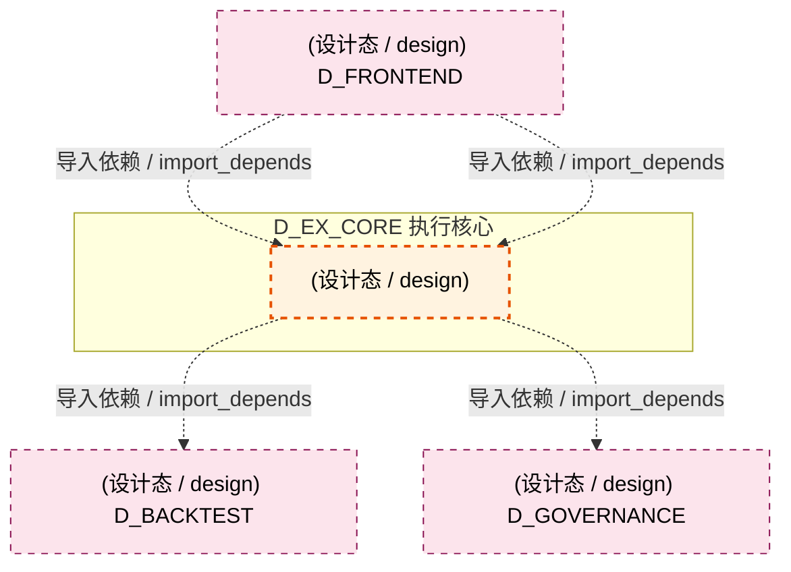
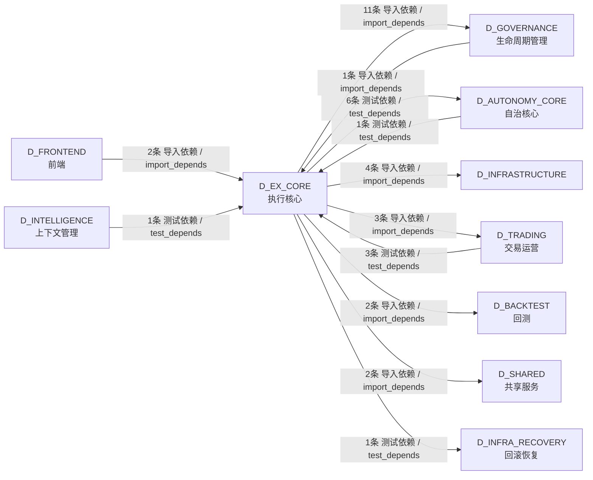

# 34_d_ex_core / 执行核心 / 执行核心 / Execution Core

> **功能简介 / Overview**: 执行核心，负责订单执行引擎、执行策略和执行管理

> **文档作用 / Purpose**: 展示 执行核心（D_EX_CORE）功能域的模块清单、域内依赖关系、跨域依赖关系、架构分层视图，供架构审查和域治理参考。

> 本文档由 generate_domain_doc.py 从 depgraph (PostgreSQL) 自动生成
> 最后更新: 2026-07-13 18:30:32
> 数据源: depgraph (PostgreSQL) nodes表 + edges表

## 域基本信息 / Domain Overview

| 字段 | 值 | Field | Value |
|------|------|-------|-------|
| 编号 | 34 | Number | 34 |
| 域ID | D_EX_CORE | Domain ID | D_EX_CORE |
| 域名称 | 执行核心 | Domain Name | Execution Core |
| 层级 | L2 业务域层 | Layer | L2 Domain |
| 模块数 | 23 | Module Count | 23 |
| 域内依赖 | 2 | Internal Dependencies | 2 |
| 跨域入边 | 8 | Cross-domain Incoming | 8 |
| 跨域出边 | 29 | Cross-domain Outgoing | 29 |
| 设计态模块 | 1 | Design Modules | 1 |
| 原型态模块 | 16 | Prototype Modules | 16 |
| 生产态模块 | 6 | Production Modules | 6 |
| 容量 | 6/150 (正常) | Capacity | 6/150 (正常) |
| 描述 | 执行核心域。负责订单执行核心引擎，包括订单拆分、执行算法(VWAP/TWAP/Iceberg)、执行质量分析。 | Description | 执行核心域。负责订单执行核心引擎，包括订单拆分、执行算法(VWAP/TWAP/Iceberg)、执行质量分析。 |

## 模块分层清单 / Module Layered List

> 按 architecture_layer 分组的模块清单（共 23 个模块 / 23 modules）。

### L1 基础层 / Foundation Layer (1 modules)

| # | 模块路径 / Module Path | 模块名称 / Module Name (功能简介 / Description) | 成熟度 / Maturity | 蓝图 / Blueprint |
|:--:|---------|---------|:---:|:---:|
| 1 | src/zephyr/governance/escalation/order_state_escalator.py | Order State Escalator — v0.10.0 订单状态机升级器。 | 生产态 / production | [MOD-INF-022](../../03_modules/_domain_autonomy_perm/escalation_protocol/blueprint.md) |

### L2 领域层 / Domain Layer (22 modules)

| # | 模块路径 / Module Path | 模块名称 / Module Name (功能简介 / Description) | 成熟度 / Maturity | 蓝图 / Blueprint |
|:--:|---------|---------|:---:|:---:|
| 1 | src/zephyr/ex_core/__init__.py | D_EXECUTION_CORE Trade Execution — Re-export w... | 生产态 / production | [MOD-L06-001](../../03_modules/_domain_execution_core/blueprint.md) |
| 2 | src/zephyr/ex_core/_extensions/__init__.py | __init__.py | 原型态 / prototype |  |
| 3 | src/zephyr/ex_core/adapters/__init__.py | D_EX_CORE adapters — 券商/风控适配器 re-export... | 原型态 / prototype | [MOD-L06-001](../../03_modules/_domain_execution_core/blueprint.md) |
| 4 | src/zephyr/ex_core/adapters/broker_interface.py | Re-export wrapper: broker_interface has migrate... | 生产态 / production | [MOD-L06-001](../../03_modules/_domain_execution_core/blueprint.md) |
| 5 | src/zephyr/ex_core/adapters/miniqmt_broker.py | MiniQMT 实盘券商适配器（对接 xttrader，A股实盘... | 原型态 / prototype | [MOD-L06-001](../../03_modules/_domain_execution_core/blueprint.md) |
| 6 | src/zephyr/ex_core/adapters/miniqmt_broker.py/ |  | 设计态 / design | [MOD-L06-001](../../03_modules/_domain_execution_core/blueprint.md) |
| 7 | src/zephyr/ex_core/adapters/risk_validation_bridge.py | Re-export wrapper: risk_validation_bridge has m... | 原型态 / prototype | [MOD-L06-001](../../03_modules/_domain_execution_core/blueprint.md) |
| 8 | src/zephyr/ex_core/adapters/simulation_broker.py | Re-export wrapper: simulation_broker has migrat... | 生产态 / production | [MOD-L06-001](../../03_modules/_domain_execution_core/blueprint.md) |
| 9 | src/zephyr/ex_core/api/__init__.py | __init__.py | 原型态 / prototype |  |
| 10 | src/zephyr/ex_core/broker_interface.py | Re-export wrapper: broker_interface has migrate... | 原型态 / prototype | [MOD-L06-001](../../03_modules/_domain_execution_core/blueprint.md) |
| 11 | src/zephyr/ex_core/core/__init__.py | __init__.py | 原型态 / prototype |  |
| 12 | src/zephyr/ex_core/execution_engine.py | D_EXECUTION_CORE — Execution Engine | 生产态 / production | [MOD-L06-001](../../03_modules/_domain_execution_core/blueprint.md) |
| 13 | src/zephyr/ex_core/infrastructure/__init__.py | __init__.py | 原型态 / prototype |  |
| 14 | src/zephyr/ex_core/order_manager.py | D_EXECUTION_CORE — Order Manager | 生产态 / production | [MOD-L06-001](../../03_modules/_domain_execution_core/blueprint.md) |
| 15 | src/zephyr/ex_core/services/__init__.py | __init__.py | 原型态 / prototype |  |
| 16 | tests/ce/test_ce_bootstrap.py | test_ce_bootstrap.py | 原型态 / prototype | [MOD-CONTEXT_ENGINE](../../03_modules/_cross_layer/context_engine/blueprint.md) |
| 17 | tests/ce/test_ce_cache_invalidation.py | test_ce_cache_invalidation.py | 原型态 / prototype | [MOD-INF-019](../../03_modules/_domain_autonomy_core/agent_spec/blueprint.md) |
| 18 | tests/ce/test_ce_explain_cli.py | test_ce_explain_cli.py | 原型态 / prototype | [MOD-CONTEXT_ENGINE](../../03_modules/_cross_layer/context_engine/blueprint.md) |
| 19 | tests/ce/test_ce_integrity_check.py | test_ce_integrity_check.py | 原型态 / prototype | [MOD-INF-019](../../03_modules/_domain_autonomy_core/agent_spec/blueprint.md) |
| 20 | tests/ce/test_ce_kill_switch.py | test_ce_kill_switch.py | 原型态 / prototype | [MOD-INF-019](../../03_modules/_domain_autonomy_core/agent_spec/blueprint.md) |
| 21 | tests/ce/test_ce_playground_v2.py | test_ce_playground_v2.py | 原型态 / prototype | [MOD-CONTEXT_ENGINE](../../03_modules/_cross_layer/context_engine/blueprint.md) |
| 22 | tests/ce/test_ce_vibe_shortcuts.py | test_ce_vibe_shortcuts.py | 原型态 / prototype | [MOD-CONTEXT_ENGINE](../../03_modules/_cross_layer/context_engine/blueprint.md) |

## 域内依赖图 / Internal Dependency Diagram

> 依赖图内嵌在本文档中，IDE 可直接渲染显示。参考 decision_index.md 设计，分四个视图：合并全景图、运营态子图、设计态子图、原型态子图（按 design_maturity 实际值拆分）。
>
> **图例说明 / Legend**：
> - **实线边框 = 运营态模块**（production，已上线运行）
> - **虚线边框 = 设计态模块**（design，蓝图阶段，代码未写）
> - **虚线边框 = 原型态模块**（prototype，代码已写，验证中未稳定上线）
> - **实线箭头 = 运营态依赖**（已生效的依赖关系）
> - **虚线箭头 = 非运营态依赖**（计划中/验证中的依赖关系）

### 合并全景图（全部模块，标签标注成熟度）

> 展示全部 23 个模块（生产态 6 + 设计态 1 + 原型态 16），标签标注成熟度。

```mermaid
graph TD
    subgraph D_EX_CORE["D_EX_CORE 执行核心"]
        src_zephyr_ex_core_init_py["(生产态 / production) D_EXECUTION_CORE Trade Execution — Re-export w...<br/>文件: __init__.py"]
        src_zephyr_ex_core_extensions_init_py["(原型态 / prototype) __init__.py"]
        src_zephyr_ex_core_adapters_init_py["(原型态 / prototype) D_EX_CORE adapters — 券商/风控适配器 re-export...<br/>文件: __init__.py"]
        src_zephyr_ex_core_adapters_broker_interface_py["(生产态 / production) Re-export wrapper: broker_interface has migrate...<br/>文件: broker_interface.py"]
        src_zephyr_ex_core_adapters_miniqmt_broker_py["(原型态 / prototype) MiniQMT 实盘券商适配器（对接 xttrader，A股实盘...<br/>文件: miniqmt_broker.py"]
        src_zephyr_ex_core_adapters_miniqmt_broker_py_1["(设计态 / design) "]
        src_zephyr_ex_core_adapters_risk_validation_bridge_py["(原型态 / prototype) Re-export wrapper: risk_validation_bridge has m...<br/>文件: risk_validation_bridge.py"]
        src_zephyr_ex_core_adapters_simulation_broker_py["(生产态 / production) Re-export wrapper: simulation_broker has migrat...<br/>文件: simulation_broker.py"]
        src_zephyr_ex_core_api_init_py["(原型态 / prototype) __init__.py"]
        src_zephyr_ex_core_broker_interface_py["(原型态 / prototype) Re-export wrapper: broker_interface has migrate...<br/>文件: broker_interface.py"]
        src_zephyr_ex_core_core_init_py["(原型态 / prototype) __init__.py"]
        src_zephyr_ex_core_execution_engine_py["(生产态 / production) D_EXECUTION_CORE — Execution Engine<br/>文件: execution_engine.py"]
        src_zephyr_ex_core_infrastructure_init_py["(原型态 / prototype) __init__.py"]
        src_zephyr_ex_core_order_manager_py["(生产态 / production) D_EXECUTION_CORE — Order Manager<br/>文件: order_manager.py"]
        src_zephyr_ex_core_services_init_py["(原型态 / prototype) __init__.py"]
        src_zephyr_governance_escalation_order_state_escalator_py["(生产态 / production) Order State Escalator — v0.10.0 订单状态机升级器。<br/>文件: order_state_escalator.py"]
        tests_ce_test_ce_bootstrap_py["(原型态 / prototype) test_ce_bootstrap.py"]
        tests_ce_test_ce_cache_invalidation_py["(原型态 / prototype) test_ce_cache_invalidation.py"]
        tests_ce_test_ce_explain_cli_py["(原型态 / prototype) test_ce_explain_cli.py"]
        tests_ce_test_ce_integrity_check_py["(原型态 / prototype) test_ce_integrity_check.py"]
        tests_ce_test_ce_kill_switch_py["(原型态 / prototype) test_ce_kill_switch.py"]
        tests_ce_test_ce_playground_v2_py["(原型态 / prototype) test_ce_playground_v2.py"]
        tests_ce_test_ce_vibe_shortcuts_py["(原型态 / prototype) test_ce_vibe_shortcuts.py"]
    end
    src_zephyr_ex_core_execution_engine_py -->|导入依赖 / import_depends| src_zephyr_ex_core_order_manager_py
    src_zephyr_ex_core_adapters_init_py -.->|导入依赖 / import_depends| src_zephyr_ex_core_adapters_miniqmt_broker_py
    D_BACKTEST["(设计态 / design) D_BACKTEST"]
    src_zephyr_ex_core_adapters_miniqmt_broker_py_1 -.->|导入依赖 / import_depends| D_BACKTEST
    D_GOVERNANCE["(设计态 / design) D_GOVERNANCE"]
    src_zephyr_ex_core_adapters_miniqmt_broker_py_1 -.->|导入依赖 / import_depends| D_GOVERNANCE
    src_zephyr_ex_core_broker_interface_py -.->|导入依赖 / import_depends| D_GOVERNANCE
    src_zephyr_ex_core_order_manager_py -.->|导入依赖 / import_depends| D_GOVERNANCE
    D_SHARED["(原型态 / prototype) D_SHARED"]
    src_zephyr_ex_core_order_manager_py -.->|导入依赖 / import_depends| D_SHARED
    D_INFRASTRUCTURE["(原型态 / prototype) D_INFRASTRUCTURE"]
    src_zephyr_ex_core_order_manager_py -.->|导入依赖 / import_depends| D_INFRASTRUCTURE
    src_zephyr_ex_core_order_manager_py -.->|导入依赖 / import_depends| D_INFRASTRUCTURE
    src_zephyr_ex_core_adapters_miniqmt_broker_py -.->|导入依赖 / import_depends| D_BACKTEST
    src_zephyr_ex_core_adapters_miniqmt_broker_py -.->|导入依赖 / import_depends| D_GOVERNANCE
    D_TRADING["(生产态 / production) D_TRADING"]
    src_zephyr_ex_core_adapters_miniqmt_broker_py -.->|导入依赖 / import_depends| D_TRADING
    src_zephyr_ex_core_adapters_miniqmt_broker_py -.->|导入依赖 / import_depends| D_TRADING
    src_zephyr_ex_core_adapters_miniqmt_broker_py -.->|导入依赖 / import_depends| D_TRADING
    src_zephyr_ex_core_adapters_miniqmt_broker_py -.->|导入依赖 / import_depends| D_SHARED
    src_zephyr_ex_core_adapters_broker_interface_py -.->|导入依赖 / import_depends| D_GOVERNANCE
    src_zephyr_ex_core_execution_engine_py -.->|导入依赖 / import_depends| D_GOVERNANCE
    D_FRONTEND["(设计态 / design) D_FRONTEND"]
    D_FRONTEND -.->|导入依赖 / import_depends| src_zephyr_ex_core_adapters_miniqmt_broker_py_1
    D_FRONTEND -.->|导入依赖 / import_depends| src_zephyr_ex_core_adapters_miniqmt_broker_py_1
    D_GOVERNANCE -.->|导入依赖 / import_depends| src_zephyr_ex_core_init_py
    D_AUTONOMY_CORE["(原型态 / prototype) D_AUTONOMY_CORE"]
    D_AUTONOMY_CORE -.->|测试依赖 / test_depends| src_zephyr_governance_escalation_order_state_escalator_py
    D_INTELLIGENCE["(原型态 / prototype) D_INTELLIGENCE"]
    D_INTELLIGENCE -.->|测试依赖 / test_depends| src_zephyr_ex_core_init_py
    classDef production fill:#e1f5fe,stroke:#01579b,stroke-width:2px,color:#000
    classDef design fill:#fff3e0,stroke:#e65100,stroke-width:2px,color:#000,stroke-dasharray: 5 5
    classDef external_prod fill:#e8f5e9,stroke:#1b5e20,stroke-width:1px,color:#000
    classDef external_design fill:#fce4ec,stroke:#880e4f,stroke-width:1px,color:#000,stroke-dasharray: 5 5
    class src_zephyr_ex_core_init_py,src_zephyr_ex_core_adapters_broker_interface_py,src_zephyr_ex_core_adapters_simulation_broker_py,src_zephyr_ex_core_execution_engine_py,src_zephyr_ex_core_order_manager_py,src_zephyr_governance_escalation_order_state_escalator_py production
    class src_zephyr_ex_core_extensions_init_py,src_zephyr_ex_core_adapters_init_py,src_zephyr_ex_core_adapters_miniqmt_broker_py,src_zephyr_ex_core_adapters_miniqmt_broker_py_1,src_zephyr_ex_core_adapters_risk_validation_bridge_py,src_zephyr_ex_core_api_init_py,src_zephyr_ex_core_broker_interface_py,src_zephyr_ex_core_core_init_py,src_zephyr_ex_core_infrastructure_init_py,src_zephyr_ex_core_services_init_py,tests_ce_test_ce_bootstrap_py,tests_ce_test_ce_cache_invalidation_py,tests_ce_test_ce_explain_cli_py,tests_ce_test_ce_integrity_check_py,tests_ce_test_ce_kill_switch_py,tests_ce_test_ce_playground_v2_py,tests_ce_test_ce_vibe_shortcuts_py design
    class D_TRADING external_prod
    class D_BACKTEST,D_GOVERNANCE,D_SHARED,D_INFRASTRUCTURE,D_FRONTEND,D_AUTONOMY_CORE,D_INTELLIGENCE external_design
```

### 运营态子图（仅 design_maturity=production 的模块和依赖）

> 仅展示已上线运行的模块（共 6 个，1 条域内依赖）。

```mermaid
graph TD
    subgraph D_EX_CORE["D_EX_CORE 执行核心"]
        src_zephyr_ex_core_init_py["(生产态 / production) D_EXECUTION_CORE Trade Execution — Re-export w...<br/>文件: __init__.py"]
        src_zephyr_ex_core_adapters_broker_interface_py["(生产态 / production) Re-export wrapper: broker_interface has migrate...<br/>文件: broker_interface.py"]
        src_zephyr_ex_core_adapters_simulation_broker_py["(生产态 / production) Re-export wrapper: simulation_broker has migrat...<br/>文件: simulation_broker.py"]
        src_zephyr_ex_core_execution_engine_py["(生产态 / production) D_EXECUTION_CORE — Execution Engine<br/>文件: execution_engine.py"]
        src_zephyr_ex_core_order_manager_py["(生产态 / production) D_EXECUTION_CORE — Order Manager<br/>文件: order_manager.py"]
        src_zephyr_governance_escalation_order_state_escalator_py["(生产态 / production) Order State Escalator — v0.10.0 订单状态机升级器。<br/>文件: order_state_escalator.py"]
    end
    src_zephyr_ex_core_execution_engine_py -->|导入依赖 / import_depends| src_zephyr_ex_core_order_manager_py
    D_GOVERNANCE["(原型态 / prototype) D_GOVERNANCE"]
    src_zephyr_ex_core_order_manager_py -.->|导入依赖 / import_depends| D_GOVERNANCE
    D_SHARED["(原型态 / prototype) D_SHARED"]
    src_zephyr_ex_core_order_manager_py -.->|导入依赖 / import_depends| D_SHARED
    D_INFRASTRUCTURE["(原型态 / prototype) D_INFRASTRUCTURE"]
    src_zephyr_ex_core_order_manager_py -.->|导入依赖 / import_depends| D_INFRASTRUCTURE
    src_zephyr_ex_core_order_manager_py -.->|导入依赖 / import_depends| D_INFRASTRUCTURE
    src_zephyr_ex_core_adapters_broker_interface_py -.->|导入依赖 / import_depends| D_GOVERNANCE
    src_zephyr_ex_core_execution_engine_py -.->|导入依赖 / import_depends| D_GOVERNANCE
    src_zephyr_ex_core_execution_engine_py -->|导入依赖 / import_depends| D_INFRASTRUCTURE
    src_zephyr_ex_core_execution_engine_py -.->|导入依赖 / import_depends| D_INFRASTRUCTURE
    src_zephyr_ex_core_adapters_simulation_broker_py -.->|导入依赖 / import_depends| D_GOVERNANCE
    D_INTELLIGENCE["(原型态 / prototype) D_INTELLIGENCE"]
    D_INTELLIGENCE -.->|测试依赖 / test_depends| src_zephyr_ex_core_init_py
    D_GOVERNANCE -.->|导入依赖 / import_depends| src_zephyr_ex_core_init_py
    D_AUTONOMY_CORE["(原型态 / prototype) D_AUTONOMY_CORE"]
    D_AUTONOMY_CORE -.->|测试依赖 / test_depends| src_zephyr_governance_escalation_order_state_escalator_py
    classDef production fill:#e1f5fe,stroke:#01579b,stroke-width:2px,color:#000
    classDef design fill:#fff3e0,stroke:#e65100,stroke-width:2px,color:#000,stroke-dasharray: 5 5
    classDef external_prod fill:#e8f5e9,stroke:#1b5e20,stroke-width:1px,color:#000
    classDef external_design fill:#fce4ec,stroke:#880e4f,stroke-width:1px,color:#000,stroke-dasharray: 5 5
    class src_zephyr_ex_core_init_py,src_zephyr_ex_core_adapters_broker_interface_py,src_zephyr_ex_core_adapters_simulation_broker_py,src_zephyr_ex_core_execution_engine_py,src_zephyr_ex_core_order_manager_py,src_zephyr_governance_escalation_order_state_escalator_py production
    class D_GOVERNANCE,D_SHARED,D_INFRASTRUCTURE,D_INTELLIGENCE,D_AUTONOMY_CORE external_design
```

### 设计态子图（仅 design_maturity=design 的模块和依赖）

> 仅展示蓝图阶段、代码未写的设计态模块（共 1 个，0 条域内依赖）。

### 原型态子图（仅 design_maturity=prototype 的模块和依赖）

> 仅展示代码已写、验证中未稳定上线的原型态模块（共 16 个，1 条域内依赖）。

```mermaid
graph TD
    subgraph D_EX_CORE["D_EX_CORE 执行核心"]
        src_zephyr_ex_core_extensions_init_py["(原型态 / prototype) __init__.py"]
        src_zephyr_ex_core_adapters_init_py["(原型态 / prototype) D_EX_CORE adapters — 券商/风控适配器 re-export...<br/>文件: __init__.py"]
        src_zephyr_ex_core_adapters_miniqmt_broker_py["(原型态 / prototype) MiniQMT 实盘券商适配器（对接 xttrader，A股实盘...<br/>文件: miniqmt_broker.py"]
        src_zephyr_ex_core_adapters_risk_validation_bridge_py["(原型态 / prototype) Re-export wrapper: risk_validation_bridge has m...<br/>文件: risk_validation_bridge.py"]
        src_zephyr_ex_core_api_init_py["(原型态 / prototype) __init__.py"]
        src_zephyr_ex_core_broker_interface_py["(原型态 / prototype) Re-export wrapper: broker_interface has migrate...<br/>文件: broker_interface.py"]
        src_zephyr_ex_core_core_init_py["(原型态 / prototype) __init__.py"]
        src_zephyr_ex_core_infrastructure_init_py["(原型态 / prototype) __init__.py"]
        src_zephyr_ex_core_services_init_py["(原型态 / prototype) __init__.py"]
        tests_ce_test_ce_bootstrap_py["(原型态 / prototype) test_ce_bootstrap.py"]
        tests_ce_test_ce_cache_invalidation_py["(原型态 / prototype) test_ce_cache_invalidation.py"]
        tests_ce_test_ce_explain_cli_py["(原型态 / prototype) test_ce_explain_cli.py"]
        tests_ce_test_ce_integrity_check_py["(原型态 / prototype) test_ce_integrity_check.py"]
        tests_ce_test_ce_kill_switch_py["(原型态 / prototype) test_ce_kill_switch.py"]
        tests_ce_test_ce_playground_v2_py["(原型态 / prototype) test_ce_playground_v2.py"]
        tests_ce_test_ce_vibe_shortcuts_py["(原型态 / prototype) test_ce_vibe_shortcuts.py"]
    end
    src_zephyr_ex_core_adapters_init_py -.->|导入依赖 / import_depends| src_zephyr_ex_core_adapters_miniqmt_broker_py
    D_GOVERNANCE["(原型态 / prototype) D_GOVERNANCE"]
    src_zephyr_ex_core_broker_interface_py -.->|导入依赖 / import_depends| D_GOVERNANCE
    D_BACKTEST["(生产态 / production) D_BACKTEST"]
    src_zephyr_ex_core_adapters_miniqmt_broker_py -.->|导入依赖 / import_depends| D_BACKTEST
    src_zephyr_ex_core_adapters_miniqmt_broker_py -.->|导入依赖 / import_depends| D_GOVERNANCE
    D_TRADING["(生产态 / production) D_TRADING"]
    src_zephyr_ex_core_adapters_miniqmt_broker_py -.->|导入依赖 / import_depends| D_TRADING
    src_zephyr_ex_core_adapters_miniqmt_broker_py -.->|导入依赖 / import_depends| D_TRADING
    src_zephyr_ex_core_adapters_miniqmt_broker_py -.->|导入依赖 / import_depends| D_TRADING
    D_SHARED["(生产态 / production) D_SHARED"]
    src_zephyr_ex_core_adapters_miniqmt_broker_py -.->|导入依赖 / import_depends| D_SHARED
    src_zephyr_ex_core_adapters_risk_validation_bridge_py -.->|导入依赖 / import_depends| D_GOVERNANCE
    src_zephyr_ex_core_adapters_init_py -.->|导入依赖 / import_depends| D_GOVERNANCE
    src_zephyr_ex_core_adapters_init_py -.->|导入依赖 / import_depends| D_GOVERNANCE
    src_zephyr_ex_core_adapters_init_py -.->|导入依赖 / import_depends| D_GOVERNANCE
    D_INFRA_RECOVERY["(生产态 / production) D_INFRA_RECOVERY"]
    tests_ce_test_ce_kill_switch_py -.->|测试依赖 / test_depends| D_INFRA_RECOVERY
    D_AUTONOMY_CORE["(生产态 / production) D_AUTONOMY_CORE"]
    tests_ce_test_ce_bootstrap_py -.->|测试依赖 / test_depends| D_AUTONOMY_CORE
    tests_ce_test_ce_explain_cli_py -.->|测试依赖 / test_depends| D_AUTONOMY_CORE
    tests_ce_test_ce_cache_invalidation_py -.->|测试依赖 / test_depends| D_AUTONOMY_CORE
    classDef production fill:#e1f5fe,stroke:#01579b,stroke-width:2px,color:#000
    classDef design fill:#fff3e0,stroke:#e65100,stroke-width:2px,color:#000,stroke-dasharray: 5 5
    classDef external_prod fill:#e8f5e9,stroke:#1b5e20,stroke-width:1px,color:#000
    classDef external_design fill:#fce4ec,stroke:#880e4f,stroke-width:1px,color:#000,stroke-dasharray: 5 5
    class src_zephyr_ex_core_extensions_init_py,src_zephyr_ex_core_adapters_init_py,src_zephyr_ex_core_adapters_miniqmt_broker_py,src_zephyr_ex_core_adapters_risk_validation_bridge_py,src_zephyr_ex_core_api_init_py,src_zephyr_ex_core_broker_interface_py,src_zephyr_ex_core_core_init_py,src_zephyr_ex_core_infrastructure_init_py,src_zephyr_ex_core_services_init_py,tests_ce_test_ce_bootstrap_py,tests_ce_test_ce_cache_invalidation_py,tests_ce_test_ce_explain_cli_py,tests_ce_test_ce_integrity_check_py,tests_ce_test_ce_kill_switch_py,tests_ce_test_ce_playground_v2_py,tests_ce_test_ce_vibe_shortcuts_py design
    class D_BACKTEST,D_TRADING,D_SHARED,D_INFRA_RECOVERY,D_AUTONOMY_CORE external_prod
    class D_GOVERNANCE external_design
```

## 跨域依赖 / Cross-domain Dependencies

### 本域依赖的其他域（出边）/ Depends On

| # | 本域模块 / Source Module | → | 外部域-目标模块 / Target Module | 依赖类型 / Type |
|:--:|---------|:--:|---------|---------|
| 1 | test_ce_bootstrap.py | → | D_AUTONOMY_CORE 自治核心: ce_bootstrap.py — CE 自举架构 (B1, DD75, TASK-... | 测试依赖 / test_depends |
| 2 | test_ce_cache_invalidation.py | → | D_AUTONOMY_CORE 自治核心: cache_invalidation.py — 缓存一致性 (DD113, TAS... | 测试依赖 / test_depends |
| 3 | test_ce_explain_cli.py | → | D_AUTONOMY_CORE 自治核心: ce_explain_cli.py — KE inclusion rationale 解.... | 测试依赖 / test_depends |
| 4 | test_ce_integrity_check.py | → | D_AUTONOMY_CORE 自治核心: integrity_check.py — 注入后完整性 (DD106, TASK... | 测试依赖 / test_depends |
| 5 | test_ce_playground_v2.py | → | D_AUTONOMY_CORE 自治核心: ce_playground_v2.py — V2 Playground with full ... | 测试依赖 / test_depends |
| 6 | test_ce_vibe_shortcuts.py | → | D_AUTONOMY_CORE 自治核心: ce_vibe_shortcuts.py — Vibe/Strict 模式切换 (T... | 测试依赖 / test_depends |
| 7 | MiniQMT 实盘券商适配器（对接 xttrader，A股实盘.... | → | D_BACKTEST 回测: 共享撮合逻辑模块（回测=实盘一致性核心） (matchi... | 导入依赖 / import_depends |
| 8 |  | → | D_BACKTEST 回测:  | 导入依赖 / import_depends |
| 9 | D_EX_CORE adapters — 券商/风控适配器 re-export... | → | D_GOVERNANCE 生命周期管理: D_EXECUTION_CORE — Risk Validation Bridge (DW-... | 导入依赖 / import_depends |
| 10 | D_EX_CORE adapters — 券商/风控适配器 re-export... | → | D_GOVERNANCE 生命周期管理: D_EXECUTION_CORE — Simulation Broker Adapter (... | 导入依赖 / import_depends |
| 11 | D_EX_CORE adapters — 券商/风控适配器 re-export... | → | D_GOVERNANCE 生命周期管理: D_EXECUTION_CORE — BrokerInterface (broker_int... | 导入依赖 / import_depends |
| 12 | Re-export wrapper: broker_interface has migrate... | → | D_GOVERNANCE 生命周期管理: D_EXECUTION_CORE — BrokerInterface (broker_int... | 导入依赖 / import_depends |
| 13 | MiniQMT 实盘券商适配器（对接 xttrader，A股实盘.... | → | D_GOVERNANCE 生命周期管理: D_EXECUTION_CORE — BrokerInterface (broker_int... | 导入依赖 / import_depends |
| 14 |  | → | D_GOVERNANCE 生命周期管理:  | 导入依赖 / import_depends |
| 15 | Re-export wrapper: risk_validation_bridge has m... | → | D_GOVERNANCE 生命周期管理: D_EXECUTION_CORE — Risk Validation Bridge (DW-... | 导入依赖 / import_depends |
| 16 | Re-export wrapper: simulation_broker has migrat... | → | D_GOVERNANCE 生命周期管理: D_EXECUTION_CORE — Simulation Broker Adapter (... | 导入依赖 / import_depends |
| 17 | Re-export wrapper: broker_interface has migrate... | → | D_GOVERNANCE 生命周期管理: D_EXECUTION_CORE — BrokerInterface (broker_int... | 导入依赖 / import_depends |
| 18 | D_EXECUTION_CORE — Execution Engine (execution... | → | D_GOVERNANCE 生命周期管理: D_EXECUTION_CORE — Risk Validation Bridge (DW-... | 导入依赖 / import_depends |
| 19 | D_EXECUTION_CORE — Order Manager (order_manage... | → | D_GOVERNANCE 生命周期管理: D_EXECUTION_CORE — BrokerInterface (broker_int... | 导入依赖 / import_depends |
| 20 | D_EXECUTION_CORE — Execution Engine (execution... | → | D_INFRASTRUCTURE: order.py | 导入依赖 / import_depends |
| 21 | D_EXECUTION_CORE — Execution Engine (execution... | → | D_INFRASTRUCTURE: risk_limits.py | 导入依赖 / import_depends |
| 22 | D_EXECUTION_CORE — Order Manager (order_manage... | → | D_INFRASTRUCTURE: fill.py | 导入依赖 / import_depends |
| 23 | D_EXECUTION_CORE — Order Manager (order_manage... | → | D_INFRASTRUCTURE: order.py | 导入依赖 / import_depends |
| 24 | test_ce_kill_switch.py | → | D_INFRA_RECOVERY 回滚恢复: KillSwitchManager — 三级 Kill Switch 管理器。 ... | 测试依赖 / test_depends |
| 25 | MiniQMT 实盘券商适配器（对接 xttrader，A股实盘.... | → | D_SHARED 共享服务: time_utils.py —— 时间/日期工具（Phase 9 新增 ... | 导入依赖 / import_depends |
| 26 | D_EXECUTION_CORE — Order Manager (order_manage... | → | D_SHARED 共享服务: OrderSide/OrderStatus/OrderType — 交易枚举真源... | 导入依赖 / import_depends |
| 27 | MiniQMT 实盘券商适配器（对接 xttrader，A股实盘.... | → | D_TRADING 交易运营: fill.py | 导入依赖 / import_depends |
| 28 | MiniQMT 实盘券商适配器（对接 xttrader，A股实盘.... | → | D_TRADING 交易运营: order.py | 导入依赖 / import_depends |
| 29 | MiniQMT 实盘券商适配器（对接 xttrader，A股实盘.... | → | D_TRADING 交易运营: position.py | 导入依赖 / import_depends |

### 依赖本域的其他域（入边）/ Depended By

| # | 外部域-源模块 / Source Module | → | 本域模块 / Target Module | 依赖类型 / Type |
|:--:|---------|:--:|---------|---------|
| 1 | D_AUTONOMY_CORE 自治核心: test_order_state_escalator.py | → | Order State Escalator — v0.10.0 订单状态机升级... | 测试依赖 / test_depends |
| 2 | D_FRONTEND 前端:  | → |  | 导入依赖 / import_depends |
| 3 | D_FRONTEND 前端:  | → |  | 导入依赖 / import_depends |
| 4 | D_GOVERNANCE 生命周期管理: C-track 端到端演示 —— 全流水线一次性运行 (dem... | → | D_EXECUTION_CORE Trade Execution — Re-export w... | 导入依赖 / import_depends |
| 5 | D_INTELLIGENCE 上下文管理: test_cli.py | → | D_EXECUTION_CORE Trade Execution — Re-export w... | 测试依赖 / test_depends |

### 跨域依赖图 / Cross-domain Dependency Diagram

> 本域与 9 个外部域直接连接（出边 29 条 + 入边 8 条 = 37 条）。只显示直接连接的域，不展开具体节点。

## 说明 / Notes

- **数据源 / Data Source**: `depgraph (PostgreSQL)` 的 `nodes`、`edges`、`domains` 表
- **生成器 / Generator**: `generate_domain_doc.py`（G2+G10 合并）
- **维护方式 / Maintenance**: 自动生成，全景图更新时刷新
- **文件名规则 / File Naming**: `{编号:02d}_{域ID小写}.md`，如 `16_d_trading.md`
- **图例说明 / Legend**: `[production]`=已上线 / `[design]`=设计中 / `[prototype]`=原型 / `[unknown]`=未知
