# 34_d_gov_audit / 审计追踪

> **文档作用 / Purpose**: 展示 审计追踪（D-GOV_AUDIT）功能域的模块清单、域内依赖关系和跨域依赖关系，供架构审查和域治理参考。

> 本文档由 generate_domain_doc.py 从 depgraph.db 自动生成
> 最后更新: 2026-06-26 21:00:25
> 数据源: depgraph.db nodes表 + edges表

## 域基本信息 / Domain Overview

| 字段 | 值 | Field | Value |
|------|------|-------|-------|
| 编号 | 34 | Number | 34 |
| 域ID | D-GOV_AUDIT | Domain ID | D-GOV_AUDIT |
| 域名称 | 审计追踪 | Domain Name | audit-trail |
| 层级 | L2_domain | Layer | L2_domain |
| 模块数 | 185 | Module Count | 185 |
| 域内依赖 | 181 | Internal Dependencies | 181 |
| 跨域入边 | 211 | Cross-domain Incoming | 211 |
| 跨域出边 | 96 | Cross-domain Outgoing | 96 |
| 设计态模块 | 2 | Design Modules | 2 |
| 原型态模块 | 129 | Prototype Modules | 129 |
| 生产态模块 | 54 | Production Modules | 54 |
| 容量 | 54/150 (正常) | Capacity | 54/150 (正常) |
| 描述 | Merkle小时级完整性(merkle_hourly) | Description | Merkle小时级完整性(merkle_hourly) |

## 模块清单 / Module List

共 185 个模块（按路径排序，全部显示）

| 模块路径 / Module Path | 模块名称 / Module Name | 设计成熟度 / Maturity | 构建状态 / Build Status |
|---------|---------|-----------|---------|
| docs/03_modules/_cross_layer/audit_orchestrator/blueprint.md | docs__03_modules___cross_layer__audit... | design | planned |
| docs/03_modules/_domain_governance/audit_trail/blueprint.md | docs__03_modules___domain_governance_... | design | planned |
| scripts/_archive/governance/repair/ensure_dep_cycles_view.py |  | prototype | generated |
| scripts/_archive/governance/repair/list_source_md_files.py |  | prototype | generated |
| scripts/governance/repair/audit_design_completeness.py |  | prototype | generated |
| scripts/governance/repair/backup_db.py |  | prototype | generated |
| scripts/governance/repair/red_blue_test.py |  | prototype | generated |
| scripts/governance/repair/rollback_depgraph.py |  | prototype | generated |
| src/zephyr/governance/audit_orchestration/__init__.py |  | prototype | generated |
| src/zephyr/governance/audit_orchestration/agent_health_monitor.py |  | prototype | generated |
| src/zephyr/governance/audit_orchestration/agent_orchestrator.py |  | prototype | generated |
| src/zephyr/governance/audit_orchestration/agent_quality.py |  | prototype | generated |
| src/zephyr/governance/audit_orchestration/autonomy_guard.py |  | prototype | generated |
| src/zephyr/governance/audit_orchestration/backup_manager.py |  | prototype | generated |
| src/zephyr/governance/audit_orchestration/batch_orchestrator.py |  | prototype | generated |
| src/zephyr/governance/audit_orchestration/benchmark_runner.py |  | prototype | generated |
| src/zephyr/governance/audit_orchestration/blind_spot_closure.py |  | prototype | generated |
| src/zephyr/governance/audit_orchestration/blueprint_health.py |  | prototype | generated |
| src/zephyr/governance/audit_orchestration/blueprint_scorer.py |  | prototype | generated |
| src/zephyr/governance/audit_orchestration/bulkhead_manager.py |  | prototype | generated |
| src/zephyr/governance/audit_orchestration/canary_manager.py |  | prototype | generated |
| src/zephyr/governance/audit_orchestration/capacity_budget.py |  | prototype | generated |
| src/zephyr/governance/audit_orchestration/chaos_engine.py |  | prototype | generated |
| src/zephyr/governance/audit_orchestration/config_manager.py |  | prototype | generated |
| src/zephyr/governance/audit_orchestration/construction_guide.py |  | prototype | generated |
| src/zephyr/governance/audit_orchestration/contract_registry.py |  | prototype | generated |
| src/zephyr/governance/audit_orchestration/contract_router.py |  | prototype | generated |
| src/zephyr/governance/audit_orchestration/core/__init__.py |  | prototype | generated |
| src/zephyr/governance/audit_orchestration/core/agent_orchestrator.py |  | prototype | generated |
| src/zephyr/governance/audit_orchestration/core/task_queue.py |  | prototype | generated |
| src/zephyr/governance/audit_orchestration/core/trigger_router.py |  | prototype | generated |
| src/zephyr/governance/audit_orchestration/core/wave_generator.py |  | prototype | generated |
| src/zephyr/governance/audit_orchestration/data_lifecycle.py |  | prototype | generated |
| src/zephyr/governance/audit_orchestration/deferred_queue.py |  | prototype | generated |
| src/zephyr/governance/audit_orchestration/degrade_cascade.py |  | prototype | generated |
| src/zephyr/governance/audit_orchestration/dependency_lock.py |  | prototype | generated |
| src/zephyr/governance/audit_orchestration/design_decisions.py |  | prototype | generated |
| src/zephyr/governance/audit_orchestration/disk_guard.py |  | prototype | generated |
| src/zephyr/governance/audit_orchestration/dlq_manager.py |  | prototype | generated |
| src/zephyr/governance/audit_orchestration/failure_matcher.py |  | prototype | generated |
| src/zephyr/governance/audit_orchestration/feature_flag.py |  | prototype | generated |
| src/zephyr/governance/audit_orchestration/file_task_mapper.py |  | prototype | generated |
| src/zephyr/governance/audit_orchestration/finding_bridge.py |  | prototype | generated |
| src/zephyr/governance/audit_orchestration/hallucination_detector.py |  | prototype | generated |
| src/zephyr/governance/audit_orchestration/housekeeping.py |  | prototype | generated |
| src/zephyr/governance/audit_orchestration/incident_postmortem.py |  | prototype | generated |
| src/zephyr/governance/audit_orchestration/incremental_review.py |  | production | generated |
| src/zephyr/governance/audit_orchestration/ke_quality.py |  | prototype | generated |
| src/zephyr/governance/audit_orchestration/knowledge_freshness.py |  | prototype | generated |
| src/zephyr/governance/audit_orchestration/lean_scanner.py |  | prototype | generated |
| src/zephyr/governance/audit_orchestration/model_registry.py |  | prototype | generated |
| src/zephyr/governance/audit_orchestration/network_partition.py |  | prototype | generated |
| src/zephyr/governance/audit_orchestration/path_index.py |  | prototype | generated |
| src/zephyr/governance/audit_orchestration/phase_executor.py |  | prototype | generated |
| src/zephyr/governance/audit_orchestration/prompt_version.py |  | prototype | generated |
| src/zephyr/governance/audit_orchestration/reconciliation_loop.py |  | prototype | generated |
| src/zephyr/governance/audit_orchestration/resilience/__init__.py |  | prototype | generated |
| src/zephyr/governance/audit_orchestration/resilience/deferred_queue.py |  | prototype | generated |
| src/zephyr/governance/audit_orchestration/resilience/failure_matcher.py |  | prototype | generated |
| src/zephyr/governance/audit_orchestration/resilience/hallucination_detector.py |  | prototype | generated |
| src/zephyr/governance/audit_orchestration/resilience/rollback_manager.py |  | prototype | generated |
| src/zephyr/governance/audit_orchestration/risk_registry.py |  | prototype | generated |
| src/zephyr/governance/audit_orchestration/rollback_manager.py |  | prototype | generated |
| src/zephyr/governance/audit_orchestration/rolling_upgrade.py |  | prototype | generated |
| src/zephyr/governance/audit_orchestration/schema_migration.py |  | prototype | generated |
| src/zephyr/governance/audit_orchestration/session_conflict.py |  | prototype | generated |
| src/zephyr/governance/audit_orchestration/session_manager.py |  | prototype | generated |
| src/zephyr/governance/audit_orchestration/stability_guard.py |  | prototype | generated |
| src/zephyr/governance/audit_orchestration/startup_sequencer.py |  | prototype | generated |
| src/zephyr/governance/audit_orchestration/state/__init__.py |  | prototype | generated |
| src/zephyr/governance/audit_orchestration/state/agent_health_monitor.py |  | prototype | generated |
| src/zephyr/governance/audit_orchestration/state/file_task_mapper.py |  | prototype | generated |
| src/zephyr/governance/audit_orchestration/state/session_manager.py |  | prototype | generated |
| src/zephyr/governance/audit_orchestration/state_propagation.py |  | prototype | generated |
| src/zephyr/governance/audit_orchestration/system_transfer.py |  | prototype | generated |
| src/zephyr/governance/audit_orchestration/task_queue.py |  | prototype | generated |
| src/zephyr/governance/audit_orchestration/teardown_manager.py |  | prototype | generated |
| src/zephyr/governance/audit_orchestration/trigger_router.py |  | prototype | generated |
| src/zephyr/governance/audit_orchestration/version_manifest.py |  | prototype | generated |
| src/zephyr/governance/audit_orchestration/wave_generator.py |  | prototype | generated |
| src/zephyr/governance/audit_orchestrator/__init__.py |  | prototype | generated |
| src/zephyr/governance/audit_orchestrator/__main__.py |  | prototype | generated |
| src/zephyr/governance/audit_orchestrator/anomaly.py |  | prototype | generated |
| src/zephyr/governance/audit_orchestrator/audit_admission_controller.py |  | prototype | generated |
| src/zephyr/governance/audit_orchestrator/bridge.py |  | prototype | generated |
| src/zephyr/governance/audit_orchestrator/cli.py |  | prototype | generated |
| src/zephyr/governance/audit_orchestrator/cold_start.py |  | production | generated |
| src/zephyr/governance/audit_orchestrator/contracts.py |  | prototype | generated |
| src/zephyr/governance/audit_orchestrator/delegation_auditor.py |  | prototype | generated |
| src/zephyr/governance/audit_orchestrator/delegation_bridge.py |  | prototype | generated |
| src/zephyr/governance/audit_orchestrator/drift_bridge.py |  | prototype | generated |
| src/zephyr/governance/audit_orchestrator/evidence_pack.py |  | production | generated |
| src/zephyr/governance/audit_orchestrator/external_tool_audit.py |  | prototype | generated |
| src/zephyr/governance/audit_orchestrator/feedback_bridge.py |  | prototype | generated |
| src/zephyr/governance/audit_orchestrator/feedback_policy.py |  | prototype | generated |
| src/zephyr/governance/audit_orchestrator/genesis.py |  | prototype | generated |
| src/zephyr/governance/audit_orchestrator/indexer.py |  | prototype | generated |
| src/zephyr/governance/audit_orchestrator/log_rotation.py |  | prototype | generated |
| src/zephyr/governance/audit_orchestrator/merkle_hourly.py |  | prototype | generated |
| src/zephyr/governance/audit_orchestrator/models.py |  | prototype | generated |
| src/zephyr/governance/audit_orchestrator/pipeline_runner.py |  | prototype | generated |
| src/zephyr/governance/audit_orchestrator/query.py |  | prototype | generated |
| src/zephyr/governance/audit_orchestrator/replay_engine.py |  | prototype | generated |
| src/zephyr/governance/audit_orchestrator/resource_aware_pool.py |  | prototype | generated |
| src/zephyr/governance/audit_orchestrator/retention.py |  | prototype | generated |
| src/zephyr/governance/audit_orchestrator/self_monitor.py |  | prototype | generated |
| src/zephyr/governance/audit_orchestrator/text_to_finding_adapter.py |  | prototype | generated |
| src/zephyr/governance/audit_orchestrator/tiered_storage.py |  | prototype | generated |
| src/zephyr/governance/audit_orchestrator/tiered_storage_bridge.py |  | prototype | generated |
| src/zephyr/governance/audit_orchestrator/trust_bridge.py |  | prototype | generated |
| src/zephyr/governance/audit_orchestrator/trust_engine.py |  | prototype | generated |
| src/zephyr/governance/audit_orchestrator/writer.py |  | prototype | generated |
| src/zephyr/governance/audit_trail/__init__.py |  | production | generated |
| src/zephyr/governance/audit_trail/__main__.py |  | prototype | generated |
| src/zephyr/governance/audit_trail/agent_signer.py |  | production | generated |
| src/zephyr/governance/audit_trail/anomaly.py |  | production | generated |
| src/zephyr/governance/audit_trail/api_lifecycle.py |  | production | generated |
| src/zephyr/governance/audit_trail/audit_admission_controller.py |  | prototype | generated |
| src/zephyr/governance/audit_trail/bridge.py |  | production | generated |
| src/zephyr/governance/audit_trail/bridges/__init__.py |  | prototype | generated |
| src/zephyr/governance/audit_trail/bridges/anomaly.py |  | prototype | generated |
| src/zephyr/governance/audit_trail/bridges/contracts.py |  | prototype | generated |
| src/zephyr/governance/audit_trail/bridges/delegation_bridge.py |  | prototype | generated |
| src/zephyr/governance/audit_trail/bridges/drift_bridge.py |  | prototype | generated |
| src/zephyr/governance/audit_trail/bridges/feedback_bridge.py |  | prototype | generated |
| src/zephyr/governance/audit_trail/bridges/spec_auditor.py |  | prototype | generated |
| src/zephyr/governance/audit_trail/bridges/tiered_storage_bridge.py |  | prototype | generated |
| src/zephyr/governance/audit_trail/bridges/trust_bridge.py |  | prototype | generated |
| src/zephyr/governance/audit_trail/changelog_manager.py |  | production | generated |
| src/zephyr/governance/audit_trail/cli.py |  | production | generated |
| src/zephyr/governance/audit_trail/code_archaeology.py |  | production | generated |
| src/zephyr/governance/audit_trail/cold_start.py |  | prototype | generated |
| src/zephyr/governance/audit_trail/compliance_map.py |  | production | generated |
| src/zephyr/governance/audit_trail/contracts.py |  | production | generated |
| src/zephyr/governance/audit_trail/corporate_actions.py |  | production | generated |
| src/zephyr/governance/audit_trail/delegation_auditor.py |  | production | generated |
| src/zephyr/governance/audit_trail/delegation_bridge.py |  | production | generated |
| src/zephyr/governance/audit_trail/dora_metrics.py |  | production | generated |
| src/zephyr/governance/audit_trail/evidence_pack.py |  | prototype | generated |
| src/zephyr/governance/audit_trail/external_tool_audit.py |  | production | generated |
| src/zephyr/governance/audit_trail/feedback_bridge.py |  | production | generated |
| src/zephyr/governance/audit_trail/feedback_policy.py |  | production | generated |
| src/zephyr/governance/audit_trail/feedback_self_audit.py |  | production | generated |
| src/zephyr/governance/audit_trail/financial_compliance.py |  | prototype | generated |
| src/zephyr/governance/audit_trail/finding_model.py |  | prototype | generated |
| src/zephyr/governance/audit_trail/genesis.py |  | production | generated |
| src/zephyr/governance/audit_trail/glossary_matrix.py |  | production | generated |
| src/zephyr/governance/audit_trail/incremental_review.py |  | production | generated |
| src/zephyr/governance/audit_trail/indexer.py |  | production | generated |
| src/zephyr/governance/audit_trail/integrity.py |  | prototype | generated |
| src/zephyr/governance/audit_trail/kb_gate.py |  | production | generated |
| src/zephyr/governance/audit_trail/log_rotation.py |  | production | generated |
| src/zephyr/governance/audit_trail/merkle_hourly.py |  | prototype | generated |
| src/zephyr/governance/audit_trail/models.py |  | production | generated |
| src/zephyr/governance/audit_trail/observability_dashboard.py |  | production | generated |
| src/zephyr/governance/audit_trail/orchestrator.py |  | production | generated |
| src/zephyr/governance/audit_trail/pipeline_runner.py |  | production | generated |
| src/zephyr/governance/audit_trail/privacy.py |  | production | generated |
| src/zephyr/governance/audit_trail/provenance_tracker.py |  | production | generated |
| src/zephyr/governance/audit_trail/query.py |  | production | generated |
| src/zephyr/governance/audit_trail/replay_engine.py |  | production | generated |
| src/zephyr/governance/audit_trail/resource_aware_pool.py |  | prototype | generated |
| src/zephyr/governance/audit_trail/retention.py |  | production | generated |
| src/zephyr/governance/audit_trail/sbom_generator.py |  | production | generated |
| src/zephyr/governance/audit_trail/spec_auditor.py |  | production | generated |
| src/zephyr/governance/audit_trail/supply_chain.py |  | production | generated |
| src/zephyr/governance/audit_trail/supply_chain_security.py |  | production | generated |
| src/zephyr/governance/audit_trail/tiered_storage.py |  | production | generated |
| src/zephyr/governance/audit_trail/tiered_storage_bridge.py |  | production | generated |
| src/zephyr/governance/audit_trail/trust_bridge.py |  | production | generated |
| src/zephyr/governance/audit_trail/trust_engine.py |  | production | generated |
| src/zephyr/governance/audit_trail/wqa_scorer.py |  | production | generated |
| src/zephyr/governance/audit_trail/writer.py |  | production | generated |
| src/zephyr/governance/behavioral_admission/ai_code_standards.py |  | production | generated |
| src/zephyr/governance/behavioral_admission/mcp_result_push.py |  | production | generated |
| src/zephyr/governance/behavioral_admission/post_process.py |  | production | generated |
| src/zephyr/governance/behavioral_admission/vibe_coding_enforcer.py |  | production | generated |
| src/zephyr/governance/compliance_gate_a6/default_security_gateway.py |  | production | generated |
| src/zephyr/governance/financial_compliance.py |  | production | generated |
| src/zephyr/governance/merkle_hourly.py |  | production | generated |
| src/zephyr/governance/persistence/audit_schema.py |  | production | generated |
| src/zephyr/governance/self_healer.py |  | prototype | generated |
| src/zephyr/governance/self_health.py |  | prototype | generated |
| src/zephyr/governance/semantic_audit/self_healer.py |  | prototype | generated |
| src/zephyr/governance/semantic_audit/self_health.py |  | prototype | generated |

## 域内依赖图 / Internal Dependency Diagram

> 依赖图内嵌在本文档中，IDE 可直接渲染显示。每30个节点一组分页显示。
>
> **图例说明 / Legend**：
> - **实线边框 = 运营态模块**（production，已上线运行）
> - **虚线边框 = 设计态模块**（design，还在设计中）
> - **实线箭头 = 运营态依赖**（已生效的依赖关系）
> - **虚线箭头 = 设计态依赖**（计划中的依赖关系）

### 第 1 页 / 共 7 页 / Page 1 of 7

```mermaid
graph TD
    subgraph D_GOV_AUDIT["D-GOV_AUDIT 审计追踪"]
        docs_03_modules_cross_layer_audit_orchestrator_blueprint_md["docs__03_modules___cross_layer__audit_orchestra... design"]
        docs_03_modules_domain_governance_audit_trail_blueprint_md["docs__03_modules___domain_governance__audit_tra... design"]
        scripts_archive_governance_repair_ensure_dep_cycles_view_py["scripts/_archive/governance/repair/ensure_dep_c... prototype"]
        scripts_archive_governance_repair_list_source_md_files_py["scripts/_archive/governance/repair/list_source_... prototype"]
        scripts_governance_repair_audit_design_completeness_py["scripts/governance/repair/audit_design_complete... prototype"]
        scripts_governance_repair_backup_db_py["scripts/governance/repair/backup_db.py prototype"]
        scripts_governance_repair_red_blue_test_py["scripts/governance/repair/red_blue_test.py prototype"]
        scripts_governance_repair_rollback_depgraph_py["scripts/governance/repair/rollback_depgraph.py prototype"]
        src_zephyr_governance_audit_orchestration_init_py["src/zephyr/governance/audit_orchestration/__ini... prototype"]
        src_zephyr_governance_audit_orchestration_agent_health_monitor_py["src/zephyr/governance/audit_orchestration/agent... prototype"]
        src_zephyr_governance_audit_orchestration_agent_orchestrator_py["src/zephyr/governance/audit_orchestration/agent... prototype"]
        src_zephyr_governance_audit_orchestration_agent_quality_py["src/zephyr/governance/audit_orchestration/agent... prototype"]
        src_zephyr_governance_audit_orchestration_autonomy_guard_py["src/zephyr/governance/audit_orchestration/auton... prototype"]
        src_zephyr_governance_audit_orchestration_backup_manager_py["src/zephyr/governance/audit_orchestration/backu... prototype"]
        src_zephyr_governance_audit_orchestration_batch_orchestrator_py["src/zephyr/governance/audit_orchestration/batch... prototype"]
        src_zephyr_governance_audit_orchestration_benchmark_runner_py["src/zephyr/governance/audit_orchestration/bench... prototype"]
        src_zephyr_governance_audit_orchestration_blind_spot_closure_py["src/zephyr/governance/audit_orchestration/blind... prototype"]
        src_zephyr_governance_audit_orchestration_blueprint_health_py["src/zephyr/governance/audit_orchestration/bluep... prototype"]
        src_zephyr_governance_audit_orchestration_blueprint_scorer_py["src/zephyr/governance/audit_orchestration/bluep... prototype"]
        src_zephyr_governance_audit_orchestration_bulkhead_manager_py["src/zephyr/governance/audit_orchestration/bulkh... prototype"]
        src_zephyr_governance_audit_orchestration_canary_manager_py["src/zephyr/governance/audit_orchestration/canar... prototype"]
        src_zephyr_governance_audit_orchestration_capacity_budget_py["src/zephyr/governance/audit_orchestration/capac... prototype"]
        src_zephyr_governance_audit_orchestration_chaos_engine_py["src/zephyr/governance/audit_orchestration/chaos... prototype"]
        src_zephyr_governance_audit_orchestration_config_manager_py["src/zephyr/governance/audit_orchestration/confi... prototype"]
        src_zephyr_governance_audit_orchestration_construction_guide_py["src/zephyr/governance/audit_orchestration/const... prototype"]
        src_zephyr_governance_audit_orchestration_contract_registry_py["src/zephyr/governance/audit_orchestration/contr... prototype"]
        src_zephyr_governance_audit_orchestration_contract_router_py["src/zephyr/governance/audit_orchestration/contr... prototype"]
        src_zephyr_governance_audit_orchestration_core_init_py["src/zephyr/governance/audit_orchestration/core/... prototype"]
        src_zephyr_governance_audit_orchestration_core_agent_orchestrator_py["src/zephyr/governance/audit_orchestration/core/... prototype"]
        src_zephyr_governance_audit_orchestration_core_task_queue_py["src/zephyr/governance/audit_orchestration/core/... prototype"]
    end
    src_zephyr_governance_audit_orchestration_agent_health_monitor_py -.->|import_depends| src_zephyr_governance_audit_orchestration_agent_orchestrator_py
    src_zephyr_governance_audit_orchestration_agent_quality_py -.->|config_depends| src_zephyr_governance_audit_orchestration_init_py
    src_zephyr_governance_audit_orchestration_autonomy_guard_py -.->|config_depends| src_zephyr_governance_audit_orchestration_init_py
    src_zephyr_governance_audit_orchestration_backup_manager_py -.->|config_depends| src_zephyr_governance_audit_orchestration_init_py
    src_zephyr_governance_audit_orchestration_blind_spot_closure_py -.->|config_depends| src_zephyr_governance_audit_orchestration_init_py
    src_zephyr_governance_audit_orchestration_blueprint_health_py -.->|config_depends| src_zephyr_governance_audit_orchestration_init_py
    src_zephyr_governance_audit_orchestration_benchmark_runner_py -.->|config_depends| src_zephyr_governance_audit_orchestration_init_py
    src_zephyr_governance_audit_orchestration_bulkhead_manager_py -.->|config_depends| src_zephyr_governance_audit_orchestration_init_py
    src_zephyr_governance_audit_orchestration_canary_manager_py -.->|config_depends| src_zephyr_governance_audit_orchestration_init_py
    src_zephyr_governance_audit_orchestration_config_manager_py -.->|config_depends| src_zephyr_governance_audit_orchestration_init_py
    src_zephyr_governance_audit_orchestration_capacity_budget_py -.->|config_depends| src_zephyr_governance_audit_orchestration_init_py
    src_zephyr_governance_audit_orchestration_construction_guide_py -.->|config_depends| src_zephyr_governance_audit_orchestration_init_py
    src_zephyr_governance_audit_orchestration_contract_router_py -.->|import_depends| src_zephyr_governance_audit_orchestration_contract_registry_py
    D_GOVERNANCE["D-GOVERNANCE design"]
    docs_03_modules_cross_layer_audit_orchestrator_blueprint_md -.->|runtime| D_GOVERNANCE
    docs_03_modules_domain_governance_audit_trail_blueprint_md -.->|runtime| D_GOVERNANCE
    D_GOV_ENFORCEMENT["D-GOV_ENFORCEMENT production"]
    docs_03_modules_domain_governance_audit_trail_blueprint_md -.->|runtime| D_GOV_ENFORCEMENT
    docs_03_modules_domain_governance_audit_trail_blueprint_md -.->|contract| D_GOVERNANCE
    D_GOV_DRIFT["D-GOV_DRIFT design"]
    docs_03_modules_domain_governance_audit_trail_blueprint_md -.->|runtime| D_GOV_DRIFT
    D_SHARED["D-SHARED prototype"]
    src_zephyr_governance_audit_orchestration_agent_health_monitor_py -.->|import_depends| D_SHARED
    src_zephyr_governance_audit_orchestration_agent_health_monitor_py -.->|import_depends| D_SHARED
    src_zephyr_governance_audit_orchestration_batch_orchestrator_py -.->|import_depends| D_SHARED
    src_zephyr_governance_audit_orchestration_batch_orchestrator_py -.->|import_depends| D_SHARED
    src_zephyr_governance_audit_orchestration_agent_orchestrator_py -.->|import_depends| D_SHARED
    src_zephyr_governance_audit_orchestration_agent_orchestrator_py -.->|import_depends| D_SHARED
    D_OPS["D-OPS prototype"]
    src_zephyr_governance_audit_orchestration_agent_orchestrator_py -.->|import_depends| D_OPS
    src_zephyr_governance_audit_orchestration_agent_orchestrator_py -.->|import_depends| D_SHARED
    src_zephyr_governance_audit_orchestration_core_agent_orchestrator_py -.->|import_depends| D_SHARED
    src_zephyr_governance_audit_orchestration_core_agent_orchestrator_py -.->|import_depends| D_SHARED
    D_GOVERNANCE -.->|contract| docs_03_modules_domain_governance_audit_trail_blueprint_md
    D_GOV_DRIFT -.->|runtime| docs_03_modules_domain_governance_audit_trail_blueprint_md
    D_GOVERNANCE -.->|contract| docs_03_modules_domain_governance_audit_trail_blueprint_md
    D_TRADING["D-TRADING prototype"]
    D_TRADING -.->|contract| docs_03_modules_domain_governance_audit_trail_blueprint_md
    D_GOVERNANCE -.->|runtime| docs_03_modules_domain_governance_audit_trail_blueprint_md
    D_GOVERNANCE -.->|runtime| docs_03_modules_domain_governance_audit_trail_blueprint_md
    D_GOVERNANCE -.->|runtime| docs_03_modules_domain_governance_audit_trail_blueprint_md
    D_GOVERNANCE -.->|import_depends| src_zephyr_governance_audit_orchestration_batch_orchestrator_py
    D_GOVERNANCE -.->|import_depends| src_zephyr_governance_audit_orchestration_chaos_engine_py
    D_GOVERNANCE -.->|import_depends| src_zephyr_governance_audit_orchestration_contract_registry_py
    classDef production fill:#e1f5fe,stroke:#01579b,stroke-width:2px,color:#000
    classDef design fill:#fff3e0,stroke:#e65100,stroke-width:2px,color:#000,stroke-dasharray: 5 5
    classDef external_prod fill:#e8f5e9,stroke:#1b5e20,stroke-width:1px,color:#000
    classDef external_design fill:#fce4ec,stroke:#880e4f,stroke-width:1px,color:#000,stroke-dasharray: 5 5
    class docs_03_modules_cross_layer_audit_orchestrator_blueprint_md,docs_03_modules_domain_governance_audit_trail_blueprint_md,scripts_archive_governance_repair_ensure_dep_cycles_view_py,scripts_archive_governance_repair_list_source_md_files_py,scripts_governance_repair_audit_design_completeness_py,scripts_governance_repair_backup_db_py,scripts_governance_repair_red_blue_test_py,scripts_governance_repair_rollback_depgraph_py,src_zephyr_governance_audit_orchestration_init_py,src_zephyr_governance_audit_orchestration_agent_health_monitor_py,src_zephyr_governance_audit_orchestration_agent_orchestrator_py,src_zephyr_governance_audit_orchestration_agent_quality_py,src_zephyr_governance_audit_orchestration_autonomy_guard_py,src_zephyr_governance_audit_orchestration_backup_manager_py,src_zephyr_governance_audit_orchestration_batch_orchestrator_py,src_zephyr_governance_audit_orchestration_benchmark_runner_py,src_zephyr_governance_audit_orchestration_blind_spot_closure_py,src_zephyr_governance_audit_orchestration_blueprint_health_py,src_zephyr_governance_audit_orchestration_blueprint_scorer_py,src_zephyr_governance_audit_orchestration_bulkhead_manager_py,src_zephyr_governance_audit_orchestration_canary_manager_py,src_zephyr_governance_audit_orchestration_capacity_budget_py,src_zephyr_governance_audit_orchestration_chaos_engine_py,src_zephyr_governance_audit_orchestration_config_manager_py,src_zephyr_governance_audit_orchestration_construction_guide_py,src_zephyr_governance_audit_orchestration_contract_registry_py,src_zephyr_governance_audit_orchestration_contract_router_py,src_zephyr_governance_audit_orchestration_core_init_py,src_zephyr_governance_audit_orchestration_core_agent_orchestrator_py,src_zephyr_governance_audit_orchestration_core_task_queue_py design
    class D_GOV_ENFORCEMENT external_prod
    class D_GOVERNANCE,D_GOV_DRIFT,D_SHARED,D_OPS,D_TRADING external_design
```

### 第 2 页 / 共 7 页 / Page 2 of 7

```mermaid
graph TD
    subgraph D_GOV_AUDIT["D-GOV_AUDIT 审计追踪"]
        src_zephyr_governance_audit_orchestration_core_trigger_router_py["src/zephyr/governance/audit_orchestration/core/... prototype"]
        src_zephyr_governance_audit_orchestration_core_wave_generator_py["src/zephyr/governance/audit_orchestration/core/... prototype"]
        src_zephyr_governance_audit_orchestration_data_lifecycle_py["src/zephyr/governance/audit_orchestration/data_... prototype"]
        src_zephyr_governance_audit_orchestration_deferred_queue_py["src/zephyr/governance/audit_orchestration/defer... prototype"]
        src_zephyr_governance_audit_orchestration_degrade_cascade_py["src/zephyr/governance/audit_orchestration/degra... prototype"]
        src_zephyr_governance_audit_orchestration_dependency_lock_py["src/zephyr/governance/audit_orchestration/depen... prototype"]
        src_zephyr_governance_audit_orchestration_design_decisions_py["src/zephyr/governance/audit_orchestration/desig... prototype"]
        src_zephyr_governance_audit_orchestration_disk_guard_py["src/zephyr/governance/audit_orchestration/disk_... prototype"]
        src_zephyr_governance_audit_orchestration_dlq_manager_py["src/zephyr/governance/audit_orchestration/dlq_m... prototype"]
        src_zephyr_governance_audit_orchestration_failure_matcher_py["src/zephyr/governance/audit_orchestration/failu... prototype"]
        src_zephyr_governance_audit_orchestration_feature_flag_py["src/zephyr/governance/audit_orchestration/featu... prototype"]
        src_zephyr_governance_audit_orchestration_file_task_mapper_py["src/zephyr/governance/audit_orchestration/file_... prototype"]
        src_zephyr_governance_audit_orchestration_finding_bridge_py["src/zephyr/governance/audit_orchestration/findi... prototype"]
        src_zephyr_governance_audit_orchestration_hallucination_detector_py["src/zephyr/governance/audit_orchestration/hallu... prototype"]
        src_zephyr_governance_audit_orchestration_housekeeping_py["src/zephyr/governance/audit_orchestration/house... prototype"]
        src_zephyr_governance_audit_orchestration_incident_postmortem_py["src/zephyr/governance/audit_orchestration/incid... prototype"]
        src_zephyr_governance_audit_orchestration_incremental_review_py["src/zephyr/governance/audit_orchestration/incre... production"]
        src_zephyr_governance_audit_orchestration_ke_quality_py["src/zephyr/governance/audit_orchestration/ke_qu... prototype"]
        src_zephyr_governance_audit_orchestration_knowledge_freshness_py["src/zephyr/governance/audit_orchestration/knowl... prototype"]
        src_zephyr_governance_audit_orchestration_lean_scanner_py["src/zephyr/governance/audit_orchestration/lean_... prototype"]
        src_zephyr_governance_audit_orchestration_model_registry_py["src/zephyr/governance/audit_orchestration/model... prototype"]
        src_zephyr_governance_audit_orchestration_network_partition_py["src/zephyr/governance/audit_orchestration/netwo... prototype"]
        src_zephyr_governance_audit_orchestration_path_index_py["src/zephyr/governance/audit_orchestration/path_... prototype"]
        src_zephyr_governance_audit_orchestration_phase_executor_py["src/zephyr/governance/audit_orchestration/phase... prototype"]
        src_zephyr_governance_audit_orchestration_prompt_version_py["src/zephyr/governance/audit_orchestration/promp... prototype"]
        src_zephyr_governance_audit_orchestration_reconciliation_loop_py["src/zephyr/governance/audit_orchestration/recon... prototype"]
        src_zephyr_governance_audit_orchestration_resilience_init_py["src/zephyr/governance/audit_orchestration/resil... prototype"]
        src_zephyr_governance_audit_orchestration_resilience_deferred_queue_py["src/zephyr/governance/audit_orchestration/resil... prototype"]
        src_zephyr_governance_audit_orchestration_resilience_failure_matcher_py["src/zephyr/governance/audit_orchestration/resil... prototype"]
        src_zephyr_governance_audit_orchestration_resilience_hallucination_detector_py["src/zephyr/governance/audit_orchestration/resil... prototype"]
    end
    src_zephyr_governance_audit_orchestration_resilience_init_py -.->|import_depends| src_zephyr_governance_audit_orchestration_resilience_deferred_queue_py
    src_zephyr_governance_audit_orchestration_resilience_init_py -.->|import_depends| src_zephyr_governance_audit_orchestration_resilience_failure_matcher_py
    D_SHARED["D-SHARED prototype"]
    src_zephyr_governance_audit_orchestration_deferred_queue_py -.->|import_depends| D_SHARED
    D_INFRA_RUNTIME["D-INFRA_RUNTIME production"]
    src_zephyr_governance_audit_orchestration_failure_matcher_py -.->|import_depends| D_INFRA_RUNTIME
    src_zephyr_governance_audit_orchestration_file_task_mapper_py -.->|import_depends| D_SHARED
    src_zephyr_governance_audit_orchestration_file_task_mapper_py -.->|import_depends| D_SHARED
    D_GOV_ENFORCEMENT["D-GOV_ENFORCEMENT production"]
    src_zephyr_governance_audit_orchestration_file_task_mapper_py -.->|import_depends| D_GOV_ENFORCEMENT
    src_zephyr_governance_audit_orchestration_file_task_mapper_py -.->|import_depends| D_SHARED
    src_zephyr_governance_audit_orchestration_finding_bridge_py -.->|import_depends| D_INFRA_RUNTIME
    D_GOVERNANCE["D-GOVERNANCE production"]
    src_zephyr_governance_audit_orchestration_finding_bridge_py -.->|import_depends| D_GOVERNANCE
    src_zephyr_governance_audit_orchestration_finding_bridge_py -.->|import_depends| D_SHARED
    src_zephyr_governance_audit_orchestration_finding_bridge_py -.->|import_depends| D_SHARED
    src_zephyr_governance_audit_orchestration_hallucination_detector_py -.->|import_depends| D_SHARED
    src_zephyr_governance_audit_orchestration_hallucination_detector_py -.->|import_depends| D_SHARED
    src_zephyr_governance_audit_orchestration_core_trigger_router_py -.->|import_depends| D_GOV_ENFORCEMENT
    src_zephyr_governance_audit_orchestration_resilience_deferred_queue_py -.->|import_depends| D_SHARED
    src_zephyr_governance_audit_orchestration_core_wave_generator_py -.->|import_depends| D_SHARED
    D_GOVERNANCE -.->|test_depends| src_zephyr_governance_audit_orchestration_incremental_review_py
    classDef production fill:#e1f5fe,stroke:#01579b,stroke-width:2px,color:#000
    classDef design fill:#fff3e0,stroke:#e65100,stroke-width:2px,color:#000,stroke-dasharray: 5 5
    classDef external_prod fill:#e8f5e9,stroke:#1b5e20,stroke-width:1px,color:#000
    classDef external_design fill:#fce4ec,stroke:#880e4f,stroke-width:1px,color:#000,stroke-dasharray: 5 5
    class src_zephyr_governance_audit_orchestration_incremental_review_py production
    class src_zephyr_governance_audit_orchestration_core_trigger_router_py,src_zephyr_governance_audit_orchestration_core_wave_generator_py,src_zephyr_governance_audit_orchestration_data_lifecycle_py,src_zephyr_governance_audit_orchestration_deferred_queue_py,src_zephyr_governance_audit_orchestration_degrade_cascade_py,src_zephyr_governance_audit_orchestration_dependency_lock_py,src_zephyr_governance_audit_orchestration_design_decisions_py,src_zephyr_governance_audit_orchestration_disk_guard_py,src_zephyr_governance_audit_orchestration_dlq_manager_py,src_zephyr_governance_audit_orchestration_failure_matcher_py,src_zephyr_governance_audit_orchestration_feature_flag_py,src_zephyr_governance_audit_orchestration_file_task_mapper_py,src_zephyr_governance_audit_orchestration_finding_bridge_py,src_zephyr_governance_audit_orchestration_hallucination_detector_py,src_zephyr_governance_audit_orchestration_housekeeping_py,src_zephyr_governance_audit_orchestration_incident_postmortem_py,src_zephyr_governance_audit_orchestration_ke_quality_py,src_zephyr_governance_audit_orchestration_knowledge_freshness_py,src_zephyr_governance_audit_orchestration_lean_scanner_py,src_zephyr_governance_audit_orchestration_model_registry_py,src_zephyr_governance_audit_orchestration_network_partition_py,src_zephyr_governance_audit_orchestration_path_index_py,src_zephyr_governance_audit_orchestration_phase_executor_py,src_zephyr_governance_audit_orchestration_prompt_version_py,src_zephyr_governance_audit_orchestration_reconciliation_loop_py,src_zephyr_governance_audit_orchestration_resilience_init_py,src_zephyr_governance_audit_orchestration_resilience_deferred_queue_py,src_zephyr_governance_audit_orchestration_resilience_failure_matcher_py,src_zephyr_governance_audit_orchestration_resilience_hallucination_detector_py design
    class D_INFRA_RUNTIME,D_GOV_ENFORCEMENT,D_GOVERNANCE external_prod
    class D_SHARED external_design
```

### 第 3 页 / 共 7 页 / Page 3 of 7

```mermaid
graph TD
    subgraph D_GOV_AUDIT["D-GOV_AUDIT 审计追踪"]
        src_zephyr_governance_audit_orchestration_resilience_rollback_manager_py["src/zephyr/governance/audit_orchestration/resil... prototype"]
        src_zephyr_governance_audit_orchestration_risk_registry_py["src/zephyr/governance/audit_orchestration/risk_... prototype"]
        src_zephyr_governance_audit_orchestration_rollback_manager_py["src/zephyr/governance/audit_orchestration/rollb... prototype"]
        src_zephyr_governance_audit_orchestration_rolling_upgrade_py["src/zephyr/governance/audit_orchestration/rolli... prototype"]
        src_zephyr_governance_audit_orchestration_schema_migration_py["src/zephyr/governance/audit_orchestration/schem... prototype"]
        src_zephyr_governance_audit_orchestration_session_conflict_py["src/zephyr/governance/audit_orchestration/sessi... prototype"]
        src_zephyr_governance_audit_orchestration_session_manager_py["src/zephyr/governance/audit_orchestration/sessi... prototype"]
        src_zephyr_governance_audit_orchestration_stability_guard_py["src/zephyr/governance/audit_orchestration/stabi... prototype"]
        src_zephyr_governance_audit_orchestration_startup_sequencer_py["src/zephyr/governance/audit_orchestration/start... prototype"]
        src_zephyr_governance_audit_orchestration_state_init_py["src/zephyr/governance/audit_orchestration/state... prototype"]
        src_zephyr_governance_audit_orchestration_state_agent_health_monitor_py["src/zephyr/governance/audit_orchestration/state... prototype"]
        src_zephyr_governance_audit_orchestration_state_file_task_mapper_py["src/zephyr/governance/audit_orchestration/state... prototype"]
        src_zephyr_governance_audit_orchestration_state_session_manager_py["src/zephyr/governance/audit_orchestration/state... prototype"]
        src_zephyr_governance_audit_orchestration_state_propagation_py["src/zephyr/governance/audit_orchestration/state... prototype"]
        src_zephyr_governance_audit_orchestration_system_transfer_py["src/zephyr/governance/audit_orchestration/syste... prototype"]
        src_zephyr_governance_audit_orchestration_task_queue_py["src/zephyr/governance/audit_orchestration/task_... prototype"]
        src_zephyr_governance_audit_orchestration_teardown_manager_py["src/zephyr/governance/audit_orchestration/teard... prototype"]
        src_zephyr_governance_audit_orchestration_trigger_router_py["src/zephyr/governance/audit_orchestration/trigg... prototype"]
        src_zephyr_governance_audit_orchestration_version_manifest_py["src/zephyr/governance/audit_orchestration/versi... prototype"]
        src_zephyr_governance_audit_orchestration_wave_generator_py["src/zephyr/governance/audit_orchestration/wave_... prototype"]
        src_zephyr_governance_audit_orchestrator_init_py["src/zephyr/governance/audit_orchestrator/__init... prototype"]
        src_zephyr_governance_audit_orchestrator_main_py["src/zephyr/governance/audit_orchestrator/__main... prototype"]
        src_zephyr_governance_audit_orchestrator_anomaly_py["src/zephyr/governance/audit_orchestrator/anomal... prototype"]
        src_zephyr_governance_audit_orchestrator_audit_admission_controller_py["src/zephyr/governance/audit_orchestrator/audit_... prototype"]
        src_zephyr_governance_audit_orchestrator_bridge_py["src/zephyr/governance/audit_orchestrator/bridge.py prototype"]
        src_zephyr_governance_audit_orchestrator_cli_py["src/zephyr/governance/audit_orchestrator/cli.py prototype"]
        src_zephyr_governance_audit_orchestrator_cold_start_py["src/zephyr/governance/audit_orchestrator/cold_s... production"]
        src_zephyr_governance_audit_orchestrator_contracts_py["src/zephyr/governance/audit_orchestrator/contra... prototype"]
        src_zephyr_governance_audit_orchestrator_delegation_auditor_py["src/zephyr/governance/audit_orchestrator/delega... prototype"]
        src_zephyr_governance_audit_orchestrator_delegation_bridge_py["src/zephyr/governance/audit_orchestrator/delega... prototype"]
    end
    src_zephyr_governance_audit_orchestration_state_init_py -.->|import_depends| src_zephyr_governance_audit_orchestration_state_session_manager_py
    src_zephyr_governance_audit_orchestrator_anomaly_py -.->|config_depends| src_zephyr_governance_audit_orchestrator_init_py
    D_SHARED["D-SHARED prototype"]
    src_zephyr_governance_audit_orchestration_rollback_manager_py -.->|import_depends| D_SHARED
    src_zephyr_governance_audit_orchestration_rollback_manager_py -.->|import_depends| D_SHARED
    D_INFRA_RUNTIME["D-INFRA_RUNTIME production"]
    src_zephyr_governance_audit_orchestration_trigger_router_py -.->|import_depends| D_INFRA_RUNTIME
    D_GOV_ENFORCEMENT["D-GOV_ENFORCEMENT prototype"]
    src_zephyr_governance_audit_orchestration_trigger_router_py -.->|import_depends| D_GOV_ENFORCEMENT
    src_zephyr_governance_audit_orchestration_wave_generator_py -.->|import_depends| D_SHARED
    src_zephyr_governance_audit_orchestration_resilience_rollback_manager_py -.->|import_depends| D_SHARED
    src_zephyr_governance_audit_orchestration_resilience_rollback_manager_py -.->|import_depends| D_SHARED
    src_zephyr_governance_audit_orchestration_state_file_task_mapper_py -.->|import_depends| D_SHARED
    src_zephyr_governance_audit_orchestration_state_file_task_mapper_py -.->|import_depends| D_SHARED
    src_zephyr_governance_audit_orchestration_state_file_task_mapper_py -.->|import_depends| D_GOV_ENFORCEMENT
    src_zephyr_governance_audit_orchestration_state_file_task_mapper_py -.->|import_depends| D_SHARED
    src_zephyr_governance_audit_orchestration_state_agent_health_monitor_py -.->|import_depends| D_SHARED
    src_zephyr_governance_audit_orchestration_state_agent_health_monitor_py -.->|import_depends| D_SHARED
    D_GOV_DRIFT["D-GOV_DRIFT production"]
    src_zephyr_governance_audit_orchestrator_bridge_py -.->|import_depends| D_GOV_DRIFT
    src_zephyr_governance_audit_orchestrator_cli_py -.->|import_depends| D_GOV_DRIFT
    D_INFRA_RUNTIME -.->|import_depends| src_zephyr_governance_audit_orchestrator_bridge_py
    D_GOVERNANCE["D-GOVERNANCE prototype"]
    D_GOVERNANCE -.->|test_depends| src_zephyr_governance_audit_orchestrator_cold_start_py
    D_COMPLIANCE["D-COMPLIANCE prototype"]
    D_COMPLIANCE -.->|import_depends| src_zephyr_governance_audit_orchestrator_init_py
    classDef production fill:#e1f5fe,stroke:#01579b,stroke-width:2px,color:#000
    classDef design fill:#fff3e0,stroke:#e65100,stroke-width:2px,color:#000,stroke-dasharray: 5 5
    classDef external_prod fill:#e8f5e9,stroke:#1b5e20,stroke-width:1px,color:#000
    classDef external_design fill:#fce4ec,stroke:#880e4f,stroke-width:1px,color:#000,stroke-dasharray: 5 5
    class src_zephyr_governance_audit_orchestrator_cold_start_py production
    class src_zephyr_governance_audit_orchestration_resilience_rollback_manager_py,src_zephyr_governance_audit_orchestration_risk_registry_py,src_zephyr_governance_audit_orchestration_rollback_manager_py,src_zephyr_governance_audit_orchestration_rolling_upgrade_py,src_zephyr_governance_audit_orchestration_schema_migration_py,src_zephyr_governance_audit_orchestration_session_conflict_py,src_zephyr_governance_audit_orchestration_session_manager_py,src_zephyr_governance_audit_orchestration_stability_guard_py,src_zephyr_governance_audit_orchestration_startup_sequencer_py,src_zephyr_governance_audit_orchestration_state_init_py,src_zephyr_governance_audit_orchestration_state_agent_health_monitor_py,src_zephyr_governance_audit_orchestration_state_file_task_mapper_py,src_zephyr_governance_audit_orchestration_state_session_manager_py,src_zephyr_governance_audit_orchestration_state_propagation_py,src_zephyr_governance_audit_orchestration_system_transfer_py,src_zephyr_governance_audit_orchestration_task_queue_py,src_zephyr_governance_audit_orchestration_teardown_manager_py,src_zephyr_governance_audit_orchestration_trigger_router_py,src_zephyr_governance_audit_orchestration_version_manifest_py,src_zephyr_governance_audit_orchestration_wave_generator_py,src_zephyr_governance_audit_orchestrator_init_py,src_zephyr_governance_audit_orchestrator_main_py,src_zephyr_governance_audit_orchestrator_anomaly_py,src_zephyr_governance_audit_orchestrator_audit_admission_controller_py,src_zephyr_governance_audit_orchestrator_bridge_py,src_zephyr_governance_audit_orchestrator_cli_py,src_zephyr_governance_audit_orchestrator_contracts_py,src_zephyr_governance_audit_orchestrator_delegation_auditor_py,src_zephyr_governance_audit_orchestrator_delegation_bridge_py design
    class D_INFRA_RUNTIME,D_GOV_DRIFT external_prod
    class D_SHARED,D_GOV_ENFORCEMENT,D_GOVERNANCE,D_COMPLIANCE external_design
```

### 第 4 页 / 共 7 页 / Page 4 of 7

```mermaid
graph TD
    subgraph D_GOV_AUDIT["D-GOV_AUDIT 审计追踪"]
        src_zephyr_governance_audit_orchestrator_drift_bridge_py["src/zephyr/governance/audit_orchestrator/drift_... prototype"]
        src_zephyr_governance_audit_orchestrator_evidence_pack_py["src/zephyr/governance/audit_orchestrator/eviden... production"]
        src_zephyr_governance_audit_orchestrator_external_tool_audit_py["src/zephyr/governance/audit_orchestrator/extern... prototype"]
        src_zephyr_governance_audit_orchestrator_feedback_bridge_py["src/zephyr/governance/audit_orchestrator/feedba... prototype"]
        src_zephyr_governance_audit_orchestrator_feedback_policy_py["src/zephyr/governance/audit_orchestrator/feedba... prototype"]
        src_zephyr_governance_audit_orchestrator_genesis_py["src/zephyr/governance/audit_orchestrator/genesi... prototype"]
        src_zephyr_governance_audit_orchestrator_indexer_py["src/zephyr/governance/audit_orchestrator/indexe... prototype"]
        src_zephyr_governance_audit_orchestrator_log_rotation_py["src/zephyr/governance/audit_orchestrator/log_ro... prototype"]
        src_zephyr_governance_audit_orchestrator_merkle_hourly_py["src/zephyr/governance/audit_orchestrator/merkle... prototype"]
        src_zephyr_governance_audit_orchestrator_models_py["src/zephyr/governance/audit_orchestrator/models.py prototype"]
        src_zephyr_governance_audit_orchestrator_pipeline_runner_py["src/zephyr/governance/audit_orchestrator/pipeli... prototype"]
        src_zephyr_governance_audit_orchestrator_query_py["src/zephyr/governance/audit_orchestrator/query.py prototype"]
        src_zephyr_governance_audit_orchestrator_replay_engine_py["src/zephyr/governance/audit_orchestrator/replay... prototype"]
        src_zephyr_governance_audit_orchestrator_resource_aware_pool_py["src/zephyr/governance/audit_orchestrator/resour... prototype"]
        src_zephyr_governance_audit_orchestrator_retention_py["src/zephyr/governance/audit_orchestrator/retent... prototype"]
        src_zephyr_governance_audit_orchestrator_self_monitor_py["src/zephyr/governance/audit_orchestrator/self_m... prototype"]
        src_zephyr_governance_audit_orchestrator_text_to_finding_adapter_py["src/zephyr/governance/audit_orchestrator/text_t... prototype"]
        src_zephyr_governance_audit_orchestrator_tiered_storage_py["src/zephyr/governance/audit_orchestrator/tiered... prototype"]
        src_zephyr_governance_audit_orchestrator_tiered_storage_bridge_py["src/zephyr/governance/audit_orchestrator/tiered... prototype"]
        src_zephyr_governance_audit_orchestrator_trust_bridge_py["src/zephyr/governance/audit_orchestrator/trust_... prototype"]
        src_zephyr_governance_audit_orchestrator_trust_engine_py["src/zephyr/governance/audit_orchestrator/trust_... prototype"]
        src_zephyr_governance_audit_orchestrator_writer_py["src/zephyr/governance/audit_orchestrator/writer.py prototype"]
        src_zephyr_governance_audit_trail_init_py["src/zephyr/governance/audit_trail/__init__.py production"]
        src_zephyr_governance_audit_trail_main_py["src/zephyr/governance/audit_trail/__main__.py prototype"]
        src_zephyr_governance_audit_trail_agent_signer_py["src/zephyr/governance/audit_trail/agent_signer.py production"]
        src_zephyr_governance_audit_trail_anomaly_py["src/zephyr/governance/audit_trail/anomaly.py production"]
        src_zephyr_governance_audit_trail_api_lifecycle_py["src/zephyr/governance/audit_trail/api_lifecycle.py production"]
        src_zephyr_governance_audit_trail_audit_admission_controller_py["src/zephyr/governance/audit_trail/audit_admissi... prototype"]
        src_zephyr_governance_audit_trail_bridge_py["src/zephyr/governance/audit_trail/bridge.py production"]
        src_zephyr_governance_audit_trail_bridges_init_py["src/zephyr/governance/audit_trail/bridges/__ini... prototype"]
    end
    src_zephyr_governance_audit_orchestrator_pipeline_runner_py -.->|import_depends| src_zephyr_governance_audit_orchestrator_text_to_finding_adapter_py
    src_zephyr_governance_audit_trail_audit_admission_controller_py -.->|import_depends| src_zephyr_governance_audit_trail_init_py
    src_zephyr_governance_audit_trail_init_py -.->|import_depends| src_zephyr_governance_audit_orchestrator_text_to_finding_adapter_py
    src_zephyr_governance_audit_trail_init_py -->|import_depends| src_zephyr_governance_audit_trail_anomaly_py
    src_zephyr_governance_audit_trail_init_py -->|import_depends| src_zephyr_governance_audit_trail_bridge_py
    D_GOVERNANCE["D-GOVERNANCE production"]
    src_zephyr_governance_audit_orchestrator_drift_bridge_py -.->|import_depends| D_GOVERNANCE
    D_SHARED["D-SHARED prototype"]
    src_zephyr_governance_audit_orchestrator_feedback_bridge_py -.->|import_depends| D_SHARED
    D_TRADING["D-TRADING production"]
    src_zephyr_governance_audit_orchestrator_feedback_bridge_py -.->|import_depends| D_TRADING
    D_INTEGRATION["D-INTEGRATION production"]
    src_zephyr_governance_audit_orchestrator_pipeline_runner_py -.->|import_depends| D_INTEGRATION
    D_GOV_DRIFT["D-GOV_DRIFT production"]
    src_zephyr_governance_audit_orchestrator_self_monitor_py -.->|import_depends| D_GOV_DRIFT
    src_zephyr_governance_audit_orchestrator_text_to_finding_adapter_py -.->|import_depends| D_INTEGRATION
    src_zephyr_governance_audit_trail_bridge_py -->|import_depends| D_GOV_DRIFT
    src_zephyr_governance_audit_trail_init_py -->|import_depends| D_GOV_DRIFT
    src_zephyr_governance_audit_trail_init_py -.->|import_depends| D_GOVERNANCE
    src_zephyr_governance_audit_trail_init_py -->|import_depends| D_GOV_DRIFT
    src_zephyr_governance_audit_trail_init_py -->|import_depends| D_GOV_DRIFT
    D_GOVERNANCE -.->|test_depends| src_zephyr_governance_audit_orchestrator_evidence_pack_py
    D_GOVERNANCE -.->|import_depends| src_zephyr_governance_audit_orchestrator_query_py
    D_GOV_DRIFT -.->|import_depends| src_zephyr_governance_audit_orchestrator_merkle_hourly_py
    D_GOVERNANCE -.->|import_depends| src_zephyr_governance_audit_orchestrator_writer_py
    D_TRADING -.->|import_depends| src_zephyr_governance_audit_trail_audit_admission_controller_py
    D_GOVERNANCE -.->|import_depends| src_zephyr_governance_audit_trail_anomaly_py
    D_INFRA_RECOVERY["D-INFRA_RECOVERY production"]
    D_INFRA_RECOVERY -->|import_depends| src_zephyr_governance_audit_trail_anomaly_py
    D_GOVERNANCE -.->|test_depends| src_zephyr_governance_audit_trail_anomaly_py
    D_GOVERNANCE -.->|test_depends| src_zephyr_governance_audit_trail_anomaly_py
    D_GOVERNANCE -.->|test_depends| src_zephyr_governance_audit_trail_anomaly_py
    D_GOVERNANCE -.->|test_depends| src_zephyr_governance_audit_trail_anomaly_py
    D_GOVERNANCE -.->|test_depends| src_zephyr_governance_audit_trail_anomaly_py
    D_GOVERNANCE -.->|test_depends| src_zephyr_governance_audit_trail_anomaly_py
    D_AUTONOMY_PERM["D-AUTONOMY_PERM prototype"]
    D_AUTONOMY_PERM -.->|test_depends| src_zephyr_governance_audit_trail_agent_signer_py
    D_GOVERNANCE -.->|test_depends| src_zephyr_governance_audit_trail_agent_signer_py
    classDef production fill:#e1f5fe,stroke:#01579b,stroke-width:2px,color:#000
    classDef design fill:#fff3e0,stroke:#e65100,stroke-width:2px,color:#000,stroke-dasharray: 5 5
    classDef external_prod fill:#e8f5e9,stroke:#1b5e20,stroke-width:1px,color:#000
    classDef external_design fill:#fce4ec,stroke:#880e4f,stroke-width:1px,color:#000,stroke-dasharray: 5 5
    class src_zephyr_governance_audit_orchestrator_evidence_pack_py,src_zephyr_governance_audit_trail_init_py,src_zephyr_governance_audit_trail_agent_signer_py,src_zephyr_governance_audit_trail_anomaly_py,src_zephyr_governance_audit_trail_api_lifecycle_py,src_zephyr_governance_audit_trail_bridge_py production
    class src_zephyr_governance_audit_orchestrator_drift_bridge_py,src_zephyr_governance_audit_orchestrator_external_tool_audit_py,src_zephyr_governance_audit_orchestrator_feedback_bridge_py,src_zephyr_governance_audit_orchestrator_feedback_policy_py,src_zephyr_governance_audit_orchestrator_genesis_py,src_zephyr_governance_audit_orchestrator_indexer_py,src_zephyr_governance_audit_orchestrator_log_rotation_py,src_zephyr_governance_audit_orchestrator_merkle_hourly_py,src_zephyr_governance_audit_orchestrator_models_py,src_zephyr_governance_audit_orchestrator_pipeline_runner_py,src_zephyr_governance_audit_orchestrator_query_py,src_zephyr_governance_audit_orchestrator_replay_engine_py,src_zephyr_governance_audit_orchestrator_resource_aware_pool_py,src_zephyr_governance_audit_orchestrator_retention_py,src_zephyr_governance_audit_orchestrator_self_monitor_py,src_zephyr_governance_audit_orchestrator_text_to_finding_adapter_py,src_zephyr_governance_audit_orchestrator_tiered_storage_py,src_zephyr_governance_audit_orchestrator_tiered_storage_bridge_py,src_zephyr_governance_audit_orchestrator_trust_bridge_py,src_zephyr_governance_audit_orchestrator_trust_engine_py,src_zephyr_governance_audit_orchestrator_writer_py,src_zephyr_governance_audit_trail_main_py,src_zephyr_governance_audit_trail_audit_admission_controller_py,src_zephyr_governance_audit_trail_bridges_init_py design
    class D_GOVERNANCE,D_TRADING,D_INTEGRATION,D_GOV_DRIFT,D_INFRA_RECOVERY external_prod
    class D_SHARED,D_AUTONOMY_PERM external_design
```

### 第 5 页 / 共 7 页 / Page 5 of 7

```mermaid
graph TD
    subgraph D_GOV_AUDIT["D-GOV_AUDIT 审计追踪"]
        src_zephyr_governance_audit_trail_bridges_anomaly_py["src/zephyr/governance/audit_trail/bridges/anoma... prototype"]
        src_zephyr_governance_audit_trail_bridges_contracts_py["src/zephyr/governance/audit_trail/bridges/contr... prototype"]
        src_zephyr_governance_audit_trail_bridges_delegation_bridge_py["src/zephyr/governance/audit_trail/bridges/deleg... prototype"]
        src_zephyr_governance_audit_trail_bridges_drift_bridge_py["src/zephyr/governance/audit_trail/bridges/drift... prototype"]
        src_zephyr_governance_audit_trail_bridges_feedback_bridge_py["src/zephyr/governance/audit_trail/bridges/feedb... prototype"]
        src_zephyr_governance_audit_trail_bridges_spec_auditor_py["src/zephyr/governance/audit_trail/bridges/spec_... prototype"]
        src_zephyr_governance_audit_trail_bridges_tiered_storage_bridge_py["src/zephyr/governance/audit_trail/bridges/tiere... prototype"]
        src_zephyr_governance_audit_trail_bridges_trust_bridge_py["src/zephyr/governance/audit_trail/bridges/trust... prototype"]
        src_zephyr_governance_audit_trail_changelog_manager_py["src/zephyr/governance/audit_trail/changelog_man... production"]
        src_zephyr_governance_audit_trail_cli_py["src/zephyr/governance/audit_trail/cli.py production"]
        src_zephyr_governance_audit_trail_code_archaeology_py["src/zephyr/governance/audit_trail/code_archaeol... production"]
        src_zephyr_governance_audit_trail_cold_start_py["src/zephyr/governance/audit_trail/cold_start.py prototype"]
        src_zephyr_governance_audit_trail_compliance_map_py["src/zephyr/governance/audit_trail/compliance_ma... production"]
        src_zephyr_governance_audit_trail_contracts_py["src/zephyr/governance/audit_trail/contracts.py production"]
        src_zephyr_governance_audit_trail_corporate_actions_py["src/zephyr/governance/audit_trail/corporate_act... production"]
        src_zephyr_governance_audit_trail_delegation_auditor_py["src/zephyr/governance/audit_trail/delegation_au... production"]
        src_zephyr_governance_audit_trail_delegation_bridge_py["src/zephyr/governance/audit_trail/delegation_br... production"]
        src_zephyr_governance_audit_trail_dora_metrics_py["src/zephyr/governance/audit_trail/dora_metrics.py production"]
        src_zephyr_governance_audit_trail_evidence_pack_py["src/zephyr/governance/audit_trail/evidence_pack.py prototype"]
        src_zephyr_governance_audit_trail_external_tool_audit_py["src/zephyr/governance/audit_trail/external_tool... production"]
        src_zephyr_governance_audit_trail_feedback_bridge_py["src/zephyr/governance/audit_trail/feedback_brid... production"]
        src_zephyr_governance_audit_trail_feedback_policy_py["src/zephyr/governance/audit_trail/feedback_poli... production"]
        src_zephyr_governance_audit_trail_feedback_self_audit_py["src/zephyr/governance/audit_trail/feedback_self... production"]
        src_zephyr_governance_audit_trail_financial_compliance_py["src/zephyr/governance/audit_trail/financial_com... prototype"]
        src_zephyr_governance_audit_trail_finding_model_py["src/zephyr/governance/audit_trail/finding_model.py prototype"]
        src_zephyr_governance_audit_trail_genesis_py["src/zephyr/governance/audit_trail/genesis.py production"]
        src_zephyr_governance_audit_trail_glossary_matrix_py["src/zephyr/governance/audit_trail/glossary_matr... production"]
        src_zephyr_governance_audit_trail_incremental_review_py["src/zephyr/governance/audit_trail/incremental_r... production"]
        src_zephyr_governance_audit_trail_indexer_py["src/zephyr/governance/audit_trail/indexer.py production"]
        src_zephyr_governance_audit_trail_integrity_py["src/zephyr/governance/audit_trail/integrity.py prototype"]
    end
    src_zephyr_governance_audit_trail_delegation_auditor_py -->|import_depends| src_zephyr_governance_audit_trail_delegation_bridge_py
    src_zephyr_governance_audit_trail_feedback_policy_py -->|import_depends| src_zephyr_governance_audit_trail_feedback_bridge_py
    D_GOV_DRIFT["D-GOV_DRIFT production"]
    src_zephyr_governance_audit_trail_cli_py -->|import_depends| D_GOV_DRIFT
    D_GOVERNANCE["D-GOVERNANCE prototype"]
    src_zephyr_governance_audit_trail_cli_py -.->|import_depends| D_GOVERNANCE
    D_SECURITY["D-SECURITY production"]
    src_zephyr_governance_audit_trail_cli_py -->|import_depends| D_SECURITY
    src_zephyr_governance_audit_trail_cli_py -.->|import_depends| D_SECURITY
    D_BEHAVIORAL_AUDIT["D-BEHAVIORAL_AUDIT production"]
    src_zephyr_governance_audit_trail_cli_py -->|import_depends| D_BEHAVIORAL_AUDIT
    src_zephyr_governance_audit_trail_delegation_bridge_py -->|import_depends| D_GOVERNANCE
    D_TRADING["D-TRADING production"]
    src_zephyr_governance_audit_trail_feedback_bridge_py -->|import_depends| D_TRADING
    D_INTEGRATION["D-INTEGRATION production"]
    src_zephyr_governance_audit_trail_finding_model_py -.->|import_depends| D_INTEGRATION
    D_SHARED["D-SHARED prototype"]
    src_zephyr_governance_audit_trail_bridges_drift_bridge_py -.->|import_depends| D_SHARED
    src_zephyr_governance_audit_trail_bridges_drift_bridge_py -.->|import_depends| D_GOVERNANCE
    src_zephyr_governance_audit_trail_bridges_drift_bridge_py -.->|import_depends| D_GOVERNANCE
    src_zephyr_governance_audit_trail_bridges_spec_auditor_py -.->|import_depends| D_GOVERNANCE
    D_INFRA_RUNTIME["D-INFRA_RUNTIME production"]
    src_zephyr_governance_audit_trail_bridges_trust_bridge_py -.->|import_depends| D_INFRA_RUNTIME
    D_GOVERNANCE -.->|test_depends| src_zephyr_governance_audit_trail_changelog_manager_py
    D_GOVERNANCE -.->|test_depends| src_zephyr_governance_audit_trail_code_archaeology_py
    D_GOVERNANCE -.->|test_depends| src_zephyr_governance_audit_trail_compliance_map_py
    D_GOVERNANCE -.->|test_depends| src_zephyr_governance_audit_trail_corporate_actions_py
    D_GOVERNANCE -.->|test_depends| src_zephyr_governance_audit_trail_cli_py
    D_GOVERNANCE -.->|test_depends| src_zephyr_governance_audit_trail_delegation_auditor_py
    D_GOVERNANCE -.->|test_depends| src_zephyr_governance_audit_trail_dora_metrics_py
    D_GOVERNANCE -.->|import_depends| src_zephyr_governance_audit_trail_contracts_py
    D_INFRA_A2A["D-INFRA_A2A production"]
    D_INFRA_A2A -->|import_depends| src_zephyr_governance_audit_trail_contracts_py
    D_INFRA_RECOVERY["D-INFRA_RECOVERY production"]
    D_INFRA_RECOVERY -->|import_depends| src_zephyr_governance_audit_trail_contracts_py
    D_GOVERNANCE -.->|test_depends| src_zephyr_governance_audit_trail_contracts_py
    D_GOVERNANCE -.->|test_depends| src_zephyr_governance_audit_trail_contracts_py
    D_GOVERNANCE -.->|test_depends| src_zephyr_governance_audit_trail_contracts_py
    D_GOVERNANCE -.->|test_depends| src_zephyr_governance_audit_trail_contracts_py
    D_GOVERNANCE -.->|test_depends| src_zephyr_governance_audit_trail_contracts_py
    classDef production fill:#e1f5fe,stroke:#01579b,stroke-width:2px,color:#000
    classDef design fill:#fff3e0,stroke:#e65100,stroke-width:2px,color:#000,stroke-dasharray: 5 5
    classDef external_prod fill:#e8f5e9,stroke:#1b5e20,stroke-width:1px,color:#000
    classDef external_design fill:#fce4ec,stroke:#880e4f,stroke-width:1px,color:#000,stroke-dasharray: 5 5
    class src_zephyr_governance_audit_trail_changelog_manager_py,src_zephyr_governance_audit_trail_cli_py,src_zephyr_governance_audit_trail_code_archaeology_py,src_zephyr_governance_audit_trail_compliance_map_py,src_zephyr_governance_audit_trail_contracts_py,src_zephyr_governance_audit_trail_corporate_actions_py,src_zephyr_governance_audit_trail_delegation_auditor_py,src_zephyr_governance_audit_trail_delegation_bridge_py,src_zephyr_governance_audit_trail_dora_metrics_py,src_zephyr_governance_audit_trail_external_tool_audit_py,src_zephyr_governance_audit_trail_feedback_bridge_py,src_zephyr_governance_audit_trail_feedback_policy_py,src_zephyr_governance_audit_trail_feedback_self_audit_py,src_zephyr_governance_audit_trail_genesis_py,src_zephyr_governance_audit_trail_glossary_matrix_py,src_zephyr_governance_audit_trail_incremental_review_py,src_zephyr_governance_audit_trail_indexer_py production
    class src_zephyr_governance_audit_trail_bridges_anomaly_py,src_zephyr_governance_audit_trail_bridges_contracts_py,src_zephyr_governance_audit_trail_bridges_delegation_bridge_py,src_zephyr_governance_audit_trail_bridges_drift_bridge_py,src_zephyr_governance_audit_trail_bridges_feedback_bridge_py,src_zephyr_governance_audit_trail_bridges_spec_auditor_py,src_zephyr_governance_audit_trail_bridges_tiered_storage_bridge_py,src_zephyr_governance_audit_trail_bridges_trust_bridge_py,src_zephyr_governance_audit_trail_cold_start_py,src_zephyr_governance_audit_trail_evidence_pack_py,src_zephyr_governance_audit_trail_financial_compliance_py,src_zephyr_governance_audit_trail_finding_model_py,src_zephyr_governance_audit_trail_integrity_py design
    class D_GOV_DRIFT,D_SECURITY,D_BEHAVIORAL_AUDIT,D_TRADING,D_INTEGRATION,D_INFRA_RUNTIME,D_INFRA_A2A,D_INFRA_RECOVERY external_prod
    class D_GOVERNANCE,D_SHARED external_design
```

### 第 6 页 / 共 7 页 / Page 6 of 7

```mermaid
graph TD
    subgraph D_GOV_AUDIT["D-GOV_AUDIT 审计追踪"]
        src_zephyr_governance_audit_trail_kb_gate_py["src/zephyr/governance/audit_trail/kb_gate.py production"]
        src_zephyr_governance_audit_trail_log_rotation_py["src/zephyr/governance/audit_trail/log_rotation.py production"]
        src_zephyr_governance_audit_trail_merkle_hourly_py["src/zephyr/governance/audit_trail/merkle_hourly.py prototype"]
        src_zephyr_governance_audit_trail_models_py["src/zephyr/governance/audit_trail/models.py production"]
        src_zephyr_governance_audit_trail_observability_dashboard_py["src/zephyr/governance/audit_trail/observability... production"]
        src_zephyr_governance_audit_trail_orchestrator_py["src/zephyr/governance/audit_trail/orchestrator.py production"]
        src_zephyr_governance_audit_trail_pipeline_runner_py["src/zephyr/governance/audit_trail/pipeline_runn... production"]
        src_zephyr_governance_audit_trail_privacy_py["src/zephyr/governance/audit_trail/privacy.py production"]
        src_zephyr_governance_audit_trail_provenance_tracker_py["src/zephyr/governance/audit_trail/provenance_tr... production"]
        src_zephyr_governance_audit_trail_query_py["src/zephyr/governance/audit_trail/query.py production"]
        src_zephyr_governance_audit_trail_replay_engine_py["src/zephyr/governance/audit_trail/replay_engine.py production"]
        src_zephyr_governance_audit_trail_resource_aware_pool_py["src/zephyr/governance/audit_trail/resource_awar... prototype"]
        src_zephyr_governance_audit_trail_retention_py["src/zephyr/governance/audit_trail/retention.py production"]
        src_zephyr_governance_audit_trail_sbom_generator_py["src/zephyr/governance/audit_trail/sbom_generato... production"]
        src_zephyr_governance_audit_trail_spec_auditor_py["src/zephyr/governance/audit_trail/spec_auditor.py production"]
        src_zephyr_governance_audit_trail_supply_chain_py["src/zephyr/governance/audit_trail/supply_chain.py production"]
        src_zephyr_governance_audit_trail_supply_chain_security_py["src/zephyr/governance/audit_trail/supply_chain_... production"]
        src_zephyr_governance_audit_trail_tiered_storage_py["src/zephyr/governance/audit_trail/tiered_storag... production"]
        src_zephyr_governance_audit_trail_tiered_storage_bridge_py["src/zephyr/governance/audit_trail/tiered_storag... production"]
        src_zephyr_governance_audit_trail_trust_bridge_py["src/zephyr/governance/audit_trail/trust_bridge.py production"]
        src_zephyr_governance_audit_trail_trust_engine_py["src/zephyr/governance/audit_trail/trust_engine.py production"]
        src_zephyr_governance_audit_trail_wqa_scorer_py["src/zephyr/governance/audit_trail/wqa_scorer.py production"]
        src_zephyr_governance_audit_trail_writer_py["src/zephyr/governance/audit_trail/writer.py production"]
        src_zephyr_governance_behavioral_admission_ai_code_standards_py["src/zephyr/governance/behavioral_admission/ai_c... production"]
        src_zephyr_governance_behavioral_admission_mcp_result_push_py["src/zephyr/governance/behavioral_admission/mcp_... production"]
        src_zephyr_governance_behavioral_admission_post_process_py["src/zephyr/governance/behavioral_admission/post... production"]
        src_zephyr_governance_behavioral_admission_vibe_coding_enforcer_py["src/zephyr/governance/behavioral_admission/vibe... production"]
        src_zephyr_governance_compliance_gate_a6_default_security_gateway_py["src/zephyr/governance/compliance_gate_a6/defaul... production"]
        src_zephyr_governance_financial_compliance_py["src/zephyr/governance/financial_compliance.py production"]
        src_zephyr_governance_merkle_hourly_py["src/zephyr/governance/merkle_hourly.py production"]
    end
    src_zephyr_governance_audit_trail_kb_gate_py -->|import_depends| src_zephyr_governance_audit_trail_models_py
    src_zephyr_governance_audit_trail_orchestrator_py -->|import_depends| src_zephyr_governance_audit_trail_models_py
    src_zephyr_governance_audit_trail_orchestrator_py -->|import_depends| src_zephyr_governance_audit_trail_query_py
    src_zephyr_governance_audit_trail_orchestrator_py -->|import_depends| src_zephyr_governance_audit_trail_writer_py
    src_zephyr_governance_audit_trail_query_py -->|import_depends| src_zephyr_governance_audit_trail_models_py
    src_zephyr_governance_audit_trail_supply_chain_py -->|import_depends| src_zephyr_governance_audit_trail_models_py
    src_zephyr_governance_audit_trail_tiered_storage_bridge_py -->|import_depends| src_zephyr_governance_audit_trail_tiered_storage_py
    src_zephyr_governance_audit_trail_trust_bridge_py -->|import_depends| src_zephyr_governance_audit_trail_trust_engine_py
    src_zephyr_governance_audit_trail_writer_py -->|import_depends| src_zephyr_governance_audit_trail_models_py
    D_GOVERNANCE["D-GOVERNANCE production"]
    src_zephyr_governance_merkle_hourly_py -->|import_depends| D_GOVERNANCE
    D_GOV_DRIFT["D-GOV_DRIFT production"]
    src_zephyr_governance_audit_trail_orchestrator_py -->|import_depends| D_GOV_DRIFT
    D_INTEGRATION["D-INTEGRATION production"]
    src_zephyr_governance_audit_trail_pipeline_runner_py -->|import_depends| D_INTEGRATION
    D_SHARED["D-SHARED prototype"]
    src_zephyr_governance_audit_trail_replay_engine_py -.->|import_depends| D_SHARED
    src_zephyr_governance_audit_trail_spec_auditor_py -.->|import_depends| D_GOVERNANCE
    src_zephyr_governance_compliance_gate_a6_default_security_gateway_py -->|import_depends| D_GOVERNANCE
    D_SECURITY["D-SECURITY production"]
    src_zephyr_governance_compliance_gate_a6_default_security_gateway_py -->|import_depends| D_SECURITY
    src_zephyr_governance_compliance_gate_a6_default_security_gateway_py -->|import_depends| D_GOVERNANCE
    src_zephyr_governance_compliance_gate_a6_default_security_gateway_py -->|import_depends| D_SECURITY
    src_zephyr_governance_compliance_gate_a6_default_security_gateway_py -.->|import_depends| D_INTEGRATION
    D_COMPLIANCE["D-COMPLIANCE prototype"]
    D_COMPLIANCE -.->|import_depends| src_zephyr_governance_financial_compliance_py
    D_GOVERNANCE -.->|test_depends| src_zephyr_governance_financial_compliance_py
    D_GOVERNANCE -.->|test_depends| src_zephyr_governance_financial_compliance_py
    D_COMPLIANCE -.->|import_depends| src_zephyr_governance_merkle_hourly_py
    D_GOV_DRIFT -->|import_depends| src_zephyr_governance_merkle_hourly_py
    D_TRADING["D-TRADING prototype"]
    D_TRADING -.->|import_depends| src_zephyr_governance_merkle_hourly_py
    D_GOVERNANCE -.->|test_depends| src_zephyr_governance_merkle_hourly_py
    D_TRADING -.->|import_depends| src_zephyr_governance_audit_trail_log_rotation_py
    D_GOVERNANCE -.->|test_depends| src_zephyr_governance_audit_trail_log_rotation_py
    D_GOVERNANCE -.->|test_depends| src_zephyr_governance_audit_trail_kb_gate_py
    D_GOVERNANCE -.->|test_depends| src_zephyr_governance_audit_trail_orchestrator_py
    D_GOVERNANCE -.->|import_depends| src_zephyr_governance_audit_trail_models_py
    D_GOV_DRIFT -->|import_depends| src_zephyr_governance_audit_trail_models_py
    D_GOVERNANCE -.->|import_depends| src_zephyr_governance_audit_trail_models_py
    D_GOVERNANCE -.->|import_depends| src_zephyr_governance_audit_trail_models_py
    classDef production fill:#e1f5fe,stroke:#01579b,stroke-width:2px,color:#000
    classDef design fill:#fff3e0,stroke:#e65100,stroke-width:2px,color:#000,stroke-dasharray: 5 5
    classDef external_prod fill:#e8f5e9,stroke:#1b5e20,stroke-width:1px,color:#000
    classDef external_design fill:#fce4ec,stroke:#880e4f,stroke-width:1px,color:#000,stroke-dasharray: 5 5
    class src_zephyr_governance_audit_trail_kb_gate_py,src_zephyr_governance_audit_trail_log_rotation_py,src_zephyr_governance_audit_trail_models_py,src_zephyr_governance_audit_trail_observability_dashboard_py,src_zephyr_governance_audit_trail_orchestrator_py,src_zephyr_governance_audit_trail_pipeline_runner_py,src_zephyr_governance_audit_trail_privacy_py,src_zephyr_governance_audit_trail_provenance_tracker_py,src_zephyr_governance_audit_trail_query_py,src_zephyr_governance_audit_trail_replay_engine_py,src_zephyr_governance_audit_trail_retention_py,src_zephyr_governance_audit_trail_sbom_generator_py,src_zephyr_governance_audit_trail_spec_auditor_py,src_zephyr_governance_audit_trail_supply_chain_py,src_zephyr_governance_audit_trail_supply_chain_security_py,src_zephyr_governance_audit_trail_tiered_storage_py,src_zephyr_governance_audit_trail_tiered_storage_bridge_py,src_zephyr_governance_audit_trail_trust_bridge_py,src_zephyr_governance_audit_trail_trust_engine_py,src_zephyr_governance_audit_trail_wqa_scorer_py,src_zephyr_governance_audit_trail_writer_py,src_zephyr_governance_behavioral_admission_ai_code_standards_py,src_zephyr_governance_behavioral_admission_mcp_result_push_py,src_zephyr_governance_behavioral_admission_post_process_py,src_zephyr_governance_behavioral_admission_vibe_coding_enforcer_py,src_zephyr_governance_compliance_gate_a6_default_security_gateway_py,src_zephyr_governance_financial_compliance_py,src_zephyr_governance_merkle_hourly_py production
    class src_zephyr_governance_audit_trail_merkle_hourly_py,src_zephyr_governance_audit_trail_resource_aware_pool_py design
    class D_GOVERNANCE,D_GOV_DRIFT,D_INTEGRATION,D_SECURITY external_prod
    class D_SHARED,D_COMPLIANCE,D_TRADING external_design
```

### 第 7 页 / 共 7 页 / Page 7 of 7

```mermaid
graph TD
    subgraph D_GOV_AUDIT["D-GOV_AUDIT 审计追踪"]
        src_zephyr_governance_persistence_audit_schema_py["src/zephyr/governance/persistence/audit_schema.py production"]
        src_zephyr_governance_self_healer_py["src/zephyr/governance/self_healer.py prototype"]
        src_zephyr_governance_self_health_py["src/zephyr/governance/self_health.py prototype"]
        src_zephyr_governance_semantic_audit_self_healer_py["src/zephyr/governance/semantic_audit/self_heale... prototype"]
        src_zephyr_governance_semantic_audit_self_health_py["src/zephyr/governance/semantic_audit/self_healt... prototype"]
    end
    D_GOVERNANCE["D-GOVERNANCE production"]
    src_zephyr_governance_self_healer_py -.->|config_depends| D_GOVERNANCE
    src_zephyr_governance_self_health_py -.->|config_depends| D_GOVERNANCE
    src_zephyr_governance_persistence_audit_schema_py -.->|import_depends| D_GOVERNANCE
    src_zephyr_governance_semantic_audit_self_health_py -.->|import_depends| D_GOVERNANCE
    src_zephyr_governance_semantic_audit_self_health_py -.->|import_depends| D_GOVERNANCE
    D_GOVERNANCE -.->|import_depends| src_zephyr_governance_persistence_audit_schema_py
    D_GOVERNANCE -.->|test_depends| src_zephyr_governance_persistence_audit_schema_py
    D_GOVERNANCE -.->|test_depends| src_zephyr_governance_persistence_audit_schema_py
    D_TRADING["D-TRADING prototype"]
    D_TRADING -.->|import_depends| src_zephyr_governance_semantic_audit_self_healer_py
    classDef production fill:#e1f5fe,stroke:#01579b,stroke-width:2px,color:#000
    classDef design fill:#fff3e0,stroke:#e65100,stroke-width:2px,color:#000,stroke-dasharray: 5 5
    classDef external_prod fill:#e8f5e9,stroke:#1b5e20,stroke-width:1px,color:#000
    classDef external_design fill:#fce4ec,stroke:#880e4f,stroke-width:1px,color:#000,stroke-dasharray: 5 5
    class src_zephyr_governance_persistence_audit_schema_py production
    class src_zephyr_governance_self_healer_py,src_zephyr_governance_self_health_py,src_zephyr_governance_semantic_audit_self_healer_py,src_zephyr_governance_semantic_audit_self_health_py design
    class D_GOVERNANCE external_prod
    class D_TRADING external_design
```

## 跨域依赖 / Cross-domain Dependencies

### 本域依赖的其他域（出边）/ Depends On

| 目标域 / Target Domain | 依赖数 / Count | 依赖类型 / Type |
|--------|:---:|---------|
| D-SHARED | 35 | import_depends |
| D-GOVERNANCE | 21 | runtime,contract,import_depends,config_depends |
| D-GOV_DRIFT | 13 | runtime,import_depends |
| D-SECURITY | 6 | import_depends |
| D-INTEGRATION | 5 | import_depends |
| D-INFRA_RUNTIME | 5 | import_depends |
| D-GOV_ENFORCEMENT | 5 | runtime,import_depends |
| D-TRADING | 2 | import_depends |
| D-OPS | 2 | import_depends |
| D-BEHAVIORAL_AUDIT | 2 | import_depends |

### 依赖本域的其他域（入边）/ Depended By

| 源域 / Source Domain | 依赖数 / Count | 依赖类型 / Type |
|------|:---:|---------|
| D-GOVERNANCE | 140 | contract,runtime,test_depends,import_depends |
| D-TRADING | 11 | contract,import_depends |
| D-COMPLIANCE | 11 | import_depends |
| D-INFRA_RECOVERY | 7 | import_depends |
| D-GOV_DRIFT | 7 | runtime,import_depends |
| D-AUDITTEST | 7 | test_depends |
| D-SECURITY | 5 | import_depends |
| D-INFRA_RUNTIME | 4 | import_depends |
| D-GOV_ENFORCEMENT | 4 | import_depends |
| D-AUTONOMY_CORE | 3 | import_depends |
| D-INTEGRATION | 2 | import_depends |
| D-INFRA_OPS | 2 | import_depends |
| D-GOV_SCRIPTS | 2 | import_depends |
| D-BEHAVIORAL_AUDIT | 2 | import_depends |
| D-SHARED | 1 | import_depends |
| D-OPS | 1 | test_depends |
| D-INFRA_A2A | 1 | import_depends |
| D-AUTONOMY_PERM | 1 | test_depends |

## 说明 / Notes

- **数据源 / Data Source**: `depgraph.db` 的 `nodes`、`edges`、`domains` 表
- **生成器 / Generator**: `generate_domain_doc.py`
- **维护方式 / Maintenance**: 自动生成，全景图更新时刷新
- **文件名规则 / File Naming**: `{编号:02d}_{域ID小写}.md`，如 `16_d_trading.md`
