# 34_d_gov_audit / 审计追踪

> **文档作用 / Purpose**: 展示 审计追踪（D_GOV_AUDIT）功能域的模块清单、域内依赖关系、跨域依赖关系、架构分层视图，供架构审查和域治理参考。

> 本文档由 generate_domain_doc.py 从 depgraph (PostgreSQL) 自动生成
> 最后更新: 2026-07-01 16:21:44
> 数据源: depgraph (PostgreSQL) nodes表 + edges表

## 域基本信息 / Domain Overview

| 字段 | 值 | Field | Value |
|------|------|-------|-------|
| 编号 | 34 | Number | 34 |
| 域ID | D_GOV_AUDIT | Domain ID | D_GOV_AUDIT |
| 域名称 | 审计追踪 | Domain Name | 审计追踪 |
| 层级 | L2_domain | Layer | L2_domain |
| 模块数 | 130 | Module Count | 130 |
| 域内依赖 | 108 | Internal Dependencies | 108 |
| 跨域入边 | 204 | Cross-domain Incoming | 204 |
| 跨域出边 | 89 | Cross-domain Outgoing | 89 |
| 设计态模块 | 2 | Design Modules | 2 |
| 原型态模块 | 79 | Prototype Modules | 79 |
| 生产态模块 | 49 | Production Modules | 49 |
| 容量 | 54/150 (正常) | Capacity | 54/150 (正常) |
| 描述 | Merkle小时级完整性(merkle_hourly) | Description | Merkle小时级完整性(merkle_hourly) |

## 域内依赖图 / Internal Dependency Diagram

> 依赖图内嵌在本文档中，IDE 可直接渲染显示。每30个节点一组分页显示。
>
> **图例说明 / Legend**：
> - **实线边框 = 运营态模块**（production，已上线运行）
> - **虚线边框 = 设计态模块**（design，还在设计中）
> - **实线箭头 = 运营态依赖**（已生效的依赖关系）
> - **虚线箭头 = 设计态依赖**（计划中的依赖关系）

### 第 1 页 / 共 5 页 / Page 1 of 5

```mermaid
graph TD
    subgraph D_GOV_AUDIT["D_GOV_AUDIT 审计追踪"]
        docs_03_modules_cross_layer_audit_orchestrator_blueprint_md["docs__03_modules___cross_layer__audit_orchestra... design"]
        docs_03_modules_domain_governance_audit_trail_blueprint_md["docs__03_modules___domain_governance__audit_tra... design"]
        scripts_archive_governance_repair_ensure_dep_cycles_view_py["scripts/_archive/governance/repair/ensure_dep_c... prototype"]
        scripts_archive_governance_repair_list_source_md_files_py["scripts/_archive/governance/repair/list_source_... prototype"]
        scripts_governance_repair_audit_design_completeness_py["scripts/governance/repair/audit_design_complete... prototype"]
        scripts_governance_repair_red_blue_test_py["scripts/governance/repair/red_blue_test.py prototype"]
        scripts_governance_repair_rollback_depgraph_py["scripts/governance/repair/rollback_depgraph.py prototype"]
        src_zephyr_governance_audit_orchestration_init_py["src/zephyr/governance/audit_orchestration/__ini... prototype"]
        src_zephyr_governance_audit_orchestration_agent_orchestrator_py["src/zephyr/governance/audit_orchestration/agent... prototype"]
        src_zephyr_governance_audit_orchestration_agent_quality_py["src/zephyr/governance/audit_orchestration/agent... prototype"]
        src_zephyr_governance_audit_orchestration_autonomy_guard_py["src/zephyr/governance/audit_orchestration/auton... prototype"]
        src_zephyr_governance_audit_orchestration_batch_orchestrator_py["src/zephyr/governance/audit_orchestration/batch... prototype"]
        src_zephyr_governance_audit_orchestration_benchmark_runner_py["src/zephyr/governance/audit_orchestration/bench... prototype"]
        src_zephyr_governance_audit_orchestration_blind_spot_closure_py["src/zephyr/governance/audit_orchestration/blind... prototype"]
        src_zephyr_governance_audit_orchestration_blueprint_scorer_py["src/zephyr/governance/audit_orchestration/bluep... prototype"]
        src_zephyr_governance_audit_orchestration_bulkhead_manager_py["src/zephyr/governance/audit_orchestration/bulkh... prototype"]
        src_zephyr_governance_audit_orchestration_capacity_budget_py["src/zephyr/governance/audit_orchestration/capac... prototype"]
        src_zephyr_governance_audit_orchestration_chaos_engine_py["src/zephyr/governance/audit_orchestration/chaos... prototype"]
        src_zephyr_governance_audit_orchestration_construction_guide_py["src/zephyr/governance/audit_orchestration/const... prototype"]
        src_zephyr_governance_audit_orchestration_contract_registry_py["src/zephyr/governance/audit_orchestration/contr... prototype"]
        src_zephyr_governance_audit_orchestration_contract_router_py["src/zephyr/governance/audit_orchestration/contr... prototype"]
        src_zephyr_governance_audit_orchestration_core_init_py["src/zephyr/governance/audit_orchestration/core/... prototype"]
        src_zephyr_governance_audit_orchestration_core_agent_orchestrator_py["src/zephyr/governance/audit_orchestration/core/... prototype"]
        src_zephyr_governance_audit_orchestration_core_task_queue_py["src/zephyr/governance/audit_orchestration/core/... prototype"]
        src_zephyr_governance_audit_orchestration_core_trigger_router_py["src/zephyr/governance/audit_orchestration/core/... prototype"]
        src_zephyr_governance_audit_orchestration_core_wave_generator_py["src/zephyr/governance/audit_orchestration/core/... prototype"]
        src_zephyr_governance_audit_orchestration_degrade_cascade_py["src/zephyr/governance/audit_orchestration/degra... prototype"]
        src_zephyr_governance_audit_orchestration_dependency_lock_py["src/zephyr/governance/audit_orchestration/depen... prototype"]
        src_zephyr_governance_audit_orchestration_design_decisions_py["src/zephyr/governance/audit_orchestration/desig... prototype"]
        src_zephyr_governance_audit_orchestration_disk_guard_py["src/zephyr/governance/audit_orchestration/disk_... prototype"]
    end
    src_zephyr_governance_audit_orchestration_agent_quality_py -.->|config_depends| src_zephyr_governance_audit_orchestration_init_py
    src_zephyr_governance_audit_orchestration_autonomy_guard_py -.->|config_depends| src_zephyr_governance_audit_orchestration_init_py
    src_zephyr_governance_audit_orchestration_blind_spot_closure_py -.->|config_depends| src_zephyr_governance_audit_orchestration_init_py
    src_zephyr_governance_audit_orchestration_benchmark_runner_py -.->|config_depends| src_zephyr_governance_audit_orchestration_init_py
    src_zephyr_governance_audit_orchestration_bulkhead_manager_py -.->|config_depends| src_zephyr_governance_audit_orchestration_init_py
    src_zephyr_governance_audit_orchestration_capacity_budget_py -.->|config_depends| src_zephyr_governance_audit_orchestration_init_py
    src_zephyr_governance_audit_orchestration_construction_guide_py -.->|config_depends| src_zephyr_governance_audit_orchestration_init_py
    src_zephyr_governance_audit_orchestration_contract_router_py -.->|import_depends| src_zephyr_governance_audit_orchestration_contract_registry_py
    src_zephyr_governance_audit_orchestration_dependency_lock_py -.->|config_depends| src_zephyr_governance_audit_orchestration_init_py
    src_zephyr_governance_audit_orchestration_design_decisions_py -.->|config_depends| src_zephyr_governance_audit_orchestration_init_py
    src_zephyr_governance_audit_orchestration_disk_guard_py -.->|config_depends| src_zephyr_governance_audit_orchestration_init_py
    src_zephyr_governance_audit_orchestration_degrade_cascade_py -.->|config_depends| src_zephyr_governance_audit_orchestration_init_py
    src_zephyr_governance_audit_orchestration_core_trigger_router_py -.->|import_depends| src_zephyr_governance_audit_orchestration_blueprint_scorer_py
    src_zephyr_governance_audit_orchestration_core_init_py -.->|import_depends| src_zephyr_governance_audit_orchestration_core_trigger_router_py
    D_SHARED["D_SHARED prototype"]
    src_zephyr_governance_audit_orchestration_batch_orchestrator_py -.->|import_depends| D_SHARED
    src_zephyr_governance_audit_orchestration_agent_orchestrator_py -.->|import_depends| D_SHARED
    src_zephyr_governance_audit_orchestration_agent_orchestrator_py -.->|import_depends| D_SHARED
    src_zephyr_governance_audit_orchestration_agent_orchestrator_py -.->|import_depends| D_SHARED
    src_zephyr_governance_audit_orchestration_core_agent_orchestrator_py -.->|import_depends| D_SHARED
    src_zephyr_governance_audit_orchestration_core_agent_orchestrator_py -.->|import_depends| D_SHARED
    src_zephyr_governance_audit_orchestration_core_task_queue_py -.->|import_depends| D_SHARED
    D_GOV_ENFORCEMENT["D_GOV_ENFORCEMENT prototype"]
    src_zephyr_governance_audit_orchestration_core_trigger_router_py -.->|import_depends| D_GOV_ENFORCEMENT
    src_zephyr_governance_audit_orchestration_core_wave_generator_py -.->|import_depends| D_SHARED
    D_INFRA_RUNTIME["D_INFRA_RUNTIME production"]
    src_zephyr_governance_audit_orchestration_core_agent_orchestrator_py -.->|runtime| D_INFRA_RUNTIME
    D_GOVERNANCE["D_GOVERNANCE prototype"]
    D_GOVERNANCE -.->|import_depends| src_zephyr_governance_audit_orchestration_contract_registry_py
    D_GOVERNANCE -.->|import_depends| src_zephyr_governance_audit_orchestration_chaos_engine_py
    D_GOVERNANCE -.->|import_depends| src_zephyr_governance_audit_orchestration_batch_orchestrator_py
    D_GOVERNANCE -.->|runtime| src_zephyr_governance_audit_orchestration_core_agent_orchestrator_py
    classDef production fill:#e1f5fe,stroke:#01579b,stroke-width:2px,color:#000
    classDef design fill:#fff3e0,stroke:#e65100,stroke-width:2px,color:#000,stroke-dasharray: 5 5
    classDef external_prod fill:#e8f5e9,stroke:#1b5e20,stroke-width:1px,color:#000
    classDef external_design fill:#fce4ec,stroke:#880e4f,stroke-width:1px,color:#000,stroke-dasharray: 5 5
    class docs_03_modules_cross_layer_audit_orchestrator_blueprint_md,docs_03_modules_domain_governance_audit_trail_blueprint_md,scripts_archive_governance_repair_ensure_dep_cycles_view_py,scripts_archive_governance_repair_list_source_md_files_py,scripts_governance_repair_audit_design_completeness_py,scripts_governance_repair_red_blue_test_py,scripts_governance_repair_rollback_depgraph_py,src_zephyr_governance_audit_orchestration_init_py,src_zephyr_governance_audit_orchestration_agent_orchestrator_py,src_zephyr_governance_audit_orchestration_agent_quality_py,src_zephyr_governance_audit_orchestration_autonomy_guard_py,src_zephyr_governance_audit_orchestration_batch_orchestrator_py,src_zephyr_governance_audit_orchestration_benchmark_runner_py,src_zephyr_governance_audit_orchestration_blind_spot_closure_py,src_zephyr_governance_audit_orchestration_blueprint_scorer_py,src_zephyr_governance_audit_orchestration_bulkhead_manager_py,src_zephyr_governance_audit_orchestration_capacity_budget_py,src_zephyr_governance_audit_orchestration_chaos_engine_py,src_zephyr_governance_audit_orchestration_construction_guide_py,src_zephyr_governance_audit_orchestration_contract_registry_py,src_zephyr_governance_audit_orchestration_contract_router_py,src_zephyr_governance_audit_orchestration_core_init_py,src_zephyr_governance_audit_orchestration_core_agent_orchestrator_py,src_zephyr_governance_audit_orchestration_core_task_queue_py,src_zephyr_governance_audit_orchestration_core_trigger_router_py,src_zephyr_governance_audit_orchestration_core_wave_generator_py,src_zephyr_governance_audit_orchestration_degrade_cascade_py,src_zephyr_governance_audit_orchestration_dependency_lock_py,src_zephyr_governance_audit_orchestration_design_decisions_py,src_zephyr_governance_audit_orchestration_disk_guard_py design
    class D_INFRA_RUNTIME external_prod
    class D_SHARED,D_GOV_ENFORCEMENT,D_GOVERNANCE external_design
```



### 第 2 页 / 共 5 页 / Page 2 of 5


### 第 3 页 / 共 5 页 / Page 3 of 5

```mermaid
graph TD
    subgraph D_GOV_AUDIT["D_GOV_AUDIT 审计追踪"]
        src_zephyr_governance_audit_orchestration_teardown_manager_py["src/zephyr/governance/audit_orchestration/teard... prototype"]
        src_zephyr_governance_audit_orchestration_trigger_router_py["src/zephyr/governance/audit_orchestration/trigg... prototype"]
        src_zephyr_governance_audit_orchestration_version_manifest_py["src/zephyr/governance/audit_orchestration/versi... prototype"]
        src_zephyr_governance_audit_trail_init_py["src/zephyr/governance/audit_trail/__init__.py production"]
        src_zephyr_governance_audit_trail_agent_signer_py["src/zephyr/governance/audit_trail/agent_signer.py production"]
        src_zephyr_governance_audit_trail_anomaly_py["src/zephyr/governance/audit_trail/anomaly.py production"]
        src_zephyr_governance_audit_trail_api_lifecycle_py["src/zephyr/governance/audit_trail/api_lifecycle.py production"]
        src_zephyr_governance_audit_trail_audit_admission_controller_py["src/zephyr/governance/audit_trail/audit_admissi... prototype"]
        src_zephyr_governance_audit_trail_bridge_py["src/zephyr/governance/audit_trail/bridge.py production"]
        src_zephyr_governance_audit_trail_bridges_init_py["src/zephyr/governance/audit_trail/bridges/__ini... prototype"]
        src_zephyr_governance_audit_trail_bridges_anomaly_py["src/zephyr/governance/audit_trail/bridges/anoma... prototype"]
        src_zephyr_governance_audit_trail_bridges_contracts_py["src/zephyr/governance/audit_trail/bridges/contr... prototype"]
        src_zephyr_governance_audit_trail_bridges_delegation_bridge_py["src/zephyr/governance/audit_trail/bridges/deleg... prototype"]
        src_zephyr_governance_audit_trail_bridges_drift_bridge_py["src/zephyr/governance/audit_trail/bridges/drift... prototype"]
        src_zephyr_governance_audit_trail_bridges_feedback_bridge_py["src/zephyr/governance/audit_trail/bridges/feedb... prototype"]
        src_zephyr_governance_audit_trail_bridges_spec_auditor_py["src/zephyr/governance/audit_trail/bridges/spec_... prototype"]
        src_zephyr_governance_audit_trail_bridges_tiered_storage_bridge_py["src/zephyr/governance/audit_trail/bridges/tiere... prototype"]
        src_zephyr_governance_audit_trail_bridges_trust_bridge_py["src/zephyr/governance/audit_trail/bridges/trust... prototype"]
        src_zephyr_governance_audit_trail_changelog_manager_py["src/zephyr/governance/audit_trail/changelog_man... production"]
        src_zephyr_governance_audit_trail_cli_py["src/zephyr/governance/audit_trail/cli.py production"]
        src_zephyr_governance_audit_trail_code_archaeology_py["src/zephyr/governance/audit_trail/code_archaeol... production"]
        src_zephyr_governance_audit_trail_cold_start_py["src/zephyr/governance/audit_trail/cold_start.py prototype"]
        src_zephyr_governance_audit_trail_compliance_map_py["src/zephyr/governance/audit_trail/compliance_ma... production"]
        src_zephyr_governance_audit_trail_contracts_py["src/zephyr/governance/audit_trail/contracts.py production"]
        src_zephyr_governance_audit_trail_corporate_actions_py["src/zephyr/governance/audit_trail/corporate_act... production"]
        src_zephyr_governance_audit_trail_delegation_auditor_py["src/zephyr/governance/audit_trail/delegation_au... production"]
        src_zephyr_governance_audit_trail_delegation_bridge_py["src/zephyr/governance/audit_trail/delegation_br... production"]
        src_zephyr_governance_audit_trail_dora_metrics_py["src/zephyr/governance/audit_trail/dora_metrics.py production"]
        src_zephyr_governance_audit_trail_evidence_pack_py["src/zephyr/governance/audit_trail/evidence_pack.py prototype"]
        src_zephyr_governance_audit_trail_external_tool_audit_py["src/zephyr/governance/audit_trail/external_tool... production"]
    end
    src_zephyr_governance_audit_trail_audit_admission_controller_py -.->|import_depends| src_zephyr_governance_audit_trail_init_py
    src_zephyr_governance_audit_trail_bridge_py -->|import_depends| src_zephyr_governance_audit_trail_delegation_bridge_py
    src_zephyr_governance_audit_trail_cli_py -.->|import_depends| src_zephyr_governance_audit_trail_audit_admission_controller_py
    src_zephyr_governance_audit_trail_delegation_auditor_py -->|import_depends| src_zephyr_governance_audit_trail_delegation_bridge_py
    src_zephyr_governance_audit_trail_init_py -->|import_depends| src_zephyr_governance_audit_trail_anomaly_py
    src_zephyr_governance_audit_trail_init_py -->|import_depends| src_zephyr_governance_audit_trail_bridge_py
    src_zephyr_governance_audit_trail_init_py -->|import_depends| src_zephyr_governance_audit_trail_delegation_auditor_py
    src_zephyr_governance_audit_trail_init_py -->|import_depends| src_zephyr_governance_audit_trail_contracts_py
    src_zephyr_governance_audit_trail_init_py -.->|import_depends| src_zephyr_governance_audit_trail_cold_start_py
    src_zephyr_governance_audit_trail_init_py -->|import_depends| src_zephyr_governance_audit_trail_delegation_bridge_py
    src_zephyr_governance_audit_trail_init_py -->|import_depends| src_zephyr_governance_audit_trail_external_tool_audit_py
    src_zephyr_governance_audit_trail_bridges_drift_bridge_py -.->|import_depends| src_zephyr_governance_audit_trail_anomaly_py
    src_zephyr_governance_audit_trail_bridges_feedback_bridge_py -.->|import_depends| src_zephyr_governance_audit_trail_anomaly_py
    src_zephyr_governance_audit_trail_bridges_init_py -.->|import_depends| src_zephyr_governance_audit_trail_bridges_delegation_bridge_py
    src_zephyr_governance_audit_trail_bridges_init_py -.->|import_depends| src_zephyr_governance_audit_trail_bridges_drift_bridge_py
    src_zephyr_governance_audit_trail_bridges_init_py -.->|import_depends| src_zephyr_governance_audit_trail_bridges_anomaly_py
    src_zephyr_governance_audit_trail_bridges_init_py -.->|import_depends| src_zephyr_governance_audit_trail_bridges_feedback_bridge_py
    src_zephyr_governance_audit_trail_bridges_init_py -.->|import_depends| src_zephyr_governance_audit_trail_bridges_contracts_py
    src_zephyr_governance_audit_trail_bridges_init_py -.->|import_depends| src_zephyr_governance_audit_trail_bridges_tiered_storage_bridge_py
    src_zephyr_governance_audit_trail_bridges_init_py -.->|import_depends| src_zephyr_governance_audit_trail_bridges_spec_auditor_py
    src_zephyr_governance_audit_trail_bridges_init_py -.->|import_depends| src_zephyr_governance_audit_trail_bridges_trust_bridge_py
    D_INFRA_RUNTIME["D_INFRA_RUNTIME production"]
    src_zephyr_governance_audit_orchestration_trigger_router_py -.->|import_depends| D_INFRA_RUNTIME
    D_GOV_ENFORCEMENT["D_GOV_ENFORCEMENT prototype"]
    src_zephyr_governance_audit_orchestration_trigger_router_py -.->|import_depends| D_GOV_ENFORCEMENT
    D_GOV_DRIFT["D_GOV_DRIFT production"]
    src_zephyr_governance_audit_trail_bridge_py -->|import_depends| D_GOV_DRIFT
    src_zephyr_governance_audit_trail_cli_py -->|import_depends| D_GOV_DRIFT
    D_GOVERNANCE["D_GOVERNANCE prototype"]
    src_zephyr_governance_audit_trail_cli_py -.->|import_depends| D_GOVERNANCE
    D_SECURITY["D_SECURITY production"]
    src_zephyr_governance_audit_trail_cli_py -->|import_depends| D_SECURITY
    src_zephyr_governance_audit_trail_cli_py -.->|import_depends| D_SECURITY
    src_zephyr_governance_audit_trail_delegation_bridge_py -->|import_depends| D_GOVERNANCE
    src_zephyr_governance_audit_trail_init_py -->|import_depends| D_GOV_DRIFT
    src_zephyr_governance_audit_trail_init_py -.->|import_depends| D_GOVERNANCE
    src_zephyr_governance_audit_trail_init_py -->|import_depends| D_GOV_DRIFT
    src_zephyr_governance_audit_trail_init_py -->|import_depends| D_GOV_DRIFT
    D_SHARED["D_SHARED prototype"]
    src_zephyr_governance_audit_trail_bridges_drift_bridge_py -.->|import_depends| D_SHARED
    src_zephyr_governance_audit_trail_bridges_drift_bridge_py -.->|import_depends| D_GOVERNANCE
    D_COMPLIANCE["D_COMPLIANCE prototype"]
    D_COMPLIANCE -.->|import_depends| src_zephyr_governance_audit_trail_init_py
    D_COMPLIANCE -.->|import_depends| src_zephyr_governance_audit_trail_bridges_contracts_py
    D_COMPLIANCE -.->|import_depends| src_zephyr_governance_audit_trail_bridges_anomaly_py
    D_COMPLIANCE -.->|import_depends| src_zephyr_governance_audit_trail_bridges_drift_bridge_py
    D_COMPLIANCE -.->|import_depends| src_zephyr_governance_audit_trail_bridges_tiered_storage_bridge_py
    D_COMPLIANCE -.->|import_depends| src_zephyr_governance_audit_trail_bridges_trust_bridge_py
    D_COMPLIANCE -.->|import_depends| src_zephyr_governance_audit_trail_bridges_feedback_bridge_py
    D_COMPLIANCE -.->|import_depends| src_zephyr_governance_audit_trail_bridges_delegation_bridge_py
    D_GOVERNANCE -.->|import_depends| src_zephyr_governance_audit_trail_anomaly_py
    D_GOVERNANCE -.->|import_depends| src_zephyr_governance_audit_trail_bridge_py
    D_GOVERNANCE -.->|import_depends| src_zephyr_governance_audit_trail_contracts_py
    D_GOVERNANCE -.->|import_depends| src_zephyr_governance_audit_trail_bridge_py
    D_GOV_ENFORCEMENT -->|import_depends| src_zephyr_governance_audit_trail_bridge_py
    D_GOV_ENFORCEMENT -->|import_depends| src_zephyr_governance_audit_trail_bridge_py
    classDef production fill:#e1f5fe,stroke:#01579b,stroke-width:2px,color:#000
    classDef design fill:#fff3e0,stroke:#e65100,stroke-width:2px,color:#000,stroke-dasharray: 5 5
    classDef external_prod fill:#e8f5e9,stroke:#1b5e20,stroke-width:1px,color:#000
    classDef external_design fill:#fce4ec,stroke:#880e4f,stroke-width:1px,color:#000,stroke-dasharray: 5 5
    class src_zephyr_governance_audit_trail_init_py,src_zephyr_governance_audit_trail_agent_signer_py,src_zephyr_governance_audit_trail_anomaly_py,src_zephyr_governance_audit_trail_api_lifecycle_py,src_zephyr_governance_audit_trail_bridge_py,src_zephyr_governance_audit_trail_changelog_manager_py,src_zephyr_governance_audit_trail_cli_py,src_zephyr_governance_audit_trail_code_archaeology_py,src_zephyr_governance_audit_trail_compliance_map_py,src_zephyr_governance_audit_trail_contracts_py,src_zephyr_governance_audit_trail_corporate_actions_py,src_zephyr_governance_audit_trail_delegation_auditor_py,src_zephyr_governance_audit_trail_delegation_bridge_py,src_zephyr_governance_audit_trail_dora_metrics_py,src_zephyr_governance_audit_trail_external_tool_audit_py production
    class src_zephyr_governance_audit_orchestration_teardown_manager_py,src_zephyr_governance_audit_orchestration_trigger_router_py,src_zephyr_governance_audit_orchestration_version_manifest_py,src_zephyr_governance_audit_trail_audit_admission_controller_py,src_zephyr_governance_audit_trail_bridges_init_py,src_zephyr_governance_audit_trail_bridges_anomaly_py,src_zephyr_governance_audit_trail_bridges_contracts_py,src_zephyr_governance_audit_trail_bridges_delegation_bridge_py,src_zephyr_governance_audit_trail_bridges_drift_bridge_py,src_zephyr_governance_audit_trail_bridges_feedback_bridge_py,src_zephyr_governance_audit_trail_bridges_spec_auditor_py,src_zephyr_governance_audit_trail_bridges_tiered_storage_bridge_py,src_zephyr_governance_audit_trail_bridges_trust_bridge_py,src_zephyr_governance_audit_trail_cold_start_py,src_zephyr_governance_audit_trail_evidence_pack_py design
    class D_INFRA_RUNTIME,D_GOV_DRIFT,D_SECURITY external_prod
    class D_GOV_ENFORCEMENT,D_GOVERNANCE,D_SHARED,D_COMPLIANCE external_design
```



### 第 4 页 / 共 5 页 / Page 4 of 5

```mermaid
graph TD
    subgraph D_GOV_AUDIT["D_GOV_AUDIT 审计追踪"]
        src_zephyr_governance_audit_trail_feedback_bridge_py["src/zephyr/governance/audit_trail/feedback_brid... production"]
        src_zephyr_governance_audit_trail_feedback_policy_py["src/zephyr/governance/audit_trail/feedback_poli... production"]
        src_zephyr_governance_audit_trail_feedback_self_audit_py["src/zephyr/governance/audit_trail/feedback_self... production"]
        src_zephyr_governance_audit_trail_finding_model_py["src/zephyr/governance/audit_trail/finding_model.py prototype"]
        src_zephyr_governance_audit_trail_genesis_py["src/zephyr/governance/audit_trail/genesis.py production"]
        src_zephyr_governance_audit_trail_glossary_matrix_py["src/zephyr/governance/audit_trail/glossary_matr... production"]
        src_zephyr_governance_audit_trail_incremental_review_py["src/zephyr/governance/audit_trail/incremental_r... production"]
        src_zephyr_governance_audit_trail_indexer_py["src/zephyr/governance/audit_trail/indexer.py production"]
        src_zephyr_governance_audit_trail_integrity_py["src/zephyr/governance/audit_trail/integrity.py prototype"]
        src_zephyr_governance_audit_trail_kb_gate_py["src/zephyr/governance/audit_trail/kb_gate.py production"]
        src_zephyr_governance_audit_trail_log_rotation_py["src/zephyr/governance/audit_trail/log_rotation.py production"]
        src_zephyr_governance_audit_trail_merkle_hourly_py["src/zephyr/governance/audit_trail/merkle_hourly.py prototype"]
        src_zephyr_governance_audit_trail_models_py["src/zephyr/governance/audit_trail/models.py production"]
        src_zephyr_governance_audit_trail_observability_dashboard_py["src/zephyr/governance/audit_trail/observability... production"]
        src_zephyr_governance_audit_trail_orchestrator_py["src/zephyr/governance/audit_trail/orchestrator.py production"]
        src_zephyr_governance_audit_trail_pipeline_runner_py["src/zephyr/governance/audit_trail/pipeline_runn... production"]
        src_zephyr_governance_audit_trail_privacy_py["src/zephyr/governance/audit_trail/privacy.py production"]
        src_zephyr_governance_audit_trail_provenance_tracker_py["src/zephyr/governance/audit_trail/provenance_tr... production"]
        src_zephyr_governance_audit_trail_query_py["src/zephyr/governance/audit_trail/query.py production"]
        src_zephyr_governance_audit_trail_replay_engine_py["src/zephyr/governance/audit_trail/replay_engine.py production"]
        src_zephyr_governance_audit_trail_resource_aware_pool_py["src/zephyr/governance/audit_trail/resource_awar... prototype"]
        src_zephyr_governance_audit_trail_retention_py["src/zephyr/governance/audit_trail/retention.py production"]
        src_zephyr_governance_audit_trail_sbom_generator_py["src/zephyr/governance/audit_trail/sbom_generato... production"]
        src_zephyr_governance_audit_trail_spec_auditor_py["src/zephyr/governance/audit_trail/spec_auditor.py production"]
        src_zephyr_governance_audit_trail_supply_chain_py["src/zephyr/governance/audit_trail/supply_chain.py production"]
        src_zephyr_governance_audit_trail_supply_chain_security_py["src/zephyr/governance/audit_trail/supply_chain_... production"]
        src_zephyr_governance_audit_trail_tiered_storage_py["src/zephyr/governance/audit_trail/tiered_storag... production"]
        src_zephyr_governance_audit_trail_tiered_storage_bridge_py["src/zephyr/governance/audit_trail/tiered_storag... production"]
        src_zephyr_governance_audit_trail_trust_bridge_py["src/zephyr/governance/audit_trail/trust_bridge.py production"]
        src_zephyr_governance_audit_trail_trust_engine_py["src/zephyr/governance/audit_trail/trust_engine.py production"]
    end
    src_zephyr_governance_audit_trail_feedback_policy_py -->|import_depends| src_zephyr_governance_audit_trail_feedback_bridge_py
    src_zephyr_governance_audit_trail_kb_gate_py -->|import_depends| src_zephyr_governance_audit_trail_models_py
    src_zephyr_governance_audit_trail_orchestrator_py -->|import_depends| src_zephyr_governance_audit_trail_indexer_py
    src_zephyr_governance_audit_trail_orchestrator_py -->|import_depends| src_zephyr_governance_audit_trail_models_py
    src_zephyr_governance_audit_trail_orchestrator_py -.->|import_depends| src_zephyr_governance_audit_trail_integrity_py
    src_zephyr_governance_audit_trail_orchestrator_py -->|import_depends| src_zephyr_governance_audit_trail_query_py
    src_zephyr_governance_audit_trail_merkle_hourly_py -.->|import_depends| src_zephyr_governance_audit_trail_integrity_py
    src_zephyr_governance_audit_trail_query_py -->|import_depends| src_zephyr_governance_audit_trail_models_py
    src_zephyr_governance_audit_trail_supply_chain_py -->|import_depends| src_zephyr_governance_audit_trail_models_py
    src_zephyr_governance_audit_trail_tiered_storage_bridge_py -->|import_depends| src_zephyr_governance_audit_trail_tiered_storage_py
    src_zephyr_governance_audit_trail_trust_bridge_py -->|import_depends| src_zephyr_governance_audit_trail_trust_engine_py
    D_TRADING["D_TRADING production"]
    src_zephyr_governance_audit_trail_feedback_bridge_py -->|import_depends| D_TRADING
    D_INTEGRATION["D_INTEGRATION production"]
    src_zephyr_governance_audit_trail_finding_model_py -.->|import_depends| D_INTEGRATION
    D_GOV_DRIFT["D_GOV_DRIFT production"]
    src_zephyr_governance_audit_trail_orchestrator_py -->|import_depends| D_GOV_DRIFT
    src_zephyr_governance_audit_trail_pipeline_runner_py -->|import_depends| D_INTEGRATION
    D_SHARED["D_SHARED prototype"]
    src_zephyr_governance_audit_trail_replay_engine_py -.->|import_depends| D_SHARED
    D_GOVERNANCE["D_GOVERNANCE prototype"]
    src_zephyr_governance_audit_trail_spec_auditor_py -.->|import_depends| D_GOVERNANCE
    D_GOV_DRIFT -->|import_depends| src_zephyr_governance_audit_trail_models_py
    D_GOV_DRIFT -->|import_depends| src_zephyr_governance_audit_trail_trust_bridge_py
    D_GOVERNANCE -.->|import_depends| src_zephyr_governance_audit_trail_models_py
    D_GOVERNANCE -.->|import_depends| src_zephyr_governance_audit_trail_query_py
    D_GOVERNANCE -.->|import_depends| src_zephyr_governance_audit_trail_indexer_py
    D_GOVERNANCE -.->|import_depends| src_zephyr_governance_audit_trail_models_py
    D_GOVERNANCE -.->|import_depends| src_zephyr_governance_audit_trail_integrity_py
    D_GOVERNANCE -.->|import_depends| src_zephyr_governance_audit_trail_query_py
    classDef production fill:#e1f5fe,stroke:#01579b,stroke-width:2px,color:#000
    classDef design fill:#fff3e0,stroke:#e65100,stroke-width:2px,color:#000,stroke-dasharray: 5 5
    classDef external_prod fill:#e8f5e9,stroke:#1b5e20,stroke-width:1px,color:#000
    classDef external_design fill:#fce4ec,stroke:#880e4f,stroke-width:1px,color:#000,stroke-dasharray: 5 5
    class src_zephyr_governance_audit_trail_feedback_bridge_py,src_zephyr_governance_audit_trail_feedback_policy_py,src_zephyr_governance_audit_trail_feedback_self_audit_py,src_zephyr_governance_audit_trail_genesis_py,src_zephyr_governance_audit_trail_glossary_matrix_py,src_zephyr_governance_audit_trail_incremental_review_py,src_zephyr_governance_audit_trail_indexer_py,src_zephyr_governance_audit_trail_kb_gate_py,src_zephyr_governance_audit_trail_log_rotation_py,src_zephyr_governance_audit_trail_models_py,src_zephyr_governance_audit_trail_observability_dashboard_py,src_zephyr_governance_audit_trail_orchestrator_py,src_zephyr_governance_audit_trail_pipeline_runner_py,src_zephyr_governance_audit_trail_privacy_py,src_zephyr_governance_audit_trail_provenance_tracker_py,src_zephyr_governance_audit_trail_query_py,src_zephyr_governance_audit_trail_replay_engine_py,src_zephyr_governance_audit_trail_retention_py,src_zephyr_governance_audit_trail_sbom_generator_py,src_zephyr_governance_audit_trail_spec_auditor_py,src_zephyr_governance_audit_trail_supply_chain_py,src_zephyr_governance_audit_trail_supply_chain_security_py,src_zephyr_governance_audit_trail_tiered_storage_py,src_zephyr_governance_audit_trail_tiered_storage_bridge_py,src_zephyr_governance_audit_trail_trust_bridge_py,src_zephyr_governance_audit_trail_trust_engine_py production
    class src_zephyr_governance_audit_trail_finding_model_py,src_zephyr_governance_audit_trail_integrity_py,src_zephyr_governance_audit_trail_merkle_hourly_py,src_zephyr_governance_audit_trail_resource_aware_pool_py design
    class D_TRADING,D_INTEGRATION,D_GOV_DRIFT external_prod
    class D_SHARED,D_GOVERNANCE external_design
```



### 第 5 页 / 共 5 页 / Page 5 of 5

```mermaid
graph TD
    subgraph D_GOV_AUDIT["D_GOV_AUDIT 审计追踪"]
        src_zephyr_governance_audit_trail_wqa_scorer_py["src/zephyr/governance/audit_trail/wqa_scorer.py production"]
        src_zephyr_governance_audit_trail_writer_py["src/zephyr/governance/audit_trail/writer.py production"]
        src_zephyr_governance_behavioral_admission_ai_code_standards_py["src/zephyr/governance/behavioral_admission/ai_c... production"]
        src_zephyr_governance_behavioral_admission_mcp_result_push_py["src/zephyr/governance/behavioral_admission/mcp_... production"]
        src_zephyr_governance_behavioral_admission_post_process_py["src/zephyr/governance/behavioral_admission/post... production"]
        src_zephyr_governance_behavioral_admission_vibe_coding_enforcer_py["src/zephyr/governance/behavioral_admission/vibe... production"]
        src_zephyr_governance_financial_compliance_py["src/zephyr/governance/financial_compliance.py production"]
        src_zephyr_governance_merkle_hourly_py["src/zephyr/governance/merkle_hourly.py production"]
        src_zephyr_governance_semantic_audit_self_healer_py["src/zephyr/governance/semantic_audit/self_heale... prototype"]
        src_zephyr_governance_semantic_audit_self_health_py["src/zephyr/governance/semantic_audit/self_healt... prototype"]
    end
    D_GOVERNANCE["D_GOVERNANCE production"]
    src_zephyr_governance_merkle_hourly_py -->|import_depends| D_GOVERNANCE
    src_zephyr_governance_semantic_audit_self_health_py -.->|import_depends| D_GOVERNANCE
    src_zephyr_governance_semantic_audit_self_health_py -.->|import_depends| D_GOVERNANCE
    D_COMPLIANCE["D_COMPLIANCE prototype"]
    D_COMPLIANCE -.->|import_depends| src_zephyr_governance_financial_compliance_py
    D_COMPLIANCE -.->|import_depends| src_zephyr_governance_merkle_hourly_py
    D_GOV_DRIFT["D_GOV_DRIFT production"]
    D_GOV_DRIFT -->|import_depends| src_zephyr_governance_merkle_hourly_py
    D_GOVERNANCE -.->|import_depends| src_zephyr_governance_audit_trail_writer_py
    D_GOVERNANCE -->|import_depends| src_zephyr_governance_behavioral_admission_mcp_result_push_py
    D_GOVERNANCE -.->|import_depends| src_zephyr_governance_behavioral_admission_mcp_result_push_py
    D_GOVERNANCE -.->|import_depends| src_zephyr_governance_behavioral_admission_post_process_py
    D_GOVERNANCE -.->|import_depends| src_zephyr_governance_behavioral_admission_vibe_coding_enforcer_py
    classDef production fill:#e1f5fe,stroke:#01579b,stroke-width:2px,color:#000
    classDef design fill:#fff3e0,stroke:#e65100,stroke-width:2px,color:#000,stroke-dasharray: 5 5
    classDef external_prod fill:#e8f5e9,stroke:#1b5e20,stroke-width:1px,color:#000
    classDef external_design fill:#fce4ec,stroke:#880e4f,stroke-width:1px,color:#000,stroke-dasharray: 5 5
    class src_zephyr_governance_audit_trail_wqa_scorer_py,src_zephyr_governance_audit_trail_writer_py,src_zephyr_governance_behavioral_admission_ai_code_standards_py,src_zephyr_governance_behavioral_admission_mcp_result_push_py,src_zephyr_governance_behavioral_admission_post_process_py,src_zephyr_governance_behavioral_admission_vibe_coding_enforcer_py,src_zephyr_governance_financial_compliance_py,src_zephyr_governance_merkle_hourly_py production
    class src_zephyr_governance_semantic_audit_self_healer_py,src_zephyr_governance_semantic_audit_self_health_py design
    class D_GOVERNANCE,D_GOV_DRIFT external_prod
    class D_COMPLIANCE external_design
```



## 跨域依赖 / Cross-domain Dependencies

### 本域依赖的其他域（出边）/ Depends On

| 目标域 / Target Domain | 依赖数 / Count | 依赖类型 / Type |
|--------|:---:|---------|
| D_SHARED | 33 | import_depends |
| D_GOVERNANCE | 18 | config_depends,import_depends,runtime |
| D_GOV_DRIFT | 12 | import_depends |
| D_SECURITY | 6 | import_depends |
| D_INFRA_RUNTIME | 6 | import_depends,runtime |
| D_GOV_ENFORCEMENT | 4 | import_depends |
| D_INTEGRATION | 4 | import_depends |
| D_TRADING | 2 | import_depends |
| D_BEHAVIORAL_AUDIT | 2 | import_depends |
| D_AUDITTEST | 2 | runtime |

### 依赖本域的其他域（入边）/ Depended By

| 源域 / Source Domain | 依赖数 / Count | 依赖类型 / Type |
|------|:---:|---------|
| D_GOVERNANCE | 137 | contract,import_depends,runtime,test_depends |
| D_COMPLIANCE | 11 | import_depends |
| D_AUDITTEST | 9 | contract,runtime,test_depends |
| D_TRADING | 7 | import_depends |
| D_INFRA_RECOVERY | 7 | import_depends |
| D_GOV_DRIFT | 6 | import_depends |
| D_GOV_ENFORCEMENT | 4 | import_depends |
| D_AUTONOMY_CORE | 4 | import_depends,runtime |
| D_INFRA_RUNTIME | 4 | import_depends |
| D_SECURITY | 3 | import_depends |
| D_BEHAVIORAL_AUDIT | 2 | import_depends |
| D_GOV_SCRIPTS | 2 | import_depends |
| D_INFRA_OPS | 2 | import_depends |
| D_INTEGRATION | 2 | import_depends |
| D_OPS | 1 | test_depends |
| D_INFRA_A2A | 1 | import_depends |
| D_SHARED | 1 | import_depends |
| D_AUTONOMY_PERM | 1 | test_depends |

## 架构分层视图 / Architecture Overview

> 按 architecture_layer 分层显示 审计追踪（D_GOV_AUDIT）的模块分布。共 130 个模块 / 130 modules。

```

┌──────────────────────────────────────────────────────────────────┐
│            L1 基础层 / Foundation Layer (130 modules)            │
├──────────────────────────────────────────────────────────────────┤
│   docs__03_modules___cross_layer__audit_orchestrator__bluepri... │
│   docs__03_modules___domain_governance__audit_trail__blueprin... │
│   scripts/_archive/governance/repair/ensure_dep_cycles_view.p... │
│   scripts/_archive/governance/repair/list_source_md_files.py ... │
│   scripts/governance/repair/audit_design_completeness.py  [pr... │
│   scripts/governance/repair/red_blue_test.py  [prototype]        │
│   scripts/governance/repair/rollback_depgraph.py  [prototype]    │
│   src/zephyr/governance/audit_orchestration/__init__.py  [pro... │
│   src/zephyr/governance/audit_orchestration/agent_orchestrato... │
│   src/zephyr/governance/audit_orchestration/agent_quality.py ... │
│   src/zephyr/governance/audit_orchestration/autonomy_guard.py... │
│   src/zephyr/governance/audit_orchestration/batch_orchestrato... │
│   src/zephyr/governance/audit_orchestration/benchmark_runner.... │
│   src/zephyr/governance/audit_orchestration/blind_spot_closur... │
│   src/zephyr/governance/audit_orchestration/blueprint_scorer.... │
│   src/zephyr/governance/audit_orchestration/bulkhead_manager.... │
│   src/zephyr/governance/audit_orchestration/capacity_budget.p... │
│   src/zephyr/governance/audit_orchestration/chaos_engine.py  ... │
│   ...还有 112 个模块 / 112 more modules                          │
└──────────────────────────────────────────────────────────────────┘

```

## 模块分层清单 / Module Layered List

> 按 architecture_layer 分组的模块清单（共 130 个模块 / 130 modules）。

### L1 基础层 / Foundation Layer (130 modules)

| # | 模块路径 / Module Path | 模块名称 / Module Name | 成熟度 / Maturity | 构建状态 / Build Status |
|:--:|---------|---------|:---:|:---:|
| 1 | docs/03_modules/_cross_layer/audit_orchestrator/blueprint.md | docs__03_modules___cross_layer__audit... | design | planned |
| 2 | docs/03_modules/_domain_governance/audit_trail/blueprint.md | docs__03_modules___domain_governance_... | design | planned |
| 3 | scripts/_archive/governance/repair/ensure_dep_cycles_view.py | scripts/_archive/governance/repair/en... | prototype | generated |
| 4 | scripts/_archive/governance/repair/list_source_md_files.py | scripts/_archive/governance/repair/li... | prototype | generated |
| 5 | scripts/governance/repair/audit_design_completeness.py | scripts/governance/repair/audit_desig... | prototype | generated |
| 6 | scripts/governance/repair/red_blue_test.py | scripts/governance/repair/red_blue_te... | prototype | generated |
| 7 | scripts/governance/repair/rollback_depgraph.py | scripts/governance/repair/rollback_de... | prototype | generated |
| 8 | src/zephyr/governance/audit_orchestration/__init__.py | src/zephyr/governance/audit_orchestra... | prototype | generated |
| 9 | src/zephyr/governance/audit_orchestration/agent_orchestra... | src/zephyr/governance/audit_orchestra... | prototype | generated |
| 10 | src/zephyr/governance/audit_orchestration/agent_quality.py | src/zephyr/governance/audit_orchestra... | prototype | generated |
| 11 | src/zephyr/governance/audit_orchestration/autonomy_guard.py | src/zephyr/governance/audit_orchestra... | prototype | generated |
| 12 | src/zephyr/governance/audit_orchestration/batch_orchestra... | src/zephyr/governance/audit_orchestra... | prototype | generated |
| 13 | src/zephyr/governance/audit_orchestration/benchmark_runne... | src/zephyr/governance/audit_orchestra... | prototype | generated |
| 14 | src/zephyr/governance/audit_orchestration/blind_spot_clos... | src/zephyr/governance/audit_orchestra... | prototype | generated |
| 15 | src/zephyr/governance/audit_orchestration/blueprint_score... | src/zephyr/governance/audit_orchestra... | prototype | generated |
| 16 | src/zephyr/governance/audit_orchestration/bulkhead_manage... | src/zephyr/governance/audit_orchestra... | prototype | generated |
| 17 | src/zephyr/governance/audit_orchestration/capacity_budget.py | src/zephyr/governance/audit_orchestra... | prototype | generated |
| 18 | src/zephyr/governance/audit_orchestration/chaos_engine.py | src/zephyr/governance/audit_orchestra... | prototype | generated |
| 19 | src/zephyr/governance/audit_orchestration/construction_gu... | src/zephyr/governance/audit_orchestra... | prototype | generated |
| 20 | src/zephyr/governance/audit_orchestration/contract_regist... | src/zephyr/governance/audit_orchestra... | prototype | generated |
| 21 | src/zephyr/governance/audit_orchestration/contract_router.py | src/zephyr/governance/audit_orchestra... | prototype | generated |
| 22 | src/zephyr/governance/audit_orchestration/core/__init__.py | src/zephyr/governance/audit_orchestra... | prototype | generated |
| 23 | src/zephyr/governance/audit_orchestration/core/agent_orch... | src/zephyr/governance/audit_orchestra... | prototype | generated |
| 24 | src/zephyr/governance/audit_orchestration/core/task_queue.py | src/zephyr/governance/audit_orchestra... | prototype | generated |
| 25 | src/zephyr/governance/audit_orchestration/core/trigger_ro... | src/zephyr/governance/audit_orchestra... | prototype | generated |
| 26 | src/zephyr/governance/audit_orchestration/core/wave_gener... | src/zephyr/governance/audit_orchestra... | prototype | generated |
| 27 | src/zephyr/governance/audit_orchestration/degrade_cascade.py | src/zephyr/governance/audit_orchestra... | prototype | generated |
| 28 | src/zephyr/governance/audit_orchestration/dependency_lock.py | src/zephyr/governance/audit_orchestra... | prototype | generated |
| 29 | src/zephyr/governance/audit_orchestration/design_decision... | src/zephyr/governance/audit_orchestra... | prototype | generated |
| 30 | src/zephyr/governance/audit_orchestration/disk_guard.py | src/zephyr/governance/audit_orchestra... | prototype | generated |
| 31 | src/zephyr/governance/audit_orchestration/dlq_manager.py | src/zephyr/governance/audit_orchestra... | prototype | generated |
| 32 | src/zephyr/governance/audit_orchestration/feature_flag.py | src/zephyr/governance/audit_orchestra... | prototype | generated |
| 33 | src/zephyr/governance/audit_orchestration/finding_bridge.py | src/zephyr/governance/audit_orchestra... | prototype | generated |
| 34 | src/zephyr/governance/audit_orchestration/housekeeping.py | src/zephyr/governance/audit_orchestra... | prototype | generated |
| 35 | src/zephyr/governance/audit_orchestration/incident_postmo... | src/zephyr/governance/audit_orchestra... | prototype | generated |
| 36 | src/zephyr/governance/audit_orchestration/ke_quality.py | src/zephyr/governance/audit_orchestra... | prototype | generated |
| 37 | src/zephyr/governance/audit_orchestration/knowledge_fresh... | src/zephyr/governance/audit_orchestra... | prototype | generated |
| 38 | src/zephyr/governance/audit_orchestration/lean_scanner.py | src/zephyr/governance/audit_orchestra... | prototype | generated |
| 39 | src/zephyr/governance/audit_orchestration/model_registry.py | src/zephyr/governance/audit_orchestra... | prototype | generated |
| 40 | src/zephyr/governance/audit_orchestration/network_partiti... | src/zephyr/governance/audit_orchestra... | prototype | generated |
| 41 | src/zephyr/governance/audit_orchestration/path_index.py | src/zephyr/governance/audit_orchestra... | prototype | generated |
| 42 | src/zephyr/governance/audit_orchestration/prompt_version.py | src/zephyr/governance/audit_orchestra... | prototype | generated |
| 43 | src/zephyr/governance/audit_orchestration/reconciliation_... | src/zephyr/governance/audit_orchestra... | prototype | generated |
| 44 | src/zephyr/governance/audit_orchestration/resilience/__in... | src/zephyr/governance/audit_orchestra... | prototype | generated |
| 45 | src/zephyr/governance/audit_orchestration/resilience/defe... | src/zephyr/governance/audit_orchestra... | prototype | generated |
| 46 | src/zephyr/governance/audit_orchestration/resilience/fail... | src/zephyr/governance/audit_orchestra... | prototype | generated |
| 47 | src/zephyr/governance/audit_orchestration/resilience/hall... | src/zephyr/governance/audit_orchestra... | prototype | generated |
| 48 | src/zephyr/governance/audit_orchestration/risk_registry.py | src/zephyr/governance/audit_orchestra... | prototype | generated |
| 49 | src/zephyr/governance/audit_orchestration/rollback_manage... | src/zephyr/governance/audit_orchestra... | prototype | generated |
| 50 | src/zephyr/governance/audit_orchestration/rolling_upgrade.py | src/zephyr/governance/audit_orchestra... | prototype | generated |
| 51 | src/zephyr/governance/audit_orchestration/schema_migratio... | src/zephyr/governance/audit_orchestra... | prototype | generated |
| 52 | src/zephyr/governance/audit_orchestration/session_conflic... | src/zephyr/governance/audit_orchestra... | prototype | generated |
| 53 | src/zephyr/governance/audit_orchestration/stability_guard.py | src/zephyr/governance/audit_orchestra... | prototype | generated |
| 54 | src/zephyr/governance/audit_orchestration/startup_sequenc... | src/zephyr/governance/audit_orchestra... | prototype | generated |
| 55 | src/zephyr/governance/audit_orchestration/state/__init__.py | src/zephyr/governance/audit_orchestra... | prototype | generated |
| 56 | src/zephyr/governance/audit_orchestration/state/agent_hea... | src/zephyr/governance/audit_orchestra... | prototype | generated |
| 57 | src/zephyr/governance/audit_orchestration/state/file_task... | src/zephyr/governance/audit_orchestra... | prototype | generated |
| 58 | src/zephyr/governance/audit_orchestration/state/session_m... | src/zephyr/governance/audit_orchestra... | prototype | generated |
| 59 | src/zephyr/governance/audit_orchestration/state_propagati... | src/zephyr/governance/audit_orchestra... | prototype | generated |
| 60 | src/zephyr/governance/audit_orchestration/system_transfer.py | src/zephyr/governance/audit_orchestra... | prototype | generated |
| 61 | src/zephyr/governance/audit_orchestration/teardown_manage... | src/zephyr/governance/audit_orchestra... | prototype | generated |
| 62 | src/zephyr/governance/audit_orchestration/trigger_router.py | src/zephyr/governance/audit_orchestra... | prototype | generated |
| 63 | src/zephyr/governance/audit_orchestration/version_manifes... | src/zephyr/governance/audit_orchestra... | prototype | generated |
| 64 | src/zephyr/governance/audit_trail/__init__.py | src/zephyr/governance/audit_trail/__i... | production | generated |
| 65 | src/zephyr/governance/audit_trail/agent_signer.py | src/zephyr/governance/audit_trail/age... | production | generated |
| 66 | src/zephyr/governance/audit_trail/anomaly.py | src/zephyr/governance/audit_trail/ano... | production | generated |
| 67 | src/zephyr/governance/audit_trail/api_lifecycle.py | src/zephyr/governance/audit_trail/api... | production | generated |
| 68 | src/zephyr/governance/audit_trail/audit_admission_control... | src/zephyr/governance/audit_trail/aud... | prototype | generated |
| 69 | src/zephyr/governance/audit_trail/bridge.py | src/zephyr/governance/audit_trail/bri... | production | generated |
| 70 | src/zephyr/governance/audit_trail/bridges/__init__.py | src/zephyr/governance/audit_trail/bri... | prototype | generated |
| 71 | src/zephyr/governance/audit_trail/bridges/anomaly.py | src/zephyr/governance/audit_trail/bri... | prototype | generated |
| 72 | src/zephyr/governance/audit_trail/bridges/contracts.py | src/zephyr/governance/audit_trail/bri... | prototype | generated |
| 73 | src/zephyr/governance/audit_trail/bridges/delegation_brid... | src/zephyr/governance/audit_trail/bri... | prototype | generated |
| 74 | src/zephyr/governance/audit_trail/bridges/drift_bridge.py | src/zephyr/governance/audit_trail/bri... | prototype | generated |
| 75 | src/zephyr/governance/audit_trail/bridges/feedback_bridge.py | src/zephyr/governance/audit_trail/bri... | prototype | generated |
| 76 | src/zephyr/governance/audit_trail/bridges/spec_auditor.py | src/zephyr/governance/audit_trail/bri... | prototype | generated |
| 77 | src/zephyr/governance/audit_trail/bridges/tiered_storage_... | src/zephyr/governance/audit_trail/bri... | prototype | generated |
| 78 | src/zephyr/governance/audit_trail/bridges/trust_bridge.py | src/zephyr/governance/audit_trail/bri... | prototype | generated |
| 79 | src/zephyr/governance/audit_trail/changelog_manager.py | src/zephyr/governance/audit_trail/cha... | production | generated |
| 80 | src/zephyr/governance/audit_trail/cli.py | src/zephyr/governance/audit_trail/cli.py | production | generated |
| 81 | src/zephyr/governance/audit_trail/code_archaeology.py | src/zephyr/governance/audit_trail/cod... | production | generated |
| 82 | src/zephyr/governance/audit_trail/cold_start.py | src/zephyr/governance/audit_trail/col... | prototype | generated |
| 83 | src/zephyr/governance/audit_trail/compliance_map.py | src/zephyr/governance/audit_trail/com... | production | generated |
| 84 | src/zephyr/governance/audit_trail/contracts.py | src/zephyr/governance/audit_trail/con... | production | generated |
| 85 | src/zephyr/governance/audit_trail/corporate_actions.py | src/zephyr/governance/audit_trail/cor... | production | generated |
| 86 | src/zephyr/governance/audit_trail/delegation_auditor.py | src/zephyr/governance/audit_trail/del... | production | generated |
| 87 | src/zephyr/governance/audit_trail/delegation_bridge.py | src/zephyr/governance/audit_trail/del... | production | generated |
| 88 | src/zephyr/governance/audit_trail/dora_metrics.py | src/zephyr/governance/audit_trail/dor... | production | generated |
| 89 | src/zephyr/governance/audit_trail/evidence_pack.py | src/zephyr/governance/audit_trail/evi... | prototype | generated |
| 90 | src/zephyr/governance/audit_trail/external_tool_audit.py | src/zephyr/governance/audit_trail/ext... | production | generated |
| 91 | src/zephyr/governance/audit_trail/feedback_bridge.py | src/zephyr/governance/audit_trail/fee... | production | generated |
| 92 | src/zephyr/governance/audit_trail/feedback_policy.py | src/zephyr/governance/audit_trail/fee... | production | generated |
| 93 | src/zephyr/governance/audit_trail/feedback_self_audit.py | src/zephyr/governance/audit_trail/fee... | production | generated |
| 94 | src/zephyr/governance/audit_trail/finding_model.py | src/zephyr/governance/audit_trail/fin... | prototype | generated |
| 95 | src/zephyr/governance/audit_trail/genesis.py | src/zephyr/governance/audit_trail/gen... | production | generated |
| 96 | src/zephyr/governance/audit_trail/glossary_matrix.py | src/zephyr/governance/audit_trail/glo... | production | generated |
| 97 | src/zephyr/governance/audit_trail/incremental_review.py | src/zephyr/governance/audit_trail/inc... | production | generated |
| 98 | src/zephyr/governance/audit_trail/indexer.py | src/zephyr/governance/audit_trail/ind... | production | generated |
| 99 | src/zephyr/governance/audit_trail/integrity.py | src/zephyr/governance/audit_trail/int... | prototype | generated |
| 100 | src/zephyr/governance/audit_trail/kb_gate.py | src/zephyr/governance/audit_trail/kb_... | production | generated |
| 101 | src/zephyr/governance/audit_trail/log_rotation.py | src/zephyr/governance/audit_trail/log... | production | generated |
| 102 | src/zephyr/governance/audit_trail/merkle_hourly.py | src/zephyr/governance/audit_trail/mer... | prototype | generated |
| 103 | src/zephyr/governance/audit_trail/models.py | src/zephyr/governance/audit_trail/mod... | production | generated |
| 104 | src/zephyr/governance/audit_trail/observability_dashboard.py | src/zephyr/governance/audit_trail/obs... | production | generated |
| 105 | src/zephyr/governance/audit_trail/orchestrator.py | src/zephyr/governance/audit_trail/orc... | production | generated |
| 106 | src/zephyr/governance/audit_trail/pipeline_runner.py | src/zephyr/governance/audit_trail/pip... | production | generated |
| 107 | src/zephyr/governance/audit_trail/privacy.py | src/zephyr/governance/audit_trail/pri... | production | generated |
| 108 | src/zephyr/governance/audit_trail/provenance_tracker.py | src/zephyr/governance/audit_trail/pro... | production | generated |
| 109 | src/zephyr/governance/audit_trail/query.py | src/zephyr/governance/audit_trail/que... | production | generated |
| 110 | src/zephyr/governance/audit_trail/replay_engine.py | src/zephyr/governance/audit_trail/rep... | production | generated |
| 111 | src/zephyr/governance/audit_trail/resource_aware_pool.py | src/zephyr/governance/audit_trail/res... | prototype | generated |
| 112 | src/zephyr/governance/audit_trail/retention.py | src/zephyr/governance/audit_trail/ret... | production | generated |
| 113 | src/zephyr/governance/audit_trail/sbom_generator.py | src/zephyr/governance/audit_trail/sbo... | production | generated |
| 114 | src/zephyr/governance/audit_trail/spec_auditor.py | src/zephyr/governance/audit_trail/spe... | production | generated |
| 115 | src/zephyr/governance/audit_trail/supply_chain.py | src/zephyr/governance/audit_trail/sup... | production | generated |
| 116 | src/zephyr/governance/audit_trail/supply_chain_security.py | src/zephyr/governance/audit_trail/sup... | production | generated |
| 117 | src/zephyr/governance/audit_trail/tiered_storage.py | src/zephyr/governance/audit_trail/tie... | production | generated |
| 118 | src/zephyr/governance/audit_trail/tiered_storage_bridge.py | src/zephyr/governance/audit_trail/tie... | production | generated |
| 119 | src/zephyr/governance/audit_trail/trust_bridge.py | src/zephyr/governance/audit_trail/tru... | production | generated |
| 120 | src/zephyr/governance/audit_trail/trust_engine.py | src/zephyr/governance/audit_trail/tru... | production | generated |
| 121 | src/zephyr/governance/audit_trail/wqa_scorer.py | src/zephyr/governance/audit_trail/wqa... | production | generated |
| 122 | src/zephyr/governance/audit_trail/writer.py | src/zephyr/governance/audit_trail/wri... | production | generated |
| 123 | src/zephyr/governance/behavioral_admission/ai_code_standa... | src/zephyr/governance/behavioral_admi... | production | generated |
| 124 | src/zephyr/governance/behavioral_admission/mcp_result_pus... | src/zephyr/governance/behavioral_admi... | production | generated |
| 125 | src/zephyr/governance/behavioral_admission/post_process.py | src/zephyr/governance/behavioral_admi... | production | generated |
| 126 | src/zephyr/governance/behavioral_admission/vibe_coding_en... | src/zephyr/governance/behavioral_admi... | production | generated |
| 127 | src/zephyr/governance/financial_compliance.py | src/zephyr/governance/financial_compl... | production | generated |
| 128 | src/zephyr/governance/merkle_hourly.py | src/zephyr/governance/merkle_hourly.py | production | generated |
| 129 | src/zephyr/governance/semantic_audit/self_healer.py | src/zephyr/governance/semantic_audit/... | prototype | generated |
| 130 | src/zephyr/governance/semantic_audit/self_health.py | src/zephyr/governance/semantic_audit/... | prototype | generated |

## 依赖关系图 / Dependency Graph

> 域内模块依赖关系（共 108 条 / 108 edges）。按依赖类型分组，使用 → 表示方向。

```

┌──────────────────────────────────────────────────────────────────┐
│      依赖关系图 / Dependency Graph (共 108 条 / 108 edges)       │
├──────────────────────────────────────────────────────────────────┤
│   依赖类型数 / Dependency Types: 2                               │
│   [import_depends]: 75 条 / edges                                │
│   [config_depends]: 33 条 / edges                                │
└──────────────────────────────────────────────────────────────────┘

┌──────────────────────────────────────────────────────────────────┐
│                 [import_depends] (75 条 / edges)                 │
├──────────────────────────────────────────────────────────────────┤
│   contract_router.py → contract_registry.py                      │
│   trigger_router.py → blueprint_scorer.py                        │
│   trigger_router.py → blueprint_scorer.py                        │
│   __init__.py → trigger_router.py                                │
│   __init__.py → deferred_queue.py                                │
│   __init__.py → failure_matcher.py                               │
│   agent_health_monitor.py → agent_orchestrator.py                │
│   __init__.py → session_manager.py                               │
│   audit_admission_controlle... → finding_model.py                │
│   audit_admission_controlle... → __init__.py                     │
│   bridge.py → merkle_hourly.py                                   │
│   bridge.py → delegation_bridge.py                               │
│   bridge.py → feedback_bridge.py                                 │
│   bridge.py → tiered_storage_bridge.py                           │
│   bridge.py → trust_bridge.py                                    │
│   compliance_map.py → models.py                                  │
│   cli.py → audit_admission_controlle...                          │
│   cli.py → resource_aware_pool.py                                │
│   delegation_auditor.py → delegation_bridge.py                   │
│   contracts.py → models.py                                       │
│   evidence_pack.py → models.py                                   │
│   feedback_policy.py → feedback_bridge.py                        │
│   kb_gate.py → models.py                                         │
│   orchestrator.py → anomaly.py                                   │
│   orchestrator.py → bridge.py                                    │
│   orchestrator.py → contracts.py                                 │
│   orchestrator.py → indexer.py                                   │
│   orchestrator.py → models.py                                    │
│   orchestrator.py → integrity.py                                 │
│   orchestrator.py → query.py                                     │
│   orchestrator.py → writer.py                                    │
│   integrity.py → agent_signer.py                                 │
│   merkle_hourly.py → integrity.py                                │
│   query.py → models.py                                           │
│   supply_chain.py → models.py                                    │
│   tiered_storage_bridge.py → tiered_storage.py                   │
│   trust_bridge.py → trust_engine.py                              │
│   writer.py → models.py                                          │
│   __init__.py → merkle_hourly.py                                 │
│   __init__.py → anomaly.py                                       │
│   __init__.py → bridge.py                                        │
│   __init__.py → delegation_auditor.py                            │
│   __init__.py → contracts.py                                     │
│   __init__.py → cold_start.py                                    │
│   __init__.py → delegation_bridge.py                             │
│   __init__.py → feedback_bridge.py                               │
│   __init__.py → external_tool_audit.py                           │
│   __init__.py → feedback_policy.py                               │
│   __init__.py → genesis.py                                       │
│   ...还有 26 条 / 26 more edges                                  │
└──────────────────────────────────────────────────────────────────┘

**[config_depends]** (33 条 / edges) — 已达显示上限，省略 / limit reached

> (最多显示前 50 条依赖边，共 108 条)

```

## 说明 / Notes

- **数据源 / Data Source**: `depgraph (PostgreSQL)` 的 `nodes`、`edges`、`domains` 表
- **生成器 / Generator**: `generate_domain_doc.py`（G2+G10 合并）
- **维护方式 / Maintenance**: 自动生成，全景图更新时刷新
- **文件名规则 / File Naming**: `{编号:02d}_{域ID小写}.md`，如 `16_d_trading.md`
- **图例说明 / Legend**: `[production]`=已上线 / `[design]`=设计中 / `[prototype]`=原型 / `[unknown]`=未知
