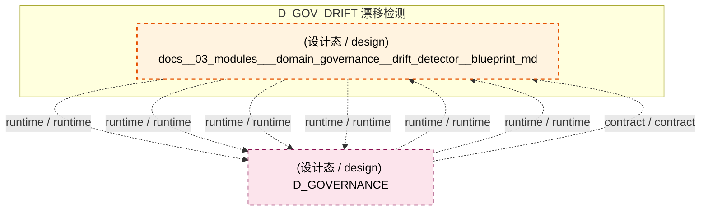

# 34_d_gov_drift / drift_detection / 漂移检测 / Drift Detection

> **功能简介 / Overview**: 漂移检测，负责架构漂移检测和漂移告警

> **文档作用 / Purpose**: 展示 漂移检测（D_GOV_DRIFT）功能域的模块清单、域内依赖关系、跨域依赖关系、架构分层视图，供架构审查和域治理参考。

> 本文档由 generate_domain_doc.py 从 depgraph (PostgreSQL) 自动生成
> 最后更新: 2026-07-10 03:16:04
> 数据源: depgraph (PostgreSQL) nodes表 + edges表

## 域基本信息 / Domain Overview

| 字段 | 值 | Field | Value |
|------|------|-------|-------|
| 编号 | 34 | Number | 34 |
| 域ID | D_GOV_DRIFT | Domain ID | D_GOV_DRIFT |
| 域名称 | 漂移检测 | Domain Name | Drift Detection |
| 层级 | L2 业务域层 | Layer | L2 Domain |
| 模块数 | 1 | Module Count | 1 |
| 域内依赖 | 0 | Internal Dependencies | 0 |
| 跨域入边 | 3 | Cross-domain Incoming | 3 |
| 跨域出边 | 4 | Cross-domain Outgoing | 4 |
| 设计态模块 | 1 | Design Modules | 1 |
| 原型态模块 | 0 | Prototype Modules | 0 |
| 生产态模块 | 0 | Production Modules | 0 |
| 容量 | 0/150 (正常) | Capacity | 0/150 (正常) |
| 描述 | 39个漂移检测器注册与调度 | Description | 39个漂移检测器注册与调度 |

## 模块分层清单 / Module Layered List

> 按 architecture_layer 分组的模块清单（共 1 个模块 / 1 modules）。

### L1 基础层 / Foundation Layer (1 modules)

| # | 模块路径 / Module Path | 模块名称 / Module Name (功能简介 / Description) | 成熟度 / Maturity | 蓝图 / Blueprint |
|:--:|---------|---------|:---:|:---:|
| 1 | docs/03_modules/_domain_governance/drift_detector/bluepri... | docs__03_modules___domain_governance__drift_detector__blueprint_md | 设计态 / design | [MOD-INF-023](../../03_modules/_domain_governance/drift_detector/blueprint.md) |

## 域内依赖图 / Internal Dependency Diagram

> 依赖图内嵌在本文档中，IDE 可直接渲染显示。参考 decision_index.md 设计，分四个视图：合并全景图、运营态子图、设计态子图、原型态子图（按 design_maturity 实际值拆分）。
>
> **图例说明 / Legend**：
> - **实线边框 = 运营态模块**（production，已上线运行）
> - **虚线边框 = 设计态模块**（design，蓝图阶段，代码未写）
> - **虚线边框 = 原型态模块**（prototype，代码已写，验证中未稳定上线）
> - **实线箭头 = 运营态依赖**（已生效的依赖关系）
> - **虚线箭头 = 非运营态依赖**（计划中/验证中的依赖关系）

### 合并全景图（全部模块，标签标注成熟度）

> 展示全部 1 个模块（生产态 0 + 设计态 1 + 原型态 0），标签标注成熟度。

### 运营态子图（仅 design_maturity=production 的模块和依赖）

> 仅展示已上线运行的模块（共 0 个，0 条域内依赖）。

> （无运营态模块 / No production modules）

### 设计态子图（仅 design_maturity=design 的模块和依赖）

> 仅展示蓝图阶段、代码未写的设计态模块（共 1 个，0 条域内依赖）。

### 原型态子图（仅 design_maturity=prototype 的模块和依赖）

> 仅展示代码已写、验证中未稳定上线的原型态模块（共 0 个，0 条域内依赖）。

> （无原型态模块 / No prototype modules）

## 跨域依赖 / Cross-domain Dependencies

### 本域依赖的其他域（出边）/ Depends On

| # | 本域模块 / Source Module | → | 外部域-目标模块 / Target Module | 依赖类型 / Type |
|:--:|---------|:--:|---------|---------|
| 1 | blueprint.md | → | D_GOVERNANCE 生命周期管理: blueprint.md | runtime / runtime |
| 2 | blueprint.md | → | D_GOVERNANCE 生命周期管理: blueprint.md | runtime / runtime |
| 3 | blueprint.md | → | D_GOVERNANCE 生命周期管理: blueprint.md | runtime / runtime |
| 4 | blueprint.md | → | D_GOVERNANCE 生命周期管理: blueprint.md | runtime / runtime |

### 依赖本域的其他域（入边）/ Depended By

| # | 外部域-源模块 / Source Module | → | 本域模块 / Target Module | 依赖类型 / Type |
|:--:|---------|:--:|---------|---------|
| 1 | D_GOVERNANCE 生命周期管理: blueprint.md | → | blueprint.md | runtime / runtime |
| 2 | D_GOVERNANCE 生命周期管理: blueprint.md | → | blueprint.md | runtime / runtime |
| 3 | D_GOVERNANCE 生命周期管理: blueprint.md | → | blueprint.md | contract / contract |

### 跨域依赖图 / Cross-domain Dependency Diagram

> 本域与 1 个外部域直接连接（出边 4 条 + 入边 3 条 = 7 条）。只显示直接连接的域，不展开具体节点。

## 说明 / Notes

- **数据源 / Data Source**: `depgraph (PostgreSQL)` 的 `nodes`、`edges`、`domains` 表
- **生成器 / Generator**: `generate_domain_doc.py`（G2+G10 合并）
- **维护方式 / Maintenance**: 自动生成，全景图更新时刷新
- **文件名规则 / File Naming**: `{编号:02d}_{域ID小写}.md`，如 `16_d_trading.md`
- **图例说明 / Legend**: `[production]`=已上线 / `[design]`=设计中 / `[prototype]`=原型 / `[unknown]`=未知
