# 34_d_pf_core / 组合核心

> **文档作用 / Purpose**: 展示 组合核心（D-PF_CORE）功能域的模块清单、域内依赖关系和跨域依赖关系，供架构审查和域治理参考。

> 本文档由 generate_domain_doc.py 从 depgraph.db 自动生成
> 最后更新: 2026-06-24 23:56:40
> 数据源: depgraph.db nodes表 + edges表

## 域基本信息 / Domain Overview

| 字段 | 值 | Field | Value |
|------|------|-------|-------|
| 编号 | 34 | Number | 34 |
| 域ID | D-PF_CORE | Domain ID | D-PF_CORE |
| 域名称 | 组合核心 | Domain Name | 组合核心 |
| 层级 | L2_domain | Layer | L2_domain |
| 模块数 | 201 | Module Count | 201 |
| 域内依赖 | 152 | Internal Dependencies | 152 |
| 跨域入边 | 165 | Cross-domain Incoming | 165 |
| 跨域出边 | 153 | Cross-domain Outgoing | 153 |
| 设计态模块 | 183 | Design Modules | 183 |
| 原型态模块 | 7 | Prototype Modules | 7 |
| 生产态模块 | 6 | Production Modules | 6 |
| 容量 | 202/150 (超容) | Capacity | 202/150 (超容) |
| 描述 | 组合核心域。负责投资组合核心引擎，包括组合优化器、风险预算分配、基准跟踪、再平衡引擎。 | Description | 组合核心域。负责投资组合核心引擎，包括组合优化器、风险预算分配、基准跟踪、再平衡引擎。 |

## 模块清单 / Module List

共 201 个模块（按路径排序，全部显示）

| 模块路径 / Module Path | 模块名称 / Module Name | 设计成熟度 / Maturity | 构建状态 / Build Status |
|---------|---------|-----------|---------|
|  | A-001 | design | active |
|  | MS-02 | design | unbuilt |
|  | MT-02 | design | unbuilt |
|  | MS-04 | design | unbuilt |
|  | MT-03 | design | unbuilt |
|  | MS-03 | design | unbuilt |
|  | MS-05 | design | unbuilt |
|  | MT-05 | design | unbuilt |
|  | MT-04 | design | unbuilt |
|  | D-ALT-DATA-03 | design | unbuilt |
|  | D-ALT-DATA-11 | design | unbuilt |
|  | D-ALT-DATA-06 | design | unbuilt |
|  | D-ALT-DATA-07 | design | unbuilt |
|  | D-ALT-DATA-09 | design | unbuilt |
|  | D-ALT-DATA-10 | design | unbuilt |
|  | D-ALT-DATA-13 | design | unbuilt |
|  | D-ALT-DATA-15 | design | unbuilt |
|  | D-ALT-DATA-17 | design | unbuilt |
|  | D-ALT-DATA-06扩展 | design | unbuilt |
|  | D-ALT-DATA-14 | design | unbuilt |
|  | D-CROSS-ASSET-03 | design | unbuilt |
|  | D-CROSS-ASSET-13 | design | unbuilt |
|  | AP-07 | design | unbuilt |
|  | AP-09 | design | unbuilt |
|  | RK-10 | design | unbuilt |
|  | PA-01 | design | unbuilt |
| D-PF-CORE/19.2 Ensemble-HMM增强框架 | 19.2 Ensemble-HMM增强框架 | design | design_only |
| ...26.5 逆势资金流与已有模块的联动 26.5 Contrarian Capital Flow Linkage with Existing Modules | 26.5 逆势资金流与已有模块的联动 26.5 Contrarian Ca... | design | design_only |
| D-PF-CORE/28.5 与已有模块的联动 28.5 Linkage with Existing Modules | 28.5 与已有模块的联动 28.5 Linkage with Exist... | design | design_only |
| D-PF-CORE/31.3 高级协同检测（基于ESMA MABUM框架） | 31.3 高级协同检测（基于ESMA MABUM框架） | design | design_only |
| D-PF-CORE/A Share Trading Discipline A股交易纪律 | A Share Trading Discipline A股交易纪律 | design | design_only |
| D-PF-CORE/Auto Down-Weight 自动降权 | Auto Down-Weight 自动降权 | design | design_only |
| D-PF-CORE/Automatic Strategy Discovery 自动策略发现 | Automatic Strategy Discovery 自动策略发现 | design | design_only |
| D-PF-CORE/Benchmark Manager 基准管理器 | Benchmark Manager 基准管理器 | design | design_only |
| D-PF-CORE/BuyDecided 买入决策事件 | BuyDecided 买入决策事件 | design | design_only |
| D-PF-CORE/BuyDecision 买入决策契约 | BuyDecision 买入决策契约 | design | design_only |
| D-PF-CORE/C-006：策略工厂 | C-006：策略工厂 | design | design_only |
| D-PF-CORE/C-016：知识图谱引擎 | C-016：知识图谱引擎 | design | design_only |
| D-PF-CORE/C-027：因子工厂（P0） | C-027：因子工厂（P0） | design | design_only |
| D-PF-CORE/C-028：信号工厂（P0） | C-028：信号工厂（P0） | design | design_only |
| D-PF-CORE/C-033：过拟合系统性防护 | C-033：过拟合系统性防护 | design | design_only |
| D-PF-CORE/C-040：系统性压力测试 | C-040：系统性压力测试 | design | design_only |
| D-PF-CORE/C-047：仓位管理唯一裁决中心 | C-047：仓位管理唯一裁决中心 | design | design_only |
| D-PF-CORE/CTR-P1-006 StrategyLifecycleEvent CTR-P1-006 StrategyLifecycleEvent契约 | CTR-P1-006 StrategyLifecycleEvent CTR... | design | design_only |
| D-PF-CORE/Carbon Footprint Calculator碳足迹计算器 | Carbon Footprint Calculator碳足迹计算器 | design | design_only |
| D-PF-CORE/Carbon Footprint 碳足迹 | Carbon Footprint 碳足迹 | design | design_only |
| D-PF-CORE/Cash Flow Manager资金流管理器 | Cash Flow Manager资金流管理器 | design | design_only |
| D-PF-CORE/Constraint Solver约束求解器 | Constraint Solver约束求解器 | design | design_only |
| D-PF-CORE/Decision Orchestrator 决策编排器 | Decision Orchestrator 决策编排器 | design | design_only |
| D-PF-CORE/Decision Orchestrator 决策编排器——缺失功能模块 | Decision Orchestrator 决策编排器——缺失功能模块 | design | design_only |
| D-PF-CORE/E-PF-01 PortfolioRebalanced E-PF-01 PortfolioRebalanced事件 | E-PF-01 PortfolioRebalanced E-PF-01 P... | design | design_only |
| D-PF-CORE/E-SIM-01 SimulationCompleted 仿真完成 | E-SIM-01 SimulationCompleted 仿真完成 | design | design_only |
| D-PF-CORE/Event Bus §2.2 事件总线事件分类 | Event Bus §2.2 事件总线事件分类 | design | design_only |
| D-PF-CORE/Event Sourcing 事件溯源 | Event Sourcing 事件溯源 | design | design_only |
| D-PF-CORE/Execution to L5 Closed Loop 执行→L5闭环优化 | Execution to L5 Closed Loop 执行→L5闭环优化 | design | design_only |
| D-PF-CORE/Explainability 决策可解释性与溯源 | Explainability 决策可解释性与溯源 | design | design_only |
| D-PF-CORE/Factor Direct Layer 因子直通层 | Factor Direct Layer 因子直通层 | design | design_only |
| D-PF-CORE/Factor Exposure Manager因子敞口管理器 | Factor Exposure Manager因子敞口管理器 | design | design_only |
| D-PF-CORE/Factor/Strategy Crowding Deep Detection 因子/策略拥挤度深度检测 | Factor/Strategy Crowding Deep Detecti... | design | design_only |
| D-PF-CORE/Governance Domain §30.6 运维安全治理域缺失模块 | Governance Domain §30.6 运维安全治理域缺失模块 | design | design_only |
| D-PF-CORE/HRP/Black-Litterman Portfolio Optimization HRP/Black-Litterman组合优化 | HRP/Black-Litterman Portfolio Optimiz... | design | design_only |
| D-PF-CORE/HoldDecided 持有决策事件 | HoldDecided 持有决策事件 | design | design_only |
| D-PF-CORE/L2 to L3 Strategy Decision L2→L3策略决策 | L2 to L3 Strategy Decision L2→L3策略决策 | design | design_only |
| D-PF-CORE/L3-L6 决策/仓位/风控/执行/闭环数据 | L3-L6 决策/仓位/风控/执行/闭环数据 | design | design_only |
| D-PF-CORE/LLM Evolutionary Strategy Search LLM进化式策略搜索 | LLM Evolutionary Strategy Search LLM进... | design | design_only |
| D-PF-CORE/Liquidity Estimator 流动性估算器 | Liquidity Estimator 流动性估算器 | design | design_only |
| D-PF-CORE/Liquidity Estimator流动性估计器 | Liquidity Estimator流动性估计器 | design | design_only |
| D-PF-CORE/MTF Four-Track Fusion 四轨融合器 | MTF Four-Track Fusion 四轨融合器 | design | design_only |
| D-PF-CORE/Multi-Objective Optimizer多目标优化器 | Multi-Objective Optimizer多目标优化器 | design | design_only |
| D-PF-CORE/Multi-Scenario Response & Contingency 多情景对策与预案 | Multi-Scenario Response & Contingency... | design | design_only |
| D-PF-CORE/Multi-Strategy Allocator 多策略分配器 | Multi-Strategy Allocator 多策略分配器 | design | design_only |
| D-PF-CORE/Multi-Strategy Resonance Fusion 多策略共振融合层 | Multi-Strategy Resonance Fusion 多策略共振融合层 | design | design_only |
| D-PF-CORE/Multi-Track Fusion 四轨融合器 | Multi-Track Fusion 四轨融合器 | design | design_only |
| D-PF-CORE/P0 模块明细 | P0 模块明细 | design | design_only |
| D-PF-CORE/P1 模块分类汇总（14个） | P1 模块分类汇总（14个） | design | design_only |
| D-PF-CORE/P1 模块分类汇总（5个） | P1 模块分类汇总（5个） | design | design_only |
| D-PF-CORE/P1 模块分类汇总（7个） | P1 模块分类汇总（7个） | design | design_only |
| D-PF-CORE/P1 模块分类汇总（85个） | P1 模块分类汇总（85个） | design | design_only |
| D-PF-CORE/P1 模块分类汇总（92个） | P1 模块分类汇总（92个） | design | design_only |
| D-PF-CORE/P1 模块分类汇总（99个） | P1 模块分类汇总（99个） | design | design_only |
| D-PF-CORE/P2 模块分类汇总（11个） | P2 模块分类汇总（11个） | design | design_only |
| D-PF-CORE/P2 模块分类汇总（17个） | P2 模块分类汇总（17个） | design | design_only |
| D-PF-CORE/P2 模块分类汇总（29个） | P2 模块分类汇总（29个） | design | design_only |
| D-PF-CORE/P2 模块分类汇总（30个） | P2 模块分类汇总（30个） | design | design_only |
| D-PF-CORE/P2 模块分类汇总（62个） | P2 模块分类汇总（62个） | design | design_only |
| D-PF-CORE/P2 模块分类汇总（7个） | P2 模块分类汇总（7个） | design | design_only |
| D-PF-CORE/P3 模块分类汇总（1个） | P3 模块分类汇总（1个） | design | design_only |
| D-PF-CORE/P3 模块分类汇总（3个） | P3 模块分类汇总（3个） | design | design_only |
| D-PF-CORE/Percentage 百分比 | Percentage 百分比 | design | design_only |
| D-PF-CORE/Performance Attribution Engine绩效归因引擎 | Performance Attribution Engine绩效归因引擎 | design | design_only |
| D-PF-CORE/Portfolio Benchmark Manager组合基准管理器 | Portfolio Benchmark Manager组合基准管理器 | design | design_only |
| D-PF-CORE/Portfolio Construction Engine 组合构建引擎 | Portfolio Construction Engine 组合构建引擎 | design | design_only |
| D-PF-CORE/Portfolio Core 组合核心 | Portfolio Core 组合核心 | design | design_only |
| D-PF-CORE/Portfolio Drift Monitor组合漂移监控器 | Portfolio Drift Monitor组合漂移监控器 | design | design_only |
| D-PF-CORE/Portfolio Optimization Engine 组合优化引擎 | Portfolio Optimization Engine 组合优化引擎 | design | design_only |
| D-PF-CORE/Portfolio Optimizer组合优化器 | Portfolio Optimizer组合优化器 | design | design_only |
| D-PF-CORE/Portfolio Rebalancer 组合再平衡器 | Portfolio Rebalancer 组合再平衡器 | design | design_only |
| D-PF-CORE/Portfolio Risk Decomposer 组合风险分解器 | Portfolio Risk Decomposer 组合风险分解器 | design | design_only |
| D-PF-CORE/Portfolio State 组合状态检查点 | Portfolio State 组合状态检查点 | design | design_only |
| D-PF-CORE/Portfolio Stress Tester组合压力测试器 | Portfolio Stress Tester组合压力测试器 | design | design_only |
| D-PF-CORE/Portfolio 组合 | Portfolio 组合 | design | design_only |
| D-PF-CORE/Portfolio 组合聚合根 | Portfolio 组合聚合根 | design | design_only |
| D-PF-CORE/PortfolioRebalanced 组合已再平衡 | PortfolioRebalanced 组合已再平衡 | design | design_only |
| D-PF-CORE/Rebalance Cost Analyzer再平衡成本分析器 | Rebalance Cost Analyzer再平衡成本分析器 | design | design_only |
| D-PF-CORE/Rebalance Full Flow Saga 再平衡全流程Saga | Rebalance Full Flow Saga 再平衡全流程Saga | design | design_only |
| D-PF-CORE/Rebalance Scheduler再平衡调度器 | Rebalance Scheduler再平衡调度器 | design | design_only |
| D-PF-CORE/Risk Parity Engine风险平价引擎 | Risk Parity Engine风险平价引擎 | design | design_only |
| D-PF-CORE/SHAP LIME Dual Attribution SHAP LIME双归因 | SHAP LIME Dual Attribution SHAP LIME双归因 | design | design_only |
| D-PF-CORE/Sector Exposure Manager行业敞口管理器 | Sector Exposure Manager行业敞口管理器 | design | design_only |
| D-PF-CORE/Sell Decision Engine 卖出决策引擎 | Sell Decision Engine 卖出决策引擎 | design | design_only |
| D-PF-CORE/Signal Factory §4.1 信号工厂九大子阶段 | Signal Factory §4.1 信号工厂九大子阶段 | design | design_only |
| D-PF-CORE/Strategy Capacity Estimator策略容量估计器 | Strategy Capacity Estimator策略容量估计器 | design | design_only |
| D-PF-CORE/Strategy Capacity Modeling 策略容量建模 | Strategy Capacity Modeling 策略容量建模 | design | design_only |
| D-PF-CORE/Strategy Engine策略引擎 | Strategy Engine策略引擎 | design | design_only |
| D-PF-CORE/Strategy Factory 策略工厂 | Strategy Factory 策略工厂 | design | design_only |
| D-PF-CORE/Strategy Portfolio 策略组合 | Strategy Portfolio 策略组合 | design | design_only |
| D-PF-CORE/Strategy Signal Router 策略信号路由器 | Strategy Signal Router 策略信号路由器 | design | design_only |
| D-PF-CORE/StrategyLifecycleEvent 策略生命周期事件 | StrategyLifecycleEvent 策略生命周期事件 | design | design_only |
| D-PF-CORE/StrategyRegistry 策略注册表 | StrategyRegistry 策略注册表 | design | design_only |
| D-PF-CORE/Tax Loss Harvester税损收割器 | Tax Loss Harvester税损收割器 | design | design_only |
| D-PF-CORE/XS-EXT 模块分类汇总（5个） | XS-EXT 模块分类汇总（5个） | design | design_only |
| D-PF-CORE/§12.4 C-033 过拟合系统性防护 | §12.4 C-033 过拟合系统性防护 | design | design_only |
| D-PF-CORE/§2.1 多源数据接入与分层存储架构 Data Ingestion Storage | §2.1 多源数据接入与分层存储架构 Data Ingestion Sto... | design | design_only |
| D-PF-CORE/§20.8 方法论约束八：训练-服务一致性(Feature Store) | §20.8 方法论约束八：训练-服务一致性(Feature Store) | design | design_only |
| D-PF-CORE/§24 外部系统交互引用 External | §24 外部系统交互引用 External | design | design_only |
| D-PF-CORE/§24.1 外部系统交互矩阵 External | §24.1 外部系统交互矩阵 External | design | design_only |
| D-PF-CORE/§27 系统级成功指标引用 | §27 系统级成功指标引用 | design | design_only |
| D-PF-CORE/§29.1 多进程隔离与运行时架构（→A9运维架构） | §29.1 多进程隔离与运行时架构（→A9运维架构） | design | design_only |
| D-PF-CORE/§29.10 盘中即时反应决策引擎 Engine | §29.10 盘中即时反应决策引擎 Engine | design | design_only |
| D-PF-CORE/§29.2 特征存储 (Feature Store) | §29.2 特征存储 (Feature Store) | design | design_only |
| D-PF-CORE/§29.21 学习系统桥接声明 | §29.21 学习系统桥接声明 | design | design_only |
| D-PF-CORE/§29.27 多智能体编排框架选型与MCP协议（→A7 Agent架构） | §29.27 多智能体编排框架选型与MCP协议（→A7 Agent架构） | design | design_only |
| D-PF-CORE/§29.35 持续学习抗遗忘框架（v6.0新增） | §29.35 持续学习抗遗忘框架（v6.0新增） | design | design_only |
| D-PF-CORE/§29.4 时序数据库与分层存储架构（→A3数据架构） | §29.4 时序数据库与分层存储架构（→A3数据架构） | design | design_only |
| D-PF-CORE/§30 场外草稿区缺失模块补充 | §30 场外草稿区缺失模块补充 | design | design_only |
| D-PF-CORE/§30.1 核心价值链域缺失模块 Core | §30.1 核心价值链域缺失模块 Core | design | design_only |
| D-PF-CORE/§30.1.3 D-PF-CORE 组合核心域（18个模块） | §30.1.3 D-PF-CORE 组合核心域（18个模块） | design | design_only |
| D-PF-CORE/§30.2 增强与扩展域缺失模块 | §30.2 增强与扩展域缺失模块 | design | design_only |
| D-PF-CORE/§30.3 核心交易链域缺失模块 Core | §30.3 核心交易链域缺失模块 Core | design | design_only |
| D-PF-CORE/§30.4 ML与数据工程域缺失模块 | §30.4 ML与数据工程域缺失模块 | design | design_only |
| D-PF-CORE/§30.5 自治与基础设施域缺失模块 Base | §30.5 自治与基础设施域缺失模块 Base | design | design_only |
| D-PF-CORE/§4.4 信号聚合器架构 Signal Aggregator | §4.4 信号聚合器架构 Signal Aggregator | design | design_only |
| D-PF-CORE/§8.1 策略工厂(C-006)与信号工厂(C-028)的协作 | §8.1 策略工厂(C-006)与信号工厂(C-028)的协作 | design | design_only |
| D-PF-CORE/§8.5 组合优化引擎 Portfolio Engine | §8.5 组合优化引擎 Portfolio Engine | design | design_only |
| D-PF-CORE/❌不能建模块门禁条件分布 Cannot Build Module Gate Condition Distribution | ❌不能建模块门禁条件分布 Cannot Build Module Gate... | design | design_only |
| D-PF-CORE/再平衡全流程Saga Rebalancing Saga | 再平衡全流程Saga Rebalancing Saga | design | design_only |
| D-PF-CORE/决策四：模型/策略漂移检测框架 Strategy Model | 决策四：模型/策略漂移检测框架 Strategy Model | design | design_only |
| D-PF-CORE/多账户多策略 Strategy | 多账户多策略 Strategy | design | design_only |
| D-PF-CORE/模块10 动量领导因子与涨停板生态模型（Momentum Leadership & Limit-Up Factor） | 模块10 动量领导因子与涨停板生态模型（Momentum Leadersh... | design | design_only |
| D-PF-CORE/模块11 动量层级与板块持续性模型（Momentum Hierarchy & Persistence Model） | 模块11 动量层级与板块持续性模型（Momentum Hierarchy ... | design | design_only |
| D-PF-CORE/模块12 板块间资金流迁移检测模型（Inter-Sector Flow Migration Detection） | 模块12 板块间资金流迁移检测模型（Inter-Sector Flow M... | design | design_only |
| D-PF-CORE/模块15 假突破与诱多检测模型（False Breakout & Bull Trap Detection Model） | 模块15 假突破与诱多检测模型（False Breakout & Bull... | design | design_only |
| D-PF-CORE/模块16 情绪-价格背离指数模型（Sentiment-Price Divergence Index） | 模块16 情绪-价格背离指数模型（Sentiment-Price Dive... | design | design_only |
| D-PF-CORE/模块19 市场体制转换模型（Regime-Switching Model） | 模块19 市场体制转换模型（Regime-Switching Model） | design | design_only |
| D-PF-CORE/模块23 量能体制自适应策略模型（Volume Regime Adaptive Strategy Model） | 模块23 量能体制自适应策略模型（Volume Regime Adapti... | design | design_only |
| D-PF-CORE/模块24 核心-卫星仓位管理模型（Core-Satellite Position Management Model） | 模块24 核心-卫星仓位管理模型（Core-Satellite Posit... | design | design_only |
| ...E/模块26 3秒级逆势资金流识别模块 Module 26 3-Second Contrarian Capital Flow Identification | 模块26 3秒级逆势资金流识别模块 Module 26 3-Second ... | design | design_only |
| ...码派发识别模块 Module 27 Main Force Fake Action and Chip Distribution Identification | 模块27 主力假动作与筹码派发识别模块 Module 27 Main Fo... | design | design_only |
| ...8 利好落地变利空（预期透支）模块 Module 28 Good News Becomes Bad News (Expectation Overdraw) | 模块28 利好落地变利空（预期透支）模块 Module 28 Good N... | design | design_only |
| ...-CORE/模块29 次日上涨概率统一门槛模块 Module 29 Next-Day Rise Probability Unified Threshold | 模块29 次日上涨概率统一门槛模块 Module 29 Next-Day ... | design | design_only |
| D-PF-CORE/模块3 缺口回补概率模型（Gap Fill Probability Model） | 模块3 缺口回补概率模型（Gap Fill Probability Model） | design | design_only |
| D-PF-CORE/模块31 协同交易行为检测模型（Coordinated Trading Detection Model） | 模块31 协同交易行为检测模型（Coordinated Trading D... | design | design_only |
| D-PF-CORE/模块32 市场风格体制识别模型（Market Style Regime Identification Model） | 模块32 市场风格体制识别模型（Market Style Regime I... | design | design_only |
| D-PF-CORE/模块34 异质参与者互动模型（Heterogeneous Agent Interaction Model） | 模块34 异质参与者互动模型（Heterogeneous Agent In... | design | design_only |
| D-PF-CORE/模块39 多因子选股评分模型（Multi-Factor Stock Selection Scoring Model） | 模块39 多因子选股评分模型（Multi-Factor Stock Sel... | design | design_only |
| D-PF-CORE/模块4 逼空行情检测模型（Short Squeeze Detection Model） | 模块4 逼空行情检测模型（Short Squeeze Detection ... | design | design_only |
| D-PF-CORE/模块51 波动率压缩与突破模型（Volatility Compression & Breakout Model） | 模块51 波动率压缩与突破模型（Volatility Compressio... | design | design_only |
| ...更新版） Module 52 Summary: Missing Modules and Suggested Layer Mapping (Updated) | 模块52 汇总：缺失模块与建议归属层映射（更新版） Module 52 S... | design | design_only |
| D-PF-CORE/模块57 多因子叠加择时模型（Multi-Factor Overlay Timing Model） | 模块57 多因子叠加择时模型（Multi-Factor Overlay T... | design | design_only |
| .../模块58 附录二：已剔除模块说明（架构文档完全覆盖） Module 58 Appendix 2: Removed Modules Description | 模块58 附录二：已剔除模块说明（架构文档完全覆盖） Module 58 ... | design | design_only |
| ...架构覆盖的功能（不重复列出） Module 58 Appendix: Functions Covered by Existing Architecture | 模块58 附录：已有架构覆盖的功能（不重复列出） Module 58 Ap... | design | design_only |
| D-PF-CORE/模块7 多指标背离检测模型（Multi-Indicator Divergence Detection Model） | 模块7 多指标背离检测模型（Multi-Indicator Diverge... | design | design_only |
| D-PF-CORE/模块8 板块资金流再配置模型（Sector Flow Reallocation Model） | 模块8 板块资金流再配置模型（Sector Flow Reallocati... | design | design_only |
| D-PF-CORE/裁定15: FinRL-X模块化交易基础设施 | 裁定15: FinRL-X模块化交易基础设施 | design | design_only |
| D-PF-CORE/裁定18: 中金Quant 4.0框架对齐 | 裁定18: 中金Quant 4.0框架对齐 | design | design_only |
| ...架（§29.35） Decision 22: Continuous Learning Anti-Forgetting Framework (§29.35) | 裁定22: 持续学习抗遗忘框架（§29.35） Decision 22: ... | design | design_only |
| D-PF-CORE/账户状态物化视图 Account Status View | 账户状态物化视图 Account Status View | design | design_only |
| D-PF-CORE/🟡 健康线（Healthy）—— 系统运行良好，可以放心 | 🟡 健康线（Healthy）—— 系统运行良好，可以放心 | design | design_only |
| D-PF-CORE/🟢 生存线（Survival）—— 低于此线系统进入警告状态，需风控自动收紧；持续低于此线则系统不值得长期运行 | 🟢 生存线（Survival）—— 低于此线系统进入警告状态，需风控自动收... | design | design_only |
| src/zephyr/pf_core/__init__.py |  | prototype | draft |
| src/zephyr/pf_core/_extensions/__init__.py |  | scaffold_placeholder | orphan |
| src/zephyr/pf_core/analytics_base.py |  | production | draft |
| src/zephyr/pf_core/api/__init__.py |  | scaffold_placeholder | orphan |
| src/zephyr/pf_core/compliance_rule.py |  | production | draft |
| src/zephyr/pf_core/core/__init__.py |  | scaffold_placeholder | orphan |
| src/zephyr/pf_core/default_attribution_engine.py |  | production | draft |
| src/zephyr/pf_core/default_tca_engine.py |  | production | draft |
| src/zephyr/pf_core/infrastructure/__init__.py |  | scaffold_placeholder | orphan |
| src/zephyr/pf_core/performance_attribution_engine/__init__.py |  | prototype | draft |
| src/zephyr/pf_core/performance_attribution_report.py |  | production | draft |
| src/zephyr/pf_core/risk_limits.py |  | prototype | draft |
| src/zephyr/pf_core/services/__init__.py |  | scaffold_placeholder | orphan |
| src/zephyr/pf_core/strategies/__init__.py |  | prototype | draft |
| src/zephyr/pf_core/strategies/default_equity_strategy.py |  | prototype | draft |
| src/zephyr/pf_core/strategy_base.py |  | production | draft |
| src/zephyr/pf_core/strategy_engine/__init__.py |  | prototype | draft |
| src/zephyr/pf_core/strategy_registry.py |  | prototype | draft |
| 另类数据域缩写，D-ALT-02=SentimentEngine | D-ALT-DATA-02 | design | design_only |
| 推理域缩写，D-ML-02=ModelRegistry→归入MS-01 | MS-01 | design | design_only |
| 训练域缩写，D-ML-01=TrainingPipeline→归入MT-01 | MT-01 | design | design_only |
| 跨资产域缩写，D-XA=D-CROSS-ASSET(CA) | D-CROSS-ASSET-01 | design | design_only |

## 域内依赖图 / Internal Dependency Diagram

> 依赖图内嵌在本文档中，IDE 可直接渲染显示。每30个节点一组分页显示。
>
> **图例说明 / Legend**：
> - **实线边框 = 运营态模块**（production，已上线运行）
> - **虚线边框 = 设计态模块**（design，还在设计中）
> - **实线箭头 = 运营态依赖**（已生效的依赖关系）
> - **虚线箭头 = 设计态依赖**（计划中的依赖关系）

### 第 1 页 / 共 7 页 / Page 1 of 7

```mermaid
graph TD
    subgraph D_PF_CORE["D-PF_CORE 组合核心"]
        A_001["A-001 design"]
        MS_02["MS-02 design"]
        MT_02["MT-02 design"]
        MS_04["MS-04 design"]
        MT_03["MT-03 design"]
        MS_03["MS-03 design"]
        MS_05["MS-05 design"]
        MT_05["MT-05 design"]
        MT_04["MT-04 design"]
        D_ALT_DATA_03["D-ALT-DATA-03 design"]
        D_ALT_DATA_11["D-ALT-DATA-11 design"]
        D_ALT_DATA_06["D-ALT-DATA-06 design"]
        D_ALT_DATA_07["D-ALT-DATA-07 design"]
        D_ALT_DATA_09["D-ALT-DATA-09 design"]
        D_ALT_DATA_10["D-ALT-DATA-10 design"]
        D_ALT_DATA_13["D-ALT-DATA-13 design"]
        D_ALT_DATA_15["D-ALT-DATA-15 design"]
        D_ALT_DATA_17["D-ALT-DATA-17 design"]
        D_ALT_DATA_06_1["D-ALT-DATA-06扩展 design"]
        D_ALT_DATA_14["D-ALT-DATA-14 design"]
        D_CROSS_ASSET_03["D-CROSS-ASSET-03 design"]
        D_CROSS_ASSET_13["D-CROSS-ASSET-13 design"]
        AP_07["AP-07 design"]
        AP_09["AP-09 design"]
        RK_10["RK-10 design"]
        PA_01["PA-01 design"]
        D_PF_CORE_19_2_Ensemble_HMM["19.2 Ensemble-HMM增强框架 design"]
        D_PF_CORE_26_5_26_5_Contrarian_Capital_Flow_Linkage_with_Existing_Modules["26.5 逆势资金流与已有模块的联动 26.5 Contrarian Capital Flow... design"]
        D_PF_CORE_28_5_28_5_Linkage_with_Existing_Modules["28.5 与已有模块的联动 28.5 Linkage with Existing Modules design"]
        D_PF_CORE_31_3_ESMA_MABUM["31.3 高级协同检测（基于ESMA MABUM框架） design"]
    end
    D_TRADING["D-TRADING design"]
    D_PF_CORE_26_5_26_5_Contrarian_Capital_Flow_Linkage_with_Existing_Modules -.->|data| D_TRADING
    D_EX_CORE["D-EX_CORE design"]
    D_PF_CORE_26_5_26_5_Contrarian_Capital_Flow_Linkage_with_Existing_Modules -.->|config_depends| D_EX_CORE
    D_INFRA_RUNTIME["D-INFRA_RUNTIME design"]
    D_PF_CORE_31_3_ESMA_MABUM -.->|event| D_INFRA_RUNTIME
    D_SIGNAL["D-SIGNAL design"]
    D_PF_CORE_31_3_ESMA_MABUM -.->|contract| D_SIGNAL
    D_RISK["D-RISK design"]
    D_PF_CORE_28_5_28_5_Linkage_with_Existing_Modules -.->|data| D_RISK
    D_INTELLIGENCE["D-INTELLIGENCE design"]
    D_INTELLIGENCE -.->|event| D_PF_CORE_26_5_26_5_Contrarian_Capital_Flow_Linkage_with_Existing_Modules
    D_AUTONOMY_CORE["D-AUTONOMY_CORE design"]
    D_AUTONOMY_CORE -.->|event| D_PF_CORE_26_5_26_5_Contrarian_Capital_Flow_Linkage_with_Existing_Modules
    D_INFRA_OPS["D-INFRA_OPS design"]
    D_INFRA_OPS -.->|contract| D_PF_CORE_31_3_ESMA_MABUM
    D_INFRA_OPS -.->|contract| D_PF_CORE_31_3_ESMA_MABUM
    D_COMPLIANCE["D-COMPLIANCE design"]
    D_COMPLIANCE -.->|event| D_PF_CORE_31_3_ESMA_MABUM
    D_INTEGRATION["D-INTEGRATION design"]
    D_INTEGRATION -.->|data| D_PF_CORE_31_3_ESMA_MABUM
    D_REPORTING["D-REPORTING design"]
    D_REPORTING -.->|event| D_PF_CORE_28_5_28_5_Linkage_with_Existing_Modules
    D_COMPLIANCE -.->|event| D_PF_CORE_28_5_28_5_Linkage_with_Existing_Modules
    classDef production fill:#e1f5fe,stroke:#01579b,stroke-width:2px,color:#000
    classDef design fill:#fff3e0,stroke:#e65100,stroke-width:2px,color:#000,stroke-dasharray: 5 5
    classDef external_prod fill:#e8f5e9,stroke:#1b5e20,stroke-width:1px,color:#000
    classDef external_design fill:#fce4ec,stroke:#880e4f,stroke-width:1px,color:#000,stroke-dasharray: 5 5
    class A_001,MS_02,MT_02,MS_04,MT_03,MS_03,MS_05,MT_05,MT_04,D_ALT_DATA_03,D_ALT_DATA_11,D_ALT_DATA_06,D_ALT_DATA_07,D_ALT_DATA_09,D_ALT_DATA_10,D_ALT_DATA_13,D_ALT_DATA_15,D_ALT_DATA_17,D_ALT_DATA_06_1,D_ALT_DATA_14,D_CROSS_ASSET_03,D_CROSS_ASSET_13,AP_07,AP_09,RK_10,PA_01,D_PF_CORE_19_2_Ensemble_HMM,D_PF_CORE_26_5_26_5_Contrarian_Capital_Flow_Linkage_with_Existing_Modules,D_PF_CORE_28_5_28_5_Linkage_with_Existing_Modules,D_PF_CORE_31_3_ESMA_MABUM design
    class D_TRADING,D_EX_CORE,D_INFRA_RUNTIME,D_SIGNAL,D_RISK,D_INTELLIGENCE,D_AUTONOMY_CORE,D_INFRA_OPS,D_COMPLIANCE,D_INTEGRATION,D_REPORTING external_design
```

### 第 2 页 / 共 7 页 / Page 2 of 7

```mermaid
graph TD
    subgraph D_PF_CORE["D-PF_CORE 组合核心"]
        D_PF_CORE_A_Share_Trading_Discipline_A["A Share Trading Discipline A股交易纪律 design"]
        D_PF_CORE_Auto_Down_Weight["Auto Down-Weight 自动降权 design"]
        D_PF_CORE_Automatic_Strategy_Discovery["Automatic Strategy Discovery 自动策略发现 design"]
        D_PF_CORE_Benchmark_Manager["Benchmark Manager 基准管理器 design"]
        D_PF_CORE_BuyDecided["BuyDecided 买入决策事件 design"]
        D_PF_CORE_BuyDecision["BuyDecision 买入决策契约 design"]
        D_PF_CORE_C_006["C-006：策略工厂 design"]
        D_PF_CORE_C_016["C-016：知识图谱引擎 design"]
        D_PF_CORE_C_027_P0["C-027：因子工厂（P0） design"]
        D_PF_CORE_C_028_P0["C-028：信号工厂（P0） design"]
        D_PF_CORE_C_033["C-033：过拟合系统性防护 design"]
        D_PF_CORE_C_040["C-040：系统性压力测试 design"]
        D_PF_CORE_C_047["C-047：仓位管理唯一裁决中心 design"]
        D_PF_CORE_CTR_P1_006_StrategyLifecycleEvent_CTR_P1_006_StrategyLifecycleEvent["CTR-P1-006 StrategyLifecycleEvent CTR-P1-006 St... design"]
        D_PF_CORE_Carbon_Footprint_Calculator["Carbon Footprint Calculator碳足迹计算器 design"]
        D_PF_CORE_Carbon_Footprint["Carbon Footprint 碳足迹 design"]
        D_PF_CORE_Cash_Flow_Manager["Cash Flow Manager资金流管理器 design"]
        D_PF_CORE_Constraint_Solver["Constraint Solver约束求解器 design"]
        D_PF_CORE_Decision_Orchestrator["Decision Orchestrator 决策编排器 design"]
        D_PF_CORE_Decision_Orchestrator_1["Decision Orchestrator 决策编排器——缺失功能模块 design"]
        D_PF_CORE_E_PF_01_PortfolioRebalanced_E_PF_01_PortfolioRebalanced["E-PF-01 PortfolioRebalanced E-PF-01 PortfolioRe... design"]
        D_PF_CORE_E_SIM_01_SimulationCompleted["E-SIM-01 SimulationCompleted 仿真完成 design"]
        D_PF_CORE_Event_Bus_2_2["Event Bus §2.2 事件总线事件分类 design"]
        D_PF_CORE_Event_Sourcing["Event Sourcing 事件溯源 design"]
        D_PF_CORE_Execution_to_L5_Closed_Loop_L5["Execution to L5 Closed Loop 执行→L5闭环优化 design"]
        D_PF_CORE_Explainability["Explainability 决策可解释性与溯源 design"]
        D_PF_CORE_Factor_Direct_Layer["Factor Direct Layer 因子直通层 design"]
        D_PF_CORE_Factor_Exposure_Manager["Factor Exposure Manager因子敞口管理器 design"]
        D_PF_CORE_Factor_Strategy_Crowding_Deep_Detection["Factor/Strategy Crowding Deep Detection 因子/策略拥挤... design"]
        D_PF_CORE_Governance_Domain_30_6["Governance Domain §30.6 运维安全治理域缺失模块 design"]
    end
    D_PF_CORE_C_006 -.->|import_depends| D_PF_CORE_C_047
    D_PF_CORE_C_047 -.->|import_depends| D_PF_CORE_C_016
    D_PF_CORE_C_016 -.->|import_depends| D_PF_CORE_C_027_P0
    D_PF_CORE_C_027_P0 -.->|import_depends| D_PF_CORE_C_028_P0
    D_PF_CORE_C_028_P0 -.->|import_depends| D_PF_CORE_C_033
    D_PF_CORE_C_033 -.->|import_depends| D_PF_CORE_C_040
    D_PF_CORE_Decision_Orchestrator -.->|import_depends| D_PF_CORE_Auto_Down_Weight
    D_PF_CORE_Benchmark_Manager -.->|import_depends| D_PF_CORE_Carbon_Footprint
    D_SECURITY["D-SECURITY design"]
    D_PF_CORE_Factor_Strategy_Crowding_Deep_Detection -.->|contract| D_SECURITY
    D_RISK["D-RISK design"]
    D_PF_CORE_Factor_Strategy_Crowding_Deep_Detection -.->|data| D_RISK
    D_TRADING["D-TRADING design"]
    D_PF_CORE_Factor_Strategy_Crowding_Deep_Detection -.->|contract| D_TRADING
    D_PF_CORE_Explainability -.->|contract| D_SECURITY
    D_SIGNAL["D-SIGNAL design"]
    D_PF_CORE_Constraint_Solver -.->|contract| D_SIGNAL
    D_PF_CORE_Cash_Flow_Manager -.->|contract| D_RISK
    D_EX_CORE["D-EX_CORE design"]
    D_PF_CORE_Factor_Exposure_Manager -.->|event| D_EX_CORE
    D_FACTOR["D-FACTOR design"]
    D_PF_CORE_Factor_Exposure_Manager -.->|event| D_FACTOR
    D_ML_SERVE["D-ML_SERVE design"]
    D_PF_CORE_Carbon_Footprint_Calculator -.->|data| D_ML_SERVE
    D_PF_CORE_Carbon_Footprint_Calculator -.->|event| D_SECURITY
    D_PF_CORE_Carbon_Footprint_Calculator -.->|config_depends| D_EX_CORE
    D_PF_CORE_Carbon_Footprint_Calculator -.->|data| D_SIGNAL
    D_INFRA_RUNTIME["D-INFRA_RUNTIME design"]
    D_PF_CORE_Event_Bus_2_2 -.->|event| D_INFRA_RUNTIME
    D_PF_CORE_Event_Bus_2_2 -.->|event| D_SECURITY
    D_DATA_ENG["D-DATA_ENG design"]
    D_PF_CORE_Event_Bus_2_2 -.->|config_depends| D_DATA_ENG
    D_CROSS_ASSET["D-CROSS_ASSET design"]
    D_CROSS_ASSET -.->|data| D_PF_CORE_Factor_Strategy_Crowding_Deep_Detection
    D_COMPLIANCE["D-COMPLIANCE design"]
    D_COMPLIANCE -.->|data| D_PF_CORE_Factor_Strategy_Crowding_Deep_Detection
    D_INTEGRATION["D-INTEGRATION design"]
    D_INTEGRATION -.->|contract| D_PF_CORE_Factor_Strategy_Crowding_Deep_Detection
    D_INFRA_OPS["D-INFRA_OPS design"]
    D_INFRA_OPS -.->|contract| D_PF_CORE_Factor_Strategy_Crowding_Deep_Detection
    D_FRONTEND["D-FRONTEND design"]
    D_FRONTEND -.->|config_depends| D_PF_CORE_Cash_Flow_Manager
    D_OPS["D-OPS design"]
    D_OPS -.->|contract| D_PF_CORE_Event_Bus_2_2
    D_AUTONOMY_PERM["D-AUTONOMY_PERM design"]
    D_AUTONOMY_PERM -.->|data| D_PF_CORE_Decision_Orchestrator_1
    D_OPS -.->|data| D_PF_CORE_C_047
    D_COMPLIANCE -.->|event| D_PF_CORE_C_047
    D_INFRA_OPS -.->|contract| D_PF_CORE_C_016
    D_INTEGRATION -.->|contract| D_PF_CORE_C_027_P0
    D_SIMULATION["D-SIMULATION design"]
    D_SIMULATION -.->|data| D_PF_CORE_Governance_Domain_30_6
    D_AUTONOMY_CORE["D-AUTONOMY_CORE design"]
    D_AUTONOMY_CORE -.->|data| D_PF_CORE_Governance_Domain_30_6
    D_COMPLIANCE -.->|data| D_PF_CORE_BuyDecision
    D_REPORTING["D-REPORTING design"]
    D_REPORTING -.->|event| D_PF_CORE_BuyDecision
    classDef production fill:#e1f5fe,stroke:#01579b,stroke-width:2px,color:#000
    classDef design fill:#fff3e0,stroke:#e65100,stroke-width:2px,color:#000,stroke-dasharray: 5 5
    classDef external_prod fill:#e8f5e9,stroke:#1b5e20,stroke-width:1px,color:#000
    classDef external_design fill:#fce4ec,stroke:#880e4f,stroke-width:1px,color:#000,stroke-dasharray: 5 5
    class D_PF_CORE_A_Share_Trading_Discipline_A,D_PF_CORE_Auto_Down_Weight,D_PF_CORE_Automatic_Strategy_Discovery,D_PF_CORE_Benchmark_Manager,D_PF_CORE_BuyDecided,D_PF_CORE_BuyDecision,D_PF_CORE_C_006,D_PF_CORE_C_016,D_PF_CORE_C_027_P0,D_PF_CORE_C_028_P0,D_PF_CORE_C_033,D_PF_CORE_C_040,D_PF_CORE_C_047,D_PF_CORE_CTR_P1_006_StrategyLifecycleEvent_CTR_P1_006_StrategyLifecycleEvent,D_PF_CORE_Carbon_Footprint_Calculator,D_PF_CORE_Carbon_Footprint,D_PF_CORE_Cash_Flow_Manager,D_PF_CORE_Constraint_Solver,D_PF_CORE_Decision_Orchestrator,D_PF_CORE_Decision_Orchestrator_1,D_PF_CORE_E_PF_01_PortfolioRebalanced_E_PF_01_PortfolioRebalanced,D_PF_CORE_E_SIM_01_SimulationCompleted,D_PF_CORE_Event_Bus_2_2,D_PF_CORE_Event_Sourcing,D_PF_CORE_Execution_to_L5_Closed_Loop_L5,D_PF_CORE_Explainability,D_PF_CORE_Factor_Direct_Layer,D_PF_CORE_Factor_Exposure_Manager,D_PF_CORE_Factor_Strategy_Crowding_Deep_Detection,D_PF_CORE_Governance_Domain_30_6 design
    class D_SECURITY,D_RISK,D_TRADING,D_SIGNAL,D_EX_CORE,D_FACTOR,D_ML_SERVE,D_INFRA_RUNTIME,D_DATA_ENG,D_CROSS_ASSET,D_COMPLIANCE,D_INTEGRATION,D_INFRA_OPS,D_FRONTEND,D_OPS,D_AUTONOMY_PERM,D_SIMULATION,D_AUTONOMY_CORE,D_REPORTING external_design
```

### 第 3 页 / 共 7 页 / Page 3 of 7

```mermaid
graph TD
    subgraph D_PF_CORE["D-PF_CORE 组合核心"]
        D_PF_CORE_HRP_Black_Litterman_Portfolio_Optimization_HRP_Black_Litterman["HRP/Black-Litterman Portfolio Optimization HRP/... design"]
        D_PF_CORE_HoldDecided["HoldDecided 持有决策事件 design"]
        D_PF_CORE_L2_to_L3_Strategy_Decision_L2_L3["L2 to L3 Strategy Decision L2→L3策略决策 design"]
        D_PF_CORE_L3_L6["L3-L6 决策/仓位/风控/执行/闭环数据 design"]
        D_PF_CORE_LLM_Evolutionary_Strategy_Search_LLM["LLM Evolutionary Strategy Search LLM进化式策略搜索 design"]
        D_PF_CORE_Liquidity_Estimator["Liquidity Estimator 流动性估算器 design"]
        D_PF_CORE_Liquidity_Estimator_1["Liquidity Estimator流动性估计器 design"]
        D_PF_CORE_MTF_Four_Track_Fusion["MTF Four-Track Fusion 四轨融合器 design"]
        D_PF_CORE_Multi_Objective_Optimizer["Multi-Objective Optimizer多目标优化器 design"]
        D_PF_CORE_Multi_Scenario_Response_Contingency["Multi-Scenario Response & Contingency 多情景对策与预案 design"]
        D_PF_CORE_Multi_Strategy_Allocator["Multi-Strategy Allocator 多策略分配器 design"]
        D_PF_CORE_Multi_Strategy_Resonance_Fusion["Multi-Strategy Resonance Fusion 多策略共振融合层 design"]
        D_PF_CORE_Multi_Track_Fusion["Multi-Track Fusion 四轨融合器 design"]
        D_PF_CORE_P0["P0 模块明细 design"]
        D_PF_CORE_P1_14["P1 模块分类汇总（14个） design"]
        D_PF_CORE_P1_5["P1 模块分类汇总（5个） design"]
        D_PF_CORE_P1_7["P1 模块分类汇总（7个） design"]
        D_PF_CORE_P1_85["P1 模块分类汇总（85个） design"]
        D_PF_CORE_P1_92["P1 模块分类汇总（92个） design"]
        D_PF_CORE_P1_99["P1 模块分类汇总（99个） design"]
        D_PF_CORE_P2_11["P2 模块分类汇总（11个） design"]
        D_PF_CORE_P2_17["P2 模块分类汇总（17个） design"]
        D_PF_CORE_P2_29["P2 模块分类汇总（29个） design"]
        D_PF_CORE_P2_30["P2 模块分类汇总（30个） design"]
        D_PF_CORE_P2_62["P2 模块分类汇总（62个） design"]
        D_PF_CORE_P2_7["P2 模块分类汇总（7个） design"]
        D_PF_CORE_P3_1["P3 模块分类汇总（1个） design"]
        D_PF_CORE_P3_3["P3 模块分类汇总（3个） design"]
        D_PF_CORE_Percentage["Percentage 百分比 design"]
        D_PF_CORE_Performance_Attribution_Engine["Performance Attribution Engine绩效归因引擎 design"]
    end
    D_PF_CORE_P0 -.->|import_depends| D_PF_CORE_P1_92
    D_PF_CORE_P1_92 -.->|import_depends| D_PF_CORE_P2_30
    D_PF_CORE_P2_30 -.->|import_depends| D_PF_CORE_P3_3
    D_PF_CORE_P3_3 -.->|import_depends| D_PF_CORE_P1_99
    D_PF_CORE_P1_99 -.->|import_depends| D_PF_CORE_P2_29
    D_PF_CORE_P2_29 -.->|import_depends| D_PF_CORE_P1_85
    D_PF_CORE_P1_85 -.->|import_depends| D_PF_CORE_P2_62
    D_PF_CORE_P2_62 -.->|import_depends| D_PF_CORE_P3_1
    D_PF_CORE_P3_1 -.->|import_depends| D_PF_CORE_P1_7
    D_PF_CORE_P1_7 -.->|import_depends| D_PF_CORE_P2_11
    D_PF_CORE_P2_11 -.->|import_depends| D_PF_CORE_P1_5
    D_PF_CORE_P1_5 -.->|import_depends| D_PF_CORE_P2_7
    D_PF_CORE_P1_14 -.->|import_depends| D_PF_CORE_P2_17
    D_PF_CORE_LLM_Evolutionary_Strategy_Search_LLM -.->|import_depends| D_PF_CORE_Multi_Track_Fusion
    D_PF_CORE_HRP_Black_Litterman_Portfolio_Optimization_HRP_Black_Litterman -.->|import_depends| D_PF_CORE_Liquidity_Estimator
    D_RISK["D-RISK design"]
    D_PF_CORE_Liquidity_Estimator_1 -.->|config_depends| D_RISK
    D_DATA_ENG["D-DATA_ENG design"]
    D_PF_CORE_Performance_Attribution_Engine -.->|data| D_DATA_ENG
    D_ML_TRAIN["D-ML_TRAIN design"]
    D_PF_CORE_P0 -.->|data| D_ML_TRAIN
    D_PF_CORE_P0 -.->|config_depends| D_RISK
    D_INFRA_RUNTIME["D-INFRA_RUNTIME design"]
    D_PF_CORE_P0 -.->|config_depends| D_INFRA_RUNTIME
    D_MKT_DATA["D-MKT_DATA design"]
    D_PF_CORE_P1_92 -.->|contract| D_MKT_DATA
    D_PF_CORE_P2_30 -.->|event| D_RISK
    D_PF_CORE_P1_99 -.->|event| D_RISK
    D_SECURITY["D-SECURITY design"]
    D_PF_CORE_P2_29 -.->|data| D_SECURITY
    D_ML_SERVE["D-ML_SERVE design"]
    D_PF_CORE_P1_85 -.->|event| D_ML_SERVE
    D_FACTOR["D-FACTOR design"]
    D_PF_CORE_P1_85 -.->|contract| D_FACTOR
    D_PF_CORE_P3_1 -.->|event| D_SECURITY
    D_SIGNAL["D-SIGNAL design"]
    D_PF_CORE_P1_7 -.->|data| D_SIGNAL
    D_PF_CORE_P1_7 -.->|contract| D_RISK
    D_PF_CORE_P1_7 -.->|data| D_RISK
    D_COMPLIANCE["D-COMPLIANCE design"]
    D_COMPLIANCE -.->|event| D_PF_CORE_Multi_Objective_Optimizer
    D_REPORTING["D-REPORTING design"]
    D_REPORTING -.->|contract| D_PF_CORE_Liquidity_Estimator_1
    D_OPS["D-OPS design"]
    D_OPS -.->|event| D_PF_CORE_P0
    D_INTEGRATION["D-INTEGRATION design"]
    D_INTEGRATION -.->|contract| D_PF_CORE_P2_30
    D_AUTONOMY_CORE["D-AUTONOMY_CORE design"]
    D_AUTONOMY_CORE -.->|contract| D_PF_CORE_P3_3
    D_COMPLIANCE -.->|contract| D_PF_CORE_P3_3
    D_GOVERNANCE["D-GOVERNANCE design"]
    D_GOVERNANCE -.->|contract| D_PF_CORE_P1_99
    D_INTEGRATION -.->|event| D_PF_CORE_P2_29
    D_SIMULATION["D-SIMULATION design"]
    D_SIMULATION -.->|event| D_PF_CORE_P2_29
    D_COMPLIANCE -.->|contract| D_PF_CORE_P2_29
    D_GOVERNANCE -.->|event| D_PF_CORE_P2_29
    D_GOVERNANCE -.->|contract| D_PF_CORE_P1_85
    D_GOVERNANCE -.->|contract| D_PF_CORE_P1_85
    D_INFRA_OPS["D-INFRA_OPS design"]
    D_INFRA_OPS -.->|contract| D_PF_CORE_P2_62
    D_PF_ALLOC["D-PF_ALLOC design"]
    D_PF_ALLOC -.->|data| D_PF_CORE_P1_5
    classDef production fill:#e1f5fe,stroke:#01579b,stroke-width:2px,color:#000
    classDef design fill:#fff3e0,stroke:#e65100,stroke-width:2px,color:#000,stroke-dasharray: 5 5
    classDef external_prod fill:#e8f5e9,stroke:#1b5e20,stroke-width:1px,color:#000
    classDef external_design fill:#fce4ec,stroke:#880e4f,stroke-width:1px,color:#000,stroke-dasharray: 5 5
    class D_PF_CORE_HRP_Black_Litterman_Portfolio_Optimization_HRP_Black_Litterman,D_PF_CORE_HoldDecided,D_PF_CORE_L2_to_L3_Strategy_Decision_L2_L3,D_PF_CORE_L3_L6,D_PF_CORE_LLM_Evolutionary_Strategy_Search_LLM,D_PF_CORE_Liquidity_Estimator,D_PF_CORE_Liquidity_Estimator_1,D_PF_CORE_MTF_Four_Track_Fusion,D_PF_CORE_Multi_Objective_Optimizer,D_PF_CORE_Multi_Scenario_Response_Contingency,D_PF_CORE_Multi_Strategy_Allocator,D_PF_CORE_Multi_Strategy_Resonance_Fusion,D_PF_CORE_Multi_Track_Fusion,D_PF_CORE_P0,D_PF_CORE_P1_14,D_PF_CORE_P1_5,D_PF_CORE_P1_7,D_PF_CORE_P1_85,D_PF_CORE_P1_92,D_PF_CORE_P1_99,D_PF_CORE_P2_11,D_PF_CORE_P2_17,D_PF_CORE_P2_29,D_PF_CORE_P2_30,D_PF_CORE_P2_62,D_PF_CORE_P2_7,D_PF_CORE_P3_1,D_PF_CORE_P3_3,D_PF_CORE_Percentage,D_PF_CORE_Performance_Attribution_Engine design
    class D_RISK,D_DATA_ENG,D_ML_TRAIN,D_INFRA_RUNTIME,D_MKT_DATA,D_SECURITY,D_ML_SERVE,D_FACTOR,D_SIGNAL,D_COMPLIANCE,D_REPORTING,D_OPS,D_INTEGRATION,D_AUTONOMY_CORE,D_GOVERNANCE,D_SIMULATION,D_INFRA_OPS,D_PF_ALLOC external_design
```

### 第 4 页 / 共 7 页 / Page 4 of 7

```mermaid
graph TD
    subgraph D_PF_CORE["D-PF_CORE 组合核心"]
        D_PF_CORE_Portfolio_Benchmark_Manager["Portfolio Benchmark Manager组合基准管理器 design"]
        D_PF_CORE_Portfolio_Construction_Engine["Portfolio Construction Engine 组合构建引擎 design"]
        D_PF_CORE_Portfolio_Core["Portfolio Core 组合核心 design"]
        D_PF_CORE_Portfolio_Drift_Monitor["Portfolio Drift Monitor组合漂移监控器 design"]
        D_PF_CORE_Portfolio_Optimization_Engine["Portfolio Optimization Engine 组合优化引擎 design"]
        D_PF_CORE_Portfolio_Optimizer["Portfolio Optimizer组合优化器 design"]
        D_PF_CORE_Portfolio_Rebalancer["Portfolio Rebalancer 组合再平衡器 design"]
        D_PF_CORE_Portfolio_Risk_Decomposer["Portfolio Risk Decomposer 组合风险分解器 design"]
        D_PF_CORE_Portfolio_State["Portfolio State 组合状态检查点 design"]
        D_PF_CORE_Portfolio_Stress_Tester["Portfolio Stress Tester组合压力测试器 design"]
        D_PF_CORE_Portfolio["Portfolio 组合 design"]
        D_PF_CORE_Portfolio_1["Portfolio 组合聚合根 design"]
        D_PF_CORE_PortfolioRebalanced["PortfolioRebalanced 组合已再平衡 design"]
        D_PF_CORE_Rebalance_Cost_Analyzer["Rebalance Cost Analyzer再平衡成本分析器 design"]
        D_PF_CORE_Rebalance_Full_Flow_Saga_Saga["Rebalance Full Flow Saga 再平衡全流程Saga design"]
        D_PF_CORE_Rebalance_Scheduler["Rebalance Scheduler再平衡调度器 design"]
        D_PF_CORE_Risk_Parity_Engine["Risk Parity Engine风险平价引擎 design"]
        D_PF_CORE_SHAP_LIME_Dual_Attribution_SHAP_LIME["SHAP LIME Dual Attribution SHAP LIME双归因 design"]
        D_PF_CORE_Sector_Exposure_Manager["Sector Exposure Manager行业敞口管理器 design"]
        D_PF_CORE_Sell_Decision_Engine["Sell Decision Engine 卖出决策引擎 design"]
        D_PF_CORE_Signal_Factory_4_1["Signal Factory §4.1 信号工厂九大子阶段 design"]
        D_PF_CORE_Strategy_Capacity_Estimator["Strategy Capacity Estimator策略容量估计器 design"]
        D_PF_CORE_Strategy_Capacity_Modeling["Strategy Capacity Modeling 策略容量建模 design"]
        D_PF_CORE_Strategy_Engine["Strategy Engine策略引擎 design"]
        D_PF_CORE_Strategy_Factory["Strategy Factory 策略工厂 design"]
        D_PF_CORE_Strategy_Portfolio["Strategy Portfolio 策略组合 design"]
        D_PF_CORE_Strategy_Signal_Router["Strategy Signal Router 策略信号路由器 design"]
        D_PF_CORE_StrategyLifecycleEvent["StrategyLifecycleEvent 策略生命周期事件 design"]
        D_PF_CORE_StrategyRegistry["StrategyRegistry 策略注册表 design"]
        D_PF_CORE_Tax_Loss_Harvester["Tax Loss Harvester税损收割器 design"]
    end
    D_PF_CORE_Strategy_Engine -.->|import_depends| D_PF_CORE_Portfolio_Optimizer
    D_PF_CORE_Portfolio_Optimizer -.->|import_depends| D_PF_CORE_Rebalance_Scheduler
    D_PF_CORE_Rebalance_Scheduler -.->|contract| D_PF_CORE_StrategyLifecycleEvent
    D_PF_CORE_Tax_Loss_Harvester -.->|import_depends| D_PF_CORE_Portfolio_Drift_Monitor
    D_PF_CORE_Portfolio_Stress_Tester -.->|import_depends| D_PF_CORE_Sector_Exposure_Manager
    D_PF_CORE_Portfolio_Construction_Engine -.->|import_depends| D_PF_CORE_Portfolio_Risk_Decomposer
    D_PF_CORE_Portfolio_Rebalancer -.->|import_depends| D_PF_CORE_Strategy_Signal_Router
    D_PF_CORE_Portfolio_State -.->|import_depends| D_PF_CORE_StrategyRegistry
    D_PF_CORE_StrategyRegistry -.->|import_depends| D_PF_CORE_Strategy_Portfolio
    D_PF_CORE_Strategy_Portfolio -.->|import_depends| D_PF_CORE_Portfolio_Optimization_Engine
    D_SECURITY["D-SECURITY design"]
    D_PF_CORE_Strategy_Capacity_Modeling -.->|event| D_SECURITY
    D_INFRA_RUNTIME["D-INFRA_RUNTIME design"]
    D_PF_CORE_Portfolio_Optimizer -.->|data| D_INFRA_RUNTIME
    D_ML_TRAIN["D-ML_TRAIN design"]
    D_PF_CORE_Portfolio_Optimizer -.->|data| D_ML_TRAIN
    D_RISK["D-RISK design"]
    D_PF_CORE_Risk_Parity_Engine -.->|contract| D_RISK
    D_DATA_ENG["D-DATA_ENG design"]
    D_PF_CORE_Portfolio_Drift_Monitor -.->|config_depends| D_DATA_ENG
    D_PF_CORE_Sector_Exposure_Manager -.->|event| D_RISK
    D_PF_CORE_Portfolio_Benchmark_Manager -.->|data| D_INFRA_RUNTIME
    D_PF_CORE_Portfolio_Benchmark_Manager -.->|event| D_DATA_ENG
    D_SIGNAL["D-SIGNAL design"]
    D_PF_CORE_Portfolio_Benchmark_Manager -.->|contract| D_SIGNAL
    D_MKT_DATA["D-MKT_DATA design"]
    D_PF_CORE_Portfolio_Benchmark_Manager -.->|event| D_MKT_DATA
    D_PF_CORE_Portfolio_Benchmark_Manager -.->|contract| D_SIGNAL
    D_PF_CORE_Portfolio_Construction_Engine -.->|contract| D_SIGNAL
    D_PF_CORE_Portfolio_Construction_Engine -.->|event| D_SIGNAL
    D_PF_CORE_Portfolio_Construction_Engine -.->|contract| D_INFRA_RUNTIME
    D_PF_CORE_StrategyLifecycleEvent -.->|contract| D_SECURITY
    D_FRONTEND["D-FRONTEND design"]
    D_FRONTEND -.->|contract| D_PF_CORE_Strategy_Capacity_Modeling
    D_COMPLIANCE["D-COMPLIANCE design"]
    D_COMPLIANCE -.->|event| D_PF_CORE_Strategy_Capacity_Modeling
    D_INTEGRATION["D-INTEGRATION design"]
    D_INTEGRATION -.->|data| D_PF_CORE_Strategy_Engine
    D_INTELLIGENCE["D-INTELLIGENCE design"]
    D_INTELLIGENCE -.->|data| D_PF_CORE_Rebalance_Scheduler
    D_INFRA_OPS["D-INFRA_OPS design"]
    D_INFRA_OPS -.->|config_depends| D_PF_CORE_Risk_Parity_Engine
    D_COMPLIANCE -.->|event| D_PF_CORE_Tax_Loss_Harvester
    D_AUTONOMY_CORE["D-AUTONOMY_CORE design"]
    D_AUTONOMY_CORE -.->|contract| D_PF_CORE_Portfolio_Drift_Monitor
    D_GOVERNANCE["D-GOVERNANCE design"]
    D_GOVERNANCE -.->|data| D_PF_CORE_Portfolio_Drift_Monitor
    D_FRONTEND -.->|event| D_PF_CORE_Portfolio_Drift_Monitor
    D_REPORTING["D-REPORTING design"]
    D_REPORTING -.->|config_depends| D_PF_CORE_Portfolio_Drift_Monitor
    D_INTELLIGENCE -.->|contract| D_PF_CORE_Rebalance_Cost_Analyzer
    D_COMPLIANCE -.->|data| D_PF_CORE_Sector_Exposure_Manager
    D_COMPLIANCE -.->|data| D_PF_CORE_Portfolio_Benchmark_Manager
    D_INTEGRATION -.->|contract| D_PF_CORE_Signal_Factory_4_1
    D_SIMULATION["D-SIMULATION design"]
    D_SIMULATION -.->|contract| D_PF_CORE_Portfolio_Risk_Decomposer
    classDef production fill:#e1f5fe,stroke:#01579b,stroke-width:2px,color:#000
    classDef design fill:#fff3e0,stroke:#e65100,stroke-width:2px,color:#000,stroke-dasharray: 5 5
    classDef external_prod fill:#e8f5e9,stroke:#1b5e20,stroke-width:1px,color:#000
    classDef external_design fill:#fce4ec,stroke:#880e4f,stroke-width:1px,color:#000,stroke-dasharray: 5 5
    class D_PF_CORE_Portfolio_Benchmark_Manager,D_PF_CORE_Portfolio_Construction_Engine,D_PF_CORE_Portfolio_Core,D_PF_CORE_Portfolio_Drift_Monitor,D_PF_CORE_Portfolio_Optimization_Engine,D_PF_CORE_Portfolio_Optimizer,D_PF_CORE_Portfolio_Rebalancer,D_PF_CORE_Portfolio_Risk_Decomposer,D_PF_CORE_Portfolio_State,D_PF_CORE_Portfolio_Stress_Tester,D_PF_CORE_Portfolio,D_PF_CORE_Portfolio_1,D_PF_CORE_PortfolioRebalanced,D_PF_CORE_Rebalance_Cost_Analyzer,D_PF_CORE_Rebalance_Full_Flow_Saga_Saga,D_PF_CORE_Rebalance_Scheduler,D_PF_CORE_Risk_Parity_Engine,D_PF_CORE_SHAP_LIME_Dual_Attribution_SHAP_LIME,D_PF_CORE_Sector_Exposure_Manager,D_PF_CORE_Sell_Decision_Engine,D_PF_CORE_Signal_Factory_4_1,D_PF_CORE_Strategy_Capacity_Estimator,D_PF_CORE_Strategy_Capacity_Modeling,D_PF_CORE_Strategy_Engine,D_PF_CORE_Strategy_Factory,D_PF_CORE_Strategy_Portfolio,D_PF_CORE_Strategy_Signal_Router,D_PF_CORE_StrategyLifecycleEvent,D_PF_CORE_StrategyRegistry,D_PF_CORE_Tax_Loss_Harvester design
    class D_SECURITY,D_INFRA_RUNTIME,D_ML_TRAIN,D_RISK,D_DATA_ENG,D_SIGNAL,D_MKT_DATA,D_FRONTEND,D_COMPLIANCE,D_INTEGRATION,D_INTELLIGENCE,D_INFRA_OPS,D_AUTONOMY_CORE,D_GOVERNANCE,D_REPORTING,D_SIMULATION external_design
```

### 第 5 页 / 共 7 页 / Page 5 of 7

```mermaid
graph TD
    subgraph D_PF_CORE["D-PF_CORE 组合核心"]
        D_PF_CORE_XS_EXT_5["XS-EXT 模块分类汇总（5个） design"]
        D_PF_CORE_12_4_C_033["§12.4 C-033 过拟合系统性防护 design"]
        D_PF_CORE_2_1_Data_Ingestion_Storage["§2.1 多源数据接入与分层存储架构 Data Ingestion Storage design"]
        D_PF_CORE_20_8_Feature_Store["§20.8 方法论约束八：训练-服务一致性(Feature Store) design"]
        D_PF_CORE_24_External["§24 外部系统交互引用 External design"]
        D_PF_CORE_24_1_External["§24.1 外部系统交互矩阵 External design"]
        D_PF_CORE_27["§27 系统级成功指标引用 design"]
        D_PF_CORE_29_1_A9["§29.1 多进程隔离与运行时架构（→A9运维架构） design"]
        D_PF_CORE_29_10_Engine["§29.10 盘中即时反应决策引擎 Engine design"]
        D_PF_CORE_29_2_Feature_Store["§29.2 特征存储 (Feature Store) design"]
        D_PF_CORE_29_21["§29.21 学习系统桥接声明 design"]
        D_PF_CORE_29_27_MCP_A7_Agent["§29.27 多智能体编排框架选型与MCP协议（→A7 Agent架构） design"]
        D_PF_CORE_29_35_v6_0["§29.35 持续学习抗遗忘框架（v6.0新增） design"]
        D_PF_CORE_29_4_A3["§29.4 时序数据库与分层存储架构（→A3数据架构） design"]
        D_PF_CORE_30["§30 场外草稿区缺失模块补充 design"]
        D_PF_CORE_30_1_Core["§30.1 核心价值链域缺失模块 Core design"]
        D_PF_CORE_30_1_3_D_PF_CORE_18["§30.1.3 D-PF-CORE 组合核心域（18个模块） design"]
        D_PF_CORE_30_2["§30.2 增强与扩展域缺失模块 design"]
        D_PF_CORE_30_3_Core["§30.3 核心交易链域缺失模块 Core design"]
        D_PF_CORE_30_4_ML["§30.4 ML与数据工程域缺失模块 design"]
        D_PF_CORE_30_5_Base["§30.5 自治与基础设施域缺失模块 Base design"]
        D_PF_CORE_4_4_Signal_Aggregator["§4.4 信号聚合器架构 Signal Aggregator design"]
        D_PF_CORE_8_1_C_006_C_028["§8.1 策略工厂(C-006)与信号工厂(C-028)的协作 design"]
        D_PF_CORE_8_5_Portfolio_Engine["§8.5 组合优化引擎 Portfolio Engine design"]
        D_PF_CORE_Cannot_Build_Module_Gate_Condition_Distribution["❌不能建模块门禁条件分布 Cannot Build Module Gate Condition... design"]
        D_PF_CORE_Saga_Rebalancing_Saga["再平衡全流程Saga Rebalancing Saga design"]
        D_PF_CORE_Strategy_Model["决策四：模型/策略漂移检测框架 Strategy Model design"]
        D_PF_CORE_Strategy["多账户多策略 Strategy design"]
        D_PF_CORE_10_Momentum_Leadership_Limit_Up_Factor["模块10 动量领导因子与涨停板生态模型（Momentum Leadership & Limit... design"]
        D_PF_CORE_11_Momentum_Hierarchy_Persistence_Model["模块11 动量层级与板块持续性模型（Momentum Hierarchy & Persiste... design"]
    end
    D_PF_CORE_10_Momentum_Leadership_Limit_Up_Factor -.->|import_depends| D_PF_CORE_11_Momentum_Hierarchy_Persistence_Model
    D_PF_CORE_8_1_C_006_C_028 -.->|import_depends| D_PF_CORE_8_5_Portfolio_Engine
    D_PF_CORE_12_4_C_033 -.->|import_depends| D_PF_CORE_20_8_Feature_Store
    D_PF_CORE_20_8_Feature_Store -.->|import_depends| D_PF_CORE_Strategy_Model
    D_PF_CORE_24_External -.->|import_depends| D_PF_CORE_24_1_External
    D_PF_CORE_24_1_External -.->|import_depends| D_PF_CORE_27
    D_PF_CORE_29_1_A9 -.->|import_depends| D_PF_CORE_29_2_Feature_Store
    D_PF_CORE_29_2_Feature_Store -.->|import_depends| D_PF_CORE_29_4_A3
    D_PF_CORE_29_4_A3 -.->|import_depends| D_PF_CORE_29_10_Engine
    D_PF_CORE_29_10_Engine -.->|import_depends| D_PF_CORE_29_27_MCP_A7_Agent
    D_PF_CORE_29_27_MCP_A7_Agent -.->|import_depends| D_PF_CORE_29_35_v6_0
    D_PF_CORE_29_21 -.->|import_depends| D_PF_CORE_30
    D_PF_CORE_30 -.->|import_depends| D_PF_CORE_30_1_Core
    D_PF_CORE_30_1_Core -.->|import_depends| D_PF_CORE_30_1_3_D_PF_CORE_18
    D_PF_CORE_30_1_3_D_PF_CORE_18 -.->|import_depends| D_PF_CORE_30_2
    D_PF_CORE_30_2 -.->|import_depends| D_PF_CORE_30_3_Core
    D_PF_CORE_Cannot_Build_Module_Gate_Condition_Distribution -.->|import_depends| D_PF_CORE_30_4_ML
    D_PF_CORE_30_4_ML -.->|import_depends| D_PF_CORE_30_5_Base
    D_SIGNAL["D-SIGNAL design"]
    D_PF_CORE_10_Momentum_Leadership_Limit_Up_Factor -.->|contract| D_SIGNAL
    D_MKT_DATA["D-MKT_DATA design"]
    D_PF_CORE_10_Momentum_Leadership_Limit_Up_Factor -.->|event| D_MKT_DATA
    D_EX_CORE["D-EX_CORE design"]
    D_PF_CORE_10_Momentum_Leadership_Limit_Up_Factor -.->|config_depends| D_EX_CORE
    D_DATA_ENG["D-DATA_ENG design"]
    D_PF_CORE_10_Momentum_Leadership_Limit_Up_Factor -.->|config_depends| D_DATA_ENG
    D_PF_CORE_4_4_Signal_Aggregator -.->|contract| D_MKT_DATA
    D_INFRA_RUNTIME["D-INFRA_RUNTIME design"]
    D_PF_CORE_8_1_C_006_C_028 -.->|contract| D_INFRA_RUNTIME
    D_PF_CORE_12_4_C_033 -.->|contract| D_SIGNAL
    D_PF_CORE_27 -.->|contract| D_SIGNAL
    D_PF_CORE_27 -.->|data| D_MKT_DATA
    D_SECURITY["D-SECURITY design"]
    D_PF_CORE_29_10_Engine -.->|event| D_SECURITY
    D_PF_CORE_29_10_Engine -.->|contract| D_DATA_ENG
    D_PF_CORE_29_10_Engine -.->|contract| D_EX_CORE
    D_PF_CORE_29_27_MCP_A7_Agent -.->|data| D_SECURITY
    D_PF_CORE_29_21 -.->|contract| D_SECURITY
    D_KNOWLEDGE["D-KNOWLEDGE design"]
    D_PF_CORE_30 -.->|contract| D_KNOWLEDGE
    D_INTELLIGENCE["D-INTELLIGENCE design"]
    D_INTELLIGENCE -.->|contract| D_PF_CORE_Strategy
    D_FRONTEND["D-FRONTEND design"]
    D_FRONTEND -.->|data| D_PF_CORE_Strategy
    D_SIMULATION["D-SIMULATION design"]
    D_SIMULATION -.->|event| D_PF_CORE_2_1_Data_Ingestion_Storage
    D_INTEGRATION["D-INTEGRATION design"]
    D_INTEGRATION -.->|data| D_PF_CORE_2_1_Data_Ingestion_Storage
    D_INFRA_OPS["D-INFRA_OPS design"]
    D_INFRA_OPS -.->|event| D_PF_CORE_10_Momentum_Leadership_Limit_Up_Factor
    D_AUTONOMY_CORE["D-AUTONOMY_CORE design"]
    D_AUTONOMY_CORE -.->|event| D_PF_CORE_4_4_Signal_Aggregator
    D_INTELLIGENCE -.->|contract| D_PF_CORE_4_4_Signal_Aggregator
    D_INFRA_OPS -.->|contract| D_PF_CORE_8_1_C_006_C_028
    D_SELL_DECISION["D-SELL_DECISION design"]
    D_SELL_DECISION -.->|event| D_PF_CORE_8_5_Portfolio_Engine
    D_COMPLIANCE["D-COMPLIANCE design"]
    D_COMPLIANCE -.->|contract| D_PF_CORE_12_4_C_033
    D_GOVERNANCE["D-GOVERNANCE design"]
    D_GOVERNANCE -.->|config_depends| D_PF_CORE_Strategy_Model
    D_COMPLIANCE -.->|contract| D_PF_CORE_Strategy_Model
    D_INFRA_OPS -.->|event| D_PF_CORE_24_External
    D_COMPLIANCE -.->|contract| D_PF_CORE_24_1_External
    D_PF_ALLOC["D-PF_ALLOC design"]
    D_PF_ALLOC -.->|contract| D_PF_CORE_29_35_v6_0
    classDef production fill:#e1f5fe,stroke:#01579b,stroke-width:2px,color:#000
    classDef design fill:#fff3e0,stroke:#e65100,stroke-width:2px,color:#000,stroke-dasharray: 5 5
    classDef external_prod fill:#e8f5e9,stroke:#1b5e20,stroke-width:1px,color:#000
    classDef external_design fill:#fce4ec,stroke:#880e4f,stroke-width:1px,color:#000,stroke-dasharray: 5 5
    class D_PF_CORE_XS_EXT_5,D_PF_CORE_12_4_C_033,D_PF_CORE_2_1_Data_Ingestion_Storage,D_PF_CORE_20_8_Feature_Store,D_PF_CORE_24_External,D_PF_CORE_24_1_External,D_PF_CORE_27,D_PF_CORE_29_1_A9,D_PF_CORE_29_10_Engine,D_PF_CORE_29_2_Feature_Store,D_PF_CORE_29_21,D_PF_CORE_29_27_MCP_A7_Agent,D_PF_CORE_29_35_v6_0,D_PF_CORE_29_4_A3,D_PF_CORE_30,D_PF_CORE_30_1_Core,D_PF_CORE_30_1_3_D_PF_CORE_18,D_PF_CORE_30_2,D_PF_CORE_30_3_Core,D_PF_CORE_30_4_ML,D_PF_CORE_30_5_Base,D_PF_CORE_4_4_Signal_Aggregator,D_PF_CORE_8_1_C_006_C_028,D_PF_CORE_8_5_Portfolio_Engine,D_PF_CORE_Cannot_Build_Module_Gate_Condition_Distribution,D_PF_CORE_Saga_Rebalancing_Saga,D_PF_CORE_Strategy_Model,D_PF_CORE_Strategy,D_PF_CORE_10_Momentum_Leadership_Limit_Up_Factor,D_PF_CORE_11_Momentum_Hierarchy_Persistence_Model design
    class D_SIGNAL,D_MKT_DATA,D_EX_CORE,D_DATA_ENG,D_INFRA_RUNTIME,D_SECURITY,D_KNOWLEDGE,D_INTELLIGENCE,D_FRONTEND,D_SIMULATION,D_INTEGRATION,D_INFRA_OPS,D_AUTONOMY_CORE,D_SELL_DECISION,D_COMPLIANCE,D_GOVERNANCE,D_PF_ALLOC external_design
```

### 第 6 页 / 共 7 页 / Page 6 of 7

```mermaid
graph TD
    subgraph D_PF_CORE["D-PF_CORE 组合核心"]
        D_PF_CORE_12_Inter_Sector_Flow_Migration_Detection["模块12 板块间资金流迁移检测模型（Inter-Sector Flow Migration D... design"]
        D_PF_CORE_15_False_Breakout_Bull_Trap_Detection_Model["模块15 假突破与诱多检测模型（False Breakout & Bull Trap Dete... design"]
        D_PF_CORE_16_Sentiment_Price_Divergence_Index["模块16 情绪-价格背离指数模型（Sentiment-Price Divergence Index） design"]
        D_PF_CORE_19_Regime_Switching_Model["模块19 市场体制转换模型（Regime-Switching Model） design"]
        D_PF_CORE_23_Volume_Regime_Adaptive_Strategy_Model["模块23 量能体制自适应策略模型（Volume Regime Adaptive Strateg... design"]
        D_PF_CORE_24_Core_Satellite_Position_Management_Model["模块24 核心-卫星仓位管理模型（Core-Satellite Position Manage... design"]
        D_PF_CORE_26_3_Module_26_3_Second_Contrarian_Capital_Flow_Identification["模块26 3秒级逆势资金流识别模块 Module 26 3-Second Contrarian... design"]
        D_PF_CORE_27_Module_27_Main_Force_Fake_Action_and_Chip_Distribution_Identification["模块27 主力假动作与筹码派发识别模块 Module 27 Main Force Fake A... design"]
        D_PF_CORE_28_Module_28_Good_News_Becomes_Bad_News_Expectation_Overdraw["模块28 利好落地变利空（预期透支）模块 Module 28 Good News Become... design"]
        D_PF_CORE_29_Module_29_Next_Day_Rise_Probability_Unified_Threshold["模块29 次日上涨概率统一门槛模块 Module 29 Next-Day Rise Proba... design"]
        D_PF_CORE_3_Gap_Fill_Probability_Model["模块3 缺口回补概率模型（Gap Fill Probability Model） design"]
        D_PF_CORE_31_Coordinated_Trading_Detection_Model["模块31 协同交易行为检测模型（Coordinated Trading Detection M... design"]
        D_PF_CORE_32_Market_Style_Regime_Identification_Model["模块32 市场风格体制识别模型（Market Style Regime Identificat... design"]
        D_PF_CORE_34_Heterogeneous_Agent_Interaction_Model["模块34 异质参与者互动模型（Heterogeneous Agent Interaction ... design"]
        D_PF_CORE_39_Multi_Factor_Stock_Selection_Scoring_Model["模块39 多因子选股评分模型（Multi-Factor Stock Selection Sco... design"]
        D_PF_CORE_4_Short_Squeeze_Detection_Model["模块4 逼空行情检测模型（Short Squeeze Detection Model） design"]
        D_PF_CORE_51_Volatility_Compression_Breakout_Model["模块51 波动率压缩与突破模型（Volatility Compression & Breako... design"]
        D_PF_CORE_52_Module_52_Summary_Missing_Modules_and_Suggested_Layer_Mapping_Updated["模块52 汇总：缺失模块与建议归属层映射（更新版） Module 52 Summary: Mi... design"]
        D_PF_CORE_57_Multi_Factor_Overlay_Timing_Model["模块57 多因子叠加择时模型（Multi-Factor Overlay Timing Model） design"]
        D_PF_CORE_58_Module_58_Appendix_2_Removed_Modules_Description["模块58 附录二：已剔除模块说明（架构文档完全覆盖） Module 58 Appendix 2... design"]
        D_PF_CORE_58_Module_58_Appendix_Functions_Covered_by_Existing_Architecture["模块58 附录：已有架构覆盖的功能（不重复列出） Module 58 Appendix: Fu... design"]
        D_PF_CORE_7_Multi_Indicator_Divergence_Detection_Model["模块7 多指标背离检测模型（Multi-Indicator Divergence Detect... design"]
        D_PF_CORE_8_Sector_Flow_Reallocation_Model["模块8 板块资金流再配置模型（Sector Flow Reallocation Model） design"]
        D_PF_CORE_15_FinRL_X["裁定15: FinRL-X模块化交易基础设施 design"]
        D_PF_CORE_18_Quant_4_0["裁定18: 中金Quant 4.0框架对齐 design"]
        D_PF_CORE_22_29_35_Decision_22_Continuous_Learning_Anti_Forgetting_Framework_29_35["裁定22: 持续学习抗遗忘框架（§29.35） Decision 22: Continuous... design"]
        D_PF_CORE_Account_Status_View["账户状态物化视图 Account Status View design"]
        D_PF_CORE_Healthy["🟡 健康线（Healthy）—— 系统运行良好，可以放心 design"]
        D_PF_CORE_Survival["🟢 生存线（Survival）—— 低于此线系统进入警告状态，需风控自动收紧；持续低于此线则系... design"]
        src_zephyr_pf_core_init_py["src/zephyr/pf_core/__init__.py prototype"]
    end
    D_PF_CORE_3_Gap_Fill_Probability_Model -.->|import_depends| D_PF_CORE_4_Short_Squeeze_Detection_Model
    D_PF_CORE_4_Short_Squeeze_Detection_Model -.->|import_depends| D_PF_CORE_7_Multi_Indicator_Divergence_Detection_Model
    D_PF_CORE_7_Multi_Indicator_Divergence_Detection_Model -.->|import_depends| D_PF_CORE_8_Sector_Flow_Reallocation_Model
    D_PF_CORE_12_Inter_Sector_Flow_Migration_Detection -.->|import_depends| D_PF_CORE_15_False_Breakout_Bull_Trap_Detection_Model
    D_PF_CORE_15_False_Breakout_Bull_Trap_Detection_Model -.->|import_depends| D_PF_CORE_16_Sentiment_Price_Divergence_Index
    D_PF_CORE_16_Sentiment_Price_Divergence_Index -.->|import_depends| D_PF_CORE_19_Regime_Switching_Model
    D_PF_CORE_34_Heterogeneous_Agent_Interaction_Model -.->|import_depends| D_PF_CORE_39_Multi_Factor_Stock_Selection_Scoring_Model
    D_PF_CORE_39_Multi_Factor_Stock_Selection_Scoring_Model -.->|import_depends| D_PF_CORE_51_Volatility_Compression_Breakout_Model
    D_PF_CORE_51_Volatility_Compression_Breakout_Model -.->|import_depends| D_PF_CORE_52_Module_52_Summary_Missing_Modules_and_Suggested_Layer_Mapping_Updated
    D_PF_CORE_52_Module_52_Summary_Missing_Modules_and_Suggested_Layer_Mapping_Updated -.->|import_depends| D_PF_CORE_58_Module_58_Appendix_Functions_Covered_by_Existing_Architecture
    D_PF_CORE_58_Module_58_Appendix_Functions_Covered_by_Existing_Architecture -.->|import_depends| D_PF_CORE_58_Module_58_Appendix_2_Removed_Modules_Description
    D_PF_CORE_29_Module_29_Next_Day_Rise_Probability_Unified_Threshold -.->|import_depends| D_PF_CORE_27_Module_27_Main_Force_Fake_Action_and_Chip_Distribution_Identification
    D_PF_CORE_27_Module_27_Main_Force_Fake_Action_and_Chip_Distribution_Identification -.->|import_depends| D_PF_CORE_23_Volume_Regime_Adaptive_Strategy_Model
    D_PF_CORE_23_Volume_Regime_Adaptive_Strategy_Model -.->|import_depends| D_PF_CORE_32_Market_Style_Regime_Identification_Model
    D_PF_CORE_32_Market_Style_Regime_Identification_Model -.->|import_depends| D_PF_CORE_28_Module_28_Good_News_Becomes_Bad_News_Expectation_Overdraw
    D_PF_CORE_Survival -.->|import_depends| D_PF_CORE_Healthy
    D_PF_CORE_15_FinRL_X -.->|import_depends| D_PF_CORE_18_Quant_4_0
    D_PF_CORE_18_Quant_4_0 -.->|import_depends| D_PF_CORE_22_29_35_Decision_22_Continuous_Learning_Anti_Forgetting_Framework_29_35
    D_TRADING["D-TRADING design"]
    D_PF_CORE_4_Short_Squeeze_Detection_Model -.->|event| D_TRADING
    D_RISK["D-RISK design"]
    D_PF_CORE_7_Multi_Indicator_Divergence_Detection_Model -.->|data| D_RISK
    D_PF_CORE_7_Multi_Indicator_Divergence_Detection_Model -.->|contract| D_RISK
    D_INFRA_RUNTIME["D-INFRA_RUNTIME design"]
    D_PF_CORE_7_Multi_Indicator_Divergence_Detection_Model -.->|event| D_INFRA_RUNTIME
    D_SIGNAL["D-SIGNAL design"]
    D_PF_CORE_8_Sector_Flow_Reallocation_Model -.->|contract| D_SIGNAL
    D_FACTOR["D-FACTOR design"]
    D_PF_CORE_8_Sector_Flow_Reallocation_Model -.->|event| D_FACTOR
    D_DATA_ENG["D-DATA_ENG design"]
    D_PF_CORE_12_Inter_Sector_Flow_Migration_Detection -.->|event| D_DATA_ENG
    D_PF_CORE_15_False_Breakout_Bull_Trap_Detection_Model -.->|contract| D_FACTOR
    D_EX_CORE["D-EX_CORE design"]
    D_PF_CORE_15_False_Breakout_Bull_Trap_Detection_Model -.->|event| D_EX_CORE
    D_MKT_DATA["D-MKT_DATA design"]
    D_PF_CORE_15_False_Breakout_Bull_Trap_Detection_Model -.->|event| D_MKT_DATA
    D_PF_CORE_16_Sentiment_Price_Divergence_Index -.->|data| D_RISK
    D_SECURITY["D-SECURITY design"]
    D_PF_CORE_16_Sentiment_Price_Divergence_Index -.->|contract| D_SECURITY
    D_PF_CORE_26_3_Module_26_3_Second_Contrarian_Capital_Flow_Identification -.->|data| D_INFRA_RUNTIME
    D_PF_CORE_34_Heterogeneous_Agent_Interaction_Model -.->|contract| D_SIGNAL
    D_PF_CORE_34_Heterogeneous_Agent_Interaction_Model -.->|data| D_RISK
    D_COMPLIANCE["D-COMPLIANCE design"]
    D_COMPLIANCE -.->|config_depends| D_PF_CORE_8_Sector_Flow_Reallocation_Model
    D_COMPLIANCE -.->|event| D_PF_CORE_8_Sector_Flow_Reallocation_Model
    D_GOVERNANCE["D-GOVERNANCE design"]
    D_GOVERNANCE -.->|event| D_PF_CORE_15_False_Breakout_Bull_Trap_Detection_Model
    D_AUTONOMY_CORE["D-AUTONOMY_CORE design"]
    D_AUTONOMY_CORE -.->|data| D_PF_CORE_16_Sentiment_Price_Divergence_Index
    D_PF_ALLOC["D-PF_ALLOC design"]
    D_PF_ALLOC -.->|data| D_PF_CORE_19_Regime_Switching_Model
    D_FRONTEND["D-FRONTEND design"]
    D_FRONTEND -.->|event| D_PF_CORE_19_Regime_Switching_Model
    D_INTEGRATION["D-INTEGRATION design"]
    D_INTEGRATION -.->|config_depends| D_PF_CORE_19_Regime_Switching_Model
    D_DATA_GOV["D-DATA_GOV design"]
    D_DATA_GOV -.->|contract| D_PF_CORE_31_Coordinated_Trading_Detection_Model
    D_AUTONOMY_CORE -.->|event| D_PF_CORE_31_Coordinated_Trading_Detection_Model
    D_AUTONOMY_PERM["D-AUTONOMY_PERM design"]
    D_AUTONOMY_PERM -.->|contract| D_PF_CORE_34_Heterogeneous_Agent_Interaction_Model
    D_GOVERNANCE -.->|event| D_PF_CORE_34_Heterogeneous_Agent_Interaction_Model
    D_ALT_DATA["D-ALT_DATA design"]
    D_ALT_DATA -.->|event| D_PF_CORE_34_Heterogeneous_Agent_Interaction_Model
    D_AUTONOMY_PERM -.->|contract| D_PF_CORE_39_Multi_Factor_Stock_Selection_Scoring_Model
    D_GOVERNANCE -.->|event| D_PF_CORE_51_Volatility_Compression_Breakout_Model
    D_OPS["D-OPS design"]
    D_OPS -.->|event| D_PF_CORE_52_Module_52_Summary_Missing_Modules_and_Suggested_Layer_Mapping_Updated
    classDef production fill:#e1f5fe,stroke:#01579b,stroke-width:2px,color:#000
    classDef design fill:#fff3e0,stroke:#e65100,stroke-width:2px,color:#000,stroke-dasharray: 5 5
    classDef external_prod fill:#e8f5e9,stroke:#1b5e20,stroke-width:1px,color:#000
    classDef external_design fill:#fce4ec,stroke:#880e4f,stroke-width:1px,color:#000,stroke-dasharray: 5 5
    class D_PF_CORE_12_Inter_Sector_Flow_Migration_Detection,D_PF_CORE_15_False_Breakout_Bull_Trap_Detection_Model,D_PF_CORE_16_Sentiment_Price_Divergence_Index,D_PF_CORE_19_Regime_Switching_Model,D_PF_CORE_23_Volume_Regime_Adaptive_Strategy_Model,D_PF_CORE_24_Core_Satellite_Position_Management_Model,D_PF_CORE_26_3_Module_26_3_Second_Contrarian_Capital_Flow_Identification,D_PF_CORE_27_Module_27_Main_Force_Fake_Action_and_Chip_Distribution_Identification,D_PF_CORE_28_Module_28_Good_News_Becomes_Bad_News_Expectation_Overdraw,D_PF_CORE_29_Module_29_Next_Day_Rise_Probability_Unified_Threshold,D_PF_CORE_3_Gap_Fill_Probability_Model,D_PF_CORE_31_Coordinated_Trading_Detection_Model,D_PF_CORE_32_Market_Style_Regime_Identification_Model,D_PF_CORE_34_Heterogeneous_Agent_Interaction_Model,D_PF_CORE_39_Multi_Factor_Stock_Selection_Scoring_Model,D_PF_CORE_4_Short_Squeeze_Detection_Model,D_PF_CORE_51_Volatility_Compression_Breakout_Model,D_PF_CORE_52_Module_52_Summary_Missing_Modules_and_Suggested_Layer_Mapping_Updated,D_PF_CORE_57_Multi_Factor_Overlay_Timing_Model,D_PF_CORE_58_Module_58_Appendix_2_Removed_Modules_Description,D_PF_CORE_58_Module_58_Appendix_Functions_Covered_by_Existing_Architecture,D_PF_CORE_7_Multi_Indicator_Divergence_Detection_Model,D_PF_CORE_8_Sector_Flow_Reallocation_Model,D_PF_CORE_15_FinRL_X,D_PF_CORE_18_Quant_4_0,D_PF_CORE_22_29_35_Decision_22_Continuous_Learning_Anti_Forgetting_Framework_29_35,D_PF_CORE_Account_Status_View,D_PF_CORE_Healthy,D_PF_CORE_Survival,src_zephyr_pf_core_init_py design
    class D_TRADING,D_RISK,D_INFRA_RUNTIME,D_SIGNAL,D_FACTOR,D_DATA_ENG,D_EX_CORE,D_MKT_DATA,D_SECURITY,D_COMPLIANCE,D_GOVERNANCE,D_AUTONOMY_CORE,D_PF_ALLOC,D_FRONTEND,D_INTEGRATION,D_DATA_GOV,D_AUTONOMY_PERM,D_ALT_DATA,D_OPS external_design
```

### 第 7 页 / 共 7 页 / Page 7 of 7

```mermaid
graph TD
    subgraph D_PF_CORE["D-PF_CORE 组合核心"]
        src_zephyr_pf_core_extensions_init_py["src/zephyr/pf_core/_extensions/__init__.py scaffold_placeholder"]
        src_zephyr_pf_core_analytics_base_py["src/zephyr/pf_core/analytics_base.py production"]
        src_zephyr_pf_core_api_init_py["src/zephyr/pf_core/api/__init__.py scaffold_placeholder"]
        src_zephyr_pf_core_compliance_rule_py["src/zephyr/pf_core/compliance_rule.py production"]
        src_zephyr_pf_core_core_init_py["src/zephyr/pf_core/core/__init__.py scaffold_placeholder"]
        src_zephyr_pf_core_default_attribution_engine_py["src/zephyr/pf_core/default_attribution_engine.py production"]
        src_zephyr_pf_core_default_tca_engine_py["src/zephyr/pf_core/default_tca_engine.py production"]
        src_zephyr_pf_core_infrastructure_init_py["src/zephyr/pf_core/infrastructure/__init__.py scaffold_placeholder"]
        src_zephyr_pf_core_performance_attribution_engine_init_py["src/zephyr/pf_core/performance_attribution_engi... prototype"]
        src_zephyr_pf_core_performance_attribution_report_py["src/zephyr/pf_core/performance_attribution_repo... production"]
        src_zephyr_pf_core_risk_limits_py["src/zephyr/pf_core/risk_limits.py prototype"]
        src_zephyr_pf_core_services_init_py["src/zephyr/pf_core/services/__init__.py scaffold_placeholder"]
        src_zephyr_pf_core_strategies_init_py["src/zephyr/pf_core/strategies/__init__.py prototype"]
        src_zephyr_pf_core_strategies_default_equity_strategy_py["src/zephyr/pf_core/strategies/default_equity_st... prototype"]
        src_zephyr_pf_core_strategy_base_py["src/zephyr/pf_core/strategy_base.py production"]
        src_zephyr_pf_core_strategy_engine_init_py["src/zephyr/pf_core/strategy_engine/__init__.py prototype"]
        src_zephyr_pf_core_strategy_registry_py["src/zephyr/pf_core/strategy_registry.py prototype"]
        D_ALT_02_SentimentEngine["D-ALT-DATA-02 design"]
        D_ML_02_ModelRegistry_MS_01["MS-01 design"]
        D_ML_01_TrainingPipeline_MT_01["MT-01 design"]
        D_XA_D_CROSS_ASSET_CA["D-CROSS-ASSET-01 design"]
    end
    D_GOVERNANCE["D-GOVERNANCE prototype"]
    src_zephyr_pf_core_default_attribution_engine_py -.->|import_depends| D_GOVERNANCE
    src_zephyr_pf_core_compliance_rule_py -.->|import_depends| D_GOVERNANCE
    D_REPORTING["D-REPORTING prototype"]
    src_zephyr_pf_core_analytics_base_py -.->|import_depends| D_REPORTING
    src_zephyr_pf_core_risk_limits_py -.->|import_depends| D_GOVERNANCE
    src_zephyr_pf_core_default_tca_engine_py -.->|import_depends| D_GOVERNANCE
    src_zephyr_pf_core_performance_attribution_report_py -.->|import_depends| D_GOVERNANCE
    src_zephyr_pf_core_strategy_base_py -.->|import_depends| D_GOVERNANCE
    src_zephyr_pf_core_strategy_registry_py -.->|import_depends| D_GOVERNANCE
    src_zephyr_pf_core_performance_attribution_engine_init_py -.->|import_depends| D_GOVERNANCE
    src_zephyr_pf_core_strategies_default_equity_strategy_py -.->|import_depends| D_GOVERNANCE
    D_TRADING["D-TRADING production"]
    src_zephyr_pf_core_strategies_default_equity_strategy_py -.->|import_depends| D_TRADING
    src_zephyr_pf_core_strategy_engine_init_py -.->|import_depends| D_GOVERNANCE
    src_zephyr_pf_core_strategies_init_py -.->|import_depends| D_GOVERNANCE
    D_GOVERNANCE -.->|test_depends| src_zephyr_pf_core_default_attribution_engine_py
    D_GOVERNANCE -.->|test_depends| src_zephyr_pf_core_compliance_rule_py
    D_GOVERNANCE -.->|test_depends| src_zephyr_pf_core_analytics_base_py
    D_GOVERNANCE -.->|test_depends| src_zephyr_pf_core_default_tca_engine_py
    D_GOVERNANCE -.->|test_depends| src_zephyr_pf_core_default_tca_engine_py
    D_GOVERNANCE -.->|test_depends| src_zephyr_pf_core_default_tca_engine_py
    classDef production fill:#e1f5fe,stroke:#01579b,stroke-width:2px,color:#000
    classDef design fill:#fff3e0,stroke:#e65100,stroke-width:2px,color:#000,stroke-dasharray: 5 5
    classDef external_prod fill:#e8f5e9,stroke:#1b5e20,stroke-width:1px,color:#000
    classDef external_design fill:#fce4ec,stroke:#880e4f,stroke-width:1px,color:#000,stroke-dasharray: 5 5
    class src_zephyr_pf_core_analytics_base_py,src_zephyr_pf_core_compliance_rule_py,src_zephyr_pf_core_default_attribution_engine_py,src_zephyr_pf_core_default_tca_engine_py,src_zephyr_pf_core_performance_attribution_report_py,src_zephyr_pf_core_strategy_base_py production
    class src_zephyr_pf_core_extensions_init_py,src_zephyr_pf_core_api_init_py,src_zephyr_pf_core_core_init_py,src_zephyr_pf_core_infrastructure_init_py,src_zephyr_pf_core_performance_attribution_engine_init_py,src_zephyr_pf_core_risk_limits_py,src_zephyr_pf_core_services_init_py,src_zephyr_pf_core_strategies_init_py,src_zephyr_pf_core_strategies_default_equity_strategy_py,src_zephyr_pf_core_strategy_engine_init_py,src_zephyr_pf_core_strategy_registry_py,D_ALT_02_SentimentEngine,D_ML_02_ModelRegistry_MS_01,D_ML_01_TrainingPipeline_MT_01,D_XA_D_CROSS_ASSET_CA design
    class D_TRADING external_prod
    class D_GOVERNANCE,D_REPORTING external_design
```

## 跨域依赖 / Cross-domain Dependencies

### 本域依赖的其他域（出边）/ Depends On

| 目标域 / Target Domain | 依赖数 / Count | 依赖类型 / Type |
|--------|:---:|---------|
| D-RISK | 27 | data,contract,config_depends,event |
| D-SIGNAL | 22 | contract,data,event,config_depends |
| D-SECURITY | 22 | event,contract,data |
| D-INFRA_RUNTIME | 15 | data,event,contract,config_depends |
| D-GOVERNANCE | 12 | contract,import_depends |
| D-EX_CORE | 9 | event,config_depends,contract |
| D-DATA_ENG | 9 | config_depends,event,data,contract |
| D-MKT_DATA | 8 | event,contract,data |
| D-FACTOR | 8 | event,contract,data |
| D-TRADING | 4 | import_depends,contract,event,data |
| D-ML_SERVE | 4 | data,event,contract |
| D-KNOWLEDGE | 4 | event,contract,config_depends |
| D-EX_SOR | 4 | event,config_depends,data |
| D-POSITION | 2 | contract |
| D-ML_TRAIN | 2 | data |
| D-REPORTING | 1 | import_depends |

### 依赖本域的其他域（入边）/ Depended By

| 源域 / Source Domain | 依赖数 / Count | 依赖类型 / Type |
|------|:---:|---------|
| D-COMPLIANCE | 30 | event,data,config_depends,contract |
| D-GOVERNANCE | 27 | test_depends,data,event,contract,config_depends |
| D-INFRA_OPS | 19 | contract,config_depends,event,data |
| D-INTEGRATION | 18 | contract,data,config_depends,event |
| D-AUTONOMY_CORE | 15 | contract,data,event,config_depends |
| D-FRONTEND | 11 | contract,data,event,config_depends |
| D-REPORTING | 7 | config_depends,contract,event,data |
| D-OPS | 7 | contract,event,data |
| D-INTELLIGENCE | 7 | contract,data,event,config_depends |
| D-PF_ALLOC | 6 | data,contract,event |
| D-SIMULATION | 4 | event,data,contract |
| D-CROSS_ASSET | 4 | data,event,contract |
| D-SELL_DECISION | 3 | event,data,contract |
| D-DATA_GOV | 3 | contract,event,data |
| D-AUTONOMY_PERM | 3 | contract,data |
| D-ALT_DATA | 1 | event |

## 说明 / Notes

- **数据源 / Data Source**: `depgraph.db` 的 `nodes`、`edges`、`domains` 表
- **生成器 / Generator**: `generate_domain_doc.py`
- **维护方式 / Maintenance**: 自动生成，全景图更新时刷新
- **文件名规则 / File Naming**: `{编号:02d}_{域ID小写}.md`，如 `16_d_trading.md`
