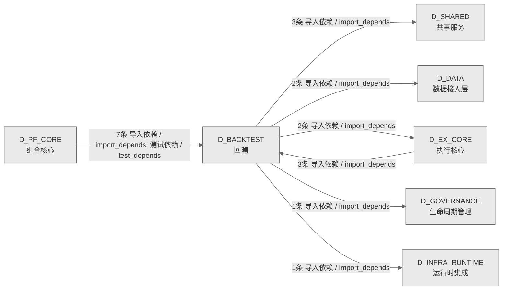

# 35_d_backtest / 回测域 / Backtest

> **功能简介 / Overview**: 回测，负责历史数据回测、回测引擎和回测报告

> **文档作用 / Purpose**: 展示 回测（D_BACKTEST）功能域的域内依赖关系、跨域依赖关系，模块信息（成熟度/中英文名/大白话/文件路径）内嵌于 Mermaid 节点，供架构审查和域治理参考。

> 本文档由 generate_domain_doc.py 从 depgraph (PostgreSQL) 自动生成
> 数据源: depgraph (PostgreSQL) nodes表 + edges表

> **[可缩放 HTML 版 / Zoomable HTML](http://localhost:8765/docs/02_enterprise_architecture/02_domain_architecture_docs/35_d_backtest.html)** — Ctrl+滚轮缩放 ｜ 双击重置 ｜ Ctrl+Shift+D 切换拖动/选择模式

## 域基本信息 / Domain Overview

| 字段 | 值 | Field | Value |
|------|------|-------|-------|
| 编号 | 35 | Number | 35 |
| 域ID | D_BACKTEST | Domain ID | D_BACKTEST |
| 域名称 | 回测 | Domain Name | Backtest |
| 层级 | L2 业务域层 | Layer | L2 Domain |
| 模块数 | 18 | Module Count | 18 |
| 域内依赖 | 29 | Internal Dependencies | 29 |
| 跨域入边 | 10 | Cross-domain Incoming | 10 |
| 跨域出边 | 9 | Cross-domain Outgoing | 9 |
| 设计态模块 | 0 | Design Modules | 0 |
| 生产态模块 | 18 | Production Modules | 18 |
| 容量 | 18/150 (正常) | Capacity | 18/150 (正常) |
| 描述 | 回测，负责历史数据回测、回测引擎和回测报告 | Description | 回测，负责历史数据回测、回测引擎和回测报告 |

## 域内依赖图 / Internal Dependency Diagram

> 依赖图内嵌在本文档中，IDE 可直接渲染；网页版可 Ctrl+滚轮缩放 + 拖动平移查看细节。含三个视图：全景图（颜色区分运营态/设计态）+ 运营态子图 + 设计态子图；全景图不分页。
>
> **图例说明 / Legend**：
> - 🟦 **蓝色 = 运营态模块**（production，已上线运行）
> - 🟧 **橙色虚线 = 设计态模块**（design，蓝图阶段，代码未写）
> - **实线箭头 = 运营态依赖**（已生效的依赖关系）
> - **虚线箭头 = 非运营态依赖**（计划中/验证中的依赖关系）

### 全景依赖图（全部模块，颜色区分运营态/设计态）

> 展示全部 18 个模块（生产态 18 + 设计态 0），节点含成熟度+中英文名+大白话+文件路径。

```mermaid
%%{init: {'theme': 'base', 'themeVariables': {'primaryColor': '#eaeaea', 'primaryTextColor': '#333333', 'primaryBorderColor': '#666666', 'lineColor': '#666666', 'secondaryColor': '#eaeaea', 'tertiaryColor': '#eaeaea', 'fontSize': '14px'}}}%%
flowchart TD
    src_zephyr_backtest_core_data_handler_py["(生产态 / production) 回测数据处理器模块（v1.1.0 扩展：多源化 + ClickHouse 实现 + Tick 源）<br/>回测数据处理器模块（v1.1.0 扩展：多源化 + ClickHouse 实现 + Tick 源）<br/>文件: core/data_handler.py"]
    src_zephyr_backtest_implementations_event_driven_engine_py["(生产态 / production) 事件驱动回测引擎（v1.1.0 新增，Tick 级回测核心）<br/>事件驱动回测引擎（v1.1.0 新增，Tick 级回测核心）<br/>文件: implementations/event_driven_engine.py"]
    src_zephyr_backtest_io_init_py["(生产态 / production) io · D_BACKTEST 可视化产物 io 子包（v1.3.0 新增，#ARCH-047）<br/>io · D_BACKTEST 可视化产物 io 子包（v1.3.0 新增，#ARCH-047）<br/>文件: io/__init__.py"]
    src_zephyr_backtest_services_scheduler_py["(生产态 / production) D-BACKTEST BT-17 回测自动调度器——批量+参数网格+队列管理+结果聚合。<br/>D-BACKTEST BT-17 回测自动调度器——批量+参数网格+队列管理+结果聚合。<br/>文件: services/scheduler.py"]
    src_zephyr_backtest_core_data_handler_py ~~~ src_zephyr_backtest_implementations_event_driven_engine_py
    src_zephyr_backtest_implementations_event_driven_engine_py ~~~ src_zephyr_backtest_io_init_py
    src_zephyr_backtest_io_init_py ~~~ src_zephyr_backtest_services_scheduler_py
    src_zephyr_backtest_core_pit_manager_py["(生产态 / production) PIT(Point-In-Time)铁律管理器模块<br/>PIT(Point-In-Time)铁律管理器模块<br/>文件: core/pit_manager.py"]
    src_zephyr_backtest_core_tick_replay_py["(生产态 / production) Tick 回放引擎模块（v1.1.0 新增，秒级做T专用）<br/>Tick 回放引擎模块（v1.1.0 新增，秒级做T专用）<br/>文件: core/tick_replay.py"]
    src_zephyr_backtest_implementations_vectorized_engine_py["(生产态 / production) L_BACKTEST — Vectorized Backtest Engine<br/>L_BACKTEST — Vectorized Backtest Engine<br/>文件: implementations/vectorized_engine.py"]
    src_zephyr_backtest_io_decisiongraph_adapter_py["(生产态 / production) BacktestResult -> decisiongraph 适配器（TRAE-061 Phase 5）<br/>BacktestResult -> decisiongraph 适配器（TRAE-061 Phase 5）<br/>文件: io/decisiongraph_adapter.py"]
    src_zephyr_backtest_io_result_repository_py["(生产态 / production) result_repository · 回测产物持久化/检索模块（v1.3.0 新增，#ARCH-047）<br/>result_repository · 回测产物持久化/检索模块（v1.3.0 新增，#ARCH-047）<br/>文件: io/result_repository.py"]
    src_zephyr_backtest_core_pit_manager_py ~~~ src_zephyr_backtest_core_tick_replay_py
    src_zephyr_backtest_core_tick_replay_py ~~~ src_zephyr_backtest_implementations_vectorized_engine_py
    src_zephyr_backtest_implementations_vectorized_engine_py ~~~ src_zephyr_backtest_io_decisiongraph_adapter_py
    src_zephyr_backtest_io_decisiongraph_adapter_py ~~~ src_zephyr_backtest_io_result_repository_py
    src_zephyr_backtest_core_decision_gate_py["(生产态 / production) 3阶段决策门控模块(IS->WFA->OOS)<br/>3阶段决策门控模块(IS->WFA->OOS)<br/>文件: core/decision_gate.py"]
    src_zephyr_backtest_core_matching_engine_py["(生产态 / production) 回测撮合引擎模块（v1.1.0 重构：委托 MatchingLogic 保证回测=实盘一致性）<br/>回测撮合引擎模块（v1.1.0 重构：委托 MatchingLogic 保证回测=实盘一致性）<br/>文件: core/matching_engine.py"]
    src_zephyr_backtest_core_metrics_py["(生产态 / production) 回测绩效指标计算模块<br/>回测绩效指标计算模块<br/>文件: core/metrics.py"]
    src_zephyr_backtest_core_walk_forward_py["(生产态 / production) Walk-Forward分析与多重比较偏差校正模块<br/>Walk-Forward分析与多重比较偏差校正模块<br/>文件: core/walk_forward.py"]
    src_zephyr_backtest_io_backtest_result_sink_py["(生产态 / production) backtest_result_sink · 回测结果数据落地模块（v1.3.0 新增，#ARCH-047）<br/>backtest_result_sink · 回测结果数据落地模块（v1.3.0 新增，#ARCH-047）<br/>文件: io/backtest_result_sink.py"]
    src_zephyr_backtest_core_decision_gate_py ~~~ src_zephyr_backtest_core_matching_engine_py
    src_zephyr_backtest_core_matching_engine_py ~~~ src_zephyr_backtest_core_metrics_py
    src_zephyr_backtest_core_metrics_py ~~~ src_zephyr_backtest_core_walk_forward_py
    src_zephyr_backtest_core_walk_forward_py ~~~ src_zephyr_backtest_io_backtest_result_sink_py
    src_zephyr_backtest_core_engine_base_py["(生产态 / production) L_BACKTEST — Backtest Engine Layer<br/>L_BACKTEST — Backtest Engine Layer<br/>文件: core/engine_base.py"]
    src_zephyr_backtest_core_matching_logic_py["(生产态 / production) 共享撮合逻辑模块（回测=实盘一致性核心）<br/>共享撮合逻辑模块（回测=实盘一致性核心）<br/>文件: core/matching_logic.py"]
    src_zephyr_backtest_core_overfitting_detector_py["(生产态 / production) 过拟合检测模块(三维度 + 三层)<br/>过拟合检测模块(三维度 + 三层)<br/>文件: core/overfitting_detector.py"]
    src_zephyr_backtest_core_portfolio_py["(生产态 / production) 回测持仓管理模块<br/>回测持仓管理模块<br/>文件: core/portfolio.py"]
    src_zephyr_backtest_core_engine_base_py ~~~ src_zephyr_backtest_core_matching_logic_py
    src_zephyr_backtest_core_matching_logic_py ~~~ src_zephyr_backtest_core_overfitting_detector_py
    src_zephyr_backtest_core_overfitting_detector_py ~~~ src_zephyr_backtest_core_portfolio_py
    src_zephyr_backtest_core_data_handler_py -->|导入依赖 / import_depends| src_zephyr_backtest_core_pit_manager_py
    src_zephyr_backtest_core_decision_gate_py -->|导入依赖 / import_depends| src_zephyr_backtest_core_overfitting_detector_py
    src_zephyr_backtest_core_matching_engine_py -->|导入依赖 / import_depends| src_zephyr_backtest_core_matching_logic_py
    src_zephyr_backtest_core_matching_engine_py -->|导入依赖 / import_depends| src_zephyr_backtest_core_portfolio_py
    src_zephyr_backtest_core_tick_replay_py -->|导入依赖 / import_depends| src_zephyr_backtest_core_matching_logic_py
    src_zephyr_backtest_implementations_vectorized_engine_py -->|导入依赖 / import_depends| src_zephyr_backtest_core_decision_gate_py
    src_zephyr_backtest_implementations_vectorized_engine_py -->|导入依赖 / import_depends| src_zephyr_backtest_core_engine_base_py
    src_zephyr_backtest_implementations_vectorized_engine_py -->|导入依赖 / import_depends| src_zephyr_backtest_core_overfitting_detector_py
    src_zephyr_backtest_implementations_vectorized_engine_py -->|导入依赖 / import_depends| src_zephyr_backtest_core_metrics_py
    src_zephyr_backtest_implementations_vectorized_engine_py -->|导入依赖 / import_depends| src_zephyr_backtest_core_portfolio_py
    src_zephyr_backtest_implementations_vectorized_engine_py -->|导入依赖 / import_depends| src_zephyr_backtest_core_matching_engine_py
    src_zephyr_backtest_implementations_vectorized_engine_py -->|导入依赖 / import_depends| src_zephyr_backtest_core_walk_forward_py
    src_zephyr_backtest_implementations_event_driven_engine_py -->|导入依赖 / import_depends| src_zephyr_backtest_core_decision_gate_py
    src_zephyr_backtest_implementations_event_driven_engine_py -->|导入依赖 / import_depends| src_zephyr_backtest_core_engine_base_py
    src_zephyr_backtest_implementations_event_driven_engine_py -->|导入依赖 / import_depends| src_zephyr_backtest_core_overfitting_detector_py
    src_zephyr_backtest_implementations_event_driven_engine_py -->|导入依赖 / import_depends| src_zephyr_backtest_core_metrics_py
    src_zephyr_backtest_implementations_event_driven_engine_py -->|导入依赖 / import_depends| src_zephyr_backtest_core_portfolio_py
    src_zephyr_backtest_implementations_event_driven_engine_py -->|导入依赖 / import_depends| src_zephyr_backtest_core_matching_engine_py
    src_zephyr_backtest_implementations_event_driven_engine_py -->|导入依赖 / import_depends| src_zephyr_backtest_core_tick_replay_py
    src_zephyr_backtest_implementations_event_driven_engine_py -->|导入依赖 / import_depends| src_zephyr_backtest_implementations_vectorized_engine_py
    src_zephyr_backtest_implementations_event_driven_engine_py -->|导入依赖 / import_depends| src_zephyr_backtest_core_walk_forward_py
    src_zephyr_backtest_io_decisiongraph_adapter_py -->|导入依赖 / import_depends| src_zephyr_backtest_core_engine_base_py
    src_zephyr_backtest_io_result_repository_py -->|导入依赖 / import_depends| src_zephyr_backtest_io_backtest_result_sink_py
    src_zephyr_backtest_io_backtest_result_sink_py -->|导入依赖 / import_depends| src_zephyr_backtest_core_engine_base_py
    src_zephyr_backtest_services_scheduler_py -->|导入依赖 / import_depends| src_zephyr_backtest_core_engine_base_py
    src_zephyr_backtest_services_scheduler_py -->|导入依赖 / import_depends| src_zephyr_backtest_implementations_vectorized_engine_py
    src_zephyr_backtest_io_init_py -->|导入依赖 / import_depends| src_zephyr_backtest_io_decisiongraph_adapter_py
    src_zephyr_backtest_io_init_py -->|导入依赖 / import_depends| src_zephyr_backtest_io_result_repository_py
    src_zephyr_backtest_io_init_py -->|导入依赖 / import_depends| src_zephyr_backtest_io_backtest_result_sink_py
    D_SHARED["(生产态 / production) 共享服务 / Shared Services<br/>共享服务，负责跨域共享的工具、协议和基础服务<br/>跨域节点 / cross-domain"]
    src_zephyr_backtest_io_result_repository_py -->|导入依赖 / import_depends| D_SHARED
    D_INFRA_RUNTIME["(生产态 / production) 运行时集成 / Runtime Integration<br/>运行时集成，负责组件生命周期编排、启动钩子和运行时上下文管理<br/>跨域节点 / cross-domain"]
    src_zephyr_backtest_core_data_handler_py -->|导入依赖 / import_depends| D_INFRA_RUNTIME
    D_DATA["(生产态 / production) 数据接入层 / Data Access Layer<br/>数据接入层，负责数据源接入、数据集成和数据标准化<br/>跨域节点 / cross-domain"]
    src_zephyr_backtest_core_data_handler_py -->|导入依赖 / import_depends| D_DATA
    src_zephyr_backtest_core_engine_base_py -->|导入依赖 / import_depends| D_SHARED
    src_zephyr_backtest_io_result_repository_py -->|导入依赖 / import_depends| D_SHARED
    D_GOVERNANCE["(生产态 / production) 生命周期管理 / Lifecycle Management<br/>生命周期管理，负责蓝图/模块/任务的声明周期管理和元数据治理<br/>跨域节点 / cross-domain"]
    src_zephyr_backtest_io_decisiongraph_adapter_py -->|导入依赖 / import_depends| D_GOVERNANCE
    D_EX_CORE["(生产态 / production) 执行核心 / Execution Core<br/>执行核心，负责订单执行引擎、执行策略和执行管理<br/>跨域节点 / cross-domain"]
    src_zephyr_backtest_implementations_event_driven_engine_py -->|导入依赖 / import_depends| D_EX_CORE
    src_zephyr_backtest_implementations_event_driven_engine_py -->|导入依赖 / import_depends| D_EX_CORE
    src_zephyr_backtest_core_data_handler_py -->|导入依赖 / import_depends| D_DATA
    D_EX_CORE -->|导入依赖 / import_depends| src_zephyr_backtest_core_matching_logic_py
    D_PF_CORE["(生产态 / production) 组合核心 / Portfolio Core<br/>组合核心，负责投资组合构建、持仓管理和组合优化<br/>跨域节点 / cross-domain"]
    D_PF_CORE -->|导入依赖 / import_depends| src_zephyr_backtest_core_tick_replay_py
    D_PF_CORE -->|测试依赖 / test_depends| src_zephyr_backtest_core_matching_logic_py
    D_PF_CORE -->|测试依赖 / test_depends| src_zephyr_backtest_core_matching_logic_py
    D_PF_CORE -->|测试依赖 / test_depends| src_zephyr_backtest_core_matching_logic_py
    D_PF_CORE -->|导入依赖 / import_depends| src_zephyr_backtest_implementations_event_driven_engine_py
    D_PF_CORE -->|导入依赖 / import_depends| src_zephyr_backtest_core_engine_base_py
    D_PF_CORE -->|导入依赖 / import_depends| src_zephyr_backtest_implementations_vectorized_engine_py
    classDef production fill:#e1f5fe,stroke:#01579b,stroke-width:2px,color:#000
    classDef design fill:#fff3e0,stroke:#e65100,stroke-width:2px,color:#000,stroke-dasharray: 5 5
    classDef external_prod fill:#e8f4fd,stroke:#0277bd,stroke-width:1px,color:#000
    classDef external_design fill:#fff8e7,stroke:#ef6c00,stroke-width:1px,color:#000,stroke-dasharray: 5 5
    class src_zephyr_backtest_core_data_handler_py,src_zephyr_backtest_core_decision_gate_py,src_zephyr_backtest_core_engine_base_py,src_zephyr_backtest_core_matching_engine_py,src_zephyr_backtest_core_matching_logic_py,src_zephyr_backtest_core_metrics_py,src_zephyr_backtest_core_overfitting_detector_py,src_zephyr_backtest_core_pit_manager_py,src_zephyr_backtest_core_portfolio_py,src_zephyr_backtest_core_tick_replay_py,src_zephyr_backtest_core_walk_forward_py,src_zephyr_backtest_implementations_event_driven_engine_py,src_zephyr_backtest_implementations_vectorized_engine_py,src_zephyr_backtest_io_init_py,src_zephyr_backtest_io_backtest_result_sink_py,src_zephyr_backtest_io_decisiongraph_adapter_py,src_zephyr_backtest_io_result_repository_py,src_zephyr_backtest_services_scheduler_py production
    class D_SHARED,D_INFRA_RUNTIME,D_DATA,D_GOVERNANCE,D_EX_CORE,D_PF_CORE external_prod
```

### 运营态子图（仅 design_maturity=production 的模块和依赖）

> 本域 18 个模块全部为运营态（production），上方全景图即运营态全貌，不再重复绘制。

### 设计态子图（仅 design_maturity=design 的模块和依赖）

> （无设计态模块 / No design modules）

## 跨域依赖 / Cross-domain Dependencies

### 本域依赖的其他域（出边）/ Depends On

| # | 本域模块 / Source Module | → | 外部域-目标模块 / Target Module | 依赖类型 / Type |
|:--:|---------|:--:|---------|---------|
| 1 | 回测数据处理器模块（v1.1.0 扩展：多源化 + ClickHouse 实现... | → | D_DATA 数据接入层: zephyr.data — 数据源集成器（MOD-L00-004）。 (data/__init... | 导入依赖 / import_depends |
| 2 | 回测数据处理器模块（v1.1.0 扩展：多源化 + ClickHouse 实现... | → | D_DATA 数据接入层: ClickHouse 统一读取层（裁定 #ARCH-CH-007）。 (data/ch_rea... | 导入依赖 / import_depends |
| 3 | 事件驱动回测引擎（v1.1.0 新增，Tick 级回测核心） (impleme... | → | D_EX_CORE 执行核心: MiniQMT 实盘券商适配器（对接 xttrader，A股实盘交易） (ada... | 导入依赖 / import_depends |
| 4 | 事件驱动回测引擎（v1.1.0 新增，Tick 级回测核心） (impleme... | → | D_EX_CORE 执行核心: Re-export wrapper: simulation_broker 真源在 zephyr.govern... | 导入依赖 / import_depends |
| 5 | BacktestResult -> decisiongraph 适配器（TRAE-061 Phase 5... | → | D_GOVERNANCE 生命周期管理: decisiongraph Schema DDL + 不变量声明 (persistence/decisi... | 导入依赖 / import_depends |
| 6 | 回测数据处理器模块（v1.1.0 扩展：多源化 + ClickHouse 实现... | → | D_INFRA_RUNTIME 运行时集成: DatabaseService: 统一管理数据库的连接池、生命周期、健康检... | 导入依赖 / import_depends |
| 7 | L_BACKTEST — Backtest Engine Layer (core/engine_base.py) | → | D_SHARED 共享服务: core/trace_context.py | 导入依赖 / import_depends |
| 8 | result_repository · 回测产物持久化/检索模块（v1.3.0 新增... | → | D_SHARED 共享服务: paths.py — 项目路径常量 SSoT（Single Source of Truth） (... | 导入依赖 / import_depends |
| 9 | result_repository · 回测产物持久化/检索模块（v1.3.0 新增... | → | D_SHARED 共享服务: time_utils.py —— 时间/日期工具（Phase 9 新增 \| 盲点 B19... | 导入依赖 / import_depends |

### 依赖本域的其他域（入边）/ Depended By

| # | 外部域-源模块 / Source Module | → | 本域模块 / Target Module | 依赖类型 / Type |
|:--:|---------|:--:|---------|---------|
| 1 | D_EX_CORE 执行核心: MiniQMT 实盘券商适配器（对接 xttrader，A股实盘交易） (ada... | → | 共享撮合逻辑模块（回测=实盘一致性核心） (core/matching_lo... | 导入依赖 / import_depends |
| 2 | D_PF_CORE 组合核心: D_PORTFOLIO_CORE — StrategyRunner 策略运行器（胶水层） (... | → | L_BACKTEST — Backtest Engine Layer (core/engine_base.py) | 导入依赖 / import_depends |
| 3 | D_PF_CORE 组合核心: D_PORTFOLIO_CORE — StrategyRunner 策略运行器（胶水层） (... | → | 事件驱动回测引擎（v1.1.0 新增，Tick 级回测核心） (impleme... | 导入依赖 / import_depends |
| 4 | D_PF_CORE 组合核心: D_PORTFOLIO_CORE — StrategyRunner 策略运行器（胶水层） (... | → | L_BACKTEST — Vectorized Backtest Engine (implementations... | 导入依赖 / import_depends |
| 5 | D_PF_CORE 组合核心: D_PORTFOLIO_CORE — TickStrategyBase + TickStrategyRegist... | → | Tick 回放引擎模块（v1.1.0 新增，秒级做T专用） (core/tick_... | 导入依赖 / import_depends |
| 6 | D_PF_CORE 组合核心: IntradaySurgeFallStrategy 单元测试（路径 B 示例策略）。 (... | → | 共享撮合逻辑模块（回测=实盘一致性核心） (core/matching_lo... | 测试依赖 / test_depends |
| 7 | D_PF_CORE 组合核心: OrderBookImbalanceStrategy 单元测试（路径 B 盘口失衡反转... | → | 共享撮合逻辑模块（回测=实盘一致性核心） (core/matching_lo... | 测试依赖 / test_depends |
| 8 | D_PF_CORE 组合核心: VWAPReversionStrategy 单元测试（路径 B 均值回归策略）。 (... | → | 共享撮合逻辑模块（回测=实盘一致性核心） (core/matching_lo... | 测试依赖 / test_depends |

### 跨域依赖图 / Cross-domain Dependency Diagram

> 本域与 6 个外部域直接连接（出边 9 条 + 入边 10 条 = 19 条）。只显示直接连接的域，不展开具体节点。

## 说明 / Notes

- **数据源 / Data Source**: `depgraph (PostgreSQL)` 的 `nodes`、`edges`、`domains` 表
- **生成器 / Generator**: `generate_domain_doc.py`（G2+G10 合并）
- **维护方式 / Maintenance**: 自动生成，全景图更新时刷新
- **文件名规则 / File Naming**: `{编号:02d}_{域ID小写}.md`，如 `16_d_trading.md`
- **图例说明 / Legend**: `[production]`=已上线 / `[design]`=设计中 / `[unknown]`=未知
