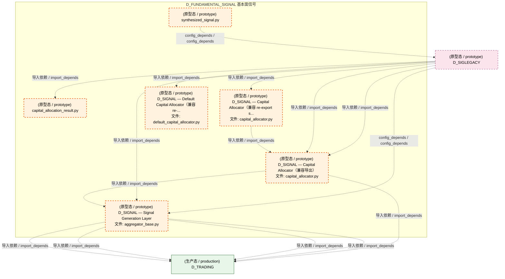
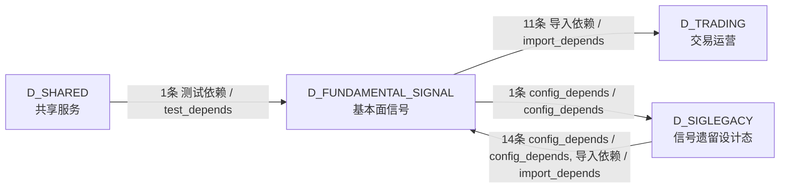

# 35_d_fundamental_signal / fundamental_signal / 基本面信号 / Fundamental Signal

> **功能简介 / Overview**: 基本面信号，负责基于财务数据的基本面信号生成

> **文档作用 / Purpose**: 展示 基本面信号（D_FUNDAMENTAL_SIGNAL）功能域的模块清单、域内依赖关系、跨域依赖关系、架构分层视图，供架构审查和域治理参考。

> 本文档由 generate_domain_doc.py 从 depgraph (PostgreSQL) 自动生成
> 最后更新: 2026-07-13 05:27:25
> 数据源: depgraph (PostgreSQL) nodes表 + edges表

## 域基本信息 / Domain Overview

| 字段 | 值 | Field | Value |
|------|------|-------|-------|
| 编号 | 35 | Number | 35 |
| 域ID | D_FUNDAMENTAL_SIGNAL | Domain ID | D_FUNDAMENTAL_SIGNAL |
| 域名称 | 基本面信号 | Domain Name | Fundamental Signal |
| 层级 | L2 业务域层 | Layer | L2 Domain |
| 模块数 | 9 | Module Count | 9 |
| 域内依赖 | 5 | Internal Dependencies | 5 |
| 跨域入边 | 15 | Cross-domain Incoming | 15 |
| 跨域出边 | 12 | Cross-domain Outgoing | 12 |
| 设计态模块 | 0 | Design Modules | 0 |
| 原型态模块 | 6 | Prototype Modules | 6 |
| 生产态模块 | 3 | Production Modules | 3 |
| 容量 | 3/150 (正常) | Capacity | 3/150 (正常) |
| 描述 | 财务指标信号 | Description | 财务指标信号 |

## 模块分层清单 / Module Layered List

> 按 architecture_layer 分组的模块清单（共 9 个模块 / 9 modules）。

### L2 领域层 / Domain Layer (9 modules)

| # | 模块路径 / Module Path | 模块名称 / Module Name (功能简介 / Description) | 成熟度 / Maturity | 蓝图 / Blueprint |
|:--:|---------|---------|:---:|:---:|
| 1 | src/zephyr/signal_fundamental/capital/capital_allocation_... | capital_allocation_result.py | 原型态 / prototype | [MOD-INF-016](../../03_modules/_cross_layer/shared_core/blueprint.md) |
| 2 | src/zephyr/signal_fundamental/capital/capital_allocator.py | D_SIGNAL — Capital Allocator（兼容 re-export s... | 原型态 / prototype | [MOD-L03-001](../../03_modules/_domain_signal/blueprint.md) |
| 3 | src/zephyr/signal_fundamental/capital/default_capital_all... | D_SIGNAL — Default Capital Allocator（兼容 re-... | 原型态 / prototype | [MOD-L03-001](../../03_modules/_domain_signal/blueprint.md) |
| 4 | src/zephyr/signal_fundamental/combiner/synthesized_signal.py | synthesized_signal.py | 原型态 / prototype | [MOD-INF-016](../../03_modules/_cross_layer/shared_core/blueprint.md) |
| 5 | src/zephyr/signal_fundamental/gen/aggregator_base.py | D_SIGNAL — Signal Generation Layer | 原型态 / prototype | [MOD-L03-001](../../03_modules/_domain_signal/blueprint.md) |
| 6 | src/zephyr/signal_fundamental/gen/implementations/default... | D_SIGNAL — Default Signal Aggregator | 生产态 / production | [MOD-L03-001](../../03_modules/_domain_signal/blueprint.md) |
| 7 | src/zephyr/signal_fundamental/strategy/capital_allocator.py | D_SIGNAL — Capital Allocator（兼容导出） | 原型态 / prototype | [MOD-L03-001](../../03_modules/_domain_signal/blueprint.md) |
| 8 | src/zephyr/signal_fundamental/strategy/implementations/de... | D_SIGNAL — Default Capital Allocator | 生产态 / production | [MOD-L03-001](../../03_modules/_domain_signal/blueprint.md) |
| 9 | src/zephyr/signal_fundamental/synth/signal_synthesizer.py | D_SIGNAL — Signal Synthesizer | 生产态 / production | [MOD-L03-001](../../03_modules/_domain_signal/blueprint.md) |

## 域内依赖图 / Internal Dependency Diagram

> 依赖图内嵌在本文档中，IDE 可直接渲染显示。参考 decision_index.md 设计，分四个视图：合并全景图、运营态子图、设计态子图、原型态子图（按 design_maturity 实际值拆分）。
>
> **图例说明 / Legend**：
> - **实线边框 = 运营态模块**（production，已上线运行）
> - **虚线边框 = 设计态模块**（design，蓝图阶段，代码未写）
> - **虚线边框 = 原型态模块**（prototype，代码已写，验证中未稳定上线）
> - **实线箭头 = 运营态依赖**（已生效的依赖关系）
> - **虚线箭头 = 非运营态依赖**（计划中/验证中的依赖关系）

### 合并全景图（全部模块，标签标注成熟度）

> 展示全部 9 个模块（生产态 3 + 设计态 0 + 原型态 6），标签标注成熟度。

```mermaid
graph TD
    subgraph D_FUNDAMENTAL_SIGNAL["D_FUNDAMENTAL_SIGNAL 基本面信号"]
        src_zephyr_signal_fundamental_capital_capital_allocation_result_py["(原型态 / prototype) capital_allocation_result.py"]
        src_zephyr_signal_fundamental_capital_capital_allocator_py["(原型态 / prototype) D_SIGNAL — Capital Allocator（兼容 re-export s...<br/>文件: capital_allocator.py"]
        src_zephyr_signal_fundamental_capital_default_capital_allocator_py["(原型态 / prototype) D_SIGNAL — Default Capital Allocator（兼容 re-...<br/>文件: default_capital_allocator.py"]
        src_zephyr_signal_fundamental_combiner_synthesized_signal_py["(原型态 / prototype) synthesized_signal.py"]
        src_zephyr_signal_fundamental_gen_aggregator_base_py["(原型态 / prototype) D_SIGNAL — Signal Generation Layer<br/>文件: aggregator_base.py"]
        src_zephyr_signal_fundamental_gen_implementations_default_signal_aggregator_py["(生产态 / production) D_SIGNAL — Default Signal Aggregator<br/>文件: default_signal_aggregator.py"]
        src_zephyr_signal_fundamental_strategy_capital_allocator_py["(原型态 / prototype) D_SIGNAL — Capital Allocator（兼容导出）<br/>文件: capital_allocator.py"]
        src_zephyr_signal_fundamental_strategy_implementations_default_capital_allocator_py["(生产态 / production) D_SIGNAL — Default Capital Allocator<br/>文件: default_capital_allocator.py"]
        src_zephyr_signal_fundamental_synth_signal_synthesizer_py["(生产态 / production) D_SIGNAL — Signal Synthesizer<br/>文件: signal_synthesizer.py"]
    end
    src_zephyr_signal_fundamental_capital_default_capital_allocator_py -.->|导入依赖 / import_depends| src_zephyr_signal_fundamental_strategy_implementations_default_capital_allocator_py
    src_zephyr_signal_fundamental_capital_capital_allocator_py -.->|导入依赖 / import_depends| src_zephyr_signal_fundamental_strategy_capital_allocator_py
    src_zephyr_signal_fundamental_gen_implementations_default_signal_aggregator_py -.->|导入依赖 / import_depends| src_zephyr_signal_fundamental_gen_aggregator_base_py
    src_zephyr_signal_fundamental_strategy_capital_allocator_py -.->|导入依赖 / import_depends| src_zephyr_signal_fundamental_gen_aggregator_base_py
    src_zephyr_signal_fundamental_strategy_implementations_default_capital_allocator_py -.->|导入依赖 / import_depends| src_zephyr_signal_fundamental_gen_aggregator_base_py
    D_SIGLEGACY["(原型态 / prototype) D_SIGLEGACY"]
    src_zephyr_signal_fundamental_combiner_synthesized_signal_py -.->|config_depends / config_depends| D_SIGLEGACY
    D_TRADING["(生产态 / production) D_TRADING"]
    src_zephyr_signal_fundamental_gen_aggregator_base_py -.->|导入依赖 / import_depends| D_TRADING
    src_zephyr_signal_fundamental_gen_aggregator_base_py -.->|导入依赖 / import_depends| D_TRADING
    src_zephyr_signal_fundamental_gen_aggregator_base_py -.->|导入依赖 / import_depends| D_TRADING
    src_zephyr_signal_fundamental_gen_aggregator_base_py -.->|导入依赖 / import_depends| D_TRADING
    src_zephyr_signal_fundamental_gen_implementations_default_signal_aggregator_py -->|导入依赖 / import_depends| D_TRADING
    src_zephyr_signal_fundamental_gen_implementations_default_signal_aggregator_py -->|导入依赖 / import_depends| D_TRADING
    src_zephyr_signal_fundamental_strategy_capital_allocator_py -.->|导入依赖 / import_depends| D_TRADING
    src_zephyr_signal_fundamental_strategy_implementations_default_capital_allocator_py -->|导入依赖 / import_depends| D_TRADING
    src_zephyr_signal_fundamental_strategy_implementations_default_capital_allocator_py -->|导入依赖 / import_depends| D_TRADING
    src_zephyr_signal_fundamental_synth_signal_synthesizer_py -->|导入依赖 / import_depends| D_TRADING
    src_zephyr_signal_fundamental_synth_signal_synthesizer_py -->|导入依赖 / import_depends| D_TRADING
    D_SIGLEGACY -->|导入依赖 / import_depends| src_zephyr_signal_fundamental_synth_signal_synthesizer_py
    D_SIGLEGACY -.->|导入依赖 / import_depends| src_zephyr_signal_fundamental_capital_capital_allocation_result_py
    D_SIGLEGACY -.->|导入依赖 / import_depends| src_zephyr_signal_fundamental_capital_capital_allocator_py
    D_SIGLEGACY -.->|导入依赖 / import_depends| src_zephyr_signal_fundamental_capital_default_capital_allocator_py
    D_SIGLEGACY -.->|导入依赖 / import_depends| src_zephyr_signal_fundamental_gen_aggregator_base_py
    D_SIGLEGACY -.->|导入依赖 / import_depends| src_zephyr_signal_fundamental_strategy_capital_allocator_py
    D_SIGLEGACY -.->|导入依赖 / import_depends| src_zephyr_signal_fundamental_synth_signal_synthesizer_py
    D_SIGLEGACY -.->|导入依赖 / import_depends| src_zephyr_signal_fundamental_gen_implementations_default_signal_aggregator_py
    D_SIGLEGACY -.->|导入依赖 / import_depends| src_zephyr_signal_fundamental_strategy_implementations_default_capital_allocator_py
    D_SIGLEGACY -.->|导入依赖 / import_depends| src_zephyr_signal_fundamental_gen_implementations_default_signal_aggregator_py
    D_SIGLEGACY -.->|导入依赖 / import_depends| src_zephyr_signal_fundamental_strategy_capital_allocator_py
    D_SIGLEGACY -.->|导入依赖 / import_depends| src_zephyr_signal_fundamental_strategy_implementations_default_capital_allocator_py
    D_SIGLEGACY -.->|导入依赖 / import_depends| src_zephyr_signal_fundamental_synth_signal_synthesizer_py
    D_SHARED["(原型态 / prototype) D_SHARED"]
    D_SHARED -.->|测试依赖 / test_depends| src_zephyr_signal_fundamental_synth_signal_synthesizer_py
    D_SIGLEGACY -.->|config_depends / config_depends| src_zephyr_signal_fundamental_gen_aggregator_base_py
    classDef production fill:#e1f5fe,stroke:#01579b,stroke-width:2px,color:#000
    classDef design fill:#fff3e0,stroke:#e65100,stroke-width:2px,color:#000,stroke-dasharray: 5 5
    classDef external_prod fill:#e8f5e9,stroke:#1b5e20,stroke-width:1px,color:#000
    classDef external_design fill:#fce4ec,stroke:#880e4f,stroke-width:1px,color:#000,stroke-dasharray: 5 5
    class src_zephyr_signal_fundamental_gen_implementations_default_signal_aggregator_py,src_zephyr_signal_fundamental_strategy_implementations_default_capital_allocator_py,src_zephyr_signal_fundamental_synth_signal_synthesizer_py production
    class src_zephyr_signal_fundamental_capital_capital_allocation_result_py,src_zephyr_signal_fundamental_capital_capital_allocator_py,src_zephyr_signal_fundamental_capital_default_capital_allocator_py,src_zephyr_signal_fundamental_combiner_synthesized_signal_py,src_zephyr_signal_fundamental_gen_aggregator_base_py,src_zephyr_signal_fundamental_strategy_capital_allocator_py design
    class D_TRADING external_prod
    class D_SIGLEGACY,D_SHARED external_design
```

### 运营态子图（仅 design_maturity=production 的模块和依赖）

> 仅展示已上线运行的模块（共 3 个，0 条域内依赖）。

```mermaid
graph TD
    subgraph D_FUNDAMENTAL_SIGNAL["D_FUNDAMENTAL_SIGNAL 基本面信号"]
        src_zephyr_signal_fundamental_gen_implementations_default_signal_aggregator_py["(生产态 / production) D_SIGNAL — Default Signal Aggregator<br/>文件: default_signal_aggregator.py"]
        src_zephyr_signal_fundamental_strategy_implementations_default_capital_allocator_py["(生产态 / production) D_SIGNAL — Default Capital Allocator<br/>文件: default_capital_allocator.py"]
        src_zephyr_signal_fundamental_synth_signal_synthesizer_py["(生产态 / production) D_SIGNAL — Signal Synthesizer<br/>文件: signal_synthesizer.py"]
    end
    D_TRADING["(生产态 / production) D_TRADING"]
    src_zephyr_signal_fundamental_gen_implementations_default_signal_aggregator_py -->|导入依赖 / import_depends| D_TRADING
    src_zephyr_signal_fundamental_gen_implementations_default_signal_aggregator_py -->|导入依赖 / import_depends| D_TRADING
    src_zephyr_signal_fundamental_strategy_implementations_default_capital_allocator_py -->|导入依赖 / import_depends| D_TRADING
    src_zephyr_signal_fundamental_strategy_implementations_default_capital_allocator_py -->|导入依赖 / import_depends| D_TRADING
    src_zephyr_signal_fundamental_synth_signal_synthesizer_py -->|导入依赖 / import_depends| D_TRADING
    src_zephyr_signal_fundamental_synth_signal_synthesizer_py -->|导入依赖 / import_depends| D_TRADING
    D_SIGLEGACY["(原型态 / prototype) D_SIGLEGACY"]
    D_SIGLEGACY -.->|导入依赖 / import_depends| src_zephyr_signal_fundamental_gen_implementations_default_signal_aggregator_py
    D_SIGLEGACY -.->|导入依赖 / import_depends| src_zephyr_signal_fundamental_gen_implementations_default_signal_aggregator_py
    D_SIGLEGACY -.->|导入依赖 / import_depends| src_zephyr_signal_fundamental_strategy_implementations_default_capital_allocator_py
    D_SIGLEGACY -.->|导入依赖 / import_depends| src_zephyr_signal_fundamental_strategy_implementations_default_capital_allocator_py
    D_SHARED["(原型态 / prototype) D_SHARED"]
    D_SHARED -.->|测试依赖 / test_depends| src_zephyr_signal_fundamental_synth_signal_synthesizer_py
    D_SIGLEGACY -.->|导入依赖 / import_depends| src_zephyr_signal_fundamental_synth_signal_synthesizer_py
    D_SIGLEGACY -.->|导入依赖 / import_depends| src_zephyr_signal_fundamental_synth_signal_synthesizer_py
    D_SIGLEGACY -->|导入依赖 / import_depends| src_zephyr_signal_fundamental_synth_signal_synthesizer_py
    classDef production fill:#e1f5fe,stroke:#01579b,stroke-width:2px,color:#000
    classDef design fill:#fff3e0,stroke:#e65100,stroke-width:2px,color:#000,stroke-dasharray: 5 5
    classDef external_prod fill:#e8f5e9,stroke:#1b5e20,stroke-width:1px,color:#000
    classDef external_design fill:#fce4ec,stroke:#880e4f,stroke-width:1px,color:#000,stroke-dasharray: 5 5
    class src_zephyr_signal_fundamental_gen_implementations_default_signal_aggregator_py,src_zephyr_signal_fundamental_strategy_implementations_default_capital_allocator_py,src_zephyr_signal_fundamental_synth_signal_synthesizer_py production
    class D_TRADING external_prod
    class D_SIGLEGACY,D_SHARED external_design
```

### 设计态子图（仅 design_maturity=design 的模块和依赖）

> 仅展示蓝图阶段、代码未写的设计态模块（共 0 个，0 条域内依赖）。

> （无设计态模块 / No design modules）

### 原型态子图（仅 design_maturity=prototype 的模块和依赖）

> 仅展示代码已写、验证中未稳定上线的原型态模块（共 6 个，2 条域内依赖）。

## 跨域依赖 / Cross-domain Dependencies

### 本域依赖的其他域（出边）/ Depends On

| # | 本域模块 / Source Module | → | 外部域-目标模块 / Target Module | 依赖类型 / Type |
|:--:|---------|:--:|---------|---------|
| 1 | synthesized_signal.py | → | D_SIGLEGACY 信号遗留设计态: D_SIGNAL Signal Combiner (__init__.py) | config_depends / config_depends |
| 2 | D_SIGNAL — Signal Generation Layer (aggregator... | → | D_TRADING 交易运营: capital_allocation_result.py | 导入依赖 / import_depends |
| 3 | D_SIGNAL — Signal Generation Layer (aggregator... | → | D_TRADING 交易运营: factor_signal.py | 导入依赖 / import_depends |
| 4 | D_SIGNAL — Signal Generation Layer (aggregator... | → | D_TRADING 交易运营: signal_degradation_warning.py | 导入依赖 / import_depends |
| 5 | D_SIGNAL — Signal Generation Layer (aggregator... | → | D_TRADING 交易运营: synthesized_signal.py | 导入依赖 / import_depends |
| 6 | D_SIGNAL — Default Signal Aggregator (default_... | → | D_TRADING 交易运营: factor_signal.py | 导入依赖 / import_depends |
| 7 | D_SIGNAL — Default Signal Aggregator (default_... | → | D_TRADING 交易运营: synthesized_signal.py | 导入依赖 / import_depends |
| 8 | D_SIGNAL — Capital Allocator（兼容导出） (capi... | → | D_TRADING 交易运营: capital_allocation_result.py | 导入依赖 / import_depends |
| 9 | D_SIGNAL — Default Capital Allocator (default_... | → | D_TRADING 交易运营: capital_allocation_result.py | 导入依赖 / import_depends |
| 10 | D_SIGNAL — Default Capital Allocator (default_... | → | D_TRADING 交易运营: synthesized_signal.py | 导入依赖 / import_depends |
| 11 | D_SIGNAL — Signal Synthesizer (signal_synthesi... | → | D_TRADING 交易运营: factor_signal.py | 导入依赖 / import_depends |
| 12 | D_SIGNAL — Signal Synthesizer (signal_synthesi... | → | D_TRADING 交易运营: synthesized_signal.py | 导入依赖 / import_depends |

### 依赖本域的其他域（入边）/ Depended By

| # | 外部域-源模块 / Source Module | → | 本域模块 / Target Module | 依赖类型 / Type |
|:--:|---------|:--:|---------|---------|
| 1 | D_SHARED 共享服务: test_cross_layer.py | → | D_SIGNAL — Signal Synthesizer (signal_synthesi... | 测试依赖 / test_depends |
| 2 | D_SIGLEGACY 信号遗留设计态: Signal Capital Allocation sub-package (__init__... | → | capital_allocation_result.py | 导入依赖 / import_depends |
| 3 | D_SIGLEGACY 信号遗留设计态: Signal Capital Allocation sub-package (__init__... | → | D_SIGNAL — Capital Allocator（兼容 re-export s... | 导入依赖 / import_depends |
| 4 | D_SIGLEGACY 信号遗留设计态: Signal Capital Allocation sub-package (__init__... | → | D_SIGNAL — Default Capital Allocator（兼容 re-... | 导入依赖 / import_depends |
| 5 | D_SIGLEGACY 信号遗留设计态: D_SIGNAL Signal Combiner (__init__.py) | → | D_SIGNAL — Signal Generation Layer (aggregator... | 导入依赖 / import_depends |
| 6 | D_SIGLEGACY 信号遗留设计态: D_SIGNAL Signal Combiner (__init__.py) | → | D_SIGNAL — Capital Allocator（兼容导出） (capi... | 导入依赖 / import_depends |
| 7 | D_SIGLEGACY 信号遗留设计态: D_SIGNAL Signal Combiner (__init__.py) | → | D_SIGNAL — Signal Synthesizer (signal_synthesi... | 导入依赖 / import_depends |
| 8 | D_SIGLEGACY 信号遗留设计态: D_SIGNAL — Signal Combiner Concrete Implementa... | → | D_SIGNAL — Default Signal Aggregator (default_... | 导入依赖 / import_depends |
| 9 | D_SIGLEGACY 信号遗留设计态: D_SIGNAL — Signal Combiner Concrete Implementa... | → | D_SIGNAL — Default Capital Allocator (default_... | 导入依赖 / import_depends |
| 10 | D_SIGLEGACY 信号遗留设计态: Signal Generation sub-package (__init__.py) | → | D_SIGNAL — Signal Generation Layer (aggregator... | config_depends / config_depends |
| 11 | D_SIGLEGACY 信号遗留设计态: D_SIGNAL — Signal Generation Concrete Implemen... | → | D_SIGNAL — Default Signal Aggregator (default_... | 导入依赖 / import_depends |
| 12 | D_SIGLEGACY 信号遗留设计态: AlphaSignalPipeline D_FACTOR->D_SIGNAL跨层集成... | → | D_SIGNAL — Signal Synthesizer (signal_synthesi... | 导入依赖 / import_depends |
| 13 | D_SIGLEGACY 信号遗留设计态: Signal Strategy sub-package (__init__.py) | → | D_SIGNAL — Capital Allocator（兼容导出） (capi... | 导入依赖 / import_depends |
| 14 | D_SIGLEGACY 信号遗留设计态: Signal Strategy Concrete Implementations (__ini... | → | D_SIGNAL — Default Capital Allocator (default_... | 导入依赖 / import_depends |
| 15 | D_SIGLEGACY 信号遗留设计态: Signal Synthesis sub-package (__init__.py) | → | D_SIGNAL — Signal Synthesizer (signal_synthesi... | 导入依赖 / import_depends |

### 跨域依赖图 / Cross-domain Dependency Diagram

> 本域与 3 个外部域直接连接（出边 12 条 + 入边 15 条 = 27 条）。只显示直接连接的域，不展开具体节点。

## 说明 / Notes

- **数据源 / Data Source**: `depgraph (PostgreSQL)` 的 `nodes`、`edges`、`domains` 表
- **生成器 / Generator**: `generate_domain_doc.py`（G2+G10 合并）
- **维护方式 / Maintenance**: 自动生成，全景图更新时刷新
- **文件名规则 / File Naming**: `{编号:02d}_{域ID小写}.md`，如 `16_d_trading.md`
- **图例说明 / Legend**: `[production]`=已上线 / `[design]`=设计中 / `[prototype]`=原型 / `[unknown]`=未知
