# 35_d_gov_docs / architecture_docs

> **文档作用 / Purpose**: 展示 architecture_docs（D-GOV_DOCS）功能域的模块清单、域内依赖关系和跨域依赖关系，供架构审查和域治理参考。

> 本文档由 generate_domain_doc.py 从 depgraph.db 自动生成
> 最后更新: 2026-06-26 21:00:25
> 数据源: depgraph.db nodes表 + edges表

## 域基本信息 / Domain Overview

| 字段 | 值 | Field | Value |
|------|------|-------|-------|
| 编号 | 35 | Number | 35 |
| 域ID | D-GOV_DOCS | Domain ID | D-GOV_DOCS |
| 域名称 | architecture_docs | Domain Name | architecture_docs |
| 层级 | L2_domain | Layer | L2_domain |
| 模块数 | 127 | Module Count | 127 |
| 域内依赖 | 16 | Internal Dependencies | 16 |
| 跨域入边 | 2 | Cross-domain Incoming | 2 |
| 跨域出边 | 68 | Cross-domain Outgoing | 68 |
| 设计态模块 | 0 | Design Modules | 0 |
| 原型态模块 | 49 | Prototype Modules | 49 |
| 生产态模块 | 78 | Production Modules | 78 |
| 容量 | 100/150 (正常) | Capacity | 100/150 (正常) |
| 描述 | 架构模型文档(architecture_model) | Description | 架构模型文档(architecture_model) |

## 模块清单 / Module List

共 127 个模块（按路径排序，全部显示）

| 模块路径 / Module Path | 模块名称 / Module Name | 设计成熟度 / Maturity | 构建状态 / Build Status |
|---------|---------|-----------|---------|
| docs/01_policies_and_standards/_registry/schemas/session_log_schema.yaml |  | production | deprecated |
| docs/01_policies_and_standards/rules/_index.yaml |  | production | deprecated |
| docs/01_policies_and_standards/rules/trae_001_file_operation_security.yaml |  | production | deprecated |
| docs/01_policies_and_standards/rules/trae_002_anti_orphan_search_first.yaml |  | production | deprecated |
| docs/01_policies_and_standards/rules/trae_003_task_granularity_threshold.yaml |  | production | deprecated |
| docs/01_policies_and_standards/rules/trae_004_parallel_atomic_transaction.yaml |  | production | deprecated |
| docs/01_policies_and_standards/rules/trae_005_modification_governance.yaml |  | production | deprecated |
| docs/01_policies_and_standards/rules/trae_006_anti_hallucination_structure.yaml |  | production | deprecated |
| docs/01_policies_and_standards/rules/trae_007_anti_hallucination_behavior.yaml |  | production | deprecated |
| docs/01_policies_and_standards/rules/trae_008_anti_hallucination_output.yaml |  | production | deprecated |
| docs/01_policies_and_standards/rules/trae_009_anti_hallucination_safety.yaml |  | production | deprecated |
| docs/01_policies_and_standards/rules/trae_010_code_naming_organization.yaml |  | production | deprecated |
| docs/01_policies_and_standards/rules/trae_011_code_type_import.yaml |  | production | deprecated |
| docs/01_policies_and_standards/rules/trae_012_code_test_security.yaml |  | production | deprecated |
| docs/01_policies_and_standards/rules/trae_013_arch_cross_package_dep.yaml |  | production | deprecated |
| docs/01_policies_and_standards/rules/trae_014_arch_blueprint_alignment.yaml |  | production | deprecated |
| docs/01_policies_and_standards/rules/trae_015_arch_path_registration.yaml |  | production | deprecated |
| docs/01_policies_and_standards/rules/trae_016_arch_drift_detection.yaml |  | production | deprecated |
| docs/01_policies_and_standards/rules/trae_017_arch_governance_order.yaml |  | production | deprecated |
| docs/01_policies_and_standards/rules/trae_018_behavior_code_prohibition.yaml |  | production | deprecated |
| docs/01_policies_and_standards/rules/trae_019_behavior_security_prohibition.yaml |  | production | deprecated |
| ...01_policies_and_standards/rules/trae_020_behavior_governance_prohibition.yaml |  | production | deprecated |
| docs/01_policies_and_standards/rules/trae_021_behavior_other_prohibition.yaml |  | production | deprecated |
| docs/01_policies_and_standards/rules/trae_022_behavior_conditional_code.yaml |  | production | deprecated |
| ...01_policies_and_standards/rules/trae_023_behavior_conditional_governance.yaml |  | production | deprecated |
| docs/01_policies_and_standards/rules/trae_024_methodology_diagnosis.yaml |  | production | deprecated |
| docs/01_policies_and_standards/rules/trae_025_methodology_decision.yaml |  | production | deprecated |
| docs/01_policies_and_standards/rules/trae_026_methodology_quality.yaml |  | production | deprecated |
| docs/01_policies_and_standards/rules/trae_027_methodology_collaboration.yaml |  | production | deprecated |
| docs/01_policies_and_standards/rules/trae_028_doc_structure_naming.yaml |  | production | deprecated |
| docs/01_policies_and_standards/rules/trae_029_doc_operation_security.yaml |  | production | deprecated |
| docs/01_policies_and_standards/rules/trae_030_doc_numbering_metadata.yaml |  | production | deprecated |
| docs/01_policies_and_standards/rules/trae_031_security_key_access.yaml |  | production | deprecated |
| docs/01_policies_and_standards/rules/trae_032_module_lifecycle.yaml |  | production | deprecated |
| docs/01_policies_and_standards/rules/trae_033_module_registration_sync.yaml |  | production | deprecated |
| docs/01_policies_and_standards/rules/trae_034_task_card_standard.yaml |  | production | deprecated |
| .../01_policies_and_standards/rules/trae_035_task_construction_verification.yaml |  | production | deprecated |
| docs/01_policies_and_standards/rules/trae_036_arch_gate_transition.yaml |  | production | deprecated |
| docs/01_policies_and_standards/rules/trae_037_arch_qualification_versioning.yaml |  | production | deprecated |
| docs/01_policies_and_standards/rules/trae_038_arch_ctr_injection.yaml |  | production | deprecated |
| docs/01_policies_and_standards/rules/trae_039_ai_hallucination_detection.yaml |  | production | deprecated |
| docs/01_policies_and_standards/rules/trae_040_ai_model_routing.yaml |  | production | deprecated |
| docs/01_policies_and_standards/rules/trae_041_meta_rule_classification.yaml |  | production | deprecated |
| docs/01_policies_and_standards/rules/trae_042_meta_rule_standard.yaml |  | production | deprecated |
| docs/01_policies_and_standards/rules/trae_043_meta_rule_metadata.yaml |  | production | deprecated |
| docs/01_policies_and_standards/rules/trae_044_compliance_audit.yaml |  | production | deprecated |
| docs/01_policies_and_standards/rules/trae_045_data_quality_lineage.yaml |  | production | deprecated |
| docs/01_policies_and_standards/rules/trae_046_engineering_code_restructure.yaml |  | production | deprecated |
| docs/01_policies_and_standards/rules/trae_047_engineering_file_header.yaml |  | production | deprecated |
| docs/01_policies_and_standards/rules/trae_048_ops_vibe_coding_session.yaml |  | production | deprecated |
| docs/01_policies_and_standards/rules/trae_049_ops_domain_manual.yaml |  | production | deprecated |
| docs/01_policies_and_standards/rules/trae_050_domain_policy_data_factor.yaml |  | production | deprecated |
| docs/01_policies_and_standards/rules/trae_051_domain_policy_risk_backtest.yaml |  | production | deprecated |
| .../01_policies_and_standards/rules/trae_052_cross_blueprint_change_cleanup.yaml |  | production | deprecated |
| docs/01_policies_and_standards/rules/trae_053_automation_dual_track.yaml |  | production | deprecated |
| ...e/target_architecture/architecture_model/contracts/cross_layer_contracts.yaml |  | production | deprecated |
| .../target_architecture/architecture_model/cross_cutting/capability_heatmap.yaml |  | production | deprecated |
| ...itecture/target_architecture/architecture_model/cross_cutting/invariants.yaml |  | production | deprecated |
| ...ture/target_architecture/architecture_model/cross_cutting/runtime_planes.yaml |  | production | deprecated |
| ...ise_architecture/target_architecture/architecture_model/domain/ddd_model.yaml |  | production | deprecated |
| ...architecture/target_architecture/architecture_model/events/domain_events.yaml |  | production | deprecated |
| .../02_enterprise_architecture/target_architecture/architecture_model/index.yaml |  | production | deprecated |
| ...e/target_architecture/architecture_model/technology/technology_landscape.yaml |  | production | deprecated |
| ...ture/architecture_model/technology/vibe_coding_infrastructure_tech_stack.yaml |  | production | deprecated |
| .../_cross_layer/mcp_servers/changes/MOD_INF_013/decomposition_completeness.yaml |  | production | deprecated |
| docs/03_modules/_domain_autonomy_core/agent_rbac/adversarial_test_report.yaml |  | production | deprecated |
| docs/03_modules/_domain_autonomy_core/agent_spec/blind_spot_tracker.yaml |  | production | deprecated |
| docs/03_modules/_domain_autonomy_core/agent_spec/decision_tracker.yaml |  | production | deprecated |
| docs/03_modules/_domain_autonomy_core/agent_spec/phase_tracker.yaml |  | production | deprecated |
| docs/03_modules/_domain_autonomy_core/agent_spec/risk_tracker.yaml |  | production | deprecated |
| docs/03_modules/_domain_infra_ops/a2a_protocol/a2a_anomaly.yaml |  | production | deprecated |
| docs/03_modules/_domain_infra_ops/a2a_protocol/arbitration_rules.yaml |  | production | deprecated |
| docs/03_modules/_domain_infra_ops/a2a_protocol/blind_spot_matrix.yaml |  | production | deprecated |
| docs/03_modules/_domain_infra_ops/a2a_protocol/phase_plan.yaml |  | production | deprecated |
| docs/03_modules/_domain_infra_ops/a2a_protocol/pre_mortem_tracker.yaml |  | production | deprecated |
| docs/03_modules/_domain_infra_ops/a2a_protocol/trigger_config.yaml |  | production | deprecated |
| docs/03_modules/_domain_infra_ops/a2a_protocol/version_tracker.yaml |  | production | deprecated |
| docs/03_modules/path_ownership_map.yaml |  | production | deprecated |
| src/zephyr/governance/kb/__init__.py |  | prototype | generated |
| src/zephyr/governance/kb/_backend_protocol.py |  | prototype | generated |
| src/zephyr/governance/kb/activate.py |  | prototype | generated |
| src/zephyr/governance/kb/analyze.py |  | prototype | generated |
| src/zephyr/governance/kb/batch_ingest.py |  | prototype | generated |
| src/zephyr/governance/kb/bootstrap.py |  | prototype | generated |
| src/zephyr/governance/kb/chromadb_init.py |  | prototype | generated |
| src/zephyr/governance/kb/embedding_migrate.py |  | prototype | generated |
| src/zephyr/governance/kb/extract.py |  | prototype | generated |
| src/zephyr/governance/kb/filing_nlp_engine/__init__.py |  | prototype | generated |
| src/zephyr/governance/kb/filing_nlp_engine/extract.py |  | prototype | generated |
| src/zephyr/governance/kb/freeze.py |  | prototype | generated |
| src/zephyr/governance/kb/graph_validator.py |  | prototype | generated |
| src/zephyr/governance/kb/ingest.py |  | prototype | generated |
| src/zephyr/governance/kb/integrity.py |  | prototype | generated |
| src/zephyr/governance/kb/kb_engine/__init__.py |  | prototype | generated |
| src/zephyr/governance/kb/kb_engine/chromadb_init.py |  | prototype | generated |
| src/zephyr/governance/kb/kb_engine/embedding_migrate.py |  | prototype | generated |
| src/zephyr/governance/kb/kb_engine/kb_gate_task.py |  | prototype | generated |
| src/zephyr/governance/kb/kb_gate_task.py |  | prototype | generated |
| src/zephyr/governance/kb/kb_repo.py |  | prototype | generated |
| src/zephyr/governance/kb/ke_tombstone.py |  | prototype | generated |
| src/zephyr/governance/kb/load_bearing.py |  | prototype | generated |
| src/zephyr/governance/kb/migration/__init__.py |  | prototype | generated |
| src/zephyr/governance/kb/migration/embedding_migrate.py |  | prototype | generated |
| src/zephyr/governance/kb/migration/kb_gate_task.py |  | prototype | generated |
| src/zephyr/governance/kb/pipeline/__init__.py |  | prototype | generated |
| src/zephyr/governance/kb/pipeline/activate.py |  | prototype | generated |
| src/zephyr/governance/kb/pipeline/analyze.py |  | prototype | generated |
| src/zephyr/governance/kb/pipeline/batch_ingest.py |  | prototype | generated |
| src/zephyr/governance/kb/pipeline/extract.py |  | prototype | generated |
| src/zephyr/governance/kb/pipeline/ingest.py |  | prototype | generated |
| src/zephyr/governance/kb/quiet_period_monitor.py |  | prototype | generated |
| src/zephyr/governance/kb/reranker.py |  | prototype | generated |
| src/zephyr/governance/kb/safety_brake.py |  | prototype | generated |
| src/zephyr/governance/kb/self_test.py |  | prototype | generated |
| src/zephyr/governance/kb/sentiment_engine/__init__.py |  | prototype | generated |
| src/zephyr/governance/kb/sentiment_engine/analyze.py |  | prototype | generated |
| src/zephyr/governance/kb/storage/__init__.py |  | prototype | generated |
| src/zephyr/governance/kb/storage/_backend_protocol.py |  | prototype | generated |
| src/zephyr/governance/kb/storage/chromadb_init.py |  | prototype | generated |
| src/zephyr/governance/kb/storage/graph_validator.py |  | prototype | generated |
| src/zephyr/governance/kb/storage/kb_repo.py |  | prototype | generated |
| src/zephyr/governance/kb/storage/unified_memory_api.py |  | prototype | generated |
| src/zephyr/governance/kb/supply_chain_graph_engine/__init__.py |  | prototype | generated |
| src/zephyr/governance/kb/supply_chain_graph_engine/graph_validator.py |  | prototype | generated |
| src/zephyr/governance/kb/unified_memory_api.py |  | prototype | generated |
| src/zephyr/governance/kb/verify.py |  | prototype | generated |
| src/zephyr/governance/kb/vms_memory_backend.py |  | prototype | generated |

## 域内依赖图 / Internal Dependency Diagram

> 依赖图内嵌在本文档中，IDE 可直接渲染显示。每30个节点一组分页显示。
>
> **图例说明 / Legend**：
> - **实线边框 = 运营态模块**（production，已上线运行）
> - **虚线边框 = 设计态模块**（design，还在设计中）
> - **实线箭头 = 运营态依赖**（已生效的依赖关系）
> - **虚线箭头 = 设计态依赖**（计划中的依赖关系）

### 第 1 页 / 共 5 页 / Page 1 of 5

```mermaid
graph TD
    subgraph D_GOV_DOCS["D-GOV_DOCS architecture_docs"]
        docs_01_policies_and_standards_registry_schemas_session_log_schema_yaml["docs/01_policies_and_standards/_registry/schema... production"]
        docs_01_policies_and_standards_rules_index_yaml["docs/01_policies_and_standards/rules/_index.yaml production"]
        docs_01_policies_and_standards_rules_trae_001_file_operation_security_yaml["docs/01_policies_and_standards/rules/trae_001_f... production"]
        docs_01_policies_and_standards_rules_trae_002_anti_orphan_search_first_yaml["docs/01_policies_and_standards/rules/trae_002_a... production"]
        docs_01_policies_and_standards_rules_trae_003_task_granularity_threshold_yaml["docs/01_policies_and_standards/rules/trae_003_t... production"]
        docs_01_policies_and_standards_rules_trae_004_parallel_atomic_transaction_yaml["docs/01_policies_and_standards/rules/trae_004_p... production"]
        docs_01_policies_and_standards_rules_trae_005_modification_governance_yaml["docs/01_policies_and_standards/rules/trae_005_m... production"]
        docs_01_policies_and_standards_rules_trae_006_anti_hallucination_structure_yaml["docs/01_policies_and_standards/rules/trae_006_a... production"]
        docs_01_policies_and_standards_rules_trae_007_anti_hallucination_behavior_yaml["docs/01_policies_and_standards/rules/trae_007_a... production"]
        docs_01_policies_and_standards_rules_trae_008_anti_hallucination_output_yaml["docs/01_policies_and_standards/rules/trae_008_a... production"]
        docs_01_policies_and_standards_rules_trae_009_anti_hallucination_safety_yaml["docs/01_policies_and_standards/rules/trae_009_a... production"]
        docs_01_policies_and_standards_rules_trae_010_code_naming_organization_yaml["docs/01_policies_and_standards/rules/trae_010_c... production"]
        docs_01_policies_and_standards_rules_trae_011_code_type_import_yaml["docs/01_policies_and_standards/rules/trae_011_c... production"]
        docs_01_policies_and_standards_rules_trae_012_code_test_security_yaml["docs/01_policies_and_standards/rules/trae_012_c... production"]
        docs_01_policies_and_standards_rules_trae_013_arch_cross_package_dep_yaml["docs/01_policies_and_standards/rules/trae_013_a... production"]
        docs_01_policies_and_standards_rules_trae_014_arch_blueprint_alignment_yaml["docs/01_policies_and_standards/rules/trae_014_a... production"]
        docs_01_policies_and_standards_rules_trae_015_arch_path_registration_yaml["docs/01_policies_and_standards/rules/trae_015_a... production"]
        docs_01_policies_and_standards_rules_trae_016_arch_drift_detection_yaml["docs/01_policies_and_standards/rules/trae_016_a... production"]
        docs_01_policies_and_standards_rules_trae_017_arch_governance_order_yaml["docs/01_policies_and_standards/rules/trae_017_a... production"]
        docs_01_policies_and_standards_rules_trae_018_behavior_code_prohibition_yaml["docs/01_policies_and_standards/rules/trae_018_b... production"]
        docs_01_policies_and_standards_rules_trae_019_behavior_security_prohibition_yaml["docs/01_policies_and_standards/rules/trae_019_b... production"]
        docs_01_policies_and_standards_rules_trae_020_behavior_governance_prohibition_yaml["docs/01_policies_and_standards/rules/trae_020_b... production"]
        docs_01_policies_and_standards_rules_trae_021_behavior_other_prohibition_yaml["docs/01_policies_and_standards/rules/trae_021_b... production"]
        docs_01_policies_and_standards_rules_trae_022_behavior_conditional_code_yaml["docs/01_policies_and_standards/rules/trae_022_b... production"]
        docs_01_policies_and_standards_rules_trae_023_behavior_conditional_governance_yaml["docs/01_policies_and_standards/rules/trae_023_b... production"]
        docs_01_policies_and_standards_rules_trae_024_methodology_diagnosis_yaml["docs/01_policies_and_standards/rules/trae_024_m... production"]
        docs_01_policies_and_standards_rules_trae_025_methodology_decision_yaml["docs/01_policies_and_standards/rules/trae_025_m... production"]
        docs_01_policies_and_standards_rules_trae_026_methodology_quality_yaml["docs/01_policies_and_standards/rules/trae_026_m... production"]
        docs_01_policies_and_standards_rules_trae_027_methodology_collaboration_yaml["docs/01_policies_and_standards/rules/trae_027_m... production"]
        docs_01_policies_and_standards_rules_trae_028_doc_structure_naming_yaml["docs/01_policies_and_standards/rules/trae_028_d... production"]
    end
    classDef production fill:#e1f5fe,stroke:#01579b,stroke-width:2px,color:#000
    classDef design fill:#fff3e0,stroke:#e65100,stroke-width:2px,color:#000,stroke-dasharray: 5 5
    classDef external_prod fill:#e8f5e9,stroke:#1b5e20,stroke-width:1px,color:#000
    classDef external_design fill:#fce4ec,stroke:#880e4f,stroke-width:1px,color:#000,stroke-dasharray: 5 5
    class docs_01_policies_and_standards_registry_schemas_session_log_schema_yaml,docs_01_policies_and_standards_rules_index_yaml,docs_01_policies_and_standards_rules_trae_001_file_operation_security_yaml,docs_01_policies_and_standards_rules_trae_002_anti_orphan_search_first_yaml,docs_01_policies_and_standards_rules_trae_003_task_granularity_threshold_yaml,docs_01_policies_and_standards_rules_trae_004_parallel_atomic_transaction_yaml,docs_01_policies_and_standards_rules_trae_005_modification_governance_yaml,docs_01_policies_and_standards_rules_trae_006_anti_hallucination_structure_yaml,docs_01_policies_and_standards_rules_trae_007_anti_hallucination_behavior_yaml,docs_01_policies_and_standards_rules_trae_008_anti_hallucination_output_yaml,docs_01_policies_and_standards_rules_trae_009_anti_hallucination_safety_yaml,docs_01_policies_and_standards_rules_trae_010_code_naming_organization_yaml,docs_01_policies_and_standards_rules_trae_011_code_type_import_yaml,docs_01_policies_and_standards_rules_trae_012_code_test_security_yaml,docs_01_policies_and_standards_rules_trae_013_arch_cross_package_dep_yaml,docs_01_policies_and_standards_rules_trae_014_arch_blueprint_alignment_yaml,docs_01_policies_and_standards_rules_trae_015_arch_path_registration_yaml,docs_01_policies_and_standards_rules_trae_016_arch_drift_detection_yaml,docs_01_policies_and_standards_rules_trae_017_arch_governance_order_yaml,docs_01_policies_and_standards_rules_trae_018_behavior_code_prohibition_yaml,docs_01_policies_and_standards_rules_trae_019_behavior_security_prohibition_yaml,docs_01_policies_and_standards_rules_trae_020_behavior_governance_prohibition_yaml,docs_01_policies_and_standards_rules_trae_021_behavior_other_prohibition_yaml,docs_01_policies_and_standards_rules_trae_022_behavior_conditional_code_yaml,docs_01_policies_and_standards_rules_trae_023_behavior_conditional_governance_yaml,docs_01_policies_and_standards_rules_trae_024_methodology_diagnosis_yaml,docs_01_policies_and_standards_rules_trae_025_methodology_decision_yaml,docs_01_policies_and_standards_rules_trae_026_methodology_quality_yaml,docs_01_policies_and_standards_rules_trae_027_methodology_collaboration_yaml,docs_01_policies_and_standards_rules_trae_028_doc_structure_naming_yaml production
```

### 第 2 页 / 共 5 页 / Page 2 of 5

```mermaid
graph TD
    subgraph D_GOV_DOCS["D-GOV_DOCS architecture_docs"]
        docs_01_policies_and_standards_rules_trae_029_doc_operation_security_yaml["docs/01_policies_and_standards/rules/trae_029_d... production"]
        docs_01_policies_and_standards_rules_trae_030_doc_numbering_metadata_yaml["docs/01_policies_and_standards/rules/trae_030_d... production"]
        docs_01_policies_and_standards_rules_trae_031_security_key_access_yaml["docs/01_policies_and_standards/rules/trae_031_s... production"]
        docs_01_policies_and_standards_rules_trae_032_module_lifecycle_yaml["docs/01_policies_and_standards/rules/trae_032_m... production"]
        docs_01_policies_and_standards_rules_trae_033_module_registration_sync_yaml["docs/01_policies_and_standards/rules/trae_033_m... production"]
        docs_01_policies_and_standards_rules_trae_034_task_card_standard_yaml["docs/01_policies_and_standards/rules/trae_034_t... production"]
        docs_01_policies_and_standards_rules_trae_035_task_construction_verification_yaml["docs/01_policies_and_standards/rules/trae_035_t... production"]
        docs_01_policies_and_standards_rules_trae_036_arch_gate_transition_yaml["docs/01_policies_and_standards/rules/trae_036_a... production"]
        docs_01_policies_and_standards_rules_trae_037_arch_qualification_versioning_yaml["docs/01_policies_and_standards/rules/trae_037_a... production"]
        docs_01_policies_and_standards_rules_trae_038_arch_ctr_injection_yaml["docs/01_policies_and_standards/rules/trae_038_a... production"]
        docs_01_policies_and_standards_rules_trae_039_ai_hallucination_detection_yaml["docs/01_policies_and_standards/rules/trae_039_a... production"]
        docs_01_policies_and_standards_rules_trae_040_ai_model_routing_yaml["docs/01_policies_and_standards/rules/trae_040_a... production"]
        docs_01_policies_and_standards_rules_trae_041_meta_rule_classification_yaml["docs/01_policies_and_standards/rules/trae_041_m... production"]
        docs_01_policies_and_standards_rules_trae_042_meta_rule_standard_yaml["docs/01_policies_and_standards/rules/trae_042_m... production"]
        docs_01_policies_and_standards_rules_trae_043_meta_rule_metadata_yaml["docs/01_policies_and_standards/rules/trae_043_m... production"]
        docs_01_policies_and_standards_rules_trae_044_compliance_audit_yaml["docs/01_policies_and_standards/rules/trae_044_c... production"]
        docs_01_policies_and_standards_rules_trae_045_data_quality_lineage_yaml["docs/01_policies_and_standards/rules/trae_045_d... production"]
        docs_01_policies_and_standards_rules_trae_046_engineering_code_restructure_yaml["docs/01_policies_and_standards/rules/trae_046_e... production"]
        docs_01_policies_and_standards_rules_trae_047_engineering_file_header_yaml["docs/01_policies_and_standards/rules/trae_047_e... production"]
        docs_01_policies_and_standards_rules_trae_048_ops_vibe_coding_session_yaml["docs/01_policies_and_standards/rules/trae_048_o... production"]
        docs_01_policies_and_standards_rules_trae_049_ops_domain_manual_yaml["docs/01_policies_and_standards/rules/trae_049_o... production"]
        docs_01_policies_and_standards_rules_trae_050_domain_policy_data_factor_yaml["docs/01_policies_and_standards/rules/trae_050_d... production"]
        docs_01_policies_and_standards_rules_trae_051_domain_policy_risk_backtest_yaml["docs/01_policies_and_standards/rules/trae_051_d... production"]
        docs_01_policies_and_standards_rules_trae_052_cross_blueprint_change_cleanup_yaml["docs/01_policies_and_standards/rules/trae_052_c... production"]
        docs_01_policies_and_standards_rules_trae_053_automation_dual_track_yaml["docs/01_policies_and_standards/rules/trae_053_a... production"]
        docs_02_enterprise_architecture_target_architecture_architecture_model_contracts_cross_layer_contracts_yaml["docs/02_enterprise_architecture/target_architec... production"]
        docs_02_enterprise_architecture_target_architecture_architecture_model_cross_cutting_capability_heatmap_yaml["docs/02_enterprise_architecture/target_architec... production"]
        docs_02_enterprise_architecture_target_architecture_architecture_model_cross_cutting_invariants_yaml["docs/02_enterprise_architecture/target_architec... production"]
        docs_02_enterprise_architecture_target_architecture_architecture_model_cross_cutting_runtime_planes_yaml["docs/02_enterprise_architecture/target_architec... production"]
        docs_02_enterprise_architecture_target_architecture_architecture_model_domain_ddd_model_yaml["docs/02_enterprise_architecture/target_architec... production"]
    end
    classDef production fill:#e1f5fe,stroke:#01579b,stroke-width:2px,color:#000
    classDef design fill:#fff3e0,stroke:#e65100,stroke-width:2px,color:#000,stroke-dasharray: 5 5
    classDef external_prod fill:#e8f5e9,stroke:#1b5e20,stroke-width:1px,color:#000
    classDef external_design fill:#fce4ec,stroke:#880e4f,stroke-width:1px,color:#000,stroke-dasharray: 5 5
    class docs_01_policies_and_standards_rules_trae_029_doc_operation_security_yaml,docs_01_policies_and_standards_rules_trae_030_doc_numbering_metadata_yaml,docs_01_policies_and_standards_rules_trae_031_security_key_access_yaml,docs_01_policies_and_standards_rules_trae_032_module_lifecycle_yaml,docs_01_policies_and_standards_rules_trae_033_module_registration_sync_yaml,docs_01_policies_and_standards_rules_trae_034_task_card_standard_yaml,docs_01_policies_and_standards_rules_trae_035_task_construction_verification_yaml,docs_01_policies_and_standards_rules_trae_036_arch_gate_transition_yaml,docs_01_policies_and_standards_rules_trae_037_arch_qualification_versioning_yaml,docs_01_policies_and_standards_rules_trae_038_arch_ctr_injection_yaml,docs_01_policies_and_standards_rules_trae_039_ai_hallucination_detection_yaml,docs_01_policies_and_standards_rules_trae_040_ai_model_routing_yaml,docs_01_policies_and_standards_rules_trae_041_meta_rule_classification_yaml,docs_01_policies_and_standards_rules_trae_042_meta_rule_standard_yaml,docs_01_policies_and_standards_rules_trae_043_meta_rule_metadata_yaml,docs_01_policies_and_standards_rules_trae_044_compliance_audit_yaml,docs_01_policies_and_standards_rules_trae_045_data_quality_lineage_yaml,docs_01_policies_and_standards_rules_trae_046_engineering_code_restructure_yaml,docs_01_policies_and_standards_rules_trae_047_engineering_file_header_yaml,docs_01_policies_and_standards_rules_trae_048_ops_vibe_coding_session_yaml,docs_01_policies_and_standards_rules_trae_049_ops_domain_manual_yaml,docs_01_policies_and_standards_rules_trae_050_domain_policy_data_factor_yaml,docs_01_policies_and_standards_rules_trae_051_domain_policy_risk_backtest_yaml,docs_01_policies_and_standards_rules_trae_052_cross_blueprint_change_cleanup_yaml,docs_01_policies_and_standards_rules_trae_053_automation_dual_track_yaml,docs_02_enterprise_architecture_target_architecture_architecture_model_contracts_cross_layer_contracts_yaml,docs_02_enterprise_architecture_target_architecture_architecture_model_cross_cutting_capability_heatmap_yaml,docs_02_enterprise_architecture_target_architecture_architecture_model_cross_cutting_invariants_yaml,docs_02_enterprise_architecture_target_architecture_architecture_model_cross_cutting_runtime_planes_yaml,docs_02_enterprise_architecture_target_architecture_architecture_model_domain_ddd_model_yaml production
```

### 第 3 页 / 共 5 页 / Page 3 of 5

### 第 4 页 / 共 5 页 / Page 4 of 5

```mermaid
graph TD
    subgraph D_GOV_DOCS["D-GOV_DOCS architecture_docs"]
        src_zephyr_governance_kb_graph_validator_py["src/zephyr/governance/kb/graph_validator.py prototype"]
        src_zephyr_governance_kb_ingest_py["src/zephyr/governance/kb/ingest.py prototype"]
        src_zephyr_governance_kb_integrity_py["src/zephyr/governance/kb/integrity.py prototype"]
        src_zephyr_governance_kb_kb_engine_init_py["src/zephyr/governance/kb/kb_engine/__init__.py prototype"]
        src_zephyr_governance_kb_kb_engine_chromadb_init_py["src/zephyr/governance/kb/kb_engine/chromadb_ini... prototype"]
        src_zephyr_governance_kb_kb_engine_embedding_migrate_py["src/zephyr/governance/kb/kb_engine/embedding_mi... prototype"]
        src_zephyr_governance_kb_kb_engine_kb_gate_task_py["src/zephyr/governance/kb/kb_engine/kb_gate_task.py prototype"]
        src_zephyr_governance_kb_kb_gate_task_py["src/zephyr/governance/kb/kb_gate_task.py prototype"]
        src_zephyr_governance_kb_kb_repo_py["src/zephyr/governance/kb/kb_repo.py prototype"]
        src_zephyr_governance_kb_ke_tombstone_py["src/zephyr/governance/kb/ke_tombstone.py prototype"]
        src_zephyr_governance_kb_load_bearing_py["src/zephyr/governance/kb/load_bearing.py prototype"]
        src_zephyr_governance_kb_migration_init_py["src/zephyr/governance/kb/migration/__init__.py prototype"]
        src_zephyr_governance_kb_migration_embedding_migrate_py["src/zephyr/governance/kb/migration/embedding_mi... prototype"]
        src_zephyr_governance_kb_migration_kb_gate_task_py["src/zephyr/governance/kb/migration/kb_gate_task.py prototype"]
        src_zephyr_governance_kb_pipeline_init_py["src/zephyr/governance/kb/pipeline/__init__.py prototype"]
        src_zephyr_governance_kb_pipeline_activate_py["src/zephyr/governance/kb/pipeline/activate.py prototype"]
        src_zephyr_governance_kb_pipeline_analyze_py["src/zephyr/governance/kb/pipeline/analyze.py prototype"]
        src_zephyr_governance_kb_pipeline_batch_ingest_py["src/zephyr/governance/kb/pipeline/batch_ingest.py prototype"]
        src_zephyr_governance_kb_pipeline_extract_py["src/zephyr/governance/kb/pipeline/extract.py prototype"]
        src_zephyr_governance_kb_pipeline_ingest_py["src/zephyr/governance/kb/pipeline/ingest.py prototype"]
        src_zephyr_governance_kb_quiet_period_monitor_py["src/zephyr/governance/kb/quiet_period_monitor.py prototype"]
        src_zephyr_governance_kb_reranker_py["src/zephyr/governance/kb/reranker.py prototype"]
        src_zephyr_governance_kb_safety_brake_py["src/zephyr/governance/kb/safety_brake.py prototype"]
        src_zephyr_governance_kb_self_test_py["src/zephyr/governance/kb/self_test.py prototype"]
        src_zephyr_governance_kb_sentiment_engine_init_py["src/zephyr/governance/kb/sentiment_engine/__ini... prototype"]
        src_zephyr_governance_kb_sentiment_engine_analyze_py["src/zephyr/governance/kb/sentiment_engine/analy... prototype"]
        src_zephyr_governance_kb_storage_init_py["src/zephyr/governance/kb/storage/__init__.py prototype"]
        src_zephyr_governance_kb_storage_backend_protocol_py["src/zephyr/governance/kb/storage/_backend_proto... prototype"]
        src_zephyr_governance_kb_storage_chromadb_init_py["src/zephyr/governance/kb/storage/chromadb_init.py prototype"]
        src_zephyr_governance_kb_storage_graph_validator_py["src/zephyr/governance/kb/storage/graph_validato... prototype"]
    end
    src_zephyr_governance_kb_kb_engine_init_py -.->|config_depends| src_zephyr_governance_kb_kb_engine_embedding_migrate_py
    src_zephyr_governance_kb_migration_init_py -.->|config_depends| src_zephyr_governance_kb_migration_embedding_migrate_py
    src_zephyr_governance_kb_pipeline_init_py -.->|config_depends| src_zephyr_governance_kb_pipeline_activate_py
    src_zephyr_governance_kb_sentiment_engine_init_py -.->|config_depends| src_zephyr_governance_kb_sentiment_engine_analyze_py
    src_zephyr_governance_kb_storage_backend_protocol_py -.->|config_depends| src_zephyr_governance_kb_storage_init_py
    D_SHARED["D-SHARED production"]
    src_zephyr_governance_kb_kb_gate_task_py -.->|import_depends| D_SHARED
    D_INTEGRATION["D-INTEGRATION production"]
    src_zephyr_governance_kb_kb_gate_task_py -.->|import_depends| D_INTEGRATION
    src_zephyr_governance_kb_graph_validator_py -.->|import_depends| D_SHARED
    src_zephyr_governance_kb_graph_validator_py -.->|import_depends| D_SHARED
    D_GOVERNANCE["D-GOVERNANCE production"]
    src_zephyr_governance_kb_graph_validator_py -.->|import_depends| D_GOVERNANCE
    D_GOV_ENFORCEMENT["D-GOV_ENFORCEMENT production"]
    src_zephyr_governance_kb_ingest_py -.->|import_depends| D_GOV_ENFORCEMENT
    src_zephyr_governance_kb_ingest_py -.->|import_depends| D_GOVERNANCE
    src_zephyr_governance_kb_kb_repo_py -.->|import_depends| D_SHARED
    src_zephyr_governance_kb_kb_repo_py -.->|import_depends| D_SHARED
    src_zephyr_governance_kb_kb_repo_py -.->|import_depends| D_SHARED
    src_zephyr_governance_kb_kb_repo_py -.->|import_depends| D_GOVERNANCE
    src_zephyr_governance_kb_self_test_py -.->|import_depends| D_GOVERNANCE
    src_zephyr_governance_kb_kb_engine_embedding_migrate_py -.->|import_depends| D_GOVERNANCE
    src_zephyr_governance_kb_kb_engine_embedding_migrate_py -.->|import_depends| D_INTEGRATION
    src_zephyr_governance_kb_kb_engine_kb_gate_task_py -.->|import_depends| D_SHARED
    D_TRADING["D-TRADING prototype"]
    D_TRADING -.->|runtime| src_zephyr_governance_kb_pipeline_activate_py
    D_GOVERNANCE -.->|runtime| src_zephyr_governance_kb_pipeline_activate_py
    classDef production fill:#e1f5fe,stroke:#01579b,stroke-width:2px,color:#000
    classDef design fill:#fff3e0,stroke:#e65100,stroke-width:2px,color:#000,stroke-dasharray: 5 5
    classDef external_prod fill:#e8f5e9,stroke:#1b5e20,stroke-width:1px,color:#000
    classDef external_design fill:#fce4ec,stroke:#880e4f,stroke-width:1px,color:#000,stroke-dasharray: 5 5
    class src_zephyr_governance_kb_graph_validator_py,src_zephyr_governance_kb_ingest_py,src_zephyr_governance_kb_integrity_py,src_zephyr_governance_kb_kb_engine_init_py,src_zephyr_governance_kb_kb_engine_chromadb_init_py,src_zephyr_governance_kb_kb_engine_embedding_migrate_py,src_zephyr_governance_kb_kb_engine_kb_gate_task_py,src_zephyr_governance_kb_kb_gate_task_py,src_zephyr_governance_kb_kb_repo_py,src_zephyr_governance_kb_ke_tombstone_py,src_zephyr_governance_kb_load_bearing_py,src_zephyr_governance_kb_migration_init_py,src_zephyr_governance_kb_migration_embedding_migrate_py,src_zephyr_governance_kb_migration_kb_gate_task_py,src_zephyr_governance_kb_pipeline_init_py,src_zephyr_governance_kb_pipeline_activate_py,src_zephyr_governance_kb_pipeline_analyze_py,src_zephyr_governance_kb_pipeline_batch_ingest_py,src_zephyr_governance_kb_pipeline_extract_py,src_zephyr_governance_kb_pipeline_ingest_py,src_zephyr_governance_kb_quiet_period_monitor_py,src_zephyr_governance_kb_reranker_py,src_zephyr_governance_kb_safety_brake_py,src_zephyr_governance_kb_self_test_py,src_zephyr_governance_kb_sentiment_engine_init_py,src_zephyr_governance_kb_sentiment_engine_analyze_py,src_zephyr_governance_kb_storage_init_py,src_zephyr_governance_kb_storage_backend_protocol_py,src_zephyr_governance_kb_storage_chromadb_init_py,src_zephyr_governance_kb_storage_graph_validator_py design
    class D_SHARED,D_INTEGRATION,D_GOVERNANCE,D_GOV_ENFORCEMENT external_prod
    class D_TRADING external_design
```

### 第 5 页 / 共 5 页 / Page 5 of 5

## 跨域依赖 / Cross-domain Dependencies

### 本域依赖的其他域（出边）/ Depends On

| 目标域 / Target Domain | 依赖数 / Count | 依赖类型 / Type |
|--------|:---:|---------|
| D-GOVERNANCE | 26 | import_depends,runtime |
| D-SHARED | 19 | import_depends |
| D-INTEGRATION | 11 | import_depends |
| D-GOV_ENFORCEMENT | 10 | import_depends |
| D-INTELLIGENCE | 2 | import_depends |

### 依赖本域的其他域（入边）/ Depended By

| 源域 / Source Domain | 依赖数 / Count | 依赖类型 / Type |
|------|:---:|---------|
| D-TRADING | 1 | runtime |
| D-GOVERNANCE | 1 | runtime |

## 说明 / Notes

- **数据源 / Data Source**: `depgraph.db` 的 `nodes`、`edges`、`domains` 表
- **生成器 / Generator**: `generate_domain_doc.py`
- **维护方式 / Maintenance**: 自动生成，全景图更新时刷新
- **文件名规则 / File Naming**: `{编号:02d}_{域ID小写}.md`，如 `16_d_trading.md`
