# 35_d_gov_docs / 架构文档治理

> **文档作用 / Purpose**: 展示 架构文档治理（D_GOV_DOCS）功能域的模块清单、域内依赖关系、跨域依赖关系、架构分层视图，供架构审查和域治理参考。

> 本文档由 generate_domain_doc.py 从 depgraph (PostgreSQL) 自动生成
> 最后更新: 2026-07-01 12:00:38
> 数据源: depgraph (PostgreSQL) nodes表 + edges表

## 域基本信息 / Domain Overview

| 字段 | 值 | Field | Value |
|------|------|-------|-------|
| 编号 | 35 | Number | 35 |
| 域ID | D_GOV_DOCS | Domain ID | D_GOV_DOCS |
| 域名称 | 架构文档治理 | Domain Name | 架构文档治理 |
| 层级 | L2_domain | Layer | L2_domain |
| 模块数 | 40 | Module Count | 40 |
| 域内依赖 | 13 | Internal Dependencies | 13 |
| 跨域入边 | 0 | Cross-domain Incoming | 0 |
| 跨域出边 | 39 | Cross-domain Outgoing | 39 |
| 设计态模块 | 0 | Design Modules | 0 |
| 原型态模块 | 40 | Prototype Modules | 40 |
| 生产态模块 | 0 | Production Modules | 0 |
| 容量 | 100/150 (正常) | Capacity | 100/150 (正常) |
| 描述 | 架构模型文档(architecture_model) | Description | 架构模型文档(architecture_model) |

## 域内依赖图 / Internal Dependency Diagram

> 依赖图内嵌在本文档中，IDE 可直接渲染显示。每30个节点一组分页显示。
>
> **图例说明 / Legend**：
> - **实线边框 = 运营态模块**（production，已上线运行）
> - **虚线边框 = 设计态模块**（design，还在设计中）
> - **实线箭头 = 运营态依赖**（已生效的依赖关系）
> - **虚线箭头 = 设计态依赖**（计划中的依赖关系）

### 第 1 页 / 共 2 页 / Page 1 of 2


### 第 2 页 / 共 2 页 / Page 2 of 2

```mermaid
graph TD
    subgraph D_GOV_DOCS["D_GOV_DOCS 架构文档治理"]
        src_zephyr_governance_kb_self_test_py["src/zephyr/governance/kb/self_test.py prototype"]
        src_zephyr_governance_kb_sentiment_engine_init_py["src/zephyr/governance/kb/sentiment_engine/__ini... prototype"]
        src_zephyr_governance_kb_sentiment_engine_analyze_py["src/zephyr/governance/kb/sentiment_engine/analy... prototype"]
        src_zephyr_governance_kb_storage_init_py["src/zephyr/governance/kb/storage/__init__.py prototype"]
        src_zephyr_governance_kb_storage_backend_protocol_py["src/zephyr/governance/kb/storage/_backend_proto... prototype"]
        src_zephyr_governance_kb_storage_unified_memory_api_py["src/zephyr/governance/kb/storage/unified_memory... prototype"]
        src_zephyr_governance_kb_supply_chain_graph_engine_init_py["src/zephyr/governance/kb/supply_chain_graph_eng... prototype"]
        src_zephyr_governance_kb_unified_memory_api_py["src/zephyr/governance/kb/unified_memory_api.py prototype"]
        src_zephyr_governance_kb_verify_py["src/zephyr/governance/kb/verify.py prototype"]
        src_zephyr_governance_kb_vms_memory_backend_py["src/zephyr/governance/kb/vms_memory_backend.py prototype"]
    end
    src_zephyr_governance_kb_sentiment_engine_init_py -.->|config_depends| src_zephyr_governance_kb_sentiment_engine_analyze_py
    src_zephyr_governance_kb_storage_backend_protocol_py -.->|config_depends| src_zephyr_governance_kb_storage_init_py
    D_GOVERNANCE["D_GOVERNANCE production"]
    src_zephyr_governance_kb_self_test_py -.->|import_depends| D_GOVERNANCE
    src_zephyr_governance_kb_unified_memory_api_py -.->|import_depends| D_GOVERNANCE
    src_zephyr_governance_kb_vms_memory_backend_py -.->|import_depends| D_GOVERNANCE
    D_GOV_ENFORCEMENT["D_GOV_ENFORCEMENT production"]
    src_zephyr_governance_kb_sentiment_engine_analyze_py -.->|import_depends| D_GOV_ENFORCEMENT
    src_zephyr_governance_kb_sentiment_engine_analyze_py -.->|import_depends| D_GOVERNANCE
    src_zephyr_governance_kb_storage_unified_memory_api_py -.->|import_depends| D_GOVERNANCE
    D_SHARED["D_SHARED prototype"]
    src_zephyr_governance_kb_storage_unified_memory_api_py -.->|import_depends| D_SHARED
    classDef production fill:#e1f5fe,stroke:#01579b,stroke-width:2px,color:#000
    classDef design fill:#fff3e0,stroke:#e65100,stroke-width:2px,color:#000,stroke-dasharray: 5 5
    classDef external_prod fill:#e8f5e9,stroke:#1b5e20,stroke-width:1px,color:#000
    classDef external_design fill:#fce4ec,stroke:#880e4f,stroke-width:1px,color:#000,stroke-dasharray: 5 5
    class src_zephyr_governance_kb_self_test_py,src_zephyr_governance_kb_sentiment_engine_init_py,src_zephyr_governance_kb_sentiment_engine_analyze_py,src_zephyr_governance_kb_storage_init_py,src_zephyr_governance_kb_storage_backend_protocol_py,src_zephyr_governance_kb_storage_unified_memory_api_py,src_zephyr_governance_kb_supply_chain_graph_engine_init_py,src_zephyr_governance_kb_unified_memory_api_py,src_zephyr_governance_kb_verify_py,src_zephyr_governance_kb_vms_memory_backend_py design
    class D_GOVERNANCE,D_GOV_ENFORCEMENT external_prod
    class D_SHARED external_design
```



## 跨域依赖 / Cross-domain Dependencies

### 本域依赖的其他域（出边）/ Depends On

| 目标域 / Target Domain | 依赖数 / Count | 依赖类型 / Type |
|--------|:---:|---------|
| D_GOVERNANCE | 19 | import_depends |
| D_GOV_ENFORCEMENT | 10 | import_depends |
| D_SHARED | 8 | import_depends |
| D_INTEGRATION | 2 | import_depends |

### 依赖本域的其他域（入边）/ Depended By

无跨域入边依赖 / No cross-domain incoming dependencies

## 架构分层视图 / Architecture Overview

> 按 architecture_layer 分层显示 架构文档治理（D_GOV_DOCS）的模块分布。共 40 个模块 / 40 modules。

```

┌──────────────────────────────────────────────────────────────────┐
│            L1 基础层 / Foundation Layer (40 modules)             │
├──────────────────────────────────────────────────────────────────┤
│   src/zephyr/governance/kb/__init__.py  [prototype]              │
│   src/zephyr/governance/kb/_backend_protocol.py  [prototype]     │
│   src/zephyr/governance/kb/activate.py  [prototype]              │
│   src/zephyr/governance/kb/analyze.py  [prototype]               │
│   src/zephyr/governance/kb/batch_ingest.py  [prototype]          │
│   src/zephyr/governance/kb/bootstrap.py  [prototype]             │
│   src/zephyr/governance/kb/embedding_migrate.py  [prototype]     │
│   src/zephyr/governance/kb/extract.py  [prototype]               │
│   src/zephyr/governance/kb/filing_nlp_engine/__init__.py  [pr... │
│   src/zephyr/governance/kb/filing_nlp_engine/extract.py  [pro... │
│   src/zephyr/governance/kb/freeze.py  [prototype]                │
│   src/zephyr/governance/kb/graph_validator.py  [prototype]       │
│   src/zephyr/governance/kb/ingest.py  [prototype]                │
│   src/zephyr/governance/kb/integrity.py  [prototype]             │
│   src/zephyr/governance/kb/kb_engine/__init__.py  [prototype]    │
│   src/zephyr/governance/kb/kb_engine/kb_gate_task.py  [protot... │
│   src/zephyr/governance/kb/kb_gate_task.py  [prototype]          │
│   src/zephyr/governance/kb/ke_tombstone.py  [prototype]          │
│   ...还有 22 个模块 / 22 more modules                            │
└──────────────────────────────────────────────────────────────────┘

```

## 模块分层清单 / Module Layered List

> 按 architecture_layer 分组的模块清单（共 40 个模块 / 40 modules）。

### L1 基础层 / Foundation Layer (40 modules)

| # | 模块路径 / Module Path | 模块名称 / Module Name | 成熟度 / Maturity | 构建状态 / Build Status |
|:--:|---------|---------|:---:|:---:|
| 1 | src/zephyr/governance/kb/__init__.py | src/zephyr/governance/kb/__init__.py | prototype | generated |
| 2 | src/zephyr/governance/kb/_backend_protocol.py | src/zephyr/governance/kb/_backend_pro... | prototype | generated |
| 3 | src/zephyr/governance/kb/activate.py | src/zephyr/governance/kb/activate.py | prototype | generated |
| 4 | src/zephyr/governance/kb/analyze.py | src/zephyr/governance/kb/analyze.py | prototype | generated |
| 5 | src/zephyr/governance/kb/batch_ingest.py | src/zephyr/governance/kb/batch_ingest.py | prototype | generated |
| 6 | src/zephyr/governance/kb/bootstrap.py | src/zephyr/governance/kb/bootstrap.py | prototype | generated |
| 7 | src/zephyr/governance/kb/embedding_migrate.py | src/zephyr/governance/kb/embedding_mi... | prototype | generated |
| 8 | src/zephyr/governance/kb/extract.py | src/zephyr/governance/kb/extract.py | prototype | generated |
| 9 | src/zephyr/governance/kb/filing_nlp_engine/__init__.py | src/zephyr/governance/kb/filing_nlp_e... | prototype | generated |
| 10 | src/zephyr/governance/kb/filing_nlp_engine/extract.py | src/zephyr/governance/kb/filing_nlp_e... | prototype | generated |
| 11 | src/zephyr/governance/kb/freeze.py | src/zephyr/governance/kb/freeze.py | prototype | generated |
| 12 | src/zephyr/governance/kb/graph_validator.py | src/zephyr/governance/kb/graph_valida... | prototype | generated |
| 13 | src/zephyr/governance/kb/ingest.py | src/zephyr/governance/kb/ingest.py | prototype | generated |
| 14 | src/zephyr/governance/kb/integrity.py | src/zephyr/governance/kb/integrity.py | prototype | generated |
| 15 | src/zephyr/governance/kb/kb_engine/__init__.py | src/zephyr/governance/kb/kb_engine/__... | prototype | generated |
| 16 | src/zephyr/governance/kb/kb_engine/kb_gate_task.py | src/zephyr/governance/kb/kb_engine/kb... | prototype | generated |
| 17 | src/zephyr/governance/kb/kb_gate_task.py | src/zephyr/governance/kb/kb_gate_task.py | prototype | generated |
| 18 | src/zephyr/governance/kb/ke_tombstone.py | src/zephyr/governance/kb/ke_tombstone.py | prototype | generated |
| 19 | src/zephyr/governance/kb/load_bearing.py | src/zephyr/governance/kb/load_bearing.py | prototype | generated |
| 20 | src/zephyr/governance/kb/migration/__init__.py | src/zephyr/governance/kb/migration/__... | prototype | generated |
| 21 | src/zephyr/governance/kb/migration/kb_gate_task.py | src/zephyr/governance/kb/migration/kb... | prototype | generated |
| 22 | src/zephyr/governance/kb/pipeline/__init__.py | src/zephyr/governance/kb/pipeline/__i... | prototype | generated |
| 23 | src/zephyr/governance/kb/pipeline/activate.py | src/zephyr/governance/kb/pipeline/act... | prototype | generated |
| 24 | src/zephyr/governance/kb/pipeline/analyze.py | src/zephyr/governance/kb/pipeline/ana... | prototype | generated |
| 25 | src/zephyr/governance/kb/pipeline/batch_ingest.py | src/zephyr/governance/kb/pipeline/bat... | prototype | generated |
| 26 | src/zephyr/governance/kb/pipeline/extract.py | src/zephyr/governance/kb/pipeline/ext... | prototype | generated |
| 27 | src/zephyr/governance/kb/pipeline/ingest.py | src/zephyr/governance/kb/pipeline/ing... | prototype | generated |
| 28 | src/zephyr/governance/kb/quiet_period_monitor.py | src/zephyr/governance/kb/quiet_period... | prototype | generated |
| 29 | src/zephyr/governance/kb/reranker.py | src/zephyr/governance/kb/reranker.py | prototype | generated |
| 30 | src/zephyr/governance/kb/safety_brake.py | src/zephyr/governance/kb/safety_brake.py | prototype | generated |
| 31 | src/zephyr/governance/kb/self_test.py | src/zephyr/governance/kb/self_test.py | prototype | generated |
| 32 | src/zephyr/governance/kb/sentiment_engine/__init__.py | src/zephyr/governance/kb/sentiment_en... | prototype | generated |
| 33 | src/zephyr/governance/kb/sentiment_engine/analyze.py | src/zephyr/governance/kb/sentiment_en... | prototype | generated |
| 34 | src/zephyr/governance/kb/storage/__init__.py | src/zephyr/governance/kb/storage/__in... | prototype | generated |
| 35 | src/zephyr/governance/kb/storage/_backend_protocol.py | src/zephyr/governance/kb/storage/_bac... | prototype | generated |
| 36 | src/zephyr/governance/kb/storage/unified_memory_api.py | src/zephyr/governance/kb/storage/unif... | prototype | generated |
| 37 | src/zephyr/governance/kb/supply_chain_graph_engine/__init... | src/zephyr/governance/kb/supply_chain... | prototype | generated |
| 38 | src/zephyr/governance/kb/unified_memory_api.py | src/zephyr/governance/kb/unified_memo... | prototype | generated |
| 39 | src/zephyr/governance/kb/verify.py | src/zephyr/governance/kb/verify.py | prototype | generated |
| 40 | src/zephyr/governance/kb/vms_memory_backend.py | src/zephyr/governance/kb/vms_memory_b... | prototype | generated |

## 依赖关系图 / Dependency Graph

> 域内模块依赖关系（共 13 条 / 13 edges）。按依赖类型分组，使用 → 表示方向。

```

┌──────────────────────────────────────────────────────────────────┐
│       依赖关系图 / Dependency Graph (共 13 条 / 13 edges)        │
├──────────────────────────────────────────────────────────────────┤
│   依赖类型数 / Dependency Types: 1                               │
│   [config_depends]: 13 条 / edges                                │
└──────────────────────────────────────────────────────────────────┘

┌──────────────────────────────────────────────────────────────────┐
│                 [config_depends] (13 条 / edges)                 │
├──────────────────────────────────────────────────────────────────┤
│   freeze.py → __init__.py                                        │
│   integrity.py → __init__.py                                     │
│   ke_tombstone.py → __init__.py                                  │
│   load_bearing.py → __init__.py                                  │
│   quiet_period_monitor.py → __init__.py                          │
│   reranker.py → __init__.py                                      │
│   safety_brake.py → __init__.py                                  │
│   verify.py → __init__.py                                        │
│   _backend_protocol.py → __init__.py                             │
│   __init__.py → extract.py                                       │
│   __init__.py → activate.py                                      │
│   __init__.py → analyze.py                                       │
│   _backend_protocol.py → __init__.py                             │
└──────────────────────────────────────────────────────────────────┘

```

## 说明 / Notes

- **数据源 / Data Source**: `depgraph (PostgreSQL)` 的 `nodes`、`edges`、`domains` 表
- **生成器 / Generator**: `generate_domain_doc.py`（G2+G10 合并）
- **维护方式 / Maintenance**: 自动生成，全景图更新时刷新
- **文件名规则 / File Naming**: `{编号:02d}_{域ID小写}.md`，如 `16_d_trading.md`
- **图例说明 / Legend**: `[production]`=已上线 / `[design]`=设计中 / `[prototype]`=原型 / `[unknown]`=未知
