# 35_d_gov_docs / 架构文档治理

> **文档作用 / Purpose**: 展示 架构文档治理（D_GOV_DOCS）功能域的模块清单、域内依赖关系、跨域依赖关系、架构全景图，供架构审查和域治理参考。

> 本文档由 generate_domain_doc.py 从 depgraph.db 自动生成
> 最后更新: 2026-06-29 17:50:50
> 数据源: depgraph.db nodes表 + edges表

## 域基本信息 / Domain Overview

| 字段 | 值 | Field | Value |
|------|------|-------|-------|
| 编号 | 35 | Number | 35 |
| 域ID | D_GOV_DOCS | Domain ID | D_GOV_DOCS |
| 域名称 | 架构文档治理 | Domain Name | 架构文档治理 |
| 层级 | L2_domain | Layer | L2_domain |
| 模块数 | 127 | Module Count | 127 |
| 域内依赖 | 16 | Internal Dependencies | 16 |
| 跨域入边 | 2 | Cross-domain Incoming | 2 |
| 跨域出边 | 68 | Cross-domain Outgoing | 68 |
| 设计态模块 | 0 | Design Modules | 0 |
| 原型态模块 | 49 | Prototype Modules | 49 |
| 生产态模块 | 78 | Production Modules | 78 |
| 容量 | 100/150 (正常) | Capacity | 100/150 (正常) |
| 描述 | 架构模型文档(architecture_model) | Description | 架构模型文档(architecture_model) |

## 域内依赖图 / Internal Dependency Diagram

> 依赖图内嵌在本文档中，IDE 可直接渲染显示。每30个节点一组分页显示。
>
> **图例说明 / Legend**：
> - **实线边框 = 运营态模块**（production，已上线运行）
> - **虚线边框 = 设计态模块**（design，还在设计中）
> - **实线箭头 = 运营态依赖**（已生效的依赖关系）
> - **虚线箭头 = 设计态依赖**（计划中的依赖关系）

### 第 1 页 / 共 5 页 / Page 1 of 5

```mermaid
graph TD
    subgraph D_GOV_DOCS["D_GOV_DOCS 架构文档治理"]
        docs_01_policies_and_standards_registry_schemas_session_log_schema_yaml["docs/01_policies_and_standards/_registry/schema... production"]
        docs_01_policies_and_standards_rules_index_yaml["docs/01_policies_and_standards/rules/_index.yaml production"]
        docs_01_policies_and_standards_rules_trae_001_file_operation_security_yaml["docs/01_policies_and_standards/rules/trae_001_f... production"]
        docs_01_policies_and_standards_rules_trae_002_anti_orphan_search_first_yaml["docs/01_policies_and_standards/rules/trae_002_a... production"]
        docs_01_policies_and_standards_rules_trae_003_task_granularity_threshold_yaml["docs/01_policies_and_standards/rules/trae_003_t... production"]
        docs_01_policies_and_standards_rules_trae_004_parallel_atomic_transaction_yaml["docs/01_policies_and_standards/rules/trae_004_p... production"]
        docs_01_policies_and_standards_rules_trae_005_modification_governance_yaml["docs/01_policies_and_standards/rules/trae_005_m... production"]
        docs_01_policies_and_standards_rules_trae_006_anti_hallucination_structure_yaml["docs/01_policies_and_standards/rules/trae_006_a... production"]
        docs_01_policies_and_standards_rules_trae_007_anti_hallucination_behavior_yaml["docs/01_policies_and_standards/rules/trae_007_a... production"]
        docs_01_policies_and_standards_rules_trae_008_anti_hallucination_output_yaml["docs/01_policies_and_standards/rules/trae_008_a... production"]
        docs_01_policies_and_standards_rules_trae_009_anti_hallucination_safety_yaml["docs/01_policies_and_standards/rules/trae_009_a... production"]
        docs_01_policies_and_standards_rules_trae_010_code_naming_organization_yaml["docs/01_policies_and_standards/rules/trae_010_c... production"]
        docs_01_policies_and_standards_rules_trae_011_code_type_import_yaml["docs/01_policies_and_standards/rules/trae_011_c... production"]
        docs_01_policies_and_standards_rules_trae_012_code_test_security_yaml["docs/01_policies_and_standards/rules/trae_012_c... production"]
        docs_01_policies_and_standards_rules_trae_013_arch_cross_package_dep_yaml["docs/01_policies_and_standards/rules/trae_013_a... production"]
        docs_01_policies_and_standards_rules_trae_014_arch_blueprint_alignment_yaml["docs/01_policies_and_standards/rules/trae_014_a... production"]
        docs_01_policies_and_standards_rules_trae_015_arch_path_registration_yaml["docs/01_policies_and_standards/rules/trae_015_a... production"]
        docs_01_policies_and_standards_rules_trae_016_arch_drift_detection_yaml["docs/01_policies_and_standards/rules/trae_016_a... production"]
        docs_01_policies_and_standards_rules_trae_017_arch_governance_order_yaml["docs/01_policies_and_standards/rules/trae_017_a... production"]
        docs_01_policies_and_standards_rules_trae_018_behavior_code_prohibition_yaml["docs/01_policies_and_standards/rules/trae_018_b... production"]
        docs_01_policies_and_standards_rules_trae_019_behavior_security_prohibition_yaml["docs/01_policies_and_standards/rules/trae_019_b... production"]
        docs_01_policies_and_standards_rules_trae_020_behavior_governance_prohibition_yaml["docs/01_policies_and_standards/rules/trae_020_b... production"]
        docs_01_policies_and_standards_rules_trae_021_behavior_other_prohibition_yaml["docs/01_policies_and_standards/rules/trae_021_b... production"]
        docs_01_policies_and_standards_rules_trae_022_behavior_conditional_code_yaml["docs/01_policies_and_standards/rules/trae_022_b... production"]
        docs_01_policies_and_standards_rules_trae_023_behavior_conditional_governance_yaml["docs/01_policies_and_standards/rules/trae_023_b... production"]
        docs_01_policies_and_standards_rules_trae_024_methodology_diagnosis_yaml["docs/01_policies_and_standards/rules/trae_024_m... production"]
        docs_01_policies_and_standards_rules_trae_025_methodology_decision_yaml["docs/01_policies_and_standards/rules/trae_025_m... production"]
        docs_01_policies_and_standards_rules_trae_026_methodology_quality_yaml["docs/01_policies_and_standards/rules/trae_026_m... production"]
        docs_01_policies_and_standards_rules_trae_027_methodology_collaboration_yaml["docs/01_policies_and_standards/rules/trae_027_m... production"]
        docs_01_policies_and_standards_rules_trae_028_doc_structure_naming_yaml["docs/01_policies_and_standards/rules/trae_028_d... production"]
    end
    classDef production fill:#e1f5fe,stroke:#01579b,stroke-width:2px,color:#000
    classDef design fill:#fff3e0,stroke:#e65100,stroke-width:2px,color:#000,stroke-dasharray: 5 5
    classDef external_prod fill:#e8f5e9,stroke:#1b5e20,stroke-width:1px,color:#000
    classDef external_design fill:#fce4ec,stroke:#880e4f,stroke-width:1px,color:#000,stroke-dasharray: 5 5
    class docs_01_policies_and_standards_registry_schemas_session_log_schema_yaml,docs_01_policies_and_standards_rules_index_yaml,docs_01_policies_and_standards_rules_trae_001_file_operation_security_yaml,docs_01_policies_and_standards_rules_trae_002_anti_orphan_search_first_yaml,docs_01_policies_and_standards_rules_trae_003_task_granularity_threshold_yaml,docs_01_policies_and_standards_rules_trae_004_parallel_atomic_transaction_yaml,docs_01_policies_and_standards_rules_trae_005_modification_governance_yaml,docs_01_policies_and_standards_rules_trae_006_anti_hallucination_structure_yaml,docs_01_policies_and_standards_rules_trae_007_anti_hallucination_behavior_yaml,docs_01_policies_and_standards_rules_trae_008_anti_hallucination_output_yaml,docs_01_policies_and_standards_rules_trae_009_anti_hallucination_safety_yaml,docs_01_policies_and_standards_rules_trae_010_code_naming_organization_yaml,docs_01_policies_and_standards_rules_trae_011_code_type_import_yaml,docs_01_policies_and_standards_rules_trae_012_code_test_security_yaml,docs_01_policies_and_standards_rules_trae_013_arch_cross_package_dep_yaml,docs_01_policies_and_standards_rules_trae_014_arch_blueprint_alignment_yaml,docs_01_policies_and_standards_rules_trae_015_arch_path_registration_yaml,docs_01_policies_and_standards_rules_trae_016_arch_drift_detection_yaml,docs_01_policies_and_standards_rules_trae_017_arch_governance_order_yaml,docs_01_policies_and_standards_rules_trae_018_behavior_code_prohibition_yaml,docs_01_policies_and_standards_rules_trae_019_behavior_security_prohibition_yaml,docs_01_policies_and_standards_rules_trae_020_behavior_governance_prohibition_yaml,docs_01_policies_and_standards_rules_trae_021_behavior_other_prohibition_yaml,docs_01_policies_and_standards_rules_trae_022_behavior_conditional_code_yaml,docs_01_policies_and_standards_rules_trae_023_behavior_conditional_governance_yaml,docs_01_policies_and_standards_rules_trae_024_methodology_diagnosis_yaml,docs_01_policies_and_standards_rules_trae_025_methodology_decision_yaml,docs_01_policies_and_standards_rules_trae_026_methodology_quality_yaml,docs_01_policies_and_standards_rules_trae_027_methodology_collaboration_yaml,docs_01_policies_and_standards_rules_trae_028_doc_structure_naming_yaml production
```



### 第 2 页 / 共 5 页 / Page 2 of 5

```mermaid
graph TD
    subgraph D_GOV_DOCS["D_GOV_DOCS 架构文档治理"]
        docs_01_policies_and_standards_rules_trae_029_doc_operation_security_yaml["docs/01_policies_and_standards/rules/trae_029_d... production"]
        docs_01_policies_and_standards_rules_trae_030_doc_numbering_metadata_yaml["docs/01_policies_and_standards/rules/trae_030_d... production"]
        docs_01_policies_and_standards_rules_trae_031_security_key_access_yaml["docs/01_policies_and_standards/rules/trae_031_s... production"]
        docs_01_policies_and_standards_rules_trae_032_module_lifecycle_yaml["docs/01_policies_and_standards/rules/trae_032_m... production"]
        docs_01_policies_and_standards_rules_trae_033_module_registration_sync_yaml["docs/01_policies_and_standards/rules/trae_033_m... production"]
        docs_01_policies_and_standards_rules_trae_034_task_card_standard_yaml["docs/01_policies_and_standards/rules/trae_034_t... production"]
        docs_01_policies_and_standards_rules_trae_035_task_construction_verification_yaml["docs/01_policies_and_standards/rules/trae_035_t... production"]
        docs_01_policies_and_standards_rules_trae_036_arch_gate_transition_yaml["docs/01_policies_and_standards/rules/trae_036_a... production"]
        docs_01_policies_and_standards_rules_trae_037_arch_qualification_versioning_yaml["docs/01_policies_and_standards/rules/trae_037_a... production"]
        docs_01_policies_and_standards_rules_trae_038_arch_ctr_injection_yaml["docs/01_policies_and_standards/rules/trae_038_a... production"]
        docs_01_policies_and_standards_rules_trae_039_ai_hallucination_detection_yaml["docs/01_policies_and_standards/rules/trae_039_a... production"]
        docs_01_policies_and_standards_rules_trae_040_ai_model_routing_yaml["docs/01_policies_and_standards/rules/trae_040_a... production"]
        docs_01_policies_and_standards_rules_trae_041_meta_rule_classification_yaml["docs/01_policies_and_standards/rules/trae_041_m... production"]
        docs_01_policies_and_standards_rules_trae_042_meta_rule_standard_yaml["docs/01_policies_and_standards/rules/trae_042_m... production"]
        docs_01_policies_and_standards_rules_trae_043_meta_rule_metadata_yaml["docs/01_policies_and_standards/rules/trae_043_m... production"]
        docs_01_policies_and_standards_rules_trae_044_compliance_audit_yaml["docs/01_policies_and_standards/rules/trae_044_c... production"]
        docs_01_policies_and_standards_rules_trae_045_data_quality_lineage_yaml["docs/01_policies_and_standards/rules/trae_045_d... production"]
        docs_01_policies_and_standards_rules_trae_046_engineering_code_restructure_yaml["docs/01_policies_and_standards/rules/trae_046_e... production"]
        docs_01_policies_and_standards_rules_trae_047_engineering_file_header_yaml["docs/01_policies_and_standards/rules/trae_047_e... production"]
        docs_01_policies_and_standards_rules_trae_048_ops_vibe_coding_session_yaml["docs/01_policies_and_standards/rules/trae_048_o... production"]
        docs_01_policies_and_standards_rules_trae_049_ops_domain_manual_yaml["docs/01_policies_and_standards/rules/trae_049_o... production"]
        docs_01_policies_and_standards_rules_trae_050_domain_policy_data_factor_yaml["docs/01_policies_and_standards/rules/trae_050_d... production"]
        docs_01_policies_and_standards_rules_trae_051_domain_policy_risk_backtest_yaml["docs/01_policies_and_standards/rules/trae_051_d... production"]
        docs_01_policies_and_standards_rules_trae_052_cross_blueprint_change_cleanup_yaml["docs/01_policies_and_standards/rules/trae_052_c... production"]
        docs_01_policies_and_standards_rules_trae_053_automation_dual_track_yaml["docs/01_policies_and_standards/rules/trae_053_a... production"]
        docs_02_enterprise_architecture_target_architecture_architecture_model_contracts_cross_layer_contracts_yaml["docs/02_enterprise_architecture/target_architec... production"]
        docs_02_enterprise_architecture_target_architecture_architecture_model_cross_cutting_capability_heatmap_yaml["docs/02_enterprise_architecture/target_architec... production"]
        docs_02_enterprise_architecture_target_architecture_architecture_model_cross_cutting_invariants_yaml["docs/02_enterprise_architecture/target_architec... production"]
        docs_02_enterprise_architecture_target_architecture_architecture_model_cross_cutting_runtime_planes_yaml["docs/02_enterprise_architecture/target_architec... production"]
        docs_02_enterprise_architecture_target_architecture_architecture_model_domain_ddd_model_yaml["docs/02_enterprise_architecture/target_architec... production"]
    end
    classDef production fill:#e1f5fe,stroke:#01579b,stroke-width:2px,color:#000
    classDef design fill:#fff3e0,stroke:#e65100,stroke-width:2px,color:#000,stroke-dasharray: 5 5
    classDef external_prod fill:#e8f5e9,stroke:#1b5e20,stroke-width:1px,color:#000
    classDef external_design fill:#fce4ec,stroke:#880e4f,stroke-width:1px,color:#000,stroke-dasharray: 5 5
    class docs_01_policies_and_standards_rules_trae_029_doc_operation_security_yaml,docs_01_policies_and_standards_rules_trae_030_doc_numbering_metadata_yaml,docs_01_policies_and_standards_rules_trae_031_security_key_access_yaml,docs_01_policies_and_standards_rules_trae_032_module_lifecycle_yaml,docs_01_policies_and_standards_rules_trae_033_module_registration_sync_yaml,docs_01_policies_and_standards_rules_trae_034_task_card_standard_yaml,docs_01_policies_and_standards_rules_trae_035_task_construction_verification_yaml,docs_01_policies_and_standards_rules_trae_036_arch_gate_transition_yaml,docs_01_policies_and_standards_rules_trae_037_arch_qualification_versioning_yaml,docs_01_policies_and_standards_rules_trae_038_arch_ctr_injection_yaml,docs_01_policies_and_standards_rules_trae_039_ai_hallucination_detection_yaml,docs_01_policies_and_standards_rules_trae_040_ai_model_routing_yaml,docs_01_policies_and_standards_rules_trae_041_meta_rule_classification_yaml,docs_01_policies_and_standards_rules_trae_042_meta_rule_standard_yaml,docs_01_policies_and_standards_rules_trae_043_meta_rule_metadata_yaml,docs_01_policies_and_standards_rules_trae_044_compliance_audit_yaml,docs_01_policies_and_standards_rules_trae_045_data_quality_lineage_yaml,docs_01_policies_and_standards_rules_trae_046_engineering_code_restructure_yaml,docs_01_policies_and_standards_rules_trae_047_engineering_file_header_yaml,docs_01_policies_and_standards_rules_trae_048_ops_vibe_coding_session_yaml,docs_01_policies_and_standards_rules_trae_049_ops_domain_manual_yaml,docs_01_policies_and_standards_rules_trae_050_domain_policy_data_factor_yaml,docs_01_policies_and_standards_rules_trae_051_domain_policy_risk_backtest_yaml,docs_01_policies_and_standards_rules_trae_052_cross_blueprint_change_cleanup_yaml,docs_01_policies_and_standards_rules_trae_053_automation_dual_track_yaml,docs_02_enterprise_architecture_target_architecture_architecture_model_contracts_cross_layer_contracts_yaml,docs_02_enterprise_architecture_target_architecture_architecture_model_cross_cutting_capability_heatmap_yaml,docs_02_enterprise_architecture_target_architecture_architecture_model_cross_cutting_invariants_yaml,docs_02_enterprise_architecture_target_architecture_architecture_model_cross_cutting_runtime_planes_yaml,docs_02_enterprise_architecture_target_architecture_architecture_model_domain_ddd_model_yaml production
```



### 第 3 页 / 共 5 页 / Page 3 of 5


### 第 4 页 / 共 5 页 / Page 4 of 5


### 第 5 页 / 共 5 页 / Page 5 of 5

```mermaid
graph TD
    subgraph D_GOV_DOCS["D_GOV_DOCS 架构文档治理"]
        src_zephyr_governance_kb_storage_kb_repo_py["src/zephyr/governance/kb/storage/kb_repo.py prototype"]
        src_zephyr_governance_kb_storage_unified_memory_api_py["src/zephyr/governance/kb/storage/unified_memory... prototype"]
        src_zephyr_governance_kb_supply_chain_graph_engine_init_py["src/zephyr/governance/kb/supply_chain_graph_eng... prototype"]
        src_zephyr_governance_kb_supply_chain_graph_engine_graph_validator_py["src/zephyr/governance/kb/supply_chain_graph_eng... prototype"]
        src_zephyr_governance_kb_unified_memory_api_py["src/zephyr/governance/kb/unified_memory_api.py prototype"]
        src_zephyr_governance_kb_verify_py["src/zephyr/governance/kb/verify.py prototype"]
        src_zephyr_governance_kb_vms_memory_backend_py["src/zephyr/governance/kb/vms_memory_backend.py prototype"]
    end
    src_zephyr_governance_kb_supply_chain_graph_engine_init_py -.->|config_depends| src_zephyr_governance_kb_supply_chain_graph_engine_graph_validator_py
    D_GOVERNANCE["D_GOVERNANCE production"]
    src_zephyr_governance_kb_unified_memory_api_py -.->|import_depends| D_GOVERNANCE
    src_zephyr_governance_kb_vms_memory_backend_py -.->|import_depends| D_GOVERNANCE
    D_SHARED["D_SHARED prototype"]
    src_zephyr_governance_kb_storage_kb_repo_py -.->|import_depends| D_SHARED
    src_zephyr_governance_kb_storage_kb_repo_py -.->|import_depends| D_SHARED
    src_zephyr_governance_kb_storage_kb_repo_py -.->|import_depends| D_SHARED
    src_zephyr_governance_kb_storage_kb_repo_py -.->|import_depends| D_GOVERNANCE
    src_zephyr_governance_kb_storage_unified_memory_api_py -.->|import_depends| D_GOVERNANCE
    src_zephyr_governance_kb_storage_unified_memory_api_py -.->|import_depends| D_SHARED
    D_INTEGRATION["D_INTEGRATION production"]
    src_zephyr_governance_kb_supply_chain_graph_engine_graph_validator_py -.->|import_depends| D_INTEGRATION
    src_zephyr_governance_kb_supply_chain_graph_engine_graph_validator_py -.->|import_depends| D_INTEGRATION
    src_zephyr_governance_kb_supply_chain_graph_engine_graph_validator_py -.->|import_depends| D_GOVERNANCE
    classDef production fill:#e1f5fe,stroke:#01579b,stroke-width:2px,color:#000
    classDef design fill:#fff3e0,stroke:#e65100,stroke-width:2px,color:#000,stroke-dasharray: 5 5
    classDef external_prod fill:#e8f5e9,stroke:#1b5e20,stroke-width:1px,color:#000
    classDef external_design fill:#fce4ec,stroke:#880e4f,stroke-width:1px,color:#000,stroke-dasharray: 5 5
    class src_zephyr_governance_kb_storage_kb_repo_py,src_zephyr_governance_kb_storage_unified_memory_api_py,src_zephyr_governance_kb_supply_chain_graph_engine_init_py,src_zephyr_governance_kb_supply_chain_graph_engine_graph_validator_py,src_zephyr_governance_kb_unified_memory_api_py,src_zephyr_governance_kb_verify_py,src_zephyr_governance_kb_vms_memory_backend_py design
    class D_GOVERNANCE,D_INTEGRATION external_prod
    class D_SHARED external_design
```



## 跨域依赖 / Cross-domain Dependencies

### 本域依赖的其他域（出边）/ Depends On

| 目标域 / Target Domain | 依赖数 / Count | 依赖类型 / Type |
|--------|:---:|---------|
| D_GOVERNANCE | 26 | import_depends,runtime |
| D_SHARED | 19 | import_depends |
| D_INTEGRATION | 11 | import_depends |
| D_GOV_ENFORCEMENT | 10 | import_depends |
| D_INTELLIGENCE | 2 | import_depends |

### 依赖本域的其他域（入边）/ Depended By

| 源域 / Source Domain | 依赖数 / Count | 依赖类型 / Type |
|------|:---:|---------|
| D_GOVERNANCE | 1 | runtime |
| D_TRADING | 1 | runtime |

## 架构全景图 / Architecture Overview

> 按 architecture_layer 分层显示 架构文档治理（D_GOV_DOCS）的模块分布。共 127 个模块 / 127 modules。

```

┌──────────────────────────────────────────────────────────────────┐
│            L1 基础层 / Foundation Layer (127 modules)            │
├──────────────────────────────────────────────────────────────────┤
│   docs/01_policies_and_standards/_registry/schemas/session_lo... │
│   docs/01_policies_and_standards/rules/_index.yaml  [production] │
│   docs/01_policies_and_standards/rules/trae_001_file_operatio... │
│   docs/01_policies_and_standards/rules/trae_002_anti_orphan_s... │
│   docs/01_policies_and_standards/rules/trae_003_task_granular... │
│   docs/01_policies_and_standards/rules/trae_004_parallel_atom... │
│   docs/01_policies_and_standards/rules/trae_005_modification_... │
│   docs/01_policies_and_standards/rules/trae_006_anti_hallucin... │
│   docs/01_policies_and_standards/rules/trae_007_anti_hallucin... │
│   docs/01_policies_and_standards/rules/trae_008_anti_hallucin... │
│   docs/01_policies_and_standards/rules/trae_009_anti_hallucin... │
│   docs/01_policies_and_standards/rules/trae_010_code_naming_o... │
│   docs/01_policies_and_standards/rules/trae_011_code_type_imp... │
│   docs/01_policies_and_standards/rules/trae_012_code_test_sec... │
│   docs/01_policies_and_standards/rules/trae_013_arch_cross_pa... │
│   docs/01_policies_and_standards/rules/trae_014_arch_blueprin... │
│   docs/01_policies_and_standards/rules/trae_015_arch_path_reg... │
│   docs/01_policies_and_standards/rules/trae_016_arch_drift_de... │
│   ...还有 109 个模块 / 109 more modules                          │
└──────────────────────────────────────────────────────────────────┘

```

## 模块分层清单 / Module Layered List

> 按 architecture_layer 分组的模块清单（共 127 个模块 / 127 modules）。

### L1 基础层 / Foundation Layer (127 modules)

| # | 模块路径 / Module Path | 模块名称 / Module Name | 成熟度 / Maturity | 构建状态 / Build Status |
|:--:|---------|---------|:---:|:---:|
| 1 | docs/01_policies_and_standards/_registry/schemas/session_... | docs/01_policies_and_standards/_regis... | production | deprecated |
| 2 | docs/01_policies_and_standards/rules/_index.yaml | docs/01_policies_and_standards/rules/... | production | deprecated |
| 3 | docs/01_policies_and_standards/rules/trae_001_file_operat... | docs/01_policies_and_standards/rules/... | production | deprecated |
| 4 | docs/01_policies_and_standards/rules/trae_002_anti_orphan... | docs/01_policies_and_standards/rules/... | production | deprecated |
| 5 | docs/01_policies_and_standards/rules/trae_003_task_granul... | docs/01_policies_and_standards/rules/... | production | deprecated |
| 6 | docs/01_policies_and_standards/rules/trae_004_parallel_at... | docs/01_policies_and_standards/rules/... | production | deprecated |
| 7 | docs/01_policies_and_standards/rules/trae_005_modificatio... | docs/01_policies_and_standards/rules/... | production | deprecated |
| 8 | docs/01_policies_and_standards/rules/trae_006_anti_halluc... | docs/01_policies_and_standards/rules/... | production | deprecated |
| 9 | docs/01_policies_and_standards/rules/trae_007_anti_halluc... | docs/01_policies_and_standards/rules/... | production | deprecated |
| 10 | docs/01_policies_and_standards/rules/trae_008_anti_halluc... | docs/01_policies_and_standards/rules/... | production | deprecated |
| 11 | docs/01_policies_and_standards/rules/trae_009_anti_halluc... | docs/01_policies_and_standards/rules/... | production | deprecated |
| 12 | docs/01_policies_and_standards/rules/trae_010_code_naming... | docs/01_policies_and_standards/rules/... | production | deprecated |
| 13 | docs/01_policies_and_standards/rules/trae_011_code_type_i... | docs/01_policies_and_standards/rules/... | production | deprecated |
| 14 | docs/01_policies_and_standards/rules/trae_012_code_test_s... | docs/01_policies_and_standards/rules/... | production | deprecated |
| 15 | docs/01_policies_and_standards/rules/trae_013_arch_cross_... | docs/01_policies_and_standards/rules/... | production | deprecated |
| 16 | docs/01_policies_and_standards/rules/trae_014_arch_bluepr... | docs/01_policies_and_standards/rules/... | production | deprecated |
| 17 | docs/01_policies_and_standards/rules/trae_015_arch_path_r... | docs/01_policies_and_standards/rules/... | production | deprecated |
| 18 | docs/01_policies_and_standards/rules/trae_016_arch_drift_... | docs/01_policies_and_standards/rules/... | production | deprecated |
| 19 | docs/01_policies_and_standards/rules/trae_017_arch_govern... | docs/01_policies_and_standards/rules/... | production | deprecated |
| 20 | docs/01_policies_and_standards/rules/trae_018_behavior_co... | docs/01_policies_and_standards/rules/... | production | deprecated |
| 21 | docs/01_policies_and_standards/rules/trae_019_behavior_se... | docs/01_policies_and_standards/rules/... | production | deprecated |
| 22 | docs/01_policies_and_standards/rules/trae_020_behavior_go... | docs/01_policies_and_standards/rules/... | production | deprecated |
| 23 | docs/01_policies_and_standards/rules/trae_021_behavior_ot... | docs/01_policies_and_standards/rules/... | production | deprecated |
| 24 | docs/01_policies_and_standards/rules/trae_022_behavior_co... | docs/01_policies_and_standards/rules/... | production | deprecated |
| 25 | docs/01_policies_and_standards/rules/trae_023_behavior_co... | docs/01_policies_and_standards/rules/... | production | deprecated |
| 26 | docs/01_policies_and_standards/rules/trae_024_methodology... | docs/01_policies_and_standards/rules/... | production | deprecated |
| 27 | docs/01_policies_and_standards/rules/trae_025_methodology... | docs/01_policies_and_standards/rules/... | production | deprecated |
| 28 | docs/01_policies_and_standards/rules/trae_026_methodology... | docs/01_policies_and_standards/rules/... | production | deprecated |
| 29 | docs/01_policies_and_standards/rules/trae_027_methodology... | docs/01_policies_and_standards/rules/... | production | deprecated |
| 30 | docs/01_policies_and_standards/rules/trae_028_doc_structu... | docs/01_policies_and_standards/rules/... | production | deprecated |
| 31 | docs/01_policies_and_standards/rules/trae_029_doc_operati... | docs/01_policies_and_standards/rules/... | production | deprecated |
| 32 | docs/01_policies_and_standards/rules/trae_030_doc_numberi... | docs/01_policies_and_standards/rules/... | production | deprecated |
| 33 | docs/01_policies_and_standards/rules/trae_031_security_ke... | docs/01_policies_and_standards/rules/... | production | deprecated |
| 34 | docs/01_policies_and_standards/rules/trae_032_module_life... | docs/01_policies_and_standards/rules/... | production | deprecated |
| 35 | docs/01_policies_and_standards/rules/trae_033_module_regi... | docs/01_policies_and_standards/rules/... | production | deprecated |
| 36 | docs/01_policies_and_standards/rules/trae_034_task_card_s... | docs/01_policies_and_standards/rules/... | production | deprecated |
| 37 | docs/01_policies_and_standards/rules/trae_035_task_constr... | docs/01_policies_and_standards/rules/... | production | deprecated |
| 38 | docs/01_policies_and_standards/rules/trae_036_arch_gate_t... | docs/01_policies_and_standards/rules/... | production | deprecated |
| 39 | docs/01_policies_and_standards/rules/trae_037_arch_qualif... | docs/01_policies_and_standards/rules/... | production | deprecated |
| 40 | docs/01_policies_and_standards/rules/trae_038_arch_ctr_in... | docs/01_policies_and_standards/rules/... | production | deprecated |
| 41 | docs/01_policies_and_standards/rules/trae_039_ai_hallucin... | docs/01_policies_and_standards/rules/... | production | deprecated |
| 42 | docs/01_policies_and_standards/rules/trae_040_ai_model_ro... | docs/01_policies_and_standards/rules/... | production | deprecated |
| 43 | docs/01_policies_and_standards/rules/trae_041_meta_rule_c... | docs/01_policies_and_standards/rules/... | production | deprecated |
| 44 | docs/01_policies_and_standards/rules/trae_042_meta_rule_s... | docs/01_policies_and_standards/rules/... | production | deprecated |
| 45 | docs/01_policies_and_standards/rules/trae_043_meta_rule_m... | docs/01_policies_and_standards/rules/... | production | deprecated |
| 46 | docs/01_policies_and_standards/rules/trae_044_compliance_... | docs/01_policies_and_standards/rules/... | production | deprecated |
| 47 | docs/01_policies_and_standards/rules/trae_045_data_qualit... | docs/01_policies_and_standards/rules/... | production | deprecated |
| 48 | docs/01_policies_and_standards/rules/trae_046_engineering... | docs/01_policies_and_standards/rules/... | production | deprecated |
| 49 | docs/01_policies_and_standards/rules/trae_047_engineering... | docs/01_policies_and_standards/rules/... | production | deprecated |
| 50 | docs/01_policies_and_standards/rules/trae_048_ops_vibe_co... | docs/01_policies_and_standards/rules/... | production | deprecated |
| 51 | docs/01_policies_and_standards/rules/trae_049_ops_domain_... | docs/01_policies_and_standards/rules/... | production | deprecated |
| 52 | docs/01_policies_and_standards/rules/trae_050_domain_poli... | docs/01_policies_and_standards/rules/... | production | deprecated |
| 53 | docs/01_policies_and_standards/rules/trae_051_domain_poli... | docs/01_policies_and_standards/rules/... | production | deprecated |
| 54 | docs/01_policies_and_standards/rules/trae_052_cross_bluep... | docs/01_policies_and_standards/rules/... | production | deprecated |
| 55 | docs/01_policies_and_standards/rules/trae_053_automation_... | docs/01_policies_and_standards/rules/... | production | deprecated |
| 56 | docs/02_enterprise_architecture/target_architecture/archi... | docs/02_enterprise_architecture/targe... | production | deprecated |
| 57 | docs/02_enterprise_architecture/target_architecture/archi... | docs/02_enterprise_architecture/targe... | production | deprecated |
| 58 | docs/02_enterprise_architecture/target_architecture/archi... | docs/02_enterprise_architecture/targe... | production | deprecated |
| 59 | docs/02_enterprise_architecture/target_architecture/archi... | docs/02_enterprise_architecture/targe... | production | deprecated |
| 60 | docs/02_enterprise_architecture/target_architecture/archi... | docs/02_enterprise_architecture/targe... | production | deprecated |
| 61 | docs/02_enterprise_architecture/target_architecture/archi... | docs/02_enterprise_architecture/targe... | production | deprecated |
| 62 | docs/02_enterprise_architecture/target_architecture/archi... | docs/02_enterprise_architecture/targe... | production | deprecated |
| 63 | docs/02_enterprise_architecture/target_architecture/archi... | docs/02_enterprise_architecture/targe... | production | deprecated |
| 64 | docs/02_enterprise_architecture/target_architecture/archi... | docs/02_enterprise_architecture/targe... | production | deprecated |
| 65 | docs/03_modules/_cross_layer/mcp_servers/changes/MOD_INF_... | docs/03_modules/_cross_layer/mcp_serv... | production | deprecated |
| 66 | docs/03_modules/_domain_autonomy_core/agent_rbac/adversar... | docs/03_modules/_domain_autonomy_core... | production | deprecated |
| 67 | docs/03_modules/_domain_autonomy_core/agent_spec/blind_sp... | docs/03_modules/_domain_autonomy_core... | production | deprecated |
| 68 | docs/03_modules/_domain_autonomy_core/agent_spec/decision... | docs/03_modules/_domain_autonomy_core... | production | deprecated |
| 69 | docs/03_modules/_domain_autonomy_core/agent_spec/phase_tr... | docs/03_modules/_domain_autonomy_core... | production | deprecated |
| 70 | docs/03_modules/_domain_autonomy_core/agent_spec/risk_tra... | docs/03_modules/_domain_autonomy_core... | production | deprecated |
| 71 | docs/03_modules/_domain_infra_ops/a2a_protocol/a2a_anomal... | docs/03_modules/_domain_infra_ops/a2a... | production | deprecated |
| 72 | docs/03_modules/_domain_infra_ops/a2a_protocol/arbitratio... | docs/03_modules/_domain_infra_ops/a2a... | production | deprecated |
| 73 | docs/03_modules/_domain_infra_ops/a2a_protocol/blind_spot... | docs/03_modules/_domain_infra_ops/a2a... | production | deprecated |
| 74 | docs/03_modules/_domain_infra_ops/a2a_protocol/phase_plan... | docs/03_modules/_domain_infra_ops/a2a... | production | deprecated |
| 75 | docs/03_modules/_domain_infra_ops/a2a_protocol/pre_mortem... | docs/03_modules/_domain_infra_ops/a2a... | production | deprecated |
| 76 | docs/03_modules/_domain_infra_ops/a2a_protocol/trigger_co... | docs/03_modules/_domain_infra_ops/a2a... | production | deprecated |
| 77 | docs/03_modules/_domain_infra_ops/a2a_protocol/version_tr... | docs/03_modules/_domain_infra_ops/a2a... | production | deprecated |
| 78 | docs/03_modules/path_ownership_map.yaml | docs/03_modules/path_ownership_map.yaml | production | deprecated |
| 79 | src/zephyr/governance/kb/__init__.py | src/zephyr/governance/kb/__init__.py | prototype | generated |
| 80 | src/zephyr/governance/kb/_backend_protocol.py | src/zephyr/governance/kb/_backend_pro... | prototype | generated |
| 81 | src/zephyr/governance/kb/activate.py | src/zephyr/governance/kb/activate.py | prototype | generated |
| 82 | src/zephyr/governance/kb/analyze.py | src/zephyr/governance/kb/analyze.py | prototype | generated |
| 83 | src/zephyr/governance/kb/batch_ingest.py | src/zephyr/governance/kb/batch_ingest.py | prototype | generated |
| 84 | src/zephyr/governance/kb/bootstrap.py | src/zephyr/governance/kb/bootstrap.py | prototype | generated |
| 85 | src/zephyr/governance/kb/chromadb_init.py | src/zephyr/governance/kb/chromadb_ini... | prototype | generated |
| 86 | src/zephyr/governance/kb/embedding_migrate.py | src/zephyr/governance/kb/embedding_mi... | prototype | generated |
| 87 | src/zephyr/governance/kb/extract.py | src/zephyr/governance/kb/extract.py | prototype | generated |
| 88 | src/zephyr/governance/kb/filing_nlp_engine/__init__.py | src/zephyr/governance/kb/filing_nlp_e... | prototype | generated |
| 89 | src/zephyr/governance/kb/filing_nlp_engine/extract.py | src/zephyr/governance/kb/filing_nlp_e... | prototype | generated |
| 90 | src/zephyr/governance/kb/freeze.py | src/zephyr/governance/kb/freeze.py | prototype | generated |
| 91 | src/zephyr/governance/kb/graph_validator.py | src/zephyr/governance/kb/graph_valida... | prototype | generated |
| 92 | src/zephyr/governance/kb/ingest.py | src/zephyr/governance/kb/ingest.py | prototype | generated |
| 93 | src/zephyr/governance/kb/integrity.py | src/zephyr/governance/kb/integrity.py | prototype | generated |
| 94 | src/zephyr/governance/kb/kb_engine/__init__.py | src/zephyr/governance/kb/kb_engine/__... | prototype | generated |
| 95 | src/zephyr/governance/kb/kb_engine/chromadb_init.py | src/zephyr/governance/kb/kb_engine/ch... | prototype | generated |
| 96 | src/zephyr/governance/kb/kb_engine/embedding_migrate.py | src/zephyr/governance/kb/kb_engine/em... | prototype | generated |
| 97 | src/zephyr/governance/kb/kb_engine/kb_gate_task.py | src/zephyr/governance/kb/kb_engine/kb... | prototype | generated |
| 98 | src/zephyr/governance/kb/kb_gate_task.py | src/zephyr/governance/kb/kb_gate_task.py | prototype | generated |
| 99 | src/zephyr/governance/kb/kb_repo.py | src/zephyr/governance/kb/kb_repo.py | prototype | generated |
| 100 | src/zephyr/governance/kb/ke_tombstone.py | src/zephyr/governance/kb/ke_tombstone.py | prototype | generated |
| 101 | src/zephyr/governance/kb/load_bearing.py | src/zephyr/governance/kb/load_bearing.py | prototype | generated |
| 102 | src/zephyr/governance/kb/migration/__init__.py | src/zephyr/governance/kb/migration/__... | prototype | generated |
| 103 | src/zephyr/governance/kb/migration/embedding_migrate.py | src/zephyr/governance/kb/migration/em... | prototype | generated |
| 104 | src/zephyr/governance/kb/migration/kb_gate_task.py | src/zephyr/governance/kb/migration/kb... | prototype | generated |
| 105 | src/zephyr/governance/kb/pipeline/__init__.py | src/zephyr/governance/kb/pipeline/__i... | prototype | generated |
| 106 | src/zephyr/governance/kb/pipeline/activate.py | src/zephyr/governance/kb/pipeline/act... | prototype | generated |
| 107 | src/zephyr/governance/kb/pipeline/analyze.py | src/zephyr/governance/kb/pipeline/ana... | prototype | generated |
| 108 | src/zephyr/governance/kb/pipeline/batch_ingest.py | src/zephyr/governance/kb/pipeline/bat... | prototype | generated |
| 109 | src/zephyr/governance/kb/pipeline/extract.py | src/zephyr/governance/kb/pipeline/ext... | prototype | generated |
| 110 | src/zephyr/governance/kb/pipeline/ingest.py | src/zephyr/governance/kb/pipeline/ing... | prototype | generated |
| 111 | src/zephyr/governance/kb/quiet_period_monitor.py | src/zephyr/governance/kb/quiet_period... | prototype | generated |
| 112 | src/zephyr/governance/kb/reranker.py | src/zephyr/governance/kb/reranker.py | prototype | generated |
| 113 | src/zephyr/governance/kb/safety_brake.py | src/zephyr/governance/kb/safety_brake.py | prototype | generated |
| 114 | src/zephyr/governance/kb/self_test.py | src/zephyr/governance/kb/self_test.py | prototype | generated |
| 115 | src/zephyr/governance/kb/sentiment_engine/__init__.py | src/zephyr/governance/kb/sentiment_en... | prototype | generated |
| 116 | src/zephyr/governance/kb/sentiment_engine/analyze.py | src/zephyr/governance/kb/sentiment_en... | prototype | generated |
| 117 | src/zephyr/governance/kb/storage/__init__.py | src/zephyr/governance/kb/storage/__in... | prototype | generated |
| 118 | src/zephyr/governance/kb/storage/_backend_protocol.py | src/zephyr/governance/kb/storage/_bac... | prototype | generated |
| 119 | src/zephyr/governance/kb/storage/chromadb_init.py | src/zephyr/governance/kb/storage/chro... | prototype | generated |
| 120 | src/zephyr/governance/kb/storage/graph_validator.py | src/zephyr/governance/kb/storage/grap... | prototype | generated |
| 121 | src/zephyr/governance/kb/storage/kb_repo.py | src/zephyr/governance/kb/storage/kb_r... | prototype | generated |
| 122 | src/zephyr/governance/kb/storage/unified_memory_api.py | src/zephyr/governance/kb/storage/unif... | prototype | generated |
| 123 | src/zephyr/governance/kb/supply_chain_graph_engine/__init... | src/zephyr/governance/kb/supply_chain... | prototype | generated |
| 124 | src/zephyr/governance/kb/supply_chain_graph_engine/graph_... | src/zephyr/governance/kb/supply_chain... | prototype | generated |
| 125 | src/zephyr/governance/kb/unified_memory_api.py | src/zephyr/governance/kb/unified_memo... | prototype | generated |
| 126 | src/zephyr/governance/kb/verify.py | src/zephyr/governance/kb/verify.py | prototype | generated |
| 127 | src/zephyr/governance/kb/vms_memory_backend.py | src/zephyr/governance/kb/vms_memory_b... | prototype | generated |

## 依赖关系图 / Dependency Graph

> 域内模块依赖关系（共 16 条 / 16 edges）。按依赖类型分组，使用 → 表示方向。

```

┌──────────────────────────────────────────────────────────────────┐
│       依赖关系图 / Dependency Graph (共 16 条 / 16 edges)        │
├──────────────────────────────────────────────────────────────────┤
│   依赖类型数 / Dependency Types: 1                               │
│   [config_depends]: 16 条 / edges                                │
└──────────────────────────────────────────────────────────────────┘

┌──────────────────────────────────────────────────────────────────┐
│                 [config_depends] (16 条 / edges)                 │
├──────────────────────────────────────────────────────────────────┤
│   freeze.py → __init__.py                                        │
│   integrity.py → __init__.py                                     │
│   ke_tombstone.py → __init__.py                                  │
│   load_bearing.py → __init__.py                                  │
│   quiet_period_monitor.py → __init__.py                          │
│   reranker.py → __init__.py                                      │
│   safety_brake.py → __init__.py                                  │
│   verify.py → __init__.py                                        │
│   _backend_protocol.py → __init__.py                             │
│   __init__.py → extract.py                                       │
│   __init__.py → embedding_migrate.py                             │
│   __init__.py → embedding_migrate.py                             │
│   __init__.py → activate.py                                      │
│   __init__.py → analyze.py                                       │
│   _backend_protocol.py → __init__.py                             │
│   __init__.py → graph_validator.py                               │
└──────────────────────────────────────────────────────────────────┘

```

## 说明 / Notes

- **数据源 / Data Source**: `depgraph.db` 的 `nodes`、`edges`、`domains` 表
- **生成器 / Generator**: `generate_domain_doc.py`（G2+G10 合并）
- **维护方式 / Maintenance**: 自动生成，全景图更新时刷新
- **文件名规则 / File Naming**: `{编号:02d}_{域ID小写}.md`，如 `16_d_trading.md`
- **图例说明 / Legend**: `[production]`=已上线 / `[design]`=设计中 / `[prototype]`=原型 / `[unknown]`=未知
