# 35_d_gov_enforcement / rule_enforcement / 规则执行 / Rule Enforcement

> **功能简介 / Overview**: 规则执行与门禁落地

> **文档作用 / Purpose**: 展示 规则执行（D_GOV_ENFORCEMENT）功能域的模块清单、域内依赖关系、跨域依赖关系、架构分层视图，供架构审查和域治理参考。

> 本文档由 generate_domain_doc.py 从 depgraph (PostgreSQL) 自动生成
> 最后更新: 2026-07-09 01:10:30
> 数据源: depgraph (PostgreSQL) nodes表 + edges表

## 域基本信息 / Domain Overview

| 字段 | 值 | Field | Value |
|------|------|-------|-------|
| 编号 | 35 | Number | 35 |
| 域ID | D_GOV_ENFORCEMENT | Domain ID | D_GOV_ENFORCEMENT |
| 域名称 | 规则执行 | Domain Name | Rule Enforcement |
| 层级 | L2 业务域层 | Layer | L2 Domain |
| 模块数 | 201 | Module Count | 201 |
| 域内依赖 | 226 | Internal Dependencies | 226 |
| 跨域入边 | 263 | Cross-domain Incoming | 263 |
| 跨域出边 | 66 | Cross-domain Outgoing | 66 |
| 设计态模块 | 0 | Design Modules | 0 |
| 原型态模块 | 68 | Prototype Modules | 68 |
| 生产态模块 | 133 | Production Modules | 133 |
| 容量 | 133/150 (正常) | Capacity | 133/150 (正常) |
| 描述 | 门禁引擎流程编排(GatePipeline/GateEngine) | Description | 门禁引擎流程编排(GatePipeline/GateEngine) |

## 域内依赖图 / Internal Dependency Diagram

> 依赖图内嵌在本文档中，IDE 可直接渲染显示。每30个节点一组分页显示。
>
> **图例说明 / Legend**：
> - **实线边框 = 运营态模块**（production，已上线运行）
> - **虚线边框 = 设计态模块**（design，还在设计中）
> - **实线箭头 = 运营态依赖**（已生效的依赖关系）
> - **虚线箭头 = 设计态依赖**（计划中的依赖关系）

### 第 1 页 / 共 7 页 / Page 1 of 7

```mermaid
graph TD
    subgraph D_GOV_ENFORCEMENT["D_GOV_ENFORCEMENT 规则执行"]
        docs_01_policies_and_standards_registry_catalogs_rule_enforcement_registry_yaml["(生产态 / production)  Gate Rule Set — ARCH-052 聚合节点 production"]
        src_zephyr_compliance_init_py["(原型态 / prototype) __init__.py"]
        src_zephyr_compliance_extensions_init_py["(原型态 / prototype) __init__.py"]
        src_zephyr_compliance_aisg_sandbox_py["(原型态 / prototype) aisg_sandbox.py"]
        src_zephyr_compliance_api_init_py["(原型态 / prototype) __init__.py"]
        src_zephyr_compliance_artifact_scanner_py["(原型态 / prototype) artifact_scanner.py"]
        src_zephyr_compliance_audit_orchestrator_init_py["(原型态 / prototype) __init__.py"]
        src_zephyr_compliance_audit_trail_init_py["(原型态 / prototype) __init__.py"]
        src_zephyr_compliance_audit_trail_bridges_init_py["(原型态 / prototype) __init__.py"]
        src_zephyr_compliance_behavioral_admission_init_py["(原型态 / prototype) __init__.py"]
        src_zephyr_compliance_behavioral_auditor_init_py["(原型态 / prototype) __init__.py"]
        src_zephyr_compliance_compliance_gate_a6_init_py["(原型态 / prototype) __init__.py"]
        src_zephyr_compliance_compliance_manager_py["(原型态 / prototype) compliance_manager.py"]
        src_zephyr_compliance_core_init_py["(原型态 / prototype) __init__.py"]
        src_zephyr_compliance_default_security_gateway_py["(原型态 / prototype) default_security_gateway.py"]
        src_zephyr_compliance_evidence_pack_py["(原型态 / prototype) evidence_pack.py"]
        src_zephyr_compliance_financial_compliance_py["(原型态 / prototype) financial_compliance.py"]
        src_zephyr_compliance_implementations_init_py["(原型态 / prototype) __init__.py"]
        src_zephyr_compliance_infrastructure_init_py["(原型态 / prototype) __init__.py"]
        src_zephyr_compliance_integrity_py["(原型态 / prototype) integrity.py"]
        src_zephyr_compliance_merkle_hourly_py["(原型态 / prototype) merkle_hourly.py"]
        src_zephyr_compliance_models_init_py["(原型态 / prototype) __init__.py"]
        src_zephyr_compliance_security_gateway_base_py["(原型态 / prototype) security_gateway_base.py"]
        src_zephyr_compliance_services_init_py["(原型态 / prototype) __init__.py"]
        src_zephyr_compliance_zero_knowledge_audit_stub_init_py["(原型态 / prototype) __init__.py"]
        src_zephyr_governance_rule_enforcement_init_py["(生产态 / production) __init__.py"]
        src_zephyr_governance_rule_enforcement_template_yaml["(生产态 / production) _template.yaml"]
        src_zephyr_governance_rule_enforcement_adaptive_threshold_py["(生产态 / production) adaptive_threshold.py"]
        src_zephyr_governance_rule_enforcement_admission_init_py["(原型态 / prototype) __init__.py"]
        src_zephyr_governance_rule_enforcement_admission_mad_001_architecture_necessity_yaml["(生产态 / production) mad_001_architecture_necessity.yaml"]
    end
    src_zephyr_compliance_init_py -.->|config_depends / config_depends| src_zephyr_compliance_default_security_gateway_py
    src_zephyr_governance_rule_enforcement_init_py -->|导入依赖 / import_depends| src_zephyr_governance_rule_enforcement_adaptive_threshold_py
    src_zephyr_governance_rule_enforcement_template_yaml -->|config_depends / config_depends| src_zephyr_governance_rule_enforcement_init_py
    src_zephyr_governance_rule_enforcement_admission_mad_001_architecture_necessity_yaml -.->|config_depends / config_depends| src_zephyr_governance_rule_enforcement_admission_init_py
    D_GOVERNANCE["[生产态 / production] D_GOVERNANCE"]
    src_zephyr_compliance_default_security_gateway_py -.->|导入依赖 / import_depends| D_GOVERNANCE
    src_zephyr_compliance_artifact_scanner_py -.->|导入依赖 / import_depends| D_GOVERNANCE
    src_zephyr_compliance_aisg_sandbox_py -.->|导入依赖 / import_depends| D_GOVERNANCE
    D_SECURITY["[生产态 / production] D_SECURITY"]
    src_zephyr_compliance_compliance_manager_py -.->|导入依赖 / import_depends| D_SECURITY
    src_zephyr_compliance_evidence_pack_py -.->|导入依赖 / import_depends| D_GOVERNANCE
    src_zephyr_compliance_integrity_py -.->|导入依赖 / import_depends| D_GOVERNANCE
    src_zephyr_compliance_merkle_hourly_py -.->|导入依赖 / import_depends| D_GOVERNANCE
    src_zephyr_compliance_audit_trail_bridges_init_py -.->|导入依赖 / import_depends| D_GOVERNANCE
    src_zephyr_compliance_audit_trail_bridges_init_py -.->|导入依赖 / import_depends| D_GOVERNANCE
    src_zephyr_compliance_audit_trail_bridges_init_py -.->|导入依赖 / import_depends| D_GOVERNANCE
    src_zephyr_compliance_audit_trail_bridges_init_py -.->|导入依赖 / import_depends| D_GOVERNANCE
    src_zephyr_compliance_audit_trail_bridges_init_py -.->|导入依赖 / import_depends| D_GOVERNANCE
    src_zephyr_compliance_audit_trail_bridges_init_py -.->|导入依赖 / import_depends| D_GOVERNANCE
    src_zephyr_compliance_audit_trail_bridges_init_py -.->|导入依赖 / import_depends| D_GOVERNANCE
    src_zephyr_compliance_security_gateway_base_py -.->|导入依赖 / import_depends| D_GOVERNANCE
    D_GOV_SCRIPTS["[原型态 / prototype] D_GOV_SCRIPTS"]
    D_GOV_SCRIPTS -.->|导入依赖 / import_depends| src_zephyr_governance_rule_enforcement_init_py
    D_AUDITTEST["[原型态 / prototype] D_AUDITTEST"]
    D_AUDITTEST -.->|测试依赖 / test_depends| src_zephyr_governance_rule_enforcement_adaptive_threshold_py
    classDef production fill:#e1f5fe,stroke:#01579b,stroke-width:2px,color:#000
    classDef design fill:#fff3e0,stroke:#e65100,stroke-width:2px,color:#000,stroke-dasharray: 5 5
    classDef external_prod fill:#e8f5e9,stroke:#1b5e20,stroke-width:1px,color:#000
    classDef external_design fill:#fce4ec,stroke:#880e4f,stroke-width:1px,color:#000,stroke-dasharray: 5 5
    class docs_01_policies_and_standards_registry_catalogs_rule_enforcement_registry_yaml,src_zephyr_governance_rule_enforcement_init_py,src_zephyr_governance_rule_enforcement_template_yaml,src_zephyr_governance_rule_enforcement_adaptive_threshold_py,src_zephyr_governance_rule_enforcement_admission_mad_001_architecture_necessity_yaml production
    class src_zephyr_compliance_init_py,src_zephyr_compliance_extensions_init_py,src_zephyr_compliance_aisg_sandbox_py,src_zephyr_compliance_api_init_py,src_zephyr_compliance_artifact_scanner_py,src_zephyr_compliance_audit_orchestrator_init_py,src_zephyr_compliance_audit_trail_init_py,src_zephyr_compliance_audit_trail_bridges_init_py,src_zephyr_compliance_behavioral_admission_init_py,src_zephyr_compliance_behavioral_auditor_init_py,src_zephyr_compliance_compliance_gate_a6_init_py,src_zephyr_compliance_compliance_manager_py,src_zephyr_compliance_core_init_py,src_zephyr_compliance_default_security_gateway_py,src_zephyr_compliance_evidence_pack_py,src_zephyr_compliance_financial_compliance_py,src_zephyr_compliance_implementations_init_py,src_zephyr_compliance_infrastructure_init_py,src_zephyr_compliance_integrity_py,src_zephyr_compliance_merkle_hourly_py,src_zephyr_compliance_models_init_py,src_zephyr_compliance_security_gateway_base_py,src_zephyr_compliance_services_init_py,src_zephyr_compliance_zero_knowledge_audit_stub_init_py,src_zephyr_governance_rule_enforcement_admission_init_py design
    class D_GOVERNANCE,D_SECURITY external_prod
    class D_GOV_SCRIPTS,D_AUDITTEST external_design
```



### 第 2 页 / 共 7 页 / Page 2 of 7

```mermaid
graph TD
    subgraph D_GOV_ENFORCEMENT["D_GOV_ENFORCEMENT 规则执行"]
        src_zephyr_governance_rule_enforcement_admission_mad_002_phase_relevance_yaml["(生产态 / production) mad_002_phase_relevance.yaml"]
        src_zephyr_governance_rule_enforcement_admission_mad_003_dependency_compliance_yaml["(生产态 / production) mad_003_dependency_compliance.yaml"]
        src_zephyr_governance_rule_enforcement_admission_mad_004_interface_definability_yaml["(生产态 / production) mad_004_interface_definability.yaml"]
        src_zephyr_governance_rule_enforcement_admission_mad_005_dependency_graph_template_yaml["(生产态 / production) mad_005_dependency_graph_template.yaml"]
        src_zephyr_governance_rule_enforcement_adversarial_strategies_py["(生产态 / production) adversarial_strategies.py"]
        src_zephyr_governance_rule_enforcement_ai_capability_guard_py["(生产态 / production) ai_capability_guard.py"]
        src_zephyr_governance_rule_enforcement_anti_pattern_guard_py["(生产态 / production) anti_pattern_guard.py"]
        src_zephyr_governance_rule_enforcement_approval_py["(生产态 / production) approval.py"]
        src_zephyr_governance_rule_enforcement_audit_chain_verifier_py["(生产态 / production) audit_chain_verifier.py"]
        src_zephyr_governance_rule_enforcement_breaking_change_detector_py["(生产态 / production) breaking_change_detector.py"]
        src_zephyr_governance_rule_enforcement_can_i_deploy_py["(生产态 / production) can_i_deploy.py"]
        src_zephyr_governance_rule_enforcement_capability_checker_py["(生产态 / production) capability_checker.py"]
        src_zephyr_governance_rule_enforcement_cbac_matrix_py["(生产态 / production) cbac_matrix.py"]
        src_zephyr_governance_rule_enforcement_cdc_broker_py["(生产态 / production) cdc_broker.py"]
        src_zephyr_governance_rule_enforcement_check_types_init_py["(原型态 / prototype) __init__.py"]
        src_zephyr_governance_rule_enforcement_check_types_adversarial_validation_py["(原型态 / prototype) adversarial_validation.py"]
        src_zephyr_governance_rule_enforcement_check_types_check_type_registry_py["(生产态 / production) check_type_registry.py"]
        src_zephyr_governance_rule_enforcement_check_types_ct_audit_findings_resolved_py["(原型态 / prototype) ct_audit_findings_resolved.py"]
        src_zephyr_governance_rule_enforcement_check_types_ct_blueprint_read_check_py["(原型态 / prototype) ct_blueprint_read_check.py"]
        src_zephyr_governance_rule_enforcement_check_types_ct_circuit_breaker_py["(原型态 / prototype) ct_circuit_breaker.py"]
        src_zephyr_governance_rule_enforcement_check_types_ct_circular_dependency_scan_py["(原型态 / prototype) ct_circular_dependency_scan.py"]
        src_zephyr_governance_rule_enforcement_check_types_ct_classification_py["(原型态 / prototype) ct_classification.py"]
        src_zephyr_governance_rule_enforcement_check_types_ct_content_length_py["(原型态 / prototype) ct_content_length.py"]
        src_zephyr_governance_rule_enforcement_check_types_ct_content_quality_py["(原型态 / prototype) ct_content_quality.py"]
        src_zephyr_governance_rule_enforcement_check_types_ct_contract_compatibility_check_py["(原型态 / prototype) ct_contract_compatibility_check.py"]
        src_zephyr_governance_rule_enforcement_check_types_ct_deduplication_py["(原型态 / prototype) ct_deduplication.py"]
        src_zephyr_governance_rule_enforcement_check_types_ct_drift_budget_py["(原型态 / prototype) ct_drift_budget.py"]
        src_zephyr_governance_rule_enforcement_check_types_ct_encoding_py["(原型态 / prototype) ct_encoding.py"]
        src_zephyr_governance_rule_enforcement_check_types_ct_enforcement_mode_check_py["(原型态 / prototype) ct_enforcement_mode_check.py"]
        src_zephyr_governance_rule_enforcement_check_types_ct_field_presence_py["(原型态 / prototype) ct_field_presence.py"]
    end
    src_zephyr_governance_rule_enforcement_capability_checker_py -->|导入依赖 / import_depends| src_zephyr_governance_rule_enforcement_cbac_matrix_py
    src_zephyr_governance_rule_enforcement_check_types_adversarial_validation_py -.->|导入依赖 / import_depends| src_zephyr_governance_rule_enforcement_adversarial_strategies_py
    src_zephyr_governance_rule_enforcement_check_types_adversarial_validation_py -.->|导入依赖 / import_depends| src_zephyr_governance_rule_enforcement_check_types_check_type_registry_py
    src_zephyr_governance_rule_enforcement_check_types_ct_audit_findings_resolved_py -.->|导入依赖 / import_depends| src_zephyr_governance_rule_enforcement_check_types_check_type_registry_py
    src_zephyr_governance_rule_enforcement_check_types_ct_blueprint_read_check_py -.->|导入依赖 / import_depends| src_zephyr_governance_rule_enforcement_check_types_check_type_registry_py
    src_zephyr_governance_rule_enforcement_check_types_ct_content_length_py -.->|导入依赖 / import_depends| src_zephyr_governance_rule_enforcement_check_types_check_type_registry_py
    src_zephyr_governance_rule_enforcement_check_types_ct_circular_dependency_scan_py -.->|导入依赖 / import_depends| src_zephyr_governance_rule_enforcement_check_types_check_type_registry_py
    src_zephyr_governance_rule_enforcement_check_types_ct_circuit_breaker_py -.->|导入依赖 / import_depends| src_zephyr_governance_rule_enforcement_check_types_check_type_registry_py
    src_zephyr_governance_rule_enforcement_check_types_ct_deduplication_py -.->|导入依赖 / import_depends| src_zephyr_governance_rule_enforcement_check_types_check_type_registry_py
    src_zephyr_governance_rule_enforcement_check_types_ct_contract_compatibility_check_py -.->|导入依赖 / import_depends| src_zephyr_governance_rule_enforcement_check_types_check_type_registry_py
    src_zephyr_governance_rule_enforcement_check_types_ct_classification_py -.->|导入依赖 / import_depends| src_zephyr_governance_rule_enforcement_check_types_check_type_registry_py
    src_zephyr_governance_rule_enforcement_check_types_ct_encoding_py -.->|导入依赖 / import_depends| src_zephyr_governance_rule_enforcement_check_types_check_type_registry_py
    src_zephyr_governance_rule_enforcement_check_types_ct_enforcement_mode_check_py -.->|导入依赖 / import_depends| src_zephyr_governance_rule_enforcement_check_types_check_type_registry_py
    src_zephyr_governance_rule_enforcement_check_types_ct_content_quality_py -.->|导入依赖 / import_depends| src_zephyr_governance_rule_enforcement_check_types_check_type_registry_py
    src_zephyr_governance_rule_enforcement_check_types_ct_drift_budget_py -.->|导入依赖 / import_depends| src_zephyr_governance_rule_enforcement_check_types_check_type_registry_py
    src_zephyr_governance_rule_enforcement_check_types_ct_field_presence_py -.->|导入依赖 / import_depends| src_zephyr_governance_rule_enforcement_check_types_check_type_registry_py
    src_zephyr_governance_rule_enforcement_check_types_init_py -.->|导入依赖 / import_depends| src_zephyr_governance_rule_enforcement_check_types_adversarial_validation_py
    src_zephyr_governance_rule_enforcement_check_types_init_py -.->|导入依赖 / import_depends| src_zephyr_governance_rule_enforcement_check_types_check_type_registry_py
    src_zephyr_governance_rule_enforcement_check_types_init_py -.->|导入依赖 / import_depends| src_zephyr_governance_rule_enforcement_check_types_ct_audit_findings_resolved_py
    src_zephyr_governance_rule_enforcement_check_types_init_py -.->|导入依赖 / import_depends| src_zephyr_governance_rule_enforcement_check_types_ct_blueprint_read_check_py
    src_zephyr_governance_rule_enforcement_check_types_init_py -.->|导入依赖 / import_depends| src_zephyr_governance_rule_enforcement_check_types_ct_content_length_py
    src_zephyr_governance_rule_enforcement_check_types_init_py -.->|导入依赖 / import_depends| src_zephyr_governance_rule_enforcement_check_types_ct_circular_dependency_scan_py
    src_zephyr_governance_rule_enforcement_check_types_init_py -.->|导入依赖 / import_depends| src_zephyr_governance_rule_enforcement_check_types_ct_circuit_breaker_py
    src_zephyr_governance_rule_enforcement_check_types_init_py -.->|导入依赖 / import_depends| src_zephyr_governance_rule_enforcement_check_types_ct_deduplication_py
    src_zephyr_governance_rule_enforcement_check_types_init_py -.->|导入依赖 / import_depends| src_zephyr_governance_rule_enforcement_check_types_ct_contract_compatibility_check_py
    src_zephyr_governance_rule_enforcement_check_types_init_py -.->|导入依赖 / import_depends| src_zephyr_governance_rule_enforcement_check_types_ct_classification_py
    src_zephyr_governance_rule_enforcement_check_types_init_py -.->|导入依赖 / import_depends| src_zephyr_governance_rule_enforcement_check_types_ct_encoding_py
    src_zephyr_governance_rule_enforcement_check_types_init_py -.->|导入依赖 / import_depends| src_zephyr_governance_rule_enforcement_check_types_ct_enforcement_mode_check_py
    src_zephyr_governance_rule_enforcement_check_types_init_py -.->|导入依赖 / import_depends| src_zephyr_governance_rule_enforcement_check_types_ct_content_quality_py
    src_zephyr_governance_rule_enforcement_check_types_init_py -.->|导入依赖 / import_depends| src_zephyr_governance_rule_enforcement_check_types_ct_drift_budget_py
    src_zephyr_governance_rule_enforcement_check_types_init_py -.->|导入依赖 / import_depends| src_zephyr_governance_rule_enforcement_check_types_ct_field_presence_py
    D_GOVERNANCE["[生产态 / production] D_GOVERNANCE"]
    src_zephyr_governance_rule_enforcement_capability_checker_py -->|导入依赖 / import_depends| D_GOVERNANCE
    D_SHARED["[生产态 / production] D_SHARED"]
    src_zephyr_governance_rule_enforcement_audit_chain_verifier_py -->|导入依赖 / import_depends| D_SHARED
    src_zephyr_governance_rule_enforcement_audit_chain_verifier_py -->|导入依赖 / import_depends| D_GOVERNANCE
    src_zephyr_governance_rule_enforcement_check_types_ct_drift_budget_py -.->|导入依赖 / import_depends| D_GOVERNANCE
    D_AUDITTEST["[原型态 / prototype] D_AUDITTEST"]
    D_AUDITTEST -.->|测试依赖 / test_depends| src_zephyr_governance_rule_enforcement_ai_capability_guard_py
    D_AUDITTEST -.->|测试依赖 / test_depends| src_zephyr_governance_rule_enforcement_audit_chain_verifier_py
    D_AUDITTEST -.->|测试依赖 / test_depends| src_zephyr_governance_rule_enforcement_check_types_check_type_registry_py
    D_AUDITTEST -.->|测试依赖 / test_depends| src_zephyr_governance_rule_enforcement_check_types_check_type_registry_py
    D_AUDITTEST -.->|测试依赖 / test_depends| src_zephyr_governance_rule_enforcement_check_types_check_type_registry_py
    D_AUDITTEST -.->|测试依赖 / test_depends| src_zephyr_governance_rule_enforcement_check_types_check_type_registry_py
    D_AUDITTEST -.->|测试依赖 / test_depends| src_zephyr_governance_rule_enforcement_check_types_check_type_registry_py
    D_AUDITTEST -.->|测试依赖 / test_depends| src_zephyr_governance_rule_enforcement_check_types_check_type_registry_py
    D_AUDITTEST -.->|测试依赖 / test_depends| src_zephyr_governance_rule_enforcement_check_types_check_type_registry_py
    D_AUDITTEST -.->|测试依赖 / test_depends| src_zephyr_governance_rule_enforcement_check_types_check_type_registry_py
    D_AUDITTEST -.->|测试依赖 / test_depends| src_zephyr_governance_rule_enforcement_check_types_check_type_registry_py
    D_AUDITTEST -.->|测试依赖 / test_depends| src_zephyr_governance_rule_enforcement_check_types_check_type_registry_py
    D_AUDITTEST -.->|测试依赖 / test_depends| src_zephyr_governance_rule_enforcement_check_types_check_type_registry_py
    D_AUDITTEST -.->|测试依赖 / test_depends| src_zephyr_governance_rule_enforcement_check_types_check_type_registry_py
    D_AUDITTEST -.->|测试依赖 / test_depends| src_zephyr_governance_rule_enforcement_check_types_check_type_registry_py
    classDef production fill:#e1f5fe,stroke:#01579b,stroke-width:2px,color:#000
    classDef design fill:#fff3e0,stroke:#e65100,stroke-width:2px,color:#000,stroke-dasharray: 5 5
    classDef external_prod fill:#e8f5e9,stroke:#1b5e20,stroke-width:1px,color:#000
    classDef external_design fill:#fce4ec,stroke:#880e4f,stroke-width:1px,color:#000,stroke-dasharray: 5 5
    class src_zephyr_governance_rule_enforcement_admission_mad_002_phase_relevance_yaml,src_zephyr_governance_rule_enforcement_admission_mad_003_dependency_compliance_yaml,src_zephyr_governance_rule_enforcement_admission_mad_004_interface_definability_yaml,src_zephyr_governance_rule_enforcement_admission_mad_005_dependency_graph_template_yaml,src_zephyr_governance_rule_enforcement_adversarial_strategies_py,src_zephyr_governance_rule_enforcement_ai_capability_guard_py,src_zephyr_governance_rule_enforcement_anti_pattern_guard_py,src_zephyr_governance_rule_enforcement_approval_py,src_zephyr_governance_rule_enforcement_audit_chain_verifier_py,src_zephyr_governance_rule_enforcement_breaking_change_detector_py,src_zephyr_governance_rule_enforcement_can_i_deploy_py,src_zephyr_governance_rule_enforcement_capability_checker_py,src_zephyr_governance_rule_enforcement_cbac_matrix_py,src_zephyr_governance_rule_enforcement_cdc_broker_py,src_zephyr_governance_rule_enforcement_check_types_check_type_registry_py production
    class src_zephyr_governance_rule_enforcement_check_types_init_py,src_zephyr_governance_rule_enforcement_check_types_adversarial_validation_py,src_zephyr_governance_rule_enforcement_check_types_ct_audit_findings_resolved_py,src_zephyr_governance_rule_enforcement_check_types_ct_blueprint_read_check_py,src_zephyr_governance_rule_enforcement_check_types_ct_circuit_breaker_py,src_zephyr_governance_rule_enforcement_check_types_ct_circular_dependency_scan_py,src_zephyr_governance_rule_enforcement_check_types_ct_classification_py,src_zephyr_governance_rule_enforcement_check_types_ct_content_length_py,src_zephyr_governance_rule_enforcement_check_types_ct_content_quality_py,src_zephyr_governance_rule_enforcement_check_types_ct_contract_compatibility_check_py,src_zephyr_governance_rule_enforcement_check_types_ct_deduplication_py,src_zephyr_governance_rule_enforcement_check_types_ct_drift_budget_py,src_zephyr_governance_rule_enforcement_check_types_ct_encoding_py,src_zephyr_governance_rule_enforcement_check_types_ct_enforcement_mode_check_py,src_zephyr_governance_rule_enforcement_check_types_ct_field_presence_py design
    class D_GOVERNANCE,D_SHARED external_prod
    class D_AUDITTEST external_design
```



### 第 3 页 / 共 7 页 / Page 3 of 7

```mermaid
graph TD
    subgraph D_GOV_ENFORCEMENT["D_GOV_ENFORCEMENT 规则执行"]
        src_zephyr_governance_rule_enforcement_check_types_ct_file_extension_py["(原型态 / prototype) ct_file_extension.py"]
        src_zephyr_governance_rule_enforcement_check_types_ct_fle_gate_py["(原型态 / prototype) ct_fle_gate.py"]
        src_zephyr_governance_rule_enforcement_check_types_ct_frontmatter_py["(原型态 / prototype) ct_frontmatter.py"]
        src_zephyr_governance_rule_enforcement_check_types_ct_leverage_limit_py["(原型态 / prototype) ct_leverage_limit.py"]
        src_zephyr_governance_rule_enforcement_check_types_ct_line_ending_py["(原型态 / prototype) ct_line_ending.py"]
        src_zephyr_governance_rule_enforcement_check_types_ct_manual_approval_py["(原型态 / prototype) ct_manual_approval.py"]
        src_zephyr_governance_rule_enforcement_check_types_ct_path_blacklist_py["(原型态 / prototype) ct_path_blacklist.py"]
        src_zephyr_governance_rule_enforcement_check_types_ct_path_routing_py["(原型态 / prototype) ct_path_routing.py"]
        src_zephyr_governance_rule_enforcement_check_types_ct_path_whitelist_py["(原型态 / prototype) ct_path_whitelist.py"]
        src_zephyr_governance_rule_enforcement_check_types_ct_position_limit_py["(原型态 / prototype) ct_position_limit.py"]
        src_zephyr_governance_rule_enforcement_check_types_ct_reference_check_py["(原型态 / prototype) ct_reference_check.py"]
        src_zephyr_governance_rule_enforcement_check_types_ct_regex_pattern_py["(原型态 / prototype) ct_regex_pattern.py"]
        src_zephyr_governance_rule_enforcement_check_types_ct_restructuring_safety_py["(原型态 / prototype) ct_restructuring_safety.py"]
        src_zephyr_governance_rule_enforcement_check_types_ct_rollback_exit_code_py["(原型态 / prototype) ct_rollback_exit_code.py"]
        src_zephyr_governance_rule_enforcement_check_types_ct_score_threshold_py["(原型态 / prototype) ct_score_threshold.py"]
        src_zephyr_governance_rule_enforcement_check_types_ct_security_artifact_scan_py["(原型态 / prototype) ct_security_artifact_scan.py"]
        src_zephyr_governance_rule_enforcement_check_types_ct_strategy_correlation_py["(原型态 / prototype) ct_strategy_correlation.py"]
        src_zephyr_governance_rule_enforcement_check_types_ct_temporal_py["(原型态 / prototype) ct_temporal.py"]
        src_zephyr_governance_rule_enforcement_check_types_ct_zero_residue_check_py["(原型态 / prototype) ct_zero_residue_check.py"]
        src_zephyr_governance_rule_enforcement_circuit_breaker_py["(生产态 / production) circuit_breaker.py"]
        src_zephyr_governance_rule_enforcement_compliance_rule_py["(原型态 / prototype) compliance_rule.py"]
        src_zephyr_governance_rule_enforcement_contract_template_manager_py["(生产态 / production) contract_template_manager.py"]
        src_zephyr_governance_rule_enforcement_default_quality_gate_py["(生产态 / production) default_quality_gate.py"]
        src_zephyr_governance_rule_enforcement_dlq_retry_policy_py["(原型态 / prototype) dlq_retry_policy.py"]
        src_zephyr_governance_rule_enforcement_drift_detector_py["(原型态 / prototype) drift_detector.py"]
        src_zephyr_governance_rule_enforcement_end_to_end_walkthrough_py["(生产态 / production) end_to_end_walkthrough.py"]
        src_zephyr_governance_rule_enforcement_g1_ingest_yaml["(生产态 / production) g1_ingest.yaml"]
        src_zephyr_governance_rule_enforcement_g2_triage_yaml["(生产态 / production) g2_triage.yaml"]
        src_zephyr_governance_rule_enforcement_g3_evaluate_yaml["(生产态 / production) g3_evaluate.yaml"]
        src_zephyr_governance_rule_enforcement_g4_activate_yaml["(生产态 / production) g4_activate.yaml"]
    end
    D_SHARED["[原型态 / prototype] D_SHARED"]
    src_zephyr_governance_rule_enforcement_compliance_rule_py -.->|导入依赖 / import_depends| D_SHARED
    src_zephyr_governance_rule_enforcement_circuit_breaker_py -->|导入依赖 / import_depends| D_SHARED
    src_zephyr_governance_rule_enforcement_circuit_breaker_py -->|导入依赖 / import_depends| D_SHARED
    src_zephyr_governance_rule_enforcement_circuit_breaker_py -->|导入依赖 / import_depends| D_SHARED
    src_zephyr_governance_rule_enforcement_contract_template_manager_py -->|导入依赖 / import_depends| D_SHARED
    D_INTEGRATION["[生产态 / production] D_INTEGRATION"]
    src_zephyr_governance_rule_enforcement_contract_template_manager_py -->|导入依赖 / import_depends| D_INTEGRATION
    D_GOVERNANCE["[生产态 / production] D_GOVERNANCE"]
    src_zephyr_governance_rule_enforcement_drift_detector_py -.->|导入依赖 / import_depends| D_GOVERNANCE
    src_zephyr_governance_rule_enforcement_drift_detector_py -.->|导入依赖 / import_depends| D_GOVERNANCE
    src_zephyr_governance_rule_enforcement_drift_detector_py -.->|导入依赖 / import_depends| D_GOVERNANCE
    src_zephyr_governance_rule_enforcement_drift_detector_py -.->|导入依赖 / import_depends| D_GOVERNANCE
    D_INFRA_RECOVERY["[生产态 / production] D_INFRA_RECOVERY"]
    src_zephyr_governance_rule_enforcement_drift_detector_py -.->|导入依赖 / import_depends| D_INFRA_RECOVERY
    src_zephyr_governance_rule_enforcement_drift_detector_py -.->|导入依赖 / import_depends| D_GOVERNANCE
    src_zephyr_governance_rule_enforcement_dlq_retry_policy_py -.->|导入依赖 / import_depends| D_GOVERNANCE
    src_zephyr_governance_rule_enforcement_check_types_ct_rollback_exit_code_py -.->|导入依赖 / import_depends| D_INFRA_RECOVERY
    D_SECURITY["[生产态 / production] D_SECURITY"]
    D_SECURITY -.->|导入依赖 / import_depends| src_zephyr_governance_rule_enforcement_compliance_rule_py
    D_GOVERNANCE -.->|导入依赖 / import_depends| src_zephyr_governance_rule_enforcement_compliance_rule_py
    D_GOVERNANCE -.->|导入依赖 / import_depends| src_zephyr_governance_rule_enforcement_compliance_rule_py
    D_PF_CORE["[生产态 / production] D_PF_CORE"]
    D_PF_CORE -.->|导入依赖 / import_depends| src_zephyr_governance_rule_enforcement_compliance_rule_py
    D_SECURITY -.->|导入依赖 / import_depends| src_zephyr_governance_rule_enforcement_drift_detector_py
    D_TRADING["[生产态 / production] D_TRADING"]
    D_TRADING -.->|导入依赖 / import_depends| src_zephyr_governance_rule_enforcement_drift_detector_py
    D_TRADING -.->|导入依赖 / import_depends| src_zephyr_governance_rule_enforcement_compliance_rule_py
    D_TRADING -.->|导入依赖 / import_depends| src_zephyr_governance_rule_enforcement_compliance_rule_py
    D_GOV_SCRIPTS["[原型态 / prototype] D_GOV_SCRIPTS"]
    D_GOV_SCRIPTS -.->|导入依赖 / import_depends| src_zephyr_governance_rule_enforcement_circuit_breaker_py
    D_GOV_SCRIPTS -.->|导入依赖 / import_depends| src_zephyr_governance_rule_enforcement_circuit_breaker_py
    D_GOV_SCRIPTS -.->|导入依赖 / import_depends| src_zephyr_governance_rule_enforcement_circuit_breaker_py
    D_AUDITTEST["[原型态 / prototype] D_AUDITTEST"]
    D_AUDITTEST -.->|测试依赖 / test_depends| src_zephyr_governance_rule_enforcement_end_to_end_walkthrough_py
    classDef production fill:#e1f5fe,stroke:#01579b,stroke-width:2px,color:#000
    classDef design fill:#fff3e0,stroke:#e65100,stroke-width:2px,color:#000,stroke-dasharray: 5 5
    classDef external_prod fill:#e8f5e9,stroke:#1b5e20,stroke-width:1px,color:#000
    classDef external_design fill:#fce4ec,stroke:#880e4f,stroke-width:1px,color:#000,stroke-dasharray: 5 5
    class src_zephyr_governance_rule_enforcement_circuit_breaker_py,src_zephyr_governance_rule_enforcement_contract_template_manager_py,src_zephyr_governance_rule_enforcement_default_quality_gate_py,src_zephyr_governance_rule_enforcement_end_to_end_walkthrough_py,src_zephyr_governance_rule_enforcement_g1_ingest_yaml,src_zephyr_governance_rule_enforcement_g2_triage_yaml,src_zephyr_governance_rule_enforcement_g3_evaluate_yaml,src_zephyr_governance_rule_enforcement_g4_activate_yaml production
    class src_zephyr_governance_rule_enforcement_check_types_ct_file_extension_py,src_zephyr_governance_rule_enforcement_check_types_ct_fle_gate_py,src_zephyr_governance_rule_enforcement_check_types_ct_frontmatter_py,src_zephyr_governance_rule_enforcement_check_types_ct_leverage_limit_py,src_zephyr_governance_rule_enforcement_check_types_ct_line_ending_py,src_zephyr_governance_rule_enforcement_check_types_ct_manual_approval_py,src_zephyr_governance_rule_enforcement_check_types_ct_path_blacklist_py,src_zephyr_governance_rule_enforcement_check_types_ct_path_routing_py,src_zephyr_governance_rule_enforcement_check_types_ct_path_whitelist_py,src_zephyr_governance_rule_enforcement_check_types_ct_position_limit_py,src_zephyr_governance_rule_enforcement_check_types_ct_reference_check_py,src_zephyr_governance_rule_enforcement_check_types_ct_regex_pattern_py,src_zephyr_governance_rule_enforcement_check_types_ct_restructuring_safety_py,src_zephyr_governance_rule_enforcement_check_types_ct_rollback_exit_code_py,src_zephyr_governance_rule_enforcement_check_types_ct_score_threshold_py,src_zephyr_governance_rule_enforcement_check_types_ct_security_artifact_scan_py,src_zephyr_governance_rule_enforcement_check_types_ct_strategy_correlation_py,src_zephyr_governance_rule_enforcement_check_types_ct_temporal_py,src_zephyr_governance_rule_enforcement_check_types_ct_zero_residue_check_py,src_zephyr_governance_rule_enforcement_compliance_rule_py,src_zephyr_governance_rule_enforcement_dlq_retry_policy_py,src_zephyr_governance_rule_enforcement_drift_detector_py design
    class D_INTEGRATION,D_GOVERNANCE,D_INFRA_RECOVERY,D_SECURITY,D_PF_CORE,D_TRADING external_prod
    class D_SHARED,D_GOV_SCRIPTS,D_AUDITTEST external_design
```



### 第 4 页 / 共 7 页 / Page 4 of 7

```mermaid
graph TD
    subgraph D_GOV_ENFORCEMENT["D_GOV_ENFORCEMENT 规则执行"]
        src_zephyr_governance_rule_enforcement_g5_extract_yaml["(生产态 / production) g5_extract.yaml"]
        src_zephyr_governance_rule_enforcement_g6_blueprint_compliance_yaml["(生产态 / production) g6_blueprint_compliance.yaml"]
        src_zephyr_governance_rule_enforcement_g6_ctr_compliance_yaml["(生产态 / production) g6_ctr_compliance.yaml"]
        src_zephyr_governance_rule_enforcement_g6_path_tree_freshness_yaml["(生产态 / production) g6_path_tree_freshness.yaml"]
        src_zephyr_governance_rule_enforcement_g7_position_limits_yaml["(生产态 / production) g7_position_limits.yaml"]
        src_zephyr_governance_rule_enforcement_g7c_cross_gate_consistency_yaml["(生产态 / production) g7c_cross_gate_consistency.yaml"]
        src_zephyr_governance_rule_enforcement_g7d_depth_compliance_yaml["(生产态 / production) g7d_depth_compliance.yaml"]
        src_zephyr_governance_rule_enforcement_g8_yaml["(生产态 / production) g8.yaml"]
        src_zephyr_governance_rule_enforcement_g8_leverage_yaml["(生产态 / production) g8_leverage.yaml"]
        src_zephyr_governance_rule_enforcement_g9_yaml["(生产态 / production) g9.yaml"]
        src_zephyr_governance_rule_enforcement_g9_strategy_correlation_yaml["(生产态 / production) g9_strategy_correlation.yaml"]
        src_zephyr_governance_rule_enforcement_g_asset_inventory_yaml["(生产态 / production) g_asset_inventory.yaml"]
        src_zephyr_governance_rule_enforcement_g_forward_reference_yaml["(生产态 / production) g_forward_reference.yaml"]
        src_zephyr_governance_rule_enforcement_g_trae_003_yaml["(生产态 / production) g_trae_003.yaml"]
        src_zephyr_governance_rule_enforcement_g_trae_004_yaml["(生产态 / production) g_trae_004.yaml"]
        src_zephyr_governance_rule_enforcement_g_trae_006_yaml["(生产态 / production) g_trae_006.yaml"]
        src_zephyr_governance_rule_enforcement_g_trae_007_yaml["(生产态 / production) g_trae_007.yaml"]
        src_zephyr_governance_rule_enforcement_g_trae_008_yaml["(生产态 / production) g_trae_008.yaml"]
        src_zephyr_governance_rule_enforcement_g_trae_009_yaml["(生产态 / production) g_trae_009.yaml"]
        src_zephyr_governance_rule_enforcement_g_trae_010_yaml["(生产态 / production) g_trae_010.yaml"]
        src_zephyr_governance_rule_enforcement_g_trae_011_yaml["(生产态 / production) g_trae_011.yaml"]
        src_zephyr_governance_rule_enforcement_g_trae_012_yaml["(生产态 / production) g_trae_012.yaml"]
        src_zephyr_governance_rule_enforcement_g_trae_016_yaml["(生产态 / production) g_trae_016.yaml"]
        src_zephyr_governance_rule_enforcement_g_trae_017_yaml["(生产态 / production) g_trae_017.yaml"]
        src_zephyr_governance_rule_enforcement_g_trae_018_yaml["(生产态 / production) g_trae_018.yaml"]
        src_zephyr_governance_rule_enforcement_g_trae_020_yaml["(生产态 / production) g_trae_020.yaml"]
        src_zephyr_governance_rule_enforcement_g_trae_021_yaml["(生产态 / production) g_trae_021.yaml"]
        src_zephyr_governance_rule_enforcement_g_trae_022_yaml["(生产态 / production) g_trae_022.yaml"]
        src_zephyr_governance_rule_enforcement_g_trae_023_yaml["(生产态 / production) g_trae_023.yaml"]
        src_zephyr_governance_rule_enforcement_g_trae_024_yaml["(生产态 / production) g_trae_024.yaml"]
    end
    classDef production fill:#e1f5fe,stroke:#01579b,stroke-width:2px,color:#000
    classDef design fill:#fff3e0,stroke:#e65100,stroke-width:2px,color:#000,stroke-dasharray: 5 5
    classDef external_prod fill:#e8f5e9,stroke:#1b5e20,stroke-width:1px,color:#000
    classDef external_design fill:#fce4ec,stroke:#880e4f,stroke-width:1px,color:#000,stroke-dasharray: 5 5
    class src_zephyr_governance_rule_enforcement_g5_extract_yaml,src_zephyr_governance_rule_enforcement_g6_blueprint_compliance_yaml,src_zephyr_governance_rule_enforcement_g6_ctr_compliance_yaml,src_zephyr_governance_rule_enforcement_g6_path_tree_freshness_yaml,src_zephyr_governance_rule_enforcement_g7_position_limits_yaml,src_zephyr_governance_rule_enforcement_g7c_cross_gate_consistency_yaml,src_zephyr_governance_rule_enforcement_g7d_depth_compliance_yaml,src_zephyr_governance_rule_enforcement_g8_yaml,src_zephyr_governance_rule_enforcement_g8_leverage_yaml,src_zephyr_governance_rule_enforcement_g9_yaml,src_zephyr_governance_rule_enforcement_g9_strategy_correlation_yaml,src_zephyr_governance_rule_enforcement_g_asset_inventory_yaml,src_zephyr_governance_rule_enforcement_g_forward_reference_yaml,src_zephyr_governance_rule_enforcement_g_trae_003_yaml,src_zephyr_governance_rule_enforcement_g_trae_004_yaml,src_zephyr_governance_rule_enforcement_g_trae_006_yaml,src_zephyr_governance_rule_enforcement_g_trae_007_yaml,src_zephyr_governance_rule_enforcement_g_trae_008_yaml,src_zephyr_governance_rule_enforcement_g_trae_009_yaml,src_zephyr_governance_rule_enforcement_g_trae_010_yaml,src_zephyr_governance_rule_enforcement_g_trae_011_yaml,src_zephyr_governance_rule_enforcement_g_trae_012_yaml,src_zephyr_governance_rule_enforcement_g_trae_016_yaml,src_zephyr_governance_rule_enforcement_g_trae_017_yaml,src_zephyr_governance_rule_enforcement_g_trae_018_yaml,src_zephyr_governance_rule_enforcement_g_trae_020_yaml,src_zephyr_governance_rule_enforcement_g_trae_021_yaml,src_zephyr_governance_rule_enforcement_g_trae_022_yaml,src_zephyr_governance_rule_enforcement_g_trae_023_yaml,src_zephyr_governance_rule_enforcement_g_trae_024_yaml production
```



### 第 5 页 / 共 7 页 / Page 5 of 7

```mermaid
graph TD
    subgraph D_GOV_ENFORCEMENT["D_GOV_ENFORCEMENT 规则执行"]
        src_zephyr_governance_rule_enforcement_g_trae_025_yaml["(生产态 / production) g_trae_025.yaml"]
        src_zephyr_governance_rule_enforcement_g_trae_026_yaml["(生产态 / production) g_trae_026.yaml"]
        src_zephyr_governance_rule_enforcement_g_trae_027_yaml["(生产态 / production) g_trae_027.yaml"]
        src_zephyr_governance_rule_enforcement_g_trae_028_yaml["(生产态 / production) g_trae_028.yaml"]
        src_zephyr_governance_rule_enforcement_g_trae_029_yaml["(生产态 / production) g_trae_029.yaml"]
        src_zephyr_governance_rule_enforcement_g_trae_030_yaml["(生产态 / production) g_trae_030.yaml"]
        src_zephyr_governance_rule_enforcement_g_trae_031_yaml["(生产态 / production) g_trae_031.yaml"]
        src_zephyr_governance_rule_enforcement_g_trae_032_yaml["(生产态 / production) g_trae_032.yaml"]
        src_zephyr_governance_rule_enforcement_g_trae_033_yaml["(生产态 / production) g_trae_033.yaml"]
        src_zephyr_governance_rule_enforcement_g_trae_034_yaml["(生产态 / production) g_trae_034.yaml"]
        src_zephyr_governance_rule_enforcement_g_trae_035_yaml["(生产态 / production) g_trae_035.yaml"]
        src_zephyr_governance_rule_enforcement_g_trae_036_yaml["(生产态 / production) g_trae_036.yaml"]
        src_zephyr_governance_rule_enforcement_g_trae_037_yaml["(生产态 / production) g_trae_037.yaml"]
        src_zephyr_governance_rule_enforcement_g_trae_038_yaml["(生产态 / production) g_trae_038.yaml"]
        src_zephyr_governance_rule_enforcement_g_trae_039_yaml["(生产态 / production) g_trae_039.yaml"]
        src_zephyr_governance_rule_enforcement_g_trae_040_yaml["(生产态 / production) g_trae_040.yaml"]
        src_zephyr_governance_rule_enforcement_g_trae_041_yaml["(生产态 / production) g_trae_041.yaml"]
        src_zephyr_governance_rule_enforcement_g_trae_042_yaml["(生产态 / production) g_trae_042.yaml"]
        src_zephyr_governance_rule_enforcement_g_trae_043_yaml["(生产态 / production) g_trae_043.yaml"]
        src_zephyr_governance_rule_enforcement_g_trae_044_yaml["(生产态 / production) g_trae_044.yaml"]
        src_zephyr_governance_rule_enforcement_g_trae_045_yaml["(生产态 / production) g_trae_045.yaml"]
        src_zephyr_governance_rule_enforcement_g_trae_046_yaml["(生产态 / production) g_trae_046.yaml"]
        src_zephyr_governance_rule_enforcement_g_trae_047_yaml["(生产态 / production) g_trae_047.yaml"]
        src_zephyr_governance_rule_enforcement_g_trae_048_yaml["(生产态 / production) g_trae_048.yaml"]
        src_zephyr_governance_rule_enforcement_g_trae_049_yaml["(生产态 / production) g_trae_049.yaml"]
        src_zephyr_governance_rule_enforcement_g_trae_050_yaml["(生产态 / production) g_trae_050.yaml"]
        src_zephyr_governance_rule_enforcement_g_trae_051_yaml["(生产态 / production) g_trae_051.yaml"]
        src_zephyr_governance_rule_enforcement_g_trae_052_yaml["(生产态 / production) g_trae_052.yaml"]
        src_zephyr_governance_rule_enforcement_g_trae_053_yaml["(生产态 / production) g_trae_053.yaml"]
        src_zephyr_governance_rule_enforcement_g_trae_054_yaml["(生产态 / production) g_trae_054.yaml"]
    end
    classDef production fill:#e1f5fe,stroke:#01579b,stroke-width:2px,color:#000
    classDef design fill:#fff3e0,stroke:#e65100,stroke-width:2px,color:#000,stroke-dasharray: 5 5
    classDef external_prod fill:#e8f5e9,stroke:#1b5e20,stroke-width:1px,color:#000
    classDef external_design fill:#fce4ec,stroke:#880e4f,stroke-width:1px,color:#000,stroke-dasharray: 5 5
    class src_zephyr_governance_rule_enforcement_g_trae_025_yaml,src_zephyr_governance_rule_enforcement_g_trae_026_yaml,src_zephyr_governance_rule_enforcement_g_trae_027_yaml,src_zephyr_governance_rule_enforcement_g_trae_028_yaml,src_zephyr_governance_rule_enforcement_g_trae_029_yaml,src_zephyr_governance_rule_enforcement_g_trae_030_yaml,src_zephyr_governance_rule_enforcement_g_trae_031_yaml,src_zephyr_governance_rule_enforcement_g_trae_032_yaml,src_zephyr_governance_rule_enforcement_g_trae_033_yaml,src_zephyr_governance_rule_enforcement_g_trae_034_yaml,src_zephyr_governance_rule_enforcement_g_trae_035_yaml,src_zephyr_governance_rule_enforcement_g_trae_036_yaml,src_zephyr_governance_rule_enforcement_g_trae_037_yaml,src_zephyr_governance_rule_enforcement_g_trae_038_yaml,src_zephyr_governance_rule_enforcement_g_trae_039_yaml,src_zephyr_governance_rule_enforcement_g_trae_040_yaml,src_zephyr_governance_rule_enforcement_g_trae_041_yaml,src_zephyr_governance_rule_enforcement_g_trae_042_yaml,src_zephyr_governance_rule_enforcement_g_trae_043_yaml,src_zephyr_governance_rule_enforcement_g_trae_044_yaml,src_zephyr_governance_rule_enforcement_g_trae_045_yaml,src_zephyr_governance_rule_enforcement_g_trae_046_yaml,src_zephyr_governance_rule_enforcement_g_trae_047_yaml,src_zephyr_governance_rule_enforcement_g_trae_048_yaml,src_zephyr_governance_rule_enforcement_g_trae_049_yaml,src_zephyr_governance_rule_enforcement_g_trae_050_yaml,src_zephyr_governance_rule_enforcement_g_trae_051_yaml,src_zephyr_governance_rule_enforcement_g_trae_052_yaml,src_zephyr_governance_rule_enforcement_g_trae_053_yaml,src_zephyr_governance_rule_enforcement_g_trae_054_yaml production
```



### 第 6 页 / 共 7 页 / Page 6 of 7

```mermaid
graph TD
    subgraph D_GOV_ENFORCEMENT["D_GOV_ENFORCEMENT 规则执行"]
        src_zephyr_governance_rule_enforcement_g_trae_055_yaml["(生产态 / production) g_trae_055.yaml"]
        src_zephyr_governance_rule_enforcement_g_trae_059_yaml["(生产态 / production) g_trae_059.yaml"]
        src_zephyr_governance_rule_enforcement_gate_dedup_yaml["(生产态 / production) gate_dedup.yaml"]
        src_zephyr_governance_rule_enforcement_gate_engine_init_py["(原型态 / prototype) __init__.py"]
        src_zephyr_governance_rule_enforcement_gate_engine_adversarial_validation_py["(生产态 / production) adversarial_validation.py"]
        src_zephyr_governance_rule_enforcement_gate_engine_gate_context_py["(生产态 / production) gate_context.py"]
        src_zephyr_governance_rule_enforcement_gate_engine_gate_engine_py["(生产态 / production) gate_engine.py"]
        src_zephyr_governance_rule_enforcement_gate_engine_gate_health_py["(生产态 / production) gate_health.py"]
        src_zephyr_governance_rule_enforcement_gate_engine_gate_integrity_guard_py["(生产态 / production) gate_integrity_guard.py"]
        src_zephyr_governance_rule_enforcement_gate_engine_gate_override_py["(生产态 / production) gate_override.py"]
        src_zephyr_governance_rule_enforcement_gate_engine_gate_pipeline_py["(生产态 / production) gate_pipeline.py"]
        src_zephyr_governance_rule_enforcement_gate_engine_gate_simulator_py["(生产态 / production) gate_simulator.py"]
        src_zephyr_governance_rule_enforcement_gate_types_py["(生产态 / production) gate_types.py"]
        src_zephyr_governance_rule_enforcement_gct_024_budget_enforcer_yaml["(生产态 / production) gct_024_budget_enforcer.yaml"]
        src_zephyr_governance_rule_enforcement_integration_test_runner_py["(生产态 / production) integration_test_runner.py"]
        src_zephyr_governance_rule_enforcement_invariants_init_py["(原型态 / prototype) __init__.py"]
        src_zephyr_governance_rule_enforcement_invariants_en_001_circular_dependency_py["(生产态 / production) en_001_circular_dependency.py"]
        src_zephyr_governance_rule_enforcement_invariants_en_001_circular_dependency_yaml["(生产态 / production) en_001_circular_dependency.yaml"]
        src_zephyr_governance_rule_enforcement_invariants_en_002_enforcement_validator_py["(生产态 / production) en_002_enforcement_validator.py"]
        src_zephyr_governance_rule_enforcement_invariants_en_002_enforcement_validator_yaml["(生产态 / production) en_002_enforcement_validator.yaml"]
        src_zephyr_governance_rule_enforcement_invariants_en_003_contract_compatibility_py["(生产态 / production) en_003_contract_compatibility.py"]
        src_zephyr_governance_rule_enforcement_invariants_en_003_contract_compatibility_yaml["(生产态 / production) en_003_contract_compatibility.yaml"]
        src_zephyr_governance_rule_enforcement_invariants_en_process_lifecycle_gateway_py["(生产态 / production) en_process_lifecycle_gateway.py"]
        src_zephyr_governance_rule_enforcement_invariants_post_doc_review_check_py["(生产态 / production) post_doc_review_check.py"]
        src_zephyr_governance_rule_enforcement_invariants_zero_residue_check_py["(生产态 / production) zero_residue_check.py"]
        src_zephyr_governance_rule_enforcement_kiss_enforcer_py["(生产态 / production) kiss_enforcer.py"]
        src_zephyr_governance_rule_enforcement_observability_baseline_yaml["(生产态 / production) observability_baseline.yaml"]
        src_zephyr_governance_rule_enforcement_output_quality_gate_py["(生产态 / production) output_quality_gate.py"]
        src_zephyr_governance_rule_enforcement_post_doc_review_yaml["(生产态 / production) post_doc_review.yaml"]
        src_zephyr_governance_rule_enforcement_pre_flight_gate_py["(生产态 / production) pre_flight_gate.py"]
    end
    src_zephyr_governance_rule_enforcement_gate_engine_gate_engine_py -->|导入依赖 / import_depends| src_zephyr_governance_rule_enforcement_gate_types_py
    src_zephyr_governance_rule_enforcement_gate_engine_gate_engine_py -->|导入依赖 / import_depends| src_zephyr_governance_rule_enforcement_invariants_en_001_circular_dependency_py
    src_zephyr_governance_rule_enforcement_gate_engine_gate_engine_py -->|导入依赖 / import_depends| src_zephyr_governance_rule_enforcement_invariants_en_002_enforcement_validator_py
    src_zephyr_governance_rule_enforcement_gate_engine_gate_engine_py -->|导入依赖 / import_depends| src_zephyr_governance_rule_enforcement_invariants_en_003_contract_compatibility_py
    src_zephyr_governance_rule_enforcement_gate_engine_gate_engine_py -->|导入依赖 / import_depends| src_zephyr_governance_rule_enforcement_invariants_zero_residue_check_py
    src_zephyr_governance_rule_enforcement_gate_engine_gate_engine_py -->|导入依赖 / import_depends| src_zephyr_governance_rule_enforcement_invariants_post_doc_review_check_py
    src_zephyr_governance_rule_enforcement_gate_engine_init_py -.->|config_depends / config_depends| src_zephyr_governance_rule_enforcement_gate_engine_adversarial_validation_py
    src_zephyr_governance_rule_enforcement_gate_engine_gate_pipeline_py -->|导入依赖 / import_depends| src_zephyr_governance_rule_enforcement_gate_engine_gate_context_py
    src_zephyr_governance_rule_enforcement_gate_engine_gate_simulator_py -->|导入依赖 / import_depends| src_zephyr_governance_rule_enforcement_gate_engine_gate_context_py
    src_zephyr_governance_rule_enforcement_gate_engine_gate_simulator_py -->|导入依赖 / import_depends| src_zephyr_governance_rule_enforcement_gate_engine_gate_pipeline_py
    src_zephyr_governance_rule_enforcement_invariants_init_py -.->|导入依赖 / import_depends| src_zephyr_governance_rule_enforcement_invariants_post_doc_review_check_py
    src_zephyr_governance_rule_enforcement_invariants_en_001_circular_dependency_yaml -.->|config_depends / config_depends| src_zephyr_governance_rule_enforcement_invariants_init_py
    src_zephyr_governance_rule_enforcement_invariants_en_002_enforcement_validator_yaml -.->|config_depends / config_depends| src_zephyr_governance_rule_enforcement_invariants_init_py
    src_zephyr_governance_rule_enforcement_invariants_en_003_contract_compatibility_yaml -.->|config_depends / config_depends| src_zephyr_governance_rule_enforcement_invariants_init_py
    D_INTEGRATION["[生产态 / production] D_INTEGRATION"]
    src_zephyr_governance_rule_enforcement_gate_types_py -->|导入依赖 / import_depends| D_INTEGRATION
    D_GOVERNANCE["[生产态 / production] D_GOVERNANCE"]
    src_zephyr_governance_rule_enforcement_pre_flight_gate_py -->|导入依赖 / import_depends| D_GOVERNANCE
    src_zephyr_governance_rule_enforcement_pre_flight_gate_py -->|导入依赖 / import_depends| D_GOVERNANCE
    src_zephyr_governance_rule_enforcement_gate_engine_gate_override_py -->|导入依赖 / import_depends| D_GOVERNANCE
    D_SHARED["[生产态 / production] D_SHARED"]
    src_zephyr_governance_rule_enforcement_gate_engine_gate_engine_py -->|导入依赖 / import_depends| D_SHARED
    src_zephyr_governance_rule_enforcement_gate_engine_gate_engine_py -->|导入依赖 / import_depends| D_SHARED
    src_zephyr_governance_rule_enforcement_gate_engine_gate_engine_py -->|导入依赖 / import_depends| D_SHARED
    src_zephyr_governance_rule_enforcement_gate_engine_gate_engine_py -->|导入依赖 / import_depends| D_GOVERNANCE
    D_INFRA_RECOVERY["[生产态 / production] D_INFRA_RECOVERY"]
    src_zephyr_governance_rule_enforcement_gate_engine_gate_engine_py -->|导入依赖 / import_depends| D_INFRA_RECOVERY
    src_zephyr_governance_rule_enforcement_invariants_en_001_circular_dependency_py -->|导入依赖 / import_depends| D_SHARED
    src_zephyr_governance_rule_enforcement_invariants_en_002_enforcement_validator_py -->|导入依赖 / import_depends| D_INTEGRATION
    src_zephyr_governance_rule_enforcement_invariants_en_002_enforcement_validator_py -->|导入依赖 / import_depends| D_SHARED
    src_zephyr_governance_rule_enforcement_invariants_en_003_contract_compatibility_py -->|导入依赖 / import_depends| D_SHARED
    src_zephyr_governance_rule_enforcement_invariants_en_process_lifecycle_gateway_py -->|导入依赖 / import_depends| D_SHARED
    src_zephyr_governance_rule_enforcement_invariants_zero_residue_check_py -->|导入依赖 / import_depends| D_SHARED
    D_AUTONOMY_CORE["[生产态 / production] D_AUTONOMY_CORE"]
    D_AUTONOMY_CORE -->|导入依赖 / import_depends| src_zephyr_governance_rule_enforcement_gate_engine_gate_engine_py
    D_GOVERNANCE -->|导入依赖 / import_depends| src_zephyr_governance_rule_enforcement_gate_engine_gate_engine_py
    D_GOVERNANCE -->|导入依赖 / import_depends| src_zephyr_governance_rule_enforcement_gate_types_py
    D_GOVERNANCE -->|导入依赖 / import_depends| src_zephyr_governance_rule_enforcement_gate_engine_gate_engine_py
    D_GOVERNANCE -->|导入依赖 / import_depends| src_zephyr_governance_rule_enforcement_gate_types_py
    D_GOVERNANCE -->|导入依赖 / import_depends| src_zephyr_governance_rule_enforcement_gate_engine_gate_engine_py
    D_GOVERNANCE -->|导入依赖 / import_depends| src_zephyr_governance_rule_enforcement_gate_types_py
    D_GOVERNANCE -->|导入依赖 / import_depends| src_zephyr_governance_rule_enforcement_gate_engine_gate_engine_py
    D_GOVERNANCE -->|导入依赖 / import_depends| src_zephyr_governance_rule_enforcement_gate_types_py
    D_GOVERNANCE -.->|导入依赖 / import_depends| src_zephyr_governance_rule_enforcement_gate_engine_gate_engine_py
    D_GOVERNANCE -.->|导入依赖 / import_depends| src_zephyr_governance_rule_enforcement_gate_types_py
    D_GOVERNANCE -->|导入依赖 / import_depends| src_zephyr_governance_rule_enforcement_gate_types_py
    D_GOVERNANCE -->|导入依赖 / import_depends| src_zephyr_governance_rule_enforcement_gate_engine_gate_engine_py
    D_GOVERNANCE -->|导入依赖 / import_depends| src_zephyr_governance_rule_enforcement_gate_types_py
    D_INTELLIGENCE["[生产态 / production] D_INTELLIGENCE"]
    D_INTELLIGENCE -->|导入依赖 / import_depends| src_zephyr_governance_rule_enforcement_gate_engine_gate_engine_py
    classDef production fill:#e1f5fe,stroke:#01579b,stroke-width:2px,color:#000
    classDef design fill:#fff3e0,stroke:#e65100,stroke-width:2px,color:#000,stroke-dasharray: 5 5
    classDef external_prod fill:#e8f5e9,stroke:#1b5e20,stroke-width:1px,color:#000
    classDef external_design fill:#fce4ec,stroke:#880e4f,stroke-width:1px,color:#000,stroke-dasharray: 5 5
    class src_zephyr_governance_rule_enforcement_g_trae_055_yaml,src_zephyr_governance_rule_enforcement_g_trae_059_yaml,src_zephyr_governance_rule_enforcement_gate_dedup_yaml,src_zephyr_governance_rule_enforcement_gate_engine_adversarial_validation_py,src_zephyr_governance_rule_enforcement_gate_engine_gate_context_py,src_zephyr_governance_rule_enforcement_gate_engine_gate_engine_py,src_zephyr_governance_rule_enforcement_gate_engine_gate_health_py,src_zephyr_governance_rule_enforcement_gate_engine_gate_integrity_guard_py,src_zephyr_governance_rule_enforcement_gate_engine_gate_override_py,src_zephyr_governance_rule_enforcement_gate_engine_gate_pipeline_py,src_zephyr_governance_rule_enforcement_gate_engine_gate_simulator_py,src_zephyr_governance_rule_enforcement_gate_types_py,src_zephyr_governance_rule_enforcement_gct_024_budget_enforcer_yaml,src_zephyr_governance_rule_enforcement_integration_test_runner_py,src_zephyr_governance_rule_enforcement_invariants_en_001_circular_dependency_py,src_zephyr_governance_rule_enforcement_invariants_en_001_circular_dependency_yaml,src_zephyr_governance_rule_enforcement_invariants_en_002_enforcement_validator_py,src_zephyr_governance_rule_enforcement_invariants_en_002_enforcement_validator_yaml,src_zephyr_governance_rule_enforcement_invariants_en_003_contract_compatibility_py,src_zephyr_governance_rule_enforcement_invariants_en_003_contract_compatibility_yaml,src_zephyr_governance_rule_enforcement_invariants_en_process_lifecycle_gateway_py,src_zephyr_governance_rule_enforcement_invariants_post_doc_review_check_py,src_zephyr_governance_rule_enforcement_invariants_zero_residue_check_py,src_zephyr_governance_rule_enforcement_kiss_enforcer_py,src_zephyr_governance_rule_enforcement_observability_baseline_yaml,src_zephyr_governance_rule_enforcement_output_quality_gate_py,src_zephyr_governance_rule_enforcement_post_doc_review_yaml,src_zephyr_governance_rule_enforcement_pre_flight_gate_py production
    class src_zephyr_governance_rule_enforcement_gate_engine_init_py,src_zephyr_governance_rule_enforcement_invariants_init_py design
    class D_INTEGRATION,D_GOVERNANCE,D_SHARED,D_INFRA_RECOVERY,D_AUTONOMY_CORE,D_INTELLIGENCE external_prod
```



### 第 7 页 / 共 7 页 / Page 7 of 7

```mermaid
graph TD
    subgraph D_GOV_ENFORCEMENT["D_GOV_ENFORCEMENT 规则执行"]
        src_zephyr_governance_rule_enforcement_quality_gate_py["(原型态 / prototype) quality_gate.py"]
        src_zephyr_governance_rule_enforcement_risk_ssot_py["(生产态 / production) risk_ssot.py"]
        src_zephyr_governance_rule_enforcement_rule_engine_init_py["(原型态 / prototype) __init__.py"]
        src_zephyr_governance_rule_enforcement_rule_engine_rule_canary_manager_py["(生产态 / production) rule_canary_manager.py"]
        src_zephyr_governance_rule_enforcement_rule_engine_rule_debt_auditor_py["(生产态 / production) rule_debt_auditor.py"]
        src_zephyr_governance_rule_enforcement_rule_engine_rule_engine_py["(生产态 / production) rule_engine.py"]
        src_zephyr_governance_rule_enforcement_rule_engine_rule_shadow_runner_py["(生产态 / production) rule_shadow_runner.py"]
        src_zephyr_governance_rule_enforcement_rule_engine_rule_watcher_py["(原型态 / prototype) rule_watcher.py"]
        src_zephyr_governance_rule_enforcement_secrets_guard_py["(生产态 / production) secrets_guard.py"]
        src_zephyr_governance_rule_enforcement_slo_contract_py["(生产态 / production) slo_contract.py"]
        src_zephyr_governance_rule_enforcement_sys_master_compliance_py["(生产态 / production) sys_master_compliance.py"]
        src_zephyr_governance_rule_enforcement_sys_master_compliance_yaml["(生产态 / production) sys_master_compliance.yaml"]
        src_zephyr_governance_rule_enforcement_task_init_py["(原型态 / prototype) __init__.py"]
        src_zephyr_governance_rule_enforcement_task_g0_entry_yaml["(生产态 / production) g0_entry.yaml"]
        src_zephyr_governance_rule_enforcement_task_g0_orc_gate_engine_yaml["(生产态 / production) g0_orc_gate_engine.yaml"]
        src_zephyr_governance_rule_enforcement_task_g7_orc_gate_engine_yaml["(生产态 / production) g7_orc_gate_engine.yaml"]
        src_zephyr_governance_rule_enforcement_task_completion_gate_py["(生产态 / production) task_completion_gate.py"]
        src_zephyr_governance_rule_enforcement_task_types_py["(生产态 / production) task_types.py"]
        src_zephyr_governance_rule_enforcement_triple_alignment_py["(生产态 / production) triple_alignment.py"]
        src_zephyr_governance_rule_enforcement_truth_source_validator_py["(生产态 / production) truth_source_validator.py"]
        src_zephyr_governance_rule_enforcement_zero_residue_yaml["(生产态 / production) zero_residue.yaml"]
    end
    src_zephyr_governance_rule_enforcement_rule_engine_init_py -.->|config_depends / config_depends| src_zephyr_governance_rule_enforcement_rule_engine_rule_canary_manager_py
    src_zephyr_governance_rule_enforcement_task_g0_entry_yaml -.->|config_depends / config_depends| src_zephyr_governance_rule_enforcement_task_init_py
    src_zephyr_governance_rule_enforcement_task_g7_orc_gate_engine_yaml -.->|config_depends / config_depends| src_zephyr_governance_rule_enforcement_task_init_py
    src_zephyr_governance_rule_enforcement_task_g0_orc_gate_engine_yaml -.->|config_depends / config_depends| src_zephyr_governance_rule_enforcement_task_init_py
    D_SHARED["[生产态 / production] D_SHARED"]
    src_zephyr_governance_rule_enforcement_sys_master_compliance_py -->|导入依赖 / import_depends| D_SHARED
    D_INTEGRATION["[生产态 / production] D_INTEGRATION"]
    src_zephyr_governance_rule_enforcement_task_types_py -->|导入依赖 / import_depends| D_INTEGRATION
    src_zephyr_governance_rule_enforcement_task_types_py -->|导入依赖 / import_depends| D_INTEGRATION
    src_zephyr_governance_rule_enforcement_task_types_py -->|导入依赖 / import_depends| D_INTEGRATION
    src_zephyr_governance_rule_enforcement_triple_alignment_py -->|导入依赖 / import_depends| D_SHARED
    D_GOVERNANCE["[生产态 / production] D_GOVERNANCE"]
    src_zephyr_governance_rule_enforcement_triple_alignment_py -->|导入依赖 / import_depends| D_GOVERNANCE
    src_zephyr_governance_rule_enforcement_truth_source_validator_py -->|导入依赖 / import_depends| D_GOVERNANCE
    src_zephyr_governance_rule_enforcement_truth_source_validator_py -.->|导入依赖 / import_depends| D_SHARED
    src_zephyr_governance_rule_enforcement_rule_engine_rule_engine_py -->|导入依赖 / import_depends| D_GOVERNANCE
    src_zephyr_governance_rule_enforcement_rule_engine_rule_watcher_py -.->|导入依赖 / import_depends| D_SHARED
    D_GOVERNANCE -->|导入依赖 / import_depends| src_zephyr_governance_rule_enforcement_task_types_py
    D_GOVERNANCE -.->|导入依赖 / import_depends| src_zephyr_governance_rule_enforcement_quality_gate_py
    D_INTEGRATION_GATEWAY["[生产态 / production] D_INTEGRATION_GATEWAY"]
    D_INTEGRATION_GATEWAY -->|导入依赖 / import_depends| src_zephyr_governance_rule_enforcement_task_types_py
    D_SECURITY["[原型态 / prototype] D_SECURITY"]
    D_SECURITY -.->|导入依赖 / import_depends| src_zephyr_governance_rule_enforcement_task_types_py
    D_SHARED -.->|导入依赖 / import_depends| src_zephyr_governance_rule_enforcement_task_types_py
    D_TRADING["[生产态 / production] D_TRADING"]
    D_TRADING -->|导入依赖 / import_depends| src_zephyr_governance_rule_enforcement_triple_alignment_py
    D_TRADING -->|导入依赖 / import_depends| src_zephyr_governance_rule_enforcement_triple_alignment_py
    D_GOV_SCRIPTS["[原型态 / prototype] D_GOV_SCRIPTS"]
    D_GOV_SCRIPTS -.->|导入依赖 / import_depends| src_zephyr_governance_rule_enforcement_task_types_py
    D_GOV_SCRIPTS -.->|导入依赖 / import_depends| src_zephyr_governance_rule_enforcement_sys_master_compliance_py
    D_AUDITTEST["[原型态 / prototype] D_AUDITTEST"]
    D_AUDITTEST -.->|测试依赖 / test_depends| src_zephyr_governance_rule_enforcement_task_types_py
    D_AUDITTEST -.->|测试依赖 / test_depends| src_zephyr_governance_rule_enforcement_task_types_py
    D_AUDITTEST -.->|测试依赖 / test_depends| src_zephyr_governance_rule_enforcement_task_types_py
    D_AUDITTEST -.->|测试依赖 / test_depends| src_zephyr_governance_rule_enforcement_task_types_py
    D_AUDITTEST -.->|测试依赖 / test_depends| src_zephyr_governance_rule_enforcement_task_types_py
    D_AUDITTEST -.->|测试依赖 / test_depends| src_zephyr_governance_rule_enforcement_task_types_py
    classDef production fill:#e1f5fe,stroke:#01579b,stroke-width:2px,color:#000
    classDef design fill:#fff3e0,stroke:#e65100,stroke-width:2px,color:#000,stroke-dasharray: 5 5
    classDef external_prod fill:#e8f5e9,stroke:#1b5e20,stroke-width:1px,color:#000
    classDef external_design fill:#fce4ec,stroke:#880e4f,stroke-width:1px,color:#000,stroke-dasharray: 5 5
    class src_zephyr_governance_rule_enforcement_risk_ssot_py,src_zephyr_governance_rule_enforcement_rule_engine_rule_canary_manager_py,src_zephyr_governance_rule_enforcement_rule_engine_rule_debt_auditor_py,src_zephyr_governance_rule_enforcement_rule_engine_rule_engine_py,src_zephyr_governance_rule_enforcement_rule_engine_rule_shadow_runner_py,src_zephyr_governance_rule_enforcement_secrets_guard_py,src_zephyr_governance_rule_enforcement_slo_contract_py,src_zephyr_governance_rule_enforcement_sys_master_compliance_py,src_zephyr_governance_rule_enforcement_sys_master_compliance_yaml,src_zephyr_governance_rule_enforcement_task_g0_entry_yaml,src_zephyr_governance_rule_enforcement_task_g0_orc_gate_engine_yaml,src_zephyr_governance_rule_enforcement_task_g7_orc_gate_engine_yaml,src_zephyr_governance_rule_enforcement_task_completion_gate_py,src_zephyr_governance_rule_enforcement_task_types_py,src_zephyr_governance_rule_enforcement_triple_alignment_py,src_zephyr_governance_rule_enforcement_truth_source_validator_py,src_zephyr_governance_rule_enforcement_zero_residue_yaml production
    class src_zephyr_governance_rule_enforcement_quality_gate_py,src_zephyr_governance_rule_enforcement_rule_engine_init_py,src_zephyr_governance_rule_enforcement_rule_engine_rule_watcher_py,src_zephyr_governance_rule_enforcement_task_init_py design
    class D_SHARED,D_INTEGRATION,D_GOVERNANCE,D_INTEGRATION_GATEWAY,D_TRADING external_prod
    class D_SECURITY,D_GOV_SCRIPTS,D_AUDITTEST external_design
```



## 跨域依赖 / Cross-domain Dependencies

### 本域依赖的其他域（出边）/ Depends On

| 目标域 / Target Domain | 依赖数 / Count | 依赖类型 / Type |
|--------|:---:|---------|
| D_GOVERNANCE | 35 | 导入依赖 / import_depends |
| D_SHARED | 19 | 导入依赖 / import_depends |
| D_INTEGRATION | 6 | 导入依赖 / import_depends |
| D_INFRA_RECOVERY | 3 | 导入依赖 / import_depends |
| D_SECURITY | 3 | 导入依赖 / import_depends |

### 依赖本域的其他域（入边）/ Depended By

| 源域 / Source Domain | 依赖数 / Count | 依赖类型 / Type |
|------|:---:|---------|
| D_AUDITTEST | 221 | 测试依赖 / test_depends |
| D_GOVERNANCE | 17 | 导入依赖 / import_depends |
| D_GOV_SCRIPTS | 8 | 导入依赖 / import_depends |
| D_SECURITY | 6 | 导入依赖 / import_depends |
| D_TRADING | 5 | 导入依赖 / import_depends |
| D_INTELLIGENCE | 2 | 导入依赖 / import_depends |
| D_PF_CORE | 1 | 导入依赖 / import_depends |
| D_INTEGRATION_GATEWAY | 1 | 导入依赖 / import_depends |
| D_SHARED | 1 | 导入依赖 / import_depends |
| D_AUTONOMY_CORE | 1 | 导入依赖 / import_depends |

## 架构分层视图 / Architecture Overview

> 按 architecture_layer 分层显示 规则执行（D_GOV_ENFORCEMENT）的模块分布。共 201 个模块 / 201 modules。

```

┌──────────────────────────────────────────────────────────────────┐
│     L1 基础层 / Foundation Layer（共 1 个模块 / 1 modules）      │
├──────────────────────────────────────────────────────────────────┤
│    Gate Rule Set — ARCH-052 聚合节点 production [生产态 / pr...  │
└──────────────────────────────────────────────────────────────────┘
                                  │
                                  ▼
┌──────────────────────────────────────────────────────────────────┐
│     L2 领域层 / Domain Layer（共 200 个模块 / 200 modules）      │
├──────────────────────────────────────────────────────────────────┤
│   __init__.py [原型态 / prototype]                               │
│   __init__.py [原型态 / prototype]                               │
│   aisg_sandbox.py [原型态 / prototype]                           │
│   __init__.py [原型态 / prototype]                               │
│   artifact_scanner.py [原型态 / prototype]                       │
│   __init__.py [原型态 / prototype]                               │
│   __init__.py [原型态 / prototype]                               │
│   __init__.py [原型态 / prototype]                               │
│   __init__.py [原型态 / prototype]                               │
│   __init__.py [原型态 / prototype]                               │
│   __init__.py [原型态 / prototype]                               │
│   compliance_manager.py [原型态 / prototype]                     │
│   __init__.py [原型态 / prototype]                               │
│   default_security_gateway.py [原型态 / prototype]               │
│   evidence_pack.py [原型态 / prototype]                          │
│   financial_compliance.py [原型态 / prototype]                   │
│   __init__.py [原型态 / prototype]                               │
│   __init__.py [原型态 / prototype]                               │
│   ...还有 182 个模块 / 182 more modules                          │
└──────────────────────────────────────────────────────────────────┘

```

## 模块分层清单 / Module Layered List

> 按 architecture_layer 分组的模块清单（共 201 个模块 / 201 modules）。

### L1 基础层 / Foundation Layer (1 modules)

| # | 模块路径 / Module Path | 模块名称 / Module Name | 功能简介 / Description | 成熟度 / Maturity | 构建状态 / Build Status |
|:--:|---------|---------|---------|:---:|:---:|
| 1 | docs/01_policies_and_standards/_registry/catalogs/rule_en... | 门禁规则集 / Gate Rule Set — ARCH-05... | [聚合节点 / Aggregated] 门禁规则集 / Gate Rule Set (83 items) | production | stable |
| ↳1 |   ↳ src/zephyr/governance/rule_enforcement/admission/mad... | MAD-001 | 对标：Architecture Decision Records (KB 决策记录) + YAGNI principle。 任何新... | - | - |
| ↳2 |   ↳ src/zephyr/governance/rule_enforcement/admission/mad... | MAD-002 | 对标：Wardley Mapping + Phase-based delivery。 任何新模块 MUST 证明与当前开发... | - | - |
| ↳3 |   ↳ src/zephyr/governance/rule_enforcement/admission/mad... | MAD-003 | 对标：Layer Isolation Principle + ArchUnit fitness functions。 新模块的依赖关... | - | - |
| ↳4 |   ↳ src/zephyr/governance/rule_enforcement/admission/mad... | MAD-004 | 对标：Interface Segregation Principle (ISP) + Contract-First Design。 任何新... | - | - |
| ↳5 |   ↳ src/zephyr/governance/rule_enforcement/admission/mad... | MAD-005 | 对标：TPL-DEPGRAPH-001 v4.0.0 + project_rules.md 铁律 #7。 依赖图产出物 MUST ... | - | - |
| ↳6 |   ↳ src/zephyr/governance/rule_enforcement/g1_ingest.yaml | G1 | Ingest stage admission gate - validates file existence, encoding compliance, ... | - | - |
| ↳7 |   ↳ src/zephyr/governance/rule_enforcement/g2_triage.yaml | G2 | Triage stage admission gate - validates classification labels and priority sc... | - | - |
| ↳8 |   ↳ src/zephyr/governance/rule_enforcement/g3_evaluate.yaml | G3 | Evaluate stage admission gate - ensures knowledge value score meets threshold... | - | - |
| ↳9 |   ↳ src/zephyr/governance/rule_enforcement/g4_activate.yaml | G4 | Activate stage admission gate - ensures dependencies are ready and no conflic... | - | - |
| ↳10 |   ↳ src/zephyr/governance/rule_enforcement/g5_extract.yaml | G5 | Extract stage admission gate - ensures extraction templates are ready and tar... | - | - |
| ↳11 |   ↳ src/zephyr/governance/rule_enforcement/g6_blueprint_... | G6_BP | beta hard compliance gate — AI agent MUST read the relevant blueprint BEFORE... | - | - |
| ↳12 |   ↳ src/zephyr/governance/rule_enforcement/g6_ctr_compli... | G6 | CTR contract compliance gate - ensures all data through reporting domain modu... | - | - |
| ↳13 |   ↳ src/zephyr/governance/rule_enforcement/g6_path_tree_... | G6_PT | GOV-DOC-004 §四-A 强制门禁 — 文件创建/删除/移动后必须刷新物理路径树快照和路... | - | - |
| ↳14 |   ↳ src/zephyr/governance/rule_enforcement/g7_position_l... | G10 | AI 生成的策略配置（D_PORTFOLIO_CORE/D_EXECUTION_CORE 产出）必须尊重 RiskLimit... | - | - |
| ↳15 |   ↳ src/zephyr/governance/rule_enforcement/g7c_cross_gat... | G7C | 跨门禁时序一致性校验：检测任务执行期间蓝图版本是否发生变化。 FOR EACH module_... | - | - |
| ↳16 |   ↳ src/zephyr/governance/rule_enforcement/g7d_depth_com... | G7D | G7交付门禁通过后的深度合规校验：单元测试覆盖率、依赖CVE、回归测试、lint检查。... | - | - |
| ↳17 |   ↳ src/zephyr/governance/rule_enforcement/g8.yaml | G8 | SSoT 一致性门禁——校验每份 blueprint.md 的 frontmatter construction_progress... | - | - |
| ↳18 |   ↳ src/zephyr/governance/rule_enforcement/g8_leverage.yaml | G11 | 检查 AI 生成的策略总杠杆（含衍生品）不超过 RiskLimits.max_gross_leverage。 一... | - | - |
| ↳19 |   ↳ src/zephyr/governance/rule_enforcement/g9.yaml | G9 | 机械验证四个关键蓝图系统与 Pipeline 的跨模块集成链路。 | - | - |
| ↳20 |   ↳ src/zephyr/governance/rule_enforcement/g9_strategy_c... | G12 | 当 AI 生成新策略或修改现有策略时，检查新策略与已有策略的相关性。 防止 AI 产生... | - | - |
| ↳21 |   ↳ src/zephyr/governance/rule_enforcement/g_asset_inven... | G_asset_inventory | 资产盘点系统健康门禁 — 验证 unified-asset-index.yaml 存在且健康评分达标，确... | - | - |
| ↳22 |   ↳ src/zephyr/governance/rule_enforcement/g_forward_ref... | G_FWD_REF | 前向引用检测门禁——检测 class X 定义内部引用 X 自身的模式（前向引用 bug）。 ... | - | - |
| ↳23 |   ↳ src/zephyr/governance/rule_enforcement/g_trae_003.yaml | G_TRAE_003 | 自动化门禁：强制执行 TRAE-003（任务粒度与完成门槛协议）规则。将规则从文档约束... | - | - |
| ↳24 |   ↳ src/zephyr/governance/rule_enforcement/g_trae_004.yaml | G_TRAE_004 | 自动化门禁：强制执行 TRAE-004（并行执行与原子事务协议）规则。将规则从文档约束... | - | - |
| ↳25 |   ↳ src/zephyr/governance/rule_enforcement/g_trae_006.yaml | G_TRAE_006 | 自动化门禁：强制执行 TRAE-006（防幻觉-结构追溯层）规则。将规则从文档约束升级... | - | - |
| ↳26 |   ↳ src/zephyr/governance/rule_enforcement/g_trae_007.yaml | G_TRAE_007 | 自动化门禁：强制执行 TRAE-007（防幻觉-行为约束层）规则。将规则从文档约束升级... | - | - |
| ↳27 |   ↳ src/zephyr/governance/rule_enforcement/g_trae_008.yaml | G_TRAE_008 | 自动化门禁：强制执行 TRAE-008（防幻觉-输出验证层）规则。将规则从文档约束升级... | - | - |
| ↳28 |   ↳ src/zephyr/governance/rule_enforcement/g_trae_009.yaml | G_TRAE_009 | 自动化门禁：强制执行 TRAE-009（防幻觉-安全防护层）规则。将规则从文档约束升级... | - | - |
| ↳29 |   ↳ src/zephyr/governance/rule_enforcement/g_trae_010.yaml | G_TRAE_010 | 自动化门禁：强制执行 TRAE-010（代码构建-命名与组织）规则。将规则从文档约束升... | - | - |
| ↳30 |   ↳ src/zephyr/governance/rule_enforcement/g_trae_011.yaml | G_TRAE_011 | 自动化门禁：强制执行 TRAE-011（代码构建-类型与导入）规则。将规则从文档约束升... | - | - |
| ↳31 |   ↳ src/zephyr/governance/rule_enforcement/g_trae_012.yaml | G_TRAE_012 | 自动化门禁：强制执行 TRAE-012（代码构建-测试与安全）规则。将规则从文档约束升... | - | - |
| ↳32 |   ↳ src/zephyr/governance/rule_enforcement/g_trae_016.yaml | G_TRAE_016 | 自动化门禁：强制执行 TRAE-016（架构约束-漂移检测）规则。将规则从文档约束升级... | - | - |
| ↳33 |   ↳ src/zephyr/governance/rule_enforcement/g_trae_017.yaml | G_TRAE_017 | 自动化门禁：强制执行 TRAE-017（架构约束-治理顺序）规则。将规则从文档约束升级... | - | - |
| ↳34 |   ↳ src/zephyr/governance/rule_enforcement/g_trae_018.yaml | G_TRAE_018 | 自动化门禁：强制执行 TRAE-018（行为边界-代码操作绝对禁止）规则。将规则从文档... | - | - |
| ↳35 |   ↳ src/zephyr/governance/rule_enforcement/g_trae_020.yaml | G_TRAE_020 | 自动化门禁：强制执行 TRAE-020（行为边界-治理纪律绝对禁止）规则。将规则从文档... | - | - |
| ↳36 |   ↳ src/zephyr/governance/rule_enforcement/g_trae_021.yaml | G_TRAE_021 | 自动化门禁：强制执行 TRAE-021（行为边界-其余绝对禁止）规则。将规则从文档约束... | - | - |
| ↳37 |   ↳ src/zephyr/governance/rule_enforcement/g_trae_022.yaml | G_TRAE_022 | 自动化门禁：强制执行 TRAE-022（行为边界-条件禁止(代码与安全)）规则。将规则从... | - | - |
| ↳38 |   ↳ src/zephyr/governance/rule_enforcement/g_trae_023.yaml | G_TRAE_023 | 自动化门禁：强制执行 TRAE-023（行为边界-条件禁止(治理与文档)）规则。将规则从... | - | - |
| ↳39 |   ↳ src/zephyr/governance/rule_enforcement/g_trae_024.yaml | G_TRAE_024 | 自动化门禁：强制执行 TRAE-024（方法论-诊断与根因分析）规则。将规则从文档约束... | - | - |
| ↳40 |   ↳ src/zephyr/governance/rule_enforcement/g_trae_025.yaml | G_TRAE_025 | 自动化门禁：强制执行 TRAE-025（方法论-决策与执行）规则。将规则从文档约束升级... | - | - |
| ↳41 |   ↳ src/zephyr/governance/rule_enforcement/g_trae_026.yaml | G_TRAE_026 | 自动化门禁：强制执行 TRAE-026（方法论-质量与度量）规则。将规则从文档约束升级... | - | - |
| ↳42 |   ↳ src/zephyr/governance/rule_enforcement/g_trae_027.yaml | G_TRAE_027 | 自动化门禁：强制执行 TRAE-027（方法论-协作与演进）规则。将规则从文档约束升级... | - | - |
| ↳43 |   ↳ src/zephyr/governance/rule_enforcement/g_trae_028.yaml | G_TRAE_028 | 自动化门禁：强制执行 TRAE-028（文档治理-结构与命名）规则。将规则从文档约束升... | - | - |
| ↳44 |   ↳ src/zephyr/governance/rule_enforcement/g_trae_029.yaml | G_TRAE_029 | 自动化门禁：强制执行 TRAE-029（文档治理-操作安全）规则。将规则从文档约束升级... | - | - |
| ↳45 |   ↳ src/zephyr/governance/rule_enforcement/g_trae_030.yaml | G_TRAE_030 | 自动化门禁：强制执行 TRAE-030（文档治理-编号与元数据）规则。将规则从文档约束... | - | - |
| ↳46 |   ↳ src/zephyr/governance/rule_enforcement/g_trae_031.yaml | G_TRAE_031 | 自动化门禁：强制执行 TRAE-031（安全治理-密钥与访问控制）规则。将规则从文档约... | - | - |
| ↳47 |   ↳ src/zephyr/governance/rule_enforcement/g_trae_032.yaml | G_TRAE_032 | 自动化门禁：强制执行 TRAE-032（模块治理-准入与生命周期）规则。将规则从文档约... | - | - |
| ↳48 |   ↳ src/zephyr/governance/rule_enforcement/g_trae_033.yaml | G_TRAE_033 | 自动化门禁：强制执行 TRAE-033（模块治理-注册与同步）规则。将规则从文档约束升... | - | - |
| ↳49 |   ↳ src/zephyr/governance/rule_enforcement/g_trae_034.yaml | G_TRAE_034 | 自动化门禁：强制执行 TRAE-034（任务系统-卡片标准与生命周期）规则。将规则从文... | - | - |
| ↳50 |   ↳ src/zephyr/governance/rule_enforcement/g_trae_035.yaml | G_TRAE_035 | 自动化门禁：强制执行 TRAE-035（任务系统-施工与验证）规则。将规则从文档约束升... | - | - |
| ↳51 |   ↳ src/zephyr/governance/rule_enforcement/g_trae_036.yaml | G_TRAE_036 | 自动化门禁：强制执行 TRAE-036（架构治理-门禁与过渡）规则。将规则从文档约束升... | - | - |
| ↳52 |   ↳ src/zephyr/governance/rule_enforcement/g_trae_037.yaml | G_TRAE_037 | 自动化门禁：强制执行 TRAE-037（架构治理-合格与版本化）规则。将规则从文档约束... | - | - |
| ↳53 |   ↳ src/zephyr/governance/rule_enforcement/g_trae_038.yaml | G_TRAE_038 | 自动化门禁：强制执行 TRAE-038（架构治理-CTR注入规则）规则。将规则从文档约束升... | - | - |
| ↳54 |   ↳ src/zephyr/governance/rule_enforcement/g_trae_039.yaml | G_TRAE_039 | 自动化门禁：强制执行 TRAE-039（AI治理-幻觉检测与自检）规则。将规则从文档约束... | - | - |
| ↳55 |   ↳ src/zephyr/governance/rule_enforcement/g_trae_040.yaml | G_TRAE_040 | 自动化门禁：强制执行 TRAE-040（AI治理-模型路由与协作）规则。将规则从文档约束... | - | - |
| ↳56 |   ↳ src/zephyr/governance/rule_enforcement/g_trae_041.yaml | G_TRAE_041 | 自动化门禁：强制执行 TRAE-041（元规则-规则分类与裁决）规则。将规则从文档约束... | - | - |
| ↳57 |   ↳ src/zephyr/governance/rule_enforcement/g_trae_042.yaml | G_TRAE_042 | 自动化门禁：强制执行 TRAE-042（元规则-标准体系与模板）规则。将规则从文档约束... | - | - |
| ↳58 |   ↳ src/zephyr/governance/rule_enforcement/g_trae_043.yaml | G_TRAE_043 | 自动化门禁：强制执行 TRAE-043（元规则-元数据与度量）规则。将规则从文档约束升... | - | - |
| ↳59 |   ↳ src/zephyr/governance/rule_enforcement/g_trae_044.yaml | G_TRAE_044 | 自动化门禁：强制执行 TRAE-044（合规治理-审计与监管）规则。将规则从文档约束升... | - | - |
| ↳60 |   ↳ src/zephyr/governance/rule_enforcement/g_trae_045.yaml | G_TRAE_045 | 自动化门禁：强制执行 TRAE-045（数据治理-质量与血缘）规则。将规则从文档约束升... | - | - |
| ↳61 |   ↳ src/zephyr/governance/rule_enforcement/g_trae_046.yaml | G_TRAE_046 | 自动化门禁：强制执行 TRAE-046（工程治理-代码重组安全）规则。将规则从文档约束... | - | - |
| ↳62 |   ↳ src/zephyr/governance/rule_enforcement/g_trae_047.yaml | G_TRAE_047 | 自动化门禁：强制执行 TRAE-047（工程治理-文件头部与扩展）规则。将规则从文档约... | - | - |
| ↳63 |   ↳ src/zephyr/governance/rule_enforcement/g_trae_048.yaml | G_TRAE_048 | 自动化门禁：强制执行 TRAE-048（操作-Vibe Coding会话管理）规则。将规则从文档约... | - | - |
| ↳64 |   ↳ src/zephyr/governance/rule_enforcement/g_trae_049.yaml | G_TRAE_049 | 自动化门禁：强制执行 TRAE-049（操作-领域操作手册）规则。将规则从文档约束升级... | - | - |
| ↳65 |   ↳ src/zephyr/governance/rule_enforcement/g_trae_050.yaml | G_TRAE_050 | 自动化门禁：强制执行 TRAE-050（域策略-数据源与因子层）规则。将规则从文档约束... | - | - |
| ↳66 |   ↳ src/zephyr/governance/rule_enforcement/g_trae_051.yaml | G_TRAE_051 | 自动化门禁：强制执行 TRAE-051（域策略-风控与盘后层）规则。将规则从文档约束升... | - | - |
| ↳67 |   ↳ src/zephyr/governance/rule_enforcement/g_trae_052.yaml | G_TRAE_052 | 自动化门禁：强制执行 TRAE-052（铁律补充-跨蓝图变更与项目瘦身）规则。将规则从... | - | - |
| ↳68 |   ↳ src/zephyr/governance/rule_enforcement/g_trae_053.yaml | G_TRAE_053 | 自动化门禁：强制执行 TRAE-053（铁律补充-自动化双轨判定）规则。将规则从文档约... | - | - |
| ↳69 |   ↳ src/zephyr/governance/rule_enforcement/g_trae_054.yaml | G_TRAE_054 | 自动化门禁：强制执行 TRAE-054（depgraph 程序化访问协议）规则。将规则从文档约... | - | - |
| ↳70 |   ↳ src/zephyr/governance/rule_enforcement/g_trae_055.yaml | G_TRAE_055 | 自动化门禁：强制执行 TRAE-055（架构容量与域治理规则）规则。将规则从文档约束升... | - | - |
| ↳71 |   ↳ src/zephyr/governance/rule_enforcement/g_trae_059.yaml | G_TRAE_059 | 自动化门禁：强制执行 TRAE-059（_schema_version 写入保护规范）。 两层检查：(1)... | - | - |
| ↳72 |   ↳ src/zephyr/governance/rule_enforcement/gate_dedup.yaml | GATE-DEDUP | 代码去重门禁——每次 GateEngine.evaluate("GATE-DEDUP") 触发时， 调用 code_ded... | - | - |
| ↳73 |   ↳ src/zephyr/governance/rule_enforcement/gct_024_budge... | gct_024_budget_enforcer |  | - | - |
| ↳74 |   ↳ src/zephyr/governance/rule_enforcement/invariants/en... | EN-001 | 扫描 14 层 + shared/contracts 的全部 Python 导入，构建依赖 DAG， Kahn's algor... | - | - |
| ↳75 |   ↳ src/zephyr/governance/rule_enforcement/invariants/en... | EN-002 | 读取 cross_layer_contracts.yaml，验证每条 P0 契约均声明了 enforcement （enfor... | - | - |
| ↳76 |   ↳ src/zephyr/governance/rule_enforcement/invariants/en... | EN-003 | 读取 cross_layer_contracts.yaml 中的字段定义，与 codegen 生成的 Python datacl... | - | - |
| ↳77 |   ↳ src/zephyr/governance/rule_enforcement/observability... | GATE-OBSERVABILITY | Phase 1 observability baseline gate — validates System Telemetry (MOD-INF-01... | - | - |
| ↳78 |   ↳ src/zephyr/governance/rule_enforcement/post_doc_revi... | POST_DOC_REVIEW | Session 关门时审查本次 session 修改的文档+蓝图/规则， 按 trae_030 §0 时态判... | - | - |
| ↳79 |   ↳ src/zephyr/governance/rule_enforcement/sys_master_co... | SYS-MASTER-CMP | 系统总蓝图合规门禁——验证 SYS-MASTER-001（三级金字塔顶点）与 MOD-MASTER-001 ... | - | - |
| ↳80 |   ↳ src/zephyr/governance/rule_enforcement/task/g0_entry... | G0 | G0 是所有任务（AI Agent 任务 + 人工作业）进入 ZephyrAlpha 工作流系统 的强制性... | - | - |
| ↳81 |   ↳ src/zephyr/governance/rule_enforcement/task/g0_orc_g... | G0 | 任务进入执行队列前的可自动化校验：priority 枚举、核心字段非空、task_id 正则。... | - | - |
| ↳82 |   ↳ src/zephyr/governance/rule_enforcement/task/g7_orc_g... | G7 | 收尾校验：TaskCard.verification_status=verified；audit_findings 全部 resolved... | - | - |
| ↳83 |   ↳ src/zephyr/governance/rule_enforcement/zero_residue.yaml | ZERO-RESIDUE | 零残留原则自动化执行层——每次 GateEngine.evaluate("ZERO-RESIDUE") 触发时， ... | - | - |

### L2 领域层 / Domain Layer (200 modules)

| # | 模块路径 / Module Path | 模块名称 / Module Name | 功能简介 / Description | 成熟度 / Maturity | 构建状态 / Build Status |
|:--:|---------|---------|---------|:---:|:---:|
| 1 | src/zephyr/compliance/__init__.py | src/zephyr/compliance/__init__.py | D_COMPLIANCE Compliance — Re-export wrapper (DM-291) | prototype | generated |
| 2 | src/zephyr/compliance/_extensions/__init__.py | src/zephyr/compliance/_extensions/__i... |  | prototype | generated |
| 3 | src/zephyr/compliance/aisg_sandbox.py | src/zephyr/compliance/aisg_sandbox.py | Re-export wrapper: aisg_sandbox has migrated to zephyr.governance.intelligenc... | prototype | generated |
| 4 | src/zephyr/compliance/api/__init__.py | src/zephyr/compliance/api/__init__.py |  | prototype | generated |
| 5 | src/zephyr/compliance/artifact_scanner.py | src/zephyr/compliance/artifact_scanne... | Re-export wrapper: artifact_scanner has migrated to zephyr.governance.drift_d... | prototype | generated |
| 6 | src/zephyr/compliance/audit_orchestrator/__init__.py | src/zephyr/compliance/audit_orchestra... | Re-export wrapper: audit-orchestrator has migrated to zephyr.governance.audit... | prototype | generated |
| 7 | src/zephyr/compliance/audit_trail/__init__.py | src/zephyr/compliance/audit_trail/__i... | Re-export wrapper: audit-trail has migrated to zephyr.governance.audit_trail | prototype | generated |
| 8 | src/zephyr/compliance/audit_trail/bridges/__init__.py | src/zephyr/compliance/audit_trail/bri... | Audit Trail — MOD-INF-020 | prototype | generated |
| 9 | src/zephyr/compliance/behavioral_admission/__init__.py | src/zephyr/compliance/behavioral_admi... | Re-export wrapper: behavioral-admission has migrated to zephyr.governance.beh... | prototype | generated |
| 10 | src/zephyr/compliance/behavioral_auditor/__init__.py | src/zephyr/compliance/behavioral_audi... | Re-export wrapper: behavioral-auditor has migrated to zephyr.governance.behav... | prototype | generated |
| 11 | src/zephyr/compliance/compliance_gate_a6/__init__.py | src/zephyr/compliance/compliance_gate... | Re-export wrapper: compliance_gate_a6 has migrated to zephyr.governance.compl... | prototype | generated |
| 12 | src/zephyr/compliance/compliance_manager.py | src/zephyr/compliance/compliance_mana... | Re-export wrapper: compliance_manager has migrated to zephyr.governance.compl... | prototype | generated |
| 13 | src/zephyr/compliance/core/__init__.py | src/zephyr/compliance/core/__init__.py |  | prototype | generated |
| 14 | src/zephyr/compliance/default_security_gateway.py | src/zephyr/compliance/default_securit... |  | prototype | generated |
| 15 | src/zephyr/compliance/evidence_pack.py | src/zephyr/compliance/evidence_pack.py | Re-export wrapper: evidence_pack has migrated to zephyr.governance.evidence_pack | prototype | generated |
| 16 | src/zephyr/compliance/financial_compliance.py | src/zephyr/compliance/financial_compl... | Re-export wrapper: financial_compliance has migrated to zephyr.governance.fin... | prototype | generated |
| 17 | src/zephyr/compliance/implementations/__init__.py | src/zephyr/compliance/implementations... | Re-export wrapper: implementations has migrated to zephyr.governance.implemen... | prototype | generated |
| 18 | src/zephyr/compliance/infrastructure/__init__.py | src/zephyr/compliance/infrastructure/... |  | prototype | generated |
| 19 | src/zephyr/compliance/integrity.py | src/zephyr/compliance/integrity.py | Re-export wrapper: integrity has migrated to zephyr.governance.integrity | prototype | generated |
| 20 | src/zephyr/compliance/merkle_hourly.py | src/zephyr/compliance/merkle_hourly.py | Re-export wrapper: merkle_hourly has migrated to zephyr.governance.merkle_hourly | prototype | generated |
| 21 | src/zephyr/compliance/models/__init__.py | src/zephyr/compliance/models/__init__.py |  | prototype | generated |
| 22 | src/zephyr/compliance/security_gateway_base.py | src/zephyr/compliance/security_gatewa... |  | prototype | generated |
| 23 | src/zephyr/compliance/services/__init__.py | src/zephyr/compliance/services/__init... |  | prototype | generated |
| 24 | src/zephyr/compliance/zero_knowledge_audit_stub/__init__.py | src/zephyr/compliance/zero_knowledge_... | Re-export wrapper: zero_knowledge_audit_stub has migrated to zephyr.governanc... | prototype | generated |
| 25 | src/zephyr/governance/rule_enforcement/__init__.py | src/zephyr/governance/rule_enforcemen... | ZephyrAlpha 门禁子包 | production | generated |
| 26 | src/zephyr/governance/rule_enforcement/_template.yaml | src/zephyr/governance/rule_enforcemen... | <一句话职责描述，≤200字> | production | generated |
| 27 | src/zephyr/governance/rule_enforcement/adaptive_threshold.py | src/zephyr/governance/rule_enforcemen... | 自适应阈值——从历史 FAIL/PASS 数据学习门禁参数调整（experimental） | production | generated |
| 28 | src/zephyr/governance/rule_enforcement/admission/__init__.py | src/zephyr/governance/rule_enforcemen... | ZephyrAlpha — gates/admission/ — 模块准入门禁（MAD-001~004） | prototype | generated |
| 29 | src/zephyr/governance/rule_enforcement/admission/mad_001_... | src/zephyr/governance/rule_enforcemen... | 对标：Architecture Decision Records (KB 决策记录) + YAGNI principle。 任何新... | production | generated |
| 30 | src/zephyr/governance/rule_enforcement/admission/mad_002_... | src/zephyr/governance/rule_enforcemen... | 对标：Wardley Mapping + Phase-based delivery。 任何新模块 MUST 证明与当前开发... | production | generated |
| 31 | src/zephyr/governance/rule_enforcement/admission/mad_003_... | src/zephyr/governance/rule_enforcemen... | 对标：Layer Isolation Principle + ArchUnit fitness functions。 新模块的依赖关... | production | generated |
| 32 | src/zephyr/governance/rule_enforcement/admission/mad_004_... | src/zephyr/governance/rule_enforcemen... | 对标：Interface Segregation Principle (ISP) + Contract-First Design。 任何新... | production | generated |
| 33 | src/zephyr/governance/rule_enforcement/admission/mad_005_... | src/zephyr/governance/rule_enforcemen... | 对标：TPL-DEPGRAPH-001 v4.0.0 + project_rules.md 铁律 #7。 依赖图产出物 MUST ... | production | generated |
| 34 | src/zephyr/governance/rule_enforcement/adversarial_strate... | src/zephyr/governance/rule_enforcemen... | Adversarial sample generator and 5 attack strategies for gate validation. | production | generated |
| 35 | src/zephyr/governance/rule_enforcement/ai_capability_guar... | src/zephyr/governance/rule_enforcemen... | ZephyrAlpha — gates/ai_capability_guard.py | production | generated |
| 36 | src/zephyr/governance/rule_enforcement/anti_pattern_guard.py | src/zephyr/governance/rule_enforcemen... | Anti-Patterns 防护引擎（Anti-Pattern Guard） | production | generated |
| 37 | src/zephyr/governance/rule_enforcement/approval.py | src/zephyr/governance/rule_enforcemen... | G-CT-004 — Backward-compat re-export of ApprovalRequest from shared.contract... | production | generated |
| 38 | src/zephyr/governance/rule_enforcement/audit_chain_verifi... | src/zephyr/governance/rule_enforcemen... | 审计链验证工具——独立重放门禁判定+Hash链完整性校验（beta） | production | generated |
| 39 | src/zephyr/governance/rule_enforcement/breaking_change_de... | src/zephyr/governance/rule_enforcemen... | Breaking Change 检测器（GATE-CDC-2）——字段删除/类型变更->CI FAIL。 | production | generated |
| 40 | src/zephyr/governance/rule_enforcement/can_i_deploy.py | src/zephyr/governance/rule_enforcemen... | Can-I-Deploy 预部署门禁（GATE-CDC-1） | production | generated |
| 41 | src/zephyr/governance/rule_enforcement/capability_checker.py | src/zephyr/governance/rule_enforcemen... | 能力检查器（Capability Checker） | production | generated |
| 42 | src/zephyr/governance/rule_enforcement/cbac_matrix.py | src/zephyr/governance/rule_enforcemen... | CBAC 能力矩阵（Capability-Based Access Control Matrix — CT-CBAC-001） | production | generated |
| 43 | src/zephyr/governance/rule_enforcement/cdc_broker.py | src/zephyr/governance/rule_enforcemen... | CDC 契约经纪人（Consumer-Driven Contract Broker — CT-CDC-001） | production | generated |
| 44 | src/zephyr/governance/rule_enforcement/check_types/__init... | src/zephyr/governance/rule_enforcemen... | [INVARIANTS] MOD-GATE_ENGINE 门禁 exit code 不可伪造; 原子写入 temp-file+os.r... | prototype | generated |
| 45 | src/zephyr/governance/rule_enforcement/check_types/advers... | src/zephyr/governance/rule_enforcemen... | AdversarialValidation check type handler — registers with check_type_registry. | prototype | generated |
| 46 | src/zephyr/governance/rule_enforcement/check_types/check_... | src/zephyr/governance/rule_enforcemen... | CheckTypeHandler — CheckTypeHandler | production | generated |
| 47 | src/zephyr/governance/rule_enforcement/check_types/ct_aud... | src/zephyr/governance/rule_enforcemen... | AuditFindingsResolvedHandler — AuditFindingsResolvedHandler | prototype | generated |
| 48 | src/zephyr/governance/rule_enforcement/check_types/ct_blu... | src/zephyr/governance/rule_enforcemen... | BlueprintReadCheckHandler — BlueprintReadCheckHandler | prototype | generated |
| 49 | src/zephyr/governance/rule_enforcement/check_types/ct_cir... | src/zephyr/governance/rule_enforcemen... | CircuitBreakerHandler — CircuitBreakerHandler | prototype | generated |
| 50 | src/zephyr/governance/rule_enforcement/check_types/ct_cir... | src/zephyr/governance/rule_enforcemen... | CircularDependencyScanHandler — CircularDependencyScanHandler | prototype | generated |
| 51 | src/zephyr/governance/rule_enforcement/check_types/ct_cla... | src/zephyr/governance/rule_enforcemen... | ClassificationHandler — ClassificationHandler | prototype | generated |
| 52 | src/zephyr/governance/rule_enforcement/check_types/ct_con... | src/zephyr/governance/rule_enforcemen... | ContentLengthHandler — ContentLengthHandler | prototype | generated |
| 53 | src/zephyr/governance/rule_enforcement/check_types/ct_con... | src/zephyr/governance/rule_enforcemen... | ContentQualityHandler — ContentQualityHandler | prototype | generated |
| 54 | src/zephyr/governance/rule_enforcement/check_types/ct_con... | src/zephyr/governance/rule_enforcemen... | ContractCompatibilityCheckHandler — ContractCompatibilityCheckHandler | prototype | generated |
| 55 | src/zephyr/governance/rule_enforcement/check_types/ct_ded... | src/zephyr/governance/rule_enforcemen... |  | prototype | generated |
| 56 | src/zephyr/governance/rule_enforcement/check_types/ct_dri... | src/zephyr/governance/rule_enforcemen... |  | prototype | generated |
| 57 | src/zephyr/governance/rule_enforcement/check_types/ct_enc... | src/zephyr/governance/rule_enforcemen... | EncodingHandler — EncodingHandler | prototype | generated |
| 58 | src/zephyr/governance/rule_enforcement/check_types/ct_enf... | src/zephyr/governance/rule_enforcemen... | EnforcementModeCheckHandler — EnforcementModeCheckHandler | prototype | generated |
| 59 | src/zephyr/governance/rule_enforcement/check_types/ct_fie... | src/zephyr/governance/rule_enforcemen... | FieldPresenceHandler — FieldPresenceHandler | prototype | generated |
| 60 | src/zephyr/governance/rule_enforcement/check_types/ct_fil... | src/zephyr/governance/rule_enforcemen... | FileExtensionHandler — FileExtensionHandler | prototype | generated |
| 61 | src/zephyr/governance/rule_enforcement/check_types/ct_fle... | src/zephyr/governance/rule_enforcemen... | FleGateHandler — FleGateHandler | prototype | generated |
| 62 | src/zephyr/governance/rule_enforcement/check_types/ct_fro... | src/zephyr/governance/rule_enforcemen... | FrontmatterHandler — FrontmatterHandler | prototype | generated |
| 63 | src/zephyr/governance/rule_enforcement/check_types/ct_lev... | src/zephyr/governance/rule_enforcemen... | LeverageLimitHandler — LeverageLimitHandler | prototype | generated |
| 64 | src/zephyr/governance/rule_enforcement/check_types/ct_lin... | src/zephyr/governance/rule_enforcemen... | LineEndingHandler — LineEndingHandler | prototype | generated |
| 65 | src/zephyr/governance/rule_enforcement/check_types/ct_man... | src/zephyr/governance/rule_enforcemen... | ManualApprovalHandler — ManualApprovalHandler | prototype | generated |
| 66 | src/zephyr/governance/rule_enforcement/check_types/ct_pat... | src/zephyr/governance/rule_enforcemen... | PathBlacklistHandler — PathBlacklistHandler | prototype | generated |
| 67 | src/zephyr/governance/rule_enforcement/check_types/ct_pat... | src/zephyr/governance/rule_enforcemen... | PathRoutingHandler — PathRoutingHandler | prototype | generated |
| 68 | src/zephyr/governance/rule_enforcement/check_types/ct_pat... | src/zephyr/governance/rule_enforcemen... | PathWhitelistHandler — PathWhitelistHandler | prototype | generated |
| 69 | src/zephyr/governance/rule_enforcement/check_types/ct_pos... | src/zephyr/governance/rule_enforcemen... | PositionLimitHandler — PositionLimitHandler | prototype | generated |
| 70 | src/zephyr/governance/rule_enforcement/check_types/ct_ref... | src/zephyr/governance/rule_enforcemen... | ReferenceCheckHandler — ReferenceCheckHandler | prototype | generated |
| 71 | src/zephyr/governance/rule_enforcement/check_types/ct_reg... | src/zephyr/governance/rule_enforcemen... | RegexPatternHandler — RegexPatternHandler | prototype | generated |
| 72 | src/zephyr/governance/rule_enforcement/check_types/ct_res... | src/zephyr/governance/rule_enforcemen... |  | prototype | generated |
| 73 | src/zephyr/governance/rule_enforcement/check_types/ct_rol... | src/zephyr/governance/rule_enforcemen... | RollbackExitCodeHandler — RollbackExitCodeHandler | prototype | generated |
| 74 | src/zephyr/governance/rule_enforcement/check_types/ct_sco... | src/zephyr/governance/rule_enforcemen... | ScoreThresholdHandler — ScoreThresholdHandler | prototype | generated |
| 75 | src/zephyr/governance/rule_enforcement/check_types/ct_sec... | src/zephyr/governance/rule_enforcemen... | SecurityArtifactScanHandler — SecurityArtifactScanHandler | prototype | generated |
| 76 | src/zephyr/governance/rule_enforcement/check_types/ct_str... | src/zephyr/governance/rule_enforcemen... | StrategyCorrelationHandler — StrategyCorrelationHandler | prototype | generated |
| 77 | src/zephyr/governance/rule_enforcement/check_types/ct_tem... | src/zephyr/governance/rule_enforcemen... | TemporalHandler — TemporalHandler | prototype | generated |
| 78 | src/zephyr/governance/rule_enforcement/check_types/ct_zer... | src/zephyr/governance/rule_enforcemen... | ZeroResidueCheckHandler — ZeroResidueCheckHandler | prototype | generated |
| 79 | src/zephyr/governance/rule_enforcement/circuit_breaker.py | src/zephyr/governance/rule_enforcemen... | CircuitBreakerGateway (CBG) — 模块间调用单向熔断器 | production | generated |
| 80 | src/zephyr/governance/rule_enforcement/compliance_rule.py | src/zephyr/governance/rule_enforcemen... | Re-export shim — ComplianceRule 真源已合并至 zephyr.shared.contracts.complia... | prototype | generated |
| 81 | src/zephyr/governance/rule_enforcement/contract_template_... | src/zephyr/governance/rule_enforcemen... | ContractTemplateManager: manage MCP tool contract templates | production | generated |
| 82 | src/zephyr/governance/rule_enforcement/default_quality_ga... | src/zephyr/governance/rule_enforcemen... | D_DATA — Default Data Quality Gate | production | generated |
| 83 | src/zephyr/governance/rule_enforcement/dlq_retry_policy.py | src/zephyr/governance/rule_enforcemen... | DLQ 重试策略 — 指数退避自动重试 | prototype | generated |
| 84 | src/zephyr/governance/rule_enforcement/drift_detector.py | src/zephyr/governance/rule_enforcemen... | Gate-side Drift Detector Recovery — zephyr.governance.rule_enforcement.drift... | prototype | generated |
| 85 | src/zephyr/governance/rule_enforcement/end_to_end_walkthr... | src/zephyr/governance/rule_enforcemen... | 端到端场景走查验证器（End-to-End Walkthrough Validator）。 | production | generated |
| 86 | src/zephyr/governance/rule_enforcement/g1_ingest.yaml | src/zephyr/governance/rule_enforcemen... | Ingest stage admission gate - validates file existence, encoding compliance, ... | production | generated |
| 87 | src/zephyr/governance/rule_enforcement/g2_triage.yaml | src/zephyr/governance/rule_enforcemen... | Triage stage admission gate - validates classification labels and priority sc... | production | generated |
| 88 | src/zephyr/governance/rule_enforcement/g3_evaluate.yaml | src/zephyr/governance/rule_enforcemen... | Evaluate stage admission gate - ensures knowledge value score meets threshold... | production | generated |
| 89 | src/zephyr/governance/rule_enforcement/g4_activate.yaml | src/zephyr/governance/rule_enforcemen... | Activate stage admission gate - ensures dependencies are ready and no conflic... | production | generated |
| 90 | src/zephyr/governance/rule_enforcement/g5_extract.yaml | src/zephyr/governance/rule_enforcemen... | Extract stage admission gate - ensures extraction templates are ready and tar... | production | generated |
| 91 | src/zephyr/governance/rule_enforcement/g6_blueprint_compl... | src/zephyr/governance/rule_enforcemen... | beta hard compliance gate — AI agent MUST read the relevant blueprint BEFORE... | production | generated |
| 92 | src/zephyr/governance/rule_enforcement/g6_ctr_compliance.... | src/zephyr/governance/rule_enforcemen... | CTR contract compliance gate - ensures all data through reporting domain modu... | production | generated |
| 93 | src/zephyr/governance/rule_enforcement/g6_path_tree_fresh... | src/zephyr/governance/rule_enforcemen... | GOV-DOC-004 §四-A 强制门禁 — 文件创建/删除/移动后必须刷新物理路径树快照和路... | production | generated |
| 94 | src/zephyr/governance/rule_enforcement/g7_position_limits... | src/zephyr/governance/rule_enforcemen... | AI 生成的策略配置（D_PORTFOLIO_CORE/D_EXECUTION_CORE 产出）必须尊重 RiskLimit... | production | generated |
| 95 | src/zephyr/governance/rule_enforcement/g7c_cross_gate_con... | src/zephyr/governance/rule_enforcemen... | 跨门禁时序一致性校验：检测任务执行期间蓝图版本是否发生变化。 FOR EACH module_... | production | generated |
| 96 | src/zephyr/governance/rule_enforcement/g7d_depth_complian... | src/zephyr/governance/rule_enforcemen... | G7交付门禁通过后的深度合规校验：单元测试覆盖率、依赖CVE、回归测试、lint检查。... | production | generated |
| 97 | src/zephyr/governance/rule_enforcement/g8.yaml | src/zephyr/governance/rule_enforcemen... | SSoT 一致性门禁——校验每份 blueprint.md 的 frontmatter construction_progress... | production | generated |
| 98 | src/zephyr/governance/rule_enforcement/g8_leverage.yaml | src/zephyr/governance/rule_enforcemen... | 检查 AI 生成的策略总杠杆（含衍生品）不超过 RiskLimits.max_gross_leverage。 一... | production | generated |
| 99 | src/zephyr/governance/rule_enforcement/g9.yaml | src/zephyr/governance/rule_enforcemen... | 机械验证四个关键蓝图系统与 Pipeline 的跨模块集成链路。 | production | generated |
| 100 | src/zephyr/governance/rule_enforcement/g9_strategy_correl... | src/zephyr/governance/rule_enforcemen... | 当 AI 生成新策略或修改现有策略时，检查新策略与已有策略的相关性。 防止 AI 产生... | production | generated |
| 101 | src/zephyr/governance/rule_enforcement/g_asset_inventory.... | src/zephyr/governance/rule_enforcemen... | 资产盘点系统健康门禁 — 验证 unified-asset-index.yaml 存在且健康评分达标，确... | production | generated |
| 102 | src/zephyr/governance/rule_enforcement/g_forward_referenc... | src/zephyr/governance/rule_enforcemen... | 前向引用检测门禁——检测 class X 定义内部引用 X 自身的模式（前向引用 bug）。 ... | production | generated |
| 103 | src/zephyr/governance/rule_enforcement/g_trae_003.yaml | src/zephyr/governance/rule_enforcemen... | 自动化门禁：强制执行 TRAE-003（任务粒度与完成门槛协议）规则。将规则从文档约束... | production | generated |
| 104 | src/zephyr/governance/rule_enforcement/g_trae_004.yaml | src/zephyr/governance/rule_enforcemen... | 自动化门禁：强制执行 TRAE-004（并行执行与原子事务协议）规则。将规则从文档约束... | production | generated |
| 105 | src/zephyr/governance/rule_enforcement/g_trae_006.yaml | src/zephyr/governance/rule_enforcemen... | 自动化门禁：强制执行 TRAE-006（防幻觉-结构追溯层）规则。将规则从文档约束升级... | production | generated |
| 106 | src/zephyr/governance/rule_enforcement/g_trae_007.yaml | src/zephyr/governance/rule_enforcemen... | 自动化门禁：强制执行 TRAE-007（防幻觉-行为约束层）规则。将规则从文档约束升级... | production | generated |
| 107 | src/zephyr/governance/rule_enforcement/g_trae_008.yaml | src/zephyr/governance/rule_enforcemen... | 自动化门禁：强制执行 TRAE-008（防幻觉-输出验证层）规则。将规则从文档约束升级... | production | generated |
| 108 | src/zephyr/governance/rule_enforcement/g_trae_009.yaml | src/zephyr/governance/rule_enforcemen... | 自动化门禁：强制执行 TRAE-009（防幻觉-安全防护层）规则。将规则从文档约束升级... | production | generated |
| 109 | src/zephyr/governance/rule_enforcement/g_trae_010.yaml | src/zephyr/governance/rule_enforcemen... | 自动化门禁：强制执行 TRAE-010（代码构建-命名与组织）规则。将规则从文档约束升... | production | generated |
| 110 | src/zephyr/governance/rule_enforcement/g_trae_011.yaml | src/zephyr/governance/rule_enforcemen... | 自动化门禁：强制执行 TRAE-011（代码构建-类型与导入）规则。将规则从文档约束升... | production | generated |
| 111 | src/zephyr/governance/rule_enforcement/g_trae_012.yaml | src/zephyr/governance/rule_enforcemen... | 自动化门禁：强制执行 TRAE-012（代码构建-测试与安全）规则。将规则从文档约束升... | production | generated |
| 112 | src/zephyr/governance/rule_enforcement/g_trae_016.yaml | src/zephyr/governance/rule_enforcemen... | 自动化门禁：强制执行 TRAE-016（架构约束-漂移检测）规则。将规则从文档约束升级... | production | generated |
| 113 | src/zephyr/governance/rule_enforcement/g_trae_017.yaml | src/zephyr/governance/rule_enforcemen... | 自动化门禁：强制执行 TRAE-017（架构约束-治理顺序）规则。将规则从文档约束升级... | production | generated |
| 114 | src/zephyr/governance/rule_enforcement/g_trae_018.yaml | src/zephyr/governance/rule_enforcemen... | 自动化门禁：强制执行 TRAE-018（行为边界-代码操作绝对禁止）规则。将规则从文档... | production | generated |
| 115 | src/zephyr/governance/rule_enforcement/g_trae_020.yaml | src/zephyr/governance/rule_enforcemen... | 自动化门禁：强制执行 TRAE-020（行为边界-治理纪律绝对禁止）规则。将规则从文档... | production | generated |
| 116 | src/zephyr/governance/rule_enforcement/g_trae_021.yaml | src/zephyr/governance/rule_enforcemen... | 自动化门禁：强制执行 TRAE-021（行为边界-其余绝对禁止）规则。将规则从文档约束... | production | generated |
| 117 | src/zephyr/governance/rule_enforcement/g_trae_022.yaml | src/zephyr/governance/rule_enforcemen... | 自动化门禁：强制执行 TRAE-022（行为边界-条件禁止(代码与安全)）规则。将规则从... | production | generated |
| 118 | src/zephyr/governance/rule_enforcement/g_trae_023.yaml | src/zephyr/governance/rule_enforcemen... | 自动化门禁：强制执行 TRAE-023（行为边界-条件禁止(治理与文档)）规则。将规则从... | production | generated |
| 119 | src/zephyr/governance/rule_enforcement/g_trae_024.yaml | src/zephyr/governance/rule_enforcemen... | 自动化门禁：强制执行 TRAE-024（方法论-诊断与根因分析）规则。将规则从文档约束... | production | generated |
| 120 | src/zephyr/governance/rule_enforcement/g_trae_025.yaml | src/zephyr/governance/rule_enforcemen... | 自动化门禁：强制执行 TRAE-025（方法论-决策与执行）规则。将规则从文档约束升级... | production | generated |
| 121 | src/zephyr/governance/rule_enforcement/g_trae_026.yaml | src/zephyr/governance/rule_enforcemen... | 自动化门禁：强制执行 TRAE-026（方法论-质量与度量）规则。将规则从文档约束升级... | production | generated |
| 122 | src/zephyr/governance/rule_enforcement/g_trae_027.yaml | src/zephyr/governance/rule_enforcemen... | 自动化门禁：强制执行 TRAE-027（方法论-协作与演进）规则。将规则从文档约束升级... | production | generated |
| 123 | src/zephyr/governance/rule_enforcement/g_trae_028.yaml | src/zephyr/governance/rule_enforcemen... | 自动化门禁：强制执行 TRAE-028（文档治理-结构与命名）规则。将规则从文档约束升... | production | generated |
| 124 | src/zephyr/governance/rule_enforcement/g_trae_029.yaml | src/zephyr/governance/rule_enforcemen... | 自动化门禁：强制执行 TRAE-029（文档治理-操作安全）规则。将规则从文档约束升级... | production | generated |
| 125 | src/zephyr/governance/rule_enforcement/g_trae_030.yaml | src/zephyr/governance/rule_enforcemen... | 自动化门禁：强制执行 TRAE-030（文档治理-编号与元数据）规则。将规则从文档约束... | production | generated |
| 126 | src/zephyr/governance/rule_enforcement/g_trae_031.yaml | src/zephyr/governance/rule_enforcemen... | 自动化门禁：强制执行 TRAE-031（安全治理-密钥与访问控制）规则。将规则从文档约... | production | generated |
| 127 | src/zephyr/governance/rule_enforcement/g_trae_032.yaml | src/zephyr/governance/rule_enforcemen... | 自动化门禁：强制执行 TRAE-032（模块治理-准入与生命周期）规则。将规则从文档约... | production | generated |
| 128 | src/zephyr/governance/rule_enforcement/g_trae_033.yaml | src/zephyr/governance/rule_enforcemen... | 自动化门禁：强制执行 TRAE-033（模块治理-注册与同步）规则。将规则从文档约束升... | production | generated |
| 129 | src/zephyr/governance/rule_enforcement/g_trae_034.yaml | src/zephyr/governance/rule_enforcemen... | 自动化门禁：强制执行 TRAE-034（任务系统-卡片标准与生命周期）规则。将规则从文... | production | generated |
| 130 | src/zephyr/governance/rule_enforcement/g_trae_035.yaml | src/zephyr/governance/rule_enforcemen... | 自动化门禁：强制执行 TRAE-035（任务系统-施工与验证）规则。将规则从文档约束升... | production | generated |
| 131 | src/zephyr/governance/rule_enforcement/g_trae_036.yaml | src/zephyr/governance/rule_enforcemen... | 自动化门禁：强制执行 TRAE-036（架构治理-门禁与过渡）规则。将规则从文档约束升... | production | generated |
| 132 | src/zephyr/governance/rule_enforcement/g_trae_037.yaml | src/zephyr/governance/rule_enforcemen... | 自动化门禁：强制执行 TRAE-037（架构治理-合格与版本化）规则。将规则从文档约束... | production | generated |
| 133 | src/zephyr/governance/rule_enforcement/g_trae_038.yaml | src/zephyr/governance/rule_enforcemen... | 自动化门禁：强制执行 TRAE-038（架构治理-CTR注入规则）规则。将规则从文档约束升... | production | generated |
| 134 | src/zephyr/governance/rule_enforcement/g_trae_039.yaml | src/zephyr/governance/rule_enforcemen... | 自动化门禁：强制执行 TRAE-039（AI治理-幻觉检测与自检）规则。将规则从文档约束... | production | generated |
| 135 | src/zephyr/governance/rule_enforcement/g_trae_040.yaml | src/zephyr/governance/rule_enforcemen... | 自动化门禁：强制执行 TRAE-040（AI治理-模型路由与协作）规则。将规则从文档约束... | production | generated |
| 136 | src/zephyr/governance/rule_enforcement/g_trae_041.yaml | src/zephyr/governance/rule_enforcemen... | 自动化门禁：强制执行 TRAE-041（元规则-规则分类与裁决）规则。将规则从文档约束... | production | generated |
| 137 | src/zephyr/governance/rule_enforcement/g_trae_042.yaml | src/zephyr/governance/rule_enforcemen... | 自动化门禁：强制执行 TRAE-042（元规则-标准体系与模板）规则。将规则从文档约束... | production | generated |
| 138 | src/zephyr/governance/rule_enforcement/g_trae_043.yaml | src/zephyr/governance/rule_enforcemen... | 自动化门禁：强制执行 TRAE-043（元规则-元数据与度量）规则。将规则从文档约束升... | production | generated |
| 139 | src/zephyr/governance/rule_enforcement/g_trae_044.yaml | src/zephyr/governance/rule_enforcemen... | 自动化门禁：强制执行 TRAE-044（合规治理-审计与监管）规则。将规则从文档约束升... | production | generated |
| 140 | src/zephyr/governance/rule_enforcement/g_trae_045.yaml | src/zephyr/governance/rule_enforcemen... | 自动化门禁：强制执行 TRAE-045（数据治理-质量与血缘）规则。将规则从文档约束升... | production | generated |
| 141 | src/zephyr/governance/rule_enforcement/g_trae_046.yaml | src/zephyr/governance/rule_enforcemen... | 自动化门禁：强制执行 TRAE-046（工程治理-代码重组安全）规则。将规则从文档约束... | production | generated |
| 142 | src/zephyr/governance/rule_enforcement/g_trae_047.yaml | src/zephyr/governance/rule_enforcemen... | 自动化门禁：强制执行 TRAE-047（工程治理-文件头部与扩展）规则。将规则从文档约... | production | generated |
| 143 | src/zephyr/governance/rule_enforcement/g_trae_048.yaml | src/zephyr/governance/rule_enforcemen... | 自动化门禁：强制执行 TRAE-048（操作-Vibe Coding会话管理）规则。将规则从文档约... | production | generated |
| 144 | src/zephyr/governance/rule_enforcement/g_trae_049.yaml | src/zephyr/governance/rule_enforcemen... | 自动化门禁：强制执行 TRAE-049（操作-领域操作手册）规则。将规则从文档约束升级... | production | generated |
| 145 | src/zephyr/governance/rule_enforcement/g_trae_050.yaml | src/zephyr/governance/rule_enforcemen... | 自动化门禁：强制执行 TRAE-050（域策略-数据源与因子层）规则。将规则从文档约束... | production | generated |
| 146 | src/zephyr/governance/rule_enforcement/g_trae_051.yaml | src/zephyr/governance/rule_enforcemen... | 自动化门禁：强制执行 TRAE-051（域策略-风控与盘后层）规则。将规则从文档约束升... | production | generated |
| 147 | src/zephyr/governance/rule_enforcement/g_trae_052.yaml | src/zephyr/governance/rule_enforcemen... | 自动化门禁：强制执行 TRAE-052（铁律补充-跨蓝图变更与项目瘦身）规则。将规则从... | production | generated |
| 148 | src/zephyr/governance/rule_enforcement/g_trae_053.yaml | src/zephyr/governance/rule_enforcemen... | 自动化门禁：强制执行 TRAE-053（铁律补充-自动化双轨判定）规则。将规则从文档约... | production | generated |
| 149 | src/zephyr/governance/rule_enforcement/g_trae_054.yaml | src/zephyr/governance/rule_enforcemen... | 自动化门禁：强制执行 TRAE-054（depgraph 程序化访问协议）规则。将规则从文档约... | production | generated |
| 150 | src/zephyr/governance/rule_enforcement/g_trae_055.yaml | src/zephyr/governance/rule_enforcemen... | 自动化门禁：强制执行 TRAE-055（架构容量与域治理规则）规则。将规则从文档约束升... | production | generated |
| 151 | src/zephyr/governance/rule_enforcement/g_trae_059.yaml | src/zephyr/governance/rule_enforcemen... | 自动化门禁：强制执行 TRAE-059（_schema_version 写入保护规范）。 两层检查：(1)... | production | generated |
| 152 | src/zephyr/governance/rule_enforcement/gate_dedup.yaml | src/zephyr/governance/rule_enforcemen... | 代码去重门禁——每次 GateEngine.evaluate("GATE-DEDUP") 触发时， 调用 code_ded... | production | generated |
| 153 | src/zephyr/governance/rule_enforcement/gate_engine/__init... | src/zephyr/governance/rule_enforcemen... | gate_engine package — 门禁引擎模块集合（ARCH-042 阶段1 拆分产物）。 | prototype | generated |
| 154 | src/zephyr/governance/rule_enforcement/gate_engine/advers... | src/zephyr/governance/rule_enforcemen... | AdversarialValidationGate — validates outputs against adversarial attacks. | production | generated |
| 155 | src/zephyr/governance/rule_enforcement/gate_engine/gate_c... | src/zephyr/governance/rule_enforcemen... | 门禁上下文传播——GateContext 构建/序列化/跨模块注入（beta） | production | generated |
| 156 | src/zephyr/governance/rule_enforcement/gate_engine/gate_e... | src/zephyr/governance/rule_enforcemen... | GateEngine — KMS G1-G6 + Orc G0/G7 + 交易 G10-G12 门禁裁决引擎（T-2-17） | production | generated |
| 157 | src/zephyr/governance/rule_enforcement/gate_engine/gate_h... | src/zephyr/governance/rule_enforcemen... | 门禁健康仪表板——per-gate SLI 报告、误报率、延迟分布、1人+AI运维视图（beta） | production | generated |
| 158 | src/zephyr/governance/rule_enforcement/gate_engine/gate_i... | src/zephyr/governance/rule_enforcemen... | 门禁引擎完整性守卫——自检SHA-256校验+trust root自验证（beta） | production | generated |
| 159 | src/zephyr/governance/rule_enforcement/gate_engine/gate_o... | src/zephyr/governance/rule_enforcemen... | Owner 紧急旁路——时间限定的门禁临时绕过 + 审计追踪（beta） | production | generated |
| 160 | src/zephyr/governance/rule_enforcement/gate_engine/gate_p... | src/zephyr/governance/rule_enforcemen... | 门禁评估管线——排序解析、组合逻辑（AND/OR/NOT）、并行调度（beta） | production | generated |
| 161 | src/zephyr/governance/rule_enforcement/gate_engine/gate_s... | src/zephyr/governance/rule_enforcemen... | 门禁模拟器——dry-run 全链路门禁演练，不修改任何状态（beta） | production | generated |
| 162 | src/zephyr/governance/rule_enforcement/gate_types.py | src/zephyr/governance/rule_enforcemen... |  | production | generated |
| 163 | src/zephyr/governance/rule_enforcement/gct_024_budget_enf... | src/zephyr/governance/rule_enforcemen... |  | production | generated |
| 164 | src/zephyr/governance/rule_enforcement/integration_test_r... | src/zephyr/governance/rule_enforcemen... | 集成测试运行器（Integration Test Runner） | production | generated |
| 165 | src/zephyr/governance/rule_enforcement/invariants/__init_... | src/zephyr/governance/rule_enforcemen... |  | prototype | generated |
| 166 | src/zephyr/governance/rule_enforcement/invariants/en_001_... | src/zephyr/governance/rule_enforcemen... | EN-001 — Circular Dependency Scanner | production | generated |
| 167 | src/zephyr/governance/rule_enforcement/invariants/en_001_... | src/zephyr/governance/rule_enforcemen... | 扫描 14 层 + shared/contracts 的全部 Python 导入，构建依赖 DAG， Kahn's algor... | production | generated |
| 168 | src/zephyr/governance/rule_enforcement/invariants/en_002_... | src/zephyr/governance/rule_enforcemen... | EN-002 — Enforcement Mode Validator | production | generated |
| 169 | src/zephyr/governance/rule_enforcement/invariants/en_002_... | src/zephyr/governance/rule_enforcemen... | 读取 cross_layer_contracts.yaml，验证每条 P0 契约均声明了 enforcement （enfor... | production | generated |
| 170 | src/zephyr/governance/rule_enforcement/invariants/en_003_... | src/zephyr/governance/rule_enforcemen... | EN-003 — Contract Compatibility Checker | production | generated |
| 171 | src/zephyr/governance/rule_enforcement/invariants/en_003_... | src/zephyr/governance/rule_enforcemen... | 读取 cross_layer_contracts.yaml 中的字段定义，与 codegen 生成的 Python datacl... | production | generated |
| 172 | src/zephyr/governance/rule_enforcement/invariants/en_proc... | src/zephyr/governance/rule_enforcemen... | EN-process-lifecycle-gateway — 进程创建入口校验门禁 | production | generated |
| 173 | src/zephyr/governance/rule_enforcement/invariants/post_do... | src/zephyr/governance/rule_enforcemen... | PostDocReviewScanner — Session 关门时文档内容审查扫描器。 | production | generated |
| 174 | src/zephyr/governance/rule_enforcement/invariants/zero_re... | src/zephyr/governance/rule_enforcemen... |  | production | generated |
| 175 | src/zephyr/governance/rule_enforcement/kiss_enforcer.py | src/zephyr/governance/rule_enforcemen... | KISS 约束执行器（CT-KISS-001）——AI产出复杂度检测+bloat check。 | production | generated |
| 176 | src/zephyr/governance/rule_enforcement/observability_base... | src/zephyr/governance/rule_enforcemen... | Phase 1 observability baseline gate — validates System Telemetry (MOD-INF-01... | production | generated |
| 177 | src/zephyr/governance/rule_enforcement/output_quality_gat... | src/zephyr/governance/rule_enforcemen... |  | production | generated |
| 178 | src/zephyr/governance/rule_enforcement/post_doc_review.yaml | src/zephyr/governance/rule_enforcemen... | Session 关门时审查本次 session 修改的文档+蓝图/规则， 按 trae_030 §0 时态判... | production | generated |
| 179 | src/zephyr/governance/rule_enforcement/pre_flight_gate.py | src/zephyr/governance/rule_enforcemen... |  | production | generated |
| 180 | src/zephyr/governance/rule_enforcement/quality_gate.py | src/zephyr/governance/rule_enforcemen... | D_DATA — Data Quality Gate | prototype | generated |
| 181 | src/zephyr/governance/rule_enforcement/risk_ssot.py | src/zephyr/governance/rule_enforcemen... | risk_ssot — 从 ``config/risk_params.yaml`` 加载风险真源（INV-002 等） | production | generated |
| 182 | src/zephyr/governance/rule_enforcement/rule_engine/__init... | src/zephyr/governance/rule_enforcemen... | rule_engine package — 规则引擎模块集合（ARCH-042 阶段1 拆分产物）。 | prototype | generated |
| 183 | src/zephyr/governance/rule_enforcement/rule_engine/rule_c... | src/zephyr/governance/rule_enforcemen... | Rule Canary Manager — v0.10.0 规则金丝雀: 1%用户先上新规则->A/B对比->rollback。 | production | generated |
| 184 | src/zephyr/governance/rule_enforcement/rule_engine/rule_d... | src/zephyr/governance/rule_enforcemen... | Rule Debt Auditor — v0.7.0 规则债务审计器: 分析escalation_rules.yaml维护债务... | production | generated |
| 185 | src/zephyr/governance/rule_enforcement/rule_engine/rule_e... | src/zephyr/governance/rule_enforcemen... | RuleLoader — 规则加载核心 API | production | generated |
| 186 | src/zephyr/governance/rule_enforcement/rule_engine/rule_s... | src/zephyr/governance/rule_enforcemen... | Rule Shadow Runner — v0.10.0 规则影子模式: 新规则shadow运行3天->diff old vs ... | production | generated |
| 187 | src/zephyr/governance/rule_enforcement/rule_engine/rule_w... | src/zephyr/governance/rule_enforcemen... | RuleWatcher — YAML 规则文件变更检测与自动同步 | prototype | generated |
| 188 | src/zephyr/governance/rule_enforcement/secrets_guard.py | src/zephyr/governance/rule_enforcemen... | Secrets 守护（CT-SECRETS-001）——.env校验+git log扫描+日志脱敏。 | production | generated |
| 189 | src/zephyr/governance/rule_enforcement/slo_contract.py | src/zephyr/governance/rule_enforcemen... | SLO-Driven Escalation Contract — D-022-12. | production | generated |
| 190 | src/zephyr/governance/rule_enforcement/sys_master_complia... | src/zephyr/governance/rule_enforcemen... | SYS-MASTER-001 Compliance Checker | production | generated |
| 191 | src/zephyr/governance/rule_enforcement/sys_master_complia... | src/zephyr/governance/rule_enforcemen... | 系统总蓝图合规门禁——验证 SYS-MASTER-001（三级金字塔顶点）与 MOD-MASTER-001 ... | production | generated |
| 192 | src/zephyr/governance/rule_enforcement/task/__init__.py | src/zephyr/governance/rule_enforcemen... | ZephyrAlpha — gates/task/ — 任务触发门禁 | prototype | generated |
| 193 | src/zephyr/governance/rule_enforcement/task/g0_entry.yaml | src/zephyr/governance/rule_enforcemen... | G0 是所有任务（AI Agent 任务 + 人工作业）进入 ZephyrAlpha 工作流系统 的强制性... | production | generated |
| 194 | src/zephyr/governance/rule_enforcement/task/g0_orc_gate_e... | src/zephyr/governance/rule_enforcemen... | 任务进入执行队列前的可自动化校验：priority 枚举、核心字段非空、task_id 正则。... | production | generated |
| 195 | src/zephyr/governance/rule_enforcement/task/g7_orc_gate_e... | src/zephyr/governance/rule_enforcemen... | 收尾校验：TaskCard.verification_status=verified；audit_findings 全部 resolved... | production | generated |
| 196 | src/zephyr/governance/rule_enforcement/task_completion_ga... | src/zephyr/governance/rule_enforcemen... | TaskCompletionGate: scan for residual files outside files_in_scope | production | generated |
| 197 | src/zephyr/governance/rule_enforcement/task_types.py | src/zephyr/governance/rule_enforcemen... |  | production | generated |
| 198 | src/zephyr/governance/rule_enforcement/triple_alignment.py | src/zephyr/governance/rule_enforcemen... | G-TRIPLE-ALIGN: 蓝图↔代码↔依赖图三方对齐门禁 | production | generated |
| 199 | src/zephyr/governance/rule_enforcement/truth_source_valid... | src/zephyr/governance/rule_enforcemen... | 真源优先级裁决器（Truth Source Validator） | production | generated |
| 200 | src/zephyr/governance/rule_enforcement/zero_residue.yaml | src/zephyr/governance/rule_enforcemen... | 零残留原则自动化执行层——每次 GateEngine.evaluate("ZERO-RESIDUE") 触发时， ... | production | generated |

## 依赖关系图 / Dependency Graph

> 域内模块依赖关系（共 226 条 / 226 edges）。按依赖类型分组，使用 → 表示方向。

```

┌──────────────────────────────────────────────────────────────────┐
│      依赖关系图 / Dependency Graph (共 226 条 / 226 edges)       │
├──────────────────────────────────────────────────────────────────┤
│   依赖类型数 / Dependency Types: 2                               │
│   [import_depends]: 139 条 / edges                               │
│   [config_depends]: 87 条 / edges                                │
└──────────────────────────────────────────────────────────────────┘

┌──────────────────────────────────────────────────────────────────┐
│          [导入依赖 / import_depends]（139 条 / edges）           │
├──────────────────────────────────────────────────────────────────┤
│   capability_checker.py → cbac_matrix.py                         │
│   audit_chain_verifier.py → gate_context.py                      │
│   default_quality_gate.py → quality_gate.py                      │
│   __init__.py → adaptive_threshold.py                            │
│   __init__.py → ai_capability_guard.py                           │
│   __init__.py → breaking_change_detector.py                      │
│   __init__.py → kiss_enforcer.py                                 │
│   __init__.py → integration_test_runner.py                       │
│   __init__.py → end_to_end_walkthrough.py                        │
│   __init__.py → secrets_guard.py                                 │
│   __init__.py → gate_health.py                                   │
│   __init__.py → gate_override.py                                 │
│   __init__.py → gate_integrity_guard.py                          │
│   __init__.py → gate_simulator.py                                │
│   adversarial_validation.py → adversarial_strategies.py          │
│   adversarial_validation.py → task_types.py                      │
│   adversarial_validation.py → check_type_registry.py             │
│   adversarial_validation.py → adversarial_validation.py          │
│   check_type_registry.py → task_types.py                         │
│   check_type_registry.py → __init__.py                           │
│   ct_audit_findings_resolve... → task_types.py                   │
│   ct_audit_findings_resolve... → check_type_registry.py          │
│   ct_blueprint_read_check.py → task_types.py                     │
│   ct_blueprint_read_check.py → check_type_registry.py            │
│   ct_content_length.py → task_types.py                           │
│   ct_content_length.py → check_type_registry.py                  │
│   ct_circular_dependency_sc... → task_types.py                   │
│   ct_circular_dependency_sc... → check_type_registry.py          │
│   ct_circular_dependency_sc... → en_001_circular_dependenc...    │
│   ct_circuit_breaker.py → circuit_breaker.py                     │
│   ct_circuit_breaker.py → task_types.py                          │
│   ct_circuit_breaker.py → check_type_registry.py                 │
│   ct_deduplication.py → task_types.py                            │
│   ct_deduplication.py → check_type_registry.py                   │
│   ct_contract_compatibility... → task_types.py                   │
│   ct_contract_compatibility... → check_type_registry.py          │
│   ct_contract_compatibility... → en_003_contract_compatibi...    │
│   ct_classification.py → task_types.py                           │
│   ct_classification.py → check_type_registry.py                  │
│   ct_encoding.py → task_types.py                                 │
│   ct_encoding.py → check_type_registry.py                        │
│   ct_enforcement_mode_check.py → task_types.py                   │
│   ct_enforcement_mode_check.py → check_type_registry.py          │
│   ct_enforcement_mode_check.py → en_002_enforcement_valida...    │
│   ct_content_quality.py → task_types.py                          │
│   ct_content_quality.py → check_type_registry.py                 │
│   ct_drift_budget.py → task_types.py                             │
│   ct_drift_budget.py → check_type_registry.py                    │
│   ct_fle_gate.py → task_types.py                                 │
│   ...还有 90 条 / 90 more edges                                  │
└──────────────────────────────────────────────────────────────────┘

**[config_depends / config_depends]** (87 条 / edges) — 已达显示上限，省略 / limit reached

> (最多显示前 50 条依赖边，共 226 条)

```

## 说明 / Notes

- **数据源 / Data Source**: `depgraph (PostgreSQL)` 的 `nodes`、`edges`、`domains` 表
- **生成器 / Generator**: `generate_domain_doc.py`（G2+G10 合并）
- **维护方式 / Maintenance**: 自动生成，全景图更新时刷新
- **文件名规则 / File Naming**: `{编号:02d}_{域ID小写}.md`，如 `16_d_trading.md`
- **图例说明 / Legend**: `[生产态 / production]`=已上线 / `[设计态 / design]`=设计中 / `[原型态 / prototype]`=原型 / `[未知 / unknown]`=未知
