# 35_d_gov_enforcement / rule_enforcement

> **文档作用 / Purpose**: 展示 rule_enforcement（D_GOV_ENFORCEMENT）功能域的模块清单、域内依赖关系、跨域依赖关系、架构分层视图，供架构审查和域治理参考。

> 本文档由 generate_domain_doc.py 从 depgraph (PostgreSQL) 自动生成
> 最后更新: 2026-07-06 13:18:28
> 数据源: depgraph (PostgreSQL) nodes表 + edges表

## 域基本信息 / Domain Overview

| 字段 | 值 | Field | Value |
|------|------|-------|-------|
| 编号 | 35 | Number | 35 |
| 域ID | D_GOV_ENFORCEMENT | Domain ID | D_GOV_ENFORCEMENT |
| 域名称 | rule_enforcement | Domain Name | rule_enforcement |
| 层级 | L2_domain | Layer | L2_domain |
| 模块数 | 200 | Module Count | 200 |
| 域内依赖 | 226 | Internal Dependencies | 226 |
| 跨域入边 | 263 | Cross-domain Incoming | 263 |
| 跨域出边 | 64 | Cross-domain Outgoing | 64 |
| 设计态模块 | 0 | Design Modules | 0 |
| 原型态模块 | 68 | Prototype Modules | 68 |
| 生产态模块 | 132 | Production Modules | 132 |
| 容量 | 132/150 (正常) | Capacity | 132/150 (正常) |
| 描述 | 门禁引擎流程编排(GatePipeline/GateEngine) | Description | 门禁引擎流程编排(GatePipeline/GateEngine) |

## 域内依赖图 / Internal Dependency Diagram

> 依赖图内嵌在本文档中，IDE 可直接渲染显示。每30个节点一组分页显示。
>
> **图例说明 / Legend**：
> - **实线边框 = 运营态模块**（production，已上线运行）
> - **虚线边框 = 设计态模块**（design，还在设计中）
> - **实线箭头 = 运营态依赖**（已生效的依赖关系）
> - **虚线箭头 = 设计态依赖**（计划中的依赖关系）

### 第 1 页 / 共 7 页 / Page 1 of 7

```mermaid
graph TD
    subgraph D_GOV_ENFORCEMENT["D_GOV_ENFORCEMENT rule_enforcement"]
        src_zephyr_compliance_init_py["src/zephyr/compliance/__init__.py prototype"]
        src_zephyr_compliance_extensions_init_py["src/zephyr/compliance/_extensions/__init__.py prototype"]
        src_zephyr_compliance_aisg_sandbox_py["src/zephyr/compliance/aisg_sandbox.py prototype"]
        src_zephyr_compliance_api_init_py["src/zephyr/compliance/api/__init__.py prototype"]
        src_zephyr_compliance_artifact_scanner_py["src/zephyr/compliance/artifact_scanner.py prototype"]
        src_zephyr_compliance_audit_orchestrator_init_py["src/zephyr/compliance/audit_orchestrator/__init... prototype"]
        src_zephyr_compliance_audit_trail_init_py["src/zephyr/compliance/audit_trail/__init__.py prototype"]
        src_zephyr_compliance_audit_trail_bridges_init_py["src/zephyr/compliance/audit_trail/bridges/__ini... prototype"]
        src_zephyr_compliance_behavioral_admission_init_py["src/zephyr/compliance/behavioral_admission/__in... prototype"]
        src_zephyr_compliance_behavioral_auditor_init_py["src/zephyr/compliance/behavioral_auditor/__init... prototype"]
        src_zephyr_compliance_compliance_gate_a6_init_py["src/zephyr/compliance/compliance_gate_a6/__init... prototype"]
        src_zephyr_compliance_compliance_manager_py["src/zephyr/compliance/compliance_manager.py prototype"]
        src_zephyr_compliance_core_init_py["src/zephyr/compliance/core/__init__.py prototype"]
        src_zephyr_compliance_default_security_gateway_py["src/zephyr/compliance/default_security_gateway.py prototype"]
        src_zephyr_compliance_evidence_pack_py["src/zephyr/compliance/evidence_pack.py prototype"]
        src_zephyr_compliance_financial_compliance_py["src/zephyr/compliance/financial_compliance.py prototype"]
        src_zephyr_compliance_implementations_init_py["src/zephyr/compliance/implementations/__init__.py prototype"]
        src_zephyr_compliance_infrastructure_init_py["src/zephyr/compliance/infrastructure/__init__.py prototype"]
        src_zephyr_compliance_integrity_py["src/zephyr/compliance/integrity.py prototype"]
        src_zephyr_compliance_merkle_hourly_py["src/zephyr/compliance/merkle_hourly.py prototype"]
        src_zephyr_compliance_models_init_py["src/zephyr/compliance/models/__init__.py prototype"]
        src_zephyr_compliance_security_gateway_base_py["src/zephyr/compliance/security_gateway_base.py prototype"]
        src_zephyr_compliance_services_init_py["src/zephyr/compliance/services/__init__.py prototype"]
        src_zephyr_compliance_zero_knowledge_audit_stub_init_py["src/zephyr/compliance/zero_knowledge_audit_stub... prototype"]
        src_zephyr_governance_rule_enforcement_init_py["src/zephyr/governance/rule_enforcement/__init__.py production"]
        src_zephyr_governance_rule_enforcement_template_yaml["src/zephyr/governance/rule_enforcement/_templat... production"]
        src_zephyr_governance_rule_enforcement_adaptive_threshold_py["src/zephyr/governance/rule_enforcement/adaptive... production"]
        src_zephyr_governance_rule_enforcement_admission_init_py["src/zephyr/governance/rule_enforcement/admissio... prototype"]
        src_zephyr_governance_rule_enforcement_admission_mad_001_architecture_necessity_yaml["src/zephyr/governance/rule_enforcement/admissio... production"]
        src_zephyr_governance_rule_enforcement_admission_mad_002_phase_relevance_yaml["src/zephyr/governance/rule_enforcement/admissio... production"]
    end
    src_zephyr_compliance_init_py -.->|config_depends| src_zephyr_compliance_aisg_sandbox_py
    src_zephyr_governance_rule_enforcement_init_py -->|import_depends| src_zephyr_governance_rule_enforcement_adaptive_threshold_py
    src_zephyr_governance_rule_enforcement_template_yaml -->|config_depends| src_zephyr_governance_rule_enforcement_init_py
    src_zephyr_governance_rule_enforcement_admission_mad_002_phase_relevance_yaml -.->|config_depends| src_zephyr_governance_rule_enforcement_admission_init_py
    src_zephyr_governance_rule_enforcement_admission_mad_001_architecture_necessity_yaml -.->|config_depends| src_zephyr_governance_rule_enforcement_admission_init_py
    D_GOVERNANCE["D_GOVERNANCE production"]
    src_zephyr_compliance_aisg_sandbox_py -.->|import_depends| D_GOVERNANCE
    src_zephyr_compliance_default_security_gateway_py -.->|import_depends| D_GOVERNANCE
    src_zephyr_compliance_artifact_scanner_py -.->|import_depends| D_GOVERNANCE
    D_SECURITY["D_SECURITY production"]
    src_zephyr_compliance_compliance_manager_py -.->|import_depends| D_SECURITY
    src_zephyr_compliance_evidence_pack_py -.->|import_depends| D_GOVERNANCE
    src_zephyr_compliance_merkle_hourly_py -.->|import_depends| D_GOVERNANCE
    src_zephyr_compliance_integrity_py -.->|import_depends| D_GOVERNANCE
    src_zephyr_compliance_security_gateway_base_py -.->|import_depends| D_GOVERNANCE
    src_zephyr_compliance_audit_orchestrator_init_py -.->|import_depends| D_GOVERNANCE
    src_zephyr_compliance_audit_trail_bridges_init_py -.->|import_depends| D_GOVERNANCE
    src_zephyr_compliance_audit_trail_bridges_init_py -.->|import_depends| D_GOVERNANCE
    src_zephyr_compliance_audit_trail_bridges_init_py -.->|import_depends| D_GOVERNANCE
    src_zephyr_compliance_audit_trail_bridges_init_py -.->|import_depends| D_GOVERNANCE
    src_zephyr_compliance_audit_trail_bridges_init_py -.->|import_depends| D_GOVERNANCE
    src_zephyr_compliance_audit_trail_bridges_init_py -.->|import_depends| D_GOVERNANCE
    D_GOV_SCRIPTS["D_GOV_SCRIPTS prototype"]
    D_GOV_SCRIPTS -.->|import_depends| src_zephyr_governance_rule_enforcement_init_py
    D_AUDITTEST["D_AUDITTEST prototype"]
    D_AUDITTEST -.->|test_depends| src_zephyr_governance_rule_enforcement_adaptive_threshold_py
    classDef production fill:#e1f5fe,stroke:#01579b,stroke-width:2px,color:#000
    classDef design fill:#fff3e0,stroke:#e65100,stroke-width:2px,color:#000,stroke-dasharray: 5 5
    classDef external_prod fill:#e8f5e9,stroke:#1b5e20,stroke-width:1px,color:#000
    classDef external_design fill:#fce4ec,stroke:#880e4f,stroke-width:1px,color:#000,stroke-dasharray: 5 5
    class src_zephyr_governance_rule_enforcement_init_py,src_zephyr_governance_rule_enforcement_template_yaml,src_zephyr_governance_rule_enforcement_adaptive_threshold_py,src_zephyr_governance_rule_enforcement_admission_mad_001_architecture_necessity_yaml,src_zephyr_governance_rule_enforcement_admission_mad_002_phase_relevance_yaml production
    class src_zephyr_compliance_init_py,src_zephyr_compliance_extensions_init_py,src_zephyr_compliance_aisg_sandbox_py,src_zephyr_compliance_api_init_py,src_zephyr_compliance_artifact_scanner_py,src_zephyr_compliance_audit_orchestrator_init_py,src_zephyr_compliance_audit_trail_init_py,src_zephyr_compliance_audit_trail_bridges_init_py,src_zephyr_compliance_behavioral_admission_init_py,src_zephyr_compliance_behavioral_auditor_init_py,src_zephyr_compliance_compliance_gate_a6_init_py,src_zephyr_compliance_compliance_manager_py,src_zephyr_compliance_core_init_py,src_zephyr_compliance_default_security_gateway_py,src_zephyr_compliance_evidence_pack_py,src_zephyr_compliance_financial_compliance_py,src_zephyr_compliance_implementations_init_py,src_zephyr_compliance_infrastructure_init_py,src_zephyr_compliance_integrity_py,src_zephyr_compliance_merkle_hourly_py,src_zephyr_compliance_models_init_py,src_zephyr_compliance_security_gateway_base_py,src_zephyr_compliance_services_init_py,src_zephyr_compliance_zero_knowledge_audit_stub_init_py,src_zephyr_governance_rule_enforcement_admission_init_py design
    class D_GOVERNANCE,D_SECURITY external_prod
    class D_GOV_SCRIPTS,D_AUDITTEST external_design
```



### 第 2 页 / 共 7 页 / Page 2 of 7

```mermaid
graph TD
    subgraph D_GOV_ENFORCEMENT["D_GOV_ENFORCEMENT rule_enforcement"]
        src_zephyr_governance_rule_enforcement_admission_mad_003_dependency_compliance_yaml["src/zephyr/governance/rule_enforcement/admissio... production"]
        src_zephyr_governance_rule_enforcement_admission_mad_004_interface_definability_yaml["src/zephyr/governance/rule_enforcement/admissio... production"]
        src_zephyr_governance_rule_enforcement_admission_mad_005_dependency_graph_template_yaml["src/zephyr/governance/rule_enforcement/admissio... production"]
        src_zephyr_governance_rule_enforcement_adversarial_strategies_py["src/zephyr/governance/rule_enforcement/adversar... production"]
        src_zephyr_governance_rule_enforcement_ai_capability_guard_py["src/zephyr/governance/rule_enforcement/ai_capab... production"]
        src_zephyr_governance_rule_enforcement_anti_pattern_guard_py["src/zephyr/governance/rule_enforcement/anti_pat... production"]
        src_zephyr_governance_rule_enforcement_approval_py["src/zephyr/governance/rule_enforcement/approval.py production"]
        src_zephyr_governance_rule_enforcement_audit_chain_verifier_py["src/zephyr/governance/rule_enforcement/audit_ch... production"]
        src_zephyr_governance_rule_enforcement_breaking_change_detector_py["src/zephyr/governance/rule_enforcement/breaking... production"]
        src_zephyr_governance_rule_enforcement_can_i_deploy_py["src/zephyr/governance/rule_enforcement/can_i_de... production"]
        src_zephyr_governance_rule_enforcement_capability_checker_py["src/zephyr/governance/rule_enforcement/capabili... production"]
        src_zephyr_governance_rule_enforcement_cbac_matrix_py["src/zephyr/governance/rule_enforcement/cbac_mat... production"]
        src_zephyr_governance_rule_enforcement_cdc_broker_py["src/zephyr/governance/rule_enforcement/cdc_brok... production"]
        src_zephyr_governance_rule_enforcement_check_types_init_py["src/zephyr/governance/rule_enforcement/check_ty... prototype"]
        src_zephyr_governance_rule_enforcement_check_types_adversarial_validation_py["src/zephyr/governance/rule_enforcement/check_ty... prototype"]
        src_zephyr_governance_rule_enforcement_check_types_check_type_registry_py["src/zephyr/governance/rule_enforcement/check_ty... production"]
        src_zephyr_governance_rule_enforcement_check_types_ct_audit_findings_resolved_py["src/zephyr/governance/rule_enforcement/check_ty... prototype"]
        src_zephyr_governance_rule_enforcement_check_types_ct_blueprint_read_check_py["src/zephyr/governance/rule_enforcement/check_ty... prototype"]
        src_zephyr_governance_rule_enforcement_check_types_ct_circuit_breaker_py["src/zephyr/governance/rule_enforcement/check_ty... prototype"]
        src_zephyr_governance_rule_enforcement_check_types_ct_circular_dependency_scan_py["src/zephyr/governance/rule_enforcement/check_ty... prototype"]
        src_zephyr_governance_rule_enforcement_check_types_ct_classification_py["src/zephyr/governance/rule_enforcement/check_ty... prototype"]
        src_zephyr_governance_rule_enforcement_check_types_ct_content_length_py["src/zephyr/governance/rule_enforcement/check_ty... prototype"]
        src_zephyr_governance_rule_enforcement_check_types_ct_content_quality_py["src/zephyr/governance/rule_enforcement/check_ty... prototype"]
        src_zephyr_governance_rule_enforcement_check_types_ct_contract_compatibility_check_py["src/zephyr/governance/rule_enforcement/check_ty... prototype"]
        src_zephyr_governance_rule_enforcement_check_types_ct_deduplication_py["src/zephyr/governance/rule_enforcement/check_ty... prototype"]
        src_zephyr_governance_rule_enforcement_check_types_ct_drift_budget_py["src/zephyr/governance/rule_enforcement/check_ty... prototype"]
        src_zephyr_governance_rule_enforcement_check_types_ct_encoding_py["src/zephyr/governance/rule_enforcement/check_ty... prototype"]
        src_zephyr_governance_rule_enforcement_check_types_ct_enforcement_mode_check_py["src/zephyr/governance/rule_enforcement/check_ty... prototype"]
        src_zephyr_governance_rule_enforcement_check_types_ct_field_presence_py["src/zephyr/governance/rule_enforcement/check_ty... prototype"]
        src_zephyr_governance_rule_enforcement_check_types_ct_file_extension_py["src/zephyr/governance/rule_enforcement/check_ty... prototype"]
    end
    src_zephyr_governance_rule_enforcement_capability_checker_py -->|import_depends| src_zephyr_governance_rule_enforcement_cbac_matrix_py
    src_zephyr_governance_rule_enforcement_check_types_adversarial_validation_py -.->|import_depends| src_zephyr_governance_rule_enforcement_adversarial_strategies_py
    src_zephyr_governance_rule_enforcement_check_types_adversarial_validation_py -.->|import_depends| src_zephyr_governance_rule_enforcement_check_types_check_type_registry_py
    src_zephyr_governance_rule_enforcement_check_types_ct_audit_findings_resolved_py -.->|import_depends| src_zephyr_governance_rule_enforcement_check_types_check_type_registry_py
    src_zephyr_governance_rule_enforcement_check_types_ct_blueprint_read_check_py -.->|import_depends| src_zephyr_governance_rule_enforcement_check_types_check_type_registry_py
    src_zephyr_governance_rule_enforcement_check_types_ct_content_quality_py -.->|import_depends| src_zephyr_governance_rule_enforcement_check_types_check_type_registry_py
    src_zephyr_governance_rule_enforcement_check_types_ct_content_length_py -.->|import_depends| src_zephyr_governance_rule_enforcement_check_types_check_type_registry_py
    src_zephyr_governance_rule_enforcement_check_types_ct_circular_dependency_scan_py -.->|import_depends| src_zephyr_governance_rule_enforcement_check_types_check_type_registry_py
    src_zephyr_governance_rule_enforcement_check_types_ct_classification_py -.->|import_depends| src_zephyr_governance_rule_enforcement_check_types_check_type_registry_py
    src_zephyr_governance_rule_enforcement_check_types_ct_circuit_breaker_py -.->|import_depends| src_zephyr_governance_rule_enforcement_check_types_check_type_registry_py
    src_zephyr_governance_rule_enforcement_check_types_ct_contract_compatibility_check_py -.->|import_depends| src_zephyr_governance_rule_enforcement_check_types_check_type_registry_py
    src_zephyr_governance_rule_enforcement_check_types_ct_enforcement_mode_check_py -.->|import_depends| src_zephyr_governance_rule_enforcement_check_types_check_type_registry_py
    src_zephyr_governance_rule_enforcement_check_types_ct_field_presence_py -.->|import_depends| src_zephyr_governance_rule_enforcement_check_types_check_type_registry_py
    src_zephyr_governance_rule_enforcement_check_types_ct_drift_budget_py -.->|import_depends| src_zephyr_governance_rule_enforcement_check_types_check_type_registry_py
    src_zephyr_governance_rule_enforcement_check_types_ct_deduplication_py -.->|import_depends| src_zephyr_governance_rule_enforcement_check_types_check_type_registry_py
    src_zephyr_governance_rule_enforcement_check_types_ct_file_extension_py -.->|import_depends| src_zephyr_governance_rule_enforcement_check_types_check_type_registry_py
    src_zephyr_governance_rule_enforcement_check_types_ct_encoding_py -.->|import_depends| src_zephyr_governance_rule_enforcement_check_types_check_type_registry_py
    src_zephyr_governance_rule_enforcement_check_types_init_py -.->|import_depends| src_zephyr_governance_rule_enforcement_check_types_adversarial_validation_py
    src_zephyr_governance_rule_enforcement_check_types_init_py -.->|import_depends| src_zephyr_governance_rule_enforcement_check_types_ct_audit_findings_resolved_py
    src_zephyr_governance_rule_enforcement_check_types_init_py -.->|import_depends| src_zephyr_governance_rule_enforcement_check_types_ct_blueprint_read_check_py
    src_zephyr_governance_rule_enforcement_check_types_init_py -.->|import_depends| src_zephyr_governance_rule_enforcement_check_types_check_type_registry_py
    src_zephyr_governance_rule_enforcement_check_types_init_py -.->|import_depends| src_zephyr_governance_rule_enforcement_check_types_ct_content_quality_py
    src_zephyr_governance_rule_enforcement_check_types_init_py -.->|import_depends| src_zephyr_governance_rule_enforcement_check_types_ct_content_length_py
    src_zephyr_governance_rule_enforcement_check_types_init_py -.->|import_depends| src_zephyr_governance_rule_enforcement_check_types_ct_circular_dependency_scan_py
    src_zephyr_governance_rule_enforcement_check_types_init_py -.->|import_depends| src_zephyr_governance_rule_enforcement_check_types_ct_classification_py
    src_zephyr_governance_rule_enforcement_check_types_init_py -.->|import_depends| src_zephyr_governance_rule_enforcement_check_types_ct_circuit_breaker_py
    src_zephyr_governance_rule_enforcement_check_types_init_py -.->|import_depends| src_zephyr_governance_rule_enforcement_check_types_ct_contract_compatibility_check_py
    src_zephyr_governance_rule_enforcement_check_types_init_py -.->|import_depends| src_zephyr_governance_rule_enforcement_check_types_ct_enforcement_mode_check_py
    src_zephyr_governance_rule_enforcement_check_types_init_py -.->|import_depends| src_zephyr_governance_rule_enforcement_check_types_ct_field_presence_py
    src_zephyr_governance_rule_enforcement_check_types_init_py -.->|import_depends| src_zephyr_governance_rule_enforcement_check_types_ct_drift_budget_py
    src_zephyr_governance_rule_enforcement_check_types_init_py -.->|import_depends| src_zephyr_governance_rule_enforcement_check_types_ct_deduplication_py
    src_zephyr_governance_rule_enforcement_check_types_init_py -.->|import_depends| src_zephyr_governance_rule_enforcement_check_types_ct_file_extension_py
    src_zephyr_governance_rule_enforcement_check_types_init_py -.->|import_depends| src_zephyr_governance_rule_enforcement_check_types_ct_encoding_py
    D_GOVERNANCE["D_GOVERNANCE production"]
    src_zephyr_governance_rule_enforcement_audit_chain_verifier_py -->|import_depends| D_GOVERNANCE
    src_zephyr_governance_rule_enforcement_capability_checker_py -->|import_depends| D_GOVERNANCE
    src_zephyr_governance_rule_enforcement_check_types_ct_drift_budget_py -.->|import_depends| D_GOVERNANCE
    D_AUDITTEST["D_AUDITTEST prototype"]
    D_AUDITTEST -.->|test_depends| src_zephyr_governance_rule_enforcement_ai_capability_guard_py
    D_AUDITTEST -.->|test_depends| src_zephyr_governance_rule_enforcement_audit_chain_verifier_py
    D_AUDITTEST -.->|test_depends| src_zephyr_governance_rule_enforcement_check_types_check_type_registry_py
    D_AUDITTEST -.->|test_depends| src_zephyr_governance_rule_enforcement_check_types_check_type_registry_py
    D_AUDITTEST -.->|test_depends| src_zephyr_governance_rule_enforcement_check_types_check_type_registry_py
    D_AUDITTEST -.->|test_depends| src_zephyr_governance_rule_enforcement_check_types_check_type_registry_py
    D_AUDITTEST -.->|test_depends| src_zephyr_governance_rule_enforcement_check_types_check_type_registry_py
    D_AUDITTEST -.->|test_depends| src_zephyr_governance_rule_enforcement_check_types_check_type_registry_py
    D_AUDITTEST -.->|test_depends| src_zephyr_governance_rule_enforcement_check_types_check_type_registry_py
    D_AUDITTEST -.->|test_depends| src_zephyr_governance_rule_enforcement_check_types_check_type_registry_py
    D_AUDITTEST -.->|test_depends| src_zephyr_governance_rule_enforcement_check_types_check_type_registry_py
    D_AUDITTEST -.->|test_depends| src_zephyr_governance_rule_enforcement_check_types_check_type_registry_py
    D_AUDITTEST -.->|test_depends| src_zephyr_governance_rule_enforcement_check_types_check_type_registry_py
    D_AUDITTEST -.->|test_depends| src_zephyr_governance_rule_enforcement_check_types_check_type_registry_py
    D_AUDITTEST -.->|test_depends| src_zephyr_governance_rule_enforcement_check_types_check_type_registry_py
    classDef production fill:#e1f5fe,stroke:#01579b,stroke-width:2px,color:#000
    classDef design fill:#fff3e0,stroke:#e65100,stroke-width:2px,color:#000,stroke-dasharray: 5 5
    classDef external_prod fill:#e8f5e9,stroke:#1b5e20,stroke-width:1px,color:#000
    classDef external_design fill:#fce4ec,stroke:#880e4f,stroke-width:1px,color:#000,stroke-dasharray: 5 5
    class src_zephyr_governance_rule_enforcement_admission_mad_003_dependency_compliance_yaml,src_zephyr_governance_rule_enforcement_admission_mad_004_interface_definability_yaml,src_zephyr_governance_rule_enforcement_admission_mad_005_dependency_graph_template_yaml,src_zephyr_governance_rule_enforcement_adversarial_strategies_py,src_zephyr_governance_rule_enforcement_ai_capability_guard_py,src_zephyr_governance_rule_enforcement_anti_pattern_guard_py,src_zephyr_governance_rule_enforcement_approval_py,src_zephyr_governance_rule_enforcement_audit_chain_verifier_py,src_zephyr_governance_rule_enforcement_breaking_change_detector_py,src_zephyr_governance_rule_enforcement_can_i_deploy_py,src_zephyr_governance_rule_enforcement_capability_checker_py,src_zephyr_governance_rule_enforcement_cbac_matrix_py,src_zephyr_governance_rule_enforcement_cdc_broker_py,src_zephyr_governance_rule_enforcement_check_types_check_type_registry_py production
    class src_zephyr_governance_rule_enforcement_check_types_init_py,src_zephyr_governance_rule_enforcement_check_types_adversarial_validation_py,src_zephyr_governance_rule_enforcement_check_types_ct_audit_findings_resolved_py,src_zephyr_governance_rule_enforcement_check_types_ct_blueprint_read_check_py,src_zephyr_governance_rule_enforcement_check_types_ct_circuit_breaker_py,src_zephyr_governance_rule_enforcement_check_types_ct_circular_dependency_scan_py,src_zephyr_governance_rule_enforcement_check_types_ct_classification_py,src_zephyr_governance_rule_enforcement_check_types_ct_content_length_py,src_zephyr_governance_rule_enforcement_check_types_ct_content_quality_py,src_zephyr_governance_rule_enforcement_check_types_ct_contract_compatibility_check_py,src_zephyr_governance_rule_enforcement_check_types_ct_deduplication_py,src_zephyr_governance_rule_enforcement_check_types_ct_drift_budget_py,src_zephyr_governance_rule_enforcement_check_types_ct_encoding_py,src_zephyr_governance_rule_enforcement_check_types_ct_enforcement_mode_check_py,src_zephyr_governance_rule_enforcement_check_types_ct_field_presence_py,src_zephyr_governance_rule_enforcement_check_types_ct_file_extension_py design
    class D_GOVERNANCE external_prod
    class D_AUDITTEST external_design
```



### 第 3 页 / 共 7 页 / Page 3 of 7

```mermaid
graph TD
    subgraph D_GOV_ENFORCEMENT["D_GOV_ENFORCEMENT rule_enforcement"]
        src_zephyr_governance_rule_enforcement_check_types_ct_fle_gate_py["src/zephyr/governance/rule_enforcement/check_ty... prototype"]
        src_zephyr_governance_rule_enforcement_check_types_ct_frontmatter_py["src/zephyr/governance/rule_enforcement/check_ty... prototype"]
        src_zephyr_governance_rule_enforcement_check_types_ct_leverage_limit_py["src/zephyr/governance/rule_enforcement/check_ty... prototype"]
        src_zephyr_governance_rule_enforcement_check_types_ct_line_ending_py["src/zephyr/governance/rule_enforcement/check_ty... prototype"]
        src_zephyr_governance_rule_enforcement_check_types_ct_manual_approval_py["src/zephyr/governance/rule_enforcement/check_ty... prototype"]
        src_zephyr_governance_rule_enforcement_check_types_ct_path_blacklist_py["src/zephyr/governance/rule_enforcement/check_ty... prototype"]
        src_zephyr_governance_rule_enforcement_check_types_ct_path_routing_py["src/zephyr/governance/rule_enforcement/check_ty... prototype"]
        src_zephyr_governance_rule_enforcement_check_types_ct_path_whitelist_py["src/zephyr/governance/rule_enforcement/check_ty... prototype"]
        src_zephyr_governance_rule_enforcement_check_types_ct_position_limit_py["src/zephyr/governance/rule_enforcement/check_ty... prototype"]
        src_zephyr_governance_rule_enforcement_check_types_ct_reference_check_py["src/zephyr/governance/rule_enforcement/check_ty... prototype"]
        src_zephyr_governance_rule_enforcement_check_types_ct_regex_pattern_py["src/zephyr/governance/rule_enforcement/check_ty... prototype"]
        src_zephyr_governance_rule_enforcement_check_types_ct_restructuring_safety_py["src/zephyr/governance/rule_enforcement/check_ty... prototype"]
        src_zephyr_governance_rule_enforcement_check_types_ct_rollback_exit_code_py["src/zephyr/governance/rule_enforcement/check_ty... prototype"]
        src_zephyr_governance_rule_enforcement_check_types_ct_score_threshold_py["src/zephyr/governance/rule_enforcement/check_ty... prototype"]
        src_zephyr_governance_rule_enforcement_check_types_ct_security_artifact_scan_py["src/zephyr/governance/rule_enforcement/check_ty... prototype"]
        src_zephyr_governance_rule_enforcement_check_types_ct_strategy_correlation_py["src/zephyr/governance/rule_enforcement/check_ty... prototype"]
        src_zephyr_governance_rule_enforcement_check_types_ct_temporal_py["src/zephyr/governance/rule_enforcement/check_ty... prototype"]
        src_zephyr_governance_rule_enforcement_check_types_ct_zero_residue_check_py["src/zephyr/governance/rule_enforcement/check_ty... prototype"]
        src_zephyr_governance_rule_enforcement_circuit_breaker_py["src/zephyr/governance/rule_enforcement/circuit_... production"]
        src_zephyr_governance_rule_enforcement_compliance_rule_py["src/zephyr/governance/rule_enforcement/complian... prototype"]
        src_zephyr_governance_rule_enforcement_contract_template_manager_py["src/zephyr/governance/rule_enforcement/contract... production"]
        src_zephyr_governance_rule_enforcement_default_quality_gate_py["src/zephyr/governance/rule_enforcement/default_... production"]
        src_zephyr_governance_rule_enforcement_dlq_retry_policy_py["src/zephyr/governance/rule_enforcement/dlq_retr... prototype"]
        src_zephyr_governance_rule_enforcement_drift_detector_py["src/zephyr/governance/rule_enforcement/drift_de... prototype"]
        src_zephyr_governance_rule_enforcement_end_to_end_walkthrough_py["src/zephyr/governance/rule_enforcement/end_to_e... production"]
        src_zephyr_governance_rule_enforcement_g1_ingest_yaml["src/zephyr/governance/rule_enforcement/g1_inges... production"]
        src_zephyr_governance_rule_enforcement_g2_triage_yaml["src/zephyr/governance/rule_enforcement/g2_triag... production"]
        src_zephyr_governance_rule_enforcement_g3_evaluate_yaml["src/zephyr/governance/rule_enforcement/g3_evalu... production"]
        src_zephyr_governance_rule_enforcement_g4_activate_yaml["src/zephyr/governance/rule_enforcement/g4_activ... production"]
        src_zephyr_governance_rule_enforcement_g5_extract_yaml["src/zephyr/governance/rule_enforcement/g5_extra... production"]
    end
    D_INTEGRATION["D_INTEGRATION production"]
    src_zephyr_governance_rule_enforcement_contract_template_manager_py -->|import_depends| D_INTEGRATION
    D_SHARED["D_SHARED prototype"]
    src_zephyr_governance_rule_enforcement_compliance_rule_py -.->|import_depends| D_SHARED
    D_GOVERNANCE["D_GOVERNANCE production"]
    src_zephyr_governance_rule_enforcement_drift_detector_py -.->|import_depends| D_GOVERNANCE
    src_zephyr_governance_rule_enforcement_drift_detector_py -.->|import_depends| D_GOVERNANCE
    src_zephyr_governance_rule_enforcement_drift_detector_py -.->|import_depends| D_GOVERNANCE
    src_zephyr_governance_rule_enforcement_drift_detector_py -.->|import_depends| D_GOVERNANCE
    D_INFRA_RECOVERY["D_INFRA_RECOVERY production"]
    src_zephyr_governance_rule_enforcement_drift_detector_py -.->|import_depends| D_INFRA_RECOVERY
    src_zephyr_governance_rule_enforcement_drift_detector_py -.->|import_depends| D_GOVERNANCE
    src_zephyr_governance_rule_enforcement_circuit_breaker_py -->|import_depends| D_SHARED
    src_zephyr_governance_rule_enforcement_circuit_breaker_py -->|import_depends| D_SHARED
    src_zephyr_governance_rule_enforcement_circuit_breaker_py -->|import_depends| D_SHARED
    src_zephyr_governance_rule_enforcement_dlq_retry_policy_py -.->|import_depends| D_GOVERNANCE
    src_zephyr_governance_rule_enforcement_check_types_ct_rollback_exit_code_py -.->|import_depends| D_INFRA_RECOVERY
    D_SECURITY["D_SECURITY production"]
    D_SECURITY -.->|import_depends| src_zephyr_governance_rule_enforcement_compliance_rule_py
    D_GOVERNANCE -.->|import_depends| src_zephyr_governance_rule_enforcement_compliance_rule_py
    D_GOVERNANCE -.->|import_depends| src_zephyr_governance_rule_enforcement_compliance_rule_py
    D_PF_CORE["D_PF_CORE production"]
    D_PF_CORE -.->|import_depends| src_zephyr_governance_rule_enforcement_compliance_rule_py
    D_SECURITY -.->|import_depends| src_zephyr_governance_rule_enforcement_drift_detector_py
    D_TRADING["D_TRADING production"]
    D_TRADING -.->|import_depends| src_zephyr_governance_rule_enforcement_drift_detector_py
    D_TRADING -.->|import_depends| src_zephyr_governance_rule_enforcement_compliance_rule_py
    D_TRADING -.->|import_depends| src_zephyr_governance_rule_enforcement_compliance_rule_py
    D_GOV_SCRIPTS["D_GOV_SCRIPTS prototype"]
    D_GOV_SCRIPTS -.->|import_depends| src_zephyr_governance_rule_enforcement_circuit_breaker_py
    D_GOV_SCRIPTS -.->|import_depends| src_zephyr_governance_rule_enforcement_circuit_breaker_py
    D_GOV_SCRIPTS -.->|import_depends| src_zephyr_governance_rule_enforcement_circuit_breaker_py
    D_AUDITTEST["D_AUDITTEST prototype"]
    D_AUDITTEST -.->|test_depends| src_zephyr_governance_rule_enforcement_end_to_end_walkthrough_py
    classDef production fill:#e1f5fe,stroke:#01579b,stroke-width:2px,color:#000
    classDef design fill:#fff3e0,stroke:#e65100,stroke-width:2px,color:#000,stroke-dasharray: 5 5
    classDef external_prod fill:#e8f5e9,stroke:#1b5e20,stroke-width:1px,color:#000
    classDef external_design fill:#fce4ec,stroke:#880e4f,stroke-width:1px,color:#000,stroke-dasharray: 5 5
    class src_zephyr_governance_rule_enforcement_circuit_breaker_py,src_zephyr_governance_rule_enforcement_contract_template_manager_py,src_zephyr_governance_rule_enforcement_default_quality_gate_py,src_zephyr_governance_rule_enforcement_end_to_end_walkthrough_py,src_zephyr_governance_rule_enforcement_g1_ingest_yaml,src_zephyr_governance_rule_enforcement_g2_triage_yaml,src_zephyr_governance_rule_enforcement_g3_evaluate_yaml,src_zephyr_governance_rule_enforcement_g4_activate_yaml,src_zephyr_governance_rule_enforcement_g5_extract_yaml production
    class src_zephyr_governance_rule_enforcement_check_types_ct_fle_gate_py,src_zephyr_governance_rule_enforcement_check_types_ct_frontmatter_py,src_zephyr_governance_rule_enforcement_check_types_ct_leverage_limit_py,src_zephyr_governance_rule_enforcement_check_types_ct_line_ending_py,src_zephyr_governance_rule_enforcement_check_types_ct_manual_approval_py,src_zephyr_governance_rule_enforcement_check_types_ct_path_blacklist_py,src_zephyr_governance_rule_enforcement_check_types_ct_path_routing_py,src_zephyr_governance_rule_enforcement_check_types_ct_path_whitelist_py,src_zephyr_governance_rule_enforcement_check_types_ct_position_limit_py,src_zephyr_governance_rule_enforcement_check_types_ct_reference_check_py,src_zephyr_governance_rule_enforcement_check_types_ct_regex_pattern_py,src_zephyr_governance_rule_enforcement_check_types_ct_restructuring_safety_py,src_zephyr_governance_rule_enforcement_check_types_ct_rollback_exit_code_py,src_zephyr_governance_rule_enforcement_check_types_ct_score_threshold_py,src_zephyr_governance_rule_enforcement_check_types_ct_security_artifact_scan_py,src_zephyr_governance_rule_enforcement_check_types_ct_strategy_correlation_py,src_zephyr_governance_rule_enforcement_check_types_ct_temporal_py,src_zephyr_governance_rule_enforcement_check_types_ct_zero_residue_check_py,src_zephyr_governance_rule_enforcement_compliance_rule_py,src_zephyr_governance_rule_enforcement_dlq_retry_policy_py,src_zephyr_governance_rule_enforcement_drift_detector_py design
    class D_INTEGRATION,D_GOVERNANCE,D_INFRA_RECOVERY,D_SECURITY,D_PF_CORE,D_TRADING external_prod
    class D_SHARED,D_GOV_SCRIPTS,D_AUDITTEST external_design
```



### 第 4 页 / 共 7 页 / Page 4 of 7

```mermaid
graph TD
    subgraph D_GOV_ENFORCEMENT["D_GOV_ENFORCEMENT rule_enforcement"]
        src_zephyr_governance_rule_enforcement_g6_blueprint_compliance_yaml["src/zephyr/governance/rule_enforcement/g6_bluep... production"]
        src_zephyr_governance_rule_enforcement_g6_ctr_compliance_yaml["src/zephyr/governance/rule_enforcement/g6_ctr_c... production"]
        src_zephyr_governance_rule_enforcement_g6_path_tree_freshness_yaml["src/zephyr/governance/rule_enforcement/g6_path_... production"]
        src_zephyr_governance_rule_enforcement_g7_position_limits_yaml["src/zephyr/governance/rule_enforcement/g7_posit... production"]
        src_zephyr_governance_rule_enforcement_g7c_cross_gate_consistency_yaml["src/zephyr/governance/rule_enforcement/g7c_cros... production"]
        src_zephyr_governance_rule_enforcement_g7d_depth_compliance_yaml["src/zephyr/governance/rule_enforcement/g7d_dept... production"]
        src_zephyr_governance_rule_enforcement_g8_yaml["src/zephyr/governance/rule_enforcement/g8.yaml production"]
        src_zephyr_governance_rule_enforcement_g8_leverage_yaml["src/zephyr/governance/rule_enforcement/g8_lever... production"]
        src_zephyr_governance_rule_enforcement_g9_yaml["src/zephyr/governance/rule_enforcement/g9.yaml production"]
        src_zephyr_governance_rule_enforcement_g9_strategy_correlation_yaml["src/zephyr/governance/rule_enforcement/g9_strat... production"]
        src_zephyr_governance_rule_enforcement_g_asset_inventory_yaml["src/zephyr/governance/rule_enforcement/g_asset_... production"]
        src_zephyr_governance_rule_enforcement_g_forward_reference_yaml["src/zephyr/governance/rule_enforcement/g_forwar... production"]
        src_zephyr_governance_rule_enforcement_g_trae_003_yaml["src/zephyr/governance/rule_enforcement/g_trae_0... production"]
        src_zephyr_governance_rule_enforcement_g_trae_004_yaml["src/zephyr/governance/rule_enforcement/g_trae_0... production"]
        src_zephyr_governance_rule_enforcement_g_trae_006_yaml["src/zephyr/governance/rule_enforcement/g_trae_0... production"]
        src_zephyr_governance_rule_enforcement_g_trae_007_yaml["src/zephyr/governance/rule_enforcement/g_trae_0... production"]
        src_zephyr_governance_rule_enforcement_g_trae_008_yaml["src/zephyr/governance/rule_enforcement/g_trae_0... production"]
        src_zephyr_governance_rule_enforcement_g_trae_009_yaml["src/zephyr/governance/rule_enforcement/g_trae_0... production"]
        src_zephyr_governance_rule_enforcement_g_trae_010_yaml["src/zephyr/governance/rule_enforcement/g_trae_0... production"]
        src_zephyr_governance_rule_enforcement_g_trae_011_yaml["src/zephyr/governance/rule_enforcement/g_trae_0... production"]
        src_zephyr_governance_rule_enforcement_g_trae_012_yaml["src/zephyr/governance/rule_enforcement/g_trae_0... production"]
        src_zephyr_governance_rule_enforcement_g_trae_016_yaml["src/zephyr/governance/rule_enforcement/g_trae_0... production"]
        src_zephyr_governance_rule_enforcement_g_trae_017_yaml["src/zephyr/governance/rule_enforcement/g_trae_0... production"]
        src_zephyr_governance_rule_enforcement_g_trae_018_yaml["src/zephyr/governance/rule_enforcement/g_trae_0... production"]
        src_zephyr_governance_rule_enforcement_g_trae_020_yaml["src/zephyr/governance/rule_enforcement/g_trae_0... production"]
        src_zephyr_governance_rule_enforcement_g_trae_021_yaml["src/zephyr/governance/rule_enforcement/g_trae_0... production"]
        src_zephyr_governance_rule_enforcement_g_trae_022_yaml["src/zephyr/governance/rule_enforcement/g_trae_0... production"]
        src_zephyr_governance_rule_enforcement_g_trae_023_yaml["src/zephyr/governance/rule_enforcement/g_trae_0... production"]
        src_zephyr_governance_rule_enforcement_g_trae_024_yaml["src/zephyr/governance/rule_enforcement/g_trae_0... production"]
        src_zephyr_governance_rule_enforcement_g_trae_025_yaml["src/zephyr/governance/rule_enforcement/g_trae_0... production"]
    end
    classDef production fill:#e1f5fe,stroke:#01579b,stroke-width:2px,color:#000
    classDef design fill:#fff3e0,stroke:#e65100,stroke-width:2px,color:#000,stroke-dasharray: 5 5
    classDef external_prod fill:#e8f5e9,stroke:#1b5e20,stroke-width:1px,color:#000
    classDef external_design fill:#fce4ec,stroke:#880e4f,stroke-width:1px,color:#000,stroke-dasharray: 5 5
    class src_zephyr_governance_rule_enforcement_g6_blueprint_compliance_yaml,src_zephyr_governance_rule_enforcement_g6_ctr_compliance_yaml,src_zephyr_governance_rule_enforcement_g6_path_tree_freshness_yaml,src_zephyr_governance_rule_enforcement_g7_position_limits_yaml,src_zephyr_governance_rule_enforcement_g7c_cross_gate_consistency_yaml,src_zephyr_governance_rule_enforcement_g7d_depth_compliance_yaml,src_zephyr_governance_rule_enforcement_g8_yaml,src_zephyr_governance_rule_enforcement_g8_leverage_yaml,src_zephyr_governance_rule_enforcement_g9_yaml,src_zephyr_governance_rule_enforcement_g9_strategy_correlation_yaml,src_zephyr_governance_rule_enforcement_g_asset_inventory_yaml,src_zephyr_governance_rule_enforcement_g_forward_reference_yaml,src_zephyr_governance_rule_enforcement_g_trae_003_yaml,src_zephyr_governance_rule_enforcement_g_trae_004_yaml,src_zephyr_governance_rule_enforcement_g_trae_006_yaml,src_zephyr_governance_rule_enforcement_g_trae_007_yaml,src_zephyr_governance_rule_enforcement_g_trae_008_yaml,src_zephyr_governance_rule_enforcement_g_trae_009_yaml,src_zephyr_governance_rule_enforcement_g_trae_010_yaml,src_zephyr_governance_rule_enforcement_g_trae_011_yaml,src_zephyr_governance_rule_enforcement_g_trae_012_yaml,src_zephyr_governance_rule_enforcement_g_trae_016_yaml,src_zephyr_governance_rule_enforcement_g_trae_017_yaml,src_zephyr_governance_rule_enforcement_g_trae_018_yaml,src_zephyr_governance_rule_enforcement_g_trae_020_yaml,src_zephyr_governance_rule_enforcement_g_trae_021_yaml,src_zephyr_governance_rule_enforcement_g_trae_022_yaml,src_zephyr_governance_rule_enforcement_g_trae_023_yaml,src_zephyr_governance_rule_enforcement_g_trae_024_yaml,src_zephyr_governance_rule_enforcement_g_trae_025_yaml production
```



### 第 5 页 / 共 7 页 / Page 5 of 7

```mermaid
graph TD
    subgraph D_GOV_ENFORCEMENT["D_GOV_ENFORCEMENT rule_enforcement"]
        src_zephyr_governance_rule_enforcement_g_trae_026_yaml["src/zephyr/governance/rule_enforcement/g_trae_0... production"]
        src_zephyr_governance_rule_enforcement_g_trae_027_yaml["src/zephyr/governance/rule_enforcement/g_trae_0... production"]
        src_zephyr_governance_rule_enforcement_g_trae_028_yaml["src/zephyr/governance/rule_enforcement/g_trae_0... production"]
        src_zephyr_governance_rule_enforcement_g_trae_029_yaml["src/zephyr/governance/rule_enforcement/g_trae_0... production"]
        src_zephyr_governance_rule_enforcement_g_trae_030_yaml["src/zephyr/governance/rule_enforcement/g_trae_0... production"]
        src_zephyr_governance_rule_enforcement_g_trae_031_yaml["src/zephyr/governance/rule_enforcement/g_trae_0... production"]
        src_zephyr_governance_rule_enforcement_g_trae_032_yaml["src/zephyr/governance/rule_enforcement/g_trae_0... production"]
        src_zephyr_governance_rule_enforcement_g_trae_033_yaml["src/zephyr/governance/rule_enforcement/g_trae_0... production"]
        src_zephyr_governance_rule_enforcement_g_trae_034_yaml["src/zephyr/governance/rule_enforcement/g_trae_0... production"]
        src_zephyr_governance_rule_enforcement_g_trae_035_yaml["src/zephyr/governance/rule_enforcement/g_trae_0... production"]
        src_zephyr_governance_rule_enforcement_g_trae_036_yaml["src/zephyr/governance/rule_enforcement/g_trae_0... production"]
        src_zephyr_governance_rule_enforcement_g_trae_037_yaml["src/zephyr/governance/rule_enforcement/g_trae_0... production"]
        src_zephyr_governance_rule_enforcement_g_trae_038_yaml["src/zephyr/governance/rule_enforcement/g_trae_0... production"]
        src_zephyr_governance_rule_enforcement_g_trae_039_yaml["src/zephyr/governance/rule_enforcement/g_trae_0... production"]
        src_zephyr_governance_rule_enforcement_g_trae_040_yaml["src/zephyr/governance/rule_enforcement/g_trae_0... production"]
        src_zephyr_governance_rule_enforcement_g_trae_041_yaml["src/zephyr/governance/rule_enforcement/g_trae_0... production"]
        src_zephyr_governance_rule_enforcement_g_trae_042_yaml["src/zephyr/governance/rule_enforcement/g_trae_0... production"]
        src_zephyr_governance_rule_enforcement_g_trae_043_yaml["src/zephyr/governance/rule_enforcement/g_trae_0... production"]
        src_zephyr_governance_rule_enforcement_g_trae_044_yaml["src/zephyr/governance/rule_enforcement/g_trae_0... production"]
        src_zephyr_governance_rule_enforcement_g_trae_045_yaml["src/zephyr/governance/rule_enforcement/g_trae_0... production"]
        src_zephyr_governance_rule_enforcement_g_trae_046_yaml["src/zephyr/governance/rule_enforcement/g_trae_0... production"]
        src_zephyr_governance_rule_enforcement_g_trae_047_yaml["src/zephyr/governance/rule_enforcement/g_trae_0... production"]
        src_zephyr_governance_rule_enforcement_g_trae_048_yaml["src/zephyr/governance/rule_enforcement/g_trae_0... production"]
        src_zephyr_governance_rule_enforcement_g_trae_049_yaml["src/zephyr/governance/rule_enforcement/g_trae_0... production"]
        src_zephyr_governance_rule_enforcement_g_trae_050_yaml["src/zephyr/governance/rule_enforcement/g_trae_0... production"]
        src_zephyr_governance_rule_enforcement_g_trae_051_yaml["src/zephyr/governance/rule_enforcement/g_trae_0... production"]
        src_zephyr_governance_rule_enforcement_g_trae_052_yaml["src/zephyr/governance/rule_enforcement/g_trae_0... production"]
        src_zephyr_governance_rule_enforcement_g_trae_053_yaml["src/zephyr/governance/rule_enforcement/g_trae_0... production"]
        src_zephyr_governance_rule_enforcement_g_trae_054_yaml["src/zephyr/governance/rule_enforcement/g_trae_0... production"]
        src_zephyr_governance_rule_enforcement_g_trae_055_yaml["src/zephyr/governance/rule_enforcement/g_trae_0... production"]
    end
    classDef production fill:#e1f5fe,stroke:#01579b,stroke-width:2px,color:#000
    classDef design fill:#fff3e0,stroke:#e65100,stroke-width:2px,color:#000,stroke-dasharray: 5 5
    classDef external_prod fill:#e8f5e9,stroke:#1b5e20,stroke-width:1px,color:#000
    classDef external_design fill:#fce4ec,stroke:#880e4f,stroke-width:1px,color:#000,stroke-dasharray: 5 5
    class src_zephyr_governance_rule_enforcement_g_trae_026_yaml,src_zephyr_governance_rule_enforcement_g_trae_027_yaml,src_zephyr_governance_rule_enforcement_g_trae_028_yaml,src_zephyr_governance_rule_enforcement_g_trae_029_yaml,src_zephyr_governance_rule_enforcement_g_trae_030_yaml,src_zephyr_governance_rule_enforcement_g_trae_031_yaml,src_zephyr_governance_rule_enforcement_g_trae_032_yaml,src_zephyr_governance_rule_enforcement_g_trae_033_yaml,src_zephyr_governance_rule_enforcement_g_trae_034_yaml,src_zephyr_governance_rule_enforcement_g_trae_035_yaml,src_zephyr_governance_rule_enforcement_g_trae_036_yaml,src_zephyr_governance_rule_enforcement_g_trae_037_yaml,src_zephyr_governance_rule_enforcement_g_trae_038_yaml,src_zephyr_governance_rule_enforcement_g_trae_039_yaml,src_zephyr_governance_rule_enforcement_g_trae_040_yaml,src_zephyr_governance_rule_enforcement_g_trae_041_yaml,src_zephyr_governance_rule_enforcement_g_trae_042_yaml,src_zephyr_governance_rule_enforcement_g_trae_043_yaml,src_zephyr_governance_rule_enforcement_g_trae_044_yaml,src_zephyr_governance_rule_enforcement_g_trae_045_yaml,src_zephyr_governance_rule_enforcement_g_trae_046_yaml,src_zephyr_governance_rule_enforcement_g_trae_047_yaml,src_zephyr_governance_rule_enforcement_g_trae_048_yaml,src_zephyr_governance_rule_enforcement_g_trae_049_yaml,src_zephyr_governance_rule_enforcement_g_trae_050_yaml,src_zephyr_governance_rule_enforcement_g_trae_051_yaml,src_zephyr_governance_rule_enforcement_g_trae_052_yaml,src_zephyr_governance_rule_enforcement_g_trae_053_yaml,src_zephyr_governance_rule_enforcement_g_trae_054_yaml,src_zephyr_governance_rule_enforcement_g_trae_055_yaml production
```



### 第 6 页 / 共 7 页 / Page 6 of 7

```mermaid
graph TD
    subgraph D_GOV_ENFORCEMENT["D_GOV_ENFORCEMENT rule_enforcement"]
        src_zephyr_governance_rule_enforcement_g_trae_059_yaml["src/zephyr/governance/rule_enforcement/g_trae_0... production"]
        src_zephyr_governance_rule_enforcement_gate_dedup_yaml["src/zephyr/governance/rule_enforcement/gate_ded... production"]
        src_zephyr_governance_rule_enforcement_gate_engine_init_py["src/zephyr/governance/rule_enforcement/gate_eng... prototype"]
        src_zephyr_governance_rule_enforcement_gate_engine_adversarial_validation_py["src/zephyr/governance/rule_enforcement/gate_eng... production"]
        src_zephyr_governance_rule_enforcement_gate_engine_gate_context_py["src/zephyr/governance/rule_enforcement/gate_eng... production"]
        src_zephyr_governance_rule_enforcement_gate_engine_gate_engine_py["src/zephyr/governance/rule_enforcement/gate_eng... production"]
        src_zephyr_governance_rule_enforcement_gate_engine_gate_health_py["src/zephyr/governance/rule_enforcement/gate_eng... production"]
        src_zephyr_governance_rule_enforcement_gate_engine_gate_integrity_guard_py["src/zephyr/governance/rule_enforcement/gate_eng... production"]
        src_zephyr_governance_rule_enforcement_gate_engine_gate_override_py["src/zephyr/governance/rule_enforcement/gate_eng... production"]
        src_zephyr_governance_rule_enforcement_gate_engine_gate_pipeline_py["src/zephyr/governance/rule_enforcement/gate_eng... production"]
        src_zephyr_governance_rule_enforcement_gate_engine_gate_simulator_py["src/zephyr/governance/rule_enforcement/gate_eng... production"]
        src_zephyr_governance_rule_enforcement_gate_types_py["src/zephyr/governance/rule_enforcement/gate_typ... production"]
        src_zephyr_governance_rule_enforcement_gct_024_budget_enforcer_yaml["src/zephyr/governance/rule_enforcement/gct_024_... production"]
        src_zephyr_governance_rule_enforcement_integration_test_runner_py["src/zephyr/governance/rule_enforcement/integrat... production"]
        src_zephyr_governance_rule_enforcement_invariants_init_py["src/zephyr/governance/rule_enforcement/invarian... prototype"]
        src_zephyr_governance_rule_enforcement_invariants_en_001_circular_dependency_py["src/zephyr/governance/rule_enforcement/invarian... production"]
        src_zephyr_governance_rule_enforcement_invariants_en_001_circular_dependency_yaml["src/zephyr/governance/rule_enforcement/invarian... production"]
        src_zephyr_governance_rule_enforcement_invariants_en_002_enforcement_validator_py["src/zephyr/governance/rule_enforcement/invarian... production"]
        src_zephyr_governance_rule_enforcement_invariants_en_002_enforcement_validator_yaml["src/zephyr/governance/rule_enforcement/invarian... production"]
        src_zephyr_governance_rule_enforcement_invariants_en_003_contract_compatibility_py["src/zephyr/governance/rule_enforcement/invarian... production"]
        src_zephyr_governance_rule_enforcement_invariants_en_003_contract_compatibility_yaml["src/zephyr/governance/rule_enforcement/invarian... production"]
        src_zephyr_governance_rule_enforcement_invariants_en_process_lifecycle_gateway_py["src/zephyr/governance/rule_enforcement/invarian... production"]
        src_zephyr_governance_rule_enforcement_invariants_post_doc_review_check_py["src/zephyr/governance/rule_enforcement/invarian... production"]
        src_zephyr_governance_rule_enforcement_invariants_zero_residue_check_py["src/zephyr/governance/rule_enforcement/invarian... production"]
        src_zephyr_governance_rule_enforcement_kiss_enforcer_py["src/zephyr/governance/rule_enforcement/kiss_enf... production"]
        src_zephyr_governance_rule_enforcement_observability_baseline_yaml["src/zephyr/governance/rule_enforcement/observab... production"]
        src_zephyr_governance_rule_enforcement_output_quality_gate_py["src/zephyr/governance/rule_enforcement/output_q... production"]
        src_zephyr_governance_rule_enforcement_post_doc_review_yaml["src/zephyr/governance/rule_enforcement/post_doc... production"]
        src_zephyr_governance_rule_enforcement_pre_flight_gate_py["src/zephyr/governance/rule_enforcement/pre_flig... production"]
        src_zephyr_governance_rule_enforcement_quality_gate_py["src/zephyr/governance/rule_enforcement/quality_... prototype"]
    end
    src_zephyr_governance_rule_enforcement_gate_engine_init_py -.->|config_depends| src_zephyr_governance_rule_enforcement_gate_engine_gate_health_py
    src_zephyr_governance_rule_enforcement_gate_engine_gate_pipeline_py -->|import_depends| src_zephyr_governance_rule_enforcement_gate_engine_gate_context_py
    src_zephyr_governance_rule_enforcement_gate_engine_gate_simulator_py -->|import_depends| src_zephyr_governance_rule_enforcement_gate_engine_gate_context_py
    src_zephyr_governance_rule_enforcement_gate_engine_gate_simulator_py -->|import_depends| src_zephyr_governance_rule_enforcement_gate_engine_gate_pipeline_py
    src_zephyr_governance_rule_enforcement_gate_engine_gate_engine_py -->|import_depends| src_zephyr_governance_rule_enforcement_gate_types_py
    src_zephyr_governance_rule_enforcement_gate_engine_gate_engine_py -->|import_depends| src_zephyr_governance_rule_enforcement_invariants_en_001_circular_dependency_py
    src_zephyr_governance_rule_enforcement_gate_engine_gate_engine_py -->|import_depends| src_zephyr_governance_rule_enforcement_invariants_en_003_contract_compatibility_py
    src_zephyr_governance_rule_enforcement_gate_engine_gate_engine_py -->|import_depends| src_zephyr_governance_rule_enforcement_invariants_post_doc_review_check_py
    src_zephyr_governance_rule_enforcement_gate_engine_gate_engine_py -->|import_depends| src_zephyr_governance_rule_enforcement_invariants_zero_residue_check_py
    src_zephyr_governance_rule_enforcement_gate_engine_gate_engine_py -->|import_depends| src_zephyr_governance_rule_enforcement_invariants_en_002_enforcement_validator_py
    src_zephyr_governance_rule_enforcement_invariants_init_py -.->|import_depends| src_zephyr_governance_rule_enforcement_invariants_post_doc_review_check_py
    src_zephyr_governance_rule_enforcement_invariants_en_001_circular_dependency_yaml -.->|config_depends| src_zephyr_governance_rule_enforcement_invariants_init_py
    src_zephyr_governance_rule_enforcement_invariants_en_002_enforcement_validator_yaml -.->|config_depends| src_zephyr_governance_rule_enforcement_invariants_init_py
    src_zephyr_governance_rule_enforcement_invariants_en_003_contract_compatibility_yaml -.->|config_depends| src_zephyr_governance_rule_enforcement_invariants_init_py
    D_INTEGRATION["D_INTEGRATION production"]
    src_zephyr_governance_rule_enforcement_gate_types_py -->|import_depends| D_INTEGRATION
    D_GOVERNANCE["D_GOVERNANCE production"]
    src_zephyr_governance_rule_enforcement_pre_flight_gate_py -->|import_depends| D_GOVERNANCE
    src_zephyr_governance_rule_enforcement_pre_flight_gate_py -->|import_depends| D_GOVERNANCE
    D_SHARED["D_SHARED production"]
    src_zephyr_governance_rule_enforcement_invariants_en_001_circular_dependency_py -->|import_depends| D_SHARED
    src_zephyr_governance_rule_enforcement_invariants_en_process_lifecycle_gateway_py -->|import_depends| D_SHARED
    src_zephyr_governance_rule_enforcement_gate_engine_gate_override_py -->|import_depends| D_GOVERNANCE
    src_zephyr_governance_rule_enforcement_invariants_en_003_contract_compatibility_py -->|import_depends| D_SHARED
    src_zephyr_governance_rule_enforcement_gate_engine_gate_engine_py -->|import_depends| D_SHARED
    src_zephyr_governance_rule_enforcement_gate_engine_gate_engine_py -->|import_depends| D_SHARED
    src_zephyr_governance_rule_enforcement_gate_engine_gate_engine_py -->|import_depends| D_SHARED
    src_zephyr_governance_rule_enforcement_gate_engine_gate_engine_py -->|import_depends| D_GOVERNANCE
    D_INFRA_RECOVERY["D_INFRA_RECOVERY production"]
    src_zephyr_governance_rule_enforcement_gate_engine_gate_engine_py -->|import_depends| D_INFRA_RECOVERY
    src_zephyr_governance_rule_enforcement_invariants_post_doc_review_check_py -->|import_depends| D_SHARED
    src_zephyr_governance_rule_enforcement_invariants_zero_residue_check_py -->|import_depends| D_SHARED
    src_zephyr_governance_rule_enforcement_invariants_en_002_enforcement_validator_py -->|import_depends| D_INTEGRATION
    D_AUTONOMY_CORE["D_AUTONOMY_CORE production"]
    D_AUTONOMY_CORE -->|import_depends| src_zephyr_governance_rule_enforcement_gate_engine_gate_engine_py
    D_GOVERNANCE -->|import_depends| src_zephyr_governance_rule_enforcement_gate_engine_gate_engine_py
    D_GOVERNANCE -->|import_depends| src_zephyr_governance_rule_enforcement_gate_types_py
    D_GOVERNANCE -->|import_depends| src_zephyr_governance_rule_enforcement_gate_engine_gate_engine_py
    D_GOVERNANCE -->|import_depends| src_zephyr_governance_rule_enforcement_gate_types_py
    D_GOVERNANCE -->|import_depends| src_zephyr_governance_rule_enforcement_gate_engine_gate_engine_py
    D_GOVERNANCE -->|import_depends| src_zephyr_governance_rule_enforcement_gate_types_py
    D_GOVERNANCE -->|import_depends| src_zephyr_governance_rule_enforcement_gate_engine_gate_engine_py
    D_GOVERNANCE -->|import_depends| src_zephyr_governance_rule_enforcement_gate_types_py
    D_GOVERNANCE -.->|import_depends| src_zephyr_governance_rule_enforcement_gate_engine_gate_engine_py
    D_GOVERNANCE -.->|import_depends| src_zephyr_governance_rule_enforcement_gate_types_py
    D_GOVERNANCE -->|import_depends| src_zephyr_governance_rule_enforcement_gate_types_py
    D_GOVERNANCE -->|import_depends| src_zephyr_governance_rule_enforcement_gate_engine_gate_engine_py
    D_GOVERNANCE -->|import_depends| src_zephyr_governance_rule_enforcement_gate_types_py
    D_GOVERNANCE -.->|import_depends| src_zephyr_governance_rule_enforcement_quality_gate_py
    classDef production fill:#e1f5fe,stroke:#01579b,stroke-width:2px,color:#000
    classDef design fill:#fff3e0,stroke:#e65100,stroke-width:2px,color:#000,stroke-dasharray: 5 5
    classDef external_prod fill:#e8f5e9,stroke:#1b5e20,stroke-width:1px,color:#000
    classDef external_design fill:#fce4ec,stroke:#880e4f,stroke-width:1px,color:#000,stroke-dasharray: 5 5
    class src_zephyr_governance_rule_enforcement_g_trae_059_yaml,src_zephyr_governance_rule_enforcement_gate_dedup_yaml,src_zephyr_governance_rule_enforcement_gate_engine_adversarial_validation_py,src_zephyr_governance_rule_enforcement_gate_engine_gate_context_py,src_zephyr_governance_rule_enforcement_gate_engine_gate_engine_py,src_zephyr_governance_rule_enforcement_gate_engine_gate_health_py,src_zephyr_governance_rule_enforcement_gate_engine_gate_integrity_guard_py,src_zephyr_governance_rule_enforcement_gate_engine_gate_override_py,src_zephyr_governance_rule_enforcement_gate_engine_gate_pipeline_py,src_zephyr_governance_rule_enforcement_gate_engine_gate_simulator_py,src_zephyr_governance_rule_enforcement_gate_types_py,src_zephyr_governance_rule_enforcement_gct_024_budget_enforcer_yaml,src_zephyr_governance_rule_enforcement_integration_test_runner_py,src_zephyr_governance_rule_enforcement_invariants_en_001_circular_dependency_py,src_zephyr_governance_rule_enforcement_invariants_en_001_circular_dependency_yaml,src_zephyr_governance_rule_enforcement_invariants_en_002_enforcement_validator_py,src_zephyr_governance_rule_enforcement_invariants_en_002_enforcement_validator_yaml,src_zephyr_governance_rule_enforcement_invariants_en_003_contract_compatibility_py,src_zephyr_governance_rule_enforcement_invariants_en_003_contract_compatibility_yaml,src_zephyr_governance_rule_enforcement_invariants_en_process_lifecycle_gateway_py,src_zephyr_governance_rule_enforcement_invariants_post_doc_review_check_py,src_zephyr_governance_rule_enforcement_invariants_zero_residue_check_py,src_zephyr_governance_rule_enforcement_kiss_enforcer_py,src_zephyr_governance_rule_enforcement_observability_baseline_yaml,src_zephyr_governance_rule_enforcement_output_quality_gate_py,src_zephyr_governance_rule_enforcement_post_doc_review_yaml,src_zephyr_governance_rule_enforcement_pre_flight_gate_py production
    class src_zephyr_governance_rule_enforcement_gate_engine_init_py,src_zephyr_governance_rule_enforcement_invariants_init_py,src_zephyr_governance_rule_enforcement_quality_gate_py design
    class D_INTEGRATION,D_GOVERNANCE,D_SHARED,D_INFRA_RECOVERY,D_AUTONOMY_CORE external_prod
```



### 第 7 页 / 共 7 页 / Page 7 of 7

```mermaid
graph TD
    subgraph D_GOV_ENFORCEMENT["D_GOV_ENFORCEMENT rule_enforcement"]
        src_zephyr_governance_rule_enforcement_risk_ssot_py["src/zephyr/governance/rule_enforcement/risk_sso... production"]
        src_zephyr_governance_rule_enforcement_rule_engine_init_py["src/zephyr/governance/rule_enforcement/rule_eng... prototype"]
        src_zephyr_governance_rule_enforcement_rule_engine_rule_canary_manager_py["src/zephyr/governance/rule_enforcement/rule_eng... production"]
        src_zephyr_governance_rule_enforcement_rule_engine_rule_debt_auditor_py["src/zephyr/governance/rule_enforcement/rule_eng... production"]
        src_zephyr_governance_rule_enforcement_rule_engine_rule_engine_py["src/zephyr/governance/rule_enforcement/rule_eng... production"]
        src_zephyr_governance_rule_enforcement_rule_engine_rule_shadow_runner_py["src/zephyr/governance/rule_enforcement/rule_eng... production"]
        src_zephyr_governance_rule_enforcement_rule_engine_rule_watcher_py["src/zephyr/governance/rule_enforcement/rule_eng... prototype"]
        src_zephyr_governance_rule_enforcement_secrets_guard_py["src/zephyr/governance/rule_enforcement/secrets_... production"]
        src_zephyr_governance_rule_enforcement_slo_contract_py["src/zephyr/governance/rule_enforcement/slo_cont... production"]
        src_zephyr_governance_rule_enforcement_sys_master_compliance_py["src/zephyr/governance/rule_enforcement/sys_mast... production"]
        src_zephyr_governance_rule_enforcement_sys_master_compliance_yaml["src/zephyr/governance/rule_enforcement/sys_mast... production"]
        src_zephyr_governance_rule_enforcement_task_init_py["src/zephyr/governance/rule_enforcement/task/__i... prototype"]
        src_zephyr_governance_rule_enforcement_task_g0_entry_yaml["src/zephyr/governance/rule_enforcement/task/g0_... production"]
        src_zephyr_governance_rule_enforcement_task_g0_orc_gate_engine_yaml["src/zephyr/governance/rule_enforcement/task/g0_... production"]
        src_zephyr_governance_rule_enforcement_task_g7_orc_gate_engine_yaml["src/zephyr/governance/rule_enforcement/task/g7_... production"]
        src_zephyr_governance_rule_enforcement_task_completion_gate_py["src/zephyr/governance/rule_enforcement/task_com... production"]
        src_zephyr_governance_rule_enforcement_task_types_py["src/zephyr/governance/rule_enforcement/task_typ... production"]
        src_zephyr_governance_rule_enforcement_triple_alignment_py["src/zephyr/governance/rule_enforcement/triple_a... production"]
        src_zephyr_governance_rule_enforcement_truth_source_validator_py["src/zephyr/governance/rule_enforcement/truth_so... production"]
        src_zephyr_governance_rule_enforcement_zero_residue_yaml["src/zephyr/governance/rule_enforcement/zero_res... production"]
    end
    src_zephyr_governance_rule_enforcement_rule_engine_init_py -.->|config_depends| src_zephyr_governance_rule_enforcement_rule_engine_rule_debt_auditor_py
    src_zephyr_governance_rule_enforcement_task_g7_orc_gate_engine_yaml -.->|config_depends| src_zephyr_governance_rule_enforcement_task_init_py
    src_zephyr_governance_rule_enforcement_task_g0_orc_gate_engine_yaml -.->|config_depends| src_zephyr_governance_rule_enforcement_task_init_py
    src_zephyr_governance_rule_enforcement_task_g0_entry_yaml -.->|config_depends| src_zephyr_governance_rule_enforcement_task_init_py
    D_SHARED["D_SHARED production"]
    src_zephyr_governance_rule_enforcement_triple_alignment_py -->|import_depends| D_SHARED
    D_GOVERNANCE["D_GOVERNANCE production"]
    src_zephyr_governance_rule_enforcement_triple_alignment_py -->|import_depends| D_GOVERNANCE
    D_INTEGRATION["D_INTEGRATION production"]
    src_zephyr_governance_rule_enforcement_task_types_py -->|import_depends| D_INTEGRATION
    src_zephyr_governance_rule_enforcement_task_types_py -->|import_depends| D_INTEGRATION
    src_zephyr_governance_rule_enforcement_task_types_py -->|import_depends| D_INTEGRATION
    src_zephyr_governance_rule_enforcement_sys_master_compliance_py -->|import_depends| D_SHARED
    src_zephyr_governance_rule_enforcement_truth_source_validator_py -->|import_depends| D_GOVERNANCE
    src_zephyr_governance_rule_enforcement_truth_source_validator_py -.->|import_depends| D_SHARED
    src_zephyr_governance_rule_enforcement_rule_engine_rule_engine_py -->|import_depends| D_GOVERNANCE
    src_zephyr_governance_rule_enforcement_rule_engine_rule_watcher_py -.->|import_depends| D_SHARED
    D_GOVERNANCE -->|import_depends| src_zephyr_governance_rule_enforcement_task_types_py
    D_INTEGRATION_GATEWAY["D_INTEGRATION_GATEWAY prototype"]
    D_INTEGRATION_GATEWAY -.->|import_depends| src_zephyr_governance_rule_enforcement_task_types_py
    D_SECURITY["D_SECURITY prototype"]
    D_SECURITY -.->|import_depends| src_zephyr_governance_rule_enforcement_task_types_py
    D_SHARED -.->|import_depends| src_zephyr_governance_rule_enforcement_task_types_py
    D_TRADING["D_TRADING production"]
    D_TRADING -->|import_depends| src_zephyr_governance_rule_enforcement_triple_alignment_py
    D_TRADING -->|import_depends| src_zephyr_governance_rule_enforcement_triple_alignment_py
    D_GOV_SCRIPTS["D_GOV_SCRIPTS prototype"]
    D_GOV_SCRIPTS -.->|import_depends| src_zephyr_governance_rule_enforcement_task_types_py
    D_GOV_SCRIPTS -.->|import_depends| src_zephyr_governance_rule_enforcement_sys_master_compliance_py
    D_AUDITTEST["D_AUDITTEST prototype"]
    D_AUDITTEST -.->|test_depends| src_zephyr_governance_rule_enforcement_task_types_py
    D_AUDITTEST -.->|test_depends| src_zephyr_governance_rule_enforcement_task_types_py
    D_AUDITTEST -.->|test_depends| src_zephyr_governance_rule_enforcement_task_types_py
    D_AUDITTEST -.->|test_depends| src_zephyr_governance_rule_enforcement_task_types_py
    D_AUDITTEST -.->|test_depends| src_zephyr_governance_rule_enforcement_task_types_py
    D_AUDITTEST -.->|test_depends| src_zephyr_governance_rule_enforcement_task_types_py
    D_AUDITTEST -.->|test_depends| src_zephyr_governance_rule_enforcement_task_types_py
    classDef production fill:#e1f5fe,stroke:#01579b,stroke-width:2px,color:#000
    classDef design fill:#fff3e0,stroke:#e65100,stroke-width:2px,color:#000,stroke-dasharray: 5 5
    classDef external_prod fill:#e8f5e9,stroke:#1b5e20,stroke-width:1px,color:#000
    classDef external_design fill:#fce4ec,stroke:#880e4f,stroke-width:1px,color:#000,stroke-dasharray: 5 5
    class src_zephyr_governance_rule_enforcement_risk_ssot_py,src_zephyr_governance_rule_enforcement_rule_engine_rule_canary_manager_py,src_zephyr_governance_rule_enforcement_rule_engine_rule_debt_auditor_py,src_zephyr_governance_rule_enforcement_rule_engine_rule_engine_py,src_zephyr_governance_rule_enforcement_rule_engine_rule_shadow_runner_py,src_zephyr_governance_rule_enforcement_secrets_guard_py,src_zephyr_governance_rule_enforcement_slo_contract_py,src_zephyr_governance_rule_enforcement_sys_master_compliance_py,src_zephyr_governance_rule_enforcement_sys_master_compliance_yaml,src_zephyr_governance_rule_enforcement_task_g0_entry_yaml,src_zephyr_governance_rule_enforcement_task_g0_orc_gate_engine_yaml,src_zephyr_governance_rule_enforcement_task_g7_orc_gate_engine_yaml,src_zephyr_governance_rule_enforcement_task_completion_gate_py,src_zephyr_governance_rule_enforcement_task_types_py,src_zephyr_governance_rule_enforcement_triple_alignment_py,src_zephyr_governance_rule_enforcement_truth_source_validator_py,src_zephyr_governance_rule_enforcement_zero_residue_yaml production
    class src_zephyr_governance_rule_enforcement_rule_engine_init_py,src_zephyr_governance_rule_enforcement_rule_engine_rule_watcher_py,src_zephyr_governance_rule_enforcement_task_init_py design
    class D_SHARED,D_GOVERNANCE,D_INTEGRATION,D_TRADING external_prod
    class D_INTEGRATION_GATEWAY,D_SECURITY,D_GOV_SCRIPTS,D_AUDITTEST external_design
```



## 跨域依赖 / Cross-domain Dependencies

### 本域依赖的其他域（出边）/ Depends On

| 目标域 / Target Domain | 依赖数 / Count | 依赖类型 / Type |
|--------|:---:|---------|
| D_GOVERNANCE | 35 | import_depends |
| D_SHARED | 17 | import_depends |
| D_INTEGRATION | 6 | import_depends |
| D_INFRA_RECOVERY | 3 | import_depends |
| D_SECURITY | 3 | import_depends |

### 依赖本域的其他域（入边）/ Depended By

| 源域 / Source Domain | 依赖数 / Count | 依赖类型 / Type |
|------|:---:|---------|
| D_AUDITTEST | 221 | test_depends |
| D_GOVERNANCE | 17 | import_depends |
| D_GOV_SCRIPTS | 8 | import_depends |
| D_SECURITY | 6 | import_depends |
| D_TRADING | 5 | import_depends |
| D_INTELLIGENCE | 2 | import_depends |
| D_PF_CORE | 1 | import_depends |
| D_INTEGRATION_GATEWAY | 1 | import_depends |
| D_SHARED | 1 | import_depends |
| D_AUTONOMY_CORE | 1 | import_depends |

## 架构分层视图 / Architecture Overview

> 按 architecture_layer 分层显示 rule_enforcement（D_GOV_ENFORCEMENT）的模块分布。共 200 个模块 / 200 modules。

```

┌──────────────────────────────────────────────────────────────────┐
│              L2 领域层 / Domain Layer (200 modules)              │
├──────────────────────────────────────────────────────────────────┤
│   src/zephyr/compliance/__init__.py  [prototype]                 │
│   src/zephyr/compliance/_extensions/__init__.py  [prototype]     │
│   src/zephyr/compliance/aisg_sandbox.py  [prototype]             │
│   src/zephyr/compliance/api/__init__.py  [prototype]             │
│   src/zephyr/compliance/artifact_scanner.py  [prototype]         │
│   src/zephyr/compliance/audit_orchestrator/__init__.py  [prot... │
│   src/zephyr/compliance/audit_trail/__init__.py  [prototype]     │
│   src/zephyr/compliance/audit_trail/bridges/__init__.py  [pro... │
│   src/zephyr/compliance/behavioral_admission/__init__.py  [pr... │
│   src/zephyr/compliance/behavioral_auditor/__init__.py  [prot... │
│   src/zephyr/compliance/compliance_gate_a6/__init__.py  [prot... │
│   src/zephyr/compliance/compliance_manager.py  [prototype]       │
│   src/zephyr/compliance/core/__init__.py  [prototype]            │
│   src/zephyr/compliance/default_security_gateway.py  [prototype] │
│   src/zephyr/compliance/evidence_pack.py  [prototype]            │
│   src/zephyr/compliance/financial_compliance.py  [prototype]     │
│   src/zephyr/compliance/implementations/__init__.py  [prototype] │
│   src/zephyr/compliance/infrastructure/__init__.py  [prototype]  │
│   ...还有 182 个模块 / 182 more modules                          │
└──────────────────────────────────────────────────────────────────┘

```

## 模块分层清单 / Module Layered List

> 按 architecture_layer 分组的模块清单（共 200 个模块 / 200 modules）。

### L2 领域层 / Domain Layer (200 modules)

| # | 模块路径 / Module Path | 模块名称 / Module Name | 成熟度 / Maturity | 构建状态 / Build Status |
|:--:|---------|---------|:---:|:---:|
| 1 | src/zephyr/compliance/__init__.py | src/zephyr/compliance/__init__.py | prototype | generated |
| 2 | src/zephyr/compliance/_extensions/__init__.py | src/zephyr/compliance/_extensions/__i... | prototype | generated |
| 3 | src/zephyr/compliance/aisg_sandbox.py | src/zephyr/compliance/aisg_sandbox.py | prototype | generated |
| 4 | src/zephyr/compliance/api/__init__.py | src/zephyr/compliance/api/__init__.py | prototype | generated |
| 5 | src/zephyr/compliance/artifact_scanner.py | src/zephyr/compliance/artifact_scanne... | prototype | generated |
| 6 | src/zephyr/compliance/audit_orchestrator/__init__.py | src/zephyr/compliance/audit_orchestra... | prototype | generated |
| 7 | src/zephyr/compliance/audit_trail/__init__.py | src/zephyr/compliance/audit_trail/__i... | prototype | generated |
| 8 | src/zephyr/compliance/audit_trail/bridges/__init__.py | src/zephyr/compliance/audit_trail/bri... | prototype | generated |
| 9 | src/zephyr/compliance/behavioral_admission/__init__.py | src/zephyr/compliance/behavioral_admi... | prototype | generated |
| 10 | src/zephyr/compliance/behavioral_auditor/__init__.py | src/zephyr/compliance/behavioral_audi... | prototype | generated |
| 11 | src/zephyr/compliance/compliance_gate_a6/__init__.py | src/zephyr/compliance/compliance_gate... | prototype | generated |
| 12 | src/zephyr/compliance/compliance_manager.py | src/zephyr/compliance/compliance_mana... | prototype | generated |
| 13 | src/zephyr/compliance/core/__init__.py | src/zephyr/compliance/core/__init__.py | prototype | generated |
| 14 | src/zephyr/compliance/default_security_gateway.py | src/zephyr/compliance/default_securit... | prototype | generated |
| 15 | src/zephyr/compliance/evidence_pack.py | src/zephyr/compliance/evidence_pack.py | prototype | generated |
| 16 | src/zephyr/compliance/financial_compliance.py | src/zephyr/compliance/financial_compl... | prototype | generated |
| 17 | src/zephyr/compliance/implementations/__init__.py | src/zephyr/compliance/implementations... | prototype | generated |
| 18 | src/zephyr/compliance/infrastructure/__init__.py | src/zephyr/compliance/infrastructure/... | prototype | generated |
| 19 | src/zephyr/compliance/integrity.py | src/zephyr/compliance/integrity.py | prototype | generated |
| 20 | src/zephyr/compliance/merkle_hourly.py | src/zephyr/compliance/merkle_hourly.py | prototype | generated |
| 21 | src/zephyr/compliance/models/__init__.py | src/zephyr/compliance/models/__init__.py | prototype | generated |
| 22 | src/zephyr/compliance/security_gateway_base.py | src/zephyr/compliance/security_gatewa... | prototype | generated |
| 23 | src/zephyr/compliance/services/__init__.py | src/zephyr/compliance/services/__init... | prototype | generated |
| 24 | src/zephyr/compliance/zero_knowledge_audit_stub/__init__.py | src/zephyr/compliance/zero_knowledge_... | prototype | generated |
| 25 | src/zephyr/governance/rule_enforcement/__init__.py | src/zephyr/governance/rule_enforcemen... | production | generated |
| 26 | src/zephyr/governance/rule_enforcement/_template.yaml | src/zephyr/governance/rule_enforcemen... | production | generated |
| 27 | src/zephyr/governance/rule_enforcement/adaptive_threshold.py | src/zephyr/governance/rule_enforcemen... | production | generated |
| 28 | src/zephyr/governance/rule_enforcement/admission/__init__.py | src/zephyr/governance/rule_enforcemen... | prototype | generated |
| 29 | src/zephyr/governance/rule_enforcement/admission/mad_001_... | src/zephyr/governance/rule_enforcemen... | production | generated |
| 30 | src/zephyr/governance/rule_enforcement/admission/mad_002_... | src/zephyr/governance/rule_enforcemen... | production | generated |
| 31 | src/zephyr/governance/rule_enforcement/admission/mad_003_... | src/zephyr/governance/rule_enforcemen... | production | generated |
| 32 | src/zephyr/governance/rule_enforcement/admission/mad_004_... | src/zephyr/governance/rule_enforcemen... | production | generated |
| 33 | src/zephyr/governance/rule_enforcement/admission/mad_005_... | src/zephyr/governance/rule_enforcemen... | production | generated |
| 34 | src/zephyr/governance/rule_enforcement/adversarial_strate... | src/zephyr/governance/rule_enforcemen... | production | generated |
| 35 | src/zephyr/governance/rule_enforcement/ai_capability_guar... | src/zephyr/governance/rule_enforcemen... | production | generated |
| 36 | src/zephyr/governance/rule_enforcement/anti_pattern_guard.py | src/zephyr/governance/rule_enforcemen... | production | generated |
| 37 | src/zephyr/governance/rule_enforcement/approval.py | src/zephyr/governance/rule_enforcemen... | production | generated |
| 38 | src/zephyr/governance/rule_enforcement/audit_chain_verifi... | src/zephyr/governance/rule_enforcemen... | production | generated |
| 39 | src/zephyr/governance/rule_enforcement/breaking_change_de... | src/zephyr/governance/rule_enforcemen... | production | generated |
| 40 | src/zephyr/governance/rule_enforcement/can_i_deploy.py | src/zephyr/governance/rule_enforcemen... | production | generated |
| 41 | src/zephyr/governance/rule_enforcement/capability_checker.py | src/zephyr/governance/rule_enforcemen... | production | generated |
| 42 | src/zephyr/governance/rule_enforcement/cbac_matrix.py | src/zephyr/governance/rule_enforcemen... | production | generated |
| 43 | src/zephyr/governance/rule_enforcement/cdc_broker.py | src/zephyr/governance/rule_enforcemen... | production | generated |
| 44 | src/zephyr/governance/rule_enforcement/check_types/__init... | src/zephyr/governance/rule_enforcemen... | prototype | generated |
| 45 | src/zephyr/governance/rule_enforcement/check_types/advers... | src/zephyr/governance/rule_enforcemen... | prototype | generated |
| 46 | src/zephyr/governance/rule_enforcement/check_types/check_... | src/zephyr/governance/rule_enforcemen... | production | generated |
| 47 | src/zephyr/governance/rule_enforcement/check_types/ct_aud... | src/zephyr/governance/rule_enforcemen... | prototype | generated |
| 48 | src/zephyr/governance/rule_enforcement/check_types/ct_blu... | src/zephyr/governance/rule_enforcemen... | prototype | generated |
| 49 | src/zephyr/governance/rule_enforcement/check_types/ct_cir... | src/zephyr/governance/rule_enforcemen... | prototype | generated |
| 50 | src/zephyr/governance/rule_enforcement/check_types/ct_cir... | src/zephyr/governance/rule_enforcemen... | prototype | generated |
| 51 | src/zephyr/governance/rule_enforcement/check_types/ct_cla... | src/zephyr/governance/rule_enforcemen... | prototype | generated |
| 52 | src/zephyr/governance/rule_enforcement/check_types/ct_con... | src/zephyr/governance/rule_enforcemen... | prototype | generated |
| 53 | src/zephyr/governance/rule_enforcement/check_types/ct_con... | src/zephyr/governance/rule_enforcemen... | prototype | generated |
| 54 | src/zephyr/governance/rule_enforcement/check_types/ct_con... | src/zephyr/governance/rule_enforcemen... | prototype | generated |
| 55 | src/zephyr/governance/rule_enforcement/check_types/ct_ded... | src/zephyr/governance/rule_enforcemen... | prototype | generated |
| 56 | src/zephyr/governance/rule_enforcement/check_types/ct_dri... | src/zephyr/governance/rule_enforcemen... | prototype | generated |
| 57 | src/zephyr/governance/rule_enforcement/check_types/ct_enc... | src/zephyr/governance/rule_enforcemen... | prototype | generated |
| 58 | src/zephyr/governance/rule_enforcement/check_types/ct_enf... | src/zephyr/governance/rule_enforcemen... | prototype | generated |
| 59 | src/zephyr/governance/rule_enforcement/check_types/ct_fie... | src/zephyr/governance/rule_enforcemen... | prototype | generated |
| 60 | src/zephyr/governance/rule_enforcement/check_types/ct_fil... | src/zephyr/governance/rule_enforcemen... | prototype | generated |
| 61 | src/zephyr/governance/rule_enforcement/check_types/ct_fle... | src/zephyr/governance/rule_enforcemen... | prototype | generated |
| 62 | src/zephyr/governance/rule_enforcement/check_types/ct_fro... | src/zephyr/governance/rule_enforcemen... | prototype | generated |
| 63 | src/zephyr/governance/rule_enforcement/check_types/ct_lev... | src/zephyr/governance/rule_enforcemen... | prototype | generated |
| 64 | src/zephyr/governance/rule_enforcement/check_types/ct_lin... | src/zephyr/governance/rule_enforcemen... | prototype | generated |
| 65 | src/zephyr/governance/rule_enforcement/check_types/ct_man... | src/zephyr/governance/rule_enforcemen... | prototype | generated |
| 66 | src/zephyr/governance/rule_enforcement/check_types/ct_pat... | src/zephyr/governance/rule_enforcemen... | prototype | generated |
| 67 | src/zephyr/governance/rule_enforcement/check_types/ct_pat... | src/zephyr/governance/rule_enforcemen... | prototype | generated |
| 68 | src/zephyr/governance/rule_enforcement/check_types/ct_pat... | src/zephyr/governance/rule_enforcemen... | prototype | generated |
| 69 | src/zephyr/governance/rule_enforcement/check_types/ct_pos... | src/zephyr/governance/rule_enforcemen... | prototype | generated |
| 70 | src/zephyr/governance/rule_enforcement/check_types/ct_ref... | src/zephyr/governance/rule_enforcemen... | prototype | generated |
| 71 | src/zephyr/governance/rule_enforcement/check_types/ct_reg... | src/zephyr/governance/rule_enforcemen... | prototype | generated |
| 72 | src/zephyr/governance/rule_enforcement/check_types/ct_res... | src/zephyr/governance/rule_enforcemen... | prototype | generated |
| 73 | src/zephyr/governance/rule_enforcement/check_types/ct_rol... | src/zephyr/governance/rule_enforcemen... | prototype | generated |
| 74 | src/zephyr/governance/rule_enforcement/check_types/ct_sco... | src/zephyr/governance/rule_enforcemen... | prototype | generated |
| 75 | src/zephyr/governance/rule_enforcement/check_types/ct_sec... | src/zephyr/governance/rule_enforcemen... | prototype | generated |
| 76 | src/zephyr/governance/rule_enforcement/check_types/ct_str... | src/zephyr/governance/rule_enforcemen... | prototype | generated |
| 77 | src/zephyr/governance/rule_enforcement/check_types/ct_tem... | src/zephyr/governance/rule_enforcemen... | prototype | generated |
| 78 | src/zephyr/governance/rule_enforcement/check_types/ct_zer... | src/zephyr/governance/rule_enforcemen... | prototype | generated |
| 79 | src/zephyr/governance/rule_enforcement/circuit_breaker.py | src/zephyr/governance/rule_enforcemen... | production | generated |
| 80 | src/zephyr/governance/rule_enforcement/compliance_rule.py | src/zephyr/governance/rule_enforcemen... | prototype | generated |
| 81 | src/zephyr/governance/rule_enforcement/contract_template_... | src/zephyr/governance/rule_enforcemen... | production | generated |
| 82 | src/zephyr/governance/rule_enforcement/default_quality_ga... | src/zephyr/governance/rule_enforcemen... | production | generated |
| 83 | src/zephyr/governance/rule_enforcement/dlq_retry_policy.py | src/zephyr/governance/rule_enforcemen... | prototype | generated |
| 84 | src/zephyr/governance/rule_enforcement/drift_detector.py | src/zephyr/governance/rule_enforcemen... | prototype | generated |
| 85 | src/zephyr/governance/rule_enforcement/end_to_end_walkthr... | src/zephyr/governance/rule_enforcemen... | production | generated |
| 86 | src/zephyr/governance/rule_enforcement/g1_ingest.yaml | src/zephyr/governance/rule_enforcemen... | production | generated |
| 87 | src/zephyr/governance/rule_enforcement/g2_triage.yaml | src/zephyr/governance/rule_enforcemen... | production | generated |
| 88 | src/zephyr/governance/rule_enforcement/g3_evaluate.yaml | src/zephyr/governance/rule_enforcemen... | production | generated |
| 89 | src/zephyr/governance/rule_enforcement/g4_activate.yaml | src/zephyr/governance/rule_enforcemen... | production | generated |
| 90 | src/zephyr/governance/rule_enforcement/g5_extract.yaml | src/zephyr/governance/rule_enforcemen... | production | generated |
| 91 | src/zephyr/governance/rule_enforcement/g6_blueprint_compl... | src/zephyr/governance/rule_enforcemen... | production | generated |
| 92 | src/zephyr/governance/rule_enforcement/g6_ctr_compliance.... | src/zephyr/governance/rule_enforcemen... | production | generated |
| 93 | src/zephyr/governance/rule_enforcement/g6_path_tree_fresh... | src/zephyr/governance/rule_enforcemen... | production | generated |
| 94 | src/zephyr/governance/rule_enforcement/g7_position_limits... | src/zephyr/governance/rule_enforcemen... | production | generated |
| 95 | src/zephyr/governance/rule_enforcement/g7c_cross_gate_con... | src/zephyr/governance/rule_enforcemen... | production | generated |
| 96 | src/zephyr/governance/rule_enforcement/g7d_depth_complian... | src/zephyr/governance/rule_enforcemen... | production | generated |
| 97 | src/zephyr/governance/rule_enforcement/g8.yaml | src/zephyr/governance/rule_enforcemen... | production | generated |
| 98 | src/zephyr/governance/rule_enforcement/g8_leverage.yaml | src/zephyr/governance/rule_enforcemen... | production | generated |
| 99 | src/zephyr/governance/rule_enforcement/g9.yaml | src/zephyr/governance/rule_enforcemen... | production | generated |
| 100 | src/zephyr/governance/rule_enforcement/g9_strategy_correl... | src/zephyr/governance/rule_enforcemen... | production | generated |
| 101 | src/zephyr/governance/rule_enforcement/g_asset_inventory.... | src/zephyr/governance/rule_enforcemen... | production | generated |
| 102 | src/zephyr/governance/rule_enforcement/g_forward_referenc... | src/zephyr/governance/rule_enforcemen... | production | generated |
| 103 | src/zephyr/governance/rule_enforcement/g_trae_003.yaml | src/zephyr/governance/rule_enforcemen... | production | generated |
| 104 | src/zephyr/governance/rule_enforcement/g_trae_004.yaml | src/zephyr/governance/rule_enforcemen... | production | generated |
| 105 | src/zephyr/governance/rule_enforcement/g_trae_006.yaml | src/zephyr/governance/rule_enforcemen... | production | generated |
| 106 | src/zephyr/governance/rule_enforcement/g_trae_007.yaml | src/zephyr/governance/rule_enforcemen... | production | generated |
| 107 | src/zephyr/governance/rule_enforcement/g_trae_008.yaml | src/zephyr/governance/rule_enforcemen... | production | generated |
| 108 | src/zephyr/governance/rule_enforcement/g_trae_009.yaml | src/zephyr/governance/rule_enforcemen... | production | generated |
| 109 | src/zephyr/governance/rule_enforcement/g_trae_010.yaml | src/zephyr/governance/rule_enforcemen... | production | generated |
| 110 | src/zephyr/governance/rule_enforcement/g_trae_011.yaml | src/zephyr/governance/rule_enforcemen... | production | generated |
| 111 | src/zephyr/governance/rule_enforcement/g_trae_012.yaml | src/zephyr/governance/rule_enforcemen... | production | generated |
| 112 | src/zephyr/governance/rule_enforcement/g_trae_016.yaml | src/zephyr/governance/rule_enforcemen... | production | generated |
| 113 | src/zephyr/governance/rule_enforcement/g_trae_017.yaml | src/zephyr/governance/rule_enforcemen... | production | generated |
| 114 | src/zephyr/governance/rule_enforcement/g_trae_018.yaml | src/zephyr/governance/rule_enforcemen... | production | generated |
| 115 | src/zephyr/governance/rule_enforcement/g_trae_020.yaml | src/zephyr/governance/rule_enforcemen... | production | generated |
| 116 | src/zephyr/governance/rule_enforcement/g_trae_021.yaml | src/zephyr/governance/rule_enforcemen... | production | generated |
| 117 | src/zephyr/governance/rule_enforcement/g_trae_022.yaml | src/zephyr/governance/rule_enforcemen... | production | generated |
| 118 | src/zephyr/governance/rule_enforcement/g_trae_023.yaml | src/zephyr/governance/rule_enforcemen... | production | generated |
| 119 | src/zephyr/governance/rule_enforcement/g_trae_024.yaml | src/zephyr/governance/rule_enforcemen... | production | generated |
| 120 | src/zephyr/governance/rule_enforcement/g_trae_025.yaml | src/zephyr/governance/rule_enforcemen... | production | generated |
| 121 | src/zephyr/governance/rule_enforcement/g_trae_026.yaml | src/zephyr/governance/rule_enforcemen... | production | generated |
| 122 | src/zephyr/governance/rule_enforcement/g_trae_027.yaml | src/zephyr/governance/rule_enforcemen... | production | generated |
| 123 | src/zephyr/governance/rule_enforcement/g_trae_028.yaml | src/zephyr/governance/rule_enforcemen... | production | generated |
| 124 | src/zephyr/governance/rule_enforcement/g_trae_029.yaml | src/zephyr/governance/rule_enforcemen... | production | generated |
| 125 | src/zephyr/governance/rule_enforcement/g_trae_030.yaml | src/zephyr/governance/rule_enforcemen... | production | generated |
| 126 | src/zephyr/governance/rule_enforcement/g_trae_031.yaml | src/zephyr/governance/rule_enforcemen... | production | generated |
| 127 | src/zephyr/governance/rule_enforcement/g_trae_032.yaml | src/zephyr/governance/rule_enforcemen... | production | generated |
| 128 | src/zephyr/governance/rule_enforcement/g_trae_033.yaml | src/zephyr/governance/rule_enforcemen... | production | generated |
| 129 | src/zephyr/governance/rule_enforcement/g_trae_034.yaml | src/zephyr/governance/rule_enforcemen... | production | generated |
| 130 | src/zephyr/governance/rule_enforcement/g_trae_035.yaml | src/zephyr/governance/rule_enforcemen... | production | generated |
| 131 | src/zephyr/governance/rule_enforcement/g_trae_036.yaml | src/zephyr/governance/rule_enforcemen... | production | generated |
| 132 | src/zephyr/governance/rule_enforcement/g_trae_037.yaml | src/zephyr/governance/rule_enforcemen... | production | generated |
| 133 | src/zephyr/governance/rule_enforcement/g_trae_038.yaml | src/zephyr/governance/rule_enforcemen... | production | generated |
| 134 | src/zephyr/governance/rule_enforcement/g_trae_039.yaml | src/zephyr/governance/rule_enforcemen... | production | generated |
| 135 | src/zephyr/governance/rule_enforcement/g_trae_040.yaml | src/zephyr/governance/rule_enforcemen... | production | generated |
| 136 | src/zephyr/governance/rule_enforcement/g_trae_041.yaml | src/zephyr/governance/rule_enforcemen... | production | generated |
| 137 | src/zephyr/governance/rule_enforcement/g_trae_042.yaml | src/zephyr/governance/rule_enforcemen... | production | generated |
| 138 | src/zephyr/governance/rule_enforcement/g_trae_043.yaml | src/zephyr/governance/rule_enforcemen... | production | generated |
| 139 | src/zephyr/governance/rule_enforcement/g_trae_044.yaml | src/zephyr/governance/rule_enforcemen... | production | generated |
| 140 | src/zephyr/governance/rule_enforcement/g_trae_045.yaml | src/zephyr/governance/rule_enforcemen... | production | generated |
| 141 | src/zephyr/governance/rule_enforcement/g_trae_046.yaml | src/zephyr/governance/rule_enforcemen... | production | generated |
| 142 | src/zephyr/governance/rule_enforcement/g_trae_047.yaml | src/zephyr/governance/rule_enforcemen... | production | generated |
| 143 | src/zephyr/governance/rule_enforcement/g_trae_048.yaml | src/zephyr/governance/rule_enforcemen... | production | generated |
| 144 | src/zephyr/governance/rule_enforcement/g_trae_049.yaml | src/zephyr/governance/rule_enforcemen... | production | generated |
| 145 | src/zephyr/governance/rule_enforcement/g_trae_050.yaml | src/zephyr/governance/rule_enforcemen... | production | generated |
| 146 | src/zephyr/governance/rule_enforcement/g_trae_051.yaml | src/zephyr/governance/rule_enforcemen... | production | generated |
| 147 | src/zephyr/governance/rule_enforcement/g_trae_052.yaml | src/zephyr/governance/rule_enforcemen... | production | generated |
| 148 | src/zephyr/governance/rule_enforcement/g_trae_053.yaml | src/zephyr/governance/rule_enforcemen... | production | generated |
| 149 | src/zephyr/governance/rule_enforcement/g_trae_054.yaml | src/zephyr/governance/rule_enforcemen... | production | generated |
| 150 | src/zephyr/governance/rule_enforcement/g_trae_055.yaml | src/zephyr/governance/rule_enforcemen... | production | generated |
| 151 | src/zephyr/governance/rule_enforcement/g_trae_059.yaml | src/zephyr/governance/rule_enforcemen... | production | generated |
| 152 | src/zephyr/governance/rule_enforcement/gate_dedup.yaml | src/zephyr/governance/rule_enforcemen... | production | generated |
| 153 | src/zephyr/governance/rule_enforcement/gate_engine/__init... | src/zephyr/governance/rule_enforcemen... | prototype | generated |
| 154 | src/zephyr/governance/rule_enforcement/gate_engine/advers... | src/zephyr/governance/rule_enforcemen... | production | generated |
| 155 | src/zephyr/governance/rule_enforcement/gate_engine/gate_c... | src/zephyr/governance/rule_enforcemen... | production | generated |
| 156 | src/zephyr/governance/rule_enforcement/gate_engine/gate_e... | src/zephyr/governance/rule_enforcemen... | production | generated |
| 157 | src/zephyr/governance/rule_enforcement/gate_engine/gate_h... | src/zephyr/governance/rule_enforcemen... | production | generated |
| 158 | src/zephyr/governance/rule_enforcement/gate_engine/gate_i... | src/zephyr/governance/rule_enforcemen... | production | generated |
| 159 | src/zephyr/governance/rule_enforcement/gate_engine/gate_o... | src/zephyr/governance/rule_enforcemen... | production | generated |
| 160 | src/zephyr/governance/rule_enforcement/gate_engine/gate_p... | src/zephyr/governance/rule_enforcemen... | production | generated |
| 161 | src/zephyr/governance/rule_enforcement/gate_engine/gate_s... | src/zephyr/governance/rule_enforcemen... | production | generated |
| 162 | src/zephyr/governance/rule_enforcement/gate_types.py | src/zephyr/governance/rule_enforcemen... | production | generated |
| 163 | src/zephyr/governance/rule_enforcement/gct_024_budget_enf... | src/zephyr/governance/rule_enforcemen... | production | generated |
| 164 | src/zephyr/governance/rule_enforcement/integration_test_r... | src/zephyr/governance/rule_enforcemen... | production | generated |
| 165 | src/zephyr/governance/rule_enforcement/invariants/__init_... | src/zephyr/governance/rule_enforcemen... | prototype | generated |
| 166 | src/zephyr/governance/rule_enforcement/invariants/en_001_... | src/zephyr/governance/rule_enforcemen... | production | generated |
| 167 | src/zephyr/governance/rule_enforcement/invariants/en_001_... | src/zephyr/governance/rule_enforcemen... | production | generated |
| 168 | src/zephyr/governance/rule_enforcement/invariants/en_002_... | src/zephyr/governance/rule_enforcemen... | production | generated |
| 169 | src/zephyr/governance/rule_enforcement/invariants/en_002_... | src/zephyr/governance/rule_enforcemen... | production | generated |
| 170 | src/zephyr/governance/rule_enforcement/invariants/en_003_... | src/zephyr/governance/rule_enforcemen... | production | generated |
| 171 | src/zephyr/governance/rule_enforcement/invariants/en_003_... | src/zephyr/governance/rule_enforcemen... | production | generated |
| 172 | src/zephyr/governance/rule_enforcement/invariants/en_proc... | src/zephyr/governance/rule_enforcemen... | production | generated |
| 173 | src/zephyr/governance/rule_enforcement/invariants/post_do... | src/zephyr/governance/rule_enforcemen... | production | generated |
| 174 | src/zephyr/governance/rule_enforcement/invariants/zero_re... | src/zephyr/governance/rule_enforcemen... | production | generated |
| 175 | src/zephyr/governance/rule_enforcement/kiss_enforcer.py | src/zephyr/governance/rule_enforcemen... | production | generated |
| 176 | src/zephyr/governance/rule_enforcement/observability_base... | src/zephyr/governance/rule_enforcemen... | production | generated |
| 177 | src/zephyr/governance/rule_enforcement/output_quality_gat... | src/zephyr/governance/rule_enforcemen... | production | generated |
| 178 | src/zephyr/governance/rule_enforcement/post_doc_review.yaml | src/zephyr/governance/rule_enforcemen... | production | generated |
| 179 | src/zephyr/governance/rule_enforcement/pre_flight_gate.py | src/zephyr/governance/rule_enforcemen... | production | generated |
| 180 | src/zephyr/governance/rule_enforcement/quality_gate.py | src/zephyr/governance/rule_enforcemen... | prototype | generated |
| 181 | src/zephyr/governance/rule_enforcement/risk_ssot.py | src/zephyr/governance/rule_enforcemen... | production | generated |
| 182 | src/zephyr/governance/rule_enforcement/rule_engine/__init... | src/zephyr/governance/rule_enforcemen... | prototype | generated |
| 183 | src/zephyr/governance/rule_enforcement/rule_engine/rule_c... | src/zephyr/governance/rule_enforcemen... | production | generated |
| 184 | src/zephyr/governance/rule_enforcement/rule_engine/rule_d... | src/zephyr/governance/rule_enforcemen... | production | generated |
| 185 | src/zephyr/governance/rule_enforcement/rule_engine/rule_e... | src/zephyr/governance/rule_enforcemen... | production | generated |
| 186 | src/zephyr/governance/rule_enforcement/rule_engine/rule_s... | src/zephyr/governance/rule_enforcemen... | production | generated |
| 187 | src/zephyr/governance/rule_enforcement/rule_engine/rule_w... | src/zephyr/governance/rule_enforcemen... | prototype | generated |
| 188 | src/zephyr/governance/rule_enforcement/secrets_guard.py | src/zephyr/governance/rule_enforcemen... | production | generated |
| 189 | src/zephyr/governance/rule_enforcement/slo_contract.py | src/zephyr/governance/rule_enforcemen... | production | generated |
| 190 | src/zephyr/governance/rule_enforcement/sys_master_complia... | src/zephyr/governance/rule_enforcemen... | production | generated |
| 191 | src/zephyr/governance/rule_enforcement/sys_master_complia... | src/zephyr/governance/rule_enforcemen... | production | generated |
| 192 | src/zephyr/governance/rule_enforcement/task/__init__.py | src/zephyr/governance/rule_enforcemen... | prototype | generated |
| 193 | src/zephyr/governance/rule_enforcement/task/g0_entry.yaml | src/zephyr/governance/rule_enforcemen... | production | generated |
| 194 | src/zephyr/governance/rule_enforcement/task/g0_orc_gate_e... | src/zephyr/governance/rule_enforcemen... | production | generated |
| 195 | src/zephyr/governance/rule_enforcement/task/g7_orc_gate_e... | src/zephyr/governance/rule_enforcemen... | production | generated |
| 196 | src/zephyr/governance/rule_enforcement/task_completion_ga... | src/zephyr/governance/rule_enforcemen... | production | generated |
| 197 | src/zephyr/governance/rule_enforcement/task_types.py | src/zephyr/governance/rule_enforcemen... | production | generated |
| 198 | src/zephyr/governance/rule_enforcement/triple_alignment.py | src/zephyr/governance/rule_enforcemen... | production | generated |
| 199 | src/zephyr/governance/rule_enforcement/truth_source_valid... | src/zephyr/governance/rule_enforcemen... | production | generated |
| 200 | src/zephyr/governance/rule_enforcement/zero_residue.yaml | src/zephyr/governance/rule_enforcemen... | production | generated |

## 依赖关系图 / Dependency Graph

> 域内模块依赖关系（共 226 条 / 226 edges）。按依赖类型分组，使用 → 表示方向。

```

┌──────────────────────────────────────────────────────────────────┐
│      依赖关系图 / Dependency Graph (共 226 条 / 226 edges)       │
├──────────────────────────────────────────────────────────────────┤
│   依赖类型数 / Dependency Types: 2                               │
│   [import_depends]: 139 条 / edges                               │
│   [config_depends]: 87 条 / edges                                │
└──────────────────────────────────────────────────────────────────┘

┌──────────────────────────────────────────────────────────────────┐
│                [import_depends] (139 条 / edges)                 │
├──────────────────────────────────────────────────────────────────┤
│   audit_chain_verifier.py → gate_context.py                      │
│   capability_checker.py → cbac_matrix.py                         │
│   default_quality_gate.py → quality_gate.py                      │
│   adversarial_validation.py → adversarial_strategies.py          │
│   adversarial_validation.py → task_types.py                      │
│   adversarial_validation.py → check_type_registry.py             │
│   adversarial_validation.py → adversarial_validation.py          │
│   ct_audit_findings_resolve... → task_types.py                   │
│   ct_audit_findings_resolve... → check_type_registry.py          │
│   ct_blueprint_read_check.py → task_types.py                     │
│   ct_blueprint_read_check.py → check_type_registry.py            │
│   check_type_registry.py → task_types.py                         │
│   check_type_registry.py → __init__.py                           │
│   __init__.py → ai_capability_guard.py                           │
│   __init__.py → adaptive_threshold.py                            │
│   __init__.py → breaking_change_detector.py                      │
│   __init__.py → end_to_end_walkthrough.py                        │
│   __init__.py → integration_test_runner.py                       │
│   __init__.py → secrets_guard.py                                 │
│   __init__.py → kiss_enforcer.py                                 │
│   __init__.py → gate_health.py                                   │
│   __init__.py → gate_integrity_guard.py                          │
│   __init__.py → gate_simulator.py                                │
│   __init__.py → gate_override.py                                 │
│   ct_content_quality.py → task_types.py                          │
│   ct_content_quality.py → check_type_registry.py                 │
│   ct_content_length.py → task_types.py                           │
│   ct_content_length.py → check_type_registry.py                  │
│   ct_circular_dependency_sc... → task_types.py                   │
│   ct_circular_dependency_sc... → check_type_registry.py          │
│   ct_circular_dependency_sc... → en_001_circular_dependenc...    │
│   ct_classification.py → task_types.py                           │
│   ct_classification.py → check_type_registry.py                  │
│   ct_circuit_breaker.py → circuit_breaker.py                     │
│   ct_circuit_breaker.py → task_types.py                          │
│   ct_circuit_breaker.py → check_type_registry.py                 │
│   ct_contract_compatibility... → task_types.py                   │
│   ct_contract_compatibility... → check_type_registry.py          │
│   ct_contract_compatibility... → en_003_contract_compatibi...    │
│   ct_enforcement_mode_check.py → task_types.py                   │
│   ct_enforcement_mode_check.py → check_type_registry.py          │
│   ct_enforcement_mode_check.py → en_002_enforcement_valida...    │
│   ct_field_presence.py → task_types.py                           │
│   ct_field_presence.py → check_type_registry.py                  │
│   ct_drift_budget.py → task_types.py                             │
│   ct_drift_budget.py → check_type_registry.py                    │
│   ct_deduplication.py → task_types.py                            │
│   ct_deduplication.py → check_type_registry.py                   │
│   ct_file_extension.py → task_types.py                           │
│   ...还有 90 条 / 90 more edges                                  │
└──────────────────────────────────────────────────────────────────┘

**[config_depends]** (87 条 / edges) — 已达显示上限，省略 / limit reached

> (最多显示前 50 条依赖边，共 226 条)

```

## 说明 / Notes

- **数据源 / Data Source**: `depgraph (PostgreSQL)` 的 `nodes`、`edges`、`domains` 表
- **生成器 / Generator**: `generate_domain_doc.py`（G2+G10 合并）
- **维护方式 / Maintenance**: 自动生成，全景图更新时刷新
- **文件名规则 / File Naming**: `{编号:02d}_{域ID小写}.md`，如 `16_d_trading.md`
- **图例说明 / Legend**: `[production]`=已上线 / `[design]`=设计中 / `[prototype]`=原型 / `[unknown]`=未知
