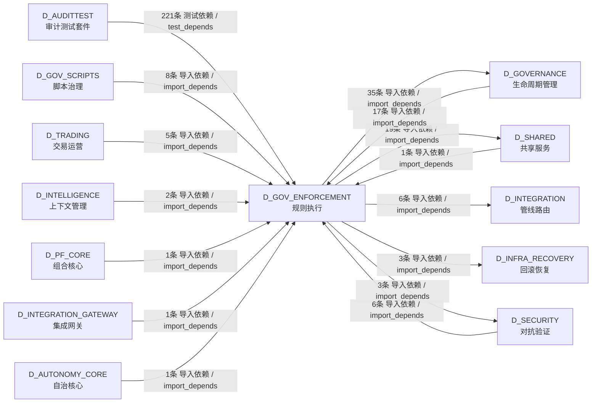

# 35_d_gov_enforcement / rule_enforcement / 规则执行 / Rule Enforcement

> **功能简介 / Overview**: 规则执行，负责治理规则执行和门禁拦截

> **文档作用 / Purpose**: 展示 规则执行（D_GOV_ENFORCEMENT）功能域的模块清单、域内依赖关系、跨域依赖关系、架构分层视图，供架构审查和域治理参考。

> 本文档由 generate_domain_doc.py 从 depgraph (PostgreSQL) 自动生成
> 最后更新: 2026-07-09 04:08:51
> 数据源: depgraph (PostgreSQL) nodes表 + edges表

## 域基本信息 / Domain Overview

| 字段 | 值 | Field | Value |
|------|------|-------|-------|
| 编号 | 35 | Number | 35 |
| 域ID | D_GOV_ENFORCEMENT | Domain ID | D_GOV_ENFORCEMENT |
| 域名称 | 规则执行 | Domain Name | Rule Enforcement |
| 层级 | L2 业务域层 | Layer | L2 Domain |
| 模块数 | 201 | Module Count | 201 |
| 域内依赖 | 226 | Internal Dependencies | 226 |
| 跨域入边 | 263 | Cross-domain Incoming | 263 |
| 跨域出边 | 66 | Cross-domain Outgoing | 66 |
| 设计态模块 | 0 | Design Modules | 0 |
| 原型态模块 | 68 | Prototype Modules | 68 |
| 生产态模块 | 133 | Production Modules | 133 |
| 容量 | 133/150 (正常) | Capacity | 133/150 (正常) |
| 描述 | 门禁引擎流程编排(GatePipeline/GateEngine) | Description | 门禁引擎流程编排(GatePipeline/GateEngine) |

## 模块分层清单 / Module Layered List

> 按 architecture_layer 分组的模块清单（共 201 个模块 / 201 modules）。

### L1 基础层 / Foundation Layer (1 modules)

| # | 模块路径 / Module Path | 模块名称 / Module Name (功能简介 / Description) | 成熟度 / Maturity | 蓝图 / Blueprint |
|:--:|---------|---------|:---:|:---:|
| 1 | docs/01_policies_and_standards/_registry/catalogs/rule_en... | [聚合节点 / Aggregated] 门禁规则集 / Gate Rule Set (83 items) | 生产态 / production |  |
| ↳1 |   ↳ src/zephyr/governance/rule_enforcement/admission/mad... | 对标：Architecture Decision Records (KB 决策记录) + YAGNI principle。 任何新... | - | - |
| ↳2 |   ↳ src/zephyr/governance/rule_enforcement/admission/mad... | 对标：Wardley Mapping + Phase-based delivery。 任何新模块 MUST 证明与当前开发... | - | - |
| ↳3 |   ↳ src/zephyr/governance/rule_enforcement/admission/mad... | 对标：Layer Isolation Principle + ArchUnit fitness functions。 新模块的依赖关... | - | - |
| ↳4 |   ↳ src/zephyr/governance/rule_enforcement/admission/mad... | 对标：Interface Segregation Principle (ISP) + Contract-First Design。 任何新... | - | - |
| ↳5 |   ↳ src/zephyr/governance/rule_enforcement/admission/mad... | 对标：TPL-DEPGRAPH-001 v4.0.0 + project_rules.md 铁律 #7。 依赖图产出物 MUST ... | - | - |
| ↳6 |   ↳ src/zephyr/governance/rule_enforcement/g1_ingest.yaml | Ingest stage admission gate - validates file existence, encoding compliance, ... | - | - |
| ↳7 |   ↳ src/zephyr/governance/rule_enforcement/g2_triage.yaml | Triage stage admission gate - validates classification labels and priority sc... | - | - |
| ↳8 |   ↳ src/zephyr/governance/rule_enforcement/g3_evaluate.yaml | Evaluate stage admission gate - ensures knowledge value score meets threshold... | - | - |
| ↳9 |   ↳ src/zephyr/governance/rule_enforcement/g4_activate.yaml | Activate stage admission gate - ensures dependencies are ready and no conflic... | - | - |
| ↳10 |   ↳ src/zephyr/governance/rule_enforcement/g5_extract.yaml | Extract stage admission gate - ensures extraction templates are ready and tar... | - | - |
| ↳11 |   ↳ src/zephyr/governance/rule_enforcement/g6_blueprint_... | beta hard compliance gate — AI agent MUST read the relevant blueprint BEFORE... | - | - |
| ↳12 |   ↳ src/zephyr/governance/rule_enforcement/g6_ctr_compli... | CTR contract compliance gate - ensures all data through reporting domain modu... | - | - |
| ↳13 |   ↳ src/zephyr/governance/rule_enforcement/g6_path_tree_... | GOV-DOC-004 §四-A 强制门禁 — 文件创建/删除/移动后必须刷新物理路径树快照和路... | - | - |
| ↳14 |   ↳ src/zephyr/governance/rule_enforcement/g7_position_l... | AI 生成的策略配置（D_PORTFOLIO_CORE/D_EXECUTION_CORE 产出）必须尊重 RiskLimit... | - | - |
| ↳15 |   ↳ src/zephyr/governance/rule_enforcement/g7c_cross_gat... | 跨门禁时序一致性校验：检测任务执行期间蓝图版本是否发生变化。 FOR EACH module_... | - | - |
| ↳16 |   ↳ src/zephyr/governance/rule_enforcement/g7d_depth_com... | G7交付门禁通过后的深度合规校验：单元测试覆盖率、依赖CVE、回归测试、lint检查。... | - | - |
| ↳17 |   ↳ src/zephyr/governance/rule_enforcement/g8.yaml | SSoT 一致性门禁——校验每份 blueprint.md 的 frontmatter construction_progress... | - | - |
| ↳18 |   ↳ src/zephyr/governance/rule_enforcement/g8_leverage.yaml | 检查 AI 生成的策略总杠杆（含衍生品）不超过 RiskLimits.max_gross_leverage。 一... | - | - |
| ↳19 |   ↳ src/zephyr/governance/rule_enforcement/g9.yaml | 机械验证四个关键蓝图系统与 Pipeline 的跨模块集成链路。 | - | - |
| ↳20 |   ↳ src/zephyr/governance/rule_enforcement/g9_strategy_c... | 当 AI 生成新策略或修改现有策略时，检查新策略与已有策略的相关性。 防止 AI 产生... | - | - |
| ↳21 |   ↳ src/zephyr/governance/rule_enforcement/g_asset_inven... | 资产盘点系统健康门禁 — 验证 unified-asset-index.yaml 存在且健康评分达标，确... | - | - |
| ↳22 |   ↳ src/zephyr/governance/rule_enforcement/g_forward_ref... | 前向引用检测门禁——检测 class X 定义内部引用 X 自身的模式（前向引用 bug）。 ... | - | - |
| ↳23 |   ↳ src/zephyr/governance/rule_enforcement/g_trae_003.yaml | 自动化门禁：强制执行 TRAE-003（任务粒度与完成门槛协议）规则。将规则从文档约束... | - | - |
| ↳24 |   ↳ src/zephyr/governance/rule_enforcement/g_trae_004.yaml | 自动化门禁：强制执行 TRAE-004（并行执行与原子事务协议）规则。将规则从文档约束... | - | - |
| ↳25 |   ↳ src/zephyr/governance/rule_enforcement/g_trae_006.yaml | 自动化门禁：强制执行 TRAE-006（防幻觉-结构追溯层）规则。将规则从文档约束升级... | - | - |
| ↳26 |   ↳ src/zephyr/governance/rule_enforcement/g_trae_007.yaml | 自动化门禁：强制执行 TRAE-007（防幻觉-行为约束层）规则。将规则从文档约束升级... | - | - |
| ↳27 |   ↳ src/zephyr/governance/rule_enforcement/g_trae_008.yaml | 自动化门禁：强制执行 TRAE-008（防幻觉-输出验证层）规则。将规则从文档约束升级... | - | - |
| ↳28 |   ↳ src/zephyr/governance/rule_enforcement/g_trae_009.yaml | 自动化门禁：强制执行 TRAE-009（防幻觉-安全防护层）规则。将规则从文档约束升级... | - | - |
| ↳29 |   ↳ src/zephyr/governance/rule_enforcement/g_trae_010.yaml | 自动化门禁：强制执行 TRAE-010（代码构建-命名与组织）规则。将规则从文档约束升... | - | - |
| ↳30 |   ↳ src/zephyr/governance/rule_enforcement/g_trae_011.yaml | 自动化门禁：强制执行 TRAE-011（代码构建-类型与导入）规则。将规则从文档约束升... | - | - |
| ↳31 |   ↳ src/zephyr/governance/rule_enforcement/g_trae_012.yaml | 自动化门禁：强制执行 TRAE-012（代码构建-测试与安全）规则。将规则从文档约束升... | - | - |
| ↳32 |   ↳ src/zephyr/governance/rule_enforcement/g_trae_016.yaml | 自动化门禁：强制执行 TRAE-016（架构约束-漂移检测）规则。将规则从文档约束升级... | - | - |
| ↳33 |   ↳ src/zephyr/governance/rule_enforcement/g_trae_017.yaml | 自动化门禁：强制执行 TRAE-017（架构约束-治理顺序）规则。将规则从文档约束升级... | - | - |
| ↳34 |   ↳ src/zephyr/governance/rule_enforcement/g_trae_018.yaml | 自动化门禁：强制执行 TRAE-018（行为边界-代码操作绝对禁止）规则。将规则从文档... | - | - |
| ↳35 |   ↳ src/zephyr/governance/rule_enforcement/g_trae_020.yaml | 自动化门禁：强制执行 TRAE-020（行为边界-治理纪律绝对禁止）规则。将规则从文档... | - | - |
| ↳36 |   ↳ src/zephyr/governance/rule_enforcement/g_trae_021.yaml | 自动化门禁：强制执行 TRAE-021（行为边界-其余绝对禁止）规则。将规则从文档约束... | - | - |
| ↳37 |   ↳ src/zephyr/governance/rule_enforcement/g_trae_022.yaml | 自动化门禁：强制执行 TRAE-022（行为边界-条件禁止(代码与安全)）规则。将规则从... | - | - |
| ↳38 |   ↳ src/zephyr/governance/rule_enforcement/g_trae_023.yaml | 自动化门禁：强制执行 TRAE-023（行为边界-条件禁止(治理与文档)）规则。将规则从... | - | - |
| ↳39 |   ↳ src/zephyr/governance/rule_enforcement/g_trae_024.yaml | 自动化门禁：强制执行 TRAE-024（方法论-诊断与根因分析）规则。将规则从文档约束... | - | - |
| ↳40 |   ↳ src/zephyr/governance/rule_enforcement/g_trae_025.yaml | 自动化门禁：强制执行 TRAE-025（方法论-决策与执行）规则。将规则从文档约束升级... | - | - |
| ↳41 |   ↳ src/zephyr/governance/rule_enforcement/g_trae_026.yaml | 自动化门禁：强制执行 TRAE-026（方法论-质量与度量）规则。将规则从文档约束升级... | - | - |
| ↳42 |   ↳ src/zephyr/governance/rule_enforcement/g_trae_027.yaml | 自动化门禁：强制执行 TRAE-027（方法论-协作与演进）规则。将规则从文档约束升级... | - | - |
| ↳43 |   ↳ src/zephyr/governance/rule_enforcement/g_trae_028.yaml | 自动化门禁：强制执行 TRAE-028（文档治理-结构与命名）规则。将规则从文档约束升... | - | - |
| ↳44 |   ↳ src/zephyr/governance/rule_enforcement/g_trae_029.yaml | 自动化门禁：强制执行 TRAE-029（文档治理-操作安全）规则。将规则从文档约束升级... | - | - |
| ↳45 |   ↳ src/zephyr/governance/rule_enforcement/g_trae_030.yaml | 自动化门禁：强制执行 TRAE-030（文档治理-编号与元数据）规则。将规则从文档约束... | - | - |
| ↳46 |   ↳ src/zephyr/governance/rule_enforcement/g_trae_031.yaml | 自动化门禁：强制执行 TRAE-031（安全治理-密钥与访问控制）规则。将规则从文档约... | - | - |
| ↳47 |   ↳ src/zephyr/governance/rule_enforcement/g_trae_032.yaml | 自动化门禁：强制执行 TRAE-032（模块治理-准入与生命周期）规则。将规则从文档约... | - | - |
| ↳48 |   ↳ src/zephyr/governance/rule_enforcement/g_trae_033.yaml | 自动化门禁：强制执行 TRAE-033（模块治理-注册与同步）规则。将规则从文档约束升... | - | - |
| ↳49 |   ↳ src/zephyr/governance/rule_enforcement/g_trae_034.yaml | 自动化门禁：强制执行 TRAE-034（任务系统-卡片标准与生命周期）规则。将规则从文... | - | - |
| ↳50 |   ↳ src/zephyr/governance/rule_enforcement/g_trae_035.yaml | 自动化门禁：强制执行 TRAE-035（任务系统-施工与验证）规则。将规则从文档约束升... | - | - |
| ↳51 |   ↳ src/zephyr/governance/rule_enforcement/g_trae_036.yaml | 自动化门禁：强制执行 TRAE-036（架构治理-门禁与过渡）规则。将规则从文档约束升... | - | - |
| ↳52 |   ↳ src/zephyr/governance/rule_enforcement/g_trae_037.yaml | 自动化门禁：强制执行 TRAE-037（架构治理-合格与版本化）规则。将规则从文档约束... | - | - |
| ↳53 |   ↳ src/zephyr/governance/rule_enforcement/g_trae_038.yaml | 自动化门禁：强制执行 TRAE-038（架构治理-CTR注入规则）规则。将规则从文档约束升... | - | - |
| ↳54 |   ↳ src/zephyr/governance/rule_enforcement/g_trae_039.yaml | 自动化门禁：强制执行 TRAE-039（AI治理-幻觉检测与自检）规则。将规则从文档约束... | - | - |
| ↳55 |   ↳ src/zephyr/governance/rule_enforcement/g_trae_040.yaml | 自动化门禁：强制执行 TRAE-040（AI治理-模型路由与协作）规则。将规则从文档约束... | - | - |
| ↳56 |   ↳ src/zephyr/governance/rule_enforcement/g_trae_041.yaml | 自动化门禁：强制执行 TRAE-041（元规则-规则分类与裁决）规则。将规则从文档约束... | - | - |
| ↳57 |   ↳ src/zephyr/governance/rule_enforcement/g_trae_042.yaml | 自动化门禁：强制执行 TRAE-042（元规则-标准体系与模板）规则。将规则从文档约束... | - | - |
| ↳58 |   ↳ src/zephyr/governance/rule_enforcement/g_trae_043.yaml | 自动化门禁：强制执行 TRAE-043（元规则-元数据与度量）规则。将规则从文档约束升... | - | - |
| ↳59 |   ↳ src/zephyr/governance/rule_enforcement/g_trae_044.yaml | 自动化门禁：强制执行 TRAE-044（合规治理-审计与监管）规则。将规则从文档约束升... | - | - |
| ↳60 |   ↳ src/zephyr/governance/rule_enforcement/g_trae_045.yaml | 自动化门禁：强制执行 TRAE-045（数据治理-质量与血缘）规则。将规则从文档约束升... | - | - |
| ↳61 |   ↳ src/zephyr/governance/rule_enforcement/g_trae_046.yaml | 自动化门禁：强制执行 TRAE-046（工程治理-代码重组安全）规则。将规则从文档约束... | - | - |
| ↳62 |   ↳ src/zephyr/governance/rule_enforcement/g_trae_047.yaml | 自动化门禁：强制执行 TRAE-047（工程治理-文件头部与扩展）规则。将规则从文档约... | - | - |
| ↳63 |   ↳ src/zephyr/governance/rule_enforcement/g_trae_048.yaml | 自动化门禁：强制执行 TRAE-048（操作-Vibe Coding会话管理）规则。将规则从文档约... | - | - |
| ↳64 |   ↳ src/zephyr/governance/rule_enforcement/g_trae_049.yaml | 自动化门禁：强制执行 TRAE-049（操作-领域操作手册）规则。将规则从文档约束升级... | - | - |
| ↳65 |   ↳ src/zephyr/governance/rule_enforcement/g_trae_050.yaml | 自动化门禁：强制执行 TRAE-050（域策略-数据源与因子层）规则。将规则从文档约束... | - | - |
| ↳66 |   ↳ src/zephyr/governance/rule_enforcement/g_trae_051.yaml | 自动化门禁：强制执行 TRAE-051（域策略-风控与盘后层）规则。将规则从文档约束升... | - | - |
| ↳67 |   ↳ src/zephyr/governance/rule_enforcement/g_trae_052.yaml | 自动化门禁：强制执行 TRAE-052（铁律补充-跨蓝图变更与项目瘦身）规则。将规则从... | - | - |
| ↳68 |   ↳ src/zephyr/governance/rule_enforcement/g_trae_053.yaml | 自动化门禁：强制执行 TRAE-053（铁律补充-自动化双轨判定）规则。将规则从文档约... | - | - |
| ↳69 |   ↳ src/zephyr/governance/rule_enforcement/g_trae_054.yaml | 自动化门禁：强制执行 TRAE-054（depgraph 程序化访问协议）规则。将规则从文档约... | - | - |
| ↳70 |   ↳ src/zephyr/governance/rule_enforcement/g_trae_055.yaml | 自动化门禁：强制执行 TRAE-055（架构容量与域治理规则）规则。将规则从文档约束升... | - | - |
| ↳71 |   ↳ src/zephyr/governance/rule_enforcement/g_trae_059.yaml | 自动化门禁：强制执行 TRAE-059（_schema_version 写入保护规范）。 两层检查：(1)... | - | - |
| ↳72 |   ↳ src/zephyr/governance/rule_enforcement/gate_dedup.yaml | 代码去重门禁——每次 GateEngine.evaluate("GATE-DEDUP") 触发时， 调用 code_ded... | - | - |
| ↳73 |   ↳ src/zephyr/governance/rule_enforcement/gct_024_budge... |  | - | - |
| ↳74 |   ↳ src/zephyr/governance/rule_enforcement/invariants/en... | 扫描 14 层 + shared/contracts 的全部 Python 导入，构建依赖 DAG， Kahn's algor... | - | - |
| ↳75 |   ↳ src/zephyr/governance/rule_enforcement/invariants/en... | 读取 cross_layer_contracts.yaml，验证每条 P0 契约均声明了 enforcement （enfor... | - | - |
| ↳76 |   ↳ src/zephyr/governance/rule_enforcement/invariants/en... | 读取 cross_layer_contracts.yaml 中的字段定义，与 codegen 生成的 Python datacl... | - | - |
| ↳77 |   ↳ src/zephyr/governance/rule_enforcement/observability... | Phase 1 observability baseline gate — validates System Telemetry (MOD-INF-01... | - | - |
| ↳78 |   ↳ src/zephyr/governance/rule_enforcement/post_doc_revi... | Session 关门时审查本次 session 修改的文档+蓝图/规则， 按 trae_030 §0 时态判... | - | - |
| ↳79 |   ↳ src/zephyr/governance/rule_enforcement/sys_master_co... | 系统总蓝图合规门禁——验证 SYS-MASTER-001（三级金字塔顶点）与 MOD-MASTER-001 ... | - | - |
| ↳80 |   ↳ src/zephyr/governance/rule_enforcement/task/g0_entry... | G0 是所有任务（AI Agent 任务 + 人工作业）进入 ZephyrAlpha 工作流系统 的强制性... | - | - |
| ↳81 |   ↳ src/zephyr/governance/rule_enforcement/task/g0_orc_g... | 任务进入执行队列前的可自动化校验：priority 枚举、核心字段非空、task_id 正则。... | - | - |
| ↳82 |   ↳ src/zephyr/governance/rule_enforcement/task/g7_orc_g... | 收尾校验：TaskCard.verification_status=verified；audit_findings 全部 resolved... | - | - |
| ↳83 |   ↳ src/zephyr/governance/rule_enforcement/zero_residue.yaml | 零残留原则自动化执行层——每次 GateEngine.evaluate("ZERO-RESIDUE") 触发时， ... | - | - |

### L2 领域层 / Domain Layer (200 modules)

| # | 模块路径 / Module Path | 模块名称 / Module Name (功能简介 / Description) | 成熟度 / Maturity | 蓝图 / Blueprint |
|:--:|---------|---------|:---:|:---:|
| 1 | src/zephyr/compliance/__init__.py | D_COMPLIANCE Compliance — Re-export wrapper (D... | 原型态 / prototype | [MOD-L10-001](../../03_modules/_domain_compliance/blueprint.md) |
| 2 | src/zephyr/compliance/_extensions/__init__.py | __init__.py | 原型态 / prototype |  |
| 3 | src/zephyr/compliance/aisg_sandbox.py | Re-export wrapper: aisg_sandbox has migrated to... | 原型态 / prototype | [MOD-L10-001](../../03_modules/_domain_compliance/blueprint.md) |
| 4 | src/zephyr/compliance/api/__init__.py | __init__.py | 原型态 / prototype |  |
| 5 | src/zephyr/compliance/artifact_scanner.py | Re-export wrapper: artifact_scanner has migrate... | 原型态 / prototype | [MOD-L10-001](../../03_modules/_domain_compliance/blueprint.md) |
| 6 | src/zephyr/compliance/audit_orchestrator/__init__.py | Re-export wrapper: audit-orchestrator has migra... | 原型态 / prototype |  |
| 7 | src/zephyr/compliance/audit_trail/__init__.py | Re-export wrapper: audit-trail has migrated to ... | 原型态 / prototype |  |
| 8 | src/zephyr/compliance/audit_trail/bridges/__init__.py | Audit Trail — MOD-INF-020 | 原型态 / prototype | [MOD-INF-020](../../03_modules/_domain_governance/audit_trail/blueprint.md) |
| 9 | src/zephyr/compliance/behavioral_admission/__init__.py | Re-export wrapper: behavioral-admission has mig... | 原型态 / prototype |  |
| 10 | src/zephyr/compliance/behavioral_auditor/__init__.py | Re-export wrapper: behavioral-auditor has migra... | 原型态 / prototype |  |
| 11 | src/zephyr/compliance/compliance_gate_a6/__init__.py | Re-export wrapper: compliance_gate_a6 has migra... | 原型态 / prototype |  |
| 12 | src/zephyr/compliance/compliance_manager.py | Re-export wrapper: compliance_manager has migra... | 原型态 / prototype | [MOD-L10-001](../../03_modules/_domain_compliance/blueprint.md) |
| 13 | src/zephyr/compliance/core/__init__.py | __init__.py | 原型态 / prototype |  |
| 14 | src/zephyr/compliance/default_security_gateway.py | default_security_gateway.py | 原型态 / prototype | [MOD-L10-001](../../03_modules/_domain_compliance/blueprint.md) |
| 15 | src/zephyr/compliance/evidence_pack.py | Re-export wrapper: evidence_pack has migrated t... | 原型态 / prototype | [MOD-L10-001](../../03_modules/_domain_compliance/blueprint.md) |
| 16 | src/zephyr/compliance/financial_compliance.py | Re-export wrapper: financial_compliance has mig... | 原型态 / prototype | [MOD-L10-001](../../03_modules/_domain_compliance/blueprint.md) |
| 17 | src/zephyr/compliance/implementations/__init__.py | Re-export wrapper: implementations has migrated... | 原型态 / prototype |  |
| 18 | src/zephyr/compliance/infrastructure/__init__.py | __init__.py | 原型态 / prototype |  |
| 19 | src/zephyr/compliance/integrity.py | Re-export wrapper: integrity has migrated to ze... | 原型态 / prototype | [MOD-L10-001](../../03_modules/_domain_compliance/blueprint.md) |
| 20 | src/zephyr/compliance/merkle_hourly.py | Re-export wrapper: merkle_hourly has migrated t... | 原型态 / prototype | [MOD-L10-001](../../03_modules/_domain_compliance/blueprint.md) |
| 21 | src/zephyr/compliance/models/__init__.py | __init__.py | 原型态 / prototype |  |
| 22 | src/zephyr/compliance/security_gateway_base.py | security_gateway_base.py | 原型态 / prototype | [MOD-L10-001](../../03_modules/_domain_compliance/blueprint.md) |
| 23 | src/zephyr/compliance/services/__init__.py | __init__.py | 原型态 / prototype |  |
| 24 | src/zephyr/compliance/zero_knowledge_audit_stub/__init__.py | Re-export wrapper: zero_knowledge_audit_stub ha... | 原型态 / prototype |  |
| 25 | src/zephyr/governance/rule_enforcement/__init__.py | ZephyrAlpha 门禁子包 | 生产态 / production | [MOD-GATE_ENGINE](../../03_modules/_cross_layer/gate_engine/blueprint.md) |
| 26 | src/zephyr/governance/rule_enforcement/_template.yaml | <一句话职责描述，≤200字> | 生产态 / production | [MOD-GATE_ENGINE](../../03_modules/_cross_layer/gate_engine/blueprint.md) |
| 27 | src/zephyr/governance/rule_enforcement/adaptive_threshold.py | 自适应阈值——从历史 FAIL/PASS 数据学习门禁参数... | 生产态 / production | [MOD-GATE_ENGINE](../../03_modules/_cross_layer/gate_engine/blueprint.md) |
| 28 | src/zephyr/governance/rule_enforcement/admission/__init__.py | ZephyrAlpha — gates/admission/ — 模块准入门禁... | 原型态 / prototype | [MOD-GATE_ENGINE](../../03_modules/_cross_layer/gate_engine/blueprint.md) |
| 29 | src/zephyr/governance/rule_enforcement/admission/mad_001_... | 对标：Architecture Decision Records (KB 决策记... | 生产态 / production | [MOD-GATE_ENGINE](../../03_modules/_cross_layer/gate_engine/blueprint.md) |
| 30 | src/zephyr/governance/rule_enforcement/admission/mad_002_... | 对标：Wardley Mapping + Phase-based delivery。 ... | 生产态 / production | [MOD-GATE_ENGINE](../../03_modules/_cross_layer/gate_engine/blueprint.md) |
| 31 | src/zephyr/governance/rule_enforcement/admission/mad_003_... | 对标：Layer Isolation Principle + ArchUnit fitn... | 生产态 / production | [MOD-GATE_ENGINE](../../03_modules/_cross_layer/gate_engine/blueprint.md) |
| 32 | src/zephyr/governance/rule_enforcement/admission/mad_004_... | 对标：Interface Segregation Principle (ISP) + C... | 生产态 / production | [MOD-GATE_ENGINE](../../03_modules/_cross_layer/gate_engine/blueprint.md) |
| 33 | src/zephyr/governance/rule_enforcement/admission/mad_005_... | 对标：TPL-DEPGRAPH-001 v4.0.0 + project_rules.m... | 生产态 / production | [MOD-GATE_ENGINE](../../03_modules/_cross_layer/gate_engine/blueprint.md) |
| 34 | src/zephyr/governance/rule_enforcement/adversarial_strate... | Adversarial sample generator and 5 attack strat... | 生产态 / production | [MOD-GATE_ENGINE](../../03_modules/_cross_layer/gate_engine/blueprint.md) |
| 35 | src/zephyr/governance/rule_enforcement/ai_capability_guar... | ZephyrAlpha — gates/ai_capability_guard.py | 生产态 / production | [MOD-GATE_ENGINE](../../03_modules/_cross_layer/gate_engine/blueprint.md) |
| 36 | src/zephyr/governance/rule_enforcement/anti_pattern_guard.py | Anti-Patterns 防护引擎（Anti-Pattern Guard） | 生产态 / production | [MOD-GATE_ENGINE](../../03_modules/_cross_layer/gate_engine/blueprint.md) |
| 37 | src/zephyr/governance/rule_enforcement/approval.py | G-CT-004 — Backward-compat re-export of Approv... | 生产态 / production | [MOD-INF-022](../../03_modules/_domain_autonomy_perm/escalation_protocol/blueprint.md) |
| 38 | src/zephyr/governance/rule_enforcement/audit_chain_verifi... | 审计链验证工具——独立重放门禁判定+Hash链完整性... | 生产态 / production | [MOD-GATE_ENGINE](../../03_modules/_cross_layer/gate_engine/blueprint.md) |
| 39 | src/zephyr/governance/rule_enforcement/breaking_change_de... | Breaking Change 检测器（GATE-CDC-2）——字段删... | 生产态 / production | [MOD-GATE_ENGINE](../../03_modules/_cross_layer/gate_engine/blueprint.md) |
| 40 | src/zephyr/governance/rule_enforcement/can_i_deploy.py | Can-I-Deploy 预部署门禁（GATE-CDC-1） | 生产态 / production | [MOD-GATE_ENGINE](../../03_modules/_cross_layer/gate_engine/blueprint.md) |
| 41 | src/zephyr/governance/rule_enforcement/capability_checker.py | 能力检查器（Capability Checker） | 生产态 / production | [MOD-GATE_ENGINE](../../03_modules/_cross_layer/gate_engine/blueprint.md) |
| 42 | src/zephyr/governance/rule_enforcement/cbac_matrix.py | CBAC 能力矩阵（Capability-Based Access Control ... | 生产态 / production | [MOD-GATE_ENGINE](../../03_modules/_cross_layer/gate_engine/blueprint.md) |
| 43 | src/zephyr/governance/rule_enforcement/cdc_broker.py | CDC 契约经纪人（Consumer-Driven Contract Broker... | 生产态 / production | [MOD-GATE_ENGINE](../../03_modules/_cross_layer/gate_engine/blueprint.md) |
| 44 | src/zephyr/governance/rule_enforcement/check_types/__init... | [INVARIANTS] MOD-GATE_ENGINE 门禁 exit code 不... | 原型态 / prototype | [MOD-GATE_ENGINE](../../03_modules/_cross_layer/gate_engine/blueprint.md) |
| 45 | src/zephyr/governance/rule_enforcement/check_types/advers... | AdversarialValidation check type handler — reg... | 原型态 / prototype | [MOD-GATE_ENGINE](../../03_modules/_cross_layer/gate_engine/blueprint.md) |
| 46 | src/zephyr/governance/rule_enforcement/check_types/check_... | CheckTypeHandler — CheckTypeHandler | 生产态 / production | [MOD-GATE_ENGINE](../../03_modules/_cross_layer/gate_engine/blueprint.md) |
| 47 | src/zephyr/governance/rule_enforcement/check_types/ct_aud... | AuditFindingsResolvedHandler — AuditFindingsRe... | 原型态 / prototype | [MOD-GATE_ENGINE](../../03_modules/_cross_layer/gate_engine/blueprint.md) |
| 48 | src/zephyr/governance/rule_enforcement/check_types/ct_blu... | BlueprintReadCheckHandler — BlueprintReadCheck... | 原型态 / prototype | [MOD-GATE_ENGINE](../../03_modules/_cross_layer/gate_engine/blueprint.md) |
| 49 | src/zephyr/governance/rule_enforcement/check_types/ct_cir... | CircuitBreakerHandler — CircuitBreakerHandler | 原型态 / prototype | [MOD-GATE_ENGINE](../../03_modules/_cross_layer/gate_engine/blueprint.md) |
| 50 | src/zephyr/governance/rule_enforcement/check_types/ct_cir... | CircularDependencyScanHandler — CircularDepend... | 原型态 / prototype | [MOD-GATE_ENGINE](../../03_modules/_cross_layer/gate_engine/blueprint.md) |
| 51 | src/zephyr/governance/rule_enforcement/check_types/ct_cla... | ClassificationHandler — ClassificationHandler | 原型态 / prototype | [MOD-GATE_ENGINE](../../03_modules/_cross_layer/gate_engine/blueprint.md) |
| 52 | src/zephyr/governance/rule_enforcement/check_types/ct_con... | ContentLengthHandler — ContentLengthHandler | 原型态 / prototype | [MOD-GATE_ENGINE](../../03_modules/_cross_layer/gate_engine/blueprint.md) |
| 53 | src/zephyr/governance/rule_enforcement/check_types/ct_con... | ContentQualityHandler — ContentQualityHandler | 原型态 / prototype | [MOD-GATE_ENGINE](../../03_modules/_cross_layer/gate_engine/blueprint.md) |
| 54 | src/zephyr/governance/rule_enforcement/check_types/ct_con... | ContractCompatibilityCheckHandler — ContractCo... | 原型态 / prototype | [MOD-GATE_ENGINE](../../03_modules/_cross_layer/gate_engine/blueprint.md) |
| 55 | src/zephyr/governance/rule_enforcement/check_types/ct_ded... | ct_deduplication.py | 原型态 / prototype | [MOD-GATE_ENGINE](../../03_modules/_cross_layer/gate_engine/blueprint.md) |
| 56 | src/zephyr/governance/rule_enforcement/check_types/ct_dri... | ct_drift_budget.py | 原型态 / prototype | [MOD-GATE_ENGINE](../../03_modules/_cross_layer/gate_engine/blueprint.md) |
| 57 | src/zephyr/governance/rule_enforcement/check_types/ct_enc... | EncodingHandler — EncodingHandler | 原型态 / prototype | [MOD-GATE_ENGINE](../../03_modules/_cross_layer/gate_engine/blueprint.md) |
| 58 | src/zephyr/governance/rule_enforcement/check_types/ct_enf... | EnforcementModeCheckHandler — EnforcementModeC... | 原型态 / prototype | [MOD-GATE_ENGINE](../../03_modules/_cross_layer/gate_engine/blueprint.md) |
| 59 | src/zephyr/governance/rule_enforcement/check_types/ct_fie... | FieldPresenceHandler — FieldPresenceHandler | 原型态 / prototype | [MOD-GATE_ENGINE](../../03_modules/_cross_layer/gate_engine/blueprint.md) |
| 60 | src/zephyr/governance/rule_enforcement/check_types/ct_fil... | FileExtensionHandler — FileExtensionHandler | 原型态 / prototype | [MOD-GATE_ENGINE](../../03_modules/_cross_layer/gate_engine/blueprint.md) |
| 61 | src/zephyr/governance/rule_enforcement/check_types/ct_fle... | FleGateHandler — FleGateHandler | 原型态 / prototype | [MOD-GATE_ENGINE](../../03_modules/_cross_layer/gate_engine/blueprint.md) |
| 62 | src/zephyr/governance/rule_enforcement/check_types/ct_fro... | FrontmatterHandler — FrontmatterHandler | 原型态 / prototype | [MOD-GATE_ENGINE](../../03_modules/_cross_layer/gate_engine/blueprint.md) |
| 63 | src/zephyr/governance/rule_enforcement/check_types/ct_lev... | LeverageLimitHandler — LeverageLimitHandler | 原型态 / prototype | [MOD-GATE_ENGINE](../../03_modules/_cross_layer/gate_engine/blueprint.md) |
| 64 | src/zephyr/governance/rule_enforcement/check_types/ct_lin... | LineEndingHandler — LineEndingHandler | 原型态 / prototype | [MOD-GATE_ENGINE](../../03_modules/_cross_layer/gate_engine/blueprint.md) |
| 65 | src/zephyr/governance/rule_enforcement/check_types/ct_man... | ManualApprovalHandler — ManualApprovalHandler | 原型态 / prototype | [MOD-GATE_ENGINE](../../03_modules/_cross_layer/gate_engine/blueprint.md) |
| 66 | src/zephyr/governance/rule_enforcement/check_types/ct_pat... | PathBlacklistHandler — PathBlacklistHandler | 原型态 / prototype | [MOD-GATE_ENGINE](../../03_modules/_cross_layer/gate_engine/blueprint.md) |
| 67 | src/zephyr/governance/rule_enforcement/check_types/ct_pat... | PathRoutingHandler — PathRoutingHandler | 原型态 / prototype | [MOD-GATE_ENGINE](../../03_modules/_cross_layer/gate_engine/blueprint.md) |
| 68 | src/zephyr/governance/rule_enforcement/check_types/ct_pat... | PathWhitelistHandler — PathWhitelistHandler | 原型态 / prototype | [MOD-GATE_ENGINE](../../03_modules/_cross_layer/gate_engine/blueprint.md) |
| 69 | src/zephyr/governance/rule_enforcement/check_types/ct_pos... | PositionLimitHandler — PositionLimitHandler | 原型态 / prototype | [MOD-GATE_ENGINE](../../03_modules/_cross_layer/gate_engine/blueprint.md) |
| 70 | src/zephyr/governance/rule_enforcement/check_types/ct_ref... | ReferenceCheckHandler — ReferenceCheckHandler | 原型态 / prototype | [MOD-GATE_ENGINE](../../03_modules/_cross_layer/gate_engine/blueprint.md) |
| 71 | src/zephyr/governance/rule_enforcement/check_types/ct_reg... | RegexPatternHandler — RegexPatternHandler | 原型态 / prototype | [MOD-GATE_ENGINE](../../03_modules/_cross_layer/gate_engine/blueprint.md) |
| 72 | src/zephyr/governance/rule_enforcement/check_types/ct_res... | ct_restructuring_safety.py | 原型态 / prototype | [MOD-GATE_ENGINE](../../03_modules/_cross_layer/gate_engine/blueprint.md) |
| 73 | src/zephyr/governance/rule_enforcement/check_types/ct_rol... | RollbackExitCodeHandler — RollbackExitCodeHandler | 原型态 / prototype | [MOD-GATE_ENGINE](../../03_modules/_cross_layer/gate_engine/blueprint.md) |
| 74 | src/zephyr/governance/rule_enforcement/check_types/ct_sco... | ScoreThresholdHandler — ScoreThresholdHandler | 原型态 / prototype | [MOD-GATE_ENGINE](../../03_modules/_cross_layer/gate_engine/blueprint.md) |
| 75 | src/zephyr/governance/rule_enforcement/check_types/ct_sec... | SecurityArtifactScanHandler — SecurityArtifact... | 原型态 / prototype | [MOD-GATE_ENGINE](../../03_modules/_cross_layer/gate_engine/blueprint.md) |
| 76 | src/zephyr/governance/rule_enforcement/check_types/ct_str... | StrategyCorrelationHandler — StrategyCorrelati... | 原型态 / prototype | [MOD-GATE_ENGINE](../../03_modules/_cross_layer/gate_engine/blueprint.md) |
| 77 | src/zephyr/governance/rule_enforcement/check_types/ct_tem... | TemporalHandler — TemporalHandler | 原型态 / prototype | [MOD-GATE_ENGINE](../../03_modules/_cross_layer/gate_engine/blueprint.md) |
| 78 | src/zephyr/governance/rule_enforcement/check_types/ct_zer... | ZeroResidueCheckHandler — ZeroResidueCheckHandler | 原型态 / prototype | [MOD-GATE_ENGINE](../../03_modules/_cross_layer/gate_engine/blueprint.md) |
| 79 | src/zephyr/governance/rule_enforcement/circuit_breaker.py | CircuitBreakerGateway (CBG) — 模块间调用单向熔断器 | 生产态 / production | [MOD-GATE_ENGINE](../../03_modules/_cross_layer/gate_engine/blueprint.md) |
| 80 | src/zephyr/governance/rule_enforcement/compliance_rule.py | Re-export shim — ComplianceRule 真源已合并至 z... | 原型态 / prototype | [MOD-INF-016](../../03_modules/_cross_layer/shared_core/blueprint.md) |
| 81 | src/zephyr/governance/rule_enforcement/contract_template_... | ContractTemplateManager: manage MCP tool contra... | 生产态 / production | [MOD-GATE_ENGINE](../../03_modules/_cross_layer/gate_engine/blueprint.md) |
| 82 | src/zephyr/governance/rule_enforcement/default_quality_ga... | D_DATA — Default Data Quality Gate | 生产态 / production | [MOD-L00-001](../../03_modules/_domain_data/blueprint.md) |
| 83 | src/zephyr/governance/rule_enforcement/dlq_retry_policy.py | DLQ 重试策略 — 指数退避自动重试 | 原型态 / prototype | [SH-DB-001](../../03_modules/_cross_layer/database/blueprint.md) |
| 84 | src/zephyr/governance/rule_enforcement/drift_detector.py | Gate-side Drift Detector Recovery — zephyr.gov... | 原型态 / prototype | [MOD-GATE_ENGINE](../../03_modules/_cross_layer/gate_engine/blueprint.md) |
| 85 | src/zephyr/governance/rule_enforcement/end_to_end_walkthr... | 端到端场景走查验证器（End-to-End Walkthrough Va... | 生产态 / production | [MOD-GATE_ENGINE](../../03_modules/_cross_layer/gate_engine/blueprint.md) |
| 86 | src/zephyr/governance/rule_enforcement/g1_ingest.yaml | Ingest stage admission gate - validates file ex... | 生产态 / production | [MOD-GATE_ENGINE](../../03_modules/_cross_layer/gate_engine/blueprint.md) |
| 87 | src/zephyr/governance/rule_enforcement/g2_triage.yaml | Triage stage admission gate - validates classif... | 生产态 / production | [MOD-GATE_ENGINE](../../03_modules/_cross_layer/gate_engine/blueprint.md) |
| 88 | src/zephyr/governance/rule_enforcement/g3_evaluate.yaml | Evaluate stage admission gate - ensures knowled... | 生产态 / production | [MOD-GATE_ENGINE](../../03_modules/_cross_layer/gate_engine/blueprint.md) |
| 89 | src/zephyr/governance/rule_enforcement/g4_activate.yaml | Activate stage admission gate - ensures depende... | 生产态 / production | [MOD-GATE_ENGINE](../../03_modules/_cross_layer/gate_engine/blueprint.md) |
| 90 | src/zephyr/governance/rule_enforcement/g5_extract.yaml | Extract stage admission gate - ensures extracti... | 生产态 / production | [MOD-GATE_ENGINE](../../03_modules/_cross_layer/gate_engine/blueprint.md) |
| 91 | src/zephyr/governance/rule_enforcement/g6_blueprint_compl... | beta hard compliance gate — AI agent MUST read... | 生产态 / production | [MOD-GATE_ENGINE](../../03_modules/_cross_layer/gate_engine/blueprint.md) |
| 92 | src/zephyr/governance/rule_enforcement/g6_ctr_compliance.... | CTR contract compliance gate - ensures all data... | 生产态 / production | [MOD-GATE_ENGINE](../../03_modules/_cross_layer/gate_engine/blueprint.md) |
| 93 | src/zephyr/governance/rule_enforcement/g6_path_tree_fresh... | GOV-DOC-004 §四-A 强制门禁 — 文件创建/删除/移... | 生产态 / production | [MOD-GATE_ENGINE](../../03_modules/_cross_layer/gate_engine/blueprint.md) |
| 94 | src/zephyr/governance/rule_enforcement/g7_position_limits... | AI 生成的策略配置（D_PORTFOLIO_CORE/D_EXECUTION... | 生产态 / production | [MOD-GATE_ENGINE](../../03_modules/_cross_layer/gate_engine/blueprint.md) |
| 95 | src/zephyr/governance/rule_enforcement/g7c_cross_gate_con... | 跨门禁时序一致性校验：检测任务执行期间蓝图版本... | 生产态 / production | [MOD-GATE_ENGINE](../../03_modules/_cross_layer/gate_engine/blueprint.md) |
| 96 | src/zephyr/governance/rule_enforcement/g7d_depth_complian... | G7交付门禁通过后的深度合规校验：单元测试覆盖率... | 生产态 / production | [MOD-GATE_ENGINE](../../03_modules/_cross_layer/gate_engine/blueprint.md) |
| 97 | src/zephyr/governance/rule_enforcement/g8.yaml | SSoT 一致性门禁——校验每份 blueprint.md 的 fro... | 生产态 / production | [MOD-GATE_ENGINE](../../03_modules/_cross_layer/gate_engine/blueprint.md) |
| 98 | src/zephyr/governance/rule_enforcement/g8_leverage.yaml | 检查 AI 生成的策略总杠杆（含衍生品）不超过 Risk... | 生产态 / production | [MOD-GATE_ENGINE](../../03_modules/_cross_layer/gate_engine/blueprint.md) |
| 99 | src/zephyr/governance/rule_enforcement/g9.yaml | 机械验证四个关键蓝图系统与 Pipeline 的跨模块集... | 生产态 / production | [MOD-GATE_ENGINE](../../03_modules/_cross_layer/gate_engine/blueprint.md) |
| 100 | src/zephyr/governance/rule_enforcement/g9_strategy_correl... | 当 AI 生成新策略或修改现有策略时，检查新策略与... | 生产态 / production | [MOD-GATE_ENGINE](../../03_modules/_cross_layer/gate_engine/blueprint.md) |
| 101 | src/zephyr/governance/rule_enforcement/g_asset_inventory.... | 资产盘点系统健康门禁 — 验证 unified-asset-inde... | 生产态 / production | [MOD-GATE_ENGINE](../../03_modules/_cross_layer/gate_engine/blueprint.md) |
| 102 | src/zephyr/governance/rule_enforcement/g_forward_referenc... | 前向引用检测门禁——检测 class X 定义内部引用 X... | 生产态 / production | [MOD-GATE_ENGINE](../../03_modules/_cross_layer/gate_engine/blueprint.md) |
| 103 | src/zephyr/governance/rule_enforcement/g_trae_003.yaml | 自动化门禁：强制执行 TRAE-003（任务粒度与完成门... | 生产态 / production |  |
| 104 | src/zephyr/governance/rule_enforcement/g_trae_004.yaml | 自动化门禁：强制执行 TRAE-004（并行执行与原子事... | 生产态 / production |  |
| 105 | src/zephyr/governance/rule_enforcement/g_trae_006.yaml | 自动化门禁：强制执行 TRAE-006（防幻觉-结构追溯... | 生产态 / production |  |
| 106 | src/zephyr/governance/rule_enforcement/g_trae_007.yaml | 自动化门禁：强制执行 TRAE-007（防幻觉-行为约束... | 生产态 / production |  |
| 107 | src/zephyr/governance/rule_enforcement/g_trae_008.yaml | 自动化门禁：强制执行 TRAE-008（防幻觉-输出验证... | 生产态 / production |  |
| 108 | src/zephyr/governance/rule_enforcement/g_trae_009.yaml | 自动化门禁：强制执行 TRAE-009（防幻觉-安全防护... | 生产态 / production |  |
| 109 | src/zephyr/governance/rule_enforcement/g_trae_010.yaml | 自动化门禁：强制执行 TRAE-010（代码构建-命名与... | 生产态 / production |  |
| 110 | src/zephyr/governance/rule_enforcement/g_trae_011.yaml | 自动化门禁：强制执行 TRAE-011（代码构建-类型与... | 生产态 / production |  |
| 111 | src/zephyr/governance/rule_enforcement/g_trae_012.yaml | 自动化门禁：强制执行 TRAE-012（代码构建-测试与... | 生产态 / production |  |
| 112 | src/zephyr/governance/rule_enforcement/g_trae_016.yaml | 自动化门禁：强制执行 TRAE-016（架构约束-漂移检... | 生产态 / production |  |
| 113 | src/zephyr/governance/rule_enforcement/g_trae_017.yaml | 自动化门禁：强制执行 TRAE-017（架构约束-治理顺... | 生产态 / production |  |
| 114 | src/zephyr/governance/rule_enforcement/g_trae_018.yaml | 自动化门禁：强制执行 TRAE-018（行为边界-代码操... | 生产态 / production |  |
| 115 | src/zephyr/governance/rule_enforcement/g_trae_020.yaml | 自动化门禁：强制执行 TRAE-020（行为边界-治理纪... | 生产态 / production |  |
| 116 | src/zephyr/governance/rule_enforcement/g_trae_021.yaml | 自动化门禁：强制执行 TRAE-021（行为边界-其余绝... | 生产态 / production |  |
| 117 | src/zephyr/governance/rule_enforcement/g_trae_022.yaml | 自动化门禁：强制执行 TRAE-022（行为边界-条件禁... | 生产态 / production |  |
| 118 | src/zephyr/governance/rule_enforcement/g_trae_023.yaml | 自动化门禁：强制执行 TRAE-023（行为边界-条件禁... | 生产态 / production |  |
| 119 | src/zephyr/governance/rule_enforcement/g_trae_024.yaml | 自动化门禁：强制执行 TRAE-024（方法论-诊断与根... | 生产态 / production |  |
| 120 | src/zephyr/governance/rule_enforcement/g_trae_025.yaml | 自动化门禁：强制执行 TRAE-025（方法论-决策与执... | 生产态 / production |  |
| 121 | src/zephyr/governance/rule_enforcement/g_trae_026.yaml | 自动化门禁：强制执行 TRAE-026（方法论-质量与度... | 生产态 / production |  |
| 122 | src/zephyr/governance/rule_enforcement/g_trae_027.yaml | 自动化门禁：强制执行 TRAE-027（方法论-协作与演... | 生产态 / production |  |
| 123 | src/zephyr/governance/rule_enforcement/g_trae_028.yaml | 自动化门禁：强制执行 TRAE-028（文档治理-结构与... | 生产态 / production |  |
| 124 | src/zephyr/governance/rule_enforcement/g_trae_029.yaml | 自动化门禁：强制执行 TRAE-029（文档治理-操作安... | 生产态 / production |  |
| 125 | src/zephyr/governance/rule_enforcement/g_trae_030.yaml | 自动化门禁：强制执行 TRAE-030（文档治理-编号与... | 生产态 / production |  |
| 126 | src/zephyr/governance/rule_enforcement/g_trae_031.yaml | 自动化门禁：强制执行 TRAE-031（安全治理-密钥与... | 生产态 / production |  |
| 127 | src/zephyr/governance/rule_enforcement/g_trae_032.yaml | 自动化门禁：强制执行 TRAE-032（模块治理-准入与... | 生产态 / production |  |
| 128 | src/zephyr/governance/rule_enforcement/g_trae_033.yaml | 自动化门禁：强制执行 TRAE-033（模块治理-注册与... | 生产态 / production |  |
| 129 | src/zephyr/governance/rule_enforcement/g_trae_034.yaml | 自动化门禁：强制执行 TRAE-034（任务系统-卡片标... | 生产态 / production |  |
| 130 | src/zephyr/governance/rule_enforcement/g_trae_035.yaml | 自动化门禁：强制执行 TRAE-035（任务系统-施工与... | 生产态 / production |  |
| 131 | src/zephyr/governance/rule_enforcement/g_trae_036.yaml | 自动化门禁：强制执行 TRAE-036（架构治理-门禁与... | 生产态 / production |  |
| 132 | src/zephyr/governance/rule_enforcement/g_trae_037.yaml | 自动化门禁：强制执行 TRAE-037（架构治理-合格与... | 生产态 / production |  |
| 133 | src/zephyr/governance/rule_enforcement/g_trae_038.yaml | 自动化门禁：强制执行 TRAE-038（架构治理-CTR注入... | 生产态 / production |  |
| 134 | src/zephyr/governance/rule_enforcement/g_trae_039.yaml | 自动化门禁：强制执行 TRAE-039（AI治理-幻觉检测... | 生产态 / production |  |
| 135 | src/zephyr/governance/rule_enforcement/g_trae_040.yaml | 自动化门禁：强制执行 TRAE-040（AI治理-模型路由... | 生产态 / production |  |
| 136 | src/zephyr/governance/rule_enforcement/g_trae_041.yaml | 自动化门禁：强制执行 TRAE-041（元规则-规则分类... | 生产态 / production |  |
| 137 | src/zephyr/governance/rule_enforcement/g_trae_042.yaml | 自动化门禁：强制执行 TRAE-042（元规则-标准体系... | 生产态 / production |  |
| 138 | src/zephyr/governance/rule_enforcement/g_trae_043.yaml | 自动化门禁：强制执行 TRAE-043（元规则-元数据与... | 生产态 / production |  |
| 139 | src/zephyr/governance/rule_enforcement/g_trae_044.yaml | 自动化门禁：强制执行 TRAE-044（合规治理-审计与... | 生产态 / production |  |
| 140 | src/zephyr/governance/rule_enforcement/g_trae_045.yaml | 自动化门禁：强制执行 TRAE-045（数据治理-质量与... | 生产态 / production |  |
| 141 | src/zephyr/governance/rule_enforcement/g_trae_046.yaml | 自动化门禁：强制执行 TRAE-046（工程治理-代码重... | 生产态 / production |  |
| 142 | src/zephyr/governance/rule_enforcement/g_trae_047.yaml | 自动化门禁：强制执行 TRAE-047（工程治理-文件头... | 生产态 / production |  |
| 143 | src/zephyr/governance/rule_enforcement/g_trae_048.yaml | 自动化门禁：强制执行 TRAE-048（操作-Vibe Coding... | 生产态 / production |  |
| 144 | src/zephyr/governance/rule_enforcement/g_trae_049.yaml | 自动化门禁：强制执行 TRAE-049（操作-领域操作手... | 生产态 / production |  |
| 145 | src/zephyr/governance/rule_enforcement/g_trae_050.yaml | 自动化门禁：强制执行 TRAE-050（域策略-数据源与... | 生产态 / production |  |
| 146 | src/zephyr/governance/rule_enforcement/g_trae_051.yaml | 自动化门禁：强制执行 TRAE-051（域策略-风控与盘... | 生产态 / production |  |
| 147 | src/zephyr/governance/rule_enforcement/g_trae_052.yaml | 自动化门禁：强制执行 TRAE-052（铁律补充-跨蓝图... | 生产态 / production |  |
| 148 | src/zephyr/governance/rule_enforcement/g_trae_053.yaml | 自动化门禁：强制执行 TRAE-053（铁律补充-自动化... | 生产态 / production |  |
| 149 | src/zephyr/governance/rule_enforcement/g_trae_054.yaml | 自动化门禁：强制执行 TRAE-054（depgraph 程序化... | 生产态 / production |  |
| 150 | src/zephyr/governance/rule_enforcement/g_trae_055.yaml | 自动化门禁：强制执行 TRAE-055（架构容量与域治理... | 生产态 / production |  |
| 151 | src/zephyr/governance/rule_enforcement/g_trae_059.yaml | 自动化门禁：强制执行 TRAE-059（_schema_version ... | 生产态 / production |  |
| 152 | src/zephyr/governance/rule_enforcement/gate_dedup.yaml | 代码去重门禁——每次 GateEngine.evaluate("GATE-... | 生产态 / production | [MOD-GATE_ENGINE](../../03_modules/_cross_layer/gate_engine/blueprint.md) |
| 153 | src/zephyr/governance/rule_enforcement/gate_engine/__init... | gate_engine package — 门禁引擎模块集合（ARCH-0... | 原型态 / prototype | [MOD-GATE_ENGINE](../../03_modules/_cross_layer/gate_engine/blueprint.md) |
| 154 | src/zephyr/governance/rule_enforcement/gate_engine/advers... | AdversarialValidationGate — validates outputs ... | 生产态 / production | [MOD-GATE_ENGINE](../../03_modules/_cross_layer/gate_engine/blueprint.md) |
| 155 | src/zephyr/governance/rule_enforcement/gate_engine/gate_c... | 门禁上下文传播——GateContext 构建/序列化/跨模... | 生产态 / production | [MOD-GATE_ENGINE](../../03_modules/_cross_layer/gate_engine/blueprint.md) |
| 156 | src/zephyr/governance/rule_enforcement/gate_engine/gate_e... | GateEngine — KMS G1-G6 + Orc G0/G7 + 交易 G10-... | 生产态 / production | [MOD-GATE_ENGINE](../../03_modules/_cross_layer/gate_engine/blueprint.md) |
| 157 | src/zephyr/governance/rule_enforcement/gate_engine/gate_h... | 门禁健康仪表板——per-gate SLI 报告、误报率、延... | 生产态 / production | [MOD-GATE_ENGINE](../../03_modules/_cross_layer/gate_engine/blueprint.md) |
| 158 | src/zephyr/governance/rule_enforcement/gate_engine/gate_i... | 门禁引擎完整性守卫——自检SHA-256校验+trust roo... | 生产态 / production | [MOD-GATE_ENGINE](../../03_modules/_cross_layer/gate_engine/blueprint.md) |
| 159 | src/zephyr/governance/rule_enforcement/gate_engine/gate_o... | Owner 紧急旁路——时间限定的门禁临时绕过 + 审计... | 生产态 / production | [MOD-GATE_ENGINE](../../03_modules/_cross_layer/gate_engine/blueprint.md) |
| 160 | src/zephyr/governance/rule_enforcement/gate_engine/gate_p... | 门禁评估管线——排序解析、组合逻辑（AND/OR/NOT... | 生产态 / production | [MOD-GATE_ENGINE](../../03_modules/_cross_layer/gate_engine/blueprint.md) |
| 161 | src/zephyr/governance/rule_enforcement/gate_engine/gate_s... | 门禁模拟器——dry-run 全链路门禁演练，不修改任... | 生产态 / production | [MOD-GATE_ENGINE](../../03_modules/_cross_layer/gate_engine/blueprint.md) |
| 162 | src/zephyr/governance/rule_enforcement/gate_types.py | gate_types.py | 生产态 / production | [MOD-GATE_ENGINE](../../03_modules/_cross_layer/gate_engine/blueprint.md) |
| 163 | src/zephyr/governance/rule_enforcement/gct_024_budget_enf... | gct_024_budget_enforcer.yaml | 生产态 / production |  |
| 164 | src/zephyr/governance/rule_enforcement/integration_test_r... | 集成测试运行器（Integration Test Runner） | 生产态 / production | [MOD-GATE_ENGINE](../../03_modules/_cross_layer/gate_engine/blueprint.md) |
| 165 | src/zephyr/governance/rule_enforcement/invariants/__init_... | __init__.py | 原型态 / prototype | [MOD-GATE_ENGINE](../../03_modules/_cross_layer/gate_engine/blueprint.md) |
| 166 | src/zephyr/governance/rule_enforcement/invariants/en_001_... | EN-001 — Circular Dependency Scanner | 生产态 / production | [MOD-GATE_ENGINE](../../03_modules/_cross_layer/gate_engine/blueprint.md) |
| 167 | src/zephyr/governance/rule_enforcement/invariants/en_001_... | 扫描 14 层 + shared/contracts 的全部 Python 导... | 生产态 / production |  |
| 168 | src/zephyr/governance/rule_enforcement/invariants/en_002_... | EN-002 — Enforcement Mode Validator | 生产态 / production | [MOD-GATE_ENGINE](../../03_modules/_cross_layer/gate_engine/blueprint.md) |
| 169 | src/zephyr/governance/rule_enforcement/invariants/en_002_... | 读取 cross_layer_contracts.yaml，验证每条 P0 契... | 生产态 / production | [MOD-GATE_ENGINE](../../03_modules/_cross_layer/gate_engine/blueprint.md) |
| 170 | src/zephyr/governance/rule_enforcement/invariants/en_003_... | EN-003 — Contract Compatibility Checker | 生产态 / production | [MOD-GATE_ENGINE](../../03_modules/_cross_layer/gate_engine/blueprint.md) |
| 171 | src/zephyr/governance/rule_enforcement/invariants/en_003_... | 读取 cross_layer_contracts.yaml 中的字段定义，... | 生产态 / production | [MOD-GATE_ENGINE](../../03_modules/_cross_layer/gate_engine/blueprint.md) |
| 172 | src/zephyr/governance/rule_enforcement/invariants/en_proc... | EN-process-lifecycle-gateway — 进程创建入口校... | 生产态 / production | [MOD-INF-016](../../03_modules/_cross_layer/shared_core/blueprint.md) |
| 173 | src/zephyr/governance/rule_enforcement/invariants/post_do... | PostDocReviewScanner — Session 关门时文档内容... | 生产态 / production | [MOD-GATE_ENGINE](../../03_modules/_cross_layer/gate_engine/blueprint.md) |
| 174 | src/zephyr/governance/rule_enforcement/invariants/zero_re... | zero_residue_check.py | 生产态 / production | [MOD-GATE_ENGINE](../../03_modules/_cross_layer/gate_engine/blueprint.md) |
| 175 | src/zephyr/governance/rule_enforcement/kiss_enforcer.py | KISS 约束执行器（CT-KISS-001）——AI产出复杂度... | 生产态 / production | [MOD-GATE_ENGINE](../../03_modules/_cross_layer/gate_engine/blueprint.md) |
| 176 | src/zephyr/governance/rule_enforcement/observability_base... | Phase 1 observability baseline gate — validate... | 生产态 / production |  |
| 177 | src/zephyr/governance/rule_enforcement/output_quality_gat... | output_quality_gate.py | 生产态 / production | [MOD-INF-024](../../03_modules/_domain_autonomy_perm/budget_enforcer/blueprint.md) |
| 178 | src/zephyr/governance/rule_enforcement/post_doc_review.yaml | Session 关门时审查本次 session 修改的文档+蓝图/... | 生产态 / production | [MOD-GATE_ENGINE](../../03_modules/_cross_layer/gate_engine/blueprint.md) |
| 179 | src/zephyr/governance/rule_enforcement/pre_flight_gate.py | pre_flight_gate.py | 生产态 / production | [MOD-INF-024](../../03_modules/_domain_autonomy_perm/budget_enforcer/blueprint.md) |
| 180 | src/zephyr/governance/rule_enforcement/quality_gate.py | D_DATA — Data Quality Gate | 原型态 / prototype | [MOD-L00-001](../../03_modules/_domain_data/blueprint.md) |
| 181 | src/zephyr/governance/rule_enforcement/risk_ssot.py | risk_ssot — 从 ``config/risk_params.yaml`` 加... | 生产态 / production | [MOD-GATE_ENGINE](../../03_modules/_cross_layer/gate_engine/blueprint.md) |
| 182 | src/zephyr/governance/rule_enforcement/rule_engine/__init... | rule_engine package — 规则引擎模块集合（ARCH-0... | 原型态 / prototype |  |
| 183 | src/zephyr/governance/rule_enforcement/rule_engine/rule_c... | Rule Canary Manager — v0.10.0 规则金丝雀: 1%用... | 生产态 / production | [MOD-INF-022](../../03_modules/_domain_autonomy_perm/escalation_protocol/blueprint.md) |
| 184 | src/zephyr/governance/rule_enforcement/rule_engine/rule_d... | Rule Debt Auditor — v0.7.0 规则债务审计器: 分... | 生产态 / production | [MOD-INF-022](../../03_modules/_domain_autonomy_perm/escalation_protocol/blueprint.md) |
| 185 | src/zephyr/governance/rule_enforcement/rule_engine/rule_e... | RuleLoader — 规则加载核心 API | 生产态 / production |  |
| 186 | src/zephyr/governance/rule_enforcement/rule_engine/rule_s... | Rule Shadow Runner — v0.10.0 规则影子模式: 新... | 生产态 / production | [MOD-INF-022](../../03_modules/_domain_autonomy_perm/escalation_protocol/blueprint.md) |
| 187 | src/zephyr/governance/rule_enforcement/rule_engine/rule_w... | RuleWatcher — YAML 规则文件变更检测与自动同步 | 原型态 / prototype |  |
| 188 | src/zephyr/governance/rule_enforcement/secrets_guard.py | Secrets 守护（CT-SECRETS-001）——.env校验+git ... | 生产态 / production | [MOD-GATE_ENGINE](../../03_modules/_cross_layer/gate_engine/blueprint.md) |
| 189 | src/zephyr/governance/rule_enforcement/slo_contract.py | SLO-Driven Escalation Contract — D-022-12. | 生产态 / production | [MOD-INF-022](../../03_modules/_domain_autonomy_perm/escalation_protocol/blueprint.md) |
| 190 | src/zephyr/governance/rule_enforcement/sys_master_complia... | SYS-MASTER-001 Compliance Checker | 生产态 / production | [MOD-GATE_ENGINE](../../03_modules/_cross_layer/gate_engine/blueprint.md) |
| 191 | src/zephyr/governance/rule_enforcement/sys_master_complia... | 系统总蓝图合规门禁——验证 SYS-MASTER-001（三级... | 生产态 / production | [MOD-GATE_ENGINE](../../03_modules/_cross_layer/gate_engine/blueprint.md) |
| 192 | src/zephyr/governance/rule_enforcement/task/__init__.py | ZephyrAlpha — gates/task/ — 任务触发门禁 | 原型态 / prototype | [MOD-GATE_ENGINE](../../03_modules/_cross_layer/gate_engine/blueprint.md) |
| 193 | src/zephyr/governance/rule_enforcement/task/g0_entry.yaml | G0 是所有任务（AI Agent 任务 + 人工作业）进入 Z... | 生产态 / production | [MOD-GATE_ENGINE](../../03_modules/_cross_layer/gate_engine/blueprint.md) |
| 194 | src/zephyr/governance/rule_enforcement/task/g0_orc_gate_e... | 任务进入执行队列前的可自动化校验：priority 枚举... | 生产态 / production | [MOD-GATE_ENGINE](../../03_modules/_cross_layer/gate_engine/blueprint.md) |
| 195 | src/zephyr/governance/rule_enforcement/task/g7_orc_gate_e... | 收尾校验：TaskCard.verification_status=verified... | 生产态 / production | [MOD-GATE_ENGINE](../../03_modules/_cross_layer/gate_engine/blueprint.md) |
| 196 | src/zephyr/governance/rule_enforcement/task_completion_ga... | TaskCompletionGate: scan for residual files out... | 生产态 / production | [MOD-GATE_ENGINE](../../03_modules/_cross_layer/gate_engine/blueprint.md) |
| 197 | src/zephyr/governance/rule_enforcement/task_types.py | task_types.py | 生产态 / production | [MOD-GATE_ENGINE](../../03_modules/_cross_layer/gate_engine/blueprint.md) |
| 198 | src/zephyr/governance/rule_enforcement/triple_alignment.py | G-TRIPLE-ALIGN: 蓝图↔代码↔依赖图三方对齐门禁 | 生产态 / production | [MOD-GATE_ENGINE](../../03_modules/_cross_layer/gate_engine/blueprint.md) |
| 199 | src/zephyr/governance/rule_enforcement/truth_source_valid... | 真源优先级裁决器（Truth Source Validator） | 生产态 / production | [MOD-GATE_ENGINE](../../03_modules/_cross_layer/gate_engine/blueprint.md) |
| 200 | src/zephyr/governance/rule_enforcement/zero_residue.yaml | 零残留原则自动化执行层——每次 GateEngine.evalu... | 生产态 / production | [MOD-GATE_ENGINE](../../03_modules/_cross_layer/gate_engine/blueprint.md) |

## 域内依赖图 / Internal Dependency Diagram

> 依赖图内嵌在本文档中，IDE 可直接渲染显示。参考 decision_index.md 设计，分四个视图：合并全景图、运营态子图、设计态子图、原型态子图（按 design_maturity 实际值拆分）。
>
> **图例说明 / Legend**：
> - **实线边框 = 运营态模块**（production，已上线运行）
> - **虚线边框 = 设计态模块**（design，蓝图阶段，代码未写）
> - **虚线边框 = 原型态模块**（prototype，代码已写，验证中未稳定上线）
> - **实线箭头 = 运营态依赖**（已生效的依赖关系）
> - **虚线箭头 = 非运营态依赖**（计划中/验证中的依赖关系）

### 合并全景图（全部模块，标签标注成熟度）

> 展示全部 201 个模块（生产态 133 + 设计态 0 + 原型态 68），标签标注成熟度。

#### 第 1 页 / 共 7 页

```mermaid
graph TD
    subgraph D_GOV_ENFORCEMENT["D_GOV_ENFORCEMENT 规则执行"]
        docs_01_policies_and_standards_registry_catalogs_rule_enforcement_registry_yaml["(生产态 / production)  Gate Rule Set — ARCH-052 聚合节点 production"]
        src_zephyr_compliance_init_py["(原型态 / prototype) D_COMPLIANCE Compliance — Re-export wrapper (D...<br/>文件: __init__.py"]
        src_zephyr_compliance_extensions_init_py["(原型态 / prototype) __init__.py"]
        src_zephyr_compliance_aisg_sandbox_py["(原型态 / prototype) Re-export wrapper: aisg_sandbox has migrated to...<br/>文件: aisg_sandbox.py"]
        src_zephyr_compliance_api_init_py["(原型态 / prototype) __init__.py"]
        src_zephyr_compliance_artifact_scanner_py["(原型态 / prototype) Re-export wrapper: artifact_scanner has migrate...<br/>文件: artifact_scanner.py"]
        src_zephyr_compliance_audit_orchestrator_init_py["(原型态 / prototype) Re-export wrapper: audit-orchestrator has migra...<br/>文件: __init__.py"]
        src_zephyr_compliance_audit_trail_init_py["(原型态 / prototype) Re-export wrapper: audit-trail has migrated to ...<br/>文件: __init__.py"]
        src_zephyr_compliance_audit_trail_bridges_init_py["(原型态 / prototype) Audit Trail — MOD-INF-020<br/>文件: __init__.py"]
        src_zephyr_compliance_behavioral_admission_init_py["(原型态 / prototype) Re-export wrapper: behavioral-admission has mig...<br/>文件: __init__.py"]
        src_zephyr_compliance_behavioral_auditor_init_py["(原型态 / prototype) Re-export wrapper: behavioral-auditor has migra...<br/>文件: __init__.py"]
        src_zephyr_compliance_compliance_gate_a6_init_py["(原型态 / prototype) Re-export wrapper: compliance_gate_a6 has migra...<br/>文件: __init__.py"]
        src_zephyr_compliance_compliance_manager_py["(原型态 / prototype) Re-export wrapper: compliance_manager has migra...<br/>文件: compliance_manager.py"]
        src_zephyr_compliance_core_init_py["(原型态 / prototype) __init__.py"]
        src_zephyr_compliance_default_security_gateway_py["(原型态 / prototype) default_security_gateway.py"]
        src_zephyr_compliance_evidence_pack_py["(原型态 / prototype) Re-export wrapper: evidence_pack has migrated t...<br/>文件: evidence_pack.py"]
        src_zephyr_compliance_financial_compliance_py["(原型态 / prototype) Re-export wrapper: financial_compliance has mig...<br/>文件: financial_compliance.py"]
        src_zephyr_compliance_implementations_init_py["(原型态 / prototype) Re-export wrapper: implementations has migrated...<br/>文件: __init__.py"]
        src_zephyr_compliance_infrastructure_init_py["(原型态 / prototype) __init__.py"]
        src_zephyr_compliance_integrity_py["(原型态 / prototype) Re-export wrapper: integrity has migrated to ze...<br/>文件: integrity.py"]
        src_zephyr_compliance_merkle_hourly_py["(原型态 / prototype) Re-export wrapper: merkle_hourly has migrated t...<br/>文件: merkle_hourly.py"]
        src_zephyr_compliance_models_init_py["(原型态 / prototype) __init__.py"]
        src_zephyr_compliance_security_gateway_base_py["(原型态 / prototype) security_gateway_base.py"]
        src_zephyr_compliance_services_init_py["(原型态 / prototype) __init__.py"]
        src_zephyr_compliance_zero_knowledge_audit_stub_init_py["(原型态 / prototype) Re-export wrapper: zero_knowledge_audit_stub ha...<br/>文件: __init__.py"]
        src_zephyr_governance_rule_enforcement_init_py["(生产态 / production) ZephyrAlpha 门禁子包<br/>文件: __init__.py"]
        src_zephyr_governance_rule_enforcement_template_yaml["(生产态 / production) <一句话职责描述，≤200字><br/>文件: _template.yaml"]
        src_zephyr_governance_rule_enforcement_adaptive_threshold_py["(生产态 / production) 自适应阈值——从历史 FAIL/PASS 数据学习门禁参数...<br/>文件: adaptive_threshold.py"]
        src_zephyr_governance_rule_enforcement_admission_init_py["(原型态 / prototype) ZephyrAlpha — gates/admission/ — 模块准入门禁...<br/>文件: __init__.py"]
        src_zephyr_governance_rule_enforcement_admission_mad_001_architecture_necessity_yaml["(生产态 / production) 对标：Architecture Decision Records (KB 决策记...<br/>文件: mad_001_architecture_necessity.yaml"]
    end
    src_zephyr_compliance_init_py -.->|config_depends / config_depends| src_zephyr_compliance_default_security_gateway_py
    src_zephyr_governance_rule_enforcement_init_py -->|导入依赖 / import_depends| src_zephyr_governance_rule_enforcement_adaptive_threshold_py
    src_zephyr_governance_rule_enforcement_template_yaml -->|config_depends / config_depends| src_zephyr_governance_rule_enforcement_init_py
    src_zephyr_governance_rule_enforcement_admission_mad_001_architecture_necessity_yaml -.->|config_depends / config_depends| src_zephyr_governance_rule_enforcement_admission_init_py
    D_GOVERNANCE["(生产态 / production) D_GOVERNANCE"]
    src_zephyr_compliance_default_security_gateway_py -.->|导入依赖 / import_depends| D_GOVERNANCE
    src_zephyr_compliance_artifact_scanner_py -.->|导入依赖 / import_depends| D_GOVERNANCE
    src_zephyr_compliance_evidence_pack_py -.->|导入依赖 / import_depends| D_GOVERNANCE
    src_zephyr_compliance_aisg_sandbox_py -.->|导入依赖 / import_depends| D_GOVERNANCE
    src_zephyr_compliance_integrity_py -.->|导入依赖 / import_depends| D_GOVERNANCE
    D_SECURITY["(生产态 / production) D_SECURITY"]
    src_zephyr_compliance_compliance_manager_py -.->|导入依赖 / import_depends| D_SECURITY
    src_zephyr_compliance_security_gateway_base_py -.->|导入依赖 / import_depends| D_GOVERNANCE
    src_zephyr_compliance_behavioral_admission_init_py -.->|导入依赖 / import_depends| D_GOVERNANCE
    src_zephyr_compliance_audit_orchestrator_init_py -.->|导入依赖 / import_depends| D_GOVERNANCE
    src_zephyr_compliance_merkle_hourly_py -.->|导入依赖 / import_depends| D_GOVERNANCE
    src_zephyr_compliance_audit_trail_bridges_init_py -.->|导入依赖 / import_depends| D_GOVERNANCE
    src_zephyr_compliance_audit_trail_bridges_init_py -.->|导入依赖 / import_depends| D_GOVERNANCE
    src_zephyr_compliance_audit_trail_bridges_init_py -.->|导入依赖 / import_depends| D_GOVERNANCE
    src_zephyr_compliance_audit_trail_bridges_init_py -.->|导入依赖 / import_depends| D_GOVERNANCE
    src_zephyr_compliance_audit_trail_bridges_init_py -.->|导入依赖 / import_depends| D_GOVERNANCE
    D_GOV_SCRIPTS["(原型态 / prototype) D_GOV_SCRIPTS"]
    D_GOV_SCRIPTS -.->|导入依赖 / import_depends| src_zephyr_governance_rule_enforcement_init_py
    D_AUDITTEST["(原型态 / prototype) D_AUDITTEST"]
    D_AUDITTEST -.->|测试依赖 / test_depends| src_zephyr_governance_rule_enforcement_adaptive_threshold_py
    classDef production fill:#e1f5fe,stroke:#01579b,stroke-width:2px,color:#000
    classDef design fill:#fff3e0,stroke:#e65100,stroke-width:2px,color:#000,stroke-dasharray: 5 5
    classDef external_prod fill:#e8f5e9,stroke:#1b5e20,stroke-width:1px,color:#000
    classDef external_design fill:#fce4ec,stroke:#880e4f,stroke-width:1px,color:#000,stroke-dasharray: 5 5
    class docs_01_policies_and_standards_registry_catalogs_rule_enforcement_registry_yaml,src_zephyr_governance_rule_enforcement_init_py,src_zephyr_governance_rule_enforcement_template_yaml,src_zephyr_governance_rule_enforcement_adaptive_threshold_py,src_zephyr_governance_rule_enforcement_admission_mad_001_architecture_necessity_yaml production
    class src_zephyr_compliance_init_py,src_zephyr_compliance_extensions_init_py,src_zephyr_compliance_aisg_sandbox_py,src_zephyr_compliance_api_init_py,src_zephyr_compliance_artifact_scanner_py,src_zephyr_compliance_audit_orchestrator_init_py,src_zephyr_compliance_audit_trail_init_py,src_zephyr_compliance_audit_trail_bridges_init_py,src_zephyr_compliance_behavioral_admission_init_py,src_zephyr_compliance_behavioral_auditor_init_py,src_zephyr_compliance_compliance_gate_a6_init_py,src_zephyr_compliance_compliance_manager_py,src_zephyr_compliance_core_init_py,src_zephyr_compliance_default_security_gateway_py,src_zephyr_compliance_evidence_pack_py,src_zephyr_compliance_financial_compliance_py,src_zephyr_compliance_implementations_init_py,src_zephyr_compliance_infrastructure_init_py,src_zephyr_compliance_integrity_py,src_zephyr_compliance_merkle_hourly_py,src_zephyr_compliance_models_init_py,src_zephyr_compliance_security_gateway_base_py,src_zephyr_compliance_services_init_py,src_zephyr_compliance_zero_knowledge_audit_stub_init_py,src_zephyr_governance_rule_enforcement_admission_init_py design
    class D_GOVERNANCE,D_SECURITY external_prod
    class D_GOV_SCRIPTS,D_AUDITTEST external_design
```



#### 第 2 页 / 共 7 页

```mermaid
graph TD
    subgraph D_GOV_ENFORCEMENT["D_GOV_ENFORCEMENT 规则执行"]
        src_zephyr_governance_rule_enforcement_admission_mad_002_phase_relevance_yaml["(生产态 / production) 对标：Wardley Mapping + Phase-based delivery。 ...<br/>文件: mad_002_phase_relevance.yaml"]
        src_zephyr_governance_rule_enforcement_admission_mad_003_dependency_compliance_yaml["(生产态 / production) 对标：Layer Isolation Principle + ArchUnit fitn...<br/>文件: mad_003_dependency_compliance.yaml"]
        src_zephyr_governance_rule_enforcement_admission_mad_004_interface_definability_yaml["(生产态 / production) 对标：Interface Segregation Principle (ISP) + C...<br/>文件: mad_004_interface_definability.yaml"]
        src_zephyr_governance_rule_enforcement_admission_mad_005_dependency_graph_template_yaml["(生产态 / production) 对标：TPL-DEPGRAPH-001 v4.0.0 + project_rules.m...<br/>文件: mad_005_dependency_graph_template.yaml"]
        src_zephyr_governance_rule_enforcement_adversarial_strategies_py["(生产态 / production) Adversarial sample generator and 5 attack strat...<br/>文件: adversarial_strategies.py"]
        src_zephyr_governance_rule_enforcement_ai_capability_guard_py["(生产态 / production) ZephyrAlpha — gates/ai_capability_guard.py<br/>文件: ai_capability_guard.py"]
        src_zephyr_governance_rule_enforcement_anti_pattern_guard_py["(生产态 / production) Anti-Patterns 防护引擎（Anti-Pattern Guard）<br/>文件: anti_pattern_guard.py"]
        src_zephyr_governance_rule_enforcement_approval_py["(生产态 / production) G-CT-004 — Backward-compat re-export of Approv...<br/>文件: approval.py"]
        src_zephyr_governance_rule_enforcement_audit_chain_verifier_py["(生产态 / production) 审计链验证工具——独立重放门禁判定+Hash链完整性...<br/>文件: audit_chain_verifier.py"]
        src_zephyr_governance_rule_enforcement_breaking_change_detector_py["(生产态 / production) Breaking Change 检测器（GATE-CDC-2）——字段删...<br/>文件: breaking_change_detector.py"]
        src_zephyr_governance_rule_enforcement_can_i_deploy_py["(生产态 / production) Can-I-Deploy 预部署门禁（GATE-CDC-1）<br/>文件: can_i_deploy.py"]
        src_zephyr_governance_rule_enforcement_capability_checker_py["(生产态 / production) 能力检查器（Capability Checker）<br/>文件: capability_checker.py"]
        src_zephyr_governance_rule_enforcement_cbac_matrix_py["(生产态 / production) CBAC 能力矩阵（Capability-Based Access Control ...<br/>文件: cbac_matrix.py"]
        src_zephyr_governance_rule_enforcement_cdc_broker_py["(生产态 / production) CDC 契约经纪人（Consumer-Driven Contract Broker...<br/>文件: cdc_broker.py"]
        src_zephyr_governance_rule_enforcement_check_types_init_py["(原型态 / prototype) (INVARIANTS) MOD-GATE_ENGINE 门禁 exit code 不...<br/>文件: __init__.py"]
        src_zephyr_governance_rule_enforcement_check_types_adversarial_validation_py["(原型态 / prototype) AdversarialValidation check type handler — reg...<br/>文件: adversarial_validation.py"]
        src_zephyr_governance_rule_enforcement_check_types_check_type_registry_py["(生产态 / production) CheckTypeHandler — CheckTypeHandler<br/>文件: check_type_registry.py"]
        src_zephyr_governance_rule_enforcement_check_types_ct_audit_findings_resolved_py["(原型态 / prototype) AuditFindingsResolvedHandler — AuditFindingsRe...<br/>文件: ct_audit_findings_resolved.py"]
        src_zephyr_governance_rule_enforcement_check_types_ct_blueprint_read_check_py["(原型态 / prototype) BlueprintReadCheckHandler — BlueprintReadCheck...<br/>文件: ct_blueprint_read_check.py"]
        src_zephyr_governance_rule_enforcement_check_types_ct_circuit_breaker_py["(原型态 / prototype) CircuitBreakerHandler — CircuitBreakerHandler<br/>文件: ct_circuit_breaker.py"]
        src_zephyr_governance_rule_enforcement_check_types_ct_circular_dependency_scan_py["(原型态 / prototype) CircularDependencyScanHandler — CircularDepend...<br/>文件: ct_circular_dependency_scan.py"]
        src_zephyr_governance_rule_enforcement_check_types_ct_classification_py["(原型态 / prototype) ClassificationHandler — ClassificationHandler<br/>文件: ct_classification.py"]
        src_zephyr_governance_rule_enforcement_check_types_ct_content_length_py["(原型态 / prototype) ContentLengthHandler — ContentLengthHandler<br/>文件: ct_content_length.py"]
        src_zephyr_governance_rule_enforcement_check_types_ct_content_quality_py["(原型态 / prototype) ContentQualityHandler — ContentQualityHandler<br/>文件: ct_content_quality.py"]
        src_zephyr_governance_rule_enforcement_check_types_ct_contract_compatibility_check_py["(原型态 / prototype) ContractCompatibilityCheckHandler — ContractCo...<br/>文件: ct_contract_compatibility_check.py"]
        src_zephyr_governance_rule_enforcement_check_types_ct_deduplication_py["(原型态 / prototype) ct_deduplication.py"]
        src_zephyr_governance_rule_enforcement_check_types_ct_drift_budget_py["(原型态 / prototype) ct_drift_budget.py"]
        src_zephyr_governance_rule_enforcement_check_types_ct_encoding_py["(原型态 / prototype) EncodingHandler — EncodingHandler<br/>文件: ct_encoding.py"]
        src_zephyr_governance_rule_enforcement_check_types_ct_enforcement_mode_check_py["(原型态 / prototype) EnforcementModeCheckHandler — EnforcementModeC...<br/>文件: ct_enforcement_mode_check.py"]
        src_zephyr_governance_rule_enforcement_check_types_ct_field_presence_py["(原型态 / prototype) FieldPresenceHandler — FieldPresenceHandler<br/>文件: ct_field_presence.py"]
    end
    src_zephyr_governance_rule_enforcement_capability_checker_py -->|导入依赖 / import_depends| src_zephyr_governance_rule_enforcement_cbac_matrix_py
    src_zephyr_governance_rule_enforcement_check_types_ct_audit_findings_resolved_py -.->|导入依赖 / import_depends| src_zephyr_governance_rule_enforcement_check_types_check_type_registry_py
    src_zephyr_governance_rule_enforcement_check_types_adversarial_validation_py -.->|导入依赖 / import_depends| src_zephyr_governance_rule_enforcement_adversarial_strategies_py
    src_zephyr_governance_rule_enforcement_check_types_adversarial_validation_py -.->|导入依赖 / import_depends| src_zephyr_governance_rule_enforcement_check_types_check_type_registry_py
    src_zephyr_governance_rule_enforcement_check_types_ct_blueprint_read_check_py -.->|导入依赖 / import_depends| src_zephyr_governance_rule_enforcement_check_types_check_type_registry_py
    src_zephyr_governance_rule_enforcement_check_types_ct_contract_compatibility_check_py -.->|导入依赖 / import_depends| src_zephyr_governance_rule_enforcement_check_types_check_type_registry_py
    src_zephyr_governance_rule_enforcement_check_types_ct_deduplication_py -.->|导入依赖 / import_depends| src_zephyr_governance_rule_enforcement_check_types_check_type_registry_py
    src_zephyr_governance_rule_enforcement_check_types_ct_circuit_breaker_py -.->|导入依赖 / import_depends| src_zephyr_governance_rule_enforcement_check_types_check_type_registry_py
    src_zephyr_governance_rule_enforcement_check_types_ct_circular_dependency_scan_py -.->|导入依赖 / import_depends| src_zephyr_governance_rule_enforcement_check_types_check_type_registry_py
    src_zephyr_governance_rule_enforcement_check_types_ct_classification_py -.->|导入依赖 / import_depends| src_zephyr_governance_rule_enforcement_check_types_check_type_registry_py
    src_zephyr_governance_rule_enforcement_check_types_ct_content_length_py -.->|导入依赖 / import_depends| src_zephyr_governance_rule_enforcement_check_types_check_type_registry_py
    src_zephyr_governance_rule_enforcement_check_types_ct_content_quality_py -.->|导入依赖 / import_depends| src_zephyr_governance_rule_enforcement_check_types_check_type_registry_py
    src_zephyr_governance_rule_enforcement_check_types_ct_field_presence_py -.->|导入依赖 / import_depends| src_zephyr_governance_rule_enforcement_check_types_check_type_registry_py
    src_zephyr_governance_rule_enforcement_check_types_ct_encoding_py -.->|导入依赖 / import_depends| src_zephyr_governance_rule_enforcement_check_types_check_type_registry_py
    src_zephyr_governance_rule_enforcement_check_types_ct_enforcement_mode_check_py -.->|导入依赖 / import_depends| src_zephyr_governance_rule_enforcement_check_types_check_type_registry_py
    src_zephyr_governance_rule_enforcement_check_types_ct_drift_budget_py -.->|导入依赖 / import_depends| src_zephyr_governance_rule_enforcement_check_types_check_type_registry_py
    src_zephyr_governance_rule_enforcement_check_types_init_py -.->|导入依赖 / import_depends| src_zephyr_governance_rule_enforcement_check_types_ct_audit_findings_resolved_py
    src_zephyr_governance_rule_enforcement_check_types_init_py -.->|导入依赖 / import_depends| src_zephyr_governance_rule_enforcement_check_types_check_type_registry_py
    src_zephyr_governance_rule_enforcement_check_types_init_py -.->|导入依赖 / import_depends| src_zephyr_governance_rule_enforcement_check_types_adversarial_validation_py
    src_zephyr_governance_rule_enforcement_check_types_init_py -.->|导入依赖 / import_depends| src_zephyr_governance_rule_enforcement_check_types_ct_blueprint_read_check_py
    src_zephyr_governance_rule_enforcement_check_types_init_py -.->|导入依赖 / import_depends| src_zephyr_governance_rule_enforcement_check_types_ct_contract_compatibility_check_py
    src_zephyr_governance_rule_enforcement_check_types_init_py -.->|导入依赖 / import_depends| src_zephyr_governance_rule_enforcement_check_types_ct_deduplication_py
    src_zephyr_governance_rule_enforcement_check_types_init_py -.->|导入依赖 / import_depends| src_zephyr_governance_rule_enforcement_check_types_ct_circuit_breaker_py
    src_zephyr_governance_rule_enforcement_check_types_init_py -.->|导入依赖 / import_depends| src_zephyr_governance_rule_enforcement_check_types_ct_circular_dependency_scan_py
    src_zephyr_governance_rule_enforcement_check_types_init_py -.->|导入依赖 / import_depends| src_zephyr_governance_rule_enforcement_check_types_ct_classification_py
    src_zephyr_governance_rule_enforcement_check_types_init_py -.->|导入依赖 / import_depends| src_zephyr_governance_rule_enforcement_check_types_ct_content_length_py
    src_zephyr_governance_rule_enforcement_check_types_init_py -.->|导入依赖 / import_depends| src_zephyr_governance_rule_enforcement_check_types_ct_content_quality_py
    src_zephyr_governance_rule_enforcement_check_types_init_py -.->|导入依赖 / import_depends| src_zephyr_governance_rule_enforcement_check_types_ct_field_presence_py
    src_zephyr_governance_rule_enforcement_check_types_init_py -.->|导入依赖 / import_depends| src_zephyr_governance_rule_enforcement_check_types_ct_encoding_py
    src_zephyr_governance_rule_enforcement_check_types_init_py -.->|导入依赖 / import_depends| src_zephyr_governance_rule_enforcement_check_types_ct_enforcement_mode_check_py
    src_zephyr_governance_rule_enforcement_check_types_init_py -.->|导入依赖 / import_depends| src_zephyr_governance_rule_enforcement_check_types_ct_drift_budget_py
    D_SHARED["(生产态 / production) D_SHARED"]
    src_zephyr_governance_rule_enforcement_audit_chain_verifier_py -->|导入依赖 / import_depends| D_SHARED
    D_GOVERNANCE["(生产态 / production) D_GOVERNANCE"]
    src_zephyr_governance_rule_enforcement_audit_chain_verifier_py -->|导入依赖 / import_depends| D_GOVERNANCE
    src_zephyr_governance_rule_enforcement_capability_checker_py -->|导入依赖 / import_depends| D_GOVERNANCE
    src_zephyr_governance_rule_enforcement_check_types_ct_drift_budget_py -.->|导入依赖 / import_depends| D_GOVERNANCE
    D_AUDITTEST["(原型态 / prototype) D_AUDITTEST"]
    D_AUDITTEST -.->|测试依赖 / test_depends| src_zephyr_governance_rule_enforcement_ai_capability_guard_py
    D_AUDITTEST -.->|测试依赖 / test_depends| src_zephyr_governance_rule_enforcement_audit_chain_verifier_py
    D_AUDITTEST -.->|测试依赖 / test_depends| src_zephyr_governance_rule_enforcement_check_types_check_type_registry_py
    D_AUDITTEST -.->|测试依赖 / test_depends| src_zephyr_governance_rule_enforcement_check_types_check_type_registry_py
    D_AUDITTEST -.->|测试依赖 / test_depends| src_zephyr_governance_rule_enforcement_check_types_check_type_registry_py
    D_AUDITTEST -.->|测试依赖 / test_depends| src_zephyr_governance_rule_enforcement_check_types_check_type_registry_py
    D_AUDITTEST -.->|测试依赖 / test_depends| src_zephyr_governance_rule_enforcement_check_types_check_type_registry_py
    D_AUDITTEST -.->|测试依赖 / test_depends| src_zephyr_governance_rule_enforcement_check_types_check_type_registry_py
    D_AUDITTEST -.->|测试依赖 / test_depends| src_zephyr_governance_rule_enforcement_check_types_check_type_registry_py
    D_AUDITTEST -.->|测试依赖 / test_depends| src_zephyr_governance_rule_enforcement_check_types_check_type_registry_py
    D_AUDITTEST -.->|测试依赖 / test_depends| src_zephyr_governance_rule_enforcement_check_types_check_type_registry_py
    D_AUDITTEST -.->|测试依赖 / test_depends| src_zephyr_governance_rule_enforcement_check_types_check_type_registry_py
    D_AUDITTEST -.->|测试依赖 / test_depends| src_zephyr_governance_rule_enforcement_check_types_check_type_registry_py
    D_AUDITTEST -.->|测试依赖 / test_depends| src_zephyr_governance_rule_enforcement_check_types_check_type_registry_py
    D_AUDITTEST -.->|测试依赖 / test_depends| src_zephyr_governance_rule_enforcement_check_types_check_type_registry_py
    classDef production fill:#e1f5fe,stroke:#01579b,stroke-width:2px,color:#000
    classDef design fill:#fff3e0,stroke:#e65100,stroke-width:2px,color:#000,stroke-dasharray: 5 5
    classDef external_prod fill:#e8f5e9,stroke:#1b5e20,stroke-width:1px,color:#000
    classDef external_design fill:#fce4ec,stroke:#880e4f,stroke-width:1px,color:#000,stroke-dasharray: 5 5
    class src_zephyr_governance_rule_enforcement_admission_mad_002_phase_relevance_yaml,src_zephyr_governance_rule_enforcement_admission_mad_003_dependency_compliance_yaml,src_zephyr_governance_rule_enforcement_admission_mad_004_interface_definability_yaml,src_zephyr_governance_rule_enforcement_admission_mad_005_dependency_graph_template_yaml,src_zephyr_governance_rule_enforcement_adversarial_strategies_py,src_zephyr_governance_rule_enforcement_ai_capability_guard_py,src_zephyr_governance_rule_enforcement_anti_pattern_guard_py,src_zephyr_governance_rule_enforcement_approval_py,src_zephyr_governance_rule_enforcement_audit_chain_verifier_py,src_zephyr_governance_rule_enforcement_breaking_change_detector_py,src_zephyr_governance_rule_enforcement_can_i_deploy_py,src_zephyr_governance_rule_enforcement_capability_checker_py,src_zephyr_governance_rule_enforcement_cbac_matrix_py,src_zephyr_governance_rule_enforcement_cdc_broker_py,src_zephyr_governance_rule_enforcement_check_types_check_type_registry_py production
    class src_zephyr_governance_rule_enforcement_check_types_init_py,src_zephyr_governance_rule_enforcement_check_types_adversarial_validation_py,src_zephyr_governance_rule_enforcement_check_types_ct_audit_findings_resolved_py,src_zephyr_governance_rule_enforcement_check_types_ct_blueprint_read_check_py,src_zephyr_governance_rule_enforcement_check_types_ct_circuit_breaker_py,src_zephyr_governance_rule_enforcement_check_types_ct_circular_dependency_scan_py,src_zephyr_governance_rule_enforcement_check_types_ct_classification_py,src_zephyr_governance_rule_enforcement_check_types_ct_content_length_py,src_zephyr_governance_rule_enforcement_check_types_ct_content_quality_py,src_zephyr_governance_rule_enforcement_check_types_ct_contract_compatibility_check_py,src_zephyr_governance_rule_enforcement_check_types_ct_deduplication_py,src_zephyr_governance_rule_enforcement_check_types_ct_drift_budget_py,src_zephyr_governance_rule_enforcement_check_types_ct_encoding_py,src_zephyr_governance_rule_enforcement_check_types_ct_enforcement_mode_check_py,src_zephyr_governance_rule_enforcement_check_types_ct_field_presence_py design
    class D_SHARED,D_GOVERNANCE external_prod
    class D_AUDITTEST external_design
```



#### 第 3 页 / 共 7 页

```mermaid
graph TD
    subgraph D_GOV_ENFORCEMENT["D_GOV_ENFORCEMENT 规则执行"]
        src_zephyr_governance_rule_enforcement_check_types_ct_file_extension_py["(原型态 / prototype) FileExtensionHandler — FileExtensionHandler<br/>文件: ct_file_extension.py"]
        src_zephyr_governance_rule_enforcement_check_types_ct_fle_gate_py["(原型态 / prototype) FleGateHandler — FleGateHandler<br/>文件: ct_fle_gate.py"]
        src_zephyr_governance_rule_enforcement_check_types_ct_frontmatter_py["(原型态 / prototype) FrontmatterHandler — FrontmatterHandler<br/>文件: ct_frontmatter.py"]
        src_zephyr_governance_rule_enforcement_check_types_ct_leverage_limit_py["(原型态 / prototype) LeverageLimitHandler — LeverageLimitHandler<br/>文件: ct_leverage_limit.py"]
        src_zephyr_governance_rule_enforcement_check_types_ct_line_ending_py["(原型态 / prototype) LineEndingHandler — LineEndingHandler<br/>文件: ct_line_ending.py"]
        src_zephyr_governance_rule_enforcement_check_types_ct_manual_approval_py["(原型态 / prototype) ManualApprovalHandler — ManualApprovalHandler<br/>文件: ct_manual_approval.py"]
        src_zephyr_governance_rule_enforcement_check_types_ct_path_blacklist_py["(原型态 / prototype) PathBlacklistHandler — PathBlacklistHandler<br/>文件: ct_path_blacklist.py"]
        src_zephyr_governance_rule_enforcement_check_types_ct_path_routing_py["(原型态 / prototype) PathRoutingHandler — PathRoutingHandler<br/>文件: ct_path_routing.py"]
        src_zephyr_governance_rule_enforcement_check_types_ct_path_whitelist_py["(原型态 / prototype) PathWhitelistHandler — PathWhitelistHandler<br/>文件: ct_path_whitelist.py"]
        src_zephyr_governance_rule_enforcement_check_types_ct_position_limit_py["(原型态 / prototype) PositionLimitHandler — PositionLimitHandler<br/>文件: ct_position_limit.py"]
        src_zephyr_governance_rule_enforcement_check_types_ct_reference_check_py["(原型态 / prototype) ReferenceCheckHandler — ReferenceCheckHandler<br/>文件: ct_reference_check.py"]
        src_zephyr_governance_rule_enforcement_check_types_ct_regex_pattern_py["(原型态 / prototype) RegexPatternHandler — RegexPatternHandler<br/>文件: ct_regex_pattern.py"]
        src_zephyr_governance_rule_enforcement_check_types_ct_restructuring_safety_py["(原型态 / prototype) ct_restructuring_safety.py"]
        src_zephyr_governance_rule_enforcement_check_types_ct_rollback_exit_code_py["(原型态 / prototype) RollbackExitCodeHandler — RollbackExitCodeHandler<br/>文件: ct_rollback_exit_code.py"]
        src_zephyr_governance_rule_enforcement_check_types_ct_score_threshold_py["(原型态 / prototype) ScoreThresholdHandler — ScoreThresholdHandler<br/>文件: ct_score_threshold.py"]
        src_zephyr_governance_rule_enforcement_check_types_ct_security_artifact_scan_py["(原型态 / prototype) SecurityArtifactScanHandler — SecurityArtifact...<br/>文件: ct_security_artifact_scan.py"]
        src_zephyr_governance_rule_enforcement_check_types_ct_strategy_correlation_py["(原型态 / prototype) StrategyCorrelationHandler — StrategyCorrelati...<br/>文件: ct_strategy_correlation.py"]
        src_zephyr_governance_rule_enforcement_check_types_ct_temporal_py["(原型态 / prototype) TemporalHandler — TemporalHandler<br/>文件: ct_temporal.py"]
        src_zephyr_governance_rule_enforcement_check_types_ct_zero_residue_check_py["(原型态 / prototype) ZeroResidueCheckHandler — ZeroResidueCheckHandler<br/>文件: ct_zero_residue_check.py"]
        src_zephyr_governance_rule_enforcement_circuit_breaker_py["(生产态 / production) CircuitBreakerGateway (CBG) — 模块间调用单向熔断器<br/>文件: circuit_breaker.py"]
        src_zephyr_governance_rule_enforcement_compliance_rule_py["(原型态 / prototype) Re-export shim — ComplianceRule 真源已合并至 z...<br/>文件: compliance_rule.py"]
        src_zephyr_governance_rule_enforcement_contract_template_manager_py["(生产态 / production) ContractTemplateManager: manage MCP tool contra...<br/>文件: contract_template_manager.py"]
        src_zephyr_governance_rule_enforcement_default_quality_gate_py["(生产态 / production) D_DATA — Default Data Quality Gate<br/>文件: default_quality_gate.py"]
        src_zephyr_governance_rule_enforcement_dlq_retry_policy_py["(原型态 / prototype) DLQ 重试策略 — 指数退避自动重试<br/>文件: dlq_retry_policy.py"]
        src_zephyr_governance_rule_enforcement_drift_detector_py["(原型态 / prototype) Gate-side Drift Detector Recovery — zephyr.gov...<br/>文件: drift_detector.py"]
        src_zephyr_governance_rule_enforcement_end_to_end_walkthrough_py["(生产态 / production) 端到端场景走查验证器（End-to-End Walkthrough Va...<br/>文件: end_to_end_walkthrough.py"]
        src_zephyr_governance_rule_enforcement_g1_ingest_yaml["(生产态 / production) Ingest stage admission gate - validates file ex...<br/>文件: g1_ingest.yaml"]
        src_zephyr_governance_rule_enforcement_g2_triage_yaml["(生产态 / production) Triage stage admission gate - validates classif...<br/>文件: g2_triage.yaml"]
        src_zephyr_governance_rule_enforcement_g3_evaluate_yaml["(生产态 / production) Evaluate stage admission gate - ensures knowled...<br/>文件: g3_evaluate.yaml"]
        src_zephyr_governance_rule_enforcement_g4_activate_yaml["(生产态 / production) Activate stage admission gate - ensures depende...<br/>文件: g4_activate.yaml"]
    end
    D_SHARED["(生产态 / production) D_SHARED"]
    src_zephyr_governance_rule_enforcement_circuit_breaker_py -->|导入依赖 / import_depends| D_SHARED
    src_zephyr_governance_rule_enforcement_circuit_breaker_py -->|导入依赖 / import_depends| D_SHARED
    src_zephyr_governance_rule_enforcement_circuit_breaker_py -->|导入依赖 / import_depends| D_SHARED
    src_zephyr_governance_rule_enforcement_compliance_rule_py -.->|导入依赖 / import_depends| D_SHARED
    D_GOVERNANCE["(生产态 / production) D_GOVERNANCE"]
    src_zephyr_governance_rule_enforcement_drift_detector_py -.->|导入依赖 / import_depends| D_GOVERNANCE
    src_zephyr_governance_rule_enforcement_drift_detector_py -.->|导入依赖 / import_depends| D_GOVERNANCE
    src_zephyr_governance_rule_enforcement_drift_detector_py -.->|导入依赖 / import_depends| D_GOVERNANCE
    src_zephyr_governance_rule_enforcement_drift_detector_py -.->|导入依赖 / import_depends| D_GOVERNANCE
    D_INFRA_RECOVERY["(生产态 / production) D_INFRA_RECOVERY"]
    src_zephyr_governance_rule_enforcement_drift_detector_py -.->|导入依赖 / import_depends| D_INFRA_RECOVERY
    src_zephyr_governance_rule_enforcement_drift_detector_py -.->|导入依赖 / import_depends| D_GOVERNANCE
    src_zephyr_governance_rule_enforcement_dlq_retry_policy_py -.->|导入依赖 / import_depends| D_GOVERNANCE
    src_zephyr_governance_rule_enforcement_contract_template_manager_py -->|导入依赖 / import_depends| D_SHARED
    D_INTEGRATION["(生产态 / production) D_INTEGRATION"]
    src_zephyr_governance_rule_enforcement_contract_template_manager_py -->|导入依赖 / import_depends| D_INTEGRATION
    src_zephyr_governance_rule_enforcement_check_types_ct_rollback_exit_code_py -.->|导入依赖 / import_depends| D_INFRA_RECOVERY
    D_SECURITY["(生产态 / production) D_SECURITY"]
    D_SECURITY -.->|导入依赖 / import_depends| src_zephyr_governance_rule_enforcement_compliance_rule_py
    D_GOVERNANCE -.->|导入依赖 / import_depends| src_zephyr_governance_rule_enforcement_compliance_rule_py
    D_GOVERNANCE -.->|导入依赖 / import_depends| src_zephyr_governance_rule_enforcement_compliance_rule_py
    D_PF_CORE["(生产态 / production) D_PF_CORE"]
    D_PF_CORE -.->|导入依赖 / import_depends| src_zephyr_governance_rule_enforcement_compliance_rule_py
    D_SECURITY -.->|导入依赖 / import_depends| src_zephyr_governance_rule_enforcement_drift_detector_py
    D_TRADING["(生产态 / production) D_TRADING"]
    D_TRADING -.->|导入依赖 / import_depends| src_zephyr_governance_rule_enforcement_drift_detector_py
    D_TRADING -.->|导入依赖 / import_depends| src_zephyr_governance_rule_enforcement_compliance_rule_py
    D_TRADING -.->|导入依赖 / import_depends| src_zephyr_governance_rule_enforcement_compliance_rule_py
    D_GOV_SCRIPTS["(原型态 / prototype) D_GOV_SCRIPTS"]
    D_GOV_SCRIPTS -.->|导入依赖 / import_depends| src_zephyr_governance_rule_enforcement_circuit_breaker_py
    D_GOV_SCRIPTS -.->|导入依赖 / import_depends| src_zephyr_governance_rule_enforcement_circuit_breaker_py
    D_GOV_SCRIPTS -.->|导入依赖 / import_depends| src_zephyr_governance_rule_enforcement_circuit_breaker_py
    D_AUDITTEST["(原型态 / prototype) D_AUDITTEST"]
    D_AUDITTEST -.->|测试依赖 / test_depends| src_zephyr_governance_rule_enforcement_end_to_end_walkthrough_py
    classDef production fill:#e1f5fe,stroke:#01579b,stroke-width:2px,color:#000
    classDef design fill:#fff3e0,stroke:#e65100,stroke-width:2px,color:#000,stroke-dasharray: 5 5
    classDef external_prod fill:#e8f5e9,stroke:#1b5e20,stroke-width:1px,color:#000
    classDef external_design fill:#fce4ec,stroke:#880e4f,stroke-width:1px,color:#000,stroke-dasharray: 5 5
    class src_zephyr_governance_rule_enforcement_circuit_breaker_py,src_zephyr_governance_rule_enforcement_contract_template_manager_py,src_zephyr_governance_rule_enforcement_default_quality_gate_py,src_zephyr_governance_rule_enforcement_end_to_end_walkthrough_py,src_zephyr_governance_rule_enforcement_g1_ingest_yaml,src_zephyr_governance_rule_enforcement_g2_triage_yaml,src_zephyr_governance_rule_enforcement_g3_evaluate_yaml,src_zephyr_governance_rule_enforcement_g4_activate_yaml production
    class src_zephyr_governance_rule_enforcement_check_types_ct_file_extension_py,src_zephyr_governance_rule_enforcement_check_types_ct_fle_gate_py,src_zephyr_governance_rule_enforcement_check_types_ct_frontmatter_py,src_zephyr_governance_rule_enforcement_check_types_ct_leverage_limit_py,src_zephyr_governance_rule_enforcement_check_types_ct_line_ending_py,src_zephyr_governance_rule_enforcement_check_types_ct_manual_approval_py,src_zephyr_governance_rule_enforcement_check_types_ct_path_blacklist_py,src_zephyr_governance_rule_enforcement_check_types_ct_path_routing_py,src_zephyr_governance_rule_enforcement_check_types_ct_path_whitelist_py,src_zephyr_governance_rule_enforcement_check_types_ct_position_limit_py,src_zephyr_governance_rule_enforcement_check_types_ct_reference_check_py,src_zephyr_governance_rule_enforcement_check_types_ct_regex_pattern_py,src_zephyr_governance_rule_enforcement_check_types_ct_restructuring_safety_py,src_zephyr_governance_rule_enforcement_check_types_ct_rollback_exit_code_py,src_zephyr_governance_rule_enforcement_check_types_ct_score_threshold_py,src_zephyr_governance_rule_enforcement_check_types_ct_security_artifact_scan_py,src_zephyr_governance_rule_enforcement_check_types_ct_strategy_correlation_py,src_zephyr_governance_rule_enforcement_check_types_ct_temporal_py,src_zephyr_governance_rule_enforcement_check_types_ct_zero_residue_check_py,src_zephyr_governance_rule_enforcement_compliance_rule_py,src_zephyr_governance_rule_enforcement_dlq_retry_policy_py,src_zephyr_governance_rule_enforcement_drift_detector_py design
    class D_SHARED,D_GOVERNANCE,D_INFRA_RECOVERY,D_INTEGRATION,D_SECURITY,D_PF_CORE,D_TRADING external_prod
    class D_GOV_SCRIPTS,D_AUDITTEST external_design
```



#### 第 4 页 / 共 7 页

```mermaid
graph TD
    subgraph D_GOV_ENFORCEMENT["D_GOV_ENFORCEMENT 规则执行"]
        src_zephyr_governance_rule_enforcement_g5_extract_yaml["(生产态 / production) Extract stage admission gate - ensures extracti...<br/>文件: g5_extract.yaml"]
        src_zephyr_governance_rule_enforcement_g6_blueprint_compliance_yaml["(生产态 / production) beta hard compliance gate — AI agent MUST read...<br/>文件: g6_blueprint_compliance.yaml"]
        src_zephyr_governance_rule_enforcement_g6_ctr_compliance_yaml["(生产态 / production) CTR contract compliance gate - ensures all data...<br/>文件: g6_ctr_compliance.yaml"]
        src_zephyr_governance_rule_enforcement_g6_path_tree_freshness_yaml["(生产态 / production) GOV-DOC-004 §四-A 强制门禁 — 文件创建/删除/移...<br/>文件: g6_path_tree_freshness.yaml"]
        src_zephyr_governance_rule_enforcement_g7_position_limits_yaml["(生产态 / production) AI 生成的策略配置（D_PORTFOLIO_CORE/D_EXECUTION...<br/>文件: g7_position_limits.yaml"]
        src_zephyr_governance_rule_enforcement_g7c_cross_gate_consistency_yaml["(生产态 / production) 跨门禁时序一致性校验：检测任务执行期间蓝图版本...<br/>文件: g7c_cross_gate_consistency.yaml"]
        src_zephyr_governance_rule_enforcement_g7d_depth_compliance_yaml["(生产态 / production) G7交付门禁通过后的深度合规校验：单元测试覆盖率...<br/>文件: g7d_depth_compliance.yaml"]
        src_zephyr_governance_rule_enforcement_g8_yaml["(生产态 / production) SSoT 一致性门禁——校验每份 blueprint.md 的 fro...<br/>文件: g8.yaml"]
        src_zephyr_governance_rule_enforcement_g8_leverage_yaml["(生产态 / production) 检查 AI 生成的策略总杠杆（含衍生品）不超过 Risk...<br/>文件: g8_leverage.yaml"]
        src_zephyr_governance_rule_enforcement_g9_yaml["(生产态 / production) 机械验证四个关键蓝图系统与 Pipeline 的跨模块集...<br/>文件: g9.yaml"]
        src_zephyr_governance_rule_enforcement_g9_strategy_correlation_yaml["(生产态 / production) 当 AI 生成新策略或修改现有策略时，检查新策略与...<br/>文件: g9_strategy_correlation.yaml"]
        src_zephyr_governance_rule_enforcement_g_asset_inventory_yaml["(生产态 / production) 资产盘点系统健康门禁 — 验证 unified-asset-inde...<br/>文件: g_asset_inventory.yaml"]
        src_zephyr_governance_rule_enforcement_g_forward_reference_yaml["(生产态 / production) 前向引用检测门禁——检测 class X 定义内部引用 X...<br/>文件: g_forward_reference.yaml"]
        src_zephyr_governance_rule_enforcement_g_trae_003_yaml["(生产态 / production) 自动化门禁：强制执行 TRAE-003（任务粒度与完成门...<br/>文件: g_trae_003.yaml"]
        src_zephyr_governance_rule_enforcement_g_trae_004_yaml["(生产态 / production) 自动化门禁：强制执行 TRAE-004（并行执行与原子事...<br/>文件: g_trae_004.yaml"]
        src_zephyr_governance_rule_enforcement_g_trae_006_yaml["(生产态 / production) 自动化门禁：强制执行 TRAE-006（防幻觉-结构追溯...<br/>文件: g_trae_006.yaml"]
        src_zephyr_governance_rule_enforcement_g_trae_007_yaml["(生产态 / production) 自动化门禁：强制执行 TRAE-007（防幻觉-行为约束...<br/>文件: g_trae_007.yaml"]
        src_zephyr_governance_rule_enforcement_g_trae_008_yaml["(生产态 / production) 自动化门禁：强制执行 TRAE-008（防幻觉-输出验证...<br/>文件: g_trae_008.yaml"]
        src_zephyr_governance_rule_enforcement_g_trae_009_yaml["(生产态 / production) 自动化门禁：强制执行 TRAE-009（防幻觉-安全防护...<br/>文件: g_trae_009.yaml"]
        src_zephyr_governance_rule_enforcement_g_trae_010_yaml["(生产态 / production) 自动化门禁：强制执行 TRAE-010（代码构建-命名与...<br/>文件: g_trae_010.yaml"]
        src_zephyr_governance_rule_enforcement_g_trae_011_yaml["(生产态 / production) 自动化门禁：强制执行 TRAE-011（代码构建-类型与...<br/>文件: g_trae_011.yaml"]
        src_zephyr_governance_rule_enforcement_g_trae_012_yaml["(生产态 / production) 自动化门禁：强制执行 TRAE-012（代码构建-测试与...<br/>文件: g_trae_012.yaml"]
        src_zephyr_governance_rule_enforcement_g_trae_016_yaml["(生产态 / production) 自动化门禁：强制执行 TRAE-016（架构约束-漂移检...<br/>文件: g_trae_016.yaml"]
        src_zephyr_governance_rule_enforcement_g_trae_017_yaml["(生产态 / production) 自动化门禁：强制执行 TRAE-017（架构约束-治理顺...<br/>文件: g_trae_017.yaml"]
        src_zephyr_governance_rule_enforcement_g_trae_018_yaml["(生产态 / production) 自动化门禁：强制执行 TRAE-018（行为边界-代码操...<br/>文件: g_trae_018.yaml"]
        src_zephyr_governance_rule_enforcement_g_trae_020_yaml["(生产态 / production) 自动化门禁：强制执行 TRAE-020（行为边界-治理纪...<br/>文件: g_trae_020.yaml"]
        src_zephyr_governance_rule_enforcement_g_trae_021_yaml["(生产态 / production) 自动化门禁：强制执行 TRAE-021（行为边界-其余绝...<br/>文件: g_trae_021.yaml"]
        src_zephyr_governance_rule_enforcement_g_trae_022_yaml["(生产态 / production) 自动化门禁：强制执行 TRAE-022（行为边界-条件禁...<br/>文件: g_trae_022.yaml"]
        src_zephyr_governance_rule_enforcement_g_trae_023_yaml["(生产态 / production) 自动化门禁：强制执行 TRAE-023（行为边界-条件禁...<br/>文件: g_trae_023.yaml"]
        src_zephyr_governance_rule_enforcement_g_trae_024_yaml["(生产态 / production) 自动化门禁：强制执行 TRAE-024（方法论-诊断与根...<br/>文件: g_trae_024.yaml"]
    end
    classDef production fill:#e1f5fe,stroke:#01579b,stroke-width:2px,color:#000
    classDef design fill:#fff3e0,stroke:#e65100,stroke-width:2px,color:#000,stroke-dasharray: 5 5
    classDef external_prod fill:#e8f5e9,stroke:#1b5e20,stroke-width:1px,color:#000
    classDef external_design fill:#fce4ec,stroke:#880e4f,stroke-width:1px,color:#000,stroke-dasharray: 5 5
    class src_zephyr_governance_rule_enforcement_g5_extract_yaml,src_zephyr_governance_rule_enforcement_g6_blueprint_compliance_yaml,src_zephyr_governance_rule_enforcement_g6_ctr_compliance_yaml,src_zephyr_governance_rule_enforcement_g6_path_tree_freshness_yaml,src_zephyr_governance_rule_enforcement_g7_position_limits_yaml,src_zephyr_governance_rule_enforcement_g7c_cross_gate_consistency_yaml,src_zephyr_governance_rule_enforcement_g7d_depth_compliance_yaml,src_zephyr_governance_rule_enforcement_g8_yaml,src_zephyr_governance_rule_enforcement_g8_leverage_yaml,src_zephyr_governance_rule_enforcement_g9_yaml,src_zephyr_governance_rule_enforcement_g9_strategy_correlation_yaml,src_zephyr_governance_rule_enforcement_g_asset_inventory_yaml,src_zephyr_governance_rule_enforcement_g_forward_reference_yaml,src_zephyr_governance_rule_enforcement_g_trae_003_yaml,src_zephyr_governance_rule_enforcement_g_trae_004_yaml,src_zephyr_governance_rule_enforcement_g_trae_006_yaml,src_zephyr_governance_rule_enforcement_g_trae_007_yaml,src_zephyr_governance_rule_enforcement_g_trae_008_yaml,src_zephyr_governance_rule_enforcement_g_trae_009_yaml,src_zephyr_governance_rule_enforcement_g_trae_010_yaml,src_zephyr_governance_rule_enforcement_g_trae_011_yaml,src_zephyr_governance_rule_enforcement_g_trae_012_yaml,src_zephyr_governance_rule_enforcement_g_trae_016_yaml,src_zephyr_governance_rule_enforcement_g_trae_017_yaml,src_zephyr_governance_rule_enforcement_g_trae_018_yaml,src_zephyr_governance_rule_enforcement_g_trae_020_yaml,src_zephyr_governance_rule_enforcement_g_trae_021_yaml,src_zephyr_governance_rule_enforcement_g_trae_022_yaml,src_zephyr_governance_rule_enforcement_g_trae_023_yaml,src_zephyr_governance_rule_enforcement_g_trae_024_yaml production
```



#### 第 5 页 / 共 7 页

```mermaid
graph TD
    subgraph D_GOV_ENFORCEMENT["D_GOV_ENFORCEMENT 规则执行"]
        src_zephyr_governance_rule_enforcement_g_trae_025_yaml["(生产态 / production) 自动化门禁：强制执行 TRAE-025（方法论-决策与执...<br/>文件: g_trae_025.yaml"]
        src_zephyr_governance_rule_enforcement_g_trae_026_yaml["(生产态 / production) 自动化门禁：强制执行 TRAE-026（方法论-质量与度...<br/>文件: g_trae_026.yaml"]
        src_zephyr_governance_rule_enforcement_g_trae_027_yaml["(生产态 / production) 自动化门禁：强制执行 TRAE-027（方法论-协作与演...<br/>文件: g_trae_027.yaml"]
        src_zephyr_governance_rule_enforcement_g_trae_028_yaml["(生产态 / production) 自动化门禁：强制执行 TRAE-028（文档治理-结构与...<br/>文件: g_trae_028.yaml"]
        src_zephyr_governance_rule_enforcement_g_trae_029_yaml["(生产态 / production) 自动化门禁：强制执行 TRAE-029（文档治理-操作安...<br/>文件: g_trae_029.yaml"]
        src_zephyr_governance_rule_enforcement_g_trae_030_yaml["(生产态 / production) 自动化门禁：强制执行 TRAE-030（文档治理-编号与...<br/>文件: g_trae_030.yaml"]
        src_zephyr_governance_rule_enforcement_g_trae_031_yaml["(生产态 / production) 自动化门禁：强制执行 TRAE-031（安全治理-密钥与...<br/>文件: g_trae_031.yaml"]
        src_zephyr_governance_rule_enforcement_g_trae_032_yaml["(生产态 / production) 自动化门禁：强制执行 TRAE-032（模块治理-准入与...<br/>文件: g_trae_032.yaml"]
        src_zephyr_governance_rule_enforcement_g_trae_033_yaml["(生产态 / production) 自动化门禁：强制执行 TRAE-033（模块治理-注册与...<br/>文件: g_trae_033.yaml"]
        src_zephyr_governance_rule_enforcement_g_trae_034_yaml["(生产态 / production) 自动化门禁：强制执行 TRAE-034（任务系统-卡片标...<br/>文件: g_trae_034.yaml"]
        src_zephyr_governance_rule_enforcement_g_trae_035_yaml["(生产态 / production) 自动化门禁：强制执行 TRAE-035（任务系统-施工与...<br/>文件: g_trae_035.yaml"]
        src_zephyr_governance_rule_enforcement_g_trae_036_yaml["(生产态 / production) 自动化门禁：强制执行 TRAE-036（架构治理-门禁与...<br/>文件: g_trae_036.yaml"]
        src_zephyr_governance_rule_enforcement_g_trae_037_yaml["(生产态 / production) 自动化门禁：强制执行 TRAE-037（架构治理-合格与...<br/>文件: g_trae_037.yaml"]
        src_zephyr_governance_rule_enforcement_g_trae_038_yaml["(生产态 / production) 自动化门禁：强制执行 TRAE-038（架构治理-CTR注入...<br/>文件: g_trae_038.yaml"]
        src_zephyr_governance_rule_enforcement_g_trae_039_yaml["(生产态 / production) 自动化门禁：强制执行 TRAE-039（AI治理-幻觉检测...<br/>文件: g_trae_039.yaml"]
        src_zephyr_governance_rule_enforcement_g_trae_040_yaml["(生产态 / production) 自动化门禁：强制执行 TRAE-040（AI治理-模型路由...<br/>文件: g_trae_040.yaml"]
        src_zephyr_governance_rule_enforcement_g_trae_041_yaml["(生产态 / production) 自动化门禁：强制执行 TRAE-041（元规则-规则分类...<br/>文件: g_trae_041.yaml"]
        src_zephyr_governance_rule_enforcement_g_trae_042_yaml["(生产态 / production) 自动化门禁：强制执行 TRAE-042（元规则-标准体系...<br/>文件: g_trae_042.yaml"]
        src_zephyr_governance_rule_enforcement_g_trae_043_yaml["(生产态 / production) 自动化门禁：强制执行 TRAE-043（元规则-元数据与...<br/>文件: g_trae_043.yaml"]
        src_zephyr_governance_rule_enforcement_g_trae_044_yaml["(生产态 / production) 自动化门禁：强制执行 TRAE-044（合规治理-审计与...<br/>文件: g_trae_044.yaml"]
        src_zephyr_governance_rule_enforcement_g_trae_045_yaml["(生产态 / production) 自动化门禁：强制执行 TRAE-045（数据治理-质量与...<br/>文件: g_trae_045.yaml"]
        src_zephyr_governance_rule_enforcement_g_trae_046_yaml["(生产态 / production) 自动化门禁：强制执行 TRAE-046（工程治理-代码重...<br/>文件: g_trae_046.yaml"]
        src_zephyr_governance_rule_enforcement_g_trae_047_yaml["(生产态 / production) 自动化门禁：强制执行 TRAE-047（工程治理-文件头...<br/>文件: g_trae_047.yaml"]
        src_zephyr_governance_rule_enforcement_g_trae_048_yaml["(生产态 / production) 自动化门禁：强制执行 TRAE-048（操作-Vibe Coding...<br/>文件: g_trae_048.yaml"]
        src_zephyr_governance_rule_enforcement_g_trae_049_yaml["(生产态 / production) 自动化门禁：强制执行 TRAE-049（操作-领域操作手...<br/>文件: g_trae_049.yaml"]
        src_zephyr_governance_rule_enforcement_g_trae_050_yaml["(生产态 / production) 自动化门禁：强制执行 TRAE-050（域策略-数据源与...<br/>文件: g_trae_050.yaml"]
        src_zephyr_governance_rule_enforcement_g_trae_051_yaml["(生产态 / production) 自动化门禁：强制执行 TRAE-051（域策略-风控与盘...<br/>文件: g_trae_051.yaml"]
        src_zephyr_governance_rule_enforcement_g_trae_052_yaml["(生产态 / production) 自动化门禁：强制执行 TRAE-052（铁律补充-跨蓝图...<br/>文件: g_trae_052.yaml"]
        src_zephyr_governance_rule_enforcement_g_trae_053_yaml["(生产态 / production) 自动化门禁：强制执行 TRAE-053（铁律补充-自动化...<br/>文件: g_trae_053.yaml"]
        src_zephyr_governance_rule_enforcement_g_trae_054_yaml["(生产态 / production) 自动化门禁：强制执行 TRAE-054（depgraph 程序化...<br/>文件: g_trae_054.yaml"]
    end
    classDef production fill:#e1f5fe,stroke:#01579b,stroke-width:2px,color:#000
    classDef design fill:#fff3e0,stroke:#e65100,stroke-width:2px,color:#000,stroke-dasharray: 5 5
    classDef external_prod fill:#e8f5e9,stroke:#1b5e20,stroke-width:1px,color:#000
    classDef external_design fill:#fce4ec,stroke:#880e4f,stroke-width:1px,color:#000,stroke-dasharray: 5 5
    class src_zephyr_governance_rule_enforcement_g_trae_025_yaml,src_zephyr_governance_rule_enforcement_g_trae_026_yaml,src_zephyr_governance_rule_enforcement_g_trae_027_yaml,src_zephyr_governance_rule_enforcement_g_trae_028_yaml,src_zephyr_governance_rule_enforcement_g_trae_029_yaml,src_zephyr_governance_rule_enforcement_g_trae_030_yaml,src_zephyr_governance_rule_enforcement_g_trae_031_yaml,src_zephyr_governance_rule_enforcement_g_trae_032_yaml,src_zephyr_governance_rule_enforcement_g_trae_033_yaml,src_zephyr_governance_rule_enforcement_g_trae_034_yaml,src_zephyr_governance_rule_enforcement_g_trae_035_yaml,src_zephyr_governance_rule_enforcement_g_trae_036_yaml,src_zephyr_governance_rule_enforcement_g_trae_037_yaml,src_zephyr_governance_rule_enforcement_g_trae_038_yaml,src_zephyr_governance_rule_enforcement_g_trae_039_yaml,src_zephyr_governance_rule_enforcement_g_trae_040_yaml,src_zephyr_governance_rule_enforcement_g_trae_041_yaml,src_zephyr_governance_rule_enforcement_g_trae_042_yaml,src_zephyr_governance_rule_enforcement_g_trae_043_yaml,src_zephyr_governance_rule_enforcement_g_trae_044_yaml,src_zephyr_governance_rule_enforcement_g_trae_045_yaml,src_zephyr_governance_rule_enforcement_g_trae_046_yaml,src_zephyr_governance_rule_enforcement_g_trae_047_yaml,src_zephyr_governance_rule_enforcement_g_trae_048_yaml,src_zephyr_governance_rule_enforcement_g_trae_049_yaml,src_zephyr_governance_rule_enforcement_g_trae_050_yaml,src_zephyr_governance_rule_enforcement_g_trae_051_yaml,src_zephyr_governance_rule_enforcement_g_trae_052_yaml,src_zephyr_governance_rule_enforcement_g_trae_053_yaml,src_zephyr_governance_rule_enforcement_g_trae_054_yaml production
```



#### 第 6 页 / 共 7 页

```mermaid
graph TD
    subgraph D_GOV_ENFORCEMENT["D_GOV_ENFORCEMENT 规则执行"]
        src_zephyr_governance_rule_enforcement_g_trae_055_yaml["(生产态 / production) 自动化门禁：强制执行 TRAE-055（架构容量与域治理...<br/>文件: g_trae_055.yaml"]
        src_zephyr_governance_rule_enforcement_g_trae_059_yaml["(生产态 / production) 自动化门禁：强制执行 TRAE-059（_schema_version ...<br/>文件: g_trae_059.yaml"]
        src_zephyr_governance_rule_enforcement_gate_dedup_yaml["(生产态 / production) 代码去重门禁——每次 GateEngine.evaluate('GATE-...<br/>文件: gate_dedup.yaml"]
        src_zephyr_governance_rule_enforcement_gate_engine_init_py["(原型态 / prototype) gate_engine package — 门禁引擎模块集合（ARCH-0...<br/>文件: __init__.py"]
        src_zephyr_governance_rule_enforcement_gate_engine_adversarial_validation_py["(生产态 / production) AdversarialValidationGate — validates outputs ...<br/>文件: adversarial_validation.py"]
        src_zephyr_governance_rule_enforcement_gate_engine_gate_context_py["(生产态 / production) 门禁上下文传播——GateContext 构建/序列化/跨模...<br/>文件: gate_context.py"]
        src_zephyr_governance_rule_enforcement_gate_engine_gate_engine_py["(生产态 / production) GateEngine — KMS G1-G6 + Orc G0/G7 + 交易 G10-...<br/>文件: gate_engine.py"]
        src_zephyr_governance_rule_enforcement_gate_engine_gate_health_py["(生产态 / production) 门禁健康仪表板——per-gate SLI 报告、误报率、延...<br/>文件: gate_health.py"]
        src_zephyr_governance_rule_enforcement_gate_engine_gate_integrity_guard_py["(生产态 / production) 门禁引擎完整性守卫——自检SHA-256校验+trust roo...<br/>文件: gate_integrity_guard.py"]
        src_zephyr_governance_rule_enforcement_gate_engine_gate_override_py["(生产态 / production) Owner 紧急旁路——时间限定的门禁临时绕过 + 审计...<br/>文件: gate_override.py"]
        src_zephyr_governance_rule_enforcement_gate_engine_gate_pipeline_py["(生产态 / production) 门禁评估管线——排序解析、组合逻辑（AND/OR/NOT...<br/>文件: gate_pipeline.py"]
        src_zephyr_governance_rule_enforcement_gate_engine_gate_simulator_py["(生产态 / production) 门禁模拟器——dry-run 全链路门禁演练，不修改任...<br/>文件: gate_simulator.py"]
        src_zephyr_governance_rule_enforcement_gate_types_py["(生产态 / production) gate_types.py"]
        src_zephyr_governance_rule_enforcement_gct_024_budget_enforcer_yaml["(生产态 / production) gct_024_budget_enforcer.yaml"]
        src_zephyr_governance_rule_enforcement_integration_test_runner_py["(生产态 / production) 集成测试运行器（Integration Test Runner）<br/>文件: integration_test_runner.py"]
        src_zephyr_governance_rule_enforcement_invariants_init_py["(原型态 / prototype) __init__.py"]
        src_zephyr_governance_rule_enforcement_invariants_en_001_circular_dependency_py["(生产态 / production) EN-001 — Circular Dependency Scanner<br/>文件: en_001_circular_dependency.py"]
        src_zephyr_governance_rule_enforcement_invariants_en_001_circular_dependency_yaml["(生产态 / production) 扫描 14 层 + shared/contracts 的全部 Python 导...<br/>文件: en_001_circular_dependency.yaml"]
        src_zephyr_governance_rule_enforcement_invariants_en_002_enforcement_validator_py["(生产态 / production) EN-002 — Enforcement Mode Validator<br/>文件: en_002_enforcement_validator.py"]
        src_zephyr_governance_rule_enforcement_invariants_en_002_enforcement_validator_yaml["(生产态 / production) 读取 cross_layer_contracts.yaml，验证每条 P0 契...<br/>文件: en_002_enforcement_validator.yaml"]
        src_zephyr_governance_rule_enforcement_invariants_en_003_contract_compatibility_py["(生产态 / production) EN-003 — Contract Compatibility Checker<br/>文件: en_003_contract_compatibility.py"]
        src_zephyr_governance_rule_enforcement_invariants_en_003_contract_compatibility_yaml["(生产态 / production) 读取 cross_layer_contracts.yaml 中的字段定义，...<br/>文件: en_003_contract_compatibility.yaml"]
        src_zephyr_governance_rule_enforcement_invariants_en_process_lifecycle_gateway_py["(生产态 / production) EN-process-lifecycle-gateway — 进程创建入口校...<br/>文件: en_process_lifecycle_gateway.py"]
        src_zephyr_governance_rule_enforcement_invariants_post_doc_review_check_py["(生产态 / production) PostDocReviewScanner — Session 关门时文档内容...<br/>文件: post_doc_review_check.py"]
        src_zephyr_governance_rule_enforcement_invariants_zero_residue_check_py["(生产态 / production) zero_residue_check.py"]
        src_zephyr_governance_rule_enforcement_kiss_enforcer_py["(生产态 / production) KISS 约束执行器（CT-KISS-001）——AI产出复杂度...<br/>文件: kiss_enforcer.py"]
        src_zephyr_governance_rule_enforcement_observability_baseline_yaml["(生产态 / production) Phase 1 observability baseline gate — validate...<br/>文件: observability_baseline.yaml"]
        src_zephyr_governance_rule_enforcement_output_quality_gate_py["(生产态 / production) output_quality_gate.py"]
        src_zephyr_governance_rule_enforcement_post_doc_review_yaml["(生产态 / production) Session 关门时审查本次 session 修改的文档+蓝图/...<br/>文件: post_doc_review.yaml"]
        src_zephyr_governance_rule_enforcement_pre_flight_gate_py["(生产态 / production) pre_flight_gate.py"]
    end
    src_zephyr_governance_rule_enforcement_gate_engine_gate_engine_py -->|导入依赖 / import_depends| src_zephyr_governance_rule_enforcement_gate_types_py
    src_zephyr_governance_rule_enforcement_gate_engine_gate_engine_py -->|导入依赖 / import_depends| src_zephyr_governance_rule_enforcement_invariants_en_001_circular_dependency_py
    src_zephyr_governance_rule_enforcement_gate_engine_gate_engine_py -->|导入依赖 / import_depends| src_zephyr_governance_rule_enforcement_invariants_en_002_enforcement_validator_py
    src_zephyr_governance_rule_enforcement_gate_engine_gate_engine_py -->|导入依赖 / import_depends| src_zephyr_governance_rule_enforcement_invariants_en_003_contract_compatibility_py
    src_zephyr_governance_rule_enforcement_gate_engine_gate_engine_py -->|导入依赖 / import_depends| src_zephyr_governance_rule_enforcement_invariants_zero_residue_check_py
    src_zephyr_governance_rule_enforcement_gate_engine_gate_engine_py -->|导入依赖 / import_depends| src_zephyr_governance_rule_enforcement_invariants_post_doc_review_check_py
    src_zephyr_governance_rule_enforcement_gate_engine_gate_pipeline_py -->|导入依赖 / import_depends| src_zephyr_governance_rule_enforcement_gate_engine_gate_context_py
    src_zephyr_governance_rule_enforcement_gate_engine_init_py -.->|config_depends / config_depends| src_zephyr_governance_rule_enforcement_gate_engine_gate_health_py
    src_zephyr_governance_rule_enforcement_gate_engine_gate_simulator_py -->|导入依赖 / import_depends| src_zephyr_governance_rule_enforcement_gate_engine_gate_context_py
    src_zephyr_governance_rule_enforcement_gate_engine_gate_simulator_py -->|导入依赖 / import_depends| src_zephyr_governance_rule_enforcement_gate_engine_gate_pipeline_py
    src_zephyr_governance_rule_enforcement_invariants_init_py -.->|导入依赖 / import_depends| src_zephyr_governance_rule_enforcement_invariants_post_doc_review_check_py
    src_zephyr_governance_rule_enforcement_invariants_en_002_enforcement_validator_yaml -.->|config_depends / config_depends| src_zephyr_governance_rule_enforcement_invariants_init_py
    src_zephyr_governance_rule_enforcement_invariants_en_001_circular_dependency_yaml -.->|config_depends / config_depends| src_zephyr_governance_rule_enforcement_invariants_init_py
    src_zephyr_governance_rule_enforcement_invariants_en_003_contract_compatibility_yaml -.->|config_depends / config_depends| src_zephyr_governance_rule_enforcement_invariants_init_py
    D_INTEGRATION["(生产态 / production) D_INTEGRATION"]
    src_zephyr_governance_rule_enforcement_gate_types_py -->|导入依赖 / import_depends| D_INTEGRATION
    D_GOVERNANCE["(生产态 / production) D_GOVERNANCE"]
    src_zephyr_governance_rule_enforcement_pre_flight_gate_py -->|导入依赖 / import_depends| D_GOVERNANCE
    src_zephyr_governance_rule_enforcement_pre_flight_gate_py -->|导入依赖 / import_depends| D_GOVERNANCE
    D_SHARED["(生产态 / production) D_SHARED"]
    src_zephyr_governance_rule_enforcement_gate_engine_gate_engine_py -->|导入依赖 / import_depends| D_SHARED
    src_zephyr_governance_rule_enforcement_gate_engine_gate_engine_py -->|导入依赖 / import_depends| D_SHARED
    src_zephyr_governance_rule_enforcement_gate_engine_gate_engine_py -->|导入依赖 / import_depends| D_SHARED
    src_zephyr_governance_rule_enforcement_gate_engine_gate_engine_py -->|导入依赖 / import_depends| D_GOVERNANCE
    D_INFRA_RECOVERY["(生产态 / production) D_INFRA_RECOVERY"]
    src_zephyr_governance_rule_enforcement_gate_engine_gate_engine_py -->|导入依赖 / import_depends| D_INFRA_RECOVERY
    src_zephyr_governance_rule_enforcement_invariants_en_001_circular_dependency_py -->|导入依赖 / import_depends| D_SHARED
    src_zephyr_governance_rule_enforcement_invariants_en_002_enforcement_validator_py -->|导入依赖 / import_depends| D_INTEGRATION
    src_zephyr_governance_rule_enforcement_invariants_en_002_enforcement_validator_py -->|导入依赖 / import_depends| D_SHARED
    src_zephyr_governance_rule_enforcement_gate_engine_gate_override_py -->|导入依赖 / import_depends| D_GOVERNANCE
    src_zephyr_governance_rule_enforcement_invariants_en_process_lifecycle_gateway_py -->|导入依赖 / import_depends| D_SHARED
    src_zephyr_governance_rule_enforcement_invariants_en_003_contract_compatibility_py -->|导入依赖 / import_depends| D_SHARED
    src_zephyr_governance_rule_enforcement_invariants_zero_residue_check_py -->|导入依赖 / import_depends| D_SHARED
    D_AUTONOMY_CORE["(生产态 / production) D_AUTONOMY_CORE"]
    D_AUTONOMY_CORE -->|导入依赖 / import_depends| src_zephyr_governance_rule_enforcement_gate_engine_gate_engine_py
    D_GOVERNANCE -->|导入依赖 / import_depends| src_zephyr_governance_rule_enforcement_gate_engine_gate_engine_py
    D_GOVERNANCE -->|导入依赖 / import_depends| src_zephyr_governance_rule_enforcement_gate_types_py
    D_GOVERNANCE -->|导入依赖 / import_depends| src_zephyr_governance_rule_enforcement_gate_engine_gate_engine_py
    D_GOVERNANCE -->|导入依赖 / import_depends| src_zephyr_governance_rule_enforcement_gate_types_py
    D_GOVERNANCE -.->|导入依赖 / import_depends| src_zephyr_governance_rule_enforcement_gate_engine_gate_engine_py
    D_GOVERNANCE -.->|导入依赖 / import_depends| src_zephyr_governance_rule_enforcement_gate_types_py
    D_GOVERNANCE -->|导入依赖 / import_depends| src_zephyr_governance_rule_enforcement_gate_engine_gate_engine_py
    D_GOVERNANCE -->|导入依赖 / import_depends| src_zephyr_governance_rule_enforcement_gate_types_py
    D_GOVERNANCE -->|导入依赖 / import_depends| src_zephyr_governance_rule_enforcement_gate_engine_gate_engine_py
    D_GOVERNANCE -->|导入依赖 / import_depends| src_zephyr_governance_rule_enforcement_gate_types_py
    D_GOVERNANCE -->|导入依赖 / import_depends| src_zephyr_governance_rule_enforcement_gate_types_py
    D_GOVERNANCE -->|导入依赖 / import_depends| src_zephyr_governance_rule_enforcement_gate_engine_gate_engine_py
    D_GOVERNANCE -->|导入依赖 / import_depends| src_zephyr_governance_rule_enforcement_gate_types_py
    D_INTELLIGENCE["(生产态 / production) D_INTELLIGENCE"]
    D_INTELLIGENCE -->|导入依赖 / import_depends| src_zephyr_governance_rule_enforcement_gate_engine_gate_engine_py
    classDef production fill:#e1f5fe,stroke:#01579b,stroke-width:2px,color:#000
    classDef design fill:#fff3e0,stroke:#e65100,stroke-width:2px,color:#000,stroke-dasharray: 5 5
    classDef external_prod fill:#e8f5e9,stroke:#1b5e20,stroke-width:1px,color:#000
    classDef external_design fill:#fce4ec,stroke:#880e4f,stroke-width:1px,color:#000,stroke-dasharray: 5 5
    class src_zephyr_governance_rule_enforcement_g_trae_055_yaml,src_zephyr_governance_rule_enforcement_g_trae_059_yaml,src_zephyr_governance_rule_enforcement_gate_dedup_yaml,src_zephyr_governance_rule_enforcement_gate_engine_adversarial_validation_py,src_zephyr_governance_rule_enforcement_gate_engine_gate_context_py,src_zephyr_governance_rule_enforcement_gate_engine_gate_engine_py,src_zephyr_governance_rule_enforcement_gate_engine_gate_health_py,src_zephyr_governance_rule_enforcement_gate_engine_gate_integrity_guard_py,src_zephyr_governance_rule_enforcement_gate_engine_gate_override_py,src_zephyr_governance_rule_enforcement_gate_engine_gate_pipeline_py,src_zephyr_governance_rule_enforcement_gate_engine_gate_simulator_py,src_zephyr_governance_rule_enforcement_gate_types_py,src_zephyr_governance_rule_enforcement_gct_024_budget_enforcer_yaml,src_zephyr_governance_rule_enforcement_integration_test_runner_py,src_zephyr_governance_rule_enforcement_invariants_en_001_circular_dependency_py,src_zephyr_governance_rule_enforcement_invariants_en_001_circular_dependency_yaml,src_zephyr_governance_rule_enforcement_invariants_en_002_enforcement_validator_py,src_zephyr_governance_rule_enforcement_invariants_en_002_enforcement_validator_yaml,src_zephyr_governance_rule_enforcement_invariants_en_003_contract_compatibility_py,src_zephyr_governance_rule_enforcement_invariants_en_003_contract_compatibility_yaml,src_zephyr_governance_rule_enforcement_invariants_en_process_lifecycle_gateway_py,src_zephyr_governance_rule_enforcement_invariants_post_doc_review_check_py,src_zephyr_governance_rule_enforcement_invariants_zero_residue_check_py,src_zephyr_governance_rule_enforcement_kiss_enforcer_py,src_zephyr_governance_rule_enforcement_observability_baseline_yaml,src_zephyr_governance_rule_enforcement_output_quality_gate_py,src_zephyr_governance_rule_enforcement_post_doc_review_yaml,src_zephyr_governance_rule_enforcement_pre_flight_gate_py production
    class src_zephyr_governance_rule_enforcement_gate_engine_init_py,src_zephyr_governance_rule_enforcement_invariants_init_py design
    class D_INTEGRATION,D_GOVERNANCE,D_SHARED,D_INFRA_RECOVERY,D_AUTONOMY_CORE,D_INTELLIGENCE external_prod
```



#### 第 7 页 / 共 7 页

```mermaid
graph TD
    subgraph D_GOV_ENFORCEMENT["D_GOV_ENFORCEMENT 规则执行"]
        src_zephyr_governance_rule_enforcement_quality_gate_py["(原型态 / prototype) D_DATA — Data Quality Gate<br/>文件: quality_gate.py"]
        src_zephyr_governance_rule_enforcement_risk_ssot_py["(生产态 / production) risk_ssot — 从 ``config/risk_params.yaml`` 加...<br/>文件: risk_ssot.py"]
        src_zephyr_governance_rule_enforcement_rule_engine_init_py["(原型态 / prototype) rule_engine package — 规则引擎模块集合（ARCH-0...<br/>文件: __init__.py"]
        src_zephyr_governance_rule_enforcement_rule_engine_rule_canary_manager_py["(生产态 / production) Rule Canary Manager — v0.10.0 规则金丝雀: 1%用...<br/>文件: rule_canary_manager.py"]
        src_zephyr_governance_rule_enforcement_rule_engine_rule_debt_auditor_py["(生产态 / production) Rule Debt Auditor — v0.7.0 规则债务审计器: 分...<br/>文件: rule_debt_auditor.py"]
        src_zephyr_governance_rule_enforcement_rule_engine_rule_engine_py["(生产态 / production) RuleLoader — 规则加载核心 API<br/>文件: rule_engine.py"]
        src_zephyr_governance_rule_enforcement_rule_engine_rule_shadow_runner_py["(生产态 / production) Rule Shadow Runner — v0.10.0 规则影子模式: 新...<br/>文件: rule_shadow_runner.py"]
        src_zephyr_governance_rule_enforcement_rule_engine_rule_watcher_py["(原型态 / prototype) RuleWatcher — YAML 规则文件变更检测与自动同步<br/>文件: rule_watcher.py"]
        src_zephyr_governance_rule_enforcement_secrets_guard_py["(生产态 / production) Secrets 守护（CT-SECRETS-001）——.env校验+git ...<br/>文件: secrets_guard.py"]
        src_zephyr_governance_rule_enforcement_slo_contract_py["(生产态 / production) SLO-Driven Escalation Contract — D-022-12.<br/>文件: slo_contract.py"]
        src_zephyr_governance_rule_enforcement_sys_master_compliance_py["(生产态 / production) SYS-MASTER-001 Compliance Checker<br/>文件: sys_master_compliance.py"]
        src_zephyr_governance_rule_enforcement_sys_master_compliance_yaml["(生产态 / production) 系统总蓝图合规门禁——验证 SYS-MASTER-001（三级...<br/>文件: sys_master_compliance.yaml"]
        src_zephyr_governance_rule_enforcement_task_init_py["(原型态 / prototype) ZephyrAlpha — gates/task/ — 任务触发门禁<br/>文件: __init__.py"]
        src_zephyr_governance_rule_enforcement_task_g0_entry_yaml["(生产态 / production) G0 是所有任务（AI Agent 任务 + 人工作业）进入 Z...<br/>文件: g0_entry.yaml"]
        src_zephyr_governance_rule_enforcement_task_g0_orc_gate_engine_yaml["(生产态 / production) 任务进入执行队列前的可自动化校验：priority 枚举...<br/>文件: g0_orc_gate_engine.yaml"]
        src_zephyr_governance_rule_enforcement_task_g7_orc_gate_engine_yaml["(生产态 / production) 收尾校验：TaskCard.verification_status=verified...<br/>文件: g7_orc_gate_engine.yaml"]
        src_zephyr_governance_rule_enforcement_task_completion_gate_py["(生产态 / production) TaskCompletionGate: scan for residual files out...<br/>文件: task_completion_gate.py"]
        src_zephyr_governance_rule_enforcement_task_types_py["(生产态 / production) task_types.py"]
        src_zephyr_governance_rule_enforcement_triple_alignment_py["(生产态 / production) G-TRIPLE-ALIGN: 蓝图↔代码↔依赖图三方对齐门禁<br/>文件: triple_alignment.py"]
        src_zephyr_governance_rule_enforcement_truth_source_validator_py["(生产态 / production) 真源优先级裁决器（Truth Source Validator）<br/>文件: truth_source_validator.py"]
        src_zephyr_governance_rule_enforcement_zero_residue_yaml["(生产态 / production) 零残留原则自动化执行层——每次 GateEngine.evalu...<br/>文件: zero_residue.yaml"]
    end
    src_zephyr_governance_rule_enforcement_rule_engine_init_py -.->|config_depends / config_depends| src_zephyr_governance_rule_enforcement_rule_engine_rule_canary_manager_py
    src_zephyr_governance_rule_enforcement_task_g0_entry_yaml -.->|config_depends / config_depends| src_zephyr_governance_rule_enforcement_task_init_py
    src_zephyr_governance_rule_enforcement_task_g0_orc_gate_engine_yaml -.->|config_depends / config_depends| src_zephyr_governance_rule_enforcement_task_init_py
    src_zephyr_governance_rule_enforcement_task_g7_orc_gate_engine_yaml -.->|config_depends / config_depends| src_zephyr_governance_rule_enforcement_task_init_py
    D_SHARED["(生产态 / production) D_SHARED"]
    src_zephyr_governance_rule_enforcement_sys_master_compliance_py -->|导入依赖 / import_depends| D_SHARED
    D_GOVERNANCE["(生产态 / production) D_GOVERNANCE"]
    src_zephyr_governance_rule_enforcement_truth_source_validator_py -->|导入依赖 / import_depends| D_GOVERNANCE
    src_zephyr_governance_rule_enforcement_truth_source_validator_py -.->|导入依赖 / import_depends| D_SHARED
    src_zephyr_governance_rule_enforcement_triple_alignment_py -->|导入依赖 / import_depends| D_SHARED
    src_zephyr_governance_rule_enforcement_triple_alignment_py -->|导入依赖 / import_depends| D_GOVERNANCE
    D_INTEGRATION["(生产态 / production) D_INTEGRATION"]
    src_zephyr_governance_rule_enforcement_task_types_py -->|导入依赖 / import_depends| D_INTEGRATION
    src_zephyr_governance_rule_enforcement_task_types_py -->|导入依赖 / import_depends| D_INTEGRATION
    src_zephyr_governance_rule_enforcement_task_types_py -->|导入依赖 / import_depends| D_INTEGRATION
    src_zephyr_governance_rule_enforcement_rule_engine_rule_engine_py -->|导入依赖 / import_depends| D_GOVERNANCE
    src_zephyr_governance_rule_enforcement_rule_engine_rule_watcher_py -.->|导入依赖 / import_depends| D_SHARED
    D_GOVERNANCE -->|导入依赖 / import_depends| src_zephyr_governance_rule_enforcement_task_types_py
    D_GOVERNANCE -.->|导入依赖 / import_depends| src_zephyr_governance_rule_enforcement_quality_gate_py
    D_INTEGRATION_GATEWAY["(生产态 / production) D_INTEGRATION_GATEWAY"]
    D_INTEGRATION_GATEWAY -->|导入依赖 / import_depends| src_zephyr_governance_rule_enforcement_task_types_py
    D_SECURITY["(原型态 / prototype) D_SECURITY"]
    D_SECURITY -.->|导入依赖 / import_depends| src_zephyr_governance_rule_enforcement_task_types_py
    D_SHARED -.->|导入依赖 / import_depends| src_zephyr_governance_rule_enforcement_task_types_py
    D_TRADING["(生产态 / production) D_TRADING"]
    D_TRADING -->|导入依赖 / import_depends| src_zephyr_governance_rule_enforcement_triple_alignment_py
    D_TRADING -->|导入依赖 / import_depends| src_zephyr_governance_rule_enforcement_triple_alignment_py
    D_GOV_SCRIPTS["(原型态 / prototype) D_GOV_SCRIPTS"]
    D_GOV_SCRIPTS -.->|导入依赖 / import_depends| src_zephyr_governance_rule_enforcement_task_types_py
    D_GOV_SCRIPTS -.->|导入依赖 / import_depends| src_zephyr_governance_rule_enforcement_sys_master_compliance_py
    D_AUDITTEST["(原型态 / prototype) D_AUDITTEST"]
    D_AUDITTEST -.->|测试依赖 / test_depends| src_zephyr_governance_rule_enforcement_task_types_py
    D_AUDITTEST -.->|测试依赖 / test_depends| src_zephyr_governance_rule_enforcement_task_types_py
    D_AUDITTEST -.->|测试依赖 / test_depends| src_zephyr_governance_rule_enforcement_task_types_py
    D_AUDITTEST -.->|测试依赖 / test_depends| src_zephyr_governance_rule_enforcement_task_types_py
    D_AUDITTEST -.->|测试依赖 / test_depends| src_zephyr_governance_rule_enforcement_task_types_py
    D_AUDITTEST -.->|测试依赖 / test_depends| src_zephyr_governance_rule_enforcement_task_types_py
    classDef production fill:#e1f5fe,stroke:#01579b,stroke-width:2px,color:#000
    classDef design fill:#fff3e0,stroke:#e65100,stroke-width:2px,color:#000,stroke-dasharray: 5 5
    classDef external_prod fill:#e8f5e9,stroke:#1b5e20,stroke-width:1px,color:#000
    classDef external_design fill:#fce4ec,stroke:#880e4f,stroke-width:1px,color:#000,stroke-dasharray: 5 5
    class src_zephyr_governance_rule_enforcement_risk_ssot_py,src_zephyr_governance_rule_enforcement_rule_engine_rule_canary_manager_py,src_zephyr_governance_rule_enforcement_rule_engine_rule_debt_auditor_py,src_zephyr_governance_rule_enforcement_rule_engine_rule_engine_py,src_zephyr_governance_rule_enforcement_rule_engine_rule_shadow_runner_py,src_zephyr_governance_rule_enforcement_secrets_guard_py,src_zephyr_governance_rule_enforcement_slo_contract_py,src_zephyr_governance_rule_enforcement_sys_master_compliance_py,src_zephyr_governance_rule_enforcement_sys_master_compliance_yaml,src_zephyr_governance_rule_enforcement_task_g0_entry_yaml,src_zephyr_governance_rule_enforcement_task_g0_orc_gate_engine_yaml,src_zephyr_governance_rule_enforcement_task_g7_orc_gate_engine_yaml,src_zephyr_governance_rule_enforcement_task_completion_gate_py,src_zephyr_governance_rule_enforcement_task_types_py,src_zephyr_governance_rule_enforcement_triple_alignment_py,src_zephyr_governance_rule_enforcement_truth_source_validator_py,src_zephyr_governance_rule_enforcement_zero_residue_yaml production
    class src_zephyr_governance_rule_enforcement_quality_gate_py,src_zephyr_governance_rule_enforcement_rule_engine_init_py,src_zephyr_governance_rule_enforcement_rule_engine_rule_watcher_py,src_zephyr_governance_rule_enforcement_task_init_py design
    class D_SHARED,D_GOVERNANCE,D_INTEGRATION,D_INTEGRATION_GATEWAY,D_TRADING external_prod
    class D_SECURITY,D_GOV_SCRIPTS,D_AUDITTEST external_design
```



### 运营态子图（仅 design_maturity=production 的模块和依赖）

> 仅展示已上线运行的模块（共 133 个，100 条域内依赖）。

```mermaid
graph TD
    subgraph D_GOV_ENFORCEMENT["D_GOV_ENFORCEMENT 规则执行"]
        docs_01_policies_and_standards_registry_catalogs_rule_enforcement_registry_yaml["(生产态 / production)  Gate Rule Set — ARCH-052 聚合节点 production"]
        src_zephyr_governance_rule_enforcement_init_py["(生产态 / production) ZephyrAlpha 门禁子包<br/>文件: __init__.py"]
        src_zephyr_governance_rule_enforcement_template_yaml["(生产态 / production) <一句话职责描述，≤200字><br/>文件: _template.yaml"]
        src_zephyr_governance_rule_enforcement_adaptive_threshold_py["(生产态 / production) 自适应阈值——从历史 FAIL/PASS 数据学习门禁参数...<br/>文件: adaptive_threshold.py"]
        src_zephyr_governance_rule_enforcement_admission_mad_001_architecture_necessity_yaml["(生产态 / production) 对标：Architecture Decision Records (KB 决策记...<br/>文件: mad_001_architecture_necessity.yaml"]
        src_zephyr_governance_rule_enforcement_admission_mad_002_phase_relevance_yaml["(生产态 / production) 对标：Wardley Mapping + Phase-based delivery。 ...<br/>文件: mad_002_phase_relevance.yaml"]
        src_zephyr_governance_rule_enforcement_admission_mad_003_dependency_compliance_yaml["(生产态 / production) 对标：Layer Isolation Principle + ArchUnit fitn...<br/>文件: mad_003_dependency_compliance.yaml"]
        src_zephyr_governance_rule_enforcement_admission_mad_004_interface_definability_yaml["(生产态 / production) 对标：Interface Segregation Principle (ISP) + C...<br/>文件: mad_004_interface_definability.yaml"]
        src_zephyr_governance_rule_enforcement_admission_mad_005_dependency_graph_template_yaml["(生产态 / production) 对标：TPL-DEPGRAPH-001 v4.0.0 + project_rules.m...<br/>文件: mad_005_dependency_graph_template.yaml"]
        src_zephyr_governance_rule_enforcement_adversarial_strategies_py["(生产态 / production) Adversarial sample generator and 5 attack strat...<br/>文件: adversarial_strategies.py"]
        src_zephyr_governance_rule_enforcement_ai_capability_guard_py["(生产态 / production) ZephyrAlpha — gates/ai_capability_guard.py<br/>文件: ai_capability_guard.py"]
        src_zephyr_governance_rule_enforcement_anti_pattern_guard_py["(生产态 / production) Anti-Patterns 防护引擎（Anti-Pattern Guard）<br/>文件: anti_pattern_guard.py"]
        src_zephyr_governance_rule_enforcement_approval_py["(生产态 / production) G-CT-004 — Backward-compat re-export of Approv...<br/>文件: approval.py"]
        src_zephyr_governance_rule_enforcement_audit_chain_verifier_py["(生产态 / production) 审计链验证工具——独立重放门禁判定+Hash链完整性...<br/>文件: audit_chain_verifier.py"]
        src_zephyr_governance_rule_enforcement_breaking_change_detector_py["(生产态 / production) Breaking Change 检测器（GATE-CDC-2）——字段删...<br/>文件: breaking_change_detector.py"]
        src_zephyr_governance_rule_enforcement_can_i_deploy_py["(生产态 / production) Can-I-Deploy 预部署门禁（GATE-CDC-1）<br/>文件: can_i_deploy.py"]
        src_zephyr_governance_rule_enforcement_capability_checker_py["(生产态 / production) 能力检查器（Capability Checker）<br/>文件: capability_checker.py"]
        src_zephyr_governance_rule_enforcement_cbac_matrix_py["(生产态 / production) CBAC 能力矩阵（Capability-Based Access Control ...<br/>文件: cbac_matrix.py"]
        src_zephyr_governance_rule_enforcement_cdc_broker_py["(生产态 / production) CDC 契约经纪人（Consumer-Driven Contract Broker...<br/>文件: cdc_broker.py"]
        src_zephyr_governance_rule_enforcement_check_types_check_type_registry_py["(生产态 / production) CheckTypeHandler — CheckTypeHandler<br/>文件: check_type_registry.py"]
        src_zephyr_governance_rule_enforcement_circuit_breaker_py["(生产态 / production) CircuitBreakerGateway (CBG) — 模块间调用单向熔断器<br/>文件: circuit_breaker.py"]
        src_zephyr_governance_rule_enforcement_contract_template_manager_py["(生产态 / production) ContractTemplateManager: manage MCP tool contra...<br/>文件: contract_template_manager.py"]
        src_zephyr_governance_rule_enforcement_default_quality_gate_py["(生产态 / production) D_DATA — Default Data Quality Gate<br/>文件: default_quality_gate.py"]
        src_zephyr_governance_rule_enforcement_end_to_end_walkthrough_py["(生产态 / production) 端到端场景走查验证器（End-to-End Walkthrough Va...<br/>文件: end_to_end_walkthrough.py"]
        src_zephyr_governance_rule_enforcement_g1_ingest_yaml["(生产态 / production) Ingest stage admission gate - validates file ex...<br/>文件: g1_ingest.yaml"]
        src_zephyr_governance_rule_enforcement_g2_triage_yaml["(生产态 / production) Triage stage admission gate - validates classif...<br/>文件: g2_triage.yaml"]
        src_zephyr_governance_rule_enforcement_g3_evaluate_yaml["(生产态 / production) Evaluate stage admission gate - ensures knowled...<br/>文件: g3_evaluate.yaml"]
        src_zephyr_governance_rule_enforcement_g4_activate_yaml["(生产态 / production) Activate stage admission gate - ensures depende...<br/>文件: g4_activate.yaml"]
        src_zephyr_governance_rule_enforcement_g5_extract_yaml["(生产态 / production) Extract stage admission gate - ensures extracti...<br/>文件: g5_extract.yaml"]
        src_zephyr_governance_rule_enforcement_g6_blueprint_compliance_yaml["(生产态 / production) beta hard compliance gate — AI agent MUST read...<br/>文件: g6_blueprint_compliance.yaml"]
        src_zephyr_governance_rule_enforcement_g6_ctr_compliance_yaml["(生产态 / production) CTR contract compliance gate - ensures all data...<br/>文件: g6_ctr_compliance.yaml"]
        src_zephyr_governance_rule_enforcement_g6_path_tree_freshness_yaml["(生产态 / production) GOV-DOC-004 §四-A 强制门禁 — 文件创建/删除/移...<br/>文件: g6_path_tree_freshness.yaml"]
        src_zephyr_governance_rule_enforcement_g7_position_limits_yaml["(生产态 / production) AI 生成的策略配置（D_PORTFOLIO_CORE/D_EXECUTION...<br/>文件: g7_position_limits.yaml"]
        src_zephyr_governance_rule_enforcement_g7c_cross_gate_consistency_yaml["(生产态 / production) 跨门禁时序一致性校验：检测任务执行期间蓝图版本...<br/>文件: g7c_cross_gate_consistency.yaml"]
        src_zephyr_governance_rule_enforcement_g7d_depth_compliance_yaml["(生产态 / production) G7交付门禁通过后的深度合规校验：单元测试覆盖率...<br/>文件: g7d_depth_compliance.yaml"]
        src_zephyr_governance_rule_enforcement_g8_yaml["(生产态 / production) SSoT 一致性门禁——校验每份 blueprint.md 的 fro...<br/>文件: g8.yaml"]
        src_zephyr_governance_rule_enforcement_g8_leverage_yaml["(生产态 / production) 检查 AI 生成的策略总杠杆（含衍生品）不超过 Risk...<br/>文件: g8_leverage.yaml"]
        src_zephyr_governance_rule_enforcement_g9_yaml["(生产态 / production) 机械验证四个关键蓝图系统与 Pipeline 的跨模块集...<br/>文件: g9.yaml"]
        src_zephyr_governance_rule_enforcement_g9_strategy_correlation_yaml["(生产态 / production) 当 AI 生成新策略或修改现有策略时，检查新策略与...<br/>文件: g9_strategy_correlation.yaml"]
        src_zephyr_governance_rule_enforcement_g_asset_inventory_yaml["(生产态 / production) 资产盘点系统健康门禁 — 验证 unified-asset-inde...<br/>文件: g_asset_inventory.yaml"]
        src_zephyr_governance_rule_enforcement_g_forward_reference_yaml["(生产态 / production) 前向引用检测门禁——检测 class X 定义内部引用 X...<br/>文件: g_forward_reference.yaml"]
        src_zephyr_governance_rule_enforcement_g_trae_003_yaml["(生产态 / production) 自动化门禁：强制执行 TRAE-003（任务粒度与完成门...<br/>文件: g_trae_003.yaml"]
        src_zephyr_governance_rule_enforcement_g_trae_004_yaml["(生产态 / production) 自动化门禁：强制执行 TRAE-004（并行执行与原子事...<br/>文件: g_trae_004.yaml"]
        src_zephyr_governance_rule_enforcement_g_trae_006_yaml["(生产态 / production) 自动化门禁：强制执行 TRAE-006（防幻觉-结构追溯...<br/>文件: g_trae_006.yaml"]
        src_zephyr_governance_rule_enforcement_g_trae_007_yaml["(生产态 / production) 自动化门禁：强制执行 TRAE-007（防幻觉-行为约束...<br/>文件: g_trae_007.yaml"]
        src_zephyr_governance_rule_enforcement_g_trae_008_yaml["(生产态 / production) 自动化门禁：强制执行 TRAE-008（防幻觉-输出验证...<br/>文件: g_trae_008.yaml"]
        src_zephyr_governance_rule_enforcement_g_trae_009_yaml["(生产态 / production) 自动化门禁：强制执行 TRAE-009（防幻觉-安全防护...<br/>文件: g_trae_009.yaml"]
        src_zephyr_governance_rule_enforcement_g_trae_010_yaml["(生产态 / production) 自动化门禁：强制执行 TRAE-010（代码构建-命名与...<br/>文件: g_trae_010.yaml"]
        src_zephyr_governance_rule_enforcement_g_trae_011_yaml["(生产态 / production) 自动化门禁：强制执行 TRAE-011（代码构建-类型与...<br/>文件: g_trae_011.yaml"]
        src_zephyr_governance_rule_enforcement_g_trae_012_yaml["(生产态 / production) 自动化门禁：强制执行 TRAE-012（代码构建-测试与...<br/>文件: g_trae_012.yaml"]
        src_zephyr_governance_rule_enforcement_g_trae_016_yaml["(生产态 / production) 自动化门禁：强制执行 TRAE-016（架构约束-漂移检...<br/>文件: g_trae_016.yaml"]
        src_zephyr_governance_rule_enforcement_g_trae_017_yaml["(生产态 / production) 自动化门禁：强制执行 TRAE-017（架构约束-治理顺...<br/>文件: g_trae_017.yaml"]
        src_zephyr_governance_rule_enforcement_g_trae_018_yaml["(生产态 / production) 自动化门禁：强制执行 TRAE-018（行为边界-代码操...<br/>文件: g_trae_018.yaml"]
        src_zephyr_governance_rule_enforcement_g_trae_020_yaml["(生产态 / production) 自动化门禁：强制执行 TRAE-020（行为边界-治理纪...<br/>文件: g_trae_020.yaml"]
        src_zephyr_governance_rule_enforcement_g_trae_021_yaml["(生产态 / production) 自动化门禁：强制执行 TRAE-021（行为边界-其余绝...<br/>文件: g_trae_021.yaml"]
        src_zephyr_governance_rule_enforcement_g_trae_022_yaml["(生产态 / production) 自动化门禁：强制执行 TRAE-022（行为边界-条件禁...<br/>文件: g_trae_022.yaml"]
        src_zephyr_governance_rule_enforcement_g_trae_023_yaml["(生产态 / production) 自动化门禁：强制执行 TRAE-023（行为边界-条件禁...<br/>文件: g_trae_023.yaml"]
        src_zephyr_governance_rule_enforcement_g_trae_024_yaml["(生产态 / production) 自动化门禁：强制执行 TRAE-024（方法论-诊断与根...<br/>文件: g_trae_024.yaml"]
        src_zephyr_governance_rule_enforcement_g_trae_025_yaml["(生产态 / production) 自动化门禁：强制执行 TRAE-025（方法论-决策与执...<br/>文件: g_trae_025.yaml"]
        src_zephyr_governance_rule_enforcement_g_trae_026_yaml["(生产态 / production) 自动化门禁：强制执行 TRAE-026（方法论-质量与度...<br/>文件: g_trae_026.yaml"]
        src_zephyr_governance_rule_enforcement_g_trae_027_yaml["(生产态 / production) 自动化门禁：强制执行 TRAE-027（方法论-协作与演...<br/>文件: g_trae_027.yaml"]
        src_zephyr_governance_rule_enforcement_g_trae_028_yaml["(生产态 / production) 自动化门禁：强制执行 TRAE-028（文档治理-结构与...<br/>文件: g_trae_028.yaml"]
        src_zephyr_governance_rule_enforcement_g_trae_029_yaml["(生产态 / production) 自动化门禁：强制执行 TRAE-029（文档治理-操作安...<br/>文件: g_trae_029.yaml"]
        src_zephyr_governance_rule_enforcement_g_trae_030_yaml["(生产态 / production) 自动化门禁：强制执行 TRAE-030（文档治理-编号与...<br/>文件: g_trae_030.yaml"]
        src_zephyr_governance_rule_enforcement_g_trae_031_yaml["(生产态 / production) 自动化门禁：强制执行 TRAE-031（安全治理-密钥与...<br/>文件: g_trae_031.yaml"]
        src_zephyr_governance_rule_enforcement_g_trae_032_yaml["(生产态 / production) 自动化门禁：强制执行 TRAE-032（模块治理-准入与...<br/>文件: g_trae_032.yaml"]
        src_zephyr_governance_rule_enforcement_g_trae_033_yaml["(生产态 / production) 自动化门禁：强制执行 TRAE-033（模块治理-注册与...<br/>文件: g_trae_033.yaml"]
        src_zephyr_governance_rule_enforcement_g_trae_034_yaml["(生产态 / production) 自动化门禁：强制执行 TRAE-034（任务系统-卡片标...<br/>文件: g_trae_034.yaml"]
        src_zephyr_governance_rule_enforcement_g_trae_035_yaml["(生产态 / production) 自动化门禁：强制执行 TRAE-035（任务系统-施工与...<br/>文件: g_trae_035.yaml"]
        src_zephyr_governance_rule_enforcement_g_trae_036_yaml["(生产态 / production) 自动化门禁：强制执行 TRAE-036（架构治理-门禁与...<br/>文件: g_trae_036.yaml"]
        src_zephyr_governance_rule_enforcement_g_trae_037_yaml["(生产态 / production) 自动化门禁：强制执行 TRAE-037（架构治理-合格与...<br/>文件: g_trae_037.yaml"]
        src_zephyr_governance_rule_enforcement_g_trae_038_yaml["(生产态 / production) 自动化门禁：强制执行 TRAE-038（架构治理-CTR注入...<br/>文件: g_trae_038.yaml"]
        src_zephyr_governance_rule_enforcement_g_trae_039_yaml["(生产态 / production) 自动化门禁：强制执行 TRAE-039（AI治理-幻觉检测...<br/>文件: g_trae_039.yaml"]
        src_zephyr_governance_rule_enforcement_g_trae_040_yaml["(生产态 / production) 自动化门禁：强制执行 TRAE-040（AI治理-模型路由...<br/>文件: g_trae_040.yaml"]
        src_zephyr_governance_rule_enforcement_g_trae_041_yaml["(生产态 / production) 自动化门禁：强制执行 TRAE-041（元规则-规则分类...<br/>文件: g_trae_041.yaml"]
        src_zephyr_governance_rule_enforcement_g_trae_042_yaml["(生产态 / production) 自动化门禁：强制执行 TRAE-042（元规则-标准体系...<br/>文件: g_trae_042.yaml"]
        src_zephyr_governance_rule_enforcement_g_trae_043_yaml["(生产态 / production) 自动化门禁：强制执行 TRAE-043（元规则-元数据与...<br/>文件: g_trae_043.yaml"]
        src_zephyr_governance_rule_enforcement_g_trae_044_yaml["(生产态 / production) 自动化门禁：强制执行 TRAE-044（合规治理-审计与...<br/>文件: g_trae_044.yaml"]
        src_zephyr_governance_rule_enforcement_g_trae_045_yaml["(生产态 / production) 自动化门禁：强制执行 TRAE-045（数据治理-质量与...<br/>文件: g_trae_045.yaml"]
        src_zephyr_governance_rule_enforcement_g_trae_046_yaml["(生产态 / production) 自动化门禁：强制执行 TRAE-046（工程治理-代码重...<br/>文件: g_trae_046.yaml"]
        src_zephyr_governance_rule_enforcement_g_trae_047_yaml["(生产态 / production) 自动化门禁：强制执行 TRAE-047（工程治理-文件头...<br/>文件: g_trae_047.yaml"]
        src_zephyr_governance_rule_enforcement_g_trae_048_yaml["(生产态 / production) 自动化门禁：强制执行 TRAE-048（操作-Vibe Coding...<br/>文件: g_trae_048.yaml"]
        src_zephyr_governance_rule_enforcement_g_trae_049_yaml["(生产态 / production) 自动化门禁：强制执行 TRAE-049（操作-领域操作手...<br/>文件: g_trae_049.yaml"]
        src_zephyr_governance_rule_enforcement_g_trae_050_yaml["(生产态 / production) 自动化门禁：强制执行 TRAE-050（域策略-数据源与...<br/>文件: g_trae_050.yaml"]
        src_zephyr_governance_rule_enforcement_g_trae_051_yaml["(生产态 / production) 自动化门禁：强制执行 TRAE-051（域策略-风控与盘...<br/>文件: g_trae_051.yaml"]
        src_zephyr_governance_rule_enforcement_g_trae_052_yaml["(生产态 / production) 自动化门禁：强制执行 TRAE-052（铁律补充-跨蓝图...<br/>文件: g_trae_052.yaml"]
        src_zephyr_governance_rule_enforcement_g_trae_053_yaml["(生产态 / production) 自动化门禁：强制执行 TRAE-053（铁律补充-自动化...<br/>文件: g_trae_053.yaml"]
        src_zephyr_governance_rule_enforcement_g_trae_054_yaml["(生产态 / production) 自动化门禁：强制执行 TRAE-054（depgraph 程序化...<br/>文件: g_trae_054.yaml"]
        src_zephyr_governance_rule_enforcement_g_trae_055_yaml["(生产态 / production) 自动化门禁：强制执行 TRAE-055（架构容量与域治理...<br/>文件: g_trae_055.yaml"]
        src_zephyr_governance_rule_enforcement_g_trae_059_yaml["(生产态 / production) 自动化门禁：强制执行 TRAE-059（_schema_version ...<br/>文件: g_trae_059.yaml"]
        src_zephyr_governance_rule_enforcement_gate_dedup_yaml["(生产态 / production) 代码去重门禁——每次 GateEngine.evaluate('GATE-...<br/>文件: gate_dedup.yaml"]
        src_zephyr_governance_rule_enforcement_gate_engine_adversarial_validation_py["(生产态 / production) AdversarialValidationGate — validates outputs ...<br/>文件: adversarial_validation.py"]
        src_zephyr_governance_rule_enforcement_gate_engine_gate_context_py["(生产态 / production) 门禁上下文传播——GateContext 构建/序列化/跨模...<br/>文件: gate_context.py"]
        src_zephyr_governance_rule_enforcement_gate_engine_gate_engine_py["(生产态 / production) GateEngine — KMS G1-G6 + Orc G0/G7 + 交易 G10-...<br/>文件: gate_engine.py"]
        src_zephyr_governance_rule_enforcement_gate_engine_gate_health_py["(生产态 / production) 门禁健康仪表板——per-gate SLI 报告、误报率、延...<br/>文件: gate_health.py"]
        src_zephyr_governance_rule_enforcement_gate_engine_gate_integrity_guard_py["(生产态 / production) 门禁引擎完整性守卫——自检SHA-256校验+trust roo...<br/>文件: gate_integrity_guard.py"]
        src_zephyr_governance_rule_enforcement_gate_engine_gate_override_py["(生产态 / production) Owner 紧急旁路——时间限定的门禁临时绕过 + 审计...<br/>文件: gate_override.py"]
        src_zephyr_governance_rule_enforcement_gate_engine_gate_pipeline_py["(生产态 / production) 门禁评估管线——排序解析、组合逻辑（AND/OR/NOT...<br/>文件: gate_pipeline.py"]
        src_zephyr_governance_rule_enforcement_gate_engine_gate_simulator_py["(生产态 / production) 门禁模拟器——dry-run 全链路门禁演练，不修改任...<br/>文件: gate_simulator.py"]
        src_zephyr_governance_rule_enforcement_gate_types_py["(生产态 / production) gate_types.py"]
        src_zephyr_governance_rule_enforcement_gct_024_budget_enforcer_yaml["(生产态 / production) gct_024_budget_enforcer.yaml"]
        src_zephyr_governance_rule_enforcement_integration_test_runner_py["(生产态 / production) 集成测试运行器（Integration Test Runner）<br/>文件: integration_test_runner.py"]
        src_zephyr_governance_rule_enforcement_invariants_en_001_circular_dependency_py["(生产态 / production) EN-001 — Circular Dependency Scanner<br/>文件: en_001_circular_dependency.py"]
        src_zephyr_governance_rule_enforcement_invariants_en_001_circular_dependency_yaml["(生产态 / production) 扫描 14 层 + shared/contracts 的全部 Python 导...<br/>文件: en_001_circular_dependency.yaml"]
        src_zephyr_governance_rule_enforcement_invariants_en_002_enforcement_validator_py["(生产态 / production) EN-002 — Enforcement Mode Validator<br/>文件: en_002_enforcement_validator.py"]
        src_zephyr_governance_rule_enforcement_invariants_en_002_enforcement_validator_yaml["(生产态 / production) 读取 cross_layer_contracts.yaml，验证每条 P0 契...<br/>文件: en_002_enforcement_validator.yaml"]
        src_zephyr_governance_rule_enforcement_invariants_en_003_contract_compatibility_py["(生产态 / production) EN-003 — Contract Compatibility Checker<br/>文件: en_003_contract_compatibility.py"]
        src_zephyr_governance_rule_enforcement_invariants_en_003_contract_compatibility_yaml["(生产态 / production) 读取 cross_layer_contracts.yaml 中的字段定义，...<br/>文件: en_003_contract_compatibility.yaml"]
        src_zephyr_governance_rule_enforcement_invariants_en_process_lifecycle_gateway_py["(生产态 / production) EN-process-lifecycle-gateway — 进程创建入口校...<br/>文件: en_process_lifecycle_gateway.py"]
        src_zephyr_governance_rule_enforcement_invariants_post_doc_review_check_py["(生产态 / production) PostDocReviewScanner — Session 关门时文档内容...<br/>文件: post_doc_review_check.py"]
        src_zephyr_governance_rule_enforcement_invariants_zero_residue_check_py["(生产态 / production) zero_residue_check.py"]
        src_zephyr_governance_rule_enforcement_kiss_enforcer_py["(生产态 / production) KISS 约束执行器（CT-KISS-001）——AI产出复杂度...<br/>文件: kiss_enforcer.py"]
        src_zephyr_governance_rule_enforcement_observability_baseline_yaml["(生产态 / production) Phase 1 observability baseline gate — validate...<br/>文件: observability_baseline.yaml"]
        src_zephyr_governance_rule_enforcement_output_quality_gate_py["(生产态 / production) output_quality_gate.py"]
        src_zephyr_governance_rule_enforcement_post_doc_review_yaml["(生产态 / production) Session 关门时审查本次 session 修改的文档+蓝图/...<br/>文件: post_doc_review.yaml"]
        src_zephyr_governance_rule_enforcement_pre_flight_gate_py["(生产态 / production) pre_flight_gate.py"]
        src_zephyr_governance_rule_enforcement_risk_ssot_py["(生产态 / production) risk_ssot — 从 ``config/risk_params.yaml`` 加...<br/>文件: risk_ssot.py"]
        src_zephyr_governance_rule_enforcement_rule_engine_rule_canary_manager_py["(生产态 / production) Rule Canary Manager — v0.10.0 规则金丝雀: 1%用...<br/>文件: rule_canary_manager.py"]
        src_zephyr_governance_rule_enforcement_rule_engine_rule_debt_auditor_py["(生产态 / production) Rule Debt Auditor — v0.7.0 规则债务审计器: 分...<br/>文件: rule_debt_auditor.py"]
        src_zephyr_governance_rule_enforcement_rule_engine_rule_engine_py["(生产态 / production) RuleLoader — 规则加载核心 API<br/>文件: rule_engine.py"]
        src_zephyr_governance_rule_enforcement_rule_engine_rule_shadow_runner_py["(生产态 / production) Rule Shadow Runner — v0.10.0 规则影子模式: 新...<br/>文件: rule_shadow_runner.py"]
        src_zephyr_governance_rule_enforcement_secrets_guard_py["(生产态 / production) Secrets 守护（CT-SECRETS-001）——.env校验+git ...<br/>文件: secrets_guard.py"]
        src_zephyr_governance_rule_enforcement_slo_contract_py["(生产态 / production) SLO-Driven Escalation Contract — D-022-12.<br/>文件: slo_contract.py"]
        src_zephyr_governance_rule_enforcement_sys_master_compliance_py["(生产态 / production) SYS-MASTER-001 Compliance Checker<br/>文件: sys_master_compliance.py"]
        src_zephyr_governance_rule_enforcement_sys_master_compliance_yaml["(生产态 / production) 系统总蓝图合规门禁——验证 SYS-MASTER-001（三级...<br/>文件: sys_master_compliance.yaml"]
        src_zephyr_governance_rule_enforcement_task_g0_entry_yaml["(生产态 / production) G0 是所有任务（AI Agent 任务 + 人工作业）进入 Z...<br/>文件: g0_entry.yaml"]
        src_zephyr_governance_rule_enforcement_task_g0_orc_gate_engine_yaml["(生产态 / production) 任务进入执行队列前的可自动化校验：priority 枚举...<br/>文件: g0_orc_gate_engine.yaml"]
        src_zephyr_governance_rule_enforcement_task_g7_orc_gate_engine_yaml["(生产态 / production) 收尾校验：TaskCard.verification_status=verified...<br/>文件: g7_orc_gate_engine.yaml"]
        src_zephyr_governance_rule_enforcement_task_completion_gate_py["(生产态 / production) TaskCompletionGate: scan for residual files out...<br/>文件: task_completion_gate.py"]
        src_zephyr_governance_rule_enforcement_task_types_py["(生产态 / production) task_types.py"]
        src_zephyr_governance_rule_enforcement_triple_alignment_py["(生产态 / production) G-TRIPLE-ALIGN: 蓝图↔代码↔依赖图三方对齐门禁<br/>文件: triple_alignment.py"]
        src_zephyr_governance_rule_enforcement_truth_source_validator_py["(生产态 / production) 真源优先级裁决器（Truth Source Validator）<br/>文件: truth_source_validator.py"]
        src_zephyr_governance_rule_enforcement_zero_residue_yaml["(生产态 / production) 零残留原则自动化执行层——每次 GateEngine.evalu...<br/>文件: zero_residue.yaml"]
    end
    src_zephyr_governance_rule_enforcement_audit_chain_verifier_py -->|导入依赖 / import_depends| src_zephyr_governance_rule_enforcement_gate_engine_gate_context_py
    src_zephyr_governance_rule_enforcement_capability_checker_py -->|导入依赖 / import_depends| src_zephyr_governance_rule_enforcement_cbac_matrix_py
    src_zephyr_governance_rule_enforcement_init_py -->|导入依赖 / import_depends| src_zephyr_governance_rule_enforcement_adaptive_threshold_py
    src_zephyr_governance_rule_enforcement_init_py -->|导入依赖 / import_depends| src_zephyr_governance_rule_enforcement_ai_capability_guard_py
    src_zephyr_governance_rule_enforcement_init_py -->|导入依赖 / import_depends| src_zephyr_governance_rule_enforcement_breaking_change_detector_py
    src_zephyr_governance_rule_enforcement_init_py -->|导入依赖 / import_depends| src_zephyr_governance_rule_enforcement_kiss_enforcer_py
    src_zephyr_governance_rule_enforcement_init_py -->|导入依赖 / import_depends| src_zephyr_governance_rule_enforcement_end_to_end_walkthrough_py
    src_zephyr_governance_rule_enforcement_init_py -->|导入依赖 / import_depends| src_zephyr_governance_rule_enforcement_integration_test_runner_py
    src_zephyr_governance_rule_enforcement_init_py -->|导入依赖 / import_depends| src_zephyr_governance_rule_enforcement_secrets_guard_py
    src_zephyr_governance_rule_enforcement_init_py -->|导入依赖 / import_depends| src_zephyr_governance_rule_enforcement_gate_engine_gate_health_py
    src_zephyr_governance_rule_enforcement_init_py -->|导入依赖 / import_depends| src_zephyr_governance_rule_enforcement_gate_engine_gate_integrity_guard_py
    src_zephyr_governance_rule_enforcement_init_py -->|导入依赖 / import_depends| src_zephyr_governance_rule_enforcement_gate_engine_gate_simulator_py
    src_zephyr_governance_rule_enforcement_init_py -->|导入依赖 / import_depends| src_zephyr_governance_rule_enforcement_gate_engine_gate_override_py
    src_zephyr_governance_rule_enforcement_check_types_check_type_registry_py -->|导入依赖 / import_depends| src_zephyr_governance_rule_enforcement_init_py
    src_zephyr_governance_rule_enforcement_check_types_check_type_registry_py -->|导入依赖 / import_depends| src_zephyr_governance_rule_enforcement_task_types_py
    src_zephyr_governance_rule_enforcement_gate_engine_gate_engine_py -->|导入依赖 / import_depends| src_zephyr_governance_rule_enforcement_circuit_breaker_py
    src_zephyr_governance_rule_enforcement_gate_engine_gate_engine_py -->|导入依赖 / import_depends| src_zephyr_governance_rule_enforcement_gate_types_py
    src_zephyr_governance_rule_enforcement_gate_engine_gate_engine_py -->|导入依赖 / import_depends| src_zephyr_governance_rule_enforcement_risk_ssot_py
    src_zephyr_governance_rule_enforcement_gate_engine_gate_engine_py -->|导入依赖 / import_depends| src_zephyr_governance_rule_enforcement_task_types_py
    src_zephyr_governance_rule_enforcement_gate_engine_gate_engine_py -->|导入依赖 / import_depends| src_zephyr_governance_rule_enforcement_invariants_en_001_circular_dependency_py
    src_zephyr_governance_rule_enforcement_gate_engine_gate_engine_py -->|导入依赖 / import_depends| src_zephyr_governance_rule_enforcement_invariants_en_002_enforcement_validator_py
    src_zephyr_governance_rule_enforcement_gate_engine_gate_engine_py -->|导入依赖 / import_depends| src_zephyr_governance_rule_enforcement_invariants_en_003_contract_compatibility_py
    src_zephyr_governance_rule_enforcement_gate_engine_gate_engine_py -->|导入依赖 / import_depends| src_zephyr_governance_rule_enforcement_invariants_zero_residue_check_py
    src_zephyr_governance_rule_enforcement_gate_engine_gate_engine_py -->|导入依赖 / import_depends| src_zephyr_governance_rule_enforcement_invariants_post_doc_review_check_py
    src_zephyr_governance_rule_enforcement_gate_engine_gate_pipeline_py -->|导入依赖 / import_depends| src_zephyr_governance_rule_enforcement_gate_engine_gate_context_py
    src_zephyr_governance_rule_enforcement_gate_engine_gate_simulator_py -->|导入依赖 / import_depends| src_zephyr_governance_rule_enforcement_gate_engine_gate_context_py
    src_zephyr_governance_rule_enforcement_gate_engine_gate_simulator_py -->|导入依赖 / import_depends| src_zephyr_governance_rule_enforcement_gate_engine_gate_pipeline_py
    src_zephyr_governance_rule_enforcement_g6_blueprint_compliance_yaml -->|config_depends / config_depends| src_zephyr_governance_rule_enforcement_init_py
    src_zephyr_governance_rule_enforcement_g4_activate_yaml -->|config_depends / config_depends| src_zephyr_governance_rule_enforcement_init_py
    src_zephyr_governance_rule_enforcement_g2_triage_yaml -->|config_depends / config_depends| src_zephyr_governance_rule_enforcement_init_py
    src_zephyr_governance_rule_enforcement_g3_evaluate_yaml -->|config_depends / config_depends| src_zephyr_governance_rule_enforcement_init_py
    src_zephyr_governance_rule_enforcement_g5_extract_yaml -->|config_depends / config_depends| src_zephyr_governance_rule_enforcement_init_py
    src_zephyr_governance_rule_enforcement_g6_path_tree_freshness_yaml -->|config_depends / config_depends| src_zephyr_governance_rule_enforcement_init_py
    src_zephyr_governance_rule_enforcement_g1_ingest_yaml -->|config_depends / config_depends| src_zephyr_governance_rule_enforcement_init_py
    src_zephyr_governance_rule_enforcement_g8_yaml -->|config_depends / config_depends| src_zephyr_governance_rule_enforcement_init_py
    src_zephyr_governance_rule_enforcement_g8_leverage_yaml -->|config_depends / config_depends| src_zephyr_governance_rule_enforcement_init_py
    src_zephyr_governance_rule_enforcement_g7c_cross_gate_consistency_yaml -->|config_depends / config_depends| src_zephyr_governance_rule_enforcement_init_py
    src_zephyr_governance_rule_enforcement_g6_ctr_compliance_yaml -->|config_depends / config_depends| src_zephyr_governance_rule_enforcement_init_py
    src_zephyr_governance_rule_enforcement_g7d_depth_compliance_yaml -->|config_depends / config_depends| src_zephyr_governance_rule_enforcement_init_py
    src_zephyr_governance_rule_enforcement_gate_dedup_yaml -->|config_depends / config_depends| src_zephyr_governance_rule_enforcement_init_py
    src_zephyr_governance_rule_enforcement_g7_position_limits_yaml -->|config_depends / config_depends| src_zephyr_governance_rule_enforcement_init_py
    src_zephyr_governance_rule_enforcement_g9_yaml -->|config_depends / config_depends| src_zephyr_governance_rule_enforcement_init_py
    src_zephyr_governance_rule_enforcement_gct_024_budget_enforcer_yaml -->|config_depends / config_depends| src_zephyr_governance_rule_enforcement_init_py
    src_zephyr_governance_rule_enforcement_g9_strategy_correlation_yaml -->|config_depends / config_depends| src_zephyr_governance_rule_enforcement_init_py
    src_zephyr_governance_rule_enforcement_g_trae_006_yaml -->|config_depends / config_depends| src_zephyr_governance_rule_enforcement_init_py
    src_zephyr_governance_rule_enforcement_g_trae_003_yaml -->|config_depends / config_depends| src_zephyr_governance_rule_enforcement_init_py
    src_zephyr_governance_rule_enforcement_g_forward_reference_yaml -->|config_depends / config_depends| src_zephyr_governance_rule_enforcement_init_py
    src_zephyr_governance_rule_enforcement_g_asset_inventory_yaml -->|config_depends / config_depends| src_zephyr_governance_rule_enforcement_init_py
    src_zephyr_governance_rule_enforcement_g_trae_007_yaml -->|config_depends / config_depends| src_zephyr_governance_rule_enforcement_init_py
    src_zephyr_governance_rule_enforcement_g_trae_008_yaml -->|config_depends / config_depends| src_zephyr_governance_rule_enforcement_init_py
    src_zephyr_governance_rule_enforcement_g_trae_004_yaml -->|config_depends / config_depends| src_zephyr_governance_rule_enforcement_init_py
    src_zephyr_governance_rule_enforcement_g_trae_017_yaml -->|config_depends / config_depends| src_zephyr_governance_rule_enforcement_init_py
    src_zephyr_governance_rule_enforcement_g_trae_010_yaml -->|config_depends / config_depends| src_zephyr_governance_rule_enforcement_init_py
    src_zephyr_governance_rule_enforcement_g_trae_011_yaml -->|config_depends / config_depends| src_zephyr_governance_rule_enforcement_init_py
    src_zephyr_governance_rule_enforcement_g_trae_009_yaml -->|config_depends / config_depends| src_zephyr_governance_rule_enforcement_init_py
    src_zephyr_governance_rule_enforcement_g_trae_012_yaml -->|config_depends / config_depends| src_zephyr_governance_rule_enforcement_init_py
    src_zephyr_governance_rule_enforcement_g_trae_021_yaml -->|config_depends / config_depends| src_zephyr_governance_rule_enforcement_init_py
    src_zephyr_governance_rule_enforcement_g_trae_018_yaml -->|config_depends / config_depends| src_zephyr_governance_rule_enforcement_init_py
    src_zephyr_governance_rule_enforcement_g_trae_016_yaml -->|config_depends / config_depends| src_zephyr_governance_rule_enforcement_init_py
    src_zephyr_governance_rule_enforcement_g_trae_022_yaml -->|config_depends / config_depends| src_zephyr_governance_rule_enforcement_init_py
    src_zephyr_governance_rule_enforcement_g_trae_026_yaml -->|config_depends / config_depends| src_zephyr_governance_rule_enforcement_init_py
    src_zephyr_governance_rule_enforcement_g_trae_025_yaml -->|config_depends / config_depends| src_zephyr_governance_rule_enforcement_init_py
    src_zephyr_governance_rule_enforcement_g_trae_023_yaml -->|config_depends / config_depends| src_zephyr_governance_rule_enforcement_init_py
    src_zephyr_governance_rule_enforcement_g_trae_020_yaml -->|config_depends / config_depends| src_zephyr_governance_rule_enforcement_init_py
    src_zephyr_governance_rule_enforcement_g_trae_024_yaml -->|config_depends / config_depends| src_zephyr_governance_rule_enforcement_init_py
    src_zephyr_governance_rule_enforcement_g_trae_027_yaml -->|config_depends / config_depends| src_zephyr_governance_rule_enforcement_init_py
    src_zephyr_governance_rule_enforcement_g_trae_030_yaml -->|config_depends / config_depends| src_zephyr_governance_rule_enforcement_init_py
    src_zephyr_governance_rule_enforcement_g_trae_028_yaml -->|config_depends / config_depends| src_zephyr_governance_rule_enforcement_init_py
    src_zephyr_governance_rule_enforcement_g_trae_033_yaml -->|config_depends / config_depends| src_zephyr_governance_rule_enforcement_init_py
    src_zephyr_governance_rule_enforcement_g_trae_035_yaml -->|config_depends / config_depends| src_zephyr_governance_rule_enforcement_init_py
    src_zephyr_governance_rule_enforcement_g_trae_036_yaml -->|config_depends / config_depends| src_zephyr_governance_rule_enforcement_init_py
    src_zephyr_governance_rule_enforcement_g_trae_032_yaml -->|config_depends / config_depends| src_zephyr_governance_rule_enforcement_init_py
    src_zephyr_governance_rule_enforcement_g_trae_029_yaml -->|config_depends / config_depends| src_zephyr_governance_rule_enforcement_init_py
    src_zephyr_governance_rule_enforcement_g_trae_031_yaml -->|config_depends / config_depends| src_zephyr_governance_rule_enforcement_init_py
    src_zephyr_governance_rule_enforcement_g_trae_034_yaml -->|config_depends / config_depends| src_zephyr_governance_rule_enforcement_init_py
    src_zephyr_governance_rule_enforcement_g_trae_038_yaml -->|config_depends / config_depends| src_zephyr_governance_rule_enforcement_init_py
    src_zephyr_governance_rule_enforcement_g_trae_037_yaml -->|config_depends / config_depends| src_zephyr_governance_rule_enforcement_init_py
    src_zephyr_governance_rule_enforcement_g_trae_044_yaml -->|config_depends / config_depends| src_zephyr_governance_rule_enforcement_init_py
    src_zephyr_governance_rule_enforcement_g_trae_045_yaml -->|config_depends / config_depends| src_zephyr_governance_rule_enforcement_init_py
    src_zephyr_governance_rule_enforcement_g_trae_039_yaml -->|config_depends / config_depends| src_zephyr_governance_rule_enforcement_init_py
    src_zephyr_governance_rule_enforcement_g_trae_041_yaml -->|config_depends / config_depends| src_zephyr_governance_rule_enforcement_init_py
    src_zephyr_governance_rule_enforcement_g_trae_042_yaml -->|config_depends / config_depends| src_zephyr_governance_rule_enforcement_init_py
    src_zephyr_governance_rule_enforcement_g_trae_043_yaml -->|config_depends / config_depends| src_zephyr_governance_rule_enforcement_init_py
    src_zephyr_governance_rule_enforcement_g_trae_040_yaml -->|config_depends / config_depends| src_zephyr_governance_rule_enforcement_init_py
    src_zephyr_governance_rule_enforcement_g_trae_046_yaml -->|config_depends / config_depends| src_zephyr_governance_rule_enforcement_init_py
    src_zephyr_governance_rule_enforcement_g_trae_047_yaml -->|config_depends / config_depends| src_zephyr_governance_rule_enforcement_init_py
    src_zephyr_governance_rule_enforcement_g_trae_048_yaml -->|config_depends / config_depends| src_zephyr_governance_rule_enforcement_init_py
    src_zephyr_governance_rule_enforcement_g_trae_050_yaml -->|config_depends / config_depends| src_zephyr_governance_rule_enforcement_init_py
    src_zephyr_governance_rule_enforcement_g_trae_049_yaml -->|config_depends / config_depends| src_zephyr_governance_rule_enforcement_init_py
    src_zephyr_governance_rule_enforcement_g_trae_053_yaml -->|config_depends / config_depends| src_zephyr_governance_rule_enforcement_init_py
    src_zephyr_governance_rule_enforcement_g_trae_059_yaml -->|config_depends / config_depends| src_zephyr_governance_rule_enforcement_init_py
    src_zephyr_governance_rule_enforcement_g_trae_052_yaml -->|config_depends / config_depends| src_zephyr_governance_rule_enforcement_init_py
    src_zephyr_governance_rule_enforcement_g_trae_054_yaml -->|config_depends / config_depends| src_zephyr_governance_rule_enforcement_init_py
    src_zephyr_governance_rule_enforcement_g_trae_051_yaml -->|config_depends / config_depends| src_zephyr_governance_rule_enforcement_init_py
    src_zephyr_governance_rule_enforcement_zero_residue_yaml -->|config_depends / config_depends| src_zephyr_governance_rule_enforcement_init_py
    src_zephyr_governance_rule_enforcement_observability_baseline_yaml -->|config_depends / config_depends| src_zephyr_governance_rule_enforcement_init_py
    src_zephyr_governance_rule_enforcement_g_trae_055_yaml -->|config_depends / config_depends| src_zephyr_governance_rule_enforcement_init_py
    src_zephyr_governance_rule_enforcement_sys_master_compliance_yaml -->|config_depends / config_depends| src_zephyr_governance_rule_enforcement_init_py
    src_zephyr_governance_rule_enforcement_post_doc_review_yaml -->|config_depends / config_depends| src_zephyr_governance_rule_enforcement_init_py
    src_zephyr_governance_rule_enforcement_template_yaml -->|config_depends / config_depends| src_zephyr_governance_rule_enforcement_init_py
    D_SHARED["(生产态 / production) D_SHARED"]
    src_zephyr_governance_rule_enforcement_audit_chain_verifier_py -->|导入依赖 / import_depends| D_SHARED
    D_GOVERNANCE["(生产态 / production) D_GOVERNANCE"]
    src_zephyr_governance_rule_enforcement_audit_chain_verifier_py -->|导入依赖 / import_depends| D_GOVERNANCE
    src_zephyr_governance_rule_enforcement_capability_checker_py -->|导入依赖 / import_depends| D_GOVERNANCE
    src_zephyr_governance_rule_enforcement_circuit_breaker_py -->|导入依赖 / import_depends| D_SHARED
    src_zephyr_governance_rule_enforcement_circuit_breaker_py -->|导入依赖 / import_depends| D_SHARED
    src_zephyr_governance_rule_enforcement_circuit_breaker_py -->|导入依赖 / import_depends| D_SHARED
    D_INTEGRATION["(生产态 / production) D_INTEGRATION"]
    src_zephyr_governance_rule_enforcement_gate_types_py -->|导入依赖 / import_depends| D_INTEGRATION
    src_zephyr_governance_rule_enforcement_contract_template_manager_py -->|导入依赖 / import_depends| D_SHARED
    src_zephyr_governance_rule_enforcement_contract_template_manager_py -->|导入依赖 / import_depends| D_INTEGRATION
    src_zephyr_governance_rule_enforcement_pre_flight_gate_py -->|导入依赖 / import_depends| D_GOVERNANCE
    src_zephyr_governance_rule_enforcement_pre_flight_gate_py -->|导入依赖 / import_depends| D_GOVERNANCE
    src_zephyr_governance_rule_enforcement_sys_master_compliance_py -->|导入依赖 / import_depends| D_SHARED
    src_zephyr_governance_rule_enforcement_truth_source_validator_py -->|导入依赖 / import_depends| D_GOVERNANCE
    src_zephyr_governance_rule_enforcement_truth_source_validator_py -.->|导入依赖 / import_depends| D_SHARED
    src_zephyr_governance_rule_enforcement_triple_alignment_py -->|导入依赖 / import_depends| D_SHARED
    D_AUTONOMY_CORE["(生产态 / production) D_AUTONOMY_CORE"]
    D_AUTONOMY_CORE -->|导入依赖 / import_depends| src_zephyr_governance_rule_enforcement_gate_engine_gate_engine_py
    D_GOVERNANCE -->|导入依赖 / import_depends| src_zephyr_governance_rule_enforcement_gate_engine_gate_engine_py
    D_GOVERNANCE -->|导入依赖 / import_depends| src_zephyr_governance_rule_enforcement_gate_types_py
    D_GOVERNANCE -->|导入依赖 / import_depends| src_zephyr_governance_rule_enforcement_gate_engine_gate_engine_py
    D_GOVERNANCE -->|导入依赖 / import_depends| src_zephyr_governance_rule_enforcement_gate_types_py
    D_GOVERNANCE -.->|导入依赖 / import_depends| src_zephyr_governance_rule_enforcement_gate_engine_gate_engine_py
    D_GOVERNANCE -.->|导入依赖 / import_depends| src_zephyr_governance_rule_enforcement_gate_types_py
    D_GOVERNANCE -->|导入依赖 / import_depends| src_zephyr_governance_rule_enforcement_gate_engine_gate_engine_py
    D_GOVERNANCE -->|导入依赖 / import_depends| src_zephyr_governance_rule_enforcement_gate_types_py
    D_GOVERNANCE -->|导入依赖 / import_depends| src_zephyr_governance_rule_enforcement_gate_engine_gate_engine_py
    D_GOVERNANCE -->|导入依赖 / import_depends| src_zephyr_governance_rule_enforcement_gate_types_py
    D_GOVERNANCE -->|导入依赖 / import_depends| src_zephyr_governance_rule_enforcement_task_types_py
    D_GOVERNANCE -->|导入依赖 / import_depends| src_zephyr_governance_rule_enforcement_gate_types_py
    D_GOVERNANCE -->|导入依赖 / import_depends| src_zephyr_governance_rule_enforcement_gate_engine_gate_engine_py
    D_GOVERNANCE -->|导入依赖 / import_depends| src_zephyr_governance_rule_enforcement_gate_types_py
    classDef production fill:#e1f5fe,stroke:#01579b,stroke-width:2px,color:#000
    classDef design fill:#fff3e0,stroke:#e65100,stroke-width:2px,color:#000,stroke-dasharray: 5 5
    classDef external_prod fill:#e8f5e9,stroke:#1b5e20,stroke-width:1px,color:#000
    classDef external_design fill:#fce4ec,stroke:#880e4f,stroke-width:1px,color:#000,stroke-dasharray: 5 5
    class docs_01_policies_and_standards_registry_catalogs_rule_enforcement_registry_yaml,src_zephyr_governance_rule_enforcement_init_py,src_zephyr_governance_rule_enforcement_template_yaml,src_zephyr_governance_rule_enforcement_adaptive_threshold_py,src_zephyr_governance_rule_enforcement_admission_mad_001_architecture_necessity_yaml,src_zephyr_governance_rule_enforcement_admission_mad_002_phase_relevance_yaml,src_zephyr_governance_rule_enforcement_admission_mad_003_dependency_compliance_yaml,src_zephyr_governance_rule_enforcement_admission_mad_004_interface_definability_yaml,src_zephyr_governance_rule_enforcement_admission_mad_005_dependency_graph_template_yaml,src_zephyr_governance_rule_enforcement_adversarial_strategies_py,src_zephyr_governance_rule_enforcement_ai_capability_guard_py,src_zephyr_governance_rule_enforcement_anti_pattern_guard_py,src_zephyr_governance_rule_enforcement_approval_py,src_zephyr_governance_rule_enforcement_audit_chain_verifier_py,src_zephyr_governance_rule_enforcement_breaking_change_detector_py,src_zephyr_governance_rule_enforcement_can_i_deploy_py,src_zephyr_governance_rule_enforcement_capability_checker_py,src_zephyr_governance_rule_enforcement_cbac_matrix_py,src_zephyr_governance_rule_enforcement_cdc_broker_py,src_zephyr_governance_rule_enforcement_check_types_check_type_registry_py,src_zephyr_governance_rule_enforcement_circuit_breaker_py,src_zephyr_governance_rule_enforcement_contract_template_manager_py,src_zephyr_governance_rule_enforcement_default_quality_gate_py,src_zephyr_governance_rule_enforcement_end_to_end_walkthrough_py,src_zephyr_governance_rule_enforcement_g1_ingest_yaml,src_zephyr_governance_rule_enforcement_g2_triage_yaml,src_zephyr_governance_rule_enforcement_g3_evaluate_yaml,src_zephyr_governance_rule_enforcement_g4_activate_yaml,src_zephyr_governance_rule_enforcement_g5_extract_yaml,src_zephyr_governance_rule_enforcement_g6_blueprint_compliance_yaml,src_zephyr_governance_rule_enforcement_g6_ctr_compliance_yaml,src_zephyr_governance_rule_enforcement_g6_path_tree_freshness_yaml,src_zephyr_governance_rule_enforcement_g7_position_limits_yaml,src_zephyr_governance_rule_enforcement_g7c_cross_gate_consistency_yaml,src_zephyr_governance_rule_enforcement_g7d_depth_compliance_yaml,src_zephyr_governance_rule_enforcement_g8_yaml,src_zephyr_governance_rule_enforcement_g8_leverage_yaml,src_zephyr_governance_rule_enforcement_g9_yaml,src_zephyr_governance_rule_enforcement_g9_strategy_correlation_yaml,src_zephyr_governance_rule_enforcement_g_asset_inventory_yaml,src_zephyr_governance_rule_enforcement_g_forward_reference_yaml,src_zephyr_governance_rule_enforcement_g_trae_003_yaml,src_zephyr_governance_rule_enforcement_g_trae_004_yaml,src_zephyr_governance_rule_enforcement_g_trae_006_yaml,src_zephyr_governance_rule_enforcement_g_trae_007_yaml,src_zephyr_governance_rule_enforcement_g_trae_008_yaml,src_zephyr_governance_rule_enforcement_g_trae_009_yaml,src_zephyr_governance_rule_enforcement_g_trae_010_yaml,src_zephyr_governance_rule_enforcement_g_trae_011_yaml,src_zephyr_governance_rule_enforcement_g_trae_012_yaml,src_zephyr_governance_rule_enforcement_g_trae_016_yaml,src_zephyr_governance_rule_enforcement_g_trae_017_yaml,src_zephyr_governance_rule_enforcement_g_trae_018_yaml,src_zephyr_governance_rule_enforcement_g_trae_020_yaml,src_zephyr_governance_rule_enforcement_g_trae_021_yaml,src_zephyr_governance_rule_enforcement_g_trae_022_yaml,src_zephyr_governance_rule_enforcement_g_trae_023_yaml,src_zephyr_governance_rule_enforcement_g_trae_024_yaml,src_zephyr_governance_rule_enforcement_g_trae_025_yaml,src_zephyr_governance_rule_enforcement_g_trae_026_yaml,src_zephyr_governance_rule_enforcement_g_trae_027_yaml,src_zephyr_governance_rule_enforcement_g_trae_028_yaml,src_zephyr_governance_rule_enforcement_g_trae_029_yaml,src_zephyr_governance_rule_enforcement_g_trae_030_yaml,src_zephyr_governance_rule_enforcement_g_trae_031_yaml,src_zephyr_governance_rule_enforcement_g_trae_032_yaml,src_zephyr_governance_rule_enforcement_g_trae_033_yaml,src_zephyr_governance_rule_enforcement_g_trae_034_yaml,src_zephyr_governance_rule_enforcement_g_trae_035_yaml,src_zephyr_governance_rule_enforcement_g_trae_036_yaml,src_zephyr_governance_rule_enforcement_g_trae_037_yaml,src_zephyr_governance_rule_enforcement_g_trae_038_yaml,src_zephyr_governance_rule_enforcement_g_trae_039_yaml,src_zephyr_governance_rule_enforcement_g_trae_040_yaml,src_zephyr_governance_rule_enforcement_g_trae_041_yaml,src_zephyr_governance_rule_enforcement_g_trae_042_yaml,src_zephyr_governance_rule_enforcement_g_trae_043_yaml,src_zephyr_governance_rule_enforcement_g_trae_044_yaml,src_zephyr_governance_rule_enforcement_g_trae_045_yaml,src_zephyr_governance_rule_enforcement_g_trae_046_yaml,src_zephyr_governance_rule_enforcement_g_trae_047_yaml,src_zephyr_governance_rule_enforcement_g_trae_048_yaml,src_zephyr_governance_rule_enforcement_g_trae_049_yaml,src_zephyr_governance_rule_enforcement_g_trae_050_yaml,src_zephyr_governance_rule_enforcement_g_trae_051_yaml,src_zephyr_governance_rule_enforcement_g_trae_052_yaml,src_zephyr_governance_rule_enforcement_g_trae_053_yaml,src_zephyr_governance_rule_enforcement_g_trae_054_yaml,src_zephyr_governance_rule_enforcement_g_trae_055_yaml,src_zephyr_governance_rule_enforcement_g_trae_059_yaml,src_zephyr_governance_rule_enforcement_gate_dedup_yaml,src_zephyr_governance_rule_enforcement_gate_engine_adversarial_validation_py,src_zephyr_governance_rule_enforcement_gate_engine_gate_context_py,src_zephyr_governance_rule_enforcement_gate_engine_gate_engine_py,src_zephyr_governance_rule_enforcement_gate_engine_gate_health_py,src_zephyr_governance_rule_enforcement_gate_engine_gate_integrity_guard_py,src_zephyr_governance_rule_enforcement_gate_engine_gate_override_py,src_zephyr_governance_rule_enforcement_gate_engine_gate_pipeline_py,src_zephyr_governance_rule_enforcement_gate_engine_gate_simulator_py,src_zephyr_governance_rule_enforcement_gate_types_py,src_zephyr_governance_rule_enforcement_gct_024_budget_enforcer_yaml,src_zephyr_governance_rule_enforcement_integration_test_runner_py,src_zephyr_governance_rule_enforcement_invariants_en_001_circular_dependency_py,src_zephyr_governance_rule_enforcement_invariants_en_001_circular_dependency_yaml,src_zephyr_governance_rule_enforcement_invariants_en_002_enforcement_validator_py,src_zephyr_governance_rule_enforcement_invariants_en_002_enforcement_validator_yaml,src_zephyr_governance_rule_enforcement_invariants_en_003_contract_compatibility_py,src_zephyr_governance_rule_enforcement_invariants_en_003_contract_compatibility_yaml,src_zephyr_governance_rule_enforcement_invariants_en_process_lifecycle_gateway_py,src_zephyr_governance_rule_enforcement_invariants_post_doc_review_check_py,src_zephyr_governance_rule_enforcement_invariants_zero_residue_check_py,src_zephyr_governance_rule_enforcement_kiss_enforcer_py,src_zephyr_governance_rule_enforcement_observability_baseline_yaml,src_zephyr_governance_rule_enforcement_output_quality_gate_py,src_zephyr_governance_rule_enforcement_post_doc_review_yaml,src_zephyr_governance_rule_enforcement_pre_flight_gate_py,src_zephyr_governance_rule_enforcement_risk_ssot_py,src_zephyr_governance_rule_enforcement_rule_engine_rule_canary_manager_py,src_zephyr_governance_rule_enforcement_rule_engine_rule_debt_auditor_py,src_zephyr_governance_rule_enforcement_rule_engine_rule_engine_py,src_zephyr_governance_rule_enforcement_rule_engine_rule_shadow_runner_py,src_zephyr_governance_rule_enforcement_secrets_guard_py,src_zephyr_governance_rule_enforcement_slo_contract_py,src_zephyr_governance_rule_enforcement_sys_master_compliance_py,src_zephyr_governance_rule_enforcement_sys_master_compliance_yaml,src_zephyr_governance_rule_enforcement_task_g0_entry_yaml,src_zephyr_governance_rule_enforcement_task_g0_orc_gate_engine_yaml,src_zephyr_governance_rule_enforcement_task_g7_orc_gate_engine_yaml,src_zephyr_governance_rule_enforcement_task_completion_gate_py,src_zephyr_governance_rule_enforcement_task_types_py,src_zephyr_governance_rule_enforcement_triple_alignment_py,src_zephyr_governance_rule_enforcement_truth_source_validator_py,src_zephyr_governance_rule_enforcement_zero_residue_yaml production
    class D_SHARED,D_GOVERNANCE,D_INTEGRATION,D_AUTONOMY_CORE external_prod
```

### 设计态子图（仅 design_maturity=design 的模块和依赖）

> 仅展示蓝图阶段、代码未写的设计态模块（共 0 个，0 条域内依赖）。

> （无设计态模块 / No design modules）

### 原型态子图（仅 design_maturity=prototype 的模块和依赖）

> 仅展示代码已写、验证中未稳定上线的原型态模块（共 68 个，34 条域内依赖）。

```mermaid
graph TD
    subgraph D_GOV_ENFORCEMENT["D_GOV_ENFORCEMENT 规则执行"]
        src_zephyr_compliance_init_py["(原型态 / prototype) D_COMPLIANCE Compliance — Re-export wrapper (D...<br/>文件: __init__.py"]
        src_zephyr_compliance_extensions_init_py["(原型态 / prototype) __init__.py"]
        src_zephyr_compliance_aisg_sandbox_py["(原型态 / prototype) Re-export wrapper: aisg_sandbox has migrated to...<br/>文件: aisg_sandbox.py"]
        src_zephyr_compliance_api_init_py["(原型态 / prototype) __init__.py"]
        src_zephyr_compliance_artifact_scanner_py["(原型态 / prototype) Re-export wrapper: artifact_scanner has migrate...<br/>文件: artifact_scanner.py"]
        src_zephyr_compliance_audit_orchestrator_init_py["(原型态 / prototype) Re-export wrapper: audit-orchestrator has migra...<br/>文件: __init__.py"]
        src_zephyr_compliance_audit_trail_init_py["(原型态 / prototype) Re-export wrapper: audit-trail has migrated to ...<br/>文件: __init__.py"]
        src_zephyr_compliance_audit_trail_bridges_init_py["(原型态 / prototype) Audit Trail — MOD-INF-020<br/>文件: __init__.py"]
        src_zephyr_compliance_behavioral_admission_init_py["(原型态 / prototype) Re-export wrapper: behavioral-admission has mig...<br/>文件: __init__.py"]
        src_zephyr_compliance_behavioral_auditor_init_py["(原型态 / prototype) Re-export wrapper: behavioral-auditor has migra...<br/>文件: __init__.py"]
        src_zephyr_compliance_compliance_gate_a6_init_py["(原型态 / prototype) Re-export wrapper: compliance_gate_a6 has migra...<br/>文件: __init__.py"]
        src_zephyr_compliance_compliance_manager_py["(原型态 / prototype) Re-export wrapper: compliance_manager has migra...<br/>文件: compliance_manager.py"]
        src_zephyr_compliance_core_init_py["(原型态 / prototype) __init__.py"]
        src_zephyr_compliance_default_security_gateway_py["(原型态 / prototype) default_security_gateway.py"]
        src_zephyr_compliance_evidence_pack_py["(原型态 / prototype) Re-export wrapper: evidence_pack has migrated t...<br/>文件: evidence_pack.py"]
        src_zephyr_compliance_financial_compliance_py["(原型态 / prototype) Re-export wrapper: financial_compliance has mig...<br/>文件: financial_compliance.py"]
        src_zephyr_compliance_implementations_init_py["(原型态 / prototype) Re-export wrapper: implementations has migrated...<br/>文件: __init__.py"]
        src_zephyr_compliance_infrastructure_init_py["(原型态 / prototype) __init__.py"]
        src_zephyr_compliance_integrity_py["(原型态 / prototype) Re-export wrapper: integrity has migrated to ze...<br/>文件: integrity.py"]
        src_zephyr_compliance_merkle_hourly_py["(原型态 / prototype) Re-export wrapper: merkle_hourly has migrated t...<br/>文件: merkle_hourly.py"]
        src_zephyr_compliance_models_init_py["(原型态 / prototype) __init__.py"]
        src_zephyr_compliance_security_gateway_base_py["(原型态 / prototype) security_gateway_base.py"]
        src_zephyr_compliance_services_init_py["(原型态 / prototype) __init__.py"]
        src_zephyr_compliance_zero_knowledge_audit_stub_init_py["(原型态 / prototype) Re-export wrapper: zero_knowledge_audit_stub ha...<br/>文件: __init__.py"]
        src_zephyr_governance_rule_enforcement_admission_init_py["(原型态 / prototype) ZephyrAlpha — gates/admission/ — 模块准入门禁...<br/>文件: __init__.py"]
        src_zephyr_governance_rule_enforcement_check_types_init_py["(原型态 / prototype) (INVARIANTS) MOD-GATE_ENGINE 门禁 exit code 不...<br/>文件: __init__.py"]
        src_zephyr_governance_rule_enforcement_check_types_adversarial_validation_py["(原型态 / prototype) AdversarialValidation check type handler — reg...<br/>文件: adversarial_validation.py"]
        src_zephyr_governance_rule_enforcement_check_types_ct_audit_findings_resolved_py["(原型态 / prototype) AuditFindingsResolvedHandler — AuditFindingsRe...<br/>文件: ct_audit_findings_resolved.py"]
        src_zephyr_governance_rule_enforcement_check_types_ct_blueprint_read_check_py["(原型态 / prototype) BlueprintReadCheckHandler — BlueprintReadCheck...<br/>文件: ct_blueprint_read_check.py"]
        src_zephyr_governance_rule_enforcement_check_types_ct_circuit_breaker_py["(原型态 / prototype) CircuitBreakerHandler — CircuitBreakerHandler<br/>文件: ct_circuit_breaker.py"]
        src_zephyr_governance_rule_enforcement_check_types_ct_circular_dependency_scan_py["(原型态 / prototype) CircularDependencyScanHandler — CircularDepend...<br/>文件: ct_circular_dependency_scan.py"]
        src_zephyr_governance_rule_enforcement_check_types_ct_classification_py["(原型态 / prototype) ClassificationHandler — ClassificationHandler<br/>文件: ct_classification.py"]
        src_zephyr_governance_rule_enforcement_check_types_ct_content_length_py["(原型态 / prototype) ContentLengthHandler — ContentLengthHandler<br/>文件: ct_content_length.py"]
        src_zephyr_governance_rule_enforcement_check_types_ct_content_quality_py["(原型态 / prototype) ContentQualityHandler — ContentQualityHandler<br/>文件: ct_content_quality.py"]
        src_zephyr_governance_rule_enforcement_check_types_ct_contract_compatibility_check_py["(原型态 / prototype) ContractCompatibilityCheckHandler — ContractCo...<br/>文件: ct_contract_compatibility_check.py"]
        src_zephyr_governance_rule_enforcement_check_types_ct_deduplication_py["(原型态 / prototype) ct_deduplication.py"]
        src_zephyr_governance_rule_enforcement_check_types_ct_drift_budget_py["(原型态 / prototype) ct_drift_budget.py"]
        src_zephyr_governance_rule_enforcement_check_types_ct_encoding_py["(原型态 / prototype) EncodingHandler — EncodingHandler<br/>文件: ct_encoding.py"]
        src_zephyr_governance_rule_enforcement_check_types_ct_enforcement_mode_check_py["(原型态 / prototype) EnforcementModeCheckHandler — EnforcementModeC...<br/>文件: ct_enforcement_mode_check.py"]
        src_zephyr_governance_rule_enforcement_check_types_ct_field_presence_py["(原型态 / prototype) FieldPresenceHandler — FieldPresenceHandler<br/>文件: ct_field_presence.py"]
        src_zephyr_governance_rule_enforcement_check_types_ct_file_extension_py["(原型态 / prototype) FileExtensionHandler — FileExtensionHandler<br/>文件: ct_file_extension.py"]
        src_zephyr_governance_rule_enforcement_check_types_ct_fle_gate_py["(原型态 / prototype) FleGateHandler — FleGateHandler<br/>文件: ct_fle_gate.py"]
        src_zephyr_governance_rule_enforcement_check_types_ct_frontmatter_py["(原型态 / prototype) FrontmatterHandler — FrontmatterHandler<br/>文件: ct_frontmatter.py"]
        src_zephyr_governance_rule_enforcement_check_types_ct_leverage_limit_py["(原型态 / prototype) LeverageLimitHandler — LeverageLimitHandler<br/>文件: ct_leverage_limit.py"]
        src_zephyr_governance_rule_enforcement_check_types_ct_line_ending_py["(原型态 / prototype) LineEndingHandler — LineEndingHandler<br/>文件: ct_line_ending.py"]
        src_zephyr_governance_rule_enforcement_check_types_ct_manual_approval_py["(原型态 / prototype) ManualApprovalHandler — ManualApprovalHandler<br/>文件: ct_manual_approval.py"]
        src_zephyr_governance_rule_enforcement_check_types_ct_path_blacklist_py["(原型态 / prototype) PathBlacklistHandler — PathBlacklistHandler<br/>文件: ct_path_blacklist.py"]
        src_zephyr_governance_rule_enforcement_check_types_ct_path_routing_py["(原型态 / prototype) PathRoutingHandler — PathRoutingHandler<br/>文件: ct_path_routing.py"]
        src_zephyr_governance_rule_enforcement_check_types_ct_path_whitelist_py["(原型态 / prototype) PathWhitelistHandler — PathWhitelistHandler<br/>文件: ct_path_whitelist.py"]
        src_zephyr_governance_rule_enforcement_check_types_ct_position_limit_py["(原型态 / prototype) PositionLimitHandler — PositionLimitHandler<br/>文件: ct_position_limit.py"]
        src_zephyr_governance_rule_enforcement_check_types_ct_reference_check_py["(原型态 / prototype) ReferenceCheckHandler — ReferenceCheckHandler<br/>文件: ct_reference_check.py"]
        src_zephyr_governance_rule_enforcement_check_types_ct_regex_pattern_py["(原型态 / prototype) RegexPatternHandler — RegexPatternHandler<br/>文件: ct_regex_pattern.py"]
        src_zephyr_governance_rule_enforcement_check_types_ct_restructuring_safety_py["(原型态 / prototype) ct_restructuring_safety.py"]
        src_zephyr_governance_rule_enforcement_check_types_ct_rollback_exit_code_py["(原型态 / prototype) RollbackExitCodeHandler — RollbackExitCodeHandler<br/>文件: ct_rollback_exit_code.py"]
        src_zephyr_governance_rule_enforcement_check_types_ct_score_threshold_py["(原型态 / prototype) ScoreThresholdHandler — ScoreThresholdHandler<br/>文件: ct_score_threshold.py"]
        src_zephyr_governance_rule_enforcement_check_types_ct_security_artifact_scan_py["(原型态 / prototype) SecurityArtifactScanHandler — SecurityArtifact...<br/>文件: ct_security_artifact_scan.py"]
        src_zephyr_governance_rule_enforcement_check_types_ct_strategy_correlation_py["(原型态 / prototype) StrategyCorrelationHandler — StrategyCorrelati...<br/>文件: ct_strategy_correlation.py"]
        src_zephyr_governance_rule_enforcement_check_types_ct_temporal_py["(原型态 / prototype) TemporalHandler — TemporalHandler<br/>文件: ct_temporal.py"]
        src_zephyr_governance_rule_enforcement_check_types_ct_zero_residue_check_py["(原型态 / prototype) ZeroResidueCheckHandler — ZeroResidueCheckHandler<br/>文件: ct_zero_residue_check.py"]
        src_zephyr_governance_rule_enforcement_compliance_rule_py["(原型态 / prototype) Re-export shim — ComplianceRule 真源已合并至 z...<br/>文件: compliance_rule.py"]
        src_zephyr_governance_rule_enforcement_dlq_retry_policy_py["(原型态 / prototype) DLQ 重试策略 — 指数退避自动重试<br/>文件: dlq_retry_policy.py"]
        src_zephyr_governance_rule_enforcement_drift_detector_py["(原型态 / prototype) Gate-side Drift Detector Recovery — zephyr.gov...<br/>文件: drift_detector.py"]
        src_zephyr_governance_rule_enforcement_gate_engine_init_py["(原型态 / prototype) gate_engine package — 门禁引擎模块集合（ARCH-0...<br/>文件: __init__.py"]
        src_zephyr_governance_rule_enforcement_invariants_init_py["(原型态 / prototype) __init__.py"]
        src_zephyr_governance_rule_enforcement_quality_gate_py["(原型态 / prototype) D_DATA — Data Quality Gate<br/>文件: quality_gate.py"]
        src_zephyr_governance_rule_enforcement_rule_engine_init_py["(原型态 / prototype) rule_engine package — 规则引擎模块集合（ARCH-0...<br/>文件: __init__.py"]
        src_zephyr_governance_rule_enforcement_rule_engine_rule_watcher_py["(原型态 / prototype) RuleWatcher — YAML 规则文件变更检测与自动同步<br/>文件: rule_watcher.py"]
        src_zephyr_governance_rule_enforcement_task_init_py["(原型态 / prototype) ZephyrAlpha — gates/task/ — 任务触发门禁<br/>文件: __init__.py"]
    end
    src_zephyr_compliance_init_py -.->|config_depends / config_depends| src_zephyr_compliance_default_security_gateway_py
    src_zephyr_governance_rule_enforcement_check_types_init_py -.->|导入依赖 / import_depends| src_zephyr_governance_rule_enforcement_check_types_ct_audit_findings_resolved_py
    src_zephyr_governance_rule_enforcement_check_types_init_py -.->|导入依赖 / import_depends| src_zephyr_governance_rule_enforcement_check_types_adversarial_validation_py
    src_zephyr_governance_rule_enforcement_check_types_init_py -.->|导入依赖 / import_depends| src_zephyr_governance_rule_enforcement_check_types_ct_blueprint_read_check_py
    src_zephyr_governance_rule_enforcement_check_types_init_py -.->|导入依赖 / import_depends| src_zephyr_governance_rule_enforcement_check_types_ct_contract_compatibility_check_py
    src_zephyr_governance_rule_enforcement_check_types_init_py -.->|导入依赖 / import_depends| src_zephyr_governance_rule_enforcement_check_types_ct_deduplication_py
    src_zephyr_governance_rule_enforcement_check_types_init_py -.->|导入依赖 / import_depends| src_zephyr_governance_rule_enforcement_check_types_ct_circuit_breaker_py
    src_zephyr_governance_rule_enforcement_check_types_init_py -.->|导入依赖 / import_depends| src_zephyr_governance_rule_enforcement_check_types_ct_circular_dependency_scan_py
    src_zephyr_governance_rule_enforcement_check_types_init_py -.->|导入依赖 / import_depends| src_zephyr_governance_rule_enforcement_check_types_ct_classification_py
    src_zephyr_governance_rule_enforcement_check_types_init_py -.->|导入依赖 / import_depends| src_zephyr_governance_rule_enforcement_check_types_ct_content_length_py
    src_zephyr_governance_rule_enforcement_check_types_init_py -.->|导入依赖 / import_depends| src_zephyr_governance_rule_enforcement_check_types_ct_content_quality_py
    src_zephyr_governance_rule_enforcement_check_types_init_py -.->|导入依赖 / import_depends| src_zephyr_governance_rule_enforcement_check_types_ct_field_presence_py
    src_zephyr_governance_rule_enforcement_check_types_init_py -.->|导入依赖 / import_depends| src_zephyr_governance_rule_enforcement_check_types_ct_encoding_py
    src_zephyr_governance_rule_enforcement_check_types_init_py -.->|导入依赖 / import_depends| src_zephyr_governance_rule_enforcement_check_types_ct_enforcement_mode_check_py
    src_zephyr_governance_rule_enforcement_check_types_init_py -.->|导入依赖 / import_depends| src_zephyr_governance_rule_enforcement_check_types_ct_frontmatter_py
    src_zephyr_governance_rule_enforcement_check_types_init_py -.->|导入依赖 / import_depends| src_zephyr_governance_rule_enforcement_check_types_ct_drift_budget_py
    src_zephyr_governance_rule_enforcement_check_types_init_py -.->|导入依赖 / import_depends| src_zephyr_governance_rule_enforcement_check_types_ct_file_extension_py
    src_zephyr_governance_rule_enforcement_check_types_init_py -.->|导入依赖 / import_depends| src_zephyr_governance_rule_enforcement_check_types_ct_leverage_limit_py
    src_zephyr_governance_rule_enforcement_check_types_init_py -.->|导入依赖 / import_depends| src_zephyr_governance_rule_enforcement_check_types_ct_line_ending_py
    src_zephyr_governance_rule_enforcement_check_types_init_py -.->|导入依赖 / import_depends| src_zephyr_governance_rule_enforcement_check_types_ct_fle_gate_py
    src_zephyr_governance_rule_enforcement_check_types_init_py -.->|导入依赖 / import_depends| src_zephyr_governance_rule_enforcement_check_types_ct_manual_approval_py
    src_zephyr_governance_rule_enforcement_check_types_init_py -.->|导入依赖 / import_depends| src_zephyr_governance_rule_enforcement_check_types_ct_path_whitelist_py
    src_zephyr_governance_rule_enforcement_check_types_init_py -.->|导入依赖 / import_depends| src_zephyr_governance_rule_enforcement_check_types_ct_path_routing_py
    src_zephyr_governance_rule_enforcement_check_types_init_py -.->|导入依赖 / import_depends| src_zephyr_governance_rule_enforcement_check_types_ct_path_blacklist_py
    src_zephyr_governance_rule_enforcement_check_types_init_py -.->|导入依赖 / import_depends| src_zephyr_governance_rule_enforcement_check_types_ct_restructuring_safety_py
    src_zephyr_governance_rule_enforcement_check_types_init_py -.->|导入依赖 / import_depends| src_zephyr_governance_rule_enforcement_check_types_ct_security_artifact_scan_py
    src_zephyr_governance_rule_enforcement_check_types_init_py -.->|导入依赖 / import_depends| src_zephyr_governance_rule_enforcement_check_types_ct_rollback_exit_code_py
    src_zephyr_governance_rule_enforcement_check_types_init_py -.->|导入依赖 / import_depends| src_zephyr_governance_rule_enforcement_check_types_ct_reference_check_py
    src_zephyr_governance_rule_enforcement_check_types_init_py -.->|导入依赖 / import_depends| src_zephyr_governance_rule_enforcement_check_types_ct_score_threshold_py
    src_zephyr_governance_rule_enforcement_check_types_init_py -.->|导入依赖 / import_depends| src_zephyr_governance_rule_enforcement_check_types_ct_regex_pattern_py
    src_zephyr_governance_rule_enforcement_check_types_init_py -.->|导入依赖 / import_depends| src_zephyr_governance_rule_enforcement_check_types_ct_position_limit_py
    src_zephyr_governance_rule_enforcement_check_types_init_py -.->|导入依赖 / import_depends| src_zephyr_governance_rule_enforcement_check_types_ct_zero_residue_check_py
    src_zephyr_governance_rule_enforcement_check_types_init_py -.->|导入依赖 / import_depends| src_zephyr_governance_rule_enforcement_check_types_ct_strategy_correlation_py
    src_zephyr_governance_rule_enforcement_check_types_init_py -.->|导入依赖 / import_depends| src_zephyr_governance_rule_enforcement_check_types_ct_temporal_py
    D_GOVERNANCE["(生产态 / production) D_GOVERNANCE"]
    src_zephyr_compliance_default_security_gateway_py -.->|导入依赖 / import_depends| D_GOVERNANCE
    src_zephyr_compliance_artifact_scanner_py -.->|导入依赖 / import_depends| D_GOVERNANCE
    src_zephyr_compliance_evidence_pack_py -.->|导入依赖 / import_depends| D_GOVERNANCE
    src_zephyr_compliance_aisg_sandbox_py -.->|导入依赖 / import_depends| D_GOVERNANCE
    src_zephyr_compliance_integrity_py -.->|导入依赖 / import_depends| D_GOVERNANCE
    D_SECURITY["(生产态 / production) D_SECURITY"]
    src_zephyr_compliance_compliance_manager_py -.->|导入依赖 / import_depends| D_SECURITY
    src_zephyr_compliance_security_gateway_base_py -.->|导入依赖 / import_depends| D_GOVERNANCE
    src_zephyr_compliance_behavioral_admission_init_py -.->|导入依赖 / import_depends| D_GOVERNANCE
    src_zephyr_compliance_audit_orchestrator_init_py -.->|导入依赖 / import_depends| D_GOVERNANCE
    src_zephyr_compliance_merkle_hourly_py -.->|导入依赖 / import_depends| D_GOVERNANCE
    src_zephyr_compliance_audit_trail_bridges_init_py -.->|导入依赖 / import_depends| D_GOVERNANCE
    src_zephyr_compliance_audit_trail_bridges_init_py -.->|导入依赖 / import_depends| D_GOVERNANCE
    src_zephyr_compliance_audit_trail_bridges_init_py -.->|导入依赖 / import_depends| D_GOVERNANCE
    src_zephyr_compliance_audit_trail_bridges_init_py -.->|导入依赖 / import_depends| D_GOVERNANCE
    src_zephyr_compliance_audit_trail_bridges_init_py -.->|导入依赖 / import_depends| D_GOVERNANCE
    D_SECURITY -.->|导入依赖 / import_depends| src_zephyr_governance_rule_enforcement_compliance_rule_py
    D_GOVERNANCE -.->|导入依赖 / import_depends| src_zephyr_governance_rule_enforcement_quality_gate_py
    D_GOVERNANCE -.->|导入依赖 / import_depends| src_zephyr_governance_rule_enforcement_compliance_rule_py
    D_GOVERNANCE -.->|导入依赖 / import_depends| src_zephyr_governance_rule_enforcement_compliance_rule_py
    D_PF_CORE["(生产态 / production) D_PF_CORE"]
    D_PF_CORE -.->|导入依赖 / import_depends| src_zephyr_governance_rule_enforcement_compliance_rule_py
    D_SECURITY -.->|导入依赖 / import_depends| src_zephyr_governance_rule_enforcement_drift_detector_py
    D_TRADING["(生产态 / production) D_TRADING"]
    D_TRADING -.->|导入依赖 / import_depends| src_zephyr_governance_rule_enforcement_drift_detector_py
    D_TRADING -.->|导入依赖 / import_depends| src_zephyr_governance_rule_enforcement_compliance_rule_py
    D_TRADING -.->|导入依赖 / import_depends| src_zephyr_governance_rule_enforcement_compliance_rule_py
    classDef production fill:#e1f5fe,stroke:#01579b,stroke-width:2px,color:#000
    classDef design fill:#fff3e0,stroke:#e65100,stroke-width:2px,color:#000,stroke-dasharray: 5 5
    classDef external_prod fill:#e8f5e9,stroke:#1b5e20,stroke-width:1px,color:#000
    classDef external_design fill:#fce4ec,stroke:#880e4f,stroke-width:1px,color:#000,stroke-dasharray: 5 5
    class src_zephyr_compliance_init_py,src_zephyr_compliance_extensions_init_py,src_zephyr_compliance_aisg_sandbox_py,src_zephyr_compliance_api_init_py,src_zephyr_compliance_artifact_scanner_py,src_zephyr_compliance_audit_orchestrator_init_py,src_zephyr_compliance_audit_trail_init_py,src_zephyr_compliance_audit_trail_bridges_init_py,src_zephyr_compliance_behavioral_admission_init_py,src_zephyr_compliance_behavioral_auditor_init_py,src_zephyr_compliance_compliance_gate_a6_init_py,src_zephyr_compliance_compliance_manager_py,src_zephyr_compliance_core_init_py,src_zephyr_compliance_default_security_gateway_py,src_zephyr_compliance_evidence_pack_py,src_zephyr_compliance_financial_compliance_py,src_zephyr_compliance_implementations_init_py,src_zephyr_compliance_infrastructure_init_py,src_zephyr_compliance_integrity_py,src_zephyr_compliance_merkle_hourly_py,src_zephyr_compliance_models_init_py,src_zephyr_compliance_security_gateway_base_py,src_zephyr_compliance_services_init_py,src_zephyr_compliance_zero_knowledge_audit_stub_init_py,src_zephyr_governance_rule_enforcement_admission_init_py,src_zephyr_governance_rule_enforcement_check_types_init_py,src_zephyr_governance_rule_enforcement_check_types_adversarial_validation_py,src_zephyr_governance_rule_enforcement_check_types_ct_audit_findings_resolved_py,src_zephyr_governance_rule_enforcement_check_types_ct_blueprint_read_check_py,src_zephyr_governance_rule_enforcement_check_types_ct_circuit_breaker_py,src_zephyr_governance_rule_enforcement_check_types_ct_circular_dependency_scan_py,src_zephyr_governance_rule_enforcement_check_types_ct_classification_py,src_zephyr_governance_rule_enforcement_check_types_ct_content_length_py,src_zephyr_governance_rule_enforcement_check_types_ct_content_quality_py,src_zephyr_governance_rule_enforcement_check_types_ct_contract_compatibility_check_py,src_zephyr_governance_rule_enforcement_check_types_ct_deduplication_py,src_zephyr_governance_rule_enforcement_check_types_ct_drift_budget_py,src_zephyr_governance_rule_enforcement_check_types_ct_encoding_py,src_zephyr_governance_rule_enforcement_check_types_ct_enforcement_mode_check_py,src_zephyr_governance_rule_enforcement_check_types_ct_field_presence_py,src_zephyr_governance_rule_enforcement_check_types_ct_file_extension_py,src_zephyr_governance_rule_enforcement_check_types_ct_fle_gate_py,src_zephyr_governance_rule_enforcement_check_types_ct_frontmatter_py,src_zephyr_governance_rule_enforcement_check_types_ct_leverage_limit_py,src_zephyr_governance_rule_enforcement_check_types_ct_line_ending_py,src_zephyr_governance_rule_enforcement_check_types_ct_manual_approval_py,src_zephyr_governance_rule_enforcement_check_types_ct_path_blacklist_py,src_zephyr_governance_rule_enforcement_check_types_ct_path_routing_py,src_zephyr_governance_rule_enforcement_check_types_ct_path_whitelist_py,src_zephyr_governance_rule_enforcement_check_types_ct_position_limit_py,src_zephyr_governance_rule_enforcement_check_types_ct_reference_check_py,src_zephyr_governance_rule_enforcement_check_types_ct_regex_pattern_py,src_zephyr_governance_rule_enforcement_check_types_ct_restructuring_safety_py,src_zephyr_governance_rule_enforcement_check_types_ct_rollback_exit_code_py,src_zephyr_governance_rule_enforcement_check_types_ct_score_threshold_py,src_zephyr_governance_rule_enforcement_check_types_ct_security_artifact_scan_py,src_zephyr_governance_rule_enforcement_check_types_ct_strategy_correlation_py,src_zephyr_governance_rule_enforcement_check_types_ct_temporal_py,src_zephyr_governance_rule_enforcement_check_types_ct_zero_residue_check_py,src_zephyr_governance_rule_enforcement_compliance_rule_py,src_zephyr_governance_rule_enforcement_dlq_retry_policy_py,src_zephyr_governance_rule_enforcement_drift_detector_py,src_zephyr_governance_rule_enforcement_gate_engine_init_py,src_zephyr_governance_rule_enforcement_invariants_init_py,src_zephyr_governance_rule_enforcement_quality_gate_py,src_zephyr_governance_rule_enforcement_rule_engine_init_py,src_zephyr_governance_rule_enforcement_rule_engine_rule_watcher_py,src_zephyr_governance_rule_enforcement_task_init_py design
    class D_GOVERNANCE,D_SECURITY,D_PF_CORE,D_TRADING external_prod
```

## 跨域依赖 / Cross-domain Dependencies

### 本域依赖的其他域（出边）/ Depends On

| # | 本域模块 / Source Module | → | 外部域-目标模块 / Target Module | 依赖类型 / Type |
|:--:|---------|:--:|---------|---------|
| 1 | Re-export wrapper: aisg_sandbox has migrated to... | → | D_GOVERNANCE 生命周期管理: AISG Sandbox Testing — AI Security Gateway 沙.... | 导入依赖 / import_depends |
| 2 | Re-export wrapper: artifact_scanner has migrate... | → | D_GOVERNANCE 生命周期管理: ArtifactScanner — SSRF / Path Traversal / Cred... | 导入依赖 / import_depends |
| 3 | Re-export wrapper: audit-orchestrator has migra... | → | D_GOVERNANCE 生命周期管理: __init__.py | 导入依赖 / import_depends |
| 4 | Re-export wrapper: audit-trail has migrated to ... | → | D_GOVERNANCE 生命周期管理: __init__.py | 导入依赖 / import_depends |
| 5 | Audit Trail — MOD-INF-020 (__init__.py) | → | D_GOVERNANCE 生命周期管理: G-CT-002 Audit 异常检测器 — AnomalyEvent Pydan... | 导入依赖 / import_depends |
| 6 | Audit Trail — MOD-INF-020 (__init__.py) | → | D_GOVERNANCE 生命周期管理: G-CT-001 契约消费端 — Audit.write() 公共接口. ... | 导入依赖 / import_depends |
| 7 | Audit Trail — MOD-INF-020 (__init__.py) | → | D_GOVERNANCE 生命周期管理: Audit ↔ DelegationManager 委托链审计桥接. (aud... | 导入依赖 / import_depends |
| 8 | Audit Trail — MOD-INF-020 (__init__.py) | → | D_GOVERNANCE 生命周期管理: G-CT-007 Audit ↔ Drift 双向桥接 — MOD-INF-020... | 导入依赖 / import_depends |
| 9 | Audit Trail — MOD-INF-020 (__init__.py) | → | D_GOVERNANCE 生命周期管理: Audit ↔ Feedback Loop 三角闭环桥接. (audit_fee... | 导入依赖 / import_depends |
| 10 | Audit Trail — MOD-INF-020 (__init__.py) | → | D_GOVERNANCE 生命周期管理: Audit ↔ WarmHotGate 三层存储桥接. (audit_tiere... | 导入依赖 / import_depends |
| 11 | Audit Trail — MOD-INF-020 (__init__.py) | → | D_GOVERNANCE 生命周期管理: Audit ↔ ContinuousTrust 信任分数桥接. (audit_t... | 导入依赖 / import_depends |
| 12 | Re-export wrapper: behavioral-admission has mig... | → | D_GOVERNANCE 生命周期管理: __init__.py | 导入依赖 / import_depends |
| 13 | Re-export wrapper: behavioral-auditor has migra... | → | D_GOVERNANCE 生命周期管理: __init__.py | 导入依赖 / import_depends |
| 14 | default_security_gateway.py | → | D_GOVERNANCE 生命周期管理: DefaultSecurityGateway — SecurityGateway 三层.... | 导入依赖 / import_depends |
| 15 | Re-export wrapper: evidence_pack has migrated t... | → | D_GOVERNANCE 生命周期管理: evidence_pack.py | 导入依赖 / import_depends |
| 16 | Re-export wrapper: integrity has migrated to ze... | → | D_GOVERNANCE 生命周期管理: integrity.py | 导入依赖 / import_depends |
| 17 | Re-export wrapper: merkle_hourly has migrated t... | → | D_GOVERNANCE 生命周期管理: merkle_hourly.py | 导入依赖 / import_depends |
| 18 | security_gateway_base.py | → | D_GOVERNANCE 生命周期管理: D_COMPLIANCE — Governance & Compliance Layer (... | 导入依赖 / import_depends |
| 19 | Re-export wrapper: zero_knowledge_audit_stub ha... | → | D_GOVERNANCE 生命周期管理: D_COMPLIANCE Compliance (__init__.py) | 导入依赖 / import_depends |
| 20 | 审计链验证工具——独立重放门禁判定+Hash链完整性... | → | D_GOVERNANCE 生命周期管理: writer.py | 导入依赖 / import_depends |
| 21 | 能力检查器（Capability Checker） (capability_ch... | → | D_GOVERNANCE 生命周期管理: bridge.py | 导入依赖 / import_depends |
| 22 | ct_drift_budget.py | → | D_GOVERNANCE 生命周期管理: Drift Detector 基础设施 — drift_infrastructure... | 导入依赖 / import_depends |
| 23 | DLQ 重试策略 — 指数退避自动重试 (dlq_retry_pol... | → | D_GOVERNANCE 生命周期管理: SQLite 元数据层 Schema DDL + 版本化迁移框架（T-... | 导入依赖 / import_depends |
| 24 | Gate-side Drift Detector Recovery — zephyr.gov... | → | D_GOVERNANCE 生命周期管理: Cascade Failure Detector — 级联故障检测 D-023-... | 导入依赖 / import_depends |
| 25 | Gate-side Drift Detector Recovery — zephyr.gov... | → | D_GOVERNANCE 生命周期管理: Drift Engine — 编排器核心 (SRC-0030 精简后) (d... | 导入依赖 / import_depends |
| 26 | Gate-side Drift Detector Recovery — zephyr.gov... | → | D_GOVERNANCE 生命周期管理: Drift Hotfix Bypass — drift_hotfix_bypass.py (... | 导入依赖 / import_depends |
| 27 | Gate-side Drift Detector Recovery — zephyr.gov... | → | D_GOVERNANCE 生命周期管理: G-CT-005 — ManagedDriftEvent Pydantic V2 BaseM... | 导入依赖 / import_depends |
| 28 | Gate-side Drift Detector Recovery — zephyr.gov... | → | D_GOVERNANCE 生命周期管理: Auto Reconciler — reconciler.py (reconciler.py) | 导入依赖 / import_depends |
| 29 | GateEngine — KMS G1-G6 + Orc G0/G7 + 交易 G10-... | → | D_GOVERNANCE 生命周期管理: Drift Detector 基础设施 — drift_infrastructure... | 导入依赖 / import_depends |
| 30 | Owner 紧急旁路——时间限定的门禁临时绕过 + 审计... | → | D_GOVERNANCE 生命周期管理: bridge.py | 导入依赖 / import_depends |
| 31 | pre_flight_gate.py | → | D_GOVERNANCE 生命周期管理: Budget Enforcer core engine — MOD-INF-024 (bud... | 导入依赖 / import_depends |
| 32 | pre_flight_gate.py | → | D_GOVERNANCE 生命周期管理: Budget Enforcer data models — MOD-INF-024 (bud... | 导入依赖 / import_depends |
| 33 | RuleLoader — 规则加载核心 API (rule_engine.py) | → | D_GOVERNANCE 生命周期管理: depgraph Schema DDL + 版本化迁移框架 (depgraph_... | 导入依赖 / import_depends |
| 34 | G-TRIPLE-ALIGN: 蓝图↔代码↔依赖图三方对齐门禁 ... | → | D_GOVERNANCE 生命周期管理: depgraph Schema DDL + 版本化迁移框架 (depgraph_... | 导入依赖 / import_depends |
| 35 | 真源优先级裁决器（Truth Source Validator） (tru... | → | D_GOVERNANCE 生命周期管理: bridge.py | 导入依赖 / import_depends |
| 36 | RollbackExitCodeHandler — RollbackExitCodeHand... | → | D_INFRA_RECOVERY 回滚恢复: CT-RBK-GATE-001 集成契约落地——Rollback System... | 导入依赖 / import_depends |
| 37 | Gate-side Drift Detector Recovery — zephyr.gov... | → | D_INFRA_RECOVERY 回滚恢复: drift_fix.py | 导入依赖 / import_depends |
| 38 | GateEngine — KMS G1-G6 + Orc G0/G7 + 交易 G10-... | → | D_INFRA_RECOVERY 回滚恢复: CT-RBK-GATE-001 集成契约落地——Rollback System... | 导入依赖 / import_depends |
| 39 | ContractTemplateManager: manage MCP tool contra... | → | D_INTEGRATION 管线路由: schemas.py | 导入依赖 / import_depends |
| 40 | gate_types.py | → | D_INTEGRATION 管线路由: schemas.py | 导入依赖 / import_depends |
| 41 | EN-002 — Enforcement Mode Validator (en_002_en... | → | D_INTEGRATION 管线路由: schemas.py | 导入依赖 / import_depends |
| 42 | task_types.py | → | D_INTEGRATION 管线路由: base_config.py | 导入依赖 / import_depends |
| 43 | task_types.py | → | D_INTEGRATION 管线路由: execution_model.py | 导入依赖 / import_depends |
| 44 | task_types.py | → | D_INTEGRATION 管线路由: severity_types.py | 导入依赖 / import_depends |
| 45 | Re-export wrapper: compliance_gate_a6 has migra... | → | D_SECURITY 对抗验证: D_COMPLIANCE — Compliance Concrete Implementat... | 导入依赖 / import_depends |
| 46 | Re-export wrapper: compliance_manager has migra... | → | D_SECURITY 对抗验证: ZephyrAlpha — D_COMPLIANCE Compliance Layer —... | 导入依赖 / import_depends |
| 47 | Re-export wrapper: implementations has migrated... | → | D_SECURITY 对抗验证: D_COMPLIANCE — Compliance Concrete Implementat... | 导入依赖 / import_depends |
| 48 | 审计链验证工具——独立重放门禁判定+Hash链完整性... | → | D_SHARED 共享服务: serialization.py —— 统一序列化/反序列化基础设... | 导入依赖 / import_depends |
| 49 | CircuitBreakerGateway (CBG) — 模块间调用单向熔... | → | D_SHARED 共享服务: paths.py — 项目路径常量 SSoT（Single Source of... | 导入依赖 / import_depends |
| 50 | CircuitBreakerGateway (CBG) — 模块间调用单向熔... | → | D_SHARED 共享服务: CBAC 能力检查器 (Capability-Based Access Contro... | 导入依赖 / import_depends |
| 51 | CircuitBreakerGateway (CBG) — 模块间调用单向熔... | → | D_SHARED 共享服务: db_utils.py — SQLite 连接公共 API（SSoT: zephy... | 导入依赖 / import_depends |
| 52 | Re-export shim — ComplianceRule 真源已合并至 z... | → | D_SHARED 共享服务: compliance_rule.py | 导入依赖 / import_depends |
| 53 | ContractTemplateManager: manage MCP tool contra... | → | D_SHARED 共享服务: serialization.py —— 统一序列化/反序列化基础设... | 导入依赖 / import_depends |
| 54 | GateEngine — KMS G1-G6 + Orc G0/G7 + 交易 G10-... | → | D_SHARED 共享服务: io_cache.py - File-level I/O cache with LRU evi... | 导入依赖 / import_depends |
| 55 | GateEngine — KMS G1-G6 + Orc G0/G7 + 交易 G10-... | → | D_SHARED 共享服务: paths.py — 项目路径常量 SSoT（Single Source of... | 导入依赖 / import_depends |
| 56 | GateEngine — KMS G1-G6 + Orc G0/G7 + 交易 G10-... | → | D_SHARED 共享服务: db_utils.py — SQLite 连接公共 API（SSoT: zephy... | 导入依赖 / import_depends |
| 57 | EN-001 — Circular Dependency Scanner (en_001_c... | → | D_SHARED 共享服务: paths.py — 项目路径常量 SSoT（Single Source of... | 导入依赖 / import_depends |
| 58 | EN-002 — Enforcement Mode Validator (en_002_en... | → | D_SHARED 共享服务: paths.py — 项目路径常量 SSoT（Single Source of... | 导入依赖 / import_depends |
| 59 | EN-003 — Contract Compatibility Checker (en_00... | → | D_SHARED 共享服务: paths.py — 项目路径常量 SSoT（Single Source of... | 导入依赖 / import_depends |
| 60 | EN-process-lifecycle-gateway — 进程创建入口校.... | → | D_SHARED 共享服务: paths.py — 项目路径常量 SSoT（Single Source of... | 导入依赖 / import_depends |
| 61 | PostDocReviewScanner — Session 关门时文档内容.... | → | D_SHARED 共享服务: paths.py — 项目路径常量 SSoT（Single Source of... | 导入依赖 / import_depends |
| 62 | zero_residue_check.py | → | D_SHARED 共享服务: paths.py — 项目路径常量 SSoT（Single Source of... | 导入依赖 / import_depends |
| 63 | RuleWatcher — YAML 规则文件变更检测与自动同步 ... | → | D_SHARED 共享服务: SQLite 连接工厂真源（SSoT） (sqlite_factory.py) | 导入依赖 / import_depends |
| 64 | SYS-MASTER-001 Compliance Checker (sys_master_c... | → | D_SHARED 共享服务: paths.py — 项目路径常量 SSoT（Single Source of... | 导入依赖 / import_depends |
| 65 | G-TRIPLE-ALIGN: 蓝图↔代码↔依赖图三方对齐门禁 ... | → | D_SHARED 共享服务: paths.py — 项目路径常量 SSoT（Single Source of... | 导入依赖 / import_depends |
| 66 | 真源优先级裁决器（Truth Source Validator） (tru... | → | D_SHARED 共享服务: schemas.py | 导入依赖 / import_depends |

### 依赖本域的其他域（入边）/ Depended By

| # | 外部域-源模块 / Source Module | → | 本域模块 / Target Module | 依赖类型 / Type |
|:--:|---------|:--:|---------|---------|
| 1 | D_AUDITTEST 审计测试套件: test_ai_capability_guard.py | → | ZephyrAlpha — gates/ai_capability_guard.py (ai... | 测试依赖 / test_depends |
| 2 | D_AUDITTEST 审计测试套件: test_audit_chain_verifier.py | → | 审计链验证工具——独立重放门禁判定+Hash链完整性... | 测试依赖 / test_depends |
| 3 | D_AUDITTEST 审计测试套件: test_audit_chain_verifier.py | → | 门禁上下文传播——GateContext 构建/序列化/跨模.... | 测试依赖 / test_depends |
| 4 | D_AUDITTEST 审计测试套件: test_audit_red_blue_e2e.py | → | GateEngine — KMS G1-G6 + Orc G0/G7 + 交易 G10-... | 测试依赖 / test_depends |
| 5 | D_AUDITTEST 审计测试套件: test_auto_split.py | → | task_types.py | 测试依赖 / test_depends |
| 6 | D_AUDITTEST 审计测试套件: test_ba_integration_test_runner.py | → | 集成测试运行器（Integration Test Runner） (inte... | 测试依赖 / test_depends |
| 7 | D_AUDITTEST 审计测试套件: test_ct_audit_findings_resolved.py | → | CheckTypeHandler — CheckTypeHandler (check_typ... | 测试依赖 / test_depends |
| 8 | D_AUDITTEST 审计测试套件: test_ct_audit_findings_resolved.py | → | task_types.py | 测试依赖 / test_depends |
| 9 | D_AUDITTEST 审计测试套件: test_ct_blueprint_read_check.py | → | CheckTypeHandler — CheckTypeHandler (check_typ... | 测试依赖 / test_depends |
| 10 | D_AUDITTEST 审计测试套件: test_ct_blueprint_read_check.py | → | task_types.py | 测试依赖 / test_depends |
| 11 | D_AUDITTEST 审计测试套件: test_ct_circuit_breaker.py | → | CheckTypeHandler — CheckTypeHandler (check_typ... | 测试依赖 / test_depends |
| 12 | D_AUDITTEST 审计测试套件: test_ct_circuit_breaker.py | → | task_types.py | 测试依赖 / test_depends |
| 13 | D_AUDITTEST 审计测试套件: test_ct_circular_dependency_scan.py | → | CheckTypeHandler — CheckTypeHandler (check_typ... | 测试依赖 / test_depends |
| 14 | D_AUDITTEST 审计测试套件: test_ct_circular_dependency_scan.py | → | task_types.py | 测试依赖 / test_depends |
| 15 | D_AUDITTEST 审计测试套件: test_ct_classification.py | → | CheckTypeHandler — CheckTypeHandler (check_typ... | 测试依赖 / test_depends |
| 16 | D_AUDITTEST 审计测试套件: test_ct_classification.py | → | task_types.py | 测试依赖 / test_depends |
| 17 | D_AUDITTEST 审计测试套件: test_ct_content_length.py | → | CheckTypeHandler — CheckTypeHandler (check_typ... | 测试依赖 / test_depends |
| 18 | D_AUDITTEST 审计测试套件: test_ct_content_length.py | → | task_types.py | 测试依赖 / test_depends |
| 19 | D_AUDITTEST 审计测试套件: test_ct_content_quality.py | → | CheckTypeHandler — CheckTypeHandler (check_typ... | 测试依赖 / test_depends |
| 20 | D_AUDITTEST 审计测试套件: test_ct_content_quality.py | → | task_types.py | 测试依赖 / test_depends |
| 21 | D_AUDITTEST 审计测试套件: test_ct_contract_compatibility_check.py | → | CheckTypeHandler — CheckTypeHandler (check_typ... | 测试依赖 / test_depends |
| 22 | D_AUDITTEST 审计测试套件: test_ct_contract_compatibility_check.py | → | task_types.py | 测试依赖 / test_depends |
| 23 | D_AUDITTEST 审计测试套件: test_ct_deduplication.py | → | CheckTypeHandler — CheckTypeHandler (check_typ... | 测试依赖 / test_depends |
| 24 | D_AUDITTEST 审计测试套件: test_ct_deduplication.py | → | task_types.py | 测试依赖 / test_depends |
| 25 | D_AUDITTEST 审计测试套件: test_ct_drift_budget.py | → | CheckTypeHandler — CheckTypeHandler (check_typ... | 测试依赖 / test_depends |
| 26 | D_AUDITTEST 审计测试套件: test_ct_drift_budget.py | → | task_types.py | 测试依赖 / test_depends |
| 27 | D_AUDITTEST 审计测试套件: test_ct_encoding.py | → | CheckTypeHandler — CheckTypeHandler (check_typ... | 测试依赖 / test_depends |
| 28 | D_AUDITTEST 审计测试套件: test_ct_encoding.py | → | task_types.py | 测试依赖 / test_depends |
| 29 | D_AUDITTEST 审计测试套件: test_ct_enforcement_mode_check.py | → | CheckTypeHandler — CheckTypeHandler (check_typ... | 测试依赖 / test_depends |
| 30 | D_AUDITTEST 审计测试套件: test_ct_enforcement_mode_check.py | → | task_types.py | 测试依赖 / test_depends |
| 31 | D_AUDITTEST 审计测试套件: test_ct_field_presence.py | → | CheckTypeHandler — CheckTypeHandler (check_typ... | 测试依赖 / test_depends |
| 32 | D_AUDITTEST 审计测试套件: test_ct_field_presence.py | → | task_types.py | 测试依赖 / test_depends |
| 33 | D_AUDITTEST 审计测试套件: test_ct_file_extension.py | → | CheckTypeHandler — CheckTypeHandler (check_typ... | 测试依赖 / test_depends |
| 34 | D_AUDITTEST 审计测试套件: test_ct_file_extension.py | → | task_types.py | 测试依赖 / test_depends |
| 35 | D_AUDITTEST 审计测试套件: test_ct_fle_gate.py | → | CheckTypeHandler — CheckTypeHandler (check_typ... | 测试依赖 / test_depends |
| 36 | D_AUDITTEST 审计测试套件: test_ct_fle_gate.py | → | task_types.py | 测试依赖 / test_depends |
| 37 | D_AUDITTEST 审计测试套件: test_ct_frontmatter.py | → | CheckTypeHandler — CheckTypeHandler (check_typ... | 测试依赖 / test_depends |
| 38 | D_AUDITTEST 审计测试套件: test_ct_frontmatter.py | → | task_types.py | 测试依赖 / test_depends |
| 39 | D_AUDITTEST 审计测试套件: test_ct_leverage_limit.py | → | CheckTypeHandler — CheckTypeHandler (check_typ... | 测试依赖 / test_depends |
| 40 | D_AUDITTEST 审计测试套件: test_ct_leverage_limit.py | → | task_types.py | 测试依赖 / test_depends |
| 41 | D_AUDITTEST 审计测试套件: test_ct_line_ending.py | → | CheckTypeHandler — CheckTypeHandler (check_typ... | 测试依赖 / test_depends |
| 42 | D_AUDITTEST 审计测试套件: test_ct_line_ending.py | → | task_types.py | 测试依赖 / test_depends |
| 43 | D_AUDITTEST 审计测试套件: test_ct_manual_approval.py | → | CheckTypeHandler — CheckTypeHandler (check_typ... | 测试依赖 / test_depends |
| 44 | D_AUDITTEST 审计测试套件: test_ct_manual_approval.py | → | task_types.py | 测试依赖 / test_depends |
| 45 | D_AUDITTEST 审计测试套件: test_ct_path_blacklist.py | → | CheckTypeHandler — CheckTypeHandler (check_typ... | 测试依赖 / test_depends |
| 46 | D_AUDITTEST 审计测试套件: test_ct_path_blacklist.py | → | task_types.py | 测试依赖 / test_depends |
| 47 | D_AUDITTEST 审计测试套件: test_ct_path_routing.py | → | CheckTypeHandler — CheckTypeHandler (check_typ... | 测试依赖 / test_depends |
| 48 | D_AUDITTEST 审计测试套件: test_ct_path_routing.py | → | task_types.py | 测试依赖 / test_depends |
| 49 | D_AUDITTEST 审计测试套件: test_ct_path_whitelist.py | → | CheckTypeHandler — CheckTypeHandler (check_typ... | 测试依赖 / test_depends |
| 50 | D_AUDITTEST 审计测试套件: test_ct_path_whitelist.py | → | task_types.py | 测试依赖 / test_depends |
| 51 | D_AUDITTEST 审计测试套件: test_ct_position_limit.py | → | CheckTypeHandler — CheckTypeHandler (check_typ... | 测试依赖 / test_depends |
| 52 | D_AUDITTEST 审计测试套件: test_ct_position_limit.py | → | task_types.py | 测试依赖 / test_depends |
| 53 | D_AUDITTEST 审计测试套件: test_ct_reference_check.py | → | CheckTypeHandler — CheckTypeHandler (check_typ... | 测试依赖 / test_depends |
| 54 | D_AUDITTEST 审计测试套件: test_ct_reference_check.py | → | task_types.py | 测试依赖 / test_depends |
| 55 | D_AUDITTEST 审计测试套件: test_ct_regex_pattern.py | → | CheckTypeHandler — CheckTypeHandler (check_typ... | 测试依赖 / test_depends |
| 56 | D_AUDITTEST 审计测试套件: test_ct_regex_pattern.py | → | task_types.py | 测试依赖 / test_depends |
| 57 | D_AUDITTEST 审计测试套件: test_ct_restructuring_safety.py | → | CheckTypeHandler — CheckTypeHandler (check_typ... | 测试依赖 / test_depends |
| 58 | D_AUDITTEST 审计测试套件: test_ct_restructuring_safety.py | → | task_types.py | 测试依赖 / test_depends |
| 59 | D_AUDITTEST 审计测试套件: test_ct_rollback_exit_code.py | → | CheckTypeHandler — CheckTypeHandler (check_typ... | 测试依赖 / test_depends |
| 60 | D_AUDITTEST 审计测试套件: test_ct_rollback_exit_code.py | → | task_types.py | 测试依赖 / test_depends |
| 61 | D_AUDITTEST 审计测试套件: test_ct_score_threshold.py | → | CheckTypeHandler — CheckTypeHandler (check_typ... | 测试依赖 / test_depends |
| 62 | D_AUDITTEST 审计测试套件: test_ct_score_threshold.py | → | task_types.py | 测试依赖 / test_depends |
| 63 | D_AUDITTEST 审计测试套件: test_ct_security_artifact_scan.py | → | CheckTypeHandler — CheckTypeHandler (check_typ... | 测试依赖 / test_depends |
| 64 | D_AUDITTEST 审计测试套件: test_ct_security_artifact_scan.py | → | task_types.py | 测试依赖 / test_depends |
| 65 | D_AUDITTEST 审计测试套件: test_ct_strategy_correlation.py | → | CheckTypeHandler — CheckTypeHandler (check_typ... | 测试依赖 / test_depends |
| 66 | D_AUDITTEST 审计测试套件: test_ct_strategy_correlation.py | → | task_types.py | 测试依赖 / test_depends |
| 67 | D_AUDITTEST 审计测试套件: test_ct_temporal.py | → | CheckTypeHandler — CheckTypeHandler (check_typ... | 测试依赖 / test_depends |
| 68 | D_AUDITTEST 审计测试套件: test_ct_temporal.py | → | task_types.py | 测试依赖 / test_depends |
| 69 | D_AUDITTEST 审计测试套件: test_ct_zero_residue_check.py | → | CheckTypeHandler — CheckTypeHandler (check_typ... | 测试依赖 / test_depends |
| 70 | D_AUDITTEST 审计测试套件: test_ct_zero_residue_check.py | → | task_types.py | 测试依赖 / test_depends |
| 71 | D_AUDITTEST 审计测试套件: test_db_transition.py | → | task_types.py | 测试依赖 / test_depends |
| 72 | D_AUDITTEST 审计测试套件: test_e_gov_approval.py | → | G-CT-004 — Backward-compat re-export of Approv... | 测试依赖 / test_depends |
| 73 | D_AUDITTEST 审计测试套件: test_e_slo_contract.py | → | SLO-Driven Escalation Contract — D-022-12. (sl... | 测试依赖 / test_depends |
| 74 | D_AUDITTEST 审计测试套件: test_escalation_gov_approval.py | → | G-CT-004 — Backward-compat re-export of Approv... | 测试依赖 / test_depends |
| 75 | D_AUDITTEST 审计测试套件: test_fl_adversarial_validation.py | → | AdversarialValidationGate — validates outputs ... | 测试依赖 / test_depends |
| 76 | D_AUDITTEST 审计测试套件: test_file_task_mapper_root.py | → | task_types.py | 测试依赖 / test_depends |
| 77 | D_AUDITTEST 审计测试套件: test_gate_context.py | → | 门禁上下文传播——GateContext 构建/序列化/跨模.... | 测试依赖 / test_depends |
| 78 | D_AUDITTEST 审计测试套件: test_gate_health.py | → | 门禁健康仪表板——per-gate SLI 报告、误报率、延... | 测试依赖 / test_depends |
| 79 | D_AUDITTEST 审计测试套件: test_gate_integrity_guard.py | → | 门禁引擎完整性守卫——自检SHA-256校验+trust roo... | 测试依赖 / test_depends |
| 80 | D_AUDITTEST 审计测试套件: test_gate_override.py | → | Owner 紧急旁路——时间限定的门禁临时绕过 + 审计... | 测试依赖 / test_depends |
| 81 | D_AUDITTEST 审计测试套件: test_gate_pipeline.py | → | 门禁上下文传播——GateContext 构建/序列化/跨模.... | 测试依赖 / test_depends |
| 82 | D_AUDITTEST 审计测试套件: test_gate_pipeline.py | → | 门禁评估管线——排序解析、组合逻辑（AND/OR/NOT.... | 测试依赖 / test_depends |
| 83 | D_AUDITTEST 审计测试套件: test_gate_simulator.py | → | 门禁上下文传播——GateContext 构建/序列化/跨模.... | 测试依赖 / test_depends |
| 84 | D_AUDITTEST 审计测试套件: test_gate_simulator.py | → | 门禁评估管线——排序解析、组合逻辑（AND/OR/NOT.... | 测试依赖 / test_depends |
| 85 | D_AUDITTEST 审计测试套件: test_gate_simulator.py | → | 门禁模拟器——dry-run 全链路门禁演练，不修改任.... | 测试依赖 / test_depends |
| 86 | D_AUDITTEST 审计测试套件: test_gate_types.py | → | gate_types.py | 测试依赖 / test_depends |
| 87 | D_AUDITTEST 审计测试套件: test_approval.py | → | G-CT-004 — Backward-compat re-export of Approv... | 测试依赖 / test_depends |
| 88 | D_AUDITTEST 审计测试套件: test_pre_flight_gate.py | → | pre_flight_gate.py | 测试依赖 / test_depends |
| 89 | D_AUDITTEST 审计测试套件: test_slo_contract.py | → | SLO-Driven Escalation Contract — D-022-12. (sl... | 测试依赖 / test_depends |
| 90 | D_AUDITTEST 审计测试套件: test_base_repo.py | → | task_types.py | 测试依赖 / test_depends |
| 91 | D_AUDITTEST 审计测试套件: test_check_type_registry.py | → | CheckTypeHandler — CheckTypeHandler (check_typ... | 测试依赖 / test_depends |
| 92 | D_AUDITTEST 审计测试套件: test_adversarial_gate_integration.py | → | Adversarial sample generator and 5 attack strat... | 测试依赖 / test_depends |
| 93 | D_AUDITTEST 审计测试套件: test_adversarial_gate_integration.py | → | CheckTypeHandler — CheckTypeHandler (check_typ... | 测试依赖 / test_depends |
| 94 | D_AUDITTEST 审计测试套件: test_adversarial_gate_integration.py | → | AdversarialValidationGate — validates outputs ... | 测试依赖 / test_depends |
| 95 | D_AUDITTEST 审计测试套件: test_adversarial_validation.py | → | AdversarialValidationGate — validates outputs ... | 测试依赖 / test_depends |
| 96 | D_AUDITTEST 审计测试套件: test_adversarial_validation_gate.py | → | AdversarialValidationGate — validates outputs ... | 测试依赖 / test_depends |
| 97 | D_AUDITTEST 审计测试套件: test_en_001_circular_dependency.py | → | EN-001 — Circular Dependency Scanner (en_001_c... | 测试依赖 / test_depends |
| 98 | D_AUDITTEST 审计测试套件: test_en_002_enforcement_validator.py | → | EN-002 — Enforcement Mode Validator (en_002_en... | 测试依赖 / test_depends |
| 99 | D_AUDITTEST 审计测试套件: test_en_003_contract_compatibility.py | → | EN-003 — Contract Compatibility Checker (en_00... | 测试依赖 / test_depends |
| 100 | D_AUDITTEST 审计测试套件: test_en_process_lifecycle_gateway.py | → | EN-process-lifecycle-gateway — 进程创建入口校.... | 测试依赖 / test_depends |
| 101 | D_AUDITTEST 审计测试套件: test_post_doc_review.py | → | PostDocReviewScanner — Session 关门时文档内容.... | 测试依赖 / test_depends |
| 102 | D_AUDITTEST 审计测试套件: test_zero_residue_check.py | → | zero_residue_check.py | 测试依赖 / test_depends |
| 103 | D_AUDITTEST 审计测试套件: test_adaptive_threshold.py | → | 自适应阈值——从历史 FAIL/PASS 数据学习门禁参数... | 测试依赖 / test_depends |
| 104 | D_AUDITTEST 审计测试套件: test_adversarial_strategies.py | → | Adversarial sample generator and 5 attack strat... | 测试依赖 / test_depends |
| 105 | D_AUDITTEST 审计测试套件: test_breaking_change_detector.py | → | Breaking Change 检测器（GATE-CDC-2）——字段删.... | 测试依赖 / test_depends |
| 106 | D_AUDITTEST 审计测试套件: test_end_to_end_walkthrough.py | → | 端到端场景走查验证器（End-to-End Walkthrough Va... | 测试依赖 / test_depends |
| 107 | D_AUDITTEST 审计测试套件: test_integration_test_runner.py | → | 集成测试运行器（Integration Test Runner） (inte... | 测试依赖 / test_depends |
| 108 | D_AUDITTEST 审计测试套件: test_kiss_enforcer.py | → | KISS 约束执行器（CT-KISS-001）——AI产出复杂度.... | 测试依赖 / test_depends |
| 109 | D_AUDITTEST 审计测试套件: test_output_quality_gate.py | → | output_quality_gate.py | 测试依赖 / test_depends |
| 110 | D_AUDITTEST 审计测试套件: test_secrets_guard.py | → | Secrets 守护（CT-SECRETS-001）——.env校验+git ... | 测试依赖 / test_depends |
| 111 | D_AUDITTEST 审计测试套件: test_triple_alignment.py | → | G-TRIPLE-ALIGN: 蓝图↔代码↔依赖图三方对齐门禁 ... | 测试依赖 / test_depends |
| 112 | D_AUDITTEST 审计测试套件: test_preemption_manager.py | → | task_types.py | 测试依赖 / test_depends |
| 113 | D_AUDITTEST 审计测试套件: test_kb_activate.py | → | gate_types.py | 测试依赖 / test_depends |
| 114 | D_AUDITTEST 审计测试套件: test_kb_analyze.py | → | gate_types.py | 测试依赖 / test_depends |
| 115 | D_AUDITTEST 审计测试套件: test_kb_extract.py | → | gate_types.py | 测试依赖 / test_depends |
| 116 | D_AUDITTEST 审计测试套件: test_kb_migration_gate.py | → | task_types.py | 测试依赖 / test_depends |
| 117 | D_AUDITTEST 审计测试套件: test_db.py | → | task_types.py | 测试依赖 / test_depends |
| 118 | D_AUDITTEST 审计测试套件: test_risk_ssot.py | → | risk_ssot — 从 ``config/risk_params.yaml`` 加.... | 测试依赖 / test_depends |
| 119 | D_AUDITTEST 审计测试套件: test_rule_canary_manager.py | → | Rule Canary Manager — v0.10.0 规则金丝雀: 1%用... | 测试依赖 / test_depends |
| 120 | D_AUDITTEST 审计测试套件: test_rule_debt_auditor.py | → | Rule Debt Auditor — v0.7.0 规则债务审计器: 分.... | 测试依赖 / test_depends |
| 121 | D_AUDITTEST 审计测试套件: test_rule_e2e.py | → | RuleLoader — 规则加载核心 API (rule_engine.py) | 测试依赖 / test_depends |
| 122 | D_AUDITTEST 审计测试套件: test_rule_integration.py | → | RuleLoader — 规则加载核心 API (rule_engine.py) | 测试依赖 / test_depends |
| 123 | D_AUDITTEST 审计测试套件: test_rule_shadow_runner.py | → | Rule Shadow Runner — v0.10.0 规则影子模式: 新.... | 测试依赖 / test_depends |
| 124 | D_AUDITTEST 审计测试套件: test_task_types.py | → | task_types.py | 测试依赖 / test_depends |
| 125 | D_AUDITTEST 审计测试套件: Test gate g_trae_003 for rule TRAE-003 — calls... | → | GateEngine — KMS G1-G6 + Orc G0/G7 + 交易 G10-... | 测试依赖 / test_depends |
| 126 | D_AUDITTEST 审计测试套件: Test gate g_trae_003 for rule TRAE-003 — calls... | → | task_types.py | 测试依赖 / test_depends |
| 127 | D_AUDITTEST 审计测试套件: Test gate g_trae_004 for rule TRAE-004 — calls... | → | GateEngine — KMS G1-G6 + Orc G0/G7 + 交易 G10-... | 测试依赖 / test_depends |
| 128 | D_AUDITTEST 审计测试套件: Test gate g_trae_004 for rule TRAE-004 — calls... | → | task_types.py | 测试依赖 / test_depends |
| 129 | D_AUDITTEST 审计测试套件: Test gate g_trae_006 for rule TRAE-006 — calls... | → | GateEngine — KMS G1-G6 + Orc G0/G7 + 交易 G10-... | 测试依赖 / test_depends |
| 130 | D_AUDITTEST 审计测试套件: Test gate g_trae_006 for rule TRAE-006 — calls... | → | task_types.py | 测试依赖 / test_depends |
| 131 | D_AUDITTEST 审计测试套件: Test gate g_trae_007 for rule TRAE-007 — calls... | → | GateEngine — KMS G1-G6 + Orc G0/G7 + 交易 G10-... | 测试依赖 / test_depends |
| 132 | D_AUDITTEST 审计测试套件: Test gate g_trae_007 for rule TRAE-007 — calls... | → | task_types.py | 测试依赖 / test_depends |
| 133 | D_AUDITTEST 审计测试套件: Test gate g_trae_008 for rule TRAE-008 — calls... | → | GateEngine — KMS G1-G6 + Orc G0/G7 + 交易 G10-... | 测试依赖 / test_depends |
| 134 | D_AUDITTEST 审计测试套件: Test gate g_trae_008 for rule TRAE-008 — calls... | → | task_types.py | 测试依赖 / test_depends |
| 135 | D_AUDITTEST 审计测试套件: Test gate g_trae_009 for rule TRAE-009 — calls... | → | GateEngine — KMS G1-G6 + Orc G0/G7 + 交易 G10-... | 测试依赖 / test_depends |
| 136 | D_AUDITTEST 审计测试套件: Test gate g_trae_009 for rule TRAE-009 — calls... | → | task_types.py | 测试依赖 / test_depends |
| 137 | D_AUDITTEST 审计测试套件: Test gate g_trae_010 for rule TRAE-010 — calls... | → | GateEngine — KMS G1-G6 + Orc G0/G7 + 交易 G10-... | 测试依赖 / test_depends |
| 138 | D_AUDITTEST 审计测试套件: Test gate g_trae_010 for rule TRAE-010 — calls... | → | task_types.py | 测试依赖 / test_depends |
| 139 | D_AUDITTEST 审计测试套件: Test gate g_trae_011 for rule TRAE-011 — calls... | → | GateEngine — KMS G1-G6 + Orc G0/G7 + 交易 G10-... | 测试依赖 / test_depends |
| 140 | D_AUDITTEST 审计测试套件: Test gate g_trae_011 for rule TRAE-011 — calls... | → | task_types.py | 测试依赖 / test_depends |
| 141 | D_AUDITTEST 审计测试套件: Test gate g_trae_012 for rule TRAE-012 — calls... | → | GateEngine — KMS G1-G6 + Orc G0/G7 + 交易 G10-... | 测试依赖 / test_depends |
| 142 | D_AUDITTEST 审计测试套件: Test gate g_trae_012 for rule TRAE-012 — calls... | → | task_types.py | 测试依赖 / test_depends |
| 143 | D_AUDITTEST 审计测试套件: Test gate g_trae_016 for rule TRAE-016 — calls... | → | GateEngine — KMS G1-G6 + Orc G0/G7 + 交易 G10-... | 测试依赖 / test_depends |
| 144 | D_AUDITTEST 审计测试套件: Test gate g_trae_016 for rule TRAE-016 — calls... | → | task_types.py | 测试依赖 / test_depends |
| 145 | D_AUDITTEST 审计测试套件: Test gate g_trae_017 for rule TRAE-017 — calls... | → | GateEngine — KMS G1-G6 + Orc G0/G7 + 交易 G10-... | 测试依赖 / test_depends |
| 146 | D_AUDITTEST 审计测试套件: Test gate g_trae_017 for rule TRAE-017 — calls... | → | task_types.py | 测试依赖 / test_depends |
| 147 | D_AUDITTEST 审计测试套件: Test gate g_trae_018 for rule TRAE-018 — calls... | → | GateEngine — KMS G1-G6 + Orc G0/G7 + 交易 G10-... | 测试依赖 / test_depends |
| 148 | D_AUDITTEST 审计测试套件: Test gate g_trae_018 for rule TRAE-018 — calls... | → | task_types.py | 测试依赖 / test_depends |
| 149 | D_AUDITTEST 审计测试套件: Test gate g_trae_020 for rule TRAE-020 — calls... | → | GateEngine — KMS G1-G6 + Orc G0/G7 + 交易 G10-... | 测试依赖 / test_depends |
| 150 | D_AUDITTEST 审计测试套件: Test gate g_trae_020 for rule TRAE-020 — calls... | → | task_types.py | 测试依赖 / test_depends |
| 151 | D_AUDITTEST 审计测试套件: Test gate g_trae_021 for rule TRAE-021 — calls... | → | GateEngine — KMS G1-G6 + Orc G0/G7 + 交易 G10-... | 测试依赖 / test_depends |
| 152 | D_AUDITTEST 审计测试套件: Test gate g_trae_021 for rule TRAE-021 — calls... | → | task_types.py | 测试依赖 / test_depends |
| 153 | D_AUDITTEST 审计测试套件: Test gate g_trae_022 for rule TRAE-022 — calls... | → | GateEngine — KMS G1-G6 + Orc G0/G7 + 交易 G10-... | 测试依赖 / test_depends |
| 154 | D_AUDITTEST 审计测试套件: Test gate g_trae_022 for rule TRAE-022 — calls... | → | task_types.py | 测试依赖 / test_depends |
| 155 | D_AUDITTEST 审计测试套件: Test gate g_trae_023 for rule TRAE-023 — calls... | → | GateEngine — KMS G1-G6 + Orc G0/G7 + 交易 G10-... | 测试依赖 / test_depends |
| 156 | D_AUDITTEST 审计测试套件: Test gate g_trae_023 for rule TRAE-023 — calls... | → | task_types.py | 测试依赖 / test_depends |
| 157 | D_AUDITTEST 审计测试套件: Test gate g_trae_024 for rule TRAE-024 — calls... | → | GateEngine — KMS G1-G6 + Orc G0/G7 + 交易 G10-... | 测试依赖 / test_depends |
| 158 | D_AUDITTEST 审计测试套件: Test gate g_trae_024 for rule TRAE-024 — calls... | → | task_types.py | 测试依赖 / test_depends |
| 159 | D_AUDITTEST 审计测试套件: Test gate g_trae_025 for rule TRAE-025 — calls... | → | GateEngine — KMS G1-G6 + Orc G0/G7 + 交易 G10-... | 测试依赖 / test_depends |
| 160 | D_AUDITTEST 审计测试套件: Test gate g_trae_025 for rule TRAE-025 — calls... | → | task_types.py | 测试依赖 / test_depends |
| 161 | D_AUDITTEST 审计测试套件: Test gate g_trae_026 for rule TRAE-026 — calls... | → | GateEngine — KMS G1-G6 + Orc G0/G7 + 交易 G10-... | 测试依赖 / test_depends |
| 162 | D_AUDITTEST 审计测试套件: Test gate g_trae_026 for rule TRAE-026 — calls... | → | task_types.py | 测试依赖 / test_depends |
| 163 | D_AUDITTEST 审计测试套件: Test gate g_trae_027 for rule TRAE-027 — calls... | → | GateEngine — KMS G1-G6 + Orc G0/G7 + 交易 G10-... | 测试依赖 / test_depends |
| 164 | D_AUDITTEST 审计测试套件: Test gate g_trae_027 for rule TRAE-027 — calls... | → | task_types.py | 测试依赖 / test_depends |
| 165 | D_AUDITTEST 审计测试套件: Test gate g_trae_028 for rule TRAE-028 — calls... | → | GateEngine — KMS G1-G6 + Orc G0/G7 + 交易 G10-... | 测试依赖 / test_depends |
| 166 | D_AUDITTEST 审计测试套件: Test gate g_trae_028 for rule TRAE-028 — calls... | → | task_types.py | 测试依赖 / test_depends |
| 167 | D_AUDITTEST 审计测试套件: Test gate g_trae_029 for rule TRAE-029 — calls... | → | GateEngine — KMS G1-G6 + Orc G0/G7 + 交易 G10-... | 测试依赖 / test_depends |
| 168 | D_AUDITTEST 审计测试套件: Test gate g_trae_029 for rule TRAE-029 — calls... | → | task_types.py | 测试依赖 / test_depends |
| 169 | D_AUDITTEST 审计测试套件: Test gate g_trae_030 for rule TRAE-030 — calls... | → | GateEngine — KMS G1-G6 + Orc G0/G7 + 交易 G10-... | 测试依赖 / test_depends |
| 170 | D_AUDITTEST 审计测试套件: Test gate g_trae_030 for rule TRAE-030 — calls... | → | task_types.py | 测试依赖 / test_depends |
| 171 | D_AUDITTEST 审计测试套件: Test gate g_trae_031 for rule TRAE-031 — calls... | → | GateEngine — KMS G1-G6 + Orc G0/G7 + 交易 G10-... | 测试依赖 / test_depends |
| 172 | D_AUDITTEST 审计测试套件: Test gate g_trae_031 for rule TRAE-031 — calls... | → | task_types.py | 测试依赖 / test_depends |
| 173 | D_AUDITTEST 审计测试套件: Test gate g_trae_032 for rule TRAE-032 — calls... | → | GateEngine — KMS G1-G6 + Orc G0/G7 + 交易 G10-... | 测试依赖 / test_depends |
| 174 | D_AUDITTEST 审计测试套件: Test gate g_trae_032 for rule TRAE-032 — calls... | → | task_types.py | 测试依赖 / test_depends |
| 175 | D_AUDITTEST 审计测试套件: Test gate g_trae_033 for rule TRAE-033 — calls... | → | GateEngine — KMS G1-G6 + Orc G0/G7 + 交易 G10-... | 测试依赖 / test_depends |
| 176 | D_AUDITTEST 审计测试套件: Test gate g_trae_033 for rule TRAE-033 — calls... | → | task_types.py | 测试依赖 / test_depends |
| 177 | D_AUDITTEST 审计测试套件: Test gate g_trae_034 for rule TRAE-034 — calls... | → | GateEngine — KMS G1-G6 + Orc G0/G7 + 交易 G10-... | 测试依赖 / test_depends |
| 178 | D_AUDITTEST 审计测试套件: Test gate g_trae_034 for rule TRAE-034 — calls... | → | task_types.py | 测试依赖 / test_depends |
| 179 | D_AUDITTEST 审计测试套件: Test gate g_trae_035 for rule TRAE-035 — calls... | → | GateEngine — KMS G1-G6 + Orc G0/G7 + 交易 G10-... | 测试依赖 / test_depends |
| 180 | D_AUDITTEST 审计测试套件: Test gate g_trae_035 for rule TRAE-035 — calls... | → | task_types.py | 测试依赖 / test_depends |
| 181 | D_AUDITTEST 审计测试套件: Test gate g_trae_036 for rule TRAE-036 — calls... | → | GateEngine — KMS G1-G6 + Orc G0/G7 + 交易 G10-... | 测试依赖 / test_depends |
| 182 | D_AUDITTEST 审计测试套件: Test gate g_trae_036 for rule TRAE-036 — calls... | → | task_types.py | 测试依赖 / test_depends |
| 183 | D_AUDITTEST 审计测试套件: Test gate g_trae_037 for rule TRAE-037 — calls... | → | GateEngine — KMS G1-G6 + Orc G0/G7 + 交易 G10-... | 测试依赖 / test_depends |
| 184 | D_AUDITTEST 审计测试套件: Test gate g_trae_037 for rule TRAE-037 — calls... | → | task_types.py | 测试依赖 / test_depends |
| 185 | D_AUDITTEST 审计测试套件: Test gate g_trae_038 for rule TRAE-038 — calls... | → | GateEngine — KMS G1-G6 + Orc G0/G7 + 交易 G10-... | 测试依赖 / test_depends |
| 186 | D_AUDITTEST 审计测试套件: Test gate g_trae_038 for rule TRAE-038 — calls... | → | task_types.py | 测试依赖 / test_depends |
| 187 | D_AUDITTEST 审计测试套件: Test gate g_trae_039 for rule TRAE-039 — calls... | → | GateEngine — KMS G1-G6 + Orc G0/G7 + 交易 G10-... | 测试依赖 / test_depends |
| 188 | D_AUDITTEST 审计测试套件: Test gate g_trae_039 for rule TRAE-039 — calls... | → | task_types.py | 测试依赖 / test_depends |
| 189 | D_AUDITTEST 审计测试套件: Test gate g_trae_040 for rule TRAE-040 — calls... | → | GateEngine — KMS G1-G6 + Orc G0/G7 + 交易 G10-... | 测试依赖 / test_depends |
| 190 | D_AUDITTEST 审计测试套件: Test gate g_trae_040 for rule TRAE-040 — calls... | → | task_types.py | 测试依赖 / test_depends |
| 191 | D_AUDITTEST 审计测试套件: Test gate g_trae_041 for rule TRAE-041 — calls... | → | GateEngine — KMS G1-G6 + Orc G0/G7 + 交易 G10-... | 测试依赖 / test_depends |
| 192 | D_AUDITTEST 审计测试套件: Test gate g_trae_041 for rule TRAE-041 — calls... | → | task_types.py | 测试依赖 / test_depends |
| 193 | D_AUDITTEST 审计测试套件: Test gate g_trae_042 for rule TRAE-042 — calls... | → | GateEngine — KMS G1-G6 + Orc G0/G7 + 交易 G10-... | 测试依赖 / test_depends |
| 194 | D_AUDITTEST 审计测试套件: Test gate g_trae_042 for rule TRAE-042 — calls... | → | task_types.py | 测试依赖 / test_depends |
| 195 | D_AUDITTEST 审计测试套件: Test gate g_trae_043 for rule TRAE-043 — calls... | → | GateEngine — KMS G1-G6 + Orc G0/G7 + 交易 G10-... | 测试依赖 / test_depends |
| 196 | D_AUDITTEST 审计测试套件: Test gate g_trae_043 for rule TRAE-043 — calls... | → | task_types.py | 测试依赖 / test_depends |
| 197 | D_AUDITTEST 审计测试套件: Test gate g_trae_044 for rule TRAE-044 — calls... | → | GateEngine — KMS G1-G6 + Orc G0/G7 + 交易 G10-... | 测试依赖 / test_depends |
| 198 | D_AUDITTEST 审计测试套件: Test gate g_trae_044 for rule TRAE-044 — calls... | → | task_types.py | 测试依赖 / test_depends |
| 199 | D_AUDITTEST 审计测试套件: Test gate g_trae_045 for rule TRAE-045 — calls... | → | GateEngine — KMS G1-G6 + Orc G0/G7 + 交易 G10-... | 测试依赖 / test_depends |
| 200 | D_AUDITTEST 审计测试套件: Test gate g_trae_045 for rule TRAE-045 — calls... | → | task_types.py | 测试依赖 / test_depends |
| 201 | D_AUDITTEST 审计测试套件: Test gate g_trae_046 for rule TRAE-046 — calls... | → | GateEngine — KMS G1-G6 + Orc G0/G7 + 交易 G10-... | 测试依赖 / test_depends |
| 202 | D_AUDITTEST 审计测试套件: Test gate g_trae_046 for rule TRAE-046 — calls... | → | task_types.py | 测试依赖 / test_depends |
| 203 | D_AUDITTEST 审计测试套件: Test gate g_trae_047 for rule TRAE-047 — calls... | → | GateEngine — KMS G1-G6 + Orc G0/G7 + 交易 G10-... | 测试依赖 / test_depends |
| 204 | D_AUDITTEST 审计测试套件: Test gate g_trae_047 for rule TRAE-047 — calls... | → | task_types.py | 测试依赖 / test_depends |
| 205 | D_AUDITTEST 审计测试套件: Test gate g_trae_048 for rule TRAE-048 — calls... | → | GateEngine — KMS G1-G6 + Orc G0/G7 + 交易 G10-... | 测试依赖 / test_depends |
| 206 | D_AUDITTEST 审计测试套件: Test gate g_trae_048 for rule TRAE-048 — calls... | → | task_types.py | 测试依赖 / test_depends |
| 207 | D_AUDITTEST 审计测试套件: Test gate g_trae_049 for rule TRAE-049 — calls... | → | GateEngine — KMS G1-G6 + Orc G0/G7 + 交易 G10-... | 测试依赖 / test_depends |
| 208 | D_AUDITTEST 审计测试套件: Test gate g_trae_049 for rule TRAE-049 — calls... | → | task_types.py | 测试依赖 / test_depends |
| 209 | D_AUDITTEST 审计测试套件: Test gate g_trae_050 for rule TRAE-050 — calls... | → | GateEngine — KMS G1-G6 + Orc G0/G7 + 交易 G10-... | 测试依赖 / test_depends |
| 210 | D_AUDITTEST 审计测试套件: Test gate g_trae_050 for rule TRAE-050 — calls... | → | task_types.py | 测试依赖 / test_depends |
| 211 | D_AUDITTEST 审计测试套件: Test gate g_trae_051 for rule TRAE-051 — calls... | → | GateEngine — KMS G1-G6 + Orc G0/G7 + 交易 G10-... | 测试依赖 / test_depends |
| 212 | D_AUDITTEST 审计测试套件: Test gate g_trae_051 for rule TRAE-051 — calls... | → | task_types.py | 测试依赖 / test_depends |
| 213 | D_AUDITTEST 审计测试套件: Test gate g_trae_052 for rule TRAE-052 — calls... | → | GateEngine — KMS G1-G6 + Orc G0/G7 + 交易 G10-... | 测试依赖 / test_depends |
| 214 | D_AUDITTEST 审计测试套件: Test gate g_trae_052 for rule TRAE-052 — calls... | → | task_types.py | 测试依赖 / test_depends |
| 215 | D_AUDITTEST 审计测试套件: Test gate g_trae_053 for rule TRAE-053 — calls... | → | GateEngine — KMS G1-G6 + Orc G0/G7 + 交易 G10-... | 测试依赖 / test_depends |
| 216 | D_AUDITTEST 审计测试套件: Test gate g_trae_053 for rule TRAE-053 — calls... | → | task_types.py | 测试依赖 / test_depends |
| 217 | D_AUDITTEST 审计测试套件: Test gate g_trae_054 for rule TRAE-054 — calls... | → | GateEngine — KMS G1-G6 + Orc G0/G7 + 交易 G10-... | 测试依赖 / test_depends |
| 218 | D_AUDITTEST 审计测试套件: Test gate g_trae_054 for rule TRAE-054 — calls... | → | task_types.py | 测试依赖 / test_depends |
| 219 | D_AUDITTEST 审计测试套件: Test gate g_trae_055 for rule TRAE-055 — calls... | → | GateEngine — KMS G1-G6 + Orc G0/G7 + 交易 G10-... | 测试依赖 / test_depends |
| 220 | D_AUDITTEST 审计测试套件: Test gate g_trae_055 for rule TRAE-055 — calls... | → | task_types.py | 测试依赖 / test_depends |
| 221 | D_AUDITTEST 审计测试套件: test_utils_testing.py | → | task_types.py | 测试依赖 / test_depends |
| 222 | D_AUTONOMY_CORE 自治核心: skill_executor.py | → | GateEngine — KMS G1-G6 + Orc G0/G7 + 交易 G10-... | 导入依赖 / import_depends |
| 223 | D_GOVERNANCE 生命周期管理: G2 Triage 门禁 — 知识分类评分（T-2-13-B） (tri... | → | GateEngine — KMS G1-G6 + Orc G0/G7 + 交易 G10-... | 导入依赖 / import_depends |
| 224 | D_GOVERNANCE 生命周期管理: G2 Triage 门禁 — 知识分类评分（T-2-13-B） (tri... | → | gate_types.py | 导入依赖 / import_depends |
| 225 | D_GOVERNANCE 生命周期管理: G1 Ingest 门禁 — 知识流水线入口校验（T-2-13-A... | → | GateEngine — KMS G1-G6 + Orc G0/G7 + 交易 G10-... | 导入依赖 / import_depends |
| 226 | D_GOVERNANCE 生命周期管理: G1 Ingest 门禁 — 知识流水线入口校验（T-2-13-A... | → | gate_types.py | 导入依赖 / import_depends |
| 227 | D_GOVERNANCE 生命周期管理: G4 Activate 门禁 — 人工激活（T-2-13-D） (activ... | → | GateEngine — KMS G1-G6 + Orc G0/G7 + 交易 G10-... | 导入依赖 / import_depends |
| 228 | D_GOVERNANCE 生命周期管理: G4 Activate 门禁 — 人工激活（T-2-13-D） (activ... | → | gate_types.py | 导入依赖 / import_depends |
| 229 | D_GOVERNANCE 生命周期管理: G3 Evaluate 门禁 — 深度评估（T-2-13-C） (analy... | → | GateEngine — KMS G1-G6 + Orc G0/G7 + 交易 G10-... | 导入依赖 / import_depends |
| 230 | D_GOVERNANCE 生命周期管理: G3 Evaluate 门禁 — 深度评估（T-2-13-C） (analy... | → | gate_types.py | 导入依赖 / import_depends |
| 231 | D_GOVERNANCE 生命周期管理: G5 Extract 门禁 — 知识升格（T-2-13-E） (extrac... | → | GateEngine — KMS G1-G6 + Orc G0/G7 + 交易 G10-... | 导入依赖 / import_depends |
| 232 | D_GOVERNANCE 生命周期管理: G5 Extract 门禁 — 知识升格（T-2-13-E） (extrac... | → | gate_types.py | 导入依赖 / import_depends |
| 233 | D_GOVERNANCE 生命周期管理: transition — 状态机转换 Mixin（从 task_repo.py... | → | gate_types.py | 导入依赖 / import_depends |
| 234 | D_GOVERNANCE 生命周期管理: transition — 状态机转换 Mixin（从 task_repo.py... | → | task_types.py | 导入依赖 / import_depends |
| 235 | D_GOVERNANCE 生命周期管理: TaskRepository — 任务登记表 CRUD + 状态机（T-1... | → | GateEngine — KMS G1-G6 + Orc G0/G7 + 交易 G10-... | 导入依赖 / import_depends |
| 236 | D_GOVERNANCE 生命周期管理: TaskRepository — 任务登记表 CRUD + 状态机（T-1... | → | gate_types.py | 导入依赖 / import_depends |
| 237 | D_GOVERNANCE 生命周期管理: D_DATA Data Source (__init__.py) | → | D_DATA — Data Quality Gate (quality_gate.py) | 导入依赖 / import_depends |
| 238 | D_GOVERNANCE 生命周期管理: D_COMPLIANCE — Governance & Compliance Layer (... | → | Re-export shim — ComplianceRule 真源已合并至 z... | 导入依赖 / import_depends |
| 239 | D_GOVERNANCE 生命周期管理: zephyr.trading.trading_contracts — trading-dom... | → | Re-export shim — ComplianceRule 真源已合并至 z... | 导入依赖 / import_depends |
| 240 | D_GOV_SCRIPTS 脚本治理: Red/Blue Team Adversarial Test v3: SYS-MASTER-0... | → | SYS-MASTER-001 Compliance Checker (sys_master_c... | 导入依赖 / import_depends |
| 241 | D_GOV_SCRIPTS 脚本治理: CBG 熔断器重置 CLI (CircuitBreakerGateway Reset... | → | CircuitBreakerGateway (CBG) — 模块间调用单向熔... | 导入依赖 / import_depends |
| 242 | D_GOV_SCRIPTS 脚本治理: CBG 熔断器重置 CLI (CircuitBreakerGateway Reset... | → | CircuitBreakerGateway (CBG) — 模块间调用单向熔... | 导入依赖 / import_depends |
| 243 | D_GOV_SCRIPTS 脚本治理: AI写入前强制门禁钩子: lock协议检查+GateEngine P... | → | ZephyrAlpha 门禁子包 (__init__.py) | 导入依赖 / import_depends |
| 244 | D_GOV_SCRIPTS 脚本治理: create_task_from_finding.py — Finding → 任务.... | → | task_types.py | 导入依赖 / import_depends |
| 245 | D_GOV_SCRIPTS 脚本治理: Gate Engine Bootstrap Self-Check — Quis custod... | → | GateEngine — KMS G1-G6 + Orc G0/G7 + 交易 G10-... | 导入依赖 / import_depends |
| 246 | D_GOV_SCRIPTS 脚本治理: validate_gate_engine_external.py — Gate Engine... | → | CircuitBreakerGateway (CBG) — 模块间调用单向熔... | 导入依赖 / import_depends |
| 247 | D_GOV_SCRIPTS 脚本治理: validate_gate_engine_external.py — Gate Engine... | → | GateEngine — KMS G1-G6 + Orc G0/G7 + 交易 G10-... | 导入依赖 / import_depends |
| 248 | D_INTEGRATION_GATEWAY 集成网关: ZephyrAlpha MCP Task Manager Server (task_manag... | → | task_types.py | 导入依赖 / import_depends |
| 249 | D_INTELLIGENCE 上下文管理: G4 Activate 门禁 — 人工激活（T-2-13-D） (activ... | → | GateEngine — KMS G1-G6 + Orc G0/G7 + 交易 G10-... | 导入依赖 / import_depends |
| 250 | D_INTELLIGENCE 上下文管理: G4 Activate 门禁 — 人工激活（T-2-13-D） (activ... | → | gate_types.py | 导入依赖 / import_depends |
| 251 | D_PF_CORE 组合核心: Re-export wrapper: compliance_rule has migrated... | → | Re-export shim — ComplianceRule 真源已合并至 z... | 导入依赖 / import_depends |
| 252 | D_SECURITY 对抗验证: ZephyrAlpha — D_COMPLIANCE Compliance Layer —... | → | Re-export shim — ComplianceRule 真源已合并至 z... | 导入依赖 / import_depends |
| 253 | D_SECURITY 对抗验证: drift_bridge.py | → | Gate-side Drift Detector Recovery — zephyr.gov... | 导入依赖 / import_depends |
| 254 | D_SECURITY 对抗验证: judge.py | → | gate_types.py | 导入依赖 / import_depends |
| 255 | D_SECURITY 对抗验证: constitution_guard.py | → | GateEngine — KMS G1-G6 + Orc G0/G7 + 交易 G10-... | 导入依赖 / import_depends |
| 256 | D_SECURITY 对抗验证: defense_runner.py | → | GateEngine — KMS G1-G6 + Orc G0/G7 + 交易 G10-... | 导入依赖 / import_depends |
| 257 | D_SECURITY 对抗验证: defense_runner.py | → | task_types.py | 导入依赖 / import_depends |
| 258 | D_SHARED 共享服务: A2A Coordination — shared interface definition... | → | task_types.py | 导入依赖 / import_depends |
| 259 | D_TRADING 交易运营: AutoRuntimeCore — 三层运行时运营中心（系统大脑... | → | G-TRIPLE-ALIGN: 蓝图↔代码↔依赖图三方对齐门禁 ... | 导入依赖 / import_depends |
| 260 | D_TRADING 交易运营: boot_hooks.py | → | G-TRIPLE-ALIGN: 蓝图↔代码↔依赖图三方对齐门禁 ... | 导入依赖 / import_depends |
| 261 | D_TRADING 交易运营: TriggerRouter — RI-03 触发路由器（M3 跨模块触.... | → | Gate-side Drift Detector Recovery — zephyr.gov... | 导入依赖 / import_depends |
| 262 | D_TRADING 交易运营: zephyr.trading.trading_contracts — trading-dom... | → | Re-export shim — ComplianceRule 真源已合并至 z... | 导入依赖 / import_depends |
| 263 | D_TRADING 交易运营: trading-contracts.risk — risk management domai... | → | Re-export shim — ComplianceRule 真源已合并至 z... | 导入依赖 / import_depends |

### 跨域依赖图 / Cross-domain Dependency Diagram

> 本域与 12 个外部域直接连接（出边 66 条 + 入边 263 条 = 329 条）。只显示直接连接的域，不展开具体节点。



## 说明 / Notes

- **数据源 / Data Source**: `depgraph (PostgreSQL)` 的 `nodes`、`edges`、`domains` 表
- **生成器 / Generator**: `generate_domain_doc.py`（G2+G10 合并）
- **维护方式 / Maintenance**: 自动生成，全景图更新时刷新
- **文件名规则 / File Naming**: `{编号:02d}_{域ID小写}.md`，如 `16_d_trading.md`
- **图例说明 / Legend**: `[production]`=已上线 / `[design]`=设计中 / `[prototype]`=原型 / `[unknown]`=未知
