# 35_d_position 域文档

> 本文档由 generate_domain_doc.py 从 depgraph.db 自动生成
> 最后更新: 2026-06-24 02:24:12
> 数据源: depgraph.db nodes表 + edges表

## 域基本信息 / Domain Overview

| 字段 | 值 | Field | Value |
|------|------|-------|-------|
| 编号 | 35 | Number | 35 |
| 域ID | D-POSITION | Domain ID | D-POSITION |
| 域名称 | 仓位管理 | Domain Name | 仓位管理 |
| 层级 | L2_domain | Layer | L2_domain |
| 模块数 | 77 | Module Count | 77 |
| 域内依赖 | 68 | Internal Dependencies | 68 |
| 跨域入边 | 113 | Cross-domain Incoming | 113 |
| 跨域出边 | 37 | Cross-domain Outgoing | 37 |
| 设计态模块 | 69 | Design Modules | 69 |
| 原型态模块 | 2 | Prototype Modules | 2 |
| 生产态模块 | 0 | Production Modules | 0 |
| 容量 | 77/150 (正常) | Capacity | 77/150 (正常) |
| 描述 | 持仓跟踪、仓位计算、盈亏归因、仓位调整。仓位账本。 | Description | 持仓跟踪、仓位计算、盈亏归因、仓位调整。仓位账本。 |

## 模块清单 / Module List

共 77 个模块（按路径排序，最多显示前 200 个）

| 模块路径 | 模块名称 | 设计成熟度 | 构建状态 | Module Path | Module Name | Maturity | Build Status |
|---------|---------|-----------|---------|-------------|-------------|----------|--------------|
| D-POSITION/Anti-Pyramiding Scaler倒金字塔减仓器 | Anti-Pyramiding Scaler倒金字塔减仓器 | design | design_only | D-POSITION/Anti-Pyramiding Scaler倒金字塔减仓器 | Anti-Pyramiding Scaler倒金字塔减仓器 | design | design_only |
| D-POSITION/Calendar Position Constraint 日历仓位约束 | Calendar Position Constraint 日历仓位约束 | design | design_only | D-POSITION/Calendar Position Constraint 日历仓位约束 | Calendar Position Constraint 日历仓位约束 | design | design_only |
| D-POSITION/CalendarPositionAlert 日历仓位预警 | CalendarPositionAlert 日历仓位预警 | design | design_only | D-POSITION/CalendarPositionAlert 日历仓位预警 | CalendarPositionAlert 日历仓位预警 | design | design_only |
| D-POSITION/Capital Curve Manager资金曲线管理器 | Capital Curve Manager资金曲线管理器 | design | design_only | D-POSITION/Capital Curve Manager资金曲线管理器 | Capital Curve Manager资金曲线管理器 | design | design_only |
| D-POSITION/CapitalCurve 资金曲线 | CapitalCurve 资金曲线 | design | design_only | D-POSITION/CapitalCurve 资金曲线 | CapitalCurve 资金曲线 | design | design_only |
| D-POSITION/CapitalCurveUpdated 资金曲线已更新 | CapitalCurveUpdated 资金曲线已更新 | design | design_only | D-POSITION/CapitalCurveUpdated 资金曲线已更新 | CapitalCurveUpdated 资金曲线已更新 | design | design_only |
| D-POSITION/Cash Manager现金管理器 | Cash Manager现金管理器 | design | design_only | D-POSITION/Cash Manager现金管理器 | Cash Manager现金管理器 | design | design_only |
| D-POSITION/Corporate Action Processor 公司行为处理器 | Corporate Action Processor 公司行为处理器 | design | design_only | D-POSITION/Corporate Action Processor 公司行为处理器 | Corporate Action Processor 公司行为处理器 | design | design_only |
| D-POSITION/Correlation Regime Monitor Gate 相关性状态监控器门禁 | Correlation Regime Monitor Gate 相关性状态... | design | design_only | D-POSITION/Correlation Regime Monitor Gate 相关性状态监控器门禁 | Correlation Regime Monitor Gate 相关性状态... | design | design_only |
| D-POSITION/Correlation Regime Monitor相关性体制监控器 | Correlation Regime Monitor相关性体制监控器 | design | design_only | D-POSITION/Correlation Regime Monitor相关性体制监控器 | Correlation Regime Monitor相关性体制监控器 | design | design_only |
| D-POSITION/Covariance Estimator Gate 协方差估计器门禁 | Covariance Estimator Gate 协方差估计器门禁 | design | design_only | D-POSITION/Covariance Estimator Gate 协方差估计器门禁 | Covariance Estimator Gate 协方差估计器门禁 | design | design_only |
| D-POSITION/Covariance Estimator协方差矩阵估计器 | Covariance Estimator协方差矩阵估计器 | design | design_only | D-POSITION/Covariance Estimator协方差矩阵估计器 | Covariance Estimator协方差矩阵估计器 | design | design_only |
| D-POSITION/Cross-Strategy Position Merger Gate 多策略同标仓位合并门禁 | Cross-Strategy Position Merger Gate 多... | design | design_only | D-POSITION/Cross-Strategy Position Merger Gate 多策略同标仓位合并门禁 | Cross-Strategy Position Merger Gate 多... | design | design_only |
| D-POSITION/Cross-Strategy Position Merger跨策略仓位合并器 | Cross-Strategy Position Merger跨策略仓位合并器 | design | design_only | D-POSITION/Cross-Strategy Position Merger跨策略仓位合并器 | Cross-Strategy Position Merger跨策略仓位合并器 | design | design_only |
| D-POSITION/D-POSITION 仓位 | D-POSITION 仓位 | design | design_only | D-POSITION/D-POSITION 仓位 | D-POSITION 仓位 | design | design_only |
| D-POSITION/Daily Loss 5% AUM Liquidation 单日亏损超过AUM 5%清仓 | Daily Loss 5% AUM Liquidation 单日亏损超过A... | design | design_only | D-POSITION/Daily Loss 5% AUM Liquidation 单日亏损超过AUM 5%清仓 | Daily Loss 5% AUM Liquidation 单日亏损超过A... | design | design_only |
| D-POSITION/Drawdown Controller回撤控制器 | Drawdown Controller回撤控制器 | design | design_only | D-POSITION/Drawdown Controller回撤控制器 | Drawdown Controller回撤控制器 | design | design_only |
| D-POSITION/DriftDetected 漂移已检测 | DriftDetected 漂移已检测 | design | design_only | D-POSITION/DriftDetected 漂移已检测 | DriftDetected 漂移已检测 | design | design_only |
| D-POSITION/Dynamic Level Decision 动态级决策 | Dynamic Level Decision 动态级决策 | design | design_only | D-POSITION/Dynamic Level Decision 动态级决策 | Dynamic Level Decision 动态级决策 | design | design_only |
| D-POSITION/Every Order Must Pass Risk Check 每笔订单必须经过风控检查 | Every Order Must Pass Risk Check 每笔订单... | design | design_only | D-POSITION/Every Order Must Pass Risk Check 每笔订单必须经过风控检查 | Every Order Must Pass Risk Check 每笔订单... | design | design_only |
| D-POSITION/Four-track Position Decision Architecture 仓位 | Four-track Position Decision Architec... | design | design_only | D-POSITION/Four-track Position Decision Architecture 仓位 | Four-track Position Decision Architec... | design | design_only |
| D-POSITION/Hot Plane Position Data Isolation 仓位 | Hot Plane Position Data Isolation 仓位 | design | design_only | D-POSITION/Hot Plane Position Data Isolation 仓位 | Hot Plane Position Data Isolation 仓位 | design | design_only |
| D-POSITION/Intraday Position Constraint Gate 日内仓位约束门禁 | Intraday Position Constraint Gate 日内仓... | design | design_only | D-POSITION/Intraday Position Constraint Gate 日内仓位约束门禁 | Intraday Position Constraint Gate 日内仓... | design | design_only |
| D-POSITION/Intraday Position Constraint 日内仓位约束 | Intraday Position Constraint 日内仓位约束 | design | design_only | D-POSITION/Intraday Position Constraint 日内仓位约束 | Intraday Position Constraint 日内仓位约束 | design | design_only |
| D-POSITION/KS-L4 Derated Operation KS-L4降级运行 | KS-L4 Derated Operation KS-L4降级运行 | design | design_only | D-POSITION/KS-L4 Derated Operation KS-L4降级运行 | KS-L4 Derated Operation KS-L4降级运行 | design | design_only |
| D-POSITION/L3 to L3.5 Position Sizing L3→L3.5仓位裁决 | L3 to L3.5 Position Sizing L3→L3.5仓位裁决 | design | design_only | D-POSITION/L3 to L3.5 Position Sizing L3→L3.5仓位裁决 | L3 to L3.5 Position Sizing L3→L3.5仓位裁决 | design | design_only |
| D-POSITION/Liquidity Downgrade Mode 流动性降级模式 | Liquidity Downgrade Mode 流动性降级模式 | design | design_only | D-POSITION/Liquidity Downgrade Mode 流动性降级模式 | Liquidity Downgrade Mode 流动性降级模式 | design | design_only |
| D-POSITION/Liquidity Spiral Three Phases 流动性螺旋三阶段 | Liquidity Spiral Three Phases 流动性螺旋三阶段 | design | design_only | D-POSITION/Liquidity Spiral Three Phases 流动性螺旋三阶段 | Liquidity Spiral Three Phases 流动性螺旋三阶段 | design | design_only |
| D-POSITION/Loss Position Add Hard Block Invariant 亏损标的加仓Hard Block不变量 | Loss Position Add Hard Block Invarian... | design | design_only | D-POSITION/Loss Position Add Hard Block Invariant 亏损标的加仓Hard Block不变量 | Loss Position Add Hard Block Invarian... | design | design_only |
| D-POSITION/No Buy at Limit Up 涨停板不买入 | No Buy at Limit Up 涨停板不买入 | design | design_only | D-POSITION/No Buy at Limit Up 涨停板不买入 | No Buy at Limit Up 涨停板不买入 | design | design_only |
| D-POSITION/No Order Outside Trading Hours 非交易时段不下单 | No Order Outside Trading Hours 非交易时段不下单 | design | design_only | D-POSITION/No Order Outside Trading Hours 非交易时段不下单 | No Order Outside Trading Hours 非交易时段不下单 | design | design_only |
| D-POSITION/No Sell at Limit Down 跌停板不卖出 | No Sell at Limit Down 跌停板不卖出 | design | design_only | D-POSITION/No Sell at Limit Down 跌停板不卖出 | No Sell at Limit Down 跌停板不卖出 | design | design_only |
| D-POSITION/Order Saga Position Step 仓位订单 | Order Saga Position Step 仓位订单 | design | design_only | D-POSITION/Order Saga Position Step 仓位订单 | Order Saga Position Step 仓位订单 | design | design_only |
| D-POSITION/Portfolio Level Decision 组合 | Portfolio Level Decision 组合 | design | design_only | D-POSITION/Portfolio Level Decision 组合 | Portfolio Level Decision 组合 | design | design_only |
| D-POSITION/Position Arbitration Cannot Bypass Invariant 仓位裁决不可绕过不变量 | Position Arbitration Cannot Bypass In... | design | design_only | D-POSITION/Position Arbitration Cannot Bypass Invariant 仓位裁决不可绕过不变量 | Position Arbitration Cannot Bypass In... | design | design_only |
| D-POSITION/Position Audit Logger仓位审计日志 | Position Audit Logger仓位审计日志 | design | design_only | D-POSITION/Position Audit Logger仓位审计日志 | Position Audit Logger仓位审计日志 | design | design_only |
| D-POSITION/Position Behavior Classifier Gate 持仓行为分类器门禁 | Position Behavior Classifier Gate 持仓行... | design | design_only | D-POSITION/Position Behavior Classifier Gate 持仓行为分类器门禁 | Position Behavior Classifier Gate 持仓行... | design | design_only |
| D-POSITION/Position Behavior Classifier 持仓行为分类器 | Position Behavior Classifier 持仓行为分类器 | design | design_only | D-POSITION/Position Behavior Classifier 持仓行为分类器 | Position Behavior Classifier 持仓行为分类器 | design | design_only |
| D-POSITION/Position Drift Monitor仓位漂移监控器 | Position Drift Monitor仓位漂移监控器 | design | design_only | D-POSITION/Position Drift Monitor仓位漂移监控器 | Position Drift Monitor仓位漂移监控器 | design | design_only |
| D-POSITION/Position Limit Enforcer 持仓限额执行器 | Position Limit Enforcer 持仓限额执行器 | design | design_only | D-POSITION/Position Limit Enforcer 持仓限额执行器 | Position Limit Enforcer 持仓限额执行器 | design | design_only |
| D-POSITION/Position Limit Enforcer仓位限制执行器 | Position Limit Enforcer仓位限制执行器 | design | design_only | D-POSITION/Position Limit Enforcer仓位限制执行器 | Position Limit Enforcer仓位限制执行器 | design | design_only |
| D-POSITION/Position Management 仓位管理唯一裁决中心 | Position Management 仓位管理唯一裁决中心 | design | design_only | D-POSITION/Position Management 仓位管理唯一裁决中心 | Position Management 仓位管理唯一裁决中心 | design | design_only |
| D-POSITION/Position RPO Zero Invariant 持仓RPO=0不变量 | Position RPO Zero Invariant 持仓RPO=0不变量 | design | design_only | D-POSITION/Position RPO Zero Invariant 持仓RPO=0不变量 | Position RPO Zero Invariant 持仓RPO=0不变量 | design | design_only |
| D-POSITION/Position Risk Monitor 持仓风险监控器 | Position Risk Monitor 持仓风险监控器 | design | design_only | D-POSITION/Position Risk Monitor 持仓风险监控器 | Position Risk Monitor 持仓风险监控器 | design | design_only |
| D-POSITION/Position Sizing Engine标级仓位决策引擎 | Position Sizing Engine标级仓位决策引擎 | design | design_only | D-POSITION/Position Sizing Engine标级仓位决策引擎 | Position Sizing Engine标级仓位决策引擎 | design | design_only |
| D-POSITION/Position State Machine持仓状态机 | Position State Machine持仓状态机 | design | design_only | D-POSITION/Position State Machine持仓状态机 | Position State Machine持仓状态机 | design | design_only |
| D-POSITION/Position Time Budget Gate 仓位时间预算门禁 | Position Time Budget Gate 仓位时间预算门禁 | design | design_only | D-POSITION/Position Time Budget Gate 仓位时间预算门禁 | Position Time Budget Gate 仓位时间预算门禁 | design | design_only |
| D-POSITION/Position Time Budget持仓时间预算器 | Position Time Budget持仓时间预算器 | design | design_only | D-POSITION/Position Time Budget持仓时间预算器 | Position Time Budget持仓时间预算器 | design | design_only |
| D-POSITION/Position Tracker 持仓跟踪器 | Position Tracker 持仓跟踪器 | design | design_only | D-POSITION/Position Tracker 持仓跟踪器 | Position Tracker 持仓跟踪器 | design | design_only |
| D-POSITION/Position 持仓聚合根 | Position 持仓聚合根 | design | design_only | D-POSITION/Position 持仓聚合根 | Position 持仓聚合根 | design | design_only |
| D-POSITION/PositionPlan 仓位方案 | PositionPlan 仓位方案 | design | design_only | D-POSITION/PositionPlan 仓位方案 | PositionPlan 仓位方案 | design | design_only |
| D-POSITION/PositionPlan 仓位方案契约 | PositionPlan 仓位方案契约 | design | design_only | D-POSITION/PositionPlan 仓位方案契约 | PositionPlan 仓位方案契约 | design | design_only |
| D-POSITION/PositionSized 仓位已定 | PositionSized 仓位已定 | design | design_only | D-POSITION/PositionSized 仓位已定 | PositionSized 仓位已定 | design | design_only |
| D-POSITION/PositionUpdated 持仓更新契约 | PositionUpdated 持仓更新契约 | design | design_only | D-POSITION/PositionUpdated 持仓更新契约 | PositionUpdated 持仓更新契约 | design | design_only |
| D-POSITION/Rebalance Engine再平衡决策引擎 | Rebalance Engine再平衡决策引擎 | design | design_only | D-POSITION/Rebalance Engine再平衡决策引擎 | Rebalance Engine再平衡决策引擎 | design | design_only |
| D-POSITION/RebalanceTriggered 再平衡已触发 | RebalanceTriggered 再平衡已触发 | design | design_only | D-POSITION/RebalanceTriggered 再平衡已触发 | RebalanceTriggered 再平衡已触发 | design | design_only |
| D-POSITION/Risk Budget Allocator Gate 风险预算分配器门禁 | Risk Budget Allocator Gate 风险预算分配器门禁 | design | design_only | D-POSITION/Risk Budget Allocator Gate 风险预算分配器门禁 | Risk Budget Allocator Gate 风险预算分配器门禁 | design | design_only |
| D-POSITION/Risk Budget Allocator风险配额分配器 | Risk Budget Allocator风险配额分配器 | design | design_only | D-POSITION/Risk Budget Allocator风险配额分配器 | Risk Budget Allocator风险配额分配器 | design | design_only |
| D-POSITION/ST/Delisting Risk Next Day Liquidation 持仓股票ST/退市风险次日清仓 | ST/Delisting Risk Next Day Liquidatio... | design | design_only | D-POSITION/ST/Delisting Risk Next Day Liquidation 持仓股票ST/退市风险次日清仓 | ST/Delisting Risk Next Day Liquidatio... | design | design_only |
| D-POSITION/Scaling-Out Executor Gate 减仓执行器门禁 | Scaling-Out Executor Gate 减仓执行器门禁 | design | design_only | D-POSITION/Scaling-Out Executor Gate 减仓执行器门禁 | Scaling-Out Executor Gate 减仓执行器门禁 | design | design_only |
| D-POSITION/Sell-Position Bidirectional Link卖出-仓位双向联动器 | Sell-Position Bidirectional Link卖出-仓位... | design | design_only | D-POSITION/Sell-Position Bidirectional Link卖出-仓位双向联动器 | Sell-Position Bidirectional Link卖出-仓位... | design | design_only |
| D-POSITION/Semi-Kelly Hard Cap Invariant 半Kelly为硬上限不变量 | Semi-Kelly Hard Cap Invariant 半Kelly为... | design | design_only | D-POSITION/Semi-Kelly Hard Cap Invariant 半Kelly为硬上限不变量 | Semi-Kelly Hard Cap Invariant 半Kelly为... | design | design_only |
| D-POSITION/Single Position 10% AUM Cap 单票持仓不超过AUM的10% | Single Position 10% AUM Cap 单票持仓不超过AU... | design | design_only | D-POSITION/Single Position 10% AUM Cap 单票持仓不超过AUM的10% | Single Position 10% AUM Cap 单票持仓不超过AU... | design | design_only |
| D-POSITION/State-Position Mapping Immutable Invariant 状态→仓位映射不可AI修改不变量 | State-Position Mapping Immutable Inva... | design | design_only | D-POSITION/State-Position Mapping Immutable Invariant 状态→仓位映射不可AI修改不变量 | State-Position Mapping Immutable Inva... | design | design_only |
| D-POSITION/StateChanged 状态已变更 | StateChanged 状态已变更 | design | design_only | D-POSITION/StateChanged 状态已变更 | StateChanged 状态已变更 | design | design_only |
| D-POSITION/Strategy Level Decision 策略 | Strategy Level Decision 策略 | design | design_only | D-POSITION/Strategy Level Decision 策略 | Strategy Level Decision 策略 | design | design_only |
| D-POSITION/Symbol Level Decision 标的级决策 | Symbol Level Decision 标的级决策 | design | design_only | D-POSITION/Symbol Level Decision 标的级决策 | Symbol Level Decision 标的级决策 | design | design_only |
| D-POSITION/Total Position 30% AUM Cap 总仓位不超过AUM的30% | Total Position 30% AUM Cap 总仓位不超过AUM的30% | design | design_only | D-POSITION/Total Position 30% AUM Cap 总仓位不超过AUM的30% | Total Position 30% AUM Cap 总仓位不超过AUM的30% | design | design_only |
| D-POSITION/Unfilled Position Disaster Recovery 仓位 | Unfilled Position Disaster Recovery 仓位 | design | design_only | D-POSITION/Unfilled Position Disaster Recovery 仓位 | Unfilled Position Disaster Recovery 仓位 | design | design_only |
| src/zephyr/position/__init__.py |  | prototype | orphan | src/zephyr/position/__init__.py |  | prototype | orphan |
| src/zephyr/position/_extensions/__init__.py |  | scaffold_placeholder | orphan | src/zephyr/position/_extensions/__init__.py |  | scaffold_placeholder | orphan |
| src/zephyr/position/api/__init__.py |  | scaffold_placeholder | orphan | src/zephyr/position/api/__init__.py |  | scaffold_placeholder | orphan |
| src/zephyr/position/core/__init__.py |  | scaffold_placeholder | orphan | src/zephyr/position/core/__init__.py |  | scaffold_placeholder | orphan |
| src/zephyr/position/infrastructure/__init__.py |  | scaffold_placeholder | orphan | src/zephyr/position/infrastructure/__init__.py |  | scaffold_placeholder | orphan |
| src/zephyr/position/models/__init__.py |  | scaffold_placeholder | orphan | src/zephyr/position/models/__init__.py |  | scaffold_placeholder | orphan |
| src/zephyr/position/position_reconciler.py |  | prototype | draft | src/zephyr/position/position_reconciler.py |  | prototype | draft |
| src/zephyr/position/services/__init__.py |  | scaffold_placeholder | orphan | src/zephyr/position/services/__init__.py |  | scaffold_placeholder | orphan |

## 域内依赖图 / Internal Dependency Diagram

> 依赖图内嵌在本文档中，IDE 可直接渲染显示。
>
> **图例说明 / Legend**：
> - **实线边框 = 运营态模块**（production，已上线运行）
> - **虚线边框 = 设计态模块**（design，还在设计中）
> - **实线箭头 = 运营态依赖**（已生效的依赖关系）
> - **虚线箭头 = 设计态依赖**（计划中的依赖关系）

```mermaid
graph TD
    subgraph D_POSITION["D-POSITION 仓位管理"]
        D_POSITION_Anti_Pyramiding_Scaler["Anti-Pyramiding Scaler倒金字塔减仓器 design"]
        D_POSITION_Calendar_Position_Constraint["Calendar Position Constraint 日历仓位约束 design"]
        D_POSITION_CalendarPositionAlert["CalendarPositionAlert 日历仓位预警 design"]
        D_POSITION_Capital_Curve_Manager["Capital Curve Manager资金曲线管理器 design"]
        D_POSITION_CapitalCurve["CapitalCurve 资金曲线 design"]
        D_POSITION_CapitalCurveUpdated["CapitalCurveUpdated 资金曲线已更新 design"]
        D_POSITION_Cash_Manager["Cash Manager现金管理器 design"]
        D_POSITION_Corporate_Action_Processor["Corporate Action Processor 公司行为处理器 design"]
        D_POSITION_Correlation_Regime_Monitor_Gate["Correlation Regime Monitor Gate 相关性状态监控器门禁 design"]
        D_POSITION_Correlation_Regime_Monitor["Correlation Regime Monitor相关性体制监控器 design"]
        D_POSITION_Covariance_Estimator_Gate["Covariance Estimator Gate 协方差估计器门禁 design"]
        D_POSITION_Covariance_Estimator["Covariance Estimator协方差矩阵估计器 design"]
        D_POSITION_Cross_Strategy_Position_Merger_Gate["Cross-Strategy Position Merger Gate 多策略同标仓位合并门禁 design"]
        D_POSITION_Cross_Strategy_Position_Merger["Cross-Strategy Position Merger跨策略仓位合并器 design"]
        D_POSITION_D_POSITION["D-POSITION 仓位 design"]
        D_POSITION_Daily_Loss_5_AUM_Liquidation_AUM_5["Daily Loss 5% AUM Liquidation 单日亏损超过AUM 5%清仓 design"]
        D_POSITION_Drawdown_Controller["Drawdown Controller回撤控制器 design"]
        D_POSITION_DriftDetected["DriftDetected 漂移已检测 design"]
        D_POSITION_Dynamic_Level_Decision["Dynamic Level Decision 动态级决策 design"]
        D_POSITION_Every_Order_Must_Pass_Risk_Check["Every Order Must Pass Risk Check 每笔订单必须经过风控检查 design"]
        D_POSITION_Four_track_Position_Decision_Architecture["Four-track Position Decision Architecture 仓位 design"]
        D_POSITION_Hot_Plane_Position_Data_Isolation["Hot Plane Position Data Isolation 仓位 design"]
        D_POSITION_Intraday_Position_Constraint_Gate["Intraday Position Constraint Gate 日内仓位约束门禁 design"]
        D_POSITION_Intraday_Position_Constraint["Intraday Position Constraint 日内仓位约束 design"]
        D_POSITION_KS_L4_Derated_Operation_KS_L4["KS-L4 Derated Operation KS-L4降级运行 design"]
        D_POSITION_L3_to_L3_5_Position_Sizing_L3_L3_5["L3 to L3.5 Position Sizing L3→L3.5仓位裁决 design"]
        D_POSITION_Liquidity_Downgrade_Mode["Liquidity Downgrade Mode 流动性降级模式 design"]
        D_POSITION_Liquidity_Spiral_Three_Phases["Liquidity Spiral Three Phases 流动性螺旋三阶段 design"]
        D_POSITION_Loss_Position_Add_Hard_Block_Invariant_Hard_Block["Loss Position Add Hard Block Invariant 亏损标的加仓Ha... design"]
        D_POSITION_No_Buy_at_Limit_Up["No Buy at Limit Up 涨停板不买入 design"]
    end
    D_POSITION_Cross_Strategy_Position_Merger -.->|import_depends| D_POSITION_Cash_Manager
    D_POSITION_Cross_Strategy_Position_Merger -.->|config_depends| D_POSITION_Covariance_Estimator_Gate
    D_POSITION_Cross_Strategy_Position_Merger -.->|config_depends| D_POSITION_No_Buy_at_Limit_Up
    D_POSITION_Cash_Manager -.->|import_depends| D_POSITION_Capital_Curve_Manager
    D_POSITION_Cash_Manager -.->|import_depends| D_POSITION_Liquidity_Downgrade_Mode
    D_POSITION_Capital_Curve_Manager -.->|import_depends| D_POSITION_Drawdown_Controller
    D_POSITION_Capital_Curve_Manager -.->|event| D_POSITION_DriftDetected
    D_POSITION_Capital_Curve_Manager -.->|config_depends| D_POSITION_Intraday_Position_Constraint_Gate
    D_POSITION_Drawdown_Controller -.->|config_depends| D_POSITION_Cross_Strategy_Position_Merger_Gate
    D_POSITION_Covariance_Estimator -.->|import_depends| D_POSITION_Correlation_Regime_Monitor
    D_POSITION_Covariance_Estimator -.->|config_depends| D_POSITION_Daily_Loss_5_AUM_Liquidation_AUM_5
    D_POSITION_Covariance_Estimator -.->|import_depends| D_POSITION_Hot_Plane_Position_Data_Isolation
    D_POSITION_Correlation_Regime_Monitor -.->|import_depends| D_POSITION_Dynamic_Level_Decision
    D_POSITION_Corporate_Action_Processor -.->|import_depends| D_POSITION_Calendar_Position_Constraint
    D_POSITION_Calendar_Position_Constraint -.->|import_depends| D_POSITION_Intraday_Position_Constraint
    D_POSITION_Calendar_Position_Constraint -.->|event| D_POSITION_CapitalCurveUpdated
    D_POSITION_Calendar_Position_Constraint -.->|event| D_POSITION_CalendarPositionAlert
    D_POSITION_Intraday_Position_Constraint -.->|import_depends| D_POSITION_Four_track_Position_Decision_Architecture
    D_TRADING["D-TRADING design"]
    D_POSITION_D_POSITION -.->|domain_dependency| D_TRADING
    D_EX_SOR["D-EX_SOR design"]
    D_POSITION_Cash_Manager -.->|contract| D_EX_SOR
    D_DATA_ENG["D-DATA_ENG design"]
    D_POSITION_Capital_Curve_Manager -.->|contract| D_DATA_ENG
    D_MKT_DATA["D-MKT_DATA design"]
    D_POSITION_Drawdown_Controller -.->|data| D_MKT_DATA
    D_POSITION_Covariance_Estimator -.->|contract| D_TRADING
    D_POSITION_Anti_Pyramiding_Scaler -.->|data| D_MKT_DATA
    D_FACTOR["D-FACTOR design"]
    D_POSITION_Corporate_Action_Processor -.->|data| D_FACTOR
    D_POSITION_Corporate_Action_Processor -.->|event| D_FACTOR
    D_EX_CORE["D-EX_CORE design"]
    D_POSITION_Intraday_Position_Constraint -.->|data| D_EX_CORE
    D_POSITION_CalendarPositionAlert -.->|config_depends| D_MKT_DATA
    D_POSITION_Cross_Strategy_Position_Merger_Gate -.->|data| D_FACTOR
    D_POSITION_Covariance_Estimator_Gate -.->|data| D_TRADING
    D_POSITION_Loss_Position_Add_Hard_Block_Invariant_Hard_Block -.->|event| D_TRADING
    D_POSITION_Every_Order_Must_Pass_Risk_Check -.->|config_depends| D_DATA_ENG
    D_POSITION_KS_L4_Derated_Operation_KS_L4 -.->|event| D_EX_CORE
    D_REPORTING["D-REPORTING design"]
    D_REPORTING -.->|domain_dependency| D_POSITION_D_POSITION
    D_RISK["D-RISK design"]
    D_RISK -.->|domain_dependency| D_POSITION_D_POSITION
    D_SELL_DECISION["D-SELL_DECISION design"]
    D_SELL_DECISION -.->|domain_dependency| D_POSITION_D_POSITION
    D_INFRA_OPS["D-INFRA_OPS design"]
    D_INFRA_OPS -.->|contract| D_POSITION_Cross_Strategy_Position_Merger
    D_COMPLIANCE["D-COMPLIANCE design"]
    D_COMPLIANCE -.->|contract| D_POSITION_Cross_Strategy_Position_Merger
    D_INTEGRATION["D-INTEGRATION design"]
    D_INTEGRATION -.->|event| D_POSITION_Cross_Strategy_Position_Merger
    D_GOVERNANCE["D-GOVERNANCE design"]
    D_GOVERNANCE -.->|config_depends| D_POSITION_Cross_Strategy_Position_Merger
    D_RISK -.->|data| D_POSITION_Cash_Manager
    D_COMPLIANCE -.->|contract| D_POSITION_Cash_Manager
    D_RISK -.->|contract| D_POSITION_Capital_Curve_Manager
    D_COMPLIANCE -.->|config_depends| D_POSITION_Capital_Curve_Manager
    D_KNOWLEDGE["D-KNOWLEDGE design"]
    D_KNOWLEDGE -.->|data| D_POSITION_Drawdown_Controller
    D_INTELLIGENCE["D-INTELLIGENCE design"]
    D_INTELLIGENCE -.->|config_depends| D_POSITION_Drawdown_Controller
    D_RISK -.->|data| D_POSITION_Drawdown_Controller
    D_SELL_DECISION -.->|data| D_POSITION_Correlation_Regime_Monitor
    classDef production fill:#e1f5fe,stroke:#01579b,stroke-width:2px,color:#000
    classDef design fill:#fff3e0,stroke:#e65100,stroke-width:2px,color:#000,stroke-dasharray: 5 5
    classDef external_prod fill:#e8f5e9,stroke:#1b5e20,stroke-width:1px,color:#000
    classDef external_design fill:#fce4ec,stroke:#880e4f,stroke-width:1px,color:#000,stroke-dasharray: 5 5
    class D_POSITION_Anti_Pyramiding_Scaler,D_POSITION_Calendar_Position_Constraint,D_POSITION_CalendarPositionAlert,D_POSITION_Capital_Curve_Manager,D_POSITION_CapitalCurve,D_POSITION_CapitalCurveUpdated,D_POSITION_Cash_Manager,D_POSITION_Corporate_Action_Processor,D_POSITION_Correlation_Regime_Monitor_Gate,D_POSITION_Correlation_Regime_Monitor,D_POSITION_Covariance_Estimator_Gate,D_POSITION_Covariance_Estimator,D_POSITION_Cross_Strategy_Position_Merger_Gate,D_POSITION_Cross_Strategy_Position_Merger,D_POSITION_D_POSITION,D_POSITION_Daily_Loss_5_AUM_Liquidation_AUM_5,D_POSITION_Drawdown_Controller,D_POSITION_DriftDetected,D_POSITION_Dynamic_Level_Decision,D_POSITION_Every_Order_Must_Pass_Risk_Check,D_POSITION_Four_track_Position_Decision_Architecture,D_POSITION_Hot_Plane_Position_Data_Isolation,D_POSITION_Intraday_Position_Constraint_Gate,D_POSITION_Intraday_Position_Constraint,D_POSITION_KS_L4_Derated_Operation_KS_L4,D_POSITION_L3_to_L3_5_Position_Sizing_L3_L3_5,D_POSITION_Liquidity_Downgrade_Mode,D_POSITION_Liquidity_Spiral_Three_Phases,D_POSITION_Loss_Position_Add_Hard_Block_Invariant_Hard_Block,D_POSITION_No_Buy_at_Limit_Up design
    class D_TRADING,D_EX_SOR,D_DATA_ENG,D_MKT_DATA,D_FACTOR,D_EX_CORE,D_REPORTING,D_RISK,D_SELL_DECISION,D_INFRA_OPS,D_COMPLIANCE,D_INTEGRATION,D_GOVERNANCE,D_KNOWLEDGE,D_INTELLIGENCE external_design
```

> (依赖图最多显示前 30 个节点，共 77 个)

## 跨域依赖 / Cross-domain Dependencies

### 本域依赖的其他域（出边）/ Depends On

| 目标域 | 依赖数 | 依赖类型 | Target Domain | Count | Type |
|--------|:---:|---------|---------------|:---:|------|
| D-MKT_DATA | 8 | data,contract,config_depends,event | D-MKT_DATA | 8 | data,contract,config_depends,event |
| D-FACTOR | 8 | data,contract,event,config_depends | D-FACTOR | 8 | data,contract,event,config_depends |
| D-TRADING | 7 | domain_dependency,contract,data,event | D-TRADING | 7 | domain_dependency,contract,data,event |
| D-DATA_ENG | 4 | contract,data,config_depends | D-DATA_ENG | 4 | contract,data,config_depends |
| D-EX_SOR | 3 | contract,event | D-EX_SOR | 3 | contract,event |
| D-EX_CORE | 3 | data,contract,event | D-EX_CORE | 3 | data,contract,event |
| D-INFRA_RUNTIME | 2 | event,contract | D-INFRA_RUNTIME | 2 | event,contract |
| D-SHARED | 1 | contract | D-SHARED | 1 | contract |
| D-GOVERNANCE | 1 | config_depends | D-GOVERNANCE | 1 | config_depends |

### 依赖本域的其他域（入边）/ Depended By

| 源域 | 依赖数 | 依赖类型 | Source Domain | Count | Type |
|------|:---:|---------|---------------|:---:|------|
| D-RISK | 18 | domain_dependency,event,data,contract,config_depends | D-RISK | 18 | domain_dependency,event,data,contract,config_depends |
| D-GOVERNANCE | 14 | config_depends,event,contract,data | D-GOVERNANCE | 14 | config_depends,event,contract,data |
| D-SECURITY | 8 | contract,event,data | D-SECURITY | 8 | contract,event,data |
| D-INFRA_OPS | 8 | contract,event,config_depends,data | D-INFRA_OPS | 8 | contract,event,config_depends,data |
| D-COMPLIANCE | 8 | data,contract,config_depends,event | D-COMPLIANCE | 8 | data,contract,config_depends,event |
| D-AUTONOMY_CORE | 7 | contract,data,event | D-AUTONOMY_CORE | 7 | contract,data,event |
| D-SELL_DECISION | 5 | domain_dependency,event,data,contract | D-SELL_DECISION | 5 | domain_dependency,event,data,contract |
| D-REPORTING | 5 | domain_dependency,event,contract,data | D-REPORTING | 5 | domain_dependency,event,contract,data |
| D-INTELLIGENCE | 5 | config_depends,contract | D-INTELLIGENCE | 5 | config_depends,contract |
| D-SIGNAL | 4 | data,contract,event | D-SIGNAL | 4 | data,contract,event |
| D-OPS | 4 | config_depends,contract,event | D-OPS | 4 | config_depends,contract,event |
| D-KNOWLEDGE | 4 | data,contract,config_depends | D-KNOWLEDGE | 4 | data,contract,config_depends |
| D-INTEGRATION | 4 | event,contract,data | D-INTEGRATION | 4 | event,contract,data |
| D-ML_TRAIN | 3 | contract,data,config_depends | D-ML_TRAIN | 3 | contract,data,config_depends |
| D-ML_SERVE | 3 | data,contract | D-ML_SERVE | 3 | data,contract |
| D-AUTONOMY_PERM | 3 | data | D-AUTONOMY_PERM | 3 | data |
| D-PF_CORE | 2 | contract | D-PF_CORE | 2 | contract |
| D-PF_ALLOC | 2 | config_depends,contract | D-PF_ALLOC | 2 | config_depends,contract |
| D-FRONTEND | 2 | contract,config_depends | D-FRONTEND | 2 | contract,config_depends |
| D-ALT_DATA | 2 | contract,data | D-ALT_DATA | 2 | contract,data |
| D-DATA_SEC | 1 | event | D-DATA_SEC | 1 | event |
| D-DATA_GOV | 1 | event | D-DATA_GOV | 1 | event |

## 说明 / Notes

- **数据源 / Data Source**: `depgraph.db` 的 `nodes`、`edges`、`domains` 表
- **生成器 / Generator**: `generate_domain_doc.py`
- **维护方式 / Maintenance**: 自动生成，全景图更新时刷新
- **文件名规则 / File Naming**: `{编号:02d}_{域ID小写}.md`，如 `16_d_trading.md`
