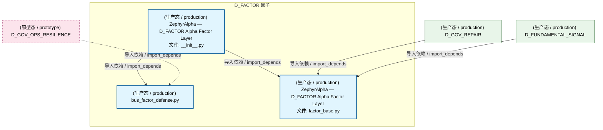
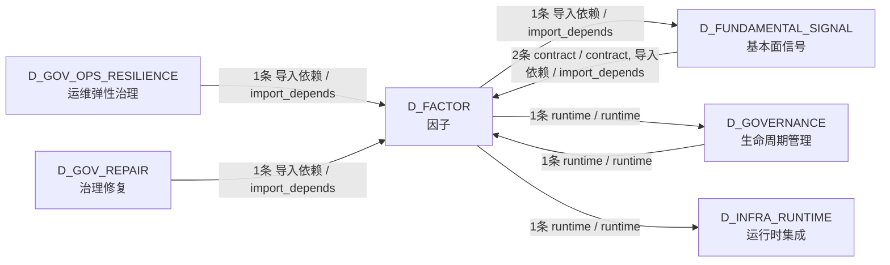

# 36_d_factor / 因子 / 因子 / Factor

> **功能简介 / Overview**: 因子，负责因子计算、因子库管理和因子评价

> **文档作用 / Purpose**: 展示 因子（D_FACTOR）功能域的模块清单、域内依赖关系、跨域依赖关系、架构分层视图，供架构审查和域治理参考。

> 本文档由 generate_domain_doc.py 从 depgraph (PostgreSQL) 自动生成
> 最后更新: 2026-07-17 12:19:22
> 数据源: depgraph (PostgreSQL) nodes表 + edges表

## 域基本信息 / Domain Overview

| 字段 | 值 | Field | Value |
|------|------|-------|-------|
| 编号 | 36 | Number | 36 |
| 域ID | D_FACTOR | Domain ID | D_FACTOR |
| 域名称 | 因子 | Domain Name | Factor |
| 层级 | L2 业务域层 | Layer | L2 Domain |
| 模块数 | 11 | Module Count | 11 |
| 域内依赖 | 4 | Internal Dependencies | 4 |
| 跨域入边 | 5 | Cross-domain Incoming | 5 |
| 跨域出边 | 3 | Cross-domain Outgoing | 3 |
| 设计态模块 | 0 | Design Modules | 0 |
| 原型态模块 | 8 | Prototype Modules | 8 |
| 生产态模块 | 3 | Production Modules | 3 |
| 容量 | 3/150 (正常) | Capacity | 3/150 (正常) |
| 描述 | 因子计算、因子库、因子评价、因子正交化。Alpha挖掘引擎。 | Description | 因子计算、因子库、因子评价、因子正交化。Alpha挖掘引擎。 |

## 模块分层清单 / Module Layered List

> 按 architecture_layer 分组的模块清单（共 11 个模块 / 11 modules）。

### L2 领域层 / Domain Layer (11 modules)

| # | 模块路径 / Module Path | 模块名称 / Module Name (功能简介 / Description) | 成熟度 / Maturity | 蓝图 / Blueprint |
|:--:|---------|---------|:---:|:---:|
| 1 | src/zephyr/factor/__init__.py | ZephyrAlpha — D_FACTOR Alpha Factor Layer | 生产态 / production | [MOD-L02-001](../../03_modules/_domain_factor/blueprint.md) |
| 2 | src/zephyr/factor/_extensions/__init__.py | __init__.py | 原型态 / prototype |  |
| 3 | src/zephyr/factor/alpha_signal_pipeline.py | alpha_signal_pipeline.py | 原型态 / prototype | [MOD-INF-002](../../03_modules/_domain_infrastructure_runtime/runtime_integration/blueprint.md) |
| 4 | src/zephyr/factor/api/__init__.py | __init__.py | 原型态 / prototype |  |
| 5 | src/zephyr/factor/bus_factor_defense.py | bus_factor_defense.py | 生产态 / production | [MOD-L02-001](../../03_modules/_domain_factor/blueprint.md) |
| 6 | src/zephyr/factor/core/__init__.py | __init__.py | 原型态 / prototype |  |
| 7 | src/zephyr/factor/factor_base.py | ZephyrAlpha — D_FACTOR Alpha Factor Layer | 生产态 / production | [MOD-L02-001](../../03_modules/_domain_factor/blueprint.md) |
| 8 | src/zephyr/factor/infrastructure/__init__.py | __init__.py | 原型态 / prototype |  |
| 9 | src/zephyr/factor/momentum_factor.py | D_FACTOR — Momentum Factor | 原型态 / prototype | [MOD-L02-001](../../03_modules/_domain_factor/blueprint.md) |
| 10 | src/zephyr/factor/services/__init__.py | __init__.py | 原型态 / prototype |  |
| 11 | src/zephyr/factor/value_factor.py | D_FACTOR — Value Factor | 原型态 / prototype | [MOD-L02-001](../../03_modules/_domain_factor/blueprint.md) |

## 域内依赖图 / Internal Dependency Diagram

> 依赖图内嵌在本文档中，IDE 可直接渲染显示。参考 decision_index.md 设计，分四个视图：合并全景图、运营态子图、设计态子图、原型态子图（按 design_maturity 实际值拆分）。
>
> **图例说明 / Legend**：
> - **实线边框 = 运营态模块**（production，已上线运行）
> - **虚线边框 = 设计态模块**（design，蓝图阶段，代码未写）
> - **虚线边框 = 原型态模块**（prototype，代码已写，验证中未稳定上线）
> - **实线箭头 = 运营态依赖**（已生效的依赖关系）
> - **虚线箭头 = 非运营态依赖**（计划中/验证中的依赖关系）

### 合并全景图（全部模块，标签标注成熟度）

> 展示全部 11 个模块（生产态 3 + 设计态 0 + 原型态 8），标签标注成熟度。

```mermaid
graph TD
    subgraph D_FACTOR["D_FACTOR 因子"]
        src_zephyr_factor_init_py["(生产态 / production) ZephyrAlpha — D_FACTOR Alpha Factor Layer<br/>文件: __init__.py"]
        src_zephyr_factor_extensions_init_py["(原型态 / prototype) __init__.py"]
        src_zephyr_factor_alpha_signal_pipeline_py["(原型态 / prototype) alpha_signal_pipeline.py"]
        src_zephyr_factor_api_init_py["(原型态 / prototype) __init__.py"]
        src_zephyr_factor_bus_factor_defense_py["(生产态 / production) bus_factor_defense.py"]
        src_zephyr_factor_core_init_py["(原型态 / prototype) __init__.py"]
        src_zephyr_factor_factor_base_py["(生产态 / production) ZephyrAlpha — D_FACTOR Alpha Factor Layer<br/>文件: factor_base.py"]
        src_zephyr_factor_infrastructure_init_py["(原型态 / prototype) __init__.py"]
        src_zephyr_factor_momentum_factor_py["(原型态 / prototype) D_FACTOR — Momentum Factor<br/>文件: momentum_factor.py"]
        src_zephyr_factor_services_init_py["(原型态 / prototype) __init__.py"]
        src_zephyr_factor_value_factor_py["(原型态 / prototype) D_FACTOR — Value Factor<br/>文件: value_factor.py"]
    end
    src_zephyr_factor_value_factor_py -.->|导入依赖 / import_depends| src_zephyr_factor_factor_base_py
    src_zephyr_factor_momentum_factor_py -.->|导入依赖 / import_depends| src_zephyr_factor_factor_base_py
    src_zephyr_factor_init_py -->|导入依赖 / import_depends| src_zephyr_factor_bus_factor_defense_py
    src_zephyr_factor_init_py -->|导入依赖 / import_depends| src_zephyr_factor_factor_base_py
    D_GOVERNANCE["(原型态 / prototype) D_GOVERNANCE"]
    src_zephyr_factor_alpha_signal_pipeline_py -.->|runtime / runtime| D_GOVERNANCE
    D_INFRA_RUNTIME["(设计态 / design) D_INFRA_RUNTIME"]
    src_zephyr_factor_alpha_signal_pipeline_py -.->|runtime / runtime| D_INFRA_RUNTIME
    D_FUNDAMENTAL_SIGNAL["(生产态 / production) D_FUNDAMENTAL_SIGNAL"]
    src_zephyr_factor_alpha_signal_pipeline_py -.->|导入依赖 / import_depends| D_FUNDAMENTAL_SIGNAL
    D_GOVERNANCE -.->|runtime / runtime| src_zephyr_factor_alpha_signal_pipeline_py
    D_FUNDAMENTAL_SIGNAL -.->|contract / contract| src_zephyr_factor_value_factor_py
    D_GOV_REPAIR["(生产态 / production) D_GOV_REPAIR"]
    D_GOV_REPAIR -->|导入依赖 / import_depends| src_zephyr_factor_factor_base_py
    D_FUNDAMENTAL_SIGNAL -->|导入依赖 / import_depends| src_zephyr_factor_factor_base_py
    D_GOV_OPS_RESILIENCE["(原型态 / prototype) D_GOV_OPS_RESILIENCE"]
    D_GOV_OPS_RESILIENCE -.->|导入依赖 / import_depends| src_zephyr_factor_bus_factor_defense_py
    classDef production fill:#e1f5fe,stroke:#01579b,stroke-width:2px,color:#000
    classDef design fill:#fff3e0,stroke:#e65100,stroke-width:2px,color:#000,stroke-dasharray: 5 5
    classDef external_prod fill:#e8f5e9,stroke:#1b5e20,stroke-width:1px,color:#000
    classDef external_design fill:#fce4ec,stroke:#880e4f,stroke-width:1px,color:#000,stroke-dasharray: 5 5
    class src_zephyr_factor_init_py,src_zephyr_factor_bus_factor_defense_py,src_zephyr_factor_factor_base_py production
    class src_zephyr_factor_extensions_init_py,src_zephyr_factor_alpha_signal_pipeline_py,src_zephyr_factor_api_init_py,src_zephyr_factor_core_init_py,src_zephyr_factor_infrastructure_init_py,src_zephyr_factor_momentum_factor_py,src_zephyr_factor_services_init_py,src_zephyr_factor_value_factor_py design
    class D_FUNDAMENTAL_SIGNAL,D_GOV_REPAIR external_prod
    class D_GOVERNANCE,D_INFRA_RUNTIME,D_GOV_OPS_RESILIENCE external_design
```

### 运营态子图（仅 design_maturity=production 的模块和依赖）

> 仅展示已上线运行的模块（共 3 个，2 条域内依赖）。

### 设计态子图（仅 design_maturity=design 的模块和依赖）

> 仅展示蓝图阶段、代码未写的设计态模块（共 0 个，0 条域内依赖）。

> （无设计态模块 / No design modules）

### 原型态子图（仅 design_maturity=prototype 的模块和依赖）

> 仅展示代码已写、验证中未稳定上线的原型态模块（共 8 个，0 条域内依赖）。

```mermaid
graph TD
    subgraph D_FACTOR["D_FACTOR 因子"]
        src_zephyr_factor_extensions_init_py["(原型态 / prototype) __init__.py"]
        src_zephyr_factor_alpha_signal_pipeline_py["(原型态 / prototype) alpha_signal_pipeline.py"]
        src_zephyr_factor_api_init_py["(原型态 / prototype) __init__.py"]
        src_zephyr_factor_core_init_py["(原型态 / prototype) __init__.py"]
        src_zephyr_factor_infrastructure_init_py["(原型态 / prototype) __init__.py"]
        src_zephyr_factor_momentum_factor_py["(原型态 / prototype) D_FACTOR — Momentum Factor<br/>文件: momentum_factor.py"]
        src_zephyr_factor_services_init_py["(原型态 / prototype) __init__.py"]
        src_zephyr_factor_value_factor_py["(原型态 / prototype) D_FACTOR — Value Factor<br/>文件: value_factor.py"]
    end
    D_GOVERNANCE["(原型态 / prototype) D_GOVERNANCE"]
    src_zephyr_factor_alpha_signal_pipeline_py -.->|runtime / runtime| D_GOVERNANCE
    D_INFRA_RUNTIME["(设计态 / design) D_INFRA_RUNTIME"]
    src_zephyr_factor_alpha_signal_pipeline_py -.->|runtime / runtime| D_INFRA_RUNTIME
    D_FUNDAMENTAL_SIGNAL["(生产态 / production) D_FUNDAMENTAL_SIGNAL"]
    src_zephyr_factor_alpha_signal_pipeline_py -.->|导入依赖 / import_depends| D_FUNDAMENTAL_SIGNAL
    D_GOVERNANCE -.->|runtime / runtime| src_zephyr_factor_alpha_signal_pipeline_py
    D_FUNDAMENTAL_SIGNAL -.->|contract / contract| src_zephyr_factor_value_factor_py
    classDef production fill:#e1f5fe,stroke:#01579b,stroke-width:2px,color:#000
    classDef design fill:#fff3e0,stroke:#e65100,stroke-width:2px,color:#000,stroke-dasharray: 5 5
    classDef external_prod fill:#e8f5e9,stroke:#1b5e20,stroke-width:1px,color:#000
    classDef external_design fill:#fce4ec,stroke:#880e4f,stroke-width:1px,color:#000,stroke-dasharray: 5 5
    class src_zephyr_factor_extensions_init_py,src_zephyr_factor_alpha_signal_pipeline_py,src_zephyr_factor_api_init_py,src_zephyr_factor_core_init_py,src_zephyr_factor_infrastructure_init_py,src_zephyr_factor_momentum_factor_py,src_zephyr_factor_services_init_py,src_zephyr_factor_value_factor_py design
    class D_FUNDAMENTAL_SIGNAL external_prod
    class D_GOVERNANCE,D_INFRA_RUNTIME external_design
```

## 跨域依赖 / Cross-domain Dependencies

### 本域依赖的其他域（出边）/ Depends On

| # | 本域模块 / Source Module | → | 外部域-目标模块 / Target Module | 依赖类型 / Type |
|:--:|---------|:--:|---------|---------|
| 1 | alpha_signal_pipeline.py | → | D_FUNDAMENTAL_SIGNAL 基本面信号: AlphaSignalPipeline D_FACTOR->D_SIGNAL跨层集成... | 导入依赖 / import_depends |
| 2 | alpha_signal_pipeline.py | → | D_GOVERNANCE 生命周期管理: Batch2 治理层契约 — 15条 Pydantic v2 Schema（P... | runtime / runtime |
| 3 | alpha_signal_pipeline.py | → | D_INFRA_RUNTIME 运行时集成: blueprint.md | runtime / runtime |

### 依赖本域的其他域（入边）/ Depended By

| # | 外部域-源模块 / Source Module | → | 本域模块 / Target Module | 依赖类型 / Type |
|:--:|---------|:--:|---------|---------|
| 1 | D_FUNDAMENTAL_SIGNAL 基本面信号: D_SIGNAL Signal Domain (__init__.py) | → | D_FACTOR — Value Factor (value_factor.py) | contract / contract |
| 2 | D_FUNDAMENTAL_SIGNAL 基本面信号: AlphaSignalPipeline D_FACTOR->D_SIGNAL跨层集成... | → | ZephyrAlpha — D_FACTOR Alpha Factor Layer (fac... | 导入依赖 / import_depends |
| 3 | D_GOVERNANCE 生命周期管理: post_sync_validator — post_sync_standard 命令.... | → | alpha_signal_pipeline.py | runtime / runtime |
| 4 | D_GOV_OPS_RESILIENCE 运维弹性治理: bus_factor_defense.py | → | bus_factor_defense.py | 导入依赖 / import_depends |
| 5 | D_GOV_REPAIR 治理修复: Agent 治理八件套 · Governance Domain — DOM-GO... | → | ZephyrAlpha — D_FACTOR Alpha Factor Layer (fac... | 导入依赖 / import_depends |

### 跨域依赖图 / Cross-domain Dependency Diagram

> 本域与 5 个外部域直接连接（出边 3 条 + 入边 5 条 = 8 条）。只显示直接连接的域，不展开具体节点。

## 说明 / Notes

- **数据源 / Data Source**: `depgraph (PostgreSQL)` 的 `nodes`、`edges`、`domains` 表
- **生成器 / Generator**: `generate_domain_doc.py`（G2+G10 合并）
- **维护方式 / Maintenance**: 自动生成，全景图更新时刷新
- **文件名规则 / File Naming**: `{编号:02d}_{域ID小写}.md`，如 `16_d_trading.md`
- **图例说明 / Legend**: `[production]`=已上线 / `[design]`=设计中 / `[prototype]`=原型 / `[unknown]`=未知
