# 36_d_gov_drift / 漂移检测

> **文档作用 / Purpose**: 展示 漂移检测（D-GOV_DRIFT）功能域的模块清单、域内依赖关系和跨域依赖关系，供架构审查和域治理参考。

> 本文档由 generate_domain_doc.py 从 depgraph.db 自动生成
> 最后更新以 git log 为准
> 数据源: depgraph.db nodes表 + edges表

## 域基本信息 / Domain Overview

| 字段 | 值 | Field | Value |
|------|------|-------|-------|
| 编号 | 36 | Number | 36 |
| 域ID | D-GOV_DRIFT | Domain ID | D-GOV_DRIFT |
| 域名称 | 漂移检测 | Domain Name | drift_detection |
| 层级 | L2_domain | Layer | L2_domain |
| 模块数 | 24 | Module Count | 24 |
| 域内依赖 | 2 | Internal Dependencies | 2 |
| 跨域入边 | 45 | Cross-domain Incoming | 45 |
| 跨域出边 | 29 | Cross-domain Outgoing | 29 |
| 设计态模块 | 1 | Design Modules | 1 |
| 原型态模块 | 14 | Prototype Modules | 14 |
| 生产态模块 | 9 | Production Modules | 9 |
| 容量 | 9/150 (正常) | Capacity | 9/150 (正常) |
| 描述 | 39个漂移检测器注册与调度 | Description | 39个漂移检测器注册与调度 |

## 模块清单 / Module List

共 24 个模块（按路径排序，全部显示）

| 模块路径 / Module Path | 模块名称 / Module Name | 设计成熟度 / Maturity | 构建状态 / Build Status |
|---------|---------|-----------|---------|
| docs/03_modules/_domain_governance/drift_detector/blueprint.md | docs__03_modules___domain_governance_... | design | planned |
| scripts/governance/d5_architecture/validators/validate_authority_registry.py |  | production | generated |
| scripts/governance/d5_architecture/validators/validate_ssot.py |  | production | generated |
| src/zephyr/governance/artifact_scanner.py |  | production | generated |
| src/zephyr/governance/audit_orchestrator/integrity.py |  | production | generated |
| src/zephyr/governance/audit_trail/drift_bridge.py |  | production | generated |
| src/zephyr/governance/audit_trail/self_monitor.py |  | production | generated |
| src/zephyr/governance/drift_detection/baseline_manager.py |  | prototype | generated |
| src/zephyr/governance/drift_detection/chaos_injector.py |  | prototype | generated |
| src/zephyr/governance/drift_detection/migration_plan.yaml |  | production | deprecated |
| src/zephyr/governance/drift_detector.py |  | prototype | generated |
| src/zephyr/governance/integrity.py |  | production | generated |
| src/zephyr/governance/red_blue_validator/ai_self_diagnosis.py |  | production | generated |
| tests/test_ba_chaos_injector.py |  | prototype | generated |
| tests/test_baseline_manager.py |  | prototype | generated |
| tests/test_chaos_injector.py |  | prototype | generated |
| tests/test_context_drift_detector.py |  | prototype | generated |
| tests/test_contract_drift_detector.py |  | prototype | generated |
| tests/test_drift_detector_ee.py |  | prototype | generated |
| tests/test_drift_detector_gate.py |  | prototype | generated |
| tests/test_model_drift_detector.py |  | prototype | generated |
| tests/unit/drift_detector/__init__.py |  | prototype | generated |
| tests/unit/drift_detector/conftest.py |  | prototype | generated |
| tests/unit/drift_detector/test_drift_core.py |  | prototype | generated |

## 域内依赖图 / Internal Dependency Diagram

> 依赖图内嵌在本文档中，IDE 可直接渲染显示。每30个节点一组分页显示。
>
> **图例说明 / Legend**：
> - **实线边框 = 运营态模块**（production，已上线运行）
> - **虚线边框 = 设计态模块**（design，还在设计中）
> - **实线箭头 = 运营态依赖**（已生效的依赖关系）
> - **虚线箭头 = 设计态依赖**（计划中的依赖关系）

```mermaid
graph TD
    subgraph D_GOV_DRIFT["D-GOV_DRIFT 漂移检测"]
        docs_03_modules_domain_governance_drift_detector_blueprint_md["docs__03_modules___domain_governance__drift_det... design"]
        scripts_governance_d5_architecture_validators_validate_authority_registry_py["scripts/governance/d5_architecture/validators/v... production"]
        scripts_governance_d5_architecture_validators_validate_ssot_py["scripts/governance/d5_architecture/validators/v... production"]
        src_zephyr_governance_artifact_scanner_py["src/zephyr/governance/artifact_scanner.py production"]
        src_zephyr_governance_audit_orchestrator_integrity_py["src/zephyr/governance/audit_orchestrator/integr... production"]
        src_zephyr_governance_audit_trail_drift_bridge_py["src/zephyr/governance/audit_trail/drift_bridge.py production"]
        src_zephyr_governance_audit_trail_self_monitor_py["src/zephyr/governance/audit_trail/self_monitor.py production"]
        src_zephyr_governance_drift_detection_baseline_manager_py["src/zephyr/governance/drift_detection/baseline_... prototype"]
        src_zephyr_governance_drift_detection_chaos_injector_py["src/zephyr/governance/drift_detection/chaos_inj... prototype"]
        src_zephyr_governance_drift_detection_migration_plan_yaml["src/zephyr/governance/drift_detection/migration... production"]
        src_zephyr_governance_drift_detector_py["src/zephyr/governance/drift_detector.py prototype"]
        src_zephyr_governance_integrity_py["src/zephyr/governance/integrity.py production"]
        src_zephyr_governance_red_blue_validator_ai_self_diagnosis_py["src/zephyr/governance/red_blue_validator/ai_sel... production"]
        tests_test_ba_chaos_injector_py["tests/test_ba_chaos_injector.py prototype"]
        tests_test_baseline_manager_py["tests/test_baseline_manager.py prototype"]
        tests_test_chaos_injector_py["tests/test_chaos_injector.py prototype"]
        tests_test_context_drift_detector_py["tests/test_context_drift_detector.py prototype"]
        tests_test_contract_drift_detector_py["tests/test_contract_drift_detector.py prototype"]
        tests_test_drift_detector_ee_py["tests/test_drift_detector_ee.py prototype"]
        tests_test_drift_detector_gate_py["tests/test_drift_detector_gate.py prototype"]
        tests_test_model_drift_detector_py["tests/test_model_drift_detector.py prototype"]
        tests_unit_drift_detector_init_py["tests/unit/drift_detector/__init__.py prototype"]
        tests_unit_drift_detector_conftest_py["tests/unit/drift_detector/conftest.py prototype"]
        tests_unit_drift_detector_test_drift_core_py["tests/unit/drift_detector/test_drift_core.py prototype"]
    end
    src_zephyr_governance_audit_trail_self_monitor_py -->|import_depends| src_zephyr_governance_audit_trail_drift_bridge_py
    tests_unit_drift_detector_conftest_py -.->|config_depends| tests_unit_drift_detector_init_py
    D_GOVERNANCE["D-GOVERNANCE design"]
    docs_03_modules_domain_governance_drift_detector_blueprint_md -.->|runtime| D_GOVERNANCE
    docs_03_modules_domain_governance_drift_detector_blueprint_md -.->|runtime| D_GOVERNANCE
    D_GOV_AUDIT["D-GOV_AUDIT design"]
    docs_03_modules_domain_governance_drift_detector_blueprint_md -.->|runtime| D_GOV_AUDIT
    D_AUTONOMY_PERM["D-AUTONOMY_PERM design"]
    docs_03_modules_domain_governance_drift_detector_blueprint_md -.->|runtime| D_AUTONOMY_PERM
    D_GOV_ENFORCEMENT["D-GOV_ENFORCEMENT production"]
    docs_03_modules_domain_governance_drift_detector_blueprint_md -.->|runtime| D_GOV_ENFORCEMENT
    docs_03_modules_domain_governance_drift_detector_blueprint_md -.->|runtime| D_GOVERNANCE
    docs_03_modules_domain_governance_drift_detector_blueprint_md -.->|runtime| D_GOVERNANCE
    src_zephyr_governance_drift_detector_py -.->|config_depends| D_GOVERNANCE
    src_zephyr_governance_integrity_py -->|import_depends| D_GOV_AUDIT
    src_zephyr_governance_integrity_py -->|import_depends| D_GOV_AUDIT
    src_zephyr_governance_integrity_py -->|import_depends| D_GOV_AUDIT
    src_zephyr_governance_audit_orchestrator_integrity_py -->|import_depends| D_GOV_AUDIT
    src_zephyr_governance_audit_orchestrator_integrity_py -.->|import_depends| D_GOV_AUDIT
    src_zephyr_governance_audit_orchestrator_integrity_py -->|import_depends| D_GOV_AUDIT
    src_zephyr_governance_audit_trail_drift_bridge_py -->|import_depends| D_GOVERNANCE
    D_GOV_AUDIT -.->|runtime| docs_03_modules_domain_governance_drift_detector_blueprint_md
    D_GOVERNANCE -.->|runtime| docs_03_modules_domain_governance_drift_detector_blueprint_md
    D_TRADING["D-TRADING prototype"]
    D_TRADING -.->|runtime| docs_03_modules_domain_governance_drift_detector_blueprint_md
    D_GOVERNANCE -.->|contract| docs_03_modules_domain_governance_drift_detector_blueprint_md
    D_GOVERNANCE -.->|runtime| docs_03_modules_domain_governance_drift_detector_blueprint_md
    D_GOVERNANCE -.->|runtime| docs_03_modules_domain_governance_drift_detector_blueprint_md
    D_COMPLIANCE["D-COMPLIANCE prototype"]
    D_COMPLIANCE -.->|import_depends| src_zephyr_governance_artifact_scanner_py
    D_GOVERNANCE -.->|test_depends| src_zephyr_governance_artifact_scanner_py
    D_COMPLIANCE -.->|import_depends| src_zephyr_governance_integrity_py
    D_GOVERNANCE -.->|import_depends| src_zephyr_governance_integrity_py
    D_GOVERNANCE -.->|import_depends| src_zephyr_governance_integrity_py
    D_GOVERNANCE -.->|import_depends| src_zephyr_governance_integrity_py
    D_GOV_AUDIT -.->|import_depends| src_zephyr_governance_integrity_py
    D_GOV_AUDIT -->|import_depends| src_zephyr_governance_integrity_py
    D_GOV_AUDIT -->|import_depends| src_zephyr_governance_integrity_py
    classDef production fill:#e1f5fe,stroke:#01579b,stroke-width:2px,color:#000
    classDef design fill:#fff3e0,stroke:#e65100,stroke-width:2px,color:#000,stroke-dasharray: 5 5
    classDef external_prod fill:#e8f5e9,stroke:#1b5e20,stroke-width:1px,color:#000
    classDef external_design fill:#fce4ec,stroke:#880e4f,stroke-width:1px,color:#000,stroke-dasharray: 5 5
    class scripts_governance_d5_architecture_validators_validate_authority_registry_py,scripts_governance_d5_architecture_validators_validate_ssot_py,src_zephyr_governance_artifact_scanner_py,src_zephyr_governance_audit_orchestrator_integrity_py,src_zephyr_governance_audit_trail_drift_bridge_py,src_zephyr_governance_audit_trail_self_monitor_py,src_zephyr_governance_drift_detection_migration_plan_yaml,src_zephyr_governance_integrity_py,src_zephyr_governance_red_blue_validator_ai_self_diagnosis_py production
    class docs_03_modules_domain_governance_drift_detector_blueprint_md,src_zephyr_governance_drift_detection_baseline_manager_py,src_zephyr_governance_drift_detection_chaos_injector_py,src_zephyr_governance_drift_detector_py,tests_test_ba_chaos_injector_py,tests_test_baseline_manager_py,tests_test_chaos_injector_py,tests_test_context_drift_detector_py,tests_test_contract_drift_detector_py,tests_test_drift_detector_ee_py,tests_test_drift_detector_gate_py,tests_test_model_drift_detector_py,tests_unit_drift_detector_init_py,tests_unit_drift_detector_conftest_py,tests_unit_drift_detector_test_drift_core_py design
    class D_GOV_ENFORCEMENT external_prod
    class D_GOVERNANCE,D_GOV_AUDIT,D_AUTONOMY_PERM,D_TRADING,D_COMPLIANCE external_design
```

## 跨域依赖 / Cross-domain Dependencies

### 本域依赖的其他域（出边）/ Depends On

| 目标域 / Target Domain | 依赖数 / Count | 依赖类型 / Type |
|--------|:---:|---------|
| D-GOVERNANCE | 10 | runtime,config_depends,import_depends,test_depends |
| D-BEHAVIORAL_AUDIT | 8 | test_depends |
| D-GOV_AUDIT | 7 | runtime,import_depends |
| D-SECURITY | 1 | test_depends |
| D-GOV_SCRIPTS | 1 | import_depends |
| D-GOV_ENFORCEMENT | 1 | runtime |
| D-AUTONOMY_PERM | 1 | runtime |

### 依赖本域的其他域（入边）/ Depended By

| 源域 / Source Domain | 依赖数 / Count | 依赖类型 / Type |
|------|:---:|---------|
| D-GOVERNANCE | 25 | runtime,contract,test_depends,import_depends,config_depends |
| D-GOV_AUDIT | 13 | runtime,import_depends |
| D-TRADING | 3 | runtime,import_depends |
| D-COMPLIANCE | 2 | import_depends |
| D-OPS | 1 | import_depends |
| D-AUDITTEST | 1 | test_depends |

## 说明 / Notes

- **数据源 / Data Source**: `depgraph.db` 的 `nodes`、`edges`、`domains` 表
- **生成器 / Generator**: `generate_domain_doc.py`
- **维护方式 / Maintenance**: 自动生成，全景图更新时刷新
- **文件名规则 / File Naming**: `{编号:02d}_{域ID小写}.md`，如 `16_d_trading.md`
