# 36_d_gov_drift / 漂移检测

> **文档作用 / Purpose**: 展示 漂移检测（D_GOV_DRIFT）功能域的模块清单、域内依赖关系、跨域依赖关系、架构分层视图，供架构审查和域治理参考。

> 本文档由 generate_domain_doc.py 从 depgraph (PostgreSQL) 自动生成
> 最后更新: 2026-07-01 12:00:45
> 数据源: depgraph (PostgreSQL) nodes表 + edges表

## 域基本信息 / Domain Overview

| 字段 | 值 | Field | Value |
|------|------|-------|-------|
| 编号 | 36 | Number | 36 |
| 域ID | D_GOV_DRIFT | Domain ID | D_GOV_DRIFT |
| 域名称 | 漂移检测 | Domain Name | 漂移检测 |
| 层级 | L2_domain | Layer | L2_domain |
| 模块数 | 11 | Module Count | 11 |
| 域内依赖 | 1 | Internal Dependencies | 1 |
| 跨域入边 | 39 | Cross-domain Incoming | 39 |
| 跨域出边 | 22 | Cross-domain Outgoing | 22 |
| 设计态模块 | 1 | Design Modules | 1 |
| 原型态模块 | 3 | Prototype Modules | 3 |
| 生产态模块 | 7 | Production Modules | 7 |
| 容量 | 9/150 (正常) | Capacity | 9/150 (正常) |
| 描述 | 39个漂移检测器注册与调度 | Description | 39个漂移检测器注册与调度 |

## 域内依赖图 / Internal Dependency Diagram

> 依赖图内嵌在本文档中，IDE 可直接渲染显示。每30个节点一组分页显示。
>
> **图例说明 / Legend**：
> - **实线边框 = 运营态模块**（production，已上线运行）
> - **虚线边框 = 设计态模块**（design，还在设计中）
> - **实线箭头 = 运营态依赖**（已生效的依赖关系）
> - **虚线箭头 = 设计态依赖**（计划中的依赖关系）

```mermaid
graph TD
    subgraph D_GOV_DRIFT["D_GOV_DRIFT 漂移检测"]
        docs_03_modules_domain_governance_drift_detector_blueprint_md["docs__03_modules___domain_governance__drift_det... design"]
        scripts_governance_d5_architecture_validators_validate_authority_registry_py["scripts/governance/d5_architecture/validators/v... production"]
        scripts_governance_d5_architecture_validators_validate_ssot_py["scripts/governance/d5_architecture/validators/v... production"]
        src_zephyr_governance_artifact_scanner_py["src/zephyr/governance/artifact_scanner.py production"]
        src_zephyr_governance_audit_trail_drift_bridge_py["src/zephyr/governance/audit_trail/drift_bridge.py production"]
        src_zephyr_governance_audit_trail_self_monitor_py["src/zephyr/governance/audit_trail/self_monitor.py production"]
        src_zephyr_governance_drift_detection_baseline_manager_py["src/zephyr/governance/drift_detection/baseline_... prototype"]
        src_zephyr_governance_drift_detection_chaos_injector_py["src/zephyr/governance/drift_detection/chaos_inj... prototype"]
        src_zephyr_governance_drift_detector_py["src/zephyr/governance/drift_detector.py prototype"]
        src_zephyr_governance_integrity_py["src/zephyr/governance/integrity.py production"]
        src_zephyr_governance_red_blue_validator_ai_self_diagnosis_py["src/zephyr/governance/red_blue_validator/ai_sel... production"]
    end
    src_zephyr_governance_audit_trail_self_monitor_py -->|import_depends| src_zephyr_governance_audit_trail_drift_bridge_py
    D_GOVERNANCE["D_GOVERNANCE production"]
    src_zephyr_governance_drift_detector_py -.->|config_depends| D_GOVERNANCE
    D_GOV_AUDIT["D_GOV_AUDIT production"]
    src_zephyr_governance_integrity_py -->|import_depends| D_GOV_AUDIT
    src_zephyr_governance_integrity_py -->|import_depends| D_GOV_AUDIT
    src_zephyr_governance_integrity_py -->|import_depends| D_GOV_AUDIT
    src_zephyr_governance_audit_trail_drift_bridge_py -->|import_depends| D_GOVERNANCE
    src_zephyr_governance_drift_detection_chaos_injector_py -.->|import_depends| D_GOVERNANCE
    D_GOV_SCRIPTS["D_GOV_SCRIPTS production"]
    scripts_governance_d5_architecture_validators_validate_ssot_py -->|import_depends| D_GOV_SCRIPTS
    D_COMPLIANCE["D_COMPLIANCE prototype"]
    D_COMPLIANCE -.->|import_depends| src_zephyr_governance_artifact_scanner_py
    D_COMPLIANCE -.->|import_depends| src_zephyr_governance_integrity_py
    D_GOVERNANCE -.->|import_depends| src_zephyr_governance_integrity_py
    D_GOVERNANCE -.->|import_depends| src_zephyr_governance_integrity_py
    D_GOVERNANCE -.->|import_depends| src_zephyr_governance_audit_trail_self_monitor_py
    D_GOV_AUDIT -->|import_depends| src_zephyr_governance_audit_trail_drift_bridge_py
    D_GOV_AUDIT -->|import_depends| src_zephyr_governance_integrity_py
    D_GOV_AUDIT -->|import_depends| src_zephyr_governance_audit_trail_self_monitor_py
    D_GOV_AUDIT -->|import_depends| src_zephyr_governance_integrity_py
    classDef production fill:#e1f5fe,stroke:#01579b,stroke-width:2px,color:#000
    classDef design fill:#fff3e0,stroke:#e65100,stroke-width:2px,color:#000,stroke-dasharray: 5 5
    classDef external_prod fill:#e8f5e9,stroke:#1b5e20,stroke-width:1px,color:#000
    classDef external_design fill:#fce4ec,stroke:#880e4f,stroke-width:1px,color:#000,stroke-dasharray: 5 5
    class scripts_governance_d5_architecture_validators_validate_authority_registry_py,scripts_governance_d5_architecture_validators_validate_ssot_py,src_zephyr_governance_artifact_scanner_py,src_zephyr_governance_audit_trail_drift_bridge_py,src_zephyr_governance_audit_trail_self_monitor_py,src_zephyr_governance_integrity_py,src_zephyr_governance_red_blue_validator_ai_self_diagnosis_py production
    class docs_03_modules_domain_governance_drift_detector_blueprint_md,src_zephyr_governance_drift_detection_baseline_manager_py,src_zephyr_governance_drift_detection_chaos_injector_py,src_zephyr_governance_drift_detector_py design
    class D_GOVERNANCE,D_GOV_AUDIT,D_GOV_SCRIPTS external_prod
    class D_COMPLIANCE external_design
```



## 跨域依赖 / Cross-domain Dependencies

### 本域依赖的其他域（出边）/ Depends On

| 目标域 / Target Domain | 依赖数 / Count | 依赖类型 / Type |
|--------|:---:|---------|
| D_BEHAVIORAL_AUDIT | 8 | test_depends |
| D_GOVERNANCE | 6 | config_depends,import_depends,test_depends |
| D_GOV_AUDIT | 6 | import_depends |
| D_GOV_SCRIPTS | 1 | import_depends |
| D_SECURITY | 1 | test_depends |

### 依赖本域的其他域（入边）/ Depended By

| 源域 / Source Domain | 依赖数 / Count | 依赖类型 / Type |
|------|:---:|---------|
| D_GOVERNANCE | 21 | config_depends,import_depends,test_depends |
| D_GOV_AUDIT | 12 | import_depends |
| D_COMPLIANCE | 2 | import_depends |
| D_TRADING | 2 | import_depends |
| D_AUDITTEST | 1 | test_depends |
| D_OPS | 1 | import_depends |

## 架构分层视图 / Architecture Overview

> 按 architecture_layer 分层显示 漂移检测（D_GOV_DRIFT）的模块分布。共 11 个模块 / 11 modules。

```

┌──────────────────────────────────────────────────────────────────┐
│            L1 基础层 / Foundation Layer (11 modules)             │
├──────────────────────────────────────────────────────────────────┤
│   docs__03_modules___domain_governance__drift_detector__bluep... │
│   scripts/governance/d5_architecture/validators/validate_auth... │
│   scripts/governance/d5_architecture/validators/validate_ssot... │
│   src/zephyr/governance/artifact_scanner.py  [production]        │
│   src/zephyr/governance/audit_trail/drift_bridge.py  [product... │
│   src/zephyr/governance/audit_trail/self_monitor.py  [product... │
│   src/zephyr/governance/drift_detection/baseline_manager.py  ... │
│   src/zephyr/governance/drift_detection/chaos_injector.py  [p... │
│   src/zephyr/governance/drift_detector.py  [prototype]           │
│   src/zephyr/governance/integrity.py  [production]               │
│   src/zephyr/governance/red_blue_validator/ai_self_diagnosis.... │
└──────────────────────────────────────────────────────────────────┘

```

## 模块分层清单 / Module Layered List

> 按 architecture_layer 分组的模块清单（共 11 个模块 / 11 modules）。

### L1 基础层 / Foundation Layer (11 modules)

| # | 模块路径 / Module Path | 模块名称 / Module Name | 成熟度 / Maturity | 构建状态 / Build Status |
|:--:|---------|---------|:---:|:---:|
| 1 | docs/03_modules/_domain_governance/drift_detector/bluepri... | docs__03_modules___domain_governance_... | design | planned |
| 2 | scripts/governance/d5_architecture/validators/validate_au... | scripts/governance/d5_architecture/va... | production | generated |
| 3 | scripts/governance/d5_architecture/validators/validate_ss... | scripts/governance/d5_architecture/va... | production | generated |
| 4 | src/zephyr/governance/artifact_scanner.py | src/zephyr/governance/artifact_scanne... | production | generated |
| 5 | src/zephyr/governance/audit_trail/drift_bridge.py | src/zephyr/governance/audit_trail/dri... | production | generated |
| 6 | src/zephyr/governance/audit_trail/self_monitor.py | src/zephyr/governance/audit_trail/sel... | production | generated |
| 7 | src/zephyr/governance/drift_detection/baseline_manager.py | src/zephyr/governance/drift_detection... | prototype | generated |
| 8 | src/zephyr/governance/drift_detection/chaos_injector.py | src/zephyr/governance/drift_detection... | prototype | generated |
| 9 | src/zephyr/governance/drift_detector.py | src/zephyr/governance/drift_detector.py | prototype | generated |
| 10 | src/zephyr/governance/integrity.py | src/zephyr/governance/integrity.py | production | generated |
| 11 | src/zephyr/governance/red_blue_validator/ai_self_diagnosi... | src/zephyr/governance/red_blue_valida... | production | generated |

## 依赖关系图 / Dependency Graph

> 域内模块依赖关系（共 1 条 / 1 edges）。按依赖类型分组，使用 → 表示方向。

```

┌──────────────────────────────────────────────────────────────────┐
│        依赖关系图 / Dependency Graph (共 1 条 / 1 edges)         │
├──────────────────────────────────────────────────────────────────┤
│   依赖类型数 / Dependency Types: 1                               │
│   [import_depends]: 1 条 / edges                                 │
└──────────────────────────────────────────────────────────────────┘

┌──────────────────────────────────────────────────────────────────┐
│                 [import_depends] (1 条 / edges)                  │
├──────────────────────────────────────────────────────────────────┤
│   self_monitor.py → drift_bridge.py                              │
└──────────────────────────────────────────────────────────────────┘

```

## 说明 / Notes

- **数据源 / Data Source**: `depgraph (PostgreSQL)` 的 `nodes`、`edges`、`domains` 表
- **生成器 / Generator**: `generate_domain_doc.py`（G2+G10 合并）
- **维护方式 / Maintenance**: 自动生成，全景图更新时刷新
- **文件名规则 / File Naming**: `{编号:02d}_{域ID小写}.md`，如 `16_d_trading.md`
- **图例说明 / Legend**: `[production]`=已上线 / `[design]`=设计中 / `[prototype]`=原型 / `[unknown]`=未知
