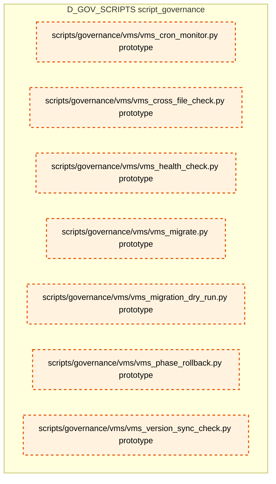

# 36_d_gov_scripts / script_governance

> **文档作用 / Purpose**: 展示 script_governance（D_GOV_SCRIPTS）功能域的模块清单、域内依赖关系、跨域依赖关系、架构分层视图，供架构审查和域治理参考。

> 本文档由 generate_domain_doc.py 从 depgraph (PostgreSQL) 自动生成
> 最后更新: 2026-07-05 22:59:50
> 数据源: depgraph (PostgreSQL) nodes表 + edges表

## 域基本信息 / Domain Overview

| 字段 | 值 | Field | Value |
|------|------|-------|-------|
| 编号 | 36 | Number | 36 |
| 域ID | D_GOV_SCRIPTS | Domain ID | D_GOV_SCRIPTS |
| 域名称 | script_governance | Domain Name | script_governance |
| 层级 | L2_domain | Layer | L2_domain |
| 模块数 | 427 | Module Count | 427 |
| 域内依赖 | 307 | Internal Dependencies | 307 |
| 跨域入边 | 3 | Cross-domain Incoming | 3 |
| 跨域出边 | 85 | Cross-domain Outgoing | 85 |
| 设计态模块 | 0 | Design Modules | 0 |
| 原型态模块 | 396 | Prototype Modules | 396 |
| 生产态模块 | 31 | Production Modules | 31 |
| 容量 | 31/150 (正常) | Capacity | 31/150 (正常) |
| 描述 | Phase Manager阶段管理 | Description | Phase Manager阶段管理 |

## 域内依赖图 / Internal Dependency Diagram

> 依赖图内嵌在本文档中，IDE 可直接渲染显示。每30个节点一组分页显示。
>
> **图例说明 / Legend**：
> - **实线边框 = 运营态模块**（production，已上线运行）
> - **虚线边框 = 设计态模块**（design，还在设计中）
> - **实线箭头 = 运营态依赖**（已生效的依赖关系）
> - **虚线箭头 = 设计态依赖**（计划中的依赖关系）

### 第 1 页 / 共 15 页 / Page 1 of 15

```mermaid
graph TD
    subgraph D_GOV_SCRIPTS["D_GOV_SCRIPTS script_governance"]
        scripts_governance_init_py["scripts/governance/__init__.py production"]
        scripts_governance_archive_one_off_analyze_orphan_consumers_py["scripts/governance/_archive/one_off/analyze_orp... prototype"]
        scripts_governance_archive_one_off_audit_post_sync_commands_py["scripts/governance/_archive/one_off/audit_post_... prototype"]
        scripts_governance_archive_one_off_audit_session_07_py["scripts/governance/_archive/one_off/audit_sessi... prototype"]
        scripts_governance_archive_one_off_check_exam_case_consistency_py["scripts/governance/_archive/one_off/check_exam_... prototype"]
        scripts_governance_archive_one_off_check_rule_coverage_py["scripts/governance/_archive/one_off/check_rule_... prototype"]
        scripts_governance_archive_one_off_create_alignment_tasks_py["scripts/governance/_archive/one_off/create_alig... prototype"]
        scripts_governance_archive_one_off_dm105_depgraph_triage_py["scripts/governance/_archive/one_off/dm105_depgr... prototype"]
        scripts_governance_archive_one_off_fix_broken_post_sync_py["scripts/governance/_archive/one_off/fix_broken_... prototype"]
        scripts_governance_archive_one_off_group_orphan_modules_py["scripts/governance/_archive/one_off/group_orpha... prototype"]
        scripts_governance_archive_one_off_list_phase0_tasks_py["scripts/governance/_archive/one_off/list_phase0... prototype"]
        scripts_governance_archive_one_off_migrate_clean_build_status_py["scripts/governance/_archive/one_off/migrate_cle... prototype"]
        scripts_governance_archive_one_off_migrate_domain_id_hyphen_to_underscore_py["scripts/governance/_archive/one_off/migrate_dom... prototype"]
        scripts_governance_archive_one_off_perf_depgraph_baseline_py["scripts/governance/_archive/one_off/perf_depgra... prototype"]
        scripts_governance_archive_one_off_phase_a_backup_py["scripts/governance/_archive/one_off/phase_a_bac... prototype"]
        scripts_governance_archive_one_off_rename_kebab_to_snake_py["scripts/governance/_archive/one_off/rename_keba... prototype"]
        scripts_governance_archive_one_off_rename_whitelist_cleanup_py["scripts/governance/_archive/one_off/rename_whit... prototype"]
        scripts_governance_archive_one_off_test_lock_scenarios_py["scripts/governance/_archive/one_off/test_lock_s... prototype"]
        scripts_governance_archive_one_off_verify_final_delivery_py["scripts/governance/_archive/one_off/verify_fina... prototype"]
        scripts_governance_archive_one_off_verify_rule_yaml_migration_py["scripts/governance/_archive/one_off/verify_rule... prototype"]
        scripts_governance_archive_prototype_adversarial_log_py["scripts/governance/_archive/prototype/adversari... prototype"]
        scripts_governance_archive_prototype_adversarial_sys_master_test_py["scripts/governance/_archive/prototype/adversari... prototype"]
        scripts_governance_archive_prototype_audit_domain_nodes_py["scripts/governance/_archive/prototype/audit_dom... prototype"]
        scripts_governance_archive_prototype_changelog_py["scripts/governance/_archive/prototype/changelog.py prototype"]
        scripts_governance_archive_prototype_check_audit_rbac_isolation_py["scripts/governance/_archive/prototype/check_aud... prototype"]
        scripts_governance_archive_prototype_construction_gate_py["scripts/governance/_archive/prototype/construct... prototype"]
        scripts_governance_archive_prototype_generate_asset_index_py["scripts/governance/_archive/prototype/generate_... prototype"]
        scripts_governance_archive_prototype_generate_nav_table_py["scripts/governance/_archive/prototype/generate_... prototype"]
        scripts_governance_archive_prototype_rebuild_audit_index_py["scripts/governance/_archive/prototype/rebuild_a... prototype"]
        scripts_governance_archive_prototype_scan_ground_truth_deps_py["scripts/governance/_archive/prototype/scan_grou... prototype"]
    end
    scripts_governance_archive_one_off_audit_session_07_py -.->|config_depends| scripts_governance_archive_one_off_audit_post_sync_commands_py
    scripts_governance_archive_one_off_check_rule_coverage_py -.->|config_depends| scripts_governance_archive_one_off_audit_post_sync_commands_py
    scripts_governance_archive_one_off_list_phase0_tasks_py -.->|config_depends| scripts_governance_archive_one_off_audit_post_sync_commands_py
    scripts_governance_archive_one_off_group_orphan_modules_py -.->|config_depends| scripts_governance_archive_one_off_audit_post_sync_commands_py
    scripts_governance_archive_one_off_migrate_clean_build_status_py -.->|config_depends| scripts_governance_archive_one_off_audit_post_sync_commands_py
    scripts_governance_archive_one_off_migrate_domain_id_hyphen_to_underscore_py -.->|config_depends| scripts_governance_archive_one_off_audit_post_sync_commands_py
    scripts_governance_archive_one_off_rename_kebab_to_snake_py -.->|config_depends| scripts_governance_archive_one_off_audit_post_sync_commands_py
    scripts_governance_archive_one_off_rename_whitelist_cleanup_py -.->|config_depends| scripts_governance_archive_one_off_audit_post_sync_commands_py
    scripts_governance_archive_one_off_phase_a_backup_py -.->|config_depends| scripts_governance_archive_one_off_audit_post_sync_commands_py
    scripts_governance_archive_one_off_test_lock_scenarios_py -.->|config_depends| scripts_governance_archive_one_off_audit_post_sync_commands_py
    scripts_governance_archive_one_off_verify_final_delivery_py -.->|config_depends| scripts_governance_archive_one_off_audit_post_sync_commands_py
    scripts_governance_archive_one_off_verify_rule_yaml_migration_py -.->|config_depends| scripts_governance_archive_one_off_audit_post_sync_commands_py
    scripts_governance_archive_prototype_adversarial_log_py -.->|config_depends| scripts_governance_archive_prototype_changelog_py
    scripts_governance_archive_prototype_audit_domain_nodes_py -.->|config_depends| scripts_governance_archive_prototype_adversarial_log_py
    scripts_governance_archive_prototype_check_audit_rbac_isolation_py -.->|config_depends| scripts_governance_archive_prototype_adversarial_log_py
    scripts_governance_archive_prototype_generate_nav_table_py -.->|config_depends| scripts_governance_archive_prototype_adversarial_log_py
    scripts_governance_archive_prototype_generate_asset_index_py -.->|config_depends| scripts_governance_archive_prototype_adversarial_log_py
    scripts_governance_archive_prototype_scan_ground_truth_deps_py -.->|config_depends| scripts_governance_archive_prototype_adversarial_log_py
    D_GOVERNANCE["D_GOVERNANCE production"]
    scripts_governance_archive_one_off_create_alignment_tasks_py -.->|import_depends| D_GOVERNANCE
    D_SHARED["D_SHARED production"]
    scripts_governance_archive_one_off_dm105_depgraph_triage_py -.->|import_depends| D_SHARED
    scripts_governance_archive_one_off_audit_post_sync_commands_py -.->|import_depends| D_SHARED
    scripts_governance_archive_one_off_audit_post_sync_commands_py -.->|import_depends| D_GOVERNANCE
    scripts_governance_archive_one_off_analyze_orphan_consumers_py -.->|import_depends| D_SHARED
    scripts_governance_archive_prototype_rebuild_audit_index_py -.->|import_depends| D_GOVERNANCE
    D_INTELLIGENCE["D_INTELLIGENCE production"]
    scripts_governance_archive_one_off_check_exam_case_consistency_py -.->|import_depends| D_INTELLIGENCE
    scripts_governance_archive_one_off_fix_broken_post_sync_py -.->|import_depends| D_GOVERNANCE
    scripts_governance_archive_one_off_perf_depgraph_baseline_py -.->|import_depends| D_SHARED
    D_GOV_ENFORCEMENT["D_GOV_ENFORCEMENT production"]
    scripts_governance_archive_prototype_adversarial_sys_master_test_py -.->|import_depends| D_GOV_ENFORCEMENT
    D_AUDITTEST["D_AUDITTEST prototype"]
    D_AUDITTEST -.->|test_depends| scripts_governance_init_py
    classDef production fill:#e1f5fe,stroke:#01579b,stroke-width:2px,color:#000
    classDef design fill:#fff3e0,stroke:#e65100,stroke-width:2px,color:#000,stroke-dasharray: 5 5
    classDef external_prod fill:#e8f5e9,stroke:#1b5e20,stroke-width:1px,color:#000
    classDef external_design fill:#fce4ec,stroke:#880e4f,stroke-width:1px,color:#000,stroke-dasharray: 5 5
    class scripts_governance_init_py production
    class scripts_governance_archive_one_off_analyze_orphan_consumers_py,scripts_governance_archive_one_off_audit_post_sync_commands_py,scripts_governance_archive_one_off_audit_session_07_py,scripts_governance_archive_one_off_check_exam_case_consistency_py,scripts_governance_archive_one_off_check_rule_coverage_py,scripts_governance_archive_one_off_create_alignment_tasks_py,scripts_governance_archive_one_off_dm105_depgraph_triage_py,scripts_governance_archive_one_off_fix_broken_post_sync_py,scripts_governance_archive_one_off_group_orphan_modules_py,scripts_governance_archive_one_off_list_phase0_tasks_py,scripts_governance_archive_one_off_migrate_clean_build_status_py,scripts_governance_archive_one_off_migrate_domain_id_hyphen_to_underscore_py,scripts_governance_archive_one_off_perf_depgraph_baseline_py,scripts_governance_archive_one_off_phase_a_backup_py,scripts_governance_archive_one_off_rename_kebab_to_snake_py,scripts_governance_archive_one_off_rename_whitelist_cleanup_py,scripts_governance_archive_one_off_test_lock_scenarios_py,scripts_governance_archive_one_off_verify_final_delivery_py,scripts_governance_archive_one_off_verify_rule_yaml_migration_py,scripts_governance_archive_prototype_adversarial_log_py,scripts_governance_archive_prototype_adversarial_sys_master_test_py,scripts_governance_archive_prototype_audit_domain_nodes_py,scripts_governance_archive_prototype_changelog_py,scripts_governance_archive_prototype_check_audit_rbac_isolation_py,scripts_governance_archive_prototype_construction_gate_py,scripts_governance_archive_prototype_generate_asset_index_py,scripts_governance_archive_prototype_generate_nav_table_py,scripts_governance_archive_prototype_rebuild_audit_index_py,scripts_governance_archive_prototype_scan_ground_truth_deps_py design
    class D_GOVERNANCE,D_SHARED,D_INTELLIGENCE,D_GOV_ENFORCEMENT external_prod
    class D_AUDITTEST external_design
```



### 第 2 页 / 共 15 页 / Page 2 of 15

```mermaid
graph TD
    subgraph D_GOV_SCRIPTS["D_GOV_SCRIPTS script_governance"]
        scripts_governance_archive_prototype_session_simulator_py["scripts/governance/_archive/prototype/session_s... prototype"]
        scripts_governance_archive_prototype_sync_blueprint_status_py["scripts/governance/_archive/prototype/sync_blue... prototype"]
        scripts_governance_archive_vms_ri_ri_boundary_check_py["scripts/governance/_archive/vms_ri/ri_boundary_... prototype"]
        scripts_governance_archive_vms_ri_ri_build_completion_check_py["scripts/governance/_archive/vms_ri/ri_build_com... prototype"]
        scripts_governance_archive_vms_ri_vms_blindspot_check_py["scripts/governance/_archive/vms_ri/vms_blindspo... prototype"]
        scripts_governance_archive_vms_ri_vms_build_completion_check_py["scripts/governance/_archive/vms_ri/vms_build_co... prototype"]
        scripts_governance_archive_vms_ri_vms_cron_monitor_py["scripts/governance/_archive/vms_ri/vms_cron_mon... prototype"]
        scripts_governance_archive_vms_ri_vms_cross_file_check_py["scripts/governance/_archive/vms_ri/vms_cross_fi... prototype"]
        scripts_governance_archive_vms_ri_vms_health_check_py["scripts/governance/_archive/vms_ri/vms_health_c... prototype"]
        scripts_governance_archive_vms_ri_vms_migrate_py["scripts/governance/_archive/vms_ri/vms_migrate.py prototype"]
        scripts_governance_archive_vms_ri_vms_migration_dry_run_py["scripts/governance/_archive/vms_ri/vms_migratio... prototype"]
        scripts_governance_archive_vms_ri_vms_phase_rollback_py["scripts/governance/_archive/vms_ri/vms_phase_ro... prototype"]
        scripts_governance_archive_vms_ri_vms_version_sync_check_py["scripts/governance/_archive/vms_ri/vms_version_... prototype"]
        scripts_governance_shared_init_py["scripts/governance/_shared/__init__.py prototype"]
        scripts_governance_shared_base_py["scripts/governance/_shared/base.py prototype"]
        scripts_governance_shared_constants_py["scripts/governance/_shared/constants.py production"]
        scripts_governance_shared_deprecated_paths_yaml["scripts/governance/_shared/deprecated_paths.yaml production"]
        scripts_governance_shared_encoding_py["scripts/governance/_shared/encoding.py prototype"]
        scripts_governance_shared_file_utils_py["scripts/governance/_shared/file_utils.py prototype"]
        scripts_governance_shared_frontmatter_py["scripts/governance/_shared/frontmatter.py production"]
        scripts_governance_shared_libcst_docstring_adder_py["scripts/governance/_shared/libcst_docstring_add... prototype"]
        scripts_governance_shared_plugin_contract_schema_yaml["scripts/governance/_shared/plugin_contract_sche... production"]
        scripts_governance_shared_registry_entry_count_py["scripts/governance/_shared/registry_entry_count.py prototype"]
        scripts_governance_shared_thresholds_py["scripts/governance/_shared/thresholds.py prototype"]
        scripts_governance_shared_thresholds_yaml["scripts/governance/_shared/thresholds.yaml production"]
        scripts_governance_shared_walk_py["scripts/governance/_shared/walk.py prototype"]
        scripts_governance_shared_yaml_utils_py["scripts/governance/_shared/yaml_utils.py prototype"]
        scripts_governance_sync_check_p0_status_py["scripts/governance/_sync/check_p0_status.py prototype"]
        scripts_governance_sync_cleanup_p0_auto_bridged_py["scripts/governance/_sync/cleanup_p0_auto_bridge... prototype"]
        scripts_governance_sync_cleanup_p0_ops_pending_py["scripts/governance/_sync/cleanup_p0_ops_pending.py prototype"]
    end
    scripts_governance_archive_vms_ri_ri_boundary_check_py -.->|config_depends| scripts_governance_archive_vms_ri_ri_build_completion_check_py
    scripts_governance_archive_vms_ri_vms_build_completion_check_py -.->|config_depends| scripts_governance_archive_vms_ri_ri_boundary_check_py
    scripts_governance_archive_vms_ri_vms_blindspot_check_py -.->|config_depends| scripts_governance_archive_vms_ri_ri_boundary_check_py
    scripts_governance_archive_vms_ri_vms_cross_file_check_py -.->|config_depends| scripts_governance_archive_vms_ri_ri_boundary_check_py
    scripts_governance_archive_vms_ri_vms_phase_rollback_py -.->|config_depends| scripts_governance_archive_vms_ri_ri_boundary_check_py
    scripts_governance_archive_vms_ri_vms_version_sync_check_py -.->|config_depends| scripts_governance_archive_vms_ri_ri_boundary_check_py
    scripts_governance_shared_encoding_py -.->|config_depends| scripts_governance_shared_init_py
    scripts_governance_shared_libcst_docstring_adder_py -.->|config_depends| scripts_governance_shared_init_py
    scripts_governance_shared_registry_entry_count_py -.->|config_depends| scripts_governance_shared_init_py
    scripts_governance_shared_thresholds_py -.->|config_depends| scripts_governance_shared_init_py
    scripts_governance_shared_walk_py -.->|config_depends| scripts_governance_shared_init_py
    scripts_governance_sync_check_p0_status_py -.->|config_depends| scripts_governance_sync_cleanup_p0_ops_pending_py
    scripts_governance_sync_cleanup_p0_auto_bridged_py -.->|config_depends| scripts_governance_sync_check_p0_status_py
    scripts_governance_shared_deprecated_paths_yaml -.->|config_depends| scripts_governance_shared_init_py
    scripts_governance_shared_plugin_contract_schema_yaml -.->|config_depends| scripts_governance_shared_init_py
    scripts_governance_shared_thresholds_yaml -.->|config_depends| scripts_governance_shared_init_py
    D_INFRA_RUNTIME["D_INFRA_RUNTIME prototype"]
    scripts_governance_shared_base_py -.->|import_depends| D_INFRA_RUNTIME
    D_GOVERNANCE["D_GOVERNANCE production"]
    scripts_governance_shared_constants_py -->|import_depends| D_GOVERNANCE
    D_SHARED["D_SHARED production"]
    scripts_governance_shared_constants_py -->|import_depends| D_SHARED
    scripts_governance_shared_file_utils_py -.->|import_depends| D_SHARED
    D_INFRA_TELEMETRY["D_INFRA_TELEMETRY prototype"]
    scripts_governance_archive_prototype_session_simulator_py -.->|import_depends| D_INFRA_TELEMETRY
    scripts_governance_shared_yaml_utils_py -.->|import_depends| D_SHARED
    classDef production fill:#e1f5fe,stroke:#01579b,stroke-width:2px,color:#000
    classDef design fill:#fff3e0,stroke:#e65100,stroke-width:2px,color:#000,stroke-dasharray: 5 5
    classDef external_prod fill:#e8f5e9,stroke:#1b5e20,stroke-width:1px,color:#000
    classDef external_design fill:#fce4ec,stroke:#880e4f,stroke-width:1px,color:#000,stroke-dasharray: 5 5
    class scripts_governance_shared_constants_py,scripts_governance_shared_deprecated_paths_yaml,scripts_governance_shared_frontmatter_py,scripts_governance_shared_plugin_contract_schema_yaml,scripts_governance_shared_thresholds_yaml production
    class scripts_governance_archive_prototype_session_simulator_py,scripts_governance_archive_prototype_sync_blueprint_status_py,scripts_governance_archive_vms_ri_ri_boundary_check_py,scripts_governance_archive_vms_ri_ri_build_completion_check_py,scripts_governance_archive_vms_ri_vms_blindspot_check_py,scripts_governance_archive_vms_ri_vms_build_completion_check_py,scripts_governance_archive_vms_ri_vms_cron_monitor_py,scripts_governance_archive_vms_ri_vms_cross_file_check_py,scripts_governance_archive_vms_ri_vms_health_check_py,scripts_governance_archive_vms_ri_vms_migrate_py,scripts_governance_archive_vms_ri_vms_migration_dry_run_py,scripts_governance_archive_vms_ri_vms_phase_rollback_py,scripts_governance_archive_vms_ri_vms_version_sync_check_py,scripts_governance_shared_init_py,scripts_governance_shared_base_py,scripts_governance_shared_encoding_py,scripts_governance_shared_file_utils_py,scripts_governance_shared_libcst_docstring_adder_py,scripts_governance_shared_registry_entry_count_py,scripts_governance_shared_thresholds_py,scripts_governance_shared_walk_py,scripts_governance_shared_yaml_utils_py,scripts_governance_sync_check_p0_status_py,scripts_governance_sync_cleanup_p0_auto_bridged_py,scripts_governance_sync_cleanup_p0_ops_pending_py design
    class D_GOVERNANCE,D_SHARED external_prod
    class D_INFRA_RUNTIME,D_INFRA_TELEMETRY external_design
```



### 第 3 页 / 共 15 页 / Page 3 of 15


### 第 4 页 / 共 15 页 / Page 4 of 15


### 第 5 页 / 共 15 页 / Page 5 of 15

```mermaid
graph TD
    subgraph D_GOV_SCRIPTS["D_GOV_SCRIPTS script_governance"]
        scripts_governance_d1_structure_validate_d1_output_sanity_py["scripts/governance/d1_structure/validate_d1_out... prototype"]
        scripts_governance_d1_structure_validate_immutable_core_py["scripts/governance/d1_structure/validate_immuta... prototype"]
        scripts_governance_d1_structure_validate_index_reality_py["scripts/governance/d1_structure/validate_index_... prototype"]
        scripts_governance_d1_structure_validate_read_before_write_py["scripts/governance/d1_structure/validate_read_b... prototype"]
        scripts_governance_d2_links_init_py["scripts/governance/d2_links/__init__.py prototype"]
        scripts_governance_d2_links_audit_broken_links_py["scripts/governance/d2_links/audit_broken_links.py prototype"]
        scripts_governance_d2_links_detect_relative_references_py["scripts/governance/d2_links/detect_relative_ref... prototype"]
        scripts_governance_d3_metadata_init_py["scripts/governance/d3_metadata/__init__.py prototype"]
        scripts_governance_d3_metadata_auto_generate_index_py["scripts/governance/d3_metadata/auto_generate_in... prototype"]
        scripts_governance_d3_metadata_backfill_doctype_metadata_py["scripts/governance/d3_metadata/backfill_doctype... prototype"]
        scripts_governance_d3_metadata_backfill_ttl_metadata_py["scripts/governance/d3_metadata/backfill_ttl_met... prototype"]
        scripts_governance_d3_metadata_check_blueprint_compliance_py["scripts/governance/d3_metadata/check_blueprint_... prototype"]
        scripts_governance_d3_metadata_check_frontmatter_metadata_py["scripts/governance/d3_metadata/check_frontmatte... production"]
        scripts_governance_d3_metadata_check_module_singlesource_py["scripts/governance/d3_metadata/check_module_sin... prototype"]
        scripts_governance_d3_metadata_check_naming_convention_py["scripts/governance/d3_metadata/check_naming_con... prototype"]
        scripts_governance_d3_metadata_check_registry_consistency_py["scripts/governance/d3_metadata/check_registry_c... prototype"]
        scripts_governance_d3_metadata_check_schema_version_writes_py["scripts/governance/d3_metadata/check_schema_ver... prototype"]
        scripts_governance_d3_metadata_check_vocab_hardcode_py["scripts/governance/d3_metadata/check_vocab_hard... prototype"]
        scripts_governance_d3_metadata_classify_ttl_by_content_py["scripts/governance/d3_metadata/classify_ttl_by_... prototype"]
        scripts_governance_d3_metadata_deep_content_scanner_py["scripts/governance/d3_metadata/deep_content_sca... prototype"]
        scripts_governance_d3_metadata_generate_derived_files_py["scripts/governance/d3_metadata/generate_derived... prototype"]
        scripts_governance_d3_metadata_generate_rule_catalog_py["scripts/governance/d3_metadata/generate_rule_ca... prototype"]
        scripts_governance_d3_metadata_migrate_illegal_doctype_py["scripts/governance/d3_metadata/migrate_illegal_... prototype"]
        scripts_governance_d3_metadata_validate_architecture_py["scripts/governance/d3_metadata/validate_archite... prototype"]
        scripts_governance_d3_metadata_validate_blueprint_provenance_py["scripts/governance/d3_metadata/validate_bluepri... prototype"]
        scripts_governance_d3_metadata_validate_module_id_py["scripts/governance/d3_metadata/validate_module_... prototype"]
        scripts_governance_d3_metadata_validate_module_id_naming_py["scripts/governance/d3_metadata/validate_module_... prototype"]
        scripts_governance_d3_metadata_validate_registry_master_index_py["scripts/governance/d3_metadata/validate_registr... prototype"]
        scripts_governance_d3_metadata_validate_rule_frontmatter_py["scripts/governance/d3_metadata/validate_rule_fr... prototype"]
        scripts_governance_d3_metadata_validate_tool_contracts_consistency_py["scripts/governance/d3_metadata/validate_tool_co... prototype"]
    end
    scripts_governance_d2_links_audit_broken_links_py -.->|config_depends| scripts_governance_d2_links_init_py
    scripts_governance_d2_links_detect_relative_references_py -.->|config_depends| scripts_governance_d2_links_init_py
    scripts_governance_d3_metadata_auto_generate_index_py -.->|config_depends| scripts_governance_d3_metadata_init_py
    scripts_governance_d3_metadata_backfill_doctype_metadata_py -.->|config_depends| scripts_governance_d3_metadata_init_py
    scripts_governance_d3_metadata_check_blueprint_compliance_py -.->|config_depends| scripts_governance_d3_metadata_init_py
    scripts_governance_d3_metadata_backfill_ttl_metadata_py -.->|config_depends| scripts_governance_d3_metadata_init_py
    scripts_governance_d3_metadata_classify_ttl_by_content_py -.->|config_depends| scripts_governance_d3_metadata_init_py
    scripts_governance_d3_metadata_generate_derived_files_py -.->|config_depends| scripts_governance_d3_metadata_init_py
    scripts_governance_d3_metadata_deep_content_scanner_py -.->|config_depends| scripts_governance_d3_metadata_init_py
    scripts_governance_d3_metadata_check_vocab_hardcode_py -.->|config_depends| scripts_governance_d3_metadata_init_py
    scripts_governance_d3_metadata_validate_blueprint_provenance_py -.->|config_depends| scripts_governance_d3_metadata_init_py
    scripts_governance_d3_metadata_migrate_illegal_doctype_py -.->|config_depends| scripts_governance_d3_metadata_init_py
    scripts_governance_d3_metadata_generate_rule_catalog_py -.->|config_depends| scripts_governance_d3_metadata_init_py
    scripts_governance_d3_metadata_validate_module_id_naming_py -.->|config_depends| scripts_governance_d3_metadata_init_py
    scripts_governance_d3_metadata_validate_architecture_py -.->|config_depends| scripts_governance_d3_metadata_init_py
    scripts_governance_d3_metadata_validate_module_id_py -.->|config_depends| scripts_governance_d3_metadata_init_py
    scripts_governance_d3_metadata_validate_registry_master_index_py -.->|config_depends| scripts_governance_d3_metadata_init_py
    scripts_governance_d3_metadata_validate_rule_frontmatter_py -.->|config_depends| scripts_governance_d3_metadata_init_py
    scripts_governance_d3_metadata_validate_tool_contracts_consistency_py -.->|config_depends| scripts_governance_d3_metadata_init_py
    D_SHARED["D_SHARED production"]
    scripts_governance_d3_metadata_check_module_singlesource_py -.->|import_depends| D_SHARED
    D_INFRA_RUNTIME["D_INFRA_RUNTIME prototype"]
    scripts_governance_d3_metadata_check_registry_consistency_py -.->|import_depends| D_INFRA_RUNTIME
    D_GOVERNANCE["D_GOVERNANCE production"]
    scripts_governance_d3_metadata_check_schema_version_writes_py -.->|import_depends| D_GOVERNANCE
    D_GOVERNANCE -.->|import_depends| scripts_governance_d3_metadata_check_naming_convention_py
    D_AUDITTEST["D_AUDITTEST prototype"]
    D_AUDITTEST -.->|test_depends| scripts_governance_d3_metadata_check_frontmatter_metadata_py
    classDef production fill:#e1f5fe,stroke:#01579b,stroke-width:2px,color:#000
    classDef design fill:#fff3e0,stroke:#e65100,stroke-width:2px,color:#000,stroke-dasharray: 5 5
    classDef external_prod fill:#e8f5e9,stroke:#1b5e20,stroke-width:1px,color:#000
    classDef external_design fill:#fce4ec,stroke:#880e4f,stroke-width:1px,color:#000,stroke-dasharray: 5 5
    class scripts_governance_d3_metadata_check_frontmatter_metadata_py production
    class scripts_governance_d1_structure_validate_d1_output_sanity_py,scripts_governance_d1_structure_validate_immutable_core_py,scripts_governance_d1_structure_validate_index_reality_py,scripts_governance_d1_structure_validate_read_before_write_py,scripts_governance_d2_links_init_py,scripts_governance_d2_links_audit_broken_links_py,scripts_governance_d2_links_detect_relative_references_py,scripts_governance_d3_metadata_init_py,scripts_governance_d3_metadata_auto_generate_index_py,scripts_governance_d3_metadata_backfill_doctype_metadata_py,scripts_governance_d3_metadata_backfill_ttl_metadata_py,scripts_governance_d3_metadata_check_blueprint_compliance_py,scripts_governance_d3_metadata_check_module_singlesource_py,scripts_governance_d3_metadata_check_naming_convention_py,scripts_governance_d3_metadata_check_registry_consistency_py,scripts_governance_d3_metadata_check_schema_version_writes_py,scripts_governance_d3_metadata_check_vocab_hardcode_py,scripts_governance_d3_metadata_classify_ttl_by_content_py,scripts_governance_d3_metadata_deep_content_scanner_py,scripts_governance_d3_metadata_generate_derived_files_py,scripts_governance_d3_metadata_generate_rule_catalog_py,scripts_governance_d3_metadata_migrate_illegal_doctype_py,scripts_governance_d3_metadata_validate_architecture_py,scripts_governance_d3_metadata_validate_blueprint_provenance_py,scripts_governance_d3_metadata_validate_module_id_py,scripts_governance_d3_metadata_validate_module_id_naming_py,scripts_governance_d3_metadata_validate_registry_master_index_py,scripts_governance_d3_metadata_validate_rule_frontmatter_py,scripts_governance_d3_metadata_validate_tool_contracts_consistency_py design
    class D_SHARED,D_GOVERNANCE external_prod
    class D_INFRA_RUNTIME,D_AUDITTEST external_design
```



### 第 6 页 / 共 15 页 / Page 6 of 15


### 第 7 页 / 共 15 页 / Page 7 of 15

```mermaid
graph TD
    subgraph D_GOV_SCRIPTS["D_GOV_SCRIPTS script_governance"]
        scripts_governance_d5_architecture_checkers_check_vms_ssot_py["scripts/governance/d5_architecture/checkers/che... prototype"]
        scripts_governance_d5_architecture_dependency_graph_py["scripts/governance/d5_architecture/dependency_g... production"]
        scripts_governance_d5_architecture_detectors_init_py["scripts/governance/d5_architecture/detectors/__... prototype"]
        scripts_governance_d5_architecture_detectors_analyze_same_name_module_relations_py["scripts/governance/d5_architecture/detectors/an... prototype"]
        scripts_governance_d5_architecture_detectors_detect_depends_on_cycles_py["scripts/governance/d5_architecture/detectors/de... prototype"]
        scripts_governance_d5_architecture_detectors_detect_deprecated_adr_references_py["scripts/governance/d5_architecture/detectors/de... prototype"]
        scripts_governance_d5_architecture_detectors_detect_duplicate_module_names_py["scripts/governance/d5_architecture/detectors/de... prototype"]
        scripts_governance_d5_architecture_diagnose_depgraph_py["scripts/governance/d5_architecture/diagnose_dep... prototype"]
        scripts_governance_d5_architecture_dm200912_query_domains_py["scripts/governance/d5_architecture/dm200912_que... prototype"]
        scripts_governance_d5_architecture_dm200916_write_direct_py["scripts/governance/d5_architecture/dm200916_wri... prototype"]
        scripts_governance_d5_architecture_generators_init_py["scripts/governance/d5_architecture/generators/_... prototype"]
        scripts_governance_d5_architecture_generators_domain_name_mapping_py["scripts/governance/d5_architecture/generators/d... prototype"]
        scripts_governance_d5_architecture_generators_generate_capability_heatmap_py["scripts/governance/d5_architecture/generators/g... prototype"]
        scripts_governance_d5_architecture_generators_generate_capacity_report_py["scripts/governance/d5_architecture/generators/g... prototype"]
        scripts_governance_d5_architecture_generators_generate_constraint_violations_py["scripts/governance/d5_architecture/generators/g... prototype"]
        scripts_governance_d5_architecture_generators_generate_contracts_py["scripts/governance/d5_architecture/generators/g... prototype"]
        scripts_governance_d5_architecture_generators_generate_cross_domain_matrix_py["scripts/governance/d5_architecture/generators/g... prototype"]
        scripts_governance_d5_architecture_generators_generate_design_vs_production_py["scripts/governance/d5_architecture/generators/g... prototype"]
        scripts_governance_d5_architecture_generators_generate_domain_dependency_diagram_py["scripts/governance/d5_architecture/generators/g... prototype"]
        scripts_governance_d5_architecture_generators_generate_domain_doc_py["scripts/governance/d5_architecture/generators/g... prototype"]
        scripts_governance_d5_architecture_generators_generate_domain_index_py["scripts/governance/d5_architecture/generators/g... prototype"]
        scripts_governance_d5_architecture_generators_generate_integration_topology_py["scripts/governance/d5_architecture/generators/g... prototype"]
        scripts_governance_d5_architecture_generators_generate_navigation_index_py["scripts/governance/d5_architecture/generators/g... prototype"]
        scripts_governance_d5_architecture_generators_generate_path_tree_py["scripts/governance/d5_architecture/generators/g... prototype"]
        scripts_governance_d5_architecture_pre_commit_hook_ps1["scripts/governance/d5_architecture/pre_commit_h... prototype"]
        scripts_governance_d5_architecture_pre_delete_safety_check_py["scripts/governance/d5_architecture/pre_delete_s... prototype"]
        scripts_governance_d5_architecture_pre_write_gate_py["scripts/governance/d5_architecture/pre_write_ga... prototype"]
        scripts_governance_d5_architecture_score_architecture_py["scripts/governance/d5_architecture/score_archit... prototype"]
        scripts_governance_d5_architecture_syncers_init_py["scripts/governance/d5_architecture/syncers/__in... prototype"]
        scripts_governance_d5_architecture_syncers_archive_rationale_log_py["scripts/governance/d5_architecture/syncers/arch... prototype"]
    end
    scripts_governance_d5_architecture_detectors_detect_depends_on_cycles_py -.->|config_depends| scripts_governance_d5_architecture_detectors_init_py
    scripts_governance_d5_architecture_detectors_analyze_same_name_module_relations_py -.->|config_depends| scripts_governance_d5_architecture_detectors_init_py
    scripts_governance_d5_architecture_detectors_detect_deprecated_adr_references_py -.->|config_depends| scripts_governance_d5_architecture_detectors_init_py
    scripts_governance_d5_architecture_generators_domain_name_mapping_py -.->|config_depends| scripts_governance_d5_architecture_generators_init_py
    scripts_governance_d5_architecture_detectors_detect_duplicate_module_names_py -.->|config_depends| scripts_governance_d5_architecture_detectors_init_py
    scripts_governance_d5_architecture_syncers_archive_rationale_log_py -.->|config_depends| scripts_governance_d5_architecture_syncers_init_py
    D_SHARED["D_SHARED production"]
    scripts_governance_d5_architecture_generators_generate_navigation_index_py -.->|import_depends| D_SHARED
    scripts_governance_d5_architecture_generators_generate_path_tree_py -.->|import_depends| D_SHARED
    scripts_governance_d5_architecture_generators_generate_constraint_violations_py -.->|import_depends| D_SHARED
    scripts_governance_d5_architecture_generators_generate_contracts_py -.->|import_depends| D_SHARED
    scripts_governance_d5_architecture_generators_generate_domain_dependency_diagram_py -.->|import_depends| D_SHARED
    scripts_governance_d5_architecture_generators_generate_design_vs_production_py -.->|import_depends| D_SHARED
    scripts_governance_d5_architecture_generators_generate_domain_index_py -.->|import_depends| D_SHARED
    scripts_governance_d5_architecture_generators_generate_domain_doc_py -.->|import_depends| D_SHARED
    scripts_governance_d5_architecture_generators_generate_cross_domain_matrix_py -.->|import_depends| D_SHARED
    scripts_governance_d5_architecture_diagnose_depgraph_py -.->|import_depends| D_SHARED
    scripts_governance_d5_architecture_dm200912_query_domains_py -.->|import_depends| D_SHARED
    D_GOV_ENFORCEMENT["D_GOV_ENFORCEMENT production"]
    scripts_governance_d5_architecture_pre_write_gate_py -.->|import_depends| D_GOV_ENFORCEMENT
    scripts_governance_d5_architecture_generators_generate_capability_heatmap_py -.->|import_depends| D_SHARED
    scripts_governance_d5_architecture_generators_generate_integration_topology_py -.->|import_depends| D_SHARED
    scripts_governance_d5_architecture_generators_generate_capacity_report_py -.->|import_depends| D_SHARED
    classDef production fill:#e1f5fe,stroke:#01579b,stroke-width:2px,color:#000
    classDef design fill:#fff3e0,stroke:#e65100,stroke-width:2px,color:#000,stroke-dasharray: 5 5
    classDef external_prod fill:#e8f5e9,stroke:#1b5e20,stroke-width:1px,color:#000
    classDef external_design fill:#fce4ec,stroke:#880e4f,stroke-width:1px,color:#000,stroke-dasharray: 5 5
    class scripts_governance_d5_architecture_dependency_graph_py production
    class scripts_governance_d5_architecture_checkers_check_vms_ssot_py,scripts_governance_d5_architecture_detectors_init_py,scripts_governance_d5_architecture_detectors_analyze_same_name_module_relations_py,scripts_governance_d5_architecture_detectors_detect_depends_on_cycles_py,scripts_governance_d5_architecture_detectors_detect_deprecated_adr_references_py,scripts_governance_d5_architecture_detectors_detect_duplicate_module_names_py,scripts_governance_d5_architecture_diagnose_depgraph_py,scripts_governance_d5_architecture_dm200912_query_domains_py,scripts_governance_d5_architecture_dm200916_write_direct_py,scripts_governance_d5_architecture_generators_init_py,scripts_governance_d5_architecture_generators_domain_name_mapping_py,scripts_governance_d5_architecture_generators_generate_capability_heatmap_py,scripts_governance_d5_architecture_generators_generate_capacity_report_py,scripts_governance_d5_architecture_generators_generate_constraint_violations_py,scripts_governance_d5_architecture_generators_generate_contracts_py,scripts_governance_d5_architecture_generators_generate_cross_domain_matrix_py,scripts_governance_d5_architecture_generators_generate_design_vs_production_py,scripts_governance_d5_architecture_generators_generate_domain_dependency_diagram_py,scripts_governance_d5_architecture_generators_generate_domain_doc_py,scripts_governance_d5_architecture_generators_generate_domain_index_py,scripts_governance_d5_architecture_generators_generate_integration_topology_py,scripts_governance_d5_architecture_generators_generate_navigation_index_py,scripts_governance_d5_architecture_generators_generate_path_tree_py,scripts_governance_d5_architecture_pre_commit_hook_ps1,scripts_governance_d5_architecture_pre_delete_safety_check_py,scripts_governance_d5_architecture_pre_write_gate_py,scripts_governance_d5_architecture_score_architecture_py,scripts_governance_d5_architecture_syncers_init_py,scripts_governance_d5_architecture_syncers_archive_rationale_log_py design
    class D_SHARED,D_GOV_ENFORCEMENT external_prod
```



### 第 8 页 / 共 15 页 / Page 8 of 15

```mermaid
graph TD
    subgraph D_GOV_SCRIPTS["D_GOV_SCRIPTS script_governance"]
        scripts_governance_d5_architecture_syncers_merge_readme_to_index_py["scripts/governance/d5_architecture/syncers/merg... prototype"]
        scripts_governance_d5_architecture_syncers_sync_blueprint_code_index_py["scripts/governance/d5_architecture/syncers/sync... prototype"]
        scripts_governance_d5_architecture_syncers_sync_registry_from_blueprints_py["scripts/governance/d5_architecture/syncers/sync... prototype"]
        scripts_governance_d5_architecture_validators_init_py["scripts/governance/d5_architecture/validators/_... prototype"]
        scripts_governance_d5_architecture_validators_blueprint_init_py["scripts/governance/d5_architecture/validators/b... prototype"]
        scripts_governance_d5_architecture_validators_blueprint_validate_blueprint_code_sync_py["scripts/governance/d5_architecture/validators/b... prototype"]
        scripts_governance_d5_architecture_validators_blueprint_validate_blueprint_implementation_docs_py["scripts/governance/d5_architecture/validators/b... prototype"]
        scripts_governance_d5_architecture_validators_blueprint_validate_blueprint_path_consistency_py["scripts/governance/d5_architecture/validators/b... prototype"]
        scripts_governance_d5_architecture_validators_blueprint_validate_blueprint_placement_py["scripts/governance/d5_architecture/validators/b... prototype"]
        scripts_governance_d5_architecture_validators_blueprint_validate_blueprint_tag_uniqueness_py["scripts/governance/d5_architecture/validators/b... prototype"]
        scripts_governance_d5_architecture_validators_lifecycle_init_py["scripts/governance/d5_architecture/validators/l... prototype"]
        scripts_governance_d5_architecture_validators_lifecycle_validate_lifecycle_refs_py["scripts/governance/d5_architecture/validators/l... prototype"]
        scripts_governance_d5_architecture_validators_lifecycle_validate_module_lifecycle_py["scripts/governance/d5_architecture/validators/l... prototype"]
        scripts_governance_d5_architecture_validators_lifecycle_validate_phase_transition_py["scripts/governance/d5_architecture/validators/l... prototype"]
        scripts_governance_d5_architecture_validators_session_init_py["scripts/governance/d5_architecture/validators/s... prototype"]
        scripts_governance_d5_architecture_validators_session_validate_session_log_index_integrity_py["scripts/governance/d5_architecture/validators/s... prototype"]
        scripts_governance_d5_architecture_validators_session_validate_session_log_updated_py["scripts/governance/d5_architecture/validators/s... prototype"]
        scripts_governance_d5_architecture_validators_validate_adr_frontmatter_consistency_py["scripts/governance/d5_architecture/validators/v... prototype"]
        scripts_governance_d5_architecture_validators_validate_arch_review_gate_py["scripts/governance/d5_architecture/validators/v... prototype"]
        scripts_governance_d5_architecture_validators_validate_architecture_contract_internal_py["scripts/governance/d5_architecture/validators/v... prototype"]
        scripts_governance_d5_architecture_validators_validate_authority_registry_py["scripts/governance/d5_architecture/validators/v... production"]
        scripts_governance_d5_architecture_validators_validate_autonomy_gate_py["scripts/governance/d5_architecture/validators/v... prototype"]
        scripts_governance_d5_architecture_validators_validate_b_track_packages_py["scripts/governance/d5_architecture/validators/v... prototype"]
        scripts_governance_d5_architecture_validators_validate_blind_spot_status_py["scripts/governance/d5_architecture/validators/v... prototype"]
        scripts_governance_d5_architecture_validators_validate_code_yaml_alignment_py["scripts/governance/d5_architecture/validators/v... prototype"]
        scripts_governance_d5_architecture_validators_validate_cross_references_py["scripts/governance/d5_architecture/validators/v... prototype"]
        scripts_governance_d5_architecture_validators_validate_dag_py["scripts/governance/d5_architecture/validators/v... prototype"]
        scripts_governance_d5_architecture_validators_validate_dependency_graph_template_py["scripts/governance/d5_architecture/validators/v... prototype"]
        scripts_governance_d5_architecture_validators_validate_depends_on_format_py["scripts/governance/d5_architecture/validators/v... prototype"]
        scripts_governance_d5_architecture_validators_validate_deprecated_dependents_py["scripts/governance/d5_architecture/validators/v... prototype"]
    end
    scripts_governance_d5_architecture_validators_validate_adr_frontmatter_consistency_py -.->|config_depends| scripts_governance_d5_architecture_validators_init_py
    scripts_governance_d5_architecture_validators_validate_architecture_contract_internal_py -.->|config_depends| scripts_governance_d5_architecture_validators_init_py
    scripts_governance_d5_architecture_validators_validate_arch_review_gate_py -.->|config_depends| scripts_governance_d5_architecture_validators_init_py
    scripts_governance_d5_architecture_validators_validate_blind_spot_status_py -.->|config_depends| scripts_governance_d5_architecture_validators_init_py
    scripts_governance_d5_architecture_validators_validate_autonomy_gate_py -.->|config_depends| scripts_governance_d5_architecture_validators_init_py
    scripts_governance_d5_architecture_validators_validate_b_track_packages_py -.->|config_depends| scripts_governance_d5_architecture_validators_init_py
    scripts_governance_d5_architecture_validators_validate_code_yaml_alignment_py -.->|config_depends| scripts_governance_d5_architecture_validators_init_py
    scripts_governance_d5_architecture_validators_validate_cross_references_py -.->|config_depends| scripts_governance_d5_architecture_validators_init_py
    scripts_governance_d5_architecture_validators_validate_dag_py -.->|config_depends| scripts_governance_d5_architecture_validators_init_py
    scripts_governance_d5_architecture_validators_validate_depends_on_format_py -.->|config_depends| scripts_governance_d5_architecture_validators_init_py
    scripts_governance_d5_architecture_validators_validate_dependency_graph_template_py -.->|config_depends| scripts_governance_d5_architecture_validators_init_py
    scripts_governance_d5_architecture_validators_validate_deprecated_dependents_py -.->|config_depends| scripts_governance_d5_architecture_validators_init_py
    scripts_governance_d5_architecture_validators_blueprint_validate_blueprint_code_sync_py -.->|config_depends| scripts_governance_d5_architecture_validators_blueprint_init_py
    scripts_governance_d5_architecture_validators_blueprint_validate_blueprint_path_consistency_py -.->|config_depends| scripts_governance_d5_architecture_validators_blueprint_init_py
    scripts_governance_d5_architecture_validators_blueprint_validate_blueprint_placement_py -.->|config_depends| scripts_governance_d5_architecture_validators_blueprint_init_py
    scripts_governance_d5_architecture_validators_blueprint_validate_blueprint_implementation_docs_py -.->|config_depends| scripts_governance_d5_architecture_validators_blueprint_init_py
    scripts_governance_d5_architecture_validators_blueprint_validate_blueprint_tag_uniqueness_py -.->|config_depends| scripts_governance_d5_architecture_validators_blueprint_init_py
    scripts_governance_d5_architecture_validators_lifecycle_validate_lifecycle_refs_py -.->|config_depends| scripts_governance_d5_architecture_validators_lifecycle_init_py
    scripts_governance_d5_architecture_validators_lifecycle_validate_phase_transition_py -.->|config_depends| scripts_governance_d5_architecture_validators_lifecycle_init_py
    scripts_governance_d5_architecture_validators_session_init_py -.->|config_depends| scripts_governance_d5_architecture_validators_session_validate_session_log_updated_py
    scripts_governance_d5_architecture_validators_session_validate_session_log_index_integrity_py -.->|config_depends| scripts_governance_d5_architecture_validators_session_init_py
    D_SHARED["D_SHARED prototype"]
    scripts_governance_d5_architecture_validators_lifecycle_validate_module_lifecycle_py -.->|import_depends| D_SHARED
    classDef production fill:#e1f5fe,stroke:#01579b,stroke-width:2px,color:#000
    classDef design fill:#fff3e0,stroke:#e65100,stroke-width:2px,color:#000,stroke-dasharray: 5 5
    classDef external_prod fill:#e8f5e9,stroke:#1b5e20,stroke-width:1px,color:#000
    classDef external_design fill:#fce4ec,stroke:#880e4f,stroke-width:1px,color:#000,stroke-dasharray: 5 5
    class scripts_governance_d5_architecture_validators_validate_authority_registry_py production
    class scripts_governance_d5_architecture_syncers_merge_readme_to_index_py,scripts_governance_d5_architecture_syncers_sync_blueprint_code_index_py,scripts_governance_d5_architecture_syncers_sync_registry_from_blueprints_py,scripts_governance_d5_architecture_validators_init_py,scripts_governance_d5_architecture_validators_blueprint_init_py,scripts_governance_d5_architecture_validators_blueprint_validate_blueprint_code_sync_py,scripts_governance_d5_architecture_validators_blueprint_validate_blueprint_implementation_docs_py,scripts_governance_d5_architecture_validators_blueprint_validate_blueprint_path_consistency_py,scripts_governance_d5_architecture_validators_blueprint_validate_blueprint_placement_py,scripts_governance_d5_architecture_validators_blueprint_validate_blueprint_tag_uniqueness_py,scripts_governance_d5_architecture_validators_lifecycle_init_py,scripts_governance_d5_architecture_validators_lifecycle_validate_lifecycle_refs_py,scripts_governance_d5_architecture_validators_lifecycle_validate_module_lifecycle_py,scripts_governance_d5_architecture_validators_lifecycle_validate_phase_transition_py,scripts_governance_d5_architecture_validators_session_init_py,scripts_governance_d5_architecture_validators_session_validate_session_log_index_integrity_py,scripts_governance_d5_architecture_validators_session_validate_session_log_updated_py,scripts_governance_d5_architecture_validators_validate_adr_frontmatter_consistency_py,scripts_governance_d5_architecture_validators_validate_arch_review_gate_py,scripts_governance_d5_architecture_validators_validate_architecture_contract_internal_py,scripts_governance_d5_architecture_validators_validate_autonomy_gate_py,scripts_governance_d5_architecture_validators_validate_b_track_packages_py,scripts_governance_d5_architecture_validators_validate_blind_spot_status_py,scripts_governance_d5_architecture_validators_validate_code_yaml_alignment_py,scripts_governance_d5_architecture_validators_validate_cross_references_py,scripts_governance_d5_architecture_validators_validate_dag_py,scripts_governance_d5_architecture_validators_validate_dependency_graph_template_py,scripts_governance_d5_architecture_validators_validate_depends_on_format_py,scripts_governance_d5_architecture_validators_validate_deprecated_dependents_py design
    class D_SHARED external_design
```



### 第 9 页 / 共 15 页 / Page 9 of 15


### 第 10 页 / 共 15 页 / Page 10 of 15

```mermaid
graph TD
    subgraph D_GOV_SCRIPTS["D_GOV_SCRIPTS script_governance"]
        scripts_governance_d6_security_detect_vague_terms_py["scripts/governance/d6_security/detect_vague_ter... prototype"]
        scripts_governance_d6_security_run_adversarial_checks_py["scripts/governance/d6_security/run_adversarial_... prototype"]
        scripts_governance_d6_security_scan_runtime_log_secrets_py["scripts/governance/d6_security/scan_runtime_log... prototype"]
        scripts_governance_d6_security_scan_secret_leak_py["scripts/governance/d6_security/scan_secret_leak.py prototype"]
        scripts_governance_d6_security_validate_gate_discipline_py["scripts/governance/d6_security/validate_gate_di... prototype"]
        scripts_governance_d7_code_init_py["scripts/governance/d7_code/__init__.py prototype"]
        scripts_governance_d7_code_check_ai_capability_boundary_py["scripts/governance/d7_code/check_ai_capability_... prototype"]
        scripts_governance_d7_code_check_encoding_py["scripts/governance/d7_code/check_encoding.py prototype"]
        scripts_governance_d7_code_check_idempotency_py["scripts/governance/d7_code/check_idempotency.py prototype"]
        scripts_governance_d7_code_check_pit_compliance_py["scripts/governance/d7_code/check_pit_compliance.py prototype"]
        scripts_governance_d7_code_check_pure_shim_py["scripts/governance/d7_code/check_pure_shim.py prototype"]
        scripts_governance_d7_code_detect_absolute_path_hardcoding_py["scripts/governance/d7_code/detect_absolute_path... prototype"]
        scripts_governance_d7_code_detect_direct_llm_calls_py["scripts/governance/d7_code/detect_direct_llm_ca... prototype"]
        scripts_governance_d7_code_detect_forward_reference_py["scripts/governance/d7_code/detect_forward_refer... prototype"]
        scripts_governance_d7_code_detect_missing_encoding_py["scripts/governance/d7_code/detect_missing_encod... prototype"]
        scripts_governance_d7_code_detect_pydantic_any_fields_py["scripts/governance/d7_code/detect_pydantic_any_... prototype"]
        scripts_governance_d7_code_detect_silent_degradation_py["scripts/governance/d7_code/detect_silent_degrad... prototype"]
        scripts_governance_d7_code_fix_n06_scope_py["scripts/governance/d7_code/fix_n06_scope.py prototype"]
        scripts_governance_d7_code_fix_n12_ke_naming_py["scripts/governance/d7_code/fix_n12_ke_naming.py prototype"]
        scripts_governance_d7_code_fix_n13_snake_case_py["scripts/governance/d7_code/fix_n13_snake_case.py prototype"]
        scripts_governance_d7_code_fix_n14_init_all_py["scripts/governance/d7_code/fix_n14_init_all.py prototype"]
        scripts_governance_d7_code_fix_n15_blueprint_path_py["scripts/governance/d7_code/fix_n15_blueprint_pa... prototype"]
        scripts_governance_d7_code_fix_naming_manual_py["scripts/governance/d7_code/fix_naming_manual.py prototype"]
        scripts_governance_d7_code_fix_orphan_exports_py["scripts/governance/d7_code/fix_orphan_exports.py prototype"]
        scripts_governance_d7_code_rewrite_imports_py["scripts/governance/d7_code/rewrite_imports.py prototype"]
        scripts_governance_d7_code_validate_contracts_purity_py["scripts/governance/d7_code/validate_contracts_p... prototype"]
        scripts_governance_d7_code_validate_docstring_coverage_py["scripts/governance/d7_code/validate_docstring_c... prototype"]
        scripts_governance_d7_code_validate_fle_action_metadata_py["scripts/governance/d7_code/validate_fle_action_... prototype"]
        scripts_governance_d7_code_validate_fle_imports_py["scripts/governance/d7_code/validate_fle_imports.py prototype"]
        scripts_governance_d7_code_validate_import_style_py["scripts/governance/d7_code/validate_import_styl... prototype"]
    end
    scripts_governance_d7_code_check_idempotency_py -.->|config_depends| scripts_governance_d7_code_init_py
    scripts_governance_d7_code_check_ai_capability_boundary_py -.->|config_depends| scripts_governance_d7_code_init_py
    scripts_governance_d7_code_check_pure_shim_py -.->|config_depends| scripts_governance_d7_code_init_py
    scripts_governance_d7_code_check_pit_compliance_py -.->|config_depends| scripts_governance_d7_code_init_py
    scripts_governance_d7_code_check_encoding_py -.->|config_depends| scripts_governance_d7_code_init_py
    scripts_governance_d7_code_detect_absolute_path_hardcoding_py -.->|config_depends| scripts_governance_d7_code_init_py
    scripts_governance_d7_code_detect_missing_encoding_py -.->|config_depends| scripts_governance_d7_code_init_py
    scripts_governance_d7_code_detect_forward_reference_py -.->|config_depends| scripts_governance_d7_code_init_py
    scripts_governance_d7_code_detect_pydantic_any_fields_py -.->|config_depends| scripts_governance_d7_code_init_py
    scripts_governance_d7_code_detect_direct_llm_calls_py -.->|config_depends| scripts_governance_d7_code_init_py
    scripts_governance_d7_code_detect_silent_degradation_py -.->|config_depends| scripts_governance_d7_code_init_py
    scripts_governance_d7_code_fix_n06_scope_py -.->|config_depends| scripts_governance_d7_code_init_py
    scripts_governance_d7_code_fix_n12_ke_naming_py -.->|config_depends| scripts_governance_d7_code_init_py
    scripts_governance_d7_code_fix_n14_init_all_py -.->|config_depends| scripts_governance_d7_code_init_py
    scripts_governance_d7_code_fix_n15_blueprint_path_py -.->|config_depends| scripts_governance_d7_code_init_py
    scripts_governance_d7_code_fix_n13_snake_case_py -.->|config_depends| scripts_governance_d7_code_init_py
    scripts_governance_d7_code_fix_naming_manual_py -.->|config_depends| scripts_governance_d7_code_init_py
    scripts_governance_d7_code_fix_orphan_exports_py -.->|config_depends| scripts_governance_d7_code_init_py
    scripts_governance_d7_code_validate_contracts_purity_py -.->|config_depends| scripts_governance_d7_code_init_py
    scripts_governance_d7_code_rewrite_imports_py -.->|config_depends| scripts_governance_d7_code_init_py
    scripts_governance_d7_code_validate_docstring_coverage_py -.->|config_depends| scripts_governance_d7_code_init_py
    scripts_governance_d7_code_validate_import_style_py -.->|config_depends| scripts_governance_d7_code_init_py
    scripts_governance_d7_code_validate_fle_imports_py -.->|config_depends| scripts_governance_d7_code_init_py
    scripts_governance_d7_code_validate_fle_action_metadata_py -.->|config_depends| scripts_governance_d7_code_init_py
    classDef production fill:#e1f5fe,stroke:#01579b,stroke-width:2px,color:#000
    classDef design fill:#fff3e0,stroke:#e65100,stroke-width:2px,color:#000,stroke-dasharray: 5 5
    classDef external_prod fill:#e8f5e9,stroke:#1b5e20,stroke-width:1px,color:#000
    classDef external_design fill:#fce4ec,stroke:#880e4f,stroke-width:1px,color:#000,stroke-dasharray: 5 5
    class scripts_governance_d6_security_detect_vague_terms_py,scripts_governance_d6_security_run_adversarial_checks_py,scripts_governance_d6_security_scan_runtime_log_secrets_py,scripts_governance_d6_security_scan_secret_leak_py,scripts_governance_d6_security_validate_gate_discipline_py,scripts_governance_d7_code_init_py,scripts_governance_d7_code_check_ai_capability_boundary_py,scripts_governance_d7_code_check_encoding_py,scripts_governance_d7_code_check_idempotency_py,scripts_governance_d7_code_check_pit_compliance_py,scripts_governance_d7_code_check_pure_shim_py,scripts_governance_d7_code_detect_absolute_path_hardcoding_py,scripts_governance_d7_code_detect_direct_llm_calls_py,scripts_governance_d7_code_detect_forward_reference_py,scripts_governance_d7_code_detect_missing_encoding_py,scripts_governance_d7_code_detect_pydantic_any_fields_py,scripts_governance_d7_code_detect_silent_degradation_py,scripts_governance_d7_code_fix_n06_scope_py,scripts_governance_d7_code_fix_n12_ke_naming_py,scripts_governance_d7_code_fix_n13_snake_case_py,scripts_governance_d7_code_fix_n14_init_all_py,scripts_governance_d7_code_fix_n15_blueprint_path_py,scripts_governance_d7_code_fix_naming_manual_py,scripts_governance_d7_code_fix_orphan_exports_py,scripts_governance_d7_code_rewrite_imports_py,scripts_governance_d7_code_validate_contracts_purity_py,scripts_governance_d7_code_validate_docstring_coverage_py,scripts_governance_d7_code_validate_fle_action_metadata_py,scripts_governance_d7_code_validate_fle_imports_py,scripts_governance_d7_code_validate_import_style_py design
```



### 第 11 页 / 共 15 页 / Page 11 of 15


### 第 12 页 / 共 15 页 / Page 12 of 15

```mermaid
graph TD
    subgraph D_GOV_SCRIPTS["D_GOV_SCRIPTS script_governance"]
        scripts_governance_generators_refresh_master_entries_py["scripts/governance/generators/refresh_master_en... prototype"]
        scripts_governance_generators_sync_audit_protocol_numbers_py["scripts/governance/generators/sync_audit_protoc... prototype"]
        scripts_governance_meta_init_py["scripts/governance/meta/__init__.py prototype"]
        scripts_governance_meta_concurrency_py["scripts/governance/meta/_concurrency.py prototype"]
        scripts_governance_meta_arbitrate_findings_py["scripts/governance/meta/arbitrate_findings.py prototype"]
        scripts_governance_meta_backup_runtime_state_py["scripts/governance/meta/backup_runtime_state.py prototype"]
        scripts_governance_meta_benchmark_test_fixtures_bad_imports_py["scripts/governance/meta/benchmark/test_fixtures... prototype"]
        scripts_governance_meta_benchmark_test_fixtures_incomplete_module_py["scripts/governance/meta/benchmark/test_fixtures... prototype"]
        scripts_governance_meta_benchmark_test_fixtures_orphan_file_without_module_registration_py["scripts/governance/meta/benchmark/test_fixtures... prototype"]
        scripts_governance_meta_burn_rate_acceleration_yaml["scripts/governance/meta/burn_rate_acceleration.... production"]
        scripts_governance_meta_compliance_framework_map_yaml["scripts/governance/meta/compliance_framework_ma... production"]
        scripts_governance_meta_compute_sla_metrics_py["scripts/governance/meta/compute_sla_metrics.py prototype"]
        scripts_governance_meta_create_task_from_finding_py["scripts/governance/meta/create_task_from_findin... prototype"]
        scripts_governance_meta_detect_config_deviation_py["scripts/governance/meta/detect_config_deviation.py prototype"]
        scripts_governance_meta_detect_fix_oscillation_py["scripts/governance/meta/detect_fix_oscillation.py prototype"]
        scripts_governance_meta_detect_hallucinated_packages_py["scripts/governance/meta/detect_hallucinated_pac... prototype"]
        scripts_governance_meta_detect_script_divergence_py["scripts/governance/meta/detect_script_divergenc... prototype"]
        scripts_governance_meta_detect_script_rot_py["scripts/governance/meta/detect_script_rot.py prototype"]
        scripts_governance_meta_drill_schedule_yaml["scripts/governance/meta/drill_schedule.yaml production"]
        scripts_governance_meta_env_check_py["scripts/governance/meta/env_check.py prototype"]
        scripts_governance_meta_error_budget_state_yaml["scripts/governance/meta/error_budget_state.yaml production"]
        scripts_governance_meta_false_negative_cases_init_py["scripts/governance/meta/false_negative_cases/__... prototype"]
        scripts_governance_meta_false_negative_cases_architecture_cases_yaml["scripts/governance/meta/false_negative_cases/ar... production"]
        scripts_governance_meta_false_negative_cases_data_quality_cases_yaml["scripts/governance/meta/false_negative_cases/da... production"]
        scripts_governance_meta_false_negative_cases_governance_cases_yaml["scripts/governance/meta/false_negative_cases/go... production"]
        scripts_governance_meta_false_negative_cases_reconciliation_registry_cases_yaml["scripts/governance/meta/false_negative_cases/re... production"]
        scripts_governance_meta_false_negative_cases_security_cases_yaml["scripts/governance/meta/false_negative_cases/se... production"]
        scripts_governance_meta_finding_state_machine_py["scripts/governance/meta/finding_state_machine.py prototype"]
        scripts_governance_meta_gate_engine_selfcheck_py["scripts/governance/meta/gate_engine_selfcheck.py prototype"]
        scripts_governance_meta_governance_watchdog_py["scripts/governance/meta/governance_watchdog.py prototype"]
    end
    scripts_governance_meta_arbitrate_findings_py -.->|config_depends| scripts_governance_meta_init_py
    scripts_governance_meta_compute_sla_metrics_py -.->|config_depends| scripts_governance_meta_init_py
    scripts_governance_meta_detect_config_deviation_py -.->|config_depends| scripts_governance_meta_init_py
    scripts_governance_meta_detect_script_divergence_py -.->|config_depends| scripts_governance_meta_init_py
    scripts_governance_meta_detect_fix_oscillation_py -.->|config_depends| scripts_governance_meta_init_py
    scripts_governance_meta_detect_hallucinated_packages_py -.->|config_depends| scripts_governance_meta_init_py
    scripts_governance_meta_env_check_py -.->|config_depends| scripts_governance_meta_init_py
    scripts_governance_meta_detect_script_rot_py -.->|config_depends| scripts_governance_meta_init_py
    scripts_governance_meta_governance_watchdog_py -.->|config_depends| scripts_governance_meta_init_py
    scripts_governance_meta_benchmark_test_fixtures_bad_imports_py -.->|config_depends| scripts_governance_meta_benchmark_test_fixtures_incomplete_module_py
    scripts_governance_meta_benchmark_test_fixtures_orphan_file_without_module_registration_py -.->|config_depends| scripts_governance_meta_benchmark_test_fixtures_bad_imports_py
    scripts_governance_meta_burn_rate_acceleration_yaml -.->|config_depends| scripts_governance_meta_init_py
    scripts_governance_meta_error_budget_state_yaml -.->|config_depends| scripts_governance_meta_init_py
    scripts_governance_meta_compliance_framework_map_yaml -.->|config_depends| scripts_governance_meta_init_py
    scripts_governance_meta_drill_schedule_yaml -.->|config_depends| scripts_governance_meta_init_py
    scripts_governance_meta_false_negative_cases_architecture_cases_yaml -.->|config_depends| scripts_governance_meta_false_negative_cases_init_py
    scripts_governance_meta_false_negative_cases_data_quality_cases_yaml -.->|config_depends| scripts_governance_meta_false_negative_cases_init_py
    scripts_governance_meta_false_negative_cases_governance_cases_yaml -.->|config_depends| scripts_governance_meta_false_negative_cases_init_py
    scripts_governance_meta_false_negative_cases_reconciliation_registry_cases_yaml -.->|config_depends| scripts_governance_meta_false_negative_cases_init_py
    scripts_governance_meta_false_negative_cases_security_cases_yaml -.->|config_depends| scripts_governance_meta_false_negative_cases_init_py
    D_GOVERNANCE["D_GOVERNANCE production"]
    scripts_governance_meta_create_task_from_finding_py -.->|import_depends| D_GOVERNANCE
    scripts_governance_meta_create_task_from_finding_py -.->|import_depends| D_GOVERNANCE
    D_GOV_ENFORCEMENT["D_GOV_ENFORCEMENT production"]
    scripts_governance_meta_gate_engine_selfcheck_py -.->|import_depends| D_GOV_ENFORCEMENT
    D_SHARED["D_SHARED production"]
    scripts_governance_meta_create_task_from_finding_py -.->|import_depends| D_SHARED
    scripts_governance_meta_create_task_from_finding_py -.->|import_depends| D_GOV_ENFORCEMENT
    scripts_governance_meta_backup_runtime_state_py -.->|import_depends| D_GOVERNANCE
    scripts_governance_meta_concurrency_py -.->|import_depends| D_SHARED
    D_INTEGRATION["D_INTEGRATION prototype"]
    scripts_governance_meta_create_task_from_finding_py -.->|import_depends| D_INTEGRATION
    D_INFRA_RUNTIME["D_INFRA_RUNTIME production"]
    scripts_governance_meta_finding_state_machine_py -.->|import_depends| D_INFRA_RUNTIME
    classDef production fill:#e1f5fe,stroke:#01579b,stroke-width:2px,color:#000
    classDef design fill:#fff3e0,stroke:#e65100,stroke-width:2px,color:#000,stroke-dasharray: 5 5
    classDef external_prod fill:#e8f5e9,stroke:#1b5e20,stroke-width:1px,color:#000
    classDef external_design fill:#fce4ec,stroke:#880e4f,stroke-width:1px,color:#000,stroke-dasharray: 5 5
    class scripts_governance_meta_burn_rate_acceleration_yaml,scripts_governance_meta_compliance_framework_map_yaml,scripts_governance_meta_drill_schedule_yaml,scripts_governance_meta_error_budget_state_yaml,scripts_governance_meta_false_negative_cases_architecture_cases_yaml,scripts_governance_meta_false_negative_cases_data_quality_cases_yaml,scripts_governance_meta_false_negative_cases_governance_cases_yaml,scripts_governance_meta_false_negative_cases_reconciliation_registry_cases_yaml,scripts_governance_meta_false_negative_cases_security_cases_yaml production
    class scripts_governance_generators_refresh_master_entries_py,scripts_governance_generators_sync_audit_protocol_numbers_py,scripts_governance_meta_init_py,scripts_governance_meta_concurrency_py,scripts_governance_meta_arbitrate_findings_py,scripts_governance_meta_backup_runtime_state_py,scripts_governance_meta_benchmark_test_fixtures_bad_imports_py,scripts_governance_meta_benchmark_test_fixtures_incomplete_module_py,scripts_governance_meta_benchmark_test_fixtures_orphan_file_without_module_registration_py,scripts_governance_meta_compute_sla_metrics_py,scripts_governance_meta_create_task_from_finding_py,scripts_governance_meta_detect_config_deviation_py,scripts_governance_meta_detect_fix_oscillation_py,scripts_governance_meta_detect_hallucinated_packages_py,scripts_governance_meta_detect_script_divergence_py,scripts_governance_meta_detect_script_rot_py,scripts_governance_meta_env_check_py,scripts_governance_meta_false_negative_cases_init_py,scripts_governance_meta_finding_state_machine_py,scripts_governance_meta_gate_engine_selfcheck_py,scripts_governance_meta_governance_watchdog_py design
    class D_GOVERNANCE,D_GOV_ENFORCEMENT,D_SHARED,D_INFRA_RUNTIME external_prod
    class D_INTEGRATION external_design
```



### 第 13 页 / 共 15 页 / Page 13 of 15


### 第 14 页 / 共 15 页 / Page 14 of 15

```mermaid
graph TD
    subgraph D_GOV_SCRIPTS["D_GOV_SCRIPTS script_governance"]
        scripts_governance_meta_validate_false_negatives_py["scripts/governance/meta/validate_false_negative... prototype"]
        scripts_governance_meta_validate_gate_engine_external_py["scripts/governance/meta/validate_gate_engine_ex... prototype"]
        scripts_governance_meta_validate_mutation_testing_py["scripts/governance/meta/validate_mutation_testi... prototype"]
        scripts_governance_meta_validate_rule_freshness_py["scripts/governance/meta/validate_rule_freshness.py prototype"]
        scripts_governance_meta_validate_rules_file_backdoor_py["scripts/governance/meta/validate_rules_file_bac... prototype"]
        scripts_governance_meta_validate_rules_integrity_py["scripts/governance/meta/validate_rules_integrit... prototype"]
        scripts_governance_meta_validate_script_onboarding_py["scripts/governance/meta/validate_script_onboard... prototype"]
        scripts_governance_meta_validate_script_provenance_py["scripts/governance/meta/validate_script_provena... prototype"]
        scripts_governance_meta_validate_script_system_health_py["scripts/governance/meta/validate_script_system_... prototype"]
        scripts_governance_meta_validate_threshold_changes_py["scripts/governance/meta/validate_threshold_chan... prototype"]
        scripts_governance_meta_validate_trust_tier_py["scripts/governance/meta/validate_trust_tier.py prototype"]
        scripts_governance_meta_verify_reconciliation_registry_py["scripts/governance/meta/verify_reconciliation_r... prototype"]
        scripts_governance_migrate_sqlite_to_pg_migrate_data_py["scripts/governance/migrate_sqlite_to_pg/migrate... prototype"]
        scripts_governance_migrate_to_metadata_tables_py["scripts/governance/migrate_to_metadata_tables.py prototype"]
        scripts_governance_observability_init_py["scripts/governance/observability/__init__.py prototype"]
        scripts_governance_repair_apply_verification_results_py["scripts/governance/repair/apply_verification_re... prototype"]
        scripts_governance_repair_audit_design_completeness_py["scripts/governance/repair/audit_design_complete... prototype"]
        scripts_governance_repair_cleanup_arch_dir_orphans_py["scripts/governance/repair/cleanup_arch_dir_orph... prototype"]
        scripts_governance_repair_concurrent_commit_test_py["scripts/governance/repair/concurrent_commit_tes... prototype"]
        scripts_governance_repair_concurrent_write_test_py["scripts/governance/repair/concurrent_write_test.py prototype"]
        scripts_governance_repair_p2_pg_concurrent_test_py["scripts/governance/repair/p2_pg_concurrent_test.py prototype"]
        scripts_governance_repair_red_blue_test_py["scripts/governance/repair/red_blue_test.py prototype"]
        scripts_governance_repair_rollback_depgraph_py["scripts/governance/repair/rollback_depgraph.py prototype"]
        scripts_governance_run_all_py["scripts/governance/run_all.py prototype"]
        scripts_governance_run_gate_chain_py["scripts/governance/run_gate_chain.py prototype"]
        scripts_governance_status_py["scripts/governance/status.py prototype"]
        scripts_governance_test_concurrent_safety_ps1["scripts/governance/test_concurrent_safety.ps1 prototype"]
        scripts_governance_vms_init_py["scripts/governance/vms/__init__.py prototype"]
        scripts_governance_vms_vms_blindspot_check_py["scripts/governance/vms/vms_blindspot_check.py prototype"]
        scripts_governance_vms_vms_build_completion_check_py["scripts/governance/vms/vms_build_completion_che... prototype"]
    end
    scripts_governance_repair_apply_verification_results_py -.->|config_depends| scripts_governance_repair_cleanup_arch_dir_orphans_py
    scripts_governance_repair_audit_design_completeness_py -.->|config_depends| scripts_governance_repair_cleanup_arch_dir_orphans_py
    scripts_governance_vms_vms_blindspot_check_py -.->|config_depends| scripts_governance_vms_init_py
    scripts_governance_vms_vms_build_completion_check_py -.->|config_depends| scripts_governance_vms_init_py
    D_INFRA_RUNTIME["D_INFRA_RUNTIME production"]
    scripts_governance_run_all_py -.->|import_depends| D_INFRA_RUNTIME
    scripts_governance_run_all_py -.->|import_depends| D_INFRA_RUNTIME
    D_INTEGRATION["D_INTEGRATION prototype"]
    scripts_governance_meta_validate_gate_engine_external_py -.->|import_depends| D_INTEGRATION
    D_SHARED["D_SHARED production"]
    scripts_governance_repair_concurrent_write_test_py -.->|import_depends| D_SHARED
    D_TRADING["D_TRADING production"]
    scripts_governance_repair_concurrent_write_test_py -.->|import_depends| D_TRADING
    D_GOVERNANCE["D_GOVERNANCE production"]
    scripts_governance_migrate_to_metadata_tables_py -.->|import_depends| D_GOVERNANCE
    D_GOV_ENFORCEMENT["D_GOV_ENFORCEMENT production"]
    scripts_governance_meta_validate_gate_engine_external_py -.->|import_depends| D_GOV_ENFORCEMENT
    scripts_governance_meta_validate_gate_engine_external_py -.->|import_depends| D_GOV_ENFORCEMENT
    scripts_governance_migrate_sqlite_to_pg_migrate_data_py -.->|import_depends| D_SHARED
    scripts_governance_repair_cleanup_arch_dir_orphans_py -.->|import_depends| D_GOVERNANCE
    scripts_governance_repair_p2_pg_concurrent_test_py -.->|import_depends| D_GOVERNANCE
    scripts_governance_repair_concurrent_commit_test_py -.->|import_depends| D_GOVERNANCE
    scripts_governance_repair_concurrent_commit_test_py -.->|import_depends| D_SHARED
    scripts_governance_repair_red_blue_test_py -.->|import_depends| D_SHARED
    scripts_governance_repair_rollback_depgraph_py -.->|import_depends| D_SHARED
    classDef production fill:#e1f5fe,stroke:#01579b,stroke-width:2px,color:#000
    classDef design fill:#fff3e0,stroke:#e65100,stroke-width:2px,color:#000,stroke-dasharray: 5 5
    classDef external_prod fill:#e8f5e9,stroke:#1b5e20,stroke-width:1px,color:#000
    classDef external_design fill:#fce4ec,stroke:#880e4f,stroke-width:1px,color:#000,stroke-dasharray: 5 5
    class scripts_governance_meta_validate_false_negatives_py,scripts_governance_meta_validate_gate_engine_external_py,scripts_governance_meta_validate_mutation_testing_py,scripts_governance_meta_validate_rule_freshness_py,scripts_governance_meta_validate_rules_file_backdoor_py,scripts_governance_meta_validate_rules_integrity_py,scripts_governance_meta_validate_script_onboarding_py,scripts_governance_meta_validate_script_provenance_py,scripts_governance_meta_validate_script_system_health_py,scripts_governance_meta_validate_threshold_changes_py,scripts_governance_meta_validate_trust_tier_py,scripts_governance_meta_verify_reconciliation_registry_py,scripts_governance_migrate_sqlite_to_pg_migrate_data_py,scripts_governance_migrate_to_metadata_tables_py,scripts_governance_observability_init_py,scripts_governance_repair_apply_verification_results_py,scripts_governance_repair_audit_design_completeness_py,scripts_governance_repair_cleanup_arch_dir_orphans_py,scripts_governance_repair_concurrent_commit_test_py,scripts_governance_repair_concurrent_write_test_py,scripts_governance_repair_p2_pg_concurrent_test_py,scripts_governance_repair_red_blue_test_py,scripts_governance_repair_rollback_depgraph_py,scripts_governance_run_all_py,scripts_governance_run_gate_chain_py,scripts_governance_status_py,scripts_governance_test_concurrent_safety_ps1,scripts_governance_vms_init_py,scripts_governance_vms_vms_blindspot_check_py,scripts_governance_vms_vms_build_completion_check_py design
    class D_INFRA_RUNTIME,D_SHARED,D_TRADING,D_GOVERNANCE,D_GOV_ENFORCEMENT external_prod
    class D_INTEGRATION external_design
```



### 第 15 页 / 共 15 页 / Page 15 of 15



## 跨域依赖 / Cross-domain Dependencies

### 本域依赖的其他域（出边）/ Depends On

| 目标域 / Target Domain | 依赖数 / Count | 依赖类型 / Type |
|--------|:---:|---------|
| D_SHARED | 37 | import_depends |
| D_GOVERNANCE | 24 | import_depends |
| D_GOV_ENFORCEMENT | 8 | import_depends |
| D_INFRA_RUNTIME | 6 | import_depends |
| D_INTEGRATION | 3 | import_depends |
| D_TRADING | 2 | import_depends |
| D_AUTONOMY_CORE | 2 | import_depends |
| D_SECURITY | 1 | import_depends |
| D_INFRA_TELEMETRY | 1 | import_depends |
| D_INTELLIGENCE | 1 | import_depends |

### 依赖本域的其他域（入边）/ Depended By

| 源域 / Source Domain | 依赖数 / Count | 依赖类型 / Type |
|------|:---:|---------|
| D_AUDITTEST | 2 | test_depends |
| D_GOVERNANCE | 1 | import_depends |

## 架构分层视图 / Architecture Overview

> 按 architecture_layer 分层显示 script_governance（D_GOV_SCRIPTS）的模块分布。共 427 个模块 / 427 modules。

```

┌──────────────────────────────────────────────────────────────────┐
│              L2 领域层 / Domain Layer (427 modules)              │
├──────────────────────────────────────────────────────────────────┤
│   scripts/governance/__init__.py  [production]                   │
│   scripts/governance/_archive/one_off/analyze_orphan_consumer... │
│   scripts/governance/_archive/one_off/audit_post_sync_command... │
│   scripts/governance/_archive/one_off/audit_session_07.py  [p... │
│   scripts/governance/_archive/one_off/check_exam_case_consist... │
│   scripts/governance/_archive/one_off/check_rule_coverage.py ... │
│   scripts/governance/_archive/one_off/create_alignment_tasks.... │
│   scripts/governance/_archive/one_off/dm105_depgraph_triage.p... │
│   scripts/governance/_archive/one_off/fix_broken_post_sync.py... │
│   scripts/governance/_archive/one_off/group_orphan_modules.py... │
│   scripts/governance/_archive/one_off/list_phase0_tasks.py  [... │
│   scripts/governance/_archive/one_off/migrate_clean_build_sta... │
│   scripts/governance/_archive/one_off/migrate_domain_id_hyphe... │
│   scripts/governance/_archive/one_off/perf_depgraph_baseline.... │
│   scripts/governance/_archive/one_off/phase_a_backup.py  [pro... │
│   scripts/governance/_archive/one_off/rename_kebab_to_snake.p... │
│   scripts/governance/_archive/one_off/rename_whitelist_cleanu... │
│   scripts/governance/_archive/one_off/test_lock_scenarios.py ... │
│   ...还有 409 个模块 / 409 more modules                          │
└──────────────────────────────────────────────────────────────────┘

```

## 模块分层清单 / Module Layered List

> 按 architecture_layer 分组的模块清单（共 427 个模块 / 427 modules）。

### L2 领域层 / Domain Layer (427 modules)

| # | 模块路径 / Module Path | 模块名称 / Module Name | 成熟度 / Maturity | 构建状态 / Build Status |
|:--:|---------|---------|:---:|:---:|
| 1 | scripts/governance/__init__.py | scripts/governance/__init__.py | production | generated |
| 2 | scripts/governance/_archive/one_off/analyze_orphan_consum... | scripts/governance/_archive/one_off/a... | prototype | generated |
| 3 | scripts/governance/_archive/one_off/audit_post_sync_comma... | scripts/governance/_archive/one_off/a... | prototype | generated |
| 4 | scripts/governance/_archive/one_off/audit_session_07.py | scripts/governance/_archive/one_off/a... | prototype | generated |
| 5 | scripts/governance/_archive/one_off/check_exam_case_consi... | scripts/governance/_archive/one_off/c... | prototype | generated |
| 6 | scripts/governance/_archive/one_off/check_rule_coverage.py | scripts/governance/_archive/one_off/c... | prototype | generated |
| 7 | scripts/governance/_archive/one_off/create_alignment_task... | scripts/governance/_archive/one_off/c... | prototype | generated |
| 8 | scripts/governance/_archive/one_off/dm105_depgraph_triage.py | scripts/governance/_archive/one_off/d... | prototype | generated |
| 9 | scripts/governance/_archive/one_off/fix_broken_post_sync.py | scripts/governance/_archive/one_off/f... | prototype | generated |
| 10 | scripts/governance/_archive/one_off/group_orphan_modules.py | scripts/governance/_archive/one_off/g... | prototype | generated |
| 11 | scripts/governance/_archive/one_off/list_phase0_tasks.py | scripts/governance/_archive/one_off/l... | prototype | generated |
| 12 | scripts/governance/_archive/one_off/migrate_clean_build_s... | scripts/governance/_archive/one_off/m... | prototype | generated |
| 13 | scripts/governance/_archive/one_off/migrate_domain_id_hyp... | scripts/governance/_archive/one_off/m... | prototype | generated |
| 14 | scripts/governance/_archive/one_off/perf_depgraph_baselin... | scripts/governance/_archive/one_off/p... | prototype | generated |
| 15 | scripts/governance/_archive/one_off/phase_a_backup.py | scripts/governance/_archive/one_off/p... | prototype | generated |
| 16 | scripts/governance/_archive/one_off/rename_kebab_to_snake.py | scripts/governance/_archive/one_off/r... | prototype | generated |
| 17 | scripts/governance/_archive/one_off/rename_whitelist_clea... | scripts/governance/_archive/one_off/r... | prototype | generated |
| 18 | scripts/governance/_archive/one_off/test_lock_scenarios.py | scripts/governance/_archive/one_off/t... | prototype | generated |
| 19 | scripts/governance/_archive/one_off/verify_final_delivery.py | scripts/governance/_archive/one_off/v... | prototype | generated |
| 20 | scripts/governance/_archive/one_off/verify_rule_yaml_migr... | scripts/governance/_archive/one_off/v... | prototype | generated |
| 21 | scripts/governance/_archive/prototype/adversarial_log.py | scripts/governance/_archive/prototype... | prototype | generated |
| 22 | scripts/governance/_archive/prototype/adversarial_sys_mas... | scripts/governance/_archive/prototype... | prototype | generated |
| 23 | scripts/governance/_archive/prototype/audit_domain_nodes.py | scripts/governance/_archive/prototype... | prototype | generated |
| 24 | scripts/governance/_archive/prototype/changelog.py | scripts/governance/_archive/prototype... | prototype | generated |
| 25 | scripts/governance/_archive/prototype/check_audit_rbac_is... | scripts/governance/_archive/prototype... | prototype | generated |
| 26 | scripts/governance/_archive/prototype/construction_gate.py | scripts/governance/_archive/prototype... | prototype | generated |
| 27 | scripts/governance/_archive/prototype/generate_asset_inde... | scripts/governance/_archive/prototype... | prototype | generated |
| 28 | scripts/governance/_archive/prototype/generate_nav_table.py | scripts/governance/_archive/prototype... | prototype | generated |
| 29 | scripts/governance/_archive/prototype/rebuild_audit_index.py | scripts/governance/_archive/prototype... | prototype | generated |
| 30 | scripts/governance/_archive/prototype/scan_ground_truth_d... | scripts/governance/_archive/prototype... | prototype | generated |
| 31 | scripts/governance/_archive/prototype/session_simulator.py | scripts/governance/_archive/prototype... | prototype | generated |
| 32 | scripts/governance/_archive/prototype/sync_blueprint_stat... | scripts/governance/_archive/prototype... | prototype | generated |
| 33 | scripts/governance/_archive/vms_ri/ri_boundary_check.py | scripts/governance/_archive/vms_ri/ri... | prototype | generated |
| 34 | scripts/governance/_archive/vms_ri/ri_build_completion_ch... | scripts/governance/_archive/vms_ri/ri... | prototype | generated |
| 35 | scripts/governance/_archive/vms_ri/vms_blindspot_check.py | scripts/governance/_archive/vms_ri/vm... | prototype | generated |
| 36 | scripts/governance/_archive/vms_ri/vms_build_completion_c... | scripts/governance/_archive/vms_ri/vm... | prototype | generated |
| 37 | scripts/governance/_archive/vms_ri/vms_cron_monitor.py | scripts/governance/_archive/vms_ri/vm... | prototype | generated |
| 38 | scripts/governance/_archive/vms_ri/vms_cross_file_check.py | scripts/governance/_archive/vms_ri/vm... | prototype | generated |
| 39 | scripts/governance/_archive/vms_ri/vms_health_check.py | scripts/governance/_archive/vms_ri/vm... | prototype | generated |
| 40 | scripts/governance/_archive/vms_ri/vms_migrate.py | scripts/governance/_archive/vms_ri/vm... | prototype | generated |
| 41 | scripts/governance/_archive/vms_ri/vms_migration_dry_run.py | scripts/governance/_archive/vms_ri/vm... | prototype | generated |
| 42 | scripts/governance/_archive/vms_ri/vms_phase_rollback.py | scripts/governance/_archive/vms_ri/vm... | prototype | generated |
| 43 | scripts/governance/_archive/vms_ri/vms_version_sync_check.py | scripts/governance/_archive/vms_ri/vm... | prototype | generated |
| 44 | scripts/governance/_shared/__init__.py | scripts/governance/_shared/__init__.py | prototype | generated |
| 45 | scripts/governance/_shared/base.py | scripts/governance/_shared/base.py | prototype | generated |
| 46 | scripts/governance/_shared/constants.py | scripts/governance/_shared/constants.py | production | generated |
| 47 | scripts/governance/_shared/deprecated_paths.yaml | scripts/governance/_shared/deprecated... | production | generated |
| 48 | scripts/governance/_shared/encoding.py | scripts/governance/_shared/encoding.py | prototype | generated |
| 49 | scripts/governance/_shared/file_utils.py | scripts/governance/_shared/file_utils.py | prototype | generated |
| 50 | scripts/governance/_shared/frontmatter.py | scripts/governance/_shared/frontmatte... | production | generated |
| 51 | scripts/governance/_shared/libcst_docstring_adder.py | scripts/governance/_shared/libcst_doc... | prototype | generated |
| 52 | scripts/governance/_shared/plugin_contract_schema.yaml | scripts/governance/_shared/plugin_con... | production | generated |
| 53 | scripts/governance/_shared/registry_entry_count.py | scripts/governance/_shared/registry_e... | prototype | generated |
| 54 | scripts/governance/_shared/thresholds.py | scripts/governance/_shared/thresholds.py | prototype | generated |
| 55 | scripts/governance/_shared/thresholds.yaml | scripts/governance/_shared/thresholds... | production | generated |
| 56 | scripts/governance/_shared/walk.py | scripts/governance/_shared/walk.py | prototype | generated |
| 57 | scripts/governance/_shared/yaml_utils.py | scripts/governance/_shared/yaml_utils.py | prototype | generated |
| 58 | scripts/governance/_sync/check_p0_status.py | scripts/governance/_sync/check_p0_sta... | prototype | generated |
| 59 | scripts/governance/_sync/cleanup_p0_auto_bridged.py | scripts/governance/_sync/cleanup_p0_a... | prototype | generated |
| 60 | scripts/governance/_sync/cleanup_p0_ops_pending.py | scripts/governance/_sync/cleanup_p0_o... | prototype | generated |
| 61 | scripts/governance/_sync/fix_orphan_deps.py | scripts/governance/_sync/fix_orphan_d... | prototype | generated |
| 62 | scripts/governance/_tasks/__init__.py | scripts/governance/_tasks/__init__.py | prototype | generated |
| 63 | scripts/governance/_tasks/list_phase0_tasks.py | scripts/governance/_tasks/list_phase0... | prototype | generated |
| 64 | scripts/governance/_tasks/task_show.py | scripts/governance/_tasks/task_show.py | prototype | generated |
| 65 | scripts/governance/_tasks/task_summary.py | scripts/governance/_tasks/task_summar... | prototype | generated |
| 66 | scripts/governance/apply_depgraph.py | scripts/governance/apply_depgraph.py | prototype | generated |
| 67 | scripts/governance/architecture_health_dashboard.py | scripts/governance/architecture_healt... | prototype | generated |
| 68 | scripts/governance/ast_import_rewriter.py | scripts/governance/ast_import_rewrite... | prototype | generated |
| 69 | scripts/governance/d10_performance/__init__.py | scripts/governance/d10_performance/__... | prototype | generated |
| 70 | scripts/governance/d10_performance/collect_system_threads.py | scripts/governance/d10_performance/co... | prototype | generated |
| 71 | scripts/governance/d11_compliance/__init__.py | scripts/governance/d11_compliance/__i... | prototype | generated |
| 72 | scripts/governance/d11_compliance/audit_registration.py | scripts/governance/d11_compliance/aud... | prototype | generated |
| 73 | scripts/governance/d11_compliance/check_ssot_gate.py | scripts/governance/d11_compliance/che... | prototype | generated |
| 74 | scripts/governance/d11_compliance/check_test_structure.py | scripts/governance/d11_compliance/che... | prototype | generated |
| 75 | scripts/governance/d11_compliance/ci_self_check.py | scripts/governance/d11_compliance/ci_... | prototype | generated |
| 76 | scripts/governance/d11_compliance/fix_shared_bypass.py | scripts/governance/d11_compliance/fix... | prototype | generated |
| 77 | scripts/governance/d11_compliance/g9_compliance_check.py | scripts/governance/d11_compliance/g9_... | prototype | generated |
| 78 | scripts/governance/d11_compliance/task_self_check.py | scripts/governance/d11_compliance/tas... | prototype | generated |
| 79 | scripts/governance/d11_compliance/validate_blueprint_over... | scripts/governance/d11_compliance/val... | production | generated |
| 80 | scripts/governance/d11_compliance/validate_commit_gateway.py | scripts/governance/d11_compliance/val... | prototype | generated |
| 81 | scripts/governance/d11_compliance/validate_commit_message.py | scripts/governance/d11_compliance/val... | prototype | generated |
| 82 | scripts/governance/d11_compliance/validate_exit_codes.py | scripts/governance/d11_compliance/val... | prototype | generated |
| 83 | scripts/governance/d11_compliance/validate_frozen_require... | scripts/governance/d11_compliance/val... | prototype | generated |
| 84 | scripts/governance/d11_compliance/validate_manifest_admis... | scripts/governance/d11_compliance/val... | prototype | generated |
| 85 | scripts/governance/d11_compliance/validate_no_utf8_bom.py | scripts/governance/d11_compliance/val... | prototype | generated |
| 86 | scripts/governance/d11_compliance/validate_script_naming.py | scripts/governance/d11_compliance/val... | prototype | generated |
| 87 | scripts/governance/d11_compliance/validate_script_quality.py | scripts/governance/d11_compliance/val... | prototype | generated |
| 88 | scripts/governance/d11_compliance/validate_task_decomposi... | scripts/governance/d11_compliance/val... | prototype | generated |
| 89 | scripts/governance/d11_compliance/validate_truth_source_c... | scripts/governance/d11_compliance/val... | production | generated |
| 90 | scripts/governance/d11_compliance/validate_vocabulary_cov... | scripts/governance/d11_compliance/val... | prototype | generated |
| 91 | scripts/governance/d11_compliance/verify_audit_integrity.py | scripts/governance/d11_compliance/ver... | prototype | generated |
| 92 | scripts/governance/d11_compliance/verify_key_imports.py | scripts/governance/d11_compliance/ver... | prototype | generated |
| 93 | scripts/governance/d11_compliance/verify_schema_health.py | scripts/governance/d11_compliance/ver... | prototype | generated |
| 94 | scripts/governance/d12_ai_hallucination/__init__.py | scripts/governance/d12_ai_hallucinati... | prototype | generated |
| 95 | scripts/governance/d12_ai_hallucination/check_logger_kwar... | scripts/governance/d12_ai_hallucinati... | prototype | generated |
| 96 | scripts/governance/d12_ai_hallucination/validate_gate_pro... | scripts/governance/d12_ai_hallucinati... | prototype | generated |
| 97 | scripts/governance/d12_ai_hallucination/validate_session_... | scripts/governance/d12_ai_hallucinati... | prototype | generated |
| 98 | scripts/governance/d12_ai_hallucination/validate_session_... | scripts/governance/d12_ai_hallucinati... | prototype | generated |
| 99 | scripts/governance/d1_structure/__init__.py | scripts/governance/d1_structure/__ini... | prototype | generated |
| 100 | scripts/governance/d1_structure/archive_drafts_zone.py | scripts/governance/d1_structure/archi... | production | generated |
| 101 | scripts/governance/d1_structure/audit_config_format.py | scripts/governance/d1_structure/audit... | prototype | generated |
| 102 | scripts/governance/d1_structure/audit_directory_integrity.py | scripts/governance/d1_structure/audit... | prototype | generated |
| 103 | scripts/governance/d1_structure/audit_directory_scalabili... | scripts/governance/d1_structure/audit... | prototype | generated |
| 104 | scripts/governance/d1_structure/audit_findings_by_scope.py | scripts/governance/d1_structure/audit... | prototype | generated |
| 105 | scripts/governance/d1_structure/batch_create_index_md.py | scripts/governance/d1_structure/batch... | prototype | generated |
| 106 | scripts/governance/d1_structure/cbg_reset.py | scripts/governance/d1_structure/cbg_r... | prototype | generated |
| 107 | scripts/governance/d1_structure/check_directory_contract.py | scripts/governance/d1_structure/check... | prototype | generated |
| 108 | scripts/governance/d1_structure/check_handoff_manifests.py | scripts/governance/d1_structure/check... | prototype | generated |
| 109 | scripts/governance/d1_structure/check_index_integrity.py | scripts/governance/d1_structure/check... | prototype | generated |
| 110 | scripts/governance/d1_structure/cleanup_stash.py | scripts/governance/d1_structure/clean... | prototype | generated |
| 111 | scripts/governance/d1_structure/detect_orphan_py.py | scripts/governance/d1_structure/detec... | prototype | generated |
| 112 | scripts/governance/d1_structure/detect_residual_files.py | scripts/governance/d1_structure/detec... | prototype | generated |
| 113 | scripts/governance/d1_structure/detect_temp_files.py | scripts/governance/d1_structure/detec... | prototype | generated |
| 114 | scripts/governance/d1_structure/drafts_zone_archiver.py | scripts/governance/d1_structure/draft... | prototype | generated |
| 115 | scripts/governance/d1_structure/generate_missing_index_md.py | scripts/governance/d1_structure/gener... | prototype | generated |
| 116 | scripts/governance/d1_structure/reset_cbg.py | scripts/governance/d1_structure/reset... | prototype | generated |
| 117 | scripts/governance/d1_structure/run_script_smoke_test.py | scripts/governance/d1_structure/run_s... | prototype | generated |
| 118 | scripts/governance/d1_structure/sync_index_from_manifest.py | scripts/governance/d1_structure/sync_... | prototype | generated |
| 119 | scripts/governance/d1_structure/sync_policies_index.py | scripts/governance/d1_structure/sync_... | prototype | generated |
| 120 | scripts/governance/d1_structure/validate_config_integrity.py | scripts/governance/d1_structure/valid... | prototype | generated |
| 121 | scripts/governance/d1_structure/validate_d1_output_sanity.py | scripts/governance/d1_structure/valid... | prototype | generated |
| 122 | scripts/governance/d1_structure/validate_immutable_core.py | scripts/governance/d1_structure/valid... | prototype | generated |
| 123 | scripts/governance/d1_structure/validate_index_reality.py | scripts/governance/d1_structure/valid... | prototype | generated |
| 124 | scripts/governance/d1_structure/validate_read_before_writ... | scripts/governance/d1_structure/valid... | prototype | generated |
| 125 | scripts/governance/d2_links/__init__.py | scripts/governance/d2_links/__init__.py | prototype | generated |
| 126 | scripts/governance/d2_links/audit_broken_links.py | scripts/governance/d2_links/audit_bro... | prototype | generated |
| 127 | scripts/governance/d2_links/detect_relative_references.py | scripts/governance/d2_links/detect_re... | prototype | generated |
| 128 | scripts/governance/d3_metadata/__init__.py | scripts/governance/d3_metadata/__init... | prototype | generated |
| 129 | scripts/governance/d3_metadata/auto_generate_index.py | scripts/governance/d3_metadata/auto_g... | prototype | generated |
| 130 | scripts/governance/d3_metadata/backfill_doctype_metadata.py | scripts/governance/d3_metadata/backfi... | prototype | generated |
| 131 | scripts/governance/d3_metadata/backfill_ttl_metadata.py | scripts/governance/d3_metadata/backfi... | prototype | generated |
| 132 | scripts/governance/d3_metadata/check_blueprint_compliance.py | scripts/governance/d3_metadata/check_... | prototype | generated |
| 133 | scripts/governance/d3_metadata/check_frontmatter_metadata.py | scripts/governance/d3_metadata/check_... | production | generated |
| 134 | scripts/governance/d3_metadata/check_module_singlesource.py | scripts/governance/d3_metadata/check_... | prototype | generated |
| 135 | scripts/governance/d3_metadata/check_naming_convention.py | scripts/governance/d3_metadata/check_... | prototype | generated |
| 136 | scripts/governance/d3_metadata/check_registry_consistency.py | scripts/governance/d3_metadata/check_... | prototype | generated |
| 137 | scripts/governance/d3_metadata/check_schema_version_write... | scripts/governance/d3_metadata/check_... | prototype | generated |
| 138 | scripts/governance/d3_metadata/check_vocab_hardcode.py | scripts/governance/d3_metadata/check_... | prototype | generated |
| 139 | scripts/governance/d3_metadata/classify_ttl_by_content.py | scripts/governance/d3_metadata/classi... | prototype | generated |
| 140 | scripts/governance/d3_metadata/deep_content_scanner.py | scripts/governance/d3_metadata/deep_c... | prototype | generated |
| 141 | scripts/governance/d3_metadata/generate_derived_files.py | scripts/governance/d3_metadata/genera... | prototype | generated |
| 142 | scripts/governance/d3_metadata/generate_rule_catalog.py | scripts/governance/d3_metadata/genera... | prototype | generated |
| 143 | scripts/governance/d3_metadata/migrate_illegal_doctype.py | scripts/governance/d3_metadata/migrat... | prototype | generated |
| 144 | scripts/governance/d3_metadata/validate_architecture.py | scripts/governance/d3_metadata/valida... | prototype | generated |
| 145 | scripts/governance/d3_metadata/validate_blueprint_provena... | scripts/governance/d3_metadata/valida... | prototype | generated |
| 146 | scripts/governance/d3_metadata/validate_module_id.py | scripts/governance/d3_metadata/valida... | prototype | generated |
| 147 | scripts/governance/d3_metadata/validate_module_id_naming.py | scripts/governance/d3_metadata/valida... | prototype | generated |
| 148 | scripts/governance/d3_metadata/validate_registry_master_i... | scripts/governance/d3_metadata/valida... | prototype | generated |
| 149 | scripts/governance/d3_metadata/validate_rule_frontmatter.py | scripts/governance/d3_metadata/valida... | prototype | generated |
| 150 | scripts/governance/d3_metadata/validate_tool_contracts_co... | scripts/governance/d3_metadata/valida... | prototype | generated |
| 151 | scripts/governance/d4_paths/__init__.py | scripts/governance/d4_paths/__init__.py | prototype | generated |
| 152 | scripts/governance/d4_paths/detect_deprecated_path_writes.py | scripts/governance/d4_paths/detect_de... | prototype | generated |
| 153 | scripts/governance/d4_paths/detect_excessive_file_moves.py | scripts/governance/d4_paths/detect_ex... | prototype | generated |
| 154 | scripts/governance/d4_paths/detect_ruins_references.py | scripts/governance/d4_paths/detect_ru... | prototype | generated |
| 155 | scripts/governance/d4_paths/detect_split_delete_ref_commi... | scripts/governance/d4_paths/detect_sp... | prototype | generated |
| 156 | scripts/governance/d5_architecture/__init__.py | scripts/governance/d5_architecture/__... | prototype | generated |
| 157 | scripts/governance/d5_architecture/analyzers/__init__.py | scripts/governance/d5_architecture/an... | prototype | generated |
| 158 | scripts/governance/d5_architecture/analyzers/analyze_cont... | scripts/governance/d5_architecture/an... | prototype | generated |
| 159 | scripts/governance/d5_architecture/analyzers/audit_depend... | scripts/governance/d5_architecture/an... | prototype | generated |
| 160 | scripts/governance/d5_architecture/analyzers/measure_depr... | scripts/governance/d5_architecture/an... | prototype | generated |
| 161 | scripts/governance/d5_architecture/audit_agent_spec.py | scripts/governance/d5_architecture/au... | prototype | generated |
| 162 | scripts/governance/d5_architecture/check_budget_health.py | scripts/governance/d5_architecture/ch... | prototype | generated |
| 163 | scripts/governance/d5_architecture/check_drift_e2e.py | scripts/governance/d5_architecture/ch... | prototype | generated |
| 164 | scripts/governance/d5_architecture/checkers/__init__.py | scripts/governance/d5_architecture/ch... | prototype | generated |
| 165 | scripts/governance/d5_architecture/checkers/check_archite... | scripts/governance/d5_architecture/ch... | prototype | generated |
| 166 | scripts/governance/d5_architecture/checkers/check_bluepri... | scripts/governance/d5_architecture/ch... | prototype | generated |
| 167 | scripts/governance/d5_architecture/checkers/check_bluepri... | scripts/governance/d5_architecture/ch... | prototype | generated |
| 168 | scripts/governance/d5_architecture/checkers/check_bluepri... | scripts/governance/d5_architecture/ch... | prototype | generated |
| 169 | scripts/governance/d5_architecture/checkers/check_bvb_com... | scripts/governance/d5_architecture/ch... | prototype | generated |
| 170 | scripts/governance/d5_architecture/checkers/check_code_du... | scripts/governance/d5_architecture/ch... | prototype | generated |
| 171 | scripts/governance/d5_architecture/checkers/check_contrac... | scripts/governance/d5_architecture/ch... | prototype | generated |
| 172 | scripts/governance/d5_architecture/checkers/check_contrac... | scripts/governance/d5_architecture/ch... | prototype | generated |
| 173 | scripts/governance/d5_architecture/checkers/check_depende... | scripts/governance/d5_architecture/ch... | prototype | generated |
| 174 | scripts/governance/d5_architecture/checkers/check_g6_ctr_... | scripts/governance/d5_architecture/ch... | prototype | generated |
| 175 | scripts/governance/d5_architecture/checkers/check_orphan_... | scripts/governance/d5_architecture/ch... | prototype | generated |
| 176 | scripts/governance/d5_architecture/checkers/check_precomm... | scripts/governance/d5_architecture/ch... | prototype | generated |
| 177 | scripts/governance/d5_architecture/checkers/check_rule_fo... | scripts/governance/d5_architecture/ch... | prototype | generated |
| 178 | scripts/governance/d5_architecture/checkers/check_src_no_... | scripts/governance/d5_architecture/ch... | prototype | generated |
| 179 | scripts/governance/d5_architecture/checkers/check_ssot_un... | scripts/governance/d5_architecture/ch... | prototype | generated |
| 180 | scripts/governance/d5_architecture/checkers/check_trace_c... | scripts/governance/d5_architecture/ch... | prototype | generated |
| 181 | scripts/governance/d5_architecture/checkers/check_vms_sso... | scripts/governance/d5_architecture/ch... | prototype | generated |
| 182 | scripts/governance/d5_architecture/dependency_graph.py | scripts/governance/d5_architecture/de... | production | generated |
| 183 | scripts/governance/d5_architecture/detectors/__init__.py | scripts/governance/d5_architecture/de... | prototype | generated |
| 184 | scripts/governance/d5_architecture/detectors/analyze_same... | scripts/governance/d5_architecture/de... | prototype | generated |
| 185 | scripts/governance/d5_architecture/detectors/detect_depen... | scripts/governance/d5_architecture/de... | prototype | generated |
| 186 | scripts/governance/d5_architecture/detectors/detect_depre... | scripts/governance/d5_architecture/de... | prototype | generated |
| 187 | scripts/governance/d5_architecture/detectors/detect_dupli... | scripts/governance/d5_architecture/de... | prototype | generated |
| 188 | scripts/governance/d5_architecture/diagnose_depgraph.py | scripts/governance/d5_architecture/di... | prototype | generated |
| 189 | scripts/governance/d5_architecture/dm200912_query_domains.py | scripts/governance/d5_architecture/dm... | prototype | generated |
| 190 | scripts/governance/d5_architecture/dm200916_write_direct.py | scripts/governance/d5_architecture/dm... | prototype | generated |
| 191 | scripts/governance/d5_architecture/generators/__init__.py | scripts/governance/d5_architecture/ge... | prototype | generated |
| 192 | scripts/governance/d5_architecture/generators/domain_name... | scripts/governance/d5_architecture/ge... | prototype | generated |
| 193 | scripts/governance/d5_architecture/generators/generate_ca... | scripts/governance/d5_architecture/ge... | prototype | generated |
| 194 | scripts/governance/d5_architecture/generators/generate_ca... | scripts/governance/d5_architecture/ge... | prototype | generated |
| 195 | scripts/governance/d5_architecture/generators/generate_co... | scripts/governance/d5_architecture/ge... | prototype | generated |
| 196 | scripts/governance/d5_architecture/generators/generate_co... | scripts/governance/d5_architecture/ge... | prototype | generated |
| 197 | scripts/governance/d5_architecture/generators/generate_cr... | scripts/governance/d5_architecture/ge... | prototype | generated |
| 198 | scripts/governance/d5_architecture/generators/generate_de... | scripts/governance/d5_architecture/ge... | prototype | generated |
| 199 | scripts/governance/d5_architecture/generators/generate_do... | scripts/governance/d5_architecture/ge... | prototype | generated |
| 200 | scripts/governance/d5_architecture/generators/generate_do... | scripts/governance/d5_architecture/ge... | prototype | generated |

> (仅显示前 200 个模块，共 427 个)

## 依赖关系图 / Dependency Graph

> 域内模块依赖关系（共 307 条 / 307 edges）。按依赖类型分组，使用 → 表示方向。

```

┌──────────────────────────────────────────────────────────────────┐
│      依赖关系图 / Dependency Graph (共 307 条 / 307 edges)       │
├──────────────────────────────────────────────────────────────────┤
│   依赖类型数 / Dependency Types: 2                               │
│   [config_depends]: 306 条 / edges                               │
│   [import_depends]: 1 条 / edges                                 │
└──────────────────────────────────────────────────────────────────┘

┌──────────────────────────────────────────────────────────────────┐
│                [config_depends] (306 条 / edges)                 │
├──────────────────────────────────────────────────────────────────┤
│   architecture_health_dashb... → __init__.py                     │
│   ast_import_rewriter.py → __init__.py                           │
│   generate_project_path_tre... → __init__.py                     │
│   run_gate_chain.py → __init__.py                                │
│   status.py → __init__.py                                        │
│   collect_system_threads.py → __init__.py                        │
│   audit_registration.py → __init__.py                            │
│   ci_self_check.py → __init__.py                                 │
│   fix_shared_bypass.py → __init__.py                             │
│   validate_commit_message.py → __init__.py                       │
│   validate_exit_codes.py → __init__.py                           │
│   validate_manifest_admissi... → __init__.py                     │
│   validate_commit_gateway.py → __init__.py                       │
│   validate_frozen_requireme... → __init__.py                     │
│   validate_script_naming.py → __init__.py                        │
│   validate_no_utf8_bom.py → __init__.py                          │
│   validate_task_decompositi... → __init__.py                     │
│   validate_script_quality.py → __init__.py                       │
│   validate_vocabulary_cover... → __init__.py                     │
│   verify_key_imports.py → __init__.py                            │
│   verify_audit_integrity.py → __init__.py                        │
│   check_logger_kwargs.py → __init__.py                           │
│   validate_gate_prompt_conf... → __init__.py                     │
│   validate_session_budget.py → __init__.py                       │
│   validate_session_gate_che... → __init__.py                     │
│   audit_config_format.py → __init__.py                           │
│   audit_directory_scalabili... → __init__.py                     │
│   audit_directory_integrity.py → __init__.py                     │
│   batch_create_index_md.py → __init__.py                         │
│   audit_findings_by_scope.py → __init__.py                       │
│   check_directory_contract.py → __init__.py                      │
│   detect_orphan_py.py → __init__.py                              │
│   cleanup_stash.py → __init__.py                                 │
│   check_index_integrity.py → __init__.py                         │
│   detect_residual_files.py → __init__.py                         │
│   detect_temp_files.py → __init__.py                             │
│   drafts_zone_archiver.py → __init__.py                          │
│   generate_missing_index_md.py → __init__.py                     │
│   sync_index_from_manifest.py → __init__.py                      │
│   sync_policies_index.py → __init__.py                           │
│   run_script_smoke_test.py → __init__.py                         │
│   validate_d1_output_sanity.py → __init__.py                     │
│   validate_immutable_core.py → __init__.py                       │
│   validate_config_integrity.py → __init__.py                     │
│   validate_index_reality.py → __init__.py                        │
│   validate_read_before_writ... → __init__.py                     │
│   audit_broken_links.py → __init__.py                            │
│   detect_relative_reference... → __init__.py                     │
│   auto_generate_index.py → __init__.py                           │
│   ...还有 257 条 / 257 more edges                                │
└──────────────────────────────────────────────────────────────────┘

**[import_depends]** (1 条 / edges) — 已达显示上限，省略 / limit reached

> (最多显示前 50 条依赖边，共 307 条)

```

## 说明 / Notes

- **数据源 / Data Source**: `depgraph (PostgreSQL)` 的 `nodes`、`edges`、`domains` 表
- **生成器 / Generator**: `generate_domain_doc.py`（G2+G10 合并）
- **维护方式 / Maintenance**: 自动生成，全景图更新时刷新
- **文件名规则 / File Naming**: `{编号:02d}_{域ID小写}.md`，如 `16_d_trading.md`
- **图例说明 / Legend**: `[production]`=已上线 / `[design]`=设计中 / `[prototype]`=原型 / `[unknown]`=未知
