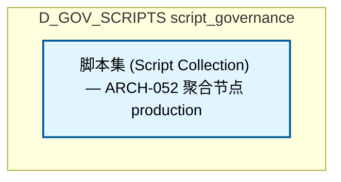

# 36_d_gov_scripts / script_governance / Script Governance

> **文档作用 / Purpose**: 展示 script_governance（D_GOV_SCRIPTS）功能域的模块清单、域内依赖关系、跨域依赖关系、架构分层视图，供架构审查和域治理参考。

> 本文档由 generate_domain_doc.py 从 depgraph (PostgreSQL) 自动生成
> 最后更新: 2026-07-06 16:12:26
> 数据源: depgraph (PostgreSQL) nodes表 + edges表

## 域基本信息 / Domain Overview

| 字段 | 值 | Field | Value |
|------|------|-------|-------|
| 编号 | 36 | Number | 36 |
| 域ID | D_GOV_SCRIPTS | Domain ID | D_GOV_SCRIPTS |
| 域名称 | script_governance | Domain Name | Script Governance |
| 层级 | L2 业务域层 | Layer | L2 Domain |
| 模块数 | 1 | Module Count | 1 |
| 域内依赖 | 0 | Internal Dependencies | 0 |
| 跨域入边 | 0 | Cross-domain Incoming | 0 |
| 跨域出边 | 0 | Cross-domain Outgoing | 0 |
| 设计态模块 | 0 | Design Modules | 0 |
| 原型态模块 | 0 | Prototype Modules | 0 |
| 生产态模块 | 1 | Production Modules | 1 |
| 容量 | 31/150 (正常) | Capacity | 31/150 (正常) |
| 描述 | Phase Manager阶段管理 | Description | Phase Manager阶段管理 |

## 域内依赖图 / Internal Dependency Diagram

> 依赖图内嵌在本文档中，IDE 可直接渲染显示。每30个节点一组分页显示。
>
> **图例说明 / Legend**：
> - **实线边框 = 运营态模块**（production，已上线运行）
> - **虚线边框 = 设计态模块**（design，还在设计中）
> - **实线箭头 = 运营态依赖**（已生效的依赖关系）
> - **虚线箭头 = 设计态依赖**（计划中的依赖关系）



## 跨域依赖 / Cross-domain Dependencies

### 本域依赖的其他域（出边）/ Depends On

无跨域出边依赖 / No cross-domain outgoing dependencies

### 依赖本域的其他域（入边）/ Depended By

无跨域入边依赖 / No cross-domain incoming dependencies

## 架构分层视图 / Architecture Overview

> 按 architecture_layer 分层显示 script_governance（D_GOV_SCRIPTS）的模块分布。共 1 个模块 / 1 modules。

```

┌──────────────────────────────────────────────────────────────────┐
│                未分类 / Unclassified (1 modules)                 │
├──────────────────────────────────────────────────────────────────┤
│   脚本集 (Script Collection) — ARCH-052 聚合节点  [production]   │
└──────────────────────────────────────────────────────────────────┘

```

## 模块分层清单 / Module Layered List

> 按 architecture_layer 分组的模块清单（共 1 个模块 / 1 modules）。

### 未分类 / Unclassified (1 modules)

| # | 模块路径 / Module Path | 模块名称 / Module Name | 功能简介 / Description | 成熟度 / Maturity | 构建状态 / Build Status |
|:--:|---------|---------|---------|:---:|:---:|
| 1 | docs/01_policies_and_standards/_registry/catalogs/scripts... | 脚本集 (Script Collection) — ARCH-05... | [聚合节点 / Aggregated] 脚本集 / Script Collection (433 items) | production | stable |
| ↳1 |   ↳ scripts/governance/__init__.py |  |  | - | - |
| ↳2 |   ↳ scripts/governance/_archive/one_off/analyze_orphan_c... |  |  | - | - |
| ↳3 |   ↳ scripts/governance/_archive/one_off/audit_post_sync_... |  |  | - | - |
| ↳4 |   ↳ scripts/governance/_archive/one_off/audit_session_07.py |  |  | - | - |
| ↳5 |   ↳ scripts/governance/_archive/one_off/check_exam_case_... |  |  | - | - |
| ↳6 |   ↳ scripts/governance/_archive/one_off/check_rule_cover... |  |  | - | - |
| ↳7 |   ↳ scripts/governance/_archive/one_off/create_alignment... |  |  | - | - |
| ↳8 |   ↳ scripts/governance/_archive/one_off/dm105_depgraph_t... |  |  | - | - |
| ↳9 |   ↳ scripts/governance/_archive/one_off/fix_broken_post_... |  |  | - | - |
| ↳10 |   ↳ scripts/governance/_archive/one_off/group_orphan_mod... |  |  | - | - |
| ↳11 |   ↳ scripts/governance/_archive/one_off/list_phase0_tasks.py |  |  | - | - |
| ↳12 |   ↳ scripts/governance/_archive/one_off/migrate_clean_bu... |  |  | - | - |
| ↳13 |   ↳ scripts/governance/_archive/one_off/migrate_domain_i... |  |  | - | - |
| ↳14 |   ↳ scripts/governance/_archive/one_off/perf_depgraph_ba... |  |  | - | - |
| ↳15 |   ↳ scripts/governance/_archive/one_off/phase_a_backup.py |  |  | - | - |
| ↳16 |   ↳ scripts/governance/_archive/one_off/rename_kebab_to_... |  |  | - | - |
| ↳17 |   ↳ scripts/governance/_archive/one_off/rename_whitelist... |  |  | - | - |
| ↳18 |   ↳ scripts/governance/_archive/one_off/test_lock_scenar... |  |  | - | - |
| ↳19 |   ↳ scripts/governance/_archive/one_off/verify_final_del... |  |  | - | - |
| ↳20 |   ↳ scripts/governance/_archive/one_off/verify_rule_yaml... |  |  | - | - |
| ↳21 |   ↳ scripts/governance/_archive/prototype/adversarial_log.py |  |  | - | - |
| ↳22 |   ↳ scripts/governance/_archive/prototype/adversarial_sy... |  |  | - | - |
| ↳23 |   ↳ scripts/governance/_archive/prototype/audit_domain_n... |  |  | - | - |
| ↳24 |   ↳ scripts/governance/_archive/prototype/changelog.py |  |  | - | - |
| ↳25 |   ↳ scripts/governance/_archive/prototype/check_audit_rb... |  |  | - | - |
| ↳26 |   ↳ scripts/governance/_archive/prototype/construction_g... |  |  | - | - |
| ↳27 |   ↳ scripts/governance/_archive/prototype/generate_asset... |  |  | - | - |
| ↳28 |   ↳ scripts/governance/_archive/prototype/generate_nav_t... |  |  | - | - |
| ↳29 |   ↳ scripts/governance/_archive/prototype/rebuild_audit_... |  |  | - | - |
| ↳30 |   ↳ scripts/governance/_archive/prototype/scan_ground_tr... |  |  | - | - |
| ↳31 |   ↳ scripts/governance/_archive/prototype/session_simula... |  |  | - | - |
| ↳32 |   ↳ scripts/governance/_archive/prototype/sync_blueprint... |  |  | - | - |
| ↳33 |   ↳ scripts/governance/_archive/vms_ri/ri_boundary_check.py |  |  | - | - |
| ↳34 |   ↳ scripts/governance/_archive/vms_ri/ri_build_completi... |  |  | - | - |
| ↳35 |   ↳ scripts/governance/_archive/vms_ri/vms_blindspot_che... |  |  | - | - |
| ↳36 |   ↳ scripts/governance/_archive/vms_ri/vms_build_complet... |  |  | - | - |
| ↳37 |   ↳ scripts/governance/_archive/vms_ri/vms_cron_monitor.py |  |  | - | - |
| ↳38 |   ↳ scripts/governance/_archive/vms_ri/vms_cross_file_ch... |  |  | - | - |
| ↳39 |   ↳ scripts/governance/_archive/vms_ri/vms_health_check.py |  |  | - | - |
| ↳40 |   ↳ scripts/governance/_archive/vms_ri/vms_migrate.py |  |  | - | - |
| ↳41 |   ↳ scripts/governance/_archive/vms_ri/vms_migration_dry... |  |  | - | - |
| ↳42 |   ↳ scripts/governance/_archive/vms_ri/vms_phase_rollback.py |  |  | - | - |
| ↳43 |   ↳ scripts/governance/_archive/vms_ri/vms_version_sync_... |  |  | - | - |
| ↳44 |   ↳ scripts/governance/_shared/__init__.py |  |  | - | - |
| ↳45 |   ↳ scripts/governance/_shared/base.py |  |  | - | - |
| ↳46 |   ↳ scripts/governance/_shared/constants.py |  |  | - | - |
| ↳47 |   ↳ scripts/governance/_shared/deprecated_paths.yaml |  |  | - | - |
| ↳48 |   ↳ scripts/governance/_shared/encoding.py |  |  | - | - |
| ↳49 |   ↳ scripts/governance/_shared/file_utils.py |  |  | - | - |
| ↳50 |   ↳ scripts/governance/_shared/frontmatter.py |  |  | - | - |
| ↳51 |   ↳ scripts/governance/_shared/libcst_docstring_adder.py |  |  | - | - |
| ↳52 |   ↳ scripts/governance/_shared/plugin_contract_schema.yaml |  |  | - | - |
| ↳53 |   ↳ scripts/governance/_shared/registry_entry_count.py |  |  | - | - |
| ↳54 |   ↳ scripts/governance/_shared/thresholds.py |  |  | - | - |
| ↳55 |   ↳ scripts/governance/_shared/thresholds.yaml |  |  | - | - |
| ↳56 |   ↳ scripts/governance/_shared/walk.py |  |  | - | - |
| ↳57 |   ↳ scripts/governance/_shared/yaml_utils.py |  |  | - | - |
| ↳58 |   ↳ scripts/governance/_sync/check_p0_status.py |  |  | - | - |
| ↳59 |   ↳ scripts/governance/_sync/cleanup_p0_auto_bridged.py |  |  | - | - |
| ↳60 |   ↳ scripts/governance/_sync/cleanup_p0_ops_pending.py |  |  | - | - |
| ↳61 |   ↳ scripts/governance/_sync/fix_orphan_deps.py |  |  | - | - |
| ↳62 |   ↳ scripts/governance/_tasks/__init__.py |  |  | - | - |
| ↳63 |   ↳ scripts/governance/_tasks/list_phase0_tasks.py |  |  | - | - |
| ↳64 |   ↳ scripts/governance/_tasks/task_show.py |  |  | - | - |
| ↳65 |   ↳ scripts/governance/_tasks/task_summary.py |  |  | - | - |
| ↳66 |   ↳ scripts/governance/apply_dataflowgraph.py |  |  | - | - |
| ↳67 |   ↳ scripts/governance/apply_decisiongraph.py |  |  | - | - |
| ↳68 |   ↳ scripts/governance/apply_depgraph.py |  |  | - | - |
| ↳69 |   ↳ scripts/governance/architecture_health_dashboard.py |  |  | - | - |
| ↳70 |   ↳ scripts/governance/ast_import_rewriter.py |  |  | - | - |
| ↳71 |   ↳ scripts/governance/d10_performance/__init__.py |  |  | - | - |
| ↳72 |   ↳ scripts/governance/d10_performance/collect_system_th... |  |  | - | - |
| ↳73 |   ↳ scripts/governance/d11_compliance/__init__.py |  |  | - | - |
| ↳74 |   ↳ scripts/governance/d11_compliance/audit_registration.py |  |  | - | - |
| ↳75 |   ↳ scripts/governance/d11_compliance/check_ssot_gate.py |  |  | - | - |
| ↳76 |   ↳ scripts/governance/d11_compliance/check_test_structu... |  |  | - | - |
| ↳77 |   ↳ scripts/governance/d11_compliance/ci_self_check.py |  |  | - | - |
| ↳78 |   ↳ scripts/governance/d11_compliance/fix_shared_bypass.py |  |  | - | - |
| ↳79 |   ↳ scripts/governance/d11_compliance/g9_compliance_check.py |  |  | - | - |
| ↳80 |   ↳ scripts/governance/d11_compliance/task_self_check.py |  |  | - | - |
| ↳81 |   ↳ scripts/governance/d11_compliance/validate_blueprint... |  |  | - | - |
| ↳82 |   ↳ scripts/governance/d11_compliance/validate_commit_ga... |  |  | - | - |
| ↳83 |   ↳ scripts/governance/d11_compliance/validate_commit_me... |  |  | - | - |
| ↳84 |   ↳ scripts/governance/d11_compliance/validate_exit_codes.py |  |  | - | - |
| ↳85 |   ↳ scripts/governance/d11_compliance/validate_frozen_re... |  |  | - | - |
| ↳86 |   ↳ scripts/governance/d11_compliance/validate_manifest_... |  |  | - | - |
| ↳87 |   ↳ scripts/governance/d11_compliance/validate_no_utf8_b... |  |  | - | - |
| ↳88 |   ↳ scripts/governance/d11_compliance/validate_script_na... |  |  | - | - |
| ↳89 |   ↳ scripts/governance/d11_compliance/validate_script_qu... |  |  | - | - |
| ↳90 |   ↳ scripts/governance/d11_compliance/validate_task_deco... |  |  | - | - |
| ↳91 |   ↳ scripts/governance/d11_compliance/validate_truth_sou... |  |  | - | - |
| ↳92 |   ↳ scripts/governance/d11_compliance/validate_vocabular... |  |  | - | - |
| ↳93 |   ↳ scripts/governance/d11_compliance/verify_audit_integ... |  |  | - | - |
| ↳94 |   ↳ scripts/governance/d11_compliance/verify_key_imports.py |  |  | - | - |
| ↳95 |   ↳ scripts/governance/d11_compliance/verify_schema_heal... |  |  | - | - |
| ↳96 |   ↳ scripts/governance/d12_ai_hallucination/__init__.py |  |  | - | - |
| ↳97 |   ↳ scripts/governance/d12_ai_hallucination/check_logger... |  |  | - | - |
| ↳98 |   ↳ scripts/governance/d12_ai_hallucination/validate_gat... |  |  | - | - |
| ↳99 |   ↳ scripts/governance/d12_ai_hallucination/validate_ses... |  |  | - | - |
| ↳100 |   ↳ scripts/governance/d12_ai_hallucination/validate_ses... |  |  | - | - |
| | | | > (仅显示前 100 个 items，共 433 个) | | |

## 依赖关系图 / Dependency Graph

> 域内模块依赖关系（共 0 条 / 0 edges）。按依赖类型分组，使用 → 表示方向。

（无域内依赖 / No internal dependencies）


## 说明 / Notes

- **数据源 / Data Source**: `depgraph (PostgreSQL)` 的 `nodes`、`edges`、`domains` 表
- **生成器 / Generator**: `generate_domain_doc.py`（G2+G10 合并）
- **维护方式 / Maintenance**: 自动生成，全景图更新时刷新
- **文件名规则 / File Naming**: `{编号:02d}_{域ID小写}.md`，如 `16_d_trading.md`
- **图例说明 / Legend**: `[production]`=已上线 / `[design]`=设计中 / `[prototype]`=原型 / `[unknown]`=未知
