# 36_d_risk / 风控

> **文档作用 / Purpose**: 展示 风控（D-RISK）功能域的模块清单、域内依赖关系和跨域依赖关系，供架构审查和域治理参考。

> 本文档由 generate_domain_doc.py 从 depgraph.db 自动生成
> 最后更新: 2026-06-24 23:01:54
> 数据源: depgraph.db nodes表 + edges表

## 域基本信息 / Domain Overview

| 字段 | 值 | Field | Value |
|------|------|-------|-------|
| 编号 | 36 | Number | 36 |
| 域ID | D-RISK | Domain ID | D-RISK |
| 域名称 | 风控 | Domain Name | 风控 |
| 层级 | L2_domain | Layer | L2_domain |
| 模块数 | 774 | Module Count | 774 |
| 域内依赖 | 770 | Internal Dependencies | 770 |
| 跨域入边 | 870 | Cross-domain Incoming | 870 |
| 跨域出边 | 477 | Cross-domain Outgoing | 477 |
| 设计态模块 | 749 | Design Modules | 749 |
| 原型态模块 | 11 | Prototype Modules | 11 |
| 生产态模块 | 9 | Production Modules | 9 |
| 容量 | 775/150 (超容) | Capacity | 775/150 (超容) |
| 描述 | 风险度量、风险限额、压力测试、实时风控。交易安全阀。 | Description | 风险度量、风险限额、压力测试、实时风控。交易安全阀。 |

## 模块清单 / Module List

共 774 个模块（按路径排序，全部显示）

| 模块路径 / Module Path | 模块名称 / Module Name | 设计成熟度 / Maturity | 构建状态 / Build Status |
|---------|---------|-----------|---------|
| D-RISK/4级风控决策 APPROVE/REDUCE/REJECT/FLATTEN | 4级风控决策 APPROVE/REDUCE/REJECT/FLATTEN | design | design_only |
| D-RISK/A Share Compliance Rule A股合规规则代管 | A Share Compliance Rule A股合规规则代管 | design | design_only |
| D-RISK/A-Share 5-Signal Systemic Risk Scanner A股5信号系统性风险扫描器 | A-Share 5-Signal Systemic Risk Scanne... | design | design_only |
| D-RISK/A-Share Cascading Circuit Breaker A股级联熔断器 | A-Share Cascading Circuit Breaker A股级... | design | design_only |
| D-RISK/A-Share Compliance Custody A股合规代管 | A-Share Compliance Custody A股合规代管 | design | design_only |
| D-RISK/A-Share Contrarian Dedicated Stop-Loss A股逆向专用止损 | A-Share Contrarian Dedicated Stop-Los... | design | design_only |
| D-RISK/A-Share Contrarian Time-Based Stop-Loss A股逆向时间止损 | A-Share Contrarian Time-Based Stop-Lo... | design | design_only |
| D-RISK/A-Share First-Minute Stop-Loss Executor A股首分钟止损执行器 | A-Share First-Minute Stop-Loss Execut... | design | design_only |
| D-RISK/A-Share Loss Limit Enforcer A股亏损限额强制执行 | A-Share Loss Limit Enforcer A股亏损限额强制执行 | design | design_only |
| D-RISK/A-Share Multi-Level Loss Circuit Breaker A股多级亏损熔断器 | A-Share Multi-Level Loss Circuit Brea... | design | design_only |
| D-RISK/A-Share PDF Tail Risk Auto-Hedger A股PDF尾部风险自动对冲器 | A-Share PDF Tail Risk Auto-Hedger A股P... | design | design_only |
| D-RISK/A-Share Stock Blacklist Manager A股股票黑名单管理器 | A-Share Stock Blacklist Manager A股股票黑... | design | design_only |
| D-RISK/A-Share Stop Loss 6 Patterns A股特色止损6种模式 | A-Share Stop Loss 6 Patterns A股特色止损6种模式 | design | design_only |
| D-RISK/A-Share Stop Loss A股止损 | A-Share Stop Loss A股止损 | design | design_only |
| D-RISK/A-Share Stop-Loss Rule Engine A股止损规则引擎 | A-Share Stop-Loss Rule Engine A股止损规则引擎 | design | design_only |
| D-RISK/A-Share Stop-Loss Rule Engine A股特色止损 | A-Share Stop-Loss Rule Engine A股特色止损 | design | design_only |
| D-RISK/A-Share Stop-Loss/Circuit Breaker Series A股特色止损/熔断系列 | A-Share Stop-Loss/Circuit Breaker Ser... | design | design_only |
| D-RISK/A-Share Systemic Risk 3-Level Alerter A股系统性风险三级告警器 | A-Share Systemic Risk 3-Level Alerter... | design | design_only |
| D-RISK/A-Share Systemic Risk 5 Signals A股系统性风险5信号 | A-Share Systemic Risk 5 Signals A股系统性... | design | design_only |
| D-RISK/A-Share Systemic Risk Detector A股系统性风险检测 | A-Share Systemic Risk Detector A股系统性风险检测 | design | design_only |
| D-RISK/A-Share Systemic Risk Detector A股系统性风险检测器 | A-Share Systemic Risk Detector A股系统性风... | design | design_only |
| D-RISK/A6合规架构何时激活 A6 Compliance Activation | A6合规架构何时激活 A6 Compliance Activation | design | design_only |
| D-RISK/AI Agent Risk AI/Agent风险 | AI Agent Risk AI/Agent风险 | design | design_only |
| D-RISK/AI Agent Risk Governance AI/Agent风险治理 | AI Agent Risk Governance AI/Agent风险治理 | design | design_only |
| D-RISK/AI Agent Risk Governance Bounded Autonomy AI/Agent风险治理有界自治 | AI Agent Risk Governance Bounded Auto... | design | design_only |
| D-RISK/AI Agent Specific Risk AI/Agent特有风险 | AI Agent Specific Risk AI/Agent特有风险 | design | design_only |
| D-RISK/AI Cannot Directly Modify Risk Parameters AI不可直接修改风控参数 | AI Cannot Directly Modify Risk Parame... | design | design_only |
| D-RISK/AI Risk Engine Implementer AI风控引擎实现器 | AI Risk Engine Implementer AI风控引擎实现器 | design | design_only |
| D-RISK/AI-Enhanced Risk Engine AI增强风控引擎 | AI-Enhanced Risk Engine AI增强风控引擎 | design | design_only |
| D-RISK/AI/Agent Risk AI/Agent风险 | AI/Agent Risk AI/Agent风险 | design | design_only |
| D-RISK/AI/Agent特有风险 AI/Agent Specific Risk | AI/Agent特有风险 AI/Agent Specific Risk | design | design_only |
| D-RISK/AISG Regulatory Compliance Checker AISG监管合规检查器 | AISG Regulatory Compliance Checker AI... | design | design_only |
| D-RISK/AI自动触发 AI Auto Trigger | AI自动触发 AI Auto Trigger | design | design_only |
| D-RISK/APPROVE Risk Decision 风险 | APPROVE Risk Decision 风险 | design | design_only |
| D-RISK/ARA五项原则 ARA Five Principles | ARA五项原则 ARA Five Principles | design | design_only |
| D-RISK/ARA治理方程 ARA Governance Equation | ARA治理方程 ARA Governance Equation | design | design_only |
| D-RISK/ARS双轨结算模型 ARS Dual-Track Settlement | ARS双轨结算模型 ARS Dual-Track Settlement | design | design_only |
| D-RISK/ARS状态机语义 ARS State Machine Semantics | ARS状态机语义 ARS State Machine Semantics | design | design_only |
| D-RISK/ATR Dynamic Stop Loss Calculator ATR动态止损计算器 | ATR Dynamic Stop Loss Calculator ATR动... | design | design_only |
| D-RISK/ATR动态止损与Bayesian参数优化模型 ATR Dynamic Stop-Loss Model | ATR动态止损与Bayesian参数优化模型 ATR Dynamic St... | design | design_only |
| D-RISK/ATR动态止盈 ATR Dynamic Take Profit | ATR动态止盈 ATR Dynamic Take Profit | design | design_only |
| D-RISK/Abnormal Trade Detection Interceptor 异常交易检测拦截器 | Abnormal Trade Detection Interceptor ... | design | design_only |
| D-RISK/Agent Boundary Violation Agent越界行为 | Agent Boundary Violation Agent越界行为 | design | design_only |
| D-RISK/Agent Strategy Drift Must Be Detected Agent策略漂移必须被检测 | Agent Strategy Drift Must Be Detected... | design | design_only |
| D-RISK/Agent失控 Agent Out-of-Control | Agent失控 Agent Out-of-Control | design | design_only |
| D-RISK/Agent红队测试 Agent Red Team Testing | Agent红队测试 Agent Red Team Testing | design | design_only |
| D-RISK/Agent行为日志 Agent Behavior Log | Agent行为日志 Agent Behavior Log | design | design_only |
| D-RISK/Agent行为监控 Agent Behavior Monitor | Agent行为监控 Agent Behavior Monitor | design | design_only |
| D-RISK/Agent行为监控 Agent Behavior Monitoring | Agent行为监控 Agent Behavior Monitoring | design | design_only |
| D-RISK/Almgren-Chriss Impact Model Almgren-Chriss冲击模型 | Almgren-Chriss Impact Model Almgren-C... | design | design_only |
| D-RISK/Almgren-Chriss Optimal Execution Framework Almgren-Chriss最优执行框架 | Almgren-Chriss Optimal Execution Fram... | design | design_only |
| D-RISK/Almgren-Chriss最优执行框架 Almgren-Chriss Optimal Execution Framework | Almgren-Chriss最优执行框架 Almgren-Chriss O... | design | design_only |
| D-RISK/Amihud ILLIQ Amihud非流动性指标 | Amihud ILLIQ Amihud非流动性指标 | design | design_only |
| D-RISK/Amihud ILLIQ 非流动性指标 | Amihud ILLIQ 非流动性指标 | design | design_only |
| D-RISK/Amihud Illiquidity Amihud非流动性指标 | Amihud Illiquidity Amihud非流动性指标 | design | design_only |
| D-RISK/Autoencoder重构异常检测 Autoencoder Anomaly Detection | Autoencoder重构异常检测 Autoencoder Anomaly... | design | design_only |
| D-RISK/A股风险日历 A-Share Risk Calendar | A股风险日历 A-Share Risk Calendar | design | design_only |
| D-RISK/BFSI领域自适应红队 FinRedTeamBench | BFSI领域自适应红队 FinRedTeamBench | design | design_only |
| D-RISK/Basel III Multiplier Factor Manager Basel III乘数因子管理器 | Basel III Multiplier Factor Manager B... | design | design_only |
| D-RISK/Bayesian优化 Bayesian Optimization | Bayesian优化 Bayesian Optimization | design | design_only |
| D-RISK/Black Swan Pattern Library 黑天鹅模式库 | Black Swan Pattern Library 黑天鹅模式库 | design | design_only |
| D-RISK/Black Swan Pattern Library 黑天鹅模式库7种模式 | Black Swan Pattern Library 黑天鹅模式库7种模式 | design | design_only |
| D-RISK/Brinson模型 Brinson Model | Brinson模型 Brinson Model | design | design_only |
| D-RISK/C-004 风控 Risk Control | C-004 风控 Risk Control | design | design_only |
| D-RISK/C-038 黑天鹅检测 Black Swan Detection | C-038 黑天鹅检测 Black Swan Detection | design | design_only |
| D-RISK/C/S Pattern C/S关系模式 | C/S Pattern C/S关系模式 | design | design_only |
| D-RISK/CER Cancellation-to-Execution Ratio 撤单成交比 | CER Cancellation-to-Execution Ratio 撤... | design | design_only |
| D-RISK/CTR-003 RiskLimits Producer CTR-003风险限额生产者 | CTR-003 RiskLimits Producer CTR-003风险... | design | design_only |
| D-RISK/CTR-004 Order Consumer CTR-004订单消费者 | CTR-004 Order Consumer CTR-004订单消费者 | design | design_only |
| D-RISK/CTR-006 PositionSnapshot Provider CTR-006仓位快照提供者 | CTR-006 PositionSnapshot Provider CTR... | design | design_only |
| D-RISK/CTR-P1-008 Risk Dashboard Snapshot CTR-P1-008风控仪表盘快照(代码实现) | CTR-P1-008 Risk Dashboard Snapshot CT... | design | design_only |
| D-RISK/CTR-P1-008 RiskDashboardSnapshot CTR-P1-008 RiskDashboardSnapshot契约 | CTR-P1-008 RiskDashboardSnapshot CTR-... | design | design_only |
| D-RISK/CTR-P1-011 RiskMetricsReport CTR-P1-011 RiskMetricsReport契约 | CTR-P1-011 RiskMetricsReport CTR-P1-0... | design | design_only |
| D-RISK/CUSUM控制图 CUSUM Control Chart | CUSUM控制图 CUSUM Control Chart | design | design_only |
| D-RISK/CVaR/ES条件风险价值 Conditional Value at Risk | CVaR/ES条件风险价值 Conditional Value at Risk | design | design_only |
| D-RISK/Carry持有成本 Carry | Carry持有成本 Carry | design | design_only |
| D-RISK/CheckResult CheckResult结构 | CheckResult CheckResult结构 | design | design_only |
| D-RISK/CheckResult 检查结果 | CheckResult 检查结果 | design | design_only |
| D-RISK/Circuit Breaker Trigger 熔断触发 | Circuit Breaker Trigger 熔断触发 | design | design_only |
| D-RISK/CircuitBreaker 熔断事件 | CircuitBreaker 熔断事件 | design | design_only |
| D-RISK/Climate Risk Engine 气候风险引擎 | Climate Risk Engine 气候风险引擎 | design | design_only |
| D-RISK/CoVaR Cross-Market Contagion CoVaR跨市场传染 | CoVaR Cross-Market Contagion CoVaR跨市场传染 | design | design_only |
| D-RISK/CoVaR跨市场传染 | CoVaR跨市场传染 | design | design_only |
| D-RISK/CoVaR跨市场传染 CoVaR Cross-Market Contagion | CoVaR跨市场传染 CoVaR Cross-Market Contagion | design | design_only |
| D-RISK/Collaborative Trading Behavior Detector 协同交易行为检测器 | Collaborative Trading Behavior Detect... | design | design_only |
| D-RISK/Compliance Rule 合规规则(代码实现) | Compliance Rule 合规规则(代码实现) | design | design_only |
| D-RISK/Concentration Exceeds Limit 集中度超限 | Concentration Exceeds Limit 集中度超限 | design | design_only |
| D-RISK/Concentration Limit Non-Breakable 集中度上限不可突破 | Concentration Limit Non-Breakable 集中度... | design | design_only |
| D-RISK/Concentration Risk Monitor 集中度风险监控器 | Concentration Risk Monitor 集中度风险监控器 | design | design_only |
| D-RISK/Concentration Risk Monitor集中度风险监控 | Concentration Risk Monitor集中度风险监控 | design | design_only |
| D-RISK/Configurable Rule Engine 可配置规则引擎 | Configurable Rule Engine 可配置规则引擎 | design | design_only |
| D-RISK/Convexity凸性收益 Convexity | Convexity凸性收益 Convexity | design | design_only |
| D-RISK/Correlation Collapse 相关性崩塌 | Correlation Collapse 相关性崩塌 | design | design_only |
| D-RISK/Counterfactual Analyzer 反事实分析器 | Counterfactual Analyzer 反事实分析器 | design | design_only |
| D-RISK/Counterparty Risk Manager 交易对手风险管理器 | Counterparty Risk Manager 交易对手风险管理器 | design | design_only |
| D-RISK/Counterparty Risk 交易对手风险 | Counterparty Risk 交易对手风险 | design | design_only |
| D-RISK/Covariance Matrix Decomposer 协方差矩阵分解器 | Covariance Matrix Decomposer 协方差矩阵分解器 | design | design_only |
| D-RISK/Credit Risk Engine信用风险引擎 | Credit Risk Engine信用风险引擎 | design | design_only |
| D-RISK/Credit Risk 信用风险 | Credit Risk 信用风险 | design | design_only |
| D-RISK/Cross-Market Contagion 跨市场传导 | Cross-Market Contagion 跨市场传导 | design | design_only |
| D-RISK/Crowding Risk Monitor 拥挤风险监控器 | Crowding Risk Monitor 拥挤风险监控器 | design | design_only |
| D-RISK/Cumulative Drawdown Exceeds Limit 累计回撤超限 | Cumulative Drawdown Exceeds Limit 累计回撤超限 | design | design_only |
| D-RISK/Custom Risk Report Generator 风险报告自定义生成器 | Custom Risk Report Generator 风险报告自定义生成器 | design | design_only |
| D-RISK/D-AUTONOMY Readiness D-AUTONOMY就绪前提 | D-AUTONOMY Readiness D-AUTONOMY就绪前提 | design | design_only |
| D-RISK/D-DATA Readiness D-DATA就绪前提 | D-DATA Readiness D-DATA就绪前提 | design | design_only |
| D-RISK/D-FACTOR Readiness D-FACTOR就绪前提 | D-FACTOR Readiness D-FACTOR就绪前提 | design | design_only |
| D-RISK/D-RISK 风险 | D-RISK 风险 | design | design_only |
| D-RISK/DPG七场景 DPG Seven Scenarios | DPG七场景 DPG Seven Scenarios | design | design_only |
| D-RISK/Daily Loss Exceeds Limit 单日亏损超限 | Daily Loss Exceeds Limit 单日亏损超限 | design | design_only |
| D-RISK/Daily Loss Limit Invariant 日损失限额不变量 | Daily Loss Limit Invariant 日损失限额不变量 | design | design_only |
| D-RISK/Daily Risk Report Generator 每日风险报告生成器 | Daily Risk Report Generator 每日风险报告生成器 | design | design_only |
| D-RISK/Default Position Limit Checker 默认持仓限额检查器(代码实现) | Default Position Limit Checker 默认持仓限额... | design | design_only |
| D-RISK/Default Risk Limits Calculator 默认风险限额计算器(代码实现) | Default Risk Limits Calculator 默认风险限额... | design | design_only |
| D-RISK/Default Risk Manager Orchestrator 默认风控管理器编排器(代码实现) | Default Risk Manager Orchestrator 默认风... | design | design_only |
| D-RISK/Default Risk Validator 默认风控校验器(代码实现) | Default Risk Validator 默认风控校验器(代码实现) | design | design_only |
| D-RISK/Default Stop Loss Engine 默认止损引擎(代码实现) | Default Stop Loss Engine 默认止损引擎(代码实现) | design | design_only |
| ...alidator to Configurable Rule Engine Migrator DefaultRiskValidator→可配置规则引擎迁移器 | DefaultRiskValidator to Configurable ... | design | design_only |
| D-RISK/Degraded Liquidity Mode 降级流动性模式 | Degraded Liquidity Mode 降级流动性模式 | design | design_only |
| D-RISK/Degraded 风控降级事件 | Degraded 风控降级事件 | design | design_only |
| D-RISK/Distribution Fitting Engine 分布拟合引擎 | Distribution Fitting Engine 分布拟合引擎 | design | design_only |
| D-RISK/Dragon-Tiger List Verification 龙虎榜验证 | Dragon-Tiger List Verification 龙虎榜验证 | design | design_only |
| D-RISK/Drawdown Real-Time Tracker 回撤实时跟踪器 | Drawdown Real-Time Tracker 回撤实时跟踪器 | design | design_only |
| D-RISK/DrawdownAlerted 回撤已告警 | DrawdownAlerted 回撤已告警 | design | design_only |
| D-RISK/Drift Detection Risk Closed Loop 漂移检测与风险闭环 | Drift Detection Risk Closed Loop 漂移检测... | design | design_only |
| D-RISK/Drift Exceeded Model Must Degrade 漂移超限模型必须降级 | Drift Exceeded Model Must Degrade 漂移超... | design | design_only |
| D-RISK/Drift Exceeds Limit 漂移超限 | Drift Exceeds Limit 漂移超限 | design | design_only |
| D-RISK/Dual-Engine Routing 双引擎路由 | Dual-Engine Routing 双引擎路由 | design | design_only |
| D-RISK/Dynamic Position Adjuster 动态仓位调整器 | Dynamic Position Adjuster 动态仓位调整器 | design | design_only |
| D-RISK/E-RK-01 D-RISK→间接经PC-04事件 | E-RK-01 D-RISK→间接经PC-04事件 | design | design_only |
| D-RISK/E-RK-03 DrawdownAlerted E-RK-03 DrawdownAlerted事件 | E-RK-03 DrawdownAlerted E-RK-03 Drawd... | design | design_only |
| D-RISK/E-SIM-03 StressTestResult 压力测试结果 | E-SIM-03 StressTestResult 压力测试结果 | design | design_only |
| D-RISK/ESG Risk ESG风险 | ESG Risk ESG风险 | design | design_only |
| D-RISK/ESRB 14个AI风险放大向量 ESRB 14 AI Risk Amplification Vectors | ESRB 14个AI风险放大向量 ESRB 14 AI Risk Ampl... | design | design_only |
| D-RISK/ESRB 2025系统性风险报告 | ESRB 2025系统性风险报告 | design | design_only |
| D-RISK/ESRB Concentration Risk Vector ESRB集中度风险向量 | ESRB Concentration Risk Vector ESRB集中... | design | design_only |
| D-RISK/ESRB Data Dependency Vector ESRB数据依赖向量 | ESRB Data Dependency Vector ESRB数据依赖向量 | design | design_only |
| D-RISK/ESRB Feedback Loop Vector ESRB反馈循环向量 | ESRB Feedback Loop Vector ESRB反馈循环向量 | design | design_only |
| D-RISK/ESRB Interconnection Vector ESRB互联性向量 | ESRB Interconnection Vector ESRB互联性向量 | design | design_only |
| D-RISK/ESRB Model Homogenization Vector ESRB模型同质化向量 | ESRB Model Homogenization Vector ESRB... | design | design_only |
| D-RISK/ESRB Network Vulnerability Vector ESRB网络漏洞向量 | ESRB Network Vulnerability Vector ESR... | design | design_only |
| D-RISK/ESRB Opacity Vector ESRB不透明性向量 | ESRB Opacity Vector ESRB不透明性向量 | design | design_only |
| D-RISK/ESRB Operational Risk Vector ESRB操作风险向量 | ESRB Operational Risk Vector ESRB操作风险向量 | design | design_only |
| D-RISK/ESRB Procyclicality Vector ESRB顺周期性向量 | ESRB Procyclicality Vector ESRB顺周期性向量 | design | design_only |
| D-RISK/ESRB Regulatory Arbitrage Vector ESRB监管套利向量 | ESRB Regulatory Arbitrage Vector ESRB... | design | design_only |
| D-RISK/ESRB Speed Vector ESRB速度向量 | ESRB Speed Vector ESRB速度向量 | design | design_only |
| D-RISK/ESRB不透明性风险向量 ESRB Opacity | ESRB不透明性风险向量 ESRB Opacity | design | design_only |
| D-RISK/ESRB互联性风险向量 ESRB Interconnectedness | ESRB互联性风险向量 ESRB Interconnectedness | design | design_only |
| D-RISK/ESRB历史约束风险向量 ESRB History-Constrained | ESRB历史约束风险向量 ESRB History-Constrained | design | design_only |
| D-RISK/ESRB市场操纵风险向量 ESRB Market Manipulation | ESRB市场操纵风险向量 ESRB Market Manipulation | design | design_only |
| D-RISK/ESRB数据依赖风险向量 ESRB Data Dependency | ESRB数据依赖风险向量 ESRB Data Dependency | design | design_only |
| D-RISK/ESRB模型同质性风险向量 ESRB Model Homogeneity | ESRB模型同质性风险向量 ESRB Model Homogeneity | design | design_only |
| D-RISK/ESRB法律地位未定风险向量 ESRB Untested Legal Status | ESRB法律地位未定风险向量 ESRB Untested Legal St... | design | design_only |
| D-RISK/ESRB监管套利风险向量 ESRB Regulatory Arbitrage | ESRB监管套利风险向量 ESRB Regulatory Arbitrage | design | design_only |
| D-RISK/ESRB网络脆弱性风险向量 ESRB Cyber Vulnerability | ESRB网络脆弱性风险向量 ESRB Cyber Vulnerability | design | design_only |
| D-RISK/ESRB过度信任风险向量 ESRB Overreliance | ESRB过度信任风险向量 ESRB Overreliance | design | design_only |
| D-RISK/ESRB运营风险向量 ESRB Operational Risk | ESRB运营风险向量 ESRB Operational Risk | design | design_only |
| D-RISK/ESRB速度风险向量 ESRB Speed | ESRB速度风险向量 ESRB Speed | design | design_only |
| D-RISK/ESRB集中风险向量 ESRB Concentration Risk | ESRB集中风险向量 ESRB Concentration Risk | design | design_only |
| D-RISK/ESRB顺周期性风险向量 ESRB Procyclicality | ESRB顺周期性风险向量 ESRB Procyclicality | design | design_only |
| D-RISK/EVT极值理论 | EVT极值理论 | design | design_only |
| D-RISK/Emergent Manipulation 涌现操纵模式 | Emergent Manipulation 涌现操纵模式 | design | design_only |
| D-RISK/Enforcement 3-Level Executor 执行3级执行器 | Enforcement 3-Level Executor 执行3级执行器 | design | design_only |
| D-RISK/Enforcement Type 执行类型枚举 | Enforcement Type 执行类型枚举 | design | design_only |
| D-RISK/Execution Result Feedback Consumption Bridger 执行结果反馈消费桥接器 | Execution Result Feedback Consumption... | design | design_only |
| D-RISK/Exit Time Risk 退出时间风险 | Exit Time Risk 退出时间风险 | design | design_only |
| D-RISK/Extreme Event Black Swan 极端事件与黑天鹅 | Extreme Event Black Swan 极端事件与黑天鹅 | design | design_only |
| D-RISK/Extreme Liquidity Mode 极端流动性模式 | Extreme Liquidity Mode 极端流动性模式 | design | design_only |
| D-RISK/FLATTEN Risk Decision 风险 | FLATTEN Risk Decision 风险 | design | design_only |
| D-RISK/Fail-Closed Degradation Handler Fail-Closed降级处理器 | Fail-Closed Degradation Handler Fail-... | design | design_only |
| D-RISK/Fail-Closed 引擎故障处置 | Fail-Closed 引擎故障处置 | design | design_only |
| D-RISK/Fake Move Identification Signal Engine 假动作识别信号引擎 | Fake Move Identification Signal Engin... | design | design_only |
| D-RISK/Fake Rally Real Distribution 假拉升真出货 | Fake Rally Real Distribution 假拉升真出货 | design | design_only |
| D-RISK/Fake Rebound Real Distribution 假反弹真派发 | Fake Rebound Real Distribution 假反弹真派发 | design | design_only |
| D-RISK/Fake Support Real Lure 假护盘真诱多 | Fake Support Real Lure 假护盘真诱多 | design | design_only |
| D-RISK/Fee Track费用轨道 Fee Track | Fee Track费用轨道 Fee Track | design | design_only |
| D-RISK/Frequent Instant Cancellation 频繁瞬时撤单 | Frequent Instant Cancellation 频繁瞬时撤单 | design | design_only |
| D-RISK/Frequent Push-Pull 频繁拉抬打压 | Frequent Push-Pull 频繁拉抬打压 | design | design_only |
| D-RISK/GAN对抗检测 GAN Adversarial Detection | GAN对抗检测 GAN Adversarial Detection | design | design_only |
| D-RISK/GATE-FPGA-01 AUM高频 | GATE-FPGA-01 AUM高频 | design | design_only |
| D-RISK/GATE-FPGA-02 共享内存延迟 | GATE-FPGA-02 共享内存延迟 | design | design_only |
| D-RISK/GATE-FUT-03 期货风控参数 | GATE-FUT-03 期货风控参数 | design | design_only |
| D-RISK/Gate/Dashboard/Profile/DSL/Warehouse Series 门禁/仪表盘/画像/DSL/仓储系列 | Gate/Dashboard/Profile/DSL/Warehouse ... | design | design_only |
| D-RISK/Grid Search 网格搜索 | Grid Search 网格搜索 | design | design_only |
| D-RISK/Grinold & Kahn容量公式 | Grinold & Kahn容量公式 | design | design_only |
| D-RISK/Hedge Execution 独立对冲执行 | Hedge Execution 独立对冲执行 | design | design_only |
| D-RISK/Hot Path No Python Invariant 热路径禁Python不变量 | Hot Path No Python Invariant 热路径禁Pyth... | design | design_only |
| D-RISK/IC衰减检测 IC Decay Detection | IC衰减检测 IC Decay Detection | design | design_only |
| D-RISK/INV-001 Kill Switch Response Time Kill Switch响应时间不变量 | INV-001 Kill Switch Response Time Kil... | design | design_only |
| D-RISK/IV Parametric VaR to Historical Simulation Migrator 参数法VaR→历史模拟法迁移器 | IV Parametric VaR to Historical Simul... | design | design_only |
| D-RISK/Impact Cost Risk 冲击成本风险 | Impact Cost Risk 冲击成本风险 | design | design_only |
| D-RISK/Industry Concentration Compliance Detector 行业集中度合规检测器 | Industry Concentration Compliance Det... | design | design_only |
| D-RISK/Industry Deviation Exceeds Limit 行业偏离超限 | Industry Deviation Exceeds Limit 行业偏离超限 | design | design_only |
| D-RISK/Information Asymmetry Period Manipulation Detector 信息不对称期操纵检测器 | Information Asymmetry Period Manipula... | design | design_only |
| D-RISK/Information Asymmetry Window 信息不对称空窗期 | Information Asymmetry Window 信息不对称空窗期 | design | design_only |
| D-RISK/Instant Order Rate Anomaly 瞬时申报速率异常 | Instant Order Rate Anomaly 瞬时申报速率异常 | design | design_only |
| D-RISK/Insufficient Liquidity 流动性不足 | Insufficient Liquidity 流动性不足 | design | design_only |
| D-RISK/Intraday Time-Varying Participation Rate 日内时变参与率 | Intraday Time-Varying Participation R... | design | design_only |
| D-RISK/KS-L1 软暂停 Kill Switch | KS-L1 软暂停 Kill Switch | design | design_only |
| D-RISK/KS-L2 会话熔断 Kill Switch | KS-L2 会话熔断 Kill Switch | design | design_only |
| D-RISK/KS-L3 通道断开 Kill Switch | KS-L3 通道断开 Kill Switch | design | design_only |
| D-RISK/KS-L4 硬停机 Kill Switch | KS-L4 硬停机 Kill Switch | design | design_only |
| D-RISK/Key Position Support Strength 关键点位护盘强度 | Key Position Support Strength 关键点位护盘强度 | design | design_only |
| D-RISK/Kill Switch Cooldown Manager Kill Switch冷却期管理器 | Kill Switch Cooldown Manager Kill Swi... | design | design_only |
| D-RISK/Kill Switch Integration Kill Switch集成 | Kill Switch Integration Kill Switch集成 | design | design_only |
| D-RISK/Kill Switch Latency Check 紧急开关延迟检查(代码实现) | Kill Switch Latency Check 紧急开关延迟检查(代码实现) | design | design_only |
| D-RISK/Kill Switch Multi-Domain Notifier Kill Switch多域通知器 | Kill Switch Multi-Domain Notifier Kil... | design | design_only |
| D-RISK/Kill Switch New Order Rejector Kill Switch新订单拒绝器 | Kill Switch New Order Rejector Kill S... | design | design_only |
| D-RISK/Kill Switch Owner Confirmation Reset Gateway Kill Switch Owner确认重置网关 | Kill Switch Owner Confirmation Reset ... | design | design_only |
| D-RISK/Kill Switch Saga Kill Switch Saga 紧急制动传奇 | Kill Switch Saga Kill Switch Saga 紧急制动传奇 | design | design_only |
| D-RISK/Kill Switch Saga 紧急制动传奇 | Kill Switch Saga 紧急制动传奇 | design | design_only |
| D-RISK/Kill Switch State Machine Manager Kill Switch状态机管理器 | Kill Switch State Machine Manager Kil... | design | design_only |
| D-RISK/Kill Switch Trading System Integrator Kill Switch交易系统集成器 | Kill Switch Trading System Integrator... | design | design_only |
| D-RISK/Kill Switch Trigger Kill Switch触发 | Kill Switch Trigger Kill Switch触发 | design | design_only |
| D-RISK/Kill Switch in Infrastructure Layer Kill Switch在基础设施层实现 | Kill Switch in Infrastructure Layer K... | design | design_only |
| D-RISK/Kill Switch 紧急停止开关 | Kill Switch 紧急停止开关 | design | design_only |
| D-RISK/Kill Switch 紧急制动 | Kill Switch 紧急制动 | design | design_only |
| D-RISK/Kill Switch 紧急开关(代码实现) | Kill Switch 紧急开关(代码实现) | design | design_only |
| D-RISK/Kill Switch基础设施层实现 Kill Switch Infrastructure | Kill Switch基础设施层实现 Kill Switch Infras... | design | design_only |
| D-RISK/Kill Switch多路径激活 Kill Switch Multi-Path Activation | Kill Switch多路径激活 Kill Switch Multi-Pa... | design | design_only |
| D-RISK/Kill Switch日志 Kill Switch Log | Kill Switch日志 Kill Switch Log | design | design_only |
| D-RISK/Kill Switch直连券商紧急平仓 Kill Switch Direct Broker | Kill Switch直连券商紧急平仓 Kill Switch Direc... | design | design_only |
| D-RISK/Kyle Lambda 凯尔lambda | Kyle Lambda 凯尔lambda | design | design_only |
| D-RISK/Kyle's Lambda Kyle Lambda系数 | Kyle's Lambda Kyle Lambda系数 | design | design_only |
| D-RISK/L1 Pre-Trade L1盘前拦截 | L1 Pre-Trade L1盘前拦截 | design | design_only |
| D-RISK/L1代码隔离 L1 Code Isolation | L1代码隔离 L1 Code Isolation | design | design_only |
| D-RISK/L1共形校准更新 L1 Conformal Calibration Update | L1共形校准更新 L1 Conformal Calibration Update | design | design_only |
| D-RISK/L1实时监控 L1 Real-time Monitoring | L1实时监控 L1 Real-time Monitoring | design | design_only |
| D-RISK/L2 Real-Time L2盘中监控 | L2 Real-Time L2盘中监控 | design | design_only |
| D-RISK/L2数据隔离 L2 Data Isolation | L2数据隔离 L2 Data Isolation | design | design_only |
| D-RISK/L2日频因子风险模型 L2 Daily Factor Risk Model | L2日频因子风险模型 L2 Daily Factor Risk Model | design | design_only |
| D-RISK/L2模型降级 L2 Model Degradation | L2模型降级 L2 Model Degradation | design | design_only |
| D-RISK/L3 Post-Trade L3盘后审计 | L3 Post-Trade L3盘后审计 | design | design_only |
| D-RISK/L3.5 to L4 Risk Approval L3.5→L4风控审批 | L3.5 to L4 Risk Approval L3.5→L4风控审批 | design | design_only |
| D-RISK/L3压力测试 L3 Stress Testing | L3压力测试 L3 Stress Testing | design | design_only |
| D-RISK/L3权限隔离 L3 Permission Isolation | L3权限隔离 L3 Permission Isolation | design | design_only |
| D-RISK/L3风控参数收紧 L3 Risk Parameter Tightening | L3风控参数收紧 L3 Risk Parameter Tightening | design | design_only |
| D-RISK/L4 Risk Control Layer L4风控层 | L4 Risk Control Layer L4风控层 | design | design_only |
| D-RISK/L4审计隔离 L4 Audit Isolation | L4审计隔离 L4 Audit Isolation | design | design_only |
| D-RISK/LVaR Amihud Impact Model LVaR Amihud冲击模型 | LVaR Amihud Impact Model LVaR Amihud冲击模型 | design | design_only |
| D-RISK/LVaR Amihud冲击模型 | LVaR Amihud冲击模型 | design | design_only |
| D-RISK/LVaR Amihud冲击模型 LVaR Amihud Impact Model | LVaR Amihud冲击模型 LVaR Amihud Impact Model | design | design_only |
| D-RISK/LVaR EVT Tail Model LVaR EVT尾部模型 | LVaR EVT Tail Model LVaR EVT尾部模型 | design | design_only |
| D-RISK/LVaR EVT尾部模型 | LVaR EVT尾部模型 | design | design_only |
| D-RISK/LVaR EVT尾部模型 LVaR EVT Tail Model | LVaR EVT尾部模型 LVaR EVT Tail Model | design | design_only |
| D-RISK/LVaR Spread Model LVaR价差模型 | LVaR Spread Model LVaR价差模型 | design | design_only |
| D-RISK/LVaR价差模型 | LVaR价差模型 | design | design_only |
| D-RISK/LVaR价差模型 LVaR Spread Model | LVaR价差模型 LVaR Spread Model | design | design_only |
| D-RISK/Late Session Manipulation Detection 尾盘操纵检测 | Late Session Manipulation Detection 尾... | design | design_only |
| D-RISK/Late Session Manipulation 尾盘操纵 | Late Session Manipulation 尾盘操纵 | design | design_only |
| D-RISK/Layering 分层 | Layering 分层 | design | design_only |
| D-RISK/Leverage Dynamic Manager 杠杆动态管理器 | Leverage Dynamic Manager 杠杆动态管理器 | design | design_only |
| D-RISK/Leverage Limit Gate Checker 杠杆限额门禁检查器 | Leverage Limit Gate Checker 杠杆限额门禁检查器 | design | design_only |
| D-RISK/Limit Consumption Predictor 限额消耗预测器 | Limit Consumption Predictor 限额消耗预测器 | design | design_only |
| D-RISK/Limit Up/Down Trading Constraint Executor 涨跌停交易约束执行器 | Limit Up/Down Trading Constraint Exec... | design | design_only |
| D-RISK/Limit-Up/Down Trading 涨跌停交易 | Limit-Up/Down Trading 涨跌停交易 | design | design_only |
| D-RISK/Liquidity Evaporation 流动性蒸发 | Liquidity Evaporation 流动性蒸发 | design | design_only |
| D-RISK/Liquidity Limit Filter 流动性限制过滤器 | Liquidity Limit Filter 流动性限制过滤器 | design | design_only |
| D-RISK/Liquidity Risk Monitor 流动性风险监控器 | Liquidity Risk Monitor 流动性风险监控器 | design | design_only |
| D-RISK/Liquidity Risk 流动性风险 | Liquidity Risk 流动性风险 | design | design_only |
| D-RISK/Liquidity Spiral Model 流动性螺旋模型 | Liquidity Spiral Model 流动性螺旋模型 | design | design_only |
| D-RISK/Liquidity Spiral Risk 流动性螺旋风险 | Liquidity Spiral Risk 流动性螺旋风险 | design | design_only |
| D-RISK/Margin Call Stampede 融资盘踩踏 | Margin Call Stampede 融资盘踩踏 | design | design_only |
| D-RISK/MarginCalled 追加保证金通知 | MarginCalled 追加保证金通知 | design | design_only |
| D-RISK/Market Depth Risk 市场深度风险 | Market Depth Risk 市场深度风险 | design | design_only |
| D-RISK/Market Digital Twin 市场数字孪生 | Market Digital Twin 市场数字孪生 | design | design_only |
| D-RISK/Market Manipulation Prevention Detector 市场操纵防护检测器 | Market Manipulation Prevention Detect... | design | design_only |
| D-RISK/Market Risk 市场风险 | Market Risk 市场风险 | design | design_only |
| D-RISK/Max Drawdown Real-Time Tracker 最大回撤实时跟踪器 | Max Drawdown Real-Time Tracker 最大回撤实时跟踪器 | design | design_only |
| D-RISK/Model Risk SR 26-2 模型风险 | Model Risk SR 26-2 模型风险 | design | design_only |
| D-RISK/Model Risk 模型风险 | Model Risk 模型风险 | design | design_only |
| D-RISK/Monte Carlo Batch Backtester 蒙特卡洛批量回测器 | Monte Carlo Batch Backtester 蒙特卡洛批量回测器 | design | design_only |
| D-RISK/Monte Carlo Portfolio PnL Sorter 蒙特卡洛组合PnL排序器 | Monte Carlo Portfolio PnL Sorter 蒙特卡洛... | design | design_only |
| D-RISK/Monte Carlo Precision Level Manager 蒙特卡洛精度级别管理器 | Monte Carlo Precision Level Manager 蒙... | design | design_only |
| D-RISK/Named Accountability命名问责人 Named Accountability | Named Accountability命名问责人 Named Accou... | design | design_only |
| D-RISK/Non-Trading Hours Order 非交易时段下单 | Non-Trading Hours Order 非交易时段下单 | design | design_only |
| D-RISK/Normal Liquidity Mode 正常流动性模式 | Normal Liquidity Mode 正常流动性模式 | design | design_only |
| D-RISK/Normality Test Engine 正态性检验引擎 | Normality Test Engine 正态性检验引擎 | design | design_only |
| D-RISK/OHS/PL Pattern OHS/PL关系模式 | OHS/PL Pattern OHS/PL关系模式 | design | design_only |
| D-RISK/OMS Order Management System 订单管理系统 | OMS Order Management System 订单管理系统 | design | design_only |
| D-RISK/Operational Risk 操作风险 | Operational Risk 操作风险 | design | design_only |
| D-RISK/Order Generation Risk Pre-Check 订单生成风控前置 | Order Generation Risk Pre-Check 订单生成风控前置 | design | design_only |
| D-RISK/Order Life Duration 订单存续时间 | Order Life Duration 订单存续时间 | design | design_only |
| D-RISK/P0-Emergency P0紧急指令 | P0-Emergency P0紧急指令 | design | design_only |
| D-RISK/P1-High P1高优先级指令 | P1-High P1高优先级指令 | design | design_only |
| D-RISK/PSI/KS/CUSUM PSI/KS/CUSUM漂移检测指标 | PSI/KS/CUSUM PSI/KS/CUSUM漂移检测指标 | design | design_only |
| D-RISK/Participation Rate Cap 参与率上限 | Participation Rate Cap 参与率上限 | design | design_only |
| D-RISK/Pastor-Stambaugh Pastor-Stambaugh流动性因子 | Pastor-Stambaugh Pastor-Stambaugh流动性因子 | design | design_only |
| D-RISK/Pastor-Stambaugh 流动性因子 | Pastor-Stambaugh 流动性因子 | design | design_only |
| D-RISK/Permanent Impact γ 永久冲击γ | Permanent Impact γ 永久冲击γ | design | design_only |
| D-RISK/Permission/Idempotency/Kill Switch/Approval Series 权限/幂等/Kill Switch/审批系列 | Permission/Idempotency/Kill Switch/Ap... | design | design_only |
| D-RISK/Personalized Risk Profile Builder 个性化风险画像构建器 | Personalized Risk Profile Builder 个性化... | design | design_only |
| D-RISK/Phase 1 Spread Anomaly 阶段1价差异常 | Phase 1 Spread Anomaly 阶段1价差异常 | design | design_only |
| D-RISK/Phase 1参数化高斯混合 Phase 1 Parametric Gaussian Mixture | Phase 1参数化高斯混合 Phase 1 Parametric Gau... | design | design_only |
| D-RISK/Phase 2 Forced Selling 阶段2强制卖出 | Phase 2 Forced Selling 阶段2强制卖出 | design | design_only |
| D-RISK/Phase 2 QNN量子神经网络 Phase 2 QNN | Phase 2 QNN量子神经网络 Phase 2 QNN | design | design_only |
| D-RISK/Phase 3 Liquidity Freeze 阶段3流动性冻结 | Phase 3 Liquidity Freeze 阶段3流动性冻结 | design | design_only |
| D-RISK/Phase 3非参数化KDE Phase 3 Non-parametric KDE | Phase 3非参数化KDE Phase 3 Non-parametric... | design | design_only |
| D-RISK/Pod级止损日志 Pod-level Stop Loss Log | Pod级止损日志 Pod-level Stop Loss Log | design | design_only |
| D-RISK/Pod级止损机制 Pod-Level Stop Loss | Pod级止损机制 Pod-Level Stop Loss | design | design_only |
| D-RISK/Policy Black Swan 政策黑天鹅 | Policy Black Swan 政策黑天鹅 | design | design_only |
| D-RISK/Portfolio CP 组合共形预测 | Portfolio CP 组合共形预测 | design | design_only |
| D-RISK/Portfolio Risk Monitor 组合风险监控器 | Portfolio Risk Monitor 组合风险监控器 | design | design_only |
| D-RISK/Portfolio Risk Monitor持仓实时监控 | Portfolio Risk Monitor持仓实时监控 | design | design_only |
| D-RISK/Position Circuit Breaker 持仓熔断 | Position Circuit Breaker 持仓熔断 | design | design_only |
| D-RISK/Position Limit Compliance Detector 持仓限额合规检测器 | Position Limit Compliance Detector 持仓... | design | design_only |
| D-RISK/Position Limit Decision 仓位上限决策 | Position Limit Decision 仓位上限决策 | design | design_only |
| D-RISK/Position Write Authority Arbiter 仓位写入权限仲裁器 | Position Write Authority Arbiter 仓位写入... | design | design_only |
| D-RISK/PositionLimitBreached 持仓限额已突破 | PositionLimitBreached 持仓限额已突破 | design | design_only |
| D-RISK/Post-Trade Daily Auditor 盘后日终审计器 | Post-Trade Daily Auditor 盘后日终审计器 | design | design_only |
| D-RISK/Pre-Trade 50ms SLA Monitor 盘前50ms SLA监控器 | Pre-Trade 50ms SLA Monitor 盘前50ms SLA监控器 | design | design_only |
| D-RISK/Pre-Trade Check Chain Orchestrator 盘前检查链编排器 | Pre-Trade Check Chain Orchestrator 盘前... | design | design_only |
| D-RISK/Pre-Trade Checker 盘前检查器 | Pre-Trade Checker 盘前检查器 | design | design_only |
| D-RISK/Pre-Trade Checker盘前检查 | Pre-Trade Checker盘前检查 | design | design_only |
| D-RISK/Pre-Trade Idempotency Guarantor 盘前幂等保证器 | Pre-Trade Idempotency Guarantor 盘前幂等保证器 | design | design_only |
| D-RISK/Pre-Trade RiskCheckResult Router 盘前风控结果路由器 | Pre-Trade RiskCheckResult Router 盘前风控... | design | design_only |
| D-RISK/Pre-Trade Three Block Mode Engine Pre-Trade三种阻塞模式引擎 | Pre-Trade Three Block Mode Engine Pre... | design | design_only |
| D-RISK/PreTradeRejected 交易前拒绝 | PreTradeRejected 交易前拒绝 | design | design_only |
| D-RISK/Principal Track本金轨道 Principal Track | Principal Track本金轨道 Principal Track | design | design_only |
| D-RISK/QRF+Conformal 分位数回归森林+共形 | QRF+Conformal 分位数回归森林+共形 | design | design_only |
| D-RISK/REDUCE Risk Decision 风险 | REDUCE Risk Decision 风险 | design | design_only |
| D-RISK/REJECT Risk Decision 风险 | REJECT Risk Decision 风险 | design | design_only |
| D-RISK/Real-time Risk Warning and Report Generator 实时风险预警与报告生成器 | Real-time Risk Warning and Report Gen... | design | design_only |
| D-RISK/Related Account Coordination 关联账户协同性检测 | Related Account Coordination 关联账户协同性检测 | design | design_only |
| D-RISK/Reliability危机可靠性 Reliability | Reliability危机可靠性 Reliability | design | design_only |
| D-RISK/Reverse RST 反向RST指标 | Reverse RST 反向RST指标 | design | design_only |
| D-RISK/Risk Agent Circuit Break 风控Agent熔断 | Risk Agent Circuit Break 风控Agent熔断 | design | design_only |
| D-RISK/Risk Assessment 风险评估 | Risk Assessment 风险评估 | design | design_only |
| D-RISK/Risk Audit Log Immutable 风险审计日志不可篡改 | Risk Audit Log Immutable 风险审计日志不可篡改 | design | design_only |
| D-RISK/Risk Audit Trail Writer 风险审计轨迹写入器 | Risk Audit Trail Writer 风险审计轨迹写入器 | design | design_only |
| D-RISK/Risk Audit 风控审计 | Risk Audit 风控审计 | design | design_only |
| D-RISK/Risk Aversion λ 风险厌恶λ | Risk Aversion λ 风险厌恶λ | design | design_only |
| D-RISK/Risk Breach Logger 风险违规日志 | Risk Breach Logger 风险违规日志 | design | design_only |
| D-RISK/Risk Budget Adjuster 风险预算调整器 | Risk Budget Adjuster 风险预算调整器 | design | design_only |
| D-RISK/Risk Budget Allocator 风险预算分配器 | Risk Budget Allocator 风险预算分配器 | design | design_only |
| D-RISK/Risk Budget Allocator风险预算分配 | Risk Budget Allocator风险预算分配 | design | design_only |
| D-RISK/Risk Can Veto All Trading Decisions 风控可否决一切交易决策 | Risk Can Veto All Trading Decisions 风... | design | design_only |
| D-RISK/Risk Control Agent 风险 | Risk Control Agent 风险 | design | design_only |
| D-RISK/Risk Control No Downgrade Boundary 风控不可降级边界 | Risk Control No Downgrade Boundary 风控... | design | design_only |
| D-RISK/Risk Control Rule Engine 风险控制规则引擎 | Risk Control Rule Engine 风险控制规则引擎 | design | design_only |
| D-RISK/Risk Control 自适应风控 | Risk Control 自适应风控 | design | design_only |
| D-RISK/Risk Dashboard Generator 风险仪表盘生成器 | Risk Dashboard Generator 风险仪表盘生成器 | design | design_only |
| D-RISK/Risk Decomposition Engine风险分解引擎 | Risk Decomposition Engine风险分解引擎 | design | design_only |
| D-RISK/Risk Domain Repository Interface 风控域仓储接口 | Risk Domain Repository Interface 风控域仓储接口 | design | design_only |
| D-RISK/Risk Domain Value Object Definition 风控域值对象定义 | Risk Domain Value Object Definition 风... | design | design_only |
| D-RISK/Risk Engine Rule DSL 风控引擎规则DSL | Risk Engine Rule DSL 风控引擎规则DSL | design | design_only |
| D-RISK/Risk Intercept 风控拦截 | Risk Intercept 风控拦截 | design | design_only |
| D-RISK/Risk Limit Manager 风险限额管理器 | Risk Limit Manager 风险限额管理器 | design | design_only |
| D-RISK/Risk Limit Manager风险限额管理 | Risk Limit Manager风险限额管理 | design | design_only |
| D-RISK/Risk Limits 风控限额(代码实现) | Risk Limits 风控限额(代码实现) | design | design_only |
| D-RISK/Risk Management Core 风险管理核心 | Risk Management Core 风险管理核心 | design | design_only |
| D-RISK/Risk Manager Agent 风控Agent | Risk Manager Agent 风控Agent | design | design_only |
| D-RISK/Risk Manager 风控管理器(代码实现) | Risk Manager 风控管理器(代码实现) | design | design_only |
| D-RISK/Risk Metrics 风控指标(代码实现) | Risk Metrics 风控指标(代码实现) | design | design_only |
| D-RISK/Risk Parameter Change Requires Manual Approval 风控参数变更需人工审批 | Risk Parameter Change Requires Manual... | design | design_only |
| D-RISK/Risk Parameters Non-Reducible 风控参数不得降低至硬边界以下 | Risk Parameters Non-Reducible 风控参数不得降... | design | design_only |
| D-RISK/Risk Params Consistency Check 风控参数一致性检查(代码实现) | Risk Params Consistency Check 风控参数一致性... | design | design_only |
| D-RISK/Risk Params Three-Plane Consistency Invariant 风控参数三平面一致性不变量 | Risk Params Three-Plane Consistency I... | design | design_only |
| D-RISK/Risk Policy Approval Gateway 风险策略审批网关 | Risk Policy Approval Gateway 风险策略审批网关 | design | design_only |
| D-RISK/Risk Policy Backtester 风控策略回测器 | Risk Policy Backtester 风控策略回测器 | design | design_only |
| D-RISK/Risk Policy DDD Aggregate Root AGG-007 Manager 风险策略DDD聚合根AGG-007管理器 | Risk Policy DDD Aggregate Root AGG-00... | design | design_only |
| D-RISK/Risk Policy Manager 风险策略管理器 | Risk Policy Manager 风险策略管理器 | design | design_only |
| D-RISK/Risk Policy Manager风控策略管理 | Risk Policy Manager风控策略管理 | design | design_only |
| D-RISK/Risk Policy Persister 风控策略持久化 | Risk Policy Persister 风控策略持久化 | design | design_only |
| D-RISK/Risk Policy SQLite Schema Designer 风险策略SQLite Schema设计器 | Risk Policy SQLite Schema Designer 风险... | design | design_only |
| D-RISK/Risk Report Auto-Generator 风险报告自动生成器 | Risk Report Auto-Generator 风险报告自动生成器 | design | design_only |
| D-RISK/Risk Report Engine 风险报告引擎 | Risk Report Engine 风险报告引擎 | design | design_only |
| D-RISK/Risk Report 风险报告 | Risk Report 风险报告 | design | design_only |
| D-RISK/Risk Rule DSL Compiler 风控规则DSL编译器 | Risk Rule DSL Compiler 风控规则DSL编译器 | design | design_only |
| D-RISK/Risk Rule DSL Engine 风控规则DSL引擎 | Risk Rule DSL Engine 风控规则DSL引擎 | design | design_only |
| D-RISK/Risk Rule Engine Upgrade Migration Adapter 风控规则引擎升级迁移适配器 | Risk Rule Engine Upgrade Migration Ad... | design | design_only |
| D-RISK/Risk Rule User Configurator 风险规则用户配置器 | Risk Rule User Configurator 风险规则用户配置器 | design | design_only |
| D-RISK/Risk Rule Validation and Stress Tester 风控规则验证与压力测试器 | Risk Rule Validation and Stress Teste... | design | design_only |
| D-RISK/Risk Rule Versioning and Hot Updater 风控规则版本化与热更新器 | Risk Rule Versioning and Hot Updater ... | design | design_only |
| D-RISK/Risk Rule YAML Runtime Loader 风险规则YAML运行时加载器 | Risk Rule YAML Runtime Loader 风险规则YAM... | design | design_only |
| D-RISK/Risk Stress Tester 风控压力测试器 | Risk Stress Tester 风控压力测试器 | design | design_only |
| D-RISK/Risk Trigger Cannot Be Overridden by Humans 风控触发后不可被人类否决 | Risk Trigger Cannot Be Overridden by ... | design | design_only |
| D-RISK/Risk Validator Protocol 风控校验器协议(代码实现) | Risk Validator Protocol 风控校验器协议(代码实现) | design | design_only |
| D-RISK/Risk Validator 风控校验器(代码实现) | Risk Validator 风控校验器(代码实现) | design | design_only |
| D-RISK/Risk Veto Cannot Be Bypassed 风险否决不可绕过 | Risk Veto Cannot Be Bypassed 风险否决不可绕过 | design | design_only |
| D-RISK/Risk Veto Non-Bypassable 风控否决不可绕过 | Risk Veto Non-Bypassable 风控否决不可绕过 | design | design_only |
| D-RISK/Risk Veto Penetrates Any Layer 风控否决可穿透任意层 | Risk Veto Penetrates Any Layer 风控否决可穿... | design | design_only |
| D-RISK/Risk Veto Rights 风险否决权 | Risk Veto Rights 风险否决权 | design | design_only |
| D-RISK/Risk Veto Rule 风险否决权13条主规则 | Risk Veto Rule 风险否决权13条主规则 | design | design_only |
| D-RISK/Risk Veto 风险否决权 | Risk Veto 风险否决权 | design | design_only |
| D-RISK/RiskCleared 风控解除事件 | RiskCleared 风控解除事件 | design | design_only |
| D-RISK/RiskDashboardSnapshot CTR-P1-008 Builder 风险仪表盘快照CTR-P1-008构建器 | RiskDashboardSnapshot CTR-P1-008 Buil... | design | design_only |
| D-RISK/RiskDashboardSnapshot 风险仪表盘快照 | RiskDashboardSnapshot 风险仪表盘快照 | design | design_only |
| D-RISK/RiskLimit 9-Type Enum Manager 风险限额9类枚举管理器 | RiskLimit 9-Type Enum Manager 风险限额9类枚... | design | design_only |
| D-RISK/RiskLimit RiskLimit结构 | RiskLimit RiskLimit结构 | design | design_only |
| D-RISK/RiskLimit 风险限额 | RiskLimit 风险限额 | design | design_only |
| D-RISK/RiskLimitType Enum9 RiskLimitType九种限额类型枚举 | RiskLimitType Enum9 RiskLimitType九种限额... | design | design_only |
| D-RISK/RiskLimitType 风险限额类型 | RiskLimitType 风险限额类型 | design | design_only |
| D-RISK/RiskLimitViolationError 风险限额违规错误 | RiskLimitViolationError 风险限额违规错误 | design | design_only |
| D-RISK/RiskLimits Feed 风险限额供给 | RiskLimits Feed 风险限额供给 | design | design_only |
| D-RISK/RiskMetricsReport CTR-P1-011 Generator 风险指标报告CTR-P1-011生成器 | RiskMetricsReport CTR-P1-011 Generato... | design | design_only |
| D-RISK/RiskMetricsReport 风险指标报告 | RiskMetricsReport 风险指标报告 | design | design_only |
| D-RISK/RiskPolicy 风控策略聚合根 | RiskPolicy 风控策略聚合根 | design | design_only |
| D-RISK/RiskThresholdBreached 风控阈值触发 | RiskThresholdBreached 风控阈值触发 | design | design_only |
| D-RISK/RiskTriggered 风控触发事件 | RiskTriggered 风控触发事件 | design | design_only |
| D-RISK/Roll Spread Estimator 罗尔价差估计器 | Roll Spread Estimator 罗尔价差估计器 | design | design_only |
| D-RISK/Roll's Spread Estimator Roll价差估计器 | Roll's Spread Estimator Roll价差估计器 | design | design_only |
| D-RISK/Rule Engine Configurable 规则引擎可配置化 | Rule Engine Configurable 规则引擎可配置化 | design | design_only |
| D-RISK/Rule Engine vs Statistical Engine Router 双引擎路由器 | Rule Engine vs Statistical Engine Rou... | design | design_only |
| D-RISK/Rule Engine 规则引擎(双引擎) | Rule Engine 规则引擎(双引擎) | design | design_only |
| D-RISK/Rule Priority Sorter (Inter-Rule) 规则优先级排序(规则间) | Rule Priority Sorter (Inter-Rule) 规则优... | design | design_only |
| D-RISK/Rule Priority Sorter (Inter-Strategy) 规则优先级排序(策略间) | Rule Priority Sorter (Inter-Strategy)... | design | design_only |
| D-RISK/SR 26-2排除GenAI是否等RFI SR 26-2 GenAI Exclusion | SR 26-2排除GenAI是否等RFI SR 26-2 GenAI Ex... | design | design_only |
| D-RISK/ST Stock Position Limit ST股仓位上限 | ST Stock Position Limit ST股仓位上限 | design | design_only |
| D-RISK/Scenario Analyzer 情景分析器 | Scenario Analyzer 情景分析器 | design | design_only |
| D-RISK/Sector Concentration Real-Time Calculator 行业集中度实时计算器 | Sector Concentration Real-Time Calcul... | design | design_only |
| D-RISK/Sequential Evaluation 顺序评估 | Sequential Evaluation 顺序评估 | design | design_only |
| D-RISK/Short-time Large Volume 短时间大额成交 | Short-time Large Volume 短时间大额成交 | design | design_only |
| D-RISK/SignalAggregator 信号聚合器 | SignalAggregator 信号聚合器 | design | design_only |
| D-RISK/Single Order Amount Exceeds Limit 单笔金额超限 | Single Order Amount Exceeds Limit 单笔金额超限 | design | design_only |
| D-RISK/Single Position Limit Invariant 单一持仓限制不变量 | Single Position Limit Invariant 单一持仓限... | design | design_only |
| D-RISK/Single Stock Concentration Limit 单票集中度上限 | Single Stock Concentration Limit 单票集中度上限 | design | design_only |
| D-RISK/Single Strategy Hard Stop 单策略Hard Stop | Single Strategy Hard Stop 单策略Hard Stop | design | design_only |
| D-RISK/Single Strategy Soft Stop 单策略Soft Stop | Single Strategy Soft Stop 单策略Soft Stop | design | design_only |
| D-RISK/Spoof Probability Spoof概率 | Spoof Probability Spoof概率 | design | design_only |
| D-RISK/Spoofing Detection 幌骗交易检测 | Spoofing Detection 幌骗交易检测 | design | design_only |
| D-RISK/Spoofing Trade Detection 幌骗交易检测(操纵行为) | Spoofing Trade Detection 幌骗交易检测(操纵行为) | design | design_only |
| D-RISK/Spoofing 幌骗 | Spoofing 幌骗 | design | design_only |
| D-RISK/Statistical Engine 统计引擎(双引擎) | Statistical Engine 统计引擎(双引擎) | design | design_only |
| D-RISK/Stop Loss Engine止损引擎 | Stop Loss Engine止损引擎 | design | design_only |
| D-RISK/Stop Loss 止损(代码实现) | Stop Loss 止损(代码实现) | design | design_only |
| D-RISK/Stop-Loss Engine止损引擎 | Stop-Loss Engine止损引擎 | design | design_only |
| D-RISK/Strategy Capacity Risk 策略容量风险 | Strategy Capacity Risk 策略容量风险 | design | design_only |
| D-RISK/Strategy Correlation Gate Checker 策略相关性门禁检查器 | Strategy Correlation Gate Checker 策略相... | design | design_only |
| D-RISK/Strategy Crowding 策略拥挤 | Strategy Crowding 策略拥挤 | design | design_only |
| D-RISK/Stress Test Engine压力测试引擎 | Stress Test Engine压力测试引擎 | design | design_only |
| D-RISK/Survival Rule Set SURV-001~008 保命规则集 | Survival Rule Set SURV-001~008 保命规则集 | design | design_only |
| D-RISK/Systematic Overfitting Protection 过拟合系统性防护 | Systematic Overfitting Protection 过拟合... | design | design_only |
| D-RISK/Systematic Stress Testing 系统性压力测试 | Systematic Stress Testing 系统性压力测试 | design | design_only |
| D-RISK/Systemic Risk 系统性风险 | Systemic Risk 系统性风险 | design | design_only |
| D-RISK/T+1锁定风险模拟 T+1 Lock Risk Simulation | T+1锁定风险模拟 T+1 Lock Risk Simulation | design | design_only |
| D-RISK/TCP+Robbins-Monro偏移 TCP-RM | TCP+Robbins-Monro偏移 TCP-RM | design | design_only |
| D-RISK/Tail Risk Monitor 尾部风险监控器 | Tail Risk Monitor 尾部风险监控器 | design | design_only |
| D-RISK/TailRiskManagement 灾难逃生 | TailRiskManagement 灾难逃生 | design | design_only |
| D-RISK/Temporary Impact η 临时冲击η | Temporary Impact η 临时冲击η | design | design_only |
| D-RISK/Tick风控 Tick风控检查 | Tick风控 Tick风控检查 | design | design_only |
| D-RISK/Time-Based Stop Loss Evaluator 时间止损评估器 | Time-Based Stop Loss Evaluator 时间止损评估器 | design | design_only |
| D-RISK/Trading Behavior Compliance Detector 交易行为合规检测器 | Trading Behavior Compliance Detector ... | design | design_only |
| D-RISK/Trading Hours Check Non-Disabling 交易时段校验不可关闭 | Trading Hours Check Non-Disabling 交易时... | design | design_only |
| D-RISK/Trading Rate Constraint Executor 交易速率约束执行器 | Trading Rate Constraint Executor 交易速率... | design | design_only |
| D-RISK/Transformer时序异常 Transformer Time-Series Anomaly | Transformer时序异常 Transformer Time-Seri... | design | design_only |
| D-RISK/Two-Tier Alert Strategy Engine 双层告警策略引擎 | Two-Tier Alert Strategy Engine 双层告警策略引擎 | design | design_only |
| D-RISK/U/D Pattern U/D关系模式 | U/D Pattern U/D关系模式 | design | design_only |
| D-RISK/Unleash 2026 Kill Switch Unleash 2026紧急制动 | Unleash 2026 Kill Switch Unleash 2026... | design | design_only |
| D-RISK/VaR Calculator VaR计算器 | VaR Calculator VaR计算器 | design | design_only |
| D-RISK/VaR Calculator 风险价值计算器 | VaR Calculator 风险价值计算器 | design | design_only |
| D-RISK/VaR Compute Data Prefetcher VaR计算数据预取器 | VaR Compute Data Prefetcher VaR计算数据预取器 | design | design_only |
| D-RISK/VaR Concurrent Compute Orchestrator VaR并发计算编排器 | VaR Concurrent Compute Orchestrator V... | design | design_only |
| D-RISK/VaR Cross-Validation Engine VaR交叉验证引擎 | VaR Cross-Validation Engine VaR交叉验证引擎 | design | design_only |
| D-RISK/VaR DuckDB历史模拟查询构建器 VaR DuckDB Query Builder | VaR DuckDB历史模拟查询构建器 VaR DuckDB Query ... | design | design_only |
| D-RISK/VaR Enhancement Series VaR增强系列 | VaR Enhancement Series VaR增强系列 | design | design_only |
| D-RISK/VaR Exceeds Limit VaR超限 | VaR Exceeds Limit VaR超限 | design | design_only |
| D-RISK/VaR Fast Pre-Screen Alerter VaR快速预筛告警器 | VaR Fast Pre-Screen Alerter VaR快速预筛告警器 | design | design_only |
| D-RISK/VaR Method Discrepancy Analyzer VaR方法差异分析器 | VaR Method Discrepancy Analyzer VaR方法... | design | design_only |
| D-RISK/VaR Phase 1 Parameter Method VaR Phase 1参数法 | VaR Phase 1 Parameter Method VaR Phas... | design | design_only |
| D-RISK/VaR Phase 1 VaR三阶段Phase 1 | VaR Phase 1 VaR三阶段Phase 1 | design | design_only |
| D-RISK/VaR Phase 2 Monte Carlo VaR Phase 2蒙特卡洛法 | VaR Phase 2 Monte Carlo VaR Phase 2蒙特卡洛法 | design | design_only |
| D-RISK/VaR Phase 2 VaR三阶段Phase 2 | VaR Phase 2 VaR三阶段Phase 2 | design | design_only |
| D-RISK/VaR Phase 3 Basel III VaR Phase 3 Basel III三角验证 | VaR Phase 3 Basel III VaR Phase 3 Bas... | design | design_only |
| D-RISK/VaR Phase 3 VaR三阶段Phase 3 | VaR Phase 3 VaR三阶段Phase 3 | design | design_only |
| D-RISK/VaR Phase Independence Guarantor VaR阶段独立性保证器 | VaR Phase Independence Guarantor VaR阶... | design | design_only |
| D-RISK/VaR Precise Confirmer VaR精确确认器 | VaR Precise Confirmer VaR精确确认器 | design | design_only |
| D-RISK/VaR Recalculation Scheduler VaR重算调度器 | VaR Recalculation Scheduler VaR重算调度器 | design | design_only |
| D-RISK/VaR Scheduling/Concentration/ATR/Monte Carlo Series VaR调度/集中度/ATR/蒙特卡洛系列 | VaR Scheduling/Concentration/ATR/Mont... | design | design_only |
| D-RISK/VaR风险价值 Value at Risk | VaR风险价值 Value at Risk | design | design_only |
| D-RISK/Veto Flow 否决流 | Veto Flow 否决流 | design | design_only |
| D-RISK/Volatility Eruption 波动率爆发 | Volatility Eruption 波动率爆发 | design | design_only |
| D-RISK/Volume-Price Consistency 量价一致性 | Volume-Price Consistency 量价一致性 | design | design_only |
| D-RISK/Walk-Forward验证 Walk-Forward Validation | Walk-Forward验证 Walk-Forward Validation | design | design_only |
| D-RISK/Warning 警告 | Warning 警告 | design | design_only |
| D-RISK/Wash Trade Detection 对敲交易检测(操纵行为) | Wash Trade Detection 对敲交易检测(操纵行为) | design | design_only |
| D-RISK/Wash Trade 洗盘 | Wash Trade 洗盘 | design | design_only |
| D-RISK/YAML/SQLite/SLA/Contract/Migration Series YAML加载/SQLite/SLA/契约/迁移系列 | YAML/SQLite/SLA/Contract/Migration Se... | design | design_only |
| D-RISK/三平面一致性 Three-Plane Consistency | 三平面一致性 Three-Plane Consistency | design | design_only |
| D-RISK/上下文注入 Context Injection | 上下文注入 Context Injection | design | design_only |
| D-RISK/上游数据检测 Upstream Data Detection | 上游数据检测 Upstream Data Detection | design | design_only |
| D-RISK/上游数据漂移 Upstream Data Drift | 上游数据漂移 Upstream Data Drift | design | design_only |
| D-RISK/上线验证 Go-Live Validation | 上线验证 Go-Live Validation | design | design_only |
| D-RISK/不安全元数据 Insecure Metadata | 不安全元数据 Insecure Metadata | design | design_only |
| D-RISK/不安全反序列化 Unsafe Deserialization | 不安全反序列化 Unsafe Deserialization | design | design_only |
| D-RISK/不操纵市场规则 No Market Manipulation Rules | 不操纵市场规则 No Market Manipulation Rules | design | design_only |
| D-RISK/买入后即时验证与快速纠错模型 Post-Entry Instant Validation Model | 买入后即时验证与快速纠错模型 Post-Entry Instant Val... | design | design_only |
| D-RISK/买入后即时验证与快速纠错模型 Post-Entry Validation | 买入后即时验证与快速纠错模型 Post-Entry Validation | design | design_only |
| D-RISK/买卖价差扩大模拟 Spread Widening Simulation | 买卖价差扩大模拟 Spread Widening Simulation | design | design_only |
| D-RISK/事件风险快报 Event Risk Bulletin | 事件风险快报 Event Risk Bulletin | design | design_only |
| D-RISK/二阶效应与传染模型 Second-Order Effect Contagion Model | 二阶效应与传染模型 Second-Order Effect Contagi... | design | design_only |
| D-RISK/交易对手风险 Counterparty Risk | 交易对手风险 Counterparty Risk | design | design_only |
| D-RISK/交易管线扰动 TradeTrap | 交易管线扰动 TradeTrap | design | design_only |
| D-RISK/交易绩效归因与策略退化检测模型 Performance Attribution Model | 交易绩效归因与策略退化检测模型 Performance Attributi... | design | design_only |
| D-RISK/人为错误 Human Error | 人为错误 Human Error | design | design_only |
| D-RISK/人工一键触发 Manual One-click Trigger | 人工一键触发 Manual One-click Trigger | design | design_only |
| D-RISK/人类监督频率降低 Human Supervision Frequency Decrease | 人类监督频率降低 Human Supervision Frequency ... | design | design_only |
| D-RISK/仓位限制预检器 Position | 仓位限制预检器 Position | design | design_only |
| D-RISK/令牌管理不当 Token Mismanagement | 令牌管理不当 Token Mismanagement | design | design_only |
| D-RISK/价格风险 Price Risk | 价格风险 Price Risk | design | design_only |
| D-RISK/体制加权共形风险控制 Regime-Weighted Conformal | 体制加权共形风险控制 Regime-Weighted Conformal | design | design_only |
| D-RISK/体制自适应 Regime Adaptive | 体制自适应 Regime Adaptive | design | design_only |
| D-RISK/供应链妥协 Supply Chain AST | 供应链妥协 Supply Chain AST | design | design_only |
| D-RISK/供应链攻击 Supply Chain MCP | 供应链攻击 Supply Chain MCP | design | design_only |
| D-RISK/保证金比例安全检查器 Security | 保证金比例安全检查器 Security | design | design_only |
| D-RISK/保费 Premium | 保费 Premium | design | design_only |
| D-RISK/保障缺口管理 Guarantee Gap Management | 保障缺口管理 Guarantee Gap Management | design | design_only |
| D-RISK/信号验证 Signal Validation | 信号验证 Signal Validation | design | design_only |
| D-RISK/信心传染 Confidence Contagion | 信心传染 Confidence Contagion | design | design_only |
| D-RISK/信息不对称期与操纵行为检测模型 Information Asymmetry Detection Model | 信息不对称期与操纵行为检测模型 Information Asymmetry... | design | design_only |
| D-RISK/信用事件冲击 Credit Event Shock | 信用事件冲击 Credit Event Shock | design | design_only |
| D-RISK/信用风险 Credit Risk | 信用风险 Credit Risk | design | design_only |
| D-RISK/公平性漂移 Fairness Drift | 公平性漂移 Fairness Drift | design | design_only |
| D-RISK/共形VaR Conformal VaR | 共形VaR Conformal VaR | design | design_only |
| D-RISK/共形VaR从TWC升级到RWC时机 Conformal VaR TWC to RWC | 共形VaR从TWC升级到RWC时机 Conformal VaR TWC t... | design | design_only |
| D-RISK/共形VaR回测 CP-VaR Backtesting | 共形VaR回测 CP-VaR Backtesting | design | design_only |
| D-RISK/共形VaR默认使用TWC Default TWC Conformal VaR | 共形VaR默认使用TWC Default TWC Conformal VaR | design | design_only |
| D-RISK/冲击成本风险 Impact Cost Risk | 冲击成本风险 Impact Cost Risk | design | design_only |
| D-RISK/决策正确性缺口 Decision Correctness Gap | 决策正确性缺口 Decision Correctness Gap | design | design_only |
| D-RISK/凸性预算框架 Convexity Budget Framework | 凸性预算框架 Convexity Budget Framework | design | design_only |
| D-RISK/分位数预测共形校准 TCP Conformal | 分位数预测共形校准 TCP Conformal | design | design_only |
| D-RISK/分层操纵检测 Layering Detection | 分层操纵检测 Layering Detection | design | design_only |
| D-RISK/分批止盈 Batch Take Profit | 分批止盈 Batch Take Profit | design | design_only |
| D-RISK/千股跌停 Thousand Stocks Limit Down | 千股跌停 Thousand Stocks Limit Down | design | design_only |
| D-RISK/协变量漂移 Covariate Drift | 协变量漂移 Covariate Drift | design | design_only |
| D-RISK/历史数据代表性验证器 Historical Data Representativeness Validator | 历史数据代表性验证器 Historical Data Representa... | design | design_only |
| D-RISK/压力测试 Stress Testing | 压力测试 Stress Testing | design | design_only |
| D-RISK/压力测试假设情景库扩充策略 Stress Scenario Expansion | 压力测试假设情景库扩充策略 Stress Scenario Expansion | design | design_only |
| D-RISK/压力测试引擎 Stress Test Engine Risk | 压力测试引擎 Stress Test Engine Risk | design | design_only |
| D-RISK/压力测试采用四分法 Stress Test Four-Types | 压力测试采用四分法 Stress Test Four-Types | design | design_only |
| D-RISK/参与率从固定值升级为日内时变 Time-Varying Participation Rate | 参与率从固定值升级为日内时变 Time-Varying Participa... | design | design_only |
| D-RISK/参数变更日志 Parameter Change Log | 参数变更日志 Parameter Change Log | design | design_only |
| D-RISK/双时态PositionSnapshot管理器 Bitemporal Position Snapshot Manager | 双时态PositionSnapshot管理器 Bitemporal Pos... | design | design_only |
| D-RISK/反向压力测试 Reverse Stress Testing | 反向压力测试 Reverse Stress Testing | design | design_only |
| D-RISK/反向压力测试引擎 Reverse Stress Testing Engine | 反向压力测试引擎 Reverse Stress Testing Engine | design | design_only |
| D-RISK/反推致崩溃情景 Reverse Derive Crash Scenario | 反推致崩溃情景 Reverse Derive Crash Scenario | design | design_only |
| D-RISK/发行人体质恶化 Issuer Deterioration | 发行人体质恶化 Issuer Deterioration | design | design_only |
| D-RISK/合成虚假信息注入 AutoRedTrader | 合成虚假信息注入 AutoRedTrader | design | design_only |
| D-RISK/否决单笔订单 Reject Single Order | 否决单笔订单 Reject Single Order | design | design_only |
| D-RISK/否决执行引擎 Veto Execution Engine | 否决执行引擎 Veto Execution Engine | design | design_only |
| D-RISK/否决新开仓 Reject New Position | 否决新开仓 Reject New Position | design | design_only |
| D-RISK/否决日志 Veto Log | 否决日志 Veto Log | design | design_only |
| D-RISK/告警系统 Alert System | 告警系统 Alert System | design | design_only |
| D-RISK/周度风险深度 Weekly Risk Deep Report | 周度风险深度 Weekly Risk Deep Report | design | design_only |
| D-RISK/四层隔离防护 Four-Layer Isolation | 四层隔离防护 Four-Layer Isolation | design | design_only |
| D-RISK/四级审批流 Four-Level Approval Flow | 四级审批流 Four-Level Approval Flow | design | design_only |
| D-RISK/因子分布检测 Factor Distribution Detection | 因子分布检测 Factor Distribution Detection | design | design_only |
| D-RISK/因子验证 Factor Validation | 因子验证 Factor Validation | design | design_only |
| D-RISK/外部事件 External Event | 外部事件 External Event | design | design_only |
| D-RISK/外部信号触发 External Signal Trigger | 外部信号触发 External Signal Trigger | design | design_only |
| D-RISK/定义崩溃阈值 Define Crash Threshold | 定义崩溃阈值 Define Crash Threshold | design | design_only |
| D-RISK/定时熔断 Timer Circuit Breaker | 定时熔断 Timer Circuit Breaker | design | design_only |
| D-RISK/实现风险 Implementation Risk | 实现风险 Implementation Risk | design | design_only |
| D-RISK/审计可追溯缺口 Audit Traceability Gap | 审计可追溯缺口 Audit Traceability Gap | design | design_only |
| D-RISK/密度感知VaR Density-Aware VaR | 密度感知VaR Density-Aware VaR | design | design_only |
| D-RISK/对敲交易检测 Wash Trade Detection | 对敲交易检测 Wash Trade Detection | design | design_only |
| D-RISK/尾盘操纵检测 End-of-day Manipulation Detection | 尾盘操纵检测 End-of-day Manipulation Detection | design | design_only |
| D-RISK/尾部风险 Tail Risk | 尾部风险 Tail Risk | design | design_only |
| D-RISK/工具投毒 Tool Poisoning | 工具投毒 Tool Poisoning | design | design_only |
| D-RISK/市场深度风险 Market Depth Risk | 市场深度风险 Market Depth Risk | design | design_only |
| D-RISK/市场风险 Market Risk | 市场风险 Market Risk | design | design_only |
| D-RISK/幌骗检测 Spoofing Detection | 幌骗检测 Spoofing Detection | design | design_only |
| D-RISK/应急保命轨触发后防御性决策始终自动执行 Execution | 应急保命轨触发后防御性决策始终自动执行 Execution | design | design_only |
| D-RISK/建议性告警 Advisory Alert | 建议性告警 Advisory Alert | design | design_only |
| D-RISK/弱隔离 Weak Isolation | 弱隔离 Weak Isolation | design | design_only |
| D-RISK/强制减仓 Forced Position Reduction | 强制减仓 Forced Position Reduction | design | design_only |
| D-RISK/影子MCP服务器 Shadow MCP | 影子MCP服务器 Shadow MCP | design | design_only |
| D-RISK/恶意技能 Malicious Skills | 恶意技能 Malicious Skills | design | design_only |
| D-RISK/情景分析 Scenario Analysis | 情景分析 Scenario Analysis | design | design_only |
| D-RISK/意图流颠覆 Intent Flow Subversion | 意图流颠覆 Intent Flow Subversion | design | design_only |
| D-RISK/成交量骤降模拟 Volume Drop Simulation | 成交量骤降模拟 Volume Drop Simulation | design | design_only |
| D-RISK/托管 Escrow | 托管 Escrow | design | design_only |
| D-RISK/扫描不足 Poor Scanning | 扫描不足 Poor Scanning | design | design_only |
| D-RISK/承保人 Underwriter | 承保人 Underwriter | design | design_only |
| D-RISK/抵押 Collateral | 抵押 Collateral | design | design_only |
| D-RISK/拥挤度检测 Crowding Detection | 拥挤度检测 Crowding Detection | design | design_only |
| D-RISK/操作风险 Operational Risk | 操作风险 Operational Risk | design | design_only |
| D-RISK/收益归因 Return Attribution | 收益归因 Return Attribution | design | design_only |
| D-RISK/政策黑天鹅 Policy Black Swan | 政策黑天鹅 Policy Black Swan | design | design_only |
| D-RISK/故障可恢复缺口 Failure Recoverability Gap | 故障可恢复缺口 Failure Recoverability Gap | design | design_only |
| D-RISK/新增AI/Agent特有风险类别 AI/Agent Risk Category | 新增AI/Agent特有风险类别 AI/Agent Risk Category | design | design_only |
| D-RISK/新增OWASP MCP Top 10协议层安全映射 OWASP MCP Top 10 | 新增OWASP MCP Top 10协议层安全映射 OWASP MCP T... | design | design_only |
| D-RISK/新增模型组合风险监控 Model Combination Risk | 新增模型组合风险监控 Model Combination Risk | design | design_only |
| D-RISK/新增策略容量风险管理 Strategy Capacity Risk Management | 新增策略容量风险管理 Strategy Capacity Risk Man... | design | design_only |
| D-RISK/新增隐性串谋监控 Implicit Collusion Monitoring | 新增隐性串谋监控 Implicit Collusion Monitoring | design | design_only |
| D-RISK/日内时变参与率 Intraday Time-Varying Participation Rate | 日内时变参与率 Intraday Time-Varying Partici... | design | design_only |
| D-RISK/日度风险摘要 Daily Risk Summary | 日度风险摘要 Daily Risk Summary | design | design_only |
| D-RISK/时间加权共形风险控制 Time-Weighted Conformal | 时间加权共形风险控制 Time-Weighted Conformal | design | design_only |
| D-RISK/时间止损 Time Stop Loss | 时间止损 Time Stop Loss | design | design_only |
| D-RISK/更新漂移 Update Drift | 更新漂移 Update Drift | design | design_only |
| D-RISK/月度风险治理 Monthly Risk Governance | 月度风险治理 Monthly Risk Governance | design | design_only |
| D-RISK/期货→现货传导 Futures-to-Spot Transmission | 期货→现货传导 Futures-to-Spot Transmission | design | design_only |
| D-RISK/标签漂移 Label Drift | 标签漂移 Label Drift | design | design_only |
| D-RISK/概念漂移 Concept Drift Type | 概念漂移 Concept Drift Type | design | design_only |
| D-RISK/模型组合风险 Model Combination Risk | 模型组合风险 Model Combination Risk | design | design_only |
| D-RISK/模型设定风险 Model Specification Risk | 模型设定风险 Model Specification Risk | design | design_only |
| D-RISK/模型输出检测 Model Output Detection | 模型输出检测 Model Output Detection | design | design_only |
| D-RISK/模型风险 Model Risk | 模型风险 Model Risk | design | design_only |
| D-RISK/汇率→A股传导 FX-to-A-Share Transmission | 汇率→A股传导 FX-to-A-Share Transmission | design | design_only |
| D-RISK/治理漂移检测频率和自动化 Governance Drift Detection | 治理漂移检测频率和自动化 Governance Drift Detection | design | design_only |
| D-RISK/治理漂移防护 Governance Drift Protection | 治理漂移防护 Governance Drift Protection | design | design_only |
| D-RISK/波动率风险 Volatility Risk | 波动率风险 Volatility Risk | design | design_only |
| D-RISK/流动性危机模拟 Liquidity Crisis Simulation | 流动性危机模拟 Liquidity Crisis Simulation | design | design_only |
| D-RISK/流动性螺旋模型 Liquidity Spiral Model | 流动性螺旋模型 Liquidity Spiral Model | design | design_only |
| D-RISK/流动性螺旋风险 Liquidity Spiral Risk | 流动性螺旋风险 Liquidity Spiral Risk | design | design_only |
| D-RISK/流动性调整VaR LVaR Liquidity-adjusted VaR | 流动性调整VaR LVaR Liquidity-adjusted VaR | design | design_only |
| D-RISK/流动性降级模式 Liquidity Degradation Mode | 流动性降级模式 Liquidity Degradation Mode | design | design_only |
| D-RISK/流动性风险 Liquidity Risk | 流动性风险 Liquidity Risk | design | design_only |
| D-RISK/流动性骤降 Liquidity Sudden Drop | 流动性骤降 Liquidity Sudden Drop | design | design_only |
| D-RISK/混淆代理 Confused Deputy | 混淆代理 Confused Deputy | design | design_only |
| D-RISK/港股→A股传导 HK-to-A-Share Transmission | 港股→A股传导 HK-to-A-Share Transmission | design | design_only |
| D-RISK/漂移检测与风险闭环 Drift Detection Risk Loop | 漂移检测与风险闭环 Drift Detection Risk Loop | design | design_only |
| D-RISK/漂移检测引擎 Drift Detection Engine | 漂移检测引擎 Drift Detection Engine | design | design_only |
| D-RISK/漂移检测日志 Drift Detection Log | 漂移检测日志 Drift Detection Log | design | design_only |
| D-RISK/漂移检测采用5分类 Drift Detection 5-Class | 漂移检测采用5分类 Drift Detection 5-Class | design | design_only |
| D-RISK/熔断器模式 Circuit Breaker Pattern | 熔断器模式 Circuit Breaker Pattern | design | design_only |
| D-RISK/特征分布检测 Feature Distribution Detection | 特征分布检测 Feature Distribution Detection | design | design_only |
| D-RISK/状态自适应贝叶斯共形预测 State-Adaptive Bayesian CP | 状态自适应贝叶斯共形预测 State-Adaptive Bayesian CP | design | design_only |
| D-RISK/独立风险数据接入 Independent Risk Data Access | 独立风险数据接入 Independent Risk Data Access | design | design_only |
| D-RISK/独立风险数据管道 Independent Risk Data Pipeline | 独立风险数据管道 Independent Risk Data Pipeline | design | design_only |
| D-RISK/相关性传染 Correlation Contagion | 相关性传染 Correlation Contagion | design | design_only |
| D-RISK/相关性体制转换 Correlation Regime Switching | 相关性体制转换 Correlation Regime Switching | design | design_only |
| D-RISK/相关性风险 Correlation Risk | 相关性风险 Correlation Risk | design | design_only |
| D-RISK/私募基金合规 Private Fund Compliance | 私募基金合规 Private Fund Compliance | design | design_only |
| D-RISK/程序化交易合规 Programmatic Trading Compliance | 程序化交易合规 Programmatic Trading Compliance | design | design_only |
| D-RISK/空窗期定义 Window Period Definition | 空窗期定义 Window Period Definition | design | design_only |
| D-RISK/空窗期异常 Window Period Anomaly | 空窗期异常 Window Period Anomaly | design | design_only |
| D-RISK/策略同质化 Strategy Homogeneity | 策略同质化 Strategy Homogeneity | design | design_only |
| D-RISK/策略容量风险 Strategy Capacity Risk | 策略容量风险 Strategy Capacity Risk | design | design_only |
| D-RISK/策略拥挤踩踏 Strategy Crowding Stampede | 策略拥挤踩踏 Strategy Crowding Stampede | design | design_only |
| D-RISK/策略验证 Strategy Validation | 策略验证 Strategy Validation | design | design_only |
| D-RISK/管线验证 Pipeline Validation | 管线验证 Pipeline Validation | design | design_only |
| D-RISK/系统性风险分级预警与尾部风险管理模型 Tail Risk Management | 系统性风险分级预警与尾部风险管理模型 Tail Risk Management | design | design_only |
| D-RISK/系统故障 System Failure | 系统故障 System Failure | design | design_only |
| D-RISK/紧急停止安全确认 Security | 紧急停止安全确认 Security | design | design_only |
| D-RISK/线性保护而非凸性对冲 Linear Protection Not Convex Hedge | 线性保护而非凸性对冲 Linear Protection Not Conv... | design | design_only |
| D-RISK/结算风险 Settlement Risk | 结算风险 Settlement Risk | design | design_only |
| D-RISK/绩效归因 Performance Attribution | 绩效归因 Performance Attribution | design | design_only |
| D-RISK/缺乏治理 Insufficient Governance | 缺乏治理 Insufficient Governance | design | design_only |
| D-RISK/美股→A股传导 US-to-A-Share Transmission | 美股→A股传导 US-to-A-Share Transmission | design | design_only |
| D-RISK/自交易检测 Self-Trading Detection | 自交易检测 Self-Trading Detection | design | design_only |
| D-RISK/自动降权 Auto De-weighting | 自动降权 Auto De-weighting | design | design_only |
| D-RISK/自动降权 Auto Weight Reduction | 自动降权 Auto Weight Reduction | design | design_only |
| D-RISK/自治等级未经审批升级 Autonomy Level Unauthorized Upgrade | 自治等级未经审批升级 Autonomy Level Unauthorize... | design | design_only |
| D-RISK/自适应共形推断 Adaptive Conformal Inference | 自适应共形推断 Adaptive Conformal Inference | design | design_only |
| D-RISK/融资盘强平 Margin Call Forced Liquidation | 融资盘强平 Margin Call Forced Liquidation | design | design_only |
| D-RISK/行为可预测缺口 Behavior Predictability Gap | 行为可预测缺口 Behavior Predictability Gap | design | design_only |
| D-RISK/订单风控 订单风控检查 Risk Control Order | 订单风控 订单风控检查 Risk Control Order | design | design_only |
| D-RISK/记忆投毒 Memory Poisoning MCP | 记忆投毒 Memory Poisoning MCP | design | design_only |
| D-RISK/设计防护措施 Design Protection Measures | 设计防护措施 Design Protection Measures | design | design_only |
| D-RISK/评估情景合理性 Evaluate Scenario Plausibility | 评估情景合理性 Evaluate Scenario Plausibility | design | design_only |
| D-RISK/误用风险 Misuse Risk | 误用风险 Misuse Risk | design | design_only |
| D-RISK/资金安全缺口 Fund Safety Gap | 资金安全缺口 Fund Safety Gap | design | design_only |
| D-RISK/资金曲线自诊断与结构预警 Capital Curve Self-Diagnosis and Structure Warning | 资金曲线自诊断与结构预警 Capital Curve Self-Diagn... | design | design_only |
| D-RISK/跨市场传导 Cross-Market Transmission | 跨市场传导 Cross-Market Transmission | design | design_only |
| D-RISK/跨市场传导模型 Cross-Market Transmission Model | 跨市场传导模型 Cross-Market Transmission Model | design | design_only |
| D-RISK/跨平台复用 Cross-Platform Reuse | 跨平台复用 Cross-Platform Reuse | design | design_only |
| D-RISK/跨租户信息泄露 Cross-Tenant Leakage | 跨租户信息泄露 Cross-Tenant Leakage | design | design_only |
| D-RISK/过度授权 Over-Privileged AST | 过度授权 Over-Privileged AST | design | design_only |
| D-RISK/过度授权 Over-Privileged Scopes MCP | 过度授权 Over-Privileged Scopes MCP | design | design_only |
| D-RISK/过拟合风险 Overfitting Risk | 过拟合风险 Overfitting Risk | design | design_only |
| D-RISK/违约风险 Default Risk | 违约风险 Default Risk | design | design_only |
| D-RISK/追踪止损 Trailing Stop | 追踪止损 Trailing Stop | design | design_only |
| D-RISK/退出时间风险 Exit Time Risk | 退出时间风险 Exit Time Risk | design | design_only |
| D-RISK/速度 Speed | 速度 Speed | design | design_only |
| D-RISK/采用ARA自适应风险架构 ARA Adaptive Risk Architecture | 采用ARA自适应风险架构 ARA Adaptive Risk Archit... | design | design_only |
| D-RISK/采用Pod级止损 Pod-Level Stop Loss | 采用Pod级止损 Pod-Level Stop Loss | design | design_only |
| D-RISK/采用密度感知VaR/共形VaR Density-Aware Conformal VaR | 采用密度感知VaR/共形VaR Density-Aware Conform... | design | design_only |
| D-RISK/金融治理越狱 FinJailbreak | 金融治理越狱 FinJailbreak | design | design_only |
| D-RISK/集中度 Concentration | 集中度 Concentration | design | design_only |
| D-RISK/静态治理规则过时 Static Governance Rules Outdated | 静态治理规则过时 Static Governance Rules Outd... | design | design_only |
| D-RISK/顺周期性 Pro-cyclicality | 顺周期性 Pro-cyclicality | design | design_only |
| D-RISK/风控参数渐进放松 Risk Parameter Gradual Relaxation | 风控参数渐进放松 Risk Parameter Gradual Relax... | design | design_only |
| D-RISK/风控否决延迟50ms足够性 Veto Delay 50ms Sufficiency | 风控否决延迟50ms足够性 Veto Delay 50ms Suffici... | design | design_only |
| D-RISK/风控域规则目录 Risk Domain Rule Catalog | 风控域规则目录 Risk Domain Rule Catalog | design | design_only |
| D-RISK/风控有否决权但无修改权 Veto Without Modify | 风控有否决权但无修改权 Veto Without Modify | design | design_only |
| D-RISK/风控状态物化视图 Risk Status View | 风控状态物化视图 Risk Status View | design | design_only |
| D-RISK/风控验证 Risk Control Validation | 风控验证 Risk Control Validation | design | design_only |
| D-RISK/风险仪表盘 Risk Dashboard | 风险仪表盘 Risk Dashboard | design | design_only |
| D-RISK/风险传播建模 Risk Propagation Modeling | 风险传播建模 Risk Propagation Modeling | design | design_only |
| D-RISK/风险分级预警 Risk Tiered Alert | 风险分级预警 Risk Tiered Alert | design | design_only |
| D-RISK/风险否决权 Risk | 风险否决权 Risk | design | design_only |
| D-RISK/风险否决权 Risk Veto Power | 风险否决权 Risk Veto Power | design | design_only |
| D-RISK/风险指标体系定义器 Risk | 风险指标体系定义器 Risk | design | design_only |
| D-RISK/风险指标计算引擎 Risk Indicator Computing Engine | 风险指标计算引擎 Risk Indicator Computing Engine | design | design_only |
| D-RISK/风险指标计算数据源依赖管理器 Risk Metric Data Dependency Manager | 风险指标计算数据源依赖管理器 Risk Metric Data Depen... | design | design_only |
| D-RISK/风险数据流独立于交易数据流 Risk Data Flow Independent | 风险数据流独立于交易数据流 Risk Data Flow Independent | design | design_only |
| D-RISK/风险数据清洗 Risk Data Cleaning | 风险数据清洗 Risk Data Cleaning | design | design_only |
| D-RISK/风险架构 Risk | 风险架构 Risk | design | design_only |
| D-RISK/风险架构独立于交易架构 Risk Architecture Independent | 风险架构独立于交易架构 Risk Architecture Indepen... | design | design_only |
| D-RISK/风险架构独立定义 Risk | 风险架构独立定义 Risk | design | design_only |
| D-RISK/黑天鹅加T+1锁定 Black Swan with T+1 Lock | 黑天鹅加T+1锁定 Black Swan with T+1 Lock | design | design_only |
| D-RISK/黑天鹅模式库与预判 Black Swan Pattern Library and Prediction | 黑天鹅模式库与预判 Black Swan Pattern Library ... | design | design_only |
| src/zephyr/risk/__init__.py |  | prototype | draft |
| src/zephyr/risk/_extensions/__init__.py |  | scaffold_placeholder | orphan |
| src/zephyr/risk/api/__init__.py |  | scaffold_placeholder | orphan |
| src/zephyr/risk/core/__init__.py |  | scaffold_placeholder | orphan |
| src/zephyr/risk/cross_asset/__init__.py |  | prototype | draft |
| src/zephyr/risk/cross_asset/cross_asset_risk_decomposer/__init__.py |  | prototype | orphan |
| src/zephyr/risk/cross_asset/cross_market_data_adapter/__init__.py |  | prototype | draft |
| src/zephyr/risk/cross_asset/cross_market_data_adapter/ml_experiment_pipeline.py |  | prototype | draft |
| src/zephyr/risk/cross_asset/currency_hedger_and_fixed_income/__init__.py |  | prototype | orphan |
| src/zephyr/risk/cross_asset/risk_manager.py |  | prototype | draft |
| src/zephyr/risk/cross_asset/risk_manager_base.py |  | prototype | draft |
| src/zephyr/risk/implementations/__init__.py |  | prototype | draft |
| src/zephyr/risk/implementations/default_position_limit_checker.py |  | production | draft |
| src/zephyr/risk/implementations/default_risk_limits_calculator.py |  | production | draft |
| src/zephyr/risk/implementations/default_risk_manager_orchestrator.py |  | production | draft |
| src/zephyr/risk/implementations/default_risk_validator.py |  | production | draft |
| src/zephyr/risk/implementations/default_stop_loss_engine.py |  | production | draft |
| src/zephyr/risk/infrastructure/__init__.py |  | scaffold_placeholder | orphan |
| src/zephyr/risk/oms_risk_engine.py |  | prototype | draft |
| src/zephyr/risk/risk_limits.py |  | prototype | draft |
| src/zephyr/risk/risk_manager.py |  | production | draft |
| src/zephyr/risk/risk_manager_base.py |  | production | draft |
| src/zephyr/risk/risk_validator.py |  | production | draft |
| src/zephyr/risk/services/__init__.py |  | scaffold_placeholder | orphan |
| src/zephyr/risk/stop_loss.py |  | production | draft |
| 风控-策略管理/D-RISK-01 | Risk Policy Manager | design | design_only |
| 风控-组合监控/D-RISK-03 | Portfolio Risk Monitor | design | design_only |
| 风控域-A股特色/D-RISK-27 | A-Share Stop-Loss Rule Engine | design | design_only |
| 风控域-A股特色/D-RISK-29 | A-Share PDF Tail Risk Auto-Hedger | design | design_only |
| 风控域-A股特色/D-RISK-30 | A-Share Loss Limit Enforcer | design | design_only |
| 风控域-A股特色/D-RISK-32 | A-Share Contrarian Dedicated Stop-Loss | design | design_only |
| 风控域-A股特色/D-RISK-34 | A-Share First-Minute Stop-Loss Executor | design | design_only |
| 风控域-A股特色/D-RISK-36 | A-Share Multi-Level Loss Circuit Breaker | design | design_only |
| 风控域-A股特色/D-RISK-39 | A-Share Cascading Circuit Breaker | design | design_only |
| 风控域-Kill Switch/D-RISK-54 | Kill Switch Cooldown Manager | design | design_only |
| 风控域-Kill Switch/D-RISK-66 | Kill Switch Multi-Domain Notifier | design | design_only |
| 风控域-Kill Switch/D-RISK-83 | Kill Switch New Order Rejector | design | design_only |
| 风控域-VaR/D-RISK-07 | VaR Calculator | design | design_only |
| 风控域-VaR/D-RISK-41 | Historical Data Representativeness Va... | design | design_only |
| 风控域-VaR/D-RISK-43 | VaR Fast Pre-Screen Alerter | design | design_only |
| 风控域-VaR/D-RISK-45 | Two-Tier Alert Strategy Engine | design | design_only |
| 风控域-VaR/D-RISK-47 | VaR Cross-Validation Engine | design | design_only |
| 风控域-VaR/D-RISK-71 | VaR Phase Independence Guarantor | design | design_only |
| 风控域-VaR/D-RISK-73 | Monte Carlo Precision Level Manager | design | design_only |
| 风控域-分析引擎/D-RISK-06 | Scenario Analyzer | design | design_only |
| 风控域-分析引擎/D-RISK-103 | 风险预算调整器 | design | design_only |
| 风控域-分析引擎/D-RISK-16 | Counterfactual Analyzer | design | design_only |
| 风控域-回测/D-RISK-24 | Risk Policy Backtester | design | design_only |
| 风控域-基础设施/D-RISK-121 | 风控域仓储接口 | design | design_only |
| 风控域-基础设施/D-RISK-21 | Risk Rule DSL Compiler | design | design_only |
| 风控域-基础设施/D-RISK-50 | Position Write Authority Arbiter | design | design_only |
| 风控域-基础设施/D-RISK-56 | Rule Engine vs Statistical Engine Router | design | design_only |
| 风控域-基础设施/D-RISK-77 | Risk Policy SQLite Schema Designer | design | design_only |
| 风控域-契约/D-RISK-80 | CTR-006 PositionSnapshot Provider | design | design_only |
| 风控域-契约/D-RISK-87 | CTR-004 Order Consumer | design | design_only |
| 风控域-审计/D-RISK-15 | Risk Breach Logger | design | design_only |
| 风控域-报告/D-RISK-23 | Risk Report Auto-Generator | design | design_only |
| 风控域-止损/D-RISK-64 | ATR Dynamic Stop Loss Calculator | design | design_only |
| 风控域-盘中监控/D-RISK-08 | Liquidity Risk Monitor | design | design_only |
| 风控域-盘中监控/D-RISK-13 | Concentration Risk Monitor | design | design_only |
| 风控域-盘中监控/D-RISK-18 | Crowding Risk Monitor | design | design_only |
| 风控域-盘中监控/D-RISK-63 | Sector Concentration Real-Time Calcul... | design | design_only |
| 风控域-盘中监控/D-RISK-70 | Enforcement 3-Level Executor | design | design_only |
| 风控域-盘中监控/D-RISK-97 | 保证金比例安全检查器 | design | design_only |
| 风控域-盘中监控/D-RISK-99 | 动态仓位调整器 | design | design_only |
| 风控域-盘前拦截/D-RISK-53 | Pre-Trade Idempotency Guarantor | design | design_only |
| 风控域-盘前拦截/D-RISK-78 | Pre-Trade 50ms SLA Monitor | design | design_only |
| 风控域-规则引擎/D-RISK-105 | 风险规则用户配置器 | design | design_only |
| 风控域-规则引擎/D-RISK-109 | 风控规则验证与压力测试器 | design | design_only |
| 风控域-规则引擎/D-RISK-113 | 风控规则DSL引擎 | design | design_only |
| 风控域-规则引擎/D-RISK-117 | 风控规则版本化与热更新器 | design | design_only |
| 风控域-迁移/D-RISK-86 | DefaultRiskValidator to Configurable ... | design | design_only |
| 风控域-远期❌/D-RISK-09 | Counterparty Risk Manager | design | design_only |
| 风控域-远期❌/D-RISK-19 | Climate Risk Engine | design | design_only |
| 风控域-远期❌/D-RISK-48 | Monte Carlo Batch Backtester | design | design_only |
| 风控域-远期❌/D-RISK-95 | AI增强风控引擎 | design | design_only |
| 风控域-门禁/D-RISK-92 | Strategy Correlation Gate Checker | design | design_only |
| 风控域-预测/D-RISK-25 | Limit Consumption Predictor | design | design_only |
| 风控域-风险报告/D-RISK-101 | 每日风险报告生成器 | design | design_only |
| 风控域-风险报告/D-RISK-22 | Risk Dashboard Generator | design | design_only |
| 风控域-风险报告/D-RISK-90 | RiskDashboardSnapshot CTR-P1-008 Builder | design | design_only |
| 风控域-风险治理/D-RISK-49 | Risk Policy Persister | design | design_only |

## 域内依赖图 / Internal Dependency Diagram

> 依赖图内嵌在本文档中，IDE 可直接渲染显示。每30个节点一组分页显示。
>
> **图例说明 / Legend**：
> - **实线边框 = 运营态模块**（production，已上线运行）
> - **虚线边框 = 设计态模块**（design，还在设计中）
> - **实线箭头 = 运营态依赖**（已生效的依赖关系）
> - **虚线箭头 = 设计态依赖**（计划中的依赖关系）

### 第 1 页 / 共 26 页 / Page 1 of 26

```mermaid
graph TD
    subgraph D_RISK["D-RISK 风控"]
        D_RISK_4_APPROVE_REDUCE_REJECT_FLATTEN["4级风控决策 APPROVE/REDUCE/REJECT/FLATTEN design"]
        D_RISK_A_Share_Compliance_Rule_A["A Share Compliance Rule A股合规规则代管 design"]
        D_RISK_A_Share_5_Signal_Systemic_Risk_Scanner_A_5["A-Share 5-Signal Systemic Risk Scanner A股5信号系统性... design"]
        D_RISK_A_Share_Cascading_Circuit_Breaker_A["A-Share Cascading Circuit Breaker A股级联熔断器 design"]
        D_RISK_A_Share_Compliance_Custody_A["A-Share Compliance Custody A股合规代管 design"]
        D_RISK_A_Share_Contrarian_Dedicated_Stop_Loss_A["A-Share Contrarian Dedicated Stop-Loss A股逆向专用止损 design"]
        D_RISK_A_Share_Contrarian_Time_Based_Stop_Loss_A["A-Share Contrarian Time-Based Stop-Loss A股逆向时间止损 design"]
        D_RISK_A_Share_First_Minute_Stop_Loss_Executor_A["A-Share First-Minute Stop-Loss Executor A股首分钟止损执行器 design"]
        D_RISK_A_Share_Loss_Limit_Enforcer_A["A-Share Loss Limit Enforcer A股亏损限额强制执行 design"]
        D_RISK_A_Share_Multi_Level_Loss_Circuit_Breaker_A["A-Share Multi-Level Loss Circuit Breaker A股多级亏损熔断器 design"]
        D_RISK_A_Share_PDF_Tail_Risk_Auto_Hedger_A_PDF["A-Share PDF Tail Risk Auto-Hedger A股PDF尾部风险自动对冲器 design"]
        D_RISK_A_Share_Stock_Blacklist_Manager_A["A-Share Stock Blacklist Manager A股股票黑名单管理器 design"]
        D_RISK_A_Share_Stop_Loss_6_Patterns_A_6["A-Share Stop Loss 6 Patterns A股特色止损6种模式 design"]
        D_RISK_A_Share_Stop_Loss_A["A-Share Stop Loss A股止损 design"]
        D_RISK_A_Share_Stop_Loss_Rule_Engine_A["A-Share Stop-Loss Rule Engine A股止损规则引擎 design"]
        D_RISK_A_Share_Stop_Loss_Rule_Engine_A_1["A-Share Stop-Loss Rule Engine A股特色止损 design"]
        D_RISK_A_Share_Stop_Loss_Circuit_Breaker_Series_A["A-Share Stop-Loss/Circuit Breaker Series A股特色止损... design"]
        D_RISK_A_Share_Systemic_Risk_3_Level_Alerter_A["A-Share Systemic Risk 3-Level Alerter A股系统性风险三级告警器 design"]
        D_RISK_A_Share_Systemic_Risk_5_Signals_A_5["A-Share Systemic Risk 5 Signals A股系统性风险5信号 design"]
        D_RISK_A_Share_Systemic_Risk_Detector_A["A-Share Systemic Risk Detector A股系统性风险检测 design"]
        D_RISK_A_Share_Systemic_Risk_Detector_A_1["A-Share Systemic Risk Detector A股系统性风险检测器 design"]
        D_RISK_A6_A6_Compliance_Activation["A6合规架构何时激活 A6 Compliance Activation design"]
        D_RISK_AI_Agent_Risk_AI_Agent["AI Agent Risk AI/Agent风险 design"]
        D_RISK_AI_Agent_Risk_Governance_AI_Agent["AI Agent Risk Governance AI/Agent风险治理 design"]
        D_RISK_AI_Agent_Risk_Governance_Bounded_Autonomy_AI_Agent["AI Agent Risk Governance Bounded Autonomy AI/Ag... design"]
        D_RISK_AI_Agent_Specific_Risk_AI_Agent["AI Agent Specific Risk AI/Agent特有风险 design"]
        D_RISK_AI_Cannot_Directly_Modify_Risk_Parameters_AI["AI Cannot Directly Modify Risk Parameters AI不可直... design"]
        D_RISK_AI_Risk_Engine_Implementer_AI["AI Risk Engine Implementer AI风控引擎实现器 design"]
        D_RISK_AI_Enhanced_Risk_Engine_AI["AI-Enhanced Risk Engine AI增强风控引擎 design"]
        D_RISK_AI_Agent_Risk_AI_Agent_1["AI/Agent Risk AI/Agent风险 design"]
    end
    D_RISK_A_Share_Stop_Loss_Rule_Engine_A_1 -.->|import_depends| D_RISK_A_Share_Systemic_Risk_Detector_A
    D_RISK_A_Share_Systemic_Risk_Detector_A -.->|import_depends| D_RISK_A_Share_Loss_Limit_Enforcer_A
    D_RISK_A_Share_Stop_Loss_Rule_Engine_A -.->|import_depends| D_RISK_A_Share_Systemic_Risk_Detector_A_1
    D_RISK_A_Share_Stock_Blacklist_Manager_A -.->|import_depends| D_RISK_A_Share_Stop_Loss_Circuit_Breaker_Series_A
    D_RISK_A_Share_PDF_Tail_Risk_Auto_Hedger_A_PDF -.->|import_depends| D_RISK_A_Share_Contrarian_Dedicated_Stop_Loss_A
    D_RISK_A_Share_Contrarian_Dedicated_Stop_Loss_A -.->|import_depends| D_RISK_A_Share_Systemic_Risk_3_Level_Alerter_A
    D_RISK_A_Share_Systemic_Risk_3_Level_Alerter_A -.->|import_depends| D_RISK_A_Share_First_Minute_Stop_Loss_Executor_A
    D_RISK_A_Share_First_Minute_Stop_Loss_Executor_A -.->|import_depends| D_RISK_A_Share_Contrarian_Time_Based_Stop_Loss_A
    D_RISK_A_Share_Contrarian_Time_Based_Stop_Loss_A -.->|import_depends| D_RISK_A_Share_Multi_Level_Loss_Circuit_Breaker_A
    D_RISK_A_Share_Multi_Level_Loss_Circuit_Breaker_A -.->|import_depends| D_RISK_A_Share_5_Signal_Systemic_Risk_Scanner_A_5
    D_RISK_A_Share_5_Signal_Systemic_Risk_Scanner_A_5 -.->|import_depends| D_RISK_A_Share_Cascading_Circuit_Breaker_A
    D_RISK_AI_Enhanced_Risk_Engine_AI -.->|import_depends| D_RISK_AI_Risk_Engine_Implementer_AI
    D_RISK_AI_Agent_Specific_Risk_AI_Agent -.->|import_depends| D_RISK_A_Share_Compliance_Rule_A
    D_RISK_A_Share_Stop_Loss_6_Patterns_A_6 -.->|import_depends| D_RISK_A_Share_Systemic_Risk_5_Signals_A_5
    D_SECURITY["D-SECURITY design"]
    D_RISK_A_Share_Systemic_Risk_Detector_A_1 -.->|data| D_SECURITY
    D_SIGNAL["D-SIGNAL design"]
    D_RISK_A_Share_Systemic_Risk_Detector_A_1 -.->|data| D_SIGNAL
    D_MKT_DATA["D-MKT_DATA design"]
    D_RISK_A_Share_Systemic_Risk_Detector_A_1 -.->|contract| D_MKT_DATA
    D_RISK_A_Share_5_Signal_Systemic_Risk_Scanner_A_5 -.->|contract| D_SIGNAL
    D_RISK_AI_Risk_Engine_Implementer_AI -.->|data| D_SECURITY
    D_RISK_AI_Risk_Engine_Implementer_AI -.->|config_depends| D_SIGNAL
    D_DATA_ENG["D-DATA_ENG design"]
    D_RISK_AI_Agent_Specific_Risk_AI_Agent -.->|contract| D_DATA_ENG
    D_FACTOR["D-FACTOR design"]
    D_RISK_AI_Agent_Specific_Risk_AI_Agent -.->|contract| D_FACTOR
    D_RISK_A_Share_Compliance_Rule_A -.->|contract| D_SECURITY
    D_RISK_AI_Agent_Risk_Governance_AI_Agent -.->|contract| D_FACTOR
    D_RISK_AI_Agent_Risk_Governance_AI_Agent -.->|event| D_SECURITY
    D_RISK_AI_Agent_Risk_AI_Agent -.->|data| D_SECURITY
    D_RISK_AI_Agent_Risk_AI_Agent -.->|event| D_SECURITY
    D_ML_TRAIN["D-ML_TRAIN design"]
    D_RISK_A_Share_Stop_Loss_A -.->|contract| D_ML_TRAIN
    D_RISK_A_Share_Stop_Loss_6_Patterns_A_6 -.->|data| D_SECURITY
    D_GOVERNANCE["D-GOVERNANCE design"]
    D_GOVERNANCE -.->|contract| D_RISK_A_Share_Stop_Loss_Rule_Engine_A_1
    D_INFRA_OPS["D-INFRA_OPS design"]
    D_INFRA_OPS -.->|data| D_RISK_A_Share_Loss_Limit_Enforcer_A
    D_INFRA_OPS -.->|event| D_RISK_A_Share_Stop_Loss_Rule_Engine_A
    D_FRONTEND["D-FRONTEND design"]
    D_FRONTEND -.->|data| D_RISK_A_Share_Stop_Loss_Rule_Engine_A
    D_SELL_DECISION["D-SELL_DECISION design"]
    D_SELL_DECISION -.->|event| D_RISK_A_Share_Systemic_Risk_Detector_A_1
    D_CROSS_ASSET["D-CROSS_ASSET design"]
    D_CROSS_ASSET -.->|config_depends| D_RISK_A_Share_Systemic_Risk_Detector_A_1
    D_AUTONOMY_CORE["D-AUTONOMY_CORE design"]
    D_AUTONOMY_CORE -.->|contract| D_RISK_A_Share_Stock_Blacklist_Manager_A
    D_CROSS_ASSET -.->|data| D_RISK_A_Share_Stop_Loss_Circuit_Breaker_Series_A
    D_INFRA_OPS -.->|data| D_RISK_A_Share_Stop_Loss_Circuit_Breaker_Series_A
    D_COMPLIANCE["D-COMPLIANCE design"]
    D_COMPLIANCE -.->|contract| D_RISK_A_Share_Contrarian_Dedicated_Stop_Loss_A
    D_GOVERNANCE -.->|contract| D_RISK_A_Share_Systemic_Risk_3_Level_Alerter_A
    D_PF_CORE["D-PF_CORE design"]
    D_PF_CORE -.->|data| D_RISK_A_Share_Systemic_Risk_3_Level_Alerter_A
    D_PF_CORE -.->|event| D_RISK_A_Share_First_Minute_Stop_Loss_Executor_A
    D_INTELLIGENCE["D-INTELLIGENCE design"]
    D_INTELLIGENCE -.->|event| D_RISK_A_Share_First_Minute_Stop_Loss_Executor_A
    D_KNOWLEDGE["D-KNOWLEDGE design"]
    D_KNOWLEDGE -.->|event| D_RISK_A_Share_Contrarian_Time_Based_Stop_Loss_A
    classDef production fill:#e1f5fe,stroke:#01579b,stroke-width:2px,color:#000
    classDef design fill:#fff3e0,stroke:#e65100,stroke-width:2px,color:#000,stroke-dasharray: 5 5
    classDef external_prod fill:#e8f5e9,stroke:#1b5e20,stroke-width:1px,color:#000
    classDef external_design fill:#fce4ec,stroke:#880e4f,stroke-width:1px,color:#000,stroke-dasharray: 5 5
    class D_RISK_4_APPROVE_REDUCE_REJECT_FLATTEN,D_RISK_A_Share_Compliance_Rule_A,D_RISK_A_Share_5_Signal_Systemic_Risk_Scanner_A_5,D_RISK_A_Share_Cascading_Circuit_Breaker_A,D_RISK_A_Share_Compliance_Custody_A,D_RISK_A_Share_Contrarian_Dedicated_Stop_Loss_A,D_RISK_A_Share_Contrarian_Time_Based_Stop_Loss_A,D_RISK_A_Share_First_Minute_Stop_Loss_Executor_A,D_RISK_A_Share_Loss_Limit_Enforcer_A,D_RISK_A_Share_Multi_Level_Loss_Circuit_Breaker_A,D_RISK_A_Share_PDF_Tail_Risk_Auto_Hedger_A_PDF,D_RISK_A_Share_Stock_Blacklist_Manager_A,D_RISK_A_Share_Stop_Loss_6_Patterns_A_6,D_RISK_A_Share_Stop_Loss_A,D_RISK_A_Share_Stop_Loss_Rule_Engine_A,D_RISK_A_Share_Stop_Loss_Rule_Engine_A_1,D_RISK_A_Share_Stop_Loss_Circuit_Breaker_Series_A,D_RISK_A_Share_Systemic_Risk_3_Level_Alerter_A,D_RISK_A_Share_Systemic_Risk_5_Signals_A_5,D_RISK_A_Share_Systemic_Risk_Detector_A,D_RISK_A_Share_Systemic_Risk_Detector_A_1,D_RISK_A6_A6_Compliance_Activation,D_RISK_AI_Agent_Risk_AI_Agent,D_RISK_AI_Agent_Risk_Governance_AI_Agent,D_RISK_AI_Agent_Risk_Governance_Bounded_Autonomy_AI_Agent,D_RISK_AI_Agent_Specific_Risk_AI_Agent,D_RISK_AI_Cannot_Directly_Modify_Risk_Parameters_AI,D_RISK_AI_Risk_Engine_Implementer_AI,D_RISK_AI_Enhanced_Risk_Engine_AI,D_RISK_AI_Agent_Risk_AI_Agent_1 design
    class D_SECURITY,D_SIGNAL,D_MKT_DATA,D_DATA_ENG,D_FACTOR,D_ML_TRAIN,D_GOVERNANCE,D_INFRA_OPS,D_FRONTEND,D_SELL_DECISION,D_CROSS_ASSET,D_AUTONOMY_CORE,D_COMPLIANCE,D_PF_CORE,D_INTELLIGENCE,D_KNOWLEDGE external_design
```

### 第 2 页 / 共 26 页 / Page 2 of 26

```mermaid
graph TD
    subgraph D_RISK["D-RISK 风控"]
        D_RISK_AI_Agent_AI_Agent_Specific_Risk["AI/Agent特有风险 AI/Agent Specific Risk design"]
        D_RISK_AISG_Regulatory_Compliance_Checker_AISG["AISG Regulatory Compliance Checker AISG监管合规检查器 design"]
        D_RISK_AI_AI_Auto_Trigger["AI自动触发 AI Auto Trigger design"]
        D_RISK_APPROVE_Risk_Decision["APPROVE Risk Decision 风险 design"]
        D_RISK_ARA_ARA_Five_Principles["ARA五项原则 ARA Five Principles design"]
        D_RISK_ARA_ARA_Governance_Equation["ARA治理方程 ARA Governance Equation design"]
        D_RISK_ARS_ARS_Dual_Track_Settlement["ARS双轨结算模型 ARS Dual-Track Settlement design"]
        D_RISK_ARS_ARS_State_Machine_Semantics["ARS状态机语义 ARS State Machine Semantics design"]
        D_RISK_ATR_Dynamic_Stop_Loss_Calculator_ATR["ATR Dynamic Stop Loss Calculator ATR动态止损计算器 design"]
        D_RISK_ATR_Bayesian_ATR_Dynamic_Stop_Loss_Model["ATR动态止损与Bayesian参数优化模型 ATR Dynamic Stop-Loss Model design"]
        D_RISK_ATR_ATR_Dynamic_Take_Profit["ATR动态止盈 ATR Dynamic Take Profit design"]
        D_RISK_Abnormal_Trade_Detection_Interceptor["Abnormal Trade Detection Interceptor 异常交易检测拦截器 design"]
        D_RISK_Agent_Boundary_Violation_Agent["Agent Boundary Violation Agent越界行为 design"]
        D_RISK_Agent_Strategy_Drift_Must_Be_Detected_Agent["Agent Strategy Drift Must Be Detected Agent策略漂移... design"]
        D_RISK_Agent_Agent_Out_of_Control["Agent失控 Agent Out-of-Control design"]
        D_RISK_Agent_Agent_Red_Team_Testing["Agent红队测试 Agent Red Team Testing design"]
        D_RISK_Agent_Agent_Behavior_Log["Agent行为日志 Agent Behavior Log design"]
        D_RISK_Agent_Agent_Behavior_Monitor["Agent行为监控 Agent Behavior Monitor design"]
        D_RISK_Agent_Agent_Behavior_Monitoring["Agent行为监控 Agent Behavior Monitoring design"]
        D_RISK_Almgren_Chriss_Impact_Model_Almgren_Chriss["Almgren-Chriss Impact Model Almgren-Chriss冲击模型 design"]
        D_RISK_Almgren_Chriss_Optimal_Execution_Framework_Almgren_Chriss["Almgren-Chriss Optimal Execution Framework Almg... design"]
        D_RISK_Almgren_Chriss_Almgren_Chriss_Optimal_Execution_Framework["Almgren-Chriss最优执行框架 Almgren-Chriss Optimal Exe... design"]
        D_RISK_Amihud_ILLIQ_Amihud["Amihud ILLIQ Amihud非流动性指标 design"]
        D_RISK_Amihud_ILLIQ["Amihud ILLIQ 非流动性指标 design"]
        D_RISK_Amihud_Illiquidity_Amihud["Amihud Illiquidity Amihud非流动性指标 design"]
        D_RISK_Autoencoder_Autoencoder_Anomaly_Detection["Autoencoder重构异常检测 Autoencoder Anomaly Detection design"]
        D_RISK_A_A_Share_Risk_Calendar["A股风险日历 A-Share Risk Calendar design"]
        D_RISK_BFSI_FinRedTeamBench["BFSI领域自适应红队 FinRedTeamBench design"]
        D_RISK_Basel_III_Multiplier_Factor_Manager_Basel_III["Basel III Multiplier Factor Manager Basel III乘数... design"]
        D_RISK_Bayesian_Bayesian_Optimization["Bayesian优化 Bayesian Optimization design"]
    end
    D_RISK_Amihud_ILLIQ -.->|import_depends| D_RISK_Amihud_ILLIQ_Amihud
    D_RISK_Agent_Agent_Behavior_Monitoring -.->|import_depends| D_RISK_Agent_Agent_Red_Team_Testing
    D_RISK_ARA_ARA_Five_Principles -.->|import_depends| D_RISK_ARA_ARA_Governance_Equation
    D_RISK_ARA_ARA_Governance_Equation -.->|import_depends| D_RISK_ARS_ARS_State_Machine_Semantics
    D_SECURITY["D-SECURITY design"]
    D_RISK_Abnormal_Trade_Detection_Interceptor -.->|contract| D_SECURITY
    D_EX_SOR["D-EX_SOR design"]
    D_RISK_AISG_Regulatory_Compliance_Checker_AISG -.->|data| D_EX_SOR
    D_RISK_AISG_Regulatory_Compliance_Checker_AISG -.->|event| D_SECURITY
    D_INFRA_RUNTIME["D-INFRA_RUNTIME design"]
    D_RISK_Agent_Strategy_Drift_Must_Be_Detected_Agent -.->|data| D_INFRA_RUNTIME
    D_SIGNAL["D-SIGNAL design"]
    D_RISK_Agent_Strategy_Drift_Must_Be_Detected_Agent -.->|contract| D_SIGNAL
    D_RISK_Amihud_ILLIQ -.->|event| D_SIGNAL
    D_MKT_DATA["D-MKT_DATA design"]
    D_RISK_Amihud_ILLIQ -.->|contract| D_MKT_DATA
    D_RISK_ATR_Bayesian_ATR_Dynamic_Stop_Loss_Model -.->|data| D_SECURITY
    D_RISK_ATR_Bayesian_ATR_Dynamic_Stop_Loss_Model -.->|data| D_SIGNAL
    D_POSITION["D-POSITION design"]
    D_RISK_A_A_Share_Risk_Calendar -.->|contract| D_POSITION
    D_RISK_A_A_Share_Risk_Calendar -.->|contract| D_EX_SOR
    D_RISK_A_A_Share_Risk_Calendar -.->|contract| D_SIGNAL
    D_RISK_BFSI_FinRedTeamBench -.->|contract| D_SECURITY
    D_DATA_ENG["D-DATA_ENG design"]
    D_RISK_ARS_ARS_State_Machine_Semantics -.->|contract| D_DATA_ENG
    D_RISK_ARS_ARS_State_Machine_Semantics -.->|config_depends| D_EX_SOR
    D_GOVERNANCE["D-GOVERNANCE design"]
    D_GOVERNANCE -.->|contract| D_RISK_Agent_Boundary_Violation_Agent
    D_FRONTEND["D-FRONTEND design"]
    D_FRONTEND -.->|data| D_RISK_Agent_Boundary_Violation_Agent
    D_AUTONOMY_CORE["D-AUTONOMY_CORE design"]
    D_AUTONOMY_CORE -.->|contract| D_RISK_Basel_III_Multiplier_Factor_Manager_Basel_III
    D_FRONTEND -.->|config_depends| D_RISK_Basel_III_Multiplier_Factor_Manager_Basel_III
    D_INTEGRATION["D-INTEGRATION design"]
    D_INTEGRATION -.->|event| D_RISK_Basel_III_Multiplier_Factor_Manager_Basel_III
    D_FRONTEND -.->|data| D_RISK_Agent_Strategy_Drift_Must_Be_Detected_Agent
    D_AUTONOMY_CORE -.->|data| D_RISK_Amihud_Illiquidity_Amihud
    D_INTEGRATION -.->|contract| D_RISK_Amihud_Illiquidity_Amihud
    D_COMPLIANCE["D-COMPLIANCE design"]
    D_COMPLIANCE -.->|contract| D_RISK_APPROVE_Risk_Decision
    D_COMPLIANCE -.->|config_depends| D_RISK_APPROVE_Risk_Decision
    D_COMPLIANCE -.->|data| D_RISK_Almgren_Chriss_Almgren_Chriss_Optimal_Execution_Framework
    D_SELL_DECISION["D-SELL_DECISION design"]
    D_SELL_DECISION -.->|data| D_RISK_Almgren_Chriss_Almgren_Chriss_Optimal_Execution_Framework
    D_SIMULATION["D-SIMULATION design"]
    D_SIMULATION -.->|contract| D_RISK_Agent_Agent_Out_of_Control
    D_INTEGRATION -.->|data| D_RISK_AI_Agent_AI_Agent_Specific_Risk
    D_GOVERNANCE -.->|data| D_RISK_AI_Agent_AI_Agent_Specific_Risk
    classDef production fill:#e1f5fe,stroke:#01579b,stroke-width:2px,color:#000
    classDef design fill:#fff3e0,stroke:#e65100,stroke-width:2px,color:#000,stroke-dasharray: 5 5
    classDef external_prod fill:#e8f5e9,stroke:#1b5e20,stroke-width:1px,color:#000
    classDef external_design fill:#fce4ec,stroke:#880e4f,stroke-width:1px,color:#000,stroke-dasharray: 5 5
    class D_RISK_AI_Agent_AI_Agent_Specific_Risk,D_RISK_AISG_Regulatory_Compliance_Checker_AISG,D_RISK_AI_AI_Auto_Trigger,D_RISK_APPROVE_Risk_Decision,D_RISK_ARA_ARA_Five_Principles,D_RISK_ARA_ARA_Governance_Equation,D_RISK_ARS_ARS_Dual_Track_Settlement,D_RISK_ARS_ARS_State_Machine_Semantics,D_RISK_ATR_Dynamic_Stop_Loss_Calculator_ATR,D_RISK_ATR_Bayesian_ATR_Dynamic_Stop_Loss_Model,D_RISK_ATR_ATR_Dynamic_Take_Profit,D_RISK_Abnormal_Trade_Detection_Interceptor,D_RISK_Agent_Boundary_Violation_Agent,D_RISK_Agent_Strategy_Drift_Must_Be_Detected_Agent,D_RISK_Agent_Agent_Out_of_Control,D_RISK_Agent_Agent_Red_Team_Testing,D_RISK_Agent_Agent_Behavior_Log,D_RISK_Agent_Agent_Behavior_Monitor,D_RISK_Agent_Agent_Behavior_Monitoring,D_RISK_Almgren_Chriss_Impact_Model_Almgren_Chriss,D_RISK_Almgren_Chriss_Optimal_Execution_Framework_Almgren_Chriss,D_RISK_Almgren_Chriss_Almgren_Chriss_Optimal_Execution_Framework,D_RISK_Amihud_ILLIQ_Amihud,D_RISK_Amihud_ILLIQ,D_RISK_Amihud_Illiquidity_Amihud,D_RISK_Autoencoder_Autoencoder_Anomaly_Detection,D_RISK_A_A_Share_Risk_Calendar,D_RISK_BFSI_FinRedTeamBench,D_RISK_Basel_III_Multiplier_Factor_Manager_Basel_III,D_RISK_Bayesian_Bayesian_Optimization design
    class D_SECURITY,D_EX_SOR,D_INFRA_RUNTIME,D_SIGNAL,D_MKT_DATA,D_POSITION,D_DATA_ENG,D_GOVERNANCE,D_FRONTEND,D_AUTONOMY_CORE,D_INTEGRATION,D_COMPLIANCE,D_SELL_DECISION,D_SIMULATION external_design
```

### 第 3 页 / 共 26 页 / Page 3 of 26

```mermaid
graph TD
    subgraph D_RISK["D-RISK 风控"]
        D_RISK_Black_Swan_Pattern_Library["Black Swan Pattern Library 黑天鹅模式库 design"]
        D_RISK_Black_Swan_Pattern_Library_7["Black Swan Pattern Library 黑天鹅模式库7种模式 design"]
        D_RISK_Brinson_Brinson_Model["Brinson模型 Brinson Model design"]
        D_RISK_C_004_Risk_Control["C-004 风控 Risk Control design"]
        D_RISK_C_038_Black_Swan_Detection["C-038 黑天鹅检测 Black Swan Detection design"]
        D_RISK_C_S_Pattern_C_S["C/S Pattern C/S关系模式 design"]
        D_RISK_CER_Cancellation_to_Execution_Ratio["CER Cancellation-to-Execution Ratio 撤单成交比 design"]
        D_RISK_CTR_003_RiskLimits_Producer_CTR_003["CTR-003 RiskLimits Producer CTR-003风险限额生产者 design"]
        D_RISK_CTR_004_Order_Consumer_CTR_004["CTR-004 Order Consumer CTR-004订单消费者 design"]
        D_RISK_CTR_006_PositionSnapshot_Provider_CTR_006["CTR-006 PositionSnapshot Provider CTR-006仓位快照提供者 design"]
        D_RISK_CTR_P1_008_Risk_Dashboard_Snapshot_CTR_P1_008["CTR-P1-008 Risk Dashboard Snapshot CTR-P1-008风控... design"]
        D_RISK_CTR_P1_008_RiskDashboardSnapshot_CTR_P1_008_RiskDashboardSnapshot["CTR-P1-008 RiskDashboardSnapshot CTR-P1-008 Ris... design"]
        D_RISK_CTR_P1_011_RiskMetricsReport_CTR_P1_011_RiskMetricsReport["CTR-P1-011 RiskMetricsReport CTR-P1-011 RiskMet... design"]
        D_RISK_CUSUM_CUSUM_Control_Chart["CUSUM控制图 CUSUM Control Chart design"]
        D_RISK_CVaR_ES_Conditional_Value_at_Risk["CVaR/ES条件风险价值 Conditional Value at Risk design"]
        D_RISK_Carry_Carry["Carry持有成本 Carry design"]
        D_RISK_CheckResult_CheckResult["CheckResult CheckResult结构 design"]
        D_RISK_CheckResult["CheckResult 检查结果 design"]
        D_RISK_Circuit_Breaker_Trigger["Circuit Breaker Trigger 熔断触发 design"]
        D_RISK_CircuitBreaker["CircuitBreaker 熔断事件 design"]
        D_RISK_Climate_Risk_Engine["Climate Risk Engine 气候风险引擎 design"]
        D_RISK_CoVaR_Cross_Market_Contagion_CoVaR["CoVaR Cross-Market Contagion CoVaR跨市场传染 design"]
        D_RISK_CoVaR["CoVaR跨市场传染 design"]
        D_RISK_CoVaR_CoVaR_Cross_Market_Contagion["CoVaR跨市场传染 CoVaR Cross-Market Contagion design"]
        D_RISK_Collaborative_Trading_Behavior_Detector["Collaborative Trading Behavior Detector 协同交易行为检测器 design"]
        D_RISK_Compliance_Rule["Compliance Rule 合规规则(代码实现) design"]
        D_RISK_Concentration_Exceeds_Limit["Concentration Exceeds Limit 集中度超限 design"]
        D_RISK_Concentration_Limit_Non_Breakable["Concentration Limit Non-Breakable 集中度上限不可突破 design"]
        D_RISK_Concentration_Risk_Monitor["Concentration Risk Monitor 集中度风险监控器 design"]
        D_RISK_Concentration_Risk_Monitor_1["Concentration Risk Monitor集中度风险监控 design"]
    end
    D_RISK_C_004_Risk_Control -.->|import_depends| D_RISK_C_038_Black_Swan_Detection
    D_RISK_C_038_Black_Swan_Detection -.->|import_depends| D_RISK_CoVaR_Cross_Market_Contagion_CoVaR
    D_RISK_CTR_006_PositionSnapshot_Provider_CTR_006 -.->|import_depends| D_RISK_CTR_004_Order_Consumer_CTR_004
    D_RISK_CTR_004_Order_Consumer_CTR_004 -.->|import_depends| D_RISK_CTR_003_RiskLimits_Producer_CTR_003
    D_INFRA_RUNTIME["D-INFRA_RUNTIME design"]
    D_RISK_Concentration_Risk_Monitor_1 -.->|event| D_INFRA_RUNTIME
    D_EX_CORE["D-EX_CORE design"]
    D_RISK_CircuitBreaker -.->|contract| D_EX_CORE
    D_DATA_ENG["D-DATA_ENG design"]
    D_RISK_CircuitBreaker -.->|contract| D_DATA_ENG
    D_MKT_DATA["D-MKT_DATA design"]
    D_RISK_CircuitBreaker -.->|contract| D_MKT_DATA
    D_RISK_C_004_Risk_Control -.->|event| D_EX_CORE
    D_RISK_C_038_Black_Swan_Detection -.->|contract| D_MKT_DATA
    D_RISK_C_038_Black_Swan_Detection -.->|config_depends| D_INFRA_RUNTIME
    D_RISK_CTR_003_RiskLimits_Producer_CTR_003 -.->|config_depends| D_INFRA_RUNTIME
    D_FACTOR["D-FACTOR design"]
    D_RISK_CTR_003_RiskLimits_Producer_CTR_003 -.->|contract| D_FACTOR
    D_RISK_Brinson_Brinson_Model -.->|contract| D_FACTOR
    D_SECURITY["D-SECURITY design"]
    D_RISK_Concentration_Limit_Non_Breakable -.->|contract| D_SECURITY
    D_RISK_Concentration_Limit_Non_Breakable -.->|data| D_EX_CORE
    D_POSITION["D-POSITION design"]
    D_RISK_Black_Swan_Pattern_Library_7 -.->|data| D_POSITION
    D_EX_SOR["D-EX_SOR design"]
    D_RISK_Black_Swan_Pattern_Library_7 -.->|data| D_EX_SOR
    D_RISK_CoVaR_CoVaR_Cross_Market_Contagion -.->|contract| D_FACTOR
    D_COMPLIANCE["D-COMPLIANCE design"]
    D_COMPLIANCE -.->|contract| D_RISK_Concentration_Risk_Monitor_1
    D_AUTONOMY_CORE["D-AUTONOMY_CORE design"]
    D_AUTONOMY_CORE -.->|contract| D_RISK_Concentration_Risk_Monitor_1
    D_FRONTEND["D-FRONTEND design"]
    D_FRONTEND -.->|event| D_RISK_CircuitBreaker
    D_AUTONOMY_PERM["D-AUTONOMY_PERM design"]
    D_AUTONOMY_PERM -.->|contract| D_RISK_C_004_Risk_Control
    D_INTEGRATION["D-INTEGRATION design"]
    D_INTEGRATION -.->|config_depends| D_RISK_C_038_Black_Swan_Detection
    D_REPORTING["D-REPORTING design"]
    D_REPORTING -.->|contract| D_RISK_C_038_Black_Swan_Detection
    D_FRONTEND -.->|contract| D_RISK_Concentration_Risk_Monitor
    D_BACKTEST["D-BACKTEST design"]
    D_BACKTEST -.->|event| D_RISK_Concentration_Risk_Monitor
    D_GOVERNANCE["D-GOVERNANCE design"]
    D_GOVERNANCE -.->|data| D_RISK_Black_Swan_Pattern_Library
    D_PF_ALLOC["D-PF_ALLOC design"]
    D_PF_ALLOC -.->|contract| D_RISK_Concentration_Exceeds_Limit
    D_AUTONOMY_PERM -.->|config_depends| D_RISK_Concentration_Exceeds_Limit
    D_GOVERNANCE -.->|event| D_RISK_Collaborative_Trading_Behavior_Detector
    D_INTEGRATION -.->|contract| D_RISK_CTR_006_PositionSnapshot_Provider_CTR_006
    D_COMPLIANCE -.->|contract| D_RISK_CTR_004_Order_Consumer_CTR_004
    D_GOVERNANCE -.->|event| D_RISK_CTR_003_RiskLimits_Producer_CTR_003
    classDef production fill:#e1f5fe,stroke:#01579b,stroke-width:2px,color:#000
    classDef design fill:#fff3e0,stroke:#e65100,stroke-width:2px,color:#000,stroke-dasharray: 5 5
    classDef external_prod fill:#e8f5e9,stroke:#1b5e20,stroke-width:1px,color:#000
    classDef external_design fill:#fce4ec,stroke:#880e4f,stroke-width:1px,color:#000,stroke-dasharray: 5 5
    class D_RISK_Black_Swan_Pattern_Library,D_RISK_Black_Swan_Pattern_Library_7,D_RISK_Brinson_Brinson_Model,D_RISK_C_004_Risk_Control,D_RISK_C_038_Black_Swan_Detection,D_RISK_C_S_Pattern_C_S,D_RISK_CER_Cancellation_to_Execution_Ratio,D_RISK_CTR_003_RiskLimits_Producer_CTR_003,D_RISK_CTR_004_Order_Consumer_CTR_004,D_RISK_CTR_006_PositionSnapshot_Provider_CTR_006,D_RISK_CTR_P1_008_Risk_Dashboard_Snapshot_CTR_P1_008,D_RISK_CTR_P1_008_RiskDashboardSnapshot_CTR_P1_008_RiskDashboardSnapshot,D_RISK_CTR_P1_011_RiskMetricsReport_CTR_P1_011_RiskMetricsReport,D_RISK_CUSUM_CUSUM_Control_Chart,D_RISK_CVaR_ES_Conditional_Value_at_Risk,D_RISK_Carry_Carry,D_RISK_CheckResult_CheckResult,D_RISK_CheckResult,D_RISK_Circuit_Breaker_Trigger,D_RISK_CircuitBreaker,D_RISK_Climate_Risk_Engine,D_RISK_CoVaR_Cross_Market_Contagion_CoVaR,D_RISK_CoVaR,D_RISK_CoVaR_CoVaR_Cross_Market_Contagion,D_RISK_Collaborative_Trading_Behavior_Detector,D_RISK_Compliance_Rule,D_RISK_Concentration_Exceeds_Limit,D_RISK_Concentration_Limit_Non_Breakable,D_RISK_Concentration_Risk_Monitor,D_RISK_Concentration_Risk_Monitor_1 design
    class D_INFRA_RUNTIME,D_EX_CORE,D_DATA_ENG,D_MKT_DATA,D_FACTOR,D_SECURITY,D_POSITION,D_EX_SOR,D_COMPLIANCE,D_AUTONOMY_CORE,D_FRONTEND,D_AUTONOMY_PERM,D_INTEGRATION,D_REPORTING,D_BACKTEST,D_GOVERNANCE,D_PF_ALLOC external_design
```

### 第 4 页 / 共 26 页 / Page 4 of 26

```mermaid
graph TD
    subgraph D_RISK["D-RISK 风控"]
        D_RISK_Configurable_Rule_Engine["Configurable Rule Engine 可配置规则引擎 design"]
        D_RISK_Convexity_Convexity["Convexity凸性收益 Convexity design"]
        D_RISK_Correlation_Collapse["Correlation Collapse 相关性崩塌 design"]
        D_RISK_Counterfactual_Analyzer["Counterfactual Analyzer 反事实分析器 design"]
        D_RISK_Counterparty_Risk_Manager["Counterparty Risk Manager 交易对手风险管理器 design"]
        D_RISK_Counterparty_Risk["Counterparty Risk 交易对手风险 design"]
        D_RISK_Covariance_Matrix_Decomposer["Covariance Matrix Decomposer 协方差矩阵分解器 design"]
        D_RISK_Credit_Risk_Engine["Credit Risk Engine信用风险引擎 design"]
        D_RISK_Credit_Risk["Credit Risk 信用风险 design"]
        D_RISK_Cross_Market_Contagion["Cross-Market Contagion 跨市场传导 design"]
        D_RISK_Crowding_Risk_Monitor["Crowding Risk Monitor 拥挤风险监控器 design"]
        D_RISK_Cumulative_Drawdown_Exceeds_Limit["Cumulative Drawdown Exceeds Limit 累计回撤超限 design"]
        D_RISK_Custom_Risk_Report_Generator["Custom Risk Report Generator 风险报告自定义生成器 design"]
        D_RISK_D_AUTONOMY_Readiness_D_AUTONOMY["D-AUTONOMY Readiness D-AUTONOMY就绪前提 design"]
        D_RISK_D_DATA_Readiness_D_DATA["D-DATA Readiness D-DATA就绪前提 design"]
        D_RISK_D_FACTOR_Readiness_D_FACTOR["D-FACTOR Readiness D-FACTOR就绪前提 design"]
        D_RISK_D_RISK["D-RISK 风险 design"]
        D_RISK_DPG_DPG_Seven_Scenarios["DPG七场景 DPG Seven Scenarios design"]
        D_RISK_Daily_Loss_Exceeds_Limit["Daily Loss Exceeds Limit 单日亏损超限 design"]
        D_RISK_Daily_Loss_Limit_Invariant["Daily Loss Limit Invariant 日损失限额不变量 design"]
        D_RISK_Daily_Risk_Report_Generator["Daily Risk Report Generator 每日风险报告生成器 design"]
        D_RISK_Default_Position_Limit_Checker["Default Position Limit Checker 默认持仓限额检查器(代码实现) design"]
        D_RISK_Default_Risk_Limits_Calculator["Default Risk Limits Calculator 默认风险限额计算器(代码实现) design"]
        D_RISK_Default_Risk_Manager_Orchestrator["Default Risk Manager Orchestrator 默认风控管理器编排器(代码实现) design"]
        D_RISK_Default_Risk_Validator["Default Risk Validator 默认风控校验器(代码实现) design"]
        D_RISK_Default_Stop_Loss_Engine["Default Stop Loss Engine 默认止损引擎(代码实现) design"]
        D_RISK_DefaultRiskValidator_to_Configurable_Rule_Engine_Migrator_DefaultRiskValidator["DefaultRiskValidator to Configurable Rule Engin... design"]
        D_RISK_Degraded_Liquidity_Mode["Degraded Liquidity Mode 降级流动性模式 design"]
        D_RISK_Degraded["Degraded 风控降级事件 design"]
        D_RISK_Distribution_Fitting_Engine["Distribution Fitting Engine 分布拟合引擎 design"]
    end
    D_RISK_Daily_Risk_Report_Generator -.->|import_depends| D_RISK_Custom_Risk_Report_Generator
    D_RISK_Default_Risk_Validator -.->|import_depends| D_RISK_Default_Risk_Limits_Calculator
    D_RISK_Default_Risk_Limits_Calculator -.->|import_depends| D_RISK_Default_Risk_Manager_Orchestrator
    D_RISK_Default_Risk_Manager_Orchestrator -.->|import_depends| D_RISK_Default_Position_Limit_Checker
    D_RISK_Default_Position_Limit_Checker -.->|import_depends| D_RISK_Default_Stop_Loss_Engine
    D_RISK_Counterparty_Risk -.->|import_depends| D_RISK_Credit_Risk
    D_MKT_DATA["D-MKT_DATA design"]
    D_RISK_D_RISK -.->|domain_dependency| D_MKT_DATA
    D_POSITION["D-POSITION design"]
    D_RISK_D_RISK -.->|domain_dependency| D_POSITION
    D_INFRA_RUNTIME["D-INFRA_RUNTIME design"]
    D_RISK_Credit_Risk_Engine -.->|data| D_INFRA_RUNTIME
    D_ML_TRAIN["D-ML_TRAIN design"]
    D_RISK_Credit_Risk_Engine -.->|config_depends| D_ML_TRAIN
    D_RISK_Credit_Risk_Engine -.->|event| D_ML_TRAIN
    D_SIGNAL["D-SIGNAL design"]
    D_RISK_Credit_Risk_Engine -.->|config_depends| D_SIGNAL
    D_RISK_Crowding_Risk_Monitor -.->|event| D_MKT_DATA
    D_RISK_Counterfactual_Analyzer -.->|event| D_MKT_DATA
    D_RISK_Counterfactual_Analyzer -.->|event| D_INFRA_RUNTIME
    D_EX_CORE["D-EX_CORE design"]
    D_RISK_Cumulative_Drawdown_Exceeds_Limit -.->|contract| D_EX_CORE
    D_RISK_DPG_DPG_Seven_Scenarios -.->|data| D_ML_TRAIN
    D_RISK_Default_Risk_Manager_Orchestrator -.->|contract| D_MKT_DATA
    D_RISK_Default_Position_Limit_Checker -.->|data| D_SIGNAL
    D_TRADING["D-TRADING design"]
    D_RISK_Default_Stop_Loss_Engine -.->|data| D_TRADING
    D_RISK_D_DATA_Readiness_D_DATA -.->|contract| D_SIGNAL
    D_COMPLIANCE["D-COMPLIANCE design"]
    D_COMPLIANCE -.->|domain_dependency| D_RISK_D_RISK
    D_PF_ALLOC["D-PF_ALLOC design"]
    D_PF_ALLOC -.->|domain_dependency| D_RISK_D_RISK
    D_SELL_DECISION["D-SELL_DECISION design"]
    D_SELL_DECISION -.->|domain_dependency| D_RISK_D_RISK
    D_CROSS_ASSET["D-CROSS_ASSET design"]
    D_CROSS_ASSET -.->|contract| D_RISK_Crowding_Risk_Monitor
    D_COMPLIANCE -.->|contract| D_RISK_Crowding_Risk_Monitor
    D_GOVERNANCE["D-GOVERNANCE design"]
    D_GOVERNANCE -.->|event| D_RISK_Crowding_Risk_Monitor
    D_AUTONOMY_PERM["D-AUTONOMY_PERM design"]
    D_AUTONOMY_PERM -.->|event| D_RISK_Configurable_Rule_Engine
    D_OPS["D-OPS design"]
    D_OPS -.->|contract| D_RISK_Daily_Loss_Exceeds_Limit
    D_FRONTEND["D-FRONTEND design"]
    D_FRONTEND -.->|config_depends| D_RISK_Daily_Loss_Exceeds_Limit
    D_PF_ALLOC -.->|contract| D_RISK_Cumulative_Drawdown_Exceeds_Limit
    D_AUTONOMY_CORE["D-AUTONOMY_CORE design"]
    D_AUTONOMY_CORE -.->|data| D_RISK_Cross_Market_Contagion
    D_COMPLIANCE -.->|data| D_RISK_Cross_Market_Contagion
    D_INTEGRATION["D-INTEGRATION design"]
    D_INTEGRATION -.->|contract| D_RISK_DefaultRiskValidator_to_Configurable_Rule_Engine_Migrator_DefaultRiskValidator
    D_AUTONOMY_CORE -.->|contract| D_RISK_Counterparty_Risk_Manager
    D_INTELLIGENCE["D-INTELLIGENCE design"]
    D_INTELLIGENCE -.->|config_depends| D_RISK_DPG_DPG_Seven_Scenarios
    classDef production fill:#e1f5fe,stroke:#01579b,stroke-width:2px,color:#000
    classDef design fill:#fff3e0,stroke:#e65100,stroke-width:2px,color:#000,stroke-dasharray: 5 5
    classDef external_prod fill:#e8f5e9,stroke:#1b5e20,stroke-width:1px,color:#000
    classDef external_design fill:#fce4ec,stroke:#880e4f,stroke-width:1px,color:#000,stroke-dasharray: 5 5
    class D_RISK_Configurable_Rule_Engine,D_RISK_Convexity_Convexity,D_RISK_Correlation_Collapse,D_RISK_Counterfactual_Analyzer,D_RISK_Counterparty_Risk_Manager,D_RISK_Counterparty_Risk,D_RISK_Covariance_Matrix_Decomposer,D_RISK_Credit_Risk_Engine,D_RISK_Credit_Risk,D_RISK_Cross_Market_Contagion,D_RISK_Crowding_Risk_Monitor,D_RISK_Cumulative_Drawdown_Exceeds_Limit,D_RISK_Custom_Risk_Report_Generator,D_RISK_D_AUTONOMY_Readiness_D_AUTONOMY,D_RISK_D_DATA_Readiness_D_DATA,D_RISK_D_FACTOR_Readiness_D_FACTOR,D_RISK_D_RISK,D_RISK_DPG_DPG_Seven_Scenarios,D_RISK_Daily_Loss_Exceeds_Limit,D_RISK_Daily_Loss_Limit_Invariant,D_RISK_Daily_Risk_Report_Generator,D_RISK_Default_Position_Limit_Checker,D_RISK_Default_Risk_Limits_Calculator,D_RISK_Default_Risk_Manager_Orchestrator,D_RISK_Default_Risk_Validator,D_RISK_Default_Stop_Loss_Engine,D_RISK_DefaultRiskValidator_to_Configurable_Rule_Engine_Migrator_DefaultRiskValidator,D_RISK_Degraded_Liquidity_Mode,D_RISK_Degraded,D_RISK_Distribution_Fitting_Engine design
    class D_MKT_DATA,D_POSITION,D_INFRA_RUNTIME,D_ML_TRAIN,D_SIGNAL,D_EX_CORE,D_TRADING,D_COMPLIANCE,D_PF_ALLOC,D_SELL_DECISION,D_CROSS_ASSET,D_GOVERNANCE,D_AUTONOMY_PERM,D_OPS,D_FRONTEND,D_AUTONOMY_CORE,D_INTEGRATION,D_INTELLIGENCE external_design
```

### 第 5 页 / 共 26 页 / Page 5 of 26

```mermaid
graph TD
    subgraph D_RISK["D-RISK 风控"]
        D_RISK_Dragon_Tiger_List_Verification["Dragon-Tiger List Verification 龙虎榜验证 design"]
        D_RISK_Drawdown_Real_Time_Tracker["Drawdown Real-Time Tracker 回撤实时跟踪器 design"]
        D_RISK_DrawdownAlerted["DrawdownAlerted 回撤已告警 design"]
        D_RISK_Drift_Detection_Risk_Closed_Loop["Drift Detection Risk Closed Loop 漂移检测与风险闭环 design"]
        D_RISK_Drift_Exceeded_Model_Must_Degrade["Drift Exceeded Model Must Degrade 漂移超限模型必须降级 design"]
        D_RISK_Drift_Exceeds_Limit["Drift Exceeds Limit 漂移超限 design"]
        D_RISK_Dual_Engine_Routing["Dual-Engine Routing 双引擎路由 design"]
        D_RISK_Dynamic_Position_Adjuster["Dynamic Position Adjuster 动态仓位调整器 design"]
        D_RISK_E_RK_01_D_RISK_PC_04["E-RK-01 D-RISK→间接经PC-04事件 design"]
        D_RISK_E_RK_03_DrawdownAlerted_E_RK_03_DrawdownAlerted["E-RK-03 DrawdownAlerted E-RK-03 DrawdownAlerted事件 design"]
        D_RISK_E_SIM_03_StressTestResult["E-SIM-03 StressTestResult 压力测试结果 design"]
        D_RISK_ESG_Risk_ESG["ESG Risk ESG风险 design"]
        D_RISK_ESRB_14_AI_ESRB_14_AI_Risk_Amplification_Vectors["ESRB 14个AI风险放大向量 ESRB 14 AI Risk Amplification ... design"]
        D_RISK_ESRB_2025["ESRB 2025系统性风险报告 design"]
        D_RISK_ESRB_Concentration_Risk_Vector_ESRB["ESRB Concentration Risk Vector ESRB集中度风险向量 design"]
        D_RISK_ESRB_Data_Dependency_Vector_ESRB["ESRB Data Dependency Vector ESRB数据依赖向量 design"]
        D_RISK_ESRB_Feedback_Loop_Vector_ESRB["ESRB Feedback Loop Vector ESRB反馈循环向量 design"]
        D_RISK_ESRB_Interconnection_Vector_ESRB["ESRB Interconnection Vector ESRB互联性向量 design"]
        D_RISK_ESRB_Model_Homogenization_Vector_ESRB["ESRB Model Homogenization Vector ESRB模型同质化向量 design"]
        D_RISK_ESRB_Network_Vulnerability_Vector_ESRB["ESRB Network Vulnerability Vector ESRB网络漏洞向量 design"]
        D_RISK_ESRB_Opacity_Vector_ESRB["ESRB Opacity Vector ESRB不透明性向量 design"]
        D_RISK_ESRB_Operational_Risk_Vector_ESRB["ESRB Operational Risk Vector ESRB操作风险向量 design"]
        D_RISK_ESRB_Procyclicality_Vector_ESRB["ESRB Procyclicality Vector ESRB顺周期性向量 design"]
        D_RISK_ESRB_Regulatory_Arbitrage_Vector_ESRB["ESRB Regulatory Arbitrage Vector ESRB监管套利向量 design"]
        D_RISK_ESRB_Speed_Vector_ESRB["ESRB Speed Vector ESRB速度向量 design"]
        D_RISK_ESRB_ESRB_Opacity["ESRB不透明性风险向量 ESRB Opacity design"]
        D_RISK_ESRB_ESRB_Interconnectedness["ESRB互联性风险向量 ESRB Interconnectedness design"]
        D_RISK_ESRB_ESRB_History_Constrained["ESRB历史约束风险向量 ESRB History-Constrained design"]
        D_RISK_ESRB_ESRB_Market_Manipulation["ESRB市场操纵风险向量 ESRB Market Manipulation design"]
        D_RISK_ESRB_ESRB_Data_Dependency["ESRB数据依赖风险向量 ESRB Data Dependency design"]
    end
    D_RISK_ESRB_ESRB_Data_Dependency -.->|import_depends| D_RISK_ESRB_ESRB_Interconnectedness
    D_POSITION["D-POSITION design"]
    D_RISK_Drawdown_Real_Time_Tracker -.->|data| D_POSITION
    D_INFRA_RUNTIME["D-INFRA_RUNTIME design"]
    D_RISK_Drift_Exceeds_Limit -.->|contract| D_INFRA_RUNTIME
    D_SECURITY["D-SECURITY design"]
    D_RISK_Dynamic_Position_Adjuster -.->|event| D_SECURITY
    D_SIGNAL["D-SIGNAL design"]
    D_RISK_DrawdownAlerted -.->|config_depends| D_SIGNAL
    D_DATA_ENG["D-DATA_ENG design"]
    D_RISK_E_RK_03_DrawdownAlerted_E_RK_03_DrawdownAlerted -.->|contract| D_DATA_ENG
    D_RISK_Drift_Detection_Risk_Closed_Loop -.->|data| D_SIGNAL
    D_FACTOR["D-FACTOR design"]
    D_RISK_ESRB_2025 -.->|contract| D_FACTOR
    D_TRADING["D-TRADING design"]
    D_RISK_ESRB_ESRB_Opacity -.->|event| D_TRADING
    D_RISK_ESRB_ESRB_Market_Manipulation -.->|event| D_DATA_ENG
    D_RISK_ESRB_ESRB_History_Constrained -.->|event| D_FACTOR
    D_MKT_DATA["D-MKT_DATA design"]
    D_RISK_ESRB_Speed_Vector_ESRB -.->|contract| D_MKT_DATA
    D_RISK_ESRB_Speed_Vector_ESRB -.->|data| D_MKT_DATA
    D_RISK_ESRB_Opacity_Vector_ESRB -.->|event| D_MKT_DATA
    D_RISK_ESRB_Data_Dependency_Vector_ESRB -.->|data| D_MKT_DATA
    D_EX_CORE["D-EX_CORE design"]
    D_RISK_ESRB_Data_Dependency_Vector_ESRB -.->|data| D_EX_CORE
    D_INTEGRATION["D-INTEGRATION design"]
    D_INTEGRATION -.->|contract| D_RISK_Drawdown_Real_Time_Tracker
    D_KNOWLEDGE["D-KNOWLEDGE design"]
    D_KNOWLEDGE -.->|data| D_RISK_Drift_Exceeded_Model_Must_Degrade
    D_AUTONOMY_CORE["D-AUTONOMY_CORE design"]
    D_AUTONOMY_CORE -.->|data| D_RISK_Drift_Exceeded_Model_Must_Degrade
    D_INTELLIGENCE["D-INTELLIGENCE design"]
    D_INTELLIGENCE -.->|data| D_RISK_Drift_Exceeded_Model_Must_Degrade
    D_AUTONOMY_CORE -.->|event| D_RISK_Drift_Exceeds_Limit
    D_INTEGRATION -.->|event| D_RISK_Dynamic_Position_Adjuster
    D_FRONTEND["D-FRONTEND design"]
    D_FRONTEND -.->|config_depends| D_RISK_Dynamic_Position_Adjuster
    D_COMPLIANCE["D-COMPLIANCE design"]
    D_COMPLIANCE -.->|data| D_RISK_DrawdownAlerted
    D_KNOWLEDGE -.->|contract| D_RISK_DrawdownAlerted
    D_COMPLIANCE -.->|contract| D_RISK_E_RK_03_DrawdownAlerted_E_RK_03_DrawdownAlerted
    D_INFRA_OPS["D-INFRA_OPS design"]
    D_INFRA_OPS -.->|event| D_RISK_E_RK_03_DrawdownAlerted_E_RK_03_DrawdownAlerted
    D_COMPLIANCE -.->|event| D_RISK_E_RK_03_DrawdownAlerted_E_RK_03_DrawdownAlerted
    D_PF_CORE["D-PF_CORE design"]
    D_PF_CORE -.->|config_depends| D_RISK_Drift_Detection_Risk_Closed_Loop
    D_INTELLIGENCE -.->|event| D_RISK_ESRB_14_AI_ESRB_14_AI_Risk_Amplification_Vectors
    D_INTELLIGENCE -.->|contract| D_RISK_ESRB_ESRB_Opacity
    classDef production fill:#e1f5fe,stroke:#01579b,stroke-width:2px,color:#000
    classDef design fill:#fff3e0,stroke:#e65100,stroke-width:2px,color:#000,stroke-dasharray: 5 5
    classDef external_prod fill:#e8f5e9,stroke:#1b5e20,stroke-width:1px,color:#000
    classDef external_design fill:#fce4ec,stroke:#880e4f,stroke-width:1px,color:#000,stroke-dasharray: 5 5
    class D_RISK_Dragon_Tiger_List_Verification,D_RISK_Drawdown_Real_Time_Tracker,D_RISK_DrawdownAlerted,D_RISK_Drift_Detection_Risk_Closed_Loop,D_RISK_Drift_Exceeded_Model_Must_Degrade,D_RISK_Drift_Exceeds_Limit,D_RISK_Dual_Engine_Routing,D_RISK_Dynamic_Position_Adjuster,D_RISK_E_RK_01_D_RISK_PC_04,D_RISK_E_RK_03_DrawdownAlerted_E_RK_03_DrawdownAlerted,D_RISK_E_SIM_03_StressTestResult,D_RISK_ESG_Risk_ESG,D_RISK_ESRB_14_AI_ESRB_14_AI_Risk_Amplification_Vectors,D_RISK_ESRB_2025,D_RISK_ESRB_Concentration_Risk_Vector_ESRB,D_RISK_ESRB_Data_Dependency_Vector_ESRB,D_RISK_ESRB_Feedback_Loop_Vector_ESRB,D_RISK_ESRB_Interconnection_Vector_ESRB,D_RISK_ESRB_Model_Homogenization_Vector_ESRB,D_RISK_ESRB_Network_Vulnerability_Vector_ESRB,D_RISK_ESRB_Opacity_Vector_ESRB,D_RISK_ESRB_Operational_Risk_Vector_ESRB,D_RISK_ESRB_Procyclicality_Vector_ESRB,D_RISK_ESRB_Regulatory_Arbitrage_Vector_ESRB,D_RISK_ESRB_Speed_Vector_ESRB,D_RISK_ESRB_ESRB_Opacity,D_RISK_ESRB_ESRB_Interconnectedness,D_RISK_ESRB_ESRB_History_Constrained,D_RISK_ESRB_ESRB_Market_Manipulation,D_RISK_ESRB_ESRB_Data_Dependency design
    class D_POSITION,D_INFRA_RUNTIME,D_SECURITY,D_SIGNAL,D_DATA_ENG,D_FACTOR,D_TRADING,D_MKT_DATA,D_EX_CORE,D_INTEGRATION,D_KNOWLEDGE,D_AUTONOMY_CORE,D_INTELLIGENCE,D_FRONTEND,D_COMPLIANCE,D_INFRA_OPS,D_PF_CORE external_design
```

### 第 6 页 / 共 26 页 / Page 6 of 26

```mermaid
graph TD
    subgraph D_RISK["D-RISK 风控"]
        D_RISK_ESRB_ESRB_Model_Homogeneity["ESRB模型同质性风险向量 ESRB Model Homogeneity design"]
        D_RISK_ESRB_ESRB_Untested_Legal_Status["ESRB法律地位未定风险向量 ESRB Untested Legal Status design"]
        D_RISK_ESRB_ESRB_Regulatory_Arbitrage["ESRB监管套利风险向量 ESRB Regulatory Arbitrage design"]
        D_RISK_ESRB_ESRB_Cyber_Vulnerability["ESRB网络脆弱性风险向量 ESRB Cyber Vulnerability design"]
        D_RISK_ESRB_ESRB_Overreliance["ESRB过度信任风险向量 ESRB Overreliance design"]
        D_RISK_ESRB_ESRB_Operational_Risk["ESRB运营风险向量 ESRB Operational Risk design"]
        D_RISK_ESRB_ESRB_Speed["ESRB速度风险向量 ESRB Speed design"]
        D_RISK_ESRB_ESRB_Concentration_Risk["ESRB集中风险向量 ESRB Concentration Risk design"]
        D_RISK_ESRB_ESRB_Procyclicality["ESRB顺周期性风险向量 ESRB Procyclicality design"]
        D_RISK_EVT["EVT极值理论 design"]
        D_RISK_Emergent_Manipulation["Emergent Manipulation 涌现操纵模式 design"]
        D_RISK_Enforcement_3_Level_Executor_3["Enforcement 3-Level Executor 执行3级执行器 design"]
        D_RISK_Enforcement_Type["Enforcement Type 执行类型枚举 design"]
        D_RISK_Execution_Result_Feedback_Consumption_Bridger["Execution Result Feedback Consumption Bridger 执... design"]
        D_RISK_Exit_Time_Risk["Exit Time Risk 退出时间风险 design"]
        D_RISK_Extreme_Event_Black_Swan["Extreme Event Black Swan 极端事件与黑天鹅 design"]
        D_RISK_Extreme_Liquidity_Mode["Extreme Liquidity Mode 极端流动性模式 design"]
        D_RISK_FLATTEN_Risk_Decision["FLATTEN Risk Decision 风险 design"]
        D_RISK_Fail_Closed_Degradation_Handler_Fail_Closed["Fail-Closed Degradation Handler Fail-Closed降级处理器 design"]
        D_RISK_Fail_Closed["Fail-Closed 引擎故障处置 design"]
        D_RISK_Fake_Move_Identification_Signal_Engine["Fake Move Identification Signal Engine 假动作识别信号引擎 design"]
        D_RISK_Fake_Rally_Real_Distribution["Fake Rally Real Distribution 假拉升真出货 design"]
        D_RISK_Fake_Rebound_Real_Distribution["Fake Rebound Real Distribution 假反弹真派发 design"]
        D_RISK_Fake_Support_Real_Lure["Fake Support Real Lure 假护盘真诱多 design"]
        D_RISK_Fee_Track_Fee_Track["Fee Track费用轨道 Fee Track design"]
        D_RISK_Frequent_Instant_Cancellation["Frequent Instant Cancellation 频繁瞬时撤单 design"]
        D_RISK_Frequent_Push_Pull["Frequent Push-Pull 频繁拉抬打压 design"]
        D_RISK_GAN_GAN_Adversarial_Detection["GAN对抗检测 GAN Adversarial Detection design"]
        D_RISK_GATE_FPGA_01_AUM["GATE-FPGA-01 AUM高频 design"]
        D_RISK_GATE_FPGA_02["GATE-FPGA-02 共享内存延迟 design"]
    end
    D_RISK_Fail_Closed_Degradation_Handler_Fail_Closed -.->|import_depends| D_RISK_Extreme_Liquidity_Mode
    D_RISK_ESRB_ESRB_Procyclicality -.->|import_depends| D_RISK_ESRB_ESRB_Speed
    D_RISK_ESRB_ESRB_Operational_Risk -.->|import_depends| D_RISK_ESRB_ESRB_Cyber_Vulnerability
    D_RISK_ESRB_ESRB_Regulatory_Arbitrage -.->|import_depends| D_RISK_ESRB_ESRB_Concentration_Risk
    D_RISK_ESRB_ESRB_Concentration_Risk -.->|import_depends| D_RISK_ESRB_ESRB_Overreliance
    D_RISK_Fake_Rally_Real_Distribution -.->|import_depends| D_RISK_Fake_Support_Real_Lure
    D_RISK_Fake_Support_Real_Lure -.->|import_depends| D_RISK_Fake_Rebound_Real_Distribution
    D_RISK_Frequent_Instant_Cancellation -.->|import_depends| D_RISK_Frequent_Push_Pull
    D_INFRA_RUNTIME["D-INFRA_RUNTIME design"]
    D_RISK_Fail_Closed_Degradation_Handler_Fail_Closed -.->|contract| D_INFRA_RUNTIME
    D_SECURITY["D-SECURITY design"]
    D_RISK_Fail_Closed_Degradation_Handler_Fail_Closed -.->|contract| D_SECURITY
    D_FACTOR["D-FACTOR design"]
    D_RISK_Execution_Result_Feedback_Consumption_Bridger -.->|contract| D_FACTOR
    D_RISK_FLATTEN_Risk_Decision -.->|data| D_INFRA_RUNTIME
    D_RISK_FLATTEN_Risk_Decision -.->|event| D_SECURITY
    D_RISK_GATE_FPGA_01_AUM -.->|event| D_INFRA_RUNTIME
    D_RISK_EVT -.->|contract| D_FACTOR
    D_POSITION["D-POSITION design"]
    D_RISK_Fee_Track_Fee_Track -.->|event| D_POSITION
    D_EX_CORE["D-EX_CORE design"]
    D_RISK_Fee_Track_Fee_Track -.->|data| D_EX_CORE
    D_SIGNAL["D-SIGNAL design"]
    D_RISK_ESRB_ESRB_Speed -.->|contract| D_SIGNAL
    D_RISK_ESRB_ESRB_Speed -.->|data| D_POSITION
    D_RISK_ESRB_ESRB_Model_Homogeneity -.->|event| D_SECURITY
    D_RISK_ESRB_ESRB_Cyber_Vulnerability -.->|data| D_SECURITY
    D_RISK_ESRB_ESRB_Concentration_Risk -.->|event| D_FACTOR
    D_RISK_ESRB_ESRB_Concentration_Risk -.->|data| D_SIGNAL
    D_COMPLIANCE["D-COMPLIANCE design"]
    D_COMPLIANCE -.->|contract| D_RISK_Fail_Closed_Degradation_Handler_Fail_Closed
    D_GOVERNANCE["D-GOVERNANCE design"]
    D_GOVERNANCE -.->|data| D_RISK_Extreme_Event_Black_Swan
    D_GOVERNANCE -.->|config_depends| D_RISK_FLATTEN_Risk_Decision
    D_COMPLIANCE -.->|event| D_RISK_GATE_FPGA_02
    D_AUTONOMY_CORE["D-AUTONOMY_CORE design"]
    D_AUTONOMY_CORE -.->|data| D_RISK_GAN_GAN_Adversarial_Detection
    D_GOVERNANCE -.->|contract| D_RISK_Fee_Track_Fee_Track
    D_PF_ALLOC["D-PF_ALLOC design"]
    D_PF_ALLOC -.->|event| D_RISK_ESRB_ESRB_Procyclicality
    D_COMPLIANCE -.->|data| D_RISK_ESRB_ESRB_Procyclicality
    D_INTEGRATION["D-INTEGRATION design"]
    D_INTEGRATION -.->|contract| D_RISK_ESRB_ESRB_Procyclicality
    D_FRONTEND["D-FRONTEND design"]
    D_FRONTEND -.->|config_depends| D_RISK_ESRB_ESRB_Speed
    D_COMPLIANCE -.->|event| D_RISK_ESRB_ESRB_Model_Homogeneity
    D_COMPLIANCE -.->|event| D_RISK_ESRB_ESRB_Operational_Risk
    D_AUTONOMY_CORE -.->|contract| D_RISK_ESRB_ESRB_Operational_Risk
    D_FRONTEND -.->|config_depends| D_RISK_ESRB_ESRB_Cyber_Vulnerability
    D_INTELLIGENCE["D-INTELLIGENCE design"]
    D_INTELLIGENCE -.->|data| D_RISK_ESRB_ESRB_Concentration_Risk
    classDef production fill:#e1f5fe,stroke:#01579b,stroke-width:2px,color:#000
    classDef design fill:#fff3e0,stroke:#e65100,stroke-width:2px,color:#000,stroke-dasharray: 5 5
    classDef external_prod fill:#e8f5e9,stroke:#1b5e20,stroke-width:1px,color:#000
    classDef external_design fill:#fce4ec,stroke:#880e4f,stroke-width:1px,color:#000,stroke-dasharray: 5 5
    class D_RISK_ESRB_ESRB_Model_Homogeneity,D_RISK_ESRB_ESRB_Untested_Legal_Status,D_RISK_ESRB_ESRB_Regulatory_Arbitrage,D_RISK_ESRB_ESRB_Cyber_Vulnerability,D_RISK_ESRB_ESRB_Overreliance,D_RISK_ESRB_ESRB_Operational_Risk,D_RISK_ESRB_ESRB_Speed,D_RISK_ESRB_ESRB_Concentration_Risk,D_RISK_ESRB_ESRB_Procyclicality,D_RISK_EVT,D_RISK_Emergent_Manipulation,D_RISK_Enforcement_3_Level_Executor_3,D_RISK_Enforcement_Type,D_RISK_Execution_Result_Feedback_Consumption_Bridger,D_RISK_Exit_Time_Risk,D_RISK_Extreme_Event_Black_Swan,D_RISK_Extreme_Liquidity_Mode,D_RISK_FLATTEN_Risk_Decision,D_RISK_Fail_Closed_Degradation_Handler_Fail_Closed,D_RISK_Fail_Closed,D_RISK_Fake_Move_Identification_Signal_Engine,D_RISK_Fake_Rally_Real_Distribution,D_RISK_Fake_Rebound_Real_Distribution,D_RISK_Fake_Support_Real_Lure,D_RISK_Fee_Track_Fee_Track,D_RISK_Frequent_Instant_Cancellation,D_RISK_Frequent_Push_Pull,D_RISK_GAN_GAN_Adversarial_Detection,D_RISK_GATE_FPGA_01_AUM,D_RISK_GATE_FPGA_02 design
    class D_INFRA_RUNTIME,D_SECURITY,D_FACTOR,D_POSITION,D_EX_CORE,D_SIGNAL,D_COMPLIANCE,D_GOVERNANCE,D_AUTONOMY_CORE,D_PF_ALLOC,D_INTEGRATION,D_FRONTEND,D_INTELLIGENCE external_design
```

### 第 7 页 / 共 26 页 / Page 7 of 26

```mermaid
graph TD
    subgraph D_RISK["D-RISK 风控"]
        D_RISK_GATE_FUT_03["GATE-FUT-03 期货风控参数 design"]
        D_RISK_Gate_Dashboard_Profile_DSL_Warehouse_Series_DSL["Gate/Dashboard/Profile/DSL/Warehouse Series 门禁/... design"]
        D_RISK_Grid_Search["Grid Search 网格搜索 design"]
        D_RISK_Grinold_Kahn["Grinold & Kahn容量公式 design"]
        D_RISK_Hedge_Execution["Hedge Execution 独立对冲执行 design"]
        D_RISK_Hot_Path_No_Python_Invariant_Python["Hot Path No Python Invariant 热路径禁Python不变量 design"]
        D_RISK_IC_IC_Decay_Detection["IC衰减检测 IC Decay Detection design"]
        D_RISK_INV_001_Kill_Switch_Response_Time_Kill_Switch["INV-001 Kill Switch Response Time Kill Switch响应... design"]
        D_RISK_IV_Parametric_VaR_to_Historical_Simulation_Migrator_VaR["IV Parametric VaR to Historical Simulation Migr... design"]
        D_RISK_Impact_Cost_Risk["Impact Cost Risk 冲击成本风险 design"]
        D_RISK_Industry_Concentration_Compliance_Detector["Industry Concentration Compliance Detector 行业集中... design"]
        D_RISK_Industry_Deviation_Exceeds_Limit["Industry Deviation Exceeds Limit 行业偏离超限 design"]
        D_RISK_Information_Asymmetry_Period_Manipulation_Detector["Information Asymmetry Period Manipulation Detec... design"]
        D_RISK_Information_Asymmetry_Window["Information Asymmetry Window 信息不对称空窗期 design"]
        D_RISK_Instant_Order_Rate_Anomaly["Instant Order Rate Anomaly 瞬时申报速率异常 design"]
        D_RISK_Insufficient_Liquidity["Insufficient Liquidity 流动性不足 design"]
        D_RISK_Intraday_Time_Varying_Participation_Rate["Intraday Time-Varying Participation Rate 日内时变参与率 design"]
        D_RISK_KS_L1_Kill_Switch["KS-L1 软暂停 Kill Switch design"]
        D_RISK_KS_L2_Kill_Switch["KS-L2 会话熔断 Kill Switch design"]
        D_RISK_KS_L3_Kill_Switch["KS-L3 通道断开 Kill Switch design"]
        D_RISK_KS_L4_Kill_Switch["KS-L4 硬停机 Kill Switch design"]
        D_RISK_Key_Position_Support_Strength["Key Position Support Strength 关键点位护盘强度 design"]
        D_RISK_Kill_Switch_Cooldown_Manager_Kill_Switch["Kill Switch Cooldown Manager Kill Switch冷却期管理器 design"]
        D_RISK_Kill_Switch_Integration_Kill_Switch["Kill Switch Integration Kill Switch集成 design"]
        D_RISK_Kill_Switch_Latency_Check["Kill Switch Latency Check 紧急开关延迟检查(代码实现) design"]
        D_RISK_Kill_Switch_Multi_Domain_Notifier_Kill_Switch["Kill Switch Multi-Domain Notifier Kill Switch多域通知器 design"]
        D_RISK_Kill_Switch_New_Order_Rejector_Kill_Switch["Kill Switch New Order Rejector Kill Switch新订单拒绝器 design"]
        D_RISK_Kill_Switch_Owner_Confirmation_Reset_Gateway_Kill_Switch_Owner["Kill Switch Owner Confirmation Reset Gateway Ki... design"]
        D_RISK_Kill_Switch_Saga_Kill_Switch_Saga["Kill Switch Saga Kill Switch Saga 紧急制动传奇 design"]
        D_RISK_Kill_Switch_Saga["Kill Switch Saga 紧急制动传奇 design"]
    end
    D_RISK_Kill_Switch_New_Order_Rejector_Kill_Switch -.->|import_depends| D_RISK_Kill_Switch_Owner_Confirmation_Reset_Gateway_Kill_Switch_Owner
    D_RISK_KS_L1_Kill_Switch -.->|import_depends| D_RISK_KS_L2_Kill_Switch
    D_RISK_KS_L2_Kill_Switch -.->|import_depends| D_RISK_KS_L3_Kill_Switch
    D_RISK_KS_L3_Kill_Switch -.->|import_depends| D_RISK_KS_L4_Kill_Switch
    D_DATA_ENG["D-DATA_ENG design"]
    D_RISK_Kill_Switch_Integration_Kill_Switch -.->|event| D_DATA_ENG
    D_MKT_DATA["D-MKT_DATA design"]
    D_RISK_Kill_Switch_Integration_Kill_Switch -.->|contract| D_MKT_DATA
    D_TRADING["D-TRADING design"]
    D_RISK_Kill_Switch_Integration_Kill_Switch -.->|event| D_TRADING
    D_SIGNAL["D-SIGNAL design"]
    D_RISK_Gate_Dashboard_Profile_DSL_Warehouse_Series_DSL -.->|data| D_SIGNAL
    D_RISK_Industry_Concentration_Compliance_Detector -.->|event| D_SIGNAL
    D_SECURITY["D-SECURITY design"]
    D_RISK_Kill_Switch_Multi_Domain_Notifier_Kill_Switch -.->|contract| D_SECURITY
    D_ML_TRAIN["D-ML_TRAIN design"]
    D_RISK_Kill_Switch_New_Order_Rejector_Kill_Switch -.->|event| D_ML_TRAIN
    D_EX_CORE["D-EX_CORE design"]
    D_RISK_IV_Parametric_VaR_to_Historical_Simulation_Migrator_VaR -.->|contract| D_EX_CORE
    D_POSITION["D-POSITION design"]
    D_RISK_Hedge_Execution -.->|contract| D_POSITION
    D_INFRA_RUNTIME["D-INFRA_RUNTIME design"]
    D_RISK_INV_001_Kill_Switch_Response_Time_Kill_Switch -.->|config_depends| D_INFRA_RUNTIME
    D_RISK_KS_L3_Kill_Switch -.->|config_depends| D_DATA_ENG
    D_FACTOR["D-FACTOR design"]
    D_RISK_Kill_Switch_Saga -.->|data| D_FACTOR
    D_RISK_Grid_Search -.->|contract| D_SECURITY
    D_RISK_Kill_Switch_Latency_Check -.->|data| D_SIGNAL
    D_RISK_Instant_Order_Rate_Anomaly -.->|contract| D_MKT_DATA
    D_OPS["D-OPS design"]
    D_OPS -.->|contract| D_RISK_Kill_Switch_Integration_Kill_Switch
    D_INTEGRATION["D-INTEGRATION design"]
    D_INTEGRATION -.->|event| D_RISK_Kill_Switch_Integration_Kill_Switch
    D_OPS -.->|config_depends| D_RISK_Kill_Switch_Integration_Kill_Switch
    D_PF_ALLOC["D-PF_ALLOC design"]
    D_PF_ALLOC -.->|data| D_RISK_Kill_Switch_Integration_Kill_Switch
    D_AUTONOMY_CORE["D-AUTONOMY_CORE design"]
    D_AUTONOMY_CORE -.->|data| D_RISK_Industry_Deviation_Exceeds_Limit
    D_INFRA_OPS["D-INFRA_OPS design"]
    D_INFRA_OPS -.->|data| D_RISK_Industry_Deviation_Exceeds_Limit
    D_INTEGRATION -.->|config_depends| D_RISK_Industry_Deviation_Exceeds_Limit
    D_FRONTEND["D-FRONTEND design"]
    D_FRONTEND -.->|data| D_RISK_Industry_Concentration_Compliance_Detector
    D_PF_CORE["D-PF_CORE design"]
    D_PF_CORE -.->|data| D_RISK_Kill_Switch_Cooldown_Manager_Kill_Switch
    D_KNOWLEDGE["D-KNOWLEDGE design"]
    D_KNOWLEDGE -.->|contract| D_RISK_Kill_Switch_Multi_Domain_Notifier_Kill_Switch
    D_INTELLIGENCE["D-INTELLIGENCE design"]
    D_INTELLIGENCE -.->|event| D_RISK_Kill_Switch_Multi_Domain_Notifier_Kill_Switch
    D_AUTONOMY_PERM["D-AUTONOMY_PERM design"]
    D_AUTONOMY_PERM -.->|contract| D_RISK_Kill_Switch_Multi_Domain_Notifier_Kill_Switch
    D_GOVERNANCE["D-GOVERNANCE design"]
    D_GOVERNANCE -.->|contract| D_RISK_IV_Parametric_VaR_to_Historical_Simulation_Migrator_VaR
    D_INTEGRATION -.->|contract| D_RISK_IV_Parametric_VaR_to_Historical_Simulation_Migrator_VaR
    D_INTEGRATION -.->|event| D_RISK_IC_IC_Decay_Detection
    classDef production fill:#e1f5fe,stroke:#01579b,stroke-width:2px,color:#000
    classDef design fill:#fff3e0,stroke:#e65100,stroke-width:2px,color:#000,stroke-dasharray: 5 5
    classDef external_prod fill:#e8f5e9,stroke:#1b5e20,stroke-width:1px,color:#000
    classDef external_design fill:#fce4ec,stroke:#880e4f,stroke-width:1px,color:#000,stroke-dasharray: 5 5
    class D_RISK_GATE_FUT_03,D_RISK_Gate_Dashboard_Profile_DSL_Warehouse_Series_DSL,D_RISK_Grid_Search,D_RISK_Grinold_Kahn,D_RISK_Hedge_Execution,D_RISK_Hot_Path_No_Python_Invariant_Python,D_RISK_IC_IC_Decay_Detection,D_RISK_INV_001_Kill_Switch_Response_Time_Kill_Switch,D_RISK_IV_Parametric_VaR_to_Historical_Simulation_Migrator_VaR,D_RISK_Impact_Cost_Risk,D_RISK_Industry_Concentration_Compliance_Detector,D_RISK_Industry_Deviation_Exceeds_Limit,D_RISK_Information_Asymmetry_Period_Manipulation_Detector,D_RISK_Information_Asymmetry_Window,D_RISK_Instant_Order_Rate_Anomaly,D_RISK_Insufficient_Liquidity,D_RISK_Intraday_Time_Varying_Participation_Rate,D_RISK_KS_L1_Kill_Switch,D_RISK_KS_L2_Kill_Switch,D_RISK_KS_L3_Kill_Switch,D_RISK_KS_L4_Kill_Switch,D_RISK_Key_Position_Support_Strength,D_RISK_Kill_Switch_Cooldown_Manager_Kill_Switch,D_RISK_Kill_Switch_Integration_Kill_Switch,D_RISK_Kill_Switch_Latency_Check,D_RISK_Kill_Switch_Multi_Domain_Notifier_Kill_Switch,D_RISK_Kill_Switch_New_Order_Rejector_Kill_Switch,D_RISK_Kill_Switch_Owner_Confirmation_Reset_Gateway_Kill_Switch_Owner,D_RISK_Kill_Switch_Saga_Kill_Switch_Saga,D_RISK_Kill_Switch_Saga design
    class D_DATA_ENG,D_MKT_DATA,D_TRADING,D_SIGNAL,D_SECURITY,D_ML_TRAIN,D_EX_CORE,D_POSITION,D_INFRA_RUNTIME,D_FACTOR,D_OPS,D_INTEGRATION,D_PF_ALLOC,D_AUTONOMY_CORE,D_INFRA_OPS,D_FRONTEND,D_PF_CORE,D_KNOWLEDGE,D_INTELLIGENCE,D_AUTONOMY_PERM,D_GOVERNANCE external_design
```

### 第 8 页 / 共 26 页 / Page 8 of 26

```mermaid
graph TD
    subgraph D_RISK["D-RISK 风控"]
        D_RISK_Kill_Switch_State_Machine_Manager_Kill_Switch["Kill Switch State Machine Manager Kill Switch状态... design"]
        D_RISK_Kill_Switch_Trading_System_Integrator_Kill_Switch["Kill Switch Trading System Integrator Kill Swit... design"]
        D_RISK_Kill_Switch_Trigger_Kill_Switch["Kill Switch Trigger Kill Switch触发 design"]
        D_RISK_Kill_Switch_in_Infrastructure_Layer_Kill_Switch["Kill Switch in Infrastructure Layer Kill Switch... design"]
        D_RISK_Kill_Switch["Kill Switch 紧急停止开关 design"]
        D_RISK_Kill_Switch_1["Kill Switch 紧急制动 design"]
        D_RISK_Kill_Switch_2["Kill Switch 紧急开关(代码实现) design"]
        D_RISK_Kill_Switch_Kill_Switch_Infrastructure["Kill Switch基础设施层实现 Kill Switch Infrastructure design"]
        D_RISK_Kill_Switch_Kill_Switch_Multi_Path_Activation["Kill Switch多路径激活 Kill Switch Multi-Path Activation design"]
        D_RISK_Kill_Switch_Kill_Switch_Log["Kill Switch日志 Kill Switch Log design"]
        D_RISK_Kill_Switch_Kill_Switch_Direct_Broker["Kill Switch直连券商紧急平仓 Kill Switch Direct Broker design"]
        D_RISK_Kyle_Lambda_lambda["Kyle Lambda 凯尔lambda design"]
        D_RISK_Kyle_s_Lambda_Kyle_Lambda["Kyle's Lambda Kyle Lambda系数 design"]
        D_RISK_L1_Pre_Trade_L1["L1 Pre-Trade L1盘前拦截 design"]
        D_RISK_L1_L1_Code_Isolation["L1代码隔离 L1 Code Isolation design"]
        D_RISK_L1_L1_Conformal_Calibration_Update["L1共形校准更新 L1 Conformal Calibration Update design"]
        D_RISK_L1_L1_Real_time_Monitoring["L1实时监控 L1 Real-time Monitoring design"]
        D_RISK_L2_Real_Time_L2["L2 Real-Time L2盘中监控 design"]
        D_RISK_L2_L2_Data_Isolation["L2数据隔离 L2 Data Isolation design"]
        D_RISK_L2_L2_Daily_Factor_Risk_Model["L2日频因子风险模型 L2 Daily Factor Risk Model design"]
        D_RISK_L2_L2_Model_Degradation["L2模型降级 L2 Model Degradation design"]
        D_RISK_L3_Post_Trade_L3["L3 Post-Trade L3盘后审计 design"]
        D_RISK_L3_5_to_L4_Risk_Approval_L3_5_L4["L3.5 to L4 Risk Approval L3.5→L4风控审批 design"]
        D_RISK_L3_L3_Stress_Testing["L3压力测试 L3 Stress Testing design"]
        D_RISK_L3_L3_Permission_Isolation["L3权限隔离 L3 Permission Isolation design"]
        D_RISK_L3_L3_Risk_Parameter_Tightening["L3风控参数收紧 L3 Risk Parameter Tightening design"]
        D_RISK_L4_Risk_Control_Layer_L4["L4 Risk Control Layer L4风控层 design"]
        D_RISK_L4_L4_Audit_Isolation["L4审计隔离 L4 Audit Isolation design"]
        D_RISK_LVaR_Amihud_Impact_Model_LVaR_Amihud["LVaR Amihud Impact Model LVaR Amihud冲击模型 design"]
        D_RISK_LVaR_Amihud["LVaR Amihud冲击模型 design"]
    end
    D_RISK_L1_L1_Real_time_Monitoring -.->|import_depends| D_RISK_L2_L2_Daily_Factor_Risk_Model
    D_RISK_L2_L2_Daily_Factor_Risk_Model -.->|import_depends| D_RISK_L3_L3_Stress_Testing
    D_RISK_L2_L2_Daily_Factor_Risk_Model -.->|runtime| D_RISK_Kill_Switch_Kill_Switch_Direct_Broker
    D_RISK_L1_L1_Code_Isolation -.->|import_depends| D_RISK_L2_L2_Data_Isolation
    D_RISK_L2_L2_Data_Isolation -.->|import_depends| D_RISK_L3_L3_Permission_Isolation
    D_RISK_L3_L3_Permission_Isolation -.->|import_depends| D_RISK_L4_L4_Audit_Isolation
    D_RISK_L1_L1_Conformal_Calibration_Update -.->|import_depends| D_RISK_L2_L2_Model_Degradation
    D_RISK_L2_L2_Model_Degradation -.->|import_depends| D_RISK_L3_L3_Risk_Parameter_Tightening
    D_RISK_L1_Pre_Trade_L1 -.->|import_depends| D_RISK_L2_Real_Time_L2
    D_RISK_L2_Real_Time_L2 -.->|import_depends| D_RISK_L3_Post_Trade_L3
    D_SIGNAL["D-SIGNAL design"]
    D_RISK_Kill_Switch_Trigger_Kill_Switch -.->|event| D_SIGNAL
    D_DATA_ENG["D-DATA_ENG design"]
    D_RISK_Kill_Switch_Trigger_Kill_Switch -.->|event| D_DATA_ENG
    D_SECURITY["D-SECURITY design"]
    D_RISK_Kill_Switch_Trading_System_Integrator_Kill_Switch -.->|data| D_SECURITY
    D_ML_TRAIN["D-ML_TRAIN design"]
    D_RISK_Kill_Switch_Trading_System_Integrator_Kill_Switch -.->|event| D_ML_TRAIN
    D_INFRA_RUNTIME["D-INFRA_RUNTIME design"]
    D_RISK_Kill_Switch_1 -.->|data| D_INFRA_RUNTIME
    D_RISK_LVaR_Amihud -.->|contract| D_SECURITY
    D_TRADING["D-TRADING design"]
    D_RISK_Kyle_Lambda_lambda -.->|contract| D_TRADING
    D_RISK_Kyle_Lambda_lambda -.->|event| D_SECURITY
    D_RISK_Kyle_Lambda_lambda -.->|data| D_SECURITY
    D_RISK_L2_L2_Data_Isolation -.->|event| D_TRADING
    D_RISK_L4_L4_Audit_Isolation -.->|event| D_SIGNAL
    D_RISK_L1_Pre_Trade_L1 -.->|data| D_SIGNAL
    D_RISK_L2_Real_Time_L2 -.->|contract| D_SECURITY
    D_AUTONOMY_PERM["D-AUTONOMY_PERM design"]
    D_AUTONOMY_PERM -.->|contract| D_RISK_Kill_Switch_in_Infrastructure_Layer_Kill_Switch
    D_OPS["D-OPS design"]
    D_OPS -.->|contract| D_RISK_Kill_Switch_Trigger_Kill_Switch
    D_COMPLIANCE["D-COMPLIANCE design"]
    D_COMPLIANCE -.->|data| D_RISK_Kill_Switch_Trigger_Kill_Switch
    D_OPS -.->|event| D_RISK_Kill_Switch_Trading_System_Integrator_Kill_Switch
    D_PF_CORE["D-PF_CORE design"]
    D_PF_CORE -.->|contract| D_RISK_Kill_Switch_State_Machine_Manager_Kill_Switch
    D_COMPLIANCE -.->|contract| D_RISK_Kill_Switch_State_Machine_Manager_Kill_Switch
    D_COMPLIANCE -.->|data| D_RISK_L4_Risk_Control_Layer_L4
    D_GOVERNANCE["D-GOVERNANCE design"]
    D_GOVERNANCE -.->|contract| D_RISK_L3_L3_Stress_Testing
    D_COMPLIANCE -.->|data| D_RISK_Kyle_Lambda_lambda
    D_ALT_DATA["D-ALT_DATA design"]
    D_ALT_DATA -.->|event| D_RISK_Kyle_Lambda_lambda
    D_AUTONOMY_PERM -.->|contract| D_RISK_Kill_Switch
    D_GOVERNANCE -.->|data| D_RISK_Kill_Switch
    D_OPS -.->|config_depends| D_RISK_Kill_Switch_Kill_Switch_Direct_Broker
    D_OPS -.->|data| D_RISK_Kill_Switch_Kill_Switch_Infrastructure
    D_GOVERNANCE -.->|data| D_RISK_L1_L1_Code_Isolation
    classDef production fill:#e1f5fe,stroke:#01579b,stroke-width:2px,color:#000
    classDef design fill:#fff3e0,stroke:#e65100,stroke-width:2px,color:#000,stroke-dasharray: 5 5
    classDef external_prod fill:#e8f5e9,stroke:#1b5e20,stroke-width:1px,color:#000
    classDef external_design fill:#fce4ec,stroke:#880e4f,stroke-width:1px,color:#000,stroke-dasharray: 5 5
    class D_RISK_Kill_Switch_State_Machine_Manager_Kill_Switch,D_RISK_Kill_Switch_Trading_System_Integrator_Kill_Switch,D_RISK_Kill_Switch_Trigger_Kill_Switch,D_RISK_Kill_Switch_in_Infrastructure_Layer_Kill_Switch,D_RISK_Kill_Switch,D_RISK_Kill_Switch_1,D_RISK_Kill_Switch_2,D_RISK_Kill_Switch_Kill_Switch_Infrastructure,D_RISK_Kill_Switch_Kill_Switch_Multi_Path_Activation,D_RISK_Kill_Switch_Kill_Switch_Log,D_RISK_Kill_Switch_Kill_Switch_Direct_Broker,D_RISK_Kyle_Lambda_lambda,D_RISK_Kyle_s_Lambda_Kyle_Lambda,D_RISK_L1_Pre_Trade_L1,D_RISK_L1_L1_Code_Isolation,D_RISK_L1_L1_Conformal_Calibration_Update,D_RISK_L1_L1_Real_time_Monitoring,D_RISK_L2_Real_Time_L2,D_RISK_L2_L2_Data_Isolation,D_RISK_L2_L2_Daily_Factor_Risk_Model,D_RISK_L2_L2_Model_Degradation,D_RISK_L3_Post_Trade_L3,D_RISK_L3_5_to_L4_Risk_Approval_L3_5_L4,D_RISK_L3_L3_Stress_Testing,D_RISK_L3_L3_Permission_Isolation,D_RISK_L3_L3_Risk_Parameter_Tightening,D_RISK_L4_Risk_Control_Layer_L4,D_RISK_L4_L4_Audit_Isolation,D_RISK_LVaR_Amihud_Impact_Model_LVaR_Amihud,D_RISK_LVaR_Amihud design
    class D_SIGNAL,D_DATA_ENG,D_SECURITY,D_ML_TRAIN,D_INFRA_RUNTIME,D_TRADING,D_AUTONOMY_PERM,D_OPS,D_COMPLIANCE,D_PF_CORE,D_GOVERNANCE,D_ALT_DATA external_design
```

### 第 9 页 / 共 26 页 / Page 9 of 26

```mermaid
graph TD
    subgraph D_RISK["D-RISK 风控"]
        D_RISK_LVaR_Amihud_LVaR_Amihud_Impact_Model["LVaR Amihud冲击模型 LVaR Amihud Impact Model design"]
        D_RISK_LVaR_EVT_Tail_Model_LVaR_EVT["LVaR EVT Tail Model LVaR EVT尾部模型 design"]
        D_RISK_LVaR_EVT["LVaR EVT尾部模型 design"]
        D_RISK_LVaR_EVT_LVaR_EVT_Tail_Model["LVaR EVT尾部模型 LVaR EVT Tail Model design"]
        D_RISK_LVaR_Spread_Model_LVaR["LVaR Spread Model LVaR价差模型 design"]
        D_RISK_LVaR["LVaR价差模型 design"]
        D_RISK_LVaR_LVaR_Spread_Model["LVaR价差模型 LVaR Spread Model design"]
        D_RISK_Late_Session_Manipulation_Detection["Late Session Manipulation Detection 尾盘操纵检测 design"]
        D_RISK_Late_Session_Manipulation["Late Session Manipulation 尾盘操纵 design"]
        D_RISK_Layering["Layering 分层 design"]
        D_RISK_Leverage_Dynamic_Manager["Leverage Dynamic Manager 杠杆动态管理器 design"]
        D_RISK_Leverage_Limit_Gate_Checker["Leverage Limit Gate Checker 杠杆限额门禁检查器 design"]
        D_RISK_Limit_Consumption_Predictor["Limit Consumption Predictor 限额消耗预测器 design"]
        D_RISK_Limit_Up_Down_Trading_Constraint_Executor["Limit Up/Down Trading Constraint Executor 涨跌停交易... design"]
        D_RISK_Limit_Up_Down_Trading["Limit-Up/Down Trading 涨跌停交易 design"]
        D_RISK_Liquidity_Evaporation["Liquidity Evaporation 流动性蒸发 design"]
        D_RISK_Liquidity_Limit_Filter["Liquidity Limit Filter 流动性限制过滤器 design"]
        D_RISK_Liquidity_Risk_Monitor["Liquidity Risk Monitor 流动性风险监控器 design"]
        D_RISK_Liquidity_Risk["Liquidity Risk 流动性风险 design"]
        D_RISK_Liquidity_Spiral_Model["Liquidity Spiral Model 流动性螺旋模型 design"]
        D_RISK_Liquidity_Spiral_Risk["Liquidity Spiral Risk 流动性螺旋风险 design"]
        D_RISK_Margin_Call_Stampede["Margin Call Stampede 融资盘踩踏 design"]
        D_RISK_MarginCalled["MarginCalled 追加保证金通知 design"]
        D_RISK_Market_Depth_Risk["Market Depth Risk 市场深度风险 design"]
        D_RISK_Market_Digital_Twin["Market Digital Twin 市场数字孪生 design"]
        D_RISK_Market_Manipulation_Prevention_Detector["Market Manipulation Prevention Detector 市场操纵防护检测器 design"]
        D_RISK_Market_Risk["Market Risk 市场风险 design"]
        D_RISK_Max_Drawdown_Real_Time_Tracker["Max Drawdown Real-Time Tracker 最大回撤实时跟踪器 design"]
        D_RISK_Model_Risk_SR_26_2["Model Risk SR 26-2 模型风险 design"]
        D_RISK_Model_Risk["Model Risk 模型风险 design"]
    end
    D_RISK_Limit_Consumption_Predictor -.->|import_depends| D_RISK_Leverage_Dynamic_Manager
    D_RISK_Model_Risk_SR_26_2 -.->|import_depends| D_RISK_Liquidity_Risk
    D_RISK_LVaR_LVaR_Spread_Model -.->|import_depends| D_RISK_LVaR_Amihud_LVaR_Amihud_Impact_Model
    D_RISK_LVaR_Amihud_LVaR_Amihud_Impact_Model -.->|import_depends| D_RISK_LVaR_EVT_LVaR_EVT_Tail_Model
    D_RISK_LVaR_Amihud_LVaR_Amihud_Impact_Model -.->|event| D_RISK_LVaR_EVT_Tail_Model_LVaR_EVT
    D_RISK_Market_Risk -.->|import_depends| D_RISK_Model_Risk
    D_FACTOR["D-FACTOR design"]
    D_RISK_Limit_Consumption_Predictor -.->|contract| D_FACTOR
    D_SIGNAL["D-SIGNAL design"]
    D_RISK_Leverage_Dynamic_Manager -.->|contract| D_SIGNAL
    D_MKT_DATA["D-MKT_DATA design"]
    D_RISK_Limit_Up_Down_Trading -.->|event| D_MKT_DATA
    D_DATA_ENG["D-DATA_ENG design"]
    D_RISK_Limit_Up_Down_Trading_Constraint_Executor -.->|contract| D_DATA_ENG
    D_EX_SOR["D-EX_SOR design"]
    D_RISK_Limit_Up_Down_Trading_Constraint_Executor -.->|config_depends| D_EX_SOR
    D_RISK_Limit_Up_Down_Trading_Constraint_Executor -.->|config_depends| D_MKT_DATA
    D_POSITION["D-POSITION design"]
    D_RISK_Market_Manipulation_Prevention_Detector -.->|config_depends| D_POSITION
    D_RISK_Liquidity_Evaporation -.->|contract| D_EX_SOR
    D_INFRA_RUNTIME["D-INFRA_RUNTIME design"]
    D_RISK_Liquidity_Evaporation -.->|event| D_INFRA_RUNTIME
    D_RISK_Margin_Call_Stampede -.->|event| D_SIGNAL
    D_RISK_Margin_Call_Stampede -.->|data| D_MKT_DATA
    D_RISK_Margin_Call_Stampede -.->|config_depends| D_SIGNAL
    D_RISK_Leverage_Limit_Gate_Checker -.->|data| D_INFRA_RUNTIME
    D_RISK_Leverage_Limit_Gate_Checker -.->|event| D_SIGNAL
    D_RISK_Leverage_Limit_Gate_Checker -.->|contract| D_INFRA_RUNTIME
    D_COMPLIANCE["D-COMPLIANCE design"]
    D_COMPLIANCE -.->|contract| D_RISK_Limit_Up_Down_Trading
    D_PF_CORE["D-PF_CORE design"]
    D_PF_CORE -.->|data| D_RISK_Limit_Up_Down_Trading
    D_INFRA_OPS["D-INFRA_OPS design"]
    D_INFRA_OPS -.->|data| D_RISK_Limit_Up_Down_Trading
    D_AUTONOMY_PERM["D-AUTONOMY_PERM design"]
    D_AUTONOMY_PERM -.->|data| D_RISK_Limit_Up_Down_Trading_Constraint_Executor
    D_COMPLIANCE -.->|data| D_RISK_Market_Manipulation_Prevention_Detector
    D_REPORTING["D-REPORTING design"]
    D_REPORTING -.->|data| D_RISK_Liquidity_Evaporation
    D_FRONTEND["D-FRONTEND design"]
    D_FRONTEND -.->|contract| D_RISK_Liquidity_Evaporation
    D_INFRA_OPS -.->|event| D_RISK_Margin_Call_Stampede
    D_OPS["D-OPS design"]
    D_OPS -.->|data| D_RISK_Margin_Call_Stampede
    D_INTELLIGENCE["D-INTELLIGENCE design"]
    D_INTELLIGENCE -.->|data| D_RISK_Liquidity_Limit_Filter
    D_SIMULATION["D-SIMULATION design"]
    D_SIMULATION -.->|contract| D_RISK_Leverage_Limit_Gate_Checker
    D_PF_CORE -.->|data| D_RISK_Leverage_Limit_Gate_Checker
    D_INTEGRATION["D-INTEGRATION design"]
    D_INTEGRATION -.->|contract| D_RISK_Leverage_Limit_Gate_Checker
    D_AUTONOMY_PERM -.->|config_depends| D_RISK_Leverage_Limit_Gate_Checker
    D_AUTONOMY_CORE["D-AUTONOMY_CORE design"]
    D_AUTONOMY_CORE -.->|data| D_RISK_Model_Risk_SR_26_2
    classDef production fill:#e1f5fe,stroke:#01579b,stroke-width:2px,color:#000
    classDef design fill:#fff3e0,stroke:#e65100,stroke-width:2px,color:#000,stroke-dasharray: 5 5
    classDef external_prod fill:#e8f5e9,stroke:#1b5e20,stroke-width:1px,color:#000
    classDef external_design fill:#fce4ec,stroke:#880e4f,stroke-width:1px,color:#000,stroke-dasharray: 5 5
    class D_RISK_LVaR_Amihud_LVaR_Amihud_Impact_Model,D_RISK_LVaR_EVT_Tail_Model_LVaR_EVT,D_RISK_LVaR_EVT,D_RISK_LVaR_EVT_LVaR_EVT_Tail_Model,D_RISK_LVaR_Spread_Model_LVaR,D_RISK_LVaR,D_RISK_LVaR_LVaR_Spread_Model,D_RISK_Late_Session_Manipulation_Detection,D_RISK_Late_Session_Manipulation,D_RISK_Layering,D_RISK_Leverage_Dynamic_Manager,D_RISK_Leverage_Limit_Gate_Checker,D_RISK_Limit_Consumption_Predictor,D_RISK_Limit_Up_Down_Trading_Constraint_Executor,D_RISK_Limit_Up_Down_Trading,D_RISK_Liquidity_Evaporation,D_RISK_Liquidity_Limit_Filter,D_RISK_Liquidity_Risk_Monitor,D_RISK_Liquidity_Risk,D_RISK_Liquidity_Spiral_Model,D_RISK_Liquidity_Spiral_Risk,D_RISK_Margin_Call_Stampede,D_RISK_MarginCalled,D_RISK_Market_Depth_Risk,D_RISK_Market_Digital_Twin,D_RISK_Market_Manipulation_Prevention_Detector,D_RISK_Market_Risk,D_RISK_Max_Drawdown_Real_Time_Tracker,D_RISK_Model_Risk_SR_26_2,D_RISK_Model_Risk design
    class D_FACTOR,D_SIGNAL,D_MKT_DATA,D_DATA_ENG,D_EX_SOR,D_POSITION,D_INFRA_RUNTIME,D_COMPLIANCE,D_PF_CORE,D_INFRA_OPS,D_AUTONOMY_PERM,D_REPORTING,D_FRONTEND,D_OPS,D_INTELLIGENCE,D_SIMULATION,D_INTEGRATION,D_AUTONOMY_CORE external_design
```

### 第 10 页 / 共 26 页 / Page 10 of 26

```mermaid
graph TD
    subgraph D_RISK["D-RISK 风控"]
        D_RISK_Monte_Carlo_Batch_Backtester["Monte Carlo Batch Backtester 蒙特卡洛批量回测器 design"]
        D_RISK_Monte_Carlo_Portfolio_PnL_Sorter_PnL["Monte Carlo Portfolio PnL Sorter 蒙特卡洛组合PnL排序器 design"]
        D_RISK_Monte_Carlo_Precision_Level_Manager["Monte Carlo Precision Level Manager 蒙特卡洛精度级别管理器 design"]
        D_RISK_Named_Accountability_Named_Accountability["Named Accountability命名问责人 Named Accountability design"]
        D_RISK_Non_Trading_Hours_Order["Non-Trading Hours Order 非交易时段下单 design"]
        D_RISK_Normal_Liquidity_Mode["Normal Liquidity Mode 正常流动性模式 design"]
        D_RISK_Normality_Test_Engine["Normality Test Engine 正态性检验引擎 design"]
        D_RISK_OHS_PL_Pattern_OHS_PL["OHS/PL Pattern OHS/PL关系模式 design"]
        D_RISK_OMS_Order_Management_System["OMS Order Management System 订单管理系统 design"]
        D_RISK_Operational_Risk["Operational Risk 操作风险 design"]
        D_RISK_Order_Generation_Risk_Pre_Check["Order Generation Risk Pre-Check 订单生成风控前置 design"]
        D_RISK_Order_Life_Duration["Order Life Duration 订单存续时间 design"]
        D_RISK_P0_Emergency_P0["P0-Emergency P0紧急指令 design"]
        D_RISK_P1_High_P1["P1-High P1高优先级指令 design"]
        D_RISK_PSI_KS_CUSUM_PSI_KS_CUSUM["PSI/KS/CUSUM PSI/KS/CUSUM漂移检测指标 design"]
        D_RISK_Participation_Rate_Cap["Participation Rate Cap 参与率上限 design"]
        D_RISK_Pastor_Stambaugh_Pastor_Stambaugh["Pastor-Stambaugh Pastor-Stambaugh流动性因子 design"]
        D_RISK_Pastor_Stambaugh["Pastor-Stambaugh 流动性因子 design"]
        D_RISK_Permanent_Impact["Permanent Impact γ 永久冲击γ design"]
        D_RISK_Permission_Idempotency_Kill_Switch_Approval_Series_Kill_Switch["Permission/Idempotency/Kill Switch/Approval Ser... design"]
        D_RISK_Personalized_Risk_Profile_Builder["Personalized Risk Profile Builder 个性化风险画像构建器 design"]
        D_RISK_Phase_1_Spread_Anomaly_1["Phase 1 Spread Anomaly 阶段1价差异常 design"]
        D_RISK_Phase_1_Phase_1_Parametric_Gaussian_Mixture["Phase 1参数化高斯混合 Phase 1 Parametric Gaussian Mixture design"]
        D_RISK_Phase_2_Forced_Selling_2["Phase 2 Forced Selling 阶段2强制卖出 design"]
        D_RISK_Phase_2_QNN_Phase_2_QNN["Phase 2 QNN量子神经网络 Phase 2 QNN design"]
        D_RISK_Phase_3_Liquidity_Freeze_3["Phase 3 Liquidity Freeze 阶段3流动性冻结 design"]
        D_RISK_Phase_3_KDE_Phase_3_Non_parametric_KDE["Phase 3非参数化KDE Phase 3 Non-parametric KDE design"]
        D_RISK_Pod_Pod_level_Stop_Loss_Log["Pod级止损日志 Pod-level Stop Loss Log design"]
        D_RISK_Pod_Pod_Level_Stop_Loss["Pod级止损机制 Pod-Level Stop Loss design"]
        D_RISK_Policy_Black_Swan["Policy Black Swan 政策黑天鹅 design"]
    end
    D_RISK_Monte_Carlo_Batch_Backtester -.->|import_depends| D_RISK_Monte_Carlo_Portfolio_PnL_Sorter_PnL
    D_RISK_P0_Emergency_P0 -.->|import_depends| D_RISK_P1_High_P1
    D_RISK_Named_Accountability_Named_Accountability -.->|import_depends| D_RISK_OHS_PL_Pattern_OHS_PL
    D_RISK_Phase_1_Phase_1_Parametric_Gaussian_Mixture -.->|import_depends| D_RISK_Phase_2_QNN_Phase_2_QNN
    D_RISK_Phase_2_QNN_Phase_2_QNN -.->|import_depends| D_RISK_Phase_3_KDE_Phase_3_Non_parametric_KDE
    D_INFRA_RUNTIME["D-INFRA_RUNTIME design"]
    D_RISK_Permission_Idempotency_Kill_Switch_Approval_Series_Kill_Switch -.->|config_depends| D_INFRA_RUNTIME
    D_SECURITY["D-SECURITY design"]
    D_RISK_Non_Trading_Hours_Order -.->|event| D_SECURITY
    D_SIGNAL["D-SIGNAL design"]
    D_RISK_Non_Trading_Hours_Order -.->|contract| D_SIGNAL
    D_ML_TRAIN["D-ML_TRAIN design"]
    D_RISK_Order_Generation_Risk_Pre_Check -.->|event| D_ML_TRAIN
    D_RISK_Normality_Test_Engine -.->|config_depends| D_SECURITY
    D_MKT_DATA["D-MKT_DATA design"]
    D_RISK_Monte_Carlo_Batch_Backtester -.->|contract| D_MKT_DATA
    D_RISK_PSI_KS_CUSUM_PSI_KS_CUSUM -.->|data| D_SIGNAL
    D_FACTOR["D-FACTOR design"]
    D_RISK_Phase_2_QNN_Phase_2_QNN -.->|contract| D_FACTOR
    D_RISK_Phase_2_QNN_Phase_2_QNN -.->|contract| D_MKT_DATA
    D_RISK_Phase_2_QNN_Phase_2_QNN -.->|contract| D_INFRA_RUNTIME
    D_RISK_Order_Life_Duration -.->|data| D_SECURITY
    D_EX_CORE["D-EX_CORE design"]
    D_RISK_Pastor_Stambaugh_Pastor_Stambaugh -.->|event| D_EX_CORE
    D_RISK_Phase_1_Spread_Anomaly_1 -.->|data| D_MKT_DATA
    D_DATA_ENG["D-DATA_ENG design"]
    D_RISK_Phase_3_Liquidity_Freeze_3 -.->|data| D_DATA_ENG
    D_INTEGRATION["D-INTEGRATION design"]
    D_INTEGRATION -.->|contract| D_RISK_Non_Trading_Hours_Order
    D_OPS["D-OPS design"]
    D_OPS -.->|config_depends| D_RISK_Non_Trading_Hours_Order
    D_REPORTING["D-REPORTING design"]
    D_REPORTING -.->|contract| D_RISK_Monte_Carlo_Precision_Level_Manager
    D_PF_ALLOC["D-PF_ALLOC design"]
    D_PF_ALLOC -.->|config_depends| D_RISK_Monte_Carlo_Precision_Level_Manager
    D_GOVERNANCE["D-GOVERNANCE design"]
    D_GOVERNANCE -.->|event| D_RISK_Monte_Carlo_Precision_Level_Manager
    D_OPS -.->|data| D_RISK_Monte_Carlo_Precision_Level_Manager
    D_INTEGRATION -.->|contract| D_RISK_PSI_KS_CUSUM_PSI_KS_CUSUM
    D_COMPLIANCE["D-COMPLIANCE design"]
    D_COMPLIANCE -.->|contract| D_RISK_PSI_KS_CUSUM_PSI_KS_CUSUM
    D_OPS -.->|event| D_RISK_P0_Emergency_P0
    D_SIMULATION["D-SIMULATION design"]
    D_SIMULATION -.->|data| D_RISK_P1_High_P1
    D_INTEGRATION -.->|data| D_RISK_P1_High_P1
    D_GOVERNANCE -.->|data| D_RISK_P1_High_P1
    D_INTEGRATION -.->|contract| D_RISK_Operational_Risk
    D_GOVERNANCE -.->|contract| D_RISK_Pastor_Stambaugh
    D_COMPLIANCE -.->|event| D_RISK_Pastor_Stambaugh
    classDef production fill:#e1f5fe,stroke:#01579b,stroke-width:2px,color:#000
    classDef design fill:#fff3e0,stroke:#e65100,stroke-width:2px,color:#000,stroke-dasharray: 5 5
    classDef external_prod fill:#e8f5e9,stroke:#1b5e20,stroke-width:1px,color:#000
    classDef external_design fill:#fce4ec,stroke:#880e4f,stroke-width:1px,color:#000,stroke-dasharray: 5 5
    class D_RISK_Monte_Carlo_Batch_Backtester,D_RISK_Monte_Carlo_Portfolio_PnL_Sorter_PnL,D_RISK_Monte_Carlo_Precision_Level_Manager,D_RISK_Named_Accountability_Named_Accountability,D_RISK_Non_Trading_Hours_Order,D_RISK_Normal_Liquidity_Mode,D_RISK_Normality_Test_Engine,D_RISK_OHS_PL_Pattern_OHS_PL,D_RISK_OMS_Order_Management_System,D_RISK_Operational_Risk,D_RISK_Order_Generation_Risk_Pre_Check,D_RISK_Order_Life_Duration,D_RISK_P0_Emergency_P0,D_RISK_P1_High_P1,D_RISK_PSI_KS_CUSUM_PSI_KS_CUSUM,D_RISK_Participation_Rate_Cap,D_RISK_Pastor_Stambaugh_Pastor_Stambaugh,D_RISK_Pastor_Stambaugh,D_RISK_Permanent_Impact,D_RISK_Permission_Idempotency_Kill_Switch_Approval_Series_Kill_Switch,D_RISK_Personalized_Risk_Profile_Builder,D_RISK_Phase_1_Spread_Anomaly_1,D_RISK_Phase_1_Phase_1_Parametric_Gaussian_Mixture,D_RISK_Phase_2_Forced_Selling_2,D_RISK_Phase_2_QNN_Phase_2_QNN,D_RISK_Phase_3_Liquidity_Freeze_3,D_RISK_Phase_3_KDE_Phase_3_Non_parametric_KDE,D_RISK_Pod_Pod_level_Stop_Loss_Log,D_RISK_Pod_Pod_Level_Stop_Loss,D_RISK_Policy_Black_Swan design
    class D_INFRA_RUNTIME,D_SECURITY,D_SIGNAL,D_ML_TRAIN,D_MKT_DATA,D_FACTOR,D_EX_CORE,D_DATA_ENG,D_INTEGRATION,D_OPS,D_REPORTING,D_PF_ALLOC,D_GOVERNANCE,D_COMPLIANCE,D_SIMULATION external_design
```

### 第 11 页 / 共 26 页 / Page 11 of 26

```mermaid
graph TD
    subgraph D_RISK["D-RISK 风控"]
        D_RISK_Portfolio_CP["Portfolio CP 组合共形预测 design"]
        D_RISK_Portfolio_Risk_Monitor["Portfolio Risk Monitor 组合风险监控器 design"]
        D_RISK_Portfolio_Risk_Monitor_1["Portfolio Risk Monitor持仓实时监控 design"]
        D_RISK_Position_Circuit_Breaker["Position Circuit Breaker 持仓熔断 design"]
        D_RISK_Position_Limit_Compliance_Detector["Position Limit Compliance Detector 持仓限额合规检测器 design"]
        D_RISK_Position_Limit_Decision["Position Limit Decision 仓位上限决策 design"]
        D_RISK_Position_Write_Authority_Arbiter["Position Write Authority Arbiter 仓位写入权限仲裁器 design"]
        D_RISK_PositionLimitBreached["PositionLimitBreached 持仓限额已突破 design"]
        D_RISK_Post_Trade_Daily_Auditor["Post-Trade Daily Auditor 盘后日终审计器 design"]
        D_RISK_Pre_Trade_50ms_SLA_Monitor_50ms_SLA["Pre-Trade 50ms SLA Monitor 盘前50ms SLA监控器 design"]
        D_RISK_Pre_Trade_Check_Chain_Orchestrator["Pre-Trade Check Chain Orchestrator 盘前检查链编排器 design"]
        D_RISK_Pre_Trade_Checker["Pre-Trade Checker 盘前检查器 design"]
        D_RISK_Pre_Trade_Checker_1["Pre-Trade Checker盘前检查 design"]
        D_RISK_Pre_Trade_Idempotency_Guarantor["Pre-Trade Idempotency Guarantor 盘前幂等保证器 design"]
        D_RISK_Pre_Trade_RiskCheckResult_Router["Pre-Trade RiskCheckResult Router 盘前风控结果路由器 design"]
        D_RISK_Pre_Trade_Three_Block_Mode_Engine_Pre_Trade["Pre-Trade Three Block Mode Engine Pre-Trade三种阻塞... design"]
        D_RISK_PreTradeRejected["PreTradeRejected 交易前拒绝 design"]
        D_RISK_Principal_Track_Principal_Track["Principal Track本金轨道 Principal Track design"]
        D_RISK_QRF_Conformal["QRF+Conformal 分位数回归森林+共形 design"]
        D_RISK_REDUCE_Risk_Decision["REDUCE Risk Decision 风险 design"]
        D_RISK_REJECT_Risk_Decision["REJECT Risk Decision 风险 design"]
        D_RISK_Real_time_Risk_Warning_and_Report_Generator["Real-time Risk Warning and Report Generator 实时风... design"]
        D_RISK_Related_Account_Coordination["Related Account Coordination 关联账户协同性检测 design"]
        D_RISK_Reliability_Reliability["Reliability危机可靠性 Reliability design"]
        D_RISK_Reverse_RST_RST["Reverse RST 反向RST指标 design"]
        D_RISK_Risk_Agent_Circuit_Break_Agent["Risk Agent Circuit Break 风控Agent熔断 design"]
        D_RISK_Risk_Assessment["Risk Assessment 风险评估 design"]
        D_RISK_Risk_Audit_Log_Immutable["Risk Audit Log Immutable 风险审计日志不可篡改 design"]
        D_RISK_Risk_Audit_Trail_Writer["Risk Audit Trail Writer 风险审计轨迹写入器 design"]
        D_RISK_Risk_Audit["Risk Audit 风控审计 design"]
    end
    D_RISK_Pre_Trade_Checker_1 -.->|import_depends| D_RISK_Portfolio_Risk_Monitor_1
    D_RISK_Pre_Trade_Checker -.->|import_depends| D_RISK_Portfolio_Risk_Monitor
    D_RISK_Pre_Trade_Idempotency_Guarantor -.->|import_depends| D_RISK_Pre_Trade_Check_Chain_Orchestrator
    D_RISK_Pre_Trade_Check_Chain_Orchestrator -.->|import_depends| D_RISK_Pre_Trade_50ms_SLA_Monitor_50ms_SLA
    D_RISK_Pre_Trade_50ms_SLA_Monitor_50ms_SLA -.->|import_depends| D_RISK_Pre_Trade_RiskCheckResult_Router
    D_RISK_Portfolio_CP -.->|import_depends| D_RISK_QRF_Conformal
    D_DATA_ENG["D-DATA_ENG design"]
    D_RISK_Pre_Trade_Checker_1 -.->|data| D_DATA_ENG
    D_SECURITY["D-SECURITY design"]
    D_RISK_Portfolio_Risk_Monitor_1 -.->|contract| D_SECURITY
    D_INFRA_RUNTIME["D-INFRA_RUNTIME design"]
    D_RISK_Pre_Trade_Checker -.->|data| D_INFRA_RUNTIME
    D_TRADING["D-TRADING design"]
    D_RISK_Portfolio_Risk_Monitor -.->|event| D_TRADING
    D_RISK_Risk_Audit_Log_Immutable -.->|config_depends| D_INFRA_RUNTIME
    D_RISK_Pre_Trade_Idempotency_Guarantor -.->|contract| D_INFRA_RUNTIME
    D_RISK_Pre_Trade_Idempotency_Guarantor -.->|data| D_SECURITY
    D_RISK_Pre_Trade_Check_Chain_Orchestrator -.->|contract| D_INFRA_RUNTIME
    D_MKT_DATA["D-MKT_DATA design"]
    D_RISK_Pre_Trade_RiskCheckResult_Router -.->|event| D_MKT_DATA
    D_FACTOR["D-FACTOR design"]
    D_RISK_Risk_Audit_Trail_Writer -.->|config_depends| D_FACTOR
    D_RISK_Real_time_Risk_Warning_and_Report_Generator -.->|contract| D_FACTOR
    D_RISK_Real_time_Risk_Warning_and_Report_Generator -.->|data| D_INFRA_RUNTIME
    D_RISK_Position_Limit_Decision -.->|contract| D_DATA_ENG
    D_SIGNAL["D-SIGNAL design"]
    D_RISK_Risk_Agent_Circuit_Break_Agent -.->|data| D_SIGNAL
    D_RISK_Risk_Agent_Circuit_Break_Agent -.->|event| D_SECURITY
    D_GOVERNANCE["D-GOVERNANCE design"]
    D_GOVERNANCE -.->|contract| D_RISK_Portfolio_Risk_Monitor_1
    D_PF_ALLOC["D-PF_ALLOC design"]
    D_PF_ALLOC -.->|data| D_RISK_Pre_Trade_Checker
    D_INTELLIGENCE["D-INTELLIGENCE design"]
    D_INTELLIGENCE -.->|data| D_RISK_Pre_Trade_Checker
    D_OPS["D-OPS design"]
    D_OPS -.->|event| D_RISK_Portfolio_Risk_Monitor
    D_COMPLIANCE["D-COMPLIANCE design"]
    D_COMPLIANCE -.->|event| D_RISK_Portfolio_Risk_Monitor
    D_KNOWLEDGE["D-KNOWLEDGE design"]
    D_KNOWLEDGE -.->|contract| D_RISK_Risk_Assessment
    D_GOVERNANCE -.->|data| D_RISK_Risk_Assessment
    D_REPORTING["D-REPORTING design"]
    D_REPORTING -.->|contract| D_RISK_Risk_Audit_Log_Immutable
    D_COMPLIANCE -.->|data| D_RISK_Risk_Audit_Log_Immutable
    D_AUTONOMY_CORE["D-AUTONOMY_CORE design"]
    D_AUTONOMY_CORE -.->|config_depends| D_RISK_Risk_Audit_Log_Immutable
    D_INTELLIGENCE -.->|contract| D_RISK_Position_Limit_Compliance_Detector
    D_REPORTING -.->|event| D_RISK_Position_Limit_Compliance_Detector
    D_COMPLIANCE -.->|contract| D_RISK_Position_Limit_Compliance_Detector
    D_CROSS_ASSET["D-CROSS_ASSET design"]
    D_CROSS_ASSET -.->|contract| D_RISK_Pre_Trade_Idempotency_Guarantor
    D_FRONTEND["D-FRONTEND design"]
    D_FRONTEND -.->|data| D_RISK_Pre_Trade_Idempotency_Guarantor
    classDef production fill:#e1f5fe,stroke:#01579b,stroke-width:2px,color:#000
    classDef design fill:#fff3e0,stroke:#e65100,stroke-width:2px,color:#000,stroke-dasharray: 5 5
    classDef external_prod fill:#e8f5e9,stroke:#1b5e20,stroke-width:1px,color:#000
    classDef external_design fill:#fce4ec,stroke:#880e4f,stroke-width:1px,color:#000,stroke-dasharray: 5 5
    class D_RISK_Portfolio_CP,D_RISK_Portfolio_Risk_Monitor,D_RISK_Portfolio_Risk_Monitor_1,D_RISK_Position_Circuit_Breaker,D_RISK_Position_Limit_Compliance_Detector,D_RISK_Position_Limit_Decision,D_RISK_Position_Write_Authority_Arbiter,D_RISK_PositionLimitBreached,D_RISK_Post_Trade_Daily_Auditor,D_RISK_Pre_Trade_50ms_SLA_Monitor_50ms_SLA,D_RISK_Pre_Trade_Check_Chain_Orchestrator,D_RISK_Pre_Trade_Checker,D_RISK_Pre_Trade_Checker_1,D_RISK_Pre_Trade_Idempotency_Guarantor,D_RISK_Pre_Trade_RiskCheckResult_Router,D_RISK_Pre_Trade_Three_Block_Mode_Engine_Pre_Trade,D_RISK_PreTradeRejected,D_RISK_Principal_Track_Principal_Track,D_RISK_QRF_Conformal,D_RISK_REDUCE_Risk_Decision,D_RISK_REJECT_Risk_Decision,D_RISK_Real_time_Risk_Warning_and_Report_Generator,D_RISK_Related_Account_Coordination,D_RISK_Reliability_Reliability,D_RISK_Reverse_RST_RST,D_RISK_Risk_Agent_Circuit_Break_Agent,D_RISK_Risk_Assessment,D_RISK_Risk_Audit_Log_Immutable,D_RISK_Risk_Audit_Trail_Writer,D_RISK_Risk_Audit design
    class D_DATA_ENG,D_SECURITY,D_INFRA_RUNTIME,D_TRADING,D_MKT_DATA,D_FACTOR,D_SIGNAL,D_GOVERNANCE,D_PF_ALLOC,D_INTELLIGENCE,D_OPS,D_COMPLIANCE,D_KNOWLEDGE,D_REPORTING,D_AUTONOMY_CORE,D_CROSS_ASSET,D_FRONTEND external_design
```

### 第 12 页 / 共 26 页 / Page 12 of 26

```mermaid
graph TD
    subgraph D_RISK["D-RISK 风控"]
        D_RISK_Risk_Aversion["Risk Aversion λ 风险厌恶λ design"]
        D_RISK_Risk_Breach_Logger["Risk Breach Logger 风险违规日志 design"]
        D_RISK_Risk_Budget_Adjuster["Risk Budget Adjuster 风险预算调整器 design"]
        D_RISK_Risk_Budget_Allocator["Risk Budget Allocator 风险预算分配器 design"]
        D_RISK_Risk_Budget_Allocator_1["Risk Budget Allocator风险预算分配 design"]
        D_RISK_Risk_Can_Veto_All_Trading_Decisions["Risk Can Veto All Trading Decisions 风控可否决一切交易决策 design"]
        D_RISK_Risk_Control_Agent["Risk Control Agent 风险 design"]
        D_RISK_Risk_Control_No_Downgrade_Boundary["Risk Control No Downgrade Boundary 风控不可降级边界 design"]
        D_RISK_Risk_Control_Rule_Engine["Risk Control Rule Engine 风险控制规则引擎 design"]
        D_RISK_Risk_Control["Risk Control 自适应风控 design"]
        D_RISK_Risk_Dashboard_Generator["Risk Dashboard Generator 风险仪表盘生成器 design"]
        D_RISK_Risk_Decomposition_Engine["Risk Decomposition Engine风险分解引擎 design"]
        D_RISK_Risk_Domain_Repository_Interface["Risk Domain Repository Interface 风控域仓储接口 design"]
        D_RISK_Risk_Domain_Value_Object_Definition["Risk Domain Value Object Definition 风控域值对象定义 design"]
        D_RISK_Risk_Engine_Rule_DSL_DSL["Risk Engine Rule DSL 风控引擎规则DSL design"]
        D_RISK_Risk_Intercept["Risk Intercept 风控拦截 design"]
        D_RISK_Risk_Limit_Manager["Risk Limit Manager 风险限额管理器 design"]
        D_RISK_Risk_Limit_Manager_1["Risk Limit Manager风险限额管理 design"]
        D_RISK_Risk_Limits["Risk Limits 风控限额(代码实现) design"]
        D_RISK_Risk_Management_Core["Risk Management Core 风险管理核心 design"]
        D_RISK_Risk_Manager_Agent_Agent["Risk Manager Agent 风控Agent design"]
        D_RISK_Risk_Manager["Risk Manager 风控管理器(代码实现) design"]
        D_RISK_Risk_Metrics["Risk Metrics 风控指标(代码实现) design"]
        D_RISK_Risk_Parameter_Change_Requires_Manual_Approval["Risk Parameter Change Requires Manual Approval ... design"]
        D_RISK_Risk_Parameters_Non_Reducible["Risk Parameters Non-Reducible 风控参数不得降低至硬边界以下 design"]
        D_RISK_Risk_Params_Consistency_Check["Risk Params Consistency Check 风控参数一致性检查(代码实现) design"]
        D_RISK_Risk_Params_Three_Plane_Consistency_Invariant["Risk Params Three-Plane Consistency Invariant 风... design"]
        D_RISK_Risk_Policy_Approval_Gateway["Risk Policy Approval Gateway 风险策略审批网关 design"]
        D_RISK_Risk_Policy_Backtester["Risk Policy Backtester 风控策略回测器 design"]
        D_RISK_Risk_Policy_DDD_Aggregate_Root_AGG_007_Manager_DDD_AGG_007["Risk Policy DDD Aggregate Root AGG-007 Manager ... design"]
    end
    D_RISK_Risk_Budget_Allocator_1 -.->|import_depends| D_RISK_Risk_Decomposition_Engine
    D_RISK_Risk_Policy_Approval_Gateway -.->|import_depends| D_RISK_Risk_Policy_DDD_Aggregate_Root_AGG_007_Manager_DDD_AGG_007
    D_MKT_DATA["D-MKT_DATA design"]
    D_RISK_Risk_Budget_Allocator_1 -.->|config_depends| D_MKT_DATA
    D_INFRA_RUNTIME["D-INFRA_RUNTIME design"]
    D_RISK_Risk_Decomposition_Engine -.->|contract| D_INFRA_RUNTIME
    D_ML_TRAIN["D-ML_TRAIN design"]
    D_RISK_Risk_Limit_Manager_1 -.->|contract| D_ML_TRAIN
    D_RISK_Risk_Dashboard_Generator -.->|event| D_INFRA_RUNTIME
    D_FACTOR["D-FACTOR design"]
    D_RISK_Risk_Can_Veto_All_Trading_Decisions -.->|event| D_FACTOR
    D_RISK_Risk_Policy_DDD_Aggregate_Root_AGG_007_Manager_DDD_AGG_007 -.->|config_depends| D_INFRA_RUNTIME
    D_EX_SOR["D-EX_SOR design"]
    D_RISK_Risk_Control_Rule_Engine -.->|contract| D_EX_SOR
    D_SECURITY["D-SECURITY design"]
    D_RISK_Risk_Control_Rule_Engine -.->|data| D_SECURITY
    D_RISK_Risk_Engine_Rule_DSL_DSL -.->|data| D_MKT_DATA
    D_RISK_Risk_Domain_Value_Object_Definition -.->|data| D_MKT_DATA
    D_RISK_Risk_Domain_Value_Object_Definition -.->|config_depends| D_ML_TRAIN
    D_RISK_Risk_Manager_Agent_Agent -.->|contract| D_INFRA_RUNTIME
    D_RISK_Risk_Parameters_Non_Reducible -.->|contract| D_ML_TRAIN
    D_RISK_Risk_Parameters_Non_Reducible -.->|config_depends| D_SECURITY
    D_RISK_Risk_Params_Three_Plane_Consistency_Invariant -.->|contract| D_SECURITY
    D_COMPLIANCE["D-COMPLIANCE design"]
    D_COMPLIANCE -.->|contract| D_RISK_Risk_Budget_Allocator_1
    D_AUTONOMY_CORE["D-AUTONOMY_CORE design"]
    D_AUTONOMY_CORE -.->|contract| D_RISK_Risk_Budget_Allocator_1
    D_INFRA_OPS["D-INFRA_OPS design"]
    D_INFRA_OPS -.->|event| D_RISK_Risk_Decomposition_Engine
    D_INTEGRATION["D-INTEGRATION design"]
    D_INTEGRATION -.->|event| D_RISK_Risk_Limit_Manager_1
    D_COMPLIANCE -.->|config_depends| D_RISK_Risk_Limit_Manager_1
    D_FRONTEND["D-FRONTEND design"]
    D_FRONTEND -.->|event| D_RISK_Risk_Limit_Manager
    D_GOVERNANCE["D-GOVERNANCE design"]
    D_GOVERNANCE -.->|contract| D_RISK_Risk_Breach_Logger
    D_OPS["D-OPS design"]
    D_OPS -.->|contract| D_RISK_Risk_Dashboard_Generator
    D_GOVERNANCE -.->|event| D_RISK_Risk_Dashboard_Generator
    D_AUTONOMY_CORE -.->|data| D_RISK_Risk_Policy_Backtester
    D_OPS -.->|data| D_RISK_Risk_Policy_Backtester
    D_INFRA_OPS -.->|data| D_RISK_Risk_Can_Veto_All_Trading_Decisions
    D_PF_CORE["D-PF_CORE design"]
    D_PF_CORE -.->|event| D_RISK_Risk_Budget_Adjuster
    D_DATA_GOV["D-DATA_GOV design"]
    D_DATA_GOV -.->|data| D_RISK_Risk_Budget_Adjuster
    D_COMPLIANCE -.->|contract| D_RISK_Risk_Policy_Approval_Gateway
    classDef production fill:#e1f5fe,stroke:#01579b,stroke-width:2px,color:#000
    classDef design fill:#fff3e0,stroke:#e65100,stroke-width:2px,color:#000,stroke-dasharray: 5 5
    classDef external_prod fill:#e8f5e9,stroke:#1b5e20,stroke-width:1px,color:#000
    classDef external_design fill:#fce4ec,stroke:#880e4f,stroke-width:1px,color:#000,stroke-dasharray: 5 5
    class D_RISK_Risk_Aversion,D_RISK_Risk_Breach_Logger,D_RISK_Risk_Budget_Adjuster,D_RISK_Risk_Budget_Allocator,D_RISK_Risk_Budget_Allocator_1,D_RISK_Risk_Can_Veto_All_Trading_Decisions,D_RISK_Risk_Control_Agent,D_RISK_Risk_Control_No_Downgrade_Boundary,D_RISK_Risk_Control_Rule_Engine,D_RISK_Risk_Control,D_RISK_Risk_Dashboard_Generator,D_RISK_Risk_Decomposition_Engine,D_RISK_Risk_Domain_Repository_Interface,D_RISK_Risk_Domain_Value_Object_Definition,D_RISK_Risk_Engine_Rule_DSL_DSL,D_RISK_Risk_Intercept,D_RISK_Risk_Limit_Manager,D_RISK_Risk_Limit_Manager_1,D_RISK_Risk_Limits,D_RISK_Risk_Management_Core,D_RISK_Risk_Manager_Agent_Agent,D_RISK_Risk_Manager,D_RISK_Risk_Metrics,D_RISK_Risk_Parameter_Change_Requires_Manual_Approval,D_RISK_Risk_Parameters_Non_Reducible,D_RISK_Risk_Params_Consistency_Check,D_RISK_Risk_Params_Three_Plane_Consistency_Invariant,D_RISK_Risk_Policy_Approval_Gateway,D_RISK_Risk_Policy_Backtester,D_RISK_Risk_Policy_DDD_Aggregate_Root_AGG_007_Manager_DDD_AGG_007 design
    class D_MKT_DATA,D_INFRA_RUNTIME,D_ML_TRAIN,D_FACTOR,D_EX_SOR,D_SECURITY,D_COMPLIANCE,D_AUTONOMY_CORE,D_INFRA_OPS,D_INTEGRATION,D_FRONTEND,D_GOVERNANCE,D_OPS,D_PF_CORE,D_DATA_GOV external_design
```

### 第 13 页 / 共 26 页 / Page 13 of 26

```mermaid
graph TD
    subgraph D_RISK["D-RISK 风控"]
        D_RISK_Risk_Policy_Manager["Risk Policy Manager 风险策略管理器 design"]
        D_RISK_Risk_Policy_Manager_1["Risk Policy Manager风控策略管理 design"]
        D_RISK_Risk_Policy_Persister["Risk Policy Persister 风控策略持久化 design"]
        D_RISK_Risk_Policy_SQLite_Schema_Designer_SQLite_Schema["Risk Policy SQLite Schema Designer 风险策略SQLite S... design"]
        D_RISK_Risk_Report_Auto_Generator["Risk Report Auto-Generator 风险报告自动生成器 design"]
        D_RISK_Risk_Report_Engine["Risk Report Engine 风险报告引擎 design"]
        D_RISK_Risk_Report["Risk Report 风险报告 design"]
        D_RISK_Risk_Rule_DSL_Compiler_DSL["Risk Rule DSL Compiler 风控规则DSL编译器 design"]
        D_RISK_Risk_Rule_DSL_Engine_DSL["Risk Rule DSL Engine 风控规则DSL引擎 design"]
        D_RISK_Risk_Rule_Engine_Upgrade_Migration_Adapter["Risk Rule Engine Upgrade Migration Adapter 风控规则... design"]
        D_RISK_Risk_Rule_User_Configurator["Risk Rule User Configurator 风险规则用户配置器 design"]
        D_RISK_Risk_Rule_Validation_and_Stress_Tester["Risk Rule Validation and Stress Tester 风控规则验证与压... design"]
        D_RISK_Risk_Rule_Versioning_and_Hot_Updater["Risk Rule Versioning and Hot Updater 风控规则版本化与热更新器 design"]
        D_RISK_Risk_Rule_YAML_Runtime_Loader_YAML["Risk Rule YAML Runtime Loader 风险规则YAML运行时加载器 design"]
        D_RISK_Risk_Stress_Tester["Risk Stress Tester 风控压力测试器 design"]
        D_RISK_Risk_Trigger_Cannot_Be_Overridden_by_Humans["Risk Trigger Cannot Be Overridden by Humans 风控触... design"]
        D_RISK_Risk_Validator_Protocol["Risk Validator Protocol 风控校验器协议(代码实现) design"]
        D_RISK_Risk_Validator["Risk Validator 风控校验器(代码实现) design"]
        D_RISK_Risk_Veto_Cannot_Be_Bypassed["Risk Veto Cannot Be Bypassed 风险否决不可绕过 design"]
        D_RISK_Risk_Veto_Non_Bypassable["Risk Veto Non-Bypassable 风控否决不可绕过 design"]
        D_RISK_Risk_Veto_Penetrates_Any_Layer["Risk Veto Penetrates Any Layer 风控否决可穿透任意层 design"]
        D_RISK_Risk_Veto_Rights["Risk Veto Rights 风险否决权 design"]
        D_RISK_Risk_Veto_Rule_13["Risk Veto Rule 风险否决权13条主规则 design"]
        D_RISK_Risk_Veto["Risk Veto 风险否决权 design"]
        D_RISK_RiskCleared["RiskCleared 风控解除事件 design"]
        D_RISK_RiskDashboardSnapshot_CTR_P1_008_Builder_CTR_P1_008["RiskDashboardSnapshot CTR-P1-008 Builder 风险仪表盘快... design"]
        D_RISK_RiskDashboardSnapshot["RiskDashboardSnapshot 风险仪表盘快照 design"]
        D_RISK_RiskLimit_9_Type_Enum_Manager_9["RiskLimit 9-Type Enum Manager 风险限额9类枚举管理器 design"]
        D_RISK_RiskLimit_RiskLimit["RiskLimit RiskLimit结构 design"]
        D_RISK_RiskLimit["RiskLimit 风险限额 design"]
    end
    D_RISK_Risk_Rule_YAML_Runtime_Loader_YAML -.->|import_depends| D_RISK_Risk_Policy_SQLite_Schema_Designer_SQLite_Schema
    D_INFRA_RUNTIME["D-INFRA_RUNTIME design"]
    D_RISK_Risk_Policy_Manager_1 -.->|data| D_INFRA_RUNTIME
    D_EX_SOR["D-EX_SOR design"]
    D_RISK_Risk_Policy_Manager_1 -.->|event| D_EX_SOR
    D_FACTOR["D-FACTOR design"]
    D_RISK_Risk_Policy_Manager_1 -.->|config_depends| D_FACTOR
    D_SIGNAL["D-SIGNAL design"]
    D_RISK_RiskCleared -.->|event| D_SIGNAL
    D_MKT_DATA["D-MKT_DATA design"]
    D_RISK_Risk_Rule_DSL_Compiler_DSL -.->|event| D_MKT_DATA
    D_RISK_Risk_Report_Engine -.->|contract| D_INFRA_RUNTIME
    D_DATA_ENG["D-DATA_ENG design"]
    D_RISK_Risk_Trigger_Cannot_Be_Overridden_by_Humans -.->|event| D_DATA_ENG
    D_EX_CORE["D-EX_CORE design"]
    D_RISK_Risk_Trigger_Cannot_Be_Overridden_by_Humans -.->|contract| D_EX_CORE
    D_RISK_Risk_Stress_Tester -.->|config_depends| D_INFRA_RUNTIME
    D_ML_TRAIN["D-ML_TRAIN design"]
    D_RISK_Risk_Rule_User_Configurator -.->|contract| D_ML_TRAIN
    D_RISK_Risk_Rule_DSL_Engine_DSL -.->|contract| D_FACTOR
    D_RISK_Risk_Rule_DSL_Engine_DSL -.->|data| D_INFRA_RUNTIME
    D_RISK_Risk_Rule_Engine_Upgrade_Migration_Adapter -.->|contract| D_INFRA_RUNTIME
    D_POSITION["D-POSITION design"]
    D_RISK_Risk_Veto_Penetrates_Any_Layer -.->|contract| D_POSITION
    D_RISK_Risk_Report -.->|event| D_FACTOR
    D_COMPLIANCE["D-COMPLIANCE design"]
    D_COMPLIANCE -.->|event| D_RISK_Risk_Policy_Manager_1
    D_COMPLIANCE -.->|data| D_RISK_Risk_Policy_Manager
    D_COMPLIANCE -.->|contract| D_RISK_Risk_Rule_DSL_Compiler_DSL
    D_AUTONOMY_PERM["D-AUTONOMY_PERM design"]
    D_AUTONOMY_PERM -.->|data| D_RISK_Risk_Rule_DSL_Compiler_DSL
    D_AUTONOMY_CORE["D-AUTONOMY_CORE design"]
    D_AUTONOMY_CORE -.->|contract| D_RISK_Risk_Report_Auto_Generator
    D_COMPLIANCE -.->|data| D_RISK_Risk_Report_Auto_Generator
    D_OPS["D-OPS design"]
    D_OPS -.->|event| D_RISK_Risk_Report_Auto_Generator
    D_COMPLIANCE -.->|contract| D_RISK_Risk_Report_Auto_Generator
    D_COMPLIANCE -.->|contract| D_RISK_Risk_Trigger_Cannot_Be_Overridden_by_Humans
    D_INTELLIGENCE["D-INTELLIGENCE design"]
    D_INTELLIGENCE -.->|event| D_RISK_Risk_Trigger_Cannot_Be_Overridden_by_Humans
    D_PF_CORE["D-PF_CORE design"]
    D_PF_CORE -.->|event| D_RISK_Risk_Trigger_Cannot_Be_Overridden_by_Humans
    D_AUTONOMY_CORE -.->|event| D_RISK_Risk_Veto_Cannot_Be_Bypassed
    D_FRONTEND["D-FRONTEND design"]
    D_FRONTEND -.->|event| D_RISK_RiskLimit_9_Type_Enum_Manager_9
    D_AUTONOMY_PERM -.->|contract| D_RISK_RiskLimit_9_Type_Enum_Manager_9
    D_AUTONOMY_CORE -.->|event| D_RISK_Risk_Stress_Tester
    classDef production fill:#e1f5fe,stroke:#01579b,stroke-width:2px,color:#000
    classDef design fill:#fff3e0,stroke:#e65100,stroke-width:2px,color:#000,stroke-dasharray: 5 5
    classDef external_prod fill:#e8f5e9,stroke:#1b5e20,stroke-width:1px,color:#000
    classDef external_design fill:#fce4ec,stroke:#880e4f,stroke-width:1px,color:#000,stroke-dasharray: 5 5
    class D_RISK_Risk_Policy_Manager,D_RISK_Risk_Policy_Manager_1,D_RISK_Risk_Policy_Persister,D_RISK_Risk_Policy_SQLite_Schema_Designer_SQLite_Schema,D_RISK_Risk_Report_Auto_Generator,D_RISK_Risk_Report_Engine,D_RISK_Risk_Report,D_RISK_Risk_Rule_DSL_Compiler_DSL,D_RISK_Risk_Rule_DSL_Engine_DSL,D_RISK_Risk_Rule_Engine_Upgrade_Migration_Adapter,D_RISK_Risk_Rule_User_Configurator,D_RISK_Risk_Rule_Validation_and_Stress_Tester,D_RISK_Risk_Rule_Versioning_and_Hot_Updater,D_RISK_Risk_Rule_YAML_Runtime_Loader_YAML,D_RISK_Risk_Stress_Tester,D_RISK_Risk_Trigger_Cannot_Be_Overridden_by_Humans,D_RISK_Risk_Validator_Protocol,D_RISK_Risk_Validator,D_RISK_Risk_Veto_Cannot_Be_Bypassed,D_RISK_Risk_Veto_Non_Bypassable,D_RISK_Risk_Veto_Penetrates_Any_Layer,D_RISK_Risk_Veto_Rights,D_RISK_Risk_Veto_Rule_13,D_RISK_Risk_Veto,D_RISK_RiskCleared,D_RISK_RiskDashboardSnapshot_CTR_P1_008_Builder_CTR_P1_008,D_RISK_RiskDashboardSnapshot,D_RISK_RiskLimit_9_Type_Enum_Manager_9,D_RISK_RiskLimit_RiskLimit,D_RISK_RiskLimit design
    class D_INFRA_RUNTIME,D_EX_SOR,D_FACTOR,D_SIGNAL,D_MKT_DATA,D_DATA_ENG,D_EX_CORE,D_ML_TRAIN,D_POSITION,D_COMPLIANCE,D_AUTONOMY_PERM,D_AUTONOMY_CORE,D_OPS,D_INTELLIGENCE,D_PF_CORE,D_FRONTEND external_design
```

### 第 14 页 / 共 26 页 / Page 14 of 26

```mermaid
graph TD
    subgraph D_RISK["D-RISK 风控"]
        D_RISK_RiskLimitType_Enum9_RiskLimitType["RiskLimitType Enum9 RiskLimitType九种限额类型枚举 design"]
        D_RISK_RiskLimitType["RiskLimitType 风险限额类型 design"]
        D_RISK_RiskLimitViolationError["RiskLimitViolationError 风险限额违规错误 design"]
        D_RISK_RiskLimits_Feed["RiskLimits Feed 风险限额供给 design"]
        D_RISK_RiskMetricsReport_CTR_P1_011_Generator_CTR_P1_011["RiskMetricsReport CTR-P1-011 Generator 风险指标报告CT... design"]
        D_RISK_RiskMetricsReport["RiskMetricsReport 风险指标报告 design"]
        D_RISK_RiskPolicy["RiskPolicy 风控策略聚合根 design"]
        D_RISK_RiskThresholdBreached["RiskThresholdBreached 风控阈值触发 design"]
        D_RISK_RiskTriggered["RiskTriggered 风控触发事件 design"]
        D_RISK_Roll_Spread_Estimator["Roll Spread Estimator 罗尔价差估计器 design"]
        D_RISK_Roll_s_Spread_Estimator_Roll["Roll's Spread Estimator Roll价差估计器 design"]
        D_RISK_Rule_Engine_Configurable["Rule Engine Configurable 规则引擎可配置化 design"]
        D_RISK_Rule_Engine_vs_Statistical_Engine_Router["Rule Engine vs Statistical Engine Router 双引擎路由器 design"]
        D_RISK_Rule_Engine["Rule Engine 规则引擎(双引擎) design"]
        D_RISK_Rule_Priority_Sorter_Inter_Rule["Rule Priority Sorter (Inter-Rule) 规则优先级排序(规则间) design"]
        D_RISK_Rule_Priority_Sorter_Inter_Strategy["Rule Priority Sorter (Inter-Strategy) 规则优先级排序(策略间) design"]
        D_RISK_SR_26_2_GenAI_RFI_SR_26_2_GenAI_Exclusion["SR 26-2排除GenAI是否等RFI SR 26-2 GenAI Exclusion design"]
        D_RISK_ST_Stock_Position_Limit_ST["ST Stock Position Limit ST股仓位上限 design"]
        D_RISK_Scenario_Analyzer["Scenario Analyzer 情景分析器 design"]
        D_RISK_Sector_Concentration_Real_Time_Calculator["Sector Concentration Real-Time Calculator 行业集中度... design"]
        D_RISK_Sequential_Evaluation["Sequential Evaluation 顺序评估 design"]
        D_RISK_Short_time_Large_Volume["Short-time Large Volume 短时间大额成交 design"]
        D_RISK_SignalAggregator["SignalAggregator 信号聚合器 design"]
        D_RISK_Single_Order_Amount_Exceeds_Limit["Single Order Amount Exceeds Limit 单笔金额超限 design"]
        D_RISK_Single_Position_Limit_Invariant["Single Position Limit Invariant 单一持仓限制不变量 design"]
        D_RISK_Single_Stock_Concentration_Limit["Single Stock Concentration Limit 单票集中度上限 design"]
        D_RISK_Single_Strategy_Hard_Stop_Hard_Stop["Single Strategy Hard Stop 单策略Hard Stop design"]
        D_RISK_Single_Strategy_Soft_Stop_Soft_Stop["Single Strategy Soft Stop 单策略Soft Stop design"]
        D_RISK_Spoof_Probability_Spoof["Spoof Probability Spoof概率 design"]
        D_RISK_Spoofing_Detection["Spoofing Detection 幌骗交易检测 design"]
    end
    D_MKT_DATA["D-MKT_DATA design"]
    D_RISK_RiskTriggered -.->|event| D_MKT_DATA
    D_INFRA_RUNTIME["D-INFRA_RUNTIME design"]
    D_RISK_Scenario_Analyzer -.->|contract| D_INFRA_RUNTIME
    D_SIGNAL["D-SIGNAL design"]
    D_RISK_Single_Strategy_Soft_Stop_Soft_Stop -.->|contract| D_SIGNAL
    D_SECURITY["D-SECURITY design"]
    D_RISK_Sector_Concentration_Real_Time_Calculator -.->|event| D_SECURITY
    D_EX_CORE["D-EX_CORE design"]
    D_RISK_Single_Stock_Concentration_Limit -.->|contract| D_EX_CORE
    D_FACTOR["D-FACTOR design"]
    D_RISK_SR_26_2_GenAI_RFI_SR_26_2_GenAI_Exclusion -.->|contract| D_FACTOR
    D_RISK_Spoofing_Detection -.->|contract| D_SECURITY
    D_RISK_Spoofing_Detection -.->|contract| D_INFRA_RUNTIME
    D_RISK_Short_time_Large_Volume -.->|contract| D_SECURITY
    D_RISK_Rule_Engine_Configurable -.->|config_depends| D_SECURITY
    D_RISK_RiskLimitType_Enum9_RiskLimitType -.->|contract| D_FACTOR
    D_INTELLIGENCE["D-INTELLIGENCE design"]
    D_INTELLIGENCE -.->|event| D_RISK_Scenario_Analyzer
    D_PF_ALLOC["D-PF_ALLOC design"]
    D_PF_ALLOC -.->|event| D_RISK_Single_Order_Amount_Exceeds_Limit
    D_AUTONOMY_PERM["D-AUTONOMY_PERM design"]
    D_AUTONOMY_PERM -.->|data| D_RISK_Single_Order_Amount_Exceeds_Limit
    D_OPS["D-OPS design"]
    D_OPS -.->|data| D_RISK_Single_Order_Amount_Exceeds_Limit
    D_KNOWLEDGE["D-KNOWLEDGE design"]
    D_KNOWLEDGE -.->|contract| D_RISK_Sector_Concentration_Real_Time_Calculator
    D_INFRA_OPS["D-INFRA_OPS design"]
    D_INFRA_OPS -.->|event| D_RISK_Sector_Concentration_Real_Time_Calculator
    D_COMPLIANCE["D-COMPLIANCE design"]
    D_COMPLIANCE -.->|event| D_RISK_Rule_Priority_Sorter_Inter_Rule
    D_GOVERNANCE["D-GOVERNANCE design"]
    D_GOVERNANCE -.->|data| D_RISK_Rule_Priority_Sorter_Inter_Strategy
    D_COMPLIANCE -.->|data| D_RISK_Rule_Priority_Sorter_Inter_Strategy
    D_COMPLIANCE -.->|config_depends| D_RISK_Rule_Engine_vs_Statistical_Engine_Router
    D_AUTONOMY_CORE["D-AUTONOMY_CORE design"]
    D_AUTONOMY_CORE -.->|event| D_RISK_SR_26_2_GenAI_RFI_SR_26_2_GenAI_Exclusion
    D_GOVERNANCE -.->|contract| D_RISK_RiskThresholdBreached
    D_GOVERNANCE -.->|data| D_RISK_Single_Position_Limit_Invariant
    D_INTEGRATION["D-INTEGRATION design"]
    D_INTEGRATION -.->|data| D_RISK_Spoofing_Detection
    D_PF_ALLOC -.->|event| D_RISK_Spoofing_Detection
    classDef production fill:#e1f5fe,stroke:#01579b,stroke-width:2px,color:#000
    classDef design fill:#fff3e0,stroke:#e65100,stroke-width:2px,color:#000,stroke-dasharray: 5 5
    classDef external_prod fill:#e8f5e9,stroke:#1b5e20,stroke-width:1px,color:#000
    classDef external_design fill:#fce4ec,stroke:#880e4f,stroke-width:1px,color:#000,stroke-dasharray: 5 5
    class D_RISK_RiskLimitType_Enum9_RiskLimitType,D_RISK_RiskLimitType,D_RISK_RiskLimitViolationError,D_RISK_RiskLimits_Feed,D_RISK_RiskMetricsReport_CTR_P1_011_Generator_CTR_P1_011,D_RISK_RiskMetricsReport,D_RISK_RiskPolicy,D_RISK_RiskThresholdBreached,D_RISK_RiskTriggered,D_RISK_Roll_Spread_Estimator,D_RISK_Roll_s_Spread_Estimator_Roll,D_RISK_Rule_Engine_Configurable,D_RISK_Rule_Engine_vs_Statistical_Engine_Router,D_RISK_Rule_Engine,D_RISK_Rule_Priority_Sorter_Inter_Rule,D_RISK_Rule_Priority_Sorter_Inter_Strategy,D_RISK_SR_26_2_GenAI_RFI_SR_26_2_GenAI_Exclusion,D_RISK_ST_Stock_Position_Limit_ST,D_RISK_Scenario_Analyzer,D_RISK_Sector_Concentration_Real_Time_Calculator,D_RISK_Sequential_Evaluation,D_RISK_Short_time_Large_Volume,D_RISK_SignalAggregator,D_RISK_Single_Order_Amount_Exceeds_Limit,D_RISK_Single_Position_Limit_Invariant,D_RISK_Single_Stock_Concentration_Limit,D_RISK_Single_Strategy_Hard_Stop_Hard_Stop,D_RISK_Single_Strategy_Soft_Stop_Soft_Stop,D_RISK_Spoof_Probability_Spoof,D_RISK_Spoofing_Detection design
    class D_MKT_DATA,D_INFRA_RUNTIME,D_SIGNAL,D_SECURITY,D_EX_CORE,D_FACTOR,D_INTELLIGENCE,D_PF_ALLOC,D_AUTONOMY_PERM,D_OPS,D_KNOWLEDGE,D_INFRA_OPS,D_COMPLIANCE,D_GOVERNANCE,D_AUTONOMY_CORE,D_INTEGRATION external_design
```

### 第 15 页 / 共 26 页 / Page 15 of 26

```mermaid
graph TD
    subgraph D_RISK["D-RISK 风控"]
        D_RISK_Spoofing_Trade_Detection["Spoofing Trade Detection 幌骗交易检测(操纵行为) design"]
        D_RISK_Spoofing["Spoofing 幌骗 design"]
        D_RISK_Statistical_Engine["Statistical Engine 统计引擎(双引擎) design"]
        D_RISK_Stop_Loss_Engine["Stop Loss Engine止损引擎 design"]
        D_RISK_Stop_Loss["Stop Loss 止损(代码实现) design"]
        D_RISK_Stop_Loss_Engine_1["Stop-Loss Engine止损引擎 design"]
        D_RISK_Strategy_Capacity_Risk["Strategy Capacity Risk 策略容量风险 design"]
        D_RISK_Strategy_Correlation_Gate_Checker["Strategy Correlation Gate Checker 策略相关性门禁检查器 design"]
        D_RISK_Strategy_Crowding["Strategy Crowding 策略拥挤 design"]
        D_RISK_Stress_Test_Engine["Stress Test Engine压力测试引擎 design"]
        D_RISK_Survival_Rule_Set_SURV_001_008["Survival Rule Set SURV-001~008 保命规则集 design"]
        D_RISK_Systematic_Overfitting_Protection["Systematic Overfitting Protection 过拟合系统性防护 design"]
        D_RISK_Systematic_Stress_Testing["Systematic Stress Testing 系统性压力测试 design"]
        D_RISK_Systemic_Risk["Systemic Risk 系统性风险 design"]
        D_RISK_T_1_T_1_Lock_Risk_Simulation["T+1锁定风险模拟 T+1 Lock Risk Simulation design"]
        D_RISK_TCP_Robbins_Monro_TCP_RM["TCP+Robbins-Monro偏移 TCP-RM design"]
        D_RISK_Tail_Risk_Monitor["Tail Risk Monitor 尾部风险监控器 design"]
        D_RISK_TailRiskManagement["TailRiskManagement 灾难逃生 design"]
        D_RISK_Temporary_Impact["Temporary Impact η 临时冲击η design"]
        D_RISK_Tick_Tick["Tick风控 Tick风控检查 design"]
        D_RISK_Time_Based_Stop_Loss_Evaluator["Time-Based Stop Loss Evaluator 时间止损评估器 design"]
        D_RISK_Trading_Behavior_Compliance_Detector["Trading Behavior Compliance Detector 交易行为合规检测器 design"]
        D_RISK_Trading_Hours_Check_Non_Disabling["Trading Hours Check Non-Disabling 交易时段校验不可关闭 design"]
        D_RISK_Trading_Rate_Constraint_Executor["Trading Rate Constraint Executor 交易速率约束执行器 design"]
        D_RISK_Transformer_Transformer_Time_Series_Anomaly["Transformer时序异常 Transformer Time-Series Anomaly design"]
        D_RISK_Two_Tier_Alert_Strategy_Engine["Two-Tier Alert Strategy Engine 双层告警策略引擎 design"]
        D_RISK_U_D_Pattern_U_D["U/D Pattern U/D关系模式 design"]
        D_RISK_Unleash_2026_Kill_Switch_Unleash_2026["Unleash 2026 Kill Switch Unleash 2026紧急制动 design"]
        D_RISK_VaR_Calculator_VaR["VaR Calculator VaR计算器 design"]
        D_RISK_VaR_Calculator["VaR Calculator 风险价值计算器 design"]
    end
    D_RISK_Stop_Loss_Engine -.->|import_depends| D_RISK_Stress_Test_Engine
    D_RISK_Stress_Test_Engine -.->|import_depends| D_RISK_VaR_Calculator_VaR
    D_RISK_TailRiskManagement -.->|event| D_RISK_Strategy_Capacity_Risk
    D_POSITION["D-POSITION design"]
    D_RISK_Systematic_Overfitting_Protection -.->|contract| D_POSITION
    D_SECURITY["D-SECURITY design"]
    D_RISK_Stop_Loss_Engine -.->|data| D_SECURITY
    D_RISK_Stress_Test_Engine -.->|config_depends| D_SECURITY
    D_RISK_Stress_Test_Engine -.->|contract| D_SECURITY
    D_SIGNAL["D-SIGNAL design"]
    D_RISK_Strategy_Crowding -.->|contract| D_SIGNAL
    D_TRADING["D-TRADING design"]
    D_RISK_Strategy_Crowding -.->|event| D_TRADING
    D_RISK_Trading_Rate_Constraint_Executor -.->|data| D_SECURITY
    D_ML_TRAIN["D-ML_TRAIN design"]
    D_RISK_Systemic_Risk -.->|event| D_ML_TRAIN
    D_MKT_DATA["D-MKT_DATA design"]
    D_RISK_Time_Based_Stop_Loss_Evaluator -.->|data| D_MKT_DATA
    D_RISK_Time_Based_Stop_Loss_Evaluator -.->|data| D_SECURITY
    D_EX_SOR["D-EX_SOR design"]
    D_RISK_Strategy_Correlation_Gate_Checker -.->|data| D_EX_SOR
    D_INFRA_RUNTIME["D-INFRA_RUNTIME design"]
    D_RISK_Strategy_Correlation_Gate_Checker -.->|data| D_INFRA_RUNTIME
    D_RISK_Strategy_Correlation_Gate_Checker -.->|config_depends| D_SIGNAL
    D_RISK_Transformer_Transformer_Time_Series_Anomaly -.->|data| D_MKT_DATA
    D_RISK_TCP_Robbins_Monro_TCP_RM -.->|contract| D_INFRA_RUNTIME
    D_INFRA_OPS["D-INFRA_OPS design"]
    D_INFRA_OPS -.->|event| D_RISK_Systematic_Stress_Testing
    D_GOVERNANCE["D-GOVERNANCE design"]
    D_GOVERNANCE -.->|data| D_RISK_Systematic_Overfitting_Protection
    D_GOVERNANCE -.->|config_depends| D_RISK_Stop_Loss_Engine
    D_FRONTEND["D-FRONTEND design"]
    D_FRONTEND -.->|config_depends| D_RISK_Stop_Loss_Engine
    D_SELL_DECISION["D-SELL_DECISION design"]
    D_SELL_DECISION -.->|config_depends| D_RISK_Stress_Test_Engine
    D_CROSS_ASSET["D-CROSS_ASSET design"]
    D_CROSS_ASSET -.->|event| D_RISK_Stop_Loss_Engine_1
    D_GOVERNANCE -.->|event| D_RISK_Stop_Loss_Engine_1
    D_REPORTING["D-REPORTING design"]
    D_REPORTING -.->|data| D_RISK_Trading_Behavior_Compliance_Detector
    D_COMPLIANCE["D-COMPLIANCE design"]
    D_COMPLIANCE -.->|contract| D_RISK_Systemic_Risk
    D_GOVERNANCE -.->|contract| D_RISK_Systemic_Risk
    D_SIMULATION["D-SIMULATION design"]
    D_SIMULATION -.->|config_depends| D_RISK_Time_Based_Stop_Loss_Evaluator
    D_INTELLIGENCE["D-INTELLIGENCE design"]
    D_INTELLIGENCE -.->|data| D_RISK_Strategy_Correlation_Gate_Checker
    D_OPS["D-OPS design"]
    D_OPS -.->|data| D_RISK_TCP_Robbins_Monro_TCP_RM
    D_FRONTEND -.->|data| D_RISK_TCP_Robbins_Monro_TCP_RM
    D_INFRA_OPS -.->|config_depends| D_RISK_T_1_T_1_Lock_Risk_Simulation
    classDef production fill:#e1f5fe,stroke:#01579b,stroke-width:2px,color:#000
    classDef design fill:#fff3e0,stroke:#e65100,stroke-width:2px,color:#000,stroke-dasharray: 5 5
    classDef external_prod fill:#e8f5e9,stroke:#1b5e20,stroke-width:1px,color:#000
    classDef external_design fill:#fce4ec,stroke:#880e4f,stroke-width:1px,color:#000,stroke-dasharray: 5 5
    class D_RISK_Spoofing_Trade_Detection,D_RISK_Spoofing,D_RISK_Statistical_Engine,D_RISK_Stop_Loss_Engine,D_RISK_Stop_Loss,D_RISK_Stop_Loss_Engine_1,D_RISK_Strategy_Capacity_Risk,D_RISK_Strategy_Correlation_Gate_Checker,D_RISK_Strategy_Crowding,D_RISK_Stress_Test_Engine,D_RISK_Survival_Rule_Set_SURV_001_008,D_RISK_Systematic_Overfitting_Protection,D_RISK_Systematic_Stress_Testing,D_RISK_Systemic_Risk,D_RISK_T_1_T_1_Lock_Risk_Simulation,D_RISK_TCP_Robbins_Monro_TCP_RM,D_RISK_Tail_Risk_Monitor,D_RISK_TailRiskManagement,D_RISK_Temporary_Impact,D_RISK_Tick_Tick,D_RISK_Time_Based_Stop_Loss_Evaluator,D_RISK_Trading_Behavior_Compliance_Detector,D_RISK_Trading_Hours_Check_Non_Disabling,D_RISK_Trading_Rate_Constraint_Executor,D_RISK_Transformer_Transformer_Time_Series_Anomaly,D_RISK_Two_Tier_Alert_Strategy_Engine,D_RISK_U_D_Pattern_U_D,D_RISK_Unleash_2026_Kill_Switch_Unleash_2026,D_RISK_VaR_Calculator_VaR,D_RISK_VaR_Calculator design
    class D_POSITION,D_SECURITY,D_SIGNAL,D_TRADING,D_ML_TRAIN,D_MKT_DATA,D_EX_SOR,D_INFRA_RUNTIME,D_INFRA_OPS,D_GOVERNANCE,D_FRONTEND,D_SELL_DECISION,D_CROSS_ASSET,D_REPORTING,D_COMPLIANCE,D_SIMULATION,D_INTELLIGENCE,D_OPS external_design
```

### 第 16 页 / 共 26 页 / Page 16 of 26

```mermaid
graph TD
    subgraph D_RISK["D-RISK 风控"]
        D_RISK_VaR_Compute_Data_Prefetcher_VaR["VaR Compute Data Prefetcher VaR计算数据预取器 design"]
        D_RISK_VaR_Concurrent_Compute_Orchestrator_VaR["VaR Concurrent Compute Orchestrator VaR并发计算编排器 design"]
        D_RISK_VaR_Cross_Validation_Engine_VaR["VaR Cross-Validation Engine VaR交叉验证引擎 design"]
        D_RISK_VaR_DuckDB_VaR_DuckDB_Query_Builder["VaR DuckDB历史模拟查询构建器 VaR DuckDB Query Builder design"]
        D_RISK_VaR_Enhancement_Series_VaR["VaR Enhancement Series VaR增强系列 design"]
        D_RISK_VaR_Exceeds_Limit_VaR["VaR Exceeds Limit VaR超限 design"]
        D_RISK_VaR_Fast_Pre_Screen_Alerter_VaR["VaR Fast Pre-Screen Alerter VaR快速预筛告警器 design"]
        D_RISK_VaR_Method_Discrepancy_Analyzer_VaR["VaR Method Discrepancy Analyzer VaR方法差异分析器 design"]
        D_RISK_VaR_Phase_1_Parameter_Method_VaR_Phase_1["VaR Phase 1 Parameter Method VaR Phase 1参数法 design"]
        D_RISK_VaR_Phase_1_VaR_Phase_1["VaR Phase 1 VaR三阶段Phase 1 design"]
        D_RISK_VaR_Phase_2_Monte_Carlo_VaR_Phase_2["VaR Phase 2 Monte Carlo VaR Phase 2蒙特卡洛法 design"]
        D_RISK_VaR_Phase_2_VaR_Phase_2["VaR Phase 2 VaR三阶段Phase 2 design"]
        D_RISK_VaR_Phase_3_Basel_III_VaR_Phase_3_Basel_III["VaR Phase 3 Basel III VaR Phase 3 Basel III三角验证 design"]
        D_RISK_VaR_Phase_3_VaR_Phase_3["VaR Phase 3 VaR三阶段Phase 3 design"]
        D_RISK_VaR_Phase_Independence_Guarantor_VaR["VaR Phase Independence Guarantor VaR阶段独立性保证器 design"]
        D_RISK_VaR_Precise_Confirmer_VaR["VaR Precise Confirmer VaR精确确认器 design"]
        D_RISK_VaR_Recalculation_Scheduler_VaR["VaR Recalculation Scheduler VaR重算调度器 design"]
        D_RISK_VaR_Scheduling_Concentration_ATR_Monte_Carlo_Series_VaR_ATR["VaR Scheduling/Concentration/ATR/Monte Carlo Se... design"]
        D_RISK_VaR_Value_at_Risk["VaR风险价值 Value at Risk design"]
        D_RISK_Veto_Flow["Veto Flow 否决流 design"]
        D_RISK_Volatility_Eruption["Volatility Eruption 波动率爆发 design"]
        D_RISK_Volume_Price_Consistency["Volume-Price Consistency 量价一致性 design"]
        D_RISK_Walk_Forward_Walk_Forward_Validation["Walk-Forward验证 Walk-Forward Validation design"]
        D_RISK_Warning["Warning 警告 design"]
        D_RISK_Wash_Trade_Detection["Wash Trade Detection 对敲交易检测(操纵行为) design"]
        D_RISK_Wash_Trade["Wash Trade 洗盘 design"]
        D_RISK_YAML_SQLite_SLA_Contract_Migration_Series_YAML_SQLite_SLA["YAML/SQLite/SLA/Contract/Migration Series YAML加... design"]
        D_RISK_Three_Plane_Consistency["三平面一致性 Three-Plane Consistency design"]
        D_RISK_Context_Injection["上下文注入 Context Injection design"]
        D_RISK_Upstream_Data_Detection["上游数据检测 Upstream Data Detection design"]
    end
    D_RISK_VaR_Scheduling_Concentration_ATR_Monte_Carlo_Series_VaR_ATR -.->|import_depends| D_RISK_YAML_SQLite_SLA_Contract_Migration_Series_YAML_SQLite_SLA
    D_RISK_VaR_Method_Discrepancy_Analyzer_VaR -.->|import_depends| D_RISK_VaR_Fast_Pre_Screen_Alerter_VaR
    D_RISK_VaR_Fast_Pre_Screen_Alerter_VaR -.->|import_depends| D_RISK_VaR_Precise_Confirmer_VaR
    D_RISK_VaR_Concurrent_Compute_Orchestrator_VaR -.->|import_depends| D_RISK_VaR_Cross_Validation_Engine_VaR
    D_RISK_VaR_Cross_Validation_Engine_VaR -.->|import_depends| D_RISK_VaR_Recalculation_Scheduler_VaR
    D_RISK_VaR_Recalculation_Scheduler_VaR -.->|import_depends| D_RISK_VaR_Phase_Independence_Guarantor_VaR
    D_RISK_VaR_Phase_1_VaR_Phase_1 -.->|import_depends| D_RISK_VaR_Phase_2_VaR_Phase_2
    D_RISK_VaR_Phase_2_VaR_Phase_2 -.->|import_depends| D_RISK_VaR_Phase_3_VaR_Phase_3
    D_RISK_VaR_Phase_1_Parameter_Method_VaR_Phase_1 -.->|import_depends| D_RISK_VaR_Phase_2_Monte_Carlo_VaR_Phase_2
    D_RISK_VaR_Phase_2_Monte_Carlo_VaR_Phase_2 -.->|import_depends| D_RISK_VaR_Phase_3_Basel_III_VaR_Phase_3_Basel_III
    D_SIGNAL["D-SIGNAL design"]
    D_RISK_VaR_Compute_Data_Prefetcher_VaR -.->|data| D_SIGNAL
    D_RISK_VaR_Scheduling_Concentration_ATR_Monte_Carlo_Series_VaR_ATR -.->|event| D_SIGNAL
    D_MKT_DATA["D-MKT_DATA design"]
    D_RISK_VaR_Method_Discrepancy_Analyzer_VaR -.->|data| D_MKT_DATA
    D_RISK_VaR_Precise_Confirmer_VaR -.->|contract| D_MKT_DATA
    D_INFRA_RUNTIME["D-INFRA_RUNTIME design"]
    D_RISK_VaR_Precise_Confirmer_VaR -.->|data| D_INFRA_RUNTIME
    D_EX_SOR["D-EX_SOR design"]
    D_RISK_VaR_Cross_Validation_Engine_VaR -.->|contract| D_EX_SOR
    D_SECURITY["D-SECURITY design"]
    D_RISK_VaR_Recalculation_Scheduler_VaR -.->|contract| D_SECURITY
    D_DATA_ENG["D-DATA_ENG design"]
    D_RISK_VaR_Phase_Independence_Guarantor_VaR -.->|event| D_DATA_ENG
    D_RISK_VaR_Phase_Independence_Guarantor_VaR -.->|config_depends| D_EX_SOR
    D_TRADING["D-TRADING design"]
    D_RISK_Veto_Flow -.->|contract| D_TRADING
    D_RISK_Veto_Flow -.->|event| D_SECURITY
    D_RISK_Context_Injection -.->|data| D_MKT_DATA
    D_RISK_VaR_Value_at_Risk -.->|event| D_MKT_DATA
    D_RISK_Three_Plane_Consistency -.->|contract| D_MKT_DATA
    D_RISK_Wash_Trade -.->|data| D_INFRA_RUNTIME
    D_GOVERNANCE["D-GOVERNANCE design"]
    D_GOVERNANCE -.->|data| D_RISK_VaR_Compute_Data_Prefetcher_VaR
    D_AUTONOMY_PERM["D-AUTONOMY_PERM design"]
    D_AUTONOMY_PERM -.->|contract| D_RISK_VaR_Compute_Data_Prefetcher_VaR
    D_INTELLIGENCE["D-INTELLIGENCE design"]
    D_INTELLIGENCE -.->|data| D_RISK_VaR_Enhancement_Series_VaR
    D_COMPLIANCE["D-COMPLIANCE design"]
    D_COMPLIANCE -.->|data| D_RISK_VaR_Enhancement_Series_VaR
    D_COMPLIANCE -.->|data| D_RISK_VaR_Enhancement_Series_VaR
    D_GOVERNANCE -.->|data| D_RISK_VaR_Scheduling_Concentration_ATR_Monte_Carlo_Series_VaR_ATR
    D_KNOWLEDGE["D-KNOWLEDGE design"]
    D_KNOWLEDGE -.->|event| D_RISK_VaR_Scheduling_Concentration_ATR_Monte_Carlo_Series_VaR_ATR
    D_INTEGRATION["D-INTEGRATION design"]
    D_INTEGRATION -.->|contract| D_RISK_VaR_Scheduling_Concentration_ATR_Monte_Carlo_Series_VaR_ATR
    D_INFRA_OPS["D-INFRA_OPS design"]
    D_INFRA_OPS -.->|event| D_RISK_VaR_Scheduling_Concentration_ATR_Monte_Carlo_Series_VaR_ATR
    D_AUTONOMY_PERM -.->|contract| D_RISK_VaR_Exceeds_Limit_VaR
    D_PF_CORE["D-PF_CORE design"]
    D_PF_CORE -.->|contract| D_RISK_Volatility_Eruption
    D_FRONTEND["D-FRONTEND design"]
    D_FRONTEND -.->|data| D_RISK_Volatility_Eruption
    D_SIMULATION["D-SIMULATION design"]
    D_SIMULATION -.->|event| D_RISK_Volatility_Eruption
    D_INTELLIGENCE -.->|data| D_RISK_Volatility_Eruption
    D_INTELLIGENCE -.->|event| D_RISK_VaR_Method_Discrepancy_Analyzer_VaR
    classDef production fill:#e1f5fe,stroke:#01579b,stroke-width:2px,color:#000
    classDef design fill:#fff3e0,stroke:#e65100,stroke-width:2px,color:#000,stroke-dasharray: 5 5
    classDef external_prod fill:#e8f5e9,stroke:#1b5e20,stroke-width:1px,color:#000
    classDef external_design fill:#fce4ec,stroke:#880e4f,stroke-width:1px,color:#000,stroke-dasharray: 5 5
    class D_RISK_VaR_Compute_Data_Prefetcher_VaR,D_RISK_VaR_Concurrent_Compute_Orchestrator_VaR,D_RISK_VaR_Cross_Validation_Engine_VaR,D_RISK_VaR_DuckDB_VaR_DuckDB_Query_Builder,D_RISK_VaR_Enhancement_Series_VaR,D_RISK_VaR_Exceeds_Limit_VaR,D_RISK_VaR_Fast_Pre_Screen_Alerter_VaR,D_RISK_VaR_Method_Discrepancy_Analyzer_VaR,D_RISK_VaR_Phase_1_Parameter_Method_VaR_Phase_1,D_RISK_VaR_Phase_1_VaR_Phase_1,D_RISK_VaR_Phase_2_Monte_Carlo_VaR_Phase_2,D_RISK_VaR_Phase_2_VaR_Phase_2,D_RISK_VaR_Phase_3_Basel_III_VaR_Phase_3_Basel_III,D_RISK_VaR_Phase_3_VaR_Phase_3,D_RISK_VaR_Phase_Independence_Guarantor_VaR,D_RISK_VaR_Precise_Confirmer_VaR,D_RISK_VaR_Recalculation_Scheduler_VaR,D_RISK_VaR_Scheduling_Concentration_ATR_Monte_Carlo_Series_VaR_ATR,D_RISK_VaR_Value_at_Risk,D_RISK_Veto_Flow,D_RISK_Volatility_Eruption,D_RISK_Volume_Price_Consistency,D_RISK_Walk_Forward_Walk_Forward_Validation,D_RISK_Warning,D_RISK_Wash_Trade_Detection,D_RISK_Wash_Trade,D_RISK_YAML_SQLite_SLA_Contract_Migration_Series_YAML_SQLite_SLA,D_RISK_Three_Plane_Consistency,D_RISK_Context_Injection,D_RISK_Upstream_Data_Detection design
    class D_SIGNAL,D_MKT_DATA,D_INFRA_RUNTIME,D_EX_SOR,D_SECURITY,D_DATA_ENG,D_TRADING,D_GOVERNANCE,D_AUTONOMY_PERM,D_INTELLIGENCE,D_COMPLIANCE,D_KNOWLEDGE,D_INTEGRATION,D_INFRA_OPS,D_PF_CORE,D_FRONTEND,D_SIMULATION external_design
```

### 第 17 页 / 共 26 页 / Page 17 of 26

```mermaid
graph TD
    subgraph D_RISK["D-RISK 风控"]
        D_RISK_Upstream_Data_Drift["上游数据漂移 Upstream Data Drift design"]
        D_RISK_Go_Live_Validation["上线验证 Go-Live Validation design"]
        D_RISK_Insecure_Metadata["不安全元数据 Insecure Metadata design"]
        D_RISK_Unsafe_Deserialization["不安全反序列化 Unsafe Deserialization design"]
        D_RISK_No_Market_Manipulation_Rules["不操纵市场规则 No Market Manipulation Rules design"]
        D_RISK_Post_Entry_Instant_Validation_Model["买入后即时验证与快速纠错模型 Post-Entry Instant Validation Model design"]
        D_RISK_Post_Entry_Validation["买入后即时验证与快速纠错模型 Post-Entry Validation design"]
        D_RISK_Spread_Widening_Simulation["买卖价差扩大模拟 Spread Widening Simulation design"]
        D_RISK_Event_Risk_Bulletin["事件风险快报 Event Risk Bulletin design"]
        D_RISK_Second_Order_Effect_Contagion_Model["二阶效应与传染模型 Second-Order Effect Contagion Model design"]
        D_RISK_Counterparty_Risk["交易对手风险 Counterparty Risk design"]
        D_RISK_TradeTrap["交易管线扰动 TradeTrap design"]
        D_RISK_Performance_Attribution_Model["交易绩效归因与策略退化检测模型 Performance Attribution Model design"]
        D_RISK_Human_Error["人为错误 Human Error design"]
        D_RISK_Manual_One_click_Trigger["人工一键触发 Manual One-click Trigger design"]
        D_RISK_Human_Supervision_Frequency_Decrease["人类监督频率降低 Human Supervision Frequency Decrease design"]
        D_RISK_Position["仓位限制预检器 Position design"]
        D_RISK_Token_Mismanagement["令牌管理不当 Token Mismanagement design"]
        D_RISK_Price_Risk["价格风险 Price Risk design"]
        D_RISK_Regime_Weighted_Conformal["体制加权共形风险控制 Regime-Weighted Conformal design"]
        D_RISK_Regime_Adaptive["体制自适应 Regime Adaptive design"]
        D_RISK_Supply_Chain_AST["供应链妥协 Supply Chain AST design"]
        D_RISK_Supply_Chain_MCP["供应链攻击 Supply Chain MCP design"]
        D_RISK_Security["保证金比例安全检查器 Security design"]
        D_RISK_Premium["保费 Premium design"]
        D_RISK_Guarantee_Gap_Management["保障缺口管理 Guarantee Gap Management design"]
        D_RISK_Signal_Validation["信号验证 Signal Validation design"]
        D_RISK_Confidence_Contagion["信心传染 Confidence Contagion design"]
        D_RISK_Information_Asymmetry_Detection_Model["信息不对称期与操纵行为检测模型 Information Asymmetry Detection... design"]
        D_RISK_Credit_Event_Shock["信用事件冲击 Credit Event Shock design"]
    end
    D_RISK_Position -.->|import_depends| D_RISK_Security
    D_RISK_Signal_Validation -.->|config_depends| D_RISK_Premium
    D_FACTOR["D-FACTOR design"]
    D_RISK_Position -.->|event| D_FACTOR
    D_ML_TRAIN["D-ML_TRAIN design"]
    D_RISK_Post_Entry_Instant_Validation_Model -.->|contract| D_ML_TRAIN
    D_RISK_Post_Entry_Instant_Validation_Model -.->|data| D_ML_TRAIN
    D_RISK_Supply_Chain_AST -.->|contract| D_FACTOR
    D_SECURITY["D-SECURITY design"]
    D_RISK_Insecure_Metadata -.->|data| D_SECURITY
    D_RISK_Unsafe_Deserialization -.->|contract| D_SECURITY
    D_TRADING["D-TRADING design"]
    D_RISK_Unsafe_Deserialization -.->|config_depends| D_TRADING
    D_RISK_Token_Mismanagement -.->|contract| D_ML_TRAIN
    D_RISK_Supply_Chain_MCP -.->|data| D_SECURITY
    D_DATA_ENG["D-DATA_ENG design"]
    D_RISK_Regime_Weighted_Conformal -.->|event| D_DATA_ENG
    D_RISK_Event_Risk_Bulletin -.->|data| D_SECURITY
    D_EX_SOR["D-EX_SOR design"]
    D_RISK_Event_Risk_Bulletin -.->|data| D_EX_SOR
    D_RISK_Performance_Attribution_Model -.->|contract| D_ML_TRAIN
    D_MKT_DATA["D-MKT_DATA design"]
    D_RISK_Second_Order_Effect_Contagion_Model -.->|contract| D_MKT_DATA
    D_RISK_Guarantee_Gap_Management -.->|event| D_SECURITY
    D_INTEGRATION["D-INTEGRATION design"]
    D_INTEGRATION -.->|event| D_RISK_Security
    D_GOVERNANCE["D-GOVERNANCE design"]
    D_GOVERNANCE -.->|data| D_RISK_Security
    D_FRONTEND["D-FRONTEND design"]
    D_FRONTEND -.->|event| D_RISK_Human_Error
    D_KNOWLEDGE["D-KNOWLEDGE design"]
    D_KNOWLEDGE -.->|contract| D_RISK_Human_Error
    D_GOVERNANCE -.->|contract| D_RISK_Human_Error
    D_SIMULATION["D-SIMULATION design"]
    D_SIMULATION -.->|event| D_RISK_Supply_Chain_AST
    D_AUTONOMY_PERM["D-AUTONOMY_PERM design"]
    D_AUTONOMY_PERM -.->|config_depends| D_RISK_Supply_Chain_AST
    D_GOVERNANCE -.->|contract| D_RISK_Insecure_Metadata
    D_KNOWLEDGE -.->|event| D_RISK_Insecure_Metadata
    D_BACKTEST["D-BACKTEST design"]
    D_BACKTEST -.->|contract| D_RISK_Insecure_Metadata
    D_PF_ALLOC["D-PF_ALLOC design"]
    D_PF_ALLOC -.->|data| D_RISK_Unsafe_Deserialization
    D_INTEGRATION -.->|contract| D_RISK_Unsafe_Deserialization
    D_COMPLIANCE["D-COMPLIANCE design"]
    D_COMPLIANCE -.->|config_depends| D_RISK_Unsafe_Deserialization
    D_INTEGRATION -.->|event| D_RISK_Token_Mismanagement
    D_GOVERNANCE -.->|data| D_RISK_Token_Mismanagement
    classDef production fill:#e1f5fe,stroke:#01579b,stroke-width:2px,color:#000
    classDef design fill:#fff3e0,stroke:#e65100,stroke-width:2px,color:#000,stroke-dasharray: 5 5
    classDef external_prod fill:#e8f5e9,stroke:#1b5e20,stroke-width:1px,color:#000
    classDef external_design fill:#fce4ec,stroke:#880e4f,stroke-width:1px,color:#000,stroke-dasharray: 5 5
    class D_RISK_Upstream_Data_Drift,D_RISK_Go_Live_Validation,D_RISK_Insecure_Metadata,D_RISK_Unsafe_Deserialization,D_RISK_No_Market_Manipulation_Rules,D_RISK_Post_Entry_Instant_Validation_Model,D_RISK_Post_Entry_Validation,D_RISK_Spread_Widening_Simulation,D_RISK_Event_Risk_Bulletin,D_RISK_Second_Order_Effect_Contagion_Model,D_RISK_Counterparty_Risk,D_RISK_TradeTrap,D_RISK_Performance_Attribution_Model,D_RISK_Human_Error,D_RISK_Manual_One_click_Trigger,D_RISK_Human_Supervision_Frequency_Decrease,D_RISK_Position,D_RISK_Token_Mismanagement,D_RISK_Price_Risk,D_RISK_Regime_Weighted_Conformal,D_RISK_Regime_Adaptive,D_RISK_Supply_Chain_AST,D_RISK_Supply_Chain_MCP,D_RISK_Security,D_RISK_Premium,D_RISK_Guarantee_Gap_Management,D_RISK_Signal_Validation,D_RISK_Confidence_Contagion,D_RISK_Information_Asymmetry_Detection_Model,D_RISK_Credit_Event_Shock design
    class D_FACTOR,D_ML_TRAIN,D_SECURITY,D_TRADING,D_DATA_ENG,D_EX_SOR,D_MKT_DATA,D_INTEGRATION,D_GOVERNANCE,D_FRONTEND,D_KNOWLEDGE,D_SIMULATION,D_AUTONOMY_PERM,D_BACKTEST,D_PF_ALLOC,D_COMPLIANCE external_design
```

### 第 18 页 / 共 26 页 / Page 18 of 26

```mermaid
graph TD
    subgraph D_RISK["D-RISK 风控"]
        D_RISK_Credit_Risk["信用风险 Credit Risk design"]
        D_RISK_Fairness_Drift["公平性漂移 Fairness Drift design"]
        D_RISK_VaR_Conformal_VaR["共形VaR Conformal VaR design"]
        D_RISK_VaR_TWC_RWC_Conformal_VaR_TWC_to_RWC["共形VaR从TWC升级到RWC时机 Conformal VaR TWC to RWC design"]
        D_RISK_VaR_CP_VaR_Backtesting["共形VaR回测 CP-VaR Backtesting design"]
        D_RISK_VaR_TWC_Default_TWC_Conformal_VaR["共形VaR默认使用TWC Default TWC Conformal VaR design"]
        D_RISK_Impact_Cost_Risk["冲击成本风险 Impact Cost Risk design"]
        D_RISK_Decision_Correctness_Gap["决策正确性缺口 Decision Correctness Gap design"]
        D_RISK_Convexity_Budget_Framework["凸性预算框架 Convexity Budget Framework design"]
        D_RISK_TCP_Conformal["分位数预测共形校准 TCP Conformal design"]
        D_RISK_Layering_Detection["分层操纵检测 Layering Detection design"]
        D_RISK_Batch_Take_Profit["分批止盈 Batch Take Profit design"]
        D_RISK_Thousand_Stocks_Limit_Down["千股跌停 Thousand Stocks Limit Down design"]
        D_RISK_Covariate_Drift["协变量漂移 Covariate Drift design"]
        D_RISK_Historical_Data_Representativeness_Validator["历史数据代表性验证器 Historical Data Representativeness V... design"]
        D_RISK_Stress_Testing["压力测试 Stress Testing design"]
        D_RISK_Stress_Scenario_Expansion["压力测试假设情景库扩充策略 Stress Scenario Expansion design"]
        D_RISK_Stress_Test_Engine_Risk["压力测试引擎 Stress Test Engine Risk design"]
        D_RISK_Stress_Test_Four_Types["压力测试采用四分法 Stress Test Four-Types design"]
        D_RISK_Time_Varying_Participation_Rate["参与率从固定值升级为日内时变 Time-Varying Participation Rate design"]
        D_RISK_Parameter_Change_Log["参数变更日志 Parameter Change Log design"]
        D_RISK_PositionSnapshot_Bitemporal_Position_Snapshot_Manager["双时态PositionSnapshot管理器 Bitemporal Position Snap... design"]
        D_RISK_Reverse_Stress_Testing["反向压力测试 Reverse Stress Testing design"]
        D_RISK_Reverse_Stress_Testing_Engine["反向压力测试引擎 Reverse Stress Testing Engine design"]
        D_RISK_Reverse_Derive_Crash_Scenario["反推致崩溃情景 Reverse Derive Crash Scenario design"]
        D_RISK_Issuer_Deterioration["发行人体质恶化 Issuer Deterioration design"]
        D_RISK_AutoRedTrader["合成虚假信息注入 AutoRedTrader design"]
        D_RISK_Reject_Single_Order["否决单笔订单 Reject Single Order design"]
        D_RISK_Veto_Execution_Engine["否决执行引擎 Veto Execution Engine design"]
        D_RISK_Reject_New_Position["否决新开仓 Reject New Position design"]
    end
    D_RISK_VaR_CP_VaR_Backtesting -.->|import_depends| D_RISK_Stress_Testing
    D_RISK_Reject_New_Position -.->|import_depends| D_RISK_Reject_Single_Order
    D_INFRA_RUNTIME["D-INFRA_RUNTIME design"]
    D_RISK_PositionSnapshot_Bitemporal_Position_Snapshot_Manager -.->|contract| D_INFRA_RUNTIME
    D_POSITION["D-POSITION design"]
    D_RISK_Covariate_Drift -.->|data| D_POSITION
    D_FACTOR["D-FACTOR design"]
    D_RISK_TCP_Conformal -.->|contract| D_FACTOR
    D_SIGNAL["D-SIGNAL design"]
    D_RISK_TCP_Conformal -.->|contract| D_SIGNAL
    D_RISK_VaR_CP_VaR_Backtesting -.->|event| D_SIGNAL
    D_DATA_ENG["D-DATA_ENG design"]
    D_RISK_Stress_Testing -.->|event| D_DATA_ENG
    D_SECURITY["D-SECURITY design"]
    D_RISK_Stress_Testing -.->|data| D_SECURITY
    D_RISK_Thousand_Stocks_Limit_Down -.->|data| D_INFRA_RUNTIME
    D_RISK_Reject_New_Position -.->|contract| D_INFRA_RUNTIME
    D_RISK_Reject_Single_Order -.->|contract| D_SIGNAL
    D_RISK_Layering_Detection -.->|data| D_FACTOR
    D_RISK_VaR_TWC_RWC_Conformal_VaR_TWC_to_RWC -.->|data| D_FACTOR
    D_EX_SOR["D-EX_SOR design"]
    D_RISK_Stress_Scenario_Expansion -.->|contract| D_EX_SOR
    D_RISK_Stress_Scenario_Expansion -.->|event| D_INFRA_RUNTIME
    D_RISK_VaR_TWC_Default_TWC_Conformal_VaR -.->|contract| D_EX_SOR
    D_KNOWLEDGE["D-KNOWLEDGE design"]
    D_KNOWLEDGE -.->|event| D_RISK_PositionSnapshot_Bitemporal_Position_Snapshot_Manager
    D_INFRA_OPS["D-INFRA_OPS design"]
    D_INFRA_OPS -.->|event| D_RISK_Covariate_Drift
    D_INTEGRATION["D-INTEGRATION design"]
    D_INTEGRATION -.->|event| D_RISK_Covariate_Drift
    D_AUTONOMY_CORE["D-AUTONOMY_CORE design"]
    D_AUTONOMY_CORE -.->|contract| D_RISK_Covariate_Drift
    D_AUTONOMY_CORE -.->|event| D_RISK_TCP_Conformal
    D_FRONTEND["D-FRONTEND design"]
    D_FRONTEND -.->|config_depends| D_RISK_TCP_Conformal
    D_SIMULATION["D-SIMULATION design"]
    D_SIMULATION -.->|contract| D_RISK_VaR_CP_VaR_Backtesting
    D_AUTONOMY_CORE -.->|event| D_RISK_VaR_CP_VaR_Backtesting
    D_CROSS_ASSET["D-CROSS_ASSET design"]
    D_CROSS_ASSET -.->|event| D_RISK_VaR_CP_VaR_Backtesting
    D_INFRA_OPS -.->|event| D_RISK_VaR_CP_VaR_Backtesting
    D_CROSS_ASSET -.->|contract| D_RISK_Stress_Testing
    D_OPS["D-OPS design"]
    D_OPS -.->|contract| D_RISK_Stress_Testing
    D_PF_ALLOC["D-PF_ALLOC design"]
    D_PF_ALLOC -.->|contract| D_RISK_Reverse_Stress_Testing
    D_INTELLIGENCE["D-INTELLIGENCE design"]
    D_INTELLIGENCE -.->|event| D_RISK_Reverse_Stress_Testing
    D_AUTONOMY_CORE -.->|event| D_RISK_Reverse_Stress_Testing
    classDef production fill:#e1f5fe,stroke:#01579b,stroke-width:2px,color:#000
    classDef design fill:#fff3e0,stroke:#e65100,stroke-width:2px,color:#000,stroke-dasharray: 5 5
    classDef external_prod fill:#e8f5e9,stroke:#1b5e20,stroke-width:1px,color:#000
    classDef external_design fill:#fce4ec,stroke:#880e4f,stroke-width:1px,color:#000,stroke-dasharray: 5 5
    class D_RISK_Credit_Risk,D_RISK_Fairness_Drift,D_RISK_VaR_Conformal_VaR,D_RISK_VaR_TWC_RWC_Conformal_VaR_TWC_to_RWC,D_RISK_VaR_CP_VaR_Backtesting,D_RISK_VaR_TWC_Default_TWC_Conformal_VaR,D_RISK_Impact_Cost_Risk,D_RISK_Decision_Correctness_Gap,D_RISK_Convexity_Budget_Framework,D_RISK_TCP_Conformal,D_RISK_Layering_Detection,D_RISK_Batch_Take_Profit,D_RISK_Thousand_Stocks_Limit_Down,D_RISK_Covariate_Drift,D_RISK_Historical_Data_Representativeness_Validator,D_RISK_Stress_Testing,D_RISK_Stress_Scenario_Expansion,D_RISK_Stress_Test_Engine_Risk,D_RISK_Stress_Test_Four_Types,D_RISK_Time_Varying_Participation_Rate,D_RISK_Parameter_Change_Log,D_RISK_PositionSnapshot_Bitemporal_Position_Snapshot_Manager,D_RISK_Reverse_Stress_Testing,D_RISK_Reverse_Stress_Testing_Engine,D_RISK_Reverse_Derive_Crash_Scenario,D_RISK_Issuer_Deterioration,D_RISK_AutoRedTrader,D_RISK_Reject_Single_Order,D_RISK_Veto_Execution_Engine,D_RISK_Reject_New_Position design
    class D_INFRA_RUNTIME,D_POSITION,D_FACTOR,D_SIGNAL,D_DATA_ENG,D_SECURITY,D_EX_SOR,D_KNOWLEDGE,D_INFRA_OPS,D_INTEGRATION,D_AUTONOMY_CORE,D_FRONTEND,D_SIMULATION,D_CROSS_ASSET,D_OPS,D_PF_ALLOC,D_INTELLIGENCE external_design
```

### 第 19 页 / 共 26 页 / Page 19 of 26

```mermaid
graph TD
    subgraph D_RISK["D-RISK 风控"]
        D_RISK_Veto_Log["否决日志 Veto Log design"]
        D_RISK_Alert_System["告警系统 Alert System design"]
        D_RISK_Weekly_Risk_Deep_Report["周度风险深度 Weekly Risk Deep Report design"]
        D_RISK_Four_Layer_Isolation["四层隔离防护 Four-Layer Isolation design"]
        D_RISK_Four_Level_Approval_Flow["四级审批流 Four-Level Approval Flow design"]
        D_RISK_Factor_Distribution_Detection["因子分布检测 Factor Distribution Detection design"]
        D_RISK_Factor_Validation["因子验证 Factor Validation design"]
        D_RISK_External_Event["外部事件 External Event design"]
        D_RISK_External_Signal_Trigger["外部信号触发 External Signal Trigger design"]
        D_RISK_Define_Crash_Threshold["定义崩溃阈值 Define Crash Threshold design"]
        D_RISK_Timer_Circuit_Breaker["定时熔断 Timer Circuit Breaker design"]
        D_RISK_Implementation_Risk["实现风险 Implementation Risk design"]
        D_RISK_Audit_Traceability_Gap["审计可追溯缺口 Audit Traceability Gap design"]
        D_RISK_VaR_Density_Aware_VaR["密度感知VaR Density-Aware VaR design"]
        D_RISK_Wash_Trade_Detection["对敲交易检测 Wash Trade Detection design"]
        D_RISK_End_of_day_Manipulation_Detection["尾盘操纵检测 End-of-day Manipulation Detection design"]
        D_RISK_Tail_Risk["尾部风险 Tail Risk design"]
        D_RISK_Tool_Poisoning["工具投毒 Tool Poisoning design"]
        D_RISK_Market_Depth_Risk["市场深度风险 Market Depth Risk design"]
        D_RISK_Market_Risk["市场风险 Market Risk design"]
        D_RISK_Spoofing_Detection["幌骗检测 Spoofing Detection design"]
        D_RISK_Execution["应急保命轨触发后防御性决策始终自动执行 Execution design"]
        D_RISK_Advisory_Alert["建议性告警 Advisory Alert design"]
        D_RISK_Weak_Isolation["弱隔离 Weak Isolation design"]
        D_RISK_Forced_Position_Reduction["强制减仓 Forced Position Reduction design"]
        D_RISK_MCP_Shadow_MCP["影子MCP服务器 Shadow MCP design"]
        D_RISK_Malicious_Skills["恶意技能 Malicious Skills design"]
        D_RISK_Scenario_Analysis["情景分析 Scenario Analysis design"]
        D_RISK_Intent_Flow_Subversion["意图流颠覆 Intent Flow Subversion design"]
        D_RISK_Volume_Drop_Simulation["成交量骤降模拟 Volume Drop Simulation design"]
    end
    D_RISK_Wash_Trade_Detection -.->|import_depends| D_RISK_End_of_day_Manipulation_Detection
    D_RISK_Timer_Circuit_Breaker -.->|import_depends| D_RISK_External_Signal_Trigger
    D_INFRA_RUNTIME["D-INFRA_RUNTIME design"]
    D_RISK_Market_Risk -.->|event| D_INFRA_RUNTIME
    D_SIGNAL["D-SIGNAL design"]
    D_RISK_Market_Risk -.->|contract| D_SIGNAL
    D_FACTOR["D-FACTOR design"]
    D_RISK_Tail_Risk -.->|contract| D_FACTOR
    D_RISK_Implementation_Risk -.->|data| D_SIGNAL
    D_SECURITY["D-SECURITY design"]
    D_RISK_Implementation_Risk -.->|config_depends| D_SECURITY
    D_RISK_Malicious_Skills -.->|event| D_SECURITY
    D_EX_SOR["D-EX_SOR design"]
    D_RISK_Weak_Isolation -.->|event| D_EX_SOR
    D_POSITION["D-POSITION design"]
    D_RISK_Tool_Poisoning -.->|event| D_POSITION
    D_RISK_VaR_Density_Aware_VaR -.->|data| D_FACTOR
    D_RISK_Forced_Position_Reduction -.->|contract| D_FACTOR
    D_MKT_DATA["D-MKT_DATA design"]
    D_RISK_Advisory_Alert -.->|contract| D_MKT_DATA
    D_TRADING["D-TRADING design"]
    D_RISK_Advisory_Alert -.->|event| D_TRADING
    D_RISK_Weekly_Risk_Deep_Report -.->|contract| D_FACTOR
    D_DATA_ENG["D-DATA_ENG design"]
    D_RISK_Spoofing_Detection -.->|data| D_DATA_ENG
    D_RISK_Spoofing_Detection -.->|data| D_MKT_DATA
    D_INFRA_OPS["D-INFRA_OPS design"]
    D_INFRA_OPS -.->|data| D_RISK_Tail_Risk
    D_COMPLIANCE["D-COMPLIANCE design"]
    D_COMPLIANCE -.->|data| D_RISK_Implementation_Risk
    D_REPORTING["D-REPORTING design"]
    D_REPORTING -.->|data| D_RISK_Market_Depth_Risk
    D_INTEGRATION["D-INTEGRATION design"]
    D_INTEGRATION -.->|data| D_RISK_Market_Depth_Risk
    D_COMPLIANCE -.->|event| D_RISK_External_Event
    D_DATA_GOV["D-DATA_GOV design"]
    D_DATA_GOV -.->|contract| D_RISK_Tool_Poisoning
    D_COMPLIANCE -.->|event| D_RISK_Tool_Poisoning
    D_AUTONOMY_CORE["D-AUTONOMY_CORE design"]
    D_AUTONOMY_CORE -.->|contract| D_RISK_Intent_Flow_Subversion
    D_KNOWLEDGE["D-KNOWLEDGE design"]
    D_KNOWLEDGE -.->|data| D_RISK_MCP_Shadow_MCP
    D_OPS["D-OPS design"]
    D_OPS -.->|contract| D_RISK_VaR_Density_Aware_VaR
    D_SELL_DECISION["D-SELL_DECISION design"]
    D_SELL_DECISION -.->|contract| D_RISK_VaR_Density_Aware_VaR
    D_COMPLIANCE -.->|config_depends| D_RISK_VaR_Density_Aware_VaR
    D_AUTONOMY_CORE -.->|contract| D_RISK_Scenario_Analysis
    D_OPS -.->|data| D_RISK_Scenario_Analysis
    D_OPS -.->|contract| D_RISK_Forced_Position_Reduction
    classDef production fill:#e1f5fe,stroke:#01579b,stroke-width:2px,color:#000
    classDef design fill:#fff3e0,stroke:#e65100,stroke-width:2px,color:#000,stroke-dasharray: 5 5
    classDef external_prod fill:#e8f5e9,stroke:#1b5e20,stroke-width:1px,color:#000
    classDef external_design fill:#fce4ec,stroke:#880e4f,stroke-width:1px,color:#000,stroke-dasharray: 5 5
    class D_RISK_Veto_Log,D_RISK_Alert_System,D_RISK_Weekly_Risk_Deep_Report,D_RISK_Four_Layer_Isolation,D_RISK_Four_Level_Approval_Flow,D_RISK_Factor_Distribution_Detection,D_RISK_Factor_Validation,D_RISK_External_Event,D_RISK_External_Signal_Trigger,D_RISK_Define_Crash_Threshold,D_RISK_Timer_Circuit_Breaker,D_RISK_Implementation_Risk,D_RISK_Audit_Traceability_Gap,D_RISK_VaR_Density_Aware_VaR,D_RISK_Wash_Trade_Detection,D_RISK_End_of_day_Manipulation_Detection,D_RISK_Tail_Risk,D_RISK_Tool_Poisoning,D_RISK_Market_Depth_Risk,D_RISK_Market_Risk,D_RISK_Spoofing_Detection,D_RISK_Execution,D_RISK_Advisory_Alert,D_RISK_Weak_Isolation,D_RISK_Forced_Position_Reduction,D_RISK_MCP_Shadow_MCP,D_RISK_Malicious_Skills,D_RISK_Scenario_Analysis,D_RISK_Intent_Flow_Subversion,D_RISK_Volume_Drop_Simulation design
    class D_INFRA_RUNTIME,D_SIGNAL,D_FACTOR,D_SECURITY,D_EX_SOR,D_POSITION,D_MKT_DATA,D_TRADING,D_DATA_ENG,D_INFRA_OPS,D_COMPLIANCE,D_REPORTING,D_INTEGRATION,D_DATA_GOV,D_AUTONOMY_CORE,D_KNOWLEDGE,D_OPS,D_SELL_DECISION external_design
```

### 第 20 页 / 共 26 页 / Page 20 of 26

```mermaid
graph TD
    subgraph D_RISK["D-RISK 风控"]
        D_RISK_Escrow["托管 Escrow design"]
        D_RISK_Poor_Scanning["扫描不足 Poor Scanning design"]
        D_RISK_Underwriter["承保人 Underwriter design"]
        D_RISK_Collateral["抵押 Collateral design"]
        D_RISK_Crowding_Detection["拥挤度检测 Crowding Detection design"]
        D_RISK_Operational_Risk["操作风险 Operational Risk design"]
        D_RISK_Return_Attribution["收益归因 Return Attribution design"]
        D_RISK_Policy_Black_Swan["政策黑天鹅 Policy Black Swan design"]
        D_RISK_Failure_Recoverability_Gap["故障可恢复缺口 Failure Recoverability Gap design"]
        D_RISK_AI_Agent_AI_Agent_Risk_Category["新增AI/Agent特有风险类别 AI/Agent Risk Category design"]
        D_RISK_OWASP_MCP_Top_10_OWASP_MCP_Top_10["新增OWASP MCP Top 10协议层安全映射 OWASP MCP Top 10 design"]
        D_RISK_Model_Combination_Risk["新增模型组合风险监控 Model Combination Risk design"]
        D_RISK_Strategy_Capacity_Risk_Management["新增策略容量风险管理 Strategy Capacity Risk Management design"]
        D_RISK_Implicit_Collusion_Monitoring["新增隐性串谋监控 Implicit Collusion Monitoring design"]
        D_RISK_Intraday_Time_Varying_Participation_Rate["日内时变参与率 Intraday Time-Varying Participation Rate design"]
        D_RISK_Daily_Risk_Summary["日度风险摘要 Daily Risk Summary design"]
        D_RISK_Time_Weighted_Conformal["时间加权共形风险控制 Time-Weighted Conformal design"]
        D_RISK_Time_Stop_Loss["时间止损 Time Stop Loss design"]
        D_RISK_Update_Drift["更新漂移 Update Drift design"]
        D_RISK_Monthly_Risk_Governance["月度风险治理 Monthly Risk Governance design"]
        D_RISK_Futures_to_Spot_Transmission["期货→现货传导 Futures-to-Spot Transmission design"]
        D_RISK_Label_Drift["标签漂移 Label Drift design"]
        D_RISK_Concept_Drift_Type["概念漂移 Concept Drift Type design"]
        D_RISK_Model_Combination_Risk_1["模型组合风险 Model Combination Risk design"]
        D_RISK_Model_Specification_Risk["模型设定风险 Model Specification Risk design"]
        D_RISK_Model_Output_Detection["模型输出检测 Model Output Detection design"]
        D_RISK_Model_Risk["模型风险 Model Risk design"]
        D_RISK_A_FX_to_A_Share_Transmission["汇率→A股传导 FX-to-A-Share Transmission design"]
        D_RISK_Governance_Drift_Detection["治理漂移检测频率和自动化 Governance Drift Detection design"]
        D_RISK_Governance_Drift_Protection["治理漂移防护 Governance Drift Protection design"]
    end
    D_RISK_Model_Risk -.->|import_depends| D_RISK_Model_Specification_Risk
    D_RISK_Concept_Drift_Type -.->|import_depends| D_RISK_Label_Drift
    D_RISK_Operational_Risk -.->|runtime| D_RISK_Strategy_Capacity_Risk_Management
    D_RISK_Futures_to_Spot_Transmission -.->|import_depends| D_RISK_A_FX_to_A_Share_Transmission
    D_RISK_Underwriter -.->|import_depends| D_RISK_Collateral
    D_RISK_Collateral -.->|import_depends| D_RISK_Escrow
    D_FACTOR["D-FACTOR design"]
    D_RISK_Model_Risk -.->|event| D_FACTOR
    D_SECURITY["D-SECURITY design"]
    D_RISK_Model_Specification_Risk -.->|data| D_SECURITY
    D_RISK_Model_Specification_Risk -.->|event| D_SECURITY
    D_SIGNAL["D-SIGNAL design"]
    D_RISK_Model_Combination_Risk_1 -.->|contract| D_SIGNAL
    D_RISK_Model_Combination_Risk_1 -.->|data| D_SECURITY
    D_RISK_Model_Combination_Risk_1 -.->|data| D_SECURITY
    D_RISK_Operational_Risk -.->|contract| D_SIGNAL
    D_EX_SOR["D-EX_SOR design"]
    D_RISK_Policy_Black_Swan -.->|event| D_EX_SOR
    D_RISK_Policy_Black_Swan -.->|data| D_FACTOR
    D_RISK_Daily_Risk_Summary -.->|contract| D_SIGNAL
    D_INFRA_RUNTIME["D-INFRA_RUNTIME design"]
    D_RISK_Monthly_Risk_Governance -.->|data| D_INFRA_RUNTIME
    D_RISK_Governance_Drift_Detection -.->|event| D_SIGNAL
    D_EX_CORE["D-EX_CORE design"]
    D_RISK_Model_Combination_Risk -.->|config_depends| D_EX_CORE
    D_RISK_OWASP_MCP_Top_10_OWASP_MCP_Top_10 -.->|contract| D_EX_CORE
    D_RISK_Governance_Drift_Protection -.->|config_depends| D_SECURITY
    D_COMPLIANCE["D-COMPLIANCE design"]
    D_COMPLIANCE -.->|data| D_RISK_Model_Risk
    D_COMPLIANCE -.->|data| D_RISK_Model_Specification_Risk
    D_AUTONOMY_CORE["D-AUTONOMY_CORE design"]
    D_AUTONOMY_CORE -.->|config_depends| D_RISK_Model_Specification_Risk
    D_CROSS_ASSET["D-CROSS_ASSET design"]
    D_CROSS_ASSET -.->|contract| D_RISK_Model_Combination_Risk_1
    D_AUTONOMY_CORE -.->|contract| D_RISK_Model_Combination_Risk_1
    D_PF_ALLOC["D-PF_ALLOC design"]
    D_PF_ALLOC -.->|event| D_RISK_Concept_Drift_Type
    D_INTELLIGENCE["D-INTELLIGENCE design"]
    D_INTELLIGENCE -.->|config_depends| D_RISK_Update_Drift
    D_INTEGRATION["D-INTEGRATION design"]
    D_INTEGRATION -.->|event| D_RISK_Time_Weighted_Conformal
    D_AUTONOMY_CORE -.->|contract| D_RISK_Policy_Black_Swan
    D_FRONTEND["D-FRONTEND design"]
    D_FRONTEND -.->|config_depends| D_RISK_Daily_Risk_Summary
    D_KNOWLEDGE["D-KNOWLEDGE design"]
    D_KNOWLEDGE -.->|contract| D_RISK_Monthly_Risk_Governance
    D_COMPLIANCE -.->|data| D_RISK_Governance_Drift_Detection
    D_AUTONOMY_CORE -.->|data| D_RISK_AI_Agent_AI_Agent_Risk_Category
    D_SIMULATION["D-SIMULATION design"]
    D_SIMULATION -.->|event| D_RISK_AI_Agent_AI_Agent_Risk_Category
    D_COMPLIANCE -.->|data| D_RISK_Strategy_Capacity_Risk_Management
    classDef production fill:#e1f5fe,stroke:#01579b,stroke-width:2px,color:#000
    classDef design fill:#fff3e0,stroke:#e65100,stroke-width:2px,color:#000,stroke-dasharray: 5 5
    classDef external_prod fill:#e8f5e9,stroke:#1b5e20,stroke-width:1px,color:#000
    classDef external_design fill:#fce4ec,stroke:#880e4f,stroke-width:1px,color:#000,stroke-dasharray: 5 5
    class D_RISK_Escrow,D_RISK_Poor_Scanning,D_RISK_Underwriter,D_RISK_Collateral,D_RISK_Crowding_Detection,D_RISK_Operational_Risk,D_RISK_Return_Attribution,D_RISK_Policy_Black_Swan,D_RISK_Failure_Recoverability_Gap,D_RISK_AI_Agent_AI_Agent_Risk_Category,D_RISK_OWASP_MCP_Top_10_OWASP_MCP_Top_10,D_RISK_Model_Combination_Risk,D_RISK_Strategy_Capacity_Risk_Management,D_RISK_Implicit_Collusion_Monitoring,D_RISK_Intraday_Time_Varying_Participation_Rate,D_RISK_Daily_Risk_Summary,D_RISK_Time_Weighted_Conformal,D_RISK_Time_Stop_Loss,D_RISK_Update_Drift,D_RISK_Monthly_Risk_Governance,D_RISK_Futures_to_Spot_Transmission,D_RISK_Label_Drift,D_RISK_Concept_Drift_Type,D_RISK_Model_Combination_Risk_1,D_RISK_Model_Specification_Risk,D_RISK_Model_Output_Detection,D_RISK_Model_Risk,D_RISK_A_FX_to_A_Share_Transmission,D_RISK_Governance_Drift_Detection,D_RISK_Governance_Drift_Protection design
    class D_FACTOR,D_SECURITY,D_SIGNAL,D_EX_SOR,D_INFRA_RUNTIME,D_EX_CORE,D_COMPLIANCE,D_AUTONOMY_CORE,D_CROSS_ASSET,D_PF_ALLOC,D_INTELLIGENCE,D_INTEGRATION,D_FRONTEND,D_KNOWLEDGE,D_SIMULATION external_design
```

### 第 21 页 / 共 26 页 / Page 21 of 26

```mermaid
graph TD
    subgraph D_RISK["D-RISK 风控"]
        D_RISK_Volatility_Risk["波动率风险 Volatility Risk design"]
        D_RISK_Liquidity_Crisis_Simulation["流动性危机模拟 Liquidity Crisis Simulation design"]
        D_RISK_Liquidity_Spiral_Model["流动性螺旋模型 Liquidity Spiral Model design"]
        D_RISK_Liquidity_Spiral_Risk["流动性螺旋风险 Liquidity Spiral Risk design"]
        D_RISK_VaR_LVaR_Liquidity_adjusted_VaR["流动性调整VaR LVaR Liquidity-adjusted VaR design"]
        D_RISK_Liquidity_Degradation_Mode["流动性降级模式 Liquidity Degradation Mode design"]
        D_RISK_Liquidity_Risk["流动性风险 Liquidity Risk design"]
        D_RISK_Liquidity_Sudden_Drop["流动性骤降 Liquidity Sudden Drop design"]
        D_RISK_Confused_Deputy["混淆代理 Confused Deputy design"]
        D_RISK_A_HK_to_A_Share_Transmission["港股→A股传导 HK-to-A-Share Transmission design"]
        D_RISK_Drift_Detection_Risk_Loop["漂移检测与风险闭环 Drift Detection Risk Loop design"]
        D_RISK_Drift_Detection_Engine["漂移检测引擎 Drift Detection Engine design"]
        D_RISK_Drift_Detection_Log["漂移检测日志 Drift Detection Log design"]
        D_RISK_5_Drift_Detection_5_Class["漂移检测采用5分类 Drift Detection 5-Class design"]
        D_RISK_Circuit_Breaker_Pattern["熔断器模式 Circuit Breaker Pattern design"]
        D_RISK_Feature_Distribution_Detection["特征分布检测 Feature Distribution Detection design"]
        D_RISK_State_Adaptive_Bayesian_CP["状态自适应贝叶斯共形预测 State-Adaptive Bayesian CP design"]
        D_RISK_Independent_Risk_Data_Access["独立风险数据接入 Independent Risk Data Access design"]
        D_RISK_Independent_Risk_Data_Pipeline["独立风险数据管道 Independent Risk Data Pipeline design"]
        D_RISK_Correlation_Contagion["相关性传染 Correlation Contagion design"]
        D_RISK_Correlation_Regime_Switching["相关性体制转换 Correlation Regime Switching design"]
        D_RISK_Correlation_Risk["相关性风险 Correlation Risk design"]
        D_RISK_Private_Fund_Compliance["私募基金合规 Private Fund Compliance design"]
        D_RISK_Programmatic_Trading_Compliance["程序化交易合规 Programmatic Trading Compliance design"]
        D_RISK_Window_Period_Definition["空窗期定义 Window Period Definition design"]
        D_RISK_Window_Period_Anomaly["空窗期异常 Window Period Anomaly design"]
        D_RISK_Strategy_Homogeneity["策略同质化 Strategy Homogeneity design"]
        D_RISK_Strategy_Capacity_Risk["策略容量风险 Strategy Capacity Risk design"]
        D_RISK_Strategy_Crowding_Stampede["策略拥挤踩踏 Strategy Crowding Stampede design"]
        D_RISK_Strategy_Validation["策略验证 Strategy Validation design"]
    end
    D_RISK_Volatility_Risk -.->|import_depends| D_RISK_Correlation_Risk
    D_RISK_Liquidity_Spiral_Risk -.->|import_depends| D_RISK_Strategy_Capacity_Risk
    D_RISK_Liquidity_Degradation_Mode -.->|import_depends| D_RISK_VaR_LVaR_Liquidity_adjusted_VaR
    D_RISK_Programmatic_Trading_Compliance -.->|import_depends| D_RISK_Private_Fund_Compliance
    D_RISK_Window_Period_Definition -.->|import_depends| D_RISK_Window_Period_Anomaly
    D_RISK_Correlation_Contagion -.->|import_depends| D_RISK_Strategy_Crowding_Stampede
    D_SIGNAL["D-SIGNAL design"]
    D_RISK_Volatility_Risk -.->|event| D_SIGNAL
    D_FACTOR["D-FACTOR design"]
    D_RISK_Correlation_Risk -.->|data| D_FACTOR
    D_DATA_ENG["D-DATA_ENG design"]
    D_RISK_Liquidity_Spiral_Risk -.->|contract| D_DATA_ENG
    D_RISK_VaR_LVaR_Liquidity_adjusted_VaR -.->|event| D_SIGNAL
    D_INFRA_RUNTIME["D-INFRA_RUNTIME design"]
    D_RISK_Confused_Deputy -.->|contract| D_INFRA_RUNTIME
    D_MKT_DATA["D-MKT_DATA design"]
    D_RISK_State_Adaptive_Bayesian_CP -.->|event| D_MKT_DATA
    D_SECURITY["D-SECURITY design"]
    D_RISK_Liquidity_Sudden_Drop -.->|contract| D_SECURITY
    D_RISK_Liquidity_Sudden_Drop -.->|data| D_SECURITY
    D_RISK_Liquidity_Sudden_Drop -.->|event| D_SIGNAL
    D_RISK_Independent_Risk_Data_Pipeline -.->|config_depends| D_FACTOR
    D_RISK_Independent_Risk_Data_Pipeline -.->|contract| D_SECURITY
    D_RISK_Programmatic_Trading_Compliance -.->|data| D_FACTOR
    D_RISK_Private_Fund_Compliance -.->|data| D_INFRA_RUNTIME
    D_RISK_Strategy_Validation -.->|contract| D_SIGNAL
    D_RISK_Window_Period_Definition -.->|event| D_INFRA_RUNTIME
    D_COMPLIANCE["D-COMPLIANCE design"]
    D_COMPLIANCE -.->|data| D_RISK_Volatility_Risk
    D_COMPLIANCE -.->|data| D_RISK_Volatility_Risk
    D_COMPLIANCE -.->|data| D_RISK_Correlation_Risk
    D_PF_CORE["D-PF_CORE design"]
    D_PF_CORE -.->|config_depends| D_RISK_Correlation_Risk
    D_REPORTING["D-REPORTING design"]
    D_REPORTING -.->|event| D_RISK_Liquidity_Risk
    D_PF_CORE -.->|event| D_RISK_Liquidity_Spiral_Risk
    D_CROSS_ASSET["D-CROSS_ASSET design"]
    D_CROSS_ASSET -.->|event| D_RISK_Liquidity_Spiral_Risk
    D_AUTONOMY_CORE["D-AUTONOMY_CORE design"]
    D_AUTONOMY_CORE -.->|config_depends| D_RISK_Liquidity_Spiral_Risk
    D_FRONTEND["D-FRONTEND design"]
    D_FRONTEND -.->|data| D_RISK_Strategy_Capacity_Risk
    D_ALT_DATA["D-ALT_DATA design"]
    D_ALT_DATA -.->|data| D_RISK_Strategy_Capacity_Risk
    D_ML_SERVE["D-ML_SERVE design"]
    D_ML_SERVE -.->|contract| D_RISK_VaR_LVaR_Liquidity_adjusted_VaR
    D_OPS["D-OPS design"]
    D_OPS -.->|data| D_RISK_VaR_LVaR_Liquidity_adjusted_VaR
    D_AUTONOMY_PERM["D-AUTONOMY_PERM design"]
    D_AUTONOMY_PERM -.->|contract| D_RISK_VaR_LVaR_Liquidity_adjusted_VaR
    D_INTEGRATION["D-INTEGRATION design"]
    D_INTEGRATION -.->|data| D_RISK_Liquidity_Spiral_Model
    D_COMPLIANCE -.->|data| D_RISK_Strategy_Homogeneity
    classDef production fill:#e1f5fe,stroke:#01579b,stroke-width:2px,color:#000
    classDef design fill:#fff3e0,stroke:#e65100,stroke-width:2px,color:#000,stroke-dasharray: 5 5
    classDef external_prod fill:#e8f5e9,stroke:#1b5e20,stroke-width:1px,color:#000
    classDef external_design fill:#fce4ec,stroke:#880e4f,stroke-width:1px,color:#000,stroke-dasharray: 5 5
    class D_RISK_Volatility_Risk,D_RISK_Liquidity_Crisis_Simulation,D_RISK_Liquidity_Spiral_Model,D_RISK_Liquidity_Spiral_Risk,D_RISK_VaR_LVaR_Liquidity_adjusted_VaR,D_RISK_Liquidity_Degradation_Mode,D_RISK_Liquidity_Risk,D_RISK_Liquidity_Sudden_Drop,D_RISK_Confused_Deputy,D_RISK_A_HK_to_A_Share_Transmission,D_RISK_Drift_Detection_Risk_Loop,D_RISK_Drift_Detection_Engine,D_RISK_Drift_Detection_Log,D_RISK_5_Drift_Detection_5_Class,D_RISK_Circuit_Breaker_Pattern,D_RISK_Feature_Distribution_Detection,D_RISK_State_Adaptive_Bayesian_CP,D_RISK_Independent_Risk_Data_Access,D_RISK_Independent_Risk_Data_Pipeline,D_RISK_Correlation_Contagion,D_RISK_Correlation_Regime_Switching,D_RISK_Correlation_Risk,D_RISK_Private_Fund_Compliance,D_RISK_Programmatic_Trading_Compliance,D_RISK_Window_Period_Definition,D_RISK_Window_Period_Anomaly,D_RISK_Strategy_Homogeneity,D_RISK_Strategy_Capacity_Risk,D_RISK_Strategy_Crowding_Stampede,D_RISK_Strategy_Validation design
    class D_SIGNAL,D_FACTOR,D_DATA_ENG,D_INFRA_RUNTIME,D_MKT_DATA,D_SECURITY,D_COMPLIANCE,D_PF_CORE,D_REPORTING,D_CROSS_ASSET,D_AUTONOMY_CORE,D_FRONTEND,D_ALT_DATA,D_ML_SERVE,D_OPS,D_AUTONOMY_PERM,D_INTEGRATION external_design
```

### 第 22 页 / 共 26 页 / Page 22 of 26

```mermaid
graph TD
    subgraph D_RISK["D-RISK 风控"]
        D_RISK_Pipeline_Validation["管线验证 Pipeline Validation design"]
        D_RISK_Tail_Risk_Management["系统性风险分级预警与尾部风险管理模型 Tail Risk Management design"]
        D_RISK_System_Failure["系统故障 System Failure design"]
        D_RISK_Security["紧急停止安全确认 Security design"]
        D_RISK_Linear_Protection_Not_Convex_Hedge["线性保护而非凸性对冲 Linear Protection Not Convex Hedge design"]
        D_RISK_Settlement_Risk["结算风险 Settlement Risk design"]
        D_RISK_Performance_Attribution["绩效归因 Performance Attribution design"]
        D_RISK_Insufficient_Governance["缺乏治理 Insufficient Governance design"]
        D_RISK_A_US_to_A_Share_Transmission["美股→A股传导 US-to-A-Share Transmission design"]
        D_RISK_Self_Trading_Detection["自交易检测 Self-Trading Detection design"]
        D_RISK_Auto_De_weighting["自动降权 Auto De-weighting design"]
        D_RISK_Auto_Weight_Reduction["自动降权 Auto Weight Reduction design"]
        D_RISK_Autonomy_Level_Unauthorized_Upgrade["自治等级未经审批升级 Autonomy Level Unauthorized Upgrade design"]
        D_RISK_Adaptive_Conformal_Inference["自适应共形推断 Adaptive Conformal Inference design"]
        D_RISK_Margin_Call_Forced_Liquidation["融资盘强平 Margin Call Forced Liquidation design"]
        D_RISK_Behavior_Predictability_Gap["行为可预测缺口 Behavior Predictability Gap design"]
        D_RISK_Risk_Control_Order["订单风控 订单风控检查 Risk Control Order design"]
        D_RISK_Memory_Poisoning_MCP["记忆投毒 Memory Poisoning MCP design"]
        D_RISK_Design_Protection_Measures["设计防护措施 Design Protection Measures design"]
        D_RISK_Evaluate_Scenario_Plausibility["评估情景合理性 Evaluate Scenario Plausibility design"]
        D_RISK_Misuse_Risk["误用风险 Misuse Risk design"]
        D_RISK_Fund_Safety_Gap["资金安全缺口 Fund Safety Gap design"]
        D_RISK_Capital_Curve_Self_Diagnosis_and_Structure_Warning["资金曲线自诊断与结构预警 Capital Curve Self-Diagnosis and S... design"]
        D_RISK_Cross_Market_Transmission["跨市场传导 Cross-Market Transmission design"]
        D_RISK_Cross_Market_Transmission_Model["跨市场传导模型 Cross-Market Transmission Model design"]
        D_RISK_Cross_Platform_Reuse["跨平台复用 Cross-Platform Reuse design"]
        D_RISK_Cross_Tenant_Leakage["跨租户信息泄露 Cross-Tenant Leakage design"]
        D_RISK_Over_Privileged_AST["过度授权 Over-Privileged AST design"]
        D_RISK_Over_Privileged_Scopes_MCP["过度授权 Over-Privileged Scopes MCP design"]
        D_RISK_Overfitting_Risk["过拟合风险 Overfitting Risk design"]
    end
    D_RISK_Misuse_Risk -.->|import_depends| D_RISK_Overfitting_Risk
    D_RISK_Evaluate_Scenario_Plausibility -.->|import_depends| D_RISK_Design_Protection_Measures
    D_RISK_Fund_Safety_Gap -.->|import_depends| D_RISK_Autonomy_Level_Unauthorized_Upgrade
    D_SECURITY["D-SECURITY design"]
    D_RISK_Performance_Attribution -.->|contract| D_SECURITY
    D_INFRA_RUNTIME["D-INFRA_RUNTIME design"]
    D_RISK_Performance_Attribution -.->|event| D_INFRA_RUNTIME
    D_POSITION["D-POSITION design"]
    D_RISK_Insufficient_Governance -.->|config_depends| D_POSITION
    D_ML_TRAIN["D-ML_TRAIN design"]
    D_RISK_Memory_Poisoning_MCP -.->|config_depends| D_ML_TRAIN
    D_FACTOR["D-FACTOR design"]
    D_RISK_Margin_Call_Forced_Liquidation -.->|contract| D_FACTOR
    D_RISK_Margin_Call_Forced_Liquidation -.->|contract| D_SECURITY
    D_TRADING["D-TRADING design"]
    D_RISK_Cross_Market_Transmission -.->|contract| D_TRADING
    D_RISK_Linear_Protection_Not_Convex_Hedge -.->|data| D_INFRA_RUNTIME
    D_RISK_Linear_Protection_Not_Convex_Hedge -.->|event| D_INFRA_RUNTIME
    D_RISK_Pipeline_Validation -.->|event| D_SECURITY
    D_RISK_Adaptive_Conformal_Inference -.->|event| D_FACTOR
    D_DATA_ENG["D-DATA_ENG design"]
    D_RISK_Adaptive_Conformal_Inference -.->|data| D_DATA_ENG
    D_RISK_Auto_De_weighting -.->|contract| D_SECURITY
    D_RISK_Auto_De_weighting -.->|data| D_SECURITY
    D_RISK_Behavior_Predictability_Gap -.->|contract| D_SECURITY
    D_INFRA_OPS["D-INFRA_OPS design"]
    D_INFRA_OPS -.->|data| D_RISK_Capital_Curve_Self_Diagnosis_and_Structure_Warning
    D_AUTONOMY_CORE["D-AUTONOMY_CORE design"]
    D_AUTONOMY_CORE -.->|config_depends| D_RISK_Misuse_Risk
    D_GOVERNANCE["D-GOVERNANCE design"]
    D_GOVERNANCE -.->|contract| D_RISK_Misuse_Risk
    D_REPORTING["D-REPORTING design"]
    D_REPORTING -.->|config_depends| D_RISK_Overfitting_Risk
    D_AUTONOMY_PERM["D-AUTONOMY_PERM design"]
    D_AUTONOMY_PERM -.->|contract| D_RISK_System_Failure
    D_PF_CORE["D-PF_CORE design"]
    D_PF_CORE -.->|config_depends| D_RISK_System_Failure
    D_COMPLIANCE["D-COMPLIANCE design"]
    D_COMPLIANCE -.->|event| D_RISK_System_Failure
    D_OPS["D-OPS design"]
    D_OPS -.->|config_depends| D_RISK_Over_Privileged_AST
    D_COMPLIANCE -.->|data| D_RISK_Over_Privileged_AST
    D_SELL_DECISION["D-SELL_DECISION design"]
    D_SELL_DECISION -.->|contract| D_RISK_Insufficient_Governance
    D_OPS -.->|event| D_RISK_Insufficient_Governance
    D_INFRA_OPS -.->|event| D_RISK_Insufficient_Governance
    D_COMPLIANCE -.->|contract| D_RISK_Cross_Platform_Reuse
    D_GOVERNANCE -.->|event| D_RISK_Cross_Platform_Reuse
    D_GOVERNANCE -.->|event| D_RISK_Margin_Call_Forced_Liquidation
    classDef production fill:#e1f5fe,stroke:#01579b,stroke-width:2px,color:#000
    classDef design fill:#fff3e0,stroke:#e65100,stroke-width:2px,color:#000,stroke-dasharray: 5 5
    classDef external_prod fill:#e8f5e9,stroke:#1b5e20,stroke-width:1px,color:#000
    classDef external_design fill:#fce4ec,stroke:#880e4f,stroke-width:1px,color:#000,stroke-dasharray: 5 5
    class D_RISK_Pipeline_Validation,D_RISK_Tail_Risk_Management,D_RISK_System_Failure,D_RISK_Security,D_RISK_Linear_Protection_Not_Convex_Hedge,D_RISK_Settlement_Risk,D_RISK_Performance_Attribution,D_RISK_Insufficient_Governance,D_RISK_A_US_to_A_Share_Transmission,D_RISK_Self_Trading_Detection,D_RISK_Auto_De_weighting,D_RISK_Auto_Weight_Reduction,D_RISK_Autonomy_Level_Unauthorized_Upgrade,D_RISK_Adaptive_Conformal_Inference,D_RISK_Margin_Call_Forced_Liquidation,D_RISK_Behavior_Predictability_Gap,D_RISK_Risk_Control_Order,D_RISK_Memory_Poisoning_MCP,D_RISK_Design_Protection_Measures,D_RISK_Evaluate_Scenario_Plausibility,D_RISK_Misuse_Risk,D_RISK_Fund_Safety_Gap,D_RISK_Capital_Curve_Self_Diagnosis_and_Structure_Warning,D_RISK_Cross_Market_Transmission,D_RISK_Cross_Market_Transmission_Model,D_RISK_Cross_Platform_Reuse,D_RISK_Cross_Tenant_Leakage,D_RISK_Over_Privileged_AST,D_RISK_Over_Privileged_Scopes_MCP,D_RISK_Overfitting_Risk design
    class D_SECURITY,D_INFRA_RUNTIME,D_POSITION,D_ML_TRAIN,D_FACTOR,D_TRADING,D_DATA_ENG,D_INFRA_OPS,D_AUTONOMY_CORE,D_GOVERNANCE,D_REPORTING,D_AUTONOMY_PERM,D_PF_CORE,D_COMPLIANCE,D_OPS,D_SELL_DECISION external_design
```

### 第 23 页 / 共 26 页 / Page 23 of 26

```mermaid
graph TD
    subgraph D_RISK["D-RISK 风控"]
        D_RISK_Default_Risk["违约风险 Default Risk design"]
        D_RISK_Trailing_Stop["追踪止损 Trailing Stop design"]
        D_RISK_Exit_Time_Risk["退出时间风险 Exit Time Risk design"]
        D_RISK_Speed["速度 Speed design"]
        D_RISK_ARA_ARA_Adaptive_Risk_Architecture["采用ARA自适应风险架构 ARA Adaptive Risk Architecture design"]
        D_RISK_Pod_Pod_Level_Stop_Loss["采用Pod级止损 Pod-Level Stop Loss design"]
        D_RISK_VaR_VaR_Density_Aware_Conformal_VaR["采用密度感知VaR/共形VaR Density-Aware Conformal VaR design"]
        D_RISK_FinJailbreak["金融治理越狱 FinJailbreak design"]
        D_RISK_Concentration["集中度 Concentration design"]
        D_RISK_Static_Governance_Rules_Outdated["静态治理规则过时 Static Governance Rules Outdated design"]
        D_RISK_Pro_cyclicality["顺周期性 Pro-cyclicality design"]
        D_RISK_Risk_Parameter_Gradual_Relaxation["风控参数渐进放松 Risk Parameter Gradual Relaxation design"]
        D_RISK_50ms_Veto_Delay_50ms_Sufficiency["风控否决延迟50ms足够性 Veto Delay 50ms Sufficiency design"]
        D_RISK_Risk_Domain_Rule_Catalog["风控域规则目录 Risk Domain Rule Catalog design"]
        D_RISK_Veto_Without_Modify["风控有否决权但无修改权 Veto Without Modify design"]
        D_RISK_Risk_Status_View["风控状态物化视图 Risk Status View design"]
        D_RISK_Risk_Control_Validation["风控验证 Risk Control Validation design"]
        D_RISK_Risk_Dashboard["风险仪表盘 Risk Dashboard design"]
        D_RISK_Risk_Propagation_Modeling["风险传播建模 Risk Propagation Modeling design"]
        D_RISK_Risk_Tiered_Alert["风险分级预警 Risk Tiered Alert design"]
        D_RISK_Risk["风险否决权 Risk design"]
        D_RISK_Risk_Veto_Power["风险否决权 Risk Veto Power design"]
        D_RISK_Risk_1["风险指标体系定义器 Risk design"]
        D_RISK_Risk_Indicator_Computing_Engine["风险指标计算引擎 Risk Indicator Computing Engine design"]
        D_RISK_Risk_Metric_Data_Dependency_Manager["风险指标计算数据源依赖管理器 Risk Metric Data Dependency Manager design"]
        D_RISK_Risk_Data_Flow_Independent["风险数据流独立于交易数据流 Risk Data Flow Independent design"]
        D_RISK_Risk_Data_Cleaning["风险数据清洗 Risk Data Cleaning design"]
        D_RISK_Risk_2["风险架构 Risk design"]
        D_RISK_Risk_Architecture_Independent["风险架构独立于交易架构 Risk Architecture Independent design"]
        D_RISK_Risk_3["风险架构独立定义 Risk design"]
    end
    D_RISK_Risk_Propagation_Modeling -.->|runtime| D_RISK_Risk_Data_Flow_Independent
    D_RISK_Pro_cyclicality -.->|import_depends| D_RISK_Speed
    D_RISK_Speed -.->|import_depends| D_RISK_Concentration
    D_SIGNAL["D-SIGNAL design"]
    D_RISK_Risk_Metric_Data_Dependency_Manager -.->|contract| D_SIGNAL
    D_SECURITY["D-SECURITY design"]
    D_RISK_Risk_Propagation_Modeling -.->|data| D_SECURITY
    D_FACTOR["D-FACTOR design"]
    D_RISK_Risk_2 -.->|contract| D_FACTOR
    D_RISK_Risk -.->|config_depends| D_SECURITY
    D_EX_SOR["D-EX_SOR design"]
    D_RISK_Risk -.->|config_depends| D_EX_SOR
    D_RISK_Speed -.->|data| D_SIGNAL
    D_RISK_Exit_Time_Risk -.->|data| D_SECURITY
    D_RISK_Risk_Veto_Power -.->|event| D_FACTOR
    D_ML_TRAIN["D-ML_TRAIN design"]
    D_RISK_Risk_Dashboard -.->|data| D_ML_TRAIN
    D_RISK_50ms_Veto_Delay_50ms_Sufficiency -.->|contract| D_SECURITY
    D_RISK_50ms_Veto_Delay_50ms_Sufficiency -.->|data| D_SIGNAL
    D_TRADING["D-TRADING design"]
    D_RISK_Risk_Data_Flow_Independent -.->|config_depends| D_TRADING
    D_MKT_DATA["D-MKT_DATA design"]
    D_RISK_VaR_VaR_Density_Aware_Conformal_VaR -.->|contract| D_MKT_DATA
    D_RISK_FinJailbreak -.->|contract| D_FACTOR
    D_INFRA_RUNTIME["D-INFRA_RUNTIME design"]
    D_RISK_Trailing_Stop -.->|event| D_INFRA_RUNTIME
    D_COMPLIANCE["D-COMPLIANCE design"]
    D_COMPLIANCE -.->|contract| D_RISK_Risk_Metric_Data_Dependency_Manager
    D_AUTONOMY_CORE["D-AUTONOMY_CORE design"]
    D_AUTONOMY_CORE -.->|event| D_RISK_Risk_Metric_Data_Dependency_Manager
    D_REPORTING["D-REPORTING design"]
    D_REPORTING -.->|data| D_RISK_Risk_Propagation_Modeling
    D_GOVERNANCE["D-GOVERNANCE design"]
    D_GOVERNANCE -.->|event| D_RISK_Risk_Propagation_Modeling
    D_SELL_DECISION["D-SELL_DECISION design"]
    D_SELL_DECISION -.->|data| D_RISK_Risk_2
    D_AUTONOMY_PERM["D-AUTONOMY_PERM design"]
    D_AUTONOMY_PERM -.->|event| D_RISK_Risk_2
    D_INTEGRATION["D-INTEGRATION design"]
    D_INTEGRATION -.->|contract| D_RISK_Risk_Domain_Rule_Catalog
    D_AUTONOMY_CORE -.->|event| D_RISK_Speed
    D_AUTONOMY_CORE -.->|data| D_RISK_Concentration
    D_COMPLIANCE -.->|contract| D_RISK_Exit_Time_Risk
    D_INTEGRATION -.->|contract| D_RISK_Risk_Veto_Power
    D_AUTONOMY_CORE -.->|config_depends| D_RISK_Risk_Veto_Power
    D_INFRA_OPS["D-INFRA_OPS design"]
    D_INFRA_OPS -.->|event| D_RISK_Risk_Indicator_Computing_Engine
    D_COMPLIANCE -.->|contract| D_RISK_Risk_Dashboard
    D_INTELLIGENCE["D-INTELLIGENCE design"]
    D_INTELLIGENCE -.->|contract| D_RISK_Risk_Dashboard
    classDef production fill:#e1f5fe,stroke:#01579b,stroke-width:2px,color:#000
    classDef design fill:#fff3e0,stroke:#e65100,stroke-width:2px,color:#000,stroke-dasharray: 5 5
    classDef external_prod fill:#e8f5e9,stroke:#1b5e20,stroke-width:1px,color:#000
    classDef external_design fill:#fce4ec,stroke:#880e4f,stroke-width:1px,color:#000,stroke-dasharray: 5 5
    class D_RISK_Default_Risk,D_RISK_Trailing_Stop,D_RISK_Exit_Time_Risk,D_RISK_Speed,D_RISK_ARA_ARA_Adaptive_Risk_Architecture,D_RISK_Pod_Pod_Level_Stop_Loss,D_RISK_VaR_VaR_Density_Aware_Conformal_VaR,D_RISK_FinJailbreak,D_RISK_Concentration,D_RISK_Static_Governance_Rules_Outdated,D_RISK_Pro_cyclicality,D_RISK_Risk_Parameter_Gradual_Relaxation,D_RISK_50ms_Veto_Delay_50ms_Sufficiency,D_RISK_Risk_Domain_Rule_Catalog,D_RISK_Veto_Without_Modify,D_RISK_Risk_Status_View,D_RISK_Risk_Control_Validation,D_RISK_Risk_Dashboard,D_RISK_Risk_Propagation_Modeling,D_RISK_Risk_Tiered_Alert,D_RISK_Risk,D_RISK_Risk_Veto_Power,D_RISK_Risk_1,D_RISK_Risk_Indicator_Computing_Engine,D_RISK_Risk_Metric_Data_Dependency_Manager,D_RISK_Risk_Data_Flow_Independent,D_RISK_Risk_Data_Cleaning,D_RISK_Risk_2,D_RISK_Risk_Architecture_Independent,D_RISK_Risk_3 design
    class D_SIGNAL,D_SECURITY,D_FACTOR,D_EX_SOR,D_ML_TRAIN,D_TRADING,D_MKT_DATA,D_INFRA_RUNTIME,D_COMPLIANCE,D_AUTONOMY_CORE,D_REPORTING,D_GOVERNANCE,D_SELL_DECISION,D_AUTONOMY_PERM,D_INTEGRATION,D_INFRA_OPS,D_INTELLIGENCE external_design
```

### 第 24 页 / 共 26 页 / Page 24 of 26

```mermaid
graph TD
    subgraph D_RISK["D-RISK 风控"]
        D_RISK_T_1_Black_Swan_with_T_1_Lock["黑天鹅加T+1锁定 Black Swan with T+1 Lock design"]
        D_RISK_Black_Swan_Pattern_Library_and_Prediction["黑天鹅模式库与预判 Black Swan Pattern Library and Predic... design"]
        src_zephyr_risk_init_py["src/zephyr/risk/__init__.py prototype"]
        src_zephyr_risk_extensions_init_py["src/zephyr/risk/_extensions/__init__.py scaffold_placeholder"]
        src_zephyr_risk_api_init_py["src/zephyr/risk/api/__init__.py scaffold_placeholder"]
        src_zephyr_risk_core_init_py["src/zephyr/risk/core/__init__.py scaffold_placeholder"]
        src_zephyr_risk_cross_asset_init_py["src/zephyr/risk/cross_asset/__init__.py prototype"]
        src_zephyr_risk_cross_asset_cross_asset_risk_decomposer_init_py["src/zephyr/risk/cross_asset/cross_asset_risk_de... prototype"]
        src_zephyr_risk_cross_asset_cross_market_data_adapter_init_py["src/zephyr/risk/cross_asset/cross_market_data_a... prototype"]
        src_zephyr_risk_cross_asset_cross_market_data_adapter_ml_experiment_pipeline_py["src/zephyr/risk/cross_asset/cross_market_data_a... prototype"]
        src_zephyr_risk_cross_asset_currency_hedger_and_fixed_income_init_py["src/zephyr/risk/cross_asset/currency_hedger_and... prototype"]
        src_zephyr_risk_cross_asset_risk_manager_py["src/zephyr/risk/cross_asset/risk_manager.py prototype"]
        src_zephyr_risk_cross_asset_risk_manager_base_py["src/zephyr/risk/cross_asset/risk_manager_base.py prototype"]
        src_zephyr_risk_implementations_init_py["src/zephyr/risk/implementations/__init__.py prototype"]
        src_zephyr_risk_implementations_default_position_limit_checker_py["src/zephyr/risk/implementations/default_positio... production"]
        src_zephyr_risk_implementations_default_risk_limits_calculator_py["src/zephyr/risk/implementations/default_risk_li... production"]
        src_zephyr_risk_implementations_default_risk_manager_orchestrator_py["src/zephyr/risk/implementations/default_risk_ma... production"]
        src_zephyr_risk_implementations_default_risk_validator_py["src/zephyr/risk/implementations/default_risk_va... production"]
        src_zephyr_risk_implementations_default_stop_loss_engine_py["src/zephyr/risk/implementations/default_stop_lo... production"]
        src_zephyr_risk_infrastructure_init_py["src/zephyr/risk/infrastructure/__init__.py scaffold_placeholder"]
        src_zephyr_risk_oms_risk_engine_py["src/zephyr/risk/oms_risk_engine.py prototype"]
        src_zephyr_risk_risk_limits_py["src/zephyr/risk/risk_limits.py prototype"]
        src_zephyr_risk_risk_manager_py["src/zephyr/risk/risk_manager.py production"]
        src_zephyr_risk_risk_manager_base_py["src/zephyr/risk/risk_manager_base.py production"]
        src_zephyr_risk_risk_validator_py["src/zephyr/risk/risk_validator.py production"]
        src_zephyr_risk_services_init_py["src/zephyr/risk/services/__init__.py scaffold_placeholder"]
        src_zephyr_risk_stop_loss_py["src/zephyr/risk/stop_loss.py production"]
        D_RISK_01["Risk Policy Manager design"]
        D_RISK_03["Portfolio Risk Monitor design"]
        A_D_RISK_27["A-Share Stop-Loss Rule Engine design"]
    end
    src_zephyr_risk_cross_asset_init_py -.->|import_depends| src_zephyr_risk_cross_asset_risk_manager_py
    src_zephyr_risk_cross_asset_init_py -.->|import_depends| src_zephyr_risk_cross_asset_risk_manager_base_py
    src_zephyr_risk_implementations_default_position_limit_checker_py -->|import_depends| src_zephyr_risk_risk_manager_py
    src_zephyr_risk_implementations_default_position_limit_checker_py -->|import_depends| src_zephyr_risk_risk_manager_base_py
    src_zephyr_risk_cross_asset_cross_market_data_adapter_init_py -.->|config_depends| src_zephyr_risk_cross_asset_cross_market_data_adapter_ml_experiment_pipeline_py
    src_zephyr_risk_implementations_default_stop_loss_engine_py -->|import_depends| src_zephyr_risk_risk_manager_base_py
    src_zephyr_risk_implementations_default_risk_manager_orchestrator_py -->|import_depends| src_zephyr_risk_risk_manager_py
    src_zephyr_risk_implementations_default_risk_manager_orchestrator_py -->|import_depends| src_zephyr_risk_risk_manager_base_py
    src_zephyr_risk_implementations_default_risk_manager_orchestrator_py -->|import_depends| src_zephyr_risk_implementations_default_position_limit_checker_py
    src_zephyr_risk_implementations_default_risk_manager_orchestrator_py -->|import_depends| src_zephyr_risk_implementations_default_stop_loss_engine_py
    src_zephyr_risk_implementations_default_risk_manager_orchestrator_py -->|import_depends| src_zephyr_risk_implementations_default_risk_validator_py
    src_zephyr_risk_implementations_default_risk_manager_orchestrator_py -->|import_depends| src_zephyr_risk_implementations_default_risk_limits_calculator_py
    src_zephyr_risk_implementations_default_risk_validator_py -->|import_depends| src_zephyr_risk_risk_manager_py
    src_zephyr_risk_implementations_default_risk_validator_py -->|import_depends| src_zephyr_risk_risk_validator_py
    src_zephyr_risk_implementations_default_risk_limits_calculator_py -->|import_depends| src_zephyr_risk_risk_manager_py
    src_zephyr_risk_implementations_init_py -.->|config_depends| src_zephyr_risk_implementations_default_position_limit_checker_py
    D_GOVERNANCE["D-GOVERNANCE production"]
    src_zephyr_risk_oms_risk_engine_py -.->|config_depends| D_GOVERNANCE
    D_TRADING["D-TRADING production"]
    src_zephyr_risk_risk_manager_py -->|import_depends| D_TRADING
    src_zephyr_risk_risk_manager_py -->|import_depends| D_TRADING
    src_zephyr_risk_risk_manager_py -->|import_depends| D_TRADING
    src_zephyr_risk_risk_manager_py -->|import_depends| D_TRADING
    src_zephyr_risk_risk_limits_py -.->|import_depends| D_TRADING
    src_zephyr_risk_cross_asset_risk_manager_py -.->|import_depends| D_TRADING
    src_zephyr_risk_cross_asset_risk_manager_py -.->|import_depends| D_TRADING
    src_zephyr_risk_cross_asset_risk_manager_py -.->|import_depends| D_TRADING
    src_zephyr_risk_cross_asset_risk_manager_py -.->|import_depends| D_TRADING
    D_SHARED["D-SHARED prototype"]
    src_zephyr_risk_cross_asset_cross_market_data_adapter_ml_experiment_pipeline_py -.->|import_depends| D_SHARED
    src_zephyr_risk_implementations_default_risk_limits_calculator_py -->|import_depends| D_TRADING
    D_INFRA_RUNTIME["D-INFRA_RUNTIME design"]
    D_RISK_T_1_Black_Swan_with_T_1_Lock -.->|config_depends| D_INFRA_RUNTIME
    D_RISK_T_1_Black_Swan_with_T_1_Lock -.->|event| D_INFRA_RUNTIME
    D_GOVERNANCE -.->|import_depends| src_zephyr_risk_risk_manager_py
    D_GOVERNANCE -.->|test_depends| src_zephyr_risk_risk_manager_py
    D_GOVERNANCE -.->|test_depends| src_zephyr_risk_risk_manager_py
    D_GOVERNANCE -.->|test_depends| src_zephyr_risk_risk_manager_py
    D_GOVERNANCE -.->|import_depends| src_zephyr_risk_init_py
    D_GOVERNANCE -.->|import_depends| src_zephyr_risk_stop_loss_py
    D_GOVERNANCE -.->|test_depends| src_zephyr_risk_stop_loss_py
    D_GOVERNANCE -.->|test_depends| src_zephyr_risk_stop_loss_py
    D_GOVERNANCE -.->|test_depends| src_zephyr_risk_implementations_default_position_limit_checker_py
    D_GOVERNANCE -.->|test_depends| src_zephyr_risk_implementations_default_stop_loss_engine_py
    D_GOVERNANCE -.->|test_depends| src_zephyr_risk_implementations_default_risk_manager_orchestrator_py
    D_GOVERNANCE -.->|test_depends| src_zephyr_risk_implementations_default_risk_validator_py
    D_GOVERNANCE -.->|test_depends| src_zephyr_risk_implementations_default_risk_validator_py
    D_GOVERNANCE -.->|test_depends| src_zephyr_risk_implementations_default_risk_validator_py
    D_GOVERNANCE -.->|test_depends| src_zephyr_risk_implementations_default_risk_validator_py
    classDef production fill:#e1f5fe,stroke:#01579b,stroke-width:2px,color:#000
    classDef design fill:#fff3e0,stroke:#e65100,stroke-width:2px,color:#000,stroke-dasharray: 5 5
    classDef external_prod fill:#e8f5e9,stroke:#1b5e20,stroke-width:1px,color:#000
    classDef external_design fill:#fce4ec,stroke:#880e4f,stroke-width:1px,color:#000,stroke-dasharray: 5 5
    class src_zephyr_risk_implementations_default_position_limit_checker_py,src_zephyr_risk_implementations_default_risk_limits_calculator_py,src_zephyr_risk_implementations_default_risk_manager_orchestrator_py,src_zephyr_risk_implementations_default_risk_validator_py,src_zephyr_risk_implementations_default_stop_loss_engine_py,src_zephyr_risk_risk_manager_py,src_zephyr_risk_risk_manager_base_py,src_zephyr_risk_risk_validator_py,src_zephyr_risk_stop_loss_py production
    class D_RISK_T_1_Black_Swan_with_T_1_Lock,D_RISK_Black_Swan_Pattern_Library_and_Prediction,src_zephyr_risk_init_py,src_zephyr_risk_extensions_init_py,src_zephyr_risk_api_init_py,src_zephyr_risk_core_init_py,src_zephyr_risk_cross_asset_init_py,src_zephyr_risk_cross_asset_cross_asset_risk_decomposer_init_py,src_zephyr_risk_cross_asset_cross_market_data_adapter_init_py,src_zephyr_risk_cross_asset_cross_market_data_adapter_ml_experiment_pipeline_py,src_zephyr_risk_cross_asset_currency_hedger_and_fixed_income_init_py,src_zephyr_risk_cross_asset_risk_manager_py,src_zephyr_risk_cross_asset_risk_manager_base_py,src_zephyr_risk_implementations_init_py,src_zephyr_risk_infrastructure_init_py,src_zephyr_risk_oms_risk_engine_py,src_zephyr_risk_risk_limits_py,src_zephyr_risk_services_init_py,D_RISK_01,D_RISK_03,A_D_RISK_27 design
    class D_GOVERNANCE,D_TRADING external_prod
    class D_SHARED,D_INFRA_RUNTIME external_design
```

### 第 25 页 / 共 26 页 / Page 25 of 26

```mermaid
graph TD
    subgraph D_RISK["D-RISK 风控"]
        A_D_RISK_29["A-Share PDF Tail Risk Auto-Hedger design"]
        A_D_RISK_30["A-Share Loss Limit Enforcer design"]
        A_D_RISK_32["A-Share Contrarian Dedicated Stop-Loss design"]
        A_D_RISK_34["A-Share First-Minute Stop-Loss Executor design"]
        A_D_RISK_36["A-Share Multi-Level Loss Circuit Breaker design"]
        A_D_RISK_39["A-Share Cascading Circuit Breaker design"]
        Kill_Switch_D_RISK_54["Kill Switch Cooldown Manager design"]
        Kill_Switch_D_RISK_66["Kill Switch Multi-Domain Notifier design"]
        Kill_Switch_D_RISK_83["Kill Switch New Order Rejector design"]
        VaR_D_RISK_07["VaR Calculator design"]
        VaR_D_RISK_41["Historical Data Representativeness Validator design"]
        VaR_D_RISK_43["VaR Fast Pre-Screen Alerter design"]
        VaR_D_RISK_45["Two-Tier Alert Strategy Engine design"]
        VaR_D_RISK_47["VaR Cross-Validation Engine design"]
        VaR_D_RISK_71["VaR Phase Independence Guarantor design"]
        VaR_D_RISK_73["Monte Carlo Precision Level Manager design"]
        D_RISK_06["Scenario Analyzer design"]
        D_RISK_103["风险预算调整器 design"]
        D_RISK_16["Counterfactual Analyzer design"]
        D_RISK_24["Risk Policy Backtester design"]
        D_RISK_121["风控域仓储接口 design"]
        D_RISK_21["Risk Rule DSL Compiler design"]
        D_RISK_50["Position Write Authority Arbiter design"]
        D_RISK_56["Rule Engine vs Statistical Engine Router design"]
        D_RISK_77["Risk Policy SQLite Schema Designer design"]
        D_RISK_80["CTR-006 PositionSnapshot Provider design"]
        D_RISK_87["CTR-004 Order Consumer design"]
        D_RISK_15["Risk Breach Logger design"]
        D_RISK_23["Risk Report Auto-Generator design"]
        D_RISK_64["ATR Dynamic Stop Loss Calculator design"]
    end
    D_TRADING["D-TRADING prototype"]
    D_RISK_06 -.->|contract| D_TRADING
    classDef production fill:#e1f5fe,stroke:#01579b,stroke-width:2px,color:#000
    classDef design fill:#fff3e0,stroke:#e65100,stroke-width:2px,color:#000,stroke-dasharray: 5 5
    classDef external_prod fill:#e8f5e9,stroke:#1b5e20,stroke-width:1px,color:#000
    classDef external_design fill:#fce4ec,stroke:#880e4f,stroke-width:1px,color:#000,stroke-dasharray: 5 5
    class A_D_RISK_29,A_D_RISK_30,A_D_RISK_32,A_D_RISK_34,A_D_RISK_36,A_D_RISK_39,Kill_Switch_D_RISK_54,Kill_Switch_D_RISK_66,Kill_Switch_D_RISK_83,VaR_D_RISK_07,VaR_D_RISK_41,VaR_D_RISK_43,VaR_D_RISK_45,VaR_D_RISK_47,VaR_D_RISK_71,VaR_D_RISK_73,D_RISK_06,D_RISK_103,D_RISK_16,D_RISK_24,D_RISK_121,D_RISK_21,D_RISK_50,D_RISK_56,D_RISK_77,D_RISK_80,D_RISK_87,D_RISK_15,D_RISK_23,D_RISK_64 design
    class D_TRADING external_design
```

### 第 26 页 / 共 26 页 / Page 26 of 26

```mermaid
graph TD
    subgraph D_RISK["D-RISK 风控"]
        D_RISK_08["Liquidity Risk Monitor design"]
        D_RISK_13["Concentration Risk Monitor design"]
        D_RISK_18["Crowding Risk Monitor design"]
        D_RISK_63["Sector Concentration Real-Time Calculator design"]
        D_RISK_70["Enforcement 3-Level Executor design"]
        D_RISK_97["保证金比例安全检查器 design"]
        D_RISK_99["动态仓位调整器 design"]
        D_RISK_53["Pre-Trade Idempotency Guarantor design"]
        D_RISK_78["Pre-Trade 50ms SLA Monitor design"]
        D_RISK_105["风险规则用户配置器 design"]
        D_RISK_109["风控规则验证与压力测试器 design"]
        D_RISK_113["风控规则DSL引擎 design"]
        D_RISK_117["风控规则版本化与热更新器 design"]
        D_RISK_86["DefaultRiskValidator to Configurable Rule Engin... design"]
        D_RISK_09["Counterparty Risk Manager design"]
        D_RISK_19["Climate Risk Engine design"]
        D_RISK_48["Monte Carlo Batch Backtester design"]
        D_RISK_95["AI增强风控引擎 design"]
        D_RISK_92["Strategy Correlation Gate Checker design"]
        D_RISK_25["Limit Consumption Predictor design"]
        D_RISK_101["每日风险报告生成器 design"]
        D_RISK_22["Risk Dashboard Generator design"]
        D_RISK_90["RiskDashboardSnapshot CTR-P1-008 Builder design"]
        D_RISK_49["Risk Policy Persister design"]
    end
    classDef production fill:#e1f5fe,stroke:#01579b,stroke-width:2px,color:#000
    classDef design fill:#fff3e0,stroke:#e65100,stroke-width:2px,color:#000,stroke-dasharray: 5 5
    classDef external_prod fill:#e8f5e9,stroke:#1b5e20,stroke-width:1px,color:#000
    classDef external_design fill:#fce4ec,stroke:#880e4f,stroke-width:1px,color:#000,stroke-dasharray: 5 5
    class D_RISK_08,D_RISK_13,D_RISK_18,D_RISK_63,D_RISK_70,D_RISK_97,D_RISK_99,D_RISK_53,D_RISK_78,D_RISK_105,D_RISK_109,D_RISK_113,D_RISK_117,D_RISK_86,D_RISK_09,D_RISK_19,D_RISK_48,D_RISK_95,D_RISK_92,D_RISK_25,D_RISK_101,D_RISK_22,D_RISK_90,D_RISK_49 design
```

## 跨域依赖 / Cross-domain Dependencies

### 本域依赖的其他域（出边）/ Depends On

| 目标域 / Target Domain | 依赖数 / Count | 依赖类型 / Type |
|--------|:---:|---------|
| D-SECURITY | 98 | contract,data,config_depends,event |
| D-SIGNAL | 71 | config_depends,event,data,contract |
| D-INFRA_RUNTIME | 63 | data,contract,event,config_depends |
| D-FACTOR | 54 | config_depends,event,contract,data |
| D-MKT_DATA | 53 | domain_dependency,config_depends,event,contract,data |
| D-TRADING | 30 | contract,import_depends,event,data,config_depends |
| D-DATA_ENG | 26 | data,contract,event,config_depends |
| D-ML_TRAIN | 23 | contract,config_depends,event,data |
| D-EX_CORE | 20 | contract,event,data,config_depends |
| D-EX_SOR | 19 | event,config_depends,contract,data |
| D-POSITION | 18 | contract,domain_dependency,data,config_depends,event |
| D-SHARED | 1 | import_depends |
| D-GOVERNANCE | 1 | config_depends |

### 依赖本域的其他域（入边）/ Depended By

| 源域 / Source Domain | 依赖数 / Count | 依赖类型 / Type |
|------|:---:|---------|
| D-COMPLIANCE | 166 | domain_dependency,event,contract,config_depends,data |
| D-GOVERNANCE | 124 | import_depends,test_depends,data,contract,config_depends,event |
| D-AUTONOMY_CORE | 87 | contract,event,data,config_depends |
| D-INTEGRATION | 69 | event,config_depends,contract,data |
| D-INFRA_OPS | 68 | event,data,contract,config_depends |
| D-OPS | 51 | event,contract,config_depends,data |
| D-AUTONOMY_PERM | 48 | contract,event,data,config_depends |
| D-FRONTEND | 47 | config_depends,event,contract,data |
| D-INTELLIGENCE | 35 | data,event,contract,config_depends |
| D-KNOWLEDGE | 29 | event,contract,data,config_depends |
| D-PF_CORE | 27 | event,data,contract,config_depends |
| D-PF_ALLOC | 26 | domain_dependency,data,contract,event,config_depends |
| D-REPORTING | 22 | contract,data,event,config_depends |
| D-SIMULATION | 19 | event,config_depends,contract,data |
| D-SELL_DECISION | 14 | domain_dependency,config_depends,event,data,contract |
| D-CROSS_ASSET | 13 | event,config_depends,contract,data |
| D-ALT_DATA | 10 | contract,event,data |
| D-DATA_GOV | 6 | data,event,contract |
| D-ML_SERVE | 4 | contract,event |
| D-BACKTEST | 3 | event,contract,data |
| D-GOV_AUDIT | 1 | data |
| D-DATA_SEC | 1 | event |

## 说明 / Notes

- **数据源 / Data Source**: `depgraph.db` 的 `nodes`、`edges`、`domains` 表
- **生成器 / Generator**: `generate_domain_doc.py`
- **维护方式 / Maintenance**: 自动生成，全景图更新时刷新
- **文件名规则 / File Naming**: `{编号:02d}_{域ID小写}.md`，如 `16_d_trading.md`
