```mermaid
graph TD
    subgraph D_RISK["D-RISK 风控"]
        D_RISK_4_APPROVE_REDUCE_REJECT_FLATTEN["4级风控决策 APPROVE/REDUCE/REJECT/FLATTEN design"]
        D_RISK_A_Share_Compliance_Rule_A["A Share Compliance Rule A股合规规则代管 design"]
        D_RISK_A_Share_5_Signal_Systemic_Risk_Scanner_A_5["A-Share 5-Signal Systemic Risk Scanner A股5信号系统性... design"]
        D_RISK_A_Share_Cascading_Circuit_Breaker_A["A-Share Cascading Circuit Breaker A股级联熔断器 design"]
        D_RISK_A_Share_Compliance_Custody_A["A-Share Compliance Custody A股合规代管 design"]
        D_RISK_A_Share_Contrarian_Dedicated_Stop_Loss_A["A-Share Contrarian Dedicated Stop-Loss A股逆向专用止损 design"]
        D_RISK_A_Share_Contrarian_Time_Based_Stop_Loss_A["A-Share Contrarian Time-Based Stop-Loss A股逆向时间止损 design"]
        D_RISK_A_Share_First_Minute_Stop_Loss_Executor_A["A-Share First-Minute Stop-Loss Executor A股首分钟止损执行器 design"]
        D_RISK_A_Share_Loss_Limit_Enforcer_A["A-Share Loss Limit Enforcer A股亏损限额强制执行 design"]
        D_RISK_A_Share_Multi_Level_Loss_Circuit_Breaker_A["A-Share Multi-Level Loss Circuit Breaker A股多级亏损熔断器 design"]
        D_RISK_A_Share_PDF_Tail_Risk_Auto_Hedger_A_PDF["A-Share PDF Tail Risk Auto-Hedger A股PDF尾部风险自动对冲器 design"]
        D_RISK_A_Share_Stock_Blacklist_Manager_A["A-Share Stock Blacklist Manager A股股票黑名单管理器 design"]
        D_RISK_A_Share_Stop_Loss_6_Patterns_A_6["A-Share Stop Loss 6 Patterns A股特色止损6种模式 design"]
        D_RISK_A_Share_Stop_Loss_A["A-Share Stop Loss A股止损 design"]
        D_RISK_A_Share_Stop_Loss_Rule_Engine_A["A-Share Stop-Loss Rule Engine A股止损规则引擎 design"]
        D_RISK_A_Share_Stop_Loss_Rule_Engine_A_1["A-Share Stop-Loss Rule Engine A股特色止损 design"]
        D_RISK_A_Share_Stop_Loss_Circuit_Breaker_Series_A["A-Share Stop-Loss/Circuit Breaker Series A股特色止损... design"]
        D_RISK_A_Share_Systemic_Risk_3_Level_Alerter_A["A-Share Systemic Risk 3-Level Alerter A股系统性风险三级告警器 design"]
        D_RISK_A_Share_Systemic_Risk_5_Signals_A_5["A-Share Systemic Risk 5 Signals A股系统性风险5信号 design"]
        D_RISK_A_Share_Systemic_Risk_Detector_A["A-Share Systemic Risk Detector A股系统性风险检测 design"]
        D_RISK_A_Share_Systemic_Risk_Detector_A_1["A-Share Systemic Risk Detector A股系统性风险检测器 design"]
        D_RISK_A6_A6_Compliance_Activation["A6合规架构何时激活 A6 Compliance Activation design"]
        D_RISK_AI_Agent_Risk_AI_Agent["AI Agent Risk AI/Agent风险 design"]
        D_RISK_AI_Agent_Risk_Governance_AI_Agent["AI Agent Risk Governance AI/Agent风险治理 design"]
        D_RISK_AI_Agent_Risk_Governance_Bounded_Autonomy_AI_Agent["AI Agent Risk Governance Bounded Autonomy AI/Ag... design"]
        D_RISK_AI_Agent_Specific_Risk_AI_Agent["AI Agent Specific Risk AI/Agent特有风险 design"]
        D_RISK_AI_Cannot_Directly_Modify_Risk_Parameters_AI["AI Cannot Directly Modify Risk Parameters AI不可直... design"]
        D_RISK_AI_Risk_Engine_Implementer_AI["AI Risk Engine Implementer AI风控引擎实现器 design"]
        D_RISK_AI_Enhanced_Risk_Engine_AI["AI-Enhanced Risk Engine AI增强风控引擎 design"]
        D_RISK_AI_Agent_Risk_AI_Agent_1["AI/Agent Risk AI/Agent风险 design"]
    end
    D_RISK_A_Share_Stop_Loss_Rule_Engine_A_1 -.->|import_depends| D_RISK_A_Share_Systemic_Risk_Detector_A
    D_RISK_A_Share_Systemic_Risk_Detector_A -.->|import_depends| D_RISK_A_Share_Loss_Limit_Enforcer_A
    D_RISK_A_Share_Stop_Loss_Rule_Engine_A -.->|import_depends| D_RISK_A_Share_Systemic_Risk_Detector_A_1
    D_RISK_A_Share_Stock_Blacklist_Manager_A -.->|import_depends| D_RISK_A_Share_Stop_Loss_Circuit_Breaker_Series_A
    D_RISK_A_Share_PDF_Tail_Risk_Auto_Hedger_A_PDF -.->|import_depends| D_RISK_A_Share_Contrarian_Dedicated_Stop_Loss_A
    D_RISK_A_Share_Contrarian_Dedicated_Stop_Loss_A -.->|import_depends| D_RISK_A_Share_Systemic_Risk_3_Level_Alerter_A
    D_RISK_A_Share_Systemic_Risk_3_Level_Alerter_A -.->|import_depends| D_RISK_A_Share_First_Minute_Stop_Loss_Executor_A
    D_RISK_A_Share_First_Minute_Stop_Loss_Executor_A -.->|import_depends| D_RISK_A_Share_Contrarian_Time_Based_Stop_Loss_A
    D_RISK_A_Share_Contrarian_Time_Based_Stop_Loss_A -.->|import_depends| D_RISK_A_Share_Multi_Level_Loss_Circuit_Breaker_A
    D_RISK_A_Share_Multi_Level_Loss_Circuit_Breaker_A -.->|import_depends| D_RISK_A_Share_5_Signal_Systemic_Risk_Scanner_A_5
    D_RISK_A_Share_5_Signal_Systemic_Risk_Scanner_A_5 -.->|import_depends| D_RISK_A_Share_Cascading_Circuit_Breaker_A
    D_RISK_AI_Enhanced_Risk_Engine_AI -.->|import_depends| D_RISK_AI_Risk_Engine_Implementer_AI
    D_RISK_AI_Agent_Specific_Risk_AI_Agent -.->|import_depends| D_RISK_A_Share_Compliance_Rule_A
    D_RISK_A_Share_Stop_Loss_6_Patterns_A_6 -.->|import_depends| D_RISK_A_Share_Systemic_Risk_5_Signals_A_5
    D_SECURITY["D-SECURITY design"]
    D_RISK_A_Share_Systemic_Risk_Detector_A_1 -.->|data| D_SECURITY
    D_SIGNAL["D-SIGNAL design"]
    D_RISK_A_Share_Systemic_Risk_Detector_A_1 -.->|data| D_SIGNAL
    D_MKT_DATA["D-MKT_DATA design"]
    D_RISK_A_Share_Systemic_Risk_Detector_A_1 -.->|contract| D_MKT_DATA
    D_RISK_A_Share_5_Signal_Systemic_Risk_Scanner_A_5 -.->|contract| D_SIGNAL
    D_RISK_AI_Risk_Engine_Implementer_AI -.->|data| D_SECURITY
    D_RISK_AI_Risk_Engine_Implementer_AI -.->|config_depends| D_SIGNAL
    D_DATA_ENG["D-DATA_ENG design"]
    D_RISK_AI_Agent_Specific_Risk_AI_Agent -.->|contract| D_DATA_ENG
    D_FACTOR["D-FACTOR design"]
    D_RISK_AI_Agent_Specific_Risk_AI_Agent -.->|contract| D_FACTOR
    D_RISK_A_Share_Compliance_Rule_A -.->|contract| D_SECURITY
    D_RISK_AI_Agent_Risk_Governance_AI_Agent -.->|contract| D_FACTOR
    D_RISK_AI_Agent_Risk_Governance_AI_Agent -.->|event| D_SECURITY
    D_RISK_AI_Agent_Risk_AI_Agent -.->|data| D_SECURITY
    D_RISK_AI_Agent_Risk_AI_Agent -.->|event| D_SECURITY
    D_ML_TRAIN["D-ML_TRAIN design"]
    D_RISK_A_Share_Stop_Loss_A -.->|contract| D_ML_TRAIN
    D_RISK_A_Share_Stop_Loss_6_Patterns_A_6 -.->|data| D_SECURITY
    D_GOVERNANCE["D-GOVERNANCE design"]
    D_GOVERNANCE -.->|contract| D_RISK_A_Share_Stop_Loss_Rule_Engine_A_1
    D_INFRA_OPS["D-INFRA_OPS design"]
    D_INFRA_OPS -.->|data| D_RISK_A_Share_Loss_Limit_Enforcer_A
    D_INFRA_OPS -.->|event| D_RISK_A_Share_Stop_Loss_Rule_Engine_A
    D_FRONTEND["D-FRONTEND design"]
    D_FRONTEND -.->|data| D_RISK_A_Share_Stop_Loss_Rule_Engine_A
    D_SELL_DECISION["D-SELL_DECISION design"]
    D_SELL_DECISION -.->|event| D_RISK_A_Share_Systemic_Risk_Detector_A_1
    D_CROSS_ASSET["D-CROSS_ASSET design"]
    D_CROSS_ASSET -.->|config_depends| D_RISK_A_Share_Systemic_Risk_Detector_A_1
    D_AUTONOMY_CORE["D-AUTONOMY_CORE design"]
    D_AUTONOMY_CORE -.->|contract| D_RISK_A_Share_Stock_Blacklist_Manager_A
    D_CROSS_ASSET -.->|data| D_RISK_A_Share_Stop_Loss_Circuit_Breaker_Series_A
    D_INFRA_OPS -.->|data| D_RISK_A_Share_Stop_Loss_Circuit_Breaker_Series_A
    D_COMPLIANCE["D-COMPLIANCE design"]
    D_COMPLIANCE -.->|contract| D_RISK_A_Share_Contrarian_Dedicated_Stop_Loss_A
    D_GOVERNANCE -.->|contract| D_RISK_A_Share_Systemic_Risk_3_Level_Alerter_A
    D_PF_CORE["D-PF_CORE design"]
    D_PF_CORE -.->|data| D_RISK_A_Share_Systemic_Risk_3_Level_Alerter_A
    D_PF_CORE -.->|event| D_RISK_A_Share_First_Minute_Stop_Loss_Executor_A
    D_INTELLIGENCE["D-INTELLIGENCE design"]
    D_INTELLIGENCE -.->|event| D_RISK_A_Share_First_Minute_Stop_Loss_Executor_A
    D_KNOWLEDGE["D-KNOWLEDGE design"]
    D_KNOWLEDGE -.->|event| D_RISK_A_Share_Contrarian_Time_Based_Stop_Loss_A
    classDef production fill:#e1f5fe,stroke:#01579b,stroke-width:2px,color:#000
    classDef design fill:#fff3e0,stroke:#e65100,stroke-width:2px,color:#000,stroke-dasharray: 5 5
    classDef external_prod fill:#e8f5e9,stroke:#1b5e20,stroke-width:1px,color:#000
    classDef external_design fill:#fce4ec,stroke:#880e4f,stroke-width:1px,color:#000,stroke-dasharray: 5 5
    class D_RISK_4_APPROVE_REDUCE_REJECT_FLATTEN,D_RISK_A_Share_Compliance_Rule_A,D_RISK_A_Share_5_Signal_Systemic_Risk_Scanner_A_5,D_RISK_A_Share_Cascading_Circuit_Breaker_A,D_RISK_A_Share_Compliance_Custody_A,D_RISK_A_Share_Contrarian_Dedicated_Stop_Loss_A,D_RISK_A_Share_Contrarian_Time_Based_Stop_Loss_A,D_RISK_A_Share_First_Minute_Stop_Loss_Executor_A,D_RISK_A_Share_Loss_Limit_Enforcer_A,D_RISK_A_Share_Multi_Level_Loss_Circuit_Breaker_A,D_RISK_A_Share_PDF_Tail_Risk_Auto_Hedger_A_PDF,D_RISK_A_Share_Stock_Blacklist_Manager_A,D_RISK_A_Share_Stop_Loss_6_Patterns_A_6,D_RISK_A_Share_Stop_Loss_A,D_RISK_A_Share_Stop_Loss_Rule_Engine_A,D_RISK_A_Share_Stop_Loss_Rule_Engine_A_1,D_RISK_A_Share_Stop_Loss_Circuit_Breaker_Series_A,D_RISK_A_Share_Systemic_Risk_3_Level_Alerter_A,D_RISK_A_Share_Systemic_Risk_5_Signals_A_5,D_RISK_A_Share_Systemic_Risk_Detector_A,D_RISK_A_Share_Systemic_Risk_Detector_A_1,D_RISK_A6_A6_Compliance_Activation,D_RISK_AI_Agent_Risk_AI_Agent,D_RISK_AI_Agent_Risk_Governance_AI_Agent,D_RISK_AI_Agent_Risk_Governance_Bounded_Autonomy_AI_Agent,D_RISK_AI_Agent_Specific_Risk_AI_Agent,D_RISK_AI_Cannot_Directly_Modify_Risk_Parameters_AI,D_RISK_AI_Risk_Engine_Implementer_AI,D_RISK_AI_Enhanced_Risk_Engine_AI,D_RISK_AI_Agent_Risk_AI_Agent_1 design
    class D_SECURITY,D_SIGNAL,D_MKT_DATA,D_DATA_ENG,D_FACTOR,D_ML_TRAIN,D_GOVERNANCE,D_INFRA_OPS,D_FRONTEND,D_SELL_DECISION,D_CROSS_ASSET,D_AUTONOMY_CORE,D_COMPLIANCE,D_PF_CORE,D_INTELLIGENCE,D_KNOWLEDGE external_design
```

# 36_d_risk 域文档

> 本文档由 generate_domain_doc.py 从 depgraph.db 自动生成
> 最后更新: 2026-06-24 02:24:12
> 数据源: depgraph.db nodes表 + edges表

## 域基本信息 / Domain Overview

| 字段 | 值 | Field | Value |
|------|------|-------|-------|
| 编号 | 36 | Number | 36 |
| 域ID | D-RISK | Domain ID | D-RISK |
| 域名称 | 风控 | Domain Name | 风控 |
| 层级 | L2_domain | Layer | L2_domain |
| 模块数 | 775 | Module Count | 775 |
| 域内依赖 | 770 | Internal Dependencies | 770 |
| 跨域入边 | 874 | Cross-domain Incoming | 874 |
| 跨域出边 | 477 | Cross-domain Outgoing | 477 |
| 设计态模块 | 749 | Design Modules | 749 |
| 原型态模块 | 11 | Prototype Modules | 11 |
| 生产态模块 | 9 | Production Modules | 9 |
| 容量 | 775/150 (超容) | Capacity | 775/150 (超容) |
| 描述 | 风险度量、风险限额、压力测试、实时风控。交易安全阀。 | Description | 风险度量、风险限额、压力测试、实时风控。交易安全阀。 |

## 模块清单 / Module List

共 775 个模块（按路径排序，最多显示前 200 个）

| 模块路径 | 模块名称 | 设计成熟度 | 构建状态 | Module Path | Module Name | Maturity | Build Status |
|---------|---------|-----------|---------|-------------|-------------|----------|--------------|
| D-RISK/4级风控决策 APPROVE/REDUCE/REJECT/FLATTEN | 4级风控决策 APPROVE/REDUCE/REJECT/FLATTEN | design | design_only | D-RISK/4级风控决策 APPROVE/REDUCE/REJECT/FLATTEN | 4级风控决策 APPROVE/REDUCE/REJECT/FLATTEN | design | design_only |
| D-RISK/A Share Compliance Rule A股合规规则代管 | A Share Compliance Rule A股合规规则代管 | design | design_only | D-RISK/A Share Compliance Rule A股合规规则代管 | A Share Compliance Rule A股合规规则代管 | design | design_only |
| D-RISK/A-Share 5-Signal Systemic Risk Scanner A股5信号系统性风险扫描器 | A-Share 5-Signal Systemic Risk Scanne... | design | design_only | D-RISK/A-Share 5-Signal Systemic Risk Scanner A股5信号系统性风险扫描器 | A-Share 5-Signal Systemic Risk Scanne... | design | design_only |
| D-RISK/A-Share Cascading Circuit Breaker A股级联熔断器 | A-Share Cascading Circuit Breaker A股级... | design | design_only | D-RISK/A-Share Cascading Circuit Breaker A股级联熔断器 | A-Share Cascading Circuit Breaker A股级... | design | design_only |
| D-RISK/A-Share Compliance Custody A股合规代管 | A-Share Compliance Custody A股合规代管 | design | design_only | D-RISK/A-Share Compliance Custody A股合规代管 | A-Share Compliance Custody A股合规代管 | design | design_only |
| D-RISK/A-Share Contrarian Dedicated Stop-Loss A股逆向专用止损 | A-Share Contrarian Dedicated Stop-Los... | design | design_only | D-RISK/A-Share Contrarian Dedicated Stop-Loss A股逆向专用止损 | A-Share Contrarian Dedicated Stop-Los... | design | design_only |
| D-RISK/A-Share Contrarian Time-Based Stop-Loss A股逆向时间止损 | A-Share Contrarian Time-Based Stop-Lo... | design | design_only | D-RISK/A-Share Contrarian Time-Based Stop-Loss A股逆向时间止损 | A-Share Contrarian Time-Based Stop-Lo... | design | design_only |
| D-RISK/A-Share First-Minute Stop-Loss Executor A股首分钟止损执行器 | A-Share First-Minute Stop-Loss Execut... | design | design_only | D-RISK/A-Share First-Minute Stop-Loss Executor A股首分钟止损执行器 | A-Share First-Minute Stop-Loss Execut... | design | design_only |
| D-RISK/A-Share Loss Limit Enforcer A股亏损限额强制执行 | A-Share Loss Limit Enforcer A股亏损限额强制执行 | design | design_only | D-RISK/A-Share Loss Limit Enforcer A股亏损限额强制执行 | A-Share Loss Limit Enforcer A股亏损限额强制执行 | design | design_only |
| D-RISK/A-Share Multi-Level Loss Circuit Breaker A股多级亏损熔断器 | A-Share Multi-Level Loss Circuit Brea... | design | design_only | D-RISK/A-Share Multi-Level Loss Circuit Breaker A股多级亏损熔断器 | A-Share Multi-Level Loss Circuit Brea... | design | design_only |
| D-RISK/A-Share PDF Tail Risk Auto-Hedger A股PDF尾部风险自动对冲器 | A-Share PDF Tail Risk Auto-Hedger A股P... | design | design_only | D-RISK/A-Share PDF Tail Risk Auto-Hedger A股PDF尾部风险自动对冲器 | A-Share PDF Tail Risk Auto-Hedger A股P... | design | design_only |
| D-RISK/A-Share Stock Blacklist Manager A股股票黑名单管理器 | A-Share Stock Blacklist Manager A股股票黑... | design | design_only | D-RISK/A-Share Stock Blacklist Manager A股股票黑名单管理器 | A-Share Stock Blacklist Manager A股股票黑... | design | design_only |
| D-RISK/A-Share Stop Loss 6 Patterns A股特色止损6种模式 | A-Share Stop Loss 6 Patterns A股特色止损6种模式 | design | design_only | D-RISK/A-Share Stop Loss 6 Patterns A股特色止损6种模式 | A-Share Stop Loss 6 Patterns A股特色止损6种模式 | design | design_only |
| D-RISK/A-Share Stop Loss A股止损 | A-Share Stop Loss A股止损 | design | design_only | D-RISK/A-Share Stop Loss A股止损 | A-Share Stop Loss A股止损 | design | design_only |
| D-RISK/A-Share Stop-Loss Rule Engine A股止损规则引擎 | A-Share Stop-Loss Rule Engine A股止损规则引擎 | design | design_only | D-RISK/A-Share Stop-Loss Rule Engine A股止损规则引擎 | A-Share Stop-Loss Rule Engine A股止损规则引擎 | design | design_only |
| D-RISK/A-Share Stop-Loss Rule Engine A股特色止损 | A-Share Stop-Loss Rule Engine A股特色止损 | design | design_only | D-RISK/A-Share Stop-Loss Rule Engine A股特色止损 | A-Share Stop-Loss Rule Engine A股特色止损 | design | design_only |
| D-RISK/A-Share Stop-Loss/Circuit Breaker Series A股特色止损/熔断系列 | A-Share Stop-Loss/Circuit Breaker Ser... | design | design_only | D-RISK/A-Share Stop-Loss/Circuit Breaker Series A股特色止损/熔断系列 | A-Share Stop-Loss/Circuit Breaker Ser... | design | design_only |
| D-RISK/A-Share Systemic Risk 3-Level Alerter A股系统性风险三级告警器 | A-Share Systemic Risk 3-Level Alerter... | design | design_only | D-RISK/A-Share Systemic Risk 3-Level Alerter A股系统性风险三级告警器 | A-Share Systemic Risk 3-Level Alerter... | design | design_only |
| D-RISK/A-Share Systemic Risk 5 Signals A股系统性风险5信号 | A-Share Systemic Risk 5 Signals A股系统性... | design | design_only | D-RISK/A-Share Systemic Risk 5 Signals A股系统性风险5信号 | A-Share Systemic Risk 5 Signals A股系统性... | design | design_only |
| D-RISK/A-Share Systemic Risk Detector A股系统性风险检测 | A-Share Systemic Risk Detector A股系统性风险检测 | design | design_only | D-RISK/A-Share Systemic Risk Detector A股系统性风险检测 | A-Share Systemic Risk Detector A股系统性风险检测 | design | design_only |
| D-RISK/A-Share Systemic Risk Detector A股系统性风险检测器 | A-Share Systemic Risk Detector A股系统性风... | design | design_only | D-RISK/A-Share Systemic Risk Detector A股系统性风险检测器 | A-Share Systemic Risk Detector A股系统性风... | design | design_only |
| D-RISK/A6合规架构何时激活 A6 Compliance Activation | A6合规架构何时激活 A6 Compliance Activation | design | design_only | D-RISK/A6合规架构何时激活 A6 Compliance Activation | A6合规架构何时激活 A6 Compliance Activation | design | design_only |
| D-RISK/AI Agent Risk AI/Agent风险 | AI Agent Risk AI/Agent风险 | design | design_only | D-RISK/AI Agent Risk AI/Agent风险 | AI Agent Risk AI/Agent风险 | design | design_only |
| D-RISK/AI Agent Risk Governance AI/Agent风险治理 | AI Agent Risk Governance AI/Agent风险治理 | design | design_only | D-RISK/AI Agent Risk Governance AI/Agent风险治理 | AI Agent Risk Governance AI/Agent风险治理 | design | design_only |
| D-RISK/AI Agent Risk Governance Bounded Autonomy AI/Agent风险治理有界自治 | AI Agent Risk Governance Bounded Auto... | design | design_only | D-RISK/AI Agent Risk Governance Bounded Autonomy AI/Agent风险治理有界自治 | AI Agent Risk Governance Bounded Auto... | design | design_only |
| D-RISK/AI Agent Specific Risk AI/Agent特有风险 | AI Agent Specific Risk AI/Agent特有风险 | design | design_only | D-RISK/AI Agent Specific Risk AI/Agent特有风险 | AI Agent Specific Risk AI/Agent特有风险 | design | design_only |
| D-RISK/AI Cannot Directly Modify Risk Parameters AI不可直接修改风控参数 | AI Cannot Directly Modify Risk Parame... | design | design_only | D-RISK/AI Cannot Directly Modify Risk Parameters AI不可直接修改风控参数 | AI Cannot Directly Modify Risk Parame... | design | design_only |
| D-RISK/AI Risk Engine Implementer AI风控引擎实现器 | AI Risk Engine Implementer AI风控引擎实现器 | design | design_only | D-RISK/AI Risk Engine Implementer AI风控引擎实现器 | AI Risk Engine Implementer AI风控引擎实现器 | design | design_only |
| D-RISK/AI-Enhanced Risk Engine AI增强风控引擎 | AI-Enhanced Risk Engine AI增强风控引擎 | design | design_only | D-RISK/AI-Enhanced Risk Engine AI增强风控引擎 | AI-Enhanced Risk Engine AI增强风控引擎 | design | design_only |
| D-RISK/AI/Agent Risk AI/Agent风险 | AI/Agent Risk AI/Agent风险 | design | design_only | D-RISK/AI/Agent Risk AI/Agent风险 | AI/Agent Risk AI/Agent风险 | design | design_only |
| D-RISK/AI/Agent特有风险 AI/Agent Specific Risk | AI/Agent特有风险 AI/Agent Specific Risk | design | design_only | D-RISK/AI/Agent特有风险 AI/Agent Specific Risk | AI/Agent特有风险 AI/Agent Specific Risk | design | design_only |
| D-RISK/AISG Regulatory Compliance Checker AISG监管合规检查器 | AISG Regulatory Compliance Checker AI... | design | design_only | D-RISK/AISG Regulatory Compliance Checker AISG监管合规检查器 | AISG Regulatory Compliance Checker AI... | design | design_only |
| D-RISK/AI自动触发 AI Auto Trigger | AI自动触发 AI Auto Trigger | design | design_only | D-RISK/AI自动触发 AI Auto Trigger | AI自动触发 AI Auto Trigger | design | design_only |
| D-RISK/APPROVE Risk Decision 风险 | APPROVE Risk Decision 风险 | design | design_only | D-RISK/APPROVE Risk Decision 风险 | APPROVE Risk Decision 风险 | design | design_only |
| D-RISK/ARA五项原则 ARA Five Principles | ARA五项原则 ARA Five Principles | design | design_only | D-RISK/ARA五项原则 ARA Five Principles | ARA五项原则 ARA Five Principles | design | design_only |
| D-RISK/ARA治理方程 ARA Governance Equation | ARA治理方程 ARA Governance Equation | design | design_only | D-RISK/ARA治理方程 ARA Governance Equation | ARA治理方程 ARA Governance Equation | design | design_only |
| D-RISK/ARS双轨结算模型 ARS Dual-Track Settlement | ARS双轨结算模型 ARS Dual-Track Settlement | design | design_only | D-RISK/ARS双轨结算模型 ARS Dual-Track Settlement | ARS双轨结算模型 ARS Dual-Track Settlement | design | design_only |
| D-RISK/ARS状态机语义 ARS State Machine Semantics | ARS状态机语义 ARS State Machine Semantics | design | design_only | D-RISK/ARS状态机语义 ARS State Machine Semantics | ARS状态机语义 ARS State Machine Semantics | design | design_only |
| D-RISK/ATR Dynamic Stop Loss Calculator ATR动态止损计算器 | ATR Dynamic Stop Loss Calculator ATR动... | design | design_only | D-RISK/ATR Dynamic Stop Loss Calculator ATR动态止损计算器 | ATR Dynamic Stop Loss Calculator ATR动... | design | design_only |
| D-RISK/ATR动态止损与Bayesian参数优化模型 ATR Dynamic Stop-Loss Model | ATR动态止损与Bayesian参数优化模型 ATR Dynamic St... | design | design_only | D-RISK/ATR动态止损与Bayesian参数优化模型 ATR Dynamic Stop-Loss Model | ATR动态止损与Bayesian参数优化模型 ATR Dynamic St... | design | design_only |
| D-RISK/ATR动态止盈 ATR Dynamic Take Profit | ATR动态止盈 ATR Dynamic Take Profit | design | design_only | D-RISK/ATR动态止盈 ATR Dynamic Take Profit | ATR动态止盈 ATR Dynamic Take Profit | design | design_only |
| D-RISK/Abnormal Trade Detection Interceptor 异常交易检测拦截器 | Abnormal Trade Detection Interceptor ... | design | design_only | D-RISK/Abnormal Trade Detection Interceptor 异常交易检测拦截器 | Abnormal Trade Detection Interceptor ... | design | design_only |
| D-RISK/Agent Boundary Violation Agent越界行为 | Agent Boundary Violation Agent越界行为 | design | design_only | D-RISK/Agent Boundary Violation Agent越界行为 | Agent Boundary Violation Agent越界行为 | design | design_only |
| D-RISK/Agent Strategy Drift Must Be Detected Agent策略漂移必须被检测 | Agent Strategy Drift Must Be Detected... | design | design_only | D-RISK/Agent Strategy Drift Must Be Detected Agent策略漂移必须被检测 | Agent Strategy Drift Must Be Detected... | design | design_only |
| D-RISK/Agent失控 Agent Out-of-Control | Agent失控 Agent Out-of-Control | design | design_only | D-RISK/Agent失控 Agent Out-of-Control | Agent失控 Agent Out-of-Control | design | design_only |
| D-RISK/Agent红队测试 Agent Red Team Testing | Agent红队测试 Agent Red Team Testing | design | design_only | D-RISK/Agent红队测试 Agent Red Team Testing | Agent红队测试 Agent Red Team Testing | design | design_only |
| D-RISK/Agent行为日志 Agent Behavior Log | Agent行为日志 Agent Behavior Log | design | design_only | D-RISK/Agent行为日志 Agent Behavior Log | Agent行为日志 Agent Behavior Log | design | design_only |
| D-RISK/Agent行为监控 Agent Behavior Monitor | Agent行为监控 Agent Behavior Monitor | design | design_only | D-RISK/Agent行为监控 Agent Behavior Monitor | Agent行为监控 Agent Behavior Monitor | design | design_only |
| D-RISK/Agent行为监控 Agent Behavior Monitoring | Agent行为监控 Agent Behavior Monitoring | design | design_only | D-RISK/Agent行为监控 Agent Behavior Monitoring | Agent行为监控 Agent Behavior Monitoring | design | design_only |
| D-RISK/Almgren-Chriss Impact Model Almgren-Chriss冲击模型 | Almgren-Chriss Impact Model Almgren-C... | design | design_only | D-RISK/Almgren-Chriss Impact Model Almgren-Chriss冲击模型 | Almgren-Chriss Impact Model Almgren-C... | design | design_only |
| D-RISK/Almgren-Chriss Optimal Execution Framework Almgren-Chriss最优执行框架 | Almgren-Chriss Optimal Execution Fram... | design | design_only | D-RISK/Almgren-Chriss Optimal Execution Framework Almgren-Chriss最优执行框架 | Almgren-Chriss Optimal Execution Fram... | design | design_only |
| D-RISK/Almgren-Chriss最优执行框架 Almgren-Chriss Optimal Execution Framework | Almgren-Chriss最优执行框架 Almgren-Chriss O... | design | design_only | D-RISK/Almgren-Chriss最优执行框架 Almgren-Chriss Optimal Execution Framework | Almgren-Chriss最优执行框架 Almgren-Chriss O... | design | design_only |
| D-RISK/Amihud ILLIQ Amihud非流动性指标 | Amihud ILLIQ Amihud非流动性指标 | design | design_only | D-RISK/Amihud ILLIQ Amihud非流动性指标 | Amihud ILLIQ Amihud非流动性指标 | design | design_only |
| D-RISK/Amihud ILLIQ 非流动性指标 | Amihud ILLIQ 非流动性指标 | design | design_only | D-RISK/Amihud ILLIQ 非流动性指标 | Amihud ILLIQ 非流动性指标 | design | design_only |
| D-RISK/Amihud Illiquidity Amihud非流动性指标 | Amihud Illiquidity Amihud非流动性指标 | design | design_only | D-RISK/Amihud Illiquidity Amihud非流动性指标 | Amihud Illiquidity Amihud非流动性指标 | design | design_only |
| D-RISK/Autoencoder重构异常检测 Autoencoder Anomaly Detection | Autoencoder重构异常检测 Autoencoder Anomaly... | design | design_only | D-RISK/Autoencoder重构异常检测 Autoencoder Anomaly Detection | Autoencoder重构异常检测 Autoencoder Anomaly... | design | design_only |
| D-RISK/A股风险日历 A-Share Risk Calendar | A股风险日历 A-Share Risk Calendar | design | design_only | D-RISK/A股风险日历 A-Share Risk Calendar | A股风险日历 A-Share Risk Calendar | design | design_only |
| D-RISK/BFSI领域自适应红队 FinRedTeamBench | BFSI领域自适应红队 FinRedTeamBench | design | design_only | D-RISK/BFSI领域自适应红队 FinRedTeamBench | BFSI领域自适应红队 FinRedTeamBench | design | design_only |
| D-RISK/Basel III Multiplier Factor Manager Basel III乘数因子管理器 | Basel III Multiplier Factor Manager B... | design | design_only | D-RISK/Basel III Multiplier Factor Manager Basel III乘数因子管理器 | Basel III Multiplier Factor Manager B... | design | design_only |
| D-RISK/Bayesian优化 Bayesian Optimization | Bayesian优化 Bayesian Optimization | design | design_only | D-RISK/Bayesian优化 Bayesian Optimization | Bayesian优化 Bayesian Optimization | design | design_only |
| D-RISK/Black Swan Pattern Library 黑天鹅模式库 | Black Swan Pattern Library 黑天鹅模式库 | design | design_only | D-RISK/Black Swan Pattern Library 黑天鹅模式库 | Black Swan Pattern Library 黑天鹅模式库 | design | design_only |
| D-RISK/Black Swan Pattern Library 黑天鹅模式库7种模式 | Black Swan Pattern Library 黑天鹅模式库7种模式 | design | design_only | D-RISK/Black Swan Pattern Library 黑天鹅模式库7种模式 | Black Swan Pattern Library 黑天鹅模式库7种模式 | design | design_only |
| D-RISK/Brinson模型 Brinson Model | Brinson模型 Brinson Model | design | design_only | D-RISK/Brinson模型 Brinson Model | Brinson模型 Brinson Model | design | design_only |
| D-RISK/C-004 风控 Risk Control | C-004 风控 Risk Control | design | design_only | D-RISK/C-004 风控 Risk Control | C-004 风控 Risk Control | design | design_only |
| D-RISK/C-038 黑天鹅检测 Black Swan Detection | C-038 黑天鹅检测 Black Swan Detection | design | design_only | D-RISK/C-038 黑天鹅检测 Black Swan Detection | C-038 黑天鹅检测 Black Swan Detection | design | design_only |
| D-RISK/C/S Pattern C/S关系模式 | C/S Pattern C/S关系模式 | design | design_only | D-RISK/C/S Pattern C/S关系模式 | C/S Pattern C/S关系模式 | design | design_only |
| D-RISK/CER Cancellation-to-Execution Ratio 撤单成交比 | CER Cancellation-to-Execution Ratio 撤... | design | design_only | D-RISK/CER Cancellation-to-Execution Ratio 撤单成交比 | CER Cancellation-to-Execution Ratio 撤... | design | design_only |
| D-RISK/CTR-003 RiskLimits Producer CTR-003风险限额生产者 | CTR-003 RiskLimits Producer CTR-003风险... | design | design_only | D-RISK/CTR-003 RiskLimits Producer CTR-003风险限额生产者 | CTR-003 RiskLimits Producer CTR-003风险... | design | design_only |
| D-RISK/CTR-004 Order Consumer CTR-004订单消费者 | CTR-004 Order Consumer CTR-004订单消费者 | design | design_only | D-RISK/CTR-004 Order Consumer CTR-004订单消费者 | CTR-004 Order Consumer CTR-004订单消费者 | design | design_only |
| D-RISK/CTR-006 PositionSnapshot Provider CTR-006仓位快照提供者 | CTR-006 PositionSnapshot Provider CTR... | design | design_only | D-RISK/CTR-006 PositionSnapshot Provider CTR-006仓位快照提供者 | CTR-006 PositionSnapshot Provider CTR... | design | design_only |
| D-RISK/CTR-P1-008 Risk Dashboard Snapshot CTR-P1-008风控仪表盘快照(代码实现) | CTR-P1-008 Risk Dashboard Snapshot CT... | design | design_only | D-RISK/CTR-P1-008 Risk Dashboard Snapshot CTR-P1-008风控仪表盘快照(代码实现) | CTR-P1-008 Risk Dashboard Snapshot CT... | design | design_only |
| D-RISK/CTR-P1-008 RiskDashboardSnapshot CTR-P1-008 RiskDashboardSnapshot契约 | CTR-P1-008 RiskDashboardSnapshot CTR-... | design | design_only | D-RISK/CTR-P1-008 RiskDashboardSnapshot CTR-P1-008 RiskDashboardSnapshot契约 | CTR-P1-008 RiskDashboardSnapshot CTR-... | design | design_only |
| D-RISK/CTR-P1-011 RiskMetricsReport CTR-P1-011 RiskMetricsReport契约 | CTR-P1-011 RiskMetricsReport CTR-P1-0... | design | design_only | D-RISK/CTR-P1-011 RiskMetricsReport CTR-P1-011 RiskMetricsReport契约 | CTR-P1-011 RiskMetricsReport CTR-P1-0... | design | design_only |
| D-RISK/CUSUM控制图 CUSUM Control Chart | CUSUM控制图 CUSUM Control Chart | design | design_only | D-RISK/CUSUM控制图 CUSUM Control Chart | CUSUM控制图 CUSUM Control Chart | design | design_only |
| D-RISK/CVaR/ES条件风险价值 Conditional Value at Risk | CVaR/ES条件风险价值 Conditional Value at Risk | design | design_only | D-RISK/CVaR/ES条件风险价值 Conditional Value at Risk | CVaR/ES条件风险价值 Conditional Value at Risk | design | design_only |
| D-RISK/Carry持有成本 Carry | Carry持有成本 Carry | design | design_only | D-RISK/Carry持有成本 Carry | Carry持有成本 Carry | design | design_only |
| D-RISK/CheckResult CheckResult结构 | CheckResult CheckResult结构 | design | design_only | D-RISK/CheckResult CheckResult结构 | CheckResult CheckResult结构 | design | design_only |
| D-RISK/CheckResult 检查结果 | CheckResult 检查结果 | design | design_only | D-RISK/CheckResult 检查结果 | CheckResult 检查结果 | design | design_only |
| D-RISK/Circuit Breaker Trigger 熔断触发 | Circuit Breaker Trigger 熔断触发 | design | design_only | D-RISK/Circuit Breaker Trigger 熔断触发 | Circuit Breaker Trigger 熔断触发 | design | design_only |
| D-RISK/CircuitBreaker 熔断事件 | CircuitBreaker 熔断事件 | design | design_only | D-RISK/CircuitBreaker 熔断事件 | CircuitBreaker 熔断事件 | design | design_only |
| D-RISK/Climate Risk Engine 气候风险引擎 | Climate Risk Engine 气候风险引擎 | design | design_only | D-RISK/Climate Risk Engine 气候风险引擎 | Climate Risk Engine 气候风险引擎 | design | design_only |
| D-RISK/CoVaR Cross-Market Contagion CoVaR跨市场传染 | CoVaR Cross-Market Contagion CoVaR跨市场传染 | design | design_only | D-RISK/CoVaR Cross-Market Contagion CoVaR跨市场传染 | CoVaR Cross-Market Contagion CoVaR跨市场传染 | design | design_only |
| D-RISK/CoVaR跨市场传染 | CoVaR跨市场传染 | design | design_only | D-RISK/CoVaR跨市场传染 | CoVaR跨市场传染 | design | design_only |
| D-RISK/CoVaR跨市场传染 CoVaR Cross-Market Contagion | CoVaR跨市场传染 CoVaR Cross-Market Contagion | design | design_only | D-RISK/CoVaR跨市场传染 CoVaR Cross-Market Contagion | CoVaR跨市场传染 CoVaR Cross-Market Contagion | design | design_only |
| D-RISK/Collaborative Trading Behavior Detector 协同交易行为检测器 | Collaborative Trading Behavior Detect... | design | design_only | D-RISK/Collaborative Trading Behavior Detector 协同交易行为检测器 | Collaborative Trading Behavior Detect... | design | design_only |
| D-RISK/Compliance Rule 合规规则(代码实现) | Compliance Rule 合规规则(代码实现) | design | design_only | D-RISK/Compliance Rule 合规规则(代码实现) | Compliance Rule 合规规则(代码实现) | design | design_only |
| D-RISK/Concentration Exceeds Limit 集中度超限 | Concentration Exceeds Limit 集中度超限 | design | design_only | D-RISK/Concentration Exceeds Limit 集中度超限 | Concentration Exceeds Limit 集中度超限 | design | design_only |
| D-RISK/Concentration Limit Non-Breakable 集中度上限不可突破 | Concentration Limit Non-Breakable 集中度... | design | design_only | D-RISK/Concentration Limit Non-Breakable 集中度上限不可突破 | Concentration Limit Non-Breakable 集中度... | design | design_only |
| D-RISK/Concentration Risk Monitor 集中度风险监控器 | Concentration Risk Monitor 集中度风险监控器 | design | design_only | D-RISK/Concentration Risk Monitor 集中度风险监控器 | Concentration Risk Monitor 集中度风险监控器 | design | design_only |
| D-RISK/Concentration Risk Monitor集中度风险监控 | Concentration Risk Monitor集中度风险监控 | design | design_only | D-RISK/Concentration Risk Monitor集中度风险监控 | Concentration Risk Monitor集中度风险监控 | design | design_only |
| D-RISK/Configurable Rule Engine 可配置规则引擎 | Configurable Rule Engine 可配置规则引擎 | design | design_only | D-RISK/Configurable Rule Engine 可配置规则引擎 | Configurable Rule Engine 可配置规则引擎 | design | design_only |
| D-RISK/Convexity凸性收益 Convexity | Convexity凸性收益 Convexity | design | design_only | D-RISK/Convexity凸性收益 Convexity | Convexity凸性收益 Convexity | design | design_only |
| D-RISK/Correlation Collapse 相关性崩塌 | Correlation Collapse 相关性崩塌 | design | design_only | D-RISK/Correlation Collapse 相关性崩塌 | Correlation Collapse 相关性崩塌 | design | design_only |
| D-RISK/Counterfactual Analyzer 反事实分析器 | Counterfactual Analyzer 反事实分析器 | design | design_only | D-RISK/Counterfactual Analyzer 反事实分析器 | Counterfactual Analyzer 反事实分析器 | design | design_only |
| D-RISK/Counterparty Risk Manager 交易对手风险管理器 | Counterparty Risk Manager 交易对手风险管理器 | design | design_only | D-RISK/Counterparty Risk Manager 交易对手风险管理器 | Counterparty Risk Manager 交易对手风险管理器 | design | design_only |
| D-RISK/Counterparty Risk 交易对手风险 | Counterparty Risk 交易对手风险 | design | design_only | D-RISK/Counterparty Risk 交易对手风险 | Counterparty Risk 交易对手风险 | design | design_only |
| D-RISK/Covariance Matrix Decomposer 协方差矩阵分解器 | Covariance Matrix Decomposer 协方差矩阵分解器 | design | design_only | D-RISK/Covariance Matrix Decomposer 协方差矩阵分解器 | Covariance Matrix Decomposer 协方差矩阵分解器 | design | design_only |
| D-RISK/Credit Risk Engine信用风险引擎 | Credit Risk Engine信用风险引擎 | design | design_only | D-RISK/Credit Risk Engine信用风险引擎 | Credit Risk Engine信用风险引擎 | design | design_only |
| D-RISK/Credit Risk 信用风险 | Credit Risk 信用风险 | design | design_only | D-RISK/Credit Risk 信用风险 | Credit Risk 信用风险 | design | design_only |
| D-RISK/Cross-Market Contagion 跨市场传导 | Cross-Market Contagion 跨市场传导 | design | design_only | D-RISK/Cross-Market Contagion 跨市场传导 | Cross-Market Contagion 跨市场传导 | design | design_only |
| D-RISK/Crowding Risk Monitor 拥挤风险监控器 | Crowding Risk Monitor 拥挤风险监控器 | design | design_only | D-RISK/Crowding Risk Monitor 拥挤风险监控器 | Crowding Risk Monitor 拥挤风险监控器 | design | design_only |
| D-RISK/Cumulative Drawdown Exceeds Limit 累计回撤超限 | Cumulative Drawdown Exceeds Limit 累计回撤超限 | design | design_only | D-RISK/Cumulative Drawdown Exceeds Limit 累计回撤超限 | Cumulative Drawdown Exceeds Limit 累计回撤超限 | design | design_only |
| D-RISK/Custom Risk Report Generator 风险报告自定义生成器 | Custom Risk Report Generator 风险报告自定义生成器 | design | design_only | D-RISK/Custom Risk Report Generator 风险报告自定义生成器 | Custom Risk Report Generator 风险报告自定义生成器 | design | design_only |
| D-RISK/D-AUTONOMY Readiness D-AUTONOMY就绪前提 | D-AUTONOMY Readiness D-AUTONOMY就绪前提 | design | design_only | D-RISK/D-AUTONOMY Readiness D-AUTONOMY就绪前提 | D-AUTONOMY Readiness D-AUTONOMY就绪前提 | design | design_only |
| D-RISK/D-DATA Readiness D-DATA就绪前提 | D-DATA Readiness D-DATA就绪前提 | design | design_only | D-RISK/D-DATA Readiness D-DATA就绪前提 | D-DATA Readiness D-DATA就绪前提 | design | design_only |
| D-RISK/D-FACTOR Readiness D-FACTOR就绪前提 | D-FACTOR Readiness D-FACTOR就绪前提 | design | design_only | D-RISK/D-FACTOR Readiness D-FACTOR就绪前提 | D-FACTOR Readiness D-FACTOR就绪前提 | design | design_only |
| D-RISK/D-RISK 风险 | D-RISK 风险 | design | design_only | D-RISK/D-RISK 风险 | D-RISK 风险 | design | design_only |
| D-RISK/DPG七场景 DPG Seven Scenarios | DPG七场景 DPG Seven Scenarios | design | design_only | D-RISK/DPG七场景 DPG Seven Scenarios | DPG七场景 DPG Seven Scenarios | design | design_only |
| D-RISK/Daily Loss Exceeds Limit 单日亏损超限 | Daily Loss Exceeds Limit 单日亏损超限 | design | design_only | D-RISK/Daily Loss Exceeds Limit 单日亏损超限 | Daily Loss Exceeds Limit 单日亏损超限 | design | design_only |
| D-RISK/Daily Loss Limit Invariant 日损失限额不变量 | Daily Loss Limit Invariant 日损失限额不变量 | design | design_only | D-RISK/Daily Loss Limit Invariant 日损失限额不变量 | Daily Loss Limit Invariant 日损失限额不变量 | design | design_only |
| D-RISK/Daily Risk Report Generator 每日风险报告生成器 | Daily Risk Report Generator 每日风险报告生成器 | design | design_only | D-RISK/Daily Risk Report Generator 每日风险报告生成器 | Daily Risk Report Generator 每日风险报告生成器 | design | design_only |
| D-RISK/Default Position Limit Checker 默认持仓限额检查器(代码实现) | Default Position Limit Checker 默认持仓限额... | design | design_only | D-RISK/Default Position Limit Checker 默认持仓限额检查器(代码实现) | Default Position Limit Checker 默认持仓限额... | design | design_only |
| D-RISK/Default Risk Limits Calculator 默认风险限额计算器(代码实现) | Default Risk Limits Calculator 默认风险限额... | design | design_only | D-RISK/Default Risk Limits Calculator 默认风险限额计算器(代码实现) | Default Risk Limits Calculator 默认风险限额... | design | design_only |
| D-RISK/Default Risk Manager Orchestrator 默认风控管理器编排器(代码实现) | Default Risk Manager Orchestrator 默认风... | design | design_only | D-RISK/Default Risk Manager Orchestrator 默认风控管理器编排器(代码实现) | Default Risk Manager Orchestrator 默认风... | design | design_only |
| D-RISK/Default Risk Validator 默认风控校验器(代码实现) | Default Risk Validator 默认风控校验器(代码实现) | design | design_only | D-RISK/Default Risk Validator 默认风控校验器(代码实现) | Default Risk Validator 默认风控校验器(代码实现) | design | design_only |
| D-RISK/Default Stop Loss Engine 默认止损引擎(代码实现) | Default Stop Loss Engine 默认止损引擎(代码实现) | design | design_only | D-RISK/Default Stop Loss Engine 默认止损引擎(代码实现) | Default Stop Loss Engine 默认止损引擎(代码实现) | design | design_only |
| ...alidator to Configurable Rule Engine Migrator DefaultRiskValidator→可配置规则引擎迁移器 | DefaultRiskValidator to Configurable ... | design | design_only | ...alidator to Configurable Rule Engine Migrator DefaultRiskValidator→可配置规则引擎迁移器 | DefaultRiskValidator to Configurable ... | design | design_only |
| D-RISK/Degraded Liquidity Mode 降级流动性模式 | Degraded Liquidity Mode 降级流动性模式 | design | design_only | D-RISK/Degraded Liquidity Mode 降级流动性模式 | Degraded Liquidity Mode 降级流动性模式 | design | design_only |
| D-RISK/Degraded 风控降级事件 | Degraded 风控降级事件 | design | design_only | D-RISK/Degraded 风控降级事件 | Degraded 风控降级事件 | design | design_only |
| D-RISK/Distribution Fitting Engine 分布拟合引擎 | Distribution Fitting Engine 分布拟合引擎 | design | design_only | D-RISK/Distribution Fitting Engine 分布拟合引擎 | Distribution Fitting Engine 分布拟合引擎 | design | design_only |
| D-RISK/Dragon-Tiger List Verification 龙虎榜验证 | Dragon-Tiger List Verification 龙虎榜验证 | design | design_only | D-RISK/Dragon-Tiger List Verification 龙虎榜验证 | Dragon-Tiger List Verification 龙虎榜验证 | design | design_only |
| D-RISK/Drawdown Real-Time Tracker 回撤实时跟踪器 | Drawdown Real-Time Tracker 回撤实时跟踪器 | design | design_only | D-RISK/Drawdown Real-Time Tracker 回撤实时跟踪器 | Drawdown Real-Time Tracker 回撤实时跟踪器 | design | design_only |
| D-RISK/DrawdownAlerted 回撤已告警 | DrawdownAlerted 回撤已告警 | design | design_only | D-RISK/DrawdownAlerted 回撤已告警 | DrawdownAlerted 回撤已告警 | design | design_only |
| D-RISK/Drift Detection Risk Closed Loop 漂移检测与风险闭环 | Drift Detection Risk Closed Loop 漂移检测... | design | design_only | D-RISK/Drift Detection Risk Closed Loop 漂移检测与风险闭环 | Drift Detection Risk Closed Loop 漂移检测... | design | design_only |
| D-RISK/Drift Exceeded Model Must Degrade 漂移超限模型必须降级 | Drift Exceeded Model Must Degrade 漂移超... | design | design_only | D-RISK/Drift Exceeded Model Must Degrade 漂移超限模型必须降级 | Drift Exceeded Model Must Degrade 漂移超... | design | design_only |
| D-RISK/Drift Exceeds Limit 漂移超限 | Drift Exceeds Limit 漂移超限 | design | design_only | D-RISK/Drift Exceeds Limit 漂移超限 | Drift Exceeds Limit 漂移超限 | design | design_only |
| D-RISK/Dual-Engine Routing 双引擎路由 | Dual-Engine Routing 双引擎路由 | design | design_only | D-RISK/Dual-Engine Routing 双引擎路由 | Dual-Engine Routing 双引擎路由 | design | design_only |
| D-RISK/Dynamic Position Adjuster 动态仓位调整器 | Dynamic Position Adjuster 动态仓位调整器 | design | design_only | D-RISK/Dynamic Position Adjuster 动态仓位调整器 | Dynamic Position Adjuster 动态仓位调整器 | design | design_only |
| D-RISK/E-RK-01 D-RISK→间接经PC-04事件 | E-RK-01 D-RISK→间接经PC-04事件 | design | design_only | D-RISK/E-RK-01 D-RISK→间接经PC-04事件 | E-RK-01 D-RISK→间接经PC-04事件 | design | design_only |
| D-RISK/E-RK-03 DrawdownAlerted E-RK-03 DrawdownAlerted事件 | E-RK-03 DrawdownAlerted E-RK-03 Drawd... | design | design_only | D-RISK/E-RK-03 DrawdownAlerted E-RK-03 DrawdownAlerted事件 | E-RK-03 DrawdownAlerted E-RK-03 Drawd... | design | design_only |
| D-RISK/E-SIM-03 StressTestResult 压力测试结果 | E-SIM-03 StressTestResult 压力测试结果 | design | design_only | D-RISK/E-SIM-03 StressTestResult 压力测试结果 | E-SIM-03 StressTestResult 压力测试结果 | design | design_only |
| D-RISK/ESG Risk ESG风险 | ESG Risk ESG风险 | design | design_only | D-RISK/ESG Risk ESG风险 | ESG Risk ESG风险 | design | design_only |
| D-RISK/ESRB 14个AI风险放大向量 ESRB 14 AI Risk Amplification Vectors | ESRB 14个AI风险放大向量 ESRB 14 AI Risk Ampl... | design | design_only | D-RISK/ESRB 14个AI风险放大向量 ESRB 14 AI Risk Amplification Vectors | ESRB 14个AI风险放大向量 ESRB 14 AI Risk Ampl... | design | design_only |
| D-RISK/ESRB 2025系统性风险报告 | ESRB 2025系统性风险报告 | design | design_only | D-RISK/ESRB 2025系统性风险报告 | ESRB 2025系统性风险报告 | design | design_only |
| D-RISK/ESRB Concentration Risk Vector ESRB集中度风险向量 | ESRB Concentration Risk Vector ESRB集中... | design | design_only | D-RISK/ESRB Concentration Risk Vector ESRB集中度风险向量 | ESRB Concentration Risk Vector ESRB集中... | design | design_only |
| D-RISK/ESRB Data Dependency Vector ESRB数据依赖向量 | ESRB Data Dependency Vector ESRB数据依赖向量 | design | design_only | D-RISK/ESRB Data Dependency Vector ESRB数据依赖向量 | ESRB Data Dependency Vector ESRB数据依赖向量 | design | design_only |
| D-RISK/ESRB Feedback Loop Vector ESRB反馈循环向量 | ESRB Feedback Loop Vector ESRB反馈循环向量 | design | design_only | D-RISK/ESRB Feedback Loop Vector ESRB反馈循环向量 | ESRB Feedback Loop Vector ESRB反馈循环向量 | design | design_only |
| D-RISK/ESRB Interconnection Vector ESRB互联性向量 | ESRB Interconnection Vector ESRB互联性向量 | design | design_only | D-RISK/ESRB Interconnection Vector ESRB互联性向量 | ESRB Interconnection Vector ESRB互联性向量 | design | design_only |
| D-RISK/ESRB Model Homogenization Vector ESRB模型同质化向量 | ESRB Model Homogenization Vector ESRB... | design | design_only | D-RISK/ESRB Model Homogenization Vector ESRB模型同质化向量 | ESRB Model Homogenization Vector ESRB... | design | design_only |
| D-RISK/ESRB Network Vulnerability Vector ESRB网络漏洞向量 | ESRB Network Vulnerability Vector ESR... | design | design_only | D-RISK/ESRB Network Vulnerability Vector ESRB网络漏洞向量 | ESRB Network Vulnerability Vector ESR... | design | design_only |
| D-RISK/ESRB Opacity Vector ESRB不透明性向量 | ESRB Opacity Vector ESRB不透明性向量 | design | design_only | D-RISK/ESRB Opacity Vector ESRB不透明性向量 | ESRB Opacity Vector ESRB不透明性向量 | design | design_only |
| D-RISK/ESRB Operational Risk Vector ESRB操作风险向量 | ESRB Operational Risk Vector ESRB操作风险向量 | design | design_only | D-RISK/ESRB Operational Risk Vector ESRB操作风险向量 | ESRB Operational Risk Vector ESRB操作风险向量 | design | design_only |
| D-RISK/ESRB Procyclicality Vector ESRB顺周期性向量 | ESRB Procyclicality Vector ESRB顺周期性向量 | design | design_only | D-RISK/ESRB Procyclicality Vector ESRB顺周期性向量 | ESRB Procyclicality Vector ESRB顺周期性向量 | design | design_only |
| D-RISK/ESRB Regulatory Arbitrage Vector ESRB监管套利向量 | ESRB Regulatory Arbitrage Vector ESRB... | design | design_only | D-RISK/ESRB Regulatory Arbitrage Vector ESRB监管套利向量 | ESRB Regulatory Arbitrage Vector ESRB... | design | design_only |
| D-RISK/ESRB Speed Vector ESRB速度向量 | ESRB Speed Vector ESRB速度向量 | design | design_only | D-RISK/ESRB Speed Vector ESRB速度向量 | ESRB Speed Vector ESRB速度向量 | design | design_only |
| D-RISK/ESRB不透明性风险向量 ESRB Opacity | ESRB不透明性风险向量 ESRB Opacity | design | design_only | D-RISK/ESRB不透明性风险向量 ESRB Opacity | ESRB不透明性风险向量 ESRB Opacity | design | design_only |
| D-RISK/ESRB互联性风险向量 ESRB Interconnectedness | ESRB互联性风险向量 ESRB Interconnectedness | design | design_only | D-RISK/ESRB互联性风险向量 ESRB Interconnectedness | ESRB互联性风险向量 ESRB Interconnectedness | design | design_only |
| D-RISK/ESRB历史约束风险向量 ESRB History-Constrained | ESRB历史约束风险向量 ESRB History-Constrained | design | design_only | D-RISK/ESRB历史约束风险向量 ESRB History-Constrained | ESRB历史约束风险向量 ESRB History-Constrained | design | design_only |
| D-RISK/ESRB市场操纵风险向量 ESRB Market Manipulation | ESRB市场操纵风险向量 ESRB Market Manipulation | design | design_only | D-RISK/ESRB市场操纵风险向量 ESRB Market Manipulation | ESRB市场操纵风险向量 ESRB Market Manipulation | design | design_only |
| D-RISK/ESRB数据依赖风险向量 ESRB Data Dependency | ESRB数据依赖风险向量 ESRB Data Dependency | design | design_only | D-RISK/ESRB数据依赖风险向量 ESRB Data Dependency | ESRB数据依赖风险向量 ESRB Data Dependency | design | design_only |
| D-RISK/ESRB模型同质性风险向量 ESRB Model Homogeneity | ESRB模型同质性风险向量 ESRB Model Homogeneity | design | design_only | D-RISK/ESRB模型同质性风险向量 ESRB Model Homogeneity | ESRB模型同质性风险向量 ESRB Model Homogeneity | design | design_only |
| D-RISK/ESRB法律地位未定风险向量 ESRB Untested Legal Status | ESRB法律地位未定风险向量 ESRB Untested Legal St... | design | design_only | D-RISK/ESRB法律地位未定风险向量 ESRB Untested Legal Status | ESRB法律地位未定风险向量 ESRB Untested Legal St... | design | design_only |
| D-RISK/ESRB监管套利风险向量 ESRB Regulatory Arbitrage | ESRB监管套利风险向量 ESRB Regulatory Arbitrage | design | design_only | D-RISK/ESRB监管套利风险向量 ESRB Regulatory Arbitrage | ESRB监管套利风险向量 ESRB Regulatory Arbitrage | design | design_only |
| D-RISK/ESRB网络脆弱性风险向量 ESRB Cyber Vulnerability | ESRB网络脆弱性风险向量 ESRB Cyber Vulnerability | design | design_only | D-RISK/ESRB网络脆弱性风险向量 ESRB Cyber Vulnerability | ESRB网络脆弱性风险向量 ESRB Cyber Vulnerability | design | design_only |
| D-RISK/ESRB过度信任风险向量 ESRB Overreliance | ESRB过度信任风险向量 ESRB Overreliance | design | design_only | D-RISK/ESRB过度信任风险向量 ESRB Overreliance | ESRB过度信任风险向量 ESRB Overreliance | design | design_only |
| D-RISK/ESRB运营风险向量 ESRB Operational Risk | ESRB运营风险向量 ESRB Operational Risk | design | design_only | D-RISK/ESRB运营风险向量 ESRB Operational Risk | ESRB运营风险向量 ESRB Operational Risk | design | design_only |
| D-RISK/ESRB速度风险向量 ESRB Speed | ESRB速度风险向量 ESRB Speed | design | design_only | D-RISK/ESRB速度风险向量 ESRB Speed | ESRB速度风险向量 ESRB Speed | design | design_only |
| D-RISK/ESRB集中风险向量 ESRB Concentration Risk | ESRB集中风险向量 ESRB Concentration Risk | design | design_only | D-RISK/ESRB集中风险向量 ESRB Concentration Risk | ESRB集中风险向量 ESRB Concentration Risk | design | design_only |
| D-RISK/ESRB顺周期性风险向量 ESRB Procyclicality | ESRB顺周期性风险向量 ESRB Procyclicality | design | design_only | D-RISK/ESRB顺周期性风险向量 ESRB Procyclicality | ESRB顺周期性风险向量 ESRB Procyclicality | design | design_only |
| D-RISK/EVT极值理论 | EVT极值理论 | design | design_only | D-RISK/EVT极值理论 | EVT极值理论 | design | design_only |
| D-RISK/Emergent Manipulation 涌现操纵模式 | Emergent Manipulation 涌现操纵模式 | design | design_only | D-RISK/Emergent Manipulation 涌现操纵模式 | Emergent Manipulation 涌现操纵模式 | design | design_only |
| D-RISK/Enforcement 3-Level Executor 执行3级执行器 | Enforcement 3-Level Executor 执行3级执行器 | design | design_only | D-RISK/Enforcement 3-Level Executor 执行3级执行器 | Enforcement 3-Level Executor 执行3级执行器 | design | design_only |
| D-RISK/Enforcement Type 执行类型枚举 | Enforcement Type 执行类型枚举 | design | design_only | D-RISK/Enforcement Type 执行类型枚举 | Enforcement Type 执行类型枚举 | design | design_only |
| D-RISK/Execution Result Feedback Consumption Bridger 执行结果反馈消费桥接器 | Execution Result Feedback Consumption... | design | design_only | D-RISK/Execution Result Feedback Consumption Bridger 执行结果反馈消费桥接器 | Execution Result Feedback Consumption... | design | design_only |
| D-RISK/Exit Time Risk 退出时间风险 | Exit Time Risk 退出时间风险 | design | design_only | D-RISK/Exit Time Risk 退出时间风险 | Exit Time Risk 退出时间风险 | design | design_only |
| D-RISK/Extreme Event Black Swan 极端事件与黑天鹅 | Extreme Event Black Swan 极端事件与黑天鹅 | design | design_only | D-RISK/Extreme Event Black Swan 极端事件与黑天鹅 | Extreme Event Black Swan 极端事件与黑天鹅 | design | design_only |
| D-RISK/Extreme Liquidity Mode 极端流动性模式 | Extreme Liquidity Mode 极端流动性模式 | design | design_only | D-RISK/Extreme Liquidity Mode 极端流动性模式 | Extreme Liquidity Mode 极端流动性模式 | design | design_only |
| D-RISK/FLATTEN Risk Decision 风险 | FLATTEN Risk Decision 风险 | design | design_only | D-RISK/FLATTEN Risk Decision 风险 | FLATTEN Risk Decision 风险 | design | design_only |
| D-RISK/Fail-Closed Degradation Handler Fail-Closed降级处理器 | Fail-Closed Degradation Handler Fail-... | design | design_only | D-RISK/Fail-Closed Degradation Handler Fail-Closed降级处理器 | Fail-Closed Degradation Handler Fail-... | design | design_only |
| D-RISK/Fail-Closed 引擎故障处置 | Fail-Closed 引擎故障处置 | design | design_only | D-RISK/Fail-Closed 引擎故障处置 | Fail-Closed 引擎故障处置 | design | design_only |
| D-RISK/Fake Move Identification Signal Engine 假动作识别信号引擎 | Fake Move Identification Signal Engin... | design | design_only | D-RISK/Fake Move Identification Signal Engine 假动作识别信号引擎 | Fake Move Identification Signal Engin... | design | design_only |
| D-RISK/Fake Rally Real Distribution 假拉升真出货 | Fake Rally Real Distribution 假拉升真出货 | design | design_only | D-RISK/Fake Rally Real Distribution 假拉升真出货 | Fake Rally Real Distribution 假拉升真出货 | design | design_only |
| D-RISK/Fake Rebound Real Distribution 假反弹真派发 | Fake Rebound Real Distribution 假反弹真派发 | design | design_only | D-RISK/Fake Rebound Real Distribution 假反弹真派发 | Fake Rebound Real Distribution 假反弹真派发 | design | design_only |
| D-RISK/Fake Support Real Lure 假护盘真诱多 | Fake Support Real Lure 假护盘真诱多 | design | design_only | D-RISK/Fake Support Real Lure 假护盘真诱多 | Fake Support Real Lure 假护盘真诱多 | design | design_only |
| D-RISK/Fee Track费用轨道 Fee Track | Fee Track费用轨道 Fee Track | design | design_only | D-RISK/Fee Track费用轨道 Fee Track | Fee Track费用轨道 Fee Track | design | design_only |
| D-RISK/Frequent Instant Cancellation 频繁瞬时撤单 | Frequent Instant Cancellation 频繁瞬时撤单 | design | design_only | D-RISK/Frequent Instant Cancellation 频繁瞬时撤单 | Frequent Instant Cancellation 频繁瞬时撤单 | design | design_only |
| D-RISK/Frequent Push-Pull 频繁拉抬打压 | Frequent Push-Pull 频繁拉抬打压 | design | design_only | D-RISK/Frequent Push-Pull 频繁拉抬打压 | Frequent Push-Pull 频繁拉抬打压 | design | design_only |
| D-RISK/GAN对抗检测 GAN Adversarial Detection | GAN对抗检测 GAN Adversarial Detection | design | design_only | D-RISK/GAN对抗检测 GAN Adversarial Detection | GAN对抗检测 GAN Adversarial Detection | design | design_only |
| D-RISK/GATE-FPGA-01 AUM高频 | GATE-FPGA-01 AUM高频 | design | design_only | D-RISK/GATE-FPGA-01 AUM高频 | GATE-FPGA-01 AUM高频 | design | design_only |
| D-RISK/GATE-FPGA-02 共享内存延迟 | GATE-FPGA-02 共享内存延迟 | design | design_only | D-RISK/GATE-FPGA-02 共享内存延迟 | GATE-FPGA-02 共享内存延迟 | design | design_only |
| D-RISK/GATE-FUT-03 期货风控参数 | GATE-FUT-03 期货风控参数 | design | design_only | D-RISK/GATE-FUT-03 期货风控参数 | GATE-FUT-03 期货风控参数 | design | design_only |
| D-RISK/Gate/Dashboard/Profile/DSL/Warehouse Series 门禁/仪表盘/画像/DSL/仓储系列 | Gate/Dashboard/Profile/DSL/Warehouse ... | design | design_only | D-RISK/Gate/Dashboard/Profile/DSL/Warehouse Series 门禁/仪表盘/画像/DSL/仓储系列 | Gate/Dashboard/Profile/DSL/Warehouse ... | design | design_only |
| D-RISK/Grid Search 网格搜索 | Grid Search 网格搜索 | design | design_only | D-RISK/Grid Search 网格搜索 | Grid Search 网格搜索 | design | design_only |
| D-RISK/Grinold & Kahn容量公式 | Grinold & Kahn容量公式 | design | design_only | D-RISK/Grinold & Kahn容量公式 | Grinold & Kahn容量公式 | design | design_only |
| D-RISK/Hedge Execution 独立对冲执行 | Hedge Execution 独立对冲执行 | design | design_only | D-RISK/Hedge Execution 独立对冲执行 | Hedge Execution 独立对冲执行 | design | design_only |
| D-RISK/Hot Path No Python Invariant 热路径禁Python不变量 | Hot Path No Python Invariant 热路径禁Pyth... | design | design_only | D-RISK/Hot Path No Python Invariant 热路径禁Python不变量 | Hot Path No Python Invariant 热路径禁Pyth... | design | design_only |
| D-RISK/IC衰减检测 IC Decay Detection | IC衰减检测 IC Decay Detection | design | design_only | D-RISK/IC衰减检测 IC Decay Detection | IC衰减检测 IC Decay Detection | design | design_only |
| D-RISK/INV-001 Kill Switch Response Time Kill Switch响应时间不变量 | INV-001 Kill Switch Response Time Kil... | design | design_only | D-RISK/INV-001 Kill Switch Response Time Kill Switch响应时间不变量 | INV-001 Kill Switch Response Time Kil... | design | design_only |
| D-RISK/IV Parametric VaR to Historical Simulation Migrator 参数法VaR→历史模拟法迁移器 | IV Parametric VaR to Historical Simul... | design | design_only | D-RISK/IV Parametric VaR to Historical Simulation Migrator 参数法VaR→历史模拟法迁移器 | IV Parametric VaR to Historical Simul... | design | design_only |
| D-RISK/Impact Cost Risk 冲击成本风险 | Impact Cost Risk 冲击成本风险 | design | design_only | D-RISK/Impact Cost Risk 冲击成本风险 | Impact Cost Risk 冲击成本风险 | design | design_only |
| D-RISK/Industry Concentration Compliance Detector 行业集中度合规检测器 | Industry Concentration Compliance Det... | design | design_only | D-RISK/Industry Concentration Compliance Detector 行业集中度合规检测器 | Industry Concentration Compliance Det... | design | design_only |
| D-RISK/Industry Deviation Exceeds Limit 行业偏离超限 | Industry Deviation Exceeds Limit 行业偏离超限 | design | design_only | D-RISK/Industry Deviation Exceeds Limit 行业偏离超限 | Industry Deviation Exceeds Limit 行业偏离超限 | design | design_only |
| D-RISK/Information Asymmetry Period Manipulation Detector 信息不对称期操纵检测器 | Information Asymmetry Period Manipula... | design | design_only | D-RISK/Information Asymmetry Period Manipulation Detector 信息不对称期操纵检测器 | Information Asymmetry Period Manipula... | design | design_only |
| D-RISK/Information Asymmetry Window 信息不对称空窗期 | Information Asymmetry Window 信息不对称空窗期 | design | design_only | D-RISK/Information Asymmetry Window 信息不对称空窗期 | Information Asymmetry Window 信息不对称空窗期 | design | design_only |
| D-RISK/Instant Order Rate Anomaly 瞬时申报速率异常 | Instant Order Rate Anomaly 瞬时申报速率异常 | design | design_only | D-RISK/Instant Order Rate Anomaly 瞬时申报速率异常 | Instant Order Rate Anomaly 瞬时申报速率异常 | design | design_only |
| D-RISK/Insufficient Liquidity 流动性不足 | Insufficient Liquidity 流动性不足 | design | design_only | D-RISK/Insufficient Liquidity 流动性不足 | Insufficient Liquidity 流动性不足 | design | design_only |
| D-RISK/Intraday Time-Varying Participation Rate 日内时变参与率 | Intraday Time-Varying Participation R... | design | design_only | D-RISK/Intraday Time-Varying Participation Rate 日内时变参与率 | Intraday Time-Varying Participation R... | design | design_only |
| D-RISK/KS-L1 软暂停 Kill Switch | KS-L1 软暂停 Kill Switch | design | design_only | D-RISK/KS-L1 软暂停 Kill Switch | KS-L1 软暂停 Kill Switch | design | design_only |
| D-RISK/KS-L2 会话熔断 Kill Switch | KS-L2 会话熔断 Kill Switch | design | design_only | D-RISK/KS-L2 会话熔断 Kill Switch | KS-L2 会话熔断 Kill Switch | design | design_only |
| D-RISK/KS-L3 通道断开 Kill Switch | KS-L3 通道断开 Kill Switch | design | design_only | D-RISK/KS-L3 通道断开 Kill Switch | KS-L3 通道断开 Kill Switch | design | design_only |

> (仅显示前 200 个模块，共 775 个)

## 域内依赖图 / Internal Dependency Diagram

> 依赖图内嵌在本文档中，IDE 可直接渲染显示。
>
> **图例说明 / Legend**：
> - **实线边框 = 运营态模块**（production，已上线运行）
> - **虚线边框 = 设计态模块**（design，还在设计中）
> - **实线箭头 = 运营态依赖**（已生效的依赖关系）
> - **虚线箭头 = 设计态依赖**（计划中的依赖关系）

> (依赖图最多显示前 30 个节点，共 775 个)

## 跨域依赖 / Cross-domain Dependencies

### 本域依赖的其他域（出边）/ Depends On

| 目标域 | 依赖数 | 依赖类型 | Target Domain | Count | Type |
|--------|:---:|---------|---------------|:---:|------|
| D-SECURITY | 98 | contract,data,config_depends,event | D-SECURITY | 98 | contract,data,config_depends,event |
| D-SIGNAL | 71 | config_depends,event,data,contract | D-SIGNAL | 71 | config_depends,event,data,contract |
| D-INFRA_RUNTIME | 63 | data,contract,event,config_depends | D-INFRA_RUNTIME | 63 | data,contract,event,config_depends |
| D-FACTOR | 54 | config_depends,event,contract,data | D-FACTOR | 54 | config_depends,event,contract,data |
| D-MKT_DATA | 53 | domain_dependency,config_depends,event,contract,data | D-MKT_DATA | 53 | domain_dependency,config_depends,event,contract,data |
| D-TRADING | 30 | contract,import_depends,event,data,config_depends | D-TRADING | 30 | contract,import_depends,event,data,config_depends |
| D-DATA_ENG | 26 | data,contract,event,config_depends | D-DATA_ENG | 26 | data,contract,event,config_depends |
| D-ML_TRAIN | 23 | contract,config_depends,event,data | D-ML_TRAIN | 23 | contract,config_depends,event,data |
| D-EX_CORE | 20 | contract,event,data,config_depends | D-EX_CORE | 20 | contract,event,data,config_depends |
| D-EX_SOR | 19 | event,config_depends,contract,data | D-EX_SOR | 19 | event,config_depends,contract,data |
| D-POSITION | 18 | contract,domain_dependency,data,config_depends,event | D-POSITION | 18 | contract,domain_dependency,data,config_depends,event |
| D-SHARED | 1 | import_depends | D-SHARED | 1 | import_depends |
| D-GOVERNANCE | 1 | config_depends | D-GOVERNANCE | 1 | config_depends |

### 依赖本域的其他域（入边）/ Depended By

| 源域 | 依赖数 | 依赖类型 | Source Domain | Count | Type |
|------|:---:|---------|---------------|:---:|------|
| D-COMPLIANCE | 166 | domain_dependency,event,contract,config_depends,data | D-COMPLIANCE | 166 | domain_dependency,event,contract,config_depends,data |
| D-GOVERNANCE | 128 | import_depends,test_depends,data,contract,config_depends,event | D-GOVERNANCE | 128 | import_depends,test_depends,data,contract,config_depends,event |
| D-AUTONOMY_CORE | 87 | contract,event,data,config_depends | D-AUTONOMY_CORE | 87 | contract,event,data,config_depends |
| D-INTEGRATION | 69 | event,config_depends,contract,data | D-INTEGRATION | 69 | event,config_depends,contract,data |
| D-INFRA_OPS | 68 | event,data,contract,config_depends | D-INFRA_OPS | 68 | event,data,contract,config_depends |
| D-OPS | 51 | event,contract,config_depends,data | D-OPS | 51 | event,contract,config_depends,data |
| D-AUTONOMY_PERM | 48 | contract,event,data,config_depends | D-AUTONOMY_PERM | 48 | contract,event,data,config_depends |
| D-FRONTEND | 47 | config_depends,event,contract,data | D-FRONTEND | 47 | config_depends,event,contract,data |
| D-INTELLIGENCE | 35 | data,event,contract,config_depends | D-INTELLIGENCE | 35 | data,event,contract,config_depends |
| D-KNOWLEDGE | 29 | event,contract,data,config_depends | D-KNOWLEDGE | 29 | event,contract,data,config_depends |
| D-PF_CORE | 27 | event,data,contract,config_depends | D-PF_CORE | 27 | event,data,contract,config_depends |
| D-PF_ALLOC | 26 | domain_dependency,data,contract,event,config_depends | D-PF_ALLOC | 26 | domain_dependency,data,contract,event,config_depends |
| D-REPORTING | 22 | contract,data,event,config_depends | D-REPORTING | 22 | contract,data,event,config_depends |
| D-SIMULATION | 19 | event,config_depends,contract,data | D-SIMULATION | 19 | event,config_depends,contract,data |
| D-SELL_DECISION | 14 | domain_dependency,config_depends,event,data,contract | D-SELL_DECISION | 14 | domain_dependency,config_depends,event,data,contract |
| D-CROSS_ASSET | 13 | event,config_depends,contract,data | D-CROSS_ASSET | 13 | event,config_depends,contract,data |
| D-ALT_DATA | 10 | contract,event,data | D-ALT_DATA | 10 | contract,event,data |
| D-DATA_GOV | 6 | data,event,contract | D-DATA_GOV | 6 | data,event,contract |
| D-ML_SERVE | 4 | contract,event | D-ML_SERVE | 4 | contract,event |
| D-BACKTEST | 3 | event,contract,data | D-BACKTEST | 3 | event,contract,data |
| D-GOV_AUDIT | 1 | data | D-GOV_AUDIT | 1 | data |
| D-DATA_SEC | 1 | event | D-DATA_SEC | 1 | event |

## 说明 / Notes

- **数据源 / Data Source**: `depgraph.db` 的 `nodes`、`edges`、`domains` 表
- **生成器 / Generator**: `generate_domain_doc.py`
- **维护方式 / Maintenance**: 自动生成，全景图更新时刷新
- **文件名规则 / File Naming**: `{编号:02d}_{域ID小写}.md`，如 `16_d_trading.md`
