# 37_d_code_scripts / 代码质量脚本 / D_CODE_SCRIPTS

> **文档作用 / Purpose**: 展示 代码质量脚本（D_CODE_SCRIPTS）功能域的模块清单、域内依赖关系、跨域依赖关系、架构分层视图，供架构审查和域治理参考。

> 本文档由 generate_domain_doc.py 从 depgraph (PostgreSQL) 自动生成
> 数据源: depgraph (PostgreSQL) nodes表 + edges表

## 域基本信息 / Domain Overview

| 字段 | 值 | Field | Value |
|------|------|-------|-------|
| 编号 | 37 | Number | 37 |
| 域ID | D_CODE_SCRIPTS | Domain ID | D_CODE_SCRIPTS |
| 域名称 | 代码质量脚本 | Domain Name | D_CODE_SCRIPTS |
| 层级 | L2 业务域层 | Layer | L2 Domain |
| 模块数 | 39 | Module Count | 39 |
| 域内依赖 | 1 | Internal Dependencies | 1 |
| 跨域入边 | 0 | Cross-domain Incoming | 0 |
| 跨域出边 | 2 | Cross-domain Outgoing | 2 |
| 设计态模块 | 0 | Design Modules | 0 |
| 生产态模块 | 39 | Production Modules | 39 |
| 容量 | 0/150 (正常) | Capacity | 0/150 (正常) |
| 描述 | 代码质量脚本（d7_code） | Description | 代码质量脚本（d7_code） |

## 模块分层清单 / Module Layered List

> 按 architecture_layer 分组的模块清单（共 39 个模块 / 39 modules）。

### L2 领域层 / Domain Layer (39 modules)

| # | 模块路径 / Module Path | 模块名称 / Module Name (功能简介 / Description) | 成熟度 / Maturity | 蓝图 / Blueprint |
|:--:|---------|---------|:---:|:---:|
| 1 | scripts/governance/d7_code/any_type_inferrer.py | 裸 Any 类型推断辅助工具 —... | 生产态 / production |  |
| 2 | scripts/governance/d7_code/check_ai_capability_boundary.py | 行为说明 | 生产态 / production |  |
| 3 | scripts/governance/d7_code/check_any_abuse.py | 类型注解 Any 滥用扫描器 — 5.145 维度防御门闸（... | 生产态 / production |  |
| 4 | scripts/governance/d7_code/check_encoding.py | check_encoding.py — 编码合规校验（INJ-007） | 生产态 / production |  |
| 5 | scripts/governance/d7_code/check_idempotency.py | check_idempotency.py — 幂等性缺失检查（HC-9） | 生产态 / production |  |
| 6 | scripts/governance/d7_code/check_merge_conflict.py | check_merge_conflict.py — 合并冲突标记检测（lo... | 生产态 / production |  |
| 7 | scripts/governance/d7_code/check_no_tests_unit.py | check_no_tests_unit.py — 禁止 tests/unit/ 旧路... | 生产态 / production |  |
| 8 | scripts/governance/d7_code/check_pit_compliance.py | check_pit_compliance.py — PIT 合规检查（HC-10） | 生产态 / production |  |
| 9 | scripts/governance/d7_code/check_pure_shim.py | check_pure_shim.py — GATE-NO-PURE-SHIM 检测器... | 生产态 / production |  |
| 10 | scripts/governance/d7_code/detect_absolute_path_hardcodin... | detect_absolute_path_hardcoding.py — 绝对路径... | 生产态 / production |  |
| 11 | scripts/governance/d7_code/detect_direct_llm_calls.py | detect_direct_llm_calls.py — 裸调 LLM API 检测... | 生产态 / production |  |
| 12 | scripts/governance/d7_code/detect_forward_reference.py | detect_forward_reference — 前向引用检测扫描器。 | 生产态 / production |  |
| 13 | scripts/governance/d7_code/detect_missing_encoding.py | detect_missing_encoding.py — open() 缺 encodin... | 生产态 / production |  |
| 14 | scripts/governance/d7_code/detect_private_key.py | detect_private_key.py — 私钥意外提交检测（loca... | 生产态 / production |  |
| 15 | scripts/governance/d7_code/detect_pydantic_any_fields.py | detect_pydantic_any_fields.py — Pydantic Any ... | 生产态 / production |  |
| 16 | scripts/governance/d7_code/detect_silent_degradation.py | detect_silent_degradation.py — 静默降级检测 | 生产态 / production |  |
| 17 | scripts/governance/d7_code/fix_n06_scope.py | N-06 module_id scope 前缀检测修复脚本。 | 生产态 / production |  |
| 18 | scripts/governance/d7_code/fix_n12_ke_naming.py | N-12 KE 条目命名格式批量修复脚本。 | 生产态 / production |  |
| 19 | scripts/governance/d7_code/fix_n13_snake_case.py | N-13 YAML/JSON/MD 文件名 snake_case 批量修复脚本。 | 生产态 / production |  |
| 20 | scripts/governance/d7_code/fix_n14_init_all.py | N-14 __init__.py 缺少 __all__ 批量修复脚本。 | 生产态 / production |  |
| 21 | scripts/governance/d7_code/fix_n15_blueprint_path.py | N-15 BLUEPRINT 头部路径不存在批量修复脚本。 | 生产态 / production |  |
| 22 | scripts/governance/d7_code/fix_naming_manual.py | fix_naming_manual — 手动修复少量命名违规(N-11/... | 生产态 / production |  |
| 23 | scripts/governance/d7_code/fix_orphan_exports.py | fix_orphan_exports.py — 批量修复孤儿模块导出（... | 生产态 / production |  |
| 24 | scripts/governance/d7_code/rewrite_imports.py | rewrite_imports.py — 批量重写 Python import 路... | 生产态 / production |  |
| 25 | scripts/governance/d7_code/scan_complexity.py | 全量循环复杂度扫描器 — §5.158 暗债监控（裁定#... | 生产态 / production |  |
| 26 | scripts/governance/d7_code/scan_consumers_accuracy.py | scan_consumers_accuracy.py — CONSUMERS 字段准... | 生产态 / production |  |
| 27 | scripts/governance/d7_code/scan_debt.py | 架构债务扫描器 — 5.96 维度防御门闸（R67 引入）。 | 生产态 / production |  |
| 28 | scripts/governance/d7_code/validate_contracts_purity.py | validate_contracts_purity.py — 契约纯度校验 | 生产态 / production |  |
| 29 | scripts/governance/d7_code/validate_docstring_coverage.py | validate_docstring_coverage.py — Docstring 覆... | 生产态 / production |  |
| 30 | scripts/governance/d7_code/validate_fle_action_metadata.py | validate_fle_action_metadata.py — FLE Action ... | 生产态 / production |  |
| 31 | scripts/governance/d7_code/validate_fle_imports.py | validate_fle_imports.py — FLE import 接口合规检测 | 生产态 / production |  |
| 32 | scripts/governance/d7_code/validate_import_style.py | validate_import_style.py — 导入风格一致性校验 | 生产态 / production |  |
| 33 | scripts/governance/d7_code/validate_init_all.py | validate_init_all.py — __init__.py __all__ 完... | 生产态 / production |  |
| 34 | scripts/governance/d7_code/validate_kb_write_provenance.py | validate_kb_write_provenance.py — 知识库写入 p... | 生产态 / production |  |
| 35 | scripts/governance/d7_code/validate_python_syntax.py | validate_python_syntax.py — Python 语法完整性校验 | 生产态 / production |  |
| 36 | scripts/governance/d7_code/validate_test_assertion_depth.py | validate_test_assertion_depth.py — 测试断言深... | 生产态 / production |  |
| 37 | scripts/governance/d7_code/validate_test_coverage.py | validate_test_coverage.py — 测试覆盖率治理校验器 | 生产态 / production |  |
| 38 | scripts/governance/d7_code/validate_type_annotation_cover... | validate_type_annotation_coverage.py — 类型注... | 生产态 / production |  |
| 39 | scripts/governance/d7_code/validate_unused_imports.py | validate_unused_imports.py — 未使用导入检测 | 生产态 / production |  |

## 域内依赖图 / Internal Dependency Diagram

> 依赖图内嵌在本文档中，IDE 可直接渲染显示。参考 decision_index.md 设计，分三个视图：合并全景图、运营态子图、设计态子图（按 design_maturity 实际值拆分）。
>
> **图例说明 / Legend**：
> - **实线边框 = 运营态模块**（production，已上线运行）
> - **虚线边框 = 设计态模块**（design，蓝图阶段，代码未写）
> - **实线箭头 = 运营态依赖**（已生效的依赖关系）
> - **虚线箭头 = 非运营态依赖**（计划中/验证中的依赖关系）

### 合并全景图（全部模块，标签标注成熟度）

> 展示全部 39 个模块（生产态 39 + 设计态 0），标签标注成熟度。

#### 第 1 页 / 共 2 页

```mermaid
graph TD
    subgraph D_CODE_SCRIPTS["D_CODE_SCRIPTS 代码质量脚本"]
        scripts_governance_d7_code_any_type_inferrer_py["(生产态 / production) 裸 Any 类型推断辅助工具 —...<br/>文件: any_type_inferrer.py"]
        scripts_governance_d7_code_check_ai_capability_boundary_py["(生产态 / production) 行为说明<br/>文件: check_ai_capability_boundary.py"]
        scripts_governance_d7_code_check_any_abuse_py["(生产态 / production) 类型注解 Any 滥用扫描器 — 5.145 维度防御门闸（...<br/>文件: check_any_abuse.py"]
        scripts_governance_d7_code_check_encoding_py["(生产态 / production) check_encoding.py — 编码合规校验（INJ-007）<br/>文件: check_encoding.py"]
        scripts_governance_d7_code_check_idempotency_py["(生产态 / production) check_idempotency.py — 幂等性缺失检查（HC-9）<br/>文件: check_idempotency.py"]
        scripts_governance_d7_code_check_merge_conflict_py["(生产态 / production) check_merge_conflict.py — 合并冲突标记检测（lo...<br/>文件: check_merge_conflict.py"]
        scripts_governance_d7_code_check_no_tests_unit_py["(生产态 / production) check_no_tests_unit.py — 禁止 tests/unit/ 旧路...<br/>文件: check_no_tests_unit.py"]
        scripts_governance_d7_code_check_pit_compliance_py["(生产态 / production) check_pit_compliance.py — PIT 合规检查（HC-10）<br/>文件: check_pit_compliance.py"]
        scripts_governance_d7_code_check_pure_shim_py["(生产态 / production) check_pure_shim.py — GATE-NO-PURE-SHIM 检测器...<br/>文件: check_pure_shim.py"]
        scripts_governance_d7_code_detect_absolute_path_hardcoding_py["(生产态 / production) detect_absolute_path_hardcoding.py — 绝对路径...<br/>文件: detect_absolute_path_hardcoding.py"]
        scripts_governance_d7_code_detect_direct_llm_calls_py["(生产态 / production) detect_direct_llm_calls.py — 裸调 LLM API 检测...<br/>文件: detect_direct_llm_calls.py"]
        scripts_governance_d7_code_detect_forward_reference_py["(生产态 / production) detect_forward_reference — 前向引用检测扫描器。<br/>文件: detect_forward_reference.py"]
        scripts_governance_d7_code_detect_missing_encoding_py["(生产态 / production) detect_missing_encoding.py — open() 缺 encodin...<br/>文件: detect_missing_encoding.py"]
        scripts_governance_d7_code_detect_private_key_py["(生产态 / production) detect_private_key.py — 私钥意外提交检测（loca...<br/>文件: detect_private_key.py"]
        scripts_governance_d7_code_detect_pydantic_any_fields_py["(生产态 / production) detect_pydantic_any_fields.py — Pydantic Any ...<br/>文件: detect_pydantic_any_fields.py"]
        scripts_governance_d7_code_detect_silent_degradation_py["(生产态 / production) detect_silent_degradation.py — 静默降级检测<br/>文件: detect_silent_degradation.py"]
        scripts_governance_d7_code_fix_n06_scope_py["(生产态 / production) N-06 module_id scope 前缀检测修复脚本。<br/>文件: fix_n06_scope.py"]
        scripts_governance_d7_code_fix_n12_ke_naming_py["(生产态 / production) N-12 KE 条目命名格式批量修复脚本。<br/>文件: fix_n12_ke_naming.py"]
        scripts_governance_d7_code_fix_n13_snake_case_py["(生产态 / production) N-13 YAML/JSON/MD 文件名 snake_case 批量修复脚本。<br/>文件: fix_n13_snake_case.py"]
        scripts_governance_d7_code_fix_n14_init_all_py["(生产态 / production) N-14 __init__.py 缺少 __all__ 批量修复脚本。<br/>文件: fix_n14_init_all.py"]
        scripts_governance_d7_code_fix_n15_blueprint_path_py["(生产态 / production) N-15 BLUEPRINT 头部路径不存在批量修复脚本。<br/>文件: fix_n15_blueprint_path.py"]
        scripts_governance_d7_code_fix_naming_manual_py["(生产态 / production) fix_naming_manual — 手动修复少量命名违规(N-11/...<br/>文件: fix_naming_manual.py"]
        scripts_governance_d7_code_fix_orphan_exports_py["(生产态 / production) fix_orphan_exports.py — 批量修复孤儿模块导出（...<br/>文件: fix_orphan_exports.py"]
        scripts_governance_d7_code_rewrite_imports_py["(生产态 / production) rewrite_imports.py — 批量重写 Python import 路...<br/>文件: rewrite_imports.py"]
        scripts_governance_d7_code_scan_complexity_py["(生产态 / production) 全量循环复杂度扫描器 — §5.158 暗债监控（裁定#...<br/>文件: scan_complexity.py"]
        scripts_governance_d7_code_scan_consumers_accuracy_py["(生产态 / production) scan_consumers_accuracy.py — CONSUMERS 字段准...<br/>文件: scan_consumers_accuracy.py"]
        scripts_governance_d7_code_scan_debt_py["(生产态 / production) 架构债务扫描器 — 5.96 维度防御门闸（R67 引入）。<br/>文件: scan_debt.py"]
        scripts_governance_d7_code_validate_contracts_purity_py["(生产态 / production) validate_contracts_purity.py — 契约纯度校验<br/>文件: validate_contracts_purity.py"]
        scripts_governance_d7_code_validate_docstring_coverage_py["(生产态 / production) validate_docstring_coverage.py — Docstring 覆...<br/>文件: validate_docstring_coverage.py"]
        scripts_governance_d7_code_validate_fle_action_metadata_py["(生产态 / production) validate_fle_action_metadata.py — FLE Action ...<br/>文件: validate_fle_action_metadata.py"]
    end
    scripts_governance_d7_code_any_type_inferrer_py -->|导入依赖 / import_depends| scripts_governance_d7_code_check_any_abuse_py
    D_GOV_ENFORCEMENT["(生产态 / production) D_GOV_ENFORCEMENT"]
    scripts_governance_d7_code_scan_consumers_accuracy_py -->|导入依赖 / import_depends| D_GOV_ENFORCEMENT
    scripts_governance_d7_code_scan_consumers_accuracy_py -->|导入依赖 / import_depends| D_GOV_ENFORCEMENT
    classDef production fill:#e1f5fe,stroke:#01579b,stroke-width:2px,color:#000
    classDef design fill:#fff3e0,stroke:#e65100,stroke-width:2px,color:#000,stroke-dasharray: 5 5
    classDef external_prod fill:#e8f5e9,stroke:#1b5e20,stroke-width:1px,color:#000
    classDef external_design fill:#fce4ec,stroke:#880e4f,stroke-width:1px,color:#000,stroke-dasharray: 5 5
    class scripts_governance_d7_code_any_type_inferrer_py,scripts_governance_d7_code_check_ai_capability_boundary_py,scripts_governance_d7_code_check_any_abuse_py,scripts_governance_d7_code_check_encoding_py,scripts_governance_d7_code_check_idempotency_py,scripts_governance_d7_code_check_merge_conflict_py,scripts_governance_d7_code_check_no_tests_unit_py,scripts_governance_d7_code_check_pit_compliance_py,scripts_governance_d7_code_check_pure_shim_py,scripts_governance_d7_code_detect_absolute_path_hardcoding_py,scripts_governance_d7_code_detect_direct_llm_calls_py,scripts_governance_d7_code_detect_forward_reference_py,scripts_governance_d7_code_detect_missing_encoding_py,scripts_governance_d7_code_detect_private_key_py,scripts_governance_d7_code_detect_pydantic_any_fields_py,scripts_governance_d7_code_detect_silent_degradation_py,scripts_governance_d7_code_fix_n06_scope_py,scripts_governance_d7_code_fix_n12_ke_naming_py,scripts_governance_d7_code_fix_n13_snake_case_py,scripts_governance_d7_code_fix_n14_init_all_py,scripts_governance_d7_code_fix_n15_blueprint_path_py,scripts_governance_d7_code_fix_naming_manual_py,scripts_governance_d7_code_fix_orphan_exports_py,scripts_governance_d7_code_rewrite_imports_py,scripts_governance_d7_code_scan_complexity_py,scripts_governance_d7_code_scan_consumers_accuracy_py,scripts_governance_d7_code_scan_debt_py,scripts_governance_d7_code_validate_contracts_purity_py,scripts_governance_d7_code_validate_docstring_coverage_py,scripts_governance_d7_code_validate_fle_action_metadata_py production
    class D_GOV_ENFORCEMENT external_prod
```

#### 第 2 页 / 共 2 页

```mermaid
graph TD
    subgraph D_CODE_SCRIPTS["D_CODE_SCRIPTS 代码质量脚本"]
        scripts_governance_d7_code_validate_fle_imports_py["(生产态 / production) validate_fle_imports.py — FLE import 接口合规检测<br/>文件: validate_fle_imports.py"]
        scripts_governance_d7_code_validate_import_style_py["(生产态 / production) validate_import_style.py — 导入风格一致性校验<br/>文件: validate_import_style.py"]
        scripts_governance_d7_code_validate_init_all_py["(生产态 / production) validate_init_all.py — __init__.py __all__ 完...<br/>文件: validate_init_all.py"]
        scripts_governance_d7_code_validate_kb_write_provenance_py["(生产态 / production) validate_kb_write_provenance.py — 知识库写入 p...<br/>文件: validate_kb_write_provenance.py"]
        scripts_governance_d7_code_validate_python_syntax_py["(生产态 / production) validate_python_syntax.py — Python 语法完整性校验<br/>文件: validate_python_syntax.py"]
        scripts_governance_d7_code_validate_test_assertion_depth_py["(生产态 / production) validate_test_assertion_depth.py — 测试断言深...<br/>文件: validate_test_assertion_depth.py"]
        scripts_governance_d7_code_validate_test_coverage_py["(生产态 / production) validate_test_coverage.py — 测试覆盖率治理校验器<br/>文件: validate_test_coverage.py"]
        scripts_governance_d7_code_validate_type_annotation_coverage_py["(生产态 / production) validate_type_annotation_coverage.py — 类型注...<br/>文件: validate_type_annotation_coverage.py"]
        scripts_governance_d7_code_validate_unused_imports_py["(生产态 / production) validate_unused_imports.py — 未使用导入检测<br/>文件: validate_unused_imports.py"]
    end
    classDef production fill:#e1f5fe,stroke:#01579b,stroke-width:2px,color:#000
    classDef design fill:#fff3e0,stroke:#e65100,stroke-width:2px,color:#000,stroke-dasharray: 5 5
    classDef external_prod fill:#e8f5e9,stroke:#1b5e20,stroke-width:1px,color:#000
    classDef external_design fill:#fce4ec,stroke:#880e4f,stroke-width:1px,color:#000,stroke-dasharray: 5 5
    class scripts_governance_d7_code_validate_fle_imports_py,scripts_governance_d7_code_validate_import_style_py,scripts_governance_d7_code_validate_init_all_py,scripts_governance_d7_code_validate_kb_write_provenance_py,scripts_governance_d7_code_validate_python_syntax_py,scripts_governance_d7_code_validate_test_assertion_depth_py,scripts_governance_d7_code_validate_test_coverage_py,scripts_governance_d7_code_validate_type_annotation_coverage_py,scripts_governance_d7_code_validate_unused_imports_py production
```

### 运营态子图（仅 design_maturity=production 的模块和依赖）

> 仅展示已上线运行的模块（共 39 个，1 条域内依赖）。

```mermaid
graph TD
    subgraph D_CODE_SCRIPTS["D_CODE_SCRIPTS 代码质量脚本"]
        scripts_governance_d7_code_any_type_inferrer_py["(生产态 / production) 裸 Any 类型推断辅助工具 —...<br/>文件: any_type_inferrer.py"]
        scripts_governance_d7_code_check_ai_capability_boundary_py["(生产态 / production) 行为说明<br/>文件: check_ai_capability_boundary.py"]
        scripts_governance_d7_code_check_any_abuse_py["(生产态 / production) 类型注解 Any 滥用扫描器 — 5.145 维度防御门闸（...<br/>文件: check_any_abuse.py"]
        scripts_governance_d7_code_check_encoding_py["(生产态 / production) check_encoding.py — 编码合规校验（INJ-007）<br/>文件: check_encoding.py"]
        scripts_governance_d7_code_check_idempotency_py["(生产态 / production) check_idempotency.py — 幂等性缺失检查（HC-9）<br/>文件: check_idempotency.py"]
        scripts_governance_d7_code_check_merge_conflict_py["(生产态 / production) check_merge_conflict.py — 合并冲突标记检测（lo...<br/>文件: check_merge_conflict.py"]
        scripts_governance_d7_code_check_no_tests_unit_py["(生产态 / production) check_no_tests_unit.py — 禁止 tests/unit/ 旧路...<br/>文件: check_no_tests_unit.py"]
        scripts_governance_d7_code_check_pit_compliance_py["(生产态 / production) check_pit_compliance.py — PIT 合规检查（HC-10）<br/>文件: check_pit_compliance.py"]
        scripts_governance_d7_code_check_pure_shim_py["(生产态 / production) check_pure_shim.py — GATE-NO-PURE-SHIM 检测器...<br/>文件: check_pure_shim.py"]
        scripts_governance_d7_code_detect_absolute_path_hardcoding_py["(生产态 / production) detect_absolute_path_hardcoding.py — 绝对路径...<br/>文件: detect_absolute_path_hardcoding.py"]
        scripts_governance_d7_code_detect_direct_llm_calls_py["(生产态 / production) detect_direct_llm_calls.py — 裸调 LLM API 检测...<br/>文件: detect_direct_llm_calls.py"]
        scripts_governance_d7_code_detect_forward_reference_py["(生产态 / production) detect_forward_reference — 前向引用检测扫描器。<br/>文件: detect_forward_reference.py"]
        scripts_governance_d7_code_detect_missing_encoding_py["(生产态 / production) detect_missing_encoding.py — open() 缺 encodin...<br/>文件: detect_missing_encoding.py"]
        scripts_governance_d7_code_detect_private_key_py["(生产态 / production) detect_private_key.py — 私钥意外提交检测（loca...<br/>文件: detect_private_key.py"]
        scripts_governance_d7_code_detect_pydantic_any_fields_py["(生产态 / production) detect_pydantic_any_fields.py — Pydantic Any ...<br/>文件: detect_pydantic_any_fields.py"]
        scripts_governance_d7_code_detect_silent_degradation_py["(生产态 / production) detect_silent_degradation.py — 静默降级检测<br/>文件: detect_silent_degradation.py"]
        scripts_governance_d7_code_fix_n06_scope_py["(生产态 / production) N-06 module_id scope 前缀检测修复脚本。<br/>文件: fix_n06_scope.py"]
        scripts_governance_d7_code_fix_n12_ke_naming_py["(生产态 / production) N-12 KE 条目命名格式批量修复脚本。<br/>文件: fix_n12_ke_naming.py"]
        scripts_governance_d7_code_fix_n13_snake_case_py["(生产态 / production) N-13 YAML/JSON/MD 文件名 snake_case 批量修复脚本。<br/>文件: fix_n13_snake_case.py"]
        scripts_governance_d7_code_fix_n14_init_all_py["(生产态 / production) N-14 __init__.py 缺少 __all__ 批量修复脚本。<br/>文件: fix_n14_init_all.py"]
        scripts_governance_d7_code_fix_n15_blueprint_path_py["(生产态 / production) N-15 BLUEPRINT 头部路径不存在批量修复脚本。<br/>文件: fix_n15_blueprint_path.py"]
        scripts_governance_d7_code_fix_naming_manual_py["(生产态 / production) fix_naming_manual — 手动修复少量命名违规(N-11/...<br/>文件: fix_naming_manual.py"]
        scripts_governance_d7_code_fix_orphan_exports_py["(生产态 / production) fix_orphan_exports.py — 批量修复孤儿模块导出（...<br/>文件: fix_orphan_exports.py"]
        scripts_governance_d7_code_rewrite_imports_py["(生产态 / production) rewrite_imports.py — 批量重写 Python import 路...<br/>文件: rewrite_imports.py"]
        scripts_governance_d7_code_scan_complexity_py["(生产态 / production) 全量循环复杂度扫描器 — §5.158 暗债监控（裁定#...<br/>文件: scan_complexity.py"]
        scripts_governance_d7_code_scan_consumers_accuracy_py["(生产态 / production) scan_consumers_accuracy.py — CONSUMERS 字段准...<br/>文件: scan_consumers_accuracy.py"]
        scripts_governance_d7_code_scan_debt_py["(生产态 / production) 架构债务扫描器 — 5.96 维度防御门闸（R67 引入）。<br/>文件: scan_debt.py"]
        scripts_governance_d7_code_validate_contracts_purity_py["(生产态 / production) validate_contracts_purity.py — 契约纯度校验<br/>文件: validate_contracts_purity.py"]
        scripts_governance_d7_code_validate_docstring_coverage_py["(生产态 / production) validate_docstring_coverage.py — Docstring 覆...<br/>文件: validate_docstring_coverage.py"]
        scripts_governance_d7_code_validate_fle_action_metadata_py["(生产态 / production) validate_fle_action_metadata.py — FLE Action ...<br/>文件: validate_fle_action_metadata.py"]
        scripts_governance_d7_code_validate_fle_imports_py["(生产态 / production) validate_fle_imports.py — FLE import 接口合规检测<br/>文件: validate_fle_imports.py"]
        scripts_governance_d7_code_validate_import_style_py["(生产态 / production) validate_import_style.py — 导入风格一致性校验<br/>文件: validate_import_style.py"]
        scripts_governance_d7_code_validate_init_all_py["(生产态 / production) validate_init_all.py — __init__.py __all__ 完...<br/>文件: validate_init_all.py"]
        scripts_governance_d7_code_validate_kb_write_provenance_py["(生产态 / production) validate_kb_write_provenance.py — 知识库写入 p...<br/>文件: validate_kb_write_provenance.py"]
        scripts_governance_d7_code_validate_python_syntax_py["(生产态 / production) validate_python_syntax.py — Python 语法完整性校验<br/>文件: validate_python_syntax.py"]
        scripts_governance_d7_code_validate_test_assertion_depth_py["(生产态 / production) validate_test_assertion_depth.py — 测试断言深...<br/>文件: validate_test_assertion_depth.py"]
        scripts_governance_d7_code_validate_test_coverage_py["(生产态 / production) validate_test_coverage.py — 测试覆盖率治理校验器<br/>文件: validate_test_coverage.py"]
        scripts_governance_d7_code_validate_type_annotation_coverage_py["(生产态 / production) validate_type_annotation_coverage.py — 类型注...<br/>文件: validate_type_annotation_coverage.py"]
        scripts_governance_d7_code_validate_unused_imports_py["(生产态 / production) validate_unused_imports.py — 未使用导入检测<br/>文件: validate_unused_imports.py"]
    end
    scripts_governance_d7_code_any_type_inferrer_py -->|导入依赖 / import_depends| scripts_governance_d7_code_check_any_abuse_py
    D_GOV_ENFORCEMENT["(生产态 / production) D_GOV_ENFORCEMENT"]
    scripts_governance_d7_code_scan_consumers_accuracy_py -->|导入依赖 / import_depends| D_GOV_ENFORCEMENT
    scripts_governance_d7_code_scan_consumers_accuracy_py -->|导入依赖 / import_depends| D_GOV_ENFORCEMENT
    classDef production fill:#e1f5fe,stroke:#01579b,stroke-width:2px,color:#000
    classDef design fill:#fff3e0,stroke:#e65100,stroke-width:2px,color:#000,stroke-dasharray: 5 5
    classDef external_prod fill:#e8f5e9,stroke:#1b5e20,stroke-width:1px,color:#000
    classDef external_design fill:#fce4ec,stroke:#880e4f,stroke-width:1px,color:#000,stroke-dasharray: 5 5
    class scripts_governance_d7_code_any_type_inferrer_py,scripts_governance_d7_code_check_ai_capability_boundary_py,scripts_governance_d7_code_check_any_abuse_py,scripts_governance_d7_code_check_encoding_py,scripts_governance_d7_code_check_idempotency_py,scripts_governance_d7_code_check_merge_conflict_py,scripts_governance_d7_code_check_no_tests_unit_py,scripts_governance_d7_code_check_pit_compliance_py,scripts_governance_d7_code_check_pure_shim_py,scripts_governance_d7_code_detect_absolute_path_hardcoding_py,scripts_governance_d7_code_detect_direct_llm_calls_py,scripts_governance_d7_code_detect_forward_reference_py,scripts_governance_d7_code_detect_missing_encoding_py,scripts_governance_d7_code_detect_private_key_py,scripts_governance_d7_code_detect_pydantic_any_fields_py,scripts_governance_d7_code_detect_silent_degradation_py,scripts_governance_d7_code_fix_n06_scope_py,scripts_governance_d7_code_fix_n12_ke_naming_py,scripts_governance_d7_code_fix_n13_snake_case_py,scripts_governance_d7_code_fix_n14_init_all_py,scripts_governance_d7_code_fix_n15_blueprint_path_py,scripts_governance_d7_code_fix_naming_manual_py,scripts_governance_d7_code_fix_orphan_exports_py,scripts_governance_d7_code_rewrite_imports_py,scripts_governance_d7_code_scan_complexity_py,scripts_governance_d7_code_scan_consumers_accuracy_py,scripts_governance_d7_code_scan_debt_py,scripts_governance_d7_code_validate_contracts_purity_py,scripts_governance_d7_code_validate_docstring_coverage_py,scripts_governance_d7_code_validate_fle_action_metadata_py,scripts_governance_d7_code_validate_fle_imports_py,scripts_governance_d7_code_validate_import_style_py,scripts_governance_d7_code_validate_init_all_py,scripts_governance_d7_code_validate_kb_write_provenance_py,scripts_governance_d7_code_validate_python_syntax_py,scripts_governance_d7_code_validate_test_assertion_depth_py,scripts_governance_d7_code_validate_test_coverage_py,scripts_governance_d7_code_validate_type_annotation_coverage_py,scripts_governance_d7_code_validate_unused_imports_py production
    class D_GOV_ENFORCEMENT external_prod
```

### 设计态子图（仅 design_maturity=design 的模块和依赖）

> 仅展示蓝图阶段、代码未写的设计态模块（共 0 个，0 条域内依赖）。

> （无设计态模块 / No design modules）

## 跨域依赖 / Cross-domain Dependencies

### 本域依赖的其他域（出边）/ Depends On

| # | 本域模块 / Source Module | → | 外部域-目标模块 / Target Module | 依赖类型 / Type |
|:--:|---------|:--:|---------|---------|
| 1 | scan_consumers_accuracy.py — CONSUMERS 字段准.... | → | D_GOV_ENFORCEMENT 规则执行: _diff_helpers.py — gate 共享 diff 解析工具模块... | 导入依赖 / import_depends |
| 2 | scan_consumers_accuracy.py — CONSUMERS 字段准.... | → | D_GOV_ENFORCEMENT 规则执行: consumers_accuracy_gate.py — CONSUMERS 字段准.... | 导入依赖 / import_depends |

### 依赖本域的其他域（入边）/ Depended By

无跨域入边依赖 / No cross-domain incoming dependencies

### 跨域依赖图 / Cross-domain Dependency Diagram

> 本域与 1 个外部域直接连接（出边 2 条 + 入边 0 条 = 2 条）。只显示直接连接的域，不展开具体节点。

## 说明 / Notes

- **数据源 / Data Source**: `depgraph (PostgreSQL)` 的 `nodes`、`edges`、`domains` 表
- **生成器 / Generator**: `generate_domain_doc.py`（G2+G10 合并）
- **维护方式 / Maintenance**: 自动生成，全景图更新时刷新
- **文件名规则 / File Naming**: `{编号:02d}_{域ID小写}.md`，如 `16_d_trading.md`
- **图例说明 / Legend**: `[production]`=已上线 / `[design]`=设计中 / `[unknown]`=未知
