# 37_d_gov_enforcement / 规则执行

> **文档作用 / Purpose**: 展示 规则执行（D_GOV_ENFORCEMENT）功能域的模块清单、域内依赖关系、跨域依赖关系、架构全景图，供架构审查和域治理参考。

> 本文档由 generate_domain_doc.py 从 depgraph.db 自动生成
> 最后更新: 2026-06-29 17:21:55
> 数据源: depgraph.db nodes表 + edges表

## 域基本信息 / Domain Overview

| 字段 | 值 | Field | Value |
|------|------|-------|-------|
| 编号 | 37 | Number | 37 |
| 域ID | D_GOV_ENFORCEMENT | Domain ID | D_GOV_ENFORCEMENT |
| 域名称 | 规则执行 | Domain Name | 规则执行 |
| 层级 | L2_domain | Layer | L2_domain |
| 模块数 | 107 | Module Count | 107 |
| 域内依赖 | 138 | Internal Dependencies | 138 |
| 跨域入边 | 213 | Cross-domain Incoming | 213 |
| 跨域出边 | 35 | Cross-domain Outgoing | 35 |
| 设计态模块 | 0 | Design Modules | 0 |
| 原型态模块 | 38 | Prototype Modules | 38 |
| 生产态模块 | 69 | Production Modules | 69 |
| 容量 | 69/150 (正常) | Capacity | 69/150 (正常) |
| 描述 | 门禁引擎流程编排(GatePipeline/GateEngine) | Description | 门禁引擎流程编排(GatePipeline/GateEngine) |

## 域内依赖图 / Internal Dependency Diagram

> 依赖图内嵌在本文档中，IDE 可直接渲染显示。每30个节点一组分页显示。
>
> **图例说明 / Legend**：
> - **实线边框 = 运营态模块**（production，已上线运行）
> - **虚线边框 = 设计态模块**（design，还在设计中）
> - **实线箭头 = 运营态依赖**（已生效的依赖关系）
> - **虚线箭头 = 设计态依赖**（计划中的依赖关系）

### 第 1 页 / 共 4 页 / Page 1 of 4

```mermaid
graph TD
    subgraph D_GOV_ENFORCEMENT["D_GOV_ENFORCEMENT 规则执行"]
        src_zephyr_governance_rule_enforcement_init_py["src/zephyr/governance/rule_enforcement/__init__.py production"]
        src_zephyr_governance_rule_enforcement_template_yaml["src/zephyr/governance/rule_enforcement/_templat... production"]
        src_zephyr_governance_rule_enforcement_adaptive_threshold_py["src/zephyr/governance/rule_enforcement/adaptive... production"]
        src_zephyr_governance_rule_enforcement_admission_init_py["src/zephyr/governance/rule_enforcement/admissio... prototype"]
        src_zephyr_governance_rule_enforcement_admission_mad_001_architecture_necessity_yaml["src/zephyr/governance/rule_enforcement/admissio... production"]
        src_zephyr_governance_rule_enforcement_admission_mad_002_phase_relevance_yaml["src/zephyr/governance/rule_enforcement/admissio... production"]
        src_zephyr_governance_rule_enforcement_admission_mad_003_dependency_compliance_yaml["src/zephyr/governance/rule_enforcement/admissio... production"]
        src_zephyr_governance_rule_enforcement_admission_mad_004_interface_definability_yaml["src/zephyr/governance/rule_enforcement/admissio... production"]
        src_zephyr_governance_rule_enforcement_admission_mad_005_dependency_graph_template_yaml["src/zephyr/governance/rule_enforcement/admissio... production"]
        src_zephyr_governance_rule_enforcement_adversarial_strategies_py["src/zephyr/governance/rule_enforcement/adversar... production"]
        src_zephyr_governance_rule_enforcement_adversarial_validation_py["src/zephyr/governance/rule_enforcement/adversar... production"]
        src_zephyr_governance_rule_enforcement_ai_capability_guard_py["src/zephyr/governance/rule_enforcement/ai_capab... production"]
        src_zephyr_governance_rule_enforcement_anti_pattern_guard_py["src/zephyr/governance/rule_enforcement/anti_pat... production"]
        src_zephyr_governance_rule_enforcement_audit_chain_verifier_py["src/zephyr/governance/rule_enforcement/audit_ch... production"]
        src_zephyr_governance_rule_enforcement_breaking_change_detector_py["src/zephyr/governance/rule_enforcement/breaking... production"]
        src_zephyr_governance_rule_enforcement_can_i_deploy_py["src/zephyr/governance/rule_enforcement/can_i_de... production"]
        src_zephyr_governance_rule_enforcement_capability_checker_py["src/zephyr/governance/rule_enforcement/capabili... production"]
        src_zephyr_governance_rule_enforcement_cbac_matrix_py["src/zephyr/governance/rule_enforcement/cbac_mat... production"]
        src_zephyr_governance_rule_enforcement_cdc_broker_py["src/zephyr/governance/rule_enforcement/cdc_brok... production"]
        src_zephyr_governance_rule_enforcement_check_types_init_py["src/zephyr/governance/rule_enforcement/check_ty... prototype"]
        src_zephyr_governance_rule_enforcement_check_types_adversarial_validation_py["src/zephyr/governance/rule_enforcement/check_ty... prototype"]
        src_zephyr_governance_rule_enforcement_check_types_check_type_registry_py["src/zephyr/governance/rule_enforcement/check_ty... production"]
        src_zephyr_governance_rule_enforcement_check_types_ct_audit_findings_resolved_py["src/zephyr/governance/rule_enforcement/check_ty... prototype"]
        src_zephyr_governance_rule_enforcement_check_types_ct_blueprint_read_check_py["src/zephyr/governance/rule_enforcement/check_ty... prototype"]
        src_zephyr_governance_rule_enforcement_check_types_ct_circuit_breaker_py["src/zephyr/governance/rule_enforcement/check_ty... prototype"]
        src_zephyr_governance_rule_enforcement_check_types_ct_circular_dependency_scan_py["src/zephyr/governance/rule_enforcement/check_ty... prototype"]
        src_zephyr_governance_rule_enforcement_check_types_ct_classification_py["src/zephyr/governance/rule_enforcement/check_ty... prototype"]
        src_zephyr_governance_rule_enforcement_check_types_ct_content_length_py["src/zephyr/governance/rule_enforcement/check_ty... prototype"]
        src_zephyr_governance_rule_enforcement_check_types_ct_content_quality_py["src/zephyr/governance/rule_enforcement/check_ty... prototype"]
        src_zephyr_governance_rule_enforcement_check_types_ct_contract_compatibility_check_py["src/zephyr/governance/rule_enforcement/check_ty... prototype"]
    end
    src_zephyr_governance_rule_enforcement_capability_checker_py -->|import_depends| src_zephyr_governance_rule_enforcement_cbac_matrix_py
    src_zephyr_governance_rule_enforcement_init_py -->|import_depends| src_zephyr_governance_rule_enforcement_adaptive_threshold_py
    src_zephyr_governance_rule_enforcement_init_py -->|import_depends| src_zephyr_governance_rule_enforcement_ai_capability_guard_py
    src_zephyr_governance_rule_enforcement_init_py -->|import_depends| src_zephyr_governance_rule_enforcement_breaking_change_detector_py
    src_zephyr_governance_rule_enforcement_check_types_check_type_registry_py -->|import_depends| src_zephyr_governance_rule_enforcement_init_py
    src_zephyr_governance_rule_enforcement_check_types_adversarial_validation_py -.->|import_depends| src_zephyr_governance_rule_enforcement_adversarial_validation_py
    src_zephyr_governance_rule_enforcement_check_types_adversarial_validation_py -.->|import_depends| src_zephyr_governance_rule_enforcement_adversarial_strategies_py
    src_zephyr_governance_rule_enforcement_check_types_adversarial_validation_py -.->|import_depends| src_zephyr_governance_rule_enforcement_check_types_check_type_registry_py
    src_zephyr_governance_rule_enforcement_check_types_ct_circuit_breaker_py -.->|import_depends| src_zephyr_governance_rule_enforcement_check_types_check_type_registry_py
    src_zephyr_governance_rule_enforcement_check_types_ct_audit_findings_resolved_py -.->|import_depends| src_zephyr_governance_rule_enforcement_check_types_check_type_registry_py
    src_zephyr_governance_rule_enforcement_check_types_ct_blueprint_read_check_py -.->|import_depends| src_zephyr_governance_rule_enforcement_check_types_check_type_registry_py
    src_zephyr_governance_rule_enforcement_check_types_ct_classification_py -.->|import_depends| src_zephyr_governance_rule_enforcement_check_types_check_type_registry_py
    src_zephyr_governance_rule_enforcement_check_types_ct_circular_dependency_scan_py -.->|import_depends| src_zephyr_governance_rule_enforcement_check_types_check_type_registry_py
    src_zephyr_governance_rule_enforcement_check_types_ct_content_length_py -.->|import_depends| src_zephyr_governance_rule_enforcement_check_types_check_type_registry_py
    src_zephyr_governance_rule_enforcement_check_types_ct_content_quality_py -.->|import_depends| src_zephyr_governance_rule_enforcement_check_types_check_type_registry_py
    src_zephyr_governance_rule_enforcement_check_types_ct_contract_compatibility_check_py -.->|import_depends| src_zephyr_governance_rule_enforcement_check_types_check_type_registry_py
    src_zephyr_governance_rule_enforcement_check_types_init_py -.->|import_depends| src_zephyr_governance_rule_enforcement_check_types_check_type_registry_py
    src_zephyr_governance_rule_enforcement_check_types_init_py -.->|import_depends| src_zephyr_governance_rule_enforcement_check_types_adversarial_validation_py
    src_zephyr_governance_rule_enforcement_check_types_init_py -.->|import_depends| src_zephyr_governance_rule_enforcement_check_types_ct_circuit_breaker_py
    src_zephyr_governance_rule_enforcement_check_types_init_py -.->|import_depends| src_zephyr_governance_rule_enforcement_check_types_ct_audit_findings_resolved_py
    src_zephyr_governance_rule_enforcement_check_types_init_py -.->|import_depends| src_zephyr_governance_rule_enforcement_check_types_ct_blueprint_read_check_py
    src_zephyr_governance_rule_enforcement_check_types_init_py -.->|import_depends| src_zephyr_governance_rule_enforcement_check_types_ct_classification_py
    src_zephyr_governance_rule_enforcement_check_types_init_py -.->|import_depends| src_zephyr_governance_rule_enforcement_check_types_ct_circular_dependency_scan_py
    src_zephyr_governance_rule_enforcement_check_types_init_py -.->|import_depends| src_zephyr_governance_rule_enforcement_check_types_ct_content_length_py
    src_zephyr_governance_rule_enforcement_check_types_init_py -.->|import_depends| src_zephyr_governance_rule_enforcement_check_types_ct_content_quality_py
    src_zephyr_governance_rule_enforcement_check_types_init_py -.->|import_depends| src_zephyr_governance_rule_enforcement_check_types_ct_contract_compatibility_check_py
    D_GOV_AUDIT["D_GOV_AUDIT production"]
    src_zephyr_governance_rule_enforcement_audit_chain_verifier_py -->|import_depends| D_GOV_AUDIT
    src_zephyr_governance_rule_enforcement_capability_checker_py -->|import_depends| D_GOV_AUDIT
    D_GOV_SCRIPTS["D_GOV_SCRIPTS prototype"]
    D_GOV_SCRIPTS -.->|import_depends| src_zephyr_governance_rule_enforcement_init_py
    D_GOVERNANCE["D_GOVERNANCE prototype"]
    D_GOVERNANCE -.->|test_depends| src_zephyr_governance_rule_enforcement_adaptive_threshold_py
    D_GOVERNANCE -.->|test_depends| src_zephyr_governance_rule_enforcement_adversarial_validation_py
    D_GOVERNANCE -.->|test_depends| src_zephyr_governance_rule_enforcement_adversarial_strategies_py
    D_GOVERNANCE -.->|test_depends| src_zephyr_governance_rule_enforcement_check_types_check_type_registry_py
    D_GOVERNANCE -.->|test_depends| src_zephyr_governance_rule_enforcement_adversarial_validation_py
    D_GOVERNANCE -.->|test_depends| src_zephyr_governance_rule_enforcement_adversarial_strategies_py
    D_GOVERNANCE -.->|test_depends| src_zephyr_governance_rule_enforcement_adversarial_validation_py
    D_GOVERNANCE -.->|test_depends| src_zephyr_governance_rule_enforcement_ai_capability_guard_py
    D_AUDITTEST["D_AUDITTEST prototype"]
    D_AUDITTEST -.->|test_depends| src_zephyr_governance_rule_enforcement_audit_chain_verifier_py
    D_GOVERNANCE -.->|test_depends| src_zephyr_governance_rule_enforcement_breaking_change_detector_py
    D_GOVERNANCE -.->|test_depends| src_zephyr_governance_rule_enforcement_check_types_check_type_registry_py
    D_GOVERNANCE -.->|test_depends| src_zephyr_governance_rule_enforcement_check_types_check_type_registry_py
    D_GOVERNANCE -.->|test_depends| src_zephyr_governance_rule_enforcement_check_types_check_type_registry_py
    D_GOVERNANCE -.->|test_depends| src_zephyr_governance_rule_enforcement_check_types_check_type_registry_py
    classDef production fill:#e1f5fe,stroke:#01579b,stroke-width:2px,color:#000
    classDef design fill:#fff3e0,stroke:#e65100,stroke-width:2px,color:#000,stroke-dasharray: 5 5
    classDef external_prod fill:#e8f5e9,stroke:#1b5e20,stroke-width:1px,color:#000
    classDef external_design fill:#fce4ec,stroke:#880e4f,stroke-width:1px,color:#000,stroke-dasharray: 5 5
    class src_zephyr_governance_rule_enforcement_init_py,src_zephyr_governance_rule_enforcement_template_yaml,src_zephyr_governance_rule_enforcement_adaptive_threshold_py,src_zephyr_governance_rule_enforcement_admission_mad_001_architecture_necessity_yaml,src_zephyr_governance_rule_enforcement_admission_mad_002_phase_relevance_yaml,src_zephyr_governance_rule_enforcement_admission_mad_003_dependency_compliance_yaml,src_zephyr_governance_rule_enforcement_admission_mad_004_interface_definability_yaml,src_zephyr_governance_rule_enforcement_admission_mad_005_dependency_graph_template_yaml,src_zephyr_governance_rule_enforcement_adversarial_strategies_py,src_zephyr_governance_rule_enforcement_adversarial_validation_py,src_zephyr_governance_rule_enforcement_ai_capability_guard_py,src_zephyr_governance_rule_enforcement_anti_pattern_guard_py,src_zephyr_governance_rule_enforcement_audit_chain_verifier_py,src_zephyr_governance_rule_enforcement_breaking_change_detector_py,src_zephyr_governance_rule_enforcement_can_i_deploy_py,src_zephyr_governance_rule_enforcement_capability_checker_py,src_zephyr_governance_rule_enforcement_cbac_matrix_py,src_zephyr_governance_rule_enforcement_cdc_broker_py,src_zephyr_governance_rule_enforcement_check_types_check_type_registry_py production
    class src_zephyr_governance_rule_enforcement_admission_init_py,src_zephyr_governance_rule_enforcement_check_types_init_py,src_zephyr_governance_rule_enforcement_check_types_adversarial_validation_py,src_zephyr_governance_rule_enforcement_check_types_ct_audit_findings_resolved_py,src_zephyr_governance_rule_enforcement_check_types_ct_blueprint_read_check_py,src_zephyr_governance_rule_enforcement_check_types_ct_circuit_breaker_py,src_zephyr_governance_rule_enforcement_check_types_ct_circular_dependency_scan_py,src_zephyr_governance_rule_enforcement_check_types_ct_classification_py,src_zephyr_governance_rule_enforcement_check_types_ct_content_length_py,src_zephyr_governance_rule_enforcement_check_types_ct_content_quality_py,src_zephyr_governance_rule_enforcement_check_types_ct_contract_compatibility_check_py design
    class D_GOV_AUDIT external_prod
    class D_GOV_SCRIPTS,D_GOVERNANCE,D_AUDITTEST external_design
```



### 第 2 页 / 共 4 页 / Page 2 of 4

```mermaid
graph TD
    subgraph D_GOV_ENFORCEMENT["D_GOV_ENFORCEMENT 规则执行"]
        src_zephyr_governance_rule_enforcement_check_types_ct_deduplication_py["src/zephyr/governance/rule_enforcement/check_ty... prototype"]
        src_zephyr_governance_rule_enforcement_check_types_ct_drift_budget_py["src/zephyr/governance/rule_enforcement/check_ty... prototype"]
        src_zephyr_governance_rule_enforcement_check_types_ct_encoding_py["src/zephyr/governance/rule_enforcement/check_ty... prototype"]
        src_zephyr_governance_rule_enforcement_check_types_ct_enforcement_mode_check_py["src/zephyr/governance/rule_enforcement/check_ty... prototype"]
        src_zephyr_governance_rule_enforcement_check_types_ct_field_presence_py["src/zephyr/governance/rule_enforcement/check_ty... prototype"]
        src_zephyr_governance_rule_enforcement_check_types_ct_file_extension_py["src/zephyr/governance/rule_enforcement/check_ty... prototype"]
        src_zephyr_governance_rule_enforcement_check_types_ct_fle_gate_py["src/zephyr/governance/rule_enforcement/check_ty... prototype"]
        src_zephyr_governance_rule_enforcement_check_types_ct_frontmatter_py["src/zephyr/governance/rule_enforcement/check_ty... prototype"]
        src_zephyr_governance_rule_enforcement_check_types_ct_leverage_limit_py["src/zephyr/governance/rule_enforcement/check_ty... prototype"]
        src_zephyr_governance_rule_enforcement_check_types_ct_line_ending_py["src/zephyr/governance/rule_enforcement/check_ty... prototype"]
        src_zephyr_governance_rule_enforcement_check_types_ct_manual_approval_py["src/zephyr/governance/rule_enforcement/check_ty... prototype"]
        src_zephyr_governance_rule_enforcement_check_types_ct_path_blacklist_py["src/zephyr/governance/rule_enforcement/check_ty... prototype"]
        src_zephyr_governance_rule_enforcement_check_types_ct_path_routing_py["src/zephyr/governance/rule_enforcement/check_ty... prototype"]
        src_zephyr_governance_rule_enforcement_check_types_ct_path_whitelist_py["src/zephyr/governance/rule_enforcement/check_ty... prototype"]
        src_zephyr_governance_rule_enforcement_check_types_ct_position_limit_py["src/zephyr/governance/rule_enforcement/check_ty... prototype"]
        src_zephyr_governance_rule_enforcement_check_types_ct_reference_check_py["src/zephyr/governance/rule_enforcement/check_ty... prototype"]
        src_zephyr_governance_rule_enforcement_check_types_ct_regex_pattern_py["src/zephyr/governance/rule_enforcement/check_ty... prototype"]
        src_zephyr_governance_rule_enforcement_check_types_ct_restructuring_safety_py["src/zephyr/governance/rule_enforcement/check_ty... prototype"]
        src_zephyr_governance_rule_enforcement_check_types_ct_rollback_exit_code_py["src/zephyr/governance/rule_enforcement/check_ty... prototype"]
        src_zephyr_governance_rule_enforcement_check_types_ct_score_threshold_py["src/zephyr/governance/rule_enforcement/check_ty... prototype"]
        src_zephyr_governance_rule_enforcement_check_types_ct_security_artifact_scan_py["src/zephyr/governance/rule_enforcement/check_ty... prototype"]
        src_zephyr_governance_rule_enforcement_check_types_ct_strategy_correlation_py["src/zephyr/governance/rule_enforcement/check_ty... prototype"]
        src_zephyr_governance_rule_enforcement_check_types_ct_temporal_py["src/zephyr/governance/rule_enforcement/check_ty... prototype"]
        src_zephyr_governance_rule_enforcement_check_types_ct_zero_residue_check_py["src/zephyr/governance/rule_enforcement/check_ty... prototype"]
        src_zephyr_governance_rule_enforcement_circuit_breaker_py["src/zephyr/governance/rule_enforcement/circuit_... production"]
        src_zephyr_governance_rule_enforcement_contract_template_manager_py["src/zephyr/governance/rule_enforcement/contract... production"]
        src_zephyr_governance_rule_enforcement_drift_detector_py["src/zephyr/governance/rule_enforcement/drift_de... prototype"]
        src_zephyr_governance_rule_enforcement_end_to_end_walkthrough_py["src/zephyr/governance/rule_enforcement/end_to_e... production"]
        src_zephyr_governance_rule_enforcement_g1_ingest_yaml["src/zephyr/governance/rule_enforcement/g1_inges... production"]
        src_zephyr_governance_rule_enforcement_g2_triage_yaml["src/zephyr/governance/rule_enforcement/g2_triag... production"]
    end
    D_INTEGRATION["D_INTEGRATION prototype"]
    src_zephyr_governance_rule_enforcement_drift_detector_py -.->|import_depends| D_INTEGRATION
    D_BEHAVIORAL_AUDIT["D_BEHAVIORAL_AUDIT production"]
    src_zephyr_governance_rule_enforcement_drift_detector_py -.->|import_depends| D_BEHAVIORAL_AUDIT
    src_zephyr_governance_rule_enforcement_drift_detector_py -.->|import_depends| D_BEHAVIORAL_AUDIT
    src_zephyr_governance_rule_enforcement_drift_detector_py -.->|import_depends| D_BEHAVIORAL_AUDIT
    D_SECURITY["D_SECURITY prototype"]
    src_zephyr_governance_rule_enforcement_drift_detector_py -.->|import_depends| D_SECURITY
    D_GOVERNANCE["D_GOVERNANCE production"]
    src_zephyr_governance_rule_enforcement_drift_detector_py -.->|import_depends| D_GOVERNANCE
    src_zephyr_governance_rule_enforcement_drift_detector_py -.->|import_depends| D_SECURITY
    src_zephyr_governance_rule_enforcement_contract_template_manager_py -->|import_depends| D_INTEGRATION
    src_zephyr_governance_rule_enforcement_circuit_breaker_py -->|import_depends| D_INTEGRATION
    src_zephyr_governance_rule_enforcement_circuit_breaker_py -->|import_depends| D_INTEGRATION
    src_zephyr_governance_rule_enforcement_check_types_ct_drift_budget_py -.->|import_depends| D_BEHAVIORAL_AUDIT
    src_zephyr_governance_rule_enforcement_check_types_ct_rollback_exit_code_py -.->|import_depends| D_INTEGRATION
    src_zephyr_governance_rule_enforcement_check_types_ct_rollback_exit_code_py -.->|import_depends| D_GOVERNANCE
    D_GOV_AUDIT["D_GOV_AUDIT prototype"]
    D_GOV_AUDIT -.->|import_depends| src_zephyr_governance_rule_enforcement_drift_detector_py
    D_GOV_AUDIT -.->|import_depends| src_zephyr_governance_rule_enforcement_drift_detector_py
    D_GOVERNANCE -.->|import_depends| src_zephyr_governance_rule_enforcement_drift_detector_py
    D_SECURITY -.->|import_depends| src_zephyr_governance_rule_enforcement_drift_detector_py
    D_TRADING["D_TRADING prototype"]
    D_TRADING -.->|import_depends| src_zephyr_governance_rule_enforcement_drift_detector_py
    D_TRADING -.->|import_depends| src_zephyr_governance_rule_enforcement_drift_detector_py
    D_GOV_SCRIPTS["D_GOV_SCRIPTS prototype"]
    D_GOV_SCRIPTS -.->|import_depends| src_zephyr_governance_rule_enforcement_circuit_breaker_py
    D_GOV_SCRIPTS -.->|import_depends| src_zephyr_governance_rule_enforcement_circuit_breaker_py
    D_GOV_SCRIPTS -.->|import_depends| src_zephyr_governance_rule_enforcement_circuit_breaker_py
    D_GOV_SCRIPTS -.->|import_depends| src_zephyr_governance_rule_enforcement_circuit_breaker_py
    D_GOVERNANCE -.->|test_depends| src_zephyr_governance_rule_enforcement_end_to_end_walkthrough_py
    D_GOVERNANCE -.->|test_depends| src_zephyr_governance_rule_enforcement_circuit_breaker_py
    D_GOVERNANCE -.->|test_depends| src_zephyr_governance_rule_enforcement_contract_template_manager_py
    D_GOVERNANCE -.->|test_depends| src_zephyr_governance_rule_enforcement_circuit_breaker_py
    D_GOVERNANCE -.->|test_depends| src_zephyr_governance_rule_enforcement_contract_template_manager_py
    classDef production fill:#e1f5fe,stroke:#01579b,stroke-width:2px,color:#000
    classDef design fill:#fff3e0,stroke:#e65100,stroke-width:2px,color:#000,stroke-dasharray: 5 5
    classDef external_prod fill:#e8f5e9,stroke:#1b5e20,stroke-width:1px,color:#000
    classDef external_design fill:#fce4ec,stroke:#880e4f,stroke-width:1px,color:#000,stroke-dasharray: 5 5
    class src_zephyr_governance_rule_enforcement_circuit_breaker_py,src_zephyr_governance_rule_enforcement_contract_template_manager_py,src_zephyr_governance_rule_enforcement_end_to_end_walkthrough_py,src_zephyr_governance_rule_enforcement_g1_ingest_yaml,src_zephyr_governance_rule_enforcement_g2_triage_yaml production
    class src_zephyr_governance_rule_enforcement_check_types_ct_deduplication_py,src_zephyr_governance_rule_enforcement_check_types_ct_drift_budget_py,src_zephyr_governance_rule_enforcement_check_types_ct_encoding_py,src_zephyr_governance_rule_enforcement_check_types_ct_enforcement_mode_check_py,src_zephyr_governance_rule_enforcement_check_types_ct_field_presence_py,src_zephyr_governance_rule_enforcement_check_types_ct_file_extension_py,src_zephyr_governance_rule_enforcement_check_types_ct_fle_gate_py,src_zephyr_governance_rule_enforcement_check_types_ct_frontmatter_py,src_zephyr_governance_rule_enforcement_check_types_ct_leverage_limit_py,src_zephyr_governance_rule_enforcement_check_types_ct_line_ending_py,src_zephyr_governance_rule_enforcement_check_types_ct_manual_approval_py,src_zephyr_governance_rule_enforcement_check_types_ct_path_blacklist_py,src_zephyr_governance_rule_enforcement_check_types_ct_path_routing_py,src_zephyr_governance_rule_enforcement_check_types_ct_path_whitelist_py,src_zephyr_governance_rule_enforcement_check_types_ct_position_limit_py,src_zephyr_governance_rule_enforcement_check_types_ct_reference_check_py,src_zephyr_governance_rule_enforcement_check_types_ct_regex_pattern_py,src_zephyr_governance_rule_enforcement_check_types_ct_restructuring_safety_py,src_zephyr_governance_rule_enforcement_check_types_ct_rollback_exit_code_py,src_zephyr_governance_rule_enforcement_check_types_ct_score_threshold_py,src_zephyr_governance_rule_enforcement_check_types_ct_security_artifact_scan_py,src_zephyr_governance_rule_enforcement_check_types_ct_strategy_correlation_py,src_zephyr_governance_rule_enforcement_check_types_ct_temporal_py,src_zephyr_governance_rule_enforcement_check_types_ct_zero_residue_check_py,src_zephyr_governance_rule_enforcement_drift_detector_py design
    class D_BEHAVIORAL_AUDIT,D_GOVERNANCE external_prod
    class D_INTEGRATION,D_SECURITY,D_GOV_AUDIT,D_TRADING,D_GOV_SCRIPTS external_design
```



### 第 3 页 / 共 4 页 / Page 3 of 4


### 第 4 页 / 共 4 页 / Page 4 of 4

```mermaid
graph TD
    subgraph D_GOV_ENFORCEMENT["D_GOV_ENFORCEMENT 规则执行"]
        src_zephyr_governance_rule_enforcement_invariants_en_process_lifecycle_gateway_py["src/zephyr/governance/rule_enforcement/invarian... production"]
        src_zephyr_governance_rule_enforcement_invariants_zero_residue_check_py["src/zephyr/governance/rule_enforcement/invarian... production"]
        src_zephyr_governance_rule_enforcement_kiss_enforcer_py["src/zephyr/governance/rule_enforcement/kiss_enf... production"]
        src_zephyr_governance_rule_enforcement_observability_baseline_yaml["src/zephyr/governance/rule_enforcement/observab... production"]
        src_zephyr_governance_rule_enforcement_risk_ssot_py["src/zephyr/governance/rule_enforcement/risk_sso... production"]
        src_zephyr_governance_rule_enforcement_secrets_guard_py["src/zephyr/governance/rule_enforcement/secrets_... production"]
        src_zephyr_governance_rule_enforcement_sys_master_compliance_py["src/zephyr/governance/rule_enforcement/sys_mast... production"]
        src_zephyr_governance_rule_enforcement_sys_master_compliance_yaml["src/zephyr/governance/rule_enforcement/sys_mast... production"]
        src_zephyr_governance_rule_enforcement_task_init_py["src/zephyr/governance/rule_enforcement/task/__i... prototype"]
        src_zephyr_governance_rule_enforcement_task_g0_entry_yaml["src/zephyr/governance/rule_enforcement/task/g0_... production"]
        src_zephyr_governance_rule_enforcement_task_g0_orc_gate_engine_yaml["src/zephyr/governance/rule_enforcement/task/g0_... production"]
        src_zephyr_governance_rule_enforcement_task_g7_orc_gate_engine_yaml["src/zephyr/governance/rule_enforcement/task/g7_... production"]
        src_zephyr_governance_rule_enforcement_task_completion_gate_py["src/zephyr/governance/rule_enforcement/task_com... production"]
        src_zephyr_governance_rule_enforcement_task_types_py["src/zephyr/governance/rule_enforcement/task_typ... production"]
        src_zephyr_governance_rule_enforcement_triple_alignment_py["src/zephyr/governance/rule_enforcement/triple_a... production"]
        src_zephyr_governance_rule_enforcement_truth_source_validator_py["src/zephyr/governance/rule_enforcement/truth_so... production"]
        src_zephyr_governance_rule_enforcement_zero_residue_yaml["src/zephyr/governance/rule_enforcement/zero_res... production"]
    end
    D_SHARED["D_SHARED production"]
    src_zephyr_governance_rule_enforcement_task_completion_gate_py -->|import_depends| D_SHARED
    D_INTEGRATION["D_INTEGRATION production"]
    src_zephyr_governance_rule_enforcement_task_types_py -->|import_depends| D_INTEGRATION
    src_zephyr_governance_rule_enforcement_task_types_py -->|import_depends| D_INTEGRATION
    src_zephyr_governance_rule_enforcement_task_types_py -->|import_depends| D_INTEGRATION
    D_GOV_AUDIT["D_GOV_AUDIT production"]
    src_zephyr_governance_rule_enforcement_truth_source_validator_py -->|import_depends| D_GOV_AUDIT
    src_zephyr_governance_rule_enforcement_truth_source_validator_py -.->|import_depends| D_INTEGRATION
    D_GOVERNANCE["D_GOVERNANCE prototype"]
    D_GOVERNANCE -.->|import_depends| src_zephyr_governance_rule_enforcement_task_types_py
    D_GOV_AUDIT -.->|import_depends| src_zephyr_governance_rule_enforcement_task_types_py
    D_GOV_AUDIT -.->|import_depends| src_zephyr_governance_rule_enforcement_task_types_py
    D_GOVERNANCE -.->|import_depends| src_zephyr_governance_rule_enforcement_sys_master_compliance_py
    D_INTEGRATION -.->|import_depends| src_zephyr_governance_rule_enforcement_task_types_py
    D_INTEGRATION -->|import_depends| src_zephyr_governance_rule_enforcement_task_types_py
    D_INTEGRATION -.->|import_depends| src_zephyr_governance_rule_enforcement_sys_master_compliance_py
    D_SECURITY["D_SECURITY prototype"]
    D_SECURITY -.->|import_depends| src_zephyr_governance_rule_enforcement_task_types_py
    D_TRADING["D_TRADING production"]
    D_TRADING -->|import_depends| src_zephyr_governance_rule_enforcement_triple_alignment_py
    D_TRADING -.->|import_depends| src_zephyr_governance_rule_enforcement_task_completion_gate_py
    D_TRADING -.->|import_depends| src_zephyr_governance_rule_enforcement_triple_alignment_py
    D_GOV_SCRIPTS["D_GOV_SCRIPTS prototype"]
    D_GOV_SCRIPTS -.->|import_depends| src_zephyr_governance_rule_enforcement_sys_master_compliance_py
    D_GOV_SCRIPTS -.->|import_depends| src_zephyr_governance_rule_enforcement_task_types_py
    D_GOVERNANCE -.->|test_depends| src_zephyr_governance_rule_enforcement_task_types_py
    D_GOVERNANCE -.->|test_depends| src_zephyr_governance_rule_enforcement_task_types_py
    classDef production fill:#e1f5fe,stroke:#01579b,stroke-width:2px,color:#000
    classDef design fill:#fff3e0,stroke:#e65100,stroke-width:2px,color:#000,stroke-dasharray: 5 5
    classDef external_prod fill:#e8f5e9,stroke:#1b5e20,stroke-width:1px,color:#000
    classDef external_design fill:#fce4ec,stroke:#880e4f,stroke-width:1px,color:#000,stroke-dasharray: 5 5
    class src_zephyr_governance_rule_enforcement_invariants_en_process_lifecycle_gateway_py,src_zephyr_governance_rule_enforcement_invariants_zero_residue_check_py,src_zephyr_governance_rule_enforcement_kiss_enforcer_py,src_zephyr_governance_rule_enforcement_observability_baseline_yaml,src_zephyr_governance_rule_enforcement_risk_ssot_py,src_zephyr_governance_rule_enforcement_secrets_guard_py,src_zephyr_governance_rule_enforcement_sys_master_compliance_py,src_zephyr_governance_rule_enforcement_sys_master_compliance_yaml,src_zephyr_governance_rule_enforcement_task_g0_entry_yaml,src_zephyr_governance_rule_enforcement_task_g0_orc_gate_engine_yaml,src_zephyr_governance_rule_enforcement_task_g7_orc_gate_engine_yaml,src_zephyr_governance_rule_enforcement_task_completion_gate_py,src_zephyr_governance_rule_enforcement_task_types_py,src_zephyr_governance_rule_enforcement_triple_alignment_py,src_zephyr_governance_rule_enforcement_truth_source_validator_py,src_zephyr_governance_rule_enforcement_zero_residue_yaml production
    class src_zephyr_governance_rule_enforcement_task_init_py design
    class D_SHARED,D_INTEGRATION,D_GOV_AUDIT,D_TRADING external_prod
    class D_GOVERNANCE,D_SECURITY,D_GOV_SCRIPTS external_design
```



## 跨域依赖 / Cross-domain Dependencies

### 本域依赖的其他域（出边）/ Depends On

| 目标域 / Target Domain | 依赖数 / Count | 依赖类型 / Type |
|--------|:---:|---------|
| D_INTEGRATION | 13 | import_depends |
| D_SHARED | 8 | import_depends |
| D_BEHAVIORAL_AUDIT | 5 | import_depends |
| D_GOV_AUDIT | 4 | import_depends |
| D_GOVERNANCE | 3 | import_depends |
| D_SECURITY | 2 | import_depends |

### 依赖本域的其他域（入边）/ Depended By

| 源域 / Source Domain | 依赖数 / Count | 依赖类型 / Type |
|------|:---:|---------|
| D_GOVERNANCE | 168 | import_depends,runtime,test_depends |
| D_GOV_DOCS | 10 | import_depends |
| D_GOV_SCRIPTS | 10 | import_depends |
| D_TRADING | 6 | contract,import_depends |
| D_GOV_AUDIT | 5 | import_depends,runtime |
| D_SECURITY | 5 | import_depends |
| D_INTEGRATION | 3 | import_depends |
| D_AUDITTEST | 2 | test_depends |
| D_INTELLIGENCE | 2 | contract,import_depends |
| D_GOV_DRIFT | 1 | runtime |
| D_AUTONOMY_CORE | 1 | import_depends |

## 架构全景图 / Architecture Overview

> 按 architecture_layer 分层显示 规则执行（D_GOV_ENFORCEMENT）的模块分布。共 107 个模块 / 107 modules。

```

┌──────────────────────────────────────────────────────────────────┐
│            L1 基础层 / Foundation Layer (107 modules)            │
├──────────────────────────────────────────────────────────────────┤
│   src/zephyr/governance/rule_enforcement/__init__.py  [produc... │
│   src/zephyr/governance/rule_enforcement/_template.yaml  [pro... │
│   src/zephyr/governance/rule_enforcement/adaptive_threshold.p... │
│   src/zephyr/governance/rule_enforcement/admission/__init__.p... │
│   src/zephyr/governance/rule_enforcement/admission/mad_001_ar... │
│   src/zephyr/governance/rule_enforcement/admission/mad_002_ph... │
│   src/zephyr/governance/rule_enforcement/admission/mad_003_de... │
│   src/zephyr/governance/rule_enforcement/admission/mad_004_in... │
│   src/zephyr/governance/rule_enforcement/admission/mad_005_de... │
│   src/zephyr/governance/rule_enforcement/adversarial_strategi... │
│   src/zephyr/governance/rule_enforcement/adversarial_validati... │
│   src/zephyr/governance/rule_enforcement/ai_capability_guard.... │
│   src/zephyr/governance/rule_enforcement/anti_pattern_guard.p... │
│   src/zephyr/governance/rule_enforcement/audit_chain_verifier... │
│   src/zephyr/governance/rule_enforcement/breaking_change_dete... │
│   src/zephyr/governance/rule_enforcement/can_i_deploy.py  [pr... │
│   src/zephyr/governance/rule_enforcement/capability_checker.p... │
│   src/zephyr/governance/rule_enforcement/cbac_matrix.py  [pro... │
│   ...还有 89 个模块 / 89 more modules                            │
└──────────────────────────────────────────────────────────────────┘

```

## 模块分层清单 / Module Layered List

> 按 architecture_layer 分组的模块清单（共 107 个模块 / 107 modules）。

### L1 基础层 / Foundation Layer (107 modules)

| # | 模块路径 / Module Path | 模块名称 / Module Name | 成熟度 / Maturity | 构建状态 / Build Status |
|:--:|---------|---------|:---:|:---:|
| 1 | src/zephyr/governance/rule_enforcement/__init__.py | src/zephyr/governance/rule_enforcemen... | production | generated |
| 2 | src/zephyr/governance/rule_enforcement/_template.yaml | src/zephyr/governance/rule_enforcemen... | production | deprecated |
| 3 | src/zephyr/governance/rule_enforcement/adaptive_threshold.py | src/zephyr/governance/rule_enforcemen... | production | generated |
| 4 | src/zephyr/governance/rule_enforcement/admission/__init__.py | src/zephyr/governance/rule_enforcemen... | prototype | deprecated |
| 5 | src/zephyr/governance/rule_enforcement/admission/mad_001_... | src/zephyr/governance/rule_enforcemen... | production | deprecated |
| 6 | src/zephyr/governance/rule_enforcement/admission/mad_002_... | src/zephyr/governance/rule_enforcemen... | production | deprecated |
| 7 | src/zephyr/governance/rule_enforcement/admission/mad_003_... | src/zephyr/governance/rule_enforcemen... | production | deprecated |
| 8 | src/zephyr/governance/rule_enforcement/admission/mad_004_... | src/zephyr/governance/rule_enforcemen... | production | deprecated |
| 9 | src/zephyr/governance/rule_enforcement/admission/mad_005_... | src/zephyr/governance/rule_enforcemen... | production | deprecated |
| 10 | src/zephyr/governance/rule_enforcement/adversarial_strate... | src/zephyr/governance/rule_enforcemen... | production | generated |
| 11 | src/zephyr/governance/rule_enforcement/adversarial_valida... | src/zephyr/governance/rule_enforcemen... | production | generated |
| 12 | src/zephyr/governance/rule_enforcement/ai_capability_guar... | src/zephyr/governance/rule_enforcemen... | production | generated |
| 13 | src/zephyr/governance/rule_enforcement/anti_pattern_guard.py | src/zephyr/governance/rule_enforcemen... | production | generated |
| 14 | src/zephyr/governance/rule_enforcement/audit_chain_verifi... | src/zephyr/governance/rule_enforcemen... | production | generated |
| 15 | src/zephyr/governance/rule_enforcement/breaking_change_de... | src/zephyr/governance/rule_enforcemen... | production | generated |
| 16 | src/zephyr/governance/rule_enforcement/can_i_deploy.py | src/zephyr/governance/rule_enforcemen... | production | generated |
| 17 | src/zephyr/governance/rule_enforcement/capability_checker.py | src/zephyr/governance/rule_enforcemen... | production | generated |
| 18 | src/zephyr/governance/rule_enforcement/cbac_matrix.py | src/zephyr/governance/rule_enforcemen... | production | generated |
| 19 | src/zephyr/governance/rule_enforcement/cdc_broker.py | src/zephyr/governance/rule_enforcemen... | production | generated |
| 20 | src/zephyr/governance/rule_enforcement/check_types/__init... | src/zephyr/governance/rule_enforcemen... | prototype | generated |
| 21 | src/zephyr/governance/rule_enforcement/check_types/advers... | src/zephyr/governance/rule_enforcemen... | prototype | generated |
| 22 | src/zephyr/governance/rule_enforcement/check_types/check_... | src/zephyr/governance/rule_enforcemen... | production | generated |
| 23 | src/zephyr/governance/rule_enforcement/check_types/ct_aud... | src/zephyr/governance/rule_enforcemen... | prototype | generated |
| 24 | src/zephyr/governance/rule_enforcement/check_types/ct_blu... | src/zephyr/governance/rule_enforcemen... | prototype | generated |
| 25 | src/zephyr/governance/rule_enforcement/check_types/ct_cir... | src/zephyr/governance/rule_enforcemen... | prototype | generated |
| 26 | src/zephyr/governance/rule_enforcement/check_types/ct_cir... | src/zephyr/governance/rule_enforcemen... | prototype | generated |
| 27 | src/zephyr/governance/rule_enforcement/check_types/ct_cla... | src/zephyr/governance/rule_enforcemen... | prototype | generated |
| 28 | src/zephyr/governance/rule_enforcement/check_types/ct_con... | src/zephyr/governance/rule_enforcemen... | prototype | generated |
| 29 | src/zephyr/governance/rule_enforcement/check_types/ct_con... | src/zephyr/governance/rule_enforcemen... | prototype | generated |
| 30 | src/zephyr/governance/rule_enforcement/check_types/ct_con... | src/zephyr/governance/rule_enforcemen... | prototype | generated |
| 31 | src/zephyr/governance/rule_enforcement/check_types/ct_ded... | src/zephyr/governance/rule_enforcemen... | prototype | generated |
| 32 | src/zephyr/governance/rule_enforcement/check_types/ct_dri... | src/zephyr/governance/rule_enforcemen... | prototype | generated |
| 33 | src/zephyr/governance/rule_enforcement/check_types/ct_enc... | src/zephyr/governance/rule_enforcemen... | prototype | generated |
| 34 | src/zephyr/governance/rule_enforcement/check_types/ct_enf... | src/zephyr/governance/rule_enforcemen... | prototype | generated |
| 35 | src/zephyr/governance/rule_enforcement/check_types/ct_fie... | src/zephyr/governance/rule_enforcemen... | prototype | generated |
| 36 | src/zephyr/governance/rule_enforcement/check_types/ct_fil... | src/zephyr/governance/rule_enforcemen... | prototype | generated |
| 37 | src/zephyr/governance/rule_enforcement/check_types/ct_fle... | src/zephyr/governance/rule_enforcemen... | prototype | generated |
| 38 | src/zephyr/governance/rule_enforcement/check_types/ct_fro... | src/zephyr/governance/rule_enforcemen... | prototype | generated |
| 39 | src/zephyr/governance/rule_enforcement/check_types/ct_lev... | src/zephyr/governance/rule_enforcemen... | prototype | generated |
| 40 | src/zephyr/governance/rule_enforcement/check_types/ct_lin... | src/zephyr/governance/rule_enforcemen... | prototype | generated |
| 41 | src/zephyr/governance/rule_enforcement/check_types/ct_man... | src/zephyr/governance/rule_enforcemen... | prototype | generated |
| 42 | src/zephyr/governance/rule_enforcement/check_types/ct_pat... | src/zephyr/governance/rule_enforcemen... | prototype | generated |
| 43 | src/zephyr/governance/rule_enforcement/check_types/ct_pat... | src/zephyr/governance/rule_enforcemen... | prototype | generated |
| 44 | src/zephyr/governance/rule_enforcement/check_types/ct_pat... | src/zephyr/governance/rule_enforcemen... | prototype | generated |
| 45 | src/zephyr/governance/rule_enforcement/check_types/ct_pos... | src/zephyr/governance/rule_enforcemen... | prototype | generated |
| 46 | src/zephyr/governance/rule_enforcement/check_types/ct_ref... | src/zephyr/governance/rule_enforcemen... | prototype | generated |
| 47 | src/zephyr/governance/rule_enforcement/check_types/ct_reg... | src/zephyr/governance/rule_enforcemen... | prototype | generated |
| 48 | src/zephyr/governance/rule_enforcement/check_types/ct_res... | src/zephyr/governance/rule_enforcemen... | prototype | generated |
| 49 | src/zephyr/governance/rule_enforcement/check_types/ct_rol... | src/zephyr/governance/rule_enforcemen... | prototype | generated |
| 50 | src/zephyr/governance/rule_enforcement/check_types/ct_sco... | src/zephyr/governance/rule_enforcemen... | prototype | generated |
| 51 | src/zephyr/governance/rule_enforcement/check_types/ct_sec... | src/zephyr/governance/rule_enforcemen... | prototype | generated |
| 52 | src/zephyr/governance/rule_enforcement/check_types/ct_str... | src/zephyr/governance/rule_enforcemen... | prototype | generated |
| 53 | src/zephyr/governance/rule_enforcement/check_types/ct_tem... | src/zephyr/governance/rule_enforcemen... | prototype | generated |
| 54 | src/zephyr/governance/rule_enforcement/check_types/ct_zer... | src/zephyr/governance/rule_enforcemen... | prototype | generated |
| 55 | src/zephyr/governance/rule_enforcement/circuit_breaker.py | src/zephyr/governance/rule_enforcemen... | production | generated |
| 56 | src/zephyr/governance/rule_enforcement/contract_template_... | src/zephyr/governance/rule_enforcemen... | production | generated |
| 57 | src/zephyr/governance/rule_enforcement/drift_detector.py | src/zephyr/governance/rule_enforcemen... | prototype | generated |
| 58 | src/zephyr/governance/rule_enforcement/end_to_end_walkthr... | src/zephyr/governance/rule_enforcemen... | production | generated |
| 59 | src/zephyr/governance/rule_enforcement/g1_ingest.yaml | src/zephyr/governance/rule_enforcemen... | production | deprecated |
| 60 | src/zephyr/governance/rule_enforcement/g2_triage.yaml | src/zephyr/governance/rule_enforcemen... | production | deprecated |
| 61 | src/zephyr/governance/rule_enforcement/g3_evaluate.yaml | src/zephyr/governance/rule_enforcemen... | production | deprecated |
| 62 | src/zephyr/governance/rule_enforcement/g4_activate.yaml | src/zephyr/governance/rule_enforcemen... | production | deprecated |
| 63 | src/zephyr/governance/rule_enforcement/g5_extract.yaml | src/zephyr/governance/rule_enforcemen... | production | deprecated |
| 64 | src/zephyr/governance/rule_enforcement/g6_blueprint_compl... | src/zephyr/governance/rule_enforcemen... | production | deprecated |
| 65 | src/zephyr/governance/rule_enforcement/g6_ctr_compliance.... | src/zephyr/governance/rule_enforcemen... | production | deprecated |
| 66 | src/zephyr/governance/rule_enforcement/g6_path_tree_fresh... | src/zephyr/governance/rule_enforcemen... | production | deprecated |
| 67 | src/zephyr/governance/rule_enforcement/g7_position_limits... | src/zephyr/governance/rule_enforcemen... | production | deprecated |
| 68 | src/zephyr/governance/rule_enforcement/g8.yaml | src/zephyr/governance/rule_enforcemen... | production | deprecated |
| 69 | src/zephyr/governance/rule_enforcement/g8_leverage.yaml | src/zephyr/governance/rule_enforcemen... | production | deprecated |
| 70 | src/zephyr/governance/rule_enforcement/g9.yaml | src/zephyr/governance/rule_enforcemen... | production | deprecated |
| 71 | src/zephyr/governance/rule_enforcement/g9_strategy_correl... | src/zephyr/governance/rule_enforcemen... | production | deprecated |
| 72 | src/zephyr/governance/rule_enforcement/g_asset_inventory.... | src/zephyr/governance/rule_enforcemen... | production | deprecated |
| 73 | src/zephyr/governance/rule_enforcement/gate_context.py | src/zephyr/governance/rule_enforcemen... | production | generated |
| 74 | src/zephyr/governance/rule_enforcement/gate_dedup.yaml | src/zephyr/governance/rule_enforcemen... | production | deprecated |
| 75 | src/zephyr/governance/rule_enforcement/gate_engine.py | src/zephyr/governance/rule_enforcemen... | production | generated |
| 76 | src/zephyr/governance/rule_enforcement/gate_health.py | src/zephyr/governance/rule_enforcemen... | production | generated |
| 77 | src/zephyr/governance/rule_enforcement/gate_integrity_gua... | src/zephyr/governance/rule_enforcemen... | production | generated |
| 78 | src/zephyr/governance/rule_enforcement/gate_override.py | src/zephyr/governance/rule_enforcemen... | production | generated |
| 79 | src/zephyr/governance/rule_enforcement/gate_pipeline.py | src/zephyr/governance/rule_enforcemen... | production | generated |
| 80 | src/zephyr/governance/rule_enforcement/gate_simulator.py | src/zephyr/governance/rule_enforcemen... | production | generated |
| 81 | src/zephyr/governance/rule_enforcement/gate_types.py | src/zephyr/governance/rule_enforcemen... | production | generated |
| 82 | src/zephyr/governance/rule_enforcement/gct_024_budget_enf... | src/zephyr/governance/rule_enforcemen... | production | deprecated |
| 83 | src/zephyr/governance/rule_enforcement/integration_test_r... | src/zephyr/governance/rule_enforcemen... | production | generated |
| 84 | src/zephyr/governance/rule_enforcement/invariants/__init_... | src/zephyr/governance/rule_enforcemen... | prototype | generated |
| 85 | src/zephyr/governance/rule_enforcement/invariants/en_001_... | src/zephyr/governance/rule_enforcemen... | production | generated |
| 86 | src/zephyr/governance/rule_enforcement/invariants/en_001_... | src/zephyr/governance/rule_enforcemen... | production | generated |
| 87 | src/zephyr/governance/rule_enforcement/invariants/en_002_... | src/zephyr/governance/rule_enforcemen... | production | generated |
| 88 | src/zephyr/governance/rule_enforcement/invariants/en_002_... | src/zephyr/governance/rule_enforcemen... | production | deprecated |
| 89 | src/zephyr/governance/rule_enforcement/invariants/en_003_... | src/zephyr/governance/rule_enforcemen... | production | generated |
| 90 | src/zephyr/governance/rule_enforcement/invariants/en_003_... | src/zephyr/governance/rule_enforcemen... | production | deprecated |
| 91 | src/zephyr/governance/rule_enforcement/invariants/en_proc... | src/zephyr/governance/rule_enforcemen... | production | generated |
| 92 | src/zephyr/governance/rule_enforcement/invariants/zero_re... | src/zephyr/governance/rule_enforcemen... | production | generated |
| 93 | src/zephyr/governance/rule_enforcement/kiss_enforcer.py | src/zephyr/governance/rule_enforcemen... | production | generated |
| 94 | src/zephyr/governance/rule_enforcement/observability_base... | src/zephyr/governance/rule_enforcemen... | production | deprecated |
| 95 | src/zephyr/governance/rule_enforcement/risk_ssot.py | src/zephyr/governance/rule_enforcemen... | production | generated |
| 96 | src/zephyr/governance/rule_enforcement/secrets_guard.py | src/zephyr/governance/rule_enforcemen... | production | generated |
| 97 | src/zephyr/governance/rule_enforcement/sys_master_complia... | src/zephyr/governance/rule_enforcemen... | production | generated |
| 98 | src/zephyr/governance/rule_enforcement/sys_master_complia... | src/zephyr/governance/rule_enforcemen... | production | deprecated |
| 99 | src/zephyr/governance/rule_enforcement/task/__init__.py | src/zephyr/governance/rule_enforcemen... | prototype | deprecated |
| 100 | src/zephyr/governance/rule_enforcement/task/g0_entry.yaml | src/zephyr/governance/rule_enforcemen... | production | deprecated |
| 101 | src/zephyr/governance/rule_enforcement/task/g0_orc_gate_e... | src/zephyr/governance/rule_enforcemen... | production | deprecated |
| 102 | src/zephyr/governance/rule_enforcement/task/g7_orc_gate_e... | src/zephyr/governance/rule_enforcemen... | production | deprecated |
| 103 | src/zephyr/governance/rule_enforcement/task_completion_ga... | src/zephyr/governance/rule_enforcemen... | production | generated |
| 104 | src/zephyr/governance/rule_enforcement/task_types.py | src/zephyr/governance/rule_enforcemen... | production | generated |
| 105 | src/zephyr/governance/rule_enforcement/triple_alignment.py | src/zephyr/governance/rule_enforcemen... | production | generated |
| 106 | src/zephyr/governance/rule_enforcement/truth_source_valid... | src/zephyr/governance/rule_enforcemen... | production | generated |
| 107 | src/zephyr/governance/rule_enforcement/zero_residue.yaml | src/zephyr/governance/rule_enforcemen... | production | deprecated |

## 依赖关系图 / Dependency Graph

> 域内模块依赖关系（共 138 条 / 138 edges）。按依赖类型分组，使用 → 表示方向。

```

┌──────────────────────────────────────────────────────────────────┐
│      依赖关系图 / Dependency Graph (共 138 条 / 138 edges)       │
├──────────────────────────────────────────────────────────────────┤
│   依赖类型数 / Dependency Types: 2                               │
│   [import_depends]: 136 条 / edges                               │
│   [config_depends]: 2 条 / edges                                 │
└──────────────────────────────────────────────────────────────────┘

┌──────────────────────────────────────────────────────────────────┐
│                [import_depends] (136 条 / edges)                 │
├──────────────────────────────────────────────────────────────────┤
│   audit_chain_verifier.py → gate_context.py                      │
│   capability_checker.py → cbac_matrix.py                         │
│   gate_engine.py → circuit_breaker.py                            │
│   gate_engine.py → gate_types.py                                 │
│   gate_engine.py → risk_ssot.py                                  │
│   gate_engine.py → task_types.py                                 │
│   gate_engine.py → zero_residue_check.py                         │
│   gate_engine.py → en_002_enforcement_valida...                  │
│   gate_engine.py → en_003_contract_compatibi...                  │
│   gate_engine.py → en_001_circular_dependenc...                  │
│   gate_pipeline.py → gate_context.py                             │
│   gate_simulator.py → gate_context.py                            │
│   gate_simulator.py → gate_pipeline.py                           │
│   __init__.py → adaptive_threshold.py                            │
│   __init__.py → ai_capability_guard.py                           │
│   __init__.py → breaking_change_detector.py                      │
│   __init__.py → end_to_end_walkthrough.py                        │
│   __init__.py → gate_override.py                                 │
│   __init__.py → gate_health.py                                   │
│   __init__.py → gate_integrity_guard.py                          │
│   __init__.py → gate_simulator.py                                │
│   __init__.py → kiss_enforcer.py                                 │
│   __init__.py → integration_test_runner.py                       │
│   __init__.py → secrets_guard.py                                 │
│   check_type_registry.py → task_types.py                         │
│   check_type_registry.py → __init__.py                           │
│   adversarial_validation.py → adversarial_validation.py          │
│   adversarial_validation.py → adversarial_strategies.py          │
│   adversarial_validation.py → task_types.py                      │
│   adversarial_validation.py → check_type_registry.py             │
│   ct_circuit_breaker.py → circuit_breaker.py                     │
│   ct_circuit_breaker.py → task_types.py                          │
│   ct_circuit_breaker.py → check_type_registry.py                 │
│   ct_audit_findings_resolve... → task_types.py                   │
│   ct_audit_findings_resolve... → check_type_registry.py          │
│   ct_blueprint_read_check.py → task_types.py                     │
│   ct_blueprint_read_check.py → check_type_registry.py            │
│   ct_classification.py → task_types.py                           │
│   ct_classification.py → check_type_registry.py                  │
│   ct_circular_dependency_sc... → task_types.py                   │
│   ct_circular_dependency_sc... → check_type_registry.py          │
│   ct_circular_dependency_sc... → en_001_circular_dependenc...    │
│   ct_content_length.py → task_types.py                           │
│   ct_content_length.py → check_type_registry.py                  │
│   ct_content_quality.py → task_types.py                          │
│   ct_content_quality.py → check_type_registry.py                 │
│   ct_contract_compatibility... → task_types.py                   │
│   ct_contract_compatibility... → check_type_registry.py          │
│   ct_contract_compatibility... → en_003_contract_compatibi...    │
│   ...还有 87 条 / 87 more edges                                  │
└──────────────────────────────────────────────────────────────────┘

**[config_depends]** (2 条 / edges) — 已达显示上限，省略 / limit reached

> (最多显示前 50 条依赖边，共 138 条)

```

## 说明 / Notes

- **数据源 / Data Source**: `depgraph.db` 的 `nodes`、`edges`、`domains` 表
- **生成器 / Generator**: `generate_domain_doc.py`（G2+G10 合并）
- **维护方式 / Maintenance**: 自动生成，全景图更新时刷新
- **文件名规则 / File Naming**: `{编号:02d}_{域ID小写}.md`，如 `16_d_trading.md`
- **图例说明 / Legend**: `[production]`=已上线 / `[design]`=设计中 / `[prototype]`=原型 / `[unknown]`=未知
