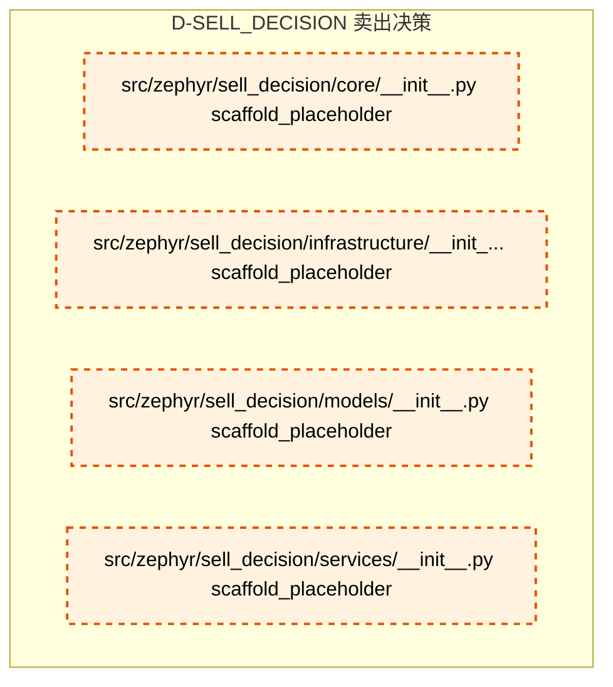

# 37_d_sell_decision / 卖出决策

> **文档作用 / Purpose**: 展示 卖出决策（D-SELL_DECISION）功能域的模块清单、域内依赖关系和跨域依赖关系，供架构审查和域治理参考。

> 本文档由 generate_domain_doc.py 从 depgraph.db 自动生成
> 最后更新: 2026-06-24 23:56:40
> 数据源: depgraph.db nodes表 + edges表

## 域基本信息 / Domain Overview

| 字段 | 值 | Field | Value |
|------|------|-------|-------|
| 编号 | 37 | Number | 37 |
| 域ID | D-SELL_DECISION | Domain ID | D-SELL_DECISION |
| 域名称 | 卖出决策 | Domain Name | 卖出决策 |
| 层级 | L2_domain | Layer | L2_domain |
| 模块数 | 64 | Module Count | 64 |
| 域内依赖 | 55 | Internal Dependencies | 55 |
| 跨域入边 | 24 | Cross-domain Incoming | 24 |
| 跨域出边 | 84 | Cross-domain Outgoing | 84 |
| 设计态模块 | 57 | Design Modules | 57 |
| 原型态模块 | 1 | Prototype Modules | 1 |
| 生产态模块 | 0 | Production Modules | 0 |
| 容量 | 64/150 (正常) | Capacity | 64/150 (正常) |
| 描述 | 卖出决策域。负责卖出时机判断与卖出策略执行，包括止盈止损策略、持仓时间优化、卖出信号聚合。 | Description | 卖出决策域。负责卖出时机判断与卖出策略执行，包括止盈止损策略、持仓时间优化、卖出信号聚合。 |

## 模块清单 / Module List

共 64 个模块（按路径排序，全部显示）

| 模块路径 / Module Path | 模块名称 / Module Name | 设计成熟度 / Maturity | 构建状态 / Build Status |
|---------|---------|-----------|---------|
| D-SELL-DECISION/Adjusted Stop Level 调整后止损位 | Adjusted Stop Level 调整后止损位 | design | design_only |
| D-SELL-DECISION/Average True Range ATR动态止损 | Average True Range ATR动态止损 | design | design_only |
| D-SELL-DECISION/Breakout Failure Detector突破成败检测器 | Breakout Failure Detector突破成败检测器 | design | design_only |
| D-SELL-DECISION/Breakout Result 突破成败结果 | Breakout Result 突破成败结果 | design | design_only |
| D-SELL-DECISION/Buy-Sell Conflict Arbitrator买卖冲突仲裁器 | Buy-Sell Conflict Arbitrator买卖冲突仲裁器 | design | design_only |
| D-SELL-DECISION/D-SELL | D-SELL | design | design_only |
| D-SELL-DECISION/Day Trade Agent 做T Agent | Day Trade Agent 做T Agent | design | design_only |
| D-SELL-DECISION/Exit Scenario Plan 卖出情景预案 | Exit Scenario Plan 卖出情景预案 | design | design_only |
| D-SELL-DECISION/Exit Scenario Planner卖出情景预案器 | Exit Scenario Planner卖出情景预案器 | design | design_only |
| D-SELL-DECISION/Fused Sell Decision 融合卖出决策 | Fused Sell Decision 融合卖出决策 | design | design_only |
| D-SELL-DECISION/LimitDownBlock 跌停板拦截事件 | LimitDownBlock 跌停板拦截事件 | design | design_only |
| D-SELL-DECISION/Opportunity Cost Analyzer 机会成本分析器 | Opportunity Cost Analyzer 机会成本分析器 | design | design_only |
| D-SELL-DECISION/Position Triage Result 持仓分级结果 | Position Triage Result 持仓分级结果 | design | design_only |
| D-SELL-DECISION/Position Triage持仓分级器 | Position Triage持仓分级器 | design | design_only |
| D-SELL-DECISION/Replacement & Rebalance Sell置换与再平衡卖出 | Replacement & Rebalance Sell置换与再平衡卖出 | design | design_only |
| D-SELL-DECISION/Risk-Based Sell Trigger 风险驱动卖出触发器 | Risk-Based Sell Trigger 风险驱动卖出触发器 | design | design_only |
| D-SELL-DECISION/Scaling Out Architect分批退出架构师 | Scaling Out Architect分批退出架构师 | design | design_only |
| D-SELL-DECISION/Scaling Out Plan 分批退出计划 | Scaling Out Plan 分批退出计划 | design | design_only |
| D-SELL-DECISION/Self-Reflection Agent 自反Agent | Self-Reflection Agent 自反Agent | design | design_only |
| D-SELL-DECISION/Sell A/B Test Result 卖出A/B测试结果 | Sell A/B Test Result 卖出A/B测试结果 | design | design_only |
| D-SELL-DECISION/Sell Audit Report 卖出审计报告 | Sell Audit Report 卖出审计报告 | design | design_only |
| D-SELL-DECISION/Sell Convergence Result 多策略卖出共振结果 | Sell Convergence Result 多策略卖出共振结果 | design | design_only |
| D-SELL-DECISION/Sell Decision Domain 卖出决策域 | Sell Decision Domain 卖出决策域 | design | design_only |
| D-SELL-DECISION/Sell Decision Must Pass Fusion Arbitration 卖出决策必须经过融合仲裁 | Sell Decision Must Pass Fusion Arbitr... | design | design_only |
| D-SELL-DECISION/Sell Execution Optimizer 卖出执行优化器 | Sell Execution Optimizer 卖出执行优化器 | design | design_only |
| D-SELL-DECISION/Sell Execution Quality Tracker卖出执行质量追踪 | Sell Execution Quality Tracker卖出执行质量追踪 | design | design_only |
| D-SELL-DECISION/Sell Execution Quality 卖出执行质量 | Sell Execution Quality 卖出执行质量 | design | design_only |
| D-SELL-DECISION/Sell Signal Accuracy Monitor卖出信号准确率监控 | Sell Signal Accuracy Monitor卖出信号准确率监控 | design | design_only |
| D-SELL-DECISION/Sell Signal Collector卖出信号收集器 | Sell Signal Collector卖出信号收集器 | design | design_only |
| D-SELL-DECISION/Sell Signal Fusion Engine卖出信号融合引擎 | Sell Signal Fusion Engine卖出信号融合引擎 | design | design_only |
| D-SELL-DECISION/Sell Signal Score 卖出信号评分 | Sell Signal Score 卖出信号评分 | design | design_only |
| D-SELL-DECISION/Sell Signal Scorer卖出信号评分器 | Sell Signal Scorer卖出信号评分器 | design | design_only |
| D-SELL-DECISION/Sell Signal 卖出信号 | Sell Signal 卖出信号 | design | design_only |
| D-SELL-DECISION/Sell Strategy A/B Tester卖出策略A/B测试 | Sell Strategy A/B Tester卖出策略A/B测试 | design | design_only |
| D-SELL-DECISION/Sell Urgency Score 卖出紧迫度评分 | Sell Urgency Score 卖出紧迫度评分 | design | design_only |
| D-SELL-DECISION/Sell Urgency Scorer卖出紧迫度评分器 | Sell Urgency Scorer卖出紧迫度评分器 | design | design_only |
| D-SELL-DECISION/SellArbitrated 卖出仲裁完成事件 | SellArbitrated 卖出仲裁完成事件 | design | design_only |
| D-SELL-DECISION/SellArbitration 卖出仲裁 | SellArbitration 卖出仲裁 | design | design_only |
| D-SELL-DECISION/SellDecided 卖出决策事件 | SellDecided 卖出决策事件 | design | design_only |
| D-SELL-DECISION/SellDecision Contract SellDecision 卖出决策契约 | SellDecision Contract SellDecision 卖出... | design | design_only |
| D-SELL-DECISION/SellExecuted 卖出执行完成事件 | SellExecuted 卖出执行完成事件 | design | design_only |
| D-SELL-DECISION/SellLoopFeedback 卖出闭环反馈事件 | SellLoopFeedback 卖出闭环反馈事件 | design | design_only |
| D-SELL-DECISION/SellSignalFused Event SellSignalFused 卖出信号已融合 | SellSignalFused Event SellSignalFused... | design | design_only |
| D-SELL-DECISION/Signal Reversal Detector 信号反转检测器 | Signal Reversal Detector 信号反转检测器 | design | design_only |
| D-SELL-DECISION/Stop Cost Estimate 止损成本估计 | Stop Cost Estimate 止损成本估计 | design | design_only |
| D-SELL-DECISION/Stop Loss Strategy Family止损策略族 | Stop Loss Strategy Family止损策略族 | design | design_only |
| D-SELL-DECISION/Stop Option Pricer止损期权定价器 | Stop Option Pricer止损期权定价器 | design | design_only |
| D-SELL-DECISION/Stop Paradigm Selection 止损范式选择 | Stop Paradigm Selection 止损范式选择 | design | design_only |
| D-SELL-DECISION/Stop-Hunting Protector止损猎杀防护器 | Stop-Hunting Protector止损猎杀防护器 | design | design_only |
| D-SELL-DECISION/Stop-Loss Decision Engine 止损决策引擎 | Stop-Loss Decision Engine 止损决策引擎 | design | design_only |
| D-SELL-DECISION/StopLossTriggerReversalDetector 猎杀止损保护器 | StopLossTriggerReversalDetector 猎杀止损保护器 | design | design_only |
| D-SELL-DECISION/Strategy-Specific Stop Framework策略类型→止损范式映射 | Strategy-Specific Stop Framework策略类型→... | design | design_only |
| D-SELL-DECISION/T-Trade Coordinator做T决策协调器 | T-Trade Coordinator做T决策协调器 | design | design_only |
| D-SELL-DECISION/T-Trade Instruction 做T指令 | T-Trade Instruction 做T指令 | design | design_only |
| D-SELL-DECISION/TTradeExecuted 做T执行完成事件 | TTradeExecuted 做T执行完成事件 | design | design_only |
| D-SELL-DECISION/Take Profit Strategy Family止盈策略族 | Take Profit Strategy Family止盈策略族 | design | design_only |
| D-SELL-DECISION/Take-Profit Decision Engine 止盈决策引擎 | Take-Profit Decision Engine 止盈决策引擎 | design | design_only |
| src/zephyr/sell_decision/__init__.py |  | prototype | orphan |
| src/zephyr/sell_decision/_extensions/__init__.py |  | scaffold_placeholder | orphan |
| src/zephyr/sell_decision/api/__init__.py |  | scaffold_placeholder | orphan |
| src/zephyr/sell_decision/core/__init__.py |  | scaffold_placeholder | orphan |
| src/zephyr/sell_decision/infrastructure/__init__.py |  | scaffold_placeholder | orphan |
| src/zephyr/sell_decision/models/__init__.py |  | scaffold_placeholder | orphan |
| src/zephyr/sell_decision/services/__init__.py |  | scaffold_placeholder | orphan |

## 域内依赖图 / Internal Dependency Diagram

> 依赖图内嵌在本文档中，IDE 可直接渲染显示。每30个节点一组分页显示。
>
> **图例说明 / Legend**：
> - **实线边框 = 运营态模块**（production，已上线运行）
> - **虚线边框 = 设计态模块**（design，还在设计中）
> - **实线箭头 = 运营态依赖**（已生效的依赖关系）
> - **虚线箭头 = 设计态依赖**（计划中的依赖关系）

### 第 1 页 / 共 3 页 / Page 1 of 3

```mermaid
graph TD
    subgraph D_SELL_DECISION["D-SELL_DECISION 卖出决策"]
        D_SELL_DECISION_Adjusted_Stop_Level["Adjusted Stop Level 调整后止损位 design"]
        D_SELL_DECISION_Average_True_Range_ATR["Average True Range ATR动态止损 design"]
        D_SELL_DECISION_Breakout_Failure_Detector["Breakout Failure Detector突破成败检测器 design"]
        D_SELL_DECISION_Breakout_Result["Breakout Result 突破成败结果 design"]
        D_SELL_DECISION_Buy_Sell_Conflict_Arbitrator["Buy-Sell Conflict Arbitrator买卖冲突仲裁器 design"]
        D_SELL_DECISION_D_SELL["D-SELL design"]
        D_SELL_DECISION_Day_Trade_Agent_T_Agent["Day Trade Agent 做T Agent design"]
        D_SELL_DECISION_Exit_Scenario_Plan["Exit Scenario Plan 卖出情景预案 design"]
        D_SELL_DECISION_Exit_Scenario_Planner["Exit Scenario Planner卖出情景预案器 design"]
        D_SELL_DECISION_Fused_Sell_Decision["Fused Sell Decision 融合卖出决策 design"]
        D_SELL_DECISION_LimitDownBlock["LimitDownBlock 跌停板拦截事件 design"]
        D_SELL_DECISION_Opportunity_Cost_Analyzer["Opportunity Cost Analyzer 机会成本分析器 design"]
        D_SELL_DECISION_Position_Triage_Result["Position Triage Result 持仓分级结果 design"]
        D_SELL_DECISION_Position_Triage["Position Triage持仓分级器 design"]
        D_SELL_DECISION_Replacement_Rebalance_Sell["Replacement & Rebalance Sell置换与再平衡卖出 design"]
        D_SELL_DECISION_Risk_Based_Sell_Trigger["Risk-Based Sell Trigger 风险驱动卖出触发器 design"]
        D_SELL_DECISION_Scaling_Out_Architect["Scaling Out Architect分批退出架构师 design"]
        D_SELL_DECISION_Scaling_Out_Plan["Scaling Out Plan 分批退出计划 design"]
        D_SELL_DECISION_Self_Reflection_Agent_Agent["Self-Reflection Agent 自反Agent design"]
        D_SELL_DECISION_Sell_A_B_Test_Result_A_B["Sell A/B Test Result 卖出A/B测试结果 design"]
        D_SELL_DECISION_Sell_Audit_Report["Sell Audit Report 卖出审计报告 design"]
        D_SELL_DECISION_Sell_Convergence_Result["Sell Convergence Result 多策略卖出共振结果 design"]
        D_SELL_DECISION_Sell_Decision_Domain["Sell Decision Domain 卖出决策域 design"]
        D_SELL_DECISION_Sell_Decision_Must_Pass_Fusion_Arbitration["Sell Decision Must Pass Fusion Arbitration 卖出决策... design"]
        D_SELL_DECISION_Sell_Execution_Optimizer["Sell Execution Optimizer 卖出执行优化器 design"]
        D_SELL_DECISION_Sell_Execution_Quality_Tracker["Sell Execution Quality Tracker卖出执行质量追踪 design"]
        D_SELL_DECISION_Sell_Execution_Quality["Sell Execution Quality 卖出执行质量 design"]
        D_SELL_DECISION_Sell_Signal_Accuracy_Monitor["Sell Signal Accuracy Monitor卖出信号准确率监控 design"]
        D_SELL_DECISION_Sell_Signal_Collector["Sell Signal Collector卖出信号收集器 design"]
        D_SELL_DECISION_Sell_Signal_Fusion_Engine["Sell Signal Fusion Engine卖出信号融合引擎 design"]
    end
    D_SELL_DECISION_D_SELL -.->|import_depends| D_SELL_DECISION_Position_Triage
    D_SELL_DECISION_Position_Triage -.->|import_depends| D_SELL_DECISION_Sell_Signal_Collector
    D_SELL_DECISION_Sell_Signal_Collector -.->|config_depends| D_SELL_DECISION_Sell_Decision_Must_Pass_Fusion_Arbitration
    D_SELL_DECISION_Sell_Signal_Collector -.->|import_depends| D_SELL_DECISION_Sell_A_B_Test_Result_A_B
    D_SELL_DECISION_Replacement_Rebalance_Sell -.->|import_depends| D_SELL_DECISION_Sell_Signal_Fusion_Engine
    D_SELL_DECISION_Replacement_Rebalance_Sell -.->|import_depends| D_SELL_DECISION_Sell_Convergence_Result
    D_SELL_DECISION_Sell_Signal_Fusion_Engine -.->|import_depends| D_SELL_DECISION_Buy_Sell_Conflict_Arbitrator
    D_SELL_DECISION_Buy_Sell_Conflict_Arbitrator -.->|import_depends| D_SELL_DECISION_Self_Reflection_Agent_Agent
    D_SELL_DECISION_Sell_Execution_Quality_Tracker -.->|import_depends| D_SELL_DECISION_Exit_Scenario_Planner
    D_SELL_DECISION_Sell_Execution_Quality_Tracker -.->|import_depends| D_SELL_DECISION_Day_Trade_Agent_T_Agent
    D_SELL_DECISION_Risk_Based_Sell_Trigger -.->|import_depends| D_SELL_DECISION_Opportunity_Cost_Analyzer
    D_SELL_DECISION_Risk_Based_Sell_Trigger -.->|import_depends| D_SELL_DECISION_Sell_Execution_Quality
    D_SELL_DECISION_Opportunity_Cost_Analyzer -.->|import_depends| D_SELL_DECISION_Sell_Execution_Optimizer
    D_SELL_DECISION_Opportunity_Cost_Analyzer -.->|import_depends| D_SELL_DECISION_Position_Triage_Result
    D_SELL_DECISION_Average_True_Range_ATR -.->|import_depends| D_SELL_DECISION_Scaling_Out_Plan
    D_GOVERNANCE["D-GOVERNANCE design"]
    D_SELL_DECISION_D_SELL -.->|data| D_GOVERNANCE
    D_EX_CORE["D-EX_CORE design"]
    D_SELL_DECISION_D_SELL -.->|event| D_EX_CORE
    D_POSITION["D-POSITION design"]
    D_SELL_DECISION_Sell_Decision_Domain -.->|domain_dependency| D_POSITION
    D_RISK["D-RISK design"]
    D_SELL_DECISION_Sell_Decision_Domain -.->|domain_dependency| D_RISK
    D_SELL_DECISION_Position_Triage -.->|data| D_GOVERNANCE
    D_SIGNAL["D-SIGNAL design"]
    D_SELL_DECISION_Sell_Signal_Collector -.->|contract| D_SIGNAL
    D_MKT_DATA["D-MKT_DATA design"]
    D_SELL_DECISION_Sell_Signal_Fusion_Engine -.->|event| D_MKT_DATA
    D_SECURITY["D-SECURITY design"]
    D_SELL_DECISION_Sell_Signal_Fusion_Engine -.->|data| D_SECURITY
    D_SELL_DECISION_Buy_Sell_Conflict_Arbitrator -.->|event| D_RISK
    D_DATA_ENG["D-DATA_ENG design"]
    D_SELL_DECISION_Buy_Sell_Conflict_Arbitrator -.->|event| D_DATA_ENG
    D_AUTONOMY_CORE["D-AUTONOMY_CORE design"]
    D_SELL_DECISION_Buy_Sell_Conflict_Arbitrator -.->|config_depends| D_AUTONOMY_CORE
    D_SELL_DECISION_Sell_Signal_Accuracy_Monitor -.->|contract| D_AUTONOMY_CORE
    D_SELL_DECISION_Sell_Signal_Accuracy_Monitor -.->|data| D_SECURITY
    D_INTEGRATION["D-INTEGRATION design"]
    D_SELL_DECISION_Sell_Signal_Accuracy_Monitor -.->|data| D_INTEGRATION
    D_SELL_DECISION_Sell_Execution_Quality_Tracker -.->|contract| D_GOVERNANCE
    D_COMPLIANCE["D-COMPLIANCE design"]
    D_COMPLIANCE -.->|config_depends| D_SELL_DECISION_Sell_Signal_Fusion_Engine
    D_INFRA_OPS["D-INFRA_OPS design"]
    D_INFRA_OPS -.->|event| D_SELL_DECISION_Sell_Signal_Accuracy_Monitor
    D_COMPLIANCE -.->|event| D_SELL_DECISION_Day_Trade_Agent_T_Agent
    D_INFRA_OPS -.->|event| D_SELL_DECISION_Day_Trade_Agent_T_Agent
    D_COMPLIANCE -.->|contract| D_SELL_DECISION_LimitDownBlock
    D_COMPLIANCE -.->|event| D_SELL_DECISION_Adjusted_Stop_Level
    D_COMPLIANCE -.->|contract| D_SELL_DECISION_Sell_Audit_Report
    D_INFRA_OPS -.->|data| D_SELL_DECISION_Sell_Convergence_Result
    classDef production fill:#e1f5fe,stroke:#01579b,stroke-width:2px,color:#000
    classDef design fill:#fff3e0,stroke:#e65100,stroke-width:2px,color:#000,stroke-dasharray: 5 5
    classDef external_prod fill:#e8f5e9,stroke:#1b5e20,stroke-width:1px,color:#000
    classDef external_design fill:#fce4ec,stroke:#880e4f,stroke-width:1px,color:#000,stroke-dasharray: 5 5
    class D_SELL_DECISION_Adjusted_Stop_Level,D_SELL_DECISION_Average_True_Range_ATR,D_SELL_DECISION_Breakout_Failure_Detector,D_SELL_DECISION_Breakout_Result,D_SELL_DECISION_Buy_Sell_Conflict_Arbitrator,D_SELL_DECISION_D_SELL,D_SELL_DECISION_Day_Trade_Agent_T_Agent,D_SELL_DECISION_Exit_Scenario_Plan,D_SELL_DECISION_Exit_Scenario_Planner,D_SELL_DECISION_Fused_Sell_Decision,D_SELL_DECISION_LimitDownBlock,D_SELL_DECISION_Opportunity_Cost_Analyzer,D_SELL_DECISION_Position_Triage_Result,D_SELL_DECISION_Position_Triage,D_SELL_DECISION_Replacement_Rebalance_Sell,D_SELL_DECISION_Risk_Based_Sell_Trigger,D_SELL_DECISION_Scaling_Out_Architect,D_SELL_DECISION_Scaling_Out_Plan,D_SELL_DECISION_Self_Reflection_Agent_Agent,D_SELL_DECISION_Sell_A_B_Test_Result_A_B,D_SELL_DECISION_Sell_Audit_Report,D_SELL_DECISION_Sell_Convergence_Result,D_SELL_DECISION_Sell_Decision_Domain,D_SELL_DECISION_Sell_Decision_Must_Pass_Fusion_Arbitration,D_SELL_DECISION_Sell_Execution_Optimizer,D_SELL_DECISION_Sell_Execution_Quality_Tracker,D_SELL_DECISION_Sell_Execution_Quality,D_SELL_DECISION_Sell_Signal_Accuracy_Monitor,D_SELL_DECISION_Sell_Signal_Collector,D_SELL_DECISION_Sell_Signal_Fusion_Engine design
    class D_GOVERNANCE,D_EX_CORE,D_POSITION,D_RISK,D_SIGNAL,D_MKT_DATA,D_SECURITY,D_DATA_ENG,D_AUTONOMY_CORE,D_INTEGRATION,D_COMPLIANCE,D_INFRA_OPS external_design
```

### 第 2 页 / 共 3 页 / Page 2 of 3

```mermaid
graph TD
    subgraph D_SELL_DECISION["D-SELL_DECISION 卖出决策"]
        D_SELL_DECISION_Sell_Signal_Score["Sell Signal Score 卖出信号评分 design"]
        D_SELL_DECISION_Sell_Signal_Scorer["Sell Signal Scorer卖出信号评分器 design"]
        D_SELL_DECISION_Sell_Signal["Sell Signal 卖出信号 design"]
        D_SELL_DECISION_Sell_Strategy_A_B_Tester_A_B["Sell Strategy A/B Tester卖出策略A/B测试 design"]
        D_SELL_DECISION_Sell_Urgency_Score["Sell Urgency Score 卖出紧迫度评分 design"]
        D_SELL_DECISION_Sell_Urgency_Scorer["Sell Urgency Scorer卖出紧迫度评分器 design"]
        D_SELL_DECISION_SellArbitrated["SellArbitrated 卖出仲裁完成事件 design"]
        D_SELL_DECISION_SellArbitration["SellArbitration 卖出仲裁 design"]
        D_SELL_DECISION_SellDecided["SellDecided 卖出决策事件 design"]
        D_SELL_DECISION_SellDecision_Contract_SellDecision["SellDecision Contract SellDecision 卖出决策契约 design"]
        D_SELL_DECISION_SellExecuted["SellExecuted 卖出执行完成事件 design"]
        D_SELL_DECISION_SellLoopFeedback["SellLoopFeedback 卖出闭环反馈事件 design"]
        D_SELL_DECISION_SellSignalFused_Event_SellSignalFused["SellSignalFused Event SellSignalFused 卖出信号已融合 design"]
        D_SELL_DECISION_Signal_Reversal_Detector["Signal Reversal Detector 信号反转检测器 design"]
        D_SELL_DECISION_Stop_Cost_Estimate["Stop Cost Estimate 止损成本估计 design"]
        D_SELL_DECISION_Stop_Loss_Strategy_Family["Stop Loss Strategy Family止损策略族 design"]
        D_SELL_DECISION_Stop_Option_Pricer["Stop Option Pricer止损期权定价器 design"]
        D_SELL_DECISION_Stop_Paradigm_Selection["Stop Paradigm Selection 止损范式选择 design"]
        D_SELL_DECISION_Stop_Hunting_Protector["Stop-Hunting Protector止损猎杀防护器 design"]
        D_SELL_DECISION_Stop_Loss_Decision_Engine["Stop-Loss Decision Engine 止损决策引擎 design"]
        D_SELL_DECISION_StopLossTriggerReversalDetector["StopLossTriggerReversalDetector 猎杀止损保护器 design"]
        D_SELL_DECISION_Strategy_Specific_Stop_Framework["Strategy-Specific Stop Framework策略类型→止损范式映射 design"]
        D_SELL_DECISION_T_Trade_Coordinator_T["T-Trade Coordinator做T决策协调器 design"]
        D_SELL_DECISION_T_Trade_Instruction_T["T-Trade Instruction 做T指令 design"]
        D_SELL_DECISION_TTradeExecuted_T["TTradeExecuted 做T执行完成事件 design"]
        D_SELL_DECISION_Take_Profit_Strategy_Family["Take Profit Strategy Family止盈策略族 design"]
        D_SELL_DECISION_Take_Profit_Decision_Engine["Take-Profit Decision Engine 止盈决策引擎 design"]
        src_zephyr_sell_decision_init_py["src/zephyr/sell_decision/__init__.py prototype"]
        src_zephyr_sell_decision_extensions_init_py["src/zephyr/sell_decision/_extensions/__init__.py scaffold_placeholder"]
        src_zephyr_sell_decision_api_init_py["src/zephyr/sell_decision/api/__init__.py scaffold_placeholder"]
    end
    D_SELL_DECISION_Take_Profit_Strategy_Family -.->|import_depends| D_SELL_DECISION_Stop_Loss_Strategy_Family
    D_SELL_DECISION_Sell_Strategy_A_B_Tester_A_B -.->|contract| D_SELL_DECISION_SellDecision_Contract_SellDecision
    D_SELL_DECISION_Sell_Strategy_A_B_Tester_A_B -.->|event| D_SELL_DECISION_SellSignalFused_Event_SellSignalFused
    D_SELL_DECISION_Sell_Strategy_A_B_Tester_A_B -.->|event| D_SELL_DECISION_SellLoopFeedback
    D_SELL_DECISION_Strategy_Specific_Stop_Framework -.->|import_depends| D_SELL_DECISION_Stop_Hunting_Protector
    D_SELL_DECISION_Strategy_Specific_Stop_Framework -.->|import_depends| D_SELL_DECISION_Sell_Signal
    D_SELL_DECISION_Strategy_Specific_Stop_Framework -.->|import_depends| D_SELL_DECISION_Sell_Signal_Score
    D_SELL_DECISION_Stop_Hunting_Protector -.->|import_depends| D_SELL_DECISION_Stop_Option_Pricer
    D_SELL_DECISION_T_Trade_Coordinator_T -.->|import_depends| D_SELL_DECISION_Stop_Loss_Decision_Engine
    D_SELL_DECISION_Stop_Loss_Decision_Engine -.->|import_depends| D_SELL_DECISION_Take_Profit_Decision_Engine
    D_SELL_DECISION_Take_Profit_Decision_Engine -.->|import_depends| D_SELL_DECISION_Signal_Reversal_Detector
    D_SELL_DECISION_Signal_Reversal_Detector -.->|event| D_SELL_DECISION_SellExecuted
    D_SHARED["D-SHARED design"]
    src_zephyr_sell_decision_api_init_py -.->|contract| D_SHARED
    D_EX_SOR["D-EX_SOR design"]
    D_SELL_DECISION_Sell_Signal_Scorer -.->|event| D_EX_SOR
    D_GOVERNANCE["D-GOVERNANCE design"]
    D_SELL_DECISION_Stop_Loss_Strategy_Family -.->|contract| D_GOVERNANCE
    D_RISK["D-RISK design"]
    D_SELL_DECISION_Sell_Strategy_A_B_Tester_A_B -.->|config_depends| D_RISK
    D_SECURITY["D-SECURITY design"]
    D_SELL_DECISION_Sell_Strategy_A_B_Tester_A_B -.->|event| D_SECURITY
    D_SELL_DECISION_Strategy_Specific_Stop_Framework -.->|contract| D_EX_SOR
    D_AUTONOMY_CORE["D-AUTONOMY_CORE design"]
    D_SELL_DECISION_Strategy_Specific_Stop_Framework -.->|event| D_AUTONOMY_CORE
    D_REPORTING["D-REPORTING design"]
    D_SELL_DECISION_Stop_Hunting_Protector -.->|config_depends| D_REPORTING
    D_SELL_DECISION_Stop_Option_Pricer -.->|contract| D_SECURITY
    D_INTEGRATION["D-INTEGRATION design"]
    D_SELL_DECISION_Stop_Option_Pricer -.->|event| D_INTEGRATION
    D_SELL_DECISION_Stop_Option_Pricer -.->|data| D_REPORTING
    D_SELL_DECISION_T_Trade_Coordinator_T -.->|contract| D_REPORTING
    D_SIGNAL["D-SIGNAL design"]
    D_SELL_DECISION_SellDecided -.->|contract| D_SIGNAL
    D_POSITION["D-POSITION design"]
    D_SELL_DECISION_SellDecided -.->|data| D_POSITION
    D_SELL_DECISION_Stop_Loss_Decision_Engine -.->|config_depends| D_SIGNAL
    D_FRONTEND["D-FRONTEND design"]
    D_FRONTEND -.->|contract| D_SELL_DECISION_Sell_Signal_Scorer
    D_FRONTEND -.->|data| D_SELL_DECISION_Sell_Signal_Scorer
    D_INFRA_OPS["D-INFRA_OPS design"]
    D_INFRA_OPS -.->|event| D_SELL_DECISION_Take_Profit_Strategy_Family
    D_OPS["D-OPS design"]
    D_OPS -.->|config_depends| D_SELL_DECISION_Sell_Urgency_Scorer
    D_COMPLIANCE["D-COMPLIANCE design"]
    D_COMPLIANCE -.->|event| D_SELL_DECISION_Strategy_Specific_Stop_Framework
    D_FRONTEND -.->|config_depends| D_SELL_DECISION_SellDecided
    D_INFRA_OPS -.->|event| D_SELL_DECISION_Stop_Loss_Decision_Engine
    D_COMPLIANCE -.->|config_depends| D_SELL_DECISION_Stop_Loss_Decision_Engine
    D_INFRA_OPS -.->|contract| D_SELL_DECISION_Take_Profit_Decision_Engine
    D_FRONTEND -.->|data| D_SELL_DECISION_SellSignalFused_Event_SellSignalFused
    D_PF_ALLOC["D-PF_ALLOC design"]
    D_PF_ALLOC -.->|event| D_SELL_DECISION_StopLossTriggerReversalDetector
    D_DATA_GOV["D-DATA_GOV design"]
    D_DATA_GOV -.->|event| D_SELL_DECISION_SellExecuted
    D_COMPLIANCE -.->|contract| D_SELL_DECISION_SellExecuted
    D_COMPLIANCE -.->|config_depends| D_SELL_DECISION_SellLoopFeedback
    D_PF_ALLOC -.->|contract| D_SELL_DECISION_Sell_Urgency_Score
    classDef production fill:#e1f5fe,stroke:#01579b,stroke-width:2px,color:#000
    classDef design fill:#fff3e0,stroke:#e65100,stroke-width:2px,color:#000,stroke-dasharray: 5 5
    classDef external_prod fill:#e8f5e9,stroke:#1b5e20,stroke-width:1px,color:#000
    classDef external_design fill:#fce4ec,stroke:#880e4f,stroke-width:1px,color:#000,stroke-dasharray: 5 5
    class D_SELL_DECISION_Sell_Signal_Score,D_SELL_DECISION_Sell_Signal_Scorer,D_SELL_DECISION_Sell_Signal,D_SELL_DECISION_Sell_Strategy_A_B_Tester_A_B,D_SELL_DECISION_Sell_Urgency_Score,D_SELL_DECISION_Sell_Urgency_Scorer,D_SELL_DECISION_SellArbitrated,D_SELL_DECISION_SellArbitration,D_SELL_DECISION_SellDecided,D_SELL_DECISION_SellDecision_Contract_SellDecision,D_SELL_DECISION_SellExecuted,D_SELL_DECISION_SellLoopFeedback,D_SELL_DECISION_SellSignalFused_Event_SellSignalFused,D_SELL_DECISION_Signal_Reversal_Detector,D_SELL_DECISION_Stop_Cost_Estimate,D_SELL_DECISION_Stop_Loss_Strategy_Family,D_SELL_DECISION_Stop_Option_Pricer,D_SELL_DECISION_Stop_Paradigm_Selection,D_SELL_DECISION_Stop_Hunting_Protector,D_SELL_DECISION_Stop_Loss_Decision_Engine,D_SELL_DECISION_StopLossTriggerReversalDetector,D_SELL_DECISION_Strategy_Specific_Stop_Framework,D_SELL_DECISION_T_Trade_Coordinator_T,D_SELL_DECISION_T_Trade_Instruction_T,D_SELL_DECISION_TTradeExecuted_T,D_SELL_DECISION_Take_Profit_Strategy_Family,D_SELL_DECISION_Take_Profit_Decision_Engine,src_zephyr_sell_decision_init_py,src_zephyr_sell_decision_extensions_init_py,src_zephyr_sell_decision_api_init_py design
    class D_SHARED,D_EX_SOR,D_GOVERNANCE,D_RISK,D_SECURITY,D_AUTONOMY_CORE,D_REPORTING,D_INTEGRATION,D_SIGNAL,D_POSITION,D_FRONTEND,D_INFRA_OPS,D_OPS,D_COMPLIANCE,D_PF_ALLOC,D_DATA_GOV external_design
```

### 第 3 页 / 共 3 页 / Page 3 of 3

## 跨域依赖 / Cross-domain Dependencies

### 本域依赖的其他域（出边）/ Depends On

| 目标域 / Target Domain | 依赖数 / Count | 依赖类型 / Type |
|--------|:---:|---------|
| D-RISK | 14 | domain_dependency,event,config_depends,data,contract |
| D-SECURITY | 9 | data,event,contract |
| D-GOVERNANCE | 7 | data,contract |
| D-DATA_ENG | 6 | event,contract,data |
| D-AUTONOMY_CORE | 6 | config_depends,contract,event,data |
| D-POSITION | 5 | domain_dependency,data,contract,event |
| D-INTEGRATION | 5 | data,event,contract |
| D-SIGNAL | 4 | contract,config_depends |
| D-REPORTING | 4 | config_depends,data,contract |
| D-EX_SOR | 4 | event,contract |
| D-PF_CORE | 3 | data,contract,event |
| D-ML_TRAIN | 3 | config_depends,data,event |
| D-KNOWLEDGE | 3 | event,config_depends,data |
| D-MKT_DATA | 2 | event,data |
| D-INTELLIGENCE | 2 | data,contract |
| D-FACTOR | 2 | contract,event |
| D-EX_CORE | 2 | event,data |
| D-AUTONOMY_PERM | 2 | data,config_depends |
| D-SHARED | 1 | contract |

### 依赖本域的其他域（入边）/ Depended By

| 源域 / Source Domain | 依赖数 / Count | 依赖类型 / Type |
|------|:---:|---------|
| D-COMPLIANCE | 9 | config_depends,event,contract |
| D-INFRA_OPS | 6 | event,contract,data |
| D-FRONTEND | 5 | contract,data,config_depends |
| D-PF_ALLOC | 2 | event,contract |
| D-OPS | 1 | config_depends |
| D-DATA_GOV | 1 | event |

## 说明 / Notes

- **数据源 / Data Source**: `depgraph.db` 的 `nodes`、`edges`、`domains` 表
- **生成器 / Generator**: `generate_domain_doc.py`
- **维护方式 / Maintenance**: 自动生成，全景图更新时刷新
- **文件名规则 / File Naming**: `{编号:02d}_{域ID小写}.md`，如 `16_d_trading.md`
