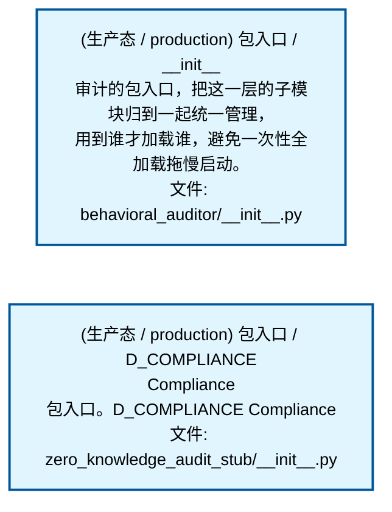
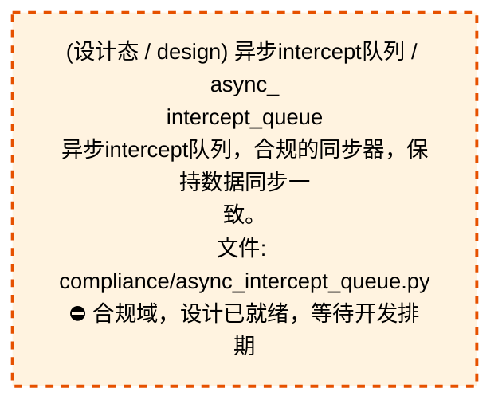
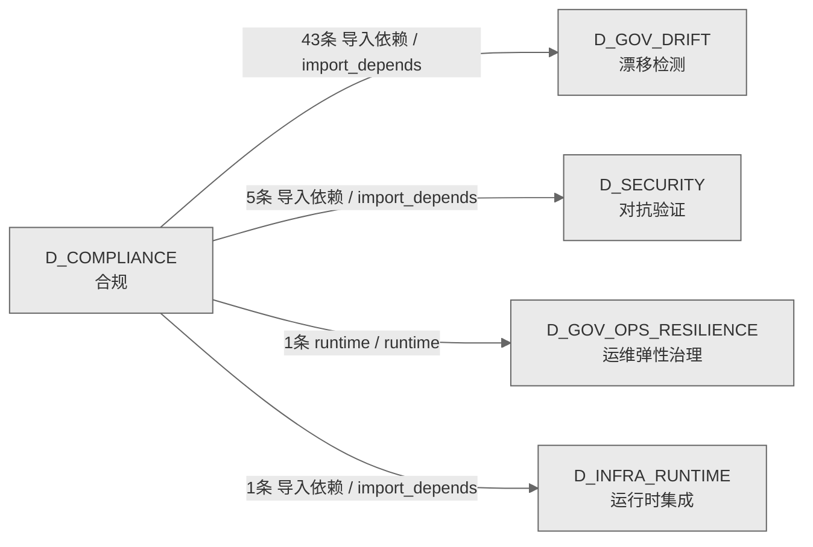

# 38_d_compliance / 合规域 / Compliance

> **功能简介 / Overview**: 合规，负责交易合规检查、规则引擎和合规报告

> **文档作用 / Purpose**: 展示 合规（D_COMPLIANCE）功能域的域内依赖关系、跨域依赖关系，模块信息（成熟度/中英文名/大白话/文件路径）内嵌于 Mermaid 节点，供架构审查和域治理参考。

> 本文档由 generate_domain_doc.py 从 depgraph (PostgreSQL) 自动生成
> 数据源: depgraph (PostgreSQL) nodes表 + edges表

> **[可缩放 HTML 版 / Zoomable HTML](http://localhost:8765/docs/02_enterprise_architecture/02_domain_architecture_docs/_zoomable_html/38_d_compliance.html)** — Ctrl+滚轮缩放 ｜ 双击重置 ｜ Ctrl+Shift+D 切换拖动/选择模式

## 域基本信息 / Domain Overview

| 字段 | 值 | Field | Value |
|------|------|-------|-------|
| 编号 | 38 | Number | 38 |
| 域ID | D_COMPLIANCE | Domain ID | D_COMPLIANCE |
| 域名称 | 合规 | Domain Name | Compliance |
| 层级 | L2 业务域层 | Layer | L2 Domain |
| 模块数 | 3 | Module Count | 3 |
| 域内依赖 | 0 | Internal Dependencies | 0 |
| 跨域入边 | 0 | Cross-domain Incoming | 0 |
| 跨域出边 | 50 | Cross-domain Outgoing | 50 |
| 设计态模块 | 1 | Design Modules | 1 |
| 生产态模块 | 2 | Production Modules | 2 |
| 容量 | 2/150 (正常) | Capacity | 2/150 (正常) |
| 描述 | 合规校验引擎 | Description | 合规校验引擎 |

## 域内依赖图 / Internal Dependency Diagram

> 依赖图内嵌在本文档中，IDE 可直接渲染；网页版可 Ctrl+滚轮缩放 + 拖动平移查看细节。
>
> **图例说明 / Legend**：
> - 🟦 **蓝色 = 运营态模块**（production，已上线运行）
> - 🟧 **橙色虚线 = 设计态模块**（design，蓝图阶段，代码未写）
> - **实线箭头 = 运营态依赖**（已生效的依赖关系）
> - **虚线箭头 = 非运营态依赖**（计划中/验证中的依赖关系）

### 全景图（全部模块，颜色区分运营态/设计态）

> 展示全部 3 个模块（生产态 2 + 设计态 1），含跨域依赖外部节点。节点含成熟度+名称+大白话/简介+文件路径。

```mermaid
%%{init: {'theme': 'base', 'themeVariables': {'primaryColor': '#eaeaea', 'primaryTextColor': '#333333', 'primaryBorderColor': '#666666', 'lineColor': '#666666', 'secondaryColor': '#eaeaea', 'tertiaryColor': '#eaeaea', 'fontSize': '14px'}}}%%
flowchart TD
    src_zephyr_compliance_async_intercept_queue_py["(设计态 / design) 异步intercept队列 / async_<br/>intercept_queue<br/>异步intercept队列，合规的同步器，保持数据同步一<br/>致。<br/>文件: compliance/async_intercept_queue.py<br/>⛔ 合规域，设计已就绪，等待开发排期"]
    src_zephyr_compliance_behavioral_auditor_init_py["(生产态 / production) 包入口 / __init__<br/>审计的包入口，把这一层的子模块归到一起统一管理，<br/>用到谁才加载谁，避免一次性全加载拖慢启动。<br/>文件: behavioral_auditor/__init__.py"]
    src_zephyr_compliance_zero_knowledge_audit_stub_init_py["(生产态 / production) 包入口 / D_COMPLIANCE<br/>Compliance<br/>包入口。D_COMPLIANCE Compliance<br/>文件: zero_knowledge_audit_stub/__init__.py"]
    src_zephyr_compliance_async_intercept_queue_py ~~~ src_zephyr_compliance_behavioral_auditor_init_py
    src_zephyr_compliance_behavioral_auditor_init_py ~~~ src_zephyr_compliance_zero_knowledge_audit_stub_init_py
    D_GOV_OPS_RESILIENCE["(生产态 / production) 运维弹性治理 / Ops<br/>Resilience Governance<br/>运维弹性治理，负责运维治理、安全治理、弹性治理和<br/>升级协议<br/>跨域节点 / cross-domain"]
    src_zephyr_compliance_async_intercept_queue_py -.->|runtime / runtime| D_GOV_OPS_RESILIENCE
    D_GOV_DRIFT["(生产态 / production) 漂移检测 / Drift Detection<br/>漂移检测，负责架构漂移检测和漂移告警<br/>跨域节点 / cross-domain"]
    src_zephyr_compliance_behavioral_auditor_init_py -->|导入依赖 / import_depends| D_GOV_DRIFT
    src_zephyr_compliance_behavioral_auditor_init_py -->|导入依赖 / import_depends| D_GOV_DRIFT
    src_zephyr_compliance_behavioral_auditor_init_py -->|导入依赖 / import_depends| D_GOV_DRIFT
    src_zephyr_compliance_behavioral_auditor_init_py -->|导入依赖 / import_depends| D_GOV_DRIFT
    src_zephyr_compliance_behavioral_auditor_init_py -->|导入依赖 / import_depends| D_GOV_DRIFT
    src_zephyr_compliance_behavioral_auditor_init_py -->|导入依赖 / import_depends| D_GOV_DRIFT
    D_SECURITY["(生产态 / production) 对抗验证 / Adversarial<br/>Validation<br/>对抗验证，负责系统安全对抗测试、漏洞扫描和攻防验<br/>证<br/>跨域节点 / cross-domain"]
    src_zephyr_compliance_behavioral_auditor_init_py -->|导入依赖 / import_depends| D_SECURITY
    src_zephyr_compliance_behavioral_auditor_init_py -->|导入依赖 / import_depends| D_GOV_DRIFT
    src_zephyr_compliance_behavioral_auditor_init_py -->|导入依赖 / import_depends| D_SECURITY
    src_zephyr_compliance_behavioral_auditor_init_py -->|导入依赖 / import_depends| D_GOV_DRIFT
    src_zephyr_compliance_behavioral_auditor_init_py -->|导入依赖 / import_depends| D_GOV_DRIFT
    src_zephyr_compliance_behavioral_auditor_init_py -->|导入依赖 / import_depends| D_GOV_DRIFT
    src_zephyr_compliance_behavioral_auditor_init_py -->|导入依赖 / import_depends| D_GOV_DRIFT
    src_zephyr_compliance_behavioral_auditor_init_py -->|导入依赖 / import_depends| D_GOV_DRIFT
    classDef production fill:#e1f5fe,stroke:#01579b,stroke-width:2px,color:#000
    classDef design fill:#fff3e0,stroke:#e65100,stroke-width:2px,color:#000,stroke-dasharray: 5 5
    classDef external_prod fill:#e8f4fd,stroke:#0277bd,stroke-width:1px,color:#000
    classDef external_design fill:#fff8e7,stroke:#ef6c00,stroke-width:1px,color:#000,stroke-dasharray: 5 5
    class src_zephyr_compliance_behavioral_auditor_init_py,src_zephyr_compliance_zero_knowledge_audit_stub_init_py production
    class src_zephyr_compliance_async_intercept_queue_py design
    class D_GOV_OPS_RESILIENCE,D_GOV_DRIFT,D_SECURITY external_prod
```

### 运营态的图（仅 design_maturity=production 的模块和域内依赖）

> 仅展示已上线运行的模块（共 2 个），不含跨域外部节点。跨域依赖见下方跨域依赖章节。

### 设计态的图（仅 design_maturity=design 的模块和域内依赖）

> 仅展示蓝图阶段、代码未写的设计态模块（共 1 个），不含跨域外部节点。

## 跨域依赖 / Cross-domain Dependencies

### 本域依赖的其他域（出边）/ Depends On

| # | 本域模块 / Source Module | → | 外部域-目标模块 / Target Module | 依赖类型 / Type |
|:--:|---------|:--:|---------|---------|
| 1 | 包入口 / __init__ (behavioral_auditor/__init__.py) | → | D_GOV_DRIFT 漂移检测: absence管理器 / absence_manager (gov_drift/absence_manage... | 导入依赖 / import_depends |
| 2 | 包入口 / __init__ (behavioral_auditor/__init__.py) | → | D_GOV_DRIFT 漂移检测: aiconstruction检测器 / ai_construction_detectors (gov_dri... | 导入依赖 / import_depends |
| 3 | 包入口 / __init__ (behavioral_auditor/__init__.py) | → | D_GOV_DRIFT 漂移检测: ai上下文injector / ai_context_injector (gov_drift/ai_cont... | 导入依赖 / import_depends |
| 4 | 包入口 / __init__ (behavioral_auditor/__init__.py) | → | D_GOV_DRIFT 漂移检测: backcompat检查器 / backcompat_checker (gov_drift/backcomp... | 导入依赖 / import_depends |
| 5 | 包入口 / __init__ (behavioral_auditor/__init__.py) | → | D_GOV_DRIFT 漂移检测: 基线管理器 / Baseline Manager — baseline_manager.py (gov... | 导入依赖 / import_depends |
| 6 | 包入口 / __init__ (behavioral_auditor/__init__.py) | → | D_GOV_DRIFT 漂移检测: 基线poisoning守卫 / baseline_poisoning_guard (gov_drift/b... | 导入依赖 / import_depends |
| 7 | 包入口 / __init__ (behavioral_auditor/__init__.py) | → | D_GOV_DRIFT 漂移检测: 金丝雀控制器 / canary_controller (gov_drift/canary_contro... | 导入依赖 / import_depends |
| 8 | 包入口 / __init__ (behavioral_auditor/__init__.py) | → | D_GOV_DRIFT 漂移检测: 级联检测器 / cascade_detector (gov_drift/cascade_detector... | 导入依赖 / import_depends |
| 9 | 包入口 / __init__ (behavioral_auditor/__init__.py) | → | D_GOV_DRIFT 漂移检测: Drift Chaos Injector — 混沌工程主动漂移注入 §6.13。 / c... | 导入依赖 / import_depends |
| 10 | 包入口 / __init__ (behavioral_auditor/__init__.py) | → | D_GOV_DRIFT 漂移检测: 配置一致性 / config_consistency (gov_drift/config_consist... | 导入依赖 / import_depends |
| 11 | 包入口 / __init__ (behavioral_auditor/__init__.py) | → | D_GOV_DRIFT 漂移检测: 契约漂移检测器 / contract_drift_detector (gov_drift/contr... | 导入依赖 / import_depends |
| 12 | 包入口 / __init__ (behavioral_auditor/__init__.py) | → | D_GOV_DRIFT 漂移检测: 相关性引擎 / Correlation Engine — correlation_engine.py ... | 导入依赖 / import_depends |
| 13 | 包入口 / __init__ (behavioral_auditor/__init__.py) | → | D_GOV_DRIFT 漂移检测: credibility引擎 / Credibility Engine — credibility_engin... | 导入依赖 / import_depends |
| 14 | 包入口 / __init__ (behavioral_auditor/__init__.py) | → | D_GOV_DRIFT 漂移检测: 跨模块评分 / Cross Module Score — cross_module_score.py ... | 导入依赖 / import_depends |
| 15 | 包入口 / __init__ (behavioral_auditor/__init__.py) | → | D_GOV_DRIFT 漂移检测: 仪表盘 / Coverage Dashboard — dashboard.py (gov_drift/da... | 导入依赖 / import_depends |
| 16 | 包入口 / __init__ (behavioral_auditor/__init__.py) | → | D_GOV_DRIFT 漂移检测: 检测器分发器 / Detector Dispatcher — detector_dispatcher... | 导入依赖 / import_depends |
| 17 | 包入口 / __init__ (behavioral_auditor/__init__.py) | → | D_GOV_DRIFT 漂移检测: 漂移引擎 / drift_engine (gov_drift/drift_engine.py) | 导入依赖 / import_depends |
| 18 | 包入口 / __init__ (behavioral_auditor/__init__.py) | → | D_GOV_DRIFT 漂移检测: 漂移hotfix绕过 / Drift Hotfix Bypass — drift_hotfix_bypa... | 导入依赖 / import_depends |
| 19 | 包入口 / __init__ (behavioral_auditor/__init__.py) | → | D_GOV_DRIFT 漂移检测: 漂移基础设施 / drift_infrastructure (gov_drift/drift_infr... | 导入依赖 / import_depends |
| 20 | 包入口 / __init__ (behavioral_auditor/__init__.py) | → | D_GOV_DRIFT 漂移检测: 漂移模型 / drift_models (gov_drift/drift_models.py) | 导入依赖 / import_depends |
| 21 | 包入口 / __init__ (behavioral_auditor/__init__.py) | → | D_GOV_DRIFT 漂移检测: 漂移结果类型定义 / drift_result_types (gov_drift/drift_re... | 导入依赖 / import_depends |
| 22 | 包入口 / __init__ (behavioral_auditor/__init__.py) | → | D_GOV_DRIFT 漂移检测: 漂移training / drift_training (gov_drift/drift_training.py) | 导入依赖 / import_depends |
| 23 | 包入口 / __init__ (behavioral_auditor/__init__.py) | → | D_GOV_DRIFT 漂移检测: fileattr检查器 / file_attr_checker (gov_drift/file_attr_c... | 导入依赖 / import_depends |
| 24 | 包入口 / __init__ (behavioral_auditor/__init__.py) | → | D_GOV_DRIFT 漂移检测: forensics引擎 / forensics_engine (gov_drift/forensics_eng... | 导入依赖 / import_depends |
| 25 | 包入口 / __init__ (behavioral_auditor/__init__.py) | → | D_GOV_DRIFT 漂移检测: 门禁持久化 / Gate Persistence — gate_persistence.py (gov... | 导入依赖 / import_depends |
| 26 | 包入口 / __init__ (behavioral_auditor/__init__.py) | → | D_GOV_DRIFT 漂移检测: Git二分器 / Git Bisector — git_bisector.py (gov_drift/gi... | 导入依赖 / import_depends |
| 27 | 包入口 / __init__ (behavioral_auditor/__init__.py) | → | D_GOV_DRIFT 漂移检测: gitignore审计器 / gitignore_auditor (gov_drift/gitignore_... | 导入依赖 / import_depends |
| 28 | 包入口 / __init__ (behavioral_auditor/__init__.py) | → | D_GOV_DRIFT 漂移检测: handoff管理器 / handoff_manager (gov_drift/handoff_manage... | 导入依赖 / import_depends |
| 29 | 包入口 / __init__ (behavioral_auditor/__init__.py) | → | D_GOV_DRIFT 漂移检测: headless扫描器 / Headless Scanner — headless_scanner.py ... | 导入依赖 / import_depends |
| 30 | 包入口 / __init__ (behavioral_auditor/__init__.py) | → | D_GOV_DRIFT 漂移检测: incremental扫描器 / Incremental Scanner — incremental_sc... | 导入依赖 / import_depends |
| 31 | 包入口 / __init__ (behavioral_auditor/__init__.py) | → | D_GOV_DRIFT 漂移检测: namingmagic检查器 / naming_magic_checker (gov_drift/namin... | 导入依赖 / import_depends |
| 32 | 包入口 / __init__ (behavioral_auditor/__init__.py) | → | D_GOV_DRIFT 漂移检测: 孤儿扫描器 / orphan_scanner (gov_drift/orphan_scanner.py) | 导入依赖 / import_depends |
| 33 | 包入口 / __init__ (behavioral_auditor/__init__.py) | → | D_GOV_DRIFT 漂移检测: python兼容 / python_compat (gov_drift/python_compat.py) | 导入依赖 / import_depends |
| 34 | 包入口 / __init__ (behavioral_auditor/__init__.py) | → | D_GOV_DRIFT 漂移检测: 资源守卫 / resource_guard (gov_drift/resource_guard.py) | 导入依赖 / import_depends |
| 35 | 包入口 / __init__ (behavioral_auditor/__init__.py) | → | D_GOV_DRIFT 漂移检测: roi引擎 / ROI Engine — roi_engine.py (gov_drift/roi_engi... | 导入依赖 / import_depends |
| 36 | 包入口 / __init__ (behavioral_auditor/__init__.py) | → | D_GOV_DRIFT 漂移检测: 回滚桥接 / rollback_bridge (gov_drift/rollback_bridge.py) | 导入依赖 / import_depends |
| 37 | 包入口 / __init__ (behavioral_auditor/__init__.py) | → | D_GOV_DRIFT 漂移检测: scan互斥 / Scan Mutex — scan_mutex.py (gov_drift/scan_mu... | 导入依赖 / import_depends |
| 38 | 包入口 / __init__ (behavioral_auditor/__init__.py) | → | D_GOV_DRIFT 漂移检测: 自检查 / Self-Drift Check — self_check.py (gov_drift/sel... | 导入依赖 / import_depends |
| 39 | 包入口 / __init__ (behavioral_auditor/__init__.py) | → | D_GOV_DRIFT 漂移检测: 抑制学习器 / Suppression Learner — suppression_learner.p... | 导入依赖 / import_depends |
| 40 | 包入口 / __init__ (behavioral_auditor/__init__.py) | → | D_GOV_DRIFT 漂移检测: symlink检查器 / symlink_checker (gov_drift/symlink_checke... | 导入依赖 / import_depends |
| 41 | 包入口 / __init__ (behavioral_auditor/__init__.py) | → | D_GOV_DRIFT 漂移检测: tamperproof审计 / tamper_proof_audit (gov_drift/tamper_pr... | 导入依赖 / import_depends |
| 42 | 包入口 / __init__ (behavioral_auditor/__init__.py) | → | D_GOV_DRIFT 漂移检测: 测试夹具检查器 / test_fixture_checker (gov_drift/test_fix... | 导入依赖 / import_depends |
| 43 | 包入口 / __init__ (behavioral_auditor/__init__.py) | → | D_GOV_DRIFT 漂移检测: 趋势分析器 / Trend Analyzer — trend_analyzer.py (gov_dri... | 导入依赖 / import_depends |
| 44 | 异步intercept队列 / async_intercept_queue (compliance/asy... | → | D_GOV_OPS_RESILIENCE 运维弹性治理: 安全网关基类 / D_COMPLIANCE — Governance & Compliance La... | runtime / runtime |
| 45 | 包入口 / __init__ (behavioral_auditor/__init__.py) | → | D_INFRA_RUNTIME 运行时集成: 状态machine / state_machine (auto_fix_engine/state_machin... | 导入依赖 / import_depends |
| 46 | 包入口 / __init__ (behavioral_auditor/__init__.py) | → | D_SECURITY 对抗验证: 告警路由器 / Alert Router — alert_router.py (gov_drift/a... | 导入依赖 / import_depends |
| 47 | 包入口 / __init__ (behavioral_auditor/__init__.py) | → | D_SECURITY 对抗验证: 冷启动 / cold_start (gov_drift/cold_start.py) | 导入依赖 / import_depends |
| 48 | 包入口 / __init__ (behavioral_auditor/__init__.py) | → | D_SECURITY 对抗验证: 事件 / events (gov_drift/events.py) | 导入依赖 / import_depends |
| 49 | 包入口 / __init__ (behavioral_auditor/__init__.py) | → | D_SECURITY 对抗验证: 协调器 / Auto Reconciler — reconciler.py (gov_drift/reco... | 导入依赖 / import_depends |
| 50 | 包入口 / __init__ (behavioral_auditor/__init__.py) | → | D_SECURITY 对抗验证: runbook生成器 / runbook_generator (gov_drift/runbook_gene... | 导入依赖 / import_depends |

### 依赖本域的其他域（入边）/ Depended By

无跨域入边依赖 / No cross-domain incoming dependencies

### 跨域依赖图 / Cross-domain Dependency Diagram

> 本域与 4 个外部域直接连接（出边 50 条 + 入边 0 条 = 50 条）。只显示直接连接的域，不展开具体节点。

## 说明 / Notes

- **数据源 / Data Source**: `depgraph (PostgreSQL)` 的 `nodes`、`edges`、`domains` 表
- **生成器 / Generator**: `generate_domain_doc.py`（G2+G10 合并）
- **维护方式 / Maintenance**: 自动生成，全景图更新时刷新
- **文件名规则 / File Naming**: `{编号:02d}_{域ID小写}.md`，如 `16_d_trading.md`
- **图例说明 / Legend**: `[production]`=已上线 / `[design]`=设计中 / `[unknown]`=未知
