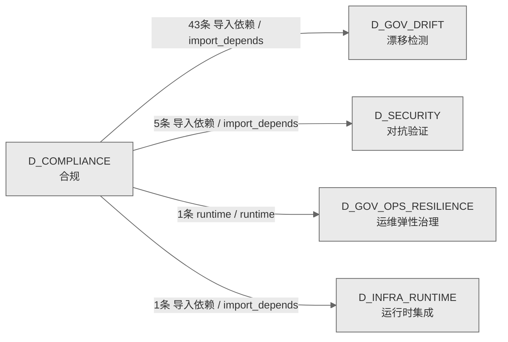

# 38_d_compliance / 合规域 / Compliance

> **功能简介 / Overview**: 合规，负责交易合规检查、规则引擎和合规报告

> **文档作用 / Purpose**: 展示 合规（D_COMPLIANCE）功能域的域内依赖关系、跨域依赖关系，模块信息（成熟度/中英文名/大白话/文件路径）内嵌于 Mermaid 节点，供架构审查和域治理参考。

> 本文档由 generate_domain_doc.py 从 depgraph (PostgreSQL) 自动生成
> 数据源: depgraph (PostgreSQL) nodes表 + edges表

> **[可缩放 HTML 版 / Zoomable HTML](http://localhost:8765/docs/02_enterprise_architecture/02_domain_architecture_docs/_zoomable_html/38_d_compliance.html)** — Ctrl+滚轮缩放 ｜ 双击重置 ｜ Ctrl+Shift+D 切换拖动/选择模式

## 域基本信息 / Domain Overview

| 字段 | 值 | Field | Value |
|------|------|-------|-------|
| 编号 | 38 | Number | 38 |
| 域ID | D_COMPLIANCE | Domain ID | D_COMPLIANCE |
| 域名称 | 合规 | Domain Name | Compliance |
| 层级 | L2 业务域层 | Layer | L2 Domain |
| 模块数 | 2 | Module Count | 2 |
| 域内依赖 | 0 | Internal Dependencies | 0 |
| 跨域入边 | 0 | Cross-domain Incoming | 0 |
| 跨域出边 | 50 | Cross-domain Outgoing | 50 |
| 设计态模块 | 0 | Design Modules | 0 |
| 生产态模块 | 2 | Production Modules | 2 |
| 容量 | 2/150 (正常) | Capacity | 2/150 (正常) |
| 描述 | 合规校验引擎 | Description | 合规校验引擎 |

## 域内依赖图 / Internal Dependency Diagram

> 依赖图内嵌在本文档中，IDE 可直接渲染；网页版可 Ctrl+滚轮缩放 + 拖动平移查看细节。全景图用颜色区分运营态/设计态，不再分页/拆子图。
>
> **图例说明 / Legend**：
> - 🟦 **蓝色 = 运营态模块**（production，已上线运行）
> - 🟧 **橙色虚线 = 设计态模块**（design，蓝图阶段，代码未写）
> - **实线箭头 = 运营态依赖**（已生效的依赖关系）
> - **虚线箭头 = 非运营态依赖**（计划中/验证中的依赖关系）

### 全景依赖图（全部模块，颜色区分运营态/设计态）

> 展示全部 2 个模块（生产态 2 + 设计态 0），节点含成熟度+中英文名+大白话+文件路径。

```mermaid
%%{init: {'theme': 'base', 'themeVariables': {'primaryColor': '#eaeaea', 'primaryTextColor': '#333333', 'primaryBorderColor': '#666666', 'lineColor': '#666666', 'secondaryColor': '#eaeaea', 'tertiaryColor': '#eaeaea', 'fontSize': '14px'}}}%%
flowchart TD
    src_zephyr_compliance_behavioral_auditor_init_py["(生产态 / production) 合规Behavioral Auditor包 / Compliance Behavioral Auditor Package<br/>合规域下 behavioral_auditor 子包，归集该方向的模块。本身不含业务逻辑，只是组织归属。<br/>文件: behavioral_auditor/__init__.py"]
    src_zephyr_compliance_zero_knowledge_audit_stub_init_py["(生产态 / production) 合规Zero Knowledge Audit Stub包 / Compliance Zero Knowledge Audit Stub Package<br/>合规域下 zero_knowledge_audit_stub 子包，归集该方向的模块。本身不含业务逻辑，只是组织归属。<br/>文件: zero_knowledge_audit_stub/__init__.py"]
    src_zephyr_compliance_behavioral_auditor_init_py ~~~ src_zephyr_compliance_zero_knowledge_audit_stub_init_py
    D_GOV_DRIFT["(生产态 / production) 漂移检测 / Drift Detection<br/>漂移检测，负责架构漂移检测和漂移告警<br/>跨域节点 / cross-domain"]
    src_zephyr_compliance_behavioral_auditor_init_py -->|导入依赖 / import_depends| D_GOV_DRIFT
    src_zephyr_compliance_behavioral_auditor_init_py -->|导入依赖 / import_depends| D_GOV_DRIFT
    src_zephyr_compliance_behavioral_auditor_init_py -->|导入依赖 / import_depends| D_GOV_DRIFT
    src_zephyr_compliance_behavioral_auditor_init_py -->|导入依赖 / import_depends| D_GOV_DRIFT
    D_SECURITY["(生产态 / production) 对抗验证 / Adversarial Validation<br/>对抗验证，负责系统安全对抗测试、漏洞扫描和攻防验证<br/>跨域节点 / cross-domain"]
    src_zephyr_compliance_behavioral_auditor_init_py -->|导入依赖 / import_depends| D_SECURITY
    src_zephyr_compliance_behavioral_auditor_init_py -->|导入依赖 / import_depends| D_GOV_DRIFT
    src_zephyr_compliance_behavioral_auditor_init_py -->|导入依赖 / import_depends| D_GOV_DRIFT
    src_zephyr_compliance_behavioral_auditor_init_py -->|导入依赖 / import_depends| D_GOV_DRIFT
    src_zephyr_compliance_behavioral_auditor_init_py -->|导入依赖 / import_depends| D_GOV_DRIFT
    src_zephyr_compliance_behavioral_auditor_init_py -->|导入依赖 / import_depends| D_SECURITY
    src_zephyr_compliance_behavioral_auditor_init_py -->|导入依赖 / import_depends| D_GOV_DRIFT
    src_zephyr_compliance_behavioral_auditor_init_py -->|导入依赖 / import_depends| D_GOV_DRIFT
    src_zephyr_compliance_behavioral_auditor_init_py -->|导入依赖 / import_depends| D_GOV_DRIFT
    src_zephyr_compliance_behavioral_auditor_init_py -->|导入依赖 / import_depends| D_GOV_DRIFT
    src_zephyr_compliance_behavioral_auditor_init_py -->|导入依赖 / import_depends| D_GOV_DRIFT
    classDef production fill:#e1f5fe,stroke:#01579b,stroke-width:2px,color:#000
    classDef design fill:#fff3e0,stroke:#e65100,stroke-width:2px,color:#000,stroke-dasharray: 5 5
    classDef external_prod fill:#e8f4fd,stroke:#0277bd,stroke-width:1px,color:#000
    classDef external_design fill:#fff8e7,stroke:#ef6c00,stroke-width:1px,color:#000,stroke-dasharray: 5 5
    class src_zephyr_compliance_behavioral_auditor_init_py,src_zephyr_compliance_zero_knowledge_audit_stub_init_py production
    class D_GOV_DRIFT,D_SECURITY external_prod
```

## 跨域依赖 / Cross-domain Dependencies

### 本域依赖的其他域（出边）/ Depends On

| # | 本域模块 / Source Module | → | 外部域-目标模块 / Target Module | 依赖类型 / Type |
|:--:|---------|:--:|---------|---------|
| 1 | 合规Behavioral Auditor包 / Compliance Behavioral Auditor ... | → | D_GOV_DRIFT 漂移检测: absence管理器 / Absence Manager (gov_drift/absence_manage... | 导入依赖 / import_depends |
| 2 | 合规Behavioral Auditor包 / Compliance Behavioral Auditor ... | → | D_GOV_DRIFT 漂移检测: AIconstructiondetectors / AI Construction Detectors (gov_... | 导入依赖 / import_depends |
| 3 | 合规Behavioral Auditor包 / Compliance Behavioral Auditor ... | → | D_GOV_DRIFT 漂移检测: AI上下文injector / AI Context Injector (gov_drift/ai_cont... | 导入依赖 / import_depends |
| 4 | 合规Behavioral Auditor包 / Compliance Behavioral Auditor ... | → | D_GOV_DRIFT 漂移检测: backcompat检查器 / Backcompat Checker (gov_drift/backcomp... | 导入依赖 / import_depends |
| 5 | 合规Behavioral Auditor包 / Compliance Behavioral Auditor ... | → | D_GOV_DRIFT 漂移检测: 基线管理器 / Baseline Manager (gov_drift/baseline_manager... | 导入依赖 / import_depends |
| 6 | 合规Behavioral Auditor包 / Compliance Behavioral Auditor ... | → | D_GOV_DRIFT 漂移检测: 基线poisoning守卫 / Baseline Poisoning Guard (gov_drift/b... | 导入依赖 / import_depends |
| 7 | 合规Behavioral Auditor包 / Compliance Behavioral Auditor ... | → | D_GOV_DRIFT 漂移检测: canary控制器 / Canary Controller (gov_drift/canary_contro... | 导入依赖 / import_depends |
| 8 | 合规Behavioral Auditor包 / Compliance Behavioral Auditor ... | → | D_GOV_DRIFT 漂移检测: 级联检测器 / Cascade Detector (gov_drift/cascade_detector... | 导入依赖 / import_depends |
| 9 | 合规Behavioral Auditor包 / Compliance Behavioral Auditor ... | → | D_GOV_DRIFT 漂移检测: chaosinjector / Chaos Injector (gov_drift/chaos_injector.py) | 导入依赖 / import_depends |
| 10 | 合规Behavioral Auditor包 / Compliance Behavioral Auditor ... | → | D_GOV_DRIFT 漂移检测: 配置一致性 / Config Consistency (gov_drift/config_consist... | 导入依赖 / import_depends |
| 11 | 合规Behavioral Auditor包 / Compliance Behavioral Auditor ... | → | D_GOV_DRIFT 漂移检测: contract漂移检测器 / Contract Drift Detector (gov_drift/c... | 导入依赖 / import_depends |
| 12 | 合规Behavioral Auditor包 / Compliance Behavioral Auditor ... | → | D_GOV_DRIFT 漂移检测: correlation引擎 / Correlation Engine (gov_drift/correlati... | 导入依赖 / import_depends |
| 13 | 合规Behavioral Auditor包 / Compliance Behavioral Auditor ... | → | D_GOV_DRIFT 漂移检测: credibility引擎 / Credibility Engine (gov_drift/credibili... | 导入依赖 / import_depends |
| 14 | 合规Behavioral Auditor包 / Compliance Behavioral Auditor ... | → | D_GOV_DRIFT 漂移检测: 跨模块score / Cross Module Score (gov_drift/cross_module_... | 导入依赖 / import_depends |
| 15 | 合规Behavioral Auditor包 / Compliance Behavioral Auditor ... | → | D_GOV_DRIFT 漂移检测: 仪表板 / Dashboard (gov_drift/dashboard.py) | 导入依赖 / import_depends |
| 16 | 合规Behavioral Auditor包 / Compliance Behavioral Auditor ... | → | D_GOV_DRIFT 漂移检测: 检测器dispatcher / Detector Dispatcher (gov_drift/detecto... | 导入依赖 / import_depends |
| 17 | 合规Behavioral Auditor包 / Compliance Behavioral Auditor ... | → | D_GOV_DRIFT 漂移检测: 漂移引擎 / Drift Engine (gov_drift/drift_engine.py) | 导入依赖 / import_depends |
| 18 | 合规Behavioral Auditor包 / Compliance Behavioral Auditor ... | → | D_GOV_DRIFT 漂移检测: 漂移hotfix旁路 / Drift Hotfix Bypass (gov_drift/drift_hot... | 导入依赖 / import_depends |
| 19 | 合规Behavioral Auditor包 / Compliance Behavioral Auditor ... | → | D_GOV_DRIFT 漂移检测: 漂移infrastructure / Drift Infrastructure (gov_drift/drif... | 导入依赖 / import_depends |
| 20 | 合规Behavioral Auditor包 / Compliance Behavioral Auditor ... | → | D_GOV_DRIFT 漂移检测: 漂移模型 / Drift Models (gov_drift/drift_models.py) | 导入依赖 / import_depends |
| 21 | 合规Behavioral Auditor包 / Compliance Behavioral Auditor ... | → | D_GOV_DRIFT 漂移检测: 漂移结果类型 / Drift Result Types (gov_drift/drift_result... | 导入依赖 / import_depends |
| 22 | 合规Behavioral Auditor包 / Compliance Behavioral Auditor ... | → | D_GOV_DRIFT 漂移检测: 漂移training / Drift Training (gov_drift/drift_training.py) | 导入依赖 / import_depends |
| 23 | 合规Behavioral Auditor包 / Compliance Behavioral Auditor ... | → | D_GOV_DRIFT 漂移检测: 文件attr检查器 / File Attr Checker (gov_drift/file_attr_c... | 导入依赖 / import_depends |
| 24 | 合规Behavioral Auditor包 / Compliance Behavioral Auditor ... | → | D_GOV_DRIFT 漂移检测: forensics引擎 / Forensics Engine (gov_drift/forensics_eng... | 导入依赖 / import_depends |
| 25 | 合规Behavioral Auditor包 / Compliance Behavioral Auditor ... | → | D_GOV_DRIFT 漂移检测: 门禁persistence / Gate Persistence (gov_drift/gate_persis... | 导入依赖 / import_depends |
| 26 | 合规Behavioral Auditor包 / Compliance Behavioral Auditor ... | → | D_GOV_DRIFT 漂移检测: gitbisector / Git Bisector (gov_drift/git_bisector.py) | 导入依赖 / import_depends |
| 27 | 合规Behavioral Auditor包 / Compliance Behavioral Auditor ... | → | D_GOV_DRIFT 漂移检测: gitignore审计器 / Gitignore Auditor (gov_drift/gitignore_... | 导入依赖 / import_depends |
| 28 | 合规Behavioral Auditor包 / Compliance Behavioral Auditor ... | → | D_GOV_DRIFT 漂移检测: handoff管理器 / Handoff Manager (gov_drift/handoff_manage... | 导入依赖 / import_depends |
| 29 | 合规Behavioral Auditor包 / Compliance Behavioral Auditor ... | → | D_GOV_DRIFT 漂移检测: headlessscanner / Headless Scanner (gov_drift/headless_sc... | 导入依赖 / import_depends |
| 30 | 合规Behavioral Auditor包 / Compliance Behavioral Auditor ... | → | D_GOV_DRIFT 漂移检测: 增量scanner / Incremental Scanner (gov_drift/incremental_... | 导入依赖 / import_depends |
| 31 | 合规Behavioral Auditor包 / Compliance Behavioral Auditor ... | → | D_GOV_DRIFT 漂移检测: 命名magic检查器 / Naming Magic Checker (gov_drift/naming_... | 导入依赖 / import_depends |
| 32 | 合规Behavioral Auditor包 / Compliance Behavioral Auditor ... | → | D_GOV_DRIFT 漂移检测: orphanscanner / Orphan Scanner (gov_drift/orphan_scanner.py) | 导入依赖 / import_depends |
| 33 | 合规Behavioral Auditor包 / Compliance Behavioral Auditor ... | → | D_GOV_DRIFT 漂移检测: pythoncompat / Python Compat (gov_drift/python_compat.py) | 导入依赖 / import_depends |
| 34 | 合规Behavioral Auditor包 / Compliance Behavioral Auditor ... | → | D_GOV_DRIFT 漂移检测: 资源守卫 / Resource Guard (gov_drift/resource_guard.py) | 导入依赖 / import_depends |
| 35 | 合规Behavioral Auditor包 / Compliance Behavioral Auditor ... | → | D_GOV_DRIFT 漂移检测: 投资回报引擎 / ROI Engine (gov_drift/roi_engine.py) | 导入依赖 / import_depends |
| 36 | 合规Behavioral Auditor包 / Compliance Behavioral Auditor ... | → | D_GOV_DRIFT 漂移检测: rollback桥接 / Rollback Bridge (gov_drift/rollback_bridge... | 导入依赖 / import_depends |
| 37 | 合规Behavioral Auditor包 / Compliance Behavioral Auditor ... | → | D_GOV_DRIFT 漂移检测: scanmutex / Scan Mutex (gov_drift/scan_mutex.py) | 导入依赖 / import_depends |
| 38 | 合规Behavioral Auditor包 / Compliance Behavioral Auditor ... | → | D_GOV_DRIFT 漂移检测: 自我检查 / Self Check (gov_drift/self_check.py) | 导入依赖 / import_depends |
| 39 | 合规Behavioral Auditor包 / Compliance Behavioral Auditor ... | → | D_GOV_DRIFT 漂移检测: suppressionlearner / Suppression Learner (gov_drift/suppr... | 导入依赖 / import_depends |
| 40 | 合规Behavioral Auditor包 / Compliance Behavioral Auditor ... | → | D_GOV_DRIFT 漂移检测: symlink检查器 / Symlink Checker (gov_drift/symlink_checke... | 导入依赖 / import_depends |
| 41 | 合规Behavioral Auditor包 / Compliance Behavioral Auditor ... | → | D_GOV_DRIFT 漂移检测: tamperproof审计 / Tamper Proof Audit (gov_drift/tamper_pr... | 导入依赖 / import_depends |
| 42 | 合规Behavioral Auditor包 / Compliance Behavioral Auditor ... | → | D_GOV_DRIFT 漂移检测: 测试fixture检查器 / Test Fixture Checker (gov_drift/test_... | 导入依赖 / import_depends |
| 43 | 合规Behavioral Auditor包 / Compliance Behavioral Auditor ... | → | D_GOV_DRIFT 漂移检测: trend分析器 / Trend Analyzer (gov_drift/trend_analyzer.py) | 导入依赖 / import_depends |
| 44 | 合规Behavioral Auditor包 / Compliance Behavioral Auditor ... | → | D_INFRA_RUNTIME 运行时集成: 状态machine / State Machine (auto_fix_engine/state_machin... | 导入依赖 / import_depends |
| 45 | 合规Behavioral Auditor包 / Compliance Behavioral Auditor ... | → | D_SECURITY 对抗验证: 告警路由器 / Alert Router (gov_drift/alert_router.py) | 导入依赖 / import_depends |
| 46 | 合规Behavioral Auditor包 / Compliance Behavioral Auditor ... | → | D_SECURITY 对抗验证: 冷启动 / Cold Start (gov_drift/cold_start.py) | 导入依赖 / import_depends |
| 47 | 合规Behavioral Auditor包 / Compliance Behavioral Auditor ... | → | D_SECURITY 对抗验证: events / Events (gov_drift/events.py) | 导入依赖 / import_depends |
| 48 | 合规Behavioral Auditor包 / Compliance Behavioral Auditor ... | → | D_SECURITY 对抗验证: reconciler / Reconciler (gov_drift/reconciler.py) | 导入依赖 / import_depends |
| 49 | 合规Behavioral Auditor包 / Compliance Behavioral Auditor ... | → | D_SECURITY 对抗验证: 运行手册生成器 / Runbook Generator (gov_drift/runbook_gen... | 导入依赖 / import_depends |

### 依赖本域的其他域（入边）/ Depended By

无跨域入边依赖 / No cross-domain incoming dependencies

### 跨域依赖图 / Cross-domain Dependency Diagram

> 本域与 4 个外部域直接连接（出边 50 条 + 入边 0 条 = 50 条）。只显示直接连接的域，不展开具体节点。

## 说明 / Notes

- **数据源 / Data Source**: `depgraph (PostgreSQL)` 的 `nodes`、`edges`、`domains` 表
- **生成器 / Generator**: `generate_domain_doc.py`（G2+G10 合并）
- **维护方式 / Maintenance**: 自动生成，全景图更新时刷新
- **文件名规则 / File Naming**: `{编号:02d}_{域ID小写}.md`，如 `16_d_trading.md`
- **图例说明 / Legend**: `[production]`=已上线 / `[design]`=设计中 / `[unknown]`=未知
