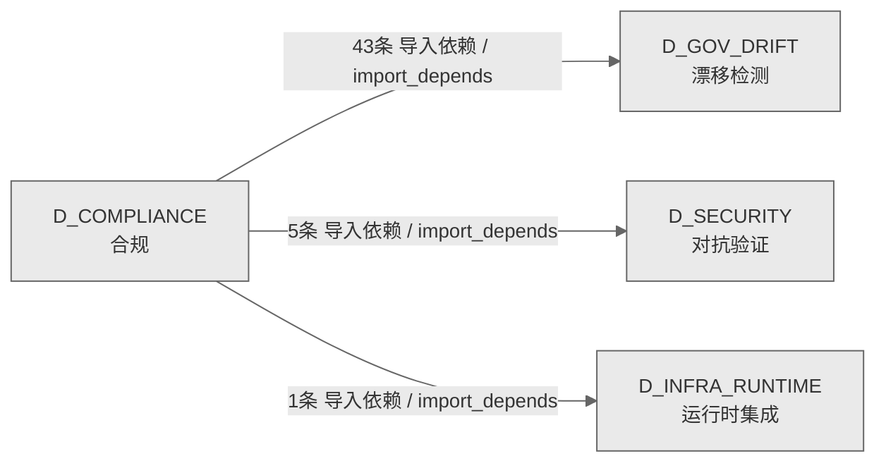

# 38_d_compliance / 合规 / Compliance

> **功能简介 / Overview**: 合规，负责交易合规检查、规则引擎和合规报告

> **文档作用 / Purpose**: 展示 合规（D_COMPLIANCE）功能域的模块清单、域内依赖关系、跨域依赖关系、架构分层视图，供架构审查和域治理参考。

> 本文档由 generate_domain_doc.py 从 depgraph (PostgreSQL) 自动生成
> 数据源: depgraph (PostgreSQL) nodes表 + edges表

> **[可缩放 HTML 版 / Zoomable HTML](http://localhost:8765/docs/02_enterprise_architecture/02_domain_architecture_docs/38_d_compliance.html)** — Ctrl+滚轮缩放 ｜ 双击重置 ｜ Ctrl+Shift+D 切换拖动/选择模式

## 域基本信息 / Domain Overview

| 字段 | 值 | Field | Value |
|------|------|-------|-------|
| 编号 | 38 | Number | 38 |
| 域ID | D_COMPLIANCE | Domain ID | D_COMPLIANCE |
| 域名称 | 合规 | Domain Name | Compliance |
| 层级 | L2 业务域层 | Layer | L2 Domain |
| 模块数 | 2 | Module Count | 2 |
| 域内依赖 | 0 | Internal Dependencies | 0 |
| 跨域入边 | 0 | Cross-domain Incoming | 0 |
| 跨域出边 | 49 | Cross-domain Outgoing | 49 |
| 设计态模块 | 0 | Design Modules | 0 |
| 生产态模块 | 2 | Production Modules | 2 |
| 容量 | 2/150 (正常) | Capacity | 2/150 (正常) |
| 描述 | 合规校验引擎 | Description | 合规校验引擎 |

## 模块分层清单 / Module Layered List

> 按 architecture_layer 分组的模块清单（共 2 个模块 / 2 modules）。

### L1 基础层 / Foundation Layer (1 modules)

| # | 模块路径 / Module Path | 模块名称 / Module Name (功能简介 / Description) | 成熟度 / Maturity | 蓝图 / Blueprint |
|:--:|---------|---------|:---:|:---:|
| 1 | src/zephyr/compliance/zero_knowledge_audit_stub/__init__.py | D_COMPLIANCE Compliance | 生产态 / production |  |

### L2 领域层 / Domain Layer (1 modules)

| # | 模块路径 / Module Path | 模块名称 / Module Name (功能简介 / Description) | 成熟度 / Maturity | 蓝图 / Blueprint |
|:--:|---------|---------|:---:|:---:|
| 1 | src/zephyr/compliance/behavioral_auditor/__init__.py | behavioral_auditor/__init__.py | 生产态 / production |  |

## 域内依赖图 / Internal Dependency Diagram

> 依赖图内嵌在本文档中，IDE 可直接渲染显示。参考 decision_index.md 设计，分三个视图：合并全景图、运营态子图、设计态子图（按 design_maturity 实际值拆分）。
>
> **图例说明 / Legend**：
> - **实线边框 = 运营态模块**（production，已上线运行）
> - **虚线边框 = 设计态模块**（design，蓝图阶段，代码未写）
> - **实线箭头 = 运营态依赖**（已生效的依赖关系）
> - **虚线箭头 = 非运营态依赖**（计划中/验证中的依赖关系）

### 合并全景图（全部模块，标签标注成熟度）

> 展示全部 2 个模块（生产态 2 + 设计态 0），标签标注成熟度。

### 运营态子图（仅 design_maturity=production 的模块和依赖）

> 仅展示已上线运行的模块（共 2 个，0 条域内依赖）。

```mermaid
%%{init: {'theme': 'base', 'themeVariables': {'primaryColor': '#eaeaea', 'primaryTextColor': '#333333', 'primaryBorderColor': '#666666', 'lineColor': '#666666', 'secondaryColor': '#eaeaea', 'tertiaryColor': '#eaeaea', 'fontSize': '14px'}}}%%
flowchart TD
    src_zephyr_compliance_behavioral_auditor_init_py["(生产态 / production) behavioral_auditor/__init__.py"]
    src_zephyr_compliance_zero_knowledge_audit_stub_init_py["(生产态 / production) D_COMPLIANCE Compliance<br/>D_COMPLIANCE Compliance<br/>文件: zero_knowledge_audit_stub/__init__.py"]
    src_zephyr_compliance_behavioral_auditor_init_py ~~~ src_zephyr_compliance_zero_knowledge_audit_stub_init_py
    D_GOV_DRIFT["(生产态 / production) D_GOV_DRIFT 漂移检测"]
    src_zephyr_compliance_behavioral_auditor_init_py -->|导入依赖 / import_depends| D_GOV_DRIFT
    src_zephyr_compliance_behavioral_auditor_init_py -->|导入依赖 / import_depends| D_GOV_DRIFT
    src_zephyr_compliance_behavioral_auditor_init_py -->|导入依赖 / import_depends| D_GOV_DRIFT
    src_zephyr_compliance_behavioral_auditor_init_py -->|导入依赖 / import_depends| D_GOV_DRIFT
    src_zephyr_compliance_behavioral_auditor_init_py -->|导入依赖 / import_depends| D_GOV_DRIFT
    src_zephyr_compliance_behavioral_auditor_init_py -->|导入依赖 / import_depends| D_GOV_DRIFT
    src_zephyr_compliance_behavioral_auditor_init_py -->|导入依赖 / import_depends| D_GOV_DRIFT
    src_zephyr_compliance_behavioral_auditor_init_py -->|导入依赖 / import_depends| D_GOV_DRIFT
    src_zephyr_compliance_behavioral_auditor_init_py -->|导入依赖 / import_depends| D_GOV_DRIFT
    src_zephyr_compliance_behavioral_auditor_init_py -->|导入依赖 / import_depends| D_GOV_DRIFT
    src_zephyr_compliance_behavioral_auditor_init_py -->|导入依赖 / import_depends| D_GOV_DRIFT
    src_zephyr_compliance_behavioral_auditor_init_py -->|导入依赖 / import_depends| D_GOV_DRIFT
    src_zephyr_compliance_behavioral_auditor_init_py -->|导入依赖 / import_depends| D_GOV_DRIFT
    src_zephyr_compliance_behavioral_auditor_init_py -->|导入依赖 / import_depends| D_GOV_DRIFT
    src_zephyr_compliance_behavioral_auditor_init_py -->|导入依赖 / import_depends| D_GOV_DRIFT
    classDef production fill:#e8edf2,stroke:#0277bd,stroke-width:2px,color:#1a1a1a
    classDef design fill:#f0ebe3,stroke:#bf360c,stroke-width:2px,color:#1a1a1a,stroke-dasharray: 5 5
    classDef external_prod fill:#e8efe9,stroke:#1b5e20,stroke-width:1px,color:#1a1a1a
    classDef external_design fill:#efe5ea,stroke:#880e4f,stroke-width:1px,color:#1a1a1a,stroke-dasharray: 5 5
    class src_zephyr_compliance_behavioral_auditor_init_py,src_zephyr_compliance_zero_knowledge_audit_stub_init_py production
    class D_GOV_DRIFT external_prod
```

### 设计态子图（仅 design_maturity=design 的模块和依赖）

> 仅展示蓝图阶段、代码未写的设计态模块（共 0 个，0 条域内依赖）。

> （无设计态模块 / No design modules）

## 跨域依赖 / Cross-domain Dependencies

### 本域依赖的其他域（出边）/ Depends On

| # | 本域模块 / Source Module | → | 外部域-目标模块 / Target Module | 依赖类型 / Type |
|:--:|---------|:--:|---------|---------|
| 1 | behavioral_auditor/__init__.py | → | D_GOV_DRIFT 漂移检测: Owner Absence Manager — Owner缺席模式 §6.32。 (gov_drif... | 导入依赖 / import_depends |
| 2 | behavioral_auditor/__init__.py | → | D_GOV_DRIFT 漂移检测: Drift Detector AI 施工检测器 — ai_construction_detectors... | 导入依赖 / import_depends |
| 3 | behavioral_auditor/__init__.py | → | D_GOV_DRIFT 漂移检测: AI Context Injector — 施工前预检D-023-16 · §6.8。 (gov... | 导入依赖 / import_depends |
| 4 | behavioral_auditor/__init__.py | → | D_GOV_DRIFT 漂移检测: Backward Compatibility Checker — 向后兼容策略漂移检测 D-... | 导入依赖 / import_depends |
| 5 | behavioral_auditor/__init__.py | → | D_GOV_DRIFT 漂移检测: Baseline Manager — baseline_manager.py (gov_drift/baseli... | 导入依赖 / import_depends |
| 6 | behavioral_auditor/__init__.py | → | D_GOV_DRIFT 漂移检测: Baseline Poisoning Guard — 基线投毒防护 D-023-36 · §6.... | 导入依赖 / import_depends |
| 7 | behavioral_auditor/__init__.py | → | D_GOV_DRIFT 漂移检测: Detector Canary Controller — 检测器金丝雀部署 §6.11。 (... | 导入依赖 / import_depends |
| 8 | behavioral_auditor/__init__.py | → | D_GOV_DRIFT 漂移检测: Cascade Failure Detector — 级联故障检测 D-023-22 · §6.... | 导入依赖 / import_depends |
| 9 | behavioral_auditor/__init__.py | → | D_GOV_DRIFT 漂移检测: Drift Chaos Injector — 混沌工程主动漂移注入 §6.13。 (go... | 导入依赖 / import_depends |
| 10 | behavioral_auditor/__init__.py | → | D_GOV_DRIFT 漂移检测: Config Consistency Checker — 配置多源一致性 D-023-29 · ... | 导入依赖 / import_depends |
| 11 | behavioral_auditor/__init__.py | → | D_GOV_DRIFT 漂移检测: contract_drift_detector — 契约漂移检测器。 (gov_drift/co... | 导入依赖 / import_depends |
| 12 | behavioral_auditor/__init__.py | → | D_GOV_DRIFT 漂移检测: Correlation Engine — correlation_engine.py (gov_drift/co... | 导入依赖 / import_depends |
| 13 | behavioral_auditor/__init__.py | → | D_GOV_DRIFT 漂移检测: Credibility Engine — credibility_engine.py (gov_drift/cr... | 导入依赖 / import_depends |
| 14 | behavioral_auditor/__init__.py | → | D_GOV_DRIFT 漂移检测: Cross Module Score — cross_module_score.py (gov_drift/cr... | 导入依赖 / import_depends |
| 15 | behavioral_auditor/__init__.py | → | D_GOV_DRIFT 漂移检测: Coverage Dashboard — dashboard.py (gov_drift/dashboard.py) | 导入依赖 / import_depends |
| 16 | behavioral_auditor/__init__.py | → | D_GOV_DRIFT 漂移检测: Detector Dispatcher — detector_dispatcher.py (gov_drift/... | 导入依赖 / import_depends |
| 17 | behavioral_auditor/__init__.py | → | D_GOV_DRIFT 漂移检测: Drift Engine — 编排器核心 (SRC-0030 精简后) (gov_drift/d... | 导入依赖 / import_depends |
| 18 | behavioral_auditor/__init__.py | → | D_GOV_DRIFT 漂移检测: Drift Hotfix Bypass — drift_hotfix_bypass.py (gov_drift/... | 导入依赖 / import_depends |
| 19 | behavioral_auditor/__init__.py | → | D_GOV_DRIFT 漂移检测: Drift Detector 基础设施 — drift_infrastructure.py (gov_d... | 导入依赖 / import_depends |
| 20 | behavioral_auditor/__init__.py | → | D_GOV_DRIFT 漂移检测: Drift Detector 数据模型 — drift_models.py (gov_drift/dri... | 导入依赖 / import_depends |
| 21 | behavioral_auditor/__init__.py | → | D_GOV_DRIFT 漂移检测: Drift Detector 结果类型 + 专项检测函数 — drift_result_ty... | 导入依赖 / import_depends |
| 22 | behavioral_auditor/__init__.py | → | D_GOV_DRIFT 漂移检测: Drift Detector AI 训练闭环 + 跨语言检测 — drift_training... | 导入依赖 / import_depends |
| 23 | behavioral_auditor/__init__.py | → | D_GOV_DRIFT 漂移检测: File Attribute Integrity — 文件底层属性完整性 §6.30。 (... | 导入依赖 / import_depends |
| 24 | behavioral_auditor/__init__.py | → | D_GOV_DRIFT 漂移检测: Drift Forensics Engine — 漂移取证引擎 §6.17。 (gov_drif... | 导入依赖 / import_depends |
| 25 | behavioral_auditor/__init__.py | → | D_GOV_DRIFT 漂移检测: Gate Persistence — gate_persistence.py (gov_drift/gate_p... | 导入依赖 / import_depends |
| 26 | behavioral_auditor/__init__.py | → | D_GOV_DRIFT 漂移检测: Git Bisector — git_bisector.py (gov_drift/git_bisector.py) | 导入依赖 / import_depends |
| 27 | behavioral_auditor/__init__.py | → | D_GOV_DRIFT 漂移检测: .gitignore Integrity Auditor — gitignore完整性审计 D-023... | 导入依赖 / import_depends |
| 28 | behavioral_auditor/__init__.py | → | D_GOV_DRIFT 漂移检测: Cross-Session Handoff Manager — 跨Session修复上下文交接 ... | 导入依赖 / import_depends |
| 29 | behavioral_auditor/__init__.py | → | D_GOV_DRIFT 漂移检测: Headless Scanner — headless_scanner.py (gov_drift/headle... | 导入依赖 / import_depends |
| 30 | behavioral_auditor/__init__.py | → | D_GOV_DRIFT 漂移检测: Incremental Scanner — incremental_scanner.py (gov_drift/... | 导入依赖 / import_depends |
| 31 | behavioral_auditor/__init__.py | → | D_GOV_DRIFT 漂移检测: Naming Magic Checker — 命名魔数与隐式约定检测 §6.27。 (... | 导入依赖 / import_depends |
| 32 | behavioral_auditor/__init__.py | → | D_GOV_DRIFT 漂移检测: Orphan Resource Scanner — 孤儿资源检测 §6.28。 (gov_dri... | 导入依赖 / import_depends |
| 33 | behavioral_auditor/__init__.py | → | D_GOV_DRIFT 漂移检测: Python Compatibility Checker — Python版本兼容性漂移 D-02... | 导入依赖 / import_depends |
| 34 | behavioral_auditor/__init__.py | → | D_GOV_DRIFT 漂移检测: Resource Guard — 资源上限与优雅降级 D-023-23 · §6.16。... | 导入依赖 / import_depends |
| 35 | behavioral_auditor/__init__.py | → | D_GOV_DRIFT 漂移检测: ROI Engine — roi_engine.py (gov_drift/roi_engine.py) | 导入依赖 / import_depends |
| 36 | behavioral_auditor/__init__.py | → | D_GOV_DRIFT 漂移检测: G-CT-006 契约：Drift -> Rollback 漂移触发回滚. (gov_drift... | 导入依赖 / import_depends |
| 37 | behavioral_auditor/__init__.py | → | D_GOV_DRIFT 漂移检测: Scan Mutex — scan_mutex.py (gov_drift/scan_mutex.py) | 导入依赖 / import_depends |
| 38 | behavioral_auditor/__init__.py | → | D_GOV_DRIFT 漂移检测: Self-Drift Check — self_check.py (gov_drift/self_check.py) | 导入依赖 / import_depends |
| 39 | behavioral_auditor/__init__.py | → | D_GOV_DRIFT 漂移检测: Suppression Learner — suppression_learner.py (gov_drift/... | 导入依赖 / import_depends |
| 40 | behavioral_auditor/__init__.py | → | D_GOV_DRIFT 漂移检测: Symlink Integrity Checker — 软链接完整性检测 §6.29。 (g... | 导入依赖 / import_depends |
| 41 | behavioral_auditor/__init__.py | → | D_GOV_DRIFT 漂移检测: Tamper-Proof Audit — 防篡改审计 D-023-37 · §6.26。 (go... | 导入依赖 / import_depends |
| 42 | behavioral_auditor/__init__.py | → | D_GOV_DRIFT 漂移检测: Test Fixture Checker — 测试夹具漂移检测 D-023-28 · §6.... | 导入依赖 / import_depends |
| 43 | behavioral_auditor/__init__.py | → | D_GOV_DRIFT 漂移检测: Trend Analyzer — trend_analyzer.py (gov_drift/trend_anal... | 导入依赖 / import_depends |
| 44 | behavioral_auditor/__init__.py | → | D_INFRA_RUNTIME 运行时集成: auto_fix_engine/state_machine.py | 导入依赖 / import_depends |
| 45 | behavioral_auditor/__init__.py | → | D_SECURITY 对抗验证: Alert Router — alert_router.py (gov_drift/alert_router.py) | 导入依赖 / import_depends |
| 46 | behavioral_auditor/__init__.py | → | D_SECURITY 对抗验证: Cold Start Bootstrapper — 冷启动引导 §6.31。 (gov_drift... | 导入依赖 / import_depends |
| 47 | behavioral_auditor/__init__.py | → | D_SECURITY 对抗验证: G-CT-005 — ManagedDriftEvent Pydantic V2 BaseModel 漂移... | 导入依赖 / import_depends |
| 48 | behavioral_auditor/__init__.py | → | D_SECURITY 对抗验证: Auto Reconciler — reconciler.py (gov_drift/reconciler.py) | 导入依赖 / import_depends |
| 49 | behavioral_auditor/__init__.py | → | D_SECURITY 对抗验证: Drift Runbook Generator — 漂移演练手册自动生成。 (gov_dr... | 导入依赖 / import_depends |

### 依赖本域的其他域（入边）/ Depended By

无跨域入边依赖 / No cross-domain incoming dependencies

### 跨域依赖图 / Cross-domain Dependency Diagram

> 本域与 3 个外部域直接连接（出边 49 条 + 入边 0 条 = 49 条）。只显示直接连接的域，不展开具体节点。

## 说明 / Notes

- **数据源 / Data Source**: `depgraph (PostgreSQL)` 的 `nodes`、`edges`、`domains` 表
- **生成器 / Generator**: `generate_domain_doc.py`（G2+G10 合并）
- **维护方式 / Maintenance**: 自动生成，全景图更新时刷新
- **文件名规则 / File Naming**: `{编号:02d}_{域ID小写}.md`，如 `16_d_trading.md`
- **图例说明 / Legend**: `[production]`=已上线 / `[design]`=设计中 / `[unknown]`=未知
