# 38_d_gov_scripts / script_governance / 脚本治理 / Script Governance

> **功能简介 / Overview**: 脚本治理与资产清单

> **文档作用 / Purpose**: 展示 脚本治理（D_GOV_SCRIPTS）功能域的模块清单、域内依赖关系、跨域依赖关系、架构分层视图，供架构审查和域治理参考。

> 本文档由 generate_domain_doc.py 从 depgraph (PostgreSQL) 自动生成
> 最后更新: 2026-07-09 01:10:30
> 数据源: depgraph (PostgreSQL) nodes表 + edges表

## 域基本信息 / Domain Overview

| 字段 | 值 | Field | Value |
|------|------|-------|-------|
| 编号 | 38 | Number | 38 |
| 域ID | D_GOV_SCRIPTS | Domain ID | D_GOV_SCRIPTS |
| 域名称 | 脚本治理 | Domain Name | Script Governance |
| 层级 | L2 业务域层 | Layer | L2 Domain |
| 模块数 | 435 | Module Count | 435 |
| 域内依赖 | 306 | Internal Dependencies | 306 |
| 跨域入边 | 3 | Cross-domain Incoming | 3 |
| 跨域出边 | 97 | Cross-domain Outgoing | 97 |
| 设计态模块 | 0 | Design Modules | 0 |
| 原型态模块 | 403 | Prototype Modules | 403 |
| 生产态模块 | 32 | Production Modules | 32 |
| 容量 | 32/150 (正常) | Capacity | 32/150 (正常) |
| 描述 | Phase Manager阶段管理 | Description | Phase Manager阶段管理 |

## 域内依赖图 / Internal Dependency Diagram

> 依赖图内嵌在本文档中，IDE 可直接渲染显示。每30个节点一组分页显示。
>
> **图例说明 / Legend**：
> - **实线边框 = 运营态模块**（production，已上线运行）
> - **虚线边框 = 设计态模块**（design，还在设计中）
> - **实线箭头 = 运营态依赖**（已生效的依赖关系）
> - **虚线箭头 = 设计态依赖**（计划中的依赖关系）

### 第 1 页 / 共 15 页 / Page 1 of 15

```mermaid
graph TD
    subgraph D_GOV_SCRIPTS["D_GOV_SCRIPTS 脚本治理"]
        docs_01_policies_and_standards_registry_catalogs_scripts_registry_yaml["(生产态 / production)  Script Collection — ARCH-052 聚合节点 production"]
        scripts_governance_init_py["(生产态 / production) __init__.py"]
        scripts_governance_archive_one_off_analyze_orphan_consumers_py["(原型态 / prototype) analyze_orphan_consumers.py"]
        scripts_governance_archive_one_off_audit_post_sync_commands_py["(原型态 / prototype) audit_post_sync_commands.py"]
        scripts_governance_archive_one_off_check_exam_case_consistency_py["(原型态 / prototype) check_exam_case_consistency.py"]
        scripts_governance_archive_one_off_check_rule_coverage_py["(原型态 / prototype) check_rule_coverage.py"]
        scripts_governance_archive_one_off_create_alignment_tasks_py["(原型态 / prototype) create_alignment_tasks.py"]
        scripts_governance_archive_one_off_dm105_depgraph_triage_py["(原型态 / prototype) dm105_depgraph_triage.py"]
        scripts_governance_archive_one_off_fix_broken_post_sync_py["(原型态 / prototype) fix_broken_post_sync.py"]
        scripts_governance_archive_one_off_group_orphan_modules_py["(原型态 / prototype) group_orphan_modules.py"]
        scripts_governance_archive_one_off_list_phase0_tasks_py["(原型态 / prototype) list_phase0_tasks.py"]
        scripts_governance_archive_one_off_migrate_clean_build_status_py["(原型态 / prototype) migrate_clean_build_status.py"]
        scripts_governance_archive_one_off_migrate_domain_id_hyphen_to_underscore_py["(原型态 / prototype) migrate_domain_id_hyphen_to_underscore.py"]
        scripts_governance_archive_one_off_perf_depgraph_baseline_py["(原型态 / prototype) perf_depgraph_baseline.py"]
        scripts_governance_archive_one_off_phase_a_backup_py["(原型态 / prototype) phase_a_backup.py"]
        scripts_governance_archive_one_off_rename_kebab_to_snake_py["(原型态 / prototype) rename_kebab_to_snake.py"]
        scripts_governance_archive_one_off_rename_whitelist_cleanup_py["(原型态 / prototype) rename_whitelist_cleanup.py"]
        scripts_governance_archive_one_off_test_lock_scenarios_py["(原型态 / prototype) test_lock_scenarios.py"]
        scripts_governance_archive_one_off_verify_final_delivery_py["(原型态 / prototype) verify_final_delivery.py"]
        scripts_governance_archive_one_off_verify_rule_yaml_migration_py["(原型态 / prototype) verify_rule_yaml_migration.py"]
        scripts_governance_archive_prototype_adversarial_log_py["(原型态 / prototype) adversarial_log.py"]
        scripts_governance_archive_prototype_adversarial_sys_master_test_py["(原型态 / prototype) adversarial_sys_master_test.py"]
        scripts_governance_archive_prototype_audit_domain_nodes_py["(原型态 / prototype) audit_domain_nodes.py"]
        scripts_governance_archive_prototype_changelog_py["(原型态 / prototype) changelog.py"]
        scripts_governance_archive_prototype_check_audit_rbac_isolation_py["(原型态 / prototype) check_audit_rbac_isolation.py"]
        scripts_governance_archive_prototype_construction_gate_py["(原型态 / prototype) construction_gate.py"]
        scripts_governance_archive_prototype_generate_asset_index_py["(原型态 / prototype) generate_asset_index.py"]
        scripts_governance_archive_prototype_generate_nav_table_py["(原型态 / prototype) generate_nav_table.py"]
        scripts_governance_archive_prototype_rebuild_audit_index_py["(原型态 / prototype) rebuild_audit_index.py"]
        scripts_governance_archive_prototype_scan_ground_truth_deps_py["(原型态 / prototype) scan_ground_truth_deps.py"]
    end
    scripts_governance_archive_one_off_check_rule_coverage_py -.->|config_depends / config_depends| scripts_governance_archive_one_off_audit_post_sync_commands_py
    scripts_governance_archive_one_off_group_orphan_modules_py -.->|config_depends / config_depends| scripts_governance_archive_one_off_audit_post_sync_commands_py
    scripts_governance_archive_one_off_list_phase0_tasks_py -.->|config_depends / config_depends| scripts_governance_archive_one_off_audit_post_sync_commands_py
    scripts_governance_archive_one_off_migrate_clean_build_status_py -.->|config_depends / config_depends| scripts_governance_archive_one_off_audit_post_sync_commands_py
    scripts_governance_archive_one_off_phase_a_backup_py -.->|config_depends / config_depends| scripts_governance_archive_one_off_audit_post_sync_commands_py
    scripts_governance_archive_one_off_migrate_domain_id_hyphen_to_underscore_py -.->|config_depends / config_depends| scripts_governance_archive_one_off_audit_post_sync_commands_py
    scripts_governance_archive_one_off_rename_kebab_to_snake_py -.->|config_depends / config_depends| scripts_governance_archive_one_off_audit_post_sync_commands_py
    scripts_governance_archive_one_off_test_lock_scenarios_py -.->|config_depends / config_depends| scripts_governance_archive_one_off_audit_post_sync_commands_py
    scripts_governance_archive_one_off_rename_whitelist_cleanup_py -.->|config_depends / config_depends| scripts_governance_archive_one_off_audit_post_sync_commands_py
    scripts_governance_archive_one_off_verify_final_delivery_py -.->|config_depends / config_depends| scripts_governance_archive_one_off_audit_post_sync_commands_py
    scripts_governance_archive_one_off_verify_rule_yaml_migration_py -.->|config_depends / config_depends| scripts_governance_archive_one_off_audit_post_sync_commands_py
    scripts_governance_archive_prototype_changelog_py -.->|config_depends / config_depends| scripts_governance_archive_prototype_construction_gate_py
    scripts_governance_archive_prototype_adversarial_log_py -.->|config_depends / config_depends| scripts_governance_archive_prototype_changelog_py
    scripts_governance_archive_prototype_audit_domain_nodes_py -.->|config_depends / config_depends| scripts_governance_archive_prototype_changelog_py
    scripts_governance_archive_prototype_check_audit_rbac_isolation_py -.->|config_depends / config_depends| scripts_governance_archive_prototype_changelog_py
    scripts_governance_archive_prototype_generate_asset_index_py -.->|config_depends / config_depends| scripts_governance_archive_prototype_changelog_py
    scripts_governance_archive_prototype_generate_nav_table_py -.->|config_depends / config_depends| scripts_governance_archive_prototype_changelog_py
    scripts_governance_archive_prototype_scan_ground_truth_deps_py -.->|config_depends / config_depends| scripts_governance_archive_prototype_changelog_py
    D_SHARED["[生产态 / production] D_SHARED"]
    scripts_governance_archive_one_off_audit_post_sync_commands_py -.->|导入依赖 / import_depends| D_SHARED
    D_GOVERNANCE["[原型态 / prototype] D_GOVERNANCE"]
    scripts_governance_archive_one_off_audit_post_sync_commands_py -.->|导入依赖 / import_depends| D_GOVERNANCE
    scripts_governance_archive_one_off_analyze_orphan_consumers_py -.->|导入依赖 / import_depends| D_SHARED
    D_INTELLIGENCE["[生产态 / production] D_INTELLIGENCE"]
    scripts_governance_archive_one_off_check_exam_case_consistency_py -.->|导入依赖 / import_depends| D_INTELLIGENCE
    scripts_governance_archive_one_off_dm105_depgraph_triage_py -.->|导入依赖 / import_depends| D_SHARED
    scripts_governance_archive_one_off_create_alignment_tasks_py -.->|导入依赖 / import_depends| D_GOVERNANCE
    scripts_governance_archive_one_off_fix_broken_post_sync_py -.->|导入依赖 / import_depends| D_GOVERNANCE
    scripts_governance_archive_one_off_perf_depgraph_baseline_py -.->|导入依赖 / import_depends| D_SHARED
    D_GOV_ENFORCEMENT["[生产态 / production] D_GOV_ENFORCEMENT"]
    scripts_governance_archive_prototype_adversarial_sys_master_test_py -.->|导入依赖 / import_depends| D_GOV_ENFORCEMENT
    scripts_governance_archive_prototype_rebuild_audit_index_py -.->|导入依赖 / import_depends| D_GOVERNANCE
    D_AUDITTEST["[原型态 / prototype] D_AUDITTEST"]
    D_AUDITTEST -.->|测试依赖 / test_depends| scripts_governance_init_py
    classDef production fill:#e1f5fe,stroke:#01579b,stroke-width:2px,color:#000
    classDef design fill:#fff3e0,stroke:#e65100,stroke-width:2px,color:#000,stroke-dasharray: 5 5
    classDef external_prod fill:#e8f5e9,stroke:#1b5e20,stroke-width:1px,color:#000
    classDef external_design fill:#fce4ec,stroke:#880e4f,stroke-width:1px,color:#000,stroke-dasharray: 5 5
    class docs_01_policies_and_standards_registry_catalogs_scripts_registry_yaml,scripts_governance_init_py production
    class scripts_governance_archive_one_off_analyze_orphan_consumers_py,scripts_governance_archive_one_off_audit_post_sync_commands_py,scripts_governance_archive_one_off_check_exam_case_consistency_py,scripts_governance_archive_one_off_check_rule_coverage_py,scripts_governance_archive_one_off_create_alignment_tasks_py,scripts_governance_archive_one_off_dm105_depgraph_triage_py,scripts_governance_archive_one_off_fix_broken_post_sync_py,scripts_governance_archive_one_off_group_orphan_modules_py,scripts_governance_archive_one_off_list_phase0_tasks_py,scripts_governance_archive_one_off_migrate_clean_build_status_py,scripts_governance_archive_one_off_migrate_domain_id_hyphen_to_underscore_py,scripts_governance_archive_one_off_perf_depgraph_baseline_py,scripts_governance_archive_one_off_phase_a_backup_py,scripts_governance_archive_one_off_rename_kebab_to_snake_py,scripts_governance_archive_one_off_rename_whitelist_cleanup_py,scripts_governance_archive_one_off_test_lock_scenarios_py,scripts_governance_archive_one_off_verify_final_delivery_py,scripts_governance_archive_one_off_verify_rule_yaml_migration_py,scripts_governance_archive_prototype_adversarial_log_py,scripts_governance_archive_prototype_adversarial_sys_master_test_py,scripts_governance_archive_prototype_audit_domain_nodes_py,scripts_governance_archive_prototype_changelog_py,scripts_governance_archive_prototype_check_audit_rbac_isolation_py,scripts_governance_archive_prototype_construction_gate_py,scripts_governance_archive_prototype_generate_asset_index_py,scripts_governance_archive_prototype_generate_nav_table_py,scripts_governance_archive_prototype_rebuild_audit_index_py,scripts_governance_archive_prototype_scan_ground_truth_deps_py design
    class D_SHARED,D_INTELLIGENCE,D_GOV_ENFORCEMENT external_prod
    class D_GOVERNANCE,D_AUDITTEST external_design
```

### 第 2 页 / 共 15 页 / Page 2 of 15

```mermaid
graph TD
    subgraph D_GOV_SCRIPTS["D_GOV_SCRIPTS 脚本治理"]
        scripts_governance_archive_prototype_session_simulator_py["(原型态 / prototype) session_simulator.py"]
        scripts_governance_archive_prototype_sync_blueprint_status_py["(原型态 / prototype) sync_blueprint_status.py"]
        scripts_governance_archive_vms_ri_ri_boundary_check_py["(原型态 / prototype) ri_boundary_check.py"]
        scripts_governance_archive_vms_ri_ri_build_completion_check_py["(原型态 / prototype) ri_build_completion_check.py"]
        scripts_governance_archive_vms_ri_vms_blindspot_check_py["(原型态 / prototype) vms_blindspot_check.py"]
        scripts_governance_archive_vms_ri_vms_build_completion_check_py["(原型态 / prototype) vms_build_completion_check.py"]
        scripts_governance_archive_vms_ri_vms_cron_monitor_py["(原型态 / prototype) vms_cron_monitor.py"]
        scripts_governance_archive_vms_ri_vms_cross_file_check_py["(原型态 / prototype) vms_cross_file_check.py"]
        scripts_governance_archive_vms_ri_vms_health_check_py["(原型态 / prototype) vms_health_check.py"]
        scripts_governance_archive_vms_ri_vms_migrate_py["(原型态 / prototype) vms_migrate.py"]
        scripts_governance_archive_vms_ri_vms_migration_dry_run_py["(原型态 / prototype) vms_migration_dry_run.py"]
        scripts_governance_archive_vms_ri_vms_phase_rollback_py["(原型态 / prototype) vms_phase_rollback.py"]
        scripts_governance_archive_vms_ri_vms_version_sync_check_py["(原型态 / prototype) vms_version_sync_check.py"]
        scripts_governance_shared_init_py["(原型态 / prototype) __init__.py"]
        scripts_governance_shared_base_py["(原型态 / prototype) base.py"]
        scripts_governance_shared_constants_py["(生产态 / production) constants.py"]
        scripts_governance_shared_deprecated_paths_yaml["(生产态 / production) deprecated_paths.yaml"]
        scripts_governance_shared_encoding_py["(原型态 / prototype) encoding.py"]
        scripts_governance_shared_file_utils_py["(原型态 / prototype) file_utils.py"]
        scripts_governance_shared_frontmatter_py["(生产态 / production) frontmatter.py"]
        scripts_governance_shared_libcst_docstring_adder_py["(原型态 / prototype) libcst_docstring_adder.py"]
        scripts_governance_shared_plugin_contract_schema_yaml["(生产态 / production) plugin_contract_schema.yaml"]
        scripts_governance_shared_registry_entry_count_py["(原型态 / prototype) registry_entry_count.py"]
        scripts_governance_shared_thresholds_py["(原型态 / prototype) thresholds.py"]
        scripts_governance_shared_thresholds_yaml["(生产态 / production) thresholds.yaml"]
        scripts_governance_shared_walk_py["(原型态 / prototype) walk.py"]
        scripts_governance_shared_yaml_utils_py["(原型态 / prototype) yaml_utils.py"]
        scripts_governance_sync_check_p0_status_py["(原型态 / prototype) check_p0_status.py"]
        scripts_governance_sync_cleanup_p0_auto_bridged_py["(原型态 / prototype) cleanup_p0_auto_bridged.py"]
        scripts_governance_sync_cleanup_p0_ops_pending_py["(原型态 / prototype) cleanup_p0_ops_pending.py"]
    end
    scripts_governance_archive_vms_ri_ri_build_completion_check_py -.->|config_depends / config_depends| scripts_governance_archive_vms_ri_vms_blindspot_check_py
    scripts_governance_archive_vms_ri_vms_cross_file_check_py -.->|config_depends / config_depends| scripts_governance_archive_vms_ri_ri_build_completion_check_py
    scripts_governance_archive_vms_ri_vms_build_completion_check_py -.->|config_depends / config_depends| scripts_governance_archive_vms_ri_ri_build_completion_check_py
    scripts_governance_archive_vms_ri_ri_boundary_check_py -.->|config_depends / config_depends| scripts_governance_archive_vms_ri_ri_build_completion_check_py
    scripts_governance_archive_vms_ri_vms_version_sync_check_py -.->|config_depends / config_depends| scripts_governance_archive_vms_ri_ri_build_completion_check_py
    scripts_governance_archive_vms_ri_vms_phase_rollback_py -.->|config_depends / config_depends| scripts_governance_archive_vms_ri_ri_build_completion_check_py
    scripts_governance_shared_registry_entry_count_py -.->|config_depends / config_depends| scripts_governance_shared_init_py
    scripts_governance_shared_encoding_py -.->|config_depends / config_depends| scripts_governance_shared_init_py
    scripts_governance_shared_libcst_docstring_adder_py -.->|config_depends / config_depends| scripts_governance_shared_init_py
    scripts_governance_shared_walk_py -.->|config_depends / config_depends| scripts_governance_shared_init_py
    scripts_governance_shared_thresholds_py -.->|config_depends / config_depends| scripts_governance_shared_init_py
    scripts_governance_sync_cleanup_p0_ops_pending_py -.->|config_depends / config_depends| scripts_governance_sync_check_p0_status_py
    scripts_governance_sync_cleanup_p0_auto_bridged_py -.->|config_depends / config_depends| scripts_governance_sync_check_p0_status_py
    scripts_governance_shared_plugin_contract_schema_yaml -.->|config_depends / config_depends| scripts_governance_shared_init_py
    scripts_governance_shared_deprecated_paths_yaml -.->|config_depends / config_depends| scripts_governance_shared_init_py
    scripts_governance_shared_thresholds_yaml -.->|config_depends / config_depends| scripts_governance_shared_init_py
    D_INFRA_TELEMETRY["[原型态 / prototype] D_INFRA_TELEMETRY"]
    scripts_governance_archive_prototype_session_simulator_py -.->|导入依赖 / import_depends| D_INFRA_TELEMETRY
    D_SHARED["[生产态 / production] D_SHARED"]
    scripts_governance_shared_constants_py -->|导入依赖 / import_depends| D_SHARED
    D_GOVERNANCE["[生产态 / production] D_GOVERNANCE"]
    scripts_governance_shared_constants_py -->|导入依赖 / import_depends| D_GOVERNANCE
    D_INFRA_RUNTIME["[原型态 / prototype] D_INFRA_RUNTIME"]
    scripts_governance_shared_base_py -.->|导入依赖 / import_depends| D_INFRA_RUNTIME
    scripts_governance_shared_file_utils_py -.->|导入依赖 / import_depends| D_SHARED
    scripts_governance_shared_yaml_utils_py -.->|导入依赖 / import_depends| D_SHARED
    classDef production fill:#e1f5fe,stroke:#01579b,stroke-width:2px,color:#000
    classDef design fill:#fff3e0,stroke:#e65100,stroke-width:2px,color:#000,stroke-dasharray: 5 5
    classDef external_prod fill:#e8f5e9,stroke:#1b5e20,stroke-width:1px,color:#000
    classDef external_design fill:#fce4ec,stroke:#880e4f,stroke-width:1px,color:#000,stroke-dasharray: 5 5
    class scripts_governance_shared_constants_py,scripts_governance_shared_deprecated_paths_yaml,scripts_governance_shared_frontmatter_py,scripts_governance_shared_plugin_contract_schema_yaml,scripts_governance_shared_thresholds_yaml production
    class scripts_governance_archive_prototype_session_simulator_py,scripts_governance_archive_prototype_sync_blueprint_status_py,scripts_governance_archive_vms_ri_ri_boundary_check_py,scripts_governance_archive_vms_ri_ri_build_completion_check_py,scripts_governance_archive_vms_ri_vms_blindspot_check_py,scripts_governance_archive_vms_ri_vms_build_completion_check_py,scripts_governance_archive_vms_ri_vms_cron_monitor_py,scripts_governance_archive_vms_ri_vms_cross_file_check_py,scripts_governance_archive_vms_ri_vms_health_check_py,scripts_governance_archive_vms_ri_vms_migrate_py,scripts_governance_archive_vms_ri_vms_migration_dry_run_py,scripts_governance_archive_vms_ri_vms_phase_rollback_py,scripts_governance_archive_vms_ri_vms_version_sync_check_py,scripts_governance_shared_init_py,scripts_governance_shared_base_py,scripts_governance_shared_encoding_py,scripts_governance_shared_file_utils_py,scripts_governance_shared_libcst_docstring_adder_py,scripts_governance_shared_registry_entry_count_py,scripts_governance_shared_thresholds_py,scripts_governance_shared_walk_py,scripts_governance_shared_yaml_utils_py,scripts_governance_sync_check_p0_status_py,scripts_governance_sync_cleanup_p0_auto_bridged_py,scripts_governance_sync_cleanup_p0_ops_pending_py design
    class D_SHARED,D_GOVERNANCE external_prod
    class D_INFRA_TELEMETRY,D_INFRA_RUNTIME external_design
```

### 第 3 页 / 共 15 页 / Page 3 of 15


### 第 4 页 / 共 15 页 / Page 4 of 15

```mermaid
graph TD
    subgraph D_GOV_SCRIPTS["D_GOV_SCRIPTS 脚本治理"]
        scripts_governance_d11_compliance_validate_truth_source_cascade_py["(生产态 / production) validate_truth_source_cascade.py"]
        scripts_governance_d11_compliance_validate_vocabulary_coverage_py["(原型态 / prototype) validate_vocabulary_coverage.py"]
        scripts_governance_d11_compliance_verify_audit_integrity_py["(原型态 / prototype) verify_audit_integrity.py"]
        scripts_governance_d11_compliance_verify_key_imports_py["(原型态 / prototype) verify_key_imports.py"]
        scripts_governance_d11_compliance_verify_schema_health_py["(原型态 / prototype) verify_schema_health.py"]
        scripts_governance_d12_ai_hallucination_init_py["(原型态 / prototype) __init__.py"]
        scripts_governance_d12_ai_hallucination_check_logger_kwargs_py["(原型态 / prototype) check_logger_kwargs.py"]
        scripts_governance_d12_ai_hallucination_validate_gate_prompt_conflict_py["(原型态 / prototype) validate_gate_prompt_conflict.py"]
        scripts_governance_d12_ai_hallucination_validate_session_budget_py["(原型态 / prototype) validate_session_budget.py"]
        scripts_governance_d12_ai_hallucination_validate_session_gate_check_py["(原型态 / prototype) validate_session_gate_check.py"]
        scripts_governance_d1_structure_init_py["(原型态 / prototype) __init__.py"]
        scripts_governance_d1_structure_archive_drafts_zone_py["(生产态 / production) archive_drafts_zone.py"]
        scripts_governance_d1_structure_audit_config_format_py["(原型态 / prototype) audit_config_format.py"]
        scripts_governance_d1_structure_audit_directory_integrity_py["(原型态 / prototype) audit_directory_integrity.py"]
        scripts_governance_d1_structure_audit_directory_scalability_py["(原型态 / prototype) audit_directory_scalability.py"]
        scripts_governance_d1_structure_audit_findings_by_scope_py["(原型态 / prototype) audit_findings_by_scope.py"]
        scripts_governance_d1_structure_batch_create_index_md_py["(原型态 / prototype) batch_create_index_md.py"]
        scripts_governance_d1_structure_cbg_reset_py["(原型态 / prototype) cbg_reset.py"]
        scripts_governance_d1_structure_check_directory_contract_py["(原型态 / prototype) check_directory_contract.py"]
        scripts_governance_d1_structure_check_handoff_manifests_py["(原型态 / prototype) check_handoff_manifests.py"]
        scripts_governance_d1_structure_check_index_integrity_py["(原型态 / prototype) check_index_integrity.py"]
        scripts_governance_d1_structure_cleanup_stash_py["(原型态 / prototype) cleanup_stash.py"]
        scripts_governance_d1_structure_detect_orphan_py_py["(原型态 / prototype) detect_orphan_py.py"]
        scripts_governance_d1_structure_detect_residual_files_py["(原型态 / prototype) detect_residual_files.py"]
        scripts_governance_d1_structure_detect_temp_files_py["(原型态 / prototype) detect_temp_files.py"]
        scripts_governance_d1_structure_drafts_zone_archiver_py["(原型态 / prototype) drafts_zone_archiver.py"]
        scripts_governance_d1_structure_generate_missing_index_md_py["(原型态 / prototype) generate_missing_index_md.py"]
        scripts_governance_d1_structure_reset_cbg_py["(原型态 / prototype) reset_cbg.py"]
        scripts_governance_d1_structure_run_script_smoke_test_py["(原型态 / prototype) run_script_smoke_test.py"]
        scripts_governance_d1_structure_sync_index_from_manifest_py["(原型态 / prototype) sync_index_from_manifest.py"]
    end
    scripts_governance_d12_ai_hallucination_check_logger_kwargs_py -.->|config_depends / config_depends| scripts_governance_d12_ai_hallucination_init_py
    scripts_governance_d12_ai_hallucination_validate_session_budget_py -.->|config_depends / config_depends| scripts_governance_d12_ai_hallucination_init_py
    scripts_governance_d12_ai_hallucination_validate_gate_prompt_conflict_py -.->|config_depends / config_depends| scripts_governance_d12_ai_hallucination_init_py
    scripts_governance_d1_structure_audit_findings_by_scope_py -.->|config_depends / config_depends| scripts_governance_d1_structure_init_py
    scripts_governance_d1_structure_audit_config_format_py -.->|config_depends / config_depends| scripts_governance_d1_structure_init_py
    scripts_governance_d1_structure_audit_directory_integrity_py -.->|config_depends / config_depends| scripts_governance_d1_structure_init_py
    scripts_governance_d12_ai_hallucination_validate_session_gate_check_py -.->|config_depends / config_depends| scripts_governance_d12_ai_hallucination_init_py
    scripts_governance_d1_structure_check_directory_contract_py -.->|config_depends / config_depends| scripts_governance_d1_structure_init_py
    scripts_governance_d1_structure_audit_directory_scalability_py -.->|config_depends / config_depends| scripts_governance_d1_structure_init_py
    scripts_governance_d1_structure_batch_create_index_md_py -.->|config_depends / config_depends| scripts_governance_d1_structure_init_py
    scripts_governance_d1_structure_check_index_integrity_py -.->|config_depends / config_depends| scripts_governance_d1_structure_init_py
    scripts_governance_d1_structure_detect_orphan_py_py -.->|config_depends / config_depends| scripts_governance_d1_structure_init_py
    scripts_governance_d1_structure_cleanup_stash_py -.->|config_depends / config_depends| scripts_governance_d1_structure_init_py
    scripts_governance_d1_structure_detect_residual_files_py -.->|config_depends / config_depends| scripts_governance_d1_structure_init_py
    scripts_governance_d1_structure_drafts_zone_archiver_py -.->|config_depends / config_depends| scripts_governance_d1_structure_init_py
    scripts_governance_d1_structure_generate_missing_index_md_py -.->|config_depends / config_depends| scripts_governance_d1_structure_init_py
    scripts_governance_d1_structure_detect_temp_files_py -.->|config_depends / config_depends| scripts_governance_d1_structure_init_py
    scripts_governance_d1_structure_sync_index_from_manifest_py -.->|config_depends / config_depends| scripts_governance_d1_structure_init_py
    scripts_governance_d1_structure_run_script_smoke_test_py -.->|config_depends / config_depends| scripts_governance_d1_structure_init_py
    D_GOV_ENFORCEMENT["[生产态 / production] D_GOV_ENFORCEMENT"]
    scripts_governance_d1_structure_cbg_reset_py -.->|导入依赖 / import_depends| D_GOV_ENFORCEMENT
    D_TRADING["[生产态 / production] D_TRADING"]
    scripts_governance_d1_structure_check_handoff_manifests_py -.->|导入依赖 / import_depends| D_TRADING
    scripts_governance_d1_structure_reset_cbg_py -.->|导入依赖 / import_depends| D_GOV_ENFORCEMENT
    classDef production fill:#e1f5fe,stroke:#01579b,stroke-width:2px,color:#000
    classDef design fill:#fff3e0,stroke:#e65100,stroke-width:2px,color:#000,stroke-dasharray: 5 5
    classDef external_prod fill:#e8f5e9,stroke:#1b5e20,stroke-width:1px,color:#000
    classDef external_design fill:#fce4ec,stroke:#880e4f,stroke-width:1px,color:#000,stroke-dasharray: 5 5
    class scripts_governance_d11_compliance_validate_truth_source_cascade_py,scripts_governance_d1_structure_archive_drafts_zone_py production
    class scripts_governance_d11_compliance_validate_vocabulary_coverage_py,scripts_governance_d11_compliance_verify_audit_integrity_py,scripts_governance_d11_compliance_verify_key_imports_py,scripts_governance_d11_compliance_verify_schema_health_py,scripts_governance_d12_ai_hallucination_init_py,scripts_governance_d12_ai_hallucination_check_logger_kwargs_py,scripts_governance_d12_ai_hallucination_validate_gate_prompt_conflict_py,scripts_governance_d12_ai_hallucination_validate_session_budget_py,scripts_governance_d12_ai_hallucination_validate_session_gate_check_py,scripts_governance_d1_structure_init_py,scripts_governance_d1_structure_audit_config_format_py,scripts_governance_d1_structure_audit_directory_integrity_py,scripts_governance_d1_structure_audit_directory_scalability_py,scripts_governance_d1_structure_audit_findings_by_scope_py,scripts_governance_d1_structure_batch_create_index_md_py,scripts_governance_d1_structure_cbg_reset_py,scripts_governance_d1_structure_check_directory_contract_py,scripts_governance_d1_structure_check_handoff_manifests_py,scripts_governance_d1_structure_check_index_integrity_py,scripts_governance_d1_structure_cleanup_stash_py,scripts_governance_d1_structure_detect_orphan_py_py,scripts_governance_d1_structure_detect_residual_files_py,scripts_governance_d1_structure_detect_temp_files_py,scripts_governance_d1_structure_drafts_zone_archiver_py,scripts_governance_d1_structure_generate_missing_index_md_py,scripts_governance_d1_structure_reset_cbg_py,scripts_governance_d1_structure_run_script_smoke_test_py,scripts_governance_d1_structure_sync_index_from_manifest_py design
    class D_GOV_ENFORCEMENT,D_TRADING external_prod
```

### 第 5 页 / 共 15 页 / Page 5 of 15

```mermaid
graph TD
    subgraph D_GOV_SCRIPTS["D_GOV_SCRIPTS 脚本治理"]
        scripts_governance_d1_structure_sync_policies_index_py["(原型态 / prototype) sync_policies_index.py"]
        scripts_governance_d1_structure_validate_config_integrity_py["(原型态 / prototype) validate_config_integrity.py"]
        scripts_governance_d1_structure_validate_d1_output_sanity_py["(原型态 / prototype) validate_d1_output_sanity.py"]
        scripts_governance_d1_structure_validate_immutable_core_py["(原型态 / prototype) validate_immutable_core.py"]
        scripts_governance_d1_structure_validate_index_reality_py["(原型态 / prototype) validate_index_reality.py"]
        scripts_governance_d1_structure_validate_read_before_write_py["(原型态 / prototype) validate_read_before_write.py"]
        scripts_governance_d2_links_init_py["(原型态 / prototype) __init__.py"]
        scripts_governance_d2_links_audit_broken_links_py["(原型态 / prototype) audit_broken_links.py"]
        scripts_governance_d2_links_detect_relative_references_py["(原型态 / prototype) detect_relative_references.py"]
        scripts_governance_d3_metadata_init_py["(原型态 / prototype) __init__.py"]
        scripts_governance_d3_metadata_auto_generate_index_py["(原型态 / prototype) auto_generate_index.py"]
        scripts_governance_d3_metadata_backfill_doctype_metadata_py["(原型态 / prototype) backfill_doctype_metadata.py"]
        scripts_governance_d3_metadata_backfill_ttl_metadata_py["(原型态 / prototype) backfill_ttl_metadata.py"]
        scripts_governance_d3_metadata_check_blueprint_compliance_py["(原型态 / prototype) check_blueprint_compliance.py"]
        scripts_governance_d3_metadata_check_frontmatter_metadata_py["(生产态 / production) check_frontmatter_metadata.py"]
        scripts_governance_d3_metadata_check_module_singlesource_py["(原型态 / prototype) check_module_singlesource.py"]
        scripts_governance_d3_metadata_check_naming_convention_py["(原型态 / prototype) check_naming_convention.py"]
        scripts_governance_d3_metadata_check_registry_consistency_py["(原型态 / prototype) check_registry_consistency.py"]
        scripts_governance_d3_metadata_check_schema_version_writes_py["(原型态 / prototype) check_schema_version_writes.py"]
        scripts_governance_d3_metadata_check_vocab_hardcode_py["(原型态 / prototype) check_vocab_hardcode.py"]
        scripts_governance_d3_metadata_classify_ttl_by_content_py["(原型态 / prototype) classify_ttl_by_content.py"]
        scripts_governance_d3_metadata_deep_content_scanner_py["(原型态 / prototype) deep_content_scanner.py"]
        scripts_governance_d3_metadata_generate_derived_files_py["(原型态 / prototype) generate_derived_files.py"]
        scripts_governance_d3_metadata_generate_rule_catalog_py["(原型态 / prototype) generate_rule_catalog.py"]
        scripts_governance_d3_metadata_migrate_illegal_doctype_py["(原型态 / prototype) migrate_illegal_doctype.py"]
        scripts_governance_d3_metadata_validate_architecture_py["(原型态 / prototype) validate_architecture.py"]
        scripts_governance_d3_metadata_validate_blueprint_provenance_py["(原型态 / prototype) validate_blueprint_provenance.py"]
        scripts_governance_d3_metadata_validate_module_id_py["(原型态 / prototype) validate_module_id.py"]
        scripts_governance_d3_metadata_validate_module_id_naming_py["(原型态 / prototype) validate_module_id_naming.py"]
        scripts_governance_d3_metadata_validate_registry_master_index_py["(原型态 / prototype) validate_registry_master_index.py"]
    end
    scripts_governance_d2_links_init_py -.->|config_depends / config_depends| scripts_governance_d2_links_audit_broken_links_py
    scripts_governance_d2_links_detect_relative_references_py -.->|config_depends / config_depends| scripts_governance_d2_links_init_py
    scripts_governance_d3_metadata_auto_generate_index_py -.->|config_depends / config_depends| scripts_governance_d3_metadata_init_py
    scripts_governance_d3_metadata_check_blueprint_compliance_py -.->|config_depends / config_depends| scripts_governance_d3_metadata_init_py
    scripts_governance_d3_metadata_backfill_ttl_metadata_py -.->|config_depends / config_depends| scripts_governance_d3_metadata_init_py
    scripts_governance_d3_metadata_backfill_doctype_metadata_py -.->|config_depends / config_depends| scripts_governance_d3_metadata_init_py
    scripts_governance_d3_metadata_classify_ttl_by_content_py -.->|config_depends / config_depends| scripts_governance_d3_metadata_init_py
    scripts_governance_d3_metadata_migrate_illegal_doctype_py -.->|config_depends / config_depends| scripts_governance_d3_metadata_init_py
    scripts_governance_d3_metadata_generate_derived_files_py -.->|config_depends / config_depends| scripts_governance_d3_metadata_init_py
    scripts_governance_d3_metadata_check_vocab_hardcode_py -.->|config_depends / config_depends| scripts_governance_d3_metadata_init_py
    scripts_governance_d3_metadata_generate_rule_catalog_py -.->|config_depends / config_depends| scripts_governance_d3_metadata_init_py
    scripts_governance_d3_metadata_validate_architecture_py -.->|config_depends / config_depends| scripts_governance_d3_metadata_init_py
    scripts_governance_d3_metadata_validate_blueprint_provenance_py -.->|config_depends / config_depends| scripts_governance_d3_metadata_init_py
    scripts_governance_d3_metadata_validate_registry_master_index_py -.->|config_depends / config_depends| scripts_governance_d3_metadata_init_py
    scripts_governance_d3_metadata_validate_module_id_naming_py -.->|config_depends / config_depends| scripts_governance_d3_metadata_init_py
    scripts_governance_d3_metadata_validate_module_id_py -.->|config_depends / config_depends| scripts_governance_d3_metadata_init_py
    scripts_governance_d3_metadata_deep_content_scanner_py -.->|config_depends / config_depends| scripts_governance_d3_metadata_init_py
    D_SHARED["[生产态 / production] D_SHARED"]
    scripts_governance_d3_metadata_check_module_singlesource_py -.->|导入依赖 / import_depends| D_SHARED
    D_GOVERNANCE["[生产态 / production] D_GOVERNANCE"]
    scripts_governance_d3_metadata_check_schema_version_writes_py -.->|导入依赖 / import_depends| D_GOVERNANCE
    D_INFRA_RUNTIME["[原型态 / prototype] D_INFRA_RUNTIME"]
    scripts_governance_d3_metadata_check_registry_consistency_py -.->|导入依赖 / import_depends| D_INFRA_RUNTIME
    D_GOVERNANCE -.->|导入依赖 / import_depends| scripts_governance_d3_metadata_check_naming_convention_py
    D_AUDITTEST["[原型态 / prototype] D_AUDITTEST"]
    D_AUDITTEST -.->|测试依赖 / test_depends| scripts_governance_d3_metadata_check_frontmatter_metadata_py
    classDef production fill:#e1f5fe,stroke:#01579b,stroke-width:2px,color:#000
    classDef design fill:#fff3e0,stroke:#e65100,stroke-width:2px,color:#000,stroke-dasharray: 5 5
    classDef external_prod fill:#e8f5e9,stroke:#1b5e20,stroke-width:1px,color:#000
    classDef external_design fill:#fce4ec,stroke:#880e4f,stroke-width:1px,color:#000,stroke-dasharray: 5 5
    class scripts_governance_d3_metadata_check_frontmatter_metadata_py production
    class scripts_governance_d1_structure_sync_policies_index_py,scripts_governance_d1_structure_validate_config_integrity_py,scripts_governance_d1_structure_validate_d1_output_sanity_py,scripts_governance_d1_structure_validate_immutable_core_py,scripts_governance_d1_structure_validate_index_reality_py,scripts_governance_d1_structure_validate_read_before_write_py,scripts_governance_d2_links_init_py,scripts_governance_d2_links_audit_broken_links_py,scripts_governance_d2_links_detect_relative_references_py,scripts_governance_d3_metadata_init_py,scripts_governance_d3_metadata_auto_generate_index_py,scripts_governance_d3_metadata_backfill_doctype_metadata_py,scripts_governance_d3_metadata_backfill_ttl_metadata_py,scripts_governance_d3_metadata_check_blueprint_compliance_py,scripts_governance_d3_metadata_check_module_singlesource_py,scripts_governance_d3_metadata_check_naming_convention_py,scripts_governance_d3_metadata_check_registry_consistency_py,scripts_governance_d3_metadata_check_schema_version_writes_py,scripts_governance_d3_metadata_check_vocab_hardcode_py,scripts_governance_d3_metadata_classify_ttl_by_content_py,scripts_governance_d3_metadata_deep_content_scanner_py,scripts_governance_d3_metadata_generate_derived_files_py,scripts_governance_d3_metadata_generate_rule_catalog_py,scripts_governance_d3_metadata_migrate_illegal_doctype_py,scripts_governance_d3_metadata_validate_architecture_py,scripts_governance_d3_metadata_validate_blueprint_provenance_py,scripts_governance_d3_metadata_validate_module_id_py,scripts_governance_d3_metadata_validate_module_id_naming_py,scripts_governance_d3_metadata_validate_registry_master_index_py design
    class D_SHARED,D_GOVERNANCE external_prod
    class D_INFRA_RUNTIME,D_AUDITTEST external_design
```

### 第 6 页 / 共 15 页 / Page 6 of 15

```mermaid
graph TD
    subgraph D_GOV_SCRIPTS["D_GOV_SCRIPTS 脚本治理"]
        scripts_governance_d3_metadata_validate_rule_frontmatter_py["(原型态 / prototype) validate_rule_frontmatter.py"]
        scripts_governance_d3_metadata_validate_tool_contracts_consistency_py["(原型态 / prototype) validate_tool_contracts_consistency.py"]
        scripts_governance_d4_paths_init_py["(原型态 / prototype) __init__.py"]
        scripts_governance_d4_paths_detect_deprecated_path_writes_py["(原型态 / prototype) detect_deprecated_path_writes.py"]
        scripts_governance_d4_paths_detect_excessive_file_moves_py["(原型态 / prototype) detect_excessive_file_moves.py"]
        scripts_governance_d4_paths_detect_ruins_references_py["(原型态 / prototype) detect_ruins_references.py"]
        scripts_governance_d4_paths_detect_split_delete_ref_commit_py["(原型态 / prototype) detect_split_delete_ref_commit.py"]
        scripts_governance_d5_architecture_init_py["(原型态 / prototype) __init__.py"]
        scripts_governance_d5_architecture_analyzers_init_py["(原型态 / prototype) __init__.py"]
        scripts_governance_d5_architecture_analyzers_analyze_contract_impact_py["(原型态 / prototype) analyze_contract_impact.py"]
        scripts_governance_d5_architecture_analyzers_audit_depends_on_chain_depth_py["(原型态 / prototype) audit_depends_on_chain_depth.py"]
        scripts_governance_d5_architecture_analyzers_measure_deprecation_cascade_py["(原型态 / prototype) measure_deprecation_cascade.py"]
        scripts_governance_d5_architecture_audit_agent_spec_py["(原型态 / prototype) audit_agent_spec.py"]
        scripts_governance_d5_architecture_check_budget_health_py["(原型态 / prototype) check_budget_health.py"]
        scripts_governance_d5_architecture_check_drift_e2e_py["(原型态 / prototype) check_drift_e2e.py"]
        scripts_governance_d5_architecture_checkers_init_py["(原型态 / prototype) __init__.py"]
        scripts_governance_d5_architecture_checkers_check_architecture_gates_py["(原型态 / prototype) check_architecture_gates.py"]
        scripts_governance_d5_architecture_checkers_check_blueprint_automation_sync_py["(原型态 / prototype) check_blueprint_automation_sync.py"]
        scripts_governance_d5_architecture_checkers_check_blueprint_code_alignment_py["(原型态 / prototype) check_blueprint_code_alignment.py"]
        scripts_governance_d5_architecture_checkers_check_blueprint_template_compliance_py["(原型态 / prototype) check_blueprint_template_compliance.py"]
        scripts_governance_d5_architecture_checkers_check_code_duplication_py["(原型态 / prototype) check_code_duplication.py"]
        scripts_governance_d5_architecture_checkers_check_contract_code_drift_py["(原型态 / prototype) check_contract_code_drift.py"]
        scripts_governance_d5_architecture_checkers_check_contract_physical_path_py["(原型态 / prototype) check_contract_physical_path.py"]
        scripts_governance_d5_architecture_checkers_check_dependency_direction_py["(原型态 / prototype) check_dependency_direction.py"]
        scripts_governance_d5_architecture_checkers_check_g6_ctr_compliance_py["(原型态 / prototype) check_g6_ctr_compliance.py"]
        scripts_governance_d5_architecture_checkers_check_orphan_outputs_py["(原型态 / prototype) check_orphan_outputs.py"]
        scripts_governance_d5_architecture_checkers_check_precommit_id_uniqueness_py["(原型态 / prototype) check_precommit_id_uniqueness.py"]
        scripts_governance_d5_architecture_checkers_check_rule_four_way_alignment_py["(原型态 / prototype) check_rule_four_way_alignment.py"]
        scripts_governance_d5_architecture_checkers_check_src_no_data_py["(原型态 / prototype) check_src_no_data.py"]
        scripts_governance_d5_architecture_checkers_check_ssot_uniqueness_py["(原型态 / prototype) check_ssot_uniqueness.py"]
    end
    scripts_governance_d4_paths_detect_deprecated_path_writes_py -.->|config_depends / config_depends| scripts_governance_d4_paths_init_py
    scripts_governance_d4_paths_detect_ruins_references_py -.->|config_depends / config_depends| scripts_governance_d4_paths_init_py
    scripts_governance_d4_paths_detect_split_delete_ref_commit_py -.->|config_depends / config_depends| scripts_governance_d4_paths_init_py
    scripts_governance_d4_paths_detect_excessive_file_moves_py -.->|config_depends / config_depends| scripts_governance_d4_paths_init_py
    scripts_governance_d5_architecture_check_drift_e2e_py -.->|config_depends / config_depends| scripts_governance_d5_architecture_init_py
    scripts_governance_d5_architecture_analyzers_analyze_contract_impact_py -.->|config_depends / config_depends| scripts_governance_d5_architecture_analyzers_init_py
    scripts_governance_d5_architecture_analyzers_measure_deprecation_cascade_py -.->|config_depends / config_depends| scripts_governance_d5_architecture_analyzers_init_py
    scripts_governance_d5_architecture_analyzers_audit_depends_on_chain_depth_py -.->|config_depends / config_depends| scripts_governance_d5_architecture_analyzers_init_py
    scripts_governance_d5_architecture_checkers_check_blueprint_template_compliance_py -.->|config_depends / config_depends| scripts_governance_d5_architecture_checkers_init_py
    scripts_governance_d5_architecture_checkers_check_blueprint_automation_sync_py -.->|config_depends / config_depends| scripts_governance_d5_architecture_checkers_init_py
    scripts_governance_d5_architecture_checkers_check_architecture_gates_py -.->|config_depends / config_depends| scripts_governance_d5_architecture_checkers_init_py
    scripts_governance_d5_architecture_checkers_check_blueprint_code_alignment_py -.->|config_depends / config_depends| scripts_governance_d5_architecture_checkers_init_py
    scripts_governance_d5_architecture_checkers_check_code_duplication_py -.->|config_depends / config_depends| scripts_governance_d5_architecture_checkers_init_py
    scripts_governance_d5_architecture_checkers_check_orphan_outputs_py -.->|config_depends / config_depends| scripts_governance_d5_architecture_checkers_init_py
    scripts_governance_d5_architecture_checkers_check_precommit_id_uniqueness_py -.->|config_depends / config_depends| scripts_governance_d5_architecture_checkers_init_py
    scripts_governance_d5_architecture_checkers_check_rule_four_way_alignment_py -.->|config_depends / config_depends| scripts_governance_d5_architecture_checkers_init_py
    scripts_governance_d5_architecture_checkers_check_g6_ctr_compliance_py -.->|config_depends / config_depends| scripts_governance_d5_architecture_checkers_init_py
    scripts_governance_d5_architecture_checkers_check_dependency_direction_py -.->|config_depends / config_depends| scripts_governance_d5_architecture_checkers_init_py
    scripts_governance_d5_architecture_checkers_check_contract_physical_path_py -.->|config_depends / config_depends| scripts_governance_d5_architecture_checkers_init_py
    scripts_governance_d5_architecture_checkers_check_contract_code_drift_py -.->|config_depends / config_depends| scripts_governance_d5_architecture_checkers_init_py
    scripts_governance_d5_architecture_checkers_check_src_no_data_py -.->|config_depends / config_depends| scripts_governance_d5_architecture_checkers_init_py
    scripts_governance_d5_architecture_checkers_check_ssot_uniqueness_py -.->|config_depends / config_depends| scripts_governance_d5_architecture_checkers_init_py
    D_AUTONOMY_CORE["[生产态 / production] D_AUTONOMY_CORE"]
    scripts_governance_d5_architecture_audit_agent_spec_py -.->|导入依赖 / import_depends| D_AUTONOMY_CORE
    D_GOVERNANCE["[生产态 / production] D_GOVERNANCE"]
    scripts_governance_d5_architecture_check_budget_health_py -.->|导入依赖 / import_depends| D_GOVERNANCE
    scripts_governance_d5_architecture_check_budget_health_py -.->|导入依赖 / import_depends| D_GOVERNANCE
    classDef production fill:#e1f5fe,stroke:#01579b,stroke-width:2px,color:#000
    classDef design fill:#fff3e0,stroke:#e65100,stroke-width:2px,color:#000,stroke-dasharray: 5 5
    classDef external_prod fill:#e8f5e9,stroke:#1b5e20,stroke-width:1px,color:#000
    classDef external_design fill:#fce4ec,stroke:#880e4f,stroke-width:1px,color:#000,stroke-dasharray: 5 5
    class scripts_governance_d3_metadata_validate_rule_frontmatter_py,scripts_governance_d3_metadata_validate_tool_contracts_consistency_py,scripts_governance_d4_paths_init_py,scripts_governance_d4_paths_detect_deprecated_path_writes_py,scripts_governance_d4_paths_detect_excessive_file_moves_py,scripts_governance_d4_paths_detect_ruins_references_py,scripts_governance_d4_paths_detect_split_delete_ref_commit_py,scripts_governance_d5_architecture_init_py,scripts_governance_d5_architecture_analyzers_init_py,scripts_governance_d5_architecture_analyzers_analyze_contract_impact_py,scripts_governance_d5_architecture_analyzers_audit_depends_on_chain_depth_py,scripts_governance_d5_architecture_analyzers_measure_deprecation_cascade_py,scripts_governance_d5_architecture_audit_agent_spec_py,scripts_governance_d5_architecture_check_budget_health_py,scripts_governance_d5_architecture_check_drift_e2e_py,scripts_governance_d5_architecture_checkers_init_py,scripts_governance_d5_architecture_checkers_check_architecture_gates_py,scripts_governance_d5_architecture_checkers_check_blueprint_automation_sync_py,scripts_governance_d5_architecture_checkers_check_blueprint_code_alignment_py,scripts_governance_d5_architecture_checkers_check_blueprint_template_compliance_py,scripts_governance_d5_architecture_checkers_check_code_duplication_py,scripts_governance_d5_architecture_checkers_check_contract_code_drift_py,scripts_governance_d5_architecture_checkers_check_contract_physical_path_py,scripts_governance_d5_architecture_checkers_check_dependency_direction_py,scripts_governance_d5_architecture_checkers_check_g6_ctr_compliance_py,scripts_governance_d5_architecture_checkers_check_orphan_outputs_py,scripts_governance_d5_architecture_checkers_check_precommit_id_uniqueness_py,scripts_governance_d5_architecture_checkers_check_rule_four_way_alignment_py,scripts_governance_d5_architecture_checkers_check_src_no_data_py,scripts_governance_d5_architecture_checkers_check_ssot_uniqueness_py design
    class D_AUTONOMY_CORE,D_GOVERNANCE external_prod
```

### 第 7 页 / 共 15 页 / Page 7 of 15


### 第 8 页 / 共 15 页 / Page 8 of 15

```mermaid
graph TD
    subgraph D_GOV_SCRIPTS["D_GOV_SCRIPTS 脚本治理"]
        scripts_governance_d5_architecture_pre_delete_safety_check_py["(原型态 / prototype) pre_delete_safety_check.py"]
        scripts_governance_d5_architecture_pre_write_gate_py["(原型态 / prototype) pre_write_gate.py"]
        scripts_governance_d5_architecture_score_architecture_py["(原型态 / prototype) score_architecture.py"]
        scripts_governance_d5_architecture_syncers_init_py["(原型态 / prototype) __init__.py"]
        scripts_governance_d5_architecture_syncers_archive_rationale_log_py["(原型态 / prototype) archive_rationale_log.py"]
        scripts_governance_d5_architecture_syncers_merge_readme_to_index_py["(原型态 / prototype) merge_readme_to_index.py"]
        scripts_governance_d5_architecture_syncers_sync_blueprint_code_index_py["(原型态 / prototype) sync_blueprint_code_index.py"]
        scripts_governance_d5_architecture_syncers_sync_registry_from_blueprints_py["(原型态 / prototype) sync_registry_from_blueprints.py"]
        scripts_governance_d5_architecture_validators_init_py["(原型态 / prototype) __init__.py"]
        scripts_governance_d5_architecture_validators_blueprint_init_py["(原型态 / prototype) __init__.py"]
        scripts_governance_d5_architecture_validators_blueprint_validate_blueprint_code_sync_py["(原型态 / prototype) validate_blueprint_code_sync.py"]
        scripts_governance_d5_architecture_validators_blueprint_validate_blueprint_implementation_docs_py["(原型态 / prototype) validate_blueprint_implementation_docs.py"]
        scripts_governance_d5_architecture_validators_blueprint_validate_blueprint_path_consistency_py["(原型态 / prototype) validate_blueprint_path_consistency.py"]
        scripts_governance_d5_architecture_validators_blueprint_validate_blueprint_placement_py["(原型态 / prototype) validate_blueprint_placement.py"]
        scripts_governance_d5_architecture_validators_blueprint_validate_blueprint_tag_uniqueness_py["(原型态 / prototype) validate_blueprint_tag_uniqueness.py"]
        scripts_governance_d5_architecture_validators_lifecycle_init_py["(原型态 / prototype) __init__.py"]
        scripts_governance_d5_architecture_validators_lifecycle_validate_lifecycle_refs_py["(原型态 / prototype) validate_lifecycle_refs.py"]
        scripts_governance_d5_architecture_validators_lifecycle_validate_module_lifecycle_py["(原型态 / prototype) validate_module_lifecycle.py"]
        scripts_governance_d5_architecture_validators_lifecycle_validate_phase_transition_py["(原型态 / prototype) validate_phase_transition.py"]
        scripts_governance_d5_architecture_validators_session_init_py["(原型态 / prototype) __init__.py"]
        scripts_governance_d5_architecture_validators_session_validate_session_log_index_integrity_py["(原型态 / prototype) validate_session_log_index_integrity.py"]
        scripts_governance_d5_architecture_validators_session_validate_session_log_updated_py["(原型态 / prototype) validate_session_log_updated.py"]
        scripts_governance_d5_architecture_validators_validate_adr_frontmatter_consistency_py["(原型态 / prototype) validate_adr_frontmatter_consistency.py"]
        scripts_governance_d5_architecture_validators_validate_arch_review_gate_py["(原型态 / prototype) validate_arch_review_gate.py"]
        scripts_governance_d5_architecture_validators_validate_architecture_contract_internal_py["(原型态 / prototype) validate_architecture_contract_internal.py"]
        scripts_governance_d5_architecture_validators_validate_authority_registry_py["(生产态 / production) validate_authority_registry.py"]
        scripts_governance_d5_architecture_validators_validate_autonomy_gate_py["(原型态 / prototype) validate_autonomy_gate.py"]
        scripts_governance_d5_architecture_validators_validate_b_track_packages_py["(原型态 / prototype) validate_b_track_packages.py"]
        scripts_governance_d5_architecture_validators_validate_blind_spot_status_py["(原型态 / prototype) validate_blind_spot_status.py"]
        scripts_governance_d5_architecture_validators_validate_code_yaml_alignment_py["(原型态 / prototype) validate_code_yaml_alignment.py"]
    end
    scripts_governance_d5_architecture_syncers_init_py -.->|config_depends / config_depends| scripts_governance_d5_architecture_syncers_archive_rationale_log_py
    scripts_governance_d5_architecture_syncers_merge_readme_to_index_py -.->|config_depends / config_depends| scripts_governance_d5_architecture_syncers_init_py
    scripts_governance_d5_architecture_syncers_sync_registry_from_blueprints_py -.->|config_depends / config_depends| scripts_governance_d5_architecture_syncers_init_py
    scripts_governance_d5_architecture_validators_validate_autonomy_gate_py -.->|config_depends / config_depends| scripts_governance_d5_architecture_validators_init_py
    scripts_governance_d5_architecture_validators_validate_architecture_contract_internal_py -.->|config_depends / config_depends| scripts_governance_d5_architecture_validators_init_py
    scripts_governance_d5_architecture_syncers_sync_blueprint_code_index_py -.->|config_depends / config_depends| scripts_governance_d5_architecture_syncers_init_py
    scripts_governance_d5_architecture_validators_validate_adr_frontmatter_consistency_py -.->|config_depends / config_depends| scripts_governance_d5_architecture_validators_init_py
    scripts_governance_d5_architecture_validators_validate_arch_review_gate_py -.->|config_depends / config_depends| scripts_governance_d5_architecture_validators_init_py
    scripts_governance_d5_architecture_validators_validate_b_track_packages_py -.->|config_depends / config_depends| scripts_governance_d5_architecture_validators_init_py
    scripts_governance_d5_architecture_validators_validate_blind_spot_status_py -.->|config_depends / config_depends| scripts_governance_d5_architecture_validators_init_py
    scripts_governance_d5_architecture_validators_validate_code_yaml_alignment_py -.->|config_depends / config_depends| scripts_governance_d5_architecture_validators_init_py
    scripts_governance_d5_architecture_validators_blueprint_validate_blueprint_implementation_docs_py -.->|config_depends / config_depends| scripts_governance_d5_architecture_validators_blueprint_init_py
    scripts_governance_d5_architecture_validators_blueprint_validate_blueprint_tag_uniqueness_py -.->|config_depends / config_depends| scripts_governance_d5_architecture_validators_blueprint_init_py
    scripts_governance_d5_architecture_validators_blueprint_validate_blueprint_code_sync_py -.->|config_depends / config_depends| scripts_governance_d5_architecture_validators_blueprint_init_py
    scripts_governance_d5_architecture_validators_blueprint_validate_blueprint_placement_py -.->|config_depends / config_depends| scripts_governance_d5_architecture_validators_blueprint_init_py
    scripts_governance_d5_architecture_validators_blueprint_validate_blueprint_path_consistency_py -.->|config_depends / config_depends| scripts_governance_d5_architecture_validators_blueprint_init_py
    scripts_governance_d5_architecture_validators_lifecycle_validate_lifecycle_refs_py -.->|config_depends / config_depends| scripts_governance_d5_architecture_validators_lifecycle_init_py
    scripts_governance_d5_architecture_validators_session_init_py -.->|config_depends / config_depends| scripts_governance_d5_architecture_validators_session_validate_session_log_updated_py
    scripts_governance_d5_architecture_validators_lifecycle_validate_phase_transition_py -.->|config_depends / config_depends| scripts_governance_d5_architecture_validators_lifecycle_init_py
    scripts_governance_d5_architecture_validators_session_validate_session_log_index_integrity_py -.->|config_depends / config_depends| scripts_governance_d5_architecture_validators_session_init_py
    D_SECURITY["[生产态 / production] D_SECURITY"]
    scripts_governance_d5_architecture_pre_write_gate_py -.->|导入依赖 / import_depends| D_SECURITY
    D_GOV_ENFORCEMENT["[生产态 / production] D_GOV_ENFORCEMENT"]
    scripts_governance_d5_architecture_pre_write_gate_py -.->|导入依赖 / import_depends| D_GOV_ENFORCEMENT
    D_SHARED["[原型态 / prototype] D_SHARED"]
    scripts_governance_d5_architecture_validators_lifecycle_validate_module_lifecycle_py -.->|导入依赖 / import_depends| D_SHARED
    classDef production fill:#e1f5fe,stroke:#01579b,stroke-width:2px,color:#000
    classDef design fill:#fff3e0,stroke:#e65100,stroke-width:2px,color:#000,stroke-dasharray: 5 5
    classDef external_prod fill:#e8f5e9,stroke:#1b5e20,stroke-width:1px,color:#000
    classDef external_design fill:#fce4ec,stroke:#880e4f,stroke-width:1px,color:#000,stroke-dasharray: 5 5
    class scripts_governance_d5_architecture_validators_validate_authority_registry_py production
    class scripts_governance_d5_architecture_pre_delete_safety_check_py,scripts_governance_d5_architecture_pre_write_gate_py,scripts_governance_d5_architecture_score_architecture_py,scripts_governance_d5_architecture_syncers_init_py,scripts_governance_d5_architecture_syncers_archive_rationale_log_py,scripts_governance_d5_architecture_syncers_merge_readme_to_index_py,scripts_governance_d5_architecture_syncers_sync_blueprint_code_index_py,scripts_governance_d5_architecture_syncers_sync_registry_from_blueprints_py,scripts_governance_d5_architecture_validators_init_py,scripts_governance_d5_architecture_validators_blueprint_init_py,scripts_governance_d5_architecture_validators_blueprint_validate_blueprint_code_sync_py,scripts_governance_d5_architecture_validators_blueprint_validate_blueprint_implementation_docs_py,scripts_governance_d5_architecture_validators_blueprint_validate_blueprint_path_consistency_py,scripts_governance_d5_architecture_validators_blueprint_validate_blueprint_placement_py,scripts_governance_d5_architecture_validators_blueprint_validate_blueprint_tag_uniqueness_py,scripts_governance_d5_architecture_validators_lifecycle_init_py,scripts_governance_d5_architecture_validators_lifecycle_validate_lifecycle_refs_py,scripts_governance_d5_architecture_validators_lifecycle_validate_module_lifecycle_py,scripts_governance_d5_architecture_validators_lifecycle_validate_phase_transition_py,scripts_governance_d5_architecture_validators_session_init_py,scripts_governance_d5_architecture_validators_session_validate_session_log_index_integrity_py,scripts_governance_d5_architecture_validators_session_validate_session_log_updated_py,scripts_governance_d5_architecture_validators_validate_adr_frontmatter_consistency_py,scripts_governance_d5_architecture_validators_validate_arch_review_gate_py,scripts_governance_d5_architecture_validators_validate_architecture_contract_internal_py,scripts_governance_d5_architecture_validators_validate_autonomy_gate_py,scripts_governance_d5_architecture_validators_validate_b_track_packages_py,scripts_governance_d5_architecture_validators_validate_blind_spot_status_py,scripts_governance_d5_architecture_validators_validate_code_yaml_alignment_py design
    class D_SECURITY,D_GOV_ENFORCEMENT external_prod
    class D_SHARED external_design
```

### 第 9 页 / 共 15 页 / Page 9 of 15


### 第 10 页 / 共 15 页 / Page 10 of 15

```mermaid
graph TD
    subgraph D_GOV_SCRIPTS["D_GOV_SCRIPTS 脚本治理"]
        scripts_governance_d6_security_detect_permanent_file_deletion_py["(原型态 / prototype) detect_permanent_file_deletion.py"]
        scripts_governance_d6_security_detect_secrets_py["(原型态 / prototype) detect_secrets.py"]
        scripts_governance_d6_security_detect_shell_dangerous_py["(原型态 / prototype) detect_shell_dangerous.py"]
        scripts_governance_d6_security_detect_shell_true_py["(原型态 / prototype) detect_shell_true.py"]
        scripts_governance_d6_security_detect_threading_lock_py["(原型态 / prototype) detect_threading_lock.py"]
        scripts_governance_d6_security_detect_vague_terms_py["(原型态 / prototype) detect_vague_terms.py"]
        scripts_governance_d6_security_run_adversarial_checks_py["(原型态 / prototype) run_adversarial_checks.py"]
        scripts_governance_d6_security_scan_runtime_log_secrets_py["(原型态 / prototype) scan_runtime_log_secrets.py"]
        scripts_governance_d6_security_scan_secret_leak_py["(原型态 / prototype) scan_secret_leak.py"]
        scripts_governance_d6_security_validate_gate_discipline_py["(原型态 / prototype) validate_gate_discipline.py"]
        scripts_governance_d7_code_init_py["(原型态 / prototype) __init__.py"]
        scripts_governance_d7_code_check_ai_capability_boundary_py["(原型态 / prototype) check_ai_capability_boundary.py"]
        scripts_governance_d7_code_check_encoding_py["(原型态 / prototype) check_encoding.py"]
        scripts_governance_d7_code_check_idempotency_py["(原型态 / prototype) check_idempotency.py"]
        scripts_governance_d7_code_check_pit_compliance_py["(原型态 / prototype) check_pit_compliance.py"]
        scripts_governance_d7_code_check_pure_shim_py["(原型态 / prototype) check_pure_shim.py"]
        scripts_governance_d7_code_detect_absolute_path_hardcoding_py["(原型态 / prototype) detect_absolute_path_hardcoding.py"]
        scripts_governance_d7_code_detect_direct_llm_calls_py["(原型态 / prototype) detect_direct_llm_calls.py"]
        scripts_governance_d7_code_detect_forward_reference_py["(原型态 / prototype) detect_forward_reference.py"]
        scripts_governance_d7_code_detect_missing_encoding_py["(原型态 / prototype) detect_missing_encoding.py"]
        scripts_governance_d7_code_detect_pydantic_any_fields_py["(原型态 / prototype) detect_pydantic_any_fields.py"]
        scripts_governance_d7_code_detect_silent_degradation_py["(原型态 / prototype) detect_silent_degradation.py"]
        scripts_governance_d7_code_fix_n06_scope_py["(原型态 / prototype) fix_n06_scope.py"]
        scripts_governance_d7_code_fix_n12_ke_naming_py["(原型态 / prototype) fix_n12_ke_naming.py"]
        scripts_governance_d7_code_fix_n13_snake_case_py["(原型态 / prototype) fix_n13_snake_case.py"]
        scripts_governance_d7_code_fix_n14_init_all_py["(原型态 / prototype) fix_n14_init_all.py"]
        scripts_governance_d7_code_fix_n15_blueprint_path_py["(原型态 / prototype) fix_n15_blueprint_path.py"]
        scripts_governance_d7_code_fix_naming_manual_py["(原型态 / prototype) fix_naming_manual.py"]
        scripts_governance_d7_code_fix_orphan_exports_py["(原型态 / prototype) fix_orphan_exports.py"]
        scripts_governance_d7_code_rewrite_imports_py["(原型态 / prototype) rewrite_imports.py"]
    end
    scripts_governance_d7_code_check_ai_capability_boundary_py -.->|config_depends / config_depends| scripts_governance_d7_code_init_py
    scripts_governance_d7_code_check_idempotency_py -.->|config_depends / config_depends| scripts_governance_d7_code_init_py
    scripts_governance_d7_code_detect_absolute_path_hardcoding_py -.->|config_depends / config_depends| scripts_governance_d7_code_init_py
    scripts_governance_d7_code_check_encoding_py -.->|config_depends / config_depends| scripts_governance_d7_code_init_py
    scripts_governance_d7_code_check_pure_shim_py -.->|config_depends / config_depends| scripts_governance_d7_code_init_py
    scripts_governance_d7_code_detect_forward_reference_py -.->|config_depends / config_depends| scripts_governance_d7_code_init_py
    scripts_governance_d7_code_detect_silent_degradation_py -.->|config_depends / config_depends| scripts_governance_d7_code_init_py
    scripts_governance_d7_code_check_pit_compliance_py -.->|config_depends / config_depends| scripts_governance_d7_code_init_py
    scripts_governance_d7_code_detect_direct_llm_calls_py -.->|config_depends / config_depends| scripts_governance_d7_code_init_py
    scripts_governance_d7_code_fix_n06_scope_py -.->|config_depends / config_depends| scripts_governance_d7_code_init_py
    scripts_governance_d7_code_fix_n12_ke_naming_py -.->|config_depends / config_depends| scripts_governance_d7_code_init_py
    scripts_governance_d7_code_detect_pydantic_any_fields_py -.->|config_depends / config_depends| scripts_governance_d7_code_init_py
    scripts_governance_d7_code_detect_missing_encoding_py -.->|config_depends / config_depends| scripts_governance_d7_code_init_py
    scripts_governance_d7_code_fix_n14_init_all_py -.->|config_depends / config_depends| scripts_governance_d7_code_init_py
    scripts_governance_d7_code_fix_n13_snake_case_py -.->|config_depends / config_depends| scripts_governance_d7_code_init_py
    scripts_governance_d7_code_fix_naming_manual_py -.->|config_depends / config_depends| scripts_governance_d7_code_init_py
    scripts_governance_d7_code_fix_n15_blueprint_path_py -.->|config_depends / config_depends| scripts_governance_d7_code_init_py
    scripts_governance_d7_code_fix_orphan_exports_py -.->|config_depends / config_depends| scripts_governance_d7_code_init_py
    scripts_governance_d7_code_rewrite_imports_py -.->|config_depends / config_depends| scripts_governance_d7_code_init_py
    classDef production fill:#e1f5fe,stroke:#01579b,stroke-width:2px,color:#000
    classDef design fill:#fff3e0,stroke:#e65100,stroke-width:2px,color:#000,stroke-dasharray: 5 5
    classDef external_prod fill:#e8f5e9,stroke:#1b5e20,stroke-width:1px,color:#000
    classDef external_design fill:#fce4ec,stroke:#880e4f,stroke-width:1px,color:#000,stroke-dasharray: 5 5
    class scripts_governance_d6_security_detect_permanent_file_deletion_py,scripts_governance_d6_security_detect_secrets_py,scripts_governance_d6_security_detect_shell_dangerous_py,scripts_governance_d6_security_detect_shell_true_py,scripts_governance_d6_security_detect_threading_lock_py,scripts_governance_d6_security_detect_vague_terms_py,scripts_governance_d6_security_run_adversarial_checks_py,scripts_governance_d6_security_scan_runtime_log_secrets_py,scripts_governance_d6_security_scan_secret_leak_py,scripts_governance_d6_security_validate_gate_discipline_py,scripts_governance_d7_code_init_py,scripts_governance_d7_code_check_ai_capability_boundary_py,scripts_governance_d7_code_check_encoding_py,scripts_governance_d7_code_check_idempotency_py,scripts_governance_d7_code_check_pit_compliance_py,scripts_governance_d7_code_check_pure_shim_py,scripts_governance_d7_code_detect_absolute_path_hardcoding_py,scripts_governance_d7_code_detect_direct_llm_calls_py,scripts_governance_d7_code_detect_forward_reference_py,scripts_governance_d7_code_detect_missing_encoding_py,scripts_governance_d7_code_detect_pydantic_any_fields_py,scripts_governance_d7_code_detect_silent_degradation_py,scripts_governance_d7_code_fix_n06_scope_py,scripts_governance_d7_code_fix_n12_ke_naming_py,scripts_governance_d7_code_fix_n13_snake_case_py,scripts_governance_d7_code_fix_n14_init_all_py,scripts_governance_d7_code_fix_n15_blueprint_path_py,scripts_governance_d7_code_fix_naming_manual_py,scripts_governance_d7_code_fix_orphan_exports_py,scripts_governance_d7_code_rewrite_imports_py design
```

### 第 11 页 / 共 15 页 / Page 11 of 15

```mermaid
graph TD
    subgraph D_GOV_SCRIPTS["D_GOV_SCRIPTS 脚本治理"]
        scripts_governance_d7_code_validate_contracts_purity_py["(原型态 / prototype) validate_contracts_purity.py"]
        scripts_governance_d7_code_validate_docstring_coverage_py["(原型态 / prototype) validate_docstring_coverage.py"]
        scripts_governance_d7_code_validate_fle_action_metadata_py["(原型态 / prototype) validate_fle_action_metadata.py"]
        scripts_governance_d7_code_validate_fle_imports_py["(原型态 / prototype) validate_fle_imports.py"]
        scripts_governance_d7_code_validate_import_style_py["(原型态 / prototype) validate_import_style.py"]
        scripts_governance_d7_code_validate_init_all_py["(原型态 / prototype) validate_init_all.py"]
        scripts_governance_d7_code_validate_kb_write_provenance_py["(原型态 / prototype) validate_kb_write_provenance.py"]
        scripts_governance_d7_code_validate_python_syntax_py["(原型态 / prototype) validate_python_syntax.py"]
        scripts_governance_d7_code_validate_test_assertion_depth_py["(原型态 / prototype) validate_test_assertion_depth.py"]
        scripts_governance_d7_code_validate_test_coverage_py["(原型态 / prototype) validate_test_coverage.py"]
        scripts_governance_d7_code_validate_type_annotation_coverage_py["(原型态 / prototype) validate_type_annotation_coverage.py"]
        scripts_governance_d7_code_validate_unused_imports_py["(原型态 / prototype) validate_unused_imports.py"]
        scripts_governance_d8_doc_sync_init_py["(原型态 / prototype) __init__.py"]
        scripts_governance_d8_doc_sync_audit_rename_completeness_py["(原型态 / prototype) audit_rename_completeness.py"]
        scripts_governance_d8_doc_sync_auto_sync_all_registries_py["(原型态 / prototype) auto_sync_all_registries.py"]
        scripts_governance_d8_doc_sync_detect_ai_products_in_docs_py["(原型态 / prototype) detect_ai_products_in_docs.py"]
        scripts_governance_d8_doc_sync_detect_dated_snapshots_py["(原型态 / prototype) detect_dated_snapshots.py"]
        scripts_governance_d8_doc_sync_sync_rule_registry_py["(原型态 / prototype) sync_rule_registry.py"]
        scripts_governance_d8_doc_sync_sync_yaml_to_depgraph_py["(原型态 / prototype) sync_yaml_to_depgraph.py"]
        scripts_governance_d8_doc_sync_update_progress_py["(原型态 / prototype) update_progress.py"]
        scripts_governance_d8_doc_sync_validate_document_lifecycle_py["(原型态 / prototype) validate_document_lifecycle.py"]
        scripts_governance_d8_doc_sync_validate_document_ttl_py["(原型态 / prototype) validate_document_ttl.py"]
        scripts_governance_d9_knowledge_init_py["(原型态 / prototype) __init__.py"]
        scripts_governance_d9_knowledge_detect_duplicated_normative_language_py["(原型态 / prototype) detect_duplicated_normative_language.py"]
        scripts_governance_d9_knowledge_detect_orphan_documents_py["(原型态 / prototype) detect_orphan_documents.py"]
        scripts_governance_extract_decisiongraph_py["(原型态 / prototype) extract_decisiongraph.py"]
        scripts_governance_extract_depgraph_py["(原型态 / prototype) extract_depgraph.py"]
        scripts_governance_generate_decision_graph_py["(原型态 / prototype) generate_decision_graph.py"]
        scripts_governance_generate_project_depgraph_py["(原型态 / prototype) generate_project_depgraph.py"]
        scripts_governance_generate_project_path_tree_py["(原型态 / prototype) generate_project_path_tree.py"]
    end
    scripts_governance_d8_doc_sync_sync_rule_registry_py -.->|config_depends / config_depends| scripts_governance_d8_doc_sync_init_py
    scripts_governance_d8_doc_sync_detect_ai_products_in_docs_py -.->|config_depends / config_depends| scripts_governance_d8_doc_sync_init_py
    scripts_governance_d8_doc_sync_auto_sync_all_registries_py -.->|config_depends / config_depends| scripts_governance_d8_doc_sync_init_py
    scripts_governance_d8_doc_sync_audit_rename_completeness_py -.->|config_depends / config_depends| scripts_governance_d8_doc_sync_init_py
    scripts_governance_d8_doc_sync_detect_dated_snapshots_py -.->|config_depends / config_depends| scripts_governance_d8_doc_sync_init_py
    scripts_governance_d8_doc_sync_update_progress_py -.->|config_depends / config_depends| scripts_governance_d8_doc_sync_init_py
    scripts_governance_d8_doc_sync_validate_document_lifecycle_py -.->|config_depends / config_depends| scripts_governance_d8_doc_sync_init_py
    scripts_governance_d8_doc_sync_validate_document_ttl_py -.->|config_depends / config_depends| scripts_governance_d8_doc_sync_init_py
    scripts_governance_d9_knowledge_init_py -.->|config_depends / config_depends| scripts_governance_d9_knowledge_detect_orphan_documents_py
    scripts_governance_d9_knowledge_detect_duplicated_normative_language_py -.->|config_depends / config_depends| scripts_governance_d9_knowledge_init_py
    D_SHARED["[生产态 / production] D_SHARED"]
    scripts_governance_extract_decisiongraph_py -.->|导入依赖 / import_depends| D_SHARED
    D_GOVERNANCE["[生产态 / production] D_GOVERNANCE"]
    scripts_governance_extract_decisiongraph_py -.->|导入依赖 / import_depends| D_GOVERNANCE
    scripts_governance_extract_decisiongraph_py -.->|导入依赖 / import_depends| D_GOVERNANCE
    scripts_governance_extract_depgraph_py -.->|导入依赖 / import_depends| D_SHARED
    scripts_governance_generate_decision_graph_py -.->|导入依赖 / import_depends| D_SHARED
    scripts_governance_generate_decision_graph_py -.->|导入依赖 / import_depends| D_GOVERNANCE
    scripts_governance_generate_project_depgraph_py -.->|导入依赖 / import_depends| D_SHARED
    scripts_governance_d8_doc_sync_sync_yaml_to_depgraph_py -.->|导入依赖 / import_depends| D_GOVERNANCE
    classDef production fill:#e1f5fe,stroke:#01579b,stroke-width:2px,color:#000
    classDef design fill:#fff3e0,stroke:#e65100,stroke-width:2px,color:#000,stroke-dasharray: 5 5
    classDef external_prod fill:#e8f5e9,stroke:#1b5e20,stroke-width:1px,color:#000
    classDef external_design fill:#fce4ec,stroke:#880e4f,stroke-width:1px,color:#000,stroke-dasharray: 5 5
    class scripts_governance_d7_code_validate_contracts_purity_py,scripts_governance_d7_code_validate_docstring_coverage_py,scripts_governance_d7_code_validate_fle_action_metadata_py,scripts_governance_d7_code_validate_fle_imports_py,scripts_governance_d7_code_validate_import_style_py,scripts_governance_d7_code_validate_init_all_py,scripts_governance_d7_code_validate_kb_write_provenance_py,scripts_governance_d7_code_validate_python_syntax_py,scripts_governance_d7_code_validate_test_assertion_depth_py,scripts_governance_d7_code_validate_test_coverage_py,scripts_governance_d7_code_validate_type_annotation_coverage_py,scripts_governance_d7_code_validate_unused_imports_py,scripts_governance_d8_doc_sync_init_py,scripts_governance_d8_doc_sync_audit_rename_completeness_py,scripts_governance_d8_doc_sync_auto_sync_all_registries_py,scripts_governance_d8_doc_sync_detect_ai_products_in_docs_py,scripts_governance_d8_doc_sync_detect_dated_snapshots_py,scripts_governance_d8_doc_sync_sync_rule_registry_py,scripts_governance_d8_doc_sync_sync_yaml_to_depgraph_py,scripts_governance_d8_doc_sync_update_progress_py,scripts_governance_d8_doc_sync_validate_document_lifecycle_py,scripts_governance_d8_doc_sync_validate_document_ttl_py,scripts_governance_d9_knowledge_init_py,scripts_governance_d9_knowledge_detect_duplicated_normative_language_py,scripts_governance_d9_knowledge_detect_orphan_documents_py,scripts_governance_extract_decisiongraph_py,scripts_governance_extract_depgraph_py,scripts_governance_generate_decision_graph_py,scripts_governance_generate_project_depgraph_py,scripts_governance_generate_project_path_tree_py design
    class D_SHARED,D_GOVERNANCE external_prod
```

### 第 12 页 / 共 15 页 / Page 12 of 15

```mermaid
graph TD
    subgraph D_GOV_SCRIPTS["D_GOV_SCRIPTS 脚本治理"]
        scripts_governance_generators_init_py["(原型态 / prototype) __init__.py"]
        scripts_governance_generators_fix_module_manifest_layout_py["(原型态 / prototype) fix_module_manifest_layout.py"]
        scripts_governance_generators_generate_gate_registry_py["(原型态 / prototype) generate_gate_registry.py"]
        scripts_governance_generators_generate_path_ownership_map_py["(原型态 / prototype) generate_path_ownership_map.py"]
        scripts_governance_generators_generate_registry_master_index_py["(原型态 / prototype) generate_registry_master_index.py"]
        scripts_governance_generators_generate_script_manifest_py["(原型态 / prototype) generate_script_manifest.py"]
        scripts_governance_generators_inject_manifests_py["(原型态 / prototype) inject_manifests.py"]
        scripts_governance_generators_refresh_master_entries_py["(原型态 / prototype) refresh_master_entries.py"]
        scripts_governance_generators_sync_audit_protocol_numbers_py["(原型态 / prototype) sync_audit_protocol_numbers.py"]
        scripts_governance_git_hooks_post_commit_guard_sh["(原型态 / prototype) post_commit_guard.sh"]
        scripts_governance_meta_init_py["(原型态 / prototype) __init__.py"]
        scripts_governance_meta_concurrency_py["(原型态 / prototype) _concurrency.py"]
        scripts_governance_meta_arbitrate_findings_py["(原型态 / prototype) arbitrate_findings.py"]
        scripts_governance_meta_backup_runtime_state_py["(原型态 / prototype) backup_runtime_state.py"]
        scripts_governance_meta_benchmark_test_fixtures_bad_imports_py["(原型态 / prototype) bad_imports.py"]
        scripts_governance_meta_benchmark_test_fixtures_incomplete_module_py["(原型态 / prototype) incomplete_module.py"]
        scripts_governance_meta_benchmark_test_fixtures_orphan_file_without_module_registration_py["(原型态 / prototype) orphan_file_without_module_registration.py"]
        scripts_governance_meta_burn_rate_acceleration_yaml["(生产态 / production) burn_rate_acceleration.yaml"]
        scripts_governance_meta_compliance_framework_map_yaml["(生产态 / production) compliance_framework_map.yaml"]
        scripts_governance_meta_compute_sla_metrics_py["(原型态 / prototype) compute_sla_metrics.py"]
        scripts_governance_meta_create_task_from_finding_py["(原型态 / prototype) create_task_from_finding.py"]
        scripts_governance_meta_detect_config_deviation_py["(原型态 / prototype) detect_config_deviation.py"]
        scripts_governance_meta_detect_fix_oscillation_py["(原型态 / prototype) detect_fix_oscillation.py"]
        scripts_governance_meta_detect_hallucinated_packages_py["(原型态 / prototype) detect_hallucinated_packages.py"]
        scripts_governance_meta_detect_script_divergence_py["(原型态 / prototype) detect_script_divergence.py"]
        scripts_governance_meta_detect_script_rot_py["(原型态 / prototype) detect_script_rot.py"]
        scripts_governance_meta_drill_schedule_yaml["(生产态 / production) drill_schedule.yaml"]
        scripts_governance_meta_env_check_py["(原型态 / prototype) env_check.py"]
        scripts_governance_meta_error_budget_state_yaml["(生产态 / production) error_budget_state.yaml"]
        scripts_governance_meta_false_negative_cases_init_py["(原型态 / prototype) __init__.py"]
    end
    scripts_governance_generators_generate_gate_registry_py -.->|config_depends / config_depends| scripts_governance_generators_init_py
    scripts_governance_generators_fix_module_manifest_layout_py -.->|config_depends / config_depends| scripts_governance_generators_init_py
    scripts_governance_generators_inject_manifests_py -.->|config_depends / config_depends| scripts_governance_generators_init_py
    scripts_governance_generators_generate_registry_master_index_py -.->|config_depends / config_depends| scripts_governance_generators_init_py
    scripts_governance_generators_sync_audit_protocol_numbers_py -.->|config_depends / config_depends| scripts_governance_generators_init_py
    scripts_governance_generators_refresh_master_entries_py -.->|config_depends / config_depends| scripts_governance_generators_init_py
    scripts_governance_meta_arbitrate_findings_py -.->|config_depends / config_depends| scripts_governance_meta_init_py
    scripts_governance_meta_compute_sla_metrics_py -.->|config_depends / config_depends| scripts_governance_meta_init_py
    scripts_governance_meta_detect_config_deviation_py -.->|config_depends / config_depends| scripts_governance_meta_init_py
    scripts_governance_meta_detect_fix_oscillation_py -.->|config_depends / config_depends| scripts_governance_meta_init_py
    scripts_governance_meta_detect_script_divergence_py -.->|config_depends / config_depends| scripts_governance_meta_init_py
    scripts_governance_meta_detect_hallucinated_packages_py -.->|config_depends / config_depends| scripts_governance_meta_init_py
    scripts_governance_generators_generate_script_manifest_py -.->|config_depends / config_depends| scripts_governance_generators_init_py
    scripts_governance_meta_env_check_py -.->|config_depends / config_depends| scripts_governance_meta_init_py
    scripts_governance_meta_detect_script_rot_py -.->|config_depends / config_depends| scripts_governance_meta_init_py
    scripts_governance_meta_benchmark_test_fixtures_bad_imports_py -.->|config_depends / config_depends| scripts_governance_meta_benchmark_test_fixtures_orphan_file_without_module_registration_py
    scripts_governance_meta_benchmark_test_fixtures_incomplete_module_py -.->|config_depends / config_depends| scripts_governance_meta_benchmark_test_fixtures_bad_imports_py
    scripts_governance_meta_burn_rate_acceleration_yaml -.->|config_depends / config_depends| scripts_governance_meta_init_py
    scripts_governance_meta_drill_schedule_yaml -.->|config_depends / config_depends| scripts_governance_meta_init_py
    scripts_governance_meta_compliance_framework_map_yaml -.->|config_depends / config_depends| scripts_governance_meta_init_py
    scripts_governance_meta_error_budget_state_yaml -.->|config_depends / config_depends| scripts_governance_meta_init_py
    D_GOVERNANCE["[生产态 / production] D_GOVERNANCE"]
    scripts_governance_generators_generate_path_ownership_map_py -.->|导入依赖 / import_depends| D_GOVERNANCE
    scripts_governance_meta_backup_runtime_state_py -.->|导入依赖 / import_depends| D_GOVERNANCE
    D_INTEGRATION["[原型态 / prototype] D_INTEGRATION"]
    scripts_governance_meta_create_task_from_finding_py -.->|导入依赖 / import_depends| D_INTEGRATION
    scripts_governance_meta_create_task_from_finding_py -.->|导入依赖 / import_depends| D_GOVERNANCE
    D_SHARED["[生产态 / production] D_SHARED"]
    scripts_governance_meta_create_task_from_finding_py -.->|导入依赖 / import_depends| D_SHARED
    scripts_governance_meta_create_task_from_finding_py -.->|导入依赖 / import_depends| D_GOVERNANCE
    D_GOV_ENFORCEMENT["[生产态 / production] D_GOV_ENFORCEMENT"]
    scripts_governance_meta_create_task_from_finding_py -.->|导入依赖 / import_depends| D_GOV_ENFORCEMENT
    scripts_governance_meta_concurrency_py -.->|导入依赖 / import_depends| D_SHARED
    classDef production fill:#e1f5fe,stroke:#01579b,stroke-width:2px,color:#000
    classDef design fill:#fff3e0,stroke:#e65100,stroke-width:2px,color:#000,stroke-dasharray: 5 5
    classDef external_prod fill:#e8f5e9,stroke:#1b5e20,stroke-width:1px,color:#000
    classDef external_design fill:#fce4ec,stroke:#880e4f,stroke-width:1px,color:#000,stroke-dasharray: 5 5
    class scripts_governance_meta_burn_rate_acceleration_yaml,scripts_governance_meta_compliance_framework_map_yaml,scripts_governance_meta_drill_schedule_yaml,scripts_governance_meta_error_budget_state_yaml production
    class scripts_governance_generators_init_py,scripts_governance_generators_fix_module_manifest_layout_py,scripts_governance_generators_generate_gate_registry_py,scripts_governance_generators_generate_path_ownership_map_py,scripts_governance_generators_generate_registry_master_index_py,scripts_governance_generators_generate_script_manifest_py,scripts_governance_generators_inject_manifests_py,scripts_governance_generators_refresh_master_entries_py,scripts_governance_generators_sync_audit_protocol_numbers_py,scripts_governance_git_hooks_post_commit_guard_sh,scripts_governance_meta_init_py,scripts_governance_meta_concurrency_py,scripts_governance_meta_arbitrate_findings_py,scripts_governance_meta_backup_runtime_state_py,scripts_governance_meta_benchmark_test_fixtures_bad_imports_py,scripts_governance_meta_benchmark_test_fixtures_incomplete_module_py,scripts_governance_meta_benchmark_test_fixtures_orphan_file_without_module_registration_py,scripts_governance_meta_compute_sla_metrics_py,scripts_governance_meta_create_task_from_finding_py,scripts_governance_meta_detect_config_deviation_py,scripts_governance_meta_detect_fix_oscillation_py,scripts_governance_meta_detect_hallucinated_packages_py,scripts_governance_meta_detect_script_divergence_py,scripts_governance_meta_detect_script_rot_py,scripts_governance_meta_env_check_py,scripts_governance_meta_false_negative_cases_init_py design
    class D_GOVERNANCE,D_SHARED,D_GOV_ENFORCEMENT external_prod
    class D_INTEGRATION external_design
```

### 第 13 页 / 共 15 页 / Page 13 of 15


### 第 14 页 / 共 15 页 / Page 14 of 15

```mermaid
graph TD
    subgraph D_GOV_SCRIPTS["D_GOV_SCRIPTS 脚本治理"]
        scripts_governance_meta_track_script_costs_py["(原型态 / prototype) track_script_costs.py"]
        scripts_governance_meta_trust_tier_policy_yaml["(生产态 / production) trust_tier_policy.yaml"]
        scripts_governance_meta_validate_automation_boundary_py["(原型态 / prototype) validate_automation_boundary.py"]
        scripts_governance_meta_validate_cross_model_consensus_py["(原型态 / prototype) validate_cross_model_consensus.py"]
        scripts_governance_meta_validate_dependency_chain_py["(原型态 / prototype) validate_dependency_chain.py"]
        scripts_governance_meta_validate_emergency_bypass_log_py["(原型态 / prototype) validate_emergency_bypass_log.py"]
        scripts_governance_meta_validate_end_to_end_benchmark_py["(原型态 / prototype) validate_end_to_end_benchmark.py"]
        scripts_governance_meta_validate_environment_health_py["(原型态 / prototype) validate_environment_health.py"]
        scripts_governance_meta_validate_false_negatives_py["(原型态 / prototype) validate_false_negatives.py"]
        scripts_governance_meta_validate_gate_engine_external_py["(原型态 / prototype) validate_gate_engine_external.py"]
        scripts_governance_meta_validate_mutation_testing_py["(原型态 / prototype) validate_mutation_testing.py"]
        scripts_governance_meta_validate_rule_freshness_py["(原型态 / prototype) validate_rule_freshness.py"]
        scripts_governance_meta_validate_rules_file_backdoor_py["(原型态 / prototype) validate_rules_file_backdoor.py"]
        scripts_governance_meta_validate_rules_integrity_py["(原型态 / prototype) validate_rules_integrity.py"]
        scripts_governance_meta_validate_script_onboarding_py["(原型态 / prototype) validate_script_onboarding.py"]
        scripts_governance_meta_validate_script_provenance_py["(原型态 / prototype) validate_script_provenance.py"]
        scripts_governance_meta_validate_script_system_health_py["(原型态 / prototype) validate_script_system_health.py"]
        scripts_governance_meta_validate_threshold_changes_py["(原型态 / prototype) validate_threshold_changes.py"]
        scripts_governance_meta_validate_trust_tier_py["(原型态 / prototype) validate_trust_tier.py"]
        scripts_governance_meta_verify_reconciliation_registry_py["(原型态 / prototype) verify_reconciliation_registry.py"]
        scripts_governance_migrate_sqlite_to_pg_migrate_data_py["(原型态 / prototype) migrate_data.py"]
        scripts_governance_migrate_to_metadata_tables_py["(原型态 / prototype) migrate_to_metadata_tables.py"]
        scripts_governance_observability_init_py["(原型态 / prototype) __init__.py"]
        scripts_governance_repair_apply_verification_results_py["(原型态 / prototype) apply_verification_results.py"]
        scripts_governance_repair_audit_design_completeness_py["(原型态 / prototype) audit_design_completeness.py"]
        scripts_governance_repair_cleanup_arch_dir_orphans_py["(原型态 / prototype) cleanup_arch_dir_orphans.py"]
        scripts_governance_repair_concurrent_commit_test_py["(原型态 / prototype) concurrent_commit_test.py"]
        scripts_governance_repair_concurrent_write_test_py["(原型态 / prototype) concurrent_write_test.py"]
        scripts_governance_repair_p2_pg_concurrent_test_py["(原型态 / prototype) p2_pg_concurrent_test.py"]
        scripts_governance_repair_red_blue_test_py["(原型态 / prototype) red_blue_test.py"]
    end
    scripts_governance_repair_audit_design_completeness_py -.->|config_depends / config_depends| scripts_governance_repair_cleanup_arch_dir_orphans_py
    scripts_governance_repair_apply_verification_results_py -.->|config_depends / config_depends| scripts_governance_repair_cleanup_arch_dir_orphans_py
    D_GOVERNANCE["[生产态 / production] D_GOVERNANCE"]
    scripts_governance_migrate_to_metadata_tables_py -.->|导入依赖 / import_depends| D_GOVERNANCE
    D_INFRA_RUNTIME["[原型态 / prototype] D_INFRA_RUNTIME"]
    scripts_governance_meta_validate_emergency_bypass_log_py -.->|导入依赖 / import_depends| D_INFRA_RUNTIME
    D_INTEGRATION["[原型态 / prototype] D_INTEGRATION"]
    scripts_governance_meta_validate_gate_engine_external_py -.->|导入依赖 / import_depends| D_INTEGRATION
    D_GOV_ENFORCEMENT["[生产态 / production] D_GOV_ENFORCEMENT"]
    scripts_governance_meta_validate_gate_engine_external_py -.->|导入依赖 / import_depends| D_GOV_ENFORCEMENT
    scripts_governance_meta_validate_gate_engine_external_py -.->|导入依赖 / import_depends| D_GOV_ENFORCEMENT
    scripts_governance_repair_cleanup_arch_dir_orphans_py -.->|导入依赖 / import_depends| D_GOVERNANCE
    D_SHARED["[生产态 / production] D_SHARED"]
    scripts_governance_migrate_sqlite_to_pg_migrate_data_py -.->|导入依赖 / import_depends| D_SHARED
    scripts_governance_repair_concurrent_commit_test_py -.->|导入依赖 / import_depends| D_SHARED
    scripts_governance_repair_concurrent_commit_test_py -.->|导入依赖 / import_depends| D_GOVERNANCE
    scripts_governance_repair_concurrent_write_test_py -.->|导入依赖 / import_depends| D_SHARED
    D_TRADING["[生产态 / production] D_TRADING"]
    scripts_governance_repair_concurrent_write_test_py -.->|导入依赖 / import_depends| D_TRADING
    scripts_governance_repair_p2_pg_concurrent_test_py -.->|导入依赖 / import_depends| D_GOVERNANCE
    scripts_governance_repair_red_blue_test_py -.->|导入依赖 / import_depends| D_SHARED
    classDef production fill:#e1f5fe,stroke:#01579b,stroke-width:2px,color:#000
    classDef design fill:#fff3e0,stroke:#e65100,stroke-width:2px,color:#000,stroke-dasharray: 5 5
    classDef external_prod fill:#e8f5e9,stroke:#1b5e20,stroke-width:1px,color:#000
    classDef external_design fill:#fce4ec,stroke:#880e4f,stroke-width:1px,color:#000,stroke-dasharray: 5 5
    class scripts_governance_meta_trust_tier_policy_yaml production
    class scripts_governance_meta_track_script_costs_py,scripts_governance_meta_validate_automation_boundary_py,scripts_governance_meta_validate_cross_model_consensus_py,scripts_governance_meta_validate_dependency_chain_py,scripts_governance_meta_validate_emergency_bypass_log_py,scripts_governance_meta_validate_end_to_end_benchmark_py,scripts_governance_meta_validate_environment_health_py,scripts_governance_meta_validate_false_negatives_py,scripts_governance_meta_validate_gate_engine_external_py,scripts_governance_meta_validate_mutation_testing_py,scripts_governance_meta_validate_rule_freshness_py,scripts_governance_meta_validate_rules_file_backdoor_py,scripts_governance_meta_validate_rules_integrity_py,scripts_governance_meta_validate_script_onboarding_py,scripts_governance_meta_validate_script_provenance_py,scripts_governance_meta_validate_script_system_health_py,scripts_governance_meta_validate_threshold_changes_py,scripts_governance_meta_validate_trust_tier_py,scripts_governance_meta_verify_reconciliation_registry_py,scripts_governance_migrate_sqlite_to_pg_migrate_data_py,scripts_governance_migrate_to_metadata_tables_py,scripts_governance_observability_init_py,scripts_governance_repair_apply_verification_results_py,scripts_governance_repair_audit_design_completeness_py,scripts_governance_repair_cleanup_arch_dir_orphans_py,scripts_governance_repair_concurrent_commit_test_py,scripts_governance_repair_concurrent_write_test_py,scripts_governance_repair_p2_pg_concurrent_test_py,scripts_governance_repair_red_blue_test_py design
    class D_GOVERNANCE,D_GOV_ENFORCEMENT,D_SHARED,D_TRADING external_prod
    class D_INFRA_RUNTIME,D_INTEGRATION external_design
```

### 第 15 页 / 共 15 页 / Page 15 of 15

```mermaid
graph TD
    subgraph D_GOV_SCRIPTS["D_GOV_SCRIPTS 脚本治理"]
        scripts_governance_repair_rollback_depgraph_py["(原型态 / prototype) rollback_depgraph.py"]
        scripts_governance_run_all_py["(原型态 / prototype) run_all.py"]
        scripts_governance_run_gate_chain_py["(原型态 / prototype) run_gate_chain.py"]
        scripts_governance_status_py["(原型态 / prototype) status.py"]
        scripts_governance_test_concurrent_safety_ps1["(原型态 / prototype) test_concurrent_safety.ps1"]
        scripts_governance_vms_init_py["(原型态 / prototype) __init__.py"]
        scripts_governance_vms_vms_blindspot_check_py["(原型态 / prototype) vms_blindspot_check.py"]
        scripts_governance_vms_vms_build_completion_check_py["(原型态 / prototype) vms_build_completion_check.py"]
        scripts_governance_vms_vms_cron_monitor_py["(原型态 / prototype) vms_cron_monitor.py"]
        scripts_governance_vms_vms_cross_file_check_py["(原型态 / prototype) vms_cross_file_check.py"]
        scripts_governance_vms_vms_health_check_py["(原型态 / prototype) vms_health_check.py"]
        scripts_governance_vms_vms_migrate_py["(原型态 / prototype) vms_migrate.py"]
        scripts_governance_vms_vms_migration_dry_run_py["(原型态 / prototype) vms_migration_dry_run.py"]
        scripts_governance_vms_vms_phase_rollback_py["(原型态 / prototype) vms_phase_rollback.py"]
        scripts_governance_vms_vms_version_sync_check_py["(原型态 / prototype) vms_version_sync_check.py"]
    end
    scripts_governance_vms_vms_blindspot_check_py -.->|config_depends / config_depends| scripts_governance_vms_init_py
    scripts_governance_vms_vms_cross_file_check_py -.->|config_depends / config_depends| scripts_governance_vms_init_py
    scripts_governance_vms_vms_build_completion_check_py -.->|config_depends / config_depends| scripts_governance_vms_init_py
    scripts_governance_vms_vms_phase_rollback_py -.->|config_depends / config_depends| scripts_governance_vms_init_py
    scripts_governance_vms_vms_version_sync_check_py -.->|config_depends / config_depends| scripts_governance_vms_init_py
    D_INFRA_RUNTIME["[生产态 / production] D_INFRA_RUNTIME"]
    scripts_governance_run_all_py -.->|导入依赖 / import_depends| D_INFRA_RUNTIME
    scripts_governance_run_all_py -.->|导入依赖 / import_depends| D_INFRA_RUNTIME
    D_SHARED["[生产态 / production] D_SHARED"]
    scripts_governance_repair_rollback_depgraph_py -.->|导入依赖 / import_depends| D_SHARED
    classDef production fill:#e1f5fe,stroke:#01579b,stroke-width:2px,color:#000
    classDef design fill:#fff3e0,stroke:#e65100,stroke-width:2px,color:#000,stroke-dasharray: 5 5
    classDef external_prod fill:#e8f5e9,stroke:#1b5e20,stroke-width:1px,color:#000
    classDef external_design fill:#fce4ec,stroke:#880e4f,stroke-width:1px,color:#000,stroke-dasharray: 5 5
    class scripts_governance_repair_rollback_depgraph_py,scripts_governance_run_all_py,scripts_governance_run_gate_chain_py,scripts_governance_status_py,scripts_governance_test_concurrent_safety_ps1,scripts_governance_vms_init_py,scripts_governance_vms_vms_blindspot_check_py,scripts_governance_vms_vms_build_completion_check_py,scripts_governance_vms_vms_cron_monitor_py,scripts_governance_vms_vms_cross_file_check_py,scripts_governance_vms_vms_health_check_py,scripts_governance_vms_vms_migrate_py,scripts_governance_vms_vms_migration_dry_run_py,scripts_governance_vms_vms_phase_rollback_py,scripts_governance_vms_vms_version_sync_check_py design
    class D_INFRA_RUNTIME,D_SHARED external_prod
```

## 跨域依赖 / Cross-domain Dependencies

### 本域依赖的其他域（出边）/ Depends On

| 目标域 / Target Domain | 依赖数 / Count | 依赖类型 / Type |
|--------|:---:|---------|
| D_SHARED | 42 | 导入依赖 / import_depends |
| D_GOVERNANCE | 31 | 导入依赖 / import_depends |
| D_GOV_ENFORCEMENT | 8 | 导入依赖 / import_depends |
| D_INFRA_RUNTIME | 6 | 导入依赖 / import_depends |
| D_INTEGRATION | 3 | 导入依赖 / import_depends |
| D_TRADING | 2 | 导入依赖 / import_depends |
| D_AUTONOMY_CORE | 2 | 导入依赖 / import_depends |
| D_SECURITY | 1 | 导入依赖 / import_depends |
| D_INFRA_TELEMETRY | 1 | 导入依赖 / import_depends |
| D_INTELLIGENCE | 1 | 导入依赖 / import_depends |

### 依赖本域的其他域（入边）/ Depended By

| 源域 / Source Domain | 依赖数 / Count | 依赖类型 / Type |
|------|:---:|---------|
| D_AUDITTEST | 2 | 测试依赖 / test_depends |
| D_GOVERNANCE | 1 | 导入依赖 / import_depends |

## 架构分层视图 / Architecture Overview

> 按 architecture_layer 分层显示 脚本治理（D_GOV_SCRIPTS）的模块分布。共 435 个模块 / 435 modules。

```

┌──────────────────────────────────────────────────────────────────┐
│     L1 基础层 / Foundation Layer（共 1 个模块 / 1 modules）      │
├──────────────────────────────────────────────────────────────────┤
│    Script Collection — ARCH-052 聚合节点 production [生产态 ...  │
└──────────────────────────────────────────────────────────────────┘
                                  │
                                  ▼
┌──────────────────────────────────────────────────────────────────┐
│     L2 领域层 / Domain Layer（共 434 个模块 / 434 modules）      │
├──────────────────────────────────────────────────────────────────┤
│   __init__.py [生产态 / production]                              │
│   analyze_orphan_consumers.py [原型态 / prototype]               │
│   audit_post_sync_commands.py [原型态 / prototype]               │
│   check_exam_case_consistency.py [原型态 / prototype]            │
│   check_rule_coverage.py [原型态 / prototype]                    │
│   create_alignment_tasks.py [原型态 / prototype]                 │
│   dm105_depgraph_triage.py [原型态 / prototype]                  │
│   fix_broken_post_sync.py [原型态 / prototype]                   │
│   group_orphan_modules.py [原型态 / prototype]                   │
│   list_phase0_tasks.py [原型态 / prototype]                      │
│   migrate_clean_build_status.py [原型态 / prototype]             │
│   migrate_domain_id_hyphen_to_underscore.py [原型态 / prototype] │
│   perf_depgraph_baseline.py [原型态 / prototype]                 │
│   phase_a_backup.py [原型态 / prototype]                         │
│   rename_kebab_to_snake.py [原型态 / prototype]                  │
│   rename_whitelist_cleanup.py [原型态 / prototype]               │
│   test_lock_scenarios.py [原型态 / prototype]                    │
│   verify_final_delivery.py [原型态 / prototype]                  │
│   ...还有 416 个模块 / 416 more modules                          │
└──────────────────────────────────────────────────────────────────┘

```

## 模块分层清单 / Module Layered List

> 按 architecture_layer 分组的模块清单（共 435 个模块 / 435 modules）。

### L1 基础层 / Foundation Layer (1 modules)

| # | 模块路径 / Module Path | 模块名称 / Module Name | 功能简介 / Description | 成熟度 / Maturity | 构建状态 / Build Status |
|:--:|---------|---------|---------|:---:|:---:|
| 1 | docs/01_policies_and_standards/_registry/catalogs/scripts... | 脚本集 / Script Collection — ARCH-05... | [聚合节点 / Aggregated] 脚本集 / Script Collection (432 items) | production | stable |
| ↳1 |   ↳ scripts/governance/__init__.py |  |  | - | - |
| ↳2 |   ↳ scripts/governance/_archive/one_off/analyze_orphan_c... |  |  | - | - |
| ↳3 |   ↳ scripts/governance/_archive/one_off/audit_post_sync_... |  |  | - | - |
| ↳4 |   ↳ scripts/governance/_archive/one_off/check_exam_case_... |  |  | - | - |
| ↳5 |   ↳ scripts/governance/_archive/one_off/check_rule_cover... |  |  | - | - |
| ↳6 |   ↳ scripts/governance/_archive/one_off/create_alignment... |  |  | - | - |
| ↳7 |   ↳ scripts/governance/_archive/one_off/dm105_depgraph_t... |  |  | - | - |
| ↳8 |   ↳ scripts/governance/_archive/one_off/fix_broken_post_... |  |  | - | - |
| ↳9 |   ↳ scripts/governance/_archive/one_off/group_orphan_mod... |  |  | - | - |
| ↳10 |   ↳ scripts/governance/_archive/one_off/list_phase0_tasks.py |  |  | - | - |
| ↳11 |   ↳ scripts/governance/_archive/one_off/migrate_clean_bu... |  |  | - | - |
| ↳12 |   ↳ scripts/governance/_archive/one_off/migrate_domain_i... |  |  | - | - |
| ↳13 |   ↳ scripts/governance/_archive/one_off/perf_depgraph_ba... |  |  | - | - |
| ↳14 |   ↳ scripts/governance/_archive/one_off/phase_a_backup.py |  |  | - | - |
| ↳15 |   ↳ scripts/governance/_archive/one_off/rename_kebab_to_... |  |  | - | - |
| ↳16 |   ↳ scripts/governance/_archive/one_off/rename_whitelist... |  |  | - | - |
| ↳17 |   ↳ scripts/governance/_archive/one_off/test_lock_scenar... |  |  | - | - |
| ↳18 |   ↳ scripts/governance/_archive/one_off/verify_final_del... |  |  | - | - |
| ↳19 |   ↳ scripts/governance/_archive/one_off/verify_rule_yaml... |  |  | - | - |
| ↳20 |   ↳ scripts/governance/_archive/prototype/adversarial_log.py |  |  | - | - |
| ↳21 |   ↳ scripts/governance/_archive/prototype/adversarial_sy... |  |  | - | - |
| ↳22 |   ↳ scripts/governance/_archive/prototype/audit_domain_n... |  |  | - | - |
| ↳23 |   ↳ scripts/governance/_archive/prototype/changelog.py |  |  | - | - |
| ↳24 |   ↳ scripts/governance/_archive/prototype/check_audit_rb... |  |  | - | - |
| ↳25 |   ↳ scripts/governance/_archive/prototype/construction_g... |  |  | - | - |
| ↳26 |   ↳ scripts/governance/_archive/prototype/generate_asset... |  |  | - | - |
| ↳27 |   ↳ scripts/governance/_archive/prototype/generate_nav_t... |  |  | - | - |
| ↳28 |   ↳ scripts/governance/_archive/prototype/rebuild_audit_... |  |  | - | - |
| ↳29 |   ↳ scripts/governance/_archive/prototype/scan_ground_tr... |  |  | - | - |
| ↳30 |   ↳ scripts/governance/_archive/prototype/session_simula... |  |  | - | - |
| ↳31 |   ↳ scripts/governance/_archive/prototype/sync_blueprint... |  |  | - | - |
| ↳32 |   ↳ scripts/governance/_archive/vms_ri/ri_boundary_check.py |  |  | - | - |
| ↳33 |   ↳ scripts/governance/_archive/vms_ri/ri_build_completi... |  |  | - | - |
| ↳34 |   ↳ scripts/governance/_archive/vms_ri/vms_blindspot_che... |  |  | - | - |
| ↳35 |   ↳ scripts/governance/_archive/vms_ri/vms_build_complet... |  |  | - | - |
| ↳36 |   ↳ scripts/governance/_archive/vms_ri/vms_cron_monitor.py |  |  | - | - |
| ↳37 |   ↳ scripts/governance/_archive/vms_ri/vms_cross_file_ch... |  |  | - | - |
| ↳38 |   ↳ scripts/governance/_archive/vms_ri/vms_health_check.py |  |  | - | - |
| ↳39 |   ↳ scripts/governance/_archive/vms_ri/vms_migrate.py |  |  | - | - |
| ↳40 |   ↳ scripts/governance/_archive/vms_ri/vms_migration_dry... |  |  | - | - |
| ↳41 |   ↳ scripts/governance/_archive/vms_ri/vms_phase_rollback.py |  |  | - | - |
| ↳42 |   ↳ scripts/governance/_archive/vms_ri/vms_version_sync_... |  |  | - | - |
| ↳43 |   ↳ scripts/governance/_shared/__init__.py |  |  | - | - |
| ↳44 |   ↳ scripts/governance/_shared/base.py |  |  | - | - |
| ↳45 |   ↳ scripts/governance/_shared/constants.py |  |  | - | - |
| ↳46 |   ↳ scripts/governance/_shared/deprecated_paths.yaml |  |  | - | - |
| ↳47 |   ↳ scripts/governance/_shared/encoding.py |  |  | - | - |
| ↳48 |   ↳ scripts/governance/_shared/file_utils.py |  |  | - | - |
| ↳49 |   ↳ scripts/governance/_shared/frontmatter.py |  |  | - | - |
| ↳50 |   ↳ scripts/governance/_shared/libcst_docstring_adder.py |  |  | - | - |
| ↳51 |   ↳ scripts/governance/_shared/plugin_contract_schema.yaml |  |  | - | - |
| ↳52 |   ↳ scripts/governance/_shared/registry_entry_count.py |  |  | - | - |
| ↳53 |   ↳ scripts/governance/_shared/thresholds.py |  |  | - | - |
| ↳54 |   ↳ scripts/governance/_shared/thresholds.yaml |  |  | - | - |
| ↳55 |   ↳ scripts/governance/_shared/walk.py |  |  | - | - |
| ↳56 |   ↳ scripts/governance/_shared/yaml_utils.py |  |  | - | - |
| ↳57 |   ↳ scripts/governance/_sync/check_p0_status.py |  |  | - | - |
| ↳58 |   ↳ scripts/governance/_sync/cleanup_p0_auto_bridged.py |  |  | - | - |
| ↳59 |   ↳ scripts/governance/_sync/cleanup_p0_ops_pending.py |  |  | - | - |
| ↳60 |   ↳ scripts/governance/_sync/fix_orphan_deps.py |  |  | - | - |
| ↳61 |   ↳ scripts/governance/_tasks/__init__.py |  |  | - | - |
| ↳62 |   ↳ scripts/governance/_tasks/list_phase0_tasks.py |  |  | - | - |
| ↳63 |   ↳ scripts/governance/_tasks/task_show.py |  |  | - | - |
| ↳64 |   ↳ scripts/governance/_tasks/task_summary.py |  |  | - | - |
| ↳65 |   ↳ scripts/governance/apply_dataflowgraph.py |  |  | - | - |
| ↳66 |   ↳ scripts/governance/apply_decisiongraph.py |  |  | - | - |
| ↳67 |   ↳ scripts/governance/apply_depgraph.py |  |  | - | - |
| ↳68 |   ↳ scripts/governance/architecture_health_dashboard.py |  |  | - | - |
| ↳69 |   ↳ scripts/governance/ast_import_rewriter.py |  |  | - | - |
| ↳70 |   ↳ scripts/governance/d10_performance/__init__.py |  |  | - | - |
| ↳71 |   ↳ scripts/governance/d10_performance/collect_system_th... |  |  | - | - |
| ↳72 |   ↳ scripts/governance/d11_compliance/__init__.py |  |  | - | - |
| ↳73 |   ↳ scripts/governance/d11_compliance/audit_registration.py |  |  | - | - |
| ↳74 |   ↳ scripts/governance/d11_compliance/check_ssot_gate.py |  |  | - | - |
| ↳75 |   ↳ scripts/governance/d11_compliance/check_test_structu... |  |  | - | - |
| ↳76 |   ↳ scripts/governance/d11_compliance/ci_self_check.py |  |  | - | - |
| ↳77 |   ↳ scripts/governance/d11_compliance/fix_shared_bypass.py |  |  | - | - |
| ↳78 |   ↳ scripts/governance/d11_compliance/g9_compliance_check.py |  |  | - | - |
| ↳79 |   ↳ scripts/governance/d11_compliance/task_self_check.py |  |  | - | - |
| ↳80 |   ↳ scripts/governance/d11_compliance/validate_blueprint... |  |  | - | - |
| ↳81 |   ↳ scripts/governance/d11_compliance/validate_commit_ga... |  |  | - | - |
| ↳82 |   ↳ scripts/governance/d11_compliance/validate_commit_me... |  |  | - | - |
| ↳83 |   ↳ scripts/governance/d11_compliance/validate_exit_codes.py |  |  | - | - |
| ↳84 |   ↳ scripts/governance/d11_compliance/validate_frozen_re... |  |  | - | - |
| ↳85 |   ↳ scripts/governance/d11_compliance/validate_manifest_... |  |  | - | - |
| ↳86 |   ↳ scripts/governance/d11_compliance/validate_no_utf8_b... |  |  | - | - |
| ↳87 |   ↳ scripts/governance/d11_compliance/validate_script_na... |  |  | - | - |
| ↳88 |   ↳ scripts/governance/d11_compliance/validate_script_qu... |  |  | - | - |
| ↳89 |   ↳ scripts/governance/d11_compliance/validate_task_deco... |  |  | - | - |
| ↳90 |   ↳ scripts/governance/d11_compliance/validate_truth_sou... |  |  | - | - |
| ↳91 |   ↳ scripts/governance/d11_compliance/validate_vocabular... |  |  | - | - |
| ↳92 |   ↳ scripts/governance/d11_compliance/verify_audit_integ... |  |  | - | - |
| ↳93 |   ↳ scripts/governance/d11_compliance/verify_key_imports.py |  |  | - | - |
| ↳94 |   ↳ scripts/governance/d11_compliance/verify_schema_heal... |  |  | - | - |
| ↳95 |   ↳ scripts/governance/d12_ai_hallucination/__init__.py |  |  | - | - |
| ↳96 |   ↳ scripts/governance/d12_ai_hallucination/check_logger... |  |  | - | - |
| ↳97 |   ↳ scripts/governance/d12_ai_hallucination/validate_gat... |  |  | - | - |
| ↳98 |   ↳ scripts/governance/d12_ai_hallucination/validate_ses... |  |  | - | - |
| ↳99 |   ↳ scripts/governance/d12_ai_hallucination/validate_ses... |  |  | - | - |
| ↳100 |   ↳ scripts/governance/d1_structure/__init__.py |  |  | - | - |
| | | | > (仅显示前 100 个 items，共 432 个) | | |

### L2 领域层 / Domain Layer (434 modules)

| # | 模块路径 / Module Path | 模块名称 / Module Name | 功能简介 / Description | 成熟度 / Maturity | 构建状态 / Build Status |
|:--:|---------|---------|---------|:---:|:---:|
| 1 | scripts/governance/__init__.py | scripts/governance/__init__.py |  | production | generated |
| 2 | scripts/governance/_archive/one_off/analyze_orphan_consum... | scripts/governance/_archive/one_off/a... |  | prototype | generated |
| 3 | scripts/governance/_archive/one_off/audit_post_sync_comma... | scripts/governance/_archive/one_off/a... | audit_post_sync_commands.py — post_sync_standard 命令可执行性巡检（防幻觉/CL... | prototype | generated |
| 4 | scripts/governance/_archive/one_off/check_exam_case_consi... | scripts/governance/_archive/one_off/c... | 考试题库一致性检查——根因治本，防止"定义-注册脱钩"复发。 | prototype | generated |
| 5 | scripts/governance/_archive/one_off/check_rule_coverage.py | scripts/governance/_archive/one_off/c... | governance/check_rule_coverage 脚本 — 规则文件漂移检测 | prototype | generated |
| 6 | scripts/governance/_archive/one_off/create_alignment_task... | scripts/governance/_archive/one_off/c... | # [BLUEPRINT] MOD-INF-005 | scripts/governance/create_alignment_tasks.py | §7 | prototype | generated |
| 7 | scripts/governance/_archive/one_off/dm105_depgraph_triage.py | scripts/governance/_archive/one_off/d... | DM-105: depgraph 未分配节点三策略处理脚本 | prototype | generated |
| 8 | scripts/governance/_archive/one_off/fix_broken_post_sync.py | scripts/governance/_archive/one_off/f... | fix_broken_post_sync.py — 批量修复历史 broken post_sync_standard 命令 | prototype | generated |
| 9 | scripts/governance/_archive/one_off/group_orphan_modules.py | scripts/governance/_archive/one_off/g... | 按域分组统计 ORPHAN MODULES — 用于建任务卡批量处理。 | prototype | generated |
| 10 | scripts/governance/_archive/one_off/list_phase0_tasks.py | scripts/governance/_archive/one_off/l... | [INVARIANTS] 仅查询不修改; 连接失败→exit 1 | prototype | generated |
| 11 | scripts/governance/_archive/one_off/migrate_clean_build_s... | scripts/governance/_archive/one_off/m... | OPS-2026062504: 数据清洗 depgraph (PostgreSQL) 历史脏值 | prototype | generated |
| 12 | scripts/governance/_archive/one_off/migrate_domain_id_hyp... | scripts/governance/_archive/one_off/m... | 域ID连字符→下划线迁移脚本（分层分批执行） | prototype | generated |
| 13 | scripts/governance/_archive/one_off/perf_depgraph_baselin... | scripts/governance/_archive/one_off/p... | [INVARIANTS] 只读访问 depgraph（mode=ro）；禁止任何写操作；测试结果可重复 | prototype | generated |
| 14 | scripts/governance/_archive/one_off/phase_a_backup.py | scripts/governance/_archive/one_off/p... | phase_a_backup.py — 阶段A安全网 Tier0/Tier1 关键文件备份 | prototype | generated |
| 15 | scripts/governance/_archive/one_off/rename_kebab_to_snake.py | scripts/governance/_archive/one_off/r... | rename_kebab_to_snake.py — 全项目文件名/目录名 kebab-case → snake_case 批量... | prototype | generated |
| 16 | scripts/governance/_archive/one_off/rename_whitelist_clea... | scripts/governance/_archive/one_off/r... | 命名规范白名单清理 - 全文替换脚本。 | prototype | generated |
| 17 | scripts/governance/_archive/one_off/test_lock_scenarios.py | scripts/governance/_archive/one_off/t... | test_lock_scenarios.py — RULE-ZERO 锁协议场景 B/C 验证 | prototype | generated |
| 18 | scripts/governance/_archive/one_off/verify_final_delivery.py | scripts/governance/_archive/one_off/v... | [INVARIANTS] 设计态节点数>=1128; 规则表各表>0 | prototype | generated |
| 19 | scripts/governance/_archive/one_off/verify_rule_yaml_migr... | scripts/governance/_archive/one_off/v... | verify_rule_yaml_migration.py - 6-dimensional verification of rule YAML migra... | prototype | generated |
| 20 | scripts/governance/_archive/prototype/adversarial_log.py | scripts/governance/_archive/prototype... | 红白对抗闭环记录——攻击→根源分析→修复→回归验证→知识注入全链路追踪 | prototype | generated |
| 21 | scripts/governance/_archive/prototype/adversarial_sys_mas... | scripts/governance/_archive/prototype... | Red/Blue Team Adversarial Test v3: SYS-MASTER-001 + MOD-MASTER_BLUEPRINT Inte... | prototype | generated |
| 22 | scripts/governance/_archive/prototype/audit_domain_nodes.py | scripts/governance/_archive/prototype... | SRC-100200: Audit 13 over-capacity domains granularity distribution. | prototype | generated |
| 23 | scripts/governance/_archive/prototype/changelog.py | scripts/governance/_archive/prototype... | changelog.py — 治理域变更日志生成/追加工具. | prototype | generated |
| 24 | scripts/governance/_archive/prototype/check_audit_rbac_is... | scripts/governance/_archive/prototype... | check_audit_rbac_isolation.py — 静态分析 audit-trail 是否直接 import agent-rbac. | prototype | generated |
| 25 | scripts/governance/_archive/prototype/construction_gate.py | scripts/governance/_archive/prototype... | Construction Gate — 施工前路径校验门禁 | prototype | generated |
| 26 | scripts/governance/_archive/prototype/generate_asset_inde... | scripts/governance/_archive/prototype... | 全项目资产索引生成器 | prototype | generated |
| 27 | scripts/governance/_archive/prototype/generate_nav_table.py | scripts/governance/_archive/prototype... | generate_nav_table.py — 全流程导航表自动生成器 v1.0.0 | prototype | generated |
| 28 | scripts/governance/_archive/prototype/rebuild_audit_index.py | scripts/governance/_archive/prototype... | scripts/governance/rebuild_audit_index.py — 重建 audit-trail SQLite 派生索引 | prototype | generated |
| 29 | scripts/governance/_archive/prototype/scan_ground_truth_d... | scripts/governance/_archive/prototype... | # [BLUEPRINT] MOD-INF-005 | scripts/governance/scan_ground_truth_deps.py | §7 | prototype | generated |
| 30 | scripts/governance/_archive/prototype/session_simulator.py | scripts/governance/_archive/prototype... | session_simulator — 30 个模拟开发 session 的蓝图读取事件生成器 | prototype | generated |
| 31 | scripts/governance/_archive/prototype/sync_blueprint_stat... | scripts/governance/_archive/prototype... | 机械强制：construction_plan=phase_2_complete → blueprint.status=Active. | prototype | generated |
| 32 | scripts/governance/_archive/vms_ri/ri_boundary_check.py | scripts/governance/_archive/vms_ri/ri... | Runtime Integration 边界验证脚本 — MOD-INF-002 | prototype | generated |
| 33 | scripts/governance/_archive/vms_ri/ri_build_completion_ch... | scripts/governance/_archive/vms_ri/ri... | Runtime Integration Phase 2 完工验证 — MOD-INF-002 | prototype | generated |
| 34 | scripts/governance/_archive/vms_ri/vms_blindspot_check.py | scripts/governance/_archive/vms_ri/vm... | VMS 盲点闭合检查器 — MOD-INF-011 · R1(33) + R2(22) + R4(6) | prototype | generated |
| 35 | scripts/governance/_archive/vms_ri/vms_build_completion_c... | scripts/governance/_archive/vms_ri/vm... | VMS Build Completion Check — MOD-INF-011 · TASK-INF-0217 | prototype | generated |
| 36 | scripts/governance/_archive/vms_ri/vms_cron_monitor.py | scripts/governance/_archive/vms_ri/vm... | VMS Cron 监控器 — MOD-INF-011 · TASK-INF-0224 | prototype | generated |
| 37 | scripts/governance/_archive/vms_ri/vms_cross_file_check.py | scripts/governance/_archive/vms_ri/vm... | VMS 跨文件内容一致性检查器 — MOD-INF-011 · TASK-INF-0211 | prototype | generated |
| 38 | scripts/governance/_archive/vms_ri/vms_health_check.py | scripts/governance/_archive/vms_ri/vm... | VMS Health Check 脚本 — MOD-INF-011 · Phase 3 运维自动化 | prototype | generated |
| 39 | scripts/governance/_archive/vms_ri/vms_migrate.py | scripts/governance/_archive/vms_ri/vm... | VMS Phase 2 数据迁移脚本 — MOD-INF-011 | prototype | generated |
| 40 | scripts/governance/_archive/vms_ri/vms_migration_dry_run.py | scripts/governance/_archive/vms_ri/vm... | VMS 迁移 dry-run 脚本 — MOD-INF-011 Phase 2 前置检查 | prototype | generated |
| 41 | scripts/governance/_archive/vms_ri/vms_phase_rollback.py | scripts/governance/_archive/vms_ri/vm... | VMS Phase 回滚方案 — MOD-INF-011 · TASK-INF-0217 | prototype | generated |
| 42 | scripts/governance/_archive/vms_ri/vms_version_sync_check.py | scripts/governance/_archive/vms_ri/vm... | VMS 版本同步检查器 — MOD-INF-011 · TASK-INF-0222 | prototype | generated |
| 43 | scripts/governance/_shared/__init__.py | scripts/governance/_shared/__init__.py |  | prototype | generated |
| 44 | scripts/governance/_shared/base.py | scripts/governance/_shared/base.py | base.py — 审计脚本基类 | prototype | generated |
| 45 | scripts/governance/_shared/constants.py | scripts/governance/_shared/constants.py | constants.py — 审计脚本共享常量 | production | generated |
| 46 | scripts/governance/_shared/deprecated_paths.yaml | scripts/governance/_shared/deprecated... |  | production | generated |
| 47 | scripts/governance/_shared/encoding.py | scripts/governance/_shared/encoding.py | encoding.py — UTF-8 编码安全工具 | prototype | generated |
| 48 | scripts/governance/_shared/file_utils.py | scripts/governance/_shared/file_utils.py | _shared/file_utils.py — 原子写入共享工具（ARCH-036 P1-1） | prototype | generated |
| 49 | scripts/governance/_shared/frontmatter.py | scripts/governance/_shared/frontmatte... | 文件头部格式解析 SSoT（Single Source of Truth） | production | generated |
| 50 | scripts/governance/_shared/libcst_docstring_adder.py | scripts/governance/_shared/libcst_doc... | libcst_docstring_adder.py — Lossless docstring addition using LibCST. | prototype | generated |
| 51 | scripts/governance/_shared/plugin_contract_schema.yaml | scripts/governance/_shared/plugin_con... |  | production | generated |
| 52 | scripts/governance/_shared/registry_entry_count.py | scripts/governance/_shared/registry_e... | 登记表主条目计数——与 generate_registry_master_index 单一真源对齐。 | prototype | generated |
| 53 | scripts/governance/_shared/thresholds.py | scripts/governance/_shared/thresholds.py | thresholds.py — 阈值集中配置加载器 | prototype | generated |
| 54 | scripts/governance/_shared/thresholds.yaml | scripts/governance/_shared/thresholds... |  | production | generated |
| 55 | scripts/governance/_shared/walk.py | scripts/governance/_shared/walk.py | walk.py — 目录遍历共享工具 | prototype | generated |
| 56 | scripts/governance/_shared/yaml_utils.py | scripts/governance/_shared/yaml_utils.py | _shared/yaml_utils.py — YAML 文件加载共享工具 | prototype | generated |
| 57 | scripts/governance/_sync/check_p0_status.py | scripts/governance/_sync/check_p0_sta... |  | prototype | generated |
| 58 | scripts/governance/_sync/cleanup_p0_auto_bridged.py | scripts/governance/_sync/cleanup_p0_a... | 清理历史 P0 自动桥接任务 | prototype | generated |
| 59 | scripts/governance/_sync/cleanup_p0_ops_pending.py | scripts/governance/_sync/cleanup_p0_o... | cleanup_p0_ops_pending.py - 一次性：将所有 OPS-* P0+PENDING 任务降级+完成 | prototype | generated |
| 60 | scripts/governance/_sync/fix_orphan_deps.py | scripts/governance/_sync/fix_orphan_d... | fix_orphan_deps.py — 一次性修复孤儿依赖引用 | prototype | generated |
| 61 | scripts/governance/_tasks/__init__.py | scripts/governance/_tasks/__init__.py |  | prototype | generated |
| 62 | scripts/governance/_tasks/list_phase0_tasks.py | scripts/governance/_tasks/list_phase0... | [INVARIANTS] 仅查询不修改; 连接失败→exit 1 | prototype | generated |
| 63 | scripts/governance/_tasks/task_show.py | scripts/governance/_tasks/task_show.py | governance/task_show 脚本 — 任务卡详情查询 CLI。 | prototype | generated |
| 64 | scripts/governance/_tasks/task_summary.py | scripts/governance/_tasks/task_summar... | task_summary.py — 任务系统全局摘要 CLI | prototype | generated |
| 65 | scripts/governance/apply_dataflowgraph.py | scripts/governance/apply_dataflowgrap... | apply_dataflowgraph.py — dataflowgraph 变更写入工具（CLI） | prototype | generated |
| 66 | scripts/governance/apply_decisiongraph.py | scripts/governance/apply_decisiongrap... | [INVARIANTS] pg_advisory_lock 写锁; build_status 单调推进; DEC-INV-001~005 校... | prototype | generated |
| 67 | scripts/governance/apply_depgraph.py | scripts/governance/apply_depgraph.py | [INVARIANTS] 原子写入（RULE-ONE）；变更前验证；禁止直接覆盖 | prototype | generated |
| 68 | scripts/governance/architecture_health_dashboard.py | scripts/governance/architecture_healt... | architecture_health_dashboard.py — 架构健康度仪表盘（自动化检测基线） | prototype | generated |
| 69 | scripts/governance/ast_import_rewriter.py | scripts/governance/ast_import_rewrite... | AST-based import rewriter for governance directory migration. | prototype | generated |
| 70 | scripts/governance/d10_performance/__init__.py | scripts/governance/d10_performance/__... |  | prototype | generated |
| 71 | scripts/governance/d10_performance/collect_system_threads.py | scripts/governance/d10_performance/co... | collect_system_threads.py — 全系统线程数快照采集器 | prototype | generated |
| 72 | scripts/governance/d11_compliance/__init__.py | scripts/governance/d11_compliance/__i... |  | prototype | generated |
| 73 | scripts/governance/d11_compliance/audit_registration.py | scripts/governance/d11_compliance/aud... | audit_registration.py — 孤儿注册检测（RULE-TWO 防线 2） | prototype | generated |
| 74 | scripts/governance/d11_compliance/check_ssot_gate.py | scripts/governance/d11_compliance/che... | GATE-SSOT: SSoT 创建门禁（pre-commit hook 双保险）。 | prototype | generated |
| 75 | scripts/governance/d11_compliance/check_test_structure.py | scripts/governance/d11_compliance/che... | 测试结构合规门禁——检查 test_*.py 文件结构，防止"脚本伪装测试"和模块级副作用。 | prototype | generated |
| 76 | scripts/governance/d11_compliance/ci_self_check.py | scripts/governance/d11_compliance/ci_... | CI Entry: Self-Check — Drift Detector 自身完整性验证 | prototype | generated |
| 77 | scripts/governance/d11_compliance/fix_shared_bypass.py | scripts/governance/d11_compliance/fix... | fix_shared_bypass.py - D-D-07 auto-fix tool (validate_script_quality.py --fix... | prototype | generated |
| 78 | scripts/governance/d11_compliance/g9_compliance_check.py | scripts/governance/d11_compliance/g9_... | G9 四蓝图跨模块集成合规门禁执行器. | prototype | generated |
| 79 | scripts/governance/d11_compliance/task_self_check.py | scripts/governance/d11_compliance/tas... | task_self_check.py — 任务系统自身健康检查 | prototype | generated |
| 80 | scripts/governance/d11_compliance/validate_blueprint_over... | scripts/governance/d11_compliance/val... |  | production | generated |
| 81 | scripts/governance/d11_compliance/validate_commit_gateway.py | scripts/governance/d11_compliance/val... | validate_commit_gateway.py — GATE-COMMIT-GW 门禁（OPS-2026062513） | prototype | generated |
| 82 | scripts/governance/d11_compliance/validate_commit_message.py | scripts/governance/d11_compliance/val... | validate_commit_message.py — Conventional Commits 校验（commit-msg hook）+ A... | prototype | generated |
| 83 | scripts/governance/d11_compliance/validate_exit_codes.py | scripts/governance/d11_compliance/val... | validate_exit_codes.py — 审计脚本退出码规范门禁 | prototype | generated |
| 84 | scripts/governance/d11_compliance/validate_frozen_require... | scripts/governance/d11_compliance/val... | validate_frozen_requirements.py — 依赖版本锁定与验证（蓝图 §34.2） | prototype | generated |
| 85 | scripts/governance/d11_compliance/validate_manifest_admis... | scripts/governance/d11_compliance/val... | Module docstring — see module-level docstring for details. | prototype | generated |
| 86 | scripts/governance/d11_compliance/validate_no_utf8_bom.py | scripts/governance/d11_compliance/val... | validate_no_utf8_bom.py — UTF-8 BOM 检测门禁 | prototype | generated |
| 87 | scripts/governance/d11_compliance/validate_script_naming.py | scripts/governance/d11_compliance/val... | validate_script_naming.py — 审计脚本命名规范门禁 | prototype | generated |
| 88 | scripts/governance/d11_compliance/validate_script_quality.py | scripts/governance/d11_compliance/val... | validate_script_quality.py — 治理脚本质量合规检查 | prototype | generated |
| 89 | scripts/governance/d11_compliance/validate_task_decomposi... | scripts/governance/d11_compliance/val... | validate_task_decomposition_bypass.py — Task Decomposition Bypass 检测 | prototype | generated |
| 90 | scripts/governance/d11_compliance/validate_truth_source_c... | scripts/governance/d11_compliance/val... |  | production | generated |
| 91 | scripts/governance/d11_compliance/validate_vocabulary_cov... | scripts/governance/d11_compliance/val... | Module docstring — see module-level docstring for details. | prototype | generated |
| 92 | scripts/governance/d11_compliance/verify_audit_integrity.py | scripts/governance/d11_compliance/ver... | verify_audit_integrity.py — MOD-INF-020 · 零依赖外部独立验证器 | prototype | generated |
| 93 | scripts/governance/d11_compliance/verify_key_imports.py | scripts/governance/d11_compliance/ver... | governance/verify_key_imports 脚本 — 关键模块导入验证 | prototype | generated |
| 94 | scripts/governance/d11_compliance/verify_schema_health.py | scripts/governance/d11_compliance/ver... | verify_schema_health.py — depgraph (PostgreSQL) Schema 健康度校验门禁（#ARCH... | prototype | generated |
| 95 | scripts/governance/d12_ai_hallucination/__init__.py | scripts/governance/d12_ai_hallucinati... | D12 AI 幻觉审计维度 | prototype | generated |
| 96 | scripts/governance/d12_ai_hallucination/check_logger_kwar... | scripts/governance/d12_ai_hallucinati... | ======================================================== | prototype | generated |
| 97 | scripts/governance/d12_ai_hallucination/validate_gate_pro... | scripts/governance/d12_ai_hallucinati... | validate_gate_prompt_conflict.py — Gate-Prompt 冲突检测 | prototype | generated |
| 98 | scripts/governance/d12_ai_hallucination/validate_session_... | scripts/governance/d12_ai_hallucinati... | validate_session_budget.py — Session 操作预算校验（已废弃） | prototype | generated |
| 99 | scripts/governance/d12_ai_hallucination/validate_session_... | scripts/governance/d12_ai_hallucinati... | validate_session_gate_check.py — Session 门禁检查完整性校验 | prototype | generated |
| 100 | scripts/governance/d1_structure/__init__.py | scripts/governance/d1_structure/__ini... |  | prototype | generated |
| 101 | scripts/governance/d1_structure/archive_drafts_zone.py | scripts/governance/d1_structure/archi... |  | production | generated |
| 102 | scripts/governance/d1_structure/audit_config_format.py | scripts/governance/d1_structure/audit... | audit_config_format.py — config/ 目录格式/注释/边界快速扫描 | prototype | generated |
| 103 | scripts/governance/d1_structure/audit_directory_integrity.py | scripts/governance/d1_structure/audit... | audit_directory_integrity.py — 01_policies_and_standards/ 目录结构完整性审计 | prototype | generated |
| 104 | scripts/governance/d1_structure/audit_directory_scalabili... | scripts/governance/d1_structure/audit... | audit_directory_scalability.py -- 物理结构可扩展性审计 [1500模块支撑能力检查] | prototype | generated |
| 105 | scripts/governance/d1_structure/audit_findings_by_scope.py | scripts/governance/d1_structure/audit... | audit_findings_by_scope.py — 按目录范围筛选 Finding 报告 | prototype | generated |
| 106 | scripts/governance/d1_structure/batch_create_index_md.py | scripts/governance/d1_structure/batch... | Batch create index.md for all directories under docs/ that lack one. | prototype | generated |
| 107 | scripts/governance/d1_structure/cbg_reset.py | scripts/governance/d1_structure/cbg_r... | CBG 熔断器重置 CLI (CircuitBreakerGateway Reset Command) | prototype | generated |
| 108 | scripts/governance/d1_structure/check_directory_contract.py | scripts/governance/d1_structure/check... | GATE-DIRECTORY-CONTRACT: Directory Contract validation gate. | prototype | generated |
| 109 | scripts/governance/d1_structure/check_handoff_manifests.py | scripts/governance/d1_structure/check... | check_handoff_manifests.py — AI Session Handoff Manifest 完整性校验. | prototype | generated |
| 110 | scripts/governance/d1_structure/check_index_integrity.py | scripts/governance/d1_structure/check... | check_index_integrity.py — 索引完整性校验 | prototype | generated |
| 111 | scripts/governance/d1_structure/cleanup_stash.py | scripts/governance/d1_structure/clean... | cleanup_stash.py — git stash 堆积治理（OPS-2026062501 治本） | prototype | generated |
| 112 | scripts/governance/d1_structure/detect_orphan_py.py | scripts/governance/d1_structure/detec... | detect_orphan_py.py — 项目根目录孤儿 .py 文件检测 | prototype | generated |
| 113 | scripts/governance/d1_structure/detect_residual_files.py | scripts/governance/d1_structure/detec... | detect_residual_files.py — 残留物检测 | prototype | generated |
| 114 | scripts/governance/d1_structure/detect_temp_files.py | scripts/governance/d1_structure/detec... |  | prototype | generated |
| 115 | scripts/governance/d1_structure/drafts_zone_archiver.py | scripts/governance/d1_structure/draft... | 草稿区生命周期归档器 (Drafts Zone Lifecycle Archiver · V-16) | prototype | generated |
| 116 | scripts/governance/d1_structure/generate_missing_index_md.py | scripts/governance/d1_structure/gener... | generate_missing_index_md.py — 扫描目录树，为缺失 index.md 的目录自动生成索... | prototype | generated |
| 117 | scripts/governance/d1_structure/reset_cbg.py | scripts/governance/d1_structure/reset... | CBG 熔断器重置 CLI (CircuitBreakerGateway Reset Command) | prototype | generated |
| 118 | scripts/governance/d1_structure/run_script_smoke_test.py | scripts/governance/d1_structure/run_s... | run_script_smoke_test.py — 治理脚本冒烟测试运行器 | prototype | generated |
| 119 | scripts/governance/d1_structure/sync_index_from_manifest.py | scripts/governance/d1_structure/sync_... | sync_index_from_manifest.py — 从 script_manifest.yaml (SSoT) 自动同步 index.... | prototype | generated |
| 120 | scripts/governance/d1_structure/sync_policies_index.py | scripts/governance/d1_structure/sync_... | sync_policies_index.py — 从磁盘实际扫描，自动同步 PS-IDX-001 §二 文件数量表格。 | prototype | generated |
| 121 | scripts/governance/d1_structure/validate_config_integrity.py | scripts/governance/d1_structure/valid... | validate_config_integrity.py — 运行时配置完整性十一层纵深审计 + 自动同步检测 | prototype | generated |
| 122 | scripts/governance/d1_structure/validate_d1_output_sanity.py | scripts/governance/d1_structure/valid... | validate_d1_output_sanity.py — D1 产出物合理性校验（蓝图 §31 B93） | prototype | generated |
| 123 | scripts/governance/d1_structure/validate_immutable_core.py | scripts/governance/d1_structure/valid... | validate_immutable_core.py — immutable_core 文件修改检测 | prototype | generated |
| 124 | scripts/governance/d1_structure/validate_index_reality.py | scripts/governance/d1_structure/valid... | Module docstring — see module-level docstring for details. | prototype | generated |
| 125 | scripts/governance/d1_structure/validate_read_before_writ... | scripts/governance/d1_structure/valid... | validate_read_before_write.py — 先读后写校验（IRN-008） | prototype | generated |
| 126 | scripts/governance/d2_links/__init__.py | scripts/governance/d2_links/__init__.py | D2 链接完整性 — 文档内/文档间交叉引用有效性审计。 | prototype | generated |
| 127 | scripts/governance/d2_links/audit_broken_links.py | scripts/governance/d2_links/audit_bro... | 检测文档/数据文件中的断链与幽灵引用。 | prototype | generated |
| 128 | scripts/governance/d2_links/detect_relative_references.py | scripts/governance/d2_links/detect_re... | detect_relative_references.py — 相对路径引用检测 | prototype | generated |
| 129 | scripts/governance/d3_metadata/__init__.py | scripts/governance/d3_metadata/__init... | D3 元数据合规 — Markdown/YAML 文档元数据（frontmatter）合规性审计。 | prototype | generated |
| 130 | scripts/governance/d3_metadata/auto_generate_index.py | scripts/governance/d3_metadata/auto_g... | GATE-INDEX: Validate and auto-fix index.md factual accuracy. | prototype | generated |
| 131 | scripts/governance/d3_metadata/backfill_doctype_metadata.py | scripts/governance/d3_metadata/backfi... | 批量回填 frontmatter doc_type 字段（doc_type 存量治理 Stage 2.1） | prototype | generated |
| 132 | scripts/governance/d3_metadata/backfill_ttl_metadata.py | scripts/governance/d3_metadata/backfi... | 批量回填/重判 ttl 字段（6 格式统一入口，GATE-15 存量治理 + GATE-VOCAB-CHANGE ... | prototype | generated |
| 133 | scripts/governance/d3_metadata/check_blueprint_compliance.py | scripts/governance/d3_metadata/check_... | [INVARIANTS] REQUIRED_SECTIONS 必须与蓝图+施工图模板 v4.0 COMPLIANCE_CHECKLIS... | prototype | generated |
| 134 | scripts/governance/d3_metadata/check_frontmatter_metadata.py | scripts/governance/d3_metadata/check_... | GATE-15: Frontmatter metadata validation（ttl + doc_type 字段校验） | production | generated |
| 135 | scripts/governance/d3_metadata/check_module_singlesource.py | scripts/governance/d3_metadata/check_... | GATE-SSOT-SINGLESOURCE: SSoT 单一真源门禁（Phase 7 治本防复发）。 | prototype | generated |
| 136 | scripts/governance/d3_metadata/check_naming_convention.py | scripts/governance/d3_metadata/check_... | GATE-11 命名规范门禁 — 全类型命名检测。 | prototype | generated |
| 137 | scripts/governance/d3_metadata/check_registry_consistency.py | scripts/governance/d3_metadata/check_... | check_registry_consistency — 跨登记表一致性校验。 | prototype | generated |
| 138 | scripts/governance/d3_metadata/check_schema_version_write... | scripts/governance/d3_metadata/check_... | G_TRAE_059 验证脚本：_schema_version 写入保护 + 版本一致性检查。 | prototype | generated |
| 139 | scripts/governance/d3_metadata/check_vocab_hardcode.py | scripts/governance/d3_metadata/check_... | GATE-VOCAB: 词表合法值硬编码检测（trae_060 §2） | prototype | generated |
| 140 | scripts/governance/d3_metadata/classify_ttl_by_content.py | scripts/governance/d3_metadata/classi... | 基于内容关键词的 ttl 精细分类审查脚本。 | prototype | generated |
| 141 | scripts/governance/d3_metadata/deep_content_scanner.py | scripts/governance/d3_metadata/deep_c... | deep_content_scanner.py — 深度内容扫描器 | prototype | generated |
| 142 | scripts/governance/d3_metadata/generate_derived_files.py | scripts/governance/d3_metadata/genera... | generate_derived_files.py — 枚举自动派生生成器（Level 3 终极防御） | prototype | generated |
| 143 | scripts/governance/d3_metadata/generate_rule_catalog.py | scripts/governance/d3_metadata/genera... | Scan docs/01_policies_and_standards and emit _registry/catalogs/rule_catalog_... | prototype | generated |
| 144 | scripts/governance/d3_metadata/migrate_illegal_doctype.py | scripts/governance/d3_metadata/migrat... | 批量迁移非法 doc_type 值（doc_type 存量治理 Stage 2.2） | prototype | generated |
| 145 | scripts/governance/d3_metadata/validate_architecture.py | scripts/governance/d3_metadata/valida... | validate_architecture.py - Validate rule files against architecture_contract.... | prototype | generated |
| 146 | scripts/governance/d3_metadata/validate_blueprint_provena... | scripts/governance/d3_metadata/valida... | Blueprint Provenance Gate - V-12: validate provenance triples in blueprint fr... | prototype | generated |
| 147 | scripts/governance/d3_metadata/validate_module_id.py | scripts/governance/d3_metadata/valida... | GATE-MODULEID: Validate module_id uniqueness and index/file consistency. | prototype | generated |
| 148 | scripts/governance/d3_metadata/validate_module_id_naming.py | scripts/governance/d3_metadata/valida... | module_id / domain_id / submodule_id 格式校验真源（裁定#208 双轨制 + R2 治本... | prototype | generated |
| 149 | scripts/governance/d3_metadata/validate_registry_master_i... | scripts/governance/d3_metadata/valida... | 登记表总索引自校验门禁 (Registry Master Index Self-Check Gate · V-18). | prototype | generated |
| 150 | scripts/governance/d3_metadata/validate_rule_frontmatter.py | scripts/governance/d3_metadata/valida... | GATE-RULE-FM: 校验所有 trae_XXX.yaml 的 frontmatter 7标准字段+顺序+枚举值合法... | prototype | generated |
| 151 | scripts/governance/d3_metadata/validate_tool_contracts_co... | scripts/governance/d3_metadata/valida... | Tool Contract 一致性校验脚本（MOD-INF-013 §9 R3）。 | prototype | generated |
| 152 | scripts/governance/d4_paths/__init__.py | scripts/governance/d4_paths/__init__.py | D4 路径有效性 — 文件系统中路径引用/落位合规性审计。 | prototype | generated |
| 153 | scripts/governance/d4_paths/detect_deprecated_path_writes.py | scripts/governance/d4_paths/detect_de... | detect_deprecated_path_writes.py — 废弃路径写入检测 | prototype | generated |
| 154 | scripts/governance/d4_paths/detect_excessive_file_moves.py | scripts/governance/d4_paths/detect_ex... | detect_excessive_file_moves.py — 文件过度搬迁检测 | prototype | generated |
| 155 | scripts/governance/d4_paths/detect_ruins_references.py | scripts/governance/d4_paths/detect_ru... | detect_ruins_references.py — 残骸/废弃路径引用检测 | prototype | generated |
| 156 | scripts/governance/d4_paths/detect_split_delete_ref_commi... | scripts/governance/d4_paths/detect_sp... | detect_split_delete_ref_commit.py — 删除引用分离提交检测 | prototype | generated |
| 157 | scripts/governance/d5_architecture/__init__.py | scripts/governance/d5_architecture/__... |  | prototype | generated |
| 158 | scripts/governance/d5_architecture/analyzers/__init__.py | scripts/governance/d5_architecture/an... |  | prototype | generated |
| 159 | scripts/governance/d5_architecture/analyzers/analyze_cont... | scripts/governance/d5_architecture/an... | analyze_contract_impact.py — 契约变更影响分析器 | prototype | generated |
| 160 | scripts/governance/d5_architecture/analyzers/audit_depend... | scripts/governance/d5_architecture/an... | audit_depends_on_chain_depth.py — depends_on 依赖链路深度审计 | prototype | generated |
| 161 | scripts/governance/d5_architecture/analyzers/measure_depr... | scripts/governance/d5_architecture/an... | measure_deprecation_cascade.py — 废弃级联影响度量 | prototype | generated |
| 162 | scripts/governance/d5_architecture/audit_agent_spec.py | scripts/governance/d5_architecture/au... | [INVARIANTS] agent-spec 审计完整性 | prototype | generated |
| 163 | scripts/governance/d5_architecture/check_budget_health.py | scripts/governance/d5_architecture/ch... | [INVARIANTS] 预算健康检查不可跳过;检查结果必须可机器解析 | prototype | generated |
| 164 | scripts/governance/d5_architecture/check_drift_e2e.py | scripts/governance/d5_architecture/ch... | CI Entry: Drift Detector E2E Pipeline Check | prototype | generated |
| 165 | scripts/governance/d5_architecture/checkers/__init__.py | scripts/governance/d5_architecture/ch... |  | prototype | generated |
| 166 | scripts/governance/d5_architecture/checkers/check_archite... | scripts/governance/d5_architecture/ch... | v2.4.0 — 2026-05-03 | prototype | generated |
| 167 | scripts/governance/d5_architecture/checkers/check_bluepri... | scripts/governance/d5_architecture/ch... | [INVARIANTS] 蓝图§5.5自动化触发机制状态列必须与代码实际实现一致; ⚠️待实现... | prototype | generated |
| 168 | scripts/governance/d5_architecture/checkers/check_bluepri... | scripts/governance/d5_architecture/ch... | [INVARIANTS] 代码[BLUEPRINT]头部module_id必须与蓝图注册表一致; 蓝图§4已实现... | prototype | generated |
| 169 | scripts/governance/d5_architecture/checkers/check_bluepri... | scripts/governance/d5_architecture/ch... | [INVARIANTS] 蓝图模板合规检查不可绕过;52项检查全覆盖 | prototype | generated |
| 170 | scripts/governance/d5_architecture/checkers/check_code_du... | scripts/governance/d5_architecture/ch... | [INVARIANTS] 扫描 src/zephyr/ 下所有包; 检测跨包同名文件代码重复 | prototype | generated |
| 171 | scripts/governance/d5_architecture/checkers/check_contrac... | scripts/governance/d5_architecture/ch... | check_contract_code_drift.py —— 契约-代码双写漂移阻断（盲点 C2 修复） | prototype | generated |
| 172 | scripts/governance/d5_architecture/checkers/check_contrac... | scripts/governance/d5_architecture/ch... | check_contract_physical_path.py — GATE-CONTRACT-PHYSICAL-PATH | prototype | generated |
| 173 | scripts/governance/d5_architecture/checkers/check_depende... | scripts/governance/d5_architecture/ch... | check_dependency_direction.py — 依赖方向校验（INJ-002/008） | prototype | generated |
| 174 | scripts/governance/d5_architecture/checkers/check_g6_ctr_... | scripts/governance/d5_architecture/ch... | check_g6_ctr_compliance.py - G6 CTR Contract Compliance Gate Engine | prototype | generated |
| 175 | scripts/governance/d5_architecture/checkers/check_orphan_... | scripts/governance/d5_architecture/ch... | [INVARIANTS] 扫描蓝图 §11 产出物 consumer_min; 检测零消费者孤儿产出物 | prototype | generated |
| 176 | scripts/governance/d5_architecture/checkers/check_precomm... | scripts/governance/d5_architecture/ch... | check_precommit_id_uniqueness.py — GATE-ID-UNIQ | prototype | generated |
| 177 | scripts/governance/d5_architecture/checkers/check_rule_fo... | scripts/governance/d5_architecture/ch... | check_rule_four_way_alignment.py —— 规则四方对齐门禁（ARCH-020 补建） | prototype | generated |
| 178 | scripts/governance/d5_architecture/checkers/check_src_no_... | scripts/governance/d5_architecture/ch... | # [A_full] module_id=CFG-check-src-no-data | layer=config | stability=stable ... | prototype | generated |
| 179 | scripts/governance/d5_architecture/checkers/check_ssot_un... | scripts/governance/d5_architecture/ch... | [INVARIANTS] 扫描所有蓝图 ssot_claims 字段; 检测跨蓝图 SSoT 冲突 | prototype | generated |
| 180 | scripts/governance/d5_architecture/checkers/check_trace_c... | scripts/governance/d5_architecture/ch... | check_trace_context_propagation.py — TraceContext 传播强制执行 CI 检查 | prototype | generated |
| 181 | scripts/governance/d5_architecture/checkers/check_vms_sso... | scripts/governance/d5_architecture/ch... | GATE-VMS-SSOT: VMS 单一真源门禁——三重检测。 | prototype | generated |
| 182 | scripts/governance/d5_architecture/dependency_graph.py | scripts/governance/d5_architecture/de... | 治理域有向依赖图 — 扫描 governance/ 下所有 import 生成依赖图. | production | generated |
| 183 | scripts/governance/d5_architecture/detect_constraint_viol... | scripts/governance/d5_architecture/de... | G9-Detect: 架构约束违规检测器（对照 depgraph 实际数据检测 5 类违规） | prototype | generated |
| 184 | scripts/governance/d5_architecture/detectors/__init__.py | scripts/governance/d5_architecture/de... |  | prototype | generated |
| 185 | scripts/governance/d5_architecture/detectors/analyze_same... | scripts/governance/d5_architecture/de... | analyze_same_name_module_relations.py --- 同名模块语义关系分析 | prototype | generated |
| 186 | scripts/governance/d5_architecture/detectors/detect_depen... | scripts/governance/d5_architecture/de... | detect_depends_on_cycles.py - depends_on 环检测. | prototype | generated |
| 187 | scripts/governance/d5_architecture/detectors/detect_depre... | scripts/governance/d5_architecture/de... | detect_deprecated_adr_references.py — 废弃 ADR 引用检测 | prototype | generated |
| 188 | scripts/governance/d5_architecture/detectors/detect_dupli... | scripts/governance/d5_architecture/de... | detect_duplicate_module_names.py --- 同名模块语义关系分析 | prototype | generated |
| 189 | scripts/governance/d5_architecture/diagnose_depgraph.py | scripts/governance/d5_architecture/di... | # [BLUEPRINT] MOD-INF-005 | scripts/governance/diagnose_depgraph.py | §7 | prototype | generated |
| 190 | scripts/governance/d5_architecture/dm200912_query_domains.py | scripts/governance/d5_architecture/dm... | DM-200912 Phase4-A: 查询 depgraph (PostgreSQL) 域+模块统计，输出 JSON 供视图... | prototype | generated |
| 191 | scripts/governance/d5_architecture/dm200916_write_direct.py | scripts/governance/d5_architecture/dm... | 从 depgraph (PostgreSQL) 派生 architecture_model/index.yaml。 | prototype | generated |
| 192 | scripts/governance/d5_architecture/generators/__init__.py | scripts/governance/d5_architecture/ge... |  | prototype | generated |
| 193 | scripts/governance/d5_architecture/generators/domain_name... | scripts/governance/d5_architecture/ge... | 功能域中文名称映射表 / Functional Domain Chinese Name Mapping | prototype | generated |
| 194 | scripts/governance/d5_architecture/generators/generate_as... | scripts/governance/d5_architecture/ge... | G13: 从 depgraph (PostgreSQL) 生成资产清单全景图 | prototype | generated |
| 195 | scripts/governance/d5_architecture/generators/generate_ca... | scripts/governance/d5_architecture/ge... | G11: 从 depgraph (PostgreSQL) 生成能力热力图 | prototype | generated |
| 196 | scripts/governance/d5_architecture/generators/generate_ca... | scripts/governance/d5_architecture/ge... | G7: 从 depgraph (PostgreSQL) domains 表生成域容量报告MD文档 | prototype | generated |
| 197 | scripts/governance/d5_architecture/generators/generate_co... | scripts/governance/d5_architecture/ge... | G9: 从 depgraph (PostgreSQL) arch_constraints 表生成架构约束违规报告MD文档 | prototype | generated |
| 198 | scripts/governance/d5_architecture/generators/generate_co... | scripts/governance/d5_architecture/ge... | G12: 从 depgraph (PostgreSQL) 生成契约目录全景图 | prototype | generated |
| 199 | scripts/governance/d5_architecture/generators/generate_co... | scripts/governance/d5_architecture/ge... | generate_contracts.py -- SSoT to Codegen pipeline | prototype | generated |
| 200 | scripts/governance/d5_architecture/generators/generate_cr... | scripts/governance/d5_architecture/ge... | G6: 从 depgraph (PostgreSQL) edges 表生成域间依赖矩阵MD文档 | prototype | generated |

> (仅显示前 200 个模块，共 434 个)

## 依赖关系图 / Dependency Graph

> 域内模块依赖关系（共 306 条 / 306 edges）。按依赖类型分组，使用 → 表示方向。

```

┌──────────────────────────────────────────────────────────────────┐
│      依赖关系图 / Dependency Graph (共 306 条 / 306 edges)       │
├──────────────────────────────────────────────────────────────────┤
│   依赖类型数 / Dependency Types: 2                               │
│   [config_depends]: 305 条 / edges                               │
│   [import_depends]: 1 条 / edges                                 │
└──────────────────────────────────────────────────────────────────┘

┌──────────────────────────────────────────────────────────────────┐
│       [config_depends / config_depends]（305 条 / edges）        │
├──────────────────────────────────────────────────────────────────┤
│   architecture_health_dashb... → __init__.py                     │
│   ast_import_rewriter.py → __init__.py                           │
│   generate_project_path_tre... → __init__.py                     │
│   status.py → __init__.py                                        │
│   run_gate_chain.py → __init__.py                                │
│   audit_registration.py → __init__.py                            │
│   __init__.py → collect_system_threads.py                        │
│   fix_shared_bypass.py → __init__.py                             │
│   ci_self_check.py → __init__.py                                 │
│   validate_commit_gateway.py → __init__.py                       │
│   validate_exit_codes.py → __init__.py                           │
│   validate_commit_message.py → __init__.py                       │
│   validate_frozen_requireme... → __init__.py                     │
│   validate_manifest_admissi... → __init__.py                     │
│   validate_no_utf8_bom.py → __init__.py                          │
│   validate_task_decompositi... → __init__.py                     │
│   validate_vocabulary_cover... → __init__.py                     │
│   verify_audit_integrity.py → __init__.py                        │
│   validate_script_naming.py → __init__.py                        │
│   validate_script_quality.py → __init__.py                       │
│   verify_key_imports.py → __init__.py                            │
│   check_logger_kwargs.py → __init__.py                           │
│   validate_session_budget.py → __init__.py                       │
│   validate_gate_prompt_conf... → __init__.py                     │
│   audit_findings_by_scope.py → __init__.py                       │
│   audit_config_format.py → __init__.py                           │
│   audit_directory_integrity.py → __init__.py                     │
│   validate_session_gate_che... → __init__.py                     │
│   check_directory_contract.py → __init__.py                      │
│   audit_directory_scalabili... → __init__.py                     │
│   batch_create_index_md.py → __init__.py                         │
│   check_index_integrity.py → __init__.py                         │
│   detect_orphan_py.py → __init__.py                              │
│   cleanup_stash.py → __init__.py                                 │
│   detect_residual_files.py → __init__.py                         │
│   drafts_zone_archiver.py → __init__.py                          │
│   generate_missing_index_md.py → __init__.py                     │
│   detect_temp_files.py → __init__.py                             │
│   sync_index_from_manifest.py → __init__.py                      │
│   sync_policies_index.py → __init__.py                           │
│   validate_config_integrity.py → __init__.py                     │
│   validate_read_before_writ... → __init__.py                     │
│   validate_d1_output_sanity.py → __init__.py                     │
│   run_script_smoke_test.py → __init__.py                         │
│   validate_index_reality.py → __init__.py                        │
│   __init__.py → audit_broken_links.py                            │
│   detect_relative_reference... → __init__.py                     │
│   validate_immutable_core.py → __init__.py                       │
│   auto_generate_index.py → __init__.py                           │
│   ...还有 256 条 / 256 more edges                                │
└──────────────────────────────────────────────────────────────────┘

**[导入依赖 / import_depends]** (1 条 / edges) — 已达显示上限，省略 / limit reached

> (最多显示前 50 条依赖边，共 306 条)

```

## 说明 / Notes

- **数据源 / Data Source**: `depgraph (PostgreSQL)` 的 `nodes`、`edges`、`domains` 表
- **生成器 / Generator**: `generate_domain_doc.py`（G2+G10 合并）
- **维护方式 / Maintenance**: 自动生成，全景图更新时刷新
- **文件名规则 / File Naming**: `{编号:02d}_{域ID小写}.md`，如 `16_d_trading.md`
- **图例说明 / Legend**: `[生产态 / production]`=已上线 / `[设计态 / design]`=设计中 / `[原型态 / prototype]`=原型 / `[未知 / unknown]`=未知
