# 38_d_governance / registry_management / 生命周期管理 / Lifecycle Management

> **功能简介 / Overview**: 生命周期管理，负责蓝图/模块/任务的声明周期管理和元数据治理

> **文档作用 / Purpose**: 展示 生命周期管理（D_GOVERNANCE）功能域的模块清单、域内依赖关系、跨域依赖关系、架构分层视图，供架构审查和域治理参考。

> 本文档由 generate_domain_doc.py 从 depgraph (PostgreSQL) 自动生成
> 最后更新: 2026-07-13 23:41:54
> 数据源: depgraph (PostgreSQL) nodes表 + edges表

## 域基本信息 / Domain Overview

| 字段 | 值 | Field | Value |
|------|------|-------|-------|
| 编号 | 38 | Number | 38 |
| 域ID | D_GOVERNANCE | Domain ID | D_GOVERNANCE |
| 域名称 | 生命周期管理 | Domain Name | Lifecycle Management |
| 层级 | L2 业务域层 | Layer | L2 Domain |
| 模块数 | 1028 | Module Count | 1028 |
| 域内依赖 | 373 | Internal Dependencies | 373 |
| 跨域入边 | 203 | Cross-domain Incoming | 203 |
| 跨域出边 | 727 | Cross-domain Outgoing | 727 |
| 设计态模块 | 3 | Design Modules | 3 |
| 原型态模块 | 900 | Prototype Modules | 900 |
| 生产态模块 | 125 | Production Modules | 125 |
| 容量 | 125/150 (正常) | Capacity | 125/150 (正常) |
| 描述 | 注册表总索引(registry_of_registries) | Description | 注册表总索引(registry_of_registries) |

## 模块分层清单 / Module Layered List

> 按 architecture_layer 分组的模块清单（共 1028 个模块 / 1028 modules）。

### L0 基础设施层 / Infrastructure Layer (16 modules)

| # | 模块路径 / Module Path | 模块名称 / Module Name (功能简介 / Description) | 成熟度 / Maturity | 蓝图 / Blueprint |
|:--:|---------|---------|:---:|:---:|
| 1 | src/zephyr/infrastructure/a2a_protocol/governance/_base_s... | _base_server.py | 原型态 / prototype | [MOD-INF-025](../../03_modules/_domain_infrastructure_operations/agent_to_agent_protocol/blueprint.md) |
| 2 | src/zephyr/infrastructure/a2a_protocol/governance/audit_l... | audit_logger.py | 原型态 / prototype | [MOD-INF-025](../../03_modules/_domain_infrastructure_operations/agent_to_agent_protocol/blueprint.md) |
| 3 | src/zephyr/infrastructure/a2a_protocol/governance/auditor.py | G-CT-008 契约：A2A -> Audit 审计 Agent 间通信. | 原型态 / prototype | [MOD-INF-025](../../03_modules/_domain_infrastructure_operations/agent_to_agent_protocol/blueprint.md) |
| 4 | src/zephyr/infrastructure/a2a_protocol/governance/error_c... | error_codes.py | 原型态 / prototype | [MOD-INF-025](../../03_modules/_domain_infrastructure_operations/agent_to_agent_protocol/blueprint.md) |
| 5 | src/zephyr/infrastructure/a2a_protocol/governance/governa... | A2A GovernanceAdapter — Phase 4 治理集成桥接器 | 生产态 / production | [MOD-INF-025](../../03_modules/_domain_infrastructure_operations/agent_to_agent_protocol/blueprint.md) |
| 6 | src/zephyr/infrastructure/a2a_protocol/governance/phase_h... | Phase 4 Hold — A2A Phase 4 锁定标记模块 与其他... | 生产态 / production | [MOD-INF-025](../../03_modules/_domain_infrastructure_operations/agent_to_agent_protocol/blueprint.md) |
| 7 | src/zephyr/infrastructure/a2a_protocol/governance/policy_... | policy_engine.py | 原型态 / prototype | [MOD-INF-025](../../03_modules/_domain_infrastructure_operations/agent_to_agent_protocol/blueprint.md) |
| 8 | src/zephyr/infrastructure/a2a_protocol/governance/protoco... | G-CT-008 — A2ACommunication Pydantic V2 BaseMo... | 生产态 / production | [MOD-INF-025](../../03_modules/_domain_infrastructure_operations/agent_to_agent_protocol/blueprint.md) |
| 9 | src/zephyr/infrastructure/a2a_protocol/governance/rate_li... | rate_limiter.py | 原型态 / prototype | [MOD-INF-025](../../03_modules/_domain_infrastructure_operations/agent_to_agent_protocol/blueprint.md) |
| 10 | src/zephyr/infrastructure/a2a_protocol/governance/session... | session_manager.py | 原型态 / prototype | [MOD-INF-025](../../03_modules/_domain_infrastructure_operations/agent_to_agent_protocol/blueprint.md) |
| 11 | src/zephyr/infrastructure/a2a_protocol/layer3_coordinatio... | Re-export bridge for layer3_coordination govern... | 原型态 / prototype | [MOD-INF-025](../../03_modules/_domain_infrastructure_operations/agent_to_agent_protocol/blueprint.md) |
| 12 | src/zephyr/infrastructure/a2a_protocol/layer3_coordinatio... | A2A 治理适配器 — 连接 A2A 协议与 Governance 层 | 原型态 / prototype | [MOD-INF-025](../../03_modules/_domain_infrastructure_operations/agent_to_agent_protocol/blueprint.md) |
| 13 | src/zephyr/infrastructure/capacity_assurance/contracts/ba... | Batch2 治理层契约 — 15条 Pydantic v2 Schema（P... | 原型态 / prototype | [MOD-INF-001](../../03_modules/_domain_infrastructure_operations/capacity_assurance/blueprint.md) |
| 14 | src/zephyr/infrastructure/registry_governance.py | Registry Governance — MOD-INF-037 | 生产态 / production | [MOD-INF-037](../../03_modules/_domain_governance/registry_governance/blueprint.md) |
| 15 | src/zephyr/shared/capacity_governance/capacity_governance... | capacity_governance_loop.py | 生产态 / production | [MOD-INF-001](../../03_modules/_domain_infrastructure_operations/capacity_assurance/blueprint.md) |
| 16 | src/zephyr/shared/protocols/a2a/a2a_governance.py | A2A Governance — shared interface definitions ... | 原型态 / prototype |  |

### L1 基础层 / Foundation Layer (8 modules)

| # | 模块路径 / Module Path | 模块名称 / Module Name (功能简介 / Description) | 成熟度 / Maturity | 蓝图 / Blueprint |
|:--:|---------|---------|:---:|:---:|
| 1 | docs/01_policies_and_standards/_registry/catalogs/rule_re... | [聚合节点 / Aggregated] 规则注册表集 / Rule Registry Collection (245 items) | 生产态 / production |  |
| ↳1 |   ↳ config/ai_capability_matrix.yaml |  | - | - |
| ↳2 |   ↳ config/auto_fix_cron.yaml |  | - | - |
| ↳3 |   ↳ config/blueprint_routing.yaml |  | - | - |
| ↳4 |   ↳ config/budget_policy.yaml |  | - | - |
| ↳5 |   ↳ config/capabilities.yaml |  | - | - |
| ↳6 |   ↳ config/capacity_params.yaml |  | - | - |
| ↳7 |   ↳ config/context_rules.yaml |  | - | - |
| ↳8 |   ↳ config/flags.yaml |  | - | - |
| ↳9 |   ↳ config/infra/grafana/dashboards/provider.yml |  | - | - |
| ↳10 |   ↳ config/infra/grafana/datasources/prometheus.yml |  | - | - |
| ↳11 |   ↳ config/infra/prometheus/prometheus.yml |  | - | - |
| ↳12 |   ↳ config/kb_parameters.yaml |  | - | - |
| ↳13 |   ↳ config/model_pricing.yaml |  | - | - |
| ↳14 |   ↳ config/nav_table_mapping.yaml |  | - | - |
| ↳15 |   ↳ config/rbac_roles.yaml |  | - | - |
| ↳16 |   ↳ config/resource_optimization.yaml |  | - | - |
| ↳17 |   ↳ config/risk_params.yaml |  | - | - |
| ↳18 |   ↳ config/runtime/burn_rate_acceleration.yaml |  | - | - |
| ↳19 |   ↳ config/runtime/error_budget_state.yaml |  | - | - |
| ↳20 |   ↳ config/runtime/kill_switch_state.yaml |  | - | - |
| ↳21 |   ↳ config/runtime/script_retirement_state.yaml |  | - | - |
| ↳22 |   ↳ config/runtime/shadow_mode_state.yaml |  | - | - |
| ↳23 |   ↳ config/session_state_machine.yaml |  | - | - |
| ↳24 |   ↳ config/trigger_router.yaml |  | - | - |
| ↳25 |   ↳ docs/01_policies_and_standards/_registry/schemas/ses... |  | - | - |
| ↳26 |   ↳ docs/01_policies_and_standards/rules/trae_001_file_o... |  | - | - |
| ↳27 |   ↳ docs/01_policies_and_standards/rules/trae_002_anti_o... |  | - | - |
| ↳28 |   ↳ docs/01_policies_and_standards/rules/trae_003_task_g... |  | - | - |
| ↳29 |   ↳ docs/01_policies_and_standards/rules/trae_004_parall... |  | - | - |
| ↳30 |   ↳ docs/01_policies_and_standards/rules/trae_005_modifi... |  | - | - |
| ↳31 |   ↳ docs/01_policies_and_standards/rules/trae_006_anti_h... |  | - | - |
| ↳32 |   ↳ docs/01_policies_and_standards/rules/trae_007_anti_h... |  | - | - |
| ↳33 |   ↳ docs/01_policies_and_standards/rules/trae_008_anti_h... |  | - | - |
| ↳34 |   ↳ docs/01_policies_and_standards/rules/trae_009_anti_h... |  | - | - |
| ↳35 |   ↳ docs/01_policies_and_standards/rules/trae_010_code_n... |  | - | - |
| ↳36 |   ↳ docs/01_policies_and_standards/rules/trae_011_code_t... |  | - | - |
| ↳37 |   ↳ docs/01_policies_and_standards/rules/trae_012_code_t... |  | - | - |
| ↳38 |   ↳ docs/01_policies_and_standards/rules/trae_013_arch_c... |  | - | - |
| ↳39 |   ↳ docs/01_policies_and_standards/rules/trae_014_arch_b... |  | - | - |
| ↳40 |   ↳ docs/01_policies_and_standards/rules/trae_015_arch_p... |  | - | - |
| ↳41 |   ↳ docs/01_policies_and_standards/rules/trae_016_arch_d... |  | - | - |
| ↳42 |   ↳ docs/01_policies_and_standards/rules/trae_017_arch_g... |  | - | - |
| ↳43 |   ↳ docs/01_policies_and_standards/rules/trae_018_behavi... |  | - | - |
| ↳44 |   ↳ docs/01_policies_and_standards/rules/trae_019_behavi... |  | - | - |
| ↳45 |   ↳ docs/01_policies_and_standards/rules/trae_020_behavi... |  | - | - |
| ↳46 |   ↳ docs/01_policies_and_standards/rules/trae_021_behavi... |  | - | - |
| ↳47 |   ↳ docs/01_policies_and_standards/rules/trae_022_behavi... |  | - | - |
| ↳48 |   ↳ docs/01_policies_and_standards/rules/trae_023_behavi... |  | - | - |
| ↳49 |   ↳ docs/01_policies_and_standards/rules/trae_024_method... |  | - | - |
| ↳50 |   ↳ docs/01_policies_and_standards/rules/trae_025_method... |  | - | - |
| ↳51 |   ↳ docs/01_policies_and_standards/rules/trae_026_method... |  | - | - |
| ↳52 |   ↳ docs/01_policies_and_standards/rules/trae_027_method... |  | - | - |
| ↳53 |   ↳ docs/01_policies_and_standards/rules/trae_028_doc_st... |  | - | - |
| ↳54 |   ↳ docs/01_policies_and_standards/rules/trae_029_doc_op... |  | - | - |
| ↳55 |   ↳ docs/01_policies_and_standards/rules/trae_030_doc_nu... |  | - | - |
| ↳56 |   ↳ docs/01_policies_and_standards/rules/trae_031_securi... |  | - | - |
| ↳57 |   ↳ docs/01_policies_and_standards/rules/trae_032_module... |  | - | - |
| ↳58 |   ↳ docs/01_policies_and_standards/rules/trae_033_module... |  | - | - |
| ↳59 |   ↳ docs/01_policies_and_standards/rules/trae_034_task_c... |  | - | - |
| ↳60 |   ↳ docs/01_policies_and_standards/rules/trae_035_task_c... |  | - | - |
| ↳61 |   ↳ docs/01_policies_and_standards/rules/trae_036_arch_g... |  | - | - |
| ↳62 |   ↳ docs/01_policies_and_standards/rules/trae_037_arch_q... |  | - | - |
| ↳63 |   ↳ docs/01_policies_and_standards/rules/trae_038_arch_c... |  | - | - |
| ↳64 |   ↳ docs/01_policies_and_standards/rules/trae_039_ai_hal... |  | - | - |
| ↳65 |   ↳ docs/01_policies_and_standards/rules/trae_040_ai_mod... |  | - | - |
| ↳66 |   ↳ docs/01_policies_and_standards/rules/trae_041_meta_r... |  | - | - |
| ↳67 |   ↳ docs/01_policies_and_standards/rules/trae_042_meta_r... |  | - | - |
| ↳68 |   ↳ docs/01_policies_and_standards/rules/trae_043_meta_r... |  | - | - |
| ↳69 |   ↳ docs/01_policies_and_standards/rules/trae_044_compli... |  | - | - |
| ↳70 |   ↳ docs/01_policies_and_standards/rules/trae_045_data_q... |  | - | - |
| ↳71 |   ↳ docs/01_policies_and_standards/rules/trae_046_engine... |  | - | - |
| ↳72 |   ↳ docs/01_policies_and_standards/rules/trae_047_engine... |  | - | - |
| ↳73 |   ↳ docs/01_policies_and_standards/rules/trae_048_ops_vi... |  | - | - |
| ↳74 |   ↳ docs/01_policies_and_standards/rules/trae_049_ops_do... |  | - | - |
| ↳75 |   ↳ docs/01_policies_and_standards/rules/trae_050_domain... |  | - | - |
| ↳76 |   ↳ docs/01_policies_and_standards/rules/trae_051_domain... |  | - | - |
| ↳77 |   ↳ docs/01_policies_and_standards/rules/trae_052_cross_... |  | - | - |
| ↳78 |   ↳ docs/01_policies_and_standards/rules/trae_053_automa... |  | - | - |
| ↳79 |   ↳ docs/01_policies_and_standards/rules/trae_054_depgra... |  | - | - |
| ↳80 |   ↳ docs/01_policies_and_standards/rules/trae_055_arch_d... |  | - | - |
| ↳81 |   ↳ docs/01_policies_and_standards/rules/trae_056_module... |  | - | - |
| ↳82 |   ↳ docs/01_policies_and_standards/rules/trae_057_ai_con... |  | - | - |
| ↳83 |   ↳ docs/01_policies_and_standards/rules/trae_058_depgra... |  | - | - |
| ↳84 |   ↳ docs/01_policies_and_standards/rules/trae_059_schema... |  | - | - |
| ↳85 |   ↳ docs/01_policies_and_standards/rules/trae_060_inward... |  | - | - |
| ↳86 |   ↳ docs/01_policies_and_standards/rules/trae_061_decisi... |  | - | - |
| ↳87 |   ↳ docs/01_policies_and_standards/rules/trae_062_ssot_c... |  | - | - |
| ↳88 |   ↳ docs/03_modules/_domain_infrastructure_operations/ag... |  | - | - |
| ↳89 |   ↳ docs/03_modules/_domain_infrastructure_operations/ag... |  | - | - |
| ↳90 |   ↳ docs/03_modules/path_ownership_map.yaml |  | - | - |
| ↳91 |   ↳ scripts/__init__.py |  | - | - |
| ↳92 |   ↳ scripts/_archive/construction/create_db_alignment_ta... |  | - | - |
| ↳93 |   ↳ scripts/_archive/construction/create_dm_phase9_tasks.py |  | - | - |
| ↳94 |   ↳ scripts/_archive/construction/dm014_orphan_edge_repa... |  | - | - |
| ↳95 |   ↳ scripts/_archive/governance/compare_ba_copies.py |  | - | - |
| ↳96 |   ↳ scripts/_archive/governance/create_depgraph_task_car... |  | - | - |
| ↳97 |   ↳ scripts/_archive/governance/d11_compliance/batch_rem... |  | - | - |
| ↳98 |   ↳ scripts/_archive/governance/d3_metadata/assign_modul... |  | - | - |
| ↳99 |   ↳ scripts/_archive/governance/d3_metadata/check_frontm... |  | - | - |
| ↳100 |   ↳ scripts/_archive/governance/d3_metadata/check_templa... |  | - | - |
| | | > (仅显示前 100 个 items，共 245 个) | | |
| 2 | src/zephyr/governance/compliance_gate_a6/compliance_manag... | ZephyrAlpha — D_COMPLIANCE Compliance Layer —... | 生产态 / production | [MOD-L10-001](../../03_modules/_domain_compliance/blueprint.md) |
| 3 | src/zephyr/governance/compliance_gate_a6/compliance_mappe... | Compliance Mapper — D-022-13 合规映射器: 操作-... | 生产态 / production | [MOD-INF-022](../../03_modules/_domain_autonomy_perm/escalation_protocol/blueprint.md) |
| 4 | src/zephyr/governance/implementations/default_experiment_... | 实验 — Default Experiment Pipeline | 原型态 / prototype | [MOD-L13-001](../../03_modules/_domain_simulation/blueprint.md) |
| 5 | src/zephyr/governance/implementations/default_security_ga... | default_security_gateway.py | 原型态 / prototype | [MOD-L10-001](../../03_modules/_domain_compliance/blueprint.md) |
| 6 | src/zephyr/integration/governance/data_source_router/embe... | embedding_router.py | 原型态 / prototype | [MOD-INF-042](../../03_modules/_domain_integration/blueprint.md) |
| 7 | src/zephyr/integration/governance/embedding_router.py | EmbeddingRouter — MOD-INF-011 双嵌入维度路由 | 原型态 / prototype | [MOD-INF-042](../../03_modules/_domain_integration/blueprint.md) |
| 8 | src/zephyr/integration/mcp/governance_server.py | GovernanceServer: 治理域统一MCP入口 | 生产态 / production | [MOD-INF-013](../../03_modules/_cross_layer/model_context_protocol_servers/blueprint.md) |

### L2 领域层 / Domain Layer (1004 modules)

| # | 模块路径 / Module Path | 模块名称 / Module Name (功能简介 / Description) | 成熟度 / Maturity | 蓝图 / Blueprint |
|:--:|---------|---------|:---:|:---:|
| 1 | architecture_model/architecture_lock.yaml | 架构锁注册表——锁定已确认为"正确设计"的架构决策。 | 生产态 / production |  |
| 2 | architecture_model/contracts/cross_layer_contracts.yaml | cross_layer_contracts.yaml | 生产态 / production | [MOD-GOVERNANCE](../../03_modules/_domain_governance/blueprint.md) |
| 3 | architecture_model/cross_cutting/capability_heatmap.yaml | capability_heatmap.yaml | 生产态 / production | [MOD-GOVERNANCE](../../03_modules/_domain_governance/blueprint.md) |
| 4 | architecture_model/cross_cutting/invariants.yaml | invariants.yaml | 生产态 / production | [MOD-GOVERNANCE](../../03_modules/_domain_governance/blueprint.md) |
| 5 | architecture_model/cross_cutting/runtime_planes.yaml | runtime_planes.yaml | 生产态 / production | [MOD-GOVERNANCE](../../03_modules/_domain_governance/blueprint.md) |
| 6 | architecture_model/domain/ddd_model.yaml | ddd_model.yaml | 生产态 / production | [MOD-GOVERNANCE](../../03_modules/_domain_governance/blueprint.md) |
| 7 | architecture_model/domain/decision_graph_model.yaml | decision_graph_model.yaml | 生产态 / production | [MOD-GOVERNANCE](../../03_modules/_domain_governance/blueprint.md) |
| 8 | architecture_model/events/domain_events.yaml | domain_events.yaml | 生产态 / production | [MOD-GOVERNANCE](../../03_modules/_domain_governance/blueprint.md) |
| 9 | architecture_model/index.yaml | index.yaml | 生产态 / production |  |
| 10 | architecture_model/layers/b_context_engine.yaml | b_context_engine.yaml | 生产态 / production |  |
| 11 | architecture_model/layers/b_core.yaml | b_core.yaml | 生产态 / production |  |
| 12 | architecture_model/layers/b_db.yaml | b_db.yaml | 生产态 / production |  |
| 13 | architecture_model/layers/b_execution_model.yaml | b_execution_model.yaml | 生产态 / production |  |
| 14 | architecture_model/layers/b_feedback_loop.yaml | Vibe Coding 2.0 基础设施 ?L12 跨层支撑??5 大核... | 生产态 / production |  |
| 15 | architecture_model/layers/b_gates.yaml | b_gates.yaml | 生产态 / production |  |
| 16 | architecture_model/layers/b_kb.yaml | b_kb.yaml | 生产态 / production |  |
| 17 | architecture_model/layers/b_llm_security.yaml | b_llm_security.yaml | 生产态 / production |  |
| 18 | architecture_model/layers/b_mcp.yaml | b_mcp.yaml | 生产态 / production |  |
| 19 | architecture_model/layers/b_orchestrator.yaml | b_orchestrator.yaml | 生产态 / production |  |
| 20 | architecture_model/layers/b_pipeline.yaml | b_pipeline.yaml | 生产态 / production |  |
| 21 | architecture_model/layers/b_shared.yaml | b_shared.yaml | 生产态 / production |  |
| 22 | architecture_model/layers/b_system_telemetry.yaml | b_system_telemetry.yaml | 生产态 / production |  |
| 23 | architecture_model/layers/b_vector_memory.yaml | b_vector_memory.yaml | 生产态 / production |  |
| 24 | architecture_model/layers/schema.yaml | 根目录 architecture_model 分区与模块条目的运营 ... | 生产态 / production |  |
| 25 | architecture_model/technology/technology_landscape.yaml | technology_landscape.yaml | 生产态 / production | [MOD-GOVERNANCE](../../03_modules/_domain_governance/blueprint.md) |
| 26 | architecture_model/technology/vibe_coding_infrastructure_... | vibe_coding_infrastructure_tech_stack.yaml | 生产态 / production | [MOD-GOVERNANCE](../../03_modules/_domain_governance/blueprint.md) |
| 27 | scripts/__init__.py | __init__.py | 原型态 / prototype |  |
| 28 | scripts/_archive/construction/create_db_alignment_tasks.py | 数据库大更新后全项目对齐任务卡创建脚本 | 原型态 / prototype |  |
| 29 | scripts/_archive/construction/create_dm_phase9_tasks.py | 已归档脚本——一次性任务卡生成脚本，已执行完毕... | 原型态 / prototype |  |
| 30 | scripts/_archive/construction/dm014_orphan_edge_repair.py | DM-014: 孤儿节点补边 v3 —— 增加 test 文件文件... | 原型态 / prototype |  |
| 31 | scripts/_archive/governance/compare_ba_copies.py | 全量比对 governance/behavioral_auditor/ 和 secu... | 原型态 / prototype |  |
| 32 | scripts/_archive/governance/create_depgraph_task_cards.py | depgraph_issue_registry 任务卡批量建卡脚本（直... | 原型态 / prototype |  |
| 33 | scripts/_archive/governance/d11_compliance/batch_remove_b... | DM-200817: 批量去除UTF-8 BOM | 原型态 / prototype |  |
| 34 | scripts/_archive/governance/d3_metadata/assign_module_id.py | assign_module_id.py — 模块 ID 唯一性校验（INJ-... | 原型态 / prototype | [MOD-INF-005](../../03_modules/_domain_governance/governance_automation/blueprint.md) |
| 35 | scripts/_archive/governance/d3_metadata/check_frontmatter... | GATE-15: Frontmatter metadata validation | 原型态 / prototype | [MOD-INF-005](../../03_modules/_domain_governance/governance_automation/blueprint.md) |
| 36 | scripts/_archive/governance/d3_metadata/check_template_co... | check_template_compliance.py | 原型态 / prototype | [MOD-INF-005](../../03_modules/_domain_governance/governance_automation/blueprint.md) |
| 37 | scripts/_archive/governance/d3_metadata/detect_deprecated... | detect_deprecated_overdue.py — 废弃超期检测 | 原型态 / prototype | [MOD-INF-005](../../03_modules/_domain_governance/governance_automation/blueprint.md) |
| 38 | scripts/_archive/governance/d3_metadata/detect_skip_activ... | detect_skip_active_status.py — 跨级降格检测 | 原型态 / prototype | [MOD-INF-005](../../03_modules/_domain_governance/governance_automation/blueprint.md) |
| 39 | scripts/_archive/governance/d3_metadata/detect_stale_vers... | detect_stale_version.py — 版本号未更新检测 | 原型态 / prototype | [MOD-INF-005](../../03_modules/_domain_governance/governance_automation/blueprint.md) |
| 40 | scripts/_archive/governance/d3_metadata/fix_dm411_bare_re... | DM-411: Fix bare relative imports (from module_... | 原型态 / prototype |  |
| 41 | scripts/_archive/governance/d3_metadata/fix_dm413_duplica... | DM-413: Fix duplicate test file names (N-16 vio... | 原型态 / prototype |  |
| 42 | scripts/_archive/governance/d3_metadata/fix_n06_module_id... | fix_n06_module_id_prefix.py — 修复 N-06 module... | 原型态 / prototype | [MOD-INF-005](../../03_modules/_domain_governance/governance_automation/blueprint.md) |
| 43 | scripts/_archive/governance/d3_metadata/fix_n12_ke_naming.py | 修复 N-12 KE 条目命名违规 — 将旧格式重命名为 k... | 原型态 / prototype | [MOD-INF-005](../../03_modules/_domain_governance/governance_automation/blueprint.md) |
| 44 | scripts/_archive/governance/d3_metadata/fix_n15_blueprint... | 修复 N-15 命名违规：[BLUEPRINT] 头部路径不存在。 | 原型态 / prototype | [MOD-INF-005](../../03_modules/_domain_governance/governance_automation/blueprint.md) |
| 45 | scripts/_archive/governance/d3_metadata/generate_rule_cat... | Scan docs/01_policies_and_standards and emit _r... | 原型态 / prototype | [MOD-INF-005](../../03_modules/_domain_governance/governance_automation/blueprint.md) |
| 46 | scripts/_archive/governance/d3_metadata/scan_deep_content.py | scan_deep_content.py — 深度内容扫描器 | 原型态 / prototype | [MOD-INF-005](../../03_modules/_domain_governance/governance_automation/blueprint.md) |
| 47 | scripts/_archive/governance/d3_metadata/validate_blueprin... | validate_blueprint_registry.py — Blueprint reg... | 原型态 / prototype | [MOD-INF-005](../../03_modules/_domain_governance/governance_automation/blueprint.md) |
| 48 | scripts/_archive/governance/d3_metadata/validate_cross_mo... | validate_cross_module_dependencies.py | 原型态 / prototype | [MOD-INF-005](../../03_modules/_domain_governance/governance_automation/blueprint.md) |
| 49 | scripts/_archive/governance/d3_metadata/validate_derived_... | validate_derived_from.py — derived_from 标注完... | 原型态 / prototype | [MOD-INF-005](../../03_modules/_domain_governance/governance_automation/blueprint.md) |
| 50 | scripts/_archive/governance/d3_metadata/validate_enum_con... | validate_enum_consistency.py — 枚举自动派生一... | 原型态 / prototype | [MOD-INF-005](../../03_modules/_domain_governance/governance_automation/blueprint.md) |
| 51 | scripts/_archive/governance/d3_metadata/validate_frontmat... | GATE-FRONTMATTER: Validate frontmatter enum val... | 原型态 / prototype | [MOD-INF-005](../../03_modules/_domain_governance/governance_automation/blueprint.md) |
| 52 | scripts/_archive/governance/d3_metadata/validate_no_dupli... | GATE-DUP: Detect duplicate files after migration. | 原型态 / prototype | [MOD-INF-005](../../03_modules/_domain_governance/governance_automation/blueprint.md) |
| 53 | scripts/_archive/governance/d3_metadata/validate_ssot_sta... | validate_ssot_status.py —— SSoT frontmatter s... | 原型态 / prototype | [MOD-INF-005](../../03_modules/_domain_governance/governance_automation/blueprint.md) |
| 54 | scripts/_archive/governance/d3_metadata/validate_supersed... | validate_superseded_by.py — 废弃文件 supersede... | 原型态 / prototype | [MOD-INF-005](../../03_modules/_domain_governance/governance_automation/blueprint.md) |
| 55 | scripts/_archive/governance/dm101_blueprint_domain_mappin... | DM-101: 构建 blueprint_id → domain 映射表 + CS... | 原型态 / prototype |  |
| 56 | scripts/_archive/governance/dm106_p2b_verification.py | DM-106: P2-B 迁移全量验证脚本 | 原型态 / prototype |  |
| 57 | scripts/_archive/governance/list_no_consumer_orphans.py | 从 orphan_analysis.json 中提取 NO_CONSUMER_HAS_... | 原型态 / prototype |  |
| 58 | scripts/_archive/governance/merge_domain_nodes.py | Generic merge script for domain cleanup. Usage:... | 原型态 / prototype |  |
| 59 | scripts/_archive/governance/repair/ensure_dep_cycles_view.py | 已归档脚本——P2迁移后 depgraph.db 已迁移至 Pos... | 原型态 / prototype |  |
| 60 | scripts/_archive/governance/repair/list_source_md_files.py | 扫描临时工作区源MD文件清单 | 原型态 / prototype |  |
| 61 | scripts/_archive/migration/_migration_shared.py | 搬家脚本共享模块——数据加载、批次筛选、原子写入。 | 原型态 / prototype | [MOD-INF-037](../../03_modules/_domain_governance/registry_governance/blueprint.md) |
| 62 | scripts/_archive/migration/_verify_manifest.py | _verify_manifest.py | 原型态 / prototype |  |
| 63 | scripts/_archive/migration/_verify_step4.py | 已归档脚本——P2迁移后 depgraph.db 已迁移至 Pos... | 原型态 / prototype |  |
| 64 | scripts/_archive/migration/apply_rulings.py | apply_rulings.py | 原型态 / prototype |  |
| 65 | scripts/_archive/migration/check_coverage.py | check_coverage.py | 原型态 / prototype |  |
| 66 | scripts/_archive/migration/comprehensive_import_fix.py | 从 path-migration-mapping.yaml 构建全面的 old→... | 原型态 / prototype | [MOD-INF-037](../../03_modules/_domain_governance/registry_governance/blueprint.md) |
| 67 | scripts/_archive/migration/create_target_dirs.py | 创建30域目标目录结构。 | 原型态 / prototype | [MOD-INF-037](../../03_modules/_domain_governance/registry_governance/blueprint.md) |
| 68 | scripts/_archive/migration/cross_domain_import_fix.py | 修复跨域 import 引用。 | 原型态 / prototype | [MOD-INF-037](../../03_modules/_domain_governance/registry_governance/blueprint.md) |
| 69 | scripts/_archive/migration/domain_prefix_import_fix.py | 从域目录结构推导 old→new 模块路径映射，修复 im... | 原型态 / prototype | [MOD-INF-037](../../03_modules/_domain_governance/registry_governance/blueprint.md) |
| 70 | scripts/_archive/migration/execute_move.py | 批量文件复制——搬家核心引擎（文件级，复制模式）。 | 原型态 / prototype | [MOD-INF-037](../../03_modules/_domain_governance/registry_governance/blueprint.md) |
| 71 | scripts/_archive/migration/generate_migration_registry.py | generate_migration_registry.py | 原型态 / prototype |  |
| 72 | scripts/_archive/migration/generate_path_migration_mappin... | 从 depgraph v3 domain draft 的 physical_files ... | 原型态 / prototype | [MOD-INF-037](../../03_modules/_domain_governance/registry_governance/blueprint.md) |
| 73 | scripts/_archive/migration/inject_domain_fields.py | inject_domain_fields.py | 原型态 / prototype |  |
| 74 | scripts/_archive/migration/lock_batch.py | 锁定搬家批次——验证通过后禁止回滚。 | 原型态 / prototype | [MOD-INF-037](../../03_modules/_domain_governance/registry_governance/blueprint.md) |
| 75 | scripts/_archive/migration/migrate_security_split.py | DM-315: 拆分security/目录到多设计域路径 | 原型态 / prototype |  |
| 76 | scripts/_archive/migration/preflight_check.py | 搬家预检查——验证搬家可行性。 | 原型态 / prototype | [MOD-INF-037](../../03_modules/_domain_governance/registry_governance/blueprint.md) |
| 77 | scripts/_archive/migration/rollback_batch.py | 回滚搬家批次——从 migration-log 反向搬回。 | 原型态 / prototype | [MOD-INF-037](../../03_modules/_domain_governance/registry_governance/blueprint.md) |
| 78 | scripts/_archive/migration/safe_delete_operational.py | 安全删除旧运营态脚本：验证通过后才删除旧文件，... | 原型态 / prototype | [MOD-INF-037](../../03_modules/_domain_governance/registry_governance/blueprint.md) |
| 79 | scripts/_archive/migration/scan_import_impact.py | scan_import_impact.py | 原型态 / prototype |  |
| 80 | scripts/_archive/migration/shared_import_fix.py | 修复 zephyr.shared.* import 引用。 | 原型态 / prototype | [MOD-INF-037](../../03_modules/_domain_governance/registry_governance/blueprint.md) |
| 81 | scripts/_archive/migration/test_import_fix.py | 修复 tests/ 目录中的 import 引用。 | 原型态 / prototype | [MOD-INF-037](../../03_modules/_domain_governance/registry_governance/blueprint.md) |
| 82 | scripts/_archive/migration/unnest_from_mcp_server.py | Phase 1: 将 src/zephyr/integration/mcp_server/ ... | 原型态 / prototype | [MOD-INF-037](../../03_modules/_domain_governance/registry_governance/blueprint.md) |
| 83 | scripts/_archive/migration/update_imports.py | 批量更新 import 引用。 | 原型态 / prototype | [MOD-INF-037](../../03_modules/_domain_governance/registry_governance/blueprint.md) |
| 84 | scripts/_archive/migration/update_non_import_refs.py | 更新非 import 引用——蓝图头部/注册表/YAML/__in... | 原型态 / prototype | [MOD-INF-037](../../03_modules/_domain_governance/registry_governance/blueprint.md) |
| 85 | scripts/_archive/migration/verify_batch.py | 验证搬家批次——5项检查。 | 原型态 / prototype | [MOD-INF-037](../../03_modules/_domain_governance/registry_governance/blueprint.md) |
| 86 | scripts/_archive/migration/verify_migration_alignment.py | 迁移对齐验证脚本：验证旧位置内容在新位置完整存在。 | 原型态 / prototype | [MOD-INF-037](../../03_modules/_domain_governance/registry_governance/blueprint.md) |
| 87 | scripts/_archive/ops/fill_blueprint_ids.py | fill_blueprint_ids.py | 原型态 / prototype | [MOD-INF-005](../../03_modules/_domain_governance/governance_automation/blueprint.md) |
| 88 | scripts/a2a_full_verification.py | A2A Protocol 全链路满分验证脚本 | 原型态 / prototype | [MOD-INF-005](../../03_modules/_domain_governance/governance_automation/blueprint.md) |
| 89 | scripts/arch_guard/__init__.py | Architecture Guard — 不变量自动强制执行基础设施 | 原型态 / prototype | [MOD-INF-005](../../03_modules/_domain_governance/governance_automation/blueprint.md) |
| 90 | scripts/arch_guard/_arch_ssot.py | arch_guard 共享：仓库根路径、capacity_slo / inv... | 原型态 / prototype | [MOD-INF-005](../../03_modules/_domain_governance/governance_automation/blueprint.md) |
| 91 | scripts/arch_guard/_tools/build_ocp_manifest.py | 从 cross_layer_contracts.yaml 生成 OCP 冻结契约... | 原型态 / prototype | [MOD-INF-005](../../03_modules/_domain_governance/governance_automation/blueprint.md) |
| 92 | scripts/arch_guard/_tools/inject_idempotency.py | 为所有 P0/P1 契约添加 idempotency_key 字段——... | 原型态 / prototype | [MOD-INF-005](../../03_modules/_domain_governance/governance_automation/blueprint.md) |
| 93 | scripts/arch_guard/_tools/patch_p1_paths.py | 一次性工具——为 9 个 P1 契约补齐 physical_path... | 原型态 / prototype | [MOD-INF-005](../../03_modules/_domain_governance/governance_automation/blueprint.md) |
| 94 | scripts/arch_guard/check_acl_boundary.py | check_acl_boundary.py — Broker ACL 边界强制执... | 原型态 / prototype | [MOD-INF-005](../../03_modules/_domain_governance/governance_automation/blueprint.md) |
| 95 | scripts/arch_guard/check_cross_plane_communication.py | check_cross_plane_communication.py — INV-011 ... | 原型态 / prototype | [MOD-INF-005](../../03_modules/_domain_governance/governance_automation/blueprint.md) |
| 96 | scripts/arch_guard/check_fe_acl_boundary.py | check_fe_acl_boundary.py — INV-006 前端 ACL（... | 原型态 / prototype | [MOD-INF-005](../../03_modules/_domain_governance/governance_automation/blueprint.md) |
| 97 | scripts/arch_guard/check_hot_path_purity.py | check_hot_path_purity.py — INV-012 Hot 路径 Py... | 原型态 / prototype | [MOD-INF-005](../../03_modules/_domain_governance/governance_automation/blueprint.md) |
| 98 | scripts/arch_guard/check_scaffold_exit_gates.py | check_scaffold_exit_gates.py — scaffold→exper... | 原型态 / prototype | [MOD-INF-005](../../03_modules/_domain_governance/governance_automation/blueprint.md) |
| 99 | scripts/arch_guard/check_schema_consistency.py | check_schema_consistency.py — INV-010 契约物理... | 原型态 / prototype | [MOD-INF-005](../../03_modules/_domain_governance/governance_automation/blueprint.md) |
| 100 | scripts/arch_guard/fitness_functions/__init__.py | Architecture Guard — 不变量适应度函数集 | 原型态 / prototype | [MOD-INF-005](../../03_modules/_domain_governance/governance_automation/blueprint.md) |
| 101 | scripts/arch_guard/fitness_functions/check_aisg_gateway.py | check_aisg_gateway.py — AISG 拦截门禁 (INV-015... | 原型态 / prototype | [MOD-INF-005](../../03_modules/_domain_governance/governance_automation/blueprint.md) |
| 102 | scripts/arch_guard/fitness_functions/check_audit_log_immu... | check_audit_log_immutability.py — 审计日志不可... | 原型态 / prototype | [MOD-INF-005](../../03_modules/_domain_governance/governance_automation/blueprint.md) |
| 103 | scripts/arch_guard/fitness_functions/check_capacity_slo_s... | check_capacity_slo_ssot.py — capacity_slo.yaml... | 原型态 / prototype | [MOD-INF-005](../../03_modules/_domain_governance/governance_automation/blueprint.md) |
| 104 | scripts/arch_guard/fitness_functions/check_daily_loss_lim... | check_daily_loss_limit.py — 日损失限额自动暂停... | 原型态 / prototype | [MOD-INF-005](../../03_modules/_domain_governance/governance_automation/blueprint.md) |
| 105 | scripts/arch_guard/fitness_functions/check_hot_warm_ipc.py | check_hot_warm_ipc.py — INV-018 Hot↔Warm IPC ... | 原型态 / prototype | [MOD-INF-005](../../03_modules/_domain_governance/governance_automation/blueprint.md) |
| 106 | scripts/arch_guard/fitness_functions/check_idempotency_ke... | check_idempotency_key.py — 幂等 Key 字段存在性... | 原型态 / prototype | [MOD-INF-005](../../03_modules/_domain_governance/governance_automation/blueprint.md) |
| 107 | scripts/arch_guard/fitness_functions/check_log_secret_lea... | check_log_secret_leak.py — R2 日志不写 secret ... | 原型态 / prototype | [MOD-INF-005](../../03_modules/_domain_governance/governance_automation/blueprint.md) |
| 108 | scripts/arch_guard/fitness_functions/check_no_cross_plane... | check_no_cross_plane_mutable_state.py — INV-02... | 原型态 / prototype | [MOD-INF-005](../../03_modules/_domain_governance/governance_automation/blueprint.md) |
| 109 | scripts/arch_guard/fitness_functions/check_ocp_signatures.py | check_ocp_signatures.py — OCP 冻结契约指纹校验... | 原型态 / prototype | [MOD-INF-005](../../03_modules/_domain_governance/governance_automation/blueprint.md) |
| 110 | scripts/arch_guard/fitness_functions/check_pit_compliance.py | check_pit_compliance.py — PIT（Point-in-Time）... | 原型态 / prototype | [MOD-INF-005](../../03_modules/_domain_governance/governance_automation/blueprint.md) |
| 111 | scripts/arch_guard/fitness_functions/check_position_limit.py | check_position_limit.py — 单一持仓限制 ≤ 5% N... | 原型态 / prototype | [MOD-INF-005](../../03_modules/_domain_governance/governance_automation/blueprint.md) |
| 112 | scripts/arch_guard/fitness_functions/check_risk_params_co... | check_risk_params_consistency.py — 风控参数真... | 原型态 / prototype | [MOD-INF-005](../../03_modules/_domain_governance/governance_automation/blueprint.md) |
| 113 | scripts/arch_guard/fitness_functions/check_survivorship_b... | check_survivorship_bias.py — Survivorship 策略... | 原型态 / prototype | [MOD-INF-005](../../03_modules/_domain_governance/governance_automation/blueprint.md) |
| 114 | scripts/arch_guard/fitness_functions/check_warm_cold_asyn... | check_warm_cold_async.py — INV-019 Warm→Cold ... | 原型态 / prototype | [MOD-INF-005](../../03_modules/_domain_governance/governance_automation/blueprint.md) |
| 115 | scripts/arch_guard/import_linter/__init__.py | Architecture Import Linter — 层依赖方向强制执行 | 原型态 / prototype | [MOD-INF-005](../../03_modules/_domain_governance/governance_automation/blueprint.md) |
| 116 | scripts/arch_guard/run_all.py | Architecture Guard 编排器 | 原型态 / prototype | [MOD-INF-005](../../03_modules/_domain_governance/governance_automation/blueprint.md) |
| 117 | scripts/check_naming_convention.py | check_naming_convention.py | 原型态 / prototype |  |
| 118 | scripts/construction/_e2e_check.py | _e2e_check.py | 原型态 / prototype | [MOD-INF-005](../../03_modules/_domain_governance/governance_automation/blueprint.md) |
| 119 | scripts/construction/_e2e_deep.py | _e2e_deep.py | 原型态 / prototype | [MOD-INF-005](../../03_modules/_domain_governance/governance_automation/blueprint.md) |
| 120 | scripts/construction/check_statuses.py | check_statuses.py | 原型态 / prototype | [MOD-INF-005](../../03_modules/_domain_governance/governance_automation/blueprint.md) |
| 121 | scripts/construction/check_transition_code.py | check_transition_code.py | 原型态 / prototype | [MOD-INF-005](../../03_modules/_domain_governance/governance_automation/blueprint.md) |
| 122 | scripts/construction/d_init_task_system.py | 初始化任务系统数据库 + 创建任务系统自身的施工任... | 原型态 / prototype | [MOD-INF-005](../../03_modules/_domain_governance/governance_automation/blueprint.md) |
| 123 | scripts/construction/demo_a2a_chat.py | A2A 多 Agent 聊天演示 - Alpha 和 Beta 讨论项目评估 | 原型态 / prototype | [MOD-INF-005](../../03_modules/_domain_governance/governance_automation/blueprint.md) |
| 124 | scripts/construction/demo_a2a_coordination.py | A2A 协议协调任务演示 | 原型态 / prototype | [MOD-INF-005](../../03_modules/_domain_governance/governance_automation/blueprint.md) |
| 125 | scripts/construction/demo_e2e_pipeline.py | C-track 端到端演示 —— 全流水线一次性运行 | 原型态 / prototype | [MOD-INF-005](../../03_modules/_domain_governance/governance_automation/blueprint.md) |
| 126 | scripts/construction/finalize_tasks.py | finalize_tasks.py | 原型态 / prototype | [MOD-INF-005](../../03_modules/_domain_governance/governance_automation/blueprint.md) |
| 127 | scripts/construction/local_layer_daemon.py | local_layer_daemon.py — L2 本地模型层守护进程... | 原型态 / prototype | [MOD-INF-005](../../03_modules/_domain_governance/governance_automation/blueprint.md) |
| 128 | scripts/construction/reset_test_task.py | reset_test_task.py | 原型态 / prototype | [MOD-INF-005](../../03_modules/_domain_governance/governance_automation/blueprint.md) |
| 129 | scripts/construction/start_brain.py | start_brain.py — ZephyrAlpha 系统大脑一键启动 | 原型态 / prototype | [MOD-INF-005](../../03_modules/_domain_governance/governance_automation/blueprint.md) |
| 130 | scripts/construction/test_deepseek_api.py | 测试 DeepSeek API 连通性 — 验证 deepseek-v4-fl... | 原型态 / prototype |  |
| 131 | scripts/construction/test_event_hook.py | test_event_hook.py | 原型态 / prototype | [MOD-INF-005](../../03_modules/_domain_governance/governance_automation/blueprint.md) |
| 132 | scripts/context/generate_architecture_context.py | generate_architecture_context.py — 预编译架构... | 原型态 / prototype | [MOD-INF-005](../../03_modules/_domain_governance/governance_automation/blueprint.md) |
| 133 | scripts/demos/demo_e2e_pipeline.py | C-track 端到端演示 —— 全流水线一次性运行 | 原型态 / prototype |  |
| 134 | scripts/diagnose_breadth_failed.py | 诊断 breadth_failed 能力的根因。 | 原型态 / prototype |  |
| 135 | scripts/dm90971_add_test_headers.py | DM-90971: Batch add module_id scope prefix + go... | 原型态 / prototype |  |
| 136 | scripts/fix_freeze_manifest.py | Fix freezemanifest.yaml - comprehensive repair ... | 原型态 / prototype | [MOD-INF-005](../../03_modules/_domain_governance/governance_automation/blueprint.md) |
| 137 | scripts/fix_orphan_all.py | fix_orphan_all.py — 自动修复 __init__.py __all... | 原型态 / prototype | [MOD-INF-005](../../03_modules/_domain_governance/governance_automation/blueprint.md) |
| 138 | scripts/generate_manifest.py | Generate complete script_manifest.yaml from scr... | 原型态 / prototype | [MOD-INF-005](../../03_modules/_domain_governance/governance_automation/blueprint.md) |
| 139 | scripts/generate_pathway_registry.py | 从所有 MOD 蓝图的 §路径索引 章节自动生成 syste... | 原型态 / prototype | [MOD-INF-005](../../03_modules/_domain_governance/governance_automation/blueprint.md) |
| 140 | scripts/git_commit.py | git_commit.py — GitCommitGateway CLI 封装（OPS... | 原型态 / prototype | [MOD-INF-005](../../03_modules/_domain_governance/governance_automation/blueprint.md) |
| 141 | scripts/git_guard.py | Git Guard — 拦截危险 git 命令，防止破坏其他 se... | 生产态 / production | [MOD-INF-021](../../03_modules/_domain_autonomy_core/rollback_system/blueprint.md) |
| 142 | scripts/governance/ |  | 设计态 / design |  |
| 143 | scripts/governance/_archive/one_off/audit_post_sync_comma... | audit_post_sync_commands.py — post_sync_standa... | 原型态 / prototype | [MOD-INF-005](../../03_modules/_domain_governance/governance_automation/blueprint.md) |
| 144 | scripts/governance/_archive/one_off/check_exam_case_consi... | 考试题库一致性检查——根因治本，防止"定义-注册... | 原型态 / prototype | [MOD-INF-036](../../03_modules/_cross_layer/model_capability_exam/blueprint.md) |
| 145 | scripts/governance/_archive/one_off/create_alignment_task... | # [BLUEPRINT] MOD-INF-005 | scripts/governance/... | 原型态 / prototype | [MOD-INF-005](../../03_modules/_domain_governance/governance_automation/blueprint.md) |
| 146 | scripts/governance/_archive/one_off/dm105_depgraph_triage.py | DM-105: depgraph 未分配节点三策略处理脚本 | 原型态 / prototype |  |
| 147 | scripts/governance/_archive/one_off/fix_broken_post_sync.py | fix_broken_post_sync.py — 批量修复历史 broken ... | 原型态 / prototype | [MOD-INF-005](../../03_modules/_domain_governance/governance_automation/blueprint.md) |
| 148 | scripts/governance/_archive/one_off/list_phase0_tasks.py | [INVARIANTS] 仅查询不修改; 连接失败→exit 1 | 原型态 / prototype |  |
| 149 | scripts/governance/_archive/one_off/phase_a_backup.py | phase_a_backup.py — 阶段A安全网 Tier0/Tier1 关... | 原型态 / prototype |  |
| 150 | scripts/governance/_archive/one_off/rename_kebab_to_snake.py | rename_kebab_to_snake.py — 全项目文件名/目录名... | 原型态 / prototype |  |
| 151 | scripts/governance/_archive/one_off/rename_whitelist_clea... | 命名规范白名单清理 - 全文替换脚本。 | 原型态 / prototype | [MOD-INF-005](../../03_modules/_domain_governance/governance_automation/blueprint.md) |
| 152 | scripts/governance/_archive/one_off/test_lock_scenarios.py | test_lock_scenarios.py — RULE-ZERO 锁协议场景 ... | 原型态 / prototype | [MOD-INF-005](../../03_modules/_domain_governance/governance_automation/blueprint.md) |
| 153 | scripts/governance/_archive/one_off/verify_final_delivery.py | [INVARIANTS] 设计态节点数>=1128; 规则表各表>0 | 原型态 / prototype |  |
| 154 | scripts/governance/_archive/one_off/verify_rule_yaml_migr... | verify_rule_yaml_migration.py - 6-dimensional v... | 原型态 / prototype |  |
| 155 | scripts/governance/_archive/prototype/adversarial_log.py | 红白对抗闭环记录——攻击→根源分析→修复→回归... | 原型态 / prototype | [MOD-INF-005](../../03_modules/_domain_governance/governance_automation/blueprint.md) |
| 156 | scripts/governance/_archive/prototype/adversarial_sys_mas... | Red/Blue Team Adversarial Test v3: SYS-MASTER-0... | 原型态 / prototype | [MOD-INF-005](../../03_modules/_domain_governance/governance_automation/blueprint.md) |
| 157 | scripts/governance/_archive/prototype/audit_domain_nodes.py | SRC-100200: Audit 13 over-capacity domains gran... | 原型态 / prototype |  |
| 158 | scripts/governance/_archive/prototype/changelog.py | changelog.py — 治理域变更日志生成/追加工具. | 原型态 / prototype | [MOD-INF-005](../../03_modules/_domain_governance/governance_automation/blueprint.md) |
| 159 | scripts/governance/_archive/prototype/check_audit_rbac_is... | check_audit_rbac_isolation.py — 静态分析 audit... | 原型态 / prototype | [MOD-INF-005](../../03_modules/_domain_governance/governance_automation/blueprint.md) |
| 160 | scripts/governance/_archive/prototype/construction_gate.py | Construction Gate — 施工前路径校验门禁 | 原型态 / prototype | [MOD-INF-005](../../03_modules/_domain_governance/governance_automation/blueprint.md) |
| 161 | scripts/governance/_archive/prototype/generate_asset_inde... | 全项目资产索引生成器 | 原型态 / prototype | [MOD-INF-005](../../03_modules/_domain_governance/governance_automation/blueprint.md) |
| 162 | scripts/governance/_archive/prototype/generate_nav_table.py | generate_nav_table.py — 全流程导航表自动生成器... | 原型态 / prototype | [MOD-INF-005](../../03_modules/_domain_governance/governance_automation/blueprint.md) |
| 163 | scripts/governance/_archive/prototype/rebuild_audit_index.py | scripts/governance/rebuild_audit_index.py — 重... | 原型态 / prototype | [MOD-INF-005](../../03_modules/_domain_governance/governance_automation/blueprint.md) |
| 164 | scripts/governance/_archive/prototype/scan_ground_truth_d... | # [BLUEPRINT] MOD-INF-005 | scripts/governance/... | 原型态 / prototype | [MOD-INF-005](../../03_modules/_domain_governance/governance_automation/blueprint.md) |
| 165 | scripts/governance/_archive/prototype/session_simulator.py | session_simulator — 30 个模拟开发 session 的蓝... | 原型态 / prototype | [MOD-INF-005](../../03_modules/_domain_governance/governance_automation/blueprint.md) |
| 166 | scripts/governance/_archive/prototype/sync_blueprint_stat... | 机械强制：construction_plan=phase_2_complete →... | 原型态 / prototype | [MOD-INF-005](../../03_modules/_domain_governance/governance_automation/blueprint.md) |
| 167 | scripts/governance/_archive/vms_ri/ri_boundary_check.py | Runtime Integration 边界验证脚本 — MOD-INF-002 | 原型态 / prototype | [MOD-INF-005](../../03_modules/_domain_governance/governance_automation/blueprint.md) |
| 168 | scripts/governance/_archive/vms_ri/ri_build_completion_ch... | Runtime Integration Phase 2 完工验证 — MOD-INF-002 | 原型态 / prototype | [MOD-INF-005](../../03_modules/_domain_governance/governance_automation/blueprint.md) |
| 169 | scripts/governance/_archive/vms_ri/vms_blindspot_check.py | VMS 盲点闭合检查器 — MOD-INF-011 · R1(33) + R... | 原型态 / prototype | [MOD-INF-005](../../03_modules/_domain_governance/governance_automation/blueprint.md) |
| 170 | scripts/governance/_archive/vms_ri/vms_build_completion_c... | VMS Build Completion Check — MOD-INF-011 · TA... | 原型态 / prototype | [MOD-INF-005](../../03_modules/_domain_governance/governance_automation/blueprint.md) |
| 171 | scripts/governance/_archive/vms_ri/vms_cron_monitor.py | VMS Cron 监控器 — MOD-INF-011 · TASK-INF-0224 | 原型态 / prototype | [MOD-INF-005](../../03_modules/_domain_governance/governance_automation/blueprint.md) |
| 172 | scripts/governance/_archive/vms_ri/vms_cross_file_check.py | VMS 跨文件内容一致性检查器 — MOD-INF-011 · TA... | 原型态 / prototype | [MOD-INF-005](../../03_modules/_domain_governance/governance_automation/blueprint.md) |
| 173 | scripts/governance/_archive/vms_ri/vms_health_check.py | VMS Health Check 脚本 — MOD-INF-011 · Phase 3... | 原型态 / prototype | [MOD-INF-005](../../03_modules/_domain_governance/governance_automation/blueprint.md) |
| 174 | scripts/governance/_archive/vms_ri/vms_migrate.py | VMS Phase 2 数据迁移脚本 — MOD-INF-011 | 原型态 / prototype | [MOD-INF-005](../../03_modules/_domain_governance/governance_automation/blueprint.md) |
| 175 | scripts/governance/_archive/vms_ri/vms_migration_dry_run.py | VMS 迁移 dry-run 脚本 — MOD-INF-011 Phase 2 前... | 原型态 / prototype | [MOD-INF-005](../../03_modules/_domain_governance/governance_automation/blueprint.md) |
| 176 | scripts/governance/_archive/vms_ri/vms_phase_rollback.py | VMS Phase 回滚方案 — MOD-INF-011 · TASK-INF-0217 | 原型态 / prototype | [MOD-INF-005](../../03_modules/_domain_governance/governance_automation/blueprint.md) |
| 177 | scripts/governance/_archive/vms_ri/vms_version_sync_check.py | VMS 版本同步检查器 — MOD-INF-011 · TASK-INF-0222 | 原型态 / prototype | [MOD-INF-005](../../03_modules/_domain_governance/governance_automation/blueprint.md) |
| 178 | scripts/governance/_shared/base.py | base.py — 审计脚本基类 | 原型态 / prototype | [MOD-INF-005](../../03_modules/_domain_governance/governance_automation/blueprint.md) |
| 179 | scripts/governance/_shared/constants.py | constants.py — 审计脚本共享常量 | 生产态 / production | [MOD-INF-005](../../03_modules/_domain_governance/governance_automation/blueprint.md) |
| 180 | scripts/governance/_shared/encoding.py | encoding.py — UTF-8 编码安全工具 | 原型态 / prototype | [MOD-INF-005](../../03_modules/_domain_governance/governance_automation/blueprint.md) |
| 181 | scripts/governance/_shared/file_utils.py | _shared/file_utils.py — 原子写入共享工具（ARCH... | 原型态 / prototype | [MOD-INF-005](../../03_modules/_domain_governance/governance_automation/blueprint.md) |
| 182 | scripts/governance/_shared/frontmatter.py | 文件头部格式解析 SSoT（Single Source of Truth） | 生产态 / production |  |
| 183 | scripts/governance/_shared/libcst_docstring_adder.py | libcst_docstring_adder.py — Lossless docstring... | 原型态 / prototype | [MOD-INF-005](../../03_modules/_domain_governance/governance_automation/blueprint.md) |
| 184 | scripts/governance/_shared/registry_entry_count.py | 登记表主条目计数——与 generate_registry_master... | 原型态 / prototype | [MOD-INF-005](../../03_modules/_domain_governance/governance_automation/blueprint.md) |
| 185 | scripts/governance/_shared/thresholds.py | thresholds.py — 阈值集中配置加载器 | 原型态 / prototype | [MOD-INF-005](../../03_modules/_domain_governance/governance_automation/blueprint.md) |
| 186 | scripts/governance/_shared/walk.py | walk.py — 目录遍历共享工具 | 原型态 / prototype | [MOD-INF-005](../../03_modules/_domain_governance/governance_automation/blueprint.md) |
| 187 | scripts/governance/_shared/yaml_utils.py | _shared/yaml_utils.py — YAML 文件加载共享工具 | 原型态 / prototype | [MOD-INF-005](../../03_modules/_domain_governance/governance_automation/blueprint.md) |
| 188 | scripts/governance/_sync/check_p0_status.py | check_p0_status.py | 原型态 / prototype | [MOD-INF-005](../../03_modules/_domain_governance/governance_automation/blueprint.md) |
| 189 | scripts/governance/_sync/cleanup_p0_auto_bridged.py | 清理历史 P0 自动桥接任务 | 原型态 / prototype | [MOD-INF-005](../../03_modules/_domain_governance/governance_automation/blueprint.md) |
| 190 | scripts/governance/_sync/cleanup_p0_ops_pending.py | cleanup_p0_ops_pending.py - 一次性：将所有 OPS-... | 原型态 / prototype | [MOD-INF-005](../../03_modules/_domain_governance/governance_automation/blueprint.md) |
| 191 | scripts/governance/_sync/fix_orphan_deps.py | fix_orphan_deps.py — 一次性修复孤儿依赖引用 | 原型态 / prototype | [MOD-INF-005](../../03_modules/_domain_governance/governance_automation/blueprint.md) |
| 192 | scripts/governance/_tasks/list_phase0_tasks.py | [INVARIANTS] 仅查询不修改; 连接失败→exit 1 | 原型态 / prototype |  |
| 193 | scripts/governance/_tasks/task_show.py | governance/task_show 脚本 — 任务卡详情查询 CLI。 | 原型态 / prototype | [MOD-INF-005](../../03_modules/_domain_governance/governance_automation/blueprint.md) |
| 194 | scripts/governance/_tasks/task_summary.py | task_summary.py — 任务系统全局摘要 CLI | 原型态 / prototype | [MOD-INF-005](../../03_modules/_domain_governance/governance_automation/blueprint.md) |
| 195 | scripts/governance/apply_dataflowgraph.py | apply_dataflowgraph.py — dataflowgraph 变更写... | 原型态 / prototype |  |
| 196 | scripts/governance/apply_decisiongraph.py | [INVARIANTS] pg_advisory_lock 写锁; build_statu... | 原型态 / prototype |  |
| 197 | scripts/governance/apply_depgraph.py | [INVARIANTS] 原子写入（RULE-ONE）；变更前验证；... | 原型态 / prototype |  |
| 198 | scripts/governance/architecture_health_dashboard.py | architecture_health_dashboard.py — 架构健康度... | 原型态 / prototype | [MOD-INF-005](../../03_modules/_domain_governance/governance_automation/blueprint.md) |
| 199 | scripts/governance/d10_performance/collect_system_threads.py | collect_system_threads.py — 全系统线程数快照采集器 | 原型态 / prototype | [MOD-INF-005](../../03_modules/_domain_governance/governance_automation/blueprint.md) |
| 200 | scripts/governance/d11_compliance/audit_registration.py | audit_registration.py — 孤儿注册检测（RULE-TWO... | 原型态 / prototype | [MOD-INF-005](../../03_modules/_domain_governance/governance_automation/blueprint.md) |

> (仅显示前 200 个模块，共 1004 个)

## 域内依赖图 / Internal Dependency Diagram

> 依赖图内嵌在本文档中，IDE 可直接渲染显示。参考 decision_index.md 设计，分四个视图：合并全景图、运营态子图、设计态子图、原型态子图（按 design_maturity 实际值拆分）。
>
> **图例说明 / Legend**：
> - **实线边框 = 运营态模块**（production，已上线运行）
> - **虚线边框 = 设计态模块**（design，蓝图阶段，代码未写）
> - **虚线边框 = 原型态模块**（prototype，代码已写，验证中未稳定上线）
> - **实线箭头 = 运营态依赖**（已生效的依赖关系）
> - **虚线箭头 = 非运营态依赖**（计划中/验证中的依赖关系）

### 合并全景图（全部模块，标签标注成熟度）

> 展示全部 1028 个模块（生产态 125 + 设计态 3 + 原型态 900），标签标注成熟度。

#### 第 1 页 / 共 35 页

```mermaid
graph TD
    subgraph D_GOVERNANCE["D_GOVERNANCE 生命周期管理"]
        architecture_model_architecture_lock_yaml["(生产态 / production) 架构锁注册表——锁定已确认为'正确设计'的架构决策。<br/>文件: architecture_lock.yaml"]
        architecture_model_contracts_cross_layer_contracts_yaml["(生产态 / production) cross_layer_contracts.yaml"]
        architecture_model_cross_cutting_capability_heatmap_yaml["(生产态 / production) capability_heatmap.yaml"]
        architecture_model_cross_cutting_invariants_yaml["(生产态 / production) invariants.yaml"]
        architecture_model_cross_cutting_runtime_planes_yaml["(生产态 / production) runtime_planes.yaml"]
        architecture_model_domain_ddd_model_yaml["(生产态 / production) ddd_model.yaml"]
        architecture_model_domain_decision_graph_model_yaml["(生产态 / production) decision_graph_model.yaml"]
        architecture_model_events_domain_events_yaml["(生产态 / production) domain_events.yaml"]
        architecture_model_index_yaml["(生产态 / production) index.yaml"]
        architecture_model_layers_b_context_engine_yaml["(生产态 / production) b_context_engine.yaml"]
        architecture_model_layers_b_core_yaml["(生产态 / production) b_core.yaml"]
        architecture_model_layers_b_db_yaml["(生产态 / production) b_db.yaml"]
        architecture_model_layers_b_execution_model_yaml["(生产态 / production) b_execution_model.yaml"]
        architecture_model_layers_b_feedback_loop_yaml["(生产态 / production) Vibe Coding 2.0 基础设施 ?L12 跨层支撑??5 大核...<br/>文件: b_feedback_loop.yaml"]
        architecture_model_layers_b_gates_yaml["(生产态 / production) b_gates.yaml"]
        architecture_model_layers_b_kb_yaml["(生产态 / production) b_kb.yaml"]
        architecture_model_layers_b_llm_security_yaml["(生产态 / production) b_llm_security.yaml"]
        architecture_model_layers_b_mcp_yaml["(生产态 / production) b_mcp.yaml"]
        architecture_model_layers_b_orchestrator_yaml["(生产态 / production) b_orchestrator.yaml"]
        architecture_model_layers_b_pipeline_yaml["(生产态 / production) b_pipeline.yaml"]
        architecture_model_layers_b_shared_yaml["(生产态 / production) b_shared.yaml"]
        architecture_model_layers_b_system_telemetry_yaml["(生产态 / production) b_system_telemetry.yaml"]
        architecture_model_layers_b_vector_memory_yaml["(生产态 / production) b_vector_memory.yaml"]
        architecture_model_layers_schema_yaml["(生产态 / production) 根目录 architecture_model 分区与模块条目的运营 ...<br/>文件: schema.yaml"]
        architecture_model_technology_technology_landscape_yaml["(生产态 / production) technology_landscape.yaml"]
        architecture_model_technology_vibe_coding_infrastructure_tech_stack_yaml["(生产态 / production) vibe_coding_infrastructure_tech_stack.yaml"]
        docs_01_policies_and_standards_registry_catalogs_rule_registry_collection_yaml["(生产态 / production)  Rule Registry Collection — ARCH-052 聚合节点 production"]
        scripts_init_py["(原型态 / prototype) __init__.py"]
        scripts_archive_construction_create_db_alignment_tasks_py["(原型态 / prototype) 数据库大更新后全项目对齐任务卡创建脚本<br/>文件: create_db_alignment_tasks.py"]
        scripts_archive_construction_create_dm_phase9_tasks_py["(原型态 / prototype) 已归档脚本——一次性任务卡生成脚本，已执行完毕...<br/>文件: create_dm_phase9_tasks.py"]
    end
    scripts_archive_construction_create_db_alignment_tasks_py -.->|config_depends / config_depends| scripts_archive_construction_create_dm_phase9_tasks_py
    D_DATA["(原型态 / prototype) D_DATA"]
    D_DATA -.->|config_depends / config_depends| scripts_init_py
    D_DATA -.->|config_depends / config_depends| scripts_init_py
    classDef production fill:#e1f5fe,stroke:#01579b,stroke-width:2px,color:#000
    classDef design fill:#fff3e0,stroke:#e65100,stroke-width:2px,color:#000,stroke-dasharray: 5 5
    classDef external_prod fill:#e8f5e9,stroke:#1b5e20,stroke-width:1px,color:#000
    classDef external_design fill:#fce4ec,stroke:#880e4f,stroke-width:1px,color:#000,stroke-dasharray: 5 5
    class architecture_model_architecture_lock_yaml,architecture_model_contracts_cross_layer_contracts_yaml,architecture_model_cross_cutting_capability_heatmap_yaml,architecture_model_cross_cutting_invariants_yaml,architecture_model_cross_cutting_runtime_planes_yaml,architecture_model_domain_ddd_model_yaml,architecture_model_domain_decision_graph_model_yaml,architecture_model_events_domain_events_yaml,architecture_model_index_yaml,architecture_model_layers_b_context_engine_yaml,architecture_model_layers_b_core_yaml,architecture_model_layers_b_db_yaml,architecture_model_layers_b_execution_model_yaml,architecture_model_layers_b_feedback_loop_yaml,architecture_model_layers_b_gates_yaml,architecture_model_layers_b_kb_yaml,architecture_model_layers_b_llm_security_yaml,architecture_model_layers_b_mcp_yaml,architecture_model_layers_b_orchestrator_yaml,architecture_model_layers_b_pipeline_yaml,architecture_model_layers_b_shared_yaml,architecture_model_layers_b_system_telemetry_yaml,architecture_model_layers_b_vector_memory_yaml,architecture_model_layers_schema_yaml,architecture_model_technology_technology_landscape_yaml,architecture_model_technology_vibe_coding_infrastructure_tech_stack_yaml,docs_01_policies_and_standards_registry_catalogs_rule_registry_collection_yaml production
    class scripts_init_py,scripts_archive_construction_create_db_alignment_tasks_py,scripts_archive_construction_create_dm_phase9_tasks_py design
    class D_DATA external_design
```

#### 第 2 页 / 共 35 页

```mermaid
graph TD
    subgraph D_GOVERNANCE["D_GOVERNANCE 生命周期管理"]
        scripts_archive_construction_dm014_orphan_edge_repair_py["(原型态 / prototype) DM-014: 孤儿节点补边 v3 —— 增加 test 文件文件...<br/>文件: dm014_orphan_edge_repair.py"]
        scripts_archive_governance_compare_ba_copies_py["(原型态 / prototype) 全量比对 governance/behavioral_auditor/ 和 secu...<br/>文件: compare_ba_copies.py"]
        scripts_archive_governance_create_depgraph_task_cards_py["(原型态 / prototype) depgraph_issue_registry 任务卡批量建卡脚本（直...<br/>文件: create_depgraph_task_cards.py"]
        scripts_archive_governance_d11_compliance_batch_remove_bom_py["(原型态 / prototype) DM-200817: 批量去除UTF-8 BOM<br/>文件: batch_remove_bom.py"]
        scripts_archive_governance_d3_metadata_assign_module_id_py["(原型态 / prototype) assign_module_id.py — 模块 ID 唯一性校验（INJ-...<br/>文件: assign_module_id.py"]
        scripts_archive_governance_d3_metadata_check_frontmatter_metadata_py["(原型态 / prototype) GATE-15: Frontmatter metadata validation<br/>文件: check_frontmatter_metadata.py"]
        scripts_archive_governance_d3_metadata_check_template_compliance_py["(原型态 / prototype) check_template_compliance.py"]
        scripts_archive_governance_d3_metadata_detect_deprecated_overdue_py["(原型态 / prototype) detect_deprecated_overdue.py — 废弃超期检测<br/>文件: detect_deprecated_overdue.py"]
        scripts_archive_governance_d3_metadata_detect_skip_active_status_py["(原型态 / prototype) detect_skip_active_status.py — 跨级降格检测<br/>文件: detect_skip_active_status.py"]
        scripts_archive_governance_d3_metadata_detect_stale_version_py["(原型态 / prototype) detect_stale_version.py — 版本号未更新检测<br/>文件: detect_stale_version.py"]
        scripts_archive_governance_d3_metadata_fix_dm411_bare_relative_imports_py["(原型态 / prototype) DM-411: Fix bare relative imports (from module_...<br/>文件: fix_dm411_bare_relative_imports.py"]
        scripts_archive_governance_d3_metadata_fix_dm413_duplicate_test_names_py["(原型态 / prototype) DM-413: Fix duplicate test file names (N-16 vio...<br/>文件: fix_dm413_duplicate_test_names.py"]
        scripts_archive_governance_d3_metadata_fix_n06_module_id_prefix_py["(原型态 / prototype) fix_n06_module_id_prefix.py — 修复 N-06 module...<br/>文件: fix_n06_module_id_prefix.py"]
        scripts_archive_governance_d3_metadata_fix_n12_ke_naming_py["(原型态 / prototype) 修复 N-12 KE 条目命名违规 — 将旧格式重命名为 k...<br/>文件: fix_n12_ke_naming.py"]
        scripts_archive_governance_d3_metadata_fix_n15_blueprint_path_py["(原型态 / prototype) 修复 N-15 命名违规：(BLUEPRINT) 头部路径不存在。<br/>文件: fix_n15_blueprint_path.py"]
        scripts_archive_governance_d3_metadata_generate_rule_catalog_py["(原型态 / prototype) Scan docs/01_policies_and_standards and emit _r...<br/>文件: generate_rule_catalog.py"]
        scripts_archive_governance_d3_metadata_scan_deep_content_py["(原型态 / prototype) scan_deep_content.py — 深度内容扫描器<br/>文件: scan_deep_content.py"]
        scripts_archive_governance_d3_metadata_validate_blueprint_registry_py["(原型态 / prototype) validate_blueprint_registry.py — Blueprint reg...<br/>文件: validate_blueprint_registry.py"]
        scripts_archive_governance_d3_metadata_validate_cross_module_dependencies_py["(原型态 / prototype) validate_cross_module_dependencies.py<br/>文件: validate_cross_module_dependencies.py"]
        scripts_archive_governance_d3_metadata_validate_derived_from_py["(原型态 / prototype) validate_derived_from.py — derived_from 标注完...<br/>文件: validate_derived_from.py"]
        scripts_archive_governance_d3_metadata_validate_enum_consistency_py["(原型态 / prototype) validate_enum_consistency.py — 枚举自动派生一...<br/>文件: validate_enum_consistency.py"]
        scripts_archive_governance_d3_metadata_validate_frontmatter_values_py["(原型态 / prototype) GATE-FRONTMATTER: Validate frontmatter enum val...<br/>文件: validate_frontmatter_values.py"]
        scripts_archive_governance_d3_metadata_validate_no_duplicate_files_py["(原型态 / prototype) GATE-DUP: Detect duplicate files after migration.<br/>文件: validate_no_duplicate_files.py"]
        scripts_archive_governance_d3_metadata_validate_ssot_status_py["(原型态 / prototype) validate_ssot_status.py —— SSoT frontmatter s...<br/>文件: validate_ssot_status.py"]
        scripts_archive_governance_d3_metadata_validate_superseded_by_py["(原型态 / prototype) validate_superseded_by.py — 废弃文件 supersede...<br/>文件: validate_superseded_by.py"]
        scripts_archive_governance_dm101_blueprint_domain_mapping_py["(原型态 / prototype) DM-101: 构建 blueprint_id → domain 映射表 + CS...<br/>文件: dm101_blueprint_domain_mapping.py"]
        scripts_archive_governance_dm106_p2b_verification_py["(原型态 / prototype) DM-106: P2-B 迁移全量验证脚本<br/>文件: dm106_p2b_verification.py"]
        scripts_archive_governance_list_no_consumer_orphans_py["(原型态 / prototype) 从 orphan_analysis.json 中提取 NO_CONSUMER_HAS_...<br/>文件: list_no_consumer_orphans.py"]
        scripts_archive_governance_merge_domain_nodes_py["(原型态 / prototype) Generic merge script for domain cleanup. Usage:...<br/>文件: merge_domain_nodes.py"]
        scripts_archive_governance_repair_ensure_dep_cycles_view_py["(原型态 / prototype) 已归档脚本——P2迁移后 depgraph.db 已迁移至 Pos...<br/>文件: ensure_dep_cycles_view.py"]
    end
    scripts_archive_governance_compare_ba_copies_py -.->|config_depends / config_depends| scripts_archive_governance_create_depgraph_task_cards_py
    scripts_archive_governance_list_no_consumer_orphans_py -.->|config_depends / config_depends| scripts_archive_governance_compare_ba_copies_py
    scripts_archive_governance_dm101_blueprint_domain_mapping_py -.->|config_depends / config_depends| scripts_archive_governance_compare_ba_copies_py
    scripts_archive_governance_d3_metadata_check_frontmatter_metadata_py -.->|config_depends / config_depends| scripts_archive_governance_d3_metadata_assign_module_id_py
    scripts_archive_governance_merge_domain_nodes_py -.->|config_depends / config_depends| scripts_archive_governance_compare_ba_copies_py
    scripts_archive_governance_d3_metadata_detect_deprecated_overdue_py -.->|config_depends / config_depends| scripts_archive_governance_d3_metadata_check_frontmatter_metadata_py
    scripts_archive_governance_d3_metadata_detect_skip_active_status_py -.->|config_depends / config_depends| scripts_archive_governance_d3_metadata_check_frontmatter_metadata_py
    scripts_archive_governance_d3_metadata_detect_stale_version_py -.->|config_depends / config_depends| scripts_archive_governance_d3_metadata_check_frontmatter_metadata_py
    scripts_archive_governance_d3_metadata_check_template_compliance_py -.->|config_depends / config_depends| scripts_archive_governance_d3_metadata_check_frontmatter_metadata_py
    scripts_archive_governance_d3_metadata_fix_n12_ke_naming_py -.->|config_depends / config_depends| scripts_archive_governance_d3_metadata_check_frontmatter_metadata_py
    scripts_archive_governance_d3_metadata_fix_dm411_bare_relative_imports_py -.->|config_depends / config_depends| scripts_archive_governance_d3_metadata_check_frontmatter_metadata_py
    scripts_archive_governance_d3_metadata_fix_n06_module_id_prefix_py -.->|config_depends / config_depends| scripts_archive_governance_d3_metadata_check_frontmatter_metadata_py
    scripts_archive_governance_d3_metadata_fix_n15_blueprint_path_py -.->|config_depends / config_depends| scripts_archive_governance_d3_metadata_check_frontmatter_metadata_py
    scripts_archive_governance_d3_metadata_validate_cross_module_dependencies_py -.->|config_depends / config_depends| scripts_archive_governance_d3_metadata_check_frontmatter_metadata_py
    scripts_archive_governance_d3_metadata_fix_dm413_duplicate_test_names_py -.->|config_depends / config_depends| scripts_archive_governance_d3_metadata_check_frontmatter_metadata_py
    scripts_archive_governance_d3_metadata_validate_blueprint_registry_py -.->|config_depends / config_depends| scripts_archive_governance_d3_metadata_check_frontmatter_metadata_py
    scripts_archive_governance_d3_metadata_scan_deep_content_py -.->|config_depends / config_depends| scripts_archive_governance_d3_metadata_check_frontmatter_metadata_py
    scripts_archive_governance_d3_metadata_generate_rule_catalog_py -.->|config_depends / config_depends| scripts_archive_governance_d3_metadata_check_frontmatter_metadata_py
    scripts_archive_governance_d3_metadata_validate_derived_from_py -.->|config_depends / config_depends| scripts_archive_governance_d3_metadata_check_frontmatter_metadata_py
    scripts_archive_governance_d3_metadata_validate_no_duplicate_files_py -.->|config_depends / config_depends| scripts_archive_governance_d3_metadata_check_frontmatter_metadata_py
    scripts_archive_governance_d3_metadata_validate_ssot_status_py -.->|config_depends / config_depends| scripts_archive_governance_d3_metadata_check_frontmatter_metadata_py
    scripts_archive_governance_d3_metadata_validate_enum_consistency_py -.->|config_depends / config_depends| scripts_archive_governance_d3_metadata_check_frontmatter_metadata_py
    scripts_archive_governance_d3_metadata_validate_frontmatter_values_py -.->|config_depends / config_depends| scripts_archive_governance_d3_metadata_check_frontmatter_metadata_py
    scripts_archive_governance_d3_metadata_validate_superseded_by_py -.->|config_depends / config_depends| scripts_archive_governance_d3_metadata_check_frontmatter_metadata_py
    D_SHARED["(生产态 / production) D_SHARED"]
    scripts_archive_governance_dm106_p2b_verification_py -.->|导入依赖 / import_depends| D_SHARED
    classDef production fill:#e1f5fe,stroke:#01579b,stroke-width:2px,color:#000
    classDef design fill:#fff3e0,stroke:#e65100,stroke-width:2px,color:#000,stroke-dasharray: 5 5
    classDef external_prod fill:#e8f5e9,stroke:#1b5e20,stroke-width:1px,color:#000
    classDef external_design fill:#fce4ec,stroke:#880e4f,stroke-width:1px,color:#000,stroke-dasharray: 5 5
    class scripts_archive_construction_dm014_orphan_edge_repair_py,scripts_archive_governance_compare_ba_copies_py,scripts_archive_governance_create_depgraph_task_cards_py,scripts_archive_governance_d11_compliance_batch_remove_bom_py,scripts_archive_governance_d3_metadata_assign_module_id_py,scripts_archive_governance_d3_metadata_check_frontmatter_metadata_py,scripts_archive_governance_d3_metadata_check_template_compliance_py,scripts_archive_governance_d3_metadata_detect_deprecated_overdue_py,scripts_archive_governance_d3_metadata_detect_skip_active_status_py,scripts_archive_governance_d3_metadata_detect_stale_version_py,scripts_archive_governance_d3_metadata_fix_dm411_bare_relative_imports_py,scripts_archive_governance_d3_metadata_fix_dm413_duplicate_test_names_py,scripts_archive_governance_d3_metadata_fix_n06_module_id_prefix_py,scripts_archive_governance_d3_metadata_fix_n12_ke_naming_py,scripts_archive_governance_d3_metadata_fix_n15_blueprint_path_py,scripts_archive_governance_d3_metadata_generate_rule_catalog_py,scripts_archive_governance_d3_metadata_scan_deep_content_py,scripts_archive_governance_d3_metadata_validate_blueprint_registry_py,scripts_archive_governance_d3_metadata_validate_cross_module_dependencies_py,scripts_archive_governance_d3_metadata_validate_derived_from_py,scripts_archive_governance_d3_metadata_validate_enum_consistency_py,scripts_archive_governance_d3_metadata_validate_frontmatter_values_py,scripts_archive_governance_d3_metadata_validate_no_duplicate_files_py,scripts_archive_governance_d3_metadata_validate_ssot_status_py,scripts_archive_governance_d3_metadata_validate_superseded_by_py,scripts_archive_governance_dm101_blueprint_domain_mapping_py,scripts_archive_governance_dm106_p2b_verification_py,scripts_archive_governance_list_no_consumer_orphans_py,scripts_archive_governance_merge_domain_nodes_py,scripts_archive_governance_repair_ensure_dep_cycles_view_py design
    class D_SHARED external_prod
```

#### 第 3 页 / 共 35 页

```mermaid
graph TD
    subgraph D_GOVERNANCE["D_GOVERNANCE 生命周期管理"]
        scripts_archive_governance_repair_list_source_md_files_py["(原型态 / prototype) 扫描临时工作区源MD文件清单<br/>文件: list_source_md_files.py"]
        scripts_archive_migration_migration_shared_py["(原型态 / prototype) 搬家脚本共享模块——数据加载、批次筛选、原子写入。<br/>文件: _migration_shared.py"]
        scripts_archive_migration_verify_manifest_py["(原型态 / prototype) _verify_manifest.py"]
        scripts_archive_migration_verify_step4_py["(原型态 / prototype) 已归档脚本——P2迁移后 depgraph.db 已迁移至 Pos...<br/>文件: _verify_step4.py"]
        scripts_archive_migration_apply_rulings_py["(原型态 / prototype) apply_rulings.py"]
        scripts_archive_migration_check_coverage_py["(原型态 / prototype) check_coverage.py"]
        scripts_archive_migration_comprehensive_import_fix_py["(原型态 / prototype) 从 path-migration-mapping.yaml 构建全面的 old→...<br/>文件: comprehensive_import_fix.py"]
        scripts_archive_migration_create_target_dirs_py["(原型态 / prototype) 创建30域目标目录结构。<br/>文件: create_target_dirs.py"]
        scripts_archive_migration_cross_domain_import_fix_py["(原型态 / prototype) 修复跨域 import 引用。<br/>文件: cross_domain_import_fix.py"]
        scripts_archive_migration_domain_prefix_import_fix_py["(原型态 / prototype) 从域目录结构推导 old→new 模块路径映射，修复 im...<br/>文件: domain_prefix_import_fix.py"]
        scripts_archive_migration_execute_move_py["(原型态 / prototype) 批量文件复制——搬家核心引擎（文件级，复制模式）。<br/>文件: execute_move.py"]
        scripts_archive_migration_generate_migration_registry_py["(原型态 / prototype) generate_migration_registry.py"]
        scripts_archive_migration_generate_path_migration_mapping_py["(原型态 / prototype) 从 depgraph v3 domain draft 的 physical_files ...<br/>文件: generate_path_migration_mapping.py"]
        scripts_archive_migration_inject_domain_fields_py["(原型态 / prototype) inject_domain_fields.py"]
        scripts_archive_migration_lock_batch_py["(原型态 / prototype) 锁定搬家批次——验证通过后禁止回滚。<br/>文件: lock_batch.py"]
        scripts_archive_migration_migrate_security_split_py["(原型态 / prototype) DM-315: 拆分security/目录到多设计域路径<br/>文件: migrate_security_split.py"]
        scripts_archive_migration_preflight_check_py["(原型态 / prototype) 搬家预检查——验证搬家可行性。<br/>文件: preflight_check.py"]
        scripts_archive_migration_rollback_batch_py["(原型态 / prototype) 回滚搬家批次——从 migration-log 反向搬回。<br/>文件: rollback_batch.py"]
        scripts_archive_migration_safe_delete_operational_py["(原型态 / prototype) 安全删除旧运营态脚本：验证通过后才删除旧文件，...<br/>文件: safe_delete_operational.py"]
        scripts_archive_migration_scan_import_impact_py["(原型态 / prototype) scan_import_impact.py"]
        scripts_archive_migration_shared_import_fix_py["(原型态 / prototype) 修复 zephyr.shared.* import 引用。<br/>文件: shared_import_fix.py"]
        scripts_archive_migration_test_import_fix_py["(原型态 / prototype) 修复 tests/ 目录中的 import 引用。<br/>文件: test_import_fix.py"]
        scripts_archive_migration_unnest_from_mcp_server_py["(原型态 / prototype) Phase 1: 将 src/zephyr/integration/mcp_server/ ...<br/>文件: unnest_from_mcp_server.py"]
        scripts_archive_migration_update_imports_py["(原型态 / prototype) 批量更新 import 引用。<br/>文件: update_imports.py"]
        scripts_archive_migration_update_non_import_refs_py["(原型态 / prototype) 更新非 import 引用——蓝图头部/注册表/YAML/__in...<br/>文件: update_non_import_refs.py"]
        scripts_archive_migration_verify_batch_py["(原型态 / prototype) 验证搬家批次——5项检查。<br/>文件: verify_batch.py"]
        scripts_archive_migration_verify_migration_alignment_py["(原型态 / prototype) 迁移对齐验证脚本：验证旧位置内容在新位置完整存在。<br/>文件: verify_migration_alignment.py"]
        scripts_archive_ops_fill_blueprint_ids_py["(原型态 / prototype) fill_blueprint_ids.py"]
        scripts_a2a_full_verification_py["(原型态 / prototype) A2A Protocol 全链路满分验证脚本<br/>文件: a2a_full_verification.py"]
        scripts_arch_guard_init_py["(原型态 / prototype) Architecture Guard — 不变量自动强制执行基础设施<br/>文件: __init__.py"]
    end
    scripts_archive_migration_apply_rulings_py -.->|config_depends / config_depends| scripts_archive_migration_cross_domain_import_fix_py
    scripts_archive_migration_check_coverage_py -.->|config_depends / config_depends| scripts_archive_migration_apply_rulings_py
    scripts_archive_migration_execute_move_py -.->|config_depends / config_depends| scripts_archive_migration_apply_rulings_py
    scripts_archive_migration_domain_prefix_import_fix_py -.->|config_depends / config_depends| scripts_archive_migration_apply_rulings_py
    scripts_archive_migration_comprehensive_import_fix_py -.->|config_depends / config_depends| scripts_archive_migration_apply_rulings_py
    scripts_archive_migration_preflight_check_py -.->|config_depends / config_depends| scripts_archive_migration_apply_rulings_py
    scripts_archive_migration_generate_migration_registry_py -.->|config_depends / config_depends| scripts_archive_migration_apply_rulings_py
    scripts_archive_migration_lock_batch_py -.->|config_depends / config_depends| scripts_archive_migration_apply_rulings_py
    scripts_archive_migration_create_target_dirs_py -.->|config_depends / config_depends| scripts_archive_migration_apply_rulings_py
    scripts_archive_migration_migrate_security_split_py -.->|config_depends / config_depends| scripts_archive_migration_apply_rulings_py
    scripts_archive_migration_generate_path_migration_mapping_py -.->|config_depends / config_depends| scripts_archive_migration_apply_rulings_py
    scripts_archive_migration_unnest_from_mcp_server_py -.->|config_depends / config_depends| scripts_archive_migration_apply_rulings_py
    scripts_archive_migration_inject_domain_fields_py -.->|config_depends / config_depends| scripts_archive_migration_apply_rulings_py
    scripts_archive_migration_rollback_batch_py -.->|config_depends / config_depends| scripts_archive_migration_apply_rulings_py
    scripts_archive_migration_safe_delete_operational_py -.->|config_depends / config_depends| scripts_archive_migration_apply_rulings_py
    scripts_archive_migration_scan_import_impact_py -.->|config_depends / config_depends| scripts_archive_migration_apply_rulings_py
    scripts_archive_migration_shared_import_fix_py -.->|config_depends / config_depends| scripts_archive_migration_apply_rulings_py
    scripts_archive_migration_test_import_fix_py -.->|config_depends / config_depends| scripts_archive_migration_apply_rulings_py
    scripts_archive_migration_migration_shared_py -.->|config_depends / config_depends| scripts_archive_migration_apply_rulings_py
    scripts_archive_migration_verify_migration_alignment_py -.->|config_depends / config_depends| scripts_archive_migration_apply_rulings_py
    scripts_archive_migration_update_non_import_refs_py -.->|config_depends / config_depends| scripts_archive_migration_apply_rulings_py
    scripts_archive_migration_verify_batch_py -.->|config_depends / config_depends| scripts_archive_migration_apply_rulings_py
    scripts_archive_migration_verify_manifest_py -.->|config_depends / config_depends| scripts_archive_migration_apply_rulings_py
    scripts_archive_migration_verify_step4_py -.->|config_depends / config_depends| scripts_archive_migration_apply_rulings_py
    scripts_archive_migration_update_imports_py -.->|config_depends / config_depends| scripts_archive_migration_apply_rulings_py
    D_INFRASTRUCTURE["(生产态 / production) D_INFRASTRUCTURE"]
    scripts_a2a_full_verification_py -.->|导入依赖 / import_depends| D_INFRASTRUCTURE
    D_INFRA_RUNTIME["(原型态 / prototype) D_INFRA_RUNTIME"]
    scripts_a2a_full_verification_py -.->|导入依赖 / import_depends| D_INFRA_RUNTIME
    D_INTEGRATION["(原型态 / prototype) D_INTEGRATION"]
    scripts_a2a_full_verification_py -.->|导入依赖 / import_depends| D_INTEGRATION
    classDef production fill:#e1f5fe,stroke:#01579b,stroke-width:2px,color:#000
    classDef design fill:#fff3e0,stroke:#e65100,stroke-width:2px,color:#000,stroke-dasharray: 5 5
    classDef external_prod fill:#e8f5e9,stroke:#1b5e20,stroke-width:1px,color:#000
    classDef external_design fill:#fce4ec,stroke:#880e4f,stroke-width:1px,color:#000,stroke-dasharray: 5 5
    class scripts_archive_governance_repair_list_source_md_files_py,scripts_archive_migration_migration_shared_py,scripts_archive_migration_verify_manifest_py,scripts_archive_migration_verify_step4_py,scripts_archive_migration_apply_rulings_py,scripts_archive_migration_check_coverage_py,scripts_archive_migration_comprehensive_import_fix_py,scripts_archive_migration_create_target_dirs_py,scripts_archive_migration_cross_domain_import_fix_py,scripts_archive_migration_domain_prefix_import_fix_py,scripts_archive_migration_execute_move_py,scripts_archive_migration_generate_migration_registry_py,scripts_archive_migration_generate_path_migration_mapping_py,scripts_archive_migration_inject_domain_fields_py,scripts_archive_migration_lock_batch_py,scripts_archive_migration_migrate_security_split_py,scripts_archive_migration_preflight_check_py,scripts_archive_migration_rollback_batch_py,scripts_archive_migration_safe_delete_operational_py,scripts_archive_migration_scan_import_impact_py,scripts_archive_migration_shared_import_fix_py,scripts_archive_migration_test_import_fix_py,scripts_archive_migration_unnest_from_mcp_server_py,scripts_archive_migration_update_imports_py,scripts_archive_migration_update_non_import_refs_py,scripts_archive_migration_verify_batch_py,scripts_archive_migration_verify_migration_alignment_py,scripts_archive_ops_fill_blueprint_ids_py,scripts_a2a_full_verification_py,scripts_arch_guard_init_py design
    class D_INFRASTRUCTURE external_prod
    class D_INFRA_RUNTIME,D_INTEGRATION external_design
```

#### 第 4 页 / 共 35 页

```mermaid
graph TD
    subgraph D_GOVERNANCE["D_GOVERNANCE 生命周期管理"]
        scripts_arch_guard_arch_ssot_py["(原型态 / prototype) arch_guard 共享：仓库根路径、capacity_slo / inv...<br/>文件: _arch_ssot.py"]
        scripts_arch_guard_tools_build_ocp_manifest_py["(原型态 / prototype) 从 cross_layer_contracts.yaml 生成 OCP 冻结契约...<br/>文件: build_ocp_manifest.py"]
        scripts_arch_guard_tools_inject_idempotency_py["(原型态 / prototype) 为所有 P0/P1 契约添加 idempotency_key 字段——...<br/>文件: inject_idempotency.py"]
        scripts_arch_guard_tools_patch_p1_paths_py["(原型态 / prototype) 一次性工具——为 9 个 P1 契约补齐 physical_path...<br/>文件: patch_p1_paths.py"]
        scripts_arch_guard_check_acl_boundary_py["(原型态 / prototype) check_acl_boundary.py — Broker ACL 边界强制执...<br/>文件: check_acl_boundary.py"]
        scripts_arch_guard_check_cross_plane_communication_py["(原型态 / prototype) check_cross_plane_communication.py — INV-011 ...<br/>文件: check_cross_plane_communication.py"]
        scripts_arch_guard_check_fe_acl_boundary_py["(原型态 / prototype) check_fe_acl_boundary.py — INV-006 前端 ACL（...<br/>文件: check_fe_acl_boundary.py"]
        scripts_arch_guard_check_hot_path_purity_py["(原型态 / prototype) check_hot_path_purity.py — INV-012 Hot 路径 Py...<br/>文件: check_hot_path_purity.py"]
        scripts_arch_guard_check_scaffold_exit_gates_py["(原型态 / prototype) check_scaffold_exit_gates.py — scaffold→exper...<br/>文件: check_scaffold_exit_gates.py"]
        scripts_arch_guard_check_schema_consistency_py["(原型态 / prototype) check_schema_consistency.py — INV-010 契约物理...<br/>文件: check_schema_consistency.py"]
        scripts_arch_guard_fitness_functions_init_py["(原型态 / prototype) Architecture Guard — 不变量适应度函数集<br/>文件: __init__.py"]
        scripts_arch_guard_fitness_functions_check_aisg_gateway_py["(原型态 / prototype) check_aisg_gateway.py — AISG 拦截门禁 (INV-015...<br/>文件: check_aisg_gateway.py"]
        scripts_arch_guard_fitness_functions_check_audit_log_immutability_py["(原型态 / prototype) check_audit_log_immutability.py — 审计日志不可...<br/>文件: check_audit_log_immutability.py"]
        scripts_arch_guard_fitness_functions_check_capacity_slo_ssot_py["(原型态 / prototype) check_capacity_slo_ssot.py — capacity_slo.yaml...<br/>文件: check_capacity_slo_ssot.py"]
        scripts_arch_guard_fitness_functions_check_daily_loss_limit_py["(原型态 / prototype) check_daily_loss_limit.py — 日损失限额自动暂停...<br/>文件: check_daily_loss_limit.py"]
        scripts_arch_guard_fitness_functions_check_hot_warm_ipc_py["(原型态 / prototype) check_hot_warm_ipc.py — INV-018 Hot↔Warm IPC ...<br/>文件: check_hot_warm_ipc.py"]
        scripts_arch_guard_fitness_functions_check_idempotency_key_py["(原型态 / prototype) check_idempotency_key.py — 幂等 Key 字段存在性...<br/>文件: check_idempotency_key.py"]
        scripts_arch_guard_fitness_functions_check_log_secret_leak_py["(原型态 / prototype) check_log_secret_leak.py — R2 日志不写 secret ...<br/>文件: check_log_secret_leak.py"]
        scripts_arch_guard_fitness_functions_check_no_cross_plane_mutable_state_py["(原型态 / prototype) check_no_cross_plane_mutable_state.py — INV-02...<br/>文件: check_no_cross_plane_mutable_state.py"]
        scripts_arch_guard_fitness_functions_check_ocp_signatures_py["(原型态 / prototype) check_ocp_signatures.py — OCP 冻结契约指纹校验...<br/>文件: check_ocp_signatures.py"]
        scripts_arch_guard_fitness_functions_check_pit_compliance_py["(原型态 / prototype) check_pit_compliance.py — PIT（Point-in-Time）...<br/>文件: check_pit_compliance.py"]
        scripts_arch_guard_fitness_functions_check_position_limit_py["(原型态 / prototype) check_position_limit.py — 单一持仓限制 ≤ 5% N...<br/>文件: check_position_limit.py"]
        scripts_arch_guard_fitness_functions_check_risk_params_consistency_py["(原型态 / prototype) check_risk_params_consistency.py — 风控参数真...<br/>文件: check_risk_params_consistency.py"]
        scripts_arch_guard_fitness_functions_check_survivorship_bias_py["(原型态 / prototype) check_survivorship_bias.py — Survivorship 策略...<br/>文件: check_survivorship_bias.py"]
        scripts_arch_guard_fitness_functions_check_warm_cold_async_py["(原型态 / prototype) check_warm_cold_async.py — INV-019 Warm→Cold ...<br/>文件: check_warm_cold_async.py"]
        scripts_arch_guard_import_linter_init_py["(原型态 / prototype) Architecture Import Linter — 层依赖方向强制执行<br/>文件: __init__.py"]
        scripts_arch_guard_run_all_py["(原型态 / prototype) Architecture Guard 编排器<br/>文件: run_all.py"]
        scripts_check_naming_convention_py["(原型态 / prototype) check_naming_convention.py"]
        scripts_construction_e2e_check_py["(原型态 / prototype) _e2e_check.py"]
        scripts_construction_e2e_deep_py["(原型态 / prototype) _e2e_deep.py"]
    end
    scripts_arch_guard_fitness_functions_check_audit_log_immutability_py -.->|config_depends / config_depends| scripts_arch_guard_fitness_functions_init_py
    scripts_arch_guard_fitness_functions_check_aisg_gateway_py -.->|config_depends / config_depends| scripts_arch_guard_fitness_functions_init_py
    scripts_arch_guard_fitness_functions_check_capacity_slo_ssot_py -.->|config_depends / config_depends| scripts_arch_guard_fitness_functions_init_py
    scripts_arch_guard_fitness_functions_check_daily_loss_limit_py -.->|config_depends / config_depends| scripts_arch_guard_fitness_functions_init_py
    scripts_arch_guard_fitness_functions_check_log_secret_leak_py -.->|config_depends / config_depends| scripts_arch_guard_fitness_functions_init_py
    scripts_arch_guard_fitness_functions_check_ocp_signatures_py -.->|config_depends / config_depends| scripts_arch_guard_fitness_functions_init_py
    scripts_arch_guard_fitness_functions_check_hot_warm_ipc_py -.->|config_depends / config_depends| scripts_arch_guard_fitness_functions_init_py
    scripts_arch_guard_fitness_functions_check_position_limit_py -.->|config_depends / config_depends| scripts_arch_guard_fitness_functions_init_py
    scripts_arch_guard_fitness_functions_check_risk_params_consistency_py -.->|config_depends / config_depends| scripts_arch_guard_fitness_functions_init_py
    scripts_arch_guard_fitness_functions_check_pit_compliance_py -.->|config_depends / config_depends| scripts_arch_guard_fitness_functions_init_py
    scripts_arch_guard_fitness_functions_check_warm_cold_async_py -.->|config_depends / config_depends| scripts_arch_guard_fitness_functions_init_py
    scripts_arch_guard_fitness_functions_check_survivorship_bias_py -.->|config_depends / config_depends| scripts_arch_guard_fitness_functions_init_py
    scripts_arch_guard_fitness_functions_check_no_cross_plane_mutable_state_py -.->|config_depends / config_depends| scripts_arch_guard_fitness_functions_init_py
    scripts_arch_guard_fitness_functions_check_idempotency_key_py -.->|config_depends / config_depends| scripts_arch_guard_fitness_functions_init_py
    scripts_arch_guard_tools_build_ocp_manifest_py -.->|config_depends / config_depends| scripts_arch_guard_tools_patch_p1_paths_py
    scripts_arch_guard_tools_inject_idempotency_py -.->|config_depends / config_depends| scripts_arch_guard_tools_build_ocp_manifest_py
    D_SHARED["(生产态 / production) D_SHARED"]
    scripts_construction_e2e_deep_py -.->|导入依赖 / import_depends| D_SHARED
    scripts_construction_e2e_check_py -.->|导入依赖 / import_depends| D_SHARED
    D_AUTONOMY_PERM["(原型态 / prototype) D_AUTONOMY_PERM"]
    D_AUTONOMY_PERM -.->|config_depends / config_depends| scripts_arch_guard_fitness_functions_init_py
    classDef production fill:#e1f5fe,stroke:#01579b,stroke-width:2px,color:#000
    classDef design fill:#fff3e0,stroke:#e65100,stroke-width:2px,color:#000,stroke-dasharray: 5 5
    classDef external_prod fill:#e8f5e9,stroke:#1b5e20,stroke-width:1px,color:#000
    classDef external_design fill:#fce4ec,stroke:#880e4f,stroke-width:1px,color:#000,stroke-dasharray: 5 5
    class scripts_arch_guard_arch_ssot_py,scripts_arch_guard_tools_build_ocp_manifest_py,scripts_arch_guard_tools_inject_idempotency_py,scripts_arch_guard_tools_patch_p1_paths_py,scripts_arch_guard_check_acl_boundary_py,scripts_arch_guard_check_cross_plane_communication_py,scripts_arch_guard_check_fe_acl_boundary_py,scripts_arch_guard_check_hot_path_purity_py,scripts_arch_guard_check_scaffold_exit_gates_py,scripts_arch_guard_check_schema_consistency_py,scripts_arch_guard_fitness_functions_init_py,scripts_arch_guard_fitness_functions_check_aisg_gateway_py,scripts_arch_guard_fitness_functions_check_audit_log_immutability_py,scripts_arch_guard_fitness_functions_check_capacity_slo_ssot_py,scripts_arch_guard_fitness_functions_check_daily_loss_limit_py,scripts_arch_guard_fitness_functions_check_hot_warm_ipc_py,scripts_arch_guard_fitness_functions_check_idempotency_key_py,scripts_arch_guard_fitness_functions_check_log_secret_leak_py,scripts_arch_guard_fitness_functions_check_no_cross_plane_mutable_state_py,scripts_arch_guard_fitness_functions_check_ocp_signatures_py,scripts_arch_guard_fitness_functions_check_pit_compliance_py,scripts_arch_guard_fitness_functions_check_position_limit_py,scripts_arch_guard_fitness_functions_check_risk_params_consistency_py,scripts_arch_guard_fitness_functions_check_survivorship_bias_py,scripts_arch_guard_fitness_functions_check_warm_cold_async_py,scripts_arch_guard_import_linter_init_py,scripts_arch_guard_run_all_py,scripts_check_naming_convention_py,scripts_construction_e2e_check_py,scripts_construction_e2e_deep_py design
    class D_SHARED external_prod
    class D_AUTONOMY_PERM external_design
```

#### 第 5 页 / 共 35 页

```mermaid
graph TD
    subgraph D_GOVERNANCE["D_GOVERNANCE 生命周期管理"]
        scripts_construction_check_statuses_py["(原型态 / prototype) check_statuses.py"]
        scripts_construction_check_transition_code_py["(原型态 / prototype) check_transition_code.py"]
        scripts_construction_d_init_task_system_py["(原型态 / prototype) 初始化任务系统数据库 + 创建任务系统自身的施工任...<br/>文件: d_init_task_system.py"]
        scripts_construction_demo_a2a_chat_py["(原型态 / prototype) A2A 多 Agent 聊天演示 - Alpha 和 Beta 讨论项目评估<br/>文件: demo_a2a_chat.py"]
        scripts_construction_demo_a2a_coordination_py["(原型态 / prototype) A2A 协议协调任务演示<br/>文件: demo_a2a_coordination.py"]
        scripts_construction_demo_e2e_pipeline_py["(原型态 / prototype) C-track 端到端演示 —— 全流水线一次性运行<br/>文件: demo_e2e_pipeline.py"]
        scripts_construction_finalize_tasks_py["(原型态 / prototype) finalize_tasks.py"]
        scripts_construction_local_layer_daemon_py["(原型态 / prototype) local_layer_daemon.py — L2 本地模型层守护进程...<br/>文件: local_layer_daemon.py"]
        scripts_construction_reset_test_task_py["(原型态 / prototype) reset_test_task.py"]
        scripts_construction_start_brain_py["(原型态 / prototype) start_brain.py — ZephyrAlpha 系统大脑一键启动<br/>文件: start_brain.py"]
        scripts_construction_test_deepseek_api_py["(原型态 / prototype) 测试 DeepSeek API 连通性 — 验证 deepseek-v4-fl...<br/>文件: test_deepseek_api.py"]
        scripts_construction_test_event_hook_py["(原型态 / prototype) test_event_hook.py"]
        scripts_context_generate_architecture_context_py["(原型态 / prototype) generate_architecture_context.py — 预编译架构...<br/>文件: generate_architecture_context.py"]
        scripts_demos_demo_e2e_pipeline_py["(原型态 / prototype) C-track 端到端演示 —— 全流水线一次性运行<br/>文件: demo_e2e_pipeline.py"]
        scripts_diagnose_breadth_failed_py["(原型态 / prototype) 诊断 breadth_failed 能力的根因。<br/>文件: diagnose_breadth_failed.py"]
        scripts_dm90971_add_test_headers_py["(原型态 / prototype) DM-90971: Batch add module_id scope prefix + go...<br/>文件: dm90971_add_test_headers.py"]
        scripts_fix_freeze_manifest_py["(原型态 / prototype) Fix freezemanifest.yaml - comprehensive repair ...<br/>文件: fix_freeze_manifest.py"]
        scripts_fix_orphan_all_py["(原型态 / prototype) fix_orphan_all.py — 自动修复 __init__.py __all...<br/>文件: fix_orphan_all.py"]
        scripts_generate_manifest_py["(原型态 / prototype) Generate complete script_manifest.yaml from scr...<br/>文件: generate_manifest.py"]
        scripts_generate_pathway_registry_py["(原型态 / prototype) 从所有 MOD 蓝图的 §路径索引 章节自动生成 syste...<br/>文件: generate_pathway_registry.py"]
        scripts_git_commit_py["(原型态 / prototype) git_commit.py — GitCommitGateway CLI 封装（OPS...<br/>文件: git_commit.py"]
        scripts_git_guard_py["(生产态 / production) Git Guard — 拦截危险 git 命令，防止破坏其他 se...<br/>文件: git_guard.py"]
        scripts_governance["(设计态 / design) "]
        scripts_governance_archive_one_off_audit_post_sync_commands_py["(原型态 / prototype) audit_post_sync_commands.py — post_sync_standa...<br/>文件: audit_post_sync_commands.py"]
        scripts_governance_archive_one_off_check_exam_case_consistency_py["(原型态 / prototype) 考试题库一致性检查——根因治本，防止'定义-注册...<br/>文件: check_exam_case_consistency.py"]
        scripts_governance_archive_one_off_create_alignment_tasks_py["(原型态 / prototype) # (BLUEPRINT) MOD-INF-005 / scripts/governance/...<br/>文件: create_alignment_tasks.py"]
        scripts_governance_archive_one_off_dm105_depgraph_triage_py["(原型态 / prototype) DM-105: depgraph 未分配节点三策略处理脚本<br/>文件: dm105_depgraph_triage.py"]
        scripts_governance_archive_one_off_fix_broken_post_sync_py["(原型态 / prototype) fix_broken_post_sync.py — 批量修复历史 broken ...<br/>文件: fix_broken_post_sync.py"]
        scripts_governance_archive_one_off_list_phase0_tasks_py["(原型态 / prototype) (INVARIANTS) 仅查询不修改; 连接失败→exit 1<br/>文件: list_phase0_tasks.py"]
        scripts_governance_archive_one_off_phase_a_backup_py["(原型态 / prototype) phase_a_backup.py — 阶段A安全网 Tier0/Tier1 关...<br/>文件: phase_a_backup.py"]
    end
    scripts_construction_demo_a2a_chat_py -.->|config_depends / config_depends| scripts_construction_check_statuses_py
    scripts_construction_test_deepseek_api_py -.->|config_depends / config_depends| scripts_construction_check_statuses_py
    scripts_governance_archive_one_off_list_phase0_tasks_py -.->|config_depends / config_depends| scripts_governance_archive_one_off_check_exam_case_consistency_py
    scripts_governance_archive_one_off_phase_a_backup_py -.->|config_depends / config_depends| scripts_governance_archive_one_off_check_exam_case_consistency_py
    D_INFRASTRUCTURE["(原型态 / prototype) D_INFRASTRUCTURE"]
    scripts_demos_demo_e2e_pipeline_py -.->|导入依赖 / import_depends| D_INFRASTRUCTURE
    scripts_demos_demo_e2e_pipeline_py -.->|导入依赖 / import_depends| D_INFRASTRUCTURE
    scripts_demos_demo_e2e_pipeline_py -.->|导入依赖 / import_depends| D_INFRASTRUCTURE
    scripts_demos_demo_e2e_pipeline_py -.->|导入依赖 / import_depends| D_INFRASTRUCTURE
    D_INTELLIGENCE["(生产态 / production) D_INTELLIGENCE"]
    scripts_diagnose_breadth_failed_py -.->|导入依赖 / import_depends| D_INTELLIGENCE
    scripts_diagnose_breadth_failed_py -.->|导入依赖 / import_depends| D_INTELLIGENCE
    scripts_diagnose_breadth_failed_py -.->|导入依赖 / import_depends| D_INTELLIGENCE
    D_SHARED["(生产态 / production) D_SHARED"]
    scripts_diagnose_breadth_failed_py -.->|导入依赖 / import_depends| D_SHARED
    D_GOV_ENFORCEMENT["(生产态 / production) D_GOV_ENFORCEMENT"]
    scripts_git_commit_py -.->|导入依赖 / import_depends| D_GOV_ENFORCEMENT
    D_SECURITY["(生产态 / production) D_SECURITY"]
    scripts_git_commit_py -.->|导入依赖 / import_depends| D_SECURITY
    D_INTEGRATION["(原型态 / prototype) D_INTEGRATION"]
    scripts_construction_demo_e2e_pipeline_py -.->|导入依赖 / import_depends| D_INTEGRATION
    D_SIGLEGACY["(原型态 / prototype) D_SIGLEGACY"]
    scripts_construction_demo_e2e_pipeline_py -.->|导入依赖 / import_depends| D_SIGLEGACY
    scripts_construction_demo_a2a_coordination_py -.->|导入依赖 / import_depends| D_INTEGRATION
    D_RISK["(生产态 / production) D_RISK"]
    scripts_construction_demo_e2e_pipeline_py -.->|导入依赖 / import_depends| D_RISK
    scripts_construction_demo_e2e_pipeline_py -.->|导入依赖 / import_depends| D_RISK
    D_GOV_SCRIPTS["(原型态 / prototype) D_GOV_SCRIPTS"]
    D_GOV_SCRIPTS -.->|config_depends / config_depends| scripts_governance_archive_one_off_check_exam_case_consistency_py
    D_GOV_SCRIPTS -.->|config_depends / config_depends| scripts_governance_archive_one_off_check_exam_case_consistency_py
    D_GOV_SCRIPTS -.->|config_depends / config_depends| scripts_governance_archive_one_off_check_exam_case_consistency_py
    D_GOV_SCRIPTS -.->|config_depends / config_depends| scripts_governance_archive_one_off_check_exam_case_consistency_py
    classDef production fill:#e1f5fe,stroke:#01579b,stroke-width:2px,color:#000
    classDef design fill:#fff3e0,stroke:#e65100,stroke-width:2px,color:#000,stroke-dasharray: 5 5
    classDef external_prod fill:#e8f5e9,stroke:#1b5e20,stroke-width:1px,color:#000
    classDef external_design fill:#fce4ec,stroke:#880e4f,stroke-width:1px,color:#000,stroke-dasharray: 5 5
    class scripts_git_guard_py production
    class scripts_construction_check_statuses_py,scripts_construction_check_transition_code_py,scripts_construction_d_init_task_system_py,scripts_construction_demo_a2a_chat_py,scripts_construction_demo_a2a_coordination_py,scripts_construction_demo_e2e_pipeline_py,scripts_construction_finalize_tasks_py,scripts_construction_local_layer_daemon_py,scripts_construction_reset_test_task_py,scripts_construction_start_brain_py,scripts_construction_test_deepseek_api_py,scripts_construction_test_event_hook_py,scripts_context_generate_architecture_context_py,scripts_demos_demo_e2e_pipeline_py,scripts_diagnose_breadth_failed_py,scripts_dm90971_add_test_headers_py,scripts_fix_freeze_manifest_py,scripts_fix_orphan_all_py,scripts_generate_manifest_py,scripts_generate_pathway_registry_py,scripts_git_commit_py,scripts_governance,scripts_governance_archive_one_off_audit_post_sync_commands_py,scripts_governance_archive_one_off_check_exam_case_consistency_py,scripts_governance_archive_one_off_create_alignment_tasks_py,scripts_governance_archive_one_off_dm105_depgraph_triage_py,scripts_governance_archive_one_off_fix_broken_post_sync_py,scripts_governance_archive_one_off_list_phase0_tasks_py,scripts_governance_archive_one_off_phase_a_backup_py design
    class D_INTELLIGENCE,D_SHARED,D_GOV_ENFORCEMENT,D_SECURITY,D_RISK external_prod
    class D_INFRASTRUCTURE,D_INTEGRATION,D_SIGLEGACY,D_GOV_SCRIPTS external_design
```

#### 第 6 页 / 共 35 页

```mermaid
graph TD
    subgraph D_GOVERNANCE["D_GOVERNANCE 生命周期管理"]
        scripts_governance_archive_one_off_rename_kebab_to_snake_py["(原型态 / prototype) rename_kebab_to_snake.py — 全项目文件名/目录名...<br/>文件: rename_kebab_to_snake.py"]
        scripts_governance_archive_one_off_rename_whitelist_cleanup_py["(原型态 / prototype) 命名规范白名单清理 - 全文替换脚本。<br/>文件: rename_whitelist_cleanup.py"]
        scripts_governance_archive_one_off_test_lock_scenarios_py["(原型态 / prototype) test_lock_scenarios.py — RULE-ZERO 锁协议场景 ...<br/>文件: test_lock_scenarios.py"]
        scripts_governance_archive_one_off_verify_final_delivery_py["(原型态 / prototype) (INVARIANTS) 设计态节点数>=1128; 规则表各表>0<br/>文件: verify_final_delivery.py"]
        scripts_governance_archive_one_off_verify_rule_yaml_migration_py["(原型态 / prototype) verify_rule_yaml_migration.py - 6-dimensional v...<br/>文件: verify_rule_yaml_migration.py"]
        scripts_governance_archive_prototype_adversarial_log_py["(原型态 / prototype) 红白对抗闭环记录——攻击→根源分析→修复→回归...<br/>文件: adversarial_log.py"]
        scripts_governance_archive_prototype_adversarial_sys_master_test_py["(原型态 / prototype) Red/Blue Team Adversarial Test v3: SYS-MASTER-0...<br/>文件: adversarial_sys_master_test.py"]
        scripts_governance_archive_prototype_audit_domain_nodes_py["(原型态 / prototype) SRC-100200: Audit 13 over-capacity domains gran...<br/>文件: audit_domain_nodes.py"]
        scripts_governance_archive_prototype_changelog_py["(原型态 / prototype) changelog.py — 治理域变更日志生成/追加工具.<br/>文件: changelog.py"]
        scripts_governance_archive_prototype_check_audit_rbac_isolation_py["(原型态 / prototype) check_audit_rbac_isolation.py — 静态分析 audit...<br/>文件: check_audit_rbac_isolation.py"]
        scripts_governance_archive_prototype_construction_gate_py["(原型态 / prototype) Construction Gate — 施工前路径校验门禁<br/>文件: construction_gate.py"]
        scripts_governance_archive_prototype_generate_asset_index_py["(原型态 / prototype) 全项目资产索引生成器<br/>文件: generate_asset_index.py"]
        scripts_governance_archive_prototype_generate_nav_table_py["(原型态 / prototype) generate_nav_table.py — 全流程导航表自动生成器...<br/>文件: generate_nav_table.py"]
        scripts_governance_archive_prototype_rebuild_audit_index_py["(原型态 / prototype) scripts/governance/rebuild_audit_index.py — 重...<br/>文件: rebuild_audit_index.py"]
        scripts_governance_archive_prototype_scan_ground_truth_deps_py["(原型态 / prototype) # (BLUEPRINT) MOD-INF-005 / scripts/governance/...<br/>文件: scan_ground_truth_deps.py"]
        scripts_governance_archive_prototype_session_simulator_py["(原型态 / prototype) session_simulator — 30 个模拟开发 session 的蓝...<br/>文件: session_simulator.py"]
        scripts_governance_archive_prototype_sync_blueprint_status_py["(原型态 / prototype) 机械强制：construction_plan=phase_2_complete →...<br/>文件: sync_blueprint_status.py"]
        scripts_governance_archive_vms_ri_ri_boundary_check_py["(原型态 / prototype) Runtime Integration 边界验证脚本 — MOD-INF-002<br/>文件: ri_boundary_check.py"]
        scripts_governance_archive_vms_ri_ri_build_completion_check_py["(原型态 / prototype) Runtime Integration Phase 2 完工验证 — MOD-INF-002<br/>文件: ri_build_completion_check.py"]
        scripts_governance_archive_vms_ri_vms_blindspot_check_py["(原型态 / prototype) VMS 盲点闭合检查器 — MOD-INF-011 · R1(33) + R...<br/>文件: vms_blindspot_check.py"]
        scripts_governance_archive_vms_ri_vms_build_completion_check_py["(原型态 / prototype) VMS Build Completion Check — MOD-INF-011 · TA...<br/>文件: vms_build_completion_check.py"]
        scripts_governance_archive_vms_ri_vms_cron_monitor_py["(原型态 / prototype) VMS Cron 监控器 — MOD-INF-011 · TASK-INF-0224<br/>文件: vms_cron_monitor.py"]
        scripts_governance_archive_vms_ri_vms_cross_file_check_py["(原型态 / prototype) VMS 跨文件内容一致性检查器 — MOD-INF-011 · TA...<br/>文件: vms_cross_file_check.py"]
        scripts_governance_archive_vms_ri_vms_health_check_py["(原型态 / prototype) VMS Health Check 脚本 — MOD-INF-011 · Phase 3...<br/>文件: vms_health_check.py"]
        scripts_governance_archive_vms_ri_vms_migrate_py["(原型态 / prototype) VMS Phase 2 数据迁移脚本 — MOD-INF-011<br/>文件: vms_migrate.py"]
        scripts_governance_archive_vms_ri_vms_migration_dry_run_py["(原型态 / prototype) VMS 迁移 dry-run 脚本 — MOD-INF-011 Phase 2 前...<br/>文件: vms_migration_dry_run.py"]
        scripts_governance_archive_vms_ri_vms_phase_rollback_py["(原型态 / prototype) VMS Phase 回滚方案 — MOD-INF-011 · TASK-INF-0217<br/>文件: vms_phase_rollback.py"]
        scripts_governance_archive_vms_ri_vms_version_sync_check_py["(原型态 / prototype) VMS 版本同步检查器 — MOD-INF-011 · TASK-INF-0222<br/>文件: vms_version_sync_check.py"]
        scripts_governance_shared_base_py["(原型态 / prototype) base.py — 审计脚本基类<br/>文件: base.py"]
        scripts_governance_shared_constants_py["(生产态 / production) constants.py — 审计脚本共享常量<br/>文件: constants.py"]
    end
    scripts_governance_archive_prototype_adversarial_log_py -.->|config_depends / config_depends| scripts_governance_archive_prototype_rebuild_audit_index_py
    scripts_governance_archive_prototype_audit_domain_nodes_py -.->|config_depends / config_depends| scripts_governance_archive_prototype_adversarial_log_py
    scripts_governance_archive_prototype_check_audit_rbac_isolation_py -.->|config_depends / config_depends| scripts_governance_archive_prototype_adversarial_log_py
    scripts_governance_archive_prototype_generate_asset_index_py -.->|config_depends / config_depends| scripts_governance_archive_prototype_adversarial_log_py
    scripts_governance_archive_prototype_changelog_py -.->|config_depends / config_depends| scripts_governance_archive_prototype_adversarial_log_py
    scripts_governance_archive_prototype_generate_nav_table_py -.->|config_depends / config_depends| scripts_governance_archive_prototype_adversarial_log_py
    scripts_governance_archive_prototype_sync_blueprint_status_py -.->|config_depends / config_depends| scripts_governance_archive_prototype_adversarial_log_py
    scripts_governance_archive_vms_ri_ri_boundary_check_py -.->|config_depends / config_depends| scripts_governance_archive_vms_ri_ri_build_completion_check_py
    scripts_governance_archive_vms_ri_vms_build_completion_check_py -.->|config_depends / config_depends| scripts_governance_archive_vms_ri_ri_boundary_check_py
    scripts_governance_archive_vms_ri_vms_blindspot_check_py -.->|config_depends / config_depends| scripts_governance_archive_vms_ri_ri_boundary_check_py
    scripts_governance_archive_prototype_scan_ground_truth_deps_py -.->|config_depends / config_depends| scripts_governance_archive_prototype_adversarial_log_py
    scripts_governance_archive_vms_ri_vms_phase_rollback_py -.->|config_depends / config_depends| scripts_governance_archive_vms_ri_ri_boundary_check_py
    scripts_governance_archive_vms_ri_vms_cross_file_check_py -.->|config_depends / config_depends| scripts_governance_archive_vms_ri_ri_boundary_check_py
    scripts_governance_archive_vms_ri_vms_version_sync_check_py -.->|config_depends / config_depends| scripts_governance_archive_vms_ri_ri_boundary_check_py
    D_GOV_AUDIT["(生产态 / production) D_GOV_AUDIT"]
    scripts_governance_archive_prototype_adversarial_sys_master_test_py -.->|导入依赖 / import_depends| D_GOV_AUDIT
    scripts_governance_archive_prototype_rebuild_audit_index_py -.->|导入依赖 / import_depends| D_GOV_AUDIT
    D_INFRA_RUNTIME["(原型态 / prototype) D_INFRA_RUNTIME"]
    scripts_governance_archive_prototype_session_simulator_py -.->|导入依赖 / import_depends| D_INFRA_RUNTIME
    D_SHARED["(生产态 / production) D_SHARED"]
    scripts_governance_shared_constants_py -->|导入依赖 / import_depends| D_SHARED
    scripts_governance_shared_base_py -.->|导入依赖 / import_depends| D_INFRA_RUNTIME
    classDef production fill:#e1f5fe,stroke:#01579b,stroke-width:2px,color:#000
    classDef design fill:#fff3e0,stroke:#e65100,stroke-width:2px,color:#000,stroke-dasharray: 5 5
    classDef external_prod fill:#e8f5e9,stroke:#1b5e20,stroke-width:1px,color:#000
    classDef external_design fill:#fce4ec,stroke:#880e4f,stroke-width:1px,color:#000,stroke-dasharray: 5 5
    class scripts_governance_shared_constants_py production
    class scripts_governance_archive_one_off_rename_kebab_to_snake_py,scripts_governance_archive_one_off_rename_whitelist_cleanup_py,scripts_governance_archive_one_off_test_lock_scenarios_py,scripts_governance_archive_one_off_verify_final_delivery_py,scripts_governance_archive_one_off_verify_rule_yaml_migration_py,scripts_governance_archive_prototype_adversarial_log_py,scripts_governance_archive_prototype_adversarial_sys_master_test_py,scripts_governance_archive_prototype_audit_domain_nodes_py,scripts_governance_archive_prototype_changelog_py,scripts_governance_archive_prototype_check_audit_rbac_isolation_py,scripts_governance_archive_prototype_construction_gate_py,scripts_governance_archive_prototype_generate_asset_index_py,scripts_governance_archive_prototype_generate_nav_table_py,scripts_governance_archive_prototype_rebuild_audit_index_py,scripts_governance_archive_prototype_scan_ground_truth_deps_py,scripts_governance_archive_prototype_session_simulator_py,scripts_governance_archive_prototype_sync_blueprint_status_py,scripts_governance_archive_vms_ri_ri_boundary_check_py,scripts_governance_archive_vms_ri_ri_build_completion_check_py,scripts_governance_archive_vms_ri_vms_blindspot_check_py,scripts_governance_archive_vms_ri_vms_build_completion_check_py,scripts_governance_archive_vms_ri_vms_cron_monitor_py,scripts_governance_archive_vms_ri_vms_cross_file_check_py,scripts_governance_archive_vms_ri_vms_health_check_py,scripts_governance_archive_vms_ri_vms_migrate_py,scripts_governance_archive_vms_ri_vms_migration_dry_run_py,scripts_governance_archive_vms_ri_vms_phase_rollback_py,scripts_governance_archive_vms_ri_vms_version_sync_check_py,scripts_governance_shared_base_py design
    class D_GOV_AUDIT,D_SHARED external_prod
    class D_INFRA_RUNTIME external_design
```

#### 第 7 页 / 共 35 页

```mermaid
graph TD
    subgraph D_GOVERNANCE["D_GOVERNANCE 生命周期管理"]
        scripts_governance_shared_encoding_py["(原型态 / prototype) encoding.py — UTF-8 编码安全工具<br/>文件: encoding.py"]
        scripts_governance_shared_file_utils_py["(原型态 / prototype) _shared/file_utils.py — 原子写入共享工具（ARCH...<br/>文件: file_utils.py"]
        scripts_governance_shared_frontmatter_py["(生产态 / production) 文件头部格式解析 SSoT（Single Source of Truth）<br/>文件: frontmatter.py"]
        scripts_governance_shared_libcst_docstring_adder_py["(原型态 / prototype) libcst_docstring_adder.py — Lossless docstring...<br/>文件: libcst_docstring_adder.py"]
        scripts_governance_shared_registry_entry_count_py["(原型态 / prototype) 登记表主条目计数——与 generate_registry_master...<br/>文件: registry_entry_count.py"]
        scripts_governance_shared_thresholds_py["(原型态 / prototype) thresholds.py — 阈值集中配置加载器<br/>文件: thresholds.py"]
        scripts_governance_shared_walk_py["(原型态 / prototype) walk.py — 目录遍历共享工具<br/>文件: walk.py"]
        scripts_governance_shared_yaml_utils_py["(原型态 / prototype) _shared/yaml_utils.py — YAML 文件加载共享工具<br/>文件: yaml_utils.py"]
        scripts_governance_sync_check_p0_status_py["(原型态 / prototype) check_p0_status.py"]
        scripts_governance_sync_cleanup_p0_auto_bridged_py["(原型态 / prototype) 清理历史 P0 自动桥接任务<br/>文件: cleanup_p0_auto_bridged.py"]
        scripts_governance_sync_cleanup_p0_ops_pending_py["(原型态 / prototype) cleanup_p0_ops_pending.py - 一次性：将所有 OPS-...<br/>文件: cleanup_p0_ops_pending.py"]
        scripts_governance_sync_fix_orphan_deps_py["(原型态 / prototype) fix_orphan_deps.py — 一次性修复孤儿依赖引用<br/>文件: fix_orphan_deps.py"]
        scripts_governance_tasks_list_phase0_tasks_py["(原型态 / prototype) (INVARIANTS) 仅查询不修改; 连接失败→exit 1<br/>文件: list_phase0_tasks.py"]
        scripts_governance_tasks_task_show_py["(原型态 / prototype) governance/task_show 脚本 — 任务卡详情查询 CLI。<br/>文件: task_show.py"]
        scripts_governance_tasks_task_summary_py["(原型态 / prototype) task_summary.py — 任务系统全局摘要 CLI<br/>文件: task_summary.py"]
        scripts_governance_apply_dataflowgraph_py["(原型态 / prototype) apply_dataflowgraph.py — dataflowgraph 变更写...<br/>文件: apply_dataflowgraph.py"]
        scripts_governance_apply_decisiongraph_py["(原型态 / prototype) (INVARIANTS) pg_advisory_lock 写锁; build_statu...<br/>文件: apply_decisiongraph.py"]
        scripts_governance_apply_depgraph_py["(原型态 / prototype) (INVARIANTS) 原子写入（RULE-ONE）；变更前验证；...<br/>文件: apply_depgraph.py"]
        scripts_governance_architecture_health_dashboard_py["(原型态 / prototype) architecture_health_dashboard.py — 架构健康度...<br/>文件: architecture_health_dashboard.py"]
        scripts_governance_d10_performance_collect_system_threads_py["(原型态 / prototype) collect_system_threads.py — 全系统线程数快照采集器<br/>文件: collect_system_threads.py"]
        scripts_governance_d11_compliance_audit_registration_py["(原型态 / prototype) audit_registration.py — 孤儿注册检测（RULE-TWO...<br/>文件: audit_registration.py"]
        scripts_governance_d11_compliance_check_ssot_gate_py["(原型态 / prototype) GATE-SSOT: SSoT 创建门禁（pre-commit hook 双保...<br/>文件: check_ssot_gate.py"]
        scripts_governance_d11_compliance_ci_self_check_py["(原型态 / prototype) CI Entry: Self-Check — Drift Detector 自身完整...<br/>文件: ci_self_check.py"]
        scripts_governance_d11_compliance_fix_shared_bypass_py["(原型态 / prototype) fix_shared_bypass.py - D-D-07 auto-fix tool (va...<br/>文件: fix_shared_bypass.py"]
        scripts_governance_d11_compliance_g9_compliance_check_py["(原型态 / prototype) G9 四蓝图跨模块集成合规门禁执行器.<br/>文件: g9_compliance_check.py"]
        scripts_governance_d11_compliance_task_self_check_py["(原型态 / prototype) task_self_check.py — 任务系统自身健康检查<br/>文件: task_self_check.py"]
        scripts_governance_d11_compliance_validate_commit_gateway_py["(原型态 / prototype) validate_commit_gateway.py — GATE-COMMIT-GW 门...<br/>文件: validate_commit_gateway.py"]
        scripts_governance_d11_compliance_validate_commit_message_py["(原型态 / prototype) validate_commit_message.py — Conventional Comm...<br/>文件: validate_commit_message.py"]
        scripts_governance_d11_compliance_validate_exit_codes_py["(原型态 / prototype) validate_exit_codes.py — 审计脚本退出码规范门禁<br/>文件: validate_exit_codes.py"]
        scripts_governance_d11_compliance_validate_frozen_requirements_py["(原型态 / prototype) validate_frozen_requirements.py — 依赖版本锁定...<br/>文件: validate_frozen_requirements.py"]
    end
    scripts_governance_sync_check_p0_status_py -.->|config_depends / config_depends| scripts_governance_sync_cleanup_p0_auto_bridged_py
    scripts_governance_sync_cleanup_p0_ops_pending_py -.->|config_depends / config_depends| scripts_governance_sync_check_p0_status_py
    scripts_governance_sync_fix_orphan_deps_py -.->|config_depends / config_depends| scripts_governance_sync_check_p0_status_py
    D_SHARED["(原型态 / prototype) D_SHARED"]
    scripts_governance_apply_depgraph_py -.->|导入依赖 / import_depends| D_SHARED
    scripts_governance_apply_decisiongraph_py -.->|导入依赖 / import_depends| D_SHARED
    scripts_governance_apply_depgraph_py -.->|导入依赖 / import_depends| D_SHARED
    scripts_governance_shared_file_utils_py -.->|导入依赖 / import_depends| D_SHARED
    scripts_governance_shared_yaml_utils_py -.->|导入依赖 / import_depends| D_SHARED
    scripts_governance_d11_compliance_check_ssot_gate_py -.->|导入依赖 / import_depends| D_SHARED
    D_GOV_SCRIPTS["(原型态 / prototype) D_GOV_SCRIPTS"]
    scripts_governance_d11_compliance_validate_commit_gateway_py -.->|config_depends / config_depends| D_GOV_SCRIPTS
    D_AUTONOMY_CORE["(生产态 / production) D_AUTONOMY_CORE"]
    scripts_governance_d11_compliance_g9_compliance_check_py -.->|导入依赖 / import_depends| D_AUTONOMY_CORE
    D_INTEGRATION["(原型态 / prototype) D_INTEGRATION"]
    scripts_governance_d11_compliance_task_self_check_py -.->|导入依赖 / import_depends| D_INTEGRATION
    scripts_governance_d11_compliance_ci_self_check_py -.->|config_depends / config_depends| D_GOV_SCRIPTS
    scripts_governance_d11_compliance_fix_shared_bypass_py -.->|config_depends / config_depends| D_GOV_SCRIPTS
    scripts_governance_architecture_health_dashboard_py -.->|config_depends / config_depends| D_GOV_SCRIPTS
    scripts_governance_d11_compliance_audit_registration_py -.->|config_depends / config_depends| D_GOV_SCRIPTS
    scripts_governance_d11_compliance_validate_commit_message_py -.->|config_depends / config_depends| D_GOV_SCRIPTS
    scripts_governance_d11_compliance_validate_exit_codes_py -.->|config_depends / config_depends| D_GOV_SCRIPTS
    D_GOV_DRIFT["(生产态 / production) D_GOV_DRIFT"]
    D_GOV_DRIFT -->|导入依赖 / import_depends| scripts_governance_shared_frontmatter_py
    classDef production fill:#e1f5fe,stroke:#01579b,stroke-width:2px,color:#000
    classDef design fill:#fff3e0,stroke:#e65100,stroke-width:2px,color:#000,stroke-dasharray: 5 5
    classDef external_prod fill:#e8f5e9,stroke:#1b5e20,stroke-width:1px,color:#000
    classDef external_design fill:#fce4ec,stroke:#880e4f,stroke-width:1px,color:#000,stroke-dasharray: 5 5
    class scripts_governance_shared_frontmatter_py production
    class scripts_governance_shared_encoding_py,scripts_governance_shared_file_utils_py,scripts_governance_shared_libcst_docstring_adder_py,scripts_governance_shared_registry_entry_count_py,scripts_governance_shared_thresholds_py,scripts_governance_shared_walk_py,scripts_governance_shared_yaml_utils_py,scripts_governance_sync_check_p0_status_py,scripts_governance_sync_cleanup_p0_auto_bridged_py,scripts_governance_sync_cleanup_p0_ops_pending_py,scripts_governance_sync_fix_orphan_deps_py,scripts_governance_tasks_list_phase0_tasks_py,scripts_governance_tasks_task_show_py,scripts_governance_tasks_task_summary_py,scripts_governance_apply_dataflowgraph_py,scripts_governance_apply_decisiongraph_py,scripts_governance_apply_depgraph_py,scripts_governance_architecture_health_dashboard_py,scripts_governance_d10_performance_collect_system_threads_py,scripts_governance_d11_compliance_audit_registration_py,scripts_governance_d11_compliance_check_ssot_gate_py,scripts_governance_d11_compliance_ci_self_check_py,scripts_governance_d11_compliance_fix_shared_bypass_py,scripts_governance_d11_compliance_g9_compliance_check_py,scripts_governance_d11_compliance_task_self_check_py,scripts_governance_d11_compliance_validate_commit_gateway_py,scripts_governance_d11_compliance_validate_commit_message_py,scripts_governance_d11_compliance_validate_exit_codes_py,scripts_governance_d11_compliance_validate_frozen_requirements_py design
    class D_AUTONOMY_CORE,D_GOV_DRIFT external_prod
    class D_SHARED,D_GOV_SCRIPTS,D_INTEGRATION external_design
```

#### 第 8 页 / 共 35 页

```mermaid
graph TD
    subgraph D_GOVERNANCE["D_GOVERNANCE 生命周期管理"]
        scripts_governance_d11_compliance_validate_manifest_admission_py["(原型态 / prototype) Module docstring — see module-level docstring ...<br/>文件: validate_manifest_admission.py"]
        scripts_governance_d11_compliance_validate_no_utf8_bom_py["(原型态 / prototype) validate_no_utf8_bom.py — UTF-8 BOM 检测门禁<br/>文件: validate_no_utf8_bom.py"]
        scripts_governance_d11_compliance_validate_script_naming_py["(原型态 / prototype) validate_script_naming.py — 审计脚本命名规范门禁<br/>文件: validate_script_naming.py"]
        scripts_governance_d11_compliance_validate_script_quality_py["(原型态 / prototype) validate_script_quality.py — 治理脚本质量合规检查<br/>文件: validate_script_quality.py"]
        scripts_governance_d11_compliance_validate_task_decomposition_bypass_py["(原型态 / prototype) validate_task_decomposition_bypass.py — Task D...<br/>文件: validate_task_decomposition_bypass.py"]
        scripts_governance_d11_compliance_validate_vocabulary_coverage_py["(原型态 / prototype) Module docstring — see module-level docstring ...<br/>文件: validate_vocabulary_coverage.py"]
        scripts_governance_d11_compliance_verify_audit_integrity_py["(原型态 / prototype) verify_audit_integrity.py — MOD-INF-020 · 零...<br/>文件: verify_audit_integrity.py"]
        scripts_governance_d11_compliance_verify_schema_health_py["(原型态 / prototype) verify_schema_health.py — depgraph (PostgreSQL...<br/>文件: verify_schema_health.py"]
        scripts_governance_d12_ai_hallucination_check_logger_kwargs_py["(原型态 / prototype) ===============================================...<br/>文件: check_logger_kwargs.py"]
        scripts_governance_d12_ai_hallucination_validate_gate_prompt_conflict_py["(原型态 / prototype) validate_gate_prompt_conflict.py — Gate-Prompt...<br/>文件: validate_gate_prompt_conflict.py"]
        scripts_governance_d12_ai_hallucination_validate_session_budget_py["(原型态 / prototype) validate_session_budget.py — Session 操作预算...<br/>文件: validate_session_budget.py"]
        scripts_governance_d12_ai_hallucination_validate_session_gate_check_py["(原型态 / prototype) validate_session_gate_check.py — Session 门禁...<br/>文件: validate_session_gate_check.py"]
        scripts_governance_d1_structure_archive_drafts_zone_py["(生产态 / production) archive_drafts_zone.py"]
        scripts_governance_d1_structure_audit_config_format_py["(原型态 / prototype) audit_config_format.py — config/ 目录格式/注释...<br/>文件: audit_config_format.py"]
        scripts_governance_d1_structure_audit_directory_integrity_py["(原型态 / prototype) audit_directory_integrity.py — 01_policies_and...<br/>文件: audit_directory_integrity.py"]
        scripts_governance_d1_structure_audit_directory_scalability_py["(原型态 / prototype) audit_directory_scalability.py -- 物理结构可扩...<br/>文件: audit_directory_scalability.py"]
        scripts_governance_d1_structure_audit_findings_by_scope_py["(原型态 / prototype) audit_findings_by_scope.py — 按目录范围筛选 Fi...<br/>文件: audit_findings_by_scope.py"]
        scripts_governance_d1_structure_batch_create_index_md_py["(原型态 / prototype) Batch create index.md for all directories under...<br/>文件: batch_create_index_md.py"]
        scripts_governance_d1_structure_cbg_reset_py["(原型态 / prototype) CBG 熔断器重置 CLI (CircuitBreakerGateway Reset...<br/>文件: cbg_reset.py"]
        scripts_governance_d1_structure_check_directory_contract_py["(原型态 / prototype) GATE-DIRECTORY-CONTRACT: Directory Contract val...<br/>文件: check_directory_contract.py"]
        scripts_governance_d1_structure_check_handoff_manifests_py["(原型态 / prototype) check_handoff_manifests.py — AI Session Handof...<br/>文件: check_handoff_manifests.py"]
        scripts_governance_d1_structure_check_index_integrity_py["(原型态 / prototype) check_index_integrity.py — 索引完整性校验<br/>文件: check_index_integrity.py"]
        scripts_governance_d1_structure_cleanup_stash_py["(原型态 / prototype) cleanup_stash.py — git stash 堆积治理（OPS-202...<br/>文件: cleanup_stash.py"]
        scripts_governance_d1_structure_detect_orphan_py_py["(原型态 / prototype) detect_orphan_py.py — 项目根目录孤儿 .py 文件检测<br/>文件: detect_orphan_py.py"]
        scripts_governance_d1_structure_detect_residual_files_py["(原型态 / prototype) detect_residual_files.py — 残留物检测<br/>文件: detect_residual_files.py"]
        scripts_governance_d1_structure_detect_temp_files_py["(原型态 / prototype) detect_temp_files.py"]
        scripts_governance_d1_structure_drafts_zone_archiver_py["(原型态 / prototype) 草稿区生命周期归档器 (Drafts Zone Lifecycle Arc...<br/>文件: drafts_zone_archiver.py"]
        scripts_governance_d1_structure_generate_missing_index_md_py["(原型态 / prototype) generate_missing_index_md.py — 扫描目录树，为...<br/>文件: generate_missing_index_md.py"]
        scripts_governance_d1_structure_reset_cbg_py["(原型态 / prototype) CBG 熔断器重置 CLI (CircuitBreakerGateway Reset...<br/>文件: reset_cbg.py"]
        scripts_governance_d1_structure_run_script_smoke_test_py["(原型态 / prototype) run_script_smoke_test.py — 治理脚本冒烟测试运行器<br/>文件: run_script_smoke_test.py"]
    end
    D_GOV_RULE["(生产态 / production) D_GOV_RULE"]
    scripts_governance_d1_structure_cbg_reset_py -.->|导入依赖 / import_depends| D_GOV_RULE
    D_ORCHESTRATOR["(生产态 / production) D_ORCHESTRATOR"]
    scripts_governance_d1_structure_check_handoff_manifests_py -.->|导入依赖 / import_depends| D_ORCHESTRATOR
    scripts_governance_d1_structure_reset_cbg_py -.->|导入依赖 / import_depends| D_GOV_RULE
    D_GOV_SCRIPTS["(原型态 / prototype) D_GOV_SCRIPTS"]
    scripts_governance_d11_compliance_validate_no_utf8_bom_py -.->|config_depends / config_depends| D_GOV_SCRIPTS
    scripts_governance_d11_compliance_validate_manifest_admission_py -.->|config_depends / config_depends| D_GOV_SCRIPTS
    scripts_governance_d11_compliance_validate_script_quality_py -.->|config_depends / config_depends| D_GOV_SCRIPTS
    scripts_governance_d11_compliance_validate_task_decomposition_bypass_py -.->|config_depends / config_depends| D_GOV_SCRIPTS
    scripts_governance_d11_compliance_validate_script_naming_py -.->|config_depends / config_depends| D_GOV_SCRIPTS
    scripts_governance_d11_compliance_validate_vocabulary_coverage_py -.->|config_depends / config_depends| D_GOV_SCRIPTS
    scripts_governance_d11_compliance_verify_audit_integrity_py -.->|config_depends / config_depends| D_GOV_SCRIPTS
    scripts_governance_d12_ai_hallucination_validate_gate_prompt_conflict_py -.->|config_depends / config_depends| D_GOV_SCRIPTS
    scripts_governance_d12_ai_hallucination_check_logger_kwargs_py -.->|config_depends / config_depends| D_GOV_SCRIPTS
    scripts_governance_d12_ai_hallucination_validate_session_budget_py -.->|config_depends / config_depends| D_GOV_SCRIPTS
    scripts_governance_d12_ai_hallucination_validate_session_gate_check_py -.->|config_depends / config_depends| D_GOV_SCRIPTS
    scripts_governance_d1_structure_audit_directory_integrity_py -.->|config_depends / config_depends| D_GOV_SCRIPTS
    classDef production fill:#e1f5fe,stroke:#01579b,stroke-width:2px,color:#000
    classDef design fill:#fff3e0,stroke:#e65100,stroke-width:2px,color:#000,stroke-dasharray: 5 5
    classDef external_prod fill:#e8f5e9,stroke:#1b5e20,stroke-width:1px,color:#000
    classDef external_design fill:#fce4ec,stroke:#880e4f,stroke-width:1px,color:#000,stroke-dasharray: 5 5
    class scripts_governance_d1_structure_archive_drafts_zone_py production
    class scripts_governance_d11_compliance_validate_manifest_admission_py,scripts_governance_d11_compliance_validate_no_utf8_bom_py,scripts_governance_d11_compliance_validate_script_naming_py,scripts_governance_d11_compliance_validate_script_quality_py,scripts_governance_d11_compliance_validate_task_decomposition_bypass_py,scripts_governance_d11_compliance_validate_vocabulary_coverage_py,scripts_governance_d11_compliance_verify_audit_integrity_py,scripts_governance_d11_compliance_verify_schema_health_py,scripts_governance_d12_ai_hallucination_check_logger_kwargs_py,scripts_governance_d12_ai_hallucination_validate_gate_prompt_conflict_py,scripts_governance_d12_ai_hallucination_validate_session_budget_py,scripts_governance_d12_ai_hallucination_validate_session_gate_check_py,scripts_governance_d1_structure_audit_config_format_py,scripts_governance_d1_structure_audit_directory_integrity_py,scripts_governance_d1_structure_audit_directory_scalability_py,scripts_governance_d1_structure_audit_findings_by_scope_py,scripts_governance_d1_structure_batch_create_index_md_py,scripts_governance_d1_structure_cbg_reset_py,scripts_governance_d1_structure_check_directory_contract_py,scripts_governance_d1_structure_check_handoff_manifests_py,scripts_governance_d1_structure_check_index_integrity_py,scripts_governance_d1_structure_cleanup_stash_py,scripts_governance_d1_structure_detect_orphan_py_py,scripts_governance_d1_structure_detect_residual_files_py,scripts_governance_d1_structure_detect_temp_files_py,scripts_governance_d1_structure_drafts_zone_archiver_py,scripts_governance_d1_structure_generate_missing_index_md_py,scripts_governance_d1_structure_reset_cbg_py,scripts_governance_d1_structure_run_script_smoke_test_py design
    class D_GOV_RULE,D_ORCHESTRATOR external_prod
    class D_GOV_SCRIPTS external_design
```

#### 第 9 页 / 共 35 页

```mermaid
graph TD
    subgraph D_GOVERNANCE["D_GOVERNANCE 生命周期管理"]
        scripts_governance_d1_structure_sync_index_from_manifest_py["(原型态 / prototype) sync_index_from_manifest.py — 从 script_manife...<br/>文件: sync_index_from_manifest.py"]
        scripts_governance_d1_structure_sync_policies_index_py["(原型态 / prototype) sync_policies_index.py — 从磁盘实际扫描，自动...<br/>文件: sync_policies_index.py"]
        scripts_governance_d1_structure_validate_config_integrity_py["(原型态 / prototype) validate_config_integrity.py — 运行时配置完整...<br/>文件: validate_config_integrity.py"]
        scripts_governance_d1_structure_validate_d1_output_sanity_py["(原型态 / prototype) validate_d1_output_sanity.py — D1 产出物合理性...<br/>文件: validate_d1_output_sanity.py"]
        scripts_governance_d1_structure_validate_immutable_core_py["(原型态 / prototype) validate_immutable_core.py — immutable_core 文...<br/>文件: validate_immutable_core.py"]
        scripts_governance_d1_structure_validate_index_reality_py["(原型态 / prototype) Module docstring — see module-level docstring ...<br/>文件: validate_index_reality.py"]
        scripts_governance_d1_structure_validate_read_before_write_py["(原型态 / prototype) validate_read_before_write.py — 先读后写校验（...<br/>文件: validate_read_before_write.py"]
        scripts_governance_d2_links_audit_broken_links_py["(原型态 / prototype) 检测文档/数据文件中的断链与幽灵引用。<br/>文件: audit_broken_links.py"]
        scripts_governance_d2_links_detect_relative_references_py["(原型态 / prototype) detect_relative_references.py — 相对路径引用检测<br/>文件: detect_relative_references.py"]
        scripts_governance_d3_metadata_init_py["(原型态 / prototype) D3 元数据合规 — Markdown/YAML 文档元数据（fron...<br/>文件: __init__.py"]
        scripts_governance_d3_metadata_auto_generate_index_py["(原型态 / prototype) GATE-INDEX: Validate and auto-fix index.md fact...<br/>文件: auto_generate_index.py"]
        scripts_governance_d3_metadata_backfill_doctype_metadata_py["(原型态 / prototype) 批量回填 frontmatter doc_type 字段（doc_type 存...<br/>文件: backfill_doctype_metadata.py"]
        scripts_governance_d3_metadata_backfill_ttl_metadata_py["(原型态 / prototype) 批量回填/重判 ttl 字段（6 格式统一入口，GATE-15...<br/>文件: backfill_ttl_metadata.py"]
        scripts_governance_d3_metadata_check_blueprint_compliance_py["(原型态 / prototype) (INVARIANTS) REQUIRED_SECTIONS 必须与蓝图+施工...<br/>文件: check_blueprint_compliance.py"]
        scripts_governance_d3_metadata_check_frontmatter_metadata_py["(生产态 / production) GATE-15: Frontmatter metadata validation（ttl +...<br/>文件: check_frontmatter_metadata.py"]
        scripts_governance_d3_metadata_check_module_singlesource_py["(原型态 / prototype) GATE-SSOT-SINGLESOURCE: SSoT 单一真源门禁（Phas...<br/>文件: check_module_singlesource.py"]
        scripts_governance_d3_metadata_check_naming_convention_py["(原型态 / prototype) GATE-11 命名规范门禁 — 全类型命名检测。<br/>文件: check_naming_convention.py"]
        scripts_governance_d3_metadata_check_registry_consistency_py["(原型态 / prototype) check_registry_consistency — 跨登记表一致性校验。<br/>文件: check_registry_consistency.py"]
        scripts_governance_d3_metadata_check_schema_version_writes_py["(原型态 / prototype) G_TRAE_059 验证脚本：_schema_version 写入保护 +...<br/>文件: check_schema_version_writes.py"]
        scripts_governance_d3_metadata_check_vocab_hardcode_py["(原型态 / prototype) GATE-VOCAB: 词表合法值硬编码检测（trae_060 §2）<br/>文件: check_vocab_hardcode.py"]
        scripts_governance_d3_metadata_classify_ttl_by_content_py["(原型态 / prototype) 基于内容关键词的 ttl 精细分类审查脚本。<br/>文件: classify_ttl_by_content.py"]
        scripts_governance_d3_metadata_deep_content_scanner_py["(原型态 / prototype) deep_content_scanner.py — 深度内容扫描器<br/>文件: deep_content_scanner.py"]
        scripts_governance_d3_metadata_generate_derived_files_py["(原型态 / prototype) generate_derived_files.py — 枚举自动派生生成器...<br/>文件: generate_derived_files.py"]
        scripts_governance_d3_metadata_generate_rule_catalog_py["(原型态 / prototype) Scan docs/01_policies_and_standards and emit _r...<br/>文件: generate_rule_catalog.py"]
        scripts_governance_d3_metadata_migrate_illegal_doctype_py["(原型态 / prototype) 批量迁移非法 doc_type 值（doc_type 存量治理 Sta...<br/>文件: migrate_illegal_doctype.py"]
        scripts_governance_d3_metadata_validate_architecture_py["(原型态 / prototype) validate_architecture.py - Validate rule files ...<br/>文件: validate_architecture.py"]
        scripts_governance_d3_metadata_validate_blueprint_provenance_py["(原型态 / prototype) Blueprint Provenance Gate - V-12: validate prov...<br/>文件: validate_blueprint_provenance.py"]
        scripts_governance_d3_metadata_validate_module_id_py["(原型态 / prototype) GATE-MODULEID: Validate module_id uniqueness an...<br/>文件: validate_module_id.py"]
        scripts_governance_d3_metadata_validate_module_id_naming_py["(原型态 / prototype) module_id / domain_id / submodule_id 格式校验真...<br/>文件: validate_module_id_naming.py"]
        scripts_governance_d3_metadata_validate_registry_master_index_py["(原型态 / prototype) 登记表总索引自校验门禁 (Registry Master Index S...<br/>文件: validate_registry_master_index.py"]
    end
    scripts_governance_d3_metadata_auto_generate_index_py -.->|config_depends / config_depends| scripts_governance_d3_metadata_init_py
    scripts_governance_d3_metadata_backfill_doctype_metadata_py -.->|config_depends / config_depends| scripts_governance_d3_metadata_init_py
    scripts_governance_d3_metadata_backfill_ttl_metadata_py -.->|config_depends / config_depends| scripts_governance_d3_metadata_init_py
    scripts_governance_d3_metadata_check_blueprint_compliance_py -.->|config_depends / config_depends| scripts_governance_d3_metadata_init_py
    scripts_governance_d3_metadata_generate_rule_catalog_py -.->|config_depends / config_depends| scripts_governance_d3_metadata_init_py
    scripts_governance_d3_metadata_validate_architecture_py -.->|config_depends / config_depends| scripts_governance_d3_metadata_init_py
    scripts_governance_d3_metadata_classify_ttl_by_content_py -.->|config_depends / config_depends| scripts_governance_d3_metadata_init_py
    scripts_governance_d3_metadata_check_vocab_hardcode_py -.->|config_depends / config_depends| scripts_governance_d3_metadata_init_py
    scripts_governance_d3_metadata_generate_derived_files_py -.->|config_depends / config_depends| scripts_governance_d3_metadata_init_py
    scripts_governance_d3_metadata_validate_blueprint_provenance_py -.->|config_depends / config_depends| scripts_governance_d3_metadata_init_py
    scripts_governance_d3_metadata_migrate_illegal_doctype_py -.->|config_depends / config_depends| scripts_governance_d3_metadata_init_py
    scripts_governance_d3_metadata_deep_content_scanner_py -.->|config_depends / config_depends| scripts_governance_d3_metadata_init_py
    scripts_governance_d3_metadata_validate_registry_master_index_py -.->|config_depends / config_depends| scripts_governance_d3_metadata_init_py
    scripts_governance_d3_metadata_validate_module_id_py -.->|config_depends / config_depends| scripts_governance_d3_metadata_init_py
    scripts_governance_d3_metadata_validate_module_id_naming_py -.->|config_depends / config_depends| scripts_governance_d3_metadata_init_py
    D_INFRA_RUNTIME["(原型态 / prototype) D_INFRA_RUNTIME"]
    scripts_governance_d3_metadata_check_registry_consistency_py -.->|导入依赖 / import_depends| D_INFRA_RUNTIME
    D_GOV_SCRIPTS["(原型态 / prototype) D_GOV_SCRIPTS"]
    scripts_governance_d2_links_audit_broken_links_py -.->|config_depends / config_depends| D_GOV_SCRIPTS
    D_SHARED["(生产态 / production) D_SHARED"]
    scripts_governance_d3_metadata_check_module_singlesource_py -.->|导入依赖 / import_depends| D_SHARED
    scripts_governance_d1_structure_validate_immutable_core_py -.->|config_depends / config_depends| D_GOV_SCRIPTS
    scripts_governance_d1_structure_validate_read_before_write_py -.->|config_depends / config_depends| D_GOV_SCRIPTS
    scripts_governance_d1_structure_sync_index_from_manifest_py -.->|config_depends / config_depends| D_GOV_SCRIPTS
    scripts_governance_d1_structure_sync_policies_index_py -.->|config_depends / config_depends| D_GOV_SCRIPTS
    scripts_governance_d1_structure_validate_config_integrity_py -.->|config_depends / config_depends| D_GOV_SCRIPTS
    scripts_governance_d1_structure_validate_d1_output_sanity_py -.->|config_depends / config_depends| D_GOV_SCRIPTS
    scripts_governance_d1_structure_validate_index_reality_py -.->|config_depends / config_depends| D_GOV_SCRIPTS
    D_GOV_SCRIPTS -.->|config_depends / config_depends| scripts_governance_d2_links_detect_relative_references_py
    classDef production fill:#e1f5fe,stroke:#01579b,stroke-width:2px,color:#000
    classDef design fill:#fff3e0,stroke:#e65100,stroke-width:2px,color:#000,stroke-dasharray: 5 5
    classDef external_prod fill:#e8f5e9,stroke:#1b5e20,stroke-width:1px,color:#000
    classDef external_design fill:#fce4ec,stroke:#880e4f,stroke-width:1px,color:#000,stroke-dasharray: 5 5
    class scripts_governance_d3_metadata_check_frontmatter_metadata_py production
    class scripts_governance_d1_structure_sync_index_from_manifest_py,scripts_governance_d1_structure_sync_policies_index_py,scripts_governance_d1_structure_validate_config_integrity_py,scripts_governance_d1_structure_validate_d1_output_sanity_py,scripts_governance_d1_structure_validate_immutable_core_py,scripts_governance_d1_structure_validate_index_reality_py,scripts_governance_d1_structure_validate_read_before_write_py,scripts_governance_d2_links_audit_broken_links_py,scripts_governance_d2_links_detect_relative_references_py,scripts_governance_d3_metadata_init_py,scripts_governance_d3_metadata_auto_generate_index_py,scripts_governance_d3_metadata_backfill_doctype_metadata_py,scripts_governance_d3_metadata_backfill_ttl_metadata_py,scripts_governance_d3_metadata_check_blueprint_compliance_py,scripts_governance_d3_metadata_check_module_singlesource_py,scripts_governance_d3_metadata_check_naming_convention_py,scripts_governance_d3_metadata_check_registry_consistency_py,scripts_governance_d3_metadata_check_schema_version_writes_py,scripts_governance_d3_metadata_check_vocab_hardcode_py,scripts_governance_d3_metadata_classify_ttl_by_content_py,scripts_governance_d3_metadata_deep_content_scanner_py,scripts_governance_d3_metadata_generate_derived_files_py,scripts_governance_d3_metadata_generate_rule_catalog_py,scripts_governance_d3_metadata_migrate_illegal_doctype_py,scripts_governance_d3_metadata_validate_architecture_py,scripts_governance_d3_metadata_validate_blueprint_provenance_py,scripts_governance_d3_metadata_validate_module_id_py,scripts_governance_d3_metadata_validate_module_id_naming_py,scripts_governance_d3_metadata_validate_registry_master_index_py design
    class D_SHARED external_prod
    class D_INFRA_RUNTIME,D_GOV_SCRIPTS external_design
```

#### 第 10 页 / 共 35 页

```mermaid
graph TD
    subgraph D_GOVERNANCE["D_GOVERNANCE 生命周期管理"]
        scripts_governance_d3_metadata_validate_rule_frontmatter_py["(原型态 / prototype) GATE-RULE-FM: 校验所有 trae_XXX.yaml 的 frontma...<br/>文件: validate_rule_frontmatter.py"]
        scripts_governance_d3_metadata_validate_tool_contracts_consistency_py["(原型态 / prototype) Tool Contract 一致性校验脚本（MOD-INF-013 §9 R...<br/>文件: validate_tool_contracts_consistency.py"]
        scripts_governance_d4_paths_detect_deprecated_path_writes_py["(原型态 / prototype) detect_deprecated_path_writes.py — 废弃路径写...<br/>文件: detect_deprecated_path_writes.py"]
        scripts_governance_d4_paths_detect_excessive_file_moves_py["(原型态 / prototype) detect_excessive_file_moves.py — 文件过度搬迁检测<br/>文件: detect_excessive_file_moves.py"]
        scripts_governance_d4_paths_detect_ruins_references_py["(原型态 / prototype) detect_ruins_references.py — 残骸/废弃路径引用检测<br/>文件: detect_ruins_references.py"]
        scripts_governance_d4_paths_detect_split_delete_ref_commit_py["(原型态 / prototype) detect_split_delete_ref_commit.py — 删除引用分...<br/>文件: detect_split_delete_ref_commit.py"]
        scripts_governance_d5_architecture_init_py["(原型态 / prototype) __init__.py"]
        scripts_governance_d5_architecture_analyzers_init_py["(原型态 / prototype) __init__.py"]
        scripts_governance_d5_architecture_analyzers_analyze_contract_impact_py["(原型态 / prototype) analyze_contract_impact.py — 契约变更影响分析器<br/>文件: analyze_contract_impact.py"]
        scripts_governance_d5_architecture_analyzers_audit_depends_on_chain_depth_py["(原型态 / prototype) audit_depends_on_chain_depth.py — depends_on ...<br/>文件: audit_depends_on_chain_depth.py"]
        scripts_governance_d5_architecture_analyzers_measure_deprecation_cascade_py["(原型态 / prototype) measure_deprecation_cascade.py — 废弃级联影响度量<br/>文件: measure_deprecation_cascade.py"]
        scripts_governance_d5_architecture_audit_agent_spec_py["(原型态 / prototype) (INVARIANTS) agent-spec 审计完整性<br/>文件: audit_agent_spec.py"]
        scripts_governance_d5_architecture_check_budget_health_py["(原型态 / prototype) (INVARIANTS) 预算健康检查不可跳过;检查结果必须...<br/>文件: check_budget_health.py"]
        scripts_governance_d5_architecture_check_drift_e2e_py["(原型态 / prototype) CI Entry: Drift Detector E2E Pipeline Check<br/>文件: check_drift_e2e.py"]
        scripts_governance_d5_architecture_checkers_init_py["(原型态 / prototype) __init__.py"]
        scripts_governance_d5_architecture_checkers_check_architecture_gates_py["(原型态 / prototype) v2.4.0 — 2026-05-03<br/>文件: check_architecture_gates.py"]
        scripts_governance_d5_architecture_checkers_check_blueprint_automation_sync_py["(原型态 / prototype) (INVARIANTS) 蓝图§5.5自动化触发机制状态列必须...<br/>文件: check_blueprint_automation_sync.py"]
        scripts_governance_d5_architecture_checkers_check_blueprint_code_alignment_py["(原型态 / prototype) (INVARIANTS) 代码(BLUEPRINT)头部module_id必须与...<br/>文件: check_blueprint_code_alignment.py"]
        scripts_governance_d5_architecture_checkers_check_blueprint_template_compliance_py["(原型态 / prototype) (INVARIANTS) 蓝图模板合规检查不可绕过;52项检查...<br/>文件: check_blueprint_template_compliance.py"]
        scripts_governance_d5_architecture_checkers_check_code_duplication_py["(原型态 / prototype) (INVARIANTS) 扫描 src/zephyr/ 下所有包; 检测跨...<br/>文件: check_code_duplication.py"]
        scripts_governance_d5_architecture_checkers_check_contract_code_drift_py["(原型态 / prototype) check_contract_code_drift.py —— 契约-代码双写...<br/>文件: check_contract_code_drift.py"]
        scripts_governance_d5_architecture_checkers_check_contract_physical_path_py["(原型态 / prototype) check_contract_physical_path.py — GATE-CONTRAC...<br/>文件: check_contract_physical_path.py"]
        scripts_governance_d5_architecture_checkers_check_dependency_direction_py["(原型态 / prototype) check_dependency_direction.py — 依赖方向校验（...<br/>文件: check_dependency_direction.py"]
        scripts_governance_d5_architecture_checkers_check_g6_ctr_compliance_py["(原型态 / prototype) check_g6_ctr_compliance.py - G6 CTR Contract Co...<br/>文件: check_g6_ctr_compliance.py"]
        scripts_governance_d5_architecture_checkers_check_orphan_outputs_py["(原型态 / prototype) (INVARIANTS) 扫描蓝图 §11 产出物 consumer_min;...<br/>文件: check_orphan_outputs.py"]
        scripts_governance_d5_architecture_checkers_check_precommit_id_uniqueness_py["(原型态 / prototype) check_precommit_id_uniqueness.py — GATE-ID-UNIQ<br/>文件: check_precommit_id_uniqueness.py"]
        scripts_governance_d5_architecture_checkers_check_rule_four_way_alignment_py["(原型态 / prototype) check_rule_four_way_alignment.py —— 规则四方...<br/>文件: check_rule_four_way_alignment.py"]
        scripts_governance_d5_architecture_checkers_check_src_no_data_py["(原型态 / prototype) # (A_full) module_id=CFG-check-src-no-data / la...<br/>文件: check_src_no_data.py"]
        scripts_governance_d5_architecture_checkers_check_ssot_uniqueness_py["(原型态 / prototype) (INVARIANTS) 扫描所有蓝图 ssot_claims 字段; 检...<br/>文件: check_ssot_uniqueness.py"]
        scripts_governance_d5_architecture_checkers_check_trace_context_propagation_py["(原型态 / prototype) check_trace_context_propagation.py — TraceCont...<br/>文件: check_trace_context_propagation.py"]
    end
    scripts_governance_d5_architecture_check_drift_e2e_py -.->|config_depends / config_depends| scripts_governance_d5_architecture_init_py
    scripts_governance_d5_architecture_analyzers_analyze_contract_impact_py -.->|config_depends / config_depends| scripts_governance_d5_architecture_analyzers_init_py
    scripts_governance_d5_architecture_analyzers_audit_depends_on_chain_depth_py -.->|config_depends / config_depends| scripts_governance_d5_architecture_analyzers_init_py
    scripts_governance_d5_architecture_analyzers_measure_deprecation_cascade_py -.->|config_depends / config_depends| scripts_governance_d5_architecture_analyzers_init_py
    scripts_governance_d5_architecture_checkers_check_architecture_gates_py -.->|config_depends / config_depends| scripts_governance_d5_architecture_checkers_init_py
    scripts_governance_d5_architecture_checkers_check_blueprint_template_compliance_py -.->|config_depends / config_depends| scripts_governance_d5_architecture_checkers_init_py
    scripts_governance_d5_architecture_checkers_check_blueprint_automation_sync_py -.->|config_depends / config_depends| scripts_governance_d5_architecture_checkers_init_py
    scripts_governance_d5_architecture_checkers_check_code_duplication_py -.->|config_depends / config_depends| scripts_governance_d5_architecture_checkers_init_py
    scripts_governance_d5_architecture_checkers_check_blueprint_code_alignment_py -.->|config_depends / config_depends| scripts_governance_d5_architecture_checkers_init_py
    scripts_governance_d5_architecture_checkers_check_contract_code_drift_py -.->|config_depends / config_depends| scripts_governance_d5_architecture_checkers_init_py
    scripts_governance_d5_architecture_checkers_check_contract_physical_path_py -.->|config_depends / config_depends| scripts_governance_d5_architecture_checkers_init_py
    scripts_governance_d5_architecture_checkers_check_g6_ctr_compliance_py -.->|config_depends / config_depends| scripts_governance_d5_architecture_checkers_init_py
    scripts_governance_d5_architecture_checkers_check_dependency_direction_py -.->|config_depends / config_depends| scripts_governance_d5_architecture_checkers_init_py
    scripts_governance_d5_architecture_checkers_check_precommit_id_uniqueness_py -.->|config_depends / config_depends| scripts_governance_d5_architecture_checkers_init_py
    scripts_governance_d5_architecture_checkers_check_orphan_outputs_py -.->|config_depends / config_depends| scripts_governance_d5_architecture_checkers_init_py
    scripts_governance_d5_architecture_checkers_check_ssot_uniqueness_py -.->|config_depends / config_depends| scripts_governance_d5_architecture_checkers_init_py
    scripts_governance_d5_architecture_checkers_check_src_no_data_py -.->|config_depends / config_depends| scripts_governance_d5_architecture_checkers_init_py
    scripts_governance_d5_architecture_checkers_check_trace_context_propagation_py -.->|config_depends / config_depends| scripts_governance_d5_architecture_checkers_init_py
    scripts_governance_d5_architecture_checkers_check_rule_four_way_alignment_py -.->|config_depends / config_depends| scripts_governance_d5_architecture_checkers_init_py
    D_AUTONOMY_CORE["(生产态 / production) D_AUTONOMY_CORE"]
    scripts_governance_d5_architecture_audit_agent_spec_py -.->|导入依赖 / import_depends| D_AUTONOMY_CORE
    D_GOV_OPS_RESILIENCE["(生产态 / production) D_GOV_OPS_RESILIENCE"]
    scripts_governance_d5_architecture_check_budget_health_py -.->|导入依赖 / import_depends| D_GOV_OPS_RESILIENCE
    D_GOV_REPAIR["(生产态 / production) D_GOV_REPAIR"]
    scripts_governance_d5_architecture_check_budget_health_py -.->|导入依赖 / import_depends| D_GOV_REPAIR
    D_GOV_SCRIPTS["(原型态 / prototype) D_GOV_SCRIPTS"]
    scripts_governance_d4_paths_detect_deprecated_path_writes_py -.->|config_depends / config_depends| D_GOV_SCRIPTS
    scripts_governance_d4_paths_detect_excessive_file_moves_py -.->|config_depends / config_depends| D_GOV_SCRIPTS
    scripts_governance_d4_paths_detect_ruins_references_py -.->|config_depends / config_depends| D_GOV_SCRIPTS
    scripts_governance_d4_paths_detect_split_delete_ref_commit_py -.->|config_depends / config_depends| D_GOV_SCRIPTS
    D_GOV_SCRIPTS -.->|config_depends / config_depends| scripts_governance_d5_architecture_init_py
    classDef production fill:#e1f5fe,stroke:#01579b,stroke-width:2px,color:#000
    classDef design fill:#fff3e0,stroke:#e65100,stroke-width:2px,color:#000,stroke-dasharray: 5 5
    classDef external_prod fill:#e8f5e9,stroke:#1b5e20,stroke-width:1px,color:#000
    classDef external_design fill:#fce4ec,stroke:#880e4f,stroke-width:1px,color:#000,stroke-dasharray: 5 5
    class scripts_governance_d3_metadata_validate_rule_frontmatter_py,scripts_governance_d3_metadata_validate_tool_contracts_consistency_py,scripts_governance_d4_paths_detect_deprecated_path_writes_py,scripts_governance_d4_paths_detect_excessive_file_moves_py,scripts_governance_d4_paths_detect_ruins_references_py,scripts_governance_d4_paths_detect_split_delete_ref_commit_py,scripts_governance_d5_architecture_init_py,scripts_governance_d5_architecture_analyzers_init_py,scripts_governance_d5_architecture_analyzers_analyze_contract_impact_py,scripts_governance_d5_architecture_analyzers_audit_depends_on_chain_depth_py,scripts_governance_d5_architecture_analyzers_measure_deprecation_cascade_py,scripts_governance_d5_architecture_audit_agent_spec_py,scripts_governance_d5_architecture_check_budget_health_py,scripts_governance_d5_architecture_check_drift_e2e_py,scripts_governance_d5_architecture_checkers_init_py,scripts_governance_d5_architecture_checkers_check_architecture_gates_py,scripts_governance_d5_architecture_checkers_check_blueprint_automation_sync_py,scripts_governance_d5_architecture_checkers_check_blueprint_code_alignment_py,scripts_governance_d5_architecture_checkers_check_blueprint_template_compliance_py,scripts_governance_d5_architecture_checkers_check_code_duplication_py,scripts_governance_d5_architecture_checkers_check_contract_code_drift_py,scripts_governance_d5_architecture_checkers_check_contract_physical_path_py,scripts_governance_d5_architecture_checkers_check_dependency_direction_py,scripts_governance_d5_architecture_checkers_check_g6_ctr_compliance_py,scripts_governance_d5_architecture_checkers_check_orphan_outputs_py,scripts_governance_d5_architecture_checkers_check_precommit_id_uniqueness_py,scripts_governance_d5_architecture_checkers_check_rule_four_way_alignment_py,scripts_governance_d5_architecture_checkers_check_src_no_data_py,scripts_governance_d5_architecture_checkers_check_ssot_uniqueness_py,scripts_governance_d5_architecture_checkers_check_trace_context_propagation_py design
    class D_AUTONOMY_CORE,D_GOV_OPS_RESILIENCE,D_GOV_REPAIR external_prod
    class D_GOV_SCRIPTS external_design
```

#### 第 11 页 / 共 35 页

```mermaid
graph TD
    subgraph D_GOVERNANCE["D_GOVERNANCE 生命周期管理"]
        scripts_governance_d5_architecture_checkers_check_vms_ssot_py["(原型态 / prototype) GATE-VMS-SSOT: VMS 单一真源门禁——三重检测。<br/>文件: check_vms_ssot.py"]
        scripts_governance_d5_architecture_dependency_graph_py["(生产态 / production) 治理域有向依赖图 — 扫描 governance/ 下所有 imp...<br/>文件: dependency_graph.py"]
        scripts_governance_d5_architecture_detect_constraint_violations_py["(原型态 / prototype) G9-Detect: 架构约束违规检测器（对照 depgraph 实...<br/>文件: detect_constraint_violations.py"]
        scripts_governance_d5_architecture_detectors_init_py["(原型态 / prototype) __init__.py"]
        scripts_governance_d5_architecture_detectors_analyze_same_name_module_relations_py["(原型态 / prototype) analyze_same_name_module_relations.py --- 同名...<br/>文件: analyze_same_name_module_relations.py"]
        scripts_governance_d5_architecture_detectors_detect_depends_on_cycles_py["(原型态 / prototype) detect_depends_on_cycles.py - depends_on 环检测.<br/>文件: detect_depends_on_cycles.py"]
        scripts_governance_d5_architecture_detectors_detect_deprecated_adr_references_py["(原型态 / prototype) detect_deprecated_adr_references.py — 废弃 ADR...<br/>文件: detect_deprecated_adr_references.py"]
        scripts_governance_d5_architecture_detectors_detect_duplicate_module_names_py["(原型态 / prototype) detect_duplicate_module_names.py --- 同名模块语...<br/>文件: detect_duplicate_module_names.py"]
        scripts_governance_d5_architecture_diagnose_depgraph_py["(原型态 / prototype) # (BLUEPRINT) MOD-INF-005 / scripts/governance/...<br/>文件: diagnose_depgraph.py"]
        scripts_governance_d5_architecture_dm200912_query_domains_py["(原型态 / prototype) DM-200912 Phase4-A: 查询 depgraph (PostgreSQL) ...<br/>文件: dm200912_query_domains.py"]
        scripts_governance_d5_architecture_dm200916_write_direct_py["(原型态 / prototype) 从 depgraph (PostgreSQL) 派生 architecture_mode...<br/>文件: dm200916_write_direct.py"]
        scripts_governance_d5_architecture_generators["(设计态 / design) "]
        scripts_governance_d5_architecture_generators_init_py["(原型态 / prototype) __init__.py"]
        scripts_governance_d5_architecture_generators_align_panoramas_py["(原型态 / prototype) G-panorama-align: 四图对齐检测器（ARCH-053 + AR...<br/>文件: align_panoramas.py"]
        scripts_governance_d5_architecture_generators_domain_name_mapping_py["(原型态 / prototype) 功能域中文名称映射表 / Functional Domain Chines...<br/>文件: domain_name_mapping.py"]
        scripts_governance_d5_architecture_generators_generate_asset_catalog_py["(原型态 / prototype) G13: 从 depgraph (PostgreSQL) 生成资产清单全景图<br/>文件: generate_asset_catalog.py"]
        scripts_governance_d5_architecture_generators_generate_capability_heatmap_py["(原型态 / prototype) G11: 从 depgraph (PostgreSQL) 生成能力热力图<br/>文件: generate_capability_heatmap.py"]
        scripts_governance_d5_architecture_generators_generate_capacity_report_py["(原型态 / prototype) G7: 从 depgraph (PostgreSQL) domains 表生成域容...<br/>文件: generate_capacity_report.py"]
        scripts_governance_d5_architecture_generators_generate_constraint_violations_py["(原型态 / prototype) G9: 从 depgraph (PostgreSQL) arch_constraints ...<br/>文件: generate_constraint_violations.py"]
        scripts_governance_d5_architecture_generators_generate_contract_catalog_py["(原型态 / prototype) G12: 从 depgraph (PostgreSQL) 生成契约目录全景图<br/>文件: generate_contract_catalog.py"]
        scripts_governance_d5_architecture_generators_generate_contracts_py["(原型态 / prototype) generate_contracts.py -- SSoT to Codegen pipeline<br/>文件: generate_contracts.py"]
        scripts_governance_d5_architecture_generators_generate_cross_domain_matrix_py["(原型态 / prototype) G6: 从 depgraph (PostgreSQL) edges 表生成域间依...<br/>文件: generate_cross_domain_matrix.py"]
        scripts_governance_d5_architecture_generators_generate_data_acquisition_flow_py["(原型态 / prototype) G-acqflow: 从 tasks.yaml 生成业务数据采集流图 M...<br/>文件: generate_data_acquisition_flow.py"]
        scripts_governance_d5_architecture_generators_generate_decision_diagram_py["(原型态 / prototype) G-decision: 从 decisiongraph (PostgreSQL) 生成...<br/>文件: generate_decision_diagram.py"]
        scripts_governance_d5_architecture_generators_generate_design_vs_production_py["(原型态 / prototype) G8: 从 depgraph (PostgreSQL) nodes 表生成设计态...<br/>文件: generate_design_vs_production.py"]
        scripts_governance_d5_architecture_generators_generate_domain_dependency_diagram_py["(原型态 / prototype) G3: 从 depgraph (PostgreSQL) edges 表生成指定域...<br/>文件: generate_domain_dependency_diagram.py"]
        scripts_governance_d5_architecture_generators_generate_domain_doc_py["(原型态 / prototype) G2+G10 合并：从 depgraph (PostgreSQL) nodes+edg...<br/>文件: generate_domain_doc.py"]
        scripts_governance_d5_architecture_generators_generate_domain_index_py["(原型态 / prototype) G5: 从 depgraph (PostgreSQL) domains+nodes 表生...<br/>文件: generate_domain_index.py"]
        scripts_governance_d5_architecture_generators_generate_integration_topology_py["(原型态 / prototype) G4: 从 depgraph (PostgreSQL) edges 表生成所有功...<br/>文件: generate_integration_topology.py"]
        scripts_governance_d5_architecture_generators_generate_navigation_index_py["(原型态 / prototype) G10: 自动生成架构文档库导航总览<br/>文件: generate_navigation_index.py"]
    end
    scripts_governance_d5_architecture_detectors_analyze_same_name_module_relations_py -.->|config_depends / config_depends| scripts_governance_d5_architecture_detectors_init_py
    scripts_governance_d5_architecture_detectors_detect_deprecated_adr_references_py -.->|config_depends / config_depends| scripts_governance_d5_architecture_detectors_init_py
    scripts_governance_d5_architecture_detectors_detect_depends_on_cycles_py -.->|config_depends / config_depends| scripts_governance_d5_architecture_detectors_init_py
    scripts_governance_d5_architecture_detectors_detect_duplicate_module_names_py -.->|config_depends / config_depends| scripts_governance_d5_architecture_detectors_init_py
    scripts_governance_d5_architecture_generators_domain_name_mapping_py -.->|config_depends / config_depends| scripts_governance_d5_architecture_generators_init_py
    scripts_governance_d5_architecture_generators_generate_data_acquisition_flow_py -.->|config_depends / config_depends| scripts_governance_d5_architecture_generators_init_py
    D_SHARED["(生产态 / production) D_SHARED"]
    scripts_governance_d5_architecture_dm200912_query_domains_py -.->|导入依赖 / import_depends| D_SHARED
    scripts_governance_d5_architecture_dm200916_write_direct_py -.->|导入依赖 / import_depends| D_SHARED
    scripts_governance_d5_architecture_generators_generate_capability_heatmap_py -.->|导入依赖 / import_depends| D_SHARED
    scripts_governance_d5_architecture_generators_generate_asset_catalog_py -.->|导入依赖 / import_depends| D_SHARED
    scripts_governance_d5_architecture_generators_generate_constraint_violations_py -.->|导入依赖 / import_depends| D_SHARED
    scripts_governance_d5_architecture_generators_generate_contract_catalog_py -.->|导入依赖 / import_depends| D_SHARED
    scripts_governance_d5_architecture_generators_generate_contracts_py -.->|导入依赖 / import_depends| D_SHARED
    scripts_governance_d5_architecture_generators_generate_domain_doc_py -.->|导入依赖 / import_depends| D_SHARED
    scripts_governance_d5_architecture_generators_generate_domain_index_py -.->|导入依赖 / import_depends| D_SHARED
    scripts_governance_d5_architecture_generators_generate_navigation_index_py -.->|导入依赖 / import_depends| D_SHARED
    scripts_governance_d5_architecture_diagnose_depgraph_py -.->|导入依赖 / import_depends| D_SHARED
    scripts_governance_d5_architecture_generators_generate_capacity_report_py -.->|导入依赖 / import_depends| D_SHARED
    scripts_governance_d5_architecture_generators_generate_cross_domain_matrix_py -.->|导入依赖 / import_depends| D_SHARED
    scripts_governance_d5_architecture_generators_generate_design_vs_production_py -.->|导入依赖 / import_depends| D_SHARED
    scripts_governance_d5_architecture_generators_generate_domain_dependency_diagram_py -.->|导入依赖 / import_depends| D_SHARED
    classDef production fill:#e1f5fe,stroke:#01579b,stroke-width:2px,color:#000
    classDef design fill:#fff3e0,stroke:#e65100,stroke-width:2px,color:#000,stroke-dasharray: 5 5
    classDef external_prod fill:#e8f5e9,stroke:#1b5e20,stroke-width:1px,color:#000
    classDef external_design fill:#fce4ec,stroke:#880e4f,stroke-width:1px,color:#000,stroke-dasharray: 5 5
    class scripts_governance_d5_architecture_dependency_graph_py production
    class scripts_governance_d5_architecture_checkers_check_vms_ssot_py,scripts_governance_d5_architecture_detect_constraint_violations_py,scripts_governance_d5_architecture_detectors_init_py,scripts_governance_d5_architecture_detectors_analyze_same_name_module_relations_py,scripts_governance_d5_architecture_detectors_detect_depends_on_cycles_py,scripts_governance_d5_architecture_detectors_detect_deprecated_adr_references_py,scripts_governance_d5_architecture_detectors_detect_duplicate_module_names_py,scripts_governance_d5_architecture_diagnose_depgraph_py,scripts_governance_d5_architecture_dm200912_query_domains_py,scripts_governance_d5_architecture_dm200916_write_direct_py,scripts_governance_d5_architecture_generators,scripts_governance_d5_architecture_generators_init_py,scripts_governance_d5_architecture_generators_align_panoramas_py,scripts_governance_d5_architecture_generators_domain_name_mapping_py,scripts_governance_d5_architecture_generators_generate_asset_catalog_py,scripts_governance_d5_architecture_generators_generate_capability_heatmap_py,scripts_governance_d5_architecture_generators_generate_capacity_report_py,scripts_governance_d5_architecture_generators_generate_constraint_violations_py,scripts_governance_d5_architecture_generators_generate_contract_catalog_py,scripts_governance_d5_architecture_generators_generate_contracts_py,scripts_governance_d5_architecture_generators_generate_cross_domain_matrix_py,scripts_governance_d5_architecture_generators_generate_data_acquisition_flow_py,scripts_governance_d5_architecture_generators_generate_decision_diagram_py,scripts_governance_d5_architecture_generators_generate_design_vs_production_py,scripts_governance_d5_architecture_generators_generate_domain_dependency_diagram_py,scripts_governance_d5_architecture_generators_generate_domain_doc_py,scripts_governance_d5_architecture_generators_generate_domain_index_py,scripts_governance_d5_architecture_generators_generate_integration_topology_py,scripts_governance_d5_architecture_generators_generate_navigation_index_py design
    class D_SHARED external_prod
```

#### 第 12 页 / 共 35 页

```mermaid
graph TD
    subgraph D_GOVERNANCE["D_GOVERNANCE 生命周期管理"]
        scripts_governance_d5_architecture_generators_generate_panorama_registry_py["(原型态 / prototype) G-panorama-registry: 自动生成全景图清单总表<br/>文件: generate_panorama_registry.py"]
        scripts_governance_d5_architecture_generators_generate_path_tree_py["(原型态 / prototype) G1: 从 depgraph (PostgreSQL) arch_directory_tre...<br/>文件: generate_path_tree.py"]
        scripts_governance_d5_architecture_generators_generate_policies_py["(原型态 / prototype) #183: 从 data_sources_registry.yaml 派生 polici...<br/>文件: generate_policies.py"]
        scripts_governance_d5_architecture_pre_commit_hook_ps1["(原型态 / prototype) pre_commit_hook.ps1"]
        scripts_governance_d5_architecture_pre_delete_safety_check_py["(原型态 / prototype) 安全删除门禁脚本——RULE-THREE 强制执行器。<br/>文件: pre_delete_safety_check.py"]
        scripts_governance_d5_architecture_pre_write_gate_py["(原型态 / prototype) AI写入前强制门禁钩子: lock协议检查+GateEngine P...<br/>文件: pre_write_gate.py"]
        scripts_governance_d5_architecture_syncers_init_py["(原型态 / prototype) __init__.py"]
        scripts_governance_d5_architecture_syncers_archive_rationale_log_py["(原型态 / prototype) 对标 HDEBT-01：rationale-log.md 体积 >150KB / ...<br/>文件: archive_rationale_log.py"]
        scripts_governance_d5_architecture_syncers_merge_readme_to_index_py["(原型态 / prototype) Strategy:<br/>文件: merge_readme_to_index.py"]
        scripts_governance_d5_architecture_syncers_sync_blueprint_code_index_py["(原型态 / prototype) 对标：AGENTS.md §6.1 蓝图-代码同步强制约定<br/>文件: sync_blueprint_code_index.py"]
        scripts_governance_d5_architecture_syncers_sync_registry_from_blueprints_py["(原型态 / prototype) sync_registry_from_blueprints.py -- 从 blueprin...<br/>文件: sync_registry_from_blueprints.py"]
        scripts_governance_d5_architecture_validators_init_py["(原型态 / prototype) __init__.py"]
        scripts_governance_d5_architecture_validators_blueprint_init_py["(原型态 / prototype) __init__.py"]
        scripts_governance_d5_architecture_validators_blueprint_validate_blueprint_code_sync_py["(原型态 / prototype) AGENTS.md §6.1 蓝图-代码同步强制约定的 CI 门禁...<br/>文件: validate_blueprint_code_sync.py"]
        scripts_governance_d5_architecture_validators_blueprint_validate_blueprint_implementation_docs_py["(原型态 / prototype) AGENTS.md 6.4 铁律五 + 铁律六：construction_pro...<br/>文件: validate_blueprint_implementation_docs.py"]
        scripts_governance_d5_architecture_validators_blueprint_validate_blueprint_path_consistency_py["(原型态 / prototype) Module docstring — see module-level docstring ...<br/>文件: validate_blueprint_path_consistency.py"]
        scripts_governance_d5_architecture_validators_blueprint_validate_blueprint_placement_py["(原型态 / prototype) 蓝图物理位置与归属链完整性校验器 (Blueprint Pla...<br/>文件: validate_blueprint_placement.py"]
        scripts_governance_d5_architecture_validators_blueprint_validate_blueprint_tag_uniqueness_py["(原型态 / prototype) GATE-TAG-UNIQUE - Blueprint tag uniqueness vali...<br/>文件: validate_blueprint_tag_uniqueness.py"]
        scripts_governance_d5_architecture_validators_lifecycle_init_py["(原型态 / prototype) __init__.py"]
        scripts_governance_d5_architecture_validators_lifecycle_validate_lifecycle_refs_py["(原型态 / prototype) validate_lifecycle_refs.py — 生命周期引用约束...<br/>文件: validate_lifecycle_refs.py"]
        scripts_governance_d5_architecture_validators_lifecycle_validate_module_lifecycle_py["(原型态 / prototype) validate_module_lifecycle.py — 模块生命周期校验<br/>文件: validate_module_lifecycle.py"]
        scripts_governance_d5_architecture_validators_session_init_py["(原型态 / prototype) __init__.py"]
        scripts_governance_d5_architecture_validators_session_validate_session_log_index_integrity_py["(原型态 / prototype) Module docstring — see module-level docstring ...<br/>文件: validate_session_log_index_integrity.py"]
        scripts_governance_d5_architecture_validators_session_validate_session_log_updated_py["(原型态 / prototype) validate_session_log_updated.py — Session Log ...<br/>文件: validate_session_log_updated.py"]
        scripts_governance_d5_architecture_validators_validate_adr_frontmatter_consistency_py["(原型态 / prototype) validate_adr_frontmatter_consistency.py — ADR ...<br/>文件: validate_adr_frontmatter_consistency.py"]
        scripts_governance_d5_architecture_validators_validate_arch_review_gate_py["(原型态 / prototype) validate_arch_review_gate.py — 架构评审门控校验<br/>文件: validate_arch_review_gate.py"]
        scripts_governance_d5_architecture_validators_validate_architecture_contract_internal_py["(原型态 / prototype) GATE-CONTRACT: CI gate for architecture_contrac...<br/>文件: validate_architecture_contract_internal.py"]
        scripts_governance_d5_architecture_validators_validate_autonomy_gate_py["(原型态 / prototype) validate_autonomy_gate.py — 变更级别 vs AI 自...<br/>文件: validate_autonomy_gate.py"]
        scripts_governance_d5_architecture_validators_validate_b_track_packages_py["(原型态 / prototype) validate_b_track_packages.py — B 轨包完整性校验<br/>文件: validate_b_track_packages.py"]
        scripts_governance_d5_architecture_validators_validate_blind_spot_status_py["(原型态 / prototype) GATE-BS: Blind Spot Reality Check<br/>文件: validate_blind_spot_status.py"]
    end
    scripts_governance_d5_architecture_syncers_archive_rationale_log_py -.->|config_depends / config_depends| scripts_governance_d5_architecture_syncers_init_py
    scripts_governance_d5_architecture_syncers_merge_readme_to_index_py -.->|config_depends / config_depends| scripts_governance_d5_architecture_syncers_init_py
    scripts_governance_d5_architecture_syncers_sync_blueprint_code_index_py -.->|config_depends / config_depends| scripts_governance_d5_architecture_syncers_init_py
    scripts_governance_d5_architecture_validators_validate_adr_frontmatter_consistency_py -.->|config_depends / config_depends| scripts_governance_d5_architecture_validators_init_py
    scripts_governance_d5_architecture_syncers_sync_registry_from_blueprints_py -.->|config_depends / config_depends| scripts_governance_d5_architecture_syncers_init_py
    scripts_governance_d5_architecture_validators_validate_architecture_contract_internal_py -.->|config_depends / config_depends| scripts_governance_d5_architecture_validators_init_py
    scripts_governance_d5_architecture_validators_validate_blind_spot_status_py -.->|config_depends / config_depends| scripts_governance_d5_architecture_validators_init_py
    scripts_governance_d5_architecture_validators_validate_arch_review_gate_py -.->|config_depends / config_depends| scripts_governance_d5_architecture_validators_init_py
    scripts_governance_d5_architecture_validators_validate_autonomy_gate_py -.->|config_depends / config_depends| scripts_governance_d5_architecture_validators_init_py
    scripts_governance_d5_architecture_validators_validate_b_track_packages_py -.->|config_depends / config_depends| scripts_governance_d5_architecture_validators_init_py
    scripts_governance_d5_architecture_validators_blueprint_validate_blueprint_path_consistency_py -.->|config_depends / config_depends| scripts_governance_d5_architecture_validators_blueprint_init_py
    scripts_governance_d5_architecture_validators_blueprint_validate_blueprint_code_sync_py -.->|config_depends / config_depends| scripts_governance_d5_architecture_validators_blueprint_init_py
    scripts_governance_d5_architecture_validators_blueprint_validate_blueprint_placement_py -.->|config_depends / config_depends| scripts_governance_d5_architecture_validators_blueprint_init_py
    scripts_governance_d5_architecture_validators_blueprint_validate_blueprint_tag_uniqueness_py -.->|config_depends / config_depends| scripts_governance_d5_architecture_validators_blueprint_init_py
    scripts_governance_d5_architecture_validators_blueprint_validate_blueprint_implementation_docs_py -.->|config_depends / config_depends| scripts_governance_d5_architecture_validators_blueprint_init_py
    scripts_governance_d5_architecture_validators_lifecycle_init_py -.->|config_depends / config_depends| scripts_governance_d5_architecture_validators_lifecycle_validate_module_lifecycle_py
    scripts_governance_d5_architecture_validators_session_validate_session_log_updated_py -.->|config_depends / config_depends| scripts_governance_d5_architecture_validators_session_init_py
    scripts_governance_d5_architecture_validators_session_validate_session_log_index_integrity_py -.->|config_depends / config_depends| scripts_governance_d5_architecture_validators_session_init_py
    scripts_governance_d5_architecture_validators_lifecycle_validate_lifecycle_refs_py -.->|config_depends / config_depends| scripts_governance_d5_architecture_validators_lifecycle_init_py
    D_GOV_ENFORCEMENT["(生产态 / production) D_GOV_ENFORCEMENT"]
    scripts_governance_d5_architecture_pre_write_gate_py -.->|导入依赖 / import_depends| D_GOV_ENFORCEMENT
    D_SHARED["(生产态 / production) D_SHARED"]
    scripts_governance_d5_architecture_generators_generate_path_tree_py -.->|导入依赖 / import_depends| D_SHARED
    scripts_governance_d5_architecture_generators_generate_panorama_registry_py -.->|导入依赖 / import_depends| D_SHARED
    scripts_governance_d5_architecture_validators_lifecycle_validate_module_lifecycle_py -.->|导入依赖 / import_depends| D_SHARED
    D_SECURITY["(生产态 / production) D_SECURITY"]
    scripts_governance_d5_architecture_pre_write_gate_py -.->|导入依赖 / import_depends| D_SECURITY
    classDef production fill:#e1f5fe,stroke:#01579b,stroke-width:2px,color:#000
    classDef design fill:#fff3e0,stroke:#e65100,stroke-width:2px,color:#000,stroke-dasharray: 5 5
    classDef external_prod fill:#e8f5e9,stroke:#1b5e20,stroke-width:1px,color:#000
    classDef external_design fill:#fce4ec,stroke:#880e4f,stroke-width:1px,color:#000,stroke-dasharray: 5 5
    class scripts_governance_d5_architecture_generators_generate_panorama_registry_py,scripts_governance_d5_architecture_generators_generate_path_tree_py,scripts_governance_d5_architecture_generators_generate_policies_py,scripts_governance_d5_architecture_pre_commit_hook_ps1,scripts_governance_d5_architecture_pre_delete_safety_check_py,scripts_governance_d5_architecture_pre_write_gate_py,scripts_governance_d5_architecture_syncers_init_py,scripts_governance_d5_architecture_syncers_archive_rationale_log_py,scripts_governance_d5_architecture_syncers_merge_readme_to_index_py,scripts_governance_d5_architecture_syncers_sync_blueprint_code_index_py,scripts_governance_d5_architecture_syncers_sync_registry_from_blueprints_py,scripts_governance_d5_architecture_validators_init_py,scripts_governance_d5_architecture_validators_blueprint_init_py,scripts_governance_d5_architecture_validators_blueprint_validate_blueprint_code_sync_py,scripts_governance_d5_architecture_validators_blueprint_validate_blueprint_implementation_docs_py,scripts_governance_d5_architecture_validators_blueprint_validate_blueprint_path_consistency_py,scripts_governance_d5_architecture_validators_blueprint_validate_blueprint_placement_py,scripts_governance_d5_architecture_validators_blueprint_validate_blueprint_tag_uniqueness_py,scripts_governance_d5_architecture_validators_lifecycle_init_py,scripts_governance_d5_architecture_validators_lifecycle_validate_lifecycle_refs_py,scripts_governance_d5_architecture_validators_lifecycle_validate_module_lifecycle_py,scripts_governance_d5_architecture_validators_session_init_py,scripts_governance_d5_architecture_validators_session_validate_session_log_index_integrity_py,scripts_governance_d5_architecture_validators_session_validate_session_log_updated_py,scripts_governance_d5_architecture_validators_validate_adr_frontmatter_consistency_py,scripts_governance_d5_architecture_validators_validate_arch_review_gate_py,scripts_governance_d5_architecture_validators_validate_architecture_contract_internal_py,scripts_governance_d5_architecture_validators_validate_autonomy_gate_py,scripts_governance_d5_architecture_validators_validate_b_track_packages_py,scripts_governance_d5_architecture_validators_validate_blind_spot_status_py design
    class D_GOV_ENFORCEMENT,D_SHARED,D_SECURITY external_prod
```

#### 第 13 页 / 共 35 页

```mermaid
graph TD
    subgraph D_GOVERNANCE["D_GOVERNANCE 生命周期管理"]
        scripts_governance_d5_architecture_validators_validate_code_yaml_alignment_py["(原型态 / prototype) validate_code_yaml_alignment.py — GATE-A: 实际...<br/>文件: validate_code_yaml_alignment.py"]
        scripts_governance_d5_architecture_validators_validate_cross_references_py["(原型态 / prototype) validate_cross_references.py — 架构模型 YAML +...<br/>文件: validate_cross_references.py"]
        scripts_governance_d5_architecture_validators_validate_dependency_graph_template_py["(原型态 / prototype) (INVARIANTS) 治理脚本执行正确<br/>文件: validate_dependency_graph_template.py"]
        scripts_governance_d5_architecture_validators_validate_depends_on_format_py["(原型态 / prototype) validate_depends_on_format.py — depends_on 条...<br/>文件: validate_depends_on_format.py"]
        scripts_governance_d5_architecture_validators_validate_deprecated_dependents_py["(原型态 / prototype) validate_deprecated_dependents.py — 废弃文件活...<br/>文件: validate_deprecated_dependents.py"]
        scripts_governance_d5_architecture_validators_validate_directory_structure_py["(原型态 / prototype) Module docstring — see module-level docstring ...<br/>文件: validate_directory_structure.py"]
        scripts_governance_d5_architecture_validators_validate_field_ownership_py["(原型态 / prototype) validate_field_ownership.py — frontmatter 字段...<br/>文件: validate_field_ownership.py"]
        scripts_governance_d5_architecture_validators_validate_gate_yaml_py["(原型态 / prototype) Module docstring — see module-level docstring ...<br/>文件: validate_gate_yaml.py"]
        scripts_governance_d5_architecture_validators_validate_handoff_package_py["(原型态 / prototype) validate_handoff_package.py — HandoffPackage ...<br/>文件: validate_handoff_package.py"]
        scripts_governance_d5_architecture_validators_validate_interface_contracts_py["(原型态 / prototype) validate_interface_contracts.py — 接口契约校验<br/>文件: validate_interface_contracts.py"]
        scripts_governance_d5_architecture_validators_validate_load_path_integrity_py["(原型态 / prototype) Module docstring — see module-level docstring ...<br/>文件: validate_load_path_integrity.py"]
        scripts_governance_d5_architecture_validators_validate_module_schema_py["(原型态 / prototype) validate_module_schema.py — 模块 Schema 校验（...<br/>文件: validate_module_schema.py"]
        scripts_governance_d5_architecture_validators_validate_nested_flat_dirs_py["(原型态 / prototype) Module docstring — see module-level docstring ...<br/>文件: validate_nested_flat_dirs.py"]
        scripts_governance_d5_architecture_validators_validate_p0_module_contracts_py["(原型态 / prototype) validate_p0_module_contracts.py — P0 模块契约校验<br/>文件: validate_p0_module_contracts.py"]
        scripts_governance_d5_architecture_validators_validate_ssot_construction_progress_py["(原型态 / prototype) validate_ssot_construction_progress.py — G8 SS...<br/>文件: validate_ssot_construction_progress.py"]
        scripts_governance_d5_architecture_validators_validate_static_manifest_drift_py["(原型态 / prototype) Module docstring — see module-level docstring ...<br/>文件: validate_static_manifest_drift.py"]
        scripts_governance_d5_architecture_validators_validate_target_layer_py["(原型态 / prototype) 对标：target_layer_vocabulary.yaml v1.0.0——ta...<br/>文件: validate_target_layer.py"]
        scripts_governance_d5_architecture_validators_validate_three_way_consistency_py["(原型态 / prototype) validate_three_way_consistency.py — 三方一致性检查<br/>文件: validate_three_way_consistency.py"]
        scripts_governance_d5_architecture_validators_yaml_md_init_py["(原型态 / prototype) __init__.py"]
        scripts_governance_d5_architecture_validators_yaml_md_validate_md_yaml_number_drift_py["(原型态 / prototype) validate_md_yaml_number_drift.py — MD 视图与 Y...<br/>文件: validate_md_yaml_number_drift.py"]
        scripts_governance_d5_architecture_validators_yaml_md_validate_yaml_interface_uniqueness_py["(原型态 / prototype) validate_yaml_interface_uniqueness.py — YAML ...<br/>文件: validate_yaml_interface_uniqueness.py"]
        scripts_governance_d5_architecture_validators_yaml_md_validate_yaml_summaries_py["(原型态 / prototype) v1.0.0 -- 2026-05-03<br/>文件: validate_yaml_summaries.py"]
        scripts_governance_d6_security_check_protected_paths_py["(原型态 / prototype) check_protected_paths.py — 受保护路径写入检查...<br/>文件: check_protected_paths.py"]
        scripts_governance_d6_security_detect_anchor_file_deletion_py["(原型态 / prototype) detect_anchor_file_deletion.py — 锚点文件删除检测<br/>文件: detect_anchor_file_deletion.py"]
        scripts_governance_d6_security_detect_git_dangerous_py["(原型态 / prototype) detect_git_dangerous.py — 危险 Git 命令检测<br/>文件: detect_git_dangerous.py"]
        scripts_governance_d6_security_detect_keywords_in_logs_py["(原型态 / prototype) detect_keywords_in_logs.py — 日志输出敏感关键...<br/>文件: detect_keywords_in_logs.py"]
        scripts_governance_d6_security_detect_permanent_file_deletion_py["(原型态 / prototype) detect_permanent_file_deletion.py — 永久文件删...<br/>文件: detect_permanent_file_deletion.py"]
        scripts_governance_d6_security_detect_secrets_py["(原型态 / prototype) detect_secrets.py — 密钥/Token/凭证硬编码检测<br/>文件: detect_secrets.py"]
        scripts_governance_d6_security_detect_shell_dangerous_py["(原型态 / prototype) detect_shell_dangerous.py — 危险 Shell 命令检测<br/>文件: detect_shell_dangerous.py"]
        scripts_governance_d6_security_detect_shell_true_py["(原型态 / prototype) detect_shell_true.py — shell=True 调用检测<br/>文件: detect_shell_true.py"]
    end
    scripts_governance_d5_architecture_validators_yaml_md_validate_md_yaml_number_drift_py -.->|config_depends / config_depends| scripts_governance_d5_architecture_validators_yaml_md_init_py
    scripts_governance_d5_architecture_validators_yaml_md_validate_yaml_interface_uniqueness_py -.->|config_depends / config_depends| scripts_governance_d5_architecture_validators_yaml_md_init_py
    scripts_governance_d5_architecture_validators_yaml_md_validate_yaml_summaries_py -.->|config_depends / config_depends| scripts_governance_d5_architecture_validators_yaml_md_init_py
    D_SHARED["(原型态 / prototype) D_SHARED"]
    scripts_governance_d5_architecture_validators_validate_interface_contracts_py -.->|导入依赖 / import_depends| D_SHARED
    D_GOV_SCRIPTS["(原型态 / prototype) D_GOV_SCRIPTS"]
    scripts_governance_d6_security_detect_keywords_in_logs_py -.->|config_depends / config_depends| D_GOV_SCRIPTS
    scripts_governance_d6_security_detect_git_dangerous_py -.->|config_depends / config_depends| D_GOV_SCRIPTS
    scripts_governance_d6_security_detect_shell_true_py -.->|config_depends / config_depends| D_GOV_SCRIPTS
    scripts_governance_d6_security_detect_shell_dangerous_py -.->|config_depends / config_depends| D_GOV_SCRIPTS
    scripts_governance_d6_security_check_protected_paths_py -.->|config_depends / config_depends| D_GOV_SCRIPTS
    scripts_governance_d6_security_detect_secrets_py -.->|config_depends / config_depends| D_GOV_SCRIPTS
    scripts_governance_d6_security_detect_permanent_file_deletion_py -.->|config_depends / config_depends| D_GOV_SCRIPTS
    scripts_governance_d6_security_detect_anchor_file_deletion_py -.->|config_depends / config_depends| D_GOV_SCRIPTS
    classDef production fill:#e1f5fe,stroke:#01579b,stroke-width:2px,color:#000
    classDef design fill:#fff3e0,stroke:#e65100,stroke-width:2px,color:#000,stroke-dasharray: 5 5
    classDef external_prod fill:#e8f5e9,stroke:#1b5e20,stroke-width:1px,color:#000
    classDef external_design fill:#fce4ec,stroke:#880e4f,stroke-width:1px,color:#000,stroke-dasharray: 5 5
    class scripts_governance_d5_architecture_validators_validate_code_yaml_alignment_py,scripts_governance_d5_architecture_validators_validate_cross_references_py,scripts_governance_d5_architecture_validators_validate_dependency_graph_template_py,scripts_governance_d5_architecture_validators_validate_depends_on_format_py,scripts_governance_d5_architecture_validators_validate_deprecated_dependents_py,scripts_governance_d5_architecture_validators_validate_directory_structure_py,scripts_governance_d5_architecture_validators_validate_field_ownership_py,scripts_governance_d5_architecture_validators_validate_gate_yaml_py,scripts_governance_d5_architecture_validators_validate_handoff_package_py,scripts_governance_d5_architecture_validators_validate_interface_contracts_py,scripts_governance_d5_architecture_validators_validate_load_path_integrity_py,scripts_governance_d5_architecture_validators_validate_module_schema_py,scripts_governance_d5_architecture_validators_validate_nested_flat_dirs_py,scripts_governance_d5_architecture_validators_validate_p0_module_contracts_py,scripts_governance_d5_architecture_validators_validate_ssot_construction_progress_py,scripts_governance_d5_architecture_validators_validate_static_manifest_drift_py,scripts_governance_d5_architecture_validators_validate_target_layer_py,scripts_governance_d5_architecture_validators_validate_three_way_consistency_py,scripts_governance_d5_architecture_validators_yaml_md_init_py,scripts_governance_d5_architecture_validators_yaml_md_validate_md_yaml_number_drift_py,scripts_governance_d5_architecture_validators_yaml_md_validate_yaml_interface_uniqueness_py,scripts_governance_d5_architecture_validators_yaml_md_validate_yaml_summaries_py,scripts_governance_d6_security_check_protected_paths_py,scripts_governance_d6_security_detect_anchor_file_deletion_py,scripts_governance_d6_security_detect_git_dangerous_py,scripts_governance_d6_security_detect_keywords_in_logs_py,scripts_governance_d6_security_detect_permanent_file_deletion_py,scripts_governance_d6_security_detect_secrets_py,scripts_governance_d6_security_detect_shell_dangerous_py,scripts_governance_d6_security_detect_shell_true_py design
    class D_SHARED,D_GOV_SCRIPTS external_design
```

#### 第 14 页 / 共 35 页

```mermaid
graph TD
    subgraph D_GOVERNANCE["D_GOVERNANCE 生命周期管理"]
        scripts_governance_d6_security_detect_threading_lock_py["(原型态 / prototype) detect_threading_lock.py — threading.Lock 导入检测<br/>文件: detect_threading_lock.py"]
        scripts_governance_d6_security_detect_vague_terms_py["(原型态 / prototype) detect_vague_terms.py — 模糊/不确定术语检测<br/>文件: detect_vague_terms.py"]
        scripts_governance_d6_security_run_adversarial_checks_py["(原型态 / prototype) CI Entry: Adversarial Validation — Red-Blue Dr...<br/>文件: run_adversarial_checks.py"]
        scripts_governance_d6_security_scan_runtime_log_secrets_py["(原型态 / prototype) 对标 architecture_principles.md §1bis R2 安全...<br/>文件: scan_runtime_log_secrets.py"]
        scripts_governance_d6_security_scan_secret_leak_py["(原型态 / prototype) 对标 06-security_architecture.md §6.3 L3-Audit：<br/>文件: scan_secret_leak.py"]
        scripts_governance_d6_security_validate_gate_discipline_py["(原型态 / prototype) validate_gate_discipline.py — 门禁纪律校验<br/>文件: validate_gate_discipline.py"]
        scripts_governance_d7_code_check_ai_capability_boundary_py["(原型态 / prototype) 行为说明<br/>文件: check_ai_capability_boundary.py"]
        scripts_governance_d7_code_check_encoding_py["(原型态 / prototype) check_encoding.py — 编码合规校验（INJ-007）<br/>文件: check_encoding.py"]
        scripts_governance_d7_code_check_idempotency_py["(原型态 / prototype) check_idempotency.py — 幂等性缺失检查（HC-9）<br/>文件: check_idempotency.py"]
        scripts_governance_d7_code_check_pit_compliance_py["(原型态 / prototype) check_pit_compliance.py — PIT 合规检查（HC-10）<br/>文件: check_pit_compliance.py"]
        scripts_governance_d7_code_check_pure_shim_py["(原型态 / prototype) check_pure_shim.py — GATE-NO-PURE-SHIM 检测器...<br/>文件: check_pure_shim.py"]
        scripts_governance_d7_code_detect_absolute_path_hardcoding_py["(原型态 / prototype) detect_absolute_path_hardcoding.py — 绝对路径...<br/>文件: detect_absolute_path_hardcoding.py"]
        scripts_governance_d7_code_detect_direct_llm_calls_py["(原型态 / prototype) detect_direct_llm_calls.py — 裸调 LLM API 检测...<br/>文件: detect_direct_llm_calls.py"]
        scripts_governance_d7_code_detect_forward_reference_py["(原型态 / prototype) detect_forward_reference — 前向引用检测扫描器。<br/>文件: detect_forward_reference.py"]
        scripts_governance_d7_code_detect_missing_encoding_py["(原型态 / prototype) detect_missing_encoding.py — open() 缺 encodin...<br/>文件: detect_missing_encoding.py"]
        scripts_governance_d7_code_detect_pydantic_any_fields_py["(原型态 / prototype) detect_pydantic_any_fields.py — Pydantic Any ...<br/>文件: detect_pydantic_any_fields.py"]
        scripts_governance_d7_code_detect_silent_degradation_py["(原型态 / prototype) detect_silent_degradation.py — 静默降级检测<br/>文件: detect_silent_degradation.py"]
        scripts_governance_d7_code_fix_n06_scope_py["(原型态 / prototype) N-06 module_id scope 前缀检测修复脚本。<br/>文件: fix_n06_scope.py"]
        scripts_governance_d7_code_fix_n12_ke_naming_py["(原型态 / prototype) N-12 KE 条目命名格式批量修复脚本。<br/>文件: fix_n12_ke_naming.py"]
        scripts_governance_d7_code_fix_n13_snake_case_py["(原型态 / prototype) N-13 YAML/JSON/MD 文件名 snake_case 批量修复脚本。<br/>文件: fix_n13_snake_case.py"]
        scripts_governance_d7_code_fix_n14_init_all_py["(原型态 / prototype) N-14 __init__.py 缺少 __all__ 批量修复脚本。<br/>文件: fix_n14_init_all.py"]
        scripts_governance_d7_code_fix_n15_blueprint_path_py["(原型态 / prototype) N-15 BLUEPRINT 头部路径不存在批量修复脚本。<br/>文件: fix_n15_blueprint_path.py"]
        scripts_governance_d7_code_fix_naming_manual_py["(原型态 / prototype) fix_naming_manual — 手动修复少量命名违规(N-11/...<br/>文件: fix_naming_manual.py"]
        scripts_governance_d7_code_fix_orphan_exports_py["(原型态 / prototype) fix_orphan_exports.py — 批量修复孤儿模块导出（...<br/>文件: fix_orphan_exports.py"]
        scripts_governance_d7_code_rewrite_imports_py["(原型态 / prototype) rewrite_imports.py — 批量重写 Python import 路...<br/>文件: rewrite_imports.py"]
        scripts_governance_d7_code_validate_contracts_purity_py["(原型态 / prototype) validate_contracts_purity.py — 契约纯度校验<br/>文件: validate_contracts_purity.py"]
        scripts_governance_d7_code_validate_docstring_coverage_py["(原型态 / prototype) validate_docstring_coverage.py — Docstring 覆...<br/>文件: validate_docstring_coverage.py"]
        scripts_governance_d7_code_validate_fle_action_metadata_py["(原型态 / prototype) validate_fle_action_metadata.py — FLE Action ...<br/>文件: validate_fle_action_metadata.py"]
        scripts_governance_d7_code_validate_fle_imports_py["(原型态 / prototype) validate_fle_imports.py — FLE import 接口合规检测<br/>文件: validate_fle_imports.py"]
        scripts_governance_d7_code_validate_import_style_py["(原型态 / prototype) validate_import_style.py — 导入风格一致性校验<br/>文件: validate_import_style.py"]
    end
    D_GOV_SCRIPTS["(原型态 / prototype) D_GOV_SCRIPTS"]
    scripts_governance_d6_security_detect_vague_terms_py -.->|config_depends / config_depends| D_GOV_SCRIPTS
    scripts_governance_d7_code_validate_contracts_purity_py -.->|config_depends / config_depends| D_GOV_SCRIPTS
    scripts_governance_d7_code_validate_fle_imports_py -.->|config_depends / config_depends| D_GOV_SCRIPTS
    scripts_governance_d7_code_validate_import_style_py -.->|config_depends / config_depends| D_GOV_SCRIPTS
    scripts_governance_d6_security_scan_runtime_log_secrets_py -.->|config_depends / config_depends| D_GOV_SCRIPTS
    scripts_governance_d6_security_detect_threading_lock_py -.->|config_depends / config_depends| D_GOV_SCRIPTS
    scripts_governance_d6_security_run_adversarial_checks_py -.->|config_depends / config_depends| D_GOV_SCRIPTS
    scripts_governance_d6_security_validate_gate_discipline_py -.->|config_depends / config_depends| D_GOV_SCRIPTS
    scripts_governance_d6_security_scan_secret_leak_py -.->|config_depends / config_depends| D_GOV_SCRIPTS
    scripts_governance_d7_code_check_ai_capability_boundary_py -.->|config_depends / config_depends| D_GOV_SCRIPTS
    scripts_governance_d7_code_check_encoding_py -.->|config_depends / config_depends| D_GOV_SCRIPTS
    scripts_governance_d7_code_check_idempotency_py -.->|config_depends / config_depends| D_GOV_SCRIPTS
    scripts_governance_d7_code_check_pit_compliance_py -.->|config_depends / config_depends| D_GOV_SCRIPTS
    scripts_governance_d7_code_validate_fle_action_metadata_py -.->|config_depends / config_depends| D_GOV_SCRIPTS
    scripts_governance_d7_code_validate_docstring_coverage_py -.->|config_depends / config_depends| D_GOV_SCRIPTS
    classDef production fill:#e1f5fe,stroke:#01579b,stroke-width:2px,color:#000
    classDef design fill:#fff3e0,stroke:#e65100,stroke-width:2px,color:#000,stroke-dasharray: 5 5
    classDef external_prod fill:#e8f5e9,stroke:#1b5e20,stroke-width:1px,color:#000
    classDef external_design fill:#fce4ec,stroke:#880e4f,stroke-width:1px,color:#000,stroke-dasharray: 5 5
    class scripts_governance_d6_security_detect_threading_lock_py,scripts_governance_d6_security_detect_vague_terms_py,scripts_governance_d6_security_run_adversarial_checks_py,scripts_governance_d6_security_scan_runtime_log_secrets_py,scripts_governance_d6_security_scan_secret_leak_py,scripts_governance_d6_security_validate_gate_discipline_py,scripts_governance_d7_code_check_ai_capability_boundary_py,scripts_governance_d7_code_check_encoding_py,scripts_governance_d7_code_check_idempotency_py,scripts_governance_d7_code_check_pit_compliance_py,scripts_governance_d7_code_check_pure_shim_py,scripts_governance_d7_code_detect_absolute_path_hardcoding_py,scripts_governance_d7_code_detect_direct_llm_calls_py,scripts_governance_d7_code_detect_forward_reference_py,scripts_governance_d7_code_detect_missing_encoding_py,scripts_governance_d7_code_detect_pydantic_any_fields_py,scripts_governance_d7_code_detect_silent_degradation_py,scripts_governance_d7_code_fix_n06_scope_py,scripts_governance_d7_code_fix_n12_ke_naming_py,scripts_governance_d7_code_fix_n13_snake_case_py,scripts_governance_d7_code_fix_n14_init_all_py,scripts_governance_d7_code_fix_n15_blueprint_path_py,scripts_governance_d7_code_fix_naming_manual_py,scripts_governance_d7_code_fix_orphan_exports_py,scripts_governance_d7_code_rewrite_imports_py,scripts_governance_d7_code_validate_contracts_purity_py,scripts_governance_d7_code_validate_docstring_coverage_py,scripts_governance_d7_code_validate_fle_action_metadata_py,scripts_governance_d7_code_validate_fle_imports_py,scripts_governance_d7_code_validate_import_style_py design
    class D_GOV_SCRIPTS external_design
```

#### 第 15 页 / 共 35 页

```mermaid
graph TD
    subgraph D_GOVERNANCE["D_GOVERNANCE 生命周期管理"]
        scripts_governance_d7_code_validate_init_all_py["(原型态 / prototype) validate_init_all.py — __init__.py __all__ 完...<br/>文件: validate_init_all.py"]
        scripts_governance_d7_code_validate_kb_write_provenance_py["(原型态 / prototype) validate_kb_write_provenance.py — 知识库写入 p...<br/>文件: validate_kb_write_provenance.py"]
        scripts_governance_d7_code_validate_python_syntax_py["(原型态 / prototype) validate_python_syntax.py — Python 语法完整性校验<br/>文件: validate_python_syntax.py"]
        scripts_governance_d7_code_validate_test_assertion_depth_py["(原型态 / prototype) validate_test_assertion_depth.py — 测试断言深...<br/>文件: validate_test_assertion_depth.py"]
        scripts_governance_d7_code_validate_test_coverage_py["(原型态 / prototype) validate_test_coverage.py — 测试覆盖率治理校验器<br/>文件: validate_test_coverage.py"]
        scripts_governance_d7_code_validate_type_annotation_coverage_py["(原型态 / prototype) validate_type_annotation_coverage.py — 类型注...<br/>文件: validate_type_annotation_coverage.py"]
        scripts_governance_d7_code_validate_unused_imports_py["(原型态 / prototype) validate_unused_imports.py — 未使用导入检测<br/>文件: validate_unused_imports.py"]
        scripts_governance_d8_doc_sync_audit_rename_completeness_py["(原型态 / prototype) audit_rename_completeness.py — 改名完整性审计...<br/>文件: audit_rename_completeness.py"]
        scripts_governance_d8_doc_sync_auto_sync_all_registries_py["(原型态 / prototype) 全自动注册表同步器<br/>文件: auto_sync_all_registries.py"]
        scripts_governance_d8_doc_sync_detect_ai_products_in_docs_py["(原型态 / prototype) detect_ai_products_in_docs.py — AI 产物位置检测<br/>文件: detect_ai_products_in_docs.py"]
        scripts_governance_d8_doc_sync_detect_dated_snapshots_py["(原型态 / prototype) detect_dated_snapshots.py — 带日期快照文件检测<br/>文件: detect_dated_snapshots.py"]
        scripts_governance_d8_doc_sync_sync_rule_registry_py["(原型态 / prototype) Checks that every RULE-ZERO through RULE-N in ....<br/>文件: sync_rule_registry.py"]
        scripts_governance_d8_doc_sync_sync_yaml_to_depgraph_py["(原型态 / prototype) (INVARIANTS) YAML→DB单向同步; 27项同步; try/fi...<br/>文件: sync_yaml_to_depgraph.py"]
        scripts_governance_d8_doc_sync_update_progress_py["(原型态 / prototype) update_progress.py — 从 domain_progress.json ...<br/>文件: update_progress.py"]
        scripts_governance_d8_doc_sync_validate_document_lifecycle_py["(原型态 / prototype) validate_document_lifecycle.py — 文档生命周期校验<br/>文件: validate_document_lifecycle.py"]
        scripts_governance_d8_doc_sync_validate_document_ttl_py["(原型态 / prototype) validate_document_ttl.py — 文档 TTL 过期检测<br/>文件: validate_document_ttl.py"]
        scripts_governance_d9_knowledge_detect_duplicated_normative_language_py["(原型态 / prototype) detect_duplicated_normative_language.py — 规范...<br/>文件: detect_duplicated_normative_language.py"]
        scripts_governance_d9_knowledge_detect_orphan_documents_py["(原型态 / prototype) detect_orphan_documents.py — 孤立文档检测<br/>文件: detect_orphan_documents.py"]
        scripts_governance_extract_decisiongraph_py["(原型态 / prototype) extract_decisiongraph - decisiongraph on-demand...<br/>文件: extract_decisiongraph.py"]
        scripts_governance_extract_depgraph_py["(原型态 / prototype) (INVARIANTS) 禁止AI直接Read 157MB depgraph文件...<br/>文件: extract_depgraph.py"]
        scripts_governance_generate_decision_graph_py["(原型态 / prototype) (INVARIANTS) YAML 是唯一真源; DB 为只读缓存; 同...<br/>文件: generate_decision_graph.py"]
        scripts_governance_generate_project_depgraph_py["(原型态 / prototype) # (BLUEPRINT) MOD-INF-005 / scripts/governance/...<br/>文件: generate_project_depgraph.py"]
        scripts_governance_generate_project_path_tree_py["(原型态 / prototype) 从磁盘扫描生成路径全景图的tree段（运营态目录结...<br/>文件: generate_project_path_tree.py"]
        scripts_governance_generators_check_gate_inventory_drift_py["(原型态 / prototype) check_gate_inventory_drift.py — commit_gates ...<br/>文件: check_gate_inventory_drift.py"]
        scripts_governance_generators_fix_module_manifest_layout_py["(原型态 / prototype) fix_module_manifest_layout.py — 校正治理脚本模...<br/>文件: fix_module_manifest_layout.py"]
        scripts_governance_generators_generate_gate_registry_py["(原型态 / prototype) generate_gate_registry.py — 门禁登记表自动生成器<br/>文件: generate_gate_registry.py"]
        scripts_governance_generators_generate_path_ownership_map_py["(原型态 / prototype) 从蓝图§0.1聚合生成 path_ownership_map.yaml 路...<br/>文件: generate_path_ownership_map.py"]
        scripts_governance_generators_generate_registry_master_index_py["(原型态 / prototype) generate_registry_master_index.py — 登记表总索...<br/>文件: generate_registry_master_index.py"]
        scripts_governance_generators_inject_manifests_py["(原型态 / prototype) inject_manifests.py — __manifest__ 批量注入器<br/>文件: inject_manifests.py"]
        scripts_governance_generators_refresh_master_entries_py["(原型态 / prototype) refresh_master_entries.py — 登记表总索引 entri...<br/>文件: refresh_master_entries.py"]
    end
    D_SHARED["(生产态 / production) D_SHARED"]
    scripts_governance_extract_decisiongraph_py -.->|导入依赖 / import_depends| D_SHARED
    scripts_governance_generators_check_gate_inventory_drift_py -.->|导入依赖 / import_depends| D_SHARED
    scripts_governance_generate_project_depgraph_py -.->|导入依赖 / import_depends| D_SHARED
    D_GOV_SCRIPTS["(原型态 / prototype) D_GOV_SCRIPTS"]
    scripts_governance_d7_code_validate_init_all_py -.->|config_depends / config_depends| D_GOV_SCRIPTS
    scripts_governance_d7_code_validate_kb_write_provenance_py -.->|config_depends / config_depends| D_GOV_SCRIPTS
    scripts_governance_d7_code_validate_python_syntax_py -.->|config_depends / config_depends| D_GOV_SCRIPTS
    scripts_governance_d7_code_validate_test_assertion_depth_py -.->|config_depends / config_depends| D_GOV_SCRIPTS
    scripts_governance_d7_code_validate_unused_imports_py -.->|config_depends / config_depends| D_GOV_SCRIPTS
    scripts_governance_d7_code_validate_type_annotation_coverage_py -.->|config_depends / config_depends| D_GOV_SCRIPTS
    scripts_governance_d7_code_validate_test_coverage_py -.->|config_depends / config_depends| D_GOV_SCRIPTS
    scripts_governance_d8_doc_sync_audit_rename_completeness_py -.->|config_depends / config_depends| D_GOV_SCRIPTS
    scripts_governance_d8_doc_sync_auto_sync_all_registries_py -.->|config_depends / config_depends| D_GOV_SCRIPTS
    scripts_governance_d8_doc_sync_detect_dated_snapshots_py -.->|config_depends / config_depends| D_GOV_SCRIPTS
    scripts_governance_d8_doc_sync_detect_ai_products_in_docs_py -.->|config_depends / config_depends| D_GOV_SCRIPTS
    scripts_governance_generate_decision_graph_py -.->|导入依赖 / import_depends| D_SHARED
    classDef production fill:#e1f5fe,stroke:#01579b,stroke-width:2px,color:#000
    classDef design fill:#fff3e0,stroke:#e65100,stroke-width:2px,color:#000,stroke-dasharray: 5 5
    classDef external_prod fill:#e8f5e9,stroke:#1b5e20,stroke-width:1px,color:#000
    classDef external_design fill:#fce4ec,stroke:#880e4f,stroke-width:1px,color:#000,stroke-dasharray: 5 5
    class scripts_governance_d7_code_validate_init_all_py,scripts_governance_d7_code_validate_kb_write_provenance_py,scripts_governance_d7_code_validate_python_syntax_py,scripts_governance_d7_code_validate_test_assertion_depth_py,scripts_governance_d7_code_validate_test_coverage_py,scripts_governance_d7_code_validate_type_annotation_coverage_py,scripts_governance_d7_code_validate_unused_imports_py,scripts_governance_d8_doc_sync_audit_rename_completeness_py,scripts_governance_d8_doc_sync_auto_sync_all_registries_py,scripts_governance_d8_doc_sync_detect_ai_products_in_docs_py,scripts_governance_d8_doc_sync_detect_dated_snapshots_py,scripts_governance_d8_doc_sync_sync_rule_registry_py,scripts_governance_d8_doc_sync_sync_yaml_to_depgraph_py,scripts_governance_d8_doc_sync_update_progress_py,scripts_governance_d8_doc_sync_validate_document_lifecycle_py,scripts_governance_d8_doc_sync_validate_document_ttl_py,scripts_governance_d9_knowledge_detect_duplicated_normative_language_py,scripts_governance_d9_knowledge_detect_orphan_documents_py,scripts_governance_extract_decisiongraph_py,scripts_governance_extract_depgraph_py,scripts_governance_generate_decision_graph_py,scripts_governance_generate_project_depgraph_py,scripts_governance_generate_project_path_tree_py,scripts_governance_generators_check_gate_inventory_drift_py,scripts_governance_generators_fix_module_manifest_layout_py,scripts_governance_generators_generate_gate_registry_py,scripts_governance_generators_generate_path_ownership_map_py,scripts_governance_generators_generate_registry_master_index_py,scripts_governance_generators_inject_manifests_py,scripts_governance_generators_refresh_master_entries_py design
    class D_SHARED external_prod
    class D_GOV_SCRIPTS external_design
```

#### 第 16 页 / 共 35 页

```mermaid
graph TD
    subgraph D_GOVERNANCE["D_GOVERNANCE 生命周期管理"]
        scripts_governance_generators_sync_audit_protocol_numbers_py["(原型态 / prototype) sync_audit_protocol_numbers.py — 从 SSoT 注册...<br/>文件: sync_audit_protocol_numbers.py"]
        scripts_governance_meta_init_py["(原型态 / prototype) meta/ — 脚本系统自我审计维度（第 13 维度）<br/>文件: __init__.py"]
        scripts_governance_meta_concurrency_py["(原型态 / prototype) _concurrency.py"]
        scripts_governance_meta_arbitrate_findings_py["(原型态 / prototype) arbitrate_findings.py — Finding 仲裁器（跨脚本...<br/>文件: arbitrate_findings.py"]
        scripts_governance_meta_backup_runtime_state_py["(原型态 / prototype) backup_runtime_state.py — 运行时状态备份（蓝图...<br/>文件: backup_runtime_state.py"]
        scripts_governance_meta_benchmark_test_fixtures_bad_imports_py["(原型态 / prototype) Module docstring — see module-level docstring ...<br/>文件: bad_imports.py"]
        scripts_governance_meta_benchmark_test_fixtures_incomplete_module_py["(原型态 / prototype) Module docstring — see module-level docstring ...<br/>文件: incomplete_module.py"]
        scripts_governance_meta_benchmark_test_fixtures_orphan_file_without_module_registration_py["(原型态 / prototype) Module docstring — see module-level docstring ...<br/>文件: orphan_file_without_module_registration.py"]
        scripts_governance_meta_burn_rate_acceleration_yaml["(生产态 / production) burn_rate_acceleration.yaml"]
        scripts_governance_meta_compliance_framework_map_yaml["(生产态 / production) compliance_framework_map.yaml"]
        scripts_governance_meta_compute_sla_metrics_py["(原型态 / prototype) compute_sla_metrics.py — SLA/SLO 指标计算引擎...<br/>文件: compute_sla_metrics.py"]
        scripts_governance_meta_create_task_from_finding_py["(原型态 / prototype) create_task_from_finding.py — Finding → 任务...<br/>文件: create_task_from_finding.py"]
        scripts_governance_meta_detect_config_deviation_py["(原型态 / prototype) detect_config_deviation.py — 配置文件结构完整...<br/>文件: detect_config_deviation.py"]
        scripts_governance_meta_detect_fix_oscillation_py["(原型态 / prototype) detect_fix_oscillation.py — 自修复振荡检测（蓝...<br/>文件: detect_fix_oscillation.py"]
        scripts_governance_meta_detect_hallucinated_packages_py["(原型态 / prototype) detect_hallucinated_packages.py — 幻觉包（Slop...<br/>文件: detect_hallucinated_packages.py"]
        scripts_governance_meta_detect_script_divergence_py["(原型态 / prototype) detect_script_divergence.py — 脚本实现与蓝图规...<br/>文件: detect_script_divergence.py"]
        scripts_governance_meta_detect_script_rot_py["(原型态 / prototype) detect_script_rot.py — Script Rot（脚本静默失...<br/>文件: detect_script_rot.py"]
        scripts_governance_meta_drill_schedule_yaml["(生产态 / production) drill_schedule.yaml"]
        scripts_governance_meta_env_check_py["(原型态 / prototype) env_check.py — 环境就绪检查门禁 (Environment R...<br/>文件: env_check.py"]
        scripts_governance_meta_error_budget_state_yaml["(生产态 / production) error_budget_state.yaml"]
        scripts_governance_meta_false_negative_cases_init_py["(原型态 / prototype) False Negative Cases — Golden Test Case 库<br/>文件: __init__.py"]
        scripts_governance_meta_false_negative_cases_architecture_cases_yaml["(生产态 / production) architecture_cases.yaml"]
        scripts_governance_meta_false_negative_cases_data_quality_cases_yaml["(生产态 / production) data_quality_cases.yaml"]
        scripts_governance_meta_false_negative_cases_governance_cases_yaml["(生产态 / production) governance_cases.yaml"]
        scripts_governance_meta_false_negative_cases_reconciliation_registry_cases_yaml["(生产态 / production) reconciliation_registry_cases.yaml"]
        scripts_governance_meta_false_negative_cases_security_cases_yaml["(生产态 / production) security_cases.yaml"]
        scripts_governance_meta_finding_state_machine_py["(原型态 / prototype) finding_state_machine.py — Finding 全生命周期...<br/>文件: finding_state_machine.py"]
        scripts_governance_meta_gate_engine_selfcheck_py["(原型态 / prototype) Gate Engine Bootstrap Self-Check — Quis custod...<br/>文件: gate_engine_selfcheck.py"]
        scripts_governance_meta_governance_watchdog_py["(原型态 / prototype) governance_watchdog.py"]
        scripts_governance_meta_kill_switch_state_yaml["(生产态 / production) kill_switch_state.yaml"]
    end
    scripts_governance_meta_arbitrate_findings_py -.->|config_depends / config_depends| scripts_governance_meta_init_py
    scripts_governance_meta_detect_script_divergence_py -.->|config_depends / config_depends| scripts_governance_meta_init_py
    scripts_governance_meta_env_check_py -.->|config_depends / config_depends| scripts_governance_meta_init_py
    scripts_governance_meta_detect_hallucinated_packages_py -.->|config_depends / config_depends| scripts_governance_meta_init_py
    scripts_governance_meta_compute_sla_metrics_py -.->|config_depends / config_depends| scripts_governance_meta_init_py
    scripts_governance_meta_detect_fix_oscillation_py -.->|config_depends / config_depends| scripts_governance_meta_init_py
    scripts_governance_meta_detect_config_deviation_py -.->|config_depends / config_depends| scripts_governance_meta_init_py
    scripts_governance_meta_detect_script_rot_py -.->|config_depends / config_depends| scripts_governance_meta_init_py
    scripts_governance_meta_governance_watchdog_py -.->|config_depends / config_depends| scripts_governance_meta_init_py
    scripts_governance_meta_benchmark_test_fixtures_incomplete_module_py -.->|config_depends / config_depends| scripts_governance_meta_benchmark_test_fixtures_bad_imports_py
    scripts_governance_meta_benchmark_test_fixtures_orphan_file_without_module_registration_py -.->|config_depends / config_depends| scripts_governance_meta_benchmark_test_fixtures_incomplete_module_py
    scripts_governance_meta_drill_schedule_yaml -.->|config_depends / config_depends| scripts_governance_meta_init_py
    scripts_governance_meta_burn_rate_acceleration_yaml -.->|config_depends / config_depends| scripts_governance_meta_init_py
    scripts_governance_meta_kill_switch_state_yaml -.->|config_depends / config_depends| scripts_governance_meta_init_py
    scripts_governance_meta_compliance_framework_map_yaml -.->|config_depends / config_depends| scripts_governance_meta_init_py
    scripts_governance_meta_error_budget_state_yaml -.->|config_depends / config_depends| scripts_governance_meta_init_py
    scripts_governance_meta_false_negative_cases_architecture_cases_yaml -.->|config_depends / config_depends| scripts_governance_meta_false_negative_cases_init_py
    scripts_governance_meta_false_negative_cases_governance_cases_yaml -.->|config_depends / config_depends| scripts_governance_meta_false_negative_cases_init_py
    scripts_governance_meta_false_negative_cases_data_quality_cases_yaml -.->|config_depends / config_depends| scripts_governance_meta_false_negative_cases_init_py
    scripts_governance_meta_false_negative_cases_security_cases_yaml -.->|config_depends / config_depends| scripts_governance_meta_false_negative_cases_init_py
    scripts_governance_meta_false_negative_cases_reconciliation_registry_cases_yaml -.->|config_depends / config_depends| scripts_governance_meta_false_negative_cases_init_py
    D_INTEGRATION["(原型态 / prototype) D_INTEGRATION"]
    scripts_governance_meta_create_task_from_finding_py -.->|导入依赖 / import_depends| D_INTEGRATION
    D_SHARED["(生产态 / production) D_SHARED"]
    scripts_governance_meta_create_task_from_finding_py -.->|导入依赖 / import_depends| D_SHARED
    D_GOV_RULE["(生产态 / production) D_GOV_RULE"]
    scripts_governance_meta_create_task_from_finding_py -.->|导入依赖 / import_depends| D_GOV_RULE
    D_INFRA_RUNTIME["(生产态 / production) D_INFRA_RUNTIME"]
    scripts_governance_meta_finding_state_machine_py -.->|导入依赖 / import_depends| D_INFRA_RUNTIME
    scripts_governance_meta_gate_engine_selfcheck_py -.->|导入依赖 / import_depends| D_GOV_RULE
    scripts_governance_meta_concurrency_py -.->|导入依赖 / import_depends| D_SHARED
    D_GOV_SCRIPTS["(原型态 / prototype) D_GOV_SCRIPTS"]
    scripts_governance_generators_sync_audit_protocol_numbers_py -.->|config_depends / config_depends| D_GOV_SCRIPTS
    D_AUTONOMY_PERM["(原型态 / prototype) D_AUTONOMY_PERM"]
    D_AUTONOMY_PERM -.->|config_depends / config_depends| scripts_governance_meta_init_py
    classDef production fill:#e1f5fe,stroke:#01579b,stroke-width:2px,color:#000
    classDef design fill:#fff3e0,stroke:#e65100,stroke-width:2px,color:#000,stroke-dasharray: 5 5
    classDef external_prod fill:#e8f5e9,stroke:#1b5e20,stroke-width:1px,color:#000
    classDef external_design fill:#fce4ec,stroke:#880e4f,stroke-width:1px,color:#000,stroke-dasharray: 5 5
    class scripts_governance_meta_burn_rate_acceleration_yaml,scripts_governance_meta_compliance_framework_map_yaml,scripts_governance_meta_drill_schedule_yaml,scripts_governance_meta_error_budget_state_yaml,scripts_governance_meta_false_negative_cases_architecture_cases_yaml,scripts_governance_meta_false_negative_cases_data_quality_cases_yaml,scripts_governance_meta_false_negative_cases_governance_cases_yaml,scripts_governance_meta_false_negative_cases_reconciliation_registry_cases_yaml,scripts_governance_meta_false_negative_cases_security_cases_yaml,scripts_governance_meta_kill_switch_state_yaml production
    class scripts_governance_generators_sync_audit_protocol_numbers_py,scripts_governance_meta_init_py,scripts_governance_meta_concurrency_py,scripts_governance_meta_arbitrate_findings_py,scripts_governance_meta_backup_runtime_state_py,scripts_governance_meta_benchmark_test_fixtures_bad_imports_py,scripts_governance_meta_benchmark_test_fixtures_incomplete_module_py,scripts_governance_meta_benchmark_test_fixtures_orphan_file_without_module_registration_py,scripts_governance_meta_compute_sla_metrics_py,scripts_governance_meta_create_task_from_finding_py,scripts_governance_meta_detect_config_deviation_py,scripts_governance_meta_detect_fix_oscillation_py,scripts_governance_meta_detect_hallucinated_packages_py,scripts_governance_meta_detect_script_divergence_py,scripts_governance_meta_detect_script_rot_py,scripts_governance_meta_env_check_py,scripts_governance_meta_false_negative_cases_init_py,scripts_governance_meta_finding_state_machine_py,scripts_governance_meta_gate_engine_selfcheck_py,scripts_governance_meta_governance_watchdog_py design
    class D_SHARED,D_GOV_RULE,D_INFRA_RUNTIME external_prod
    class D_INTEGRATION,D_GOV_SCRIPTS,D_AUTONOMY_PERM external_design
```

#### 第 17 页 / 共 35 页

```mermaid
graph TD
    subgraph D_GOVERNANCE["D_GOVERNANCE 生命周期管理"]
        scripts_governance_meta_manage_baseline_py["(原型态 / prototype) manage_baseline.py — Finding 基线快照管理<br/>文件: manage_baseline.py"]
        scripts_governance_meta_manage_error_budget_py["(原型态 / prototype) manage_error_budget.py — Error Budget + Burn R...<br/>文件: manage_error_budget.py"]
        scripts_governance_meta_manage_finding_timeseries_py["(原型态 / prototype) manage_finding_timeseries.py — Finding 时序数...<br/>文件: manage_finding_timeseries.py"]
        scripts_governance_meta_manage_script_ab_test_py["(原型态 / prototype) manage_script_ab_test.py — 脚本 A/B 对照模式 (...<br/>文件: manage_script_ab_test.py"]
        scripts_governance_meta_manage_script_retirement_py["(原型态 / prototype) manage_script_retirement.py — 脚本退役/废弃生...<br/>文件: manage_script_retirement.py"]
        scripts_governance_meta_manage_shadow_mode_py["(原型态 / prototype) manage_shadow_mode.py — Shadow Mode 渐进激活管理<br/>文件: manage_shadow_mode.py"]
        scripts_governance_meta_milestone_gate_matrix_yaml["(生产态 / production) milestone_gate_matrix.yaml"]
        scripts_governance_meta_model_compatibility_matrix_yaml["(生产态 / production) model_compatibility_matrix.yaml"]
        scripts_governance_meta_mutation_test_post_sync_validator_py["(原型态 / prototype) mutation_test_post_sync_validator.py — SSoT 变...<br/>文件: mutation_test_post_sync_validator.py"]
        scripts_governance_meta_mutation_test_reconciliation_registry_py["(原型态 / prototype) mutation_test_reconciliation_registry.py — Rec...<br/>文件: mutation_test_reconciliation_registry.py"]
        scripts_governance_meta_phase_e_context_check_py["(原型态 / prototype) Phase E: AI context injection verification script<br/>文件: phase_e_context_check.py"]
        scripts_governance_meta_pre_op_check_py["(原型态 / prototype) AI操作前准入控制器 — 写/删文件前的机械门禁检查.<br/>文件: pre_op_check.py"]
        scripts_governance_meta_quality_enforcement_matrix_yaml["(生产态 / production) quality_enforcement_matrix.yaml"]
        scripts_governance_meta_risk_mitigation_matrix_yaml["(生产态 / production) risk_mitigation_matrix.yaml"]
        scripts_governance_meta_score_script_effectiveness_py["(原型态 / prototype) score_script_effectiveness.py — 脚本有效性评分...<br/>文件: score_script_effectiveness.py"]
        scripts_governance_meta_script_retirement_state_yaml["(生产态 / production) script_retirement_state.yaml"]
        scripts_governance_meta_session_startup_check_py["(原型态 / prototype) Session 冷启动自检 — 运行 Phase 0 全部 14 个检...<br/>文件: session_startup_check.py"]
        scripts_governance_meta_shadow_mode_state_yaml["(生产态 / production) shadow_mode_state.yaml"]
        scripts_governance_meta_standalone_risk_matrix_yaml["(生产态 / production) standalone_risk_matrix.yaml"]
        scripts_governance_meta_trace_finding_lifecycle_py["(原型态 / prototype) trace_finding_lifecycle.py — Finding C1→C5 全...<br/>文件: trace_finding_lifecycle.py"]
        scripts_governance_meta_track_script_costs_py["(原型态 / prototype) track_script_costs.py — 脚本执行 AI 费用追踪<br/>文件: track_script_costs.py"]
        scripts_governance_meta_trust_tier_policy_yaml["(生产态 / production) trust_tier_policy.yaml"]
        scripts_governance_meta_validate_automation_boundary_py["(原型态 / prototype) Module docstring — see module-level docstring ...<br/>文件: validate_automation_boundary.py"]
        scripts_governance_meta_validate_cross_model_consensus_py["(原型态 / prototype) validate_cross_model_consensus.py — 多AI模型共...<br/>文件: validate_cross_model_consensus.py"]
        scripts_governance_meta_validate_dependency_chain_py["(原型态 / prototype) validate_dependency_chain.py — 依赖链拓扑顺序验证<br/>文件: validate_dependency_chain.py"]
        scripts_governance_meta_validate_emergency_bypass_log_py["(原型态 / prototype) validate_emergency_bypass_log.py — 应急绕过审...<br/>文件: validate_emergency_bypass_log.py"]
        scripts_governance_meta_validate_end_to_end_benchmark_py["(原型态 / prototype) validate_end_to_end_benchmark.py — END-TO-END ...<br/>文件: validate_end_to_end_benchmark.py"]
        scripts_governance_meta_validate_environment_health_py["(原型态 / prototype) validate_environment_health.py — 脚本运行环境...<br/>文件: validate_environment_health.py"]
        scripts_governance_meta_validate_false_negatives_py["(原型态 / prototype) validate_false_negatives.py — 假阴性检测引擎 (...<br/>文件: validate_false_negatives.py"]
        scripts_governance_meta_validate_gate_engine_external_py["(原型态 / prototype) validate_gate_engine_external.py — Gate Engine...<br/>文件: validate_gate_engine_external.py"]
    end
    D_INFRA_RUNTIME["(原型态 / prototype) D_INFRA_RUNTIME"]
    scripts_governance_meta_validate_emergency_bypass_log_py -.->|导入依赖 / import_depends| D_INFRA_RUNTIME
    D_INTEGRATION["(原型态 / prototype) D_INTEGRATION"]
    scripts_governance_meta_validate_gate_engine_external_py -.->|导入依赖 / import_depends| D_INTEGRATION
    D_GOV_RULE["(生产态 / production) D_GOV_RULE"]
    scripts_governance_meta_validate_gate_engine_external_py -.->|导入依赖 / import_depends| D_GOV_RULE
    scripts_governance_meta_validate_gate_engine_external_py -.->|导入依赖 / import_depends| D_GOV_RULE
    classDef production fill:#e1f5fe,stroke:#01579b,stroke-width:2px,color:#000
    classDef design fill:#fff3e0,stroke:#e65100,stroke-width:2px,color:#000,stroke-dasharray: 5 5
    classDef external_prod fill:#e8f5e9,stroke:#1b5e20,stroke-width:1px,color:#000
    classDef external_design fill:#fce4ec,stroke:#880e4f,stroke-width:1px,color:#000,stroke-dasharray: 5 5
    class scripts_governance_meta_milestone_gate_matrix_yaml,scripts_governance_meta_model_compatibility_matrix_yaml,scripts_governance_meta_quality_enforcement_matrix_yaml,scripts_governance_meta_risk_mitigation_matrix_yaml,scripts_governance_meta_script_retirement_state_yaml,scripts_governance_meta_shadow_mode_state_yaml,scripts_governance_meta_standalone_risk_matrix_yaml,scripts_governance_meta_trust_tier_policy_yaml production
    class scripts_governance_meta_manage_baseline_py,scripts_governance_meta_manage_error_budget_py,scripts_governance_meta_manage_finding_timeseries_py,scripts_governance_meta_manage_script_ab_test_py,scripts_governance_meta_manage_script_retirement_py,scripts_governance_meta_manage_shadow_mode_py,scripts_governance_meta_mutation_test_post_sync_validator_py,scripts_governance_meta_mutation_test_reconciliation_registry_py,scripts_governance_meta_phase_e_context_check_py,scripts_governance_meta_pre_op_check_py,scripts_governance_meta_score_script_effectiveness_py,scripts_governance_meta_session_startup_check_py,scripts_governance_meta_trace_finding_lifecycle_py,scripts_governance_meta_track_script_costs_py,scripts_governance_meta_validate_automation_boundary_py,scripts_governance_meta_validate_cross_model_consensus_py,scripts_governance_meta_validate_dependency_chain_py,scripts_governance_meta_validate_emergency_bypass_log_py,scripts_governance_meta_validate_end_to_end_benchmark_py,scripts_governance_meta_validate_environment_health_py,scripts_governance_meta_validate_false_negatives_py,scripts_governance_meta_validate_gate_engine_external_py design
    class D_GOV_RULE external_prod
    class D_INFRA_RUNTIME,D_INTEGRATION external_design
```

#### 第 18 页 / 共 35 页

```mermaid
graph TD
    subgraph D_GOVERNANCE["D_GOVERNANCE 生命周期管理"]
        scripts_governance_meta_validate_mutation_testing_py["(原型态 / prototype) validate_mutation_testing.py — 变异测试引擎（...<br/>文件: validate_mutation_testing.py"]
        scripts_governance_meta_validate_rule_freshness_py["(原型态 / prototype) validate_rule_freshness.py — AI Session 注入文...<br/>文件: validate_rule_freshness.py"]
        scripts_governance_meta_validate_rules_file_backdoor_py["(原型态 / prototype) validate_rules_file_backdoor.py — Rules File B...<br/>文件: validate_rules_file_backdoor.py"]
        scripts_governance_meta_validate_rules_integrity_py["(原型态 / prototype) validate_rules_integrity.py — 规则文件完整性保护<br/>文件: validate_rules_integrity.py"]
        scripts_governance_meta_validate_script_onboarding_py["(原型态 / prototype) Module docstring — see module-level docstring ...<br/>文件: validate_script_onboarding.py"]
        scripts_governance_meta_validate_script_provenance_py["(原型态 / prototype) validate_script_provenance.py — 脚本 Provenanc...<br/>文件: validate_script_provenance.py"]
        scripts_governance_meta_validate_script_system_health_py["(原型态 / prototype) validate_script_system_health.py — 脚本系统健...<br/>文件: validate_script_system_health.py"]
        scripts_governance_meta_validate_threshold_changes_py["(原型态 / prototype) validate_threshold_changes.py — 阈值变更审计日志<br/>文件: validate_threshold_changes.py"]
        scripts_governance_meta_validate_trust_tier_py["(原型态 / prototype) validate_trust_tier.py — Trust-Tier 门禁执行器<br/>文件: validate_trust_tier.py"]
        scripts_governance_meta_verify_reconciliation_registry_py["(原型态 / prototype) verify_reconciliation_registry.py — Reconcilia...<br/>文件: verify_reconciliation_registry.py"]
        scripts_governance_migrate_to_metadata_tables_py["(原型态 / prototype) migrate_to_metadata_tables.py — 裁定#209 Stage...<br/>文件: migrate_to_metadata_tables.py"]
        scripts_governance_query_module_panorama_py["(原型态 / prototype) query_module_panorama.py — 模块全景查询入口（...<br/>文件: query_module_panorama.py"]
        scripts_governance_repair_apply_verification_results_py["(原型态 / prototype) apply_verification_results.py — 第32轮验证结果...<br/>文件: apply_verification_results.py"]
        scripts_governance_repair_cleanup_arch_dir_orphans_py["(原型态 / prototype) 5.18.9 治本：arch_directory_tree 683 孤儿 domai...<br/>文件: cleanup_arch_dir_orphans.py"]
        scripts_governance_repair_concurrent_commit_test_py["(原型态 / prototype) concurrent_commit_test.py — 幽灵提交红蓝对抗脚...<br/>文件: concurrent_commit_test.py"]
        scripts_governance_repair_concurrent_write_test_py["(原型态 / prototype) (INVARIANTS) 使用测试数据库副本，不污染生产数据<br/>文件: concurrent_write_test.py"]
        scripts_governance_repair_p2_pg_concurrent_test_py["(原型态 / prototype) P2-T6 PostgreSQL 40并发写入红蓝测试。<br/>文件: p2_pg_concurrent_test.py"]
        scripts_governance_run_all_py["(原型态 / prototype) run_all.py — 脚本系统统一入口脚本<br/>文件: run_all.py"]
        scripts_governance_run_gate_chain_py["(原型态 / prototype) run_gate_chain.py — 顺序运行多个门禁脚本，任一...<br/>文件: run_gate_chain.py"]
        scripts_governance_status_py["(原型态 / prototype) status.py — 审计系统状态仪表盘<br/>文件: status.py"]
        scripts_governance_verify_sync_integrity_py["(原型态 / prototype) sync 完整性校验脚本：验证 YAML→DB 同步的一致性。<br/>文件: verify_sync_integrity.py"]
        scripts_governance_vms_vms_blindspot_check_py["(原型态 / prototype) VMS 盲点闭合检查器 — MOD-INF-011 · R1(33) + R...<br/>文件: vms_blindspot_check.py"]
        scripts_governance_vms_vms_build_completion_check_py["(原型态 / prototype) VMS Build Completion Check — MOD-INF-011 · TA...<br/>文件: vms_build_completion_check.py"]
        scripts_governance_vms_vms_cron_monitor_py["(原型态 / prototype) VMS Cron 监控器 — MOD-INF-011 · TASK-INF-0224<br/>文件: vms_cron_monitor.py"]
        scripts_governance_vms_vms_cross_file_check_py["(原型态 / prototype) VMS 跨文件内容一致性检查器 — MOD-INF-011 · TA...<br/>文件: vms_cross_file_check.py"]
        scripts_governance_vms_vms_health_check_py["(原型态 / prototype) VMS Health Check 脚本 — MOD-INF-011 · Phase 3...<br/>文件: vms_health_check.py"]
        scripts_governance_vms_vms_migrate_py["(原型态 / prototype) VMS Phase 2 数据迁移脚本 — MOD-INF-011<br/>文件: vms_migrate.py"]
        scripts_governance_vms_vms_migration_dry_run_py["(原型态 / prototype) VMS 迁移 dry-run 脚本 — MOD-INF-011 Phase 2 前...<br/>文件: vms_migration_dry_run.py"]
        scripts_governance_vms_vms_phase_rollback_py["(原型态 / prototype) VMS Phase 回滚方案 — MOD-INF-011 · TASK-INF-0217<br/>文件: vms_phase_rollback.py"]
        scripts_governance_vms_vms_version_sync_check_py["(原型态 / prototype) VMS 版本同步检查器 — MOD-INF-011 · TASK-INF-0222<br/>文件: vms_version_sync_check.py"]
    end
    D_INFRA_RUNTIME["(生产态 / production) D_INFRA_RUNTIME"]
    scripts_governance_run_all_py -.->|导入依赖 / import_depends| D_INFRA_RUNTIME
    scripts_governance_run_all_py -.->|导入依赖 / import_depends| D_INFRA_RUNTIME
    D_SHARED["(生产态 / production) D_SHARED"]
    scripts_governance_repair_concurrent_commit_test_py -.->|导入依赖 / import_depends| D_SHARED
    D_GOV_ENFORCEMENT["(生产态 / production) D_GOV_ENFORCEMENT"]
    scripts_governance_repair_concurrent_commit_test_py -.->|导入依赖 / import_depends| D_GOV_ENFORCEMENT
    scripts_governance_repair_concurrent_write_test_py -.->|导入依赖 / import_depends| D_SHARED
    scripts_governance_repair_concurrent_write_test_py -.->|导入依赖 / import_depends| D_INFRA_RUNTIME
    D_GOV_SCRIPTS["(生产态 / production) D_GOV_SCRIPTS"]
    scripts_governance_run_gate_chain_py -.->|config_depends / config_depends| D_GOV_SCRIPTS
    scripts_governance_status_py -.->|config_depends / config_depends| D_GOV_SCRIPTS
    scripts_governance_verify_sync_integrity_py -.->|config_depends / config_depends| D_GOV_SCRIPTS
    scripts_governance_vms_vms_build_completion_check_py -.->|config_depends / config_depends| D_GOV_SCRIPTS
    scripts_governance_vms_vms_blindspot_check_py -.->|config_depends / config_depends| D_GOV_SCRIPTS
    scripts_governance_vms_vms_cross_file_check_py -.->|config_depends / config_depends| D_GOV_SCRIPTS
    D_GOV_AUDIT["(原型态 / prototype) D_GOV_AUDIT"]
    scripts_governance_repair_apply_verification_results_py -.->|config_depends / config_depends| D_GOV_AUDIT
    scripts_governance_vms_vms_phase_rollback_py -.->|config_depends / config_depends| D_GOV_SCRIPTS
    scripts_governance_vms_vms_version_sync_check_py -.->|config_depends / config_depends| D_GOV_SCRIPTS
    classDef production fill:#e1f5fe,stroke:#01579b,stroke-width:2px,color:#000
    classDef design fill:#fff3e0,stroke:#e65100,stroke-width:2px,color:#000,stroke-dasharray: 5 5
    classDef external_prod fill:#e8f5e9,stroke:#1b5e20,stroke-width:1px,color:#000
    classDef external_design fill:#fce4ec,stroke:#880e4f,stroke-width:1px,color:#000,stroke-dasharray: 5 5
    class scripts_governance_meta_validate_mutation_testing_py,scripts_governance_meta_validate_rule_freshness_py,scripts_governance_meta_validate_rules_file_backdoor_py,scripts_governance_meta_validate_rules_integrity_py,scripts_governance_meta_validate_script_onboarding_py,scripts_governance_meta_validate_script_provenance_py,scripts_governance_meta_validate_script_system_health_py,scripts_governance_meta_validate_threshold_changes_py,scripts_governance_meta_validate_trust_tier_py,scripts_governance_meta_verify_reconciliation_registry_py,scripts_governance_migrate_to_metadata_tables_py,scripts_governance_query_module_panorama_py,scripts_governance_repair_apply_verification_results_py,scripts_governance_repair_cleanup_arch_dir_orphans_py,scripts_governance_repair_concurrent_commit_test_py,scripts_governance_repair_concurrent_write_test_py,scripts_governance_repair_p2_pg_concurrent_test_py,scripts_governance_run_all_py,scripts_governance_run_gate_chain_py,scripts_governance_status_py,scripts_governance_verify_sync_integrity_py,scripts_governance_vms_vms_blindspot_check_py,scripts_governance_vms_vms_build_completion_check_py,scripts_governance_vms_vms_cron_monitor_py,scripts_governance_vms_vms_cross_file_check_py,scripts_governance_vms_vms_health_check_py,scripts_governance_vms_vms_migrate_py,scripts_governance_vms_vms_migration_dry_run_py,scripts_governance_vms_vms_phase_rollback_py,scripts_governance_vms_vms_version_sync_check_py design
    class D_INFRA_RUNTIME,D_SHARED,D_GOV_ENFORCEMENT,D_GOV_SCRIPTS external_prod
    class D_GOV_AUDIT external_design
```

#### 第 19 页 / 共 35 页

```mermaid
graph TD
    subgraph D_GOVERNANCE["D_GOVERNANCE 生命周期管理"]
        scripts_hooks_auto_handoff_log_py["(原型态 / prototype) auto_handoff_log.py"]
        scripts_hooks_contract_fingerprint_hook_sh["(原型态 / prototype) contract_fingerprint_hook.sh"]
        scripts_hooks_git_secrets_setup_sh["(原型态 / prototype) git_secrets_setup.sh"]
        scripts_ide_health_service_py["(原型态 / prototype) IDE健康守护进程CLI包装器<br/>文件: ide_health_service.py"]
        scripts_kb_self_test_py["(原型态 / prototype) KB 13项一键体检 — CLI入口薄包装<br/>文件: self_test.py"]
        scripts_lock_files_py["(原型态 / prototype) lock_files.py —— AI 对话文件锁协议（硬规则执...<br/>文件: lock_files.py"]
        scripts_mcp_generate_ide_config_py["(原型态 / prototype) 从 config/mcp.json 生成各 IDE MCP 配置文件（MOD...<br/>文件: generate_ide_config.py"]
        scripts_mcp_launcher_py["(原型态 / prototype) MCP DAG 编排启动器（MOD-INF-013 §14 拓扑排序 +...<br/>文件: launcher.py"]
        scripts_mcp_start_all_py["(原型态 / prototype) MCP 全 Server 启动脚本 — DEPRECATED.<br/>文件: start_all.py"]
        scripts_mcp_status_all_py["(原型态 / prototype) MCP 全 Server 状态检查脚本（MOD-INF-013 §14）。<br/>文件: status_all.py"]
        scripts_mcp_stop_all_py["(原型态 / prototype) MCP 全 Server 停止脚本（MOD-INF-013 §14）。<br/>文件: stop_all.py"]
        scripts_migration_dm311_autonomy_core_split_py["(原型态 / prototype) DM-311: autonomy_core/ 拆分迁移执行脚本。<br/>文件: dm311_autonomy_core_split.py"]
        scripts_migration_dm314_infra_ops_split_py["(原型态 / prototype) DM-314: infra_ops/ 拆分迁移执行脚本。<br/>文件: dm314_infra_ops_split.py"]
        scripts_migration_governance_root_split_py["(原型态 / prototype) ARCH-031: governance/ root flat-files split mig...<br/>文件: governance_root_split.py"]
        scripts_ops_verify_header_completeness_py["(原型态 / prototype) 文件头部完整性校验（6 格式统一入口）<br/>文件: verify_header_completeness.py"]
        scripts_post_checkout_guard_py["(原型态 / prototype) Post-checkout Guard — 事后检测 checkout 是否覆...<br/>文件: post_checkout_guard.py"]
        scripts_pre_commit_verify_dedup_py["(原型态 / prototype) pre_commit 验证脚本 — 委托给 code-dedup-engine...<br/>文件: verify_dedup.py"]
        scripts_print_exam_summary_py["(原型态 / prototype) 输出所有模型考试成绩清单（中文版）<br/>文件: print_exam_summary.py"]
        scripts_record_session_start_commit_py["(原型态 / prototype) 记录 session 起点 commit hash——R1 防御数据流起点。<br/>文件: record_session_start_commit.py"]
        scripts_registry_scope_yaml["(生产态 / production) registry_scope.yaml"]
        scripts_rollback_py["(原型态 / prototype) Rollback System CLI — MOD-INF-021 v0.10.0 Git-...<br/>文件: rollback.py"]
        scripts_run_deepseek_v4_exam_py["(原型态 / prototype) DeepSeek V4 入职考试运行脚本<br/>文件: run_deepseek_v4_exam.py"]
        scripts_run_ollama_exam_py["(原型态 / prototype) Ollama 入职考试运行脚本<br/>文件: run_ollama_exam.py"]
        scripts_scaffold_py["(生产态 / production) scaffold.py — ZephyrAlpha 唯一创建入口（RULE-T...<br/>文件: scaffold.py"]
        scripts_setup_git_guard_aliases_py["(原型态 / prototype) Setup/Remove Git Aliases for Git Guard — 自动...<br/>文件: setup_git_guard_aliases.py"]
        scripts_test_exam_scoring_unit_py["(原型态 / prototype) 考试系统评分逻辑单元测试（合成数据，零成本，不...<br/>文件: test_exam_scoring_unit.py"]
        src_zephyr_gov_kb_kb_engine_init_py["(原型态 / prototype) __init__.py"]
        src_zephyr_gov_kb_migration_init_py["(原型态 / prototype) kb.migration — auto-generated package init.<br/>文件: __init__.py"]
        src_zephyr_gov_kb_pipeline_init_py["(原型态 / prototype) kb.pipeline — auto-generated package init.<br/>文件: __init__.py"]
        src_zephyr_gov_kb_storage_init_py["(原型态 / prototype) kb.storage — auto-generated package init.<br/>文件: __init__.py"]
    end
    scripts_mcp_generate_ide_config_py -.->|config_depends / config_depends| scripts_mcp_status_all_py
    scripts_hooks_auto_handoff_log_py -.->|config_depends / config_depends| scripts_hooks_contract_fingerprint_hook_sh
    scripts_mcp_stop_all_py -.->|config_depends / config_depends| scripts_mcp_generate_ide_config_py
    scripts_migration_governance_root_split_py -.->|config_depends / config_depends| scripts_migration_dm314_infra_ops_split_py
    scripts_mcp_start_all_py -.->|config_depends / config_depends| scripts_mcp_generate_ide_config_py
    scripts_migration_dm311_autonomy_core_split_py -.->|config_depends / config_depends| scripts_migration_governance_root_split_py
    scripts_hooks_git_secrets_setup_sh -.->|config_depends / config_depends| scripts_hooks_auto_handoff_log_py
    D_SHARED["(生产态 / production) D_SHARED"]
    scripts_ops_verify_header_completeness_py -.->|导入依赖 / import_depends| D_SHARED
    scripts_lock_files_py -.->|导入依赖 / import_depends| D_SHARED
    D_TRADING["(生产态 / production) D_TRADING"]
    scripts_ide_health_service_py -.->|导入依赖 / import_depends| D_TRADING
    D_INFRA_RUNTIME["(生产态 / production) D_INFRA_RUNTIME"]
    scripts_ide_health_service_py -.->|导入依赖 / import_depends| D_INFRA_RUNTIME
    scripts_run_deepseek_v4_exam_py -.->|导入依赖 / import_depends| D_SHARED
    D_INTELLIGENCE["(生产态 / production) D_INTELLIGENCE"]
    scripts_run_deepseek_v4_exam_py -.->|导入依赖 / import_depends| D_INTELLIGENCE
    D_INFRA_RECOVERY["(生产态 / production) D_INFRA_RECOVERY"]
    scripts_rollback_py -.->|导入依赖 / import_depends| D_INFRA_RECOVERY
    scripts_rollback_py -.->|导入依赖 / import_depends| D_INFRA_RECOVERY
    D_INTEGRATION_GATEWAY["(原型态 / prototype) D_INTEGRATION_GATEWAY"]
    scripts_scaffold_py -.->|导入依赖 / import_depends| D_INTEGRATION_GATEWAY
    scripts_test_exam_scoring_unit_py -.->|导入依赖 / import_depends| D_INTELLIGENCE
    scripts_test_exam_scoring_unit_py -.->|导入依赖 / import_depends| D_INTELLIGENCE
    scripts_ide_health_service_py -.->|导入依赖 / import_depends| D_SHARED
    D_GOV_KB["(生产态 / production) D_GOV_KB"]
    scripts_kb_self_test_py -.->|导入依赖 / import_depends| D_GOV_KB
    scripts_run_ollama_exam_py -.->|导入依赖 / import_depends| D_INTELLIGENCE
    D_INTEGRATION["(生产态 / production) D_INTEGRATION"]
    scripts_run_ollama_exam_py -.->|导入依赖 / import_depends| D_INTEGRATION
    classDef production fill:#e1f5fe,stroke:#01579b,stroke-width:2px,color:#000
    classDef design fill:#fff3e0,stroke:#e65100,stroke-width:2px,color:#000,stroke-dasharray: 5 5
    classDef external_prod fill:#e8f5e9,stroke:#1b5e20,stroke-width:1px,color:#000
    classDef external_design fill:#fce4ec,stroke:#880e4f,stroke-width:1px,color:#000,stroke-dasharray: 5 5
    class scripts_registry_scope_yaml,scripts_scaffold_py production
    class scripts_hooks_auto_handoff_log_py,scripts_hooks_contract_fingerprint_hook_sh,scripts_hooks_git_secrets_setup_sh,scripts_ide_health_service_py,scripts_kb_self_test_py,scripts_lock_files_py,scripts_mcp_generate_ide_config_py,scripts_mcp_launcher_py,scripts_mcp_start_all_py,scripts_mcp_status_all_py,scripts_mcp_stop_all_py,scripts_migration_dm311_autonomy_core_split_py,scripts_migration_dm314_infra_ops_split_py,scripts_migration_governance_root_split_py,scripts_ops_verify_header_completeness_py,scripts_post_checkout_guard_py,scripts_pre_commit_verify_dedup_py,scripts_print_exam_summary_py,scripts_record_session_start_commit_py,scripts_rollback_py,scripts_run_deepseek_v4_exam_py,scripts_run_ollama_exam_py,scripts_setup_git_guard_aliases_py,scripts_test_exam_scoring_unit_py,src_zephyr_gov_kb_kb_engine_init_py,src_zephyr_gov_kb_migration_init_py,src_zephyr_gov_kb_pipeline_init_py,src_zephyr_gov_kb_storage_init_py design
    class D_SHARED,D_TRADING,D_INFRA_RUNTIME,D_INTELLIGENCE,D_INFRA_RECOVERY,D_GOV_KB,D_INTEGRATION external_prod
    class D_INTEGRATION_GATEWAY external_design
```

#### 第 20 页 / 共 35 页

```mermaid
graph TD
    subgraph D_GOVERNANCE["D_GOVERNANCE 生命周期管理"]
        src_zephyr_governance_adapters_risk_validation_bridge_py["(原型态 / prototype) D_EXECUTION_CORE — Risk Validation Bridge (DW-239)<br/>文件: risk_validation_bridge.py"]
        src_zephyr_governance_adapters_simulation_broker_py["(原型态 / prototype) D_EXECUTION_CORE — Simulation Broker Adapter<br/>文件: simulation_broker.py"]
        src_zephyr_governance_agent_spec_a2a_failure_py["(生产态 / production) G-CT-008 消费端 — Escalation.on_a2a_failure() ...<br/>文件: a2a_failure.py"]
        src_zephyr_governance_agent_spec_rbac_bridge_py["(生产态 / production) G-CT-007 契约：Budget -> RBAC 配额限制.<br/>文件: rbac_bridge.py"]
        src_zephyr_governance_agent_spec_registry_py["(原型态 / prototype) G-CT-003 契约：Agent Spec -> RBAC 能力检查.<br/>文件: registry.py"]
        src_zephyr_governance_architecture_governance_blueprint_bloat_monitor_py["(生产态 / production) Blueprint Bloat Monitor — v0.11.0 蓝图膨胀监控器。<br/>文件: blueprint_bloat_monitor.py"]
        src_zephyr_governance_architecture_governance_blueprint_code_consistency_py["(生产态 / production) Blueprint-Code Consistency Gate — MOD-INF-022.<br/>文件: blueprint_code_consistency.py"]
        src_zephyr_governance_architecture_governance_blueprint_reconciler_py["(生产态 / production) Blueprint Reconciler — v0.10.0 蓝图实现一致性...<br/>文件: blueprint_reconciler.py"]
        src_zephyr_governance_architecture_governance_construction_verifier_py["(原型态 / prototype) Construction Verifier — 施工验证器: 任务卡完成...<br/>文件: construction_verifier.py"]
        src_zephyr_governance_architecture_governance_formal_verifier_py["(生产态 / production) Formal Verifier — v0.6.0 形式验证器: 升级规则...<br/>文件: formal_verifier.py"]
        src_zephyr_governance_architecture_governance_gap_analyzer_py["(生产态 / production) Gap Analyzer — v0.8.0 间隙分析器: escalation覆...<br/>文件: gap_analyzer.py"]
        src_zephyr_governance_architecture_governance_post_sync_validator_py["(原型态 / prototype) post_sync_validator — post_sync_standard 命令...<br/>文件: post_sync_validator.py"]
        src_zephyr_governance_base_py["(原型态 / prototype) ZephyrAlpha — governance.base re-export shim.<br/>文件: base.py"]
        src_zephyr_governance_bridges_alerts_py["(生产态 / production) G-CT-006 — BudgetAlert re-exported from shared...<br/>文件: alerts.py"]
        src_zephyr_governance_bridges_spec_auditor_py["(原型态 / prototype) G-CT-007 — Audit.record_agent_spec() 记录 Agen...<br/>文件: spec_auditor.py"]
        src_zephyr_governance_capability_lookup_py["(生产态 / production) CapabilityLookup — 能力->真源文件反查注册表的...<br/>文件: capability_lookup.py"]
        src_zephyr_governance_compliance_gate_a6_compliance_manager_py["(生产态 / production) ZephyrAlpha — D_COMPLIANCE Compliance Layer —...<br/>文件: compliance_manager.py"]
        src_zephyr_governance_compliance_gate_a6_compliance_mapper_py["(生产态 / production) Compliance Mapper — D-022-13 合规映射器: 操作-...<br/>文件: compliance_mapper.py"]
        src_zephyr_governance_context_governance_command_chain_length_gate_py["(生产态 / production) Command Chain Length Gate — v0.13.0 命令体积De...<br/>文件: command_chain_length_gate.py"]
        src_zephyr_governance_context_governance_context_budget_py["(生产态 / production) context_budget.py —— 上下文预算管理与超预算截...<br/>文件: context_budget.py"]
        src_zephyr_governance_context_governance_context_manager_py["(生产态 / production) context_manager.py"]
        src_zephyr_governance_context_governance_context_package_py["(生产态 / production) Context Package — D-022-08 委托上下文包: 升级...<br/>文件: context_package.py"]
        src_zephyr_governance_context_governance_context_recycling_py["(生产态 / production) context_recycling.py"]
        src_zephyr_governance_context_governance_context_switch_governor_py["(生产态 / production) Context Switch Governor — v0.11.0 Owner上下文...<br/>文件: context_switch_governor.py"]
        src_zephyr_governance_context_governance_context_waste_detector_py["(生产态 / production) context_waste_detector.py"]
        src_zephyr_governance_context_governance_conversation_tax_detector_py["(生产态 / production) conversation_tax_detector.py"]
        src_zephyr_governance_context_governance_instruction_bloat_detector_py["(生产态 / production) InstructionBloatDetector — 指令膨胀检测<br/>文件: instruction_bloat_detector.py"]
        src_zephyr_governance_context_governance_multi_turn_intent_analyzer_py["(生产态 / production) Multi-Turn Intent Analyzer — v0.13.0 多轮分布...<br/>文件: multi_turn_intent_analyzer.py"]
        src_zephyr_governance_context_governance_protocol_self_context_py["(生产态 / production) Protocol Self Context — v0.10.0 协议自维护上下...<br/>文件: protocol_self_context.py"]
        src_zephyr_governance_context_governance_think_time_model_py["(生产态 / production) think_time_model.py"]
    end
    D_INFRASTRUCTURE["(原型态 / prototype) D_INFRASTRUCTURE"]
    src_zephyr_governance_adapters_simulation_broker_py -.->|导入依赖 / import_depends| D_INFRASTRUCTURE
    src_zephyr_governance_adapters_simulation_broker_py -.->|导入依赖 / import_depends| D_INFRASTRUCTURE
    src_zephyr_governance_adapters_simulation_broker_py -.->|导入依赖 / import_depends| D_INFRASTRUCTURE
    D_FACTOR["(生产态 / production) D_FACTOR"]
    src_zephyr_governance_base_py -.->|导入依赖 / import_depends| D_FACTOR
    D_SHARED["(生产态 / production) D_SHARED"]
    src_zephyr_governance_capability_lookup_py -->|导入依赖 / import_depends| D_SHARED
    D_GOV_OPS_RESILIENCE["(生产态 / production) D_GOV_OPS_RESILIENCE"]
    src_zephyr_governance_agent_spec_a2a_failure_py -->|导入依赖 / import_depends| D_GOV_OPS_RESILIENCE
    src_zephyr_governance_agent_spec_rbac_bridge_py -->|导入依赖 / import_depends| D_SHARED
    D_GOV_ENFORCEMENT["(原型态 / prototype) D_GOV_ENFORCEMENT"]
    src_zephyr_governance_compliance_gate_a6_compliance_manager_py -.->|导入依赖 / import_depends| D_GOV_ENFORCEMENT
    src_zephyr_governance_bridges_alerts_py -->|导入依赖 / import_depends| D_SHARED
    src_zephyr_governance_agent_spec_rbac_bridge_py -->|导入依赖 / import_depends| D_SHARED
    D_INFRA_RUNTIME["(生产态 / production) D_INFRA_RUNTIME"]
    src_zephyr_governance_context_governance_context_budget_py -->|导入依赖 / import_depends| D_INFRA_RUNTIME
    src_zephyr_governance_adapters_risk_validation_bridge_py -.->|导入依赖 / import_depends| D_INFRASTRUCTURE
    src_zephyr_governance_agent_spec_registry_py -.->|导入依赖 / import_depends| D_SHARED
    D_SECURITY["(生产态 / production) D_SECURITY"]
    src_zephyr_governance_agent_spec_rbac_bridge_py -->|导入依赖 / import_depends| D_SECURITY
    D_AUTONOMY_CORE["(原型态 / prototype) D_AUTONOMY_CORE"]
    D_AUTONOMY_CORE -.->|测试依赖 / test_depends| src_zephyr_governance_agent_spec_rbac_bridge_py
    D_EX_CORE["(生产态 / production) D_EX_CORE"]
    D_EX_CORE -.->|导入依赖 / import_depends| src_zephyr_governance_adapters_simulation_broker_py
    D_GOV_AUDIT["(生产态 / production) D_GOV_AUDIT"]
    D_GOV_AUDIT -.->|导入依赖 / import_depends| src_zephyr_governance_agent_spec_registry_py
    D_GOV_CODE_QUALITY["(生产态 / production) D_GOV_CODE_QUALITY"]
    D_GOV_CODE_QUALITY -->|导入依赖 / import_depends| src_zephyr_governance_capability_lookup_py
    D_GOV_CODE_QUALITY -->|导入依赖 / import_depends| src_zephyr_governance_capability_lookup_py
    D_GOV_CODE_QUALITY -->|导入依赖 / import_depends| src_zephyr_governance_capability_lookup_py
    D_COMPLIANCE["(原型态 / prototype) D_COMPLIANCE"]
    D_COMPLIANCE -.->|导入依赖 / import_depends| src_zephyr_governance_compliance_gate_a6_compliance_manager_py
    D_EX_CORE -.->|导入依赖 / import_depends| src_zephyr_governance_adapters_risk_validation_bridge_py
    D_SHARED -.->|测试依赖 / test_depends| src_zephyr_governance_architecture_governance_gap_analyzer_py
    D_SHARED -.->|测试依赖 / test_depends| src_zephyr_governance_agent_spec_a2a_failure_py
    D_GOV_REPAIR["(原型态 / prototype) D_GOV_REPAIR"]
    D_GOV_REPAIR -.->|config_depends / config_depends| src_zephyr_governance_context_governance_context_budget_py
    D_SHARED -.->|测试依赖 / test_depends| src_zephyr_governance_context_governance_context_package_py
    D_GOV_SCRIPTS["(原型态 / prototype) D_GOV_SCRIPTS"]
    D_GOV_SCRIPTS -.->|测试依赖 / test_depends| src_zephyr_governance_architecture_governance_blueprint_code_consistency_py
    D_GOV_SCRIPTS -.->|测试依赖 / test_depends| src_zephyr_governance_architecture_governance_blueprint_bloat_monitor_py
    D_INTEGRATION["(生产态 / production) D_INTEGRATION"]
    D_INTEGRATION -->|导入依赖 / import_depends| src_zephyr_governance_agent_spec_rbac_bridge_py
    classDef production fill:#e1f5fe,stroke:#01579b,stroke-width:2px,color:#000
    classDef design fill:#fff3e0,stroke:#e65100,stroke-width:2px,color:#000,stroke-dasharray: 5 5
    classDef external_prod fill:#e8f5e9,stroke:#1b5e20,stroke-width:1px,color:#000
    classDef external_design fill:#fce4ec,stroke:#880e4f,stroke-width:1px,color:#000,stroke-dasharray: 5 5
    class src_zephyr_governance_agent_spec_a2a_failure_py,src_zephyr_governance_agent_spec_rbac_bridge_py,src_zephyr_governance_architecture_governance_blueprint_bloat_monitor_py,src_zephyr_governance_architecture_governance_blueprint_code_consistency_py,src_zephyr_governance_architecture_governance_blueprint_reconciler_py,src_zephyr_governance_architecture_governance_formal_verifier_py,src_zephyr_governance_architecture_governance_gap_analyzer_py,src_zephyr_governance_bridges_alerts_py,src_zephyr_governance_capability_lookup_py,src_zephyr_governance_compliance_gate_a6_compliance_manager_py,src_zephyr_governance_compliance_gate_a6_compliance_mapper_py,src_zephyr_governance_context_governance_command_chain_length_gate_py,src_zephyr_governance_context_governance_context_budget_py,src_zephyr_governance_context_governance_context_manager_py,src_zephyr_governance_context_governance_context_package_py,src_zephyr_governance_context_governance_context_recycling_py,src_zephyr_governance_context_governance_context_switch_governor_py,src_zephyr_governance_context_governance_context_waste_detector_py,src_zephyr_governance_context_governance_conversation_tax_detector_py,src_zephyr_governance_context_governance_instruction_bloat_detector_py,src_zephyr_governance_context_governance_multi_turn_intent_analyzer_py,src_zephyr_governance_context_governance_protocol_self_context_py,src_zephyr_governance_context_governance_think_time_model_py production
    class src_zephyr_governance_adapters_risk_validation_bridge_py,src_zephyr_governance_adapters_simulation_broker_py,src_zephyr_governance_agent_spec_registry_py,src_zephyr_governance_architecture_governance_construction_verifier_py,src_zephyr_governance_architecture_governance_post_sync_validator_py,src_zephyr_governance_base_py,src_zephyr_governance_bridges_spec_auditor_py design
    class D_FACTOR,D_SHARED,D_GOV_OPS_RESILIENCE,D_INFRA_RUNTIME,D_SECURITY,D_EX_CORE,D_GOV_AUDIT,D_GOV_CODE_QUALITY,D_INTEGRATION external_prod
    class D_INFRASTRUCTURE,D_GOV_ENFORCEMENT,D_AUTONOMY_CORE,D_COMPLIANCE,D_GOV_REPAIR,D_GOV_SCRIPTS external_design
```

#### 第 21 页 / 共 35 页

```mermaid
graph TD
    subgraph D_GOVERNANCE["D_GOVERNANCE 生命周期管理"]
        src_zephyr_governance_data_governance_akshare_provider_py["(原型态 / prototype) D_DATA — Akshare Data Provider<br/>文件: akshare_provider.py"]
        src_zephyr_governance_data_governance_data_pipeline_guard_py["(生产态 / production) Data Pipeline Guard — v0.10.0 数据管道完整性防...<br/>文件: data_pipeline_guard.py"]
        src_zephyr_governance_data_governance_exchange_partition_detector_py["(生产态 / production) Exchange Partition Detector — v0.12.0 交易所网...<br/>文件: exchange_partition_detector.py"]
        src_zephyr_governance_data_governance_exchange_reg_monitor_py["(生产态 / production) Exchange Reg Monitor — v0.11.0 交易所规则变更...<br/>文件: exchange_reg_monitor.py"]
        src_zephyr_governance_data_governance_miniqmt_provider_py["(原型态 / prototype) MiniQMT 实盘行情 Provider（Tick + 5档盘口）<br/>文件: miniqmt_provider.py"]
        src_zephyr_governance_data_governance_miniqmt_provider_py_1["(设计态 / design) "]
        src_zephyr_governance_data_governance_pricing_sync_py["(生产态 / production) pricing_sync.py"]
        src_zephyr_governance_depgraph_schema_py["(生产态 / production) depgraph Schema DDL + 版本化迁移框架<br/>文件: depgraph_schema.py"]
        src_zephyr_governance_engine_pipeline_base_py["(原型态 / prototype) 实验 — Experimentation Pipeline Layer<br/>文件: pipeline_base.py"]
        src_zephyr_governance_evidence_pack_py["(原型态 / prototype) evidence_pack.py"]
        src_zephyr_governance_financial_governance_arbitrage_asymmetry_detector_py["(生产态 / production) Arbitrage Asymmetry Detector — v0.11.0 跨交易...<br/>文件: arbitrage_asymmetry_detector.py"]
        src_zephyr_governance_financial_governance_atomic_transaction_manager_py["(生产态 / production) AtomicTransactionManager — SQLite + 文件系统的...<br/>文件: atomic_transaction_manager.py"]
        src_zephyr_governance_financial_governance_flash_crash_guard_py["(生产态 / production) Flash Crash Guard — v0.12.0 闪崩双轨熔断器。<br/>文件: flash_crash_guard.py"]
        src_zephyr_governance_financial_governance_instrument_py["(生产态 / production) instrument.py"]
        src_zephyr_governance_financial_governance_risk_matrix_py["(生产态 / production) risk_matrix.py"]
        src_zephyr_governance_financial_governance_strategy_scoper_py["(生产态 / production) Strategy Scoper — v0.6.0 策略范围隔离器: SIG/S...<br/>文件: strategy_scoper.py"]
        src_zephyr_governance_implementations_default_experiment_pipeline_py["(原型态 / prototype) 实验 — Default Experiment Pipeline<br/>文件: default_experiment_pipeline.py"]
        src_zephyr_governance_implementations_default_security_gateway_py["(原型态 / prototype) default_security_gateway.py"]
        src_zephyr_governance_intelligence_governance_aisg_sandbox_py["(生产态 / production) AISG Sandbox Testing — AI Security Gateway 沙...<br/>文件: aisg_sandbox.py"]
        src_zephyr_governance_intelligence_governance_confidence_estimator_py["(生产态 / production) Confidence Estimator — D-022-05 置信度评估器: ...<br/>文件: confidence_estimator.py"]
        src_zephyr_governance_intelligence_governance_cross_assistant_adapter_py["(生产态 / production) Cross-Assistant Adapter — v0.6.0 Trae/Cursor/W...<br/>文件: cross_assistant_adapter.py"]
        src_zephyr_governance_intelligence_governance_delegation_engine_py["(生产态 / production) Delegation Engine — MOD-INF-022<br/>文件: delegation_engine.py"]
        src_zephyr_governance_intelligence_governance_delegation_manager_py["(生产态 / production) Delegation Manager — D-022-02 自动委托协议。<br/>文件: delegation_manager.py"]
        src_zephyr_governance_intelligence_governance_memory_provider_py["(生产态 / production) D_DATA — Memory Provider<br/>文件: memory_provider.py"]
        src_zephyr_governance_intelligence_governance_meta_confidence_py["(生产态 / production) Meta-Confidence — D-022-10 Agent对自身判定置信...<br/>文件: meta_confidence.py"]
        src_zephyr_governance_intelligence_governance_model_provider_data_py["(原型态 / prototype) model_provider_data.py"]
        src_zephyr_governance_intelligence_governance_model_router_py["(生产态 / production) model_router.py"]
        src_zephyr_governance_intelligence_governance_model_version_detector_py["(生产态 / production) Model Version Detector — v0.10.0 模型版本突变...<br/>文件: model_version_detector.py"]
        src_zephyr_governance_intelligence_governance_mvep_orchestrator_py["(生产态 / production) MVEP Orchestrator — v0.11.0 Minimum Viable Esc...<br/>文件: mvep_orchestrator.py"]
        src_zephyr_governance_intelligence_governance_provider_base_py["(生产态 / production) D_DATA — Data Source Layer<br/>文件: provider_base.py"]
    end
    src_zephyr_governance_data_governance_akshare_provider_py -.->|导入依赖 / import_depends| src_zephyr_governance_intelligence_governance_provider_base_py
    src_zephyr_governance_data_governance_miniqmt_provider_py -.->|导入依赖 / import_depends| src_zephyr_governance_intelligence_governance_provider_base_py
    src_zephyr_governance_implementations_default_experiment_pipeline_py -.->|导入依赖 / import_depends| src_zephyr_governance_engine_pipeline_base_py
    D_SHARED["(生产态 / production) D_SHARED"]
    src_zephyr_governance_data_governance_pricing_sync_py -->|导入依赖 / import_depends| D_SHARED
    D_GOV_OPS_RESILIENCE["(生产态 / production) D_GOV_OPS_RESILIENCE"]
    src_zephyr_governance_intelligence_governance_delegation_engine_py -->|导入依赖 / import_depends| D_GOV_OPS_RESILIENCE
    src_zephyr_governance_depgraph_schema_py -->|导入依赖 / import_depends| D_SHARED
    src_zephyr_governance_evidence_pack_py -.->|导入依赖 / import_depends| D_SHARED
    D_DATA["(原型态 / prototype) D_DATA"]
    src_zephyr_governance_intelligence_governance_memory_provider_py -.->|导入依赖 / import_depends| D_DATA
    src_zephyr_governance_intelligence_governance_aisg_sandbox_py -->|导入依赖 / import_depends| D_SHARED
    src_zephyr_governance_implementations_default_security_gateway_py -.->|导入依赖 / import_depends| D_GOV_OPS_RESILIENCE
    src_zephyr_governance_financial_governance_atomic_transaction_manager_py -->|导入依赖 / import_depends| D_SHARED
    src_zephyr_governance_intelligence_governance_delegation_engine_py -.->|导入依赖 / import_depends| D_SHARED
    D_SECURITY["(生产态 / production) D_SECURITY"]
    src_zephyr_governance_intelligence_governance_delegation_engine_py -->|导入依赖 / import_depends| D_SECURITY
    D_INFRA_RUNTIME["(原型态 / prototype) D_INFRA_RUNTIME"]
    src_zephyr_governance_data_governance_miniqmt_provider_py -.->|导入依赖 / import_depends| D_INFRA_RUNTIME
    src_zephyr_governance_depgraph_schema_py -->|导入依赖 / import_depends| D_SHARED
    D_OPS["(生产态 / production) D_OPS"]
    src_zephyr_governance_intelligence_governance_model_router_py -->|导入依赖 / import_depends| D_OPS
    D_INTELLIGENCE["(生产态 / production) D_INTELLIGENCE"]
    src_zephyr_governance_intelligence_governance_model_router_py -->|导入依赖 / import_depends| D_INTELLIGENCE
    src_zephyr_governance_intelligence_governance_model_provider_data_py -.->|导入依赖 / import_depends| D_OPS
    D_BACKTEST["(设计态 / design) D_BACKTEST"]
    D_BACKTEST -.->|导入依赖 / import_depends| src_zephyr_governance_data_governance_miniqmt_provider_py_1
    D_BACKTEST -.->|导入依赖 / import_depends| src_zephyr_governance_data_governance_miniqmt_provider_py_1
    D_EX_CORE["(设计态 / design) D_EX_CORE"]
    D_EX_CORE -.->|导入依赖 / import_depends| src_zephyr_governance_data_governance_miniqmt_provider_py_1
    D_FRONTEND["(设计态 / design) D_FRONTEND"]
    D_FRONTEND -.->|导入依赖 / import_depends| src_zephyr_governance_data_governance_miniqmt_provider_py_1
    D_FRONTEND -.->|导入依赖 / import_depends| src_zephyr_governance_data_governance_miniqmt_provider_py_1
    D_COMPLIANCE["(原型态 / prototype) D_COMPLIANCE"]
    D_COMPLIANCE -.->|导入依赖 / import_depends| src_zephyr_governance_intelligence_governance_aisg_sandbox_py
    D_SHARED -.->|测试依赖 / test_depends| src_zephyr_governance_financial_governance_flash_crash_guard_py
    D_SHARED -.->|测试依赖 / test_depends| src_zephyr_governance_financial_governance_risk_matrix_py
    D_GOV_AUDIT["(原型态 / prototype) D_GOV_AUDIT"]
    D_GOV_AUDIT -.->|测试依赖 / test_depends| src_zephyr_governance_intelligence_governance_delegation_engine_py
    D_GOV_AUDIT -.->|导入依赖 / import_depends| src_zephyr_governance_evidence_pack_py
    D_GOV_RULE["(生产态 / production) D_GOV_RULE"]
    D_GOV_RULE -->|导入依赖 / import_depends| src_zephyr_governance_depgraph_schema_py
    D_GOV_RULE -->|导入依赖 / import_depends| src_zephyr_governance_depgraph_schema_py
    D_SHARED -.->|测试依赖 / test_depends| src_zephyr_governance_financial_governance_strategy_scoper_py
    D_SECURITY -.->|导入依赖 / import_depends| src_zephyr_governance_implementations_default_security_gateway_py
    D_GOV_OPS_RESILIENCE -->|导入依赖 / import_depends| src_zephyr_governance_intelligence_governance_delegation_engine_py
    classDef production fill:#e1f5fe,stroke:#01579b,stroke-width:2px,color:#000
    classDef design fill:#fff3e0,stroke:#e65100,stroke-width:2px,color:#000,stroke-dasharray: 5 5
    classDef external_prod fill:#e8f5e9,stroke:#1b5e20,stroke-width:1px,color:#000
    classDef external_design fill:#fce4ec,stroke:#880e4f,stroke-width:1px,color:#000,stroke-dasharray: 5 5
    class src_zephyr_governance_data_governance_data_pipeline_guard_py,src_zephyr_governance_data_governance_exchange_partition_detector_py,src_zephyr_governance_data_governance_exchange_reg_monitor_py,src_zephyr_governance_data_governance_pricing_sync_py,src_zephyr_governance_depgraph_schema_py,src_zephyr_governance_financial_governance_arbitrage_asymmetry_detector_py,src_zephyr_governance_financial_governance_atomic_transaction_manager_py,src_zephyr_governance_financial_governance_flash_crash_guard_py,src_zephyr_governance_financial_governance_instrument_py,src_zephyr_governance_financial_governance_risk_matrix_py,src_zephyr_governance_financial_governance_strategy_scoper_py,src_zephyr_governance_intelligence_governance_aisg_sandbox_py,src_zephyr_governance_intelligence_governance_confidence_estimator_py,src_zephyr_governance_intelligence_governance_cross_assistant_adapter_py,src_zephyr_governance_intelligence_governance_delegation_engine_py,src_zephyr_governance_intelligence_governance_delegation_manager_py,src_zephyr_governance_intelligence_governance_memory_provider_py,src_zephyr_governance_intelligence_governance_meta_confidence_py,src_zephyr_governance_intelligence_governance_model_router_py,src_zephyr_governance_intelligence_governance_model_version_detector_py,src_zephyr_governance_intelligence_governance_mvep_orchestrator_py,src_zephyr_governance_intelligence_governance_provider_base_py production
    class src_zephyr_governance_data_governance_akshare_provider_py,src_zephyr_governance_data_governance_miniqmt_provider_py,src_zephyr_governance_data_governance_miniqmt_provider_py_1,src_zephyr_governance_engine_pipeline_base_py,src_zephyr_governance_evidence_pack_py,src_zephyr_governance_implementations_default_experiment_pipeline_py,src_zephyr_governance_implementations_default_security_gateway_py,src_zephyr_governance_intelligence_governance_model_provider_data_py design
    class D_SHARED,D_GOV_OPS_RESILIENCE,D_SECURITY,D_OPS,D_INTELLIGENCE,D_GOV_RULE external_prod
    class D_DATA,D_INFRA_RUNTIME,D_BACKTEST,D_EX_CORE,D_FRONTEND,D_COMPLIANCE,D_GOV_AUDIT external_design
```

#### 第 22 页 / 共 35 页

```mermaid
graph TD
    subgraph D_GOVERNANCE["D_GOVERNANCE 生命周期管理"]
        src_zephyr_governance_intelligence_governance_provider_failover_py["(生产态 / production) Provider Failover — v0.7.0 多LLM Provider容灾:...<br/>文件: provider_failover.py"]
        src_zephyr_governance_intelligence_governance_self_benchmark_py["(原型态 / prototype) Self-Benchmark (W3-7) — 5 组已知对自验证 + 引...<br/>文件: self_benchmark.py"]
        src_zephyr_governance_intelligence_governance_self_test_py["(生产态 / production) Escalation Protocol Self-Test — MOD-INF-022.<br/>文件: self_test.py"]
        src_zephyr_governance_intelligence_governance_self_validator_py["(生产态 / production) Self Validator — v0.10.0 升级协议自验证器: pro...<br/>文件: self_validator.py"]
        src_zephyr_governance_intelligence_governance_subagent_hook_propagator_py["(生产态 / production) Subagent Hook Propagator — v0.13.0 子Agent Hoo...<br/>文件: subagent_hook_propagator.py"]
        src_zephyr_governance_lifecycle_governance_transition_py["(生产态 / production) transition — 状态机转换 Mixin（从 task_repo.py...<br/>文件: transition.py"]
        src_zephyr_governance_observability_governance_analytics_base_py["(原型态 / prototype) Re-export wrapper: analytics_base canonical at ...<br/>文件: analytics_base.py"]
        src_zephyr_governance_observability_governance_objective_tracker_py["(生产态 / production) Objective Tracker — v0.9.0 目标漂移检测器: age...<br/>文件: objective_tracker.py"]
        src_zephyr_governance_observability_governance_projection_engine_py["(生产态 / production) ProjectionEngine — 事件折叠为当前状态（DW-0003）<br/>文件: projection_engine.py"]
        src_zephyr_governance_observability_governance_query_metrics_py["(生产态 / production) QueryMetrics — SQL 查询性能监控装饰器（SH-DB-0...<br/>文件: query_metrics.py"]
        src_zephyr_governance_persistence_base_repo_py["(原型态 / prototype) base_repo — 异常类、状态机常量、工具函数（从 t...<br/>文件: base_repo.py"]
        src_zephyr_governance_persistence_database_manager_py["(生产态 / production) DatabaseManager — 连接池 + 健康检查 + 自动备份...<br/>文件: database_manager.py"]
        src_zephyr_governance_persistence_database_service_py["(生产态 / production) DatabaseService: 统一管理两个数据库的连接池、生...<br/>文件: database_service.py"]
        src_zephyr_governance_persistence_dataflowgraph_schema_py["(原型态 / prototype) dataflowgraph Schema DDL + 连接入口<br/>文件: dataflowgraph_schema.py"]
        src_zephyr_governance_persistence_decision_graph_reader_py["(生产态 / production) decision_graph_reader.py — 决策流图数据库只读...<br/>文件: decision_graph_reader.py"]
        src_zephyr_governance_persistence_decisiongraph_schema_py["(生产态 / production) decisiongraph Schema DDL + 不变量声明<br/>文件: decisiongraph_schema.py"]
        src_zephyr_governance_persistence_depgraph_reader_py["(原型态 / prototype) depgraph_reader.py — 依赖图数据库查询工具模块<br/>文件: depgraph_reader.py"]
        src_zephyr_governance_persistence_olap_engine_py["(生产态 / production) OLAPEngine — DuckDB OLAP 分析引擎<br/>文件: olap_engine.py"]
        src_zephyr_governance_persistence_protocol_state_store_py["(生产态 / production) Protocol State Store — v0.10.0 协议运行时状态...<br/>文件: protocol_state_store.py"]
        src_zephyr_governance_persistence_sqlite_schema_py["(生产态 / production) SQLite 元数据层 Schema DDL + 版本化迁移框架（T-...<br/>文件: sqlite_schema.py"]
        src_zephyr_governance_persistence_task_repo_py["(生产态 / production) TaskRepository — 任务登记表 CRUD + 状态机（T-1...<br/>文件: task_repo.py"]
        src_zephyr_governance_rule_patterns_py["(生产态 / production) rule_patterns.py — 治理规则正则 + 安全审计模式...<br/>文件: rule_patterns.py"]
        src_zephyr_governance_services_adapter_py["(生产态 / production) Escalation Adapter — MOD-INF-022 统一集成入口.<br/>文件: adapter.py"]
        src_zephyr_governance_services_cross_session_correlator_py["(生产态 / production) Cross-Session Correlator — v0.9.0 跨会话Corese...<br/>文件: cross_session_correlator.py"]
        src_zephyr_governance_services_memory_provenance_py["(生产态 / production) Memory Provenance — v0.9.0 记忆溯源追踪: 每条m...<br/>文件: memory_provenance.py"]
        src_zephyr_governance_strategies_strategy_base_py["(原型态 / prototype) D_PORTFOLIO_CORE — StrategyBase + StrategyMeta...<br/>文件: strategy_base.py"]
        src_zephyr_governance_strategies_strategy_registry_py["(原型态 / prototype) StrategyRegistry 卫星模块（OCP-002）<br/>文件: strategy_registry.py"]
        src_zephyr_governance_trading_contracts_broker_interface_py["(原型态 / prototype) D_EXECUTION_CORE — BrokerInterface<br/>文件: broker_interface.py"]
        src_zephyr_governance_trading_contracts_execution_capital_allocation_result_py["(原型态 / prototype) Re-export shim — 真源已合并至 zephyr.trading.t...<br/>文件: capital_allocation_result.py"]
        src_zephyr_governance_trading_contracts_execution_execution_rejection_error_py["(原型态 / prototype) Re-export shim — 真源已合并至 zephyr.trading.t...<br/>文件: execution_rejection_error.py"]
    end
    src_zephyr_governance_lifecycle_governance_transition_py -.->|导入依赖 / import_depends| src_zephyr_governance_persistence_base_repo_py
    src_zephyr_governance_persistence_database_manager_py -->|导入依赖 / import_depends| src_zephyr_governance_observability_governance_query_metrics_py
    src_zephyr_governance_persistence_database_manager_py -->|导入依赖 / import_depends| src_zephyr_governance_persistence_sqlite_schema_py
    src_zephyr_governance_persistence_database_service_py -->|导入依赖 / import_depends| src_zephyr_governance_persistence_sqlite_schema_py
    src_zephyr_governance_persistence_decision_graph_reader_py -->|导入依赖 / import_depends| src_zephyr_governance_persistence_decisiongraph_schema_py
    src_zephyr_governance_persistence_olap_engine_py -->|导入依赖 / import_depends| src_zephyr_governance_persistence_sqlite_schema_py
    src_zephyr_governance_persistence_task_repo_py -->|导入依赖 / import_depends| src_zephyr_governance_observability_governance_projection_engine_py
    src_zephyr_governance_persistence_task_repo_py -->|导入依赖 / import_depends| src_zephyr_governance_persistence_sqlite_schema_py
    src_zephyr_governance_strategies_strategy_registry_py -.->|导入依赖 / import_depends| src_zephyr_governance_strategies_strategy_base_py
    D_GOV_CODE_QUALITY["(生产态 / production) D_GOV_CODE_QUALITY"]
    src_zephyr_governance_intelligence_governance_self_benchmark_py -.->|导入依赖 / import_depends| D_GOV_CODE_QUALITY
    src_zephyr_governance_intelligence_governance_self_benchmark_py -.->|导入依赖 / import_depends| D_GOV_CODE_QUALITY
    src_zephyr_governance_intelligence_governance_self_benchmark_py -.->|导入依赖 / import_depends| D_GOV_CODE_QUALITY
    D_INFRASTRUCTURE["(原型态 / prototype) D_INFRASTRUCTURE"]
    src_zephyr_governance_trading_contracts_broker_interface_py -.->|导入依赖 / import_depends| D_INFRASTRUCTURE
    src_zephyr_governance_trading_contracts_broker_interface_py -.->|导入依赖 / import_depends| D_INFRASTRUCTURE
    src_zephyr_governance_trading_contracts_broker_interface_py -.->|导入依赖 / import_depends| D_INFRASTRUCTURE
    D_GOV_RULE["(生产态 / production) D_GOV_RULE"]
    src_zephyr_governance_lifecycle_governance_transition_py -->|导入依赖 / import_depends| D_GOV_RULE
    src_zephyr_governance_lifecycle_governance_transition_py -->|导入依赖 / import_depends| D_GOV_RULE
    D_GOV_AUDIT["(生产态 / production) D_GOV_AUDIT"]
    src_zephyr_governance_observability_governance_projection_engine_py -->|导入依赖 / import_depends| D_GOV_AUDIT
    src_zephyr_governance_persistence_database_manager_py -->|导入依赖 / import_depends| D_GOV_AUDIT
    D_SHARED["(原型态 / prototype) D_SHARED"]
    src_zephyr_governance_persistence_database_service_py -.->|导入依赖 / import_depends| D_SHARED
    src_zephyr_governance_persistence_database_service_py -->|导入依赖 / import_depends| D_SHARED
    src_zephyr_governance_persistence_task_repo_py -->|导入依赖 / import_depends| D_GOV_RULE
    src_zephyr_governance_persistence_task_repo_py -->|导入依赖 / import_depends| D_GOV_RULE
    D_GOV_ENFORCEMENT["(生产态 / production) D_GOV_ENFORCEMENT"]
    src_zephyr_governance_persistence_task_repo_py -->|导入依赖 / import_depends| D_GOV_ENFORCEMENT
    D_GOV_DRIFT["(生产态 / production) D_GOV_DRIFT"]
    D_GOV_DRIFT -->|导入依赖 / import_depends| src_zephyr_governance_persistence_sqlite_schema_py
    D_GOV_CODE_QUALITY -.->|导入依赖 / import_depends| src_zephyr_governance_intelligence_governance_self_benchmark_py
    D_GOV_DRIFT -->|导入依赖 / import_depends| src_zephyr_governance_persistence_sqlite_schema_py
    D_GOV_DRIFT -->|导入依赖 / import_depends| src_zephyr_governance_persistence_sqlite_schema_py
    D_GOV_DRIFT -->|导入依赖 / import_depends| src_zephyr_governance_persistence_sqlite_schema_py
    D_GOV_DRIFT -->|导入依赖 / import_depends| src_zephyr_governance_persistence_sqlite_schema_py
    D_FEEDBACK_LOOP["(原型态 / prototype) D_FEEDBACK_LOOP"]
    D_FEEDBACK_LOOP -.->|导入依赖 / import_depends| src_zephyr_governance_persistence_sqlite_schema_py
    D_FEEDBACK_LOOP -->|导入依赖 / import_depends| src_zephyr_governance_persistence_sqlite_schema_py
    D_FEEDBACK_LOOP -.->|导入依赖 / import_depends| src_zephyr_governance_persistence_sqlite_schema_py
    D_FEEDBACK_LOOP -->|导入依赖 / import_depends| src_zephyr_governance_persistence_sqlite_schema_py
    D_GOV_DRIFT -->|导入依赖 / import_depends| src_zephyr_governance_persistence_sqlite_schema_py
    D_GOV_DRIFT -->|导入依赖 / import_depends| src_zephyr_governance_persistence_sqlite_schema_py
    D_OPS["(生产态 / production) D_OPS"]
    D_OPS -->|导入依赖 / import_depends| src_zephyr_governance_services_adapter_py
    D_GOV_AUDIT -->|导入依赖 / import_depends| src_zephyr_governance_persistence_sqlite_schema_py
    D_GOV_AUDIT -->|导入依赖 / import_depends| src_zephyr_governance_persistence_sqlite_schema_py
    classDef production fill:#e1f5fe,stroke:#01579b,stroke-width:2px,color:#000
    classDef design fill:#fff3e0,stroke:#e65100,stroke-width:2px,color:#000,stroke-dasharray: 5 5
    classDef external_prod fill:#e8f5e9,stroke:#1b5e20,stroke-width:1px,color:#000
    classDef external_design fill:#fce4ec,stroke:#880e4f,stroke-width:1px,color:#000,stroke-dasharray: 5 5
    class src_zephyr_governance_intelligence_governance_provider_failover_py,src_zephyr_governance_intelligence_governance_self_test_py,src_zephyr_governance_intelligence_governance_self_validator_py,src_zephyr_governance_intelligence_governance_subagent_hook_propagator_py,src_zephyr_governance_lifecycle_governance_transition_py,src_zephyr_governance_observability_governance_objective_tracker_py,src_zephyr_governance_observability_governance_projection_engine_py,src_zephyr_governance_observability_governance_query_metrics_py,src_zephyr_governance_persistence_database_manager_py,src_zephyr_governance_persistence_database_service_py,src_zephyr_governance_persistence_decision_graph_reader_py,src_zephyr_governance_persistence_decisiongraph_schema_py,src_zephyr_governance_persistence_olap_engine_py,src_zephyr_governance_persistence_protocol_state_store_py,src_zephyr_governance_persistence_sqlite_schema_py,src_zephyr_governance_persistence_task_repo_py,src_zephyr_governance_rule_patterns_py,src_zephyr_governance_services_adapter_py,src_zephyr_governance_services_cross_session_correlator_py,src_zephyr_governance_services_memory_provenance_py production
    class src_zephyr_governance_intelligence_governance_self_benchmark_py,src_zephyr_governance_observability_governance_analytics_base_py,src_zephyr_governance_persistence_base_repo_py,src_zephyr_governance_persistence_dataflowgraph_schema_py,src_zephyr_governance_persistence_depgraph_reader_py,src_zephyr_governance_strategies_strategy_base_py,src_zephyr_governance_strategies_strategy_registry_py,src_zephyr_governance_trading_contracts_broker_interface_py,src_zephyr_governance_trading_contracts_execution_capital_allocation_result_py,src_zephyr_governance_trading_contracts_execution_execution_rejection_error_py design
    class D_GOV_CODE_QUALITY,D_GOV_RULE,D_GOV_AUDIT,D_GOV_ENFORCEMENT,D_GOV_DRIFT,D_OPS external_prod
    class D_INFRASTRUCTURE,D_SHARED,D_FEEDBACK_LOOP external_design
```

#### 第 23 页 / 共 35 页

```mermaid
graph TD
    subgraph D_GOVERNANCE["D_GOVERNANCE 生命周期管理"]
        src_zephyr_governance_trading_contracts_execution_execution_report_py["(原型态 / prototype) Re-export shim — 真源已合并至 zephyr.trading.t...<br/>文件: execution_report.py"]
        src_zephyr_governance_trading_contracts_execution_fill_py["(原型态 / prototype) Re-export shim — 真源已合并至 zephyr.trading.t...<br/>文件: fill.py"]
        src_zephyr_governance_trading_contracts_execution_model_serving_request_py["(原型态 / prototype) Re-export shim — 真源已合并至 zephyr.trading.t...<br/>文件: model_serving_request.py"]
        src_zephyr_governance_trading_contracts_execution_order_py["(原型态 / prototype) Re-export shim — 真源已合并至 zephyr.trading.t...<br/>文件: order.py"]
        src_zephyr_governance_trading_contracts_execution_position_py["(原型态 / prototype) Re-export shim — 真源已合并至 zephyr.trading.t...<br/>文件: position.py"]
        src_zephyr_governance_trading_contracts_factories_py["(原型态 / prototype) Re-export shim — 真源已合并至 zephyr.trading.t...<br/>文件: factories.py"]
        src_zephyr_governance_trading_contracts_market_factor_monitor_report_py["(原型态 / prototype) Re-export shim — 真源已合并至 zephyr.trading.t...<br/>文件: factor_monitor_report.py"]
        src_zephyr_governance_trading_contracts_market_factor_signal_py["(原型态 / prototype) Re-export shim — 真源已合并至 zephyr.trading.t...<br/>文件: factor_signal.py"]
        src_zephyr_governance_trading_contracts_market_instrument_py["(原型态 / prototype) Re-export shim — 真源已合并至 zephyr.trading.t...<br/>文件: instrument.py"]
        src_zephyr_governance_trading_contracts_market_macro_factor_signal_py["(原型态 / prototype) Re-export shim — 真源已合并至 zephyr.trading.t...<br/>文件: macro_factor_signal.py"]
        src_zephyr_governance_trading_contracts_market_market_data_py["(原型态 / prototype) Re-export shim — 真源已合并至 zephyr.trading.t...<br/>文件: market_data.py"]
        src_zephyr_governance_trading_contracts_market_signal_degradation_warning_py["(原型态 / prototype) Re-export shim — 真源已合并至 zephyr.trading.t...<br/>文件: signal_degradation_warning.py"]
        src_zephyr_governance_trading_contracts_market_synthesized_signal_py["(原型态 / prototype) Re-export shim — 真源已合并至 zephyr.trading.t...<br/>文件: synthesized_signal.py"]
        src_zephyr_governance_trading_contracts_risk_compliance_rule_py["(原型态 / prototype) Re-export shim — 真源已合并至 zephyr.trading.t...<br/>文件: compliance_rule.py"]
        src_zephyr_governance_trading_contracts_risk_risk_dashboard_snapshot_py["(原型态 / prototype) Re-export shim — 真源已合并至 zephyr.trading.t...<br/>文件: risk_dashboard_snapshot.py"]
        src_zephyr_governance_trading_contracts_risk_risk_limit_violation_error_py["(原型态 / prototype) Re-export shim — 真源已合并至 zephyr.trading.t...<br/>文件: risk_limit_violation_error.py"]
        src_zephyr_governance_trading_contracts_risk_risk_limits_py["(原型态 / prototype) Re-export shim — 真源已合并至 zephyr.trading.t...<br/>文件: risk_limits.py"]
        src_zephyr_governance_trading_contracts_risk_risk_metrics_py["(原型态 / prototype) Re-export shim — 真源已合并至 zephyr.trading.t...<br/>文件: risk_metrics.py"]
        src_zephyr_governance_trading_contracts_risk_risk_validator_protocol_py["(原型态 / prototype) Re-export shim — 真源已合并至 zephyr.trading.t...<br/>文件: risk_validator_protocol.py"]
        src_zephyr_infrastructure_a2a_protocol_governance_base_server_py["(原型态 / prototype) _base_server.py"]
        src_zephyr_infrastructure_a2a_protocol_governance_audit_logger_py["(原型态 / prototype) audit_logger.py"]
        src_zephyr_infrastructure_a2a_protocol_governance_auditor_py["(原型态 / prototype) G-CT-008 契约：A2A -> Audit 审计 Agent 间通信.<br/>文件: auditor.py"]
        src_zephyr_infrastructure_a2a_protocol_governance_error_codes_py["(原型态 / prototype) error_codes.py"]
        src_zephyr_infrastructure_a2a_protocol_governance_governance_adapter_py["(生产态 / production) A2A GovernanceAdapter — Phase 4 治理集成桥接器<br/>文件: governance_adapter.py"]
        src_zephyr_infrastructure_a2a_protocol_governance_phase_hold_py["(生产态 / production) Phase 4 Hold — A2A Phase 4 锁定标记模块 与其他...<br/>文件: phase_hold.py"]
        src_zephyr_infrastructure_a2a_protocol_governance_policy_engine_py["(原型态 / prototype) policy_engine.py"]
        src_zephyr_infrastructure_a2a_protocol_governance_protocol_py["(生产态 / production) G-CT-008 — A2ACommunication Pydantic V2 BaseMo...<br/>文件: protocol.py"]
        src_zephyr_infrastructure_a2a_protocol_governance_rate_limiter_py["(原型态 / prototype) rate_limiter.py"]
        src_zephyr_infrastructure_a2a_protocol_governance_session_manager_py["(原型态 / prototype) session_manager.py"]
        src_zephyr_infrastructure_a2a_protocol_layer3_coordination_governance_integration_py["(原型态 / prototype) Re-export bridge for layer3_coordination govern...<br/>文件: _governance_integration.py"]
    end
    D_TRADING["(原型态 / prototype) D_TRADING"]
    src_zephyr_governance_trading_contracts_factories_py -.->|导入依赖 / import_depends| D_TRADING
    D_INFRA_A2A["(原型态 / prototype) D_INFRA_A2A"]
    src_zephyr_infrastructure_a2a_protocol_layer3_coordination_governance_integration_py -.->|导入依赖 / import_depends| D_INFRA_A2A
    src_zephyr_infrastructure_a2a_protocol_layer3_coordination_governance_integration_py -.->|导入依赖 / import_depends| D_INFRA_A2A
    src_zephyr_infrastructure_a2a_protocol_layer3_coordination_governance_integration_py -.->|导入依赖 / import_depends| D_INFRA_A2A
    src_zephyr_governance_trading_contracts_execution_fill_py -.->|导入依赖 / import_depends| D_TRADING
    src_zephyr_governance_trading_contracts_market_synthesized_signal_py -.->|导入依赖 / import_depends| D_TRADING
    src_zephyr_governance_trading_contracts_risk_risk_limit_violation_error_py -.->|导入依赖 / import_depends| D_TRADING
    src_zephyr_governance_trading_contracts_risk_risk_limits_py -.->|导入依赖 / import_depends| D_TRADING
    src_zephyr_infrastructure_a2a_protocol_layer3_coordination_governance_integration_py -.->|导入依赖 / import_depends| D_INFRA_A2A
    src_zephyr_governance_trading_contracts_execution_model_serving_request_py -.->|导入依赖 / import_depends| D_TRADING
    src_zephyr_governance_trading_contracts_market_instrument_py -.->|导入依赖 / import_depends| D_TRADING
    D_SHARED["(原型态 / prototype) D_SHARED"]
    src_zephyr_infrastructure_a2a_protocol_governance_governance_adapter_py -.->|导入依赖 / import_depends| D_SHARED
    src_zephyr_governance_trading_contracts_execution_execution_report_py -.->|导入依赖 / import_depends| D_TRADING
    src_zephyr_governance_trading_contracts_market_factor_signal_py -.->|导入依赖 / import_depends| D_TRADING
    src_zephyr_governance_trading_contracts_risk_risk_dashboard_snapshot_py -.->|导入依赖 / import_depends| D_TRADING
    D_PF_CORE["(原型态 / prototype) D_PF_CORE"]
    D_PF_CORE -.->|导入依赖 / import_depends| src_zephyr_governance_trading_contracts_risk_risk_limits_py
    D_GOV_REPAIR["(原型态 / prototype) D_GOV_REPAIR"]
    D_GOV_REPAIR -.->|导入依赖 / import_depends| src_zephyr_governance_trading_contracts_risk_risk_metrics_py
    D_GOV_REPAIR -.->|导入依赖 / import_depends| src_zephyr_governance_trading_contracts_risk_risk_validator_protocol_py
    D_INFRA_A2A -->|导入依赖 / import_depends| src_zephyr_infrastructure_a2a_protocol_governance_governance_adapter_py
    D_INFRA_A2A -.->|导入依赖 / import_depends| src_zephyr_infrastructure_a2a_protocol_governance_phase_hold_py
    D_GOV_REPAIR -.->|导入依赖 / import_depends| src_zephyr_governance_trading_contracts_execution_model_serving_request_py
    D_GOV_REPAIR -.->|导入依赖 / import_depends| src_zephyr_governance_trading_contracts_execution_order_py
    D_GOV_REPAIR -.->|导入依赖 / import_depends| src_zephyr_governance_trading_contracts_execution_position_py
    D_GOV_REPAIR -.->|导入依赖 / import_depends| src_zephyr_governance_trading_contracts_market_signal_degradation_warning_py
    D_GOV_REPAIR -.->|导入依赖 / import_depends| src_zephyr_governance_trading_contracts_risk_risk_dashboard_snapshot_py
    D_GOV_REPAIR -.->|导入依赖 / import_depends| src_zephyr_governance_trading_contracts_market_synthesized_signal_py
    D_GOV_REPAIR -.->|导入依赖 / import_depends| src_zephyr_governance_trading_contracts_market_instrument_py
    D_INFRA_A2A -.->|测试依赖 / test_depends| src_zephyr_infrastructure_a2a_protocol_governance_protocol_py
    D_GOV_REPAIR -.->|导入依赖 / import_depends| src_zephyr_governance_trading_contracts_market_macro_factor_signal_py
    D_GOV_REPAIR -.->|导入依赖 / import_depends| src_zephyr_governance_trading_contracts_market_market_data_py
    classDef production fill:#e1f5fe,stroke:#01579b,stroke-width:2px,color:#000
    classDef design fill:#fff3e0,stroke:#e65100,stroke-width:2px,color:#000,stroke-dasharray: 5 5
    classDef external_prod fill:#e8f5e9,stroke:#1b5e20,stroke-width:1px,color:#000
    classDef external_design fill:#fce4ec,stroke:#880e4f,stroke-width:1px,color:#000,stroke-dasharray: 5 5
    class src_zephyr_infrastructure_a2a_protocol_governance_governance_adapter_py,src_zephyr_infrastructure_a2a_protocol_governance_phase_hold_py,src_zephyr_infrastructure_a2a_protocol_governance_protocol_py production
    class src_zephyr_governance_trading_contracts_execution_execution_report_py,src_zephyr_governance_trading_contracts_execution_fill_py,src_zephyr_governance_trading_contracts_execution_model_serving_request_py,src_zephyr_governance_trading_contracts_execution_order_py,src_zephyr_governance_trading_contracts_execution_position_py,src_zephyr_governance_trading_contracts_factories_py,src_zephyr_governance_trading_contracts_market_factor_monitor_report_py,src_zephyr_governance_trading_contracts_market_factor_signal_py,src_zephyr_governance_trading_contracts_market_instrument_py,src_zephyr_governance_trading_contracts_market_macro_factor_signal_py,src_zephyr_governance_trading_contracts_market_market_data_py,src_zephyr_governance_trading_contracts_market_signal_degradation_warning_py,src_zephyr_governance_trading_contracts_market_synthesized_signal_py,src_zephyr_governance_trading_contracts_risk_compliance_rule_py,src_zephyr_governance_trading_contracts_risk_risk_dashboard_snapshot_py,src_zephyr_governance_trading_contracts_risk_risk_limit_violation_error_py,src_zephyr_governance_trading_contracts_risk_risk_limits_py,src_zephyr_governance_trading_contracts_risk_risk_metrics_py,src_zephyr_governance_trading_contracts_risk_risk_validator_protocol_py,src_zephyr_infrastructure_a2a_protocol_governance_base_server_py,src_zephyr_infrastructure_a2a_protocol_governance_audit_logger_py,src_zephyr_infrastructure_a2a_protocol_governance_auditor_py,src_zephyr_infrastructure_a2a_protocol_governance_error_codes_py,src_zephyr_infrastructure_a2a_protocol_governance_policy_engine_py,src_zephyr_infrastructure_a2a_protocol_governance_rate_limiter_py,src_zephyr_infrastructure_a2a_protocol_governance_session_manager_py,src_zephyr_infrastructure_a2a_protocol_layer3_coordination_governance_integration_py design
    class D_TRADING,D_INFRA_A2A,D_SHARED,D_PF_CORE,D_GOV_REPAIR external_design
```

#### 第 24 页 / 共 35 页

```mermaid
graph TD
    subgraph D_GOVERNANCE["D_GOVERNANCE 生命周期管理"]
        src_zephyr_infrastructure_a2a_protocol_layer3_coordination_a2a_governance_adapter_py["(原型态 / prototype) A2A 治理适配器 — 连接 A2A 协议与 Governance 层<br/>文件: a2a_governance_adapter.py"]
        src_zephyr_infrastructure_capacity_assurance_contracts_batch2_governance_py["(原型态 / prototype) Batch2 治理层契约 — 15条 Pydantic v2 Schema（P...<br/>文件: batch2_governance.py"]
        src_zephyr_infrastructure_registry_governance_py["(生产态 / production) Registry Governance — MOD-INF-037<br/>文件: registry_governance.py"]
        src_zephyr_integration_governance_data_source_router_embedding_router_py["(原型态 / prototype) embedding_router.py"]
        src_zephyr_integration_governance_embedding_router_py["(原型态 / prototype) EmbeddingRouter — MOD-INF-011 双嵌入维度路由<br/>文件: embedding_router.py"]
        src_zephyr_integration_mcp_governance_server_py["(生产态 / production) GovernanceServer: 治理域统一MCP入口<br/>文件: governance_server.py"]
        src_zephyr_service_layer_owners_yaml["(生产态 / production) service_layer_owners.yaml"]
        src_zephyr_shared_capacity_governance_capacity_governance_loop_py["(生产态 / production) capacity_governance_loop.py"]
        src_zephyr_shared_protocols_a2a_a2a_governance_py["(原型态 / prototype) A2A Governance — shared interface definitions ...<br/>文件: a2a_governance.py"]
        tests_agent_rbac_test_session_aware_stash_red_blue_py["(原型态 / prototype) session 隔离 stash 红蓝对抗极限测试。<br/>文件: test_session_aware_stash_red_blue.py"]
        tests_capability_test_capability_card_py["(原型态 / prototype) test_capability_card.py"]
        tests_capability_test_capability_check_py["(原型态 / prototype) test_capability_check.py"]
        tests_capability_test_capability_lookup_py["(原型态 / prototype) test_capability_lookup — CapabilityLookup 反查...<br/>文件: test_capability_lookup.py"]
        tests_capability_test_capability_overlap_gate_py["(原型态 / prototype) test_capability_overlap_gate.py — CAPABILITY-O...<br/>文件: test_capability_overlap_gate.py"]
        tests_capability_test_capability_passport_py["(原型态 / prototype) test_capability_passport.py"]
        tests_capability_test_capability_registry_py["(原型态 / prototype) test_capability_registry.py"]
        tests_capability_test_capability_sync_py["(原型态 / prototype) test_capability_sync.py"]
        tests_context_test_context_assembler_root_py["(原型态 / prototype) test_context_assembler_root.py"]
        tests_context_test_context_budget_root_py["(原型态 / prototype) test_context_budget_root.py"]
        tests_context_test_context_budget_tracker_py["(原型态 / prototype) test_context_budget_tracker.py"]
        tests_context_test_context_debt_score_py["(原型态 / prototype) Tests for zephyr.autonomy_core.context.context_...<br/>文件: test_context_debt_score.py"]
        tests_context_test_context_drift_detector_py["(原型态 / prototype) test_context_drift_detector.py"]
        tests_context_test_context_evaluator_root_py["(原型态 / prototype) test_context_evaluator_root.py"]
        tests_context_test_context_evictor_root_py["(原型态 / prototype) test_context_evictor_root.py"]
        tests_context_test_context_health_score_py["(原型态 / prototype) test_context_health_score.py"]
        tests_context_test_context_injector_root_py["(原型态 / prototype) test_context_injector_root.py"]
        tests_context_test_context_manager_py["(原型态 / prototype) test_context_manager.py"]
        tests_context_test_context_model_strategy_py["(原型态 / prototype) test_context_model_strategy.py"]
        tests_context_test_context_outcome_tracker_py["(原型态 / prototype) test_context_outcome_tracker.py"]
        tests_context_test_context_package_py["(原型态 / prototype) test_context_package.py"]
    end
    D_GOV_DRIFT["(生产态 / production) D_GOV_DRIFT"]
    src_zephyr_integration_mcp_governance_server_py -->|导入依赖 / import_depends| D_GOV_DRIFT
    src_zephyr_integration_mcp_governance_server_py -->|导入依赖 / import_depends| D_GOV_DRIFT
    src_zephyr_integration_mcp_governance_server_py -->|导入依赖 / import_depends| D_GOV_DRIFT
    D_INTEGRATION["(生产态 / production) D_INTEGRATION"]
    src_zephyr_integration_mcp_governance_server_py -->|导入依赖 / import_depends| D_INTEGRATION
    D_OPS["(生产态 / production) D_OPS"]
    src_zephyr_integration_mcp_governance_server_py -->|导入依赖 / import_depends| D_OPS
    D_SECURITY["(原型态 / prototype) D_SECURITY"]
    src_zephyr_integration_mcp_governance_server_py -.->|导入依赖 / import_depends| D_SECURITY
    src_zephyr_integration_mcp_governance_server_py -->|导入依赖 / import_depends| D_SECURITY
    D_GOV_AUDIT["(生产态 / production) D_GOV_AUDIT"]
    src_zephyr_integration_mcp_governance_server_py -->|导入依赖 / import_depends| D_GOV_AUDIT
    D_GOV_OPS_RESILIENCE["(生产态 / production) D_GOV_OPS_RESILIENCE"]
    src_zephyr_integration_mcp_governance_server_py -->|导入依赖 / import_depends| D_GOV_OPS_RESILIENCE
    D_SHARED["(原型态 / prototype) D_SHARED"]
    src_zephyr_infrastructure_a2a_protocol_layer3_coordination_a2a_governance_adapter_py -.->|导入依赖 / import_depends| D_SHARED
    D_AUTONOMY_CORE["(生产态 / production) D_AUTONOMY_CORE"]
    tests_context_test_context_injector_root_py -.->|测试依赖 / test_depends| D_AUTONOMY_CORE
    src_zephyr_integration_governance_data_source_router_embedding_router_py -.->|导入依赖 / import_depends| D_INTEGRATION
    src_zephyr_integration_mcp_governance_server_py -.->|导入依赖 / import_depends| D_SHARED
    src_zephyr_integration_mcp_governance_server_py -->|导入依赖 / import_depends| D_SHARED
    src_zephyr_integration_governance_embedding_router_py -.->|导入依赖 / import_depends| D_INTEGRATION
    D_INFRA_RUNTIME["(原型态 / prototype) D_INFRA_RUNTIME"]
    D_INFRA_RUNTIME -.->|测试依赖 / test_depends| src_zephyr_infrastructure_registry_governance_py
    D_INTEGRATION -->|导入依赖 / import_depends| src_zephyr_integration_mcp_governance_server_py
    D_INFRA_RUNTIME -.->|导入依赖 / import_depends| src_zephyr_shared_protocols_a2a_a2a_governance_py
    D_INFRA_RUNTIME -->|导入依赖 / import_depends| src_zephyr_shared_capacity_governance_capacity_governance_loop_py
    D_INTEGRATION_GATEWAY["(原型态 / prototype) D_INTEGRATION_GATEWAY"]
    D_INTEGRATION_GATEWAY -.->|导入依赖 / import_depends| src_zephyr_integration_mcp_governance_server_py
    D_INFRA_RUNTIME -.->|导入依赖 / import_depends| src_zephyr_shared_protocols_a2a_a2a_governance_py
    D_INFRA_RUNTIME -.->|导入依赖 / import_depends| src_zephyr_infrastructure_capacity_assurance_contracts_batch2_governance_py
    D_INFRA_RUNTIME -.->|测试依赖 / test_depends| src_zephyr_infrastructure_registry_governance_py
    D_INTEGRATION -.->|config_depends / config_depends| src_zephyr_integration_governance_data_source_router_embedding_router_py
    classDef production fill:#e1f5fe,stroke:#01579b,stroke-width:2px,color:#000
    classDef design fill:#fff3e0,stroke:#e65100,stroke-width:2px,color:#000,stroke-dasharray: 5 5
    classDef external_prod fill:#e8f5e9,stroke:#1b5e20,stroke-width:1px,color:#000
    classDef external_design fill:#fce4ec,stroke:#880e4f,stroke-width:1px,color:#000,stroke-dasharray: 5 5
    class src_zephyr_infrastructure_registry_governance_py,src_zephyr_integration_mcp_governance_server_py,src_zephyr_service_layer_owners_yaml,src_zephyr_shared_capacity_governance_capacity_governance_loop_py production
    class src_zephyr_infrastructure_a2a_protocol_layer3_coordination_a2a_governance_adapter_py,src_zephyr_infrastructure_capacity_assurance_contracts_batch2_governance_py,src_zephyr_integration_governance_data_source_router_embedding_router_py,src_zephyr_integration_governance_embedding_router_py,src_zephyr_shared_protocols_a2a_a2a_governance_py,tests_agent_rbac_test_session_aware_stash_red_blue_py,tests_capability_test_capability_card_py,tests_capability_test_capability_check_py,tests_capability_test_capability_lookup_py,tests_capability_test_capability_overlap_gate_py,tests_capability_test_capability_passport_py,tests_capability_test_capability_registry_py,tests_capability_test_capability_sync_py,tests_context_test_context_assembler_root_py,tests_context_test_context_budget_root_py,tests_context_test_context_budget_tracker_py,tests_context_test_context_debt_score_py,tests_context_test_context_drift_detector_py,tests_context_test_context_evaluator_root_py,tests_context_test_context_evictor_root_py,tests_context_test_context_health_score_py,tests_context_test_context_injector_root_py,tests_context_test_context_manager_py,tests_context_test_context_model_strategy_py,tests_context_test_context_outcome_tracker_py,tests_context_test_context_package_py design
    class D_GOV_DRIFT,D_INTEGRATION,D_OPS,D_GOV_AUDIT,D_GOV_OPS_RESILIENCE,D_AUTONOMY_CORE external_prod
    class D_SECURITY,D_SHARED,D_INFRA_RUNTIME,D_INTEGRATION_GATEWAY external_design
```

#### 第 25 页 / 共 35 页

```mermaid
graph TD
    subgraph D_GOVERNANCE["D_GOVERNANCE 生命周期管理"]
        tests_context_test_context_pipeline_auto_py["(原型态 / prototype) F11 ContextPipeline 三层自动化机制测试<br/>文件: test_context_pipeline_auto.py"]
        tests_context_test_context_pipeline_root_py["(原型态 / prototype) test_context_pipeline_root.py"]
        tests_context_test_context_playground_py["(原型态 / prototype) test_context_playground.py"]
        tests_context_test_context_rot_model_root_py["(原型态 / prototype) test_context_rot_model_root.py"]
        tests_context_test_context_rule_registry_root_py["(原型态 / prototype) test_context_rule_registry_root.py"]
        tests_context_test_context_rule_registry_unit_py["(原型态 / prototype) test_context_rule_registry_unit.py"]
        tests_context_test_context_switch_governor_py["(原型态 / prototype) test_context_switch_governor.py"]
        tests_context_test_context_truncation_py["(原型态 / prototype) test_context_truncation.py"]
        tests_context_test_context_value_attribution_py["(原型态 / prototype) test_context_value_attribution.py"]
        tests_context_test_context_waste_detector_py["(原型态 / prototype) test_context_waste_detector.py"]
        tests_context_test_context_window_contamination_detector_py["(原型态 / prototype) test_context_window_contamination_detector.py"]
        tests_context_test_context_window_pressure_manager_py["(原型态 / prototype) test_context_window_pressure_manager.py"]
        tests_git_test_git_commit_concurrent_py["(原型态 / prototype) test_git_commit_concurrent.py — 幽灵提交红蓝对...<br/>文件: test_git_commit_concurrent.py"]
        tests_git_test_git_commit_extreme_py["(原型态 / prototype) test_git_commit_extreme.py — GitCommitGateway ...<br/>文件: test_git_commit_extreme.py"]
        tests_git_test_git_commit_gateway_py["(原型态 / prototype) test_git_commit_gateway.py — GitCommitGateway ...<br/>文件: test_git_commit_gateway.py"]
        tests_governance_access_control_test_account_isolator_py["(原型态 / prototype) test_account_isolator.py"]
        tests_governance_access_control_test_approval_py["(原型态 / prototype) test_approval.py"]
        tests_governance_access_control_test_credential_guard_py["(原型态 / prototype) test_credential_guard.py"]
        tests_governance_access_control_test_credential_rotation_trigger_py["(原型态 / prototype) test_credential_rotation_trigger.py"]
        tests_governance_access_control_test_rbac_bridge_py["(原型态 / prototype) test_rbac_bridge.py"]
        tests_governance_access_control_test_rbac_bridge_bridge_py["(原型态 / prototype) test_rbac_bridge_bridge.py"]
        tests_governance_access_control_test_secret_rotation_aware_py["(原型态 / prototype) test_secret_rotation_aware.py"]
        tests_governance_adversarial_test_adversarial_tester_py["(原型态 / prototype) test_adversarial_tester.py"]
        tests_governance_adversarial_test_anti_automation_bias_py["(原型态 / prototype) test_anti_automation_bias.py"]
        tests_governance_adversarial_test_compositional_safety_tester_py["(原型态 / prototype) test_compositional_safety_tester.py"]
        tests_governance_adversarial_test_hallucination_guard_py["(原型态 / prototype) test_hallucination_guard.py"]
        tests_governance_adversarial_test_persuasion_detector_py["(原型态 / prototype) test_persuasion_detector.py"]
        tests_governance_adversarial_test_poison_cascade_detector_py["(原型态 / prototype) test_poison_cascade_detector.py"]
        tests_governance_adversarial_test_reward_hacking_rebound_detector_py["(原型态 / prototype) test_reward_hacking_rebound_detector.py"]
        tests_governance_adversarial_test_shadow_verifier_py["(原型态 / prototype) test_shadow_verifier.py"]
    end
    D_SHARED["(生产态 / production) D_SHARED"]
    tests_git_test_git_commit_extreme_py -.->|测试依赖 / test_depends| D_SHARED
    D_GOV_ENFORCEMENT["(生产态 / production) D_GOV_ENFORCEMENT"]
    tests_git_test_git_commit_extreme_py -.->|测试依赖 / test_depends| D_GOV_ENFORCEMENT
    tests_git_test_git_commit_gateway_py -.->|测试依赖 / test_depends| D_GOV_ENFORCEMENT
    D_GOV_OPS_RESILIENCE["(生产态 / production) D_GOV_OPS_RESILIENCE"]
    tests_governance_access_control_test_account_isolator_py -.->|测试依赖 / test_depends| D_GOV_OPS_RESILIENCE
    tests_governance_access_control_test_approval_py -.->|测试依赖 / test_depends| D_GOV_ENFORCEMENT
    tests_governance_access_control_test_credential_guard_py -.->|测试依赖 / test_depends| D_GOV_OPS_RESILIENCE
    tests_governance_adversarial_test_anti_automation_bias_py -.->|测试依赖 / test_depends| D_GOV_OPS_RESILIENCE
    tests_governance_adversarial_test_adversarial_tester_py -.->|测试依赖 / test_depends| D_GOV_OPS_RESILIENCE
    tests_governance_adversarial_test_compositional_safety_tester_py -.->|测试依赖 / test_depends| D_GOV_OPS_RESILIENCE
    D_INFRA_RECOVERY["(生产态 / production) D_INFRA_RECOVERY"]
    tests_governance_access_control_test_secret_rotation_aware_py -.->|测试依赖 / test_depends| D_INFRA_RECOVERY
    tests_governance_adversarial_test_hallucination_guard_py -.->|测试依赖 / test_depends| D_INFRA_RECOVERY
    D_GOV_DRIFT["(生产态 / production) D_GOV_DRIFT"]
    tests_governance_adversarial_test_reward_hacking_rebound_detector_py -.->|测试依赖 / test_depends| D_GOV_DRIFT
    D_GOV_CODE_QUALITY["(生产态 / production) D_GOV_CODE_QUALITY"]
    tests_governance_adversarial_test_shadow_verifier_py -.->|测试依赖 / test_depends| D_GOV_CODE_QUALITY
    tests_governance_adversarial_test_persuasion_detector_py -.->|测试依赖 / test_depends| D_GOV_OPS_RESILIENCE
    tests_governance_adversarial_test_poison_cascade_detector_py -.->|测试依赖 / test_depends| D_GOV_OPS_RESILIENCE
    classDef production fill:#e1f5fe,stroke:#01579b,stroke-width:2px,color:#000
    classDef design fill:#fff3e0,stroke:#e65100,stroke-width:2px,color:#000,stroke-dasharray: 5 5
    classDef external_prod fill:#e8f5e9,stroke:#1b5e20,stroke-width:1px,color:#000
    classDef external_design fill:#fce4ec,stroke:#880e4f,stroke-width:1px,color:#000,stroke-dasharray: 5 5
    class tests_context_test_context_pipeline_auto_py,tests_context_test_context_pipeline_root_py,tests_context_test_context_playground_py,tests_context_test_context_rot_model_root_py,tests_context_test_context_rule_registry_root_py,tests_context_test_context_rule_registry_unit_py,tests_context_test_context_switch_governor_py,tests_context_test_context_truncation_py,tests_context_test_context_value_attribution_py,tests_context_test_context_waste_detector_py,tests_context_test_context_window_contamination_detector_py,tests_context_test_context_window_pressure_manager_py,tests_git_test_git_commit_concurrent_py,tests_git_test_git_commit_extreme_py,tests_git_test_git_commit_gateway_py,tests_governance_access_control_test_account_isolator_py,tests_governance_access_control_test_approval_py,tests_governance_access_control_test_credential_guard_py,tests_governance_access_control_test_credential_rotation_trigger_py,tests_governance_access_control_test_rbac_bridge_py,tests_governance_access_control_test_rbac_bridge_bridge_py,tests_governance_access_control_test_secret_rotation_aware_py,tests_governance_adversarial_test_adversarial_tester_py,tests_governance_adversarial_test_anti_automation_bias_py,tests_governance_adversarial_test_compositional_safety_tester_py,tests_governance_adversarial_test_hallucination_guard_py,tests_governance_adversarial_test_persuasion_detector_py,tests_governance_adversarial_test_poison_cascade_detector_py,tests_governance_adversarial_test_reward_hacking_rebound_detector_py,tests_governance_adversarial_test_shadow_verifier_py design
    class D_SHARED,D_GOV_ENFORCEMENT,D_GOV_OPS_RESILIENCE,D_INFRA_RECOVERY,D_GOV_DRIFT,D_GOV_CODE_QUALITY external_prod
```

#### 第 26 页 / 共 35 页

```mermaid
graph TD
    subgraph D_GOVERNANCE["D_GOVERNANCE 生命周期管理"]
        tests_governance_adversarial_test_vibe_security_verify_py["(原型态 / prototype) test_vibe_security_verify.py"]
        tests_governance_adversarial_test_vibe_verify_integration_py["(原型态 / prototype) test_vibe_verify_integration.py"]
        tests_governance_adversarial_test_vigil_runtime_py["(原型态 / prototype) test_vigil_runtime.py"]
        tests_governance_audit_test_alerts_py["(原型态 / prototype) test_alerts.py"]
        tests_governance_audit_test_anomaly_py["(原型态 / prototype) test_anomaly.py"]
        tests_governance_audit_test_auditor_py["(原型态 / prototype) test_auditor.py"]
        tests_governance_audit_test_bridge_py["(原型态 / prototype) test_bridge.py"]
        tests_governance_audit_test_changelog_manager_py["(原型态 / prototype) test_changelog_manager.py"]
        tests_governance_audit_test_code_archaeology_py["(原型态 / prototype) test_code_archaeology.py"]
        tests_governance_audit_test_compliance_map_py["(原型态 / prototype) test_compliance_map.py"]
        tests_governance_audit_test_corporate_actions_py["(原型态 / prototype) test_corporate_actions.py"]
        tests_governance_audit_test_delegation_auditor_py["(原型态 / prototype) test_delegation_auditor.py"]
        tests_governance_audit_test_delegation_bridge_py["(原型态 / prototype) test_delegation_bridge.py"]
        tests_governance_audit_test_dora_metrics_py["(原型态 / prototype) test_dora_metrics.py"]
        tests_governance_audit_test_evidence_pack_py["(原型态 / prototype) test_evidence_pack.py"]
        tests_governance_audit_test_false_negative_auditor_py["(原型态 / prototype) test_false_negative_auditor.py"]
        tests_governance_audit_test_fifteen_dimension_auditor_py["(原型态 / prototype) test_fifteen_dimension_auditor.py"]
        tests_governance_audit_test_forensic_py["(原型态 / prototype) test_forensic.py"]
        tests_governance_audit_test_forensic_package_py["(原型态 / prototype) test_forensic_package.py"]
        tests_governance_audit_test_gap_analyzer_py["(原型态 / prototype) test_gap_analyzer.py"]
        tests_governance_audit_test_genesis_py["(原型态 / prototype) test_genesis.py"]
        tests_governance_audit_test_glossary_matrix_py["(原型态 / prototype) test_glossary_matrix.py"]
        tests_governance_audit_test_governance_auditor_py["(原型态 / prototype) test_governance_auditor.py"]
        tests_governance_audit_test_indexer_py["(原型态 / prototype) test_indexer.py"]
        tests_governance_audit_test_integrity_root_py["(原型态 / prototype) test_integrity_root.py"]
        tests_governance_audit_test_integrity_verifier_py["(原型态 / prototype) test_integrity_verifier.py"]
        tests_governance_audit_test_log_rotation_py["(原型态 / prototype) test_log_rotation.py"]
        tests_governance_audit_test_merkle_audit_py["(原型态 / prototype) test_merkle_audit.py"]
        tests_governance_audit_test_merkle_hourly_py["(原型态 / prototype) test_merkle_hourly.py"]
        tests_governance_audit_test_orchestrator_py["(原型态 / prototype) test_orchestrator.py"]
    end
    D_GOV_AUDIT["(生产态 / production) D_GOV_AUDIT"]
    tests_governance_audit_test_anomaly_py -.->|测试依赖 / test_depends| D_GOV_AUDIT
    tests_governance_audit_test_anomaly_py -.->|测试依赖 / test_depends| D_GOV_AUDIT
    D_GOV_CODE_QUALITY["(生产态 / production) D_GOV_CODE_QUALITY"]
    tests_governance_audit_test_false_negative_auditor_py -.->|测试依赖 / test_depends| D_GOV_CODE_QUALITY
    tests_governance_audit_test_forensic_package_py -.->|测试依赖 / test_depends| D_GOV_AUDIT
    tests_governance_audit_test_glossary_matrix_py -.->|测试依赖 / test_depends| D_GOV_AUDIT
    tests_governance_audit_test_indexer_py -.->|测试依赖 / test_depends| D_GOV_AUDIT
    D_INFRA_RECOVERY["(生产态 / production) D_INFRA_RECOVERY"]
    tests_governance_audit_test_governance_auditor_py -.->|测试依赖 / test_depends| D_INFRA_RECOVERY
    D_GOV_OPS_RESILIENCE["(生产态 / production) D_GOV_OPS_RESILIENCE"]
    tests_governance_adversarial_test_vibe_verify_integration_py -.->|测试依赖 / test_depends| D_GOV_OPS_RESILIENCE
    tests_governance_adversarial_test_vibe_security_verify_py -.->|测试依赖 / test_depends| D_GOV_OPS_RESILIENCE
    D_GOV_DRIFT["(生产态 / production) D_GOV_DRIFT"]
    tests_governance_adversarial_test_vigil_runtime_py -.->|测试依赖 / test_depends| D_GOV_DRIFT
    tests_governance_audit_test_auditor_py -.->|测试依赖 / test_depends| D_INFRA_RECOVERY
    tests_governance_audit_test_changelog_manager_py -.->|测试依赖 / test_depends| D_GOV_AUDIT
    tests_governance_audit_test_fifteen_dimension_auditor_py -.->|测试依赖 / test_depends| D_GOV_CODE_QUALITY
    tests_governance_audit_test_genesis_py -.->|测试依赖 / test_depends| D_GOV_AUDIT
    tests_governance_audit_test_bridge_py -.->|测试依赖 / test_depends| D_GOV_AUDIT
    classDef production fill:#e1f5fe,stroke:#01579b,stroke-width:2px,color:#000
    classDef design fill:#fff3e0,stroke:#e65100,stroke-width:2px,color:#000,stroke-dasharray: 5 5
    classDef external_prod fill:#e8f5e9,stroke:#1b5e20,stroke-width:1px,color:#000
    classDef external_design fill:#fce4ec,stroke:#880e4f,stroke-width:1px,color:#000,stroke-dasharray: 5 5
    class tests_governance_adversarial_test_vibe_security_verify_py,tests_governance_adversarial_test_vibe_verify_integration_py,tests_governance_adversarial_test_vigil_runtime_py,tests_governance_audit_test_alerts_py,tests_governance_audit_test_anomaly_py,tests_governance_audit_test_auditor_py,tests_governance_audit_test_bridge_py,tests_governance_audit_test_changelog_manager_py,tests_governance_audit_test_code_archaeology_py,tests_governance_audit_test_compliance_map_py,tests_governance_audit_test_corporate_actions_py,tests_governance_audit_test_delegation_auditor_py,tests_governance_audit_test_delegation_bridge_py,tests_governance_audit_test_dora_metrics_py,tests_governance_audit_test_evidence_pack_py,tests_governance_audit_test_false_negative_auditor_py,tests_governance_audit_test_fifteen_dimension_auditor_py,tests_governance_audit_test_forensic_py,tests_governance_audit_test_forensic_package_py,tests_governance_audit_test_gap_analyzer_py,tests_governance_audit_test_genesis_py,tests_governance_audit_test_glossary_matrix_py,tests_governance_audit_test_governance_auditor_py,tests_governance_audit_test_indexer_py,tests_governance_audit_test_integrity_root_py,tests_governance_audit_test_integrity_verifier_py,tests_governance_audit_test_log_rotation_py,tests_governance_audit_test_merkle_audit_py,tests_governance_audit_test_merkle_hourly_py,tests_governance_audit_test_orchestrator_py design
    class D_GOV_AUDIT,D_GOV_CODE_QUALITY,D_INFRA_RECOVERY,D_GOV_OPS_RESILIENCE,D_GOV_DRIFT external_prod
```

#### 第 27 页 / 共 35 页

```mermaid
graph TD
    subgraph D_GOVERNANCE["D_GOVERNANCE 生命周期管理"]
        tests_governance_audit_test_privacy_py["(原型态 / prototype) test_privacy.py"]
        tests_governance_audit_test_query_py["(原型态 / prototype) test_query.py"]
        tests_governance_audit_test_replay_engine_py["(原型态 / prototype) test_replay_engine.py"]
        tests_governance_audit_test_retention_py["(原型态 / prototype) test_retention.py"]
        tests_governance_audit_test_sbom_generator_py["(原型态 / prototype) test_sbom_generator.py"]
        tests_governance_audit_test_spec_auditor_py["(原型态 / prototype) test_spec_auditor.py"]
        tests_governance_audit_test_supply_chain_py["(原型态 / prototype) test_supply_chain.py"]
        tests_governance_audit_test_tamper_evident_log_py["(原型态 / prototype) test_tamper_evident_log.py"]
        tests_governance_audit_test_tiered_storage_py["(原型态 / prototype) test_tiered_storage.py"]
        tests_governance_audit_test_tiered_storage_bridge_py["(原型态 / prototype) test_tiered_storage_bridge.py"]
        tests_governance_audit_test_trust_bridge_py["(原型态 / prototype) test_trust_bridge.py"]
        tests_governance_audit_test_trust_engine_py["(原型态 / prototype) test_trust_engine.py"]
        tests_governance_audit_test_verdict_engine_py["(原型态 / prototype) test_verdict_engine.py"]
        tests_governance_audit_test_wqa_scorer_py["(原型态 / prototype) test_wqa_scorer.py"]
        tests_governance_audit_test_writer_py["(原型态 / prototype) test_writer.py"]
        tests_governance_budget_test_adversarial_extreme_py["(原型态 / prototype) F4 红蓝对抗极端测试——真实降级链/并发/分块/col...<br/>文件: test_adversarial_extreme.py"]
        tests_governance_budget_test_burn_rate_monitor_py["(原型态 / prototype) test_burn_rate_monitor.py"]
        tests_governance_budget_test_conversation_tax_detector_py["(原型态 / prototype) test_conversation_tax_detector.py"]
        tests_governance_budget_test_cost_attributor_py["(原型态 / prototype) test_cost_attributor.py"]
        tests_governance_budget_test_cost_budget_root_py["(原型态 / prototype) test_cost_budget_root.py"]
        tests_governance_budget_test_cost_router_py["(原型态 / prototype) test_cost_router.py"]
        tests_governance_budget_test_debt_projector_py["(原型态 / prototype) test_debt_projector.py"]
        tests_governance_budget_test_degradation_py["(原型态 / prototype) test_degradation.py"]
        tests_governance_budget_test_degradation_manager_py["(原型态 / prototype) test_degradation_manager.py"]
        tests_governance_budget_test_error_budget_burst_limiter_py["(原型态 / prototype) test_error_budget_burst_limiter.py"]
        tests_governance_budget_test_governance_budget_tracker_py["(原型态 / prototype) test_governance_budget_tracker.py"]
        tests_governance_budget_test_pre_flight_gate_py["(原型态 / prototype) test_pre_flight_gate.py"]
        tests_governance_budget_test_roi_calculator_py["(原型态 / prototype) test_roi_calculator.py"]
        tests_governance_budget_test_tco_model_py["(原型态 / prototype) test_tco_model.py"]
        tests_governance_code_dedup_test_atomic_fixer_py["(原型态 / prototype) test_atomic_fixer.py"]
    end
    D_FEEDBACK_LOOP["(生产态 / production) D_FEEDBACK_LOOP"]
    tests_governance_audit_test_spec_auditor_py -.->|测试依赖 / test_depends| D_FEEDBACK_LOOP
    D_GOV_OPS_RESILIENCE["(生产态 / production) D_GOV_OPS_RESILIENCE"]
    tests_governance_audit_test_tamper_evident_log_py -.->|测试依赖 / test_depends| D_GOV_OPS_RESILIENCE
    D_GOV_AUDIT["(生产态 / production) D_GOV_AUDIT"]
    tests_governance_audit_test_supply_chain_py -.->|测试依赖 / test_depends| D_GOV_AUDIT
    tests_governance_audit_test_tiered_storage_py -.->|测试依赖 / test_depends| D_GOV_AUDIT
    tests_governance_budget_test_burn_rate_monitor_py -.->|测试依赖 / test_depends| D_GOV_OPS_RESILIENCE
    D_OPS["(生产态 / production) D_OPS"]
    tests_governance_budget_test_cost_attributor_py -.->|测试依赖 / test_depends| D_OPS
    tests_governance_budget_test_cost_budget_root_py -.->|测试依赖 / test_depends| D_OPS
    D_GOV_CODE_QUALITY["(生产态 / production) D_GOV_CODE_QUALITY"]
    tests_governance_budget_test_degradation_py -.->|测试依赖 / test_depends| D_GOV_CODE_QUALITY
    tests_governance_budget_test_cost_router_py -.->|测试依赖 / test_depends| D_GOV_OPS_RESILIENCE
    tests_governance_budget_test_debt_projector_py -.->|测试依赖 / test_depends| D_GOV_CODE_QUALITY
    tests_governance_budget_test_tco_model_py -.->|测试依赖 / test_depends| D_GOV_OPS_RESILIENCE
    tests_governance_budget_test_roi_calculator_py -.->|测试依赖 / test_depends| D_GOV_OPS_RESILIENCE
    tests_governance_budget_test_pre_flight_gate_py -.->|测试依赖 / test_depends| D_OPS
    tests_governance_budget_test_pre_flight_gate_py -.->|测试依赖 / test_depends| D_OPS
    D_GOV_ENFORCEMENT["(生产态 / production) D_GOV_ENFORCEMENT"]
    tests_governance_budget_test_pre_flight_gate_py -.->|测试依赖 / test_depends| D_GOV_ENFORCEMENT
    classDef production fill:#e1f5fe,stroke:#01579b,stroke-width:2px,color:#000
    classDef design fill:#fff3e0,stroke:#e65100,stroke-width:2px,color:#000,stroke-dasharray: 5 5
    classDef external_prod fill:#e8f5e9,stroke:#1b5e20,stroke-width:1px,color:#000
    classDef external_design fill:#fce4ec,stroke:#880e4f,stroke-width:1px,color:#000,stroke-dasharray: 5 5
    class tests_governance_audit_test_privacy_py,tests_governance_audit_test_query_py,tests_governance_audit_test_replay_engine_py,tests_governance_audit_test_retention_py,tests_governance_audit_test_sbom_generator_py,tests_governance_audit_test_spec_auditor_py,tests_governance_audit_test_supply_chain_py,tests_governance_audit_test_tamper_evident_log_py,tests_governance_audit_test_tiered_storage_py,tests_governance_audit_test_tiered_storage_bridge_py,tests_governance_audit_test_trust_bridge_py,tests_governance_audit_test_trust_engine_py,tests_governance_audit_test_verdict_engine_py,tests_governance_audit_test_wqa_scorer_py,tests_governance_audit_test_writer_py,tests_governance_budget_test_adversarial_extreme_py,tests_governance_budget_test_burn_rate_monitor_py,tests_governance_budget_test_conversation_tax_detector_py,tests_governance_budget_test_cost_attributor_py,tests_governance_budget_test_cost_budget_root_py,tests_governance_budget_test_cost_router_py,tests_governance_budget_test_debt_projector_py,tests_governance_budget_test_degradation_py,tests_governance_budget_test_degradation_manager_py,tests_governance_budget_test_error_budget_burst_limiter_py,tests_governance_budget_test_governance_budget_tracker_py,tests_governance_budget_test_pre_flight_gate_py,tests_governance_budget_test_roi_calculator_py,tests_governance_budget_test_tco_model_py,tests_governance_code_dedup_test_atomic_fixer_py design
    class D_FEEDBACK_LOOP,D_GOV_OPS_RESILIENCE,D_GOV_AUDIT,D_OPS,D_GOV_CODE_QUALITY,D_GOV_ENFORCEMENT external_prod
```

#### 第 28 页 / 共 35 页

```mermaid
graph TD
    subgraph D_GOVERNANCE["D_GOVERNANCE 生命周期管理"]
        tests_governance_code_dedup_test_grandfather_manager_py["(原型态 / prototype) test_grandfather_manager.py"]
        tests_governance_code_dedup_test_policy_tree_validator_py["(原型态 / prototype) test_policy_tree_validator.py"]
        tests_governance_code_dedup_test_pre_apply_integrity_gate_py["(原型态 / prototype) test_pre_apply_integrity_gate.py"]
        tests_governance_code_dedup_test_ssot_registrar_py["(原型态 / prototype) test_ssot_registrar.py"]
        tests_governance_code_quality_test_ast_comparator_py["(原型态 / prototype) test_ast_comparator.py"]
        tests_governance_code_quality_test_check_frontmatter_metadata_py["(原型态 / prototype) 单元测试：scripts/governance/d3_metadata/check_...<br/>文件: test_check_frontmatter_metadata.py"]
        tests_governance_code_quality_test_code_analyzer_runner_py["(原型态 / prototype) test_code_analyzer_runner.py"]
        tests_governance_code_quality_test_code_simulator_py["(原型态 / prototype) test_code_simulator.py"]
        tests_governance_code_quality_test_detect_forward_reference_py["(原型态 / prototype) test_detect_forward_reference.py"]
        tests_governance_code_quality_test_formal_verifier_py["(原型态 / prototype) test_formal_verifier.py"]
        tests_governance_code_quality_test_fsm_verifier_py["(原型态 / prototype) test_fsm_verifier.py"]
        tests_governance_code_quality_test_function_discovery_py["(原型态 / prototype) test_function_discovery.py"]
        tests_governance_code_quality_test_simplicity_auditor_py["(原型态 / prototype) test_simplicity_auditor.py"]
        tests_governance_commit_gates_test_arch_reference_gate_py["(原型态 / prototype) test_arch_reference_gate.py — #ARCH-NNN 悬空引...<br/>文件: test_arch_reference_gate.py"]
        tests_governance_commit_gates_test_bare_getenv_gate_py["(原型态 / prototype) test_bare_getenv_gate.py — NO-BARE-GETENV 门禁单测<br/>文件: test_bare_getenv_gate.py"]
        tests_governance_commit_gates_test_bare_sql_gate_py["(原型态 / prototype) test_bare_sql_gate.py — NO-BARE-SQL 门禁单测<br/>文件: test_bare_sql_gate.py"]
        tests_governance_commit_gates_test_capability_overlap_gate_py["(原型态 / prototype) test_capability_overlap_gate.py — CAPABILITY-O...<br/>文件: test_capability_overlap_gate.py"]
        tests_governance_commit_gates_test_claim_required_gate_py["(原型态 / prototype) test_claim_required_gate.py — claim_files 前置...<br/>文件: test_claim_required_gate.py"]
        tests_governance_commit_gates_test_dangling_reference_gate_py["(原型态 / prototype) test_dangling_reference_gate.py — AGENTS.md §...<br/>文件: test_dangling_reference_gate.py"]
        tests_governance_commit_gates_test_datetime_now_forbidden_gate_py["(原型态 / prototype) test_datetime_now_forbidden_gate.py — 生成器代...<br/>文件: test_datetime_now_forbidden_gate.py"]
        tests_governance_commit_gates_test_diff_helpers_py["(原型态 / prototype) test_diff_helpers.py — gate 共享 diff 解析工具...<br/>文件: test_diff_helpers.py"]
        tests_governance_commit_gates_test_directory_contract_gate_py["(原型态 / prototype) test_directory_contract_gate.py — DCR-001~007 ...<br/>文件: test_directory_contract_gate.py"]
        tests_governance_commit_gates_test_doc_ref_broken_gate_py["(原型态 / prototype) test_doc_ref_broken_gate.py — DOC-REF-BROKEN ...<br/>文件: test_doc_ref_broken_gate.py"]
        tests_governance_commit_gates_test_empty_handler_gate_py["(原型态 / prototype) test_empty_handler_gate.py — EMPTY-HANDLER 门...<br/>文件: test_empty_handler_gate.py"]
        tests_governance_commit_gates_test_exempt_zone_frontmatter_gate_py["(原型态 / prototype) test_exempt_zone_frontmatter_gate.py — EXEMPT-...<br/>文件: test_exempt_zone_frontmatter_gate.py"]
        tests_governance_commit_gates_test_file_copy_gate_py["(原型态 / prototype) test_file_copy_gate.py — FILE-COPY 门禁单测<br/>文件: test_file_copy_gate.py"]
        tests_governance_commit_gates_test_file_placement_ttl_gate_py["(原型态 / prototype) test_file_placement_ttl_gate.py — 文件放置与 T...<br/>文件: test_file_placement_ttl_gate.py"]
        tests_governance_commit_gates_test_foreign_change_gate_py["(原型态 / prototype) test_foreign_change_gate.py — 外来变更检测门禁...<br/>文件: test_foreign_change_gate.py"]
        tests_governance_commit_gates_test_function_dup_gate_py["(原型态 / prototype) test_function_dup_gate.py — FUNCTION-DUP 门禁单测<br/>文件: test_function_dup_gate.py"]
        tests_governance_commit_gates_test_god_class_gate_py["(原型态 / prototype) test_god_class_gate.py — NO-GOD-CLASS 门禁单测<br/>文件: test_god_class_gate.py"]
    end
    D_GOV_CODE_QUALITY["(生产态 / production) D_GOV_CODE_QUALITY"]
    tests_governance_code_dedup_test_grandfather_manager_py -.->|测试依赖 / test_depends| D_GOV_CODE_QUALITY
    tests_governance_code_dedup_test_ssot_registrar_py -.->|测试依赖 / test_depends| D_GOV_CODE_QUALITY
    tests_governance_code_quality_test_code_analyzer_runner_py -.->|测试依赖 / test_depends| D_GOV_CODE_QUALITY
    tests_governance_code_quality_test_ast_comparator_py -.->|测试依赖 / test_depends| D_GOV_CODE_QUALITY
    D_SHARED["(生产态 / production) D_SHARED"]
    tests_governance_code_quality_test_detect_forward_reference_py -.->|测试依赖 / test_depends| D_SHARED
    tests_governance_code_quality_test_function_discovery_py -.->|测试依赖 / test_depends| D_GOV_CODE_QUALITY
    tests_governance_commit_gates_test_arch_reference_gate_py -.->|测试依赖 / test_depends| D_GOV_CODE_QUALITY
    tests_governance_code_quality_test_simplicity_auditor_py -.->|测试依赖 / test_depends| D_GOV_CODE_QUALITY
    tests_governance_commit_gates_test_bare_getenv_gate_py -.->|测试依赖 / test_depends| D_GOV_CODE_QUALITY
    D_GOV_ENFORCEMENT["(生产态 / production) D_GOV_ENFORCEMENT"]
    tests_governance_commit_gates_test_bare_getenv_gate_py -.->|测试依赖 / test_depends| D_GOV_ENFORCEMENT
    tests_governance_commit_gates_test_bare_sql_gate_py -.->|测试依赖 / test_depends| D_GOV_CODE_QUALITY
    tests_governance_commit_gates_test_bare_sql_gate_py -.->|测试依赖 / test_depends| D_GOV_ENFORCEMENT
    tests_governance_commit_gates_test_capability_overlap_gate_py -.->|测试依赖 / test_depends| D_GOV_CODE_QUALITY
    tests_governance_commit_gates_test_capability_overlap_gate_py -.->|测试依赖 / test_depends| D_GOV_ENFORCEMENT
    tests_governance_commit_gates_test_datetime_now_forbidden_gate_py -.->|测试依赖 / test_depends| D_GOV_CODE_QUALITY
    classDef production fill:#e1f5fe,stroke:#01579b,stroke-width:2px,color:#000
    classDef design fill:#fff3e0,stroke:#e65100,stroke-width:2px,color:#000,stroke-dasharray: 5 5
    classDef external_prod fill:#e8f5e9,stroke:#1b5e20,stroke-width:1px,color:#000
    classDef external_design fill:#fce4ec,stroke:#880e4f,stroke-width:1px,color:#000,stroke-dasharray: 5 5
    class tests_governance_code_dedup_test_grandfather_manager_py,tests_governance_code_dedup_test_policy_tree_validator_py,tests_governance_code_dedup_test_pre_apply_integrity_gate_py,tests_governance_code_dedup_test_ssot_registrar_py,tests_governance_code_quality_test_ast_comparator_py,tests_governance_code_quality_test_check_frontmatter_metadata_py,tests_governance_code_quality_test_code_analyzer_runner_py,tests_governance_code_quality_test_code_simulator_py,tests_governance_code_quality_test_detect_forward_reference_py,tests_governance_code_quality_test_formal_verifier_py,tests_governance_code_quality_test_fsm_verifier_py,tests_governance_code_quality_test_function_discovery_py,tests_governance_code_quality_test_simplicity_auditor_py,tests_governance_commit_gates_test_arch_reference_gate_py,tests_governance_commit_gates_test_bare_getenv_gate_py,tests_governance_commit_gates_test_bare_sql_gate_py,tests_governance_commit_gates_test_capability_overlap_gate_py,tests_governance_commit_gates_test_claim_required_gate_py,tests_governance_commit_gates_test_dangling_reference_gate_py,tests_governance_commit_gates_test_datetime_now_forbidden_gate_py,tests_governance_commit_gates_test_diff_helpers_py,tests_governance_commit_gates_test_directory_contract_gate_py,tests_governance_commit_gates_test_doc_ref_broken_gate_py,tests_governance_commit_gates_test_empty_handler_gate_py,tests_governance_commit_gates_test_exempt_zone_frontmatter_gate_py,tests_governance_commit_gates_test_file_copy_gate_py,tests_governance_commit_gates_test_file_placement_ttl_gate_py,tests_governance_commit_gates_test_foreign_change_gate_py,tests_governance_commit_gates_test_function_dup_gate_py,tests_governance_commit_gates_test_god_class_gate_py design
    class D_GOV_CODE_QUALITY,D_SHARED,D_GOV_ENFORCEMENT external_prod
```

#### 第 29 页 / 共 35 页

```mermaid
graph TD
    subgraph D_GOVERNANCE["D_GOVERNANCE 生命周期管理"]
        tests_governance_commit_gates_test_hardcoded_url_gate_py["(原型态 / prototype) test_hardcoded_url_gate.py — NO-HARDCODED-URL ...<br/>文件: test_hardcoded_url_gate.py"]
        tests_governance_commit_gates_test_held_overlap_gate_py["(原型态 / prototype) test_held_overlap_gate.py — 搭便车防护门禁单测...<br/>文件: test_held_overlap_gate.py"]
        tests_governance_commit_gates_test_high_complexity_gate_py["(原型态 / prototype) test_high_complexity_gate.py — NO-HIGH-COMPLEX...<br/>文件: test_high_complexity_gate.py"]
        tests_governance_commit_gates_test_id_uniqueness_gate_py["(原型态 / prototype) test_id_uniqueness_gate.py — ID-UNIQUENESS 门...<br/>文件: test_id_uniqueness_gate.py"]
        tests_governance_commit_gates_test_import_direction_gate_py["(原型态 / prototype) test_import_direction_gate.py — NO-UPWARD-IMPO...<br/>文件: test_import_direction_gate.py"]
        tests_governance_commit_gates_test_long_param_list_gate_py["(原型态 / prototype) test_long_param_list_gate.py — NO-LONG-PARAM-L...<br/>文件: test_long_param_list_gate.py"]
        tests_governance_commit_gates_test_module_id_consistency_gate_py["(原型态 / prototype) test_module_id_consistency_gate.py — module_id...<br/>文件: test_module_id_consistency_gate.py"]
        tests_governance_commit_gates_test_msg_exposure_gate_py["(原型态 / prototype) test_msg_exposure_gate.py — MSG-EXPOSURE 门禁单测<br/>文件: test_msg_exposure_gate.py"]
        tests_governance_commit_gates_test_msg_style_gate_py["(原型态 / prototype) test_msg_style_gate.py — MSG-STYLE 门禁单测<br/>文件: test_msg_style_gate.py"]
        tests_governance_commit_gates_test_orphan_module_gate_py["(原型态 / prototype) test_orphan_module_gate.py — ORPHAN-MODULE 门...<br/>文件: test_orphan_module_gate.py"]
        tests_governance_commit_gates_test_panorama_alignment_gate_py["(原型态 / prototype) test_panorama_alignment_gate.py — 四图模块对齐...<br/>文件: test_panorama_alignment_gate.py"]
        tests_governance_commit_gates_test_perm_trigger_gate_py["(原型态 / prototype) test_perm_trigger_gate.py — PERM-TRIGGER 门禁单测<br/>文件: test_perm_trigger_gate.py"]
        tests_governance_commit_gates_test_rule_four_way_alignment_gate_py["(原型态 / prototype) test_rule_four_way_alignment_gate.py — RULE-FO...<br/>文件: test_rule_four_way_alignment_gate.py"]
        tests_governance_commit_gates_test_session_required_gate_py["(原型态 / prototype) test_session_required_gate.py — SESSION-REQUIR...<br/>文件: test_session_required_gate.py"]
        tests_governance_commit_gates_test_ssot_redefinition_gate_py["(原型态 / prototype) test_ssot_redefinition_gate.py — SSoT 符号重复...<br/>文件: test_ssot_redefinition_gate.py"]
        tests_governance_commit_gates_test_test_source_consistency_gate_py["(原型态 / prototype) test_test_source_consistency_gate.py — TEST-SO...<br/>文件: test_test_source_consistency_gate.py"]
        tests_governance_commit_gates_test_tests_coverage_gate_py["(原型态 / prototype) test_tests_coverage_gate.py — META-TESTS-COVER...<br/>文件: test_tests_coverage_gate.py"]
        tests_governance_commit_gates_test_ttl_gate_py["(原型态 / prototype) test_ttl_gate.py — ttl 字段校验门禁单元测试。<br/>文件: test_ttl_gate.py"]
        tests_governance_commit_gates_test_unsafe_dict_spread_gate_py["(原型态 / prototype) test_unsafe_dict_spread_gate.py — ``**data`` ...<br/>文件: test_unsafe_dict_spread_gate.py"]
        tests_governance_commit_gates_test_vocab_hardcode_gate_py["(原型态 / prototype) test_vocab_hardcode_gate.py — VOCAB-HARDCODE ...<br/>文件: test_vocab_hardcode_gate.py"]
        tests_governance_compliance_test_compliance_mapper_py["(原型态 / prototype) test_compliance_mapper.py"]
        tests_governance_compliance_test_human_factors_py["(原型态 / prototype) test_human_factors.py"]
        tests_governance_compliance_test_load_bearing_py["(原型态 / prototype) test_load_bearing.py"]
        tests_governance_compliance_test_owner_absent_py["(原型态 / prototype) test_owner_absent.py"]
        tests_governance_compliance_test_quiet_period_monitor_py["(原型态 / prototype) test_quiet_period_monitor.py"]
        tests_governance_compliance_test_right_to_be_forgotten_py["(原型态 / prototype) test_right_to_be_forgotten.py"]
        tests_governance_compliance_test_thematic_clusterer_py["(原型态 / prototype) test_thematic_clusterer.py"]
        tests_governance_context_governance_test_command_chain_length_gate_py["(原型态 / prototype) test_command_chain_length_gate.py"]
        tests_governance_data_layer_test_cache_manager_py["(原型态 / prototype) test_cache_manager.py"]
        tests_governance_data_layer_test_s3_snapshot_lifecycle_py["(原型态 / prototype) test_s3_snapshot_lifecycle.py"]
    end
    D_GOV_ENFORCEMENT["(生产态 / production) D_GOV_ENFORCEMENT"]
    tests_governance_commit_gates_test_high_complexity_gate_py -.->|测试依赖 / test_depends| D_GOV_ENFORCEMENT
    tests_governance_commit_gates_test_id_uniqueness_gate_py -.->|测试依赖 / test_depends| D_GOV_ENFORCEMENT
    D_GOV_CODE_QUALITY["(生产态 / production) D_GOV_CODE_QUALITY"]
    tests_governance_commit_gates_test_msg_exposure_gate_py -.->|测试依赖 / test_depends| D_GOV_CODE_QUALITY
    tests_governance_commit_gates_test_orphan_module_gate_py -.->|测试依赖 / test_depends| D_GOV_CODE_QUALITY
    tests_governance_commit_gates_test_orphan_module_gate_py -.->|测试依赖 / test_depends| D_GOV_ENFORCEMENT
    tests_governance_commit_gates_test_module_id_consistency_gate_py -.->|测试依赖 / test_depends| D_GOV_CODE_QUALITY
    tests_governance_commit_gates_test_rule_four_way_alignment_gate_py -.->|测试依赖 / test_depends| D_GOV_CODE_QUALITY
    tests_governance_commit_gates_test_rule_four_way_alignment_gate_py -.->|测试依赖 / test_depends| D_GOV_ENFORCEMENT
    tests_governance_commit_gates_test_session_required_gate_py -.->|测试依赖 / test_depends| D_GOV_CODE_QUALITY
    tests_governance_commit_gates_test_ssot_redefinition_gate_py -.->|测试依赖 / test_depends| D_GOV_CODE_QUALITY
    tests_governance_commit_gates_test_ssot_redefinition_gate_py -.->|测试依赖 / test_depends| D_GOV_ENFORCEMENT
    D_GOV_OPS_RESILIENCE["(生产态 / production) D_GOV_OPS_RESILIENCE"]
    tests_governance_compliance_test_human_factors_py -.->|测试依赖 / test_depends| D_GOV_OPS_RESILIENCE
    D_INFRA_RECOVERY["(生产态 / production) D_INFRA_RECOVERY"]
    tests_governance_compliance_test_right_to_be_forgotten_py -.->|测试依赖 / test_depends| D_INFRA_RECOVERY
    D_GOV_KB["(生产态 / production) D_GOV_KB"]
    tests_governance_compliance_test_quiet_period_monitor_py -.->|测试依赖 / test_depends| D_GOV_KB
    tests_governance_compliance_test_thematic_clusterer_py -.->|测试依赖 / test_depends| D_GOV_CODE_QUALITY
    classDef production fill:#e1f5fe,stroke:#01579b,stroke-width:2px,color:#000
    classDef design fill:#fff3e0,stroke:#e65100,stroke-width:2px,color:#000,stroke-dasharray: 5 5
    classDef external_prod fill:#e8f5e9,stroke:#1b5e20,stroke-width:1px,color:#000
    classDef external_design fill:#fce4ec,stroke:#880e4f,stroke-width:1px,color:#000,stroke-dasharray: 5 5
    class tests_governance_commit_gates_test_hardcoded_url_gate_py,tests_governance_commit_gates_test_held_overlap_gate_py,tests_governance_commit_gates_test_high_complexity_gate_py,tests_governance_commit_gates_test_id_uniqueness_gate_py,tests_governance_commit_gates_test_import_direction_gate_py,tests_governance_commit_gates_test_long_param_list_gate_py,tests_governance_commit_gates_test_module_id_consistency_gate_py,tests_governance_commit_gates_test_msg_exposure_gate_py,tests_governance_commit_gates_test_msg_style_gate_py,tests_governance_commit_gates_test_orphan_module_gate_py,tests_governance_commit_gates_test_panorama_alignment_gate_py,tests_governance_commit_gates_test_perm_trigger_gate_py,tests_governance_commit_gates_test_rule_four_way_alignment_gate_py,tests_governance_commit_gates_test_session_required_gate_py,tests_governance_commit_gates_test_ssot_redefinition_gate_py,tests_governance_commit_gates_test_test_source_consistency_gate_py,tests_governance_commit_gates_test_tests_coverage_gate_py,tests_governance_commit_gates_test_ttl_gate_py,tests_governance_commit_gates_test_unsafe_dict_spread_gate_py,tests_governance_commit_gates_test_vocab_hardcode_gate_py,tests_governance_compliance_test_compliance_mapper_py,tests_governance_compliance_test_human_factors_py,tests_governance_compliance_test_load_bearing_py,tests_governance_compliance_test_owner_absent_py,tests_governance_compliance_test_quiet_period_monitor_py,tests_governance_compliance_test_right_to_be_forgotten_py,tests_governance_compliance_test_thematic_clusterer_py,tests_governance_context_governance_test_command_chain_length_gate_py,tests_governance_data_layer_test_cache_manager_py,tests_governance_data_layer_test_s3_snapshot_lifecycle_py design
    class D_GOV_ENFORCEMENT,D_GOV_CODE_QUALITY,D_GOV_OPS_RESILIENCE,D_INFRA_RECOVERY,D_GOV_KB external_prod
```

#### 第 30 页 / 共 35 页

```mermaid
graph TD
    subgraph D_GOVERNANCE["D_GOVERNANCE 生命周期管理"]
        tests_governance_data_layer_test_sqlite_dumper_py["(原型态 / prototype) test_sqlite_dumper.py"]
        tests_governance_data_layer_test_sqlite_schema_root_py["(原型态 / prototype) test_sqlite_schema_root.py"]
        tests_governance_data_layer_test_symbol_index_py["(原型态 / prototype) test_symbol_index.py"]
        tests_governance_delegation_test_behavioral_sampler_py["(原型态 / prototype) test_behavioral_sampler.py"]
        tests_governance_delegation_test_behavioral_trust_checker_py["(原型态 / prototype) test_behavioral_trust_checker.py"]
        tests_governance_delegation_test_consequence_tracker_py["(原型态 / prototype) test_consequence_tracker.py"]
        tests_governance_delegation_test_continuous_trust_py["(原型态 / prototype) test_continuous_trust.py"]
        tests_governance_delegation_test_delegation_engine_py["(原型态 / prototype) test_delegation_engine.py"]
        tests_governance_delegation_test_parent_child_attributor_py["(原型态 / prototype) test_parent_child_attributor.py"]
        tests_governance_delegation_test_shadow_trust_validator_py["(原型态 / prototype) test_shadow_trust_validator.py"]
        tests_governance_delegation_test_trust_ring_manager_py["(原型态 / prototype) test_trust_ring_manager.py"]
        tests_governance_depgraph_test_depgraph_db_py["(原型态 / prototype) DM-100017: depgraph端到端功能测试（P2迁移后：Po...<br/>文件: test_depgraph_db.py"]
        tests_governance_depgraph_test_depgraph_generator_design_protection_py["(原型态 / prototype) DM-100026: 极端红蓝测试：depgraph生成器vs设计态...<br/>文件: test_depgraph_generator_design_protection.py"]
        tests_governance_drift_test_dead_module_detector_py["(原型态 / prototype) test_dead_module_detector.py"]
        tests_governance_drift_test_diff_detector_py["(原型态 / prototype) test_diff_detector.py"]
        tests_governance_drift_test_ghost_scan_py["(原型态 / prototype) test_ghost_scan.py"]
        tests_governance_drift_test_governance_drift_fix_py["(原型态 / prototype) test_governance_drift_fix.py"]
        tests_governance_drift_test_micro_clone_detector_py["(原型态 / prototype) test_micro_clone_detector.py"]
        tests_governance_drift_test_stale_shared_detector_py["(原型态 / prototype) test_stale_shared_detector.py"]
        tests_governance_escalation_test_alternative_path_blocker_py["(原型态 / prototype) test_alternative_path_blocker.py"]
        tests_governance_escalation_test_result_types_py["(原型态 / prototype) test_result_types.py"]
        tests_governance_generators_init_py["(原型态 / prototype) __init__.py"]
        tests_governance_generators_test_check_gate_inventory_drift_py["(原型态 / prototype) test_check_gate_inventory_drift.py — commit_ga...<br/>文件: test_check_gate_inventory_drift.py"]
        tests_governance_governance_e2e_test_naming_e2e_py["(原型态 / prototype) DM-398: 命名规范端到端测试 — 验证完整防护链路。<br/>文件: test_naming_e2e.py"]
        tests_governance_governance_e2e_test_validate_rule_frontmatter_red_blue_py["(原型态 / prototype) GATE-RULE-FM 红蓝极端对抗测试。<br/>文件: test_validate_rule_frontmatter_red_blue.py"]
        tests_governance_governance_misc_test_annotations_py["(原型态 / prototype) test_annotations.py"]
        tests_governance_governance_misc_test_bare_repo_scanner_py["(原型态 / prototype) test_bare_repo_scanner.py"]
        tests_governance_governance_misc_test_governance_result_types_py["(原型态 / prototype) test_governance_result_types.py"]
        tests_governance_governance_misc_test_mock_duplicate_generator_py["(原型态 / prototype) test_mock_duplicate_generator.py"]
        tests_governance_governance_misc_test_question_tracker_py["(原型态 / prototype) test_question_tracker.py"]
    end
    tests_governance_generators_test_check_gate_inventory_drift_py -.->|config_depends / config_depends| tests_governance_generators_init_py
    D_INFRA_RECOVERY["(生产态 / production) D_INFRA_RECOVERY"]
    tests_governance_data_layer_test_sqlite_dumper_py -.->|测试依赖 / test_depends| D_INFRA_RECOVERY
    D_GOV_CODE_QUALITY["(生产态 / production) D_GOV_CODE_QUALITY"]
    tests_governance_data_layer_test_symbol_index_py -.->|测试依赖 / test_depends| D_GOV_CODE_QUALITY
    tests_governance_delegation_test_behavioral_trust_checker_py -.->|测试依赖 / test_depends| D_GOV_CODE_QUALITY
    tests_governance_delegation_test_consequence_tracker_py -.->|测试依赖 / test_depends| D_GOV_CODE_QUALITY
    tests_governance_delegation_test_behavioral_sampler_py -.->|测试依赖 / test_depends| D_GOV_CODE_QUALITY
    D_GOV_OPS_RESILIENCE["(生产态 / production) D_GOV_OPS_RESILIENCE"]
    tests_governance_delegation_test_delegation_engine_py -.->|测试依赖 / test_depends| D_GOV_OPS_RESILIENCE
    D_GOV_AUDIT["(生产态 / production) D_GOV_AUDIT"]
    tests_governance_delegation_test_trust_ring_manager_py -.->|测试依赖 / test_depends| D_GOV_AUDIT
    D_SHARED["(生产态 / production) D_SHARED"]
    tests_governance_depgraph_test_depgraph_generator_design_protection_py -.->|测试依赖 / test_depends| D_SHARED
    tests_governance_drift_test_ghost_scan_py -.->|测试依赖 / test_depends| D_GOV_OPS_RESILIENCE
    D_SECURITY["(生产态 / production) D_SECURITY"]
    tests_governance_drift_test_governance_drift_fix_py -.->|测试依赖 / test_depends| D_SECURITY
    tests_governance_drift_test_micro_clone_detector_py -.->|测试依赖 / test_depends| D_GOV_CODE_QUALITY
    tests_governance_governance_misc_test_mock_duplicate_generator_py -.->|测试依赖 / test_depends| D_GOV_CODE_QUALITY
    tests_governance_governance_misc_test_question_tracker_py -.->|测试依赖 / test_depends| D_GOV_CODE_QUALITY
    tests_governance_delegation_test_shadow_trust_validator_py -.->|测试依赖 / test_depends| D_GOV_CODE_QUALITY
    tests_governance_delegation_test_parent_child_attributor_py -.->|测试依赖 / test_depends| D_GOV_OPS_RESILIENCE
    classDef production fill:#e1f5fe,stroke:#01579b,stroke-width:2px,color:#000
    classDef design fill:#fff3e0,stroke:#e65100,stroke-width:2px,color:#000,stroke-dasharray: 5 5
    classDef external_prod fill:#e8f5e9,stroke:#1b5e20,stroke-width:1px,color:#000
    classDef external_design fill:#fce4ec,stroke:#880e4f,stroke-width:1px,color:#000,stroke-dasharray: 5 5
    class tests_governance_data_layer_test_sqlite_dumper_py,tests_governance_data_layer_test_sqlite_schema_root_py,tests_governance_data_layer_test_symbol_index_py,tests_governance_delegation_test_behavioral_sampler_py,tests_governance_delegation_test_behavioral_trust_checker_py,tests_governance_delegation_test_consequence_tracker_py,tests_governance_delegation_test_continuous_trust_py,tests_governance_delegation_test_delegation_engine_py,tests_governance_delegation_test_parent_child_attributor_py,tests_governance_delegation_test_shadow_trust_validator_py,tests_governance_delegation_test_trust_ring_manager_py,tests_governance_depgraph_test_depgraph_db_py,tests_governance_depgraph_test_depgraph_generator_design_protection_py,tests_governance_drift_test_dead_module_detector_py,tests_governance_drift_test_diff_detector_py,tests_governance_drift_test_ghost_scan_py,tests_governance_drift_test_governance_drift_fix_py,tests_governance_drift_test_micro_clone_detector_py,tests_governance_drift_test_stale_shared_detector_py,tests_governance_escalation_test_alternative_path_blocker_py,tests_governance_escalation_test_result_types_py,tests_governance_generators_init_py,tests_governance_generators_test_check_gate_inventory_drift_py,tests_governance_governance_e2e_test_naming_e2e_py,tests_governance_governance_e2e_test_validate_rule_frontmatter_red_blue_py,tests_governance_governance_misc_test_annotations_py,tests_governance_governance_misc_test_bare_repo_scanner_py,tests_governance_governance_misc_test_governance_result_types_py,tests_governance_governance_misc_test_mock_duplicate_generator_py,tests_governance_governance_misc_test_question_tracker_py design
    class D_INFRA_RECOVERY,D_GOV_CODE_QUALITY,D_GOV_OPS_RESILIENCE,D_GOV_AUDIT,D_SHARED,D_SECURITY external_prod
```

#### 第 31 页 / 共 35 页

```mermaid
graph TD
    subgraph D_GOVERNANCE["D_GOVERNANCE 生命周期管理"]
        tests_governance_integration_test_api_response_sanitizer_py["(原型态 / prototype) test_api_response_sanitizer.py"]
        tests_governance_integration_test_bandwidth_optimizer_py["(原型态 / prototype) test_bandwidth_optimizer.py"]
        tests_governance_integration_test_contract_py["(原型态 / prototype) test_contract.py"]
        tests_governance_integration_test_integration_hub_py["(原型态 / prototype) test_integration_hub.py"]
        tests_governance_integration_test_integrations_py["(原型态 / prototype) test_integrations.py"]
        tests_governance_integration_test_protocol_self_context_py["(原型态 / prototype) test_protocol_self_context.py"]
        tests_governance_integration_test_protocol_state_store_py["(原型态 / prototype) test_protocol_state_store.py"]
        tests_governance_integration_test_schema_schema_registry_py["(原型态 / prototype) test_schema_schema_registry.py"]
        tests_governance_integration_test_schema_schemas_py["(原型态 / prototype) test_schema_schemas.py"]
        tests_governance_integration_test_slo_contract_py["(原型态 / prototype) test_slo_contract.py"]
        tests_governance_integration_test_subagent_hook_propagator_py["(原型态 / prototype) test_subagent_hook_propagator.py"]
        tests_governance_integration_test_submodule_sync_py["(原型态 / prototype) test_submodule_sync.py"]
        tests_governance_lifecycle_test_bootstrapping_calibrator_py["(原型态 / prototype) test_bootstrapping_calibrator.py"]
        tests_governance_lifecycle_test_checkpoint_gc_py["(原型态 / prototype) test_checkpoint_gc.py"]
        tests_governance_lifecycle_test_coldstart_manager_py["(原型态 / prototype) test_coldstart_manager.py"]
        tests_governance_lifecycle_test_maintenance_window_adapter_py["(原型态 / prototype) test_maintenance_window_adapter.py"]
        tests_governance_lifecycle_test_post_live_verification_py["(原型态 / prototype) test_post_live_verification.py"]
        tests_governance_lifecycle_test_startup_shutdown_py["(原型态 / prototype) test_startup_shutdown.py"]
        tests_governance_lifecycle_test_startup_shutdown_cli_py["(原型态 / prototype) test_startup_shutdown_cli.py"]
        tests_governance_lifecycle_test_time_sync_py["(原型态 / prototype) test_time_sync.py"]
        tests_governance_lifecycle_test_venv_sync_py["(原型态 / prototype) test_venv_sync.py"]
        tests_governance_observability_test_app_panel_unit_py["(原型态 / prototype) test_app_panel_unit · app_panel.py 单元测试（v...<br/>文件: test_app_panel_unit.py"]
        tests_governance_observability_test_confidence_estimator_py["(原型态 / prototype) test_confidence_estimator.py"]
        tests_governance_observability_test_confidence_quantifier_py["(原型态 / prototype) test_confidence_quantifier.py"]
        tests_governance_observability_test_hotspot_tracker_py["(原型态 / prototype) test_hotspot_tracker.py"]
        tests_governance_observability_test_instruction_bloat_detector_py["(原型态 / prototype) test_instruction_bloat_detector.py"]
        tests_governance_observability_test_meta_confidence_py["(原型态 / prototype) test_meta_confidence.py"]
        tests_governance_observability_test_meta_observability_py["(原型态 / prototype) test_meta_observability.py"]
        tests_governance_observability_test_p1_components_unit_py["(原型态 / prototype) test_p1_components_unit · 5 个 P1 交易/回测组...<br/>文件: test_p1_components_unit.py"]
        tests_governance_observability_test_report_py["(原型态 / prototype) test_report.py"]
    end
    D_GOV_OPS_RESILIENCE["(生产态 / production) D_GOV_OPS_RESILIENCE"]
    tests_governance_integration_test_bandwidth_optimizer_py -.->|测试依赖 / test_depends| D_GOV_OPS_RESILIENCE
    tests_governance_lifecycle_test_coldstart_manager_py -.->|测试依赖 / test_depends| D_GOV_OPS_RESILIENCE
    D_INFRA_RECOVERY["(生产态 / production) D_INFRA_RECOVERY"]
    tests_governance_lifecycle_test_venv_sync_py -.->|测试依赖 / test_depends| D_INFRA_RECOVERY
    D_FRONTEND["(生产态 / production) D_FRONTEND"]
    tests_governance_observability_test_p1_components_unit_py -.->|测试依赖 / test_depends| D_FRONTEND
    tests_governance_observability_test_p1_components_unit_py -.->|测试依赖 / test_depends| D_FRONTEND
    tests_governance_observability_test_p1_components_unit_py -.->|测试依赖 / test_depends| D_FRONTEND
    tests_governance_observability_test_p1_components_unit_py -.->|测试依赖 / test_depends| D_FRONTEND
    tests_governance_observability_test_p1_components_unit_py -.->|测试依赖 / test_depends| D_FRONTEND
    D_GOV_CODE_QUALITY["(生产态 / production) D_GOV_CODE_QUALITY"]
    tests_governance_observability_test_report_py -.->|测试依赖 / test_depends| D_GOV_CODE_QUALITY
    tests_governance_integration_test_api_response_sanitizer_py -.->|测试依赖 / test_depends| D_GOV_OPS_RESILIENCE
    tests_governance_integration_test_integrations_py -.->|测试依赖 / test_depends| D_GOV_CODE_QUALITY
    tests_governance_integration_test_integration_hub_py -.->|测试依赖 / test_depends| D_GOV_CODE_QUALITY
    D_INTEGRATION["(生产态 / production) D_INTEGRATION"]
    tests_governance_integration_test_schema_schemas_py -.->|测试依赖 / test_depends| D_INTEGRATION
    tests_governance_lifecycle_test_maintenance_window_adapter_py -.->|测试依赖 / test_depends| D_GOV_OPS_RESILIENCE
    D_OPS["(生产态 / production) D_OPS"]
    tests_governance_observability_test_meta_observability_py -.->|测试依赖 / test_depends| D_OPS
    classDef production fill:#e1f5fe,stroke:#01579b,stroke-width:2px,color:#000
    classDef design fill:#fff3e0,stroke:#e65100,stroke-width:2px,color:#000,stroke-dasharray: 5 5
    classDef external_prod fill:#e8f5e9,stroke:#1b5e20,stroke-width:1px,color:#000
    classDef external_design fill:#fce4ec,stroke:#880e4f,stroke-width:1px,color:#000,stroke-dasharray: 5 5
    class tests_governance_integration_test_api_response_sanitizer_py,tests_governance_integration_test_bandwidth_optimizer_py,tests_governance_integration_test_contract_py,tests_governance_integration_test_integration_hub_py,tests_governance_integration_test_integrations_py,tests_governance_integration_test_protocol_self_context_py,tests_governance_integration_test_protocol_state_store_py,tests_governance_integration_test_schema_schema_registry_py,tests_governance_integration_test_schema_schemas_py,tests_governance_integration_test_slo_contract_py,tests_governance_integration_test_subagent_hook_propagator_py,tests_governance_integration_test_submodule_sync_py,tests_governance_lifecycle_test_bootstrapping_calibrator_py,tests_governance_lifecycle_test_checkpoint_gc_py,tests_governance_lifecycle_test_coldstart_manager_py,tests_governance_lifecycle_test_maintenance_window_adapter_py,tests_governance_lifecycle_test_post_live_verification_py,tests_governance_lifecycle_test_startup_shutdown_py,tests_governance_lifecycle_test_startup_shutdown_cli_py,tests_governance_lifecycle_test_time_sync_py,tests_governance_lifecycle_test_venv_sync_py,tests_governance_observability_test_app_panel_unit_py,tests_governance_observability_test_confidence_estimator_py,tests_governance_observability_test_confidence_quantifier_py,tests_governance_observability_test_hotspot_tracker_py,tests_governance_observability_test_instruction_bloat_detector_py,tests_governance_observability_test_meta_confidence_py,tests_governance_observability_test_meta_observability_py,tests_governance_observability_test_p1_components_unit_py,tests_governance_observability_test_report_py design
    class D_GOV_OPS_RESILIENCE,D_INFRA_RECOVERY,D_FRONTEND,D_GOV_CODE_QUALITY,D_INTEGRATION,D_OPS external_prod
```

#### 第 32 页 / 共 35 页

```mermaid
graph TD
    subgraph D_GOVERNANCE["D_GOVERNANCE 生命周期管理"]
        tests_governance_ops_test_clock_guard_py["(原型态 / prototype) test_clock_guard.py"]
        tests_governance_ops_test_daily_ops_py["(原型态 / prototype) test_daily_ops.py"]
        tests_governance_ops_test_env_watcher_py["(原型态 / prototype) test_env_watcher.py"]
        tests_governance_ops_test_exit_codes_py["(原型态 / prototype) test_exit_codes.py"]
        tests_governance_ops_test_health_monitor_py["(原型态 / prototype) test_health_monitor.py"]
        tests_governance_ops_test_runbook_generator_py["(原型态 / prototype) test_runbook_generator.py"]
        tests_governance_ops_test_scheduler_act_py["(原型态 / prototype) test_scheduler_act.py"]
        tests_governance_ops_test_success_validator_py["(原型态 / prototype) test_success_validator.py"]
        tests_governance_ops_test_verifier_py["(原型态 / prototype) test_verifier.py"]
        tests_governance_orchestrator_test_engine_sandbox_py["(原型态 / prototype) EngineSandbox — filesystem/network/boundary is...<br/>文件: test_engine_sandbox.py"]
        tests_governance_orchestrator_test_mvep_orchestrator_py["(原型态 / prototype) test_mvep_orchestrator.py"]
        tests_governance_orchestrator_test_objective_tracker_py["(原型态 / prototype) test_objective_tracker.py"]
        tests_governance_orchestrator_test_prioritizer_py["(原型态 / prototype) test_prioritizer.py"]
        tests_governance_orchestrator_test_think_time_model_py["(原型态 / prototype) test_think_time_model.py"]
        tests_governance_persistence_test_base_repo_py["(原型态 / prototype) test_base_repo.py"]
        tests_governance_persistence_test_decisiongraph_schema_domain_id_py["(原型态 / prototype) test_decisiongraph_schema_domain_id.py — decis...<br/>文件: test_decisiongraph_schema_domain_id.py"]
        tests_governance_resilience_test_deadlock_detector_py["(原型态 / prototype) test_deadlock_detector.py"]
        tests_governance_resilience_test_doom_loop_guard_py["(原型态 / prototype) test_doom_loop_guard.py"]
        tests_governance_resilience_test_fail_mode_manager_py["(原型态 / prototype) test_fail_mode_manager.py"]
        tests_governance_resilience_test_fault_tolerance_py["(原型态 / prototype) test_fault_tolerance.py"]
        tests_governance_resilience_test_flash_crash_guard_py["(原型态 / prototype) test_flash_crash_guard.py"]
        tests_governance_resilience_test_interrupt_handler_py["(原型态 / prototype) test_interrupt_handler.py"]
        tests_governance_resilience_test_knowngoodstate_ledger_py["(原型态 / prototype) test_knowngoodstate_ledger.py"]
        tests_governance_resilience_test_last_resort_watchdog_py["(原型态 / prototype) test_last_resort_watchdog.py"]
        tests_governance_resilience_test_observation_window_guard_py["(原型态 / prototype) test_observation_window_guard.py"]
        tests_governance_resilience_test_policy_sandbox_py["(原型态 / prototype) test_policy_sandbox.py"]
        tests_governance_resilience_test_process_isolator_py["(原型态 / prototype) test_process_isolator.py"]
        tests_governance_resilience_test_provider_failover_py["(原型态 / prototype) test_provider_failover.py"]
        tests_governance_resilience_test_recovery_manifest_writer_py["(原型态 / prototype) test_recovery_manifest_writer.py"]
        tests_governance_resilience_test_silence_detector_py["(原型态 / prototype) test_silence_detector.py"]
    end
    D_INFRA_RECOVERY["(生产态 / production) D_INFRA_RECOVERY"]
    tests_governance_ops_test_runbook_generator_py -.->|测试依赖 / test_depends| D_INFRA_RECOVERY
    D_GOV_CODE_QUALITY["(生产态 / production) D_GOV_CODE_QUALITY"]
    tests_governance_resilience_test_doom_loop_guard_py -.->|测试依赖 / test_depends| D_GOV_CODE_QUALITY
    D_GOV_OPS_RESILIENCE["(生产态 / production) D_GOV_OPS_RESILIENCE"]
    tests_governance_resilience_test_deadlock_detector_py -.->|测试依赖 / test_depends| D_GOV_OPS_RESILIENCE
    tests_governance_resilience_test_fail_mode_manager_py -.->|测试依赖 / test_depends| D_GOV_OPS_RESILIENCE
    tests_governance_resilience_test_policy_sandbox_py -.->|测试依赖 / test_depends| D_GOV_OPS_RESILIENCE
    tests_governance_ops_test_daily_ops_py -.->|测试依赖 / test_depends| D_GOV_OPS_RESILIENCE
    tests_governance_ops_test_exit_codes_py -.->|测试依赖 / test_depends| D_GOV_CODE_QUALITY
    tests_governance_ops_test_env_watcher_py -.->|测试依赖 / test_depends| D_INFRA_RECOVERY
    tests_governance_ops_test_health_monitor_py -.->|测试依赖 / test_depends| D_GOV_CODE_QUALITY
    tests_governance_resilience_test_knowngoodstate_ledger_py -.->|测试依赖 / test_depends| D_INFRA_RECOVERY
    tests_governance_resilience_test_process_isolator_py -.->|测试依赖 / test_depends| D_GOV_OPS_RESILIENCE
    tests_governance_resilience_test_interrupt_handler_py -.->|测试依赖 / test_depends| D_GOV_OPS_RESILIENCE
    tests_governance_resilience_test_last_resort_watchdog_py -.->|测试依赖 / test_depends| D_GOV_OPS_RESILIENCE
    tests_governance_resilience_test_recovery_manifest_writer_py -.->|测试依赖 / test_depends| D_GOV_CODE_QUALITY
    tests_governance_ops_test_clock_guard_py -.->|测试依赖 / test_depends| D_GOV_OPS_RESILIENCE
    classDef production fill:#e1f5fe,stroke:#01579b,stroke-width:2px,color:#000
    classDef design fill:#fff3e0,stroke:#e65100,stroke-width:2px,color:#000,stroke-dasharray: 5 5
    classDef external_prod fill:#e8f5e9,stroke:#1b5e20,stroke-width:1px,color:#000
    classDef external_design fill:#fce4ec,stroke:#880e4f,stroke-width:1px,color:#000,stroke-dasharray: 5 5
    class tests_governance_ops_test_clock_guard_py,tests_governance_ops_test_daily_ops_py,tests_governance_ops_test_env_watcher_py,tests_governance_ops_test_exit_codes_py,tests_governance_ops_test_health_monitor_py,tests_governance_ops_test_runbook_generator_py,tests_governance_ops_test_scheduler_act_py,tests_governance_ops_test_success_validator_py,tests_governance_ops_test_verifier_py,tests_governance_orchestrator_test_engine_sandbox_py,tests_governance_orchestrator_test_mvep_orchestrator_py,tests_governance_orchestrator_test_objective_tracker_py,tests_governance_orchestrator_test_prioritizer_py,tests_governance_orchestrator_test_think_time_model_py,tests_governance_persistence_test_base_repo_py,tests_governance_persistence_test_decisiongraph_schema_domain_id_py,tests_governance_resilience_test_deadlock_detector_py,tests_governance_resilience_test_doom_loop_guard_py,tests_governance_resilience_test_fail_mode_manager_py,tests_governance_resilience_test_fault_tolerance_py,tests_governance_resilience_test_flash_crash_guard_py,tests_governance_resilience_test_interrupt_handler_py,tests_governance_resilience_test_knowngoodstate_ledger_py,tests_governance_resilience_test_last_resort_watchdog_py,tests_governance_resilience_test_observation_window_guard_py,tests_governance_resilience_test_policy_sandbox_py,tests_governance_resilience_test_process_isolator_py,tests_governance_resilience_test_provider_failover_py,tests_governance_resilience_test_recovery_manifest_writer_py,tests_governance_resilience_test_silence_detector_py design
    class D_INFRA_RECOVERY,D_GOV_CODE_QUALITY,D_GOV_OPS_RESILIENCE external_prod
```

#### 第 33 页 / 共 35 页

```mermaid
graph TD
    subgraph D_GOVERNANCE["D_GOVERNANCE 生命周期管理"]
        tests_governance_resilience_test_spiral_ews_py["(原型态 / prototype) test_spiral_ews.py"]
        tests_governance_resilience_test_stream_abort_guard_py["(原型态 / prototype) test_stream_abort_guard.py"]
        tests_governance_resilience_test_timeout_guard_py["(原型态 / prototype) test_timeout_guard.py"]
        tests_governance_resilience_test_warm_standby_py["(原型态 / prototype) test_warm_standby.py"]
        tests_governance_resilience_test_witness_isolation_py["(原型态 / prototype) test_witness_isolation.py"]
        tests_governance_rule_bridge_test_commit_gate_registry_py["(原型态 / prototype) test_commit_gate_registry.py — CommitGateRegis...<br/>文件: test_commit_gate_registry.py"]
        tests_governance_rule_bridge_test_session_worktree_py["(原型态 / prototype) test_session_worktree.py — worktree 物理隔离端...<br/>文件: test_session_worktree.py"]
        tests_governance_rule_bridge_test_ssot_gate_py["(原型态 / prototype) test_ssot_gate — SSoT 创建门禁红蓝变异测试。<br/>文件: test_ssot_gate.py"]
        tests_governance_rule_enforcement_gate_engine_test_adversarial_gate_integration_py["(原型态 / prototype) test_adversarial_gate_integration.py"]
        tests_governance_rule_enforcement_gate_engine_test_adversarial_validation_py["(原型态 / prototype) test_adversarial_validation.py"]
        tests_governance_rule_enforcement_gate_engine_test_adversarial_validation_gate_py["(原型态 / prototype) test_adversarial_validation_gate.py"]
        tests_governance_rule_enforcement_invariants_test_en_001_circular_dependency_py["(原型态 / prototype) test_en_001_circular_dependency.py"]
        tests_governance_rule_enforcement_invariants_test_en_002_enforcement_validator_py["(原型态 / prototype) test_en_002_enforcement_validator.py"]
        tests_governance_rule_enforcement_invariants_test_en_003_contract_compatibility_py["(原型态 / prototype) test_en_003_contract_compatibility.py"]
        tests_governance_rule_enforcement_invariants_test_en_process_lifecycle_gateway_py["(原型态 / prototype) test_en_process_lifecycle_gateway.py"]
        tests_governance_rule_enforcement_invariants_test_post_doc_review_py["(原型态 / prototype) test_post_doc_review.py"]
        tests_governance_rule_enforcement_invariants_test_zero_residue_check_py["(原型态 / prototype) test_zero_residue_check.py"]
        tests_governance_rule_enforcement_test_adaptive_threshold_py["(原型态 / prototype) test_adaptive_threshold.py"]
        tests_governance_rule_enforcement_test_adversarial_strategies_py["(原型态 / prototype) test_adversarial_strategies.py"]
        tests_governance_rule_enforcement_test_breaking_change_detector_py["(原型态 / prototype) test_breaking_change_detector.py"]
        tests_governance_rule_enforcement_test_end_to_end_walkthrough_py["(原型态 / prototype) test_end_to_end_walkthrough.py"]
        tests_governance_rule_enforcement_test_integration_test_runner_py["(原型态 / prototype) test_integration_test_runner.py"]
        tests_governance_rule_enforcement_test_kiss_enforcer_py["(原型态 / prototype) test_kiss_enforcer.py"]
        tests_governance_rule_enforcement_test_output_quality_gate_py["(原型态 / prototype) test_output_quality_gate.py"]
        tests_governance_rule_enforcement_test_secrets_guard_py["(原型态 / prototype) test_secrets_guard.py"]
        tests_governance_rule_enforcement_test_triple_alignment_py["(原型态 / prototype) test_triple_alignment.py"]
        tests_governance_security_test_extraction_safety_py["(原型态 / prototype) test_extraction_safety.py"]
        tests_governance_security_test_github_api_guard_py["(原型态 / prototype) test_github_api_guard.py"]
        tests_governance_security_test_governance_a2a_check_py["(原型态 / prototype) test_governance_a2a_check.py"]
        tests_governance_security_test_governance_approver_check_py["(原型态 / prototype) test_governance_approver_check.py"]
    end
    D_GOV_RULE["(生产态 / production) D_GOV_RULE"]
    tests_governance_rule_enforcement_test_adaptive_threshold_py -.->|测试依赖 / test_depends| D_GOV_RULE
    tests_governance_rule_enforcement_invariants_test_zero_residue_check_py -.->|测试依赖 / test_depends| D_GOV_RULE
    D_GOV_CODE_QUALITY["(生产态 / production) D_GOV_CODE_QUALITY"]
    tests_governance_security_test_extraction_safety_py -.->|测试依赖 / test_depends| D_GOV_CODE_QUALITY
    tests_governance_rule_enforcement_invariants_test_en_001_circular_dependency_py -.->|测试依赖 / test_depends| D_GOV_RULE
    D_GOV_DRIFT["(生产态 / production) D_GOV_DRIFT"]
    tests_governance_rule_enforcement_invariants_test_en_002_enforcement_validator_py -.->|测试依赖 / test_depends| D_GOV_DRIFT
    tests_governance_rule_enforcement_invariants_test_en_003_contract_compatibility_py -.->|测试依赖 / test_depends| D_GOV_RULE
    tests_governance_rule_enforcement_invariants_test_en_process_lifecycle_gateway_py -.->|测试依赖 / test_depends| D_GOV_RULE
    D_GOV_OPS_RESILIENCE["(生产态 / production) D_GOV_OPS_RESILIENCE"]
    tests_governance_resilience_test_witness_isolation_py -.->|测试依赖 / test_depends| D_GOV_OPS_RESILIENCE
    D_SHARED["(生产态 / production) D_SHARED"]
    tests_governance_rule_bridge_test_session_worktree_py -.->|测试依赖 / test_depends| D_SHARED
    D_GOV_ENFORCEMENT["(生产态 / production) D_GOV_ENFORCEMENT"]
    tests_governance_rule_bridge_test_session_worktree_py -.->|测试依赖 / test_depends| D_GOV_ENFORCEMENT
    tests_governance_rule_enforcement_test_adversarial_strategies_py -.->|测试依赖 / test_depends| D_GOV_RULE
    tests_governance_rule_enforcement_test_breaking_change_detector_py -.->|测试依赖 / test_depends| D_GOV_DRIFT
    tests_governance_rule_enforcement_test_end_to_end_walkthrough_py -.->|测试依赖 / test_depends| D_GOV_RULE
    D_SECURITY["(生产态 / production) D_SECURITY"]
    tests_governance_rule_bridge_test_session_worktree_py -.->|测试依赖 / test_depends| D_SECURITY
    tests_governance_resilience_test_spiral_ews_py -.->|测试依赖 / test_depends| D_GOV_DRIFT
    classDef production fill:#e1f5fe,stroke:#01579b,stroke-width:2px,color:#000
    classDef design fill:#fff3e0,stroke:#e65100,stroke-width:2px,color:#000,stroke-dasharray: 5 5
    classDef external_prod fill:#e8f5e9,stroke:#1b5e20,stroke-width:1px,color:#000
    classDef external_design fill:#fce4ec,stroke:#880e4f,stroke-width:1px,color:#000,stroke-dasharray: 5 5
    class tests_governance_resilience_test_spiral_ews_py,tests_governance_resilience_test_stream_abort_guard_py,tests_governance_resilience_test_timeout_guard_py,tests_governance_resilience_test_warm_standby_py,tests_governance_resilience_test_witness_isolation_py,tests_governance_rule_bridge_test_commit_gate_registry_py,tests_governance_rule_bridge_test_session_worktree_py,tests_governance_rule_bridge_test_ssot_gate_py,tests_governance_rule_enforcement_gate_engine_test_adversarial_gate_integration_py,tests_governance_rule_enforcement_gate_engine_test_adversarial_validation_py,tests_governance_rule_enforcement_gate_engine_test_adversarial_validation_gate_py,tests_governance_rule_enforcement_invariants_test_en_001_circular_dependency_py,tests_governance_rule_enforcement_invariants_test_en_002_enforcement_validator_py,tests_governance_rule_enforcement_invariants_test_en_003_contract_compatibility_py,tests_governance_rule_enforcement_invariants_test_en_process_lifecycle_gateway_py,tests_governance_rule_enforcement_invariants_test_post_doc_review_py,tests_governance_rule_enforcement_invariants_test_zero_residue_check_py,tests_governance_rule_enforcement_test_adaptive_threshold_py,tests_governance_rule_enforcement_test_adversarial_strategies_py,tests_governance_rule_enforcement_test_breaking_change_detector_py,tests_governance_rule_enforcement_test_end_to_end_walkthrough_py,tests_governance_rule_enforcement_test_integration_test_runner_py,tests_governance_rule_enforcement_test_kiss_enforcer_py,tests_governance_rule_enforcement_test_output_quality_gate_py,tests_governance_rule_enforcement_test_secrets_guard_py,tests_governance_rule_enforcement_test_triple_alignment_py,tests_governance_security_test_extraction_safety_py,tests_governance_security_test_github_api_guard_py,tests_governance_security_test_governance_a2a_check_py,tests_governance_security_test_governance_approver_check_py design
    class D_GOV_RULE,D_GOV_CODE_QUALITY,D_GOV_DRIFT,D_GOV_OPS_RESILIENCE,D_SHARED,D_GOV_ENFORCEMENT,D_SECURITY external_prod
```

#### 第 34 页 / 共 35 页

```mermaid
graph TD
    subgraph D_GOVERNANCE["D_GOVERNANCE 生命周期管理"]
        tests_governance_security_test_governance_bootstrap_superadmin_py["(原型态 / prototype) test_governance_bootstrap_superadmin.py"]
        tests_governance_security_test_governance_capability_check_py["(原型态 / prototype) test_governance_capability_check.py"]
        tests_governance_security_test_governance_contracts_py["(原型态 / prototype) test_governance_contracts.py"]
        tests_governance_security_test_hooks_integrity_guard_py["(原型态 / prototype) test_hooks_integrity_guard.py"]
        tests_governance_security_test_import_surface_tracker_py["(原型态 / prototype) test_import_surface_tracker.py"]
        tests_governance_security_test_ipi_defense_py["(原型态 / prototype) test_ipi_defense.py"]
        tests_governance_security_test_monoculture_guard_py["(原型态 / prototype) test_monoculture_guard.py"]
        tests_governance_security_test_sandbox_enforcer_py["(原型态 / prototype) test_sandbox_enforcer.py"]
        tests_governance_security_test_sbom_guard_py["(原型态 / prototype) test_sbom_guard.py"]
        tests_governance_security_test_security_config_scanner_py["(原型态 / prototype) test_security_config_scanner.py"]
        tests_governance_security_test_sensitivity_sweeper_py["(原型态 / prototype) test_sensitivity_sweeper.py"]
        tests_governance_security_test_signature_matcher_py["(原型态 / prototype) test_signature_matcher.py"]
        tests_governance_security_test_vulnerability_rescanner_py["(原型态 / prototype) test_vulnerability_rescanner.py"]
        tests_governance_shared_test_boot_hooks_unlock_py["(原型态 / prototype) test_boot_hooks_unlock.py"]
        tests_governance_shared_test_finding_py["(原型态 / prototype) test_finding.py"]
        tests_governance_shared_test_governance_db_py["(原型态 / prototype) DM-100016: governance.db端到端功能测试<br/>文件: test_governance_db.py"]
        tests_governance_shared_test_post_sync_validation_py["(原型态 / prototype) 36-scenario permanent regression test for post_...<br/>文件: test_post_sync_validation.py"]
        tests_governance_shared_test_shared_evolver_py["(原型态 / prototype) test_shared_evolver.py"]
        tests_governance_shared_test_shared_lifecycle_manager_py["(原型态 / prototype) test_shared_lifecycle_manager.py"]
        tests_governance_test_apply_depgraph_transition_sync_py["(原型态 / prototype) test_apply_depgraph_transition_sync.py — 状态...<br/>文件: test_apply_depgraph_transition_sync.py"]
        tests_governance_test_ast_import_rewriter_py["(原型态 / prototype) Tests for scripts/governance/ast_import_rewrite...<br/>文件: test_ast_import_rewriter.py"]
        tests_governance_test_blueprint_frontmatter_reconciler_py["(原型态 / prototype) test_blueprint_frontmatter_reconciler.py — 蓝...<br/>文件: test_blueprint_frontmatter_reconciler.py"]
        tests_governance_test_panorama_common_py["(原型态 / prototype) test_panorama_common.py — 共享投票工具单测<br/>文件: test_panorama_common.py"]
        tests_governance_test_query_module_panorama_py["(原型态 / prototype) test_query_module_panorama.py — 模块全景查询入...<br/>文件: test_query_module_panorama.py"]
        tests_governance_test_rule_patterns_py["(原型态 / prototype) test_rule_patterns.py — 治理规则正则 + 安全审...<br/>文件: test_rule_patterns.py"]
        tests_governance_test_sync_panorama_module_py["(原型态 / prototype) test_sync_panorama_module.py — 四图模块同步引...<br/>文件: test_sync_panorama_module.py"]
        tests_governance_trading_test_arbitrage_asymmetry_detector_py["(原型态 / prototype) test_arbitrage_asymmetry_detector.py"]
        tests_governance_trading_test_exchange_partition_detector_py["(原型态 / prototype) test_exchange_partition_detector.py"]
        tests_governance_trading_test_exchange_reg_monitor_py["(原型态 / prototype) test_exchange_reg_monitor.py"]
        tests_governance_trading_test_paper_live_transition_py["(原型态 / prototype) test_paper_live_transition.py"]
    end
    D_GOV_SCRIPTS["(生产态 / production) D_GOV_SCRIPTS"]
    tests_governance_test_blueprint_frontmatter_reconciler_py -.->|测试依赖 / test_depends| D_GOV_SCRIPTS
    D_SECURITY["(生产态 / production) D_SECURITY"]
    tests_governance_security_test_governance_contracts_py -.->|测试依赖 / test_depends| D_SECURITY
    D_GOV_CODE_QUALITY["(生产态 / production) D_GOV_CODE_QUALITY"]
    tests_governance_security_test_import_surface_tracker_py -.->|测试依赖 / test_depends| D_GOV_CODE_QUALITY
    D_GOV_OPS_RESILIENCE["(生产态 / production) D_GOV_OPS_RESILIENCE"]
    tests_governance_security_test_hooks_integrity_guard_py -.->|测试依赖 / test_depends| D_GOV_OPS_RESILIENCE
    tests_governance_security_test_ipi_defense_py -.->|测试依赖 / test_depends| D_GOV_OPS_RESILIENCE
    tests_governance_security_test_monoculture_guard_py -.->|测试依赖 / test_depends| D_GOV_CODE_QUALITY
    tests_governance_security_test_security_config_scanner_py -.->|测试依赖 / test_depends| D_GOV_OPS_RESILIENCE
    tests_governance_security_test_sbom_guard_py -.->|测试依赖 / test_depends| D_GOV_OPS_RESILIENCE
    tests_governance_security_test_sensitivity_sweeper_py -.->|测试依赖 / test_depends| D_GOV_CODE_QUALITY
    tests_governance_security_test_signature_matcher_py -.->|测试依赖 / test_depends| D_GOV_CODE_QUALITY
    D_INFRA_RECOVERY["(生产态 / production) D_INFRA_RECOVERY"]
    tests_governance_security_test_vulnerability_rescanner_py -.->|测试依赖 / test_depends| D_INFRA_RECOVERY
    D_INTEGRATION["(生产态 / production) D_INTEGRATION"]
    tests_governance_shared_test_boot_hooks_unlock_py -.->|测试依赖 / test_depends| D_INTEGRATION
    tests_governance_shared_test_boot_hooks_unlock_py -.->|测试依赖 / test_depends| D_INTEGRATION
    D_SHARED["(生产态 / production) D_SHARED"]
    tests_governance_shared_test_governance_db_py -.->|测试依赖 / test_depends| D_SHARED
    tests_governance_shared_test_shared_lifecycle_manager_py -.->|测试依赖 / test_depends| D_GOV_CODE_QUALITY
    classDef production fill:#e1f5fe,stroke:#01579b,stroke-width:2px,color:#000
    classDef design fill:#fff3e0,stroke:#e65100,stroke-width:2px,color:#000,stroke-dasharray: 5 5
    classDef external_prod fill:#e8f5e9,stroke:#1b5e20,stroke-width:1px,color:#000
    classDef external_design fill:#fce4ec,stroke:#880e4f,stroke-width:1px,color:#000,stroke-dasharray: 5 5
    class tests_governance_security_test_governance_bootstrap_superadmin_py,tests_governance_security_test_governance_capability_check_py,tests_governance_security_test_governance_contracts_py,tests_governance_security_test_hooks_integrity_guard_py,tests_governance_security_test_import_surface_tracker_py,tests_governance_security_test_ipi_defense_py,tests_governance_security_test_monoculture_guard_py,tests_governance_security_test_sandbox_enforcer_py,tests_governance_security_test_sbom_guard_py,tests_governance_security_test_security_config_scanner_py,tests_governance_security_test_sensitivity_sweeper_py,tests_governance_security_test_signature_matcher_py,tests_governance_security_test_vulnerability_rescanner_py,tests_governance_shared_test_boot_hooks_unlock_py,tests_governance_shared_test_finding_py,tests_governance_shared_test_governance_db_py,tests_governance_shared_test_post_sync_validation_py,tests_governance_shared_test_shared_evolver_py,tests_governance_shared_test_shared_lifecycle_manager_py,tests_governance_test_apply_depgraph_transition_sync_py,tests_governance_test_ast_import_rewriter_py,tests_governance_test_blueprint_frontmatter_reconciler_py,tests_governance_test_panorama_common_py,tests_governance_test_query_module_panorama_py,tests_governance_test_rule_patterns_py,tests_governance_test_sync_panorama_module_py,tests_governance_trading_test_arbitrage_asymmetry_detector_py,tests_governance_trading_test_exchange_partition_detector_py,tests_governance_trading_test_exchange_reg_monitor_py,tests_governance_trading_test_paper_live_transition_py design
    class D_GOV_SCRIPTS,D_SECURITY,D_GOV_CODE_QUALITY,D_GOV_OPS_RESILIENCE,D_INFRA_RECOVERY,D_INTEGRATION,D_SHARED external_prod
```

#### 第 35 页 / 共 35 页

```mermaid
graph TD
    subgraph D_GOVERNANCE["D_GOVERNANCE 生命周期管理"]
        tests_governance_trading_test_pricing_sync_py["(原型态 / prototype) test_pricing_sync.py"]
        tests_governance_trading_test_strategy_scoper_py["(原型态 / prototype) test_strategy_scoper.py"]
        tests_io_test_depgraph_schema_py["(原型态 / prototype) test_depgraph_schema.py — depgraph_schema.py D...<br/>文件: test_depgraph_schema.py"]
        tests_io_test_verify_schema_health_py["(原型态 / prototype) test_verify_schema_health.py — verify_schema_h...<br/>文件: test_verify_schema_health.py"]
        tests_rollback_test_concurrency_guard_red_blue_py["(原型态 / prototype) 红蓝对抗极端测试 — git_guard + concurrency_gua...<br/>文件: test_concurrency_guard_red_blue.py"]
        tests_rollback_test_concurrent_mv_guard_py["(原型态 / prototype) 并发红蓝极限对抗测试 — 多 AI 并发执行 git mv ...<br/>文件: test_concurrent_mv_guard.py"]
        tests_task_test_task_repo_gateway_e2e_py["(原型态 / prototype) test_task_repo_gateway_e2e.py — 端到端链路测试...<br/>文件: test_task_repo_gateway_e2e.py"]
        tests_test_generate_decision_diagram_py["(原型态 / prototype) test_generate_decision_diagram.py — generate_d...<br/>文件: test_generate_decision_diagram.py"]
    end
    D_SHARED["(生产态 / production) D_SHARED"]
    tests_io_test_depgraph_schema_py -.->|测试依赖 / test_depends| D_SHARED
    tests_io_test_verify_schema_health_py -.->|测试依赖 / test_depends| D_SHARED
    D_GOV_ENFORCEMENT["(生产态 / production) D_GOV_ENFORCEMENT"]
    tests_task_test_task_repo_gateway_e2e_py -.->|测试依赖 / test_depends| D_GOV_ENFORCEMENT
    classDef production fill:#e1f5fe,stroke:#01579b,stroke-width:2px,color:#000
    classDef design fill:#fff3e0,stroke:#e65100,stroke-width:2px,color:#000,stroke-dasharray: 5 5
    classDef external_prod fill:#e8f5e9,stroke:#1b5e20,stroke-width:1px,color:#000
    classDef external_design fill:#fce4ec,stroke:#880e4f,stroke-width:1px,color:#000,stroke-dasharray: 5 5
    class tests_governance_trading_test_pricing_sync_py,tests_governance_trading_test_strategy_scoper_py,tests_io_test_depgraph_schema_py,tests_io_test_verify_schema_health_py,tests_rollback_test_concurrency_guard_red_blue_py,tests_rollback_test_concurrent_mv_guard_py,tests_task_test_task_repo_gateway_e2e_py,tests_test_generate_decision_diagram_py design
    class D_SHARED,D_GOV_ENFORCEMENT external_prod
```

### 运营态子图（仅 design_maturity=production 的模块和依赖）

> 仅展示已上线运行的模块（共 125 个，13 条域内依赖）。

```mermaid
graph TD
    subgraph D_GOVERNANCE["D_GOVERNANCE 生命周期管理"]
        architecture_model_architecture_lock_yaml["(生产态 / production) 架构锁注册表——锁定已确认为'正确设计'的架构决策。<br/>文件: architecture_lock.yaml"]
        architecture_model_contracts_cross_layer_contracts_yaml["(生产态 / production) cross_layer_contracts.yaml"]
        architecture_model_cross_cutting_capability_heatmap_yaml["(生产态 / production) capability_heatmap.yaml"]
        architecture_model_cross_cutting_invariants_yaml["(生产态 / production) invariants.yaml"]
        architecture_model_cross_cutting_runtime_planes_yaml["(生产态 / production) runtime_planes.yaml"]
        architecture_model_domain_ddd_model_yaml["(生产态 / production) ddd_model.yaml"]
        architecture_model_domain_decision_graph_model_yaml["(生产态 / production) decision_graph_model.yaml"]
        architecture_model_events_domain_events_yaml["(生产态 / production) domain_events.yaml"]
        architecture_model_index_yaml["(生产态 / production) index.yaml"]
        architecture_model_layers_b_context_engine_yaml["(生产态 / production) b_context_engine.yaml"]
        architecture_model_layers_b_core_yaml["(生产态 / production) b_core.yaml"]
        architecture_model_layers_b_db_yaml["(生产态 / production) b_db.yaml"]
        architecture_model_layers_b_execution_model_yaml["(生产态 / production) b_execution_model.yaml"]
        architecture_model_layers_b_feedback_loop_yaml["(生产态 / production) Vibe Coding 2.0 基础设施 ?L12 跨层支撑??5 大核...<br/>文件: b_feedback_loop.yaml"]
        architecture_model_layers_b_gates_yaml["(生产态 / production) b_gates.yaml"]
        architecture_model_layers_b_kb_yaml["(生产态 / production) b_kb.yaml"]
        architecture_model_layers_b_llm_security_yaml["(生产态 / production) b_llm_security.yaml"]
        architecture_model_layers_b_mcp_yaml["(生产态 / production) b_mcp.yaml"]
        architecture_model_layers_b_orchestrator_yaml["(生产态 / production) b_orchestrator.yaml"]
        architecture_model_layers_b_pipeline_yaml["(生产态 / production) b_pipeline.yaml"]
        architecture_model_layers_b_shared_yaml["(生产态 / production) b_shared.yaml"]
        architecture_model_layers_b_system_telemetry_yaml["(生产态 / production) b_system_telemetry.yaml"]
        architecture_model_layers_b_vector_memory_yaml["(生产态 / production) b_vector_memory.yaml"]
        architecture_model_layers_schema_yaml["(生产态 / production) 根目录 architecture_model 分区与模块条目的运营 ...<br/>文件: schema.yaml"]
        architecture_model_technology_technology_landscape_yaml["(生产态 / production) technology_landscape.yaml"]
        architecture_model_technology_vibe_coding_infrastructure_tech_stack_yaml["(生产态 / production) vibe_coding_infrastructure_tech_stack.yaml"]
        docs_01_policies_and_standards_registry_catalogs_rule_registry_collection_yaml["(生产态 / production)  Rule Registry Collection — ARCH-052 聚合节点 production"]
        scripts_git_guard_py["(生产态 / production) Git Guard — 拦截危险 git 命令，防止破坏其他 se...<br/>文件: git_guard.py"]
        scripts_governance_shared_constants_py["(生产态 / production) constants.py — 审计脚本共享常量<br/>文件: constants.py"]
        scripts_governance_shared_frontmatter_py["(生产态 / production) 文件头部格式解析 SSoT（Single Source of Truth）<br/>文件: frontmatter.py"]
        scripts_governance_d1_structure_archive_drafts_zone_py["(生产态 / production) archive_drafts_zone.py"]
        scripts_governance_d3_metadata_check_frontmatter_metadata_py["(生产态 / production) GATE-15: Frontmatter metadata validation（ttl +...<br/>文件: check_frontmatter_metadata.py"]
        scripts_governance_d5_architecture_dependency_graph_py["(生产态 / production) 治理域有向依赖图 — 扫描 governance/ 下所有 imp...<br/>文件: dependency_graph.py"]
        scripts_governance_meta_burn_rate_acceleration_yaml["(生产态 / production) burn_rate_acceleration.yaml"]
        scripts_governance_meta_compliance_framework_map_yaml["(生产态 / production) compliance_framework_map.yaml"]
        scripts_governance_meta_drill_schedule_yaml["(生产态 / production) drill_schedule.yaml"]
        scripts_governance_meta_error_budget_state_yaml["(生产态 / production) error_budget_state.yaml"]
        scripts_governance_meta_false_negative_cases_architecture_cases_yaml["(生产态 / production) architecture_cases.yaml"]
        scripts_governance_meta_false_negative_cases_data_quality_cases_yaml["(生产态 / production) data_quality_cases.yaml"]
        scripts_governance_meta_false_negative_cases_governance_cases_yaml["(生产态 / production) governance_cases.yaml"]
        scripts_governance_meta_false_negative_cases_reconciliation_registry_cases_yaml["(生产态 / production) reconciliation_registry_cases.yaml"]
        scripts_governance_meta_false_negative_cases_security_cases_yaml["(生产态 / production) security_cases.yaml"]
        scripts_governance_meta_kill_switch_state_yaml["(生产态 / production) kill_switch_state.yaml"]
        scripts_governance_meta_milestone_gate_matrix_yaml["(生产态 / production) milestone_gate_matrix.yaml"]
        scripts_governance_meta_model_compatibility_matrix_yaml["(生产态 / production) model_compatibility_matrix.yaml"]
        scripts_governance_meta_quality_enforcement_matrix_yaml["(生产态 / production) quality_enforcement_matrix.yaml"]
        scripts_governance_meta_risk_mitigation_matrix_yaml["(生产态 / production) risk_mitigation_matrix.yaml"]
        scripts_governance_meta_script_retirement_state_yaml["(生产态 / production) script_retirement_state.yaml"]
        scripts_governance_meta_shadow_mode_state_yaml["(生产态 / production) shadow_mode_state.yaml"]
        scripts_governance_meta_standalone_risk_matrix_yaml["(生产态 / production) standalone_risk_matrix.yaml"]
        scripts_governance_meta_trust_tier_policy_yaml["(生产态 / production) trust_tier_policy.yaml"]
        scripts_registry_scope_yaml["(生产态 / production) registry_scope.yaml"]
        scripts_scaffold_py["(生产态 / production) scaffold.py — ZephyrAlpha 唯一创建入口（RULE-T...<br/>文件: scaffold.py"]
        src_zephyr_governance_agent_spec_a2a_failure_py["(生产态 / production) G-CT-008 消费端 — Escalation.on_a2a_failure() ...<br/>文件: a2a_failure.py"]
        src_zephyr_governance_agent_spec_rbac_bridge_py["(生产态 / production) G-CT-007 契约：Budget -> RBAC 配额限制.<br/>文件: rbac_bridge.py"]
        src_zephyr_governance_architecture_governance_blueprint_bloat_monitor_py["(生产态 / production) Blueprint Bloat Monitor — v0.11.0 蓝图膨胀监控器。<br/>文件: blueprint_bloat_monitor.py"]
        src_zephyr_governance_architecture_governance_blueprint_code_consistency_py["(生产态 / production) Blueprint-Code Consistency Gate — MOD-INF-022.<br/>文件: blueprint_code_consistency.py"]
        src_zephyr_governance_architecture_governance_blueprint_reconciler_py["(生产态 / production) Blueprint Reconciler — v0.10.0 蓝图实现一致性...<br/>文件: blueprint_reconciler.py"]
        src_zephyr_governance_architecture_governance_formal_verifier_py["(生产态 / production) Formal Verifier — v0.6.0 形式验证器: 升级规则...<br/>文件: formal_verifier.py"]
        src_zephyr_governance_architecture_governance_gap_analyzer_py["(生产态 / production) Gap Analyzer — v0.8.0 间隙分析器: escalation覆...<br/>文件: gap_analyzer.py"]
        src_zephyr_governance_bridges_alerts_py["(生产态 / production) G-CT-006 — BudgetAlert re-exported from shared...<br/>文件: alerts.py"]
        src_zephyr_governance_capability_lookup_py["(生产态 / production) CapabilityLookup — 能力->真源文件反查注册表的...<br/>文件: capability_lookup.py"]
        src_zephyr_governance_compliance_gate_a6_compliance_manager_py["(生产态 / production) ZephyrAlpha — D_COMPLIANCE Compliance Layer —...<br/>文件: compliance_manager.py"]
        src_zephyr_governance_compliance_gate_a6_compliance_mapper_py["(生产态 / production) Compliance Mapper — D-022-13 合规映射器: 操作-...<br/>文件: compliance_mapper.py"]
        src_zephyr_governance_context_governance_command_chain_length_gate_py["(生产态 / production) Command Chain Length Gate — v0.13.0 命令体积De...<br/>文件: command_chain_length_gate.py"]
        src_zephyr_governance_context_governance_context_budget_py["(生产态 / production) context_budget.py —— 上下文预算管理与超预算截...<br/>文件: context_budget.py"]
        src_zephyr_governance_context_governance_context_manager_py["(生产态 / production) context_manager.py"]
        src_zephyr_governance_context_governance_context_package_py["(生产态 / production) Context Package — D-022-08 委托上下文包: 升级...<br/>文件: context_package.py"]
        src_zephyr_governance_context_governance_context_recycling_py["(生产态 / production) context_recycling.py"]
        src_zephyr_governance_context_governance_context_switch_governor_py["(生产态 / production) Context Switch Governor — v0.11.0 Owner上下文...<br/>文件: context_switch_governor.py"]
        src_zephyr_governance_context_governance_context_waste_detector_py["(生产态 / production) context_waste_detector.py"]
        src_zephyr_governance_context_governance_conversation_tax_detector_py["(生产态 / production) conversation_tax_detector.py"]
        src_zephyr_governance_context_governance_instruction_bloat_detector_py["(生产态 / production) InstructionBloatDetector — 指令膨胀检测<br/>文件: instruction_bloat_detector.py"]
        src_zephyr_governance_context_governance_multi_turn_intent_analyzer_py["(生产态 / production) Multi-Turn Intent Analyzer — v0.13.0 多轮分布...<br/>文件: multi_turn_intent_analyzer.py"]
        src_zephyr_governance_context_governance_protocol_self_context_py["(生产态 / production) Protocol Self Context — v0.10.0 协议自维护上下...<br/>文件: protocol_self_context.py"]
        src_zephyr_governance_context_governance_think_time_model_py["(生产态 / production) think_time_model.py"]
        src_zephyr_governance_data_governance_data_pipeline_guard_py["(生产态 / production) Data Pipeline Guard — v0.10.0 数据管道完整性防...<br/>文件: data_pipeline_guard.py"]
        src_zephyr_governance_data_governance_exchange_partition_detector_py["(生产态 / production) Exchange Partition Detector — v0.12.0 交易所网...<br/>文件: exchange_partition_detector.py"]
        src_zephyr_governance_data_governance_exchange_reg_monitor_py["(生产态 / production) Exchange Reg Monitor — v0.11.0 交易所规则变更...<br/>文件: exchange_reg_monitor.py"]
        src_zephyr_governance_data_governance_pricing_sync_py["(生产态 / production) pricing_sync.py"]
        src_zephyr_governance_depgraph_schema_py["(生产态 / production) depgraph Schema DDL + 版本化迁移框架<br/>文件: depgraph_schema.py"]
        src_zephyr_governance_financial_governance_arbitrage_asymmetry_detector_py["(生产态 / production) Arbitrage Asymmetry Detector — v0.11.0 跨交易...<br/>文件: arbitrage_asymmetry_detector.py"]
        src_zephyr_governance_financial_governance_atomic_transaction_manager_py["(生产态 / production) AtomicTransactionManager — SQLite + 文件系统的...<br/>文件: atomic_transaction_manager.py"]
        src_zephyr_governance_financial_governance_flash_crash_guard_py["(生产态 / production) Flash Crash Guard — v0.12.0 闪崩双轨熔断器。<br/>文件: flash_crash_guard.py"]
        src_zephyr_governance_financial_governance_instrument_py["(生产态 / production) instrument.py"]
        src_zephyr_governance_financial_governance_risk_matrix_py["(生产态 / production) risk_matrix.py"]
        src_zephyr_governance_financial_governance_strategy_scoper_py["(生产态 / production) Strategy Scoper — v0.6.0 策略范围隔离器: SIG/S...<br/>文件: strategy_scoper.py"]
        src_zephyr_governance_intelligence_governance_aisg_sandbox_py["(生产态 / production) AISG Sandbox Testing — AI Security Gateway 沙...<br/>文件: aisg_sandbox.py"]
        src_zephyr_governance_intelligence_governance_confidence_estimator_py["(生产态 / production) Confidence Estimator — D-022-05 置信度评估器: ...<br/>文件: confidence_estimator.py"]
        src_zephyr_governance_intelligence_governance_cross_assistant_adapter_py["(生产态 / production) Cross-Assistant Adapter — v0.6.0 Trae/Cursor/W...<br/>文件: cross_assistant_adapter.py"]
        src_zephyr_governance_intelligence_governance_delegation_engine_py["(生产态 / production) Delegation Engine — MOD-INF-022<br/>文件: delegation_engine.py"]
        src_zephyr_governance_intelligence_governance_delegation_manager_py["(生产态 / production) Delegation Manager — D-022-02 自动委托协议。<br/>文件: delegation_manager.py"]
        src_zephyr_governance_intelligence_governance_memory_provider_py["(生产态 / production) D_DATA — Memory Provider<br/>文件: memory_provider.py"]
        src_zephyr_governance_intelligence_governance_meta_confidence_py["(生产态 / production) Meta-Confidence — D-022-10 Agent对自身判定置信...<br/>文件: meta_confidence.py"]
        src_zephyr_governance_intelligence_governance_model_router_py["(生产态 / production) model_router.py"]
        src_zephyr_governance_intelligence_governance_model_version_detector_py["(生产态 / production) Model Version Detector — v0.10.0 模型版本突变...<br/>文件: model_version_detector.py"]
        src_zephyr_governance_intelligence_governance_mvep_orchestrator_py["(生产态 / production) MVEP Orchestrator — v0.11.0 Minimum Viable Esc...<br/>文件: mvep_orchestrator.py"]
        src_zephyr_governance_intelligence_governance_provider_base_py["(生产态 / production) D_DATA — Data Source Layer<br/>文件: provider_base.py"]
        src_zephyr_governance_intelligence_governance_provider_failover_py["(生产态 / production) Provider Failover — v0.7.0 多LLM Provider容灾:...<br/>文件: provider_failover.py"]
        src_zephyr_governance_intelligence_governance_self_test_py["(生产态 / production) Escalation Protocol Self-Test — MOD-INF-022.<br/>文件: self_test.py"]
        src_zephyr_governance_intelligence_governance_self_validator_py["(生产态 / production) Self Validator — v0.10.0 升级协议自验证器: pro...<br/>文件: self_validator.py"]
        src_zephyr_governance_intelligence_governance_subagent_hook_propagator_py["(生产态 / production) Subagent Hook Propagator — v0.13.0 子Agent Hoo...<br/>文件: subagent_hook_propagator.py"]
        src_zephyr_governance_lifecycle_governance_transition_py["(生产态 / production) transition — 状态机转换 Mixin（从 task_repo.py...<br/>文件: transition.py"]
        src_zephyr_governance_observability_governance_objective_tracker_py["(生产态 / production) Objective Tracker — v0.9.0 目标漂移检测器: age...<br/>文件: objective_tracker.py"]
        src_zephyr_governance_observability_governance_projection_engine_py["(生产态 / production) ProjectionEngine — 事件折叠为当前状态（DW-0003）<br/>文件: projection_engine.py"]
        src_zephyr_governance_observability_governance_query_metrics_py["(生产态 / production) QueryMetrics — SQL 查询性能监控装饰器（SH-DB-0...<br/>文件: query_metrics.py"]
        src_zephyr_governance_persistence_database_manager_py["(生产态 / production) DatabaseManager — 连接池 + 健康检查 + 自动备份...<br/>文件: database_manager.py"]
        src_zephyr_governance_persistence_database_service_py["(生产态 / production) DatabaseService: 统一管理两个数据库的连接池、生...<br/>文件: database_service.py"]
        src_zephyr_governance_persistence_decision_graph_reader_py["(生产态 / production) decision_graph_reader.py — 决策流图数据库只读...<br/>文件: decision_graph_reader.py"]
        src_zephyr_governance_persistence_decisiongraph_schema_py["(生产态 / production) decisiongraph Schema DDL + 不变量声明<br/>文件: decisiongraph_schema.py"]
        src_zephyr_governance_persistence_olap_engine_py["(生产态 / production) OLAPEngine — DuckDB OLAP 分析引擎<br/>文件: olap_engine.py"]
        src_zephyr_governance_persistence_protocol_state_store_py["(生产态 / production) Protocol State Store — v0.10.0 协议运行时状态...<br/>文件: protocol_state_store.py"]
        src_zephyr_governance_persistence_sqlite_schema_py["(生产态 / production) SQLite 元数据层 Schema DDL + 版本化迁移框架（T-...<br/>文件: sqlite_schema.py"]
        src_zephyr_governance_persistence_task_repo_py["(生产态 / production) TaskRepository — 任务登记表 CRUD + 状态机（T-1...<br/>文件: task_repo.py"]
        src_zephyr_governance_rule_patterns_py["(生产态 / production) rule_patterns.py — 治理规则正则 + 安全审计模式...<br/>文件: rule_patterns.py"]
        src_zephyr_governance_services_adapter_py["(生产态 / production) Escalation Adapter — MOD-INF-022 统一集成入口.<br/>文件: adapter.py"]
        src_zephyr_governance_services_cross_session_correlator_py["(生产态 / production) Cross-Session Correlator — v0.9.0 跨会话Corese...<br/>文件: cross_session_correlator.py"]
        src_zephyr_governance_services_memory_provenance_py["(生产态 / production) Memory Provenance — v0.9.0 记忆溯源追踪: 每条m...<br/>文件: memory_provenance.py"]
        src_zephyr_infrastructure_a2a_protocol_governance_governance_adapter_py["(生产态 / production) A2A GovernanceAdapter — Phase 4 治理集成桥接器<br/>文件: governance_adapter.py"]
        src_zephyr_infrastructure_a2a_protocol_governance_phase_hold_py["(生产态 / production) Phase 4 Hold — A2A Phase 4 锁定标记模块 与其他...<br/>文件: phase_hold.py"]
        src_zephyr_infrastructure_a2a_protocol_governance_protocol_py["(生产态 / production) G-CT-008 — A2ACommunication Pydantic V2 BaseMo...<br/>文件: protocol.py"]
        src_zephyr_infrastructure_registry_governance_py["(生产态 / production) Registry Governance — MOD-INF-037<br/>文件: registry_governance.py"]
        src_zephyr_integration_mcp_governance_server_py["(生产态 / production) GovernanceServer: 治理域统一MCP入口<br/>文件: governance_server.py"]
        src_zephyr_service_layer_owners_yaml["(生产态 / production) service_layer_owners.yaml"]
        src_zephyr_shared_capacity_governance_capacity_governance_loop_py["(生产态 / production) capacity_governance_loop.py"]
    end
    src_zephyr_governance_intelligence_governance_self_test_py -->|导入依赖 / import_depends| src_zephyr_governance_intelligence_governance_delegation_engine_py
    src_zephyr_governance_persistence_database_manager_py -->|导入依赖 / import_depends| src_zephyr_governance_observability_governance_query_metrics_py
    src_zephyr_governance_persistence_database_manager_py -->|导入依赖 / import_depends| src_zephyr_governance_persistence_sqlite_schema_py
    src_zephyr_governance_persistence_database_service_py -->|导入依赖 / import_depends| src_zephyr_governance_depgraph_schema_py
    src_zephyr_governance_persistence_database_service_py -->|导入依赖 / import_depends| src_zephyr_governance_persistence_sqlite_schema_py
    src_zephyr_governance_persistence_decision_graph_reader_py -->|导入依赖 / import_depends| src_zephyr_governance_persistence_decisiongraph_schema_py
    src_zephyr_governance_persistence_decisiongraph_schema_py -->|导入依赖 / import_depends| src_zephyr_governance_depgraph_schema_py
    src_zephyr_governance_persistence_olap_engine_py -->|导入依赖 / import_depends| src_zephyr_governance_persistence_sqlite_schema_py
    src_zephyr_governance_persistence_task_repo_py -->|导入依赖 / import_depends| src_zephyr_governance_observability_governance_projection_engine_py
    src_zephyr_governance_persistence_task_repo_py -->|导入依赖 / import_depends| src_zephyr_governance_persistence_sqlite_schema_py
    scripts_scaffold_py -->|导入依赖 / import_depends| src_zephyr_governance_capability_lookup_py
    scripts_scaffold_py -->|导入依赖 / import_depends| src_zephyr_infrastructure_registry_governance_py
    scripts_governance_shared_constants_py -->|导入依赖 / import_depends| src_zephyr_governance_depgraph_schema_py
    D_SHARED["(生产态 / production) D_SHARED"]
    src_zephyr_governance_data_governance_pricing_sync_py -->|导入依赖 / import_depends| D_SHARED
    D_GOV_OPS_RESILIENCE["(生产态 / production) D_GOV_OPS_RESILIENCE"]
    src_zephyr_governance_intelligence_governance_delegation_engine_py -->|导入依赖 / import_depends| D_GOV_OPS_RESILIENCE
    D_GOV_DRIFT["(生产态 / production) D_GOV_DRIFT"]
    src_zephyr_integration_mcp_governance_server_py -->|导入依赖 / import_depends| D_GOV_DRIFT
    src_zephyr_integration_mcp_governance_server_py -->|导入依赖 / import_depends| D_GOV_DRIFT
    src_zephyr_governance_capability_lookup_py -->|导入依赖 / import_depends| D_SHARED
    src_zephyr_governance_depgraph_schema_py -->|导入依赖 / import_depends| D_SHARED
    src_zephyr_governance_agent_spec_a2a_failure_py -->|导入依赖 / import_depends| D_GOV_OPS_RESILIENCE
    src_zephyr_governance_agent_spec_rbac_bridge_py -->|导入依赖 / import_depends| D_SHARED
    D_GOV_ENFORCEMENT["(原型态 / prototype) D_GOV_ENFORCEMENT"]
    src_zephyr_governance_compliance_gate_a6_compliance_manager_py -.->|导入依赖 / import_depends| D_GOV_ENFORCEMENT
    D_GOV_RULE["(生产态 / production) D_GOV_RULE"]
    src_zephyr_governance_lifecycle_governance_transition_py -->|导入依赖 / import_depends| D_GOV_RULE
    src_zephyr_governance_lifecycle_governance_transition_py -->|导入依赖 / import_depends| D_GOV_RULE
    D_GOV_AUDIT["(生产态 / production) D_GOV_AUDIT"]
    src_zephyr_governance_observability_governance_projection_engine_py -->|导入依赖 / import_depends| D_GOV_AUDIT
    src_zephyr_governance_persistence_database_manager_py -->|导入依赖 / import_depends| D_GOV_AUDIT
    src_zephyr_governance_persistence_database_service_py -.->|导入依赖 / import_depends| D_SHARED
    src_zephyr_governance_persistence_database_service_py -->|导入依赖 / import_depends| D_SHARED
    D_GOV_DRIFT -->|导入依赖 / import_depends| src_zephyr_governance_persistence_sqlite_schema_py
    D_GOV_DRIFT -->|导入依赖 / import_depends| src_zephyr_governance_persistence_sqlite_schema_py
    D_GOV_DRIFT -->|导入依赖 / import_depends| src_zephyr_governance_persistence_sqlite_schema_py
    D_GOV_DRIFT -->|导入依赖 / import_depends| src_zephyr_governance_persistence_sqlite_schema_py
    D_GOV_DRIFT -->|导入依赖 / import_depends| src_zephyr_governance_persistence_sqlite_schema_py
    D_COMPLIANCE["(原型态 / prototype) D_COMPLIANCE"]
    D_COMPLIANCE -.->|导入依赖 / import_depends| src_zephyr_governance_intelligence_governance_aisg_sandbox_py
    D_SHARED -.->|测试依赖 / test_depends| src_zephyr_governance_financial_governance_flash_crash_guard_py
    D_SHARED -.->|测试依赖 / test_depends| src_zephyr_governance_financial_governance_risk_matrix_py
    D_AUTONOMY_CORE["(原型态 / prototype) D_AUTONOMY_CORE"]
    D_AUTONOMY_CORE -.->|测试依赖 / test_depends| src_zephyr_governance_agent_spec_rbac_bridge_py
    D_FEEDBACK_LOOP["(原型态 / prototype) D_FEEDBACK_LOOP"]
    D_FEEDBACK_LOOP -.->|导入依赖 / import_depends| src_zephyr_governance_persistence_sqlite_schema_py
    D_FEEDBACK_LOOP -->|导入依赖 / import_depends| src_zephyr_governance_persistence_sqlite_schema_py
    D_FEEDBACK_LOOP -.->|导入依赖 / import_depends| src_zephyr_governance_persistence_sqlite_schema_py
    D_GOV_AUDIT -.->|测试依赖 / test_depends| src_zephyr_governance_intelligence_governance_delegation_engine_py
    D_FEEDBACK_LOOP -->|导入依赖 / import_depends| src_zephyr_governance_persistence_sqlite_schema_py
    D_GOV_DRIFT -->|导入依赖 / import_depends| src_zephyr_governance_persistence_sqlite_schema_py
    classDef production fill:#e1f5fe,stroke:#01579b,stroke-width:2px,color:#000
    classDef design fill:#fff3e0,stroke:#e65100,stroke-width:2px,color:#000,stroke-dasharray: 5 5
    classDef external_prod fill:#e8f5e9,stroke:#1b5e20,stroke-width:1px,color:#000
    classDef external_design fill:#fce4ec,stroke:#880e4f,stroke-width:1px,color:#000,stroke-dasharray: 5 5
    class architecture_model_architecture_lock_yaml,architecture_model_contracts_cross_layer_contracts_yaml,architecture_model_cross_cutting_capability_heatmap_yaml,architecture_model_cross_cutting_invariants_yaml,architecture_model_cross_cutting_runtime_planes_yaml,architecture_model_domain_ddd_model_yaml,architecture_model_domain_decision_graph_model_yaml,architecture_model_events_domain_events_yaml,architecture_model_index_yaml,architecture_model_layers_b_context_engine_yaml,architecture_model_layers_b_core_yaml,architecture_model_layers_b_db_yaml,architecture_model_layers_b_execution_model_yaml,architecture_model_layers_b_feedback_loop_yaml,architecture_model_layers_b_gates_yaml,architecture_model_layers_b_kb_yaml,architecture_model_layers_b_llm_security_yaml,architecture_model_layers_b_mcp_yaml,architecture_model_layers_b_orchestrator_yaml,architecture_model_layers_b_pipeline_yaml,architecture_model_layers_b_shared_yaml,architecture_model_layers_b_system_telemetry_yaml,architecture_model_layers_b_vector_memory_yaml,architecture_model_layers_schema_yaml,architecture_model_technology_technology_landscape_yaml,architecture_model_technology_vibe_coding_infrastructure_tech_stack_yaml,docs_01_policies_and_standards_registry_catalogs_rule_registry_collection_yaml,scripts_git_guard_py,scripts_governance_shared_constants_py,scripts_governance_shared_frontmatter_py,scripts_governance_d1_structure_archive_drafts_zone_py,scripts_governance_d3_metadata_check_frontmatter_metadata_py,scripts_governance_d5_architecture_dependency_graph_py,scripts_governance_meta_burn_rate_acceleration_yaml,scripts_governance_meta_compliance_framework_map_yaml,scripts_governance_meta_drill_schedule_yaml,scripts_governance_meta_error_budget_state_yaml,scripts_governance_meta_false_negative_cases_architecture_cases_yaml,scripts_governance_meta_false_negative_cases_data_quality_cases_yaml,scripts_governance_meta_false_negative_cases_governance_cases_yaml,scripts_governance_meta_false_negative_cases_reconciliation_registry_cases_yaml,scripts_governance_meta_false_negative_cases_security_cases_yaml,scripts_governance_meta_kill_switch_state_yaml,scripts_governance_meta_milestone_gate_matrix_yaml,scripts_governance_meta_model_compatibility_matrix_yaml,scripts_governance_meta_quality_enforcement_matrix_yaml,scripts_governance_meta_risk_mitigation_matrix_yaml,scripts_governance_meta_script_retirement_state_yaml,scripts_governance_meta_shadow_mode_state_yaml,scripts_governance_meta_standalone_risk_matrix_yaml,scripts_governance_meta_trust_tier_policy_yaml,scripts_registry_scope_yaml,scripts_scaffold_py,src_zephyr_governance_agent_spec_a2a_failure_py,src_zephyr_governance_agent_spec_rbac_bridge_py,src_zephyr_governance_architecture_governance_blueprint_bloat_monitor_py,src_zephyr_governance_architecture_governance_blueprint_code_consistency_py,src_zephyr_governance_architecture_governance_blueprint_reconciler_py,src_zephyr_governance_architecture_governance_formal_verifier_py,src_zephyr_governance_architecture_governance_gap_analyzer_py,src_zephyr_governance_bridges_alerts_py,src_zephyr_governance_capability_lookup_py,src_zephyr_governance_compliance_gate_a6_compliance_manager_py,src_zephyr_governance_compliance_gate_a6_compliance_mapper_py,src_zephyr_governance_context_governance_command_chain_length_gate_py,src_zephyr_governance_context_governance_context_budget_py,src_zephyr_governance_context_governance_context_manager_py,src_zephyr_governance_context_governance_context_package_py,src_zephyr_governance_context_governance_context_recycling_py,src_zephyr_governance_context_governance_context_switch_governor_py,src_zephyr_governance_context_governance_context_waste_detector_py,src_zephyr_governance_context_governance_conversation_tax_detector_py,src_zephyr_governance_context_governance_instruction_bloat_detector_py,src_zephyr_governance_context_governance_multi_turn_intent_analyzer_py,src_zephyr_governance_context_governance_protocol_self_context_py,src_zephyr_governance_context_governance_think_time_model_py,src_zephyr_governance_data_governance_data_pipeline_guard_py,src_zephyr_governance_data_governance_exchange_partition_detector_py,src_zephyr_governance_data_governance_exchange_reg_monitor_py,src_zephyr_governance_data_governance_pricing_sync_py,src_zephyr_governance_depgraph_schema_py,src_zephyr_governance_financial_governance_arbitrage_asymmetry_detector_py,src_zephyr_governance_financial_governance_atomic_transaction_manager_py,src_zephyr_governance_financial_governance_flash_crash_guard_py,src_zephyr_governance_financial_governance_instrument_py,src_zephyr_governance_financial_governance_risk_matrix_py,src_zephyr_governance_financial_governance_strategy_scoper_py,src_zephyr_governance_intelligence_governance_aisg_sandbox_py,src_zephyr_governance_intelligence_governance_confidence_estimator_py,src_zephyr_governance_intelligence_governance_cross_assistant_adapter_py,src_zephyr_governance_intelligence_governance_delegation_engine_py,src_zephyr_governance_intelligence_governance_delegation_manager_py,src_zephyr_governance_intelligence_governance_memory_provider_py,src_zephyr_governance_intelligence_governance_meta_confidence_py,src_zephyr_governance_intelligence_governance_model_router_py,src_zephyr_governance_intelligence_governance_model_version_detector_py,src_zephyr_governance_intelligence_governance_mvep_orchestrator_py,src_zephyr_governance_intelligence_governance_provider_base_py,src_zephyr_governance_intelligence_governance_provider_failover_py,src_zephyr_governance_intelligence_governance_self_test_py,src_zephyr_governance_intelligence_governance_self_validator_py,src_zephyr_governance_intelligence_governance_subagent_hook_propagator_py,src_zephyr_governance_lifecycle_governance_transition_py,src_zephyr_governance_observability_governance_objective_tracker_py,src_zephyr_governance_observability_governance_projection_engine_py,src_zephyr_governance_observability_governance_query_metrics_py,src_zephyr_governance_persistence_database_manager_py,src_zephyr_governance_persistence_database_service_py,src_zephyr_governance_persistence_decision_graph_reader_py,src_zephyr_governance_persistence_decisiongraph_schema_py,src_zephyr_governance_persistence_olap_engine_py,src_zephyr_governance_persistence_protocol_state_store_py,src_zephyr_governance_persistence_sqlite_schema_py,src_zephyr_governance_persistence_task_repo_py,src_zephyr_governance_rule_patterns_py,src_zephyr_governance_services_adapter_py,src_zephyr_governance_services_cross_session_correlator_py,src_zephyr_governance_services_memory_provenance_py,src_zephyr_infrastructure_a2a_protocol_governance_governance_adapter_py,src_zephyr_infrastructure_a2a_protocol_governance_phase_hold_py,src_zephyr_infrastructure_a2a_protocol_governance_protocol_py,src_zephyr_infrastructure_registry_governance_py,src_zephyr_integration_mcp_governance_server_py,src_zephyr_service_layer_owners_yaml,src_zephyr_shared_capacity_governance_capacity_governance_loop_py production
    class D_SHARED,D_GOV_OPS_RESILIENCE,D_GOV_DRIFT,D_GOV_RULE,D_GOV_AUDIT external_prod
    class D_GOV_ENFORCEMENT,D_COMPLIANCE,D_AUTONOMY_CORE,D_FEEDBACK_LOOP external_design
```

### 设计态子图（仅 design_maturity=design 的模块和依赖）

> 仅展示蓝图阶段、代码未写的设计态模块（共 3 个，0 条域内依赖）。

```mermaid
graph TD
    subgraph D_GOVERNANCE["D_GOVERNANCE 生命周期管理"]
        scripts_governance["(设计态 / design) "]
        scripts_governance_d5_architecture_generators["(设计态 / design) "]
        src_zephyr_governance_data_governance_miniqmt_provider_py["(设计态 / design) "]
    end
    D_BACKTEST["(设计态 / design) D_BACKTEST"]
    D_BACKTEST -.->|导入依赖 / import_depends| src_zephyr_governance_data_governance_miniqmt_provider_py
    D_BACKTEST -.->|导入依赖 / import_depends| src_zephyr_governance_data_governance_miniqmt_provider_py
    D_EX_CORE["(设计态 / design) D_EX_CORE"]
    D_EX_CORE -.->|导入依赖 / import_depends| src_zephyr_governance_data_governance_miniqmt_provider_py
    D_FRONTEND["(设计态 / design) D_FRONTEND"]
    D_FRONTEND -.->|导入依赖 / import_depends| src_zephyr_governance_data_governance_miniqmt_provider_py
    D_FRONTEND -.->|导入依赖 / import_depends| src_zephyr_governance_data_governance_miniqmt_provider_py
    classDef production fill:#e1f5fe,stroke:#01579b,stroke-width:2px,color:#000
    classDef design fill:#fff3e0,stroke:#e65100,stroke-width:2px,color:#000,stroke-dasharray: 5 5
    classDef external_prod fill:#e8f5e9,stroke:#1b5e20,stroke-width:1px,color:#000
    classDef external_design fill:#fce4ec,stroke:#880e4f,stroke-width:1px,color:#000,stroke-dasharray: 5 5
    class scripts_governance,scripts_governance_d5_architecture_generators,src_zephyr_governance_data_governance_miniqmt_provider_py design
    class D_BACKTEST,D_EX_CORE,D_FRONTEND external_design
```

### 原型态子图（仅 design_maturity=prototype 的模块和依赖）

> 仅展示代码已写、验证中未稳定上线的原型态模块（共 900 个，252 条域内依赖）。

```mermaid
graph TD
    subgraph D_GOVERNANCE["D_GOVERNANCE 生命周期管理"]
        scripts_init_py["(原型态 / prototype) __init__.py"]
        scripts_archive_construction_create_db_alignment_tasks_py["(原型态 / prototype) 数据库大更新后全项目对齐任务卡创建脚本<br/>文件: create_db_alignment_tasks.py"]
        scripts_archive_construction_create_dm_phase9_tasks_py["(原型态 / prototype) 已归档脚本——一次性任务卡生成脚本，已执行完毕...<br/>文件: create_dm_phase9_tasks.py"]
        scripts_archive_construction_dm014_orphan_edge_repair_py["(原型态 / prototype) DM-014: 孤儿节点补边 v3 —— 增加 test 文件文件...<br/>文件: dm014_orphan_edge_repair.py"]
        scripts_archive_governance_compare_ba_copies_py["(原型态 / prototype) 全量比对 governance/behavioral_auditor/ 和 secu...<br/>文件: compare_ba_copies.py"]
        scripts_archive_governance_create_depgraph_task_cards_py["(原型态 / prototype) depgraph_issue_registry 任务卡批量建卡脚本（直...<br/>文件: create_depgraph_task_cards.py"]
        scripts_archive_governance_d11_compliance_batch_remove_bom_py["(原型态 / prototype) DM-200817: 批量去除UTF-8 BOM<br/>文件: batch_remove_bom.py"]
        scripts_archive_governance_d3_metadata_assign_module_id_py["(原型态 / prototype) assign_module_id.py — 模块 ID 唯一性校验（INJ-...<br/>文件: assign_module_id.py"]
        scripts_archive_governance_d3_metadata_check_frontmatter_metadata_py["(原型态 / prototype) GATE-15: Frontmatter metadata validation<br/>文件: check_frontmatter_metadata.py"]
        scripts_archive_governance_d3_metadata_check_template_compliance_py["(原型态 / prototype) check_template_compliance.py"]
        scripts_archive_governance_d3_metadata_detect_deprecated_overdue_py["(原型态 / prototype) detect_deprecated_overdue.py — 废弃超期检测<br/>文件: detect_deprecated_overdue.py"]
        scripts_archive_governance_d3_metadata_detect_skip_active_status_py["(原型态 / prototype) detect_skip_active_status.py — 跨级降格检测<br/>文件: detect_skip_active_status.py"]
        scripts_archive_governance_d3_metadata_detect_stale_version_py["(原型态 / prototype) detect_stale_version.py — 版本号未更新检测<br/>文件: detect_stale_version.py"]
        scripts_archive_governance_d3_metadata_fix_dm411_bare_relative_imports_py["(原型态 / prototype) DM-411: Fix bare relative imports (from module_...<br/>文件: fix_dm411_bare_relative_imports.py"]
        scripts_archive_governance_d3_metadata_fix_dm413_duplicate_test_names_py["(原型态 / prototype) DM-413: Fix duplicate test file names (N-16 vio...<br/>文件: fix_dm413_duplicate_test_names.py"]
        scripts_archive_governance_d3_metadata_fix_n06_module_id_prefix_py["(原型态 / prototype) fix_n06_module_id_prefix.py — 修复 N-06 module...<br/>文件: fix_n06_module_id_prefix.py"]
        scripts_archive_governance_d3_metadata_fix_n12_ke_naming_py["(原型态 / prototype) 修复 N-12 KE 条目命名违规 — 将旧格式重命名为 k...<br/>文件: fix_n12_ke_naming.py"]
        scripts_archive_governance_d3_metadata_fix_n15_blueprint_path_py["(原型态 / prototype) 修复 N-15 命名违规：(BLUEPRINT) 头部路径不存在。<br/>文件: fix_n15_blueprint_path.py"]
        scripts_archive_governance_d3_metadata_generate_rule_catalog_py["(原型态 / prototype) Scan docs/01_policies_and_standards and emit _r...<br/>文件: generate_rule_catalog.py"]
        scripts_archive_governance_d3_metadata_scan_deep_content_py["(原型态 / prototype) scan_deep_content.py — 深度内容扫描器<br/>文件: scan_deep_content.py"]
        scripts_archive_governance_d3_metadata_validate_blueprint_registry_py["(原型态 / prototype) validate_blueprint_registry.py — Blueprint reg...<br/>文件: validate_blueprint_registry.py"]
        scripts_archive_governance_d3_metadata_validate_cross_module_dependencies_py["(原型态 / prototype) validate_cross_module_dependencies.py<br/>文件: validate_cross_module_dependencies.py"]
        scripts_archive_governance_d3_metadata_validate_derived_from_py["(原型态 / prototype) validate_derived_from.py — derived_from 标注完...<br/>文件: validate_derived_from.py"]
        scripts_archive_governance_d3_metadata_validate_enum_consistency_py["(原型态 / prototype) validate_enum_consistency.py — 枚举自动派生一...<br/>文件: validate_enum_consistency.py"]
        scripts_archive_governance_d3_metadata_validate_frontmatter_values_py["(原型态 / prototype) GATE-FRONTMATTER: Validate frontmatter enum val...<br/>文件: validate_frontmatter_values.py"]
        scripts_archive_governance_d3_metadata_validate_no_duplicate_files_py["(原型态 / prototype) GATE-DUP: Detect duplicate files after migration.<br/>文件: validate_no_duplicate_files.py"]
        scripts_archive_governance_d3_metadata_validate_ssot_status_py["(原型态 / prototype) validate_ssot_status.py —— SSoT frontmatter s...<br/>文件: validate_ssot_status.py"]
        scripts_archive_governance_d3_metadata_validate_superseded_by_py["(原型态 / prototype) validate_superseded_by.py — 废弃文件 supersede...<br/>文件: validate_superseded_by.py"]
        scripts_archive_governance_dm101_blueprint_domain_mapping_py["(原型态 / prototype) DM-101: 构建 blueprint_id → domain 映射表 + CS...<br/>文件: dm101_blueprint_domain_mapping.py"]
        scripts_archive_governance_dm106_p2b_verification_py["(原型态 / prototype) DM-106: P2-B 迁移全量验证脚本<br/>文件: dm106_p2b_verification.py"]
        scripts_archive_governance_list_no_consumer_orphans_py["(原型态 / prototype) 从 orphan_analysis.json 中提取 NO_CONSUMER_HAS_...<br/>文件: list_no_consumer_orphans.py"]
        scripts_archive_governance_merge_domain_nodes_py["(原型态 / prototype) Generic merge script for domain cleanup. Usage:...<br/>文件: merge_domain_nodes.py"]
        scripts_archive_governance_repair_ensure_dep_cycles_view_py["(原型态 / prototype) 已归档脚本——P2迁移后 depgraph.db 已迁移至 Pos...<br/>文件: ensure_dep_cycles_view.py"]
        scripts_archive_governance_repair_list_source_md_files_py["(原型态 / prototype) 扫描临时工作区源MD文件清单<br/>文件: list_source_md_files.py"]
        scripts_archive_migration_migration_shared_py["(原型态 / prototype) 搬家脚本共享模块——数据加载、批次筛选、原子写入。<br/>文件: _migration_shared.py"]
        scripts_archive_migration_verify_manifest_py["(原型态 / prototype) _verify_manifest.py"]
        scripts_archive_migration_verify_step4_py["(原型态 / prototype) 已归档脚本——P2迁移后 depgraph.db 已迁移至 Pos...<br/>文件: _verify_step4.py"]
        scripts_archive_migration_apply_rulings_py["(原型态 / prototype) apply_rulings.py"]
        scripts_archive_migration_check_coverage_py["(原型态 / prototype) check_coverage.py"]
        scripts_archive_migration_comprehensive_import_fix_py["(原型态 / prototype) 从 path-migration-mapping.yaml 构建全面的 old→...<br/>文件: comprehensive_import_fix.py"]
        scripts_archive_migration_create_target_dirs_py["(原型态 / prototype) 创建30域目标目录结构。<br/>文件: create_target_dirs.py"]
        scripts_archive_migration_cross_domain_import_fix_py["(原型态 / prototype) 修复跨域 import 引用。<br/>文件: cross_domain_import_fix.py"]
        scripts_archive_migration_domain_prefix_import_fix_py["(原型态 / prototype) 从域目录结构推导 old→new 模块路径映射，修复 im...<br/>文件: domain_prefix_import_fix.py"]
        scripts_archive_migration_execute_move_py["(原型态 / prototype) 批量文件复制——搬家核心引擎（文件级，复制模式）。<br/>文件: execute_move.py"]
        scripts_archive_migration_generate_migration_registry_py["(原型态 / prototype) generate_migration_registry.py"]
        scripts_archive_migration_generate_path_migration_mapping_py["(原型态 / prototype) 从 depgraph v3 domain draft 的 physical_files ...<br/>文件: generate_path_migration_mapping.py"]
        scripts_archive_migration_inject_domain_fields_py["(原型态 / prototype) inject_domain_fields.py"]
        scripts_archive_migration_lock_batch_py["(原型态 / prototype) 锁定搬家批次——验证通过后禁止回滚。<br/>文件: lock_batch.py"]
        scripts_archive_migration_migrate_security_split_py["(原型态 / prototype) DM-315: 拆分security/目录到多设计域路径<br/>文件: migrate_security_split.py"]
        scripts_archive_migration_preflight_check_py["(原型态 / prototype) 搬家预检查——验证搬家可行性。<br/>文件: preflight_check.py"]
        scripts_archive_migration_rollback_batch_py["(原型态 / prototype) 回滚搬家批次——从 migration-log 反向搬回。<br/>文件: rollback_batch.py"]
        scripts_archive_migration_safe_delete_operational_py["(原型态 / prototype) 安全删除旧运营态脚本：验证通过后才删除旧文件，...<br/>文件: safe_delete_operational.py"]
        scripts_archive_migration_scan_import_impact_py["(原型态 / prototype) scan_import_impact.py"]
        scripts_archive_migration_shared_import_fix_py["(原型态 / prototype) 修复 zephyr.shared.* import 引用。<br/>文件: shared_import_fix.py"]
        scripts_archive_migration_test_import_fix_py["(原型态 / prototype) 修复 tests/ 目录中的 import 引用。<br/>文件: test_import_fix.py"]
        scripts_archive_migration_unnest_from_mcp_server_py["(原型态 / prototype) Phase 1: 将 src/zephyr/integration/mcp_server/ ...<br/>文件: unnest_from_mcp_server.py"]
        scripts_archive_migration_update_imports_py["(原型态 / prototype) 批量更新 import 引用。<br/>文件: update_imports.py"]
        scripts_archive_migration_update_non_import_refs_py["(原型态 / prototype) 更新非 import 引用——蓝图头部/注册表/YAML/__in...<br/>文件: update_non_import_refs.py"]
        scripts_archive_migration_verify_batch_py["(原型态 / prototype) 验证搬家批次——5项检查。<br/>文件: verify_batch.py"]
        scripts_archive_migration_verify_migration_alignment_py["(原型态 / prototype) 迁移对齐验证脚本：验证旧位置内容在新位置完整存在。<br/>文件: verify_migration_alignment.py"]
        scripts_archive_ops_fill_blueprint_ids_py["(原型态 / prototype) fill_blueprint_ids.py"]
        scripts_a2a_full_verification_py["(原型态 / prototype) A2A Protocol 全链路满分验证脚本<br/>文件: a2a_full_verification.py"]
        scripts_arch_guard_init_py["(原型态 / prototype) Architecture Guard — 不变量自动强制执行基础设施<br/>文件: __init__.py"]
        scripts_arch_guard_arch_ssot_py["(原型态 / prototype) arch_guard 共享：仓库根路径、capacity_slo / inv...<br/>文件: _arch_ssot.py"]
        scripts_arch_guard_tools_build_ocp_manifest_py["(原型态 / prototype) 从 cross_layer_contracts.yaml 生成 OCP 冻结契约...<br/>文件: build_ocp_manifest.py"]
        scripts_arch_guard_tools_inject_idempotency_py["(原型态 / prototype) 为所有 P0/P1 契约添加 idempotency_key 字段——...<br/>文件: inject_idempotency.py"]
        scripts_arch_guard_tools_patch_p1_paths_py["(原型态 / prototype) 一次性工具——为 9 个 P1 契约补齐 physical_path...<br/>文件: patch_p1_paths.py"]
        scripts_arch_guard_check_acl_boundary_py["(原型态 / prototype) check_acl_boundary.py — Broker ACL 边界强制执...<br/>文件: check_acl_boundary.py"]
        scripts_arch_guard_check_cross_plane_communication_py["(原型态 / prototype) check_cross_plane_communication.py — INV-011 ...<br/>文件: check_cross_plane_communication.py"]
        scripts_arch_guard_check_fe_acl_boundary_py["(原型态 / prototype) check_fe_acl_boundary.py — INV-006 前端 ACL（...<br/>文件: check_fe_acl_boundary.py"]
        scripts_arch_guard_check_hot_path_purity_py["(原型态 / prototype) check_hot_path_purity.py — INV-012 Hot 路径 Py...<br/>文件: check_hot_path_purity.py"]
        scripts_arch_guard_check_scaffold_exit_gates_py["(原型态 / prototype) check_scaffold_exit_gates.py — scaffold→exper...<br/>文件: check_scaffold_exit_gates.py"]
        scripts_arch_guard_check_schema_consistency_py["(原型态 / prototype) check_schema_consistency.py — INV-010 契约物理...<br/>文件: check_schema_consistency.py"]
        scripts_arch_guard_fitness_functions_init_py["(原型态 / prototype) Architecture Guard — 不变量适应度函数集<br/>文件: __init__.py"]
        scripts_arch_guard_fitness_functions_check_aisg_gateway_py["(原型态 / prototype) check_aisg_gateway.py — AISG 拦截门禁 (INV-015...<br/>文件: check_aisg_gateway.py"]
        scripts_arch_guard_fitness_functions_check_audit_log_immutability_py["(原型态 / prototype) check_audit_log_immutability.py — 审计日志不可...<br/>文件: check_audit_log_immutability.py"]
        scripts_arch_guard_fitness_functions_check_capacity_slo_ssot_py["(原型态 / prototype) check_capacity_slo_ssot.py — capacity_slo.yaml...<br/>文件: check_capacity_slo_ssot.py"]
        scripts_arch_guard_fitness_functions_check_daily_loss_limit_py["(原型态 / prototype) check_daily_loss_limit.py — 日损失限额自动暂停...<br/>文件: check_daily_loss_limit.py"]
        scripts_arch_guard_fitness_functions_check_hot_warm_ipc_py["(原型态 / prototype) check_hot_warm_ipc.py — INV-018 Hot↔Warm IPC ...<br/>文件: check_hot_warm_ipc.py"]
        scripts_arch_guard_fitness_functions_check_idempotency_key_py["(原型态 / prototype) check_idempotency_key.py — 幂等 Key 字段存在性...<br/>文件: check_idempotency_key.py"]
        scripts_arch_guard_fitness_functions_check_log_secret_leak_py["(原型态 / prototype) check_log_secret_leak.py — R2 日志不写 secret ...<br/>文件: check_log_secret_leak.py"]
        scripts_arch_guard_fitness_functions_check_no_cross_plane_mutable_state_py["(原型态 / prototype) check_no_cross_plane_mutable_state.py — INV-02...<br/>文件: check_no_cross_plane_mutable_state.py"]
        scripts_arch_guard_fitness_functions_check_ocp_signatures_py["(原型态 / prototype) check_ocp_signatures.py — OCP 冻结契约指纹校验...<br/>文件: check_ocp_signatures.py"]
        scripts_arch_guard_fitness_functions_check_pit_compliance_py["(原型态 / prototype) check_pit_compliance.py — PIT（Point-in-Time）...<br/>文件: check_pit_compliance.py"]
        scripts_arch_guard_fitness_functions_check_position_limit_py["(原型态 / prototype) check_position_limit.py — 单一持仓限制 ≤ 5% N...<br/>文件: check_position_limit.py"]
        scripts_arch_guard_fitness_functions_check_risk_params_consistency_py["(原型态 / prototype) check_risk_params_consistency.py — 风控参数真...<br/>文件: check_risk_params_consistency.py"]
        scripts_arch_guard_fitness_functions_check_survivorship_bias_py["(原型态 / prototype) check_survivorship_bias.py — Survivorship 策略...<br/>文件: check_survivorship_bias.py"]
        scripts_arch_guard_fitness_functions_check_warm_cold_async_py["(原型态 / prototype) check_warm_cold_async.py — INV-019 Warm→Cold ...<br/>文件: check_warm_cold_async.py"]
        scripts_arch_guard_import_linter_init_py["(原型态 / prototype) Architecture Import Linter — 层依赖方向强制执行<br/>文件: __init__.py"]
        scripts_arch_guard_run_all_py["(原型态 / prototype) Architecture Guard 编排器<br/>文件: run_all.py"]
        scripts_check_naming_convention_py["(原型态 / prototype) check_naming_convention.py"]
        scripts_construction_e2e_check_py["(原型态 / prototype) _e2e_check.py"]
        scripts_construction_e2e_deep_py["(原型态 / prototype) _e2e_deep.py"]
        scripts_construction_check_statuses_py["(原型态 / prototype) check_statuses.py"]
        scripts_construction_check_transition_code_py["(原型态 / prototype) check_transition_code.py"]
        scripts_construction_d_init_task_system_py["(原型态 / prototype) 初始化任务系统数据库 + 创建任务系统自身的施工任...<br/>文件: d_init_task_system.py"]
        scripts_construction_demo_a2a_chat_py["(原型态 / prototype) A2A 多 Agent 聊天演示 - Alpha 和 Beta 讨论项目评估<br/>文件: demo_a2a_chat.py"]
        scripts_construction_demo_a2a_coordination_py["(原型态 / prototype) A2A 协议协调任务演示<br/>文件: demo_a2a_coordination.py"]
        scripts_construction_demo_e2e_pipeline_py["(原型态 / prototype) C-track 端到端演示 —— 全流水线一次性运行<br/>文件: demo_e2e_pipeline.py"]
        scripts_construction_finalize_tasks_py["(原型态 / prototype) finalize_tasks.py"]
        scripts_construction_local_layer_daemon_py["(原型态 / prototype) local_layer_daemon.py — L2 本地模型层守护进程...<br/>文件: local_layer_daemon.py"]
        scripts_construction_reset_test_task_py["(原型态 / prototype) reset_test_task.py"]
        scripts_construction_start_brain_py["(原型态 / prototype) start_brain.py — ZephyrAlpha 系统大脑一键启动<br/>文件: start_brain.py"]
        scripts_construction_test_deepseek_api_py["(原型态 / prototype) 测试 DeepSeek API 连通性 — 验证 deepseek-v4-fl...<br/>文件: test_deepseek_api.py"]
        scripts_construction_test_event_hook_py["(原型态 / prototype) test_event_hook.py"]
        scripts_context_generate_architecture_context_py["(原型态 / prototype) generate_architecture_context.py — 预编译架构...<br/>文件: generate_architecture_context.py"]
        scripts_demos_demo_e2e_pipeline_py["(原型态 / prototype) C-track 端到端演示 —— 全流水线一次性运行<br/>文件: demo_e2e_pipeline.py"]
        scripts_diagnose_breadth_failed_py["(原型态 / prototype) 诊断 breadth_failed 能力的根因。<br/>文件: diagnose_breadth_failed.py"]
        scripts_dm90971_add_test_headers_py["(原型态 / prototype) DM-90971: Batch add module_id scope prefix + go...<br/>文件: dm90971_add_test_headers.py"]
        scripts_fix_freeze_manifest_py["(原型态 / prototype) Fix freezemanifest.yaml - comprehensive repair ...<br/>文件: fix_freeze_manifest.py"]
        scripts_fix_orphan_all_py["(原型态 / prototype) fix_orphan_all.py — 自动修复 __init__.py __all...<br/>文件: fix_orphan_all.py"]
        scripts_generate_manifest_py["(原型态 / prototype) Generate complete script_manifest.yaml from scr...<br/>文件: generate_manifest.py"]
        scripts_generate_pathway_registry_py["(原型态 / prototype) 从所有 MOD 蓝图的 §路径索引 章节自动生成 syste...<br/>文件: generate_pathway_registry.py"]
        scripts_git_commit_py["(原型态 / prototype) git_commit.py — GitCommitGateway CLI 封装（OPS...<br/>文件: git_commit.py"]
        scripts_governance_archive_one_off_audit_post_sync_commands_py["(原型态 / prototype) audit_post_sync_commands.py — post_sync_standa...<br/>文件: audit_post_sync_commands.py"]
        scripts_governance_archive_one_off_check_exam_case_consistency_py["(原型态 / prototype) 考试题库一致性检查——根因治本，防止'定义-注册...<br/>文件: check_exam_case_consistency.py"]
        scripts_governance_archive_one_off_create_alignment_tasks_py["(原型态 / prototype) # (BLUEPRINT) MOD-INF-005 / scripts/governance/...<br/>文件: create_alignment_tasks.py"]
        scripts_governance_archive_one_off_dm105_depgraph_triage_py["(原型态 / prototype) DM-105: depgraph 未分配节点三策略处理脚本<br/>文件: dm105_depgraph_triage.py"]
        scripts_governance_archive_one_off_fix_broken_post_sync_py["(原型态 / prototype) fix_broken_post_sync.py — 批量修复历史 broken ...<br/>文件: fix_broken_post_sync.py"]
        scripts_governance_archive_one_off_list_phase0_tasks_py["(原型态 / prototype) (INVARIANTS) 仅查询不修改; 连接失败→exit 1<br/>文件: list_phase0_tasks.py"]
        scripts_governance_archive_one_off_phase_a_backup_py["(原型态 / prototype) phase_a_backup.py — 阶段A安全网 Tier0/Tier1 关...<br/>文件: phase_a_backup.py"]
        scripts_governance_archive_one_off_rename_kebab_to_snake_py["(原型态 / prototype) rename_kebab_to_snake.py — 全项目文件名/目录名...<br/>文件: rename_kebab_to_snake.py"]
        scripts_governance_archive_one_off_rename_whitelist_cleanup_py["(原型态 / prototype) 命名规范白名单清理 - 全文替换脚本。<br/>文件: rename_whitelist_cleanup.py"]
        scripts_governance_archive_one_off_test_lock_scenarios_py["(原型态 / prototype) test_lock_scenarios.py — RULE-ZERO 锁协议场景 ...<br/>文件: test_lock_scenarios.py"]
        scripts_governance_archive_one_off_verify_final_delivery_py["(原型态 / prototype) (INVARIANTS) 设计态节点数>=1128; 规则表各表>0<br/>文件: verify_final_delivery.py"]
        scripts_governance_archive_one_off_verify_rule_yaml_migration_py["(原型态 / prototype) verify_rule_yaml_migration.py - 6-dimensional v...<br/>文件: verify_rule_yaml_migration.py"]
        scripts_governance_archive_prototype_adversarial_log_py["(原型态 / prototype) 红白对抗闭环记录——攻击→根源分析→修复→回归...<br/>文件: adversarial_log.py"]
        scripts_governance_archive_prototype_adversarial_sys_master_test_py["(原型态 / prototype) Red/Blue Team Adversarial Test v3: SYS-MASTER-0...<br/>文件: adversarial_sys_master_test.py"]
        scripts_governance_archive_prototype_audit_domain_nodes_py["(原型态 / prototype) SRC-100200: Audit 13 over-capacity domains gran...<br/>文件: audit_domain_nodes.py"]
        scripts_governance_archive_prototype_changelog_py["(原型态 / prototype) changelog.py — 治理域变更日志生成/追加工具.<br/>文件: changelog.py"]
        scripts_governance_archive_prototype_check_audit_rbac_isolation_py["(原型态 / prototype) check_audit_rbac_isolation.py — 静态分析 audit...<br/>文件: check_audit_rbac_isolation.py"]
        scripts_governance_archive_prototype_construction_gate_py["(原型态 / prototype) Construction Gate — 施工前路径校验门禁<br/>文件: construction_gate.py"]
        scripts_governance_archive_prototype_generate_asset_index_py["(原型态 / prototype) 全项目资产索引生成器<br/>文件: generate_asset_index.py"]
        scripts_governance_archive_prototype_generate_nav_table_py["(原型态 / prototype) generate_nav_table.py — 全流程导航表自动生成器...<br/>文件: generate_nav_table.py"]
        scripts_governance_archive_prototype_rebuild_audit_index_py["(原型态 / prototype) scripts/governance/rebuild_audit_index.py — 重...<br/>文件: rebuild_audit_index.py"]
        scripts_governance_archive_prototype_scan_ground_truth_deps_py["(原型态 / prototype) # (BLUEPRINT) MOD-INF-005 / scripts/governance/...<br/>文件: scan_ground_truth_deps.py"]
        scripts_governance_archive_prototype_session_simulator_py["(原型态 / prototype) session_simulator — 30 个模拟开发 session 的蓝...<br/>文件: session_simulator.py"]
        scripts_governance_archive_prototype_sync_blueprint_status_py["(原型态 / prototype) 机械强制：construction_plan=phase_2_complete →...<br/>文件: sync_blueprint_status.py"]
        scripts_governance_archive_vms_ri_ri_boundary_check_py["(原型态 / prototype) Runtime Integration 边界验证脚本 — MOD-INF-002<br/>文件: ri_boundary_check.py"]
        scripts_governance_archive_vms_ri_ri_build_completion_check_py["(原型态 / prototype) Runtime Integration Phase 2 完工验证 — MOD-INF-002<br/>文件: ri_build_completion_check.py"]
        scripts_governance_archive_vms_ri_vms_blindspot_check_py["(原型态 / prototype) VMS 盲点闭合检查器 — MOD-INF-011 · R1(33) + R...<br/>文件: vms_blindspot_check.py"]
        scripts_governance_archive_vms_ri_vms_build_completion_check_py["(原型态 / prototype) VMS Build Completion Check — MOD-INF-011 · TA...<br/>文件: vms_build_completion_check.py"]
        scripts_governance_archive_vms_ri_vms_cron_monitor_py["(原型态 / prototype) VMS Cron 监控器 — MOD-INF-011 · TASK-INF-0224<br/>文件: vms_cron_monitor.py"]
        scripts_governance_archive_vms_ri_vms_cross_file_check_py["(原型态 / prototype) VMS 跨文件内容一致性检查器 — MOD-INF-011 · TA...<br/>文件: vms_cross_file_check.py"]
        scripts_governance_archive_vms_ri_vms_health_check_py["(原型态 / prototype) VMS Health Check 脚本 — MOD-INF-011 · Phase 3...<br/>文件: vms_health_check.py"]
        scripts_governance_archive_vms_ri_vms_migrate_py["(原型态 / prototype) VMS Phase 2 数据迁移脚本 — MOD-INF-011<br/>文件: vms_migrate.py"]
        scripts_governance_archive_vms_ri_vms_migration_dry_run_py["(原型态 / prototype) VMS 迁移 dry-run 脚本 — MOD-INF-011 Phase 2 前...<br/>文件: vms_migration_dry_run.py"]
        scripts_governance_archive_vms_ri_vms_phase_rollback_py["(原型态 / prototype) VMS Phase 回滚方案 — MOD-INF-011 · TASK-INF-0217<br/>文件: vms_phase_rollback.py"]
        scripts_governance_archive_vms_ri_vms_version_sync_check_py["(原型态 / prototype) VMS 版本同步检查器 — MOD-INF-011 · TASK-INF-0222<br/>文件: vms_version_sync_check.py"]
        scripts_governance_shared_base_py["(原型态 / prototype) base.py — 审计脚本基类<br/>文件: base.py"]
        scripts_governance_shared_encoding_py["(原型态 / prototype) encoding.py — UTF-8 编码安全工具<br/>文件: encoding.py"]
        scripts_governance_shared_file_utils_py["(原型态 / prototype) _shared/file_utils.py — 原子写入共享工具（ARCH...<br/>文件: file_utils.py"]
        scripts_governance_shared_libcst_docstring_adder_py["(原型态 / prototype) libcst_docstring_adder.py — Lossless docstring...<br/>文件: libcst_docstring_adder.py"]
        scripts_governance_shared_registry_entry_count_py["(原型态 / prototype) 登记表主条目计数——与 generate_registry_master...<br/>文件: registry_entry_count.py"]
        scripts_governance_shared_thresholds_py["(原型态 / prototype) thresholds.py — 阈值集中配置加载器<br/>文件: thresholds.py"]
        scripts_governance_shared_walk_py["(原型态 / prototype) walk.py — 目录遍历共享工具<br/>文件: walk.py"]
        scripts_governance_shared_yaml_utils_py["(原型态 / prototype) _shared/yaml_utils.py — YAML 文件加载共享工具<br/>文件: yaml_utils.py"]
        scripts_governance_sync_check_p0_status_py["(原型态 / prototype) check_p0_status.py"]
        scripts_governance_sync_cleanup_p0_auto_bridged_py["(原型态 / prototype) 清理历史 P0 自动桥接任务<br/>文件: cleanup_p0_auto_bridged.py"]
        scripts_governance_sync_cleanup_p0_ops_pending_py["(原型态 / prototype) cleanup_p0_ops_pending.py - 一次性：将所有 OPS-...<br/>文件: cleanup_p0_ops_pending.py"]
        scripts_governance_sync_fix_orphan_deps_py["(原型态 / prototype) fix_orphan_deps.py — 一次性修复孤儿依赖引用<br/>文件: fix_orphan_deps.py"]
        scripts_governance_tasks_list_phase0_tasks_py["(原型态 / prototype) (INVARIANTS) 仅查询不修改; 连接失败→exit 1<br/>文件: list_phase0_tasks.py"]
        scripts_governance_tasks_task_show_py["(原型态 / prototype) governance/task_show 脚本 — 任务卡详情查询 CLI。<br/>文件: task_show.py"]
        scripts_governance_tasks_task_summary_py["(原型态 / prototype) task_summary.py — 任务系统全局摘要 CLI<br/>文件: task_summary.py"]
        scripts_governance_apply_dataflowgraph_py["(原型态 / prototype) apply_dataflowgraph.py — dataflowgraph 变更写...<br/>文件: apply_dataflowgraph.py"]
        scripts_governance_apply_decisiongraph_py["(原型态 / prototype) (INVARIANTS) pg_advisory_lock 写锁; build_statu...<br/>文件: apply_decisiongraph.py"]
        scripts_governance_apply_depgraph_py["(原型态 / prototype) (INVARIANTS) 原子写入（RULE-ONE）；变更前验证；...<br/>文件: apply_depgraph.py"]
        scripts_governance_architecture_health_dashboard_py["(原型态 / prototype) architecture_health_dashboard.py — 架构健康度...<br/>文件: architecture_health_dashboard.py"]
        scripts_governance_d10_performance_collect_system_threads_py["(原型态 / prototype) collect_system_threads.py — 全系统线程数快照采集器<br/>文件: collect_system_threads.py"]
        scripts_governance_d11_compliance_audit_registration_py["(原型态 / prototype) audit_registration.py — 孤儿注册检测（RULE-TWO...<br/>文件: audit_registration.py"]
        scripts_governance_d11_compliance_check_ssot_gate_py["(原型态 / prototype) GATE-SSOT: SSoT 创建门禁（pre-commit hook 双保...<br/>文件: check_ssot_gate.py"]
        scripts_governance_d11_compliance_ci_self_check_py["(原型态 / prototype) CI Entry: Self-Check — Drift Detector 自身完整...<br/>文件: ci_self_check.py"]
        scripts_governance_d11_compliance_fix_shared_bypass_py["(原型态 / prototype) fix_shared_bypass.py - D-D-07 auto-fix tool (va...<br/>文件: fix_shared_bypass.py"]
        scripts_governance_d11_compliance_g9_compliance_check_py["(原型态 / prototype) G9 四蓝图跨模块集成合规门禁执行器.<br/>文件: g9_compliance_check.py"]
        scripts_governance_d11_compliance_task_self_check_py["(原型态 / prototype) task_self_check.py — 任务系统自身健康检查<br/>文件: task_self_check.py"]
        scripts_governance_d11_compliance_validate_commit_gateway_py["(原型态 / prototype) validate_commit_gateway.py — GATE-COMMIT-GW 门...<br/>文件: validate_commit_gateway.py"]
        scripts_governance_d11_compliance_validate_commit_message_py["(原型态 / prototype) validate_commit_message.py — Conventional Comm...<br/>文件: validate_commit_message.py"]
        scripts_governance_d11_compliance_validate_exit_codes_py["(原型态 / prototype) validate_exit_codes.py — 审计脚本退出码规范门禁<br/>文件: validate_exit_codes.py"]
        scripts_governance_d11_compliance_validate_frozen_requirements_py["(原型态 / prototype) validate_frozen_requirements.py — 依赖版本锁定...<br/>文件: validate_frozen_requirements.py"]
        scripts_governance_d11_compliance_validate_manifest_admission_py["(原型态 / prototype) Module docstring — see module-level docstring ...<br/>文件: validate_manifest_admission.py"]
        scripts_governance_d11_compliance_validate_no_utf8_bom_py["(原型态 / prototype) validate_no_utf8_bom.py — UTF-8 BOM 检测门禁<br/>文件: validate_no_utf8_bom.py"]
        scripts_governance_d11_compliance_validate_script_naming_py["(原型态 / prototype) validate_script_naming.py — 审计脚本命名规范门禁<br/>文件: validate_script_naming.py"]
        scripts_governance_d11_compliance_validate_script_quality_py["(原型态 / prototype) validate_script_quality.py — 治理脚本质量合规检查<br/>文件: validate_script_quality.py"]
        scripts_governance_d11_compliance_validate_task_decomposition_bypass_py["(原型态 / prototype) validate_task_decomposition_bypass.py — Task D...<br/>文件: validate_task_decomposition_bypass.py"]
        scripts_governance_d11_compliance_validate_vocabulary_coverage_py["(原型态 / prototype) Module docstring — see module-level docstring ...<br/>文件: validate_vocabulary_coverage.py"]
        scripts_governance_d11_compliance_verify_audit_integrity_py["(原型态 / prototype) verify_audit_integrity.py — MOD-INF-020 · 零...<br/>文件: verify_audit_integrity.py"]
        scripts_governance_d11_compliance_verify_schema_health_py["(原型态 / prototype) verify_schema_health.py — depgraph (PostgreSQL...<br/>文件: verify_schema_health.py"]
        scripts_governance_d12_ai_hallucination_check_logger_kwargs_py["(原型态 / prototype) ===============================================...<br/>文件: check_logger_kwargs.py"]
        scripts_governance_d12_ai_hallucination_validate_gate_prompt_conflict_py["(原型态 / prototype) validate_gate_prompt_conflict.py — Gate-Prompt...<br/>文件: validate_gate_prompt_conflict.py"]
        scripts_governance_d12_ai_hallucination_validate_session_budget_py["(原型态 / prototype) validate_session_budget.py — Session 操作预算...<br/>文件: validate_session_budget.py"]
        scripts_governance_d12_ai_hallucination_validate_session_gate_check_py["(原型态 / prototype) validate_session_gate_check.py — Session 门禁...<br/>文件: validate_session_gate_check.py"]
        scripts_governance_d1_structure_audit_config_format_py["(原型态 / prototype) audit_config_format.py — config/ 目录格式/注释...<br/>文件: audit_config_format.py"]
        scripts_governance_d1_structure_audit_directory_integrity_py["(原型态 / prototype) audit_directory_integrity.py — 01_policies_and...<br/>文件: audit_directory_integrity.py"]
        scripts_governance_d1_structure_audit_directory_scalability_py["(原型态 / prototype) audit_directory_scalability.py -- 物理结构可扩...<br/>文件: audit_directory_scalability.py"]
        scripts_governance_d1_structure_audit_findings_by_scope_py["(原型态 / prototype) audit_findings_by_scope.py — 按目录范围筛选 Fi...<br/>文件: audit_findings_by_scope.py"]
        scripts_governance_d1_structure_batch_create_index_md_py["(原型态 / prototype) Batch create index.md for all directories under...<br/>文件: batch_create_index_md.py"]
        scripts_governance_d1_structure_cbg_reset_py["(原型态 / prototype) CBG 熔断器重置 CLI (CircuitBreakerGateway Reset...<br/>文件: cbg_reset.py"]
        scripts_governance_d1_structure_check_directory_contract_py["(原型态 / prototype) GATE-DIRECTORY-CONTRACT: Directory Contract val...<br/>文件: check_directory_contract.py"]
        scripts_governance_d1_structure_check_handoff_manifests_py["(原型态 / prototype) check_handoff_manifests.py — AI Session Handof...<br/>文件: check_handoff_manifests.py"]
        scripts_governance_d1_structure_check_index_integrity_py["(原型态 / prototype) check_index_integrity.py — 索引完整性校验<br/>文件: check_index_integrity.py"]
        scripts_governance_d1_structure_cleanup_stash_py["(原型态 / prototype) cleanup_stash.py — git stash 堆积治理（OPS-202...<br/>文件: cleanup_stash.py"]
        scripts_governance_d1_structure_detect_orphan_py_py["(原型态 / prototype) detect_orphan_py.py — 项目根目录孤儿 .py 文件检测<br/>文件: detect_orphan_py.py"]
        scripts_governance_d1_structure_detect_residual_files_py["(原型态 / prototype) detect_residual_files.py — 残留物检测<br/>文件: detect_residual_files.py"]
        scripts_governance_d1_structure_detect_temp_files_py["(原型态 / prototype) detect_temp_files.py"]
        scripts_governance_d1_structure_drafts_zone_archiver_py["(原型态 / prototype) 草稿区生命周期归档器 (Drafts Zone Lifecycle Arc...<br/>文件: drafts_zone_archiver.py"]
        scripts_governance_d1_structure_generate_missing_index_md_py["(原型态 / prototype) generate_missing_index_md.py — 扫描目录树，为...<br/>文件: generate_missing_index_md.py"]
        scripts_governance_d1_structure_reset_cbg_py["(原型态 / prototype) CBG 熔断器重置 CLI (CircuitBreakerGateway Reset...<br/>文件: reset_cbg.py"]
        scripts_governance_d1_structure_run_script_smoke_test_py["(原型态 / prototype) run_script_smoke_test.py — 治理脚本冒烟测试运行器<br/>文件: run_script_smoke_test.py"]
        scripts_governance_d1_structure_sync_index_from_manifest_py["(原型态 / prototype) sync_index_from_manifest.py — 从 script_manife...<br/>文件: sync_index_from_manifest.py"]
        scripts_governance_d1_structure_sync_policies_index_py["(原型态 / prototype) sync_policies_index.py — 从磁盘实际扫描，自动...<br/>文件: sync_policies_index.py"]
        scripts_governance_d1_structure_validate_config_integrity_py["(原型态 / prototype) validate_config_integrity.py — 运行时配置完整...<br/>文件: validate_config_integrity.py"]
        scripts_governance_d1_structure_validate_d1_output_sanity_py["(原型态 / prototype) validate_d1_output_sanity.py — D1 产出物合理性...<br/>文件: validate_d1_output_sanity.py"]
        scripts_governance_d1_structure_validate_immutable_core_py["(原型态 / prototype) validate_immutable_core.py — immutable_core 文...<br/>文件: validate_immutable_core.py"]
        scripts_governance_d1_structure_validate_index_reality_py["(原型态 / prototype) Module docstring — see module-level docstring ...<br/>文件: validate_index_reality.py"]
        scripts_governance_d1_structure_validate_read_before_write_py["(原型态 / prototype) validate_read_before_write.py — 先读后写校验（...<br/>文件: validate_read_before_write.py"]
        scripts_governance_d2_links_audit_broken_links_py["(原型态 / prototype) 检测文档/数据文件中的断链与幽灵引用。<br/>文件: audit_broken_links.py"]
        scripts_governance_d2_links_detect_relative_references_py["(原型态 / prototype) detect_relative_references.py — 相对路径引用检测<br/>文件: detect_relative_references.py"]
        scripts_governance_d3_metadata_init_py["(原型态 / prototype) D3 元数据合规 — Markdown/YAML 文档元数据（fron...<br/>文件: __init__.py"]
        scripts_governance_d3_metadata_auto_generate_index_py["(原型态 / prototype) GATE-INDEX: Validate and auto-fix index.md fact...<br/>文件: auto_generate_index.py"]
        scripts_governance_d3_metadata_backfill_doctype_metadata_py["(原型态 / prototype) 批量回填 frontmatter doc_type 字段（doc_type 存...<br/>文件: backfill_doctype_metadata.py"]
        scripts_governance_d3_metadata_backfill_ttl_metadata_py["(原型态 / prototype) 批量回填/重判 ttl 字段（6 格式统一入口，GATE-15...<br/>文件: backfill_ttl_metadata.py"]
        scripts_governance_d3_metadata_check_blueprint_compliance_py["(原型态 / prototype) (INVARIANTS) REQUIRED_SECTIONS 必须与蓝图+施工...<br/>文件: check_blueprint_compliance.py"]
        scripts_governance_d3_metadata_check_module_singlesource_py["(原型态 / prototype) GATE-SSOT-SINGLESOURCE: SSoT 单一真源门禁（Phas...<br/>文件: check_module_singlesource.py"]
        scripts_governance_d3_metadata_check_naming_convention_py["(原型态 / prototype) GATE-11 命名规范门禁 — 全类型命名检测。<br/>文件: check_naming_convention.py"]
        scripts_governance_d3_metadata_check_registry_consistency_py["(原型态 / prototype) check_registry_consistency — 跨登记表一致性校验。<br/>文件: check_registry_consistency.py"]
        scripts_governance_d3_metadata_check_schema_version_writes_py["(原型态 / prototype) G_TRAE_059 验证脚本：_schema_version 写入保护 +...<br/>文件: check_schema_version_writes.py"]
        scripts_governance_d3_metadata_check_vocab_hardcode_py["(原型态 / prototype) GATE-VOCAB: 词表合法值硬编码检测（trae_060 §2）<br/>文件: check_vocab_hardcode.py"]
        scripts_governance_d3_metadata_classify_ttl_by_content_py["(原型态 / prototype) 基于内容关键词的 ttl 精细分类审查脚本。<br/>文件: classify_ttl_by_content.py"]
        scripts_governance_d3_metadata_deep_content_scanner_py["(原型态 / prototype) deep_content_scanner.py — 深度内容扫描器<br/>文件: deep_content_scanner.py"]
        scripts_governance_d3_metadata_generate_derived_files_py["(原型态 / prototype) generate_derived_files.py — 枚举自动派生生成器...<br/>文件: generate_derived_files.py"]
        scripts_governance_d3_metadata_generate_rule_catalog_py["(原型态 / prototype) Scan docs/01_policies_and_standards and emit _r...<br/>文件: generate_rule_catalog.py"]
        scripts_governance_d3_metadata_migrate_illegal_doctype_py["(原型态 / prototype) 批量迁移非法 doc_type 值（doc_type 存量治理 Sta...<br/>文件: migrate_illegal_doctype.py"]
        scripts_governance_d3_metadata_validate_architecture_py["(原型态 / prototype) validate_architecture.py - Validate rule files ...<br/>文件: validate_architecture.py"]
        scripts_governance_d3_metadata_validate_blueprint_provenance_py["(原型态 / prototype) Blueprint Provenance Gate - V-12: validate prov...<br/>文件: validate_blueprint_provenance.py"]
        scripts_governance_d3_metadata_validate_module_id_py["(原型态 / prototype) GATE-MODULEID: Validate module_id uniqueness an...<br/>文件: validate_module_id.py"]
        scripts_governance_d3_metadata_validate_module_id_naming_py["(原型态 / prototype) module_id / domain_id / submodule_id 格式校验真...<br/>文件: validate_module_id_naming.py"]
        scripts_governance_d3_metadata_validate_registry_master_index_py["(原型态 / prototype) 登记表总索引自校验门禁 (Registry Master Index S...<br/>文件: validate_registry_master_index.py"]
        scripts_governance_d3_metadata_validate_rule_frontmatter_py["(原型态 / prototype) GATE-RULE-FM: 校验所有 trae_XXX.yaml 的 frontma...<br/>文件: validate_rule_frontmatter.py"]
        scripts_governance_d3_metadata_validate_tool_contracts_consistency_py["(原型态 / prototype) Tool Contract 一致性校验脚本（MOD-INF-013 §9 R...<br/>文件: validate_tool_contracts_consistency.py"]
        scripts_governance_d4_paths_detect_deprecated_path_writes_py["(原型态 / prototype) detect_deprecated_path_writes.py — 废弃路径写...<br/>文件: detect_deprecated_path_writes.py"]
        scripts_governance_d4_paths_detect_excessive_file_moves_py["(原型态 / prototype) detect_excessive_file_moves.py — 文件过度搬迁检测<br/>文件: detect_excessive_file_moves.py"]
        scripts_governance_d4_paths_detect_ruins_references_py["(原型态 / prototype) detect_ruins_references.py — 残骸/废弃路径引用检测<br/>文件: detect_ruins_references.py"]
        scripts_governance_d4_paths_detect_split_delete_ref_commit_py["(原型态 / prototype) detect_split_delete_ref_commit.py — 删除引用分...<br/>文件: detect_split_delete_ref_commit.py"]
        scripts_governance_d5_architecture_init_py["(原型态 / prototype) __init__.py"]
        scripts_governance_d5_architecture_analyzers_init_py["(原型态 / prototype) __init__.py"]
        scripts_governance_d5_architecture_analyzers_analyze_contract_impact_py["(原型态 / prototype) analyze_contract_impact.py — 契约变更影响分析器<br/>文件: analyze_contract_impact.py"]
        scripts_governance_d5_architecture_analyzers_audit_depends_on_chain_depth_py["(原型态 / prototype) audit_depends_on_chain_depth.py — depends_on ...<br/>文件: audit_depends_on_chain_depth.py"]
        scripts_governance_d5_architecture_analyzers_measure_deprecation_cascade_py["(原型态 / prototype) measure_deprecation_cascade.py — 废弃级联影响度量<br/>文件: measure_deprecation_cascade.py"]
        scripts_governance_d5_architecture_audit_agent_spec_py["(原型态 / prototype) (INVARIANTS) agent-spec 审计完整性<br/>文件: audit_agent_spec.py"]
        scripts_governance_d5_architecture_check_budget_health_py["(原型态 / prototype) (INVARIANTS) 预算健康检查不可跳过;检查结果必须...<br/>文件: check_budget_health.py"]
        scripts_governance_d5_architecture_check_drift_e2e_py["(原型态 / prototype) CI Entry: Drift Detector E2E Pipeline Check<br/>文件: check_drift_e2e.py"]
        scripts_governance_d5_architecture_checkers_init_py["(原型态 / prototype) __init__.py"]
        scripts_governance_d5_architecture_checkers_check_architecture_gates_py["(原型态 / prototype) v2.4.0 — 2026-05-03<br/>文件: check_architecture_gates.py"]
        scripts_governance_d5_architecture_checkers_check_blueprint_automation_sync_py["(原型态 / prototype) (INVARIANTS) 蓝图§5.5自动化触发机制状态列必须...<br/>文件: check_blueprint_automation_sync.py"]
        scripts_governance_d5_architecture_checkers_check_blueprint_code_alignment_py["(原型态 / prototype) (INVARIANTS) 代码(BLUEPRINT)头部module_id必须与...<br/>文件: check_blueprint_code_alignment.py"]
        scripts_governance_d5_architecture_checkers_check_blueprint_template_compliance_py["(原型态 / prototype) (INVARIANTS) 蓝图模板合规检查不可绕过;52项检查...<br/>文件: check_blueprint_template_compliance.py"]
        scripts_governance_d5_architecture_checkers_check_code_duplication_py["(原型态 / prototype) (INVARIANTS) 扫描 src/zephyr/ 下所有包; 检测跨...<br/>文件: check_code_duplication.py"]
        scripts_governance_d5_architecture_checkers_check_contract_code_drift_py["(原型态 / prototype) check_contract_code_drift.py —— 契约-代码双写...<br/>文件: check_contract_code_drift.py"]
        scripts_governance_d5_architecture_checkers_check_contract_physical_path_py["(原型态 / prototype) check_contract_physical_path.py — GATE-CONTRAC...<br/>文件: check_contract_physical_path.py"]
        scripts_governance_d5_architecture_checkers_check_dependency_direction_py["(原型态 / prototype) check_dependency_direction.py — 依赖方向校验（...<br/>文件: check_dependency_direction.py"]
        scripts_governance_d5_architecture_checkers_check_g6_ctr_compliance_py["(原型态 / prototype) check_g6_ctr_compliance.py - G6 CTR Contract Co...<br/>文件: check_g6_ctr_compliance.py"]
        scripts_governance_d5_architecture_checkers_check_orphan_outputs_py["(原型态 / prototype) (INVARIANTS) 扫描蓝图 §11 产出物 consumer_min;...<br/>文件: check_orphan_outputs.py"]
        scripts_governance_d5_architecture_checkers_check_precommit_id_uniqueness_py["(原型态 / prototype) check_precommit_id_uniqueness.py — GATE-ID-UNIQ<br/>文件: check_precommit_id_uniqueness.py"]
        scripts_governance_d5_architecture_checkers_check_rule_four_way_alignment_py["(原型态 / prototype) check_rule_four_way_alignment.py —— 规则四方...<br/>文件: check_rule_four_way_alignment.py"]
        scripts_governance_d5_architecture_checkers_check_src_no_data_py["(原型态 / prototype) # (A_full) module_id=CFG-check-src-no-data / la...<br/>文件: check_src_no_data.py"]
        scripts_governance_d5_architecture_checkers_check_ssot_uniqueness_py["(原型态 / prototype) (INVARIANTS) 扫描所有蓝图 ssot_claims 字段; 检...<br/>文件: check_ssot_uniqueness.py"]
        scripts_governance_d5_architecture_checkers_check_trace_context_propagation_py["(原型态 / prototype) check_trace_context_propagation.py — TraceCont...<br/>文件: check_trace_context_propagation.py"]
        scripts_governance_d5_architecture_checkers_check_vms_ssot_py["(原型态 / prototype) GATE-VMS-SSOT: VMS 单一真源门禁——三重检测。<br/>文件: check_vms_ssot.py"]
        scripts_governance_d5_architecture_detect_constraint_violations_py["(原型态 / prototype) G9-Detect: 架构约束违规检测器（对照 depgraph 实...<br/>文件: detect_constraint_violations.py"]
        scripts_governance_d5_architecture_detectors_init_py["(原型态 / prototype) __init__.py"]
        scripts_governance_d5_architecture_detectors_analyze_same_name_module_relations_py["(原型态 / prototype) analyze_same_name_module_relations.py --- 同名...<br/>文件: analyze_same_name_module_relations.py"]
        scripts_governance_d5_architecture_detectors_detect_depends_on_cycles_py["(原型态 / prototype) detect_depends_on_cycles.py - depends_on 环检测.<br/>文件: detect_depends_on_cycles.py"]
        scripts_governance_d5_architecture_detectors_detect_deprecated_adr_references_py["(原型态 / prototype) detect_deprecated_adr_references.py — 废弃 ADR...<br/>文件: detect_deprecated_adr_references.py"]
        scripts_governance_d5_architecture_detectors_detect_duplicate_module_names_py["(原型态 / prototype) detect_duplicate_module_names.py --- 同名模块语...<br/>文件: detect_duplicate_module_names.py"]
        scripts_governance_d5_architecture_diagnose_depgraph_py["(原型态 / prototype) # (BLUEPRINT) MOD-INF-005 / scripts/governance/...<br/>文件: diagnose_depgraph.py"]
        scripts_governance_d5_architecture_dm200912_query_domains_py["(原型态 / prototype) DM-200912 Phase4-A: 查询 depgraph (PostgreSQL) ...<br/>文件: dm200912_query_domains.py"]
        scripts_governance_d5_architecture_dm200916_write_direct_py["(原型态 / prototype) 从 depgraph (PostgreSQL) 派生 architecture_mode...<br/>文件: dm200916_write_direct.py"]
        scripts_governance_d5_architecture_generators_init_py["(原型态 / prototype) __init__.py"]
        scripts_governance_d5_architecture_generators_align_panoramas_py["(原型态 / prototype) G-panorama-align: 四图对齐检测器（ARCH-053 + AR...<br/>文件: align_panoramas.py"]
        scripts_governance_d5_architecture_generators_domain_name_mapping_py["(原型态 / prototype) 功能域中文名称映射表 / Functional Domain Chines...<br/>文件: domain_name_mapping.py"]
        scripts_governance_d5_architecture_generators_generate_asset_catalog_py["(原型态 / prototype) G13: 从 depgraph (PostgreSQL) 生成资产清单全景图<br/>文件: generate_asset_catalog.py"]
        scripts_governance_d5_architecture_generators_generate_capability_heatmap_py["(原型态 / prototype) G11: 从 depgraph (PostgreSQL) 生成能力热力图<br/>文件: generate_capability_heatmap.py"]
        scripts_governance_d5_architecture_generators_generate_capacity_report_py["(原型态 / prototype) G7: 从 depgraph (PostgreSQL) domains 表生成域容...<br/>文件: generate_capacity_report.py"]
        scripts_governance_d5_architecture_generators_generate_constraint_violations_py["(原型态 / prototype) G9: 从 depgraph (PostgreSQL) arch_constraints ...<br/>文件: generate_constraint_violations.py"]
        scripts_governance_d5_architecture_generators_generate_contract_catalog_py["(原型态 / prototype) G12: 从 depgraph (PostgreSQL) 生成契约目录全景图<br/>文件: generate_contract_catalog.py"]
        scripts_governance_d5_architecture_generators_generate_contracts_py["(原型态 / prototype) generate_contracts.py -- SSoT to Codegen pipeline<br/>文件: generate_contracts.py"]
        scripts_governance_d5_architecture_generators_generate_cross_domain_matrix_py["(原型态 / prototype) G6: 从 depgraph (PostgreSQL) edges 表生成域间依...<br/>文件: generate_cross_domain_matrix.py"]
        scripts_governance_d5_architecture_generators_generate_data_acquisition_flow_py["(原型态 / prototype) G-acqflow: 从 tasks.yaml 生成业务数据采集流图 M...<br/>文件: generate_data_acquisition_flow.py"]
        scripts_governance_d5_architecture_generators_generate_decision_diagram_py["(原型态 / prototype) G-decision: 从 decisiongraph (PostgreSQL) 生成...<br/>文件: generate_decision_diagram.py"]
        scripts_governance_d5_architecture_generators_generate_design_vs_production_py["(原型态 / prototype) G8: 从 depgraph (PostgreSQL) nodes 表生成设计态...<br/>文件: generate_design_vs_production.py"]
        scripts_governance_d5_architecture_generators_generate_domain_dependency_diagram_py["(原型态 / prototype) G3: 从 depgraph (PostgreSQL) edges 表生成指定域...<br/>文件: generate_domain_dependency_diagram.py"]
        scripts_governance_d5_architecture_generators_generate_domain_doc_py["(原型态 / prototype) G2+G10 合并：从 depgraph (PostgreSQL) nodes+edg...<br/>文件: generate_domain_doc.py"]
        scripts_governance_d5_architecture_generators_generate_domain_index_py["(原型态 / prototype) G5: 从 depgraph (PostgreSQL) domains+nodes 表生...<br/>文件: generate_domain_index.py"]
        scripts_governance_d5_architecture_generators_generate_integration_topology_py["(原型态 / prototype) G4: 从 depgraph (PostgreSQL) edges 表生成所有功...<br/>文件: generate_integration_topology.py"]
        scripts_governance_d5_architecture_generators_generate_navigation_index_py["(原型态 / prototype) G10: 自动生成架构文档库导航总览<br/>文件: generate_navigation_index.py"]
        scripts_governance_d5_architecture_generators_generate_panorama_registry_py["(原型态 / prototype) G-panorama-registry: 自动生成全景图清单总表<br/>文件: generate_panorama_registry.py"]
        scripts_governance_d5_architecture_generators_generate_path_tree_py["(原型态 / prototype) G1: 从 depgraph (PostgreSQL) arch_directory_tre...<br/>文件: generate_path_tree.py"]
        scripts_governance_d5_architecture_generators_generate_policies_py["(原型态 / prototype) #183: 从 data_sources_registry.yaml 派生 polici...<br/>文件: generate_policies.py"]
        scripts_governance_d5_architecture_pre_commit_hook_ps1["(原型态 / prototype) pre_commit_hook.ps1"]
        scripts_governance_d5_architecture_pre_delete_safety_check_py["(原型态 / prototype) 安全删除门禁脚本——RULE-THREE 强制执行器。<br/>文件: pre_delete_safety_check.py"]
        scripts_governance_d5_architecture_pre_write_gate_py["(原型态 / prototype) AI写入前强制门禁钩子: lock协议检查+GateEngine P...<br/>文件: pre_write_gate.py"]
        scripts_governance_d5_architecture_syncers_init_py["(原型态 / prototype) __init__.py"]
        scripts_governance_d5_architecture_syncers_archive_rationale_log_py["(原型态 / prototype) 对标 HDEBT-01：rationale-log.md 体积 >150KB / ...<br/>文件: archive_rationale_log.py"]
        scripts_governance_d5_architecture_syncers_merge_readme_to_index_py["(原型态 / prototype) Strategy:<br/>文件: merge_readme_to_index.py"]
        scripts_governance_d5_architecture_syncers_sync_blueprint_code_index_py["(原型态 / prototype) 对标：AGENTS.md §6.1 蓝图-代码同步强制约定<br/>文件: sync_blueprint_code_index.py"]
        scripts_governance_d5_architecture_syncers_sync_registry_from_blueprints_py["(原型态 / prototype) sync_registry_from_blueprints.py -- 从 blueprin...<br/>文件: sync_registry_from_blueprints.py"]
        scripts_governance_d5_architecture_validators_init_py["(原型态 / prototype) __init__.py"]
        scripts_governance_d5_architecture_validators_blueprint_init_py["(原型态 / prototype) __init__.py"]
        scripts_governance_d5_architecture_validators_blueprint_validate_blueprint_code_sync_py["(原型态 / prototype) AGENTS.md §6.1 蓝图-代码同步强制约定的 CI 门禁...<br/>文件: validate_blueprint_code_sync.py"]
        scripts_governance_d5_architecture_validators_blueprint_validate_blueprint_implementation_docs_py["(原型态 / prototype) AGENTS.md 6.4 铁律五 + 铁律六：construction_pro...<br/>文件: validate_blueprint_implementation_docs.py"]
        scripts_governance_d5_architecture_validators_blueprint_validate_blueprint_path_consistency_py["(原型态 / prototype) Module docstring — see module-level docstring ...<br/>文件: validate_blueprint_path_consistency.py"]
        scripts_governance_d5_architecture_validators_blueprint_validate_blueprint_placement_py["(原型态 / prototype) 蓝图物理位置与归属链完整性校验器 (Blueprint Pla...<br/>文件: validate_blueprint_placement.py"]
        scripts_governance_d5_architecture_validators_blueprint_validate_blueprint_tag_uniqueness_py["(原型态 / prototype) GATE-TAG-UNIQUE - Blueprint tag uniqueness vali...<br/>文件: validate_blueprint_tag_uniqueness.py"]
        scripts_governance_d5_architecture_validators_lifecycle_init_py["(原型态 / prototype) __init__.py"]
        scripts_governance_d5_architecture_validators_lifecycle_validate_lifecycle_refs_py["(原型态 / prototype) validate_lifecycle_refs.py — 生命周期引用约束...<br/>文件: validate_lifecycle_refs.py"]
        scripts_governance_d5_architecture_validators_lifecycle_validate_module_lifecycle_py["(原型态 / prototype) validate_module_lifecycle.py — 模块生命周期校验<br/>文件: validate_module_lifecycle.py"]
        scripts_governance_d5_architecture_validators_session_init_py["(原型态 / prototype) __init__.py"]
        scripts_governance_d5_architecture_validators_session_validate_session_log_index_integrity_py["(原型态 / prototype) Module docstring — see module-level docstring ...<br/>文件: validate_session_log_index_integrity.py"]
        scripts_governance_d5_architecture_validators_session_validate_session_log_updated_py["(原型态 / prototype) validate_session_log_updated.py — Session Log ...<br/>文件: validate_session_log_updated.py"]
        scripts_governance_d5_architecture_validators_validate_adr_frontmatter_consistency_py["(原型态 / prototype) validate_adr_frontmatter_consistency.py — ADR ...<br/>文件: validate_adr_frontmatter_consistency.py"]
        scripts_governance_d5_architecture_validators_validate_arch_review_gate_py["(原型态 / prototype) validate_arch_review_gate.py — 架构评审门控校验<br/>文件: validate_arch_review_gate.py"]
        scripts_governance_d5_architecture_validators_validate_architecture_contract_internal_py["(原型态 / prototype) GATE-CONTRACT: CI gate for architecture_contrac...<br/>文件: validate_architecture_contract_internal.py"]
        scripts_governance_d5_architecture_validators_validate_autonomy_gate_py["(原型态 / prototype) validate_autonomy_gate.py — 变更级别 vs AI 自...<br/>文件: validate_autonomy_gate.py"]
        scripts_governance_d5_architecture_validators_validate_b_track_packages_py["(原型态 / prototype) validate_b_track_packages.py — B 轨包完整性校验<br/>文件: validate_b_track_packages.py"]
        scripts_governance_d5_architecture_validators_validate_blind_spot_status_py["(原型态 / prototype) GATE-BS: Blind Spot Reality Check<br/>文件: validate_blind_spot_status.py"]
        scripts_governance_d5_architecture_validators_validate_code_yaml_alignment_py["(原型态 / prototype) validate_code_yaml_alignment.py — GATE-A: 实际...<br/>文件: validate_code_yaml_alignment.py"]
        scripts_governance_d5_architecture_validators_validate_cross_references_py["(原型态 / prototype) validate_cross_references.py — 架构模型 YAML +...<br/>文件: validate_cross_references.py"]
        scripts_governance_d5_architecture_validators_validate_dependency_graph_template_py["(原型态 / prototype) (INVARIANTS) 治理脚本执行正确<br/>文件: validate_dependency_graph_template.py"]
        scripts_governance_d5_architecture_validators_validate_depends_on_format_py["(原型态 / prototype) validate_depends_on_format.py — depends_on 条...<br/>文件: validate_depends_on_format.py"]
        scripts_governance_d5_architecture_validators_validate_deprecated_dependents_py["(原型态 / prototype) validate_deprecated_dependents.py — 废弃文件活...<br/>文件: validate_deprecated_dependents.py"]
        scripts_governance_d5_architecture_validators_validate_directory_structure_py["(原型态 / prototype) Module docstring — see module-level docstring ...<br/>文件: validate_directory_structure.py"]
        scripts_governance_d5_architecture_validators_validate_field_ownership_py["(原型态 / prototype) validate_field_ownership.py — frontmatter 字段...<br/>文件: validate_field_ownership.py"]
        scripts_governance_d5_architecture_validators_validate_gate_yaml_py["(原型态 / prototype) Module docstring — see module-level docstring ...<br/>文件: validate_gate_yaml.py"]
        scripts_governance_d5_architecture_validators_validate_handoff_package_py["(原型态 / prototype) validate_handoff_package.py — HandoffPackage ...<br/>文件: validate_handoff_package.py"]
        scripts_governance_d5_architecture_validators_validate_interface_contracts_py["(原型态 / prototype) validate_interface_contracts.py — 接口契约校验<br/>文件: validate_interface_contracts.py"]
        scripts_governance_d5_architecture_validators_validate_load_path_integrity_py["(原型态 / prototype) Module docstring — see module-level docstring ...<br/>文件: validate_load_path_integrity.py"]
        scripts_governance_d5_architecture_validators_validate_module_schema_py["(原型态 / prototype) validate_module_schema.py — 模块 Schema 校验（...<br/>文件: validate_module_schema.py"]
        scripts_governance_d5_architecture_validators_validate_nested_flat_dirs_py["(原型态 / prototype) Module docstring — see module-level docstring ...<br/>文件: validate_nested_flat_dirs.py"]
        scripts_governance_d5_architecture_validators_validate_p0_module_contracts_py["(原型态 / prototype) validate_p0_module_contracts.py — P0 模块契约校验<br/>文件: validate_p0_module_contracts.py"]
        scripts_governance_d5_architecture_validators_validate_ssot_construction_progress_py["(原型态 / prototype) validate_ssot_construction_progress.py — G8 SS...<br/>文件: validate_ssot_construction_progress.py"]
        scripts_governance_d5_architecture_validators_validate_static_manifest_drift_py["(原型态 / prototype) Module docstring — see module-level docstring ...<br/>文件: validate_static_manifest_drift.py"]
        scripts_governance_d5_architecture_validators_validate_target_layer_py["(原型态 / prototype) 对标：target_layer_vocabulary.yaml v1.0.0——ta...<br/>文件: validate_target_layer.py"]
        scripts_governance_d5_architecture_validators_validate_three_way_consistency_py["(原型态 / prototype) validate_three_way_consistency.py — 三方一致性检查<br/>文件: validate_three_way_consistency.py"]
        scripts_governance_d5_architecture_validators_yaml_md_init_py["(原型态 / prototype) __init__.py"]
        scripts_governance_d5_architecture_validators_yaml_md_validate_md_yaml_number_drift_py["(原型态 / prototype) validate_md_yaml_number_drift.py — MD 视图与 Y...<br/>文件: validate_md_yaml_number_drift.py"]
        scripts_governance_d5_architecture_validators_yaml_md_validate_yaml_interface_uniqueness_py["(原型态 / prototype) validate_yaml_interface_uniqueness.py — YAML ...<br/>文件: validate_yaml_interface_uniqueness.py"]
        scripts_governance_d5_architecture_validators_yaml_md_validate_yaml_summaries_py["(原型态 / prototype) v1.0.0 -- 2026-05-03<br/>文件: validate_yaml_summaries.py"]
        scripts_governance_d6_security_check_protected_paths_py["(原型态 / prototype) check_protected_paths.py — 受保护路径写入检查...<br/>文件: check_protected_paths.py"]
        scripts_governance_d6_security_detect_anchor_file_deletion_py["(原型态 / prototype) detect_anchor_file_deletion.py — 锚点文件删除检测<br/>文件: detect_anchor_file_deletion.py"]
        scripts_governance_d6_security_detect_git_dangerous_py["(原型态 / prototype) detect_git_dangerous.py — 危险 Git 命令检测<br/>文件: detect_git_dangerous.py"]
        scripts_governance_d6_security_detect_keywords_in_logs_py["(原型态 / prototype) detect_keywords_in_logs.py — 日志输出敏感关键...<br/>文件: detect_keywords_in_logs.py"]
        scripts_governance_d6_security_detect_permanent_file_deletion_py["(原型态 / prototype) detect_permanent_file_deletion.py — 永久文件删...<br/>文件: detect_permanent_file_deletion.py"]
        scripts_governance_d6_security_detect_secrets_py["(原型态 / prototype) detect_secrets.py — 密钥/Token/凭证硬编码检测<br/>文件: detect_secrets.py"]
        scripts_governance_d6_security_detect_shell_dangerous_py["(原型态 / prototype) detect_shell_dangerous.py — 危险 Shell 命令检测<br/>文件: detect_shell_dangerous.py"]
        scripts_governance_d6_security_detect_shell_true_py["(原型态 / prototype) detect_shell_true.py — shell=True 调用检测<br/>文件: detect_shell_true.py"]
        scripts_governance_d6_security_detect_threading_lock_py["(原型态 / prototype) detect_threading_lock.py — threading.Lock 导入检测<br/>文件: detect_threading_lock.py"]
        scripts_governance_d6_security_detect_vague_terms_py["(原型态 / prototype) detect_vague_terms.py — 模糊/不确定术语检测<br/>文件: detect_vague_terms.py"]
        scripts_governance_d6_security_run_adversarial_checks_py["(原型态 / prototype) CI Entry: Adversarial Validation — Red-Blue Dr...<br/>文件: run_adversarial_checks.py"]
        scripts_governance_d6_security_scan_runtime_log_secrets_py["(原型态 / prototype) 对标 architecture_principles.md §1bis R2 安全...<br/>文件: scan_runtime_log_secrets.py"]
        scripts_governance_d6_security_scan_secret_leak_py["(原型态 / prototype) 对标 06-security_architecture.md §6.3 L3-Audit：<br/>文件: scan_secret_leak.py"]
        scripts_governance_d6_security_validate_gate_discipline_py["(原型态 / prototype) validate_gate_discipline.py — 门禁纪律校验<br/>文件: validate_gate_discipline.py"]
        scripts_governance_d7_code_check_ai_capability_boundary_py["(原型态 / prototype) 行为说明<br/>文件: check_ai_capability_boundary.py"]
        scripts_governance_d7_code_check_encoding_py["(原型态 / prototype) check_encoding.py — 编码合规校验（INJ-007）<br/>文件: check_encoding.py"]
        scripts_governance_d7_code_check_idempotency_py["(原型态 / prototype) check_idempotency.py — 幂等性缺失检查（HC-9）<br/>文件: check_idempotency.py"]
        scripts_governance_d7_code_check_pit_compliance_py["(原型态 / prototype) check_pit_compliance.py — PIT 合规检查（HC-10）<br/>文件: check_pit_compliance.py"]
        scripts_governance_d7_code_check_pure_shim_py["(原型态 / prototype) check_pure_shim.py — GATE-NO-PURE-SHIM 检测器...<br/>文件: check_pure_shim.py"]
        scripts_governance_d7_code_detect_absolute_path_hardcoding_py["(原型态 / prototype) detect_absolute_path_hardcoding.py — 绝对路径...<br/>文件: detect_absolute_path_hardcoding.py"]
        scripts_governance_d7_code_detect_direct_llm_calls_py["(原型态 / prototype) detect_direct_llm_calls.py — 裸调 LLM API 检测...<br/>文件: detect_direct_llm_calls.py"]
        scripts_governance_d7_code_detect_forward_reference_py["(原型态 / prototype) detect_forward_reference — 前向引用检测扫描器。<br/>文件: detect_forward_reference.py"]
        scripts_governance_d7_code_detect_missing_encoding_py["(原型态 / prototype) detect_missing_encoding.py — open() 缺 encodin...<br/>文件: detect_missing_encoding.py"]
        scripts_governance_d7_code_detect_pydantic_any_fields_py["(原型态 / prototype) detect_pydantic_any_fields.py — Pydantic Any ...<br/>文件: detect_pydantic_any_fields.py"]
        scripts_governance_d7_code_detect_silent_degradation_py["(原型态 / prototype) detect_silent_degradation.py — 静默降级检测<br/>文件: detect_silent_degradation.py"]
        scripts_governance_d7_code_fix_n06_scope_py["(原型态 / prototype) N-06 module_id scope 前缀检测修复脚本。<br/>文件: fix_n06_scope.py"]
        scripts_governance_d7_code_fix_n12_ke_naming_py["(原型态 / prototype) N-12 KE 条目命名格式批量修复脚本。<br/>文件: fix_n12_ke_naming.py"]
        scripts_governance_d7_code_fix_n13_snake_case_py["(原型态 / prototype) N-13 YAML/JSON/MD 文件名 snake_case 批量修复脚本。<br/>文件: fix_n13_snake_case.py"]
        scripts_governance_d7_code_fix_n14_init_all_py["(原型态 / prototype) N-14 __init__.py 缺少 __all__ 批量修复脚本。<br/>文件: fix_n14_init_all.py"]
        scripts_governance_d7_code_fix_n15_blueprint_path_py["(原型态 / prototype) N-15 BLUEPRINT 头部路径不存在批量修复脚本。<br/>文件: fix_n15_blueprint_path.py"]
        scripts_governance_d7_code_fix_naming_manual_py["(原型态 / prototype) fix_naming_manual — 手动修复少量命名违规(N-11/...<br/>文件: fix_naming_manual.py"]
        scripts_governance_d7_code_fix_orphan_exports_py["(原型态 / prototype) fix_orphan_exports.py — 批量修复孤儿模块导出（...<br/>文件: fix_orphan_exports.py"]
        scripts_governance_d7_code_rewrite_imports_py["(原型态 / prototype) rewrite_imports.py — 批量重写 Python import 路...<br/>文件: rewrite_imports.py"]
        scripts_governance_d7_code_validate_contracts_purity_py["(原型态 / prototype) validate_contracts_purity.py — 契约纯度校验<br/>文件: validate_contracts_purity.py"]
        scripts_governance_d7_code_validate_docstring_coverage_py["(原型态 / prototype) validate_docstring_coverage.py — Docstring 覆...<br/>文件: validate_docstring_coverage.py"]
        scripts_governance_d7_code_validate_fle_action_metadata_py["(原型态 / prototype) validate_fle_action_metadata.py — FLE Action ...<br/>文件: validate_fle_action_metadata.py"]
        scripts_governance_d7_code_validate_fle_imports_py["(原型态 / prototype) validate_fle_imports.py — FLE import 接口合规检测<br/>文件: validate_fle_imports.py"]
        scripts_governance_d7_code_validate_import_style_py["(原型态 / prototype) validate_import_style.py — 导入风格一致性校验<br/>文件: validate_import_style.py"]
        scripts_governance_d7_code_validate_init_all_py["(原型态 / prototype) validate_init_all.py — __init__.py __all__ 完...<br/>文件: validate_init_all.py"]
        scripts_governance_d7_code_validate_kb_write_provenance_py["(原型态 / prototype) validate_kb_write_provenance.py — 知识库写入 p...<br/>文件: validate_kb_write_provenance.py"]
        scripts_governance_d7_code_validate_python_syntax_py["(原型态 / prototype) validate_python_syntax.py — Python 语法完整性校验<br/>文件: validate_python_syntax.py"]
        scripts_governance_d7_code_validate_test_assertion_depth_py["(原型态 / prototype) validate_test_assertion_depth.py — 测试断言深...<br/>文件: validate_test_assertion_depth.py"]
        scripts_governance_d7_code_validate_test_coverage_py["(原型态 / prototype) validate_test_coverage.py — 测试覆盖率治理校验器<br/>文件: validate_test_coverage.py"]
        scripts_governance_d7_code_validate_type_annotation_coverage_py["(原型态 / prototype) validate_type_annotation_coverage.py — 类型注...<br/>文件: validate_type_annotation_coverage.py"]
        scripts_governance_d7_code_validate_unused_imports_py["(原型态 / prototype) validate_unused_imports.py — 未使用导入检测<br/>文件: validate_unused_imports.py"]
        scripts_governance_d8_doc_sync_audit_rename_completeness_py["(原型态 / prototype) audit_rename_completeness.py — 改名完整性审计...<br/>文件: audit_rename_completeness.py"]
        scripts_governance_d8_doc_sync_auto_sync_all_registries_py["(原型态 / prototype) 全自动注册表同步器<br/>文件: auto_sync_all_registries.py"]
        scripts_governance_d8_doc_sync_detect_ai_products_in_docs_py["(原型态 / prototype) detect_ai_products_in_docs.py — AI 产物位置检测<br/>文件: detect_ai_products_in_docs.py"]
        scripts_governance_d8_doc_sync_detect_dated_snapshots_py["(原型态 / prototype) detect_dated_snapshots.py — 带日期快照文件检测<br/>文件: detect_dated_snapshots.py"]
        scripts_governance_d8_doc_sync_sync_rule_registry_py["(原型态 / prototype) Checks that every RULE-ZERO through RULE-N in ....<br/>文件: sync_rule_registry.py"]
        scripts_governance_d8_doc_sync_sync_yaml_to_depgraph_py["(原型态 / prototype) (INVARIANTS) YAML→DB单向同步; 27项同步; try/fi...<br/>文件: sync_yaml_to_depgraph.py"]
        scripts_governance_d8_doc_sync_update_progress_py["(原型态 / prototype) update_progress.py — 从 domain_progress.json ...<br/>文件: update_progress.py"]
        scripts_governance_d8_doc_sync_validate_document_lifecycle_py["(原型态 / prototype) validate_document_lifecycle.py — 文档生命周期校验<br/>文件: validate_document_lifecycle.py"]
        scripts_governance_d8_doc_sync_validate_document_ttl_py["(原型态 / prototype) validate_document_ttl.py — 文档 TTL 过期检测<br/>文件: validate_document_ttl.py"]
        scripts_governance_d9_knowledge_detect_duplicated_normative_language_py["(原型态 / prototype) detect_duplicated_normative_language.py — 规范...<br/>文件: detect_duplicated_normative_language.py"]
        scripts_governance_d9_knowledge_detect_orphan_documents_py["(原型态 / prototype) detect_orphan_documents.py — 孤立文档检测<br/>文件: detect_orphan_documents.py"]
        scripts_governance_extract_decisiongraph_py["(原型态 / prototype) extract_decisiongraph - decisiongraph on-demand...<br/>文件: extract_decisiongraph.py"]
        scripts_governance_extract_depgraph_py["(原型态 / prototype) (INVARIANTS) 禁止AI直接Read 157MB depgraph文件...<br/>文件: extract_depgraph.py"]
        scripts_governance_generate_decision_graph_py["(原型态 / prototype) (INVARIANTS) YAML 是唯一真源; DB 为只读缓存; 同...<br/>文件: generate_decision_graph.py"]
        scripts_governance_generate_project_depgraph_py["(原型态 / prototype) # (BLUEPRINT) MOD-INF-005 / scripts/governance/...<br/>文件: generate_project_depgraph.py"]
        scripts_governance_generate_project_path_tree_py["(原型态 / prototype) 从磁盘扫描生成路径全景图的tree段（运营态目录结...<br/>文件: generate_project_path_tree.py"]
        scripts_governance_generators_check_gate_inventory_drift_py["(原型态 / prototype) check_gate_inventory_drift.py — commit_gates ...<br/>文件: check_gate_inventory_drift.py"]
        scripts_governance_generators_fix_module_manifest_layout_py["(原型态 / prototype) fix_module_manifest_layout.py — 校正治理脚本模...<br/>文件: fix_module_manifest_layout.py"]
        scripts_governance_generators_generate_gate_registry_py["(原型态 / prototype) generate_gate_registry.py — 门禁登记表自动生成器<br/>文件: generate_gate_registry.py"]
        scripts_governance_generators_generate_path_ownership_map_py["(原型态 / prototype) 从蓝图§0.1聚合生成 path_ownership_map.yaml 路...<br/>文件: generate_path_ownership_map.py"]
        scripts_governance_generators_generate_registry_master_index_py["(原型态 / prototype) generate_registry_master_index.py — 登记表总索...<br/>文件: generate_registry_master_index.py"]
        scripts_governance_generators_inject_manifests_py["(原型态 / prototype) inject_manifests.py — __manifest__ 批量注入器<br/>文件: inject_manifests.py"]
        scripts_governance_generators_refresh_master_entries_py["(原型态 / prototype) refresh_master_entries.py — 登记表总索引 entri...<br/>文件: refresh_master_entries.py"]
        scripts_governance_generators_sync_audit_protocol_numbers_py["(原型态 / prototype) sync_audit_protocol_numbers.py — 从 SSoT 注册...<br/>文件: sync_audit_protocol_numbers.py"]
        scripts_governance_meta_init_py["(原型态 / prototype) meta/ — 脚本系统自我审计维度（第 13 维度）<br/>文件: __init__.py"]
        scripts_governance_meta_concurrency_py["(原型态 / prototype) _concurrency.py"]
        scripts_governance_meta_arbitrate_findings_py["(原型态 / prototype) arbitrate_findings.py — Finding 仲裁器（跨脚本...<br/>文件: arbitrate_findings.py"]
        scripts_governance_meta_backup_runtime_state_py["(原型态 / prototype) backup_runtime_state.py — 运行时状态备份（蓝图...<br/>文件: backup_runtime_state.py"]
        scripts_governance_meta_benchmark_test_fixtures_bad_imports_py["(原型态 / prototype) Module docstring — see module-level docstring ...<br/>文件: bad_imports.py"]
        scripts_governance_meta_benchmark_test_fixtures_incomplete_module_py["(原型态 / prototype) Module docstring — see module-level docstring ...<br/>文件: incomplete_module.py"]
        scripts_governance_meta_benchmark_test_fixtures_orphan_file_without_module_registration_py["(原型态 / prototype) Module docstring — see module-level docstring ...<br/>文件: orphan_file_without_module_registration.py"]
        scripts_governance_meta_compute_sla_metrics_py["(原型态 / prototype) compute_sla_metrics.py — SLA/SLO 指标计算引擎...<br/>文件: compute_sla_metrics.py"]
        scripts_governance_meta_create_task_from_finding_py["(原型态 / prototype) create_task_from_finding.py — Finding → 任务...<br/>文件: create_task_from_finding.py"]
        scripts_governance_meta_detect_config_deviation_py["(原型态 / prototype) detect_config_deviation.py — 配置文件结构完整...<br/>文件: detect_config_deviation.py"]
        scripts_governance_meta_detect_fix_oscillation_py["(原型态 / prototype) detect_fix_oscillation.py — 自修复振荡检测（蓝...<br/>文件: detect_fix_oscillation.py"]
        scripts_governance_meta_detect_hallucinated_packages_py["(原型态 / prototype) detect_hallucinated_packages.py — 幻觉包（Slop...<br/>文件: detect_hallucinated_packages.py"]
        scripts_governance_meta_detect_script_divergence_py["(原型态 / prototype) detect_script_divergence.py — 脚本实现与蓝图规...<br/>文件: detect_script_divergence.py"]
        scripts_governance_meta_detect_script_rot_py["(原型态 / prototype) detect_script_rot.py — Script Rot（脚本静默失...<br/>文件: detect_script_rot.py"]
        scripts_governance_meta_env_check_py["(原型态 / prototype) env_check.py — 环境就绪检查门禁 (Environment R...<br/>文件: env_check.py"]
        scripts_governance_meta_false_negative_cases_init_py["(原型态 / prototype) False Negative Cases — Golden Test Case 库<br/>文件: __init__.py"]
        scripts_governance_meta_finding_state_machine_py["(原型态 / prototype) finding_state_machine.py — Finding 全生命周期...<br/>文件: finding_state_machine.py"]
        scripts_governance_meta_gate_engine_selfcheck_py["(原型态 / prototype) Gate Engine Bootstrap Self-Check — Quis custod...<br/>文件: gate_engine_selfcheck.py"]
        scripts_governance_meta_governance_watchdog_py["(原型态 / prototype) governance_watchdog.py"]
        scripts_governance_meta_manage_baseline_py["(原型态 / prototype) manage_baseline.py — Finding 基线快照管理<br/>文件: manage_baseline.py"]
        scripts_governance_meta_manage_error_budget_py["(原型态 / prototype) manage_error_budget.py — Error Budget + Burn R...<br/>文件: manage_error_budget.py"]
        scripts_governance_meta_manage_finding_timeseries_py["(原型态 / prototype) manage_finding_timeseries.py — Finding 时序数...<br/>文件: manage_finding_timeseries.py"]
        scripts_governance_meta_manage_script_ab_test_py["(原型态 / prototype) manage_script_ab_test.py — 脚本 A/B 对照模式 (...<br/>文件: manage_script_ab_test.py"]
        scripts_governance_meta_manage_script_retirement_py["(原型态 / prototype) manage_script_retirement.py — 脚本退役/废弃生...<br/>文件: manage_script_retirement.py"]
        scripts_governance_meta_manage_shadow_mode_py["(原型态 / prototype) manage_shadow_mode.py — Shadow Mode 渐进激活管理<br/>文件: manage_shadow_mode.py"]
        scripts_governance_meta_mutation_test_post_sync_validator_py["(原型态 / prototype) mutation_test_post_sync_validator.py — SSoT 变...<br/>文件: mutation_test_post_sync_validator.py"]
        scripts_governance_meta_mutation_test_reconciliation_registry_py["(原型态 / prototype) mutation_test_reconciliation_registry.py — Rec...<br/>文件: mutation_test_reconciliation_registry.py"]
        scripts_governance_meta_phase_e_context_check_py["(原型态 / prototype) Phase E: AI context injection verification script<br/>文件: phase_e_context_check.py"]
        scripts_governance_meta_pre_op_check_py["(原型态 / prototype) AI操作前准入控制器 — 写/删文件前的机械门禁检查.<br/>文件: pre_op_check.py"]
        scripts_governance_meta_score_script_effectiveness_py["(原型态 / prototype) score_script_effectiveness.py — 脚本有效性评分...<br/>文件: score_script_effectiveness.py"]
        scripts_governance_meta_session_startup_check_py["(原型态 / prototype) Session 冷启动自检 — 运行 Phase 0 全部 14 个检...<br/>文件: session_startup_check.py"]
        scripts_governance_meta_trace_finding_lifecycle_py["(原型态 / prototype) trace_finding_lifecycle.py — Finding C1→C5 全...<br/>文件: trace_finding_lifecycle.py"]
        scripts_governance_meta_track_script_costs_py["(原型态 / prototype) track_script_costs.py — 脚本执行 AI 费用追踪<br/>文件: track_script_costs.py"]
        scripts_governance_meta_validate_automation_boundary_py["(原型态 / prototype) Module docstring — see module-level docstring ...<br/>文件: validate_automation_boundary.py"]
        scripts_governance_meta_validate_cross_model_consensus_py["(原型态 / prototype) validate_cross_model_consensus.py — 多AI模型共...<br/>文件: validate_cross_model_consensus.py"]
        scripts_governance_meta_validate_dependency_chain_py["(原型态 / prototype) validate_dependency_chain.py — 依赖链拓扑顺序验证<br/>文件: validate_dependency_chain.py"]
        scripts_governance_meta_validate_emergency_bypass_log_py["(原型态 / prototype) validate_emergency_bypass_log.py — 应急绕过审...<br/>文件: validate_emergency_bypass_log.py"]
        scripts_governance_meta_validate_end_to_end_benchmark_py["(原型态 / prototype) validate_end_to_end_benchmark.py — END-TO-END ...<br/>文件: validate_end_to_end_benchmark.py"]
        scripts_governance_meta_validate_environment_health_py["(原型态 / prototype) validate_environment_health.py — 脚本运行环境...<br/>文件: validate_environment_health.py"]
        scripts_governance_meta_validate_false_negatives_py["(原型态 / prototype) validate_false_negatives.py — 假阴性检测引擎 (...<br/>文件: validate_false_negatives.py"]
        scripts_governance_meta_validate_gate_engine_external_py["(原型态 / prototype) validate_gate_engine_external.py — Gate Engine...<br/>文件: validate_gate_engine_external.py"]
        scripts_governance_meta_validate_mutation_testing_py["(原型态 / prototype) validate_mutation_testing.py — 变异测试引擎（...<br/>文件: validate_mutation_testing.py"]
        scripts_governance_meta_validate_rule_freshness_py["(原型态 / prototype) validate_rule_freshness.py — AI Session 注入文...<br/>文件: validate_rule_freshness.py"]
        scripts_governance_meta_validate_rules_file_backdoor_py["(原型态 / prototype) validate_rules_file_backdoor.py — Rules File B...<br/>文件: validate_rules_file_backdoor.py"]
        scripts_governance_meta_validate_rules_integrity_py["(原型态 / prototype) validate_rules_integrity.py — 规则文件完整性保护<br/>文件: validate_rules_integrity.py"]
        scripts_governance_meta_validate_script_onboarding_py["(原型态 / prototype) Module docstring — see module-level docstring ...<br/>文件: validate_script_onboarding.py"]
        scripts_governance_meta_validate_script_provenance_py["(原型态 / prototype) validate_script_provenance.py — 脚本 Provenanc...<br/>文件: validate_script_provenance.py"]
        scripts_governance_meta_validate_script_system_health_py["(原型态 / prototype) validate_script_system_health.py — 脚本系统健...<br/>文件: validate_script_system_health.py"]
        scripts_governance_meta_validate_threshold_changes_py["(原型态 / prototype) validate_threshold_changes.py — 阈值变更审计日志<br/>文件: validate_threshold_changes.py"]
        scripts_governance_meta_validate_trust_tier_py["(原型态 / prototype) validate_trust_tier.py — Trust-Tier 门禁执行器<br/>文件: validate_trust_tier.py"]
        scripts_governance_meta_verify_reconciliation_registry_py["(原型态 / prototype) verify_reconciliation_registry.py — Reconcilia...<br/>文件: verify_reconciliation_registry.py"]
        scripts_governance_migrate_to_metadata_tables_py["(原型态 / prototype) migrate_to_metadata_tables.py — 裁定#209 Stage...<br/>文件: migrate_to_metadata_tables.py"]
        scripts_governance_query_module_panorama_py["(原型态 / prototype) query_module_panorama.py — 模块全景查询入口（...<br/>文件: query_module_panorama.py"]
        scripts_governance_repair_apply_verification_results_py["(原型态 / prototype) apply_verification_results.py — 第32轮验证结果...<br/>文件: apply_verification_results.py"]
        scripts_governance_repair_cleanup_arch_dir_orphans_py["(原型态 / prototype) 5.18.9 治本：arch_directory_tree 683 孤儿 domai...<br/>文件: cleanup_arch_dir_orphans.py"]
        scripts_governance_repair_concurrent_commit_test_py["(原型态 / prototype) concurrent_commit_test.py — 幽灵提交红蓝对抗脚...<br/>文件: concurrent_commit_test.py"]
        scripts_governance_repair_concurrent_write_test_py["(原型态 / prototype) (INVARIANTS) 使用测试数据库副本，不污染生产数据<br/>文件: concurrent_write_test.py"]
        scripts_governance_repair_p2_pg_concurrent_test_py["(原型态 / prototype) P2-T6 PostgreSQL 40并发写入红蓝测试。<br/>文件: p2_pg_concurrent_test.py"]
        scripts_governance_run_all_py["(原型态 / prototype) run_all.py — 脚本系统统一入口脚本<br/>文件: run_all.py"]
        scripts_governance_run_gate_chain_py["(原型态 / prototype) run_gate_chain.py — 顺序运行多个门禁脚本，任一...<br/>文件: run_gate_chain.py"]
        scripts_governance_status_py["(原型态 / prototype) status.py — 审计系统状态仪表盘<br/>文件: status.py"]
        scripts_governance_verify_sync_integrity_py["(原型态 / prototype) sync 完整性校验脚本：验证 YAML→DB 同步的一致性。<br/>文件: verify_sync_integrity.py"]
        scripts_governance_vms_vms_blindspot_check_py["(原型态 / prototype) VMS 盲点闭合检查器 — MOD-INF-011 · R1(33) + R...<br/>文件: vms_blindspot_check.py"]
        scripts_governance_vms_vms_build_completion_check_py["(原型态 / prototype) VMS Build Completion Check — MOD-INF-011 · TA...<br/>文件: vms_build_completion_check.py"]
        scripts_governance_vms_vms_cron_monitor_py["(原型态 / prototype) VMS Cron 监控器 — MOD-INF-011 · TASK-INF-0224<br/>文件: vms_cron_monitor.py"]
        scripts_governance_vms_vms_cross_file_check_py["(原型态 / prototype) VMS 跨文件内容一致性检查器 — MOD-INF-011 · TA...<br/>文件: vms_cross_file_check.py"]
        scripts_governance_vms_vms_health_check_py["(原型态 / prototype) VMS Health Check 脚本 — MOD-INF-011 · Phase 3...<br/>文件: vms_health_check.py"]
        scripts_governance_vms_vms_migrate_py["(原型态 / prototype) VMS Phase 2 数据迁移脚本 — MOD-INF-011<br/>文件: vms_migrate.py"]
        scripts_governance_vms_vms_migration_dry_run_py["(原型态 / prototype) VMS 迁移 dry-run 脚本 — MOD-INF-011 Phase 2 前...<br/>文件: vms_migration_dry_run.py"]
        scripts_governance_vms_vms_phase_rollback_py["(原型态 / prototype) VMS Phase 回滚方案 — MOD-INF-011 · TASK-INF-0217<br/>文件: vms_phase_rollback.py"]
        scripts_governance_vms_vms_version_sync_check_py["(原型态 / prototype) VMS 版本同步检查器 — MOD-INF-011 · TASK-INF-0222<br/>文件: vms_version_sync_check.py"]
        scripts_hooks_auto_handoff_log_py["(原型态 / prototype) auto_handoff_log.py"]
        scripts_hooks_contract_fingerprint_hook_sh["(原型态 / prototype) contract_fingerprint_hook.sh"]
        scripts_hooks_git_secrets_setup_sh["(原型态 / prototype) git_secrets_setup.sh"]
        scripts_ide_health_service_py["(原型态 / prototype) IDE健康守护进程CLI包装器<br/>文件: ide_health_service.py"]
        scripts_kb_self_test_py["(原型态 / prototype) KB 13项一键体检 — CLI入口薄包装<br/>文件: self_test.py"]
        scripts_lock_files_py["(原型态 / prototype) lock_files.py —— AI 对话文件锁协议（硬规则执...<br/>文件: lock_files.py"]
        scripts_mcp_generate_ide_config_py["(原型态 / prototype) 从 config/mcp.json 生成各 IDE MCP 配置文件（MOD...<br/>文件: generate_ide_config.py"]
        scripts_mcp_launcher_py["(原型态 / prototype) MCP DAG 编排启动器（MOD-INF-013 §14 拓扑排序 +...<br/>文件: launcher.py"]
        scripts_mcp_start_all_py["(原型态 / prototype) MCP 全 Server 启动脚本 — DEPRECATED.<br/>文件: start_all.py"]
        scripts_mcp_status_all_py["(原型态 / prototype) MCP 全 Server 状态检查脚本（MOD-INF-013 §14）。<br/>文件: status_all.py"]
        scripts_mcp_stop_all_py["(原型态 / prototype) MCP 全 Server 停止脚本（MOD-INF-013 §14）。<br/>文件: stop_all.py"]
        scripts_migration_dm311_autonomy_core_split_py["(原型态 / prototype) DM-311: autonomy_core/ 拆分迁移执行脚本。<br/>文件: dm311_autonomy_core_split.py"]
        scripts_migration_dm314_infra_ops_split_py["(原型态 / prototype) DM-314: infra_ops/ 拆分迁移执行脚本。<br/>文件: dm314_infra_ops_split.py"]
        scripts_migration_governance_root_split_py["(原型态 / prototype) ARCH-031: governance/ root flat-files split mig...<br/>文件: governance_root_split.py"]
        scripts_ops_verify_header_completeness_py["(原型态 / prototype) 文件头部完整性校验（6 格式统一入口）<br/>文件: verify_header_completeness.py"]
        scripts_post_checkout_guard_py["(原型态 / prototype) Post-checkout Guard — 事后检测 checkout 是否覆...<br/>文件: post_checkout_guard.py"]
        scripts_pre_commit_verify_dedup_py["(原型态 / prototype) pre_commit 验证脚本 — 委托给 code-dedup-engine...<br/>文件: verify_dedup.py"]
        scripts_print_exam_summary_py["(原型态 / prototype) 输出所有模型考试成绩清单（中文版）<br/>文件: print_exam_summary.py"]
        scripts_record_session_start_commit_py["(原型态 / prototype) 记录 session 起点 commit hash——R1 防御数据流起点。<br/>文件: record_session_start_commit.py"]
        scripts_rollback_py["(原型态 / prototype) Rollback System CLI — MOD-INF-021 v0.10.0 Git-...<br/>文件: rollback.py"]
        scripts_run_deepseek_v4_exam_py["(原型态 / prototype) DeepSeek V4 入职考试运行脚本<br/>文件: run_deepseek_v4_exam.py"]
        scripts_run_ollama_exam_py["(原型态 / prototype) Ollama 入职考试运行脚本<br/>文件: run_ollama_exam.py"]
        scripts_setup_git_guard_aliases_py["(原型态 / prototype) Setup/Remove Git Aliases for Git Guard — 自动...<br/>文件: setup_git_guard_aliases.py"]
        scripts_test_exam_scoring_unit_py["(原型态 / prototype) 考试系统评分逻辑单元测试（合成数据，零成本，不...<br/>文件: test_exam_scoring_unit.py"]
        src_zephyr_gov_kb_kb_engine_init_py["(原型态 / prototype) __init__.py"]
        src_zephyr_gov_kb_migration_init_py["(原型态 / prototype) kb.migration — auto-generated package init.<br/>文件: __init__.py"]
        src_zephyr_gov_kb_pipeline_init_py["(原型态 / prototype) kb.pipeline — auto-generated package init.<br/>文件: __init__.py"]
        src_zephyr_gov_kb_storage_init_py["(原型态 / prototype) kb.storage — auto-generated package init.<br/>文件: __init__.py"]
        src_zephyr_governance_adapters_risk_validation_bridge_py["(原型态 / prototype) D_EXECUTION_CORE — Risk Validation Bridge (DW-239)<br/>文件: risk_validation_bridge.py"]
        src_zephyr_governance_adapters_simulation_broker_py["(原型态 / prototype) D_EXECUTION_CORE — Simulation Broker Adapter<br/>文件: simulation_broker.py"]
        src_zephyr_governance_agent_spec_registry_py["(原型态 / prototype) G-CT-003 契约：Agent Spec -> RBAC 能力检查.<br/>文件: registry.py"]
        src_zephyr_governance_architecture_governance_construction_verifier_py["(原型态 / prototype) Construction Verifier — 施工验证器: 任务卡完成...<br/>文件: construction_verifier.py"]
        src_zephyr_governance_architecture_governance_post_sync_validator_py["(原型态 / prototype) post_sync_validator — post_sync_standard 命令...<br/>文件: post_sync_validator.py"]
        src_zephyr_governance_base_py["(原型态 / prototype) ZephyrAlpha — governance.base re-export shim.<br/>文件: base.py"]
        src_zephyr_governance_bridges_spec_auditor_py["(原型态 / prototype) G-CT-007 — Audit.record_agent_spec() 记录 Agen...<br/>文件: spec_auditor.py"]
        src_zephyr_governance_data_governance_akshare_provider_py["(原型态 / prototype) D_DATA — Akshare Data Provider<br/>文件: akshare_provider.py"]
        src_zephyr_governance_data_governance_miniqmt_provider_py["(原型态 / prototype) MiniQMT 实盘行情 Provider（Tick + 5档盘口）<br/>文件: miniqmt_provider.py"]
        src_zephyr_governance_engine_pipeline_base_py["(原型态 / prototype) 实验 — Experimentation Pipeline Layer<br/>文件: pipeline_base.py"]
        src_zephyr_governance_evidence_pack_py["(原型态 / prototype) evidence_pack.py"]
        src_zephyr_governance_implementations_default_experiment_pipeline_py["(原型态 / prototype) 实验 — Default Experiment Pipeline<br/>文件: default_experiment_pipeline.py"]
        src_zephyr_governance_implementations_default_security_gateway_py["(原型态 / prototype) default_security_gateway.py"]
        src_zephyr_governance_intelligence_governance_model_provider_data_py["(原型态 / prototype) model_provider_data.py"]
        src_zephyr_governance_intelligence_governance_self_benchmark_py["(原型态 / prototype) Self-Benchmark (W3-7) — 5 组已知对自验证 + 引...<br/>文件: self_benchmark.py"]
        src_zephyr_governance_observability_governance_analytics_base_py["(原型态 / prototype) Re-export wrapper: analytics_base canonical at ...<br/>文件: analytics_base.py"]
        src_zephyr_governance_persistence_base_repo_py["(原型态 / prototype) base_repo — 异常类、状态机常量、工具函数（从 t...<br/>文件: base_repo.py"]
        src_zephyr_governance_persistence_dataflowgraph_schema_py["(原型态 / prototype) dataflowgraph Schema DDL + 连接入口<br/>文件: dataflowgraph_schema.py"]
        src_zephyr_governance_persistence_depgraph_reader_py["(原型态 / prototype) depgraph_reader.py — 依赖图数据库查询工具模块<br/>文件: depgraph_reader.py"]
        src_zephyr_governance_strategies_strategy_base_py["(原型态 / prototype) D_PORTFOLIO_CORE — StrategyBase + StrategyMeta...<br/>文件: strategy_base.py"]
        src_zephyr_governance_strategies_strategy_registry_py["(原型态 / prototype) StrategyRegistry 卫星模块（OCP-002）<br/>文件: strategy_registry.py"]
        src_zephyr_governance_trading_contracts_broker_interface_py["(原型态 / prototype) D_EXECUTION_CORE — BrokerInterface<br/>文件: broker_interface.py"]
        src_zephyr_governance_trading_contracts_execution_capital_allocation_result_py["(原型态 / prototype) Re-export shim — 真源已合并至 zephyr.trading.t...<br/>文件: capital_allocation_result.py"]
        src_zephyr_governance_trading_contracts_execution_execution_rejection_error_py["(原型态 / prototype) Re-export shim — 真源已合并至 zephyr.trading.t...<br/>文件: execution_rejection_error.py"]
        src_zephyr_governance_trading_contracts_execution_execution_report_py["(原型态 / prototype) Re-export shim — 真源已合并至 zephyr.trading.t...<br/>文件: execution_report.py"]
        src_zephyr_governance_trading_contracts_execution_fill_py["(原型态 / prototype) Re-export shim — 真源已合并至 zephyr.trading.t...<br/>文件: fill.py"]
        src_zephyr_governance_trading_contracts_execution_model_serving_request_py["(原型态 / prototype) Re-export shim — 真源已合并至 zephyr.trading.t...<br/>文件: model_serving_request.py"]
        src_zephyr_governance_trading_contracts_execution_order_py["(原型态 / prototype) Re-export shim — 真源已合并至 zephyr.trading.t...<br/>文件: order.py"]
        src_zephyr_governance_trading_contracts_execution_position_py["(原型态 / prototype) Re-export shim — 真源已合并至 zephyr.trading.t...<br/>文件: position.py"]
        src_zephyr_governance_trading_contracts_factories_py["(原型态 / prototype) Re-export shim — 真源已合并至 zephyr.trading.t...<br/>文件: factories.py"]
        src_zephyr_governance_trading_contracts_market_factor_monitor_report_py["(原型态 / prototype) Re-export shim — 真源已合并至 zephyr.trading.t...<br/>文件: factor_monitor_report.py"]
        src_zephyr_governance_trading_contracts_market_factor_signal_py["(原型态 / prototype) Re-export shim — 真源已合并至 zephyr.trading.t...<br/>文件: factor_signal.py"]
        src_zephyr_governance_trading_contracts_market_instrument_py["(原型态 / prototype) Re-export shim — 真源已合并至 zephyr.trading.t...<br/>文件: instrument.py"]
        src_zephyr_governance_trading_contracts_market_macro_factor_signal_py["(原型态 / prototype) Re-export shim — 真源已合并至 zephyr.trading.t...<br/>文件: macro_factor_signal.py"]
        src_zephyr_governance_trading_contracts_market_market_data_py["(原型态 / prototype) Re-export shim — 真源已合并至 zephyr.trading.t...<br/>文件: market_data.py"]
        src_zephyr_governance_trading_contracts_market_signal_degradation_warning_py["(原型态 / prototype) Re-export shim — 真源已合并至 zephyr.trading.t...<br/>文件: signal_degradation_warning.py"]
        src_zephyr_governance_trading_contracts_market_synthesized_signal_py["(原型态 / prototype) Re-export shim — 真源已合并至 zephyr.trading.t...<br/>文件: synthesized_signal.py"]
        src_zephyr_governance_trading_contracts_risk_compliance_rule_py["(原型态 / prototype) Re-export shim — 真源已合并至 zephyr.trading.t...<br/>文件: compliance_rule.py"]
        src_zephyr_governance_trading_contracts_risk_risk_dashboard_snapshot_py["(原型态 / prototype) Re-export shim — 真源已合并至 zephyr.trading.t...<br/>文件: risk_dashboard_snapshot.py"]
        src_zephyr_governance_trading_contracts_risk_risk_limit_violation_error_py["(原型态 / prototype) Re-export shim — 真源已合并至 zephyr.trading.t...<br/>文件: risk_limit_violation_error.py"]
        src_zephyr_governance_trading_contracts_risk_risk_limits_py["(原型态 / prototype) Re-export shim — 真源已合并至 zephyr.trading.t...<br/>文件: risk_limits.py"]
        src_zephyr_governance_trading_contracts_risk_risk_metrics_py["(原型态 / prototype) Re-export shim — 真源已合并至 zephyr.trading.t...<br/>文件: risk_metrics.py"]
        src_zephyr_governance_trading_contracts_risk_risk_validator_protocol_py["(原型态 / prototype) Re-export shim — 真源已合并至 zephyr.trading.t...<br/>文件: risk_validator_protocol.py"]
        src_zephyr_infrastructure_a2a_protocol_governance_base_server_py["(原型态 / prototype) _base_server.py"]
        src_zephyr_infrastructure_a2a_protocol_governance_audit_logger_py["(原型态 / prototype) audit_logger.py"]
        src_zephyr_infrastructure_a2a_protocol_governance_auditor_py["(原型态 / prototype) G-CT-008 契约：A2A -> Audit 审计 Agent 间通信.<br/>文件: auditor.py"]
        src_zephyr_infrastructure_a2a_protocol_governance_error_codes_py["(原型态 / prototype) error_codes.py"]
        src_zephyr_infrastructure_a2a_protocol_governance_policy_engine_py["(原型态 / prototype) policy_engine.py"]
        src_zephyr_infrastructure_a2a_protocol_governance_rate_limiter_py["(原型态 / prototype) rate_limiter.py"]
        src_zephyr_infrastructure_a2a_protocol_governance_session_manager_py["(原型态 / prototype) session_manager.py"]
        src_zephyr_infrastructure_a2a_protocol_layer3_coordination_governance_integration_py["(原型态 / prototype) Re-export bridge for layer3_coordination govern...<br/>文件: _governance_integration.py"]
        src_zephyr_infrastructure_a2a_protocol_layer3_coordination_a2a_governance_adapter_py["(原型态 / prototype) A2A 治理适配器 — 连接 A2A 协议与 Governance 层<br/>文件: a2a_governance_adapter.py"]
        src_zephyr_infrastructure_capacity_assurance_contracts_batch2_governance_py["(原型态 / prototype) Batch2 治理层契约 — 15条 Pydantic v2 Schema（P...<br/>文件: batch2_governance.py"]
        src_zephyr_integration_governance_data_source_router_embedding_router_py["(原型态 / prototype) embedding_router.py"]
        src_zephyr_integration_governance_embedding_router_py["(原型态 / prototype) EmbeddingRouter — MOD-INF-011 双嵌入维度路由<br/>文件: embedding_router.py"]
        src_zephyr_shared_protocols_a2a_a2a_governance_py["(原型态 / prototype) A2A Governance — shared interface definitions ...<br/>文件: a2a_governance.py"]
        tests_agent_rbac_test_session_aware_stash_red_blue_py["(原型态 / prototype) session 隔离 stash 红蓝对抗极限测试。<br/>文件: test_session_aware_stash_red_blue.py"]
        tests_capability_test_capability_card_py["(原型态 / prototype) test_capability_card.py"]
        tests_capability_test_capability_check_py["(原型态 / prototype) test_capability_check.py"]
        tests_capability_test_capability_lookup_py["(原型态 / prototype) test_capability_lookup — CapabilityLookup 反查...<br/>文件: test_capability_lookup.py"]
        tests_capability_test_capability_overlap_gate_py["(原型态 / prototype) test_capability_overlap_gate.py — CAPABILITY-O...<br/>文件: test_capability_overlap_gate.py"]
        tests_capability_test_capability_passport_py["(原型态 / prototype) test_capability_passport.py"]
        tests_capability_test_capability_registry_py["(原型态 / prototype) test_capability_registry.py"]
        tests_capability_test_capability_sync_py["(原型态 / prototype) test_capability_sync.py"]
        tests_context_test_context_assembler_root_py["(原型态 / prototype) test_context_assembler_root.py"]
        tests_context_test_context_budget_root_py["(原型态 / prototype) test_context_budget_root.py"]
        tests_context_test_context_budget_tracker_py["(原型态 / prototype) test_context_budget_tracker.py"]
        tests_context_test_context_debt_score_py["(原型态 / prototype) Tests for zephyr.autonomy_core.context.context_...<br/>文件: test_context_debt_score.py"]
        tests_context_test_context_drift_detector_py["(原型态 / prototype) test_context_drift_detector.py"]
        tests_context_test_context_evaluator_root_py["(原型态 / prototype) test_context_evaluator_root.py"]
        tests_context_test_context_evictor_root_py["(原型态 / prototype) test_context_evictor_root.py"]
        tests_context_test_context_health_score_py["(原型态 / prototype) test_context_health_score.py"]
        tests_context_test_context_injector_root_py["(原型态 / prototype) test_context_injector_root.py"]
        tests_context_test_context_manager_py["(原型态 / prototype) test_context_manager.py"]
        tests_context_test_context_model_strategy_py["(原型态 / prototype) test_context_model_strategy.py"]
        tests_context_test_context_outcome_tracker_py["(原型态 / prototype) test_context_outcome_tracker.py"]
        tests_context_test_context_package_py["(原型态 / prototype) test_context_package.py"]
        tests_context_test_context_pipeline_auto_py["(原型态 / prototype) F11 ContextPipeline 三层自动化机制测试<br/>文件: test_context_pipeline_auto.py"]
        tests_context_test_context_pipeline_root_py["(原型态 / prototype) test_context_pipeline_root.py"]
        tests_context_test_context_playground_py["(原型态 / prototype) test_context_playground.py"]
        tests_context_test_context_rot_model_root_py["(原型态 / prototype) test_context_rot_model_root.py"]
        tests_context_test_context_rule_registry_root_py["(原型态 / prototype) test_context_rule_registry_root.py"]
        tests_context_test_context_rule_registry_unit_py["(原型态 / prototype) test_context_rule_registry_unit.py"]
        tests_context_test_context_switch_governor_py["(原型态 / prototype) test_context_switch_governor.py"]
        tests_context_test_context_truncation_py["(原型态 / prototype) test_context_truncation.py"]
        tests_context_test_context_value_attribution_py["(原型态 / prototype) test_context_value_attribution.py"]
        tests_context_test_context_waste_detector_py["(原型态 / prototype) test_context_waste_detector.py"]
        tests_context_test_context_window_contamination_detector_py["(原型态 / prototype) test_context_window_contamination_detector.py"]
        tests_context_test_context_window_pressure_manager_py["(原型态 / prototype) test_context_window_pressure_manager.py"]
        tests_git_test_git_commit_concurrent_py["(原型态 / prototype) test_git_commit_concurrent.py — 幽灵提交红蓝对...<br/>文件: test_git_commit_concurrent.py"]
        tests_git_test_git_commit_extreme_py["(原型态 / prototype) test_git_commit_extreme.py — GitCommitGateway ...<br/>文件: test_git_commit_extreme.py"]
        tests_git_test_git_commit_gateway_py["(原型态 / prototype) test_git_commit_gateway.py — GitCommitGateway ...<br/>文件: test_git_commit_gateway.py"]
        tests_governance_access_control_test_account_isolator_py["(原型态 / prototype) test_account_isolator.py"]
        tests_governance_access_control_test_approval_py["(原型态 / prototype) test_approval.py"]
        tests_governance_access_control_test_credential_guard_py["(原型态 / prototype) test_credential_guard.py"]
        tests_governance_access_control_test_credential_rotation_trigger_py["(原型态 / prototype) test_credential_rotation_trigger.py"]
        tests_governance_access_control_test_rbac_bridge_py["(原型态 / prototype) test_rbac_bridge.py"]
        tests_governance_access_control_test_rbac_bridge_bridge_py["(原型态 / prototype) test_rbac_bridge_bridge.py"]
        tests_governance_access_control_test_secret_rotation_aware_py["(原型态 / prototype) test_secret_rotation_aware.py"]
        tests_governance_adversarial_test_adversarial_tester_py["(原型态 / prototype) test_adversarial_tester.py"]
        tests_governance_adversarial_test_anti_automation_bias_py["(原型态 / prototype) test_anti_automation_bias.py"]
        tests_governance_adversarial_test_compositional_safety_tester_py["(原型态 / prototype) test_compositional_safety_tester.py"]
        tests_governance_adversarial_test_hallucination_guard_py["(原型态 / prototype) test_hallucination_guard.py"]
        tests_governance_adversarial_test_persuasion_detector_py["(原型态 / prototype) test_persuasion_detector.py"]
        tests_governance_adversarial_test_poison_cascade_detector_py["(原型态 / prototype) test_poison_cascade_detector.py"]
        tests_governance_adversarial_test_reward_hacking_rebound_detector_py["(原型态 / prototype) test_reward_hacking_rebound_detector.py"]
        tests_governance_adversarial_test_shadow_verifier_py["(原型态 / prototype) test_shadow_verifier.py"]
        tests_governance_adversarial_test_vibe_security_verify_py["(原型态 / prototype) test_vibe_security_verify.py"]
        tests_governance_adversarial_test_vibe_verify_integration_py["(原型态 / prototype) test_vibe_verify_integration.py"]
        tests_governance_adversarial_test_vigil_runtime_py["(原型态 / prototype) test_vigil_runtime.py"]
        tests_governance_audit_test_alerts_py["(原型态 / prototype) test_alerts.py"]
        tests_governance_audit_test_anomaly_py["(原型态 / prototype) test_anomaly.py"]
        tests_governance_audit_test_auditor_py["(原型态 / prototype) test_auditor.py"]
        tests_governance_audit_test_bridge_py["(原型态 / prototype) test_bridge.py"]
        tests_governance_audit_test_changelog_manager_py["(原型态 / prototype) test_changelog_manager.py"]
        tests_governance_audit_test_code_archaeology_py["(原型态 / prototype) test_code_archaeology.py"]
        tests_governance_audit_test_compliance_map_py["(原型态 / prototype) test_compliance_map.py"]
        tests_governance_audit_test_corporate_actions_py["(原型态 / prototype) test_corporate_actions.py"]
        tests_governance_audit_test_delegation_auditor_py["(原型态 / prototype) test_delegation_auditor.py"]
        tests_governance_audit_test_delegation_bridge_py["(原型态 / prototype) test_delegation_bridge.py"]
        tests_governance_audit_test_dora_metrics_py["(原型态 / prototype) test_dora_metrics.py"]
        tests_governance_audit_test_evidence_pack_py["(原型态 / prototype) test_evidence_pack.py"]
        tests_governance_audit_test_false_negative_auditor_py["(原型态 / prototype) test_false_negative_auditor.py"]
        tests_governance_audit_test_fifteen_dimension_auditor_py["(原型态 / prototype) test_fifteen_dimension_auditor.py"]
        tests_governance_audit_test_forensic_py["(原型态 / prototype) test_forensic.py"]
        tests_governance_audit_test_forensic_package_py["(原型态 / prototype) test_forensic_package.py"]
        tests_governance_audit_test_gap_analyzer_py["(原型态 / prototype) test_gap_analyzer.py"]
        tests_governance_audit_test_genesis_py["(原型态 / prototype) test_genesis.py"]
        tests_governance_audit_test_glossary_matrix_py["(原型态 / prototype) test_glossary_matrix.py"]
        tests_governance_audit_test_governance_auditor_py["(原型态 / prototype) test_governance_auditor.py"]
        tests_governance_audit_test_indexer_py["(原型态 / prototype) test_indexer.py"]
        tests_governance_audit_test_integrity_root_py["(原型态 / prototype) test_integrity_root.py"]
        tests_governance_audit_test_integrity_verifier_py["(原型态 / prototype) test_integrity_verifier.py"]
        tests_governance_audit_test_log_rotation_py["(原型态 / prototype) test_log_rotation.py"]
        tests_governance_audit_test_merkle_audit_py["(原型态 / prototype) test_merkle_audit.py"]
        tests_governance_audit_test_merkle_hourly_py["(原型态 / prototype) test_merkle_hourly.py"]
        tests_governance_audit_test_orchestrator_py["(原型态 / prototype) test_orchestrator.py"]
        tests_governance_audit_test_privacy_py["(原型态 / prototype) test_privacy.py"]
        tests_governance_audit_test_query_py["(原型态 / prototype) test_query.py"]
        tests_governance_audit_test_replay_engine_py["(原型态 / prototype) test_replay_engine.py"]
        tests_governance_audit_test_retention_py["(原型态 / prototype) test_retention.py"]
        tests_governance_audit_test_sbom_generator_py["(原型态 / prototype) test_sbom_generator.py"]
        tests_governance_audit_test_spec_auditor_py["(原型态 / prototype) test_spec_auditor.py"]
        tests_governance_audit_test_supply_chain_py["(原型态 / prototype) test_supply_chain.py"]
        tests_governance_audit_test_tamper_evident_log_py["(原型态 / prototype) test_tamper_evident_log.py"]
        tests_governance_audit_test_tiered_storage_py["(原型态 / prototype) test_tiered_storage.py"]
        tests_governance_audit_test_tiered_storage_bridge_py["(原型态 / prototype) test_tiered_storage_bridge.py"]
        tests_governance_audit_test_trust_bridge_py["(原型态 / prototype) test_trust_bridge.py"]
        tests_governance_audit_test_trust_engine_py["(原型态 / prototype) test_trust_engine.py"]
        tests_governance_audit_test_verdict_engine_py["(原型态 / prototype) test_verdict_engine.py"]
        tests_governance_audit_test_wqa_scorer_py["(原型态 / prototype) test_wqa_scorer.py"]
        tests_governance_audit_test_writer_py["(原型态 / prototype) test_writer.py"]
        tests_governance_budget_test_adversarial_extreme_py["(原型态 / prototype) F4 红蓝对抗极端测试——真实降级链/并发/分块/col...<br/>文件: test_adversarial_extreme.py"]
        tests_governance_budget_test_burn_rate_monitor_py["(原型态 / prototype) test_burn_rate_monitor.py"]
        tests_governance_budget_test_conversation_tax_detector_py["(原型态 / prototype) test_conversation_tax_detector.py"]
        tests_governance_budget_test_cost_attributor_py["(原型态 / prototype) test_cost_attributor.py"]
        tests_governance_budget_test_cost_budget_root_py["(原型态 / prototype) test_cost_budget_root.py"]
        tests_governance_budget_test_cost_router_py["(原型态 / prototype) test_cost_router.py"]
        tests_governance_budget_test_debt_projector_py["(原型态 / prototype) test_debt_projector.py"]
        tests_governance_budget_test_degradation_py["(原型态 / prototype) test_degradation.py"]
        tests_governance_budget_test_degradation_manager_py["(原型态 / prototype) test_degradation_manager.py"]
        tests_governance_budget_test_error_budget_burst_limiter_py["(原型态 / prototype) test_error_budget_burst_limiter.py"]
        tests_governance_budget_test_governance_budget_tracker_py["(原型态 / prototype) test_governance_budget_tracker.py"]
        tests_governance_budget_test_pre_flight_gate_py["(原型态 / prototype) test_pre_flight_gate.py"]
        tests_governance_budget_test_roi_calculator_py["(原型态 / prototype) test_roi_calculator.py"]
        tests_governance_budget_test_tco_model_py["(原型态 / prototype) test_tco_model.py"]
        tests_governance_code_dedup_test_atomic_fixer_py["(原型态 / prototype) test_atomic_fixer.py"]
        tests_governance_code_dedup_test_grandfather_manager_py["(原型态 / prototype) test_grandfather_manager.py"]
        tests_governance_code_dedup_test_policy_tree_validator_py["(原型态 / prototype) test_policy_tree_validator.py"]
        tests_governance_code_dedup_test_pre_apply_integrity_gate_py["(原型态 / prototype) test_pre_apply_integrity_gate.py"]
        tests_governance_code_dedup_test_ssot_registrar_py["(原型态 / prototype) test_ssot_registrar.py"]
        tests_governance_code_quality_test_ast_comparator_py["(原型态 / prototype) test_ast_comparator.py"]
        tests_governance_code_quality_test_check_frontmatter_metadata_py["(原型态 / prototype) 单元测试：scripts/governance/d3_metadata/check_...<br/>文件: test_check_frontmatter_metadata.py"]
        tests_governance_code_quality_test_code_analyzer_runner_py["(原型态 / prototype) test_code_analyzer_runner.py"]
        tests_governance_code_quality_test_code_simulator_py["(原型态 / prototype) test_code_simulator.py"]
        tests_governance_code_quality_test_detect_forward_reference_py["(原型态 / prototype) test_detect_forward_reference.py"]
        tests_governance_code_quality_test_formal_verifier_py["(原型态 / prototype) test_formal_verifier.py"]
        tests_governance_code_quality_test_fsm_verifier_py["(原型态 / prototype) test_fsm_verifier.py"]
        tests_governance_code_quality_test_function_discovery_py["(原型态 / prototype) test_function_discovery.py"]
        tests_governance_code_quality_test_simplicity_auditor_py["(原型态 / prototype) test_simplicity_auditor.py"]
        tests_governance_commit_gates_test_arch_reference_gate_py["(原型态 / prototype) test_arch_reference_gate.py — #ARCH-NNN 悬空引...<br/>文件: test_arch_reference_gate.py"]
        tests_governance_commit_gates_test_bare_getenv_gate_py["(原型态 / prototype) test_bare_getenv_gate.py — NO-BARE-GETENV 门禁单测<br/>文件: test_bare_getenv_gate.py"]
        tests_governance_commit_gates_test_bare_sql_gate_py["(原型态 / prototype) test_bare_sql_gate.py — NO-BARE-SQL 门禁单测<br/>文件: test_bare_sql_gate.py"]
        tests_governance_commit_gates_test_capability_overlap_gate_py["(原型态 / prototype) test_capability_overlap_gate.py — CAPABILITY-O...<br/>文件: test_capability_overlap_gate.py"]
        tests_governance_commit_gates_test_claim_required_gate_py["(原型态 / prototype) test_claim_required_gate.py — claim_files 前置...<br/>文件: test_claim_required_gate.py"]
        tests_governance_commit_gates_test_dangling_reference_gate_py["(原型态 / prototype) test_dangling_reference_gate.py — AGENTS.md §...<br/>文件: test_dangling_reference_gate.py"]
        tests_governance_commit_gates_test_datetime_now_forbidden_gate_py["(原型态 / prototype) test_datetime_now_forbidden_gate.py — 生成器代...<br/>文件: test_datetime_now_forbidden_gate.py"]
        tests_governance_commit_gates_test_diff_helpers_py["(原型态 / prototype) test_diff_helpers.py — gate 共享 diff 解析工具...<br/>文件: test_diff_helpers.py"]
        tests_governance_commit_gates_test_directory_contract_gate_py["(原型态 / prototype) test_directory_contract_gate.py — DCR-001~007 ...<br/>文件: test_directory_contract_gate.py"]
        tests_governance_commit_gates_test_doc_ref_broken_gate_py["(原型态 / prototype) test_doc_ref_broken_gate.py — DOC-REF-BROKEN ...<br/>文件: test_doc_ref_broken_gate.py"]
        tests_governance_commit_gates_test_empty_handler_gate_py["(原型态 / prototype) test_empty_handler_gate.py — EMPTY-HANDLER 门...<br/>文件: test_empty_handler_gate.py"]
        tests_governance_commit_gates_test_exempt_zone_frontmatter_gate_py["(原型态 / prototype) test_exempt_zone_frontmatter_gate.py — EXEMPT-...<br/>文件: test_exempt_zone_frontmatter_gate.py"]
        tests_governance_commit_gates_test_file_copy_gate_py["(原型态 / prototype) test_file_copy_gate.py — FILE-COPY 门禁单测<br/>文件: test_file_copy_gate.py"]
        tests_governance_commit_gates_test_file_placement_ttl_gate_py["(原型态 / prototype) test_file_placement_ttl_gate.py — 文件放置与 T...<br/>文件: test_file_placement_ttl_gate.py"]
        tests_governance_commit_gates_test_foreign_change_gate_py["(原型态 / prototype) test_foreign_change_gate.py — 外来变更检测门禁...<br/>文件: test_foreign_change_gate.py"]
        tests_governance_commit_gates_test_function_dup_gate_py["(原型态 / prototype) test_function_dup_gate.py — FUNCTION-DUP 门禁单测<br/>文件: test_function_dup_gate.py"]
        tests_governance_commit_gates_test_god_class_gate_py["(原型态 / prototype) test_god_class_gate.py — NO-GOD-CLASS 门禁单测<br/>文件: test_god_class_gate.py"]
        tests_governance_commit_gates_test_hardcoded_url_gate_py["(原型态 / prototype) test_hardcoded_url_gate.py — NO-HARDCODED-URL ...<br/>文件: test_hardcoded_url_gate.py"]
        tests_governance_commit_gates_test_held_overlap_gate_py["(原型态 / prototype) test_held_overlap_gate.py — 搭便车防护门禁单测...<br/>文件: test_held_overlap_gate.py"]
        tests_governance_commit_gates_test_high_complexity_gate_py["(原型态 / prototype) test_high_complexity_gate.py — NO-HIGH-COMPLEX...<br/>文件: test_high_complexity_gate.py"]
        tests_governance_commit_gates_test_id_uniqueness_gate_py["(原型态 / prototype) test_id_uniqueness_gate.py — ID-UNIQUENESS 门...<br/>文件: test_id_uniqueness_gate.py"]
        tests_governance_commit_gates_test_import_direction_gate_py["(原型态 / prototype) test_import_direction_gate.py — NO-UPWARD-IMPO...<br/>文件: test_import_direction_gate.py"]
        tests_governance_commit_gates_test_long_param_list_gate_py["(原型态 / prototype) test_long_param_list_gate.py — NO-LONG-PARAM-L...<br/>文件: test_long_param_list_gate.py"]
        tests_governance_commit_gates_test_module_id_consistency_gate_py["(原型态 / prototype) test_module_id_consistency_gate.py — module_id...<br/>文件: test_module_id_consistency_gate.py"]
        tests_governance_commit_gates_test_msg_exposure_gate_py["(原型态 / prototype) test_msg_exposure_gate.py — MSG-EXPOSURE 门禁单测<br/>文件: test_msg_exposure_gate.py"]
        tests_governance_commit_gates_test_msg_style_gate_py["(原型态 / prototype) test_msg_style_gate.py — MSG-STYLE 门禁单测<br/>文件: test_msg_style_gate.py"]
        tests_governance_commit_gates_test_orphan_module_gate_py["(原型态 / prototype) test_orphan_module_gate.py — ORPHAN-MODULE 门...<br/>文件: test_orphan_module_gate.py"]
        tests_governance_commit_gates_test_panorama_alignment_gate_py["(原型态 / prototype) test_panorama_alignment_gate.py — 四图模块对齐...<br/>文件: test_panorama_alignment_gate.py"]
        tests_governance_commit_gates_test_perm_trigger_gate_py["(原型态 / prototype) test_perm_trigger_gate.py — PERM-TRIGGER 门禁单测<br/>文件: test_perm_trigger_gate.py"]
        tests_governance_commit_gates_test_rule_four_way_alignment_gate_py["(原型态 / prototype) test_rule_four_way_alignment_gate.py — RULE-FO...<br/>文件: test_rule_four_way_alignment_gate.py"]
        tests_governance_commit_gates_test_session_required_gate_py["(原型态 / prototype) test_session_required_gate.py — SESSION-REQUIR...<br/>文件: test_session_required_gate.py"]
        tests_governance_commit_gates_test_ssot_redefinition_gate_py["(原型态 / prototype) test_ssot_redefinition_gate.py — SSoT 符号重复...<br/>文件: test_ssot_redefinition_gate.py"]
        tests_governance_commit_gates_test_test_source_consistency_gate_py["(原型态 / prototype) test_test_source_consistency_gate.py — TEST-SO...<br/>文件: test_test_source_consistency_gate.py"]
        tests_governance_commit_gates_test_tests_coverage_gate_py["(原型态 / prototype) test_tests_coverage_gate.py — META-TESTS-COVER...<br/>文件: test_tests_coverage_gate.py"]
        tests_governance_commit_gates_test_ttl_gate_py["(原型态 / prototype) test_ttl_gate.py — ttl 字段校验门禁单元测试。<br/>文件: test_ttl_gate.py"]
        tests_governance_commit_gates_test_unsafe_dict_spread_gate_py["(原型态 / prototype) test_unsafe_dict_spread_gate.py — ``**data`` ...<br/>文件: test_unsafe_dict_spread_gate.py"]
        tests_governance_commit_gates_test_vocab_hardcode_gate_py["(原型态 / prototype) test_vocab_hardcode_gate.py — VOCAB-HARDCODE ...<br/>文件: test_vocab_hardcode_gate.py"]
        tests_governance_compliance_test_compliance_mapper_py["(原型态 / prototype) test_compliance_mapper.py"]
        tests_governance_compliance_test_human_factors_py["(原型态 / prototype) test_human_factors.py"]
        tests_governance_compliance_test_load_bearing_py["(原型态 / prototype) test_load_bearing.py"]
        tests_governance_compliance_test_owner_absent_py["(原型态 / prototype) test_owner_absent.py"]
        tests_governance_compliance_test_quiet_period_monitor_py["(原型态 / prototype) test_quiet_period_monitor.py"]
        tests_governance_compliance_test_right_to_be_forgotten_py["(原型态 / prototype) test_right_to_be_forgotten.py"]
        tests_governance_compliance_test_thematic_clusterer_py["(原型态 / prototype) test_thematic_clusterer.py"]
        tests_governance_context_governance_test_command_chain_length_gate_py["(原型态 / prototype) test_command_chain_length_gate.py"]
        tests_governance_data_layer_test_cache_manager_py["(原型态 / prototype) test_cache_manager.py"]
        tests_governance_data_layer_test_s3_snapshot_lifecycle_py["(原型态 / prototype) test_s3_snapshot_lifecycle.py"]
        tests_governance_data_layer_test_sqlite_dumper_py["(原型态 / prototype) test_sqlite_dumper.py"]
        tests_governance_data_layer_test_sqlite_schema_root_py["(原型态 / prototype) test_sqlite_schema_root.py"]
        tests_governance_data_layer_test_symbol_index_py["(原型态 / prototype) test_symbol_index.py"]
        tests_governance_delegation_test_behavioral_sampler_py["(原型态 / prototype) test_behavioral_sampler.py"]
        tests_governance_delegation_test_behavioral_trust_checker_py["(原型态 / prototype) test_behavioral_trust_checker.py"]
        tests_governance_delegation_test_consequence_tracker_py["(原型态 / prototype) test_consequence_tracker.py"]
        tests_governance_delegation_test_continuous_trust_py["(原型态 / prototype) test_continuous_trust.py"]
        tests_governance_delegation_test_delegation_engine_py["(原型态 / prototype) test_delegation_engine.py"]
        tests_governance_delegation_test_parent_child_attributor_py["(原型态 / prototype) test_parent_child_attributor.py"]
        tests_governance_delegation_test_shadow_trust_validator_py["(原型态 / prototype) test_shadow_trust_validator.py"]
        tests_governance_delegation_test_trust_ring_manager_py["(原型态 / prototype) test_trust_ring_manager.py"]
        tests_governance_depgraph_test_depgraph_db_py["(原型态 / prototype) DM-100017: depgraph端到端功能测试（P2迁移后：Po...<br/>文件: test_depgraph_db.py"]
        tests_governance_depgraph_test_depgraph_generator_design_protection_py["(原型态 / prototype) DM-100026: 极端红蓝测试：depgraph生成器vs设计态...<br/>文件: test_depgraph_generator_design_protection.py"]
        tests_governance_drift_test_dead_module_detector_py["(原型态 / prototype) test_dead_module_detector.py"]
        tests_governance_drift_test_diff_detector_py["(原型态 / prototype) test_diff_detector.py"]
        tests_governance_drift_test_ghost_scan_py["(原型态 / prototype) test_ghost_scan.py"]
        tests_governance_drift_test_governance_drift_fix_py["(原型态 / prototype) test_governance_drift_fix.py"]
        tests_governance_drift_test_micro_clone_detector_py["(原型态 / prototype) test_micro_clone_detector.py"]
        tests_governance_drift_test_stale_shared_detector_py["(原型态 / prototype) test_stale_shared_detector.py"]
        tests_governance_escalation_test_alternative_path_blocker_py["(原型态 / prototype) test_alternative_path_blocker.py"]
        tests_governance_escalation_test_result_types_py["(原型态 / prototype) test_result_types.py"]
        tests_governance_generators_init_py["(原型态 / prototype) __init__.py"]
        tests_governance_generators_test_check_gate_inventory_drift_py["(原型态 / prototype) test_check_gate_inventory_drift.py — commit_ga...<br/>文件: test_check_gate_inventory_drift.py"]
        tests_governance_governance_e2e_test_naming_e2e_py["(原型态 / prototype) DM-398: 命名规范端到端测试 — 验证完整防护链路。<br/>文件: test_naming_e2e.py"]
        tests_governance_governance_e2e_test_validate_rule_frontmatter_red_blue_py["(原型态 / prototype) GATE-RULE-FM 红蓝极端对抗测试。<br/>文件: test_validate_rule_frontmatter_red_blue.py"]
        tests_governance_governance_misc_test_annotations_py["(原型态 / prototype) test_annotations.py"]
        tests_governance_governance_misc_test_bare_repo_scanner_py["(原型态 / prototype) test_bare_repo_scanner.py"]
        tests_governance_governance_misc_test_governance_result_types_py["(原型态 / prototype) test_governance_result_types.py"]
        tests_governance_governance_misc_test_mock_duplicate_generator_py["(原型态 / prototype) test_mock_duplicate_generator.py"]
        tests_governance_governance_misc_test_question_tracker_py["(原型态 / prototype) test_question_tracker.py"]
        tests_governance_integration_test_api_response_sanitizer_py["(原型态 / prototype) test_api_response_sanitizer.py"]
        tests_governance_integration_test_bandwidth_optimizer_py["(原型态 / prototype) test_bandwidth_optimizer.py"]
        tests_governance_integration_test_contract_py["(原型态 / prototype) test_contract.py"]
        tests_governance_integration_test_integration_hub_py["(原型态 / prototype) test_integration_hub.py"]
        tests_governance_integration_test_integrations_py["(原型态 / prototype) test_integrations.py"]
        tests_governance_integration_test_protocol_self_context_py["(原型态 / prototype) test_protocol_self_context.py"]
        tests_governance_integration_test_protocol_state_store_py["(原型态 / prototype) test_protocol_state_store.py"]
        tests_governance_integration_test_schema_schema_registry_py["(原型态 / prototype) test_schema_schema_registry.py"]
        tests_governance_integration_test_schema_schemas_py["(原型态 / prototype) test_schema_schemas.py"]
        tests_governance_integration_test_slo_contract_py["(原型态 / prototype) test_slo_contract.py"]
        tests_governance_integration_test_subagent_hook_propagator_py["(原型态 / prototype) test_subagent_hook_propagator.py"]
        tests_governance_integration_test_submodule_sync_py["(原型态 / prototype) test_submodule_sync.py"]
        tests_governance_lifecycle_test_bootstrapping_calibrator_py["(原型态 / prototype) test_bootstrapping_calibrator.py"]
        tests_governance_lifecycle_test_checkpoint_gc_py["(原型态 / prototype) test_checkpoint_gc.py"]
        tests_governance_lifecycle_test_coldstart_manager_py["(原型态 / prototype) test_coldstart_manager.py"]
        tests_governance_lifecycle_test_maintenance_window_adapter_py["(原型态 / prototype) test_maintenance_window_adapter.py"]
        tests_governance_lifecycle_test_post_live_verification_py["(原型态 / prototype) test_post_live_verification.py"]
        tests_governance_lifecycle_test_startup_shutdown_py["(原型态 / prototype) test_startup_shutdown.py"]
        tests_governance_lifecycle_test_startup_shutdown_cli_py["(原型态 / prototype) test_startup_shutdown_cli.py"]
        tests_governance_lifecycle_test_time_sync_py["(原型态 / prototype) test_time_sync.py"]
        tests_governance_lifecycle_test_venv_sync_py["(原型态 / prototype) test_venv_sync.py"]
        tests_governance_observability_test_app_panel_unit_py["(原型态 / prototype) test_app_panel_unit · app_panel.py 单元测试（v...<br/>文件: test_app_panel_unit.py"]
        tests_governance_observability_test_confidence_estimator_py["(原型态 / prototype) test_confidence_estimator.py"]
        tests_governance_observability_test_confidence_quantifier_py["(原型态 / prototype) test_confidence_quantifier.py"]
        tests_governance_observability_test_hotspot_tracker_py["(原型态 / prototype) test_hotspot_tracker.py"]
        tests_governance_observability_test_instruction_bloat_detector_py["(原型态 / prototype) test_instruction_bloat_detector.py"]
        tests_governance_observability_test_meta_confidence_py["(原型态 / prototype) test_meta_confidence.py"]
        tests_governance_observability_test_meta_observability_py["(原型态 / prototype) test_meta_observability.py"]
        tests_governance_observability_test_p1_components_unit_py["(原型态 / prototype) test_p1_components_unit · 5 个 P1 交易/回测组...<br/>文件: test_p1_components_unit.py"]
        tests_governance_observability_test_report_py["(原型态 / prototype) test_report.py"]
        tests_governance_ops_test_clock_guard_py["(原型态 / prototype) test_clock_guard.py"]
        tests_governance_ops_test_daily_ops_py["(原型态 / prototype) test_daily_ops.py"]
        tests_governance_ops_test_env_watcher_py["(原型态 / prototype) test_env_watcher.py"]
        tests_governance_ops_test_exit_codes_py["(原型态 / prototype) test_exit_codes.py"]
        tests_governance_ops_test_health_monitor_py["(原型态 / prototype) test_health_monitor.py"]
        tests_governance_ops_test_runbook_generator_py["(原型态 / prototype) test_runbook_generator.py"]
        tests_governance_ops_test_scheduler_act_py["(原型态 / prototype) test_scheduler_act.py"]
        tests_governance_ops_test_success_validator_py["(原型态 / prototype) test_success_validator.py"]
        tests_governance_ops_test_verifier_py["(原型态 / prototype) test_verifier.py"]
        tests_governance_orchestrator_test_engine_sandbox_py["(原型态 / prototype) EngineSandbox — filesystem/network/boundary is...<br/>文件: test_engine_sandbox.py"]
        tests_governance_orchestrator_test_mvep_orchestrator_py["(原型态 / prototype) test_mvep_orchestrator.py"]
        tests_governance_orchestrator_test_objective_tracker_py["(原型态 / prototype) test_objective_tracker.py"]
        tests_governance_orchestrator_test_prioritizer_py["(原型态 / prototype) test_prioritizer.py"]
        tests_governance_orchestrator_test_think_time_model_py["(原型态 / prototype) test_think_time_model.py"]
        tests_governance_persistence_test_base_repo_py["(原型态 / prototype) test_base_repo.py"]
        tests_governance_persistence_test_decisiongraph_schema_domain_id_py["(原型态 / prototype) test_decisiongraph_schema_domain_id.py — decis...<br/>文件: test_decisiongraph_schema_domain_id.py"]
        tests_governance_resilience_test_deadlock_detector_py["(原型态 / prototype) test_deadlock_detector.py"]
        tests_governance_resilience_test_doom_loop_guard_py["(原型态 / prototype) test_doom_loop_guard.py"]
        tests_governance_resilience_test_fail_mode_manager_py["(原型态 / prototype) test_fail_mode_manager.py"]
        tests_governance_resilience_test_fault_tolerance_py["(原型态 / prototype) test_fault_tolerance.py"]
        tests_governance_resilience_test_flash_crash_guard_py["(原型态 / prototype) test_flash_crash_guard.py"]
        tests_governance_resilience_test_interrupt_handler_py["(原型态 / prototype) test_interrupt_handler.py"]
        tests_governance_resilience_test_knowngoodstate_ledger_py["(原型态 / prototype) test_knowngoodstate_ledger.py"]
        tests_governance_resilience_test_last_resort_watchdog_py["(原型态 / prototype) test_last_resort_watchdog.py"]
        tests_governance_resilience_test_observation_window_guard_py["(原型态 / prototype) test_observation_window_guard.py"]
        tests_governance_resilience_test_policy_sandbox_py["(原型态 / prototype) test_policy_sandbox.py"]
        tests_governance_resilience_test_process_isolator_py["(原型态 / prototype) test_process_isolator.py"]
        tests_governance_resilience_test_provider_failover_py["(原型态 / prototype) test_provider_failover.py"]
        tests_governance_resilience_test_recovery_manifest_writer_py["(原型态 / prototype) test_recovery_manifest_writer.py"]
        tests_governance_resilience_test_silence_detector_py["(原型态 / prototype) test_silence_detector.py"]
        tests_governance_resilience_test_spiral_ews_py["(原型态 / prototype) test_spiral_ews.py"]
        tests_governance_resilience_test_stream_abort_guard_py["(原型态 / prototype) test_stream_abort_guard.py"]
        tests_governance_resilience_test_timeout_guard_py["(原型态 / prototype) test_timeout_guard.py"]
        tests_governance_resilience_test_warm_standby_py["(原型态 / prototype) test_warm_standby.py"]
        tests_governance_resilience_test_witness_isolation_py["(原型态 / prototype) test_witness_isolation.py"]
        tests_governance_rule_bridge_test_commit_gate_registry_py["(原型态 / prototype) test_commit_gate_registry.py — CommitGateRegis...<br/>文件: test_commit_gate_registry.py"]
        tests_governance_rule_bridge_test_session_worktree_py["(原型态 / prototype) test_session_worktree.py — worktree 物理隔离端...<br/>文件: test_session_worktree.py"]
        tests_governance_rule_bridge_test_ssot_gate_py["(原型态 / prototype) test_ssot_gate — SSoT 创建门禁红蓝变异测试。<br/>文件: test_ssot_gate.py"]
        tests_governance_rule_enforcement_gate_engine_test_adversarial_gate_integration_py["(原型态 / prototype) test_adversarial_gate_integration.py"]
        tests_governance_rule_enforcement_gate_engine_test_adversarial_validation_py["(原型态 / prototype) test_adversarial_validation.py"]
        tests_governance_rule_enforcement_gate_engine_test_adversarial_validation_gate_py["(原型态 / prototype) test_adversarial_validation_gate.py"]
        tests_governance_rule_enforcement_invariants_test_en_001_circular_dependency_py["(原型态 / prototype) test_en_001_circular_dependency.py"]
        tests_governance_rule_enforcement_invariants_test_en_002_enforcement_validator_py["(原型态 / prototype) test_en_002_enforcement_validator.py"]
        tests_governance_rule_enforcement_invariants_test_en_003_contract_compatibility_py["(原型态 / prototype) test_en_003_contract_compatibility.py"]
        tests_governance_rule_enforcement_invariants_test_en_process_lifecycle_gateway_py["(原型态 / prototype) test_en_process_lifecycle_gateway.py"]
        tests_governance_rule_enforcement_invariants_test_post_doc_review_py["(原型态 / prototype) test_post_doc_review.py"]
        tests_governance_rule_enforcement_invariants_test_zero_residue_check_py["(原型态 / prototype) test_zero_residue_check.py"]
        tests_governance_rule_enforcement_test_adaptive_threshold_py["(原型态 / prototype) test_adaptive_threshold.py"]
        tests_governance_rule_enforcement_test_adversarial_strategies_py["(原型态 / prototype) test_adversarial_strategies.py"]
        tests_governance_rule_enforcement_test_breaking_change_detector_py["(原型态 / prototype) test_breaking_change_detector.py"]
        tests_governance_rule_enforcement_test_end_to_end_walkthrough_py["(原型态 / prototype) test_end_to_end_walkthrough.py"]
        tests_governance_rule_enforcement_test_integration_test_runner_py["(原型态 / prototype) test_integration_test_runner.py"]
        tests_governance_rule_enforcement_test_kiss_enforcer_py["(原型态 / prototype) test_kiss_enforcer.py"]
        tests_governance_rule_enforcement_test_output_quality_gate_py["(原型态 / prototype) test_output_quality_gate.py"]
        tests_governance_rule_enforcement_test_secrets_guard_py["(原型态 / prototype) test_secrets_guard.py"]
        tests_governance_rule_enforcement_test_triple_alignment_py["(原型态 / prototype) test_triple_alignment.py"]
        tests_governance_security_test_extraction_safety_py["(原型态 / prototype) test_extraction_safety.py"]
        tests_governance_security_test_github_api_guard_py["(原型态 / prototype) test_github_api_guard.py"]
        tests_governance_security_test_governance_a2a_check_py["(原型态 / prototype) test_governance_a2a_check.py"]
        tests_governance_security_test_governance_approver_check_py["(原型态 / prototype) test_governance_approver_check.py"]
        tests_governance_security_test_governance_bootstrap_superadmin_py["(原型态 / prototype) test_governance_bootstrap_superadmin.py"]
        tests_governance_security_test_governance_capability_check_py["(原型态 / prototype) test_governance_capability_check.py"]
        tests_governance_security_test_governance_contracts_py["(原型态 / prototype) test_governance_contracts.py"]
        tests_governance_security_test_hooks_integrity_guard_py["(原型态 / prototype) test_hooks_integrity_guard.py"]
        tests_governance_security_test_import_surface_tracker_py["(原型态 / prototype) test_import_surface_tracker.py"]
        tests_governance_security_test_ipi_defense_py["(原型态 / prototype) test_ipi_defense.py"]
        tests_governance_security_test_monoculture_guard_py["(原型态 / prototype) test_monoculture_guard.py"]
        tests_governance_security_test_sandbox_enforcer_py["(原型态 / prototype) test_sandbox_enforcer.py"]
        tests_governance_security_test_sbom_guard_py["(原型态 / prototype) test_sbom_guard.py"]
        tests_governance_security_test_security_config_scanner_py["(原型态 / prototype) test_security_config_scanner.py"]
        tests_governance_security_test_sensitivity_sweeper_py["(原型态 / prototype) test_sensitivity_sweeper.py"]
        tests_governance_security_test_signature_matcher_py["(原型态 / prototype) test_signature_matcher.py"]
        tests_governance_security_test_vulnerability_rescanner_py["(原型态 / prototype) test_vulnerability_rescanner.py"]
        tests_governance_shared_test_boot_hooks_unlock_py["(原型态 / prototype) test_boot_hooks_unlock.py"]
        tests_governance_shared_test_finding_py["(原型态 / prototype) test_finding.py"]
        tests_governance_shared_test_governance_db_py["(原型态 / prototype) DM-100016: governance.db端到端功能测试<br/>文件: test_governance_db.py"]
        tests_governance_shared_test_post_sync_validation_py["(原型态 / prototype) 36-scenario permanent regression test for post_...<br/>文件: test_post_sync_validation.py"]
        tests_governance_shared_test_shared_evolver_py["(原型态 / prototype) test_shared_evolver.py"]
        tests_governance_shared_test_shared_lifecycle_manager_py["(原型态 / prototype) test_shared_lifecycle_manager.py"]
        tests_governance_test_apply_depgraph_transition_sync_py["(原型态 / prototype) test_apply_depgraph_transition_sync.py — 状态...<br/>文件: test_apply_depgraph_transition_sync.py"]
        tests_governance_test_ast_import_rewriter_py["(原型态 / prototype) Tests for scripts/governance/ast_import_rewrite...<br/>文件: test_ast_import_rewriter.py"]
        tests_governance_test_blueprint_frontmatter_reconciler_py["(原型态 / prototype) test_blueprint_frontmatter_reconciler.py — 蓝...<br/>文件: test_blueprint_frontmatter_reconciler.py"]
        tests_governance_test_panorama_common_py["(原型态 / prototype) test_panorama_common.py — 共享投票工具单测<br/>文件: test_panorama_common.py"]
        tests_governance_test_query_module_panorama_py["(原型态 / prototype) test_query_module_panorama.py — 模块全景查询入...<br/>文件: test_query_module_panorama.py"]
        tests_governance_test_rule_patterns_py["(原型态 / prototype) test_rule_patterns.py — 治理规则正则 + 安全审...<br/>文件: test_rule_patterns.py"]
        tests_governance_test_sync_panorama_module_py["(原型态 / prototype) test_sync_panorama_module.py — 四图模块同步引...<br/>文件: test_sync_panorama_module.py"]
        tests_governance_trading_test_arbitrage_asymmetry_detector_py["(原型态 / prototype) test_arbitrage_asymmetry_detector.py"]
        tests_governance_trading_test_exchange_partition_detector_py["(原型态 / prototype) test_exchange_partition_detector.py"]
        tests_governance_trading_test_exchange_reg_monitor_py["(原型态 / prototype) test_exchange_reg_monitor.py"]
        tests_governance_trading_test_paper_live_transition_py["(原型态 / prototype) test_paper_live_transition.py"]
        tests_governance_trading_test_pricing_sync_py["(原型态 / prototype) test_pricing_sync.py"]
        tests_governance_trading_test_strategy_scoper_py["(原型态 / prototype) test_strategy_scoper.py"]
        tests_io_test_depgraph_schema_py["(原型态 / prototype) test_depgraph_schema.py — depgraph_schema.py D...<br/>文件: test_depgraph_schema.py"]
        tests_io_test_verify_schema_health_py["(原型态 / prototype) test_verify_schema_health.py — verify_schema_h...<br/>文件: test_verify_schema_health.py"]
        tests_rollback_test_concurrency_guard_red_blue_py["(原型态 / prototype) 红蓝对抗极端测试 — git_guard + concurrency_gua...<br/>文件: test_concurrency_guard_red_blue.py"]
        tests_rollback_test_concurrent_mv_guard_py["(原型态 / prototype) 并发红蓝极限对抗测试 — 多 AI 并发执行 git mv ...<br/>文件: test_concurrent_mv_guard.py"]
        tests_task_test_task_repo_gateway_e2e_py["(原型态 / prototype) test_task_repo_gateway_e2e.py — 端到端链路测试...<br/>文件: test_task_repo_gateway_e2e.py"]
        tests_test_generate_decision_diagram_py["(原型态 / prototype) test_generate_decision_diagram.py — generate_d...<br/>文件: test_generate_decision_diagram.py"]
    end
    src_zephyr_governance_adapters_simulation_broker_py -.->|导入依赖 / import_depends| src_zephyr_governance_trading_contracts_broker_interface_py
    src_zephyr_governance_implementations_default_experiment_pipeline_py -.->|导入依赖 / import_depends| src_zephyr_governance_engine_pipeline_base_py
    src_zephyr_governance_strategies_strategy_registry_py -.->|导入依赖 / import_depends| src_zephyr_governance_strategies_strategy_base_py
    src_zephyr_infrastructure_a2a_protocol_layer3_coordination_governance_integration_py -.->|导入依赖 / import_depends| src_zephyr_infrastructure_a2a_protocol_layer3_coordination_a2a_governance_adapter_py
    scripts_check_naming_convention_py -.->|config_depends / config_depends| scripts_init_py
    scripts_fix_orphan_all_py -.->|config_depends / config_depends| scripts_init_py
    scripts_fix_freeze_manifest_py -.->|config_depends / config_depends| scripts_init_py
    scripts_dm90971_add_test_headers_py -.->|config_depends / config_depends| scripts_init_py
    scripts_generate_manifest_py -.->|config_depends / config_depends| scripts_init_py
    scripts_print_exam_summary_py -.->|config_depends / config_depends| scripts_init_py
    scripts_record_session_start_commit_py -.->|config_depends / config_depends| scripts_init_py
    scripts_setup_git_guard_aliases_py -.->|config_depends / config_depends| scripts_init_py
    scripts_arch_guard_check_acl_boundary_py -.->|config_depends / config_depends| scripts_arch_guard_init_py
    scripts_arch_guard_check_fe_acl_boundary_py -.->|config_depends / config_depends| scripts_arch_guard_init_py
    scripts_arch_guard_check_cross_plane_communication_py -.->|config_depends / config_depends| scripts_arch_guard_init_py
    scripts_arch_guard_arch_ssot_py -.->|config_depends / config_depends| scripts_arch_guard_init_py
    scripts_arch_guard_check_hot_path_purity_py -.->|config_depends / config_depends| scripts_arch_guard_init_py
    scripts_arch_guard_check_schema_consistency_py -.->|config_depends / config_depends| scripts_arch_guard_init_py
    scripts_arch_guard_run_all_py -.->|config_depends / config_depends| scripts_arch_guard_init_py
    scripts_arch_guard_check_scaffold_exit_gates_py -.->|config_depends / config_depends| scripts_arch_guard_init_py
    scripts_arch_guard_fitness_functions_check_audit_log_immutability_py -.->|config_depends / config_depends| scripts_arch_guard_fitness_functions_init_py
    scripts_arch_guard_fitness_functions_check_aisg_gateway_py -.->|config_depends / config_depends| scripts_arch_guard_fitness_functions_init_py
    scripts_arch_guard_fitness_functions_check_capacity_slo_ssot_py -.->|config_depends / config_depends| scripts_arch_guard_fitness_functions_init_py
    scripts_arch_guard_fitness_functions_check_daily_loss_limit_py -.->|config_depends / config_depends| scripts_arch_guard_fitness_functions_init_py
    scripts_arch_guard_fitness_functions_check_log_secret_leak_py -.->|config_depends / config_depends| scripts_arch_guard_fitness_functions_init_py
    scripts_arch_guard_fitness_functions_check_ocp_signatures_py -.->|config_depends / config_depends| scripts_arch_guard_fitness_functions_init_py
    scripts_arch_guard_fitness_functions_check_hot_warm_ipc_py -.->|config_depends / config_depends| scripts_arch_guard_fitness_functions_init_py
    scripts_arch_guard_fitness_functions_check_position_limit_py -.->|config_depends / config_depends| scripts_arch_guard_fitness_functions_init_py
    scripts_arch_guard_fitness_functions_check_risk_params_consistency_py -.->|config_depends / config_depends| scripts_arch_guard_fitness_functions_init_py
    scripts_arch_guard_fitness_functions_check_pit_compliance_py -.->|config_depends / config_depends| scripts_arch_guard_fitness_functions_init_py
    scripts_arch_guard_fitness_functions_check_warm_cold_async_py -.->|config_depends / config_depends| scripts_arch_guard_fitness_functions_init_py
    scripts_arch_guard_fitness_functions_check_survivorship_bias_py -.->|config_depends / config_depends| scripts_arch_guard_fitness_functions_init_py
    scripts_arch_guard_fitness_functions_check_no_cross_plane_mutable_state_py -.->|config_depends / config_depends| scripts_arch_guard_fitness_functions_init_py
    scripts_arch_guard_fitness_functions_check_idempotency_key_py -.->|config_depends / config_depends| scripts_arch_guard_fitness_functions_init_py
    scripts_arch_guard_tools_build_ocp_manifest_py -.->|config_depends / config_depends| scripts_arch_guard_tools_patch_p1_paths_py
    scripts_arch_guard_tools_inject_idempotency_py -.->|config_depends / config_depends| scripts_arch_guard_tools_build_ocp_manifest_py
    scripts_construction_demo_a2a_chat_py -.->|config_depends / config_depends| scripts_construction_check_statuses_py
    scripts_construction_test_deepseek_api_py -.->|config_depends / config_depends| scripts_construction_check_statuses_py
    scripts_governance_apply_dataflowgraph_py -.->|导入依赖 / import_depends| src_zephyr_governance_persistence_dataflowgraph_schema_py
    scripts_governance_query_module_panorama_py -.->|导入依赖 / import_depends| src_zephyr_governance_persistence_dataflowgraph_schema_py
    scripts_governance_d3_metadata_auto_generate_index_py -.->|config_depends / config_depends| scripts_governance_d3_metadata_init_py
    scripts_governance_d3_metadata_backfill_doctype_metadata_py -.->|config_depends / config_depends| scripts_governance_d3_metadata_init_py
    scripts_governance_d3_metadata_backfill_ttl_metadata_py -.->|config_depends / config_depends| scripts_governance_d3_metadata_init_py
    scripts_governance_d3_metadata_check_blueprint_compliance_py -.->|config_depends / config_depends| scripts_governance_d3_metadata_init_py
    scripts_governance_d3_metadata_generate_rule_catalog_py -.->|config_depends / config_depends| scripts_governance_d3_metadata_init_py
    scripts_governance_d3_metadata_validate_architecture_py -.->|config_depends / config_depends| scripts_governance_d3_metadata_init_py
    scripts_governance_d3_metadata_classify_ttl_by_content_py -.->|config_depends / config_depends| scripts_governance_d3_metadata_init_py
    scripts_governance_d3_metadata_check_vocab_hardcode_py -.->|config_depends / config_depends| scripts_governance_d3_metadata_init_py
    scripts_governance_d3_metadata_generate_derived_files_py -.->|config_depends / config_depends| scripts_governance_d3_metadata_init_py
    scripts_governance_d3_metadata_validate_blueprint_provenance_py -.->|config_depends / config_depends| scripts_governance_d3_metadata_init_py
    scripts_governance_d3_metadata_migrate_illegal_doctype_py -.->|config_depends / config_depends| scripts_governance_d3_metadata_init_py
    scripts_governance_d3_metadata_deep_content_scanner_py -.->|config_depends / config_depends| scripts_governance_d3_metadata_init_py
    scripts_governance_d3_metadata_validate_registry_master_index_py -.->|config_depends / config_depends| scripts_governance_d3_metadata_init_py
    scripts_governance_d3_metadata_validate_tool_contracts_consistency_py -.->|config_depends / config_depends| scripts_governance_d3_metadata_init_py
    scripts_governance_d3_metadata_validate_module_id_py -.->|config_depends / config_depends| scripts_governance_d3_metadata_init_py
    scripts_governance_d3_metadata_validate_module_id_naming_py -.->|config_depends / config_depends| scripts_governance_d3_metadata_init_py
    scripts_governance_d3_metadata_validate_rule_frontmatter_py -.->|config_depends / config_depends| scripts_governance_d3_metadata_init_py
    scripts_governance_d5_architecture_check_drift_e2e_py -.->|config_depends / config_depends| scripts_governance_d5_architecture_init_py
    scripts_governance_d5_architecture_detect_constraint_violations_py -.->|config_depends / config_depends| scripts_governance_d5_architecture_init_py
    scripts_governance_d5_architecture_pre_delete_safety_check_py -.->|config_depends / config_depends| scripts_governance_d5_architecture_init_py
    scripts_governance_d5_architecture_analyzers_analyze_contract_impact_py -.->|config_depends / config_depends| scripts_governance_d5_architecture_analyzers_init_py
    scripts_governance_d5_architecture_analyzers_audit_depends_on_chain_depth_py -.->|config_depends / config_depends| scripts_governance_d5_architecture_analyzers_init_py
    scripts_governance_d5_architecture_analyzers_measure_deprecation_cascade_py -.->|config_depends / config_depends| scripts_governance_d5_architecture_analyzers_init_py
    scripts_governance_d5_architecture_checkers_check_architecture_gates_py -.->|config_depends / config_depends| scripts_governance_d5_architecture_checkers_init_py
    scripts_governance_d5_architecture_checkers_check_blueprint_template_compliance_py -.->|config_depends / config_depends| scripts_governance_d5_architecture_checkers_init_py
    scripts_governance_d5_architecture_checkers_check_blueprint_automation_sync_py -.->|config_depends / config_depends| scripts_governance_d5_architecture_checkers_init_py
    scripts_governance_d5_architecture_checkers_check_code_duplication_py -.->|config_depends / config_depends| scripts_governance_d5_architecture_checkers_init_py
    scripts_governance_d5_architecture_checkers_check_blueprint_code_alignment_py -.->|config_depends / config_depends| scripts_governance_d5_architecture_checkers_init_py
    scripts_governance_d5_architecture_checkers_check_contract_code_drift_py -.->|config_depends / config_depends| scripts_governance_d5_architecture_checkers_init_py
    scripts_governance_d5_architecture_checkers_check_contract_physical_path_py -.->|config_depends / config_depends| scripts_governance_d5_architecture_checkers_init_py
    scripts_governance_d5_architecture_checkers_check_g6_ctr_compliance_py -.->|config_depends / config_depends| scripts_governance_d5_architecture_checkers_init_py
    scripts_governance_d5_architecture_checkers_check_dependency_direction_py -.->|config_depends / config_depends| scripts_governance_d5_architecture_checkers_init_py
    scripts_governance_d5_architecture_checkers_check_precommit_id_uniqueness_py -.->|config_depends / config_depends| scripts_governance_d5_architecture_checkers_init_py
    scripts_governance_d5_architecture_checkers_check_orphan_outputs_py -.->|config_depends / config_depends| scripts_governance_d5_architecture_checkers_init_py
    scripts_governance_d5_architecture_checkers_check_ssot_uniqueness_py -.->|config_depends / config_depends| scripts_governance_d5_architecture_checkers_init_py
    scripts_governance_d5_architecture_checkers_check_src_no_data_py -.->|config_depends / config_depends| scripts_governance_d5_architecture_checkers_init_py
    scripts_governance_d5_architecture_checkers_check_vms_ssot_py -.->|config_depends / config_depends| scripts_governance_d5_architecture_checkers_init_py
    scripts_governance_d5_architecture_checkers_check_trace_context_propagation_py -.->|config_depends / config_depends| scripts_governance_d5_architecture_checkers_init_py
    scripts_governance_d5_architecture_checkers_check_rule_four_way_alignment_py -.->|config_depends / config_depends| scripts_governance_d5_architecture_checkers_init_py
    scripts_governance_d5_architecture_detectors_analyze_same_name_module_relations_py -.->|config_depends / config_depends| scripts_governance_d5_architecture_detectors_init_py
    scripts_governance_d5_architecture_detectors_detect_deprecated_adr_references_py -.->|config_depends / config_depends| scripts_governance_d5_architecture_detectors_init_py
    scripts_governance_d5_architecture_detectors_detect_depends_on_cycles_py -.->|config_depends / config_depends| scripts_governance_d5_architecture_detectors_init_py
    scripts_governance_d5_architecture_detectors_detect_duplicate_module_names_py -.->|config_depends / config_depends| scripts_governance_d5_architecture_detectors_init_py
    scripts_governance_d5_architecture_generators_align_panoramas_py -.->|导入依赖 / import_depends| src_zephyr_governance_persistence_dataflowgraph_schema_py
    scripts_governance_d5_architecture_generators_domain_name_mapping_py -.->|config_depends / config_depends| scripts_governance_d5_architecture_generators_init_py
    scripts_governance_d5_architecture_generators_generate_data_acquisition_flow_py -.->|config_depends / config_depends| scripts_governance_d5_architecture_generators_init_py
    scripts_governance_d5_architecture_generators_generate_policies_py -.->|config_depends / config_depends| scripts_governance_d5_architecture_generators_init_py
    scripts_governance_d5_architecture_syncers_archive_rationale_log_py -.->|config_depends / config_depends| scripts_governance_d5_architecture_syncers_init_py
    scripts_governance_d5_architecture_syncers_merge_readme_to_index_py -.->|config_depends / config_depends| scripts_governance_d5_architecture_syncers_init_py
    scripts_governance_d5_architecture_syncers_sync_blueprint_code_index_py -.->|config_depends / config_depends| scripts_governance_d5_architecture_syncers_init_py
    scripts_governance_d5_architecture_validators_validate_adr_frontmatter_consistency_py -.->|config_depends / config_depends| scripts_governance_d5_architecture_validators_init_py
    scripts_governance_d5_architecture_syncers_sync_registry_from_blueprints_py -.->|config_depends / config_depends| scripts_governance_d5_architecture_syncers_init_py
    scripts_governance_d5_architecture_validators_validate_architecture_contract_internal_py -.->|config_depends / config_depends| scripts_governance_d5_architecture_validators_init_py
    scripts_governance_d5_architecture_validators_validate_blind_spot_status_py -.->|config_depends / config_depends| scripts_governance_d5_architecture_validators_init_py
    scripts_governance_d5_architecture_validators_validate_arch_review_gate_py -.->|config_depends / config_depends| scripts_governance_d5_architecture_validators_init_py
    scripts_governance_d5_architecture_validators_validate_autonomy_gate_py -.->|config_depends / config_depends| scripts_governance_d5_architecture_validators_init_py
    scripts_governance_d5_architecture_validators_validate_code_yaml_alignment_py -.->|config_depends / config_depends| scripts_governance_d5_architecture_validators_init_py
    scripts_governance_d5_architecture_validators_validate_dependency_graph_template_py -.->|config_depends / config_depends| scripts_governance_d5_architecture_validators_init_py
    scripts_governance_d5_architecture_validators_validate_deprecated_dependents_py -.->|config_depends / config_depends| scripts_governance_d5_architecture_validators_init_py
    scripts_governance_d5_architecture_validators_validate_field_ownership_py -.->|config_depends / config_depends| scripts_governance_d5_architecture_validators_init_py
    scripts_governance_d5_architecture_validators_validate_b_track_packages_py -.->|config_depends / config_depends| scripts_governance_d5_architecture_validators_init_py
    scripts_governance_d5_architecture_validators_validate_cross_references_py -.->|config_depends / config_depends| scripts_governance_d5_architecture_validators_init_py
    scripts_governance_d5_architecture_validators_validate_directory_structure_py -.->|config_depends / config_depends| scripts_governance_d5_architecture_validators_init_py
    scripts_governance_d5_architecture_validators_validate_depends_on_format_py -.->|config_depends / config_depends| scripts_governance_d5_architecture_validators_init_py
    scripts_governance_d5_architecture_validators_validate_nested_flat_dirs_py -.->|config_depends / config_depends| scripts_governance_d5_architecture_validators_init_py
    scripts_governance_d5_architecture_validators_validate_gate_yaml_py -.->|config_depends / config_depends| scripts_governance_d5_architecture_validators_init_py
    scripts_governance_d5_architecture_validators_validate_handoff_package_py -.->|config_depends / config_depends| scripts_governance_d5_architecture_validators_init_py
    scripts_governance_d5_architecture_validators_validate_load_path_integrity_py -.->|config_depends / config_depends| scripts_governance_d5_architecture_validators_init_py
    scripts_governance_d5_architecture_validators_validate_module_schema_py -.->|config_depends / config_depends| scripts_governance_d5_architecture_validators_init_py
    scripts_governance_d5_architecture_validators_validate_target_layer_py -.->|config_depends / config_depends| scripts_governance_d5_architecture_validators_init_py
    scripts_governance_d5_architecture_validators_validate_p0_module_contracts_py -.->|config_depends / config_depends| scripts_governance_d5_architecture_validators_init_py
    scripts_governance_d5_architecture_validators_validate_three_way_consistency_py -.->|config_depends / config_depends| scripts_governance_d5_architecture_validators_init_py
    scripts_governance_d5_architecture_validators_blueprint_validate_blueprint_path_consistency_py -.->|config_depends / config_depends| scripts_governance_d5_architecture_validators_blueprint_init_py
    scripts_governance_d5_architecture_validators_blueprint_validate_blueprint_code_sync_py -.->|config_depends / config_depends| scripts_governance_d5_architecture_validators_blueprint_init_py
    scripts_governance_d5_architecture_validators_blueprint_validate_blueprint_placement_py -.->|config_depends / config_depends| scripts_governance_d5_architecture_validators_blueprint_init_py
    scripts_governance_d5_architecture_validators_blueprint_validate_blueprint_tag_uniqueness_py -.->|config_depends / config_depends| scripts_governance_d5_architecture_validators_blueprint_init_py
    scripts_governance_d5_architecture_validators_validate_static_manifest_drift_py -.->|config_depends / config_depends| scripts_governance_d5_architecture_validators_init_py
    scripts_governance_d5_architecture_validators_blueprint_validate_blueprint_implementation_docs_py -.->|config_depends / config_depends| scripts_governance_d5_architecture_validators_blueprint_init_py
    scripts_governance_d5_architecture_validators_lifecycle_init_py -.->|config_depends / config_depends| scripts_governance_d5_architecture_validators_lifecycle_validate_module_lifecycle_py
    scripts_governance_d5_architecture_validators_session_validate_session_log_updated_py -.->|config_depends / config_depends| scripts_governance_d5_architecture_validators_session_init_py
    scripts_governance_d5_architecture_validators_session_validate_session_log_index_integrity_py -.->|config_depends / config_depends| scripts_governance_d5_architecture_validators_session_init_py
    scripts_governance_d5_architecture_validators_yaml_md_validate_md_yaml_number_drift_py -.->|config_depends / config_depends| scripts_governance_d5_architecture_validators_yaml_md_init_py
    scripts_governance_d5_architecture_validators_yaml_md_validate_yaml_interface_uniqueness_py -.->|config_depends / config_depends| scripts_governance_d5_architecture_validators_yaml_md_init_py
    scripts_governance_d5_architecture_validators_yaml_md_validate_yaml_summaries_py -.->|config_depends / config_depends| scripts_governance_d5_architecture_validators_yaml_md_init_py
    scripts_governance_d5_architecture_validators_lifecycle_validate_lifecycle_refs_py -.->|config_depends / config_depends| scripts_governance_d5_architecture_validators_lifecycle_init_py
    scripts_governance_d8_doc_sync_sync_yaml_to_depgraph_py -.->|导入依赖 / import_depends| src_zephyr_governance_persistence_dataflowgraph_schema_py
    scripts_governance_meta_arbitrate_findings_py -.->|config_depends / config_depends| scripts_governance_meta_init_py
    scripts_governance_meta_detect_script_divergence_py -.->|config_depends / config_depends| scripts_governance_meta_init_py
    scripts_governance_meta_env_check_py -.->|config_depends / config_depends| scripts_governance_meta_init_py
    scripts_governance_meta_detect_hallucinated_packages_py -.->|config_depends / config_depends| scripts_governance_meta_init_py
    scripts_governance_meta_compute_sla_metrics_py -.->|config_depends / config_depends| scripts_governance_meta_init_py
    scripts_governance_meta_detect_fix_oscillation_py -.->|config_depends / config_depends| scripts_governance_meta_init_py
    scripts_governance_meta_detect_config_deviation_py -.->|config_depends / config_depends| scripts_governance_meta_init_py
    scripts_governance_meta_detect_script_rot_py -.->|config_depends / config_depends| scripts_governance_meta_init_py
    scripts_governance_meta_manage_baseline_py -.->|config_depends / config_depends| scripts_governance_meta_init_py
    scripts_governance_meta_manage_script_ab_test_py -.->|config_depends / config_depends| scripts_governance_meta_init_py
    scripts_governance_meta_governance_watchdog_py -.->|config_depends / config_depends| scripts_governance_meta_init_py
    scripts_governance_meta_manage_script_retirement_py -.->|config_depends / config_depends| scripts_governance_meta_init_py
    scripts_governance_meta_manage_finding_timeseries_py -.->|config_depends / config_depends| scripts_governance_meta_init_py
    scripts_governance_meta_mutation_test_reconciliation_registry_py -.->|config_depends / config_depends| scripts_governance_meta_init_py
    scripts_governance_meta_manage_error_budget_py -.->|config_depends / config_depends| scripts_governance_meta_init_py
    scripts_governance_meta_phase_e_context_check_py -.->|config_depends / config_depends| scripts_governance_meta_init_py
    scripts_governance_meta_pre_op_check_py -.->|config_depends / config_depends| scripts_governance_meta_init_py
    scripts_governance_meta_score_script_effectiveness_py -.->|config_depends / config_depends| scripts_governance_meta_init_py
    scripts_governance_meta_manage_shadow_mode_py -.->|config_depends / config_depends| scripts_governance_meta_init_py
    scripts_governance_meta_mutation_test_post_sync_validator_py -.->|config_depends / config_depends| scripts_governance_meta_init_py
    scripts_governance_meta_trace_finding_lifecycle_py -.->|config_depends / config_depends| scripts_governance_meta_init_py
    scripts_governance_meta_validate_cross_model_consensus_py -.->|config_depends / config_depends| scripts_governance_meta_init_py
    scripts_governance_meta_track_script_costs_py -.->|config_depends / config_depends| scripts_governance_meta_init_py
    scripts_governance_meta_validate_end_to_end_benchmark_py -.->|config_depends / config_depends| scripts_governance_meta_init_py
    scripts_governance_meta_validate_dependency_chain_py -.->|config_depends / config_depends| scripts_governance_meta_init_py
    scripts_governance_meta_validate_false_negatives_py -.->|config_depends / config_depends| scripts_governance_meta_init_py
    scripts_governance_meta_validate_automation_boundary_py -.->|config_depends / config_depends| scripts_governance_meta_init_py
    scripts_governance_meta_validate_mutation_testing_py -.->|config_depends / config_depends| scripts_governance_meta_init_py
    scripts_governance_meta_validate_rules_file_backdoor_py -.->|config_depends / config_depends| scripts_governance_meta_init_py
    scripts_governance_meta_validate_script_onboarding_py -.->|config_depends / config_depends| scripts_governance_meta_init_py
    scripts_governance_meta_validate_rules_integrity_py -.->|config_depends / config_depends| scripts_governance_meta_init_py
    scripts_governance_meta_validate_rule_freshness_py -.->|config_depends / config_depends| scripts_governance_meta_init_py
    scripts_governance_meta_validate_environment_health_py -.->|config_depends / config_depends| scripts_governance_meta_init_py
    scripts_governance_meta_validate_script_provenance_py -.->|config_depends / config_depends| scripts_governance_meta_init_py
    scripts_governance_meta_validate_script_system_health_py -.->|config_depends / config_depends| scripts_governance_meta_init_py
    scripts_governance_meta_validate_threshold_changes_py -.->|config_depends / config_depends| scripts_governance_meta_init_py
    scripts_governance_meta_verify_reconciliation_registry_py -.->|config_depends / config_depends| scripts_governance_meta_init_py
    scripts_governance_meta_benchmark_test_fixtures_incomplete_module_py -.->|config_depends / config_depends| scripts_governance_meta_benchmark_test_fixtures_bad_imports_py
    scripts_governance_meta_validate_trust_tier_py -.->|config_depends / config_depends| scripts_governance_meta_init_py
    scripts_governance_meta_benchmark_test_fixtures_orphan_file_without_module_registration_py -.->|config_depends / config_depends| scripts_governance_meta_benchmark_test_fixtures_incomplete_module_py
    scripts_governance_archive_one_off_audit_post_sync_commands_py -.->|导入依赖 / import_depends| src_zephyr_governance_architecture_governance_post_sync_validator_py
    scripts_governance_archive_one_off_list_phase0_tasks_py -.->|config_depends / config_depends| scripts_governance_archive_one_off_check_exam_case_consistency_py
    scripts_governance_archive_one_off_test_lock_scenarios_py -.->|config_depends / config_depends| scripts_governance_archive_one_off_check_exam_case_consistency_py
    scripts_governance_archive_one_off_verify_rule_yaml_migration_py -.->|config_depends / config_depends| scripts_governance_archive_one_off_check_exam_case_consistency_py
    scripts_governance_archive_one_off_verify_final_delivery_py -.->|config_depends / config_depends| scripts_governance_archive_one_off_check_exam_case_consistency_py
    scripts_governance_archive_one_off_rename_whitelist_cleanup_py -.->|config_depends / config_depends| scripts_governance_archive_one_off_check_exam_case_consistency_py
    scripts_governance_archive_one_off_rename_kebab_to_snake_py -.->|config_depends / config_depends| scripts_governance_archive_one_off_check_exam_case_consistency_py
    scripts_governance_archive_prototype_adversarial_log_py -.->|config_depends / config_depends| scripts_governance_archive_prototype_rebuild_audit_index_py
    scripts_governance_archive_one_off_phase_a_backup_py -.->|config_depends / config_depends| scripts_governance_archive_one_off_check_exam_case_consistency_py
    scripts_governance_archive_prototype_audit_domain_nodes_py -.->|config_depends / config_depends| scripts_governance_archive_prototype_adversarial_log_py
    scripts_governance_archive_prototype_check_audit_rbac_isolation_py -.->|config_depends / config_depends| scripts_governance_archive_prototype_adversarial_log_py
    scripts_governance_archive_prototype_generate_asset_index_py -.->|config_depends / config_depends| scripts_governance_archive_prototype_adversarial_log_py
    scripts_governance_archive_prototype_changelog_py -.->|config_depends / config_depends| scripts_governance_archive_prototype_adversarial_log_py
    scripts_governance_archive_prototype_generate_nav_table_py -.->|config_depends / config_depends| scripts_governance_archive_prototype_adversarial_log_py
    scripts_governance_archive_prototype_sync_blueprint_status_py -.->|config_depends / config_depends| scripts_governance_archive_prototype_adversarial_log_py
    scripts_governance_archive_vms_ri_ri_boundary_check_py -.->|config_depends / config_depends| scripts_governance_archive_vms_ri_ri_build_completion_check_py
    scripts_governance_archive_vms_ri_vms_build_completion_check_py -.->|config_depends / config_depends| scripts_governance_archive_vms_ri_ri_boundary_check_py
    scripts_governance_archive_vms_ri_vms_blindspot_check_py -.->|config_depends / config_depends| scripts_governance_archive_vms_ri_ri_boundary_check_py
    scripts_governance_archive_prototype_scan_ground_truth_deps_py -.->|config_depends / config_depends| scripts_governance_archive_prototype_adversarial_log_py
    scripts_governance_archive_vms_ri_vms_phase_rollback_py -.->|config_depends / config_depends| scripts_governance_archive_vms_ri_ri_boundary_check_py
    scripts_governance_archive_vms_ri_vms_cross_file_check_py -.->|config_depends / config_depends| scripts_governance_archive_vms_ri_ri_boundary_check_py
    scripts_governance_archive_vms_ri_vms_version_sync_check_py -.->|config_depends / config_depends| scripts_governance_archive_vms_ri_ri_boundary_check_py
    scripts_governance_sync_check_p0_status_py -.->|config_depends / config_depends| scripts_governance_sync_cleanup_p0_auto_bridged_py
    scripts_governance_sync_cleanup_p0_ops_pending_py -.->|config_depends / config_depends| scripts_governance_sync_check_p0_status_py
    scripts_mcp_generate_ide_config_py -.->|config_depends / config_depends| scripts_mcp_status_all_py
    scripts_governance_sync_fix_orphan_deps_py -.->|config_depends / config_depends| scripts_governance_sync_check_p0_status_py
    scripts_hooks_auto_handoff_log_py -.->|config_depends / config_depends| scripts_hooks_contract_fingerprint_hook_sh
    scripts_mcp_stop_all_py -.->|config_depends / config_depends| scripts_mcp_generate_ide_config_py
    scripts_migration_governance_root_split_py -.->|config_depends / config_depends| scripts_migration_dm314_infra_ops_split_py
    scripts_mcp_start_all_py -.->|config_depends / config_depends| scripts_mcp_generate_ide_config_py
    scripts_migration_dm311_autonomy_core_split_py -.->|config_depends / config_depends| scripts_migration_governance_root_split_py
    scripts_archive_construction_create_dm_phase9_tasks_py -.->|config_depends / config_depends| scripts_archive_construction_dm014_orphan_edge_repair_py
    scripts_archive_construction_create_db_alignment_tasks_py -.->|config_depends / config_depends| scripts_archive_construction_create_dm_phase9_tasks_py
    scripts_archive_governance_compare_ba_copies_py -.->|config_depends / config_depends| scripts_archive_governance_create_depgraph_task_cards_py
    scripts_archive_governance_list_no_consumer_orphans_py -.->|config_depends / config_depends| scripts_archive_governance_compare_ba_copies_py
    scripts_archive_governance_dm101_blueprint_domain_mapping_py -.->|config_depends / config_depends| scripts_archive_governance_compare_ba_copies_py
    scripts_archive_governance_d3_metadata_check_frontmatter_metadata_py -.->|config_depends / config_depends| scripts_archive_governance_d3_metadata_assign_module_id_py
    scripts_archive_governance_merge_domain_nodes_py -.->|config_depends / config_depends| scripts_archive_governance_compare_ba_copies_py
    scripts_archive_governance_d3_metadata_detect_deprecated_overdue_py -.->|config_depends / config_depends| scripts_archive_governance_d3_metadata_check_frontmatter_metadata_py
    scripts_archive_governance_d3_metadata_detect_skip_active_status_py -.->|config_depends / config_depends| scripts_archive_governance_d3_metadata_check_frontmatter_metadata_py
    scripts_archive_governance_d3_metadata_detect_stale_version_py -.->|config_depends / config_depends| scripts_archive_governance_d3_metadata_check_frontmatter_metadata_py
    scripts_archive_governance_d3_metadata_check_template_compliance_py -.->|config_depends / config_depends| scripts_archive_governance_d3_metadata_check_frontmatter_metadata_py
    scripts_archive_governance_d3_metadata_fix_n12_ke_naming_py -.->|config_depends / config_depends| scripts_archive_governance_d3_metadata_check_frontmatter_metadata_py
    scripts_archive_governance_d3_metadata_fix_dm411_bare_relative_imports_py -.->|config_depends / config_depends| scripts_archive_governance_d3_metadata_check_frontmatter_metadata_py
    scripts_archive_governance_d3_metadata_fix_n06_module_id_prefix_py -.->|config_depends / config_depends| scripts_archive_governance_d3_metadata_check_frontmatter_metadata_py
    scripts_archive_governance_d3_metadata_fix_n15_blueprint_path_py -.->|config_depends / config_depends| scripts_archive_governance_d3_metadata_check_frontmatter_metadata_py
    scripts_archive_governance_d3_metadata_validate_cross_module_dependencies_py -.->|config_depends / config_depends| scripts_archive_governance_d3_metadata_check_frontmatter_metadata_py
    scripts_archive_governance_d3_metadata_fix_dm413_duplicate_test_names_py -.->|config_depends / config_depends| scripts_archive_governance_d3_metadata_check_frontmatter_metadata_py
    scripts_archive_governance_d3_metadata_validate_blueprint_registry_py -.->|config_depends / config_depends| scripts_archive_governance_d3_metadata_check_frontmatter_metadata_py
    scripts_archive_governance_d3_metadata_scan_deep_content_py -.->|config_depends / config_depends| scripts_archive_governance_d3_metadata_check_frontmatter_metadata_py
    scripts_archive_governance_d3_metadata_generate_rule_catalog_py -.->|config_depends / config_depends| scripts_archive_governance_d3_metadata_check_frontmatter_metadata_py
    scripts_archive_governance_d3_metadata_validate_derived_from_py -.->|config_depends / config_depends| scripts_archive_governance_d3_metadata_check_frontmatter_metadata_py
    scripts_archive_governance_d3_metadata_validate_no_duplicate_files_py -.->|config_depends / config_depends| scripts_archive_governance_d3_metadata_check_frontmatter_metadata_py
    scripts_archive_governance_d3_metadata_validate_ssot_status_py -.->|config_depends / config_depends| scripts_archive_governance_d3_metadata_check_frontmatter_metadata_py
    scripts_archive_governance_d3_metadata_validate_enum_consistency_py -.->|config_depends / config_depends| scripts_archive_governance_d3_metadata_check_frontmatter_metadata_py
    scripts_archive_governance_d3_metadata_validate_frontmatter_values_py -.->|config_depends / config_depends| scripts_archive_governance_d3_metadata_check_frontmatter_metadata_py
    scripts_archive_migration_apply_rulings_py -.->|config_depends / config_depends| scripts_archive_migration_cross_domain_import_fix_py
    scripts_archive_governance_repair_list_source_md_files_py -.->|config_depends / config_depends| scripts_archive_governance_repair_ensure_dep_cycles_view_py
    scripts_archive_governance_d3_metadata_validate_superseded_by_py -.->|config_depends / config_depends| scripts_archive_governance_d3_metadata_check_frontmatter_metadata_py
    scripts_archive_migration_check_coverage_py -.->|config_depends / config_depends| scripts_archive_migration_apply_rulings_py
    scripts_archive_migration_execute_move_py -.->|config_depends / config_depends| scripts_archive_migration_apply_rulings_py
    scripts_archive_migration_domain_prefix_import_fix_py -.->|config_depends / config_depends| scripts_archive_migration_apply_rulings_py
    scripts_archive_migration_comprehensive_import_fix_py -.->|config_depends / config_depends| scripts_archive_migration_apply_rulings_py
    scripts_archive_migration_preflight_check_py -.->|config_depends / config_depends| scripts_archive_migration_apply_rulings_py
    scripts_archive_migration_generate_migration_registry_py -.->|config_depends / config_depends| scripts_archive_migration_apply_rulings_py
    scripts_archive_migration_lock_batch_py -.->|config_depends / config_depends| scripts_archive_migration_apply_rulings_py
    scripts_archive_migration_create_target_dirs_py -.->|config_depends / config_depends| scripts_archive_migration_apply_rulings_py
    scripts_archive_migration_migrate_security_split_py -.->|config_depends / config_depends| scripts_archive_migration_apply_rulings_py
    scripts_archive_migration_generate_path_migration_mapping_py -.->|config_depends / config_depends| scripts_archive_migration_apply_rulings_py
    scripts_archive_migration_unnest_from_mcp_server_py -.->|config_depends / config_depends| scripts_archive_migration_apply_rulings_py
    scripts_archive_migration_inject_domain_fields_py -.->|config_depends / config_depends| scripts_archive_migration_apply_rulings_py
    scripts_archive_migration_rollback_batch_py -.->|config_depends / config_depends| scripts_archive_migration_apply_rulings_py
    scripts_archive_migration_safe_delete_operational_py -.->|config_depends / config_depends| scripts_archive_migration_apply_rulings_py
    scripts_archive_migration_scan_import_impact_py -.->|config_depends / config_depends| scripts_archive_migration_apply_rulings_py
    scripts_archive_migration_shared_import_fix_py -.->|config_depends / config_depends| scripts_archive_migration_apply_rulings_py
    scripts_archive_migration_test_import_fix_py -.->|config_depends / config_depends| scripts_archive_migration_apply_rulings_py
    scripts_archive_migration_migration_shared_py -.->|config_depends / config_depends| scripts_archive_migration_apply_rulings_py
    scripts_archive_migration_verify_migration_alignment_py -.->|config_depends / config_depends| scripts_archive_migration_apply_rulings_py
    scripts_archive_migration_update_non_import_refs_py -.->|config_depends / config_depends| scripts_archive_migration_apply_rulings_py
    scripts_archive_migration_verify_batch_py -.->|config_depends / config_depends| scripts_archive_migration_apply_rulings_py
    scripts_archive_migration_verify_manifest_py -.->|config_depends / config_depends| scripts_archive_migration_apply_rulings_py
    scripts_archive_migration_verify_step4_py -.->|config_depends / config_depends| scripts_archive_migration_apply_rulings_py
    scripts_archive_migration_update_imports_py -.->|config_depends / config_depends| scripts_archive_migration_apply_rulings_py
    tests_governance_generators_test_check_gate_inventory_drift_py -.->|config_depends / config_depends| tests_governance_generators_init_py
    scripts_governance_d5_architecture_pre_commit_hook_ps1 -.->|config_depends / config_depends| scripts_governance_d5_architecture_init_py
    scripts_hooks_git_secrets_setup_sh -.->|config_depends / config_depends| scripts_hooks_auto_handoff_log_py
    D_INFRASTRUCTURE["(原型态 / prototype) D_INFRASTRUCTURE"]
    src_zephyr_governance_adapters_simulation_broker_py -.->|导入依赖 / import_depends| D_INFRASTRUCTURE
    src_zephyr_governance_adapters_simulation_broker_py -.->|导入依赖 / import_depends| D_INFRASTRUCTURE
    src_zephyr_governance_adapters_simulation_broker_py -.->|导入依赖 / import_depends| D_INFRASTRUCTURE
    D_GOV_CODE_QUALITY["(生产态 / production) D_GOV_CODE_QUALITY"]
    src_zephyr_governance_intelligence_governance_self_benchmark_py -.->|导入依赖 / import_depends| D_GOV_CODE_QUALITY
    src_zephyr_governance_intelligence_governance_self_benchmark_py -.->|导入依赖 / import_depends| D_GOV_CODE_QUALITY
    src_zephyr_governance_intelligence_governance_self_benchmark_py -.->|导入依赖 / import_depends| D_GOV_CODE_QUALITY
    src_zephyr_governance_trading_contracts_broker_interface_py -.->|导入依赖 / import_depends| D_INFRASTRUCTURE
    src_zephyr_governance_trading_contracts_broker_interface_py -.->|导入依赖 / import_depends| D_INFRASTRUCTURE
    src_zephyr_governance_trading_contracts_broker_interface_py -.->|导入依赖 / import_depends| D_INFRASTRUCTURE
    scripts_a2a_full_verification_py -.->|导入依赖 / import_depends| D_INFRASTRUCTURE
    D_SHARED["(原型态 / prototype) D_SHARED"]
    scripts_governance_apply_depgraph_py -.->|导入依赖 / import_depends| D_SHARED
    D_TRADING["(原型态 / prototype) D_TRADING"]
    src_zephyr_governance_trading_contracts_factories_py -.->|导入依赖 / import_depends| D_TRADING
    tests_git_test_git_commit_extreme_py -.->|测试依赖 / test_depends| D_SHARED
    D_GOV_ENFORCEMENT["(生产态 / production) D_GOV_ENFORCEMENT"]
    tests_git_test_git_commit_extreme_py -.->|测试依赖 / test_depends| D_GOV_ENFORCEMENT
    tests_git_test_git_commit_gateway_py -.->|测试依赖 / test_depends| D_GOV_ENFORCEMENT
    D_PF_CORE["(原型态 / prototype) D_PF_CORE"]
    D_PF_CORE -.->|导入依赖 / import_depends| src_zephyr_governance_trading_contracts_risk_risk_limits_py
    D_GOV_CODE_QUALITY -.->|导入依赖 / import_depends| src_zephyr_governance_intelligence_governance_self_benchmark_py
    D_EX_CORE["(生产态 / production) D_EX_CORE"]
    D_EX_CORE -.->|导入依赖 / import_depends| src_zephyr_governance_adapters_simulation_broker_py
    D_GOV_REPAIR["(原型态 / prototype) D_GOV_REPAIR"]
    D_GOV_REPAIR -.->|导入依赖 / import_depends| src_zephyr_governance_trading_contracts_risk_risk_metrics_py
    D_GOV_REPAIR -.->|导入依赖 / import_depends| src_zephyr_governance_trading_contracts_risk_risk_validator_protocol_py
    D_GOV_AUDIT["(生产态 / production) D_GOV_AUDIT"]
    D_GOV_AUDIT -.->|导入依赖 / import_depends| src_zephyr_governance_evidence_pack_py
    D_GOV_AUDIT -.->|导入依赖 / import_depends| src_zephyr_governance_agent_spec_registry_py
    D_EX_CORE -.->|导入依赖 / import_depends| src_zephyr_governance_trading_contracts_broker_interface_py
    D_EX_CORE -.->|导入依赖 / import_depends| src_zephyr_governance_trading_contracts_broker_interface_py
    D_EX_CORE -.->|导入依赖 / import_depends| src_zephyr_governance_trading_contracts_broker_interface_py
    D_EX_CORE -.->|导入依赖 / import_depends| src_zephyr_governance_adapters_risk_validation_bridge_py
    D_SECURITY["(原型态 / prototype) D_SECURITY"]
    D_SECURITY -.->|导入依赖 / import_depends| src_zephyr_governance_implementations_default_security_gateway_py
    D_GOV_REPAIR -.->|导入依赖 / import_depends| src_zephyr_governance_trading_contracts_execution_capital_allocation_result_py
    D_GOV_REPAIR -.->|导入依赖 / import_depends| src_zephyr_governance_trading_contracts_execution_model_serving_request_py
    D_GOV_REPAIR -.->|导入依赖 / import_depends| src_zephyr_governance_trading_contracts_execution_order_py
    classDef production fill:#e1f5fe,stroke:#01579b,stroke-width:2px,color:#000
    classDef design fill:#fff3e0,stroke:#e65100,stroke-width:2px,color:#000,stroke-dasharray: 5 5
    classDef external_prod fill:#e8f5e9,stroke:#1b5e20,stroke-width:1px,color:#000
    classDef external_design fill:#fce4ec,stroke:#880e4f,stroke-width:1px,color:#000,stroke-dasharray: 5 5
    class scripts_init_py,scripts_archive_construction_create_db_alignment_tasks_py,scripts_archive_construction_create_dm_phase9_tasks_py,scripts_archive_construction_dm014_orphan_edge_repair_py,scripts_archive_governance_compare_ba_copies_py,scripts_archive_governance_create_depgraph_task_cards_py,scripts_archive_governance_d11_compliance_batch_remove_bom_py,scripts_archive_governance_d3_metadata_assign_module_id_py,scripts_archive_governance_d3_metadata_check_frontmatter_metadata_py,scripts_archive_governance_d3_metadata_check_template_compliance_py,scripts_archive_governance_d3_metadata_detect_deprecated_overdue_py,scripts_archive_governance_d3_metadata_detect_skip_active_status_py,scripts_archive_governance_d3_metadata_detect_stale_version_py,scripts_archive_governance_d3_metadata_fix_dm411_bare_relative_imports_py,scripts_archive_governance_d3_metadata_fix_dm413_duplicate_test_names_py,scripts_archive_governance_d3_metadata_fix_n06_module_id_prefix_py,scripts_archive_governance_d3_metadata_fix_n12_ke_naming_py,scripts_archive_governance_d3_metadata_fix_n15_blueprint_path_py,scripts_archive_governance_d3_metadata_generate_rule_catalog_py,scripts_archive_governance_d3_metadata_scan_deep_content_py,scripts_archive_governance_d3_metadata_validate_blueprint_registry_py,scripts_archive_governance_d3_metadata_validate_cross_module_dependencies_py,scripts_archive_governance_d3_metadata_validate_derived_from_py,scripts_archive_governance_d3_metadata_validate_enum_consistency_py,scripts_archive_governance_d3_metadata_validate_frontmatter_values_py,scripts_archive_governance_d3_metadata_validate_no_duplicate_files_py,scripts_archive_governance_d3_metadata_validate_ssot_status_py,scripts_archive_governance_d3_metadata_validate_superseded_by_py,scripts_archive_governance_dm101_blueprint_domain_mapping_py,scripts_archive_governance_dm106_p2b_verification_py,scripts_archive_governance_list_no_consumer_orphans_py,scripts_archive_governance_merge_domain_nodes_py,scripts_archive_governance_repair_ensure_dep_cycles_view_py,scripts_archive_governance_repair_list_source_md_files_py,scripts_archive_migration_migration_shared_py,scripts_archive_migration_verify_manifest_py,scripts_archive_migration_verify_step4_py,scripts_archive_migration_apply_rulings_py,scripts_archive_migration_check_coverage_py,scripts_archive_migration_comprehensive_import_fix_py,scripts_archive_migration_create_target_dirs_py,scripts_archive_migration_cross_domain_import_fix_py,scripts_archive_migration_domain_prefix_import_fix_py,scripts_archive_migration_execute_move_py,scripts_archive_migration_generate_migration_registry_py,scripts_archive_migration_generate_path_migration_mapping_py,scripts_archive_migration_inject_domain_fields_py,scripts_archive_migration_lock_batch_py,scripts_archive_migration_migrate_security_split_py,scripts_archive_migration_preflight_check_py,scripts_archive_migration_rollback_batch_py,scripts_archive_migration_safe_delete_operational_py,scripts_archive_migration_scan_import_impact_py,scripts_archive_migration_shared_import_fix_py,scripts_archive_migration_test_import_fix_py,scripts_archive_migration_unnest_from_mcp_server_py,scripts_archive_migration_update_imports_py,scripts_archive_migration_update_non_import_refs_py,scripts_archive_migration_verify_batch_py,scripts_archive_migration_verify_migration_alignment_py,scripts_archive_ops_fill_blueprint_ids_py,scripts_a2a_full_verification_py,scripts_arch_guard_init_py,scripts_arch_guard_arch_ssot_py,scripts_arch_guard_tools_build_ocp_manifest_py,scripts_arch_guard_tools_inject_idempotency_py,scripts_arch_guard_tools_patch_p1_paths_py,scripts_arch_guard_check_acl_boundary_py,scripts_arch_guard_check_cross_plane_communication_py,scripts_arch_guard_check_fe_acl_boundary_py,scripts_arch_guard_check_hot_path_purity_py,scripts_arch_guard_check_scaffold_exit_gates_py,scripts_arch_guard_check_schema_consistency_py,scripts_arch_guard_fitness_functions_init_py,scripts_arch_guard_fitness_functions_check_aisg_gateway_py,scripts_arch_guard_fitness_functions_check_audit_log_immutability_py,scripts_arch_guard_fitness_functions_check_capacity_slo_ssot_py,scripts_arch_guard_fitness_functions_check_daily_loss_limit_py,scripts_arch_guard_fitness_functions_check_hot_warm_ipc_py,scripts_arch_guard_fitness_functions_check_idempotency_key_py,scripts_arch_guard_fitness_functions_check_log_secret_leak_py,scripts_arch_guard_fitness_functions_check_no_cross_plane_mutable_state_py,scripts_arch_guard_fitness_functions_check_ocp_signatures_py,scripts_arch_guard_fitness_functions_check_pit_compliance_py,scripts_arch_guard_fitness_functions_check_position_limit_py,scripts_arch_guard_fitness_functions_check_risk_params_consistency_py,scripts_arch_guard_fitness_functions_check_survivorship_bias_py,scripts_arch_guard_fitness_functions_check_warm_cold_async_py,scripts_arch_guard_import_linter_init_py,scripts_arch_guard_run_all_py,scripts_check_naming_convention_py,scripts_construction_e2e_check_py,scripts_construction_e2e_deep_py,scripts_construction_check_statuses_py,scripts_construction_check_transition_code_py,scripts_construction_d_init_task_system_py,scripts_construction_demo_a2a_chat_py,scripts_construction_demo_a2a_coordination_py,scripts_construction_demo_e2e_pipeline_py,scripts_construction_finalize_tasks_py,scripts_construction_local_layer_daemon_py,scripts_construction_reset_test_task_py,scripts_construction_start_brain_py,scripts_construction_test_deepseek_api_py,scripts_construction_test_event_hook_py,scripts_context_generate_architecture_context_py,scripts_demos_demo_e2e_pipeline_py,scripts_diagnose_breadth_failed_py,scripts_dm90971_add_test_headers_py,scripts_fix_freeze_manifest_py,scripts_fix_orphan_all_py,scripts_generate_manifest_py,scripts_generate_pathway_registry_py,scripts_git_commit_py,scripts_governance_archive_one_off_audit_post_sync_commands_py,scripts_governance_archive_one_off_check_exam_case_consistency_py,scripts_governance_archive_one_off_create_alignment_tasks_py,scripts_governance_archive_one_off_dm105_depgraph_triage_py,scripts_governance_archive_one_off_fix_broken_post_sync_py,scripts_governance_archive_one_off_list_phase0_tasks_py,scripts_governance_archive_one_off_phase_a_backup_py,scripts_governance_archive_one_off_rename_kebab_to_snake_py,scripts_governance_archive_one_off_rename_whitelist_cleanup_py,scripts_governance_archive_one_off_test_lock_scenarios_py,scripts_governance_archive_one_off_verify_final_delivery_py,scripts_governance_archive_one_off_verify_rule_yaml_migration_py,scripts_governance_archive_prototype_adversarial_log_py,scripts_governance_archive_prototype_adversarial_sys_master_test_py,scripts_governance_archive_prototype_audit_domain_nodes_py,scripts_governance_archive_prototype_changelog_py,scripts_governance_archive_prototype_check_audit_rbac_isolation_py,scripts_governance_archive_prototype_construction_gate_py,scripts_governance_archive_prototype_generate_asset_index_py,scripts_governance_archive_prototype_generate_nav_table_py,scripts_governance_archive_prototype_rebuild_audit_index_py,scripts_governance_archive_prototype_scan_ground_truth_deps_py,scripts_governance_archive_prototype_session_simulator_py,scripts_governance_archive_prototype_sync_blueprint_status_py,scripts_governance_archive_vms_ri_ri_boundary_check_py,scripts_governance_archive_vms_ri_ri_build_completion_check_py,scripts_governance_archive_vms_ri_vms_blindspot_check_py,scripts_governance_archive_vms_ri_vms_build_completion_check_py,scripts_governance_archive_vms_ri_vms_cron_monitor_py,scripts_governance_archive_vms_ri_vms_cross_file_check_py,scripts_governance_archive_vms_ri_vms_health_check_py,scripts_governance_archive_vms_ri_vms_migrate_py,scripts_governance_archive_vms_ri_vms_migration_dry_run_py,scripts_governance_archive_vms_ri_vms_phase_rollback_py,scripts_governance_archive_vms_ri_vms_version_sync_check_py,scripts_governance_shared_base_py,scripts_governance_shared_encoding_py,scripts_governance_shared_file_utils_py,scripts_governance_shared_libcst_docstring_adder_py,scripts_governance_shared_registry_entry_count_py,scripts_governance_shared_thresholds_py,scripts_governance_shared_walk_py,scripts_governance_shared_yaml_utils_py,scripts_governance_sync_check_p0_status_py,scripts_governance_sync_cleanup_p0_auto_bridged_py,scripts_governance_sync_cleanup_p0_ops_pending_py,scripts_governance_sync_fix_orphan_deps_py,scripts_governance_tasks_list_phase0_tasks_py,scripts_governance_tasks_task_show_py,scripts_governance_tasks_task_summary_py,scripts_governance_apply_dataflowgraph_py,scripts_governance_apply_decisiongraph_py,scripts_governance_apply_depgraph_py,scripts_governance_architecture_health_dashboard_py,scripts_governance_d10_performance_collect_system_threads_py,scripts_governance_d11_compliance_audit_registration_py,scripts_governance_d11_compliance_check_ssot_gate_py,scripts_governance_d11_compliance_ci_self_check_py,scripts_governance_d11_compliance_fix_shared_bypass_py,scripts_governance_d11_compliance_g9_compliance_check_py,scripts_governance_d11_compliance_task_self_check_py,scripts_governance_d11_compliance_validate_commit_gateway_py,scripts_governance_d11_compliance_validate_commit_message_py,scripts_governance_d11_compliance_validate_exit_codes_py,scripts_governance_d11_compliance_validate_frozen_requirements_py,scripts_governance_d11_compliance_validate_manifest_admission_py,scripts_governance_d11_compliance_validate_no_utf8_bom_py,scripts_governance_d11_compliance_validate_script_naming_py,scripts_governance_d11_compliance_validate_script_quality_py,scripts_governance_d11_compliance_validate_task_decomposition_bypass_py,scripts_governance_d11_compliance_validate_vocabulary_coverage_py,scripts_governance_d11_compliance_verify_audit_integrity_py,scripts_governance_d11_compliance_verify_schema_health_py,scripts_governance_d12_ai_hallucination_check_logger_kwargs_py,scripts_governance_d12_ai_hallucination_validate_gate_prompt_conflict_py,scripts_governance_d12_ai_hallucination_validate_session_budget_py,scripts_governance_d12_ai_hallucination_validate_session_gate_check_py,scripts_governance_d1_structure_audit_config_format_py,scripts_governance_d1_structure_audit_directory_integrity_py,scripts_governance_d1_structure_audit_directory_scalability_py,scripts_governance_d1_structure_audit_findings_by_scope_py,scripts_governance_d1_structure_batch_create_index_md_py,scripts_governance_d1_structure_cbg_reset_py,scripts_governance_d1_structure_check_directory_contract_py,scripts_governance_d1_structure_check_handoff_manifests_py,scripts_governance_d1_structure_check_index_integrity_py,scripts_governance_d1_structure_cleanup_stash_py,scripts_governance_d1_structure_detect_orphan_py_py,scripts_governance_d1_structure_detect_residual_files_py,scripts_governance_d1_structure_detect_temp_files_py,scripts_governance_d1_structure_drafts_zone_archiver_py,scripts_governance_d1_structure_generate_missing_index_md_py,scripts_governance_d1_structure_reset_cbg_py,scripts_governance_d1_structure_run_script_smoke_test_py,scripts_governance_d1_structure_sync_index_from_manifest_py,scripts_governance_d1_structure_sync_policies_index_py,scripts_governance_d1_structure_validate_config_integrity_py,scripts_governance_d1_structure_validate_d1_output_sanity_py,scripts_governance_d1_structure_validate_immutable_core_py,scripts_governance_d1_structure_validate_index_reality_py,scripts_governance_d1_structure_validate_read_before_write_py,scripts_governance_d2_links_audit_broken_links_py,scripts_governance_d2_links_detect_relative_references_py,scripts_governance_d3_metadata_init_py,scripts_governance_d3_metadata_auto_generate_index_py,scripts_governance_d3_metadata_backfill_doctype_metadata_py,scripts_governance_d3_metadata_backfill_ttl_metadata_py,scripts_governance_d3_metadata_check_blueprint_compliance_py,scripts_governance_d3_metadata_check_module_singlesource_py,scripts_governance_d3_metadata_check_naming_convention_py,scripts_governance_d3_metadata_check_registry_consistency_py,scripts_governance_d3_metadata_check_schema_version_writes_py,scripts_governance_d3_metadata_check_vocab_hardcode_py,scripts_governance_d3_metadata_classify_ttl_by_content_py,scripts_governance_d3_metadata_deep_content_scanner_py,scripts_governance_d3_metadata_generate_derived_files_py,scripts_governance_d3_metadata_generate_rule_catalog_py,scripts_governance_d3_metadata_migrate_illegal_doctype_py,scripts_governance_d3_metadata_validate_architecture_py,scripts_governance_d3_metadata_validate_blueprint_provenance_py,scripts_governance_d3_metadata_validate_module_id_py,scripts_governance_d3_metadata_validate_module_id_naming_py,scripts_governance_d3_metadata_validate_registry_master_index_py,scripts_governance_d3_metadata_validate_rule_frontmatter_py,scripts_governance_d3_metadata_validate_tool_contracts_consistency_py,scripts_governance_d4_paths_detect_deprecated_path_writes_py,scripts_governance_d4_paths_detect_excessive_file_moves_py,scripts_governance_d4_paths_detect_ruins_references_py,scripts_governance_d4_paths_detect_split_delete_ref_commit_py,scripts_governance_d5_architecture_init_py,scripts_governance_d5_architecture_analyzers_init_py,scripts_governance_d5_architecture_analyzers_analyze_contract_impact_py,scripts_governance_d5_architecture_analyzers_audit_depends_on_chain_depth_py,scripts_governance_d5_architecture_analyzers_measure_deprecation_cascade_py,scripts_governance_d5_architecture_audit_agent_spec_py,scripts_governance_d5_architecture_check_budget_health_py,scripts_governance_d5_architecture_check_drift_e2e_py,scripts_governance_d5_architecture_checkers_init_py,scripts_governance_d5_architecture_checkers_check_architecture_gates_py,scripts_governance_d5_architecture_checkers_check_blueprint_automation_sync_py,scripts_governance_d5_architecture_checkers_check_blueprint_code_alignment_py,scripts_governance_d5_architecture_checkers_check_blueprint_template_compliance_py,scripts_governance_d5_architecture_checkers_check_code_duplication_py,scripts_governance_d5_architecture_checkers_check_contract_code_drift_py,scripts_governance_d5_architecture_checkers_check_contract_physical_path_py,scripts_governance_d5_architecture_checkers_check_dependency_direction_py,scripts_governance_d5_architecture_checkers_check_g6_ctr_compliance_py,scripts_governance_d5_architecture_checkers_check_orphan_outputs_py,scripts_governance_d5_architecture_checkers_check_precommit_id_uniqueness_py,scripts_governance_d5_architecture_checkers_check_rule_four_way_alignment_py,scripts_governance_d5_architecture_checkers_check_src_no_data_py,scripts_governance_d5_architecture_checkers_check_ssot_uniqueness_py,scripts_governance_d5_architecture_checkers_check_trace_context_propagation_py,scripts_governance_d5_architecture_checkers_check_vms_ssot_py,scripts_governance_d5_architecture_detect_constraint_violations_py,scripts_governance_d5_architecture_detectors_init_py,scripts_governance_d5_architecture_detectors_analyze_same_name_module_relations_py,scripts_governance_d5_architecture_detectors_detect_depends_on_cycles_py,scripts_governance_d5_architecture_detectors_detect_deprecated_adr_references_py,scripts_governance_d5_architecture_detectors_detect_duplicate_module_names_py,scripts_governance_d5_architecture_diagnose_depgraph_py,scripts_governance_d5_architecture_dm200912_query_domains_py,scripts_governance_d5_architecture_dm200916_write_direct_py,scripts_governance_d5_architecture_generators_init_py,scripts_governance_d5_architecture_generators_align_panoramas_py,scripts_governance_d5_architecture_generators_domain_name_mapping_py,scripts_governance_d5_architecture_generators_generate_asset_catalog_py,scripts_governance_d5_architecture_generators_generate_capability_heatmap_py,scripts_governance_d5_architecture_generators_generate_capacity_report_py,scripts_governance_d5_architecture_generators_generate_constraint_violations_py,scripts_governance_d5_architecture_generators_generate_contract_catalog_py,scripts_governance_d5_architecture_generators_generate_contracts_py,scripts_governance_d5_architecture_generators_generate_cross_domain_matrix_py,scripts_governance_d5_architecture_generators_generate_data_acquisition_flow_py,scripts_governance_d5_architecture_generators_generate_decision_diagram_py,scripts_governance_d5_architecture_generators_generate_design_vs_production_py,scripts_governance_d5_architecture_generators_generate_domain_dependency_diagram_py,scripts_governance_d5_architecture_generators_generate_domain_doc_py,scripts_governance_d5_architecture_generators_generate_domain_index_py,scripts_governance_d5_architecture_generators_generate_integration_topology_py,scripts_governance_d5_architecture_generators_generate_navigation_index_py,scripts_governance_d5_architecture_generators_generate_panorama_registry_py,scripts_governance_d5_architecture_generators_generate_path_tree_py,scripts_governance_d5_architecture_generators_generate_policies_py,scripts_governance_d5_architecture_pre_commit_hook_ps1,scripts_governance_d5_architecture_pre_delete_safety_check_py,scripts_governance_d5_architecture_pre_write_gate_py,scripts_governance_d5_architecture_syncers_init_py,scripts_governance_d5_architecture_syncers_archive_rationale_log_py,scripts_governance_d5_architecture_syncers_merge_readme_to_index_py,scripts_governance_d5_architecture_syncers_sync_blueprint_code_index_py,scripts_governance_d5_architecture_syncers_sync_registry_from_blueprints_py,scripts_governance_d5_architecture_validators_init_py,scripts_governance_d5_architecture_validators_blueprint_init_py,scripts_governance_d5_architecture_validators_blueprint_validate_blueprint_code_sync_py,scripts_governance_d5_architecture_validators_blueprint_validate_blueprint_implementation_docs_py,scripts_governance_d5_architecture_validators_blueprint_validate_blueprint_path_consistency_py,scripts_governance_d5_architecture_validators_blueprint_validate_blueprint_placement_py,scripts_governance_d5_architecture_validators_blueprint_validate_blueprint_tag_uniqueness_py,scripts_governance_d5_architecture_validators_lifecycle_init_py,scripts_governance_d5_architecture_validators_lifecycle_validate_lifecycle_refs_py,scripts_governance_d5_architecture_validators_lifecycle_validate_module_lifecycle_py,scripts_governance_d5_architecture_validators_session_init_py,scripts_governance_d5_architecture_validators_session_validate_session_log_index_integrity_py,scripts_governance_d5_architecture_validators_session_validate_session_log_updated_py,scripts_governance_d5_architecture_validators_validate_adr_frontmatter_consistency_py,scripts_governance_d5_architecture_validators_validate_arch_review_gate_py,scripts_governance_d5_architecture_validators_validate_architecture_contract_internal_py,scripts_governance_d5_architecture_validators_validate_autonomy_gate_py,scripts_governance_d5_architecture_validators_validate_b_track_packages_py,scripts_governance_d5_architecture_validators_validate_blind_spot_status_py,scripts_governance_d5_architecture_validators_validate_code_yaml_alignment_py,scripts_governance_d5_architecture_validators_validate_cross_references_py,scripts_governance_d5_architecture_validators_validate_dependency_graph_template_py,scripts_governance_d5_architecture_validators_validate_depends_on_format_py,scripts_governance_d5_architecture_validators_validate_deprecated_dependents_py,scripts_governance_d5_architecture_validators_validate_directory_structure_py,scripts_governance_d5_architecture_validators_validate_field_ownership_py,scripts_governance_d5_architecture_validators_validate_gate_yaml_py,scripts_governance_d5_architecture_validators_validate_handoff_package_py,scripts_governance_d5_architecture_validators_validate_interface_contracts_py,scripts_governance_d5_architecture_validators_validate_load_path_integrity_py,scripts_governance_d5_architecture_validators_validate_module_schema_py,scripts_governance_d5_architecture_validators_validate_nested_flat_dirs_py,scripts_governance_d5_architecture_validators_validate_p0_module_contracts_py,scripts_governance_d5_architecture_validators_validate_ssot_construction_progress_py,scripts_governance_d5_architecture_validators_validate_static_manifest_drift_py,scripts_governance_d5_architecture_validators_validate_target_layer_py,scripts_governance_d5_architecture_validators_validate_three_way_consistency_py,scripts_governance_d5_architecture_validators_yaml_md_init_py,scripts_governance_d5_architecture_validators_yaml_md_validate_md_yaml_number_drift_py,scripts_governance_d5_architecture_validators_yaml_md_validate_yaml_interface_uniqueness_py,scripts_governance_d5_architecture_validators_yaml_md_validate_yaml_summaries_py,scripts_governance_d6_security_check_protected_paths_py,scripts_governance_d6_security_detect_anchor_file_deletion_py,scripts_governance_d6_security_detect_git_dangerous_py,scripts_governance_d6_security_detect_keywords_in_logs_py,scripts_governance_d6_security_detect_permanent_file_deletion_py,scripts_governance_d6_security_detect_secrets_py,scripts_governance_d6_security_detect_shell_dangerous_py,scripts_governance_d6_security_detect_shell_true_py,scripts_governance_d6_security_detect_threading_lock_py,scripts_governance_d6_security_detect_vague_terms_py,scripts_governance_d6_security_run_adversarial_checks_py,scripts_governance_d6_security_scan_runtime_log_secrets_py,scripts_governance_d6_security_scan_secret_leak_py,scripts_governance_d6_security_validate_gate_discipline_py,scripts_governance_d7_code_check_ai_capability_boundary_py,scripts_governance_d7_code_check_encoding_py,scripts_governance_d7_code_check_idempotency_py,scripts_governance_d7_code_check_pit_compliance_py,scripts_governance_d7_code_check_pure_shim_py,scripts_governance_d7_code_detect_absolute_path_hardcoding_py,scripts_governance_d7_code_detect_direct_llm_calls_py,scripts_governance_d7_code_detect_forward_reference_py,scripts_governance_d7_code_detect_missing_encoding_py,scripts_governance_d7_code_detect_pydantic_any_fields_py,scripts_governance_d7_code_detect_silent_degradation_py,scripts_governance_d7_code_fix_n06_scope_py,scripts_governance_d7_code_fix_n12_ke_naming_py,scripts_governance_d7_code_fix_n13_snake_case_py,scripts_governance_d7_code_fix_n14_init_all_py,scripts_governance_d7_code_fix_n15_blueprint_path_py,scripts_governance_d7_code_fix_naming_manual_py,scripts_governance_d7_code_fix_orphan_exports_py,scripts_governance_d7_code_rewrite_imports_py,scripts_governance_d7_code_validate_contracts_purity_py,scripts_governance_d7_code_validate_docstring_coverage_py,scripts_governance_d7_code_validate_fle_action_metadata_py,scripts_governance_d7_code_validate_fle_imports_py,scripts_governance_d7_code_validate_import_style_py,scripts_governance_d7_code_validate_init_all_py,scripts_governance_d7_code_validate_kb_write_provenance_py,scripts_governance_d7_code_validate_python_syntax_py,scripts_governance_d7_code_validate_test_assertion_depth_py,scripts_governance_d7_code_validate_test_coverage_py,scripts_governance_d7_code_validate_type_annotation_coverage_py,scripts_governance_d7_code_validate_unused_imports_py,scripts_governance_d8_doc_sync_audit_rename_completeness_py,scripts_governance_d8_doc_sync_auto_sync_all_registries_py,scripts_governance_d8_doc_sync_detect_ai_products_in_docs_py,scripts_governance_d8_doc_sync_detect_dated_snapshots_py,scripts_governance_d8_doc_sync_sync_rule_registry_py,scripts_governance_d8_doc_sync_sync_yaml_to_depgraph_py,scripts_governance_d8_doc_sync_update_progress_py,scripts_governance_d8_doc_sync_validate_document_lifecycle_py,scripts_governance_d8_doc_sync_validate_document_ttl_py,scripts_governance_d9_knowledge_detect_duplicated_normative_language_py,scripts_governance_d9_knowledge_detect_orphan_documents_py,scripts_governance_extract_decisiongraph_py,scripts_governance_extract_depgraph_py,scripts_governance_generate_decision_graph_py,scripts_governance_generate_project_depgraph_py,scripts_governance_generate_project_path_tree_py,scripts_governance_generators_check_gate_inventory_drift_py,scripts_governance_generators_fix_module_manifest_layout_py,scripts_governance_generators_generate_gate_registry_py,scripts_governance_generators_generate_path_ownership_map_py,scripts_governance_generators_generate_registry_master_index_py,scripts_governance_generators_inject_manifests_py,scripts_governance_generators_refresh_master_entries_py,scripts_governance_generators_sync_audit_protocol_numbers_py,scripts_governance_meta_init_py,scripts_governance_meta_concurrency_py,scripts_governance_meta_arbitrate_findings_py,scripts_governance_meta_backup_runtime_state_py,scripts_governance_meta_benchmark_test_fixtures_bad_imports_py,scripts_governance_meta_benchmark_test_fixtures_incomplete_module_py,scripts_governance_meta_benchmark_test_fixtures_orphan_file_without_module_registration_py,scripts_governance_meta_compute_sla_metrics_py,scripts_governance_meta_create_task_from_finding_py,scripts_governance_meta_detect_config_deviation_py,scripts_governance_meta_detect_fix_oscillation_py,scripts_governance_meta_detect_hallucinated_packages_py,scripts_governance_meta_detect_script_divergence_py,scripts_governance_meta_detect_script_rot_py,scripts_governance_meta_env_check_py,scripts_governance_meta_false_negative_cases_init_py,scripts_governance_meta_finding_state_machine_py,scripts_governance_meta_gate_engine_selfcheck_py,scripts_governance_meta_governance_watchdog_py,scripts_governance_meta_manage_baseline_py,scripts_governance_meta_manage_error_budget_py,scripts_governance_meta_manage_finding_timeseries_py,scripts_governance_meta_manage_script_ab_test_py,scripts_governance_meta_manage_script_retirement_py,scripts_governance_meta_manage_shadow_mode_py,scripts_governance_meta_mutation_test_post_sync_validator_py,scripts_governance_meta_mutation_test_reconciliation_registry_py,scripts_governance_meta_phase_e_context_check_py,scripts_governance_meta_pre_op_check_py,scripts_governance_meta_score_script_effectiveness_py,scripts_governance_meta_session_startup_check_py,scripts_governance_meta_trace_finding_lifecycle_py,scripts_governance_meta_track_script_costs_py,scripts_governance_meta_validate_automation_boundary_py,scripts_governance_meta_validate_cross_model_consensus_py,scripts_governance_meta_validate_dependency_chain_py,scripts_governance_meta_validate_emergency_bypass_log_py,scripts_governance_meta_validate_end_to_end_benchmark_py,scripts_governance_meta_validate_environment_health_py,scripts_governance_meta_validate_false_negatives_py,scripts_governance_meta_validate_gate_engine_external_py,scripts_governance_meta_validate_mutation_testing_py,scripts_governance_meta_validate_rule_freshness_py,scripts_governance_meta_validate_rules_file_backdoor_py,scripts_governance_meta_validate_rules_integrity_py,scripts_governance_meta_validate_script_onboarding_py,scripts_governance_meta_validate_script_provenance_py,scripts_governance_meta_validate_script_system_health_py,scripts_governance_meta_validate_threshold_changes_py,scripts_governance_meta_validate_trust_tier_py,scripts_governance_meta_verify_reconciliation_registry_py,scripts_governance_migrate_to_metadata_tables_py,scripts_governance_query_module_panorama_py,scripts_governance_repair_apply_verification_results_py,scripts_governance_repair_cleanup_arch_dir_orphans_py,scripts_governance_repair_concurrent_commit_test_py,scripts_governance_repair_concurrent_write_test_py,scripts_governance_repair_p2_pg_concurrent_test_py,scripts_governance_run_all_py,scripts_governance_run_gate_chain_py,scripts_governance_status_py,scripts_governance_verify_sync_integrity_py,scripts_governance_vms_vms_blindspot_check_py,scripts_governance_vms_vms_build_completion_check_py,scripts_governance_vms_vms_cron_monitor_py,scripts_governance_vms_vms_cross_file_check_py,scripts_governance_vms_vms_health_check_py,scripts_governance_vms_vms_migrate_py,scripts_governance_vms_vms_migration_dry_run_py,scripts_governance_vms_vms_phase_rollback_py,scripts_governance_vms_vms_version_sync_check_py,scripts_hooks_auto_handoff_log_py,scripts_hooks_contract_fingerprint_hook_sh,scripts_hooks_git_secrets_setup_sh,scripts_ide_health_service_py,scripts_kb_self_test_py,scripts_lock_files_py,scripts_mcp_generate_ide_config_py,scripts_mcp_launcher_py,scripts_mcp_start_all_py,scripts_mcp_status_all_py,scripts_mcp_stop_all_py,scripts_migration_dm311_autonomy_core_split_py,scripts_migration_dm314_infra_ops_split_py,scripts_migration_governance_root_split_py,scripts_ops_verify_header_completeness_py,scripts_post_checkout_guard_py,scripts_pre_commit_verify_dedup_py,scripts_print_exam_summary_py,scripts_record_session_start_commit_py,scripts_rollback_py,scripts_run_deepseek_v4_exam_py,scripts_run_ollama_exam_py,scripts_setup_git_guard_aliases_py,scripts_test_exam_scoring_unit_py,src_zephyr_gov_kb_kb_engine_init_py,src_zephyr_gov_kb_migration_init_py,src_zephyr_gov_kb_pipeline_init_py,src_zephyr_gov_kb_storage_init_py,src_zephyr_governance_adapters_risk_validation_bridge_py,src_zephyr_governance_adapters_simulation_broker_py,src_zephyr_governance_agent_spec_registry_py,src_zephyr_governance_architecture_governance_construction_verifier_py,src_zephyr_governance_architecture_governance_post_sync_validator_py,src_zephyr_governance_base_py,src_zephyr_governance_bridges_spec_auditor_py,src_zephyr_governance_data_governance_akshare_provider_py,src_zephyr_governance_data_governance_miniqmt_provider_py,src_zephyr_governance_engine_pipeline_base_py,src_zephyr_governance_evidence_pack_py,src_zephyr_governance_implementations_default_experiment_pipeline_py,src_zephyr_governance_implementations_default_security_gateway_py,src_zephyr_governance_intelligence_governance_model_provider_data_py,src_zephyr_governance_intelligence_governance_self_benchmark_py,src_zephyr_governance_observability_governance_analytics_base_py,src_zephyr_governance_persistence_base_repo_py,src_zephyr_governance_persistence_dataflowgraph_schema_py,src_zephyr_governance_persistence_depgraph_reader_py,src_zephyr_governance_strategies_strategy_base_py,src_zephyr_governance_strategies_strategy_registry_py,src_zephyr_governance_trading_contracts_broker_interface_py,src_zephyr_governance_trading_contracts_execution_capital_allocation_result_py,src_zephyr_governance_trading_contracts_execution_execution_rejection_error_py,src_zephyr_governance_trading_contracts_execution_execution_report_py,src_zephyr_governance_trading_contracts_execution_fill_py,src_zephyr_governance_trading_contracts_execution_model_serving_request_py,src_zephyr_governance_trading_contracts_execution_order_py,src_zephyr_governance_trading_contracts_execution_position_py,src_zephyr_governance_trading_contracts_factories_py,src_zephyr_governance_trading_contracts_market_factor_monitor_report_py,src_zephyr_governance_trading_contracts_market_factor_signal_py,src_zephyr_governance_trading_contracts_market_instrument_py,src_zephyr_governance_trading_contracts_market_macro_factor_signal_py,src_zephyr_governance_trading_contracts_market_market_data_py,src_zephyr_governance_trading_contracts_market_signal_degradation_warning_py,src_zephyr_governance_trading_contracts_market_synthesized_signal_py,src_zephyr_governance_trading_contracts_risk_compliance_rule_py,src_zephyr_governance_trading_contracts_risk_risk_dashboard_snapshot_py,src_zephyr_governance_trading_contracts_risk_risk_limit_violation_error_py,src_zephyr_governance_trading_contracts_risk_risk_limits_py,src_zephyr_governance_trading_contracts_risk_risk_metrics_py,src_zephyr_governance_trading_contracts_risk_risk_validator_protocol_py,src_zephyr_infrastructure_a2a_protocol_governance_base_server_py,src_zephyr_infrastructure_a2a_protocol_governance_audit_logger_py,src_zephyr_infrastructure_a2a_protocol_governance_auditor_py,src_zephyr_infrastructure_a2a_protocol_governance_error_codes_py,src_zephyr_infrastructure_a2a_protocol_governance_policy_engine_py,src_zephyr_infrastructure_a2a_protocol_governance_rate_limiter_py,src_zephyr_infrastructure_a2a_protocol_governance_session_manager_py,src_zephyr_infrastructure_a2a_protocol_layer3_coordination_governance_integration_py,src_zephyr_infrastructure_a2a_protocol_layer3_coordination_a2a_governance_adapter_py,src_zephyr_infrastructure_capacity_assurance_contracts_batch2_governance_py,src_zephyr_integration_governance_data_source_router_embedding_router_py,src_zephyr_integration_governance_embedding_router_py,src_zephyr_shared_protocols_a2a_a2a_governance_py,tests_agent_rbac_test_session_aware_stash_red_blue_py,tests_capability_test_capability_card_py,tests_capability_test_capability_check_py,tests_capability_test_capability_lookup_py,tests_capability_test_capability_overlap_gate_py,tests_capability_test_capability_passport_py,tests_capability_test_capability_registry_py,tests_capability_test_capability_sync_py,tests_context_test_context_assembler_root_py,tests_context_test_context_budget_root_py,tests_context_test_context_budget_tracker_py,tests_context_test_context_debt_score_py,tests_context_test_context_drift_detector_py,tests_context_test_context_evaluator_root_py,tests_context_test_context_evictor_root_py,tests_context_test_context_health_score_py,tests_context_test_context_injector_root_py,tests_context_test_context_manager_py,tests_context_test_context_model_strategy_py,tests_context_test_context_outcome_tracker_py,tests_context_test_context_package_py,tests_context_test_context_pipeline_auto_py,tests_context_test_context_pipeline_root_py,tests_context_test_context_playground_py,tests_context_test_context_rot_model_root_py,tests_context_test_context_rule_registry_root_py,tests_context_test_context_rule_registry_unit_py,tests_context_test_context_switch_governor_py,tests_context_test_context_truncation_py,tests_context_test_context_value_attribution_py,tests_context_test_context_waste_detector_py,tests_context_test_context_window_contamination_detector_py,tests_context_test_context_window_pressure_manager_py,tests_git_test_git_commit_concurrent_py,tests_git_test_git_commit_extreme_py,tests_git_test_git_commit_gateway_py,tests_governance_access_control_test_account_isolator_py,tests_governance_access_control_test_approval_py,tests_governance_access_control_test_credential_guard_py,tests_governance_access_control_test_credential_rotation_trigger_py,tests_governance_access_control_test_rbac_bridge_py,tests_governance_access_control_test_rbac_bridge_bridge_py,tests_governance_access_control_test_secret_rotation_aware_py,tests_governance_adversarial_test_adversarial_tester_py,tests_governance_adversarial_test_anti_automation_bias_py,tests_governance_adversarial_test_compositional_safety_tester_py,tests_governance_adversarial_test_hallucination_guard_py,tests_governance_adversarial_test_persuasion_detector_py,tests_governance_adversarial_test_poison_cascade_detector_py,tests_governance_adversarial_test_reward_hacking_rebound_detector_py,tests_governance_adversarial_test_shadow_verifier_py,tests_governance_adversarial_test_vibe_security_verify_py,tests_governance_adversarial_test_vibe_verify_integration_py,tests_governance_adversarial_test_vigil_runtime_py,tests_governance_audit_test_alerts_py,tests_governance_audit_test_anomaly_py,tests_governance_audit_test_auditor_py,tests_governance_audit_test_bridge_py,tests_governance_audit_test_changelog_manager_py,tests_governance_audit_test_code_archaeology_py,tests_governance_audit_test_compliance_map_py,tests_governance_audit_test_corporate_actions_py,tests_governance_audit_test_delegation_auditor_py,tests_governance_audit_test_delegation_bridge_py,tests_governance_audit_test_dora_metrics_py,tests_governance_audit_test_evidence_pack_py,tests_governance_audit_test_false_negative_auditor_py,tests_governance_audit_test_fifteen_dimension_auditor_py,tests_governance_audit_test_forensic_py,tests_governance_audit_test_forensic_package_py,tests_governance_audit_test_gap_analyzer_py,tests_governance_audit_test_genesis_py,tests_governance_audit_test_glossary_matrix_py,tests_governance_audit_test_governance_auditor_py,tests_governance_audit_test_indexer_py,tests_governance_audit_test_integrity_root_py,tests_governance_audit_test_integrity_verifier_py,tests_governance_audit_test_log_rotation_py,tests_governance_audit_test_merkle_audit_py,tests_governance_audit_test_merkle_hourly_py,tests_governance_audit_test_orchestrator_py,tests_governance_audit_test_privacy_py,tests_governance_audit_test_query_py,tests_governance_audit_test_replay_engine_py,tests_governance_audit_test_retention_py,tests_governance_audit_test_sbom_generator_py,tests_governance_audit_test_spec_auditor_py,tests_governance_audit_test_supply_chain_py,tests_governance_audit_test_tamper_evident_log_py,tests_governance_audit_test_tiered_storage_py,tests_governance_audit_test_tiered_storage_bridge_py,tests_governance_audit_test_trust_bridge_py,tests_governance_audit_test_trust_engine_py,tests_governance_audit_test_verdict_engine_py,tests_governance_audit_test_wqa_scorer_py,tests_governance_audit_test_writer_py,tests_governance_budget_test_adversarial_extreme_py,tests_governance_budget_test_burn_rate_monitor_py,tests_governance_budget_test_conversation_tax_detector_py,tests_governance_budget_test_cost_attributor_py,tests_governance_budget_test_cost_budget_root_py,tests_governance_budget_test_cost_router_py,tests_governance_budget_test_debt_projector_py,tests_governance_budget_test_degradation_py,tests_governance_budget_test_degradation_manager_py,tests_governance_budget_test_error_budget_burst_limiter_py,tests_governance_budget_test_governance_budget_tracker_py,tests_governance_budget_test_pre_flight_gate_py,tests_governance_budget_test_roi_calculator_py,tests_governance_budget_test_tco_model_py,tests_governance_code_dedup_test_atomic_fixer_py,tests_governance_code_dedup_test_grandfather_manager_py,tests_governance_code_dedup_test_policy_tree_validator_py,tests_governance_code_dedup_test_pre_apply_integrity_gate_py,tests_governance_code_dedup_test_ssot_registrar_py,tests_governance_code_quality_test_ast_comparator_py,tests_governance_code_quality_test_check_frontmatter_metadata_py,tests_governance_code_quality_test_code_analyzer_runner_py,tests_governance_code_quality_test_code_simulator_py,tests_governance_code_quality_test_detect_forward_reference_py,tests_governance_code_quality_test_formal_verifier_py,tests_governance_code_quality_test_fsm_verifier_py,tests_governance_code_quality_test_function_discovery_py,tests_governance_code_quality_test_simplicity_auditor_py,tests_governance_commit_gates_test_arch_reference_gate_py,tests_governance_commit_gates_test_bare_getenv_gate_py,tests_governance_commit_gates_test_bare_sql_gate_py,tests_governance_commit_gates_test_capability_overlap_gate_py,tests_governance_commit_gates_test_claim_required_gate_py,tests_governance_commit_gates_test_dangling_reference_gate_py,tests_governance_commit_gates_test_datetime_now_forbidden_gate_py,tests_governance_commit_gates_test_diff_helpers_py,tests_governance_commit_gates_test_directory_contract_gate_py,tests_governance_commit_gates_test_doc_ref_broken_gate_py,tests_governance_commit_gates_test_empty_handler_gate_py,tests_governance_commit_gates_test_exempt_zone_frontmatter_gate_py,tests_governance_commit_gates_test_file_copy_gate_py,tests_governance_commit_gates_test_file_placement_ttl_gate_py,tests_governance_commit_gates_test_foreign_change_gate_py,tests_governance_commit_gates_test_function_dup_gate_py,tests_governance_commit_gates_test_god_class_gate_py,tests_governance_commit_gates_test_hardcoded_url_gate_py,tests_governance_commit_gates_test_held_overlap_gate_py,tests_governance_commit_gates_test_high_complexity_gate_py,tests_governance_commit_gates_test_id_uniqueness_gate_py,tests_governance_commit_gates_test_import_direction_gate_py,tests_governance_commit_gates_test_long_param_list_gate_py,tests_governance_commit_gates_test_module_id_consistency_gate_py,tests_governance_commit_gates_test_msg_exposure_gate_py,tests_governance_commit_gates_test_msg_style_gate_py,tests_governance_commit_gates_test_orphan_module_gate_py,tests_governance_commit_gates_test_panorama_alignment_gate_py,tests_governance_commit_gates_test_perm_trigger_gate_py,tests_governance_commit_gates_test_rule_four_way_alignment_gate_py,tests_governance_commit_gates_test_session_required_gate_py,tests_governance_commit_gates_test_ssot_redefinition_gate_py,tests_governance_commit_gates_test_test_source_consistency_gate_py,tests_governance_commit_gates_test_tests_coverage_gate_py,tests_governance_commit_gates_test_ttl_gate_py,tests_governance_commit_gates_test_unsafe_dict_spread_gate_py,tests_governance_commit_gates_test_vocab_hardcode_gate_py,tests_governance_compliance_test_compliance_mapper_py,tests_governance_compliance_test_human_factors_py,tests_governance_compliance_test_load_bearing_py,tests_governance_compliance_test_owner_absent_py,tests_governance_compliance_test_quiet_period_monitor_py,tests_governance_compliance_test_right_to_be_forgotten_py,tests_governance_compliance_test_thematic_clusterer_py,tests_governance_context_governance_test_command_chain_length_gate_py,tests_governance_data_layer_test_cache_manager_py,tests_governance_data_layer_test_s3_snapshot_lifecycle_py,tests_governance_data_layer_test_sqlite_dumper_py,tests_governance_data_layer_test_sqlite_schema_root_py,tests_governance_data_layer_test_symbol_index_py,tests_governance_delegation_test_behavioral_sampler_py,tests_governance_delegation_test_behavioral_trust_checker_py,tests_governance_delegation_test_consequence_tracker_py,tests_governance_delegation_test_continuous_trust_py,tests_governance_delegation_test_delegation_engine_py,tests_governance_delegation_test_parent_child_attributor_py,tests_governance_delegation_test_shadow_trust_validator_py,tests_governance_delegation_test_trust_ring_manager_py,tests_governance_depgraph_test_depgraph_db_py,tests_governance_depgraph_test_depgraph_generator_design_protection_py,tests_governance_drift_test_dead_module_detector_py,tests_governance_drift_test_diff_detector_py,tests_governance_drift_test_ghost_scan_py,tests_governance_drift_test_governance_drift_fix_py,tests_governance_drift_test_micro_clone_detector_py,tests_governance_drift_test_stale_shared_detector_py,tests_governance_escalation_test_alternative_path_blocker_py,tests_governance_escalation_test_result_types_py,tests_governance_generators_init_py,tests_governance_generators_test_check_gate_inventory_drift_py,tests_governance_governance_e2e_test_naming_e2e_py,tests_governance_governance_e2e_test_validate_rule_frontmatter_red_blue_py,tests_governance_governance_misc_test_annotations_py,tests_governance_governance_misc_test_bare_repo_scanner_py,tests_governance_governance_misc_test_governance_result_types_py,tests_governance_governance_misc_test_mock_duplicate_generator_py,tests_governance_governance_misc_test_question_tracker_py,tests_governance_integration_test_api_response_sanitizer_py,tests_governance_integration_test_bandwidth_optimizer_py,tests_governance_integration_test_contract_py,tests_governance_integration_test_integration_hub_py,tests_governance_integration_test_integrations_py,tests_governance_integration_test_protocol_self_context_py,tests_governance_integration_test_protocol_state_store_py,tests_governance_integration_test_schema_schema_registry_py,tests_governance_integration_test_schema_schemas_py,tests_governance_integration_test_slo_contract_py,tests_governance_integration_test_subagent_hook_propagator_py,tests_governance_integration_test_submodule_sync_py,tests_governance_lifecycle_test_bootstrapping_calibrator_py,tests_governance_lifecycle_test_checkpoint_gc_py,tests_governance_lifecycle_test_coldstart_manager_py,tests_governance_lifecycle_test_maintenance_window_adapter_py,tests_governance_lifecycle_test_post_live_verification_py,tests_governance_lifecycle_test_startup_shutdown_py,tests_governance_lifecycle_test_startup_shutdown_cli_py,tests_governance_lifecycle_test_time_sync_py,tests_governance_lifecycle_test_venv_sync_py,tests_governance_observability_test_app_panel_unit_py,tests_governance_observability_test_confidence_estimator_py,tests_governance_observability_test_confidence_quantifier_py,tests_governance_observability_test_hotspot_tracker_py,tests_governance_observability_test_instruction_bloat_detector_py,tests_governance_observability_test_meta_confidence_py,tests_governance_observability_test_meta_observability_py,tests_governance_observability_test_p1_components_unit_py,tests_governance_observability_test_report_py,tests_governance_ops_test_clock_guard_py,tests_governance_ops_test_daily_ops_py,tests_governance_ops_test_env_watcher_py,tests_governance_ops_test_exit_codes_py,tests_governance_ops_test_health_monitor_py,tests_governance_ops_test_runbook_generator_py,tests_governance_ops_test_scheduler_act_py,tests_governance_ops_test_success_validator_py,tests_governance_ops_test_verifier_py,tests_governance_orchestrator_test_engine_sandbox_py,tests_governance_orchestrator_test_mvep_orchestrator_py,tests_governance_orchestrator_test_objective_tracker_py,tests_governance_orchestrator_test_prioritizer_py,tests_governance_orchestrator_test_think_time_model_py,tests_governance_persistence_test_base_repo_py,tests_governance_persistence_test_decisiongraph_schema_domain_id_py,tests_governance_resilience_test_deadlock_detector_py,tests_governance_resilience_test_doom_loop_guard_py,tests_governance_resilience_test_fail_mode_manager_py,tests_governance_resilience_test_fault_tolerance_py,tests_governance_resilience_test_flash_crash_guard_py,tests_governance_resilience_test_interrupt_handler_py,tests_governance_resilience_test_knowngoodstate_ledger_py,tests_governance_resilience_test_last_resort_watchdog_py,tests_governance_resilience_test_observation_window_guard_py,tests_governance_resilience_test_policy_sandbox_py,tests_governance_resilience_test_process_isolator_py,tests_governance_resilience_test_provider_failover_py,tests_governance_resilience_test_recovery_manifest_writer_py,tests_governance_resilience_test_silence_detector_py,tests_governance_resilience_test_spiral_ews_py,tests_governance_resilience_test_stream_abort_guard_py,tests_governance_resilience_test_timeout_guard_py,tests_governance_resilience_test_warm_standby_py,tests_governance_resilience_test_witness_isolation_py,tests_governance_rule_bridge_test_commit_gate_registry_py,tests_governance_rule_bridge_test_session_worktree_py,tests_governance_rule_bridge_test_ssot_gate_py,tests_governance_rule_enforcement_gate_engine_test_adversarial_gate_integration_py,tests_governance_rule_enforcement_gate_engine_test_adversarial_validation_py,tests_governance_rule_enforcement_gate_engine_test_adversarial_validation_gate_py,tests_governance_rule_enforcement_invariants_test_en_001_circular_dependency_py,tests_governance_rule_enforcement_invariants_test_en_002_enforcement_validator_py,tests_governance_rule_enforcement_invariants_test_en_003_contract_compatibility_py,tests_governance_rule_enforcement_invariants_test_en_process_lifecycle_gateway_py,tests_governance_rule_enforcement_invariants_test_post_doc_review_py,tests_governance_rule_enforcement_invariants_test_zero_residue_check_py,tests_governance_rule_enforcement_test_adaptive_threshold_py,tests_governance_rule_enforcement_test_adversarial_strategies_py,tests_governance_rule_enforcement_test_breaking_change_detector_py,tests_governance_rule_enforcement_test_end_to_end_walkthrough_py,tests_governance_rule_enforcement_test_integration_test_runner_py,tests_governance_rule_enforcement_test_kiss_enforcer_py,tests_governance_rule_enforcement_test_output_quality_gate_py,tests_governance_rule_enforcement_test_secrets_guard_py,tests_governance_rule_enforcement_test_triple_alignment_py,tests_governance_security_test_extraction_safety_py,tests_governance_security_test_github_api_guard_py,tests_governance_security_test_governance_a2a_check_py,tests_governance_security_test_governance_approver_check_py,tests_governance_security_test_governance_bootstrap_superadmin_py,tests_governance_security_test_governance_capability_check_py,tests_governance_security_test_governance_contracts_py,tests_governance_security_test_hooks_integrity_guard_py,tests_governance_security_test_import_surface_tracker_py,tests_governance_security_test_ipi_defense_py,tests_governance_security_test_monoculture_guard_py,tests_governance_security_test_sandbox_enforcer_py,tests_governance_security_test_sbom_guard_py,tests_governance_security_test_security_config_scanner_py,tests_governance_security_test_sensitivity_sweeper_py,tests_governance_security_test_signature_matcher_py,tests_governance_security_test_vulnerability_rescanner_py,tests_governance_shared_test_boot_hooks_unlock_py,tests_governance_shared_test_finding_py,tests_governance_shared_test_governance_db_py,tests_governance_shared_test_post_sync_validation_py,tests_governance_shared_test_shared_evolver_py,tests_governance_shared_test_shared_lifecycle_manager_py,tests_governance_test_apply_depgraph_transition_sync_py,tests_governance_test_ast_import_rewriter_py,tests_governance_test_blueprint_frontmatter_reconciler_py,tests_governance_test_panorama_common_py,tests_governance_test_query_module_panorama_py,tests_governance_test_rule_patterns_py,tests_governance_test_sync_panorama_module_py,tests_governance_trading_test_arbitrage_asymmetry_detector_py,tests_governance_trading_test_exchange_partition_detector_py,tests_governance_trading_test_exchange_reg_monitor_py,tests_governance_trading_test_paper_live_transition_py,tests_governance_trading_test_pricing_sync_py,tests_governance_trading_test_strategy_scoper_py,tests_io_test_depgraph_schema_py,tests_io_test_verify_schema_health_py,tests_rollback_test_concurrency_guard_red_blue_py,tests_rollback_test_concurrent_mv_guard_py,tests_task_test_task_repo_gateway_e2e_py,tests_test_generate_decision_diagram_py design
    class D_GOV_CODE_QUALITY,D_GOV_ENFORCEMENT,D_EX_CORE,D_GOV_AUDIT external_prod
    class D_INFRASTRUCTURE,D_SHARED,D_TRADING,D_PF_CORE,D_GOV_REPAIR,D_SECURITY external_design
```

## 跨域依赖 / Cross-domain Dependencies

### 本域依赖的其他域（出边）/ Depends On

| # | 本域模块 / Source Module | → | 外部域-目标模块 / Target Module | 依赖类型 / Type |
|:--:|---------|:--:|---------|---------|
| 1 | G9 四蓝图跨模块集成合规门禁执行器. (g9_complian... | → | D_AUTONOMY_CORE 自治核心: autonomy_core 包结构指引（ARCH-033 治本）： (__... | 导入依赖 / import_depends |
| 2 | [INVARIANTS] agent-spec 审计完整性 (audit_agent... | → | D_AUTONOMY_CORE 自治核心: autonomy_core 包结构指引（ARCH-033 治本）： (__... | 导入依赖 / import_depends |
| 3 | test_capability_check.py | → | D_AUTONOMY_CORE 自治核心: G-CT-003: Agent Spec -> RBAC capability check. ... | 测试依赖 / test_depends |
| 4 | test_context_assembler_root.py | → | D_AUTONOMY_CORE 自治核心: ContextAssembler — 上下文装配、校验、影子留档 ... | 测试依赖 / test_depends |
| 5 | test_context_budget_tracker.py | → | D_AUTONOMY_CORE 自治核心: ContextBudgetTracker: token budget management w... | 测试依赖 / test_depends |
| 6 | Tests for zephyr.autonomy_core.context.context_... | → | D_AUTONOMY_CORE 自治核心: context_debt_score.py — 上下文债务评分 (B19, D... | 测试依赖 / test_depends |
| 7 | test_context_evaluator_root.py | → | D_AUTONOMY_CORE 自治核心: context_evaluator.py — AI 引用率评估 (TASK-014... | 测试依赖 / test_depends |
| 8 | test_context_evictor_root.py | → | D_AUTONOMY_CORE 自治核心: context_evictor.py — 三维逐出器 (DD9, TASK-014... | 测试依赖 / test_depends |
| 9 | test_context_health_score.py | → | D_AUTONOMY_CORE 自治核心: ContextHealthScore.py — 统一健康分 (B6, DD80, ... | 测试依赖 / test_depends |
| 10 | test_context_injector_root.py | → | D_AUTONOMY_CORE 自治核心: ContextInjector: retrieve and inject relevant k... | 测试依赖 / test_depends |
| 11 | test_context_model_strategy.py | → | D_AUTONOMY_CORE 自治核心: context_model_strategy.py — 模型选择策略 (DD11... | 测试依赖 / test_depends |
| 12 | test_context_outcome_tracker.py | → | D_AUTONOMY_CORE 自治核心: context_outcome_tracker.py — 因果链追踪 (B14, ... | 测试依赖 / test_depends |
| 13 | F11 ContextPipeline 三层自动化机制测试 (test_co... | → | D_AUTONOMY_CORE 自治核心: context_pipeline_auto.py — ContextPipeline 三.... | 测试依赖 / test_depends |
| 14 | test_context_pipeline_root.py | → | D_AUTONOMY_CORE 自治核心: ContextAssembler — 上下文装配、校验、影子留档 ... | 测试依赖 / test_depends |
| 15 | test_context_pipeline_root.py | → | D_AUTONOMY_CORE 自治核心: context_pipeline — Context Engine **四段流水线... | 测试依赖 / test_depends |
| 16 | test_context_playground.py | → | D_AUTONOMY_CORE 自治核心: context_playground.py — 上下文沙箱 dry-run (B5... | 测试依赖 / test_depends |
| 17 | test_context_rot_model_root.py | → | D_AUTONOMY_CORE 自治核心: context_rot_model.py — n² Attention 衰减数学.... | 测试依赖 / test_depends |
| 18 | test_context_rule_registry_root.py | → | D_AUTONOMY_CORE 自治核心: context_rule_registry.py | 测试依赖 / test_depends |
| 19 | test_context_rule_registry_unit.py | → | D_AUTONOMY_CORE 自治核心: context_rule_registry.py | 测试依赖 / test_depends |
| 20 | test_context_value_attribution.py | → | D_AUTONOMY_CORE 自治核心: context_value_attribution.py — KE 级 ROI 归因 ... | 测试依赖 / test_depends |
| 21 | test_governance_capability_check.py | → | D_AUTONOMY_CORE 自治核心: G-CT-003: Agent Spec -> RBAC capability check. ... | 测试依赖 / test_depends |
| 22 | C-track 端到端演示 —— 全流水线一次性运行 (dem... | → | D_DATA: zephyr.data — 数据源集成器（MOD-L00-004）。 (_... | 导入依赖 / import_depends |
| 23 | D_DATA — Memory Provider (memory_provider.py) | → | D_DATA: 数据源 Provider 抽象基类（MOD-L00-004 §4）。 (... | 导入依赖 / import_depends |
| 24 | C-track 端到端演示 —— 全流水线一次性运行 (dem... | → | D_EX_CORE 执行核心: D_EXECUTION_CORE Trade Execution — Re-export w... | 导入依赖 / import_depends |
| 25 | ZephyrAlpha — governance.base re-export shim. ... | → | D_FACTOR 因子: ZephyrAlpha — D_FACTOR Alpha Factor Layer (fac... | 导入依赖 / import_depends |
| 26 | test_context_window_contamination_detector.py | → | D_FBL_DETECTORS: Context Window Contamination Detector — v0.38.... | 测试依赖 / test_depends |
| 27 | test_context_truncation.py | → | D_FBL_DIAGNOSERS: Context Truncation Detector — v0.9.0 R122 (con... | 测试依赖 / test_depends |
| 28 | test_context_window_pressure_manager.py | → | D_FBL_DIAGNOSERS: R506: ContextWindowPressureManager (context_win... | 测试依赖 / test_depends |
| 29 | test_adversarial_validation.py | → | D_FBL_VERIFICATION 反馈验证: Adversarial Validation Gate — FLE-ADVERSARIAL-... | 测试依赖 / test_depends |
| 30 | test_spec_auditor.py | → | D_FEEDBACK_LOOP 反馈循环引擎: protocols.py | 测试依赖 / test_depends |
| 31 | test_app_panel_unit · app_panel.py 单元测试（v... | → | D_FRONTEND 前端: app_panel · Panel 仪表盘主应用入口（v3.1.0, #A... | 测试依赖 / test_depends |
| 32 | test_app_panel_unit · app_panel.py 单元测试（v... | → | D_FRONTEND 前端: backtest_results · 回测结果可视化组件（v3.0.0 ... | 测试依赖 / test_depends |
| 33 | test_p1_components_unit · 5 个 P1 交易/回测组.... | → | D_FRONTEND 前端: backtest_results · 回测结果可视化组件（v3.0.0 ... | 测试依赖 / test_depends |
| 34 | test_p1_components_unit · 5 个 P1 交易/回测组.... | → | D_FRONTEND 前端: order_book · 5档盘口实时展示组件（v3.0.0 Panel... | 测试依赖 / test_depends |
| 35 | test_p1_components_unit · 5 个 P1 交易/回测组.... | → | D_FRONTEND 前端: position_monitor · 实盘持仓监控组件（v3.0.0 Pa... | 测试依赖 / test_depends |
| 36 | test_p1_components_unit · 5 个 P1 交易/回测组.... | → | D_FRONTEND 前端: tick_replay · Tick 回放可视化组件（v3.0.0 Pane... | 测试依赖 / test_depends |
| 37 | test_p1_components_unit · 5 个 P1 交易/回测组.... | → | D_FRONTEND 前端: trade_panel · 实盘交易面板组件（v3.0.0 Panel+H... | 测试依赖 / test_depends |
| 38 | Red/Blue Team Adversarial Test v3: SYS-MASTER-0... | → | D_GOV_AUDIT 审计追踪: SYS-MASTER-001 Compliance Checker (sys_master_c... | 导入依赖 / import_depends |
| 39 | scripts/governance/rebuild_audit_index.py — 重... | → | D_GOV_AUDIT 审计追踪: indexer.py | 导入依赖 / import_depends |
| 40 | apply_verification_results.py — 第32轮验证结果... | → | D_GOV_AUDIT 审计追踪: [INVARIANTS] 按path精确匹配+按功能名模糊匹配; .... | config_depends / config_depends |
| 41 | ProjectionEngine — 事件折叠为当前状态（DW-0003... | → | D_GOV_AUDIT 审计追踪: EventStore — Event Sourcing 事件追加与回放（DW... | 导入依赖 / import_depends |
| 42 | DatabaseManager — 连接池 + 健康检查 + 自动备份... | → | D_GOV_AUDIT 审计追踪: audit_schema — 审计视图与查询入口（SH-DB-001 v... | 导入依赖 / import_depends |
| 43 | GovernanceServer: 治理域统一MCP入口 (governance... | → | D_GOV_AUDIT 审计追踪: writer.py | 导入依赖 / import_depends |
| 44 | test_anomaly.py | → | D_GOV_AUDIT 审计追踪: anomaly.py | 测试依赖 / test_depends |
| 45 | test_anomaly.py | → | D_GOV_AUDIT 审计追踪: models.py | 测试依赖 / test_depends |
| 46 | test_bridge.py | → | D_GOV_AUDIT 审计追踪: bridge.py | 测试依赖 / test_depends |
| 47 | test_changelog_manager.py | → | D_GOV_AUDIT 审计追踪: changelog_manager.py | 测试依赖 / test_depends |
| 48 | test_code_archaeology.py | → | D_GOV_AUDIT 审计追踪: code_archaeology.py | 测试依赖 / test_depends |
| 49 | test_compliance_map.py | → | D_GOV_AUDIT 审计追踪: audit-trail.compliance_map — MOD-INF-020 · 合... | 测试依赖 / test_depends |
| 50 | test_compliance_map.py | → | D_GOV_AUDIT 审计追踪: models.py | 测试依赖 / test_depends |
| 51 | test_corporate_actions.py | → | D_GOV_AUDIT 审计追踪: corporate_actions.py | 测试依赖 / test_depends |
| 52 | test_delegation_auditor.py | → | D_GOV_AUDIT 审计追踪: delegation_auditor.py | 测试依赖 / test_depends |
| 53 | test_delegation_bridge.py | → | D_GOV_AUDIT 审计追踪: Audit ↔ DelegationManager 委托链审计桥接. (aud... | 测试依赖 / test_depends |
| 54 | test_dora_metrics.py | → | D_GOV_AUDIT 审计追踪: dora_metrics.py | 测试依赖 / test_depends |
| 55 | test_evidence_pack.py | → | D_GOV_AUDIT 审计追踪: audit-trail.evidence_pack — MOD-INF-020 · 证.... | 测试依赖 / test_depends |
| 56 | test_forensic_package.py | → | D_GOV_AUDIT 审计追踪: Forensic Package — v0.8.0 取证就绪: escalation... | 测试依赖 / test_depends |
| 57 | test_genesis.py | → | D_GOV_AUDIT 审计追踪: genesis.py | 测试依赖 / test_depends |
| 58 | test_glossary_matrix.py | → | D_GOV_AUDIT 审计追踪: glossary_matrix.py | 测试依赖 / test_depends |
| 59 | test_indexer.py | → | D_GOV_AUDIT 审计追踪: indexer.py | 测试依赖 / test_depends |
| 60 | test_integrity_verifier.py | → | D_GOV_AUDIT 审计追踪: Integrity Verifier — v0.8.0 代码完整性验证器: ... | 测试依赖 / test_depends |
| 61 | test_log_rotation.py | → | D_GOV_AUDIT 审计追踪: log_rotation.py | 测试依赖 / test_depends |
| 62 | test_merkle_audit.py | → | D_GOV_AUDIT 审计追踪: Merkle Audit — 兼容别名，SSoT已迁移至 zephyr.g... | 测试依赖 / test_depends |
| 63 | test_merkle_hourly.py | → | D_GOV_AUDIT 审计追踪: merkle_hourly.py | 测试依赖 / test_depends |
| 64 | test_orchestrator.py | → | D_GOV_AUDIT 审计追踪: audit-orchestrator 兼容重导出层（ARCH-042 阶段4... | 测试依赖 / test_depends |
| 65 | test_privacy.py | → | D_GOV_AUDIT 审计追踪: audit-trail.privacy — MOD-INF-020 · PII 检测... | 测试依赖 / test_depends |
| 66 | test_query.py | → | D_GOV_AUDIT 审计追踪: __init__.py | 测试依赖 / test_depends |
| 67 | test_query.py | → | D_GOV_AUDIT 审计追踪: models.py | 测试依赖 / test_depends |
| 68 | test_query.py | → | D_GOV_AUDIT 审计追踪: query.py | 测试依赖 / test_depends |
| 69 | test_replay_engine.py | → | D_GOV_AUDIT 审计追踪: replay_engine.py | 测试依赖 / test_depends |
| 70 | test_retention.py | → | D_GOV_AUDIT 审计追踪: retention.py | 测试依赖 / test_depends |
| 71 | test_sbom_generator.py | → | D_GOV_AUDIT 审计追踪: __init__.py | 测试依赖 / test_depends |
| 72 | test_sbom_generator.py | → | D_GOV_AUDIT 审计追踪: LicenseType 枚举——许可证类型定义（P3 价值审判... | 测试依赖 / test_depends |
| 73 | test_spec_auditor.py | → | D_GOV_AUDIT 审计追踪: spec_auditor.py | 测试依赖 / test_depends |
| 74 | test_supply_chain.py | → | D_GOV_AUDIT 审计追踪: audit-trail.supply_chain — MOD-INF-020 · 供应... | 测试依赖 / test_depends |
| 75 | test_tiered_storage.py | → | D_GOV_AUDIT 审计追踪: tiered_storage.py | 测试依赖 / test_depends |
| 76 | test_tiered_storage_bridge.py | → | D_GOV_AUDIT 审计追踪: Audit ↔ WarmHotGate 三层存储桥接. (audit_tiere... | 测试依赖 / test_depends |
| 77 | test_trust_bridge.py | → | D_GOV_AUDIT 审计追踪: Audit ↔ ContinuousTrust 信任分数桥接. (audit_t... | 测试依赖 / test_depends |
| 78 | test_trust_engine.py | → | D_GOV_AUDIT 审计追踪: trust_engine.py | 测试依赖 / test_depends |
| 79 | test_verdict_engine.py | → | D_GOV_AUDIT 审计追踪: models.py | 测试依赖 / test_depends |
| 80 | test_wqa_scorer.py | → | D_GOV_AUDIT 审计追踪: wqa_scorer.py | 测试依赖 / test_depends |
| 81 | test_writer.py | → | D_GOV_AUDIT 审计追踪: writer.py | 测试依赖 / test_depends |
| 82 | test_trust_ring_manager.py | → | D_GOV_AUDIT 审计追踪: trust_ring_manager.py | 测试依赖 / test_depends |
| 83 | Self-Benchmark (W3-7) — 5 组已知对自验证 + 引.... | → | D_GOV_CODE_QUALITY 代码质量治理: Stage 2: AST 级精确比对器. (ast_comparator.py) | 导入依赖 / import_depends |
| 84 | Self-Benchmark (W3-7) — 5 组已知对自验证 + 引.... | → | D_GOV_CODE_QUALITY 代码质量治理: 行为采样验证器 — Stage 0.25 低成本快速验证. (b... | 导入依赖 / import_depends |
| 85 | Self-Benchmark (W3-7) — 5 组已知对自验证 + 引.... | → | D_GOV_CODE_QUALITY 代码质量治理: 微型克隆检测器 — n-gram频率计数, 1-2行高频模式... | 导入依赖 / import_depends |
| 86 | test_capability_overlap_gate.py — CAPABILITY-O... | → | D_GOV_CODE_QUALITY 代码质量治理: capability_overlap_gate.py — 新建 .py 文件 Cap... | 测试依赖 / test_depends |
| 87 | test_shadow_verifier.py | → | D_GOV_CODE_QUALITY 代码质量治理: 影子清单验证器 — size sanity check + semantic.... | 测试依赖 / test_depends |
| 88 | test_false_negative_auditor.py | → | D_GOV_CODE_QUALITY 代码质量治理: 三层漏报盲审器 — L1 Sweep + L2 Canary + L3 Sam... | 测试依赖 / test_depends |
| 89 | test_fifteen_dimension_auditor.py | → | D_GOV_CODE_QUALITY 代码质量治理: 15维超综合审计首页 — 逐项证明"做过且做对". (fi... | 测试依赖 / test_depends |
| 90 | test_debt_projector.py | → | D_GOV_CODE_QUALITY 代码质量治理: 去重债务预测器 — weeks_to_payoff + intake_rate... | 测试依赖 / test_depends |
| 91 | test_degradation.py | → | D_GOV_CODE_QUALITY 代码质量治理: 降级运行管理器 — 各 Stage 独立 try/except + de... | 测试依赖 / test_depends |
| 92 | test_atomic_fixer.py | → | D_GOV_CODE_QUALITY 代码质量治理: 原子性修复引擎 — WAL 式 PREFLIGHT -> CHECKPOIN... | 测试依赖 / test_depends |
| 93 | test_grandfather_manager.py | → | D_GOV_CODE_QUALITY 代码质量治理: Grandfather 三定律 — 古老重复管理. (grandfathe... | 测试依赖 / test_depends |
| 94 | test_policy_tree_validator.py | → | D_GOV_CODE_QUALITY 代码质量治理: 策略树自动一致性校验器 — 虚线箭头影响分析. (po... | 测试依赖 / test_depends |
| 95 | test_pre_apply_integrity_gate.py | → | D_GOV_CODE_QUALITY 代码质量治理: Pre-Apply 完整性门 — SHA256重新验证. (pre_appl... | 测试依赖 / test_depends |
| 96 | test_ssot_registrar.py | → | D_GOV_CODE_QUALITY 代码质量治理: SSoT注册器 — 提取函数自动注册到 shared API清单... | 测试依赖 / test_depends |
| 97 | test_ast_comparator.py | → | D_GOV_CODE_QUALITY 代码质量治理: Stage 2: AST 级精确比对器. (ast_comparator.py) | 测试依赖 / test_depends |
| 98 | test_code_analyzer_runner.py | → | D_GOV_CODE_QUALITY 代码质量治理: 检查运行器——按照敏感基线运行三阶段+导出 yaml ... | 测试依赖 / test_depends |
| 99 | test_code_simulator.py | → | D_GOV_CODE_QUALITY 代码质量治理: 代码模拟器——播放录制的克隆演化序列，stress-te... | 测试依赖 / test_depends |
| 100 | test_function_discovery.py | → | D_GOV_CODE_QUALITY 代码质量治理: 共享函数主动发现 — 签名+语义双通道从被动到主动... | 测试依赖 / test_depends |
| 101 | test_simplicity_auditor.py | → | D_GOV_CODE_QUALITY 代码质量治理: 引擎成本效益自审计器 — SAS 0-100 月度审计 + Ta... | 测试依赖 / test_depends |
| 102 | test_arch_reference_gate.py — #ARCH-NNN 悬空引... | → | D_GOV_CODE_QUALITY 代码质量治理: arch_reference_gate.py — #ARCH-NNN 悬空引用自.... | 测试依赖 / test_depends |
| 103 | test_bare_getenv_gate.py — NO-BARE-GETENV 门禁... | → | D_GOV_CODE_QUALITY 代码质量治理: bare_getenv_gate.py — 裸 os.getenv 读密钥阻断.... | 测试依赖 / test_depends |
| 104 | test_bare_sql_gate.py — NO-BARE-SQL 门禁单测 (... | → | D_GOV_CODE_QUALITY 代码质量治理: bare_sql_gate.py — 裸SQL字面量阻断门禁（NO-BAR... | 测试依赖 / test_depends |
| 105 | test_capability_overlap_gate.py — CAPABILITY-O... | → | D_GOV_CODE_QUALITY 代码质量治理: capability_overlap_gate.py — 新建 .py 文件 Cap... | 测试依赖 / test_depends |
| 106 | test_claim_required_gate.py — claim_files 前置... | → | D_GOV_CODE_QUALITY 代码质量治理: claim_required_gate.py — claim_files 前置检查.... | 测试依赖 / test_depends |
| 107 | test_dangling_reference_gate.py — AGENTS.md §... | → | D_GOV_CODE_QUALITY 代码质量治理: dangling_reference_gate.py — AGENTS.md §X.Y .... | 测试依赖 / test_depends |
| 108 | test_datetime_now_forbidden_gate.py — 生成器代... | → | D_GOV_CODE_QUALITY 代码质量治理: datetime_now_forbidden_gate.py — 生成器代码 da... | 测试依赖 / test_depends |
| 109 | test_diff_helpers.py — gate 共享 diff 解析工具... | → | D_GOV_CODE_QUALITY 代码质量治理: _diff_helpers.py — gate 共享 diff 解析工具模块... | 测试依赖 / test_depends |
| 110 | test_directory_contract_gate.py — DCR-001~007 ... | → | D_GOV_CODE_QUALITY 代码质量治理: directory_contract_gate.py — DCR-001~007 等效.... | 测试依赖 / test_depends |
| 111 | test_doc_ref_broken_gate.py — DOC-REF-BROKEN .... | → | D_GOV_CODE_QUALITY 代码质量治理: doc_ref_broken_gate.py — 文档相对路径断裂引用.... | 测试依赖 / test_depends |
| 112 | test_empty_handler_gate.py — EMPTY-HANDLER 门.... | → | D_GOV_CODE_QUALITY 代码质量治理: empty_handler_gate.py — 空事件 handler 函数阻.... | 测试依赖 / test_depends |
| 113 | test_exempt_zone_frontmatter_gate.py — EXEMPT-... | → | D_GOV_CODE_QUALITY 代码质量治理: exempt_zone_frontmatter_gate.py — 豁免区 front... | 测试依赖 / test_depends |
| 114 | test_file_copy_gate.py — FILE-COPY 门禁单测 (t... | → | D_GOV_CODE_QUALITY 代码质量治理: file_copy_gate.py — 新增 .py 文件复制检测阻断.... | 测试依赖 / test_depends |
| 115 | test_file_placement_ttl_gate.py — 文件放置与 T... | → | D_GOV_CODE_QUALITY 代码质量治理: file_placement_ttl_gate.py — 文件放置与 TTL 一... | 测试依赖 / test_depends |
| 116 | test_foreign_change_gate.py — 外来变更检测门禁... | → | D_GOV_CODE_QUALITY 代码质量治理: foreign_change_gate.py — 外来变更检测门禁（FOR... | 测试依赖 / test_depends |
| 117 | test_function_dup_gate.py — FUNCTION-DUP 门禁... | → | D_GOV_CODE_QUALITY 代码质量治理: function_dup_gate.py — 重复函数实现阻断门禁（F... | 测试依赖 / test_depends |
| 118 | test_god_class_gate.py — NO-GOD-CLASS 门禁单测... | → | D_GOV_CODE_QUALITY 代码质量治理: god_class_gate.py — God Class 阻断门禁（NO-GOD... | 测试依赖 / test_depends |
| 119 | test_hardcoded_url_gate.py — NO-HARDCODED-URL ... | → | D_GOV_CODE_QUALITY 代码质量治理: hardcoded_url_gate.py — 硬编码 localhost URL .... | 测试依赖 / test_depends |
| 120 | test_held_overlap_gate.py — 搭便车防护门禁单测... | → | D_GOV_CODE_QUALITY 代码质量治理: held_overlap_gate.py — 搭便车防护门禁（HELD-OV... | 测试依赖 / test_depends |
| 121 | test_high_complexity_gate.py — NO-HIGH-COMPLEX... | → | D_GOV_CODE_QUALITY 代码质量治理: high_complexity_gate.py — 高循环复杂度阻断门禁... | 测试依赖 / test_depends |
| 122 | test_id_uniqueness_gate.py — ID-UNIQUENESS 门.... | → | D_GOV_CODE_QUALITY 代码质量治理: id_uniqueness_gate.py — pre-commit hook ID 唯.... | 测试依赖 / test_depends |
| 123 | test_import_direction_gate.py — NO-UPWARD-IMPO... | → | D_GOV_CODE_QUALITY 代码质量治理: import_direction_gate.py — shared 层向上依赖阻... | 测试依赖 / test_depends |
| 124 | test_long_param_list_gate.py — NO-LONG-PARAM-L... | → | D_GOV_CODE_QUALITY 代码质量治理: long_param_list_gate.py — 长参数列表阻断门禁（... | 测试依赖 / test_depends |
| 125 | test_module_id_consistency_gate.py — module_id... | → | D_GOV_CODE_QUALITY 代码质量治理: module_id_consistency_gate.py — module_id 三声... | 测试依赖 / test_depends |
| 126 | test_msg_exposure_gate.py — MSG-EXPOSURE 门禁... | → | D_GOV_CODE_QUALITY 代码质量治理: msg_exposure_gate.py — 错误消息暴露敏感信息阻.... | 测试依赖 / test_depends |
| 127 | test_msg_style_gate.py — MSG-STYLE 门禁单测 (t... | → | D_GOV_CODE_QUALITY 代码质量治理: msg_style_gate.py — 错误消息标点/箭头风格阻断.... | 测试依赖 / test_depends |
| 128 | test_orphan_module_gate.py — ORPHAN-MODULE 门.... | → | D_GOV_CODE_QUALITY 代码质量治理: orphan_module_gate.py — 孤儿模块（无 import 引... | 测试依赖 / test_depends |
| 129 | test_panorama_alignment_gate.py — 四图模块对齐... | → | D_GOV_CODE_QUALITY 代码质量治理: panorama_alignment_gate.py — 三图模块对齐门禁.... | 测试依赖 / test_depends |
| 130 | test_perm_trigger_gate.py — PERM-TRIGGER 门禁... | → | D_GOV_CODE_QUALITY 代码质量治理: perm_trigger_gate.py — 永久系统脚本时间触发模.... | 测试依赖 / test_depends |
| 131 | test_rule_four_way_alignment_gate.py — RULE-FO... | → | D_GOV_CODE_QUALITY 代码质量治理: rule_four_way_alignment_gate.py — 规则四方对齐... | 测试依赖 / test_depends |
| 132 | test_session_required_gate.py — SESSION-REQUIR... | → | D_GOV_CODE_QUALITY 代码质量治理: session_required_gate.py — session 注册强制门.... | 测试依赖 / test_depends |
| 133 | test_ssot_redefinition_gate.py — SSoT 符号重复... | → | D_GOV_CODE_QUALITY 代码质量治理: ssot_redefinition_gate.py — SSoT 符号重复定义.... | 测试依赖 / test_depends |
| 134 | test_test_source_consistency_gate.py — TEST-SO... | → | D_GOV_CODE_QUALITY 代码质量治理: test_source_consistency_gate.py — 测试-源码符.... | 测试依赖 / test_depends |
| 135 | test_tests_coverage_gate.py — META-TESTS-COVER... | → | D_GOV_CODE_QUALITY 代码质量治理: tests_coverage_gate.py — Gate 测试覆盖率校验 m... | 测试依赖 / test_depends |
| 136 | test_ttl_gate.py — ttl 字段校验门禁单元测试。 ... | → | D_GOV_CODE_QUALITY 代码质量治理: ttl_gate.py — ttl 字段校验门禁（治本：弥补 --n... | 测试依赖 / test_depends |
| 137 | test_unsafe_dict_spread_gate.py — ``**data`` .... | → | D_GOV_CODE_QUALITY 代码质量治理: unsafe_dict_spread_gate.py — ``**data`` 直接展... | 测试依赖 / test_depends |
| 138 | test_vocab_hardcode_gate.py — VOCAB-HARDCODE .... | → | D_GOV_CODE_QUALITY 代码质量治理: vocab_hardcode_gate.py — 新增 .py 文件词表硬编... | 测试依赖 / test_depends |
| 139 | test_thematic_clusterer.py | → | D_GOV_CODE_QUALITY 代码质量治理: 主题聚类器 — 噪声信号比·告警疲劳缓解. (themat... | 测试依赖 / test_depends |
| 140 | test_cache_manager.py | → | D_GOV_CODE_QUALITY 代码质量治理: Stage 0: 函数缓存管理器 — 增量扫描的加速核心. ... | 测试依赖 / test_depends |
| 141 | test_symbol_index.py | → | D_GOV_CODE_QUALITY 代码质量治理: 符号索引 — 全局函数/类/import映射表. (symbol_i... | 测试依赖 / test_depends |
| 142 | test_behavioral_sampler.py | → | D_GOV_CODE_QUALITY 代码质量治理: 行为采样验证器 — Stage 0.25 低成本快速验证. (b... | 测试依赖 / test_depends |
| 143 | test_behavioral_trust_checker.py | → | D_GOV_CODE_QUALITY 代码质量治理: 行为信任检查器 — 行为漂移DIVERGED检测. (behavi... | 测试依赖 / test_depends |
| 144 | test_consequence_tracker.py | → | D_GOV_CODE_QUALITY 代码质量治理: 后果追踪——记录每次修复操作对依赖方的影响. (co... | 测试依赖 / test_depends |
| 145 | test_shadow_trust_validator.py | → | D_GOV_CODE_QUALITY 代码质量治理: 影子信任验证器 — ImportError 防护回路. (shadow... | 测试依赖 / test_depends |
| 146 | test_dead_module_detector.py | → | D_GOV_CODE_QUALITY 代码质量治理: 死共享模块检测器 — shared/子模块无人使用 -> DE... | 测试依赖 / test_depends |
| 147 | test_diff_detector.py | → | D_GOV_CODE_QUALITY 代码质量治理: Stage 0: Git diff 变更检测器 — 函数粒度增量. (... | 测试依赖 / test_depends |
| 148 | test_micro_clone_detector.py | → | D_GOV_CODE_QUALITY 代码质量治理: 微型克隆检测器 — n-gram频率计数, 1-2行高频模式... | 测试依赖 / test_depends |
| 149 | test_stale_shared_detector.py | → | D_GOV_CODE_QUALITY 代码质量治理: 过时共享函数检测器 — 无caller × 30天 -> STALE... | 测试依赖 / test_depends |
| 150 | test_annotations.py | → | D_GOV_CODE_QUALITY 代码质量治理: 共享函数注解引擎 — @shared / @known_dup / @int... | 测试依赖 / test_depends |
| 151 | test_mock_duplicate_generator.py | → | D_GOV_CODE_QUALITY 代码质量治理: 可控克隆生产器——零假阳性可期待引擎分子离散 (m... | 测试依赖 / test_depends |
| 152 | test_question_tracker.py | → | D_GOV_CODE_QUALITY 代码质量治理: 问题追踪——扫描中发现需要人工处理的问题. (ques... | 测试依赖 / test_depends |
| 153 | test_integration_hub.py | → | D_GOV_CODE_QUALITY 代码质量治理: 集成协调器 — 24集成+19更新+16GitHub整合. (inte... | 测试依赖 / test_depends |
| 154 | test_integrations.py | → | D_GOV_CODE_QUALITY 代码质量治理: 集成管理——预提交钩子+CI-only 扫描+超时边界. (... | 测试依赖 / test_depends |
| 155 | test_hotspot_tracker.py | → | D_GOV_CODE_QUALITY 代码质量治理: 热点追踪器 — 90天滑动窗口 + 高频变动检测 + 新.... | 测试依赖 / test_depends |
| 156 | test_report.py | → | D_GOV_CODE_QUALITY 代码质量治理: 报告生成器 — YAML/JSON 输出 + 退出码判定 + Hea... | 测试依赖 / test_depends |
| 157 | test_exit_codes.py | → | D_GOV_CODE_QUALITY 代码质量治理: 退出码定义模块——五档exit code 0-4枚举+描述+判... | 测试依赖 / test_depends |
| 158 | test_health_monitor.py | → | D_GOV_CODE_QUALITY 代码质量治理: 健康仪表盘 — Dedup Health Score 0-100 + 趋势 +... | 测试依赖 / test_depends |
| 159 | test_success_validator.py | → | D_GOV_CODE_QUALITY 代码质量治理: 成功验证——判断一次去重操作是否真正消灭了克隆.... | 测试依赖 / test_depends |
| 160 | test_verifier.py | → | D_GOV_CODE_QUALITY 代码质量治理: 修复验证器 — import + 类型 + 行为采样验证. (ve... | 测试依赖 / test_depends |
| 161 | test_prioritizer.py | → | D_GOV_CODE_QUALITY 代码质量治理: 修复优先级排序器 — 置信度×Impact×适配性 三因... | 测试依赖 / test_depends |
| 162 | test_doom_loop_guard.py | → | D_GOV_CODE_QUALITY 代码质量治理: Doom Loop 防护 — 修复升级阶梯 L0-L4 状态机. (d... | 测试依赖 / test_depends |
| 163 | test_observation_window_guard.py | → | D_GOV_CODE_QUALITY 代码质量治理: 提取后稳定观察期守护 — 对标SDP 14天观察. (obse... | 测试依赖 / test_depends |
| 164 | test_recovery_manifest_writer.py | → | D_GOV_CODE_QUALITY 代码质量治理: Recovery Manifest Writer — R2纯文本base64 Mani... | 测试依赖 / test_depends |
| 165 | test_extraction_safety.py | → | D_GOV_CODE_QUALITY 代码质量治理: 安全提取适配性评估器 — Suitability Score 0-100... | 测试依赖 / test_depends |
| 166 | test_import_surface_tracker.py | → | D_GOV_CODE_QUALITY 代码质量治理: Import表面积负债追踪 — SBS 0-100 + shared burd... | 测试依赖 / test_depends |
| 167 | test_monoculture_guard.py | → | D_GOV_CODE_QUALITY 代码质量治理: Monoculture 免疫 — BRS 0-100 + 去重悖论检测. (... | 测试依赖 / test_depends |
| 168 | test_sensitivity_sweeper.py | → | D_GOV_CODE_QUALITY 代码质量治理: 敏感性扫荡——threshold扫描->固化成new baseline... | 测试依赖 / test_depends |
| 169 | test_signature_matcher.py | → | D_GOV_CODE_QUALITY 代码质量治理: Stage 0.5: 签名指纹 SHA256[:12] O(1) 精确匹配. ... | 测试依赖 / test_depends |
| 170 | test_shared_evolver.py | → | D_GOV_CODE_QUALITY 代码质量治理: 共享函数自我进化引擎 — 自动升降级 + 行为漂移锁... | 测试依赖 / test_depends |
| 171 | test_shared_lifecycle_manager.py | → | D_GOV_CODE_QUALITY 代码质量治理: 共享函数生命周期管理 — Active->Deprecated->Gra... | 测试依赖 / test_depends |
| 172 | GovernanceServer: 治理域统一MCP入口 (governance... | → | D_GOV_DRIFT 漂移检测: Drift Engine — 编排器核心 (SRC-0030 精简后) (d... | 导入依赖 / import_depends |
| 173 | GovernanceServer: 治理域统一MCP入口 (governance... | → | D_GOV_DRIFT 漂移检测: Drift Detector 基础设施 — drift_infrastructure... | 导入依赖 / import_depends |
| 174 | GovernanceServer: 治理域统一MCP入口 (governance... | → | D_GOV_DRIFT 漂移检测: Drift Detector 数据模型 — drift_models.py (dri... | 导入依赖 / import_depends |
| 175 | test_reward_hacking_rebound_detector.py | → | D_GOV_DRIFT 漂移检测: Reward Hacking Rebound Detector — v0.14.0 §2.... | 测试依赖 / test_depends |
| 176 | test_vigil_runtime.py | → | D_GOV_DRIFT 漂移检测: Vigil Runtime — v0.6.0 VIGIL维护运行时: 运维to... | 测试依赖 / test_depends |
| 177 | test_integrity_root.py | → | D_GOV_DRIFT 漂移检测: integrity.py | 测试依赖 / test_depends |
| 178 | test_bootstrapping_calibrator.py | → | D_GOV_DRIFT 漂移检测: bootstrapping_calibrator.py | 测试依赖 / test_depends |
| 179 | test_silence_detector.py | → | D_GOV_DRIFT 漂移检测: Silence Detector — v0.8.0 静默窗口检测器: agen... | 测试依赖 / test_depends |
| 180 | test_spiral_ews.py | → | D_GOV_DRIFT 漂移检测: spiral_ews.py | 测试依赖 / test_depends |
| 181 | test_en_002_enforcement_validator.py | → | D_GOV_DRIFT 漂移检测: EN-002 — Enforcement Mode Validator (en_002_en... | 测试依赖 / test_depends |
| 182 | test_breaking_change_detector.py | → | D_GOV_DRIFT 漂移检测: Breaking Change 检测器（GATE-CDC-2）——字段删.... | 测试依赖 / test_depends |
| 183 | git_commit.py — GitCommitGateway CLI 封装（OPS... | → | D_GOV_ENFORCEMENT 规则执行: GitCommitGateway — 全项目唯一合法 git commit .... | 导入依赖 / import_depends |
| 184 | AI写入前强制门禁钩子: lock协议检查+GateEngine P... | → | D_GOV_ENFORCEMENT 规则执行: ZephyrAlpha 门禁子包 (__init__.py) | 导入依赖 / import_depends |
| 185 | concurrent_commit_test.py — 幽灵提交红蓝对抗脚... | → | D_GOV_ENFORCEMENT 规则执行: GitCommitGateway — 全项目唯一合法 git commit .... | 导入依赖 / import_depends |
| 186 | ZephyrAlpha — D_COMPLIANCE Compliance Layer —... | → | D_GOV_ENFORCEMENT 规则执行: Re-export shim — ComplianceRule 真源已合并至 z... | 导入依赖 / import_depends |
| 187 | TaskRepository — 任务登记表 CRUD + 状态机（T-1... | → | D_GOV_ENFORCEMENT 规则执行: GitCommitGateway — 全项目唯一合法 git commit .... | 导入依赖 / import_depends |
| 188 | session 隔离 stash 红蓝对抗极限测试。 (test_ses... | → | D_GOV_ENFORCEMENT 规则执行: GitCommitGateway — 全项目唯一合法 git commit .... | 测试依赖 / test_depends |
| 189 | test_capability_overlap_gate.py — CAPABILITY-O... | → | D_GOV_ENFORCEMENT 规则执行: commit_gate_registry.py — GitCommitGateway pre... | 测试依赖 / test_depends |
| 190 | test_git_commit_concurrent.py — 幽灵提交红蓝对... | → | D_GOV_ENFORCEMENT 规则执行: GitCommitGateway — 全项目唯一合法 git commit .... | 测试依赖 / test_depends |
| 191 | test_git_commit_extreme.py — GitCommitGateway ... | → | D_GOV_ENFORCEMENT 规则执行: GitCommitGateway — 全项目唯一合法 git commit .... | 测试依赖 / test_depends |
| 192 | test_git_commit_gateway.py — GitCommitGateway ... | → | D_GOV_ENFORCEMENT 规则执行: GitCommitGateway — 全项目唯一合法 git commit .... | 测试依赖 / test_depends |
| 193 | test_approval.py | → | D_GOV_ENFORCEMENT 规则执行: G-CT-004 — Backward-compat re-export of Approv... | 测试依赖 / test_depends |
| 194 | test_pre_flight_gate.py | → | D_GOV_ENFORCEMENT 规则执行: pre_flight_gate.py | 测试依赖 / test_depends |
| 195 | test_bare_getenv_gate.py — NO-BARE-GETENV 门禁... | → | D_GOV_ENFORCEMENT 规则执行: commit_gate_registry.py — GitCommitGateway pre... | 测试依赖 / test_depends |
| 196 | test_bare_sql_gate.py — NO-BARE-SQL 门禁单测 (... | → | D_GOV_ENFORCEMENT 规则执行: commit_gate_registry.py — GitCommitGateway pre... | 测试依赖 / test_depends |
| 197 | test_capability_overlap_gate.py — CAPABILITY-O... | → | D_GOV_ENFORCEMENT 规则执行: commit_gate_registry.py — GitCommitGateway pre... | 测试依赖 / test_depends |
| 198 | test_claim_required_gate.py — claim_files 前置... | → | D_GOV_ENFORCEMENT 规则执行: commit_gate_registry.py — GitCommitGateway pre... | 测试依赖 / test_depends |
| 199 | test_datetime_now_forbidden_gate.py — 生成器代... | → | D_GOV_ENFORCEMENT 规则执行: commit_gate_registry.py — GitCommitGateway pre... | 测试依赖 / test_depends |
| 200 | test_directory_contract_gate.py — DCR-001~007 ... | → | D_GOV_ENFORCEMENT 规则执行: commit_gate_registry.py — GitCommitGateway pre... | 测试依赖 / test_depends |
| 201 | test_doc_ref_broken_gate.py — DOC-REF-BROKEN .... | → | D_GOV_ENFORCEMENT 规则执行: commit_gate_registry.py — GitCommitGateway pre... | 测试依赖 / test_depends |
| 202 | test_empty_handler_gate.py — EMPTY-HANDLER 门.... | → | D_GOV_ENFORCEMENT 规则执行: commit_gate_registry.py — GitCommitGateway pre... | 测试依赖 / test_depends |
| 203 | test_exempt_zone_frontmatter_gate.py — EXEMPT-... | → | D_GOV_ENFORCEMENT 规则执行: commit_gate_registry.py — GitCommitGateway pre... | 测试依赖 / test_depends |
| 204 | test_file_copy_gate.py — FILE-COPY 门禁单测 (t... | → | D_GOV_ENFORCEMENT 规则执行: commit_gate_registry.py — GitCommitGateway pre... | 测试依赖 / test_depends |
| 205 | test_foreign_change_gate.py — 外来变更检测门禁... | → | D_GOV_ENFORCEMENT 规则执行: commit_gate_registry.py — GitCommitGateway pre... | 测试依赖 / test_depends |
| 206 | test_function_dup_gate.py — FUNCTION-DUP 门禁... | → | D_GOV_ENFORCEMENT 规则执行: commit_gate_registry.py — GitCommitGateway pre... | 测试依赖 / test_depends |
| 207 | test_god_class_gate.py — NO-GOD-CLASS 门禁单测... | → | D_GOV_ENFORCEMENT 规则执行: commit_gate_registry.py — GitCommitGateway pre... | 测试依赖 / test_depends |
| 208 | test_hardcoded_url_gate.py — NO-HARDCODED-URL ... | → | D_GOV_ENFORCEMENT 规则执行: commit_gate_registry.py — GitCommitGateway pre... | 测试依赖 / test_depends |
| 209 | test_held_overlap_gate.py — 搭便车防护门禁单测... | → | D_GOV_ENFORCEMENT 规则执行: commit_gate_registry.py — GitCommitGateway pre... | 测试依赖 / test_depends |
| 210 | test_high_complexity_gate.py — NO-HIGH-COMPLEX... | → | D_GOV_ENFORCEMENT 规则执行: commit_gate_registry.py — GitCommitGateway pre... | 测试依赖 / test_depends |
| 211 | test_id_uniqueness_gate.py — ID-UNIQUENESS 门.... | → | D_GOV_ENFORCEMENT 规则执行: commit_gate_registry.py — GitCommitGateway pre... | 测试依赖 / test_depends |
| 212 | test_import_direction_gate.py — NO-UPWARD-IMPO... | → | D_GOV_ENFORCEMENT 规则执行: commit_gate_registry.py — GitCommitGateway pre... | 测试依赖 / test_depends |
| 213 | test_long_param_list_gate.py — NO-LONG-PARAM-L... | → | D_GOV_ENFORCEMENT 规则执行: commit_gate_registry.py — GitCommitGateway pre... | 测试依赖 / test_depends |
| 214 | test_msg_exposure_gate.py — MSG-EXPOSURE 门禁... | → | D_GOV_ENFORCEMENT 规则执行: commit_gate_registry.py — GitCommitGateway pre... | 测试依赖 / test_depends |
| 215 | test_msg_style_gate.py — MSG-STYLE 门禁单测 (t... | → | D_GOV_ENFORCEMENT 规则执行: commit_gate_registry.py — GitCommitGateway pre... | 测试依赖 / test_depends |
| 216 | test_orphan_module_gate.py — ORPHAN-MODULE 门.... | → | D_GOV_ENFORCEMENT 规则执行: commit_gate_registry.py — GitCommitGateway pre... | 测试依赖 / test_depends |
| 217 | test_perm_trigger_gate.py — PERM-TRIGGER 门禁... | → | D_GOV_ENFORCEMENT 规则执行: commit_gate_registry.py — GitCommitGateway pre... | 测试依赖 / test_depends |
| 218 | test_rule_four_way_alignment_gate.py — RULE-FO... | → | D_GOV_ENFORCEMENT 规则执行: commit_gate_registry.py — GitCommitGateway pre... | 测试依赖 / test_depends |
| 219 | test_session_required_gate.py — SESSION-REQUIR... | → | D_GOV_ENFORCEMENT 规则执行: commit_gate_registry.py — GitCommitGateway pre... | 测试依赖 / test_depends |
| 220 | test_ssot_redefinition_gate.py — SSoT 符号重复... | → | D_GOV_ENFORCEMENT 规则执行: commit_gate_registry.py — GitCommitGateway pre... | 测试依赖 / test_depends |
| 221 | test_test_source_consistency_gate.py — TEST-SO... | → | D_GOV_ENFORCEMENT 规则执行: commit_gate_registry.py — GitCommitGateway pre... | 测试依赖 / test_depends |
| 222 | test_tests_coverage_gate.py — META-TESTS-COVER... | → | D_GOV_ENFORCEMENT 规则执行: commit_gate_registry.py — GitCommitGateway pre... | 测试依赖 / test_depends |
| 223 | test_ttl_gate.py — ttl 字段校验门禁单元测试。 ... | → | D_GOV_ENFORCEMENT 规则执行: commit_gate_registry.py — GitCommitGateway pre... | 测试依赖 / test_depends |
| 224 | test_unsafe_dict_spread_gate.py — ``**data`` .... | → | D_GOV_ENFORCEMENT 规则执行: commit_gate_registry.py — GitCommitGateway pre... | 测试依赖 / test_depends |
| 225 | test_vocab_hardcode_gate.py — VOCAB-HARDCODE .... | → | D_GOV_ENFORCEMENT 规则执行: commit_gate_registry.py — GitCommitGateway pre... | 测试依赖 / test_depends |
| 226 | test_slo_contract.py | → | D_GOV_ENFORCEMENT 规则执行: SLO-Driven Escalation Contract — D-022-12. (sl... | 测试依赖 / test_depends |
| 227 | test_commit_gate_registry.py — CommitGateRegis... | → | D_GOV_ENFORCEMENT 规则执行: commit_gate_registry.py — GitCommitGateway pre... | 测试依赖 / test_depends |
| 228 | test_session_worktree.py — worktree 物理隔离端... | → | D_GOV_ENFORCEMENT 规则执行: session_worktree.py — AI 对话 worktree 物理隔.... | 测试依赖 / test_depends |
| 229 | test_session_worktree.py — worktree 物理隔离端... | → | D_GOV_ENFORCEMENT 规则执行: worktree_manager.py — session worktree 物理隔.... | 测试依赖 / test_depends |
| 230 | test_ssot_gate — SSoT 创建门禁红蓝变异测试。 (... | → | D_GOV_ENFORCEMENT 规则执行: GitCommitGateway — 全项目唯一合法 git commit .... | 测试依赖 / test_depends |
| 231 | test_post_doc_review.py | → | D_GOV_ENFORCEMENT 规则执行: PostDocReviewScanner — Session 关门时文档内容.... | 测试依赖 / test_depends |
| 232 | test_output_quality_gate.py | → | D_GOV_ENFORCEMENT 规则执行: output_quality_gate.py | 测试依赖 / test_depends |
| 233 | test_task_repo_gateway_e2e.py — 端到端链路测试... | → | D_GOV_ENFORCEMENT 规则执行: GitCommitGateway — 全项目唯一合法 git commit .... | 测试依赖 / test_depends |
| 234 | KB 13项一键体检 — CLI入口薄包装 (self_test.py) | → | D_GOV_KB 知识库治理: KB 13项一键体检 + --self-test入口 (self_test.py) | 导入依赖 / import_depends |
| 235 | __init__.py | → | D_GOV_KB 知识库治理: Re-export shim — 真源在 zephyr.governance.kb.k... | config_depends / config_depends |
| 236 | kb.migration — auto-generated package init. (_... | → | D_GOV_KB 知识库治理: Re-export shim — 真源在 zephyr.governance.kb.k... | config_depends / config_depends |
| 237 | kb.pipeline — auto-generated package init. (__... | → | D_GOV_KB 知识库治理: G4 Activate 门禁 — 人工激活（T-2-13-D） (activ... | config_depends / config_depends |
| 238 | kb.storage — auto-generated package init. (__i... | → | D_GOV_KB 知识库治理: UnifiedMemoryAPI — RI-02 统一记忆 API（M2 跨模... | config_depends / config_depends |
| 239 | test_load_bearing.py | → | D_GOV_KB 知识库治理: 承重KE不可变性 + 承重墙自检 (load_bearing.py) | 测试依赖 / test_depends |
| 240 | test_quiet_period_monitor.py | → | D_GOV_KB 知识库治理: 每日静默期检测 + 管道健康自检 (quiet_period_mon... | 测试依赖 / test_depends |
| 241 | [INVARIANTS] 预算健康检查不可跳过;检查结果必须.... | → | D_GOV_OPS_RESILIENCE 运维弹性治理: __init__.py | 导入依赖 / import_depends |
| 242 | G-CT-008 消费端 — Escalation.on_a2a_failure() ... | → | D_GOV_OPS_RESILIENCE 运维弹性治理: G-CT-003 消费端 — Escalation.on_rollback_failu... | 导入依赖 / import_depends |
| 243 | default_security_gateway.py | → | D_GOV_OPS_RESILIENCE 运维弹性治理: DefaultSecurityGateway — SecurityGateway 三层.... | 导入依赖 / import_depends |
| 244 | Delegation Engine — MOD-INF-022 (delegation_en... | → | D_GOV_OPS_RESILIENCE 运维弹性治理: Escalation Protocol data models — MOD-INF-022 ... | 导入依赖 / import_depends |
| 245 | Escalation Protocol Self-Test — MOD-INF-022. (... | → | D_GOV_OPS_RESILIENCE 运维弹性治理: Escalation Engine — MOD-INF-022 (escalation_en... | 导入依赖 / import_depends |
| 246 | Escalation Protocol Self-Test — MOD-INF-022. (... | → | D_GOV_OPS_RESILIENCE 运维弹性治理: Escalation Protocol data models — MOD-INF-022 ... | 导入依赖 / import_depends |
| 247 | Escalation Protocol Self-Test — MOD-INF-022. (... | → | D_GOV_OPS_RESILIENCE 运维弹性治理: Circuit Breaker — MOD-INF-022 (circuit_breaker.py) | 导入依赖 / import_depends |
| 248 | transition — 状态机转换 Mixin（从 task_repo.py... | → | D_GOV_OPS_RESILIENCE 运维弹性治理: EventHook — 声明式任务系统事件订阅 (event_hook.py) | 导入依赖 / import_depends |
| 249 | TaskRepository — 任务登记表 CRUD + 状态机（T-1... | → | D_GOV_OPS_RESILIENCE 运维弹性治理: EventHook — 声明式任务系统事件订阅 (event_hook.py) | 导入依赖 / import_depends |
| 250 | Escalation Adapter — MOD-INF-022 统一集成入口.... | → | D_GOV_OPS_RESILIENCE 运维弹性治理: Escalation Engine — MOD-INF-022 (escalation_en... | 导入依赖 / import_depends |
| 251 | Escalation Adapter — MOD-INF-022 统一集成入口.... | → | D_GOV_OPS_RESILIENCE 运维弹性治理: Escalation Protocol data models — MOD-INF-022 ... | 导入依赖 / import_depends |
| 252 | GovernanceServer: 治理域统一MCP入口 (governance... | → | D_GOV_OPS_RESILIENCE 运维弹性治理: Escalation Engine — MOD-INF-022 (escalation_en... | 导入依赖 / import_depends |
| 253 | GovernanceServer: 治理域统一MCP入口 (governance... | → | D_GOV_OPS_RESILIENCE 运维弹性治理: Escalation Protocol data models — MOD-INF-022 ... | 导入依赖 / import_depends |
| 254 | test_account_isolator.py | → | D_GOV_OPS_RESILIENCE 运维弹性治理: Account Isolator — v0.10.0 多账户升级隔离器。 ... | 测试依赖 / test_depends |
| 255 | test_credential_guard.py | → | D_GOV_OPS_RESILIENCE 运维弹性治理: Credential Guard — v0.7.0 密钥泄露防护: env检.... | 测试依赖 / test_depends |
| 256 | test_adversarial_tester.py | → | D_GOV_OPS_RESILIENCE 运维弹性治理: adversarial_tester.py | 测试依赖 / test_depends |
| 257 | test_anti_automation_bias.py | → | D_GOV_OPS_RESILIENCE 运维弹性治理: Anti-Automation Bias — D-022-09 mandatory huma... | 测试依赖 / test_depends |
| 258 | test_compositional_safety_tester.py | → | D_GOV_OPS_RESILIENCE 运维弹性治理: Compositional Safety Tester — v0.14.0 组合性不... | 测试依赖 / test_depends |
| 259 | test_persuasion_detector.py | → | D_GOV_OPS_RESILIENCE 运维弹性治理: Persuasion Detector — D-022-09 心理说服检测: .... | 测试依赖 / test_depends |
| 260 | test_poison_cascade_detector.py | → | D_GOV_OPS_RESILIENCE 运维弹性治理: poison_cascade_detector.py | 测试依赖 / test_depends |
| 261 | test_vibe_security_verify.py | → | D_GOV_OPS_RESILIENCE 运维弹性治理: Vibe Security Verifier — v0.9.0 Vibe Coding安.... | 测试依赖 / test_depends |
| 262 | test_vibe_verify_integration.py | → | D_GOV_OPS_RESILIENCE 运维弹性治理: VibeVerify Integration — v0.9.0 VibeVerify集成... | 测试依赖 / test_depends |
| 263 | test_tamper_evident_log.py | → | D_GOV_OPS_RESILIENCE 运维弹性治理: tamper_evident_log.py | 测试依赖 / test_depends |
| 264 | F4 红蓝对抗极端测试——真实降级链/并发/分块/col... | → | D_GOV_OPS_RESILIENCE 运维弹性治理: StreamAbortGuard — 流式中断守卫 (stream_abort_... | 测试依赖 / test_depends |
| 265 | F4 红蓝对抗极端测试——真实降级链/并发/分块/col... | → | D_GOV_OPS_RESILIENCE 运维弹性治理: adversarial_tester.py | 测试依赖 / test_depends |
| 266 | F4 红蓝对抗极端测试——真实降级链/并发/分块/col... | → | D_GOV_OPS_RESILIENCE 运维弹性治理: ipi_defense.py | 测试依赖 / test_depends |
| 267 | test_burn_rate_monitor.py | → | D_GOV_OPS_RESILIENCE 运维弹性治理: Burn Rate Monitor — MOD-INF-024 (burn_rate_mon... | 测试依赖 / test_depends |
| 268 | test_cost_attributor.py | → | D_GOV_OPS_RESILIENCE 运维弹性治理: cost_attributor.py | 测试依赖 / test_depends |
| 269 | test_cost_router.py | → | D_GOV_OPS_RESILIENCE 运维弹性治理: cost_router.py | 测试依赖 / test_depends |
| 270 | test_degradation_manager.py | → | D_GOV_OPS_RESILIENCE 运维弹性治理: degradation_manager.py | 测试依赖 / test_depends |
| 271 | test_error_budget_burst_limiter.py | → | D_GOV_OPS_RESILIENCE 运维弹性治理: Error Budget Burst Limiter — v0.11.0 错误预算B... | 测试依赖 / test_depends |
| 272 | test_roi_calculator.py | → | D_GOV_OPS_RESILIENCE 运维弹性治理: roi_calculator.py | 测试依赖 / test_depends |
| 273 | test_tco_model.py | → | D_GOV_OPS_RESILIENCE 运维弹性治理: tco_model.py | 测试依赖 / test_depends |
| 274 | test_human_factors.py | → | D_GOV_OPS_RESILIENCE 运维弹性治理: Human Factors — v0.7.0 人因工程: 通知疲劳管理+... | 测试依赖 / test_depends |
| 275 | test_delegation_engine.py | → | D_GOV_OPS_RESILIENCE 运维弹性治理: Escalation Protocol data models — MOD-INF-022 ... | 测试依赖 / test_depends |
| 276 | test_parent_child_attributor.py | → | D_GOV_OPS_RESILIENCE 运维弹性治理: parent_child_attributor.py | 测试依赖 / test_depends |
| 277 | test_ghost_scan.py | → | D_GOV_OPS_RESILIENCE 运维弹性治理: Ghost Scan — v0.8.0 幽灵进程检测: lingering pr... | 测试依赖 / test_depends |
| 278 | test_alternative_path_blocker.py | → | D_GOV_OPS_RESILIENCE 运维弹性治理: Alternative Path Blocker — v0.13.0 替代工具路.... | 测试依赖 / test_depends |
| 279 | test_result_types.py | → | D_GOV_OPS_RESILIENCE 运维弹性治理: G-CT-003 — RollbackResult backward-compat re-e... | 测试依赖 / test_depends |
| 280 | test_bare_repo_scanner.py | → | D_GOV_OPS_RESILIENCE 运维弹性治理: Bare Repo Scanner — v0.14.0 嵌入式裸仓库检测器... | 测试依赖 / test_depends |
| 281 | test_governance_result_types.py | → | D_GOV_OPS_RESILIENCE 运维弹性治理: G-CT-003 — RollbackResult backward-compat re-e... | 测试依赖 / test_depends |
| 282 | test_api_response_sanitizer.py | → | D_GOV_OPS_RESILIENCE 运维弹性治理: API Response Sanitizer — v0.9.0 API响应清洗器:... | 测试依赖 / test_depends |
| 283 | test_bandwidth_optimizer.py | → | D_GOV_OPS_RESILIENCE 运维弹性治理: bandwidth_optimizer.py | 测试依赖 / test_depends |
| 284 | test_coldstart_manager.py | → | D_GOV_OPS_RESILIENCE 运维弹性治理: Coldstart Manager — v0.7.0 冷启动管理器: escal... | 测试依赖 / test_depends |
| 285 | test_maintenance_window_adapter.py | → | D_GOV_OPS_RESILIENCE 运维弹性治理: Maintenance Window Adapter — v0.10.0 计划维护.... | 测试依赖 / test_depends |
| 286 | test_time_sync.py | → | D_GOV_OPS_RESILIENCE 运维弹性治理: time_sync.py | 测试依赖 / test_depends |
| 287 | test_clock_guard.py | → | D_GOV_OPS_RESILIENCE 运维弹性治理: Clock Guard — v0.8.0 时钟完整性防御: NTP漂移检... | 测试依赖 / test_depends |
| 288 | test_daily_ops.py | → | D_GOV_OPS_RESILIENCE 运维弹性治理: daily_ops.py | 测试依赖 / test_depends |
| 289 | EngineSandbox — filesystem/network/boundary is... | → | D_GOV_OPS_RESILIENCE 运维弹性治理: EngineSandbox — D-022-08 OS-level sandboxing f... | 测试依赖 / test_depends |
| 290 | test_deadlock_detector.py | → | D_GOV_OPS_RESILIENCE 运维弹性治理: Escalation Protocol data models — MOD-INF-022 ... | 测试依赖 / test_depends |
| 291 | test_deadlock_detector.py | → | D_GOV_OPS_RESILIENCE 运维弹性治理: Deadlock Detector — D-022-04 多Agent死锁+循环.... | 测试依赖 / test_depends |
| 292 | test_fail_mode_manager.py | → | D_GOV_OPS_RESILIENCE 运维弹性治理: fail_mode_manager.py | 测试依赖 / test_depends |
| 293 | test_interrupt_handler.py | → | D_GOV_OPS_RESILIENCE 运维弹性治理: Interrupt Handler — D-022-06 硬中断处理器: Own... | 测试依赖 / test_depends |
| 294 | test_last_resort_watchdog.py | → | D_GOV_OPS_RESILIENCE 运维弹性治理: Last Resort Watchdog — v0.8.0 终极逃生舱: 所有... | 测试依赖 / test_depends |
| 295 | test_policy_sandbox.py | → | D_GOV_OPS_RESILIENCE 运维弹性治理: policy_sandbox.py | 测试依赖 / test_depends |
| 296 | test_process_isolator.py | → | D_GOV_OPS_RESILIENCE 运维弹性治理: Process Isolator — v0.6.0 进程隔离器: engine运... | 测试依赖 / test_depends |
| 297 | test_stream_abort_guard.py | → | D_GOV_OPS_RESILIENCE 运维弹性治理: StreamAbortGuard — 流式中断守卫 (stream_abort_... | 测试依赖 / test_depends |
| 298 | test_timeout_guard.py | → | D_GOV_OPS_RESILIENCE 运维弹性治理: timeout_guard.py | 测试依赖 / test_depends |
| 299 | test_witness_isolation.py | → | D_GOV_OPS_RESILIENCE 运维弹性治理: Witness Isolation — v0.8.0 Witness隔离: N版本d... | 测试依赖 / test_depends |
| 300 | test_github_api_guard.py | → | D_GOV_OPS_RESILIENCE 运维弹性治理: GitHub API Guard — v0.9.0 Comment and Control.... | 测试依赖 / test_depends |
| 301 | test_hooks_integrity_guard.py | → | D_GOV_OPS_RESILIENCE 运维弹性治理: Hooks Integrity Guard — v0.11.0 Hooks自编辑防.... | 测试依赖 / test_depends |
| 302 | test_ipi_defense.py | → | D_GOV_OPS_RESILIENCE 运维弹性治理: ipi_defense.py | 测试依赖 / test_depends |
| 303 | test_sbom_guard.py | → | D_GOV_OPS_RESILIENCE 运维弹性治理: SBOM Guard — v0.8.0 SBOM供应链防护: 依赖版本锁... | 测试依赖 / test_depends |
| 304 | test_security_config_scanner.py | → | D_GOV_OPS_RESILIENCE 运维弹性治理: Security Config Scanner — v0.13.0 缺失安全配置... | 测试依赖 / test_depends |
| 305 | [INVARIANTS] 预算健康检查不可跳过;检查结果必须.... | → | D_GOV_REPAIR 治理修复: budget_enforcement.py | 导入依赖 / import_depends |
| 306 | CBG 熔断器重置 CLI (CircuitBreakerGateway Reset... | → | D_GOV_RULE 规则治理: CircuitBreakerGateway (CBG) — 模块间调用单向熔... | 导入依赖 / import_depends |
| 307 | CBG 熔断器重置 CLI (CircuitBreakerGateway Reset... | → | D_GOV_RULE 规则治理: CircuitBreakerGateway (CBG) — 模块间调用单向熔... | 导入依赖 / import_depends |
| 308 | create_task_from_finding.py — Finding → 任务.... | → | D_GOV_RULE 规则治理: task_types.py | 导入依赖 / import_depends |
| 309 | Gate Engine Bootstrap Self-Check — Quis custod... | → | D_GOV_RULE 规则治理: GateEngine — KMS G1-G6 + Orc G0/G7 + 交易 G10-... | 导入依赖 / import_depends |
| 310 | validate_gate_engine_external.py — Gate Engine... | → | D_GOV_RULE 规则治理: CircuitBreakerGateway (CBG) — 模块间调用单向熔... | 导入依赖 / import_depends |
| 311 | validate_gate_engine_external.py — Gate Engine... | → | D_GOV_RULE 规则治理: GateEngine — KMS G1-G6 + Orc G0/G7 + 交易 G10-... | 导入依赖 / import_depends |
| 312 | transition — 状态机转换 Mixin（从 task_repo.py... | → | D_GOV_RULE 规则治理: gate_types.py | 导入依赖 / import_depends |
| 313 | transition — 状态机转换 Mixin（从 task_repo.py... | → | D_GOV_RULE 规则治理: task_types.py | 导入依赖 / import_depends |
| 314 | TaskRepository — 任务登记表 CRUD + 状态机（T-1... | → | D_GOV_RULE 规则治理: GateEngine — KMS G1-G6 + Orc G0/G7 + 交易 G10-... | 导入依赖 / import_depends |
| 315 | TaskRepository — 任务登记表 CRUD + 状态机（T-1... | → | D_GOV_RULE 规则治理: gate_types.py | 导入依赖 / import_depends |
| 316 | test_base_repo.py | → | D_GOV_RULE 规则治理: task_types.py | 测试依赖 / test_depends |
| 317 | test_adversarial_gate_integration.py | → | D_GOV_RULE 规则治理: Adversarial sample generator and 5 attack strat... | 测试依赖 / test_depends |
| 318 | test_adversarial_gate_integration.py | → | D_GOV_RULE 规则治理: AdversarialValidationGate — validates outputs ... | 测试依赖 / test_depends |
| 319 | test_adversarial_validation_gate.py | → | D_GOV_RULE 规则治理: AdversarialValidationGate — validates outputs ... | 测试依赖 / test_depends |
| 320 | test_en_001_circular_dependency.py | → | D_GOV_RULE 规则治理: EN-001 — Circular Dependency Scanner (en_001_c... | 测试依赖 / test_depends |
| 321 | test_en_003_contract_compatibility.py | → | D_GOV_RULE 规则治理: EN-003 — Contract Compatibility Checker (en_00... | 测试依赖 / test_depends |
| 322 | test_en_process_lifecycle_gateway.py | → | D_GOV_RULE 规则治理: EN-process-lifecycle-gateway — 进程创建入口校.... | 测试依赖 / test_depends |
| 323 | test_zero_residue_check.py | → | D_GOV_RULE 规则治理: zero_residue_check.py | 测试依赖 / test_depends |
| 324 | test_adaptive_threshold.py | → | D_GOV_RULE 规则治理: 自适应阈值——从历史 FAIL/PASS 数据学习门禁参数... | 测试依赖 / test_depends |
| 325 | test_adversarial_strategies.py | → | D_GOV_RULE 规则治理: Adversarial sample generator and 5 attack strat... | 测试依赖 / test_depends |
| 326 | test_end_to_end_walkthrough.py | → | D_GOV_RULE 规则治理: 端到端场景走查验证器（End-to-End Walkthrough Va... | 测试依赖 / test_depends |
| 327 | test_integration_test_runner.py | → | D_GOV_RULE 规则治理: 集成测试运行器（Integration Test Runner） (inte... | 测试依赖 / test_depends |
| 328 | test_kiss_enforcer.py | → | D_GOV_RULE 规则治理: KISS 约束执行器（CT-KISS-001）——AI产出复杂度.... | 测试依赖 / test_depends |
| 329 | test_secrets_guard.py | → | D_GOV_RULE 规则治理: Secrets 守护（CT-SECRETS-001）——.env校验+git ... | 测试依赖 / test_depends |
| 330 | test_triple_alignment.py | → | D_GOV_RULE 规则治理: G-TRIPLE-ALIGN: 蓝图↔代码↔依赖图三方对齐门禁 ... | 测试依赖 / test_depends |
| 331 | encoding.py — UTF-8 编码安全工具 (encoding.py) | → | D_GOV_SCRIPTS 脚本治理: __init__.py | config_depends / config_depends |
| 332 | libcst_docstring_adder.py — Lossless docstring... | → | D_GOV_SCRIPTS 脚本治理: __init__.py | config_depends / config_depends |
| 333 | 登记表主条目计数——与 generate_registry_master... | → | D_GOV_SCRIPTS 脚本治理: __init__.py | config_depends / config_depends |
| 334 | thresholds.py — 阈值集中配置加载器 (thresholds.py) | → | D_GOV_SCRIPTS 脚本治理: __init__.py | config_depends / config_depends |
| 335 | walk.py — 目录遍历共享工具 (walk.py) | → | D_GOV_SCRIPTS 脚本治理: __init__.py | config_depends / config_depends |
| 336 | [INVARIANTS] 仅查询不修改; 连接失败→exit 1 (li... | → | D_GOV_SCRIPTS 脚本治理: __init__.py | config_depends / config_depends |
| 337 | architecture_health_dashboard.py — 架构健康度.... | → | D_GOV_SCRIPTS 脚本治理: __init__.py | config_depends / config_depends |
| 338 | collect_system_threads.py — 全系统线程数快照采... | → | D_GOV_SCRIPTS 脚本治理: __init__.py | config_depends / config_depends |
| 339 | audit_registration.py — 孤儿注册检测（RULE-TWO... | → | D_GOV_SCRIPTS 脚本治理: __init__.py | config_depends / config_depends |
| 340 | CI Entry: Self-Check — Drift Detector 自身完整... | → | D_GOV_SCRIPTS 脚本治理: __init__.py | config_depends / config_depends |
| 341 | fix_shared_bypass.py - D-D-07 auto-fix tool (va... | → | D_GOV_SCRIPTS 脚本治理: __init__.py | config_depends / config_depends |
| 342 | validate_commit_gateway.py — GATE-COMMIT-GW 门... | → | D_GOV_SCRIPTS 脚本治理: __init__.py | config_depends / config_depends |
| 343 | validate_commit_message.py — Conventional Comm... | → | D_GOV_SCRIPTS 脚本治理: __init__.py | config_depends / config_depends |
| 344 | validate_exit_codes.py — 审计脚本退出码规范门... | → | D_GOV_SCRIPTS 脚本治理: __init__.py | config_depends / config_depends |
| 345 | validate_frozen_requirements.py — 依赖版本锁定... | → | D_GOV_SCRIPTS 脚本治理: __init__.py | config_depends / config_depends |
| 346 | Module docstring — see module-level docstring ... | → | D_GOV_SCRIPTS 脚本治理: __init__.py | config_depends / config_depends |
| 347 | validate_no_utf8_bom.py — UTF-8 BOM 检测门禁 (... | → | D_GOV_SCRIPTS 脚本治理: __init__.py | config_depends / config_depends |
| 348 | validate_script_naming.py — 审计脚本命名规范门... | → | D_GOV_SCRIPTS 脚本治理: __init__.py | config_depends / config_depends |
| 349 | validate_script_quality.py — 治理脚本质量合规... | → | D_GOV_SCRIPTS 脚本治理: __init__.py | config_depends / config_depends |
| 350 | validate_task_decomposition_bypass.py — Task D... | → | D_GOV_SCRIPTS 脚本治理: __init__.py | config_depends / config_depends |
| 351 | Module docstring — see module-level docstring ... | → | D_GOV_SCRIPTS 脚本治理: __init__.py | config_depends / config_depends |
| 352 | verify_audit_integrity.py — MOD-INF-020 · 零.... | → | D_GOV_SCRIPTS 脚本治理: __init__.py | config_depends / config_depends |
| 353 | ===============================================... | → | D_GOV_SCRIPTS 脚本治理: D12 AI 幻觉审计维度 (__init__.py) | config_depends / config_depends |
| 354 | validate_gate_prompt_conflict.py — Gate-Prompt... | → | D_GOV_SCRIPTS 脚本治理: D12 AI 幻觉审计维度 (__init__.py) | config_depends / config_depends |
| 355 | validate_session_budget.py — Session 操作预算.... | → | D_GOV_SCRIPTS 脚本治理: D12 AI 幻觉审计维度 (__init__.py) | config_depends / config_depends |
| 356 | validate_session_gate_check.py — Session 门禁.... | → | D_GOV_SCRIPTS 脚本治理: D12 AI 幻觉审计维度 (__init__.py) | config_depends / config_depends |
| 357 | audit_config_format.py — config/ 目录格式/注释... | → | D_GOV_SCRIPTS 脚本治理: __init__.py | config_depends / config_depends |
| 358 | audit_directory_integrity.py — 01_policies_and... | → | D_GOV_SCRIPTS 脚本治理: __init__.py | config_depends / config_depends |
| 359 | audit_directory_scalability.py -- 物理结构可扩.... | → | D_GOV_SCRIPTS 脚本治理: __init__.py | config_depends / config_depends |
| 360 | audit_findings_by_scope.py — 按目录范围筛选 Fi... | → | D_GOV_SCRIPTS 脚本治理: __init__.py | config_depends / config_depends |
| 361 | Batch create index.md for all directories under... | → | D_GOV_SCRIPTS 脚本治理: __init__.py | config_depends / config_depends |
| 362 | GATE-DIRECTORY-CONTRACT: Directory Contract val... | → | D_GOV_SCRIPTS 脚本治理: __init__.py | config_depends / config_depends |
| 363 | check_index_integrity.py — 索引完整性校验 (che... | → | D_GOV_SCRIPTS 脚本治理: __init__.py | config_depends / config_depends |
| 364 | cleanup_stash.py — git stash 堆积治理（OPS-202... | → | D_GOV_SCRIPTS 脚本治理: __init__.py | config_depends / config_depends |
| 365 | detect_orphan_py.py — 项目根目录孤儿 .py 文件... | → | D_GOV_SCRIPTS 脚本治理: __init__.py | config_depends / config_depends |
| 366 | detect_residual_files.py — 残留物检测 (detect_... | → | D_GOV_SCRIPTS 脚本治理: __init__.py | config_depends / config_depends |
| 367 | detect_temp_files.py | → | D_GOV_SCRIPTS 脚本治理: __init__.py | config_depends / config_depends |
| 368 | 草稿区生命周期归档器 (Drafts Zone Lifecycle Arc... | → | D_GOV_SCRIPTS 脚本治理: __init__.py | config_depends / config_depends |
| 369 | generate_missing_index_md.py — 扫描目录树，为.... | → | D_GOV_SCRIPTS 脚本治理: __init__.py | config_depends / config_depends |
| 370 | run_script_smoke_test.py — 治理脚本冒烟测试运... | → | D_GOV_SCRIPTS 脚本治理: __init__.py | config_depends / config_depends |
| 371 | sync_index_from_manifest.py — 从 script_manife... | → | D_GOV_SCRIPTS 脚本治理: __init__.py | config_depends / config_depends |
| 372 | sync_policies_index.py — 从磁盘实际扫描，自动.... | → | D_GOV_SCRIPTS 脚本治理: __init__.py | config_depends / config_depends |
| 373 | validate_config_integrity.py — 运行时配置完整.... | → | D_GOV_SCRIPTS 脚本治理: __init__.py | config_depends / config_depends |
| 374 | validate_d1_output_sanity.py — D1 产出物合理性... | → | D_GOV_SCRIPTS 脚本治理: __init__.py | config_depends / config_depends |
| 375 | validate_immutable_core.py — immutable_core 文... | → | D_GOV_SCRIPTS 脚本治理: __init__.py | config_depends / config_depends |
| 376 | Module docstring — see module-level docstring ... | → | D_GOV_SCRIPTS 脚本治理: __init__.py | config_depends / config_depends |
| 377 | validate_read_before_write.py — 先读后写校验（... | → | D_GOV_SCRIPTS 脚本治理: __init__.py | config_depends / config_depends |
| 378 | 检测文档/数据文件中的断链与幽灵引用。 (audit_br... | → | D_GOV_SCRIPTS 脚本治理: D2 链接完整性 — 文档内/文档间交叉引用有效性审... | config_depends / config_depends |
| 379 | detect_deprecated_path_writes.py — 废弃路径写.... | → | D_GOV_SCRIPTS 脚本治理: D4 路径有效性 — 文件系统中路径引用/落位合规性.... | config_depends / config_depends |
| 380 | detect_excessive_file_moves.py — 文件过度搬迁... | → | D_GOV_SCRIPTS 脚本治理: D4 路径有效性 — 文件系统中路径引用/落位合规性.... | config_depends / config_depends |
| 381 | detect_ruins_references.py — 残骸/废弃路径引用... | → | D_GOV_SCRIPTS 脚本治理: D4 路径有效性 — 文件系统中路径引用/落位合规性.... | config_depends / config_depends |
| 382 | detect_split_delete_ref_commit.py — 删除引用分... | → | D_GOV_SCRIPTS 脚本治理: D4 路径有效性 — 文件系统中路径引用/落位合规性.... | config_depends / config_depends |
| 383 | check_protected_paths.py — 受保护路径写入检查.... | → | D_GOV_SCRIPTS 脚本治理: D6 安全漏洞 — 代码/配置/依赖安全风险审计。 (__... | config_depends / config_depends |
| 384 | detect_anchor_file_deletion.py — 锚点文件删除... | → | D_GOV_SCRIPTS 脚本治理: D6 安全漏洞 — 代码/配置/依赖安全风险审计。 (__... | config_depends / config_depends |
| 385 | detect_git_dangerous.py — 危险 Git 命令检测 (d... | → | D_GOV_SCRIPTS 脚本治理: D6 安全漏洞 — 代码/配置/依赖安全风险审计。 (__... | config_depends / config_depends |
| 386 | detect_keywords_in_logs.py — 日志输出敏感关键.... | → | D_GOV_SCRIPTS 脚本治理: D6 安全漏洞 — 代码/配置/依赖安全风险审计。 (__... | config_depends / config_depends |
| 387 | detect_permanent_file_deletion.py — 永久文件删... | → | D_GOV_SCRIPTS 脚本治理: D6 安全漏洞 — 代码/配置/依赖安全风险审计。 (__... | config_depends / config_depends |
| 388 | detect_secrets.py — 密钥/Token/凭证硬编码检测 ... | → | D_GOV_SCRIPTS 脚本治理: D6 安全漏洞 — 代码/配置/依赖安全风险审计。 (__... | config_depends / config_depends |
| 389 | detect_shell_dangerous.py — 危险 Shell 命令检... | → | D_GOV_SCRIPTS 脚本治理: D6 安全漏洞 — 代码/配置/依赖安全风险审计。 (__... | config_depends / config_depends |
| 390 | detect_shell_true.py — shell=True 调用检测 (de... | → | D_GOV_SCRIPTS 脚本治理: D6 安全漏洞 — 代码/配置/依赖安全风险审计。 (__... | config_depends / config_depends |
| 391 | detect_threading_lock.py — threading.Lock 导入... | → | D_GOV_SCRIPTS 脚本治理: D6 安全漏洞 — 代码/配置/依赖安全风险审计。 (__... | config_depends / config_depends |
| 392 | detect_vague_terms.py — 模糊/不确定术语检测 (d... | → | D_GOV_SCRIPTS 脚本治理: D6 安全漏洞 — 代码/配置/依赖安全风险审计。 (__... | config_depends / config_depends |
| 393 | CI Entry: Adversarial Validation — Red-Blue Dr... | → | D_GOV_SCRIPTS 脚本治理: D6 安全漏洞 — 代码/配置/依赖安全风险审计。 (__... | config_depends / config_depends |
| 394 | 对标 architecture_principles.md §1bis R2 安全.... | → | D_GOV_SCRIPTS 脚本治理: D6 安全漏洞 — 代码/配置/依赖安全风险审计。 (__... | config_depends / config_depends |
| 395 | 对标 06-security_architecture.md §6.3 L3-Audit... | → | D_GOV_SCRIPTS 脚本治理: D6 安全漏洞 — 代码/配置/依赖安全风险审计。 (__... | config_depends / config_depends |
| 396 | validate_gate_discipline.py — 门禁纪律校验 (va... | → | D_GOV_SCRIPTS 脚本治理: D6 安全漏洞 — 代码/配置/依赖安全风险审计。 (__... | config_depends / config_depends |
| 397 | 行为说明 (check_ai_capability_boundary.py) | → | D_GOV_SCRIPTS 脚本治理: D7 代码质量 — Python 代码静态分析与质量合规审... | config_depends / config_depends |
| 398 | check_encoding.py — 编码合规校验（INJ-007） (c... | → | D_GOV_SCRIPTS 脚本治理: D7 代码质量 — Python 代码静态分析与质量合规审... | config_depends / config_depends |
| 399 | check_idempotency.py — 幂等性缺失检查（HC-9） ... | → | D_GOV_SCRIPTS 脚本治理: D7 代码质量 — Python 代码静态分析与质量合规审... | config_depends / config_depends |
| 400 | check_pit_compliance.py — PIT 合规检查（HC-10... | → | D_GOV_SCRIPTS 脚本治理: D7 代码质量 — Python 代码静态分析与质量合规审... | config_depends / config_depends |
| 401 | check_pure_shim.py — GATE-NO-PURE-SHIM 检测器.... | → | D_GOV_SCRIPTS 脚本治理: D7 代码质量 — Python 代码静态分析与质量合规审... | config_depends / config_depends |
| 402 | detect_absolute_path_hardcoding.py — 绝对路径.... | → | D_GOV_SCRIPTS 脚本治理: D7 代码质量 — Python 代码静态分析与质量合规审... | config_depends / config_depends |
| 403 | detect_direct_llm_calls.py — 裸调 LLM API 检测... | → | D_GOV_SCRIPTS 脚本治理: D7 代码质量 — Python 代码静态分析与质量合规审... | config_depends / config_depends |
| 404 | detect_forward_reference — 前向引用检测扫描器... | → | D_GOV_SCRIPTS 脚本治理: D7 代码质量 — Python 代码静态分析与质量合规审... | config_depends / config_depends |
| 405 | detect_missing_encoding.py — open() 缺 encodin... | → | D_GOV_SCRIPTS 脚本治理: D7 代码质量 — Python 代码静态分析与质量合规审... | config_depends / config_depends |
| 406 | detect_pydantic_any_fields.py — Pydantic Any .... | → | D_GOV_SCRIPTS 脚本治理: D7 代码质量 — Python 代码静态分析与质量合规审... | config_depends / config_depends |
| 407 | detect_silent_degradation.py — 静默降级检测 (d... | → | D_GOV_SCRIPTS 脚本治理: D7 代码质量 — Python 代码静态分析与质量合规审... | config_depends / config_depends |
| 408 | N-06 module_id scope 前缀检测修复脚本。 (fix_n0... | → | D_GOV_SCRIPTS 脚本治理: D7 代码质量 — Python 代码静态分析与质量合规审... | config_depends / config_depends |
| 409 | N-12 KE 条目命名格式批量修复脚本。 (fix_n12_ke_... | → | D_GOV_SCRIPTS 脚本治理: D7 代码质量 — Python 代码静态分析与质量合规审... | config_depends / config_depends |
| 410 | N-13 YAML/JSON/MD 文件名 snake_case 批量修复脚... | → | D_GOV_SCRIPTS 脚本治理: D7 代码质量 — Python 代码静态分析与质量合规审... | config_depends / config_depends |
| 411 | N-14 __init__.py 缺少 __all__ 批量修复脚本。 (f... | → | D_GOV_SCRIPTS 脚本治理: D7 代码质量 — Python 代码静态分析与质量合规审... | config_depends / config_depends |
| 412 | N-15 BLUEPRINT 头部路径不存在批量修复脚本。 (fi... | → | D_GOV_SCRIPTS 脚本治理: D7 代码质量 — Python 代码静态分析与质量合规审... | config_depends / config_depends |
| 413 | fix_naming_manual — 手动修复少量命名违规(N-11/... | → | D_GOV_SCRIPTS 脚本治理: D7 代码质量 — Python 代码静态分析与质量合规审... | config_depends / config_depends |
| 414 | fix_orphan_exports.py — 批量修复孤儿模块导出（... | → | D_GOV_SCRIPTS 脚本治理: D7 代码质量 — Python 代码静态分析与质量合规审... | config_depends / config_depends |
| 415 | rewrite_imports.py — 批量重写 Python import 路... | → | D_GOV_SCRIPTS 脚本治理: D7 代码质量 — Python 代码静态分析与质量合规审... | config_depends / config_depends |
| 416 | validate_contracts_purity.py — 契约纯度校验 (v... | → | D_GOV_SCRIPTS 脚本治理: D7 代码质量 — Python 代码静态分析与质量合规审... | config_depends / config_depends |
| 417 | validate_docstring_coverage.py — Docstring 覆.... | → | D_GOV_SCRIPTS 脚本治理: D7 代码质量 — Python 代码静态分析与质量合规审... | config_depends / config_depends |
| 418 | validate_fle_action_metadata.py — FLE Action .... | → | D_GOV_SCRIPTS 脚本治理: D7 代码质量 — Python 代码静态分析与质量合规审... | config_depends / config_depends |
| 419 | validate_fle_imports.py — FLE import 接口合规... | → | D_GOV_SCRIPTS 脚本治理: D7 代码质量 — Python 代码静态分析与质量合规审... | config_depends / config_depends |
| 420 | validate_import_style.py — 导入风格一致性校验 ... | → | D_GOV_SCRIPTS 脚本治理: D7 代码质量 — Python 代码静态分析与质量合规审... | config_depends / config_depends |
| 421 | validate_init_all.py — __init__.py __all__ 完.... | → | D_GOV_SCRIPTS 脚本治理: D7 代码质量 — Python 代码静态分析与质量合规审... | config_depends / config_depends |
| 422 | validate_kb_write_provenance.py — 知识库写入 p... | → | D_GOV_SCRIPTS 脚本治理: D7 代码质量 — Python 代码静态分析与质量合规审... | config_depends / config_depends |
| 423 | validate_python_syntax.py — Python 语法完整性... | → | D_GOV_SCRIPTS 脚本治理: D7 代码质量 — Python 代码静态分析与质量合规审... | config_depends / config_depends |
| 424 | validate_test_assertion_depth.py — 测试断言深.... | → | D_GOV_SCRIPTS 脚本治理: D7 代码质量 — Python 代码静态分析与质量合规审... | config_depends / config_depends |
| 425 | validate_test_coverage.py — 测试覆盖率治理校验... | → | D_GOV_SCRIPTS 脚本治理: D7 代码质量 — Python 代码静态分析与质量合规审... | config_depends / config_depends |
| 426 | validate_type_annotation_coverage.py — 类型注.... | → | D_GOV_SCRIPTS 脚本治理: D7 代码质量 — Python 代码静态分析与质量合规审... | config_depends / config_depends |
| 427 | validate_unused_imports.py — 未使用导入检测 (v... | → | D_GOV_SCRIPTS 脚本治理: D7 代码质量 — Python 代码静态分析与质量合规审... | config_depends / config_depends |
| 428 | audit_rename_completeness.py — 改名完整性审计.... | → | D_GOV_SCRIPTS 脚本治理: D8 文档代码同步审计维度 (__init__.py) | config_depends / config_depends |
| 429 | 全自动注册表同步器 (auto_sync_all_registries.py) | → | D_GOV_SCRIPTS 脚本治理: D8 文档代码同步审计维度 (__init__.py) | config_depends / config_depends |
| 430 | detect_ai_products_in_docs.py — AI 产物位置检... | → | D_GOV_SCRIPTS 脚本治理: D8 文档代码同步审计维度 (__init__.py) | config_depends / config_depends |
| 431 | detect_dated_snapshots.py — 带日期快照文件检测... | → | D_GOV_SCRIPTS 脚本治理: D8 文档代码同步审计维度 (__init__.py) | config_depends / config_depends |
| 432 | Checks that every RULE-ZERO through RULE-N in .... | → | D_GOV_SCRIPTS 脚本治理: D8 文档代码同步审计维度 (__init__.py) | config_depends / config_depends |
| 433 | update_progress.py — 从 domain_progress.json .... | → | D_GOV_SCRIPTS 脚本治理: D8 文档代码同步审计维度 (__init__.py) | config_depends / config_depends |
| 434 | validate_document_lifecycle.py — 文档生命周期... | → | D_GOV_SCRIPTS 脚本治理: D8 文档代码同步审计维度 (__init__.py) | config_depends / config_depends |
| 435 | validate_document_ttl.py — 文档 TTL 过期检测 (... | → | D_GOV_SCRIPTS 脚本治理: D8 文档代码同步审计维度 (__init__.py) | config_depends / config_depends |
| 436 | detect_duplicated_normative_language.py — 规范... | → | D_GOV_SCRIPTS 脚本治理: D9 知识覆盖审计维度 (__init__.py) | config_depends / config_depends |
| 437 | detect_orphan_documents.py — 孤立文档检测 (det... | → | D_GOV_SCRIPTS 脚本治理: D9 知识覆盖审计维度 (__init__.py) | config_depends / config_depends |
| 438 | 从磁盘扫描生成路径全景图的tree段（运营态目录结.... | → | D_GOV_SCRIPTS 脚本治理: __init__.py | config_depends / config_depends |
| 439 | fix_module_manifest_layout.py — 校正治理脚本模... | → | D_GOV_SCRIPTS 脚本治理: __init__.py | config_depends / config_depends |
| 440 | generate_gate_registry.py — 门禁登记表自动生成... | → | D_GOV_SCRIPTS 脚本治理: __init__.py | config_depends / config_depends |
| 441 | generate_registry_master_index.py — 登记表总索... | → | D_GOV_SCRIPTS 脚本治理: __init__.py | config_depends / config_depends |
| 442 | inject_manifests.py — __manifest__ 批量注入器 ... | → | D_GOV_SCRIPTS 脚本治理: __init__.py | config_depends / config_depends |
| 443 | refresh_master_entries.py — 登记表总索引 entri... | → | D_GOV_SCRIPTS 脚本治理: __init__.py | config_depends / config_depends |
| 444 | sync_audit_protocol_numbers.py — 从 SSoT 注册.... | → | D_GOV_SCRIPTS 脚本治理: __init__.py | config_depends / config_depends |
| 445 | run_gate_chain.py — 顺序运行多个门禁脚本，任一... | → | D_GOV_SCRIPTS 脚本治理: __init__.py | config_depends / config_depends |
| 446 | status.py — 审计系统状态仪表盘 (status.py) | → | D_GOV_SCRIPTS 脚本治理: __init__.py | config_depends / config_depends |
| 447 | sync 完整性校验脚本：验证 YAML→DB 同步的一致性... | → | D_GOV_SCRIPTS 脚本治理: __init__.py | config_depends / config_depends |
| 448 | VMS 盲点闭合检查器 — MOD-INF-011 · R1(33) + R... | → | D_GOV_SCRIPTS 脚本治理: __init__.py | config_depends / config_depends |
| 449 | VMS Build Completion Check — MOD-INF-011 · TA... | → | D_GOV_SCRIPTS 脚本治理: __init__.py | config_depends / config_depends |
| 450 | VMS 跨文件内容一致性检查器 — MOD-INF-011 · TA... | → | D_GOV_SCRIPTS 脚本治理: __init__.py | config_depends / config_depends |
| 451 | VMS Phase 回滚方案 — MOD-INF-011 · TASK-INF-0... | → | D_GOV_SCRIPTS 脚本治理: __init__.py | config_depends / config_depends |
| 452 | VMS 版本同步检查器 — MOD-INF-011 · TASK-INF-0... | → | D_GOV_SCRIPTS 脚本治理: __init__.py | config_depends / config_depends |
| 453 | test_ssot_gate — SSoT 创建门禁红蓝变异测试。 (... | → | D_GOV_SCRIPTS 脚本治理: __init__.py | 测试依赖 / test_depends |
| 454 | test_blueprint_frontmatter_reconciler.py — 蓝.... | → | D_GOV_SCRIPTS 脚本治理: blueprint_frontmatter_reconciler.py — 蓝图 fro... | 测试依赖 / test_depends |
| 455 | test_sync_panorama_module.py — 四图模块同步引.... | → | D_GOV_SCRIPTS 脚本治理: sync_panorama_module.py — 四图模块同步引擎（AR... | 测试依赖 / test_depends |
| 456 | A2A Protocol 全链路满分验证脚本 (a2a_full_verif... | → | D_INFRASTRUCTURE: ZephyrAlpha — 基础设施 Infrastructure Layer —... | 导入依赖 / import_depends |
| 457 | local_layer_daemon.py — L2 本地模型层守护进程.... | → | D_INFRASTRUCTURE: ZephyrAlpha — 基础设施 Infrastructure Layer —... | 导入依赖 / import_depends |
| 458 | C-track 端到端演示 —— 全流水线一次性运行 (dem... | → | D_INFRASTRUCTURE: factor_signal.py | 导入依赖 / import_depends |
| 459 | C-track 端到端演示 —— 全流水线一次性运行 (dem... | → | D_INFRASTRUCTURE: fill.py | 导入依赖 / import_depends |
| 460 | C-track 端到端演示 —— 全流水线一次性运行 (dem... | → | D_INFRASTRUCTURE: model_serving_request.py | 导入依赖 / import_depends |
| 461 | C-track 端到端演示 —— 全流水线一次性运行 (dem... | → | D_INFRASTRUCTURE: order.py | 导入依赖 / import_depends |
| 462 | D_EXECUTION_CORE — Risk Validation Bridge (DW-... | → | D_INFRASTRUCTURE: risk_limits.py | 导入依赖 / import_depends |
| 463 | D_EXECUTION_CORE — Simulation Broker Adapter (... | → | D_INFRASTRUCTURE: fill.py | 导入依赖 / import_depends |
| 464 | D_EXECUTION_CORE — Simulation Broker Adapter (... | → | D_INFRASTRUCTURE: order.py | 导入依赖 / import_depends |
| 465 | D_EXECUTION_CORE — Simulation Broker Adapter (... | → | D_INFRASTRUCTURE: position.py | 导入依赖 / import_depends |
| 466 | D_EXECUTION_CORE — BrokerInterface (broker_int... | → | D_INFRASTRUCTURE: fill.py | 导入依赖 / import_depends |
| 467 | D_EXECUTION_CORE — BrokerInterface (broker_int... | → | D_INFRASTRUCTURE: order.py | 导入依赖 / import_depends |
| 468 | D_EXECUTION_CORE — BrokerInterface (broker_int... | → | D_INFRASTRUCTURE: position.py | 导入依赖 / import_depends |
| 469 | _base_server.py | → | D_INFRA_A2A A2A通信: A2A Protocol — MOD-INF-025 (__init__.py) | config_depends / config_depends |
| 470 | audit_logger.py | → | D_INFRA_A2A A2A通信: A2A Protocol — MOD-INF-025 (__init__.py) | config_depends / config_depends |
| 471 | G-CT-008 契约：A2A -> Audit 审计 Agent 间通信. ... | → | D_INFRA_A2A A2A通信: A2A Protocol — MOD-INF-025 (__init__.py) | config_depends / config_depends |
| 472 | error_codes.py | → | D_INFRA_A2A A2A通信: A2A Protocol — MOD-INF-025 (__init__.py) | config_depends / config_depends |
| 473 | policy_engine.py | → | D_INFRA_A2A A2A通信: A2A Protocol — MOD-INF-025 (__init__.py) | config_depends / config_depends |
| 474 | rate_limiter.py | → | D_INFRA_A2A A2A通信: A2A Protocol — MOD-INF-025 (__init__.py) | config_depends / config_depends |
| 475 | session_manager.py | → | D_INFRA_A2A A2A通信: A2A Protocol — MOD-INF-025 (__init__.py) | config_depends / config_depends |
| 476 | Re-export bridge for layer3_coordination govern... | → | D_INFRA_A2A A2A通信: A2A 监控仪表盘 — Agent 集群运行状态可视化面板 ... | 导入依赖 / import_depends |
| 477 | Re-export bridge for layer3_coordination govern... | → | D_INFRA_A2A A2A通信: A2A 形式化验证 — 协议属性模型检查 (a2a_formal_... | 导入依赖 / import_depends |
| 478 | Re-export bridge for layer3_coordination govern... | → | D_INFRA_A2A A2A通信: A2A ANP 帧协商协议 — Agent Negotiation Protoco... | 导入依赖 / import_depends |
| 479 | Re-export bridge for layer3_coordination govern... | → | D_INFRA_A2A A2A通信: A2A 协议网关 — Agent 间请求分发与协议转换 (a2a... | 导入依赖 / import_depends |
| 480 | Re-export bridge for layer3_coordination govern... | → | D_INFRA_A2A A2A通信: A2A 分布式追踪 — 跨 Agent 请求链追踪 (Span-bas... | 导入依赖 / import_depends |
| 481 | Re-export bridge for layer3_coordination govern... | → | D_INFRA_A2A A2A通信: A2A Living Spec 同步 — 蓝图与实现的双向漂移管... | 导入依赖 / import_depends |
| 482 | Rollback System CLI — MOD-INF-021 v0.10.0 Git-... | → | D_INFRA_RECOVERY 回滚恢复: RollbackExecutor — 回滚执行器核心封装。 (rollb... | 导入依赖 / import_depends |
| 483 | Rollback System CLI — MOD-INF-021 v0.10.0 Git-... | → | D_INFRA_RECOVERY 回滚恢复: RollbackVerifier — 回滚后验证器。 (rollback_ve... | 导入依赖 / import_depends |
| 484 | GovernanceServer: 治理域统一MCP入口 (governance... | → | D_INFRA_RECOVERY 回滚恢复: RollbackExecutor — 回滚执行器核心封装。 (rollb... | 导入依赖 / import_depends |
| 485 | test_credential_rotation_trigger.py | → | D_INFRA_RECOVERY 回滚恢复: CredentialRotationTrigger — 凭据自动轮替。 (cr... | 测试依赖 / test_depends |
| 486 | test_secret_rotation_aware.py | → | D_INFRA_RECOVERY 回滚恢复: SecretRotationAware — 密钥轮替感知器。 (secret... | 测试依赖 / test_depends |
| 487 | test_hallucination_guard.py | → | D_INFRA_RECOVERY 回滚恢复: HallucinationGuard — AI 幻觉防护：回滚后强制状... | 测试依赖 / test_depends |
| 488 | test_auditor.py | → | D_INFRA_RECOVERY 回滚恢复: G-CT-004 契约：Rollback -> Audit 记录回滚操作. ... | 测试依赖 / test_depends |
| 489 | test_forensic.py | → | D_INFRA_RECOVERY 回滚恢复: Forensic Engine — 取证基础设施（Phase 8 完整实... | 测试依赖 / test_depends |
| 490 | test_governance_auditor.py | → | D_INFRA_RECOVERY 回滚恢复: G-CT-004 契约：Rollback -> Audit 记录回滚操作. ... | 测试依赖 / test_depends |
| 491 | test_right_to_be_forgotten.py | → | D_INFRA_RECOVERY 回滚恢复: Right to be Forgotten — GDPR 遗忘权合规检查器... | 测试依赖 / test_depends |
| 492 | test_s3_snapshot_lifecycle.py | → | D_INFRA_RECOVERY 回滚恢复: S3 Snapshot Lifecycle Manager — 快照防生命周期... | 测试依赖 / test_depends |
| 493 | test_sqlite_dumper.py | → | D_INFRA_RECOVERY 回滚恢复: SqliteDumper — SQLite 双轨 Checkpoint 的 DB 层... | 测试依赖 / test_depends |
| 494 | test_contract.py | → | D_INFRA_RECOVERY 回滚恢复: CT-RBK-GATE-001 集成契约落地——Rollback System... | 测试依赖 / test_depends |
| 495 | test_submodule_sync.py | → | D_INFRA_RECOVERY 回滚恢复: Submodule Sync — Submodule/Monorepo 多仓库同步... | 测试依赖 / test_depends |
| 496 | test_checkpoint_gc.py | → | D_INFRA_RECOVERY 回滚恢复: CheckpointGC — Checkpoint 垃圾回收。 (checkpoi... | 测试依赖 / test_depends |
| 497 | test_venv_sync.py | → | D_INFRA_RECOVERY 回滚恢复: VenvSync — venv/conda 版本同步保障。 (venv_syn... | 测试依赖 / test_depends |
| 498 | test_env_watcher.py | → | D_INFRA_RECOVERY 回滚恢复: EnvWatcher — 环境变量热重载监控器。 (env_watch... | 测试依赖 / test_depends |
| 499 | test_runbook_generator.py | → | D_INFRA_RECOVERY 回滚恢复: RunbookGenerator — 回滚操作 Runbook 自动生成。... | 测试依赖 / test_depends |
| 500 | test_knowngoodstate_ledger.py | → | D_INFRA_RECOVERY 回滚恢复: KnowngoodstateLedger — 已验证正确状态收据。 (k... | 测试依赖 / test_depends |
| 501 | test_warm_standby.py | → | D_INFRA_RECOVERY 回滚恢复: WarmStandby — 温备热切（git worktree 副本维护... | 测试依赖 / test_depends |
| 502 | test_vulnerability_rescanner.py | → | D_INFRA_RECOVERY 回滚恢复: VulnerabilityRescanner — 依赖漏洞复扫。 (vulne... | 测试依赖 / test_depends |
| 503 | A2A Protocol 全链路满分验证脚本 (a2a_full_verif... | → | D_INFRA_RUNTIME 运行时集成: __init__.py | 导入依赖 / import_depends |
| 504 | local_layer_daemon.py — L2 本地模型层守护进程.... | → | D_INFRA_RUNTIME 运行时集成: __init__.py | 导入依赖 / import_depends |
| 505 | start_brain.py — ZephyrAlpha 系统大脑一键启动 ... | → | D_INFRA_RUNTIME 运行时集成: AutoRuntimeCore — 三层运行时运营中心（系统大脑... | 导入依赖 / import_depends |
| 506 | start_brain.py — ZephyrAlpha 系统大脑一键启动 ... | → | D_INFRA_RUNTIME 运行时集成: AutoTaskGenerator — 自动任务生成器 (auto_task_... | 导入依赖 / import_depends |
| 507 | session_simulator — 30 个模拟开发 session 的蓝... | → | D_INFRA_RUNTIME 运行时集成: blueprint_metrics — 蓝图使用追踪 instrumentati... | 导入依赖 / import_depends |
| 508 | base.py — 审计脚本基类 (base.py) | → | D_INFRA_RUNTIME 运行时集成: __init__.py | 导入依赖 / import_depends |
| 509 | check_registry_consistency — 跨登记表一致性校... | → | D_INFRA_RUNTIME 运行时集成: __init__.py | 导入依赖 / import_depends |
| 510 | finding_state_machine.py — Finding 全生命周期.... | → | D_INFRA_RUNTIME 运行时集成: Finding Schema — 审计发现标准化数据模型 (findi... | 导入依赖 / import_depends |
| 511 | validate_emergency_bypass_log.py — 应急绕过审.... | → | D_INFRA_RUNTIME 运行时集成: __init__.py | 导入依赖 / import_depends |
| 512 | [INVARIANTS] 使用测试数据库副本，不污染生产数据... | → | D_INFRA_RUNTIME 运行时集成: StagingArea — 多AI并发草稿写入+提交+冲突检测模... | 导入依赖 / import_depends |
| 513 | run_all.py — 脚本系统统一入口脚本 (run_all.py) | → | D_INFRA_RUNTIME 运行时集成: Finding->TaskCard 桥接器 (finding_task_bridge.py) | 导入依赖 / import_depends |
| 514 | run_all.py — 脚本系统统一入口脚本 (run_all.py) | → | D_INFRA_RUNTIME 运行时集成: Finding Schema — 审计发现标准化数据模型 (findi... | 导入依赖 / import_depends |
| 515 | IDE健康守护进程CLI包装器 (ide_health_service.py) | → | D_INFRA_RUNTIME 运行时集成: daemon_registry.py - unified daemon thread regi... | 导入依赖 / import_depends |
| 516 | context_budget.py —— 上下文预算管理与超预算截... | → | D_INFRA_RUNTIME 运行时集成: token_budget.py — Token 估算工具 SSoT (token_b... | 导入依赖 / import_depends |
| 517 | MiniQMT 实盘行情 Provider（Tick + 5档盘口） (mi... | → | D_INFRA_RUNTIME 运行时集成: DatabaseService: 统一管理数据库的连接池、生命周... | 导入依赖 / import_depends |
| 518 | Self-Benchmark (W3-7) — 5 组已知对自验证 + 引.... | → | D_INFRA_RUNTIME 运行时集成: AssetDiscoveryScanner — MOD-INF-026 L1 全量文.... | 导入依赖 / import_depends |
| 519 | service_layer_owners.yaml | → | D_INFRA_RUNTIME 运行时集成: ZephyrAlpha 核心包索引 + 模块懒加载器 (M-04) (_... | config_depends / config_depends |
| 520 | test_capability_card.py | → | D_INFRA_RUNTIME 运行时集成: CapabilityCard — 能力卡片数据模型 (capability_... | 测试依赖 / test_depends |
| 521 | test_capability_registry.py | → | D_INFRA_RUNTIME 运行时集成: CapabilityCard — 能力卡片数据模型 (capability_... | 测试依赖 / test_depends |
| 522 | test_capability_registry.py | → | D_INFRA_RUNTIME 运行时集成: CapabilityRegistry — 能力注册中心 (capability_... | 测试依赖 / test_depends |
| 523 | test_capability_sync.py | → | D_INFRA_RUNTIME 运行时集成: CapabilityCard — 能力卡片数据模型 (capability_... | 测试依赖 / test_depends |
| 524 | test_capability_sync.py | → | D_INFRA_RUNTIME 运行时集成: CapabilityRegistry — 能力注册中心 (capability_... | 测试依赖 / test_depends |
| 525 | test_capability_sync.py | → | D_INFRA_RUNTIME 运行时集成: capability_sync.py | 测试依赖 / test_depends |
| 526 | F11 ContextPipeline 三层自动化机制测试 (test_co... | → | D_INFRA_RUNTIME 运行时集成: kill_switch.py -- safety circuit breaker (DD110... | 测试依赖 / test_depends |
| 527 | A2A Protocol 全链路满分验证脚本 (a2a_full_verif... | → | D_INTEGRATION 管线路由: __init__.py | 导入依赖 / import_depends |
| 528 | 初始化任务系统数据库 + 创建任务系统自身的施工任... | → | D_INTEGRATION 管线路由: __init__.py | 导入依赖 / import_depends |
| 529 | A2A 协议协调任务演示 (demo_a2a_coordination.py) | → | D_INTEGRATION 管线路由: __init__.py | 导入依赖 / import_depends |
| 530 | C-track 端到端演示 —— 全流水线一次性运行 (dem... | → | D_INTEGRATION 管线路由: __init__.py | 导入依赖 / import_depends |
| 531 | finalize_tasks.py | → | D_INTEGRATION 管线路由: __init__.py | 导入依赖 / import_depends |
| 532 | local_layer_daemon.py — L2 本地模型层守护进程.... | → | D_INTEGRATION 管线路由: LocalModelScheduler — L2 本地模型 24/7 调度循... | 导入依赖 / import_depends |
| 533 | start_brain.py — ZephyrAlpha 系统大脑一键启动 ... | → | D_INTEGRATION 管线路由: runtime_types.py | 导入依赖 / import_depends |
| 534 | test_event_hook.py | → | D_INTEGRATION 管线路由: __init__.py | 导入依赖 / import_depends |
| 535 | task_self_check.py — 任务系统自身健康检查 (tas... | → | D_INTEGRATION 管线路由: __init__.py | 导入依赖 / import_depends |
| 536 | create_task_from_finding.py — Finding → 任务.... | → | D_INTEGRATION 管线路由: __init__.py | 导入依赖 / import_depends |
| 537 | validate_gate_engine_external.py — Gate Engine... | → | D_INTEGRATION 管线路由: __init__.py | 导入依赖 / import_depends |
| 538 | Ollama 入职考试运行脚本 (run_ollama_exam.py) | → | D_INTEGRATION 管线路由: OllamaChat — 通过 Ollama HTTP API 进行本地 LLM... | 导入依赖 / import_depends |
| 539 | TaskRepository — 任务登记表 CRUD + 状态机（T-1... | → | D_INTEGRATION 管线路由: severity_types.py | 导入依赖 / import_depends |
| 540 | embedding_router.py | → | D_INTEGRATION 管线路由: EmbeddingRouter — MOD-INF-011 双嵌入维度路由 (... | 导入依赖 / import_depends |
| 541 | EmbeddingRouter — MOD-INF-011 双嵌入维度路由 (... | → | D_INTEGRATION 管线路由: OllamaEmbedder — 通过 Ollama HTTP API 生成文本... | 导入依赖 / import_depends |
| 542 | GovernanceServer: 治理域统一MCP入口 (governance... | → | D_INTEGRATION 管线路由: BaseMCPServer: stdio 传输 + JSON-RPC 2.0 协议基... | 导入依赖 / import_depends |
| 543 | test_schema_schema_registry.py | → | D_INTEGRATION 管线路由: schema_registry.py | 测试依赖 / test_depends |
| 544 | test_schema_schemas.py | → | D_INTEGRATION 管线路由: schemas.py | 测试依赖 / test_depends |
| 545 | test_schema_schemas.py | → | D_INTEGRATION 管线路由: severity_types.py | 测试依赖 / test_depends |
| 546 | test_boot_hooks_unlock.py | → | D_INTEGRATION 管线路由: execution_model.py | 测试依赖 / test_depends |
| 547 | test_boot_hooks_unlock.py | → | D_INTEGRATION 管线路由: severity_types.py | 测试依赖 / test_depends |
| 548 | scaffold.py — ZephyrAlpha 唯一创建入口（RULE-T... | → | D_INTEGRATION_GATEWAY 集成网关: ZephyrAlpha MCP (Model Context Protocol) 子包。... | 导入依赖 / import_depends |
| 549 | C-track 端到端演示 —— 全流水线一次性运行 (dem... | → | D_INTELLIGENCE 上下文管理: D_ML_TRAIN — Default Inference Engine (default... | 导入依赖 / import_depends |
| 550 | 诊断 breadth_failed 能力的根因。 (diagnose_brea... | → | D_INTELLIGENCE 上下文管理: DeepSeekV4Chat --- DeepSeek V4 系列模型 API 客... | 导入依赖 / import_depends |
| 551 | 诊断 breadth_failed 能力的根因。 (diagnose_brea... | → | D_INTELLIGENCE 上下文管理: ExamOrchestrator --- 五轴入职考试主控 (exam_orc... | 导入依赖 / import_depends |
| 552 | 诊断 breadth_failed 能力的根因。 (diagnose_brea... | → | D_INTELLIGENCE 上下文管理: ExamTestCases --- v3.0.5 扩展考试题库（96 题 / ... | 导入依赖 / import_depends |
| 553 | 考试题库一致性检查——根因治本，防止"定义-注册.... | → | D_INTELLIGENCE 上下文管理: ExamTestCases --- v3.0.5 扩展考试题库（96 题 / ... | 导入依赖 / import_depends |
| 554 | DeepSeek V4 入职考试运行脚本 (run_deepseek_v4_e... | → | D_INTELLIGENCE 上下文管理: DeepSeekV4Chat --- DeepSeek V4 系列模型 API 客... | 导入依赖 / import_depends |
| 555 | DeepSeek V4 入职考试运行脚本 (run_deepseek_v4_e... | → | D_INTELLIGENCE 上下文管理: ExamOrchestrator --- 五轴入职考试主控 (exam_orc... | 导入依赖 / import_depends |
| 556 | Ollama 入职考试运行脚本 (run_ollama_exam.py) | → | D_INTELLIGENCE 上下文管理: ExamOrchestrator --- 五轴入职考试主控 (exam_orc... | 导入依赖 / import_depends |
| 557 | 考试系统评分逻辑单元测试（合成数据，零成本，不.... | → | D_INTELLIGENCE 上下文管理: CapabilityPassport --- AI 模型能力护照 (capabil... | 导入依赖 / import_depends |
| 558 | 考试系统评分逻辑单元测试（合成数据，零成本，不.... | → | D_INTELLIGENCE 上下文管理: ExamOrchestrator --- 五轴入职考试主控 (exam_orc... | 导入依赖 / import_depends |
| 559 | 考试系统评分逻辑单元测试（合成数据，零成本，不.... | → | D_INTELLIGENCE 上下文管理: ExamRubric --- 奥赛题结构化多维清单评分（v3.0.5... | 导入依赖 / import_depends |
| 560 | 考试系统评分逻辑单元测试（合成数据，零成本，不.... | → | D_INTELLIGENCE 上下文管理: ExamTestCases --- v3.0.5 扩展考试题库（96 题 / ... | 导入依赖 / import_depends |
| 561 | model_router.py | → | D_INTELLIGENCE 上下文管理: provider_data.py | 导入依赖 / import_depends |
| 562 | model_router.py | → | D_INTELLIGENCE 上下文管理: Results Writer — 持久化 benchmark 结果，支持历... | 导入依赖 / import_depends |
| 563 | test_capability_passport.py | → | D_INTELLIGENCE 上下文管理: CapabilityPassport --- AI 模型能力护照 (capabil... | 测试依赖 / test_depends |
| 564 | model_provider_data.py | → | D_OPS 反馈循环: Budget Enforcer data models — MOD-INF-024 (bud... | 导入依赖 / import_depends |
| 565 | model_router.py | → | D_OPS 反馈循环: Budget Enforcer data models — MOD-INF-024 (bud... | 导入依赖 / import_depends |
| 566 | GovernanceServer: 治理域统一MCP入口 (governance... | → | D_OPS 反馈循环: Budget Enforcer core engine — MOD-INF-024 (bud... | 导入依赖 / import_depends |
| 567 | GovernanceServer: 治理域统一MCP入口 (governance... | → | D_OPS 反馈循环: Budget Enforcer data models — MOD-INF-024 (bud... | 导入依赖 / import_depends |
| 568 | F4 红蓝对抗极端测试——真实降级链/并发/分块/col... | → | D_OPS 反馈循环: Budget Enforcer core engine — MOD-INF-024 (bud... | 测试依赖 / test_depends |
| 569 | F4 红蓝对抗极端测试——真实降级链/并发/分块/col... | → | D_OPS 反馈循环: Budget Enforcer data models — MOD-INF-024 (bud... | 测试依赖 / test_depends |
| 570 | test_burn_rate_monitor.py | → | D_OPS 反馈循环: Budget Enforcer data models — MOD-INF-024 (bud... | 测试依赖 / test_depends |
| 571 | test_cost_attributor.py | → | D_OPS 反馈循环: Budget Enforcer data models — MOD-INF-024 (bud... | 测试依赖 / test_depends |
| 572 | test_cost_budget_root.py | → | D_OPS 反馈循环: cost_budget.py —— AI 成本预算与强制熔断（Phas... | 测试依赖 / test_depends |
| 573 | test_degradation_manager.py | → | D_OPS 反馈循环: Budget Enforcer data models — MOD-INF-024 (bud... | 测试依赖 / test_depends |
| 574 | test_governance_budget_tracker.py | → | D_OPS 反馈循环: budget_tracker.py | 测试依赖 / test_depends |
| 575 | test_pre_flight_gate.py | → | D_OPS 反馈循环: Budget Enforcer core engine — MOD-INF-024 (bud... | 测试依赖 / test_depends |
| 576 | test_pre_flight_gate.py | → | D_OPS 反馈循环: Budget Enforcer data models — MOD-INF-024 (bud... | 测试依赖 / test_depends |
| 577 | test_meta_observability.py | → | D_OPS 反馈循环: Meta Observability — v0.10.0 协议自身可观测性:... | 测试依赖 / test_depends |
| 578 | check_handoff_manifests.py — AI Session Handof... | → | D_ORCHESTRATOR 代理编排器: 集成契约注册表（Contract Registry） (contract_r... | 导入依赖 / import_depends |
| 579 | Re-export wrapper: analytics_base canonical at ... | → | D_REPORTING 报告: D_REPORTING — Post-Trade Analytics Layer (anal... | 导入依赖 / import_depends |
| 580 | C-track 端到端演示 —— 全流水线一次性运行 (dem... | → | D_RISK 风控: D_RISK Risk Management (__init__.py) | 导入依赖 / import_depends |
| 581 | C-track 端到端演示 —— 全流水线一次性运行 (dem... | → | D_RISK 风控: ZephyrAlpha — D_RISK Risk Management Layer — ... | 导入依赖 / import_depends |
| 582 | C-track 端到端演示 —— 全流水线一次性运行 (dem... | → | D_RISK 风控: D_RISK — Stop-Loss & Kill Switch 兼容层 (stop_... | 导入依赖 / import_depends |
| 583 | git_commit.py — GitCommitGateway CLI 封装（OPS... | → | D_SECURITY 对抗验证: Session 级并发协调模块（P2-SES 落地）。 (sessio... | 导入依赖 / import_depends |
| 584 | AI写入前强制门禁钩子: lock协议检查+GateEngine P... | → | D_SECURITY 对抗验证: Session 级并发协调模块（P2-SES 落地）。 (sessio... | 导入依赖 / import_depends |
| 585 | G-CT-007 契约：Budget -> RBAC 配额限制. (rbac_b... | → | D_SECURITY 对抗验证: PermissionGuard — 七层权限编排器. (permission_... | 导入依赖 / import_depends |
| 586 | Delegation Engine — MOD-INF-022 (delegation_en... | → | D_SECURITY 对抗验证: gateway.py | 导入依赖 / import_depends |
| 587 | GovernanceServer: 治理域统一MCP入口 (governance... | → | D_SECURITY 对抗验证: Cold Start Bootstrapper — 冷启动引导 §6.31。 ... | 导入依赖 / import_depends |
| 588 | GovernanceServer: 治理域统一MCP入口 (governance... | → | D_SECURITY 对抗验证: PermissionGuard — 七层权限编排器. (permission_... | 导入依赖 / import_depends |
| 589 | session 隔离 stash 红蓝对抗极限测试。 (test_ses... | → | D_SECURITY 对抗验证: Session 级并发协调模块（P2-SES 落地）。 (sessio... | 测试依赖 / test_depends |
| 590 | test_capability_check.py | → | D_SECURITY 对抗验证: Stub module: zephyr.security.access_control.cap... | 测试依赖 / test_depends |
| 591 | test_context_drift_detector.py | → | D_SECURITY 对抗验证: ContextDriftDetector — 上下文漂移与范围蔓延检... | 测试依赖 / test_depends |
| 592 | test_governance_drift_fix.py | → | D_SECURITY 对抗验证: G-CT-005 — ManagedDriftEvent Pydantic V2 BaseM... | 测试依赖 / test_depends |
| 593 | test_session_worktree.py — worktree 物理隔离端... | → | D_SECURITY 对抗验证: Session 级并发协调模块（P2-SES 落地）。 (sessio... | 测试依赖 / test_depends |
| 594 | test_governance_a2a_check.py | → | D_SECURITY 对抗验证: Stub module: zephyr.security.access_control.a2a... | 测试依赖 / test_depends |
| 595 | test_governance_approver_check.py | → | D_SECURITY 对抗验证: Stub module: zephyr.security.access_control.app... | 测试依赖 / test_depends |
| 596 | test_governance_bootstrap_superadmin.py | → | D_SECURITY 对抗验证: BootstrapSuperadmin — Superadmin 账户启动器. (... | 测试依赖 / test_depends |
| 597 | test_governance_capability_check.py | → | D_SECURITY 对抗验证: Stub module: zephyr.security.access_control.cap... | 测试依赖 / test_depends |
| 598 | test_governance_contracts.py | → | D_SECURITY 对抗验证: Stub module: zephyr.security.access_control.con... | 测试依赖 / test_depends |
| 599 | C-track 端到端演示 —— 全流水线一次性运行 (dem... | → | D_SECURITY_LLM LLM防御: __init__.py | 导入依赖 / import_depends |
| 600 | DM-106: P2-B 迁移全量验证脚本 (dm106_p2b_verifi... | → | D_SHARED 共享服务: paths.py — 项目路径常量 SSoT（Single Source of... | 导入依赖 / import_depends |
| 601 | _e2e_check.py | → | D_SHARED 共享服务: paths.py — 项目路径常量 SSoT（Single Source of... | 导入依赖 / import_depends |
| 602 | _e2e_deep.py | → | D_SHARED 共享服务: paths.py — 项目路径常量 SSoT（Single Source of... | 导入依赖 / import_depends |
| 603 | reset_test_task.py | → | D_SHARED 共享服务: paths.py — 项目路径常量 SSoT（Single Source of... | 导入依赖 / import_depends |
| 604 | generate_architecture_context.py — 预编译架构.... | → | D_SHARED 共享服务: paths.py — 项目路径常量 SSoT（Single Source of... | 导入依赖 / import_depends |
| 605 | 诊断 breadth_failed 能力的根因。 (diagnose_brea... | → | D_SHARED 共享服务: secrets.py —— Secrets 管理抽象（Phase 7 新增 ... | 导入依赖 / import_depends |
| 606 | audit_post_sync_commands.py — post_sync_standa... | → | D_SHARED 共享服务: paths.py — 项目路径常量 SSoT（Single Source of... | 导入依赖 / import_depends |
| 607 | DM-105: depgraph 未分配节点三策略处理脚本 (dm10... | → | D_SHARED 共享服务: paths.py — 项目路径常量 SSoT（Single Source of... | 导入依赖 / import_depends |
| 608 | constants.py — 审计脚本共享常量 (constants.py) | → | D_SHARED 共享服务: paths.py — 项目路径常量 SSoT（Single Source of... | 导入依赖 / import_depends |
| 609 | _shared/file_utils.py — 原子写入共享工具（ARCH... | → | D_SHARED 共享服务: file_utils.py —— 安全文件操作工具（Phase 3 新... | 导入依赖 / import_depends |
| 610 | _shared/yaml_utils.py — YAML 文件加载共享工具 ... | → | D_SHARED 共享服务: yaml_utils.py — vocabulary YAML 加载公共工具（... | 导入依赖 / import_depends |
| 611 | [INVARIANTS] pg_advisory_lock 写锁; build_statu... | → | D_SHARED 共享服务: paths.py — 项目路径常量 SSoT（Single Source of... | 导入依赖 / import_depends |
| 612 | [INVARIANTS] 原子写入（RULE-ONE）；变更前验证；... | → | D_SHARED 共享服务: paths.py — 项目路径常量 SSoT（Single Source of... | 导入依赖 / import_depends |
| 613 | [INVARIANTS] 原子写入（RULE-ONE）；变更前验证；... | → | D_SHARED 共享服务: yaml_utils.py — vocabulary YAML 加载公共工具（... | 导入依赖 / import_depends |
| 614 | GATE-SSOT: SSoT 创建门禁（pre-commit hook 双保.... | → | D_SHARED 共享服务: paths.py — 项目路径常量 SSoT（Single Source of... | 导入依赖 / import_depends |
| 615 | GATE-SSOT-SINGLESOURCE: SSoT 单一真源门禁（Phas... | → | D_SHARED 共享服务: paths.py — 项目路径常量 SSoT（Single Source of... | 导入依赖 / import_depends |
| 616 | # [BLUEPRINT] MOD-INF-005 | scripts/governance/... | → | D_SHARED 共享服务: yaml_utils.py — vocabulary YAML 加载公共工具（... | 导入依赖 / import_depends |
| 617 | DM-200912 Phase4-A: 查询 depgraph (PostgreSQL) ... | → | D_SHARED 共享服务: paths.py — 项目路径常量 SSoT（Single Source of... | 导入依赖 / import_depends |
| 618 | 从 depgraph (PostgreSQL) 派生 architecture_mode... | → | D_SHARED 共享服务: paths.py — 项目路径常量 SSoT（Single Source of... | 导入依赖 / import_depends |
| 619 | G13: 从 depgraph (PostgreSQL) 生成资产清单全景... | → | D_SHARED 共享服务: paths.py — 项目路径常量 SSoT（Single Source of... | 导入依赖 / import_depends |
| 620 | G11: 从 depgraph (PostgreSQL) 生成能力热力图 (g... | → | D_SHARED 共享服务: paths.py — 项目路径常量 SSoT（Single Source of... | 导入依赖 / import_depends |
| 621 | G7: 从 depgraph (PostgreSQL) domains 表生成域容... | → | D_SHARED 共享服务: paths.py — 项目路径常量 SSoT（Single Source of... | 导入依赖 / import_depends |
| 622 | G9: 从 depgraph (PostgreSQL) arch_constraints .... | → | D_SHARED 共享服务: paths.py — 项目路径常量 SSoT（Single Source of... | 导入依赖 / import_depends |
| 623 | G12: 从 depgraph (PostgreSQL) 生成契约目录全景... | → | D_SHARED 共享服务: paths.py — 项目路径常量 SSoT（Single Source of... | 导入依赖 / import_depends |
| 624 | generate_contracts.py -- SSoT to Codegen pipeli... | → | D_SHARED 共享服务: paths.py — 项目路径常量 SSoT（Single Source of... | 导入依赖 / import_depends |
| 625 | G6: 从 depgraph (PostgreSQL) edges 表生成域间依... | → | D_SHARED 共享服务: paths.py — 项目路径常量 SSoT（Single Source of... | 导入依赖 / import_depends |
| 626 | G8: 从 depgraph (PostgreSQL) nodes 表生成设计态... | → | D_SHARED 共享服务: paths.py — 项目路径常量 SSoT（Single Source of... | 导入依赖 / import_depends |
| 627 | G3: 从 depgraph (PostgreSQL) edges 表生成指定域... | → | D_SHARED 共享服务: paths.py — 项目路径常量 SSoT（Single Source of... | 导入依赖 / import_depends |
| 628 | G2+G10 合并：从 depgraph (PostgreSQL) nodes+edg... | → | D_SHARED 共享服务: paths.py — 项目路径常量 SSoT（Single Source of... | 导入依赖 / import_depends |
| 629 | G5: 从 depgraph (PostgreSQL) domains+nodes 表生... | → | D_SHARED 共享服务: paths.py — 项目路径常量 SSoT（Single Source of... | 导入依赖 / import_depends |
| 630 | G4: 从 depgraph (PostgreSQL) edges 表生成所有功... | → | D_SHARED 共享服务: paths.py — 项目路径常量 SSoT（Single Source of... | 导入依赖 / import_depends |
| 631 | G10: 自动生成架构文档库导航总览 (generate_navig... | → | D_SHARED 共享服务: paths.py — 项目路径常量 SSoT（Single Source of... | 导入依赖 / import_depends |
| 632 | G-panorama-registry: 自动生成全景图清单总表 (ge... | → | D_SHARED 共享服务: paths.py — 项目路径常量 SSoT（Single Source of... | 导入依赖 / import_depends |
| 633 | G1: 从 depgraph (PostgreSQL) arch_directory_tre... | → | D_SHARED 共享服务: paths.py — 项目路径常量 SSoT（Single Source of... | 导入依赖 / import_depends |
| 634 | validate_module_lifecycle.py — 模块生命周期校... | → | D_SHARED 共享服务: yaml_utils.py — vocabulary YAML 加载公共工具（... | 导入依赖 / import_depends |
| 635 | validate_interface_contracts.py — 接口契约校验... | → | D_SHARED 共享服务: yaml_utils.py — vocabulary YAML 加载公共工具（... | 导入依赖 / import_depends |
| 636 | extract_decisiongraph - decisiongraph on-demand... | → | D_SHARED 共享服务: paths.py — 项目路径常量 SSoT（Single Source of... | 导入依赖 / import_depends |
| 637 | [INVARIANTS] 禁止AI直接Read 157MB depgraph文件.... | → | D_SHARED 共享服务: paths.py — 项目路径常量 SSoT（Single Source of... | 导入依赖 / import_depends |
| 638 | [INVARIANTS] YAML 是唯一真源; DB 为只读缓存; 同... | → | D_SHARED 共享服务: paths.py — 项目路径常量 SSoT（Single Source of... | 导入依赖 / import_depends |
| 639 | # [BLUEPRINT] MOD-INF-005 | scripts/governance/... | → | D_SHARED 共享服务: yaml_utils.py — vocabulary YAML 加载公共工具（... | 导入依赖 / import_depends |
| 640 | check_gate_inventory_drift.py — commit_gates .... | → | D_SHARED 共享服务: paths.py — 项目路径常量 SSoT（Single Source of... | 导入依赖 / import_depends |
| 641 | _concurrency.py | → | D_SHARED 共享服务: process_pool.py - Shared process pool for MCP s... | 导入依赖 / import_depends |
| 642 | create_task_from_finding.py — Finding → 任务.... | → | D_SHARED 共享服务: paths.py — 项目路径常量 SSoT（Single Source of... | 导入依赖 / import_depends |
| 643 | concurrent_commit_test.py — 幽灵提交红蓝对抗脚... | → | D_SHARED 共享服务: paths.py — 项目路径常量 SSoT（Single Source of... | 导入依赖 / import_depends |
| 644 | [INVARIANTS] 使用测试数据库副本，不污染生产数据... | → | D_SHARED 共享服务: paths.py — 项目路径常量 SSoT（Single Source of... | 导入依赖 / import_depends |
| 645 | IDE健康守护进程CLI包装器 (ide_health_service.py) | → | D_SHARED 共享服务: process_pool.py - Shared process pool for MCP s... | 导入依赖 / import_depends |
| 646 | IDE健康守护进程CLI包装器 (ide_health_service.py) | → | D_SHARED 共享服务: paths.py — 项目路径常量 SSoT（Single Source of... | 导入依赖 / import_depends |
| 647 | lock_files.py —— AI 对话文件锁协议（硬规则执.... | → | D_SHARED 共享服务: process_pool.py - Shared process pool for MCP s... | 导入依赖 / import_depends |
| 648 | lock_files.py —— AI 对话文件锁协议（硬规则执.... | → | D_SHARED 共享服务: paths.py — 项目路径常量 SSoT（Single Source of... | 导入依赖 / import_depends |
| 649 | MCP DAG 编排启动器（MOD-INF-013 §14 拓扑排序 +... | → | D_SHARED 共享服务: ProcessLifecycleGateway — 进程生命周期统一入口... | 导入依赖 / import_depends |
| 650 | 文件头部完整性校验（6 格式统一入口） (verify_he... | → | D_SHARED 共享服务: paths.py — 项目路径常量 SSoT（Single Source of... | 导入依赖 / import_depends |
| 651 | DeepSeek V4 入职考试运行脚本 (run_deepseek_v4_e... | → | D_SHARED 共享服务: secrets.py —— Secrets 管理抽象（Phase 7 新增 ... | 导入依赖 / import_depends |
| 652 | G-CT-007 契约：Budget -> RBAC 配额限制. (rbac_b... | → | D_SHARED 共享服务: agent_identity.py | 导入依赖 / import_depends |
| 653 | G-CT-007 契约：Budget -> RBAC 配额限制. (rbac_b... | → | D_SHARED 共享服务: permission.py | 导入依赖 / import_depends |
| 654 | G-CT-003 契约：Agent Spec -> RBAC 能力检查. (re... | → | D_SHARED 共享服务: skill_protocol.py | 导入依赖 / import_depends |
| 655 | G-CT-006 — BudgetAlert re-exported from shared... | → | D_SHARED 共享服务: budget_alert.py | 导入依赖 / import_depends |
| 656 | CapabilityLookup — 能力->真源文件反查注册表的.... | → | D_SHARED 共享服务: paths.py — 项目路径常量 SSoT（Single Source of... | 导入依赖 / import_depends |
| 657 | MiniQMT 实盘行情 Provider（Tick + 5档盘口） (mi... | → | D_SHARED 共享服务: time_utils.py —— 时间/日期工具（Phase 9 新增 ... | 导入依赖 / import_depends |
| 658 | pricing_sync.py | → | D_SHARED 共享服务: paths.py — 项目路径常量 SSoT（Single Source of... | 导入依赖 / import_depends |
| 659 | depgraph Schema DDL + 版本化迁移框架 (depgraph_... | → | D_SHARED 共享服务: paths.py — 项目路径常量 SSoT（Single Source of... | 导入依赖 / import_depends |
| 660 | depgraph Schema DDL + 版本化迁移框架 (depgraph_... | → | D_SHARED 共享服务: secrets.py —— Secrets 管理抽象（Phase 7 新增 ... | 导入依赖 / import_depends |
| 661 | 实验 — Experimentation Pipeline Layer (pipelin... | → | D_SHARED 共享服务: experiment_result.py | 导入依赖 / import_depends |
| 662 | evidence_pack.py | → | D_SHARED 共享服务: serialization.py —— 统一序列化/反序列化基础设... | 导入依赖 / import_depends |
| 663 | AtomicTransactionManager — SQLite + 文件系统的... | → | D_SHARED 共享服务: paths.py — 项目路径常量 SSoT（Single Source of... | 导入依赖 / import_depends |
| 664 | AISG Sandbox Testing — AI Security Gateway 沙.... | → | D_SHARED 共享服务: paths.py — 项目路径常量 SSoT（Single Source of... | 导入依赖 / import_depends |
| 665 | Delegation Engine — MOD-INF-022 (delegation_en... | → | D_SHARED 共享服务: async_utils.py — async/sync 边界桥接（5.12.8 .... | 导入依赖 / import_depends |
| 666 | Self-Benchmark (W3-7) — 5 组已知对自验证 + 引.... | → | D_SHARED 共享服务: errors.py —— ZephyrAlpha 统一错误层次（Tradit... | 导入依赖 / import_depends |
| 667 | ProjectionEngine — 事件折叠为当前状态（DW-0003... | → | D_SHARED 共享服务: paths.py — 项目路径常量 SSoT（Single Source of... | 导入依赖 / import_depends |
| 668 | QueryMetrics — SQL 查询性能监控装饰器（SH-DB-0... | → | D_SHARED 共享服务: paths.py — 项目路径常量 SSoT（Single Source of... | 导入依赖 / import_depends |
| 669 | QueryMetrics — SQL 查询性能监控装饰器（SH-DB-0... | → | D_SHARED 共享服务: serialization.py —— 统一序列化/反序列化基础设... | 导入依赖 / import_depends |
| 670 | base_repo — 异常类、状态机常量、工具函数（从 t... | → | D_SHARED 共享服务: time_utils.py —— 时间/日期工具（Phase 9 新增 ... | 导入依赖 / import_depends |
| 671 | DatabaseManager — 连接池 + 健康检查 + 自动备份... | → | D_SHARED 共享服务: paths.py — 项目路径常量 SSoT（Single Source of... | 导入依赖 / import_depends |
| 672 | DatabaseService: 统一管理两个数据库的连接池、生... | → | D_SHARED 共享服务: DatabaseCRUDMixin: 共享的 governance.db + depgr... | 导入依赖 / import_depends |
| 673 | DatabaseService: 统一管理两个数据库的连接池、生... | → | D_SHARED 共享服务: paths.py — 项目路径常量 SSoT（Single Source of... | 导入依赖 / import_depends |
| 674 | decisiongraph Schema DDL + 不变量声明 (decision... | → | D_SHARED 共享服务: paths.py — 项目路径常量 SSoT（Single Source of... | 导入依赖 / import_depends |
| 675 | OLAPEngine — DuckDB OLAP 分析引擎 (olap_engine.py) | → | D_SHARED 共享服务: paths.py — 项目路径常量 SSoT（Single Source of... | 导入依赖 / import_depends |
| 676 | SQLite 元数据层 Schema DDL + 版本化迁移框架（T-... | → | D_SHARED 共享服务: paths.py — 项目路径常量 SSoT（Single Source of... | 导入依赖 / import_depends |
| 677 | SQLite 元数据层 Schema DDL + 版本化迁移框架（T-... | → | D_SHARED 共享服务: SQLite 连接工厂真源（SSoT） (sqlite_factory.py) | 导入依赖 / import_depends |
| 678 | TaskRepository — 任务登记表 CRUD + 状态机（T-1... | → | D_SHARED 共享服务: paths.py — 项目路径常量 SSoT（Single Source of... | 导入依赖 / import_depends |
| 679 | TaskRepository — 任务登记表 CRUD + 状态机（T-1... | → | D_SHARED 共享服务: time_utils.py —— 时间/日期工具（Phase 9 新增 ... | 导入依赖 / import_depends |
| 680 | Escalation Adapter — MOD-INF-022 统一集成入口.... | → | D_SHARED 共享服务: EventBus — 事件总线（带背压控制）(M-07) (event... | 导入依赖 / import_depends |
| 681 | A2A GovernanceAdapter — Phase 4 治理集成桥接器... | → | D_SHARED 共享服务: security_decision.py | 导入依赖 / import_depends |
| 682 | A2A GovernanceAdapter — Phase 4 治理集成桥接器... | → | D_SHARED 共享服务: async_utils.py — async/sync 边界桥接（5.12.8 .... | 导入依赖 / import_depends |
| 683 | G-CT-008 — A2ACommunication Pydantic V2 BaseMo... | → | D_SHARED 共享服务: Core A2A Protocol interface and governance data... | 导入依赖 / import_depends |
| 684 | A2A 治理适配器 — 连接 A2A 协议与 Governance 层... | → | D_SHARED 共享服务: security_decision.py | 导入依赖 / import_depends |
| 685 | A2A 治理适配器 — 连接 A2A 协议与 Governance 层... | → | D_SHARED 共享服务: async_utils.py — async/sync 边界桥接（5.12.8 .... | 导入依赖 / import_depends |
| 686 | Registry Governance — MOD-INF-037 (registry_go... | → | D_SHARED 共享服务: paths.py — 项目路径常量 SSoT（Single Source of... | 导入依赖 / import_depends |
| 687 | GovernanceServer: 治理域统一MCP入口 (governance... | → | D_SHARED 共享服务: agent_identity.py | 导入依赖 / import_depends |
| 688 | GovernanceServer: 治理域统一MCP入口 (governance... | → | D_SHARED 共享服务: skill_protocol.py | 导入依赖 / import_depends |
| 689 | GovernanceServer: 治理域统一MCP入口 (governance... | → | D_SHARED 共享服务: paths.py — 项目路径常量 SSoT（Single Source of... | 导入依赖 / import_depends |
| 690 | GovernanceServer: 治理域统一MCP入口 (governance... | → | D_SHARED 共享服务: async_utils.py — async/sync 边界桥接（5.12.8 .... | 导入依赖 / import_depends |
| 691 | F11 ContextPipeline 三层自动化机制测试 (test_co... | → | D_SHARED 共享服务: EventBus — 事件总线（带背压控制）(M-07) (event... | 测试依赖 / test_depends |
| 692 | test_git_commit_extreme.py — GitCommitGateway ... | → | D_SHARED 共享服务: paths.py — 项目路径常量 SSoT（Single Source of... | 测试依赖 / test_depends |
| 693 | test_detect_forward_reference.py | → | D_SHARED 共享服务: paths.py — 项目路径常量 SSoT（Single Source of... | 测试依赖 / test_depends |
| 694 | DM-100026: 极端红蓝测试：depgraph生成器vs设计态... | → | D_SHARED 共享服务: paths.py — 项目路径常量 SSoT（Single Source of... | 测试依赖 / test_depends |
| 695 | DM-398: 命名规范端到端测试 — 验证完整防护链路... | → | D_SHARED 共享服务: paths.py — 项目路径常量 SSoT（Single Source of... | 测试依赖 / test_depends |
| 696 | test_schema_schema_registry.py | → | D_SHARED 共享服务: errors.py —— ZephyrAlpha 统一错误层次（Tradit... | 测试依赖 / test_depends |
| 697 | test_session_worktree.py — worktree 物理隔离端... | → | D_SHARED 共享服务: paths.py — 项目路径常量 SSoT（Single Source of... | 测试依赖 / test_depends |
| 698 | test_boot_hooks_unlock.py | → | D_SHARED 共享服务: paths.py — 项目路径常量 SSoT（Single Source of... | 测试依赖 / test_depends |
| 699 | DM-100016: governance.db端到端功能测试 (test_go... | → | D_SHARED 共享服务: paths.py — 项目路径常量 SSoT（Single Source of... | 测试依赖 / test_depends |
| 700 | 36-scenario permanent regression test for post_... | → | D_SHARED 共享服务: paths.py — 项目路径常量 SSoT（Single Source of... | 测试依赖 / test_depends |
| 701 | test_depgraph_schema.py — depgraph_schema.py D... | → | D_SHARED 共享服务: paths.py — 项目路径常量 SSoT（Single Source of... | 测试依赖 / test_depends |
| 702 | test_verify_schema_health.py — verify_schema_h... | → | D_SHARED 共享服务: paths.py — 项目路径常量 SSoT（Single Source of... | 测试依赖 / test_depends |
| 703 | C-track 端到端演示 —— 全流水线一次性运行 (dem... | → | D_SIGLEGACY 信号遗留设计态: D_SIGNAL Signal Domain (__init__.py) | 导入依赖 / import_depends |
| 704 | C-track 端到端演示 —— 全流水线一次性运行 (dem... | → | D_SIMULATION 仿真: 实验 Experimentation (__init__.py) | 导入依赖 / import_depends |
| 705 | IDE健康守护进程CLI包装器 (ide_health_service.py) | → | D_TRADING 交易运营: ide_health_daemon.py — TRAE IDE 幽灵窗口守护线... | 导入依赖 / import_depends |
| 706 | Re-export shim — 真源已合并至 zephyr.trading.t... | → | D_TRADING 交易运营: capital_allocation_result.py | 导入依赖 / import_depends |
| 707 | Re-export shim — 真源已合并至 zephyr.trading.t... | → | D_TRADING 交易运营: execution_rejection_error.py | 导入依赖 / import_depends |
| 708 | Re-export shim — 真源已合并至 zephyr.trading.t... | → | D_TRADING 交易运营: execution_report.py | 导入依赖 / import_depends |
| 709 | Re-export shim — 真源已合并至 zephyr.trading.t... | → | D_TRADING 交易运营: fill.py | 导入依赖 / import_depends |
| 710 | Re-export shim — 真源已合并至 zephyr.trading.t... | → | D_TRADING 交易运营: model_serving_request.py | 导入依赖 / import_depends |
| 711 | Re-export shim — 真源已合并至 zephyr.trading.t... | → | D_TRADING 交易运营: order.py | 导入依赖 / import_depends |
| 712 | Re-export shim — 真源已合并至 zephyr.trading.t... | → | D_TRADING 交易运营: position.py | 导入依赖 / import_depends |
| 713 | Re-export shim — 真源已合并至 zephyr.trading.t... | → | D_TRADING 交易运营: trading-contracts/factories.py — 交易域数据契.... | 导入依赖 / import_depends |
| 714 | Re-export shim — 真源已合并至 zephyr.trading.t... | → | D_TRADING 交易运营: factor_monitor_report.py | 导入依赖 / import_depends |
| 715 | Re-export shim — 真源已合并至 zephyr.trading.t... | → | D_TRADING 交易运营: factor_signal.py | 导入依赖 / import_depends |
| 716 | Re-export shim — 真源已合并至 zephyr.trading.t... | → | D_TRADING 交易运营: instrument.py | 导入依赖 / import_depends |
| 717 | Re-export shim — 真源已合并至 zephyr.trading.t... | → | D_TRADING 交易运营: macro_factor_signal.py | 导入依赖 / import_depends |
| 718 | Re-export shim — 真源已合并至 zephyr.trading.t... | → | D_TRADING 交易运营: market_data.py | 导入依赖 / import_depends |
| 719 | Re-export shim — 真源已合并至 zephyr.trading.t... | → | D_TRADING 交易运营: signal_degradation_warning.py | 导入依赖 / import_depends |
| 720 | Re-export shim — 真源已合并至 zephyr.trading.t... | → | D_TRADING 交易运营: synthesized_signal.py | 导入依赖 / import_depends |
| 721 | Re-export shim — 真源已合并至 zephyr.trading.t... | → | D_TRADING 交易运营: compliance_rule.py | 导入依赖 / import_depends |
| 722 | Re-export shim — 真源已合并至 zephyr.trading.t... | → | D_TRADING 交易运营: risk_dashboard_snapshot.py | 导入依赖 / import_depends |
| 723 | Re-export shim — 真源已合并至 zephyr.trading.t... | → | D_TRADING 交易运营: risk_limit_violation_error.py | 导入依赖 / import_depends |
| 724 | Re-export shim — 真源已合并至 zephyr.trading.t... | → | D_TRADING 交易运营: risk_limits.py | 导入依赖 / import_depends |
| 725 | Re-export shim — 真源已合并至 zephyr.trading.t... | → | D_TRADING 交易运营: risk_metrics.py | 导入依赖 / import_depends |
| 726 | Re-export shim — 真源已合并至 zephyr.trading.t... | → | D_TRADING 交易运营: risk_validator_protocol.py | 导入依赖 / import_depends |
| 727 | test_verdict_engine.py | → | D_TRADING 交易运营: verdict_engine.py | 测试依赖 / test_depends |

### 依赖本域的其他域（入边）/ Depended By

| # | 外部域-源模块 / Source Module | → | 本域模块 / Target Module | 依赖类型 / Type |
|:--:|---------|:--:|---------|---------|
| 1 | D_AUDITTEST 审计测试套件: test_decision_graph_reader — DecisionGraphRead... | → | decision_graph_reader.py — 决策流图数据库只读.... | 测试依赖 / test_depends |
| 2 | D_AUDITTEST 审计测试套件: test_decision_graph_reader — DecisionGraphRead... | → | decisiongraph Schema DDL + 不变量声明 (decision... | 测试依赖 / test_depends |
| 3 | D_AUDITTEST 审计测试套件: test_extract_decisiongraph — extract_decisiong... | → | decisiongraph Schema DDL + 不变量声明 (decision... | 测试依赖 / test_depends |
| 4 | D_AUTONOMY_CORE 自治核心: test_auto_split.py | → | TaskRepository — 任务登记表 CRUD + 状态机（T-1... | 测试依赖 / test_depends |
| 5 | D_AUTONOMY_CORE 自治核心: test_escalation_adapter.py | → | Escalation Adapter — MOD-INF-022 统一集成入口.... | 测试依赖 / test_depends |
| 6 | D_AUTONOMY_CORE 自治核心: test_escalation_gov_a2a_failure.py | → | G-CT-008 消费端 — Escalation.on_a2a_failure() ... | 测试依赖 / test_depends |
| 7 | D_AUTONOMY_CORE 自治核心: test_escalation_gov_rbac_bridge.py | → | G-CT-007 契约：Budget -> RBAC 配额限制. (rbac_b... | 测试依赖 / test_depends |
| 8 | D_AUTONOMY_CORE 自治核心: test_memory_provenance.py | → | Memory Provenance — v0.9.0 记忆溯源追踪: 每条m... | 测试依赖 / test_depends |
| 9 | D_AUTONOMY_CORE 自治核心: DM-202918: transition(COMPLETED)自动git commit.... | → | TaskRepository — 任务登记表 CRUD + 状态机（T-1... | 测试依赖 / test_depends |
| 10 | D_AUTONOMY_PERM 自治保护: check_kill_switch_latency.py — Kill Switch 延.... | → | Architecture Guard — 不变量适应度函数集 (__ini... | config_depends / config_depends |
| 11 | D_AUTONOMY_PERM 自治保护: manage_kill_switch.py — Kill Switch 管理工具 (... | → | meta/ — 脚本系统自我审计维度（第 13 维度） (__... | config_depends / config_depends |
| 12 | D_BACKTEST 回测:  | → |  | 导入依赖 / import_depends |
| 13 | D_BACKTEST 回测:  | → |  | 导入依赖 / import_depends |
| 14 | D_BACKTEST 回测: BacktestResult -> decisiongraph 适配器（TRAE-06... | → | decisiongraph Schema DDL + 不变量声明 (decision... | 导入依赖 / import_depends |
| 15 | D_COMPLIANCE 合规: Re-export wrapper: aisg_sandbox has migrated to... | → | AISG Sandbox Testing — AI Security Gateway 沙.... | 导入依赖 / import_depends |
| 16 | D_COMPLIANCE 合规: Re-export wrapper: compliance_manager has migra... | → | ZephyrAlpha — D_COMPLIANCE Compliance Layer —... | 导入依赖 / import_depends |
| 17 | D_COMPLIANCE 合规: Re-export wrapper: evidence_pack has migrated t... | → | evidence_pack.py | 导入依赖 / import_depends |
| 18 | D_DATA: register_scheduler_task.ps1 | → | __init__.py | config_depends / config_depends |
| 19 | D_DATA: start_scheduler.ps1 | → | __init__.py | config_depends / config_depends |
| 20 | D_DATA: test_data_pipeline_guard.py | → | Data Pipeline Guard — v0.10.0 数据管道完整性防... | 测试依赖 / test_depends |
| 21 | D_DATA: DM-100021: 事件驱动自动启动检查+自动运行检查 (t... | → | depgraph Schema DDL + 版本化迁移框架 (depgraph_... | 测试依赖 / test_depends |
| 22 | D_DATA: DM-100021: 事件驱动自动启动检查+自动运行检查 (t... | → | DatabaseService: 统一管理两个数据库的连接池、生... | 测试依赖 / test_depends |
| 23 | D_DATA: DM-100019: 双库集成测试+四方对齐验证 (test_db_i... | → | depgraph Schema DDL + 版本化迁移框架 (depgraph_... | 测试依赖 / test_depends |
| 24 | D_DATA: test_db_query.py | → | TaskRepository — 任务登记表 CRUD + 状态机（T-1... | 测试依赖 / test_depends |
| 25 | D_DATA: test_db_transition.py | → | transition — 状态机转换 Mixin（从 task_repo.py... | 测试依赖 / test_depends |
| 26 | D_DATA: test_db_transition.py | → | TaskRepository — 任务登记表 CRUD + 状态机（T-1... | 测试依赖 / test_depends |
| 27 | D_DATA: DM-400/DM-401 端到端 + 红蓝对抗测试。 (test_dm4... | → | TaskRepository — 任务登记表 CRUD + 状态机（T-1... | 测试依赖 / test_depends |
| 28 | D_DATA: test_mcp_task_claim.py | → | TaskRepository — 任务登记表 CRUD + 状态机（T-1... | 测试依赖 / test_depends |
| 29 | D_EX_CORE 执行核心: D_EX_CORE adapters — 券商/风控适配器 re-export... | → | D_EXECUTION_CORE — Risk Validation Bridge (DW-... | 导入依赖 / import_depends |
| 30 | D_EX_CORE 执行核心: D_EX_CORE adapters — 券商/风控适配器 re-export... | → | D_EXECUTION_CORE — Simulation Broker Adapter (... | 导入依赖 / import_depends |
| 31 | D_EX_CORE 执行核心: D_EX_CORE adapters — 券商/风控适配器 re-export... | → | D_EXECUTION_CORE — BrokerInterface (broker_int... | 导入依赖 / import_depends |
| 32 | D_EX_CORE 执行核心: Re-export wrapper: broker_interface has migrate... | → | D_EXECUTION_CORE — BrokerInterface (broker_int... | 导入依赖 / import_depends |
| 33 | D_EX_CORE 执行核心: MiniQMT 实盘券商适配器（对接 xttrader，A股实盘.... | → | D_EXECUTION_CORE — BrokerInterface (broker_int... | 导入依赖 / import_depends |
| 34 | D_EX_CORE 执行核心:  | → |  | 导入依赖 / import_depends |
| 35 | D_EX_CORE 执行核心: Re-export wrapper: risk_validation_bridge has m... | → | D_EXECUTION_CORE — Risk Validation Bridge (DW-... | 导入依赖 / import_depends |
| 36 | D_EX_CORE 执行核心: Re-export wrapper: simulation_broker has migrat... | → | D_EXECUTION_CORE — Simulation Broker Adapter (... | 导入依赖 / import_depends |
| 37 | D_EX_CORE 执行核心: Re-export wrapper: broker_interface has migrate... | → | D_EXECUTION_CORE — BrokerInterface (broker_int... | 导入依赖 / import_depends |
| 38 | D_EX_CORE 执行核心: D_EXECUTION_CORE — Execution Engine (execution... | → | D_EXECUTION_CORE — Risk Validation Bridge (DW-... | 导入依赖 / import_depends |
| 39 | D_EX_CORE 执行核心: D_EXECUTION_CORE — Order Manager (order_manage... | → | D_EXECUTION_CORE — BrokerInterface (broker_int... | 导入依赖 / import_depends |
| 40 | D_FEEDBACK_LOOP 反馈循环引擎: FLE->Orc 告警分派器 — dispatch() 生产者 (alert... | → | SQLite 元数据层 Schema DDL + 版本化迁移框架（T-... | 导入依赖 / import_depends |
| 41 | D_FEEDBACK_LOOP 反馈循环引擎: FLE DB契约适配器 — 通过规范zephyr.governance.s... | → | SQLite 元数据层 Schema DDL + 版本化迁移框架（T-... | 导入依赖 / import_depends |
| 42 | D_FEEDBACK_LOOP 反馈循环引擎: FLE 持久化写入器 — 写 metrics/alerts/dispatch_... | → | SQLite 元数据层 Schema DDL + 版本化迁移框架（T-... | 导入依赖 / import_depends |
| 43 | D_FEEDBACK_LOOP 反馈循环引擎: MetricsCollector: append-only metrics recording... | → | SQLite 元数据层 Schema DDL + 版本化迁移框架（T-... | 导入依赖 / import_depends |
| 44 | D_FRONTEND 前端: ZephyrAlpha Dashboard · Streamlit 仪表盘 (app.py) | → | SQLite 元数据层 Schema DDL + 版本化迁移框架（T-... | 导入依赖 / import_depends |
| 45 | D_FRONTEND 前端: ZephyrAlpha Dashboard · Streamlit 仪表盘 (app.py) | → | TaskRepository — 任务登记表 CRUD + 状态机（T-1... | 导入依赖 / import_depends |
| 46 | D_FRONTEND 前端: app_panel · Panel 仪表盘主应用入口（v3.1.0, #A... | → | SQLite 元数据层 Schema DDL + 版本化迁移框架（T-... | 导入依赖 / import_depends |
| 47 | D_FRONTEND 前端: app_panel · Panel 仪表盘主应用入口（v3.1.0, #A... | → | TaskRepository — 任务登记表 CRUD + 状态机（T-1... | 导入依赖 / import_depends |
| 48 | D_FRONTEND 前端:  | → |  | 导入依赖 / import_depends |
| 49 | D_FRONTEND 前端:  | → |  | 导入依赖 / import_depends |
| 50 | D_GOV_AUDIT 审计追踪: audit_schema — 审计视图与查询入口（SH-DB-001 v... | → | SQLite 元数据层 Schema DDL + 版本化迁移框架（T-... | 导入依赖 / import_depends |
| 51 | D_GOV_AUDIT 审计追踪: EventStore — Event Sourcing 事件追加与回放（DW... | → | SQLite 元数据层 Schema DDL + 版本化迁移框架（T-... | 导入依赖 / import_depends |
| 52 | D_GOV_AUDIT 审计追踪: audit-trail.evidence_pack — MOD-INF-020 · 证.... | → | evidence_pack.py | 导入依赖 / import_depends |
| 53 | D_GOV_AUDIT 审计追踪: audit-trail.kb_gate — MOD-INF-020 · KB 审计门... | → | rule_patterns.py — 治理规则正则 + 安全审计模式... | 导入依赖 / import_depends |
| 54 | D_GOV_AUDIT 审计追踪: audit-trail.privacy — MOD-INF-020 · PII 检测... | → | rule_patterns.py — 治理规则正则 + 安全审计模式... | 导入依赖 / import_depends |
| 55 | D_GOV_AUDIT 审计追踪: spec_auditor.py | → | G-CT-003 契约：Agent Spec -> RBAC 能力检查. (re... | 导入依赖 / import_depends |
| 56 | D_GOV_AUDIT 审计追踪: reconciliation_registry.py — GitCommitGateway ... | → | depgraph Schema DDL + 版本化迁移框架 (depgraph_... | 导入依赖 / import_depends |
| 57 | D_GOV_AUDIT 审计追踪: SnapshotManager — Event Sourcing 快照管理（DW-... | → | SQLite 元数据层 Schema DDL + 版本化迁移框架（T-... | 导入依赖 / import_depends |
| 58 | D_GOV_AUDIT 审计追踪: audit-trail.kb_gate — MOD-INF-020 · KB 审计门... | → | rule_patterns.py — 治理规则正则 + 安全审计模式... | 导入依赖 / import_depends |
| 59 | D_GOV_AUDIT 审计追踪: audit-trail.privacy — MOD-INF-020 · PII 检测... | → | rule_patterns.py — 治理规则正则 + 安全审计模式... | 导入依赖 / import_depends |
| 60 | D_GOV_AUDIT 审计追踪: F18 治理脚本系统自动化测试. (test_f18_automatio... | → | depgraph Schema DDL + 版本化迁移框架 (depgraph_... | 测试依赖 / test_depends |
| 61 | D_GOV_AUDIT 审计追踪: F5 端到端集成测试 — boot→run→shutdown→resta... | → | Delegation Engine — MOD-INF-022 (delegation_en... | 测试依赖 / test_depends |
| 62 | D_GOV_AUDIT 审计追踪: F5 红蓝对抗极端测试 — DM-201513 (test_f5_red_t... | → | Delegation Engine — MOD-INF-022 (delegation_en... | 测试依赖 / test_depends |
| 63 | D_GOV_AUDIT 审计追踪: test_self_test.py | → | Escalation Protocol Self-Test — MOD-INF-022. (... | 测试依赖 / test_depends |
| 64 | D_GOV_AUDIT 审计追踪: test_self_validator.py | → | Self Validator — v0.10.0 升级协议自验证器: pro... | 测试依赖 / test_depends |
| 65 | D_GOV_CODE_QUALITY 代码质量治理: code-dedup-engine CLI——子命令映射+退出码+扫描... | → | Self-Benchmark (W3-7) — 5 组已知对自验证 + 引.... | 导入依赖 / import_depends |
| 66 | D_GOV_CODE_QUALITY 代码质量治理: capability_overlap_gate.py — 新建 .py 文件 Cap... | → | CapabilityLookup — 能力->真源文件反查注册表的.... | 导入依赖 / import_depends |
| 67 | D_GOV_CODE_QUALITY 代码质量治理: create_guard.py — 新建 .py / 非 rules/ .yaml .... | → | CapabilityLookup — 能力->真源文件反查注册表的.... | 导入依赖 / import_depends |
| 68 | D_GOV_CODE_QUALITY 代码质量治理: create_guard.py — 新建 .py / 非 rules/ .yaml .... | → | rule_patterns.py — 治理规则正则 + 安全审计模式... | 导入依赖 / import_depends |
| 69 | D_GOV_CODE_QUALITY 代码质量治理: ssot_redefinition_gate.py — SSoT 符号重复定义.... | → | CapabilityLookup — 能力->真源文件反查注册表的.... | 导入依赖 / import_depends |
| 70 | D_GOV_DRIFT 漂移检测: validate_ssot.py | → | 文件头部格式解析 SSoT（Single Source of Truth）... | 导入依赖 / import_depends |
| 71 | D_GOV_DRIFT 漂移检测: Correlation Engine — correlation_engine.py (co... | → | SQLite 元数据层 Schema DDL + 版本化迁移框架（T-... | 导入依赖 / import_depends |
| 72 | D_GOV_DRIFT 漂移检测: Coverage Dashboard — dashboard.py (dashboard.py) | → | SQLite 元数据层 Schema DDL + 版本化迁移框架（T-... | 导入依赖 / import_depends |
| 73 | D_GOV_DRIFT 漂移检测: Drift Engine — 编排器核心 (SRC-0030 精简后) (d... | → | SQLite 元数据层 Schema DDL + 版本化迁移框架（T-... | 导入依赖 / import_depends |
| 74 | D_GOV_DRIFT 漂移检测: Drift Detector 结果类型 + 专项检测函数 — drift... | → | SQLite 元数据层 Schema DDL + 版本化迁移框架（T-... | 导入依赖 / import_depends |
| 75 | D_GOV_DRIFT 漂移检测: Gate Persistence — gate_persistence.py (gate_p... | → | SQLite 元数据层 Schema DDL + 版本化迁移框架（T-... | 导入依赖 / import_depends |
| 76 | D_GOV_DRIFT 漂移检测: Tamper-Proof Audit — 防篡改审计 D-023-37 · §... | → | SQLite 元数据层 Schema DDL + 版本化迁移框架（T-... | 导入依赖 / import_depends |
| 77 | D_GOV_DRIFT 漂移检测: Trend Analyzer — trend_analyzer.py (trend_anal... | → | SQLite 元数据层 Schema DDL + 版本化迁移框架（T-... | 导入依赖 / import_depends |
| 78 | D_GOV_ENFORCEMENT 规则执行: DLQ 重试策略 — 指数退避自动重试 (dlq_retry_pol... | → | SQLite 元数据层 Schema DDL + 版本化迁移框架（T-... | 导入依赖 / import_depends |
| 79 | D_GOV_ENFORCEMENT 规则执行: test_rule_integration.py | → | depgraph Schema DDL + 版本化迁移框架 (depgraph_... | 测试依赖 / test_depends |
| 80 | D_GOV_ENFORCEMENT 规则执行: test_rule_red_blue.py | → | TaskRepository — 任务登记表 CRUD + 状态机（T-1... | 测试依赖 / test_depends |
| 81 | D_GOV_KB 知识库治理: SQLite墓碑表 + G2向量去重 (ke_tombstone.py) | → | SQLite 元数据层 Schema DDL + 版本化迁移框架（T-... | 导入依赖 / import_depends |
| 82 | D_GOV_KB 知识库治理: KB 13项一键体检 + --self-test入口 (self_test.py) | → | SQLite 元数据层 Schema DDL + 版本化迁移框架（T-... | 导入依赖 / import_depends |
| 83 | D_GOV_OPS_RESILIENCE 运维弹性治理: __init__.py | → | Delegation Engine — MOD-INF-022 (delegation_en... | 导入依赖 / import_depends |
| 84 | D_GOV_OPS_RESILIENCE 运维弹性治理: GovernanceAutoRunner — 治理脚本自动运行/自动关... | → | depgraph Schema DDL + 版本化迁移框架 (depgraph_... | 导入依赖 / import_depends |
| 85 | D_GOV_OPS_RESILIENCE 运维弹性治理: F5BootIntegration — F5 自动启动/关闭集成 (MOD-... | → | Delegation Engine — MOD-INF-022 (delegation_en... | 导入依赖 / import_depends |
| 86 | D_GOV_OPS_RESILIENCE 运维弹性治理: F5EventSubscriber — F5 事件启动机制 (MOD-INF-0... | → | Escalation Adapter — MOD-INF-022 统一集成入口.... | 导入依赖 / import_depends |
| 87 | D_GOV_OPS_RESILIENCE 运维弹性治理: F5ShutdownManager — F5 自动关闭/状态持久化/信.... | → | SQLite 元数据层 Schema DDL + 版本化迁移框架（T-... | 导入依赖 / import_depends |
| 88 | D_GOV_OPS_RESILIENCE 运维弹性治理: DefaultSecurityGateway — SecurityGateway 三层.... | → | AISG Sandbox Testing — AI Security Gateway 沙.... | 导入依赖 / import_depends |
| 89 | D_GOV_REPAIR 治理修复: __init__.py | → | D_EXECUTION_CORE — Risk Validation Bridge (DW-... | 导入依赖 / import_depends |
| 90 | D_GOV_REPAIR 治理修复: __init__.py | → | D_EXECUTION_CORE — Simulation Broker Adapter (... | 导入依赖 / import_depends |
| 91 | D_GOV_REPAIR 治理修复: __init__.py | → | D_EXECUTION_CORE — BrokerInterface (broker_int... | 导入依赖 / import_depends |
| 92 | D_GOV_REPAIR 治理修复: Agent Spec — MOD-INF-019 (__init__.py) | → | G-CT-003 契约：Agent Spec -> RBAC 能力检查. (re... | 导入依赖 / import_depends |
| 93 | D_GOV_REPAIR 治理修复: __init__.py | → | G-CT-007 — Audit.record_agent_spec() 记录 Agen... | config_depends / config_depends |
| 94 | D_GOV_REPAIR 治理修复: __init__.py | → | context_budget.py —— 上下文预算管理与超预算截... | config_depends / config_depends |
| 95 | D_GOV_REPAIR 治理修复: D_FACTOR — Factors Package (__init__.py) | → | 实验 — Experimentation Pipeline Layer (pipelin... | config_depends / config_depends |
| 96 | D_GOV_REPAIR 治理修复: __init__.py | → | Arbitrage Asymmetry Detector — v0.11.0 跨交易.... | config_depends / config_depends |
| 97 | D_GOV_REPAIR 治理修复: budget_enforcement.py | → | model_router.py | 导入依赖 / import_depends |
| 98 | D_GOV_REPAIR 治理修复: __init__.py | → | Confidence Estimator — D-022-05 置信度评估器: ... | config_depends / config_depends |
| 99 | D_GOV_REPAIR 治理修复: __init__.py | → | dataflowgraph Schema DDL + 连接入口 (dataflowgr... | 导入依赖 / import_depends |
| 100 | D_GOV_REPAIR 治理修复: __init__.py | → | Memory Provenance — v0.9.0 记忆溯源追踪: 每条m... | config_depends / config_depends |
| 101 | D_GOV_REPAIR 治理修复: Re-export wrapper: true source is zephyr.pf_cor... | → | D_PORTFOLIO_CORE — StrategyBase + StrategyMeta... | config_depends / config_depends |
| 102 | D_GOV_REPAIR 治理修复: __init__.py | → | Re-export shim — 真源已合并至 zephyr.trading.t... | 导入依赖 / import_depends |
| 103 | D_GOV_REPAIR 治理修复: __init__.py | → | Re-export shim — 真源已合并至 zephyr.trading.t... | 导入依赖 / import_depends |
| 104 | D_GOV_REPAIR 治理修复: __init__.py | → | Re-export shim — 真源已合并至 zephyr.trading.t... | 导入依赖 / import_depends |
| 105 | D_GOV_REPAIR 治理修复: __init__.py | → | Re-export shim — 真源已合并至 zephyr.trading.t... | 导入依赖 / import_depends |
| 106 | D_GOV_REPAIR 治理修复: __init__.py | → | Re-export shim — 真源已合并至 zephyr.trading.t... | 导入依赖 / import_depends |
| 107 | D_GOV_REPAIR 治理修复: __init__.py | → | Re-export shim — 真源已合并至 zephyr.trading.t... | 导入依赖 / import_depends |
| 108 | D_GOV_REPAIR 治理修复: __init__.py | → | Re-export shim — 真源已合并至 zephyr.trading.t... | 导入依赖 / import_depends |
| 109 | D_GOV_REPAIR 治理修复: __init__.py | → | Re-export shim — 真源已合并至 zephyr.trading.t... | 导入依赖 / import_depends |
| 110 | D_GOV_REPAIR 治理修复: __init__.py | → | Re-export shim — 真源已合并至 zephyr.trading.t... | 导入依赖 / import_depends |
| 111 | D_GOV_REPAIR 治理修复: __init__.py | → | Re-export shim — 真源已合并至 zephyr.trading.t... | 导入依赖 / import_depends |
| 112 | D_GOV_REPAIR 治理修复: __init__.py | → | Re-export shim — 真源已合并至 zephyr.trading.t... | 导入依赖 / import_depends |
| 113 | D_GOV_REPAIR 治理修复: __init__.py | → | Re-export shim — 真源已合并至 zephyr.trading.t... | 导入依赖 / import_depends |
| 114 | D_GOV_REPAIR 治理修复: __init__.py | → | Re-export shim — 真源已合并至 zephyr.trading.t... | 导入依赖 / import_depends |
| 115 | D_GOV_REPAIR 治理修复: __init__.py | → | Re-export shim — 真源已合并至 zephyr.trading.t... | 导入依赖 / import_depends |
| 116 | D_GOV_REPAIR 治理修复: __init__.py | → | Re-export shim — 真源已合并至 zephyr.trading.t... | 导入依赖 / import_depends |
| 117 | D_GOV_REPAIR 治理修复: __init__.py | → | Re-export shim — 真源已合并至 zephyr.trading.t... | 导入依赖 / import_depends |
| 118 | D_GOV_REPAIR 治理修复: __init__.py | → | Re-export shim — 真源已合并至 zephyr.trading.t... | 导入依赖 / import_depends |
| 119 | D_GOV_REPAIR 治理修复: __init__.py | → | Re-export shim — 真源已合并至 zephyr.trading.t... | 导入依赖 / import_depends |
| 120 | D_GOV_REPAIR 治理修复: __init__.py | → | Re-export shim — 真源已合并至 zephyr.trading.t... | 导入依赖 / import_depends |
| 121 | D_GOV_REPAIR 治理修复: __init__.py | → | Re-export shim — 真源已合并至 zephyr.trading.t... | 导入依赖 / import_depends |
| 122 | D_GOV_RULE 规则治理: RuleLoader — 规则加载核心 API (rule_engine.py) | → | depgraph Schema DDL + 版本化迁移框架 (depgraph_... | 导入依赖 / import_depends |
| 123 | D_GOV_RULE 规则治理: G-TRIPLE-ALIGN: 蓝图↔代码↔依赖图三方对齐门禁 ... | → | depgraph Schema DDL + 版本化迁移框架 (depgraph_... | 导入依赖 / import_depends |
| 124 | D_GOV_SCRIPTS 脚本治理: governance/check_rule_coverage 脚本 — 规则文件... | → | 考试题库一致性检查——根因治本，防止"定义-注册.... | config_depends / config_depends |
| 125 | D_GOV_SCRIPTS 脚本治理: 按域分组统计 ORPHAN MODULES — 用于建任务卡批量... | → | 考试题库一致性检查——根因治本，防止"定义-注册.... | config_depends / config_depends |
| 126 | D_GOV_SCRIPTS 脚本治理: OPS-2026062504: 数据清洗 depgraph (PostgreSQL) ... | → | 考试题库一致性检查——根因治本，防止"定义-注册.... | config_depends / config_depends |
| 127 | D_GOV_SCRIPTS 脚本治理: 域ID连字符→下划线迁移脚本（分层分批执行） (mig... | → | 考试题库一致性检查——根因治本，防止"定义-注册.... | config_depends / config_depends |
| 128 | D_GOV_SCRIPTS 脚本治理: D2 链接完整性 — 文档内/文档间交叉引用有效性审... | → | detect_relative_references.py — 相对路径引用检... | config_depends / config_depends |
| 129 | D_GOV_SCRIPTS 脚本治理: panorama_common.py — 四图投票共享工具（ARCH-05... | → | __init__.py | config_depends / config_depends |
| 130 | D_GOV_SCRIPTS 脚本治理: blueprint_frontmatter_reconciler.py — 蓝图 fro... | → | depgraph Schema DDL + 版本化迁移框架 (depgraph_... | 导入依赖 / import_depends |
| 131 | D_GOV_SCRIPTS 脚本治理: sync_panorama_module.py — 四图模块同步引擎（AR... | → | depgraph Schema DDL + 版本化迁移框架 (depgraph_... | 导入依赖 / import_depends |
| 132 | D_GOV_SCRIPTS 脚本治理: sync_panorama_module.py — 四图模块同步引擎（AR... | → | dataflowgraph Schema DDL + 连接入口 (dataflowgr... | 导入依赖 / import_depends |
| 133 | D_GOV_SCRIPTS 脚本治理: sync_panorama_module.py — 四图模块同步引擎（AR... | → | decisiongraph Schema DDL + 不变量声明 (decision... | 导入依赖 / import_depends |
| 134 | D_GOV_SCRIPTS 脚本治理: test_blueprint_bloat_monitor.py | → | Blueprint Bloat Monitor — v0.11.0 蓝图膨胀监控... | 测试依赖 / test_depends |
| 135 | D_GOV_SCRIPTS 脚本治理: test_blueprint_code_consistency.py | → | Blueprint-Code Consistency Gate — MOD-INF-022.... | 测试依赖 / test_depends |
| 136 | D_GOV_SCRIPTS 脚本治理: test_blueprint_reconciler.py | → | Blueprint Reconciler — v0.10.0 蓝图实现一致性.... | 测试依赖 / test_depends |
| 137 | D_INFRASTRUCTURE: test_alerts_bridge.py | → | G-CT-006 — BudgetAlert re-exported from shared... | 测试依赖 / test_depends |
| 138 | D_INFRA_A2A A2A通信: 基础设施 Infrastructure — A2A Protocol 模块 (M... | → | A2A GovernanceAdapter — Phase 4 治理集成桥接器... | 导入依赖 / import_depends |
| 139 | D_INFRA_A2A A2A通信: A2A Protocol — MOD-INF-025 (__init__.py) | → | Phase 4 Hold — A2A Phase 4 锁定标记模块 与其他... | 导入依赖 / import_depends |
| 140 | D_INFRA_A2A A2A通信: Layer 3: 协调+仲裁 — Coordinator, Living Spec ... | → | Re-export bridge for layer3_coordination govern... | 导入依赖 / import_depends |
| 141 | D_INFRA_A2A A2A通信: test_a2a_failure.py | → | G-CT-008 消费端 — Escalation.on_a2a_failure() ... | 测试依赖 / test_depends |
| 142 | D_INFRA_A2A A2A通信: test_a2a_governance.py | → | A2A GovernanceAdapter — Phase 4 治理集成桥接器... | 测试依赖 / test_depends |
| 143 | D_INFRA_A2A A2A通信: test_a2a_governance.py | → | Phase 4 Hold — A2A Phase 4 锁定标记模块 与其他... | 测试依赖 / test_depends |
| 144 | D_INFRA_A2A A2A通信: test_a2a_governance.py | → | G-CT-008 — A2ACommunication Pydantic V2 BaseMo... | 测试依赖 / test_depends |
| 145 | D_INFRA_RECOVERY 回滚恢复: SqliteDumper — SQLite 双轨 Checkpoint 的 DB 层... | → | SQLite 元数据层 Schema DDL + 版本化迁移框架（T-... | 导入依赖 / import_depends |
| 146 | D_INFRA_RUNTIME 运行时集成: AssetDashboard — MOD-INF-026 资产健康仪表盘生... | → | depgraph Schema DDL + 版本化迁移框架 (depgraph_... | 导入依赖 / import_depends |
| 147 | D_INFRA_RUNTIME 运行时集成: escalation_bridge.py | → | Escalation Adapter — MOD-INF-022 统一集成入口.... | 导入依赖 / import_depends |
| 148 | D_INFRA_RUNTIME 运行时集成: ContractBus loader — 加载全部44条容量保障契约.... | → | Batch2 治理层契约 — 15条 Pydantic v2 Schema（P... | 导入依赖 / import_depends |
| 149 | D_INFRA_RUNTIME 运行时集成: DatabaseService: 统一管理数据库的连接池、生命周... | → | depgraph Schema DDL + 版本化迁移框架 (depgraph_... | 导入依赖 / import_depends |
| 150 | D_INFRA_RUNTIME 运行时集成: DatabaseService: 统一管理数据库的连接池、生命周... | → | SQLite 元数据层 Schema DDL + 版本化迁移框架（T-... | 导入依赖 / import_depends |
| 151 | D_INFRA_RUNTIME 运行时集成: PreemptionManager -- 优先级抢占管理器 (preempti... | → | TaskRepository — 任务登记表 CRUD + 状态机（T-1... | 导入依赖 / import_depends |
| 152 | D_INFRA_RUNTIME 运行时集成: A2A Protocol — shared interface definitions. (... | → | A2A Governance — shared interface definitions ... | 导入依赖 / import_depends |
| 153 | D_INFRA_RUNTIME 运行时集成: A2A Layer3 Coordination — shared Protocol inte... | → | A2A Governance — shared interface definitions ... | 导入依赖 / import_depends |
| 154 | D_INFRA_RUNTIME 运行时集成: AutoRuntimeCore — 三层运行时运营中心（系统大脑... | → | model_router.py | 导入依赖 / import_depends |
| 155 | D_INFRA_RUNTIME 运行时集成: AutoRuntimeCore — 三层运行时运营中心（系统大脑... | → | TaskRepository — 任务登记表 CRUD + 状态机（T-1... | 导入依赖 / import_depends |
| 156 | D_INFRA_RUNTIME 运行时集成: AutoRuntimeCore — 三层运行时运营中心（系统大脑... | → | Escalation Adapter — MOD-INF-022 统一集成入口.... | 导入依赖 / import_depends |
| 157 | D_INFRA_RUNTIME 运行时集成: boot_hooks.py | → | TaskRepository — 任务登记表 CRUD + 状态机（T-1... | 导入依赖 / import_depends |
| 158 | D_INFRA_RUNTIME 运行时集成: resource_optimization.py - MAPE-K autonomic res... | → | capacity_governance_loop.py | 导入依赖 / import_depends |
| 159 | D_INFRA_RUNTIME 运行时集成: test_event_store_stress.py — Event Store 压力.... | → | ProjectionEngine — 事件折叠为当前状态（DW-0003... | 测试依赖 / test_depends |
| 160 | D_INFRA_RUNTIME 运行时集成: test_event_store_stress.py — Event Store 压力.... | → | SQLite 元数据层 Schema DDL + 版本化迁移框架（T-... | 测试依赖 / test_depends |
| 161 | D_INFRA_RUNTIME 运行时集成: test_mcp_adapter.py | → | A2A GovernanceAdapter — Phase 4 治理集成桥接器... | 测试依赖 / test_depends |
| 162 | D_INFRA_RUNTIME 运行时集成: [INVARIANTS] 功能域注册表是功能域声明的唯一真源... | → | Registry Governance — MOD-INF-037 (registry_go... | 测试依赖 / test_depends |
| 163 | D_INFRA_RUNTIME 运行时集成: test_registry_governance_root.py | → | Registry Governance — MOD-INF-037 (registry_go... | 测试依赖 / test_depends |
| 164 | D_INTEGRATION 管线路由: __init__.py | → | embedding_router.py | config_depends / config_depends |
| 165 | D_INTEGRATION 管线路由: BaseMCPServer: stdio 传输 + JSON-RPC 2.0 协议基... | → | G-CT-007 契约：Budget -> RBAC 配额限制. (rbac_b... | 导入依赖 / import_depends |
| 166 | D_INTEGRATION 管线路由: MCP Gateway 集中式治理节点（MOD-INF-013 §12 Ph... | → | GovernanceServer: 治理域统一MCP入口 (governance... | 导入依赖 / import_depends |
| 167 | D_INTEGRATION 管线路由: PipelineOrchestrator — M1-M11 管线协调器 (pipe... | → | G-CT-007 契约：Budget -> RBAC 配额限制. (rbac_b... | 导入依赖 / import_depends |
| 168 | D_INTEGRATION_GATEWAY 集成网关: ZephyrAlpha MCP (Model Context Protocol) 子包。... | → | GovernanceServer: 治理域统一MCP入口 (governance... | 导入依赖 / import_depends |
| 169 | D_INTELLIGENCE 上下文管理: KB->VMS 同步引擎 — sync_to_vms() 生产者 (sync_... | → | SQLite 元数据层 Schema DDL + 版本化迁移框架（T-... | 导入依赖 / import_depends |
| 170 | D_INTELLIGENCE 上下文管理: test_budget_enforcer_rbac_bridge.py | → | G-CT-007 契约：Budget -> RBAC 配额限制. (rbac_b... | 测试依赖 / test_depends |
| 171 | D_INTELLIGENCE 上下文管理: test_model_version_detector.py | → | Model Version Detector — v0.10.0 模型版本突变.... | 测试依赖 / test_depends |
| 172 | D_OPS 反馈循环: G-CT-006 消费端 — Escalation.on_budget_alert()... | → | Escalation Adapter — MOD-INF-022 统一集成入口.... | 导入依赖 / import_depends |
| 173 | D_ORCHESTRATOR 代理编排器: Orc 告警接收器 — handle_alert() 消费者 (alert_... | → | SQLite 元数据层 Schema DDL + 版本化迁移框架（T-... | 导入依赖 / import_depends |
| 174 | D_ORCHESTRATOR 代理编排器: Orc 告警接收器 — handle_alert() 消费者 (alert_... | → | TaskRepository — 任务登记表 CRUD + 状态机（T-1... | 导入依赖 / import_depends |
| 175 | D_ORCHESTRATOR 代理编排器: CT-ORC-SCRIPT-001 运行时桥接 (finding_bridge.py) | → | TaskRepository — 任务登记表 CRUD + 状态机（T-1... | 导入依赖 / import_depends |
| 176 | D_PF_ALLOC 组合分配: D_PORTFOLIO_CORE — Default Equity Long-Only St... | → | D_PORTFOLIO_CORE — StrategyBase + StrategyMeta... | 导入依赖 / import_depends |
| 177 | D_PF_CORE 组合核心: Re-export wrapper: risk_limits canonical at zep... | → | Re-export shim — 真源已合并至 zephyr.trading.t... | 导入依赖 / import_depends |
| 178 | D_PF_CORE 组合核心: Re-export wrapper: strategy_base has migrated t... | → | D_PORTFOLIO_CORE — StrategyBase + StrategyMeta... | 导入依赖 / import_depends |
| 179 | D_PF_CORE 组合核心: Re-export wrapper: strategy_registry has migrat... | → | StrategyRegistry 卫星模块（OCP-002） (strategy_... | 导入依赖 / import_depends |
| 180 | D_RISK 风控: test_risk_matrix.py | → | risk_matrix.py | 测试依赖 / test_depends |
| 181 | D_SECURITY 对抗验证: Cold Start Bootstrapper — 冷启动引导 §6.31。 ... | → | SQLite 元数据层 Schema DDL + 版本化迁移框架（T-... | 导入依赖 / import_depends |
| 182 | D_SECURITY 对抗验证: D_COMPLIANCE — Compliance Concrete Implementat... | → | default_security_gateway.py | 导入依赖 / import_depends |
| 183 | D_SECURITY 对抗验证: db.py | → | SQLite 元数据层 Schema DDL + 版本化迁移框架（T-... | 导入依赖 / import_depends |
| 184 | D_SHARED 共享服务: test_cross_assistant_adapter.py | → | Cross-Assistant Adapter — v0.6.0 Trae/Cursor/W... | 测试依赖 / test_depends |
| 185 | D_SHARED 共享服务: test_cross_session_correlator.py | → | Cross-Session Correlator — v0.9.0 跨会话Corese... | 测试依赖 / test_depends |
| 186 | D_SHARED 共享服务: test_e_confidence_estimator.py | → | Confidence Estimator — D-022-05 置信度评估器: ... | 测试依赖 / test_depends |
| 187 | D_SHARED 共享服务: test_e_context_package.py | → | Context Package — D-022-08 委托上下文包: 升级.... | 测试依赖 / test_depends |
| 188 | D_SHARED 共享服务: test_e_exchange_partition_detector.py | → | Exchange Partition Detector — v0.12.0 交易所网... | 测试依赖 / test_depends |
| 189 | D_SHARED 共享服务: test_e_flash_crash_guard.py | → | Flash Crash Guard — v0.12.0 闪崩双轨熔断器。 (... | 测试依赖 / test_depends |
| 190 | D_SHARED 共享服务: test_e_gap_analyzer.py | → | Gap Analyzer — v0.8.0 间隙分析器: escalation覆... | 测试依赖 / test_depends |
| 191 | D_SHARED 共享服务: test_e_gov_a2a_failure.py | → | G-CT-008 消费端 — Escalation.on_a2a_failure() ... | 测试依赖 / test_depends |
| 192 | D_SHARED 共享服务: test_e_gov_rbac_bridge.py | → | G-CT-007 契约：Budget -> RBAC 配额限制. (rbac_b... | 测试依赖 / test_depends |
| 193 | D_SHARED 共享服务: test_e_meta_confidence.py | → | Meta-Confidence — D-022-10 Agent对自身判定置信... | 测试依赖 / test_depends |
| 194 | D_SHARED 共享服务: test_e_objective_tracker.py | → | Objective Tracker — v0.9.0 目标漂移检测器: age... | 测试依赖 / test_depends |
| 195 | D_SHARED 共享服务: test_e_protocol_state_store.py | → | Protocol State Store — v0.10.0 协议运行时状态.... | 测试依赖 / test_depends |
| 196 | D_SHARED 共享服务: test_e_risk_matrix.py | → | risk_matrix.py | 测试依赖 / test_depends |
| 197 | D_SHARED 共享服务: test_e_self_test.py | → | Escalation Protocol Self-Test — MOD-INF-022. (... | 测试依赖 / test_depends |
| 198 | D_SHARED 共享服务: test_e_self_validator.py | → | Self Validator — v0.10.0 升级协议自验证器: pro... | 测试依赖 / test_depends |
| 199 | D_SHARED 共享服务: test_e_strategy_scoper.py | → | Strategy Scoper — v0.6.0 策略范围隔离器: SIG/S... | 测试依赖 / test_depends |
| 200 | D_SHARED 共享服务: test_multi_turn_intent_analyzer.py | → | Multi-Turn Intent Analyzer — v0.13.0 多轮分布.... | 测试依赖 / test_depends |
| 201 | D_SHARED 共享服务: DM-100027: 极端红蓝测试：路径树生成器vs设计态保... | → | depgraph Schema DDL + 版本化迁移框架 (depgraph_... | 测试依赖 / test_depends |
| 202 | D_TRADING 交易运营: AutoDispatcher — 守护进程内的轻量 PipelineDisp... | → | TaskRepository — 任务登记表 CRUD + 状态机（T-1... | 导入依赖 / import_depends |
| 203 | D_TRADING 交易运营: ide_health_daemon.py — TRAE IDE 幽灵窗口守护线... | → | TaskRepository — 任务登记表 CRUD + 状态机（T-1... | 导入依赖 / import_depends |

### 跨域依赖图 / Cross-domain Dependency Diagram

> 本域与 41 个外部域直接连接（出边 727 条 + 入边 203 条 = 930 条）。只显示直接连接的域，不展开具体节点。

```mermaid
graph LR
    D_GOVERNANCE["D_GOVERNANCE<br/>生命周期管理"]
    D_GOV_SCRIPTS["D_GOV_SCRIPTS<br/>脚本治理"]
    D_SHARED["D_SHARED<br/>共享服务"]
    D_GOV_CODE_QUALITY["D_GOV_CODE_QUALITY<br/>代码质量治理"]
    D_GOV_OPS_RESILIENCE["D_GOV_OPS_RESILIENCE<br/>运维弹性治理"]
    D_GOV_ENFORCEMENT["D_GOV_ENFORCEMENT<br/>规则执行"]
    D_GOV_AUDIT["D_GOV_AUDIT<br/>审计追踪"]
    D_GOV_RULE["D_GOV_RULE<br/>规则治理"]
    D_INFRA_RUNTIME["D_INFRA_RUNTIME<br/>运行时集成"]
    D_TRADING["D_TRADING<br/>交易运营"]
    D_AUTONOMY_CORE["D_AUTONOMY_CORE<br/>自治核心"]
    D_INFRA_RECOVERY["D_INFRA_RECOVERY<br/>回滚恢复"]
    D_INTEGRATION["D_INTEGRATION<br/>管线路由"]
    D_SECURITY["D_SECURITY<br/>对抗验证"]
    D_INTELLIGENCE["D_INTELLIGENCE<br/>上下文管理"]
    D_OPS["D_OPS<br/>反馈循环"]
    D_INFRA_A2A["D_INFRA_A2A<br/>A2A通信"]
    D_INFRASTRUCTURE["D_INFRASTRUCTURE"]
    D_GOV_DRIFT["D_GOV_DRIFT<br/>漂移检测"]
    D_GOV_KB["D_GOV_KB<br/>知识库治理"]
    D_FRONTEND["D_FRONTEND<br/>前端"]
    D_RISK["D_RISK<br/>风控"]
    D_DATA["D_DATA"]
    D_FBL_DIAGNOSERS["D_FBL_DIAGNOSERS"]
    D_FEEDBACK_LOOP["D_FEEDBACK_LOOP<br/>反馈循环引擎"]
    D_INTEGRATION_GATEWAY["D_INTEGRATION_GATEWAY<br/>集成网关"]
    D_GOV_REPAIR["D_GOV_REPAIR<br/>治理修复"]
    D_FBL_DETECTORS["D_FBL_DETECTORS"]
    D_FACTOR["D_FACTOR<br/>因子"]
    D_SIMULATION["D_SIMULATION<br/>仿真"]
    D_EX_CORE["D_EX_CORE<br/>执行核心"]
    D_FBL_VERIFICATION["D_FBL_VERIFICATION<br/>反馈验证"]
    D_ORCHESTRATOR["D_ORCHESTRATOR<br/>代理编排器"]
    D_REPORTING["D_REPORTING<br/>报告"]
    D_SECURITY_LLM["D_SECURITY_LLM<br/>LLM防御"]
    D_SIGLEGACY["D_SIGLEGACY<br/>信号遗留设计态"]
    D_BACKTEST["D_BACKTEST<br/>回测"]
    D_COMPLIANCE["D_COMPLIANCE<br/>合规"]
    D_AUDITTEST["D_AUDITTEST<br/>审计测试套件"]
    D_PF_CORE["D_PF_CORE<br/>组合核心"]
    D_AUTONOMY_PERM["D_AUTONOMY_PERM<br/>自治保护"]
    D_PF_ALLOC["D_PF_ALLOC<br/>组合分配"]
    D_GOVERNANCE -->|125条 config_depends / config_depends, 测试依赖 / test_depends| D_GOV_SCRIPTS
    D_GOVERNANCE -->|103条 导入依赖 / import_depends, 测试依赖 / test_depends| D_SHARED
    D_GOVERNANCE -->|89条 导入依赖 / import_depends, 测试依赖 / test_depends| D_GOV_CODE_QUALITY
    D_GOVERNANCE -->|64条 导入依赖 / import_depends, 测试依赖 / test_depends| D_GOV_OPS_RESILIENCE
    D_GOVERNANCE -->|51条 导入依赖 / import_depends, 测试依赖 / test_depends| D_GOV_ENFORCEMENT
    D_GOVERNANCE -->|45条 config_depends / config_depends, 导入依赖 / import_depends, 测试依赖 / test_depends| D_GOV_AUDIT
    D_GOVERNANCE -->|25条 导入依赖 / import_depends, 测试依赖 / test_depends| D_GOV_RULE
    D_GOVERNANCE -->|24条 config_depends / config_depends, 导入依赖 / import_depends, 测试依赖 / test_depends| D_INFRA_RUNTIME
    D_GOVERNANCE -->|23条 导入依赖 / import_depends, 测试依赖 / test_depends| D_TRADING
    D_GOVERNANCE -->|21条 导入依赖 / import_depends, 测试依赖 / test_depends| D_AUTONOMY_CORE
    D_GOVERNANCE -->|21条 导入依赖 / import_depends, 测试依赖 / test_depends| D_INFRA_RECOVERY
    D_GOVERNANCE -->|21条 导入依赖 / import_depends, 测试依赖 / test_depends| D_INTEGRATION
    D_GOVERNANCE -->|16条 导入依赖 / import_depends, 测试依赖 / test_depends| D_SECURITY
    D_GOVERNANCE -->|15条 导入依赖 / import_depends, 测试依赖 / test_depends| D_INTELLIGENCE
    D_GOVERNANCE -->|14条 导入依赖 / import_depends, 测试依赖 / test_depends| D_OPS
    D_GOVERNANCE -->|13条 config_depends / config_depends, 导入依赖 / import_depends| D_INFRA_A2A
    D_GOVERNANCE -->|13条 导入依赖 / import_depends| D_INFRASTRUCTURE
    D_GOVERNANCE -->|11条 导入依赖 / import_depends, 测试依赖 / test_depends| D_GOV_DRIFT
    D_GOVERNANCE -->|7条 config_depends / config_depends, 导入依赖 / import_depends, 测试依赖 / test_depends| D_GOV_KB
    D_GOVERNANCE -->|7条 测试依赖 / test_depends| D_FRONTEND
    D_GOVERNANCE -->|3条 导入依赖 / import_depends| D_RISK
    D_GOVERNANCE -->|2条 导入依赖 / import_depends| D_DATA
    D_GOVERNANCE -->|2条 测试依赖 / test_depends| D_FBL_DIAGNOSERS
    D_GOVERNANCE -->|1条 测试依赖 / test_depends| D_FEEDBACK_LOOP
    D_GOVERNANCE -->|1条 导入依赖 / import_depends| D_INTEGRATION_GATEWAY
    D_GOVERNANCE -->|1条 导入依赖 / import_depends| D_GOV_REPAIR
    D_GOVERNANCE -->|1条 测试依赖 / test_depends| D_FBL_DETECTORS
    D_GOVERNANCE -->|1条 导入依赖 / import_depends| D_FACTOR
    D_GOVERNANCE -->|1条 导入依赖 / import_depends| D_SIMULATION
    D_GOVERNANCE -->|1条 导入依赖 / import_depends| D_EX_CORE
    D_GOVERNANCE -->|1条 测试依赖 / test_depends| D_FBL_VERIFICATION
    D_GOVERNANCE -->|1条 导入依赖 / import_depends| D_ORCHESTRATOR
    D_GOVERNANCE -->|1条 导入依赖 / import_depends| D_REPORTING
    D_GOVERNANCE -->|1条 导入依赖 / import_depends| D_SECURITY_LLM
    D_GOVERNANCE -->|1条 导入依赖 / import_depends| D_SIGLEGACY
    D_GOV_REPAIR -->|33条 config_depends / config_depends, 导入依赖 / import_depends| D_GOVERNANCE
    D_INFRA_RUNTIME -->|18条 导入依赖 / import_depends, 测试依赖 / test_depends| D_GOVERNANCE
    D_SHARED -->|18条 测试依赖 / test_depends| D_GOVERNANCE
    D_GOV_AUDIT -->|15条 导入依赖 / import_depends, 测试依赖 / test_depends| D_GOVERNANCE
    D_GOV_SCRIPTS -->|13条 config_depends / config_depends, 导入依赖 / import_depends, 测试依赖 / test_depends| D_GOVERNANCE
    D_EX_CORE -->|11条 导入依赖 / import_depends| D_GOVERNANCE
    D_DATA -->|11条 config_depends / config_depends, 测试依赖 / test_depends| D_GOVERNANCE
    D_GOV_DRIFT -->|8条 导入依赖 / import_depends| D_GOVERNANCE
    D_INFRA_A2A -->|7条 导入依赖 / import_depends, 测试依赖 / test_depends| D_GOVERNANCE
    D_AUTONOMY_CORE -->|6条 测试依赖 / test_depends| D_GOVERNANCE
    D_FRONTEND -->|6条 导入依赖 / import_depends| D_GOVERNANCE
    D_GOV_OPS_RESILIENCE -->|6条 导入依赖 / import_depends| D_GOVERNANCE
    D_GOV_CODE_QUALITY -->|5条 导入依赖 / import_depends| D_GOVERNANCE
    D_INTEGRATION -->|4条 config_depends / config_depends, 导入依赖 / import_depends| D_GOVERNANCE
    D_FEEDBACK_LOOP -->|4条 导入依赖 / import_depends| D_GOVERNANCE
    D_GOV_ENFORCEMENT -->|3条 导入依赖 / import_depends, 测试依赖 / test_depends| D_GOVERNANCE
    D_BACKTEST -->|3条 导入依赖 / import_depends| D_GOVERNANCE
    D_COMPLIANCE -->|3条 导入依赖 / import_depends| D_GOVERNANCE
    D_AUDITTEST -->|3条 测试依赖 / test_depends| D_GOVERNANCE
    D_ORCHESTRATOR -->|3条 导入依赖 / import_depends| D_GOVERNANCE
    D_PF_CORE -->|3条 导入依赖 / import_depends| D_GOVERNANCE
    D_INTELLIGENCE -->|3条 导入依赖 / import_depends, 测试依赖 / test_depends| D_GOVERNANCE
    D_SECURITY -->|3条 导入依赖 / import_depends| D_GOVERNANCE
    D_TRADING -->|2条 导入依赖 / import_depends| D_GOVERNANCE
    D_AUTONOMY_PERM -->|2条 config_depends / config_depends| D_GOVERNANCE
    D_GOV_KB -->|2条 导入依赖 / import_depends| D_GOVERNANCE
    D_GOV_RULE -->|2条 导入依赖 / import_depends| D_GOVERNANCE
    D_PF_ALLOC -->|1条 导入依赖 / import_depends| D_GOVERNANCE
    D_OPS -->|1条 导入依赖 / import_depends| D_GOVERNANCE
    D_RISK -->|1条 测试依赖 / test_depends| D_GOVERNANCE
    D_INTEGRATION_GATEWAY -->|1条 导入依赖 / import_depends| D_GOVERNANCE
    D_INFRA_RECOVERY -->|1条 导入依赖 / import_depends| D_GOVERNANCE
    D_INFRASTRUCTURE -->|1条 测试依赖 / test_depends| D_GOVERNANCE
```

## 说明 / Notes

- **数据源 / Data Source**: `depgraph (PostgreSQL)` 的 `nodes`、`edges`、`domains` 表
- **生成器 / Generator**: `generate_domain_doc.py`（G2+G10 合并）
- **维护方式 / Maintenance**: 自动生成，全景图更新时刷新
- **文件名规则 / File Naming**: `{编号:02d}_{域ID小写}.md`，如 `16_d_trading.md`
- **图例说明 / Legend**: `[production]`=已上线 / `[design]`=设计中 / `[prototype]`=原型 / `[unknown]`=未知
