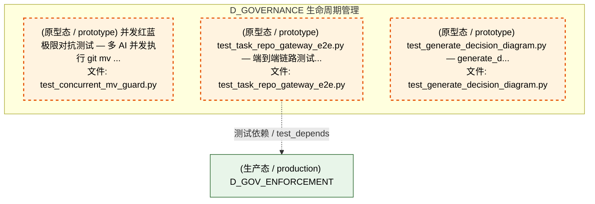
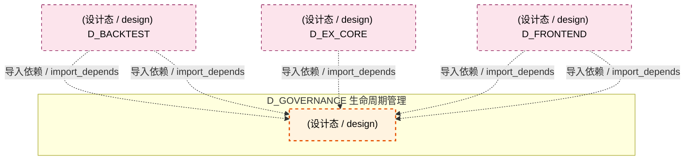
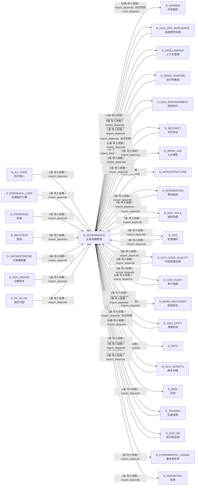

# 38_d_governance / registry_management / 生命周期管理 / Lifecycle Management

> **功能简介 / Overview**: 生命周期管理，负责蓝图/模块/任务的声明周期管理和元数据治理

> **文档作用 / Purpose**: 展示 生命周期管理（D_GOVERNANCE）功能域的模块清单、域内依赖关系、跨域依赖关系、架构分层视图，供架构审查和域治理参考。

> 本文档由 generate_domain_doc.py 从 depgraph (PostgreSQL) 自动生成
> 数据源: depgraph (PostgreSQL) nodes表 + edges表

## 域基本信息 / Domain Overview

| 字段 | 值 | Field | Value |
|------|------|-------|-------|
| 编号 | 38 | Number | 38 |
| 域ID | D_GOVERNANCE | Domain ID | D_GOVERNANCE |
| 域名称 | 生命周期管理 | Domain Name | Lifecycle Management |
| 层级 | L2 业务域层 | Layer | L2 Domain |
| 模块数 | 213 | Module Count | 213 |
| 域内依赖 | 39 | Internal Dependencies | 39 |
| 跨域入边 | 123 | Cross-domain Incoming | 123 |
| 跨域出边 | 149 | Cross-domain Outgoing | 149 |
| 设计态模块 | 1 | Design Modules | 1 |
| 原型态模块 | 116 | Prototype Modules | 116 |
| 生产态模块 | 96 | Production Modules | 96 |
| 容量 | 96/150 (正常) | Capacity | 96/150 (正常) |
| 描述 | 注册表总索引(registry_of_registries) | Description | 注册表总索引(registry_of_registries) |

## 模块分层清单 / Module Layered List

> 按 architecture_layer 分组的模块清单（共 213 个模块 / 213 modules）。

### L0 基础设施层 / Infrastructure Layer (9 modules)

| # | 模块路径 / Module Path | 模块名称 / Module Name (功能简介 / Description) | 成熟度 / Maturity | 蓝图 / Blueprint |
|:--:|---------|---------|:---:|:---:|
| 1 | src/zephyr/governance/adapters/risk_validation_bridge.py | D_EXECUTION_CORE — Risk Validation Bridge (DW-239) | 原型态 / prototype | [MOD-L06-001](../../03_modules/_domain_execution_core/blueprint.md) |
| 2 | src/zephyr/governance/adapters/simulation_broker.py | D_EXECUTION_CORE — Simulation Broker Adapter | 原型态 / prototype | [MOD-L06-001](../../03_modules/_domain_execution_core/blueprint.md) |
| 3 | src/zephyr/governance/data_governance/akshare_provider.py | D_DATA — Akshare Data Provider | 原型态 / prototype | [MOD-L00-001](../../03_modules/_domain_data/blueprint.md) |
| 4 | src/zephyr/governance/data_governance/miniqmt_provider.py | MiniQMT 实盘行情 Provider（Tick + 5档盘口） | 原型态 / prototype | [MOD-L00-001](../../03_modules/_domain_data/blueprint.md) |
| 5 | src/zephyr/governance/intelligence_governance/memory_prov... | D_DATA — Memory Provider | 生产态 / production | [MOD-L00-001](../../03_modules/_domain_data/blueprint.md) |
| 6 | src/zephyr/governance/intelligence_governance/provider_ba... | D_DATA — Data Source Layer | 生产态 / production | [MOD-L00-001](../../03_modules/_domain_data/blueprint.md) |
| 7 | src/zephyr/governance/observability_governance/analytics_... | Re-export wrapper: analytics_base canonical at ... | 原型态 / prototype | [MOD-L07-001](../../03_modules/_domain_reporting/blueprint.md) |
| 8 | src/zephyr/governance/strategies/strategy_base.py | D_PORTFOLIO_CORE — StrategyBase + StrategyMeta... | 生产态 / production | [MOD-L05-001](../../03_modules/_domain_portfolio_core/blueprint.md) |
| 9 | src/zephyr/governance/strategies/strategy_registry.py | StrategyRegistry 卫星模块（OCP-002） | 原型态 / prototype | [MOD-L05-001](../../03_modules/_domain_portfolio_core/blueprint.md) |

### L1 基础层 / Foundation Layer (6 modules)

| # | 模块路径 / Module Path | 模块名称 / Module Name (功能简介 / Description) | 成熟度 / Maturity | 蓝图 / Blueprint |
|:--:|---------|---------|:---:|:---:|
| 1 | docs/01_policies_and_standards/_registry/catalogs/rule_re... | [聚合节点 / Aggregated] 规则注册表集 / Rule Registry Collection (245 items) | 生产态 / production |  |
| ↳1 |   ↳ config/ai_capability_matrix.yaml |  | - | - |
| ↳2 |   ↳ config/auto_fix_cron.yaml |  | - | - |
| ↳3 |   ↳ config/blueprint_routing.yaml |  | - | - |
| ↳4 |   ↳ config/budget_policy.yaml |  | - | - |
| ↳5 |   ↳ config/capabilities.yaml |  | - | - |
| ↳6 |   ↳ config/capacity_params.yaml |  | - | - |
| ↳7 |   ↳ config/context_rules.yaml |  | - | - |
| ↳8 |   ↳ config/flags.yaml |  | - | - |
| ↳9 |   ↳ config/infra/grafana/dashboards/provider.yml |  | - | - |
| ↳10 |   ↳ config/infra/grafana/datasources/prometheus.yml |  | - | - |
| ↳11 |   ↳ config/infra/prometheus/prometheus.yml |  | - | - |
| ↳12 |   ↳ config/kb_parameters.yaml |  | - | - |
| ↳13 |   ↳ config/model_pricing.yaml |  | - | - |
| ↳14 |   ↳ config/nav_table_mapping.yaml |  | - | - |
| ↳15 |   ↳ config/rbac_roles.yaml |  | - | - |
| ↳16 |   ↳ config/resource_optimization.yaml |  | - | - |
| ↳17 |   ↳ config/risk_params.yaml |  | - | - |
| ↳18 |   ↳ config/runtime/burn_rate_acceleration.yaml |  | - | - |
| ↳19 |   ↳ config/runtime/error_budget_state.yaml |  | - | - |
| ↳20 |   ↳ config/runtime/kill_switch_state.yaml |  | - | - |
| ↳21 |   ↳ config/runtime/script_retirement_state.yaml |  | - | - |
| ↳22 |   ↳ config/runtime/shadow_mode_state.yaml |  | - | - |
| ↳23 |   ↳ config/session_state_machine.yaml |  | - | - |
| ↳24 |   ↳ config/trigger_router.yaml |  | - | - |
| ↳25 |   ↳ docs/01_policies_and_standards/_registry/schemas/ses... |  | - | - |
| ↳26 |   ↳ docs/01_policies_and_standards/rules/trae_001_file_o... |  | - | - |
| ↳27 |   ↳ docs/01_policies_and_standards/rules/trae_002_anti_o... |  | - | - |
| ↳28 |   ↳ docs/01_policies_and_standards/rules/trae_003_task_g... |  | - | - |
| ↳29 |   ↳ docs/01_policies_and_standards/rules/trae_004_parall... |  | - | - |
| ↳30 |   ↳ docs/01_policies_and_standards/rules/trae_005_modifi... |  | - | - |
| ↳31 |   ↳ docs/01_policies_and_standards/rules/trae_006_anti_h... |  | - | - |
| ↳32 |   ↳ docs/01_policies_and_standards/rules/trae_007_anti_h... |  | - | - |
| ↳33 |   ↳ docs/01_policies_and_standards/rules/trae_008_anti_h... |  | - | - |
| ↳34 |   ↳ docs/01_policies_and_standards/rules/trae_009_anti_h... |  | - | - |
| ↳35 |   ↳ docs/01_policies_and_standards/rules/trae_010_code_n... |  | - | - |
| ↳36 |   ↳ docs/01_policies_and_standards/rules/trae_011_code_t... |  | - | - |
| ↳37 |   ↳ docs/01_policies_and_standards/rules/trae_012_code_t... |  | - | - |
| ↳38 |   ↳ docs/01_policies_and_standards/rules/trae_013_arch_c... |  | - | - |
| ↳39 |   ↳ docs/01_policies_and_standards/rules/trae_014_arch_b... |  | - | - |
| ↳40 |   ↳ docs/01_policies_and_standards/rules/trae_015_arch_p... |  | - | - |
| ↳41 |   ↳ docs/01_policies_and_standards/rules/trae_016_arch_d... |  | - | - |
| ↳42 |   ↳ docs/01_policies_and_standards/rules/trae_017_arch_g... |  | - | - |
| ↳43 |   ↳ docs/01_policies_and_standards/rules/trae_018_behavi... |  | - | - |
| ↳44 |   ↳ docs/01_policies_and_standards/rules/trae_019_behavi... |  | - | - |
| ↳45 |   ↳ docs/01_policies_and_standards/rules/trae_020_behavi... |  | - | - |
| ↳46 |   ↳ docs/01_policies_and_standards/rules/trae_021_behavi... |  | - | - |
| ↳47 |   ↳ docs/01_policies_and_standards/rules/trae_022_behavi... |  | - | - |
| ↳48 |   ↳ docs/01_policies_and_standards/rules/trae_023_behavi... |  | - | - |
| ↳49 |   ↳ docs/01_policies_and_standards/rules/trae_024_method... |  | - | - |
| ↳50 |   ↳ docs/01_policies_and_standards/rules/trae_025_method... |  | - | - |
| ↳51 |   ↳ docs/01_policies_and_standards/rules/trae_026_method... |  | - | - |
| ↳52 |   ↳ docs/01_policies_and_standards/rules/trae_027_method... |  | - | - |
| ↳53 |   ↳ docs/01_policies_and_standards/rules/trae_028_doc_st... |  | - | - |
| ↳54 |   ↳ docs/01_policies_and_standards/rules/trae_029_doc_op... |  | - | - |
| ↳55 |   ↳ docs/01_policies_and_standards/rules/trae_030_doc_nu... |  | - | - |
| ↳56 |   ↳ docs/01_policies_and_standards/rules/trae_031_securi... |  | - | - |
| ↳57 |   ↳ docs/01_policies_and_standards/rules/trae_032_module... |  | - | - |
| ↳58 |   ↳ docs/01_policies_and_standards/rules/trae_033_module... |  | - | - |
| ↳59 |   ↳ docs/01_policies_and_standards/rules/trae_034_task_c... |  | - | - |
| ↳60 |   ↳ docs/01_policies_and_standards/rules/trae_035_task_c... |  | - | - |
| ↳61 |   ↳ docs/01_policies_and_standards/rules/trae_036_arch_g... |  | - | - |
| ↳62 |   ↳ docs/01_policies_and_standards/rules/trae_037_arch_q... |  | - | - |
| ↳63 |   ↳ docs/01_policies_and_standards/rules/trae_038_arch_c... |  | - | - |
| ↳64 |   ↳ docs/01_policies_and_standards/rules/trae_039_ai_hal... |  | - | - |
| ↳65 |   ↳ docs/01_policies_and_standards/rules/trae_040_ai_mod... |  | - | - |
| ↳66 |   ↳ docs/01_policies_and_standards/rules/trae_041_meta_r... |  | - | - |
| ↳67 |   ↳ docs/01_policies_and_standards/rules/trae_042_meta_r... |  | - | - |
| ↳68 |   ↳ docs/01_policies_and_standards/rules/trae_043_meta_r... |  | - | - |
| ↳69 |   ↳ docs/01_policies_and_standards/rules/trae_044_compli... |  | - | - |
| ↳70 |   ↳ docs/01_policies_and_standards/rules/trae_045_data_q... |  | - | - |
| ↳71 |   ↳ docs/01_policies_and_standards/rules/trae_046_engine... |  | - | - |
| ↳72 |   ↳ docs/01_policies_and_standards/rules/trae_047_engine... |  | - | - |
| ↳73 |   ↳ docs/01_policies_and_standards/rules/trae_048_ops_vi... |  | - | - |
| ↳74 |   ↳ docs/01_policies_and_standards/rules/trae_049_ops_do... |  | - | - |
| ↳75 |   ↳ docs/01_policies_and_standards/rules/trae_050_domain... |  | - | - |
| ↳76 |   ↳ docs/01_policies_and_standards/rules/trae_051_domain... |  | - | - |
| ↳77 |   ↳ docs/01_policies_and_standards/rules/trae_052_cross_... |  | - | - |
| ↳78 |   ↳ docs/01_policies_and_standards/rules/trae_053_automa... |  | - | - |
| ↳79 |   ↳ docs/01_policies_and_standards/rules/trae_054_depgra... |  | - | - |
| ↳80 |   ↳ docs/01_policies_and_standards/rules/trae_055_arch_d... |  | - | - |
| ↳81 |   ↳ docs/01_policies_and_standards/rules/trae_056_module... |  | - | - |
| ↳82 |   ↳ docs/01_policies_and_standards/rules/trae_057_ai_con... |  | - | - |
| ↳83 |   ↳ docs/01_policies_and_standards/rules/trae_058_depgra... |  | - | - |
| ↳84 |   ↳ docs/01_policies_and_standards/rules/trae_059_schema... |  | - | - |
| ↳85 |   ↳ docs/01_policies_and_standards/rules/trae_060_inward... |  | - | - |
| ↳86 |   ↳ docs/01_policies_and_standards/rules/trae_061_decisi... |  | - | - |
| ↳87 |   ↳ docs/01_policies_and_standards/rules/trae_062_ssot_c... |  | - | - |
| ↳88 |   ↳ docs/03_modules/_domain_infrastructure_operations/ag... |  | - | - |
| ↳89 |   ↳ docs/03_modules/_domain_infrastructure_operations/ag... |  | - | - |
| ↳90 |   ↳ docs/03_modules/path_ownership_map.yaml |  | - | - |
| ↳91 |   ↳ scripts/__init__.py |  | - | - |
| ↳92 |   ↳ scripts/_archive/construction/create_db_alignment_ta... |  | - | - |
| ↳93 |   ↳ scripts/_archive/construction/create_dm_phase9_tasks.py |  | - | - |
| ↳94 |   ↳ scripts/_archive/construction/dm014_orphan_edge_repa... |  | - | - |
| ↳95 |   ↳ scripts/_archive/governance/compare_ba_copies.py |  | - | - |
| ↳96 |   ↳ scripts/_archive/governance/create_depgraph_task_car... |  | - | - |
| ↳97 |   ↳ scripts/_archive/governance/d11_compliance/batch_rem... |  | - | - |
| ↳98 |   ↳ scripts/_archive/governance/d3_metadata/assign_modul... |  | - | - |
| ↳99 |   ↳ scripts/_archive/governance/d3_metadata/check_frontm... |  | - | - |
| ↳100 |   ↳ scripts/_archive/governance/d3_metadata/check_templa... |  | - | - |
| | | > (仅显示前 100 个 items，共 245 个) | | |
| 2 | src/zephyr/governance/compliance_gate_a6/compliance_manag... | ZephyrAlpha — D_COMPLIANCE Compliance Layer —... | 生产态 / production | [MOD-L10-001](../../03_modules/_domain_compliance/blueprint.md) |
| 3 | src/zephyr/governance/engine/pipeline_base.py | 实验 — Experimentation Pipeline Layer | 原型态 / prototype | [MOD-L13-001](../../03_modules/_domain_simulation/blueprint.md) |
| 4 | src/zephyr/governance/implementations/default_experiment_... | 实验 — Default Experiment Pipeline | 原型态 / prototype | [MOD-L13-001](../../03_modules/_domain_simulation/blueprint.md) |
| 5 | src/zephyr/governance/implementations/default_security_ga... | default_security_gateway.py | 原型态 / prototype | [MOD-L10-001](../../03_modules/_domain_compliance/blueprint.md) |
| 6 | src/zephyr/governance/intelligence_governance/aisg_sandbo... | AISG Sandbox Testing — AI Security Gateway 沙... | 生产态 / production | [MOD-L10-001](../../03_modules/_domain_compliance/blueprint.md) |

### L2 领域层 / Domain Layer (198 modules)

| # | 模块路径 / Module Path | 模块名称 / Module Name (功能简介 / Description) | 成熟度 / Maturity | 蓝图 / Blueprint |
|:--:|---------|---------|:---:|:---:|
| 1 | scripts/a2a_full_verification.py | A2A Protocol 全链路满分验证脚本 | 原型态 / prototype | [MOD-INF-005](../../03_modules/_domain_governance/governance_automation/blueprint.md) |
| 2 | scripts/arch_guard/_arch_ssot.py | arch_guard 共享：仓库根路径、capacity_slo / inv... | 原型态 / prototype | [MOD-INF-005](../../03_modules/_domain_governance/governance_automation/blueprint.md) |
| 3 | scripts/arch_guard/_tools/build_ocp_manifest.py | 从 cross_layer_contracts.yaml 生成 OCP 冻结契约... | 原型态 / prototype | [MOD-INF-005](../../03_modules/_domain_governance/governance_automation/blueprint.md) |
| 4 | scripts/arch_guard/_tools/inject_idempotency.py | 为所有 P0/P1 契约添加 idempotency_key 字段——... | 原型态 / prototype | [MOD-INF-005](../../03_modules/_domain_governance/governance_automation/blueprint.md) |
| 5 | scripts/arch_guard/_tools/patch_p1_paths.py | 一次性工具——为 9 个 P1 契约补齐 physical_path... | 原型态 / prototype | [MOD-INF-005](../../03_modules/_domain_governance/governance_automation/blueprint.md) |
| 6 | scripts/arch_guard/check_acl_boundary.py | check_acl_boundary.py — Broker ACL 边界强制执... | 原型态 / prototype | [MOD-INF-005](../../03_modules/_domain_governance/governance_automation/blueprint.md) |
| 7 | scripts/arch_guard/check_cross_plane_communication.py | check_cross_plane_communication.py — INV-011 ... | 原型态 / prototype | [MOD-INF-005](../../03_modules/_domain_governance/governance_automation/blueprint.md) |
| 8 | scripts/arch_guard/check_fe_acl_boundary.py | check_fe_acl_boundary.py — INV-006 前端 ACL（... | 原型态 / prototype | [MOD-INF-005](../../03_modules/_domain_governance/governance_automation/blueprint.md) |
| 9 | scripts/arch_guard/check_hot_path_purity.py | check_hot_path_purity.py — INV-012 Hot 路径 Py... | 原型态 / prototype | [MOD-INF-005](../../03_modules/_domain_governance/governance_automation/blueprint.md) |
| 10 | scripts/arch_guard/check_scaffold_exit_gates.py | check_scaffold_exit_gates.py — scaffold→exper... | 原型态 / prototype | [MOD-INF-005](../../03_modules/_domain_governance/governance_automation/blueprint.md) |
| 11 | scripts/arch_guard/check_schema_consistency.py | check_schema_consistency.py — INV-010 契约物理... | 原型态 / prototype | [MOD-INF-005](../../03_modules/_domain_governance/governance_automation/blueprint.md) |
| 12 | scripts/arch_guard/fitness_functions/check_aisg_gateway.py | check_aisg_gateway.py — AISG 拦截门禁 (INV-015... | 原型态 / prototype | [MOD-INF-005](../../03_modules/_domain_governance/governance_automation/blueprint.md) |
| 13 | scripts/arch_guard/fitness_functions/check_audit_log_immu... | check_audit_log_immutability.py — 审计日志不可... | 原型态 / prototype | [MOD-INF-005](../../03_modules/_domain_governance/governance_automation/blueprint.md) |
| 14 | scripts/arch_guard/fitness_functions/check_capacity_slo_s... | check_capacity_slo_ssot.py — capacity_slo.yaml... | 原型态 / prototype | [MOD-INF-005](../../03_modules/_domain_governance/governance_automation/blueprint.md) |
| 15 | scripts/arch_guard/fitness_functions/check_daily_loss_lim... | check_daily_loss_limit.py — 日损失限额自动暂停... | 原型态 / prototype | [MOD-INF-005](../../03_modules/_domain_governance/governance_automation/blueprint.md) |
| 16 | scripts/arch_guard/fitness_functions/check_hot_warm_ipc.py | check_hot_warm_ipc.py — INV-018 Hot↔Warm IPC ... | 原型态 / prototype | [MOD-INF-005](../../03_modules/_domain_governance/governance_automation/blueprint.md) |
| 17 | scripts/arch_guard/fitness_functions/check_idempotency_ke... | check_idempotency_key.py — 幂等 Key 字段存在性... | 原型态 / prototype | [MOD-INF-005](../../03_modules/_domain_governance/governance_automation/blueprint.md) |
| 18 | scripts/arch_guard/fitness_functions/check_log_secret_lea... | check_log_secret_leak.py — R2 日志不写 secret ... | 原型态 / prototype | [MOD-INF-005](../../03_modules/_domain_governance/governance_automation/blueprint.md) |
| 19 | scripts/arch_guard/fitness_functions/check_no_cross_plane... | check_no_cross_plane_mutable_state.py — INV-02... | 原型态 / prototype | [MOD-INF-005](../../03_modules/_domain_governance/governance_automation/blueprint.md) |
| 20 | scripts/arch_guard/fitness_functions/check_ocp_signatures.py | check_ocp_signatures.py — OCP 冻结契约指纹校验... | 原型态 / prototype | [MOD-INF-005](../../03_modules/_domain_governance/governance_automation/blueprint.md) |
| 21 | scripts/arch_guard/fitness_functions/check_pit_compliance.py | check_pit_compliance.py — PIT（Point-in-Time）... | 原型态 / prototype | [MOD-INF-005](../../03_modules/_domain_governance/governance_automation/blueprint.md) |
| 22 | scripts/arch_guard/fitness_functions/check_position_limit.py | check_position_limit.py — 单一持仓限制 ≤ 5% N... | 原型态 / prototype | [MOD-INF-005](../../03_modules/_domain_governance/governance_automation/blueprint.md) |
| 23 | scripts/arch_guard/fitness_functions/check_risk_params_co... | check_risk_params_consistency.py — 风控参数真... | 原型态 / prototype | [MOD-INF-005](../../03_modules/_domain_governance/governance_automation/blueprint.md) |
| 24 | scripts/arch_guard/fitness_functions/check_survivorship_b... | check_survivorship_bias.py — Survivorship 策略... | 原型态 / prototype | [MOD-INF-005](../../03_modules/_domain_governance/governance_automation/blueprint.md) |
| 25 | scripts/arch_guard/fitness_functions/check_warm_cold_asyn... | check_warm_cold_async.py — INV-019 Warm→Cold ... | 原型态 / prototype | [MOD-INF-005](../../03_modules/_domain_governance/governance_automation/blueprint.md) |
| 26 | scripts/arch_guard/run_all.py | Architecture Guard 编排器 | 原型态 / prototype | [MOD-INF-005](../../03_modules/_domain_governance/governance_automation/blueprint.md) |
| 27 | scripts/check_naming_convention.py | check_naming_convention.py | 原型态 / prototype |  |
| 28 | scripts/construction/_e2e_check.py | _e2e_check.py | 原型态 / prototype | [MOD-INF-005](../../03_modules/_domain_governance/governance_automation/blueprint.md) |
| 29 | scripts/construction/_e2e_deep.py | _e2e_deep.py | 原型态 / prototype | [MOD-INF-005](../../03_modules/_domain_governance/governance_automation/blueprint.md) |
| 30 | scripts/construction/check_statuses.py | check_statuses.py | 原型态 / prototype | [MOD-INF-005](../../03_modules/_domain_governance/governance_automation/blueprint.md) |
| 31 | scripts/construction/check_transition_code.py | check_transition_code.py | 原型态 / prototype | [MOD-INF-005](../../03_modules/_domain_governance/governance_automation/blueprint.md) |
| 32 | scripts/construction/d_init_task_system.py | 初始化任务系统数据库 + 创建任务系统自身的施工任... | 原型态 / prototype | [MOD-INF-005](../../03_modules/_domain_governance/governance_automation/blueprint.md) |
| 33 | scripts/construction/demo_a2a_chat.py | A2A 多 Agent 聊天演示 - Alpha 和 Beta 讨论项目评估 | 原型态 / prototype | [MOD-INF-005](../../03_modules/_domain_governance/governance_automation/blueprint.md) |
| 34 | scripts/construction/demo_a2a_coordination.py | A2A 协议协调任务演示 | 原型态 / prototype | [MOD-INF-005](../../03_modules/_domain_governance/governance_automation/blueprint.md) |
| 35 | scripts/construction/demo_e2e_pipeline.py | C-track 端到端演示 —— 全流水线一次性运行 | 原型态 / prototype | [MOD-INF-005](../../03_modules/_domain_governance/governance_automation/blueprint.md) |
| 36 | scripts/construction/finalize_tasks.py | finalize_tasks.py | 原型态 / prototype | [MOD-INF-005](../../03_modules/_domain_governance/governance_automation/blueprint.md) |
| 37 | scripts/construction/local_layer_daemon.py | local_layer_daemon.py — L2 本地模型层守护进程... | 原型态 / prototype | [MOD-INF-005](../../03_modules/_domain_governance/governance_automation/blueprint.md) |
| 38 | scripts/construction/reset_test_task.py | reset_test_task.py | 原型态 / prototype | [MOD-INF-005](../../03_modules/_domain_governance/governance_automation/blueprint.md) |
| 39 | scripts/construction/start_brain.py | start_brain.py — ZephyrAlpha 系统大脑一键启动 | 原型态 / prototype | [MOD-INF-005](../../03_modules/_domain_governance/governance_automation/blueprint.md) |
| 40 | scripts/construction/test_event_hook.py | test_event_hook.py | 原型态 / prototype | [MOD-INF-005](../../03_modules/_domain_governance/governance_automation/blueprint.md) |
| 41 | scripts/context/generate_architecture_context.py | generate_architecture_context.py — 预编译架构... | 原型态 / prototype | [MOD-INF-005](../../03_modules/_domain_governance/governance_automation/blueprint.md) |
| 42 | scripts/diagnose_breadth_failed.py | 诊断 breadth_failed 能力的根因。 | 原型态 / prototype |  |
| 43 | scripts/dm90971_add_test_headers.py | DM-90971: Batch add module_id scope prefix + go... | 原型态 / prototype |  |
| 44 | scripts/fix_freeze_manifest.py | Fix freezemanifest.yaml - comprehensive repair ... | 原型态 / prototype | [MOD-INF-005](../../03_modules/_domain_governance/governance_automation/blueprint.md) |
| 45 | scripts/fix_orphan_all.py | fix_orphan_all.py — 自动修复 __init__.py __all... | 原型态 / prototype | [MOD-INF-005](../../03_modules/_domain_governance/governance_automation/blueprint.md) |
| 46 | scripts/generate_manifest.py | Generate complete script_manifest.yaml from scr... | 原型态 / prototype | [MOD-INF-005](../../03_modules/_domain_governance/governance_automation/blueprint.md) |
| 47 | scripts/generate_pathway_registry.py | 从所有 MOD 蓝图的 §路径索引 章节自动生成 syste... | 原型态 / prototype | [MOD-INF-005](../../03_modules/_domain_governance/governance_automation/blueprint.md) |
| 48 | scripts/git_commit.py | git_commit.py — GitCommitGateway CLI 封装（OPS... | 原型态 / prototype | [MOD-INF-005](../../03_modules/_domain_governance/governance_automation/blueprint.md) |
| 49 | scripts/git_guard.py | Git Guard — 拦截危险 git 命令，防止破坏其他 se... | 生产态 / production | [MOD-INF-021](../../03_modules/_domain_autonomy_core/rollback_system/blueprint.md) |
| 50 | scripts/governance/d7_code/check_pure_shim.py | check_pure_shim.py — GATE-NO-PURE-SHIM 检测器... | 原型态 / prototype |  |
| 51 | scripts/hooks/auto_handoff_log.py | auto_handoff_log.py | 原型态 / prototype | [MOD-INF-005](../../03_modules/_domain_governance/governance_automation/blueprint.md) |
| 52 | scripts/kb/self_test.py | KB 13项一键体检 — CLI入口薄包装 | 原型态 / prototype | [MOD-INF-005](../../03_modules/_domain_governance/governance_automation/blueprint.md) |
| 53 | scripts/lock_files.py | lock_files.py —— AI 对话文件锁协议（硬规则执... | 原型态 / prototype | [MOD-INF-005](../../03_modules/_domain_governance/governance_automation/blueprint.md) |
| 54 | scripts/mcp/generate_ide_config.py | 从 config/mcp.json 生成各 IDE MCP 配置文件（MOD... | 原型态 / prototype | [MOD-INF-005](../../03_modules/_domain_governance/governance_automation/blueprint.md) |
| 55 | scripts/mcp/launcher.py | MCP DAG 编排启动器（MOD-INF-013 §14 拓扑排序 +... | 原型态 / prototype | [MOD-INF-013](../../03_modules/_cross_layer/model_context_protocol_servers/blueprint.md) |
| 56 | scripts/mcp/start_all.py | MCP 全 Server 启动脚本 — DEPRECATED. | 原型态 / prototype | [MOD-INF-005](../../03_modules/_domain_governance/governance_automation/blueprint.md) |
| 57 | scripts/mcp/status_all.py | MCP 全 Server 状态检查脚本（MOD-INF-013 §14）。 | 原型态 / prototype | [MOD-INF-005](../../03_modules/_domain_governance/governance_automation/blueprint.md) |
| 58 | scripts/mcp/stop_all.py | MCP 全 Server 停止脚本（MOD-INF-013 §14）。 | 原型态 / prototype | [MOD-INF-005](../../03_modules/_domain_governance/governance_automation/blueprint.md) |
| 59 | scripts/migration/dm311_autonomy_core_split.py | DM-311: autonomy_core/ 拆分迁移执行脚本。 | 原型态 / prototype | [MOD-INF-037](../../03_modules/_domain_governance/registry_governance/blueprint.md) |
| 60 | scripts/migration/dm314_infra_ops_split.py | DM-314: infra_ops/ 拆分迁移执行脚本。 | 原型态 / prototype | [MOD-INF-037](../../03_modules/_domain_governance/registry_governance/blueprint.md) |
| 61 | scripts/migration/governance_root_split.py | ARCH-031: governance/ root flat-files split mig... | 原型态 / prototype |  |
| 62 | scripts/ops/verify_header_completeness.py | 文件头部完整性校验（6 格式统一入口） | 原型态 / prototype | [MOD-INF-005](../../03_modules/_domain_governance/governance_automation/blueprint.md) |
| 63 | scripts/post_checkout_guard.py | Post-checkout Guard — 事后检测 checkout 是否覆... | 原型态 / prototype | [MOD-INF-021](../../03_modules/_domain_autonomy_core/rollback_system/blueprint.md) |
| 64 | scripts/pre_commit/verify_dedup.py | pre_commit 验证脚本 — 委托给 code-dedup-engine... | 原型态 / prototype | [MOD-INF-017](../../03_modules/_domain_governance/code_dedup_engine/blueprint.md) |
| 65 | scripts/rollback.py | Rollback System CLI — MOD-INF-021 v0.10.0 Git-... | 原型态 / prototype | [MOD-INF-005](../../03_modules/_domain_governance/governance_automation/blueprint.md) |
| 66 | scripts/run_deepseek_v4_exam.py | DeepSeek V4 入职考试运行脚本 | 原型态 / prototype | [MOD-INF-005](../../03_modules/_domain_governance/governance_automation/blueprint.md) |
| 67 | scripts/run_ollama_exam.py | Ollama 入职考试运行脚本 | 原型态 / prototype | [MOD-INF-005](../../03_modules/_domain_governance/governance_automation/blueprint.md) |
| 68 | scripts/scaffold.py | scaffold.py — ZephyrAlpha 唯一创建入口（RULE-T... | 生产态 / production | [MOD-INF-005](../../03_modules/_domain_governance/governance_automation/blueprint.md) |
| 69 | scripts/setup_git_guard_aliases.py | Setup/Remove Git Aliases for Git Guard — 自动... | 原型态 / prototype | [MOD-INF-021](../../03_modules/_domain_autonomy_core/rollback_system/blueprint.md) |
| 70 | src/zephyr/governance/agent_spec/a2a_failure.py | G-CT-008 消费端 — Escalation.on_a2a_failure() ... | 生产态 / production | [MOD-INF-022](../../03_modules/_domain_autonomy_perm/escalation_protocol/blueprint.md) |
| 71 | src/zephyr/governance/agent_spec/rbac_bridge.py | G-CT-007 契约：Budget -> RBAC 配额限制. | 生产态 / production | [MOD-INF-024](../../03_modules/_domain_autonomy_perm/budget_enforcer/blueprint.md) |
| 72 | src/zephyr/governance/agent_spec/registry.py | G-CT-003 契约：Agent Spec -> RBAC 能力检查. | 原型态 / prototype | [MOD-INF-019](../../03_modules/_domain_autonomy_core/agent_spec/blueprint.md) |
| 73 | src/zephyr/governance/architecture_governance/architectur... | architecture_contracts.py | 生产态 / production | [MOD-GOVERNANCE](../../03_modules/_domain_governance/blueprint.md) |
| 74 | src/zephyr/governance/architecture_governance/architectur... | architecture_principles.py | 生产态 / production | [MOD-GOVERNANCE](../../03_modules/_domain_governance/blueprint.md) |
| 75 | src/zephyr/governance/architecture_governance/blueprint_b... | Blueprint Bloat Monitor — v0.11.0 蓝图膨胀监控器。 | 生产态 / production | [MOD-INF-022](../../03_modules/_domain_autonomy_perm/escalation_protocol/blueprint.md) |
| 76 | src/zephyr/governance/architecture_governance/blueprint_c... | Blueprint-Code Consistency Gate — MOD-INF-022. | 生产态 / production | [MOD-INF-022](../../03_modules/_domain_autonomy_perm/escalation_protocol/blueprint.md) |
| 77 | src/zephyr/governance/architecture_governance/blueprint_r... | Blueprint Reconciler — v0.10.0 蓝图实现一致性... | 生产态 / production | [MOD-INF-022](../../03_modules/_domain_autonomy_perm/escalation_protocol/blueprint.md) |
| 78 | src/zephyr/governance/architecture_governance/constructio... | Construction Verifier — 施工验证器: 任务卡完成... | 原型态 / prototype | [MOD-INF-022](../../03_modules/_domain_autonomy_perm/escalation_protocol/blueprint.md) |
| 79 | src/zephyr/governance/architecture_governance/cross_env_c... | cross_env_consistency.py | 生产态 / production | [MOD-GOVERNANCE](../../03_modules/_domain_governance/blueprint.md) |
| 80 | src/zephyr/governance/architecture_governance/dependency_... | dependency_manager.py | 生产态 / production | [MOD-GOVERNANCE](../../03_modules/_domain_governance/blueprint.md) |
| 81 | src/zephyr/governance/architecture_governance/formal_veri... | Formal Verifier — v0.6.0 形式验证器: 升级规则... | 生产态 / production | [MOD-INF-022](../../03_modules/_domain_autonomy_perm/escalation_protocol/blueprint.md) |
| 82 | src/zephyr/governance/architecture_governance/gap_analyze... | Gap Analyzer — v0.8.0 间隙分析器: escalation覆... | 生产态 / production | [MOD-INF-022](../../03_modules/_domain_autonomy_perm/escalation_protocol/blueprint.md) |
| 83 | src/zephyr/governance/architecture_governance/llm_impact_... | LLMImpactAnalyzer — LLM-based commit 语义影响... | 原型态 / prototype | [MOD-GOVERNANCE](../../03_modules/_domain_governance/blueprint.md) |
| 84 | src/zephyr/governance/architecture_governance/local_first... | local_first_arch.py | 原型态 / prototype | [MOD-GOVERNANCE](../../03_modules/_domain_governance/blueprint.md) |
| 85 | src/zephyr/governance/architecture_governance/path_resolv... | PathResolver — 模块路径解析器 | 生产态 / production | [MOD-GOVERNANCE](../../03_modules/_domain_governance/blueprint.md) |
| 86 | src/zephyr/governance/architecture_governance/post_sync_v... | post_sync_validator — post_sync_standard 命令... | 原型态 / prototype | [MOD-TASK_SYSTEM](../../03_modules/_domain_infrastructure_runtime/task_system/blueprint.md) |
| 87 | src/zephyr/governance/bridges/alerts.py | G-CT-006 — BudgetAlert re-exported from shared... | 生产态 / production | [MOD-INF-024](../../03_modules/_domain_autonomy_perm/budget_enforcer/blueprint.md) |
| 88 | src/zephyr/governance/bridges/spec_auditor.py | G-CT-007 — Audit.record_agent_spec() 记录 Agen... | 原型态 / prototype | [MOD-INF-020](../../03_modules/_domain_governance/audit_trail/blueprint.md) |
| 89 | src/zephyr/governance/capability_lookup.py | CapabilityLookup — 能力->真源文件反查注册表的... | 生产态 / production | [MOD-INF-037](../../03_modules/_domain_governance/registry_governance/blueprint.md) |
| 90 | src/zephyr/governance/compliance_gate_a6/compliance_mappe... | Compliance Mapper — D-022-13 合规映射器: 操作-... | 生产态 / production | [MOD-INF-022](../../03_modules/_domain_autonomy_perm/escalation_protocol/blueprint.md) |
| 91 | src/zephyr/governance/context_governance/command_chain_le... | Command Chain Length Gate — v0.13.0 命令体积De... | 生产态 / production | [MOD-INF-022](../../03_modules/_domain_autonomy_perm/escalation_protocol/blueprint.md) |
| 92 | src/zephyr/governance/context_governance/context_budget.py | context_budget.py —— 上下文预算管理与超预算截... | 生产态 / production | [MOD-INF-024](../../03_modules/_domain_autonomy_perm/budget_enforcer/blueprint.md) |
| 93 | src/zephyr/governance/context_governance/context_manager.py | context_manager.py | 生产态 / production | [MOD-INF-024](../../03_modules/_domain_autonomy_perm/budget_enforcer/blueprint.md) |
| 94 | src/zephyr/governance/context_governance/context_package.py | Context Package — D-022-08 委托上下文包: 升级... | 生产态 / production | [MOD-INF-022](../../03_modules/_domain_autonomy_perm/escalation_protocol/blueprint.md) |
| 95 | src/zephyr/governance/context_governance/context_recyclin... | context_recycling.py | 生产态 / production | [MOD-INF-024](../../03_modules/_domain_autonomy_perm/budget_enforcer/blueprint.md) |
| 96 | src/zephyr/governance/context_governance/context_switch_g... | Context Switch Governor — v0.11.0 Owner上下文... | 生产态 / production | [MOD-INF-022](../../03_modules/_domain_autonomy_perm/escalation_protocol/blueprint.md) |
| 97 | src/zephyr/governance/context_governance/context_waste_de... | context_waste_detector.py | 生产态 / production | [MOD-INF-024](../../03_modules/_domain_autonomy_perm/budget_enforcer/blueprint.md) |
| 98 | src/zephyr/governance/context_governance/conversation_tax... | conversation_tax_detector.py | 生产态 / production | [MOD-INF-024](../../03_modules/_domain_autonomy_perm/budget_enforcer/blueprint.md) |
| 99 | src/zephyr/governance/context_governance/instruction_bloa... | InstructionBloatDetector — 指令膨胀检测 | 生产态 / production | [MOD-INF-024](../../03_modules/_domain_autonomy_perm/budget_enforcer/blueprint.md) |
| 100 | src/zephyr/governance/context_governance/multi_turn_inten... | Multi-Turn Intent Analyzer — v0.13.0 多轮分布... | 生产态 / production | [MOD-INF-022](../../03_modules/_domain_autonomy_perm/escalation_protocol/blueprint.md) |
| 101 | src/zephyr/governance/context_governance/prompt_lifecycle.py | prompt_lifecycle.py | 原型态 / prototype | [MOD-GOVERNANCE](../../03_modules/_domain_governance/blueprint.md) |
| 102 | src/zephyr/governance/context_governance/protocol_self_co... | Protocol Self Context — v0.10.0 协议自维护上下... | 生产态 / production | [MOD-INF-022](../../03_modules/_domain_autonomy_perm/escalation_protocol/blueprint.md) |
| 103 | src/zephyr/governance/context_governance/think_time_model.py | think_time_model.py | 生产态 / production | [MOD-INF-024](../../03_modules/_domain_autonomy_perm/budget_enforcer/blueprint.md) |
| 104 | src/zephyr/governance/data_governance/data_classification.py | data_classification.py | 生产态 / production | [MOD-GOVERNANCE](../../03_modules/_domain_governance/blueprint.md) |
| 105 | src/zephyr/governance/data_governance/data_lifecycle.py | data_lifecycle.py | 生产态 / production | [MOD-GOVERNANCE](../../03_modules/_domain_governance/blueprint.md) |
| 106 | src/zephyr/governance/data_governance/data_pipeline_guard.py | Data Pipeline Guard — v0.10.0 数据管道完整性防... | 生产态 / production | [MOD-INF-022](../../03_modules/_domain_autonomy_perm/escalation_protocol/blueprint.md) |
| 107 | src/zephyr/governance/data_governance/data_quality.py | data_quality.py | 生产态 / production | [MOD-GOVERNANCE](../../03_modules/_domain_governance/blueprint.md) |
| 108 | src/zephyr/governance/data_governance/data_source_reliabi... | data_source_reliability.py | 生产态 / production | [MOD-GOVERNANCE](../../03_modules/_domain_governance/blueprint.md) |
| 109 | src/zephyr/governance/data_governance/exchange_partition_... | Exchange Partition Detector — v0.12.0 交易所网... | 生产态 / production | [MOD-INF-022](../../03_modules/_domain_autonomy_perm/escalation_protocol/blueprint.md) |
| 110 | src/zephyr/governance/data_governance/exchange_reg_monito... | Exchange Reg Monitor — v0.11.0 交易所规则变更... | 生产态 / production | [MOD-INF-022](../../03_modules/_domain_autonomy_perm/escalation_protocol/blueprint.md) |
| 111 | src/zephyr/governance/data_governance/miniqmt_provider.py/ |  | 设计态 / design | [MOD-L00-001](../../03_modules/_domain_data/blueprint.md) |
| 112 | src/zephyr/governance/data_governance/pricing_sync.py | pricing_sync.py | 生产态 / production | [MOD-INF-024](../../03_modules/_domain_autonomy_perm/budget_enforcer/blueprint.md) |
| 113 | src/zephyr/governance/data_governance/realtime_streaming.py | realtime_streaming.py | 生产态 / production | [MOD-GOVERNANCE](../../03_modules/_domain_governance/blueprint.md) |
| 114 | src/zephyr/governance/depgraph_schema.py | depgraph Schema DDL + 版本化迁移框架 | 生产态 / production | [SH-DB-001](../../03_modules/_cross_layer/database/blueprint.md) |
| 115 | src/zephyr/governance/evidence_pack.py | evidence_pack.py | 原型态 / prototype | [MOD-INF-020](../../03_modules/_domain_governance/audit_trail/blueprint.md) |
| 116 | src/zephyr/governance/financial_governance/arbitrage_asym... | Arbitrage Asymmetry Detector — v0.11.0 跨交易... | 生产态 / production | [MOD-INF-022](../../03_modules/_domain_autonomy_perm/escalation_protocol/blueprint.md) |
| 117 | src/zephyr/governance/financial_governance/atomic_transac... | AtomicTransactionManager — SQLite + 文件系统的... | 生产态 / production | [MOD-INF-002](../../03_modules/_domain_infrastructure_runtime/runtime_integration/blueprint.md) |
| 118 | src/zephyr/governance/financial_governance/flash_crash_gu... | Flash Crash Guard — v0.12.0 闪崩双轨熔断器。 | 生产态 / production | [MOD-INF-022](../../03_modules/_domain_autonomy_perm/escalation_protocol/blueprint.md) |
| 119 | src/zephyr/governance/financial_governance/fsm_verifier.py | fsm_verifier.py | 生产态 / production | [MOD-GOVERNANCE](../../03_modules/_domain_governance/blueprint.md) |
| 120 | src/zephyr/governance/financial_governance/instrument.py | instrument.py | 生产态 / production | [MOD-INF-016](../../03_modules/_cross_layer/shared_core/blueprint.md) |
| 121 | src/zephyr/governance/financial_governance/microstructure... | microstructure_defense.py | 原型态 / prototype | [MOD-GOVERNANCE](../../03_modules/_domain_governance/blueprint.md) |
| 122 | src/zephyr/governance/financial_governance/oms_risk_engin... | oms_risk_engine.py | 生产态 / production | [MOD-GOVERNANCE](../../03_modules/_domain_governance/blueprint.md) |
| 123 | src/zephyr/governance/financial_governance/risk_matrix.py | risk_matrix.py | 生产态 / production | [MOD-INF-022](../../03_modules/_domain_autonomy_perm/escalation_protocol/blueprint.md) |
| 124 | src/zephyr/governance/financial_governance/strategy_portf... | strategy_portfolio.py | 生产态 / production | [MOD-GOVERNANCE](../../03_modules/_domain_governance/blueprint.md) |
| 125 | src/zephyr/governance/financial_governance/strategy_scope... | Strategy Scoper — v0.6.0 策略范围隔离器: SIG/S... | 生产态 / production | [MOD-INF-022](../../03_modules/_domain_autonomy_perm/escalation_protocol/blueprint.md) |
| 126 | src/zephyr/governance/intelligence_governance/agent_debat... | agent_debate.py | 生产态 / production | [MOD-GOVERNANCE](../../03_modules/_domain_governance/blueprint.md) |
| 127 | src/zephyr/governance/intelligence_governance/ai_self_dia... | ai_self_diagnosis.py | 生产态 / production | [MOD-GOVERNANCE](../../03_modules/_domain_governance/blueprint.md) |
| 128 | src/zephyr/governance/intelligence_governance/autonomy_da... | Autonomy Dashboard — AI 自主感知健康仪表。 | 生产态 / production | [MOD-INF-022](../../03_modules/_domain_autonomy_perm/escalation_protocol/blueprint.md) |
| 129 | src/zephyr/governance/intelligence_governance/confidence_... | Confidence Estimator — D-022-05 置信度评估器: ... | 生产态 / production | [MOD-INF-022](../../03_modules/_domain_autonomy_perm/escalation_protocol/blueprint.md) |
| 130 | src/zephyr/governance/intelligence_governance/confidence_... | ConfidenceQuantifier — AI 置信度量化。 | 生产态 / production | [MOD-INF-022](../../03_modules/_domain_autonomy_perm/escalation_protocol/blueprint.md) |
| 131 | src/zephyr/governance/intelligence_governance/continuous_... | Continuous Trust Ledger — 持续信任评估引擎。 | 生产态 / production | [MOD-INF-022](../../03_modules/_domain_autonomy_perm/escalation_protocol/blueprint.md) |
| 132 | src/zephyr/governance/intelligence_governance/cross_agent... | CrossAgentConflictDetector — 多 Agent 并发冲突... | 生产态 / production | [MOD-INF-022](../../03_modules/_domain_autonomy_perm/escalation_protocol/blueprint.md) |
| 133 | src/zephyr/governance/intelligence_governance/cross_assis... | Cross-Assistant Adapter — v0.6.0 Trae/Cursor/W... | 生产态 / production | [MOD-INF-022](../../03_modules/_domain_autonomy_perm/escalation_protocol/blueprint.md) |
| 134 | src/zephyr/governance/intelligence_governance/delegation_... | Delegation Engine — MOD-INF-022 | 生产态 / production | [MOD-INF-022](../../03_modules/_domain_autonomy_perm/escalation_protocol/blueprint.md) |
| 135 | src/zephyr/governance/intelligence_governance/delegation_... | Delegation Manager — D-022-02 自动委托协议。 | 生产态 / production | [MOD-INF-022](../../03_modules/_domain_autonomy_perm/escalation_protocol/blueprint.md) |
| 136 | src/zephyr/governance/intelligence_governance/meta_confid... | Meta-Confidence — D-022-10 Agent对自身判定置信... | 生产态 / production | [MOD-INF-022](../../03_modules/_domain_autonomy_perm/escalation_protocol/blueprint.md) |
| 137 | src/zephyr/governance/intelligence_governance/model_provi... | model_provider_data.py | 原型态 / prototype | [MOD-INF-024](../../03_modules/_domain_autonomy_perm/budget_enforcer/blueprint.md) |
| 138 | src/zephyr/governance/intelligence_governance/model_route... | model_router.py | 生产态 / production | [MOD-INF-024](../../03_modules/_domain_autonomy_perm/budget_enforcer/blueprint.md) |
| 139 | src/zephyr/governance/intelligence_governance/model_versi... | Model Version Detector — v0.10.0 模型版本突变... | 生产态 / production | [MOD-INF-022](../../03_modules/_domain_autonomy_perm/escalation_protocol/blueprint.md) |
| 140 | src/zephyr/governance/intelligence_governance/multi_model... | multi_model_consensus.py | 原型态 / prototype | [MOD-GOVERNANCE](../../03_modules/_domain_governance/blueprint.md) |
| 141 | src/zephyr/governance/intelligence_governance/mvep_orches... | MVEP Orchestrator — v0.11.0 Minimum Viable Esc... | 生产态 / production | [MOD-INF-022](../../03_modules/_domain_autonomy_perm/escalation_protocol/blueprint.md) |
| 142 | src/zephyr/governance/intelligence_governance/provider_fa... | Provider Failover — v0.7.0 多LLM Provider容灾:... | 生产态 / production | [MOD-INF-022](../../03_modules/_domain_autonomy_perm/escalation_protocol/blueprint.md) |
| 143 | src/zephyr/governance/intelligence_governance/self_benchm... | Self-Benchmark (W3-7) — 5 组已知对自验证 + 引... | 原型态 / prototype | [MOD-INF-017](../../03_modules/_domain_governance/code_dedup_engine/blueprint.md) |
| 144 | src/zephyr/governance/intelligence_governance/self_test.py | Escalation Protocol Self-Test — MOD-INF-022. | 生产态 / production | [MOD-INF-022](../../03_modules/_domain_autonomy_perm/escalation_protocol/blueprint.md) |
| 145 | src/zephyr/governance/intelligence_governance/self_valida... | Self Validator — v0.10.0 升级协议自验证器: pro... | 生产态 / production | [MOD-INF-022](../../03_modules/_domain_autonomy_perm/escalation_protocol/blueprint.md) |
| 146 | src/zephyr/governance/intelligence_governance/subagent_ho... | Subagent Hook Propagator — v0.13.0 子Agent Hoo... | 生产态 / production | [MOD-INF-022](../../03_modules/_domain_autonomy_perm/escalation_protocol/blueprint.md) |
| 147 | src/zephyr/governance/lifecycle_governance/api_lifecycle.py | api_lifecycle.py | 生产态 / production | [MOD-GOVERNANCE](../../03_modules/_domain_governance/blueprint.md) |
| 148 | src/zephyr/governance/lifecycle_governance/migration_stra... | migration_strategy.py | 原型态 / prototype | [MOD-GOVERNANCE](../../03_modules/_domain_governance/blueprint.md) |
| 149 | src/zephyr/governance/lifecycle_governance/paper_live_tra... | paper_live_transition.py | 生产态 / production | [MOD-GOVERNANCE](../../03_modules/_domain_governance/blueprint.md) |
| 150 | src/zephyr/governance/lifecycle_governance/post_live_veri... | post_live_verification.py | 生产态 / production | [MOD-GOVERNANCE](../../03_modules/_domain_governance/blueprint.md) |
| 151 | src/zephyr/governance/lifecycle_governance/transition.py | transition — 状态机转换 Mixin（从 task_repo.py... | 生产态 / production | [MOD-TASK_SYSTEM](../../03_modules/_domain_infrastructure_runtime/task_system/blueprint.md) |
| 152 | src/zephyr/governance/observability_governance/objective_... | Objective Tracker — v0.9.0 目标漂移检测器: age... | 生产态 / production | [MOD-INF-022](../../03_modules/_domain_autonomy_perm/escalation_protocol/blueprint.md) |
| 153 | src/zephyr/governance/observability_governance/projection... | ProjectionEngine — 事件折叠为当前状态（DW-0003） | 生产态 / production | [MOD-INF-020](../../03_modules/_domain_governance/audit_trail/blueprint.md) |
| 154 | src/zephyr/governance/observability_governance/query_metr... | QueryMetrics — SQL 查询性能监控装饰器（SH-DB-0... | 生产态 / production | [MOD-INF-015](../../03_modules/_domain_infrastructure_operations/system_telemetry/blueprint.md) |
| 155 | src/zephyr/governance/persistence/base_repo.py | base_repo — 异常类、状态机常量、工具函数（从 t... | 原型态 / prototype | [MOD-TASK_SYSTEM](../../03_modules/_domain_infrastructure_runtime/task_system/blueprint.md) |
| 156 | src/zephyr/governance/persistence/database_manager.py | DatabaseManager — 连接池 + 健康检查 + 自动备份... | 生产态 / production | [SH-DB-001](../../03_modules/_cross_layer/database/blueprint.md) |
| 157 | src/zephyr/governance/persistence/database_service.py | DatabaseService 真源收敛（AI-14 审计 P1 修复） | 生产态 / production | [SH-DB-001](../../03_modules/_cross_layer/database/blueprint.md) |
| 158 | src/zephyr/governance/persistence/dataflowgraph_schema.py | dataflowgraph Schema DDL + 连接入口 | 原型态 / prototype | [SH-DB-001](../../03_modules/_cross_layer/database/blueprint.md) |
| 159 | src/zephyr/governance/persistence/decision_graph_reader.py | decision_graph_reader.py — 决策流图数据库只读... | 生产态 / production |  |
| 160 | src/zephyr/governance/persistence/decisiongraph_schema.py | decisiongraph Schema DDL + 不变量声明 | 生产态 / production |  |
| 161 | src/zephyr/governance/persistence/depgraph_reader.py | depgraph_reader.py — 依赖图数据库查询工具模块 | 原型态 / prototype | [SH-DB-001](../../03_modules/_cross_layer/database/blueprint.md) |
| 162 | src/zephyr/governance/persistence/protocol_state_store.py | Protocol State Store — v0.10.0 协议运行时状态... | 生产态 / production | [MOD-INF-022](../../03_modules/_domain_autonomy_perm/escalation_protocol/blueprint.md) |
| 163 | src/zephyr/governance/persistence/sqlite_schema.py | SQLite 元数据层 Schema DDL + 版本化迁移框架（T-... | 生产态 / production | [SH-DB-001](../../03_modules/_cross_layer/database/blueprint.md) |
| 164 | src/zephyr/governance/persistence/task_repo.py | TaskRepository — 任务登记表 CRUD + 状态机（T-1... | 生产态 / production | [MOD-TASK_SYSTEM](../../03_modules/_domain_infrastructure_runtime/task_system/blueprint.md) |
| 165 | src/zephyr/governance/rule_patterns.py | rule_patterns.py — 治理规则正则 + 安全审计模式... | 生产态 / production |  |
| 166 | src/zephyr/governance/services/adapter.py | Escalation Adapter — MOD-INF-022 统一集成入口. | 生产态 / production | [MOD-INF-022](../../03_modules/_domain_autonomy_perm/escalation_protocol/blueprint.md) |
| 167 | src/zephyr/governance/services/cross_session_correlator.py | Cross-Session Correlator — v0.9.0 跨会话Corese... | 生产态 / production | [MOD-INF-022](../../03_modules/_domain_autonomy_perm/escalation_protocol/blueprint.md) |
| 168 | src/zephyr/governance/services/memory_provenance.py | Memory Provenance — v0.9.0 记忆溯源追踪: 每条m... | 生产态 / production | [MOD-INF-022](../../03_modules/_domain_autonomy_perm/escalation_protocol/blueprint.md) |
| 169 | src/zephyr/infrastructure/a2a_protocol/governance/_base_s... | _base_server.py | 原型态 / prototype | [MOD-INF-025](../../03_modules/_domain_infrastructure_operations/agent_to_agent_protocol/blueprint.md) |
| 170 | src/zephyr/infrastructure/a2a_protocol/governance/audit_l... | audit_logger.py | 原型态 / prototype | [MOD-INF-025](../../03_modules/_domain_infrastructure_operations/agent_to_agent_protocol/blueprint.md) |
| 171 | src/zephyr/infrastructure/a2a_protocol/governance/auditor.py | G-CT-008 契约：A2A -> Audit 审计 Agent 间通信. | 原型态 / prototype | [MOD-INF-025](../../03_modules/_domain_infrastructure_operations/agent_to_agent_protocol/blueprint.md) |
| 172 | src/zephyr/infrastructure/a2a_protocol/governance/error_c... | error_codes.py | 原型态 / prototype | [MOD-INF-025](../../03_modules/_domain_infrastructure_operations/agent_to_agent_protocol/blueprint.md) |
| 173 | src/zephyr/infrastructure/a2a_protocol/governance/governa... | A2A GovernanceAdapter — Phase 4 治理集成桥接器 | 生产态 / production | [MOD-INF-025](../../03_modules/_domain_infrastructure_operations/agent_to_agent_protocol/blueprint.md) |
| 174 | src/zephyr/infrastructure/a2a_protocol/governance/phase_h... | Phase 4 Hold — A2A Phase 4 锁定标记模块 与其他... | 生产态 / production | [MOD-INF-025](../../03_modules/_domain_infrastructure_operations/agent_to_agent_protocol/blueprint.md) |
| 175 | src/zephyr/infrastructure/a2a_protocol/governance/policy_... | policy_engine.py | 原型态 / prototype | [MOD-INF-025](../../03_modules/_domain_infrastructure_operations/agent_to_agent_protocol/blueprint.md) |
| 176 | src/zephyr/infrastructure/a2a_protocol/governance/protoco... | G-CT-008 — A2ACommunication Pydantic V2 BaseMo... | 生产态 / production | [MOD-INF-025](../../03_modules/_domain_infrastructure_operations/agent_to_agent_protocol/blueprint.md) |
| 177 | src/zephyr/infrastructure/a2a_protocol/governance/rate_li... | rate_limiter.py | 原型态 / prototype | [MOD-INF-025](../../03_modules/_domain_infrastructure_operations/agent_to_agent_protocol/blueprint.md) |
| 178 | src/zephyr/infrastructure/a2a_protocol/governance/session... | session_manager.py | 原型态 / prototype | [MOD-INF-025](../../03_modules/_domain_infrastructure_operations/agent_to_agent_protocol/blueprint.md) |
| 179 | src/zephyr/infrastructure/a2a_protocol/layer3_coordinatio... | Re-export bridge for layer3_coordination govern... | 原型态 / prototype | [MOD-INF-025](../../03_modules/_domain_infrastructure_operations/agent_to_agent_protocol/blueprint.md) |
| 180 | src/zephyr/infrastructure/a2a_protocol/layer3_coordinatio... | A2A 治理适配器 — 连接 A2A 协议与 Governance 层 | 原型态 / prototype | [MOD-INF-025](../../03_modules/_domain_infrastructure_operations/agent_to_agent_protocol/blueprint.md) |
| 181 | src/zephyr/infrastructure/capacity_assurance/contracts/ba... | Batch2 治理层契约 — 15条 Pydantic v2 Schema（P... | 原型态 / prototype | [MOD-INF-001](../../03_modules/_domain_infrastructure_operations/capacity_assurance/blueprint.md) |
| 182 | src/zephyr/infrastructure/registry_governance.py | Registry Governance — MOD-INF-037 | 生产态 / production | [MOD-INF-037](../../03_modules/_domain_governance/registry_governance/blueprint.md) |
| 183 | src/zephyr/integration/mcp/governance_server.py | GovernanceServer: 治理域统一MCP入口 | 生产态 / production | [MOD-INF-013](../../03_modules/_cross_layer/model_context_protocol_servers/blueprint.md) |
| 184 | src/zephyr/shared/capacity_governance/capacity_governance... | capacity_governance_loop.py | 生产态 / production | [MOD-INF-001](../../03_modules/_domain_infrastructure_operations/capacity_assurance/blueprint.md) |
| 185 | src/zephyr/shared/protocols/a2a/a2a_governance.py | A2A Governance — shared interface definitions ... | 原型态 / prototype |  |
| 186 | tests/agent_rbac/test_session_aware_stash_red_blue.py | session 隔离 stash 红蓝对抗极限测试。 | 原型态 / prototype | [MOD-INF-035](../../03_modules/_cross_layer/auto_runtime_core/blueprint.md) |
| 187 | tests/git/test_git_commit_concurrent.py | test_git_commit_concurrent.py — 幽灵提交红蓝对... | 原型态 / prototype | [MOD-INF-005](../../03_modules/_domain_governance/governance_automation/blueprint.md) |
| 188 | tests/git/test_git_commit_extreme.py | test_git_commit_extreme.py — GitCommitGateway ... | 原型态 / prototype | [MOD-INF-005](../../03_modules/_domain_governance/governance_automation/blueprint.md) |
| 189 | tests/git/test_git_commit_gateway.py | test_git_commit_gateway.py — GitCommitGateway ... | 原型态 / prototype | [MOD-INF-005](../../03_modules/_domain_governance/governance_automation/blueprint.md) |
| 190 | tests/governance/generators/test_check_gate_inventory_dri... | test_check_gate_inventory_drift.py — commit_ga... | 原型态 / prototype |  |
| 191 | tests/governance/generators/test_generate_gate_registry.py | test_generate_gate_registry.py — generate_gate... | 原型态 / prototype |  |
| 192 | tests/governance/test_ast_import_rewriter.py | Tests for scripts/governance/ast_import_rewrite... | 原型态 / prototype |  |
| 193 | tests/io/test_depgraph_schema.py | test_depgraph_schema.py — depgraph_schema.py D... | 原型态 / prototype |  |
| 194 | tests/io/test_verify_schema_health.py | test_verify_schema_health.py — verify_schema_h... | 原型态 / prototype |  |
| 195 | tests/rollback/test_concurrency_guard_red_blue.py | 红蓝对抗极端测试 — git_guard + concurrency_gua... | 原型态 / prototype | [MOD-INF-021](../../03_modules/_domain_autonomy_core/rollback_system/blueprint.md) |
| 196 | tests/rollback/test_concurrent_mv_guard.py | 并发红蓝极限对抗测试 — 多 AI 并发执行 git mv ... | 原型态 / prototype | [MOD-INF-021](../../03_modules/_domain_autonomy_core/rollback_system/blueprint.md) |
| 197 | tests/task/test_task_repo_gateway_e2e.py | test_task_repo_gateway_e2e.py — 端到端链路测试... | 原型态 / prototype | [MOD-INF-005](../../03_modules/_domain_governance/governance_automation/blueprint.md) |
| 198 | tests/test_generate_decision_diagram.py | test_generate_decision_diagram.py — generate_d... | 原型态 / prototype |  |

## 域内依赖图 / Internal Dependency Diagram

> 依赖图内嵌在本文档中，IDE 可直接渲染显示。参考 decision_index.md 设计，分四个视图：合并全景图、运营态子图、设计态子图、原型态子图（按 design_maturity 实际值拆分）。
>
> **图例说明 / Legend**：
> - **实线边框 = 运营态模块**（production，已上线运行）
> - **虚线边框 = 设计态模块**（design，蓝图阶段，代码未写）
> - **虚线边框 = 原型态模块**（prototype，代码已写，验证中未稳定上线）
> - **实线箭头 = 运营态依赖**（已生效的依赖关系）
> - **虚线箭头 = 非运营态依赖**（计划中/验证中的依赖关系）

### 合并全景图（全部模块，标签标注成熟度）

> 展示全部 213 个模块（生产态 96 + 设计态 1 + 原型态 116），标签标注成熟度。

#### 第 1 页 / 共 8 页

```mermaid
graph TD
    subgraph D_GOVERNANCE["D_GOVERNANCE 生命周期管理"]
        docs_01_policies_and_standards_registry_catalogs_rule_registry_collection_yaml["(生产态 / production)  Rule Registry Collection — ARCH-052 聚合节点 production"]
        scripts_a2a_full_verification_py["(原型态 / prototype) A2A Protocol 全链路满分验证脚本<br/>文件: a2a_full_verification.py"]
        scripts_arch_guard_arch_ssot_py["(原型态 / prototype) arch_guard 共享：仓库根路径、capacity_slo / inv...<br/>文件: _arch_ssot.py"]
        scripts_arch_guard_tools_build_ocp_manifest_py["(原型态 / prototype) 从 cross_layer_contracts.yaml 生成 OCP 冻结契约...<br/>文件: build_ocp_manifest.py"]
        scripts_arch_guard_tools_inject_idempotency_py["(原型态 / prototype) 为所有 P0/P1 契约添加 idempotency_key 字段——...<br/>文件: inject_idempotency.py"]
        scripts_arch_guard_tools_patch_p1_paths_py["(原型态 / prototype) 一次性工具——为 9 个 P1 契约补齐 physical_path...<br/>文件: patch_p1_paths.py"]
        scripts_arch_guard_check_acl_boundary_py["(原型态 / prototype) check_acl_boundary.py — Broker ACL 边界强制执...<br/>文件: check_acl_boundary.py"]
        scripts_arch_guard_check_cross_plane_communication_py["(原型态 / prototype) check_cross_plane_communication.py — INV-011 ...<br/>文件: check_cross_plane_communication.py"]
        scripts_arch_guard_check_fe_acl_boundary_py["(原型态 / prototype) check_fe_acl_boundary.py — INV-006 前端 ACL（...<br/>文件: check_fe_acl_boundary.py"]
        scripts_arch_guard_check_hot_path_purity_py["(原型态 / prototype) check_hot_path_purity.py — INV-012 Hot 路径 Py...<br/>文件: check_hot_path_purity.py"]
        scripts_arch_guard_check_scaffold_exit_gates_py["(原型态 / prototype) check_scaffold_exit_gates.py — scaffold→exper...<br/>文件: check_scaffold_exit_gates.py"]
        scripts_arch_guard_check_schema_consistency_py["(原型态 / prototype) check_schema_consistency.py — INV-010 契约物理...<br/>文件: check_schema_consistency.py"]
        scripts_arch_guard_fitness_functions_check_aisg_gateway_py["(原型态 / prototype) check_aisg_gateway.py — AISG 拦截门禁 (INV-015...<br/>文件: check_aisg_gateway.py"]
        scripts_arch_guard_fitness_functions_check_audit_log_immutability_py["(原型态 / prototype) check_audit_log_immutability.py — 审计日志不可...<br/>文件: check_audit_log_immutability.py"]
        scripts_arch_guard_fitness_functions_check_capacity_slo_ssot_py["(原型态 / prototype) check_capacity_slo_ssot.py — capacity_slo.yaml...<br/>文件: check_capacity_slo_ssot.py"]
        scripts_arch_guard_fitness_functions_check_daily_loss_limit_py["(原型态 / prototype) check_daily_loss_limit.py — 日损失限额自动暂停...<br/>文件: check_daily_loss_limit.py"]
        scripts_arch_guard_fitness_functions_check_hot_warm_ipc_py["(原型态 / prototype) check_hot_warm_ipc.py — INV-018 Hot↔Warm IPC ...<br/>文件: check_hot_warm_ipc.py"]
        scripts_arch_guard_fitness_functions_check_idempotency_key_py["(原型态 / prototype) check_idempotency_key.py — 幂等 Key 字段存在性...<br/>文件: check_idempotency_key.py"]
        scripts_arch_guard_fitness_functions_check_log_secret_leak_py["(原型态 / prototype) check_log_secret_leak.py — R2 日志不写 secret ...<br/>文件: check_log_secret_leak.py"]
        scripts_arch_guard_fitness_functions_check_no_cross_plane_mutable_state_py["(原型态 / prototype) check_no_cross_plane_mutable_state.py — INV-02...<br/>文件: check_no_cross_plane_mutable_state.py"]
        scripts_arch_guard_fitness_functions_check_ocp_signatures_py["(原型态 / prototype) check_ocp_signatures.py — OCP 冻结契约指纹校验...<br/>文件: check_ocp_signatures.py"]
        scripts_arch_guard_fitness_functions_check_pit_compliance_py["(原型态 / prototype) check_pit_compliance.py — PIT（Point-in-Time）...<br/>文件: check_pit_compliance.py"]
        scripts_arch_guard_fitness_functions_check_position_limit_py["(原型态 / prototype) check_position_limit.py — 单一持仓限制 ≤ 5% N...<br/>文件: check_position_limit.py"]
        scripts_arch_guard_fitness_functions_check_risk_params_consistency_py["(原型态 / prototype) check_risk_params_consistency.py — 风控参数真...<br/>文件: check_risk_params_consistency.py"]
        scripts_arch_guard_fitness_functions_check_survivorship_bias_py["(原型态 / prototype) check_survivorship_bias.py — Survivorship 策略...<br/>文件: check_survivorship_bias.py"]
        scripts_arch_guard_fitness_functions_check_warm_cold_async_py["(原型态 / prototype) check_warm_cold_async.py — INV-019 Warm→Cold ...<br/>文件: check_warm_cold_async.py"]
        scripts_arch_guard_run_all_py["(原型态 / prototype) Architecture Guard 编排器<br/>文件: run_all.py"]
        scripts_check_naming_convention_py["(原型态 / prototype) check_naming_convention.py"]
        scripts_construction_e2e_check_py["(原型态 / prototype) _e2e_check.py"]
        scripts_construction_e2e_deep_py["(原型态 / prototype) _e2e_deep.py"]
    end
    scripts_arch_guard_tools_inject_idempotency_py -.->|config_depends / config_depends| scripts_arch_guard_tools_build_ocp_manifest_py
    scripts_arch_guard_tools_patch_p1_paths_py -.->|config_depends / config_depends| scripts_arch_guard_tools_inject_idempotency_py
    D_INFRASTRUCTURE["(生产态 / production) D_INFRASTRUCTURE"]
    scripts_a2a_full_verification_py -.->|导入依赖 / import_depends| D_INFRASTRUCTURE
    D_SHARED["(生产态 / production) D_SHARED"]
    scripts_construction_e2e_deep_py -.->|导入依赖 / import_depends| D_SHARED
    scripts_construction_e2e_check_py -.->|导入依赖 / import_depends| D_SHARED
    classDef production fill:#e1f5fe,stroke:#01579b,stroke-width:2px,color:#000
    classDef design fill:#fff3e0,stroke:#e65100,stroke-width:2px,color:#000,stroke-dasharray: 5 5
    classDef external_prod fill:#e8f5e9,stroke:#1b5e20,stroke-width:1px,color:#000
    classDef external_design fill:#fce4ec,stroke:#880e4f,stroke-width:1px,color:#000,stroke-dasharray: 5 5
    class docs_01_policies_and_standards_registry_catalogs_rule_registry_collection_yaml production
    class scripts_a2a_full_verification_py,scripts_arch_guard_arch_ssot_py,scripts_arch_guard_tools_build_ocp_manifest_py,scripts_arch_guard_tools_inject_idempotency_py,scripts_arch_guard_tools_patch_p1_paths_py,scripts_arch_guard_check_acl_boundary_py,scripts_arch_guard_check_cross_plane_communication_py,scripts_arch_guard_check_fe_acl_boundary_py,scripts_arch_guard_check_hot_path_purity_py,scripts_arch_guard_check_scaffold_exit_gates_py,scripts_arch_guard_check_schema_consistency_py,scripts_arch_guard_fitness_functions_check_aisg_gateway_py,scripts_arch_guard_fitness_functions_check_audit_log_immutability_py,scripts_arch_guard_fitness_functions_check_capacity_slo_ssot_py,scripts_arch_guard_fitness_functions_check_daily_loss_limit_py,scripts_arch_guard_fitness_functions_check_hot_warm_ipc_py,scripts_arch_guard_fitness_functions_check_idempotency_key_py,scripts_arch_guard_fitness_functions_check_log_secret_leak_py,scripts_arch_guard_fitness_functions_check_no_cross_plane_mutable_state_py,scripts_arch_guard_fitness_functions_check_ocp_signatures_py,scripts_arch_guard_fitness_functions_check_pit_compliance_py,scripts_arch_guard_fitness_functions_check_position_limit_py,scripts_arch_guard_fitness_functions_check_risk_params_consistency_py,scripts_arch_guard_fitness_functions_check_survivorship_bias_py,scripts_arch_guard_fitness_functions_check_warm_cold_async_py,scripts_arch_guard_run_all_py,scripts_check_naming_convention_py,scripts_construction_e2e_check_py,scripts_construction_e2e_deep_py design
    class D_INFRASTRUCTURE,D_SHARED external_prod
```



#### 第 2 页 / 共 8 页

```mermaid
graph TD
    subgraph D_GOVERNANCE["D_GOVERNANCE 生命周期管理"]
        scripts_construction_check_statuses_py["(原型态 / prototype) check_statuses.py"]
        scripts_construction_check_transition_code_py["(原型态 / prototype) check_transition_code.py"]
        scripts_construction_d_init_task_system_py["(原型态 / prototype) 初始化任务系统数据库 + 创建任务系统自身的施工任...<br/>文件: d_init_task_system.py"]
        scripts_construction_demo_a2a_chat_py["(原型态 / prototype) A2A 多 Agent 聊天演示 - Alpha 和 Beta 讨论项目评估<br/>文件: demo_a2a_chat.py"]
        scripts_construction_demo_a2a_coordination_py["(原型态 / prototype) A2A 协议协调任务演示<br/>文件: demo_a2a_coordination.py"]
        scripts_construction_demo_e2e_pipeline_py["(原型态 / prototype) C-track 端到端演示 —— 全流水线一次性运行<br/>文件: demo_e2e_pipeline.py"]
        scripts_construction_finalize_tasks_py["(原型态 / prototype) finalize_tasks.py"]
        scripts_construction_local_layer_daemon_py["(原型态 / prototype) local_layer_daemon.py — L2 本地模型层守护进程...<br/>文件: local_layer_daemon.py"]
        scripts_construction_reset_test_task_py["(原型态 / prototype) reset_test_task.py"]
        scripts_construction_start_brain_py["(原型态 / prototype) start_brain.py — ZephyrAlpha 系统大脑一键启动<br/>文件: start_brain.py"]
        scripts_construction_test_event_hook_py["(原型态 / prototype) test_event_hook.py"]
        scripts_context_generate_architecture_context_py["(原型态 / prototype) generate_architecture_context.py — 预编译架构...<br/>文件: generate_architecture_context.py"]
        scripts_diagnose_breadth_failed_py["(原型态 / prototype) 诊断 breadth_failed 能力的根因。<br/>文件: diagnose_breadth_failed.py"]
        scripts_dm90971_add_test_headers_py["(原型态 / prototype) DM-90971: Batch add module_id scope prefix + go...<br/>文件: dm90971_add_test_headers.py"]
        scripts_fix_freeze_manifest_py["(原型态 / prototype) Fix freezemanifest.yaml - comprehensive repair ...<br/>文件: fix_freeze_manifest.py"]
        scripts_fix_orphan_all_py["(原型态 / prototype) fix_orphan_all.py — 自动修复 __init__.py __all...<br/>文件: fix_orphan_all.py"]
        scripts_generate_manifest_py["(原型态 / prototype) Generate complete script_manifest.yaml from scr...<br/>文件: generate_manifest.py"]
        scripts_generate_pathway_registry_py["(原型态 / prototype) 从所有 MOD 蓝图的 §路径索引 章节自动生成 syste...<br/>文件: generate_pathway_registry.py"]
        scripts_git_commit_py["(原型态 / prototype) git_commit.py — GitCommitGateway CLI 封装（OPS...<br/>文件: git_commit.py"]
        scripts_git_guard_py["(生产态 / production) Git Guard — 拦截危险 git 命令，防止破坏其他 se...<br/>文件: git_guard.py"]
        scripts_governance_d7_code_check_pure_shim_py["(原型态 / prototype) check_pure_shim.py — GATE-NO-PURE-SHIM 检测器...<br/>文件: check_pure_shim.py"]
        scripts_hooks_auto_handoff_log_py["(原型态 / prototype) auto_handoff_log.py"]
        scripts_kb_self_test_py["(原型态 / prototype) KB 13项一键体检 — CLI入口薄包装<br/>文件: self_test.py"]
        scripts_lock_files_py["(原型态 / prototype) lock_files.py —— AI 对话文件锁协议（硬规则执...<br/>文件: lock_files.py"]
        scripts_mcp_generate_ide_config_py["(原型态 / prototype) 从 config/mcp.json 生成各 IDE MCP 配置文件（MOD...<br/>文件: generate_ide_config.py"]
        scripts_mcp_launcher_py["(原型态 / prototype) MCP DAG 编排启动器（MOD-INF-013 §14 拓扑排序 +...<br/>文件: launcher.py"]
        scripts_mcp_start_all_py["(原型态 / prototype) MCP 全 Server 启动脚本 — DEPRECATED.<br/>文件: start_all.py"]
        scripts_mcp_status_all_py["(原型态 / prototype) MCP 全 Server 状态检查脚本（MOD-INF-013 §14）。<br/>文件: status_all.py"]
        scripts_mcp_stop_all_py["(原型态 / prototype) MCP 全 Server 停止脚本（MOD-INF-013 §14）。<br/>文件: stop_all.py"]
        scripts_migration_dm311_autonomy_core_split_py["(原型态 / prototype) DM-311: autonomy_core/ 拆分迁移执行脚本。<br/>文件: dm311_autonomy_core_split.py"]
    end
    scripts_construction_demo_a2a_chat_py -.->|config_depends / config_depends| scripts_construction_check_statuses_py
    scripts_mcp_generate_ide_config_py -.->|config_depends / config_depends| scripts_mcp_status_all_py
    scripts_mcp_stop_all_py -.->|config_depends / config_depends| scripts_mcp_generate_ide_config_py
    scripts_mcp_start_all_py -.->|config_depends / config_depends| scripts_mcp_generate_ide_config_py
    D_INFRASTRUCTURE["(生产态 / production) D_INFRASTRUCTURE"]
    scripts_construction_local_layer_daemon_py -.->|导入依赖 / import_depends| D_INFRASTRUCTURE
    D_GOV_ENFORCEMENT["(生产态 / production) D_GOV_ENFORCEMENT"]
    scripts_git_commit_py -.->|导入依赖 / import_depends| D_GOV_ENFORCEMENT
    D_SHARED["(生产态 / production) D_SHARED"]
    scripts_diagnose_breadth_failed_py -.->|导入依赖 / import_depends| D_SHARED
    D_INTEGRATION["(生产态 / production) D_INTEGRATION"]
    scripts_construction_start_brain_py -.->|导入依赖 / import_depends| D_INTEGRATION
    scripts_construction_reset_test_task_py -.->|导入依赖 / import_depends| D_SHARED
    scripts_construction_d_init_task_system_py -.->|导入依赖 / import_depends| D_SHARED
    D_INFRA_RUNTIME["(生产态 / production) D_INFRA_RUNTIME"]
    scripts_construction_start_brain_py -.->|导入依赖 / import_depends| D_INFRA_RUNTIME
    D_INTELLIGENCE["(生产态 / production) D_INTELLIGENCE"]
    scripts_diagnose_breadth_failed_py -.->|导入依赖 / import_depends| D_INTELLIGENCE
    scripts_git_guard_py -->|导入依赖 / import_depends| D_INFRA_RUNTIME
    D_SECURITY["(生产态 / production) D_SECURITY"]
    scripts_git_commit_py -.->|导入依赖 / import_depends| D_SECURITY
    scripts_diagnose_breadth_failed_py -.->|导入依赖 / import_depends| D_INTELLIGENCE
    scripts_lock_files_py -.->|导入依赖 / import_depends| D_SHARED
    scripts_diagnose_breadth_failed_py -.->|导入依赖 / import_depends| D_INTELLIGENCE
    D_DATA["(生产态 / production) D_DATA"]
    scripts_construction_demo_e2e_pipeline_py -.->|导入依赖 / import_depends| D_DATA
    scripts_construction_start_brain_py -.->|导入依赖 / import_depends| D_INFRA_RUNTIME
    classDef production fill:#e1f5fe,stroke:#01579b,stroke-width:2px,color:#000
    classDef design fill:#fff3e0,stroke:#e65100,stroke-width:2px,color:#000,stroke-dasharray: 5 5
    classDef external_prod fill:#e8f5e9,stroke:#1b5e20,stroke-width:1px,color:#000
    classDef external_design fill:#fce4ec,stroke:#880e4f,stroke-width:1px,color:#000,stroke-dasharray: 5 5
    class scripts_git_guard_py production
    class scripts_construction_check_statuses_py,scripts_construction_check_transition_code_py,scripts_construction_d_init_task_system_py,scripts_construction_demo_a2a_chat_py,scripts_construction_demo_a2a_coordination_py,scripts_construction_demo_e2e_pipeline_py,scripts_construction_finalize_tasks_py,scripts_construction_local_layer_daemon_py,scripts_construction_reset_test_task_py,scripts_construction_start_brain_py,scripts_construction_test_event_hook_py,scripts_context_generate_architecture_context_py,scripts_diagnose_breadth_failed_py,scripts_dm90971_add_test_headers_py,scripts_fix_freeze_manifest_py,scripts_fix_orphan_all_py,scripts_generate_manifest_py,scripts_generate_pathway_registry_py,scripts_git_commit_py,scripts_governance_d7_code_check_pure_shim_py,scripts_hooks_auto_handoff_log_py,scripts_kb_self_test_py,scripts_lock_files_py,scripts_mcp_generate_ide_config_py,scripts_mcp_launcher_py,scripts_mcp_start_all_py,scripts_mcp_status_all_py,scripts_mcp_stop_all_py,scripts_migration_dm311_autonomy_core_split_py design
    class D_INFRASTRUCTURE,D_GOV_ENFORCEMENT,D_SHARED,D_INTEGRATION,D_INFRA_RUNTIME,D_INTELLIGENCE,D_SECURITY,D_DATA external_prod
```



#### 第 3 页 / 共 8 页

```mermaid
graph TD
    subgraph D_GOVERNANCE["D_GOVERNANCE 生命周期管理"]
        scripts_migration_dm314_infra_ops_split_py["(原型态 / prototype) DM-314: infra_ops/ 拆分迁移执行脚本。<br/>文件: dm314_infra_ops_split.py"]
        scripts_migration_governance_root_split_py["(原型态 / prototype) ARCH-031: governance/ root flat-files split mig...<br/>文件: governance_root_split.py"]
        scripts_ops_verify_header_completeness_py["(原型态 / prototype) 文件头部完整性校验（6 格式统一入口）<br/>文件: verify_header_completeness.py"]
        scripts_post_checkout_guard_py["(原型态 / prototype) Post-checkout Guard — 事后检测 checkout 是否覆...<br/>文件: post_checkout_guard.py"]
        scripts_pre_commit_verify_dedup_py["(原型态 / prototype) pre_commit 验证脚本 — 委托给 code-dedup-engine...<br/>文件: verify_dedup.py"]
        scripts_rollback_py["(原型态 / prototype) Rollback System CLI — MOD-INF-021 v0.10.0 Git-...<br/>文件: rollback.py"]
        scripts_run_deepseek_v4_exam_py["(原型态 / prototype) DeepSeek V4 入职考试运行脚本<br/>文件: run_deepseek_v4_exam.py"]
        scripts_run_ollama_exam_py["(原型态 / prototype) Ollama 入职考试运行脚本<br/>文件: run_ollama_exam.py"]
        scripts_scaffold_py["(生产态 / production) scaffold.py — ZephyrAlpha 唯一创建入口（RULE-T...<br/>文件: scaffold.py"]
        scripts_setup_git_guard_aliases_py["(原型态 / prototype) Setup/Remove Git Aliases for Git Guard — 自动...<br/>文件: setup_git_guard_aliases.py"]
        src_zephyr_governance_adapters_risk_validation_bridge_py["(原型态 / prototype) D_EXECUTION_CORE — Risk Validation Bridge (DW-239)<br/>文件: risk_validation_bridge.py"]
        src_zephyr_governance_adapters_simulation_broker_py["(原型态 / prototype) D_EXECUTION_CORE — Simulation Broker Adapter<br/>文件: simulation_broker.py"]
        src_zephyr_governance_agent_spec_a2a_failure_py["(生产态 / production) G-CT-008 消费端 — Escalation.on_a2a_failure() ...<br/>文件: a2a_failure.py"]
        src_zephyr_governance_agent_spec_rbac_bridge_py["(生产态 / production) G-CT-007 契约：Budget -> RBAC 配额限制.<br/>文件: rbac_bridge.py"]
        src_zephyr_governance_agent_spec_registry_py["(原型态 / prototype) G-CT-003 契约：Agent Spec -> RBAC 能力检查.<br/>文件: registry.py"]
        src_zephyr_governance_architecture_governance_architecture_contracts_py["(生产态 / production) architecture_contracts.py"]
        src_zephyr_governance_architecture_governance_architecture_principles_py["(生产态 / production) architecture_principles.py"]
        src_zephyr_governance_architecture_governance_blueprint_bloat_monitor_py["(生产态 / production) Blueprint Bloat Monitor — v0.11.0 蓝图膨胀监控器。<br/>文件: blueprint_bloat_monitor.py"]
        src_zephyr_governance_architecture_governance_blueprint_code_consistency_py["(生产态 / production) Blueprint-Code Consistency Gate — MOD-INF-022.<br/>文件: blueprint_code_consistency.py"]
        src_zephyr_governance_architecture_governance_blueprint_reconciler_py["(生产态 / production) Blueprint Reconciler — v0.10.0 蓝图实现一致性...<br/>文件: blueprint_reconciler.py"]
        src_zephyr_governance_architecture_governance_construction_verifier_py["(原型态 / prototype) Construction Verifier — 施工验证器: 任务卡完成...<br/>文件: construction_verifier.py"]
        src_zephyr_governance_architecture_governance_cross_env_consistency_py["(生产态 / production) cross_env_consistency.py"]
        src_zephyr_governance_architecture_governance_dependency_manager_py["(生产态 / production) dependency_manager.py"]
        src_zephyr_governance_architecture_governance_formal_verifier_py["(生产态 / production) Formal Verifier — v0.6.0 形式验证器: 升级规则...<br/>文件: formal_verifier.py"]
        src_zephyr_governance_architecture_governance_gap_analyzer_py["(生产态 / production) Gap Analyzer — v0.8.0 间隙分析器: escalation覆...<br/>文件: gap_analyzer.py"]
        src_zephyr_governance_architecture_governance_llm_impact_analyzer_py["(原型态 / prototype) LLMImpactAnalyzer — LLM-based commit 语义影响...<br/>文件: llm_impact_analyzer.py"]
        src_zephyr_governance_architecture_governance_local_first_arch_py["(原型态 / prototype) local_first_arch.py"]
        src_zephyr_governance_architecture_governance_path_resolver_py["(生产态 / production) PathResolver — 模块路径解析器<br/>文件: path_resolver.py"]
        src_zephyr_governance_architecture_governance_post_sync_validator_py["(原型态 / prototype) post_sync_validator — post_sync_standard 命令...<br/>文件: post_sync_validator.py"]
        src_zephyr_governance_bridges_alerts_py["(生产态 / production) G-CT-006 — BudgetAlert re-exported from shared...<br/>文件: alerts.py"]
    end
    D_SHARED["(原型态 / prototype) D_SHARED"]
    src_zephyr_governance_agent_spec_registry_py -.->|导入依赖 / import_depends| D_SHARED
    scripts_ops_verify_header_completeness_py -.->|导入依赖 / import_depends| D_SHARED
    D_INTEGRATION["(生产态 / production) D_INTEGRATION"]
    scripts_run_ollama_exam_py -.->|导入依赖 / import_depends| D_INTEGRATION
    src_zephyr_governance_bridges_alerts_py -->|导入依赖 / import_depends| D_SHARED
    D_TRADING["(生产态 / production) D_TRADING"]
    src_zephyr_governance_adapters_simulation_broker_py -.->|导入依赖 / import_depends| D_TRADING
    D_INFRASTRUCTURE["(原型态 / prototype) D_INFRASTRUCTURE"]
    src_zephyr_governance_adapters_simulation_broker_py -.->|导入依赖 / import_depends| D_INFRASTRUCTURE
    scripts_run_deepseek_v4_exam_py -.->|导入依赖 / import_depends| D_SHARED
    D_INFRA_RUNTIME["(生产态 / production) D_INFRA_RUNTIME"]
    scripts_post_checkout_guard_py -.->|导入依赖 / import_depends| D_INFRA_RUNTIME
    src_zephyr_governance_adapters_simulation_broker_py -.->|导入依赖 / import_depends| D_INFRASTRUCTURE
    src_zephyr_governance_adapters_risk_validation_bridge_py -.->|导入依赖 / import_depends| D_INFRASTRUCTURE
    D_INFRA_RECOVERY["(生产态 / production) D_INFRA_RECOVERY"]
    scripts_rollback_py -.->|导入依赖 / import_depends| D_INFRA_RECOVERY
    scripts_rollback_py -.->|导入依赖 / import_depends| D_INFRA_RECOVERY
    D_INTELLIGENCE["(生产态 / production) D_INTELLIGENCE"]
    scripts_run_deepseek_v4_exam_py -.->|导入依赖 / import_depends| D_INTELLIGENCE
    scripts_run_deepseek_v4_exam_py -.->|导入依赖 / import_depends| D_INTELLIGENCE
    scripts_run_ollama_exam_py -.->|导入依赖 / import_depends| D_INTELLIGENCE
    D_INTEGRATION -->|导入依赖 / import_depends| src_zephyr_governance_architecture_governance_path_resolver_py
    D_GOV_SCRIPTS["(原型态 / prototype) D_GOV_SCRIPTS"]
    D_GOV_SCRIPTS -.->|导入依赖 / import_depends| src_zephyr_governance_architecture_governance_post_sync_validator_py
    D_EX_CORE["(原型态 / prototype) D_EX_CORE"]
    D_EX_CORE -.->|导入依赖 / import_depends| src_zephyr_governance_adapters_risk_validation_bridge_py
    D_GOV_SCRIPTS -.->|导入依赖 / import_depends| src_zephyr_governance_architecture_governance_path_resolver_py
    D_INTEGRATION -->|导入依赖 / import_depends| src_zephyr_governance_agent_spec_rbac_bridge_py
    D_EX_CORE -.->|导入依赖 / import_depends| src_zephyr_governance_adapters_risk_validation_bridge_py
    D_EX_CORE -.->|导入依赖 / import_depends| src_zephyr_governance_adapters_simulation_broker_py
    D_EX_CORE -.->|导入依赖 / import_depends| src_zephyr_governance_adapters_risk_validation_bridge_py
    D_GOV_AUDIT["(生产态 / production) D_GOV_AUDIT"]
    D_GOV_AUDIT -.->|导入依赖 / import_depends| src_zephyr_governance_agent_spec_registry_py
    D_EX_CORE -.->|导入依赖 / import_depends| src_zephyr_governance_adapters_simulation_broker_py
    D_INTEGRATION -->|导入依赖 / import_depends| src_zephyr_governance_agent_spec_rbac_bridge_py
    classDef production fill:#e1f5fe,stroke:#01579b,stroke-width:2px,color:#000
    classDef design fill:#fff3e0,stroke:#e65100,stroke-width:2px,color:#000,stroke-dasharray: 5 5
    classDef external_prod fill:#e8f5e9,stroke:#1b5e20,stroke-width:1px,color:#000
    classDef external_design fill:#fce4ec,stroke:#880e4f,stroke-width:1px,color:#000,stroke-dasharray: 5 5
    class scripts_scaffold_py,src_zephyr_governance_agent_spec_a2a_failure_py,src_zephyr_governance_agent_spec_rbac_bridge_py,src_zephyr_governance_architecture_governance_architecture_contracts_py,src_zephyr_governance_architecture_governance_architecture_principles_py,src_zephyr_governance_architecture_governance_blueprint_bloat_monitor_py,src_zephyr_governance_architecture_governance_blueprint_code_consistency_py,src_zephyr_governance_architecture_governance_blueprint_reconciler_py,src_zephyr_governance_architecture_governance_cross_env_consistency_py,src_zephyr_governance_architecture_governance_dependency_manager_py,src_zephyr_governance_architecture_governance_formal_verifier_py,src_zephyr_governance_architecture_governance_gap_analyzer_py,src_zephyr_governance_architecture_governance_path_resolver_py,src_zephyr_governance_bridges_alerts_py production
    class scripts_migration_dm314_infra_ops_split_py,scripts_migration_governance_root_split_py,scripts_ops_verify_header_completeness_py,scripts_post_checkout_guard_py,scripts_pre_commit_verify_dedup_py,scripts_rollback_py,scripts_run_deepseek_v4_exam_py,scripts_run_ollama_exam_py,scripts_setup_git_guard_aliases_py,src_zephyr_governance_adapters_risk_validation_bridge_py,src_zephyr_governance_adapters_simulation_broker_py,src_zephyr_governance_agent_spec_registry_py,src_zephyr_governance_architecture_governance_construction_verifier_py,src_zephyr_governance_architecture_governance_llm_impact_analyzer_py,src_zephyr_governance_architecture_governance_local_first_arch_py,src_zephyr_governance_architecture_governance_post_sync_validator_py design
    class D_INTEGRATION,D_TRADING,D_INFRA_RUNTIME,D_INFRA_RECOVERY,D_INTELLIGENCE,D_GOV_AUDIT external_prod
    class D_SHARED,D_INFRASTRUCTURE,D_GOV_SCRIPTS,D_EX_CORE external_design
```



#### 第 4 页 / 共 8 页

```mermaid
graph TD
    subgraph D_GOVERNANCE["D_GOVERNANCE 生命周期管理"]
        src_zephyr_governance_bridges_spec_auditor_py["(原型态 / prototype) G-CT-007 — Audit.record_agent_spec() 记录 Agen...<br/>文件: spec_auditor.py"]
        src_zephyr_governance_capability_lookup_py["(生产态 / production) CapabilityLookup — 能力->真源文件反查注册表的...<br/>文件: capability_lookup.py"]
        src_zephyr_governance_compliance_gate_a6_compliance_manager_py["(生产态 / production) ZephyrAlpha — D_COMPLIANCE Compliance Layer —...<br/>文件: compliance_manager.py"]
        src_zephyr_governance_compliance_gate_a6_compliance_mapper_py["(生产态 / production) Compliance Mapper — D-022-13 合规映射器: 操作-...<br/>文件: compliance_mapper.py"]
        src_zephyr_governance_context_governance_command_chain_length_gate_py["(生产态 / production) Command Chain Length Gate — v0.13.0 命令体积De...<br/>文件: command_chain_length_gate.py"]
        src_zephyr_governance_context_governance_context_budget_py["(生产态 / production) context_budget.py —— 上下文预算管理与超预算截...<br/>文件: context_budget.py"]
        src_zephyr_governance_context_governance_context_manager_py["(生产态 / production) context_manager.py"]
        src_zephyr_governance_context_governance_context_package_py["(生产态 / production) Context Package — D-022-08 委托上下文包: 升级...<br/>文件: context_package.py"]
        src_zephyr_governance_context_governance_context_recycling_py["(生产态 / production) context_recycling.py"]
        src_zephyr_governance_context_governance_context_switch_governor_py["(生产态 / production) Context Switch Governor — v0.11.0 Owner上下文...<br/>文件: context_switch_governor.py"]
        src_zephyr_governance_context_governance_context_waste_detector_py["(生产态 / production) context_waste_detector.py"]
        src_zephyr_governance_context_governance_conversation_tax_detector_py["(生产态 / production) conversation_tax_detector.py"]
        src_zephyr_governance_context_governance_instruction_bloat_detector_py["(生产态 / production) InstructionBloatDetector — 指令膨胀检测<br/>文件: instruction_bloat_detector.py"]
        src_zephyr_governance_context_governance_multi_turn_intent_analyzer_py["(生产态 / production) Multi-Turn Intent Analyzer — v0.13.0 多轮分布...<br/>文件: multi_turn_intent_analyzer.py"]
        src_zephyr_governance_context_governance_prompt_lifecycle_py["(原型态 / prototype) prompt_lifecycle.py"]
        src_zephyr_governance_context_governance_protocol_self_context_py["(生产态 / production) Protocol Self Context — v0.10.0 协议自维护上下...<br/>文件: protocol_self_context.py"]
        src_zephyr_governance_context_governance_think_time_model_py["(生产态 / production) think_time_model.py"]
        src_zephyr_governance_data_governance_akshare_provider_py["(原型态 / prototype) D_DATA — Akshare Data Provider<br/>文件: akshare_provider.py"]
        src_zephyr_governance_data_governance_data_classification_py["(生产态 / production) data_classification.py"]
        src_zephyr_governance_data_governance_data_lifecycle_py["(生产态 / production) data_lifecycle.py"]
        src_zephyr_governance_data_governance_data_pipeline_guard_py["(生产态 / production) Data Pipeline Guard — v0.10.0 数据管道完整性防...<br/>文件: data_pipeline_guard.py"]
        src_zephyr_governance_data_governance_data_quality_py["(生产态 / production) data_quality.py"]
        src_zephyr_governance_data_governance_data_source_reliability_py["(生产态 / production) data_source_reliability.py"]
        src_zephyr_governance_data_governance_exchange_partition_detector_py["(生产态 / production) Exchange Partition Detector — v0.12.0 交易所网...<br/>文件: exchange_partition_detector.py"]
        src_zephyr_governance_data_governance_exchange_reg_monitor_py["(生产态 / production) Exchange Reg Monitor — v0.11.0 交易所规则变更...<br/>文件: exchange_reg_monitor.py"]
        src_zephyr_governance_data_governance_miniqmt_provider_py["(原型态 / prototype) MiniQMT 实盘行情 Provider（Tick + 5档盘口）<br/>文件: miniqmt_provider.py"]
        src_zephyr_governance_data_governance_miniqmt_provider_py_1["(设计态 / design) "]
        src_zephyr_governance_data_governance_pricing_sync_py["(生产态 / production) pricing_sync.py"]
        src_zephyr_governance_data_governance_realtime_streaming_py["(生产态 / production) realtime_streaming.py"]
        src_zephyr_governance_depgraph_schema_py["(生产态 / production) depgraph Schema DDL + 版本化迁移框架<br/>文件: depgraph_schema.py"]
    end
    D_INFRA_RUNTIME["(生产态 / production) D_INFRA_RUNTIME"]
    src_zephyr_governance_context_governance_context_budget_py -->|导入依赖 / import_depends| D_INFRA_RUNTIME
    D_SHARED["(生产态 / production) D_SHARED"]
    src_zephyr_governance_data_governance_miniqmt_provider_py -.->|导入依赖 / import_depends| D_SHARED
    src_zephyr_governance_capability_lookup_py -->|导入依赖 / import_depends| D_SHARED
    D_GOV_ENFORCEMENT["(原型态 / prototype) D_GOV_ENFORCEMENT"]
    src_zephyr_governance_compliance_gate_a6_compliance_manager_py -.->|导入依赖 / import_depends| D_GOV_ENFORCEMENT
    src_zephyr_governance_data_governance_miniqmt_provider_py -.->|导入依赖 / import_depends| D_INFRA_RUNTIME
    src_zephyr_governance_depgraph_schema_py -->|导入依赖 / import_depends| D_SHARED
    D_INTEGRATION["(原型态 / prototype) D_INTEGRATION"]
    src_zephyr_governance_bridges_spec_auditor_py -.->|导入依赖 / import_depends| D_INTEGRATION
    src_zephyr_governance_data_governance_pricing_sync_py -->|导入依赖 / import_depends| D_SHARED
    src_zephyr_governance_depgraph_schema_py -->|导入依赖 / import_depends| D_SHARED
    D_BACKTEST["(设计态 / design) D_BACKTEST"]
    D_BACKTEST -.->|导入依赖 / import_depends| src_zephyr_governance_data_governance_miniqmt_provider_py_1
    D_BACKTEST -.->|导入依赖 / import_depends| src_zephyr_governance_data_governance_miniqmt_provider_py_1
    D_EX_CORE["(设计态 / design) D_EX_CORE"]
    D_EX_CORE -.->|导入依赖 / import_depends| src_zephyr_governance_data_governance_miniqmt_provider_py_1
    D_FRONTEND["(设计态 / design) D_FRONTEND"]
    D_FRONTEND -.->|导入依赖 / import_depends| src_zephyr_governance_data_governance_miniqmt_provider_py_1
    D_FRONTEND -.->|导入依赖 / import_depends| src_zephyr_governance_data_governance_miniqmt_provider_py_1
    D_GOV_ENFORCEMENT -->|导入依赖 / import_depends| src_zephyr_governance_capability_lookup_py
    D_GOV_SCRIPTS["(生产态 / production) D_GOV_SCRIPTS"]
    D_GOV_SCRIPTS -->|导入依赖 / import_depends| src_zephyr_governance_depgraph_schema_py
    D_GOV_SCRIPTS -->|导入依赖 / import_depends| src_zephyr_governance_depgraph_schema_py
    D_GOV_SCRIPTS -.->|导入依赖 / import_depends| src_zephyr_governance_depgraph_schema_py
    D_GOV_SCRIPTS -.->|导入依赖 / import_depends| src_zephyr_governance_depgraph_schema_py
    D_GOV_CODE_QUALITY["(生产态 / production) D_GOV_CODE_QUALITY"]
    D_GOV_CODE_QUALITY -->|导入依赖 / import_depends| src_zephyr_governance_capability_lookup_py
    D_GOV_AUDIT["(生产态 / production) D_GOV_AUDIT"]
    D_GOV_AUDIT -->|导入依赖 / import_depends| src_zephyr_governance_depgraph_schema_py
    D_GOV_SCRIPTS -.->|导入依赖 / import_depends| src_zephyr_governance_depgraph_schema_py
    D_GOV_SCRIPTS -->|导入依赖 / import_depends| src_zephyr_governance_depgraph_schema_py
    D_GOV_SCRIPTS -.->|导入依赖 / import_depends| src_zephyr_governance_depgraph_schema_py
    classDef production fill:#e1f5fe,stroke:#01579b,stroke-width:2px,color:#000
    classDef design fill:#fff3e0,stroke:#e65100,stroke-width:2px,color:#000,stroke-dasharray: 5 5
    classDef external_prod fill:#e8f5e9,stroke:#1b5e20,stroke-width:1px,color:#000
    classDef external_design fill:#fce4ec,stroke:#880e4f,stroke-width:1px,color:#000,stroke-dasharray: 5 5
    class src_zephyr_governance_capability_lookup_py,src_zephyr_governance_compliance_gate_a6_compliance_manager_py,src_zephyr_governance_compliance_gate_a6_compliance_mapper_py,src_zephyr_governance_context_governance_command_chain_length_gate_py,src_zephyr_governance_context_governance_context_budget_py,src_zephyr_governance_context_governance_context_manager_py,src_zephyr_governance_context_governance_context_package_py,src_zephyr_governance_context_governance_context_recycling_py,src_zephyr_governance_context_governance_context_switch_governor_py,src_zephyr_governance_context_governance_context_waste_detector_py,src_zephyr_governance_context_governance_conversation_tax_detector_py,src_zephyr_governance_context_governance_instruction_bloat_detector_py,src_zephyr_governance_context_governance_multi_turn_intent_analyzer_py,src_zephyr_governance_context_governance_protocol_self_context_py,src_zephyr_governance_context_governance_think_time_model_py,src_zephyr_governance_data_governance_data_classification_py,src_zephyr_governance_data_governance_data_lifecycle_py,src_zephyr_governance_data_governance_data_pipeline_guard_py,src_zephyr_governance_data_governance_data_quality_py,src_zephyr_governance_data_governance_data_source_reliability_py,src_zephyr_governance_data_governance_exchange_partition_detector_py,src_zephyr_governance_data_governance_exchange_reg_monitor_py,src_zephyr_governance_data_governance_pricing_sync_py,src_zephyr_governance_data_governance_realtime_streaming_py,src_zephyr_governance_depgraph_schema_py production
    class src_zephyr_governance_bridges_spec_auditor_py,src_zephyr_governance_context_governance_prompt_lifecycle_py,src_zephyr_governance_data_governance_akshare_provider_py,src_zephyr_governance_data_governance_miniqmt_provider_py,src_zephyr_governance_data_governance_miniqmt_provider_py_1 design
    class D_INFRA_RUNTIME,D_SHARED,D_GOV_SCRIPTS,D_GOV_CODE_QUALITY,D_GOV_AUDIT external_prod
    class D_GOV_ENFORCEMENT,D_INTEGRATION,D_BACKTEST,D_EX_CORE,D_FRONTEND external_design
```



#### 第 5 页 / 共 8 页

```mermaid
graph TD
    subgraph D_GOVERNANCE["D_GOVERNANCE 生命周期管理"]
        src_zephyr_governance_engine_pipeline_base_py["(原型态 / prototype) 实验 — Experimentation Pipeline Layer<br/>文件: pipeline_base.py"]
        src_zephyr_governance_evidence_pack_py["(原型态 / prototype) evidence_pack.py"]
        src_zephyr_governance_financial_governance_arbitrage_asymmetry_detector_py["(生产态 / production) Arbitrage Asymmetry Detector — v0.11.0 跨交易...<br/>文件: arbitrage_asymmetry_detector.py"]
        src_zephyr_governance_financial_governance_atomic_transaction_manager_py["(生产态 / production) AtomicTransactionManager — SQLite + 文件系统的...<br/>文件: atomic_transaction_manager.py"]
        src_zephyr_governance_financial_governance_flash_crash_guard_py["(生产态 / production) Flash Crash Guard — v0.12.0 闪崩双轨熔断器。<br/>文件: flash_crash_guard.py"]
        src_zephyr_governance_financial_governance_fsm_verifier_py["(生产态 / production) fsm_verifier.py"]
        src_zephyr_governance_financial_governance_instrument_py["(生产态 / production) instrument.py"]
        src_zephyr_governance_financial_governance_microstructure_defense_py["(原型态 / prototype) microstructure_defense.py"]
        src_zephyr_governance_financial_governance_oms_risk_engine_py["(生产态 / production) oms_risk_engine.py"]
        src_zephyr_governance_financial_governance_risk_matrix_py["(生产态 / production) risk_matrix.py"]
        src_zephyr_governance_financial_governance_strategy_portfolio_py["(生产态 / production) strategy_portfolio.py"]
        src_zephyr_governance_financial_governance_strategy_scoper_py["(生产态 / production) Strategy Scoper — v0.6.0 策略范围隔离器: SIG/S...<br/>文件: strategy_scoper.py"]
        src_zephyr_governance_implementations_default_experiment_pipeline_py["(原型态 / prototype) 实验 — Default Experiment Pipeline<br/>文件: default_experiment_pipeline.py"]
        src_zephyr_governance_implementations_default_security_gateway_py["(原型态 / prototype) default_security_gateway.py"]
        src_zephyr_governance_intelligence_governance_agent_debate_py["(生产态 / production) agent_debate.py"]
        src_zephyr_governance_intelligence_governance_ai_self_diagnosis_py["(生产态 / production) ai_self_diagnosis.py"]
        src_zephyr_governance_intelligence_governance_aisg_sandbox_py["(生产态 / production) AISG Sandbox Testing — AI Security Gateway 沙...<br/>文件: aisg_sandbox.py"]
        src_zephyr_governance_intelligence_governance_autonomy_dashboard_py["(生产态 / production) Autonomy Dashboard — AI 自主感知健康仪表。<br/>文件: autonomy_dashboard.py"]
        src_zephyr_governance_intelligence_governance_confidence_estimator_py["(生产态 / production) Confidence Estimator — D-022-05 置信度评估器: ...<br/>文件: confidence_estimator.py"]
        src_zephyr_governance_intelligence_governance_confidence_quantifier_py["(生产态 / production) ConfidenceQuantifier — AI 置信度量化。<br/>文件: confidence_quantifier.py"]
        src_zephyr_governance_intelligence_governance_continuous_trust_py["(生产态 / production) Continuous Trust Ledger — 持续信任评估引擎。<br/>文件: continuous_trust.py"]
        src_zephyr_governance_intelligence_governance_cross_agent_conflict_detector_py["(生产态 / production) CrossAgentConflictDetector — 多 Agent 并发冲突...<br/>文件: cross_agent_conflict_detector.py"]
        src_zephyr_governance_intelligence_governance_cross_assistant_adapter_py["(生产态 / production) Cross-Assistant Adapter — v0.6.0 Trae/Cursor/W...<br/>文件: cross_assistant_adapter.py"]
        src_zephyr_governance_intelligence_governance_delegation_engine_py["(生产态 / production) Delegation Engine — MOD-INF-022<br/>文件: delegation_engine.py"]
        src_zephyr_governance_intelligence_governance_delegation_manager_py["(生产态 / production) Delegation Manager — D-022-02 自动委托协议。<br/>文件: delegation_manager.py"]
        src_zephyr_governance_intelligence_governance_memory_provider_py["(生产态 / production) D_DATA — Memory Provider<br/>文件: memory_provider.py"]
        src_zephyr_governance_intelligence_governance_meta_confidence_py["(生产态 / production) Meta-Confidence — D-022-10 Agent对自身判定置信...<br/>文件: meta_confidence.py"]
        src_zephyr_governance_intelligence_governance_model_provider_data_py["(原型态 / prototype) model_provider_data.py"]
        src_zephyr_governance_intelligence_governance_model_router_py["(生产态 / production) model_router.py"]
        src_zephyr_governance_intelligence_governance_model_version_detector_py["(生产态 / production) Model Version Detector — v0.10.0 模型版本突变...<br/>文件: model_version_detector.py"]
    end
    src_zephyr_governance_implementations_default_experiment_pipeline_py -.->|导入依赖 / import_depends| src_zephyr_governance_engine_pipeline_base_py
    D_SHARED["(生产态 / production) D_SHARED"]
    src_zephyr_governance_financial_governance_atomic_transaction_manager_py -->|导入依赖 / import_depends| D_SHARED
    src_zephyr_governance_engine_pipeline_base_py -.->|导入依赖 / import_depends| D_SHARED
    D_OPS["(生产态 / production) D_OPS"]
    src_zephyr_governance_intelligence_governance_model_provider_data_py -.->|导入依赖 / import_depends| D_OPS
    D_GOV_OPS_RESILIENCE["(生产态 / production) D_GOV_OPS_RESILIENCE"]
    src_zephyr_governance_implementations_default_security_gateway_py -.->|导入依赖 / import_depends| D_GOV_OPS_RESILIENCE
    D_SECURITY["(生产态 / production) D_SECURITY"]
    src_zephyr_governance_intelligence_governance_delegation_engine_py -->|导入依赖 / import_depends| D_SECURITY
    src_zephyr_governance_intelligence_governance_model_router_py -->|导入依赖 / import_depends| D_OPS
    src_zephyr_governance_intelligence_governance_delegation_engine_py -.->|导入依赖 / import_depends| D_SHARED
    src_zephyr_governance_intelligence_governance_aisg_sandbox_py -->|导入依赖 / import_depends| D_SHARED
    D_DATA["(原型态 / prototype) D_DATA"]
    src_zephyr_governance_intelligence_governance_memory_provider_py -.->|导入依赖 / import_depends| D_DATA
    D_INTELLIGENCE["(生产态 / production) D_INTELLIGENCE"]
    src_zephyr_governance_intelligence_governance_model_router_py -->|导入依赖 / import_depends| D_INTELLIGENCE
    src_zephyr_governance_intelligence_governance_model_router_py -->|导入依赖 / import_depends| D_INTELLIGENCE
    src_zephyr_governance_intelligence_governance_delegation_engine_py -->|导入依赖 / import_depends| D_GOV_OPS_RESILIENCE
    src_zephyr_governance_evidence_pack_py -.->|导入依赖 / import_depends| D_SHARED
    D_GOV_OPS_RESILIENCE -->|导入依赖 / import_depends| src_zephyr_governance_intelligence_governance_aisg_sandbox_py
    D_GOV_AUDIT["(生产态 / production) D_GOV_AUDIT"]
    D_GOV_AUDIT -->|导入依赖 / import_depends| src_zephyr_governance_intelligence_governance_continuous_trust_py
    D_GOV_REPAIR["(生产态 / production) D_GOV_REPAIR"]
    D_GOV_REPAIR -->|导入依赖 / import_depends| src_zephyr_governance_intelligence_governance_model_router_py
    D_INFRA_RUNTIME["(生产态 / production) D_INFRA_RUNTIME"]
    D_INFRA_RUNTIME -->|导入依赖 / import_depends| src_zephyr_governance_intelligence_governance_model_router_py
    D_GOV_OPS_RESILIENCE -->|导入依赖 / import_depends| src_zephyr_governance_intelligence_governance_delegation_engine_py
    D_GOV_AUDIT -.->|导入依赖 / import_depends| src_zephyr_governance_evidence_pack_py
    classDef production fill:#e1f5fe,stroke:#01579b,stroke-width:2px,color:#000
    classDef design fill:#fff3e0,stroke:#e65100,stroke-width:2px,color:#000,stroke-dasharray: 5 5
    classDef external_prod fill:#e8f5e9,stroke:#1b5e20,stroke-width:1px,color:#000
    classDef external_design fill:#fce4ec,stroke:#880e4f,stroke-width:1px,color:#000,stroke-dasharray: 5 5
    class src_zephyr_governance_financial_governance_arbitrage_asymmetry_detector_py,src_zephyr_governance_financial_governance_atomic_transaction_manager_py,src_zephyr_governance_financial_governance_flash_crash_guard_py,src_zephyr_governance_financial_governance_fsm_verifier_py,src_zephyr_governance_financial_governance_instrument_py,src_zephyr_governance_financial_governance_oms_risk_engine_py,src_zephyr_governance_financial_governance_risk_matrix_py,src_zephyr_governance_financial_governance_strategy_portfolio_py,src_zephyr_governance_financial_governance_strategy_scoper_py,src_zephyr_governance_intelligence_governance_agent_debate_py,src_zephyr_governance_intelligence_governance_ai_self_diagnosis_py,src_zephyr_governance_intelligence_governance_aisg_sandbox_py,src_zephyr_governance_intelligence_governance_autonomy_dashboard_py,src_zephyr_governance_intelligence_governance_confidence_estimator_py,src_zephyr_governance_intelligence_governance_confidence_quantifier_py,src_zephyr_governance_intelligence_governance_continuous_trust_py,src_zephyr_governance_intelligence_governance_cross_agent_conflict_detector_py,src_zephyr_governance_intelligence_governance_cross_assistant_adapter_py,src_zephyr_governance_intelligence_governance_delegation_engine_py,src_zephyr_governance_intelligence_governance_delegation_manager_py,src_zephyr_governance_intelligence_governance_memory_provider_py,src_zephyr_governance_intelligence_governance_meta_confidence_py,src_zephyr_governance_intelligence_governance_model_router_py,src_zephyr_governance_intelligence_governance_model_version_detector_py production
    class src_zephyr_governance_engine_pipeline_base_py,src_zephyr_governance_evidence_pack_py,src_zephyr_governance_financial_governance_microstructure_defense_py,src_zephyr_governance_implementations_default_experiment_pipeline_py,src_zephyr_governance_implementations_default_security_gateway_py,src_zephyr_governance_intelligence_governance_model_provider_data_py design
    class D_SHARED,D_OPS,D_GOV_OPS_RESILIENCE,D_SECURITY,D_INTELLIGENCE,D_GOV_AUDIT,D_GOV_REPAIR,D_INFRA_RUNTIME external_prod
    class D_DATA external_design
```



#### 第 6 页 / 共 8 页

```mermaid
graph TD
    subgraph D_GOVERNANCE["D_GOVERNANCE 生命周期管理"]
        src_zephyr_governance_intelligence_governance_multi_model_consensus_py["(原型态 / prototype) multi_model_consensus.py"]
        src_zephyr_governance_intelligence_governance_mvep_orchestrator_py["(生产态 / production) MVEP Orchestrator — v0.11.0 Minimum Viable Esc...<br/>文件: mvep_orchestrator.py"]
        src_zephyr_governance_intelligence_governance_provider_base_py["(生产态 / production) D_DATA — Data Source Layer<br/>文件: provider_base.py"]
        src_zephyr_governance_intelligence_governance_provider_failover_py["(生产态 / production) Provider Failover — v0.7.0 多LLM Provider容灾:...<br/>文件: provider_failover.py"]
        src_zephyr_governance_intelligence_governance_self_benchmark_py["(原型态 / prototype) Self-Benchmark (W3-7) — 5 组已知对自验证 + 引...<br/>文件: self_benchmark.py"]
        src_zephyr_governance_intelligence_governance_self_test_py["(生产态 / production) Escalation Protocol Self-Test — MOD-INF-022.<br/>文件: self_test.py"]
        src_zephyr_governance_intelligence_governance_self_validator_py["(生产态 / production) Self Validator — v0.10.0 升级协议自验证器: pro...<br/>文件: self_validator.py"]
        src_zephyr_governance_intelligence_governance_subagent_hook_propagator_py["(生产态 / production) Subagent Hook Propagator — v0.13.0 子Agent Hoo...<br/>文件: subagent_hook_propagator.py"]
        src_zephyr_governance_lifecycle_governance_api_lifecycle_py["(生产态 / production) api_lifecycle.py"]
        src_zephyr_governance_lifecycle_governance_migration_strategy_py["(原型态 / prototype) migration_strategy.py"]
        src_zephyr_governance_lifecycle_governance_paper_live_transition_py["(生产态 / production) paper_live_transition.py"]
        src_zephyr_governance_lifecycle_governance_post_live_verification_py["(生产态 / production) post_live_verification.py"]
        src_zephyr_governance_lifecycle_governance_transition_py["(生产态 / production) transition — 状态机转换 Mixin（从 task_repo.py...<br/>文件: transition.py"]
        src_zephyr_governance_observability_governance_analytics_base_py["(原型态 / prototype) Re-export wrapper: analytics_base canonical at ...<br/>文件: analytics_base.py"]
        src_zephyr_governance_observability_governance_objective_tracker_py["(生产态 / production) Objective Tracker — v0.9.0 目标漂移检测器: age...<br/>文件: objective_tracker.py"]
        src_zephyr_governance_observability_governance_projection_engine_py["(生产态 / production) ProjectionEngine — 事件折叠为当前状态（DW-0003）<br/>文件: projection_engine.py"]
        src_zephyr_governance_observability_governance_query_metrics_py["(生产态 / production) QueryMetrics — SQL 查询性能监控装饰器（SH-DB-0...<br/>文件: query_metrics.py"]
        src_zephyr_governance_persistence_base_repo_py["(原型态 / prototype) base_repo — 异常类、状态机常量、工具函数（从 t...<br/>文件: base_repo.py"]
        src_zephyr_governance_persistence_database_manager_py["(生产态 / production) DatabaseManager — 连接池 + 健康检查 + 自动备份...<br/>文件: database_manager.py"]
        src_zephyr_governance_persistence_database_service_py["(生产态 / production) DatabaseService 真源收敛（AI-14 审计 P1 修复）<br/>文件: database_service.py"]
        src_zephyr_governance_persistence_dataflowgraph_schema_py["(原型态 / prototype) dataflowgraph Schema DDL + 连接入口<br/>文件: dataflowgraph_schema.py"]
        src_zephyr_governance_persistence_decision_graph_reader_py["(生产态 / production) decision_graph_reader.py — 决策流图数据库只读...<br/>文件: decision_graph_reader.py"]
        src_zephyr_governance_persistence_decisiongraph_schema_py["(生产态 / production) decisiongraph Schema DDL + 不变量声明<br/>文件: decisiongraph_schema.py"]
        src_zephyr_governance_persistence_depgraph_reader_py["(原型态 / prototype) depgraph_reader.py — 依赖图数据库查询工具模块<br/>文件: depgraph_reader.py"]
        src_zephyr_governance_persistence_protocol_state_store_py["(生产态 / production) Protocol State Store — v0.10.0 协议运行时状态...<br/>文件: protocol_state_store.py"]
        src_zephyr_governance_persistence_sqlite_schema_py["(生产态 / production) SQLite 元数据层 Schema DDL + 版本化迁移框架（T-...<br/>文件: sqlite_schema.py"]
        src_zephyr_governance_persistence_task_repo_py["(生产态 / production) TaskRepository — 任务登记表 CRUD + 状态机（T-1...<br/>文件: task_repo.py"]
        src_zephyr_governance_rule_patterns_py["(生产态 / production) rule_patterns.py — 治理规则正则 + 安全审计模式...<br/>文件: rule_patterns.py"]
        src_zephyr_governance_services_adapter_py["(生产态 / production) Escalation Adapter — MOD-INF-022 统一集成入口.<br/>文件: adapter.py"]
        src_zephyr_governance_services_cross_session_correlator_py["(生产态 / production) Cross-Session Correlator — v0.9.0 跨会话Corese...<br/>文件: cross_session_correlator.py"]
    end
    src_zephyr_governance_lifecycle_governance_transition_py -.->|导入依赖 / import_depends| src_zephyr_governance_persistence_base_repo_py
    src_zephyr_governance_persistence_decision_graph_reader_py -->|导入依赖 / import_depends| src_zephyr_governance_persistence_decisiongraph_schema_py
    src_zephyr_governance_persistence_database_manager_py -->|导入依赖 / import_depends| src_zephyr_governance_observability_governance_query_metrics_py
    src_zephyr_governance_persistence_database_manager_py -->|导入依赖 / import_depends| src_zephyr_governance_persistence_sqlite_schema_py
    src_zephyr_governance_persistence_task_repo_py -->|导入依赖 / import_depends| src_zephyr_governance_observability_governance_projection_engine_py
    src_zephyr_governance_persistence_task_repo_py -->|导入依赖 / import_depends| src_zephyr_governance_persistence_sqlite_schema_py
    D_SHARED["(生产态 / production) D_SHARED"]
    src_zephyr_governance_persistence_database_manager_py -->|导入依赖 / import_depends| D_SHARED
    src_zephyr_governance_persistence_database_manager_py -->|导入依赖 / import_depends| D_SHARED
    src_zephyr_governance_persistence_database_manager_py -->|导入依赖 / import_depends| D_SHARED
    src_zephyr_governance_observability_governance_query_metrics_py -->|导入依赖 / import_depends| D_SHARED
    src_zephyr_governance_persistence_decisiongraph_schema_py -->|导入依赖 / import_depends| D_SHARED
    src_zephyr_governance_observability_governance_query_metrics_py -->|导入依赖 / import_depends| D_SHARED
    src_zephyr_governance_observability_governance_projection_engine_py -->|导入依赖 / import_depends| D_SHARED
    src_zephyr_governance_persistence_sqlite_schema_py -.->|导入依赖 / import_depends| D_SHARED
    D_GOV_OPS_RESILIENCE["(生产态 / production) D_GOV_OPS_RESILIENCE"]
    src_zephyr_governance_intelligence_governance_self_test_py -->|导入依赖 / import_depends| D_GOV_OPS_RESILIENCE
    D_INFRA_RUNTIME["(原型态 / prototype) D_INFRA_RUNTIME"]
    src_zephyr_governance_persistence_database_service_py -.->|导入依赖 / import_depends| D_INFRA_RUNTIME
    D_GOV_CODE_QUALITY["(生产态 / production) D_GOV_CODE_QUALITY"]
    src_zephyr_governance_intelligence_governance_self_benchmark_py -.->|导入依赖 / import_depends| D_GOV_CODE_QUALITY
    src_zephyr_governance_intelligence_governance_self_benchmark_py -.->|导入依赖 / import_depends| D_GOV_CODE_QUALITY
    src_zephyr_governance_persistence_sqlite_schema_py -->|导入依赖 / import_depends| D_SHARED
    D_GOV_RULE["(生产态 / production) D_GOV_RULE"]
    src_zephyr_governance_lifecycle_governance_transition_py -->|导入依赖 / import_depends| D_GOV_RULE
    D_GOV_AUDIT["(生产态 / production) D_GOV_AUDIT"]
    src_zephyr_governance_persistence_database_manager_py -->|导入依赖 / import_depends| D_GOV_AUDIT
    D_TRADING["(原型态 / prototype) D_TRADING"]
    D_TRADING -.->|导入依赖 / import_depends| src_zephyr_governance_persistence_task_repo_py
    D_GOV_SCRIPTS["(原型态 / prototype) D_GOV_SCRIPTS"]
    D_GOV_SCRIPTS -.->|导入依赖 / import_depends| src_zephyr_governance_persistence_task_repo_py
    D_GOV_SCRIPTS -.->|导入依赖 / import_depends| src_zephyr_governance_persistence_dataflowgraph_schema_py
    D_GOV_AUDIT -.->|导入依赖 / import_depends| src_zephyr_governance_rule_patterns_py
    D_GOV_SCRIPTS -.->|导入依赖 / import_depends| src_zephyr_governance_persistence_sqlite_schema_py
    D_INFRA_RUNTIME -->|导入依赖 / import_depends| src_zephyr_governance_persistence_task_repo_py
    D_FEEDBACK_LOOP["(生产态 / production) D_FEEDBACK_LOOP"]
    D_FEEDBACK_LOOP -->|导入依赖 / import_depends| src_zephyr_governance_persistence_sqlite_schema_py
    D_INFRA_RUNTIME -->|导入依赖 / import_depends| src_zephyr_governance_persistence_task_repo_py
    D_GOV_SCRIPTS -.->|导入依赖 / import_depends| src_zephyr_governance_persistence_decisiongraph_schema_py
    D_GOV_SCRIPTS -.->|导入依赖 / import_depends| src_zephyr_governance_persistence_dataflowgraph_schema_py
    D_TRADING -->|导入依赖 / import_depends| src_zephyr_governance_persistence_task_repo_py
    D_GOV_SCRIPTS -.->|导入依赖 / import_depends| src_zephyr_governance_persistence_sqlite_schema_py
    D_INFRA_RUNTIME -->|导入依赖 / import_depends| src_zephyr_governance_services_adapter_py
    D_GOV_AUDIT -->|导入依赖 / import_depends| src_zephyr_governance_persistence_sqlite_schema_py
    D_GOV_SCRIPTS -.->|导入依赖 / import_depends| src_zephyr_governance_persistence_decisiongraph_schema_py
    classDef production fill:#e1f5fe,stroke:#01579b,stroke-width:2px,color:#000
    classDef design fill:#fff3e0,stroke:#e65100,stroke-width:2px,color:#000,stroke-dasharray: 5 5
    classDef external_prod fill:#e8f5e9,stroke:#1b5e20,stroke-width:1px,color:#000
    classDef external_design fill:#fce4ec,stroke:#880e4f,stroke-width:1px,color:#000,stroke-dasharray: 5 5
    class src_zephyr_governance_intelligence_governance_mvep_orchestrator_py,src_zephyr_governance_intelligence_governance_provider_base_py,src_zephyr_governance_intelligence_governance_provider_failover_py,src_zephyr_governance_intelligence_governance_self_test_py,src_zephyr_governance_intelligence_governance_self_validator_py,src_zephyr_governance_intelligence_governance_subagent_hook_propagator_py,src_zephyr_governance_lifecycle_governance_api_lifecycle_py,src_zephyr_governance_lifecycle_governance_paper_live_transition_py,src_zephyr_governance_lifecycle_governance_post_live_verification_py,src_zephyr_governance_lifecycle_governance_transition_py,src_zephyr_governance_observability_governance_objective_tracker_py,src_zephyr_governance_observability_governance_projection_engine_py,src_zephyr_governance_observability_governance_query_metrics_py,src_zephyr_governance_persistence_database_manager_py,src_zephyr_governance_persistence_database_service_py,src_zephyr_governance_persistence_decision_graph_reader_py,src_zephyr_governance_persistence_decisiongraph_schema_py,src_zephyr_governance_persistence_protocol_state_store_py,src_zephyr_governance_persistence_sqlite_schema_py,src_zephyr_governance_persistence_task_repo_py,src_zephyr_governance_rule_patterns_py,src_zephyr_governance_services_adapter_py,src_zephyr_governance_services_cross_session_correlator_py production
    class src_zephyr_governance_intelligence_governance_multi_model_consensus_py,src_zephyr_governance_intelligence_governance_self_benchmark_py,src_zephyr_governance_lifecycle_governance_migration_strategy_py,src_zephyr_governance_observability_governance_analytics_base_py,src_zephyr_governance_persistence_base_repo_py,src_zephyr_governance_persistence_dataflowgraph_schema_py,src_zephyr_governance_persistence_depgraph_reader_py design
    class D_SHARED,D_GOV_OPS_RESILIENCE,D_GOV_CODE_QUALITY,D_GOV_RULE,D_GOV_AUDIT,D_FEEDBACK_LOOP external_prod
    class D_INFRA_RUNTIME,D_TRADING,D_GOV_SCRIPTS external_design
```



#### 第 7 页 / 共 8 页

```mermaid
graph TD
    subgraph D_GOVERNANCE["D_GOVERNANCE 生命周期管理"]
        src_zephyr_governance_services_memory_provenance_py["(生产态 / production) Memory Provenance — v0.9.0 记忆溯源追踪: 每条m...<br/>文件: memory_provenance.py"]
        src_zephyr_governance_strategies_strategy_base_py["(生产态 / production) D_PORTFOLIO_CORE — StrategyBase + StrategyMeta...<br/>文件: strategy_base.py"]
        src_zephyr_governance_strategies_strategy_registry_py["(原型态 / prototype) StrategyRegistry 卫星模块（OCP-002）<br/>文件: strategy_registry.py"]
        src_zephyr_infrastructure_a2a_protocol_governance_base_server_py["(原型态 / prototype) _base_server.py"]
        src_zephyr_infrastructure_a2a_protocol_governance_audit_logger_py["(原型态 / prototype) audit_logger.py"]
        src_zephyr_infrastructure_a2a_protocol_governance_auditor_py["(原型态 / prototype) G-CT-008 契约：A2A -> Audit 审计 Agent 间通信.<br/>文件: auditor.py"]
        src_zephyr_infrastructure_a2a_protocol_governance_error_codes_py["(原型态 / prototype) error_codes.py"]
        src_zephyr_infrastructure_a2a_protocol_governance_governance_adapter_py["(生产态 / production) A2A GovernanceAdapter — Phase 4 治理集成桥接器<br/>文件: governance_adapter.py"]
        src_zephyr_infrastructure_a2a_protocol_governance_phase_hold_py["(生产态 / production) Phase 4 Hold — A2A Phase 4 锁定标记模块 与其他...<br/>文件: phase_hold.py"]
        src_zephyr_infrastructure_a2a_protocol_governance_policy_engine_py["(原型态 / prototype) policy_engine.py"]
        src_zephyr_infrastructure_a2a_protocol_governance_protocol_py["(生产态 / production) G-CT-008 — A2ACommunication Pydantic V2 BaseMo...<br/>文件: protocol.py"]
        src_zephyr_infrastructure_a2a_protocol_governance_rate_limiter_py["(原型态 / prototype) rate_limiter.py"]
        src_zephyr_infrastructure_a2a_protocol_governance_session_manager_py["(原型态 / prototype) session_manager.py"]
        src_zephyr_infrastructure_a2a_protocol_layer3_coordination_governance_integration_py["(原型态 / prototype) Re-export bridge for layer3_coordination govern...<br/>文件: _governance_integration.py"]
        src_zephyr_infrastructure_a2a_protocol_layer3_coordination_a2a_governance_adapter_py["(原型态 / prototype) A2A 治理适配器 — 连接 A2A 协议与 Governance 层<br/>文件: a2a_governance_adapter.py"]
        src_zephyr_infrastructure_capacity_assurance_contracts_batch2_governance_py["(原型态 / prototype) Batch2 治理层契约 — 15条 Pydantic v2 Schema（P...<br/>文件: batch2_governance.py"]
        src_zephyr_infrastructure_registry_governance_py["(生产态 / production) Registry Governance — MOD-INF-037<br/>文件: registry_governance.py"]
        src_zephyr_integration_mcp_governance_server_py["(生产态 / production) GovernanceServer: 治理域统一MCP入口<br/>文件: governance_server.py"]
        src_zephyr_shared_capacity_governance_capacity_governance_loop_py["(生产态 / production) capacity_governance_loop.py"]
        src_zephyr_shared_protocols_a2a_a2a_governance_py["(原型态 / prototype) A2A Governance — shared interface definitions ...<br/>文件: a2a_governance.py"]
        tests_agent_rbac_test_session_aware_stash_red_blue_py["(原型态 / prototype) session 隔离 stash 红蓝对抗极限测试。<br/>文件: test_session_aware_stash_red_blue.py"]
        tests_git_test_git_commit_concurrent_py["(原型态 / prototype) test_git_commit_concurrent.py — 幽灵提交红蓝对...<br/>文件: test_git_commit_concurrent.py"]
        tests_git_test_git_commit_extreme_py["(原型态 / prototype) test_git_commit_extreme.py — GitCommitGateway ...<br/>文件: test_git_commit_extreme.py"]
        tests_git_test_git_commit_gateway_py["(原型态 / prototype) test_git_commit_gateway.py — GitCommitGateway ...<br/>文件: test_git_commit_gateway.py"]
        tests_governance_generators_test_check_gate_inventory_drift_py["(原型态 / prototype) test_check_gate_inventory_drift.py — commit_ga...<br/>文件: test_check_gate_inventory_drift.py"]
        tests_governance_generators_test_generate_gate_registry_py["(原型态 / prototype) test_generate_gate_registry.py — generate_gate...<br/>文件: test_generate_gate_registry.py"]
        tests_governance_test_ast_import_rewriter_py["(原型态 / prototype) Tests for scripts/governance/ast_import_rewrite...<br/>文件: test_ast_import_rewriter.py"]
        tests_io_test_depgraph_schema_py["(原型态 / prototype) test_depgraph_schema.py — depgraph_schema.py D...<br/>文件: test_depgraph_schema.py"]
        tests_io_test_verify_schema_health_py["(原型态 / prototype) test_verify_schema_health.py — verify_schema_h...<br/>文件: test_verify_schema_health.py"]
        tests_rollback_test_concurrency_guard_red_blue_py["(原型态 / prototype) 红蓝对抗极端测试 — git_guard + concurrency_gua...<br/>文件: test_concurrency_guard_red_blue.py"]
    end
    src_zephyr_governance_strategies_strategy_registry_py -.->|导入依赖 / import_depends| src_zephyr_governance_strategies_strategy_base_py
    src_zephyr_infrastructure_a2a_protocol_layer3_coordination_governance_integration_py -.->|导入依赖 / import_depends| src_zephyr_infrastructure_a2a_protocol_layer3_coordination_a2a_governance_adapter_py
    D_SHARED["(原型态 / prototype) D_SHARED"]
    src_zephyr_infrastructure_a2a_protocol_governance_rate_limiter_py -.->|导入依赖 / import_depends| D_SHARED
    src_zephyr_infrastructure_a2a_protocol_governance_protocol_py -.->|导入依赖 / import_depends| D_SHARED
    D_GOV_ENFORCEMENT["(生产态 / production) D_GOV_ENFORCEMENT"]
    tests_git_test_git_commit_gateway_py -.->|测试依赖 / test_depends| D_GOV_ENFORCEMENT
    D_OPS["(生产态 / production) D_OPS"]
    src_zephyr_integration_mcp_governance_server_py -->|导入依赖 / import_depends| D_OPS
    D_GOV_SCRIPTS["(生产态 / production) D_GOV_SCRIPTS"]
    tests_governance_generators_test_generate_gate_registry_py -.->|测试依赖 / test_depends| D_GOV_SCRIPTS
    tests_io_test_verify_schema_health_py -.->|测试依赖 / test_depends| D_SHARED
    D_GOV_DRIFT["(生产态 / production) D_GOV_DRIFT"]
    src_zephyr_integration_mcp_governance_server_py -->|导入依赖 / import_depends| D_GOV_DRIFT
    tests_git_test_git_commit_extreme_py -.->|测试依赖 / test_depends| D_GOV_ENFORCEMENT
    D_INTEGRATION["(生产态 / production) D_INTEGRATION"]
    src_zephyr_integration_mcp_governance_server_py -->|导入依赖 / import_depends| D_INTEGRATION
    D_GOV_OPS_RESILIENCE["(生产态 / production) D_GOV_OPS_RESILIENCE"]
    src_zephyr_integration_mcp_governance_server_py -->|导入依赖 / import_depends| D_GOV_OPS_RESILIENCE
    src_zephyr_integration_mcp_governance_server_py -.->|导入依赖 / import_depends| D_SHARED
    tests_agent_rbac_test_session_aware_stash_red_blue_py -.->|测试依赖 / test_depends| D_GOV_ENFORCEMENT
    src_zephyr_infrastructure_a2a_protocol_layer3_coordination_a2a_governance_adapter_py -.->|导入依赖 / import_depends| D_SHARED
    D_INFRA_A2A["(原型态 / prototype) D_INFRA_A2A"]
    src_zephyr_infrastructure_a2a_protocol_layer3_coordination_governance_integration_py -.->|导入依赖 / import_depends| D_INFRA_A2A
    src_zephyr_infrastructure_registry_governance_py -->|导入依赖 / import_depends| D_SHARED
    D_INFRA_RUNTIME["(原型态 / prototype) D_INFRA_RUNTIME"]
    D_INFRA_RUNTIME -.->|导入依赖 / import_depends| src_zephyr_infrastructure_capacity_assurance_contracts_batch2_governance_py
    D_INFRA_RUNTIME -->|导入依赖 / import_depends| src_zephyr_shared_capacity_governance_capacity_governance_loop_py
    D_PF_ALLOC["(生产态 / production) D_PF_ALLOC"]
    D_PF_ALLOC -->|导入依赖 / import_depends| src_zephyr_governance_strategies_strategy_base_py
    D_INTEGRATION -->|导入依赖 / import_depends| src_zephyr_integration_mcp_governance_server_py
    classDef production fill:#e1f5fe,stroke:#01579b,stroke-width:2px,color:#000
    classDef design fill:#fff3e0,stroke:#e65100,stroke-width:2px,color:#000,stroke-dasharray: 5 5
    classDef external_prod fill:#e8f5e9,stroke:#1b5e20,stroke-width:1px,color:#000
    classDef external_design fill:#fce4ec,stroke:#880e4f,stroke-width:1px,color:#000,stroke-dasharray: 5 5
    class src_zephyr_governance_services_memory_provenance_py,src_zephyr_governance_strategies_strategy_base_py,src_zephyr_infrastructure_a2a_protocol_governance_governance_adapter_py,src_zephyr_infrastructure_a2a_protocol_governance_phase_hold_py,src_zephyr_infrastructure_a2a_protocol_governance_protocol_py,src_zephyr_infrastructure_registry_governance_py,src_zephyr_integration_mcp_governance_server_py,src_zephyr_shared_capacity_governance_capacity_governance_loop_py production
    class src_zephyr_governance_strategies_strategy_registry_py,src_zephyr_infrastructure_a2a_protocol_governance_base_server_py,src_zephyr_infrastructure_a2a_protocol_governance_audit_logger_py,src_zephyr_infrastructure_a2a_protocol_governance_auditor_py,src_zephyr_infrastructure_a2a_protocol_governance_error_codes_py,src_zephyr_infrastructure_a2a_protocol_governance_policy_engine_py,src_zephyr_infrastructure_a2a_protocol_governance_rate_limiter_py,src_zephyr_infrastructure_a2a_protocol_governance_session_manager_py,src_zephyr_infrastructure_a2a_protocol_layer3_coordination_governance_integration_py,src_zephyr_infrastructure_a2a_protocol_layer3_coordination_a2a_governance_adapter_py,src_zephyr_infrastructure_capacity_assurance_contracts_batch2_governance_py,src_zephyr_shared_protocols_a2a_a2a_governance_py,tests_agent_rbac_test_session_aware_stash_red_blue_py,tests_git_test_git_commit_concurrent_py,tests_git_test_git_commit_extreme_py,tests_git_test_git_commit_gateway_py,tests_governance_generators_test_check_gate_inventory_drift_py,tests_governance_generators_test_generate_gate_registry_py,tests_governance_test_ast_import_rewriter_py,tests_io_test_depgraph_schema_py,tests_io_test_verify_schema_health_py,tests_rollback_test_concurrency_guard_red_blue_py design
    class D_GOV_ENFORCEMENT,D_OPS,D_GOV_SCRIPTS,D_GOV_DRIFT,D_INTEGRATION,D_GOV_OPS_RESILIENCE,D_PF_ALLOC external_prod
    class D_SHARED,D_INFRA_A2A,D_INFRA_RUNTIME external_design
```



#### 第 8 页 / 共 8 页



### 运营态子图（仅 design_maturity=production 的模块和依赖）

> 仅展示已上线运行的模块（共 96 个，9 条域内依赖）。

```mermaid
graph TD
    subgraph D_GOVERNANCE["D_GOVERNANCE 生命周期管理"]
        docs_01_policies_and_standards_registry_catalogs_rule_registry_collection_yaml["(生产态 / production)  Rule Registry Collection — ARCH-052 聚合节点 production"]
        scripts_git_guard_py["(生产态 / production) Git Guard — 拦截危险 git 命令，防止破坏其他 se...<br/>文件: git_guard.py"]
        scripts_scaffold_py["(生产态 / production) scaffold.py — ZephyrAlpha 唯一创建入口（RULE-T...<br/>文件: scaffold.py"]
        src_zephyr_governance_agent_spec_a2a_failure_py["(生产态 / production) G-CT-008 消费端 — Escalation.on_a2a_failure() ...<br/>文件: a2a_failure.py"]
        src_zephyr_governance_agent_spec_rbac_bridge_py["(生产态 / production) G-CT-007 契约：Budget -> RBAC 配额限制.<br/>文件: rbac_bridge.py"]
        src_zephyr_governance_architecture_governance_architecture_contracts_py["(生产态 / production) architecture_contracts.py"]
        src_zephyr_governance_architecture_governance_architecture_principles_py["(生产态 / production) architecture_principles.py"]
        src_zephyr_governance_architecture_governance_blueprint_bloat_monitor_py["(生产态 / production) Blueprint Bloat Monitor — v0.11.0 蓝图膨胀监控器。<br/>文件: blueprint_bloat_monitor.py"]
        src_zephyr_governance_architecture_governance_blueprint_code_consistency_py["(生产态 / production) Blueprint-Code Consistency Gate — MOD-INF-022.<br/>文件: blueprint_code_consistency.py"]
        src_zephyr_governance_architecture_governance_blueprint_reconciler_py["(生产态 / production) Blueprint Reconciler — v0.10.0 蓝图实现一致性...<br/>文件: blueprint_reconciler.py"]
        src_zephyr_governance_architecture_governance_cross_env_consistency_py["(生产态 / production) cross_env_consistency.py"]
        src_zephyr_governance_architecture_governance_dependency_manager_py["(生产态 / production) dependency_manager.py"]
        src_zephyr_governance_architecture_governance_formal_verifier_py["(生产态 / production) Formal Verifier — v0.6.0 形式验证器: 升级规则...<br/>文件: formal_verifier.py"]
        src_zephyr_governance_architecture_governance_gap_analyzer_py["(生产态 / production) Gap Analyzer — v0.8.0 间隙分析器: escalation覆...<br/>文件: gap_analyzer.py"]
        src_zephyr_governance_architecture_governance_path_resolver_py["(生产态 / production) PathResolver — 模块路径解析器<br/>文件: path_resolver.py"]
        src_zephyr_governance_bridges_alerts_py["(生产态 / production) G-CT-006 — BudgetAlert re-exported from shared...<br/>文件: alerts.py"]
        src_zephyr_governance_capability_lookup_py["(生产态 / production) CapabilityLookup — 能力->真源文件反查注册表的...<br/>文件: capability_lookup.py"]
        src_zephyr_governance_compliance_gate_a6_compliance_manager_py["(生产态 / production) ZephyrAlpha — D_COMPLIANCE Compliance Layer —...<br/>文件: compliance_manager.py"]
        src_zephyr_governance_compliance_gate_a6_compliance_mapper_py["(生产态 / production) Compliance Mapper — D-022-13 合规映射器: 操作-...<br/>文件: compliance_mapper.py"]
        src_zephyr_governance_context_governance_command_chain_length_gate_py["(生产态 / production) Command Chain Length Gate — v0.13.0 命令体积De...<br/>文件: command_chain_length_gate.py"]
        src_zephyr_governance_context_governance_context_budget_py["(生产态 / production) context_budget.py —— 上下文预算管理与超预算截...<br/>文件: context_budget.py"]
        src_zephyr_governance_context_governance_context_manager_py["(生产态 / production) context_manager.py"]
        src_zephyr_governance_context_governance_context_package_py["(生产态 / production) Context Package — D-022-08 委托上下文包: 升级...<br/>文件: context_package.py"]
        src_zephyr_governance_context_governance_context_recycling_py["(生产态 / production) context_recycling.py"]
        src_zephyr_governance_context_governance_context_switch_governor_py["(生产态 / production) Context Switch Governor — v0.11.0 Owner上下文...<br/>文件: context_switch_governor.py"]
        src_zephyr_governance_context_governance_context_waste_detector_py["(生产态 / production) context_waste_detector.py"]
        src_zephyr_governance_context_governance_conversation_tax_detector_py["(生产态 / production) conversation_tax_detector.py"]
        src_zephyr_governance_context_governance_instruction_bloat_detector_py["(生产态 / production) InstructionBloatDetector — 指令膨胀检测<br/>文件: instruction_bloat_detector.py"]
        src_zephyr_governance_context_governance_multi_turn_intent_analyzer_py["(生产态 / production) Multi-Turn Intent Analyzer — v0.13.0 多轮分布...<br/>文件: multi_turn_intent_analyzer.py"]
        src_zephyr_governance_context_governance_protocol_self_context_py["(生产态 / production) Protocol Self Context — v0.10.0 协议自维护上下...<br/>文件: protocol_self_context.py"]
        src_zephyr_governance_context_governance_think_time_model_py["(生产态 / production) think_time_model.py"]
        src_zephyr_governance_data_governance_data_classification_py["(生产态 / production) data_classification.py"]
        src_zephyr_governance_data_governance_data_lifecycle_py["(生产态 / production) data_lifecycle.py"]
        src_zephyr_governance_data_governance_data_pipeline_guard_py["(生产态 / production) Data Pipeline Guard — v0.10.0 数据管道完整性防...<br/>文件: data_pipeline_guard.py"]
        src_zephyr_governance_data_governance_data_quality_py["(生产态 / production) data_quality.py"]
        src_zephyr_governance_data_governance_data_source_reliability_py["(生产态 / production) data_source_reliability.py"]
        src_zephyr_governance_data_governance_exchange_partition_detector_py["(生产态 / production) Exchange Partition Detector — v0.12.0 交易所网...<br/>文件: exchange_partition_detector.py"]
        src_zephyr_governance_data_governance_exchange_reg_monitor_py["(生产态 / production) Exchange Reg Monitor — v0.11.0 交易所规则变更...<br/>文件: exchange_reg_monitor.py"]
        src_zephyr_governance_data_governance_pricing_sync_py["(生产态 / production) pricing_sync.py"]
        src_zephyr_governance_data_governance_realtime_streaming_py["(生产态 / production) realtime_streaming.py"]
        src_zephyr_governance_depgraph_schema_py["(生产态 / production) depgraph Schema DDL + 版本化迁移框架<br/>文件: depgraph_schema.py"]
        src_zephyr_governance_financial_governance_arbitrage_asymmetry_detector_py["(生产态 / production) Arbitrage Asymmetry Detector — v0.11.0 跨交易...<br/>文件: arbitrage_asymmetry_detector.py"]
        src_zephyr_governance_financial_governance_atomic_transaction_manager_py["(生产态 / production) AtomicTransactionManager — SQLite + 文件系统的...<br/>文件: atomic_transaction_manager.py"]
        src_zephyr_governance_financial_governance_flash_crash_guard_py["(生产态 / production) Flash Crash Guard — v0.12.0 闪崩双轨熔断器。<br/>文件: flash_crash_guard.py"]
        src_zephyr_governance_financial_governance_fsm_verifier_py["(生产态 / production) fsm_verifier.py"]
        src_zephyr_governance_financial_governance_instrument_py["(生产态 / production) instrument.py"]
        src_zephyr_governance_financial_governance_oms_risk_engine_py["(生产态 / production) oms_risk_engine.py"]
        src_zephyr_governance_financial_governance_risk_matrix_py["(生产态 / production) risk_matrix.py"]
        src_zephyr_governance_financial_governance_strategy_portfolio_py["(生产态 / production) strategy_portfolio.py"]
        src_zephyr_governance_financial_governance_strategy_scoper_py["(生产态 / production) Strategy Scoper — v0.6.0 策略范围隔离器: SIG/S...<br/>文件: strategy_scoper.py"]
        src_zephyr_governance_intelligence_governance_agent_debate_py["(生产态 / production) agent_debate.py"]
        src_zephyr_governance_intelligence_governance_ai_self_diagnosis_py["(生产态 / production) ai_self_diagnosis.py"]
        src_zephyr_governance_intelligence_governance_aisg_sandbox_py["(生产态 / production) AISG Sandbox Testing — AI Security Gateway 沙...<br/>文件: aisg_sandbox.py"]
        src_zephyr_governance_intelligence_governance_autonomy_dashboard_py["(生产态 / production) Autonomy Dashboard — AI 自主感知健康仪表。<br/>文件: autonomy_dashboard.py"]
        src_zephyr_governance_intelligence_governance_confidence_estimator_py["(生产态 / production) Confidence Estimator — D-022-05 置信度评估器: ...<br/>文件: confidence_estimator.py"]
        src_zephyr_governance_intelligence_governance_confidence_quantifier_py["(生产态 / production) ConfidenceQuantifier — AI 置信度量化。<br/>文件: confidence_quantifier.py"]
        src_zephyr_governance_intelligence_governance_continuous_trust_py["(生产态 / production) Continuous Trust Ledger — 持续信任评估引擎。<br/>文件: continuous_trust.py"]
        src_zephyr_governance_intelligence_governance_cross_agent_conflict_detector_py["(生产态 / production) CrossAgentConflictDetector — 多 Agent 并发冲突...<br/>文件: cross_agent_conflict_detector.py"]
        src_zephyr_governance_intelligence_governance_cross_assistant_adapter_py["(生产态 / production) Cross-Assistant Adapter — v0.6.0 Trae/Cursor/W...<br/>文件: cross_assistant_adapter.py"]
        src_zephyr_governance_intelligence_governance_delegation_engine_py["(生产态 / production) Delegation Engine — MOD-INF-022<br/>文件: delegation_engine.py"]
        src_zephyr_governance_intelligence_governance_delegation_manager_py["(生产态 / production) Delegation Manager — D-022-02 自动委托协议。<br/>文件: delegation_manager.py"]
        src_zephyr_governance_intelligence_governance_memory_provider_py["(生产态 / production) D_DATA — Memory Provider<br/>文件: memory_provider.py"]
        src_zephyr_governance_intelligence_governance_meta_confidence_py["(生产态 / production) Meta-Confidence — D-022-10 Agent对自身判定置信...<br/>文件: meta_confidence.py"]
        src_zephyr_governance_intelligence_governance_model_router_py["(生产态 / production) model_router.py"]
        src_zephyr_governance_intelligence_governance_model_version_detector_py["(生产态 / production) Model Version Detector — v0.10.0 模型版本突变...<br/>文件: model_version_detector.py"]
        src_zephyr_governance_intelligence_governance_mvep_orchestrator_py["(生产态 / production) MVEP Orchestrator — v0.11.0 Minimum Viable Esc...<br/>文件: mvep_orchestrator.py"]
        src_zephyr_governance_intelligence_governance_provider_base_py["(生产态 / production) D_DATA — Data Source Layer<br/>文件: provider_base.py"]
        src_zephyr_governance_intelligence_governance_provider_failover_py["(生产态 / production) Provider Failover — v0.7.0 多LLM Provider容灾:...<br/>文件: provider_failover.py"]
        src_zephyr_governance_intelligence_governance_self_test_py["(生产态 / production) Escalation Protocol Self-Test — MOD-INF-022.<br/>文件: self_test.py"]
        src_zephyr_governance_intelligence_governance_self_validator_py["(生产态 / production) Self Validator — v0.10.0 升级协议自验证器: pro...<br/>文件: self_validator.py"]
        src_zephyr_governance_intelligence_governance_subagent_hook_propagator_py["(生产态 / production) Subagent Hook Propagator — v0.13.0 子Agent Hoo...<br/>文件: subagent_hook_propagator.py"]
        src_zephyr_governance_lifecycle_governance_api_lifecycle_py["(生产态 / production) api_lifecycle.py"]
        src_zephyr_governance_lifecycle_governance_paper_live_transition_py["(生产态 / production) paper_live_transition.py"]
        src_zephyr_governance_lifecycle_governance_post_live_verification_py["(生产态 / production) post_live_verification.py"]
        src_zephyr_governance_lifecycle_governance_transition_py["(生产态 / production) transition — 状态机转换 Mixin（从 task_repo.py...<br/>文件: transition.py"]
        src_zephyr_governance_observability_governance_objective_tracker_py["(生产态 / production) Objective Tracker — v0.9.0 目标漂移检测器: age...<br/>文件: objective_tracker.py"]
        src_zephyr_governance_observability_governance_projection_engine_py["(生产态 / production) ProjectionEngine — 事件折叠为当前状态（DW-0003）<br/>文件: projection_engine.py"]
        src_zephyr_governance_observability_governance_query_metrics_py["(生产态 / production) QueryMetrics — SQL 查询性能监控装饰器（SH-DB-0...<br/>文件: query_metrics.py"]
        src_zephyr_governance_persistence_database_manager_py["(生产态 / production) DatabaseManager — 连接池 + 健康检查 + 自动备份...<br/>文件: database_manager.py"]
        src_zephyr_governance_persistence_database_service_py["(生产态 / production) DatabaseService 真源收敛（AI-14 审计 P1 修复）<br/>文件: database_service.py"]
        src_zephyr_governance_persistence_decision_graph_reader_py["(生产态 / production) decision_graph_reader.py — 决策流图数据库只读...<br/>文件: decision_graph_reader.py"]
        src_zephyr_governance_persistence_decisiongraph_schema_py["(生产态 / production) decisiongraph Schema DDL + 不变量声明<br/>文件: decisiongraph_schema.py"]
        src_zephyr_governance_persistence_protocol_state_store_py["(生产态 / production) Protocol State Store — v0.10.0 协议运行时状态...<br/>文件: protocol_state_store.py"]
        src_zephyr_governance_persistence_sqlite_schema_py["(生产态 / production) SQLite 元数据层 Schema DDL + 版本化迁移框架（T-...<br/>文件: sqlite_schema.py"]
        src_zephyr_governance_persistence_task_repo_py["(生产态 / production) TaskRepository — 任务登记表 CRUD + 状态机（T-1...<br/>文件: task_repo.py"]
        src_zephyr_governance_rule_patterns_py["(生产态 / production) rule_patterns.py — 治理规则正则 + 安全审计模式...<br/>文件: rule_patterns.py"]
        src_zephyr_governance_services_adapter_py["(生产态 / production) Escalation Adapter — MOD-INF-022 统一集成入口.<br/>文件: adapter.py"]
        src_zephyr_governance_services_cross_session_correlator_py["(生产态 / production) Cross-Session Correlator — v0.9.0 跨会话Corese...<br/>文件: cross_session_correlator.py"]
        src_zephyr_governance_services_memory_provenance_py["(生产态 / production) Memory Provenance — v0.9.0 记忆溯源追踪: 每条m...<br/>文件: memory_provenance.py"]
        src_zephyr_governance_strategies_strategy_base_py["(生产态 / production) D_PORTFOLIO_CORE — StrategyBase + StrategyMeta...<br/>文件: strategy_base.py"]
        src_zephyr_infrastructure_a2a_protocol_governance_governance_adapter_py["(生产态 / production) A2A GovernanceAdapter — Phase 4 治理集成桥接器<br/>文件: governance_adapter.py"]
        src_zephyr_infrastructure_a2a_protocol_governance_phase_hold_py["(生产态 / production) Phase 4 Hold — A2A Phase 4 锁定标记模块 与其他...<br/>文件: phase_hold.py"]
        src_zephyr_infrastructure_a2a_protocol_governance_protocol_py["(生产态 / production) G-CT-008 — A2ACommunication Pydantic V2 BaseMo...<br/>文件: protocol.py"]
        src_zephyr_infrastructure_registry_governance_py["(生产态 / production) Registry Governance — MOD-INF-037<br/>文件: registry_governance.py"]
        src_zephyr_integration_mcp_governance_server_py["(生产态 / production) GovernanceServer: 治理域统一MCP入口<br/>文件: governance_server.py"]
        src_zephyr_shared_capacity_governance_capacity_governance_loop_py["(生产态 / production) capacity_governance_loop.py"]
    end
    src_zephyr_governance_intelligence_governance_self_test_py -->|导入依赖 / import_depends| src_zephyr_governance_intelligence_governance_delegation_engine_py
    src_zephyr_governance_persistence_decision_graph_reader_py -->|导入依赖 / import_depends| src_zephyr_governance_persistence_decisiongraph_schema_py
    src_zephyr_governance_persistence_decisiongraph_schema_py -->|导入依赖 / import_depends| src_zephyr_governance_depgraph_schema_py
    src_zephyr_governance_persistence_database_manager_py -->|导入依赖 / import_depends| src_zephyr_governance_observability_governance_query_metrics_py
    src_zephyr_governance_persistence_database_manager_py -->|导入依赖 / import_depends| src_zephyr_governance_persistence_sqlite_schema_py
    src_zephyr_governance_persistence_task_repo_py -->|导入依赖 / import_depends| src_zephyr_governance_observability_governance_projection_engine_py
    src_zephyr_governance_persistence_task_repo_py -->|导入依赖 / import_depends| src_zephyr_governance_persistence_sqlite_schema_py
    scripts_scaffold_py -->|导入依赖 / import_depends| src_zephyr_governance_capability_lookup_py
    scripts_scaffold_py -->|导入依赖 / import_depends| src_zephyr_infrastructure_registry_governance_py
    D_SHARED["(生产态 / production) D_SHARED"]
    src_zephyr_governance_persistence_database_manager_py -->|导入依赖 / import_depends| D_SHARED
    src_zephyr_governance_persistence_database_manager_py -->|导入依赖 / import_depends| D_SHARED
    src_zephyr_governance_persistence_database_manager_py -->|导入依赖 / import_depends| D_SHARED
    src_zephyr_governance_observability_governance_query_metrics_py -->|导入依赖 / import_depends| D_SHARED
    src_zephyr_governance_persistence_decisiongraph_schema_py -->|导入依赖 / import_depends| D_SHARED
    src_zephyr_infrastructure_a2a_protocol_governance_protocol_py -.->|导入依赖 / import_depends| D_SHARED
    src_zephyr_governance_observability_governance_query_metrics_py -->|导入依赖 / import_depends| D_SHARED
    src_zephyr_governance_observability_governance_projection_engine_py -->|导入依赖 / import_depends| D_SHARED
    src_zephyr_governance_persistence_sqlite_schema_py -.->|导入依赖 / import_depends| D_SHARED
    D_GOV_OPS_RESILIENCE["(生产态 / production) D_GOV_OPS_RESILIENCE"]
    src_zephyr_governance_intelligence_governance_self_test_py -->|导入依赖 / import_depends| D_GOV_OPS_RESILIENCE
    src_zephyr_governance_financial_governance_atomic_transaction_manager_py -->|导入依赖 / import_depends| D_SHARED
    D_INFRA_RUNTIME["(原型态 / prototype) D_INFRA_RUNTIME"]
    src_zephyr_governance_persistence_database_service_py -.->|导入依赖 / import_depends| D_INFRA_RUNTIME
    D_OPS["(生产态 / production) D_OPS"]
    src_zephyr_integration_mcp_governance_server_py -->|导入依赖 / import_depends| D_OPS
    src_zephyr_governance_context_governance_context_budget_py -->|导入依赖 / import_depends| D_INFRA_RUNTIME
    src_zephyr_governance_bridges_alerts_py -->|导入依赖 / import_depends| D_SHARED
    D_TRADING["(原型态 / prototype) D_TRADING"]
    D_TRADING -.->|导入依赖 / import_depends| src_zephyr_governance_persistence_task_repo_py
    D_GOV_SCRIPTS["(原型态 / prototype) D_GOV_SCRIPTS"]
    D_GOV_SCRIPTS -.->|导入依赖 / import_depends| src_zephyr_governance_persistence_task_repo_py
    D_GOV_AUDIT["(原型态 / prototype) D_GOV_AUDIT"]
    D_GOV_AUDIT -.->|导入依赖 / import_depends| src_zephyr_governance_rule_patterns_py
    D_GOV_SCRIPTS -.->|导入依赖 / import_depends| src_zephyr_governance_persistence_sqlite_schema_py
    D_GOV_ENFORCEMENT["(生产态 / production) D_GOV_ENFORCEMENT"]
    D_GOV_ENFORCEMENT -->|导入依赖 / import_depends| src_zephyr_governance_capability_lookup_py
    D_INFRA_RUNTIME -->|导入依赖 / import_depends| src_zephyr_governance_persistence_task_repo_py
    D_FEEDBACK_LOOP["(生产态 / production) D_FEEDBACK_LOOP"]
    D_FEEDBACK_LOOP -->|导入依赖 / import_depends| src_zephyr_governance_persistence_sqlite_schema_py
    D_INFRA_RUNTIME -->|导入依赖 / import_depends| src_zephyr_governance_persistence_task_repo_py
    D_GOV_SCRIPTS -->|导入依赖 / import_depends| src_zephyr_governance_depgraph_schema_py
    D_GOV_SCRIPTS -->|导入依赖 / import_depends| src_zephyr_governance_depgraph_schema_py
    D_GOV_SCRIPTS -.->|导入依赖 / import_depends| src_zephyr_governance_depgraph_schema_py
    D_GOV_SCRIPTS -.->|导入依赖 / import_depends| src_zephyr_governance_depgraph_schema_py
    D_GOV_SCRIPTS -.->|导入依赖 / import_depends| src_zephyr_governance_persistence_decisiongraph_schema_py
    D_INTEGRATION["(生产态 / production) D_INTEGRATION"]
    D_INTEGRATION -->|导入依赖 / import_depends| src_zephyr_governance_architecture_governance_path_resolver_py
    D_GOV_OPS_RESILIENCE -->|导入依赖 / import_depends| src_zephyr_governance_intelligence_governance_aisg_sandbox_py
    classDef production fill:#e1f5fe,stroke:#01579b,stroke-width:2px,color:#000
    classDef design fill:#fff3e0,stroke:#e65100,stroke-width:2px,color:#000,stroke-dasharray: 5 5
    classDef external_prod fill:#e8f5e9,stroke:#1b5e20,stroke-width:1px,color:#000
    classDef external_design fill:#fce4ec,stroke:#880e4f,stroke-width:1px,color:#000,stroke-dasharray: 5 5
    class docs_01_policies_and_standards_registry_catalogs_rule_registry_collection_yaml,scripts_git_guard_py,scripts_scaffold_py,src_zephyr_governance_agent_spec_a2a_failure_py,src_zephyr_governance_agent_spec_rbac_bridge_py,src_zephyr_governance_architecture_governance_architecture_contracts_py,src_zephyr_governance_architecture_governance_architecture_principles_py,src_zephyr_governance_architecture_governance_blueprint_bloat_monitor_py,src_zephyr_governance_architecture_governance_blueprint_code_consistency_py,src_zephyr_governance_architecture_governance_blueprint_reconciler_py,src_zephyr_governance_architecture_governance_cross_env_consistency_py,src_zephyr_governance_architecture_governance_dependency_manager_py,src_zephyr_governance_architecture_governance_formal_verifier_py,src_zephyr_governance_architecture_governance_gap_analyzer_py,src_zephyr_governance_architecture_governance_path_resolver_py,src_zephyr_governance_bridges_alerts_py,src_zephyr_governance_capability_lookup_py,src_zephyr_governance_compliance_gate_a6_compliance_manager_py,src_zephyr_governance_compliance_gate_a6_compliance_mapper_py,src_zephyr_governance_context_governance_command_chain_length_gate_py,src_zephyr_governance_context_governance_context_budget_py,src_zephyr_governance_context_governance_context_manager_py,src_zephyr_governance_context_governance_context_package_py,src_zephyr_governance_context_governance_context_recycling_py,src_zephyr_governance_context_governance_context_switch_governor_py,src_zephyr_governance_context_governance_context_waste_detector_py,src_zephyr_governance_context_governance_conversation_tax_detector_py,src_zephyr_governance_context_governance_instruction_bloat_detector_py,src_zephyr_governance_context_governance_multi_turn_intent_analyzer_py,src_zephyr_governance_context_governance_protocol_self_context_py,src_zephyr_governance_context_governance_think_time_model_py,src_zephyr_governance_data_governance_data_classification_py,src_zephyr_governance_data_governance_data_lifecycle_py,src_zephyr_governance_data_governance_data_pipeline_guard_py,src_zephyr_governance_data_governance_data_quality_py,src_zephyr_governance_data_governance_data_source_reliability_py,src_zephyr_governance_data_governance_exchange_partition_detector_py,src_zephyr_governance_data_governance_exchange_reg_monitor_py,src_zephyr_governance_data_governance_pricing_sync_py,src_zephyr_governance_data_governance_realtime_streaming_py,src_zephyr_governance_depgraph_schema_py,src_zephyr_governance_financial_governance_arbitrage_asymmetry_detector_py,src_zephyr_governance_financial_governance_atomic_transaction_manager_py,src_zephyr_governance_financial_governance_flash_crash_guard_py,src_zephyr_governance_financial_governance_fsm_verifier_py,src_zephyr_governance_financial_governance_instrument_py,src_zephyr_governance_financial_governance_oms_risk_engine_py,src_zephyr_governance_financial_governance_risk_matrix_py,src_zephyr_governance_financial_governance_strategy_portfolio_py,src_zephyr_governance_financial_governance_strategy_scoper_py,src_zephyr_governance_intelligence_governance_agent_debate_py,src_zephyr_governance_intelligence_governance_ai_self_diagnosis_py,src_zephyr_governance_intelligence_governance_aisg_sandbox_py,src_zephyr_governance_intelligence_governance_autonomy_dashboard_py,src_zephyr_governance_intelligence_governance_confidence_estimator_py,src_zephyr_governance_intelligence_governance_confidence_quantifier_py,src_zephyr_governance_intelligence_governance_continuous_trust_py,src_zephyr_governance_intelligence_governance_cross_agent_conflict_detector_py,src_zephyr_governance_intelligence_governance_cross_assistant_adapter_py,src_zephyr_governance_intelligence_governance_delegation_engine_py,src_zephyr_governance_intelligence_governance_delegation_manager_py,src_zephyr_governance_intelligence_governance_memory_provider_py,src_zephyr_governance_intelligence_governance_meta_confidence_py,src_zephyr_governance_intelligence_governance_model_router_py,src_zephyr_governance_intelligence_governance_model_version_detector_py,src_zephyr_governance_intelligence_governance_mvep_orchestrator_py,src_zephyr_governance_intelligence_governance_provider_base_py,src_zephyr_governance_intelligence_governance_provider_failover_py,src_zephyr_governance_intelligence_governance_self_test_py,src_zephyr_governance_intelligence_governance_self_validator_py,src_zephyr_governance_intelligence_governance_subagent_hook_propagator_py,src_zephyr_governance_lifecycle_governance_api_lifecycle_py,src_zephyr_governance_lifecycle_governance_paper_live_transition_py,src_zephyr_governance_lifecycle_governance_post_live_verification_py,src_zephyr_governance_lifecycle_governance_transition_py,src_zephyr_governance_observability_governance_objective_tracker_py,src_zephyr_governance_observability_governance_projection_engine_py,src_zephyr_governance_observability_governance_query_metrics_py,src_zephyr_governance_persistence_database_manager_py,src_zephyr_governance_persistence_database_service_py,src_zephyr_governance_persistence_decision_graph_reader_py,src_zephyr_governance_persistence_decisiongraph_schema_py,src_zephyr_governance_persistence_protocol_state_store_py,src_zephyr_governance_persistence_sqlite_schema_py,src_zephyr_governance_persistence_task_repo_py,src_zephyr_governance_rule_patterns_py,src_zephyr_governance_services_adapter_py,src_zephyr_governance_services_cross_session_correlator_py,src_zephyr_governance_services_memory_provenance_py,src_zephyr_governance_strategies_strategy_base_py,src_zephyr_infrastructure_a2a_protocol_governance_governance_adapter_py,src_zephyr_infrastructure_a2a_protocol_governance_phase_hold_py,src_zephyr_infrastructure_a2a_protocol_governance_protocol_py,src_zephyr_infrastructure_registry_governance_py,src_zephyr_integration_mcp_governance_server_py,src_zephyr_shared_capacity_governance_capacity_governance_loop_py production
    class D_SHARED,D_GOV_OPS_RESILIENCE,D_OPS,D_GOV_ENFORCEMENT,D_FEEDBACK_LOOP,D_INTEGRATION external_prod
    class D_INFRA_RUNTIME,D_TRADING,D_GOV_SCRIPTS,D_GOV_AUDIT external_design
```

### 设计态子图（仅 design_maturity=design 的模块和依赖）

> 仅展示蓝图阶段、代码未写的设计态模块（共 1 个，0 条域内依赖）。



### 原型态子图（仅 design_maturity=prototype 的模块和依赖）

> 仅展示代码已写、验证中未稳定上线的原型态模块（共 116 个，10 条域内依赖）。

```mermaid
graph TD
    subgraph D_GOVERNANCE["D_GOVERNANCE 生命周期管理"]
        scripts_a2a_full_verification_py["(原型态 / prototype) A2A Protocol 全链路满分验证脚本<br/>文件: a2a_full_verification.py"]
        scripts_arch_guard_arch_ssot_py["(原型态 / prototype) arch_guard 共享：仓库根路径、capacity_slo / inv...<br/>文件: _arch_ssot.py"]
        scripts_arch_guard_tools_build_ocp_manifest_py["(原型态 / prototype) 从 cross_layer_contracts.yaml 生成 OCP 冻结契约...<br/>文件: build_ocp_manifest.py"]
        scripts_arch_guard_tools_inject_idempotency_py["(原型态 / prototype) 为所有 P0/P1 契约添加 idempotency_key 字段——...<br/>文件: inject_idempotency.py"]
        scripts_arch_guard_tools_patch_p1_paths_py["(原型态 / prototype) 一次性工具——为 9 个 P1 契约补齐 physical_path...<br/>文件: patch_p1_paths.py"]
        scripts_arch_guard_check_acl_boundary_py["(原型态 / prototype) check_acl_boundary.py — Broker ACL 边界强制执...<br/>文件: check_acl_boundary.py"]
        scripts_arch_guard_check_cross_plane_communication_py["(原型态 / prototype) check_cross_plane_communication.py — INV-011 ...<br/>文件: check_cross_plane_communication.py"]
        scripts_arch_guard_check_fe_acl_boundary_py["(原型态 / prototype) check_fe_acl_boundary.py — INV-006 前端 ACL（...<br/>文件: check_fe_acl_boundary.py"]
        scripts_arch_guard_check_hot_path_purity_py["(原型态 / prototype) check_hot_path_purity.py — INV-012 Hot 路径 Py...<br/>文件: check_hot_path_purity.py"]
        scripts_arch_guard_check_scaffold_exit_gates_py["(原型态 / prototype) check_scaffold_exit_gates.py — scaffold→exper...<br/>文件: check_scaffold_exit_gates.py"]
        scripts_arch_guard_check_schema_consistency_py["(原型态 / prototype) check_schema_consistency.py — INV-010 契约物理...<br/>文件: check_schema_consistency.py"]
        scripts_arch_guard_fitness_functions_check_aisg_gateway_py["(原型态 / prototype) check_aisg_gateway.py — AISG 拦截门禁 (INV-015...<br/>文件: check_aisg_gateway.py"]
        scripts_arch_guard_fitness_functions_check_audit_log_immutability_py["(原型态 / prototype) check_audit_log_immutability.py — 审计日志不可...<br/>文件: check_audit_log_immutability.py"]
        scripts_arch_guard_fitness_functions_check_capacity_slo_ssot_py["(原型态 / prototype) check_capacity_slo_ssot.py — capacity_slo.yaml...<br/>文件: check_capacity_slo_ssot.py"]
        scripts_arch_guard_fitness_functions_check_daily_loss_limit_py["(原型态 / prototype) check_daily_loss_limit.py — 日损失限额自动暂停...<br/>文件: check_daily_loss_limit.py"]
        scripts_arch_guard_fitness_functions_check_hot_warm_ipc_py["(原型态 / prototype) check_hot_warm_ipc.py — INV-018 Hot↔Warm IPC ...<br/>文件: check_hot_warm_ipc.py"]
        scripts_arch_guard_fitness_functions_check_idempotency_key_py["(原型态 / prototype) check_idempotency_key.py — 幂等 Key 字段存在性...<br/>文件: check_idempotency_key.py"]
        scripts_arch_guard_fitness_functions_check_log_secret_leak_py["(原型态 / prototype) check_log_secret_leak.py — R2 日志不写 secret ...<br/>文件: check_log_secret_leak.py"]
        scripts_arch_guard_fitness_functions_check_no_cross_plane_mutable_state_py["(原型态 / prototype) check_no_cross_plane_mutable_state.py — INV-02...<br/>文件: check_no_cross_plane_mutable_state.py"]
        scripts_arch_guard_fitness_functions_check_ocp_signatures_py["(原型态 / prototype) check_ocp_signatures.py — OCP 冻结契约指纹校验...<br/>文件: check_ocp_signatures.py"]
        scripts_arch_guard_fitness_functions_check_pit_compliance_py["(原型态 / prototype) check_pit_compliance.py — PIT（Point-in-Time）...<br/>文件: check_pit_compliance.py"]
        scripts_arch_guard_fitness_functions_check_position_limit_py["(原型态 / prototype) check_position_limit.py — 单一持仓限制 ≤ 5% N...<br/>文件: check_position_limit.py"]
        scripts_arch_guard_fitness_functions_check_risk_params_consistency_py["(原型态 / prototype) check_risk_params_consistency.py — 风控参数真...<br/>文件: check_risk_params_consistency.py"]
        scripts_arch_guard_fitness_functions_check_survivorship_bias_py["(原型态 / prototype) check_survivorship_bias.py — Survivorship 策略...<br/>文件: check_survivorship_bias.py"]
        scripts_arch_guard_fitness_functions_check_warm_cold_async_py["(原型态 / prototype) check_warm_cold_async.py — INV-019 Warm→Cold ...<br/>文件: check_warm_cold_async.py"]
        scripts_arch_guard_run_all_py["(原型态 / prototype) Architecture Guard 编排器<br/>文件: run_all.py"]
        scripts_check_naming_convention_py["(原型态 / prototype) check_naming_convention.py"]
        scripts_construction_e2e_check_py["(原型态 / prototype) _e2e_check.py"]
        scripts_construction_e2e_deep_py["(原型态 / prototype) _e2e_deep.py"]
        scripts_construction_check_statuses_py["(原型态 / prototype) check_statuses.py"]
        scripts_construction_check_transition_code_py["(原型态 / prototype) check_transition_code.py"]
        scripts_construction_d_init_task_system_py["(原型态 / prototype) 初始化任务系统数据库 + 创建任务系统自身的施工任...<br/>文件: d_init_task_system.py"]
        scripts_construction_demo_a2a_chat_py["(原型态 / prototype) A2A 多 Agent 聊天演示 - Alpha 和 Beta 讨论项目评估<br/>文件: demo_a2a_chat.py"]
        scripts_construction_demo_a2a_coordination_py["(原型态 / prototype) A2A 协议协调任务演示<br/>文件: demo_a2a_coordination.py"]
        scripts_construction_demo_e2e_pipeline_py["(原型态 / prototype) C-track 端到端演示 —— 全流水线一次性运行<br/>文件: demo_e2e_pipeline.py"]
        scripts_construction_finalize_tasks_py["(原型态 / prototype) finalize_tasks.py"]
        scripts_construction_local_layer_daemon_py["(原型态 / prototype) local_layer_daemon.py — L2 本地模型层守护进程...<br/>文件: local_layer_daemon.py"]
        scripts_construction_reset_test_task_py["(原型态 / prototype) reset_test_task.py"]
        scripts_construction_start_brain_py["(原型态 / prototype) start_brain.py — ZephyrAlpha 系统大脑一键启动<br/>文件: start_brain.py"]
        scripts_construction_test_event_hook_py["(原型态 / prototype) test_event_hook.py"]
        scripts_context_generate_architecture_context_py["(原型态 / prototype) generate_architecture_context.py — 预编译架构...<br/>文件: generate_architecture_context.py"]
        scripts_diagnose_breadth_failed_py["(原型态 / prototype) 诊断 breadth_failed 能力的根因。<br/>文件: diagnose_breadth_failed.py"]
        scripts_dm90971_add_test_headers_py["(原型态 / prototype) DM-90971: Batch add module_id scope prefix + go...<br/>文件: dm90971_add_test_headers.py"]
        scripts_fix_freeze_manifest_py["(原型态 / prototype) Fix freezemanifest.yaml - comprehensive repair ...<br/>文件: fix_freeze_manifest.py"]
        scripts_fix_orphan_all_py["(原型态 / prototype) fix_orphan_all.py — 自动修复 __init__.py __all...<br/>文件: fix_orphan_all.py"]
        scripts_generate_manifest_py["(原型态 / prototype) Generate complete script_manifest.yaml from scr...<br/>文件: generate_manifest.py"]
        scripts_generate_pathway_registry_py["(原型态 / prototype) 从所有 MOD 蓝图的 §路径索引 章节自动生成 syste...<br/>文件: generate_pathway_registry.py"]
        scripts_git_commit_py["(原型态 / prototype) git_commit.py — GitCommitGateway CLI 封装（OPS...<br/>文件: git_commit.py"]
        scripts_governance_d7_code_check_pure_shim_py["(原型态 / prototype) check_pure_shim.py — GATE-NO-PURE-SHIM 检测器...<br/>文件: check_pure_shim.py"]
        scripts_hooks_auto_handoff_log_py["(原型态 / prototype) auto_handoff_log.py"]
        scripts_kb_self_test_py["(原型态 / prototype) KB 13项一键体检 — CLI入口薄包装<br/>文件: self_test.py"]
        scripts_lock_files_py["(原型态 / prototype) lock_files.py —— AI 对话文件锁协议（硬规则执...<br/>文件: lock_files.py"]
        scripts_mcp_generate_ide_config_py["(原型态 / prototype) 从 config/mcp.json 生成各 IDE MCP 配置文件（MOD...<br/>文件: generate_ide_config.py"]
        scripts_mcp_launcher_py["(原型态 / prototype) MCP DAG 编排启动器（MOD-INF-013 §14 拓扑排序 +...<br/>文件: launcher.py"]
        scripts_mcp_start_all_py["(原型态 / prototype) MCP 全 Server 启动脚本 — DEPRECATED.<br/>文件: start_all.py"]
        scripts_mcp_status_all_py["(原型态 / prototype) MCP 全 Server 状态检查脚本（MOD-INF-013 §14）。<br/>文件: status_all.py"]
        scripts_mcp_stop_all_py["(原型态 / prototype) MCP 全 Server 停止脚本（MOD-INF-013 §14）。<br/>文件: stop_all.py"]
        scripts_migration_dm311_autonomy_core_split_py["(原型态 / prototype) DM-311: autonomy_core/ 拆分迁移执行脚本。<br/>文件: dm311_autonomy_core_split.py"]
        scripts_migration_dm314_infra_ops_split_py["(原型态 / prototype) DM-314: infra_ops/ 拆分迁移执行脚本。<br/>文件: dm314_infra_ops_split.py"]
        scripts_migration_governance_root_split_py["(原型态 / prototype) ARCH-031: governance/ root flat-files split mig...<br/>文件: governance_root_split.py"]
        scripts_ops_verify_header_completeness_py["(原型态 / prototype) 文件头部完整性校验（6 格式统一入口）<br/>文件: verify_header_completeness.py"]
        scripts_post_checkout_guard_py["(原型态 / prototype) Post-checkout Guard — 事后检测 checkout 是否覆...<br/>文件: post_checkout_guard.py"]
        scripts_pre_commit_verify_dedup_py["(原型态 / prototype) pre_commit 验证脚本 — 委托给 code-dedup-engine...<br/>文件: verify_dedup.py"]
        scripts_rollback_py["(原型态 / prototype) Rollback System CLI — MOD-INF-021 v0.10.0 Git-...<br/>文件: rollback.py"]
        scripts_run_deepseek_v4_exam_py["(原型态 / prototype) DeepSeek V4 入职考试运行脚本<br/>文件: run_deepseek_v4_exam.py"]
        scripts_run_ollama_exam_py["(原型态 / prototype) Ollama 入职考试运行脚本<br/>文件: run_ollama_exam.py"]
        scripts_setup_git_guard_aliases_py["(原型态 / prototype) Setup/Remove Git Aliases for Git Guard — 自动...<br/>文件: setup_git_guard_aliases.py"]
        src_zephyr_governance_adapters_risk_validation_bridge_py["(原型态 / prototype) D_EXECUTION_CORE — Risk Validation Bridge (DW-239)<br/>文件: risk_validation_bridge.py"]
        src_zephyr_governance_adapters_simulation_broker_py["(原型态 / prototype) D_EXECUTION_CORE — Simulation Broker Adapter<br/>文件: simulation_broker.py"]
        src_zephyr_governance_agent_spec_registry_py["(原型态 / prototype) G-CT-003 契约：Agent Spec -> RBAC 能力检查.<br/>文件: registry.py"]
        src_zephyr_governance_architecture_governance_construction_verifier_py["(原型态 / prototype) Construction Verifier — 施工验证器: 任务卡完成...<br/>文件: construction_verifier.py"]
        src_zephyr_governance_architecture_governance_llm_impact_analyzer_py["(原型态 / prototype) LLMImpactAnalyzer — LLM-based commit 语义影响...<br/>文件: llm_impact_analyzer.py"]
        src_zephyr_governance_architecture_governance_local_first_arch_py["(原型态 / prototype) local_first_arch.py"]
        src_zephyr_governance_architecture_governance_post_sync_validator_py["(原型态 / prototype) post_sync_validator — post_sync_standard 命令...<br/>文件: post_sync_validator.py"]
        src_zephyr_governance_bridges_spec_auditor_py["(原型态 / prototype) G-CT-007 — Audit.record_agent_spec() 记录 Agen...<br/>文件: spec_auditor.py"]
        src_zephyr_governance_context_governance_prompt_lifecycle_py["(原型态 / prototype) prompt_lifecycle.py"]
        src_zephyr_governance_data_governance_akshare_provider_py["(原型态 / prototype) D_DATA — Akshare Data Provider<br/>文件: akshare_provider.py"]
        src_zephyr_governance_data_governance_miniqmt_provider_py["(原型态 / prototype) MiniQMT 实盘行情 Provider（Tick + 5档盘口）<br/>文件: miniqmt_provider.py"]
        src_zephyr_governance_engine_pipeline_base_py["(原型态 / prototype) 实验 — Experimentation Pipeline Layer<br/>文件: pipeline_base.py"]
        src_zephyr_governance_evidence_pack_py["(原型态 / prototype) evidence_pack.py"]
        src_zephyr_governance_financial_governance_microstructure_defense_py["(原型态 / prototype) microstructure_defense.py"]
        src_zephyr_governance_implementations_default_experiment_pipeline_py["(原型态 / prototype) 实验 — Default Experiment Pipeline<br/>文件: default_experiment_pipeline.py"]
        src_zephyr_governance_implementations_default_security_gateway_py["(原型态 / prototype) default_security_gateway.py"]
        src_zephyr_governance_intelligence_governance_model_provider_data_py["(原型态 / prototype) model_provider_data.py"]
        src_zephyr_governance_intelligence_governance_multi_model_consensus_py["(原型态 / prototype) multi_model_consensus.py"]
        src_zephyr_governance_intelligence_governance_self_benchmark_py["(原型态 / prototype) Self-Benchmark (W3-7) — 5 组已知对自验证 + 引...<br/>文件: self_benchmark.py"]
        src_zephyr_governance_lifecycle_governance_migration_strategy_py["(原型态 / prototype) migration_strategy.py"]
        src_zephyr_governance_observability_governance_analytics_base_py["(原型态 / prototype) Re-export wrapper: analytics_base canonical at ...<br/>文件: analytics_base.py"]
        src_zephyr_governance_persistence_base_repo_py["(原型态 / prototype) base_repo — 异常类、状态机常量、工具函数（从 t...<br/>文件: base_repo.py"]
        src_zephyr_governance_persistence_dataflowgraph_schema_py["(原型态 / prototype) dataflowgraph Schema DDL + 连接入口<br/>文件: dataflowgraph_schema.py"]
        src_zephyr_governance_persistence_depgraph_reader_py["(原型态 / prototype) depgraph_reader.py — 依赖图数据库查询工具模块<br/>文件: depgraph_reader.py"]
        src_zephyr_governance_strategies_strategy_registry_py["(原型态 / prototype) StrategyRegistry 卫星模块（OCP-002）<br/>文件: strategy_registry.py"]
        src_zephyr_infrastructure_a2a_protocol_governance_base_server_py["(原型态 / prototype) _base_server.py"]
        src_zephyr_infrastructure_a2a_protocol_governance_audit_logger_py["(原型态 / prototype) audit_logger.py"]
        src_zephyr_infrastructure_a2a_protocol_governance_auditor_py["(原型态 / prototype) G-CT-008 契约：A2A -> Audit 审计 Agent 间通信.<br/>文件: auditor.py"]
        src_zephyr_infrastructure_a2a_protocol_governance_error_codes_py["(原型态 / prototype) error_codes.py"]
        src_zephyr_infrastructure_a2a_protocol_governance_policy_engine_py["(原型态 / prototype) policy_engine.py"]
        src_zephyr_infrastructure_a2a_protocol_governance_rate_limiter_py["(原型态 / prototype) rate_limiter.py"]
        src_zephyr_infrastructure_a2a_protocol_governance_session_manager_py["(原型态 / prototype) session_manager.py"]
        src_zephyr_infrastructure_a2a_protocol_layer3_coordination_governance_integration_py["(原型态 / prototype) Re-export bridge for layer3_coordination govern...<br/>文件: _governance_integration.py"]
        src_zephyr_infrastructure_a2a_protocol_layer3_coordination_a2a_governance_adapter_py["(原型态 / prototype) A2A 治理适配器 — 连接 A2A 协议与 Governance 层<br/>文件: a2a_governance_adapter.py"]
        src_zephyr_infrastructure_capacity_assurance_contracts_batch2_governance_py["(原型态 / prototype) Batch2 治理层契约 — 15条 Pydantic v2 Schema（P...<br/>文件: batch2_governance.py"]
        src_zephyr_shared_protocols_a2a_a2a_governance_py["(原型态 / prototype) A2A Governance — shared interface definitions ...<br/>文件: a2a_governance.py"]
        tests_agent_rbac_test_session_aware_stash_red_blue_py["(原型态 / prototype) session 隔离 stash 红蓝对抗极限测试。<br/>文件: test_session_aware_stash_red_blue.py"]
        tests_git_test_git_commit_concurrent_py["(原型态 / prototype) test_git_commit_concurrent.py — 幽灵提交红蓝对...<br/>文件: test_git_commit_concurrent.py"]
        tests_git_test_git_commit_extreme_py["(原型态 / prototype) test_git_commit_extreme.py — GitCommitGateway ...<br/>文件: test_git_commit_extreme.py"]
        tests_git_test_git_commit_gateway_py["(原型态 / prototype) test_git_commit_gateway.py — GitCommitGateway ...<br/>文件: test_git_commit_gateway.py"]
        tests_governance_generators_test_check_gate_inventory_drift_py["(原型态 / prototype) test_check_gate_inventory_drift.py — commit_ga...<br/>文件: test_check_gate_inventory_drift.py"]
        tests_governance_generators_test_generate_gate_registry_py["(原型态 / prototype) test_generate_gate_registry.py — generate_gate...<br/>文件: test_generate_gate_registry.py"]
        tests_governance_test_ast_import_rewriter_py["(原型态 / prototype) Tests for scripts/governance/ast_import_rewrite...<br/>文件: test_ast_import_rewriter.py"]
        tests_io_test_depgraph_schema_py["(原型态 / prototype) test_depgraph_schema.py — depgraph_schema.py D...<br/>文件: test_depgraph_schema.py"]
        tests_io_test_verify_schema_health_py["(原型态 / prototype) test_verify_schema_health.py — verify_schema_h...<br/>文件: test_verify_schema_health.py"]
        tests_rollback_test_concurrency_guard_red_blue_py["(原型态 / prototype) 红蓝对抗极端测试 — git_guard + concurrency_gua...<br/>文件: test_concurrency_guard_red_blue.py"]
        tests_rollback_test_concurrent_mv_guard_py["(原型态 / prototype) 并发红蓝极限对抗测试 — 多 AI 并发执行 git mv ...<br/>文件: test_concurrent_mv_guard.py"]
        tests_task_test_task_repo_gateway_e2e_py["(原型态 / prototype) test_task_repo_gateway_e2e.py — 端到端链路测试...<br/>文件: test_task_repo_gateway_e2e.py"]
        tests_test_generate_decision_diagram_py["(原型态 / prototype) test_generate_decision_diagram.py — generate_d...<br/>文件: test_generate_decision_diagram.py"]
    end
    src_zephyr_governance_implementations_default_experiment_pipeline_py -.->|导入依赖 / import_depends| src_zephyr_governance_engine_pipeline_base_py
    src_zephyr_infrastructure_a2a_protocol_layer3_coordination_governance_integration_py -.->|导入依赖 / import_depends| src_zephyr_infrastructure_a2a_protocol_layer3_coordination_a2a_governance_adapter_py
    scripts_arch_guard_tools_inject_idempotency_py -.->|config_depends / config_depends| scripts_arch_guard_tools_build_ocp_manifest_py
    scripts_arch_guard_tools_patch_p1_paths_py -.->|config_depends / config_depends| scripts_arch_guard_tools_inject_idempotency_py
    scripts_construction_demo_a2a_chat_py -.->|config_depends / config_depends| scripts_construction_check_statuses_py
    scripts_mcp_generate_ide_config_py -.->|config_depends / config_depends| scripts_mcp_status_all_py
    scripts_migration_dm311_autonomy_core_split_py -.->|config_depends / config_depends| scripts_migration_dm314_infra_ops_split_py
    scripts_mcp_stop_all_py -.->|config_depends / config_depends| scripts_mcp_generate_ide_config_py
    scripts_mcp_start_all_py -.->|config_depends / config_depends| scripts_mcp_generate_ide_config_py
    scripts_migration_governance_root_split_py -.->|config_depends / config_depends| scripts_migration_dm311_autonomy_core_split_py
    D_SHARED["(原型态 / prototype) D_SHARED"]
    src_zephyr_infrastructure_a2a_protocol_governance_rate_limiter_py -.->|导入依赖 / import_depends| D_SHARED
    D_INFRASTRUCTURE["(生产态 / production) D_INFRASTRUCTURE"]
    scripts_construction_local_layer_daemon_py -.->|导入依赖 / import_depends| D_INFRASTRUCTURE
    src_zephyr_governance_agent_spec_registry_py -.->|导入依赖 / import_depends| D_SHARED
    scripts_ops_verify_header_completeness_py -.->|导入依赖 / import_depends| D_SHARED
    scripts_a2a_full_verification_py -.->|导入依赖 / import_depends| D_INFRASTRUCTURE
    D_GOV_ENFORCEMENT["(生产态 / production) D_GOV_ENFORCEMENT"]
    tests_task_test_task_repo_gateway_e2e_py -.->|测试依赖 / test_depends| D_GOV_ENFORCEMENT
    scripts_git_commit_py -.->|导入依赖 / import_depends| D_GOV_ENFORCEMENT
    tests_git_test_git_commit_gateway_py -.->|测试依赖 / test_depends| D_GOV_ENFORCEMENT
    D_GOV_SCRIPTS["(生产态 / production) D_GOV_SCRIPTS"]
    tests_governance_generators_test_generate_gate_registry_py -.->|测试依赖 / test_depends| D_GOV_SCRIPTS
    tests_io_test_verify_schema_health_py -.->|测试依赖 / test_depends| D_SHARED
    D_INTEGRATION["(生产态 / production) D_INTEGRATION"]
    scripts_run_ollama_exam_py -.->|导入依赖 / import_depends| D_INTEGRATION
    D_GOV_CODE_QUALITY["(生产态 / production) D_GOV_CODE_QUALITY"]
    src_zephyr_governance_intelligence_governance_self_benchmark_py -.->|导入依赖 / import_depends| D_GOV_CODE_QUALITY
    tests_git_test_git_commit_extreme_py -.->|测试依赖 / test_depends| D_GOV_ENFORCEMENT
    src_zephyr_governance_intelligence_governance_self_benchmark_py -.->|导入依赖 / import_depends| D_GOV_CODE_QUALITY
    src_zephyr_governance_data_governance_miniqmt_provider_py -.->|导入依赖 / import_depends| D_SHARED
    D_GOV_SCRIPTS -.->|导入依赖 / import_depends| src_zephyr_governance_persistence_dataflowgraph_schema_py
    D_INFRA_RUNTIME["(原型态 / prototype) D_INFRA_RUNTIME"]
    D_INFRA_RUNTIME -.->|导入依赖 / import_depends| src_zephyr_infrastructure_capacity_assurance_contracts_batch2_governance_py
    D_GOV_SCRIPTS -.->|导入依赖 / import_depends| src_zephyr_governance_persistence_dataflowgraph_schema_py
    D_GOV_SCRIPTS -.->|导入依赖 / import_depends| src_zephyr_governance_architecture_governance_post_sync_validator_py
    D_EX_CORE["(原型态 / prototype) D_EX_CORE"]
    D_EX_CORE -.->|导入依赖 / import_depends| src_zephyr_governance_adapters_risk_validation_bridge_py
    D_GOV_SCRIPTS -.->|导入依赖 / import_depends| src_zephyr_governance_persistence_dataflowgraph_schema_py
    D_GOV_CODE_QUALITY -.->|导入依赖 / import_depends| src_zephyr_governance_intelligence_governance_self_benchmark_py
    D_EX_CORE -.->|导入依赖 / import_depends| src_zephyr_governance_adapters_risk_validation_bridge_py
    D_EX_CORE -.->|导入依赖 / import_depends| src_zephyr_governance_adapters_simulation_broker_py
    D_GOV_SCRIPTS -.->|导入依赖 / import_depends| src_zephyr_governance_persistence_dataflowgraph_schema_py
    D_GOV_SCRIPTS -.->|导入依赖 / import_depends| src_zephyr_governance_persistence_dataflowgraph_schema_py
    D_EX_CORE -.->|导入依赖 / import_depends| src_zephyr_governance_adapters_risk_validation_bridge_py
    D_GOV_AUDIT["(生产态 / production) D_GOV_AUDIT"]
    D_GOV_AUDIT -.->|导入依赖 / import_depends| src_zephyr_governance_agent_spec_registry_py
    D_EX_CORE -.->|导入依赖 / import_depends| src_zephyr_governance_adapters_simulation_broker_py
    D_GOV_AUDIT -.->|导入依赖 / import_depends| src_zephyr_governance_evidence_pack_py
    classDef production fill:#e1f5fe,stroke:#01579b,stroke-width:2px,color:#000
    classDef design fill:#fff3e0,stroke:#e65100,stroke-width:2px,color:#000,stroke-dasharray: 5 5
    classDef external_prod fill:#e8f5e9,stroke:#1b5e20,stroke-width:1px,color:#000
    classDef external_design fill:#fce4ec,stroke:#880e4f,stroke-width:1px,color:#000,stroke-dasharray: 5 5
    class scripts_a2a_full_verification_py,scripts_arch_guard_arch_ssot_py,scripts_arch_guard_tools_build_ocp_manifest_py,scripts_arch_guard_tools_inject_idempotency_py,scripts_arch_guard_tools_patch_p1_paths_py,scripts_arch_guard_check_acl_boundary_py,scripts_arch_guard_check_cross_plane_communication_py,scripts_arch_guard_check_fe_acl_boundary_py,scripts_arch_guard_check_hot_path_purity_py,scripts_arch_guard_check_scaffold_exit_gates_py,scripts_arch_guard_check_schema_consistency_py,scripts_arch_guard_fitness_functions_check_aisg_gateway_py,scripts_arch_guard_fitness_functions_check_audit_log_immutability_py,scripts_arch_guard_fitness_functions_check_capacity_slo_ssot_py,scripts_arch_guard_fitness_functions_check_daily_loss_limit_py,scripts_arch_guard_fitness_functions_check_hot_warm_ipc_py,scripts_arch_guard_fitness_functions_check_idempotency_key_py,scripts_arch_guard_fitness_functions_check_log_secret_leak_py,scripts_arch_guard_fitness_functions_check_no_cross_plane_mutable_state_py,scripts_arch_guard_fitness_functions_check_ocp_signatures_py,scripts_arch_guard_fitness_functions_check_pit_compliance_py,scripts_arch_guard_fitness_functions_check_position_limit_py,scripts_arch_guard_fitness_functions_check_risk_params_consistency_py,scripts_arch_guard_fitness_functions_check_survivorship_bias_py,scripts_arch_guard_fitness_functions_check_warm_cold_async_py,scripts_arch_guard_run_all_py,scripts_check_naming_convention_py,scripts_construction_e2e_check_py,scripts_construction_e2e_deep_py,scripts_construction_check_statuses_py,scripts_construction_check_transition_code_py,scripts_construction_d_init_task_system_py,scripts_construction_demo_a2a_chat_py,scripts_construction_demo_a2a_coordination_py,scripts_construction_demo_e2e_pipeline_py,scripts_construction_finalize_tasks_py,scripts_construction_local_layer_daemon_py,scripts_construction_reset_test_task_py,scripts_construction_start_brain_py,scripts_construction_test_event_hook_py,scripts_context_generate_architecture_context_py,scripts_diagnose_breadth_failed_py,scripts_dm90971_add_test_headers_py,scripts_fix_freeze_manifest_py,scripts_fix_orphan_all_py,scripts_generate_manifest_py,scripts_generate_pathway_registry_py,scripts_git_commit_py,scripts_governance_d7_code_check_pure_shim_py,scripts_hooks_auto_handoff_log_py,scripts_kb_self_test_py,scripts_lock_files_py,scripts_mcp_generate_ide_config_py,scripts_mcp_launcher_py,scripts_mcp_start_all_py,scripts_mcp_status_all_py,scripts_mcp_stop_all_py,scripts_migration_dm311_autonomy_core_split_py,scripts_migration_dm314_infra_ops_split_py,scripts_migration_governance_root_split_py,scripts_ops_verify_header_completeness_py,scripts_post_checkout_guard_py,scripts_pre_commit_verify_dedup_py,scripts_rollback_py,scripts_run_deepseek_v4_exam_py,scripts_run_ollama_exam_py,scripts_setup_git_guard_aliases_py,src_zephyr_governance_adapters_risk_validation_bridge_py,src_zephyr_governance_adapters_simulation_broker_py,src_zephyr_governance_agent_spec_registry_py,src_zephyr_governance_architecture_governance_construction_verifier_py,src_zephyr_governance_architecture_governance_llm_impact_analyzer_py,src_zephyr_governance_architecture_governance_local_first_arch_py,src_zephyr_governance_architecture_governance_post_sync_validator_py,src_zephyr_governance_bridges_spec_auditor_py,src_zephyr_governance_context_governance_prompt_lifecycle_py,src_zephyr_governance_data_governance_akshare_provider_py,src_zephyr_governance_data_governance_miniqmt_provider_py,src_zephyr_governance_engine_pipeline_base_py,src_zephyr_governance_evidence_pack_py,src_zephyr_governance_financial_governance_microstructure_defense_py,src_zephyr_governance_implementations_default_experiment_pipeline_py,src_zephyr_governance_implementations_default_security_gateway_py,src_zephyr_governance_intelligence_governance_model_provider_data_py,src_zephyr_governance_intelligence_governance_multi_model_consensus_py,src_zephyr_governance_intelligence_governance_self_benchmark_py,src_zephyr_governance_lifecycle_governance_migration_strategy_py,src_zephyr_governance_observability_governance_analytics_base_py,src_zephyr_governance_persistence_base_repo_py,src_zephyr_governance_persistence_dataflowgraph_schema_py,src_zephyr_governance_persistence_depgraph_reader_py,src_zephyr_governance_strategies_strategy_registry_py,src_zephyr_infrastructure_a2a_protocol_governance_base_server_py,src_zephyr_infrastructure_a2a_protocol_governance_audit_logger_py,src_zephyr_infrastructure_a2a_protocol_governance_auditor_py,src_zephyr_infrastructure_a2a_protocol_governance_error_codes_py,src_zephyr_infrastructure_a2a_protocol_governance_policy_engine_py,src_zephyr_infrastructure_a2a_protocol_governance_rate_limiter_py,src_zephyr_infrastructure_a2a_protocol_governance_session_manager_py,src_zephyr_infrastructure_a2a_protocol_layer3_coordination_governance_integration_py,src_zephyr_infrastructure_a2a_protocol_layer3_coordination_a2a_governance_adapter_py,src_zephyr_infrastructure_capacity_assurance_contracts_batch2_governance_py,src_zephyr_shared_protocols_a2a_a2a_governance_py,tests_agent_rbac_test_session_aware_stash_red_blue_py,tests_git_test_git_commit_concurrent_py,tests_git_test_git_commit_extreme_py,tests_git_test_git_commit_gateway_py,tests_governance_generators_test_check_gate_inventory_drift_py,tests_governance_generators_test_generate_gate_registry_py,tests_governance_test_ast_import_rewriter_py,tests_io_test_depgraph_schema_py,tests_io_test_verify_schema_health_py,tests_rollback_test_concurrency_guard_red_blue_py,tests_rollback_test_concurrent_mv_guard_py,tests_task_test_task_repo_gateway_e2e_py,tests_test_generate_decision_diagram_py design
    class D_INFRASTRUCTURE,D_GOV_ENFORCEMENT,D_GOV_SCRIPTS,D_INTEGRATION,D_GOV_CODE_QUALITY,D_GOV_AUDIT external_prod
    class D_SHARED,D_INFRA_RUNTIME,D_EX_CORE external_design
```

## 跨域依赖 / Cross-domain Dependencies

### 本域依赖的其他域（出边）/ Depends On

| # | 本域模块 / Source Module | → | 外部域-目标模块 / Target Module | 依赖类型 / Type |
|:--:|---------|:--:|---------|---------|
| 1 | C-track 端到端演示 —— 全流水线一次性运行 (dem... | → | D_DATA: zephyr.data — 数据源集成器（MOD-L00-004）。 (_... | 导入依赖 / import_depends |
| 2 | D_DATA — Memory Provider (memory_provider.py) | → | D_DATA: 数据源 Provider 抽象基类（MOD-L00-004 §4）。 (... | 导入依赖 / import_depends |
| 3 | C-track 端到端演示 —— 全流水线一次性运行 (dem... | → | D_FUNDAMENTAL_SIGNAL 基本面信号: D_SIGNAL Signal Domain (__init__.py) | 导入依赖 / import_depends |
| 4 | ProjectionEngine — 事件折叠为当前状态（DW-0003... | → | D_GOV_AUDIT 审计追踪: EventStore — Event Sourcing 事件追加与回放（DW... | 导入依赖 / import_depends |
| 5 | DatabaseManager — 连接池 + 健康检查 + 自动备份... | → | D_GOV_AUDIT 审计追踪: audit_schema — 审计视图与查询入口（SH-DB-001 v... | 导入依赖 / import_depends |
| 6 | GovernanceServer: 治理域统一MCP入口 (governance... | → | D_GOV_AUDIT 审计追踪: writer.py | 导入依赖 / import_depends |
| 7 | Self-Benchmark (W3-7) — 5 组已知对自验证 + 引.... | → | D_GOV_CODE_QUALITY 代码质量治理: Stage 2: AST 级精确比对器. (ast_comparator.py) | 导入依赖 / import_depends |
| 8 | Self-Benchmark (W3-7) — 5 组已知对自验证 + 引.... | → | D_GOV_CODE_QUALITY 代码质量治理: 行为采样验证器 — Stage 0.25 低成本快速验证. (b... | 导入依赖 / import_depends |
| 9 | Self-Benchmark (W3-7) — 5 组已知对自验证 + 引.... | → | D_GOV_CODE_QUALITY 代码质量治理: 微型克隆检测器 — n-gram频率计数, 1-2行高频模式... | 导入依赖 / import_depends |
| 10 | GovernanceServer: 治理域统一MCP入口 (governance... | → | D_GOV_DRIFT 漂移检测: Drift Engine — 编排器核心 (SRC-0030 精简后) (d... | 导入依赖 / import_depends |
| 11 | GovernanceServer: 治理域统一MCP入口 (governance... | → | D_GOV_DRIFT 漂移检测: Drift Detector 基础设施 — drift_infrastructure... | 导入依赖 / import_depends |
| 12 | GovernanceServer: 治理域统一MCP入口 (governance... | → | D_GOV_DRIFT 漂移检测: Drift Detector 数据模型 — drift_models.py (dri... | 导入依赖 / import_depends |
| 13 | git_commit.py — GitCommitGateway CLI 封装（OPS... | → | D_GOV_ENFORCEMENT 规则执行: GitCommitGateway — 全项目唯一合法 git commit .... | 导入依赖 / import_depends |
| 14 | ZephyrAlpha — D_COMPLIANCE Compliance Layer —... | → | D_GOV_ENFORCEMENT 规则执行: Re-export shim — ComplianceRule 真源已合并至 z... | 导入依赖 / import_depends |
| 15 | TaskRepository — 任务登记表 CRUD + 状态机（T-1... | → | D_GOV_ENFORCEMENT 规则执行: GitCommitGateway — 全项目唯一合法 git commit .... | 导入依赖 / import_depends |
| 16 | session 隔离 stash 红蓝对抗极限测试。 (test_ses... | → | D_GOV_ENFORCEMENT 规则执行: GitCommitGateway — 全项目唯一合法 git commit .... | 测试依赖 / test_depends |
| 17 | test_git_commit_concurrent.py — 幽灵提交红蓝对... | → | D_GOV_ENFORCEMENT 规则执行: GitCommitGateway — 全项目唯一合法 git commit .... | 测试依赖 / test_depends |
| 18 | test_git_commit_extreme.py — GitCommitGateway ... | → | D_GOV_ENFORCEMENT 规则执行: GitCommitGateway — 全项目唯一合法 git commit .... | 测试依赖 / test_depends |
| 19 | test_git_commit_gateway.py — GitCommitGateway ... | → | D_GOV_ENFORCEMENT 规则执行: GitCommitGateway — 全项目唯一合法 git commit .... | 测试依赖 / test_depends |
| 20 | test_task_repo_gateway_e2e.py — 端到端链路测试... | → | D_GOV_ENFORCEMENT 规则执行: GitCommitGateway — 全项目唯一合法 git commit .... | 测试依赖 / test_depends |
| 21 | KB 13项一键体检 — CLI入口薄包装 (self_test.py) | → | D_GOV_KB 知识库治理: KB 13项一键体检 + --self-test入口 (self_test.py) | 导入依赖 / import_depends |
| 22 | G-CT-008 消费端 — Escalation.on_a2a_failure() ... | → | D_GOV_OPS_RESILIENCE 运维弹性治理: G-CT-003 消费端 — Escalation.on_rollback_failu... | 导入依赖 / import_depends |
| 23 | default_security_gateway.py | → | D_GOV_OPS_RESILIENCE 运维弹性治理: DefaultSecurityGateway — SecurityGateway 三层.... | 导入依赖 / import_depends |
| 24 | Delegation Engine — MOD-INF-022 (delegation_en... | → | D_GOV_OPS_RESILIENCE 运维弹性治理: Escalation Protocol data models — MOD-INF-022 ... | 导入依赖 / import_depends |
| 25 | Escalation Protocol Self-Test — MOD-INF-022. (... | → | D_GOV_OPS_RESILIENCE 运维弹性治理: Escalation Engine — MOD-INF-022 (escalation_en... | 导入依赖 / import_depends |
| 26 | Escalation Protocol Self-Test — MOD-INF-022. (... | → | D_GOV_OPS_RESILIENCE 运维弹性治理: Escalation Protocol data models — MOD-INF-022 ... | 导入依赖 / import_depends |
| 27 | Escalation Protocol Self-Test — MOD-INF-022. (... | → | D_GOV_OPS_RESILIENCE 运维弹性治理: Circuit Breaker — MOD-INF-022 (circuit_breaker.py) | 导入依赖 / import_depends |
| 28 | transition — 状态机转换 Mixin（从 task_repo.py... | → | D_GOV_OPS_RESILIENCE 运维弹性治理: EventHook — 声明式任务系统事件订阅 (event_hook.py) | 导入依赖 / import_depends |
| 29 | TaskRepository — 任务登记表 CRUD + 状态机（T-1... | → | D_GOV_OPS_RESILIENCE 运维弹性治理: EventHook — 声明式任务系统事件订阅 (event_hook.py) | 导入依赖 / import_depends |
| 30 | Escalation Adapter — MOD-INF-022 统一集成入口.... | → | D_GOV_OPS_RESILIENCE 运维弹性治理: Escalation Engine — MOD-INF-022 (escalation_en... | 导入依赖 / import_depends |
| 31 | Escalation Adapter — MOD-INF-022 统一集成入口.... | → | D_GOV_OPS_RESILIENCE 运维弹性治理: Escalation Protocol data models — MOD-INF-022 ... | 导入依赖 / import_depends |
| 32 | GovernanceServer: 治理域统一MCP入口 (governance... | → | D_GOV_OPS_RESILIENCE 运维弹性治理: Escalation Engine — MOD-INF-022 (escalation_en... | 导入依赖 / import_depends |
| 33 | GovernanceServer: 治理域统一MCP入口 (governance... | → | D_GOV_OPS_RESILIENCE 运维弹性治理: Escalation Protocol data models — MOD-INF-022 ... | 导入依赖 / import_depends |
| 34 | transition — 状态机转换 Mixin（从 task_repo.py... | → | D_GOV_RULE 规则治理: gate_types.py | 导入依赖 / import_depends |
| 35 | transition — 状态机转换 Mixin（从 task_repo.py... | → | D_GOV_RULE 规则治理: task_types.py | 导入依赖 / import_depends |
| 36 | TaskRepository — 任务登记表 CRUD + 状态机（T-1... | → | D_GOV_RULE 规则治理: GateEngine — KMS G1-G6 + Orc G0/G7 + 交易 G10-... | 导入依赖 / import_depends |
| 37 | TaskRepository — 任务登记表 CRUD + 状态机（T-1... | → | D_GOV_RULE 规则治理: gate_types.py | 导入依赖 / import_depends |
| 38 | scaffold.py — ZephyrAlpha 唯一创建入口（RULE-T... | → | D_GOV_SCRIPTS 脚本治理: GATE-11 命名规范门禁 — 全类型命名检测。 (check... | 导入依赖 / import_depends |
| 39 | test_generate_gate_registry.py — generate_gate... | → | D_GOV_SCRIPTS 脚本治理: generate_gate_registry.py — 门禁登记表自动生成... | 测试依赖 / test_depends |
| 40 | A2A Protocol 全链路满分验证脚本 (a2a_full_verif... | → | D_INFRASTRUCTURE: ZephyrAlpha — 基础设施 Infrastructure Layer —... | 导入依赖 / import_depends |
| 41 | local_layer_daemon.py — L2 本地模型层守护进程.... | → | D_INFRASTRUCTURE: ZephyrAlpha — 基础设施 Infrastructure Layer —... | 导入依赖 / import_depends |
| 42 | D_EXECUTION_CORE — Risk Validation Bridge (DW-... | → | D_INFRASTRUCTURE: risk_limits.py | 导入依赖 / import_depends |
| 43 | D_EXECUTION_CORE — Simulation Broker Adapter (... | → | D_INFRASTRUCTURE: fill.py | 导入依赖 / import_depends |
| 44 | D_EXECUTION_CORE — Simulation Broker Adapter (... | → | D_INFRASTRUCTURE: order.py | 导入依赖 / import_depends |
| 45 | D_EXECUTION_CORE — Simulation Broker Adapter (... | → | D_INFRASTRUCTURE: position.py | 导入依赖 / import_depends |
| 46 | Re-export bridge for layer3_coordination govern... | → | D_INFRA_A2A A2A通信: A2A 监控仪表盘 — Agent 集群运行状态可视化面板 ... | 导入依赖 / import_depends |
| 47 | Re-export bridge for layer3_coordination govern... | → | D_INFRA_A2A A2A通信: A2A 形式化验证 — 协议属性模型检查 (a2a_formal_... | 导入依赖 / import_depends |
| 48 | Re-export bridge for layer3_coordination govern... | → | D_INFRA_A2A A2A通信: A2A ANP 帧协商协议 — Agent Negotiation Protoco... | 导入依赖 / import_depends |
| 49 | Re-export bridge for layer3_coordination govern... | → | D_INFRA_A2A A2A通信: A2A 协议网关 — Agent 间请求分发与协议转换 (a2a... | 导入依赖 / import_depends |
| 50 | Re-export bridge for layer3_coordination govern... | → | D_INFRA_A2A A2A通信: A2A 分布式追踪 — 跨 Agent 请求链追踪 (Span-bas... | 导入依赖 / import_depends |
| 51 | Re-export bridge for layer3_coordination govern... | → | D_INFRA_A2A A2A通信: A2A Living Spec 同步 — 蓝图与实现的双向漂移管... | 导入依赖 / import_depends |
| 52 | Rollback System CLI — MOD-INF-021 v0.10.0 Git-... | → | D_INFRA_RECOVERY 回滚恢复: RollbackExecutor — 回滚执行器核心封装。 (rollb... | 导入依赖 / import_depends |
| 53 | Rollback System CLI — MOD-INF-021 v0.10.0 Git-... | → | D_INFRA_RECOVERY 回滚恢复: RollbackVerifier — 回滚后验证器。 (rollback_ve... | 导入依赖 / import_depends |
| 54 | GovernanceServer: 治理域统一MCP入口 (governance... | → | D_INFRA_RECOVERY 回滚恢复: RollbackExecutor — 回滚执行器核心封装。 (rollb... | 导入依赖 / import_depends |
| 55 | start_brain.py — ZephyrAlpha 系统大脑一键启动 ... | → | D_INFRA_RUNTIME 运行时集成: AutoRuntimeCore — 三层运行时运营中心（系统大脑... | 导入依赖 / import_depends |
| 56 | start_brain.py — ZephyrAlpha 系统大脑一键启动 ... | → | D_INFRA_RUNTIME 运行时集成: AutoTaskGenerator — 自动任务生成器 (auto_task_... | 导入依赖 / import_depends |
| 57 | Git Guard — 拦截危险 git 命令，防止破坏其他 se... | → | D_INFRA_RUNTIME 运行时集成: concurrency_guard — 回滚操作并发安全守卫。 (co... | 导入依赖 / import_depends |
| 58 | Post-checkout Guard — 事后检测 checkout 是否覆... | → | D_INFRA_RUNTIME 运行时集成: concurrency_guard — 回滚操作并发安全守卫。 (co... | 导入依赖 / import_depends |
| 59 | context_budget.py —— 上下文预算管理与超预算截... | → | D_INFRA_RUNTIME 运行时集成: token_budget.py — Token 估算工具 SSoT (token_b... | 导入依赖 / import_depends |
| 60 | MiniQMT 实盘行情 Provider（Tick + 5档盘口） (mi... | → | D_INFRA_RUNTIME 运行时集成: DatabaseService: 统一管理数据库的连接池、生命周... | 导入依赖 / import_depends |
| 61 | Self-Benchmark (W3-7) — 5 组已知对自验证 + 引.... | → | D_INFRA_RUNTIME 运行时集成: AssetDiscoveryScanner — MOD-INF-026 L1 全量文.... | 导入依赖 / import_depends |
| 62 | DatabaseService 真源收敛（AI-14 审计 P1 修复） ... | → | D_INFRA_RUNTIME 运行时集成: DatabaseService: 统一管理数据库的连接池、生命周... | 导入依赖 / import_depends |
| 63 | 红蓝对抗极端测试 — git_guard + concurrency_gua... | → | D_INFRA_RUNTIME 运行时集成: concurrency_guard — 回滚操作并发安全守卫。 (co... | 测试依赖 / test_depends |
| 64 | local_layer_daemon.py — L2 本地模型层守护进程.... | → | D_INTEGRATION 管线路由: LocalModelScheduler — L2 本地模型 24/7 调度循... | 导入依赖 / import_depends |
| 65 | start_brain.py — ZephyrAlpha 系统大脑一键启动 ... | → | D_INTEGRATION 管线路由: runtime_types.py | 导入依赖 / import_depends |
| 66 | Ollama 入职考试运行脚本 (run_ollama_exam.py) | → | D_INTEGRATION 管线路由: OllamaChat — 通过 Ollama HTTP API 进行本地 LLM... | 导入依赖 / import_depends |
| 67 | G-CT-007 — Audit.record_agent_spec() 记录 Agen... | → | D_INTEGRATION 管线路由: Structural Protocol interfaces for cross-module... | 导入依赖 / import_depends |
| 68 | GovernanceServer: 治理域统一MCP入口 (governance... | → | D_INTEGRATION 管线路由: BaseMCPServer: stdio 传输 + JSON-RPC 2.0 协议基... | 导入依赖 / import_depends |
| 69 | C-track 端到端演示 —— 全流水线一次性运行 (dem... | → | D_INTELLIGENCE 上下文管理: D_ML_TRAIN — Default Inference Engine (default... | 导入依赖 / import_depends |
| 70 | 诊断 breadth_failed 能力的根因。 (diagnose_brea... | → | D_INTELLIGENCE 上下文管理: DeepSeekV4Chat --- DeepSeek V4 系列模型 API 客... | 导入依赖 / import_depends |
| 71 | 诊断 breadth_failed 能力的根因。 (diagnose_brea... | → | D_INTELLIGENCE 上下文管理: ExamOrchestrator --- 五轴入职考试主控 (exam_orc... | 导入依赖 / import_depends |
| 72 | 诊断 breadth_failed 能力的根因。 (diagnose_brea... | → | D_INTELLIGENCE 上下文管理: ExamTestCases --- v3.0.5 扩展考试题库（96 题 / ... | 导入依赖 / import_depends |
| 73 | DeepSeek V4 入职考试运行脚本 (run_deepseek_v4_e... | → | D_INTELLIGENCE 上下文管理: DeepSeekV4Chat --- DeepSeek V4 系列模型 API 客... | 导入依赖 / import_depends |
| 74 | DeepSeek V4 入职考试运行脚本 (run_deepseek_v4_e... | → | D_INTELLIGENCE 上下文管理: ExamOrchestrator --- 五轴入职考试主控 (exam_orc... | 导入依赖 / import_depends |
| 75 | Ollama 入职考试运行脚本 (run_ollama_exam.py) | → | D_INTELLIGENCE 上下文管理: ExamOrchestrator --- 五轴入职考试主控 (exam_orc... | 导入依赖 / import_depends |
| 76 | model_router.py | → | D_INTELLIGENCE 上下文管理: provider_data.py | 导入依赖 / import_depends |
| 77 | model_router.py | → | D_INTELLIGENCE 上下文管理: Results Writer — 持久化 benchmark 结果，支持历... | 导入依赖 / import_depends |
| 78 | model_provider_data.py | → | D_OPS 反馈循环: Budget Enforcer data models — MOD-INF-024 (bud... | 导入依赖 / import_depends |
| 79 | model_router.py | → | D_OPS 反馈循环: Budget Enforcer data models — MOD-INF-024 (bud... | 导入依赖 / import_depends |
| 80 | GovernanceServer: 治理域统一MCP入口 (governance... | → | D_OPS 反馈循环: Budget Enforcer core engine — MOD-INF-024 (bud... | 导入依赖 / import_depends |
| 81 | GovernanceServer: 治理域统一MCP入口 (governance... | → | D_OPS 反馈循环: Budget Enforcer data models — MOD-INF-024 (bud... | 导入依赖 / import_depends |
| 82 | Re-export wrapper: analytics_base canonical at ... | → | D_REPORTING 报告: D_REPORTING — Post-Trade Analytics Layer (anal... | 导入依赖 / import_depends |
| 83 | C-track 端到端演示 —— 全流水线一次性运行 (dem... | → | D_RISK 风控: ZephyrAlpha — D_RISK Risk Management Layer — ... | 导入依赖 / import_depends |
| 84 | C-track 端到端演示 —— 全流水线一次性运行 (dem... | → | D_RISK 风控: D_RISK — Stop-Loss & Kill Switch 兼容层 (stop_... | 导入依赖 / import_depends |
| 85 | git_commit.py — GitCommitGateway CLI 封装（OPS... | → | D_SECURITY 对抗验证: Session 级并发协调模块（P2-SES 落地）。 (sessio... | 导入依赖 / import_depends |
| 86 | G-CT-007 契约：Budget -> RBAC 配额限制. (rbac_b... | → | D_SECURITY 对抗验证: PermissionGuard — 七层权限编排器. (permission_... | 导入依赖 / import_depends |
| 87 | Delegation Engine — MOD-INF-022 (delegation_en... | → | D_SECURITY 对抗验证: gateway.py | 导入依赖 / import_depends |
| 88 | GovernanceServer: 治理域统一MCP入口 (governance... | → | D_SECURITY 对抗验证: Cold Start Bootstrapper — 冷启动引导 §6.31。 ... | 导入依赖 / import_depends |
| 89 | GovernanceServer: 治理域统一MCP入口 (governance... | → | D_SECURITY 对抗验证: PermissionGuard — 七层权限编排器. (permission_... | 导入依赖 / import_depends |
| 90 | session 隔离 stash 红蓝对抗极限测试。 (test_ses... | → | D_SECURITY 对抗验证: Session 级并发协调模块（P2-SES 落地）。 (sessio... | 测试依赖 / test_depends |
| 91 | _e2e_check.py | → | D_SHARED 共享服务: paths.py — 项目路径常量 SSoT（Single Source of... | 导入依赖 / import_depends |
| 92 | _e2e_deep.py | → | D_SHARED 共享服务: paths.py — 项目路径常量 SSoT（Single Source of... | 导入依赖 / import_depends |
| 93 | 初始化任务系统数据库 + 创建任务系统自身的施工任... | → | D_SHARED 共享服务: ZephyrAlpha 任务系统核心数据模型 (models.py) | 导入依赖 / import_depends |
| 94 | reset_test_task.py | → | D_SHARED 共享服务: paths.py — 项目路径常量 SSoT（Single Source of... | 导入依赖 / import_depends |
| 95 | generate_architecture_context.py — 预编译架构.... | → | D_SHARED 共享服务: paths.py — 项目路径常量 SSoT（Single Source of... | 导入依赖 / import_depends |
| 96 | 诊断 breadth_failed 能力的根因。 (diagnose_brea... | → | D_SHARED 共享服务: secrets.py —— Secrets 管理抽象（Phase 7 新增 ... | 导入依赖 / import_depends |
| 97 | lock_files.py —— AI 对话文件锁协议（硬规则执.... | → | D_SHARED 共享服务: process_pool.py - Shared process pool for MCP s... | 导入依赖 / import_depends |
| 98 | lock_files.py —— AI 对话文件锁协议（硬规则执.... | → | D_SHARED 共享服务: paths.py — 项目路径常量 SSoT（Single Source of... | 导入依赖 / import_depends |
| 99 | MCP DAG 编排启动器（MOD-INF-013 §14 拓扑排序 +... | → | D_SHARED 共享服务: ProcessLifecycleGateway — 进程生命周期统一入口... | 导入依赖 / import_depends |
| 100 | 文件头部完整性校验（6 格式统一入口） (verify_he... | → | D_SHARED 共享服务: paths.py — 项目路径常量 SSoT（Single Source of... | 导入依赖 / import_depends |
| 101 | DeepSeek V4 入职考试运行脚本 (run_deepseek_v4_e... | → | D_SHARED 共享服务: secrets.py —— Secrets 管理抽象（Phase 7 新增 ... | 导入依赖 / import_depends |
| 102 | G-CT-007 契约：Budget -> RBAC 配额限制. (rbac_b... | → | D_SHARED 共享服务: agent_identity.py | 导入依赖 / import_depends |
| 103 | G-CT-003 契约：Agent Spec -> RBAC 能力检查. (re... | → | D_SHARED 共享服务: skill_protocol.py | 导入依赖 / import_depends |
| 104 | LLMImpactAnalyzer — LLM-based commit 语义影响.... | → | D_SHARED 共享服务: async_utils.py — async/sync 边界桥接（5.12.8 .... | 导入依赖 / import_depends |
| 105 | PathResolver — 模块路径解析器 (path_resolver.py) | → | D_SHARED 共享服务: paths.py — 项目路径常量 SSoT（Single Source of... | 导入依赖 / import_depends |
| 106 | G-CT-006 — BudgetAlert re-exported from shared... | → | D_SHARED 共享服务: budget_alert.py | 导入依赖 / import_depends |
| 107 | CapabilityLookup — 能力->真源文件反查注册表的.... | → | D_SHARED 共享服务: paths.py — 项目路径常量 SSoT（Single Source of... | 导入依赖 / import_depends |
| 108 | MiniQMT 实盘行情 Provider（Tick + 5档盘口） (mi... | → | D_SHARED 共享服务: time_utils.py —— 时间/日期工具（Phase 9 新增 ... | 导入依赖 / import_depends |
| 109 | pricing_sync.py | → | D_SHARED 共享服务: paths.py — 项目路径常量 SSoT（Single Source of... | 导入依赖 / import_depends |
| 110 | depgraph Schema DDL + 版本化迁移框架 (depgraph_... | → | D_SHARED 共享服务: paths.py — 项目路径常量 SSoT（Single Source of... | 导入依赖 / import_depends |
| 111 | depgraph Schema DDL + 版本化迁移框架 (depgraph_... | → | D_SHARED 共享服务: secrets.py —— Secrets 管理抽象（Phase 7 新增 ... | 导入依赖 / import_depends |
| 112 | 实验 — Experimentation Pipeline Layer (pipelin... | → | D_SHARED 共享服务: experiment_result.py | 导入依赖 / import_depends |
| 113 | evidence_pack.py | → | D_SHARED 共享服务: serialization.py —— 统一序列化/反序列化基础设... | 导入依赖 / import_depends |
| 114 | AtomicTransactionManager — SQLite + 文件系统的... | → | D_SHARED 共享服务: paths.py — 项目路径常量 SSoT（Single Source of... | 导入依赖 / import_depends |
| 115 | AISG Sandbox Testing — AI Security Gateway 沙.... | → | D_SHARED 共享服务: paths.py — 项目路径常量 SSoT（Single Source of... | 导入依赖 / import_depends |
| 116 | Delegation Engine — MOD-INF-022 (delegation_en... | → | D_SHARED 共享服务: async_utils.py — async/sync 边界桥接（5.12.8 .... | 导入依赖 / import_depends |
| 117 | Self-Benchmark (W3-7) — 5 组已知对自验证 + 引.... | → | D_SHARED 共享服务: errors.py —— ZephyrAlpha 统一错误层次（Tradit... | 导入依赖 / import_depends |
| 118 | ProjectionEngine — 事件折叠为当前状态（DW-0003... | → | D_SHARED 共享服务: paths.py — 项目路径常量 SSoT（Single Source of... | 导入依赖 / import_depends |
| 119 | QueryMetrics — SQL 查询性能监控装饰器（SH-DB-0... | → | D_SHARED 共享服务: paths.py — 项目路径常量 SSoT（Single Source of... | 导入依赖 / import_depends |
| 120 | QueryMetrics — SQL 查询性能监控装饰器（SH-DB-0... | → | D_SHARED 共享服务: serialization.py —— 统一序列化/反序列化基础设... | 导入依赖 / import_depends |
| 121 | base_repo — 异常类、状态机常量、工具函数（从 t... | → | D_SHARED 共享服务: task_types — 任务系统核心类型 re-export 层 (ta... | 导入依赖 / import_depends |
| 122 | base_repo — 异常类、状态机常量、工具函数（从 t... | → | D_SHARED 共享服务: time_utils.py —— 时间/日期工具（Phase 9 新增 ... | 导入依赖 / import_depends |
| 123 | DatabaseManager — 连接池 + 健康检查 + 自动备份... | → | D_SHARED 共享服务: errors.py —— ZephyrAlpha 统一错误层次（Tradit... | 导入依赖 / import_depends |
| 124 | DatabaseManager — 连接池 + 健康检查 + 自动备份... | → | D_SHARED 共享服务: paths.py — 项目路径常量 SSoT（Single Source of... | 导入依赖 / import_depends |
| 125 | DatabaseManager — 连接池 + 健康检查 + 自动备份... | → | D_SHARED 共享服务: time_utils.py —— 时间/日期工具（Phase 9 新增 ... | 导入依赖 / import_depends |
| 126 | decisiongraph Schema DDL + 不变量声明 (decision... | → | D_SHARED 共享服务: paths.py — 项目路径常量 SSoT（Single Source of... | 导入依赖 / import_depends |
| 127 | decisiongraph Schema DDL + 不变量声明 (decision... | → | D_SHARED 共享服务: yaml_utils.py — vocabulary YAML 加载公共工具（... | 导入依赖 / import_depends |
| 128 | SQLite 元数据层 Schema DDL + 版本化迁移框架（T-... | → | D_SHARED 共享服务: paths.py — 项目路径常量 SSoT（Single Source of... | 导入依赖 / import_depends |
| 129 | SQLite 元数据层 Schema DDL + 版本化迁移框架（T-... | → | D_SHARED 共享服务: SQLite 连接工厂真源（SSoT） (sqlite_factory.py) | 导入依赖 / import_depends |
| 130 | TaskRepository — 任务登记表 CRUD + 状态机（T-1... | → | D_SHARED 共享服务: paths.py — 项目路径常量 SSoT（Single Source of... | 导入依赖 / import_depends |
| 131 | TaskRepository — 任务登记表 CRUD + 状态机（T-1... | → | D_SHARED 共享服务: severity_types.py | 导入依赖 / import_depends |
| 132 | TaskRepository — 任务登记表 CRUD + 状态机（T-1... | → | D_SHARED 共享服务: task_types — 任务系统核心类型 re-export 层 (ta... | 导入依赖 / import_depends |
| 133 | TaskRepository — 任务登记表 CRUD + 状态机（T-1... | → | D_SHARED 共享服务: time_utils.py —— 时间/日期工具（Phase 9 新增 ... | 导入依赖 / import_depends |
| 134 | Escalation Adapter — MOD-INF-022 统一集成入口.... | → | D_SHARED 共享服务: EventBus — 事件总线（带背压控制）(M-07) (event... | 导入依赖 / import_depends |
| 135 | A2A GovernanceAdapter — Phase 4 治理集成桥接器... | → | D_SHARED 共享服务: security_decision.py | 导入依赖 / import_depends |
| 136 | A2A GovernanceAdapter — Phase 4 治理集成桥接器... | → | D_SHARED 共享服务: async_utils.py — async/sync 边界桥接（5.12.8 .... | 导入依赖 / import_depends |
| 137 | G-CT-008 — A2ACommunication Pydantic V2 BaseMo... | → | D_SHARED 共享服务: Core A2A Protocol interface and governance data... | 导入依赖 / import_depends |
| 138 | rate_limiter.py | → | D_SHARED 共享服务: limiter.py | 导入依赖 / import_depends |
| 139 | A2A 治理适配器 — 连接 A2A 协议与 Governance 层... | → | D_SHARED 共享服务: security_decision.py | 导入依赖 / import_depends |
| 140 | A2A 治理适配器 — 连接 A2A 协议与 Governance 层... | → | D_SHARED 共享服务: async_utils.py — async/sync 边界桥接（5.12.8 .... | 导入依赖 / import_depends |
| 141 | Registry Governance — MOD-INF-037 (registry_go... | → | D_SHARED 共享服务: paths.py — 项目路径常量 SSoT（Single Source of... | 导入依赖 / import_depends |
| 142 | GovernanceServer: 治理域统一MCP入口 (governance... | → | D_SHARED 共享服务: agent_identity.py | 导入依赖 / import_depends |
| 143 | GovernanceServer: 治理域统一MCP入口 (governance... | → | D_SHARED 共享服务: skill_protocol.py | 导入依赖 / import_depends |
| 144 | GovernanceServer: 治理域统一MCP入口 (governance... | → | D_SHARED 共享服务: paths.py — 项目路径常量 SSoT（Single Source of... | 导入依赖 / import_depends |
| 145 | GovernanceServer: 治理域统一MCP入口 (governance... | → | D_SHARED 共享服务: async_utils.py — async/sync 边界桥接（5.12.8 .... | 导入依赖 / import_depends |
| 146 | test_git_commit_extreme.py — GitCommitGateway ... | → | D_SHARED 共享服务: paths.py — 项目路径常量 SSoT（Single Source of... | 测试依赖 / test_depends |
| 147 | test_depgraph_schema.py — depgraph_schema.py D... | → | D_SHARED 共享服务: paths.py — 项目路径常量 SSoT（Single Source of... | 测试依赖 / test_depends |
| 148 | test_verify_schema_health.py — verify_schema_h... | → | D_SHARED 共享服务: paths.py — 项目路径常量 SSoT（Single Source of... | 测试依赖 / test_depends |
| 149 | D_EXECUTION_CORE — Simulation Broker Adapter (... | → | D_TRADING 交易运营: D_EXECUTION_CORE — BrokerInterface (broker_int... | 导入依赖 / import_depends |

### 依赖本域的其他域（入边）/ Depended By

| # | 外部域-源模块 / Source Module | → | 本域模块 / Target Module | 依赖类型 / Type |
|:--:|---------|:--:|---------|---------|
| 1 | D_BACKTEST 回测:  | → |  | 导入依赖 / import_depends |
| 2 | D_BACKTEST 回测:  | → |  | 导入依赖 / import_depends |
| 3 | D_BACKTEST 回测: BacktestResult -> decisiongraph 适配器（TRAE-06... | → | decisiongraph Schema DDL + 不变量声明 (decision... | 导入依赖 / import_depends |
| 4 | D_EX_CORE 执行核心: D_EX_CORE adapters — 券商/风控适配器 re-export... | → | D_EXECUTION_CORE — Risk Validation Bridge (DW-... | 导入依赖 / import_depends |
| 5 | D_EX_CORE 执行核心: D_EX_CORE adapters — 券商/风控适配器 re-export... | → | D_EXECUTION_CORE — Simulation Broker Adapter (... | 导入依赖 / import_depends |
| 6 | D_EX_CORE 执行核心:  | → |  | 导入依赖 / import_depends |
| 7 | D_EX_CORE 执行核心: Re-export wrapper: risk_validation_bridge 真源.... | → | D_EXECUTION_CORE — Risk Validation Bridge (DW-... | 导入依赖 / import_depends |
| 8 | D_EX_CORE 执行核心: Re-export wrapper: simulation_broker 真源在 zep... | → | D_EXECUTION_CORE — Simulation Broker Adapter (... | 导入依赖 / import_depends |
| 9 | D_EX_CORE 执行核心: D_EXECUTION_CORE — Execution Engine (execution... | → | D_EXECUTION_CORE — Risk Validation Bridge (DW-... | 导入依赖 / import_depends |
| 10 | D_FEEDBACK_LOOP 反馈循环引擎: FLE->Orc 告警分派器 — dispatch() 生产者 (alert... | → | SQLite 元数据层 Schema DDL + 版本化迁移框架（T-... | 导入依赖 / import_depends |
| 11 | D_FEEDBACK_LOOP 反馈循环引擎: FLE DB契约适配器 — 通过规范zephyr.governance.s... | → | SQLite 元数据层 Schema DDL + 版本化迁移框架（T-... | 导入依赖 / import_depends |
| 12 | D_FEEDBACK_LOOP 反馈循环引擎: FLE 持久化写入器 — 写 metrics/alerts/dispatch_... | → | SQLite 元数据层 Schema DDL + 版本化迁移框架（T-... | 导入依赖 / import_depends |
| 13 | D_FEEDBACK_LOOP 反馈循环引擎: MetricsCollector: append-only metrics recording... | → | SQLite 元数据层 Schema DDL + 版本化迁移框架（T-... | 导入依赖 / import_depends |
| 14 | D_FRONTEND 前端: app_panel · Panel 仪表盘主应用入口（v3.1.0, #A... | → | SQLite 元数据层 Schema DDL + 版本化迁移框架（T-... | 导入依赖 / import_depends |
| 15 | D_FRONTEND 前端: app_panel · Panel 仪表盘主应用入口（v3.1.0, #A... | → | TaskRepository — 任务登记表 CRUD + 状态机（T-1... | 导入依赖 / import_depends |
| 16 | D_FRONTEND 前端:  | → |  | 导入依赖 / import_depends |
| 17 | D_FRONTEND 前端:  | → |  | 导入依赖 / import_depends |
| 18 | D_GOV_AUDIT 审计追踪: audit_schema — 审计视图与查询入口（SH-DB-001 v... | → | SQLite 元数据层 Schema DDL + 版本化迁移框架（T-... | 导入依赖 / import_depends |
| 19 | D_GOV_AUDIT 审计追踪: Audit ↔ ContinuousTrust 信任分数桥接. (audit_t... | → | Continuous Trust Ledger — 持续信任评估引擎。 (... | 导入依赖 / import_depends |
| 20 | D_GOV_AUDIT 审计追踪: EventStore — Event Sourcing 事件追加与回放（DW... | → | SQLite 元数据层 Schema DDL + 版本化迁移框架（T-... | 导入依赖 / import_depends |
| 21 | D_GOV_AUDIT 审计追踪: audit-trail.evidence_pack — MOD-INF-020 · 证.... | → | evidence_pack.py | 导入依赖 / import_depends |
| 22 | D_GOV_AUDIT 审计追踪: audit-trail.kb_gate — MOD-INF-020 · KB 审计门... | → | rule_patterns.py — 治理规则正则 + 安全审计模式... | 导入依赖 / import_depends |
| 23 | D_GOV_AUDIT 审计追踪: audit-trail.privacy — MOD-INF-020 · PII 检测... | → | rule_patterns.py — 治理规则正则 + 安全审计模式... | 导入依赖 / import_depends |
| 24 | D_GOV_AUDIT 审计追踪: spec_auditor.py | → | G-CT-003 契约：Agent Spec -> RBAC 能力检查. (re... | 导入依赖 / import_depends |
| 25 | D_GOV_AUDIT 审计追踪: reconciliation_registry.py — GitCommitGateway ... | → | depgraph Schema DDL + 版本化迁移框架 (depgraph_... | 导入依赖 / import_depends |
| 26 | D_GOV_AUDIT 审计追踪: SnapshotManager — Event Sourcing 快照管理（DW-... | → | SQLite 元数据层 Schema DDL + 版本化迁移框架（T-... | 导入依赖 / import_depends |
| 27 | D_GOV_AUDIT 审计追踪: audit-trail.kb_gate — MOD-INF-020 · KB 审计门... | → | rule_patterns.py — 治理规则正则 + 安全审计模式... | 导入依赖 / import_depends |
| 28 | D_GOV_AUDIT 审计追踪: audit-trail.privacy — MOD-INF-020 · PII 检测... | → | rule_patterns.py — 治理规则正则 + 安全审计模式... | 导入依赖 / import_depends |
| 29 | D_GOV_CODE_QUALITY 代码质量治理: code-dedup-engine CLI——子命令映射+退出码+扫描... | → | Self-Benchmark (W3-7) — 5 组已知对自验证 + 引.... | 导入依赖 / import_depends |
| 30 | D_GOV_CODE_QUALITY 代码质量治理: capability_overlap_gate.py — 新建 .py 文件 Cap... | → | CapabilityLookup — 能力->真源文件反查注册表的.... | 导入依赖 / import_depends |
| 31 | D_GOV_CODE_QUALITY 代码质量治理: create_guard.py — 新建 .py / 非 rules/ .yaml .... | → | CapabilityLookup — 能力->真源文件反查注册表的.... | 导入依赖 / import_depends |
| 32 | D_GOV_CODE_QUALITY 代码质量治理: create_guard.py — 新建 .py / 非 rules/ .yaml .... | → | rule_patterns.py — 治理规则正则 + 安全审计模式... | 导入依赖 / import_depends |
| 33 | D_GOV_CODE_QUALITY 代码质量治理: rename_depgraph_sync_gate.py — 文件重命名后 de... | → | depgraph Schema DDL + 版本化迁移框架 (depgraph_... | 导入依赖 / import_depends |
| 34 | D_GOV_CODE_QUALITY 代码质量治理: ssot_redefinition_gate.py — SSoT 符号重复定义.... | → | CapabilityLookup — 能力->真源文件反查注册表的.... | 导入依赖 / import_depends |
| 35 | D_GOV_DRIFT 漂移检测: Correlation Engine — correlation_engine.py (co... | → | SQLite 元数据层 Schema DDL + 版本化迁移框架（T-... | 导入依赖 / import_depends |
| 36 | D_GOV_DRIFT 漂移检测: Coverage Dashboard — dashboard.py (dashboard.py) | → | SQLite 元数据层 Schema DDL + 版本化迁移框架（T-... | 导入依赖 / import_depends |
| 37 | D_GOV_DRIFT 漂移检测: Drift Engine — 编排器核心 (SRC-0030 精简后) (d... | → | SQLite 元数据层 Schema DDL + 版本化迁移框架（T-... | 导入依赖 / import_depends |
| 38 | D_GOV_DRIFT 漂移检测: Drift Detector 结果类型 + 专项检测函数 — drift... | → | SQLite 元数据层 Schema DDL + 版本化迁移框架（T-... | 导入依赖 / import_depends |
| 39 | D_GOV_DRIFT 漂移检测: Gate Persistence — gate_persistence.py (gate_p... | → | SQLite 元数据层 Schema DDL + 版本化迁移框架（T-... | 导入依赖 / import_depends |
| 40 | D_GOV_DRIFT 漂移检测: Tamper-Proof Audit — 防篡改审计 D-023-37 · §... | → | SQLite 元数据层 Schema DDL + 版本化迁移框架（T-... | 导入依赖 / import_depends |
| 41 | D_GOV_DRIFT 漂移检测: Trend Analyzer — trend_analyzer.py (trend_anal... | → | SQLite 元数据层 Schema DDL + 版本化迁移框架（T-... | 导入依赖 / import_depends |
| 42 | D_GOV_ENFORCEMENT 规则执行: GitCommitGateway — 全项目唯一合法 git commit .... | → | CapabilityLookup — 能力->真源文件反查注册表的.... | 导入依赖 / import_depends |
| 43 | D_GOV_ENFORCEMENT 规则执行: DLQ 重试策略 — 指数退避自动重试 (dlq_retry_pol... | → | SQLite 元数据层 Schema DDL + 版本化迁移框架（T-... | 导入依赖 / import_depends |
| 44 | D_GOV_KB 知识库治理: SQLite墓碑表 + G2向量去重 (ke_tombstone.py) | → | SQLite 元数据层 Schema DDL + 版本化迁移框架（T-... | 导入依赖 / import_depends |
| 45 | D_GOV_KB 知识库治理: KB 13项一键体检 + --self-test入口 (self_test.py) | → | SQLite 元数据层 Schema DDL + 版本化迁移框架（T-... | 导入依赖 / import_depends |
| 46 | D_GOV_OPS_RESILIENCE 运维弹性治理: GovernanceAutoRunner — 治理脚本自动运行/自动关... | → | depgraph Schema DDL + 版本化迁移框架 (depgraph_... | 导入依赖 / import_depends |
| 47 | D_GOV_OPS_RESILIENCE 运维弹性治理: PhaseManager->GateEngine 检查注册表桥梁 — 44 .... | → | Escalation Protocol Self-Test — MOD-INF-022. (... | 导入依赖 / import_depends |
| 48 | D_GOV_OPS_RESILIENCE 运维弹性治理: PhaseManager->GateEngine 检查注册表桥梁 — 44 .... | → | TaskRepository — 任务登记表 CRUD + 状态机（T-1... | 导入依赖 / import_depends |
| 49 | D_GOV_OPS_RESILIENCE 运维弹性治理: D-DATA -> ServiceRegistry 注册模块 (service_reg... | → | SQLite 元数据层 Schema DDL + 版本化迁移框架（T-... | 导入依赖 / import_depends |
| 50 | D_GOV_OPS_RESILIENCE 运维弹性治理: D-DATA -> ServiceRegistry 注册模块 (service_reg... | → | TaskRepository — 任务登记表 CRUD + 状态机（T-1... | 导入依赖 / import_depends |
| 51 | D_GOV_OPS_RESILIENCE 运维弹性治理: F5BootIntegration — F5 自动启动/关闭集成 (MOD-... | → | Delegation Engine — MOD-INF-022 (delegation_en... | 导入依赖 / import_depends |
| 52 | D_GOV_OPS_RESILIENCE 运维弹性治理: F5EventSubscriber — F5 事件启动机制 (MOD-INF-0... | → | Escalation Adapter — MOD-INF-022 统一集成入口.... | 导入依赖 / import_depends |
| 53 | D_GOV_OPS_RESILIENCE 运维弹性治理: F5ShutdownManager — F5 自动关闭/状态持久化/信.... | → | SQLite 元数据层 Schema DDL + 版本化迁移框架（T-... | 导入依赖 / import_depends |
| 54 | D_GOV_OPS_RESILIENCE 运维弹性治理: DefaultSecurityGateway — SecurityGateway 三层.... | → | AISG Sandbox Testing — AI Security Gateway 沙.... | 导入依赖 / import_depends |
| 55 | D_GOV_REPAIR 治理修复: budget_enforcement.py | → | model_router.py | 导入依赖 / import_depends |
| 56 | D_GOV_RULE 规则治理: RuleLoader — 规则加载核心 API (rule_engine.py) | → | depgraph Schema DDL + 版本化迁移框架 (depgraph_... | 导入依赖 / import_depends |
| 57 | D_GOV_RULE 规则治理: G-TRIPLE-ALIGN: 蓝图↔代码↔依赖图三方对齐门禁 ... | → | depgraph Schema DDL + 版本化迁移框架 (depgraph_... | 导入依赖 / import_depends |
| 58 | D_GOV_SCRIPTS 脚本治理: audit_post_sync_commands.py — post_sync_standa... | → | post_sync_validator — post_sync_standard 命令.... | 导入依赖 / import_depends |
| 59 | D_GOV_SCRIPTS 脚本治理: # [BLUEPRINT] MOD-INF-005 | scripts/governance/... | → | TaskRepository — 任务登记表 CRUD + 状态机（T-1... | 导入依赖 / import_depends |
| 60 | D_GOV_SCRIPTS 脚本治理: fix_broken_post_sync.py — 批量修复历史 broken ... | → | TaskRepository — 任务登记表 CRUD + 状态机（T-1... | 导入依赖 / import_depends |
| 61 | D_GOV_SCRIPTS 脚本治理: Construction Gate — 施工前路径校验门禁 (constr... | → | PathResolver — 模块路径解析器 (path_resolver.py) | 导入依赖 / import_depends |
| 62 | D_GOV_SCRIPTS 脚本治理: constants.py — 审计脚本共享常量 (constants.py) | → | depgraph Schema DDL + 版本化迁移框架 (depgraph_... | 导入依赖 / import_depends |
| 63 | D_GOV_SCRIPTS 脚本治理: governance/task_show 脚本 — 任务卡详情查询 CLI... | → | SQLite 元数据层 Schema DDL + 版本化迁移框架（T-... | 导入依赖 / import_depends |
| 64 | D_GOV_SCRIPTS 脚本治理: governance/task_show 脚本 — 任务卡详情查询 CLI... | → | TaskRepository — 任务登记表 CRUD + 状态机（T-1... | 导入依赖 / import_depends |
| 65 | D_GOV_SCRIPTS 脚本治理: task_summary.py — 任务系统全局摘要 CLI (task_s... | → | SQLite 元数据层 Schema DDL + 版本化迁移框架（T-... | 导入依赖 / import_depends |
| 66 | D_GOV_SCRIPTS 脚本治理: task_summary.py — 任务系统全局摘要 CLI (task_s... | → | TaskRepository — 任务登记表 CRUD + 状态机（T-1... | 导入依赖 / import_depends |
| 67 | D_GOV_SCRIPTS 脚本治理: [INVARIANTS] pg_advisory_lock 写锁; build_statu... | → | decisiongraph Schema DDL + 不变量声明 (decision... | 导入依赖 / import_depends |
| 68 | D_GOV_SCRIPTS 脚本治理: GATE-SSOT: SSoT 创建门禁（pre-commit hook 双保.... | → | CapabilityLookup — 能力->真源文件反查注册表的.... | 导入依赖 / import_depends |
| 69 | D_GOV_SCRIPTS 脚本治理: task_self_check.py — 任务系统自身健康检查 (tas... | → | SQLite 元数据层 Schema DDL + 版本化迁移框架（T-... | 导入依赖 / import_depends |
| 70 | D_GOV_SCRIPTS 脚本治理: task_self_check.py — 任务系统自身健康检查 (tas... | → | TaskRepository — 任务登记表 CRUD + 状态机（T-1... | 导入依赖 / import_depends |
| 71 | D_GOV_SCRIPTS 脚本治理: verify_schema_health.py — depgraph (PostgreSQL... | → | depgraph Schema DDL + 版本化迁移框架 (depgraph_... | 导入依赖 / import_depends |
| 72 | D_GOV_SCRIPTS 脚本治理: G_TRAE_059 验证脚本：_schema_version 写入保护 +... | → | depgraph Schema DDL + 版本化迁移框架 (depgraph_... | 导入依赖 / import_depends |
| 73 | D_GOV_SCRIPTS 脚本治理: G-panorama-align: 四图对齐检测器（ARCH-053 + AR... | → | depgraph Schema DDL + 版本化迁移框架 (depgraph_... | 导入依赖 / import_depends |
| 74 | D_GOV_SCRIPTS 脚本治理: G-panorama-align: 四图对齐检测器（ARCH-053 + AR... | → | dataflowgraph Schema DDL + 连接入口 (dataflowgr... | 导入依赖 / import_depends |
| 75 | D_GOV_SCRIPTS 脚本治理: G-panorama-align: 四图对齐检测器（ARCH-053 + AR... | → | decisiongraph Schema DDL + 不变量声明 (decision... | 导入依赖 / import_depends |
| 76 | D_GOV_SCRIPTS 脚本治理: G-panorama-gen: 蓝图 §0.6 四图对齐视图生成器（... | → | depgraph Schema DDL + 版本化迁移框架 (depgraph_... | 导入依赖 / import_depends |
| 77 | D_GOV_SCRIPTS 脚本治理: G-panorama-gen: 蓝图 §0.6 四图对齐视图生成器（... | → | dataflowgraph Schema DDL + 连接入口 (dataflowgr... | 导入依赖 / import_depends |
| 78 | D_GOV_SCRIPTS 脚本治理: G-panorama-gen: 蓝图 §0.6 四图对齐视图生成器（... | → | decisiongraph Schema DDL + 不变量声明 (decision... | 导入依赖 / import_depends |
| 79 | D_GOV_SCRIPTS 脚本治理: blueprint_frontmatter_reconciler.py — 蓝图 fro... | → | depgraph Schema DDL + 版本化迁移框架 (depgraph_... | 导入依赖 / import_depends |
| 80 | D_GOV_SCRIPTS 脚本治理: [INVARIANTS] YAML→DB单向同步; 27项同步; try/fi... | → | dataflowgraph Schema DDL + 连接入口 (dataflowgr... | 导入依赖 / import_depends |
| 81 | D_GOV_SCRIPTS 脚本治理: extract_decisiongraph - decisiongraph on-demand... | → | decision_graph_reader.py — 决策流图数据库只读.... | 导入依赖 / import_depends |
| 82 | D_GOV_SCRIPTS 脚本治理: extract_decisiongraph - decisiongraph on-demand... | → | decisiongraph Schema DDL + 不变量声明 (decision... | 导入依赖 / import_depends |
| 83 | D_GOV_SCRIPTS 脚本治理: [INVARIANTS] YAML 是唯一真源; DB 为只读缓存; 同... | → | decisiongraph Schema DDL + 不变量声明 (decision... | 导入依赖 / import_depends |
| 84 | D_GOV_SCRIPTS 脚本治理: # [BLUEPRINT] MOD-INF-005 | scripts/governance/... | → | depgraph Schema DDL + 版本化迁移框架 (depgraph_... | 导入依赖 / import_depends |
| 85 | D_GOV_SCRIPTS 脚本治理: 从蓝图§0.1聚合生成 path_ownership_map.yaml 路.... | → | depgraph Schema DDL + 版本化迁移框架 (depgraph_... | 导入依赖 / import_depends |
| 86 | D_GOV_SCRIPTS 脚本治理: 从蓝图§0.1聚合生成 path_ownership_map.yaml 路.... | → | rule_patterns.py — 治理规则正则 + 安全审计模式... | 导入依赖 / import_depends |
| 87 | D_GOV_SCRIPTS 脚本治理: backup_runtime_state.py — 运行时状态备份（蓝图... | → | depgraph Schema DDL + 版本化迁移框架 (depgraph_... | 导入依赖 / import_depends |
| 88 | D_GOV_SCRIPTS 脚本治理: create_task_from_finding.py — Finding → 任务.... | → | SQLite 元数据层 Schema DDL + 版本化迁移框架（T-... | 导入依赖 / import_depends |
| 89 | D_GOV_SCRIPTS 脚本治理: create_task_from_finding.py — Finding → 任务.... | → | TaskRepository — 任务登记表 CRUD + 状态机（T-1... | 导入依赖 / import_depends |
| 90 | D_GOV_SCRIPTS 脚本治理: migrate_to_metadata_tables.py — 裁定#209 Stage... | → | depgraph Schema DDL + 版本化迁移框架 (depgraph_... | 导入依赖 / import_depends |
| 91 | D_GOV_SCRIPTS 脚本治理: query_module_panorama.py — 模块全景查询入口（.... | → | depgraph Schema DDL + 版本化迁移框架 (depgraph_... | 导入依赖 / import_depends |
| 92 | D_GOV_SCRIPTS 脚本治理: query_module_panorama.py — 模块全景查询入口（.... | → | dataflowgraph Schema DDL + 连接入口 (dataflowgr... | 导入依赖 / import_depends |
| 93 | D_GOV_SCRIPTS 脚本治理: query_module_panorama.py — 模块全景查询入口（.... | → | decisiongraph Schema DDL + 不变量声明 (decision... | 导入依赖 / import_depends |
| 94 | D_GOV_SCRIPTS 脚本治理: sync_panorama_module.py — 四图模块同步引擎（AR... | → | depgraph Schema DDL + 版本化迁移框架 (depgraph_... | 导入依赖 / import_depends |
| 95 | D_GOV_SCRIPTS 脚本治理: sync_panorama_module.py — 四图模块同步引擎（AR... | → | dataflowgraph Schema DDL + 连接入口 (dataflowgr... | 导入依赖 / import_depends |
| 96 | D_GOV_SCRIPTS 脚本治理: sync_panorama_module.py — 四图模块同步引擎（AR... | → | decisiongraph Schema DDL + 不变量声明 (decision... | 导入依赖 / import_depends |
| 97 | D_INFRA_RUNTIME 运行时集成: AssetDashboard — MOD-INF-026 资产健康仪表盘生... | → | depgraph Schema DDL + 版本化迁移框架 (depgraph_... | 导入依赖 / import_depends |
| 98 | D_INFRA_RUNTIME 运行时集成: escalation_bridge.py | → | Escalation Adapter — MOD-INF-022 统一集成入口.... | 导入依赖 / import_depends |
| 99 | D_INFRA_RUNTIME 运行时集成: ContractBus loader — 加载全部44条容量保障契约.... | → | Batch2 治理层契约 — 15条 Pydantic v2 Schema（P... | 导入依赖 / import_depends |
| 100 | D_INFRA_RUNTIME 运行时集成: DatabaseService: 统一管理数据库的连接池、生命周... | → | depgraph Schema DDL + 版本化迁移框架 (depgraph_... | 导入依赖 / import_depends |
| 101 | D_INFRA_RUNTIME 运行时集成: DatabaseService: 统一管理数据库的连接池、生命周... | → | SQLite 元数据层 Schema DDL + 版本化迁移框架（T-... | 导入依赖 / import_depends |
| 102 | D_INFRA_RUNTIME 运行时集成: PreemptionManager -- 优先级抢占管理器 (preempti... | → | TaskRepository — 任务登记表 CRUD + 状态机（T-1... | 导入依赖 / import_depends |
| 103 | D_INFRA_RUNTIME 运行时集成: AutoRuntimeCore — 三层运行时运营中心（系统大脑... | → | model_router.py | 导入依赖 / import_depends |
| 104 | D_INFRA_RUNTIME 运行时集成: AutoRuntimeCore — 三层运行时运营中心（系统大脑... | → | TaskRepository — 任务登记表 CRUD + 状态机（T-1... | 导入依赖 / import_depends |
| 105 | D_INFRA_RUNTIME 运行时集成: AutoRuntimeCore — 三层运行时运营中心（系统大脑... | → | Escalation Adapter — MOD-INF-022 统一集成入口.... | 导入依赖 / import_depends |
| 106 | D_INFRA_RUNTIME 运行时集成: boot_hooks.py | → | TaskRepository — 任务登记表 CRUD + 状态机（T-1... | 导入依赖 / import_depends |
| 107 | D_INFRA_RUNTIME 运行时集成: resource_optimization.py - MAPE-K autonomic res... | → | capacity_governance_loop.py | 导入依赖 / import_depends |
| 108 | D_INTEGRATION 管线路由: BaseMCPServer: stdio 传输 + JSON-RPC 2.0 协议基... | → | G-CT-007 契约：Budget -> RBAC 配额限制. (rbac_b... | 导入依赖 / import_depends |
| 109 | D_INTEGRATION 管线路由: MCP Gateway 集中式治理节点（MOD-INF-013 §12 Ph... | → | GovernanceServer: 治理域统一MCP入口 (governance... | 导入依赖 / import_depends |
| 110 | D_INTEGRATION 管线路由: ZephyrAlpha MCP Task Manager Server (task_manag... | → | PathResolver — 模块路径解析器 (path_resolver.py) | 导入依赖 / import_depends |
| 111 | D_INTEGRATION 管线路由: PipelineOrchestrator — M1-M11 管线协调器 (pipe... | → | G-CT-007 契约：Budget -> RBAC 配额限制. (rbac_b... | 导入依赖 / import_depends |
| 112 | D_INTELLIGENCE 上下文管理: KB->VMS 同步引擎 — sync_to_vms() 生产者 (sync_... | → | SQLite 元数据层 Schema DDL + 版本化迁移框架（T-... | 导入依赖 / import_depends |
| 113 | D_OPS 反馈循环: G-CT-006 消费端 — Escalation.on_budget_alert()... | → | Escalation Adapter — MOD-INF-022 统一集成入口.... | 导入依赖 / import_depends |
| 114 | D_ORCHESTRATOR 代理编排器: Orc 告警接收器 — handle_alert() 消费者 (alert_... | → | SQLite 元数据层 Schema DDL + 版本化迁移框架（T-... | 导入依赖 / import_depends |
| 115 | D_ORCHESTRATOR 代理编排器: Orc 告警接收器 — handle_alert() 消费者 (alert_... | → | TaskRepository — 任务登记表 CRUD + 状态机（T-1... | 导入依赖 / import_depends |
| 116 | D_ORCHESTRATOR 代理编排器: CT-ORC-SCRIPT-001 运行时桥接 (finding_bridge.py) | → | TaskRepository — 任务登记表 CRUD + 状态机（T-1... | 导入依赖 / import_depends |
| 117 | D_PF_ALLOC 组合分配: D_PORTFOLIO_CORE — Default Equity Long-Only St... | → | D_PORTFOLIO_CORE — StrategyBase + StrategyMeta... | 导入依赖 / import_depends |
| 118 | D_SECURITY 对抗验证: Cold Start Bootstrapper — 冷启动引导 §6.31。 ... | → | SQLite 元数据层 Schema DDL + 版本化迁移框架（T-... | 导入依赖 / import_depends |
| 119 | D_SECURITY 对抗验证: db.py | → | SQLite 元数据层 Schema DDL + 版本化迁移框架（T-... | 导入依赖 / import_depends |
| 120 | D_TRADING 交易运营: AutoDispatcher — 守护进程内的轻量 PipelineDisp... | → | TaskRepository — 任务登记表 CRUD + 状态机（T-1... | 导入依赖 / import_depends |
| 121 | D_TRADING 交易运营: AutoPilot — AI session 自动找活干、认领任务。 ... | → | TaskRepository — 任务登记表 CRUD + 状态机（T-1... | 导入依赖 / import_depends |
| 122 | D_TRADING 交易运营: Conductor — AI session 全自动指挥官。 (conduct... | → | TaskRepository — 任务登记表 CRUD + 状态机（T-1... | 导入依赖 / import_depends |
| 123 | D_TRADING 交易运营: ide_health_daemon.py — TRAE IDE 幽灵窗口守护线... | → | TaskRepository — 任务登记表 CRUD + 状态机（T-1... | 导入依赖 / import_depends |

### 跨域依赖图 / Cross-domain Dependency Diagram

> 本域与 29 个外部域直接连接（出边 149 条 + 入边 123 条 = 272 条）。只显示直接连接的域，不展开具体节点。



## 说明 / Notes

- **数据源 / Data Source**: `depgraph (PostgreSQL)` 的 `nodes`、`edges`、`domains` 表
- **生成器 / Generator**: `generate_domain_doc.py`（G2+G10 合并）
- **维护方式 / Maintenance**: 自动生成，全景图更新时刷新
- **文件名规则 / File Naming**: `{编号:02d}_{域ID小写}.md`，如 `16_d_trading.md`
- **图例说明 / Legend**: `[production]`=已上线 / `[design]`=设计中 / `[prototype]`=原型 / `[unknown]`=未知
