# 38_d_signal / 信号

> **文档作用 / Purpose**: 展示 信号（D-SIGNAL）功能域的模块清单、域内依赖关系和跨域依赖关系，供架构审查和域治理参考。

> 本文档由 generate_domain_doc.py 从 depgraph.db 自动生成
> 最后更新: 2026-06-24 23:56:40
> 数据源: depgraph.db nodes表 + edges表

## 域基本信息 / Domain Overview

| 字段 | 值 | Field | Value |
|------|------|-------|-------|
| 编号 | 38 | Number | 38 |
| 域ID | D-SIGNAL | Domain ID | D-SIGNAL |
| 域名称 | 信号 | Domain Name | 信号 |
| 层级 | L2_domain | Layer | L2_domain |
| 模块数 | 476 | Module Count | 476 |
| 域内依赖 | 448 | Internal Dependencies | 448 |
| 跨域入边 | 618 | Cross-domain Incoming | 618 |
| 跨域出边 | 177 | Cross-domain Outgoing | 177 |
| 设计态模块 | 474 | Design Modules | 474 |
| 原型态模块 | 1 | Prototype Modules | 1 |
| 生产态模块 | 1 | Production Modules | 1 |
| 容量 | 476/150 (超容) | Capacity | 476/150 (超容) |
| 描述 | 信号生成、信号组合、信号过滤、信号优先级。交易信号引擎。 | Description | 信号生成、信号组合、信号过滤、信号优先级。交易信号引擎。 |

## 模块清单 / Module List

共 476 个模块（按路径排序，全部显示）

| 模块路径 / Module Path | 模块名称 / Module Name | 设计成熟度 / Maturity | 构建状态 / Build Status |
|---------|---------|-----------|---------|
| D-SIGNAL/36-Step Decision Framework Implementer 36环节决策框架实现器 | 36-Step Decision Framework Implemente... | design | design_only |
| D-SIGNAL/3秒级逆势资金流识别个股级 Stock Contrarian Flow | 3秒级逆势资金流识别个股级 Stock Contrarian Flow | design | design_only |
| D-SIGNAL/3秒级逆势资金流识别概念/板块级 Sector Contrarian Flow | 3秒级逆势资金流识别概念/板块级 Sector Contrarian Flow | design | design_only |
| D-SIGNAL/3秒级逆势资金流识别模块 Contrarian Flow Detector | 3秒级逆势资金流识别模块 Contrarian Flow Detector | design | design_only |
| D-SIGNAL/4-Min Aggregation vs 3-Sec Tick 4分钟聚合版本vs3秒Tick版 | 4-Min Aggregation vs 3-Sec Tick 4分钟聚合... | design | design_only |
| D-SIGNAL/A-Share 4-Min Surge Anomaly Detector A股4分钟涨速异常探测器 | A-Share 4-Min Surge Anomaly Detector ... | design | design_only |
| D-SIGNAL/A-Share Auction Session Analyzer A股集合竞价分析器 | A-Share Auction Session Analyzer A股集合... | design | design_only |
| D-SIGNAL/A-Share Auction Weak-to-Strong Detector A股竞价弱转强检测器 | A-Share Auction Weak-to-Strong Detect... | design | design_only |
| D-SIGNAL/A-Share Broken Board Definer A股烂板定义判定器 | A-Share Broken Board Definer A股烂板定义判定器 | design | design_only |
| D-SIGNAL/A-Share Capital Flow Pattern A股资金流模式 | A-Share Capital Flow Pattern A股资金流模式 | design | design_only |
| D-SIGNAL/A-Share Capital Flow Signal A股资金流向信号 | A-Share Capital Flow Signal A股资金流向信号 | design | design_only |
| D-SIGNAL/A-Share Capital-Force Conflict Arbiter A股主力游资冲突仲裁器 | A-Share Capital-Force Conflict Arbite... | design | design_only |
| D-SIGNAL/A-Share Capital-Force Conflict Observer A股主力游资打架观察器 | A-Share Capital-Force Conflict Observ... | design | design_only |
| D-SIGNAL/A-Share Contrarian Capital 5-Day Tracker A股逆势资金5日连续跟踪排名器 | A-Share Contrarian Capital 5-Day Trac... | design | design_only |
| D-SIGNAL/A-Share Contrarian Signal Phase Filter A股逆势信号市场阶段过滤器 | A-Share Contrarian Signal Phase Filte... | design | design_only |
| D-SIGNAL/A-Share Contrarian Signal Sensitivity Configurator A股逆势信号灵敏度配置器 | A-Share Contrarian Signal Sensitivity... | design | design_only |
| D-SIGNAL/A-Share Decision Priority Engine A股决策优先级引擎 | A-Share Decision Priority Engine A股决策... | design | design_only |
| D-SIGNAL/A-Share Dual-Engine 5-Type Decision Mapper A股双引擎融合5类操作映射器 | A-Share Dual-Engine 5-Type Decision M... | design | design_only |
| D-SIGNAL/A-Share Dual-Engine Fusion 引擎 | A-Share Dual-Engine Fusion 引擎 | design | design_only |
| D-SIGNAL/A-Share Emergency Opportunity Evaluator A股应急机会5分钟快速评估器 | A-Share Emergency Opportunity Evaluat... | design | design_only |
| D-SIGNAL/A-Share Emotion Cycle 4+1 Stage Action Mapper A股情绪周期4+1阶段操作映射器 | A-Share Emotion Cycle 4+1 Stage Actio... | design | design_only |
| D-SIGNAL/A-Share Emotion Ladder Classifier A股情绪梯队自动分类器 | A-Share Emotion Ladder Classifier A股情... | design | design_only |
| D-SIGNAL/A-Share Gap Support-Pressure Converter A股跳空缺口支撑压力转换器 | A-Share Gap Support-Pressure Converte... | design | design_only |
| D-SIGNAL/A-Share Institutional Behavior A股机构行为 | A-Share Institutional Behavior A股机构行为 | design | design_only |
| D-SIGNAL/A-Share Intraday Buy/Sell Point A股日内买卖点 | A-Share Intraday Buy/Sell Point A股日内买卖点 | design | design_only |
| D-SIGNAL/A-Share Intraday Pattern Analyzer A股分时形态分析器 | A-Share Intraday Pattern Analyzer A股分... | design | design_only |
| D-SIGNAL/A-Share KDJ-MACD Multi-Period Screener A股KDJ三周期+MACD多头确认筛选器 | A-Share KDJ-MACD Multi-Period Screene... | design | design_only |
| D-SIGNAL/A-Share Limit-Up Gene Evaluator A股涨停基因4维评估器 | A-Share Limit-Up Gene Evaluator A股涨停基... | design | design_only |
| D-SIGNAL/A-Share Market Breadth Monitor A股市场真实广度监控器 | A-Share Market Breadth Monitor A股市场真实... | design | design_only |
| D-SIGNAL/A-Share Market Direction Predictor A股大盘方向预测器 | A-Share Market Direction Predictor A股... | design | design_only |
| D-SIGNAL/A-Share Market Microstructure Signal A股微观结构信号 | A-Share Market Microstructure Signal ... | design | design_only |
| D-SIGNAL/A-Share Market Phase Threshold Classifier A股市场阶段阈值分类器 | A-Share Market Phase Threshold Classi... | design | design_only |
| D-SIGNAL/A-Share Market Sentiment A股市场情绪 | A-Share Market Sentiment A股市场情绪 | design | design_only |
| D-SIGNAL/A-Share Multi-Concept Overlay Bonus Calculator A股多概念叠加加分计算器 | A-Share Multi-Concept Overlay Bonus C... | design | design_only |
| D-SIGNAL/A-Share Multi-Day Breakdown Confirmer A股有效跌破多日确认器 | A-Share Multi-Day Breakdown Confirmer... | design | design_only |
| D-SIGNAL/A-Share Multi-Index Decline Period Detector A股多指数下跌时段识别器 | A-Share Multi-Index Decline Period De... | design | design_only |
| D-SIGNAL/A-Share National Team Dual-Mode Identifier A股国家队操纵双模式识别器 | A-Share National Team Dual-Mode Ident... | design | design_only |
| D-SIGNAL/A-Share Order Book Microstructure Analyzer A股盘口微观结构分析器 | A-Share Order Book Microstructure Ana... | design | design_only |
| D-SIGNAL/A-Share Plan Conformity Evaluator A股计划吻合度量化评估器 | A-Share Plan Conformity Evaluator A股计... | design | design_only |
| D-SIGNAL/A-Share Policy Signal A股政策信号 | A-Share Policy Signal A股政策信号 | design | design_only |
| D-SIGNAL/A-Share Post-Buy Quick Diagnostician A股买入后5-15分钟诊断器 | A-Share Post-Buy Quick Diagnostician ... | design | design_only |
| D-SIGNAL/A-Share Quant Short-term Strength A股量化短线强度 | A-Share Quant Short-term Strength A股量... | design | design_only |
| D-SIGNAL/A-Share Rotation Warning Signaler A股轮动预警信号器 | A-Share Rotation Warning Signaler A股轮... | design | design_only |
| D-SIGNAL/A-Share Seal Order Level Jump Detector A股封单级别跃变检测器 | A-Share Seal Order Level Jump Detecto... | design | design_only |
| D-SIGNAL/A-Share Sector Analyzer 分析器 | A-Share Sector Analyzer 分析器 | design | design_only |
| D-SIGNAL/A-Share Sector Capital Rotation Timeline A股板块资金轮动时间线生成器 | A-Share Sector Capital Rotation Timel... | design | design_only |
| D-SIGNAL/A-Share Sector Dual-List Cross Filter A股板块双榜交叉筛选器 | A-Share Sector Dual-List Cross Filter... | design | design_only |
| D-SIGNAL/A-Share Short-term Stock Selector A股短线选股器 | A-Share Short-term Stock Selector A股短... | design | design_only |
| D-SIGNAL/A-Share Signal Post-Rise Filter A股信号后涨幅过滤器 | A-Share Signal Post-Rise Filter A股信号后... | design | design_only |
| D-SIGNAL/A-Share Unexpected Strength/Weakness Detector A股该弱不弱/该强不强检测器 | A-Share Unexpected Strength/Weakness ... | design | design_only |
| D-SIGNAL/A-Share Youzi Relay Emotion A股游资接力情绪 | A-Share Youzi Relay Emotion A股游资接力情绪 | design | design_only |
| D-SIGNAL/AST Sandbox AST沙箱三层安全 | AST Sandbox AST沙箱三层安全 | design | design_only |
| D-SIGNAL/Agent Hallucination Output Agent输出异常幻觉 | Agent Hallucination Output Agent输出异常幻觉 | design | design_only |
| D-SIGNAL/AgentFeedbackRound Agent反馈轮次 | AgentFeedbackRound Agent反馈轮次 | design | design_only |
| D-SIGNAL/Aggregator Base GRE基础 | Aggregator Base GRE基础 | design | design_only |
| D-SIGNAL/Analyst Agent Feedback Loop 分析师Agent反馈循环 | Analyst Agent Feedback Loop 分析师Agent反馈循环 | design | design_only |
| D-SIGNAL/Atomic Strategy Module Library 原子化策略模块库 | Atomic Strategy Module Library 原子化策略模块库 | design | design_only |
| D-SIGNAL/Auction Direction Prediction 竞价方向预测 | Auction Direction Prediction 竞价方向预测 | design | design_only |
| D-SIGNAL/Auction Microstructure Signal Module 竞价微结构信号模块 | Auction Microstructure Signal Module ... | design | design_only |
| D-SIGNAL/Auction Trap 竞价陷阱 | Auction Trap 竞价陷阱 | design | design_only |
| D-SIGNAL/A股信号子域 | A股信号子域 | design | design_only |
| D-SIGNAL/BMA Bayesian Model Averaging BMA贝叶斯模型平均 | BMA Bayesian Model Averaging BMA贝叶斯模型平均 | design | design_only |
| D-SIGNAL/BVC Method BVC统计推断方法 | BVC Method BVC统计推断方法 | design | design_only |
| D-SIGNAL/BayesianModelAveraging BMA贝叶斯模型平均 | BayesianModelAveraging BMA贝叶斯模型平均 | design | design_only |
| D-SIGNAL/Behavioral Bias Engine 行为偏差引擎 | Behavioral Bias Engine 行为偏差引擎 | design | design_only |
| D-SIGNAL/Book Imbalance 订单簿不平衡 | Book Imbalance 订单簿不平衡 | design | design_only |
| D-SIGNAL/BullTrapQuantified 诱多量化 | BullTrapQuantified 诱多量化 | design | design_only |
| D-SIGNAL/BuySignal 买入信号契约 | BuySignal 买入信号契约 | design | design_only |
| D-SIGNAL/C-011 主力行为识别 Main Force Behavior Recognition | C-011 主力行为识别 Main Force Behavior Reco... | design | design_only |
| D-SIGNAL/C-014 大盘预测 Market Prediction | C-014 大盘预测 Market Prediction | design | design_only |
| D-SIGNAL/C-021 市场状态 Market State | C-021 市场状态 Market State | design | design_only |
| D-SIGNAL/C-034 主力画像 Main Force Profile | C-034 主力画像 Main Force Profile | design | design_only |
| D-SIGNAL/C-039 跨市场传导 Cross-market Transmission | C-039 跨市场传导 Cross-market Transmission | design | design_only |
| D-SIGNAL/CTR-002消费契约适配器 CTR-002 Contract Adapter | CTR-002消费契约适配器 CTR-002 Contract Adapter | design | design_only |
| D-SIGNAL/CTR-TRACE-001 TraceContext传播器 | CTR-TRACE-001 TraceContext传播器 | design | design_only |
| D-SIGNAL/Calendar Constraint Layer 日历约束层 | Calendar Constraint Layer 日历约束层 | design | design_only |
| D-SIGNAL/Candlestick Pattern Recognizer 蜡烛图模式识别器 | Candlestick Pattern Recognizer 蜡烛图模式识别器 | design | design_only |
| D-SIGNAL/Canvas Drag-Connect Engine 画布拖拽连线引擎 | Canvas Drag-Connect Engine 画布拖拽连线引擎 | design | design_only |
| D-SIGNAL/Capital Allocation Constraint Validator 资本分配约束校验器 | Capital Allocation Constraint Validat... | design | design_only |
| D-SIGNAL/Capital Allocator 资金分配器 | Capital Allocator 资金分配器 | design | design_only |
| ...italAllocationResult CTR-P1-003 Builder CapitalAllocationResult CTR-P1-003构建器 | CapitalAllocationResult CTR-P1-003 Bu... | design | design_only |
| D-SIGNAL/CapitulationBottom 投降底部 | CapitulationBottom 投降底部 | design | design_only |
| D-SIGNAL/Causal KG 因果知识图谱 | Causal KG 因果知识图谱 | design | design_only |
| D-SIGNAL/Causal Relationship Extraction 因果关系提取 | Causal Relationship Extraction 因果关系提取 | design | design_only |
| D-SIGNAL/CausalKGEdge Causal KG因果方向标注 | CausalKGEdge Causal KG因果方向标注 | design | design_only |
| D-SIGNAL/CausalML 因果机器学习 | CausalML 因果机器学习 | design | design_only |
| D-SIGNAL/CausalPrior LLM引导因果发现先验 | CausalPrior LLM引导因果发现先验 | design | design_only |
| D-SIGNAL/CausalRL CausalRL因果约束强化学习 | CausalRL CausalRL因果约束强化学习 | design | design_only |
| D-SIGNAL/Chan Theory Pen-Segment-Pivot Recognizer 缠论笔段中枢识别器 | Chan Theory Pen-Segment-Pivot Recogni... | design | design_only |
| D-SIGNAL/Chart Pattern Recognition Algorithm Library 图形形态识别算法库 | Chart Pattern Recognition Algorithm L... | design | design_only |
| D-SIGNAL/Click First or Last 早晚下单策略 | Click First or Last 早晚下单策略 | design | design_only |
| D-SIGNAL/Code Generation Flow Orchestrator 代码生成流程编排器 | Code Generation Flow Orchestrator 代码生... | design | design_only |
| D-SIGNAL/CompositeSignal 复合信号契约 | CompositeSignal 复合信号契约 | design | design_only |
| D-SIGNAL/CompositeSignal 复合信号聚合根 | CompositeSignal 复合信号聚合根 | design | design_only |
| D-SIGNAL/Concept Net Inflow Aggregation 概念级资金净流入聚合 | Concept Net Inflow Aggregation 概念级资金净... | design | design_only |
| D-SIGNAL/Conditional Density Prediction 收益率条件密度预测 | Conditional Density Prediction 收益率条件密度预测 | design | design_only |
| D-SIGNAL/Conflict Detection 矛盾检测 | Conflict Detection 矛盾检测 | design | design_only |
| D-SIGNAL/Contradictory Signal Processing 矛盾信号处理 | Contradictory Signal Processing 矛盾信号处理 | design | design_only |
| D-SIGNAL/Contradictory Signal Resolver 矛盾信号解决器 | Contradictory Signal Resolver 矛盾信号解决器 | design | design_only |
| D-SIGNAL/Contrarian Capital Flow Signal Module 逆势资金流信号模块 | Contrarian Capital Flow Signal Module... | design | design_only |
| D-SIGNAL/Contrarian Fund Flow Identification 逆势资金流识别模型 | Contrarian Fund Flow Identification 逆... | design | design_only |
| D-SIGNAL/Contrarian-L2B Linkage 逆势资金流与L2-B主力行为层联动 | Contrarian-L2B Linkage 逆势资金流与L2-B主力行为层联动 | design | design_only |
| D-SIGNAL/Contrarian-L2C Linkage 逆势资金流与L2-C市场状态层联动 | Contrarian-L2C Linkage 逆势资金流与L2-C市场状态层联动 | design | design_only |
| D-SIGNAL/Contrarian-L3 Linkage 逆势资金流与L3策略工厂联动 | Contrarian-L3 Linkage 逆势资金流与L3策略工厂联动 | design | design_only |
| D-SIGNAL/Contrarian-L3.5 Linkage 逆势资金流与L3.5仓位管理联动 | Contrarian-L3.5 Linkage 逆势资金流与L3.5仓位管理联动 | design | design_only |
| D-SIGNAL/Contrarian-L4 Linkage 逆势资金流与L4风控层联动 | Contrarian-L4 Linkage 逆势资金流与L4风控层联动 | design | design_only |
| D-SIGNAL/Contrarian-Stock Selection Linkage 逆势资金流与选股决策流联动 | Contrarian-Stock Selection Linkage 逆势... | design | design_only |
| D-SIGNAL/Correlation Structure Collapse 相关性结构崩塌 | Correlation Structure Collapse 相关性结构崩塌 | design | design_only |
| D-SIGNAL/Create New 新建信号模块模式 | Create New 新建信号模块模式 | design | design_only |
| D-SIGNAL/D-L0 Degradation Level 0 降级等级0 | D-L0 Degradation Level 0 降级等级0 | design | design_only |
| D-SIGNAL/D-L1 Degradation Level 1 降级等级1 | D-L1 Degradation Level 1 降级等级1 | design | design_only |
| D-SIGNAL/D-L2 Degradation Level 2 降级等级2 | D-L2 Degradation Level 2 降级等级2 | design | design_only |
| D-SIGNAL/D-L3 Degradation Level 3 降级等级3 | D-L3 Degradation Level 3 降级等级3 | design | design_only |
| D-SIGNAL/DataIngestionFailed 数据接入失败事件 | DataIngestionFailed 数据接入失败事件 | design | design_only |
| D-SIGNAL/Decision Step Dependency Graph 决策环节依赖图 | Decision Step Dependency Graph 决策环节依赖图 | design | design_only |
| D-SIGNAL/DecisionEvent 决策事件 | DecisionEvent 决策事件 | design | design_only |
| D-SIGNAL/Degradation Monitor 监控器 | Degradation Monitor 监控器 | design | design_only |
| D-SIGNAL/Degradation Notification Downstream Manager 降级通知下游管理器 | Degradation Notification Downstream M... | design | design_only |
| D-SIGNAL/DivergenceDetection 背离检测 | DivergenceDetection 背离检测 | design | design_only |
| D-SIGNAL/Dual-Engine Fusion Decision 双引擎融合决策 | Dual-Engine Fusion Decision 双引擎融合决策 | design | design_only |
| D-SIGNAL/Dynamic Conditional Correlation 动态条件相关 | Dynamic Conditional Correlation 动态条件相关 | design | design_only |
| D-SIGNAL/Dynamic Signal Weighting Model 动态信号权重模型 | Dynamic Signal Weighting Model 动态信号权重模型 | design | design_only |
| D-SIGNAL/Dynamic Take-Profit Strategy Library 动态止盈策略库 | Dynamic Take-Profit Strategy Library ... | design | design_only |
| D-SIGNAL/Dynamic Weight Allocation 动态权重分配 | Dynamic Weight Allocation 动态权重分配 | design | design_only |
| D-SIGNAL/Dynamic Weight Allocator 动态权重分配器 | Dynamic Weight Allocator 动态权重分配器 | design | design_only |
| D-SIGNAL/Dynamic Weight Synthesis 动态权重合成策略 | Dynamic Weight Synthesis 动态权重合成策略 | design | design_only |
| D-SIGNAL/E-SG-01 D-SIGNAL→PA-02事件 | E-SG-01 D-SIGNAL→PA-02事件 | design | design_only |
| D-SIGNAL/Empty Signal NEUTRAL Strategy Manager 空信号NEUTRAL策略管理器 | Empty Signal NEUTRAL Strategy Manager... | design | design_only |
| D-SIGNAL/Equal Weight Allocation 等权分配策略 | Equal Weight Allocation 等权分配策略 | design | design_only |
| D-SIGNAL/Equal Weight Synthesis 等权合成策略 | Equal Weight Synthesis 等权合成策略 | design | design_only |
| D-SIGNAL/Evening Research Pipeline 晚间研究流水线 | Evening Research Pipeline 晚间研究流水线 | design | design_only |
| D-SIGNAL/Event-Driven Distribution Filter 事件驱动分布筛选 | Event-Driven Distribution Filter 事件驱动... | design | design_only |
| D-SIGNAL/EvolutionRound 进化轮次 | EvolutionRound 进化轮次 | design | design_only |
| D-SIGNAL/Evolutionary Code Generation 进化式代码生成 | Evolutionary Code Generation 进化式代码生成 | design | design_only |
| D-SIGNAL/ExecutionEvent 执行事件 | ExecutionEvent 执行事件 | design | design_only |
| D-SIGNAL/Explainable Design Constraint 可解释设计约束 | Explainable Design Constraint 可解释设计约束 | design | design_only |
| D-SIGNAL/Extend Module 信号模块扩展模式 | Extend Module 信号模块扩展模式 | design | design_only |
| D-SIGNAL/Factor Consistency Confidence Calculator 因子一致性置信度计算器 | Factor Consistency Confidence Calcula... | design | design_only |
| D-SIGNAL/Factor DSL 因子DSL约束 | Factor DSL 因子DSL约束 | design | design_only |
| D-SIGNAL/Factor Decay Linkage Degradation Handler 因子衰减联动降级器 | Factor Decay Linkage Degradation Hand... | design | design_only |
| D-SIGNAL/Factor IC Collective Decay 因子IC集体衰减 | Factor IC Collective Decay 因子IC集体衰减 | design | design_only |
| D-SIGNAL/Factor Missing Ratio Calculator 因子缺失比例计算器 | Factor Missing Ratio Calculator 因子缺失比... | design | design_only |
| D-SIGNAL/Factor Validity Filter 因子有效性过滤器 | Factor Validity Filter 因子有效性过滤器 | design | design_only |
| D-SIGNAL/FactorMAD Debate FactorMAD双Agent辩论 | FactorMAD Debate FactorMAD双Agent辩论 | design | design_only |
| D-SIGNAL/Fund Source Identification 资金来源识别 | Fund Source Identification 资金来源识别 | design | design_only |
| D-SIGNAL/GARCHVolatilityForecast GARCH波动率预测 | GARCHVolatilityForecast GARCH波动率预测 | design | design_only |
| D-SIGNAL/GNN Stock Relationship Modeling GNN股票关系建模 | GNN Stock Relationship Modeling GNN股票... | design | design_only |
| D-SIGNAL/Game Theory Knowledge 博弈知识 | Game Theory Knowledge 博弈知识 | design | design_only |
| D-SIGNAL/Gap Pattern Recognizer 缺口形态识别器 | Gap Pattern Recognizer 缺口形态识别器 | design | design_only |
| D-SIGNAL/GlobalMarketContagion 全球市场传染 | GlobalMarketContagion 全球市场传染 | design | design_only |
| D-SIGNAL/GraphRAG 图谱 | GraphRAG 图谱 | design | design_only |
| D-SIGNAL/HMMGMMRegimeDetection HMM/GMM体制识别 | HMMGMMRegimeDetection HMM/GMM体制识别 | design | design_only |
| D-SIGNAL/Herd Effect Critical State 散户羊群效应临界态 | Herd Effect Critical State 散户羊群效应临界态 | design | design_only |
| D-SIGNAL/High Open Strength 高开强度 | High Open Strength 高开强度 | design | design_only |
| D-SIGNAL/Hoeting Bayesian Model Averaging Hoeting贝叶斯模型平均 | Hoeting Bayesian Model Averaging Hoet... | design | design_only |
| D-SIGNAL/IC Weighted Synthesis IC加权合成策略 | IC Weighted Synthesis IC加权合成策略 | design | design_only |
| D-SIGNAL/IC Weighted Synthesis Strategist IC加权合成策略器 | IC Weighted Synthesis Strategist IC加权... | design | design_only |
| D-SIGNAL/IRCF Revision List IRCF因子补充修订清单 | IRCF Revision List IRCF因子补充修订清单 | design | design_only |
| D-SIGNAL/Incremental Factor Calculation 增量因子计算 | Incremental Factor Calculation 增量因子计算 | design | design_only |
| D-SIGNAL/Institutional Retail Contrarian Flow IRCF因子 | Institutional Retail Contrarian Flow ... | design | design_only |
| D-SIGNAL/Interactive Time Series Annotation Tool 交互式时间序列标注工具 | Interactive Time Series Annotation To... | design | design_only |
| D-SIGNAL/InterventionCausalEdge 带干预的时序因果发现结果 | InterventionCausalEdge 带干预的时序因果发现结果 | design | design_only |
| D-SIGNAL/Intraday Auction Strategy 日内竞价策略 | Intraday Auction Strategy 日内竞价策略 | design | design_only |
| D-SIGNAL/Intraday Real-time Pipeline 盘中实时流水线 | Intraday Real-time Pipeline 盘中实时流水线 | design | design_only |
| D-SIGNAL/K-Line Chart Interactive Toolset K线图交互工具集 | K-Line Chart Interactive Toolset K线图交... | design | design_only |
| D-SIGNAL/Knowledge Type Classification 知识类型分类 | Knowledge Type Classification 知识类型分类 | design | design_only |
| D-SIGNAL/Kronos TSFM Kronos时序基础模型 | Kronos TSFM Kronos时序基础模型 | design | design_only |
| D-SIGNAL/L03 Predictions L03预测子模块 | L03 Predictions L03预测子模块 | design | design_only |
| D-SIGNAL/L03 Signals Default L03默认信号子模块 | L03 Signals Default L03默认信号子模块 | design | design_only |
| D-SIGNAL/L1 to L2-B Main Force Behavior L1→L2-B主力行为 | L1 to L2-B Main Force Behavior L1→L2-... | design | design_only |
| D-SIGNAL/L1 to L2-C Market State L1→L2-C市场状态 | L1 to L2-C Market State L1→L2-C市场状态 | design | design_only |
| D-SIGNAL/L2-A Signal Layer 信号层 | L2-A Signal Layer 信号层 | design | design_only |
| D-SIGNAL/L2-A 信号数据 Signal Data | L2-A 信号数据 Signal Data | design | design_only |
| D-SIGNAL/L2-B Main Force Behavior Layer 主力行为层 | L2-B Main Force Behavior Layer 主力行为层 | design | design_only |
| D-SIGNAL/L2-B 主力行为 Main Force Behavior | L2-B 主力行为 Main Force Behavior | design | design_only |
| D-SIGNAL/L2-C Market State Layer 市场状态层 | L2-C Market State Layer 市场状态层 | design | design_only |
| D-SIGNAL/L2-C 市场状态与宏观 Market State & Macro | L2-C 市场状态与宏观 Market State & Macro | design | design_only |
| D-SIGNAL/L3.5 Position Management Layer 仓位管理层 | L3.5 Position Management Layer 仓位管理层 | design | design_only |
| D-SIGNAL/LLM Guided Causal Discovery LLM引导因果发现 | LLM Guided Causal Discovery LLM引导因果发现 | design | design_only |
| D-SIGNAL/LLM Semantic Understanding LLM语义理解 | LLM Semantic Understanding LLM语义理解 | design | design_only |
| D-SIGNAL/LLM Strategy Agent LLM策略Agent | LLM Strategy Agent LLM策略Agent | design | design_only |
| D-SIGNAL/Late Session Contrarian Filter 尾盘逆势过滤 | Late Session Contrarian Filter 尾盘逆势过滤 | design | design_only |
| D-SIGNAL/Lee-Ready Algorithm Lee-Ready算法 | Lee-Ready Algorithm Lee-Ready算法 | design | design_only |
| D-SIGNAL/Lesson Learned Knowledge 教训知识 | Lesson Learned Knowledge 教训知识 | design | design_only |
| D-SIGNAL/Limit-Up Contrarian Filter 涨停板逆势过滤 | Limit-Up Contrarian Filter 涨停板逆势过滤 | design | design_only |
| D-SIGNAL/LineageRoot 血缘根 | LineageRoot 血缘根 | design | design_only |
| D-SIGNAL/ML Enhanced Classification ML增强分类 | ML Enhanced Classification ML增强分类 | design | design_only |
| D-SIGNAL/ML Weight Synthesis ML权重合成策略 | ML Weight Synthesis ML权重合成策略 | design | design_only |
| D-SIGNAL/ML Weight Synthesis Strategist ML权重合成策略器 | ML Weight Synthesis Strategist ML权重合成策略器 | design | design_only |
| D-SIGNAL/Macro Signal Generator 宏观信号生成器 | Macro Signal Generator 宏观信号生成器 | design | design_only |
| D-SIGNAL/MacroCausalEdge 宏观因果传导路径 | MacroCausalEdge 宏观因果传导路径 | design | design_only |
| D-SIGNAL/Market Crash Signal Enhancement 大盘急跌时信号增强 | Market Crash Signal Enhancement 大盘急跌时... | design | design_only |
| D-SIGNAL/Market State Agent 状态 | Market State Agent 状态 | design | design_only |
| D-SIGNAL/Market State Determination 市场状态判定 | Market State Determination 市场状态判定 | design | design_only |
| D-SIGNAL/Market State Knowledge 市场状态知识 | Market State Knowledge 市场状态知识 | design | design_only |
| D-SIGNAL/Model-Free Factor Fusion 因子直通层 | Model-Free Factor Fusion 因子直通层 | design | design_only |
| D-SIGNAL/Module Factory Dependency Graph 模块工厂依赖图 | Module Factory Dependency Graph 模块工厂依赖图 | design | design_only |
| D-SIGNAL/Module Registry 信号模块注册表 | Module Registry 信号模块注册表 | design | design_only |
| D-SIGNAL/MomentumBreadth 动量广度 | MomentumBreadth 动量广度 | design | design_only |
| D-SIGNAL/MomentumLeadership 动量领导力 | MomentumLeadership 动量领导力 | design | design_only |
| D-SIGNAL/MomentumPersistenceScore 动量持续性评分 | MomentumPersistenceScore 动量持续性评分 | design | design_only |
| D-SIGNAL/MultiDimensionalRS 多维相对强弱 | MultiDimensionalRS 多维相对强弱 | design | design_only |
| D-SIGNAL/Natural Language Strategy Definer 自然语言策略定义器 | Natural Language Strategy Definer 自然语... | design | design_only |
| D-SIGNAL/Neural Granger Causality 神经格兰杰因果 | Neural Granger Causality 神经格兰杰因果 | design | design_only |
| D-SIGNAL/NewModule 新模块输出契约 | NewModule 新模块输出契约 | design | design_only |
| D-SIGNAL/Noise Filtering 噪音过滤 | Noise Filtering 噪音过滤 | design | design_only |
| D-SIGNAL/OCP-002 SignalAlgoBase Extension Point OCP-002信号算法基类扩展点 | OCP-002 SignalAlgoBase Extension Poin... | design | design_only |
| D-SIGNAL/OFI Formula OFI标准化公式 | OFI Formula OFI标准化公式 | design | design_only |
| D-SIGNAL/Opening Auction Microstructure Analysis 开盘竞价微结构分析模型 | Opening Auction Microstructure Analys... | design | design_only |
| D-SIGNAL/Opening Contrarian Filter 开盘逆势过滤 | Opening Contrarian Filter 开盘逆势过滤 | design | design_only |
| D-SIGNAL/Order Flow Imbalance OFI检测框架 | Order Flow Imbalance OFI检测框架 | design | design_only |
| D-SIGNAL/Overnight Data Pipeline 隔夜数据流水线 | Overnight Data Pipeline 隔夜数据流水线 | design | design_only |
| D-SIGNAL/P0 CTR-P1-003 Publishable P0 CTR-P1-003可发布前提 | P0 CTR-P1-003 Publishable P0 CTR-P1-0... | design | design_only |
| D-SIGNAL/P0 CTR-P1-015 Publishable P0 CTR-P1-015可发布前提 | P0 CTR-P1-015 Publishable P0 CTR-P1-0... | design | design_only |
| D-SIGNAL/P0 D-FACTOR Readiness P0 D-FACTOR就绪前提 | P0 D-FACTOR Readiness P0 D-FACTOR就绪前提 | design | design_only |
| D-SIGNAL/P0 SIG-CORE Skeleton Readiness P0 SIG-CORE骨架就绪前提 | P0 SIG-CORE Skeleton Readiness P0 SIG... | design | design_only |
| D-SIGNAL/P0 Signal Lifecycle Readiness P0信号生命周期就绪前提 | P0 Signal Lifecycle Readiness P0信号生命周... | design | design_only |
| D-SIGNAL/P1 A-Share Signal 3+ Readiness P1 A股信号至少3个前提 | P1 A-Share Signal 3+ Readiness P1 A股信... | design | design_only |
| D-SIGNAL/P1 D-RISK Partial Readiness P1 D-RISK部分就绪前提 | P1 D-RISK Partial Readiness P1 D-RISK... | design | design_only |
| D-SIGNAL/P1 Regime Detector Readiness P1 Regime Detector就绪前提 | P1 Regime Detector Readiness P1 Regim... | design | design_only |
| D-SIGNAL/P1 Signal Degradation 3-Level Readiness P1信号降级三级就绪前提 | P1 Signal Degradation 3-Level Readine... | design | design_only |
| D-SIGNAL/P2 DDD Aggregate Root Readiness P2 DDD聚合根就绪前提 | P2 DDD Aggregate Root Readiness P2 DD... | design | design_only |
| D-SIGNAL/P2 NozyIO Visualization Readiness P2 NozyIO可视化就绪前提 | P2 NozyIO Visualization Readiness P2 ... | design | design_only |
| D-SIGNAL/P2 Signal Backtest Readiness P2信号回测就绪前提 | P2 Signal Backtest Readiness P2信号回测就绪前提 | design | design_only |
| D-SIGNAL/P2 Strategy Template Library Readiness P2策略模板库就绪前提 | P2 Strategy Template Library Readines... | design | design_only |
| D-SIGNAL/PC Algorithm PC算法 | PC Algorithm PC算法 | design | design_only |
| D-SIGNAL/PELTChangePointDetection PELT变点检测 | PELTChangePointDetection PELT变点检测 | design | design_only |
| D-SIGNAL/PortfolioStrategy PortfolioStrategy目标权重 | PortfolioStrategy PortfolioStrategy目标权重 | design | design_only |
| D-SIGNAL/Post-Market Clearing Pipeline 盘后清算流水线 | Post-Market Clearing Pipeline 盘后清算流水线 | design | design_only |
| D-SIGNAL/Pre-Market Baseline Pipeline 盘前基线流水线 | Pre-Market Baseline Pipeline 盘前基线流水线 | design | design_only |
| D-SIGNAL/Progressive Degradation Three-Level Mechanism 渐进降级三级机制 | Progressive Degradation Three-Level M... | design | design_only |
| D-SIGNAL/QUANTAXIS One-stop Quant Framework Integrator QUANTAXIS一站式量化框架集成器 | QUANTAXIS One-stop Quant Framework In... | design | design_only |
| D-SIGNAL/Quality-Diversity Optimization 质量-多样性优化 | Quality-Diversity Optimization 质量-多样性优化 | design | design_only |
| D-SIGNAL/QuantEvolve 质量-多样性优化 | QuantEvolve 质量-多样性优化 | design | design_only |
| D-SIGNAL/Rapach Zhou Forecasting Stock Returns Rapach Zhou股票收益预测 | Rapach Zhou Forecasting Stock Returns... | design | design_only |
| D-SIGNAL/Real-time Pattern Detection and Signal Quality Evaluator 实时模式检测与信号质量评估器 | Real-time Pattern Detection and Signa... | design | design_only |
| D-SIGNAL/ReasoningHop KG引导多跳推理路径 | ReasoningHop KG引导多跳推理路径 | design | design_only |
| D-SIGNAL/Regime Architecture Correctness Validator Regime验证架构正确性检查器 | Regime Architecture Correctness Valid... | design | design_only |
| D-SIGNAL/Regime Classification System Extender Regime分类体系扩展器 | Regime Classification System Extender... | design | design_only |
| D-SIGNAL/Regime Det Agent 市场状态Agent | Regime Det Agent 市场状态Agent | design | design_only |
| D-SIGNAL/Regime Detection Three-Stage Progression Regime检测三阶段递进 | Regime Detection Three-Stage Progress... | design | design_only |
| D-SIGNAL/Regime Detection 市场状态判定 | Regime Detection 市场状态判定 | design | design_only |
| D-SIGNAL/Regime Detector 市场状态检测器 | Regime Detector 市场状态检测器 | design | design_only |
| D-SIGNAL/Regime Failure Mode Diagnoser Regime失效模式诊断器 | Regime Failure Mode Diagnoser Regime失... | design | design_only |
| D-SIGNAL/Regime Knowledge 制度知识 | Regime Knowledge 制度知识 | design | design_only |
| D-SIGNAL/Regime Level 3 Thinking Dimension Extender Regime Level 3 Thinking维度扩展器 | Regime Level 3 Thinking Dimension Ext... | design | design_only |
| D-SIGNAL/Regime Macro Indicator Driver Regime宏观指标驱动器 | Regime Macro Indicator Driver Regime宏... | design | design_only |
| D-SIGNAL/Regime Sample Size Adequacy Checker Regime样本量充足性检验器 | Regime Sample Size Adequacy Checker R... | design | design_only |
| D-SIGNAL/Regime Signal Contextualizer Regime信号上下文化器 | Regime Signal Contextualizer Regime信号... | design | design_only |
| D-SIGNAL/Regime Special Override Priority Manager Regime特殊覆盖优先级管理器 | Regime Special Override Priority Mana... | design | design_only |
| D-SIGNAL/Regime Trading Implication Distinguisher Regime交易含义区分器 | Regime Trading Implication Distinguis... | design | design_only |
| D-SIGNAL/Regime Transition Alert 状态转换预警 | Regime Transition Alert 状态转换预警 | design | design_only |
| D-SIGNAL/Regime-Aware Market State Adaptive Synthesizer Regime-aware市场状态自适应合成器 | Regime-Aware Market State Adaptive Sy... | design | design_only |
| D-SIGNAL/Regime-Aware Weighted Synthesis Regime感知加权合成 | Regime-Aware Weighted Synthesis Regim... | design | design_only |
| D-SIGNAL/RegimeSnapshot Regime快照输出契约 | RegimeSnapshot Regime快照输出契约 | design | design_only |
| D-SIGNAL/Risk Event E-RK-01 Consumer Handler 风控事件E-RK-01消费处理器 | Risk Event E-RK-01 Consumer Handler 风... | design | design_only |
| D-SIGNAL/Risk Parity Allocation Strategist 风险平价分配策略器 | Risk Parity Allocation Strategist 风险平... | design | design_only |
| D-SIGNAL/Risk Parity Allocation 风险平价分配 | Risk Parity Allocation 风险平价分配 | design | design_only |
| D-SIGNAL/Risk-Signal Interaction Sequencer 风控-信号交互时序管理器 | Risk-Signal Interaction Sequencer 风控-... | design | design_only |
| D-SIGNAL/RiskEvent 风控事件 | RiskEvent 风控事件 | design | design_only |
| D-SIGNAL/Rule Conflict Detection Module 规则冲突检测模块 | Rule Conflict Detection Module 规则冲突检测模块 | design | design_only |
| D-SIGNAL/Rule Library Conflict Detection 规则库冲突检测 | Rule Library Conflict Detection 规则库冲突检测 | design | design_only |
| D-SIGNAL/Sector Contrarian Coverage 板块逆势覆盖率 | Sector Contrarian Coverage 板块逆势覆盖率 | design | design_only |
| D-SIGNAL/Sector Contrarian Persistence 板块逆势持续性 | Sector Contrarian Persistence 板块逆势持续性 | design | design_only |
| D-SIGNAL/Sector Contrarian Strength Ratio 板块逆势强度比 | Sector Contrarian Strength Ratio 板块逆势强度比 | design | design_only |
| D-SIGNAL/Sector Net Inflow Aggregation 板块级资金净流入聚合 | Sector Net Inflow Aggregation 板块级资金净流入聚合 | design | design_only |
| D-SIGNAL/Sector Rotation Knowledge 板块轮动知识 | Sector Rotation Knowledge 板块轮动知识 | design | design_only |
| D-SIGNAL/SectorFlowReallocation 板块资金流再分配 | SectorFlowReallocation 板块资金流再分配 | design | design_only |
| D-SIGNAL/SemanticConsistencyResult 语义一致性结果 | SemanticConsistencyResult 语义一致性结果 | design | design_only |
| D-SIGNAL/SemanticDedupResult 因子语义去重结果 | SemanticDedupResult 因子语义去重结果 | design | design_only |
| D-SIGNAL/Sentiment Signal Generator 情绪信号生成器 | Sentiment Signal Generator 情绪信号生成器 | design | design_only |
| D-SIGNAL/SentimentPriceDivergenceIndex 情绪价格背离指数 | SentimentPriceDivergenceIndex 情绪价格背离指数 | design | design_only |
| D-SIGNAL/SevenMainForceProfiling 七类主力画像量化分类 | SevenMainForceProfiling 七类主力画像量化分类 | design | design_only |
| D-SIGNAL/Sharpe Ratio Allocation Strategist 夏普比率分配策略器 | Sharpe Ratio Allocation Strategist 夏普... | design | design_only |
| D-SIGNAL/Sharpe Ratio Weighted Allocation 夏普比率加权分配 | Sharpe Ratio Weighted Allocation 夏普比率... | design | design_only |
| D-SIGNAL/Signal Aggregate Root Manager 信号聚合根管理器 | Signal Aggregate Root Manager 信号聚合根管理器 | design | design_only |
| D-SIGNAL/Signal Attribution 信号归因 | Signal Attribution 信号归因 | design | design_only |
| D-SIGNAL/Signal Audit Logger 信号审计 | Signal Audit Logger 信号审计 | design | design_only |
| D-SIGNAL/Signal Clock Sync 信号时钟同步 | Signal Clock Sync 信号时钟同步 | design | design_only |
| D-SIGNAL/Signal Confidence Assessment 信号置信度评估 | Signal Confidence Assessment 信号置信度评估 | design | design_only |
| D-SIGNAL/Signal Confidence Calibrator 信号置信度校准器 | Signal Confidence Calibrator 信号置信度校准器 | design | design_only |
| D-SIGNAL/Signal Confidence Trend Monitor 信号置信度趋势监控器 | Signal Confidence Trend Monitor 信号置信度... | design | design_only |
| D-SIGNAL/Signal Conflict Resolution Engine 信号冲突消解器 | Signal Conflict Resolution Engine 信号冲... | design | design_only |
| D-SIGNAL/Signal Conflict Resolution 信号冲突解决 | Signal Conflict Resolution 信号冲突解决 | design | design_only |
| D-SIGNAL/Signal Consistency Calculator 信号一致性计算器 | Signal Consistency Calculator 信号一致性计算器 | design | design_only |
| D-SIGNAL/Signal Decision Traceability 信号决策可追溯性 | Signal Decision Traceability 信号决策可追溯性 | design | design_only |
| D-SIGNAL/Signal Dedup 信号去重 | Signal Dedup 信号去重 | design | design_only |
| D-SIGNAL/Signal Deduplication Module 信号去重模块 | Signal Deduplication Module 信号去重模块 | design | design_only |
| D-SIGNAL/Signal Degradation Lifeline 信号降级保命轨 | Signal Degradation Lifeline 信号降级保命轨 | design | design_only |
| D-SIGNAL/Signal Direction Inferrer 信号方向推断器 | Signal Direction Inferrer 信号方向推断器 | design | design_only |
| D-SIGNAL/Signal Direction Three-State 信号方向三态 | Signal Direction Three-State 信号方向三态 | design | design_only |
| D-SIGNAL/Signal Direction Threshold Configurator 信号方向阈值配置器 | Signal Direction Threshold Configurat... | design | design_only |
| D-SIGNAL/Signal Domain Repository Interface 信号域仓储接口 | Signal Domain Repository Interface 信号... | design | design_only |
| D-SIGNAL/Signal Domain Value Object Definition 信号域值对象定义 | Signal Domain Value Object Definition... | design | design_only |
| D-SIGNAL/Signal Downgrade Weight Executor 信号降权执行器 | Signal Downgrade Weight Executor 信号降权执行器 | design | design_only |
| D-SIGNAL/Signal Dynamic Rebalancer 信号动态再平衡器 | Signal Dynamic Rebalancer 信号动态再平衡器 | design | design_only |
| D-SIGNAL/Signal Event Integrity 信号事件完整性 | Signal Event Integrity 信号事件完整性 | design | design_only |
| D-SIGNAL/Signal Expired Unconsumed Detector 信号超时未消费检测器 | Signal Expired Unconsumed Detector 信号... | design | design_only |
| D-SIGNAL/Signal Explainability Gate 信号可解释性门控 | Signal Explainability Gate 信号可解释性门控 | design | design_only |
| D-SIGNAL/Signal Factory 信号工厂 | Signal Factory 信号工厂 | design | design_only |
| D-SIGNAL/Signal Fingerprint 信号指纹 | Signal Fingerprint 信号指纹 | design | design_only |
| D-SIGNAL/Signal Fusion Module 信号融合模块 | Signal Fusion Module 信号融合模块 | design | design_only |
| D-SIGNAL/Signal Gen Agent 信号Agent | Signal Gen Agent 信号Agent | design | design_only |
| D-SIGNAL/Signal Generation Aggregation 信号生成聚合 | Signal Generation Aggregation 信号生成聚合 | design | design_only |
| D-SIGNAL/Signal Generation Audit Log 信号生成审计日志 | Signal Generation Audit Log 信号生成审计日志 | design | design_only |
| D-SIGNAL/Signal Generation 信号生成 | Signal Generation 信号生成 | design | design_only |
| D-SIGNAL/Signal Lifecycle State Machine Manager 信号生命周期状态机管理器 | Signal Lifecycle State Machine Manage... | design | design_only |
| D-SIGNAL/Signal Lifecycle 信号生命周期 | Signal Lifecycle 信号生命周期 | design | design_only |
| D-SIGNAL/Signal Log Retention 信号日志保留 | Signal Log Retention 信号日志保留 | design | design_only |
| D-SIGNAL/Signal Merkle Proof 信号Merkle证明 | Signal Merkle Proof 信号Merkle证明 | design | design_only |
| D-SIGNAL/Signal Normalizer 信号归一化器 | Signal Normalizer 信号归一化器 | design | design_only |
| D-SIGNAL/Signal Out-of-Sample Validator 信号样本外验证器 | Signal Out-of-Sample Validator 信号样本外验证器 | design | design_only |
| D-SIGNAL/Signal Performance Tracker 信号绩效追踪器 | Signal Performance Tracker 信号绩效追踪器 | design | design_only |
| D-SIGNAL/Signal Predictive Power Evaluation 信号预测力评估 | Signal Predictive Power Evaluation 信号... | design | design_only |
| D-SIGNAL/Signal Predictive Power Evaluator 信号预测力评估器 | Signal Predictive Power Evaluator 信号预... | design | design_only |
| D-SIGNAL/Signal Quality Baseline Comparison 信号质量基准对比 | Signal Quality Baseline Comparison 信号... | design | design_only |
| D-SIGNAL/Signal Quality Degradation Risk 信号质量退化风险 | Signal Quality Degradation Risk 信号质量退化风险 | design | design_only |
| D-SIGNAL/Signal Revocation Executor 信号撤销执行器 | Signal Revocation Executor 信号撤销执行器 | design | design_only |
| D-SIGNAL/Signal Strength Allocation Strategist 信号强度分配策略器 | Signal Strength Allocation Strategist... | design | design_only |
| D-SIGNAL/Signal Strength Grading 信号强度分级 | Signal Strength Grading 信号强度分级 | design | design_only |
| D-SIGNAL/Signal Strength Weighted Allocation 信号强度加权分配 | Signal Strength Weighted Allocation 信... | design | design_only |
| D-SIGNAL/Signal TTL Timeout Manager 信号TTL超时管理器 | Signal TTL Timeout Manager 信号TTL超时管理器 | design | design_only |
| D-SIGNAL/Signal Tail Risk Protector 信号尾部风险保护器 | Signal Tail Risk Protector 信号尾部风险保护器 | design | design_only |
| D-SIGNAL/Signal Version Manager 信号版本管理器 | Signal Version Manager 信号版本管理器 | design | design_only |
| D-SIGNAL/Signal Weight Adjust 信号权重调整 | Signal Weight Adjust 信号权重调整 | design | design_only |
| D-SIGNAL/Signal-Order-Fill Saga 信号→下单→成交Saga | Signal-Order-Fill Saga 信号→下单→成交Saga | design | design_only |
| D-SIGNAL/Signal-Risk Interaction Timing 信号与风控交互时序 | Signal-Risk Interaction Timing 信号与风控交互时序 | design | design_only |
| D-SIGNAL/SignalAlgoBase Interface Contract SignalAlgoBase接口契约 | SignalAlgoBase Interface Contract Sig... | design | design_only |
| D-SIGNAL/SignalDegradationWarning 信号降级警告 | SignalDegradationWarning 信号降级警告 | design | design_only |
| D-SIGNAL/SignalEvent 信号事件 | SignalEvent 信号事件 | design | design_only |
| D-SIGNAL/SignalExpired 信号已过期 | SignalExpired 信号已过期 | design | design_only |
| D-SIGNAL/SignalExpired 信号过期 | SignalExpired 信号过期 | design | design_only |
| D-SIGNAL/SignalExpired 信号过期事件 | SignalExpired 信号过期事件 | design | design_only |
| D-SIGNAL/SignalRevoked 信号已撤销 | SignalRevoked 信号已撤销 | design | design_only |
| D-SIGNAL/SignalRevoked 信号撤销事件 | SignalRevoked 信号撤销事件 | design | design_only |
| D-SIGNAL/SignalStrategy SignalStrategy合成权重 | SignalStrategy SignalStrategy合成权重 | design | design_only |
| D-SIGNAL/SignalTriggered 信号已触发 | SignalTriggered 信号已触发 | design | design_only |
| D-SIGNAL/SignalTriggered 信号触发事件 | SignalTriggered 信号触发事件 | design | design_only |
| D-SIGNAL/SignalUpdated 信号已更新 | SignalUpdated 信号已更新 | design | design_only |
| D-SIGNAL/SignalUpdated 信号更新事件 | SignalUpdated 信号更新事件 | design | design_only |
| D-SIGNAL/SmartMoneyReallocation 聪明资金再分配 | SmartMoneyReallocation 聪明资金再分配 | design | design_only |
| D-SIGNAL/Strategy Attribution Analyzer 策略归因分析器 | Strategy Attribution Analyzer 策略归因分析器 | design | design_only |
| D-SIGNAL/Strategy Backtest Difference Diagnoser 策略回测差异诊断器 | Strategy Backtest Difference Diagnose... | design | design_only |
| D-SIGNAL/Strategy Base Class Interface Compatibility Versioner 策略基类接口兼容性版本化器 | Strategy Base Class Interface Compati... | design | design_only |
| D-SIGNAL/Strategy Base Class and Interface Definer 策略基类与接口定义器 | Strategy Base Class and Interface Def... | design | design_only |
| D-SIGNAL/Strategy Capacity Assessment 策略容量评估 | Strategy Capacity Assessment 策略容量评估 | design | design_only |
| D-SIGNAL/Strategy Configuration Validator 策略配置校验器 | Strategy Configuration Validator 策略配置校验器 | design | design_only |
| D-SIGNAL/Strategy Convergence Fusion 多策略共振融合层 | Strategy Convergence Fusion 多策略共振融合层 | design | design_only |
| D-SIGNAL/Strategy Correlation Analysis 策略相关性分析 | Strategy Correlation Analysis 策略相关性分析 | design | design_only |
| D-SIGNAL/Strategy Engine Signal Aggregation 策略引擎信号聚合 | Strategy Engine Signal Aggregation 策略... | design | design_only |
| D-SIGNAL/Strategy Flowchart Editor 策略流程图编辑器 | Strategy Flowchart Editor 策略流程图编辑器 | design | design_only |
| D-SIGNAL/Strategy Framework Upgrade Migration Adapter 策略框架升级迁移适配器 | Strategy Framework Upgrade Migration ... | design | design_only |
| D-SIGNAL/Strategy Grayscale Rollout 策略灰度发布 | Strategy Grayscale Rollout 策略灰度发布 | design | design_only |
| D-SIGNAL/Strategy Historical Performance Data Provider 策略历史绩效数据提供者 | Strategy Historical Performance Data ... | design | design_only |
| D-SIGNAL/Strategy Interpretability Engine 策略可解释性引擎 | Strategy Interpretability Engine 策略可解... | design | design_only |
| D-SIGNAL/Strategy Knowledge 策略知识 | Strategy Knowledge 策略知识 | design | design_only |
| D-SIGNAL/Strategy Lifecycle Hooks 策略生命周期钩子 | Strategy Lifecycle Hooks 策略生命周期钩子 | design | design_only |
| D-SIGNAL/Strategy Lifecycle Management 策略生命周期管理 | Strategy Lifecycle Management 策略生命周期管理 | design | design_only |
| D-SIGNAL/Strategy Lifecycle Manager 策略生命周期管理器 | Strategy Lifecycle Manager 策略生命周期管理器 | design | design_only |
| D-SIGNAL/Strategy Logic Flowchart Generator 策略逻辑流程图生成器 | Strategy Logic Flowchart Generator 策略... | design | design_only |
| D-SIGNAL/Strategy Pool Capacity and Initialization Guider 策略池容量与初始化引导器 | Strategy Pool Capacity and Initializa... | design | design_only |
| D-SIGNAL/Strategy Replacement and Elimination Decision Maker 策略替换与淘汰决策器 | Strategy Replacement and Elimination ... | design | design_only |
| D-SIGNAL/Strategy Routing Position Arbitration 策略路由仓位裁决 | Strategy Routing Position Arbitration... | design | design_only |
| D-SIGNAL/Strategy Runtime Exception Isolator 策略运行时异常隔离器 | Strategy Runtime Exception Isolator 策... | design | design_only |
| D-SIGNAL/Strategy Shared Kernel Synchronizer Strategy共享内核同步器 | Strategy Shared Kernel Synchronizer S... | design | design_only |
| D-SIGNAL/Strategy State Manager 策略状态管理器 | Strategy State Manager 策略状态管理器 | design | design_only |
| D-SIGNAL/Strategy State Persistence 策略状态持久化 | Strategy State Persistence 策略状态持久化 | design | design_only |
| D-SIGNAL/Strategy Template Extension Mechanism 策略模板扩展机制 | Strategy Template Extension Mechanism... | design | design_only |
| D-SIGNAL/Strategy Template Library 策略模板库 | Strategy Template Library 策略模板库 | design | design_only |
| D-SIGNAL/Strategy Template Version Management 策略模板版本管理 | Strategy Template Version Management ... | design | design_only |
| D-SIGNAL/Strategy 策略聚合根 | Strategy 策略聚合根 | design | design_only |
| D-SIGNAL/Style Rotation Detector 风格轮动检测器 | Style Rotation Detector 风格轮动检测器 | design | design_only |
| D-SIGNAL/SubGraphContext GraphRAG图增强检索上下文 | SubGraphContext GraphRAG图增强检索上下文 | design | design_only |
| D-SIGNAL/Supply Chain GNN 供应链传导GNN | Supply Chain GNN 供应链传导GNN | design | design_only |
| D-SIGNAL/SupplyChainMomentum 产业链动量 | SupplyChainMomentum 产业链动量 | design | design_only |
| D-SIGNAL/SymbolicValidationResult 神经符号融合推理验证结果 | SymbolicValidationResult 神经符号融合推理验证结果 | design | design_only |
| D-SIGNAL/SynthesizedSignal Event Publisher SynthesizedSignal事件发布器 | SynthesizedSignal Event Publisher Syn... | design | design_only |
| D-SIGNAL/Synthesizer 合成器 | Synthesizer 合成器 | design | design_only |
| D-SIGNAL/SystemEvent 系统事件 | SystemEvent 系统事件 | design | design_only |
| D-SIGNAL/Systemic Risk Grading Warning 系统性风险分级预警 | Systemic Risk Grading Warning 系统性风险分级预警 | design | design_only |
| D-SIGNAL/TA-Lib Technical Indicator Signal Calculator TA-Lib技术指标信号计算器 | TA-Lib Technical Indicator Signal Cal... | design | design_only |
| D-SIGNAL/Tail Risk Signal Dimension 尾部风险(信号维度) | Tail Risk Signal Dimension 尾部风险(信号维度) | design | design_only |
| D-SIGNAL/Technical Indicator Signal Generator 技术指标信号生成器 | Technical Indicator Signal Generator ... | design | design_only |
| D-SIGNAL/Technical Signal Generator 技术信号生成器 | Technical Signal Generator 技术信号生成器 | design | design_only |
| D-SIGNAL/TextCausalClaim CausalNLP文本因果声明 | TextCausalClaim CausalNLP文本因果声明 | design | design_only |
| D-SIGNAL/Three-Level Contrarian Ranking 三级逆势排行输出 | Three-Level Contrarian Ranking 三级逆势排行输出 | design | design_only |
| D-SIGNAL/TickEvent 行情事件 | TickEvent 行情事件 | design | design_only |
| D-SIGNAL/Tier Layered Explainability Tier分层可解释性 | Tier Layered Explainability Tier分层可解释性 | design | design_only |
| D-SIGNAL/Time-Lagged Causal Extension 时滞因果扩展 | Time-Lagged Causal Extension 时滞因果扩展 | design | design_only |
| D-SIGNAL/TimePC TimePC时间主成分 | TimePC TimePC时间主成分 | design | design_only |
| D-SIGNAL/TraceCompleteness 追溯完整性 | TraceCompleteness 追溯完整性 | design | design_only |
| D-SIGNAL/Trading Logic Extraction 交易逻辑提取 | Trading Logic Extraction 交易逻辑提取 | design | design_only |
| D-SIGNAL/Transformer/Mamba/xLSTM Time Series Enhancement 时序增强 | Transformer/Mamba/xLSTM Time Series E... | design | design_only |
| D-SIGNAL/Trendline and Support-Resistance Auto Recognizer 趋势线与支撑阻力自动识别器 | Trendline and Support-Resistance Auto... | design | design_only |
| D-SIGNAL/Triple Semantic Consistency 三重语义一致性约束 | Triple Semantic Consistency 三重语义一致性约束 | design | design_only |
| D-SIGNAL/Uncertainty Decomposition 不确定性分解 | Uncertainty Decomposition 不确定性分解 | design | design_only |
| D-SIGNAL/Unified Strategy Interface Definer 统一策略接口定义器 | Unified Strategy Interface Definer 统一... | design | design_only |
| D-SIGNAL/Unified Technical Pattern Recognition Engine 统一技术图形识别引擎 | Unified Technical Pattern Recognition... | design | design_only |
| D-SIGNAL/Update Param 信号参数更新模式 | Update Param 信号参数更新模式 | design | design_only |
| D-SIGNAL/Volatility Risk Signal Dimension 波动率风险(信号维度) | Volatility Risk Signal Dimension 波动率风... | design | design_only |
| D-SIGNAL/Volatility Spike Signal Failure 波动率飙升导致信号失效 | Volatility Spike Signal Failure 波动率飙升... | design | design_only |
| D-SIGNAL/Volume Regime Layer 量能体制分层 | Volume Regime Layer 量能体制分层 | design | design_only |
| D-SIGNAL/VolumeProfile 成交量分布 | VolumeProfile 成交量分布 | design | design_only |
| D-SIGNAL/Weak-to-Strong Detection 弱转强检测 | Weak-to-Strong Detection 弱转强检测 | design | design_only |
| D-SIGNAL/WyckoffAccumulationQuantification 威科夫吸筹量化 | WyckoffAccumulationQuantification 威科夫... | design | design_only |
| D-SIGNAL/WyckoffDistribution 威科夫派发 | WyckoffDistribution 威科夫派发 | design | design_only |
| D-SIGNAL/WyckoffSecondaryTest 威科夫次级测试 | WyckoffSecondaryTest 威科夫次级测试 | design | design_only |
| D-SIGNAL/交易执行信号子域 Signal Execution | 交易执行信号子域 Signal Execution | design | design_only |
| D-SIGNAL/信号引擎 Signal Engine | 信号引擎 Signal Engine | design | design_only |
| D-SIGNAL/信号生成 信号生成 Signal | 信号生成 信号生成 Signal | design | design_only |
| D-SIGNAL/信号生成熔断器 Signal Circuit Breaker | 信号生成熔断器 Signal Circuit Breaker | design | design_only |
| D-SIGNAL/信号质量子域 Signal | 信号质量子域 Signal | design | design_only |
| D-SIGNAL/信号质量退化监控 Signal Quality Degradation Monitor | 信号质量退化监控 Signal Quality Degradation M... | design | design_only |
| D-SIGNAL/因子可用性监控器 Factor Availability Monitor | 因子可用性监控器 Factor Availability Monitor | design | design_only |
| D-SIGNAL/因子计算结果消费桥接器 Factor Result Consumer Bridge | 因子计算结果消费桥接器 Factor Result Consumer Br... | design | design_only |
| D-SIGNAL/大盘下跌状态实时判定 Market Drop Detector | 大盘下跌状态实时判定 Market Drop Detector | design | design_only |
| D-SIGNAL/市场状态子域 State | 市场状态子域 State | design | design_only |
| D-SIGNAL/市场状态识别系列 Market State Recognition Series | 市场状态识别系列 Market State Recognition Series | design | design_only |
| D-SIGNAL/开盘竞价微结构分析模型 Opening Auction Microstructure Model | 开盘竞价微结构分析模型 Opening Auction Microstru... | design | design_only |
| D-SIGNAL/核心合成子域 Core | 核心合成子域 Core | design | design_only |
| D-SIGNAL/活跃信号物化视图 Active Signal View | 活跃信号物化视图 Active Signal View | design | design_only |
| D-SIGNAL/竞价信号生成 Auction Signal Generation | 竞价信号生成 Auction Signal Generation | design | design_only |
| D-SIGNAL/竞价信息提取 Auction Info Extraction | 竞价信息提取 Auction Info Extraction | design | design_only |
| D-SIGNAL/竞价行为分类 Auction Behavior Classification | 竞价行为分类 Auction Behavior Classification | design | design_only |
| D-SIGNAL/策略异常退出处理 Strategy | 策略异常退出处理 Strategy | design | design_only |
| D-SIGNAL/策略状态机断点恢复 状态机恢复 State Machine Strategy State | 策略状态机断点恢复 状态机恢复 State Machine Strateg... | design | design_only |
| D-SIGNAL/策略管理子域 Strategy Management | 策略管理子域 Strategy Management | design | design_only |
| D-SIGNAL/策略路由 仓位裁决 Strategy Position Routing | 策略路由 仓位裁决 Strategy Position Routing | design | design_only |
| D-SIGNAL/逆势资金流信号分级与过滤 Signal Grading & Filter | 逆势资金流信号分级与过滤 Signal Grading & Filter | design | design_only |
| src/zephyr/signal_fundamental/__init__.py |  | prototype | draft |
| src/zephyr/signal_fundamental/pipeline.py |  | production | draft |
| 信号域-DDD契约/D-SIGNAL-160 | 信号域仓储接口 | design | design_only |
| 信号域-DDD契约/D-SIGNAL-162 | 策略框架升级迁移适配器 | design | design_only |
| 信号域-Regime/D-SIGNAL-65 | Regime Sample Size Adequacy Checker | design | design_only |
| 信号域-Regime/D-SIGNAL-67 | Regime Signal Contextualizer | design | design_only |
| 信号域-Regime/D-SIGNAL-74 | Regime Failure Mode Diagnoser | design | design_only |
| 信号域-Regime/D-SIGNAL-76 | Regime Macro Indicator Driver | design | design_only |
| 信号域-事件追踪/D-SIGNAL-101 | Strategy Shared Kernel Synchronizer | design | design_only |
| 信号域-事件追踪/D-SIGNAL-103 | Strategy Historical Performance Data ... | design | design_only |
| 信号域-事件追踪/D-SIGNAL-99 | Risk Event E-RK-01 Consumer Handler | design | design_only |
| 信号域-冲突融合/D-SIGNAL-134 | 策略引擎信号聚合 | design | design_only |
| 信号域-合成分配/D-SIGNAL-85 | Capital Allocation Constraint Validator | design | design_only |
| 信号域-合成分配/D-SIGNAL-87 | Regime-Aware Market State Adaptive Sy... | design | design_only |
| 信号域-合成分配/D-SIGNAL-90 | ML Weight Synthesis Strategist | design | design_only |
| 信号域-合成分配/D-SIGNAL-94 | SynthesizedSignal Event Publisher | design | design_only |
| 信号域-合成分配/D-SIGNAL-96 | Sharpe Ratio Allocation Strategist | design | design_only |
| 信号域-契约/D-SIGNAL-100 | CTR-TRACE-001 TraceContext传播器 | design | design_only |
| 信号域-契约/D-SIGNAL-158 | 因子计算结果消费桥接器 | design | design_only |
| 信号域-审计/D-SIGNAL-06 | Signal Audit Logger | design | design_only |
| 信号域-技术指标/D-SIGNAL-114 | 技术指标信号生成器 | design | design_only |
| 信号域-技术指标/D-SIGNAL-116 | 策略逻辑流程图生成器 | design | design_only |
| 信号域-技术指标/D-SIGNAL-120 | 统一策略接口定义器 | design | design_only |
| 信号域-技术指标/D-SIGNAL-122 | TA-Lib技术指标信号计算器 | design | design_only |
| 信号域-技术指标/D-SIGNAL-124 | 图形形态识别算法库 | design | design_only |
| 信号域-技术指标/D-SIGNAL-126 | 蜡烛图模式识别器 | design | design_only |
| 信号域-技术指标/D-SIGNAL-128 | 缺口形态识别器 | design | design_only |
| 信号域-核心基础设施/D-SIGNAL-12 | Signal Version Manager | design | design_only |
| 信号域-核心基础设施/D-SIGNAL-14 | Strategy Lifecycle Manager | design | design_only |
| 信号域-核心基础设施/D-SIGNAL-16 | Signal Conflict Resolution Engine | design | design_only |
| 信号域-核心基础设施/D-SIGNAL-18 | Signal Out-of-Sample Validator | design | design_only |
| 信号域-策略发布/D-SIGNAL-140 | 策略灰度发布 | design | design_only |
| 信号域-策略可视化/D-SIGNAL-105 | 代码生成流程编排器 | design | design_only |
| 信号域-策略可视化/D-SIGNAL-107 | 画布拖拽连线引擎 | design | design_only |
| 信号域-策略可视化/D-SIGNAL-109 | 策略流程图编辑器 | design | design_only |
| 信号域-策略可视化/D-SIGNAL-111 | 策略可解释性引擎 | design | design_only |
| 信号域-策略管理/D-SIGNAL-137 | 策略生命周期管理 | design | design_only |
| 信号域-策略管理/D-SIGNAL-139 | 策略状态持久化 | design | design_only |
| 信号域-策略管理/D-SIGNAL-141 | 策略模板版本管理 | design | design_only |
| 信号域-策略管理/D-SIGNAL-143 | 策略生命周期钩子 | design | design_only |
| 信号域-策略质量/D-SIGNAL-145 | 风格轮动检测器 | design | design_only |
| 信号域-策略质量/D-SIGNAL-147 | 策略归因分析器 | design | design_only |
| 信号域-策略运行时/D-SIGNAL-150 | 策略异常退出处理 | design | design_only |
| 信号域-策略运行时/D-SIGNAL-152 | 策略基类接口兼容性版本化器 | design | design_only |
| 信号域-质量降级/D-SIGNAL-79 | Factor Decay Linkage Degradation Handler | design | design_only |
| 信号域-降级/D-SIGNAL-80 | Degradation Notification Downstream M... | design | design_only |
| 信号域/D-SIGNAL-20 | Signal Tail Risk Protector | design | design_only |

## 域内依赖图 / Internal Dependency Diagram

> 依赖图内嵌在本文档中，IDE 可直接渲染显示。每30个节点一组分页显示。
>
> **图例说明 / Legend**：
> - **实线边框 = 运营态模块**（production，已上线运行）
> - **虚线边框 = 设计态模块**（design，还在设计中）
> - **实线箭头 = 运营态依赖**（已生效的依赖关系）
> - **虚线箭头 = 设计态依赖**（计划中的依赖关系）

### 第 1 页 / 共 16 页 / Page 1 of 16

```mermaid
graph TD
    subgraph D_SIGNAL["D-SIGNAL 信号"]
        D_SIGNAL_36_Step_Decision_Framework_Implementer_36["36-Step Decision Framework Implementer 36环节决策框架实现器 design"]
        D_SIGNAL_3_Stock_Contrarian_Flow["3秒级逆势资金流识别个股级 Stock Contrarian Flow design"]
        D_SIGNAL_3_Sector_Contrarian_Flow["3秒级逆势资金流识别概念/板块级 Sector Contrarian Flow design"]
        D_SIGNAL_3_Contrarian_Flow_Detector["3秒级逆势资金流识别模块 Contrarian Flow Detector design"]
        D_SIGNAL_4_Min_Aggregation_vs_3_Sec_Tick_4_vs3_Tick["4-Min Aggregation vs 3-Sec Tick 4分钟聚合版本vs3秒Tick版 design"]
        D_SIGNAL_A_Share_4_Min_Surge_Anomaly_Detector_A_4["A-Share 4-Min Surge Anomaly Detector A股4分钟涨速异常探测器 design"]
        D_SIGNAL_A_Share_Auction_Session_Analyzer_A["A-Share Auction Session Analyzer A股集合竞价分析器 design"]
        D_SIGNAL_A_Share_Auction_Weak_to_Strong_Detector_A["A-Share Auction Weak-to-Strong Detector A股竞价弱转强检测器 design"]
        D_SIGNAL_A_Share_Broken_Board_Definer_A["A-Share Broken Board Definer A股烂板定义判定器 design"]
        D_SIGNAL_A_Share_Capital_Flow_Pattern_A["A-Share Capital Flow Pattern A股资金流模式 design"]
        D_SIGNAL_A_Share_Capital_Flow_Signal_A["A-Share Capital Flow Signal A股资金流向信号 design"]
        D_SIGNAL_A_Share_Capital_Force_Conflict_Arbiter_A["A-Share Capital-Force Conflict Arbiter A股主力游资冲突仲裁器 design"]
        D_SIGNAL_A_Share_Capital_Force_Conflict_Observer_A["A-Share Capital-Force Conflict Observer A股主力游资打... design"]
        D_SIGNAL_A_Share_Contrarian_Capital_5_Day_Tracker_A_5["A-Share Contrarian Capital 5-Day Tracker A股逆势资金... design"]
        D_SIGNAL_A_Share_Contrarian_Signal_Phase_Filter_A["A-Share Contrarian Signal Phase Filter A股逆势信号市场... design"]
        D_SIGNAL_A_Share_Contrarian_Signal_Sensitivity_Configurator_A["A-Share Contrarian Signal Sensitivity Configura... design"]
        D_SIGNAL_A_Share_Decision_Priority_Engine_A["A-Share Decision Priority Engine A股决策优先级引擎 design"]
        D_SIGNAL_A_Share_Dual_Engine_5_Type_Decision_Mapper_A_5["A-Share Dual-Engine 5-Type Decision Mapper A股双引... design"]
        D_SIGNAL_A_Share_Dual_Engine_Fusion["A-Share Dual-Engine Fusion 引擎 design"]
        D_SIGNAL_A_Share_Emergency_Opportunity_Evaluator_A_5["A-Share Emergency Opportunity Evaluator A股应急机会5... design"]
        D_SIGNAL_A_Share_Emotion_Cycle_4_1_Stage_Action_Mapper_A_4_1["A-Share Emotion Cycle 4+1 Stage Action Mapper A... design"]
        D_SIGNAL_A_Share_Emotion_Ladder_Classifier_A["A-Share Emotion Ladder Classifier A股情绪梯队自动分类器 design"]
        D_SIGNAL_A_Share_Gap_Support_Pressure_Converter_A["A-Share Gap Support-Pressure Converter A股跳空缺口支撑... design"]
        D_SIGNAL_A_Share_Institutional_Behavior_A["A-Share Institutional Behavior A股机构行为 design"]
        D_SIGNAL_A_Share_Intraday_Buy_Sell_Point_A["A-Share Intraday Buy/Sell Point A股日内买卖点 design"]
        D_SIGNAL_A_Share_Intraday_Pattern_Analyzer_A["A-Share Intraday Pattern Analyzer A股分时形态分析器 design"]
        D_SIGNAL_A_Share_KDJ_MACD_Multi_Period_Screener_A_KDJ_MACD["A-Share KDJ-MACD Multi-Period Screener A股KDJ三周期... design"]
        D_SIGNAL_A_Share_Limit_Up_Gene_Evaluator_A_4["A-Share Limit-Up Gene Evaluator A股涨停基因4维评估器 design"]
        D_SIGNAL_A_Share_Market_Breadth_Monitor_A["A-Share Market Breadth Monitor A股市场真实广度监控器 design"]
        D_SIGNAL_A_Share_Market_Direction_Predictor_A["A-Share Market Direction Predictor A股大盘方向预测器 design"]
    end
    D_SIGNAL_A_Share_Institutional_Behavior_A -.->|import_depends| D_SIGNAL_A_Share_Capital_Flow_Pattern_A
    D_SIGNAL_3_Stock_Contrarian_Flow -.->|import_depends| D_SIGNAL_3_Sector_Contrarian_Flow
    D_SIGNAL_A_Share_Decision_Priority_Engine_A -.->|import_depends| D_SIGNAL_A_Share_Auction_Session_Analyzer_A
    D_SIGNAL_A_Share_Auction_Session_Analyzer_A -.->|import_depends| D_SIGNAL_A_Share_Intraday_Pattern_Analyzer_A
    D_SIGNAL_A_Share_Intraday_Pattern_Analyzer_A -.->|import_depends| D_SIGNAL_A_Share_Market_Direction_Predictor_A
    D_SIGNAL_A_Share_Limit_Up_Gene_Evaluator_A_4 -.->|import_depends| D_SIGNAL_A_Share_Capital_Force_Conflict_Observer_A
    D_SIGNAL_A_Share_Contrarian_Capital_5_Day_Tracker_A_5 -.->|import_depends| D_SIGNAL_A_Share_Emotion_Ladder_Classifier_A
    D_SIGNAL_A_Share_Emotion_Ladder_Classifier_A -.->|import_depends| D_SIGNAL_A_Share_KDJ_MACD_Multi_Period_Screener_A_KDJ_MACD
    D_SIGNAL_A_Share_Contrarian_Signal_Phase_Filter_A -.->|import_depends| D_SIGNAL_A_Share_Market_Breadth_Monitor_A
    D_SIGNAL_A_Share_Gap_Support_Pressure_Converter_A -.->|import_depends| D_SIGNAL_A_Share_Contrarian_Signal_Sensitivity_Configurator_A
    D_SIGNAL_A_Share_Contrarian_Signal_Sensitivity_Configurator_A -.->|import_depends| D_SIGNAL_A_Share_Broken_Board_Definer_A
    D_SIGNAL_A_Share_Broken_Board_Definer_A -.->|import_depends| D_SIGNAL_A_Share_4_Min_Surge_Anomaly_Detector_A_4
    D_SIGNAL_A_Share_Dual_Engine_5_Type_Decision_Mapper_A_5 -.->|import_depends| D_SIGNAL_A_Share_Emotion_Cycle_4_1_Stage_Action_Mapper_A_4_1
    D_ML_TRAIN["D-ML_TRAIN design"]
    D_SIGNAL_A_Share_Capital_Flow_Pattern_A -.->|event| D_ML_TRAIN
    D_INFRA_RUNTIME["D-INFRA_RUNTIME design"]
    D_SIGNAL_A_Share_Intraday_Buy_Sell_Point_A -.->|data| D_INFRA_RUNTIME
    D_SIGNAL_3_Sector_Contrarian_Flow -.->|contract| D_INFRA_RUNTIME
    D_TRADING["D-TRADING design"]
    D_SIGNAL_A_Share_Limit_Up_Gene_Evaluator_A_4 -.->|event| D_TRADING
    D_DATA_ENG["D-DATA_ENG design"]
    D_SIGNAL_A_Share_Limit_Up_Gene_Evaluator_A_4 -.->|data| D_DATA_ENG
    D_FACTOR["D-FACTOR design"]
    D_SIGNAL_A_Share_Emotion_Ladder_Classifier_A -.->|data| D_FACTOR
    D_SIGNAL_A_Share_KDJ_MACD_Multi_Period_Screener_A_KDJ_MACD -.->|contract| D_INFRA_RUNTIME
    D_SIGNAL_A_Share_Contrarian_Signal_Phase_Filter_A -.->|event| D_FACTOR
    D_MKT_DATA["D-MKT_DATA design"]
    D_SIGNAL_A_Share_Gap_Support_Pressure_Converter_A -.->|data| D_MKT_DATA
    D_SIGNAL_A_Share_Broken_Board_Definer_A -.->|event| D_TRADING
    D_SIGNAL_A_Share_4_Min_Surge_Anomaly_Detector_A_4 -.->|event| D_MKT_DATA
    D_EX_CORE["D-EX_CORE design"]
    D_SIGNAL_A_Share_Dual_Engine_5_Type_Decision_Mapper_A_5 -.->|contract| D_EX_CORE
    D_RISK["D-RISK design"]
    D_RISK -.->|contract| D_SIGNAL_A_Share_Capital_Flow_Pattern_A
    D_OPS["D-OPS design"]
    D_OPS -.->|event| D_SIGNAL_A_Share_Capital_Flow_Pattern_A
    D_OPS -.->|data| D_SIGNAL_A_Share_Intraday_Buy_Sell_Point_A
    D_COMPLIANCE["D-COMPLIANCE design"]
    D_COMPLIANCE -.->|contract| D_SIGNAL_A_Share_Intraday_Buy_Sell_Point_A
    D_COMPLIANCE -.->|contract| D_SIGNAL_A_Share_Dual_Engine_Fusion
    D_RISK -.->|data| D_SIGNAL_3_Stock_Contrarian_Flow
    D_RISK -.->|contract| D_SIGNAL_3_Sector_Contrarian_Flow
    D_OPS -.->|contract| D_SIGNAL_A_Share_Capital_Flow_Signal_A
    D_GOVERNANCE["D-GOVERNANCE design"]
    D_GOVERNANCE -.->|contract| D_SIGNAL_A_Share_Capital_Flow_Signal_A
    D_INFRA_OPS["D-INFRA_OPS design"]
    D_INFRA_OPS -.->|data| D_SIGNAL_A_Share_Auction_Session_Analyzer_A
    D_PF_ALLOC["D-PF_ALLOC design"]
    D_PF_ALLOC -.->|data| D_SIGNAL_A_Share_Intraday_Pattern_Analyzer_A
    D_PF_ALLOC -.->|event| D_SIGNAL_A_Share_Intraday_Pattern_Analyzer_A
    D_PF_CORE["D-PF_CORE design"]
    D_PF_CORE -.->|data| D_SIGNAL_A_Share_Intraday_Pattern_Analyzer_A
    D_AUTONOMY_PERM["D-AUTONOMY_PERM design"]
    D_AUTONOMY_PERM -.->|event| D_SIGNAL_A_Share_Intraday_Pattern_Analyzer_A
    D_PF_CORE -.->|contract| D_SIGNAL_A_Share_Market_Direction_Predictor_A
    classDef production fill:#e1f5fe,stroke:#01579b,stroke-width:2px,color:#000
    classDef design fill:#fff3e0,stroke:#e65100,stroke-width:2px,color:#000,stroke-dasharray: 5 5
    classDef external_prod fill:#e8f5e9,stroke:#1b5e20,stroke-width:1px,color:#000
    classDef external_design fill:#fce4ec,stroke:#880e4f,stroke-width:1px,color:#000,stroke-dasharray: 5 5
    class D_SIGNAL_36_Step_Decision_Framework_Implementer_36,D_SIGNAL_3_Stock_Contrarian_Flow,D_SIGNAL_3_Sector_Contrarian_Flow,D_SIGNAL_3_Contrarian_Flow_Detector,D_SIGNAL_4_Min_Aggregation_vs_3_Sec_Tick_4_vs3_Tick,D_SIGNAL_A_Share_4_Min_Surge_Anomaly_Detector_A_4,D_SIGNAL_A_Share_Auction_Session_Analyzer_A,D_SIGNAL_A_Share_Auction_Weak_to_Strong_Detector_A,D_SIGNAL_A_Share_Broken_Board_Definer_A,D_SIGNAL_A_Share_Capital_Flow_Pattern_A,D_SIGNAL_A_Share_Capital_Flow_Signal_A,D_SIGNAL_A_Share_Capital_Force_Conflict_Arbiter_A,D_SIGNAL_A_Share_Capital_Force_Conflict_Observer_A,D_SIGNAL_A_Share_Contrarian_Capital_5_Day_Tracker_A_5,D_SIGNAL_A_Share_Contrarian_Signal_Phase_Filter_A,D_SIGNAL_A_Share_Contrarian_Signal_Sensitivity_Configurator_A,D_SIGNAL_A_Share_Decision_Priority_Engine_A,D_SIGNAL_A_Share_Dual_Engine_5_Type_Decision_Mapper_A_5,D_SIGNAL_A_Share_Dual_Engine_Fusion,D_SIGNAL_A_Share_Emergency_Opportunity_Evaluator_A_5,D_SIGNAL_A_Share_Emotion_Cycle_4_1_Stage_Action_Mapper_A_4_1,D_SIGNAL_A_Share_Emotion_Ladder_Classifier_A,D_SIGNAL_A_Share_Gap_Support_Pressure_Converter_A,D_SIGNAL_A_Share_Institutional_Behavior_A,D_SIGNAL_A_Share_Intraday_Buy_Sell_Point_A,D_SIGNAL_A_Share_Intraday_Pattern_Analyzer_A,D_SIGNAL_A_Share_KDJ_MACD_Multi_Period_Screener_A_KDJ_MACD,D_SIGNAL_A_Share_Limit_Up_Gene_Evaluator_A_4,D_SIGNAL_A_Share_Market_Breadth_Monitor_A,D_SIGNAL_A_Share_Market_Direction_Predictor_A design
    class D_ML_TRAIN,D_INFRA_RUNTIME,D_TRADING,D_DATA_ENG,D_FACTOR,D_MKT_DATA,D_EX_CORE,D_RISK,D_OPS,D_COMPLIANCE,D_GOVERNANCE,D_INFRA_OPS,D_PF_ALLOC,D_PF_CORE,D_AUTONOMY_PERM external_design
```

### 第 2 页 / 共 16 页 / Page 2 of 16

```mermaid
graph TD
    subgraph D_SIGNAL["D-SIGNAL 信号"]
        D_SIGNAL_A_Share_Market_Microstructure_Signal_A["A-Share Market Microstructure Signal A股微观结构信号 design"]
        D_SIGNAL_A_Share_Market_Phase_Threshold_Classifier_A["A-Share Market Phase Threshold Classifier A股市场阶... design"]
        D_SIGNAL_A_Share_Market_Sentiment_A["A-Share Market Sentiment A股市场情绪 design"]
        D_SIGNAL_A_Share_Multi_Concept_Overlay_Bonus_Calculator_A["A-Share Multi-Concept Overlay Bonus Calculator ... design"]
        D_SIGNAL_A_Share_Multi_Day_Breakdown_Confirmer_A["A-Share Multi-Day Breakdown Confirmer A股有效跌破多日确认器 design"]
        D_SIGNAL_A_Share_Multi_Index_Decline_Period_Detector_A["A-Share Multi-Index Decline Period Detector A股多... design"]
        D_SIGNAL_A_Share_National_Team_Dual_Mode_Identifier_A["A-Share National Team Dual-Mode Identifier A股国家... design"]
        D_SIGNAL_A_Share_Order_Book_Microstructure_Analyzer_A["A-Share Order Book Microstructure Analyzer A股盘口... design"]
        D_SIGNAL_A_Share_Plan_Conformity_Evaluator_A["A-Share Plan Conformity Evaluator A股计划吻合度量化评估器 design"]
        D_SIGNAL_A_Share_Policy_Signal_A["A-Share Policy Signal A股政策信号 design"]
        D_SIGNAL_A_Share_Post_Buy_Quick_Diagnostician_A_5_15["A-Share Post-Buy Quick Diagnostician A股买入后5-15分... design"]
        D_SIGNAL_A_Share_Quant_Short_term_Strength_A["A-Share Quant Short-term Strength A股量化短线强度 design"]
        D_SIGNAL_A_Share_Rotation_Warning_Signaler_A["A-Share Rotation Warning Signaler A股轮动预警信号器 design"]
        D_SIGNAL_A_Share_Seal_Order_Level_Jump_Detector_A["A-Share Seal Order Level Jump Detector A股封单级别跃变检测器 design"]
        D_SIGNAL_A_Share_Sector_Analyzer["A-Share Sector Analyzer 分析器 design"]
        D_SIGNAL_A_Share_Sector_Capital_Rotation_Timeline_A["A-Share Sector Capital Rotation Timeline A股板块资金... design"]
        D_SIGNAL_A_Share_Sector_Dual_List_Cross_Filter_A["A-Share Sector Dual-List Cross Filter A股板块双榜交叉筛选器 design"]
        D_SIGNAL_A_Share_Short_term_Stock_Selector_A["A-Share Short-term Stock Selector A股短线选股器 design"]
        D_SIGNAL_A_Share_Signal_Post_Rise_Filter_A["A-Share Signal Post-Rise Filter A股信号后涨幅过滤器 design"]
        D_SIGNAL_A_Share_Unexpected_Strength_Weakness_Detector_A["A-Share Unexpected Strength/Weakness Detector A... design"]
        D_SIGNAL_A_Share_Youzi_Relay_Emotion_A["A-Share Youzi Relay Emotion A股游资接力情绪 design"]
        D_SIGNAL_AST_Sandbox_AST["AST Sandbox AST沙箱三层安全 design"]
        D_SIGNAL_Agent_Hallucination_Output_Agent["Agent Hallucination Output Agent输出异常幻觉 design"]
        D_SIGNAL_AgentFeedbackRound_Agent["AgentFeedbackRound Agent反馈轮次 design"]
        D_SIGNAL_Aggregator_Base_GRE["Aggregator Base GRE基础 design"]
        D_SIGNAL_Analyst_Agent_Feedback_Loop_Agent["Analyst Agent Feedback Loop 分析师Agent反馈循环 design"]
        D_SIGNAL_Atomic_Strategy_Module_Library["Atomic Strategy Module Library 原子化策略模块库 design"]
        D_SIGNAL_Auction_Direction_Prediction["Auction Direction Prediction 竞价方向预测 design"]
        D_SIGNAL_Auction_Microstructure_Signal_Module["Auction Microstructure Signal Module 竞价微结构信号模块 design"]
        D_SIGNAL_Auction_Trap["Auction Trap 竞价陷阱 design"]
    end
    D_SIGNAL_A_Share_Market_Sentiment_A -.->|import_depends| D_SIGNAL_A_Share_Sector_Analyzer
    D_SIGNAL_A_Share_Sector_Analyzer -.->|import_depends| D_SIGNAL_A_Share_Youzi_Relay_Emotion_A
    D_SIGNAL_A_Share_Youzi_Relay_Emotion_A -.->|import_depends| D_SIGNAL_A_Share_Quant_Short_term_Strength_A
    D_SIGNAL_A_Share_Market_Microstructure_Signal_A -.->|import_depends| D_SIGNAL_A_Share_Policy_Signal_A
    D_SIGNAL_A_Share_Sector_Capital_Rotation_Timeline_A -.->|import_depends| D_SIGNAL_A_Share_Signal_Post_Rise_Filter_A
    D_SIGNAL_A_Share_Multi_Day_Breakdown_Confirmer_A -.->|import_depends| D_SIGNAL_A_Share_Seal_Order_Level_Jump_Detector_A
    D_SIGNAL_A_Share_National_Team_Dual_Mode_Identifier_A -.->|import_depends| D_SIGNAL_A_Share_Sector_Dual_List_Cross_Filter_A
    D_SIGNAL_A_Share_Rotation_Warning_Signaler_A -.->|import_depends| D_SIGNAL_A_Share_Multi_Concept_Overlay_Bonus_Calculator_A
    D_SIGNAL_AST_Sandbox_AST -.->|config_depends| D_SIGNAL_Auction_Direction_Prediction
    D_MKT_DATA["D-MKT_DATA design"]
    D_SIGNAL_A_Share_Market_Sentiment_A -.->|data| D_MKT_DATA
    D_SIGNAL_A_Share_Market_Microstructure_Signal_A -.->|contract| D_MKT_DATA
    D_FACTOR["D-FACTOR design"]
    D_SIGNAL_A_Share_Signal_Post_Rise_Filter_A -.->|contract| D_FACTOR
    D_SIGNAL_A_Share_Multi_Day_Breakdown_Confirmer_A -.->|contract| D_MKT_DATA
    D_SIGNAL_A_Share_Unexpected_Strength_Weakness_Detector_A -.->|config_depends| D_MKT_DATA
    D_POSITION["D-POSITION design"]
    D_SIGNAL_Aggregator_Base_GRE -.->|data| D_POSITION
    D_SIGNAL_AgentFeedbackRound_Agent -.->|contract| D_FACTOR
    D_INFRA_RUNTIME["D-INFRA_RUNTIME design"]
    D_SIGNAL_AgentFeedbackRound_Agent -.->|contract| D_INFRA_RUNTIME
    D_OPS["D-OPS design"]
    D_OPS -.->|contract| D_SIGNAL_A_Share_Short_term_Stock_Selector_A
    D_AUTONOMY_CORE["D-AUTONOMY_CORE design"]
    D_AUTONOMY_CORE -.->|data| D_SIGNAL_A_Share_Short_term_Stock_Selector_A
    D_FRONTEND["D-FRONTEND design"]
    D_FRONTEND -.->|event| D_SIGNAL_A_Share_Market_Sentiment_A
    D_INFRA_OPS["D-INFRA_OPS design"]
    D_INFRA_OPS -.->|event| D_SIGNAL_A_Share_Sector_Analyzer
    D_PF_ALLOC["D-PF_ALLOC design"]
    D_PF_ALLOC -.->|config_depends| D_SIGNAL_A_Share_Market_Microstructure_Signal_A
    D_RISK["D-RISK design"]
    D_RISK -.->|data| D_SIGNAL_A_Share_Market_Microstructure_Signal_A
    D_SECURITY["D-SECURITY design"]
    D_SECURITY -.->|data| D_SIGNAL_A_Share_Policy_Signal_A
    D_INTEGRATION["D-INTEGRATION design"]
    D_INTEGRATION -.->|event| D_SIGNAL_A_Share_Market_Phase_Threshold_Classifier_A
    D_GOVERNANCE["D-GOVERNANCE design"]
    D_GOVERNANCE -.->|data| D_SIGNAL_A_Share_Multi_Index_Decline_Period_Detector_A
    D_AUTONOMY_CORE -.->|event| D_SIGNAL_A_Share_Sector_Capital_Rotation_Timeline_A
    D_COMPLIANCE["D-COMPLIANCE design"]
    D_COMPLIANCE -.->|event| D_SIGNAL_A_Share_Sector_Capital_Rotation_Timeline_A
    D_AUTONOMY_PERM["D-AUTONOMY_PERM design"]
    D_AUTONOMY_PERM -.->|event| D_SIGNAL_A_Share_Signal_Post_Rise_Filter_A
    D_INFRA_OPS -.->|event| D_SIGNAL_A_Share_Plan_Conformity_Evaluator_A
    D_COMPLIANCE -.->|contract| D_SIGNAL_A_Share_Plan_Conformity_Evaluator_A
    D_AUTONOMY_PERM -.->|contract| D_SIGNAL_A_Share_Plan_Conformity_Evaluator_A
    classDef production fill:#e1f5fe,stroke:#01579b,stroke-width:2px,color:#000
    classDef design fill:#fff3e0,stroke:#e65100,stroke-width:2px,color:#000,stroke-dasharray: 5 5
    classDef external_prod fill:#e8f5e9,stroke:#1b5e20,stroke-width:1px,color:#000
    classDef external_design fill:#fce4ec,stroke:#880e4f,stroke-width:1px,color:#000,stroke-dasharray: 5 5
    class D_SIGNAL_A_Share_Market_Microstructure_Signal_A,D_SIGNAL_A_Share_Market_Phase_Threshold_Classifier_A,D_SIGNAL_A_Share_Market_Sentiment_A,D_SIGNAL_A_Share_Multi_Concept_Overlay_Bonus_Calculator_A,D_SIGNAL_A_Share_Multi_Day_Breakdown_Confirmer_A,D_SIGNAL_A_Share_Multi_Index_Decline_Period_Detector_A,D_SIGNAL_A_Share_National_Team_Dual_Mode_Identifier_A,D_SIGNAL_A_Share_Order_Book_Microstructure_Analyzer_A,D_SIGNAL_A_Share_Plan_Conformity_Evaluator_A,D_SIGNAL_A_Share_Policy_Signal_A,D_SIGNAL_A_Share_Post_Buy_Quick_Diagnostician_A_5_15,D_SIGNAL_A_Share_Quant_Short_term_Strength_A,D_SIGNAL_A_Share_Rotation_Warning_Signaler_A,D_SIGNAL_A_Share_Seal_Order_Level_Jump_Detector_A,D_SIGNAL_A_Share_Sector_Analyzer,D_SIGNAL_A_Share_Sector_Capital_Rotation_Timeline_A,D_SIGNAL_A_Share_Sector_Dual_List_Cross_Filter_A,D_SIGNAL_A_Share_Short_term_Stock_Selector_A,D_SIGNAL_A_Share_Signal_Post_Rise_Filter_A,D_SIGNAL_A_Share_Unexpected_Strength_Weakness_Detector_A,D_SIGNAL_A_Share_Youzi_Relay_Emotion_A,D_SIGNAL_AST_Sandbox_AST,D_SIGNAL_Agent_Hallucination_Output_Agent,D_SIGNAL_AgentFeedbackRound_Agent,D_SIGNAL_Aggregator_Base_GRE,D_SIGNAL_Analyst_Agent_Feedback_Loop_Agent,D_SIGNAL_Atomic_Strategy_Module_Library,D_SIGNAL_Auction_Direction_Prediction,D_SIGNAL_Auction_Microstructure_Signal_Module,D_SIGNAL_Auction_Trap design
    class D_MKT_DATA,D_FACTOR,D_POSITION,D_INFRA_RUNTIME,D_OPS,D_AUTONOMY_CORE,D_FRONTEND,D_INFRA_OPS,D_PF_ALLOC,D_RISK,D_SECURITY,D_INTEGRATION,D_GOVERNANCE,D_COMPLIANCE,D_AUTONOMY_PERM external_design
```

### 第 3 页 / 共 16 页 / Page 3 of 16

```mermaid
graph TD
    subgraph D_SIGNAL["D-SIGNAL 信号"]
        D_SIGNAL_A["A股信号子域 design"]
        D_SIGNAL_BMA_Bayesian_Model_Averaging_BMA["BMA Bayesian Model Averaging BMA贝叶斯模型平均 design"]
        D_SIGNAL_BVC_Method_BVC["BVC Method BVC统计推断方法 design"]
        D_SIGNAL_BayesianModelAveraging_BMA["BayesianModelAveraging BMA贝叶斯模型平均 design"]
        D_SIGNAL_Behavioral_Bias_Engine["Behavioral Bias Engine 行为偏差引擎 design"]
        D_SIGNAL_Book_Imbalance["Book Imbalance 订单簿不平衡 design"]
        D_SIGNAL_BullTrapQuantified["BullTrapQuantified 诱多量化 design"]
        D_SIGNAL_BuySignal["BuySignal 买入信号契约 design"]
        D_SIGNAL_C_011_Main_Force_Behavior_Recognition["C-011 主力行为识别 Main Force Behavior Recognition design"]
        D_SIGNAL_C_014_Market_Prediction["C-014 大盘预测 Market Prediction design"]
        D_SIGNAL_C_021_Market_State["C-021 市场状态 Market State design"]
        D_SIGNAL_C_034_Main_Force_Profile["C-034 主力画像 Main Force Profile design"]
        D_SIGNAL_C_039_Cross_market_Transmission["C-039 跨市场传导 Cross-market Transmission design"]
        D_SIGNAL_CTR_002_CTR_002_Contract_Adapter["CTR-002消费契约适配器 CTR-002 Contract Adapter design"]
        D_SIGNAL_CTR_TRACE_001_TraceContext["CTR-TRACE-001 TraceContext传播器 design"]
        D_SIGNAL_Calendar_Constraint_Layer["Calendar Constraint Layer 日历约束层 design"]
        D_SIGNAL_Candlestick_Pattern_Recognizer["Candlestick Pattern Recognizer 蜡烛图模式识别器 design"]
        D_SIGNAL_Canvas_Drag_Connect_Engine["Canvas Drag-Connect Engine 画布拖拽连线引擎 design"]
        D_SIGNAL_Capital_Allocation_Constraint_Validator["Capital Allocation Constraint Validator 资本分配约束校验器 design"]
        D_SIGNAL_Capital_Allocator["Capital Allocator 资金分配器 design"]
        D_SIGNAL_CapitalAllocationResult_CTR_P1_003_Builder_CapitalAllocationResult_CTR_P1_003["CapitalAllocationResult CTR-P1-003 Builder Capi... design"]
        D_SIGNAL_CapitulationBottom["CapitulationBottom 投降底部 design"]
        D_SIGNAL_Causal_KG["Causal KG 因果知识图谱 design"]
        D_SIGNAL_Causal_Relationship_Extraction["Causal Relationship Extraction 因果关系提取 design"]
        D_SIGNAL_CausalKGEdge_Causal_KG["CausalKGEdge Causal KG因果方向标注 design"]
        D_SIGNAL_CausalML["CausalML 因果机器学习 design"]
        D_SIGNAL_CausalPrior_LLM["CausalPrior LLM引导因果发现先验 design"]
        D_SIGNAL_CausalRL_CausalRL["CausalRL CausalRL因果约束强化学习 design"]
        D_SIGNAL_Chan_Theory_Pen_Segment_Pivot_Recognizer["Chan Theory Pen-Segment-Pivot Recognizer 缠论笔段中枢识别器 design"]
        D_SIGNAL_Chart_Pattern_Recognition_Algorithm_Library["Chart Pattern Recognition Algorithm Library 图形形... design"]
    end
    D_SIGNAL_C_011_Main_Force_Behavior_Recognition -.->|import_depends| D_SIGNAL_C_034_Main_Force_Profile
    D_SIGNAL_C_034_Main_Force_Profile -.->|import_depends| D_SIGNAL_C_021_Market_State
    D_SIGNAL_C_021_Market_State -.->|import_depends| D_SIGNAL_C_014_Market_Prediction
    D_SIGNAL_C_014_Market_Prediction -.->|import_depends| D_SIGNAL_C_039_Cross_market_Transmission
    D_SIGNAL_Chart_Pattern_Recognition_Algorithm_Library -.->|import_depends| D_SIGNAL_Chan_Theory_Pen_Segment_Pivot_Recognizer
    D_SIGNAL_Chan_Theory_Pen_Segment_Pivot_Recognizer -.->|import_depends| D_SIGNAL_Candlestick_Pattern_Recognizer
    D_SIGNAL_CapitulationBottom -.->|import_depends| D_SIGNAL_BullTrapQuantified
    D_SIGNAL_CausalML -.->|import_depends| D_SIGNAL_CausalRL_CausalRL
    D_ML_TRAIN["D-ML_TRAIN design"]
    D_SIGNAL_C_011_Main_Force_Behavior_Recognition -.->|data| D_ML_TRAIN
    D_TRADING["D-TRADING design"]
    D_SIGNAL_C_011_Main_Force_Behavior_Recognition -.->|event| D_TRADING
    D_INFRA_RUNTIME["D-INFRA_RUNTIME design"]
    D_SIGNAL_Chan_Theory_Pen_Segment_Pivot_Recognizer -.->|data| D_INFRA_RUNTIME
    D_FACTOR["D-FACTOR design"]
    D_SIGNAL_A -.->|contract| D_FACTOR
    D_POSITION["D-POSITION design"]
    D_SIGNAL_Causal_Relationship_Extraction -.->|contract| D_POSITION
    D_SIGNAL_BVC_Method_BVC -.->|data| D_FACTOR
    D_SIGNAL_BayesianModelAveraging_BMA -.->|contract| D_FACTOR
    D_DATA_ENG["D-DATA_ENG design"]
    D_SIGNAL_CapitulationBottom -.->|data| D_DATA_ENG
    D_MKT_DATA["D-MKT_DATA design"]
    D_SIGNAL_CausalML -.->|config_depends| D_MKT_DATA
    D_EX_SOR["D-EX_SOR design"]
    D_SIGNAL_CausalML -.->|config_depends| D_EX_SOR
    D_SIGNAL_Calendar_Constraint_Layer -.->|event| D_INFRA_RUNTIME
    D_SIGNAL_Calendar_Constraint_Layer -.->|event| D_TRADING
    D_KNOWLEDGE["D-KNOWLEDGE design"]
    D_KNOWLEDGE -.->|contract| D_SIGNAL_Capital_Allocator
    D_AUTONOMY_CORE["D-AUTONOMY_CORE design"]
    D_AUTONOMY_CORE -.->|config_depends| D_SIGNAL_Capital_Allocator
    D_SIMULATION["D-SIMULATION design"]
    D_SIMULATION -.->|event| D_SIGNAL_BuySignal
    D_SECURITY["D-SECURITY design"]
    D_SECURITY -.->|config_depends| D_SIGNAL_CTR_002_CTR_002_Contract_Adapter
    D_COMPLIANCE["D-COMPLIANCE design"]
    D_COMPLIANCE -.->|contract| D_SIGNAL_CTR_002_CTR_002_Contract_Adapter
    D_INTEGRATION["D-INTEGRATION design"]
    D_INTEGRATION -.->|data| D_SIGNAL_C_011_Main_Force_Behavior_Recognition
    D_COMPLIANCE -.->|event| D_SIGNAL_C_011_Main_Force_Behavior_Recognition
    D_INTEGRATION -.->|event| D_SIGNAL_C_011_Main_Force_Behavior_Recognition
    D_INTEGRATION -.->|config_depends| D_SIGNAL_C_021_Market_State
    D_INFRA_OPS["D-INFRA_OPS design"]
    D_INFRA_OPS -.->|event| D_SIGNAL_C_021_Market_State
    D_COMPLIANCE -.->|data| D_SIGNAL_C_014_Market_Prediction
    D_OPS["D-OPS design"]
    D_OPS -.->|data| D_SIGNAL_C_014_Market_Prediction
    D_INFRA_OPS -.->|event| D_SIGNAL_Capital_Allocation_Constraint_Validator
    D_SECURITY -.->|data| D_SIGNAL_Capital_Allocation_Constraint_Validator
    D_INTELLIGENCE["D-INTELLIGENCE design"]
    D_INTELLIGENCE -.->|config_depends| D_SIGNAL_CapitalAllocationResult_CTR_P1_003_Builder_CapitalAllocationResult_CTR_P1_003
    classDef production fill:#e1f5fe,stroke:#01579b,stroke-width:2px,color:#000
    classDef design fill:#fff3e0,stroke:#e65100,stroke-width:2px,color:#000,stroke-dasharray: 5 5
    classDef external_prod fill:#e8f5e9,stroke:#1b5e20,stroke-width:1px,color:#000
    classDef external_design fill:#fce4ec,stroke:#880e4f,stroke-width:1px,color:#000,stroke-dasharray: 5 5
    class D_SIGNAL_A,D_SIGNAL_BMA_Bayesian_Model_Averaging_BMA,D_SIGNAL_BVC_Method_BVC,D_SIGNAL_BayesianModelAveraging_BMA,D_SIGNAL_Behavioral_Bias_Engine,D_SIGNAL_Book_Imbalance,D_SIGNAL_BullTrapQuantified,D_SIGNAL_BuySignal,D_SIGNAL_C_011_Main_Force_Behavior_Recognition,D_SIGNAL_C_014_Market_Prediction,D_SIGNAL_C_021_Market_State,D_SIGNAL_C_034_Main_Force_Profile,D_SIGNAL_C_039_Cross_market_Transmission,D_SIGNAL_CTR_002_CTR_002_Contract_Adapter,D_SIGNAL_CTR_TRACE_001_TraceContext,D_SIGNAL_Calendar_Constraint_Layer,D_SIGNAL_Candlestick_Pattern_Recognizer,D_SIGNAL_Canvas_Drag_Connect_Engine,D_SIGNAL_Capital_Allocation_Constraint_Validator,D_SIGNAL_Capital_Allocator,D_SIGNAL_CapitalAllocationResult_CTR_P1_003_Builder_CapitalAllocationResult_CTR_P1_003,D_SIGNAL_CapitulationBottom,D_SIGNAL_Causal_KG,D_SIGNAL_Causal_Relationship_Extraction,D_SIGNAL_CausalKGEdge_Causal_KG,D_SIGNAL_CausalML,D_SIGNAL_CausalPrior_LLM,D_SIGNAL_CausalRL_CausalRL,D_SIGNAL_Chan_Theory_Pen_Segment_Pivot_Recognizer,D_SIGNAL_Chart_Pattern_Recognition_Algorithm_Library design
    class D_ML_TRAIN,D_TRADING,D_INFRA_RUNTIME,D_FACTOR,D_POSITION,D_DATA_ENG,D_MKT_DATA,D_EX_SOR,D_KNOWLEDGE,D_AUTONOMY_CORE,D_SIMULATION,D_SECURITY,D_COMPLIANCE,D_INTEGRATION,D_INFRA_OPS,D_OPS,D_INTELLIGENCE external_design
```

### 第 4 页 / 共 16 页 / Page 4 of 16

```mermaid
graph TD
    subgraph D_SIGNAL["D-SIGNAL 信号"]
        D_SIGNAL_Click_First_or_Last["Click First or Last 早晚下单策略 design"]
        D_SIGNAL_Code_Generation_Flow_Orchestrator["Code Generation Flow Orchestrator 代码生成流程编排器 design"]
        D_SIGNAL_CompositeSignal["CompositeSignal 复合信号契约 design"]
        D_SIGNAL_CompositeSignal_1["CompositeSignal 复合信号聚合根 design"]
        D_SIGNAL_Concept_Net_Inflow_Aggregation["Concept Net Inflow Aggregation 概念级资金净流入聚合 design"]
        D_SIGNAL_Conditional_Density_Prediction["Conditional Density Prediction 收益率条件密度预测 design"]
        D_SIGNAL_Conflict_Detection["Conflict Detection 矛盾检测 design"]
        D_SIGNAL_Contradictory_Signal_Processing["Contradictory Signal Processing 矛盾信号处理 design"]
        D_SIGNAL_Contradictory_Signal_Resolver["Contradictory Signal Resolver 矛盾信号解决器 design"]
        D_SIGNAL_Contrarian_Capital_Flow_Signal_Module["Contrarian Capital Flow Signal Module 逆势资金流信号模块 design"]
        D_SIGNAL_Contrarian_Fund_Flow_Identification["Contrarian Fund Flow Identification 逆势资金流识别模型 design"]
        D_SIGNAL_Contrarian_L2B_Linkage_L2_B["Contrarian-L2B Linkage 逆势资金流与L2-B主力行为层联动 design"]
        D_SIGNAL_Contrarian_L2C_Linkage_L2_C["Contrarian-L2C Linkage 逆势资金流与L2-C市场状态层联动 design"]
        D_SIGNAL_Contrarian_L3_Linkage_L3["Contrarian-L3 Linkage 逆势资金流与L3策略工厂联动 design"]
        D_SIGNAL_Contrarian_L3_5_Linkage_L3_5["Contrarian-L3.5 Linkage 逆势资金流与L3.5仓位管理联动 design"]
        D_SIGNAL_Contrarian_L4_Linkage_L4["Contrarian-L4 Linkage 逆势资金流与L4风控层联动 design"]
        D_SIGNAL_Contrarian_Stock_Selection_Linkage["Contrarian-Stock Selection Linkage 逆势资金流与选股决策流联动 design"]
        D_SIGNAL_Correlation_Structure_Collapse["Correlation Structure Collapse 相关性结构崩塌 design"]
        D_SIGNAL_Create_New["Create New 新建信号模块模式 design"]
        D_SIGNAL_D_L0_Degradation_Level_0_0["D-L0 Degradation Level 0 降级等级0 design"]
        D_SIGNAL_D_L1_Degradation_Level_1_1["D-L1 Degradation Level 1 降级等级1 design"]
        D_SIGNAL_D_L2_Degradation_Level_2_2["D-L2 Degradation Level 2 降级等级2 design"]
        D_SIGNAL_D_L3_Degradation_Level_3_3["D-L3 Degradation Level 3 降级等级3 design"]
        D_SIGNAL_DataIngestionFailed["DataIngestionFailed 数据接入失败事件 design"]
        D_SIGNAL_Decision_Step_Dependency_Graph["Decision Step Dependency Graph 决策环节依赖图 design"]
        D_SIGNAL_DecisionEvent["DecisionEvent 决策事件 design"]
        D_SIGNAL_Degradation_Monitor["Degradation Monitor 监控器 design"]
        D_SIGNAL_Degradation_Notification_Downstream_Manager["Degradation Notification Downstream Manager 降级通... design"]
        D_SIGNAL_DivergenceDetection["DivergenceDetection 背离检测 design"]
        D_SIGNAL_Dual_Engine_Fusion_Decision["Dual-Engine Fusion Decision 双引擎融合决策 design"]
    end
    D_SIGNAL_Degradation_Monitor -.->|data| D_SIGNAL_D_L0_Degradation_Level_0_0
    D_SIGNAL_Contradictory_Signal_Resolver -.->|import_depends| D_SIGNAL_Contrarian_Capital_Flow_Signal_Module
    D_SIGNAL_Contrarian_L2B_Linkage_L2_B -.->|import_depends| D_SIGNAL_Contrarian_L2C_Linkage_L2_C
    D_SIGNAL_Contrarian_L2C_Linkage_L2_C -.->|import_depends| D_SIGNAL_Contrarian_Stock_Selection_Linkage
    D_SIGNAL_Contrarian_Stock_Selection_Linkage -.->|import_depends| D_SIGNAL_Contrarian_L3_Linkage_L3
    D_SIGNAL_Contrarian_L3_Linkage_L3 -.->|import_depends| D_SIGNAL_Contrarian_L3_5_Linkage_L3_5
    D_SIGNAL_Contrarian_L3_5_Linkage_L3_5 -.->|import_depends| D_SIGNAL_Contrarian_L4_Linkage_L4
    D_INFRA_RUNTIME["D-INFRA_RUNTIME design"]
    D_SIGNAL_Code_Generation_Flow_Orchestrator -.->|contract| D_INFRA_RUNTIME
    D_FACTOR["D-FACTOR design"]
    D_SIGNAL_Contradictory_Signal_Processing -.->|contract| D_FACTOR
    D_SIGNAL_CompositeSignal_1 -.->|contract| D_FACTOR
    D_TRADING["D-TRADING design"]
    D_SIGNAL_Contradictory_Signal_Resolver -.->|event| D_TRADING
    D_POSITION["D-POSITION design"]
    D_SIGNAL_Conflict_Detection -.->|event| D_POSITION
    D_SIGNAL_Contrarian_Fund_Flow_Identification -.->|event| D_FACTOR
    D_GOVERNANCE["D-GOVERNANCE design"]
    D_GOVERNANCE -.->|contract| D_SIGNAL_DecisionEvent
    D_PF_ALLOC["D-PF_ALLOC design"]
    D_PF_ALLOC -.->|event| D_SIGNAL_Degradation_Notification_Downstream_Manager
    D_AUTONOMY_PERM["D-AUTONOMY_PERM design"]
    D_AUTONOMY_PERM -.->|contract| D_SIGNAL_Degradation_Notification_Downstream_Manager
    D_SIMULATION["D-SIMULATION design"]
    D_SIMULATION -.->|data| D_SIGNAL_Code_Generation_Flow_Orchestrator
    D_COMPLIANCE["D-COMPLIANCE design"]
    D_COMPLIANCE -.->|contract| D_SIGNAL_Decision_Step_Dependency_Graph
    D_SIMULATION -.->|event| D_SIGNAL_Decision_Step_Dependency_Graph
    D_RISK["D-RISK design"]
    D_RISK -.->|contract| D_SIGNAL_Contradictory_Signal_Processing
    D_AUTONOMY_CORE["D-AUTONOMY_CORE design"]
    D_AUTONOMY_CORE -.->|contract| D_SIGNAL_CompositeSignal_1
    D_PF_ALLOC -.->|data| D_SIGNAL_CompositeSignal_1
    D_COMPLIANCE -.->|config_depends| D_SIGNAL_CompositeSignal_1
    D_COMPLIANCE -.->|data| D_SIGNAL_CompositeSignal_1
    D_OPS["D-OPS design"]
    D_OPS -.->|contract| D_SIGNAL_DataIngestionFailed
    D_RISK -.->|contract| D_SIGNAL_CompositeSignal
    D_COMPLIANCE -.->|config_depends| D_SIGNAL_CompositeSignal
    D_COMPLIANCE -.->|contract| D_SIGNAL_Dual_Engine_Fusion_Decision
    classDef production fill:#e1f5fe,stroke:#01579b,stroke-width:2px,color:#000
    classDef design fill:#fff3e0,stroke:#e65100,stroke-width:2px,color:#000,stroke-dasharray: 5 5
    classDef external_prod fill:#e8f5e9,stroke:#1b5e20,stroke-width:1px,color:#000
    classDef external_design fill:#fce4ec,stroke:#880e4f,stroke-width:1px,color:#000,stroke-dasharray: 5 5
    class D_SIGNAL_Click_First_or_Last,D_SIGNAL_Code_Generation_Flow_Orchestrator,D_SIGNAL_CompositeSignal,D_SIGNAL_CompositeSignal_1,D_SIGNAL_Concept_Net_Inflow_Aggregation,D_SIGNAL_Conditional_Density_Prediction,D_SIGNAL_Conflict_Detection,D_SIGNAL_Contradictory_Signal_Processing,D_SIGNAL_Contradictory_Signal_Resolver,D_SIGNAL_Contrarian_Capital_Flow_Signal_Module,D_SIGNAL_Contrarian_Fund_Flow_Identification,D_SIGNAL_Contrarian_L2B_Linkage_L2_B,D_SIGNAL_Contrarian_L2C_Linkage_L2_C,D_SIGNAL_Contrarian_L3_Linkage_L3,D_SIGNAL_Contrarian_L3_5_Linkage_L3_5,D_SIGNAL_Contrarian_L4_Linkage_L4,D_SIGNAL_Contrarian_Stock_Selection_Linkage,D_SIGNAL_Correlation_Structure_Collapse,D_SIGNAL_Create_New,D_SIGNAL_D_L0_Degradation_Level_0_0,D_SIGNAL_D_L1_Degradation_Level_1_1,D_SIGNAL_D_L2_Degradation_Level_2_2,D_SIGNAL_D_L3_Degradation_Level_3_3,D_SIGNAL_DataIngestionFailed,D_SIGNAL_Decision_Step_Dependency_Graph,D_SIGNAL_DecisionEvent,D_SIGNAL_Degradation_Monitor,D_SIGNAL_Degradation_Notification_Downstream_Manager,D_SIGNAL_DivergenceDetection,D_SIGNAL_Dual_Engine_Fusion_Decision design
    class D_INFRA_RUNTIME,D_FACTOR,D_TRADING,D_POSITION,D_GOVERNANCE,D_PF_ALLOC,D_AUTONOMY_PERM,D_SIMULATION,D_COMPLIANCE,D_RISK,D_AUTONOMY_CORE,D_OPS external_design
```

### 第 5 页 / 共 16 页 / Page 5 of 16

```mermaid
graph TD
    subgraph D_SIGNAL["D-SIGNAL 信号"]
        D_SIGNAL_Dynamic_Conditional_Correlation["Dynamic Conditional Correlation 动态条件相关 design"]
        D_SIGNAL_Dynamic_Signal_Weighting_Model["Dynamic Signal Weighting Model 动态信号权重模型 design"]
        D_SIGNAL_Dynamic_Take_Profit_Strategy_Library["Dynamic Take-Profit Strategy Library 动态止盈策略库 design"]
        D_SIGNAL_Dynamic_Weight_Allocation["Dynamic Weight Allocation 动态权重分配 design"]
        D_SIGNAL_Dynamic_Weight_Allocator["Dynamic Weight Allocator 动态权重分配器 design"]
        D_SIGNAL_Dynamic_Weight_Synthesis["Dynamic Weight Synthesis 动态权重合成策略 design"]
        D_SIGNAL_E_SG_01_D_SIGNAL_PA_02["E-SG-01 D-SIGNAL→PA-02事件 design"]
        D_SIGNAL_Empty_Signal_NEUTRAL_Strategy_Manager_NEUTRAL["Empty Signal NEUTRAL Strategy Manager 空信号NEUTRA... design"]
        D_SIGNAL_Equal_Weight_Allocation["Equal Weight Allocation 等权分配策略 design"]
        D_SIGNAL_Equal_Weight_Synthesis["Equal Weight Synthesis 等权合成策略 design"]
        D_SIGNAL_Evening_Research_Pipeline["Evening Research Pipeline 晚间研究流水线 design"]
        D_SIGNAL_Event_Driven_Distribution_Filter["Event-Driven Distribution Filter 事件驱动分布筛选 design"]
        D_SIGNAL_EvolutionRound["EvolutionRound 进化轮次 design"]
        D_SIGNAL_Evolutionary_Code_Generation["Evolutionary Code Generation 进化式代码生成 design"]
        D_SIGNAL_ExecutionEvent["ExecutionEvent 执行事件 design"]
        D_SIGNAL_Explainable_Design_Constraint["Explainable Design Constraint 可解释设计约束 design"]
        D_SIGNAL_Extend_Module["Extend Module 信号模块扩展模式 design"]
        D_SIGNAL_Factor_Consistency_Confidence_Calculator["Factor Consistency Confidence Calculator 因子一致性置... design"]
        D_SIGNAL_Factor_DSL_DSL["Factor DSL 因子DSL约束 design"]
        D_SIGNAL_Factor_Decay_Linkage_Degradation_Handler["Factor Decay Linkage Degradation Handler 因子衰减联动降级器 design"]
        D_SIGNAL_Factor_IC_Collective_Decay_IC["Factor IC Collective Decay 因子IC集体衰减 design"]
        D_SIGNAL_Factor_Missing_Ratio_Calculator["Factor Missing Ratio Calculator 因子缺失比例计算器 design"]
        D_SIGNAL_Factor_Validity_Filter["Factor Validity Filter 因子有效性过滤器 design"]
        D_SIGNAL_FactorMAD_Debate_FactorMAD_Agent["FactorMAD Debate FactorMAD双Agent辩论 design"]
        D_SIGNAL_Fund_Source_Identification["Fund Source Identification 资金来源识别 design"]
        D_SIGNAL_GARCHVolatilityForecast_GARCH["GARCHVolatilityForecast GARCH波动率预测 design"]
        D_SIGNAL_GNN_Stock_Relationship_Modeling_GNN["GNN Stock Relationship Modeling GNN股票关系建模 design"]
        D_SIGNAL_Game_Theory_Knowledge["Game Theory Knowledge 博弈知识 design"]
        D_SIGNAL_Gap_Pattern_Recognizer["Gap Pattern Recognizer 缺口形态识别器 design"]
        D_SIGNAL_GlobalMarketContagion["GlobalMarketContagion 全球市场传染 design"]
    end
    D_SIGNAL_Factor_Decay_Linkage_Degradation_Handler -.->|import_depends| D_SIGNAL_Empty_Signal_NEUTRAL_Strategy_Manager_NEUTRAL
    D_SIGNAL_Extend_Module -.->|import_depends| D_SIGNAL_GlobalMarketContagion
    D_FACTOR["D-FACTOR design"]
    D_SIGNAL_ExecutionEvent -.->|contract| D_FACTOR
    D_MKT_DATA["D-MKT_DATA design"]
    D_SIGNAL_Factor_Validity_Filter -.->|contract| D_MKT_DATA
    D_INFRA_RUNTIME["D-INFRA_RUNTIME design"]
    D_SIGNAL_Factor_Missing_Ratio_Calculator -.->|data| D_INFRA_RUNTIME
    D_TRADING["D-TRADING design"]
    D_SIGNAL_E_SG_01_D_SIGNAL_PA_02 -.->|contract| D_TRADING
    D_ML_TRAIN["D-ML_TRAIN design"]
    D_SIGNAL_Game_Theory_Knowledge -.->|contract| D_ML_TRAIN
    D_EX_SOR["D-EX_SOR design"]
    D_SIGNAL_Factor_DSL_DSL -.->|data| D_EX_SOR
    D_SIGNAL_EvolutionRound -.->|contract| D_MKT_DATA
    D_SIGNAL_Fund_Source_Identification -.->|data| D_INFRA_RUNTIME
    D_SIGNAL_GARCHVolatilityForecast_GARCH -.->|event| D_MKT_DATA
    D_INFRA_OPS["D-INFRA_OPS design"]
    D_INFRA_OPS -.->|contract| D_SIGNAL_Factor_Consistency_Confidence_Calculator
    D_INTEGRATION["D-INTEGRATION design"]
    D_INTEGRATION -.->|contract| D_SIGNAL_Factor_Decay_Linkage_Degradation_Handler
    D_INFRA_OPS -.->|contract| D_SIGNAL_Factor_Validity_Filter
    D_SECURITY["D-SECURITY design"]
    D_SECURITY -.->|data| D_SIGNAL_Factor_Missing_Ratio_Calculator
    D_ALT_DATA["D-ALT_DATA design"]
    D_ALT_DATA -.->|data| D_SIGNAL_Factor_Missing_Ratio_Calculator
    D_OPS["D-OPS design"]
    D_OPS -.->|data| D_SIGNAL_Gap_Pattern_Recognizer
    D_OPS -.->|event| D_SIGNAL_Gap_Pattern_Recognizer
    D_GOVERNANCE["D-GOVERNANCE design"]
    D_GOVERNANCE -.->|data| D_SIGNAL_Gap_Pattern_Recognizer
    D_INFRA_OPS -.->|data| D_SIGNAL_Dynamic_Take_Profit_Strategy_Library
    D_RISK["D-RISK design"]
    D_RISK -.->|contract| D_SIGNAL_Dynamic_Signal_Weighting_Model
    D_AUTONOMY_CORE["D-AUTONOMY_CORE design"]
    D_AUTONOMY_CORE -.->|contract| D_SIGNAL_Dynamic_Weight_Allocation
    D_GOVERNANCE -.->|contract| D_SIGNAL_Dynamic_Weight_Allocation
    D_OPS -.->|event| D_SIGNAL_Dynamic_Conditional_Correlation
    D_RISK -.->|contract| D_SIGNAL_Dynamic_Conditional_Correlation
    D_COMPLIANCE["D-COMPLIANCE design"]
    D_COMPLIANCE -.->|contract| D_SIGNAL_Dynamic_Weight_Allocator
    classDef production fill:#e1f5fe,stroke:#01579b,stroke-width:2px,color:#000
    classDef design fill:#fff3e0,stroke:#e65100,stroke-width:2px,color:#000,stroke-dasharray: 5 5
    classDef external_prod fill:#e8f5e9,stroke:#1b5e20,stroke-width:1px,color:#000
    classDef external_design fill:#fce4ec,stroke:#880e4f,stroke-width:1px,color:#000,stroke-dasharray: 5 5
    class D_SIGNAL_Dynamic_Conditional_Correlation,D_SIGNAL_Dynamic_Signal_Weighting_Model,D_SIGNAL_Dynamic_Take_Profit_Strategy_Library,D_SIGNAL_Dynamic_Weight_Allocation,D_SIGNAL_Dynamic_Weight_Allocator,D_SIGNAL_Dynamic_Weight_Synthesis,D_SIGNAL_E_SG_01_D_SIGNAL_PA_02,D_SIGNAL_Empty_Signal_NEUTRAL_Strategy_Manager_NEUTRAL,D_SIGNAL_Equal_Weight_Allocation,D_SIGNAL_Equal_Weight_Synthesis,D_SIGNAL_Evening_Research_Pipeline,D_SIGNAL_Event_Driven_Distribution_Filter,D_SIGNAL_EvolutionRound,D_SIGNAL_Evolutionary_Code_Generation,D_SIGNAL_ExecutionEvent,D_SIGNAL_Explainable_Design_Constraint,D_SIGNAL_Extend_Module,D_SIGNAL_Factor_Consistency_Confidence_Calculator,D_SIGNAL_Factor_DSL_DSL,D_SIGNAL_Factor_Decay_Linkage_Degradation_Handler,D_SIGNAL_Factor_IC_Collective_Decay_IC,D_SIGNAL_Factor_Missing_Ratio_Calculator,D_SIGNAL_Factor_Validity_Filter,D_SIGNAL_FactorMAD_Debate_FactorMAD_Agent,D_SIGNAL_Fund_Source_Identification,D_SIGNAL_GARCHVolatilityForecast_GARCH,D_SIGNAL_GNN_Stock_Relationship_Modeling_GNN,D_SIGNAL_Game_Theory_Knowledge,D_SIGNAL_Gap_Pattern_Recognizer,D_SIGNAL_GlobalMarketContagion design
    class D_FACTOR,D_MKT_DATA,D_INFRA_RUNTIME,D_TRADING,D_ML_TRAIN,D_EX_SOR,D_INFRA_OPS,D_INTEGRATION,D_SECURITY,D_ALT_DATA,D_OPS,D_GOVERNANCE,D_RISK,D_AUTONOMY_CORE,D_COMPLIANCE external_design
```

### 第 6 页 / 共 16 页 / Page 6 of 16

```mermaid
graph TD
    subgraph D_SIGNAL["D-SIGNAL 信号"]
        D_SIGNAL_GraphRAG["GraphRAG 图谱 design"]
        D_SIGNAL_HMMGMMRegimeDetection_HMM_GMM["HMMGMMRegimeDetection HMM/GMM体制识别 design"]
        D_SIGNAL_Herd_Effect_Critical_State["Herd Effect Critical State 散户羊群效应临界态 design"]
        D_SIGNAL_High_Open_Strength["High Open Strength 高开强度 design"]
        D_SIGNAL_Hoeting_Bayesian_Model_Averaging_Hoeting["Hoeting Bayesian Model Averaging Hoeting贝叶斯模型平均 design"]
        D_SIGNAL_IC_Weighted_Synthesis_IC["IC Weighted Synthesis IC加权合成策略 design"]
        D_SIGNAL_IC_Weighted_Synthesis_Strategist_IC["IC Weighted Synthesis Strategist IC加权合成策略器 design"]
        D_SIGNAL_IRCF_Revision_List_IRCF["IRCF Revision List IRCF因子补充修订清单 design"]
        D_SIGNAL_Incremental_Factor_Calculation["Incremental Factor Calculation 增量因子计算 design"]
        D_SIGNAL_Institutional_Retail_Contrarian_Flow_IRCF["Institutional Retail Contrarian Flow IRCF因子 design"]
        D_SIGNAL_Interactive_Time_Series_Annotation_Tool["Interactive Time Series Annotation Tool 交互式时间序列... design"]
        D_SIGNAL_InterventionCausalEdge["InterventionCausalEdge 带干预的时序因果发现结果 design"]
        D_SIGNAL_Intraday_Auction_Strategy["Intraday Auction Strategy 日内竞价策略 design"]
        D_SIGNAL_Intraday_Real_time_Pipeline["Intraday Real-time Pipeline 盘中实时流水线 design"]
        D_SIGNAL_K_Line_Chart_Interactive_Toolset_K["K-Line Chart Interactive Toolset K线图交互工具集 design"]
        D_SIGNAL_Knowledge_Type_Classification["Knowledge Type Classification 知识类型分类 design"]
        D_SIGNAL_Kronos_TSFM_Kronos["Kronos TSFM Kronos时序基础模型 design"]
        D_SIGNAL_L03_Predictions_L03["L03 Predictions L03预测子模块 design"]
        D_SIGNAL_L03_Signals_Default_L03["L03 Signals Default L03默认信号子模块 design"]
        D_SIGNAL_L1_to_L2_B_Main_Force_Behavior_L1_L2_B["L1 to L2-B Main Force Behavior L1→L2-B主力行为 design"]
        D_SIGNAL_L1_to_L2_C_Market_State_L1_L2_C["L1 to L2-C Market State L1→L2-C市场状态 design"]
        D_SIGNAL_L2_A_Signal_Layer["L2-A Signal Layer 信号层 design"]
        D_SIGNAL_L2_A_Signal_Data["L2-A 信号数据 Signal Data design"]
        D_SIGNAL_L2_B_Main_Force_Behavior_Layer["L2-B Main Force Behavior Layer 主力行为层 design"]
        D_SIGNAL_L2_B_Main_Force_Behavior["L2-B 主力行为 Main Force Behavior design"]
        D_SIGNAL_L2_C_Market_State_Layer["L2-C Market State Layer 市场状态层 design"]
        D_SIGNAL_L2_C_Market_State_Macro["L2-C 市场状态与宏观 Market State & Macro design"]
        D_SIGNAL_L3_5_Position_Management_Layer["L3.5 Position Management Layer 仓位管理层 design"]
        D_SIGNAL_LLM_Guided_Causal_Discovery_LLM["LLM Guided Causal Discovery LLM引导因果发现 design"]
        D_SIGNAL_LLM_Semantic_Understanding_LLM["LLM Semantic Understanding LLM语义理解 design"]
    end
    D_SIGNAL_L2_A_Signal_Data -.->|import_depends| D_SIGNAL_L2_B_Main_Force_Behavior
    D_SIGNAL_L2_B_Main_Force_Behavior -.->|import_depends| D_SIGNAL_L2_C_Market_State_Macro
    D_SIGNAL_L03_Predictions_L03 -.->|import_depends| D_SIGNAL_L03_Signals_Default_L03
    D_SIGNAL_L03_Signals_Default_L03 -.->|import_depends| D_SIGNAL_Institutional_Retail_Contrarian_Flow_IRCF
    D_SIGNAL_LLM_Semantic_Understanding_LLM -.->|import_depends| D_SIGNAL_Knowledge_Type_Classification
    D_EX_CORE["D-EX_CORE design"]
    D_SIGNAL_L2_B_Main_Force_Behavior -.->|event| D_EX_CORE
    D_INFRA_RUNTIME["D-INFRA_RUNTIME design"]
    D_SIGNAL_Interactive_Time_Series_Annotation_Tool -.->|contract| D_INFRA_RUNTIME
    D_FACTOR["D-FACTOR design"]
    D_SIGNAL_Interactive_Time_Series_Annotation_Tool -.->|contract| D_FACTOR
    D_SIGNAL_Hoeting_Bayesian_Model_Averaging_Hoeting -.->|data| D_FACTOR
    D_EX_SOR["D-EX_SOR design"]
    D_SIGNAL_L2_B_Main_Force_Behavior_Layer -.->|config_depends| D_EX_SOR
    D_SIGNAL_L3_5_Position_Management_Layer -.->|domain_dependency| D_FACTOR
    D_MKT_DATA["D-MKT_DATA design"]
    D_SIGNAL_L3_5_Position_Management_Layer -.->|domain_dependency| D_MKT_DATA
    D_SIGNAL_L03_Predictions_L03 -.->|contract| D_FACTOR
    D_SIGNAL_Knowledge_Type_Classification -.->|contract| D_EX_CORE
    D_SIGNAL_Knowledge_Type_Classification -.->|config_depends| D_FACTOR
    D_ML_TRAIN["D-ML_TRAIN design"]
    D_SIGNAL_LLM_Guided_Causal_Discovery_LLM -.->|contract| D_ML_TRAIN
    D_SIGNAL_GraphRAG -.->|contract| D_INFRA_RUNTIME
    D_SIGNAL_IRCF_Revision_List_IRCF -.->|contract| D_FACTOR
    D_SIGNAL_Intraday_Real_time_Pipeline -.->|event| D_FACTOR
    D_SIGNAL_Incremental_Factor_Calculation -.->|event| D_FACTOR
    D_COMPLIANCE["D-COMPLIANCE design"]
    D_COMPLIANCE -.->|data| D_SIGNAL_L2_A_Signal_Data
    D_INFRA_OPS["D-INFRA_OPS design"]
    D_INFRA_OPS -.->|data| D_SIGNAL_L2_A_Signal_Data
    D_SECURITY["D-SECURITY design"]
    D_SECURITY -.->|event| D_SIGNAL_L2_A_Signal_Data
    D_COMPLIANCE -.->|data| D_SIGNAL_L2_B_Main_Force_Behavior
    D_AUTONOMY_CORE["D-AUTONOMY_CORE design"]
    D_AUTONOMY_CORE -.->|data| D_SIGNAL_L2_B_Main_Force_Behavior
    D_INTEGRATION["D-INTEGRATION design"]
    D_INTEGRATION -.->|contract| D_SIGNAL_L2_C_Market_State_Macro
    D_SECURITY -.->|event| D_SIGNAL_L2_C_Market_State_Macro
    D_SECURITY -.->|data| D_SIGNAL_IC_Weighted_Synthesis_Strategist_IC
    D_COMPLIANCE -.->|contract| D_SIGNAL_IC_Weighted_Synthesis_Strategist_IC
    D_RISK["D-RISK design"]
    D_RISK -.->|contract| D_SIGNAL_K_Line_Chart_Interactive_Toolset_K
    D_INTELLIGENCE["D-INTELLIGENCE design"]
    D_INTELLIGENCE -.->|config_depends| D_SIGNAL_K_Line_Chart_Interactive_Toolset_K
    D_GOVERNANCE["D-GOVERNANCE design"]
    D_GOVERNANCE -.->|contract| D_SIGNAL_Hoeting_Bayesian_Model_Averaging_Hoeting
    D_FRONTEND["D-FRONTEND design"]
    D_FRONTEND -.->|data| D_SIGNAL_Hoeting_Bayesian_Model_Averaging_Hoeting
    D_GOVERNANCE -.->|data| D_SIGNAL_Hoeting_Bayesian_Model_Averaging_Hoeting
    D_PF_CORE["D-PF_CORE design"]
    D_PF_CORE -.->|config_depends| D_SIGNAL_Hoeting_Bayesian_Model_Averaging_Hoeting
    classDef production fill:#e1f5fe,stroke:#01579b,stroke-width:2px,color:#000
    classDef design fill:#fff3e0,stroke:#e65100,stroke-width:2px,color:#000,stroke-dasharray: 5 5
    classDef external_prod fill:#e8f5e9,stroke:#1b5e20,stroke-width:1px,color:#000
    classDef external_design fill:#fce4ec,stroke:#880e4f,stroke-width:1px,color:#000,stroke-dasharray: 5 5
    class D_SIGNAL_GraphRAG,D_SIGNAL_HMMGMMRegimeDetection_HMM_GMM,D_SIGNAL_Herd_Effect_Critical_State,D_SIGNAL_High_Open_Strength,D_SIGNAL_Hoeting_Bayesian_Model_Averaging_Hoeting,D_SIGNAL_IC_Weighted_Synthesis_IC,D_SIGNAL_IC_Weighted_Synthesis_Strategist_IC,D_SIGNAL_IRCF_Revision_List_IRCF,D_SIGNAL_Incremental_Factor_Calculation,D_SIGNAL_Institutional_Retail_Contrarian_Flow_IRCF,D_SIGNAL_Interactive_Time_Series_Annotation_Tool,D_SIGNAL_InterventionCausalEdge,D_SIGNAL_Intraday_Auction_Strategy,D_SIGNAL_Intraday_Real_time_Pipeline,D_SIGNAL_K_Line_Chart_Interactive_Toolset_K,D_SIGNAL_Knowledge_Type_Classification,D_SIGNAL_Kronos_TSFM_Kronos,D_SIGNAL_L03_Predictions_L03,D_SIGNAL_L03_Signals_Default_L03,D_SIGNAL_L1_to_L2_B_Main_Force_Behavior_L1_L2_B,D_SIGNAL_L1_to_L2_C_Market_State_L1_L2_C,D_SIGNAL_L2_A_Signal_Layer,D_SIGNAL_L2_A_Signal_Data,D_SIGNAL_L2_B_Main_Force_Behavior_Layer,D_SIGNAL_L2_B_Main_Force_Behavior,D_SIGNAL_L2_C_Market_State_Layer,D_SIGNAL_L2_C_Market_State_Macro,D_SIGNAL_L3_5_Position_Management_Layer,D_SIGNAL_LLM_Guided_Causal_Discovery_LLM,D_SIGNAL_LLM_Semantic_Understanding_LLM design
    class D_EX_CORE,D_INFRA_RUNTIME,D_FACTOR,D_EX_SOR,D_MKT_DATA,D_ML_TRAIN,D_COMPLIANCE,D_INFRA_OPS,D_SECURITY,D_AUTONOMY_CORE,D_INTEGRATION,D_RISK,D_INTELLIGENCE,D_GOVERNANCE,D_FRONTEND,D_PF_CORE external_design
```

### 第 7 页 / 共 16 页 / Page 7 of 16

```mermaid
graph TD
    subgraph D_SIGNAL["D-SIGNAL 信号"]
        D_SIGNAL_LLM_Strategy_Agent_LLM_Agent["LLM Strategy Agent LLM策略Agent design"]
        D_SIGNAL_Late_Session_Contrarian_Filter["Late Session Contrarian Filter 尾盘逆势过滤 design"]
        D_SIGNAL_Lee_Ready_Algorithm_Lee_Ready["Lee-Ready Algorithm Lee-Ready算法 design"]
        D_SIGNAL_Lesson_Learned_Knowledge["Lesson Learned Knowledge 教训知识 design"]
        D_SIGNAL_Limit_Up_Contrarian_Filter["Limit-Up Contrarian Filter 涨停板逆势过滤 design"]
        D_SIGNAL_LineageRoot["LineageRoot 血缘根 design"]
        D_SIGNAL_ML_Enhanced_Classification_ML["ML Enhanced Classification ML增强分类 design"]
        D_SIGNAL_ML_Weight_Synthesis_ML["ML Weight Synthesis ML权重合成策略 design"]
        D_SIGNAL_ML_Weight_Synthesis_Strategist_ML["ML Weight Synthesis Strategist ML权重合成策略器 design"]
        D_SIGNAL_Macro_Signal_Generator["Macro Signal Generator 宏观信号生成器 design"]
        D_SIGNAL_MacroCausalEdge["MacroCausalEdge 宏观因果传导路径 design"]
        D_SIGNAL_Market_Crash_Signal_Enhancement["Market Crash Signal Enhancement 大盘急跌时信号增强 design"]
        D_SIGNAL_Market_State_Agent["Market State Agent 状态 design"]
        D_SIGNAL_Market_State_Determination["Market State Determination 市场状态判定 design"]
        D_SIGNAL_Market_State_Knowledge["Market State Knowledge 市场状态知识 design"]
        D_SIGNAL_Model_Free_Factor_Fusion["Model-Free Factor Fusion 因子直通层 design"]
        D_SIGNAL_Module_Factory_Dependency_Graph["Module Factory Dependency Graph 模块工厂依赖图 design"]
        D_SIGNAL_Module_Registry["Module Registry 信号模块注册表 design"]
        D_SIGNAL_MomentumBreadth["MomentumBreadth 动量广度 design"]
        D_SIGNAL_MomentumLeadership["MomentumLeadership 动量领导力 design"]
        D_SIGNAL_MomentumPersistenceScore["MomentumPersistenceScore 动量持续性评分 design"]
        D_SIGNAL_MultiDimensionalRS["MultiDimensionalRS 多维相对强弱 design"]
        D_SIGNAL_Natural_Language_Strategy_Definer["Natural Language Strategy Definer 自然语言策略定义器 design"]
        D_SIGNAL_Neural_Granger_Causality["Neural Granger Causality 神经格兰杰因果 design"]
        D_SIGNAL_NewModule["NewModule 新模块输出契约 design"]
        D_SIGNAL_Noise_Filtering["Noise Filtering 噪音过滤 design"]
        D_SIGNAL_OCP_002_SignalAlgoBase_Extension_Point_OCP_002["OCP-002 SignalAlgoBase Extension Point OCP-002信... design"]
        D_SIGNAL_OFI_Formula_OFI["OFI Formula OFI标准化公式 design"]
        D_SIGNAL_Opening_Auction_Microstructure_Analysis["Opening Auction Microstructure Analysis 开盘竞价微结构... design"]
        D_SIGNAL_Opening_Contrarian_Filter["Opening Contrarian Filter 开盘逆势过滤 design"]
    end
    D_SIGNAL_Noise_Filtering -.->|import_depends| D_SIGNAL_Late_Session_Contrarian_Filter
    D_SIGNAL_Late_Session_Contrarian_Filter -.->|import_depends| D_SIGNAL_Opening_Contrarian_Filter
    D_SIGNAL_Opening_Contrarian_Filter -.->|import_depends| D_SIGNAL_Limit_Up_Contrarian_Filter
    D_SIGNAL_Limit_Up_Contrarian_Filter -.->|import_depends| D_SIGNAL_Market_Crash_Signal_Enhancement
    D_SIGNAL_OFI_Formula_OFI -.->|import_depends| D_SIGNAL_Lee_Ready_Algorithm_Lee_Ready
    D_SIGNAL_MultiDimensionalRS -.->|import_depends| D_SIGNAL_MomentumLeadership
    D_SIGNAL_MomentumLeadership -.->|import_depends| D_SIGNAL_MomentumBreadth
    D_SIGNAL_MomentumBreadth -.->|import_depends| D_SIGNAL_MomentumPersistenceScore
    D_DATA_ENG["D-DATA_ENG design"]
    D_SIGNAL_Market_State_Determination -.->|event| D_DATA_ENG
    D_ML_TRAIN["D-ML_TRAIN design"]
    D_SIGNAL_Model_Free_Factor_Fusion -.->|data| D_ML_TRAIN
    D_EX_CORE["D-EX_CORE design"]
    D_SIGNAL_Market_State_Agent -.->|config_depends| D_EX_CORE
    D_MKT_DATA["D-MKT_DATA design"]
    D_SIGNAL_Market_State_Knowledge -.->|contract| D_MKT_DATA
    D_SIGNAL_Lesson_Learned_Knowledge -.->|data| D_MKT_DATA
    D_SIGNAL_Lesson_Learned_Knowledge -.->|event| D_ML_TRAIN
    D_FACTOR["D-FACTOR design"]
    D_SIGNAL_NewModule -.->|contract| D_FACTOR
    D_SIGNAL_Noise_Filtering -.->|event| D_MKT_DATA
    D_SIGNAL_Limit_Up_Contrarian_Filter -.->|event| D_DATA_ENG
    D_INFRA_RUNTIME["D-INFRA_RUNTIME design"]
    D_SIGNAL_Market_Crash_Signal_Enhancement -.->|data| D_INFRA_RUNTIME
    D_SIGNAL_Lee_Ready_Algorithm_Lee_Ready -.->|contract| D_MKT_DATA
    D_SIGNAL_MacroCausalEdge -.->|data| D_MKT_DATA
    D_SIGNAL_MultiDimensionalRS -.->|contract| D_INFRA_RUNTIME
    D_SIGNAL_MomentumBreadth -.->|data| D_EX_CORE
    D_PF_CORE["D-PF_CORE design"]
    D_PF_CORE -.->|contract| D_SIGNAL_Market_State_Determination
    D_INTELLIGENCE["D-INTELLIGENCE design"]
    D_INTELLIGENCE -.->|contract| D_SIGNAL_Macro_Signal_Generator
    D_COMPLIANCE["D-COMPLIANCE design"]
    D_COMPLIANCE -.->|event| D_SIGNAL_Macro_Signal_Generator
    D_INTEGRATION["D-INTEGRATION design"]
    D_INTEGRATION -.->|contract| D_SIGNAL_LLM_Strategy_Agent_LLM_Agent
    D_SECURITY["D-SECURITY design"]
    D_SECURITY -.->|data| D_SIGNAL_LLM_Strategy_Agent_LLM_Agent
    D_OPS["D-OPS design"]
    D_OPS -.->|config_depends| D_SIGNAL_ML_Weight_Synthesis_Strategist_ML
    D_INTELLIGENCE -.->|data| D_SIGNAL_Market_State_Agent
    D_COMPLIANCE -.->|data| D_SIGNAL_Market_State_Knowledge
    D_SIMULATION["D-SIMULATION design"]
    D_SIMULATION -.->|data| D_SIGNAL_Lesson_Learned_Knowledge
    D_INFRA_OPS["D-INFRA_OPS design"]
    D_INFRA_OPS -.->|config_depends| D_SIGNAL_Lesson_Learned_Knowledge
    D_COMPLIANCE -.->|data| D_SIGNAL_Neural_Granger_Causality
    D_ML_SERVE["D-ML_SERVE design"]
    D_ML_SERVE -.->|event| D_SIGNAL_Module_Registry
    D_CROSS_ASSET["D-CROSS_ASSET design"]
    D_CROSS_ASSET -.->|contract| D_SIGNAL_Module_Factory_Dependency_Graph
    D_GOVERNANCE["D-GOVERNANCE design"]
    D_GOVERNANCE -.->|contract| D_SIGNAL_NewModule
    D_PF_ALLOC["D-PF_ALLOC design"]
    D_PF_ALLOC -.->|contract| D_SIGNAL_NewModule
    classDef production fill:#e1f5fe,stroke:#01579b,stroke-width:2px,color:#000
    classDef design fill:#fff3e0,stroke:#e65100,stroke-width:2px,color:#000,stroke-dasharray: 5 5
    classDef external_prod fill:#e8f5e9,stroke:#1b5e20,stroke-width:1px,color:#000
    classDef external_design fill:#fce4ec,stroke:#880e4f,stroke-width:1px,color:#000,stroke-dasharray: 5 5
    class D_SIGNAL_LLM_Strategy_Agent_LLM_Agent,D_SIGNAL_Late_Session_Contrarian_Filter,D_SIGNAL_Lee_Ready_Algorithm_Lee_Ready,D_SIGNAL_Lesson_Learned_Knowledge,D_SIGNAL_Limit_Up_Contrarian_Filter,D_SIGNAL_LineageRoot,D_SIGNAL_ML_Enhanced_Classification_ML,D_SIGNAL_ML_Weight_Synthesis_ML,D_SIGNAL_ML_Weight_Synthesis_Strategist_ML,D_SIGNAL_Macro_Signal_Generator,D_SIGNAL_MacroCausalEdge,D_SIGNAL_Market_Crash_Signal_Enhancement,D_SIGNAL_Market_State_Agent,D_SIGNAL_Market_State_Determination,D_SIGNAL_Market_State_Knowledge,D_SIGNAL_Model_Free_Factor_Fusion,D_SIGNAL_Module_Factory_Dependency_Graph,D_SIGNAL_Module_Registry,D_SIGNAL_MomentumBreadth,D_SIGNAL_MomentumLeadership,D_SIGNAL_MomentumPersistenceScore,D_SIGNAL_MultiDimensionalRS,D_SIGNAL_Natural_Language_Strategy_Definer,D_SIGNAL_Neural_Granger_Causality,D_SIGNAL_NewModule,D_SIGNAL_Noise_Filtering,D_SIGNAL_OCP_002_SignalAlgoBase_Extension_Point_OCP_002,D_SIGNAL_OFI_Formula_OFI,D_SIGNAL_Opening_Auction_Microstructure_Analysis,D_SIGNAL_Opening_Contrarian_Filter design
    class D_DATA_ENG,D_ML_TRAIN,D_EX_CORE,D_MKT_DATA,D_FACTOR,D_INFRA_RUNTIME,D_PF_CORE,D_INTELLIGENCE,D_COMPLIANCE,D_INTEGRATION,D_SECURITY,D_OPS,D_SIMULATION,D_INFRA_OPS,D_ML_SERVE,D_CROSS_ASSET,D_GOVERNANCE,D_PF_ALLOC external_design
```

### 第 8 页 / 共 16 页 / Page 8 of 16

```mermaid
graph TD
    subgraph D_SIGNAL["D-SIGNAL 信号"]
        D_SIGNAL_Order_Flow_Imbalance_OFI["Order Flow Imbalance OFI检测框架 design"]
        D_SIGNAL_Overnight_Data_Pipeline["Overnight Data Pipeline 隔夜数据流水线 design"]
        D_SIGNAL_P0_CTR_P1_003_Publishable_P0_CTR_P1_003["P0 CTR-P1-003 Publishable P0 CTR-P1-003可发布前提 design"]
        D_SIGNAL_P0_CTR_P1_015_Publishable_P0_CTR_P1_015["P0 CTR-P1-015 Publishable P0 CTR-P1-015可发布前提 design"]
        D_SIGNAL_P0_D_FACTOR_Readiness_P0_D_FACTOR["P0 D-FACTOR Readiness P0 D-FACTOR就绪前提 design"]
        D_SIGNAL_P0_SIG_CORE_Skeleton_Readiness_P0_SIG_CORE["P0 SIG-CORE Skeleton Readiness P0 SIG-CORE骨架就绪前提 design"]
        D_SIGNAL_P0_Signal_Lifecycle_Readiness_P0["P0 Signal Lifecycle Readiness P0信号生命周期就绪前提 design"]
        D_SIGNAL_P1_A_Share_Signal_3_Readiness_P1_A_3["P1 A-Share Signal 3+ Readiness P1 A股信号至少3个前提 design"]
        D_SIGNAL_P1_D_RISK_Partial_Readiness_P1_D_RISK["P1 D-RISK Partial Readiness P1 D-RISK部分就绪前提 design"]
        D_SIGNAL_P1_Regime_Detector_Readiness_P1_Regime_Detector["P1 Regime Detector Readiness P1 Regime Detector... design"]
        D_SIGNAL_P1_Signal_Degradation_3_Level_Readiness_P1["P1 Signal Degradation 3-Level Readiness P1信号降级三... design"]
        D_SIGNAL_P2_DDD_Aggregate_Root_Readiness_P2_DDD["P2 DDD Aggregate Root Readiness P2 DDD聚合根就绪前提 design"]
        D_SIGNAL_P2_NozyIO_Visualization_Readiness_P2_NozyIO["P2 NozyIO Visualization Readiness P2 NozyIO可视化就绪前提 design"]
        D_SIGNAL_P2_Signal_Backtest_Readiness_P2["P2 Signal Backtest Readiness P2信号回测就绪前提 design"]
        D_SIGNAL_P2_Strategy_Template_Library_Readiness_P2["P2 Strategy Template Library Readiness P2策略模板库就绪前提 design"]
        D_SIGNAL_PC_Algorithm_PC["PC Algorithm PC算法 design"]
        D_SIGNAL_PELTChangePointDetection_PELT["PELTChangePointDetection PELT变点检测 design"]
        D_SIGNAL_PortfolioStrategy_PortfolioStrategy["PortfolioStrategy PortfolioStrategy目标权重 design"]
        D_SIGNAL_Post_Market_Clearing_Pipeline["Post-Market Clearing Pipeline 盘后清算流水线 design"]
        D_SIGNAL_Pre_Market_Baseline_Pipeline["Pre-Market Baseline Pipeline 盘前基线流水线 design"]
        D_SIGNAL_Progressive_Degradation_Three_Level_Mechanism["Progressive Degradation Three-Level Mechanism 渐... design"]
        D_SIGNAL_QUANTAXIS_One_stop_Quant_Framework_Integrator_QUANTAXIS["QUANTAXIS One-stop Quant Framework Integrator Q... design"]
        D_SIGNAL_Quality_Diversity_Optimization["Quality-Diversity Optimization 质量-多样性优化 design"]
        D_SIGNAL_QuantEvolve["QuantEvolve 质量-多样性优化 design"]
        D_SIGNAL_Rapach_Zhou_Forecasting_Stock_Returns_Rapach_Zhou["Rapach Zhou Forecasting Stock Returns Rapach Zh... design"]
        D_SIGNAL_Real_time_Pattern_Detection_and_Signal_Quality_Evaluator["Real-time Pattern Detection and Signal Quality ... design"]
        D_SIGNAL_ReasoningHop_KG["ReasoningHop KG引导多跳推理路径 design"]
        D_SIGNAL_Regime_Architecture_Correctness_Validator_Regime["Regime Architecture Correctness Validator Regim... design"]
        D_SIGNAL_Regime_Classification_System_Extender_Regime["Regime Classification System Extender Regime分类体... design"]
        D_SIGNAL_Regime_Det_Agent_Agent["Regime Det Agent 市场状态Agent design"]
    end
    D_SIGNAL_Overnight_Data_Pipeline -.->|import_depends| D_SIGNAL_Pre_Market_Baseline_Pipeline
    D_INFRA_RUNTIME["D-INFRA_RUNTIME design"]
    D_SIGNAL_Regime_Classification_System_Extender_Regime -.->|data| D_INFRA_RUNTIME
    D_MKT_DATA["D-MKT_DATA design"]
    D_SIGNAL_Regime_Det_Agent_Agent -.->|data| D_MKT_DATA
    D_EX_SOR["D-EX_SOR design"]
    D_SIGNAL_Rapach_Zhou_Forecasting_Stock_Returns_Rapach_Zhou -.->|data| D_EX_SOR
    D_DATA_ENG["D-DATA_ENG design"]
    D_SIGNAL_PC_Algorithm_PC -.->|contract| D_DATA_ENG
    D_SIGNAL_Quality_Diversity_Optimization -.->|data| D_DATA_ENG
    D_EX_CORE["D-EX_CORE design"]
    D_SIGNAL_P0_Signal_Lifecycle_Readiness_P0 -.->|contract| D_EX_CORE
    D_SIGNAL_P0_Signal_Lifecycle_Readiness_P0 -.->|event| D_INFRA_RUNTIME
    D_FACTOR["D-FACTOR design"]
    D_SIGNAL_P1_Regime_Detector_Readiness_P1_Regime_Detector -.->|event| D_FACTOR
    D_SIGNAL_QuantEvolve -.->|config_depends| D_EX_CORE
    D_SIGNAL_QuantEvolve -.->|data| D_EX_CORE
    D_SIGNAL_PELTChangePointDetection_PELT -.->|config_depends| D_FACTOR
    D_GOVERNANCE["D-GOVERNANCE design"]
    D_GOVERNANCE -.->|event| D_SIGNAL_Regime_Classification_System_Extender_Regime
    D_FRONTEND["D-FRONTEND design"]
    D_FRONTEND -.->|data| D_SIGNAL_Regime_Architecture_Correctness_Validator_Regime
    D_REPORTING["D-REPORTING design"]
    D_REPORTING -.->|data| D_SIGNAL_Real_time_Pattern_Detection_and_Signal_Quality_Evaluator
    D_SECURITY["D-SECURITY design"]
    D_SECURITY -.->|contract| D_SIGNAL_Real_time_Pattern_Detection_and_Signal_Quality_Evaluator
    D_RISK["D-RISK design"]
    D_RISK -.->|data| D_SIGNAL_QUANTAXIS_One_stop_Quant_Framework_Integrator_QUANTAXIS
    D_AUTONOMY_CORE["D-AUTONOMY_CORE design"]
    D_AUTONOMY_CORE -.->|data| D_SIGNAL_QUANTAXIS_One_stop_Quant_Framework_Integrator_QUANTAXIS
    D_SECURITY -.->|contract| D_SIGNAL_Regime_Det_Agent_Agent
    D_SECURITY -.->|contract| D_SIGNAL_Regime_Det_Agent_Agent
    D_RISK -.->|config_depends| D_SIGNAL_Regime_Det_Agent_Agent
    D_INFRA_OPS["D-INFRA_OPS design"]
    D_INFRA_OPS -.->|contract| D_SIGNAL_Rapach_Zhou_Forecasting_Stock_Returns_Rapach_Zhou
    D_SECURITY -.->|data| D_SIGNAL_Rapach_Zhou_Forecasting_Stock_Returns_Rapach_Zhou
    D_OPS["D-OPS design"]
    D_OPS -.->|data| D_SIGNAL_Rapach_Zhou_Forecasting_Stock_Returns_Rapach_Zhou
    D_COMPLIANCE["D-COMPLIANCE design"]
    D_COMPLIANCE -.->|data| D_SIGNAL_Progressive_Degradation_Three_Level_Mechanism
    D_KNOWLEDGE["D-KNOWLEDGE design"]
    D_KNOWLEDGE -.->|data| D_SIGNAL_Progressive_Degradation_Three_Level_Mechanism
    D_COMPLIANCE -.->|data| D_SIGNAL_Quality_Diversity_Optimization
    classDef production fill:#e1f5fe,stroke:#01579b,stroke-width:2px,color:#000
    classDef design fill:#fff3e0,stroke:#e65100,stroke-width:2px,color:#000,stroke-dasharray: 5 5
    classDef external_prod fill:#e8f5e9,stroke:#1b5e20,stroke-width:1px,color:#000
    classDef external_design fill:#fce4ec,stroke:#880e4f,stroke-width:1px,color:#000,stroke-dasharray: 5 5
    class D_SIGNAL_Order_Flow_Imbalance_OFI,D_SIGNAL_Overnight_Data_Pipeline,D_SIGNAL_P0_CTR_P1_003_Publishable_P0_CTR_P1_003,D_SIGNAL_P0_CTR_P1_015_Publishable_P0_CTR_P1_015,D_SIGNAL_P0_D_FACTOR_Readiness_P0_D_FACTOR,D_SIGNAL_P0_SIG_CORE_Skeleton_Readiness_P0_SIG_CORE,D_SIGNAL_P0_Signal_Lifecycle_Readiness_P0,D_SIGNAL_P1_A_Share_Signal_3_Readiness_P1_A_3,D_SIGNAL_P1_D_RISK_Partial_Readiness_P1_D_RISK,D_SIGNAL_P1_Regime_Detector_Readiness_P1_Regime_Detector,D_SIGNAL_P1_Signal_Degradation_3_Level_Readiness_P1,D_SIGNAL_P2_DDD_Aggregate_Root_Readiness_P2_DDD,D_SIGNAL_P2_NozyIO_Visualization_Readiness_P2_NozyIO,D_SIGNAL_P2_Signal_Backtest_Readiness_P2,D_SIGNAL_P2_Strategy_Template_Library_Readiness_P2,D_SIGNAL_PC_Algorithm_PC,D_SIGNAL_PELTChangePointDetection_PELT,D_SIGNAL_PortfolioStrategy_PortfolioStrategy,D_SIGNAL_Post_Market_Clearing_Pipeline,D_SIGNAL_Pre_Market_Baseline_Pipeline,D_SIGNAL_Progressive_Degradation_Three_Level_Mechanism,D_SIGNAL_QUANTAXIS_One_stop_Quant_Framework_Integrator_QUANTAXIS,D_SIGNAL_Quality_Diversity_Optimization,D_SIGNAL_QuantEvolve,D_SIGNAL_Rapach_Zhou_Forecasting_Stock_Returns_Rapach_Zhou,D_SIGNAL_Real_time_Pattern_Detection_and_Signal_Quality_Evaluator,D_SIGNAL_ReasoningHop_KG,D_SIGNAL_Regime_Architecture_Correctness_Validator_Regime,D_SIGNAL_Regime_Classification_System_Extender_Regime,D_SIGNAL_Regime_Det_Agent_Agent design
    class D_INFRA_RUNTIME,D_MKT_DATA,D_EX_SOR,D_DATA_ENG,D_EX_CORE,D_FACTOR,D_GOVERNANCE,D_FRONTEND,D_REPORTING,D_SECURITY,D_RISK,D_AUTONOMY_CORE,D_INFRA_OPS,D_OPS,D_COMPLIANCE,D_KNOWLEDGE external_design
```

### 第 9 页 / 共 16 页 / Page 9 of 16

```mermaid
graph TD
    subgraph D_SIGNAL["D-SIGNAL 信号"]
        D_SIGNAL_Regime_Detection_Three_Stage_Progression_Regime["Regime Detection Three-Stage Progression Regime... design"]
        D_SIGNAL_Regime_Detection["Regime Detection 市场状态判定 design"]
        D_SIGNAL_Regime_Detector["Regime Detector 市场状态检测器 design"]
        D_SIGNAL_Regime_Failure_Mode_Diagnoser_Regime["Regime Failure Mode Diagnoser Regime失效模式诊断器 design"]
        D_SIGNAL_Regime_Knowledge["Regime Knowledge 制度知识 design"]
        D_SIGNAL_Regime_Level_3_Thinking_Dimension_Extender_Regime_Level_3_Thinking["Regime Level 3 Thinking Dimension Extender Regi... design"]
        D_SIGNAL_Regime_Macro_Indicator_Driver_Regime["Regime Macro Indicator Driver Regime宏观指标驱动器 design"]
        D_SIGNAL_Regime_Sample_Size_Adequacy_Checker_Regime["Regime Sample Size Adequacy Checker Regime样本量充足... design"]
        D_SIGNAL_Regime_Signal_Contextualizer_Regime["Regime Signal Contextualizer Regime信号上下文化器 design"]
        D_SIGNAL_Regime_Special_Override_Priority_Manager_Regime["Regime Special Override Priority Manager Regime... design"]
        D_SIGNAL_Regime_Trading_Implication_Distinguisher_Regime["Regime Trading Implication Distinguisher Regime... design"]
        D_SIGNAL_Regime_Transition_Alert["Regime Transition Alert 状态转换预警 design"]
        D_SIGNAL_Regime_Aware_Market_State_Adaptive_Synthesizer_Regime_aware["Regime-Aware Market State Adaptive Synthesizer ... design"]
        D_SIGNAL_Regime_Aware_Weighted_Synthesis_Regime["Regime-Aware Weighted Synthesis Regime感知加权合成 design"]
        D_SIGNAL_RegimeSnapshot_Regime["RegimeSnapshot Regime快照输出契约 design"]
        D_SIGNAL_Risk_Event_E_RK_01_Consumer_Handler_E_RK_01["Risk Event E-RK-01 Consumer Handler 风控事件E-RK-01... design"]
        D_SIGNAL_Risk_Parity_Allocation_Strategist["Risk Parity Allocation Strategist 风险平价分配策略器 design"]
        D_SIGNAL_Risk_Parity_Allocation["Risk Parity Allocation 风险平价分配 design"]
        D_SIGNAL_Risk_Signal_Interaction_Sequencer["Risk-Signal Interaction Sequencer 风控-信号交互时序管理器 design"]
        D_SIGNAL_RiskEvent["RiskEvent 风控事件 design"]
        D_SIGNAL_Rule_Conflict_Detection_Module["Rule Conflict Detection Module 规则冲突检测模块 design"]
        D_SIGNAL_Rule_Library_Conflict_Detection["Rule Library Conflict Detection 规则库冲突检测 design"]
        D_SIGNAL_Sector_Contrarian_Coverage["Sector Contrarian Coverage 板块逆势覆盖率 design"]
        D_SIGNAL_Sector_Contrarian_Persistence["Sector Contrarian Persistence 板块逆势持续性 design"]
        D_SIGNAL_Sector_Contrarian_Strength_Ratio["Sector Contrarian Strength Ratio 板块逆势强度比 design"]
        D_SIGNAL_Sector_Net_Inflow_Aggregation["Sector Net Inflow Aggregation 板块级资金净流入聚合 design"]
        D_SIGNAL_Sector_Rotation_Knowledge["Sector Rotation Knowledge 板块轮动知识 design"]
        D_SIGNAL_SectorFlowReallocation["SectorFlowReallocation 板块资金流再分配 design"]
        D_SIGNAL_SemanticConsistencyResult["SemanticConsistencyResult 语义一致性结果 design"]
        D_SIGNAL_SemanticDedupResult["SemanticDedupResult 因子语义去重结果 design"]
    end
    D_SIGNAL_Regime_Signal_Contextualizer_Regime -.->|import_depends| D_SIGNAL_Regime_Special_Override_Priority_Manager_Regime
    D_SIGNAL_Regime_Special_Override_Priority_Manager_Regime -.->|import_depends| D_SIGNAL_Regime_Failure_Mode_Diagnoser_Regime
    D_SIGNAL_Regime_Failure_Mode_Diagnoser_Regime -.->|import_depends| D_SIGNAL_Regime_Trading_Implication_Distinguisher_Regime
    D_SIGNAL_Regime_Trading_Implication_Distinguisher_Regime -.->|import_depends| D_SIGNAL_Regime_Macro_Indicator_Driver_Regime
    D_SIGNAL_Regime_Macro_Indicator_Driver_Regime -.->|import_depends| D_SIGNAL_SemanticConsistencyResult
    D_SIGNAL_Regime_Detection -.->|import_depends| D_SIGNAL_Regime_Transition_Alert
    D_SIGNAL_Sector_Contrarian_Strength_Ratio -.->|import_depends| D_SIGNAL_Sector_Contrarian_Coverage
    D_SIGNAL_Sector_Contrarian_Coverage -.->|import_depends| D_SIGNAL_Sector_Contrarian_Persistence
    D_MKT_DATA["D-MKT_DATA design"]
    D_SIGNAL_RiskEvent -.->|data| D_MKT_DATA
    D_ML_TRAIN["D-ML_TRAIN design"]
    D_SIGNAL_Regime_Sample_Size_Adequacy_Checker_Regime -.->|contract| D_ML_TRAIN
    D_INFRA_RUNTIME["D-INFRA_RUNTIME design"]
    D_SIGNAL_Risk_Signal_Interaction_Sequencer -.->|data| D_INFRA_RUNTIME
    D_EX_CORE["D-EX_CORE design"]
    D_SIGNAL_Risk_Event_E_RK_01_Consumer_Handler_E_RK_01 -.->|event| D_EX_CORE
    D_FACTOR["D-FACTOR design"]
    D_SIGNAL_Rule_Conflict_Detection_Module -.->|data| D_FACTOR
    D_EX_SOR["D-EX_SOR design"]
    D_SIGNAL_Regime_Transition_Alert -.->|data| D_EX_SOR
    D_SIGNAL_Regime_Aware_Weighted_Synthesis_Regime -.->|data| D_MKT_DATA
    D_SIGNAL_Regime_Knowledge -.->|data| D_FACTOR
    D_DATA_ENG["D-DATA_ENG design"]
    D_SIGNAL_SemanticConsistencyResult -.->|contract| D_DATA_ENG
    D_SIGNAL_Sector_Contrarian_Strength_Ratio -.->|data| D_FACTOR
    D_SIGNAL_Sector_Contrarian_Coverage -.->|data| D_EX_CORE
    D_SIGNAL_RegimeSnapshot_Regime -.->|contract| D_MKT_DATA
    D_SIGNAL_Regime_Detection_Three_Stage_Progression_Regime -.->|config_depends| D_EX_CORE
    D_SIGNAL_SemanticDedupResult -.->|event| D_MKT_DATA
    D_RISK["D-RISK design"]
    D_RISK -.->|data| D_SIGNAL_RiskEvent
    D_COMPLIANCE["D-COMPLIANCE design"]
    D_COMPLIANCE -.->|contract| D_SIGNAL_Regime_Sample_Size_Adequacy_Checker_Regime
    D_AUTONOMY_PERM["D-AUTONOMY_PERM design"]
    D_AUTONOMY_PERM -.->|contract| D_SIGNAL_Regime_Special_Override_Priority_Manager_Regime
    D_PF_ALLOC["D-PF_ALLOC design"]
    D_PF_ALLOC -.->|contract| D_SIGNAL_Regime_Trading_Implication_Distinguisher_Regime
    D_AUTONOMY_CORE["D-AUTONOMY_CORE design"]
    D_AUTONOMY_CORE -.->|contract| D_SIGNAL_Regime_Macro_Indicator_Driver_Regime
    D_FRONTEND["D-FRONTEND design"]
    D_FRONTEND -.->|data| D_SIGNAL_Regime_Macro_Indicator_Driver_Regime
    D_FRONTEND -.->|contract| D_SIGNAL_Regime_Macro_Indicator_Driver_Regime
    D_AUTONOMY_CORE -.->|event| D_SIGNAL_Regime_Macro_Indicator_Driver_Regime
    D_GOVERNANCE["D-GOVERNANCE design"]
    D_GOVERNANCE -.->|contract| D_SIGNAL_Regime_Macro_Indicator_Driver_Regime
    D_RISK -.->|data| D_SIGNAL_Regime_Aware_Market_State_Adaptive_Synthesizer_Regime_aware
    D_KNOWLEDGE["D-KNOWLEDGE design"]
    D_KNOWLEDGE -.->|event| D_SIGNAL_Regime_Aware_Market_State_Adaptive_Synthesizer_Regime_aware
    D_INTELLIGENCE["D-INTELLIGENCE design"]
    D_INTELLIGENCE -.->|event| D_SIGNAL_Regime_Aware_Market_State_Adaptive_Synthesizer_Regime_aware
    D_AUTONOMY_CORE -.->|event| D_SIGNAL_Regime_Aware_Market_State_Adaptive_Synthesizer_Regime_aware
    D_COMPLIANCE -.->|data| D_SIGNAL_Risk_Parity_Allocation_Strategist
    D_COMPLIANCE -.->|event| D_SIGNAL_Risk_Parity_Allocation_Strategist
    classDef production fill:#e1f5fe,stroke:#01579b,stroke-width:2px,color:#000
    classDef design fill:#fff3e0,stroke:#e65100,stroke-width:2px,color:#000,stroke-dasharray: 5 5
    classDef external_prod fill:#e8f5e9,stroke:#1b5e20,stroke-width:1px,color:#000
    classDef external_design fill:#fce4ec,stroke:#880e4f,stroke-width:1px,color:#000,stroke-dasharray: 5 5
    class D_SIGNAL_Regime_Detection_Three_Stage_Progression_Regime,D_SIGNAL_Regime_Detection,D_SIGNAL_Regime_Detector,D_SIGNAL_Regime_Failure_Mode_Diagnoser_Regime,D_SIGNAL_Regime_Knowledge,D_SIGNAL_Regime_Level_3_Thinking_Dimension_Extender_Regime_Level_3_Thinking,D_SIGNAL_Regime_Macro_Indicator_Driver_Regime,D_SIGNAL_Regime_Sample_Size_Adequacy_Checker_Regime,D_SIGNAL_Regime_Signal_Contextualizer_Regime,D_SIGNAL_Regime_Special_Override_Priority_Manager_Regime,D_SIGNAL_Regime_Trading_Implication_Distinguisher_Regime,D_SIGNAL_Regime_Transition_Alert,D_SIGNAL_Regime_Aware_Market_State_Adaptive_Synthesizer_Regime_aware,D_SIGNAL_Regime_Aware_Weighted_Synthesis_Regime,D_SIGNAL_RegimeSnapshot_Regime,D_SIGNAL_Risk_Event_E_RK_01_Consumer_Handler_E_RK_01,D_SIGNAL_Risk_Parity_Allocation_Strategist,D_SIGNAL_Risk_Parity_Allocation,D_SIGNAL_Risk_Signal_Interaction_Sequencer,D_SIGNAL_RiskEvent,D_SIGNAL_Rule_Conflict_Detection_Module,D_SIGNAL_Rule_Library_Conflict_Detection,D_SIGNAL_Sector_Contrarian_Coverage,D_SIGNAL_Sector_Contrarian_Persistence,D_SIGNAL_Sector_Contrarian_Strength_Ratio,D_SIGNAL_Sector_Net_Inflow_Aggregation,D_SIGNAL_Sector_Rotation_Knowledge,D_SIGNAL_SectorFlowReallocation,D_SIGNAL_SemanticConsistencyResult,D_SIGNAL_SemanticDedupResult design
    class D_MKT_DATA,D_ML_TRAIN,D_INFRA_RUNTIME,D_EX_CORE,D_FACTOR,D_EX_SOR,D_DATA_ENG,D_RISK,D_COMPLIANCE,D_AUTONOMY_PERM,D_PF_ALLOC,D_AUTONOMY_CORE,D_FRONTEND,D_GOVERNANCE,D_KNOWLEDGE,D_INTELLIGENCE external_design
```

### 第 10 页 / 共 16 页 / Page 10 of 16

```mermaid
graph TD
    subgraph D_SIGNAL["D-SIGNAL 信号"]
        D_SIGNAL_Sentiment_Signal_Generator["Sentiment Signal Generator 情绪信号生成器 design"]
        D_SIGNAL_SentimentPriceDivergenceIndex["SentimentPriceDivergenceIndex 情绪价格背离指数 design"]
        D_SIGNAL_SevenMainForceProfiling["SevenMainForceProfiling 七类主力画像量化分类 design"]
        D_SIGNAL_Sharpe_Ratio_Allocation_Strategist["Sharpe Ratio Allocation Strategist 夏普比率分配策略器 design"]
        D_SIGNAL_Sharpe_Ratio_Weighted_Allocation["Sharpe Ratio Weighted Allocation 夏普比率加权分配 design"]
        D_SIGNAL_Signal_Aggregate_Root_Manager["Signal Aggregate Root Manager 信号聚合根管理器 design"]
        D_SIGNAL_Signal_Attribution["Signal Attribution 信号归因 design"]
        D_SIGNAL_Signal_Audit_Logger["Signal Audit Logger 信号审计 design"]
        D_SIGNAL_Signal_Clock_Sync["Signal Clock Sync 信号时钟同步 design"]
        D_SIGNAL_Signal_Confidence_Assessment["Signal Confidence Assessment 信号置信度评估 design"]
        D_SIGNAL_Signal_Confidence_Calibrator["Signal Confidence Calibrator 信号置信度校准器 design"]
        D_SIGNAL_Signal_Confidence_Trend_Monitor["Signal Confidence Trend Monitor 信号置信度趋势监控器 design"]
        D_SIGNAL_Signal_Conflict_Resolution_Engine["Signal Conflict Resolution Engine 信号冲突消解器 design"]
        D_SIGNAL_Signal_Conflict_Resolution["Signal Conflict Resolution 信号冲突解决 design"]
        D_SIGNAL_Signal_Consistency_Calculator["Signal Consistency Calculator 信号一致性计算器 design"]
        D_SIGNAL_Signal_Decision_Traceability["Signal Decision Traceability 信号决策可追溯性 design"]
        D_SIGNAL_Signal_Dedup["Signal Dedup 信号去重 design"]
        D_SIGNAL_Signal_Deduplication_Module["Signal Deduplication Module 信号去重模块 design"]
        D_SIGNAL_Signal_Degradation_Lifeline["Signal Degradation Lifeline 信号降级保命轨 design"]
        D_SIGNAL_Signal_Direction_Inferrer["Signal Direction Inferrer 信号方向推断器 design"]
        D_SIGNAL_Signal_Direction_Three_State["Signal Direction Three-State 信号方向三态 design"]
        D_SIGNAL_Signal_Direction_Threshold_Configurator["Signal Direction Threshold Configurator 信号方向阈值配置器 design"]
        D_SIGNAL_Signal_Domain_Repository_Interface["Signal Domain Repository Interface 信号域仓储接口 design"]
        D_SIGNAL_Signal_Domain_Value_Object_Definition["Signal Domain Value Object Definition 信号域值对象定义 design"]
        D_SIGNAL_Signal_Downgrade_Weight_Executor["Signal Downgrade Weight Executor 信号降权执行器 design"]
        D_SIGNAL_Signal_Dynamic_Rebalancer["Signal Dynamic Rebalancer 信号动态再平衡器 design"]
        D_SIGNAL_Signal_Event_Integrity["Signal Event Integrity 信号事件完整性 design"]
        D_SIGNAL_Signal_Expired_Unconsumed_Detector["Signal Expired Unconsumed Detector 信号超时未消费检测器 design"]
        D_SIGNAL_Signal_Explainability_Gate["Signal Explainability Gate 信号可解释性门控 design"]
        D_SIGNAL_Signal_Factory["Signal Factory 信号工厂 design"]
    end
    D_SIGNAL_Signal_Conflict_Resolution_Engine -.->|import_depends| D_SIGNAL_Signal_Confidence_Calibrator
    D_SIGNAL_Signal_Direction_Threshold_Configurator -.->|import_depends| D_SIGNAL_Signal_Confidence_Trend_Monitor
    D_SIGNAL_Signal_Expired_Unconsumed_Detector -.->|import_depends| D_SIGNAL_Signal_Direction_Inferrer
    D_SIGNAL_Signal_Aggregate_Root_Manager -.->|import_depends| D_SIGNAL_Signal_Domain_Value_Object_Definition
    D_SIGNAL_Signal_Clock_Sync -.->|import_depends| D_SIGNAL_Signal_Attribution
    D_SIGNAL_Signal_Attribution -.->|import_depends| D_SIGNAL_Signal_Confidence_Assessment
    D_ML_TRAIN["D-ML_TRAIN design"]
    D_SIGNAL_Signal_Audit_Logger -.->|event| D_ML_TRAIN
    D_EX_CORE["D-EX_CORE design"]
    D_SIGNAL_Signal_Dynamic_Rebalancer -.->|contract| D_EX_CORE
    D_INFRA_RUNTIME["D-INFRA_RUNTIME design"]
    D_SIGNAL_Signal_Direction_Threshold_Configurator -.->|data| D_INFRA_RUNTIME
    D_MKT_DATA["D-MKT_DATA design"]
    D_SIGNAL_Signal_Downgrade_Weight_Executor -.->|contract| D_MKT_DATA
    D_TRADING["D-TRADING design"]
    D_SIGNAL_Signal_Conflict_Resolution -.->|data| D_TRADING
    D_SIGNAL_Signal_Conflict_Resolution -.->|config_depends| D_MKT_DATA
    D_SIGNAL_Signal_Domain_Value_Object_Definition -.->|data| D_MKT_DATA
    D_FACTOR["D-FACTOR design"]
    D_SIGNAL_Signal_Attribution -.->|contract| D_FACTOR
    D_DATA_ENG["D-DATA_ENG design"]
    D_SIGNAL_Signal_Degradation_Lifeline -.->|event| D_DATA_ENG
    D_GOVERNANCE["D-GOVERNANCE design"]
    D_GOVERNANCE -.->|contract| D_SIGNAL_Signal_Audit_Logger
    D_COMPLIANCE["D-COMPLIANCE design"]
    D_COMPLIANCE -.->|data| D_SIGNAL_Sentiment_Signal_Generator
    D_RISK["D-RISK design"]
    D_RISK -.->|config_depends| D_SIGNAL_Sentiment_Signal_Generator
    D_GOVERNANCE -.->|event| D_SIGNAL_Sentiment_Signal_Generator
    D_KNOWLEDGE["D-KNOWLEDGE design"]
    D_KNOWLEDGE -.->|config_depends| D_SIGNAL_Signal_Conflict_Resolution_Engine
    D_SECURITY["D-SECURITY design"]
    D_SECURITY -.->|event| D_SIGNAL_Signal_Conflict_Resolution_Engine
    D_SIMULATION["D-SIMULATION design"]
    D_SIMULATION -.->|contract| D_SIGNAL_Signal_Conflict_Resolution_Engine
    D_FRONTEND["D-FRONTEND design"]
    D_FRONTEND -.->|contract| D_SIGNAL_Signal_Confidence_Calibrator
    D_RISK -.->|data| D_SIGNAL_Signal_Confidence_Calibrator
    D_KNOWLEDGE -.->|contract| D_SIGNAL_Signal_Confidence_Calibrator
    D_COMPLIANCE -.->|event| D_SIGNAL_Signal_Direction_Threshold_Configurator
    D_AUTONOMY_CORE["D-AUTONOMY_CORE design"]
    D_AUTONOMY_CORE -.->|contract| D_SIGNAL_Signal_Direction_Threshold_Configurator
    D_COMPLIANCE -.->|data| D_SIGNAL_Signal_Direction_Threshold_Configurator
    D_DATA_SEC["D-DATA_SEC design"]
    D_DATA_SEC -.->|contract| D_SIGNAL_Signal_Confidence_Trend_Monitor
    D_FRONTEND -.->|event| D_SIGNAL_Signal_Confidence_Trend_Monitor
    classDef production fill:#e1f5fe,stroke:#01579b,stroke-width:2px,color:#000
    classDef design fill:#fff3e0,stroke:#e65100,stroke-width:2px,color:#000,stroke-dasharray: 5 5
    classDef external_prod fill:#e8f5e9,stroke:#1b5e20,stroke-width:1px,color:#000
    classDef external_design fill:#fce4ec,stroke:#880e4f,stroke-width:1px,color:#000,stroke-dasharray: 5 5
    class D_SIGNAL_Sentiment_Signal_Generator,D_SIGNAL_SentimentPriceDivergenceIndex,D_SIGNAL_SevenMainForceProfiling,D_SIGNAL_Sharpe_Ratio_Allocation_Strategist,D_SIGNAL_Sharpe_Ratio_Weighted_Allocation,D_SIGNAL_Signal_Aggregate_Root_Manager,D_SIGNAL_Signal_Attribution,D_SIGNAL_Signal_Audit_Logger,D_SIGNAL_Signal_Clock_Sync,D_SIGNAL_Signal_Confidence_Assessment,D_SIGNAL_Signal_Confidence_Calibrator,D_SIGNAL_Signal_Confidence_Trend_Monitor,D_SIGNAL_Signal_Conflict_Resolution_Engine,D_SIGNAL_Signal_Conflict_Resolution,D_SIGNAL_Signal_Consistency_Calculator,D_SIGNAL_Signal_Decision_Traceability,D_SIGNAL_Signal_Dedup,D_SIGNAL_Signal_Deduplication_Module,D_SIGNAL_Signal_Degradation_Lifeline,D_SIGNAL_Signal_Direction_Inferrer,D_SIGNAL_Signal_Direction_Three_State,D_SIGNAL_Signal_Direction_Threshold_Configurator,D_SIGNAL_Signal_Domain_Repository_Interface,D_SIGNAL_Signal_Domain_Value_Object_Definition,D_SIGNAL_Signal_Downgrade_Weight_Executor,D_SIGNAL_Signal_Dynamic_Rebalancer,D_SIGNAL_Signal_Event_Integrity,D_SIGNAL_Signal_Expired_Unconsumed_Detector,D_SIGNAL_Signal_Explainability_Gate,D_SIGNAL_Signal_Factory design
    class D_ML_TRAIN,D_EX_CORE,D_INFRA_RUNTIME,D_MKT_DATA,D_TRADING,D_FACTOR,D_DATA_ENG,D_GOVERNANCE,D_COMPLIANCE,D_RISK,D_KNOWLEDGE,D_SECURITY,D_SIMULATION,D_FRONTEND,D_AUTONOMY_CORE,D_DATA_SEC external_design
```

### 第 11 页 / 共 16 页 / Page 11 of 16

```mermaid
graph TD
    subgraph D_SIGNAL["D-SIGNAL 信号"]
        D_SIGNAL_Signal_Fingerprint["Signal Fingerprint 信号指纹 design"]
        D_SIGNAL_Signal_Fusion_Module["Signal Fusion Module 信号融合模块 design"]
        D_SIGNAL_Signal_Gen_Agent_Agent["Signal Gen Agent 信号Agent design"]
        D_SIGNAL_Signal_Generation_Aggregation["Signal Generation Aggregation 信号生成聚合 design"]
        D_SIGNAL_Signal_Generation_Audit_Log["Signal Generation Audit Log 信号生成审计日志 design"]
        D_SIGNAL_Signal_Generation["Signal Generation 信号生成 design"]
        D_SIGNAL_Signal_Lifecycle_State_Machine_Manager["Signal Lifecycle State Machine Manager 信号生命周期状态... design"]
        D_SIGNAL_Signal_Lifecycle["Signal Lifecycle 信号生命周期 design"]
        D_SIGNAL_Signal_Log_Retention["Signal Log Retention 信号日志保留 design"]
        D_SIGNAL_Signal_Merkle_Proof_Merkle["Signal Merkle Proof 信号Merkle证明 design"]
        D_SIGNAL_Signal_Normalizer["Signal Normalizer 信号归一化器 design"]
        D_SIGNAL_Signal_Out_of_Sample_Validator["Signal Out-of-Sample Validator 信号样本外验证器 design"]
        D_SIGNAL_Signal_Performance_Tracker["Signal Performance Tracker 信号绩效追踪器 design"]
        D_SIGNAL_Signal_Predictive_Power_Evaluation["Signal Predictive Power Evaluation 信号预测力评估 design"]
        D_SIGNAL_Signal_Predictive_Power_Evaluator["Signal Predictive Power Evaluator 信号预测力评估器 design"]
        D_SIGNAL_Signal_Quality_Baseline_Comparison["Signal Quality Baseline Comparison 信号质量基准对比 design"]
        D_SIGNAL_Signal_Quality_Degradation_Risk["Signal Quality Degradation Risk 信号质量退化风险 design"]
        D_SIGNAL_Signal_Revocation_Executor["Signal Revocation Executor 信号撤销执行器 design"]
        D_SIGNAL_Signal_Strength_Allocation_Strategist["Signal Strength Allocation Strategist 信号强度分配策略器 design"]
        D_SIGNAL_Signal_Strength_Grading["Signal Strength Grading 信号强度分级 design"]
        D_SIGNAL_Signal_Strength_Weighted_Allocation["Signal Strength Weighted Allocation 信号强度加权分配 design"]
        D_SIGNAL_Signal_TTL_Timeout_Manager_TTL["Signal TTL Timeout Manager 信号TTL超时管理器 design"]
        D_SIGNAL_Signal_Tail_Risk_Protector["Signal Tail Risk Protector 信号尾部风险保护器 design"]
        D_SIGNAL_Signal_Version_Manager["Signal Version Manager 信号版本管理器 design"]
        D_SIGNAL_Signal_Weight_Adjust["Signal Weight Adjust 信号权重调整 design"]
        D_SIGNAL_Signal_Order_Fill_Saga_Saga["Signal-Order-Fill Saga 信号→下单→成交Saga design"]
        D_SIGNAL_Signal_Risk_Interaction_Timing["Signal-Risk Interaction Timing 信号与风控交互时序 design"]
        D_SIGNAL_SignalAlgoBase_Interface_Contract_SignalAlgoBase["SignalAlgoBase Interface Contract SignalAlgoBas... design"]
        D_SIGNAL_SignalDegradationWarning["SignalDegradationWarning 信号降级警告 design"]
        D_SIGNAL_SignalEvent["SignalEvent 信号事件 design"]
    end
    D_SIGNAL_Signal_Performance_Tracker -.->|import_depends| D_SIGNAL_Signal_Predictive_Power_Evaluator
    D_SIGNAL_Signal_Generation_Audit_Log -.->|import_depends| D_SIGNAL_Signal_Fingerprint
    D_SIGNAL_Signal_Log_Retention -.->|import_depends| D_SIGNAL_Signal_Merkle_Proof_Merkle
    D_EX_CORE["D-EX_CORE design"]
    D_SIGNAL_Signal_Generation -.->|contract| D_EX_CORE
    D_FACTOR["D-FACTOR design"]
    D_SIGNAL_Signal_Generation -.->|config_depends| D_FACTOR
    D_INFRA_RUNTIME["D-INFRA_RUNTIME design"]
    D_SIGNAL_Signal_Generation -.->|config_depends| D_INFRA_RUNTIME
    D_POSITION["D-POSITION design"]
    D_SIGNAL_Signal_Version_Manager -.->|data| D_POSITION
    D_SIGNAL_Signal_Strength_Allocation_Strategist -.->|config_depends| D_INFRA_RUNTIME
    D_DATA_ENG["D-DATA_ENG design"]
    D_SIGNAL_Signal_Revocation_Executor -.->|contract| D_DATA_ENG
    D_EX_SOR["D-EX_SOR design"]
    D_SIGNAL_Signal_Gen_Agent_Agent -.->|contract| D_EX_SOR
    D_SIGNAL_Signal_Performance_Tracker -.->|contract| D_EX_SOR
    D_MKT_DATA["D-MKT_DATA design"]
    D_SIGNAL_Signal_Predictive_Power_Evaluator -.->|event| D_MKT_DATA
    D_SIGNAL_Signal_Generation_Audit_Log -.->|config_depends| D_MKT_DATA
    D_TRADING["D-TRADING design"]
    D_SIGNAL_Signal_Fingerprint -.->|contract| D_TRADING
    D_SIGNAL_Signal_Log_Retention -.->|data| D_MKT_DATA
    D_SIGNAL_Signal_Quality_Degradation_Risk -.->|event| D_INFRA_RUNTIME
    D_ML_TRAIN["D-ML_TRAIN design"]
    D_SIGNAL_Signal_Generation_Aggregation -.->|data| D_ML_TRAIN
    D_DATA_GOV["D-DATA_GOV design"]
    D_DATA_GOV -.->|contract| D_SIGNAL_SignalEvent
    D_AUTONOMY_CORE["D-AUTONOMY_CORE design"]
    D_AUTONOMY_CORE -.->|data| D_SIGNAL_SignalAlgoBase_Interface_Contract_SignalAlgoBase
    D_AUTONOMY_PERM["D-AUTONOMY_PERM design"]
    D_AUTONOMY_PERM -.->|contract| D_SIGNAL_SignalAlgoBase_Interface_Contract_SignalAlgoBase
    D_RISK["D-RISK design"]
    D_RISK -.->|event| D_SIGNAL_Signal_Tail_Risk_Protector
    D_COMPLIANCE["D-COMPLIANCE design"]
    D_COMPLIANCE -.->|config_depends| D_SIGNAL_Signal_Generation
    D_RISK -.->|data| D_SIGNAL_Signal_Quality_Baseline_Comparison
    D_GOVERNANCE["D-GOVERNANCE design"]
    D_GOVERNANCE -.->|contract| D_SIGNAL_Signal_Quality_Baseline_Comparison
    D_FRONTEND["D-FRONTEND design"]
    D_FRONTEND -.->|event| D_SIGNAL_Signal_Quality_Baseline_Comparison
    D_FRONTEND -.->|contract| D_SIGNAL_Signal_Out_of_Sample_Validator
    D_INTELLIGENCE["D-INTELLIGENCE design"]
    D_INTELLIGENCE -.->|config_depends| D_SIGNAL_Signal_Out_of_Sample_Validator
    D_KNOWLEDGE["D-KNOWLEDGE design"]
    D_KNOWLEDGE -.->|event| D_SIGNAL_Signal_TTL_Timeout_Manager_TTL
    D_COMPLIANCE -.->|contract| D_SIGNAL_Signal_TTL_Timeout_Manager_TTL
    D_FRONTEND -.->|contract| D_SIGNAL_Signal_Strength_Allocation_Strategist
    D_SECURITY["D-SECURITY design"]
    D_SECURITY -.->|contract| D_SIGNAL_Signal_Strength_Allocation_Strategist
    D_RISK -.->|event| D_SIGNAL_Signal_Strength_Allocation_Strategist
    classDef production fill:#e1f5fe,stroke:#01579b,stroke-width:2px,color:#000
    classDef design fill:#fff3e0,stroke:#e65100,stroke-width:2px,color:#000,stroke-dasharray: 5 5
    classDef external_prod fill:#e8f5e9,stroke:#1b5e20,stroke-width:1px,color:#000
    classDef external_design fill:#fce4ec,stroke:#880e4f,stroke-width:1px,color:#000,stroke-dasharray: 5 5
    class D_SIGNAL_Signal_Fingerprint,D_SIGNAL_Signal_Fusion_Module,D_SIGNAL_Signal_Gen_Agent_Agent,D_SIGNAL_Signal_Generation_Aggregation,D_SIGNAL_Signal_Generation_Audit_Log,D_SIGNAL_Signal_Generation,D_SIGNAL_Signal_Lifecycle_State_Machine_Manager,D_SIGNAL_Signal_Lifecycle,D_SIGNAL_Signal_Log_Retention,D_SIGNAL_Signal_Merkle_Proof_Merkle,D_SIGNAL_Signal_Normalizer,D_SIGNAL_Signal_Out_of_Sample_Validator,D_SIGNAL_Signal_Performance_Tracker,D_SIGNAL_Signal_Predictive_Power_Evaluation,D_SIGNAL_Signal_Predictive_Power_Evaluator,D_SIGNAL_Signal_Quality_Baseline_Comparison,D_SIGNAL_Signal_Quality_Degradation_Risk,D_SIGNAL_Signal_Revocation_Executor,D_SIGNAL_Signal_Strength_Allocation_Strategist,D_SIGNAL_Signal_Strength_Grading,D_SIGNAL_Signal_Strength_Weighted_Allocation,D_SIGNAL_Signal_TTL_Timeout_Manager_TTL,D_SIGNAL_Signal_Tail_Risk_Protector,D_SIGNAL_Signal_Version_Manager,D_SIGNAL_Signal_Weight_Adjust,D_SIGNAL_Signal_Order_Fill_Saga_Saga,D_SIGNAL_Signal_Risk_Interaction_Timing,D_SIGNAL_SignalAlgoBase_Interface_Contract_SignalAlgoBase,D_SIGNAL_SignalDegradationWarning,D_SIGNAL_SignalEvent design
    class D_EX_CORE,D_FACTOR,D_INFRA_RUNTIME,D_POSITION,D_DATA_ENG,D_EX_SOR,D_MKT_DATA,D_TRADING,D_ML_TRAIN,D_DATA_GOV,D_AUTONOMY_CORE,D_AUTONOMY_PERM,D_RISK,D_COMPLIANCE,D_GOVERNANCE,D_FRONTEND,D_INTELLIGENCE,D_KNOWLEDGE,D_SECURITY external_design
```

### 第 12 页 / 共 16 页 / Page 12 of 16

```mermaid
graph TD
    subgraph D_SIGNAL["D-SIGNAL 信号"]
        D_SIGNAL_SignalExpired["SignalExpired 信号已过期 design"]
        D_SIGNAL_SignalExpired_1["SignalExpired 信号过期 design"]
        D_SIGNAL_SignalExpired_2["SignalExpired 信号过期事件 design"]
        D_SIGNAL_SignalRevoked["SignalRevoked 信号已撤销 design"]
        D_SIGNAL_SignalRevoked_1["SignalRevoked 信号撤销事件 design"]
        D_SIGNAL_SignalStrategy_SignalStrategy["SignalStrategy SignalStrategy合成权重 design"]
        D_SIGNAL_SignalTriggered["SignalTriggered 信号已触发 design"]
        D_SIGNAL_SignalTriggered_1["SignalTriggered 信号触发事件 design"]
        D_SIGNAL_SignalUpdated["SignalUpdated 信号已更新 design"]
        D_SIGNAL_SignalUpdated_1["SignalUpdated 信号更新事件 design"]
        D_SIGNAL_SmartMoneyReallocation["SmartMoneyReallocation 聪明资金再分配 design"]
        D_SIGNAL_Strategy_Attribution_Analyzer["Strategy Attribution Analyzer 策略归因分析器 design"]
        D_SIGNAL_Strategy_Backtest_Difference_Diagnoser["Strategy Backtest Difference Diagnoser 策略回测差异诊断器 design"]
        D_SIGNAL_Strategy_Base_Class_Interface_Compatibility_Versioner["Strategy Base Class Interface Compatibility Ver... design"]
        D_SIGNAL_Strategy_Base_Class_and_Interface_Definer["Strategy Base Class and Interface Definer 策略基类与... design"]
        D_SIGNAL_Strategy_Capacity_Assessment["Strategy Capacity Assessment 策略容量评估 design"]
        D_SIGNAL_Strategy_Configuration_Validator["Strategy Configuration Validator 策略配置校验器 design"]
        D_SIGNAL_Strategy_Convergence_Fusion["Strategy Convergence Fusion 多策略共振融合层 design"]
        D_SIGNAL_Strategy_Correlation_Analysis["Strategy Correlation Analysis 策略相关性分析 design"]
        D_SIGNAL_Strategy_Engine_Signal_Aggregation["Strategy Engine Signal Aggregation 策略引擎信号聚合 design"]
        D_SIGNAL_Strategy_Flowchart_Editor["Strategy Flowchart Editor 策略流程图编辑器 design"]
        D_SIGNAL_Strategy_Framework_Upgrade_Migration_Adapter["Strategy Framework Upgrade Migration Adapter 策略... design"]
        D_SIGNAL_Strategy_Grayscale_Rollout["Strategy Grayscale Rollout 策略灰度发布 design"]
        D_SIGNAL_Strategy_Historical_Performance_Data_Provider["Strategy Historical Performance Data Provider 策... design"]
        D_SIGNAL_Strategy_Interpretability_Engine["Strategy Interpretability Engine 策略可解释性引擎 design"]
        D_SIGNAL_Strategy_Knowledge["Strategy Knowledge 策略知识 design"]
        D_SIGNAL_Strategy_Lifecycle_Hooks["Strategy Lifecycle Hooks 策略生命周期钩子 design"]
        D_SIGNAL_Strategy_Lifecycle_Management["Strategy Lifecycle Management 策略生命周期管理 design"]
        D_SIGNAL_Strategy_Lifecycle_Manager["Strategy Lifecycle Manager 策略生命周期管理器 design"]
        D_SIGNAL_Strategy_Logic_Flowchart_Generator["Strategy Logic Flowchart Generator 策略逻辑流程图生成器 design"]
    end
    D_SIGNAL_Strategy_Engine_Signal_Aggregation -.->|import_depends| D_SIGNAL_Strategy_Correlation_Analysis
    D_SIGNAL_Strategy_Correlation_Analysis -.->|import_depends| D_SIGNAL_Strategy_Capacity_Assessment
    D_SIGNAL_Strategy_Capacity_Assessment -.->|import_depends| D_SIGNAL_Strategy_Lifecycle_Management
    D_SIGNAL_Strategy_Lifecycle_Management -.->|import_depends| D_SIGNAL_Strategy_Configuration_Validator
    D_EX_CORE["D-EX_CORE design"]
    D_SIGNAL_SignalExpired_2 -.->|config_depends| D_EX_CORE
    D_EX_SOR["D-EX_SOR design"]
    D_SIGNAL_Strategy_Convergence_Fusion -.->|data| D_EX_SOR
    D_FACTOR["D-FACTOR design"]
    D_SIGNAL_Strategy_Lifecycle_Manager -.->|event| D_FACTOR
    D_SIGNAL_Strategy_Flowchart_Editor -.->|config_depends| D_FACTOR
    D_SIGNAL_Strategy_Interpretability_Engine -.->|event| D_FACTOR
    D_SIGNAL_Strategy_Configuration_Validator -.->|event| D_FACTOR
    D_SIGNAL_Strategy_Attribution_Analyzer -.->|event| D_FACTOR
    D_SIGNAL_Strategy_Framework_Upgrade_Migration_Adapter -.->|data| D_FACTOR
    D_MKT_DATA["D-MKT_DATA design"]
    D_SIGNAL_SignalRevoked -.->|data| D_MKT_DATA
    D_DATA_ENG["D-DATA_ENG design"]
    D_SIGNAL_SignalUpdated -.->|data| D_DATA_ENG
    D_ML_TRAIN["D-ML_TRAIN design"]
    D_SIGNAL_SignalUpdated -.->|event| D_ML_TRAIN
    D_SIGNAL_Strategy_Knowledge -.->|contract| D_MKT_DATA
    D_PF_CORE["D-PF_CORE design"]
    D_PF_CORE -.->|data| D_SIGNAL_SignalTriggered_1
    D_SECURITY["D-SECURITY design"]
    D_SECURITY -.->|event| D_SIGNAL_SignalTriggered_1
    D_AUTONOMY_CORE["D-AUTONOMY_CORE design"]
    D_AUTONOMY_CORE -.->|event| D_SIGNAL_SignalTriggered_1
    D_COMPLIANCE["D-COMPLIANCE design"]
    D_COMPLIANCE -.->|data| D_SIGNAL_SignalRevoked_1
    D_PF_CORE -.->|event| D_SIGNAL_SignalRevoked_1
    D_GOVERNANCE["D-GOVERNANCE design"]
    D_GOVERNANCE -.->|event| D_SIGNAL_SignalRevoked_1
    D_SECURITY -.->|config_depends| D_SIGNAL_SignalRevoked_1
    D_SECURITY -.->|event| D_SIGNAL_SignalExpired_2
    D_INFRA_OPS["D-INFRA_OPS design"]
    D_INFRA_OPS -.->|config_depends| D_SIGNAL_SignalExpired_2
    D_PF_CORE -.->|contract| D_SIGNAL_Strategy_Convergence_Fusion
    D_FRONTEND["D-FRONTEND design"]
    D_FRONTEND -.->|contract| D_SIGNAL_Strategy_Convergence_Fusion
    D_INFRA_OPS -.->|event| D_SIGNAL_Strategy_Convergence_Fusion
    D_DATA_GOV["D-DATA_GOV design"]
    D_DATA_GOV -.->|data| D_SIGNAL_Strategy_Grayscale_Rollout
    D_SECURITY -.->|contract| D_SIGNAL_Strategy_Lifecycle_Manager
    D_SECURITY -.->|config_depends| D_SIGNAL_Strategy_Lifecycle_Manager
    classDef production fill:#e1f5fe,stroke:#01579b,stroke-width:2px,color:#000
    classDef design fill:#fff3e0,stroke:#e65100,stroke-width:2px,color:#000,stroke-dasharray: 5 5
    classDef external_prod fill:#e8f5e9,stroke:#1b5e20,stroke-width:1px,color:#000
    classDef external_design fill:#fce4ec,stroke:#880e4f,stroke-width:1px,color:#000,stroke-dasharray: 5 5
    class D_SIGNAL_SignalExpired,D_SIGNAL_SignalExpired_1,D_SIGNAL_SignalExpired_2,D_SIGNAL_SignalRevoked,D_SIGNAL_SignalRevoked_1,D_SIGNAL_SignalStrategy_SignalStrategy,D_SIGNAL_SignalTriggered,D_SIGNAL_SignalTriggered_1,D_SIGNAL_SignalUpdated,D_SIGNAL_SignalUpdated_1,D_SIGNAL_SmartMoneyReallocation,D_SIGNAL_Strategy_Attribution_Analyzer,D_SIGNAL_Strategy_Backtest_Difference_Diagnoser,D_SIGNAL_Strategy_Base_Class_Interface_Compatibility_Versioner,D_SIGNAL_Strategy_Base_Class_and_Interface_Definer,D_SIGNAL_Strategy_Capacity_Assessment,D_SIGNAL_Strategy_Configuration_Validator,D_SIGNAL_Strategy_Convergence_Fusion,D_SIGNAL_Strategy_Correlation_Analysis,D_SIGNAL_Strategy_Engine_Signal_Aggregation,D_SIGNAL_Strategy_Flowchart_Editor,D_SIGNAL_Strategy_Framework_Upgrade_Migration_Adapter,D_SIGNAL_Strategy_Grayscale_Rollout,D_SIGNAL_Strategy_Historical_Performance_Data_Provider,D_SIGNAL_Strategy_Interpretability_Engine,D_SIGNAL_Strategy_Knowledge,D_SIGNAL_Strategy_Lifecycle_Hooks,D_SIGNAL_Strategy_Lifecycle_Management,D_SIGNAL_Strategy_Lifecycle_Manager,D_SIGNAL_Strategy_Logic_Flowchart_Generator design
    class D_EX_CORE,D_EX_SOR,D_FACTOR,D_MKT_DATA,D_DATA_ENG,D_ML_TRAIN,D_PF_CORE,D_SECURITY,D_AUTONOMY_CORE,D_COMPLIANCE,D_GOVERNANCE,D_INFRA_OPS,D_FRONTEND,D_DATA_GOV external_design
```

### 第 13 页 / 共 16 页 / Page 13 of 16

```mermaid
graph TD
    subgraph D_SIGNAL["D-SIGNAL 信号"]
        D_SIGNAL_Strategy_Pool_Capacity_and_Initialization_Guider["Strategy Pool Capacity and Initialization Guide... design"]
        D_SIGNAL_Strategy_Replacement_and_Elimination_Decision_Maker["Strategy Replacement and Elimination Decision M... design"]
        D_SIGNAL_Strategy_Routing_Position_Arbitration["Strategy Routing Position Arbitration 策略路由仓位裁决 design"]
        D_SIGNAL_Strategy_Runtime_Exception_Isolator["Strategy Runtime Exception Isolator 策略运行时异常隔离器 design"]
        D_SIGNAL_Strategy_Shared_Kernel_Synchronizer_Strategy["Strategy Shared Kernel Synchronizer Strategy共享内... design"]
        D_SIGNAL_Strategy_State_Manager["Strategy State Manager 策略状态管理器 design"]
        D_SIGNAL_Strategy_State_Persistence["Strategy State Persistence 策略状态持久化 design"]
        D_SIGNAL_Strategy_Template_Extension_Mechanism["Strategy Template Extension Mechanism 策略模板扩展机制 design"]
        D_SIGNAL_Strategy_Template_Library["Strategy Template Library 策略模板库 design"]
        D_SIGNAL_Strategy_Template_Version_Management["Strategy Template Version Management 策略模板版本管理 design"]
        D_SIGNAL_Strategy["Strategy 策略聚合根 design"]
        D_SIGNAL_Style_Rotation_Detector["Style Rotation Detector 风格轮动检测器 design"]
        D_SIGNAL_SubGraphContext_GraphRAG["SubGraphContext GraphRAG图增强检索上下文 design"]
        D_SIGNAL_Supply_Chain_GNN_GNN["Supply Chain GNN 供应链传导GNN design"]
        D_SIGNAL_SupplyChainMomentum["SupplyChainMomentum 产业链动量 design"]
        D_SIGNAL_SymbolicValidationResult["SymbolicValidationResult 神经符号融合推理验证结果 design"]
        D_SIGNAL_SynthesizedSignal_Event_Publisher_SynthesizedSignal["SynthesizedSignal Event Publisher SynthesizedSi... design"]
        D_SIGNAL_Synthesizer["Synthesizer 合成器 design"]
        D_SIGNAL_SystemEvent["SystemEvent 系统事件 design"]
        D_SIGNAL_Systemic_Risk_Grading_Warning["Systemic Risk Grading Warning 系统性风险分级预警 design"]
        D_SIGNAL_TA_Lib_Technical_Indicator_Signal_Calculator_TA_Lib["TA-Lib Technical Indicator Signal Calculator TA... design"]
        D_SIGNAL_Tail_Risk_Signal_Dimension["Tail Risk Signal Dimension 尾部风险(信号维度) design"]
        D_SIGNAL_Technical_Indicator_Signal_Generator["Technical Indicator Signal Generator 技术指标信号生成器 design"]
        D_SIGNAL_Technical_Signal_Generator["Technical Signal Generator 技术信号生成器 design"]
        D_SIGNAL_TextCausalClaim_CausalNLP["TextCausalClaim CausalNLP文本因果声明 design"]
        D_SIGNAL_Three_Level_Contrarian_Ranking["Three-Level Contrarian Ranking 三级逆势排行输出 design"]
        D_SIGNAL_TickEvent["TickEvent 行情事件 design"]
        D_SIGNAL_Tier_Layered_Explainability_Tier["Tier Layered Explainability Tier分层可解释性 design"]
        D_SIGNAL_Time_Lagged_Causal_Extension["Time-Lagged Causal Extension 时滞因果扩展 design"]
        D_SIGNAL_TimePC_TimePC["TimePC TimePC时间主成分 design"]
    end
    D_SIGNAL_Strategy_Shared_Kernel_Synchronizer_Strategy -.->|import_depends| D_SIGNAL_Strategy
    D_SIGNAL_Technical_Indicator_Signal_Generator -.->|import_depends| D_SIGNAL_Strategy_Template_Library
    D_SIGNAL_Strategy_Replacement_and_Elimination_Decision_Maker -.->|import_depends| D_SIGNAL_TA_Lib_Technical_Indicator_Signal_Calculator_TA_Lib
    D_SIGNAL_TA_Lib_Technical_Indicator_Signal_Calculator_TA_Lib -.->|import_depends| D_SIGNAL_Strategy_State_Manager
    D_SIGNAL_Strategy_State_Persistence -.->|import_depends| D_SIGNAL_Strategy_Template_Version_Management
    D_SIGNAL_Strategy_Template_Version_Management -.->|import_depends| D_SIGNAL_Strategy_Template_Extension_Mechanism
    D_SIGNAL_Time_Lagged_Causal_Extension -.->|data| D_SIGNAL_Tier_Layered_Explainability_Tier
    D_ML_TRAIN["D-ML_TRAIN design"]
    D_SIGNAL_TickEvent -.->|data| D_ML_TRAIN
    D_MKT_DATA["D-MKT_DATA design"]
    D_SIGNAL_SystemEvent -.->|data| D_MKT_DATA
    D_TRADING["D-TRADING design"]
    D_SIGNAL_Strategy_Replacement_and_Elimination_Decision_Maker -.->|event| D_TRADING
    D_INFRA_RUNTIME["D-INFRA_RUNTIME design"]
    D_SIGNAL_Strategy_Template_Extension_Mechanism -.->|data| D_INFRA_RUNTIME
    D_SIGNAL_Strategy_Template_Extension_Mechanism -.->|contract| D_MKT_DATA
    D_DATA_ENG["D-DATA_ENG design"]
    D_SIGNAL_Strategy_Runtime_Exception_Isolator -.->|event| D_DATA_ENG
    D_SIGNAL_Tier_Layered_Explainability_Tier -.->|contract| D_TRADING
    D_FACTOR["D-FACTOR design"]
    D_SIGNAL_Tail_Risk_Signal_Dimension -.->|contract| D_FACTOR
    D_EX_CORE["D-EX_CORE design"]
    D_SIGNAL_Tail_Risk_Signal_Dimension -.->|data| D_EX_CORE
    D_EX_SOR["D-EX_SOR design"]
    D_SIGNAL_SubGraphContext_GraphRAG -.->|contract| D_EX_SOR
    D_SIGNAL_SubGraphContext_GraphRAG -.->|data| D_INFRA_RUNTIME
    D_SIGNAL_Supply_Chain_GNN_GNN -.->|data| D_MKT_DATA
    D_FRONTEND["D-FRONTEND design"]
    D_FRONTEND -.->|data| D_SIGNAL_Synthesizer
    D_INTEGRATION["D-INTEGRATION design"]
    D_INTEGRATION -.->|event| D_SIGNAL_TickEvent
    D_SIMULATION["D-SIMULATION design"]
    D_SIMULATION -.->|event| D_SIGNAL_Technical_Signal_Generator
    D_AUTONOMY_CORE["D-AUTONOMY_CORE design"]
    D_AUTONOMY_CORE -.->|data| D_SIGNAL_Technical_Signal_Generator
    D_INFRA_OPS["D-INFRA_OPS design"]
    D_INFRA_OPS -.->|data| D_SIGNAL_Strategy_Pool_Capacity_and_Initialization_Guider
    D_INFRA_OPS -.->|event| D_SIGNAL_SynthesizedSignal_Event_Publisher_SynthesizedSignal
    D_GOVERNANCE["D-GOVERNANCE design"]
    D_GOVERNANCE -.->|contract| D_SIGNAL_Strategy_Shared_Kernel_Synchronizer_Strategy
    D_PF_CORE["D-PF_CORE design"]
    D_PF_CORE -.->|event| D_SIGNAL_Technical_Indicator_Signal_Generator
    D_FRONTEND -.->|event| D_SIGNAL_Technical_Indicator_Signal_Generator
    D_SECURITY["D-SECURITY design"]
    D_SECURITY -.->|data| D_SIGNAL_Technical_Indicator_Signal_Generator
    D_AUTONOMY_PERM["D-AUTONOMY_PERM design"]
    D_AUTONOMY_PERM -.->|data| D_SIGNAL_Strategy_Template_Library
    D_SECURITY -.->|config_depends| D_SIGNAL_Strategy_Template_Library
    D_SECURITY -.->|data| D_SIGNAL_Strategy_Replacement_and_Elimination_Decision_Maker
    D_OPS["D-OPS design"]
    D_OPS -.->|event| D_SIGNAL_Strategy_State_Persistence
    D_RISK["D-RISK design"]
    D_RISK -.->|config_depends| D_SIGNAL_Strategy_Template_Extension_Mechanism
    classDef production fill:#e1f5fe,stroke:#01579b,stroke-width:2px,color:#000
    classDef design fill:#fff3e0,stroke:#e65100,stroke-width:2px,color:#000,stroke-dasharray: 5 5
    classDef external_prod fill:#e8f5e9,stroke:#1b5e20,stroke-width:1px,color:#000
    classDef external_design fill:#fce4ec,stroke:#880e4f,stroke-width:1px,color:#000,stroke-dasharray: 5 5
    class D_SIGNAL_Strategy_Pool_Capacity_and_Initialization_Guider,D_SIGNAL_Strategy_Replacement_and_Elimination_Decision_Maker,D_SIGNAL_Strategy_Routing_Position_Arbitration,D_SIGNAL_Strategy_Runtime_Exception_Isolator,D_SIGNAL_Strategy_Shared_Kernel_Synchronizer_Strategy,D_SIGNAL_Strategy_State_Manager,D_SIGNAL_Strategy_State_Persistence,D_SIGNAL_Strategy_Template_Extension_Mechanism,D_SIGNAL_Strategy_Template_Library,D_SIGNAL_Strategy_Template_Version_Management,D_SIGNAL_Strategy,D_SIGNAL_Style_Rotation_Detector,D_SIGNAL_SubGraphContext_GraphRAG,D_SIGNAL_Supply_Chain_GNN_GNN,D_SIGNAL_SupplyChainMomentum,D_SIGNAL_SymbolicValidationResult,D_SIGNAL_SynthesizedSignal_Event_Publisher_SynthesizedSignal,D_SIGNAL_Synthesizer,D_SIGNAL_SystemEvent,D_SIGNAL_Systemic_Risk_Grading_Warning,D_SIGNAL_TA_Lib_Technical_Indicator_Signal_Calculator_TA_Lib,D_SIGNAL_Tail_Risk_Signal_Dimension,D_SIGNAL_Technical_Indicator_Signal_Generator,D_SIGNAL_Technical_Signal_Generator,D_SIGNAL_TextCausalClaim_CausalNLP,D_SIGNAL_Three_Level_Contrarian_Ranking,D_SIGNAL_TickEvent,D_SIGNAL_Tier_Layered_Explainability_Tier,D_SIGNAL_Time_Lagged_Causal_Extension,D_SIGNAL_TimePC_TimePC design
    class D_ML_TRAIN,D_MKT_DATA,D_TRADING,D_INFRA_RUNTIME,D_DATA_ENG,D_FACTOR,D_EX_CORE,D_EX_SOR,D_FRONTEND,D_INTEGRATION,D_SIMULATION,D_AUTONOMY_CORE,D_INFRA_OPS,D_GOVERNANCE,D_PF_CORE,D_SECURITY,D_AUTONOMY_PERM,D_OPS,D_RISK external_design
```

### 第 14 页 / 共 16 页 / Page 14 of 16

```mermaid
graph TD
    subgraph D_SIGNAL["D-SIGNAL 信号"]
        D_SIGNAL_TraceCompleteness["TraceCompleteness 追溯完整性 design"]
        D_SIGNAL_Trading_Logic_Extraction["Trading Logic Extraction 交易逻辑提取 design"]
        D_SIGNAL_Transformer_Mamba_xLSTM_Time_Series_Enhancement["Transformer/Mamba/xLSTM Time Series Enhancement... design"]
        D_SIGNAL_Trendline_and_Support_Resistance_Auto_Recognizer["Trendline and Support-Resistance Auto Recognize... design"]
        D_SIGNAL_Triple_Semantic_Consistency["Triple Semantic Consistency 三重语义一致性约束 design"]
        D_SIGNAL_Uncertainty_Decomposition["Uncertainty Decomposition 不确定性分解 design"]
        D_SIGNAL_Unified_Strategy_Interface_Definer["Unified Strategy Interface Definer 统一策略接口定义器 design"]
        D_SIGNAL_Unified_Technical_Pattern_Recognition_Engine["Unified Technical Pattern Recognition Engine 统一... design"]
        D_SIGNAL_Update_Param["Update Param 信号参数更新模式 design"]
        D_SIGNAL_Volatility_Risk_Signal_Dimension["Volatility Risk Signal Dimension 波动率风险(信号维度) design"]
        D_SIGNAL_Volatility_Spike_Signal_Failure["Volatility Spike Signal Failure 波动率飙升导致信号失效 design"]
        D_SIGNAL_Volume_Regime_Layer["Volume Regime Layer 量能体制分层 design"]
        D_SIGNAL_VolumeProfile["VolumeProfile 成交量分布 design"]
        D_SIGNAL_Weak_to_Strong_Detection["Weak-to-Strong Detection 弱转强检测 design"]
        D_SIGNAL_WyckoffAccumulationQuantification["WyckoffAccumulationQuantification 威科夫吸筹量化 design"]
        D_SIGNAL_WyckoffDistribution["WyckoffDistribution 威科夫派发 design"]
        D_SIGNAL_WyckoffSecondaryTest["WyckoffSecondaryTest 威科夫次级测试 design"]
        D_SIGNAL_Signal_Execution["交易执行信号子域 Signal Execution design"]
        D_SIGNAL_Signal_Engine["信号引擎 Signal Engine design"]
        D_SIGNAL_Signal["信号生成 信号生成 Signal design"]
        D_SIGNAL_Signal_Circuit_Breaker["信号生成熔断器 Signal Circuit Breaker design"]
        D_SIGNAL_Signal_1["信号质量子域 Signal design"]
        D_SIGNAL_Signal_Quality_Degradation_Monitor["信号质量退化监控 Signal Quality Degradation Monitor design"]
        D_SIGNAL_Factor_Availability_Monitor["因子可用性监控器 Factor Availability Monitor design"]
        D_SIGNAL_Factor_Result_Consumer_Bridge["因子计算结果消费桥接器 Factor Result Consumer Bridge design"]
        D_SIGNAL_Market_Drop_Detector["大盘下跌状态实时判定 Market Drop Detector design"]
        D_SIGNAL_State["市场状态子域 State design"]
        D_SIGNAL_Market_State_Recognition_Series["市场状态识别系列 Market State Recognition Series design"]
        D_SIGNAL_Opening_Auction_Microstructure_Model["开盘竞价微结构分析模型 Opening Auction Microstructure Model design"]
        D_SIGNAL_Core["核心合成子域 Core design"]
    end
    D_SIGNAL_Factor_Result_Consumer_Bridge -.->|import_depends| D_SIGNAL_Signal_Quality_Degradation_Monitor
    D_SIGNAL_VolumeProfile -.->|import_depends| D_SIGNAL_WyckoffAccumulationQuantification
    D_SIGNAL_Transformer_Mamba_xLSTM_Time_Series_Enhancement -.->|import_depends| D_SIGNAL_Uncertainty_Decomposition
    D_MKT_DATA["D-MKT_DATA design"]
    D_SIGNAL_Opening_Auction_Microstructure_Model -.->|contract| D_MKT_DATA
    D_TRADING["D-TRADING design"]
    D_SIGNAL_Unified_Strategy_Interface_Definer -.->|config_depends| D_TRADING
    D_SIGNAL_Signal_Circuit_Breaker -.->|contract| D_MKT_DATA
    D_SIGNAL_Core -.->|contract| D_MKT_DATA
    D_INFRA_RUNTIME["D-INFRA_RUNTIME design"]
    D_SIGNAL_Core -.->|contract| D_INFRA_RUNTIME
    D_EX_SOR["D-EX_SOR design"]
    D_SIGNAL_State -.->|data| D_EX_SOR
    D_SIGNAL_State -.->|event| D_INFRA_RUNTIME
    D_FACTOR["D-FACTOR design"]
    D_SIGNAL_Weak_to_Strong_Detection -.->|event| D_FACTOR
    D_SIGNAL_Update_Param -.->|data| D_FACTOR
    D_SIGNAL_Triple_Semantic_Consistency -.->|contract| D_MKT_DATA
    D_SIGNAL_Market_State_Recognition_Series -.->|contract| D_TRADING
    D_SIGNAL_WyckoffAccumulationQuantification -.->|event| D_FACTOR
    D_SIGNAL_WyckoffSecondaryTest -.->|contract| D_FACTOR
    D_SIGNAL_WyckoffSecondaryTest -.->|data| D_FACTOR
    D_COMPLIANCE["D-COMPLIANCE design"]
    D_COMPLIANCE -.->|contract| D_SIGNAL_Factor_Availability_Monitor
    D_RISK["D-RISK design"]
    D_RISK -.->|contract| D_SIGNAL_Factor_Availability_Monitor
    D_INTELLIGENCE["D-INTELLIGENCE design"]
    D_INTELLIGENCE -.->|data| D_SIGNAL_Unified_Strategy_Interface_Definer
    D_SIMULATION["D-SIMULATION design"]
    D_SIMULATION -.->|contract| D_SIGNAL_Trendline_and_Support_Resistance_Auto_Recognizer
    D_PF_ALLOC["D-PF_ALLOC design"]
    D_PF_ALLOC -.->|data| D_SIGNAL_Trendline_and_Support_Resistance_Auto_Recognizer
    D_PF_CORE["D-PF_CORE design"]
    D_PF_CORE -.->|contract| D_SIGNAL_Signal
    D_AUTONOMY_CORE["D-AUTONOMY_CORE design"]
    D_AUTONOMY_CORE -.->|data| D_SIGNAL_Signal
    D_FRONTEND["D-FRONTEND design"]
    D_FRONTEND -.->|data| D_SIGNAL_Signal_Circuit_Breaker
    D_AUTONOMY_CORE -.->|contract| D_SIGNAL_Signal_Circuit_Breaker
    D_RISK -.->|config_depends| D_SIGNAL_Signal_Circuit_Breaker
    D_AUTONOMY_CORE -.->|event| D_SIGNAL_Core
    D_COMPLIANCE -.->|event| D_SIGNAL_Signal_1
    D_GOVERNANCE["D-GOVERNANCE design"]
    D_GOVERNANCE -.->|config_depends| D_SIGNAL_Signal_1
    D_PF_ALLOC -.->|contract| D_SIGNAL_Signal_1
    D_AUTONOMY_CORE -.->|contract| D_SIGNAL_Signal_Execution
    classDef production fill:#e1f5fe,stroke:#01579b,stroke-width:2px,color:#000
    classDef design fill:#fff3e0,stroke:#e65100,stroke-width:2px,color:#000,stroke-dasharray: 5 5
    classDef external_prod fill:#e8f5e9,stroke:#1b5e20,stroke-width:1px,color:#000
    classDef external_design fill:#fce4ec,stroke:#880e4f,stroke-width:1px,color:#000,stroke-dasharray: 5 5
    class D_SIGNAL_TraceCompleteness,D_SIGNAL_Trading_Logic_Extraction,D_SIGNAL_Transformer_Mamba_xLSTM_Time_Series_Enhancement,D_SIGNAL_Trendline_and_Support_Resistance_Auto_Recognizer,D_SIGNAL_Triple_Semantic_Consistency,D_SIGNAL_Uncertainty_Decomposition,D_SIGNAL_Unified_Strategy_Interface_Definer,D_SIGNAL_Unified_Technical_Pattern_Recognition_Engine,D_SIGNAL_Update_Param,D_SIGNAL_Volatility_Risk_Signal_Dimension,D_SIGNAL_Volatility_Spike_Signal_Failure,D_SIGNAL_Volume_Regime_Layer,D_SIGNAL_VolumeProfile,D_SIGNAL_Weak_to_Strong_Detection,D_SIGNAL_WyckoffAccumulationQuantification,D_SIGNAL_WyckoffDistribution,D_SIGNAL_WyckoffSecondaryTest,D_SIGNAL_Signal_Execution,D_SIGNAL_Signal_Engine,D_SIGNAL_Signal,D_SIGNAL_Signal_Circuit_Breaker,D_SIGNAL_Signal_1,D_SIGNAL_Signal_Quality_Degradation_Monitor,D_SIGNAL_Factor_Availability_Monitor,D_SIGNAL_Factor_Result_Consumer_Bridge,D_SIGNAL_Market_Drop_Detector,D_SIGNAL_State,D_SIGNAL_Market_State_Recognition_Series,D_SIGNAL_Opening_Auction_Microstructure_Model,D_SIGNAL_Core design
    class D_MKT_DATA,D_TRADING,D_INFRA_RUNTIME,D_EX_SOR,D_FACTOR,D_COMPLIANCE,D_RISK,D_INTELLIGENCE,D_SIMULATION,D_PF_ALLOC,D_PF_CORE,D_AUTONOMY_CORE,D_FRONTEND,D_GOVERNANCE external_design
```

### 第 15 页 / 共 16 页 / Page 15 of 16

```mermaid
graph TD
    subgraph D_SIGNAL["D-SIGNAL 信号"]
        D_SIGNAL_Active_Signal_View["活跃信号物化视图 Active Signal View design"]
        D_SIGNAL_Auction_Signal_Generation["竞价信号生成 Auction Signal Generation design"]
        D_SIGNAL_Auction_Info_Extraction["竞价信息提取 Auction Info Extraction design"]
        D_SIGNAL_Auction_Behavior_Classification["竞价行为分类 Auction Behavior Classification design"]
        D_SIGNAL_Strategy["策略异常退出处理 Strategy design"]
        D_SIGNAL_State_Machine_Strategy_State["策略状态机断点恢复 状态机恢复 State Machine Strategy State design"]
        D_SIGNAL_Strategy_Management["策略管理子域 Strategy Management design"]
        D_SIGNAL_Strategy_Position_Routing["策略路由 仓位裁决 Strategy Position Routing design"]
        D_SIGNAL_Signal_Grading_Filter["逆势资金流信号分级与过滤 Signal Grading & Filter design"]
        src_zephyr_signal_fundamental_init_py["src/zephyr/signal_fundamental/__init__.py prototype"]
        src_zephyr_signal_fundamental_pipeline_py["src/zephyr/signal_fundamental/pipeline.py production"]
        DDD_D_SIGNAL_160["信号域仓储接口 design"]
        DDD_D_SIGNAL_162["策略框架升级迁移适配器 design"]
        Regime_D_SIGNAL_65["Regime Sample Size Adequacy Checker design"]
        Regime_D_SIGNAL_67["Regime Signal Contextualizer design"]
        Regime_D_SIGNAL_74["Regime Failure Mode Diagnoser design"]
        Regime_D_SIGNAL_76["Regime Macro Indicator Driver design"]
        D_SIGNAL_101["Strategy Shared Kernel Synchronizer design"]
        D_SIGNAL_103["Strategy Historical Performance Data Provider design"]
        D_SIGNAL_99["Risk Event E-RK-01 Consumer Handler design"]
        D_SIGNAL_134["策略引擎信号聚合 design"]
        D_SIGNAL_85["Capital Allocation Constraint Validator design"]
        D_SIGNAL_87["Regime-Aware Market State Adaptive Synthesizer design"]
        D_SIGNAL_90["ML Weight Synthesis Strategist design"]
        D_SIGNAL_94["SynthesizedSignal Event Publisher design"]
        D_SIGNAL_96["Sharpe Ratio Allocation Strategist design"]
        D_SIGNAL_100["CTR-TRACE-001 TraceContext传播器 design"]
        D_SIGNAL_158["因子计算结果消费桥接器 design"]
        D_SIGNAL_06["Signal Audit Logger design"]
        D_SIGNAL_114["技术指标信号生成器 design"]
    end
    D_SIGNAL_Auction_Info_Extraction -.->|import_depends| D_SIGNAL_Auction_Behavior_Classification
    D_SIGNAL_Auction_Behavior_Classification -.->|import_depends| D_SIGNAL_Auction_Signal_Generation
    D_SIGNAL_Strategy_Position_Routing -.->|import_depends| D_SIGNAL_State_Machine_Strategy_State
    D_GOVERNANCE["D-GOVERNANCE design"]
    D_SIGNAL_06 -.->|contract| D_GOVERNANCE
    src_zephyr_signal_fundamental_pipeline_py -->|import_depends| D_GOVERNANCE
    D_SIGNAL_FUNDAMENTAL["D-SIGNAL_FUNDAMENTAL production"]
    src_zephyr_signal_fundamental_pipeline_py -->|import_depends| D_SIGNAL_FUNDAMENTAL
    D_TRADING["D-TRADING production"]
    src_zephyr_signal_fundamental_pipeline_py -->|import_depends| D_TRADING
    src_zephyr_signal_fundamental_pipeline_py -->|import_depends| D_TRADING
    D_DATA_ENG["D-DATA_ENG design"]
    D_SIGNAL_Strategy -.->|data| D_DATA_ENG
    D_FACTOR["D-FACTOR design"]
    D_SIGNAL_Strategy -.->|data| D_FACTOR
    D_EX_SOR["D-EX_SOR design"]
    D_SIGNAL_Auction_Info_Extraction -.->|contract| D_EX_SOR
    D_SIGNAL_Auction_Info_Extraction -.->|event| D_EX_SOR
    D_MKT_DATA["D-MKT_DATA design"]
    D_SIGNAL_Auction_Info_Extraction -.->|data| D_MKT_DATA
    D_INFRA_RUNTIME["D-INFRA_RUNTIME design"]
    D_SIGNAL_Auction_Signal_Generation -.->|event| D_INFRA_RUNTIME
    D_SIGNAL_Strategy_Position_Routing -.->|contract| D_INFRA_RUNTIME
    D_SIGNAL_Strategy_Management -.->|event| D_INFRA_RUNTIME
    D_FACTOR -.->|contract| D_SIGNAL_06
    D_FACTOR -.->|import_depends| src_zephyr_signal_fundamental_pipeline_py
    D_GOVERNANCE -.->|test_depends| src_zephyr_signal_fundamental_pipeline_py
    D_GOVERNANCE -.->|test_depends| src_zephyr_signal_fundamental_pipeline_py
    D_GOVERNANCE -.->|import_depends| src_zephyr_signal_fundamental_init_py
    D_CROSS_ASSET["D-CROSS_ASSET design"]
    D_CROSS_ASSET -.->|event| D_SIGNAL_Strategy
    D_INFRA_OPS["D-INFRA_OPS design"]
    D_INFRA_OPS -.->|contract| D_SIGNAL_Strategy
    D_COMPLIANCE["D-COMPLIANCE design"]
    D_COMPLIANCE -.->|config_depends| D_SIGNAL_Strategy
    D_INTEGRATION["D-INTEGRATION design"]
    D_INTEGRATION -.->|data| D_SIGNAL_Signal_Grading_Filter
    D_COMPLIANCE -.->|contract| D_SIGNAL_Auction_Behavior_Classification
    D_AUTONOMY_CORE["D-AUTONOMY_CORE design"]
    D_AUTONOMY_CORE -.->|event| D_SIGNAL_Active_Signal_View
    D_AUTONOMY_CORE -.->|contract| D_SIGNAL_Strategy_Position_Routing
    D_RISK["D-RISK design"]
    D_RISK -.->|event| D_SIGNAL_Strategy_Position_Routing
    D_ALT_DATA["D-ALT_DATA design"]
    D_ALT_DATA -.->|event| D_SIGNAL_Strategy_Position_Routing
    D_COMPLIANCE -.->|config_depends| D_SIGNAL_Strategy_Position_Routing
    classDef production fill:#e1f5fe,stroke:#01579b,stroke-width:2px,color:#000
    classDef design fill:#fff3e0,stroke:#e65100,stroke-width:2px,color:#000,stroke-dasharray: 5 5
    classDef external_prod fill:#e8f5e9,stroke:#1b5e20,stroke-width:1px,color:#000
    classDef external_design fill:#fce4ec,stroke:#880e4f,stroke-width:1px,color:#000,stroke-dasharray: 5 5
    class src_zephyr_signal_fundamental_pipeline_py production
    class D_SIGNAL_Active_Signal_View,D_SIGNAL_Auction_Signal_Generation,D_SIGNAL_Auction_Info_Extraction,D_SIGNAL_Auction_Behavior_Classification,D_SIGNAL_Strategy,D_SIGNAL_State_Machine_Strategy_State,D_SIGNAL_Strategy_Management,D_SIGNAL_Strategy_Position_Routing,D_SIGNAL_Signal_Grading_Filter,src_zephyr_signal_fundamental_init_py,DDD_D_SIGNAL_160,DDD_D_SIGNAL_162,Regime_D_SIGNAL_65,Regime_D_SIGNAL_67,Regime_D_SIGNAL_74,Regime_D_SIGNAL_76,D_SIGNAL_101,D_SIGNAL_103,D_SIGNAL_99,D_SIGNAL_134,D_SIGNAL_85,D_SIGNAL_87,D_SIGNAL_90,D_SIGNAL_94,D_SIGNAL_96,D_SIGNAL_100,D_SIGNAL_158,D_SIGNAL_06,D_SIGNAL_114 design
    class D_SIGNAL_FUNDAMENTAL,D_TRADING external_prod
    class D_GOVERNANCE,D_DATA_ENG,D_FACTOR,D_EX_SOR,D_MKT_DATA,D_INFRA_RUNTIME,D_CROSS_ASSET,D_INFRA_OPS,D_COMPLIANCE,D_INTEGRATION,D_AUTONOMY_CORE,D_RISK,D_ALT_DATA external_design
```

### 第 16 页 / 共 16 页 / Page 16 of 16

```mermaid
graph TD
    subgraph D_SIGNAL["D-SIGNAL 信号"]
        D_SIGNAL_116["策略逻辑流程图生成器 design"]
        D_SIGNAL_120["统一策略接口定义器 design"]
        D_SIGNAL_122["TA-Lib技术指标信号计算器 design"]
        D_SIGNAL_124["图形形态识别算法库 design"]
        D_SIGNAL_126["蜡烛图模式识别器 design"]
        D_SIGNAL_128["缺口形态识别器 design"]
        D_SIGNAL_12["Signal Version Manager design"]
        D_SIGNAL_14["Strategy Lifecycle Manager design"]
        D_SIGNAL_16["Signal Conflict Resolution Engine design"]
        D_SIGNAL_18["Signal Out-of-Sample Validator design"]
        D_SIGNAL_140["策略灰度发布 design"]
        D_SIGNAL_105["代码生成流程编排器 design"]
        D_SIGNAL_107["画布拖拽连线引擎 design"]
        D_SIGNAL_109["策略流程图编辑器 design"]
        D_SIGNAL_111["策略可解释性引擎 design"]
        D_SIGNAL_137["策略生命周期管理 design"]
        D_SIGNAL_139["策略状态持久化 design"]
        D_SIGNAL_141["策略模板版本管理 design"]
        D_SIGNAL_143["策略生命周期钩子 design"]
        D_SIGNAL_145["风格轮动检测器 design"]
        D_SIGNAL_147["策略归因分析器 design"]
        D_SIGNAL_150["策略异常退出处理 design"]
        D_SIGNAL_152["策略基类接口兼容性版本化器 design"]
        D_SIGNAL_79["Factor Decay Linkage Degradation Handler design"]
        D_SIGNAL_80["Degradation Notification Downstream Manager design"]
        D_SIGNAL_20["Signal Tail Risk Protector design"]
    end
    classDef production fill:#e1f5fe,stroke:#01579b,stroke-width:2px,color:#000
    classDef design fill:#fff3e0,stroke:#e65100,stroke-width:2px,color:#000,stroke-dasharray: 5 5
    classDef external_prod fill:#e8f5e9,stroke:#1b5e20,stroke-width:1px,color:#000
    classDef external_design fill:#fce4ec,stroke:#880e4f,stroke-width:1px,color:#000,stroke-dasharray: 5 5
    class D_SIGNAL_116,D_SIGNAL_120,D_SIGNAL_122,D_SIGNAL_124,D_SIGNAL_126,D_SIGNAL_128,D_SIGNAL_12,D_SIGNAL_14,D_SIGNAL_16,D_SIGNAL_18,D_SIGNAL_140,D_SIGNAL_105,D_SIGNAL_107,D_SIGNAL_109,D_SIGNAL_111,D_SIGNAL_137,D_SIGNAL_139,D_SIGNAL_141,D_SIGNAL_143,D_SIGNAL_145,D_SIGNAL_147,D_SIGNAL_150,D_SIGNAL_152,D_SIGNAL_79,D_SIGNAL_80,D_SIGNAL_20 design
```

## 跨域依赖 / Cross-domain Dependencies

### 本域依赖的其他域（出边）/ Depends On

| 目标域 / Target Domain | 依赖数 / Count | 依赖类型 / Type |
|--------|:---:|---------|
| D-FACTOR | 40 | data,contract,config_depends,event,domain_dependency |
| D-MKT_DATA | 37 | data,contract,event,config_depends,domain_dependency |
| D-INFRA_RUNTIME | 27 | data,contract,event,config_depends |
| D-EX_CORE | 15 | event,config_depends,contract,data |
| D-TRADING | 14 | import_depends,event,config_depends,data,contract |
| D-EX_SOR | 13 | contract,event,data,config_depends |
| D-DATA_ENG | 13 | event,data,contract |
| D-ML_TRAIN | 11 | event,data,contract |
| D-POSITION | 4 | data,contract,event |
| D-GOVERNANCE | 2 | contract,import_depends |
| D-SIGNAL_FUNDAMENTAL | 1 | import_depends |

### 依赖本域的其他域（入边）/ Depended By

| 源域 / Source Domain | 依赖数 / Count | 依赖类型 / Type |
|------|:---:|---------|
| D-COMPLIANCE | 93 | contract,config_depends,data,event |
| D-RISK | 71 | contract,data,config_depends,event |
| D-SECURITY | 62 | event,config_depends,data,contract |
| D-GOVERNANCE | 56 | test_depends,import_depends,contract,event,data,config_depends |
| D-AUTONOMY_CORE | 53 | config_depends,data,event,contract |
| D-INTEGRATION | 41 | contract,data,event,config_depends |
| D-INFRA_OPS | 39 | event,contract,data,config_depends |
| D-FRONTEND | 28 | data,event,contract,config_depends |
| D-OPS | 26 | event,contract,data,config_depends |
| D-PF_CORE | 22 | contract,data,event,config_depends |
| D-INTELLIGENCE | 22 | contract,config_depends,event,data |
| D-SIMULATION | 17 | event,contract,data,config_depends |
| D-AUTONOMY_PERM | 15 | contract,event,data,config_depends |
| D-PF_ALLOC | 13 | config_depends,event,data,contract |
| D-REPORTING | 11 | data,contract,event |
| D-KNOWLEDGE | 10 | contract,config_depends,event,data |
| D-CROSS_ASSET | 10 | event,contract,domain_dependency,config_depends,data |
| D-ALT_DATA | 8 | data,event,contract |
| D-ML_SERVE | 6 | contract,event,data,config_depends |
| D-DATA_GOV | 5 | contract,data |
| D-SELL_DECISION | 4 | contract,config_depends |
| D-DATA_SEC | 3 | contract,event,data |
| D-FACTOR | 2 | contract,import_depends |
| D-BACKTEST | 1 | contract |

## 说明 / Notes

- **数据源 / Data Source**: `depgraph.db` 的 `nodes`、`edges`、`domains` 表
- **生成器 / Generator**: `generate_domain_doc.py`
- **维护方式 / Maintenance**: 自动生成，全景图更新时刷新
- **文件名规则 / File Naming**: `{编号:02d}_{域ID小写}.md`，如 `16_d_trading.md`
