```mermaid
graph TD
    subgraph D_SIGNAL["D-SIGNAL 信号"]
        D_SIGNAL_36_Step_Decision_Framework_Implementer_36["36-Step Decision Framework Implementer 36环节决策框架实现器 design"]
        D_SIGNAL_3_Stock_Contrarian_Flow["3秒级逆势资金流识别个股级 Stock Contrarian Flow design"]
        D_SIGNAL_3_Sector_Contrarian_Flow["3秒级逆势资金流识别概念/板块级 Sector Contrarian Flow design"]
        D_SIGNAL_3_Contrarian_Flow_Detector["3秒级逆势资金流识别模块 Contrarian Flow Detector design"]
        D_SIGNAL_4_Min_Aggregation_vs_3_Sec_Tick_4_vs3_Tick["4-Min Aggregation vs 3-Sec Tick 4分钟聚合版本vs3秒Tick版 design"]
        D_SIGNAL_A_Share_4_Min_Surge_Anomaly_Detector_A_4["A-Share 4-Min Surge Anomaly Detector A股4分钟涨速异常探测器 design"]
        D_SIGNAL_A_Share_Auction_Session_Analyzer_A["A-Share Auction Session Analyzer A股集合竞价分析器 design"]
        D_SIGNAL_A_Share_Auction_Weak_to_Strong_Detector_A["A-Share Auction Weak-to-Strong Detector A股竞价弱转强检测器 design"]
        D_SIGNAL_A_Share_Broken_Board_Definer_A["A-Share Broken Board Definer A股烂板定义判定器 design"]
        D_SIGNAL_A_Share_Capital_Flow_Pattern_A["A-Share Capital Flow Pattern A股资金流模式 design"]
        D_SIGNAL_A_Share_Capital_Flow_Signal_A["A-Share Capital Flow Signal A股资金流向信号 design"]
        D_SIGNAL_A_Share_Capital_Force_Conflict_Arbiter_A["A-Share Capital-Force Conflict Arbiter A股主力游资冲突仲裁器 design"]
        D_SIGNAL_A_Share_Capital_Force_Conflict_Observer_A["A-Share Capital-Force Conflict Observer A股主力游资打... design"]
        D_SIGNAL_A_Share_Contrarian_Capital_5_Day_Tracker_A_5["A-Share Contrarian Capital 5-Day Tracker A股逆势资金... design"]
        D_SIGNAL_A_Share_Contrarian_Signal_Phase_Filter_A["A-Share Contrarian Signal Phase Filter A股逆势信号市场... design"]
        D_SIGNAL_A_Share_Contrarian_Signal_Sensitivity_Configurator_A["A-Share Contrarian Signal Sensitivity Configura... design"]
        D_SIGNAL_A_Share_Decision_Priority_Engine_A["A-Share Decision Priority Engine A股决策优先级引擎 design"]
        D_SIGNAL_A_Share_Dual_Engine_5_Type_Decision_Mapper_A_5["A-Share Dual-Engine 5-Type Decision Mapper A股双引... design"]
        D_SIGNAL_A_Share_Dual_Engine_Fusion["A-Share Dual-Engine Fusion 引擎 design"]
        D_SIGNAL_A_Share_Emergency_Opportunity_Evaluator_A_5["A-Share Emergency Opportunity Evaluator A股应急机会5... design"]
        D_SIGNAL_A_Share_Emotion_Cycle_4_1_Stage_Action_Mapper_A_4_1["A-Share Emotion Cycle 4+1 Stage Action Mapper A... design"]
        D_SIGNAL_A_Share_Emotion_Ladder_Classifier_A["A-Share Emotion Ladder Classifier A股情绪梯队自动分类器 design"]
        D_SIGNAL_A_Share_Gap_Support_Pressure_Converter_A["A-Share Gap Support-Pressure Converter A股跳空缺口支撑... design"]
        D_SIGNAL_A_Share_Institutional_Behavior_A["A-Share Institutional Behavior A股机构行为 design"]
        D_SIGNAL_A_Share_Intraday_Buy_Sell_Point_A["A-Share Intraday Buy/Sell Point A股日内买卖点 design"]
        D_SIGNAL_A_Share_Intraday_Pattern_Analyzer_A["A-Share Intraday Pattern Analyzer A股分时形态分析器 design"]
        D_SIGNAL_A_Share_KDJ_MACD_Multi_Period_Screener_A_KDJ_MACD["A-Share KDJ-MACD Multi-Period Screener A股KDJ三周期... design"]
        D_SIGNAL_A_Share_Limit_Up_Gene_Evaluator_A_4["A-Share Limit-Up Gene Evaluator A股涨停基因4维评估器 design"]
        D_SIGNAL_A_Share_Market_Breadth_Monitor_A["A-Share Market Breadth Monitor A股市场真实广度监控器 design"]
        D_SIGNAL_A_Share_Market_Direction_Predictor_A["A-Share Market Direction Predictor A股大盘方向预测器 design"]
    end
    D_SIGNAL_A_Share_Institutional_Behavior_A -.->|import_depends| D_SIGNAL_A_Share_Capital_Flow_Pattern_A
    D_SIGNAL_3_Stock_Contrarian_Flow -.->|import_depends| D_SIGNAL_3_Sector_Contrarian_Flow
    D_SIGNAL_A_Share_Decision_Priority_Engine_A -.->|import_depends| D_SIGNAL_A_Share_Auction_Session_Analyzer_A
    D_SIGNAL_A_Share_Auction_Session_Analyzer_A -.->|import_depends| D_SIGNAL_A_Share_Intraday_Pattern_Analyzer_A
    D_SIGNAL_A_Share_Intraday_Pattern_Analyzer_A -.->|import_depends| D_SIGNAL_A_Share_Market_Direction_Predictor_A
    D_SIGNAL_A_Share_Limit_Up_Gene_Evaluator_A_4 -.->|import_depends| D_SIGNAL_A_Share_Capital_Force_Conflict_Observer_A
    D_SIGNAL_A_Share_Contrarian_Capital_5_Day_Tracker_A_5 -.->|import_depends| D_SIGNAL_A_Share_Emotion_Ladder_Classifier_A
    D_SIGNAL_A_Share_Emotion_Ladder_Classifier_A -.->|import_depends| D_SIGNAL_A_Share_KDJ_MACD_Multi_Period_Screener_A_KDJ_MACD
    D_SIGNAL_A_Share_Contrarian_Signal_Phase_Filter_A -.->|import_depends| D_SIGNAL_A_Share_Market_Breadth_Monitor_A
    D_SIGNAL_A_Share_Gap_Support_Pressure_Converter_A -.->|import_depends| D_SIGNAL_A_Share_Contrarian_Signal_Sensitivity_Configurator_A
    D_SIGNAL_A_Share_Contrarian_Signal_Sensitivity_Configurator_A -.->|import_depends| D_SIGNAL_A_Share_Broken_Board_Definer_A
    D_SIGNAL_A_Share_Broken_Board_Definer_A -.->|import_depends| D_SIGNAL_A_Share_4_Min_Surge_Anomaly_Detector_A_4
    D_SIGNAL_A_Share_Dual_Engine_5_Type_Decision_Mapper_A_5 -.->|import_depends| D_SIGNAL_A_Share_Emotion_Cycle_4_1_Stage_Action_Mapper_A_4_1
    D_ML_TRAIN["D-ML_TRAIN design"]
    D_SIGNAL_A_Share_Capital_Flow_Pattern_A -.->|event| D_ML_TRAIN
    D_INFRA_RUNTIME["D-INFRA_RUNTIME design"]
    D_SIGNAL_A_Share_Intraday_Buy_Sell_Point_A -.->|data| D_INFRA_RUNTIME
    D_SIGNAL_3_Sector_Contrarian_Flow -.->|contract| D_INFRA_RUNTIME
    D_TRADING["D-TRADING design"]
    D_SIGNAL_A_Share_Limit_Up_Gene_Evaluator_A_4 -.->|event| D_TRADING
    D_DATA_ENG["D-DATA_ENG design"]
    D_SIGNAL_A_Share_Limit_Up_Gene_Evaluator_A_4 -.->|data| D_DATA_ENG
    D_FACTOR["D-FACTOR design"]
    D_SIGNAL_A_Share_Emotion_Ladder_Classifier_A -.->|data| D_FACTOR
    D_SIGNAL_A_Share_KDJ_MACD_Multi_Period_Screener_A_KDJ_MACD -.->|contract| D_INFRA_RUNTIME
    D_SIGNAL_A_Share_Contrarian_Signal_Phase_Filter_A -.->|event| D_FACTOR
    D_MKT_DATA["D-MKT_DATA design"]
    D_SIGNAL_A_Share_Gap_Support_Pressure_Converter_A -.->|data| D_MKT_DATA
    D_SIGNAL_A_Share_Broken_Board_Definer_A -.->|event| D_TRADING
    D_SIGNAL_A_Share_4_Min_Surge_Anomaly_Detector_A_4 -.->|event| D_MKT_DATA
    D_EX_CORE["D-EX_CORE design"]
    D_SIGNAL_A_Share_Dual_Engine_5_Type_Decision_Mapper_A_5 -.->|contract| D_EX_CORE
    D_RISK["D-RISK design"]
    D_RISK -.->|contract| D_SIGNAL_A_Share_Capital_Flow_Pattern_A
    D_OPS["D-OPS design"]
    D_OPS -.->|event| D_SIGNAL_A_Share_Capital_Flow_Pattern_A
    D_OPS -.->|data| D_SIGNAL_A_Share_Intraday_Buy_Sell_Point_A
    D_COMPLIANCE["D-COMPLIANCE design"]
    D_COMPLIANCE -.->|contract| D_SIGNAL_A_Share_Intraday_Buy_Sell_Point_A
    D_COMPLIANCE -.->|contract| D_SIGNAL_A_Share_Dual_Engine_Fusion
    D_RISK -.->|data| D_SIGNAL_3_Stock_Contrarian_Flow
    D_RISK -.->|contract| D_SIGNAL_3_Sector_Contrarian_Flow
    D_OPS -.->|contract| D_SIGNAL_A_Share_Capital_Flow_Signal_A
    D_GOVERNANCE["D-GOVERNANCE design"]
    D_GOVERNANCE -.->|contract| D_SIGNAL_A_Share_Capital_Flow_Signal_A
    D_INFRA_OPS["D-INFRA_OPS design"]
    D_INFRA_OPS -.->|data| D_SIGNAL_A_Share_Auction_Session_Analyzer_A
    D_PF_ALLOC["D-PF_ALLOC design"]
    D_PF_ALLOC -.->|data| D_SIGNAL_A_Share_Intraday_Pattern_Analyzer_A
    D_PF_ALLOC -.->|event| D_SIGNAL_A_Share_Intraday_Pattern_Analyzer_A
    D_PF_CORE["D-PF_CORE design"]
    D_PF_CORE -.->|data| D_SIGNAL_A_Share_Intraday_Pattern_Analyzer_A
    D_AUTONOMY_PERM["D-AUTONOMY_PERM design"]
    D_AUTONOMY_PERM -.->|event| D_SIGNAL_A_Share_Intraday_Pattern_Analyzer_A
    D_PF_CORE -.->|contract| D_SIGNAL_A_Share_Market_Direction_Predictor_A
    classDef production fill:#e1f5fe,stroke:#01579b,stroke-width:2px,color:#000
    classDef design fill:#fff3e0,stroke:#e65100,stroke-width:2px,color:#000,stroke-dasharray: 5 5
    classDef external_prod fill:#e8f5e9,stroke:#1b5e20,stroke-width:1px,color:#000
    classDef external_design fill:#fce4ec,stroke:#880e4f,stroke-width:1px,color:#000,stroke-dasharray: 5 5
    class D_SIGNAL_36_Step_Decision_Framework_Implementer_36,D_SIGNAL_3_Stock_Contrarian_Flow,D_SIGNAL_3_Sector_Contrarian_Flow,D_SIGNAL_3_Contrarian_Flow_Detector,D_SIGNAL_4_Min_Aggregation_vs_3_Sec_Tick_4_vs3_Tick,D_SIGNAL_A_Share_4_Min_Surge_Anomaly_Detector_A_4,D_SIGNAL_A_Share_Auction_Session_Analyzer_A,D_SIGNAL_A_Share_Auction_Weak_to_Strong_Detector_A,D_SIGNAL_A_Share_Broken_Board_Definer_A,D_SIGNAL_A_Share_Capital_Flow_Pattern_A,D_SIGNAL_A_Share_Capital_Flow_Signal_A,D_SIGNAL_A_Share_Capital_Force_Conflict_Arbiter_A,D_SIGNAL_A_Share_Capital_Force_Conflict_Observer_A,D_SIGNAL_A_Share_Contrarian_Capital_5_Day_Tracker_A_5,D_SIGNAL_A_Share_Contrarian_Signal_Phase_Filter_A,D_SIGNAL_A_Share_Contrarian_Signal_Sensitivity_Configurator_A,D_SIGNAL_A_Share_Decision_Priority_Engine_A,D_SIGNAL_A_Share_Dual_Engine_5_Type_Decision_Mapper_A_5,D_SIGNAL_A_Share_Dual_Engine_Fusion,D_SIGNAL_A_Share_Emergency_Opportunity_Evaluator_A_5,D_SIGNAL_A_Share_Emotion_Cycle_4_1_Stage_Action_Mapper_A_4_1,D_SIGNAL_A_Share_Emotion_Ladder_Classifier_A,D_SIGNAL_A_Share_Gap_Support_Pressure_Converter_A,D_SIGNAL_A_Share_Institutional_Behavior_A,D_SIGNAL_A_Share_Intraday_Buy_Sell_Point_A,D_SIGNAL_A_Share_Intraday_Pattern_Analyzer_A,D_SIGNAL_A_Share_KDJ_MACD_Multi_Period_Screener_A_KDJ_MACD,D_SIGNAL_A_Share_Limit_Up_Gene_Evaluator_A_4,D_SIGNAL_A_Share_Market_Breadth_Monitor_A,D_SIGNAL_A_Share_Market_Direction_Predictor_A design
    class D_ML_TRAIN,D_INFRA_RUNTIME,D_TRADING,D_DATA_ENG,D_FACTOR,D_MKT_DATA,D_EX_CORE,D_RISK,D_OPS,D_COMPLIANCE,D_GOVERNANCE,D_INFRA_OPS,D_PF_ALLOC,D_PF_CORE,D_AUTONOMY_PERM external_design
```

# 38_d_signal 域文档

> 本文档由 generate_domain_doc.py 从 depgraph.db 自动生成
> 最后更新: 2026-06-24 02:24:12
> 数据源: depgraph.db nodes表 + edges表

## 域基本信息 / Domain Overview

| 字段 | 值 | Field | Value |
|------|------|-------|-------|
| 编号 | 38 | Number | 38 |
| 域ID | D-SIGNAL | Domain ID | D-SIGNAL |
| 域名称 | 信号 | Domain Name | 信号 |
| 层级 | L2_domain | Layer | L2_domain |
| 模块数 | 476 | Module Count | 476 |
| 域内依赖 | 448 | Internal Dependencies | 448 |
| 跨域入边 | 618 | Cross-domain Incoming | 618 |
| 跨域出边 | 177 | Cross-domain Outgoing | 177 |
| 设计态模块 | 474 | Design Modules | 474 |
| 原型态模块 | 1 | Prototype Modules | 1 |
| 生产态模块 | 1 | Production Modules | 1 |
| 容量 | 476/150 (超容) | Capacity | 476/150 (超容) |
| 描述 | 信号生成、信号组合、信号过滤、信号优先级。交易信号引擎。 | Description | 信号生成、信号组合、信号过滤、信号优先级。交易信号引擎。 |

## 模块清单 / Module List

共 476 个模块（按路径排序，最多显示前 200 个）

| 模块路径 | 模块名称 | 设计成熟度 | 构建状态 | Module Path | Module Name | Maturity | Build Status |
|---------|---------|-----------|---------|-------------|-------------|----------|--------------|
| D-SIGNAL/36-Step Decision Framework Implementer 36环节决策框架实现器 | 36-Step Decision Framework Implemente... | design | design_only | D-SIGNAL/36-Step Decision Framework Implementer 36环节决策框架实现器 | 36-Step Decision Framework Implemente... | design | design_only |
| D-SIGNAL/3秒级逆势资金流识别个股级 Stock Contrarian Flow | 3秒级逆势资金流识别个股级 Stock Contrarian Flow | design | design_only | D-SIGNAL/3秒级逆势资金流识别个股级 Stock Contrarian Flow | 3秒级逆势资金流识别个股级 Stock Contrarian Flow | design | design_only |
| D-SIGNAL/3秒级逆势资金流识别概念/板块级 Sector Contrarian Flow | 3秒级逆势资金流识别概念/板块级 Sector Contrarian Flow | design | design_only | D-SIGNAL/3秒级逆势资金流识别概念/板块级 Sector Contrarian Flow | 3秒级逆势资金流识别概念/板块级 Sector Contrarian Flow | design | design_only |
| D-SIGNAL/3秒级逆势资金流识别模块 Contrarian Flow Detector | 3秒级逆势资金流识别模块 Contrarian Flow Detector | design | design_only | D-SIGNAL/3秒级逆势资金流识别模块 Contrarian Flow Detector | 3秒级逆势资金流识别模块 Contrarian Flow Detector | design | design_only |
| D-SIGNAL/4-Min Aggregation vs 3-Sec Tick 4分钟聚合版本vs3秒Tick版 | 4-Min Aggregation vs 3-Sec Tick 4分钟聚合... | design | design_only | D-SIGNAL/4-Min Aggregation vs 3-Sec Tick 4分钟聚合版本vs3秒Tick版 | 4-Min Aggregation vs 3-Sec Tick 4分钟聚合... | design | design_only |
| D-SIGNAL/A-Share 4-Min Surge Anomaly Detector A股4分钟涨速异常探测器 | A-Share 4-Min Surge Anomaly Detector ... | design | design_only | D-SIGNAL/A-Share 4-Min Surge Anomaly Detector A股4分钟涨速异常探测器 | A-Share 4-Min Surge Anomaly Detector ... | design | design_only |
| D-SIGNAL/A-Share Auction Session Analyzer A股集合竞价分析器 | A-Share Auction Session Analyzer A股集合... | design | design_only | D-SIGNAL/A-Share Auction Session Analyzer A股集合竞价分析器 | A-Share Auction Session Analyzer A股集合... | design | design_only |
| D-SIGNAL/A-Share Auction Weak-to-Strong Detector A股竞价弱转强检测器 | A-Share Auction Weak-to-Strong Detect... | design | design_only | D-SIGNAL/A-Share Auction Weak-to-Strong Detector A股竞价弱转强检测器 | A-Share Auction Weak-to-Strong Detect... | design | design_only |
| D-SIGNAL/A-Share Broken Board Definer A股烂板定义判定器 | A-Share Broken Board Definer A股烂板定义判定器 | design | design_only | D-SIGNAL/A-Share Broken Board Definer A股烂板定义判定器 | A-Share Broken Board Definer A股烂板定义判定器 | design | design_only |
| D-SIGNAL/A-Share Capital Flow Pattern A股资金流模式 | A-Share Capital Flow Pattern A股资金流模式 | design | design_only | D-SIGNAL/A-Share Capital Flow Pattern A股资金流模式 | A-Share Capital Flow Pattern A股资金流模式 | design | design_only |
| D-SIGNAL/A-Share Capital Flow Signal A股资金流向信号 | A-Share Capital Flow Signal A股资金流向信号 | design | design_only | D-SIGNAL/A-Share Capital Flow Signal A股资金流向信号 | A-Share Capital Flow Signal A股资金流向信号 | design | design_only |
| D-SIGNAL/A-Share Capital-Force Conflict Arbiter A股主力游资冲突仲裁器 | A-Share Capital-Force Conflict Arbite... | design | design_only | D-SIGNAL/A-Share Capital-Force Conflict Arbiter A股主力游资冲突仲裁器 | A-Share Capital-Force Conflict Arbite... | design | design_only |
| D-SIGNAL/A-Share Capital-Force Conflict Observer A股主力游资打架观察器 | A-Share Capital-Force Conflict Observ... | design | design_only | D-SIGNAL/A-Share Capital-Force Conflict Observer A股主力游资打架观察器 | A-Share Capital-Force Conflict Observ... | design | design_only |
| D-SIGNAL/A-Share Contrarian Capital 5-Day Tracker A股逆势资金5日连续跟踪排名器 | A-Share Contrarian Capital 5-Day Trac... | design | design_only | D-SIGNAL/A-Share Contrarian Capital 5-Day Tracker A股逆势资金5日连续跟踪排名器 | A-Share Contrarian Capital 5-Day Trac... | design | design_only |
| D-SIGNAL/A-Share Contrarian Signal Phase Filter A股逆势信号市场阶段过滤器 | A-Share Contrarian Signal Phase Filte... | design | design_only | D-SIGNAL/A-Share Contrarian Signal Phase Filter A股逆势信号市场阶段过滤器 | A-Share Contrarian Signal Phase Filte... | design | design_only |
| D-SIGNAL/A-Share Contrarian Signal Sensitivity Configurator A股逆势信号灵敏度配置器 | A-Share Contrarian Signal Sensitivity... | design | design_only | D-SIGNAL/A-Share Contrarian Signal Sensitivity Configurator A股逆势信号灵敏度配置器 | A-Share Contrarian Signal Sensitivity... | design | design_only |
| D-SIGNAL/A-Share Decision Priority Engine A股决策优先级引擎 | A-Share Decision Priority Engine A股决策... | design | design_only | D-SIGNAL/A-Share Decision Priority Engine A股决策优先级引擎 | A-Share Decision Priority Engine A股决策... | design | design_only |
| D-SIGNAL/A-Share Dual-Engine 5-Type Decision Mapper A股双引擎融合5类操作映射器 | A-Share Dual-Engine 5-Type Decision M... | design | design_only | D-SIGNAL/A-Share Dual-Engine 5-Type Decision Mapper A股双引擎融合5类操作映射器 | A-Share Dual-Engine 5-Type Decision M... | design | design_only |
| D-SIGNAL/A-Share Dual-Engine Fusion 引擎 | A-Share Dual-Engine Fusion 引擎 | design | design_only | D-SIGNAL/A-Share Dual-Engine Fusion 引擎 | A-Share Dual-Engine Fusion 引擎 | design | design_only |
| D-SIGNAL/A-Share Emergency Opportunity Evaluator A股应急机会5分钟快速评估器 | A-Share Emergency Opportunity Evaluat... | design | design_only | D-SIGNAL/A-Share Emergency Opportunity Evaluator A股应急机会5分钟快速评估器 | A-Share Emergency Opportunity Evaluat... | design | design_only |
| D-SIGNAL/A-Share Emotion Cycle 4+1 Stage Action Mapper A股情绪周期4+1阶段操作映射器 | A-Share Emotion Cycle 4+1 Stage Actio... | design | design_only | D-SIGNAL/A-Share Emotion Cycle 4+1 Stage Action Mapper A股情绪周期4+1阶段操作映射器 | A-Share Emotion Cycle 4+1 Stage Actio... | design | design_only |
| D-SIGNAL/A-Share Emotion Ladder Classifier A股情绪梯队自动分类器 | A-Share Emotion Ladder Classifier A股情... | design | design_only | D-SIGNAL/A-Share Emotion Ladder Classifier A股情绪梯队自动分类器 | A-Share Emotion Ladder Classifier A股情... | design | design_only |
| D-SIGNAL/A-Share Gap Support-Pressure Converter A股跳空缺口支撑压力转换器 | A-Share Gap Support-Pressure Converte... | design | design_only | D-SIGNAL/A-Share Gap Support-Pressure Converter A股跳空缺口支撑压力转换器 | A-Share Gap Support-Pressure Converte... | design | design_only |
| D-SIGNAL/A-Share Institutional Behavior A股机构行为 | A-Share Institutional Behavior A股机构行为 | design | design_only | D-SIGNAL/A-Share Institutional Behavior A股机构行为 | A-Share Institutional Behavior A股机构行为 | design | design_only |
| D-SIGNAL/A-Share Intraday Buy/Sell Point A股日内买卖点 | A-Share Intraday Buy/Sell Point A股日内买卖点 | design | design_only | D-SIGNAL/A-Share Intraday Buy/Sell Point A股日内买卖点 | A-Share Intraday Buy/Sell Point A股日内买卖点 | design | design_only |
| D-SIGNAL/A-Share Intraday Pattern Analyzer A股分时形态分析器 | A-Share Intraday Pattern Analyzer A股分... | design | design_only | D-SIGNAL/A-Share Intraday Pattern Analyzer A股分时形态分析器 | A-Share Intraday Pattern Analyzer A股分... | design | design_only |
| D-SIGNAL/A-Share KDJ-MACD Multi-Period Screener A股KDJ三周期+MACD多头确认筛选器 | A-Share KDJ-MACD Multi-Period Screene... | design | design_only | D-SIGNAL/A-Share KDJ-MACD Multi-Period Screener A股KDJ三周期+MACD多头确认筛选器 | A-Share KDJ-MACD Multi-Period Screene... | design | design_only |
| D-SIGNAL/A-Share Limit-Up Gene Evaluator A股涨停基因4维评估器 | A-Share Limit-Up Gene Evaluator A股涨停基... | design | design_only | D-SIGNAL/A-Share Limit-Up Gene Evaluator A股涨停基因4维评估器 | A-Share Limit-Up Gene Evaluator A股涨停基... | design | design_only |
| D-SIGNAL/A-Share Market Breadth Monitor A股市场真实广度监控器 | A-Share Market Breadth Monitor A股市场真实... | design | design_only | D-SIGNAL/A-Share Market Breadth Monitor A股市场真实广度监控器 | A-Share Market Breadth Monitor A股市场真实... | design | design_only |
| D-SIGNAL/A-Share Market Direction Predictor A股大盘方向预测器 | A-Share Market Direction Predictor A股... | design | design_only | D-SIGNAL/A-Share Market Direction Predictor A股大盘方向预测器 | A-Share Market Direction Predictor A股... | design | design_only |
| D-SIGNAL/A-Share Market Microstructure Signal A股微观结构信号 | A-Share Market Microstructure Signal ... | design | design_only | D-SIGNAL/A-Share Market Microstructure Signal A股微观结构信号 | A-Share Market Microstructure Signal ... | design | design_only |
| D-SIGNAL/A-Share Market Phase Threshold Classifier A股市场阶段阈值分类器 | A-Share Market Phase Threshold Classi... | design | design_only | D-SIGNAL/A-Share Market Phase Threshold Classifier A股市场阶段阈值分类器 | A-Share Market Phase Threshold Classi... | design | design_only |
| D-SIGNAL/A-Share Market Sentiment A股市场情绪 | A-Share Market Sentiment A股市场情绪 | design | design_only | D-SIGNAL/A-Share Market Sentiment A股市场情绪 | A-Share Market Sentiment A股市场情绪 | design | design_only |
| D-SIGNAL/A-Share Multi-Concept Overlay Bonus Calculator A股多概念叠加加分计算器 | A-Share Multi-Concept Overlay Bonus C... | design | design_only | D-SIGNAL/A-Share Multi-Concept Overlay Bonus Calculator A股多概念叠加加分计算器 | A-Share Multi-Concept Overlay Bonus C... | design | design_only |
| D-SIGNAL/A-Share Multi-Day Breakdown Confirmer A股有效跌破多日确认器 | A-Share Multi-Day Breakdown Confirmer... | design | design_only | D-SIGNAL/A-Share Multi-Day Breakdown Confirmer A股有效跌破多日确认器 | A-Share Multi-Day Breakdown Confirmer... | design | design_only |
| D-SIGNAL/A-Share Multi-Index Decline Period Detector A股多指数下跌时段识别器 | A-Share Multi-Index Decline Period De... | design | design_only | D-SIGNAL/A-Share Multi-Index Decline Period Detector A股多指数下跌时段识别器 | A-Share Multi-Index Decline Period De... | design | design_only |
| D-SIGNAL/A-Share National Team Dual-Mode Identifier A股国家队操纵双模式识别器 | A-Share National Team Dual-Mode Ident... | design | design_only | D-SIGNAL/A-Share National Team Dual-Mode Identifier A股国家队操纵双模式识别器 | A-Share National Team Dual-Mode Ident... | design | design_only |
| D-SIGNAL/A-Share Order Book Microstructure Analyzer A股盘口微观结构分析器 | A-Share Order Book Microstructure Ana... | design | design_only | D-SIGNAL/A-Share Order Book Microstructure Analyzer A股盘口微观结构分析器 | A-Share Order Book Microstructure Ana... | design | design_only |
| D-SIGNAL/A-Share Plan Conformity Evaluator A股计划吻合度量化评估器 | A-Share Plan Conformity Evaluator A股计... | design | design_only | D-SIGNAL/A-Share Plan Conformity Evaluator A股计划吻合度量化评估器 | A-Share Plan Conformity Evaluator A股计... | design | design_only |
| D-SIGNAL/A-Share Policy Signal A股政策信号 | A-Share Policy Signal A股政策信号 | design | design_only | D-SIGNAL/A-Share Policy Signal A股政策信号 | A-Share Policy Signal A股政策信号 | design | design_only |
| D-SIGNAL/A-Share Post-Buy Quick Diagnostician A股买入后5-15分钟诊断器 | A-Share Post-Buy Quick Diagnostician ... | design | design_only | D-SIGNAL/A-Share Post-Buy Quick Diagnostician A股买入后5-15分钟诊断器 | A-Share Post-Buy Quick Diagnostician ... | design | design_only |
| D-SIGNAL/A-Share Quant Short-term Strength A股量化短线强度 | A-Share Quant Short-term Strength A股量... | design | design_only | D-SIGNAL/A-Share Quant Short-term Strength A股量化短线强度 | A-Share Quant Short-term Strength A股量... | design | design_only |
| D-SIGNAL/A-Share Rotation Warning Signaler A股轮动预警信号器 | A-Share Rotation Warning Signaler A股轮... | design | design_only | D-SIGNAL/A-Share Rotation Warning Signaler A股轮动预警信号器 | A-Share Rotation Warning Signaler A股轮... | design | design_only |
| D-SIGNAL/A-Share Seal Order Level Jump Detector A股封单级别跃变检测器 | A-Share Seal Order Level Jump Detecto... | design | design_only | D-SIGNAL/A-Share Seal Order Level Jump Detector A股封单级别跃变检测器 | A-Share Seal Order Level Jump Detecto... | design | design_only |
| D-SIGNAL/A-Share Sector Analyzer 分析器 | A-Share Sector Analyzer 分析器 | design | design_only | D-SIGNAL/A-Share Sector Analyzer 分析器 | A-Share Sector Analyzer 分析器 | design | design_only |
| D-SIGNAL/A-Share Sector Capital Rotation Timeline A股板块资金轮动时间线生成器 | A-Share Sector Capital Rotation Timel... | design | design_only | D-SIGNAL/A-Share Sector Capital Rotation Timeline A股板块资金轮动时间线生成器 | A-Share Sector Capital Rotation Timel... | design | design_only |
| D-SIGNAL/A-Share Sector Dual-List Cross Filter A股板块双榜交叉筛选器 | A-Share Sector Dual-List Cross Filter... | design | design_only | D-SIGNAL/A-Share Sector Dual-List Cross Filter A股板块双榜交叉筛选器 | A-Share Sector Dual-List Cross Filter... | design | design_only |
| D-SIGNAL/A-Share Short-term Stock Selector A股短线选股器 | A-Share Short-term Stock Selector A股短... | design | design_only | D-SIGNAL/A-Share Short-term Stock Selector A股短线选股器 | A-Share Short-term Stock Selector A股短... | design | design_only |
| D-SIGNAL/A-Share Signal Post-Rise Filter A股信号后涨幅过滤器 | A-Share Signal Post-Rise Filter A股信号后... | design | design_only | D-SIGNAL/A-Share Signal Post-Rise Filter A股信号后涨幅过滤器 | A-Share Signal Post-Rise Filter A股信号后... | design | design_only |
| D-SIGNAL/A-Share Unexpected Strength/Weakness Detector A股该弱不弱/该强不强检测器 | A-Share Unexpected Strength/Weakness ... | design | design_only | D-SIGNAL/A-Share Unexpected Strength/Weakness Detector A股该弱不弱/该强不强检测器 | A-Share Unexpected Strength/Weakness ... | design | design_only |
| D-SIGNAL/A-Share Youzi Relay Emotion A股游资接力情绪 | A-Share Youzi Relay Emotion A股游资接力情绪 | design | design_only | D-SIGNAL/A-Share Youzi Relay Emotion A股游资接力情绪 | A-Share Youzi Relay Emotion A股游资接力情绪 | design | design_only |
| D-SIGNAL/AST Sandbox AST沙箱三层安全 | AST Sandbox AST沙箱三层安全 | design | design_only | D-SIGNAL/AST Sandbox AST沙箱三层安全 | AST Sandbox AST沙箱三层安全 | design | design_only |
| D-SIGNAL/Agent Hallucination Output Agent输出异常幻觉 | Agent Hallucination Output Agent输出异常幻觉 | design | design_only | D-SIGNAL/Agent Hallucination Output Agent输出异常幻觉 | Agent Hallucination Output Agent输出异常幻觉 | design | design_only |
| D-SIGNAL/AgentFeedbackRound Agent反馈轮次 | AgentFeedbackRound Agent反馈轮次 | design | design_only | D-SIGNAL/AgentFeedbackRound Agent反馈轮次 | AgentFeedbackRound Agent反馈轮次 | design | design_only |
| D-SIGNAL/Aggregator Base GRE基础 | Aggregator Base GRE基础 | design | design_only | D-SIGNAL/Aggregator Base GRE基础 | Aggregator Base GRE基础 | design | design_only |
| D-SIGNAL/Analyst Agent Feedback Loop 分析师Agent反馈循环 | Analyst Agent Feedback Loop 分析师Agent反馈循环 | design | design_only | D-SIGNAL/Analyst Agent Feedback Loop 分析师Agent反馈循环 | Analyst Agent Feedback Loop 分析师Agent反馈循环 | design | design_only |
| D-SIGNAL/Atomic Strategy Module Library 原子化策略模块库 | Atomic Strategy Module Library 原子化策略模块库 | design | design_only | D-SIGNAL/Atomic Strategy Module Library 原子化策略模块库 | Atomic Strategy Module Library 原子化策略模块库 | design | design_only |
| D-SIGNAL/Auction Direction Prediction 竞价方向预测 | Auction Direction Prediction 竞价方向预测 | design | design_only | D-SIGNAL/Auction Direction Prediction 竞价方向预测 | Auction Direction Prediction 竞价方向预测 | design | design_only |
| D-SIGNAL/Auction Microstructure Signal Module 竞价微结构信号模块 | Auction Microstructure Signal Module ... | design | design_only | D-SIGNAL/Auction Microstructure Signal Module 竞价微结构信号模块 | Auction Microstructure Signal Module ... | design | design_only |
| D-SIGNAL/Auction Trap 竞价陷阱 | Auction Trap 竞价陷阱 | design | design_only | D-SIGNAL/Auction Trap 竞价陷阱 | Auction Trap 竞价陷阱 | design | design_only |
| D-SIGNAL/A股信号子域 | A股信号子域 | design | design_only | D-SIGNAL/A股信号子域 | A股信号子域 | design | design_only |
| D-SIGNAL/BMA Bayesian Model Averaging BMA贝叶斯模型平均 | BMA Bayesian Model Averaging BMA贝叶斯模型平均 | design | design_only | D-SIGNAL/BMA Bayesian Model Averaging BMA贝叶斯模型平均 | BMA Bayesian Model Averaging BMA贝叶斯模型平均 | design | design_only |
| D-SIGNAL/BVC Method BVC统计推断方法 | BVC Method BVC统计推断方法 | design | design_only | D-SIGNAL/BVC Method BVC统计推断方法 | BVC Method BVC统计推断方法 | design | design_only |
| D-SIGNAL/BayesianModelAveraging BMA贝叶斯模型平均 | BayesianModelAveraging BMA贝叶斯模型平均 | design | design_only | D-SIGNAL/BayesianModelAveraging BMA贝叶斯模型平均 | BayesianModelAveraging BMA贝叶斯模型平均 | design | design_only |
| D-SIGNAL/Behavioral Bias Engine 行为偏差引擎 | Behavioral Bias Engine 行为偏差引擎 | design | design_only | D-SIGNAL/Behavioral Bias Engine 行为偏差引擎 | Behavioral Bias Engine 行为偏差引擎 | design | design_only |
| D-SIGNAL/Book Imbalance 订单簿不平衡 | Book Imbalance 订单簿不平衡 | design | design_only | D-SIGNAL/Book Imbalance 订单簿不平衡 | Book Imbalance 订单簿不平衡 | design | design_only |
| D-SIGNAL/BullTrapQuantified 诱多量化 | BullTrapQuantified 诱多量化 | design | design_only | D-SIGNAL/BullTrapQuantified 诱多量化 | BullTrapQuantified 诱多量化 | design | design_only |
| D-SIGNAL/BuySignal 买入信号契约 | BuySignal 买入信号契约 | design | design_only | D-SIGNAL/BuySignal 买入信号契约 | BuySignal 买入信号契约 | design | design_only |
| D-SIGNAL/C-011 主力行为识别 Main Force Behavior Recognition | C-011 主力行为识别 Main Force Behavior Reco... | design | design_only | D-SIGNAL/C-011 主力行为识别 Main Force Behavior Recognition | C-011 主力行为识别 Main Force Behavior Reco... | design | design_only |
| D-SIGNAL/C-014 大盘预测 Market Prediction | C-014 大盘预测 Market Prediction | design | design_only | D-SIGNAL/C-014 大盘预测 Market Prediction | C-014 大盘预测 Market Prediction | design | design_only |
| D-SIGNAL/C-021 市场状态 Market State | C-021 市场状态 Market State | design | design_only | D-SIGNAL/C-021 市场状态 Market State | C-021 市场状态 Market State | design | design_only |
| D-SIGNAL/C-034 主力画像 Main Force Profile | C-034 主力画像 Main Force Profile | design | design_only | D-SIGNAL/C-034 主力画像 Main Force Profile | C-034 主力画像 Main Force Profile | design | design_only |
| D-SIGNAL/C-039 跨市场传导 Cross-market Transmission | C-039 跨市场传导 Cross-market Transmission | design | design_only | D-SIGNAL/C-039 跨市场传导 Cross-market Transmission | C-039 跨市场传导 Cross-market Transmission | design | design_only |
| D-SIGNAL/CTR-002消费契约适配器 CTR-002 Contract Adapter | CTR-002消费契约适配器 CTR-002 Contract Adapter | design | design_only | D-SIGNAL/CTR-002消费契约适配器 CTR-002 Contract Adapter | CTR-002消费契约适配器 CTR-002 Contract Adapter | design | design_only |
| D-SIGNAL/CTR-TRACE-001 TraceContext传播器 | CTR-TRACE-001 TraceContext传播器 | design | design_only | D-SIGNAL/CTR-TRACE-001 TraceContext传播器 | CTR-TRACE-001 TraceContext传播器 | design | design_only |
| D-SIGNAL/Calendar Constraint Layer 日历约束层 | Calendar Constraint Layer 日历约束层 | design | design_only | D-SIGNAL/Calendar Constraint Layer 日历约束层 | Calendar Constraint Layer 日历约束层 | design | design_only |
| D-SIGNAL/Candlestick Pattern Recognizer 蜡烛图模式识别器 | Candlestick Pattern Recognizer 蜡烛图模式识别器 | design | design_only | D-SIGNAL/Candlestick Pattern Recognizer 蜡烛图模式识别器 | Candlestick Pattern Recognizer 蜡烛图模式识别器 | design | design_only |
| D-SIGNAL/Canvas Drag-Connect Engine 画布拖拽连线引擎 | Canvas Drag-Connect Engine 画布拖拽连线引擎 | design | design_only | D-SIGNAL/Canvas Drag-Connect Engine 画布拖拽连线引擎 | Canvas Drag-Connect Engine 画布拖拽连线引擎 | design | design_only |
| D-SIGNAL/Capital Allocation Constraint Validator 资本分配约束校验器 | Capital Allocation Constraint Validat... | design | design_only | D-SIGNAL/Capital Allocation Constraint Validator 资本分配约束校验器 | Capital Allocation Constraint Validat... | design | design_only |
| D-SIGNAL/Capital Allocator 资金分配器 | Capital Allocator 资金分配器 | design | design_only | D-SIGNAL/Capital Allocator 资金分配器 | Capital Allocator 资金分配器 | design | design_only |
| ...italAllocationResult CTR-P1-003 Builder CapitalAllocationResult CTR-P1-003构建器 | CapitalAllocationResult CTR-P1-003 Bu... | design | design_only | ...italAllocationResult CTR-P1-003 Builder CapitalAllocationResult CTR-P1-003构建器 | CapitalAllocationResult CTR-P1-003 Bu... | design | design_only |
| D-SIGNAL/CapitulationBottom 投降底部 | CapitulationBottom 投降底部 | design | design_only | D-SIGNAL/CapitulationBottom 投降底部 | CapitulationBottom 投降底部 | design | design_only |
| D-SIGNAL/Causal KG 因果知识图谱 | Causal KG 因果知识图谱 | design | design_only | D-SIGNAL/Causal KG 因果知识图谱 | Causal KG 因果知识图谱 | design | design_only |
| D-SIGNAL/Causal Relationship Extraction 因果关系提取 | Causal Relationship Extraction 因果关系提取 | design | design_only | D-SIGNAL/Causal Relationship Extraction 因果关系提取 | Causal Relationship Extraction 因果关系提取 | design | design_only |
| D-SIGNAL/CausalKGEdge Causal KG因果方向标注 | CausalKGEdge Causal KG因果方向标注 | design | design_only | D-SIGNAL/CausalKGEdge Causal KG因果方向标注 | CausalKGEdge Causal KG因果方向标注 | design | design_only |
| D-SIGNAL/CausalML 因果机器学习 | CausalML 因果机器学习 | design | design_only | D-SIGNAL/CausalML 因果机器学习 | CausalML 因果机器学习 | design | design_only |
| D-SIGNAL/CausalPrior LLM引导因果发现先验 | CausalPrior LLM引导因果发现先验 | design | design_only | D-SIGNAL/CausalPrior LLM引导因果发现先验 | CausalPrior LLM引导因果发现先验 | design | design_only |
| D-SIGNAL/CausalRL CausalRL因果约束强化学习 | CausalRL CausalRL因果约束强化学习 | design | design_only | D-SIGNAL/CausalRL CausalRL因果约束强化学习 | CausalRL CausalRL因果约束强化学习 | design | design_only |
| D-SIGNAL/Chan Theory Pen-Segment-Pivot Recognizer 缠论笔段中枢识别器 | Chan Theory Pen-Segment-Pivot Recogni... | design | design_only | D-SIGNAL/Chan Theory Pen-Segment-Pivot Recognizer 缠论笔段中枢识别器 | Chan Theory Pen-Segment-Pivot Recogni... | design | design_only |
| D-SIGNAL/Chart Pattern Recognition Algorithm Library 图形形态识别算法库 | Chart Pattern Recognition Algorithm L... | design | design_only | D-SIGNAL/Chart Pattern Recognition Algorithm Library 图形形态识别算法库 | Chart Pattern Recognition Algorithm L... | design | design_only |
| D-SIGNAL/Click First or Last 早晚下单策略 | Click First or Last 早晚下单策略 | design | design_only | D-SIGNAL/Click First or Last 早晚下单策略 | Click First or Last 早晚下单策略 | design | design_only |
| D-SIGNAL/Code Generation Flow Orchestrator 代码生成流程编排器 | Code Generation Flow Orchestrator 代码生... | design | design_only | D-SIGNAL/Code Generation Flow Orchestrator 代码生成流程编排器 | Code Generation Flow Orchestrator 代码生... | design | design_only |
| D-SIGNAL/CompositeSignal 复合信号契约 | CompositeSignal 复合信号契约 | design | design_only | D-SIGNAL/CompositeSignal 复合信号契约 | CompositeSignal 复合信号契约 | design | design_only |
| D-SIGNAL/CompositeSignal 复合信号聚合根 | CompositeSignal 复合信号聚合根 | design | design_only | D-SIGNAL/CompositeSignal 复合信号聚合根 | CompositeSignal 复合信号聚合根 | design | design_only |
| D-SIGNAL/Concept Net Inflow Aggregation 概念级资金净流入聚合 | Concept Net Inflow Aggregation 概念级资金净... | design | design_only | D-SIGNAL/Concept Net Inflow Aggregation 概念级资金净流入聚合 | Concept Net Inflow Aggregation 概念级资金净... | design | design_only |
| D-SIGNAL/Conditional Density Prediction 收益率条件密度预测 | Conditional Density Prediction 收益率条件密度预测 | design | design_only | D-SIGNAL/Conditional Density Prediction 收益率条件密度预测 | Conditional Density Prediction 收益率条件密度预测 | design | design_only |
| D-SIGNAL/Conflict Detection 矛盾检测 | Conflict Detection 矛盾检测 | design | design_only | D-SIGNAL/Conflict Detection 矛盾检测 | Conflict Detection 矛盾检测 | design | design_only |
| D-SIGNAL/Contradictory Signal Processing 矛盾信号处理 | Contradictory Signal Processing 矛盾信号处理 | design | design_only | D-SIGNAL/Contradictory Signal Processing 矛盾信号处理 | Contradictory Signal Processing 矛盾信号处理 | design | design_only |
| D-SIGNAL/Contradictory Signal Resolver 矛盾信号解决器 | Contradictory Signal Resolver 矛盾信号解决器 | design | design_only | D-SIGNAL/Contradictory Signal Resolver 矛盾信号解决器 | Contradictory Signal Resolver 矛盾信号解决器 | design | design_only |
| D-SIGNAL/Contrarian Capital Flow Signal Module 逆势资金流信号模块 | Contrarian Capital Flow Signal Module... | design | design_only | D-SIGNAL/Contrarian Capital Flow Signal Module 逆势资金流信号模块 | Contrarian Capital Flow Signal Module... | design | design_only |
| D-SIGNAL/Contrarian Fund Flow Identification 逆势资金流识别模型 | Contrarian Fund Flow Identification 逆... | design | design_only | D-SIGNAL/Contrarian Fund Flow Identification 逆势资金流识别模型 | Contrarian Fund Flow Identification 逆... | design | design_only |
| D-SIGNAL/Contrarian-L2B Linkage 逆势资金流与L2-B主力行为层联动 | Contrarian-L2B Linkage 逆势资金流与L2-B主力行为层联动 | design | design_only | D-SIGNAL/Contrarian-L2B Linkage 逆势资金流与L2-B主力行为层联动 | Contrarian-L2B Linkage 逆势资金流与L2-B主力行为层联动 | design | design_only |
| D-SIGNAL/Contrarian-L2C Linkage 逆势资金流与L2-C市场状态层联动 | Contrarian-L2C Linkage 逆势资金流与L2-C市场状态层联动 | design | design_only | D-SIGNAL/Contrarian-L2C Linkage 逆势资金流与L2-C市场状态层联动 | Contrarian-L2C Linkage 逆势资金流与L2-C市场状态层联动 | design | design_only |
| D-SIGNAL/Contrarian-L3 Linkage 逆势资金流与L3策略工厂联动 | Contrarian-L3 Linkage 逆势资金流与L3策略工厂联动 | design | design_only | D-SIGNAL/Contrarian-L3 Linkage 逆势资金流与L3策略工厂联动 | Contrarian-L3 Linkage 逆势资金流与L3策略工厂联动 | design | design_only |
| D-SIGNAL/Contrarian-L3.5 Linkage 逆势资金流与L3.5仓位管理联动 | Contrarian-L3.5 Linkage 逆势资金流与L3.5仓位管理联动 | design | design_only | D-SIGNAL/Contrarian-L3.5 Linkage 逆势资金流与L3.5仓位管理联动 | Contrarian-L3.5 Linkage 逆势资金流与L3.5仓位管理联动 | design | design_only |
| D-SIGNAL/Contrarian-L4 Linkage 逆势资金流与L4风控层联动 | Contrarian-L4 Linkage 逆势资金流与L4风控层联动 | design | design_only | D-SIGNAL/Contrarian-L4 Linkage 逆势资金流与L4风控层联动 | Contrarian-L4 Linkage 逆势资金流与L4风控层联动 | design | design_only |
| D-SIGNAL/Contrarian-Stock Selection Linkage 逆势资金流与选股决策流联动 | Contrarian-Stock Selection Linkage 逆势... | design | design_only | D-SIGNAL/Contrarian-Stock Selection Linkage 逆势资金流与选股决策流联动 | Contrarian-Stock Selection Linkage 逆势... | design | design_only |
| D-SIGNAL/Correlation Structure Collapse 相关性结构崩塌 | Correlation Structure Collapse 相关性结构崩塌 | design | design_only | D-SIGNAL/Correlation Structure Collapse 相关性结构崩塌 | Correlation Structure Collapse 相关性结构崩塌 | design | design_only |
| D-SIGNAL/Create New 新建信号模块模式 | Create New 新建信号模块模式 | design | design_only | D-SIGNAL/Create New 新建信号模块模式 | Create New 新建信号模块模式 | design | design_only |
| D-SIGNAL/D-L0 Degradation Level 0 降级等级0 | D-L0 Degradation Level 0 降级等级0 | design | design_only | D-SIGNAL/D-L0 Degradation Level 0 降级等级0 | D-L0 Degradation Level 0 降级等级0 | design | design_only |
| D-SIGNAL/D-L1 Degradation Level 1 降级等级1 | D-L1 Degradation Level 1 降级等级1 | design | design_only | D-SIGNAL/D-L1 Degradation Level 1 降级等级1 | D-L1 Degradation Level 1 降级等级1 | design | design_only |
| D-SIGNAL/D-L2 Degradation Level 2 降级等级2 | D-L2 Degradation Level 2 降级等级2 | design | design_only | D-SIGNAL/D-L2 Degradation Level 2 降级等级2 | D-L2 Degradation Level 2 降级等级2 | design | design_only |
| D-SIGNAL/D-L3 Degradation Level 3 降级等级3 | D-L3 Degradation Level 3 降级等级3 | design | design_only | D-SIGNAL/D-L3 Degradation Level 3 降级等级3 | D-L3 Degradation Level 3 降级等级3 | design | design_only |
| D-SIGNAL/DataIngestionFailed 数据接入失败事件 | DataIngestionFailed 数据接入失败事件 | design | design_only | D-SIGNAL/DataIngestionFailed 数据接入失败事件 | DataIngestionFailed 数据接入失败事件 | design | design_only |
| D-SIGNAL/Decision Step Dependency Graph 决策环节依赖图 | Decision Step Dependency Graph 决策环节依赖图 | design | design_only | D-SIGNAL/Decision Step Dependency Graph 决策环节依赖图 | Decision Step Dependency Graph 决策环节依赖图 | design | design_only |
| D-SIGNAL/DecisionEvent 决策事件 | DecisionEvent 决策事件 | design | design_only | D-SIGNAL/DecisionEvent 决策事件 | DecisionEvent 决策事件 | design | design_only |
| D-SIGNAL/Degradation Monitor 监控器 | Degradation Monitor 监控器 | design | design_only | D-SIGNAL/Degradation Monitor 监控器 | Degradation Monitor 监控器 | design | design_only |
| D-SIGNAL/Degradation Notification Downstream Manager 降级通知下游管理器 | Degradation Notification Downstream M... | design | design_only | D-SIGNAL/Degradation Notification Downstream Manager 降级通知下游管理器 | Degradation Notification Downstream M... | design | design_only |
| D-SIGNAL/DivergenceDetection 背离检测 | DivergenceDetection 背离检测 | design | design_only | D-SIGNAL/DivergenceDetection 背离检测 | DivergenceDetection 背离检测 | design | design_only |
| D-SIGNAL/Dual-Engine Fusion Decision 双引擎融合决策 | Dual-Engine Fusion Decision 双引擎融合决策 | design | design_only | D-SIGNAL/Dual-Engine Fusion Decision 双引擎融合决策 | Dual-Engine Fusion Decision 双引擎融合决策 | design | design_only |
| D-SIGNAL/Dynamic Conditional Correlation 动态条件相关 | Dynamic Conditional Correlation 动态条件相关 | design | design_only | D-SIGNAL/Dynamic Conditional Correlation 动态条件相关 | Dynamic Conditional Correlation 动态条件相关 | design | design_only |
| D-SIGNAL/Dynamic Signal Weighting Model 动态信号权重模型 | Dynamic Signal Weighting Model 动态信号权重模型 | design | design_only | D-SIGNAL/Dynamic Signal Weighting Model 动态信号权重模型 | Dynamic Signal Weighting Model 动态信号权重模型 | design | design_only |
| D-SIGNAL/Dynamic Take-Profit Strategy Library 动态止盈策略库 | Dynamic Take-Profit Strategy Library ... | design | design_only | D-SIGNAL/Dynamic Take-Profit Strategy Library 动态止盈策略库 | Dynamic Take-Profit Strategy Library ... | design | design_only |
| D-SIGNAL/Dynamic Weight Allocation 动态权重分配 | Dynamic Weight Allocation 动态权重分配 | design | design_only | D-SIGNAL/Dynamic Weight Allocation 动态权重分配 | Dynamic Weight Allocation 动态权重分配 | design | design_only |
| D-SIGNAL/Dynamic Weight Allocator 动态权重分配器 | Dynamic Weight Allocator 动态权重分配器 | design | design_only | D-SIGNAL/Dynamic Weight Allocator 动态权重分配器 | Dynamic Weight Allocator 动态权重分配器 | design | design_only |
| D-SIGNAL/Dynamic Weight Synthesis 动态权重合成策略 | Dynamic Weight Synthesis 动态权重合成策略 | design | design_only | D-SIGNAL/Dynamic Weight Synthesis 动态权重合成策略 | Dynamic Weight Synthesis 动态权重合成策略 | design | design_only |
| D-SIGNAL/E-SG-01 D-SIGNAL→PA-02事件 | E-SG-01 D-SIGNAL→PA-02事件 | design | design_only | D-SIGNAL/E-SG-01 D-SIGNAL→PA-02事件 | E-SG-01 D-SIGNAL→PA-02事件 | design | design_only |
| D-SIGNAL/Empty Signal NEUTRAL Strategy Manager 空信号NEUTRAL策略管理器 | Empty Signal NEUTRAL Strategy Manager... | design | design_only | D-SIGNAL/Empty Signal NEUTRAL Strategy Manager 空信号NEUTRAL策略管理器 | Empty Signal NEUTRAL Strategy Manager... | design | design_only |
| D-SIGNAL/Equal Weight Allocation 等权分配策略 | Equal Weight Allocation 等权分配策略 | design | design_only | D-SIGNAL/Equal Weight Allocation 等权分配策略 | Equal Weight Allocation 等权分配策略 | design | design_only |
| D-SIGNAL/Equal Weight Synthesis 等权合成策略 | Equal Weight Synthesis 等权合成策略 | design | design_only | D-SIGNAL/Equal Weight Synthesis 等权合成策略 | Equal Weight Synthesis 等权合成策略 | design | design_only |
| D-SIGNAL/Evening Research Pipeline 晚间研究流水线 | Evening Research Pipeline 晚间研究流水线 | design | design_only | D-SIGNAL/Evening Research Pipeline 晚间研究流水线 | Evening Research Pipeline 晚间研究流水线 | design | design_only |
| D-SIGNAL/Event-Driven Distribution Filter 事件驱动分布筛选 | Event-Driven Distribution Filter 事件驱动... | design | design_only | D-SIGNAL/Event-Driven Distribution Filter 事件驱动分布筛选 | Event-Driven Distribution Filter 事件驱动... | design | design_only |
| D-SIGNAL/EvolutionRound 进化轮次 | EvolutionRound 进化轮次 | design | design_only | D-SIGNAL/EvolutionRound 进化轮次 | EvolutionRound 进化轮次 | design | design_only |
| D-SIGNAL/Evolutionary Code Generation 进化式代码生成 | Evolutionary Code Generation 进化式代码生成 | design | design_only | D-SIGNAL/Evolutionary Code Generation 进化式代码生成 | Evolutionary Code Generation 进化式代码生成 | design | design_only |
| D-SIGNAL/ExecutionEvent 执行事件 | ExecutionEvent 执行事件 | design | design_only | D-SIGNAL/ExecutionEvent 执行事件 | ExecutionEvent 执行事件 | design | design_only |
| D-SIGNAL/Explainable Design Constraint 可解释设计约束 | Explainable Design Constraint 可解释设计约束 | design | design_only | D-SIGNAL/Explainable Design Constraint 可解释设计约束 | Explainable Design Constraint 可解释设计约束 | design | design_only |
| D-SIGNAL/Extend Module 信号模块扩展模式 | Extend Module 信号模块扩展模式 | design | design_only | D-SIGNAL/Extend Module 信号模块扩展模式 | Extend Module 信号模块扩展模式 | design | design_only |
| D-SIGNAL/Factor Consistency Confidence Calculator 因子一致性置信度计算器 | Factor Consistency Confidence Calcula... | design | design_only | D-SIGNAL/Factor Consistency Confidence Calculator 因子一致性置信度计算器 | Factor Consistency Confidence Calcula... | design | design_only |
| D-SIGNAL/Factor DSL 因子DSL约束 | Factor DSL 因子DSL约束 | design | design_only | D-SIGNAL/Factor DSL 因子DSL约束 | Factor DSL 因子DSL约束 | design | design_only |
| D-SIGNAL/Factor Decay Linkage Degradation Handler 因子衰减联动降级器 | Factor Decay Linkage Degradation Hand... | design | design_only | D-SIGNAL/Factor Decay Linkage Degradation Handler 因子衰减联动降级器 | Factor Decay Linkage Degradation Hand... | design | design_only |
| D-SIGNAL/Factor IC Collective Decay 因子IC集体衰减 | Factor IC Collective Decay 因子IC集体衰减 | design | design_only | D-SIGNAL/Factor IC Collective Decay 因子IC集体衰减 | Factor IC Collective Decay 因子IC集体衰减 | design | design_only |
| D-SIGNAL/Factor Missing Ratio Calculator 因子缺失比例计算器 | Factor Missing Ratio Calculator 因子缺失比... | design | design_only | D-SIGNAL/Factor Missing Ratio Calculator 因子缺失比例计算器 | Factor Missing Ratio Calculator 因子缺失比... | design | design_only |
| D-SIGNAL/Factor Validity Filter 因子有效性过滤器 | Factor Validity Filter 因子有效性过滤器 | design | design_only | D-SIGNAL/Factor Validity Filter 因子有效性过滤器 | Factor Validity Filter 因子有效性过滤器 | design | design_only |
| D-SIGNAL/FactorMAD Debate FactorMAD双Agent辩论 | FactorMAD Debate FactorMAD双Agent辩论 | design | design_only | D-SIGNAL/FactorMAD Debate FactorMAD双Agent辩论 | FactorMAD Debate FactorMAD双Agent辩论 | design | design_only |
| D-SIGNAL/Fund Source Identification 资金来源识别 | Fund Source Identification 资金来源识别 | design | design_only | D-SIGNAL/Fund Source Identification 资金来源识别 | Fund Source Identification 资金来源识别 | design | design_only |
| D-SIGNAL/GARCHVolatilityForecast GARCH波动率预测 | GARCHVolatilityForecast GARCH波动率预测 | design | design_only | D-SIGNAL/GARCHVolatilityForecast GARCH波动率预测 | GARCHVolatilityForecast GARCH波动率预测 | design | design_only |
| D-SIGNAL/GNN Stock Relationship Modeling GNN股票关系建模 | GNN Stock Relationship Modeling GNN股票... | design | design_only | D-SIGNAL/GNN Stock Relationship Modeling GNN股票关系建模 | GNN Stock Relationship Modeling GNN股票... | design | design_only |
| D-SIGNAL/Game Theory Knowledge 博弈知识 | Game Theory Knowledge 博弈知识 | design | design_only | D-SIGNAL/Game Theory Knowledge 博弈知识 | Game Theory Knowledge 博弈知识 | design | design_only |
| D-SIGNAL/Gap Pattern Recognizer 缺口形态识别器 | Gap Pattern Recognizer 缺口形态识别器 | design | design_only | D-SIGNAL/Gap Pattern Recognizer 缺口形态识别器 | Gap Pattern Recognizer 缺口形态识别器 | design | design_only |
| D-SIGNAL/GlobalMarketContagion 全球市场传染 | GlobalMarketContagion 全球市场传染 | design | design_only | D-SIGNAL/GlobalMarketContagion 全球市场传染 | GlobalMarketContagion 全球市场传染 | design | design_only |
| D-SIGNAL/GraphRAG 图谱 | GraphRAG 图谱 | design | design_only | D-SIGNAL/GraphRAG 图谱 | GraphRAG 图谱 | design | design_only |
| D-SIGNAL/HMMGMMRegimeDetection HMM/GMM体制识别 | HMMGMMRegimeDetection HMM/GMM体制识别 | design | design_only | D-SIGNAL/HMMGMMRegimeDetection HMM/GMM体制识别 | HMMGMMRegimeDetection HMM/GMM体制识别 | design | design_only |
| D-SIGNAL/Herd Effect Critical State 散户羊群效应临界态 | Herd Effect Critical State 散户羊群效应临界态 | design | design_only | D-SIGNAL/Herd Effect Critical State 散户羊群效应临界态 | Herd Effect Critical State 散户羊群效应临界态 | design | design_only |
| D-SIGNAL/High Open Strength 高开强度 | High Open Strength 高开强度 | design | design_only | D-SIGNAL/High Open Strength 高开强度 | High Open Strength 高开强度 | design | design_only |
| D-SIGNAL/Hoeting Bayesian Model Averaging Hoeting贝叶斯模型平均 | Hoeting Bayesian Model Averaging Hoet... | design | design_only | D-SIGNAL/Hoeting Bayesian Model Averaging Hoeting贝叶斯模型平均 | Hoeting Bayesian Model Averaging Hoet... | design | design_only |
| D-SIGNAL/IC Weighted Synthesis IC加权合成策略 | IC Weighted Synthesis IC加权合成策略 | design | design_only | D-SIGNAL/IC Weighted Synthesis IC加权合成策略 | IC Weighted Synthesis IC加权合成策略 | design | design_only |
| D-SIGNAL/IC Weighted Synthesis Strategist IC加权合成策略器 | IC Weighted Synthesis Strategist IC加权... | design | design_only | D-SIGNAL/IC Weighted Synthesis Strategist IC加权合成策略器 | IC Weighted Synthesis Strategist IC加权... | design | design_only |
| D-SIGNAL/IRCF Revision List IRCF因子补充修订清单 | IRCF Revision List IRCF因子补充修订清单 | design | design_only | D-SIGNAL/IRCF Revision List IRCF因子补充修订清单 | IRCF Revision List IRCF因子补充修订清单 | design | design_only |
| D-SIGNAL/Incremental Factor Calculation 增量因子计算 | Incremental Factor Calculation 增量因子计算 | design | design_only | D-SIGNAL/Incremental Factor Calculation 增量因子计算 | Incremental Factor Calculation 增量因子计算 | design | design_only |
| D-SIGNAL/Institutional Retail Contrarian Flow IRCF因子 | Institutional Retail Contrarian Flow ... | design | design_only | D-SIGNAL/Institutional Retail Contrarian Flow IRCF因子 | Institutional Retail Contrarian Flow ... | design | design_only |
| D-SIGNAL/Interactive Time Series Annotation Tool 交互式时间序列标注工具 | Interactive Time Series Annotation To... | design | design_only | D-SIGNAL/Interactive Time Series Annotation Tool 交互式时间序列标注工具 | Interactive Time Series Annotation To... | design | design_only |
| D-SIGNAL/InterventionCausalEdge 带干预的时序因果发现结果 | InterventionCausalEdge 带干预的时序因果发现结果 | design | design_only | D-SIGNAL/InterventionCausalEdge 带干预的时序因果发现结果 | InterventionCausalEdge 带干预的时序因果发现结果 | design | design_only |
| D-SIGNAL/Intraday Auction Strategy 日内竞价策略 | Intraday Auction Strategy 日内竞价策略 | design | design_only | D-SIGNAL/Intraday Auction Strategy 日内竞价策略 | Intraday Auction Strategy 日内竞价策略 | design | design_only |
| D-SIGNAL/Intraday Real-time Pipeline 盘中实时流水线 | Intraday Real-time Pipeline 盘中实时流水线 | design | design_only | D-SIGNAL/Intraday Real-time Pipeline 盘中实时流水线 | Intraday Real-time Pipeline 盘中实时流水线 | design | design_only |
| D-SIGNAL/K-Line Chart Interactive Toolset K线图交互工具集 | K-Line Chart Interactive Toolset K线图交... | design | design_only | D-SIGNAL/K-Line Chart Interactive Toolset K线图交互工具集 | K-Line Chart Interactive Toolset K线图交... | design | design_only |
| D-SIGNAL/Knowledge Type Classification 知识类型分类 | Knowledge Type Classification 知识类型分类 | design | design_only | D-SIGNAL/Knowledge Type Classification 知识类型分类 | Knowledge Type Classification 知识类型分类 | design | design_only |
| D-SIGNAL/Kronos TSFM Kronos时序基础模型 | Kronos TSFM Kronos时序基础模型 | design | design_only | D-SIGNAL/Kronos TSFM Kronos时序基础模型 | Kronos TSFM Kronos时序基础模型 | design | design_only |
| D-SIGNAL/L03 Predictions L03预测子模块 | L03 Predictions L03预测子模块 | design | design_only | D-SIGNAL/L03 Predictions L03预测子模块 | L03 Predictions L03预测子模块 | design | design_only |
| D-SIGNAL/L03 Signals Default L03默认信号子模块 | L03 Signals Default L03默认信号子模块 | design | design_only | D-SIGNAL/L03 Signals Default L03默认信号子模块 | L03 Signals Default L03默认信号子模块 | design | design_only |
| D-SIGNAL/L1 to L2-B Main Force Behavior L1→L2-B主力行为 | L1 to L2-B Main Force Behavior L1→L2-... | design | design_only | D-SIGNAL/L1 to L2-B Main Force Behavior L1→L2-B主力行为 | L1 to L2-B Main Force Behavior L1→L2-... | design | design_only |
| D-SIGNAL/L1 to L2-C Market State L1→L2-C市场状态 | L1 to L2-C Market State L1→L2-C市场状态 | design | design_only | D-SIGNAL/L1 to L2-C Market State L1→L2-C市场状态 | L1 to L2-C Market State L1→L2-C市场状态 | design | design_only |
| D-SIGNAL/L2-A Signal Layer 信号层 | L2-A Signal Layer 信号层 | design | design_only | D-SIGNAL/L2-A Signal Layer 信号层 | L2-A Signal Layer 信号层 | design | design_only |
| D-SIGNAL/L2-A 信号数据 Signal Data | L2-A 信号数据 Signal Data | design | design_only | D-SIGNAL/L2-A 信号数据 Signal Data | L2-A 信号数据 Signal Data | design | design_only |
| D-SIGNAL/L2-B Main Force Behavior Layer 主力行为层 | L2-B Main Force Behavior Layer 主力行为层 | design | design_only | D-SIGNAL/L2-B Main Force Behavior Layer 主力行为层 | L2-B Main Force Behavior Layer 主力行为层 | design | design_only |
| D-SIGNAL/L2-B 主力行为 Main Force Behavior | L2-B 主力行为 Main Force Behavior | design | design_only | D-SIGNAL/L2-B 主力行为 Main Force Behavior | L2-B 主力行为 Main Force Behavior | design | design_only |
| D-SIGNAL/L2-C Market State Layer 市场状态层 | L2-C Market State Layer 市场状态层 | design | design_only | D-SIGNAL/L2-C Market State Layer 市场状态层 | L2-C Market State Layer 市场状态层 | design | design_only |
| D-SIGNAL/L2-C 市场状态与宏观 Market State & Macro | L2-C 市场状态与宏观 Market State & Macro | design | design_only | D-SIGNAL/L2-C 市场状态与宏观 Market State & Macro | L2-C 市场状态与宏观 Market State & Macro | design | design_only |
| D-SIGNAL/L3.5 Position Management Layer 仓位管理层 | L3.5 Position Management Layer 仓位管理层 | design | design_only | D-SIGNAL/L3.5 Position Management Layer 仓位管理层 | L3.5 Position Management Layer 仓位管理层 | design | design_only |
| D-SIGNAL/LLM Guided Causal Discovery LLM引导因果发现 | LLM Guided Causal Discovery LLM引导因果发现 | design | design_only | D-SIGNAL/LLM Guided Causal Discovery LLM引导因果发现 | LLM Guided Causal Discovery LLM引导因果发现 | design | design_only |
| D-SIGNAL/LLM Semantic Understanding LLM语义理解 | LLM Semantic Understanding LLM语义理解 | design | design_only | D-SIGNAL/LLM Semantic Understanding LLM语义理解 | LLM Semantic Understanding LLM语义理解 | design | design_only |
| D-SIGNAL/LLM Strategy Agent LLM策略Agent | LLM Strategy Agent LLM策略Agent | design | design_only | D-SIGNAL/LLM Strategy Agent LLM策略Agent | LLM Strategy Agent LLM策略Agent | design | design_only |
| D-SIGNAL/Late Session Contrarian Filter 尾盘逆势过滤 | Late Session Contrarian Filter 尾盘逆势过滤 | design | design_only | D-SIGNAL/Late Session Contrarian Filter 尾盘逆势过滤 | Late Session Contrarian Filter 尾盘逆势过滤 | design | design_only |
| D-SIGNAL/Lee-Ready Algorithm Lee-Ready算法 | Lee-Ready Algorithm Lee-Ready算法 | design | design_only | D-SIGNAL/Lee-Ready Algorithm Lee-Ready算法 | Lee-Ready Algorithm Lee-Ready算法 | design | design_only |
| D-SIGNAL/Lesson Learned Knowledge 教训知识 | Lesson Learned Knowledge 教训知识 | design | design_only | D-SIGNAL/Lesson Learned Knowledge 教训知识 | Lesson Learned Knowledge 教训知识 | design | design_only |
| D-SIGNAL/Limit-Up Contrarian Filter 涨停板逆势过滤 | Limit-Up Contrarian Filter 涨停板逆势过滤 | design | design_only | D-SIGNAL/Limit-Up Contrarian Filter 涨停板逆势过滤 | Limit-Up Contrarian Filter 涨停板逆势过滤 | design | design_only |
| D-SIGNAL/LineageRoot 血缘根 | LineageRoot 血缘根 | design | design_only | D-SIGNAL/LineageRoot 血缘根 | LineageRoot 血缘根 | design | design_only |
| D-SIGNAL/ML Enhanced Classification ML增强分类 | ML Enhanced Classification ML增强分类 | design | design_only | D-SIGNAL/ML Enhanced Classification ML增强分类 | ML Enhanced Classification ML增强分类 | design | design_only |
| D-SIGNAL/ML Weight Synthesis ML权重合成策略 | ML Weight Synthesis ML权重合成策略 | design | design_only | D-SIGNAL/ML Weight Synthesis ML权重合成策略 | ML Weight Synthesis ML权重合成策略 | design | design_only |
| D-SIGNAL/ML Weight Synthesis Strategist ML权重合成策略器 | ML Weight Synthesis Strategist ML权重合成策略器 | design | design_only | D-SIGNAL/ML Weight Synthesis Strategist ML权重合成策略器 | ML Weight Synthesis Strategist ML权重合成策略器 | design | design_only |
| D-SIGNAL/Macro Signal Generator 宏观信号生成器 | Macro Signal Generator 宏观信号生成器 | design | design_only | D-SIGNAL/Macro Signal Generator 宏观信号生成器 | Macro Signal Generator 宏观信号生成器 | design | design_only |
| D-SIGNAL/MacroCausalEdge 宏观因果传导路径 | MacroCausalEdge 宏观因果传导路径 | design | design_only | D-SIGNAL/MacroCausalEdge 宏观因果传导路径 | MacroCausalEdge 宏观因果传导路径 | design | design_only |
| D-SIGNAL/Market Crash Signal Enhancement 大盘急跌时信号增强 | Market Crash Signal Enhancement 大盘急跌时... | design | design_only | D-SIGNAL/Market Crash Signal Enhancement 大盘急跌时信号增强 | Market Crash Signal Enhancement 大盘急跌时... | design | design_only |
| D-SIGNAL/Market State Agent 状态 | Market State Agent 状态 | design | design_only | D-SIGNAL/Market State Agent 状态 | Market State Agent 状态 | design | design_only |
| D-SIGNAL/Market State Determination 市场状态判定 | Market State Determination 市场状态判定 | design | design_only | D-SIGNAL/Market State Determination 市场状态判定 | Market State Determination 市场状态判定 | design | design_only |
| D-SIGNAL/Market State Knowledge 市场状态知识 | Market State Knowledge 市场状态知识 | design | design_only | D-SIGNAL/Market State Knowledge 市场状态知识 | Market State Knowledge 市场状态知识 | design | design_only |
| D-SIGNAL/Model-Free Factor Fusion 因子直通层 | Model-Free Factor Fusion 因子直通层 | design | design_only | D-SIGNAL/Model-Free Factor Fusion 因子直通层 | Model-Free Factor Fusion 因子直通层 | design | design_only |
| D-SIGNAL/Module Factory Dependency Graph 模块工厂依赖图 | Module Factory Dependency Graph 模块工厂依赖图 | design | design_only | D-SIGNAL/Module Factory Dependency Graph 模块工厂依赖图 | Module Factory Dependency Graph 模块工厂依赖图 | design | design_only |
| D-SIGNAL/Module Registry 信号模块注册表 | Module Registry 信号模块注册表 | design | design_only | D-SIGNAL/Module Registry 信号模块注册表 | Module Registry 信号模块注册表 | design | design_only |
| D-SIGNAL/MomentumBreadth 动量广度 | MomentumBreadth 动量广度 | design | design_only | D-SIGNAL/MomentumBreadth 动量广度 | MomentumBreadth 动量广度 | design | design_only |
| D-SIGNAL/MomentumLeadership 动量领导力 | MomentumLeadership 动量领导力 | design | design_only | D-SIGNAL/MomentumLeadership 动量领导力 | MomentumLeadership 动量领导力 | design | design_only |

> (仅显示前 200 个模块，共 476 个)

## 域内依赖图 / Internal Dependency Diagram

> 依赖图内嵌在本文档中，IDE 可直接渲染显示。
>
> **图例说明 / Legend**：
> - **实线边框 = 运营态模块**（production，已上线运行）
> - **虚线边框 = 设计态模块**（design，还在设计中）
> - **实线箭头 = 运营态依赖**（已生效的依赖关系）
> - **虚线箭头 = 设计态依赖**（计划中的依赖关系）

> (依赖图最多显示前 30 个节点，共 476 个)

## 跨域依赖 / Cross-domain Dependencies

### 本域依赖的其他域（出边）/ Depends On

| 目标域 | 依赖数 | 依赖类型 | Target Domain | Count | Type |
|--------|:---:|---------|---------------|:---:|------|
| D-FACTOR | 40 | data,contract,config_depends,event,domain_dependency | D-FACTOR | 40 | data,contract,config_depends,event,domain_dependency |
| D-MKT_DATA | 37 | data,contract,event,config_depends,domain_dependency | D-MKT_DATA | 37 | data,contract,event,config_depends,domain_dependency |
| D-INFRA_RUNTIME | 27 | data,contract,event,config_depends | D-INFRA_RUNTIME | 27 | data,contract,event,config_depends |
| D-EX_CORE | 15 | event,config_depends,contract,data | D-EX_CORE | 15 | event,config_depends,contract,data |
| D-TRADING | 14 | import_depends,event,config_depends,data,contract | D-TRADING | 14 | import_depends,event,config_depends,data,contract |
| D-EX_SOR | 13 | contract,event,data,config_depends | D-EX_SOR | 13 | contract,event,data,config_depends |
| D-DATA_ENG | 13 | event,data,contract | D-DATA_ENG | 13 | event,data,contract |
| D-ML_TRAIN | 11 | event,data,contract | D-ML_TRAIN | 11 | event,data,contract |
| D-POSITION | 4 | data,contract,event | D-POSITION | 4 | data,contract,event |
| D-GOVERNANCE | 2 | contract,import_depends | D-GOVERNANCE | 2 | contract,import_depends |
| D-SIGNAL_FUNDAMENTAL | 1 | import_depends | D-SIGNAL_FUNDAMENTAL | 1 | import_depends |

### 依赖本域的其他域（入边）/ Depended By

| 源域 | 依赖数 | 依赖类型 | Source Domain | Count | Type |
|------|:---:|---------|---------------|:---:|------|
| D-COMPLIANCE | 93 | contract,config_depends,data,event | D-COMPLIANCE | 93 | contract,config_depends,data,event |
| D-RISK | 71 | contract,data,config_depends,event | D-RISK | 71 | contract,data,config_depends,event |
| D-SECURITY | 62 | event,config_depends,data,contract | D-SECURITY | 62 | event,config_depends,data,contract |
| D-GOVERNANCE | 56 | test_depends,import_depends,contract,event,data,config_depends | D-GOVERNANCE | 56 | test_depends,import_depends,contract,event,data,config_depends |
| D-AUTONOMY_CORE | 53 | config_depends,data,event,contract | D-AUTONOMY_CORE | 53 | config_depends,data,event,contract |
| D-INTEGRATION | 41 | contract,data,event,config_depends | D-INTEGRATION | 41 | contract,data,event,config_depends |
| D-INFRA_OPS | 39 | event,contract,data,config_depends | D-INFRA_OPS | 39 | event,contract,data,config_depends |
| D-FRONTEND | 28 | data,event,contract,config_depends | D-FRONTEND | 28 | data,event,contract,config_depends |
| D-OPS | 26 | event,contract,data,config_depends | D-OPS | 26 | event,contract,data,config_depends |
| D-PF_CORE | 22 | contract,data,event,config_depends | D-PF_CORE | 22 | contract,data,event,config_depends |
| D-INTELLIGENCE | 22 | contract,config_depends,event,data | D-INTELLIGENCE | 22 | contract,config_depends,event,data |
| D-SIMULATION | 17 | event,contract,data,config_depends | D-SIMULATION | 17 | event,contract,data,config_depends |
| D-AUTONOMY_PERM | 15 | contract,event,data,config_depends | D-AUTONOMY_PERM | 15 | contract,event,data,config_depends |
| D-PF_ALLOC | 13 | config_depends,event,data,contract | D-PF_ALLOC | 13 | config_depends,event,data,contract |
| D-REPORTING | 11 | data,contract,event | D-REPORTING | 11 | data,contract,event |
| D-KNOWLEDGE | 10 | contract,config_depends,event,data | D-KNOWLEDGE | 10 | contract,config_depends,event,data |
| D-CROSS_ASSET | 10 | event,contract,domain_dependency,config_depends,data | D-CROSS_ASSET | 10 | event,contract,domain_dependency,config_depends,data |
| D-ALT_DATA | 8 | data,event,contract | D-ALT_DATA | 8 | data,event,contract |
| D-ML_SERVE | 6 | contract,event,data,config_depends | D-ML_SERVE | 6 | contract,event,data,config_depends |
| D-DATA_GOV | 5 | contract,data | D-DATA_GOV | 5 | contract,data |
| D-SELL_DECISION | 4 | contract,config_depends | D-SELL_DECISION | 4 | contract,config_depends |
| D-DATA_SEC | 3 | contract,event,data | D-DATA_SEC | 3 | contract,event,data |
| D-FACTOR | 2 | contract,import_depends | D-FACTOR | 2 | contract,import_depends |
| D-BACKTEST | 1 | contract | D-BACKTEST | 1 | contract |

## 说明 / Notes

- **数据源 / Data Source**: `depgraph.db` 的 `nodes`、`edges`、`domains` 表
- **生成器 / Generator**: `generate_domain_doc.py`
- **维护方式 / Maintenance**: 自动生成，全景图更新时刷新
- **文件名规则 / File Naming**: `{编号:02d}_{域ID小写}.md`，如 `16_d_trading.md`
